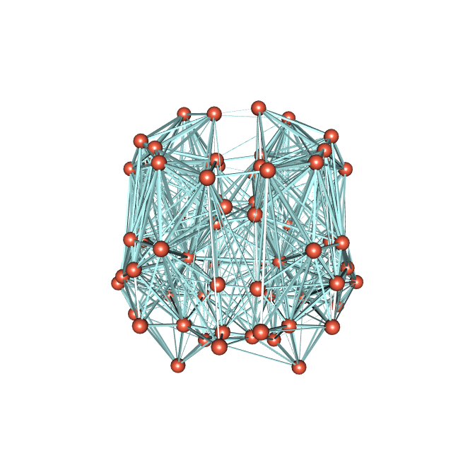

# 3D Graph Plotting
Greg Kiar  
April 20, 2016  

Let's say you have a graph that you want to visualize. This graph has several attributes, including locations of the nodes, and weights of the edges. Many common graph visualization tools do not allow you to provide coordinates for the nodes, and many others only plot in 2D. Thankfully, `igraph` in R exploits the `rgl` package and uses GL graphics to overcome this. Let's begin:

As mentioned, we need `igraph` for this, so let's load it.


```r
library(igraph)
```

Now let's load our graph and extract the attributes of interest, putting them into a format that we can use to plot them. This graph happens to be a connectome (map of the brain).


```r
g <- read.graph('./demo_graph.graphml', format='graphml')
centroids <- get.vertex.attribute(g, 'centroid')
print(centroids[1:5])
```

```
## [1] "[110, 101, 74]" "[138, 137, 81]" "[98, 72, 98]"   "[124, 81, 115]"
## [5] "[99, 94, 93]"
```

We notice that in this case, the centroids we would like to plot are stored as strings. The format igraph expects is an `Nx3` matrix, where `N` is the number of nodes in your graph. Therefore, we must do some string acrobatics to get the centroids into the format we want.


```r
layouts <- matrix(nrow = length(centroids), ncol = 3)
for (i in 1:length(centroids)) {
  temp <- na.omit(as.numeric(unlist(strsplit(unlist(centroids[i]), "[^0-9]+"))))
  layouts[i,] <- temp
}
print(layouts[1:5,])
```

```
##      [,1] [,2] [,3]
## [1,]  110  101   74
## [2,]  138  137   81
## [3,]   98   72   98
## [4,]  124   81  115
## [5,]   99   94   93
```

Great! Now we can assign this value to our layour, and plot our graph. We set several attributes here, including changing vertex color, size, and turning off labels. We also change the color of our edges, and set their width to be proportional to the edge weights in our graph.


```r
g$layout <- layouts

rglplot(g, layout = g$layout,
        vertex.label = NA, vertex.size = 12, vertex.color='tomato1',
        edge.width = log10(get.edge.attribute(g, 'weight')), edge.color='paleturquoise1')
```

<script src="CanvasMatrix.js" type="text/javascript"></script>
<canvas id="unnamed_chunk_4textureCanvas" style="display: none;" width="256" height="256">
<br>
Your browser does not support the HTML5 canvas element.</canvas>
<!-- ****** quads object 7 ****** -->
<script id="unnamed_chunk_4vshader7" type="x-shader/x-vertex">
attribute vec3 aPos;
attribute vec4 aCol;
uniform mat4 mvMatrix;
uniform mat4 prMatrix;
varying vec4 vCol;
varying vec4 vPosition;
attribute vec3 aNorm;
uniform mat4 normMatrix;
varying vec3 vNormal;
void main(void) {
vPosition = mvMatrix * vec4(aPos, 1.);
gl_Position = prMatrix * vPosition;
vCol = aCol;
vNormal = normalize((normMatrix * vec4(aNorm, 1.)).xyz);
}
</script>
<script id="unnamed_chunk_4fshader7" type="x-shader/x-fragment"> 
#ifdef GL_ES
precision highp float;
#endif
varying vec4 vCol; // carries alpha
varying vec4 vPosition;
varying vec3 vNormal;
void main(void) {
vec3 eye = normalize(-vPosition.xyz);
const vec3 emission = vec3(0., 0., 0.);
const vec3 ambient1 = vec3(0., 0., 0.);
const vec3 specular1 = vec3(1., 1., 1.);// light*material
const float shininess1 = 50.;
vec4 colDiff1 = vec4(vCol.rgb * vec3(1., 1., 1.), vCol.a);
const vec3 lightDir1 = vec3(0., 0., 1.);
vec3 halfVec1 = normalize(lightDir1 + eye);
vec4 lighteffect = vec4(emission, 0.);
vec3 n = normalize(vNormal);
n = -faceforward(n, n, eye);
vec3 col1 = ambient1;
float nDotL1 = dot(n, lightDir1);
col1 = col1 + max(nDotL1, 0.) * colDiff1.rgb;
col1 = col1 + pow(max(dot(halfVec1, n), 0.), shininess1) * specular1;
lighteffect = lighteffect + vec4(col1, colDiff1.a);
gl_FragColor = lighteffect;
}
</script> 
<!-- ****** quads object 8 ****** -->
<script id="unnamed_chunk_4vshader8" type="x-shader/x-vertex">
attribute vec3 aPos;
attribute vec4 aCol;
uniform mat4 mvMatrix;
uniform mat4 prMatrix;
varying vec4 vCol;
varying vec4 vPosition;
attribute vec3 aNorm;
uniform mat4 normMatrix;
varying vec3 vNormal;
void main(void) {
vPosition = mvMatrix * vec4(aPos, 1.);
gl_Position = prMatrix * vPosition;
vCol = aCol;
vNormal = normalize((normMatrix * vec4(aNorm, 1.)).xyz);
}
</script>
<script id="unnamed_chunk_4fshader8" type="x-shader/x-fragment"> 
#ifdef GL_ES
precision highp float;
#endif
varying vec4 vCol; // carries alpha
varying vec4 vPosition;
varying vec3 vNormal;
void main(void) {
vec3 eye = normalize(-vPosition.xyz);
const vec3 emission = vec3(0., 0., 0.);
const vec3 ambient1 = vec3(0., 0., 0.);
const vec3 specular1 = vec3(1., 1., 1.);// light*material
const float shininess1 = 50.;
vec4 colDiff1 = vec4(vCol.rgb * vec3(1., 1., 1.), vCol.a);
const vec3 lightDir1 = vec3(0., 0., 1.);
vec3 halfVec1 = normalize(lightDir1 + eye);
vec4 lighteffect = vec4(emission, 0.);
vec3 n = normalize(vNormal);
n = -faceforward(n, n, eye);
vec3 col1 = ambient1;
float nDotL1 = dot(n, lightDir1);
col1 = col1 + max(nDotL1, 0.) * colDiff1.rgb;
col1 = col1 + pow(max(dot(halfVec1, n), 0.), shininess1) * specular1;
lighteffect = lighteffect + vec4(col1, colDiff1.a);
gl_FragColor = lighteffect;
}
</script> 
<!-- ****** quads object 9 ****** -->
<script id="unnamed_chunk_4vshader9" type="x-shader/x-vertex">
attribute vec3 aPos;
attribute vec4 aCol;
uniform mat4 mvMatrix;
uniform mat4 prMatrix;
varying vec4 vCol;
varying vec4 vPosition;
attribute vec3 aNorm;
uniform mat4 normMatrix;
varying vec3 vNormal;
void main(void) {
vPosition = mvMatrix * vec4(aPos, 1.);
gl_Position = prMatrix * vPosition;
vCol = aCol;
vNormal = normalize((normMatrix * vec4(aNorm, 1.)).xyz);
}
</script>
<script id="unnamed_chunk_4fshader9" type="x-shader/x-fragment"> 
#ifdef GL_ES
precision highp float;
#endif
varying vec4 vCol; // carries alpha
varying vec4 vPosition;
varying vec3 vNormal;
void main(void) {
vec3 eye = normalize(-vPosition.xyz);
const vec3 emission = vec3(0., 0., 0.);
const vec3 ambient1 = vec3(0., 0., 0.);
const vec3 specular1 = vec3(1., 1., 1.);// light*material
const float shininess1 = 50.;
vec4 colDiff1 = vec4(vCol.rgb * vec3(1., 1., 1.), vCol.a);
const vec3 lightDir1 = vec3(0., 0., 1.);
vec3 halfVec1 = normalize(lightDir1 + eye);
vec4 lighteffect = vec4(emission, 0.);
vec3 n = normalize(vNormal);
n = -faceforward(n, n, eye);
vec3 col1 = ambient1;
float nDotL1 = dot(n, lightDir1);
col1 = col1 + max(nDotL1, 0.) * colDiff1.rgb;
col1 = col1 + pow(max(dot(halfVec1, n), 0.), shininess1) * specular1;
lighteffect = lighteffect + vec4(col1, colDiff1.a);
gl_FragColor = lighteffect;
}
</script> 
<!-- ****** quads object 10 ****** -->
<script id="unnamed_chunk_4vshader10" type="x-shader/x-vertex">
attribute vec3 aPos;
attribute vec4 aCol;
uniform mat4 mvMatrix;
uniform mat4 prMatrix;
varying vec4 vCol;
varying vec4 vPosition;
attribute vec3 aNorm;
uniform mat4 normMatrix;
varying vec3 vNormal;
void main(void) {
vPosition = mvMatrix * vec4(aPos, 1.);
gl_Position = prMatrix * vPosition;
vCol = aCol;
vNormal = normalize((normMatrix * vec4(aNorm, 1.)).xyz);
}
</script>
<script id="unnamed_chunk_4fshader10" type="x-shader/x-fragment"> 
#ifdef GL_ES
precision highp float;
#endif
varying vec4 vCol; // carries alpha
varying vec4 vPosition;
varying vec3 vNormal;
void main(void) {
vec3 eye = normalize(-vPosition.xyz);
const vec3 emission = vec3(0., 0., 0.);
const vec3 ambient1 = vec3(0., 0., 0.);
const vec3 specular1 = vec3(1., 1., 1.);// light*material
const float shininess1 = 50.;
vec4 colDiff1 = vec4(vCol.rgb * vec3(1., 1., 1.), vCol.a);
const vec3 lightDir1 = vec3(0., 0., 1.);
vec3 halfVec1 = normalize(lightDir1 + eye);
vec4 lighteffect = vec4(emission, 0.);
vec3 n = normalize(vNormal);
n = -faceforward(n, n, eye);
vec3 col1 = ambient1;
float nDotL1 = dot(n, lightDir1);
col1 = col1 + max(nDotL1, 0.) * colDiff1.rgb;
col1 = col1 + pow(max(dot(halfVec1, n), 0.), shininess1) * specular1;
lighteffect = lighteffect + vec4(col1, colDiff1.a);
gl_FragColor = lighteffect;
}
</script> 
<!-- ****** quads object 11 ****** -->
<script id="unnamed_chunk_4vshader11" type="x-shader/x-vertex">
attribute vec3 aPos;
attribute vec4 aCol;
uniform mat4 mvMatrix;
uniform mat4 prMatrix;
varying vec4 vCol;
varying vec4 vPosition;
attribute vec3 aNorm;
uniform mat4 normMatrix;
varying vec3 vNormal;
void main(void) {
vPosition = mvMatrix * vec4(aPos, 1.);
gl_Position = prMatrix * vPosition;
vCol = aCol;
vNormal = normalize((normMatrix * vec4(aNorm, 1.)).xyz);
}
</script>
<script id="unnamed_chunk_4fshader11" type="x-shader/x-fragment"> 
#ifdef GL_ES
precision highp float;
#endif
varying vec4 vCol; // carries alpha
varying vec4 vPosition;
varying vec3 vNormal;
void main(void) {
vec3 eye = normalize(-vPosition.xyz);
const vec3 emission = vec3(0., 0., 0.);
const vec3 ambient1 = vec3(0., 0., 0.);
const vec3 specular1 = vec3(1., 1., 1.);// light*material
const float shininess1 = 50.;
vec4 colDiff1 = vec4(vCol.rgb * vec3(1., 1., 1.), vCol.a);
const vec3 lightDir1 = vec3(0., 0., 1.);
vec3 halfVec1 = normalize(lightDir1 + eye);
vec4 lighteffect = vec4(emission, 0.);
vec3 n = normalize(vNormal);
n = -faceforward(n, n, eye);
vec3 col1 = ambient1;
float nDotL1 = dot(n, lightDir1);
col1 = col1 + max(nDotL1, 0.) * colDiff1.rgb;
col1 = col1 + pow(max(dot(halfVec1, n), 0.), shininess1) * specular1;
lighteffect = lighteffect + vec4(col1, colDiff1.a);
gl_FragColor = lighteffect;
}
</script> 
<!-- ****** quads object 12 ****** -->
<script id="unnamed_chunk_4vshader12" type="x-shader/x-vertex">
attribute vec3 aPos;
attribute vec4 aCol;
uniform mat4 mvMatrix;
uniform mat4 prMatrix;
varying vec4 vCol;
varying vec4 vPosition;
attribute vec3 aNorm;
uniform mat4 normMatrix;
varying vec3 vNormal;
void main(void) {
vPosition = mvMatrix * vec4(aPos, 1.);
gl_Position = prMatrix * vPosition;
vCol = aCol;
vNormal = normalize((normMatrix * vec4(aNorm, 1.)).xyz);
}
</script>
<script id="unnamed_chunk_4fshader12" type="x-shader/x-fragment"> 
#ifdef GL_ES
precision highp float;
#endif
varying vec4 vCol; // carries alpha
varying vec4 vPosition;
varying vec3 vNormal;
void main(void) {
vec3 eye = normalize(-vPosition.xyz);
const vec3 emission = vec3(0., 0., 0.);
const vec3 ambient1 = vec3(0., 0., 0.);
const vec3 specular1 = vec3(1., 1., 1.);// light*material
const float shininess1 = 50.;
vec4 colDiff1 = vec4(vCol.rgb * vec3(1., 1., 1.), vCol.a);
const vec3 lightDir1 = vec3(0., 0., 1.);
vec3 halfVec1 = normalize(lightDir1 + eye);
vec4 lighteffect = vec4(emission, 0.);
vec3 n = normalize(vNormal);
n = -faceforward(n, n, eye);
vec3 col1 = ambient1;
float nDotL1 = dot(n, lightDir1);
col1 = col1 + max(nDotL1, 0.) * colDiff1.rgb;
col1 = col1 + pow(max(dot(halfVec1, n), 0.), shininess1) * specular1;
lighteffect = lighteffect + vec4(col1, colDiff1.a);
gl_FragColor = lighteffect;
}
</script> 
<!-- ****** quads object 13 ****** -->
<script id="unnamed_chunk_4vshader13" type="x-shader/x-vertex">
attribute vec3 aPos;
attribute vec4 aCol;
uniform mat4 mvMatrix;
uniform mat4 prMatrix;
varying vec4 vCol;
varying vec4 vPosition;
attribute vec3 aNorm;
uniform mat4 normMatrix;
varying vec3 vNormal;
void main(void) {
vPosition = mvMatrix * vec4(aPos, 1.);
gl_Position = prMatrix * vPosition;
vCol = aCol;
vNormal = normalize((normMatrix * vec4(aNorm, 1.)).xyz);
}
</script>
<script id="unnamed_chunk_4fshader13" type="x-shader/x-fragment"> 
#ifdef GL_ES
precision highp float;
#endif
varying vec4 vCol; // carries alpha
varying vec4 vPosition;
varying vec3 vNormal;
void main(void) {
vec3 eye = normalize(-vPosition.xyz);
const vec3 emission = vec3(0., 0., 0.);
const vec3 ambient1 = vec3(0., 0., 0.);
const vec3 specular1 = vec3(1., 1., 1.);// light*material
const float shininess1 = 50.;
vec4 colDiff1 = vec4(vCol.rgb * vec3(1., 1., 1.), vCol.a);
const vec3 lightDir1 = vec3(0., 0., 1.);
vec3 halfVec1 = normalize(lightDir1 + eye);
vec4 lighteffect = vec4(emission, 0.);
vec3 n = normalize(vNormal);
n = -faceforward(n, n, eye);
vec3 col1 = ambient1;
float nDotL1 = dot(n, lightDir1);
col1 = col1 + max(nDotL1, 0.) * colDiff1.rgb;
col1 = col1 + pow(max(dot(halfVec1, n), 0.), shininess1) * specular1;
lighteffect = lighteffect + vec4(col1, colDiff1.a);
gl_FragColor = lighteffect;
}
</script> 
<!-- ****** quads object 14 ****** -->
<script id="unnamed_chunk_4vshader14" type="x-shader/x-vertex">
attribute vec3 aPos;
attribute vec4 aCol;
uniform mat4 mvMatrix;
uniform mat4 prMatrix;
varying vec4 vCol;
varying vec4 vPosition;
attribute vec3 aNorm;
uniform mat4 normMatrix;
varying vec3 vNormal;
void main(void) {
vPosition = mvMatrix * vec4(aPos, 1.);
gl_Position = prMatrix * vPosition;
vCol = aCol;
vNormal = normalize((normMatrix * vec4(aNorm, 1.)).xyz);
}
</script>
<script id="unnamed_chunk_4fshader14" type="x-shader/x-fragment"> 
#ifdef GL_ES
precision highp float;
#endif
varying vec4 vCol; // carries alpha
varying vec4 vPosition;
varying vec3 vNormal;
void main(void) {
vec3 eye = normalize(-vPosition.xyz);
const vec3 emission = vec3(0., 0., 0.);
const vec3 ambient1 = vec3(0., 0., 0.);
const vec3 specular1 = vec3(1., 1., 1.);// light*material
const float shininess1 = 50.;
vec4 colDiff1 = vec4(vCol.rgb * vec3(1., 1., 1.), vCol.a);
const vec3 lightDir1 = vec3(0., 0., 1.);
vec3 halfVec1 = normalize(lightDir1 + eye);
vec4 lighteffect = vec4(emission, 0.);
vec3 n = normalize(vNormal);
n = -faceforward(n, n, eye);
vec3 col1 = ambient1;
float nDotL1 = dot(n, lightDir1);
col1 = col1 + max(nDotL1, 0.) * colDiff1.rgb;
col1 = col1 + pow(max(dot(halfVec1, n), 0.), shininess1) * specular1;
lighteffect = lighteffect + vec4(col1, colDiff1.a);
gl_FragColor = lighteffect;
}
</script> 
<!-- ****** quads object 15 ****** -->
<script id="unnamed_chunk_4vshader15" type="x-shader/x-vertex">
attribute vec3 aPos;
attribute vec4 aCol;
uniform mat4 mvMatrix;
uniform mat4 prMatrix;
varying vec4 vCol;
varying vec4 vPosition;
attribute vec3 aNorm;
uniform mat4 normMatrix;
varying vec3 vNormal;
void main(void) {
vPosition = mvMatrix * vec4(aPos, 1.);
gl_Position = prMatrix * vPosition;
vCol = aCol;
vNormal = normalize((normMatrix * vec4(aNorm, 1.)).xyz);
}
</script>
<script id="unnamed_chunk_4fshader15" type="x-shader/x-fragment"> 
#ifdef GL_ES
precision highp float;
#endif
varying vec4 vCol; // carries alpha
varying vec4 vPosition;
varying vec3 vNormal;
void main(void) {
vec3 eye = normalize(-vPosition.xyz);
const vec3 emission = vec3(0., 0., 0.);
const vec3 ambient1 = vec3(0., 0., 0.);
const vec3 specular1 = vec3(1., 1., 1.);// light*material
const float shininess1 = 50.;
vec4 colDiff1 = vec4(vCol.rgb * vec3(1., 1., 1.), vCol.a);
const vec3 lightDir1 = vec3(0., 0., 1.);
vec3 halfVec1 = normalize(lightDir1 + eye);
vec4 lighteffect = vec4(emission, 0.);
vec3 n = normalize(vNormal);
n = -faceforward(n, n, eye);
vec3 col1 = ambient1;
float nDotL1 = dot(n, lightDir1);
col1 = col1 + max(nDotL1, 0.) * colDiff1.rgb;
col1 = col1 + pow(max(dot(halfVec1, n), 0.), shininess1) * specular1;
lighteffect = lighteffect + vec4(col1, colDiff1.a);
gl_FragColor = lighteffect;
}
</script> 
<!-- ****** quads object 16 ****** -->
<script id="unnamed_chunk_4vshader16" type="x-shader/x-vertex">
attribute vec3 aPos;
attribute vec4 aCol;
uniform mat4 mvMatrix;
uniform mat4 prMatrix;
varying vec4 vCol;
varying vec4 vPosition;
attribute vec3 aNorm;
uniform mat4 normMatrix;
varying vec3 vNormal;
void main(void) {
vPosition = mvMatrix * vec4(aPos, 1.);
gl_Position = prMatrix * vPosition;
vCol = aCol;
vNormal = normalize((normMatrix * vec4(aNorm, 1.)).xyz);
}
</script>
<script id="unnamed_chunk_4fshader16" type="x-shader/x-fragment"> 
#ifdef GL_ES
precision highp float;
#endif
varying vec4 vCol; // carries alpha
varying vec4 vPosition;
varying vec3 vNormal;
void main(void) {
vec3 eye = normalize(-vPosition.xyz);
const vec3 emission = vec3(0., 0., 0.);
const vec3 ambient1 = vec3(0., 0., 0.);
const vec3 specular1 = vec3(1., 1., 1.);// light*material
const float shininess1 = 50.;
vec4 colDiff1 = vec4(vCol.rgb * vec3(1., 1., 1.), vCol.a);
const vec3 lightDir1 = vec3(0., 0., 1.);
vec3 halfVec1 = normalize(lightDir1 + eye);
vec4 lighteffect = vec4(emission, 0.);
vec3 n = normalize(vNormal);
n = -faceforward(n, n, eye);
vec3 col1 = ambient1;
float nDotL1 = dot(n, lightDir1);
col1 = col1 + max(nDotL1, 0.) * colDiff1.rgb;
col1 = col1 + pow(max(dot(halfVec1, n), 0.), shininess1) * specular1;
lighteffect = lighteffect + vec4(col1, colDiff1.a);
gl_FragColor = lighteffect;
}
</script> 
<!-- ****** quads object 17 ****** -->
<script id="unnamed_chunk_4vshader17" type="x-shader/x-vertex">
attribute vec3 aPos;
attribute vec4 aCol;
uniform mat4 mvMatrix;
uniform mat4 prMatrix;
varying vec4 vCol;
varying vec4 vPosition;
attribute vec3 aNorm;
uniform mat4 normMatrix;
varying vec3 vNormal;
void main(void) {
vPosition = mvMatrix * vec4(aPos, 1.);
gl_Position = prMatrix * vPosition;
vCol = aCol;
vNormal = normalize((normMatrix * vec4(aNorm, 1.)).xyz);
}
</script>
<script id="unnamed_chunk_4fshader17" type="x-shader/x-fragment"> 
#ifdef GL_ES
precision highp float;
#endif
varying vec4 vCol; // carries alpha
varying vec4 vPosition;
varying vec3 vNormal;
void main(void) {
vec3 eye = normalize(-vPosition.xyz);
const vec3 emission = vec3(0., 0., 0.);
const vec3 ambient1 = vec3(0., 0., 0.);
const vec3 specular1 = vec3(1., 1., 1.);// light*material
const float shininess1 = 50.;
vec4 colDiff1 = vec4(vCol.rgb * vec3(1., 1., 1.), vCol.a);
const vec3 lightDir1 = vec3(0., 0., 1.);
vec3 halfVec1 = normalize(lightDir1 + eye);
vec4 lighteffect = vec4(emission, 0.);
vec3 n = normalize(vNormal);
n = -faceforward(n, n, eye);
vec3 col1 = ambient1;
float nDotL1 = dot(n, lightDir1);
col1 = col1 + max(nDotL1, 0.) * colDiff1.rgb;
col1 = col1 + pow(max(dot(halfVec1, n), 0.), shininess1) * specular1;
lighteffect = lighteffect + vec4(col1, colDiff1.a);
gl_FragColor = lighteffect;
}
</script> 
<!-- ****** quads object 18 ****** -->
<script id="unnamed_chunk_4vshader18" type="x-shader/x-vertex">
attribute vec3 aPos;
attribute vec4 aCol;
uniform mat4 mvMatrix;
uniform mat4 prMatrix;
varying vec4 vCol;
varying vec4 vPosition;
attribute vec3 aNorm;
uniform mat4 normMatrix;
varying vec3 vNormal;
void main(void) {
vPosition = mvMatrix * vec4(aPos, 1.);
gl_Position = prMatrix * vPosition;
vCol = aCol;
vNormal = normalize((normMatrix * vec4(aNorm, 1.)).xyz);
}
</script>
<script id="unnamed_chunk_4fshader18" type="x-shader/x-fragment"> 
#ifdef GL_ES
precision highp float;
#endif
varying vec4 vCol; // carries alpha
varying vec4 vPosition;
varying vec3 vNormal;
void main(void) {
vec3 eye = normalize(-vPosition.xyz);
const vec3 emission = vec3(0., 0., 0.);
const vec3 ambient1 = vec3(0., 0., 0.);
const vec3 specular1 = vec3(1., 1., 1.);// light*material
const float shininess1 = 50.;
vec4 colDiff1 = vec4(vCol.rgb * vec3(1., 1., 1.), vCol.a);
const vec3 lightDir1 = vec3(0., 0., 1.);
vec3 halfVec1 = normalize(lightDir1 + eye);
vec4 lighteffect = vec4(emission, 0.);
vec3 n = normalize(vNormal);
n = -faceforward(n, n, eye);
vec3 col1 = ambient1;
float nDotL1 = dot(n, lightDir1);
col1 = col1 + max(nDotL1, 0.) * colDiff1.rgb;
col1 = col1 + pow(max(dot(halfVec1, n), 0.), shininess1) * specular1;
lighteffect = lighteffect + vec4(col1, colDiff1.a);
gl_FragColor = lighteffect;
}
</script> 
<!-- ****** quads object 19 ****** -->
<script id="unnamed_chunk_4vshader19" type="x-shader/x-vertex">
attribute vec3 aPos;
attribute vec4 aCol;
uniform mat4 mvMatrix;
uniform mat4 prMatrix;
varying vec4 vCol;
varying vec4 vPosition;
attribute vec3 aNorm;
uniform mat4 normMatrix;
varying vec3 vNormal;
void main(void) {
vPosition = mvMatrix * vec4(aPos, 1.);
gl_Position = prMatrix * vPosition;
vCol = aCol;
vNormal = normalize((normMatrix * vec4(aNorm, 1.)).xyz);
}
</script>
<script id="unnamed_chunk_4fshader19" type="x-shader/x-fragment"> 
#ifdef GL_ES
precision highp float;
#endif
varying vec4 vCol; // carries alpha
varying vec4 vPosition;
varying vec3 vNormal;
void main(void) {
vec3 eye = normalize(-vPosition.xyz);
const vec3 emission = vec3(0., 0., 0.);
const vec3 ambient1 = vec3(0., 0., 0.);
const vec3 specular1 = vec3(1., 1., 1.);// light*material
const float shininess1 = 50.;
vec4 colDiff1 = vec4(vCol.rgb * vec3(1., 1., 1.), vCol.a);
const vec3 lightDir1 = vec3(0., 0., 1.);
vec3 halfVec1 = normalize(lightDir1 + eye);
vec4 lighteffect = vec4(emission, 0.);
vec3 n = normalize(vNormal);
n = -faceforward(n, n, eye);
vec3 col1 = ambient1;
float nDotL1 = dot(n, lightDir1);
col1 = col1 + max(nDotL1, 0.) * colDiff1.rgb;
col1 = col1 + pow(max(dot(halfVec1, n), 0.), shininess1) * specular1;
lighteffect = lighteffect + vec4(col1, colDiff1.a);
gl_FragColor = lighteffect;
}
</script> 
<!-- ****** quads object 20 ****** -->
<script id="unnamed_chunk_4vshader20" type="x-shader/x-vertex">
attribute vec3 aPos;
attribute vec4 aCol;
uniform mat4 mvMatrix;
uniform mat4 prMatrix;
varying vec4 vCol;
varying vec4 vPosition;
attribute vec3 aNorm;
uniform mat4 normMatrix;
varying vec3 vNormal;
void main(void) {
vPosition = mvMatrix * vec4(aPos, 1.);
gl_Position = prMatrix * vPosition;
vCol = aCol;
vNormal = normalize((normMatrix * vec4(aNorm, 1.)).xyz);
}
</script>
<script id="unnamed_chunk_4fshader20" type="x-shader/x-fragment"> 
#ifdef GL_ES
precision highp float;
#endif
varying vec4 vCol; // carries alpha
varying vec4 vPosition;
varying vec3 vNormal;
void main(void) {
vec3 eye = normalize(-vPosition.xyz);
const vec3 emission = vec3(0., 0., 0.);
const vec3 ambient1 = vec3(0., 0., 0.);
const vec3 specular1 = vec3(1., 1., 1.);// light*material
const float shininess1 = 50.;
vec4 colDiff1 = vec4(vCol.rgb * vec3(1., 1., 1.), vCol.a);
const vec3 lightDir1 = vec3(0., 0., 1.);
vec3 halfVec1 = normalize(lightDir1 + eye);
vec4 lighteffect = vec4(emission, 0.);
vec3 n = normalize(vNormal);
n = -faceforward(n, n, eye);
vec3 col1 = ambient1;
float nDotL1 = dot(n, lightDir1);
col1 = col1 + max(nDotL1, 0.) * colDiff1.rgb;
col1 = col1 + pow(max(dot(halfVec1, n), 0.), shininess1) * specular1;
lighteffect = lighteffect + vec4(col1, colDiff1.a);
gl_FragColor = lighteffect;
}
</script> 
<!-- ****** quads object 21 ****** -->
<script id="unnamed_chunk_4vshader21" type="x-shader/x-vertex">
attribute vec3 aPos;
attribute vec4 aCol;
uniform mat4 mvMatrix;
uniform mat4 prMatrix;
varying vec4 vCol;
varying vec4 vPosition;
attribute vec3 aNorm;
uniform mat4 normMatrix;
varying vec3 vNormal;
void main(void) {
vPosition = mvMatrix * vec4(aPos, 1.);
gl_Position = prMatrix * vPosition;
vCol = aCol;
vNormal = normalize((normMatrix * vec4(aNorm, 1.)).xyz);
}
</script>
<script id="unnamed_chunk_4fshader21" type="x-shader/x-fragment"> 
#ifdef GL_ES
precision highp float;
#endif
varying vec4 vCol; // carries alpha
varying vec4 vPosition;
varying vec3 vNormal;
void main(void) {
vec3 eye = normalize(-vPosition.xyz);
const vec3 emission = vec3(0., 0., 0.);
const vec3 ambient1 = vec3(0., 0., 0.);
const vec3 specular1 = vec3(1., 1., 1.);// light*material
const float shininess1 = 50.;
vec4 colDiff1 = vec4(vCol.rgb * vec3(1., 1., 1.), vCol.a);
const vec3 lightDir1 = vec3(0., 0., 1.);
vec3 halfVec1 = normalize(lightDir1 + eye);
vec4 lighteffect = vec4(emission, 0.);
vec3 n = normalize(vNormal);
n = -faceforward(n, n, eye);
vec3 col1 = ambient1;
float nDotL1 = dot(n, lightDir1);
col1 = col1 + max(nDotL1, 0.) * colDiff1.rgb;
col1 = col1 + pow(max(dot(halfVec1, n), 0.), shininess1) * specular1;
lighteffect = lighteffect + vec4(col1, colDiff1.a);
gl_FragColor = lighteffect;
}
</script> 
<!-- ****** quads object 22 ****** -->
<script id="unnamed_chunk_4vshader22" type="x-shader/x-vertex">
attribute vec3 aPos;
attribute vec4 aCol;
uniform mat4 mvMatrix;
uniform mat4 prMatrix;
varying vec4 vCol;
varying vec4 vPosition;
attribute vec3 aNorm;
uniform mat4 normMatrix;
varying vec3 vNormal;
void main(void) {
vPosition = mvMatrix * vec4(aPos, 1.);
gl_Position = prMatrix * vPosition;
vCol = aCol;
vNormal = normalize((normMatrix * vec4(aNorm, 1.)).xyz);
}
</script>
<script id="unnamed_chunk_4fshader22" type="x-shader/x-fragment"> 
#ifdef GL_ES
precision highp float;
#endif
varying vec4 vCol; // carries alpha
varying vec4 vPosition;
varying vec3 vNormal;
void main(void) {
vec3 eye = normalize(-vPosition.xyz);
const vec3 emission = vec3(0., 0., 0.);
const vec3 ambient1 = vec3(0., 0., 0.);
const vec3 specular1 = vec3(1., 1., 1.);// light*material
const float shininess1 = 50.;
vec4 colDiff1 = vec4(vCol.rgb * vec3(1., 1., 1.), vCol.a);
const vec3 lightDir1 = vec3(0., 0., 1.);
vec3 halfVec1 = normalize(lightDir1 + eye);
vec4 lighteffect = vec4(emission, 0.);
vec3 n = normalize(vNormal);
n = -faceforward(n, n, eye);
vec3 col1 = ambient1;
float nDotL1 = dot(n, lightDir1);
col1 = col1 + max(nDotL1, 0.) * colDiff1.rgb;
col1 = col1 + pow(max(dot(halfVec1, n), 0.), shininess1) * specular1;
lighteffect = lighteffect + vec4(col1, colDiff1.a);
gl_FragColor = lighteffect;
}
</script> 
<!-- ****** quads object 23 ****** -->
<script id="unnamed_chunk_4vshader23" type="x-shader/x-vertex">
attribute vec3 aPos;
attribute vec4 aCol;
uniform mat4 mvMatrix;
uniform mat4 prMatrix;
varying vec4 vCol;
varying vec4 vPosition;
attribute vec3 aNorm;
uniform mat4 normMatrix;
varying vec3 vNormal;
void main(void) {
vPosition = mvMatrix * vec4(aPos, 1.);
gl_Position = prMatrix * vPosition;
vCol = aCol;
vNormal = normalize((normMatrix * vec4(aNorm, 1.)).xyz);
}
</script>
<script id="unnamed_chunk_4fshader23" type="x-shader/x-fragment"> 
#ifdef GL_ES
precision highp float;
#endif
varying vec4 vCol; // carries alpha
varying vec4 vPosition;
varying vec3 vNormal;
void main(void) {
vec3 eye = normalize(-vPosition.xyz);
const vec3 emission = vec3(0., 0., 0.);
const vec3 ambient1 = vec3(0., 0., 0.);
const vec3 specular1 = vec3(1., 1., 1.);// light*material
const float shininess1 = 50.;
vec4 colDiff1 = vec4(vCol.rgb * vec3(1., 1., 1.), vCol.a);
const vec3 lightDir1 = vec3(0., 0., 1.);
vec3 halfVec1 = normalize(lightDir1 + eye);
vec4 lighteffect = vec4(emission, 0.);
vec3 n = normalize(vNormal);
n = -faceforward(n, n, eye);
vec3 col1 = ambient1;
float nDotL1 = dot(n, lightDir1);
col1 = col1 + max(nDotL1, 0.) * colDiff1.rgb;
col1 = col1 + pow(max(dot(halfVec1, n), 0.), shininess1) * specular1;
lighteffect = lighteffect + vec4(col1, colDiff1.a);
gl_FragColor = lighteffect;
}
</script> 
<!-- ****** quads object 24 ****** -->
<script id="unnamed_chunk_4vshader24" type="x-shader/x-vertex">
attribute vec3 aPos;
attribute vec4 aCol;
uniform mat4 mvMatrix;
uniform mat4 prMatrix;
varying vec4 vCol;
varying vec4 vPosition;
attribute vec3 aNorm;
uniform mat4 normMatrix;
varying vec3 vNormal;
void main(void) {
vPosition = mvMatrix * vec4(aPos, 1.);
gl_Position = prMatrix * vPosition;
vCol = aCol;
vNormal = normalize((normMatrix * vec4(aNorm, 1.)).xyz);
}
</script>
<script id="unnamed_chunk_4fshader24" type="x-shader/x-fragment"> 
#ifdef GL_ES
precision highp float;
#endif
varying vec4 vCol; // carries alpha
varying vec4 vPosition;
varying vec3 vNormal;
void main(void) {
vec3 eye = normalize(-vPosition.xyz);
const vec3 emission = vec3(0., 0., 0.);
const vec3 ambient1 = vec3(0., 0., 0.);
const vec3 specular1 = vec3(1., 1., 1.);// light*material
const float shininess1 = 50.;
vec4 colDiff1 = vec4(vCol.rgb * vec3(1., 1., 1.), vCol.a);
const vec3 lightDir1 = vec3(0., 0., 1.);
vec3 halfVec1 = normalize(lightDir1 + eye);
vec4 lighteffect = vec4(emission, 0.);
vec3 n = normalize(vNormal);
n = -faceforward(n, n, eye);
vec3 col1 = ambient1;
float nDotL1 = dot(n, lightDir1);
col1 = col1 + max(nDotL1, 0.) * colDiff1.rgb;
col1 = col1 + pow(max(dot(halfVec1, n), 0.), shininess1) * specular1;
lighteffect = lighteffect + vec4(col1, colDiff1.a);
gl_FragColor = lighteffect;
}
</script> 
<!-- ****** quads object 25 ****** -->
<script id="unnamed_chunk_4vshader25" type="x-shader/x-vertex">
attribute vec3 aPos;
attribute vec4 aCol;
uniform mat4 mvMatrix;
uniform mat4 prMatrix;
varying vec4 vCol;
varying vec4 vPosition;
attribute vec3 aNorm;
uniform mat4 normMatrix;
varying vec3 vNormal;
void main(void) {
vPosition = mvMatrix * vec4(aPos, 1.);
gl_Position = prMatrix * vPosition;
vCol = aCol;
vNormal = normalize((normMatrix * vec4(aNorm, 1.)).xyz);
}
</script>
<script id="unnamed_chunk_4fshader25" type="x-shader/x-fragment"> 
#ifdef GL_ES
precision highp float;
#endif
varying vec4 vCol; // carries alpha
varying vec4 vPosition;
varying vec3 vNormal;
void main(void) {
vec3 eye = normalize(-vPosition.xyz);
const vec3 emission = vec3(0., 0., 0.);
const vec3 ambient1 = vec3(0., 0., 0.);
const vec3 specular1 = vec3(1., 1., 1.);// light*material
const float shininess1 = 50.;
vec4 colDiff1 = vec4(vCol.rgb * vec3(1., 1., 1.), vCol.a);
const vec3 lightDir1 = vec3(0., 0., 1.);
vec3 halfVec1 = normalize(lightDir1 + eye);
vec4 lighteffect = vec4(emission, 0.);
vec3 n = normalize(vNormal);
n = -faceforward(n, n, eye);
vec3 col1 = ambient1;
float nDotL1 = dot(n, lightDir1);
col1 = col1 + max(nDotL1, 0.) * colDiff1.rgb;
col1 = col1 + pow(max(dot(halfVec1, n), 0.), shininess1) * specular1;
lighteffect = lighteffect + vec4(col1, colDiff1.a);
gl_FragColor = lighteffect;
}
</script> 
<!-- ****** quads object 26 ****** -->
<script id="unnamed_chunk_4vshader26" type="x-shader/x-vertex">
attribute vec3 aPos;
attribute vec4 aCol;
uniform mat4 mvMatrix;
uniform mat4 prMatrix;
varying vec4 vCol;
varying vec4 vPosition;
attribute vec3 aNorm;
uniform mat4 normMatrix;
varying vec3 vNormal;
void main(void) {
vPosition = mvMatrix * vec4(aPos, 1.);
gl_Position = prMatrix * vPosition;
vCol = aCol;
vNormal = normalize((normMatrix * vec4(aNorm, 1.)).xyz);
}
</script>
<script id="unnamed_chunk_4fshader26" type="x-shader/x-fragment"> 
#ifdef GL_ES
precision highp float;
#endif
varying vec4 vCol; // carries alpha
varying vec4 vPosition;
varying vec3 vNormal;
void main(void) {
vec3 eye = normalize(-vPosition.xyz);
const vec3 emission = vec3(0., 0., 0.);
const vec3 ambient1 = vec3(0., 0., 0.);
const vec3 specular1 = vec3(1., 1., 1.);// light*material
const float shininess1 = 50.;
vec4 colDiff1 = vec4(vCol.rgb * vec3(1., 1., 1.), vCol.a);
const vec3 lightDir1 = vec3(0., 0., 1.);
vec3 halfVec1 = normalize(lightDir1 + eye);
vec4 lighteffect = vec4(emission, 0.);
vec3 n = normalize(vNormal);
n = -faceforward(n, n, eye);
vec3 col1 = ambient1;
float nDotL1 = dot(n, lightDir1);
col1 = col1 + max(nDotL1, 0.) * colDiff1.rgb;
col1 = col1 + pow(max(dot(halfVec1, n), 0.), shininess1) * specular1;
lighteffect = lighteffect + vec4(col1, colDiff1.a);
gl_FragColor = lighteffect;
}
</script> 
<!-- ****** quads object 27 ****** -->
<script id="unnamed_chunk_4vshader27" type="x-shader/x-vertex">
attribute vec3 aPos;
attribute vec4 aCol;
uniform mat4 mvMatrix;
uniform mat4 prMatrix;
varying vec4 vCol;
varying vec4 vPosition;
attribute vec3 aNorm;
uniform mat4 normMatrix;
varying vec3 vNormal;
void main(void) {
vPosition = mvMatrix * vec4(aPos, 1.);
gl_Position = prMatrix * vPosition;
vCol = aCol;
vNormal = normalize((normMatrix * vec4(aNorm, 1.)).xyz);
}
</script>
<script id="unnamed_chunk_4fshader27" type="x-shader/x-fragment"> 
#ifdef GL_ES
precision highp float;
#endif
varying vec4 vCol; // carries alpha
varying vec4 vPosition;
varying vec3 vNormal;
void main(void) {
vec3 eye = normalize(-vPosition.xyz);
const vec3 emission = vec3(0., 0., 0.);
const vec3 ambient1 = vec3(0., 0., 0.);
const vec3 specular1 = vec3(1., 1., 1.);// light*material
const float shininess1 = 50.;
vec4 colDiff1 = vec4(vCol.rgb * vec3(1., 1., 1.), vCol.a);
const vec3 lightDir1 = vec3(0., 0., 1.);
vec3 halfVec1 = normalize(lightDir1 + eye);
vec4 lighteffect = vec4(emission, 0.);
vec3 n = normalize(vNormal);
n = -faceforward(n, n, eye);
vec3 col1 = ambient1;
float nDotL1 = dot(n, lightDir1);
col1 = col1 + max(nDotL1, 0.) * colDiff1.rgb;
col1 = col1 + pow(max(dot(halfVec1, n), 0.), shininess1) * specular1;
lighteffect = lighteffect + vec4(col1, colDiff1.a);
gl_FragColor = lighteffect;
}
</script> 
<!-- ****** quads object 28 ****** -->
<script id="unnamed_chunk_4vshader28" type="x-shader/x-vertex">
attribute vec3 aPos;
attribute vec4 aCol;
uniform mat4 mvMatrix;
uniform mat4 prMatrix;
varying vec4 vCol;
varying vec4 vPosition;
attribute vec3 aNorm;
uniform mat4 normMatrix;
varying vec3 vNormal;
void main(void) {
vPosition = mvMatrix * vec4(aPos, 1.);
gl_Position = prMatrix * vPosition;
vCol = aCol;
vNormal = normalize((normMatrix * vec4(aNorm, 1.)).xyz);
}
</script>
<script id="unnamed_chunk_4fshader28" type="x-shader/x-fragment"> 
#ifdef GL_ES
precision highp float;
#endif
varying vec4 vCol; // carries alpha
varying vec4 vPosition;
varying vec3 vNormal;
void main(void) {
vec3 eye = normalize(-vPosition.xyz);
const vec3 emission = vec3(0., 0., 0.);
const vec3 ambient1 = vec3(0., 0., 0.);
const vec3 specular1 = vec3(1., 1., 1.);// light*material
const float shininess1 = 50.;
vec4 colDiff1 = vec4(vCol.rgb * vec3(1., 1., 1.), vCol.a);
const vec3 lightDir1 = vec3(0., 0., 1.);
vec3 halfVec1 = normalize(lightDir1 + eye);
vec4 lighteffect = vec4(emission, 0.);
vec3 n = normalize(vNormal);
n = -faceforward(n, n, eye);
vec3 col1 = ambient1;
float nDotL1 = dot(n, lightDir1);
col1 = col1 + max(nDotL1, 0.) * colDiff1.rgb;
col1 = col1 + pow(max(dot(halfVec1, n), 0.), shininess1) * specular1;
lighteffect = lighteffect + vec4(col1, colDiff1.a);
gl_FragColor = lighteffect;
}
</script> 
<!-- ****** quads object 29 ****** -->
<script id="unnamed_chunk_4vshader29" type="x-shader/x-vertex">
attribute vec3 aPos;
attribute vec4 aCol;
uniform mat4 mvMatrix;
uniform mat4 prMatrix;
varying vec4 vCol;
varying vec4 vPosition;
attribute vec3 aNorm;
uniform mat4 normMatrix;
varying vec3 vNormal;
void main(void) {
vPosition = mvMatrix * vec4(aPos, 1.);
gl_Position = prMatrix * vPosition;
vCol = aCol;
vNormal = normalize((normMatrix * vec4(aNorm, 1.)).xyz);
}
</script>
<script id="unnamed_chunk_4fshader29" type="x-shader/x-fragment"> 
#ifdef GL_ES
precision highp float;
#endif
varying vec4 vCol; // carries alpha
varying vec4 vPosition;
varying vec3 vNormal;
void main(void) {
vec3 eye = normalize(-vPosition.xyz);
const vec3 emission = vec3(0., 0., 0.);
const vec3 ambient1 = vec3(0., 0., 0.);
const vec3 specular1 = vec3(1., 1., 1.);// light*material
const float shininess1 = 50.;
vec4 colDiff1 = vec4(vCol.rgb * vec3(1., 1., 1.), vCol.a);
const vec3 lightDir1 = vec3(0., 0., 1.);
vec3 halfVec1 = normalize(lightDir1 + eye);
vec4 lighteffect = vec4(emission, 0.);
vec3 n = normalize(vNormal);
n = -faceforward(n, n, eye);
vec3 col1 = ambient1;
float nDotL1 = dot(n, lightDir1);
col1 = col1 + max(nDotL1, 0.) * colDiff1.rgb;
col1 = col1 + pow(max(dot(halfVec1, n), 0.), shininess1) * specular1;
lighteffect = lighteffect + vec4(col1, colDiff1.a);
gl_FragColor = lighteffect;
}
</script> 
<!-- ****** quads object 30 ****** -->
<script id="unnamed_chunk_4vshader30" type="x-shader/x-vertex">
attribute vec3 aPos;
attribute vec4 aCol;
uniform mat4 mvMatrix;
uniform mat4 prMatrix;
varying vec4 vCol;
varying vec4 vPosition;
attribute vec3 aNorm;
uniform mat4 normMatrix;
varying vec3 vNormal;
void main(void) {
vPosition = mvMatrix * vec4(aPos, 1.);
gl_Position = prMatrix * vPosition;
vCol = aCol;
vNormal = normalize((normMatrix * vec4(aNorm, 1.)).xyz);
}
</script>
<script id="unnamed_chunk_4fshader30" type="x-shader/x-fragment"> 
#ifdef GL_ES
precision highp float;
#endif
varying vec4 vCol; // carries alpha
varying vec4 vPosition;
varying vec3 vNormal;
void main(void) {
vec3 eye = normalize(-vPosition.xyz);
const vec3 emission = vec3(0., 0., 0.);
const vec3 ambient1 = vec3(0., 0., 0.);
const vec3 specular1 = vec3(1., 1., 1.);// light*material
const float shininess1 = 50.;
vec4 colDiff1 = vec4(vCol.rgb * vec3(1., 1., 1.), vCol.a);
const vec3 lightDir1 = vec3(0., 0., 1.);
vec3 halfVec1 = normalize(lightDir1 + eye);
vec4 lighteffect = vec4(emission, 0.);
vec3 n = normalize(vNormal);
n = -faceforward(n, n, eye);
vec3 col1 = ambient1;
float nDotL1 = dot(n, lightDir1);
col1 = col1 + max(nDotL1, 0.) * colDiff1.rgb;
col1 = col1 + pow(max(dot(halfVec1, n), 0.), shininess1) * specular1;
lighteffect = lighteffect + vec4(col1, colDiff1.a);
gl_FragColor = lighteffect;
}
</script> 
<!-- ****** quads object 31 ****** -->
<script id="unnamed_chunk_4vshader31" type="x-shader/x-vertex">
attribute vec3 aPos;
attribute vec4 aCol;
uniform mat4 mvMatrix;
uniform mat4 prMatrix;
varying vec4 vCol;
varying vec4 vPosition;
attribute vec3 aNorm;
uniform mat4 normMatrix;
varying vec3 vNormal;
void main(void) {
vPosition = mvMatrix * vec4(aPos, 1.);
gl_Position = prMatrix * vPosition;
vCol = aCol;
vNormal = normalize((normMatrix * vec4(aNorm, 1.)).xyz);
}
</script>
<script id="unnamed_chunk_4fshader31" type="x-shader/x-fragment"> 
#ifdef GL_ES
precision highp float;
#endif
varying vec4 vCol; // carries alpha
varying vec4 vPosition;
varying vec3 vNormal;
void main(void) {
vec3 eye = normalize(-vPosition.xyz);
const vec3 emission = vec3(0., 0., 0.);
const vec3 ambient1 = vec3(0., 0., 0.);
const vec3 specular1 = vec3(1., 1., 1.);// light*material
const float shininess1 = 50.;
vec4 colDiff1 = vec4(vCol.rgb * vec3(1., 1., 1.), vCol.a);
const vec3 lightDir1 = vec3(0., 0., 1.);
vec3 halfVec1 = normalize(lightDir1 + eye);
vec4 lighteffect = vec4(emission, 0.);
vec3 n = normalize(vNormal);
n = -faceforward(n, n, eye);
vec3 col1 = ambient1;
float nDotL1 = dot(n, lightDir1);
col1 = col1 + max(nDotL1, 0.) * colDiff1.rgb;
col1 = col1 + pow(max(dot(halfVec1, n), 0.), shininess1) * specular1;
lighteffect = lighteffect + vec4(col1, colDiff1.a);
gl_FragColor = lighteffect;
}
</script> 
<!-- ****** quads object 32 ****** -->
<script id="unnamed_chunk_4vshader32" type="x-shader/x-vertex">
attribute vec3 aPos;
attribute vec4 aCol;
uniform mat4 mvMatrix;
uniform mat4 prMatrix;
varying vec4 vCol;
varying vec4 vPosition;
attribute vec3 aNorm;
uniform mat4 normMatrix;
varying vec3 vNormal;
void main(void) {
vPosition = mvMatrix * vec4(aPos, 1.);
gl_Position = prMatrix * vPosition;
vCol = aCol;
vNormal = normalize((normMatrix * vec4(aNorm, 1.)).xyz);
}
</script>
<script id="unnamed_chunk_4fshader32" type="x-shader/x-fragment"> 
#ifdef GL_ES
precision highp float;
#endif
varying vec4 vCol; // carries alpha
varying vec4 vPosition;
varying vec3 vNormal;
void main(void) {
vec3 eye = normalize(-vPosition.xyz);
const vec3 emission = vec3(0., 0., 0.);
const vec3 ambient1 = vec3(0., 0., 0.);
const vec3 specular1 = vec3(1., 1., 1.);// light*material
const float shininess1 = 50.;
vec4 colDiff1 = vec4(vCol.rgb * vec3(1., 1., 1.), vCol.a);
const vec3 lightDir1 = vec3(0., 0., 1.);
vec3 halfVec1 = normalize(lightDir1 + eye);
vec4 lighteffect = vec4(emission, 0.);
vec3 n = normalize(vNormal);
n = -faceforward(n, n, eye);
vec3 col1 = ambient1;
float nDotL1 = dot(n, lightDir1);
col1 = col1 + max(nDotL1, 0.) * colDiff1.rgb;
col1 = col1 + pow(max(dot(halfVec1, n), 0.), shininess1) * specular1;
lighteffect = lighteffect + vec4(col1, colDiff1.a);
gl_FragColor = lighteffect;
}
</script> 
<!-- ****** quads object 33 ****** -->
<script id="unnamed_chunk_4vshader33" type="x-shader/x-vertex">
attribute vec3 aPos;
attribute vec4 aCol;
uniform mat4 mvMatrix;
uniform mat4 prMatrix;
varying vec4 vCol;
varying vec4 vPosition;
attribute vec3 aNorm;
uniform mat4 normMatrix;
varying vec3 vNormal;
void main(void) {
vPosition = mvMatrix * vec4(aPos, 1.);
gl_Position = prMatrix * vPosition;
vCol = aCol;
vNormal = normalize((normMatrix * vec4(aNorm, 1.)).xyz);
}
</script>
<script id="unnamed_chunk_4fshader33" type="x-shader/x-fragment"> 
#ifdef GL_ES
precision highp float;
#endif
varying vec4 vCol; // carries alpha
varying vec4 vPosition;
varying vec3 vNormal;
void main(void) {
vec3 eye = normalize(-vPosition.xyz);
const vec3 emission = vec3(0., 0., 0.);
const vec3 ambient1 = vec3(0., 0., 0.);
const vec3 specular1 = vec3(1., 1., 1.);// light*material
const float shininess1 = 50.;
vec4 colDiff1 = vec4(vCol.rgb * vec3(1., 1., 1.), vCol.a);
const vec3 lightDir1 = vec3(0., 0., 1.);
vec3 halfVec1 = normalize(lightDir1 + eye);
vec4 lighteffect = vec4(emission, 0.);
vec3 n = normalize(vNormal);
n = -faceforward(n, n, eye);
vec3 col1 = ambient1;
float nDotL1 = dot(n, lightDir1);
col1 = col1 + max(nDotL1, 0.) * colDiff1.rgb;
col1 = col1 + pow(max(dot(halfVec1, n), 0.), shininess1) * specular1;
lighteffect = lighteffect + vec4(col1, colDiff1.a);
gl_FragColor = lighteffect;
}
</script> 
<!-- ****** quads object 34 ****** -->
<script id="unnamed_chunk_4vshader34" type="x-shader/x-vertex">
attribute vec3 aPos;
attribute vec4 aCol;
uniform mat4 mvMatrix;
uniform mat4 prMatrix;
varying vec4 vCol;
varying vec4 vPosition;
attribute vec3 aNorm;
uniform mat4 normMatrix;
varying vec3 vNormal;
void main(void) {
vPosition = mvMatrix * vec4(aPos, 1.);
gl_Position = prMatrix * vPosition;
vCol = aCol;
vNormal = normalize((normMatrix * vec4(aNorm, 1.)).xyz);
}
</script>
<script id="unnamed_chunk_4fshader34" type="x-shader/x-fragment"> 
#ifdef GL_ES
precision highp float;
#endif
varying vec4 vCol; // carries alpha
varying vec4 vPosition;
varying vec3 vNormal;
void main(void) {
vec3 eye = normalize(-vPosition.xyz);
const vec3 emission = vec3(0., 0., 0.);
const vec3 ambient1 = vec3(0., 0., 0.);
const vec3 specular1 = vec3(1., 1., 1.);// light*material
const float shininess1 = 50.;
vec4 colDiff1 = vec4(vCol.rgb * vec3(1., 1., 1.), vCol.a);
const vec3 lightDir1 = vec3(0., 0., 1.);
vec3 halfVec1 = normalize(lightDir1 + eye);
vec4 lighteffect = vec4(emission, 0.);
vec3 n = normalize(vNormal);
n = -faceforward(n, n, eye);
vec3 col1 = ambient1;
float nDotL1 = dot(n, lightDir1);
col1 = col1 + max(nDotL1, 0.) * colDiff1.rgb;
col1 = col1 + pow(max(dot(halfVec1, n), 0.), shininess1) * specular1;
lighteffect = lighteffect + vec4(col1, colDiff1.a);
gl_FragColor = lighteffect;
}
</script> 
<!-- ****** quads object 35 ****** -->
<script id="unnamed_chunk_4vshader35" type="x-shader/x-vertex">
attribute vec3 aPos;
attribute vec4 aCol;
uniform mat4 mvMatrix;
uniform mat4 prMatrix;
varying vec4 vCol;
varying vec4 vPosition;
attribute vec3 aNorm;
uniform mat4 normMatrix;
varying vec3 vNormal;
void main(void) {
vPosition = mvMatrix * vec4(aPos, 1.);
gl_Position = prMatrix * vPosition;
vCol = aCol;
vNormal = normalize((normMatrix * vec4(aNorm, 1.)).xyz);
}
</script>
<script id="unnamed_chunk_4fshader35" type="x-shader/x-fragment"> 
#ifdef GL_ES
precision highp float;
#endif
varying vec4 vCol; // carries alpha
varying vec4 vPosition;
varying vec3 vNormal;
void main(void) {
vec3 eye = normalize(-vPosition.xyz);
const vec3 emission = vec3(0., 0., 0.);
const vec3 ambient1 = vec3(0., 0., 0.);
const vec3 specular1 = vec3(1., 1., 1.);// light*material
const float shininess1 = 50.;
vec4 colDiff1 = vec4(vCol.rgb * vec3(1., 1., 1.), vCol.a);
const vec3 lightDir1 = vec3(0., 0., 1.);
vec3 halfVec1 = normalize(lightDir1 + eye);
vec4 lighteffect = vec4(emission, 0.);
vec3 n = normalize(vNormal);
n = -faceforward(n, n, eye);
vec3 col1 = ambient1;
float nDotL1 = dot(n, lightDir1);
col1 = col1 + max(nDotL1, 0.) * colDiff1.rgb;
col1 = col1 + pow(max(dot(halfVec1, n), 0.), shininess1) * specular1;
lighteffect = lighteffect + vec4(col1, colDiff1.a);
gl_FragColor = lighteffect;
}
</script> 
<!-- ****** quads object 36 ****** -->
<script id="unnamed_chunk_4vshader36" type="x-shader/x-vertex">
attribute vec3 aPos;
attribute vec4 aCol;
uniform mat4 mvMatrix;
uniform mat4 prMatrix;
varying vec4 vCol;
varying vec4 vPosition;
attribute vec3 aNorm;
uniform mat4 normMatrix;
varying vec3 vNormal;
void main(void) {
vPosition = mvMatrix * vec4(aPos, 1.);
gl_Position = prMatrix * vPosition;
vCol = aCol;
vNormal = normalize((normMatrix * vec4(aNorm, 1.)).xyz);
}
</script>
<script id="unnamed_chunk_4fshader36" type="x-shader/x-fragment"> 
#ifdef GL_ES
precision highp float;
#endif
varying vec4 vCol; // carries alpha
varying vec4 vPosition;
varying vec3 vNormal;
void main(void) {
vec3 eye = normalize(-vPosition.xyz);
const vec3 emission = vec3(0., 0., 0.);
const vec3 ambient1 = vec3(0., 0., 0.);
const vec3 specular1 = vec3(1., 1., 1.);// light*material
const float shininess1 = 50.;
vec4 colDiff1 = vec4(vCol.rgb * vec3(1., 1., 1.), vCol.a);
const vec3 lightDir1 = vec3(0., 0., 1.);
vec3 halfVec1 = normalize(lightDir1 + eye);
vec4 lighteffect = vec4(emission, 0.);
vec3 n = normalize(vNormal);
n = -faceforward(n, n, eye);
vec3 col1 = ambient1;
float nDotL1 = dot(n, lightDir1);
col1 = col1 + max(nDotL1, 0.) * colDiff1.rgb;
col1 = col1 + pow(max(dot(halfVec1, n), 0.), shininess1) * specular1;
lighteffect = lighteffect + vec4(col1, colDiff1.a);
gl_FragColor = lighteffect;
}
</script> 
<!-- ****** quads object 37 ****** -->
<script id="unnamed_chunk_4vshader37" type="x-shader/x-vertex">
attribute vec3 aPos;
attribute vec4 aCol;
uniform mat4 mvMatrix;
uniform mat4 prMatrix;
varying vec4 vCol;
varying vec4 vPosition;
attribute vec3 aNorm;
uniform mat4 normMatrix;
varying vec3 vNormal;
void main(void) {
vPosition = mvMatrix * vec4(aPos, 1.);
gl_Position = prMatrix * vPosition;
vCol = aCol;
vNormal = normalize((normMatrix * vec4(aNorm, 1.)).xyz);
}
</script>
<script id="unnamed_chunk_4fshader37" type="x-shader/x-fragment"> 
#ifdef GL_ES
precision highp float;
#endif
varying vec4 vCol; // carries alpha
varying vec4 vPosition;
varying vec3 vNormal;
void main(void) {
vec3 eye = normalize(-vPosition.xyz);
const vec3 emission = vec3(0., 0., 0.);
const vec3 ambient1 = vec3(0., 0., 0.);
const vec3 specular1 = vec3(1., 1., 1.);// light*material
const float shininess1 = 50.;
vec4 colDiff1 = vec4(vCol.rgb * vec3(1., 1., 1.), vCol.a);
const vec3 lightDir1 = vec3(0., 0., 1.);
vec3 halfVec1 = normalize(lightDir1 + eye);
vec4 lighteffect = vec4(emission, 0.);
vec3 n = normalize(vNormal);
n = -faceforward(n, n, eye);
vec3 col1 = ambient1;
float nDotL1 = dot(n, lightDir1);
col1 = col1 + max(nDotL1, 0.) * colDiff1.rgb;
col1 = col1 + pow(max(dot(halfVec1, n), 0.), shininess1) * specular1;
lighteffect = lighteffect + vec4(col1, colDiff1.a);
gl_FragColor = lighteffect;
}
</script> 
<!-- ****** quads object 38 ****** -->
<script id="unnamed_chunk_4vshader38" type="x-shader/x-vertex">
attribute vec3 aPos;
attribute vec4 aCol;
uniform mat4 mvMatrix;
uniform mat4 prMatrix;
varying vec4 vCol;
varying vec4 vPosition;
attribute vec3 aNorm;
uniform mat4 normMatrix;
varying vec3 vNormal;
void main(void) {
vPosition = mvMatrix * vec4(aPos, 1.);
gl_Position = prMatrix * vPosition;
vCol = aCol;
vNormal = normalize((normMatrix * vec4(aNorm, 1.)).xyz);
}
</script>
<script id="unnamed_chunk_4fshader38" type="x-shader/x-fragment"> 
#ifdef GL_ES
precision highp float;
#endif
varying vec4 vCol; // carries alpha
varying vec4 vPosition;
varying vec3 vNormal;
void main(void) {
vec3 eye = normalize(-vPosition.xyz);
const vec3 emission = vec3(0., 0., 0.);
const vec3 ambient1 = vec3(0., 0., 0.);
const vec3 specular1 = vec3(1., 1., 1.);// light*material
const float shininess1 = 50.;
vec4 colDiff1 = vec4(vCol.rgb * vec3(1., 1., 1.), vCol.a);
const vec3 lightDir1 = vec3(0., 0., 1.);
vec3 halfVec1 = normalize(lightDir1 + eye);
vec4 lighteffect = vec4(emission, 0.);
vec3 n = normalize(vNormal);
n = -faceforward(n, n, eye);
vec3 col1 = ambient1;
float nDotL1 = dot(n, lightDir1);
col1 = col1 + max(nDotL1, 0.) * colDiff1.rgb;
col1 = col1 + pow(max(dot(halfVec1, n), 0.), shininess1) * specular1;
lighteffect = lighteffect + vec4(col1, colDiff1.a);
gl_FragColor = lighteffect;
}
</script> 
<!-- ****** quads object 39 ****** -->
<script id="unnamed_chunk_4vshader39" type="x-shader/x-vertex">
attribute vec3 aPos;
attribute vec4 aCol;
uniform mat4 mvMatrix;
uniform mat4 prMatrix;
varying vec4 vCol;
varying vec4 vPosition;
attribute vec3 aNorm;
uniform mat4 normMatrix;
varying vec3 vNormal;
void main(void) {
vPosition = mvMatrix * vec4(aPos, 1.);
gl_Position = prMatrix * vPosition;
vCol = aCol;
vNormal = normalize((normMatrix * vec4(aNorm, 1.)).xyz);
}
</script>
<script id="unnamed_chunk_4fshader39" type="x-shader/x-fragment"> 
#ifdef GL_ES
precision highp float;
#endif
varying vec4 vCol; // carries alpha
varying vec4 vPosition;
varying vec3 vNormal;
void main(void) {
vec3 eye = normalize(-vPosition.xyz);
const vec3 emission = vec3(0., 0., 0.);
const vec3 ambient1 = vec3(0., 0., 0.);
const vec3 specular1 = vec3(1., 1., 1.);// light*material
const float shininess1 = 50.;
vec4 colDiff1 = vec4(vCol.rgb * vec3(1., 1., 1.), vCol.a);
const vec3 lightDir1 = vec3(0., 0., 1.);
vec3 halfVec1 = normalize(lightDir1 + eye);
vec4 lighteffect = vec4(emission, 0.);
vec3 n = normalize(vNormal);
n = -faceforward(n, n, eye);
vec3 col1 = ambient1;
float nDotL1 = dot(n, lightDir1);
col1 = col1 + max(nDotL1, 0.) * colDiff1.rgb;
col1 = col1 + pow(max(dot(halfVec1, n), 0.), shininess1) * specular1;
lighteffect = lighteffect + vec4(col1, colDiff1.a);
gl_FragColor = lighteffect;
}
</script> 
<!-- ****** quads object 40 ****** -->
<script id="unnamed_chunk_4vshader40" type="x-shader/x-vertex">
attribute vec3 aPos;
attribute vec4 aCol;
uniform mat4 mvMatrix;
uniform mat4 prMatrix;
varying vec4 vCol;
varying vec4 vPosition;
attribute vec3 aNorm;
uniform mat4 normMatrix;
varying vec3 vNormal;
void main(void) {
vPosition = mvMatrix * vec4(aPos, 1.);
gl_Position = prMatrix * vPosition;
vCol = aCol;
vNormal = normalize((normMatrix * vec4(aNorm, 1.)).xyz);
}
</script>
<script id="unnamed_chunk_4fshader40" type="x-shader/x-fragment"> 
#ifdef GL_ES
precision highp float;
#endif
varying vec4 vCol; // carries alpha
varying vec4 vPosition;
varying vec3 vNormal;
void main(void) {
vec3 eye = normalize(-vPosition.xyz);
const vec3 emission = vec3(0., 0., 0.);
const vec3 ambient1 = vec3(0., 0., 0.);
const vec3 specular1 = vec3(1., 1., 1.);// light*material
const float shininess1 = 50.;
vec4 colDiff1 = vec4(vCol.rgb * vec3(1., 1., 1.), vCol.a);
const vec3 lightDir1 = vec3(0., 0., 1.);
vec3 halfVec1 = normalize(lightDir1 + eye);
vec4 lighteffect = vec4(emission, 0.);
vec3 n = normalize(vNormal);
n = -faceforward(n, n, eye);
vec3 col1 = ambient1;
float nDotL1 = dot(n, lightDir1);
col1 = col1 + max(nDotL1, 0.) * colDiff1.rgb;
col1 = col1 + pow(max(dot(halfVec1, n), 0.), shininess1) * specular1;
lighteffect = lighteffect + vec4(col1, colDiff1.a);
gl_FragColor = lighteffect;
}
</script> 
<!-- ****** quads object 41 ****** -->
<script id="unnamed_chunk_4vshader41" type="x-shader/x-vertex">
attribute vec3 aPos;
attribute vec4 aCol;
uniform mat4 mvMatrix;
uniform mat4 prMatrix;
varying vec4 vCol;
varying vec4 vPosition;
attribute vec3 aNorm;
uniform mat4 normMatrix;
varying vec3 vNormal;
void main(void) {
vPosition = mvMatrix * vec4(aPos, 1.);
gl_Position = prMatrix * vPosition;
vCol = aCol;
vNormal = normalize((normMatrix * vec4(aNorm, 1.)).xyz);
}
</script>
<script id="unnamed_chunk_4fshader41" type="x-shader/x-fragment"> 
#ifdef GL_ES
precision highp float;
#endif
varying vec4 vCol; // carries alpha
varying vec4 vPosition;
varying vec3 vNormal;
void main(void) {
vec3 eye = normalize(-vPosition.xyz);
const vec3 emission = vec3(0., 0., 0.);
const vec3 ambient1 = vec3(0., 0., 0.);
const vec3 specular1 = vec3(1., 1., 1.);// light*material
const float shininess1 = 50.;
vec4 colDiff1 = vec4(vCol.rgb * vec3(1., 1., 1.), vCol.a);
const vec3 lightDir1 = vec3(0., 0., 1.);
vec3 halfVec1 = normalize(lightDir1 + eye);
vec4 lighteffect = vec4(emission, 0.);
vec3 n = normalize(vNormal);
n = -faceforward(n, n, eye);
vec3 col1 = ambient1;
float nDotL1 = dot(n, lightDir1);
col1 = col1 + max(nDotL1, 0.) * colDiff1.rgb;
col1 = col1 + pow(max(dot(halfVec1, n), 0.), shininess1) * specular1;
lighteffect = lighteffect + vec4(col1, colDiff1.a);
gl_FragColor = lighteffect;
}
</script> 
<!-- ****** quads object 42 ****** -->
<script id="unnamed_chunk_4vshader42" type="x-shader/x-vertex">
attribute vec3 aPos;
attribute vec4 aCol;
uniform mat4 mvMatrix;
uniform mat4 prMatrix;
varying vec4 vCol;
varying vec4 vPosition;
attribute vec3 aNorm;
uniform mat4 normMatrix;
varying vec3 vNormal;
void main(void) {
vPosition = mvMatrix * vec4(aPos, 1.);
gl_Position = prMatrix * vPosition;
vCol = aCol;
vNormal = normalize((normMatrix * vec4(aNorm, 1.)).xyz);
}
</script>
<script id="unnamed_chunk_4fshader42" type="x-shader/x-fragment"> 
#ifdef GL_ES
precision highp float;
#endif
varying vec4 vCol; // carries alpha
varying vec4 vPosition;
varying vec3 vNormal;
void main(void) {
vec3 eye = normalize(-vPosition.xyz);
const vec3 emission = vec3(0., 0., 0.);
const vec3 ambient1 = vec3(0., 0., 0.);
const vec3 specular1 = vec3(1., 1., 1.);// light*material
const float shininess1 = 50.;
vec4 colDiff1 = vec4(vCol.rgb * vec3(1., 1., 1.), vCol.a);
const vec3 lightDir1 = vec3(0., 0., 1.);
vec3 halfVec1 = normalize(lightDir1 + eye);
vec4 lighteffect = vec4(emission, 0.);
vec3 n = normalize(vNormal);
n = -faceforward(n, n, eye);
vec3 col1 = ambient1;
float nDotL1 = dot(n, lightDir1);
col1 = col1 + max(nDotL1, 0.) * colDiff1.rgb;
col1 = col1 + pow(max(dot(halfVec1, n), 0.), shininess1) * specular1;
lighteffect = lighteffect + vec4(col1, colDiff1.a);
gl_FragColor = lighteffect;
}
</script> 
<!-- ****** quads object 43 ****** -->
<script id="unnamed_chunk_4vshader43" type="x-shader/x-vertex">
attribute vec3 aPos;
attribute vec4 aCol;
uniform mat4 mvMatrix;
uniform mat4 prMatrix;
varying vec4 vCol;
varying vec4 vPosition;
attribute vec3 aNorm;
uniform mat4 normMatrix;
varying vec3 vNormal;
void main(void) {
vPosition = mvMatrix * vec4(aPos, 1.);
gl_Position = prMatrix * vPosition;
vCol = aCol;
vNormal = normalize((normMatrix * vec4(aNorm, 1.)).xyz);
}
</script>
<script id="unnamed_chunk_4fshader43" type="x-shader/x-fragment"> 
#ifdef GL_ES
precision highp float;
#endif
varying vec4 vCol; // carries alpha
varying vec4 vPosition;
varying vec3 vNormal;
void main(void) {
vec3 eye = normalize(-vPosition.xyz);
const vec3 emission = vec3(0., 0., 0.);
const vec3 ambient1 = vec3(0., 0., 0.);
const vec3 specular1 = vec3(1., 1., 1.);// light*material
const float shininess1 = 50.;
vec4 colDiff1 = vec4(vCol.rgb * vec3(1., 1., 1.), vCol.a);
const vec3 lightDir1 = vec3(0., 0., 1.);
vec3 halfVec1 = normalize(lightDir1 + eye);
vec4 lighteffect = vec4(emission, 0.);
vec3 n = normalize(vNormal);
n = -faceforward(n, n, eye);
vec3 col1 = ambient1;
float nDotL1 = dot(n, lightDir1);
col1 = col1 + max(nDotL1, 0.) * colDiff1.rgb;
col1 = col1 + pow(max(dot(halfVec1, n), 0.), shininess1) * specular1;
lighteffect = lighteffect + vec4(col1, colDiff1.a);
gl_FragColor = lighteffect;
}
</script> 
<!-- ****** quads object 44 ****** -->
<script id="unnamed_chunk_4vshader44" type="x-shader/x-vertex">
attribute vec3 aPos;
attribute vec4 aCol;
uniform mat4 mvMatrix;
uniform mat4 prMatrix;
varying vec4 vCol;
varying vec4 vPosition;
attribute vec3 aNorm;
uniform mat4 normMatrix;
varying vec3 vNormal;
void main(void) {
vPosition = mvMatrix * vec4(aPos, 1.);
gl_Position = prMatrix * vPosition;
vCol = aCol;
vNormal = normalize((normMatrix * vec4(aNorm, 1.)).xyz);
}
</script>
<script id="unnamed_chunk_4fshader44" type="x-shader/x-fragment"> 
#ifdef GL_ES
precision highp float;
#endif
varying vec4 vCol; // carries alpha
varying vec4 vPosition;
varying vec3 vNormal;
void main(void) {
vec3 eye = normalize(-vPosition.xyz);
const vec3 emission = vec3(0., 0., 0.);
const vec3 ambient1 = vec3(0., 0., 0.);
const vec3 specular1 = vec3(1., 1., 1.);// light*material
const float shininess1 = 50.;
vec4 colDiff1 = vec4(vCol.rgb * vec3(1., 1., 1.), vCol.a);
const vec3 lightDir1 = vec3(0., 0., 1.);
vec3 halfVec1 = normalize(lightDir1 + eye);
vec4 lighteffect = vec4(emission, 0.);
vec3 n = normalize(vNormal);
n = -faceforward(n, n, eye);
vec3 col1 = ambient1;
float nDotL1 = dot(n, lightDir1);
col1 = col1 + max(nDotL1, 0.) * colDiff1.rgb;
col1 = col1 + pow(max(dot(halfVec1, n), 0.), shininess1) * specular1;
lighteffect = lighteffect + vec4(col1, colDiff1.a);
gl_FragColor = lighteffect;
}
</script> 
<!-- ****** quads object 45 ****** -->
<script id="unnamed_chunk_4vshader45" type="x-shader/x-vertex">
attribute vec3 aPos;
attribute vec4 aCol;
uniform mat4 mvMatrix;
uniform mat4 prMatrix;
varying vec4 vCol;
varying vec4 vPosition;
attribute vec3 aNorm;
uniform mat4 normMatrix;
varying vec3 vNormal;
void main(void) {
vPosition = mvMatrix * vec4(aPos, 1.);
gl_Position = prMatrix * vPosition;
vCol = aCol;
vNormal = normalize((normMatrix * vec4(aNorm, 1.)).xyz);
}
</script>
<script id="unnamed_chunk_4fshader45" type="x-shader/x-fragment"> 
#ifdef GL_ES
precision highp float;
#endif
varying vec4 vCol; // carries alpha
varying vec4 vPosition;
varying vec3 vNormal;
void main(void) {
vec3 eye = normalize(-vPosition.xyz);
const vec3 emission = vec3(0., 0., 0.);
const vec3 ambient1 = vec3(0., 0., 0.);
const vec3 specular1 = vec3(1., 1., 1.);// light*material
const float shininess1 = 50.;
vec4 colDiff1 = vec4(vCol.rgb * vec3(1., 1., 1.), vCol.a);
const vec3 lightDir1 = vec3(0., 0., 1.);
vec3 halfVec1 = normalize(lightDir1 + eye);
vec4 lighteffect = vec4(emission, 0.);
vec3 n = normalize(vNormal);
n = -faceforward(n, n, eye);
vec3 col1 = ambient1;
float nDotL1 = dot(n, lightDir1);
col1 = col1 + max(nDotL1, 0.) * colDiff1.rgb;
col1 = col1 + pow(max(dot(halfVec1, n), 0.), shininess1) * specular1;
lighteffect = lighteffect + vec4(col1, colDiff1.a);
gl_FragColor = lighteffect;
}
</script> 
<!-- ****** quads object 46 ****** -->
<script id="unnamed_chunk_4vshader46" type="x-shader/x-vertex">
attribute vec3 aPos;
attribute vec4 aCol;
uniform mat4 mvMatrix;
uniform mat4 prMatrix;
varying vec4 vCol;
varying vec4 vPosition;
attribute vec3 aNorm;
uniform mat4 normMatrix;
varying vec3 vNormal;
void main(void) {
vPosition = mvMatrix * vec4(aPos, 1.);
gl_Position = prMatrix * vPosition;
vCol = aCol;
vNormal = normalize((normMatrix * vec4(aNorm, 1.)).xyz);
}
</script>
<script id="unnamed_chunk_4fshader46" type="x-shader/x-fragment"> 
#ifdef GL_ES
precision highp float;
#endif
varying vec4 vCol; // carries alpha
varying vec4 vPosition;
varying vec3 vNormal;
void main(void) {
vec3 eye = normalize(-vPosition.xyz);
const vec3 emission = vec3(0., 0., 0.);
const vec3 ambient1 = vec3(0., 0., 0.);
const vec3 specular1 = vec3(1., 1., 1.);// light*material
const float shininess1 = 50.;
vec4 colDiff1 = vec4(vCol.rgb * vec3(1., 1., 1.), vCol.a);
const vec3 lightDir1 = vec3(0., 0., 1.);
vec3 halfVec1 = normalize(lightDir1 + eye);
vec4 lighteffect = vec4(emission, 0.);
vec3 n = normalize(vNormal);
n = -faceforward(n, n, eye);
vec3 col1 = ambient1;
float nDotL1 = dot(n, lightDir1);
col1 = col1 + max(nDotL1, 0.) * colDiff1.rgb;
col1 = col1 + pow(max(dot(halfVec1, n), 0.), shininess1) * specular1;
lighteffect = lighteffect + vec4(col1, colDiff1.a);
gl_FragColor = lighteffect;
}
</script> 
<!-- ****** quads object 47 ****** -->
<script id="unnamed_chunk_4vshader47" type="x-shader/x-vertex">
attribute vec3 aPos;
attribute vec4 aCol;
uniform mat4 mvMatrix;
uniform mat4 prMatrix;
varying vec4 vCol;
varying vec4 vPosition;
attribute vec3 aNorm;
uniform mat4 normMatrix;
varying vec3 vNormal;
void main(void) {
vPosition = mvMatrix * vec4(aPos, 1.);
gl_Position = prMatrix * vPosition;
vCol = aCol;
vNormal = normalize((normMatrix * vec4(aNorm, 1.)).xyz);
}
</script>
<script id="unnamed_chunk_4fshader47" type="x-shader/x-fragment"> 
#ifdef GL_ES
precision highp float;
#endif
varying vec4 vCol; // carries alpha
varying vec4 vPosition;
varying vec3 vNormal;
void main(void) {
vec3 eye = normalize(-vPosition.xyz);
const vec3 emission = vec3(0., 0., 0.);
const vec3 ambient1 = vec3(0., 0., 0.);
const vec3 specular1 = vec3(1., 1., 1.);// light*material
const float shininess1 = 50.;
vec4 colDiff1 = vec4(vCol.rgb * vec3(1., 1., 1.), vCol.a);
const vec3 lightDir1 = vec3(0., 0., 1.);
vec3 halfVec1 = normalize(lightDir1 + eye);
vec4 lighteffect = vec4(emission, 0.);
vec3 n = normalize(vNormal);
n = -faceforward(n, n, eye);
vec3 col1 = ambient1;
float nDotL1 = dot(n, lightDir1);
col1 = col1 + max(nDotL1, 0.) * colDiff1.rgb;
col1 = col1 + pow(max(dot(halfVec1, n), 0.), shininess1) * specular1;
lighteffect = lighteffect + vec4(col1, colDiff1.a);
gl_FragColor = lighteffect;
}
</script> 
<!-- ****** quads object 48 ****** -->
<script id="unnamed_chunk_4vshader48" type="x-shader/x-vertex">
attribute vec3 aPos;
attribute vec4 aCol;
uniform mat4 mvMatrix;
uniform mat4 prMatrix;
varying vec4 vCol;
varying vec4 vPosition;
attribute vec3 aNorm;
uniform mat4 normMatrix;
varying vec3 vNormal;
void main(void) {
vPosition = mvMatrix * vec4(aPos, 1.);
gl_Position = prMatrix * vPosition;
vCol = aCol;
vNormal = normalize((normMatrix * vec4(aNorm, 1.)).xyz);
}
</script>
<script id="unnamed_chunk_4fshader48" type="x-shader/x-fragment"> 
#ifdef GL_ES
precision highp float;
#endif
varying vec4 vCol; // carries alpha
varying vec4 vPosition;
varying vec3 vNormal;
void main(void) {
vec3 eye = normalize(-vPosition.xyz);
const vec3 emission = vec3(0., 0., 0.);
const vec3 ambient1 = vec3(0., 0., 0.);
const vec3 specular1 = vec3(1., 1., 1.);// light*material
const float shininess1 = 50.;
vec4 colDiff1 = vec4(vCol.rgb * vec3(1., 1., 1.), vCol.a);
const vec3 lightDir1 = vec3(0., 0., 1.);
vec3 halfVec1 = normalize(lightDir1 + eye);
vec4 lighteffect = vec4(emission, 0.);
vec3 n = normalize(vNormal);
n = -faceforward(n, n, eye);
vec3 col1 = ambient1;
float nDotL1 = dot(n, lightDir1);
col1 = col1 + max(nDotL1, 0.) * colDiff1.rgb;
col1 = col1 + pow(max(dot(halfVec1, n), 0.), shininess1) * specular1;
lighteffect = lighteffect + vec4(col1, colDiff1.a);
gl_FragColor = lighteffect;
}
</script> 
<!-- ****** quads object 49 ****** -->
<script id="unnamed_chunk_4vshader49" type="x-shader/x-vertex">
attribute vec3 aPos;
attribute vec4 aCol;
uniform mat4 mvMatrix;
uniform mat4 prMatrix;
varying vec4 vCol;
varying vec4 vPosition;
attribute vec3 aNorm;
uniform mat4 normMatrix;
varying vec3 vNormal;
void main(void) {
vPosition = mvMatrix * vec4(aPos, 1.);
gl_Position = prMatrix * vPosition;
vCol = aCol;
vNormal = normalize((normMatrix * vec4(aNorm, 1.)).xyz);
}
</script>
<script id="unnamed_chunk_4fshader49" type="x-shader/x-fragment"> 
#ifdef GL_ES
precision highp float;
#endif
varying vec4 vCol; // carries alpha
varying vec4 vPosition;
varying vec3 vNormal;
void main(void) {
vec3 eye = normalize(-vPosition.xyz);
const vec3 emission = vec3(0., 0., 0.);
const vec3 ambient1 = vec3(0., 0., 0.);
const vec3 specular1 = vec3(1., 1., 1.);// light*material
const float shininess1 = 50.;
vec4 colDiff1 = vec4(vCol.rgb * vec3(1., 1., 1.), vCol.a);
const vec3 lightDir1 = vec3(0., 0., 1.);
vec3 halfVec1 = normalize(lightDir1 + eye);
vec4 lighteffect = vec4(emission, 0.);
vec3 n = normalize(vNormal);
n = -faceforward(n, n, eye);
vec3 col1 = ambient1;
float nDotL1 = dot(n, lightDir1);
col1 = col1 + max(nDotL1, 0.) * colDiff1.rgb;
col1 = col1 + pow(max(dot(halfVec1, n), 0.), shininess1) * specular1;
lighteffect = lighteffect + vec4(col1, colDiff1.a);
gl_FragColor = lighteffect;
}
</script> 
<!-- ****** quads object 50 ****** -->
<script id="unnamed_chunk_4vshader50" type="x-shader/x-vertex">
attribute vec3 aPos;
attribute vec4 aCol;
uniform mat4 mvMatrix;
uniform mat4 prMatrix;
varying vec4 vCol;
varying vec4 vPosition;
attribute vec3 aNorm;
uniform mat4 normMatrix;
varying vec3 vNormal;
void main(void) {
vPosition = mvMatrix * vec4(aPos, 1.);
gl_Position = prMatrix * vPosition;
vCol = aCol;
vNormal = normalize((normMatrix * vec4(aNorm, 1.)).xyz);
}
</script>
<script id="unnamed_chunk_4fshader50" type="x-shader/x-fragment"> 
#ifdef GL_ES
precision highp float;
#endif
varying vec4 vCol; // carries alpha
varying vec4 vPosition;
varying vec3 vNormal;
void main(void) {
vec3 eye = normalize(-vPosition.xyz);
const vec3 emission = vec3(0., 0., 0.);
const vec3 ambient1 = vec3(0., 0., 0.);
const vec3 specular1 = vec3(1., 1., 1.);// light*material
const float shininess1 = 50.;
vec4 colDiff1 = vec4(vCol.rgb * vec3(1., 1., 1.), vCol.a);
const vec3 lightDir1 = vec3(0., 0., 1.);
vec3 halfVec1 = normalize(lightDir1 + eye);
vec4 lighteffect = vec4(emission, 0.);
vec3 n = normalize(vNormal);
n = -faceforward(n, n, eye);
vec3 col1 = ambient1;
float nDotL1 = dot(n, lightDir1);
col1 = col1 + max(nDotL1, 0.) * colDiff1.rgb;
col1 = col1 + pow(max(dot(halfVec1, n), 0.), shininess1) * specular1;
lighteffect = lighteffect + vec4(col1, colDiff1.a);
gl_FragColor = lighteffect;
}
</script> 
<!-- ****** quads object 51 ****** -->
<script id="unnamed_chunk_4vshader51" type="x-shader/x-vertex">
attribute vec3 aPos;
attribute vec4 aCol;
uniform mat4 mvMatrix;
uniform mat4 prMatrix;
varying vec4 vCol;
varying vec4 vPosition;
attribute vec3 aNorm;
uniform mat4 normMatrix;
varying vec3 vNormal;
void main(void) {
vPosition = mvMatrix * vec4(aPos, 1.);
gl_Position = prMatrix * vPosition;
vCol = aCol;
vNormal = normalize((normMatrix * vec4(aNorm, 1.)).xyz);
}
</script>
<script id="unnamed_chunk_4fshader51" type="x-shader/x-fragment"> 
#ifdef GL_ES
precision highp float;
#endif
varying vec4 vCol; // carries alpha
varying vec4 vPosition;
varying vec3 vNormal;
void main(void) {
vec3 eye = normalize(-vPosition.xyz);
const vec3 emission = vec3(0., 0., 0.);
const vec3 ambient1 = vec3(0., 0., 0.);
const vec3 specular1 = vec3(1., 1., 1.);// light*material
const float shininess1 = 50.;
vec4 colDiff1 = vec4(vCol.rgb * vec3(1., 1., 1.), vCol.a);
const vec3 lightDir1 = vec3(0., 0., 1.);
vec3 halfVec1 = normalize(lightDir1 + eye);
vec4 lighteffect = vec4(emission, 0.);
vec3 n = normalize(vNormal);
n = -faceforward(n, n, eye);
vec3 col1 = ambient1;
float nDotL1 = dot(n, lightDir1);
col1 = col1 + max(nDotL1, 0.) * colDiff1.rgb;
col1 = col1 + pow(max(dot(halfVec1, n), 0.), shininess1) * specular1;
lighteffect = lighteffect + vec4(col1, colDiff1.a);
gl_FragColor = lighteffect;
}
</script> 
<!-- ****** quads object 52 ****** -->
<script id="unnamed_chunk_4vshader52" type="x-shader/x-vertex">
attribute vec3 aPos;
attribute vec4 aCol;
uniform mat4 mvMatrix;
uniform mat4 prMatrix;
varying vec4 vCol;
varying vec4 vPosition;
attribute vec3 aNorm;
uniform mat4 normMatrix;
varying vec3 vNormal;
void main(void) {
vPosition = mvMatrix * vec4(aPos, 1.);
gl_Position = prMatrix * vPosition;
vCol = aCol;
vNormal = normalize((normMatrix * vec4(aNorm, 1.)).xyz);
}
</script>
<script id="unnamed_chunk_4fshader52" type="x-shader/x-fragment"> 
#ifdef GL_ES
precision highp float;
#endif
varying vec4 vCol; // carries alpha
varying vec4 vPosition;
varying vec3 vNormal;
void main(void) {
vec3 eye = normalize(-vPosition.xyz);
const vec3 emission = vec3(0., 0., 0.);
const vec3 ambient1 = vec3(0., 0., 0.);
const vec3 specular1 = vec3(1., 1., 1.);// light*material
const float shininess1 = 50.;
vec4 colDiff1 = vec4(vCol.rgb * vec3(1., 1., 1.), vCol.a);
const vec3 lightDir1 = vec3(0., 0., 1.);
vec3 halfVec1 = normalize(lightDir1 + eye);
vec4 lighteffect = vec4(emission, 0.);
vec3 n = normalize(vNormal);
n = -faceforward(n, n, eye);
vec3 col1 = ambient1;
float nDotL1 = dot(n, lightDir1);
col1 = col1 + max(nDotL1, 0.) * colDiff1.rgb;
col1 = col1 + pow(max(dot(halfVec1, n), 0.), shininess1) * specular1;
lighteffect = lighteffect + vec4(col1, colDiff1.a);
gl_FragColor = lighteffect;
}
</script> 
<!-- ****** quads object 53 ****** -->
<script id="unnamed_chunk_4vshader53" type="x-shader/x-vertex">
attribute vec3 aPos;
attribute vec4 aCol;
uniform mat4 mvMatrix;
uniform mat4 prMatrix;
varying vec4 vCol;
varying vec4 vPosition;
attribute vec3 aNorm;
uniform mat4 normMatrix;
varying vec3 vNormal;
void main(void) {
vPosition = mvMatrix * vec4(aPos, 1.);
gl_Position = prMatrix * vPosition;
vCol = aCol;
vNormal = normalize((normMatrix * vec4(aNorm, 1.)).xyz);
}
</script>
<script id="unnamed_chunk_4fshader53" type="x-shader/x-fragment"> 
#ifdef GL_ES
precision highp float;
#endif
varying vec4 vCol; // carries alpha
varying vec4 vPosition;
varying vec3 vNormal;
void main(void) {
vec3 eye = normalize(-vPosition.xyz);
const vec3 emission = vec3(0., 0., 0.);
const vec3 ambient1 = vec3(0., 0., 0.);
const vec3 specular1 = vec3(1., 1., 1.);// light*material
const float shininess1 = 50.;
vec4 colDiff1 = vec4(vCol.rgb * vec3(1., 1., 1.), vCol.a);
const vec3 lightDir1 = vec3(0., 0., 1.);
vec3 halfVec1 = normalize(lightDir1 + eye);
vec4 lighteffect = vec4(emission, 0.);
vec3 n = normalize(vNormal);
n = -faceforward(n, n, eye);
vec3 col1 = ambient1;
float nDotL1 = dot(n, lightDir1);
col1 = col1 + max(nDotL1, 0.) * colDiff1.rgb;
col1 = col1 + pow(max(dot(halfVec1, n), 0.), shininess1) * specular1;
lighteffect = lighteffect + vec4(col1, colDiff1.a);
gl_FragColor = lighteffect;
}
</script> 
<!-- ****** quads object 54 ****** -->
<script id="unnamed_chunk_4vshader54" type="x-shader/x-vertex">
attribute vec3 aPos;
attribute vec4 aCol;
uniform mat4 mvMatrix;
uniform mat4 prMatrix;
varying vec4 vCol;
varying vec4 vPosition;
attribute vec3 aNorm;
uniform mat4 normMatrix;
varying vec3 vNormal;
void main(void) {
vPosition = mvMatrix * vec4(aPos, 1.);
gl_Position = prMatrix * vPosition;
vCol = aCol;
vNormal = normalize((normMatrix * vec4(aNorm, 1.)).xyz);
}
</script>
<script id="unnamed_chunk_4fshader54" type="x-shader/x-fragment"> 
#ifdef GL_ES
precision highp float;
#endif
varying vec4 vCol; // carries alpha
varying vec4 vPosition;
varying vec3 vNormal;
void main(void) {
vec3 eye = normalize(-vPosition.xyz);
const vec3 emission = vec3(0., 0., 0.);
const vec3 ambient1 = vec3(0., 0., 0.);
const vec3 specular1 = vec3(1., 1., 1.);// light*material
const float shininess1 = 50.;
vec4 colDiff1 = vec4(vCol.rgb * vec3(1., 1., 1.), vCol.a);
const vec3 lightDir1 = vec3(0., 0., 1.);
vec3 halfVec1 = normalize(lightDir1 + eye);
vec4 lighteffect = vec4(emission, 0.);
vec3 n = normalize(vNormal);
n = -faceforward(n, n, eye);
vec3 col1 = ambient1;
float nDotL1 = dot(n, lightDir1);
col1 = col1 + max(nDotL1, 0.) * colDiff1.rgb;
col1 = col1 + pow(max(dot(halfVec1, n), 0.), shininess1) * specular1;
lighteffect = lighteffect + vec4(col1, colDiff1.a);
gl_FragColor = lighteffect;
}
</script> 
<!-- ****** quads object 55 ****** -->
<script id="unnamed_chunk_4vshader55" type="x-shader/x-vertex">
attribute vec3 aPos;
attribute vec4 aCol;
uniform mat4 mvMatrix;
uniform mat4 prMatrix;
varying vec4 vCol;
varying vec4 vPosition;
attribute vec3 aNorm;
uniform mat4 normMatrix;
varying vec3 vNormal;
void main(void) {
vPosition = mvMatrix * vec4(aPos, 1.);
gl_Position = prMatrix * vPosition;
vCol = aCol;
vNormal = normalize((normMatrix * vec4(aNorm, 1.)).xyz);
}
</script>
<script id="unnamed_chunk_4fshader55" type="x-shader/x-fragment"> 
#ifdef GL_ES
precision highp float;
#endif
varying vec4 vCol; // carries alpha
varying vec4 vPosition;
varying vec3 vNormal;
void main(void) {
vec3 eye = normalize(-vPosition.xyz);
const vec3 emission = vec3(0., 0., 0.);
const vec3 ambient1 = vec3(0., 0., 0.);
const vec3 specular1 = vec3(1., 1., 1.);// light*material
const float shininess1 = 50.;
vec4 colDiff1 = vec4(vCol.rgb * vec3(1., 1., 1.), vCol.a);
const vec3 lightDir1 = vec3(0., 0., 1.);
vec3 halfVec1 = normalize(lightDir1 + eye);
vec4 lighteffect = vec4(emission, 0.);
vec3 n = normalize(vNormal);
n = -faceforward(n, n, eye);
vec3 col1 = ambient1;
float nDotL1 = dot(n, lightDir1);
col1 = col1 + max(nDotL1, 0.) * colDiff1.rgb;
col1 = col1 + pow(max(dot(halfVec1, n), 0.), shininess1) * specular1;
lighteffect = lighteffect + vec4(col1, colDiff1.a);
gl_FragColor = lighteffect;
}
</script> 
<!-- ****** quads object 56 ****** -->
<script id="unnamed_chunk_4vshader56" type="x-shader/x-vertex">
attribute vec3 aPos;
attribute vec4 aCol;
uniform mat4 mvMatrix;
uniform mat4 prMatrix;
varying vec4 vCol;
varying vec4 vPosition;
attribute vec3 aNorm;
uniform mat4 normMatrix;
varying vec3 vNormal;
void main(void) {
vPosition = mvMatrix * vec4(aPos, 1.);
gl_Position = prMatrix * vPosition;
vCol = aCol;
vNormal = normalize((normMatrix * vec4(aNorm, 1.)).xyz);
}
</script>
<script id="unnamed_chunk_4fshader56" type="x-shader/x-fragment"> 
#ifdef GL_ES
precision highp float;
#endif
varying vec4 vCol; // carries alpha
varying vec4 vPosition;
varying vec3 vNormal;
void main(void) {
vec3 eye = normalize(-vPosition.xyz);
const vec3 emission = vec3(0., 0., 0.);
const vec3 ambient1 = vec3(0., 0., 0.);
const vec3 specular1 = vec3(1., 1., 1.);// light*material
const float shininess1 = 50.;
vec4 colDiff1 = vec4(vCol.rgb * vec3(1., 1., 1.), vCol.a);
const vec3 lightDir1 = vec3(0., 0., 1.);
vec3 halfVec1 = normalize(lightDir1 + eye);
vec4 lighteffect = vec4(emission, 0.);
vec3 n = normalize(vNormal);
n = -faceforward(n, n, eye);
vec3 col1 = ambient1;
float nDotL1 = dot(n, lightDir1);
col1 = col1 + max(nDotL1, 0.) * colDiff1.rgb;
col1 = col1 + pow(max(dot(halfVec1, n), 0.), shininess1) * specular1;
lighteffect = lighteffect + vec4(col1, colDiff1.a);
gl_FragColor = lighteffect;
}
</script> 
<!-- ****** quads object 57 ****** -->
<script id="unnamed_chunk_4vshader57" type="x-shader/x-vertex">
attribute vec3 aPos;
attribute vec4 aCol;
uniform mat4 mvMatrix;
uniform mat4 prMatrix;
varying vec4 vCol;
varying vec4 vPosition;
attribute vec3 aNorm;
uniform mat4 normMatrix;
varying vec3 vNormal;
void main(void) {
vPosition = mvMatrix * vec4(aPos, 1.);
gl_Position = prMatrix * vPosition;
vCol = aCol;
vNormal = normalize((normMatrix * vec4(aNorm, 1.)).xyz);
}
</script>
<script id="unnamed_chunk_4fshader57" type="x-shader/x-fragment"> 
#ifdef GL_ES
precision highp float;
#endif
varying vec4 vCol; // carries alpha
varying vec4 vPosition;
varying vec3 vNormal;
void main(void) {
vec3 eye = normalize(-vPosition.xyz);
const vec3 emission = vec3(0., 0., 0.);
const vec3 ambient1 = vec3(0., 0., 0.);
const vec3 specular1 = vec3(1., 1., 1.);// light*material
const float shininess1 = 50.;
vec4 colDiff1 = vec4(vCol.rgb * vec3(1., 1., 1.), vCol.a);
const vec3 lightDir1 = vec3(0., 0., 1.);
vec3 halfVec1 = normalize(lightDir1 + eye);
vec4 lighteffect = vec4(emission, 0.);
vec3 n = normalize(vNormal);
n = -faceforward(n, n, eye);
vec3 col1 = ambient1;
float nDotL1 = dot(n, lightDir1);
col1 = col1 + max(nDotL1, 0.) * colDiff1.rgb;
col1 = col1 + pow(max(dot(halfVec1, n), 0.), shininess1) * specular1;
lighteffect = lighteffect + vec4(col1, colDiff1.a);
gl_FragColor = lighteffect;
}
</script> 
<!-- ****** quads object 58 ****** -->
<script id="unnamed_chunk_4vshader58" type="x-shader/x-vertex">
attribute vec3 aPos;
attribute vec4 aCol;
uniform mat4 mvMatrix;
uniform mat4 prMatrix;
varying vec4 vCol;
varying vec4 vPosition;
attribute vec3 aNorm;
uniform mat4 normMatrix;
varying vec3 vNormal;
void main(void) {
vPosition = mvMatrix * vec4(aPos, 1.);
gl_Position = prMatrix * vPosition;
vCol = aCol;
vNormal = normalize((normMatrix * vec4(aNorm, 1.)).xyz);
}
</script>
<script id="unnamed_chunk_4fshader58" type="x-shader/x-fragment"> 
#ifdef GL_ES
precision highp float;
#endif
varying vec4 vCol; // carries alpha
varying vec4 vPosition;
varying vec3 vNormal;
void main(void) {
vec3 eye = normalize(-vPosition.xyz);
const vec3 emission = vec3(0., 0., 0.);
const vec3 ambient1 = vec3(0., 0., 0.);
const vec3 specular1 = vec3(1., 1., 1.);// light*material
const float shininess1 = 50.;
vec4 colDiff1 = vec4(vCol.rgb * vec3(1., 1., 1.), vCol.a);
const vec3 lightDir1 = vec3(0., 0., 1.);
vec3 halfVec1 = normalize(lightDir1 + eye);
vec4 lighteffect = vec4(emission, 0.);
vec3 n = normalize(vNormal);
n = -faceforward(n, n, eye);
vec3 col1 = ambient1;
float nDotL1 = dot(n, lightDir1);
col1 = col1 + max(nDotL1, 0.) * colDiff1.rgb;
col1 = col1 + pow(max(dot(halfVec1, n), 0.), shininess1) * specular1;
lighteffect = lighteffect + vec4(col1, colDiff1.a);
gl_FragColor = lighteffect;
}
</script> 
<!-- ****** quads object 59 ****** -->
<script id="unnamed_chunk_4vshader59" type="x-shader/x-vertex">
attribute vec3 aPos;
attribute vec4 aCol;
uniform mat4 mvMatrix;
uniform mat4 prMatrix;
varying vec4 vCol;
varying vec4 vPosition;
attribute vec3 aNorm;
uniform mat4 normMatrix;
varying vec3 vNormal;
void main(void) {
vPosition = mvMatrix * vec4(aPos, 1.);
gl_Position = prMatrix * vPosition;
vCol = aCol;
vNormal = normalize((normMatrix * vec4(aNorm, 1.)).xyz);
}
</script>
<script id="unnamed_chunk_4fshader59" type="x-shader/x-fragment"> 
#ifdef GL_ES
precision highp float;
#endif
varying vec4 vCol; // carries alpha
varying vec4 vPosition;
varying vec3 vNormal;
void main(void) {
vec3 eye = normalize(-vPosition.xyz);
const vec3 emission = vec3(0., 0., 0.);
const vec3 ambient1 = vec3(0., 0., 0.);
const vec3 specular1 = vec3(1., 1., 1.);// light*material
const float shininess1 = 50.;
vec4 colDiff1 = vec4(vCol.rgb * vec3(1., 1., 1.), vCol.a);
const vec3 lightDir1 = vec3(0., 0., 1.);
vec3 halfVec1 = normalize(lightDir1 + eye);
vec4 lighteffect = vec4(emission, 0.);
vec3 n = normalize(vNormal);
n = -faceforward(n, n, eye);
vec3 col1 = ambient1;
float nDotL1 = dot(n, lightDir1);
col1 = col1 + max(nDotL1, 0.) * colDiff1.rgb;
col1 = col1 + pow(max(dot(halfVec1, n), 0.), shininess1) * specular1;
lighteffect = lighteffect + vec4(col1, colDiff1.a);
gl_FragColor = lighteffect;
}
</script> 
<!-- ****** quads object 60 ****** -->
<script id="unnamed_chunk_4vshader60" type="x-shader/x-vertex">
attribute vec3 aPos;
attribute vec4 aCol;
uniform mat4 mvMatrix;
uniform mat4 prMatrix;
varying vec4 vCol;
varying vec4 vPosition;
attribute vec3 aNorm;
uniform mat4 normMatrix;
varying vec3 vNormal;
void main(void) {
vPosition = mvMatrix * vec4(aPos, 1.);
gl_Position = prMatrix * vPosition;
vCol = aCol;
vNormal = normalize((normMatrix * vec4(aNorm, 1.)).xyz);
}
</script>
<script id="unnamed_chunk_4fshader60" type="x-shader/x-fragment"> 
#ifdef GL_ES
precision highp float;
#endif
varying vec4 vCol; // carries alpha
varying vec4 vPosition;
varying vec3 vNormal;
void main(void) {
vec3 eye = normalize(-vPosition.xyz);
const vec3 emission = vec3(0., 0., 0.);
const vec3 ambient1 = vec3(0., 0., 0.);
const vec3 specular1 = vec3(1., 1., 1.);// light*material
const float shininess1 = 50.;
vec4 colDiff1 = vec4(vCol.rgb * vec3(1., 1., 1.), vCol.a);
const vec3 lightDir1 = vec3(0., 0., 1.);
vec3 halfVec1 = normalize(lightDir1 + eye);
vec4 lighteffect = vec4(emission, 0.);
vec3 n = normalize(vNormal);
n = -faceforward(n, n, eye);
vec3 col1 = ambient1;
float nDotL1 = dot(n, lightDir1);
col1 = col1 + max(nDotL1, 0.) * colDiff1.rgb;
col1 = col1 + pow(max(dot(halfVec1, n), 0.), shininess1) * specular1;
lighteffect = lighteffect + vec4(col1, colDiff1.a);
gl_FragColor = lighteffect;
}
</script> 
<!-- ****** quads object 61 ****** -->
<script id="unnamed_chunk_4vshader61" type="x-shader/x-vertex">
attribute vec3 aPos;
attribute vec4 aCol;
uniform mat4 mvMatrix;
uniform mat4 prMatrix;
varying vec4 vCol;
varying vec4 vPosition;
attribute vec3 aNorm;
uniform mat4 normMatrix;
varying vec3 vNormal;
void main(void) {
vPosition = mvMatrix * vec4(aPos, 1.);
gl_Position = prMatrix * vPosition;
vCol = aCol;
vNormal = normalize((normMatrix * vec4(aNorm, 1.)).xyz);
}
</script>
<script id="unnamed_chunk_4fshader61" type="x-shader/x-fragment"> 
#ifdef GL_ES
precision highp float;
#endif
varying vec4 vCol; // carries alpha
varying vec4 vPosition;
varying vec3 vNormal;
void main(void) {
vec3 eye = normalize(-vPosition.xyz);
const vec3 emission = vec3(0., 0., 0.);
const vec3 ambient1 = vec3(0., 0., 0.);
const vec3 specular1 = vec3(1., 1., 1.);// light*material
const float shininess1 = 50.;
vec4 colDiff1 = vec4(vCol.rgb * vec3(1., 1., 1.), vCol.a);
const vec3 lightDir1 = vec3(0., 0., 1.);
vec3 halfVec1 = normalize(lightDir1 + eye);
vec4 lighteffect = vec4(emission, 0.);
vec3 n = normalize(vNormal);
n = -faceforward(n, n, eye);
vec3 col1 = ambient1;
float nDotL1 = dot(n, lightDir1);
col1 = col1 + max(nDotL1, 0.) * colDiff1.rgb;
col1 = col1 + pow(max(dot(halfVec1, n), 0.), shininess1) * specular1;
lighteffect = lighteffect + vec4(col1, colDiff1.a);
gl_FragColor = lighteffect;
}
</script> 
<!-- ****** quads object 62 ****** -->
<script id="unnamed_chunk_4vshader62" type="x-shader/x-vertex">
attribute vec3 aPos;
attribute vec4 aCol;
uniform mat4 mvMatrix;
uniform mat4 prMatrix;
varying vec4 vCol;
varying vec4 vPosition;
attribute vec3 aNorm;
uniform mat4 normMatrix;
varying vec3 vNormal;
void main(void) {
vPosition = mvMatrix * vec4(aPos, 1.);
gl_Position = prMatrix * vPosition;
vCol = aCol;
vNormal = normalize((normMatrix * vec4(aNorm, 1.)).xyz);
}
</script>
<script id="unnamed_chunk_4fshader62" type="x-shader/x-fragment"> 
#ifdef GL_ES
precision highp float;
#endif
varying vec4 vCol; // carries alpha
varying vec4 vPosition;
varying vec3 vNormal;
void main(void) {
vec3 eye = normalize(-vPosition.xyz);
const vec3 emission = vec3(0., 0., 0.);
const vec3 ambient1 = vec3(0., 0., 0.);
const vec3 specular1 = vec3(1., 1., 1.);// light*material
const float shininess1 = 50.;
vec4 colDiff1 = vec4(vCol.rgb * vec3(1., 1., 1.), vCol.a);
const vec3 lightDir1 = vec3(0., 0., 1.);
vec3 halfVec1 = normalize(lightDir1 + eye);
vec4 lighteffect = vec4(emission, 0.);
vec3 n = normalize(vNormal);
n = -faceforward(n, n, eye);
vec3 col1 = ambient1;
float nDotL1 = dot(n, lightDir1);
col1 = col1 + max(nDotL1, 0.) * colDiff1.rgb;
col1 = col1 + pow(max(dot(halfVec1, n), 0.), shininess1) * specular1;
lighteffect = lighteffect + vec4(col1, colDiff1.a);
gl_FragColor = lighteffect;
}
</script> 
<!-- ****** quads object 63 ****** -->
<script id="unnamed_chunk_4vshader63" type="x-shader/x-vertex">
attribute vec3 aPos;
attribute vec4 aCol;
uniform mat4 mvMatrix;
uniform mat4 prMatrix;
varying vec4 vCol;
varying vec4 vPosition;
attribute vec3 aNorm;
uniform mat4 normMatrix;
varying vec3 vNormal;
void main(void) {
vPosition = mvMatrix * vec4(aPos, 1.);
gl_Position = prMatrix * vPosition;
vCol = aCol;
vNormal = normalize((normMatrix * vec4(aNorm, 1.)).xyz);
}
</script>
<script id="unnamed_chunk_4fshader63" type="x-shader/x-fragment"> 
#ifdef GL_ES
precision highp float;
#endif
varying vec4 vCol; // carries alpha
varying vec4 vPosition;
varying vec3 vNormal;
void main(void) {
vec3 eye = normalize(-vPosition.xyz);
const vec3 emission = vec3(0., 0., 0.);
const vec3 ambient1 = vec3(0., 0., 0.);
const vec3 specular1 = vec3(1., 1., 1.);// light*material
const float shininess1 = 50.;
vec4 colDiff1 = vec4(vCol.rgb * vec3(1., 1., 1.), vCol.a);
const vec3 lightDir1 = vec3(0., 0., 1.);
vec3 halfVec1 = normalize(lightDir1 + eye);
vec4 lighteffect = vec4(emission, 0.);
vec3 n = normalize(vNormal);
n = -faceforward(n, n, eye);
vec3 col1 = ambient1;
float nDotL1 = dot(n, lightDir1);
col1 = col1 + max(nDotL1, 0.) * colDiff1.rgb;
col1 = col1 + pow(max(dot(halfVec1, n), 0.), shininess1) * specular1;
lighteffect = lighteffect + vec4(col1, colDiff1.a);
gl_FragColor = lighteffect;
}
</script> 
<!-- ****** quads object 64 ****** -->
<script id="unnamed_chunk_4vshader64" type="x-shader/x-vertex">
attribute vec3 aPos;
attribute vec4 aCol;
uniform mat4 mvMatrix;
uniform mat4 prMatrix;
varying vec4 vCol;
varying vec4 vPosition;
attribute vec3 aNorm;
uniform mat4 normMatrix;
varying vec3 vNormal;
void main(void) {
vPosition = mvMatrix * vec4(aPos, 1.);
gl_Position = prMatrix * vPosition;
vCol = aCol;
vNormal = normalize((normMatrix * vec4(aNorm, 1.)).xyz);
}
</script>
<script id="unnamed_chunk_4fshader64" type="x-shader/x-fragment"> 
#ifdef GL_ES
precision highp float;
#endif
varying vec4 vCol; // carries alpha
varying vec4 vPosition;
varying vec3 vNormal;
void main(void) {
vec3 eye = normalize(-vPosition.xyz);
const vec3 emission = vec3(0., 0., 0.);
const vec3 ambient1 = vec3(0., 0., 0.);
const vec3 specular1 = vec3(1., 1., 1.);// light*material
const float shininess1 = 50.;
vec4 colDiff1 = vec4(vCol.rgb * vec3(1., 1., 1.), vCol.a);
const vec3 lightDir1 = vec3(0., 0., 1.);
vec3 halfVec1 = normalize(lightDir1 + eye);
vec4 lighteffect = vec4(emission, 0.);
vec3 n = normalize(vNormal);
n = -faceforward(n, n, eye);
vec3 col1 = ambient1;
float nDotL1 = dot(n, lightDir1);
col1 = col1 + max(nDotL1, 0.) * colDiff1.rgb;
col1 = col1 + pow(max(dot(halfVec1, n), 0.), shininess1) * specular1;
lighteffect = lighteffect + vec4(col1, colDiff1.a);
gl_FragColor = lighteffect;
}
</script> 
<!-- ****** quads object 65 ****** -->
<script id="unnamed_chunk_4vshader65" type="x-shader/x-vertex">
attribute vec3 aPos;
attribute vec4 aCol;
uniform mat4 mvMatrix;
uniform mat4 prMatrix;
varying vec4 vCol;
varying vec4 vPosition;
attribute vec3 aNorm;
uniform mat4 normMatrix;
varying vec3 vNormal;
void main(void) {
vPosition = mvMatrix * vec4(aPos, 1.);
gl_Position = prMatrix * vPosition;
vCol = aCol;
vNormal = normalize((normMatrix * vec4(aNorm, 1.)).xyz);
}
</script>
<script id="unnamed_chunk_4fshader65" type="x-shader/x-fragment"> 
#ifdef GL_ES
precision highp float;
#endif
varying vec4 vCol; // carries alpha
varying vec4 vPosition;
varying vec3 vNormal;
void main(void) {
vec3 eye = normalize(-vPosition.xyz);
const vec3 emission = vec3(0., 0., 0.);
const vec3 ambient1 = vec3(0., 0., 0.);
const vec3 specular1 = vec3(1., 1., 1.);// light*material
const float shininess1 = 50.;
vec4 colDiff1 = vec4(vCol.rgb * vec3(1., 1., 1.), vCol.a);
const vec3 lightDir1 = vec3(0., 0., 1.);
vec3 halfVec1 = normalize(lightDir1 + eye);
vec4 lighteffect = vec4(emission, 0.);
vec3 n = normalize(vNormal);
n = -faceforward(n, n, eye);
vec3 col1 = ambient1;
float nDotL1 = dot(n, lightDir1);
col1 = col1 + max(nDotL1, 0.) * colDiff1.rgb;
col1 = col1 + pow(max(dot(halfVec1, n), 0.), shininess1) * specular1;
lighteffect = lighteffect + vec4(col1, colDiff1.a);
gl_FragColor = lighteffect;
}
</script> 
<!-- ****** quads object 66 ****** -->
<script id="unnamed_chunk_4vshader66" type="x-shader/x-vertex">
attribute vec3 aPos;
attribute vec4 aCol;
uniform mat4 mvMatrix;
uniform mat4 prMatrix;
varying vec4 vCol;
varying vec4 vPosition;
attribute vec3 aNorm;
uniform mat4 normMatrix;
varying vec3 vNormal;
void main(void) {
vPosition = mvMatrix * vec4(aPos, 1.);
gl_Position = prMatrix * vPosition;
vCol = aCol;
vNormal = normalize((normMatrix * vec4(aNorm, 1.)).xyz);
}
</script>
<script id="unnamed_chunk_4fshader66" type="x-shader/x-fragment"> 
#ifdef GL_ES
precision highp float;
#endif
varying vec4 vCol; // carries alpha
varying vec4 vPosition;
varying vec3 vNormal;
void main(void) {
vec3 eye = normalize(-vPosition.xyz);
const vec3 emission = vec3(0., 0., 0.);
const vec3 ambient1 = vec3(0., 0., 0.);
const vec3 specular1 = vec3(1., 1., 1.);// light*material
const float shininess1 = 50.;
vec4 colDiff1 = vec4(vCol.rgb * vec3(1., 1., 1.), vCol.a);
const vec3 lightDir1 = vec3(0., 0., 1.);
vec3 halfVec1 = normalize(lightDir1 + eye);
vec4 lighteffect = vec4(emission, 0.);
vec3 n = normalize(vNormal);
n = -faceforward(n, n, eye);
vec3 col1 = ambient1;
float nDotL1 = dot(n, lightDir1);
col1 = col1 + max(nDotL1, 0.) * colDiff1.rgb;
col1 = col1 + pow(max(dot(halfVec1, n), 0.), shininess1) * specular1;
lighteffect = lighteffect + vec4(col1, colDiff1.a);
gl_FragColor = lighteffect;
}
</script> 
<!-- ****** quads object 67 ****** -->
<script id="unnamed_chunk_4vshader67" type="x-shader/x-vertex">
attribute vec3 aPos;
attribute vec4 aCol;
uniform mat4 mvMatrix;
uniform mat4 prMatrix;
varying vec4 vCol;
varying vec4 vPosition;
attribute vec3 aNorm;
uniform mat4 normMatrix;
varying vec3 vNormal;
void main(void) {
vPosition = mvMatrix * vec4(aPos, 1.);
gl_Position = prMatrix * vPosition;
vCol = aCol;
vNormal = normalize((normMatrix * vec4(aNorm, 1.)).xyz);
}
</script>
<script id="unnamed_chunk_4fshader67" type="x-shader/x-fragment"> 
#ifdef GL_ES
precision highp float;
#endif
varying vec4 vCol; // carries alpha
varying vec4 vPosition;
varying vec3 vNormal;
void main(void) {
vec3 eye = normalize(-vPosition.xyz);
const vec3 emission = vec3(0., 0., 0.);
const vec3 ambient1 = vec3(0., 0., 0.);
const vec3 specular1 = vec3(1., 1., 1.);// light*material
const float shininess1 = 50.;
vec4 colDiff1 = vec4(vCol.rgb * vec3(1., 1., 1.), vCol.a);
const vec3 lightDir1 = vec3(0., 0., 1.);
vec3 halfVec1 = normalize(lightDir1 + eye);
vec4 lighteffect = vec4(emission, 0.);
vec3 n = normalize(vNormal);
n = -faceforward(n, n, eye);
vec3 col1 = ambient1;
float nDotL1 = dot(n, lightDir1);
col1 = col1 + max(nDotL1, 0.) * colDiff1.rgb;
col1 = col1 + pow(max(dot(halfVec1, n), 0.), shininess1) * specular1;
lighteffect = lighteffect + vec4(col1, colDiff1.a);
gl_FragColor = lighteffect;
}
</script> 
<!-- ****** quads object 68 ****** -->
<script id="unnamed_chunk_4vshader68" type="x-shader/x-vertex">
attribute vec3 aPos;
attribute vec4 aCol;
uniform mat4 mvMatrix;
uniform mat4 prMatrix;
varying vec4 vCol;
varying vec4 vPosition;
attribute vec3 aNorm;
uniform mat4 normMatrix;
varying vec3 vNormal;
void main(void) {
vPosition = mvMatrix * vec4(aPos, 1.);
gl_Position = prMatrix * vPosition;
vCol = aCol;
vNormal = normalize((normMatrix * vec4(aNorm, 1.)).xyz);
}
</script>
<script id="unnamed_chunk_4fshader68" type="x-shader/x-fragment"> 
#ifdef GL_ES
precision highp float;
#endif
varying vec4 vCol; // carries alpha
varying vec4 vPosition;
varying vec3 vNormal;
void main(void) {
vec3 eye = normalize(-vPosition.xyz);
const vec3 emission = vec3(0., 0., 0.);
const vec3 ambient1 = vec3(0., 0., 0.);
const vec3 specular1 = vec3(1., 1., 1.);// light*material
const float shininess1 = 50.;
vec4 colDiff1 = vec4(vCol.rgb * vec3(1., 1., 1.), vCol.a);
const vec3 lightDir1 = vec3(0., 0., 1.);
vec3 halfVec1 = normalize(lightDir1 + eye);
vec4 lighteffect = vec4(emission, 0.);
vec3 n = normalize(vNormal);
n = -faceforward(n, n, eye);
vec3 col1 = ambient1;
float nDotL1 = dot(n, lightDir1);
col1 = col1 + max(nDotL1, 0.) * colDiff1.rgb;
col1 = col1 + pow(max(dot(halfVec1, n), 0.), shininess1) * specular1;
lighteffect = lighteffect + vec4(col1, colDiff1.a);
gl_FragColor = lighteffect;
}
</script> 
<!-- ****** quads object 69 ****** -->
<script id="unnamed_chunk_4vshader69" type="x-shader/x-vertex">
attribute vec3 aPos;
attribute vec4 aCol;
uniform mat4 mvMatrix;
uniform mat4 prMatrix;
varying vec4 vCol;
varying vec4 vPosition;
attribute vec3 aNorm;
uniform mat4 normMatrix;
varying vec3 vNormal;
void main(void) {
vPosition = mvMatrix * vec4(aPos, 1.);
gl_Position = prMatrix * vPosition;
vCol = aCol;
vNormal = normalize((normMatrix * vec4(aNorm, 1.)).xyz);
}
</script>
<script id="unnamed_chunk_4fshader69" type="x-shader/x-fragment"> 
#ifdef GL_ES
precision highp float;
#endif
varying vec4 vCol; // carries alpha
varying vec4 vPosition;
varying vec3 vNormal;
void main(void) {
vec3 eye = normalize(-vPosition.xyz);
const vec3 emission = vec3(0., 0., 0.);
const vec3 ambient1 = vec3(0., 0., 0.);
const vec3 specular1 = vec3(1., 1., 1.);// light*material
const float shininess1 = 50.;
vec4 colDiff1 = vec4(vCol.rgb * vec3(1., 1., 1.), vCol.a);
const vec3 lightDir1 = vec3(0., 0., 1.);
vec3 halfVec1 = normalize(lightDir1 + eye);
vec4 lighteffect = vec4(emission, 0.);
vec3 n = normalize(vNormal);
n = -faceforward(n, n, eye);
vec3 col1 = ambient1;
float nDotL1 = dot(n, lightDir1);
col1 = col1 + max(nDotL1, 0.) * colDiff1.rgb;
col1 = col1 + pow(max(dot(halfVec1, n), 0.), shininess1) * specular1;
lighteffect = lighteffect + vec4(col1, colDiff1.a);
gl_FragColor = lighteffect;
}
</script> 
<!-- ****** quads object 70 ****** -->
<script id="unnamed_chunk_4vshader70" type="x-shader/x-vertex">
attribute vec3 aPos;
attribute vec4 aCol;
uniform mat4 mvMatrix;
uniform mat4 prMatrix;
varying vec4 vCol;
varying vec4 vPosition;
attribute vec3 aNorm;
uniform mat4 normMatrix;
varying vec3 vNormal;
void main(void) {
vPosition = mvMatrix * vec4(aPos, 1.);
gl_Position = prMatrix * vPosition;
vCol = aCol;
vNormal = normalize((normMatrix * vec4(aNorm, 1.)).xyz);
}
</script>
<script id="unnamed_chunk_4fshader70" type="x-shader/x-fragment"> 
#ifdef GL_ES
precision highp float;
#endif
varying vec4 vCol; // carries alpha
varying vec4 vPosition;
varying vec3 vNormal;
void main(void) {
vec3 eye = normalize(-vPosition.xyz);
const vec3 emission = vec3(0., 0., 0.);
const vec3 ambient1 = vec3(0., 0., 0.);
const vec3 specular1 = vec3(1., 1., 1.);// light*material
const float shininess1 = 50.;
vec4 colDiff1 = vec4(vCol.rgb * vec3(1., 1., 1.), vCol.a);
const vec3 lightDir1 = vec3(0., 0., 1.);
vec3 halfVec1 = normalize(lightDir1 + eye);
vec4 lighteffect = vec4(emission, 0.);
vec3 n = normalize(vNormal);
n = -faceforward(n, n, eye);
vec3 col1 = ambient1;
float nDotL1 = dot(n, lightDir1);
col1 = col1 + max(nDotL1, 0.) * colDiff1.rgb;
col1 = col1 + pow(max(dot(halfVec1, n), 0.), shininess1) * specular1;
lighteffect = lighteffect + vec4(col1, colDiff1.a);
gl_FragColor = lighteffect;
}
</script> 
<!-- ****** quads object 71 ****** -->
<script id="unnamed_chunk_4vshader71" type="x-shader/x-vertex">
attribute vec3 aPos;
attribute vec4 aCol;
uniform mat4 mvMatrix;
uniform mat4 prMatrix;
varying vec4 vCol;
varying vec4 vPosition;
attribute vec3 aNorm;
uniform mat4 normMatrix;
varying vec3 vNormal;
void main(void) {
vPosition = mvMatrix * vec4(aPos, 1.);
gl_Position = prMatrix * vPosition;
vCol = aCol;
vNormal = normalize((normMatrix * vec4(aNorm, 1.)).xyz);
}
</script>
<script id="unnamed_chunk_4fshader71" type="x-shader/x-fragment"> 
#ifdef GL_ES
precision highp float;
#endif
varying vec4 vCol; // carries alpha
varying vec4 vPosition;
varying vec3 vNormal;
void main(void) {
vec3 eye = normalize(-vPosition.xyz);
const vec3 emission = vec3(0., 0., 0.);
const vec3 ambient1 = vec3(0., 0., 0.);
const vec3 specular1 = vec3(1., 1., 1.);// light*material
const float shininess1 = 50.;
vec4 colDiff1 = vec4(vCol.rgb * vec3(1., 1., 1.), vCol.a);
const vec3 lightDir1 = vec3(0., 0., 1.);
vec3 halfVec1 = normalize(lightDir1 + eye);
vec4 lighteffect = vec4(emission, 0.);
vec3 n = normalize(vNormal);
n = -faceforward(n, n, eye);
vec3 col1 = ambient1;
float nDotL1 = dot(n, lightDir1);
col1 = col1 + max(nDotL1, 0.) * colDiff1.rgb;
col1 = col1 + pow(max(dot(halfVec1, n), 0.), shininess1) * specular1;
lighteffect = lighteffect + vec4(col1, colDiff1.a);
gl_FragColor = lighteffect;
}
</script> 
<!-- ****** quads object 72 ****** -->
<script id="unnamed_chunk_4vshader72" type="x-shader/x-vertex">
attribute vec3 aPos;
attribute vec4 aCol;
uniform mat4 mvMatrix;
uniform mat4 prMatrix;
varying vec4 vCol;
varying vec4 vPosition;
attribute vec3 aNorm;
uniform mat4 normMatrix;
varying vec3 vNormal;
void main(void) {
vPosition = mvMatrix * vec4(aPos, 1.);
gl_Position = prMatrix * vPosition;
vCol = aCol;
vNormal = normalize((normMatrix * vec4(aNorm, 1.)).xyz);
}
</script>
<script id="unnamed_chunk_4fshader72" type="x-shader/x-fragment"> 
#ifdef GL_ES
precision highp float;
#endif
varying vec4 vCol; // carries alpha
varying vec4 vPosition;
varying vec3 vNormal;
void main(void) {
vec3 eye = normalize(-vPosition.xyz);
const vec3 emission = vec3(0., 0., 0.);
const vec3 ambient1 = vec3(0., 0., 0.);
const vec3 specular1 = vec3(1., 1., 1.);// light*material
const float shininess1 = 50.;
vec4 colDiff1 = vec4(vCol.rgb * vec3(1., 1., 1.), vCol.a);
const vec3 lightDir1 = vec3(0., 0., 1.);
vec3 halfVec1 = normalize(lightDir1 + eye);
vec4 lighteffect = vec4(emission, 0.);
vec3 n = normalize(vNormal);
n = -faceforward(n, n, eye);
vec3 col1 = ambient1;
float nDotL1 = dot(n, lightDir1);
col1 = col1 + max(nDotL1, 0.) * colDiff1.rgb;
col1 = col1 + pow(max(dot(halfVec1, n), 0.), shininess1) * specular1;
lighteffect = lighteffect + vec4(col1, colDiff1.a);
gl_FragColor = lighteffect;
}
</script> 
<!-- ****** quads object 73 ****** -->
<script id="unnamed_chunk_4vshader73" type="x-shader/x-vertex">
attribute vec3 aPos;
attribute vec4 aCol;
uniform mat4 mvMatrix;
uniform mat4 prMatrix;
varying vec4 vCol;
varying vec4 vPosition;
attribute vec3 aNorm;
uniform mat4 normMatrix;
varying vec3 vNormal;
void main(void) {
vPosition = mvMatrix * vec4(aPos, 1.);
gl_Position = prMatrix * vPosition;
vCol = aCol;
vNormal = normalize((normMatrix * vec4(aNorm, 1.)).xyz);
}
</script>
<script id="unnamed_chunk_4fshader73" type="x-shader/x-fragment"> 
#ifdef GL_ES
precision highp float;
#endif
varying vec4 vCol; // carries alpha
varying vec4 vPosition;
varying vec3 vNormal;
void main(void) {
vec3 eye = normalize(-vPosition.xyz);
const vec3 emission = vec3(0., 0., 0.);
const vec3 ambient1 = vec3(0., 0., 0.);
const vec3 specular1 = vec3(1., 1., 1.);// light*material
const float shininess1 = 50.;
vec4 colDiff1 = vec4(vCol.rgb * vec3(1., 1., 1.), vCol.a);
const vec3 lightDir1 = vec3(0., 0., 1.);
vec3 halfVec1 = normalize(lightDir1 + eye);
vec4 lighteffect = vec4(emission, 0.);
vec3 n = normalize(vNormal);
n = -faceforward(n, n, eye);
vec3 col1 = ambient1;
float nDotL1 = dot(n, lightDir1);
col1 = col1 + max(nDotL1, 0.) * colDiff1.rgb;
col1 = col1 + pow(max(dot(halfVec1, n), 0.), shininess1) * specular1;
lighteffect = lighteffect + vec4(col1, colDiff1.a);
gl_FragColor = lighteffect;
}
</script> 
<!-- ****** quads object 74 ****** -->
<script id="unnamed_chunk_4vshader74" type="x-shader/x-vertex">
attribute vec3 aPos;
attribute vec4 aCol;
uniform mat4 mvMatrix;
uniform mat4 prMatrix;
varying vec4 vCol;
varying vec4 vPosition;
attribute vec3 aNorm;
uniform mat4 normMatrix;
varying vec3 vNormal;
void main(void) {
vPosition = mvMatrix * vec4(aPos, 1.);
gl_Position = prMatrix * vPosition;
vCol = aCol;
vNormal = normalize((normMatrix * vec4(aNorm, 1.)).xyz);
}
</script>
<script id="unnamed_chunk_4fshader74" type="x-shader/x-fragment"> 
#ifdef GL_ES
precision highp float;
#endif
varying vec4 vCol; // carries alpha
varying vec4 vPosition;
varying vec3 vNormal;
void main(void) {
vec3 eye = normalize(-vPosition.xyz);
const vec3 emission = vec3(0., 0., 0.);
const vec3 ambient1 = vec3(0., 0., 0.);
const vec3 specular1 = vec3(1., 1., 1.);// light*material
const float shininess1 = 50.;
vec4 colDiff1 = vec4(vCol.rgb * vec3(1., 1., 1.), vCol.a);
const vec3 lightDir1 = vec3(0., 0., 1.);
vec3 halfVec1 = normalize(lightDir1 + eye);
vec4 lighteffect = vec4(emission, 0.);
vec3 n = normalize(vNormal);
n = -faceforward(n, n, eye);
vec3 col1 = ambient1;
float nDotL1 = dot(n, lightDir1);
col1 = col1 + max(nDotL1, 0.) * colDiff1.rgb;
col1 = col1 + pow(max(dot(halfVec1, n), 0.), shininess1) * specular1;
lighteffect = lighteffect + vec4(col1, colDiff1.a);
gl_FragColor = lighteffect;
}
</script> 
<!-- ****** quads object 75 ****** -->
<script id="unnamed_chunk_4vshader75" type="x-shader/x-vertex">
attribute vec3 aPos;
attribute vec4 aCol;
uniform mat4 mvMatrix;
uniform mat4 prMatrix;
varying vec4 vCol;
varying vec4 vPosition;
attribute vec3 aNorm;
uniform mat4 normMatrix;
varying vec3 vNormal;
void main(void) {
vPosition = mvMatrix * vec4(aPos, 1.);
gl_Position = prMatrix * vPosition;
vCol = aCol;
vNormal = normalize((normMatrix * vec4(aNorm, 1.)).xyz);
}
</script>
<script id="unnamed_chunk_4fshader75" type="x-shader/x-fragment"> 
#ifdef GL_ES
precision highp float;
#endif
varying vec4 vCol; // carries alpha
varying vec4 vPosition;
varying vec3 vNormal;
void main(void) {
vec3 eye = normalize(-vPosition.xyz);
const vec3 emission = vec3(0., 0., 0.);
const vec3 ambient1 = vec3(0., 0., 0.);
const vec3 specular1 = vec3(1., 1., 1.);// light*material
const float shininess1 = 50.;
vec4 colDiff1 = vec4(vCol.rgb * vec3(1., 1., 1.), vCol.a);
const vec3 lightDir1 = vec3(0., 0., 1.);
vec3 halfVec1 = normalize(lightDir1 + eye);
vec4 lighteffect = vec4(emission, 0.);
vec3 n = normalize(vNormal);
n = -faceforward(n, n, eye);
vec3 col1 = ambient1;
float nDotL1 = dot(n, lightDir1);
col1 = col1 + max(nDotL1, 0.) * colDiff1.rgb;
col1 = col1 + pow(max(dot(halfVec1, n), 0.), shininess1) * specular1;
lighteffect = lighteffect + vec4(col1, colDiff1.a);
gl_FragColor = lighteffect;
}
</script> 
<!-- ****** quads object 76 ****** -->
<script id="unnamed_chunk_4vshader76" type="x-shader/x-vertex">
attribute vec3 aPos;
attribute vec4 aCol;
uniform mat4 mvMatrix;
uniform mat4 prMatrix;
varying vec4 vCol;
varying vec4 vPosition;
attribute vec3 aNorm;
uniform mat4 normMatrix;
varying vec3 vNormal;
void main(void) {
vPosition = mvMatrix * vec4(aPos, 1.);
gl_Position = prMatrix * vPosition;
vCol = aCol;
vNormal = normalize((normMatrix * vec4(aNorm, 1.)).xyz);
}
</script>
<script id="unnamed_chunk_4fshader76" type="x-shader/x-fragment"> 
#ifdef GL_ES
precision highp float;
#endif
varying vec4 vCol; // carries alpha
varying vec4 vPosition;
varying vec3 vNormal;
void main(void) {
vec3 eye = normalize(-vPosition.xyz);
const vec3 emission = vec3(0., 0., 0.);
const vec3 ambient1 = vec3(0., 0., 0.);
const vec3 specular1 = vec3(1., 1., 1.);// light*material
const float shininess1 = 50.;
vec4 colDiff1 = vec4(vCol.rgb * vec3(1., 1., 1.), vCol.a);
const vec3 lightDir1 = vec3(0., 0., 1.);
vec3 halfVec1 = normalize(lightDir1 + eye);
vec4 lighteffect = vec4(emission, 0.);
vec3 n = normalize(vNormal);
n = -faceforward(n, n, eye);
vec3 col1 = ambient1;
float nDotL1 = dot(n, lightDir1);
col1 = col1 + max(nDotL1, 0.) * colDiff1.rgb;
col1 = col1 + pow(max(dot(halfVec1, n), 0.), shininess1) * specular1;
lighteffect = lighteffect + vec4(col1, colDiff1.a);
gl_FragColor = lighteffect;
}
</script> 
<!-- ****** quads object 77 ****** -->
<script id="unnamed_chunk_4vshader77" type="x-shader/x-vertex">
attribute vec3 aPos;
attribute vec4 aCol;
uniform mat4 mvMatrix;
uniform mat4 prMatrix;
varying vec4 vCol;
varying vec4 vPosition;
attribute vec3 aNorm;
uniform mat4 normMatrix;
varying vec3 vNormal;
void main(void) {
vPosition = mvMatrix * vec4(aPos, 1.);
gl_Position = prMatrix * vPosition;
vCol = aCol;
vNormal = normalize((normMatrix * vec4(aNorm, 1.)).xyz);
}
</script>
<script id="unnamed_chunk_4fshader77" type="x-shader/x-fragment"> 
#ifdef GL_ES
precision highp float;
#endif
varying vec4 vCol; // carries alpha
varying vec4 vPosition;
varying vec3 vNormal;
void main(void) {
vec3 eye = normalize(-vPosition.xyz);
const vec3 emission = vec3(0., 0., 0.);
const vec3 ambient1 = vec3(0., 0., 0.);
const vec3 specular1 = vec3(1., 1., 1.);// light*material
const float shininess1 = 50.;
vec4 colDiff1 = vec4(vCol.rgb * vec3(1., 1., 1.), vCol.a);
const vec3 lightDir1 = vec3(0., 0., 1.);
vec3 halfVec1 = normalize(lightDir1 + eye);
vec4 lighteffect = vec4(emission, 0.);
vec3 n = normalize(vNormal);
n = -faceforward(n, n, eye);
vec3 col1 = ambient1;
float nDotL1 = dot(n, lightDir1);
col1 = col1 + max(nDotL1, 0.) * colDiff1.rgb;
col1 = col1 + pow(max(dot(halfVec1, n), 0.), shininess1) * specular1;
lighteffect = lighteffect + vec4(col1, colDiff1.a);
gl_FragColor = lighteffect;
}
</script> 
<!-- ****** quads object 78 ****** -->
<script id="unnamed_chunk_4vshader78" type="x-shader/x-vertex">
attribute vec3 aPos;
attribute vec4 aCol;
uniform mat4 mvMatrix;
uniform mat4 prMatrix;
varying vec4 vCol;
varying vec4 vPosition;
attribute vec3 aNorm;
uniform mat4 normMatrix;
varying vec3 vNormal;
void main(void) {
vPosition = mvMatrix * vec4(aPos, 1.);
gl_Position = prMatrix * vPosition;
vCol = aCol;
vNormal = normalize((normMatrix * vec4(aNorm, 1.)).xyz);
}
</script>
<script id="unnamed_chunk_4fshader78" type="x-shader/x-fragment"> 
#ifdef GL_ES
precision highp float;
#endif
varying vec4 vCol; // carries alpha
varying vec4 vPosition;
varying vec3 vNormal;
void main(void) {
vec3 eye = normalize(-vPosition.xyz);
const vec3 emission = vec3(0., 0., 0.);
const vec3 ambient1 = vec3(0., 0., 0.);
const vec3 specular1 = vec3(1., 1., 1.);// light*material
const float shininess1 = 50.;
vec4 colDiff1 = vec4(vCol.rgb * vec3(1., 1., 1.), vCol.a);
const vec3 lightDir1 = vec3(0., 0., 1.);
vec3 halfVec1 = normalize(lightDir1 + eye);
vec4 lighteffect = vec4(emission, 0.);
vec3 n = normalize(vNormal);
n = -faceforward(n, n, eye);
vec3 col1 = ambient1;
float nDotL1 = dot(n, lightDir1);
col1 = col1 + max(nDotL1, 0.) * colDiff1.rgb;
col1 = col1 + pow(max(dot(halfVec1, n), 0.), shininess1) * specular1;
lighteffect = lighteffect + vec4(col1, colDiff1.a);
gl_FragColor = lighteffect;
}
</script> 
<!-- ****** quads object 79 ****** -->
<script id="unnamed_chunk_4vshader79" type="x-shader/x-vertex">
attribute vec3 aPos;
attribute vec4 aCol;
uniform mat4 mvMatrix;
uniform mat4 prMatrix;
varying vec4 vCol;
varying vec4 vPosition;
attribute vec3 aNorm;
uniform mat4 normMatrix;
varying vec3 vNormal;
void main(void) {
vPosition = mvMatrix * vec4(aPos, 1.);
gl_Position = prMatrix * vPosition;
vCol = aCol;
vNormal = normalize((normMatrix * vec4(aNorm, 1.)).xyz);
}
</script>
<script id="unnamed_chunk_4fshader79" type="x-shader/x-fragment"> 
#ifdef GL_ES
precision highp float;
#endif
varying vec4 vCol; // carries alpha
varying vec4 vPosition;
varying vec3 vNormal;
void main(void) {
vec3 eye = normalize(-vPosition.xyz);
const vec3 emission = vec3(0., 0., 0.);
const vec3 ambient1 = vec3(0., 0., 0.);
const vec3 specular1 = vec3(1., 1., 1.);// light*material
const float shininess1 = 50.;
vec4 colDiff1 = vec4(vCol.rgb * vec3(1., 1., 1.), vCol.a);
const vec3 lightDir1 = vec3(0., 0., 1.);
vec3 halfVec1 = normalize(lightDir1 + eye);
vec4 lighteffect = vec4(emission, 0.);
vec3 n = normalize(vNormal);
n = -faceforward(n, n, eye);
vec3 col1 = ambient1;
float nDotL1 = dot(n, lightDir1);
col1 = col1 + max(nDotL1, 0.) * colDiff1.rgb;
col1 = col1 + pow(max(dot(halfVec1, n), 0.), shininess1) * specular1;
lighteffect = lighteffect + vec4(col1, colDiff1.a);
gl_FragColor = lighteffect;
}
</script> 
<!-- ****** quads object 80 ****** -->
<script id="unnamed_chunk_4vshader80" type="x-shader/x-vertex">
attribute vec3 aPos;
attribute vec4 aCol;
uniform mat4 mvMatrix;
uniform mat4 prMatrix;
varying vec4 vCol;
varying vec4 vPosition;
attribute vec3 aNorm;
uniform mat4 normMatrix;
varying vec3 vNormal;
void main(void) {
vPosition = mvMatrix * vec4(aPos, 1.);
gl_Position = prMatrix * vPosition;
vCol = aCol;
vNormal = normalize((normMatrix * vec4(aNorm, 1.)).xyz);
}
</script>
<script id="unnamed_chunk_4fshader80" type="x-shader/x-fragment"> 
#ifdef GL_ES
precision highp float;
#endif
varying vec4 vCol; // carries alpha
varying vec4 vPosition;
varying vec3 vNormal;
void main(void) {
vec3 eye = normalize(-vPosition.xyz);
const vec3 emission = vec3(0., 0., 0.);
const vec3 ambient1 = vec3(0., 0., 0.);
const vec3 specular1 = vec3(1., 1., 1.);// light*material
const float shininess1 = 50.;
vec4 colDiff1 = vec4(vCol.rgb * vec3(1., 1., 1.), vCol.a);
const vec3 lightDir1 = vec3(0., 0., 1.);
vec3 halfVec1 = normalize(lightDir1 + eye);
vec4 lighteffect = vec4(emission, 0.);
vec3 n = normalize(vNormal);
n = -faceforward(n, n, eye);
vec3 col1 = ambient1;
float nDotL1 = dot(n, lightDir1);
col1 = col1 + max(nDotL1, 0.) * colDiff1.rgb;
col1 = col1 + pow(max(dot(halfVec1, n), 0.), shininess1) * specular1;
lighteffect = lighteffect + vec4(col1, colDiff1.a);
gl_FragColor = lighteffect;
}
</script> 
<!-- ****** quads object 81 ****** -->
<script id="unnamed_chunk_4vshader81" type="x-shader/x-vertex">
attribute vec3 aPos;
attribute vec4 aCol;
uniform mat4 mvMatrix;
uniform mat4 prMatrix;
varying vec4 vCol;
varying vec4 vPosition;
attribute vec3 aNorm;
uniform mat4 normMatrix;
varying vec3 vNormal;
void main(void) {
vPosition = mvMatrix * vec4(aPos, 1.);
gl_Position = prMatrix * vPosition;
vCol = aCol;
vNormal = normalize((normMatrix * vec4(aNorm, 1.)).xyz);
}
</script>
<script id="unnamed_chunk_4fshader81" type="x-shader/x-fragment"> 
#ifdef GL_ES
precision highp float;
#endif
varying vec4 vCol; // carries alpha
varying vec4 vPosition;
varying vec3 vNormal;
void main(void) {
vec3 eye = normalize(-vPosition.xyz);
const vec3 emission = vec3(0., 0., 0.);
const vec3 ambient1 = vec3(0., 0., 0.);
const vec3 specular1 = vec3(1., 1., 1.);// light*material
const float shininess1 = 50.;
vec4 colDiff1 = vec4(vCol.rgb * vec3(1., 1., 1.), vCol.a);
const vec3 lightDir1 = vec3(0., 0., 1.);
vec3 halfVec1 = normalize(lightDir1 + eye);
vec4 lighteffect = vec4(emission, 0.);
vec3 n = normalize(vNormal);
n = -faceforward(n, n, eye);
vec3 col1 = ambient1;
float nDotL1 = dot(n, lightDir1);
col1 = col1 + max(nDotL1, 0.) * colDiff1.rgb;
col1 = col1 + pow(max(dot(halfVec1, n), 0.), shininess1) * specular1;
lighteffect = lighteffect + vec4(col1, colDiff1.a);
gl_FragColor = lighteffect;
}
</script> 
<!-- ****** quads object 82 ****** -->
<script id="unnamed_chunk_4vshader82" type="x-shader/x-vertex">
attribute vec3 aPos;
attribute vec4 aCol;
uniform mat4 mvMatrix;
uniform mat4 prMatrix;
varying vec4 vCol;
varying vec4 vPosition;
attribute vec3 aNorm;
uniform mat4 normMatrix;
varying vec3 vNormal;
void main(void) {
vPosition = mvMatrix * vec4(aPos, 1.);
gl_Position = prMatrix * vPosition;
vCol = aCol;
vNormal = normalize((normMatrix * vec4(aNorm, 1.)).xyz);
}
</script>
<script id="unnamed_chunk_4fshader82" type="x-shader/x-fragment"> 
#ifdef GL_ES
precision highp float;
#endif
varying vec4 vCol; // carries alpha
varying vec4 vPosition;
varying vec3 vNormal;
void main(void) {
vec3 eye = normalize(-vPosition.xyz);
const vec3 emission = vec3(0., 0., 0.);
const vec3 ambient1 = vec3(0., 0., 0.);
const vec3 specular1 = vec3(1., 1., 1.);// light*material
const float shininess1 = 50.;
vec4 colDiff1 = vec4(vCol.rgb * vec3(1., 1., 1.), vCol.a);
const vec3 lightDir1 = vec3(0., 0., 1.);
vec3 halfVec1 = normalize(lightDir1 + eye);
vec4 lighteffect = vec4(emission, 0.);
vec3 n = normalize(vNormal);
n = -faceforward(n, n, eye);
vec3 col1 = ambient1;
float nDotL1 = dot(n, lightDir1);
col1 = col1 + max(nDotL1, 0.) * colDiff1.rgb;
col1 = col1 + pow(max(dot(halfVec1, n), 0.), shininess1) * specular1;
lighteffect = lighteffect + vec4(col1, colDiff1.a);
gl_FragColor = lighteffect;
}
</script> 
<!-- ****** quads object 83 ****** -->
<script id="unnamed_chunk_4vshader83" type="x-shader/x-vertex">
attribute vec3 aPos;
attribute vec4 aCol;
uniform mat4 mvMatrix;
uniform mat4 prMatrix;
varying vec4 vCol;
varying vec4 vPosition;
attribute vec3 aNorm;
uniform mat4 normMatrix;
varying vec3 vNormal;
void main(void) {
vPosition = mvMatrix * vec4(aPos, 1.);
gl_Position = prMatrix * vPosition;
vCol = aCol;
vNormal = normalize((normMatrix * vec4(aNorm, 1.)).xyz);
}
</script>
<script id="unnamed_chunk_4fshader83" type="x-shader/x-fragment"> 
#ifdef GL_ES
precision highp float;
#endif
varying vec4 vCol; // carries alpha
varying vec4 vPosition;
varying vec3 vNormal;
void main(void) {
vec3 eye = normalize(-vPosition.xyz);
const vec3 emission = vec3(0., 0., 0.);
const vec3 ambient1 = vec3(0., 0., 0.);
const vec3 specular1 = vec3(1., 1., 1.);// light*material
const float shininess1 = 50.;
vec4 colDiff1 = vec4(vCol.rgb * vec3(1., 1., 1.), vCol.a);
const vec3 lightDir1 = vec3(0., 0., 1.);
vec3 halfVec1 = normalize(lightDir1 + eye);
vec4 lighteffect = vec4(emission, 0.);
vec3 n = normalize(vNormal);
n = -faceforward(n, n, eye);
vec3 col1 = ambient1;
float nDotL1 = dot(n, lightDir1);
col1 = col1 + max(nDotL1, 0.) * colDiff1.rgb;
col1 = col1 + pow(max(dot(halfVec1, n), 0.), shininess1) * specular1;
lighteffect = lighteffect + vec4(col1, colDiff1.a);
gl_FragColor = lighteffect;
}
</script> 
<!-- ****** quads object 84 ****** -->
<script id="unnamed_chunk_4vshader84" type="x-shader/x-vertex">
attribute vec3 aPos;
attribute vec4 aCol;
uniform mat4 mvMatrix;
uniform mat4 prMatrix;
varying vec4 vCol;
varying vec4 vPosition;
attribute vec3 aNorm;
uniform mat4 normMatrix;
varying vec3 vNormal;
void main(void) {
vPosition = mvMatrix * vec4(aPos, 1.);
gl_Position = prMatrix * vPosition;
vCol = aCol;
vNormal = normalize((normMatrix * vec4(aNorm, 1.)).xyz);
}
</script>
<script id="unnamed_chunk_4fshader84" type="x-shader/x-fragment"> 
#ifdef GL_ES
precision highp float;
#endif
varying vec4 vCol; // carries alpha
varying vec4 vPosition;
varying vec3 vNormal;
void main(void) {
vec3 eye = normalize(-vPosition.xyz);
const vec3 emission = vec3(0., 0., 0.);
const vec3 ambient1 = vec3(0., 0., 0.);
const vec3 specular1 = vec3(1., 1., 1.);// light*material
const float shininess1 = 50.;
vec4 colDiff1 = vec4(vCol.rgb * vec3(1., 1., 1.), vCol.a);
const vec3 lightDir1 = vec3(0., 0., 1.);
vec3 halfVec1 = normalize(lightDir1 + eye);
vec4 lighteffect = vec4(emission, 0.);
vec3 n = normalize(vNormal);
n = -faceforward(n, n, eye);
vec3 col1 = ambient1;
float nDotL1 = dot(n, lightDir1);
col1 = col1 + max(nDotL1, 0.) * colDiff1.rgb;
col1 = col1 + pow(max(dot(halfVec1, n), 0.), shininess1) * specular1;
lighteffect = lighteffect + vec4(col1, colDiff1.a);
gl_FragColor = lighteffect;
}
</script> 
<!-- ****** quads object 85 ****** -->
<script id="unnamed_chunk_4vshader85" type="x-shader/x-vertex">
attribute vec3 aPos;
attribute vec4 aCol;
uniform mat4 mvMatrix;
uniform mat4 prMatrix;
varying vec4 vCol;
varying vec4 vPosition;
attribute vec3 aNorm;
uniform mat4 normMatrix;
varying vec3 vNormal;
void main(void) {
vPosition = mvMatrix * vec4(aPos, 1.);
gl_Position = prMatrix * vPosition;
vCol = aCol;
vNormal = normalize((normMatrix * vec4(aNorm, 1.)).xyz);
}
</script>
<script id="unnamed_chunk_4fshader85" type="x-shader/x-fragment"> 
#ifdef GL_ES
precision highp float;
#endif
varying vec4 vCol; // carries alpha
varying vec4 vPosition;
varying vec3 vNormal;
void main(void) {
vec3 eye = normalize(-vPosition.xyz);
const vec3 emission = vec3(0., 0., 0.);
const vec3 ambient1 = vec3(0., 0., 0.);
const vec3 specular1 = vec3(1., 1., 1.);// light*material
const float shininess1 = 50.;
vec4 colDiff1 = vec4(vCol.rgb * vec3(1., 1., 1.), vCol.a);
const vec3 lightDir1 = vec3(0., 0., 1.);
vec3 halfVec1 = normalize(lightDir1 + eye);
vec4 lighteffect = vec4(emission, 0.);
vec3 n = normalize(vNormal);
n = -faceforward(n, n, eye);
vec3 col1 = ambient1;
float nDotL1 = dot(n, lightDir1);
col1 = col1 + max(nDotL1, 0.) * colDiff1.rgb;
col1 = col1 + pow(max(dot(halfVec1, n), 0.), shininess1) * specular1;
lighteffect = lighteffect + vec4(col1, colDiff1.a);
gl_FragColor = lighteffect;
}
</script> 
<!-- ****** quads object 86 ****** -->
<script id="unnamed_chunk_4vshader86" type="x-shader/x-vertex">
attribute vec3 aPos;
attribute vec4 aCol;
uniform mat4 mvMatrix;
uniform mat4 prMatrix;
varying vec4 vCol;
varying vec4 vPosition;
attribute vec3 aNorm;
uniform mat4 normMatrix;
varying vec3 vNormal;
void main(void) {
vPosition = mvMatrix * vec4(aPos, 1.);
gl_Position = prMatrix * vPosition;
vCol = aCol;
vNormal = normalize((normMatrix * vec4(aNorm, 1.)).xyz);
}
</script>
<script id="unnamed_chunk_4fshader86" type="x-shader/x-fragment"> 
#ifdef GL_ES
precision highp float;
#endif
varying vec4 vCol; // carries alpha
varying vec4 vPosition;
varying vec3 vNormal;
void main(void) {
vec3 eye = normalize(-vPosition.xyz);
const vec3 emission = vec3(0., 0., 0.);
const vec3 ambient1 = vec3(0., 0., 0.);
const vec3 specular1 = vec3(1., 1., 1.);// light*material
const float shininess1 = 50.;
vec4 colDiff1 = vec4(vCol.rgb * vec3(1., 1., 1.), vCol.a);
const vec3 lightDir1 = vec3(0., 0., 1.);
vec3 halfVec1 = normalize(lightDir1 + eye);
vec4 lighteffect = vec4(emission, 0.);
vec3 n = normalize(vNormal);
n = -faceforward(n, n, eye);
vec3 col1 = ambient1;
float nDotL1 = dot(n, lightDir1);
col1 = col1 + max(nDotL1, 0.) * colDiff1.rgb;
col1 = col1 + pow(max(dot(halfVec1, n), 0.), shininess1) * specular1;
lighteffect = lighteffect + vec4(col1, colDiff1.a);
gl_FragColor = lighteffect;
}
</script> 
<!-- ****** quads object 87 ****** -->
<script id="unnamed_chunk_4vshader87" type="x-shader/x-vertex">
attribute vec3 aPos;
attribute vec4 aCol;
uniform mat4 mvMatrix;
uniform mat4 prMatrix;
varying vec4 vCol;
varying vec4 vPosition;
attribute vec3 aNorm;
uniform mat4 normMatrix;
varying vec3 vNormal;
void main(void) {
vPosition = mvMatrix * vec4(aPos, 1.);
gl_Position = prMatrix * vPosition;
vCol = aCol;
vNormal = normalize((normMatrix * vec4(aNorm, 1.)).xyz);
}
</script>
<script id="unnamed_chunk_4fshader87" type="x-shader/x-fragment"> 
#ifdef GL_ES
precision highp float;
#endif
varying vec4 vCol; // carries alpha
varying vec4 vPosition;
varying vec3 vNormal;
void main(void) {
vec3 eye = normalize(-vPosition.xyz);
const vec3 emission = vec3(0., 0., 0.);
const vec3 ambient1 = vec3(0., 0., 0.);
const vec3 specular1 = vec3(1., 1., 1.);// light*material
const float shininess1 = 50.;
vec4 colDiff1 = vec4(vCol.rgb * vec3(1., 1., 1.), vCol.a);
const vec3 lightDir1 = vec3(0., 0., 1.);
vec3 halfVec1 = normalize(lightDir1 + eye);
vec4 lighteffect = vec4(emission, 0.);
vec3 n = normalize(vNormal);
n = -faceforward(n, n, eye);
vec3 col1 = ambient1;
float nDotL1 = dot(n, lightDir1);
col1 = col1 + max(nDotL1, 0.) * colDiff1.rgb;
col1 = col1 + pow(max(dot(halfVec1, n), 0.), shininess1) * specular1;
lighteffect = lighteffect + vec4(col1, colDiff1.a);
gl_FragColor = lighteffect;
}
</script> 
<!-- ****** quads object 88 ****** -->
<script id="unnamed_chunk_4vshader88" type="x-shader/x-vertex">
attribute vec3 aPos;
attribute vec4 aCol;
uniform mat4 mvMatrix;
uniform mat4 prMatrix;
varying vec4 vCol;
varying vec4 vPosition;
attribute vec3 aNorm;
uniform mat4 normMatrix;
varying vec3 vNormal;
void main(void) {
vPosition = mvMatrix * vec4(aPos, 1.);
gl_Position = prMatrix * vPosition;
vCol = aCol;
vNormal = normalize((normMatrix * vec4(aNorm, 1.)).xyz);
}
</script>
<script id="unnamed_chunk_4fshader88" type="x-shader/x-fragment"> 
#ifdef GL_ES
precision highp float;
#endif
varying vec4 vCol; // carries alpha
varying vec4 vPosition;
varying vec3 vNormal;
void main(void) {
vec3 eye = normalize(-vPosition.xyz);
const vec3 emission = vec3(0., 0., 0.);
const vec3 ambient1 = vec3(0., 0., 0.);
const vec3 specular1 = vec3(1., 1., 1.);// light*material
const float shininess1 = 50.;
vec4 colDiff1 = vec4(vCol.rgb * vec3(1., 1., 1.), vCol.a);
const vec3 lightDir1 = vec3(0., 0., 1.);
vec3 halfVec1 = normalize(lightDir1 + eye);
vec4 lighteffect = vec4(emission, 0.);
vec3 n = normalize(vNormal);
n = -faceforward(n, n, eye);
vec3 col1 = ambient1;
float nDotL1 = dot(n, lightDir1);
col1 = col1 + max(nDotL1, 0.) * colDiff1.rgb;
col1 = col1 + pow(max(dot(halfVec1, n), 0.), shininess1) * specular1;
lighteffect = lighteffect + vec4(col1, colDiff1.a);
gl_FragColor = lighteffect;
}
</script> 
<!-- ****** quads object 89 ****** -->
<script id="unnamed_chunk_4vshader89" type="x-shader/x-vertex">
attribute vec3 aPos;
attribute vec4 aCol;
uniform mat4 mvMatrix;
uniform mat4 prMatrix;
varying vec4 vCol;
varying vec4 vPosition;
attribute vec3 aNorm;
uniform mat4 normMatrix;
varying vec3 vNormal;
void main(void) {
vPosition = mvMatrix * vec4(aPos, 1.);
gl_Position = prMatrix * vPosition;
vCol = aCol;
vNormal = normalize((normMatrix * vec4(aNorm, 1.)).xyz);
}
</script>
<script id="unnamed_chunk_4fshader89" type="x-shader/x-fragment"> 
#ifdef GL_ES
precision highp float;
#endif
varying vec4 vCol; // carries alpha
varying vec4 vPosition;
varying vec3 vNormal;
void main(void) {
vec3 eye = normalize(-vPosition.xyz);
const vec3 emission = vec3(0., 0., 0.);
const vec3 ambient1 = vec3(0., 0., 0.);
const vec3 specular1 = vec3(1., 1., 1.);// light*material
const float shininess1 = 50.;
vec4 colDiff1 = vec4(vCol.rgb * vec3(1., 1., 1.), vCol.a);
const vec3 lightDir1 = vec3(0., 0., 1.);
vec3 halfVec1 = normalize(lightDir1 + eye);
vec4 lighteffect = vec4(emission, 0.);
vec3 n = normalize(vNormal);
n = -faceforward(n, n, eye);
vec3 col1 = ambient1;
float nDotL1 = dot(n, lightDir1);
col1 = col1 + max(nDotL1, 0.) * colDiff1.rgb;
col1 = col1 + pow(max(dot(halfVec1, n), 0.), shininess1) * specular1;
lighteffect = lighteffect + vec4(col1, colDiff1.a);
gl_FragColor = lighteffect;
}
</script> 
<!-- ****** quads object 90 ****** -->
<script id="unnamed_chunk_4vshader90" type="x-shader/x-vertex">
attribute vec3 aPos;
attribute vec4 aCol;
uniform mat4 mvMatrix;
uniform mat4 prMatrix;
varying vec4 vCol;
varying vec4 vPosition;
attribute vec3 aNorm;
uniform mat4 normMatrix;
varying vec3 vNormal;
void main(void) {
vPosition = mvMatrix * vec4(aPos, 1.);
gl_Position = prMatrix * vPosition;
vCol = aCol;
vNormal = normalize((normMatrix * vec4(aNorm, 1.)).xyz);
}
</script>
<script id="unnamed_chunk_4fshader90" type="x-shader/x-fragment"> 
#ifdef GL_ES
precision highp float;
#endif
varying vec4 vCol; // carries alpha
varying vec4 vPosition;
varying vec3 vNormal;
void main(void) {
vec3 eye = normalize(-vPosition.xyz);
const vec3 emission = vec3(0., 0., 0.);
const vec3 ambient1 = vec3(0., 0., 0.);
const vec3 specular1 = vec3(1., 1., 1.);// light*material
const float shininess1 = 50.;
vec4 colDiff1 = vec4(vCol.rgb * vec3(1., 1., 1.), vCol.a);
const vec3 lightDir1 = vec3(0., 0., 1.);
vec3 halfVec1 = normalize(lightDir1 + eye);
vec4 lighteffect = vec4(emission, 0.);
vec3 n = normalize(vNormal);
n = -faceforward(n, n, eye);
vec3 col1 = ambient1;
float nDotL1 = dot(n, lightDir1);
col1 = col1 + max(nDotL1, 0.) * colDiff1.rgb;
col1 = col1 + pow(max(dot(halfVec1, n), 0.), shininess1) * specular1;
lighteffect = lighteffect + vec4(col1, colDiff1.a);
gl_FragColor = lighteffect;
}
</script> 
<!-- ****** quads object 91 ****** -->
<script id="unnamed_chunk_4vshader91" type="x-shader/x-vertex">
attribute vec3 aPos;
attribute vec4 aCol;
uniform mat4 mvMatrix;
uniform mat4 prMatrix;
varying vec4 vCol;
varying vec4 vPosition;
attribute vec3 aNorm;
uniform mat4 normMatrix;
varying vec3 vNormal;
void main(void) {
vPosition = mvMatrix * vec4(aPos, 1.);
gl_Position = prMatrix * vPosition;
vCol = aCol;
vNormal = normalize((normMatrix * vec4(aNorm, 1.)).xyz);
}
</script>
<script id="unnamed_chunk_4fshader91" type="x-shader/x-fragment"> 
#ifdef GL_ES
precision highp float;
#endif
varying vec4 vCol; // carries alpha
varying vec4 vPosition;
varying vec3 vNormal;
void main(void) {
vec3 eye = normalize(-vPosition.xyz);
const vec3 emission = vec3(0., 0., 0.);
const vec3 ambient1 = vec3(0., 0., 0.);
const vec3 specular1 = vec3(1., 1., 1.);// light*material
const float shininess1 = 50.;
vec4 colDiff1 = vec4(vCol.rgb * vec3(1., 1., 1.), vCol.a);
const vec3 lightDir1 = vec3(0., 0., 1.);
vec3 halfVec1 = normalize(lightDir1 + eye);
vec4 lighteffect = vec4(emission, 0.);
vec3 n = normalize(vNormal);
n = -faceforward(n, n, eye);
vec3 col1 = ambient1;
float nDotL1 = dot(n, lightDir1);
col1 = col1 + max(nDotL1, 0.) * colDiff1.rgb;
col1 = col1 + pow(max(dot(halfVec1, n), 0.), shininess1) * specular1;
lighteffect = lighteffect + vec4(col1, colDiff1.a);
gl_FragColor = lighteffect;
}
</script> 
<!-- ****** quads object 92 ****** -->
<script id="unnamed_chunk_4vshader92" type="x-shader/x-vertex">
attribute vec3 aPos;
attribute vec4 aCol;
uniform mat4 mvMatrix;
uniform mat4 prMatrix;
varying vec4 vCol;
varying vec4 vPosition;
attribute vec3 aNorm;
uniform mat4 normMatrix;
varying vec3 vNormal;
void main(void) {
vPosition = mvMatrix * vec4(aPos, 1.);
gl_Position = prMatrix * vPosition;
vCol = aCol;
vNormal = normalize((normMatrix * vec4(aNorm, 1.)).xyz);
}
</script>
<script id="unnamed_chunk_4fshader92" type="x-shader/x-fragment"> 
#ifdef GL_ES
precision highp float;
#endif
varying vec4 vCol; // carries alpha
varying vec4 vPosition;
varying vec3 vNormal;
void main(void) {
vec3 eye = normalize(-vPosition.xyz);
const vec3 emission = vec3(0., 0., 0.);
const vec3 ambient1 = vec3(0., 0., 0.);
const vec3 specular1 = vec3(1., 1., 1.);// light*material
const float shininess1 = 50.;
vec4 colDiff1 = vec4(vCol.rgb * vec3(1., 1., 1.), vCol.a);
const vec3 lightDir1 = vec3(0., 0., 1.);
vec3 halfVec1 = normalize(lightDir1 + eye);
vec4 lighteffect = vec4(emission, 0.);
vec3 n = normalize(vNormal);
n = -faceforward(n, n, eye);
vec3 col1 = ambient1;
float nDotL1 = dot(n, lightDir1);
col1 = col1 + max(nDotL1, 0.) * colDiff1.rgb;
col1 = col1 + pow(max(dot(halfVec1, n), 0.), shininess1) * specular1;
lighteffect = lighteffect + vec4(col1, colDiff1.a);
gl_FragColor = lighteffect;
}
</script> 
<!-- ****** quads object 93 ****** -->
<script id="unnamed_chunk_4vshader93" type="x-shader/x-vertex">
attribute vec3 aPos;
attribute vec4 aCol;
uniform mat4 mvMatrix;
uniform mat4 prMatrix;
varying vec4 vCol;
varying vec4 vPosition;
attribute vec3 aNorm;
uniform mat4 normMatrix;
varying vec3 vNormal;
void main(void) {
vPosition = mvMatrix * vec4(aPos, 1.);
gl_Position = prMatrix * vPosition;
vCol = aCol;
vNormal = normalize((normMatrix * vec4(aNorm, 1.)).xyz);
}
</script>
<script id="unnamed_chunk_4fshader93" type="x-shader/x-fragment"> 
#ifdef GL_ES
precision highp float;
#endif
varying vec4 vCol; // carries alpha
varying vec4 vPosition;
varying vec3 vNormal;
void main(void) {
vec3 eye = normalize(-vPosition.xyz);
const vec3 emission = vec3(0., 0., 0.);
const vec3 ambient1 = vec3(0., 0., 0.);
const vec3 specular1 = vec3(1., 1., 1.);// light*material
const float shininess1 = 50.;
vec4 colDiff1 = vec4(vCol.rgb * vec3(1., 1., 1.), vCol.a);
const vec3 lightDir1 = vec3(0., 0., 1.);
vec3 halfVec1 = normalize(lightDir1 + eye);
vec4 lighteffect = vec4(emission, 0.);
vec3 n = normalize(vNormal);
n = -faceforward(n, n, eye);
vec3 col1 = ambient1;
float nDotL1 = dot(n, lightDir1);
col1 = col1 + max(nDotL1, 0.) * colDiff1.rgb;
col1 = col1 + pow(max(dot(halfVec1, n), 0.), shininess1) * specular1;
lighteffect = lighteffect + vec4(col1, colDiff1.a);
gl_FragColor = lighteffect;
}
</script> 
<!-- ****** quads object 94 ****** -->
<script id="unnamed_chunk_4vshader94" type="x-shader/x-vertex">
attribute vec3 aPos;
attribute vec4 aCol;
uniform mat4 mvMatrix;
uniform mat4 prMatrix;
varying vec4 vCol;
varying vec4 vPosition;
attribute vec3 aNorm;
uniform mat4 normMatrix;
varying vec3 vNormal;
void main(void) {
vPosition = mvMatrix * vec4(aPos, 1.);
gl_Position = prMatrix * vPosition;
vCol = aCol;
vNormal = normalize((normMatrix * vec4(aNorm, 1.)).xyz);
}
</script>
<script id="unnamed_chunk_4fshader94" type="x-shader/x-fragment"> 
#ifdef GL_ES
precision highp float;
#endif
varying vec4 vCol; // carries alpha
varying vec4 vPosition;
varying vec3 vNormal;
void main(void) {
vec3 eye = normalize(-vPosition.xyz);
const vec3 emission = vec3(0., 0., 0.);
const vec3 ambient1 = vec3(0., 0., 0.);
const vec3 specular1 = vec3(1., 1., 1.);// light*material
const float shininess1 = 50.;
vec4 colDiff1 = vec4(vCol.rgb * vec3(1., 1., 1.), vCol.a);
const vec3 lightDir1 = vec3(0., 0., 1.);
vec3 halfVec1 = normalize(lightDir1 + eye);
vec4 lighteffect = vec4(emission, 0.);
vec3 n = normalize(vNormal);
n = -faceforward(n, n, eye);
vec3 col1 = ambient1;
float nDotL1 = dot(n, lightDir1);
col1 = col1 + max(nDotL1, 0.) * colDiff1.rgb;
col1 = col1 + pow(max(dot(halfVec1, n), 0.), shininess1) * specular1;
lighteffect = lighteffect + vec4(col1, colDiff1.a);
gl_FragColor = lighteffect;
}
</script> 
<!-- ****** quads object 95 ****** -->
<script id="unnamed_chunk_4vshader95" type="x-shader/x-vertex">
attribute vec3 aPos;
attribute vec4 aCol;
uniform mat4 mvMatrix;
uniform mat4 prMatrix;
varying vec4 vCol;
varying vec4 vPosition;
attribute vec3 aNorm;
uniform mat4 normMatrix;
varying vec3 vNormal;
void main(void) {
vPosition = mvMatrix * vec4(aPos, 1.);
gl_Position = prMatrix * vPosition;
vCol = aCol;
vNormal = normalize((normMatrix * vec4(aNorm, 1.)).xyz);
}
</script>
<script id="unnamed_chunk_4fshader95" type="x-shader/x-fragment"> 
#ifdef GL_ES
precision highp float;
#endif
varying vec4 vCol; // carries alpha
varying vec4 vPosition;
varying vec3 vNormal;
void main(void) {
vec3 eye = normalize(-vPosition.xyz);
const vec3 emission = vec3(0., 0., 0.);
const vec3 ambient1 = vec3(0., 0., 0.);
const vec3 specular1 = vec3(1., 1., 1.);// light*material
const float shininess1 = 50.;
vec4 colDiff1 = vec4(vCol.rgb * vec3(1., 1., 1.), vCol.a);
const vec3 lightDir1 = vec3(0., 0., 1.);
vec3 halfVec1 = normalize(lightDir1 + eye);
vec4 lighteffect = vec4(emission, 0.);
vec3 n = normalize(vNormal);
n = -faceforward(n, n, eye);
vec3 col1 = ambient1;
float nDotL1 = dot(n, lightDir1);
col1 = col1 + max(nDotL1, 0.) * colDiff1.rgb;
col1 = col1 + pow(max(dot(halfVec1, n), 0.), shininess1) * specular1;
lighteffect = lighteffect + vec4(col1, colDiff1.a);
gl_FragColor = lighteffect;
}
</script> 
<!-- ****** quads object 96 ****** -->
<script id="unnamed_chunk_4vshader96" type="x-shader/x-vertex">
attribute vec3 aPos;
attribute vec4 aCol;
uniform mat4 mvMatrix;
uniform mat4 prMatrix;
varying vec4 vCol;
varying vec4 vPosition;
attribute vec3 aNorm;
uniform mat4 normMatrix;
varying vec3 vNormal;
void main(void) {
vPosition = mvMatrix * vec4(aPos, 1.);
gl_Position = prMatrix * vPosition;
vCol = aCol;
vNormal = normalize((normMatrix * vec4(aNorm, 1.)).xyz);
}
</script>
<script id="unnamed_chunk_4fshader96" type="x-shader/x-fragment"> 
#ifdef GL_ES
precision highp float;
#endif
varying vec4 vCol; // carries alpha
varying vec4 vPosition;
varying vec3 vNormal;
void main(void) {
vec3 eye = normalize(-vPosition.xyz);
const vec3 emission = vec3(0., 0., 0.);
const vec3 ambient1 = vec3(0., 0., 0.);
const vec3 specular1 = vec3(1., 1., 1.);// light*material
const float shininess1 = 50.;
vec4 colDiff1 = vec4(vCol.rgb * vec3(1., 1., 1.), vCol.a);
const vec3 lightDir1 = vec3(0., 0., 1.);
vec3 halfVec1 = normalize(lightDir1 + eye);
vec4 lighteffect = vec4(emission, 0.);
vec3 n = normalize(vNormal);
n = -faceforward(n, n, eye);
vec3 col1 = ambient1;
float nDotL1 = dot(n, lightDir1);
col1 = col1 + max(nDotL1, 0.) * colDiff1.rgb;
col1 = col1 + pow(max(dot(halfVec1, n), 0.), shininess1) * specular1;
lighteffect = lighteffect + vec4(col1, colDiff1.a);
gl_FragColor = lighteffect;
}
</script> 
<!-- ****** quads object 97 ****** -->
<script id="unnamed_chunk_4vshader97" type="x-shader/x-vertex">
attribute vec3 aPos;
attribute vec4 aCol;
uniform mat4 mvMatrix;
uniform mat4 prMatrix;
varying vec4 vCol;
varying vec4 vPosition;
attribute vec3 aNorm;
uniform mat4 normMatrix;
varying vec3 vNormal;
void main(void) {
vPosition = mvMatrix * vec4(aPos, 1.);
gl_Position = prMatrix * vPosition;
vCol = aCol;
vNormal = normalize((normMatrix * vec4(aNorm, 1.)).xyz);
}
</script>
<script id="unnamed_chunk_4fshader97" type="x-shader/x-fragment"> 
#ifdef GL_ES
precision highp float;
#endif
varying vec4 vCol; // carries alpha
varying vec4 vPosition;
varying vec3 vNormal;
void main(void) {
vec3 eye = normalize(-vPosition.xyz);
const vec3 emission = vec3(0., 0., 0.);
const vec3 ambient1 = vec3(0., 0., 0.);
const vec3 specular1 = vec3(1., 1., 1.);// light*material
const float shininess1 = 50.;
vec4 colDiff1 = vec4(vCol.rgb * vec3(1., 1., 1.), vCol.a);
const vec3 lightDir1 = vec3(0., 0., 1.);
vec3 halfVec1 = normalize(lightDir1 + eye);
vec4 lighteffect = vec4(emission, 0.);
vec3 n = normalize(vNormal);
n = -faceforward(n, n, eye);
vec3 col1 = ambient1;
float nDotL1 = dot(n, lightDir1);
col1 = col1 + max(nDotL1, 0.) * colDiff1.rgb;
col1 = col1 + pow(max(dot(halfVec1, n), 0.), shininess1) * specular1;
lighteffect = lighteffect + vec4(col1, colDiff1.a);
gl_FragColor = lighteffect;
}
</script> 
<!-- ****** quads object 98 ****** -->
<script id="unnamed_chunk_4vshader98" type="x-shader/x-vertex">
attribute vec3 aPos;
attribute vec4 aCol;
uniform mat4 mvMatrix;
uniform mat4 prMatrix;
varying vec4 vCol;
varying vec4 vPosition;
attribute vec3 aNorm;
uniform mat4 normMatrix;
varying vec3 vNormal;
void main(void) {
vPosition = mvMatrix * vec4(aPos, 1.);
gl_Position = prMatrix * vPosition;
vCol = aCol;
vNormal = normalize((normMatrix * vec4(aNorm, 1.)).xyz);
}
</script>
<script id="unnamed_chunk_4fshader98" type="x-shader/x-fragment"> 
#ifdef GL_ES
precision highp float;
#endif
varying vec4 vCol; // carries alpha
varying vec4 vPosition;
varying vec3 vNormal;
void main(void) {
vec3 eye = normalize(-vPosition.xyz);
const vec3 emission = vec3(0., 0., 0.);
const vec3 ambient1 = vec3(0., 0., 0.);
const vec3 specular1 = vec3(1., 1., 1.);// light*material
const float shininess1 = 50.;
vec4 colDiff1 = vec4(vCol.rgb * vec3(1., 1., 1.), vCol.a);
const vec3 lightDir1 = vec3(0., 0., 1.);
vec3 halfVec1 = normalize(lightDir1 + eye);
vec4 lighteffect = vec4(emission, 0.);
vec3 n = normalize(vNormal);
n = -faceforward(n, n, eye);
vec3 col1 = ambient1;
float nDotL1 = dot(n, lightDir1);
col1 = col1 + max(nDotL1, 0.) * colDiff1.rgb;
col1 = col1 + pow(max(dot(halfVec1, n), 0.), shininess1) * specular1;
lighteffect = lighteffect + vec4(col1, colDiff1.a);
gl_FragColor = lighteffect;
}
</script> 
<!-- ****** quads object 99 ****** -->
<script id="unnamed_chunk_4vshader99" type="x-shader/x-vertex">
attribute vec3 aPos;
attribute vec4 aCol;
uniform mat4 mvMatrix;
uniform mat4 prMatrix;
varying vec4 vCol;
varying vec4 vPosition;
attribute vec3 aNorm;
uniform mat4 normMatrix;
varying vec3 vNormal;
void main(void) {
vPosition = mvMatrix * vec4(aPos, 1.);
gl_Position = prMatrix * vPosition;
vCol = aCol;
vNormal = normalize((normMatrix * vec4(aNorm, 1.)).xyz);
}
</script>
<script id="unnamed_chunk_4fshader99" type="x-shader/x-fragment"> 
#ifdef GL_ES
precision highp float;
#endif
varying vec4 vCol; // carries alpha
varying vec4 vPosition;
varying vec3 vNormal;
void main(void) {
vec3 eye = normalize(-vPosition.xyz);
const vec3 emission = vec3(0., 0., 0.);
const vec3 ambient1 = vec3(0., 0., 0.);
const vec3 specular1 = vec3(1., 1., 1.);// light*material
const float shininess1 = 50.;
vec4 colDiff1 = vec4(vCol.rgb * vec3(1., 1., 1.), vCol.a);
const vec3 lightDir1 = vec3(0., 0., 1.);
vec3 halfVec1 = normalize(lightDir1 + eye);
vec4 lighteffect = vec4(emission, 0.);
vec3 n = normalize(vNormal);
n = -faceforward(n, n, eye);
vec3 col1 = ambient1;
float nDotL1 = dot(n, lightDir1);
col1 = col1 + max(nDotL1, 0.) * colDiff1.rgb;
col1 = col1 + pow(max(dot(halfVec1, n), 0.), shininess1) * specular1;
lighteffect = lighteffect + vec4(col1, colDiff1.a);
gl_FragColor = lighteffect;
}
</script> 
<!-- ****** quads object 100 ****** -->
<script id="unnamed_chunk_4vshader100" type="x-shader/x-vertex">
attribute vec3 aPos;
attribute vec4 aCol;
uniform mat4 mvMatrix;
uniform mat4 prMatrix;
varying vec4 vCol;
varying vec4 vPosition;
attribute vec3 aNorm;
uniform mat4 normMatrix;
varying vec3 vNormal;
void main(void) {
vPosition = mvMatrix * vec4(aPos, 1.);
gl_Position = prMatrix * vPosition;
vCol = aCol;
vNormal = normalize((normMatrix * vec4(aNorm, 1.)).xyz);
}
</script>
<script id="unnamed_chunk_4fshader100" type="x-shader/x-fragment"> 
#ifdef GL_ES
precision highp float;
#endif
varying vec4 vCol; // carries alpha
varying vec4 vPosition;
varying vec3 vNormal;
void main(void) {
vec3 eye = normalize(-vPosition.xyz);
const vec3 emission = vec3(0., 0., 0.);
const vec3 ambient1 = vec3(0., 0., 0.);
const vec3 specular1 = vec3(1., 1., 1.);// light*material
const float shininess1 = 50.;
vec4 colDiff1 = vec4(vCol.rgb * vec3(1., 1., 1.), vCol.a);
const vec3 lightDir1 = vec3(0., 0., 1.);
vec3 halfVec1 = normalize(lightDir1 + eye);
vec4 lighteffect = vec4(emission, 0.);
vec3 n = normalize(vNormal);
n = -faceforward(n, n, eye);
vec3 col1 = ambient1;
float nDotL1 = dot(n, lightDir1);
col1 = col1 + max(nDotL1, 0.) * colDiff1.rgb;
col1 = col1 + pow(max(dot(halfVec1, n), 0.), shininess1) * specular1;
lighteffect = lighteffect + vec4(col1, colDiff1.a);
gl_FragColor = lighteffect;
}
</script> 
<!-- ****** quads object 101 ****** -->
<script id="unnamed_chunk_4vshader101" type="x-shader/x-vertex">
attribute vec3 aPos;
attribute vec4 aCol;
uniform mat4 mvMatrix;
uniform mat4 prMatrix;
varying vec4 vCol;
varying vec4 vPosition;
attribute vec3 aNorm;
uniform mat4 normMatrix;
varying vec3 vNormal;
void main(void) {
vPosition = mvMatrix * vec4(aPos, 1.);
gl_Position = prMatrix * vPosition;
vCol = aCol;
vNormal = normalize((normMatrix * vec4(aNorm, 1.)).xyz);
}
</script>
<script id="unnamed_chunk_4fshader101" type="x-shader/x-fragment"> 
#ifdef GL_ES
precision highp float;
#endif
varying vec4 vCol; // carries alpha
varying vec4 vPosition;
varying vec3 vNormal;
void main(void) {
vec3 eye = normalize(-vPosition.xyz);
const vec3 emission = vec3(0., 0., 0.);
const vec3 ambient1 = vec3(0., 0., 0.);
const vec3 specular1 = vec3(1., 1., 1.);// light*material
const float shininess1 = 50.;
vec4 colDiff1 = vec4(vCol.rgb * vec3(1., 1., 1.), vCol.a);
const vec3 lightDir1 = vec3(0., 0., 1.);
vec3 halfVec1 = normalize(lightDir1 + eye);
vec4 lighteffect = vec4(emission, 0.);
vec3 n = normalize(vNormal);
n = -faceforward(n, n, eye);
vec3 col1 = ambient1;
float nDotL1 = dot(n, lightDir1);
col1 = col1 + max(nDotL1, 0.) * colDiff1.rgb;
col1 = col1 + pow(max(dot(halfVec1, n), 0.), shininess1) * specular1;
lighteffect = lighteffect + vec4(col1, colDiff1.a);
gl_FragColor = lighteffect;
}
</script> 
<!-- ****** quads object 102 ****** -->
<script id="unnamed_chunk_4vshader102" type="x-shader/x-vertex">
attribute vec3 aPos;
attribute vec4 aCol;
uniform mat4 mvMatrix;
uniform mat4 prMatrix;
varying vec4 vCol;
varying vec4 vPosition;
attribute vec3 aNorm;
uniform mat4 normMatrix;
varying vec3 vNormal;
void main(void) {
vPosition = mvMatrix * vec4(aPos, 1.);
gl_Position = prMatrix * vPosition;
vCol = aCol;
vNormal = normalize((normMatrix * vec4(aNorm, 1.)).xyz);
}
</script>
<script id="unnamed_chunk_4fshader102" type="x-shader/x-fragment"> 
#ifdef GL_ES
precision highp float;
#endif
varying vec4 vCol; // carries alpha
varying vec4 vPosition;
varying vec3 vNormal;
void main(void) {
vec3 eye = normalize(-vPosition.xyz);
const vec3 emission = vec3(0., 0., 0.);
const vec3 ambient1 = vec3(0., 0., 0.);
const vec3 specular1 = vec3(1., 1., 1.);// light*material
const float shininess1 = 50.;
vec4 colDiff1 = vec4(vCol.rgb * vec3(1., 1., 1.), vCol.a);
const vec3 lightDir1 = vec3(0., 0., 1.);
vec3 halfVec1 = normalize(lightDir1 + eye);
vec4 lighteffect = vec4(emission, 0.);
vec3 n = normalize(vNormal);
n = -faceforward(n, n, eye);
vec3 col1 = ambient1;
float nDotL1 = dot(n, lightDir1);
col1 = col1 + max(nDotL1, 0.) * colDiff1.rgb;
col1 = col1 + pow(max(dot(halfVec1, n), 0.), shininess1) * specular1;
lighteffect = lighteffect + vec4(col1, colDiff1.a);
gl_FragColor = lighteffect;
}
</script> 
<!-- ****** quads object 103 ****** -->
<script id="unnamed_chunk_4vshader103" type="x-shader/x-vertex">
attribute vec3 aPos;
attribute vec4 aCol;
uniform mat4 mvMatrix;
uniform mat4 prMatrix;
varying vec4 vCol;
varying vec4 vPosition;
attribute vec3 aNorm;
uniform mat4 normMatrix;
varying vec3 vNormal;
void main(void) {
vPosition = mvMatrix * vec4(aPos, 1.);
gl_Position = prMatrix * vPosition;
vCol = aCol;
vNormal = normalize((normMatrix * vec4(aNorm, 1.)).xyz);
}
</script>
<script id="unnamed_chunk_4fshader103" type="x-shader/x-fragment"> 
#ifdef GL_ES
precision highp float;
#endif
varying vec4 vCol; // carries alpha
varying vec4 vPosition;
varying vec3 vNormal;
void main(void) {
vec3 eye = normalize(-vPosition.xyz);
const vec3 emission = vec3(0., 0., 0.);
const vec3 ambient1 = vec3(0., 0., 0.);
const vec3 specular1 = vec3(1., 1., 1.);// light*material
const float shininess1 = 50.;
vec4 colDiff1 = vec4(vCol.rgb * vec3(1., 1., 1.), vCol.a);
const vec3 lightDir1 = vec3(0., 0., 1.);
vec3 halfVec1 = normalize(lightDir1 + eye);
vec4 lighteffect = vec4(emission, 0.);
vec3 n = normalize(vNormal);
n = -faceforward(n, n, eye);
vec3 col1 = ambient1;
float nDotL1 = dot(n, lightDir1);
col1 = col1 + max(nDotL1, 0.) * colDiff1.rgb;
col1 = col1 + pow(max(dot(halfVec1, n), 0.), shininess1) * specular1;
lighteffect = lighteffect + vec4(col1, colDiff1.a);
gl_FragColor = lighteffect;
}
</script> 
<!-- ****** quads object 104 ****** -->
<script id="unnamed_chunk_4vshader104" type="x-shader/x-vertex">
attribute vec3 aPos;
attribute vec4 aCol;
uniform mat4 mvMatrix;
uniform mat4 prMatrix;
varying vec4 vCol;
varying vec4 vPosition;
attribute vec3 aNorm;
uniform mat4 normMatrix;
varying vec3 vNormal;
void main(void) {
vPosition = mvMatrix * vec4(aPos, 1.);
gl_Position = prMatrix * vPosition;
vCol = aCol;
vNormal = normalize((normMatrix * vec4(aNorm, 1.)).xyz);
}
</script>
<script id="unnamed_chunk_4fshader104" type="x-shader/x-fragment"> 
#ifdef GL_ES
precision highp float;
#endif
varying vec4 vCol; // carries alpha
varying vec4 vPosition;
varying vec3 vNormal;
void main(void) {
vec3 eye = normalize(-vPosition.xyz);
const vec3 emission = vec3(0., 0., 0.);
const vec3 ambient1 = vec3(0., 0., 0.);
const vec3 specular1 = vec3(1., 1., 1.);// light*material
const float shininess1 = 50.;
vec4 colDiff1 = vec4(vCol.rgb * vec3(1., 1., 1.), vCol.a);
const vec3 lightDir1 = vec3(0., 0., 1.);
vec3 halfVec1 = normalize(lightDir1 + eye);
vec4 lighteffect = vec4(emission, 0.);
vec3 n = normalize(vNormal);
n = -faceforward(n, n, eye);
vec3 col1 = ambient1;
float nDotL1 = dot(n, lightDir1);
col1 = col1 + max(nDotL1, 0.) * colDiff1.rgb;
col1 = col1 + pow(max(dot(halfVec1, n), 0.), shininess1) * specular1;
lighteffect = lighteffect + vec4(col1, colDiff1.a);
gl_FragColor = lighteffect;
}
</script> 
<!-- ****** quads object 105 ****** -->
<script id="unnamed_chunk_4vshader105" type="x-shader/x-vertex">
attribute vec3 aPos;
attribute vec4 aCol;
uniform mat4 mvMatrix;
uniform mat4 prMatrix;
varying vec4 vCol;
varying vec4 vPosition;
attribute vec3 aNorm;
uniform mat4 normMatrix;
varying vec3 vNormal;
void main(void) {
vPosition = mvMatrix * vec4(aPos, 1.);
gl_Position = prMatrix * vPosition;
vCol = aCol;
vNormal = normalize((normMatrix * vec4(aNorm, 1.)).xyz);
}
</script>
<script id="unnamed_chunk_4fshader105" type="x-shader/x-fragment"> 
#ifdef GL_ES
precision highp float;
#endif
varying vec4 vCol; // carries alpha
varying vec4 vPosition;
varying vec3 vNormal;
void main(void) {
vec3 eye = normalize(-vPosition.xyz);
const vec3 emission = vec3(0., 0., 0.);
const vec3 ambient1 = vec3(0., 0., 0.);
const vec3 specular1 = vec3(1., 1., 1.);// light*material
const float shininess1 = 50.;
vec4 colDiff1 = vec4(vCol.rgb * vec3(1., 1., 1.), vCol.a);
const vec3 lightDir1 = vec3(0., 0., 1.);
vec3 halfVec1 = normalize(lightDir1 + eye);
vec4 lighteffect = vec4(emission, 0.);
vec3 n = normalize(vNormal);
n = -faceforward(n, n, eye);
vec3 col1 = ambient1;
float nDotL1 = dot(n, lightDir1);
col1 = col1 + max(nDotL1, 0.) * colDiff1.rgb;
col1 = col1 + pow(max(dot(halfVec1, n), 0.), shininess1) * specular1;
lighteffect = lighteffect + vec4(col1, colDiff1.a);
gl_FragColor = lighteffect;
}
</script> 
<!-- ****** quads object 106 ****** -->
<script id="unnamed_chunk_4vshader106" type="x-shader/x-vertex">
attribute vec3 aPos;
attribute vec4 aCol;
uniform mat4 mvMatrix;
uniform mat4 prMatrix;
varying vec4 vCol;
varying vec4 vPosition;
attribute vec3 aNorm;
uniform mat4 normMatrix;
varying vec3 vNormal;
void main(void) {
vPosition = mvMatrix * vec4(aPos, 1.);
gl_Position = prMatrix * vPosition;
vCol = aCol;
vNormal = normalize((normMatrix * vec4(aNorm, 1.)).xyz);
}
</script>
<script id="unnamed_chunk_4fshader106" type="x-shader/x-fragment"> 
#ifdef GL_ES
precision highp float;
#endif
varying vec4 vCol; // carries alpha
varying vec4 vPosition;
varying vec3 vNormal;
void main(void) {
vec3 eye = normalize(-vPosition.xyz);
const vec3 emission = vec3(0., 0., 0.);
const vec3 ambient1 = vec3(0., 0., 0.);
const vec3 specular1 = vec3(1., 1., 1.);// light*material
const float shininess1 = 50.;
vec4 colDiff1 = vec4(vCol.rgb * vec3(1., 1., 1.), vCol.a);
const vec3 lightDir1 = vec3(0., 0., 1.);
vec3 halfVec1 = normalize(lightDir1 + eye);
vec4 lighteffect = vec4(emission, 0.);
vec3 n = normalize(vNormal);
n = -faceforward(n, n, eye);
vec3 col1 = ambient1;
float nDotL1 = dot(n, lightDir1);
col1 = col1 + max(nDotL1, 0.) * colDiff1.rgb;
col1 = col1 + pow(max(dot(halfVec1, n), 0.), shininess1) * specular1;
lighteffect = lighteffect + vec4(col1, colDiff1.a);
gl_FragColor = lighteffect;
}
</script> 
<!-- ****** quads object 107 ****** -->
<script id="unnamed_chunk_4vshader107" type="x-shader/x-vertex">
attribute vec3 aPos;
attribute vec4 aCol;
uniform mat4 mvMatrix;
uniform mat4 prMatrix;
varying vec4 vCol;
varying vec4 vPosition;
attribute vec3 aNorm;
uniform mat4 normMatrix;
varying vec3 vNormal;
void main(void) {
vPosition = mvMatrix * vec4(aPos, 1.);
gl_Position = prMatrix * vPosition;
vCol = aCol;
vNormal = normalize((normMatrix * vec4(aNorm, 1.)).xyz);
}
</script>
<script id="unnamed_chunk_4fshader107" type="x-shader/x-fragment"> 
#ifdef GL_ES
precision highp float;
#endif
varying vec4 vCol; // carries alpha
varying vec4 vPosition;
varying vec3 vNormal;
void main(void) {
vec3 eye = normalize(-vPosition.xyz);
const vec3 emission = vec3(0., 0., 0.);
const vec3 ambient1 = vec3(0., 0., 0.);
const vec3 specular1 = vec3(1., 1., 1.);// light*material
const float shininess1 = 50.;
vec4 colDiff1 = vec4(vCol.rgb * vec3(1., 1., 1.), vCol.a);
const vec3 lightDir1 = vec3(0., 0., 1.);
vec3 halfVec1 = normalize(lightDir1 + eye);
vec4 lighteffect = vec4(emission, 0.);
vec3 n = normalize(vNormal);
n = -faceforward(n, n, eye);
vec3 col1 = ambient1;
float nDotL1 = dot(n, lightDir1);
col1 = col1 + max(nDotL1, 0.) * colDiff1.rgb;
col1 = col1 + pow(max(dot(halfVec1, n), 0.), shininess1) * specular1;
lighteffect = lighteffect + vec4(col1, colDiff1.a);
gl_FragColor = lighteffect;
}
</script> 
<!-- ****** quads object 108 ****** -->
<script id="unnamed_chunk_4vshader108" type="x-shader/x-vertex">
attribute vec3 aPos;
attribute vec4 aCol;
uniform mat4 mvMatrix;
uniform mat4 prMatrix;
varying vec4 vCol;
varying vec4 vPosition;
attribute vec3 aNorm;
uniform mat4 normMatrix;
varying vec3 vNormal;
void main(void) {
vPosition = mvMatrix * vec4(aPos, 1.);
gl_Position = prMatrix * vPosition;
vCol = aCol;
vNormal = normalize((normMatrix * vec4(aNorm, 1.)).xyz);
}
</script>
<script id="unnamed_chunk_4fshader108" type="x-shader/x-fragment"> 
#ifdef GL_ES
precision highp float;
#endif
varying vec4 vCol; // carries alpha
varying vec4 vPosition;
varying vec3 vNormal;
void main(void) {
vec3 eye = normalize(-vPosition.xyz);
const vec3 emission = vec3(0., 0., 0.);
const vec3 ambient1 = vec3(0., 0., 0.);
const vec3 specular1 = vec3(1., 1., 1.);// light*material
const float shininess1 = 50.;
vec4 colDiff1 = vec4(vCol.rgb * vec3(1., 1., 1.), vCol.a);
const vec3 lightDir1 = vec3(0., 0., 1.);
vec3 halfVec1 = normalize(lightDir1 + eye);
vec4 lighteffect = vec4(emission, 0.);
vec3 n = normalize(vNormal);
n = -faceforward(n, n, eye);
vec3 col1 = ambient1;
float nDotL1 = dot(n, lightDir1);
col1 = col1 + max(nDotL1, 0.) * colDiff1.rgb;
col1 = col1 + pow(max(dot(halfVec1, n), 0.), shininess1) * specular1;
lighteffect = lighteffect + vec4(col1, colDiff1.a);
gl_FragColor = lighteffect;
}
</script> 
<!-- ****** quads object 109 ****** -->
<script id="unnamed_chunk_4vshader109" type="x-shader/x-vertex">
attribute vec3 aPos;
attribute vec4 aCol;
uniform mat4 mvMatrix;
uniform mat4 prMatrix;
varying vec4 vCol;
varying vec4 vPosition;
attribute vec3 aNorm;
uniform mat4 normMatrix;
varying vec3 vNormal;
void main(void) {
vPosition = mvMatrix * vec4(aPos, 1.);
gl_Position = prMatrix * vPosition;
vCol = aCol;
vNormal = normalize((normMatrix * vec4(aNorm, 1.)).xyz);
}
</script>
<script id="unnamed_chunk_4fshader109" type="x-shader/x-fragment"> 
#ifdef GL_ES
precision highp float;
#endif
varying vec4 vCol; // carries alpha
varying vec4 vPosition;
varying vec3 vNormal;
void main(void) {
vec3 eye = normalize(-vPosition.xyz);
const vec3 emission = vec3(0., 0., 0.);
const vec3 ambient1 = vec3(0., 0., 0.);
const vec3 specular1 = vec3(1., 1., 1.);// light*material
const float shininess1 = 50.;
vec4 colDiff1 = vec4(vCol.rgb * vec3(1., 1., 1.), vCol.a);
const vec3 lightDir1 = vec3(0., 0., 1.);
vec3 halfVec1 = normalize(lightDir1 + eye);
vec4 lighteffect = vec4(emission, 0.);
vec3 n = normalize(vNormal);
n = -faceforward(n, n, eye);
vec3 col1 = ambient1;
float nDotL1 = dot(n, lightDir1);
col1 = col1 + max(nDotL1, 0.) * colDiff1.rgb;
col1 = col1 + pow(max(dot(halfVec1, n), 0.), shininess1) * specular1;
lighteffect = lighteffect + vec4(col1, colDiff1.a);
gl_FragColor = lighteffect;
}
</script> 
<!-- ****** quads object 110 ****** -->
<script id="unnamed_chunk_4vshader110" type="x-shader/x-vertex">
attribute vec3 aPos;
attribute vec4 aCol;
uniform mat4 mvMatrix;
uniform mat4 prMatrix;
varying vec4 vCol;
varying vec4 vPosition;
attribute vec3 aNorm;
uniform mat4 normMatrix;
varying vec3 vNormal;
void main(void) {
vPosition = mvMatrix * vec4(aPos, 1.);
gl_Position = prMatrix * vPosition;
vCol = aCol;
vNormal = normalize((normMatrix * vec4(aNorm, 1.)).xyz);
}
</script>
<script id="unnamed_chunk_4fshader110" type="x-shader/x-fragment"> 
#ifdef GL_ES
precision highp float;
#endif
varying vec4 vCol; // carries alpha
varying vec4 vPosition;
varying vec3 vNormal;
void main(void) {
vec3 eye = normalize(-vPosition.xyz);
const vec3 emission = vec3(0., 0., 0.);
const vec3 ambient1 = vec3(0., 0., 0.);
const vec3 specular1 = vec3(1., 1., 1.);// light*material
const float shininess1 = 50.;
vec4 colDiff1 = vec4(vCol.rgb * vec3(1., 1., 1.), vCol.a);
const vec3 lightDir1 = vec3(0., 0., 1.);
vec3 halfVec1 = normalize(lightDir1 + eye);
vec4 lighteffect = vec4(emission, 0.);
vec3 n = normalize(vNormal);
n = -faceforward(n, n, eye);
vec3 col1 = ambient1;
float nDotL1 = dot(n, lightDir1);
col1 = col1 + max(nDotL1, 0.) * colDiff1.rgb;
col1 = col1 + pow(max(dot(halfVec1, n), 0.), shininess1) * specular1;
lighteffect = lighteffect + vec4(col1, colDiff1.a);
gl_FragColor = lighteffect;
}
</script> 
<!-- ****** quads object 111 ****** -->
<script id="unnamed_chunk_4vshader111" type="x-shader/x-vertex">
attribute vec3 aPos;
attribute vec4 aCol;
uniform mat4 mvMatrix;
uniform mat4 prMatrix;
varying vec4 vCol;
varying vec4 vPosition;
attribute vec3 aNorm;
uniform mat4 normMatrix;
varying vec3 vNormal;
void main(void) {
vPosition = mvMatrix * vec4(aPos, 1.);
gl_Position = prMatrix * vPosition;
vCol = aCol;
vNormal = normalize((normMatrix * vec4(aNorm, 1.)).xyz);
}
</script>
<script id="unnamed_chunk_4fshader111" type="x-shader/x-fragment"> 
#ifdef GL_ES
precision highp float;
#endif
varying vec4 vCol; // carries alpha
varying vec4 vPosition;
varying vec3 vNormal;
void main(void) {
vec3 eye = normalize(-vPosition.xyz);
const vec3 emission = vec3(0., 0., 0.);
const vec3 ambient1 = vec3(0., 0., 0.);
const vec3 specular1 = vec3(1., 1., 1.);// light*material
const float shininess1 = 50.;
vec4 colDiff1 = vec4(vCol.rgb * vec3(1., 1., 1.), vCol.a);
const vec3 lightDir1 = vec3(0., 0., 1.);
vec3 halfVec1 = normalize(lightDir1 + eye);
vec4 lighteffect = vec4(emission, 0.);
vec3 n = normalize(vNormal);
n = -faceforward(n, n, eye);
vec3 col1 = ambient1;
float nDotL1 = dot(n, lightDir1);
col1 = col1 + max(nDotL1, 0.) * colDiff1.rgb;
col1 = col1 + pow(max(dot(halfVec1, n), 0.), shininess1) * specular1;
lighteffect = lighteffect + vec4(col1, colDiff1.a);
gl_FragColor = lighteffect;
}
</script> 
<!-- ****** quads object 112 ****** -->
<script id="unnamed_chunk_4vshader112" type="x-shader/x-vertex">
attribute vec3 aPos;
attribute vec4 aCol;
uniform mat4 mvMatrix;
uniform mat4 prMatrix;
varying vec4 vCol;
varying vec4 vPosition;
attribute vec3 aNorm;
uniform mat4 normMatrix;
varying vec3 vNormal;
void main(void) {
vPosition = mvMatrix * vec4(aPos, 1.);
gl_Position = prMatrix * vPosition;
vCol = aCol;
vNormal = normalize((normMatrix * vec4(aNorm, 1.)).xyz);
}
</script>
<script id="unnamed_chunk_4fshader112" type="x-shader/x-fragment"> 
#ifdef GL_ES
precision highp float;
#endif
varying vec4 vCol; // carries alpha
varying vec4 vPosition;
varying vec3 vNormal;
void main(void) {
vec3 eye = normalize(-vPosition.xyz);
const vec3 emission = vec3(0., 0., 0.);
const vec3 ambient1 = vec3(0., 0., 0.);
const vec3 specular1 = vec3(1., 1., 1.);// light*material
const float shininess1 = 50.;
vec4 colDiff1 = vec4(vCol.rgb * vec3(1., 1., 1.), vCol.a);
const vec3 lightDir1 = vec3(0., 0., 1.);
vec3 halfVec1 = normalize(lightDir1 + eye);
vec4 lighteffect = vec4(emission, 0.);
vec3 n = normalize(vNormal);
n = -faceforward(n, n, eye);
vec3 col1 = ambient1;
float nDotL1 = dot(n, lightDir1);
col1 = col1 + max(nDotL1, 0.) * colDiff1.rgb;
col1 = col1 + pow(max(dot(halfVec1, n), 0.), shininess1) * specular1;
lighteffect = lighteffect + vec4(col1, colDiff1.a);
gl_FragColor = lighteffect;
}
</script> 
<!-- ****** quads object 113 ****** -->
<script id="unnamed_chunk_4vshader113" type="x-shader/x-vertex">
attribute vec3 aPos;
attribute vec4 aCol;
uniform mat4 mvMatrix;
uniform mat4 prMatrix;
varying vec4 vCol;
varying vec4 vPosition;
attribute vec3 aNorm;
uniform mat4 normMatrix;
varying vec3 vNormal;
void main(void) {
vPosition = mvMatrix * vec4(aPos, 1.);
gl_Position = prMatrix * vPosition;
vCol = aCol;
vNormal = normalize((normMatrix * vec4(aNorm, 1.)).xyz);
}
</script>
<script id="unnamed_chunk_4fshader113" type="x-shader/x-fragment"> 
#ifdef GL_ES
precision highp float;
#endif
varying vec4 vCol; // carries alpha
varying vec4 vPosition;
varying vec3 vNormal;
void main(void) {
vec3 eye = normalize(-vPosition.xyz);
const vec3 emission = vec3(0., 0., 0.);
const vec3 ambient1 = vec3(0., 0., 0.);
const vec3 specular1 = vec3(1., 1., 1.);// light*material
const float shininess1 = 50.;
vec4 colDiff1 = vec4(vCol.rgb * vec3(1., 1., 1.), vCol.a);
const vec3 lightDir1 = vec3(0., 0., 1.);
vec3 halfVec1 = normalize(lightDir1 + eye);
vec4 lighteffect = vec4(emission, 0.);
vec3 n = normalize(vNormal);
n = -faceforward(n, n, eye);
vec3 col1 = ambient1;
float nDotL1 = dot(n, lightDir1);
col1 = col1 + max(nDotL1, 0.) * colDiff1.rgb;
col1 = col1 + pow(max(dot(halfVec1, n), 0.), shininess1) * specular1;
lighteffect = lighteffect + vec4(col1, colDiff1.a);
gl_FragColor = lighteffect;
}
</script> 
<!-- ****** quads object 114 ****** -->
<script id="unnamed_chunk_4vshader114" type="x-shader/x-vertex">
attribute vec3 aPos;
attribute vec4 aCol;
uniform mat4 mvMatrix;
uniform mat4 prMatrix;
varying vec4 vCol;
varying vec4 vPosition;
attribute vec3 aNorm;
uniform mat4 normMatrix;
varying vec3 vNormal;
void main(void) {
vPosition = mvMatrix * vec4(aPos, 1.);
gl_Position = prMatrix * vPosition;
vCol = aCol;
vNormal = normalize((normMatrix * vec4(aNorm, 1.)).xyz);
}
</script>
<script id="unnamed_chunk_4fshader114" type="x-shader/x-fragment"> 
#ifdef GL_ES
precision highp float;
#endif
varying vec4 vCol; // carries alpha
varying vec4 vPosition;
varying vec3 vNormal;
void main(void) {
vec3 eye = normalize(-vPosition.xyz);
const vec3 emission = vec3(0., 0., 0.);
const vec3 ambient1 = vec3(0., 0., 0.);
const vec3 specular1 = vec3(1., 1., 1.);// light*material
const float shininess1 = 50.;
vec4 colDiff1 = vec4(vCol.rgb * vec3(1., 1., 1.), vCol.a);
const vec3 lightDir1 = vec3(0., 0., 1.);
vec3 halfVec1 = normalize(lightDir1 + eye);
vec4 lighteffect = vec4(emission, 0.);
vec3 n = normalize(vNormal);
n = -faceforward(n, n, eye);
vec3 col1 = ambient1;
float nDotL1 = dot(n, lightDir1);
col1 = col1 + max(nDotL1, 0.) * colDiff1.rgb;
col1 = col1 + pow(max(dot(halfVec1, n), 0.), shininess1) * specular1;
lighteffect = lighteffect + vec4(col1, colDiff1.a);
gl_FragColor = lighteffect;
}
</script> 
<!-- ****** quads object 115 ****** -->
<script id="unnamed_chunk_4vshader115" type="x-shader/x-vertex">
attribute vec3 aPos;
attribute vec4 aCol;
uniform mat4 mvMatrix;
uniform mat4 prMatrix;
varying vec4 vCol;
varying vec4 vPosition;
attribute vec3 aNorm;
uniform mat4 normMatrix;
varying vec3 vNormal;
void main(void) {
vPosition = mvMatrix * vec4(aPos, 1.);
gl_Position = prMatrix * vPosition;
vCol = aCol;
vNormal = normalize((normMatrix * vec4(aNorm, 1.)).xyz);
}
</script>
<script id="unnamed_chunk_4fshader115" type="x-shader/x-fragment"> 
#ifdef GL_ES
precision highp float;
#endif
varying vec4 vCol; // carries alpha
varying vec4 vPosition;
varying vec3 vNormal;
void main(void) {
vec3 eye = normalize(-vPosition.xyz);
const vec3 emission = vec3(0., 0., 0.);
const vec3 ambient1 = vec3(0., 0., 0.);
const vec3 specular1 = vec3(1., 1., 1.);// light*material
const float shininess1 = 50.;
vec4 colDiff1 = vec4(vCol.rgb * vec3(1., 1., 1.), vCol.a);
const vec3 lightDir1 = vec3(0., 0., 1.);
vec3 halfVec1 = normalize(lightDir1 + eye);
vec4 lighteffect = vec4(emission, 0.);
vec3 n = normalize(vNormal);
n = -faceforward(n, n, eye);
vec3 col1 = ambient1;
float nDotL1 = dot(n, lightDir1);
col1 = col1 + max(nDotL1, 0.) * colDiff1.rgb;
col1 = col1 + pow(max(dot(halfVec1, n), 0.), shininess1) * specular1;
lighteffect = lighteffect + vec4(col1, colDiff1.a);
gl_FragColor = lighteffect;
}
</script> 
<!-- ****** quads object 116 ****** -->
<script id="unnamed_chunk_4vshader116" type="x-shader/x-vertex">
attribute vec3 aPos;
attribute vec4 aCol;
uniform mat4 mvMatrix;
uniform mat4 prMatrix;
varying vec4 vCol;
varying vec4 vPosition;
attribute vec3 aNorm;
uniform mat4 normMatrix;
varying vec3 vNormal;
void main(void) {
vPosition = mvMatrix * vec4(aPos, 1.);
gl_Position = prMatrix * vPosition;
vCol = aCol;
vNormal = normalize((normMatrix * vec4(aNorm, 1.)).xyz);
}
</script>
<script id="unnamed_chunk_4fshader116" type="x-shader/x-fragment"> 
#ifdef GL_ES
precision highp float;
#endif
varying vec4 vCol; // carries alpha
varying vec4 vPosition;
varying vec3 vNormal;
void main(void) {
vec3 eye = normalize(-vPosition.xyz);
const vec3 emission = vec3(0., 0., 0.);
const vec3 ambient1 = vec3(0., 0., 0.);
const vec3 specular1 = vec3(1., 1., 1.);// light*material
const float shininess1 = 50.;
vec4 colDiff1 = vec4(vCol.rgb * vec3(1., 1., 1.), vCol.a);
const vec3 lightDir1 = vec3(0., 0., 1.);
vec3 halfVec1 = normalize(lightDir1 + eye);
vec4 lighteffect = vec4(emission, 0.);
vec3 n = normalize(vNormal);
n = -faceforward(n, n, eye);
vec3 col1 = ambient1;
float nDotL1 = dot(n, lightDir1);
col1 = col1 + max(nDotL1, 0.) * colDiff1.rgb;
col1 = col1 + pow(max(dot(halfVec1, n), 0.), shininess1) * specular1;
lighteffect = lighteffect + vec4(col1, colDiff1.a);
gl_FragColor = lighteffect;
}
</script> 
<!-- ****** quads object 117 ****** -->
<script id="unnamed_chunk_4vshader117" type="x-shader/x-vertex">
attribute vec3 aPos;
attribute vec4 aCol;
uniform mat4 mvMatrix;
uniform mat4 prMatrix;
varying vec4 vCol;
varying vec4 vPosition;
attribute vec3 aNorm;
uniform mat4 normMatrix;
varying vec3 vNormal;
void main(void) {
vPosition = mvMatrix * vec4(aPos, 1.);
gl_Position = prMatrix * vPosition;
vCol = aCol;
vNormal = normalize((normMatrix * vec4(aNorm, 1.)).xyz);
}
</script>
<script id="unnamed_chunk_4fshader117" type="x-shader/x-fragment"> 
#ifdef GL_ES
precision highp float;
#endif
varying vec4 vCol; // carries alpha
varying vec4 vPosition;
varying vec3 vNormal;
void main(void) {
vec3 eye = normalize(-vPosition.xyz);
const vec3 emission = vec3(0., 0., 0.);
const vec3 ambient1 = vec3(0., 0., 0.);
const vec3 specular1 = vec3(1., 1., 1.);// light*material
const float shininess1 = 50.;
vec4 colDiff1 = vec4(vCol.rgb * vec3(1., 1., 1.), vCol.a);
const vec3 lightDir1 = vec3(0., 0., 1.);
vec3 halfVec1 = normalize(lightDir1 + eye);
vec4 lighteffect = vec4(emission, 0.);
vec3 n = normalize(vNormal);
n = -faceforward(n, n, eye);
vec3 col1 = ambient1;
float nDotL1 = dot(n, lightDir1);
col1 = col1 + max(nDotL1, 0.) * colDiff1.rgb;
col1 = col1 + pow(max(dot(halfVec1, n), 0.), shininess1) * specular1;
lighteffect = lighteffect + vec4(col1, colDiff1.a);
gl_FragColor = lighteffect;
}
</script> 
<!-- ****** quads object 118 ****** -->
<script id="unnamed_chunk_4vshader118" type="x-shader/x-vertex">
attribute vec3 aPos;
attribute vec4 aCol;
uniform mat4 mvMatrix;
uniform mat4 prMatrix;
varying vec4 vCol;
varying vec4 vPosition;
attribute vec3 aNorm;
uniform mat4 normMatrix;
varying vec3 vNormal;
void main(void) {
vPosition = mvMatrix * vec4(aPos, 1.);
gl_Position = prMatrix * vPosition;
vCol = aCol;
vNormal = normalize((normMatrix * vec4(aNorm, 1.)).xyz);
}
</script>
<script id="unnamed_chunk_4fshader118" type="x-shader/x-fragment"> 
#ifdef GL_ES
precision highp float;
#endif
varying vec4 vCol; // carries alpha
varying vec4 vPosition;
varying vec3 vNormal;
void main(void) {
vec3 eye = normalize(-vPosition.xyz);
const vec3 emission = vec3(0., 0., 0.);
const vec3 ambient1 = vec3(0., 0., 0.);
const vec3 specular1 = vec3(1., 1., 1.);// light*material
const float shininess1 = 50.;
vec4 colDiff1 = vec4(vCol.rgb * vec3(1., 1., 1.), vCol.a);
const vec3 lightDir1 = vec3(0., 0., 1.);
vec3 halfVec1 = normalize(lightDir1 + eye);
vec4 lighteffect = vec4(emission, 0.);
vec3 n = normalize(vNormal);
n = -faceforward(n, n, eye);
vec3 col1 = ambient1;
float nDotL1 = dot(n, lightDir1);
col1 = col1 + max(nDotL1, 0.) * colDiff1.rgb;
col1 = col1 + pow(max(dot(halfVec1, n), 0.), shininess1) * specular1;
lighteffect = lighteffect + vec4(col1, colDiff1.a);
gl_FragColor = lighteffect;
}
</script> 
<!-- ****** quads object 119 ****** -->
<script id="unnamed_chunk_4vshader119" type="x-shader/x-vertex">
attribute vec3 aPos;
attribute vec4 aCol;
uniform mat4 mvMatrix;
uniform mat4 prMatrix;
varying vec4 vCol;
varying vec4 vPosition;
attribute vec3 aNorm;
uniform mat4 normMatrix;
varying vec3 vNormal;
void main(void) {
vPosition = mvMatrix * vec4(aPos, 1.);
gl_Position = prMatrix * vPosition;
vCol = aCol;
vNormal = normalize((normMatrix * vec4(aNorm, 1.)).xyz);
}
</script>
<script id="unnamed_chunk_4fshader119" type="x-shader/x-fragment"> 
#ifdef GL_ES
precision highp float;
#endif
varying vec4 vCol; // carries alpha
varying vec4 vPosition;
varying vec3 vNormal;
void main(void) {
vec3 eye = normalize(-vPosition.xyz);
const vec3 emission = vec3(0., 0., 0.);
const vec3 ambient1 = vec3(0., 0., 0.);
const vec3 specular1 = vec3(1., 1., 1.);// light*material
const float shininess1 = 50.;
vec4 colDiff1 = vec4(vCol.rgb * vec3(1., 1., 1.), vCol.a);
const vec3 lightDir1 = vec3(0., 0., 1.);
vec3 halfVec1 = normalize(lightDir1 + eye);
vec4 lighteffect = vec4(emission, 0.);
vec3 n = normalize(vNormal);
n = -faceforward(n, n, eye);
vec3 col1 = ambient1;
float nDotL1 = dot(n, lightDir1);
col1 = col1 + max(nDotL1, 0.) * colDiff1.rgb;
col1 = col1 + pow(max(dot(halfVec1, n), 0.), shininess1) * specular1;
lighteffect = lighteffect + vec4(col1, colDiff1.a);
gl_FragColor = lighteffect;
}
</script> 
<!-- ****** quads object 120 ****** -->
<script id="unnamed_chunk_4vshader120" type="x-shader/x-vertex">
attribute vec3 aPos;
attribute vec4 aCol;
uniform mat4 mvMatrix;
uniform mat4 prMatrix;
varying vec4 vCol;
varying vec4 vPosition;
attribute vec3 aNorm;
uniform mat4 normMatrix;
varying vec3 vNormal;
void main(void) {
vPosition = mvMatrix * vec4(aPos, 1.);
gl_Position = prMatrix * vPosition;
vCol = aCol;
vNormal = normalize((normMatrix * vec4(aNorm, 1.)).xyz);
}
</script>
<script id="unnamed_chunk_4fshader120" type="x-shader/x-fragment"> 
#ifdef GL_ES
precision highp float;
#endif
varying vec4 vCol; // carries alpha
varying vec4 vPosition;
varying vec3 vNormal;
void main(void) {
vec3 eye = normalize(-vPosition.xyz);
const vec3 emission = vec3(0., 0., 0.);
const vec3 ambient1 = vec3(0., 0., 0.);
const vec3 specular1 = vec3(1., 1., 1.);// light*material
const float shininess1 = 50.;
vec4 colDiff1 = vec4(vCol.rgb * vec3(1., 1., 1.), vCol.a);
const vec3 lightDir1 = vec3(0., 0., 1.);
vec3 halfVec1 = normalize(lightDir1 + eye);
vec4 lighteffect = vec4(emission, 0.);
vec3 n = normalize(vNormal);
n = -faceforward(n, n, eye);
vec3 col1 = ambient1;
float nDotL1 = dot(n, lightDir1);
col1 = col1 + max(nDotL1, 0.) * colDiff1.rgb;
col1 = col1 + pow(max(dot(halfVec1, n), 0.), shininess1) * specular1;
lighteffect = lighteffect + vec4(col1, colDiff1.a);
gl_FragColor = lighteffect;
}
</script> 
<!-- ****** quads object 121 ****** -->
<script id="unnamed_chunk_4vshader121" type="x-shader/x-vertex">
attribute vec3 aPos;
attribute vec4 aCol;
uniform mat4 mvMatrix;
uniform mat4 prMatrix;
varying vec4 vCol;
varying vec4 vPosition;
attribute vec3 aNorm;
uniform mat4 normMatrix;
varying vec3 vNormal;
void main(void) {
vPosition = mvMatrix * vec4(aPos, 1.);
gl_Position = prMatrix * vPosition;
vCol = aCol;
vNormal = normalize((normMatrix * vec4(aNorm, 1.)).xyz);
}
</script>
<script id="unnamed_chunk_4fshader121" type="x-shader/x-fragment"> 
#ifdef GL_ES
precision highp float;
#endif
varying vec4 vCol; // carries alpha
varying vec4 vPosition;
varying vec3 vNormal;
void main(void) {
vec3 eye = normalize(-vPosition.xyz);
const vec3 emission = vec3(0., 0., 0.);
const vec3 ambient1 = vec3(0., 0., 0.);
const vec3 specular1 = vec3(1., 1., 1.);// light*material
const float shininess1 = 50.;
vec4 colDiff1 = vec4(vCol.rgb * vec3(1., 1., 1.), vCol.a);
const vec3 lightDir1 = vec3(0., 0., 1.);
vec3 halfVec1 = normalize(lightDir1 + eye);
vec4 lighteffect = vec4(emission, 0.);
vec3 n = normalize(vNormal);
n = -faceforward(n, n, eye);
vec3 col1 = ambient1;
float nDotL1 = dot(n, lightDir1);
col1 = col1 + max(nDotL1, 0.) * colDiff1.rgb;
col1 = col1 + pow(max(dot(halfVec1, n), 0.), shininess1) * specular1;
lighteffect = lighteffect + vec4(col1, colDiff1.a);
gl_FragColor = lighteffect;
}
</script> 
<!-- ****** quads object 122 ****** -->
<script id="unnamed_chunk_4vshader122" type="x-shader/x-vertex">
attribute vec3 aPos;
attribute vec4 aCol;
uniform mat4 mvMatrix;
uniform mat4 prMatrix;
varying vec4 vCol;
varying vec4 vPosition;
attribute vec3 aNorm;
uniform mat4 normMatrix;
varying vec3 vNormal;
void main(void) {
vPosition = mvMatrix * vec4(aPos, 1.);
gl_Position = prMatrix * vPosition;
vCol = aCol;
vNormal = normalize((normMatrix * vec4(aNorm, 1.)).xyz);
}
</script>
<script id="unnamed_chunk_4fshader122" type="x-shader/x-fragment"> 
#ifdef GL_ES
precision highp float;
#endif
varying vec4 vCol; // carries alpha
varying vec4 vPosition;
varying vec3 vNormal;
void main(void) {
vec3 eye = normalize(-vPosition.xyz);
const vec3 emission = vec3(0., 0., 0.);
const vec3 ambient1 = vec3(0., 0., 0.);
const vec3 specular1 = vec3(1., 1., 1.);// light*material
const float shininess1 = 50.;
vec4 colDiff1 = vec4(vCol.rgb * vec3(1., 1., 1.), vCol.a);
const vec3 lightDir1 = vec3(0., 0., 1.);
vec3 halfVec1 = normalize(lightDir1 + eye);
vec4 lighteffect = vec4(emission, 0.);
vec3 n = normalize(vNormal);
n = -faceforward(n, n, eye);
vec3 col1 = ambient1;
float nDotL1 = dot(n, lightDir1);
col1 = col1 + max(nDotL1, 0.) * colDiff1.rgb;
col1 = col1 + pow(max(dot(halfVec1, n), 0.), shininess1) * specular1;
lighteffect = lighteffect + vec4(col1, colDiff1.a);
gl_FragColor = lighteffect;
}
</script> 
<!-- ****** quads object 123 ****** -->
<script id="unnamed_chunk_4vshader123" type="x-shader/x-vertex">
attribute vec3 aPos;
attribute vec4 aCol;
uniform mat4 mvMatrix;
uniform mat4 prMatrix;
varying vec4 vCol;
varying vec4 vPosition;
attribute vec3 aNorm;
uniform mat4 normMatrix;
varying vec3 vNormal;
void main(void) {
vPosition = mvMatrix * vec4(aPos, 1.);
gl_Position = prMatrix * vPosition;
vCol = aCol;
vNormal = normalize((normMatrix * vec4(aNorm, 1.)).xyz);
}
</script>
<script id="unnamed_chunk_4fshader123" type="x-shader/x-fragment"> 
#ifdef GL_ES
precision highp float;
#endif
varying vec4 vCol; // carries alpha
varying vec4 vPosition;
varying vec3 vNormal;
void main(void) {
vec3 eye = normalize(-vPosition.xyz);
const vec3 emission = vec3(0., 0., 0.);
const vec3 ambient1 = vec3(0., 0., 0.);
const vec3 specular1 = vec3(1., 1., 1.);// light*material
const float shininess1 = 50.;
vec4 colDiff1 = vec4(vCol.rgb * vec3(1., 1., 1.), vCol.a);
const vec3 lightDir1 = vec3(0., 0., 1.);
vec3 halfVec1 = normalize(lightDir1 + eye);
vec4 lighteffect = vec4(emission, 0.);
vec3 n = normalize(vNormal);
n = -faceforward(n, n, eye);
vec3 col1 = ambient1;
float nDotL1 = dot(n, lightDir1);
col1 = col1 + max(nDotL1, 0.) * colDiff1.rgb;
col1 = col1 + pow(max(dot(halfVec1, n), 0.), shininess1) * specular1;
lighteffect = lighteffect + vec4(col1, colDiff1.a);
gl_FragColor = lighteffect;
}
</script> 
<!-- ****** quads object 124 ****** -->
<script id="unnamed_chunk_4vshader124" type="x-shader/x-vertex">
attribute vec3 aPos;
attribute vec4 aCol;
uniform mat4 mvMatrix;
uniform mat4 prMatrix;
varying vec4 vCol;
varying vec4 vPosition;
attribute vec3 aNorm;
uniform mat4 normMatrix;
varying vec3 vNormal;
void main(void) {
vPosition = mvMatrix * vec4(aPos, 1.);
gl_Position = prMatrix * vPosition;
vCol = aCol;
vNormal = normalize((normMatrix * vec4(aNorm, 1.)).xyz);
}
</script>
<script id="unnamed_chunk_4fshader124" type="x-shader/x-fragment"> 
#ifdef GL_ES
precision highp float;
#endif
varying vec4 vCol; // carries alpha
varying vec4 vPosition;
varying vec3 vNormal;
void main(void) {
vec3 eye = normalize(-vPosition.xyz);
const vec3 emission = vec3(0., 0., 0.);
const vec3 ambient1 = vec3(0., 0., 0.);
const vec3 specular1 = vec3(1., 1., 1.);// light*material
const float shininess1 = 50.;
vec4 colDiff1 = vec4(vCol.rgb * vec3(1., 1., 1.), vCol.a);
const vec3 lightDir1 = vec3(0., 0., 1.);
vec3 halfVec1 = normalize(lightDir1 + eye);
vec4 lighteffect = vec4(emission, 0.);
vec3 n = normalize(vNormal);
n = -faceforward(n, n, eye);
vec3 col1 = ambient1;
float nDotL1 = dot(n, lightDir1);
col1 = col1 + max(nDotL1, 0.) * colDiff1.rgb;
col1 = col1 + pow(max(dot(halfVec1, n), 0.), shininess1) * specular1;
lighteffect = lighteffect + vec4(col1, colDiff1.a);
gl_FragColor = lighteffect;
}
</script> 
<!-- ****** quads object 125 ****** -->
<script id="unnamed_chunk_4vshader125" type="x-shader/x-vertex">
attribute vec3 aPos;
attribute vec4 aCol;
uniform mat4 mvMatrix;
uniform mat4 prMatrix;
varying vec4 vCol;
varying vec4 vPosition;
attribute vec3 aNorm;
uniform mat4 normMatrix;
varying vec3 vNormal;
void main(void) {
vPosition = mvMatrix * vec4(aPos, 1.);
gl_Position = prMatrix * vPosition;
vCol = aCol;
vNormal = normalize((normMatrix * vec4(aNorm, 1.)).xyz);
}
</script>
<script id="unnamed_chunk_4fshader125" type="x-shader/x-fragment"> 
#ifdef GL_ES
precision highp float;
#endif
varying vec4 vCol; // carries alpha
varying vec4 vPosition;
varying vec3 vNormal;
void main(void) {
vec3 eye = normalize(-vPosition.xyz);
const vec3 emission = vec3(0., 0., 0.);
const vec3 ambient1 = vec3(0., 0., 0.);
const vec3 specular1 = vec3(1., 1., 1.);// light*material
const float shininess1 = 50.;
vec4 colDiff1 = vec4(vCol.rgb * vec3(1., 1., 1.), vCol.a);
const vec3 lightDir1 = vec3(0., 0., 1.);
vec3 halfVec1 = normalize(lightDir1 + eye);
vec4 lighteffect = vec4(emission, 0.);
vec3 n = normalize(vNormal);
n = -faceforward(n, n, eye);
vec3 col1 = ambient1;
float nDotL1 = dot(n, lightDir1);
col1 = col1 + max(nDotL1, 0.) * colDiff1.rgb;
col1 = col1 + pow(max(dot(halfVec1, n), 0.), shininess1) * specular1;
lighteffect = lighteffect + vec4(col1, colDiff1.a);
gl_FragColor = lighteffect;
}
</script> 
<!-- ****** quads object 126 ****** -->
<script id="unnamed_chunk_4vshader126" type="x-shader/x-vertex">
attribute vec3 aPos;
attribute vec4 aCol;
uniform mat4 mvMatrix;
uniform mat4 prMatrix;
varying vec4 vCol;
varying vec4 vPosition;
attribute vec3 aNorm;
uniform mat4 normMatrix;
varying vec3 vNormal;
void main(void) {
vPosition = mvMatrix * vec4(aPos, 1.);
gl_Position = prMatrix * vPosition;
vCol = aCol;
vNormal = normalize((normMatrix * vec4(aNorm, 1.)).xyz);
}
</script>
<script id="unnamed_chunk_4fshader126" type="x-shader/x-fragment"> 
#ifdef GL_ES
precision highp float;
#endif
varying vec4 vCol; // carries alpha
varying vec4 vPosition;
varying vec3 vNormal;
void main(void) {
vec3 eye = normalize(-vPosition.xyz);
const vec3 emission = vec3(0., 0., 0.);
const vec3 ambient1 = vec3(0., 0., 0.);
const vec3 specular1 = vec3(1., 1., 1.);// light*material
const float shininess1 = 50.;
vec4 colDiff1 = vec4(vCol.rgb * vec3(1., 1., 1.), vCol.a);
const vec3 lightDir1 = vec3(0., 0., 1.);
vec3 halfVec1 = normalize(lightDir1 + eye);
vec4 lighteffect = vec4(emission, 0.);
vec3 n = normalize(vNormal);
n = -faceforward(n, n, eye);
vec3 col1 = ambient1;
float nDotL1 = dot(n, lightDir1);
col1 = col1 + max(nDotL1, 0.) * colDiff1.rgb;
col1 = col1 + pow(max(dot(halfVec1, n), 0.), shininess1) * specular1;
lighteffect = lighteffect + vec4(col1, colDiff1.a);
gl_FragColor = lighteffect;
}
</script> 
<!-- ****** quads object 127 ****** -->
<script id="unnamed_chunk_4vshader127" type="x-shader/x-vertex">
attribute vec3 aPos;
attribute vec4 aCol;
uniform mat4 mvMatrix;
uniform mat4 prMatrix;
varying vec4 vCol;
varying vec4 vPosition;
attribute vec3 aNorm;
uniform mat4 normMatrix;
varying vec3 vNormal;
void main(void) {
vPosition = mvMatrix * vec4(aPos, 1.);
gl_Position = prMatrix * vPosition;
vCol = aCol;
vNormal = normalize((normMatrix * vec4(aNorm, 1.)).xyz);
}
</script>
<script id="unnamed_chunk_4fshader127" type="x-shader/x-fragment"> 
#ifdef GL_ES
precision highp float;
#endif
varying vec4 vCol; // carries alpha
varying vec4 vPosition;
varying vec3 vNormal;
void main(void) {
vec3 eye = normalize(-vPosition.xyz);
const vec3 emission = vec3(0., 0., 0.);
const vec3 ambient1 = vec3(0., 0., 0.);
const vec3 specular1 = vec3(1., 1., 1.);// light*material
const float shininess1 = 50.;
vec4 colDiff1 = vec4(vCol.rgb * vec3(1., 1., 1.), vCol.a);
const vec3 lightDir1 = vec3(0., 0., 1.);
vec3 halfVec1 = normalize(lightDir1 + eye);
vec4 lighteffect = vec4(emission, 0.);
vec3 n = normalize(vNormal);
n = -faceforward(n, n, eye);
vec3 col1 = ambient1;
float nDotL1 = dot(n, lightDir1);
col1 = col1 + max(nDotL1, 0.) * colDiff1.rgb;
col1 = col1 + pow(max(dot(halfVec1, n), 0.), shininess1) * specular1;
lighteffect = lighteffect + vec4(col1, colDiff1.a);
gl_FragColor = lighteffect;
}
</script> 
<!-- ****** quads object 128 ****** -->
<script id="unnamed_chunk_4vshader128" type="x-shader/x-vertex">
attribute vec3 aPos;
attribute vec4 aCol;
uniform mat4 mvMatrix;
uniform mat4 prMatrix;
varying vec4 vCol;
varying vec4 vPosition;
attribute vec3 aNorm;
uniform mat4 normMatrix;
varying vec3 vNormal;
void main(void) {
vPosition = mvMatrix * vec4(aPos, 1.);
gl_Position = prMatrix * vPosition;
vCol = aCol;
vNormal = normalize((normMatrix * vec4(aNorm, 1.)).xyz);
}
</script>
<script id="unnamed_chunk_4fshader128" type="x-shader/x-fragment"> 
#ifdef GL_ES
precision highp float;
#endif
varying vec4 vCol; // carries alpha
varying vec4 vPosition;
varying vec3 vNormal;
void main(void) {
vec3 eye = normalize(-vPosition.xyz);
const vec3 emission = vec3(0., 0., 0.);
const vec3 ambient1 = vec3(0., 0., 0.);
const vec3 specular1 = vec3(1., 1., 1.);// light*material
const float shininess1 = 50.;
vec4 colDiff1 = vec4(vCol.rgb * vec3(1., 1., 1.), vCol.a);
const vec3 lightDir1 = vec3(0., 0., 1.);
vec3 halfVec1 = normalize(lightDir1 + eye);
vec4 lighteffect = vec4(emission, 0.);
vec3 n = normalize(vNormal);
n = -faceforward(n, n, eye);
vec3 col1 = ambient1;
float nDotL1 = dot(n, lightDir1);
col1 = col1 + max(nDotL1, 0.) * colDiff1.rgb;
col1 = col1 + pow(max(dot(halfVec1, n), 0.), shininess1) * specular1;
lighteffect = lighteffect + vec4(col1, colDiff1.a);
gl_FragColor = lighteffect;
}
</script> 
<!-- ****** quads object 129 ****** -->
<script id="unnamed_chunk_4vshader129" type="x-shader/x-vertex">
attribute vec3 aPos;
attribute vec4 aCol;
uniform mat4 mvMatrix;
uniform mat4 prMatrix;
varying vec4 vCol;
varying vec4 vPosition;
attribute vec3 aNorm;
uniform mat4 normMatrix;
varying vec3 vNormal;
void main(void) {
vPosition = mvMatrix * vec4(aPos, 1.);
gl_Position = prMatrix * vPosition;
vCol = aCol;
vNormal = normalize((normMatrix * vec4(aNorm, 1.)).xyz);
}
</script>
<script id="unnamed_chunk_4fshader129" type="x-shader/x-fragment"> 
#ifdef GL_ES
precision highp float;
#endif
varying vec4 vCol; // carries alpha
varying vec4 vPosition;
varying vec3 vNormal;
void main(void) {
vec3 eye = normalize(-vPosition.xyz);
const vec3 emission = vec3(0., 0., 0.);
const vec3 ambient1 = vec3(0., 0., 0.);
const vec3 specular1 = vec3(1., 1., 1.);// light*material
const float shininess1 = 50.;
vec4 colDiff1 = vec4(vCol.rgb * vec3(1., 1., 1.), vCol.a);
const vec3 lightDir1 = vec3(0., 0., 1.);
vec3 halfVec1 = normalize(lightDir1 + eye);
vec4 lighteffect = vec4(emission, 0.);
vec3 n = normalize(vNormal);
n = -faceforward(n, n, eye);
vec3 col1 = ambient1;
float nDotL1 = dot(n, lightDir1);
col1 = col1 + max(nDotL1, 0.) * colDiff1.rgb;
col1 = col1 + pow(max(dot(halfVec1, n), 0.), shininess1) * specular1;
lighteffect = lighteffect + vec4(col1, colDiff1.a);
gl_FragColor = lighteffect;
}
</script> 
<!-- ****** quads object 130 ****** -->
<script id="unnamed_chunk_4vshader130" type="x-shader/x-vertex">
attribute vec3 aPos;
attribute vec4 aCol;
uniform mat4 mvMatrix;
uniform mat4 prMatrix;
varying vec4 vCol;
varying vec4 vPosition;
attribute vec3 aNorm;
uniform mat4 normMatrix;
varying vec3 vNormal;
void main(void) {
vPosition = mvMatrix * vec4(aPos, 1.);
gl_Position = prMatrix * vPosition;
vCol = aCol;
vNormal = normalize((normMatrix * vec4(aNorm, 1.)).xyz);
}
</script>
<script id="unnamed_chunk_4fshader130" type="x-shader/x-fragment"> 
#ifdef GL_ES
precision highp float;
#endif
varying vec4 vCol; // carries alpha
varying vec4 vPosition;
varying vec3 vNormal;
void main(void) {
vec3 eye = normalize(-vPosition.xyz);
const vec3 emission = vec3(0., 0., 0.);
const vec3 ambient1 = vec3(0., 0., 0.);
const vec3 specular1 = vec3(1., 1., 1.);// light*material
const float shininess1 = 50.;
vec4 colDiff1 = vec4(vCol.rgb * vec3(1., 1., 1.), vCol.a);
const vec3 lightDir1 = vec3(0., 0., 1.);
vec3 halfVec1 = normalize(lightDir1 + eye);
vec4 lighteffect = vec4(emission, 0.);
vec3 n = normalize(vNormal);
n = -faceforward(n, n, eye);
vec3 col1 = ambient1;
float nDotL1 = dot(n, lightDir1);
col1 = col1 + max(nDotL1, 0.) * colDiff1.rgb;
col1 = col1 + pow(max(dot(halfVec1, n), 0.), shininess1) * specular1;
lighteffect = lighteffect + vec4(col1, colDiff1.a);
gl_FragColor = lighteffect;
}
</script> 
<!-- ****** quads object 131 ****** -->
<script id="unnamed_chunk_4vshader131" type="x-shader/x-vertex">
attribute vec3 aPos;
attribute vec4 aCol;
uniform mat4 mvMatrix;
uniform mat4 prMatrix;
varying vec4 vCol;
varying vec4 vPosition;
attribute vec3 aNorm;
uniform mat4 normMatrix;
varying vec3 vNormal;
void main(void) {
vPosition = mvMatrix * vec4(aPos, 1.);
gl_Position = prMatrix * vPosition;
vCol = aCol;
vNormal = normalize((normMatrix * vec4(aNorm, 1.)).xyz);
}
</script>
<script id="unnamed_chunk_4fshader131" type="x-shader/x-fragment"> 
#ifdef GL_ES
precision highp float;
#endif
varying vec4 vCol; // carries alpha
varying vec4 vPosition;
varying vec3 vNormal;
void main(void) {
vec3 eye = normalize(-vPosition.xyz);
const vec3 emission = vec3(0., 0., 0.);
const vec3 ambient1 = vec3(0., 0., 0.);
const vec3 specular1 = vec3(1., 1., 1.);// light*material
const float shininess1 = 50.;
vec4 colDiff1 = vec4(vCol.rgb * vec3(1., 1., 1.), vCol.a);
const vec3 lightDir1 = vec3(0., 0., 1.);
vec3 halfVec1 = normalize(lightDir1 + eye);
vec4 lighteffect = vec4(emission, 0.);
vec3 n = normalize(vNormal);
n = -faceforward(n, n, eye);
vec3 col1 = ambient1;
float nDotL1 = dot(n, lightDir1);
col1 = col1 + max(nDotL1, 0.) * colDiff1.rgb;
col1 = col1 + pow(max(dot(halfVec1, n), 0.), shininess1) * specular1;
lighteffect = lighteffect + vec4(col1, colDiff1.a);
gl_FragColor = lighteffect;
}
</script> 
<!-- ****** quads object 132 ****** -->
<script id="unnamed_chunk_4vshader132" type="x-shader/x-vertex">
attribute vec3 aPos;
attribute vec4 aCol;
uniform mat4 mvMatrix;
uniform mat4 prMatrix;
varying vec4 vCol;
varying vec4 vPosition;
attribute vec3 aNorm;
uniform mat4 normMatrix;
varying vec3 vNormal;
void main(void) {
vPosition = mvMatrix * vec4(aPos, 1.);
gl_Position = prMatrix * vPosition;
vCol = aCol;
vNormal = normalize((normMatrix * vec4(aNorm, 1.)).xyz);
}
</script>
<script id="unnamed_chunk_4fshader132" type="x-shader/x-fragment"> 
#ifdef GL_ES
precision highp float;
#endif
varying vec4 vCol; // carries alpha
varying vec4 vPosition;
varying vec3 vNormal;
void main(void) {
vec3 eye = normalize(-vPosition.xyz);
const vec3 emission = vec3(0., 0., 0.);
const vec3 ambient1 = vec3(0., 0., 0.);
const vec3 specular1 = vec3(1., 1., 1.);// light*material
const float shininess1 = 50.;
vec4 colDiff1 = vec4(vCol.rgb * vec3(1., 1., 1.), vCol.a);
const vec3 lightDir1 = vec3(0., 0., 1.);
vec3 halfVec1 = normalize(lightDir1 + eye);
vec4 lighteffect = vec4(emission, 0.);
vec3 n = normalize(vNormal);
n = -faceforward(n, n, eye);
vec3 col1 = ambient1;
float nDotL1 = dot(n, lightDir1);
col1 = col1 + max(nDotL1, 0.) * colDiff1.rgb;
col1 = col1 + pow(max(dot(halfVec1, n), 0.), shininess1) * specular1;
lighteffect = lighteffect + vec4(col1, colDiff1.a);
gl_FragColor = lighteffect;
}
</script> 
<!-- ****** quads object 133 ****** -->
<script id="unnamed_chunk_4vshader133" type="x-shader/x-vertex">
attribute vec3 aPos;
attribute vec4 aCol;
uniform mat4 mvMatrix;
uniform mat4 prMatrix;
varying vec4 vCol;
varying vec4 vPosition;
attribute vec3 aNorm;
uniform mat4 normMatrix;
varying vec3 vNormal;
void main(void) {
vPosition = mvMatrix * vec4(aPos, 1.);
gl_Position = prMatrix * vPosition;
vCol = aCol;
vNormal = normalize((normMatrix * vec4(aNorm, 1.)).xyz);
}
</script>
<script id="unnamed_chunk_4fshader133" type="x-shader/x-fragment"> 
#ifdef GL_ES
precision highp float;
#endif
varying vec4 vCol; // carries alpha
varying vec4 vPosition;
varying vec3 vNormal;
void main(void) {
vec3 eye = normalize(-vPosition.xyz);
const vec3 emission = vec3(0., 0., 0.);
const vec3 ambient1 = vec3(0., 0., 0.);
const vec3 specular1 = vec3(1., 1., 1.);// light*material
const float shininess1 = 50.;
vec4 colDiff1 = vec4(vCol.rgb * vec3(1., 1., 1.), vCol.a);
const vec3 lightDir1 = vec3(0., 0., 1.);
vec3 halfVec1 = normalize(lightDir1 + eye);
vec4 lighteffect = vec4(emission, 0.);
vec3 n = normalize(vNormal);
n = -faceforward(n, n, eye);
vec3 col1 = ambient1;
float nDotL1 = dot(n, lightDir1);
col1 = col1 + max(nDotL1, 0.) * colDiff1.rgb;
col1 = col1 + pow(max(dot(halfVec1, n), 0.), shininess1) * specular1;
lighteffect = lighteffect + vec4(col1, colDiff1.a);
gl_FragColor = lighteffect;
}
</script> 
<!-- ****** quads object 134 ****** -->
<script id="unnamed_chunk_4vshader134" type="x-shader/x-vertex">
attribute vec3 aPos;
attribute vec4 aCol;
uniform mat4 mvMatrix;
uniform mat4 prMatrix;
varying vec4 vCol;
varying vec4 vPosition;
attribute vec3 aNorm;
uniform mat4 normMatrix;
varying vec3 vNormal;
void main(void) {
vPosition = mvMatrix * vec4(aPos, 1.);
gl_Position = prMatrix * vPosition;
vCol = aCol;
vNormal = normalize((normMatrix * vec4(aNorm, 1.)).xyz);
}
</script>
<script id="unnamed_chunk_4fshader134" type="x-shader/x-fragment"> 
#ifdef GL_ES
precision highp float;
#endif
varying vec4 vCol; // carries alpha
varying vec4 vPosition;
varying vec3 vNormal;
void main(void) {
vec3 eye = normalize(-vPosition.xyz);
const vec3 emission = vec3(0., 0., 0.);
const vec3 ambient1 = vec3(0., 0., 0.);
const vec3 specular1 = vec3(1., 1., 1.);// light*material
const float shininess1 = 50.;
vec4 colDiff1 = vec4(vCol.rgb * vec3(1., 1., 1.), vCol.a);
const vec3 lightDir1 = vec3(0., 0., 1.);
vec3 halfVec1 = normalize(lightDir1 + eye);
vec4 lighteffect = vec4(emission, 0.);
vec3 n = normalize(vNormal);
n = -faceforward(n, n, eye);
vec3 col1 = ambient1;
float nDotL1 = dot(n, lightDir1);
col1 = col1 + max(nDotL1, 0.) * colDiff1.rgb;
col1 = col1 + pow(max(dot(halfVec1, n), 0.), shininess1) * specular1;
lighteffect = lighteffect + vec4(col1, colDiff1.a);
gl_FragColor = lighteffect;
}
</script> 
<!-- ****** quads object 135 ****** -->
<script id="unnamed_chunk_4vshader135" type="x-shader/x-vertex">
attribute vec3 aPos;
attribute vec4 aCol;
uniform mat4 mvMatrix;
uniform mat4 prMatrix;
varying vec4 vCol;
varying vec4 vPosition;
attribute vec3 aNorm;
uniform mat4 normMatrix;
varying vec3 vNormal;
void main(void) {
vPosition = mvMatrix * vec4(aPos, 1.);
gl_Position = prMatrix * vPosition;
vCol = aCol;
vNormal = normalize((normMatrix * vec4(aNorm, 1.)).xyz);
}
</script>
<script id="unnamed_chunk_4fshader135" type="x-shader/x-fragment"> 
#ifdef GL_ES
precision highp float;
#endif
varying vec4 vCol; // carries alpha
varying vec4 vPosition;
varying vec3 vNormal;
void main(void) {
vec3 eye = normalize(-vPosition.xyz);
const vec3 emission = vec3(0., 0., 0.);
const vec3 ambient1 = vec3(0., 0., 0.);
const vec3 specular1 = vec3(1., 1., 1.);// light*material
const float shininess1 = 50.;
vec4 colDiff1 = vec4(vCol.rgb * vec3(1., 1., 1.), vCol.a);
const vec3 lightDir1 = vec3(0., 0., 1.);
vec3 halfVec1 = normalize(lightDir1 + eye);
vec4 lighteffect = vec4(emission, 0.);
vec3 n = normalize(vNormal);
n = -faceforward(n, n, eye);
vec3 col1 = ambient1;
float nDotL1 = dot(n, lightDir1);
col1 = col1 + max(nDotL1, 0.) * colDiff1.rgb;
col1 = col1 + pow(max(dot(halfVec1, n), 0.), shininess1) * specular1;
lighteffect = lighteffect + vec4(col1, colDiff1.a);
gl_FragColor = lighteffect;
}
</script> 
<!-- ****** quads object 136 ****** -->
<script id="unnamed_chunk_4vshader136" type="x-shader/x-vertex">
attribute vec3 aPos;
attribute vec4 aCol;
uniform mat4 mvMatrix;
uniform mat4 prMatrix;
varying vec4 vCol;
varying vec4 vPosition;
attribute vec3 aNorm;
uniform mat4 normMatrix;
varying vec3 vNormal;
void main(void) {
vPosition = mvMatrix * vec4(aPos, 1.);
gl_Position = prMatrix * vPosition;
vCol = aCol;
vNormal = normalize((normMatrix * vec4(aNorm, 1.)).xyz);
}
</script>
<script id="unnamed_chunk_4fshader136" type="x-shader/x-fragment"> 
#ifdef GL_ES
precision highp float;
#endif
varying vec4 vCol; // carries alpha
varying vec4 vPosition;
varying vec3 vNormal;
void main(void) {
vec3 eye = normalize(-vPosition.xyz);
const vec3 emission = vec3(0., 0., 0.);
const vec3 ambient1 = vec3(0., 0., 0.);
const vec3 specular1 = vec3(1., 1., 1.);// light*material
const float shininess1 = 50.;
vec4 colDiff1 = vec4(vCol.rgb * vec3(1., 1., 1.), vCol.a);
const vec3 lightDir1 = vec3(0., 0., 1.);
vec3 halfVec1 = normalize(lightDir1 + eye);
vec4 lighteffect = vec4(emission, 0.);
vec3 n = normalize(vNormal);
n = -faceforward(n, n, eye);
vec3 col1 = ambient1;
float nDotL1 = dot(n, lightDir1);
col1 = col1 + max(nDotL1, 0.) * colDiff1.rgb;
col1 = col1 + pow(max(dot(halfVec1, n), 0.), shininess1) * specular1;
lighteffect = lighteffect + vec4(col1, colDiff1.a);
gl_FragColor = lighteffect;
}
</script> 
<!-- ****** quads object 137 ****** -->
<script id="unnamed_chunk_4vshader137" type="x-shader/x-vertex">
attribute vec3 aPos;
attribute vec4 aCol;
uniform mat4 mvMatrix;
uniform mat4 prMatrix;
varying vec4 vCol;
varying vec4 vPosition;
attribute vec3 aNorm;
uniform mat4 normMatrix;
varying vec3 vNormal;
void main(void) {
vPosition = mvMatrix * vec4(aPos, 1.);
gl_Position = prMatrix * vPosition;
vCol = aCol;
vNormal = normalize((normMatrix * vec4(aNorm, 1.)).xyz);
}
</script>
<script id="unnamed_chunk_4fshader137" type="x-shader/x-fragment"> 
#ifdef GL_ES
precision highp float;
#endif
varying vec4 vCol; // carries alpha
varying vec4 vPosition;
varying vec3 vNormal;
void main(void) {
vec3 eye = normalize(-vPosition.xyz);
const vec3 emission = vec3(0., 0., 0.);
const vec3 ambient1 = vec3(0., 0., 0.);
const vec3 specular1 = vec3(1., 1., 1.);// light*material
const float shininess1 = 50.;
vec4 colDiff1 = vec4(vCol.rgb * vec3(1., 1., 1.), vCol.a);
const vec3 lightDir1 = vec3(0., 0., 1.);
vec3 halfVec1 = normalize(lightDir1 + eye);
vec4 lighteffect = vec4(emission, 0.);
vec3 n = normalize(vNormal);
n = -faceforward(n, n, eye);
vec3 col1 = ambient1;
float nDotL1 = dot(n, lightDir1);
col1 = col1 + max(nDotL1, 0.) * colDiff1.rgb;
col1 = col1 + pow(max(dot(halfVec1, n), 0.), shininess1) * specular1;
lighteffect = lighteffect + vec4(col1, colDiff1.a);
gl_FragColor = lighteffect;
}
</script> 
<!-- ****** quads object 138 ****** -->
<script id="unnamed_chunk_4vshader138" type="x-shader/x-vertex">
attribute vec3 aPos;
attribute vec4 aCol;
uniform mat4 mvMatrix;
uniform mat4 prMatrix;
varying vec4 vCol;
varying vec4 vPosition;
attribute vec3 aNorm;
uniform mat4 normMatrix;
varying vec3 vNormal;
void main(void) {
vPosition = mvMatrix * vec4(aPos, 1.);
gl_Position = prMatrix * vPosition;
vCol = aCol;
vNormal = normalize((normMatrix * vec4(aNorm, 1.)).xyz);
}
</script>
<script id="unnamed_chunk_4fshader138" type="x-shader/x-fragment"> 
#ifdef GL_ES
precision highp float;
#endif
varying vec4 vCol; // carries alpha
varying vec4 vPosition;
varying vec3 vNormal;
void main(void) {
vec3 eye = normalize(-vPosition.xyz);
const vec3 emission = vec3(0., 0., 0.);
const vec3 ambient1 = vec3(0., 0., 0.);
const vec3 specular1 = vec3(1., 1., 1.);// light*material
const float shininess1 = 50.;
vec4 colDiff1 = vec4(vCol.rgb * vec3(1., 1., 1.), vCol.a);
const vec3 lightDir1 = vec3(0., 0., 1.);
vec3 halfVec1 = normalize(lightDir1 + eye);
vec4 lighteffect = vec4(emission, 0.);
vec3 n = normalize(vNormal);
n = -faceforward(n, n, eye);
vec3 col1 = ambient1;
float nDotL1 = dot(n, lightDir1);
col1 = col1 + max(nDotL1, 0.) * colDiff1.rgb;
col1 = col1 + pow(max(dot(halfVec1, n), 0.), shininess1) * specular1;
lighteffect = lighteffect + vec4(col1, colDiff1.a);
gl_FragColor = lighteffect;
}
</script> 
<!-- ****** quads object 139 ****** -->
<script id="unnamed_chunk_4vshader139" type="x-shader/x-vertex">
attribute vec3 aPos;
attribute vec4 aCol;
uniform mat4 mvMatrix;
uniform mat4 prMatrix;
varying vec4 vCol;
varying vec4 vPosition;
attribute vec3 aNorm;
uniform mat4 normMatrix;
varying vec3 vNormal;
void main(void) {
vPosition = mvMatrix * vec4(aPos, 1.);
gl_Position = prMatrix * vPosition;
vCol = aCol;
vNormal = normalize((normMatrix * vec4(aNorm, 1.)).xyz);
}
</script>
<script id="unnamed_chunk_4fshader139" type="x-shader/x-fragment"> 
#ifdef GL_ES
precision highp float;
#endif
varying vec4 vCol; // carries alpha
varying vec4 vPosition;
varying vec3 vNormal;
void main(void) {
vec3 eye = normalize(-vPosition.xyz);
const vec3 emission = vec3(0., 0., 0.);
const vec3 ambient1 = vec3(0., 0., 0.);
const vec3 specular1 = vec3(1., 1., 1.);// light*material
const float shininess1 = 50.;
vec4 colDiff1 = vec4(vCol.rgb * vec3(1., 1., 1.), vCol.a);
const vec3 lightDir1 = vec3(0., 0., 1.);
vec3 halfVec1 = normalize(lightDir1 + eye);
vec4 lighteffect = vec4(emission, 0.);
vec3 n = normalize(vNormal);
n = -faceforward(n, n, eye);
vec3 col1 = ambient1;
float nDotL1 = dot(n, lightDir1);
col1 = col1 + max(nDotL1, 0.) * colDiff1.rgb;
col1 = col1 + pow(max(dot(halfVec1, n), 0.), shininess1) * specular1;
lighteffect = lighteffect + vec4(col1, colDiff1.a);
gl_FragColor = lighteffect;
}
</script> 
<!-- ****** quads object 140 ****** -->
<script id="unnamed_chunk_4vshader140" type="x-shader/x-vertex">
attribute vec3 aPos;
attribute vec4 aCol;
uniform mat4 mvMatrix;
uniform mat4 prMatrix;
varying vec4 vCol;
varying vec4 vPosition;
attribute vec3 aNorm;
uniform mat4 normMatrix;
varying vec3 vNormal;
void main(void) {
vPosition = mvMatrix * vec4(aPos, 1.);
gl_Position = prMatrix * vPosition;
vCol = aCol;
vNormal = normalize((normMatrix * vec4(aNorm, 1.)).xyz);
}
</script>
<script id="unnamed_chunk_4fshader140" type="x-shader/x-fragment"> 
#ifdef GL_ES
precision highp float;
#endif
varying vec4 vCol; // carries alpha
varying vec4 vPosition;
varying vec3 vNormal;
void main(void) {
vec3 eye = normalize(-vPosition.xyz);
const vec3 emission = vec3(0., 0., 0.);
const vec3 ambient1 = vec3(0., 0., 0.);
const vec3 specular1 = vec3(1., 1., 1.);// light*material
const float shininess1 = 50.;
vec4 colDiff1 = vec4(vCol.rgb * vec3(1., 1., 1.), vCol.a);
const vec3 lightDir1 = vec3(0., 0., 1.);
vec3 halfVec1 = normalize(lightDir1 + eye);
vec4 lighteffect = vec4(emission, 0.);
vec3 n = normalize(vNormal);
n = -faceforward(n, n, eye);
vec3 col1 = ambient1;
float nDotL1 = dot(n, lightDir1);
col1 = col1 + max(nDotL1, 0.) * colDiff1.rgb;
col1 = col1 + pow(max(dot(halfVec1, n), 0.), shininess1) * specular1;
lighteffect = lighteffect + vec4(col1, colDiff1.a);
gl_FragColor = lighteffect;
}
</script> 
<!-- ****** quads object 141 ****** -->
<script id="unnamed_chunk_4vshader141" type="x-shader/x-vertex">
attribute vec3 aPos;
attribute vec4 aCol;
uniform mat4 mvMatrix;
uniform mat4 prMatrix;
varying vec4 vCol;
varying vec4 vPosition;
attribute vec3 aNorm;
uniform mat4 normMatrix;
varying vec3 vNormal;
void main(void) {
vPosition = mvMatrix * vec4(aPos, 1.);
gl_Position = prMatrix * vPosition;
vCol = aCol;
vNormal = normalize((normMatrix * vec4(aNorm, 1.)).xyz);
}
</script>
<script id="unnamed_chunk_4fshader141" type="x-shader/x-fragment"> 
#ifdef GL_ES
precision highp float;
#endif
varying vec4 vCol; // carries alpha
varying vec4 vPosition;
varying vec3 vNormal;
void main(void) {
vec3 eye = normalize(-vPosition.xyz);
const vec3 emission = vec3(0., 0., 0.);
const vec3 ambient1 = vec3(0., 0., 0.);
const vec3 specular1 = vec3(1., 1., 1.);// light*material
const float shininess1 = 50.;
vec4 colDiff1 = vec4(vCol.rgb * vec3(1., 1., 1.), vCol.a);
const vec3 lightDir1 = vec3(0., 0., 1.);
vec3 halfVec1 = normalize(lightDir1 + eye);
vec4 lighteffect = vec4(emission, 0.);
vec3 n = normalize(vNormal);
n = -faceforward(n, n, eye);
vec3 col1 = ambient1;
float nDotL1 = dot(n, lightDir1);
col1 = col1 + max(nDotL1, 0.) * colDiff1.rgb;
col1 = col1 + pow(max(dot(halfVec1, n), 0.), shininess1) * specular1;
lighteffect = lighteffect + vec4(col1, colDiff1.a);
gl_FragColor = lighteffect;
}
</script> 
<!-- ****** quads object 142 ****** -->
<script id="unnamed_chunk_4vshader142" type="x-shader/x-vertex">
attribute vec3 aPos;
attribute vec4 aCol;
uniform mat4 mvMatrix;
uniform mat4 prMatrix;
varying vec4 vCol;
varying vec4 vPosition;
attribute vec3 aNorm;
uniform mat4 normMatrix;
varying vec3 vNormal;
void main(void) {
vPosition = mvMatrix * vec4(aPos, 1.);
gl_Position = prMatrix * vPosition;
vCol = aCol;
vNormal = normalize((normMatrix * vec4(aNorm, 1.)).xyz);
}
</script>
<script id="unnamed_chunk_4fshader142" type="x-shader/x-fragment"> 
#ifdef GL_ES
precision highp float;
#endif
varying vec4 vCol; // carries alpha
varying vec4 vPosition;
varying vec3 vNormal;
void main(void) {
vec3 eye = normalize(-vPosition.xyz);
const vec3 emission = vec3(0., 0., 0.);
const vec3 ambient1 = vec3(0., 0., 0.);
const vec3 specular1 = vec3(1., 1., 1.);// light*material
const float shininess1 = 50.;
vec4 colDiff1 = vec4(vCol.rgb * vec3(1., 1., 1.), vCol.a);
const vec3 lightDir1 = vec3(0., 0., 1.);
vec3 halfVec1 = normalize(lightDir1 + eye);
vec4 lighteffect = vec4(emission, 0.);
vec3 n = normalize(vNormal);
n = -faceforward(n, n, eye);
vec3 col1 = ambient1;
float nDotL1 = dot(n, lightDir1);
col1 = col1 + max(nDotL1, 0.) * colDiff1.rgb;
col1 = col1 + pow(max(dot(halfVec1, n), 0.), shininess1) * specular1;
lighteffect = lighteffect + vec4(col1, colDiff1.a);
gl_FragColor = lighteffect;
}
</script> 
<!-- ****** quads object 143 ****** -->
<script id="unnamed_chunk_4vshader143" type="x-shader/x-vertex">
attribute vec3 aPos;
attribute vec4 aCol;
uniform mat4 mvMatrix;
uniform mat4 prMatrix;
varying vec4 vCol;
varying vec4 vPosition;
attribute vec3 aNorm;
uniform mat4 normMatrix;
varying vec3 vNormal;
void main(void) {
vPosition = mvMatrix * vec4(aPos, 1.);
gl_Position = prMatrix * vPosition;
vCol = aCol;
vNormal = normalize((normMatrix * vec4(aNorm, 1.)).xyz);
}
</script>
<script id="unnamed_chunk_4fshader143" type="x-shader/x-fragment"> 
#ifdef GL_ES
precision highp float;
#endif
varying vec4 vCol; // carries alpha
varying vec4 vPosition;
varying vec3 vNormal;
void main(void) {
vec3 eye = normalize(-vPosition.xyz);
const vec3 emission = vec3(0., 0., 0.);
const vec3 ambient1 = vec3(0., 0., 0.);
const vec3 specular1 = vec3(1., 1., 1.);// light*material
const float shininess1 = 50.;
vec4 colDiff1 = vec4(vCol.rgb * vec3(1., 1., 1.), vCol.a);
const vec3 lightDir1 = vec3(0., 0., 1.);
vec3 halfVec1 = normalize(lightDir1 + eye);
vec4 lighteffect = vec4(emission, 0.);
vec3 n = normalize(vNormal);
n = -faceforward(n, n, eye);
vec3 col1 = ambient1;
float nDotL1 = dot(n, lightDir1);
col1 = col1 + max(nDotL1, 0.) * colDiff1.rgb;
col1 = col1 + pow(max(dot(halfVec1, n), 0.), shininess1) * specular1;
lighteffect = lighteffect + vec4(col1, colDiff1.a);
gl_FragColor = lighteffect;
}
</script> 
<!-- ****** quads object 144 ****** -->
<script id="unnamed_chunk_4vshader144" type="x-shader/x-vertex">
attribute vec3 aPos;
attribute vec4 aCol;
uniform mat4 mvMatrix;
uniform mat4 prMatrix;
varying vec4 vCol;
varying vec4 vPosition;
attribute vec3 aNorm;
uniform mat4 normMatrix;
varying vec3 vNormal;
void main(void) {
vPosition = mvMatrix * vec4(aPos, 1.);
gl_Position = prMatrix * vPosition;
vCol = aCol;
vNormal = normalize((normMatrix * vec4(aNorm, 1.)).xyz);
}
</script>
<script id="unnamed_chunk_4fshader144" type="x-shader/x-fragment"> 
#ifdef GL_ES
precision highp float;
#endif
varying vec4 vCol; // carries alpha
varying vec4 vPosition;
varying vec3 vNormal;
void main(void) {
vec3 eye = normalize(-vPosition.xyz);
const vec3 emission = vec3(0., 0., 0.);
const vec3 ambient1 = vec3(0., 0., 0.);
const vec3 specular1 = vec3(1., 1., 1.);// light*material
const float shininess1 = 50.;
vec4 colDiff1 = vec4(vCol.rgb * vec3(1., 1., 1.), vCol.a);
const vec3 lightDir1 = vec3(0., 0., 1.);
vec3 halfVec1 = normalize(lightDir1 + eye);
vec4 lighteffect = vec4(emission, 0.);
vec3 n = normalize(vNormal);
n = -faceforward(n, n, eye);
vec3 col1 = ambient1;
float nDotL1 = dot(n, lightDir1);
col1 = col1 + max(nDotL1, 0.) * colDiff1.rgb;
col1 = col1 + pow(max(dot(halfVec1, n), 0.), shininess1) * specular1;
lighteffect = lighteffect + vec4(col1, colDiff1.a);
gl_FragColor = lighteffect;
}
</script> 
<!-- ****** quads object 145 ****** -->
<script id="unnamed_chunk_4vshader145" type="x-shader/x-vertex">
attribute vec3 aPos;
attribute vec4 aCol;
uniform mat4 mvMatrix;
uniform mat4 prMatrix;
varying vec4 vCol;
varying vec4 vPosition;
attribute vec3 aNorm;
uniform mat4 normMatrix;
varying vec3 vNormal;
void main(void) {
vPosition = mvMatrix * vec4(aPos, 1.);
gl_Position = prMatrix * vPosition;
vCol = aCol;
vNormal = normalize((normMatrix * vec4(aNorm, 1.)).xyz);
}
</script>
<script id="unnamed_chunk_4fshader145" type="x-shader/x-fragment"> 
#ifdef GL_ES
precision highp float;
#endif
varying vec4 vCol; // carries alpha
varying vec4 vPosition;
varying vec3 vNormal;
void main(void) {
vec3 eye = normalize(-vPosition.xyz);
const vec3 emission = vec3(0., 0., 0.);
const vec3 ambient1 = vec3(0., 0., 0.);
const vec3 specular1 = vec3(1., 1., 1.);// light*material
const float shininess1 = 50.;
vec4 colDiff1 = vec4(vCol.rgb * vec3(1., 1., 1.), vCol.a);
const vec3 lightDir1 = vec3(0., 0., 1.);
vec3 halfVec1 = normalize(lightDir1 + eye);
vec4 lighteffect = vec4(emission, 0.);
vec3 n = normalize(vNormal);
n = -faceforward(n, n, eye);
vec3 col1 = ambient1;
float nDotL1 = dot(n, lightDir1);
col1 = col1 + max(nDotL1, 0.) * colDiff1.rgb;
col1 = col1 + pow(max(dot(halfVec1, n), 0.), shininess1) * specular1;
lighteffect = lighteffect + vec4(col1, colDiff1.a);
gl_FragColor = lighteffect;
}
</script> 
<!-- ****** quads object 146 ****** -->
<script id="unnamed_chunk_4vshader146" type="x-shader/x-vertex">
attribute vec3 aPos;
attribute vec4 aCol;
uniform mat4 mvMatrix;
uniform mat4 prMatrix;
varying vec4 vCol;
varying vec4 vPosition;
attribute vec3 aNorm;
uniform mat4 normMatrix;
varying vec3 vNormal;
void main(void) {
vPosition = mvMatrix * vec4(aPos, 1.);
gl_Position = prMatrix * vPosition;
vCol = aCol;
vNormal = normalize((normMatrix * vec4(aNorm, 1.)).xyz);
}
</script>
<script id="unnamed_chunk_4fshader146" type="x-shader/x-fragment"> 
#ifdef GL_ES
precision highp float;
#endif
varying vec4 vCol; // carries alpha
varying vec4 vPosition;
varying vec3 vNormal;
void main(void) {
vec3 eye = normalize(-vPosition.xyz);
const vec3 emission = vec3(0., 0., 0.);
const vec3 ambient1 = vec3(0., 0., 0.);
const vec3 specular1 = vec3(1., 1., 1.);// light*material
const float shininess1 = 50.;
vec4 colDiff1 = vec4(vCol.rgb * vec3(1., 1., 1.), vCol.a);
const vec3 lightDir1 = vec3(0., 0., 1.);
vec3 halfVec1 = normalize(lightDir1 + eye);
vec4 lighteffect = vec4(emission, 0.);
vec3 n = normalize(vNormal);
n = -faceforward(n, n, eye);
vec3 col1 = ambient1;
float nDotL1 = dot(n, lightDir1);
col1 = col1 + max(nDotL1, 0.) * colDiff1.rgb;
col1 = col1 + pow(max(dot(halfVec1, n), 0.), shininess1) * specular1;
lighteffect = lighteffect + vec4(col1, colDiff1.a);
gl_FragColor = lighteffect;
}
</script> 
<!-- ****** quads object 147 ****** -->
<script id="unnamed_chunk_4vshader147" type="x-shader/x-vertex">
attribute vec3 aPos;
attribute vec4 aCol;
uniform mat4 mvMatrix;
uniform mat4 prMatrix;
varying vec4 vCol;
varying vec4 vPosition;
attribute vec3 aNorm;
uniform mat4 normMatrix;
varying vec3 vNormal;
void main(void) {
vPosition = mvMatrix * vec4(aPos, 1.);
gl_Position = prMatrix * vPosition;
vCol = aCol;
vNormal = normalize((normMatrix * vec4(aNorm, 1.)).xyz);
}
</script>
<script id="unnamed_chunk_4fshader147" type="x-shader/x-fragment"> 
#ifdef GL_ES
precision highp float;
#endif
varying vec4 vCol; // carries alpha
varying vec4 vPosition;
varying vec3 vNormal;
void main(void) {
vec3 eye = normalize(-vPosition.xyz);
const vec3 emission = vec3(0., 0., 0.);
const vec3 ambient1 = vec3(0., 0., 0.);
const vec3 specular1 = vec3(1., 1., 1.);// light*material
const float shininess1 = 50.;
vec4 colDiff1 = vec4(vCol.rgb * vec3(1., 1., 1.), vCol.a);
const vec3 lightDir1 = vec3(0., 0., 1.);
vec3 halfVec1 = normalize(lightDir1 + eye);
vec4 lighteffect = vec4(emission, 0.);
vec3 n = normalize(vNormal);
n = -faceforward(n, n, eye);
vec3 col1 = ambient1;
float nDotL1 = dot(n, lightDir1);
col1 = col1 + max(nDotL1, 0.) * colDiff1.rgb;
col1 = col1 + pow(max(dot(halfVec1, n), 0.), shininess1) * specular1;
lighteffect = lighteffect + vec4(col1, colDiff1.a);
gl_FragColor = lighteffect;
}
</script> 
<!-- ****** quads object 148 ****** -->
<script id="unnamed_chunk_4vshader148" type="x-shader/x-vertex">
attribute vec3 aPos;
attribute vec4 aCol;
uniform mat4 mvMatrix;
uniform mat4 prMatrix;
varying vec4 vCol;
varying vec4 vPosition;
attribute vec3 aNorm;
uniform mat4 normMatrix;
varying vec3 vNormal;
void main(void) {
vPosition = mvMatrix * vec4(aPos, 1.);
gl_Position = prMatrix * vPosition;
vCol = aCol;
vNormal = normalize((normMatrix * vec4(aNorm, 1.)).xyz);
}
</script>
<script id="unnamed_chunk_4fshader148" type="x-shader/x-fragment"> 
#ifdef GL_ES
precision highp float;
#endif
varying vec4 vCol; // carries alpha
varying vec4 vPosition;
varying vec3 vNormal;
void main(void) {
vec3 eye = normalize(-vPosition.xyz);
const vec3 emission = vec3(0., 0., 0.);
const vec3 ambient1 = vec3(0., 0., 0.);
const vec3 specular1 = vec3(1., 1., 1.);// light*material
const float shininess1 = 50.;
vec4 colDiff1 = vec4(vCol.rgb * vec3(1., 1., 1.), vCol.a);
const vec3 lightDir1 = vec3(0., 0., 1.);
vec3 halfVec1 = normalize(lightDir1 + eye);
vec4 lighteffect = vec4(emission, 0.);
vec3 n = normalize(vNormal);
n = -faceforward(n, n, eye);
vec3 col1 = ambient1;
float nDotL1 = dot(n, lightDir1);
col1 = col1 + max(nDotL1, 0.) * colDiff1.rgb;
col1 = col1 + pow(max(dot(halfVec1, n), 0.), shininess1) * specular1;
lighteffect = lighteffect + vec4(col1, colDiff1.a);
gl_FragColor = lighteffect;
}
</script> 
<!-- ****** quads object 149 ****** -->
<script id="unnamed_chunk_4vshader149" type="x-shader/x-vertex">
attribute vec3 aPos;
attribute vec4 aCol;
uniform mat4 mvMatrix;
uniform mat4 prMatrix;
varying vec4 vCol;
varying vec4 vPosition;
attribute vec3 aNorm;
uniform mat4 normMatrix;
varying vec3 vNormal;
void main(void) {
vPosition = mvMatrix * vec4(aPos, 1.);
gl_Position = prMatrix * vPosition;
vCol = aCol;
vNormal = normalize((normMatrix * vec4(aNorm, 1.)).xyz);
}
</script>
<script id="unnamed_chunk_4fshader149" type="x-shader/x-fragment"> 
#ifdef GL_ES
precision highp float;
#endif
varying vec4 vCol; // carries alpha
varying vec4 vPosition;
varying vec3 vNormal;
void main(void) {
vec3 eye = normalize(-vPosition.xyz);
const vec3 emission = vec3(0., 0., 0.);
const vec3 ambient1 = vec3(0., 0., 0.);
const vec3 specular1 = vec3(1., 1., 1.);// light*material
const float shininess1 = 50.;
vec4 colDiff1 = vec4(vCol.rgb * vec3(1., 1., 1.), vCol.a);
const vec3 lightDir1 = vec3(0., 0., 1.);
vec3 halfVec1 = normalize(lightDir1 + eye);
vec4 lighteffect = vec4(emission, 0.);
vec3 n = normalize(vNormal);
n = -faceforward(n, n, eye);
vec3 col1 = ambient1;
float nDotL1 = dot(n, lightDir1);
col1 = col1 + max(nDotL1, 0.) * colDiff1.rgb;
col1 = col1 + pow(max(dot(halfVec1, n), 0.), shininess1) * specular1;
lighteffect = lighteffect + vec4(col1, colDiff1.a);
gl_FragColor = lighteffect;
}
</script> 
<!-- ****** quads object 150 ****** -->
<script id="unnamed_chunk_4vshader150" type="x-shader/x-vertex">
attribute vec3 aPos;
attribute vec4 aCol;
uniform mat4 mvMatrix;
uniform mat4 prMatrix;
varying vec4 vCol;
varying vec4 vPosition;
attribute vec3 aNorm;
uniform mat4 normMatrix;
varying vec3 vNormal;
void main(void) {
vPosition = mvMatrix * vec4(aPos, 1.);
gl_Position = prMatrix * vPosition;
vCol = aCol;
vNormal = normalize((normMatrix * vec4(aNorm, 1.)).xyz);
}
</script>
<script id="unnamed_chunk_4fshader150" type="x-shader/x-fragment"> 
#ifdef GL_ES
precision highp float;
#endif
varying vec4 vCol; // carries alpha
varying vec4 vPosition;
varying vec3 vNormal;
void main(void) {
vec3 eye = normalize(-vPosition.xyz);
const vec3 emission = vec3(0., 0., 0.);
const vec3 ambient1 = vec3(0., 0., 0.);
const vec3 specular1 = vec3(1., 1., 1.);// light*material
const float shininess1 = 50.;
vec4 colDiff1 = vec4(vCol.rgb * vec3(1., 1., 1.), vCol.a);
const vec3 lightDir1 = vec3(0., 0., 1.);
vec3 halfVec1 = normalize(lightDir1 + eye);
vec4 lighteffect = vec4(emission, 0.);
vec3 n = normalize(vNormal);
n = -faceforward(n, n, eye);
vec3 col1 = ambient1;
float nDotL1 = dot(n, lightDir1);
col1 = col1 + max(nDotL1, 0.) * colDiff1.rgb;
col1 = col1 + pow(max(dot(halfVec1, n), 0.), shininess1) * specular1;
lighteffect = lighteffect + vec4(col1, colDiff1.a);
gl_FragColor = lighteffect;
}
</script> 
<!-- ****** quads object 151 ****** -->
<script id="unnamed_chunk_4vshader151" type="x-shader/x-vertex">
attribute vec3 aPos;
attribute vec4 aCol;
uniform mat4 mvMatrix;
uniform mat4 prMatrix;
varying vec4 vCol;
varying vec4 vPosition;
attribute vec3 aNorm;
uniform mat4 normMatrix;
varying vec3 vNormal;
void main(void) {
vPosition = mvMatrix * vec4(aPos, 1.);
gl_Position = prMatrix * vPosition;
vCol = aCol;
vNormal = normalize((normMatrix * vec4(aNorm, 1.)).xyz);
}
</script>
<script id="unnamed_chunk_4fshader151" type="x-shader/x-fragment"> 
#ifdef GL_ES
precision highp float;
#endif
varying vec4 vCol; // carries alpha
varying vec4 vPosition;
varying vec3 vNormal;
void main(void) {
vec3 eye = normalize(-vPosition.xyz);
const vec3 emission = vec3(0., 0., 0.);
const vec3 ambient1 = vec3(0., 0., 0.);
const vec3 specular1 = vec3(1., 1., 1.);// light*material
const float shininess1 = 50.;
vec4 colDiff1 = vec4(vCol.rgb * vec3(1., 1., 1.), vCol.a);
const vec3 lightDir1 = vec3(0., 0., 1.);
vec3 halfVec1 = normalize(lightDir1 + eye);
vec4 lighteffect = vec4(emission, 0.);
vec3 n = normalize(vNormal);
n = -faceforward(n, n, eye);
vec3 col1 = ambient1;
float nDotL1 = dot(n, lightDir1);
col1 = col1 + max(nDotL1, 0.) * colDiff1.rgb;
col1 = col1 + pow(max(dot(halfVec1, n), 0.), shininess1) * specular1;
lighteffect = lighteffect + vec4(col1, colDiff1.a);
gl_FragColor = lighteffect;
}
</script> 
<!-- ****** quads object 152 ****** -->
<script id="unnamed_chunk_4vshader152" type="x-shader/x-vertex">
attribute vec3 aPos;
attribute vec4 aCol;
uniform mat4 mvMatrix;
uniform mat4 prMatrix;
varying vec4 vCol;
varying vec4 vPosition;
attribute vec3 aNorm;
uniform mat4 normMatrix;
varying vec3 vNormal;
void main(void) {
vPosition = mvMatrix * vec4(aPos, 1.);
gl_Position = prMatrix * vPosition;
vCol = aCol;
vNormal = normalize((normMatrix * vec4(aNorm, 1.)).xyz);
}
</script>
<script id="unnamed_chunk_4fshader152" type="x-shader/x-fragment"> 
#ifdef GL_ES
precision highp float;
#endif
varying vec4 vCol; // carries alpha
varying vec4 vPosition;
varying vec3 vNormal;
void main(void) {
vec3 eye = normalize(-vPosition.xyz);
const vec3 emission = vec3(0., 0., 0.);
const vec3 ambient1 = vec3(0., 0., 0.);
const vec3 specular1 = vec3(1., 1., 1.);// light*material
const float shininess1 = 50.;
vec4 colDiff1 = vec4(vCol.rgb * vec3(1., 1., 1.), vCol.a);
const vec3 lightDir1 = vec3(0., 0., 1.);
vec3 halfVec1 = normalize(lightDir1 + eye);
vec4 lighteffect = vec4(emission, 0.);
vec3 n = normalize(vNormal);
n = -faceforward(n, n, eye);
vec3 col1 = ambient1;
float nDotL1 = dot(n, lightDir1);
col1 = col1 + max(nDotL1, 0.) * colDiff1.rgb;
col1 = col1 + pow(max(dot(halfVec1, n), 0.), shininess1) * specular1;
lighteffect = lighteffect + vec4(col1, colDiff1.a);
gl_FragColor = lighteffect;
}
</script> 
<!-- ****** quads object 153 ****** -->
<script id="unnamed_chunk_4vshader153" type="x-shader/x-vertex">
attribute vec3 aPos;
attribute vec4 aCol;
uniform mat4 mvMatrix;
uniform mat4 prMatrix;
varying vec4 vCol;
varying vec4 vPosition;
attribute vec3 aNorm;
uniform mat4 normMatrix;
varying vec3 vNormal;
void main(void) {
vPosition = mvMatrix * vec4(aPos, 1.);
gl_Position = prMatrix * vPosition;
vCol = aCol;
vNormal = normalize((normMatrix * vec4(aNorm, 1.)).xyz);
}
</script>
<script id="unnamed_chunk_4fshader153" type="x-shader/x-fragment"> 
#ifdef GL_ES
precision highp float;
#endif
varying vec4 vCol; // carries alpha
varying vec4 vPosition;
varying vec3 vNormal;
void main(void) {
vec3 eye = normalize(-vPosition.xyz);
const vec3 emission = vec3(0., 0., 0.);
const vec3 ambient1 = vec3(0., 0., 0.);
const vec3 specular1 = vec3(1., 1., 1.);// light*material
const float shininess1 = 50.;
vec4 colDiff1 = vec4(vCol.rgb * vec3(1., 1., 1.), vCol.a);
const vec3 lightDir1 = vec3(0., 0., 1.);
vec3 halfVec1 = normalize(lightDir1 + eye);
vec4 lighteffect = vec4(emission, 0.);
vec3 n = normalize(vNormal);
n = -faceforward(n, n, eye);
vec3 col1 = ambient1;
float nDotL1 = dot(n, lightDir1);
col1 = col1 + max(nDotL1, 0.) * colDiff1.rgb;
col1 = col1 + pow(max(dot(halfVec1, n), 0.), shininess1) * specular1;
lighteffect = lighteffect + vec4(col1, colDiff1.a);
gl_FragColor = lighteffect;
}
</script> 
<!-- ****** quads object 154 ****** -->
<script id="unnamed_chunk_4vshader154" type="x-shader/x-vertex">
attribute vec3 aPos;
attribute vec4 aCol;
uniform mat4 mvMatrix;
uniform mat4 prMatrix;
varying vec4 vCol;
varying vec4 vPosition;
attribute vec3 aNorm;
uniform mat4 normMatrix;
varying vec3 vNormal;
void main(void) {
vPosition = mvMatrix * vec4(aPos, 1.);
gl_Position = prMatrix * vPosition;
vCol = aCol;
vNormal = normalize((normMatrix * vec4(aNorm, 1.)).xyz);
}
</script>
<script id="unnamed_chunk_4fshader154" type="x-shader/x-fragment"> 
#ifdef GL_ES
precision highp float;
#endif
varying vec4 vCol; // carries alpha
varying vec4 vPosition;
varying vec3 vNormal;
void main(void) {
vec3 eye = normalize(-vPosition.xyz);
const vec3 emission = vec3(0., 0., 0.);
const vec3 ambient1 = vec3(0., 0., 0.);
const vec3 specular1 = vec3(1., 1., 1.);// light*material
const float shininess1 = 50.;
vec4 colDiff1 = vec4(vCol.rgb * vec3(1., 1., 1.), vCol.a);
const vec3 lightDir1 = vec3(0., 0., 1.);
vec3 halfVec1 = normalize(lightDir1 + eye);
vec4 lighteffect = vec4(emission, 0.);
vec3 n = normalize(vNormal);
n = -faceforward(n, n, eye);
vec3 col1 = ambient1;
float nDotL1 = dot(n, lightDir1);
col1 = col1 + max(nDotL1, 0.) * colDiff1.rgb;
col1 = col1 + pow(max(dot(halfVec1, n), 0.), shininess1) * specular1;
lighteffect = lighteffect + vec4(col1, colDiff1.a);
gl_FragColor = lighteffect;
}
</script> 
<!-- ****** quads object 155 ****** -->
<script id="unnamed_chunk_4vshader155" type="x-shader/x-vertex">
attribute vec3 aPos;
attribute vec4 aCol;
uniform mat4 mvMatrix;
uniform mat4 prMatrix;
varying vec4 vCol;
varying vec4 vPosition;
attribute vec3 aNorm;
uniform mat4 normMatrix;
varying vec3 vNormal;
void main(void) {
vPosition = mvMatrix * vec4(aPos, 1.);
gl_Position = prMatrix * vPosition;
vCol = aCol;
vNormal = normalize((normMatrix * vec4(aNorm, 1.)).xyz);
}
</script>
<script id="unnamed_chunk_4fshader155" type="x-shader/x-fragment"> 
#ifdef GL_ES
precision highp float;
#endif
varying vec4 vCol; // carries alpha
varying vec4 vPosition;
varying vec3 vNormal;
void main(void) {
vec3 eye = normalize(-vPosition.xyz);
const vec3 emission = vec3(0., 0., 0.);
const vec3 ambient1 = vec3(0., 0., 0.);
const vec3 specular1 = vec3(1., 1., 1.);// light*material
const float shininess1 = 50.;
vec4 colDiff1 = vec4(vCol.rgb * vec3(1., 1., 1.), vCol.a);
const vec3 lightDir1 = vec3(0., 0., 1.);
vec3 halfVec1 = normalize(lightDir1 + eye);
vec4 lighteffect = vec4(emission, 0.);
vec3 n = normalize(vNormal);
n = -faceforward(n, n, eye);
vec3 col1 = ambient1;
float nDotL1 = dot(n, lightDir1);
col1 = col1 + max(nDotL1, 0.) * colDiff1.rgb;
col1 = col1 + pow(max(dot(halfVec1, n), 0.), shininess1) * specular1;
lighteffect = lighteffect + vec4(col1, colDiff1.a);
gl_FragColor = lighteffect;
}
</script> 
<!-- ****** quads object 156 ****** -->
<script id="unnamed_chunk_4vshader156" type="x-shader/x-vertex">
attribute vec3 aPos;
attribute vec4 aCol;
uniform mat4 mvMatrix;
uniform mat4 prMatrix;
varying vec4 vCol;
varying vec4 vPosition;
attribute vec3 aNorm;
uniform mat4 normMatrix;
varying vec3 vNormal;
void main(void) {
vPosition = mvMatrix * vec4(aPos, 1.);
gl_Position = prMatrix * vPosition;
vCol = aCol;
vNormal = normalize((normMatrix * vec4(aNorm, 1.)).xyz);
}
</script>
<script id="unnamed_chunk_4fshader156" type="x-shader/x-fragment"> 
#ifdef GL_ES
precision highp float;
#endif
varying vec4 vCol; // carries alpha
varying vec4 vPosition;
varying vec3 vNormal;
void main(void) {
vec3 eye = normalize(-vPosition.xyz);
const vec3 emission = vec3(0., 0., 0.);
const vec3 ambient1 = vec3(0., 0., 0.);
const vec3 specular1 = vec3(1., 1., 1.);// light*material
const float shininess1 = 50.;
vec4 colDiff1 = vec4(vCol.rgb * vec3(1., 1., 1.), vCol.a);
const vec3 lightDir1 = vec3(0., 0., 1.);
vec3 halfVec1 = normalize(lightDir1 + eye);
vec4 lighteffect = vec4(emission, 0.);
vec3 n = normalize(vNormal);
n = -faceforward(n, n, eye);
vec3 col1 = ambient1;
float nDotL1 = dot(n, lightDir1);
col1 = col1 + max(nDotL1, 0.) * colDiff1.rgb;
col1 = col1 + pow(max(dot(halfVec1, n), 0.), shininess1) * specular1;
lighteffect = lighteffect + vec4(col1, colDiff1.a);
gl_FragColor = lighteffect;
}
</script> 
<!-- ****** quads object 157 ****** -->
<script id="unnamed_chunk_4vshader157" type="x-shader/x-vertex">
attribute vec3 aPos;
attribute vec4 aCol;
uniform mat4 mvMatrix;
uniform mat4 prMatrix;
varying vec4 vCol;
varying vec4 vPosition;
attribute vec3 aNorm;
uniform mat4 normMatrix;
varying vec3 vNormal;
void main(void) {
vPosition = mvMatrix * vec4(aPos, 1.);
gl_Position = prMatrix * vPosition;
vCol = aCol;
vNormal = normalize((normMatrix * vec4(aNorm, 1.)).xyz);
}
</script>
<script id="unnamed_chunk_4fshader157" type="x-shader/x-fragment"> 
#ifdef GL_ES
precision highp float;
#endif
varying vec4 vCol; // carries alpha
varying vec4 vPosition;
varying vec3 vNormal;
void main(void) {
vec3 eye = normalize(-vPosition.xyz);
const vec3 emission = vec3(0., 0., 0.);
const vec3 ambient1 = vec3(0., 0., 0.);
const vec3 specular1 = vec3(1., 1., 1.);// light*material
const float shininess1 = 50.;
vec4 colDiff1 = vec4(vCol.rgb * vec3(1., 1., 1.), vCol.a);
const vec3 lightDir1 = vec3(0., 0., 1.);
vec3 halfVec1 = normalize(lightDir1 + eye);
vec4 lighteffect = vec4(emission, 0.);
vec3 n = normalize(vNormal);
n = -faceforward(n, n, eye);
vec3 col1 = ambient1;
float nDotL1 = dot(n, lightDir1);
col1 = col1 + max(nDotL1, 0.) * colDiff1.rgb;
col1 = col1 + pow(max(dot(halfVec1, n), 0.), shininess1) * specular1;
lighteffect = lighteffect + vec4(col1, colDiff1.a);
gl_FragColor = lighteffect;
}
</script> 
<!-- ****** quads object 158 ****** -->
<script id="unnamed_chunk_4vshader158" type="x-shader/x-vertex">
attribute vec3 aPos;
attribute vec4 aCol;
uniform mat4 mvMatrix;
uniform mat4 prMatrix;
varying vec4 vCol;
varying vec4 vPosition;
attribute vec3 aNorm;
uniform mat4 normMatrix;
varying vec3 vNormal;
void main(void) {
vPosition = mvMatrix * vec4(aPos, 1.);
gl_Position = prMatrix * vPosition;
vCol = aCol;
vNormal = normalize((normMatrix * vec4(aNorm, 1.)).xyz);
}
</script>
<script id="unnamed_chunk_4fshader158" type="x-shader/x-fragment"> 
#ifdef GL_ES
precision highp float;
#endif
varying vec4 vCol; // carries alpha
varying vec4 vPosition;
varying vec3 vNormal;
void main(void) {
vec3 eye = normalize(-vPosition.xyz);
const vec3 emission = vec3(0., 0., 0.);
const vec3 ambient1 = vec3(0., 0., 0.);
const vec3 specular1 = vec3(1., 1., 1.);// light*material
const float shininess1 = 50.;
vec4 colDiff1 = vec4(vCol.rgb * vec3(1., 1., 1.), vCol.a);
const vec3 lightDir1 = vec3(0., 0., 1.);
vec3 halfVec1 = normalize(lightDir1 + eye);
vec4 lighteffect = vec4(emission, 0.);
vec3 n = normalize(vNormal);
n = -faceforward(n, n, eye);
vec3 col1 = ambient1;
float nDotL1 = dot(n, lightDir1);
col1 = col1 + max(nDotL1, 0.) * colDiff1.rgb;
col1 = col1 + pow(max(dot(halfVec1, n), 0.), shininess1) * specular1;
lighteffect = lighteffect + vec4(col1, colDiff1.a);
gl_FragColor = lighteffect;
}
</script> 
<!-- ****** quads object 159 ****** -->
<script id="unnamed_chunk_4vshader159" type="x-shader/x-vertex">
attribute vec3 aPos;
attribute vec4 aCol;
uniform mat4 mvMatrix;
uniform mat4 prMatrix;
varying vec4 vCol;
varying vec4 vPosition;
attribute vec3 aNorm;
uniform mat4 normMatrix;
varying vec3 vNormal;
void main(void) {
vPosition = mvMatrix * vec4(aPos, 1.);
gl_Position = prMatrix * vPosition;
vCol = aCol;
vNormal = normalize((normMatrix * vec4(aNorm, 1.)).xyz);
}
</script>
<script id="unnamed_chunk_4fshader159" type="x-shader/x-fragment"> 
#ifdef GL_ES
precision highp float;
#endif
varying vec4 vCol; // carries alpha
varying vec4 vPosition;
varying vec3 vNormal;
void main(void) {
vec3 eye = normalize(-vPosition.xyz);
const vec3 emission = vec3(0., 0., 0.);
const vec3 ambient1 = vec3(0., 0., 0.);
const vec3 specular1 = vec3(1., 1., 1.);// light*material
const float shininess1 = 50.;
vec4 colDiff1 = vec4(vCol.rgb * vec3(1., 1., 1.), vCol.a);
const vec3 lightDir1 = vec3(0., 0., 1.);
vec3 halfVec1 = normalize(lightDir1 + eye);
vec4 lighteffect = vec4(emission, 0.);
vec3 n = normalize(vNormal);
n = -faceforward(n, n, eye);
vec3 col1 = ambient1;
float nDotL1 = dot(n, lightDir1);
col1 = col1 + max(nDotL1, 0.) * colDiff1.rgb;
col1 = col1 + pow(max(dot(halfVec1, n), 0.), shininess1) * specular1;
lighteffect = lighteffect + vec4(col1, colDiff1.a);
gl_FragColor = lighteffect;
}
</script> 
<!-- ****** quads object 160 ****** -->
<script id="unnamed_chunk_4vshader160" type="x-shader/x-vertex">
attribute vec3 aPos;
attribute vec4 aCol;
uniform mat4 mvMatrix;
uniform mat4 prMatrix;
varying vec4 vCol;
varying vec4 vPosition;
attribute vec3 aNorm;
uniform mat4 normMatrix;
varying vec3 vNormal;
void main(void) {
vPosition = mvMatrix * vec4(aPos, 1.);
gl_Position = prMatrix * vPosition;
vCol = aCol;
vNormal = normalize((normMatrix * vec4(aNorm, 1.)).xyz);
}
</script>
<script id="unnamed_chunk_4fshader160" type="x-shader/x-fragment"> 
#ifdef GL_ES
precision highp float;
#endif
varying vec4 vCol; // carries alpha
varying vec4 vPosition;
varying vec3 vNormal;
void main(void) {
vec3 eye = normalize(-vPosition.xyz);
const vec3 emission = vec3(0., 0., 0.);
const vec3 ambient1 = vec3(0., 0., 0.);
const vec3 specular1 = vec3(1., 1., 1.);// light*material
const float shininess1 = 50.;
vec4 colDiff1 = vec4(vCol.rgb * vec3(1., 1., 1.), vCol.a);
const vec3 lightDir1 = vec3(0., 0., 1.);
vec3 halfVec1 = normalize(lightDir1 + eye);
vec4 lighteffect = vec4(emission, 0.);
vec3 n = normalize(vNormal);
n = -faceforward(n, n, eye);
vec3 col1 = ambient1;
float nDotL1 = dot(n, lightDir1);
col1 = col1 + max(nDotL1, 0.) * colDiff1.rgb;
col1 = col1 + pow(max(dot(halfVec1, n), 0.), shininess1) * specular1;
lighteffect = lighteffect + vec4(col1, colDiff1.a);
gl_FragColor = lighteffect;
}
</script> 
<!-- ****** quads object 161 ****** -->
<script id="unnamed_chunk_4vshader161" type="x-shader/x-vertex">
attribute vec3 aPos;
attribute vec4 aCol;
uniform mat4 mvMatrix;
uniform mat4 prMatrix;
varying vec4 vCol;
varying vec4 vPosition;
attribute vec3 aNorm;
uniform mat4 normMatrix;
varying vec3 vNormal;
void main(void) {
vPosition = mvMatrix * vec4(aPos, 1.);
gl_Position = prMatrix * vPosition;
vCol = aCol;
vNormal = normalize((normMatrix * vec4(aNorm, 1.)).xyz);
}
</script>
<script id="unnamed_chunk_4fshader161" type="x-shader/x-fragment"> 
#ifdef GL_ES
precision highp float;
#endif
varying vec4 vCol; // carries alpha
varying vec4 vPosition;
varying vec3 vNormal;
void main(void) {
vec3 eye = normalize(-vPosition.xyz);
const vec3 emission = vec3(0., 0., 0.);
const vec3 ambient1 = vec3(0., 0., 0.);
const vec3 specular1 = vec3(1., 1., 1.);// light*material
const float shininess1 = 50.;
vec4 colDiff1 = vec4(vCol.rgb * vec3(1., 1., 1.), vCol.a);
const vec3 lightDir1 = vec3(0., 0., 1.);
vec3 halfVec1 = normalize(lightDir1 + eye);
vec4 lighteffect = vec4(emission, 0.);
vec3 n = normalize(vNormal);
n = -faceforward(n, n, eye);
vec3 col1 = ambient1;
float nDotL1 = dot(n, lightDir1);
col1 = col1 + max(nDotL1, 0.) * colDiff1.rgb;
col1 = col1 + pow(max(dot(halfVec1, n), 0.), shininess1) * specular1;
lighteffect = lighteffect + vec4(col1, colDiff1.a);
gl_FragColor = lighteffect;
}
</script> 
<!-- ****** quads object 162 ****** -->
<script id="unnamed_chunk_4vshader162" type="x-shader/x-vertex">
attribute vec3 aPos;
attribute vec4 aCol;
uniform mat4 mvMatrix;
uniform mat4 prMatrix;
varying vec4 vCol;
varying vec4 vPosition;
attribute vec3 aNorm;
uniform mat4 normMatrix;
varying vec3 vNormal;
void main(void) {
vPosition = mvMatrix * vec4(aPos, 1.);
gl_Position = prMatrix * vPosition;
vCol = aCol;
vNormal = normalize((normMatrix * vec4(aNorm, 1.)).xyz);
}
</script>
<script id="unnamed_chunk_4fshader162" type="x-shader/x-fragment"> 
#ifdef GL_ES
precision highp float;
#endif
varying vec4 vCol; // carries alpha
varying vec4 vPosition;
varying vec3 vNormal;
void main(void) {
vec3 eye = normalize(-vPosition.xyz);
const vec3 emission = vec3(0., 0., 0.);
const vec3 ambient1 = vec3(0., 0., 0.);
const vec3 specular1 = vec3(1., 1., 1.);// light*material
const float shininess1 = 50.;
vec4 colDiff1 = vec4(vCol.rgb * vec3(1., 1., 1.), vCol.a);
const vec3 lightDir1 = vec3(0., 0., 1.);
vec3 halfVec1 = normalize(lightDir1 + eye);
vec4 lighteffect = vec4(emission, 0.);
vec3 n = normalize(vNormal);
n = -faceforward(n, n, eye);
vec3 col1 = ambient1;
float nDotL1 = dot(n, lightDir1);
col1 = col1 + max(nDotL1, 0.) * colDiff1.rgb;
col1 = col1 + pow(max(dot(halfVec1, n), 0.), shininess1) * specular1;
lighteffect = lighteffect + vec4(col1, colDiff1.a);
gl_FragColor = lighteffect;
}
</script> 
<!-- ****** quads object 163 ****** -->
<script id="unnamed_chunk_4vshader163" type="x-shader/x-vertex">
attribute vec3 aPos;
attribute vec4 aCol;
uniform mat4 mvMatrix;
uniform mat4 prMatrix;
varying vec4 vCol;
varying vec4 vPosition;
attribute vec3 aNorm;
uniform mat4 normMatrix;
varying vec3 vNormal;
void main(void) {
vPosition = mvMatrix * vec4(aPos, 1.);
gl_Position = prMatrix * vPosition;
vCol = aCol;
vNormal = normalize((normMatrix * vec4(aNorm, 1.)).xyz);
}
</script>
<script id="unnamed_chunk_4fshader163" type="x-shader/x-fragment"> 
#ifdef GL_ES
precision highp float;
#endif
varying vec4 vCol; // carries alpha
varying vec4 vPosition;
varying vec3 vNormal;
void main(void) {
vec3 eye = normalize(-vPosition.xyz);
const vec3 emission = vec3(0., 0., 0.);
const vec3 ambient1 = vec3(0., 0., 0.);
const vec3 specular1 = vec3(1., 1., 1.);// light*material
const float shininess1 = 50.;
vec4 colDiff1 = vec4(vCol.rgb * vec3(1., 1., 1.), vCol.a);
const vec3 lightDir1 = vec3(0., 0., 1.);
vec3 halfVec1 = normalize(lightDir1 + eye);
vec4 lighteffect = vec4(emission, 0.);
vec3 n = normalize(vNormal);
n = -faceforward(n, n, eye);
vec3 col1 = ambient1;
float nDotL1 = dot(n, lightDir1);
col1 = col1 + max(nDotL1, 0.) * colDiff1.rgb;
col1 = col1 + pow(max(dot(halfVec1, n), 0.), shininess1) * specular1;
lighteffect = lighteffect + vec4(col1, colDiff1.a);
gl_FragColor = lighteffect;
}
</script> 
<!-- ****** quads object 164 ****** -->
<script id="unnamed_chunk_4vshader164" type="x-shader/x-vertex">
attribute vec3 aPos;
attribute vec4 aCol;
uniform mat4 mvMatrix;
uniform mat4 prMatrix;
varying vec4 vCol;
varying vec4 vPosition;
attribute vec3 aNorm;
uniform mat4 normMatrix;
varying vec3 vNormal;
void main(void) {
vPosition = mvMatrix * vec4(aPos, 1.);
gl_Position = prMatrix * vPosition;
vCol = aCol;
vNormal = normalize((normMatrix * vec4(aNorm, 1.)).xyz);
}
</script>
<script id="unnamed_chunk_4fshader164" type="x-shader/x-fragment"> 
#ifdef GL_ES
precision highp float;
#endif
varying vec4 vCol; // carries alpha
varying vec4 vPosition;
varying vec3 vNormal;
void main(void) {
vec3 eye = normalize(-vPosition.xyz);
const vec3 emission = vec3(0., 0., 0.);
const vec3 ambient1 = vec3(0., 0., 0.);
const vec3 specular1 = vec3(1., 1., 1.);// light*material
const float shininess1 = 50.;
vec4 colDiff1 = vec4(vCol.rgb * vec3(1., 1., 1.), vCol.a);
const vec3 lightDir1 = vec3(0., 0., 1.);
vec3 halfVec1 = normalize(lightDir1 + eye);
vec4 lighteffect = vec4(emission, 0.);
vec3 n = normalize(vNormal);
n = -faceforward(n, n, eye);
vec3 col1 = ambient1;
float nDotL1 = dot(n, lightDir1);
col1 = col1 + max(nDotL1, 0.) * colDiff1.rgb;
col1 = col1 + pow(max(dot(halfVec1, n), 0.), shininess1) * specular1;
lighteffect = lighteffect + vec4(col1, colDiff1.a);
gl_FragColor = lighteffect;
}
</script> 
<!-- ****** quads object 165 ****** -->
<script id="unnamed_chunk_4vshader165" type="x-shader/x-vertex">
attribute vec3 aPos;
attribute vec4 aCol;
uniform mat4 mvMatrix;
uniform mat4 prMatrix;
varying vec4 vCol;
varying vec4 vPosition;
attribute vec3 aNorm;
uniform mat4 normMatrix;
varying vec3 vNormal;
void main(void) {
vPosition = mvMatrix * vec4(aPos, 1.);
gl_Position = prMatrix * vPosition;
vCol = aCol;
vNormal = normalize((normMatrix * vec4(aNorm, 1.)).xyz);
}
</script>
<script id="unnamed_chunk_4fshader165" type="x-shader/x-fragment"> 
#ifdef GL_ES
precision highp float;
#endif
varying vec4 vCol; // carries alpha
varying vec4 vPosition;
varying vec3 vNormal;
void main(void) {
vec3 eye = normalize(-vPosition.xyz);
const vec3 emission = vec3(0., 0., 0.);
const vec3 ambient1 = vec3(0., 0., 0.);
const vec3 specular1 = vec3(1., 1., 1.);// light*material
const float shininess1 = 50.;
vec4 colDiff1 = vec4(vCol.rgb * vec3(1., 1., 1.), vCol.a);
const vec3 lightDir1 = vec3(0., 0., 1.);
vec3 halfVec1 = normalize(lightDir1 + eye);
vec4 lighteffect = vec4(emission, 0.);
vec3 n = normalize(vNormal);
n = -faceforward(n, n, eye);
vec3 col1 = ambient1;
float nDotL1 = dot(n, lightDir1);
col1 = col1 + max(nDotL1, 0.) * colDiff1.rgb;
col1 = col1 + pow(max(dot(halfVec1, n), 0.), shininess1) * specular1;
lighteffect = lighteffect + vec4(col1, colDiff1.a);
gl_FragColor = lighteffect;
}
</script> 
<!-- ****** quads object 166 ****** -->
<script id="unnamed_chunk_4vshader166" type="x-shader/x-vertex">
attribute vec3 aPos;
attribute vec4 aCol;
uniform mat4 mvMatrix;
uniform mat4 prMatrix;
varying vec4 vCol;
varying vec4 vPosition;
attribute vec3 aNorm;
uniform mat4 normMatrix;
varying vec3 vNormal;
void main(void) {
vPosition = mvMatrix * vec4(aPos, 1.);
gl_Position = prMatrix * vPosition;
vCol = aCol;
vNormal = normalize((normMatrix * vec4(aNorm, 1.)).xyz);
}
</script>
<script id="unnamed_chunk_4fshader166" type="x-shader/x-fragment"> 
#ifdef GL_ES
precision highp float;
#endif
varying vec4 vCol; // carries alpha
varying vec4 vPosition;
varying vec3 vNormal;
void main(void) {
vec3 eye = normalize(-vPosition.xyz);
const vec3 emission = vec3(0., 0., 0.);
const vec3 ambient1 = vec3(0., 0., 0.);
const vec3 specular1 = vec3(1., 1., 1.);// light*material
const float shininess1 = 50.;
vec4 colDiff1 = vec4(vCol.rgb * vec3(1., 1., 1.), vCol.a);
const vec3 lightDir1 = vec3(0., 0., 1.);
vec3 halfVec1 = normalize(lightDir1 + eye);
vec4 lighteffect = vec4(emission, 0.);
vec3 n = normalize(vNormal);
n = -faceforward(n, n, eye);
vec3 col1 = ambient1;
float nDotL1 = dot(n, lightDir1);
col1 = col1 + max(nDotL1, 0.) * colDiff1.rgb;
col1 = col1 + pow(max(dot(halfVec1, n), 0.), shininess1) * specular1;
lighteffect = lighteffect + vec4(col1, colDiff1.a);
gl_FragColor = lighteffect;
}
</script> 
<!-- ****** quads object 167 ****** -->
<script id="unnamed_chunk_4vshader167" type="x-shader/x-vertex">
attribute vec3 aPos;
attribute vec4 aCol;
uniform mat4 mvMatrix;
uniform mat4 prMatrix;
varying vec4 vCol;
varying vec4 vPosition;
attribute vec3 aNorm;
uniform mat4 normMatrix;
varying vec3 vNormal;
void main(void) {
vPosition = mvMatrix * vec4(aPos, 1.);
gl_Position = prMatrix * vPosition;
vCol = aCol;
vNormal = normalize((normMatrix * vec4(aNorm, 1.)).xyz);
}
</script>
<script id="unnamed_chunk_4fshader167" type="x-shader/x-fragment"> 
#ifdef GL_ES
precision highp float;
#endif
varying vec4 vCol; // carries alpha
varying vec4 vPosition;
varying vec3 vNormal;
void main(void) {
vec3 eye = normalize(-vPosition.xyz);
const vec3 emission = vec3(0., 0., 0.);
const vec3 ambient1 = vec3(0., 0., 0.);
const vec3 specular1 = vec3(1., 1., 1.);// light*material
const float shininess1 = 50.;
vec4 colDiff1 = vec4(vCol.rgb * vec3(1., 1., 1.), vCol.a);
const vec3 lightDir1 = vec3(0., 0., 1.);
vec3 halfVec1 = normalize(lightDir1 + eye);
vec4 lighteffect = vec4(emission, 0.);
vec3 n = normalize(vNormal);
n = -faceforward(n, n, eye);
vec3 col1 = ambient1;
float nDotL1 = dot(n, lightDir1);
col1 = col1 + max(nDotL1, 0.) * colDiff1.rgb;
col1 = col1 + pow(max(dot(halfVec1, n), 0.), shininess1) * specular1;
lighteffect = lighteffect + vec4(col1, colDiff1.a);
gl_FragColor = lighteffect;
}
</script> 
<!-- ****** quads object 168 ****** -->
<script id="unnamed_chunk_4vshader168" type="x-shader/x-vertex">
attribute vec3 aPos;
attribute vec4 aCol;
uniform mat4 mvMatrix;
uniform mat4 prMatrix;
varying vec4 vCol;
varying vec4 vPosition;
attribute vec3 aNorm;
uniform mat4 normMatrix;
varying vec3 vNormal;
void main(void) {
vPosition = mvMatrix * vec4(aPos, 1.);
gl_Position = prMatrix * vPosition;
vCol = aCol;
vNormal = normalize((normMatrix * vec4(aNorm, 1.)).xyz);
}
</script>
<script id="unnamed_chunk_4fshader168" type="x-shader/x-fragment"> 
#ifdef GL_ES
precision highp float;
#endif
varying vec4 vCol; // carries alpha
varying vec4 vPosition;
varying vec3 vNormal;
void main(void) {
vec3 eye = normalize(-vPosition.xyz);
const vec3 emission = vec3(0., 0., 0.);
const vec3 ambient1 = vec3(0., 0., 0.);
const vec3 specular1 = vec3(1., 1., 1.);// light*material
const float shininess1 = 50.;
vec4 colDiff1 = vec4(vCol.rgb * vec3(1., 1., 1.), vCol.a);
const vec3 lightDir1 = vec3(0., 0., 1.);
vec3 halfVec1 = normalize(lightDir1 + eye);
vec4 lighteffect = vec4(emission, 0.);
vec3 n = normalize(vNormal);
n = -faceforward(n, n, eye);
vec3 col1 = ambient1;
float nDotL1 = dot(n, lightDir1);
col1 = col1 + max(nDotL1, 0.) * colDiff1.rgb;
col1 = col1 + pow(max(dot(halfVec1, n), 0.), shininess1) * specular1;
lighteffect = lighteffect + vec4(col1, colDiff1.a);
gl_FragColor = lighteffect;
}
</script> 
<!-- ****** quads object 169 ****** -->
<script id="unnamed_chunk_4vshader169" type="x-shader/x-vertex">
attribute vec3 aPos;
attribute vec4 aCol;
uniform mat4 mvMatrix;
uniform mat4 prMatrix;
varying vec4 vCol;
varying vec4 vPosition;
attribute vec3 aNorm;
uniform mat4 normMatrix;
varying vec3 vNormal;
void main(void) {
vPosition = mvMatrix * vec4(aPos, 1.);
gl_Position = prMatrix * vPosition;
vCol = aCol;
vNormal = normalize((normMatrix * vec4(aNorm, 1.)).xyz);
}
</script>
<script id="unnamed_chunk_4fshader169" type="x-shader/x-fragment"> 
#ifdef GL_ES
precision highp float;
#endif
varying vec4 vCol; // carries alpha
varying vec4 vPosition;
varying vec3 vNormal;
void main(void) {
vec3 eye = normalize(-vPosition.xyz);
const vec3 emission = vec3(0., 0., 0.);
const vec3 ambient1 = vec3(0., 0., 0.);
const vec3 specular1 = vec3(1., 1., 1.);// light*material
const float shininess1 = 50.;
vec4 colDiff1 = vec4(vCol.rgb * vec3(1., 1., 1.), vCol.a);
const vec3 lightDir1 = vec3(0., 0., 1.);
vec3 halfVec1 = normalize(lightDir1 + eye);
vec4 lighteffect = vec4(emission, 0.);
vec3 n = normalize(vNormal);
n = -faceforward(n, n, eye);
vec3 col1 = ambient1;
float nDotL1 = dot(n, lightDir1);
col1 = col1 + max(nDotL1, 0.) * colDiff1.rgb;
col1 = col1 + pow(max(dot(halfVec1, n), 0.), shininess1) * specular1;
lighteffect = lighteffect + vec4(col1, colDiff1.a);
gl_FragColor = lighteffect;
}
</script> 
<!-- ****** quads object 170 ****** -->
<script id="unnamed_chunk_4vshader170" type="x-shader/x-vertex">
attribute vec3 aPos;
attribute vec4 aCol;
uniform mat4 mvMatrix;
uniform mat4 prMatrix;
varying vec4 vCol;
varying vec4 vPosition;
attribute vec3 aNorm;
uniform mat4 normMatrix;
varying vec3 vNormal;
void main(void) {
vPosition = mvMatrix * vec4(aPos, 1.);
gl_Position = prMatrix * vPosition;
vCol = aCol;
vNormal = normalize((normMatrix * vec4(aNorm, 1.)).xyz);
}
</script>
<script id="unnamed_chunk_4fshader170" type="x-shader/x-fragment"> 
#ifdef GL_ES
precision highp float;
#endif
varying vec4 vCol; // carries alpha
varying vec4 vPosition;
varying vec3 vNormal;
void main(void) {
vec3 eye = normalize(-vPosition.xyz);
const vec3 emission = vec3(0., 0., 0.);
const vec3 ambient1 = vec3(0., 0., 0.);
const vec3 specular1 = vec3(1., 1., 1.);// light*material
const float shininess1 = 50.;
vec4 colDiff1 = vec4(vCol.rgb * vec3(1., 1., 1.), vCol.a);
const vec3 lightDir1 = vec3(0., 0., 1.);
vec3 halfVec1 = normalize(lightDir1 + eye);
vec4 lighteffect = vec4(emission, 0.);
vec3 n = normalize(vNormal);
n = -faceforward(n, n, eye);
vec3 col1 = ambient1;
float nDotL1 = dot(n, lightDir1);
col1 = col1 + max(nDotL1, 0.) * colDiff1.rgb;
col1 = col1 + pow(max(dot(halfVec1, n), 0.), shininess1) * specular1;
lighteffect = lighteffect + vec4(col1, colDiff1.a);
gl_FragColor = lighteffect;
}
</script> 
<!-- ****** quads object 171 ****** -->
<script id="unnamed_chunk_4vshader171" type="x-shader/x-vertex">
attribute vec3 aPos;
attribute vec4 aCol;
uniform mat4 mvMatrix;
uniform mat4 prMatrix;
varying vec4 vCol;
varying vec4 vPosition;
attribute vec3 aNorm;
uniform mat4 normMatrix;
varying vec3 vNormal;
void main(void) {
vPosition = mvMatrix * vec4(aPos, 1.);
gl_Position = prMatrix * vPosition;
vCol = aCol;
vNormal = normalize((normMatrix * vec4(aNorm, 1.)).xyz);
}
</script>
<script id="unnamed_chunk_4fshader171" type="x-shader/x-fragment"> 
#ifdef GL_ES
precision highp float;
#endif
varying vec4 vCol; // carries alpha
varying vec4 vPosition;
varying vec3 vNormal;
void main(void) {
vec3 eye = normalize(-vPosition.xyz);
const vec3 emission = vec3(0., 0., 0.);
const vec3 ambient1 = vec3(0., 0., 0.);
const vec3 specular1 = vec3(1., 1., 1.);// light*material
const float shininess1 = 50.;
vec4 colDiff1 = vec4(vCol.rgb * vec3(1., 1., 1.), vCol.a);
const vec3 lightDir1 = vec3(0., 0., 1.);
vec3 halfVec1 = normalize(lightDir1 + eye);
vec4 lighteffect = vec4(emission, 0.);
vec3 n = normalize(vNormal);
n = -faceforward(n, n, eye);
vec3 col1 = ambient1;
float nDotL1 = dot(n, lightDir1);
col1 = col1 + max(nDotL1, 0.) * colDiff1.rgb;
col1 = col1 + pow(max(dot(halfVec1, n), 0.), shininess1) * specular1;
lighteffect = lighteffect + vec4(col1, colDiff1.a);
gl_FragColor = lighteffect;
}
</script> 
<!-- ****** quads object 172 ****** -->
<script id="unnamed_chunk_4vshader172" type="x-shader/x-vertex">
attribute vec3 aPos;
attribute vec4 aCol;
uniform mat4 mvMatrix;
uniform mat4 prMatrix;
varying vec4 vCol;
varying vec4 vPosition;
attribute vec3 aNorm;
uniform mat4 normMatrix;
varying vec3 vNormal;
void main(void) {
vPosition = mvMatrix * vec4(aPos, 1.);
gl_Position = prMatrix * vPosition;
vCol = aCol;
vNormal = normalize((normMatrix * vec4(aNorm, 1.)).xyz);
}
</script>
<script id="unnamed_chunk_4fshader172" type="x-shader/x-fragment"> 
#ifdef GL_ES
precision highp float;
#endif
varying vec4 vCol; // carries alpha
varying vec4 vPosition;
varying vec3 vNormal;
void main(void) {
vec3 eye = normalize(-vPosition.xyz);
const vec3 emission = vec3(0., 0., 0.);
const vec3 ambient1 = vec3(0., 0., 0.);
const vec3 specular1 = vec3(1., 1., 1.);// light*material
const float shininess1 = 50.;
vec4 colDiff1 = vec4(vCol.rgb * vec3(1., 1., 1.), vCol.a);
const vec3 lightDir1 = vec3(0., 0., 1.);
vec3 halfVec1 = normalize(lightDir1 + eye);
vec4 lighteffect = vec4(emission, 0.);
vec3 n = normalize(vNormal);
n = -faceforward(n, n, eye);
vec3 col1 = ambient1;
float nDotL1 = dot(n, lightDir1);
col1 = col1 + max(nDotL1, 0.) * colDiff1.rgb;
col1 = col1 + pow(max(dot(halfVec1, n), 0.), shininess1) * specular1;
lighteffect = lighteffect + vec4(col1, colDiff1.a);
gl_FragColor = lighteffect;
}
</script> 
<!-- ****** quads object 173 ****** -->
<script id="unnamed_chunk_4vshader173" type="x-shader/x-vertex">
attribute vec3 aPos;
attribute vec4 aCol;
uniform mat4 mvMatrix;
uniform mat4 prMatrix;
varying vec4 vCol;
varying vec4 vPosition;
attribute vec3 aNorm;
uniform mat4 normMatrix;
varying vec3 vNormal;
void main(void) {
vPosition = mvMatrix * vec4(aPos, 1.);
gl_Position = prMatrix * vPosition;
vCol = aCol;
vNormal = normalize((normMatrix * vec4(aNorm, 1.)).xyz);
}
</script>
<script id="unnamed_chunk_4fshader173" type="x-shader/x-fragment"> 
#ifdef GL_ES
precision highp float;
#endif
varying vec4 vCol; // carries alpha
varying vec4 vPosition;
varying vec3 vNormal;
void main(void) {
vec3 eye = normalize(-vPosition.xyz);
const vec3 emission = vec3(0., 0., 0.);
const vec3 ambient1 = vec3(0., 0., 0.);
const vec3 specular1 = vec3(1., 1., 1.);// light*material
const float shininess1 = 50.;
vec4 colDiff1 = vec4(vCol.rgb * vec3(1., 1., 1.), vCol.a);
const vec3 lightDir1 = vec3(0., 0., 1.);
vec3 halfVec1 = normalize(lightDir1 + eye);
vec4 lighteffect = vec4(emission, 0.);
vec3 n = normalize(vNormal);
n = -faceforward(n, n, eye);
vec3 col1 = ambient1;
float nDotL1 = dot(n, lightDir1);
col1 = col1 + max(nDotL1, 0.) * colDiff1.rgb;
col1 = col1 + pow(max(dot(halfVec1, n), 0.), shininess1) * specular1;
lighteffect = lighteffect + vec4(col1, colDiff1.a);
gl_FragColor = lighteffect;
}
</script> 
<!-- ****** quads object 174 ****** -->
<script id="unnamed_chunk_4vshader174" type="x-shader/x-vertex">
attribute vec3 aPos;
attribute vec4 aCol;
uniform mat4 mvMatrix;
uniform mat4 prMatrix;
varying vec4 vCol;
varying vec4 vPosition;
attribute vec3 aNorm;
uniform mat4 normMatrix;
varying vec3 vNormal;
void main(void) {
vPosition = mvMatrix * vec4(aPos, 1.);
gl_Position = prMatrix * vPosition;
vCol = aCol;
vNormal = normalize((normMatrix * vec4(aNorm, 1.)).xyz);
}
</script>
<script id="unnamed_chunk_4fshader174" type="x-shader/x-fragment"> 
#ifdef GL_ES
precision highp float;
#endif
varying vec4 vCol; // carries alpha
varying vec4 vPosition;
varying vec3 vNormal;
void main(void) {
vec3 eye = normalize(-vPosition.xyz);
const vec3 emission = vec3(0., 0., 0.);
const vec3 ambient1 = vec3(0., 0., 0.);
const vec3 specular1 = vec3(1., 1., 1.);// light*material
const float shininess1 = 50.;
vec4 colDiff1 = vec4(vCol.rgb * vec3(1., 1., 1.), vCol.a);
const vec3 lightDir1 = vec3(0., 0., 1.);
vec3 halfVec1 = normalize(lightDir1 + eye);
vec4 lighteffect = vec4(emission, 0.);
vec3 n = normalize(vNormal);
n = -faceforward(n, n, eye);
vec3 col1 = ambient1;
float nDotL1 = dot(n, lightDir1);
col1 = col1 + max(nDotL1, 0.) * colDiff1.rgb;
col1 = col1 + pow(max(dot(halfVec1, n), 0.), shininess1) * specular1;
lighteffect = lighteffect + vec4(col1, colDiff1.a);
gl_FragColor = lighteffect;
}
</script> 
<!-- ****** quads object 175 ****** -->
<script id="unnamed_chunk_4vshader175" type="x-shader/x-vertex">
attribute vec3 aPos;
attribute vec4 aCol;
uniform mat4 mvMatrix;
uniform mat4 prMatrix;
varying vec4 vCol;
varying vec4 vPosition;
attribute vec3 aNorm;
uniform mat4 normMatrix;
varying vec3 vNormal;
void main(void) {
vPosition = mvMatrix * vec4(aPos, 1.);
gl_Position = prMatrix * vPosition;
vCol = aCol;
vNormal = normalize((normMatrix * vec4(aNorm, 1.)).xyz);
}
</script>
<script id="unnamed_chunk_4fshader175" type="x-shader/x-fragment"> 
#ifdef GL_ES
precision highp float;
#endif
varying vec4 vCol; // carries alpha
varying vec4 vPosition;
varying vec3 vNormal;
void main(void) {
vec3 eye = normalize(-vPosition.xyz);
const vec3 emission = vec3(0., 0., 0.);
const vec3 ambient1 = vec3(0., 0., 0.);
const vec3 specular1 = vec3(1., 1., 1.);// light*material
const float shininess1 = 50.;
vec4 colDiff1 = vec4(vCol.rgb * vec3(1., 1., 1.), vCol.a);
const vec3 lightDir1 = vec3(0., 0., 1.);
vec3 halfVec1 = normalize(lightDir1 + eye);
vec4 lighteffect = vec4(emission, 0.);
vec3 n = normalize(vNormal);
n = -faceforward(n, n, eye);
vec3 col1 = ambient1;
float nDotL1 = dot(n, lightDir1);
col1 = col1 + max(nDotL1, 0.) * colDiff1.rgb;
col1 = col1 + pow(max(dot(halfVec1, n), 0.), shininess1) * specular1;
lighteffect = lighteffect + vec4(col1, colDiff1.a);
gl_FragColor = lighteffect;
}
</script> 
<!-- ****** quads object 176 ****** -->
<script id="unnamed_chunk_4vshader176" type="x-shader/x-vertex">
attribute vec3 aPos;
attribute vec4 aCol;
uniform mat4 mvMatrix;
uniform mat4 prMatrix;
varying vec4 vCol;
varying vec4 vPosition;
attribute vec3 aNorm;
uniform mat4 normMatrix;
varying vec3 vNormal;
void main(void) {
vPosition = mvMatrix * vec4(aPos, 1.);
gl_Position = prMatrix * vPosition;
vCol = aCol;
vNormal = normalize((normMatrix * vec4(aNorm, 1.)).xyz);
}
</script>
<script id="unnamed_chunk_4fshader176" type="x-shader/x-fragment"> 
#ifdef GL_ES
precision highp float;
#endif
varying vec4 vCol; // carries alpha
varying vec4 vPosition;
varying vec3 vNormal;
void main(void) {
vec3 eye = normalize(-vPosition.xyz);
const vec3 emission = vec3(0., 0., 0.);
const vec3 ambient1 = vec3(0., 0., 0.);
const vec3 specular1 = vec3(1., 1., 1.);// light*material
const float shininess1 = 50.;
vec4 colDiff1 = vec4(vCol.rgb * vec3(1., 1., 1.), vCol.a);
const vec3 lightDir1 = vec3(0., 0., 1.);
vec3 halfVec1 = normalize(lightDir1 + eye);
vec4 lighteffect = vec4(emission, 0.);
vec3 n = normalize(vNormal);
n = -faceforward(n, n, eye);
vec3 col1 = ambient1;
float nDotL1 = dot(n, lightDir1);
col1 = col1 + max(nDotL1, 0.) * colDiff1.rgb;
col1 = col1 + pow(max(dot(halfVec1, n), 0.), shininess1) * specular1;
lighteffect = lighteffect + vec4(col1, colDiff1.a);
gl_FragColor = lighteffect;
}
</script> 
<!-- ****** quads object 177 ****** -->
<script id="unnamed_chunk_4vshader177" type="x-shader/x-vertex">
attribute vec3 aPos;
attribute vec4 aCol;
uniform mat4 mvMatrix;
uniform mat4 prMatrix;
varying vec4 vCol;
varying vec4 vPosition;
attribute vec3 aNorm;
uniform mat4 normMatrix;
varying vec3 vNormal;
void main(void) {
vPosition = mvMatrix * vec4(aPos, 1.);
gl_Position = prMatrix * vPosition;
vCol = aCol;
vNormal = normalize((normMatrix * vec4(aNorm, 1.)).xyz);
}
</script>
<script id="unnamed_chunk_4fshader177" type="x-shader/x-fragment"> 
#ifdef GL_ES
precision highp float;
#endif
varying vec4 vCol; // carries alpha
varying vec4 vPosition;
varying vec3 vNormal;
void main(void) {
vec3 eye = normalize(-vPosition.xyz);
const vec3 emission = vec3(0., 0., 0.);
const vec3 ambient1 = vec3(0., 0., 0.);
const vec3 specular1 = vec3(1., 1., 1.);// light*material
const float shininess1 = 50.;
vec4 colDiff1 = vec4(vCol.rgb * vec3(1., 1., 1.), vCol.a);
const vec3 lightDir1 = vec3(0., 0., 1.);
vec3 halfVec1 = normalize(lightDir1 + eye);
vec4 lighteffect = vec4(emission, 0.);
vec3 n = normalize(vNormal);
n = -faceforward(n, n, eye);
vec3 col1 = ambient1;
float nDotL1 = dot(n, lightDir1);
col1 = col1 + max(nDotL1, 0.) * colDiff1.rgb;
col1 = col1 + pow(max(dot(halfVec1, n), 0.), shininess1) * specular1;
lighteffect = lighteffect + vec4(col1, colDiff1.a);
gl_FragColor = lighteffect;
}
</script> 
<!-- ****** quads object 178 ****** -->
<script id="unnamed_chunk_4vshader178" type="x-shader/x-vertex">
attribute vec3 aPos;
attribute vec4 aCol;
uniform mat4 mvMatrix;
uniform mat4 prMatrix;
varying vec4 vCol;
varying vec4 vPosition;
attribute vec3 aNorm;
uniform mat4 normMatrix;
varying vec3 vNormal;
void main(void) {
vPosition = mvMatrix * vec4(aPos, 1.);
gl_Position = prMatrix * vPosition;
vCol = aCol;
vNormal = normalize((normMatrix * vec4(aNorm, 1.)).xyz);
}
</script>
<script id="unnamed_chunk_4fshader178" type="x-shader/x-fragment"> 
#ifdef GL_ES
precision highp float;
#endif
varying vec4 vCol; // carries alpha
varying vec4 vPosition;
varying vec3 vNormal;
void main(void) {
vec3 eye = normalize(-vPosition.xyz);
const vec3 emission = vec3(0., 0., 0.);
const vec3 ambient1 = vec3(0., 0., 0.);
const vec3 specular1 = vec3(1., 1., 1.);// light*material
const float shininess1 = 50.;
vec4 colDiff1 = vec4(vCol.rgb * vec3(1., 1., 1.), vCol.a);
const vec3 lightDir1 = vec3(0., 0., 1.);
vec3 halfVec1 = normalize(lightDir1 + eye);
vec4 lighteffect = vec4(emission, 0.);
vec3 n = normalize(vNormal);
n = -faceforward(n, n, eye);
vec3 col1 = ambient1;
float nDotL1 = dot(n, lightDir1);
col1 = col1 + max(nDotL1, 0.) * colDiff1.rgb;
col1 = col1 + pow(max(dot(halfVec1, n), 0.), shininess1) * specular1;
lighteffect = lighteffect + vec4(col1, colDiff1.a);
gl_FragColor = lighteffect;
}
</script> 
<!-- ****** quads object 179 ****** -->
<script id="unnamed_chunk_4vshader179" type="x-shader/x-vertex">
attribute vec3 aPos;
attribute vec4 aCol;
uniform mat4 mvMatrix;
uniform mat4 prMatrix;
varying vec4 vCol;
varying vec4 vPosition;
attribute vec3 aNorm;
uniform mat4 normMatrix;
varying vec3 vNormal;
void main(void) {
vPosition = mvMatrix * vec4(aPos, 1.);
gl_Position = prMatrix * vPosition;
vCol = aCol;
vNormal = normalize((normMatrix * vec4(aNorm, 1.)).xyz);
}
</script>
<script id="unnamed_chunk_4fshader179" type="x-shader/x-fragment"> 
#ifdef GL_ES
precision highp float;
#endif
varying vec4 vCol; // carries alpha
varying vec4 vPosition;
varying vec3 vNormal;
void main(void) {
vec3 eye = normalize(-vPosition.xyz);
const vec3 emission = vec3(0., 0., 0.);
const vec3 ambient1 = vec3(0., 0., 0.);
const vec3 specular1 = vec3(1., 1., 1.);// light*material
const float shininess1 = 50.;
vec4 colDiff1 = vec4(vCol.rgb * vec3(1., 1., 1.), vCol.a);
const vec3 lightDir1 = vec3(0., 0., 1.);
vec3 halfVec1 = normalize(lightDir1 + eye);
vec4 lighteffect = vec4(emission, 0.);
vec3 n = normalize(vNormal);
n = -faceforward(n, n, eye);
vec3 col1 = ambient1;
float nDotL1 = dot(n, lightDir1);
col1 = col1 + max(nDotL1, 0.) * colDiff1.rgb;
col1 = col1 + pow(max(dot(halfVec1, n), 0.), shininess1) * specular1;
lighteffect = lighteffect + vec4(col1, colDiff1.a);
gl_FragColor = lighteffect;
}
</script> 
<!-- ****** quads object 180 ****** -->
<script id="unnamed_chunk_4vshader180" type="x-shader/x-vertex">
attribute vec3 aPos;
attribute vec4 aCol;
uniform mat4 mvMatrix;
uniform mat4 prMatrix;
varying vec4 vCol;
varying vec4 vPosition;
attribute vec3 aNorm;
uniform mat4 normMatrix;
varying vec3 vNormal;
void main(void) {
vPosition = mvMatrix * vec4(aPos, 1.);
gl_Position = prMatrix * vPosition;
vCol = aCol;
vNormal = normalize((normMatrix * vec4(aNorm, 1.)).xyz);
}
</script>
<script id="unnamed_chunk_4fshader180" type="x-shader/x-fragment"> 
#ifdef GL_ES
precision highp float;
#endif
varying vec4 vCol; // carries alpha
varying vec4 vPosition;
varying vec3 vNormal;
void main(void) {
vec3 eye = normalize(-vPosition.xyz);
const vec3 emission = vec3(0., 0., 0.);
const vec3 ambient1 = vec3(0., 0., 0.);
const vec3 specular1 = vec3(1., 1., 1.);// light*material
const float shininess1 = 50.;
vec4 colDiff1 = vec4(vCol.rgb * vec3(1., 1., 1.), vCol.a);
const vec3 lightDir1 = vec3(0., 0., 1.);
vec3 halfVec1 = normalize(lightDir1 + eye);
vec4 lighteffect = vec4(emission, 0.);
vec3 n = normalize(vNormal);
n = -faceforward(n, n, eye);
vec3 col1 = ambient1;
float nDotL1 = dot(n, lightDir1);
col1 = col1 + max(nDotL1, 0.) * colDiff1.rgb;
col1 = col1 + pow(max(dot(halfVec1, n), 0.), shininess1) * specular1;
lighteffect = lighteffect + vec4(col1, colDiff1.a);
gl_FragColor = lighteffect;
}
</script> 
<!-- ****** quads object 181 ****** -->
<script id="unnamed_chunk_4vshader181" type="x-shader/x-vertex">
attribute vec3 aPos;
attribute vec4 aCol;
uniform mat4 mvMatrix;
uniform mat4 prMatrix;
varying vec4 vCol;
varying vec4 vPosition;
attribute vec3 aNorm;
uniform mat4 normMatrix;
varying vec3 vNormal;
void main(void) {
vPosition = mvMatrix * vec4(aPos, 1.);
gl_Position = prMatrix * vPosition;
vCol = aCol;
vNormal = normalize((normMatrix * vec4(aNorm, 1.)).xyz);
}
</script>
<script id="unnamed_chunk_4fshader181" type="x-shader/x-fragment"> 
#ifdef GL_ES
precision highp float;
#endif
varying vec4 vCol; // carries alpha
varying vec4 vPosition;
varying vec3 vNormal;
void main(void) {
vec3 eye = normalize(-vPosition.xyz);
const vec3 emission = vec3(0., 0., 0.);
const vec3 ambient1 = vec3(0., 0., 0.);
const vec3 specular1 = vec3(1., 1., 1.);// light*material
const float shininess1 = 50.;
vec4 colDiff1 = vec4(vCol.rgb * vec3(1., 1., 1.), vCol.a);
const vec3 lightDir1 = vec3(0., 0., 1.);
vec3 halfVec1 = normalize(lightDir1 + eye);
vec4 lighteffect = vec4(emission, 0.);
vec3 n = normalize(vNormal);
n = -faceforward(n, n, eye);
vec3 col1 = ambient1;
float nDotL1 = dot(n, lightDir1);
col1 = col1 + max(nDotL1, 0.) * colDiff1.rgb;
col1 = col1 + pow(max(dot(halfVec1, n), 0.), shininess1) * specular1;
lighteffect = lighteffect + vec4(col1, colDiff1.a);
gl_FragColor = lighteffect;
}
</script> 
<!-- ****** quads object 182 ****** -->
<script id="unnamed_chunk_4vshader182" type="x-shader/x-vertex">
attribute vec3 aPos;
attribute vec4 aCol;
uniform mat4 mvMatrix;
uniform mat4 prMatrix;
varying vec4 vCol;
varying vec4 vPosition;
attribute vec3 aNorm;
uniform mat4 normMatrix;
varying vec3 vNormal;
void main(void) {
vPosition = mvMatrix * vec4(aPos, 1.);
gl_Position = prMatrix * vPosition;
vCol = aCol;
vNormal = normalize((normMatrix * vec4(aNorm, 1.)).xyz);
}
</script>
<script id="unnamed_chunk_4fshader182" type="x-shader/x-fragment"> 
#ifdef GL_ES
precision highp float;
#endif
varying vec4 vCol; // carries alpha
varying vec4 vPosition;
varying vec3 vNormal;
void main(void) {
vec3 eye = normalize(-vPosition.xyz);
const vec3 emission = vec3(0., 0., 0.);
const vec3 ambient1 = vec3(0., 0., 0.);
const vec3 specular1 = vec3(1., 1., 1.);// light*material
const float shininess1 = 50.;
vec4 colDiff1 = vec4(vCol.rgb * vec3(1., 1., 1.), vCol.a);
const vec3 lightDir1 = vec3(0., 0., 1.);
vec3 halfVec1 = normalize(lightDir1 + eye);
vec4 lighteffect = vec4(emission, 0.);
vec3 n = normalize(vNormal);
n = -faceforward(n, n, eye);
vec3 col1 = ambient1;
float nDotL1 = dot(n, lightDir1);
col1 = col1 + max(nDotL1, 0.) * colDiff1.rgb;
col1 = col1 + pow(max(dot(halfVec1, n), 0.), shininess1) * specular1;
lighteffect = lighteffect + vec4(col1, colDiff1.a);
gl_FragColor = lighteffect;
}
</script> 
<!-- ****** quads object 183 ****** -->
<script id="unnamed_chunk_4vshader183" type="x-shader/x-vertex">
attribute vec3 aPos;
attribute vec4 aCol;
uniform mat4 mvMatrix;
uniform mat4 prMatrix;
varying vec4 vCol;
varying vec4 vPosition;
attribute vec3 aNorm;
uniform mat4 normMatrix;
varying vec3 vNormal;
void main(void) {
vPosition = mvMatrix * vec4(aPos, 1.);
gl_Position = prMatrix * vPosition;
vCol = aCol;
vNormal = normalize((normMatrix * vec4(aNorm, 1.)).xyz);
}
</script>
<script id="unnamed_chunk_4fshader183" type="x-shader/x-fragment"> 
#ifdef GL_ES
precision highp float;
#endif
varying vec4 vCol; // carries alpha
varying vec4 vPosition;
varying vec3 vNormal;
void main(void) {
vec3 eye = normalize(-vPosition.xyz);
const vec3 emission = vec3(0., 0., 0.);
const vec3 ambient1 = vec3(0., 0., 0.);
const vec3 specular1 = vec3(1., 1., 1.);// light*material
const float shininess1 = 50.;
vec4 colDiff1 = vec4(vCol.rgb * vec3(1., 1., 1.), vCol.a);
const vec3 lightDir1 = vec3(0., 0., 1.);
vec3 halfVec1 = normalize(lightDir1 + eye);
vec4 lighteffect = vec4(emission, 0.);
vec3 n = normalize(vNormal);
n = -faceforward(n, n, eye);
vec3 col1 = ambient1;
float nDotL1 = dot(n, lightDir1);
col1 = col1 + max(nDotL1, 0.) * colDiff1.rgb;
col1 = col1 + pow(max(dot(halfVec1, n), 0.), shininess1) * specular1;
lighteffect = lighteffect + vec4(col1, colDiff1.a);
gl_FragColor = lighteffect;
}
</script> 
<!-- ****** quads object 184 ****** -->
<script id="unnamed_chunk_4vshader184" type="x-shader/x-vertex">
attribute vec3 aPos;
attribute vec4 aCol;
uniform mat4 mvMatrix;
uniform mat4 prMatrix;
varying vec4 vCol;
varying vec4 vPosition;
attribute vec3 aNorm;
uniform mat4 normMatrix;
varying vec3 vNormal;
void main(void) {
vPosition = mvMatrix * vec4(aPos, 1.);
gl_Position = prMatrix * vPosition;
vCol = aCol;
vNormal = normalize((normMatrix * vec4(aNorm, 1.)).xyz);
}
</script>
<script id="unnamed_chunk_4fshader184" type="x-shader/x-fragment"> 
#ifdef GL_ES
precision highp float;
#endif
varying vec4 vCol; // carries alpha
varying vec4 vPosition;
varying vec3 vNormal;
void main(void) {
vec3 eye = normalize(-vPosition.xyz);
const vec3 emission = vec3(0., 0., 0.);
const vec3 ambient1 = vec3(0., 0., 0.);
const vec3 specular1 = vec3(1., 1., 1.);// light*material
const float shininess1 = 50.;
vec4 colDiff1 = vec4(vCol.rgb * vec3(1., 1., 1.), vCol.a);
const vec3 lightDir1 = vec3(0., 0., 1.);
vec3 halfVec1 = normalize(lightDir1 + eye);
vec4 lighteffect = vec4(emission, 0.);
vec3 n = normalize(vNormal);
n = -faceforward(n, n, eye);
vec3 col1 = ambient1;
float nDotL1 = dot(n, lightDir1);
col1 = col1 + max(nDotL1, 0.) * colDiff1.rgb;
col1 = col1 + pow(max(dot(halfVec1, n), 0.), shininess1) * specular1;
lighteffect = lighteffect + vec4(col1, colDiff1.a);
gl_FragColor = lighteffect;
}
</script> 
<!-- ****** quads object 185 ****** -->
<script id="unnamed_chunk_4vshader185" type="x-shader/x-vertex">
attribute vec3 aPos;
attribute vec4 aCol;
uniform mat4 mvMatrix;
uniform mat4 prMatrix;
varying vec4 vCol;
varying vec4 vPosition;
attribute vec3 aNorm;
uniform mat4 normMatrix;
varying vec3 vNormal;
void main(void) {
vPosition = mvMatrix * vec4(aPos, 1.);
gl_Position = prMatrix * vPosition;
vCol = aCol;
vNormal = normalize((normMatrix * vec4(aNorm, 1.)).xyz);
}
</script>
<script id="unnamed_chunk_4fshader185" type="x-shader/x-fragment"> 
#ifdef GL_ES
precision highp float;
#endif
varying vec4 vCol; // carries alpha
varying vec4 vPosition;
varying vec3 vNormal;
void main(void) {
vec3 eye = normalize(-vPosition.xyz);
const vec3 emission = vec3(0., 0., 0.);
const vec3 ambient1 = vec3(0., 0., 0.);
const vec3 specular1 = vec3(1., 1., 1.);// light*material
const float shininess1 = 50.;
vec4 colDiff1 = vec4(vCol.rgb * vec3(1., 1., 1.), vCol.a);
const vec3 lightDir1 = vec3(0., 0., 1.);
vec3 halfVec1 = normalize(lightDir1 + eye);
vec4 lighteffect = vec4(emission, 0.);
vec3 n = normalize(vNormal);
n = -faceforward(n, n, eye);
vec3 col1 = ambient1;
float nDotL1 = dot(n, lightDir1);
col1 = col1 + max(nDotL1, 0.) * colDiff1.rgb;
col1 = col1 + pow(max(dot(halfVec1, n), 0.), shininess1) * specular1;
lighteffect = lighteffect + vec4(col1, colDiff1.a);
gl_FragColor = lighteffect;
}
</script> 
<!-- ****** quads object 186 ****** -->
<script id="unnamed_chunk_4vshader186" type="x-shader/x-vertex">
attribute vec3 aPos;
attribute vec4 aCol;
uniform mat4 mvMatrix;
uniform mat4 prMatrix;
varying vec4 vCol;
varying vec4 vPosition;
attribute vec3 aNorm;
uniform mat4 normMatrix;
varying vec3 vNormal;
void main(void) {
vPosition = mvMatrix * vec4(aPos, 1.);
gl_Position = prMatrix * vPosition;
vCol = aCol;
vNormal = normalize((normMatrix * vec4(aNorm, 1.)).xyz);
}
</script>
<script id="unnamed_chunk_4fshader186" type="x-shader/x-fragment"> 
#ifdef GL_ES
precision highp float;
#endif
varying vec4 vCol; // carries alpha
varying vec4 vPosition;
varying vec3 vNormal;
void main(void) {
vec3 eye = normalize(-vPosition.xyz);
const vec3 emission = vec3(0., 0., 0.);
const vec3 ambient1 = vec3(0., 0., 0.);
const vec3 specular1 = vec3(1., 1., 1.);// light*material
const float shininess1 = 50.;
vec4 colDiff1 = vec4(vCol.rgb * vec3(1., 1., 1.), vCol.a);
const vec3 lightDir1 = vec3(0., 0., 1.);
vec3 halfVec1 = normalize(lightDir1 + eye);
vec4 lighteffect = vec4(emission, 0.);
vec3 n = normalize(vNormal);
n = -faceforward(n, n, eye);
vec3 col1 = ambient1;
float nDotL1 = dot(n, lightDir1);
col1 = col1 + max(nDotL1, 0.) * colDiff1.rgb;
col1 = col1 + pow(max(dot(halfVec1, n), 0.), shininess1) * specular1;
lighteffect = lighteffect + vec4(col1, colDiff1.a);
gl_FragColor = lighteffect;
}
</script> 
<!-- ****** quads object 187 ****** -->
<script id="unnamed_chunk_4vshader187" type="x-shader/x-vertex">
attribute vec3 aPos;
attribute vec4 aCol;
uniform mat4 mvMatrix;
uniform mat4 prMatrix;
varying vec4 vCol;
varying vec4 vPosition;
attribute vec3 aNorm;
uniform mat4 normMatrix;
varying vec3 vNormal;
void main(void) {
vPosition = mvMatrix * vec4(aPos, 1.);
gl_Position = prMatrix * vPosition;
vCol = aCol;
vNormal = normalize((normMatrix * vec4(aNorm, 1.)).xyz);
}
</script>
<script id="unnamed_chunk_4fshader187" type="x-shader/x-fragment"> 
#ifdef GL_ES
precision highp float;
#endif
varying vec4 vCol; // carries alpha
varying vec4 vPosition;
varying vec3 vNormal;
void main(void) {
vec3 eye = normalize(-vPosition.xyz);
const vec3 emission = vec3(0., 0., 0.);
const vec3 ambient1 = vec3(0., 0., 0.);
const vec3 specular1 = vec3(1., 1., 1.);// light*material
const float shininess1 = 50.;
vec4 colDiff1 = vec4(vCol.rgb * vec3(1., 1., 1.), vCol.a);
const vec3 lightDir1 = vec3(0., 0., 1.);
vec3 halfVec1 = normalize(lightDir1 + eye);
vec4 lighteffect = vec4(emission, 0.);
vec3 n = normalize(vNormal);
n = -faceforward(n, n, eye);
vec3 col1 = ambient1;
float nDotL1 = dot(n, lightDir1);
col1 = col1 + max(nDotL1, 0.) * colDiff1.rgb;
col1 = col1 + pow(max(dot(halfVec1, n), 0.), shininess1) * specular1;
lighteffect = lighteffect + vec4(col1, colDiff1.a);
gl_FragColor = lighteffect;
}
</script> 
<!-- ****** quads object 188 ****** -->
<script id="unnamed_chunk_4vshader188" type="x-shader/x-vertex">
attribute vec3 aPos;
attribute vec4 aCol;
uniform mat4 mvMatrix;
uniform mat4 prMatrix;
varying vec4 vCol;
varying vec4 vPosition;
attribute vec3 aNorm;
uniform mat4 normMatrix;
varying vec3 vNormal;
void main(void) {
vPosition = mvMatrix * vec4(aPos, 1.);
gl_Position = prMatrix * vPosition;
vCol = aCol;
vNormal = normalize((normMatrix * vec4(aNorm, 1.)).xyz);
}
</script>
<script id="unnamed_chunk_4fshader188" type="x-shader/x-fragment"> 
#ifdef GL_ES
precision highp float;
#endif
varying vec4 vCol; // carries alpha
varying vec4 vPosition;
varying vec3 vNormal;
void main(void) {
vec3 eye = normalize(-vPosition.xyz);
const vec3 emission = vec3(0., 0., 0.);
const vec3 ambient1 = vec3(0., 0., 0.);
const vec3 specular1 = vec3(1., 1., 1.);// light*material
const float shininess1 = 50.;
vec4 colDiff1 = vec4(vCol.rgb * vec3(1., 1., 1.), vCol.a);
const vec3 lightDir1 = vec3(0., 0., 1.);
vec3 halfVec1 = normalize(lightDir1 + eye);
vec4 lighteffect = vec4(emission, 0.);
vec3 n = normalize(vNormal);
n = -faceforward(n, n, eye);
vec3 col1 = ambient1;
float nDotL1 = dot(n, lightDir1);
col1 = col1 + max(nDotL1, 0.) * colDiff1.rgb;
col1 = col1 + pow(max(dot(halfVec1, n), 0.), shininess1) * specular1;
lighteffect = lighteffect + vec4(col1, colDiff1.a);
gl_FragColor = lighteffect;
}
</script> 
<!-- ****** quads object 189 ****** -->
<script id="unnamed_chunk_4vshader189" type="x-shader/x-vertex">
attribute vec3 aPos;
attribute vec4 aCol;
uniform mat4 mvMatrix;
uniform mat4 prMatrix;
varying vec4 vCol;
varying vec4 vPosition;
attribute vec3 aNorm;
uniform mat4 normMatrix;
varying vec3 vNormal;
void main(void) {
vPosition = mvMatrix * vec4(aPos, 1.);
gl_Position = prMatrix * vPosition;
vCol = aCol;
vNormal = normalize((normMatrix * vec4(aNorm, 1.)).xyz);
}
</script>
<script id="unnamed_chunk_4fshader189" type="x-shader/x-fragment"> 
#ifdef GL_ES
precision highp float;
#endif
varying vec4 vCol; // carries alpha
varying vec4 vPosition;
varying vec3 vNormal;
void main(void) {
vec3 eye = normalize(-vPosition.xyz);
const vec3 emission = vec3(0., 0., 0.);
const vec3 ambient1 = vec3(0., 0., 0.);
const vec3 specular1 = vec3(1., 1., 1.);// light*material
const float shininess1 = 50.;
vec4 colDiff1 = vec4(vCol.rgb * vec3(1., 1., 1.), vCol.a);
const vec3 lightDir1 = vec3(0., 0., 1.);
vec3 halfVec1 = normalize(lightDir1 + eye);
vec4 lighteffect = vec4(emission, 0.);
vec3 n = normalize(vNormal);
n = -faceforward(n, n, eye);
vec3 col1 = ambient1;
float nDotL1 = dot(n, lightDir1);
col1 = col1 + max(nDotL1, 0.) * colDiff1.rgb;
col1 = col1 + pow(max(dot(halfVec1, n), 0.), shininess1) * specular1;
lighteffect = lighteffect + vec4(col1, colDiff1.a);
gl_FragColor = lighteffect;
}
</script> 
<!-- ****** quads object 190 ****** -->
<script id="unnamed_chunk_4vshader190" type="x-shader/x-vertex">
attribute vec3 aPos;
attribute vec4 aCol;
uniform mat4 mvMatrix;
uniform mat4 prMatrix;
varying vec4 vCol;
varying vec4 vPosition;
attribute vec3 aNorm;
uniform mat4 normMatrix;
varying vec3 vNormal;
void main(void) {
vPosition = mvMatrix * vec4(aPos, 1.);
gl_Position = prMatrix * vPosition;
vCol = aCol;
vNormal = normalize((normMatrix * vec4(aNorm, 1.)).xyz);
}
</script>
<script id="unnamed_chunk_4fshader190" type="x-shader/x-fragment"> 
#ifdef GL_ES
precision highp float;
#endif
varying vec4 vCol; // carries alpha
varying vec4 vPosition;
varying vec3 vNormal;
void main(void) {
vec3 eye = normalize(-vPosition.xyz);
const vec3 emission = vec3(0., 0., 0.);
const vec3 ambient1 = vec3(0., 0., 0.);
const vec3 specular1 = vec3(1., 1., 1.);// light*material
const float shininess1 = 50.;
vec4 colDiff1 = vec4(vCol.rgb * vec3(1., 1., 1.), vCol.a);
const vec3 lightDir1 = vec3(0., 0., 1.);
vec3 halfVec1 = normalize(lightDir1 + eye);
vec4 lighteffect = vec4(emission, 0.);
vec3 n = normalize(vNormal);
n = -faceforward(n, n, eye);
vec3 col1 = ambient1;
float nDotL1 = dot(n, lightDir1);
col1 = col1 + max(nDotL1, 0.) * colDiff1.rgb;
col1 = col1 + pow(max(dot(halfVec1, n), 0.), shininess1) * specular1;
lighteffect = lighteffect + vec4(col1, colDiff1.a);
gl_FragColor = lighteffect;
}
</script> 
<!-- ****** quads object 191 ****** -->
<script id="unnamed_chunk_4vshader191" type="x-shader/x-vertex">
attribute vec3 aPos;
attribute vec4 aCol;
uniform mat4 mvMatrix;
uniform mat4 prMatrix;
varying vec4 vCol;
varying vec4 vPosition;
attribute vec3 aNorm;
uniform mat4 normMatrix;
varying vec3 vNormal;
void main(void) {
vPosition = mvMatrix * vec4(aPos, 1.);
gl_Position = prMatrix * vPosition;
vCol = aCol;
vNormal = normalize((normMatrix * vec4(aNorm, 1.)).xyz);
}
</script>
<script id="unnamed_chunk_4fshader191" type="x-shader/x-fragment"> 
#ifdef GL_ES
precision highp float;
#endif
varying vec4 vCol; // carries alpha
varying vec4 vPosition;
varying vec3 vNormal;
void main(void) {
vec3 eye = normalize(-vPosition.xyz);
const vec3 emission = vec3(0., 0., 0.);
const vec3 ambient1 = vec3(0., 0., 0.);
const vec3 specular1 = vec3(1., 1., 1.);// light*material
const float shininess1 = 50.;
vec4 colDiff1 = vec4(vCol.rgb * vec3(1., 1., 1.), vCol.a);
const vec3 lightDir1 = vec3(0., 0., 1.);
vec3 halfVec1 = normalize(lightDir1 + eye);
vec4 lighteffect = vec4(emission, 0.);
vec3 n = normalize(vNormal);
n = -faceforward(n, n, eye);
vec3 col1 = ambient1;
float nDotL1 = dot(n, lightDir1);
col1 = col1 + max(nDotL1, 0.) * colDiff1.rgb;
col1 = col1 + pow(max(dot(halfVec1, n), 0.), shininess1) * specular1;
lighteffect = lighteffect + vec4(col1, colDiff1.a);
gl_FragColor = lighteffect;
}
</script> 
<!-- ****** quads object 192 ****** -->
<script id="unnamed_chunk_4vshader192" type="x-shader/x-vertex">
attribute vec3 aPos;
attribute vec4 aCol;
uniform mat4 mvMatrix;
uniform mat4 prMatrix;
varying vec4 vCol;
varying vec4 vPosition;
attribute vec3 aNorm;
uniform mat4 normMatrix;
varying vec3 vNormal;
void main(void) {
vPosition = mvMatrix * vec4(aPos, 1.);
gl_Position = prMatrix * vPosition;
vCol = aCol;
vNormal = normalize((normMatrix * vec4(aNorm, 1.)).xyz);
}
</script>
<script id="unnamed_chunk_4fshader192" type="x-shader/x-fragment"> 
#ifdef GL_ES
precision highp float;
#endif
varying vec4 vCol; // carries alpha
varying vec4 vPosition;
varying vec3 vNormal;
void main(void) {
vec3 eye = normalize(-vPosition.xyz);
const vec3 emission = vec3(0., 0., 0.);
const vec3 ambient1 = vec3(0., 0., 0.);
const vec3 specular1 = vec3(1., 1., 1.);// light*material
const float shininess1 = 50.;
vec4 colDiff1 = vec4(vCol.rgb * vec3(1., 1., 1.), vCol.a);
const vec3 lightDir1 = vec3(0., 0., 1.);
vec3 halfVec1 = normalize(lightDir1 + eye);
vec4 lighteffect = vec4(emission, 0.);
vec3 n = normalize(vNormal);
n = -faceforward(n, n, eye);
vec3 col1 = ambient1;
float nDotL1 = dot(n, lightDir1);
col1 = col1 + max(nDotL1, 0.) * colDiff1.rgb;
col1 = col1 + pow(max(dot(halfVec1, n), 0.), shininess1) * specular1;
lighteffect = lighteffect + vec4(col1, colDiff1.a);
gl_FragColor = lighteffect;
}
</script> 
<!-- ****** quads object 193 ****** -->
<script id="unnamed_chunk_4vshader193" type="x-shader/x-vertex">
attribute vec3 aPos;
attribute vec4 aCol;
uniform mat4 mvMatrix;
uniform mat4 prMatrix;
varying vec4 vCol;
varying vec4 vPosition;
attribute vec3 aNorm;
uniform mat4 normMatrix;
varying vec3 vNormal;
void main(void) {
vPosition = mvMatrix * vec4(aPos, 1.);
gl_Position = prMatrix * vPosition;
vCol = aCol;
vNormal = normalize((normMatrix * vec4(aNorm, 1.)).xyz);
}
</script>
<script id="unnamed_chunk_4fshader193" type="x-shader/x-fragment"> 
#ifdef GL_ES
precision highp float;
#endif
varying vec4 vCol; // carries alpha
varying vec4 vPosition;
varying vec3 vNormal;
void main(void) {
vec3 eye = normalize(-vPosition.xyz);
const vec3 emission = vec3(0., 0., 0.);
const vec3 ambient1 = vec3(0., 0., 0.);
const vec3 specular1 = vec3(1., 1., 1.);// light*material
const float shininess1 = 50.;
vec4 colDiff1 = vec4(vCol.rgb * vec3(1., 1., 1.), vCol.a);
const vec3 lightDir1 = vec3(0., 0., 1.);
vec3 halfVec1 = normalize(lightDir1 + eye);
vec4 lighteffect = vec4(emission, 0.);
vec3 n = normalize(vNormal);
n = -faceforward(n, n, eye);
vec3 col1 = ambient1;
float nDotL1 = dot(n, lightDir1);
col1 = col1 + max(nDotL1, 0.) * colDiff1.rgb;
col1 = col1 + pow(max(dot(halfVec1, n), 0.), shininess1) * specular1;
lighteffect = lighteffect + vec4(col1, colDiff1.a);
gl_FragColor = lighteffect;
}
</script> 
<!-- ****** quads object 194 ****** -->
<script id="unnamed_chunk_4vshader194" type="x-shader/x-vertex">
attribute vec3 aPos;
attribute vec4 aCol;
uniform mat4 mvMatrix;
uniform mat4 prMatrix;
varying vec4 vCol;
varying vec4 vPosition;
attribute vec3 aNorm;
uniform mat4 normMatrix;
varying vec3 vNormal;
void main(void) {
vPosition = mvMatrix * vec4(aPos, 1.);
gl_Position = prMatrix * vPosition;
vCol = aCol;
vNormal = normalize((normMatrix * vec4(aNorm, 1.)).xyz);
}
</script>
<script id="unnamed_chunk_4fshader194" type="x-shader/x-fragment"> 
#ifdef GL_ES
precision highp float;
#endif
varying vec4 vCol; // carries alpha
varying vec4 vPosition;
varying vec3 vNormal;
void main(void) {
vec3 eye = normalize(-vPosition.xyz);
const vec3 emission = vec3(0., 0., 0.);
const vec3 ambient1 = vec3(0., 0., 0.);
const vec3 specular1 = vec3(1., 1., 1.);// light*material
const float shininess1 = 50.;
vec4 colDiff1 = vec4(vCol.rgb * vec3(1., 1., 1.), vCol.a);
const vec3 lightDir1 = vec3(0., 0., 1.);
vec3 halfVec1 = normalize(lightDir1 + eye);
vec4 lighteffect = vec4(emission, 0.);
vec3 n = normalize(vNormal);
n = -faceforward(n, n, eye);
vec3 col1 = ambient1;
float nDotL1 = dot(n, lightDir1);
col1 = col1 + max(nDotL1, 0.) * colDiff1.rgb;
col1 = col1 + pow(max(dot(halfVec1, n), 0.), shininess1) * specular1;
lighteffect = lighteffect + vec4(col1, colDiff1.a);
gl_FragColor = lighteffect;
}
</script> 
<!-- ****** quads object 195 ****** -->
<script id="unnamed_chunk_4vshader195" type="x-shader/x-vertex">
attribute vec3 aPos;
attribute vec4 aCol;
uniform mat4 mvMatrix;
uniform mat4 prMatrix;
varying vec4 vCol;
varying vec4 vPosition;
attribute vec3 aNorm;
uniform mat4 normMatrix;
varying vec3 vNormal;
void main(void) {
vPosition = mvMatrix * vec4(aPos, 1.);
gl_Position = prMatrix * vPosition;
vCol = aCol;
vNormal = normalize((normMatrix * vec4(aNorm, 1.)).xyz);
}
</script>
<script id="unnamed_chunk_4fshader195" type="x-shader/x-fragment"> 
#ifdef GL_ES
precision highp float;
#endif
varying vec4 vCol; // carries alpha
varying vec4 vPosition;
varying vec3 vNormal;
void main(void) {
vec3 eye = normalize(-vPosition.xyz);
const vec3 emission = vec3(0., 0., 0.);
const vec3 ambient1 = vec3(0., 0., 0.);
const vec3 specular1 = vec3(1., 1., 1.);// light*material
const float shininess1 = 50.;
vec4 colDiff1 = vec4(vCol.rgb * vec3(1., 1., 1.), vCol.a);
const vec3 lightDir1 = vec3(0., 0., 1.);
vec3 halfVec1 = normalize(lightDir1 + eye);
vec4 lighteffect = vec4(emission, 0.);
vec3 n = normalize(vNormal);
n = -faceforward(n, n, eye);
vec3 col1 = ambient1;
float nDotL1 = dot(n, lightDir1);
col1 = col1 + max(nDotL1, 0.) * colDiff1.rgb;
col1 = col1 + pow(max(dot(halfVec1, n), 0.), shininess1) * specular1;
lighteffect = lighteffect + vec4(col1, colDiff1.a);
gl_FragColor = lighteffect;
}
</script> 
<!-- ****** quads object 196 ****** -->
<script id="unnamed_chunk_4vshader196" type="x-shader/x-vertex">
attribute vec3 aPos;
attribute vec4 aCol;
uniform mat4 mvMatrix;
uniform mat4 prMatrix;
varying vec4 vCol;
varying vec4 vPosition;
attribute vec3 aNorm;
uniform mat4 normMatrix;
varying vec3 vNormal;
void main(void) {
vPosition = mvMatrix * vec4(aPos, 1.);
gl_Position = prMatrix * vPosition;
vCol = aCol;
vNormal = normalize((normMatrix * vec4(aNorm, 1.)).xyz);
}
</script>
<script id="unnamed_chunk_4fshader196" type="x-shader/x-fragment"> 
#ifdef GL_ES
precision highp float;
#endif
varying vec4 vCol; // carries alpha
varying vec4 vPosition;
varying vec3 vNormal;
void main(void) {
vec3 eye = normalize(-vPosition.xyz);
const vec3 emission = vec3(0., 0., 0.);
const vec3 ambient1 = vec3(0., 0., 0.);
const vec3 specular1 = vec3(1., 1., 1.);// light*material
const float shininess1 = 50.;
vec4 colDiff1 = vec4(vCol.rgb * vec3(1., 1., 1.), vCol.a);
const vec3 lightDir1 = vec3(0., 0., 1.);
vec3 halfVec1 = normalize(lightDir1 + eye);
vec4 lighteffect = vec4(emission, 0.);
vec3 n = normalize(vNormal);
n = -faceforward(n, n, eye);
vec3 col1 = ambient1;
float nDotL1 = dot(n, lightDir1);
col1 = col1 + max(nDotL1, 0.) * colDiff1.rgb;
col1 = col1 + pow(max(dot(halfVec1, n), 0.), shininess1) * specular1;
lighteffect = lighteffect + vec4(col1, colDiff1.a);
gl_FragColor = lighteffect;
}
</script> 
<!-- ****** quads object 197 ****** -->
<script id="unnamed_chunk_4vshader197" type="x-shader/x-vertex">
attribute vec3 aPos;
attribute vec4 aCol;
uniform mat4 mvMatrix;
uniform mat4 prMatrix;
varying vec4 vCol;
varying vec4 vPosition;
attribute vec3 aNorm;
uniform mat4 normMatrix;
varying vec3 vNormal;
void main(void) {
vPosition = mvMatrix * vec4(aPos, 1.);
gl_Position = prMatrix * vPosition;
vCol = aCol;
vNormal = normalize((normMatrix * vec4(aNorm, 1.)).xyz);
}
</script>
<script id="unnamed_chunk_4fshader197" type="x-shader/x-fragment"> 
#ifdef GL_ES
precision highp float;
#endif
varying vec4 vCol; // carries alpha
varying vec4 vPosition;
varying vec3 vNormal;
void main(void) {
vec3 eye = normalize(-vPosition.xyz);
const vec3 emission = vec3(0., 0., 0.);
const vec3 ambient1 = vec3(0., 0., 0.);
const vec3 specular1 = vec3(1., 1., 1.);// light*material
const float shininess1 = 50.;
vec4 colDiff1 = vec4(vCol.rgb * vec3(1., 1., 1.), vCol.a);
const vec3 lightDir1 = vec3(0., 0., 1.);
vec3 halfVec1 = normalize(lightDir1 + eye);
vec4 lighteffect = vec4(emission, 0.);
vec3 n = normalize(vNormal);
n = -faceforward(n, n, eye);
vec3 col1 = ambient1;
float nDotL1 = dot(n, lightDir1);
col1 = col1 + max(nDotL1, 0.) * colDiff1.rgb;
col1 = col1 + pow(max(dot(halfVec1, n), 0.), shininess1) * specular1;
lighteffect = lighteffect + vec4(col1, colDiff1.a);
gl_FragColor = lighteffect;
}
</script> 
<!-- ****** quads object 198 ****** -->
<script id="unnamed_chunk_4vshader198" type="x-shader/x-vertex">
attribute vec3 aPos;
attribute vec4 aCol;
uniform mat4 mvMatrix;
uniform mat4 prMatrix;
varying vec4 vCol;
varying vec4 vPosition;
attribute vec3 aNorm;
uniform mat4 normMatrix;
varying vec3 vNormal;
void main(void) {
vPosition = mvMatrix * vec4(aPos, 1.);
gl_Position = prMatrix * vPosition;
vCol = aCol;
vNormal = normalize((normMatrix * vec4(aNorm, 1.)).xyz);
}
</script>
<script id="unnamed_chunk_4fshader198" type="x-shader/x-fragment"> 
#ifdef GL_ES
precision highp float;
#endif
varying vec4 vCol; // carries alpha
varying vec4 vPosition;
varying vec3 vNormal;
void main(void) {
vec3 eye = normalize(-vPosition.xyz);
const vec3 emission = vec3(0., 0., 0.);
const vec3 ambient1 = vec3(0., 0., 0.);
const vec3 specular1 = vec3(1., 1., 1.);// light*material
const float shininess1 = 50.;
vec4 colDiff1 = vec4(vCol.rgb * vec3(1., 1., 1.), vCol.a);
const vec3 lightDir1 = vec3(0., 0., 1.);
vec3 halfVec1 = normalize(lightDir1 + eye);
vec4 lighteffect = vec4(emission, 0.);
vec3 n = normalize(vNormal);
n = -faceforward(n, n, eye);
vec3 col1 = ambient1;
float nDotL1 = dot(n, lightDir1);
col1 = col1 + max(nDotL1, 0.) * colDiff1.rgb;
col1 = col1 + pow(max(dot(halfVec1, n), 0.), shininess1) * specular1;
lighteffect = lighteffect + vec4(col1, colDiff1.a);
gl_FragColor = lighteffect;
}
</script> 
<!-- ****** quads object 199 ****** -->
<script id="unnamed_chunk_4vshader199" type="x-shader/x-vertex">
attribute vec3 aPos;
attribute vec4 aCol;
uniform mat4 mvMatrix;
uniform mat4 prMatrix;
varying vec4 vCol;
varying vec4 vPosition;
attribute vec3 aNorm;
uniform mat4 normMatrix;
varying vec3 vNormal;
void main(void) {
vPosition = mvMatrix * vec4(aPos, 1.);
gl_Position = prMatrix * vPosition;
vCol = aCol;
vNormal = normalize((normMatrix * vec4(aNorm, 1.)).xyz);
}
</script>
<script id="unnamed_chunk_4fshader199" type="x-shader/x-fragment"> 
#ifdef GL_ES
precision highp float;
#endif
varying vec4 vCol; // carries alpha
varying vec4 vPosition;
varying vec3 vNormal;
void main(void) {
vec3 eye = normalize(-vPosition.xyz);
const vec3 emission = vec3(0., 0., 0.);
const vec3 ambient1 = vec3(0., 0., 0.);
const vec3 specular1 = vec3(1., 1., 1.);// light*material
const float shininess1 = 50.;
vec4 colDiff1 = vec4(vCol.rgb * vec3(1., 1., 1.), vCol.a);
const vec3 lightDir1 = vec3(0., 0., 1.);
vec3 halfVec1 = normalize(lightDir1 + eye);
vec4 lighteffect = vec4(emission, 0.);
vec3 n = normalize(vNormal);
n = -faceforward(n, n, eye);
vec3 col1 = ambient1;
float nDotL1 = dot(n, lightDir1);
col1 = col1 + max(nDotL1, 0.) * colDiff1.rgb;
col1 = col1 + pow(max(dot(halfVec1, n), 0.), shininess1) * specular1;
lighteffect = lighteffect + vec4(col1, colDiff1.a);
gl_FragColor = lighteffect;
}
</script> 
<!-- ****** quads object 200 ****** -->
<script id="unnamed_chunk_4vshader200" type="x-shader/x-vertex">
attribute vec3 aPos;
attribute vec4 aCol;
uniform mat4 mvMatrix;
uniform mat4 prMatrix;
varying vec4 vCol;
varying vec4 vPosition;
attribute vec3 aNorm;
uniform mat4 normMatrix;
varying vec3 vNormal;
void main(void) {
vPosition = mvMatrix * vec4(aPos, 1.);
gl_Position = prMatrix * vPosition;
vCol = aCol;
vNormal = normalize((normMatrix * vec4(aNorm, 1.)).xyz);
}
</script>
<script id="unnamed_chunk_4fshader200" type="x-shader/x-fragment"> 
#ifdef GL_ES
precision highp float;
#endif
varying vec4 vCol; // carries alpha
varying vec4 vPosition;
varying vec3 vNormal;
void main(void) {
vec3 eye = normalize(-vPosition.xyz);
const vec3 emission = vec3(0., 0., 0.);
const vec3 ambient1 = vec3(0., 0., 0.);
const vec3 specular1 = vec3(1., 1., 1.);// light*material
const float shininess1 = 50.;
vec4 colDiff1 = vec4(vCol.rgb * vec3(1., 1., 1.), vCol.a);
const vec3 lightDir1 = vec3(0., 0., 1.);
vec3 halfVec1 = normalize(lightDir1 + eye);
vec4 lighteffect = vec4(emission, 0.);
vec3 n = normalize(vNormal);
n = -faceforward(n, n, eye);
vec3 col1 = ambient1;
float nDotL1 = dot(n, lightDir1);
col1 = col1 + max(nDotL1, 0.) * colDiff1.rgb;
col1 = col1 + pow(max(dot(halfVec1, n), 0.), shininess1) * specular1;
lighteffect = lighteffect + vec4(col1, colDiff1.a);
gl_FragColor = lighteffect;
}
</script> 
<!-- ****** quads object 201 ****** -->
<script id="unnamed_chunk_4vshader201" type="x-shader/x-vertex">
attribute vec3 aPos;
attribute vec4 aCol;
uniform mat4 mvMatrix;
uniform mat4 prMatrix;
varying vec4 vCol;
varying vec4 vPosition;
attribute vec3 aNorm;
uniform mat4 normMatrix;
varying vec3 vNormal;
void main(void) {
vPosition = mvMatrix * vec4(aPos, 1.);
gl_Position = prMatrix * vPosition;
vCol = aCol;
vNormal = normalize((normMatrix * vec4(aNorm, 1.)).xyz);
}
</script>
<script id="unnamed_chunk_4fshader201" type="x-shader/x-fragment"> 
#ifdef GL_ES
precision highp float;
#endif
varying vec4 vCol; // carries alpha
varying vec4 vPosition;
varying vec3 vNormal;
void main(void) {
vec3 eye = normalize(-vPosition.xyz);
const vec3 emission = vec3(0., 0., 0.);
const vec3 ambient1 = vec3(0., 0., 0.);
const vec3 specular1 = vec3(1., 1., 1.);// light*material
const float shininess1 = 50.;
vec4 colDiff1 = vec4(vCol.rgb * vec3(1., 1., 1.), vCol.a);
const vec3 lightDir1 = vec3(0., 0., 1.);
vec3 halfVec1 = normalize(lightDir1 + eye);
vec4 lighteffect = vec4(emission, 0.);
vec3 n = normalize(vNormal);
n = -faceforward(n, n, eye);
vec3 col1 = ambient1;
float nDotL1 = dot(n, lightDir1);
col1 = col1 + max(nDotL1, 0.) * colDiff1.rgb;
col1 = col1 + pow(max(dot(halfVec1, n), 0.), shininess1) * specular1;
lighteffect = lighteffect + vec4(col1, colDiff1.a);
gl_FragColor = lighteffect;
}
</script> 
<!-- ****** quads object 202 ****** -->
<script id="unnamed_chunk_4vshader202" type="x-shader/x-vertex">
attribute vec3 aPos;
attribute vec4 aCol;
uniform mat4 mvMatrix;
uniform mat4 prMatrix;
varying vec4 vCol;
varying vec4 vPosition;
attribute vec3 aNorm;
uniform mat4 normMatrix;
varying vec3 vNormal;
void main(void) {
vPosition = mvMatrix * vec4(aPos, 1.);
gl_Position = prMatrix * vPosition;
vCol = aCol;
vNormal = normalize((normMatrix * vec4(aNorm, 1.)).xyz);
}
</script>
<script id="unnamed_chunk_4fshader202" type="x-shader/x-fragment"> 
#ifdef GL_ES
precision highp float;
#endif
varying vec4 vCol; // carries alpha
varying vec4 vPosition;
varying vec3 vNormal;
void main(void) {
vec3 eye = normalize(-vPosition.xyz);
const vec3 emission = vec3(0., 0., 0.);
const vec3 ambient1 = vec3(0., 0., 0.);
const vec3 specular1 = vec3(1., 1., 1.);// light*material
const float shininess1 = 50.;
vec4 colDiff1 = vec4(vCol.rgb * vec3(1., 1., 1.), vCol.a);
const vec3 lightDir1 = vec3(0., 0., 1.);
vec3 halfVec1 = normalize(lightDir1 + eye);
vec4 lighteffect = vec4(emission, 0.);
vec3 n = normalize(vNormal);
n = -faceforward(n, n, eye);
vec3 col1 = ambient1;
float nDotL1 = dot(n, lightDir1);
col1 = col1 + max(nDotL1, 0.) * colDiff1.rgb;
col1 = col1 + pow(max(dot(halfVec1, n), 0.), shininess1) * specular1;
lighteffect = lighteffect + vec4(col1, colDiff1.a);
gl_FragColor = lighteffect;
}
</script> 
<!-- ****** quads object 203 ****** -->
<script id="unnamed_chunk_4vshader203" type="x-shader/x-vertex">
attribute vec3 aPos;
attribute vec4 aCol;
uniform mat4 mvMatrix;
uniform mat4 prMatrix;
varying vec4 vCol;
varying vec4 vPosition;
attribute vec3 aNorm;
uniform mat4 normMatrix;
varying vec3 vNormal;
void main(void) {
vPosition = mvMatrix * vec4(aPos, 1.);
gl_Position = prMatrix * vPosition;
vCol = aCol;
vNormal = normalize((normMatrix * vec4(aNorm, 1.)).xyz);
}
</script>
<script id="unnamed_chunk_4fshader203" type="x-shader/x-fragment"> 
#ifdef GL_ES
precision highp float;
#endif
varying vec4 vCol; // carries alpha
varying vec4 vPosition;
varying vec3 vNormal;
void main(void) {
vec3 eye = normalize(-vPosition.xyz);
const vec3 emission = vec3(0., 0., 0.);
const vec3 ambient1 = vec3(0., 0., 0.);
const vec3 specular1 = vec3(1., 1., 1.);// light*material
const float shininess1 = 50.;
vec4 colDiff1 = vec4(vCol.rgb * vec3(1., 1., 1.), vCol.a);
const vec3 lightDir1 = vec3(0., 0., 1.);
vec3 halfVec1 = normalize(lightDir1 + eye);
vec4 lighteffect = vec4(emission, 0.);
vec3 n = normalize(vNormal);
n = -faceforward(n, n, eye);
vec3 col1 = ambient1;
float nDotL1 = dot(n, lightDir1);
col1 = col1 + max(nDotL1, 0.) * colDiff1.rgb;
col1 = col1 + pow(max(dot(halfVec1, n), 0.), shininess1) * specular1;
lighteffect = lighteffect + vec4(col1, colDiff1.a);
gl_FragColor = lighteffect;
}
</script> 
<!-- ****** quads object 204 ****** -->
<script id="unnamed_chunk_4vshader204" type="x-shader/x-vertex">
attribute vec3 aPos;
attribute vec4 aCol;
uniform mat4 mvMatrix;
uniform mat4 prMatrix;
varying vec4 vCol;
varying vec4 vPosition;
attribute vec3 aNorm;
uniform mat4 normMatrix;
varying vec3 vNormal;
void main(void) {
vPosition = mvMatrix * vec4(aPos, 1.);
gl_Position = prMatrix * vPosition;
vCol = aCol;
vNormal = normalize((normMatrix * vec4(aNorm, 1.)).xyz);
}
</script>
<script id="unnamed_chunk_4fshader204" type="x-shader/x-fragment"> 
#ifdef GL_ES
precision highp float;
#endif
varying vec4 vCol; // carries alpha
varying vec4 vPosition;
varying vec3 vNormal;
void main(void) {
vec3 eye = normalize(-vPosition.xyz);
const vec3 emission = vec3(0., 0., 0.);
const vec3 ambient1 = vec3(0., 0., 0.);
const vec3 specular1 = vec3(1., 1., 1.);// light*material
const float shininess1 = 50.;
vec4 colDiff1 = vec4(vCol.rgb * vec3(1., 1., 1.), vCol.a);
const vec3 lightDir1 = vec3(0., 0., 1.);
vec3 halfVec1 = normalize(lightDir1 + eye);
vec4 lighteffect = vec4(emission, 0.);
vec3 n = normalize(vNormal);
n = -faceforward(n, n, eye);
vec3 col1 = ambient1;
float nDotL1 = dot(n, lightDir1);
col1 = col1 + max(nDotL1, 0.) * colDiff1.rgb;
col1 = col1 + pow(max(dot(halfVec1, n), 0.), shininess1) * specular1;
lighteffect = lighteffect + vec4(col1, colDiff1.a);
gl_FragColor = lighteffect;
}
</script> 
<!-- ****** quads object 205 ****** -->
<script id="unnamed_chunk_4vshader205" type="x-shader/x-vertex">
attribute vec3 aPos;
attribute vec4 aCol;
uniform mat4 mvMatrix;
uniform mat4 prMatrix;
varying vec4 vCol;
varying vec4 vPosition;
attribute vec3 aNorm;
uniform mat4 normMatrix;
varying vec3 vNormal;
void main(void) {
vPosition = mvMatrix * vec4(aPos, 1.);
gl_Position = prMatrix * vPosition;
vCol = aCol;
vNormal = normalize((normMatrix * vec4(aNorm, 1.)).xyz);
}
</script>
<script id="unnamed_chunk_4fshader205" type="x-shader/x-fragment"> 
#ifdef GL_ES
precision highp float;
#endif
varying vec4 vCol; // carries alpha
varying vec4 vPosition;
varying vec3 vNormal;
void main(void) {
vec3 eye = normalize(-vPosition.xyz);
const vec3 emission = vec3(0., 0., 0.);
const vec3 ambient1 = vec3(0., 0., 0.);
const vec3 specular1 = vec3(1., 1., 1.);// light*material
const float shininess1 = 50.;
vec4 colDiff1 = vec4(vCol.rgb * vec3(1., 1., 1.), vCol.a);
const vec3 lightDir1 = vec3(0., 0., 1.);
vec3 halfVec1 = normalize(lightDir1 + eye);
vec4 lighteffect = vec4(emission, 0.);
vec3 n = normalize(vNormal);
n = -faceforward(n, n, eye);
vec3 col1 = ambient1;
float nDotL1 = dot(n, lightDir1);
col1 = col1 + max(nDotL1, 0.) * colDiff1.rgb;
col1 = col1 + pow(max(dot(halfVec1, n), 0.), shininess1) * specular1;
lighteffect = lighteffect + vec4(col1, colDiff1.a);
gl_FragColor = lighteffect;
}
</script> 
<!-- ****** quads object 206 ****** -->
<script id="unnamed_chunk_4vshader206" type="x-shader/x-vertex">
attribute vec3 aPos;
attribute vec4 aCol;
uniform mat4 mvMatrix;
uniform mat4 prMatrix;
varying vec4 vCol;
varying vec4 vPosition;
attribute vec3 aNorm;
uniform mat4 normMatrix;
varying vec3 vNormal;
void main(void) {
vPosition = mvMatrix * vec4(aPos, 1.);
gl_Position = prMatrix * vPosition;
vCol = aCol;
vNormal = normalize((normMatrix * vec4(aNorm, 1.)).xyz);
}
</script>
<script id="unnamed_chunk_4fshader206" type="x-shader/x-fragment"> 
#ifdef GL_ES
precision highp float;
#endif
varying vec4 vCol; // carries alpha
varying vec4 vPosition;
varying vec3 vNormal;
void main(void) {
vec3 eye = normalize(-vPosition.xyz);
const vec3 emission = vec3(0., 0., 0.);
const vec3 ambient1 = vec3(0., 0., 0.);
const vec3 specular1 = vec3(1., 1., 1.);// light*material
const float shininess1 = 50.;
vec4 colDiff1 = vec4(vCol.rgb * vec3(1., 1., 1.), vCol.a);
const vec3 lightDir1 = vec3(0., 0., 1.);
vec3 halfVec1 = normalize(lightDir1 + eye);
vec4 lighteffect = vec4(emission, 0.);
vec3 n = normalize(vNormal);
n = -faceforward(n, n, eye);
vec3 col1 = ambient1;
float nDotL1 = dot(n, lightDir1);
col1 = col1 + max(nDotL1, 0.) * colDiff1.rgb;
col1 = col1 + pow(max(dot(halfVec1, n), 0.), shininess1) * specular1;
lighteffect = lighteffect + vec4(col1, colDiff1.a);
gl_FragColor = lighteffect;
}
</script> 
<!-- ****** quads object 207 ****** -->
<script id="unnamed_chunk_4vshader207" type="x-shader/x-vertex">
attribute vec3 aPos;
attribute vec4 aCol;
uniform mat4 mvMatrix;
uniform mat4 prMatrix;
varying vec4 vCol;
varying vec4 vPosition;
attribute vec3 aNorm;
uniform mat4 normMatrix;
varying vec3 vNormal;
void main(void) {
vPosition = mvMatrix * vec4(aPos, 1.);
gl_Position = prMatrix * vPosition;
vCol = aCol;
vNormal = normalize((normMatrix * vec4(aNorm, 1.)).xyz);
}
</script>
<script id="unnamed_chunk_4fshader207" type="x-shader/x-fragment"> 
#ifdef GL_ES
precision highp float;
#endif
varying vec4 vCol; // carries alpha
varying vec4 vPosition;
varying vec3 vNormal;
void main(void) {
vec3 eye = normalize(-vPosition.xyz);
const vec3 emission = vec3(0., 0., 0.);
const vec3 ambient1 = vec3(0., 0., 0.);
const vec3 specular1 = vec3(1., 1., 1.);// light*material
const float shininess1 = 50.;
vec4 colDiff1 = vec4(vCol.rgb * vec3(1., 1., 1.), vCol.a);
const vec3 lightDir1 = vec3(0., 0., 1.);
vec3 halfVec1 = normalize(lightDir1 + eye);
vec4 lighteffect = vec4(emission, 0.);
vec3 n = normalize(vNormal);
n = -faceforward(n, n, eye);
vec3 col1 = ambient1;
float nDotL1 = dot(n, lightDir1);
col1 = col1 + max(nDotL1, 0.) * colDiff1.rgb;
col1 = col1 + pow(max(dot(halfVec1, n), 0.), shininess1) * specular1;
lighteffect = lighteffect + vec4(col1, colDiff1.a);
gl_FragColor = lighteffect;
}
</script> 
<!-- ****** quads object 208 ****** -->
<script id="unnamed_chunk_4vshader208" type="x-shader/x-vertex">
attribute vec3 aPos;
attribute vec4 aCol;
uniform mat4 mvMatrix;
uniform mat4 prMatrix;
varying vec4 vCol;
varying vec4 vPosition;
attribute vec3 aNorm;
uniform mat4 normMatrix;
varying vec3 vNormal;
void main(void) {
vPosition = mvMatrix * vec4(aPos, 1.);
gl_Position = prMatrix * vPosition;
vCol = aCol;
vNormal = normalize((normMatrix * vec4(aNorm, 1.)).xyz);
}
</script>
<script id="unnamed_chunk_4fshader208" type="x-shader/x-fragment"> 
#ifdef GL_ES
precision highp float;
#endif
varying vec4 vCol; // carries alpha
varying vec4 vPosition;
varying vec3 vNormal;
void main(void) {
vec3 eye = normalize(-vPosition.xyz);
const vec3 emission = vec3(0., 0., 0.);
const vec3 ambient1 = vec3(0., 0., 0.);
const vec3 specular1 = vec3(1., 1., 1.);// light*material
const float shininess1 = 50.;
vec4 colDiff1 = vec4(vCol.rgb * vec3(1., 1., 1.), vCol.a);
const vec3 lightDir1 = vec3(0., 0., 1.);
vec3 halfVec1 = normalize(lightDir1 + eye);
vec4 lighteffect = vec4(emission, 0.);
vec3 n = normalize(vNormal);
n = -faceforward(n, n, eye);
vec3 col1 = ambient1;
float nDotL1 = dot(n, lightDir1);
col1 = col1 + max(nDotL1, 0.) * colDiff1.rgb;
col1 = col1 + pow(max(dot(halfVec1, n), 0.), shininess1) * specular1;
lighteffect = lighteffect + vec4(col1, colDiff1.a);
gl_FragColor = lighteffect;
}
</script> 
<!-- ****** quads object 209 ****** -->
<script id="unnamed_chunk_4vshader209" type="x-shader/x-vertex">
attribute vec3 aPos;
attribute vec4 aCol;
uniform mat4 mvMatrix;
uniform mat4 prMatrix;
varying vec4 vCol;
varying vec4 vPosition;
attribute vec3 aNorm;
uniform mat4 normMatrix;
varying vec3 vNormal;
void main(void) {
vPosition = mvMatrix * vec4(aPos, 1.);
gl_Position = prMatrix * vPosition;
vCol = aCol;
vNormal = normalize((normMatrix * vec4(aNorm, 1.)).xyz);
}
</script>
<script id="unnamed_chunk_4fshader209" type="x-shader/x-fragment"> 
#ifdef GL_ES
precision highp float;
#endif
varying vec4 vCol; // carries alpha
varying vec4 vPosition;
varying vec3 vNormal;
void main(void) {
vec3 eye = normalize(-vPosition.xyz);
const vec3 emission = vec3(0., 0., 0.);
const vec3 ambient1 = vec3(0., 0., 0.);
const vec3 specular1 = vec3(1., 1., 1.);// light*material
const float shininess1 = 50.;
vec4 colDiff1 = vec4(vCol.rgb * vec3(1., 1., 1.), vCol.a);
const vec3 lightDir1 = vec3(0., 0., 1.);
vec3 halfVec1 = normalize(lightDir1 + eye);
vec4 lighteffect = vec4(emission, 0.);
vec3 n = normalize(vNormal);
n = -faceforward(n, n, eye);
vec3 col1 = ambient1;
float nDotL1 = dot(n, lightDir1);
col1 = col1 + max(nDotL1, 0.) * colDiff1.rgb;
col1 = col1 + pow(max(dot(halfVec1, n), 0.), shininess1) * specular1;
lighteffect = lighteffect + vec4(col1, colDiff1.a);
gl_FragColor = lighteffect;
}
</script> 
<!-- ****** quads object 210 ****** -->
<script id="unnamed_chunk_4vshader210" type="x-shader/x-vertex">
attribute vec3 aPos;
attribute vec4 aCol;
uniform mat4 mvMatrix;
uniform mat4 prMatrix;
varying vec4 vCol;
varying vec4 vPosition;
attribute vec3 aNorm;
uniform mat4 normMatrix;
varying vec3 vNormal;
void main(void) {
vPosition = mvMatrix * vec4(aPos, 1.);
gl_Position = prMatrix * vPosition;
vCol = aCol;
vNormal = normalize((normMatrix * vec4(aNorm, 1.)).xyz);
}
</script>
<script id="unnamed_chunk_4fshader210" type="x-shader/x-fragment"> 
#ifdef GL_ES
precision highp float;
#endif
varying vec4 vCol; // carries alpha
varying vec4 vPosition;
varying vec3 vNormal;
void main(void) {
vec3 eye = normalize(-vPosition.xyz);
const vec3 emission = vec3(0., 0., 0.);
const vec3 ambient1 = vec3(0., 0., 0.);
const vec3 specular1 = vec3(1., 1., 1.);// light*material
const float shininess1 = 50.;
vec4 colDiff1 = vec4(vCol.rgb * vec3(1., 1., 1.), vCol.a);
const vec3 lightDir1 = vec3(0., 0., 1.);
vec3 halfVec1 = normalize(lightDir1 + eye);
vec4 lighteffect = vec4(emission, 0.);
vec3 n = normalize(vNormal);
n = -faceforward(n, n, eye);
vec3 col1 = ambient1;
float nDotL1 = dot(n, lightDir1);
col1 = col1 + max(nDotL1, 0.) * colDiff1.rgb;
col1 = col1 + pow(max(dot(halfVec1, n), 0.), shininess1) * specular1;
lighteffect = lighteffect + vec4(col1, colDiff1.a);
gl_FragColor = lighteffect;
}
</script> 
<!-- ****** quads object 211 ****** -->
<script id="unnamed_chunk_4vshader211" type="x-shader/x-vertex">
attribute vec3 aPos;
attribute vec4 aCol;
uniform mat4 mvMatrix;
uniform mat4 prMatrix;
varying vec4 vCol;
varying vec4 vPosition;
attribute vec3 aNorm;
uniform mat4 normMatrix;
varying vec3 vNormal;
void main(void) {
vPosition = mvMatrix * vec4(aPos, 1.);
gl_Position = prMatrix * vPosition;
vCol = aCol;
vNormal = normalize((normMatrix * vec4(aNorm, 1.)).xyz);
}
</script>
<script id="unnamed_chunk_4fshader211" type="x-shader/x-fragment"> 
#ifdef GL_ES
precision highp float;
#endif
varying vec4 vCol; // carries alpha
varying vec4 vPosition;
varying vec3 vNormal;
void main(void) {
vec3 eye = normalize(-vPosition.xyz);
const vec3 emission = vec3(0., 0., 0.);
const vec3 ambient1 = vec3(0., 0., 0.);
const vec3 specular1 = vec3(1., 1., 1.);// light*material
const float shininess1 = 50.;
vec4 colDiff1 = vec4(vCol.rgb * vec3(1., 1., 1.), vCol.a);
const vec3 lightDir1 = vec3(0., 0., 1.);
vec3 halfVec1 = normalize(lightDir1 + eye);
vec4 lighteffect = vec4(emission, 0.);
vec3 n = normalize(vNormal);
n = -faceforward(n, n, eye);
vec3 col1 = ambient1;
float nDotL1 = dot(n, lightDir1);
col1 = col1 + max(nDotL1, 0.) * colDiff1.rgb;
col1 = col1 + pow(max(dot(halfVec1, n), 0.), shininess1) * specular1;
lighteffect = lighteffect + vec4(col1, colDiff1.a);
gl_FragColor = lighteffect;
}
</script> 
<!-- ****** quads object 212 ****** -->
<script id="unnamed_chunk_4vshader212" type="x-shader/x-vertex">
attribute vec3 aPos;
attribute vec4 aCol;
uniform mat4 mvMatrix;
uniform mat4 prMatrix;
varying vec4 vCol;
varying vec4 vPosition;
attribute vec3 aNorm;
uniform mat4 normMatrix;
varying vec3 vNormal;
void main(void) {
vPosition = mvMatrix * vec4(aPos, 1.);
gl_Position = prMatrix * vPosition;
vCol = aCol;
vNormal = normalize((normMatrix * vec4(aNorm, 1.)).xyz);
}
</script>
<script id="unnamed_chunk_4fshader212" type="x-shader/x-fragment"> 
#ifdef GL_ES
precision highp float;
#endif
varying vec4 vCol; // carries alpha
varying vec4 vPosition;
varying vec3 vNormal;
void main(void) {
vec3 eye = normalize(-vPosition.xyz);
const vec3 emission = vec3(0., 0., 0.);
const vec3 ambient1 = vec3(0., 0., 0.);
const vec3 specular1 = vec3(1., 1., 1.);// light*material
const float shininess1 = 50.;
vec4 colDiff1 = vec4(vCol.rgb * vec3(1., 1., 1.), vCol.a);
const vec3 lightDir1 = vec3(0., 0., 1.);
vec3 halfVec1 = normalize(lightDir1 + eye);
vec4 lighteffect = vec4(emission, 0.);
vec3 n = normalize(vNormal);
n = -faceforward(n, n, eye);
vec3 col1 = ambient1;
float nDotL1 = dot(n, lightDir1);
col1 = col1 + max(nDotL1, 0.) * colDiff1.rgb;
col1 = col1 + pow(max(dot(halfVec1, n), 0.), shininess1) * specular1;
lighteffect = lighteffect + vec4(col1, colDiff1.a);
gl_FragColor = lighteffect;
}
</script> 
<!-- ****** quads object 213 ****** -->
<script id="unnamed_chunk_4vshader213" type="x-shader/x-vertex">
attribute vec3 aPos;
attribute vec4 aCol;
uniform mat4 mvMatrix;
uniform mat4 prMatrix;
varying vec4 vCol;
varying vec4 vPosition;
attribute vec3 aNorm;
uniform mat4 normMatrix;
varying vec3 vNormal;
void main(void) {
vPosition = mvMatrix * vec4(aPos, 1.);
gl_Position = prMatrix * vPosition;
vCol = aCol;
vNormal = normalize((normMatrix * vec4(aNorm, 1.)).xyz);
}
</script>
<script id="unnamed_chunk_4fshader213" type="x-shader/x-fragment"> 
#ifdef GL_ES
precision highp float;
#endif
varying vec4 vCol; // carries alpha
varying vec4 vPosition;
varying vec3 vNormal;
void main(void) {
vec3 eye = normalize(-vPosition.xyz);
const vec3 emission = vec3(0., 0., 0.);
const vec3 ambient1 = vec3(0., 0., 0.);
const vec3 specular1 = vec3(1., 1., 1.);// light*material
const float shininess1 = 50.;
vec4 colDiff1 = vec4(vCol.rgb * vec3(1., 1., 1.), vCol.a);
const vec3 lightDir1 = vec3(0., 0., 1.);
vec3 halfVec1 = normalize(lightDir1 + eye);
vec4 lighteffect = vec4(emission, 0.);
vec3 n = normalize(vNormal);
n = -faceforward(n, n, eye);
vec3 col1 = ambient1;
float nDotL1 = dot(n, lightDir1);
col1 = col1 + max(nDotL1, 0.) * colDiff1.rgb;
col1 = col1 + pow(max(dot(halfVec1, n), 0.), shininess1) * specular1;
lighteffect = lighteffect + vec4(col1, colDiff1.a);
gl_FragColor = lighteffect;
}
</script> 
<!-- ****** quads object 214 ****** -->
<script id="unnamed_chunk_4vshader214" type="x-shader/x-vertex">
attribute vec3 aPos;
attribute vec4 aCol;
uniform mat4 mvMatrix;
uniform mat4 prMatrix;
varying vec4 vCol;
varying vec4 vPosition;
attribute vec3 aNorm;
uniform mat4 normMatrix;
varying vec3 vNormal;
void main(void) {
vPosition = mvMatrix * vec4(aPos, 1.);
gl_Position = prMatrix * vPosition;
vCol = aCol;
vNormal = normalize((normMatrix * vec4(aNorm, 1.)).xyz);
}
</script>
<script id="unnamed_chunk_4fshader214" type="x-shader/x-fragment"> 
#ifdef GL_ES
precision highp float;
#endif
varying vec4 vCol; // carries alpha
varying vec4 vPosition;
varying vec3 vNormal;
void main(void) {
vec3 eye = normalize(-vPosition.xyz);
const vec3 emission = vec3(0., 0., 0.);
const vec3 ambient1 = vec3(0., 0., 0.);
const vec3 specular1 = vec3(1., 1., 1.);// light*material
const float shininess1 = 50.;
vec4 colDiff1 = vec4(vCol.rgb * vec3(1., 1., 1.), vCol.a);
const vec3 lightDir1 = vec3(0., 0., 1.);
vec3 halfVec1 = normalize(lightDir1 + eye);
vec4 lighteffect = vec4(emission, 0.);
vec3 n = normalize(vNormal);
n = -faceforward(n, n, eye);
vec3 col1 = ambient1;
float nDotL1 = dot(n, lightDir1);
col1 = col1 + max(nDotL1, 0.) * colDiff1.rgb;
col1 = col1 + pow(max(dot(halfVec1, n), 0.), shininess1) * specular1;
lighteffect = lighteffect + vec4(col1, colDiff1.a);
gl_FragColor = lighteffect;
}
</script> 
<!-- ****** quads object 215 ****** -->
<script id="unnamed_chunk_4vshader215" type="x-shader/x-vertex">
attribute vec3 aPos;
attribute vec4 aCol;
uniform mat4 mvMatrix;
uniform mat4 prMatrix;
varying vec4 vCol;
varying vec4 vPosition;
attribute vec3 aNorm;
uniform mat4 normMatrix;
varying vec3 vNormal;
void main(void) {
vPosition = mvMatrix * vec4(aPos, 1.);
gl_Position = prMatrix * vPosition;
vCol = aCol;
vNormal = normalize((normMatrix * vec4(aNorm, 1.)).xyz);
}
</script>
<script id="unnamed_chunk_4fshader215" type="x-shader/x-fragment"> 
#ifdef GL_ES
precision highp float;
#endif
varying vec4 vCol; // carries alpha
varying vec4 vPosition;
varying vec3 vNormal;
void main(void) {
vec3 eye = normalize(-vPosition.xyz);
const vec3 emission = vec3(0., 0., 0.);
const vec3 ambient1 = vec3(0., 0., 0.);
const vec3 specular1 = vec3(1., 1., 1.);// light*material
const float shininess1 = 50.;
vec4 colDiff1 = vec4(vCol.rgb * vec3(1., 1., 1.), vCol.a);
const vec3 lightDir1 = vec3(0., 0., 1.);
vec3 halfVec1 = normalize(lightDir1 + eye);
vec4 lighteffect = vec4(emission, 0.);
vec3 n = normalize(vNormal);
n = -faceforward(n, n, eye);
vec3 col1 = ambient1;
float nDotL1 = dot(n, lightDir1);
col1 = col1 + max(nDotL1, 0.) * colDiff1.rgb;
col1 = col1 + pow(max(dot(halfVec1, n), 0.), shininess1) * specular1;
lighteffect = lighteffect + vec4(col1, colDiff1.a);
gl_FragColor = lighteffect;
}
</script> 
<!-- ****** quads object 216 ****** -->
<script id="unnamed_chunk_4vshader216" type="x-shader/x-vertex">
attribute vec3 aPos;
attribute vec4 aCol;
uniform mat4 mvMatrix;
uniform mat4 prMatrix;
varying vec4 vCol;
varying vec4 vPosition;
attribute vec3 aNorm;
uniform mat4 normMatrix;
varying vec3 vNormal;
void main(void) {
vPosition = mvMatrix * vec4(aPos, 1.);
gl_Position = prMatrix * vPosition;
vCol = aCol;
vNormal = normalize((normMatrix * vec4(aNorm, 1.)).xyz);
}
</script>
<script id="unnamed_chunk_4fshader216" type="x-shader/x-fragment"> 
#ifdef GL_ES
precision highp float;
#endif
varying vec4 vCol; // carries alpha
varying vec4 vPosition;
varying vec3 vNormal;
void main(void) {
vec3 eye = normalize(-vPosition.xyz);
const vec3 emission = vec3(0., 0., 0.);
const vec3 ambient1 = vec3(0., 0., 0.);
const vec3 specular1 = vec3(1., 1., 1.);// light*material
const float shininess1 = 50.;
vec4 colDiff1 = vec4(vCol.rgb * vec3(1., 1., 1.), vCol.a);
const vec3 lightDir1 = vec3(0., 0., 1.);
vec3 halfVec1 = normalize(lightDir1 + eye);
vec4 lighteffect = vec4(emission, 0.);
vec3 n = normalize(vNormal);
n = -faceforward(n, n, eye);
vec3 col1 = ambient1;
float nDotL1 = dot(n, lightDir1);
col1 = col1 + max(nDotL1, 0.) * colDiff1.rgb;
col1 = col1 + pow(max(dot(halfVec1, n), 0.), shininess1) * specular1;
lighteffect = lighteffect + vec4(col1, colDiff1.a);
gl_FragColor = lighteffect;
}
</script> 
<!-- ****** quads object 217 ****** -->
<script id="unnamed_chunk_4vshader217" type="x-shader/x-vertex">
attribute vec3 aPos;
attribute vec4 aCol;
uniform mat4 mvMatrix;
uniform mat4 prMatrix;
varying vec4 vCol;
varying vec4 vPosition;
attribute vec3 aNorm;
uniform mat4 normMatrix;
varying vec3 vNormal;
void main(void) {
vPosition = mvMatrix * vec4(aPos, 1.);
gl_Position = prMatrix * vPosition;
vCol = aCol;
vNormal = normalize((normMatrix * vec4(aNorm, 1.)).xyz);
}
</script>
<script id="unnamed_chunk_4fshader217" type="x-shader/x-fragment"> 
#ifdef GL_ES
precision highp float;
#endif
varying vec4 vCol; // carries alpha
varying vec4 vPosition;
varying vec3 vNormal;
void main(void) {
vec3 eye = normalize(-vPosition.xyz);
const vec3 emission = vec3(0., 0., 0.);
const vec3 ambient1 = vec3(0., 0., 0.);
const vec3 specular1 = vec3(1., 1., 1.);// light*material
const float shininess1 = 50.;
vec4 colDiff1 = vec4(vCol.rgb * vec3(1., 1., 1.), vCol.a);
const vec3 lightDir1 = vec3(0., 0., 1.);
vec3 halfVec1 = normalize(lightDir1 + eye);
vec4 lighteffect = vec4(emission, 0.);
vec3 n = normalize(vNormal);
n = -faceforward(n, n, eye);
vec3 col1 = ambient1;
float nDotL1 = dot(n, lightDir1);
col1 = col1 + max(nDotL1, 0.) * colDiff1.rgb;
col1 = col1 + pow(max(dot(halfVec1, n), 0.), shininess1) * specular1;
lighteffect = lighteffect + vec4(col1, colDiff1.a);
gl_FragColor = lighteffect;
}
</script> 
<!-- ****** quads object 218 ****** -->
<script id="unnamed_chunk_4vshader218" type="x-shader/x-vertex">
attribute vec3 aPos;
attribute vec4 aCol;
uniform mat4 mvMatrix;
uniform mat4 prMatrix;
varying vec4 vCol;
varying vec4 vPosition;
attribute vec3 aNorm;
uniform mat4 normMatrix;
varying vec3 vNormal;
void main(void) {
vPosition = mvMatrix * vec4(aPos, 1.);
gl_Position = prMatrix * vPosition;
vCol = aCol;
vNormal = normalize((normMatrix * vec4(aNorm, 1.)).xyz);
}
</script>
<script id="unnamed_chunk_4fshader218" type="x-shader/x-fragment"> 
#ifdef GL_ES
precision highp float;
#endif
varying vec4 vCol; // carries alpha
varying vec4 vPosition;
varying vec3 vNormal;
void main(void) {
vec3 eye = normalize(-vPosition.xyz);
const vec3 emission = vec3(0., 0., 0.);
const vec3 ambient1 = vec3(0., 0., 0.);
const vec3 specular1 = vec3(1., 1., 1.);// light*material
const float shininess1 = 50.;
vec4 colDiff1 = vec4(vCol.rgb * vec3(1., 1., 1.), vCol.a);
const vec3 lightDir1 = vec3(0., 0., 1.);
vec3 halfVec1 = normalize(lightDir1 + eye);
vec4 lighteffect = vec4(emission, 0.);
vec3 n = normalize(vNormal);
n = -faceforward(n, n, eye);
vec3 col1 = ambient1;
float nDotL1 = dot(n, lightDir1);
col1 = col1 + max(nDotL1, 0.) * colDiff1.rgb;
col1 = col1 + pow(max(dot(halfVec1, n), 0.), shininess1) * specular1;
lighteffect = lighteffect + vec4(col1, colDiff1.a);
gl_FragColor = lighteffect;
}
</script> 
<!-- ****** quads object 219 ****** -->
<script id="unnamed_chunk_4vshader219" type="x-shader/x-vertex">
attribute vec3 aPos;
attribute vec4 aCol;
uniform mat4 mvMatrix;
uniform mat4 prMatrix;
varying vec4 vCol;
varying vec4 vPosition;
attribute vec3 aNorm;
uniform mat4 normMatrix;
varying vec3 vNormal;
void main(void) {
vPosition = mvMatrix * vec4(aPos, 1.);
gl_Position = prMatrix * vPosition;
vCol = aCol;
vNormal = normalize((normMatrix * vec4(aNorm, 1.)).xyz);
}
</script>
<script id="unnamed_chunk_4fshader219" type="x-shader/x-fragment"> 
#ifdef GL_ES
precision highp float;
#endif
varying vec4 vCol; // carries alpha
varying vec4 vPosition;
varying vec3 vNormal;
void main(void) {
vec3 eye = normalize(-vPosition.xyz);
const vec3 emission = vec3(0., 0., 0.);
const vec3 ambient1 = vec3(0., 0., 0.);
const vec3 specular1 = vec3(1., 1., 1.);// light*material
const float shininess1 = 50.;
vec4 colDiff1 = vec4(vCol.rgb * vec3(1., 1., 1.), vCol.a);
const vec3 lightDir1 = vec3(0., 0., 1.);
vec3 halfVec1 = normalize(lightDir1 + eye);
vec4 lighteffect = vec4(emission, 0.);
vec3 n = normalize(vNormal);
n = -faceforward(n, n, eye);
vec3 col1 = ambient1;
float nDotL1 = dot(n, lightDir1);
col1 = col1 + max(nDotL1, 0.) * colDiff1.rgb;
col1 = col1 + pow(max(dot(halfVec1, n), 0.), shininess1) * specular1;
lighteffect = lighteffect + vec4(col1, colDiff1.a);
gl_FragColor = lighteffect;
}
</script> 
<!-- ****** quads object 220 ****** -->
<script id="unnamed_chunk_4vshader220" type="x-shader/x-vertex">
attribute vec3 aPos;
attribute vec4 aCol;
uniform mat4 mvMatrix;
uniform mat4 prMatrix;
varying vec4 vCol;
varying vec4 vPosition;
attribute vec3 aNorm;
uniform mat4 normMatrix;
varying vec3 vNormal;
void main(void) {
vPosition = mvMatrix * vec4(aPos, 1.);
gl_Position = prMatrix * vPosition;
vCol = aCol;
vNormal = normalize((normMatrix * vec4(aNorm, 1.)).xyz);
}
</script>
<script id="unnamed_chunk_4fshader220" type="x-shader/x-fragment"> 
#ifdef GL_ES
precision highp float;
#endif
varying vec4 vCol; // carries alpha
varying vec4 vPosition;
varying vec3 vNormal;
void main(void) {
vec3 eye = normalize(-vPosition.xyz);
const vec3 emission = vec3(0., 0., 0.);
const vec3 ambient1 = vec3(0., 0., 0.);
const vec3 specular1 = vec3(1., 1., 1.);// light*material
const float shininess1 = 50.;
vec4 colDiff1 = vec4(vCol.rgb * vec3(1., 1., 1.), vCol.a);
const vec3 lightDir1 = vec3(0., 0., 1.);
vec3 halfVec1 = normalize(lightDir1 + eye);
vec4 lighteffect = vec4(emission, 0.);
vec3 n = normalize(vNormal);
n = -faceforward(n, n, eye);
vec3 col1 = ambient1;
float nDotL1 = dot(n, lightDir1);
col1 = col1 + max(nDotL1, 0.) * colDiff1.rgb;
col1 = col1 + pow(max(dot(halfVec1, n), 0.), shininess1) * specular1;
lighteffect = lighteffect + vec4(col1, colDiff1.a);
gl_FragColor = lighteffect;
}
</script> 
<!-- ****** quads object 221 ****** -->
<script id="unnamed_chunk_4vshader221" type="x-shader/x-vertex">
attribute vec3 aPos;
attribute vec4 aCol;
uniform mat4 mvMatrix;
uniform mat4 prMatrix;
varying vec4 vCol;
varying vec4 vPosition;
attribute vec3 aNorm;
uniform mat4 normMatrix;
varying vec3 vNormal;
void main(void) {
vPosition = mvMatrix * vec4(aPos, 1.);
gl_Position = prMatrix * vPosition;
vCol = aCol;
vNormal = normalize((normMatrix * vec4(aNorm, 1.)).xyz);
}
</script>
<script id="unnamed_chunk_4fshader221" type="x-shader/x-fragment"> 
#ifdef GL_ES
precision highp float;
#endif
varying vec4 vCol; // carries alpha
varying vec4 vPosition;
varying vec3 vNormal;
void main(void) {
vec3 eye = normalize(-vPosition.xyz);
const vec3 emission = vec3(0., 0., 0.);
const vec3 ambient1 = vec3(0., 0., 0.);
const vec3 specular1 = vec3(1., 1., 1.);// light*material
const float shininess1 = 50.;
vec4 colDiff1 = vec4(vCol.rgb * vec3(1., 1., 1.), vCol.a);
const vec3 lightDir1 = vec3(0., 0., 1.);
vec3 halfVec1 = normalize(lightDir1 + eye);
vec4 lighteffect = vec4(emission, 0.);
vec3 n = normalize(vNormal);
n = -faceforward(n, n, eye);
vec3 col1 = ambient1;
float nDotL1 = dot(n, lightDir1);
col1 = col1 + max(nDotL1, 0.) * colDiff1.rgb;
col1 = col1 + pow(max(dot(halfVec1, n), 0.), shininess1) * specular1;
lighteffect = lighteffect + vec4(col1, colDiff1.a);
gl_FragColor = lighteffect;
}
</script> 
<!-- ****** quads object 222 ****** -->
<script id="unnamed_chunk_4vshader222" type="x-shader/x-vertex">
attribute vec3 aPos;
attribute vec4 aCol;
uniform mat4 mvMatrix;
uniform mat4 prMatrix;
varying vec4 vCol;
varying vec4 vPosition;
attribute vec3 aNorm;
uniform mat4 normMatrix;
varying vec3 vNormal;
void main(void) {
vPosition = mvMatrix * vec4(aPos, 1.);
gl_Position = prMatrix * vPosition;
vCol = aCol;
vNormal = normalize((normMatrix * vec4(aNorm, 1.)).xyz);
}
</script>
<script id="unnamed_chunk_4fshader222" type="x-shader/x-fragment"> 
#ifdef GL_ES
precision highp float;
#endif
varying vec4 vCol; // carries alpha
varying vec4 vPosition;
varying vec3 vNormal;
void main(void) {
vec3 eye = normalize(-vPosition.xyz);
const vec3 emission = vec3(0., 0., 0.);
const vec3 ambient1 = vec3(0., 0., 0.);
const vec3 specular1 = vec3(1., 1., 1.);// light*material
const float shininess1 = 50.;
vec4 colDiff1 = vec4(vCol.rgb * vec3(1., 1., 1.), vCol.a);
const vec3 lightDir1 = vec3(0., 0., 1.);
vec3 halfVec1 = normalize(lightDir1 + eye);
vec4 lighteffect = vec4(emission, 0.);
vec3 n = normalize(vNormal);
n = -faceforward(n, n, eye);
vec3 col1 = ambient1;
float nDotL1 = dot(n, lightDir1);
col1 = col1 + max(nDotL1, 0.) * colDiff1.rgb;
col1 = col1 + pow(max(dot(halfVec1, n), 0.), shininess1) * specular1;
lighteffect = lighteffect + vec4(col1, colDiff1.a);
gl_FragColor = lighteffect;
}
</script> 
<!-- ****** quads object 223 ****** -->
<script id="unnamed_chunk_4vshader223" type="x-shader/x-vertex">
attribute vec3 aPos;
attribute vec4 aCol;
uniform mat4 mvMatrix;
uniform mat4 prMatrix;
varying vec4 vCol;
varying vec4 vPosition;
attribute vec3 aNorm;
uniform mat4 normMatrix;
varying vec3 vNormal;
void main(void) {
vPosition = mvMatrix * vec4(aPos, 1.);
gl_Position = prMatrix * vPosition;
vCol = aCol;
vNormal = normalize((normMatrix * vec4(aNorm, 1.)).xyz);
}
</script>
<script id="unnamed_chunk_4fshader223" type="x-shader/x-fragment"> 
#ifdef GL_ES
precision highp float;
#endif
varying vec4 vCol; // carries alpha
varying vec4 vPosition;
varying vec3 vNormal;
void main(void) {
vec3 eye = normalize(-vPosition.xyz);
const vec3 emission = vec3(0., 0., 0.);
const vec3 ambient1 = vec3(0., 0., 0.);
const vec3 specular1 = vec3(1., 1., 1.);// light*material
const float shininess1 = 50.;
vec4 colDiff1 = vec4(vCol.rgb * vec3(1., 1., 1.), vCol.a);
const vec3 lightDir1 = vec3(0., 0., 1.);
vec3 halfVec1 = normalize(lightDir1 + eye);
vec4 lighteffect = vec4(emission, 0.);
vec3 n = normalize(vNormal);
n = -faceforward(n, n, eye);
vec3 col1 = ambient1;
float nDotL1 = dot(n, lightDir1);
col1 = col1 + max(nDotL1, 0.) * colDiff1.rgb;
col1 = col1 + pow(max(dot(halfVec1, n), 0.), shininess1) * specular1;
lighteffect = lighteffect + vec4(col1, colDiff1.a);
gl_FragColor = lighteffect;
}
</script> 
<!-- ****** quads object 224 ****** -->
<script id="unnamed_chunk_4vshader224" type="x-shader/x-vertex">
attribute vec3 aPos;
attribute vec4 aCol;
uniform mat4 mvMatrix;
uniform mat4 prMatrix;
varying vec4 vCol;
varying vec4 vPosition;
attribute vec3 aNorm;
uniform mat4 normMatrix;
varying vec3 vNormal;
void main(void) {
vPosition = mvMatrix * vec4(aPos, 1.);
gl_Position = prMatrix * vPosition;
vCol = aCol;
vNormal = normalize((normMatrix * vec4(aNorm, 1.)).xyz);
}
</script>
<script id="unnamed_chunk_4fshader224" type="x-shader/x-fragment"> 
#ifdef GL_ES
precision highp float;
#endif
varying vec4 vCol; // carries alpha
varying vec4 vPosition;
varying vec3 vNormal;
void main(void) {
vec3 eye = normalize(-vPosition.xyz);
const vec3 emission = vec3(0., 0., 0.);
const vec3 ambient1 = vec3(0., 0., 0.);
const vec3 specular1 = vec3(1., 1., 1.);// light*material
const float shininess1 = 50.;
vec4 colDiff1 = vec4(vCol.rgb * vec3(1., 1., 1.), vCol.a);
const vec3 lightDir1 = vec3(0., 0., 1.);
vec3 halfVec1 = normalize(lightDir1 + eye);
vec4 lighteffect = vec4(emission, 0.);
vec3 n = normalize(vNormal);
n = -faceforward(n, n, eye);
vec3 col1 = ambient1;
float nDotL1 = dot(n, lightDir1);
col1 = col1 + max(nDotL1, 0.) * colDiff1.rgb;
col1 = col1 + pow(max(dot(halfVec1, n), 0.), shininess1) * specular1;
lighteffect = lighteffect + vec4(col1, colDiff1.a);
gl_FragColor = lighteffect;
}
</script> 
<!-- ****** quads object 225 ****** -->
<script id="unnamed_chunk_4vshader225" type="x-shader/x-vertex">
attribute vec3 aPos;
attribute vec4 aCol;
uniform mat4 mvMatrix;
uniform mat4 prMatrix;
varying vec4 vCol;
varying vec4 vPosition;
attribute vec3 aNorm;
uniform mat4 normMatrix;
varying vec3 vNormal;
void main(void) {
vPosition = mvMatrix * vec4(aPos, 1.);
gl_Position = prMatrix * vPosition;
vCol = aCol;
vNormal = normalize((normMatrix * vec4(aNorm, 1.)).xyz);
}
</script>
<script id="unnamed_chunk_4fshader225" type="x-shader/x-fragment"> 
#ifdef GL_ES
precision highp float;
#endif
varying vec4 vCol; // carries alpha
varying vec4 vPosition;
varying vec3 vNormal;
void main(void) {
vec3 eye = normalize(-vPosition.xyz);
const vec3 emission = vec3(0., 0., 0.);
const vec3 ambient1 = vec3(0., 0., 0.);
const vec3 specular1 = vec3(1., 1., 1.);// light*material
const float shininess1 = 50.;
vec4 colDiff1 = vec4(vCol.rgb * vec3(1., 1., 1.), vCol.a);
const vec3 lightDir1 = vec3(0., 0., 1.);
vec3 halfVec1 = normalize(lightDir1 + eye);
vec4 lighteffect = vec4(emission, 0.);
vec3 n = normalize(vNormal);
n = -faceforward(n, n, eye);
vec3 col1 = ambient1;
float nDotL1 = dot(n, lightDir1);
col1 = col1 + max(nDotL1, 0.) * colDiff1.rgb;
col1 = col1 + pow(max(dot(halfVec1, n), 0.), shininess1) * specular1;
lighteffect = lighteffect + vec4(col1, colDiff1.a);
gl_FragColor = lighteffect;
}
</script> 
<!-- ****** quads object 226 ****** -->
<script id="unnamed_chunk_4vshader226" type="x-shader/x-vertex">
attribute vec3 aPos;
attribute vec4 aCol;
uniform mat4 mvMatrix;
uniform mat4 prMatrix;
varying vec4 vCol;
varying vec4 vPosition;
attribute vec3 aNorm;
uniform mat4 normMatrix;
varying vec3 vNormal;
void main(void) {
vPosition = mvMatrix * vec4(aPos, 1.);
gl_Position = prMatrix * vPosition;
vCol = aCol;
vNormal = normalize((normMatrix * vec4(aNorm, 1.)).xyz);
}
</script>
<script id="unnamed_chunk_4fshader226" type="x-shader/x-fragment"> 
#ifdef GL_ES
precision highp float;
#endif
varying vec4 vCol; // carries alpha
varying vec4 vPosition;
varying vec3 vNormal;
void main(void) {
vec3 eye = normalize(-vPosition.xyz);
const vec3 emission = vec3(0., 0., 0.);
const vec3 ambient1 = vec3(0., 0., 0.);
const vec3 specular1 = vec3(1., 1., 1.);// light*material
const float shininess1 = 50.;
vec4 colDiff1 = vec4(vCol.rgb * vec3(1., 1., 1.), vCol.a);
const vec3 lightDir1 = vec3(0., 0., 1.);
vec3 halfVec1 = normalize(lightDir1 + eye);
vec4 lighteffect = vec4(emission, 0.);
vec3 n = normalize(vNormal);
n = -faceforward(n, n, eye);
vec3 col1 = ambient1;
float nDotL1 = dot(n, lightDir1);
col1 = col1 + max(nDotL1, 0.) * colDiff1.rgb;
col1 = col1 + pow(max(dot(halfVec1, n), 0.), shininess1) * specular1;
lighteffect = lighteffect + vec4(col1, colDiff1.a);
gl_FragColor = lighteffect;
}
</script> 
<!-- ****** quads object 227 ****** -->
<script id="unnamed_chunk_4vshader227" type="x-shader/x-vertex">
attribute vec3 aPos;
attribute vec4 aCol;
uniform mat4 mvMatrix;
uniform mat4 prMatrix;
varying vec4 vCol;
varying vec4 vPosition;
attribute vec3 aNorm;
uniform mat4 normMatrix;
varying vec3 vNormal;
void main(void) {
vPosition = mvMatrix * vec4(aPos, 1.);
gl_Position = prMatrix * vPosition;
vCol = aCol;
vNormal = normalize((normMatrix * vec4(aNorm, 1.)).xyz);
}
</script>
<script id="unnamed_chunk_4fshader227" type="x-shader/x-fragment"> 
#ifdef GL_ES
precision highp float;
#endif
varying vec4 vCol; // carries alpha
varying vec4 vPosition;
varying vec3 vNormal;
void main(void) {
vec3 eye = normalize(-vPosition.xyz);
const vec3 emission = vec3(0., 0., 0.);
const vec3 ambient1 = vec3(0., 0., 0.);
const vec3 specular1 = vec3(1., 1., 1.);// light*material
const float shininess1 = 50.;
vec4 colDiff1 = vec4(vCol.rgb * vec3(1., 1., 1.), vCol.a);
const vec3 lightDir1 = vec3(0., 0., 1.);
vec3 halfVec1 = normalize(lightDir1 + eye);
vec4 lighteffect = vec4(emission, 0.);
vec3 n = normalize(vNormal);
n = -faceforward(n, n, eye);
vec3 col1 = ambient1;
float nDotL1 = dot(n, lightDir1);
col1 = col1 + max(nDotL1, 0.) * colDiff1.rgb;
col1 = col1 + pow(max(dot(halfVec1, n), 0.), shininess1) * specular1;
lighteffect = lighteffect + vec4(col1, colDiff1.a);
gl_FragColor = lighteffect;
}
</script> 
<!-- ****** quads object 228 ****** -->
<script id="unnamed_chunk_4vshader228" type="x-shader/x-vertex">
attribute vec3 aPos;
attribute vec4 aCol;
uniform mat4 mvMatrix;
uniform mat4 prMatrix;
varying vec4 vCol;
varying vec4 vPosition;
attribute vec3 aNorm;
uniform mat4 normMatrix;
varying vec3 vNormal;
void main(void) {
vPosition = mvMatrix * vec4(aPos, 1.);
gl_Position = prMatrix * vPosition;
vCol = aCol;
vNormal = normalize((normMatrix * vec4(aNorm, 1.)).xyz);
}
</script>
<script id="unnamed_chunk_4fshader228" type="x-shader/x-fragment"> 
#ifdef GL_ES
precision highp float;
#endif
varying vec4 vCol; // carries alpha
varying vec4 vPosition;
varying vec3 vNormal;
void main(void) {
vec3 eye = normalize(-vPosition.xyz);
const vec3 emission = vec3(0., 0., 0.);
const vec3 ambient1 = vec3(0., 0., 0.);
const vec3 specular1 = vec3(1., 1., 1.);// light*material
const float shininess1 = 50.;
vec4 colDiff1 = vec4(vCol.rgb * vec3(1., 1., 1.), vCol.a);
const vec3 lightDir1 = vec3(0., 0., 1.);
vec3 halfVec1 = normalize(lightDir1 + eye);
vec4 lighteffect = vec4(emission, 0.);
vec3 n = normalize(vNormal);
n = -faceforward(n, n, eye);
vec3 col1 = ambient1;
float nDotL1 = dot(n, lightDir1);
col1 = col1 + max(nDotL1, 0.) * colDiff1.rgb;
col1 = col1 + pow(max(dot(halfVec1, n), 0.), shininess1) * specular1;
lighteffect = lighteffect + vec4(col1, colDiff1.a);
gl_FragColor = lighteffect;
}
</script> 
<!-- ****** quads object 229 ****** -->
<script id="unnamed_chunk_4vshader229" type="x-shader/x-vertex">
attribute vec3 aPos;
attribute vec4 aCol;
uniform mat4 mvMatrix;
uniform mat4 prMatrix;
varying vec4 vCol;
varying vec4 vPosition;
attribute vec3 aNorm;
uniform mat4 normMatrix;
varying vec3 vNormal;
void main(void) {
vPosition = mvMatrix * vec4(aPos, 1.);
gl_Position = prMatrix * vPosition;
vCol = aCol;
vNormal = normalize((normMatrix * vec4(aNorm, 1.)).xyz);
}
</script>
<script id="unnamed_chunk_4fshader229" type="x-shader/x-fragment"> 
#ifdef GL_ES
precision highp float;
#endif
varying vec4 vCol; // carries alpha
varying vec4 vPosition;
varying vec3 vNormal;
void main(void) {
vec3 eye = normalize(-vPosition.xyz);
const vec3 emission = vec3(0., 0., 0.);
const vec3 ambient1 = vec3(0., 0., 0.);
const vec3 specular1 = vec3(1., 1., 1.);// light*material
const float shininess1 = 50.;
vec4 colDiff1 = vec4(vCol.rgb * vec3(1., 1., 1.), vCol.a);
const vec3 lightDir1 = vec3(0., 0., 1.);
vec3 halfVec1 = normalize(lightDir1 + eye);
vec4 lighteffect = vec4(emission, 0.);
vec3 n = normalize(vNormal);
n = -faceforward(n, n, eye);
vec3 col1 = ambient1;
float nDotL1 = dot(n, lightDir1);
col1 = col1 + max(nDotL1, 0.) * colDiff1.rgb;
col1 = col1 + pow(max(dot(halfVec1, n), 0.), shininess1) * specular1;
lighteffect = lighteffect + vec4(col1, colDiff1.a);
gl_FragColor = lighteffect;
}
</script> 
<!-- ****** quads object 230 ****** -->
<script id="unnamed_chunk_4vshader230" type="x-shader/x-vertex">
attribute vec3 aPos;
attribute vec4 aCol;
uniform mat4 mvMatrix;
uniform mat4 prMatrix;
varying vec4 vCol;
varying vec4 vPosition;
attribute vec3 aNorm;
uniform mat4 normMatrix;
varying vec3 vNormal;
void main(void) {
vPosition = mvMatrix * vec4(aPos, 1.);
gl_Position = prMatrix * vPosition;
vCol = aCol;
vNormal = normalize((normMatrix * vec4(aNorm, 1.)).xyz);
}
</script>
<script id="unnamed_chunk_4fshader230" type="x-shader/x-fragment"> 
#ifdef GL_ES
precision highp float;
#endif
varying vec4 vCol; // carries alpha
varying vec4 vPosition;
varying vec3 vNormal;
void main(void) {
vec3 eye = normalize(-vPosition.xyz);
const vec3 emission = vec3(0., 0., 0.);
const vec3 ambient1 = vec3(0., 0., 0.);
const vec3 specular1 = vec3(1., 1., 1.);// light*material
const float shininess1 = 50.;
vec4 colDiff1 = vec4(vCol.rgb * vec3(1., 1., 1.), vCol.a);
const vec3 lightDir1 = vec3(0., 0., 1.);
vec3 halfVec1 = normalize(lightDir1 + eye);
vec4 lighteffect = vec4(emission, 0.);
vec3 n = normalize(vNormal);
n = -faceforward(n, n, eye);
vec3 col1 = ambient1;
float nDotL1 = dot(n, lightDir1);
col1 = col1 + max(nDotL1, 0.) * colDiff1.rgb;
col1 = col1 + pow(max(dot(halfVec1, n), 0.), shininess1) * specular1;
lighteffect = lighteffect + vec4(col1, colDiff1.a);
gl_FragColor = lighteffect;
}
</script> 
<!-- ****** quads object 231 ****** -->
<script id="unnamed_chunk_4vshader231" type="x-shader/x-vertex">
attribute vec3 aPos;
attribute vec4 aCol;
uniform mat4 mvMatrix;
uniform mat4 prMatrix;
varying vec4 vCol;
varying vec4 vPosition;
attribute vec3 aNorm;
uniform mat4 normMatrix;
varying vec3 vNormal;
void main(void) {
vPosition = mvMatrix * vec4(aPos, 1.);
gl_Position = prMatrix * vPosition;
vCol = aCol;
vNormal = normalize((normMatrix * vec4(aNorm, 1.)).xyz);
}
</script>
<script id="unnamed_chunk_4fshader231" type="x-shader/x-fragment"> 
#ifdef GL_ES
precision highp float;
#endif
varying vec4 vCol; // carries alpha
varying vec4 vPosition;
varying vec3 vNormal;
void main(void) {
vec3 eye = normalize(-vPosition.xyz);
const vec3 emission = vec3(0., 0., 0.);
const vec3 ambient1 = vec3(0., 0., 0.);
const vec3 specular1 = vec3(1., 1., 1.);// light*material
const float shininess1 = 50.;
vec4 colDiff1 = vec4(vCol.rgb * vec3(1., 1., 1.), vCol.a);
const vec3 lightDir1 = vec3(0., 0., 1.);
vec3 halfVec1 = normalize(lightDir1 + eye);
vec4 lighteffect = vec4(emission, 0.);
vec3 n = normalize(vNormal);
n = -faceforward(n, n, eye);
vec3 col1 = ambient1;
float nDotL1 = dot(n, lightDir1);
col1 = col1 + max(nDotL1, 0.) * colDiff1.rgb;
col1 = col1 + pow(max(dot(halfVec1, n), 0.), shininess1) * specular1;
lighteffect = lighteffect + vec4(col1, colDiff1.a);
gl_FragColor = lighteffect;
}
</script> 
<!-- ****** quads object 232 ****** -->
<script id="unnamed_chunk_4vshader232" type="x-shader/x-vertex">
attribute vec3 aPos;
attribute vec4 aCol;
uniform mat4 mvMatrix;
uniform mat4 prMatrix;
varying vec4 vCol;
varying vec4 vPosition;
attribute vec3 aNorm;
uniform mat4 normMatrix;
varying vec3 vNormal;
void main(void) {
vPosition = mvMatrix * vec4(aPos, 1.);
gl_Position = prMatrix * vPosition;
vCol = aCol;
vNormal = normalize((normMatrix * vec4(aNorm, 1.)).xyz);
}
</script>
<script id="unnamed_chunk_4fshader232" type="x-shader/x-fragment"> 
#ifdef GL_ES
precision highp float;
#endif
varying vec4 vCol; // carries alpha
varying vec4 vPosition;
varying vec3 vNormal;
void main(void) {
vec3 eye = normalize(-vPosition.xyz);
const vec3 emission = vec3(0., 0., 0.);
const vec3 ambient1 = vec3(0., 0., 0.);
const vec3 specular1 = vec3(1., 1., 1.);// light*material
const float shininess1 = 50.;
vec4 colDiff1 = vec4(vCol.rgb * vec3(1., 1., 1.), vCol.a);
const vec3 lightDir1 = vec3(0., 0., 1.);
vec3 halfVec1 = normalize(lightDir1 + eye);
vec4 lighteffect = vec4(emission, 0.);
vec3 n = normalize(vNormal);
n = -faceforward(n, n, eye);
vec3 col1 = ambient1;
float nDotL1 = dot(n, lightDir1);
col1 = col1 + max(nDotL1, 0.) * colDiff1.rgb;
col1 = col1 + pow(max(dot(halfVec1, n), 0.), shininess1) * specular1;
lighteffect = lighteffect + vec4(col1, colDiff1.a);
gl_FragColor = lighteffect;
}
</script> 
<!-- ****** quads object 233 ****** -->
<script id="unnamed_chunk_4vshader233" type="x-shader/x-vertex">
attribute vec3 aPos;
attribute vec4 aCol;
uniform mat4 mvMatrix;
uniform mat4 prMatrix;
varying vec4 vCol;
varying vec4 vPosition;
attribute vec3 aNorm;
uniform mat4 normMatrix;
varying vec3 vNormal;
void main(void) {
vPosition = mvMatrix * vec4(aPos, 1.);
gl_Position = prMatrix * vPosition;
vCol = aCol;
vNormal = normalize((normMatrix * vec4(aNorm, 1.)).xyz);
}
</script>
<script id="unnamed_chunk_4fshader233" type="x-shader/x-fragment"> 
#ifdef GL_ES
precision highp float;
#endif
varying vec4 vCol; // carries alpha
varying vec4 vPosition;
varying vec3 vNormal;
void main(void) {
vec3 eye = normalize(-vPosition.xyz);
const vec3 emission = vec3(0., 0., 0.);
const vec3 ambient1 = vec3(0., 0., 0.);
const vec3 specular1 = vec3(1., 1., 1.);// light*material
const float shininess1 = 50.;
vec4 colDiff1 = vec4(vCol.rgb * vec3(1., 1., 1.), vCol.a);
const vec3 lightDir1 = vec3(0., 0., 1.);
vec3 halfVec1 = normalize(lightDir1 + eye);
vec4 lighteffect = vec4(emission, 0.);
vec3 n = normalize(vNormal);
n = -faceforward(n, n, eye);
vec3 col1 = ambient1;
float nDotL1 = dot(n, lightDir1);
col1 = col1 + max(nDotL1, 0.) * colDiff1.rgb;
col1 = col1 + pow(max(dot(halfVec1, n), 0.), shininess1) * specular1;
lighteffect = lighteffect + vec4(col1, colDiff1.a);
gl_FragColor = lighteffect;
}
</script> 
<!-- ****** quads object 234 ****** -->
<script id="unnamed_chunk_4vshader234" type="x-shader/x-vertex">
attribute vec3 aPos;
attribute vec4 aCol;
uniform mat4 mvMatrix;
uniform mat4 prMatrix;
varying vec4 vCol;
varying vec4 vPosition;
attribute vec3 aNorm;
uniform mat4 normMatrix;
varying vec3 vNormal;
void main(void) {
vPosition = mvMatrix * vec4(aPos, 1.);
gl_Position = prMatrix * vPosition;
vCol = aCol;
vNormal = normalize((normMatrix * vec4(aNorm, 1.)).xyz);
}
</script>
<script id="unnamed_chunk_4fshader234" type="x-shader/x-fragment"> 
#ifdef GL_ES
precision highp float;
#endif
varying vec4 vCol; // carries alpha
varying vec4 vPosition;
varying vec3 vNormal;
void main(void) {
vec3 eye = normalize(-vPosition.xyz);
const vec3 emission = vec3(0., 0., 0.);
const vec3 ambient1 = vec3(0., 0., 0.);
const vec3 specular1 = vec3(1., 1., 1.);// light*material
const float shininess1 = 50.;
vec4 colDiff1 = vec4(vCol.rgb * vec3(1., 1., 1.), vCol.a);
const vec3 lightDir1 = vec3(0., 0., 1.);
vec3 halfVec1 = normalize(lightDir1 + eye);
vec4 lighteffect = vec4(emission, 0.);
vec3 n = normalize(vNormal);
n = -faceforward(n, n, eye);
vec3 col1 = ambient1;
float nDotL1 = dot(n, lightDir1);
col1 = col1 + max(nDotL1, 0.) * colDiff1.rgb;
col1 = col1 + pow(max(dot(halfVec1, n), 0.), shininess1) * specular1;
lighteffect = lighteffect + vec4(col1, colDiff1.a);
gl_FragColor = lighteffect;
}
</script> 
<!-- ****** quads object 235 ****** -->
<script id="unnamed_chunk_4vshader235" type="x-shader/x-vertex">
attribute vec3 aPos;
attribute vec4 aCol;
uniform mat4 mvMatrix;
uniform mat4 prMatrix;
varying vec4 vCol;
varying vec4 vPosition;
attribute vec3 aNorm;
uniform mat4 normMatrix;
varying vec3 vNormal;
void main(void) {
vPosition = mvMatrix * vec4(aPos, 1.);
gl_Position = prMatrix * vPosition;
vCol = aCol;
vNormal = normalize((normMatrix * vec4(aNorm, 1.)).xyz);
}
</script>
<script id="unnamed_chunk_4fshader235" type="x-shader/x-fragment"> 
#ifdef GL_ES
precision highp float;
#endif
varying vec4 vCol; // carries alpha
varying vec4 vPosition;
varying vec3 vNormal;
void main(void) {
vec3 eye = normalize(-vPosition.xyz);
const vec3 emission = vec3(0., 0., 0.);
const vec3 ambient1 = vec3(0., 0., 0.);
const vec3 specular1 = vec3(1., 1., 1.);// light*material
const float shininess1 = 50.;
vec4 colDiff1 = vec4(vCol.rgb * vec3(1., 1., 1.), vCol.a);
const vec3 lightDir1 = vec3(0., 0., 1.);
vec3 halfVec1 = normalize(lightDir1 + eye);
vec4 lighteffect = vec4(emission, 0.);
vec3 n = normalize(vNormal);
n = -faceforward(n, n, eye);
vec3 col1 = ambient1;
float nDotL1 = dot(n, lightDir1);
col1 = col1 + max(nDotL1, 0.) * colDiff1.rgb;
col1 = col1 + pow(max(dot(halfVec1, n), 0.), shininess1) * specular1;
lighteffect = lighteffect + vec4(col1, colDiff1.a);
gl_FragColor = lighteffect;
}
</script> 
<!-- ****** quads object 236 ****** -->
<script id="unnamed_chunk_4vshader236" type="x-shader/x-vertex">
attribute vec3 aPos;
attribute vec4 aCol;
uniform mat4 mvMatrix;
uniform mat4 prMatrix;
varying vec4 vCol;
varying vec4 vPosition;
attribute vec3 aNorm;
uniform mat4 normMatrix;
varying vec3 vNormal;
void main(void) {
vPosition = mvMatrix * vec4(aPos, 1.);
gl_Position = prMatrix * vPosition;
vCol = aCol;
vNormal = normalize((normMatrix * vec4(aNorm, 1.)).xyz);
}
</script>
<script id="unnamed_chunk_4fshader236" type="x-shader/x-fragment"> 
#ifdef GL_ES
precision highp float;
#endif
varying vec4 vCol; // carries alpha
varying vec4 vPosition;
varying vec3 vNormal;
void main(void) {
vec3 eye = normalize(-vPosition.xyz);
const vec3 emission = vec3(0., 0., 0.);
const vec3 ambient1 = vec3(0., 0., 0.);
const vec3 specular1 = vec3(1., 1., 1.);// light*material
const float shininess1 = 50.;
vec4 colDiff1 = vec4(vCol.rgb * vec3(1., 1., 1.), vCol.a);
const vec3 lightDir1 = vec3(0., 0., 1.);
vec3 halfVec1 = normalize(lightDir1 + eye);
vec4 lighteffect = vec4(emission, 0.);
vec3 n = normalize(vNormal);
n = -faceforward(n, n, eye);
vec3 col1 = ambient1;
float nDotL1 = dot(n, lightDir1);
col1 = col1 + max(nDotL1, 0.) * colDiff1.rgb;
col1 = col1 + pow(max(dot(halfVec1, n), 0.), shininess1) * specular1;
lighteffect = lighteffect + vec4(col1, colDiff1.a);
gl_FragColor = lighteffect;
}
</script> 
<!-- ****** quads object 237 ****** -->
<script id="unnamed_chunk_4vshader237" type="x-shader/x-vertex">
attribute vec3 aPos;
attribute vec4 aCol;
uniform mat4 mvMatrix;
uniform mat4 prMatrix;
varying vec4 vCol;
varying vec4 vPosition;
attribute vec3 aNorm;
uniform mat4 normMatrix;
varying vec3 vNormal;
void main(void) {
vPosition = mvMatrix * vec4(aPos, 1.);
gl_Position = prMatrix * vPosition;
vCol = aCol;
vNormal = normalize((normMatrix * vec4(aNorm, 1.)).xyz);
}
</script>
<script id="unnamed_chunk_4fshader237" type="x-shader/x-fragment"> 
#ifdef GL_ES
precision highp float;
#endif
varying vec4 vCol; // carries alpha
varying vec4 vPosition;
varying vec3 vNormal;
void main(void) {
vec3 eye = normalize(-vPosition.xyz);
const vec3 emission = vec3(0., 0., 0.);
const vec3 ambient1 = vec3(0., 0., 0.);
const vec3 specular1 = vec3(1., 1., 1.);// light*material
const float shininess1 = 50.;
vec4 colDiff1 = vec4(vCol.rgb * vec3(1., 1., 1.), vCol.a);
const vec3 lightDir1 = vec3(0., 0., 1.);
vec3 halfVec1 = normalize(lightDir1 + eye);
vec4 lighteffect = vec4(emission, 0.);
vec3 n = normalize(vNormal);
n = -faceforward(n, n, eye);
vec3 col1 = ambient1;
float nDotL1 = dot(n, lightDir1);
col1 = col1 + max(nDotL1, 0.) * colDiff1.rgb;
col1 = col1 + pow(max(dot(halfVec1, n), 0.), shininess1) * specular1;
lighteffect = lighteffect + vec4(col1, colDiff1.a);
gl_FragColor = lighteffect;
}
</script> 
<!-- ****** quads object 238 ****** -->
<script id="unnamed_chunk_4vshader238" type="x-shader/x-vertex">
attribute vec3 aPos;
attribute vec4 aCol;
uniform mat4 mvMatrix;
uniform mat4 prMatrix;
varying vec4 vCol;
varying vec4 vPosition;
attribute vec3 aNorm;
uniform mat4 normMatrix;
varying vec3 vNormal;
void main(void) {
vPosition = mvMatrix * vec4(aPos, 1.);
gl_Position = prMatrix * vPosition;
vCol = aCol;
vNormal = normalize((normMatrix * vec4(aNorm, 1.)).xyz);
}
</script>
<script id="unnamed_chunk_4fshader238" type="x-shader/x-fragment"> 
#ifdef GL_ES
precision highp float;
#endif
varying vec4 vCol; // carries alpha
varying vec4 vPosition;
varying vec3 vNormal;
void main(void) {
vec3 eye = normalize(-vPosition.xyz);
const vec3 emission = vec3(0., 0., 0.);
const vec3 ambient1 = vec3(0., 0., 0.);
const vec3 specular1 = vec3(1., 1., 1.);// light*material
const float shininess1 = 50.;
vec4 colDiff1 = vec4(vCol.rgb * vec3(1., 1., 1.), vCol.a);
const vec3 lightDir1 = vec3(0., 0., 1.);
vec3 halfVec1 = normalize(lightDir1 + eye);
vec4 lighteffect = vec4(emission, 0.);
vec3 n = normalize(vNormal);
n = -faceforward(n, n, eye);
vec3 col1 = ambient1;
float nDotL1 = dot(n, lightDir1);
col1 = col1 + max(nDotL1, 0.) * colDiff1.rgb;
col1 = col1 + pow(max(dot(halfVec1, n), 0.), shininess1) * specular1;
lighteffect = lighteffect + vec4(col1, colDiff1.a);
gl_FragColor = lighteffect;
}
</script> 
<!-- ****** quads object 239 ****** -->
<script id="unnamed_chunk_4vshader239" type="x-shader/x-vertex">
attribute vec3 aPos;
attribute vec4 aCol;
uniform mat4 mvMatrix;
uniform mat4 prMatrix;
varying vec4 vCol;
varying vec4 vPosition;
attribute vec3 aNorm;
uniform mat4 normMatrix;
varying vec3 vNormal;
void main(void) {
vPosition = mvMatrix * vec4(aPos, 1.);
gl_Position = prMatrix * vPosition;
vCol = aCol;
vNormal = normalize((normMatrix * vec4(aNorm, 1.)).xyz);
}
</script>
<script id="unnamed_chunk_4fshader239" type="x-shader/x-fragment"> 
#ifdef GL_ES
precision highp float;
#endif
varying vec4 vCol; // carries alpha
varying vec4 vPosition;
varying vec3 vNormal;
void main(void) {
vec3 eye = normalize(-vPosition.xyz);
const vec3 emission = vec3(0., 0., 0.);
const vec3 ambient1 = vec3(0., 0., 0.);
const vec3 specular1 = vec3(1., 1., 1.);// light*material
const float shininess1 = 50.;
vec4 colDiff1 = vec4(vCol.rgb * vec3(1., 1., 1.), vCol.a);
const vec3 lightDir1 = vec3(0., 0., 1.);
vec3 halfVec1 = normalize(lightDir1 + eye);
vec4 lighteffect = vec4(emission, 0.);
vec3 n = normalize(vNormal);
n = -faceforward(n, n, eye);
vec3 col1 = ambient1;
float nDotL1 = dot(n, lightDir1);
col1 = col1 + max(nDotL1, 0.) * colDiff1.rgb;
col1 = col1 + pow(max(dot(halfVec1, n), 0.), shininess1) * specular1;
lighteffect = lighteffect + vec4(col1, colDiff1.a);
gl_FragColor = lighteffect;
}
</script> 
<!-- ****** quads object 240 ****** -->
<script id="unnamed_chunk_4vshader240" type="x-shader/x-vertex">
attribute vec3 aPos;
attribute vec4 aCol;
uniform mat4 mvMatrix;
uniform mat4 prMatrix;
varying vec4 vCol;
varying vec4 vPosition;
attribute vec3 aNorm;
uniform mat4 normMatrix;
varying vec3 vNormal;
void main(void) {
vPosition = mvMatrix * vec4(aPos, 1.);
gl_Position = prMatrix * vPosition;
vCol = aCol;
vNormal = normalize((normMatrix * vec4(aNorm, 1.)).xyz);
}
</script>
<script id="unnamed_chunk_4fshader240" type="x-shader/x-fragment"> 
#ifdef GL_ES
precision highp float;
#endif
varying vec4 vCol; // carries alpha
varying vec4 vPosition;
varying vec3 vNormal;
void main(void) {
vec3 eye = normalize(-vPosition.xyz);
const vec3 emission = vec3(0., 0., 0.);
const vec3 ambient1 = vec3(0., 0., 0.);
const vec3 specular1 = vec3(1., 1., 1.);// light*material
const float shininess1 = 50.;
vec4 colDiff1 = vec4(vCol.rgb * vec3(1., 1., 1.), vCol.a);
const vec3 lightDir1 = vec3(0., 0., 1.);
vec3 halfVec1 = normalize(lightDir1 + eye);
vec4 lighteffect = vec4(emission, 0.);
vec3 n = normalize(vNormal);
n = -faceforward(n, n, eye);
vec3 col1 = ambient1;
float nDotL1 = dot(n, lightDir1);
col1 = col1 + max(nDotL1, 0.) * colDiff1.rgb;
col1 = col1 + pow(max(dot(halfVec1, n), 0.), shininess1) * specular1;
lighteffect = lighteffect + vec4(col1, colDiff1.a);
gl_FragColor = lighteffect;
}
</script> 
<!-- ****** quads object 241 ****** -->
<script id="unnamed_chunk_4vshader241" type="x-shader/x-vertex">
attribute vec3 aPos;
attribute vec4 aCol;
uniform mat4 mvMatrix;
uniform mat4 prMatrix;
varying vec4 vCol;
varying vec4 vPosition;
attribute vec3 aNorm;
uniform mat4 normMatrix;
varying vec3 vNormal;
void main(void) {
vPosition = mvMatrix * vec4(aPos, 1.);
gl_Position = prMatrix * vPosition;
vCol = aCol;
vNormal = normalize((normMatrix * vec4(aNorm, 1.)).xyz);
}
</script>
<script id="unnamed_chunk_4fshader241" type="x-shader/x-fragment"> 
#ifdef GL_ES
precision highp float;
#endif
varying vec4 vCol; // carries alpha
varying vec4 vPosition;
varying vec3 vNormal;
void main(void) {
vec3 eye = normalize(-vPosition.xyz);
const vec3 emission = vec3(0., 0., 0.);
const vec3 ambient1 = vec3(0., 0., 0.);
const vec3 specular1 = vec3(1., 1., 1.);// light*material
const float shininess1 = 50.;
vec4 colDiff1 = vec4(vCol.rgb * vec3(1., 1., 1.), vCol.a);
const vec3 lightDir1 = vec3(0., 0., 1.);
vec3 halfVec1 = normalize(lightDir1 + eye);
vec4 lighteffect = vec4(emission, 0.);
vec3 n = normalize(vNormal);
n = -faceforward(n, n, eye);
vec3 col1 = ambient1;
float nDotL1 = dot(n, lightDir1);
col1 = col1 + max(nDotL1, 0.) * colDiff1.rgb;
col1 = col1 + pow(max(dot(halfVec1, n), 0.), shininess1) * specular1;
lighteffect = lighteffect + vec4(col1, colDiff1.a);
gl_FragColor = lighteffect;
}
</script> 
<!-- ****** quads object 242 ****** -->
<script id="unnamed_chunk_4vshader242" type="x-shader/x-vertex">
attribute vec3 aPos;
attribute vec4 aCol;
uniform mat4 mvMatrix;
uniform mat4 prMatrix;
varying vec4 vCol;
varying vec4 vPosition;
attribute vec3 aNorm;
uniform mat4 normMatrix;
varying vec3 vNormal;
void main(void) {
vPosition = mvMatrix * vec4(aPos, 1.);
gl_Position = prMatrix * vPosition;
vCol = aCol;
vNormal = normalize((normMatrix * vec4(aNorm, 1.)).xyz);
}
</script>
<script id="unnamed_chunk_4fshader242" type="x-shader/x-fragment"> 
#ifdef GL_ES
precision highp float;
#endif
varying vec4 vCol; // carries alpha
varying vec4 vPosition;
varying vec3 vNormal;
void main(void) {
vec3 eye = normalize(-vPosition.xyz);
const vec3 emission = vec3(0., 0., 0.);
const vec3 ambient1 = vec3(0., 0., 0.);
const vec3 specular1 = vec3(1., 1., 1.);// light*material
const float shininess1 = 50.;
vec4 colDiff1 = vec4(vCol.rgb * vec3(1., 1., 1.), vCol.a);
const vec3 lightDir1 = vec3(0., 0., 1.);
vec3 halfVec1 = normalize(lightDir1 + eye);
vec4 lighteffect = vec4(emission, 0.);
vec3 n = normalize(vNormal);
n = -faceforward(n, n, eye);
vec3 col1 = ambient1;
float nDotL1 = dot(n, lightDir1);
col1 = col1 + max(nDotL1, 0.) * colDiff1.rgb;
col1 = col1 + pow(max(dot(halfVec1, n), 0.), shininess1) * specular1;
lighteffect = lighteffect + vec4(col1, colDiff1.a);
gl_FragColor = lighteffect;
}
</script> 
<!-- ****** quads object 243 ****** -->
<script id="unnamed_chunk_4vshader243" type="x-shader/x-vertex">
attribute vec3 aPos;
attribute vec4 aCol;
uniform mat4 mvMatrix;
uniform mat4 prMatrix;
varying vec4 vCol;
varying vec4 vPosition;
attribute vec3 aNorm;
uniform mat4 normMatrix;
varying vec3 vNormal;
void main(void) {
vPosition = mvMatrix * vec4(aPos, 1.);
gl_Position = prMatrix * vPosition;
vCol = aCol;
vNormal = normalize((normMatrix * vec4(aNorm, 1.)).xyz);
}
</script>
<script id="unnamed_chunk_4fshader243" type="x-shader/x-fragment"> 
#ifdef GL_ES
precision highp float;
#endif
varying vec4 vCol; // carries alpha
varying vec4 vPosition;
varying vec3 vNormal;
void main(void) {
vec3 eye = normalize(-vPosition.xyz);
const vec3 emission = vec3(0., 0., 0.);
const vec3 ambient1 = vec3(0., 0., 0.);
const vec3 specular1 = vec3(1., 1., 1.);// light*material
const float shininess1 = 50.;
vec4 colDiff1 = vec4(vCol.rgb * vec3(1., 1., 1.), vCol.a);
const vec3 lightDir1 = vec3(0., 0., 1.);
vec3 halfVec1 = normalize(lightDir1 + eye);
vec4 lighteffect = vec4(emission, 0.);
vec3 n = normalize(vNormal);
n = -faceforward(n, n, eye);
vec3 col1 = ambient1;
float nDotL1 = dot(n, lightDir1);
col1 = col1 + max(nDotL1, 0.) * colDiff1.rgb;
col1 = col1 + pow(max(dot(halfVec1, n), 0.), shininess1) * specular1;
lighteffect = lighteffect + vec4(col1, colDiff1.a);
gl_FragColor = lighteffect;
}
</script> 
<!-- ****** quads object 244 ****** -->
<script id="unnamed_chunk_4vshader244" type="x-shader/x-vertex">
attribute vec3 aPos;
attribute vec4 aCol;
uniform mat4 mvMatrix;
uniform mat4 prMatrix;
varying vec4 vCol;
varying vec4 vPosition;
attribute vec3 aNorm;
uniform mat4 normMatrix;
varying vec3 vNormal;
void main(void) {
vPosition = mvMatrix * vec4(aPos, 1.);
gl_Position = prMatrix * vPosition;
vCol = aCol;
vNormal = normalize((normMatrix * vec4(aNorm, 1.)).xyz);
}
</script>
<script id="unnamed_chunk_4fshader244" type="x-shader/x-fragment"> 
#ifdef GL_ES
precision highp float;
#endif
varying vec4 vCol; // carries alpha
varying vec4 vPosition;
varying vec3 vNormal;
void main(void) {
vec3 eye = normalize(-vPosition.xyz);
const vec3 emission = vec3(0., 0., 0.);
const vec3 ambient1 = vec3(0., 0., 0.);
const vec3 specular1 = vec3(1., 1., 1.);// light*material
const float shininess1 = 50.;
vec4 colDiff1 = vec4(vCol.rgb * vec3(1., 1., 1.), vCol.a);
const vec3 lightDir1 = vec3(0., 0., 1.);
vec3 halfVec1 = normalize(lightDir1 + eye);
vec4 lighteffect = vec4(emission, 0.);
vec3 n = normalize(vNormal);
n = -faceforward(n, n, eye);
vec3 col1 = ambient1;
float nDotL1 = dot(n, lightDir1);
col1 = col1 + max(nDotL1, 0.) * colDiff1.rgb;
col1 = col1 + pow(max(dot(halfVec1, n), 0.), shininess1) * specular1;
lighteffect = lighteffect + vec4(col1, colDiff1.a);
gl_FragColor = lighteffect;
}
</script> 
<!-- ****** quads object 245 ****** -->
<script id="unnamed_chunk_4vshader245" type="x-shader/x-vertex">
attribute vec3 aPos;
attribute vec4 aCol;
uniform mat4 mvMatrix;
uniform mat4 prMatrix;
varying vec4 vCol;
varying vec4 vPosition;
attribute vec3 aNorm;
uniform mat4 normMatrix;
varying vec3 vNormal;
void main(void) {
vPosition = mvMatrix * vec4(aPos, 1.);
gl_Position = prMatrix * vPosition;
vCol = aCol;
vNormal = normalize((normMatrix * vec4(aNorm, 1.)).xyz);
}
</script>
<script id="unnamed_chunk_4fshader245" type="x-shader/x-fragment"> 
#ifdef GL_ES
precision highp float;
#endif
varying vec4 vCol; // carries alpha
varying vec4 vPosition;
varying vec3 vNormal;
void main(void) {
vec3 eye = normalize(-vPosition.xyz);
const vec3 emission = vec3(0., 0., 0.);
const vec3 ambient1 = vec3(0., 0., 0.);
const vec3 specular1 = vec3(1., 1., 1.);// light*material
const float shininess1 = 50.;
vec4 colDiff1 = vec4(vCol.rgb * vec3(1., 1., 1.), vCol.a);
const vec3 lightDir1 = vec3(0., 0., 1.);
vec3 halfVec1 = normalize(lightDir1 + eye);
vec4 lighteffect = vec4(emission, 0.);
vec3 n = normalize(vNormal);
n = -faceforward(n, n, eye);
vec3 col1 = ambient1;
float nDotL1 = dot(n, lightDir1);
col1 = col1 + max(nDotL1, 0.) * colDiff1.rgb;
col1 = col1 + pow(max(dot(halfVec1, n), 0.), shininess1) * specular1;
lighteffect = lighteffect + vec4(col1, colDiff1.a);
gl_FragColor = lighteffect;
}
</script> 
<!-- ****** quads object 246 ****** -->
<script id="unnamed_chunk_4vshader246" type="x-shader/x-vertex">
attribute vec3 aPos;
attribute vec4 aCol;
uniform mat4 mvMatrix;
uniform mat4 prMatrix;
varying vec4 vCol;
varying vec4 vPosition;
attribute vec3 aNorm;
uniform mat4 normMatrix;
varying vec3 vNormal;
void main(void) {
vPosition = mvMatrix * vec4(aPos, 1.);
gl_Position = prMatrix * vPosition;
vCol = aCol;
vNormal = normalize((normMatrix * vec4(aNorm, 1.)).xyz);
}
</script>
<script id="unnamed_chunk_4fshader246" type="x-shader/x-fragment"> 
#ifdef GL_ES
precision highp float;
#endif
varying vec4 vCol; // carries alpha
varying vec4 vPosition;
varying vec3 vNormal;
void main(void) {
vec3 eye = normalize(-vPosition.xyz);
const vec3 emission = vec3(0., 0., 0.);
const vec3 ambient1 = vec3(0., 0., 0.);
const vec3 specular1 = vec3(1., 1., 1.);// light*material
const float shininess1 = 50.;
vec4 colDiff1 = vec4(vCol.rgb * vec3(1., 1., 1.), vCol.a);
const vec3 lightDir1 = vec3(0., 0., 1.);
vec3 halfVec1 = normalize(lightDir1 + eye);
vec4 lighteffect = vec4(emission, 0.);
vec3 n = normalize(vNormal);
n = -faceforward(n, n, eye);
vec3 col1 = ambient1;
float nDotL1 = dot(n, lightDir1);
col1 = col1 + max(nDotL1, 0.) * colDiff1.rgb;
col1 = col1 + pow(max(dot(halfVec1, n), 0.), shininess1) * specular1;
lighteffect = lighteffect + vec4(col1, colDiff1.a);
gl_FragColor = lighteffect;
}
</script> 
<!-- ****** quads object 247 ****** -->
<script id="unnamed_chunk_4vshader247" type="x-shader/x-vertex">
attribute vec3 aPos;
attribute vec4 aCol;
uniform mat4 mvMatrix;
uniform mat4 prMatrix;
varying vec4 vCol;
varying vec4 vPosition;
attribute vec3 aNorm;
uniform mat4 normMatrix;
varying vec3 vNormal;
void main(void) {
vPosition = mvMatrix * vec4(aPos, 1.);
gl_Position = prMatrix * vPosition;
vCol = aCol;
vNormal = normalize((normMatrix * vec4(aNorm, 1.)).xyz);
}
</script>
<script id="unnamed_chunk_4fshader247" type="x-shader/x-fragment"> 
#ifdef GL_ES
precision highp float;
#endif
varying vec4 vCol; // carries alpha
varying vec4 vPosition;
varying vec3 vNormal;
void main(void) {
vec3 eye = normalize(-vPosition.xyz);
const vec3 emission = vec3(0., 0., 0.);
const vec3 ambient1 = vec3(0., 0., 0.);
const vec3 specular1 = vec3(1., 1., 1.);// light*material
const float shininess1 = 50.;
vec4 colDiff1 = vec4(vCol.rgb * vec3(1., 1., 1.), vCol.a);
const vec3 lightDir1 = vec3(0., 0., 1.);
vec3 halfVec1 = normalize(lightDir1 + eye);
vec4 lighteffect = vec4(emission, 0.);
vec3 n = normalize(vNormal);
n = -faceforward(n, n, eye);
vec3 col1 = ambient1;
float nDotL1 = dot(n, lightDir1);
col1 = col1 + max(nDotL1, 0.) * colDiff1.rgb;
col1 = col1 + pow(max(dot(halfVec1, n), 0.), shininess1) * specular1;
lighteffect = lighteffect + vec4(col1, colDiff1.a);
gl_FragColor = lighteffect;
}
</script> 
<!-- ****** quads object 248 ****** -->
<script id="unnamed_chunk_4vshader248" type="x-shader/x-vertex">
attribute vec3 aPos;
attribute vec4 aCol;
uniform mat4 mvMatrix;
uniform mat4 prMatrix;
varying vec4 vCol;
varying vec4 vPosition;
attribute vec3 aNorm;
uniform mat4 normMatrix;
varying vec3 vNormal;
void main(void) {
vPosition = mvMatrix * vec4(aPos, 1.);
gl_Position = prMatrix * vPosition;
vCol = aCol;
vNormal = normalize((normMatrix * vec4(aNorm, 1.)).xyz);
}
</script>
<script id="unnamed_chunk_4fshader248" type="x-shader/x-fragment"> 
#ifdef GL_ES
precision highp float;
#endif
varying vec4 vCol; // carries alpha
varying vec4 vPosition;
varying vec3 vNormal;
void main(void) {
vec3 eye = normalize(-vPosition.xyz);
const vec3 emission = vec3(0., 0., 0.);
const vec3 ambient1 = vec3(0., 0., 0.);
const vec3 specular1 = vec3(1., 1., 1.);// light*material
const float shininess1 = 50.;
vec4 colDiff1 = vec4(vCol.rgb * vec3(1., 1., 1.), vCol.a);
const vec3 lightDir1 = vec3(0., 0., 1.);
vec3 halfVec1 = normalize(lightDir1 + eye);
vec4 lighteffect = vec4(emission, 0.);
vec3 n = normalize(vNormal);
n = -faceforward(n, n, eye);
vec3 col1 = ambient1;
float nDotL1 = dot(n, lightDir1);
col1 = col1 + max(nDotL1, 0.) * colDiff1.rgb;
col1 = col1 + pow(max(dot(halfVec1, n), 0.), shininess1) * specular1;
lighteffect = lighteffect + vec4(col1, colDiff1.a);
gl_FragColor = lighteffect;
}
</script> 
<!-- ****** quads object 249 ****** -->
<script id="unnamed_chunk_4vshader249" type="x-shader/x-vertex">
attribute vec3 aPos;
attribute vec4 aCol;
uniform mat4 mvMatrix;
uniform mat4 prMatrix;
varying vec4 vCol;
varying vec4 vPosition;
attribute vec3 aNorm;
uniform mat4 normMatrix;
varying vec3 vNormal;
void main(void) {
vPosition = mvMatrix * vec4(aPos, 1.);
gl_Position = prMatrix * vPosition;
vCol = aCol;
vNormal = normalize((normMatrix * vec4(aNorm, 1.)).xyz);
}
</script>
<script id="unnamed_chunk_4fshader249" type="x-shader/x-fragment"> 
#ifdef GL_ES
precision highp float;
#endif
varying vec4 vCol; // carries alpha
varying vec4 vPosition;
varying vec3 vNormal;
void main(void) {
vec3 eye = normalize(-vPosition.xyz);
const vec3 emission = vec3(0., 0., 0.);
const vec3 ambient1 = vec3(0., 0., 0.);
const vec3 specular1 = vec3(1., 1., 1.);// light*material
const float shininess1 = 50.;
vec4 colDiff1 = vec4(vCol.rgb * vec3(1., 1., 1.), vCol.a);
const vec3 lightDir1 = vec3(0., 0., 1.);
vec3 halfVec1 = normalize(lightDir1 + eye);
vec4 lighteffect = vec4(emission, 0.);
vec3 n = normalize(vNormal);
n = -faceforward(n, n, eye);
vec3 col1 = ambient1;
float nDotL1 = dot(n, lightDir1);
col1 = col1 + max(nDotL1, 0.) * colDiff1.rgb;
col1 = col1 + pow(max(dot(halfVec1, n), 0.), shininess1) * specular1;
lighteffect = lighteffect + vec4(col1, colDiff1.a);
gl_FragColor = lighteffect;
}
</script> 
<!-- ****** quads object 250 ****** -->
<script id="unnamed_chunk_4vshader250" type="x-shader/x-vertex">
attribute vec3 aPos;
attribute vec4 aCol;
uniform mat4 mvMatrix;
uniform mat4 prMatrix;
varying vec4 vCol;
varying vec4 vPosition;
attribute vec3 aNorm;
uniform mat4 normMatrix;
varying vec3 vNormal;
void main(void) {
vPosition = mvMatrix * vec4(aPos, 1.);
gl_Position = prMatrix * vPosition;
vCol = aCol;
vNormal = normalize((normMatrix * vec4(aNorm, 1.)).xyz);
}
</script>
<script id="unnamed_chunk_4fshader250" type="x-shader/x-fragment"> 
#ifdef GL_ES
precision highp float;
#endif
varying vec4 vCol; // carries alpha
varying vec4 vPosition;
varying vec3 vNormal;
void main(void) {
vec3 eye = normalize(-vPosition.xyz);
const vec3 emission = vec3(0., 0., 0.);
const vec3 ambient1 = vec3(0., 0., 0.);
const vec3 specular1 = vec3(1., 1., 1.);// light*material
const float shininess1 = 50.;
vec4 colDiff1 = vec4(vCol.rgb * vec3(1., 1., 1.), vCol.a);
const vec3 lightDir1 = vec3(0., 0., 1.);
vec3 halfVec1 = normalize(lightDir1 + eye);
vec4 lighteffect = vec4(emission, 0.);
vec3 n = normalize(vNormal);
n = -faceforward(n, n, eye);
vec3 col1 = ambient1;
float nDotL1 = dot(n, lightDir1);
col1 = col1 + max(nDotL1, 0.) * colDiff1.rgb;
col1 = col1 + pow(max(dot(halfVec1, n), 0.), shininess1) * specular1;
lighteffect = lighteffect + vec4(col1, colDiff1.a);
gl_FragColor = lighteffect;
}
</script> 
<!-- ****** quads object 251 ****** -->
<script id="unnamed_chunk_4vshader251" type="x-shader/x-vertex">
attribute vec3 aPos;
attribute vec4 aCol;
uniform mat4 mvMatrix;
uniform mat4 prMatrix;
varying vec4 vCol;
varying vec4 vPosition;
attribute vec3 aNorm;
uniform mat4 normMatrix;
varying vec3 vNormal;
void main(void) {
vPosition = mvMatrix * vec4(aPos, 1.);
gl_Position = prMatrix * vPosition;
vCol = aCol;
vNormal = normalize((normMatrix * vec4(aNorm, 1.)).xyz);
}
</script>
<script id="unnamed_chunk_4fshader251" type="x-shader/x-fragment"> 
#ifdef GL_ES
precision highp float;
#endif
varying vec4 vCol; // carries alpha
varying vec4 vPosition;
varying vec3 vNormal;
void main(void) {
vec3 eye = normalize(-vPosition.xyz);
const vec3 emission = vec3(0., 0., 0.);
const vec3 ambient1 = vec3(0., 0., 0.);
const vec3 specular1 = vec3(1., 1., 1.);// light*material
const float shininess1 = 50.;
vec4 colDiff1 = vec4(vCol.rgb * vec3(1., 1., 1.), vCol.a);
const vec3 lightDir1 = vec3(0., 0., 1.);
vec3 halfVec1 = normalize(lightDir1 + eye);
vec4 lighteffect = vec4(emission, 0.);
vec3 n = normalize(vNormal);
n = -faceforward(n, n, eye);
vec3 col1 = ambient1;
float nDotL1 = dot(n, lightDir1);
col1 = col1 + max(nDotL1, 0.) * colDiff1.rgb;
col1 = col1 + pow(max(dot(halfVec1, n), 0.), shininess1) * specular1;
lighteffect = lighteffect + vec4(col1, colDiff1.a);
gl_FragColor = lighteffect;
}
</script> 
<!-- ****** quads object 252 ****** -->
<script id="unnamed_chunk_4vshader252" type="x-shader/x-vertex">
attribute vec3 aPos;
attribute vec4 aCol;
uniform mat4 mvMatrix;
uniform mat4 prMatrix;
varying vec4 vCol;
varying vec4 vPosition;
attribute vec3 aNorm;
uniform mat4 normMatrix;
varying vec3 vNormal;
void main(void) {
vPosition = mvMatrix * vec4(aPos, 1.);
gl_Position = prMatrix * vPosition;
vCol = aCol;
vNormal = normalize((normMatrix * vec4(aNorm, 1.)).xyz);
}
</script>
<script id="unnamed_chunk_4fshader252" type="x-shader/x-fragment"> 
#ifdef GL_ES
precision highp float;
#endif
varying vec4 vCol; // carries alpha
varying vec4 vPosition;
varying vec3 vNormal;
void main(void) {
vec3 eye = normalize(-vPosition.xyz);
const vec3 emission = vec3(0., 0., 0.);
const vec3 ambient1 = vec3(0., 0., 0.);
const vec3 specular1 = vec3(1., 1., 1.);// light*material
const float shininess1 = 50.;
vec4 colDiff1 = vec4(vCol.rgb * vec3(1., 1., 1.), vCol.a);
const vec3 lightDir1 = vec3(0., 0., 1.);
vec3 halfVec1 = normalize(lightDir1 + eye);
vec4 lighteffect = vec4(emission, 0.);
vec3 n = normalize(vNormal);
n = -faceforward(n, n, eye);
vec3 col1 = ambient1;
float nDotL1 = dot(n, lightDir1);
col1 = col1 + max(nDotL1, 0.) * colDiff1.rgb;
col1 = col1 + pow(max(dot(halfVec1, n), 0.), shininess1) * specular1;
lighteffect = lighteffect + vec4(col1, colDiff1.a);
gl_FragColor = lighteffect;
}
</script> 
<!-- ****** quads object 253 ****** -->
<script id="unnamed_chunk_4vshader253" type="x-shader/x-vertex">
attribute vec3 aPos;
attribute vec4 aCol;
uniform mat4 mvMatrix;
uniform mat4 prMatrix;
varying vec4 vCol;
varying vec4 vPosition;
attribute vec3 aNorm;
uniform mat4 normMatrix;
varying vec3 vNormal;
void main(void) {
vPosition = mvMatrix * vec4(aPos, 1.);
gl_Position = prMatrix * vPosition;
vCol = aCol;
vNormal = normalize((normMatrix * vec4(aNorm, 1.)).xyz);
}
</script>
<script id="unnamed_chunk_4fshader253" type="x-shader/x-fragment"> 
#ifdef GL_ES
precision highp float;
#endif
varying vec4 vCol; // carries alpha
varying vec4 vPosition;
varying vec3 vNormal;
void main(void) {
vec3 eye = normalize(-vPosition.xyz);
const vec3 emission = vec3(0., 0., 0.);
const vec3 ambient1 = vec3(0., 0., 0.);
const vec3 specular1 = vec3(1., 1., 1.);// light*material
const float shininess1 = 50.;
vec4 colDiff1 = vec4(vCol.rgb * vec3(1., 1., 1.), vCol.a);
const vec3 lightDir1 = vec3(0., 0., 1.);
vec3 halfVec1 = normalize(lightDir1 + eye);
vec4 lighteffect = vec4(emission, 0.);
vec3 n = normalize(vNormal);
n = -faceforward(n, n, eye);
vec3 col1 = ambient1;
float nDotL1 = dot(n, lightDir1);
col1 = col1 + max(nDotL1, 0.) * colDiff1.rgb;
col1 = col1 + pow(max(dot(halfVec1, n), 0.), shininess1) * specular1;
lighteffect = lighteffect + vec4(col1, colDiff1.a);
gl_FragColor = lighteffect;
}
</script> 
<!-- ****** quads object 254 ****** -->
<script id="unnamed_chunk_4vshader254" type="x-shader/x-vertex">
attribute vec3 aPos;
attribute vec4 aCol;
uniform mat4 mvMatrix;
uniform mat4 prMatrix;
varying vec4 vCol;
varying vec4 vPosition;
attribute vec3 aNorm;
uniform mat4 normMatrix;
varying vec3 vNormal;
void main(void) {
vPosition = mvMatrix * vec4(aPos, 1.);
gl_Position = prMatrix * vPosition;
vCol = aCol;
vNormal = normalize((normMatrix * vec4(aNorm, 1.)).xyz);
}
</script>
<script id="unnamed_chunk_4fshader254" type="x-shader/x-fragment"> 
#ifdef GL_ES
precision highp float;
#endif
varying vec4 vCol; // carries alpha
varying vec4 vPosition;
varying vec3 vNormal;
void main(void) {
vec3 eye = normalize(-vPosition.xyz);
const vec3 emission = vec3(0., 0., 0.);
const vec3 ambient1 = vec3(0., 0., 0.);
const vec3 specular1 = vec3(1., 1., 1.);// light*material
const float shininess1 = 50.;
vec4 colDiff1 = vec4(vCol.rgb * vec3(1., 1., 1.), vCol.a);
const vec3 lightDir1 = vec3(0., 0., 1.);
vec3 halfVec1 = normalize(lightDir1 + eye);
vec4 lighteffect = vec4(emission, 0.);
vec3 n = normalize(vNormal);
n = -faceforward(n, n, eye);
vec3 col1 = ambient1;
float nDotL1 = dot(n, lightDir1);
col1 = col1 + max(nDotL1, 0.) * colDiff1.rgb;
col1 = col1 + pow(max(dot(halfVec1, n), 0.), shininess1) * specular1;
lighteffect = lighteffect + vec4(col1, colDiff1.a);
gl_FragColor = lighteffect;
}
</script> 
<!-- ****** quads object 255 ****** -->
<script id="unnamed_chunk_4vshader255" type="x-shader/x-vertex">
attribute vec3 aPos;
attribute vec4 aCol;
uniform mat4 mvMatrix;
uniform mat4 prMatrix;
varying vec4 vCol;
varying vec4 vPosition;
attribute vec3 aNorm;
uniform mat4 normMatrix;
varying vec3 vNormal;
void main(void) {
vPosition = mvMatrix * vec4(aPos, 1.);
gl_Position = prMatrix * vPosition;
vCol = aCol;
vNormal = normalize((normMatrix * vec4(aNorm, 1.)).xyz);
}
</script>
<script id="unnamed_chunk_4fshader255" type="x-shader/x-fragment"> 
#ifdef GL_ES
precision highp float;
#endif
varying vec4 vCol; // carries alpha
varying vec4 vPosition;
varying vec3 vNormal;
void main(void) {
vec3 eye = normalize(-vPosition.xyz);
const vec3 emission = vec3(0., 0., 0.);
const vec3 ambient1 = vec3(0., 0., 0.);
const vec3 specular1 = vec3(1., 1., 1.);// light*material
const float shininess1 = 50.;
vec4 colDiff1 = vec4(vCol.rgb * vec3(1., 1., 1.), vCol.a);
const vec3 lightDir1 = vec3(0., 0., 1.);
vec3 halfVec1 = normalize(lightDir1 + eye);
vec4 lighteffect = vec4(emission, 0.);
vec3 n = normalize(vNormal);
n = -faceforward(n, n, eye);
vec3 col1 = ambient1;
float nDotL1 = dot(n, lightDir1);
col1 = col1 + max(nDotL1, 0.) * colDiff1.rgb;
col1 = col1 + pow(max(dot(halfVec1, n), 0.), shininess1) * specular1;
lighteffect = lighteffect + vec4(col1, colDiff1.a);
gl_FragColor = lighteffect;
}
</script> 
<!-- ****** quads object 256 ****** -->
<script id="unnamed_chunk_4vshader256" type="x-shader/x-vertex">
attribute vec3 aPos;
attribute vec4 aCol;
uniform mat4 mvMatrix;
uniform mat4 prMatrix;
varying vec4 vCol;
varying vec4 vPosition;
attribute vec3 aNorm;
uniform mat4 normMatrix;
varying vec3 vNormal;
void main(void) {
vPosition = mvMatrix * vec4(aPos, 1.);
gl_Position = prMatrix * vPosition;
vCol = aCol;
vNormal = normalize((normMatrix * vec4(aNorm, 1.)).xyz);
}
</script>
<script id="unnamed_chunk_4fshader256" type="x-shader/x-fragment"> 
#ifdef GL_ES
precision highp float;
#endif
varying vec4 vCol; // carries alpha
varying vec4 vPosition;
varying vec3 vNormal;
void main(void) {
vec3 eye = normalize(-vPosition.xyz);
const vec3 emission = vec3(0., 0., 0.);
const vec3 ambient1 = vec3(0., 0., 0.);
const vec3 specular1 = vec3(1., 1., 1.);// light*material
const float shininess1 = 50.;
vec4 colDiff1 = vec4(vCol.rgb * vec3(1., 1., 1.), vCol.a);
const vec3 lightDir1 = vec3(0., 0., 1.);
vec3 halfVec1 = normalize(lightDir1 + eye);
vec4 lighteffect = vec4(emission, 0.);
vec3 n = normalize(vNormal);
n = -faceforward(n, n, eye);
vec3 col1 = ambient1;
float nDotL1 = dot(n, lightDir1);
col1 = col1 + max(nDotL1, 0.) * colDiff1.rgb;
col1 = col1 + pow(max(dot(halfVec1, n), 0.), shininess1) * specular1;
lighteffect = lighteffect + vec4(col1, colDiff1.a);
gl_FragColor = lighteffect;
}
</script> 
<!-- ****** quads object 257 ****** -->
<script id="unnamed_chunk_4vshader257" type="x-shader/x-vertex">
attribute vec3 aPos;
attribute vec4 aCol;
uniform mat4 mvMatrix;
uniform mat4 prMatrix;
varying vec4 vCol;
varying vec4 vPosition;
attribute vec3 aNorm;
uniform mat4 normMatrix;
varying vec3 vNormal;
void main(void) {
vPosition = mvMatrix * vec4(aPos, 1.);
gl_Position = prMatrix * vPosition;
vCol = aCol;
vNormal = normalize((normMatrix * vec4(aNorm, 1.)).xyz);
}
</script>
<script id="unnamed_chunk_4fshader257" type="x-shader/x-fragment"> 
#ifdef GL_ES
precision highp float;
#endif
varying vec4 vCol; // carries alpha
varying vec4 vPosition;
varying vec3 vNormal;
void main(void) {
vec3 eye = normalize(-vPosition.xyz);
const vec3 emission = vec3(0., 0., 0.);
const vec3 ambient1 = vec3(0., 0., 0.);
const vec3 specular1 = vec3(1., 1., 1.);// light*material
const float shininess1 = 50.;
vec4 colDiff1 = vec4(vCol.rgb * vec3(1., 1., 1.), vCol.a);
const vec3 lightDir1 = vec3(0., 0., 1.);
vec3 halfVec1 = normalize(lightDir1 + eye);
vec4 lighteffect = vec4(emission, 0.);
vec3 n = normalize(vNormal);
n = -faceforward(n, n, eye);
vec3 col1 = ambient1;
float nDotL1 = dot(n, lightDir1);
col1 = col1 + max(nDotL1, 0.) * colDiff1.rgb;
col1 = col1 + pow(max(dot(halfVec1, n), 0.), shininess1) * specular1;
lighteffect = lighteffect + vec4(col1, colDiff1.a);
gl_FragColor = lighteffect;
}
</script> 
<!-- ****** quads object 258 ****** -->
<script id="unnamed_chunk_4vshader258" type="x-shader/x-vertex">
attribute vec3 aPos;
attribute vec4 aCol;
uniform mat4 mvMatrix;
uniform mat4 prMatrix;
varying vec4 vCol;
varying vec4 vPosition;
attribute vec3 aNorm;
uniform mat4 normMatrix;
varying vec3 vNormal;
void main(void) {
vPosition = mvMatrix * vec4(aPos, 1.);
gl_Position = prMatrix * vPosition;
vCol = aCol;
vNormal = normalize((normMatrix * vec4(aNorm, 1.)).xyz);
}
</script>
<script id="unnamed_chunk_4fshader258" type="x-shader/x-fragment"> 
#ifdef GL_ES
precision highp float;
#endif
varying vec4 vCol; // carries alpha
varying vec4 vPosition;
varying vec3 vNormal;
void main(void) {
vec3 eye = normalize(-vPosition.xyz);
const vec3 emission = vec3(0., 0., 0.);
const vec3 ambient1 = vec3(0., 0., 0.);
const vec3 specular1 = vec3(1., 1., 1.);// light*material
const float shininess1 = 50.;
vec4 colDiff1 = vec4(vCol.rgb * vec3(1., 1., 1.), vCol.a);
const vec3 lightDir1 = vec3(0., 0., 1.);
vec3 halfVec1 = normalize(lightDir1 + eye);
vec4 lighteffect = vec4(emission, 0.);
vec3 n = normalize(vNormal);
n = -faceforward(n, n, eye);
vec3 col1 = ambient1;
float nDotL1 = dot(n, lightDir1);
col1 = col1 + max(nDotL1, 0.) * colDiff1.rgb;
col1 = col1 + pow(max(dot(halfVec1, n), 0.), shininess1) * specular1;
lighteffect = lighteffect + vec4(col1, colDiff1.a);
gl_FragColor = lighteffect;
}
</script> 
<!-- ****** quads object 259 ****** -->
<script id="unnamed_chunk_4vshader259" type="x-shader/x-vertex">
attribute vec3 aPos;
attribute vec4 aCol;
uniform mat4 mvMatrix;
uniform mat4 prMatrix;
varying vec4 vCol;
varying vec4 vPosition;
attribute vec3 aNorm;
uniform mat4 normMatrix;
varying vec3 vNormal;
void main(void) {
vPosition = mvMatrix * vec4(aPos, 1.);
gl_Position = prMatrix * vPosition;
vCol = aCol;
vNormal = normalize((normMatrix * vec4(aNorm, 1.)).xyz);
}
</script>
<script id="unnamed_chunk_4fshader259" type="x-shader/x-fragment"> 
#ifdef GL_ES
precision highp float;
#endif
varying vec4 vCol; // carries alpha
varying vec4 vPosition;
varying vec3 vNormal;
void main(void) {
vec3 eye = normalize(-vPosition.xyz);
const vec3 emission = vec3(0., 0., 0.);
const vec3 ambient1 = vec3(0., 0., 0.);
const vec3 specular1 = vec3(1., 1., 1.);// light*material
const float shininess1 = 50.;
vec4 colDiff1 = vec4(vCol.rgb * vec3(1., 1., 1.), vCol.a);
const vec3 lightDir1 = vec3(0., 0., 1.);
vec3 halfVec1 = normalize(lightDir1 + eye);
vec4 lighteffect = vec4(emission, 0.);
vec3 n = normalize(vNormal);
n = -faceforward(n, n, eye);
vec3 col1 = ambient1;
float nDotL1 = dot(n, lightDir1);
col1 = col1 + max(nDotL1, 0.) * colDiff1.rgb;
col1 = col1 + pow(max(dot(halfVec1, n), 0.), shininess1) * specular1;
lighteffect = lighteffect + vec4(col1, colDiff1.a);
gl_FragColor = lighteffect;
}
</script> 
<!-- ****** quads object 260 ****** -->
<script id="unnamed_chunk_4vshader260" type="x-shader/x-vertex">
attribute vec3 aPos;
attribute vec4 aCol;
uniform mat4 mvMatrix;
uniform mat4 prMatrix;
varying vec4 vCol;
varying vec4 vPosition;
attribute vec3 aNorm;
uniform mat4 normMatrix;
varying vec3 vNormal;
void main(void) {
vPosition = mvMatrix * vec4(aPos, 1.);
gl_Position = prMatrix * vPosition;
vCol = aCol;
vNormal = normalize((normMatrix * vec4(aNorm, 1.)).xyz);
}
</script>
<script id="unnamed_chunk_4fshader260" type="x-shader/x-fragment"> 
#ifdef GL_ES
precision highp float;
#endif
varying vec4 vCol; // carries alpha
varying vec4 vPosition;
varying vec3 vNormal;
void main(void) {
vec3 eye = normalize(-vPosition.xyz);
const vec3 emission = vec3(0., 0., 0.);
const vec3 ambient1 = vec3(0., 0., 0.);
const vec3 specular1 = vec3(1., 1., 1.);// light*material
const float shininess1 = 50.;
vec4 colDiff1 = vec4(vCol.rgb * vec3(1., 1., 1.), vCol.a);
const vec3 lightDir1 = vec3(0., 0., 1.);
vec3 halfVec1 = normalize(lightDir1 + eye);
vec4 lighteffect = vec4(emission, 0.);
vec3 n = normalize(vNormal);
n = -faceforward(n, n, eye);
vec3 col1 = ambient1;
float nDotL1 = dot(n, lightDir1);
col1 = col1 + max(nDotL1, 0.) * colDiff1.rgb;
col1 = col1 + pow(max(dot(halfVec1, n), 0.), shininess1) * specular1;
lighteffect = lighteffect + vec4(col1, colDiff1.a);
gl_FragColor = lighteffect;
}
</script> 
<!-- ****** quads object 261 ****** -->
<script id="unnamed_chunk_4vshader261" type="x-shader/x-vertex">
attribute vec3 aPos;
attribute vec4 aCol;
uniform mat4 mvMatrix;
uniform mat4 prMatrix;
varying vec4 vCol;
varying vec4 vPosition;
attribute vec3 aNorm;
uniform mat4 normMatrix;
varying vec3 vNormal;
void main(void) {
vPosition = mvMatrix * vec4(aPos, 1.);
gl_Position = prMatrix * vPosition;
vCol = aCol;
vNormal = normalize((normMatrix * vec4(aNorm, 1.)).xyz);
}
</script>
<script id="unnamed_chunk_4fshader261" type="x-shader/x-fragment"> 
#ifdef GL_ES
precision highp float;
#endif
varying vec4 vCol; // carries alpha
varying vec4 vPosition;
varying vec3 vNormal;
void main(void) {
vec3 eye = normalize(-vPosition.xyz);
const vec3 emission = vec3(0., 0., 0.);
const vec3 ambient1 = vec3(0., 0., 0.);
const vec3 specular1 = vec3(1., 1., 1.);// light*material
const float shininess1 = 50.;
vec4 colDiff1 = vec4(vCol.rgb * vec3(1., 1., 1.), vCol.a);
const vec3 lightDir1 = vec3(0., 0., 1.);
vec3 halfVec1 = normalize(lightDir1 + eye);
vec4 lighteffect = vec4(emission, 0.);
vec3 n = normalize(vNormal);
n = -faceforward(n, n, eye);
vec3 col1 = ambient1;
float nDotL1 = dot(n, lightDir1);
col1 = col1 + max(nDotL1, 0.) * colDiff1.rgb;
col1 = col1 + pow(max(dot(halfVec1, n), 0.), shininess1) * specular1;
lighteffect = lighteffect + vec4(col1, colDiff1.a);
gl_FragColor = lighteffect;
}
</script> 
<!-- ****** quads object 262 ****** -->
<script id="unnamed_chunk_4vshader262" type="x-shader/x-vertex">
attribute vec3 aPos;
attribute vec4 aCol;
uniform mat4 mvMatrix;
uniform mat4 prMatrix;
varying vec4 vCol;
varying vec4 vPosition;
attribute vec3 aNorm;
uniform mat4 normMatrix;
varying vec3 vNormal;
void main(void) {
vPosition = mvMatrix * vec4(aPos, 1.);
gl_Position = prMatrix * vPosition;
vCol = aCol;
vNormal = normalize((normMatrix * vec4(aNorm, 1.)).xyz);
}
</script>
<script id="unnamed_chunk_4fshader262" type="x-shader/x-fragment"> 
#ifdef GL_ES
precision highp float;
#endif
varying vec4 vCol; // carries alpha
varying vec4 vPosition;
varying vec3 vNormal;
void main(void) {
vec3 eye = normalize(-vPosition.xyz);
const vec3 emission = vec3(0., 0., 0.);
const vec3 ambient1 = vec3(0., 0., 0.);
const vec3 specular1 = vec3(1., 1., 1.);// light*material
const float shininess1 = 50.;
vec4 colDiff1 = vec4(vCol.rgb * vec3(1., 1., 1.), vCol.a);
const vec3 lightDir1 = vec3(0., 0., 1.);
vec3 halfVec1 = normalize(lightDir1 + eye);
vec4 lighteffect = vec4(emission, 0.);
vec3 n = normalize(vNormal);
n = -faceforward(n, n, eye);
vec3 col1 = ambient1;
float nDotL1 = dot(n, lightDir1);
col1 = col1 + max(nDotL1, 0.) * colDiff1.rgb;
col1 = col1 + pow(max(dot(halfVec1, n), 0.), shininess1) * specular1;
lighteffect = lighteffect + vec4(col1, colDiff1.a);
gl_FragColor = lighteffect;
}
</script> 
<!-- ****** quads object 263 ****** -->
<script id="unnamed_chunk_4vshader263" type="x-shader/x-vertex">
attribute vec3 aPos;
attribute vec4 aCol;
uniform mat4 mvMatrix;
uniform mat4 prMatrix;
varying vec4 vCol;
varying vec4 vPosition;
attribute vec3 aNorm;
uniform mat4 normMatrix;
varying vec3 vNormal;
void main(void) {
vPosition = mvMatrix * vec4(aPos, 1.);
gl_Position = prMatrix * vPosition;
vCol = aCol;
vNormal = normalize((normMatrix * vec4(aNorm, 1.)).xyz);
}
</script>
<script id="unnamed_chunk_4fshader263" type="x-shader/x-fragment"> 
#ifdef GL_ES
precision highp float;
#endif
varying vec4 vCol; // carries alpha
varying vec4 vPosition;
varying vec3 vNormal;
void main(void) {
vec3 eye = normalize(-vPosition.xyz);
const vec3 emission = vec3(0., 0., 0.);
const vec3 ambient1 = vec3(0., 0., 0.);
const vec3 specular1 = vec3(1., 1., 1.);// light*material
const float shininess1 = 50.;
vec4 colDiff1 = vec4(vCol.rgb * vec3(1., 1., 1.), vCol.a);
const vec3 lightDir1 = vec3(0., 0., 1.);
vec3 halfVec1 = normalize(lightDir1 + eye);
vec4 lighteffect = vec4(emission, 0.);
vec3 n = normalize(vNormal);
n = -faceforward(n, n, eye);
vec3 col1 = ambient1;
float nDotL1 = dot(n, lightDir1);
col1 = col1 + max(nDotL1, 0.) * colDiff1.rgb;
col1 = col1 + pow(max(dot(halfVec1, n), 0.), shininess1) * specular1;
lighteffect = lighteffect + vec4(col1, colDiff1.a);
gl_FragColor = lighteffect;
}
</script> 
<!-- ****** quads object 264 ****** -->
<script id="unnamed_chunk_4vshader264" type="x-shader/x-vertex">
attribute vec3 aPos;
attribute vec4 aCol;
uniform mat4 mvMatrix;
uniform mat4 prMatrix;
varying vec4 vCol;
varying vec4 vPosition;
attribute vec3 aNorm;
uniform mat4 normMatrix;
varying vec3 vNormal;
void main(void) {
vPosition = mvMatrix * vec4(aPos, 1.);
gl_Position = prMatrix * vPosition;
vCol = aCol;
vNormal = normalize((normMatrix * vec4(aNorm, 1.)).xyz);
}
</script>
<script id="unnamed_chunk_4fshader264" type="x-shader/x-fragment"> 
#ifdef GL_ES
precision highp float;
#endif
varying vec4 vCol; // carries alpha
varying vec4 vPosition;
varying vec3 vNormal;
void main(void) {
vec3 eye = normalize(-vPosition.xyz);
const vec3 emission = vec3(0., 0., 0.);
const vec3 ambient1 = vec3(0., 0., 0.);
const vec3 specular1 = vec3(1., 1., 1.);// light*material
const float shininess1 = 50.;
vec4 colDiff1 = vec4(vCol.rgb * vec3(1., 1., 1.), vCol.a);
const vec3 lightDir1 = vec3(0., 0., 1.);
vec3 halfVec1 = normalize(lightDir1 + eye);
vec4 lighteffect = vec4(emission, 0.);
vec3 n = normalize(vNormal);
n = -faceforward(n, n, eye);
vec3 col1 = ambient1;
float nDotL1 = dot(n, lightDir1);
col1 = col1 + max(nDotL1, 0.) * colDiff1.rgb;
col1 = col1 + pow(max(dot(halfVec1, n), 0.), shininess1) * specular1;
lighteffect = lighteffect + vec4(col1, colDiff1.a);
gl_FragColor = lighteffect;
}
</script> 
<!-- ****** quads object 265 ****** -->
<script id="unnamed_chunk_4vshader265" type="x-shader/x-vertex">
attribute vec3 aPos;
attribute vec4 aCol;
uniform mat4 mvMatrix;
uniform mat4 prMatrix;
varying vec4 vCol;
varying vec4 vPosition;
attribute vec3 aNorm;
uniform mat4 normMatrix;
varying vec3 vNormal;
void main(void) {
vPosition = mvMatrix * vec4(aPos, 1.);
gl_Position = prMatrix * vPosition;
vCol = aCol;
vNormal = normalize((normMatrix * vec4(aNorm, 1.)).xyz);
}
</script>
<script id="unnamed_chunk_4fshader265" type="x-shader/x-fragment"> 
#ifdef GL_ES
precision highp float;
#endif
varying vec4 vCol; // carries alpha
varying vec4 vPosition;
varying vec3 vNormal;
void main(void) {
vec3 eye = normalize(-vPosition.xyz);
const vec3 emission = vec3(0., 0., 0.);
const vec3 ambient1 = vec3(0., 0., 0.);
const vec3 specular1 = vec3(1., 1., 1.);// light*material
const float shininess1 = 50.;
vec4 colDiff1 = vec4(vCol.rgb * vec3(1., 1., 1.), vCol.a);
const vec3 lightDir1 = vec3(0., 0., 1.);
vec3 halfVec1 = normalize(lightDir1 + eye);
vec4 lighteffect = vec4(emission, 0.);
vec3 n = normalize(vNormal);
n = -faceforward(n, n, eye);
vec3 col1 = ambient1;
float nDotL1 = dot(n, lightDir1);
col1 = col1 + max(nDotL1, 0.) * colDiff1.rgb;
col1 = col1 + pow(max(dot(halfVec1, n), 0.), shininess1) * specular1;
lighteffect = lighteffect + vec4(col1, colDiff1.a);
gl_FragColor = lighteffect;
}
</script> 
<!-- ****** quads object 266 ****** -->
<script id="unnamed_chunk_4vshader266" type="x-shader/x-vertex">
attribute vec3 aPos;
attribute vec4 aCol;
uniform mat4 mvMatrix;
uniform mat4 prMatrix;
varying vec4 vCol;
varying vec4 vPosition;
attribute vec3 aNorm;
uniform mat4 normMatrix;
varying vec3 vNormal;
void main(void) {
vPosition = mvMatrix * vec4(aPos, 1.);
gl_Position = prMatrix * vPosition;
vCol = aCol;
vNormal = normalize((normMatrix * vec4(aNorm, 1.)).xyz);
}
</script>
<script id="unnamed_chunk_4fshader266" type="x-shader/x-fragment"> 
#ifdef GL_ES
precision highp float;
#endif
varying vec4 vCol; // carries alpha
varying vec4 vPosition;
varying vec3 vNormal;
void main(void) {
vec3 eye = normalize(-vPosition.xyz);
const vec3 emission = vec3(0., 0., 0.);
const vec3 ambient1 = vec3(0., 0., 0.);
const vec3 specular1 = vec3(1., 1., 1.);// light*material
const float shininess1 = 50.;
vec4 colDiff1 = vec4(vCol.rgb * vec3(1., 1., 1.), vCol.a);
const vec3 lightDir1 = vec3(0., 0., 1.);
vec3 halfVec1 = normalize(lightDir1 + eye);
vec4 lighteffect = vec4(emission, 0.);
vec3 n = normalize(vNormal);
n = -faceforward(n, n, eye);
vec3 col1 = ambient1;
float nDotL1 = dot(n, lightDir1);
col1 = col1 + max(nDotL1, 0.) * colDiff1.rgb;
col1 = col1 + pow(max(dot(halfVec1, n), 0.), shininess1) * specular1;
lighteffect = lighteffect + vec4(col1, colDiff1.a);
gl_FragColor = lighteffect;
}
</script> 
<!-- ****** quads object 267 ****** -->
<script id="unnamed_chunk_4vshader267" type="x-shader/x-vertex">
attribute vec3 aPos;
attribute vec4 aCol;
uniform mat4 mvMatrix;
uniform mat4 prMatrix;
varying vec4 vCol;
varying vec4 vPosition;
attribute vec3 aNorm;
uniform mat4 normMatrix;
varying vec3 vNormal;
void main(void) {
vPosition = mvMatrix * vec4(aPos, 1.);
gl_Position = prMatrix * vPosition;
vCol = aCol;
vNormal = normalize((normMatrix * vec4(aNorm, 1.)).xyz);
}
</script>
<script id="unnamed_chunk_4fshader267" type="x-shader/x-fragment"> 
#ifdef GL_ES
precision highp float;
#endif
varying vec4 vCol; // carries alpha
varying vec4 vPosition;
varying vec3 vNormal;
void main(void) {
vec3 eye = normalize(-vPosition.xyz);
const vec3 emission = vec3(0., 0., 0.);
const vec3 ambient1 = vec3(0., 0., 0.);
const vec3 specular1 = vec3(1., 1., 1.);// light*material
const float shininess1 = 50.;
vec4 colDiff1 = vec4(vCol.rgb * vec3(1., 1., 1.), vCol.a);
const vec3 lightDir1 = vec3(0., 0., 1.);
vec3 halfVec1 = normalize(lightDir1 + eye);
vec4 lighteffect = vec4(emission, 0.);
vec3 n = normalize(vNormal);
n = -faceforward(n, n, eye);
vec3 col1 = ambient1;
float nDotL1 = dot(n, lightDir1);
col1 = col1 + max(nDotL1, 0.) * colDiff1.rgb;
col1 = col1 + pow(max(dot(halfVec1, n), 0.), shininess1) * specular1;
lighteffect = lighteffect + vec4(col1, colDiff1.a);
gl_FragColor = lighteffect;
}
</script> 
<!-- ****** quads object 268 ****** -->
<script id="unnamed_chunk_4vshader268" type="x-shader/x-vertex">
attribute vec3 aPos;
attribute vec4 aCol;
uniform mat4 mvMatrix;
uniform mat4 prMatrix;
varying vec4 vCol;
varying vec4 vPosition;
attribute vec3 aNorm;
uniform mat4 normMatrix;
varying vec3 vNormal;
void main(void) {
vPosition = mvMatrix * vec4(aPos, 1.);
gl_Position = prMatrix * vPosition;
vCol = aCol;
vNormal = normalize((normMatrix * vec4(aNorm, 1.)).xyz);
}
</script>
<script id="unnamed_chunk_4fshader268" type="x-shader/x-fragment"> 
#ifdef GL_ES
precision highp float;
#endif
varying vec4 vCol; // carries alpha
varying vec4 vPosition;
varying vec3 vNormal;
void main(void) {
vec3 eye = normalize(-vPosition.xyz);
const vec3 emission = vec3(0., 0., 0.);
const vec3 ambient1 = vec3(0., 0., 0.);
const vec3 specular1 = vec3(1., 1., 1.);// light*material
const float shininess1 = 50.;
vec4 colDiff1 = vec4(vCol.rgb * vec3(1., 1., 1.), vCol.a);
const vec3 lightDir1 = vec3(0., 0., 1.);
vec3 halfVec1 = normalize(lightDir1 + eye);
vec4 lighteffect = vec4(emission, 0.);
vec3 n = normalize(vNormal);
n = -faceforward(n, n, eye);
vec3 col1 = ambient1;
float nDotL1 = dot(n, lightDir1);
col1 = col1 + max(nDotL1, 0.) * colDiff1.rgb;
col1 = col1 + pow(max(dot(halfVec1, n), 0.), shininess1) * specular1;
lighteffect = lighteffect + vec4(col1, colDiff1.a);
gl_FragColor = lighteffect;
}
</script> 
<!-- ****** quads object 269 ****** -->
<script id="unnamed_chunk_4vshader269" type="x-shader/x-vertex">
attribute vec3 aPos;
attribute vec4 aCol;
uniform mat4 mvMatrix;
uniform mat4 prMatrix;
varying vec4 vCol;
varying vec4 vPosition;
attribute vec3 aNorm;
uniform mat4 normMatrix;
varying vec3 vNormal;
void main(void) {
vPosition = mvMatrix * vec4(aPos, 1.);
gl_Position = prMatrix * vPosition;
vCol = aCol;
vNormal = normalize((normMatrix * vec4(aNorm, 1.)).xyz);
}
</script>
<script id="unnamed_chunk_4fshader269" type="x-shader/x-fragment"> 
#ifdef GL_ES
precision highp float;
#endif
varying vec4 vCol; // carries alpha
varying vec4 vPosition;
varying vec3 vNormal;
void main(void) {
vec3 eye = normalize(-vPosition.xyz);
const vec3 emission = vec3(0., 0., 0.);
const vec3 ambient1 = vec3(0., 0., 0.);
const vec3 specular1 = vec3(1., 1., 1.);// light*material
const float shininess1 = 50.;
vec4 colDiff1 = vec4(vCol.rgb * vec3(1., 1., 1.), vCol.a);
const vec3 lightDir1 = vec3(0., 0., 1.);
vec3 halfVec1 = normalize(lightDir1 + eye);
vec4 lighteffect = vec4(emission, 0.);
vec3 n = normalize(vNormal);
n = -faceforward(n, n, eye);
vec3 col1 = ambient1;
float nDotL1 = dot(n, lightDir1);
col1 = col1 + max(nDotL1, 0.) * colDiff1.rgb;
col1 = col1 + pow(max(dot(halfVec1, n), 0.), shininess1) * specular1;
lighteffect = lighteffect + vec4(col1, colDiff1.a);
gl_FragColor = lighteffect;
}
</script> 
<!-- ****** quads object 270 ****** -->
<script id="unnamed_chunk_4vshader270" type="x-shader/x-vertex">
attribute vec3 aPos;
attribute vec4 aCol;
uniform mat4 mvMatrix;
uniform mat4 prMatrix;
varying vec4 vCol;
varying vec4 vPosition;
attribute vec3 aNorm;
uniform mat4 normMatrix;
varying vec3 vNormal;
void main(void) {
vPosition = mvMatrix * vec4(aPos, 1.);
gl_Position = prMatrix * vPosition;
vCol = aCol;
vNormal = normalize((normMatrix * vec4(aNorm, 1.)).xyz);
}
</script>
<script id="unnamed_chunk_4fshader270" type="x-shader/x-fragment"> 
#ifdef GL_ES
precision highp float;
#endif
varying vec4 vCol; // carries alpha
varying vec4 vPosition;
varying vec3 vNormal;
void main(void) {
vec3 eye = normalize(-vPosition.xyz);
const vec3 emission = vec3(0., 0., 0.);
const vec3 ambient1 = vec3(0., 0., 0.);
const vec3 specular1 = vec3(1., 1., 1.);// light*material
const float shininess1 = 50.;
vec4 colDiff1 = vec4(vCol.rgb * vec3(1., 1., 1.), vCol.a);
const vec3 lightDir1 = vec3(0., 0., 1.);
vec3 halfVec1 = normalize(lightDir1 + eye);
vec4 lighteffect = vec4(emission, 0.);
vec3 n = normalize(vNormal);
n = -faceforward(n, n, eye);
vec3 col1 = ambient1;
float nDotL1 = dot(n, lightDir1);
col1 = col1 + max(nDotL1, 0.) * colDiff1.rgb;
col1 = col1 + pow(max(dot(halfVec1, n), 0.), shininess1) * specular1;
lighteffect = lighteffect + vec4(col1, colDiff1.a);
gl_FragColor = lighteffect;
}
</script> 
<!-- ****** quads object 271 ****** -->
<script id="unnamed_chunk_4vshader271" type="x-shader/x-vertex">
attribute vec3 aPos;
attribute vec4 aCol;
uniform mat4 mvMatrix;
uniform mat4 prMatrix;
varying vec4 vCol;
varying vec4 vPosition;
attribute vec3 aNorm;
uniform mat4 normMatrix;
varying vec3 vNormal;
void main(void) {
vPosition = mvMatrix * vec4(aPos, 1.);
gl_Position = prMatrix * vPosition;
vCol = aCol;
vNormal = normalize((normMatrix * vec4(aNorm, 1.)).xyz);
}
</script>
<script id="unnamed_chunk_4fshader271" type="x-shader/x-fragment"> 
#ifdef GL_ES
precision highp float;
#endif
varying vec4 vCol; // carries alpha
varying vec4 vPosition;
varying vec3 vNormal;
void main(void) {
vec3 eye = normalize(-vPosition.xyz);
const vec3 emission = vec3(0., 0., 0.);
const vec3 ambient1 = vec3(0., 0., 0.);
const vec3 specular1 = vec3(1., 1., 1.);// light*material
const float shininess1 = 50.;
vec4 colDiff1 = vec4(vCol.rgb * vec3(1., 1., 1.), vCol.a);
const vec3 lightDir1 = vec3(0., 0., 1.);
vec3 halfVec1 = normalize(lightDir1 + eye);
vec4 lighteffect = vec4(emission, 0.);
vec3 n = normalize(vNormal);
n = -faceforward(n, n, eye);
vec3 col1 = ambient1;
float nDotL1 = dot(n, lightDir1);
col1 = col1 + max(nDotL1, 0.) * colDiff1.rgb;
col1 = col1 + pow(max(dot(halfVec1, n), 0.), shininess1) * specular1;
lighteffect = lighteffect + vec4(col1, colDiff1.a);
gl_FragColor = lighteffect;
}
</script> 
<!-- ****** quads object 272 ****** -->
<script id="unnamed_chunk_4vshader272" type="x-shader/x-vertex">
attribute vec3 aPos;
attribute vec4 aCol;
uniform mat4 mvMatrix;
uniform mat4 prMatrix;
varying vec4 vCol;
varying vec4 vPosition;
attribute vec3 aNorm;
uniform mat4 normMatrix;
varying vec3 vNormal;
void main(void) {
vPosition = mvMatrix * vec4(aPos, 1.);
gl_Position = prMatrix * vPosition;
vCol = aCol;
vNormal = normalize((normMatrix * vec4(aNorm, 1.)).xyz);
}
</script>
<script id="unnamed_chunk_4fshader272" type="x-shader/x-fragment"> 
#ifdef GL_ES
precision highp float;
#endif
varying vec4 vCol; // carries alpha
varying vec4 vPosition;
varying vec3 vNormal;
void main(void) {
vec3 eye = normalize(-vPosition.xyz);
const vec3 emission = vec3(0., 0., 0.);
const vec3 ambient1 = vec3(0., 0., 0.);
const vec3 specular1 = vec3(1., 1., 1.);// light*material
const float shininess1 = 50.;
vec4 colDiff1 = vec4(vCol.rgb * vec3(1., 1., 1.), vCol.a);
const vec3 lightDir1 = vec3(0., 0., 1.);
vec3 halfVec1 = normalize(lightDir1 + eye);
vec4 lighteffect = vec4(emission, 0.);
vec3 n = normalize(vNormal);
n = -faceforward(n, n, eye);
vec3 col1 = ambient1;
float nDotL1 = dot(n, lightDir1);
col1 = col1 + max(nDotL1, 0.) * colDiff1.rgb;
col1 = col1 + pow(max(dot(halfVec1, n), 0.), shininess1) * specular1;
lighteffect = lighteffect + vec4(col1, colDiff1.a);
gl_FragColor = lighteffect;
}
</script> 
<!-- ****** quads object 273 ****** -->
<script id="unnamed_chunk_4vshader273" type="x-shader/x-vertex">
attribute vec3 aPos;
attribute vec4 aCol;
uniform mat4 mvMatrix;
uniform mat4 prMatrix;
varying vec4 vCol;
varying vec4 vPosition;
attribute vec3 aNorm;
uniform mat4 normMatrix;
varying vec3 vNormal;
void main(void) {
vPosition = mvMatrix * vec4(aPos, 1.);
gl_Position = prMatrix * vPosition;
vCol = aCol;
vNormal = normalize((normMatrix * vec4(aNorm, 1.)).xyz);
}
</script>
<script id="unnamed_chunk_4fshader273" type="x-shader/x-fragment"> 
#ifdef GL_ES
precision highp float;
#endif
varying vec4 vCol; // carries alpha
varying vec4 vPosition;
varying vec3 vNormal;
void main(void) {
vec3 eye = normalize(-vPosition.xyz);
const vec3 emission = vec3(0., 0., 0.);
const vec3 ambient1 = vec3(0., 0., 0.);
const vec3 specular1 = vec3(1., 1., 1.);// light*material
const float shininess1 = 50.;
vec4 colDiff1 = vec4(vCol.rgb * vec3(1., 1., 1.), vCol.a);
const vec3 lightDir1 = vec3(0., 0., 1.);
vec3 halfVec1 = normalize(lightDir1 + eye);
vec4 lighteffect = vec4(emission, 0.);
vec3 n = normalize(vNormal);
n = -faceforward(n, n, eye);
vec3 col1 = ambient1;
float nDotL1 = dot(n, lightDir1);
col1 = col1 + max(nDotL1, 0.) * colDiff1.rgb;
col1 = col1 + pow(max(dot(halfVec1, n), 0.), shininess1) * specular1;
lighteffect = lighteffect + vec4(col1, colDiff1.a);
gl_FragColor = lighteffect;
}
</script> 
<!-- ****** quads object 274 ****** -->
<script id="unnamed_chunk_4vshader274" type="x-shader/x-vertex">
attribute vec3 aPos;
attribute vec4 aCol;
uniform mat4 mvMatrix;
uniform mat4 prMatrix;
varying vec4 vCol;
varying vec4 vPosition;
attribute vec3 aNorm;
uniform mat4 normMatrix;
varying vec3 vNormal;
void main(void) {
vPosition = mvMatrix * vec4(aPos, 1.);
gl_Position = prMatrix * vPosition;
vCol = aCol;
vNormal = normalize((normMatrix * vec4(aNorm, 1.)).xyz);
}
</script>
<script id="unnamed_chunk_4fshader274" type="x-shader/x-fragment"> 
#ifdef GL_ES
precision highp float;
#endif
varying vec4 vCol; // carries alpha
varying vec4 vPosition;
varying vec3 vNormal;
void main(void) {
vec3 eye = normalize(-vPosition.xyz);
const vec3 emission = vec3(0., 0., 0.);
const vec3 ambient1 = vec3(0., 0., 0.);
const vec3 specular1 = vec3(1., 1., 1.);// light*material
const float shininess1 = 50.;
vec4 colDiff1 = vec4(vCol.rgb * vec3(1., 1., 1.), vCol.a);
const vec3 lightDir1 = vec3(0., 0., 1.);
vec3 halfVec1 = normalize(lightDir1 + eye);
vec4 lighteffect = vec4(emission, 0.);
vec3 n = normalize(vNormal);
n = -faceforward(n, n, eye);
vec3 col1 = ambient1;
float nDotL1 = dot(n, lightDir1);
col1 = col1 + max(nDotL1, 0.) * colDiff1.rgb;
col1 = col1 + pow(max(dot(halfVec1, n), 0.), shininess1) * specular1;
lighteffect = lighteffect + vec4(col1, colDiff1.a);
gl_FragColor = lighteffect;
}
</script> 
<!-- ****** quads object 275 ****** -->
<script id="unnamed_chunk_4vshader275" type="x-shader/x-vertex">
attribute vec3 aPos;
attribute vec4 aCol;
uniform mat4 mvMatrix;
uniform mat4 prMatrix;
varying vec4 vCol;
varying vec4 vPosition;
attribute vec3 aNorm;
uniform mat4 normMatrix;
varying vec3 vNormal;
void main(void) {
vPosition = mvMatrix * vec4(aPos, 1.);
gl_Position = prMatrix * vPosition;
vCol = aCol;
vNormal = normalize((normMatrix * vec4(aNorm, 1.)).xyz);
}
</script>
<script id="unnamed_chunk_4fshader275" type="x-shader/x-fragment"> 
#ifdef GL_ES
precision highp float;
#endif
varying vec4 vCol; // carries alpha
varying vec4 vPosition;
varying vec3 vNormal;
void main(void) {
vec3 eye = normalize(-vPosition.xyz);
const vec3 emission = vec3(0., 0., 0.);
const vec3 ambient1 = vec3(0., 0., 0.);
const vec3 specular1 = vec3(1., 1., 1.);// light*material
const float shininess1 = 50.;
vec4 colDiff1 = vec4(vCol.rgb * vec3(1., 1., 1.), vCol.a);
const vec3 lightDir1 = vec3(0., 0., 1.);
vec3 halfVec1 = normalize(lightDir1 + eye);
vec4 lighteffect = vec4(emission, 0.);
vec3 n = normalize(vNormal);
n = -faceforward(n, n, eye);
vec3 col1 = ambient1;
float nDotL1 = dot(n, lightDir1);
col1 = col1 + max(nDotL1, 0.) * colDiff1.rgb;
col1 = col1 + pow(max(dot(halfVec1, n), 0.), shininess1) * specular1;
lighteffect = lighteffect + vec4(col1, colDiff1.a);
gl_FragColor = lighteffect;
}
</script> 
<!-- ****** quads object 276 ****** -->
<script id="unnamed_chunk_4vshader276" type="x-shader/x-vertex">
attribute vec3 aPos;
attribute vec4 aCol;
uniform mat4 mvMatrix;
uniform mat4 prMatrix;
varying vec4 vCol;
varying vec4 vPosition;
attribute vec3 aNorm;
uniform mat4 normMatrix;
varying vec3 vNormal;
void main(void) {
vPosition = mvMatrix * vec4(aPos, 1.);
gl_Position = prMatrix * vPosition;
vCol = aCol;
vNormal = normalize((normMatrix * vec4(aNorm, 1.)).xyz);
}
</script>
<script id="unnamed_chunk_4fshader276" type="x-shader/x-fragment"> 
#ifdef GL_ES
precision highp float;
#endif
varying vec4 vCol; // carries alpha
varying vec4 vPosition;
varying vec3 vNormal;
void main(void) {
vec3 eye = normalize(-vPosition.xyz);
const vec3 emission = vec3(0., 0., 0.);
const vec3 ambient1 = vec3(0., 0., 0.);
const vec3 specular1 = vec3(1., 1., 1.);// light*material
const float shininess1 = 50.;
vec4 colDiff1 = vec4(vCol.rgb * vec3(1., 1., 1.), vCol.a);
const vec3 lightDir1 = vec3(0., 0., 1.);
vec3 halfVec1 = normalize(lightDir1 + eye);
vec4 lighteffect = vec4(emission, 0.);
vec3 n = normalize(vNormal);
n = -faceforward(n, n, eye);
vec3 col1 = ambient1;
float nDotL1 = dot(n, lightDir1);
col1 = col1 + max(nDotL1, 0.) * colDiff1.rgb;
col1 = col1 + pow(max(dot(halfVec1, n), 0.), shininess1) * specular1;
lighteffect = lighteffect + vec4(col1, colDiff1.a);
gl_FragColor = lighteffect;
}
</script> 
<!-- ****** quads object 277 ****** -->
<script id="unnamed_chunk_4vshader277" type="x-shader/x-vertex">
attribute vec3 aPos;
attribute vec4 aCol;
uniform mat4 mvMatrix;
uniform mat4 prMatrix;
varying vec4 vCol;
varying vec4 vPosition;
attribute vec3 aNorm;
uniform mat4 normMatrix;
varying vec3 vNormal;
void main(void) {
vPosition = mvMatrix * vec4(aPos, 1.);
gl_Position = prMatrix * vPosition;
vCol = aCol;
vNormal = normalize((normMatrix * vec4(aNorm, 1.)).xyz);
}
</script>
<script id="unnamed_chunk_4fshader277" type="x-shader/x-fragment"> 
#ifdef GL_ES
precision highp float;
#endif
varying vec4 vCol; // carries alpha
varying vec4 vPosition;
varying vec3 vNormal;
void main(void) {
vec3 eye = normalize(-vPosition.xyz);
const vec3 emission = vec3(0., 0., 0.);
const vec3 ambient1 = vec3(0., 0., 0.);
const vec3 specular1 = vec3(1., 1., 1.);// light*material
const float shininess1 = 50.;
vec4 colDiff1 = vec4(vCol.rgb * vec3(1., 1., 1.), vCol.a);
const vec3 lightDir1 = vec3(0., 0., 1.);
vec3 halfVec1 = normalize(lightDir1 + eye);
vec4 lighteffect = vec4(emission, 0.);
vec3 n = normalize(vNormal);
n = -faceforward(n, n, eye);
vec3 col1 = ambient1;
float nDotL1 = dot(n, lightDir1);
col1 = col1 + max(nDotL1, 0.) * colDiff1.rgb;
col1 = col1 + pow(max(dot(halfVec1, n), 0.), shininess1) * specular1;
lighteffect = lighteffect + vec4(col1, colDiff1.a);
gl_FragColor = lighteffect;
}
</script> 
<!-- ****** quads object 278 ****** -->
<script id="unnamed_chunk_4vshader278" type="x-shader/x-vertex">
attribute vec3 aPos;
attribute vec4 aCol;
uniform mat4 mvMatrix;
uniform mat4 prMatrix;
varying vec4 vCol;
varying vec4 vPosition;
attribute vec3 aNorm;
uniform mat4 normMatrix;
varying vec3 vNormal;
void main(void) {
vPosition = mvMatrix * vec4(aPos, 1.);
gl_Position = prMatrix * vPosition;
vCol = aCol;
vNormal = normalize((normMatrix * vec4(aNorm, 1.)).xyz);
}
</script>
<script id="unnamed_chunk_4fshader278" type="x-shader/x-fragment"> 
#ifdef GL_ES
precision highp float;
#endif
varying vec4 vCol; // carries alpha
varying vec4 vPosition;
varying vec3 vNormal;
void main(void) {
vec3 eye = normalize(-vPosition.xyz);
const vec3 emission = vec3(0., 0., 0.);
const vec3 ambient1 = vec3(0., 0., 0.);
const vec3 specular1 = vec3(1., 1., 1.);// light*material
const float shininess1 = 50.;
vec4 colDiff1 = vec4(vCol.rgb * vec3(1., 1., 1.), vCol.a);
const vec3 lightDir1 = vec3(0., 0., 1.);
vec3 halfVec1 = normalize(lightDir1 + eye);
vec4 lighteffect = vec4(emission, 0.);
vec3 n = normalize(vNormal);
n = -faceforward(n, n, eye);
vec3 col1 = ambient1;
float nDotL1 = dot(n, lightDir1);
col1 = col1 + max(nDotL1, 0.) * colDiff1.rgb;
col1 = col1 + pow(max(dot(halfVec1, n), 0.), shininess1) * specular1;
lighteffect = lighteffect + vec4(col1, colDiff1.a);
gl_FragColor = lighteffect;
}
</script> 
<!-- ****** quads object 279 ****** -->
<script id="unnamed_chunk_4vshader279" type="x-shader/x-vertex">
attribute vec3 aPos;
attribute vec4 aCol;
uniform mat4 mvMatrix;
uniform mat4 prMatrix;
varying vec4 vCol;
varying vec4 vPosition;
attribute vec3 aNorm;
uniform mat4 normMatrix;
varying vec3 vNormal;
void main(void) {
vPosition = mvMatrix * vec4(aPos, 1.);
gl_Position = prMatrix * vPosition;
vCol = aCol;
vNormal = normalize((normMatrix * vec4(aNorm, 1.)).xyz);
}
</script>
<script id="unnamed_chunk_4fshader279" type="x-shader/x-fragment"> 
#ifdef GL_ES
precision highp float;
#endif
varying vec4 vCol; // carries alpha
varying vec4 vPosition;
varying vec3 vNormal;
void main(void) {
vec3 eye = normalize(-vPosition.xyz);
const vec3 emission = vec3(0., 0., 0.);
const vec3 ambient1 = vec3(0., 0., 0.);
const vec3 specular1 = vec3(1., 1., 1.);// light*material
const float shininess1 = 50.;
vec4 colDiff1 = vec4(vCol.rgb * vec3(1., 1., 1.), vCol.a);
const vec3 lightDir1 = vec3(0., 0., 1.);
vec3 halfVec1 = normalize(lightDir1 + eye);
vec4 lighteffect = vec4(emission, 0.);
vec3 n = normalize(vNormal);
n = -faceforward(n, n, eye);
vec3 col1 = ambient1;
float nDotL1 = dot(n, lightDir1);
col1 = col1 + max(nDotL1, 0.) * colDiff1.rgb;
col1 = col1 + pow(max(dot(halfVec1, n), 0.), shininess1) * specular1;
lighteffect = lighteffect + vec4(col1, colDiff1.a);
gl_FragColor = lighteffect;
}
</script> 
<!-- ****** quads object 280 ****** -->
<script id="unnamed_chunk_4vshader280" type="x-shader/x-vertex">
attribute vec3 aPos;
attribute vec4 aCol;
uniform mat4 mvMatrix;
uniform mat4 prMatrix;
varying vec4 vCol;
varying vec4 vPosition;
attribute vec3 aNorm;
uniform mat4 normMatrix;
varying vec3 vNormal;
void main(void) {
vPosition = mvMatrix * vec4(aPos, 1.);
gl_Position = prMatrix * vPosition;
vCol = aCol;
vNormal = normalize((normMatrix * vec4(aNorm, 1.)).xyz);
}
</script>
<script id="unnamed_chunk_4fshader280" type="x-shader/x-fragment"> 
#ifdef GL_ES
precision highp float;
#endif
varying vec4 vCol; // carries alpha
varying vec4 vPosition;
varying vec3 vNormal;
void main(void) {
vec3 eye = normalize(-vPosition.xyz);
const vec3 emission = vec3(0., 0., 0.);
const vec3 ambient1 = vec3(0., 0., 0.);
const vec3 specular1 = vec3(1., 1., 1.);// light*material
const float shininess1 = 50.;
vec4 colDiff1 = vec4(vCol.rgb * vec3(1., 1., 1.), vCol.a);
const vec3 lightDir1 = vec3(0., 0., 1.);
vec3 halfVec1 = normalize(lightDir1 + eye);
vec4 lighteffect = vec4(emission, 0.);
vec3 n = normalize(vNormal);
n = -faceforward(n, n, eye);
vec3 col1 = ambient1;
float nDotL1 = dot(n, lightDir1);
col1 = col1 + max(nDotL1, 0.) * colDiff1.rgb;
col1 = col1 + pow(max(dot(halfVec1, n), 0.), shininess1) * specular1;
lighteffect = lighteffect + vec4(col1, colDiff1.a);
gl_FragColor = lighteffect;
}
</script> 
<!-- ****** quads object 281 ****** -->
<script id="unnamed_chunk_4vshader281" type="x-shader/x-vertex">
attribute vec3 aPos;
attribute vec4 aCol;
uniform mat4 mvMatrix;
uniform mat4 prMatrix;
varying vec4 vCol;
varying vec4 vPosition;
attribute vec3 aNorm;
uniform mat4 normMatrix;
varying vec3 vNormal;
void main(void) {
vPosition = mvMatrix * vec4(aPos, 1.);
gl_Position = prMatrix * vPosition;
vCol = aCol;
vNormal = normalize((normMatrix * vec4(aNorm, 1.)).xyz);
}
</script>
<script id="unnamed_chunk_4fshader281" type="x-shader/x-fragment"> 
#ifdef GL_ES
precision highp float;
#endif
varying vec4 vCol; // carries alpha
varying vec4 vPosition;
varying vec3 vNormal;
void main(void) {
vec3 eye = normalize(-vPosition.xyz);
const vec3 emission = vec3(0., 0., 0.);
const vec3 ambient1 = vec3(0., 0., 0.);
const vec3 specular1 = vec3(1., 1., 1.);// light*material
const float shininess1 = 50.;
vec4 colDiff1 = vec4(vCol.rgb * vec3(1., 1., 1.), vCol.a);
const vec3 lightDir1 = vec3(0., 0., 1.);
vec3 halfVec1 = normalize(lightDir1 + eye);
vec4 lighteffect = vec4(emission, 0.);
vec3 n = normalize(vNormal);
n = -faceforward(n, n, eye);
vec3 col1 = ambient1;
float nDotL1 = dot(n, lightDir1);
col1 = col1 + max(nDotL1, 0.) * colDiff1.rgb;
col1 = col1 + pow(max(dot(halfVec1, n), 0.), shininess1) * specular1;
lighteffect = lighteffect + vec4(col1, colDiff1.a);
gl_FragColor = lighteffect;
}
</script> 
<!-- ****** quads object 282 ****** -->
<script id="unnamed_chunk_4vshader282" type="x-shader/x-vertex">
attribute vec3 aPos;
attribute vec4 aCol;
uniform mat4 mvMatrix;
uniform mat4 prMatrix;
varying vec4 vCol;
varying vec4 vPosition;
attribute vec3 aNorm;
uniform mat4 normMatrix;
varying vec3 vNormal;
void main(void) {
vPosition = mvMatrix * vec4(aPos, 1.);
gl_Position = prMatrix * vPosition;
vCol = aCol;
vNormal = normalize((normMatrix * vec4(aNorm, 1.)).xyz);
}
</script>
<script id="unnamed_chunk_4fshader282" type="x-shader/x-fragment"> 
#ifdef GL_ES
precision highp float;
#endif
varying vec4 vCol; // carries alpha
varying vec4 vPosition;
varying vec3 vNormal;
void main(void) {
vec3 eye = normalize(-vPosition.xyz);
const vec3 emission = vec3(0., 0., 0.);
const vec3 ambient1 = vec3(0., 0., 0.);
const vec3 specular1 = vec3(1., 1., 1.);// light*material
const float shininess1 = 50.;
vec4 colDiff1 = vec4(vCol.rgb * vec3(1., 1., 1.), vCol.a);
const vec3 lightDir1 = vec3(0., 0., 1.);
vec3 halfVec1 = normalize(lightDir1 + eye);
vec4 lighteffect = vec4(emission, 0.);
vec3 n = normalize(vNormal);
n = -faceforward(n, n, eye);
vec3 col1 = ambient1;
float nDotL1 = dot(n, lightDir1);
col1 = col1 + max(nDotL1, 0.) * colDiff1.rgb;
col1 = col1 + pow(max(dot(halfVec1, n), 0.), shininess1) * specular1;
lighteffect = lighteffect + vec4(col1, colDiff1.a);
gl_FragColor = lighteffect;
}
</script> 
<!-- ****** quads object 283 ****** -->
<script id="unnamed_chunk_4vshader283" type="x-shader/x-vertex">
attribute vec3 aPos;
attribute vec4 aCol;
uniform mat4 mvMatrix;
uniform mat4 prMatrix;
varying vec4 vCol;
varying vec4 vPosition;
attribute vec3 aNorm;
uniform mat4 normMatrix;
varying vec3 vNormal;
void main(void) {
vPosition = mvMatrix * vec4(aPos, 1.);
gl_Position = prMatrix * vPosition;
vCol = aCol;
vNormal = normalize((normMatrix * vec4(aNorm, 1.)).xyz);
}
</script>
<script id="unnamed_chunk_4fshader283" type="x-shader/x-fragment"> 
#ifdef GL_ES
precision highp float;
#endif
varying vec4 vCol; // carries alpha
varying vec4 vPosition;
varying vec3 vNormal;
void main(void) {
vec3 eye = normalize(-vPosition.xyz);
const vec3 emission = vec3(0., 0., 0.);
const vec3 ambient1 = vec3(0., 0., 0.);
const vec3 specular1 = vec3(1., 1., 1.);// light*material
const float shininess1 = 50.;
vec4 colDiff1 = vec4(vCol.rgb * vec3(1., 1., 1.), vCol.a);
const vec3 lightDir1 = vec3(0., 0., 1.);
vec3 halfVec1 = normalize(lightDir1 + eye);
vec4 lighteffect = vec4(emission, 0.);
vec3 n = normalize(vNormal);
n = -faceforward(n, n, eye);
vec3 col1 = ambient1;
float nDotL1 = dot(n, lightDir1);
col1 = col1 + max(nDotL1, 0.) * colDiff1.rgb;
col1 = col1 + pow(max(dot(halfVec1, n), 0.), shininess1) * specular1;
lighteffect = lighteffect + vec4(col1, colDiff1.a);
gl_FragColor = lighteffect;
}
</script> 
<!-- ****** quads object 284 ****** -->
<script id="unnamed_chunk_4vshader284" type="x-shader/x-vertex">
attribute vec3 aPos;
attribute vec4 aCol;
uniform mat4 mvMatrix;
uniform mat4 prMatrix;
varying vec4 vCol;
varying vec4 vPosition;
attribute vec3 aNorm;
uniform mat4 normMatrix;
varying vec3 vNormal;
void main(void) {
vPosition = mvMatrix * vec4(aPos, 1.);
gl_Position = prMatrix * vPosition;
vCol = aCol;
vNormal = normalize((normMatrix * vec4(aNorm, 1.)).xyz);
}
</script>
<script id="unnamed_chunk_4fshader284" type="x-shader/x-fragment"> 
#ifdef GL_ES
precision highp float;
#endif
varying vec4 vCol; // carries alpha
varying vec4 vPosition;
varying vec3 vNormal;
void main(void) {
vec3 eye = normalize(-vPosition.xyz);
const vec3 emission = vec3(0., 0., 0.);
const vec3 ambient1 = vec3(0., 0., 0.);
const vec3 specular1 = vec3(1., 1., 1.);// light*material
const float shininess1 = 50.;
vec4 colDiff1 = vec4(vCol.rgb * vec3(1., 1., 1.), vCol.a);
const vec3 lightDir1 = vec3(0., 0., 1.);
vec3 halfVec1 = normalize(lightDir1 + eye);
vec4 lighteffect = vec4(emission, 0.);
vec3 n = normalize(vNormal);
n = -faceforward(n, n, eye);
vec3 col1 = ambient1;
float nDotL1 = dot(n, lightDir1);
col1 = col1 + max(nDotL1, 0.) * colDiff1.rgb;
col1 = col1 + pow(max(dot(halfVec1, n), 0.), shininess1) * specular1;
lighteffect = lighteffect + vec4(col1, colDiff1.a);
gl_FragColor = lighteffect;
}
</script> 
<!-- ****** quads object 285 ****** -->
<script id="unnamed_chunk_4vshader285" type="x-shader/x-vertex">
attribute vec3 aPos;
attribute vec4 aCol;
uniform mat4 mvMatrix;
uniform mat4 prMatrix;
varying vec4 vCol;
varying vec4 vPosition;
attribute vec3 aNorm;
uniform mat4 normMatrix;
varying vec3 vNormal;
void main(void) {
vPosition = mvMatrix * vec4(aPos, 1.);
gl_Position = prMatrix * vPosition;
vCol = aCol;
vNormal = normalize((normMatrix * vec4(aNorm, 1.)).xyz);
}
</script>
<script id="unnamed_chunk_4fshader285" type="x-shader/x-fragment"> 
#ifdef GL_ES
precision highp float;
#endif
varying vec4 vCol; // carries alpha
varying vec4 vPosition;
varying vec3 vNormal;
void main(void) {
vec3 eye = normalize(-vPosition.xyz);
const vec3 emission = vec3(0., 0., 0.);
const vec3 ambient1 = vec3(0., 0., 0.);
const vec3 specular1 = vec3(1., 1., 1.);// light*material
const float shininess1 = 50.;
vec4 colDiff1 = vec4(vCol.rgb * vec3(1., 1., 1.), vCol.a);
const vec3 lightDir1 = vec3(0., 0., 1.);
vec3 halfVec1 = normalize(lightDir1 + eye);
vec4 lighteffect = vec4(emission, 0.);
vec3 n = normalize(vNormal);
n = -faceforward(n, n, eye);
vec3 col1 = ambient1;
float nDotL1 = dot(n, lightDir1);
col1 = col1 + max(nDotL1, 0.) * colDiff1.rgb;
col1 = col1 + pow(max(dot(halfVec1, n), 0.), shininess1) * specular1;
lighteffect = lighteffect + vec4(col1, colDiff1.a);
gl_FragColor = lighteffect;
}
</script> 
<!-- ****** quads object 286 ****** -->
<script id="unnamed_chunk_4vshader286" type="x-shader/x-vertex">
attribute vec3 aPos;
attribute vec4 aCol;
uniform mat4 mvMatrix;
uniform mat4 prMatrix;
varying vec4 vCol;
varying vec4 vPosition;
attribute vec3 aNorm;
uniform mat4 normMatrix;
varying vec3 vNormal;
void main(void) {
vPosition = mvMatrix * vec4(aPos, 1.);
gl_Position = prMatrix * vPosition;
vCol = aCol;
vNormal = normalize((normMatrix * vec4(aNorm, 1.)).xyz);
}
</script>
<script id="unnamed_chunk_4fshader286" type="x-shader/x-fragment"> 
#ifdef GL_ES
precision highp float;
#endif
varying vec4 vCol; // carries alpha
varying vec4 vPosition;
varying vec3 vNormal;
void main(void) {
vec3 eye = normalize(-vPosition.xyz);
const vec3 emission = vec3(0., 0., 0.);
const vec3 ambient1 = vec3(0., 0., 0.);
const vec3 specular1 = vec3(1., 1., 1.);// light*material
const float shininess1 = 50.;
vec4 colDiff1 = vec4(vCol.rgb * vec3(1., 1., 1.), vCol.a);
const vec3 lightDir1 = vec3(0., 0., 1.);
vec3 halfVec1 = normalize(lightDir1 + eye);
vec4 lighteffect = vec4(emission, 0.);
vec3 n = normalize(vNormal);
n = -faceforward(n, n, eye);
vec3 col1 = ambient1;
float nDotL1 = dot(n, lightDir1);
col1 = col1 + max(nDotL1, 0.) * colDiff1.rgb;
col1 = col1 + pow(max(dot(halfVec1, n), 0.), shininess1) * specular1;
lighteffect = lighteffect + vec4(col1, colDiff1.a);
gl_FragColor = lighteffect;
}
</script> 
<!-- ****** quads object 287 ****** -->
<script id="unnamed_chunk_4vshader287" type="x-shader/x-vertex">
attribute vec3 aPos;
attribute vec4 aCol;
uniform mat4 mvMatrix;
uniform mat4 prMatrix;
varying vec4 vCol;
varying vec4 vPosition;
attribute vec3 aNorm;
uniform mat4 normMatrix;
varying vec3 vNormal;
void main(void) {
vPosition = mvMatrix * vec4(aPos, 1.);
gl_Position = prMatrix * vPosition;
vCol = aCol;
vNormal = normalize((normMatrix * vec4(aNorm, 1.)).xyz);
}
</script>
<script id="unnamed_chunk_4fshader287" type="x-shader/x-fragment"> 
#ifdef GL_ES
precision highp float;
#endif
varying vec4 vCol; // carries alpha
varying vec4 vPosition;
varying vec3 vNormal;
void main(void) {
vec3 eye = normalize(-vPosition.xyz);
const vec3 emission = vec3(0., 0., 0.);
const vec3 ambient1 = vec3(0., 0., 0.);
const vec3 specular1 = vec3(1., 1., 1.);// light*material
const float shininess1 = 50.;
vec4 colDiff1 = vec4(vCol.rgb * vec3(1., 1., 1.), vCol.a);
const vec3 lightDir1 = vec3(0., 0., 1.);
vec3 halfVec1 = normalize(lightDir1 + eye);
vec4 lighteffect = vec4(emission, 0.);
vec3 n = normalize(vNormal);
n = -faceforward(n, n, eye);
vec3 col1 = ambient1;
float nDotL1 = dot(n, lightDir1);
col1 = col1 + max(nDotL1, 0.) * colDiff1.rgb;
col1 = col1 + pow(max(dot(halfVec1, n), 0.), shininess1) * specular1;
lighteffect = lighteffect + vec4(col1, colDiff1.a);
gl_FragColor = lighteffect;
}
</script> 
<!-- ****** quads object 288 ****** -->
<script id="unnamed_chunk_4vshader288" type="x-shader/x-vertex">
attribute vec3 aPos;
attribute vec4 aCol;
uniform mat4 mvMatrix;
uniform mat4 prMatrix;
varying vec4 vCol;
varying vec4 vPosition;
attribute vec3 aNorm;
uniform mat4 normMatrix;
varying vec3 vNormal;
void main(void) {
vPosition = mvMatrix * vec4(aPos, 1.);
gl_Position = prMatrix * vPosition;
vCol = aCol;
vNormal = normalize((normMatrix * vec4(aNorm, 1.)).xyz);
}
</script>
<script id="unnamed_chunk_4fshader288" type="x-shader/x-fragment"> 
#ifdef GL_ES
precision highp float;
#endif
varying vec4 vCol; // carries alpha
varying vec4 vPosition;
varying vec3 vNormal;
void main(void) {
vec3 eye = normalize(-vPosition.xyz);
const vec3 emission = vec3(0., 0., 0.);
const vec3 ambient1 = vec3(0., 0., 0.);
const vec3 specular1 = vec3(1., 1., 1.);// light*material
const float shininess1 = 50.;
vec4 colDiff1 = vec4(vCol.rgb * vec3(1., 1., 1.), vCol.a);
const vec3 lightDir1 = vec3(0., 0., 1.);
vec3 halfVec1 = normalize(lightDir1 + eye);
vec4 lighteffect = vec4(emission, 0.);
vec3 n = normalize(vNormal);
n = -faceforward(n, n, eye);
vec3 col1 = ambient1;
float nDotL1 = dot(n, lightDir1);
col1 = col1 + max(nDotL1, 0.) * colDiff1.rgb;
col1 = col1 + pow(max(dot(halfVec1, n), 0.), shininess1) * specular1;
lighteffect = lighteffect + vec4(col1, colDiff1.a);
gl_FragColor = lighteffect;
}
</script> 
<!-- ****** quads object 289 ****** -->
<script id="unnamed_chunk_4vshader289" type="x-shader/x-vertex">
attribute vec3 aPos;
attribute vec4 aCol;
uniform mat4 mvMatrix;
uniform mat4 prMatrix;
varying vec4 vCol;
varying vec4 vPosition;
attribute vec3 aNorm;
uniform mat4 normMatrix;
varying vec3 vNormal;
void main(void) {
vPosition = mvMatrix * vec4(aPos, 1.);
gl_Position = prMatrix * vPosition;
vCol = aCol;
vNormal = normalize((normMatrix * vec4(aNorm, 1.)).xyz);
}
</script>
<script id="unnamed_chunk_4fshader289" type="x-shader/x-fragment"> 
#ifdef GL_ES
precision highp float;
#endif
varying vec4 vCol; // carries alpha
varying vec4 vPosition;
varying vec3 vNormal;
void main(void) {
vec3 eye = normalize(-vPosition.xyz);
const vec3 emission = vec3(0., 0., 0.);
const vec3 ambient1 = vec3(0., 0., 0.);
const vec3 specular1 = vec3(1., 1., 1.);// light*material
const float shininess1 = 50.;
vec4 colDiff1 = vec4(vCol.rgb * vec3(1., 1., 1.), vCol.a);
const vec3 lightDir1 = vec3(0., 0., 1.);
vec3 halfVec1 = normalize(lightDir1 + eye);
vec4 lighteffect = vec4(emission, 0.);
vec3 n = normalize(vNormal);
n = -faceforward(n, n, eye);
vec3 col1 = ambient1;
float nDotL1 = dot(n, lightDir1);
col1 = col1 + max(nDotL1, 0.) * colDiff1.rgb;
col1 = col1 + pow(max(dot(halfVec1, n), 0.), shininess1) * specular1;
lighteffect = lighteffect + vec4(col1, colDiff1.a);
gl_FragColor = lighteffect;
}
</script> 
<!-- ****** quads object 290 ****** -->
<script id="unnamed_chunk_4vshader290" type="x-shader/x-vertex">
attribute vec3 aPos;
attribute vec4 aCol;
uniform mat4 mvMatrix;
uniform mat4 prMatrix;
varying vec4 vCol;
varying vec4 vPosition;
attribute vec3 aNorm;
uniform mat4 normMatrix;
varying vec3 vNormal;
void main(void) {
vPosition = mvMatrix * vec4(aPos, 1.);
gl_Position = prMatrix * vPosition;
vCol = aCol;
vNormal = normalize((normMatrix * vec4(aNorm, 1.)).xyz);
}
</script>
<script id="unnamed_chunk_4fshader290" type="x-shader/x-fragment"> 
#ifdef GL_ES
precision highp float;
#endif
varying vec4 vCol; // carries alpha
varying vec4 vPosition;
varying vec3 vNormal;
void main(void) {
vec3 eye = normalize(-vPosition.xyz);
const vec3 emission = vec3(0., 0., 0.);
const vec3 ambient1 = vec3(0., 0., 0.);
const vec3 specular1 = vec3(1., 1., 1.);// light*material
const float shininess1 = 50.;
vec4 colDiff1 = vec4(vCol.rgb * vec3(1., 1., 1.), vCol.a);
const vec3 lightDir1 = vec3(0., 0., 1.);
vec3 halfVec1 = normalize(lightDir1 + eye);
vec4 lighteffect = vec4(emission, 0.);
vec3 n = normalize(vNormal);
n = -faceforward(n, n, eye);
vec3 col1 = ambient1;
float nDotL1 = dot(n, lightDir1);
col1 = col1 + max(nDotL1, 0.) * colDiff1.rgb;
col1 = col1 + pow(max(dot(halfVec1, n), 0.), shininess1) * specular1;
lighteffect = lighteffect + vec4(col1, colDiff1.a);
gl_FragColor = lighteffect;
}
</script> 
<!-- ****** quads object 291 ****** -->
<script id="unnamed_chunk_4vshader291" type="x-shader/x-vertex">
attribute vec3 aPos;
attribute vec4 aCol;
uniform mat4 mvMatrix;
uniform mat4 prMatrix;
varying vec4 vCol;
varying vec4 vPosition;
attribute vec3 aNorm;
uniform mat4 normMatrix;
varying vec3 vNormal;
void main(void) {
vPosition = mvMatrix * vec4(aPos, 1.);
gl_Position = prMatrix * vPosition;
vCol = aCol;
vNormal = normalize((normMatrix * vec4(aNorm, 1.)).xyz);
}
</script>
<script id="unnamed_chunk_4fshader291" type="x-shader/x-fragment"> 
#ifdef GL_ES
precision highp float;
#endif
varying vec4 vCol; // carries alpha
varying vec4 vPosition;
varying vec3 vNormal;
void main(void) {
vec3 eye = normalize(-vPosition.xyz);
const vec3 emission = vec3(0., 0., 0.);
const vec3 ambient1 = vec3(0., 0., 0.);
const vec3 specular1 = vec3(1., 1., 1.);// light*material
const float shininess1 = 50.;
vec4 colDiff1 = vec4(vCol.rgb * vec3(1., 1., 1.), vCol.a);
const vec3 lightDir1 = vec3(0., 0., 1.);
vec3 halfVec1 = normalize(lightDir1 + eye);
vec4 lighteffect = vec4(emission, 0.);
vec3 n = normalize(vNormal);
n = -faceforward(n, n, eye);
vec3 col1 = ambient1;
float nDotL1 = dot(n, lightDir1);
col1 = col1 + max(nDotL1, 0.) * colDiff1.rgb;
col1 = col1 + pow(max(dot(halfVec1, n), 0.), shininess1) * specular1;
lighteffect = lighteffect + vec4(col1, colDiff1.a);
gl_FragColor = lighteffect;
}
</script> 
<!-- ****** quads object 292 ****** -->
<script id="unnamed_chunk_4vshader292" type="x-shader/x-vertex">
attribute vec3 aPos;
attribute vec4 aCol;
uniform mat4 mvMatrix;
uniform mat4 prMatrix;
varying vec4 vCol;
varying vec4 vPosition;
attribute vec3 aNorm;
uniform mat4 normMatrix;
varying vec3 vNormal;
void main(void) {
vPosition = mvMatrix * vec4(aPos, 1.);
gl_Position = prMatrix * vPosition;
vCol = aCol;
vNormal = normalize((normMatrix * vec4(aNorm, 1.)).xyz);
}
</script>
<script id="unnamed_chunk_4fshader292" type="x-shader/x-fragment"> 
#ifdef GL_ES
precision highp float;
#endif
varying vec4 vCol; // carries alpha
varying vec4 vPosition;
varying vec3 vNormal;
void main(void) {
vec3 eye = normalize(-vPosition.xyz);
const vec3 emission = vec3(0., 0., 0.);
const vec3 ambient1 = vec3(0., 0., 0.);
const vec3 specular1 = vec3(1., 1., 1.);// light*material
const float shininess1 = 50.;
vec4 colDiff1 = vec4(vCol.rgb * vec3(1., 1., 1.), vCol.a);
const vec3 lightDir1 = vec3(0., 0., 1.);
vec3 halfVec1 = normalize(lightDir1 + eye);
vec4 lighteffect = vec4(emission, 0.);
vec3 n = normalize(vNormal);
n = -faceforward(n, n, eye);
vec3 col1 = ambient1;
float nDotL1 = dot(n, lightDir1);
col1 = col1 + max(nDotL1, 0.) * colDiff1.rgb;
col1 = col1 + pow(max(dot(halfVec1, n), 0.), shininess1) * specular1;
lighteffect = lighteffect + vec4(col1, colDiff1.a);
gl_FragColor = lighteffect;
}
</script> 
<!-- ****** quads object 293 ****** -->
<script id="unnamed_chunk_4vshader293" type="x-shader/x-vertex">
attribute vec3 aPos;
attribute vec4 aCol;
uniform mat4 mvMatrix;
uniform mat4 prMatrix;
varying vec4 vCol;
varying vec4 vPosition;
attribute vec3 aNorm;
uniform mat4 normMatrix;
varying vec3 vNormal;
void main(void) {
vPosition = mvMatrix * vec4(aPos, 1.);
gl_Position = prMatrix * vPosition;
vCol = aCol;
vNormal = normalize((normMatrix * vec4(aNorm, 1.)).xyz);
}
</script>
<script id="unnamed_chunk_4fshader293" type="x-shader/x-fragment"> 
#ifdef GL_ES
precision highp float;
#endif
varying vec4 vCol; // carries alpha
varying vec4 vPosition;
varying vec3 vNormal;
void main(void) {
vec3 eye = normalize(-vPosition.xyz);
const vec3 emission = vec3(0., 0., 0.);
const vec3 ambient1 = vec3(0., 0., 0.);
const vec3 specular1 = vec3(1., 1., 1.);// light*material
const float shininess1 = 50.;
vec4 colDiff1 = vec4(vCol.rgb * vec3(1., 1., 1.), vCol.a);
const vec3 lightDir1 = vec3(0., 0., 1.);
vec3 halfVec1 = normalize(lightDir1 + eye);
vec4 lighteffect = vec4(emission, 0.);
vec3 n = normalize(vNormal);
n = -faceforward(n, n, eye);
vec3 col1 = ambient1;
float nDotL1 = dot(n, lightDir1);
col1 = col1 + max(nDotL1, 0.) * colDiff1.rgb;
col1 = col1 + pow(max(dot(halfVec1, n), 0.), shininess1) * specular1;
lighteffect = lighteffect + vec4(col1, colDiff1.a);
gl_FragColor = lighteffect;
}
</script> 
<!-- ****** quads object 294 ****** -->
<script id="unnamed_chunk_4vshader294" type="x-shader/x-vertex">
attribute vec3 aPos;
attribute vec4 aCol;
uniform mat4 mvMatrix;
uniform mat4 prMatrix;
varying vec4 vCol;
varying vec4 vPosition;
attribute vec3 aNorm;
uniform mat4 normMatrix;
varying vec3 vNormal;
void main(void) {
vPosition = mvMatrix * vec4(aPos, 1.);
gl_Position = prMatrix * vPosition;
vCol = aCol;
vNormal = normalize((normMatrix * vec4(aNorm, 1.)).xyz);
}
</script>
<script id="unnamed_chunk_4fshader294" type="x-shader/x-fragment"> 
#ifdef GL_ES
precision highp float;
#endif
varying vec4 vCol; // carries alpha
varying vec4 vPosition;
varying vec3 vNormal;
void main(void) {
vec3 eye = normalize(-vPosition.xyz);
const vec3 emission = vec3(0., 0., 0.);
const vec3 ambient1 = vec3(0., 0., 0.);
const vec3 specular1 = vec3(1., 1., 1.);// light*material
const float shininess1 = 50.;
vec4 colDiff1 = vec4(vCol.rgb * vec3(1., 1., 1.), vCol.a);
const vec3 lightDir1 = vec3(0., 0., 1.);
vec3 halfVec1 = normalize(lightDir1 + eye);
vec4 lighteffect = vec4(emission, 0.);
vec3 n = normalize(vNormal);
n = -faceforward(n, n, eye);
vec3 col1 = ambient1;
float nDotL1 = dot(n, lightDir1);
col1 = col1 + max(nDotL1, 0.) * colDiff1.rgb;
col1 = col1 + pow(max(dot(halfVec1, n), 0.), shininess1) * specular1;
lighteffect = lighteffect + vec4(col1, colDiff1.a);
gl_FragColor = lighteffect;
}
</script> 
<!-- ****** quads object 295 ****** -->
<script id="unnamed_chunk_4vshader295" type="x-shader/x-vertex">
attribute vec3 aPos;
attribute vec4 aCol;
uniform mat4 mvMatrix;
uniform mat4 prMatrix;
varying vec4 vCol;
varying vec4 vPosition;
attribute vec3 aNorm;
uniform mat4 normMatrix;
varying vec3 vNormal;
void main(void) {
vPosition = mvMatrix * vec4(aPos, 1.);
gl_Position = prMatrix * vPosition;
vCol = aCol;
vNormal = normalize((normMatrix * vec4(aNorm, 1.)).xyz);
}
</script>
<script id="unnamed_chunk_4fshader295" type="x-shader/x-fragment"> 
#ifdef GL_ES
precision highp float;
#endif
varying vec4 vCol; // carries alpha
varying vec4 vPosition;
varying vec3 vNormal;
void main(void) {
vec3 eye = normalize(-vPosition.xyz);
const vec3 emission = vec3(0., 0., 0.);
const vec3 ambient1 = vec3(0., 0., 0.);
const vec3 specular1 = vec3(1., 1., 1.);// light*material
const float shininess1 = 50.;
vec4 colDiff1 = vec4(vCol.rgb * vec3(1., 1., 1.), vCol.a);
const vec3 lightDir1 = vec3(0., 0., 1.);
vec3 halfVec1 = normalize(lightDir1 + eye);
vec4 lighteffect = vec4(emission, 0.);
vec3 n = normalize(vNormal);
n = -faceforward(n, n, eye);
vec3 col1 = ambient1;
float nDotL1 = dot(n, lightDir1);
col1 = col1 + max(nDotL1, 0.) * colDiff1.rgb;
col1 = col1 + pow(max(dot(halfVec1, n), 0.), shininess1) * specular1;
lighteffect = lighteffect + vec4(col1, colDiff1.a);
gl_FragColor = lighteffect;
}
</script> 
<!-- ****** quads object 296 ****** -->
<script id="unnamed_chunk_4vshader296" type="x-shader/x-vertex">
attribute vec3 aPos;
attribute vec4 aCol;
uniform mat4 mvMatrix;
uniform mat4 prMatrix;
varying vec4 vCol;
varying vec4 vPosition;
attribute vec3 aNorm;
uniform mat4 normMatrix;
varying vec3 vNormal;
void main(void) {
vPosition = mvMatrix * vec4(aPos, 1.);
gl_Position = prMatrix * vPosition;
vCol = aCol;
vNormal = normalize((normMatrix * vec4(aNorm, 1.)).xyz);
}
</script>
<script id="unnamed_chunk_4fshader296" type="x-shader/x-fragment"> 
#ifdef GL_ES
precision highp float;
#endif
varying vec4 vCol; // carries alpha
varying vec4 vPosition;
varying vec3 vNormal;
void main(void) {
vec3 eye = normalize(-vPosition.xyz);
const vec3 emission = vec3(0., 0., 0.);
const vec3 ambient1 = vec3(0., 0., 0.);
const vec3 specular1 = vec3(1., 1., 1.);// light*material
const float shininess1 = 50.;
vec4 colDiff1 = vec4(vCol.rgb * vec3(1., 1., 1.), vCol.a);
const vec3 lightDir1 = vec3(0., 0., 1.);
vec3 halfVec1 = normalize(lightDir1 + eye);
vec4 lighteffect = vec4(emission, 0.);
vec3 n = normalize(vNormal);
n = -faceforward(n, n, eye);
vec3 col1 = ambient1;
float nDotL1 = dot(n, lightDir1);
col1 = col1 + max(nDotL1, 0.) * colDiff1.rgb;
col1 = col1 + pow(max(dot(halfVec1, n), 0.), shininess1) * specular1;
lighteffect = lighteffect + vec4(col1, colDiff1.a);
gl_FragColor = lighteffect;
}
</script> 
<!-- ****** quads object 297 ****** -->
<script id="unnamed_chunk_4vshader297" type="x-shader/x-vertex">
attribute vec3 aPos;
attribute vec4 aCol;
uniform mat4 mvMatrix;
uniform mat4 prMatrix;
varying vec4 vCol;
varying vec4 vPosition;
attribute vec3 aNorm;
uniform mat4 normMatrix;
varying vec3 vNormal;
void main(void) {
vPosition = mvMatrix * vec4(aPos, 1.);
gl_Position = prMatrix * vPosition;
vCol = aCol;
vNormal = normalize((normMatrix * vec4(aNorm, 1.)).xyz);
}
</script>
<script id="unnamed_chunk_4fshader297" type="x-shader/x-fragment"> 
#ifdef GL_ES
precision highp float;
#endif
varying vec4 vCol; // carries alpha
varying vec4 vPosition;
varying vec3 vNormal;
void main(void) {
vec3 eye = normalize(-vPosition.xyz);
const vec3 emission = vec3(0., 0., 0.);
const vec3 ambient1 = vec3(0., 0., 0.);
const vec3 specular1 = vec3(1., 1., 1.);// light*material
const float shininess1 = 50.;
vec4 colDiff1 = vec4(vCol.rgb * vec3(1., 1., 1.), vCol.a);
const vec3 lightDir1 = vec3(0., 0., 1.);
vec3 halfVec1 = normalize(lightDir1 + eye);
vec4 lighteffect = vec4(emission, 0.);
vec3 n = normalize(vNormal);
n = -faceforward(n, n, eye);
vec3 col1 = ambient1;
float nDotL1 = dot(n, lightDir1);
col1 = col1 + max(nDotL1, 0.) * colDiff1.rgb;
col1 = col1 + pow(max(dot(halfVec1, n), 0.), shininess1) * specular1;
lighteffect = lighteffect + vec4(col1, colDiff1.a);
gl_FragColor = lighteffect;
}
</script> 
<!-- ****** quads object 298 ****** -->
<script id="unnamed_chunk_4vshader298" type="x-shader/x-vertex">
attribute vec3 aPos;
attribute vec4 aCol;
uniform mat4 mvMatrix;
uniform mat4 prMatrix;
varying vec4 vCol;
varying vec4 vPosition;
attribute vec3 aNorm;
uniform mat4 normMatrix;
varying vec3 vNormal;
void main(void) {
vPosition = mvMatrix * vec4(aPos, 1.);
gl_Position = prMatrix * vPosition;
vCol = aCol;
vNormal = normalize((normMatrix * vec4(aNorm, 1.)).xyz);
}
</script>
<script id="unnamed_chunk_4fshader298" type="x-shader/x-fragment"> 
#ifdef GL_ES
precision highp float;
#endif
varying vec4 vCol; // carries alpha
varying vec4 vPosition;
varying vec3 vNormal;
void main(void) {
vec3 eye = normalize(-vPosition.xyz);
const vec3 emission = vec3(0., 0., 0.);
const vec3 ambient1 = vec3(0., 0., 0.);
const vec3 specular1 = vec3(1., 1., 1.);// light*material
const float shininess1 = 50.;
vec4 colDiff1 = vec4(vCol.rgb * vec3(1., 1., 1.), vCol.a);
const vec3 lightDir1 = vec3(0., 0., 1.);
vec3 halfVec1 = normalize(lightDir1 + eye);
vec4 lighteffect = vec4(emission, 0.);
vec3 n = normalize(vNormal);
n = -faceforward(n, n, eye);
vec3 col1 = ambient1;
float nDotL1 = dot(n, lightDir1);
col1 = col1 + max(nDotL1, 0.) * colDiff1.rgb;
col1 = col1 + pow(max(dot(halfVec1, n), 0.), shininess1) * specular1;
lighteffect = lighteffect + vec4(col1, colDiff1.a);
gl_FragColor = lighteffect;
}
</script> 
<!-- ****** quads object 299 ****** -->
<script id="unnamed_chunk_4vshader299" type="x-shader/x-vertex">
attribute vec3 aPos;
attribute vec4 aCol;
uniform mat4 mvMatrix;
uniform mat4 prMatrix;
varying vec4 vCol;
varying vec4 vPosition;
attribute vec3 aNorm;
uniform mat4 normMatrix;
varying vec3 vNormal;
void main(void) {
vPosition = mvMatrix * vec4(aPos, 1.);
gl_Position = prMatrix * vPosition;
vCol = aCol;
vNormal = normalize((normMatrix * vec4(aNorm, 1.)).xyz);
}
</script>
<script id="unnamed_chunk_4fshader299" type="x-shader/x-fragment"> 
#ifdef GL_ES
precision highp float;
#endif
varying vec4 vCol; // carries alpha
varying vec4 vPosition;
varying vec3 vNormal;
void main(void) {
vec3 eye = normalize(-vPosition.xyz);
const vec3 emission = vec3(0., 0., 0.);
const vec3 ambient1 = vec3(0., 0., 0.);
const vec3 specular1 = vec3(1., 1., 1.);// light*material
const float shininess1 = 50.;
vec4 colDiff1 = vec4(vCol.rgb * vec3(1., 1., 1.), vCol.a);
const vec3 lightDir1 = vec3(0., 0., 1.);
vec3 halfVec1 = normalize(lightDir1 + eye);
vec4 lighteffect = vec4(emission, 0.);
vec3 n = normalize(vNormal);
n = -faceforward(n, n, eye);
vec3 col1 = ambient1;
float nDotL1 = dot(n, lightDir1);
col1 = col1 + max(nDotL1, 0.) * colDiff1.rgb;
col1 = col1 + pow(max(dot(halfVec1, n), 0.), shininess1) * specular1;
lighteffect = lighteffect + vec4(col1, colDiff1.a);
gl_FragColor = lighteffect;
}
</script> 
<!-- ****** quads object 300 ****** -->
<script id="unnamed_chunk_4vshader300" type="x-shader/x-vertex">
attribute vec3 aPos;
attribute vec4 aCol;
uniform mat4 mvMatrix;
uniform mat4 prMatrix;
varying vec4 vCol;
varying vec4 vPosition;
attribute vec3 aNorm;
uniform mat4 normMatrix;
varying vec3 vNormal;
void main(void) {
vPosition = mvMatrix * vec4(aPos, 1.);
gl_Position = prMatrix * vPosition;
vCol = aCol;
vNormal = normalize((normMatrix * vec4(aNorm, 1.)).xyz);
}
</script>
<script id="unnamed_chunk_4fshader300" type="x-shader/x-fragment"> 
#ifdef GL_ES
precision highp float;
#endif
varying vec4 vCol; // carries alpha
varying vec4 vPosition;
varying vec3 vNormal;
void main(void) {
vec3 eye = normalize(-vPosition.xyz);
const vec3 emission = vec3(0., 0., 0.);
const vec3 ambient1 = vec3(0., 0., 0.);
const vec3 specular1 = vec3(1., 1., 1.);// light*material
const float shininess1 = 50.;
vec4 colDiff1 = vec4(vCol.rgb * vec3(1., 1., 1.), vCol.a);
const vec3 lightDir1 = vec3(0., 0., 1.);
vec3 halfVec1 = normalize(lightDir1 + eye);
vec4 lighteffect = vec4(emission, 0.);
vec3 n = normalize(vNormal);
n = -faceforward(n, n, eye);
vec3 col1 = ambient1;
float nDotL1 = dot(n, lightDir1);
col1 = col1 + max(nDotL1, 0.) * colDiff1.rgb;
col1 = col1 + pow(max(dot(halfVec1, n), 0.), shininess1) * specular1;
lighteffect = lighteffect + vec4(col1, colDiff1.a);
gl_FragColor = lighteffect;
}
</script> 
<!-- ****** quads object 301 ****** -->
<script id="unnamed_chunk_4vshader301" type="x-shader/x-vertex">
attribute vec3 aPos;
attribute vec4 aCol;
uniform mat4 mvMatrix;
uniform mat4 prMatrix;
varying vec4 vCol;
varying vec4 vPosition;
attribute vec3 aNorm;
uniform mat4 normMatrix;
varying vec3 vNormal;
void main(void) {
vPosition = mvMatrix * vec4(aPos, 1.);
gl_Position = prMatrix * vPosition;
vCol = aCol;
vNormal = normalize((normMatrix * vec4(aNorm, 1.)).xyz);
}
</script>
<script id="unnamed_chunk_4fshader301" type="x-shader/x-fragment"> 
#ifdef GL_ES
precision highp float;
#endif
varying vec4 vCol; // carries alpha
varying vec4 vPosition;
varying vec3 vNormal;
void main(void) {
vec3 eye = normalize(-vPosition.xyz);
const vec3 emission = vec3(0., 0., 0.);
const vec3 ambient1 = vec3(0., 0., 0.);
const vec3 specular1 = vec3(1., 1., 1.);// light*material
const float shininess1 = 50.;
vec4 colDiff1 = vec4(vCol.rgb * vec3(1., 1., 1.), vCol.a);
const vec3 lightDir1 = vec3(0., 0., 1.);
vec3 halfVec1 = normalize(lightDir1 + eye);
vec4 lighteffect = vec4(emission, 0.);
vec3 n = normalize(vNormal);
n = -faceforward(n, n, eye);
vec3 col1 = ambient1;
float nDotL1 = dot(n, lightDir1);
col1 = col1 + max(nDotL1, 0.) * colDiff1.rgb;
col1 = col1 + pow(max(dot(halfVec1, n), 0.), shininess1) * specular1;
lighteffect = lighteffect + vec4(col1, colDiff1.a);
gl_FragColor = lighteffect;
}
</script> 
<!-- ****** quads object 302 ****** -->
<script id="unnamed_chunk_4vshader302" type="x-shader/x-vertex">
attribute vec3 aPos;
attribute vec4 aCol;
uniform mat4 mvMatrix;
uniform mat4 prMatrix;
varying vec4 vCol;
varying vec4 vPosition;
attribute vec3 aNorm;
uniform mat4 normMatrix;
varying vec3 vNormal;
void main(void) {
vPosition = mvMatrix * vec4(aPos, 1.);
gl_Position = prMatrix * vPosition;
vCol = aCol;
vNormal = normalize((normMatrix * vec4(aNorm, 1.)).xyz);
}
</script>
<script id="unnamed_chunk_4fshader302" type="x-shader/x-fragment"> 
#ifdef GL_ES
precision highp float;
#endif
varying vec4 vCol; // carries alpha
varying vec4 vPosition;
varying vec3 vNormal;
void main(void) {
vec3 eye = normalize(-vPosition.xyz);
const vec3 emission = vec3(0., 0., 0.);
const vec3 ambient1 = vec3(0., 0., 0.);
const vec3 specular1 = vec3(1., 1., 1.);// light*material
const float shininess1 = 50.;
vec4 colDiff1 = vec4(vCol.rgb * vec3(1., 1., 1.), vCol.a);
const vec3 lightDir1 = vec3(0., 0., 1.);
vec3 halfVec1 = normalize(lightDir1 + eye);
vec4 lighteffect = vec4(emission, 0.);
vec3 n = normalize(vNormal);
n = -faceforward(n, n, eye);
vec3 col1 = ambient1;
float nDotL1 = dot(n, lightDir1);
col1 = col1 + max(nDotL1, 0.) * colDiff1.rgb;
col1 = col1 + pow(max(dot(halfVec1, n), 0.), shininess1) * specular1;
lighteffect = lighteffect + vec4(col1, colDiff1.a);
gl_FragColor = lighteffect;
}
</script> 
<!-- ****** quads object 303 ****** -->
<script id="unnamed_chunk_4vshader303" type="x-shader/x-vertex">
attribute vec3 aPos;
attribute vec4 aCol;
uniform mat4 mvMatrix;
uniform mat4 prMatrix;
varying vec4 vCol;
varying vec4 vPosition;
attribute vec3 aNorm;
uniform mat4 normMatrix;
varying vec3 vNormal;
void main(void) {
vPosition = mvMatrix * vec4(aPos, 1.);
gl_Position = prMatrix * vPosition;
vCol = aCol;
vNormal = normalize((normMatrix * vec4(aNorm, 1.)).xyz);
}
</script>
<script id="unnamed_chunk_4fshader303" type="x-shader/x-fragment"> 
#ifdef GL_ES
precision highp float;
#endif
varying vec4 vCol; // carries alpha
varying vec4 vPosition;
varying vec3 vNormal;
void main(void) {
vec3 eye = normalize(-vPosition.xyz);
const vec3 emission = vec3(0., 0., 0.);
const vec3 ambient1 = vec3(0., 0., 0.);
const vec3 specular1 = vec3(1., 1., 1.);// light*material
const float shininess1 = 50.;
vec4 colDiff1 = vec4(vCol.rgb * vec3(1., 1., 1.), vCol.a);
const vec3 lightDir1 = vec3(0., 0., 1.);
vec3 halfVec1 = normalize(lightDir1 + eye);
vec4 lighteffect = vec4(emission, 0.);
vec3 n = normalize(vNormal);
n = -faceforward(n, n, eye);
vec3 col1 = ambient1;
float nDotL1 = dot(n, lightDir1);
col1 = col1 + max(nDotL1, 0.) * colDiff1.rgb;
col1 = col1 + pow(max(dot(halfVec1, n), 0.), shininess1) * specular1;
lighteffect = lighteffect + vec4(col1, colDiff1.a);
gl_FragColor = lighteffect;
}
</script> 
<!-- ****** quads object 304 ****** -->
<script id="unnamed_chunk_4vshader304" type="x-shader/x-vertex">
attribute vec3 aPos;
attribute vec4 aCol;
uniform mat4 mvMatrix;
uniform mat4 prMatrix;
varying vec4 vCol;
varying vec4 vPosition;
attribute vec3 aNorm;
uniform mat4 normMatrix;
varying vec3 vNormal;
void main(void) {
vPosition = mvMatrix * vec4(aPos, 1.);
gl_Position = prMatrix * vPosition;
vCol = aCol;
vNormal = normalize((normMatrix * vec4(aNorm, 1.)).xyz);
}
</script>
<script id="unnamed_chunk_4fshader304" type="x-shader/x-fragment"> 
#ifdef GL_ES
precision highp float;
#endif
varying vec4 vCol; // carries alpha
varying vec4 vPosition;
varying vec3 vNormal;
void main(void) {
vec3 eye = normalize(-vPosition.xyz);
const vec3 emission = vec3(0., 0., 0.);
const vec3 ambient1 = vec3(0., 0., 0.);
const vec3 specular1 = vec3(1., 1., 1.);// light*material
const float shininess1 = 50.;
vec4 colDiff1 = vec4(vCol.rgb * vec3(1., 1., 1.), vCol.a);
const vec3 lightDir1 = vec3(0., 0., 1.);
vec3 halfVec1 = normalize(lightDir1 + eye);
vec4 lighteffect = vec4(emission, 0.);
vec3 n = normalize(vNormal);
n = -faceforward(n, n, eye);
vec3 col1 = ambient1;
float nDotL1 = dot(n, lightDir1);
col1 = col1 + max(nDotL1, 0.) * colDiff1.rgb;
col1 = col1 + pow(max(dot(halfVec1, n), 0.), shininess1) * specular1;
lighteffect = lighteffect + vec4(col1, colDiff1.a);
gl_FragColor = lighteffect;
}
</script> 
<!-- ****** quads object 305 ****** -->
<script id="unnamed_chunk_4vshader305" type="x-shader/x-vertex">
attribute vec3 aPos;
attribute vec4 aCol;
uniform mat4 mvMatrix;
uniform mat4 prMatrix;
varying vec4 vCol;
varying vec4 vPosition;
attribute vec3 aNorm;
uniform mat4 normMatrix;
varying vec3 vNormal;
void main(void) {
vPosition = mvMatrix * vec4(aPos, 1.);
gl_Position = prMatrix * vPosition;
vCol = aCol;
vNormal = normalize((normMatrix * vec4(aNorm, 1.)).xyz);
}
</script>
<script id="unnamed_chunk_4fshader305" type="x-shader/x-fragment"> 
#ifdef GL_ES
precision highp float;
#endif
varying vec4 vCol; // carries alpha
varying vec4 vPosition;
varying vec3 vNormal;
void main(void) {
vec3 eye = normalize(-vPosition.xyz);
const vec3 emission = vec3(0., 0., 0.);
const vec3 ambient1 = vec3(0., 0., 0.);
const vec3 specular1 = vec3(1., 1., 1.);// light*material
const float shininess1 = 50.;
vec4 colDiff1 = vec4(vCol.rgb * vec3(1., 1., 1.), vCol.a);
const vec3 lightDir1 = vec3(0., 0., 1.);
vec3 halfVec1 = normalize(lightDir1 + eye);
vec4 lighteffect = vec4(emission, 0.);
vec3 n = normalize(vNormal);
n = -faceforward(n, n, eye);
vec3 col1 = ambient1;
float nDotL1 = dot(n, lightDir1);
col1 = col1 + max(nDotL1, 0.) * colDiff1.rgb;
col1 = col1 + pow(max(dot(halfVec1, n), 0.), shininess1) * specular1;
lighteffect = lighteffect + vec4(col1, colDiff1.a);
gl_FragColor = lighteffect;
}
</script> 
<!-- ****** quads object 306 ****** -->
<script id="unnamed_chunk_4vshader306" type="x-shader/x-vertex">
attribute vec3 aPos;
attribute vec4 aCol;
uniform mat4 mvMatrix;
uniform mat4 prMatrix;
varying vec4 vCol;
varying vec4 vPosition;
attribute vec3 aNorm;
uniform mat4 normMatrix;
varying vec3 vNormal;
void main(void) {
vPosition = mvMatrix * vec4(aPos, 1.);
gl_Position = prMatrix * vPosition;
vCol = aCol;
vNormal = normalize((normMatrix * vec4(aNorm, 1.)).xyz);
}
</script>
<script id="unnamed_chunk_4fshader306" type="x-shader/x-fragment"> 
#ifdef GL_ES
precision highp float;
#endif
varying vec4 vCol; // carries alpha
varying vec4 vPosition;
varying vec3 vNormal;
void main(void) {
vec3 eye = normalize(-vPosition.xyz);
const vec3 emission = vec3(0., 0., 0.);
const vec3 ambient1 = vec3(0., 0., 0.);
const vec3 specular1 = vec3(1., 1., 1.);// light*material
const float shininess1 = 50.;
vec4 colDiff1 = vec4(vCol.rgb * vec3(1., 1., 1.), vCol.a);
const vec3 lightDir1 = vec3(0., 0., 1.);
vec3 halfVec1 = normalize(lightDir1 + eye);
vec4 lighteffect = vec4(emission, 0.);
vec3 n = normalize(vNormal);
n = -faceforward(n, n, eye);
vec3 col1 = ambient1;
float nDotL1 = dot(n, lightDir1);
col1 = col1 + max(nDotL1, 0.) * colDiff1.rgb;
col1 = col1 + pow(max(dot(halfVec1, n), 0.), shininess1) * specular1;
lighteffect = lighteffect + vec4(col1, colDiff1.a);
gl_FragColor = lighteffect;
}
</script> 
<!-- ****** quads object 307 ****** -->
<script id="unnamed_chunk_4vshader307" type="x-shader/x-vertex">
attribute vec3 aPos;
attribute vec4 aCol;
uniform mat4 mvMatrix;
uniform mat4 prMatrix;
varying vec4 vCol;
varying vec4 vPosition;
attribute vec3 aNorm;
uniform mat4 normMatrix;
varying vec3 vNormal;
void main(void) {
vPosition = mvMatrix * vec4(aPos, 1.);
gl_Position = prMatrix * vPosition;
vCol = aCol;
vNormal = normalize((normMatrix * vec4(aNorm, 1.)).xyz);
}
</script>
<script id="unnamed_chunk_4fshader307" type="x-shader/x-fragment"> 
#ifdef GL_ES
precision highp float;
#endif
varying vec4 vCol; // carries alpha
varying vec4 vPosition;
varying vec3 vNormal;
void main(void) {
vec3 eye = normalize(-vPosition.xyz);
const vec3 emission = vec3(0., 0., 0.);
const vec3 ambient1 = vec3(0., 0., 0.);
const vec3 specular1 = vec3(1., 1., 1.);// light*material
const float shininess1 = 50.;
vec4 colDiff1 = vec4(vCol.rgb * vec3(1., 1., 1.), vCol.a);
const vec3 lightDir1 = vec3(0., 0., 1.);
vec3 halfVec1 = normalize(lightDir1 + eye);
vec4 lighteffect = vec4(emission, 0.);
vec3 n = normalize(vNormal);
n = -faceforward(n, n, eye);
vec3 col1 = ambient1;
float nDotL1 = dot(n, lightDir1);
col1 = col1 + max(nDotL1, 0.) * colDiff1.rgb;
col1 = col1 + pow(max(dot(halfVec1, n), 0.), shininess1) * specular1;
lighteffect = lighteffect + vec4(col1, colDiff1.a);
gl_FragColor = lighteffect;
}
</script> 
<!-- ****** quads object 308 ****** -->
<script id="unnamed_chunk_4vshader308" type="x-shader/x-vertex">
attribute vec3 aPos;
attribute vec4 aCol;
uniform mat4 mvMatrix;
uniform mat4 prMatrix;
varying vec4 vCol;
varying vec4 vPosition;
attribute vec3 aNorm;
uniform mat4 normMatrix;
varying vec3 vNormal;
void main(void) {
vPosition = mvMatrix * vec4(aPos, 1.);
gl_Position = prMatrix * vPosition;
vCol = aCol;
vNormal = normalize((normMatrix * vec4(aNorm, 1.)).xyz);
}
</script>
<script id="unnamed_chunk_4fshader308" type="x-shader/x-fragment"> 
#ifdef GL_ES
precision highp float;
#endif
varying vec4 vCol; // carries alpha
varying vec4 vPosition;
varying vec3 vNormal;
void main(void) {
vec3 eye = normalize(-vPosition.xyz);
const vec3 emission = vec3(0., 0., 0.);
const vec3 ambient1 = vec3(0., 0., 0.);
const vec3 specular1 = vec3(1., 1., 1.);// light*material
const float shininess1 = 50.;
vec4 colDiff1 = vec4(vCol.rgb * vec3(1., 1., 1.), vCol.a);
const vec3 lightDir1 = vec3(0., 0., 1.);
vec3 halfVec1 = normalize(lightDir1 + eye);
vec4 lighteffect = vec4(emission, 0.);
vec3 n = normalize(vNormal);
n = -faceforward(n, n, eye);
vec3 col1 = ambient1;
float nDotL1 = dot(n, lightDir1);
col1 = col1 + max(nDotL1, 0.) * colDiff1.rgb;
col1 = col1 + pow(max(dot(halfVec1, n), 0.), shininess1) * specular1;
lighteffect = lighteffect + vec4(col1, colDiff1.a);
gl_FragColor = lighteffect;
}
</script> 
<!-- ****** quads object 309 ****** -->
<script id="unnamed_chunk_4vshader309" type="x-shader/x-vertex">
attribute vec3 aPos;
attribute vec4 aCol;
uniform mat4 mvMatrix;
uniform mat4 prMatrix;
varying vec4 vCol;
varying vec4 vPosition;
attribute vec3 aNorm;
uniform mat4 normMatrix;
varying vec3 vNormal;
void main(void) {
vPosition = mvMatrix * vec4(aPos, 1.);
gl_Position = prMatrix * vPosition;
vCol = aCol;
vNormal = normalize((normMatrix * vec4(aNorm, 1.)).xyz);
}
</script>
<script id="unnamed_chunk_4fshader309" type="x-shader/x-fragment"> 
#ifdef GL_ES
precision highp float;
#endif
varying vec4 vCol; // carries alpha
varying vec4 vPosition;
varying vec3 vNormal;
void main(void) {
vec3 eye = normalize(-vPosition.xyz);
const vec3 emission = vec3(0., 0., 0.);
const vec3 ambient1 = vec3(0., 0., 0.);
const vec3 specular1 = vec3(1., 1., 1.);// light*material
const float shininess1 = 50.;
vec4 colDiff1 = vec4(vCol.rgb * vec3(1., 1., 1.), vCol.a);
const vec3 lightDir1 = vec3(0., 0., 1.);
vec3 halfVec1 = normalize(lightDir1 + eye);
vec4 lighteffect = vec4(emission, 0.);
vec3 n = normalize(vNormal);
n = -faceforward(n, n, eye);
vec3 col1 = ambient1;
float nDotL1 = dot(n, lightDir1);
col1 = col1 + max(nDotL1, 0.) * colDiff1.rgb;
col1 = col1 + pow(max(dot(halfVec1, n), 0.), shininess1) * specular1;
lighteffect = lighteffect + vec4(col1, colDiff1.a);
gl_FragColor = lighteffect;
}
</script> 
<!-- ****** quads object 310 ****** -->
<script id="unnamed_chunk_4vshader310" type="x-shader/x-vertex">
attribute vec3 aPos;
attribute vec4 aCol;
uniform mat4 mvMatrix;
uniform mat4 prMatrix;
varying vec4 vCol;
varying vec4 vPosition;
attribute vec3 aNorm;
uniform mat4 normMatrix;
varying vec3 vNormal;
void main(void) {
vPosition = mvMatrix * vec4(aPos, 1.);
gl_Position = prMatrix * vPosition;
vCol = aCol;
vNormal = normalize((normMatrix * vec4(aNorm, 1.)).xyz);
}
</script>
<script id="unnamed_chunk_4fshader310" type="x-shader/x-fragment"> 
#ifdef GL_ES
precision highp float;
#endif
varying vec4 vCol; // carries alpha
varying vec4 vPosition;
varying vec3 vNormal;
void main(void) {
vec3 eye = normalize(-vPosition.xyz);
const vec3 emission = vec3(0., 0., 0.);
const vec3 ambient1 = vec3(0., 0., 0.);
const vec3 specular1 = vec3(1., 1., 1.);// light*material
const float shininess1 = 50.;
vec4 colDiff1 = vec4(vCol.rgb * vec3(1., 1., 1.), vCol.a);
const vec3 lightDir1 = vec3(0., 0., 1.);
vec3 halfVec1 = normalize(lightDir1 + eye);
vec4 lighteffect = vec4(emission, 0.);
vec3 n = normalize(vNormal);
n = -faceforward(n, n, eye);
vec3 col1 = ambient1;
float nDotL1 = dot(n, lightDir1);
col1 = col1 + max(nDotL1, 0.) * colDiff1.rgb;
col1 = col1 + pow(max(dot(halfVec1, n), 0.), shininess1) * specular1;
lighteffect = lighteffect + vec4(col1, colDiff1.a);
gl_FragColor = lighteffect;
}
</script> 
<!-- ****** quads object 311 ****** -->
<script id="unnamed_chunk_4vshader311" type="x-shader/x-vertex">
attribute vec3 aPos;
attribute vec4 aCol;
uniform mat4 mvMatrix;
uniform mat4 prMatrix;
varying vec4 vCol;
varying vec4 vPosition;
attribute vec3 aNorm;
uniform mat4 normMatrix;
varying vec3 vNormal;
void main(void) {
vPosition = mvMatrix * vec4(aPos, 1.);
gl_Position = prMatrix * vPosition;
vCol = aCol;
vNormal = normalize((normMatrix * vec4(aNorm, 1.)).xyz);
}
</script>
<script id="unnamed_chunk_4fshader311" type="x-shader/x-fragment"> 
#ifdef GL_ES
precision highp float;
#endif
varying vec4 vCol; // carries alpha
varying vec4 vPosition;
varying vec3 vNormal;
void main(void) {
vec3 eye = normalize(-vPosition.xyz);
const vec3 emission = vec3(0., 0., 0.);
const vec3 ambient1 = vec3(0., 0., 0.);
const vec3 specular1 = vec3(1., 1., 1.);// light*material
const float shininess1 = 50.;
vec4 colDiff1 = vec4(vCol.rgb * vec3(1., 1., 1.), vCol.a);
const vec3 lightDir1 = vec3(0., 0., 1.);
vec3 halfVec1 = normalize(lightDir1 + eye);
vec4 lighteffect = vec4(emission, 0.);
vec3 n = normalize(vNormal);
n = -faceforward(n, n, eye);
vec3 col1 = ambient1;
float nDotL1 = dot(n, lightDir1);
col1 = col1 + max(nDotL1, 0.) * colDiff1.rgb;
col1 = col1 + pow(max(dot(halfVec1, n), 0.), shininess1) * specular1;
lighteffect = lighteffect + vec4(col1, colDiff1.a);
gl_FragColor = lighteffect;
}
</script> 
<!-- ****** quads object 312 ****** -->
<script id="unnamed_chunk_4vshader312" type="x-shader/x-vertex">
attribute vec3 aPos;
attribute vec4 aCol;
uniform mat4 mvMatrix;
uniform mat4 prMatrix;
varying vec4 vCol;
varying vec4 vPosition;
attribute vec3 aNorm;
uniform mat4 normMatrix;
varying vec3 vNormal;
void main(void) {
vPosition = mvMatrix * vec4(aPos, 1.);
gl_Position = prMatrix * vPosition;
vCol = aCol;
vNormal = normalize((normMatrix * vec4(aNorm, 1.)).xyz);
}
</script>
<script id="unnamed_chunk_4fshader312" type="x-shader/x-fragment"> 
#ifdef GL_ES
precision highp float;
#endif
varying vec4 vCol; // carries alpha
varying vec4 vPosition;
varying vec3 vNormal;
void main(void) {
vec3 eye = normalize(-vPosition.xyz);
const vec3 emission = vec3(0., 0., 0.);
const vec3 ambient1 = vec3(0., 0., 0.);
const vec3 specular1 = vec3(1., 1., 1.);// light*material
const float shininess1 = 50.;
vec4 colDiff1 = vec4(vCol.rgb * vec3(1., 1., 1.), vCol.a);
const vec3 lightDir1 = vec3(0., 0., 1.);
vec3 halfVec1 = normalize(lightDir1 + eye);
vec4 lighteffect = vec4(emission, 0.);
vec3 n = normalize(vNormal);
n = -faceforward(n, n, eye);
vec3 col1 = ambient1;
float nDotL1 = dot(n, lightDir1);
col1 = col1 + max(nDotL1, 0.) * colDiff1.rgb;
col1 = col1 + pow(max(dot(halfVec1, n), 0.), shininess1) * specular1;
lighteffect = lighteffect + vec4(col1, colDiff1.a);
gl_FragColor = lighteffect;
}
</script> 
<!-- ****** quads object 313 ****** -->
<script id="unnamed_chunk_4vshader313" type="x-shader/x-vertex">
attribute vec3 aPos;
attribute vec4 aCol;
uniform mat4 mvMatrix;
uniform mat4 prMatrix;
varying vec4 vCol;
varying vec4 vPosition;
attribute vec3 aNorm;
uniform mat4 normMatrix;
varying vec3 vNormal;
void main(void) {
vPosition = mvMatrix * vec4(aPos, 1.);
gl_Position = prMatrix * vPosition;
vCol = aCol;
vNormal = normalize((normMatrix * vec4(aNorm, 1.)).xyz);
}
</script>
<script id="unnamed_chunk_4fshader313" type="x-shader/x-fragment"> 
#ifdef GL_ES
precision highp float;
#endif
varying vec4 vCol; // carries alpha
varying vec4 vPosition;
varying vec3 vNormal;
void main(void) {
vec3 eye = normalize(-vPosition.xyz);
const vec3 emission = vec3(0., 0., 0.);
const vec3 ambient1 = vec3(0., 0., 0.);
const vec3 specular1 = vec3(1., 1., 1.);// light*material
const float shininess1 = 50.;
vec4 colDiff1 = vec4(vCol.rgb * vec3(1., 1., 1.), vCol.a);
const vec3 lightDir1 = vec3(0., 0., 1.);
vec3 halfVec1 = normalize(lightDir1 + eye);
vec4 lighteffect = vec4(emission, 0.);
vec3 n = normalize(vNormal);
n = -faceforward(n, n, eye);
vec3 col1 = ambient1;
float nDotL1 = dot(n, lightDir1);
col1 = col1 + max(nDotL1, 0.) * colDiff1.rgb;
col1 = col1 + pow(max(dot(halfVec1, n), 0.), shininess1) * specular1;
lighteffect = lighteffect + vec4(col1, colDiff1.a);
gl_FragColor = lighteffect;
}
</script> 
<!-- ****** quads object 314 ****** -->
<script id="unnamed_chunk_4vshader314" type="x-shader/x-vertex">
attribute vec3 aPos;
attribute vec4 aCol;
uniform mat4 mvMatrix;
uniform mat4 prMatrix;
varying vec4 vCol;
varying vec4 vPosition;
attribute vec3 aNorm;
uniform mat4 normMatrix;
varying vec3 vNormal;
void main(void) {
vPosition = mvMatrix * vec4(aPos, 1.);
gl_Position = prMatrix * vPosition;
vCol = aCol;
vNormal = normalize((normMatrix * vec4(aNorm, 1.)).xyz);
}
</script>
<script id="unnamed_chunk_4fshader314" type="x-shader/x-fragment"> 
#ifdef GL_ES
precision highp float;
#endif
varying vec4 vCol; // carries alpha
varying vec4 vPosition;
varying vec3 vNormal;
void main(void) {
vec3 eye = normalize(-vPosition.xyz);
const vec3 emission = vec3(0., 0., 0.);
const vec3 ambient1 = vec3(0., 0., 0.);
const vec3 specular1 = vec3(1., 1., 1.);// light*material
const float shininess1 = 50.;
vec4 colDiff1 = vec4(vCol.rgb * vec3(1., 1., 1.), vCol.a);
const vec3 lightDir1 = vec3(0., 0., 1.);
vec3 halfVec1 = normalize(lightDir1 + eye);
vec4 lighteffect = vec4(emission, 0.);
vec3 n = normalize(vNormal);
n = -faceforward(n, n, eye);
vec3 col1 = ambient1;
float nDotL1 = dot(n, lightDir1);
col1 = col1 + max(nDotL1, 0.) * colDiff1.rgb;
col1 = col1 + pow(max(dot(halfVec1, n), 0.), shininess1) * specular1;
lighteffect = lighteffect + vec4(col1, colDiff1.a);
gl_FragColor = lighteffect;
}
</script> 
<!-- ****** quads object 315 ****** -->
<script id="unnamed_chunk_4vshader315" type="x-shader/x-vertex">
attribute vec3 aPos;
attribute vec4 aCol;
uniform mat4 mvMatrix;
uniform mat4 prMatrix;
varying vec4 vCol;
varying vec4 vPosition;
attribute vec3 aNorm;
uniform mat4 normMatrix;
varying vec3 vNormal;
void main(void) {
vPosition = mvMatrix * vec4(aPos, 1.);
gl_Position = prMatrix * vPosition;
vCol = aCol;
vNormal = normalize((normMatrix * vec4(aNorm, 1.)).xyz);
}
</script>
<script id="unnamed_chunk_4fshader315" type="x-shader/x-fragment"> 
#ifdef GL_ES
precision highp float;
#endif
varying vec4 vCol; // carries alpha
varying vec4 vPosition;
varying vec3 vNormal;
void main(void) {
vec3 eye = normalize(-vPosition.xyz);
const vec3 emission = vec3(0., 0., 0.);
const vec3 ambient1 = vec3(0., 0., 0.);
const vec3 specular1 = vec3(1., 1., 1.);// light*material
const float shininess1 = 50.;
vec4 colDiff1 = vec4(vCol.rgb * vec3(1., 1., 1.), vCol.a);
const vec3 lightDir1 = vec3(0., 0., 1.);
vec3 halfVec1 = normalize(lightDir1 + eye);
vec4 lighteffect = vec4(emission, 0.);
vec3 n = normalize(vNormal);
n = -faceforward(n, n, eye);
vec3 col1 = ambient1;
float nDotL1 = dot(n, lightDir1);
col1 = col1 + max(nDotL1, 0.) * colDiff1.rgb;
col1 = col1 + pow(max(dot(halfVec1, n), 0.), shininess1) * specular1;
lighteffect = lighteffect + vec4(col1, colDiff1.a);
gl_FragColor = lighteffect;
}
</script> 
<!-- ****** quads object 316 ****** -->
<script id="unnamed_chunk_4vshader316" type="x-shader/x-vertex">
attribute vec3 aPos;
attribute vec4 aCol;
uniform mat4 mvMatrix;
uniform mat4 prMatrix;
varying vec4 vCol;
varying vec4 vPosition;
attribute vec3 aNorm;
uniform mat4 normMatrix;
varying vec3 vNormal;
void main(void) {
vPosition = mvMatrix * vec4(aPos, 1.);
gl_Position = prMatrix * vPosition;
vCol = aCol;
vNormal = normalize((normMatrix * vec4(aNorm, 1.)).xyz);
}
</script>
<script id="unnamed_chunk_4fshader316" type="x-shader/x-fragment"> 
#ifdef GL_ES
precision highp float;
#endif
varying vec4 vCol; // carries alpha
varying vec4 vPosition;
varying vec3 vNormal;
void main(void) {
vec3 eye = normalize(-vPosition.xyz);
const vec3 emission = vec3(0., 0., 0.);
const vec3 ambient1 = vec3(0., 0., 0.);
const vec3 specular1 = vec3(1., 1., 1.);// light*material
const float shininess1 = 50.;
vec4 colDiff1 = vec4(vCol.rgb * vec3(1., 1., 1.), vCol.a);
const vec3 lightDir1 = vec3(0., 0., 1.);
vec3 halfVec1 = normalize(lightDir1 + eye);
vec4 lighteffect = vec4(emission, 0.);
vec3 n = normalize(vNormal);
n = -faceforward(n, n, eye);
vec3 col1 = ambient1;
float nDotL1 = dot(n, lightDir1);
col1 = col1 + max(nDotL1, 0.) * colDiff1.rgb;
col1 = col1 + pow(max(dot(halfVec1, n), 0.), shininess1) * specular1;
lighteffect = lighteffect + vec4(col1, colDiff1.a);
gl_FragColor = lighteffect;
}
</script> 
<!-- ****** quads object 317 ****** -->
<script id="unnamed_chunk_4vshader317" type="x-shader/x-vertex">
attribute vec3 aPos;
attribute vec4 aCol;
uniform mat4 mvMatrix;
uniform mat4 prMatrix;
varying vec4 vCol;
varying vec4 vPosition;
attribute vec3 aNorm;
uniform mat4 normMatrix;
varying vec3 vNormal;
void main(void) {
vPosition = mvMatrix * vec4(aPos, 1.);
gl_Position = prMatrix * vPosition;
vCol = aCol;
vNormal = normalize((normMatrix * vec4(aNorm, 1.)).xyz);
}
</script>
<script id="unnamed_chunk_4fshader317" type="x-shader/x-fragment"> 
#ifdef GL_ES
precision highp float;
#endif
varying vec4 vCol; // carries alpha
varying vec4 vPosition;
varying vec3 vNormal;
void main(void) {
vec3 eye = normalize(-vPosition.xyz);
const vec3 emission = vec3(0., 0., 0.);
const vec3 ambient1 = vec3(0., 0., 0.);
const vec3 specular1 = vec3(1., 1., 1.);// light*material
const float shininess1 = 50.;
vec4 colDiff1 = vec4(vCol.rgb * vec3(1., 1., 1.), vCol.a);
const vec3 lightDir1 = vec3(0., 0., 1.);
vec3 halfVec1 = normalize(lightDir1 + eye);
vec4 lighteffect = vec4(emission, 0.);
vec3 n = normalize(vNormal);
n = -faceforward(n, n, eye);
vec3 col1 = ambient1;
float nDotL1 = dot(n, lightDir1);
col1 = col1 + max(nDotL1, 0.) * colDiff1.rgb;
col1 = col1 + pow(max(dot(halfVec1, n), 0.), shininess1) * specular1;
lighteffect = lighteffect + vec4(col1, colDiff1.a);
gl_FragColor = lighteffect;
}
</script> 
<!-- ****** quads object 318 ****** -->
<script id="unnamed_chunk_4vshader318" type="x-shader/x-vertex">
attribute vec3 aPos;
attribute vec4 aCol;
uniform mat4 mvMatrix;
uniform mat4 prMatrix;
varying vec4 vCol;
varying vec4 vPosition;
attribute vec3 aNorm;
uniform mat4 normMatrix;
varying vec3 vNormal;
void main(void) {
vPosition = mvMatrix * vec4(aPos, 1.);
gl_Position = prMatrix * vPosition;
vCol = aCol;
vNormal = normalize((normMatrix * vec4(aNorm, 1.)).xyz);
}
</script>
<script id="unnamed_chunk_4fshader318" type="x-shader/x-fragment"> 
#ifdef GL_ES
precision highp float;
#endif
varying vec4 vCol; // carries alpha
varying vec4 vPosition;
varying vec3 vNormal;
void main(void) {
vec3 eye = normalize(-vPosition.xyz);
const vec3 emission = vec3(0., 0., 0.);
const vec3 ambient1 = vec3(0., 0., 0.);
const vec3 specular1 = vec3(1., 1., 1.);// light*material
const float shininess1 = 50.;
vec4 colDiff1 = vec4(vCol.rgb * vec3(1., 1., 1.), vCol.a);
const vec3 lightDir1 = vec3(0., 0., 1.);
vec3 halfVec1 = normalize(lightDir1 + eye);
vec4 lighteffect = vec4(emission, 0.);
vec3 n = normalize(vNormal);
n = -faceforward(n, n, eye);
vec3 col1 = ambient1;
float nDotL1 = dot(n, lightDir1);
col1 = col1 + max(nDotL1, 0.) * colDiff1.rgb;
col1 = col1 + pow(max(dot(halfVec1, n), 0.), shininess1) * specular1;
lighteffect = lighteffect + vec4(col1, colDiff1.a);
gl_FragColor = lighteffect;
}
</script> 
<!-- ****** quads object 319 ****** -->
<script id="unnamed_chunk_4vshader319" type="x-shader/x-vertex">
attribute vec3 aPos;
attribute vec4 aCol;
uniform mat4 mvMatrix;
uniform mat4 prMatrix;
varying vec4 vCol;
varying vec4 vPosition;
attribute vec3 aNorm;
uniform mat4 normMatrix;
varying vec3 vNormal;
void main(void) {
vPosition = mvMatrix * vec4(aPos, 1.);
gl_Position = prMatrix * vPosition;
vCol = aCol;
vNormal = normalize((normMatrix * vec4(aNorm, 1.)).xyz);
}
</script>
<script id="unnamed_chunk_4fshader319" type="x-shader/x-fragment"> 
#ifdef GL_ES
precision highp float;
#endif
varying vec4 vCol; // carries alpha
varying vec4 vPosition;
varying vec3 vNormal;
void main(void) {
vec3 eye = normalize(-vPosition.xyz);
const vec3 emission = vec3(0., 0., 0.);
const vec3 ambient1 = vec3(0., 0., 0.);
const vec3 specular1 = vec3(1., 1., 1.);// light*material
const float shininess1 = 50.;
vec4 colDiff1 = vec4(vCol.rgb * vec3(1., 1., 1.), vCol.a);
const vec3 lightDir1 = vec3(0., 0., 1.);
vec3 halfVec1 = normalize(lightDir1 + eye);
vec4 lighteffect = vec4(emission, 0.);
vec3 n = normalize(vNormal);
n = -faceforward(n, n, eye);
vec3 col1 = ambient1;
float nDotL1 = dot(n, lightDir1);
col1 = col1 + max(nDotL1, 0.) * colDiff1.rgb;
col1 = col1 + pow(max(dot(halfVec1, n), 0.), shininess1) * specular1;
lighteffect = lighteffect + vec4(col1, colDiff1.a);
gl_FragColor = lighteffect;
}
</script> 
<!-- ****** quads object 320 ****** -->
<script id="unnamed_chunk_4vshader320" type="x-shader/x-vertex">
attribute vec3 aPos;
attribute vec4 aCol;
uniform mat4 mvMatrix;
uniform mat4 prMatrix;
varying vec4 vCol;
varying vec4 vPosition;
attribute vec3 aNorm;
uniform mat4 normMatrix;
varying vec3 vNormal;
void main(void) {
vPosition = mvMatrix * vec4(aPos, 1.);
gl_Position = prMatrix * vPosition;
vCol = aCol;
vNormal = normalize((normMatrix * vec4(aNorm, 1.)).xyz);
}
</script>
<script id="unnamed_chunk_4fshader320" type="x-shader/x-fragment"> 
#ifdef GL_ES
precision highp float;
#endif
varying vec4 vCol; // carries alpha
varying vec4 vPosition;
varying vec3 vNormal;
void main(void) {
vec3 eye = normalize(-vPosition.xyz);
const vec3 emission = vec3(0., 0., 0.);
const vec3 ambient1 = vec3(0., 0., 0.);
const vec3 specular1 = vec3(1., 1., 1.);// light*material
const float shininess1 = 50.;
vec4 colDiff1 = vec4(vCol.rgb * vec3(1., 1., 1.), vCol.a);
const vec3 lightDir1 = vec3(0., 0., 1.);
vec3 halfVec1 = normalize(lightDir1 + eye);
vec4 lighteffect = vec4(emission, 0.);
vec3 n = normalize(vNormal);
n = -faceforward(n, n, eye);
vec3 col1 = ambient1;
float nDotL1 = dot(n, lightDir1);
col1 = col1 + max(nDotL1, 0.) * colDiff1.rgb;
col1 = col1 + pow(max(dot(halfVec1, n), 0.), shininess1) * specular1;
lighteffect = lighteffect + vec4(col1, colDiff1.a);
gl_FragColor = lighteffect;
}
</script> 
<!-- ****** quads object 321 ****** -->
<script id="unnamed_chunk_4vshader321" type="x-shader/x-vertex">
attribute vec3 aPos;
attribute vec4 aCol;
uniform mat4 mvMatrix;
uniform mat4 prMatrix;
varying vec4 vCol;
varying vec4 vPosition;
attribute vec3 aNorm;
uniform mat4 normMatrix;
varying vec3 vNormal;
void main(void) {
vPosition = mvMatrix * vec4(aPos, 1.);
gl_Position = prMatrix * vPosition;
vCol = aCol;
vNormal = normalize((normMatrix * vec4(aNorm, 1.)).xyz);
}
</script>
<script id="unnamed_chunk_4fshader321" type="x-shader/x-fragment"> 
#ifdef GL_ES
precision highp float;
#endif
varying vec4 vCol; // carries alpha
varying vec4 vPosition;
varying vec3 vNormal;
void main(void) {
vec3 eye = normalize(-vPosition.xyz);
const vec3 emission = vec3(0., 0., 0.);
const vec3 ambient1 = vec3(0., 0., 0.);
const vec3 specular1 = vec3(1., 1., 1.);// light*material
const float shininess1 = 50.;
vec4 colDiff1 = vec4(vCol.rgb * vec3(1., 1., 1.), vCol.a);
const vec3 lightDir1 = vec3(0., 0., 1.);
vec3 halfVec1 = normalize(lightDir1 + eye);
vec4 lighteffect = vec4(emission, 0.);
vec3 n = normalize(vNormal);
n = -faceforward(n, n, eye);
vec3 col1 = ambient1;
float nDotL1 = dot(n, lightDir1);
col1 = col1 + max(nDotL1, 0.) * colDiff1.rgb;
col1 = col1 + pow(max(dot(halfVec1, n), 0.), shininess1) * specular1;
lighteffect = lighteffect + vec4(col1, colDiff1.a);
gl_FragColor = lighteffect;
}
</script> 
<!-- ****** quads object 322 ****** -->
<script id="unnamed_chunk_4vshader322" type="x-shader/x-vertex">
attribute vec3 aPos;
attribute vec4 aCol;
uniform mat4 mvMatrix;
uniform mat4 prMatrix;
varying vec4 vCol;
varying vec4 vPosition;
attribute vec3 aNorm;
uniform mat4 normMatrix;
varying vec3 vNormal;
void main(void) {
vPosition = mvMatrix * vec4(aPos, 1.);
gl_Position = prMatrix * vPosition;
vCol = aCol;
vNormal = normalize((normMatrix * vec4(aNorm, 1.)).xyz);
}
</script>
<script id="unnamed_chunk_4fshader322" type="x-shader/x-fragment"> 
#ifdef GL_ES
precision highp float;
#endif
varying vec4 vCol; // carries alpha
varying vec4 vPosition;
varying vec3 vNormal;
void main(void) {
vec3 eye = normalize(-vPosition.xyz);
const vec3 emission = vec3(0., 0., 0.);
const vec3 ambient1 = vec3(0., 0., 0.);
const vec3 specular1 = vec3(1., 1., 1.);// light*material
const float shininess1 = 50.;
vec4 colDiff1 = vec4(vCol.rgb * vec3(1., 1., 1.), vCol.a);
const vec3 lightDir1 = vec3(0., 0., 1.);
vec3 halfVec1 = normalize(lightDir1 + eye);
vec4 lighteffect = vec4(emission, 0.);
vec3 n = normalize(vNormal);
n = -faceforward(n, n, eye);
vec3 col1 = ambient1;
float nDotL1 = dot(n, lightDir1);
col1 = col1 + max(nDotL1, 0.) * colDiff1.rgb;
col1 = col1 + pow(max(dot(halfVec1, n), 0.), shininess1) * specular1;
lighteffect = lighteffect + vec4(col1, colDiff1.a);
gl_FragColor = lighteffect;
}
</script> 
<!-- ****** quads object 323 ****** -->
<script id="unnamed_chunk_4vshader323" type="x-shader/x-vertex">
attribute vec3 aPos;
attribute vec4 aCol;
uniform mat4 mvMatrix;
uniform mat4 prMatrix;
varying vec4 vCol;
varying vec4 vPosition;
attribute vec3 aNorm;
uniform mat4 normMatrix;
varying vec3 vNormal;
void main(void) {
vPosition = mvMatrix * vec4(aPos, 1.);
gl_Position = prMatrix * vPosition;
vCol = aCol;
vNormal = normalize((normMatrix * vec4(aNorm, 1.)).xyz);
}
</script>
<script id="unnamed_chunk_4fshader323" type="x-shader/x-fragment"> 
#ifdef GL_ES
precision highp float;
#endif
varying vec4 vCol; // carries alpha
varying vec4 vPosition;
varying vec3 vNormal;
void main(void) {
vec3 eye = normalize(-vPosition.xyz);
const vec3 emission = vec3(0., 0., 0.);
const vec3 ambient1 = vec3(0., 0., 0.);
const vec3 specular1 = vec3(1., 1., 1.);// light*material
const float shininess1 = 50.;
vec4 colDiff1 = vec4(vCol.rgb * vec3(1., 1., 1.), vCol.a);
const vec3 lightDir1 = vec3(0., 0., 1.);
vec3 halfVec1 = normalize(lightDir1 + eye);
vec4 lighteffect = vec4(emission, 0.);
vec3 n = normalize(vNormal);
n = -faceforward(n, n, eye);
vec3 col1 = ambient1;
float nDotL1 = dot(n, lightDir1);
col1 = col1 + max(nDotL1, 0.) * colDiff1.rgb;
col1 = col1 + pow(max(dot(halfVec1, n), 0.), shininess1) * specular1;
lighteffect = lighteffect + vec4(col1, colDiff1.a);
gl_FragColor = lighteffect;
}
</script> 
<!-- ****** quads object 324 ****** -->
<script id="unnamed_chunk_4vshader324" type="x-shader/x-vertex">
attribute vec3 aPos;
attribute vec4 aCol;
uniform mat4 mvMatrix;
uniform mat4 prMatrix;
varying vec4 vCol;
varying vec4 vPosition;
attribute vec3 aNorm;
uniform mat4 normMatrix;
varying vec3 vNormal;
void main(void) {
vPosition = mvMatrix * vec4(aPos, 1.);
gl_Position = prMatrix * vPosition;
vCol = aCol;
vNormal = normalize((normMatrix * vec4(aNorm, 1.)).xyz);
}
</script>
<script id="unnamed_chunk_4fshader324" type="x-shader/x-fragment"> 
#ifdef GL_ES
precision highp float;
#endif
varying vec4 vCol; // carries alpha
varying vec4 vPosition;
varying vec3 vNormal;
void main(void) {
vec3 eye = normalize(-vPosition.xyz);
const vec3 emission = vec3(0., 0., 0.);
const vec3 ambient1 = vec3(0., 0., 0.);
const vec3 specular1 = vec3(1., 1., 1.);// light*material
const float shininess1 = 50.;
vec4 colDiff1 = vec4(vCol.rgb * vec3(1., 1., 1.), vCol.a);
const vec3 lightDir1 = vec3(0., 0., 1.);
vec3 halfVec1 = normalize(lightDir1 + eye);
vec4 lighteffect = vec4(emission, 0.);
vec3 n = normalize(vNormal);
n = -faceforward(n, n, eye);
vec3 col1 = ambient1;
float nDotL1 = dot(n, lightDir1);
col1 = col1 + max(nDotL1, 0.) * colDiff1.rgb;
col1 = col1 + pow(max(dot(halfVec1, n), 0.), shininess1) * specular1;
lighteffect = lighteffect + vec4(col1, colDiff1.a);
gl_FragColor = lighteffect;
}
</script> 
<!-- ****** quads object 325 ****** -->
<script id="unnamed_chunk_4vshader325" type="x-shader/x-vertex">
attribute vec3 aPos;
attribute vec4 aCol;
uniform mat4 mvMatrix;
uniform mat4 prMatrix;
varying vec4 vCol;
varying vec4 vPosition;
attribute vec3 aNorm;
uniform mat4 normMatrix;
varying vec3 vNormal;
void main(void) {
vPosition = mvMatrix * vec4(aPos, 1.);
gl_Position = prMatrix * vPosition;
vCol = aCol;
vNormal = normalize((normMatrix * vec4(aNorm, 1.)).xyz);
}
</script>
<script id="unnamed_chunk_4fshader325" type="x-shader/x-fragment"> 
#ifdef GL_ES
precision highp float;
#endif
varying vec4 vCol; // carries alpha
varying vec4 vPosition;
varying vec3 vNormal;
void main(void) {
vec3 eye = normalize(-vPosition.xyz);
const vec3 emission = vec3(0., 0., 0.);
const vec3 ambient1 = vec3(0., 0., 0.);
const vec3 specular1 = vec3(1., 1., 1.);// light*material
const float shininess1 = 50.;
vec4 colDiff1 = vec4(vCol.rgb * vec3(1., 1., 1.), vCol.a);
const vec3 lightDir1 = vec3(0., 0., 1.);
vec3 halfVec1 = normalize(lightDir1 + eye);
vec4 lighteffect = vec4(emission, 0.);
vec3 n = normalize(vNormal);
n = -faceforward(n, n, eye);
vec3 col1 = ambient1;
float nDotL1 = dot(n, lightDir1);
col1 = col1 + max(nDotL1, 0.) * colDiff1.rgb;
col1 = col1 + pow(max(dot(halfVec1, n), 0.), shininess1) * specular1;
lighteffect = lighteffect + vec4(col1, colDiff1.a);
gl_FragColor = lighteffect;
}
</script> 
<!-- ****** quads object 326 ****** -->
<script id="unnamed_chunk_4vshader326" type="x-shader/x-vertex">
attribute vec3 aPos;
attribute vec4 aCol;
uniform mat4 mvMatrix;
uniform mat4 prMatrix;
varying vec4 vCol;
varying vec4 vPosition;
attribute vec3 aNorm;
uniform mat4 normMatrix;
varying vec3 vNormal;
void main(void) {
vPosition = mvMatrix * vec4(aPos, 1.);
gl_Position = prMatrix * vPosition;
vCol = aCol;
vNormal = normalize((normMatrix * vec4(aNorm, 1.)).xyz);
}
</script>
<script id="unnamed_chunk_4fshader326" type="x-shader/x-fragment"> 
#ifdef GL_ES
precision highp float;
#endif
varying vec4 vCol; // carries alpha
varying vec4 vPosition;
varying vec3 vNormal;
void main(void) {
vec3 eye = normalize(-vPosition.xyz);
const vec3 emission = vec3(0., 0., 0.);
const vec3 ambient1 = vec3(0., 0., 0.);
const vec3 specular1 = vec3(1., 1., 1.);// light*material
const float shininess1 = 50.;
vec4 colDiff1 = vec4(vCol.rgb * vec3(1., 1., 1.), vCol.a);
const vec3 lightDir1 = vec3(0., 0., 1.);
vec3 halfVec1 = normalize(lightDir1 + eye);
vec4 lighteffect = vec4(emission, 0.);
vec3 n = normalize(vNormal);
n = -faceforward(n, n, eye);
vec3 col1 = ambient1;
float nDotL1 = dot(n, lightDir1);
col1 = col1 + max(nDotL1, 0.) * colDiff1.rgb;
col1 = col1 + pow(max(dot(halfVec1, n), 0.), shininess1) * specular1;
lighteffect = lighteffect + vec4(col1, colDiff1.a);
gl_FragColor = lighteffect;
}
</script> 
<!-- ****** quads object 327 ****** -->
<script id="unnamed_chunk_4vshader327" type="x-shader/x-vertex">
attribute vec3 aPos;
attribute vec4 aCol;
uniform mat4 mvMatrix;
uniform mat4 prMatrix;
varying vec4 vCol;
varying vec4 vPosition;
attribute vec3 aNorm;
uniform mat4 normMatrix;
varying vec3 vNormal;
void main(void) {
vPosition = mvMatrix * vec4(aPos, 1.);
gl_Position = prMatrix * vPosition;
vCol = aCol;
vNormal = normalize((normMatrix * vec4(aNorm, 1.)).xyz);
}
</script>
<script id="unnamed_chunk_4fshader327" type="x-shader/x-fragment"> 
#ifdef GL_ES
precision highp float;
#endif
varying vec4 vCol; // carries alpha
varying vec4 vPosition;
varying vec3 vNormal;
void main(void) {
vec3 eye = normalize(-vPosition.xyz);
const vec3 emission = vec3(0., 0., 0.);
const vec3 ambient1 = vec3(0., 0., 0.);
const vec3 specular1 = vec3(1., 1., 1.);// light*material
const float shininess1 = 50.;
vec4 colDiff1 = vec4(vCol.rgb * vec3(1., 1., 1.), vCol.a);
const vec3 lightDir1 = vec3(0., 0., 1.);
vec3 halfVec1 = normalize(lightDir1 + eye);
vec4 lighteffect = vec4(emission, 0.);
vec3 n = normalize(vNormal);
n = -faceforward(n, n, eye);
vec3 col1 = ambient1;
float nDotL1 = dot(n, lightDir1);
col1 = col1 + max(nDotL1, 0.) * colDiff1.rgb;
col1 = col1 + pow(max(dot(halfVec1, n), 0.), shininess1) * specular1;
lighteffect = lighteffect + vec4(col1, colDiff1.a);
gl_FragColor = lighteffect;
}
</script> 
<!-- ****** quads object 328 ****** -->
<script id="unnamed_chunk_4vshader328" type="x-shader/x-vertex">
attribute vec3 aPos;
attribute vec4 aCol;
uniform mat4 mvMatrix;
uniform mat4 prMatrix;
varying vec4 vCol;
varying vec4 vPosition;
attribute vec3 aNorm;
uniform mat4 normMatrix;
varying vec3 vNormal;
void main(void) {
vPosition = mvMatrix * vec4(aPos, 1.);
gl_Position = prMatrix * vPosition;
vCol = aCol;
vNormal = normalize((normMatrix * vec4(aNorm, 1.)).xyz);
}
</script>
<script id="unnamed_chunk_4fshader328" type="x-shader/x-fragment"> 
#ifdef GL_ES
precision highp float;
#endif
varying vec4 vCol; // carries alpha
varying vec4 vPosition;
varying vec3 vNormal;
void main(void) {
vec3 eye = normalize(-vPosition.xyz);
const vec3 emission = vec3(0., 0., 0.);
const vec3 ambient1 = vec3(0., 0., 0.);
const vec3 specular1 = vec3(1., 1., 1.);// light*material
const float shininess1 = 50.;
vec4 colDiff1 = vec4(vCol.rgb * vec3(1., 1., 1.), vCol.a);
const vec3 lightDir1 = vec3(0., 0., 1.);
vec3 halfVec1 = normalize(lightDir1 + eye);
vec4 lighteffect = vec4(emission, 0.);
vec3 n = normalize(vNormal);
n = -faceforward(n, n, eye);
vec3 col1 = ambient1;
float nDotL1 = dot(n, lightDir1);
col1 = col1 + max(nDotL1, 0.) * colDiff1.rgb;
col1 = col1 + pow(max(dot(halfVec1, n), 0.), shininess1) * specular1;
lighteffect = lighteffect + vec4(col1, colDiff1.a);
gl_FragColor = lighteffect;
}
</script> 
<!-- ****** quads object 329 ****** -->
<script id="unnamed_chunk_4vshader329" type="x-shader/x-vertex">
attribute vec3 aPos;
attribute vec4 aCol;
uniform mat4 mvMatrix;
uniform mat4 prMatrix;
varying vec4 vCol;
varying vec4 vPosition;
attribute vec3 aNorm;
uniform mat4 normMatrix;
varying vec3 vNormal;
void main(void) {
vPosition = mvMatrix * vec4(aPos, 1.);
gl_Position = prMatrix * vPosition;
vCol = aCol;
vNormal = normalize((normMatrix * vec4(aNorm, 1.)).xyz);
}
</script>
<script id="unnamed_chunk_4fshader329" type="x-shader/x-fragment"> 
#ifdef GL_ES
precision highp float;
#endif
varying vec4 vCol; // carries alpha
varying vec4 vPosition;
varying vec3 vNormal;
void main(void) {
vec3 eye = normalize(-vPosition.xyz);
const vec3 emission = vec3(0., 0., 0.);
const vec3 ambient1 = vec3(0., 0., 0.);
const vec3 specular1 = vec3(1., 1., 1.);// light*material
const float shininess1 = 50.;
vec4 colDiff1 = vec4(vCol.rgb * vec3(1., 1., 1.), vCol.a);
const vec3 lightDir1 = vec3(0., 0., 1.);
vec3 halfVec1 = normalize(lightDir1 + eye);
vec4 lighteffect = vec4(emission, 0.);
vec3 n = normalize(vNormal);
n = -faceforward(n, n, eye);
vec3 col1 = ambient1;
float nDotL1 = dot(n, lightDir1);
col1 = col1 + max(nDotL1, 0.) * colDiff1.rgb;
col1 = col1 + pow(max(dot(halfVec1, n), 0.), shininess1) * specular1;
lighteffect = lighteffect + vec4(col1, colDiff1.a);
gl_FragColor = lighteffect;
}
</script> 
<!-- ****** quads object 330 ****** -->
<script id="unnamed_chunk_4vshader330" type="x-shader/x-vertex">
attribute vec3 aPos;
attribute vec4 aCol;
uniform mat4 mvMatrix;
uniform mat4 prMatrix;
varying vec4 vCol;
varying vec4 vPosition;
attribute vec3 aNorm;
uniform mat4 normMatrix;
varying vec3 vNormal;
void main(void) {
vPosition = mvMatrix * vec4(aPos, 1.);
gl_Position = prMatrix * vPosition;
vCol = aCol;
vNormal = normalize((normMatrix * vec4(aNorm, 1.)).xyz);
}
</script>
<script id="unnamed_chunk_4fshader330" type="x-shader/x-fragment"> 
#ifdef GL_ES
precision highp float;
#endif
varying vec4 vCol; // carries alpha
varying vec4 vPosition;
varying vec3 vNormal;
void main(void) {
vec3 eye = normalize(-vPosition.xyz);
const vec3 emission = vec3(0., 0., 0.);
const vec3 ambient1 = vec3(0., 0., 0.);
const vec3 specular1 = vec3(1., 1., 1.);// light*material
const float shininess1 = 50.;
vec4 colDiff1 = vec4(vCol.rgb * vec3(1., 1., 1.), vCol.a);
const vec3 lightDir1 = vec3(0., 0., 1.);
vec3 halfVec1 = normalize(lightDir1 + eye);
vec4 lighteffect = vec4(emission, 0.);
vec3 n = normalize(vNormal);
n = -faceforward(n, n, eye);
vec3 col1 = ambient1;
float nDotL1 = dot(n, lightDir1);
col1 = col1 + max(nDotL1, 0.) * colDiff1.rgb;
col1 = col1 + pow(max(dot(halfVec1, n), 0.), shininess1) * specular1;
lighteffect = lighteffect + vec4(col1, colDiff1.a);
gl_FragColor = lighteffect;
}
</script> 
<!-- ****** quads object 331 ****** -->
<script id="unnamed_chunk_4vshader331" type="x-shader/x-vertex">
attribute vec3 aPos;
attribute vec4 aCol;
uniform mat4 mvMatrix;
uniform mat4 prMatrix;
varying vec4 vCol;
varying vec4 vPosition;
attribute vec3 aNorm;
uniform mat4 normMatrix;
varying vec3 vNormal;
void main(void) {
vPosition = mvMatrix * vec4(aPos, 1.);
gl_Position = prMatrix * vPosition;
vCol = aCol;
vNormal = normalize((normMatrix * vec4(aNorm, 1.)).xyz);
}
</script>
<script id="unnamed_chunk_4fshader331" type="x-shader/x-fragment"> 
#ifdef GL_ES
precision highp float;
#endif
varying vec4 vCol; // carries alpha
varying vec4 vPosition;
varying vec3 vNormal;
void main(void) {
vec3 eye = normalize(-vPosition.xyz);
const vec3 emission = vec3(0., 0., 0.);
const vec3 ambient1 = vec3(0., 0., 0.);
const vec3 specular1 = vec3(1., 1., 1.);// light*material
const float shininess1 = 50.;
vec4 colDiff1 = vec4(vCol.rgb * vec3(1., 1., 1.), vCol.a);
const vec3 lightDir1 = vec3(0., 0., 1.);
vec3 halfVec1 = normalize(lightDir1 + eye);
vec4 lighteffect = vec4(emission, 0.);
vec3 n = normalize(vNormal);
n = -faceforward(n, n, eye);
vec3 col1 = ambient1;
float nDotL1 = dot(n, lightDir1);
col1 = col1 + max(nDotL1, 0.) * colDiff1.rgb;
col1 = col1 + pow(max(dot(halfVec1, n), 0.), shininess1) * specular1;
lighteffect = lighteffect + vec4(col1, colDiff1.a);
gl_FragColor = lighteffect;
}
</script> 
<!-- ****** quads object 332 ****** -->
<script id="unnamed_chunk_4vshader332" type="x-shader/x-vertex">
attribute vec3 aPos;
attribute vec4 aCol;
uniform mat4 mvMatrix;
uniform mat4 prMatrix;
varying vec4 vCol;
varying vec4 vPosition;
attribute vec3 aNorm;
uniform mat4 normMatrix;
varying vec3 vNormal;
void main(void) {
vPosition = mvMatrix * vec4(aPos, 1.);
gl_Position = prMatrix * vPosition;
vCol = aCol;
vNormal = normalize((normMatrix * vec4(aNorm, 1.)).xyz);
}
</script>
<script id="unnamed_chunk_4fshader332" type="x-shader/x-fragment"> 
#ifdef GL_ES
precision highp float;
#endif
varying vec4 vCol; // carries alpha
varying vec4 vPosition;
varying vec3 vNormal;
void main(void) {
vec3 eye = normalize(-vPosition.xyz);
const vec3 emission = vec3(0., 0., 0.);
const vec3 ambient1 = vec3(0., 0., 0.);
const vec3 specular1 = vec3(1., 1., 1.);// light*material
const float shininess1 = 50.;
vec4 colDiff1 = vec4(vCol.rgb * vec3(1., 1., 1.), vCol.a);
const vec3 lightDir1 = vec3(0., 0., 1.);
vec3 halfVec1 = normalize(lightDir1 + eye);
vec4 lighteffect = vec4(emission, 0.);
vec3 n = normalize(vNormal);
n = -faceforward(n, n, eye);
vec3 col1 = ambient1;
float nDotL1 = dot(n, lightDir1);
col1 = col1 + max(nDotL1, 0.) * colDiff1.rgb;
col1 = col1 + pow(max(dot(halfVec1, n), 0.), shininess1) * specular1;
lighteffect = lighteffect + vec4(col1, colDiff1.a);
gl_FragColor = lighteffect;
}
</script> 
<!-- ****** quads object 333 ****** -->
<script id="unnamed_chunk_4vshader333" type="x-shader/x-vertex">
attribute vec3 aPos;
attribute vec4 aCol;
uniform mat4 mvMatrix;
uniform mat4 prMatrix;
varying vec4 vCol;
varying vec4 vPosition;
attribute vec3 aNorm;
uniform mat4 normMatrix;
varying vec3 vNormal;
void main(void) {
vPosition = mvMatrix * vec4(aPos, 1.);
gl_Position = prMatrix * vPosition;
vCol = aCol;
vNormal = normalize((normMatrix * vec4(aNorm, 1.)).xyz);
}
</script>
<script id="unnamed_chunk_4fshader333" type="x-shader/x-fragment"> 
#ifdef GL_ES
precision highp float;
#endif
varying vec4 vCol; // carries alpha
varying vec4 vPosition;
varying vec3 vNormal;
void main(void) {
vec3 eye = normalize(-vPosition.xyz);
const vec3 emission = vec3(0., 0., 0.);
const vec3 ambient1 = vec3(0., 0., 0.);
const vec3 specular1 = vec3(1., 1., 1.);// light*material
const float shininess1 = 50.;
vec4 colDiff1 = vec4(vCol.rgb * vec3(1., 1., 1.), vCol.a);
const vec3 lightDir1 = vec3(0., 0., 1.);
vec3 halfVec1 = normalize(lightDir1 + eye);
vec4 lighteffect = vec4(emission, 0.);
vec3 n = normalize(vNormal);
n = -faceforward(n, n, eye);
vec3 col1 = ambient1;
float nDotL1 = dot(n, lightDir1);
col1 = col1 + max(nDotL1, 0.) * colDiff1.rgb;
col1 = col1 + pow(max(dot(halfVec1, n), 0.), shininess1) * specular1;
lighteffect = lighteffect + vec4(col1, colDiff1.a);
gl_FragColor = lighteffect;
}
</script> 
<!-- ****** quads object 334 ****** -->
<script id="unnamed_chunk_4vshader334" type="x-shader/x-vertex">
attribute vec3 aPos;
attribute vec4 aCol;
uniform mat4 mvMatrix;
uniform mat4 prMatrix;
varying vec4 vCol;
varying vec4 vPosition;
attribute vec3 aNorm;
uniform mat4 normMatrix;
varying vec3 vNormal;
void main(void) {
vPosition = mvMatrix * vec4(aPos, 1.);
gl_Position = prMatrix * vPosition;
vCol = aCol;
vNormal = normalize((normMatrix * vec4(aNorm, 1.)).xyz);
}
</script>
<script id="unnamed_chunk_4fshader334" type="x-shader/x-fragment"> 
#ifdef GL_ES
precision highp float;
#endif
varying vec4 vCol; // carries alpha
varying vec4 vPosition;
varying vec3 vNormal;
void main(void) {
vec3 eye = normalize(-vPosition.xyz);
const vec3 emission = vec3(0., 0., 0.);
const vec3 ambient1 = vec3(0., 0., 0.);
const vec3 specular1 = vec3(1., 1., 1.);// light*material
const float shininess1 = 50.;
vec4 colDiff1 = vec4(vCol.rgb * vec3(1., 1., 1.), vCol.a);
const vec3 lightDir1 = vec3(0., 0., 1.);
vec3 halfVec1 = normalize(lightDir1 + eye);
vec4 lighteffect = vec4(emission, 0.);
vec3 n = normalize(vNormal);
n = -faceforward(n, n, eye);
vec3 col1 = ambient1;
float nDotL1 = dot(n, lightDir1);
col1 = col1 + max(nDotL1, 0.) * colDiff1.rgb;
col1 = col1 + pow(max(dot(halfVec1, n), 0.), shininess1) * specular1;
lighteffect = lighteffect + vec4(col1, colDiff1.a);
gl_FragColor = lighteffect;
}
</script> 
<!-- ****** quads object 335 ****** -->
<script id="unnamed_chunk_4vshader335" type="x-shader/x-vertex">
attribute vec3 aPos;
attribute vec4 aCol;
uniform mat4 mvMatrix;
uniform mat4 prMatrix;
varying vec4 vCol;
varying vec4 vPosition;
attribute vec3 aNorm;
uniform mat4 normMatrix;
varying vec3 vNormal;
void main(void) {
vPosition = mvMatrix * vec4(aPos, 1.);
gl_Position = prMatrix * vPosition;
vCol = aCol;
vNormal = normalize((normMatrix * vec4(aNorm, 1.)).xyz);
}
</script>
<script id="unnamed_chunk_4fshader335" type="x-shader/x-fragment"> 
#ifdef GL_ES
precision highp float;
#endif
varying vec4 vCol; // carries alpha
varying vec4 vPosition;
varying vec3 vNormal;
void main(void) {
vec3 eye = normalize(-vPosition.xyz);
const vec3 emission = vec3(0., 0., 0.);
const vec3 ambient1 = vec3(0., 0., 0.);
const vec3 specular1 = vec3(1., 1., 1.);// light*material
const float shininess1 = 50.;
vec4 colDiff1 = vec4(vCol.rgb * vec3(1., 1., 1.), vCol.a);
const vec3 lightDir1 = vec3(0., 0., 1.);
vec3 halfVec1 = normalize(lightDir1 + eye);
vec4 lighteffect = vec4(emission, 0.);
vec3 n = normalize(vNormal);
n = -faceforward(n, n, eye);
vec3 col1 = ambient1;
float nDotL1 = dot(n, lightDir1);
col1 = col1 + max(nDotL1, 0.) * colDiff1.rgb;
col1 = col1 + pow(max(dot(halfVec1, n), 0.), shininess1) * specular1;
lighteffect = lighteffect + vec4(col1, colDiff1.a);
gl_FragColor = lighteffect;
}
</script> 
<!-- ****** quads object 336 ****** -->
<script id="unnamed_chunk_4vshader336" type="x-shader/x-vertex">
attribute vec3 aPos;
attribute vec4 aCol;
uniform mat4 mvMatrix;
uniform mat4 prMatrix;
varying vec4 vCol;
varying vec4 vPosition;
attribute vec3 aNorm;
uniform mat4 normMatrix;
varying vec3 vNormal;
void main(void) {
vPosition = mvMatrix * vec4(aPos, 1.);
gl_Position = prMatrix * vPosition;
vCol = aCol;
vNormal = normalize((normMatrix * vec4(aNorm, 1.)).xyz);
}
</script>
<script id="unnamed_chunk_4fshader336" type="x-shader/x-fragment"> 
#ifdef GL_ES
precision highp float;
#endif
varying vec4 vCol; // carries alpha
varying vec4 vPosition;
varying vec3 vNormal;
void main(void) {
vec3 eye = normalize(-vPosition.xyz);
const vec3 emission = vec3(0., 0., 0.);
const vec3 ambient1 = vec3(0., 0., 0.);
const vec3 specular1 = vec3(1., 1., 1.);// light*material
const float shininess1 = 50.;
vec4 colDiff1 = vec4(vCol.rgb * vec3(1., 1., 1.), vCol.a);
const vec3 lightDir1 = vec3(0., 0., 1.);
vec3 halfVec1 = normalize(lightDir1 + eye);
vec4 lighteffect = vec4(emission, 0.);
vec3 n = normalize(vNormal);
n = -faceforward(n, n, eye);
vec3 col1 = ambient1;
float nDotL1 = dot(n, lightDir1);
col1 = col1 + max(nDotL1, 0.) * colDiff1.rgb;
col1 = col1 + pow(max(dot(halfVec1, n), 0.), shininess1) * specular1;
lighteffect = lighteffect + vec4(col1, colDiff1.a);
gl_FragColor = lighteffect;
}
</script> 
<!-- ****** quads object 337 ****** -->
<script id="unnamed_chunk_4vshader337" type="x-shader/x-vertex">
attribute vec3 aPos;
attribute vec4 aCol;
uniform mat4 mvMatrix;
uniform mat4 prMatrix;
varying vec4 vCol;
varying vec4 vPosition;
attribute vec3 aNorm;
uniform mat4 normMatrix;
varying vec3 vNormal;
void main(void) {
vPosition = mvMatrix * vec4(aPos, 1.);
gl_Position = prMatrix * vPosition;
vCol = aCol;
vNormal = normalize((normMatrix * vec4(aNorm, 1.)).xyz);
}
</script>
<script id="unnamed_chunk_4fshader337" type="x-shader/x-fragment"> 
#ifdef GL_ES
precision highp float;
#endif
varying vec4 vCol; // carries alpha
varying vec4 vPosition;
varying vec3 vNormal;
void main(void) {
vec3 eye = normalize(-vPosition.xyz);
const vec3 emission = vec3(0., 0., 0.);
const vec3 ambient1 = vec3(0., 0., 0.);
const vec3 specular1 = vec3(1., 1., 1.);// light*material
const float shininess1 = 50.;
vec4 colDiff1 = vec4(vCol.rgb * vec3(1., 1., 1.), vCol.a);
const vec3 lightDir1 = vec3(0., 0., 1.);
vec3 halfVec1 = normalize(lightDir1 + eye);
vec4 lighteffect = vec4(emission, 0.);
vec3 n = normalize(vNormal);
n = -faceforward(n, n, eye);
vec3 col1 = ambient1;
float nDotL1 = dot(n, lightDir1);
col1 = col1 + max(nDotL1, 0.) * colDiff1.rgb;
col1 = col1 + pow(max(dot(halfVec1, n), 0.), shininess1) * specular1;
lighteffect = lighteffect + vec4(col1, colDiff1.a);
gl_FragColor = lighteffect;
}
</script> 
<!-- ****** quads object 338 ****** -->
<script id="unnamed_chunk_4vshader338" type="x-shader/x-vertex">
attribute vec3 aPos;
attribute vec4 aCol;
uniform mat4 mvMatrix;
uniform mat4 prMatrix;
varying vec4 vCol;
varying vec4 vPosition;
attribute vec3 aNorm;
uniform mat4 normMatrix;
varying vec3 vNormal;
void main(void) {
vPosition = mvMatrix * vec4(aPos, 1.);
gl_Position = prMatrix * vPosition;
vCol = aCol;
vNormal = normalize((normMatrix * vec4(aNorm, 1.)).xyz);
}
</script>
<script id="unnamed_chunk_4fshader338" type="x-shader/x-fragment"> 
#ifdef GL_ES
precision highp float;
#endif
varying vec4 vCol; // carries alpha
varying vec4 vPosition;
varying vec3 vNormal;
void main(void) {
vec3 eye = normalize(-vPosition.xyz);
const vec3 emission = vec3(0., 0., 0.);
const vec3 ambient1 = vec3(0., 0., 0.);
const vec3 specular1 = vec3(1., 1., 1.);// light*material
const float shininess1 = 50.;
vec4 colDiff1 = vec4(vCol.rgb * vec3(1., 1., 1.), vCol.a);
const vec3 lightDir1 = vec3(0., 0., 1.);
vec3 halfVec1 = normalize(lightDir1 + eye);
vec4 lighteffect = vec4(emission, 0.);
vec3 n = normalize(vNormal);
n = -faceforward(n, n, eye);
vec3 col1 = ambient1;
float nDotL1 = dot(n, lightDir1);
col1 = col1 + max(nDotL1, 0.) * colDiff1.rgb;
col1 = col1 + pow(max(dot(halfVec1, n), 0.), shininess1) * specular1;
lighteffect = lighteffect + vec4(col1, colDiff1.a);
gl_FragColor = lighteffect;
}
</script> 
<!-- ****** quads object 339 ****** -->
<script id="unnamed_chunk_4vshader339" type="x-shader/x-vertex">
attribute vec3 aPos;
attribute vec4 aCol;
uniform mat4 mvMatrix;
uniform mat4 prMatrix;
varying vec4 vCol;
varying vec4 vPosition;
attribute vec3 aNorm;
uniform mat4 normMatrix;
varying vec3 vNormal;
void main(void) {
vPosition = mvMatrix * vec4(aPos, 1.);
gl_Position = prMatrix * vPosition;
vCol = aCol;
vNormal = normalize((normMatrix * vec4(aNorm, 1.)).xyz);
}
</script>
<script id="unnamed_chunk_4fshader339" type="x-shader/x-fragment"> 
#ifdef GL_ES
precision highp float;
#endif
varying vec4 vCol; // carries alpha
varying vec4 vPosition;
varying vec3 vNormal;
void main(void) {
vec3 eye = normalize(-vPosition.xyz);
const vec3 emission = vec3(0., 0., 0.);
const vec3 ambient1 = vec3(0., 0., 0.);
const vec3 specular1 = vec3(1., 1., 1.);// light*material
const float shininess1 = 50.;
vec4 colDiff1 = vec4(vCol.rgb * vec3(1., 1., 1.), vCol.a);
const vec3 lightDir1 = vec3(0., 0., 1.);
vec3 halfVec1 = normalize(lightDir1 + eye);
vec4 lighteffect = vec4(emission, 0.);
vec3 n = normalize(vNormal);
n = -faceforward(n, n, eye);
vec3 col1 = ambient1;
float nDotL1 = dot(n, lightDir1);
col1 = col1 + max(nDotL1, 0.) * colDiff1.rgb;
col1 = col1 + pow(max(dot(halfVec1, n), 0.), shininess1) * specular1;
lighteffect = lighteffect + vec4(col1, colDiff1.a);
gl_FragColor = lighteffect;
}
</script> 
<!-- ****** quads object 340 ****** -->
<script id="unnamed_chunk_4vshader340" type="x-shader/x-vertex">
attribute vec3 aPos;
attribute vec4 aCol;
uniform mat4 mvMatrix;
uniform mat4 prMatrix;
varying vec4 vCol;
varying vec4 vPosition;
attribute vec3 aNorm;
uniform mat4 normMatrix;
varying vec3 vNormal;
void main(void) {
vPosition = mvMatrix * vec4(aPos, 1.);
gl_Position = prMatrix * vPosition;
vCol = aCol;
vNormal = normalize((normMatrix * vec4(aNorm, 1.)).xyz);
}
</script>
<script id="unnamed_chunk_4fshader340" type="x-shader/x-fragment"> 
#ifdef GL_ES
precision highp float;
#endif
varying vec4 vCol; // carries alpha
varying vec4 vPosition;
varying vec3 vNormal;
void main(void) {
vec3 eye = normalize(-vPosition.xyz);
const vec3 emission = vec3(0., 0., 0.);
const vec3 ambient1 = vec3(0., 0., 0.);
const vec3 specular1 = vec3(1., 1., 1.);// light*material
const float shininess1 = 50.;
vec4 colDiff1 = vec4(vCol.rgb * vec3(1., 1., 1.), vCol.a);
const vec3 lightDir1 = vec3(0., 0., 1.);
vec3 halfVec1 = normalize(lightDir1 + eye);
vec4 lighteffect = vec4(emission, 0.);
vec3 n = normalize(vNormal);
n = -faceforward(n, n, eye);
vec3 col1 = ambient1;
float nDotL1 = dot(n, lightDir1);
col1 = col1 + max(nDotL1, 0.) * colDiff1.rgb;
col1 = col1 + pow(max(dot(halfVec1, n), 0.), shininess1) * specular1;
lighteffect = lighteffect + vec4(col1, colDiff1.a);
gl_FragColor = lighteffect;
}
</script> 
<!-- ****** quads object 341 ****** -->
<script id="unnamed_chunk_4vshader341" type="x-shader/x-vertex">
attribute vec3 aPos;
attribute vec4 aCol;
uniform mat4 mvMatrix;
uniform mat4 prMatrix;
varying vec4 vCol;
varying vec4 vPosition;
attribute vec3 aNorm;
uniform mat4 normMatrix;
varying vec3 vNormal;
void main(void) {
vPosition = mvMatrix * vec4(aPos, 1.);
gl_Position = prMatrix * vPosition;
vCol = aCol;
vNormal = normalize((normMatrix * vec4(aNorm, 1.)).xyz);
}
</script>
<script id="unnamed_chunk_4fshader341" type="x-shader/x-fragment"> 
#ifdef GL_ES
precision highp float;
#endif
varying vec4 vCol; // carries alpha
varying vec4 vPosition;
varying vec3 vNormal;
void main(void) {
vec3 eye = normalize(-vPosition.xyz);
const vec3 emission = vec3(0., 0., 0.);
const vec3 ambient1 = vec3(0., 0., 0.);
const vec3 specular1 = vec3(1., 1., 1.);// light*material
const float shininess1 = 50.;
vec4 colDiff1 = vec4(vCol.rgb * vec3(1., 1., 1.), vCol.a);
const vec3 lightDir1 = vec3(0., 0., 1.);
vec3 halfVec1 = normalize(lightDir1 + eye);
vec4 lighteffect = vec4(emission, 0.);
vec3 n = normalize(vNormal);
n = -faceforward(n, n, eye);
vec3 col1 = ambient1;
float nDotL1 = dot(n, lightDir1);
col1 = col1 + max(nDotL1, 0.) * colDiff1.rgb;
col1 = col1 + pow(max(dot(halfVec1, n), 0.), shininess1) * specular1;
lighteffect = lighteffect + vec4(col1, colDiff1.a);
gl_FragColor = lighteffect;
}
</script> 
<!-- ****** quads object 342 ****** -->
<script id="unnamed_chunk_4vshader342" type="x-shader/x-vertex">
attribute vec3 aPos;
attribute vec4 aCol;
uniform mat4 mvMatrix;
uniform mat4 prMatrix;
varying vec4 vCol;
varying vec4 vPosition;
attribute vec3 aNorm;
uniform mat4 normMatrix;
varying vec3 vNormal;
void main(void) {
vPosition = mvMatrix * vec4(aPos, 1.);
gl_Position = prMatrix * vPosition;
vCol = aCol;
vNormal = normalize((normMatrix * vec4(aNorm, 1.)).xyz);
}
</script>
<script id="unnamed_chunk_4fshader342" type="x-shader/x-fragment"> 
#ifdef GL_ES
precision highp float;
#endif
varying vec4 vCol; // carries alpha
varying vec4 vPosition;
varying vec3 vNormal;
void main(void) {
vec3 eye = normalize(-vPosition.xyz);
const vec3 emission = vec3(0., 0., 0.);
const vec3 ambient1 = vec3(0., 0., 0.);
const vec3 specular1 = vec3(1., 1., 1.);// light*material
const float shininess1 = 50.;
vec4 colDiff1 = vec4(vCol.rgb * vec3(1., 1., 1.), vCol.a);
const vec3 lightDir1 = vec3(0., 0., 1.);
vec3 halfVec1 = normalize(lightDir1 + eye);
vec4 lighteffect = vec4(emission, 0.);
vec3 n = normalize(vNormal);
n = -faceforward(n, n, eye);
vec3 col1 = ambient1;
float nDotL1 = dot(n, lightDir1);
col1 = col1 + max(nDotL1, 0.) * colDiff1.rgb;
col1 = col1 + pow(max(dot(halfVec1, n), 0.), shininess1) * specular1;
lighteffect = lighteffect + vec4(col1, colDiff1.a);
gl_FragColor = lighteffect;
}
</script> 
<!-- ****** quads object 343 ****** -->
<script id="unnamed_chunk_4vshader343" type="x-shader/x-vertex">
attribute vec3 aPos;
attribute vec4 aCol;
uniform mat4 mvMatrix;
uniform mat4 prMatrix;
varying vec4 vCol;
varying vec4 vPosition;
attribute vec3 aNorm;
uniform mat4 normMatrix;
varying vec3 vNormal;
void main(void) {
vPosition = mvMatrix * vec4(aPos, 1.);
gl_Position = prMatrix * vPosition;
vCol = aCol;
vNormal = normalize((normMatrix * vec4(aNorm, 1.)).xyz);
}
</script>
<script id="unnamed_chunk_4fshader343" type="x-shader/x-fragment"> 
#ifdef GL_ES
precision highp float;
#endif
varying vec4 vCol; // carries alpha
varying vec4 vPosition;
varying vec3 vNormal;
void main(void) {
vec3 eye = normalize(-vPosition.xyz);
const vec3 emission = vec3(0., 0., 0.);
const vec3 ambient1 = vec3(0., 0., 0.);
const vec3 specular1 = vec3(1., 1., 1.);// light*material
const float shininess1 = 50.;
vec4 colDiff1 = vec4(vCol.rgb * vec3(1., 1., 1.), vCol.a);
const vec3 lightDir1 = vec3(0., 0., 1.);
vec3 halfVec1 = normalize(lightDir1 + eye);
vec4 lighteffect = vec4(emission, 0.);
vec3 n = normalize(vNormal);
n = -faceforward(n, n, eye);
vec3 col1 = ambient1;
float nDotL1 = dot(n, lightDir1);
col1 = col1 + max(nDotL1, 0.) * colDiff1.rgb;
col1 = col1 + pow(max(dot(halfVec1, n), 0.), shininess1) * specular1;
lighteffect = lighteffect + vec4(col1, colDiff1.a);
gl_FragColor = lighteffect;
}
</script> 
<!-- ****** quads object 344 ****** -->
<script id="unnamed_chunk_4vshader344" type="x-shader/x-vertex">
attribute vec3 aPos;
attribute vec4 aCol;
uniform mat4 mvMatrix;
uniform mat4 prMatrix;
varying vec4 vCol;
varying vec4 vPosition;
attribute vec3 aNorm;
uniform mat4 normMatrix;
varying vec3 vNormal;
void main(void) {
vPosition = mvMatrix * vec4(aPos, 1.);
gl_Position = prMatrix * vPosition;
vCol = aCol;
vNormal = normalize((normMatrix * vec4(aNorm, 1.)).xyz);
}
</script>
<script id="unnamed_chunk_4fshader344" type="x-shader/x-fragment"> 
#ifdef GL_ES
precision highp float;
#endif
varying vec4 vCol; // carries alpha
varying vec4 vPosition;
varying vec3 vNormal;
void main(void) {
vec3 eye = normalize(-vPosition.xyz);
const vec3 emission = vec3(0., 0., 0.);
const vec3 ambient1 = vec3(0., 0., 0.);
const vec3 specular1 = vec3(1., 1., 1.);// light*material
const float shininess1 = 50.;
vec4 colDiff1 = vec4(vCol.rgb * vec3(1., 1., 1.), vCol.a);
const vec3 lightDir1 = vec3(0., 0., 1.);
vec3 halfVec1 = normalize(lightDir1 + eye);
vec4 lighteffect = vec4(emission, 0.);
vec3 n = normalize(vNormal);
n = -faceforward(n, n, eye);
vec3 col1 = ambient1;
float nDotL1 = dot(n, lightDir1);
col1 = col1 + max(nDotL1, 0.) * colDiff1.rgb;
col1 = col1 + pow(max(dot(halfVec1, n), 0.), shininess1) * specular1;
lighteffect = lighteffect + vec4(col1, colDiff1.a);
gl_FragColor = lighteffect;
}
</script> 
<!-- ****** quads object 345 ****** -->
<script id="unnamed_chunk_4vshader345" type="x-shader/x-vertex">
attribute vec3 aPos;
attribute vec4 aCol;
uniform mat4 mvMatrix;
uniform mat4 prMatrix;
varying vec4 vCol;
varying vec4 vPosition;
attribute vec3 aNorm;
uniform mat4 normMatrix;
varying vec3 vNormal;
void main(void) {
vPosition = mvMatrix * vec4(aPos, 1.);
gl_Position = prMatrix * vPosition;
vCol = aCol;
vNormal = normalize((normMatrix * vec4(aNorm, 1.)).xyz);
}
</script>
<script id="unnamed_chunk_4fshader345" type="x-shader/x-fragment"> 
#ifdef GL_ES
precision highp float;
#endif
varying vec4 vCol; // carries alpha
varying vec4 vPosition;
varying vec3 vNormal;
void main(void) {
vec3 eye = normalize(-vPosition.xyz);
const vec3 emission = vec3(0., 0., 0.);
const vec3 ambient1 = vec3(0., 0., 0.);
const vec3 specular1 = vec3(1., 1., 1.);// light*material
const float shininess1 = 50.;
vec4 colDiff1 = vec4(vCol.rgb * vec3(1., 1., 1.), vCol.a);
const vec3 lightDir1 = vec3(0., 0., 1.);
vec3 halfVec1 = normalize(lightDir1 + eye);
vec4 lighteffect = vec4(emission, 0.);
vec3 n = normalize(vNormal);
n = -faceforward(n, n, eye);
vec3 col1 = ambient1;
float nDotL1 = dot(n, lightDir1);
col1 = col1 + max(nDotL1, 0.) * colDiff1.rgb;
col1 = col1 + pow(max(dot(halfVec1, n), 0.), shininess1) * specular1;
lighteffect = lighteffect + vec4(col1, colDiff1.a);
gl_FragColor = lighteffect;
}
</script> 
<!-- ****** quads object 346 ****** -->
<script id="unnamed_chunk_4vshader346" type="x-shader/x-vertex">
attribute vec3 aPos;
attribute vec4 aCol;
uniform mat4 mvMatrix;
uniform mat4 prMatrix;
varying vec4 vCol;
varying vec4 vPosition;
attribute vec3 aNorm;
uniform mat4 normMatrix;
varying vec3 vNormal;
void main(void) {
vPosition = mvMatrix * vec4(aPos, 1.);
gl_Position = prMatrix * vPosition;
vCol = aCol;
vNormal = normalize((normMatrix * vec4(aNorm, 1.)).xyz);
}
</script>
<script id="unnamed_chunk_4fshader346" type="x-shader/x-fragment"> 
#ifdef GL_ES
precision highp float;
#endif
varying vec4 vCol; // carries alpha
varying vec4 vPosition;
varying vec3 vNormal;
void main(void) {
vec3 eye = normalize(-vPosition.xyz);
const vec3 emission = vec3(0., 0., 0.);
const vec3 ambient1 = vec3(0., 0., 0.);
const vec3 specular1 = vec3(1., 1., 1.);// light*material
const float shininess1 = 50.;
vec4 colDiff1 = vec4(vCol.rgb * vec3(1., 1., 1.), vCol.a);
const vec3 lightDir1 = vec3(0., 0., 1.);
vec3 halfVec1 = normalize(lightDir1 + eye);
vec4 lighteffect = vec4(emission, 0.);
vec3 n = normalize(vNormal);
n = -faceforward(n, n, eye);
vec3 col1 = ambient1;
float nDotL1 = dot(n, lightDir1);
col1 = col1 + max(nDotL1, 0.) * colDiff1.rgb;
col1 = col1 + pow(max(dot(halfVec1, n), 0.), shininess1) * specular1;
lighteffect = lighteffect + vec4(col1, colDiff1.a);
gl_FragColor = lighteffect;
}
</script> 
<!-- ****** quads object 347 ****** -->
<script id="unnamed_chunk_4vshader347" type="x-shader/x-vertex">
attribute vec3 aPos;
attribute vec4 aCol;
uniform mat4 mvMatrix;
uniform mat4 prMatrix;
varying vec4 vCol;
varying vec4 vPosition;
attribute vec3 aNorm;
uniform mat4 normMatrix;
varying vec3 vNormal;
void main(void) {
vPosition = mvMatrix * vec4(aPos, 1.);
gl_Position = prMatrix * vPosition;
vCol = aCol;
vNormal = normalize((normMatrix * vec4(aNorm, 1.)).xyz);
}
</script>
<script id="unnamed_chunk_4fshader347" type="x-shader/x-fragment"> 
#ifdef GL_ES
precision highp float;
#endif
varying vec4 vCol; // carries alpha
varying vec4 vPosition;
varying vec3 vNormal;
void main(void) {
vec3 eye = normalize(-vPosition.xyz);
const vec3 emission = vec3(0., 0., 0.);
const vec3 ambient1 = vec3(0., 0., 0.);
const vec3 specular1 = vec3(1., 1., 1.);// light*material
const float shininess1 = 50.;
vec4 colDiff1 = vec4(vCol.rgb * vec3(1., 1., 1.), vCol.a);
const vec3 lightDir1 = vec3(0., 0., 1.);
vec3 halfVec1 = normalize(lightDir1 + eye);
vec4 lighteffect = vec4(emission, 0.);
vec3 n = normalize(vNormal);
n = -faceforward(n, n, eye);
vec3 col1 = ambient1;
float nDotL1 = dot(n, lightDir1);
col1 = col1 + max(nDotL1, 0.) * colDiff1.rgb;
col1 = col1 + pow(max(dot(halfVec1, n), 0.), shininess1) * specular1;
lighteffect = lighteffect + vec4(col1, colDiff1.a);
gl_FragColor = lighteffect;
}
</script> 
<!-- ****** quads object 348 ****** -->
<script id="unnamed_chunk_4vshader348" type="x-shader/x-vertex">
attribute vec3 aPos;
attribute vec4 aCol;
uniform mat4 mvMatrix;
uniform mat4 prMatrix;
varying vec4 vCol;
varying vec4 vPosition;
attribute vec3 aNorm;
uniform mat4 normMatrix;
varying vec3 vNormal;
void main(void) {
vPosition = mvMatrix * vec4(aPos, 1.);
gl_Position = prMatrix * vPosition;
vCol = aCol;
vNormal = normalize((normMatrix * vec4(aNorm, 1.)).xyz);
}
</script>
<script id="unnamed_chunk_4fshader348" type="x-shader/x-fragment"> 
#ifdef GL_ES
precision highp float;
#endif
varying vec4 vCol; // carries alpha
varying vec4 vPosition;
varying vec3 vNormal;
void main(void) {
vec3 eye = normalize(-vPosition.xyz);
const vec3 emission = vec3(0., 0., 0.);
const vec3 ambient1 = vec3(0., 0., 0.);
const vec3 specular1 = vec3(1., 1., 1.);// light*material
const float shininess1 = 50.;
vec4 colDiff1 = vec4(vCol.rgb * vec3(1., 1., 1.), vCol.a);
const vec3 lightDir1 = vec3(0., 0., 1.);
vec3 halfVec1 = normalize(lightDir1 + eye);
vec4 lighteffect = vec4(emission, 0.);
vec3 n = normalize(vNormal);
n = -faceforward(n, n, eye);
vec3 col1 = ambient1;
float nDotL1 = dot(n, lightDir1);
col1 = col1 + max(nDotL1, 0.) * colDiff1.rgb;
col1 = col1 + pow(max(dot(halfVec1, n), 0.), shininess1) * specular1;
lighteffect = lighteffect + vec4(col1, colDiff1.a);
gl_FragColor = lighteffect;
}
</script> 
<!-- ****** quads object 349 ****** -->
<script id="unnamed_chunk_4vshader349" type="x-shader/x-vertex">
attribute vec3 aPos;
attribute vec4 aCol;
uniform mat4 mvMatrix;
uniform mat4 prMatrix;
varying vec4 vCol;
varying vec4 vPosition;
attribute vec3 aNorm;
uniform mat4 normMatrix;
varying vec3 vNormal;
void main(void) {
vPosition = mvMatrix * vec4(aPos, 1.);
gl_Position = prMatrix * vPosition;
vCol = aCol;
vNormal = normalize((normMatrix * vec4(aNorm, 1.)).xyz);
}
</script>
<script id="unnamed_chunk_4fshader349" type="x-shader/x-fragment"> 
#ifdef GL_ES
precision highp float;
#endif
varying vec4 vCol; // carries alpha
varying vec4 vPosition;
varying vec3 vNormal;
void main(void) {
vec3 eye = normalize(-vPosition.xyz);
const vec3 emission = vec3(0., 0., 0.);
const vec3 ambient1 = vec3(0., 0., 0.);
const vec3 specular1 = vec3(1., 1., 1.);// light*material
const float shininess1 = 50.;
vec4 colDiff1 = vec4(vCol.rgb * vec3(1., 1., 1.), vCol.a);
const vec3 lightDir1 = vec3(0., 0., 1.);
vec3 halfVec1 = normalize(lightDir1 + eye);
vec4 lighteffect = vec4(emission, 0.);
vec3 n = normalize(vNormal);
n = -faceforward(n, n, eye);
vec3 col1 = ambient1;
float nDotL1 = dot(n, lightDir1);
col1 = col1 + max(nDotL1, 0.) * colDiff1.rgb;
col1 = col1 + pow(max(dot(halfVec1, n), 0.), shininess1) * specular1;
lighteffect = lighteffect + vec4(col1, colDiff1.a);
gl_FragColor = lighteffect;
}
</script> 
<!-- ****** quads object 350 ****** -->
<script id="unnamed_chunk_4vshader350" type="x-shader/x-vertex">
attribute vec3 aPos;
attribute vec4 aCol;
uniform mat4 mvMatrix;
uniform mat4 prMatrix;
varying vec4 vCol;
varying vec4 vPosition;
attribute vec3 aNorm;
uniform mat4 normMatrix;
varying vec3 vNormal;
void main(void) {
vPosition = mvMatrix * vec4(aPos, 1.);
gl_Position = prMatrix * vPosition;
vCol = aCol;
vNormal = normalize((normMatrix * vec4(aNorm, 1.)).xyz);
}
</script>
<script id="unnamed_chunk_4fshader350" type="x-shader/x-fragment"> 
#ifdef GL_ES
precision highp float;
#endif
varying vec4 vCol; // carries alpha
varying vec4 vPosition;
varying vec3 vNormal;
void main(void) {
vec3 eye = normalize(-vPosition.xyz);
const vec3 emission = vec3(0., 0., 0.);
const vec3 ambient1 = vec3(0., 0., 0.);
const vec3 specular1 = vec3(1., 1., 1.);// light*material
const float shininess1 = 50.;
vec4 colDiff1 = vec4(vCol.rgb * vec3(1., 1., 1.), vCol.a);
const vec3 lightDir1 = vec3(0., 0., 1.);
vec3 halfVec1 = normalize(lightDir1 + eye);
vec4 lighteffect = vec4(emission, 0.);
vec3 n = normalize(vNormal);
n = -faceforward(n, n, eye);
vec3 col1 = ambient1;
float nDotL1 = dot(n, lightDir1);
col1 = col1 + max(nDotL1, 0.) * colDiff1.rgb;
col1 = col1 + pow(max(dot(halfVec1, n), 0.), shininess1) * specular1;
lighteffect = lighteffect + vec4(col1, colDiff1.a);
gl_FragColor = lighteffect;
}
</script> 
<!-- ****** quads object 351 ****** -->
<script id="unnamed_chunk_4vshader351" type="x-shader/x-vertex">
attribute vec3 aPos;
attribute vec4 aCol;
uniform mat4 mvMatrix;
uniform mat4 prMatrix;
varying vec4 vCol;
varying vec4 vPosition;
attribute vec3 aNorm;
uniform mat4 normMatrix;
varying vec3 vNormal;
void main(void) {
vPosition = mvMatrix * vec4(aPos, 1.);
gl_Position = prMatrix * vPosition;
vCol = aCol;
vNormal = normalize((normMatrix * vec4(aNorm, 1.)).xyz);
}
</script>
<script id="unnamed_chunk_4fshader351" type="x-shader/x-fragment"> 
#ifdef GL_ES
precision highp float;
#endif
varying vec4 vCol; // carries alpha
varying vec4 vPosition;
varying vec3 vNormal;
void main(void) {
vec3 eye = normalize(-vPosition.xyz);
const vec3 emission = vec3(0., 0., 0.);
const vec3 ambient1 = vec3(0., 0., 0.);
const vec3 specular1 = vec3(1., 1., 1.);// light*material
const float shininess1 = 50.;
vec4 colDiff1 = vec4(vCol.rgb * vec3(1., 1., 1.), vCol.a);
const vec3 lightDir1 = vec3(0., 0., 1.);
vec3 halfVec1 = normalize(lightDir1 + eye);
vec4 lighteffect = vec4(emission, 0.);
vec3 n = normalize(vNormal);
n = -faceforward(n, n, eye);
vec3 col1 = ambient1;
float nDotL1 = dot(n, lightDir1);
col1 = col1 + max(nDotL1, 0.) * colDiff1.rgb;
col1 = col1 + pow(max(dot(halfVec1, n), 0.), shininess1) * specular1;
lighteffect = lighteffect + vec4(col1, colDiff1.a);
gl_FragColor = lighteffect;
}
</script> 
<!-- ****** quads object 352 ****** -->
<script id="unnamed_chunk_4vshader352" type="x-shader/x-vertex">
attribute vec3 aPos;
attribute vec4 aCol;
uniform mat4 mvMatrix;
uniform mat4 prMatrix;
varying vec4 vCol;
varying vec4 vPosition;
attribute vec3 aNorm;
uniform mat4 normMatrix;
varying vec3 vNormal;
void main(void) {
vPosition = mvMatrix * vec4(aPos, 1.);
gl_Position = prMatrix * vPosition;
vCol = aCol;
vNormal = normalize((normMatrix * vec4(aNorm, 1.)).xyz);
}
</script>
<script id="unnamed_chunk_4fshader352" type="x-shader/x-fragment"> 
#ifdef GL_ES
precision highp float;
#endif
varying vec4 vCol; // carries alpha
varying vec4 vPosition;
varying vec3 vNormal;
void main(void) {
vec3 eye = normalize(-vPosition.xyz);
const vec3 emission = vec3(0., 0., 0.);
const vec3 ambient1 = vec3(0., 0., 0.);
const vec3 specular1 = vec3(1., 1., 1.);// light*material
const float shininess1 = 50.;
vec4 colDiff1 = vec4(vCol.rgb * vec3(1., 1., 1.), vCol.a);
const vec3 lightDir1 = vec3(0., 0., 1.);
vec3 halfVec1 = normalize(lightDir1 + eye);
vec4 lighteffect = vec4(emission, 0.);
vec3 n = normalize(vNormal);
n = -faceforward(n, n, eye);
vec3 col1 = ambient1;
float nDotL1 = dot(n, lightDir1);
col1 = col1 + max(nDotL1, 0.) * colDiff1.rgb;
col1 = col1 + pow(max(dot(halfVec1, n), 0.), shininess1) * specular1;
lighteffect = lighteffect + vec4(col1, colDiff1.a);
gl_FragColor = lighteffect;
}
</script> 
<!-- ****** quads object 353 ****** -->
<script id="unnamed_chunk_4vshader353" type="x-shader/x-vertex">
attribute vec3 aPos;
attribute vec4 aCol;
uniform mat4 mvMatrix;
uniform mat4 prMatrix;
varying vec4 vCol;
varying vec4 vPosition;
attribute vec3 aNorm;
uniform mat4 normMatrix;
varying vec3 vNormal;
void main(void) {
vPosition = mvMatrix * vec4(aPos, 1.);
gl_Position = prMatrix * vPosition;
vCol = aCol;
vNormal = normalize((normMatrix * vec4(aNorm, 1.)).xyz);
}
</script>
<script id="unnamed_chunk_4fshader353" type="x-shader/x-fragment"> 
#ifdef GL_ES
precision highp float;
#endif
varying vec4 vCol; // carries alpha
varying vec4 vPosition;
varying vec3 vNormal;
void main(void) {
vec3 eye = normalize(-vPosition.xyz);
const vec3 emission = vec3(0., 0., 0.);
const vec3 ambient1 = vec3(0., 0., 0.);
const vec3 specular1 = vec3(1., 1., 1.);// light*material
const float shininess1 = 50.;
vec4 colDiff1 = vec4(vCol.rgb * vec3(1., 1., 1.), vCol.a);
const vec3 lightDir1 = vec3(0., 0., 1.);
vec3 halfVec1 = normalize(lightDir1 + eye);
vec4 lighteffect = vec4(emission, 0.);
vec3 n = normalize(vNormal);
n = -faceforward(n, n, eye);
vec3 col1 = ambient1;
float nDotL1 = dot(n, lightDir1);
col1 = col1 + max(nDotL1, 0.) * colDiff1.rgb;
col1 = col1 + pow(max(dot(halfVec1, n), 0.), shininess1) * specular1;
lighteffect = lighteffect + vec4(col1, colDiff1.a);
gl_FragColor = lighteffect;
}
</script> 
<!-- ****** quads object 354 ****** -->
<script id="unnamed_chunk_4vshader354" type="x-shader/x-vertex">
attribute vec3 aPos;
attribute vec4 aCol;
uniform mat4 mvMatrix;
uniform mat4 prMatrix;
varying vec4 vCol;
varying vec4 vPosition;
attribute vec3 aNorm;
uniform mat4 normMatrix;
varying vec3 vNormal;
void main(void) {
vPosition = mvMatrix * vec4(aPos, 1.);
gl_Position = prMatrix * vPosition;
vCol = aCol;
vNormal = normalize((normMatrix * vec4(aNorm, 1.)).xyz);
}
</script>
<script id="unnamed_chunk_4fshader354" type="x-shader/x-fragment"> 
#ifdef GL_ES
precision highp float;
#endif
varying vec4 vCol; // carries alpha
varying vec4 vPosition;
varying vec3 vNormal;
void main(void) {
vec3 eye = normalize(-vPosition.xyz);
const vec3 emission = vec3(0., 0., 0.);
const vec3 ambient1 = vec3(0., 0., 0.);
const vec3 specular1 = vec3(1., 1., 1.);// light*material
const float shininess1 = 50.;
vec4 colDiff1 = vec4(vCol.rgb * vec3(1., 1., 1.), vCol.a);
const vec3 lightDir1 = vec3(0., 0., 1.);
vec3 halfVec1 = normalize(lightDir1 + eye);
vec4 lighteffect = vec4(emission, 0.);
vec3 n = normalize(vNormal);
n = -faceforward(n, n, eye);
vec3 col1 = ambient1;
float nDotL1 = dot(n, lightDir1);
col1 = col1 + max(nDotL1, 0.) * colDiff1.rgb;
col1 = col1 + pow(max(dot(halfVec1, n), 0.), shininess1) * specular1;
lighteffect = lighteffect + vec4(col1, colDiff1.a);
gl_FragColor = lighteffect;
}
</script> 
<!-- ****** quads object 355 ****** -->
<script id="unnamed_chunk_4vshader355" type="x-shader/x-vertex">
attribute vec3 aPos;
attribute vec4 aCol;
uniform mat4 mvMatrix;
uniform mat4 prMatrix;
varying vec4 vCol;
varying vec4 vPosition;
attribute vec3 aNorm;
uniform mat4 normMatrix;
varying vec3 vNormal;
void main(void) {
vPosition = mvMatrix * vec4(aPos, 1.);
gl_Position = prMatrix * vPosition;
vCol = aCol;
vNormal = normalize((normMatrix * vec4(aNorm, 1.)).xyz);
}
</script>
<script id="unnamed_chunk_4fshader355" type="x-shader/x-fragment"> 
#ifdef GL_ES
precision highp float;
#endif
varying vec4 vCol; // carries alpha
varying vec4 vPosition;
varying vec3 vNormal;
void main(void) {
vec3 eye = normalize(-vPosition.xyz);
const vec3 emission = vec3(0., 0., 0.);
const vec3 ambient1 = vec3(0., 0., 0.);
const vec3 specular1 = vec3(1., 1., 1.);// light*material
const float shininess1 = 50.;
vec4 colDiff1 = vec4(vCol.rgb * vec3(1., 1., 1.), vCol.a);
const vec3 lightDir1 = vec3(0., 0., 1.);
vec3 halfVec1 = normalize(lightDir1 + eye);
vec4 lighteffect = vec4(emission, 0.);
vec3 n = normalize(vNormal);
n = -faceforward(n, n, eye);
vec3 col1 = ambient1;
float nDotL1 = dot(n, lightDir1);
col1 = col1 + max(nDotL1, 0.) * colDiff1.rgb;
col1 = col1 + pow(max(dot(halfVec1, n), 0.), shininess1) * specular1;
lighteffect = lighteffect + vec4(col1, colDiff1.a);
gl_FragColor = lighteffect;
}
</script> 
<!-- ****** quads object 356 ****** -->
<script id="unnamed_chunk_4vshader356" type="x-shader/x-vertex">
attribute vec3 aPos;
attribute vec4 aCol;
uniform mat4 mvMatrix;
uniform mat4 prMatrix;
varying vec4 vCol;
varying vec4 vPosition;
attribute vec3 aNorm;
uniform mat4 normMatrix;
varying vec3 vNormal;
void main(void) {
vPosition = mvMatrix * vec4(aPos, 1.);
gl_Position = prMatrix * vPosition;
vCol = aCol;
vNormal = normalize((normMatrix * vec4(aNorm, 1.)).xyz);
}
</script>
<script id="unnamed_chunk_4fshader356" type="x-shader/x-fragment"> 
#ifdef GL_ES
precision highp float;
#endif
varying vec4 vCol; // carries alpha
varying vec4 vPosition;
varying vec3 vNormal;
void main(void) {
vec3 eye = normalize(-vPosition.xyz);
const vec3 emission = vec3(0., 0., 0.);
const vec3 ambient1 = vec3(0., 0., 0.);
const vec3 specular1 = vec3(1., 1., 1.);// light*material
const float shininess1 = 50.;
vec4 colDiff1 = vec4(vCol.rgb * vec3(1., 1., 1.), vCol.a);
const vec3 lightDir1 = vec3(0., 0., 1.);
vec3 halfVec1 = normalize(lightDir1 + eye);
vec4 lighteffect = vec4(emission, 0.);
vec3 n = normalize(vNormal);
n = -faceforward(n, n, eye);
vec3 col1 = ambient1;
float nDotL1 = dot(n, lightDir1);
col1 = col1 + max(nDotL1, 0.) * colDiff1.rgb;
col1 = col1 + pow(max(dot(halfVec1, n), 0.), shininess1) * specular1;
lighteffect = lighteffect + vec4(col1, colDiff1.a);
gl_FragColor = lighteffect;
}
</script> 
<!-- ****** quads object 357 ****** -->
<script id="unnamed_chunk_4vshader357" type="x-shader/x-vertex">
attribute vec3 aPos;
attribute vec4 aCol;
uniform mat4 mvMatrix;
uniform mat4 prMatrix;
varying vec4 vCol;
varying vec4 vPosition;
attribute vec3 aNorm;
uniform mat4 normMatrix;
varying vec3 vNormal;
void main(void) {
vPosition = mvMatrix * vec4(aPos, 1.);
gl_Position = prMatrix * vPosition;
vCol = aCol;
vNormal = normalize((normMatrix * vec4(aNorm, 1.)).xyz);
}
</script>
<script id="unnamed_chunk_4fshader357" type="x-shader/x-fragment"> 
#ifdef GL_ES
precision highp float;
#endif
varying vec4 vCol; // carries alpha
varying vec4 vPosition;
varying vec3 vNormal;
void main(void) {
vec3 eye = normalize(-vPosition.xyz);
const vec3 emission = vec3(0., 0., 0.);
const vec3 ambient1 = vec3(0., 0., 0.);
const vec3 specular1 = vec3(1., 1., 1.);// light*material
const float shininess1 = 50.;
vec4 colDiff1 = vec4(vCol.rgb * vec3(1., 1., 1.), vCol.a);
const vec3 lightDir1 = vec3(0., 0., 1.);
vec3 halfVec1 = normalize(lightDir1 + eye);
vec4 lighteffect = vec4(emission, 0.);
vec3 n = normalize(vNormal);
n = -faceforward(n, n, eye);
vec3 col1 = ambient1;
float nDotL1 = dot(n, lightDir1);
col1 = col1 + max(nDotL1, 0.) * colDiff1.rgb;
col1 = col1 + pow(max(dot(halfVec1, n), 0.), shininess1) * specular1;
lighteffect = lighteffect + vec4(col1, colDiff1.a);
gl_FragColor = lighteffect;
}
</script> 
<!-- ****** quads object 358 ****** -->
<script id="unnamed_chunk_4vshader358" type="x-shader/x-vertex">
attribute vec3 aPos;
attribute vec4 aCol;
uniform mat4 mvMatrix;
uniform mat4 prMatrix;
varying vec4 vCol;
varying vec4 vPosition;
attribute vec3 aNorm;
uniform mat4 normMatrix;
varying vec3 vNormal;
void main(void) {
vPosition = mvMatrix * vec4(aPos, 1.);
gl_Position = prMatrix * vPosition;
vCol = aCol;
vNormal = normalize((normMatrix * vec4(aNorm, 1.)).xyz);
}
</script>
<script id="unnamed_chunk_4fshader358" type="x-shader/x-fragment"> 
#ifdef GL_ES
precision highp float;
#endif
varying vec4 vCol; // carries alpha
varying vec4 vPosition;
varying vec3 vNormal;
void main(void) {
vec3 eye = normalize(-vPosition.xyz);
const vec3 emission = vec3(0., 0., 0.);
const vec3 ambient1 = vec3(0., 0., 0.);
const vec3 specular1 = vec3(1., 1., 1.);// light*material
const float shininess1 = 50.;
vec4 colDiff1 = vec4(vCol.rgb * vec3(1., 1., 1.), vCol.a);
const vec3 lightDir1 = vec3(0., 0., 1.);
vec3 halfVec1 = normalize(lightDir1 + eye);
vec4 lighteffect = vec4(emission, 0.);
vec3 n = normalize(vNormal);
n = -faceforward(n, n, eye);
vec3 col1 = ambient1;
float nDotL1 = dot(n, lightDir1);
col1 = col1 + max(nDotL1, 0.) * colDiff1.rgb;
col1 = col1 + pow(max(dot(halfVec1, n), 0.), shininess1) * specular1;
lighteffect = lighteffect + vec4(col1, colDiff1.a);
gl_FragColor = lighteffect;
}
</script> 
<!-- ****** quads object 359 ****** -->
<script id="unnamed_chunk_4vshader359" type="x-shader/x-vertex">
attribute vec3 aPos;
attribute vec4 aCol;
uniform mat4 mvMatrix;
uniform mat4 prMatrix;
varying vec4 vCol;
varying vec4 vPosition;
attribute vec3 aNorm;
uniform mat4 normMatrix;
varying vec3 vNormal;
void main(void) {
vPosition = mvMatrix * vec4(aPos, 1.);
gl_Position = prMatrix * vPosition;
vCol = aCol;
vNormal = normalize((normMatrix * vec4(aNorm, 1.)).xyz);
}
</script>
<script id="unnamed_chunk_4fshader359" type="x-shader/x-fragment"> 
#ifdef GL_ES
precision highp float;
#endif
varying vec4 vCol; // carries alpha
varying vec4 vPosition;
varying vec3 vNormal;
void main(void) {
vec3 eye = normalize(-vPosition.xyz);
const vec3 emission = vec3(0., 0., 0.);
const vec3 ambient1 = vec3(0., 0., 0.);
const vec3 specular1 = vec3(1., 1., 1.);// light*material
const float shininess1 = 50.;
vec4 colDiff1 = vec4(vCol.rgb * vec3(1., 1., 1.), vCol.a);
const vec3 lightDir1 = vec3(0., 0., 1.);
vec3 halfVec1 = normalize(lightDir1 + eye);
vec4 lighteffect = vec4(emission, 0.);
vec3 n = normalize(vNormal);
n = -faceforward(n, n, eye);
vec3 col1 = ambient1;
float nDotL1 = dot(n, lightDir1);
col1 = col1 + max(nDotL1, 0.) * colDiff1.rgb;
col1 = col1 + pow(max(dot(halfVec1, n), 0.), shininess1) * specular1;
lighteffect = lighteffect + vec4(col1, colDiff1.a);
gl_FragColor = lighteffect;
}
</script> 
<!-- ****** quads object 360 ****** -->
<script id="unnamed_chunk_4vshader360" type="x-shader/x-vertex">
attribute vec3 aPos;
attribute vec4 aCol;
uniform mat4 mvMatrix;
uniform mat4 prMatrix;
varying vec4 vCol;
varying vec4 vPosition;
attribute vec3 aNorm;
uniform mat4 normMatrix;
varying vec3 vNormal;
void main(void) {
vPosition = mvMatrix * vec4(aPos, 1.);
gl_Position = prMatrix * vPosition;
vCol = aCol;
vNormal = normalize((normMatrix * vec4(aNorm, 1.)).xyz);
}
</script>
<script id="unnamed_chunk_4fshader360" type="x-shader/x-fragment"> 
#ifdef GL_ES
precision highp float;
#endif
varying vec4 vCol; // carries alpha
varying vec4 vPosition;
varying vec3 vNormal;
void main(void) {
vec3 eye = normalize(-vPosition.xyz);
const vec3 emission = vec3(0., 0., 0.);
const vec3 ambient1 = vec3(0., 0., 0.);
const vec3 specular1 = vec3(1., 1., 1.);// light*material
const float shininess1 = 50.;
vec4 colDiff1 = vec4(vCol.rgb * vec3(1., 1., 1.), vCol.a);
const vec3 lightDir1 = vec3(0., 0., 1.);
vec3 halfVec1 = normalize(lightDir1 + eye);
vec4 lighteffect = vec4(emission, 0.);
vec3 n = normalize(vNormal);
n = -faceforward(n, n, eye);
vec3 col1 = ambient1;
float nDotL1 = dot(n, lightDir1);
col1 = col1 + max(nDotL1, 0.) * colDiff1.rgb;
col1 = col1 + pow(max(dot(halfVec1, n), 0.), shininess1) * specular1;
lighteffect = lighteffect + vec4(col1, colDiff1.a);
gl_FragColor = lighteffect;
}
</script> 
<!-- ****** quads object 361 ****** -->
<script id="unnamed_chunk_4vshader361" type="x-shader/x-vertex">
attribute vec3 aPos;
attribute vec4 aCol;
uniform mat4 mvMatrix;
uniform mat4 prMatrix;
varying vec4 vCol;
varying vec4 vPosition;
attribute vec3 aNorm;
uniform mat4 normMatrix;
varying vec3 vNormal;
void main(void) {
vPosition = mvMatrix * vec4(aPos, 1.);
gl_Position = prMatrix * vPosition;
vCol = aCol;
vNormal = normalize((normMatrix * vec4(aNorm, 1.)).xyz);
}
</script>
<script id="unnamed_chunk_4fshader361" type="x-shader/x-fragment"> 
#ifdef GL_ES
precision highp float;
#endif
varying vec4 vCol; // carries alpha
varying vec4 vPosition;
varying vec3 vNormal;
void main(void) {
vec3 eye = normalize(-vPosition.xyz);
const vec3 emission = vec3(0., 0., 0.);
const vec3 ambient1 = vec3(0., 0., 0.);
const vec3 specular1 = vec3(1., 1., 1.);// light*material
const float shininess1 = 50.;
vec4 colDiff1 = vec4(vCol.rgb * vec3(1., 1., 1.), vCol.a);
const vec3 lightDir1 = vec3(0., 0., 1.);
vec3 halfVec1 = normalize(lightDir1 + eye);
vec4 lighteffect = vec4(emission, 0.);
vec3 n = normalize(vNormal);
n = -faceforward(n, n, eye);
vec3 col1 = ambient1;
float nDotL1 = dot(n, lightDir1);
col1 = col1 + max(nDotL1, 0.) * colDiff1.rgb;
col1 = col1 + pow(max(dot(halfVec1, n), 0.), shininess1) * specular1;
lighteffect = lighteffect + vec4(col1, colDiff1.a);
gl_FragColor = lighteffect;
}
</script> 
<!-- ****** quads object 362 ****** -->
<script id="unnamed_chunk_4vshader362" type="x-shader/x-vertex">
attribute vec3 aPos;
attribute vec4 aCol;
uniform mat4 mvMatrix;
uniform mat4 prMatrix;
varying vec4 vCol;
varying vec4 vPosition;
attribute vec3 aNorm;
uniform mat4 normMatrix;
varying vec3 vNormal;
void main(void) {
vPosition = mvMatrix * vec4(aPos, 1.);
gl_Position = prMatrix * vPosition;
vCol = aCol;
vNormal = normalize((normMatrix * vec4(aNorm, 1.)).xyz);
}
</script>
<script id="unnamed_chunk_4fshader362" type="x-shader/x-fragment"> 
#ifdef GL_ES
precision highp float;
#endif
varying vec4 vCol; // carries alpha
varying vec4 vPosition;
varying vec3 vNormal;
void main(void) {
vec3 eye = normalize(-vPosition.xyz);
const vec3 emission = vec3(0., 0., 0.);
const vec3 ambient1 = vec3(0., 0., 0.);
const vec3 specular1 = vec3(1., 1., 1.);// light*material
const float shininess1 = 50.;
vec4 colDiff1 = vec4(vCol.rgb * vec3(1., 1., 1.), vCol.a);
const vec3 lightDir1 = vec3(0., 0., 1.);
vec3 halfVec1 = normalize(lightDir1 + eye);
vec4 lighteffect = vec4(emission, 0.);
vec3 n = normalize(vNormal);
n = -faceforward(n, n, eye);
vec3 col1 = ambient1;
float nDotL1 = dot(n, lightDir1);
col1 = col1 + max(nDotL1, 0.) * colDiff1.rgb;
col1 = col1 + pow(max(dot(halfVec1, n), 0.), shininess1) * specular1;
lighteffect = lighteffect + vec4(col1, colDiff1.a);
gl_FragColor = lighteffect;
}
</script> 
<!-- ****** quads object 363 ****** -->
<script id="unnamed_chunk_4vshader363" type="x-shader/x-vertex">
attribute vec3 aPos;
attribute vec4 aCol;
uniform mat4 mvMatrix;
uniform mat4 prMatrix;
varying vec4 vCol;
varying vec4 vPosition;
attribute vec3 aNorm;
uniform mat4 normMatrix;
varying vec3 vNormal;
void main(void) {
vPosition = mvMatrix * vec4(aPos, 1.);
gl_Position = prMatrix * vPosition;
vCol = aCol;
vNormal = normalize((normMatrix * vec4(aNorm, 1.)).xyz);
}
</script>
<script id="unnamed_chunk_4fshader363" type="x-shader/x-fragment"> 
#ifdef GL_ES
precision highp float;
#endif
varying vec4 vCol; // carries alpha
varying vec4 vPosition;
varying vec3 vNormal;
void main(void) {
vec3 eye = normalize(-vPosition.xyz);
const vec3 emission = vec3(0., 0., 0.);
const vec3 ambient1 = vec3(0., 0., 0.);
const vec3 specular1 = vec3(1., 1., 1.);// light*material
const float shininess1 = 50.;
vec4 colDiff1 = vec4(vCol.rgb * vec3(1., 1., 1.), vCol.a);
const vec3 lightDir1 = vec3(0., 0., 1.);
vec3 halfVec1 = normalize(lightDir1 + eye);
vec4 lighteffect = vec4(emission, 0.);
vec3 n = normalize(vNormal);
n = -faceforward(n, n, eye);
vec3 col1 = ambient1;
float nDotL1 = dot(n, lightDir1);
col1 = col1 + max(nDotL1, 0.) * colDiff1.rgb;
col1 = col1 + pow(max(dot(halfVec1, n), 0.), shininess1) * specular1;
lighteffect = lighteffect + vec4(col1, colDiff1.a);
gl_FragColor = lighteffect;
}
</script> 
<!-- ****** quads object 364 ****** -->
<script id="unnamed_chunk_4vshader364" type="x-shader/x-vertex">
attribute vec3 aPos;
attribute vec4 aCol;
uniform mat4 mvMatrix;
uniform mat4 prMatrix;
varying vec4 vCol;
varying vec4 vPosition;
attribute vec3 aNorm;
uniform mat4 normMatrix;
varying vec3 vNormal;
void main(void) {
vPosition = mvMatrix * vec4(aPos, 1.);
gl_Position = prMatrix * vPosition;
vCol = aCol;
vNormal = normalize((normMatrix * vec4(aNorm, 1.)).xyz);
}
</script>
<script id="unnamed_chunk_4fshader364" type="x-shader/x-fragment"> 
#ifdef GL_ES
precision highp float;
#endif
varying vec4 vCol; // carries alpha
varying vec4 vPosition;
varying vec3 vNormal;
void main(void) {
vec3 eye = normalize(-vPosition.xyz);
const vec3 emission = vec3(0., 0., 0.);
const vec3 ambient1 = vec3(0., 0., 0.);
const vec3 specular1 = vec3(1., 1., 1.);// light*material
const float shininess1 = 50.;
vec4 colDiff1 = vec4(vCol.rgb * vec3(1., 1., 1.), vCol.a);
const vec3 lightDir1 = vec3(0., 0., 1.);
vec3 halfVec1 = normalize(lightDir1 + eye);
vec4 lighteffect = vec4(emission, 0.);
vec3 n = normalize(vNormal);
n = -faceforward(n, n, eye);
vec3 col1 = ambient1;
float nDotL1 = dot(n, lightDir1);
col1 = col1 + max(nDotL1, 0.) * colDiff1.rgb;
col1 = col1 + pow(max(dot(halfVec1, n), 0.), shininess1) * specular1;
lighteffect = lighteffect + vec4(col1, colDiff1.a);
gl_FragColor = lighteffect;
}
</script> 
<!-- ****** quads object 365 ****** -->
<script id="unnamed_chunk_4vshader365" type="x-shader/x-vertex">
attribute vec3 aPos;
attribute vec4 aCol;
uniform mat4 mvMatrix;
uniform mat4 prMatrix;
varying vec4 vCol;
varying vec4 vPosition;
attribute vec3 aNorm;
uniform mat4 normMatrix;
varying vec3 vNormal;
void main(void) {
vPosition = mvMatrix * vec4(aPos, 1.);
gl_Position = prMatrix * vPosition;
vCol = aCol;
vNormal = normalize((normMatrix * vec4(aNorm, 1.)).xyz);
}
</script>
<script id="unnamed_chunk_4fshader365" type="x-shader/x-fragment"> 
#ifdef GL_ES
precision highp float;
#endif
varying vec4 vCol; // carries alpha
varying vec4 vPosition;
varying vec3 vNormal;
void main(void) {
vec3 eye = normalize(-vPosition.xyz);
const vec3 emission = vec3(0., 0., 0.);
const vec3 ambient1 = vec3(0., 0., 0.);
const vec3 specular1 = vec3(1., 1., 1.);// light*material
const float shininess1 = 50.;
vec4 colDiff1 = vec4(vCol.rgb * vec3(1., 1., 1.), vCol.a);
const vec3 lightDir1 = vec3(0., 0., 1.);
vec3 halfVec1 = normalize(lightDir1 + eye);
vec4 lighteffect = vec4(emission, 0.);
vec3 n = normalize(vNormal);
n = -faceforward(n, n, eye);
vec3 col1 = ambient1;
float nDotL1 = dot(n, lightDir1);
col1 = col1 + max(nDotL1, 0.) * colDiff1.rgb;
col1 = col1 + pow(max(dot(halfVec1, n), 0.), shininess1) * specular1;
lighteffect = lighteffect + vec4(col1, colDiff1.a);
gl_FragColor = lighteffect;
}
</script> 
<!-- ****** quads object 366 ****** -->
<script id="unnamed_chunk_4vshader366" type="x-shader/x-vertex">
attribute vec3 aPos;
attribute vec4 aCol;
uniform mat4 mvMatrix;
uniform mat4 prMatrix;
varying vec4 vCol;
varying vec4 vPosition;
attribute vec3 aNorm;
uniform mat4 normMatrix;
varying vec3 vNormal;
void main(void) {
vPosition = mvMatrix * vec4(aPos, 1.);
gl_Position = prMatrix * vPosition;
vCol = aCol;
vNormal = normalize((normMatrix * vec4(aNorm, 1.)).xyz);
}
</script>
<script id="unnamed_chunk_4fshader366" type="x-shader/x-fragment"> 
#ifdef GL_ES
precision highp float;
#endif
varying vec4 vCol; // carries alpha
varying vec4 vPosition;
varying vec3 vNormal;
void main(void) {
vec3 eye = normalize(-vPosition.xyz);
const vec3 emission = vec3(0., 0., 0.);
const vec3 ambient1 = vec3(0., 0., 0.);
const vec3 specular1 = vec3(1., 1., 1.);// light*material
const float shininess1 = 50.;
vec4 colDiff1 = vec4(vCol.rgb * vec3(1., 1., 1.), vCol.a);
const vec3 lightDir1 = vec3(0., 0., 1.);
vec3 halfVec1 = normalize(lightDir1 + eye);
vec4 lighteffect = vec4(emission, 0.);
vec3 n = normalize(vNormal);
n = -faceforward(n, n, eye);
vec3 col1 = ambient1;
float nDotL1 = dot(n, lightDir1);
col1 = col1 + max(nDotL1, 0.) * colDiff1.rgb;
col1 = col1 + pow(max(dot(halfVec1, n), 0.), shininess1) * specular1;
lighteffect = lighteffect + vec4(col1, colDiff1.a);
gl_FragColor = lighteffect;
}
</script> 
<!-- ****** quads object 367 ****** -->
<script id="unnamed_chunk_4vshader367" type="x-shader/x-vertex">
attribute vec3 aPos;
attribute vec4 aCol;
uniform mat4 mvMatrix;
uniform mat4 prMatrix;
varying vec4 vCol;
varying vec4 vPosition;
attribute vec3 aNorm;
uniform mat4 normMatrix;
varying vec3 vNormal;
void main(void) {
vPosition = mvMatrix * vec4(aPos, 1.);
gl_Position = prMatrix * vPosition;
vCol = aCol;
vNormal = normalize((normMatrix * vec4(aNorm, 1.)).xyz);
}
</script>
<script id="unnamed_chunk_4fshader367" type="x-shader/x-fragment"> 
#ifdef GL_ES
precision highp float;
#endif
varying vec4 vCol; // carries alpha
varying vec4 vPosition;
varying vec3 vNormal;
void main(void) {
vec3 eye = normalize(-vPosition.xyz);
const vec3 emission = vec3(0., 0., 0.);
const vec3 ambient1 = vec3(0., 0., 0.);
const vec3 specular1 = vec3(1., 1., 1.);// light*material
const float shininess1 = 50.;
vec4 colDiff1 = vec4(vCol.rgb * vec3(1., 1., 1.), vCol.a);
const vec3 lightDir1 = vec3(0., 0., 1.);
vec3 halfVec1 = normalize(lightDir1 + eye);
vec4 lighteffect = vec4(emission, 0.);
vec3 n = normalize(vNormal);
n = -faceforward(n, n, eye);
vec3 col1 = ambient1;
float nDotL1 = dot(n, lightDir1);
col1 = col1 + max(nDotL1, 0.) * colDiff1.rgb;
col1 = col1 + pow(max(dot(halfVec1, n), 0.), shininess1) * specular1;
lighteffect = lighteffect + vec4(col1, colDiff1.a);
gl_FragColor = lighteffect;
}
</script> 
<!-- ****** quads object 368 ****** -->
<script id="unnamed_chunk_4vshader368" type="x-shader/x-vertex">
attribute vec3 aPos;
attribute vec4 aCol;
uniform mat4 mvMatrix;
uniform mat4 prMatrix;
varying vec4 vCol;
varying vec4 vPosition;
attribute vec3 aNorm;
uniform mat4 normMatrix;
varying vec3 vNormal;
void main(void) {
vPosition = mvMatrix * vec4(aPos, 1.);
gl_Position = prMatrix * vPosition;
vCol = aCol;
vNormal = normalize((normMatrix * vec4(aNorm, 1.)).xyz);
}
</script>
<script id="unnamed_chunk_4fshader368" type="x-shader/x-fragment"> 
#ifdef GL_ES
precision highp float;
#endif
varying vec4 vCol; // carries alpha
varying vec4 vPosition;
varying vec3 vNormal;
void main(void) {
vec3 eye = normalize(-vPosition.xyz);
const vec3 emission = vec3(0., 0., 0.);
const vec3 ambient1 = vec3(0., 0., 0.);
const vec3 specular1 = vec3(1., 1., 1.);// light*material
const float shininess1 = 50.;
vec4 colDiff1 = vec4(vCol.rgb * vec3(1., 1., 1.), vCol.a);
const vec3 lightDir1 = vec3(0., 0., 1.);
vec3 halfVec1 = normalize(lightDir1 + eye);
vec4 lighteffect = vec4(emission, 0.);
vec3 n = normalize(vNormal);
n = -faceforward(n, n, eye);
vec3 col1 = ambient1;
float nDotL1 = dot(n, lightDir1);
col1 = col1 + max(nDotL1, 0.) * colDiff1.rgb;
col1 = col1 + pow(max(dot(halfVec1, n), 0.), shininess1) * specular1;
lighteffect = lighteffect + vec4(col1, colDiff1.a);
gl_FragColor = lighteffect;
}
</script> 
<!-- ****** quads object 369 ****** -->
<script id="unnamed_chunk_4vshader369" type="x-shader/x-vertex">
attribute vec3 aPos;
attribute vec4 aCol;
uniform mat4 mvMatrix;
uniform mat4 prMatrix;
varying vec4 vCol;
varying vec4 vPosition;
attribute vec3 aNorm;
uniform mat4 normMatrix;
varying vec3 vNormal;
void main(void) {
vPosition = mvMatrix * vec4(aPos, 1.);
gl_Position = prMatrix * vPosition;
vCol = aCol;
vNormal = normalize((normMatrix * vec4(aNorm, 1.)).xyz);
}
</script>
<script id="unnamed_chunk_4fshader369" type="x-shader/x-fragment"> 
#ifdef GL_ES
precision highp float;
#endif
varying vec4 vCol; // carries alpha
varying vec4 vPosition;
varying vec3 vNormal;
void main(void) {
vec3 eye = normalize(-vPosition.xyz);
const vec3 emission = vec3(0., 0., 0.);
const vec3 ambient1 = vec3(0., 0., 0.);
const vec3 specular1 = vec3(1., 1., 1.);// light*material
const float shininess1 = 50.;
vec4 colDiff1 = vec4(vCol.rgb * vec3(1., 1., 1.), vCol.a);
const vec3 lightDir1 = vec3(0., 0., 1.);
vec3 halfVec1 = normalize(lightDir1 + eye);
vec4 lighteffect = vec4(emission, 0.);
vec3 n = normalize(vNormal);
n = -faceforward(n, n, eye);
vec3 col1 = ambient1;
float nDotL1 = dot(n, lightDir1);
col1 = col1 + max(nDotL1, 0.) * colDiff1.rgb;
col1 = col1 + pow(max(dot(halfVec1, n), 0.), shininess1) * specular1;
lighteffect = lighteffect + vec4(col1, colDiff1.a);
gl_FragColor = lighteffect;
}
</script> 
<!-- ****** quads object 370 ****** -->
<script id="unnamed_chunk_4vshader370" type="x-shader/x-vertex">
attribute vec3 aPos;
attribute vec4 aCol;
uniform mat4 mvMatrix;
uniform mat4 prMatrix;
varying vec4 vCol;
varying vec4 vPosition;
attribute vec3 aNorm;
uniform mat4 normMatrix;
varying vec3 vNormal;
void main(void) {
vPosition = mvMatrix * vec4(aPos, 1.);
gl_Position = prMatrix * vPosition;
vCol = aCol;
vNormal = normalize((normMatrix * vec4(aNorm, 1.)).xyz);
}
</script>
<script id="unnamed_chunk_4fshader370" type="x-shader/x-fragment"> 
#ifdef GL_ES
precision highp float;
#endif
varying vec4 vCol; // carries alpha
varying vec4 vPosition;
varying vec3 vNormal;
void main(void) {
vec3 eye = normalize(-vPosition.xyz);
const vec3 emission = vec3(0., 0., 0.);
const vec3 ambient1 = vec3(0., 0., 0.);
const vec3 specular1 = vec3(1., 1., 1.);// light*material
const float shininess1 = 50.;
vec4 colDiff1 = vec4(vCol.rgb * vec3(1., 1., 1.), vCol.a);
const vec3 lightDir1 = vec3(0., 0., 1.);
vec3 halfVec1 = normalize(lightDir1 + eye);
vec4 lighteffect = vec4(emission, 0.);
vec3 n = normalize(vNormal);
n = -faceforward(n, n, eye);
vec3 col1 = ambient1;
float nDotL1 = dot(n, lightDir1);
col1 = col1 + max(nDotL1, 0.) * colDiff1.rgb;
col1 = col1 + pow(max(dot(halfVec1, n), 0.), shininess1) * specular1;
lighteffect = lighteffect + vec4(col1, colDiff1.a);
gl_FragColor = lighteffect;
}
</script> 
<!-- ****** quads object 371 ****** -->
<script id="unnamed_chunk_4vshader371" type="x-shader/x-vertex">
attribute vec3 aPos;
attribute vec4 aCol;
uniform mat4 mvMatrix;
uniform mat4 prMatrix;
varying vec4 vCol;
varying vec4 vPosition;
attribute vec3 aNorm;
uniform mat4 normMatrix;
varying vec3 vNormal;
void main(void) {
vPosition = mvMatrix * vec4(aPos, 1.);
gl_Position = prMatrix * vPosition;
vCol = aCol;
vNormal = normalize((normMatrix * vec4(aNorm, 1.)).xyz);
}
</script>
<script id="unnamed_chunk_4fshader371" type="x-shader/x-fragment"> 
#ifdef GL_ES
precision highp float;
#endif
varying vec4 vCol; // carries alpha
varying vec4 vPosition;
varying vec3 vNormal;
void main(void) {
vec3 eye = normalize(-vPosition.xyz);
const vec3 emission = vec3(0., 0., 0.);
const vec3 ambient1 = vec3(0., 0., 0.);
const vec3 specular1 = vec3(1., 1., 1.);// light*material
const float shininess1 = 50.;
vec4 colDiff1 = vec4(vCol.rgb * vec3(1., 1., 1.), vCol.a);
const vec3 lightDir1 = vec3(0., 0., 1.);
vec3 halfVec1 = normalize(lightDir1 + eye);
vec4 lighteffect = vec4(emission, 0.);
vec3 n = normalize(vNormal);
n = -faceforward(n, n, eye);
vec3 col1 = ambient1;
float nDotL1 = dot(n, lightDir1);
col1 = col1 + max(nDotL1, 0.) * colDiff1.rgb;
col1 = col1 + pow(max(dot(halfVec1, n), 0.), shininess1) * specular1;
lighteffect = lighteffect + vec4(col1, colDiff1.a);
gl_FragColor = lighteffect;
}
</script> 
<!-- ****** quads object 372 ****** -->
<script id="unnamed_chunk_4vshader372" type="x-shader/x-vertex">
attribute vec3 aPos;
attribute vec4 aCol;
uniform mat4 mvMatrix;
uniform mat4 prMatrix;
varying vec4 vCol;
varying vec4 vPosition;
attribute vec3 aNorm;
uniform mat4 normMatrix;
varying vec3 vNormal;
void main(void) {
vPosition = mvMatrix * vec4(aPos, 1.);
gl_Position = prMatrix * vPosition;
vCol = aCol;
vNormal = normalize((normMatrix * vec4(aNorm, 1.)).xyz);
}
</script>
<script id="unnamed_chunk_4fshader372" type="x-shader/x-fragment"> 
#ifdef GL_ES
precision highp float;
#endif
varying vec4 vCol; // carries alpha
varying vec4 vPosition;
varying vec3 vNormal;
void main(void) {
vec3 eye = normalize(-vPosition.xyz);
const vec3 emission = vec3(0., 0., 0.);
const vec3 ambient1 = vec3(0., 0., 0.);
const vec3 specular1 = vec3(1., 1., 1.);// light*material
const float shininess1 = 50.;
vec4 colDiff1 = vec4(vCol.rgb * vec3(1., 1., 1.), vCol.a);
const vec3 lightDir1 = vec3(0., 0., 1.);
vec3 halfVec1 = normalize(lightDir1 + eye);
vec4 lighteffect = vec4(emission, 0.);
vec3 n = normalize(vNormal);
n = -faceforward(n, n, eye);
vec3 col1 = ambient1;
float nDotL1 = dot(n, lightDir1);
col1 = col1 + max(nDotL1, 0.) * colDiff1.rgb;
col1 = col1 + pow(max(dot(halfVec1, n), 0.), shininess1) * specular1;
lighteffect = lighteffect + vec4(col1, colDiff1.a);
gl_FragColor = lighteffect;
}
</script> 
<!-- ****** quads object 373 ****** -->
<script id="unnamed_chunk_4vshader373" type="x-shader/x-vertex">
attribute vec3 aPos;
attribute vec4 aCol;
uniform mat4 mvMatrix;
uniform mat4 prMatrix;
varying vec4 vCol;
varying vec4 vPosition;
attribute vec3 aNorm;
uniform mat4 normMatrix;
varying vec3 vNormal;
void main(void) {
vPosition = mvMatrix * vec4(aPos, 1.);
gl_Position = prMatrix * vPosition;
vCol = aCol;
vNormal = normalize((normMatrix * vec4(aNorm, 1.)).xyz);
}
</script>
<script id="unnamed_chunk_4fshader373" type="x-shader/x-fragment"> 
#ifdef GL_ES
precision highp float;
#endif
varying vec4 vCol; // carries alpha
varying vec4 vPosition;
varying vec3 vNormal;
void main(void) {
vec3 eye = normalize(-vPosition.xyz);
const vec3 emission = vec3(0., 0., 0.);
const vec3 ambient1 = vec3(0., 0., 0.);
const vec3 specular1 = vec3(1., 1., 1.);// light*material
const float shininess1 = 50.;
vec4 colDiff1 = vec4(vCol.rgb * vec3(1., 1., 1.), vCol.a);
const vec3 lightDir1 = vec3(0., 0., 1.);
vec3 halfVec1 = normalize(lightDir1 + eye);
vec4 lighteffect = vec4(emission, 0.);
vec3 n = normalize(vNormal);
n = -faceforward(n, n, eye);
vec3 col1 = ambient1;
float nDotL1 = dot(n, lightDir1);
col1 = col1 + max(nDotL1, 0.) * colDiff1.rgb;
col1 = col1 + pow(max(dot(halfVec1, n), 0.), shininess1) * specular1;
lighteffect = lighteffect + vec4(col1, colDiff1.a);
gl_FragColor = lighteffect;
}
</script> 
<!-- ****** quads object 374 ****** -->
<script id="unnamed_chunk_4vshader374" type="x-shader/x-vertex">
attribute vec3 aPos;
attribute vec4 aCol;
uniform mat4 mvMatrix;
uniform mat4 prMatrix;
varying vec4 vCol;
varying vec4 vPosition;
attribute vec3 aNorm;
uniform mat4 normMatrix;
varying vec3 vNormal;
void main(void) {
vPosition = mvMatrix * vec4(aPos, 1.);
gl_Position = prMatrix * vPosition;
vCol = aCol;
vNormal = normalize((normMatrix * vec4(aNorm, 1.)).xyz);
}
</script>
<script id="unnamed_chunk_4fshader374" type="x-shader/x-fragment"> 
#ifdef GL_ES
precision highp float;
#endif
varying vec4 vCol; // carries alpha
varying vec4 vPosition;
varying vec3 vNormal;
void main(void) {
vec3 eye = normalize(-vPosition.xyz);
const vec3 emission = vec3(0., 0., 0.);
const vec3 ambient1 = vec3(0., 0., 0.);
const vec3 specular1 = vec3(1., 1., 1.);// light*material
const float shininess1 = 50.;
vec4 colDiff1 = vec4(vCol.rgb * vec3(1., 1., 1.), vCol.a);
const vec3 lightDir1 = vec3(0., 0., 1.);
vec3 halfVec1 = normalize(lightDir1 + eye);
vec4 lighteffect = vec4(emission, 0.);
vec3 n = normalize(vNormal);
n = -faceforward(n, n, eye);
vec3 col1 = ambient1;
float nDotL1 = dot(n, lightDir1);
col1 = col1 + max(nDotL1, 0.) * colDiff1.rgb;
col1 = col1 + pow(max(dot(halfVec1, n), 0.), shininess1) * specular1;
lighteffect = lighteffect + vec4(col1, colDiff1.a);
gl_FragColor = lighteffect;
}
</script> 
<!-- ****** quads object 375 ****** -->
<script id="unnamed_chunk_4vshader375" type="x-shader/x-vertex">
attribute vec3 aPos;
attribute vec4 aCol;
uniform mat4 mvMatrix;
uniform mat4 prMatrix;
varying vec4 vCol;
varying vec4 vPosition;
attribute vec3 aNorm;
uniform mat4 normMatrix;
varying vec3 vNormal;
void main(void) {
vPosition = mvMatrix * vec4(aPos, 1.);
gl_Position = prMatrix * vPosition;
vCol = aCol;
vNormal = normalize((normMatrix * vec4(aNorm, 1.)).xyz);
}
</script>
<script id="unnamed_chunk_4fshader375" type="x-shader/x-fragment"> 
#ifdef GL_ES
precision highp float;
#endif
varying vec4 vCol; // carries alpha
varying vec4 vPosition;
varying vec3 vNormal;
void main(void) {
vec3 eye = normalize(-vPosition.xyz);
const vec3 emission = vec3(0., 0., 0.);
const vec3 ambient1 = vec3(0., 0., 0.);
const vec3 specular1 = vec3(1., 1., 1.);// light*material
const float shininess1 = 50.;
vec4 colDiff1 = vec4(vCol.rgb * vec3(1., 1., 1.), vCol.a);
const vec3 lightDir1 = vec3(0., 0., 1.);
vec3 halfVec1 = normalize(lightDir1 + eye);
vec4 lighteffect = vec4(emission, 0.);
vec3 n = normalize(vNormal);
n = -faceforward(n, n, eye);
vec3 col1 = ambient1;
float nDotL1 = dot(n, lightDir1);
col1 = col1 + max(nDotL1, 0.) * colDiff1.rgb;
col1 = col1 + pow(max(dot(halfVec1, n), 0.), shininess1) * specular1;
lighteffect = lighteffect + vec4(col1, colDiff1.a);
gl_FragColor = lighteffect;
}
</script> 
<!-- ****** quads object 376 ****** -->
<script id="unnamed_chunk_4vshader376" type="x-shader/x-vertex">
attribute vec3 aPos;
attribute vec4 aCol;
uniform mat4 mvMatrix;
uniform mat4 prMatrix;
varying vec4 vCol;
varying vec4 vPosition;
attribute vec3 aNorm;
uniform mat4 normMatrix;
varying vec3 vNormal;
void main(void) {
vPosition = mvMatrix * vec4(aPos, 1.);
gl_Position = prMatrix * vPosition;
vCol = aCol;
vNormal = normalize((normMatrix * vec4(aNorm, 1.)).xyz);
}
</script>
<script id="unnamed_chunk_4fshader376" type="x-shader/x-fragment"> 
#ifdef GL_ES
precision highp float;
#endif
varying vec4 vCol; // carries alpha
varying vec4 vPosition;
varying vec3 vNormal;
void main(void) {
vec3 eye = normalize(-vPosition.xyz);
const vec3 emission = vec3(0., 0., 0.);
const vec3 ambient1 = vec3(0., 0., 0.);
const vec3 specular1 = vec3(1., 1., 1.);// light*material
const float shininess1 = 50.;
vec4 colDiff1 = vec4(vCol.rgb * vec3(1., 1., 1.), vCol.a);
const vec3 lightDir1 = vec3(0., 0., 1.);
vec3 halfVec1 = normalize(lightDir1 + eye);
vec4 lighteffect = vec4(emission, 0.);
vec3 n = normalize(vNormal);
n = -faceforward(n, n, eye);
vec3 col1 = ambient1;
float nDotL1 = dot(n, lightDir1);
col1 = col1 + max(nDotL1, 0.) * colDiff1.rgb;
col1 = col1 + pow(max(dot(halfVec1, n), 0.), shininess1) * specular1;
lighteffect = lighteffect + vec4(col1, colDiff1.a);
gl_FragColor = lighteffect;
}
</script> 
<!-- ****** quads object 377 ****** -->
<script id="unnamed_chunk_4vshader377" type="x-shader/x-vertex">
attribute vec3 aPos;
attribute vec4 aCol;
uniform mat4 mvMatrix;
uniform mat4 prMatrix;
varying vec4 vCol;
varying vec4 vPosition;
attribute vec3 aNorm;
uniform mat4 normMatrix;
varying vec3 vNormal;
void main(void) {
vPosition = mvMatrix * vec4(aPos, 1.);
gl_Position = prMatrix * vPosition;
vCol = aCol;
vNormal = normalize((normMatrix * vec4(aNorm, 1.)).xyz);
}
</script>
<script id="unnamed_chunk_4fshader377" type="x-shader/x-fragment"> 
#ifdef GL_ES
precision highp float;
#endif
varying vec4 vCol; // carries alpha
varying vec4 vPosition;
varying vec3 vNormal;
void main(void) {
vec3 eye = normalize(-vPosition.xyz);
const vec3 emission = vec3(0., 0., 0.);
const vec3 ambient1 = vec3(0., 0., 0.);
const vec3 specular1 = vec3(1., 1., 1.);// light*material
const float shininess1 = 50.;
vec4 colDiff1 = vec4(vCol.rgb * vec3(1., 1., 1.), vCol.a);
const vec3 lightDir1 = vec3(0., 0., 1.);
vec3 halfVec1 = normalize(lightDir1 + eye);
vec4 lighteffect = vec4(emission, 0.);
vec3 n = normalize(vNormal);
n = -faceforward(n, n, eye);
vec3 col1 = ambient1;
float nDotL1 = dot(n, lightDir1);
col1 = col1 + max(nDotL1, 0.) * colDiff1.rgb;
col1 = col1 + pow(max(dot(halfVec1, n), 0.), shininess1) * specular1;
lighteffect = lighteffect + vec4(col1, colDiff1.a);
gl_FragColor = lighteffect;
}
</script> 
<!-- ****** quads object 378 ****** -->
<script id="unnamed_chunk_4vshader378" type="x-shader/x-vertex">
attribute vec3 aPos;
attribute vec4 aCol;
uniform mat4 mvMatrix;
uniform mat4 prMatrix;
varying vec4 vCol;
varying vec4 vPosition;
attribute vec3 aNorm;
uniform mat4 normMatrix;
varying vec3 vNormal;
void main(void) {
vPosition = mvMatrix * vec4(aPos, 1.);
gl_Position = prMatrix * vPosition;
vCol = aCol;
vNormal = normalize((normMatrix * vec4(aNorm, 1.)).xyz);
}
</script>
<script id="unnamed_chunk_4fshader378" type="x-shader/x-fragment"> 
#ifdef GL_ES
precision highp float;
#endif
varying vec4 vCol; // carries alpha
varying vec4 vPosition;
varying vec3 vNormal;
void main(void) {
vec3 eye = normalize(-vPosition.xyz);
const vec3 emission = vec3(0., 0., 0.);
const vec3 ambient1 = vec3(0., 0., 0.);
const vec3 specular1 = vec3(1., 1., 1.);// light*material
const float shininess1 = 50.;
vec4 colDiff1 = vec4(vCol.rgb * vec3(1., 1., 1.), vCol.a);
const vec3 lightDir1 = vec3(0., 0., 1.);
vec3 halfVec1 = normalize(lightDir1 + eye);
vec4 lighteffect = vec4(emission, 0.);
vec3 n = normalize(vNormal);
n = -faceforward(n, n, eye);
vec3 col1 = ambient1;
float nDotL1 = dot(n, lightDir1);
col1 = col1 + max(nDotL1, 0.) * colDiff1.rgb;
col1 = col1 + pow(max(dot(halfVec1, n), 0.), shininess1) * specular1;
lighteffect = lighteffect + vec4(col1, colDiff1.a);
gl_FragColor = lighteffect;
}
</script> 
<!-- ****** quads object 379 ****** -->
<script id="unnamed_chunk_4vshader379" type="x-shader/x-vertex">
attribute vec3 aPos;
attribute vec4 aCol;
uniform mat4 mvMatrix;
uniform mat4 prMatrix;
varying vec4 vCol;
varying vec4 vPosition;
attribute vec3 aNorm;
uniform mat4 normMatrix;
varying vec3 vNormal;
void main(void) {
vPosition = mvMatrix * vec4(aPos, 1.);
gl_Position = prMatrix * vPosition;
vCol = aCol;
vNormal = normalize((normMatrix * vec4(aNorm, 1.)).xyz);
}
</script>
<script id="unnamed_chunk_4fshader379" type="x-shader/x-fragment"> 
#ifdef GL_ES
precision highp float;
#endif
varying vec4 vCol; // carries alpha
varying vec4 vPosition;
varying vec3 vNormal;
void main(void) {
vec3 eye = normalize(-vPosition.xyz);
const vec3 emission = vec3(0., 0., 0.);
const vec3 ambient1 = vec3(0., 0., 0.);
const vec3 specular1 = vec3(1., 1., 1.);// light*material
const float shininess1 = 50.;
vec4 colDiff1 = vec4(vCol.rgb * vec3(1., 1., 1.), vCol.a);
const vec3 lightDir1 = vec3(0., 0., 1.);
vec3 halfVec1 = normalize(lightDir1 + eye);
vec4 lighteffect = vec4(emission, 0.);
vec3 n = normalize(vNormal);
n = -faceforward(n, n, eye);
vec3 col1 = ambient1;
float nDotL1 = dot(n, lightDir1);
col1 = col1 + max(nDotL1, 0.) * colDiff1.rgb;
col1 = col1 + pow(max(dot(halfVec1, n), 0.), shininess1) * specular1;
lighteffect = lighteffect + vec4(col1, colDiff1.a);
gl_FragColor = lighteffect;
}
</script> 
<!-- ****** quads object 380 ****** -->
<script id="unnamed_chunk_4vshader380" type="x-shader/x-vertex">
attribute vec3 aPos;
attribute vec4 aCol;
uniform mat4 mvMatrix;
uniform mat4 prMatrix;
varying vec4 vCol;
varying vec4 vPosition;
attribute vec3 aNorm;
uniform mat4 normMatrix;
varying vec3 vNormal;
void main(void) {
vPosition = mvMatrix * vec4(aPos, 1.);
gl_Position = prMatrix * vPosition;
vCol = aCol;
vNormal = normalize((normMatrix * vec4(aNorm, 1.)).xyz);
}
</script>
<script id="unnamed_chunk_4fshader380" type="x-shader/x-fragment"> 
#ifdef GL_ES
precision highp float;
#endif
varying vec4 vCol; // carries alpha
varying vec4 vPosition;
varying vec3 vNormal;
void main(void) {
vec3 eye = normalize(-vPosition.xyz);
const vec3 emission = vec3(0., 0., 0.);
const vec3 ambient1 = vec3(0., 0., 0.);
const vec3 specular1 = vec3(1., 1., 1.);// light*material
const float shininess1 = 50.;
vec4 colDiff1 = vec4(vCol.rgb * vec3(1., 1., 1.), vCol.a);
const vec3 lightDir1 = vec3(0., 0., 1.);
vec3 halfVec1 = normalize(lightDir1 + eye);
vec4 lighteffect = vec4(emission, 0.);
vec3 n = normalize(vNormal);
n = -faceforward(n, n, eye);
vec3 col1 = ambient1;
float nDotL1 = dot(n, lightDir1);
col1 = col1 + max(nDotL1, 0.) * colDiff1.rgb;
col1 = col1 + pow(max(dot(halfVec1, n), 0.), shininess1) * specular1;
lighteffect = lighteffect + vec4(col1, colDiff1.a);
gl_FragColor = lighteffect;
}
</script> 
<!-- ****** quads object 381 ****** -->
<script id="unnamed_chunk_4vshader381" type="x-shader/x-vertex">
attribute vec3 aPos;
attribute vec4 aCol;
uniform mat4 mvMatrix;
uniform mat4 prMatrix;
varying vec4 vCol;
varying vec4 vPosition;
attribute vec3 aNorm;
uniform mat4 normMatrix;
varying vec3 vNormal;
void main(void) {
vPosition = mvMatrix * vec4(aPos, 1.);
gl_Position = prMatrix * vPosition;
vCol = aCol;
vNormal = normalize((normMatrix * vec4(aNorm, 1.)).xyz);
}
</script>
<script id="unnamed_chunk_4fshader381" type="x-shader/x-fragment"> 
#ifdef GL_ES
precision highp float;
#endif
varying vec4 vCol; // carries alpha
varying vec4 vPosition;
varying vec3 vNormal;
void main(void) {
vec3 eye = normalize(-vPosition.xyz);
const vec3 emission = vec3(0., 0., 0.);
const vec3 ambient1 = vec3(0., 0., 0.);
const vec3 specular1 = vec3(1., 1., 1.);// light*material
const float shininess1 = 50.;
vec4 colDiff1 = vec4(vCol.rgb * vec3(1., 1., 1.), vCol.a);
const vec3 lightDir1 = vec3(0., 0., 1.);
vec3 halfVec1 = normalize(lightDir1 + eye);
vec4 lighteffect = vec4(emission, 0.);
vec3 n = normalize(vNormal);
n = -faceforward(n, n, eye);
vec3 col1 = ambient1;
float nDotL1 = dot(n, lightDir1);
col1 = col1 + max(nDotL1, 0.) * colDiff1.rgb;
col1 = col1 + pow(max(dot(halfVec1, n), 0.), shininess1) * specular1;
lighteffect = lighteffect + vec4(col1, colDiff1.a);
gl_FragColor = lighteffect;
}
</script> 
<!-- ****** quads object 382 ****** -->
<script id="unnamed_chunk_4vshader382" type="x-shader/x-vertex">
attribute vec3 aPos;
attribute vec4 aCol;
uniform mat4 mvMatrix;
uniform mat4 prMatrix;
varying vec4 vCol;
varying vec4 vPosition;
attribute vec3 aNorm;
uniform mat4 normMatrix;
varying vec3 vNormal;
void main(void) {
vPosition = mvMatrix * vec4(aPos, 1.);
gl_Position = prMatrix * vPosition;
vCol = aCol;
vNormal = normalize((normMatrix * vec4(aNorm, 1.)).xyz);
}
</script>
<script id="unnamed_chunk_4fshader382" type="x-shader/x-fragment"> 
#ifdef GL_ES
precision highp float;
#endif
varying vec4 vCol; // carries alpha
varying vec4 vPosition;
varying vec3 vNormal;
void main(void) {
vec3 eye = normalize(-vPosition.xyz);
const vec3 emission = vec3(0., 0., 0.);
const vec3 ambient1 = vec3(0., 0., 0.);
const vec3 specular1 = vec3(1., 1., 1.);// light*material
const float shininess1 = 50.;
vec4 colDiff1 = vec4(vCol.rgb * vec3(1., 1., 1.), vCol.a);
const vec3 lightDir1 = vec3(0., 0., 1.);
vec3 halfVec1 = normalize(lightDir1 + eye);
vec4 lighteffect = vec4(emission, 0.);
vec3 n = normalize(vNormal);
n = -faceforward(n, n, eye);
vec3 col1 = ambient1;
float nDotL1 = dot(n, lightDir1);
col1 = col1 + max(nDotL1, 0.) * colDiff1.rgb;
col1 = col1 + pow(max(dot(halfVec1, n), 0.), shininess1) * specular1;
lighteffect = lighteffect + vec4(col1, colDiff1.a);
gl_FragColor = lighteffect;
}
</script> 
<!-- ****** quads object 383 ****** -->
<script id="unnamed_chunk_4vshader383" type="x-shader/x-vertex">
attribute vec3 aPos;
attribute vec4 aCol;
uniform mat4 mvMatrix;
uniform mat4 prMatrix;
varying vec4 vCol;
varying vec4 vPosition;
attribute vec3 aNorm;
uniform mat4 normMatrix;
varying vec3 vNormal;
void main(void) {
vPosition = mvMatrix * vec4(aPos, 1.);
gl_Position = prMatrix * vPosition;
vCol = aCol;
vNormal = normalize((normMatrix * vec4(aNorm, 1.)).xyz);
}
</script>
<script id="unnamed_chunk_4fshader383" type="x-shader/x-fragment"> 
#ifdef GL_ES
precision highp float;
#endif
varying vec4 vCol; // carries alpha
varying vec4 vPosition;
varying vec3 vNormal;
void main(void) {
vec3 eye = normalize(-vPosition.xyz);
const vec3 emission = vec3(0., 0., 0.);
const vec3 ambient1 = vec3(0., 0., 0.);
const vec3 specular1 = vec3(1., 1., 1.);// light*material
const float shininess1 = 50.;
vec4 colDiff1 = vec4(vCol.rgb * vec3(1., 1., 1.), vCol.a);
const vec3 lightDir1 = vec3(0., 0., 1.);
vec3 halfVec1 = normalize(lightDir1 + eye);
vec4 lighteffect = vec4(emission, 0.);
vec3 n = normalize(vNormal);
n = -faceforward(n, n, eye);
vec3 col1 = ambient1;
float nDotL1 = dot(n, lightDir1);
col1 = col1 + max(nDotL1, 0.) * colDiff1.rgb;
col1 = col1 + pow(max(dot(halfVec1, n), 0.), shininess1) * specular1;
lighteffect = lighteffect + vec4(col1, colDiff1.a);
gl_FragColor = lighteffect;
}
</script> 
<!-- ****** quads object 384 ****** -->
<script id="unnamed_chunk_4vshader384" type="x-shader/x-vertex">
attribute vec3 aPos;
attribute vec4 aCol;
uniform mat4 mvMatrix;
uniform mat4 prMatrix;
varying vec4 vCol;
varying vec4 vPosition;
attribute vec3 aNorm;
uniform mat4 normMatrix;
varying vec3 vNormal;
void main(void) {
vPosition = mvMatrix * vec4(aPos, 1.);
gl_Position = prMatrix * vPosition;
vCol = aCol;
vNormal = normalize((normMatrix * vec4(aNorm, 1.)).xyz);
}
</script>
<script id="unnamed_chunk_4fshader384" type="x-shader/x-fragment"> 
#ifdef GL_ES
precision highp float;
#endif
varying vec4 vCol; // carries alpha
varying vec4 vPosition;
varying vec3 vNormal;
void main(void) {
vec3 eye = normalize(-vPosition.xyz);
const vec3 emission = vec3(0., 0., 0.);
const vec3 ambient1 = vec3(0., 0., 0.);
const vec3 specular1 = vec3(1., 1., 1.);// light*material
const float shininess1 = 50.;
vec4 colDiff1 = vec4(vCol.rgb * vec3(1., 1., 1.), vCol.a);
const vec3 lightDir1 = vec3(0., 0., 1.);
vec3 halfVec1 = normalize(lightDir1 + eye);
vec4 lighteffect = vec4(emission, 0.);
vec3 n = normalize(vNormal);
n = -faceforward(n, n, eye);
vec3 col1 = ambient1;
float nDotL1 = dot(n, lightDir1);
col1 = col1 + max(nDotL1, 0.) * colDiff1.rgb;
col1 = col1 + pow(max(dot(halfVec1, n), 0.), shininess1) * specular1;
lighteffect = lighteffect + vec4(col1, colDiff1.a);
gl_FragColor = lighteffect;
}
</script> 
<!-- ****** quads object 385 ****** -->
<script id="unnamed_chunk_4vshader385" type="x-shader/x-vertex">
attribute vec3 aPos;
attribute vec4 aCol;
uniform mat4 mvMatrix;
uniform mat4 prMatrix;
varying vec4 vCol;
varying vec4 vPosition;
attribute vec3 aNorm;
uniform mat4 normMatrix;
varying vec3 vNormal;
void main(void) {
vPosition = mvMatrix * vec4(aPos, 1.);
gl_Position = prMatrix * vPosition;
vCol = aCol;
vNormal = normalize((normMatrix * vec4(aNorm, 1.)).xyz);
}
</script>
<script id="unnamed_chunk_4fshader385" type="x-shader/x-fragment"> 
#ifdef GL_ES
precision highp float;
#endif
varying vec4 vCol; // carries alpha
varying vec4 vPosition;
varying vec3 vNormal;
void main(void) {
vec3 eye = normalize(-vPosition.xyz);
const vec3 emission = vec3(0., 0., 0.);
const vec3 ambient1 = vec3(0., 0., 0.);
const vec3 specular1 = vec3(1., 1., 1.);// light*material
const float shininess1 = 50.;
vec4 colDiff1 = vec4(vCol.rgb * vec3(1., 1., 1.), vCol.a);
const vec3 lightDir1 = vec3(0., 0., 1.);
vec3 halfVec1 = normalize(lightDir1 + eye);
vec4 lighteffect = vec4(emission, 0.);
vec3 n = normalize(vNormal);
n = -faceforward(n, n, eye);
vec3 col1 = ambient1;
float nDotL1 = dot(n, lightDir1);
col1 = col1 + max(nDotL1, 0.) * colDiff1.rgb;
col1 = col1 + pow(max(dot(halfVec1, n), 0.), shininess1) * specular1;
lighteffect = lighteffect + vec4(col1, colDiff1.a);
gl_FragColor = lighteffect;
}
</script> 
<!-- ****** quads object 386 ****** -->
<script id="unnamed_chunk_4vshader386" type="x-shader/x-vertex">
attribute vec3 aPos;
attribute vec4 aCol;
uniform mat4 mvMatrix;
uniform mat4 prMatrix;
varying vec4 vCol;
varying vec4 vPosition;
attribute vec3 aNorm;
uniform mat4 normMatrix;
varying vec3 vNormal;
void main(void) {
vPosition = mvMatrix * vec4(aPos, 1.);
gl_Position = prMatrix * vPosition;
vCol = aCol;
vNormal = normalize((normMatrix * vec4(aNorm, 1.)).xyz);
}
</script>
<script id="unnamed_chunk_4fshader386" type="x-shader/x-fragment"> 
#ifdef GL_ES
precision highp float;
#endif
varying vec4 vCol; // carries alpha
varying vec4 vPosition;
varying vec3 vNormal;
void main(void) {
vec3 eye = normalize(-vPosition.xyz);
const vec3 emission = vec3(0., 0., 0.);
const vec3 ambient1 = vec3(0., 0., 0.);
const vec3 specular1 = vec3(1., 1., 1.);// light*material
const float shininess1 = 50.;
vec4 colDiff1 = vec4(vCol.rgb * vec3(1., 1., 1.), vCol.a);
const vec3 lightDir1 = vec3(0., 0., 1.);
vec3 halfVec1 = normalize(lightDir1 + eye);
vec4 lighteffect = vec4(emission, 0.);
vec3 n = normalize(vNormal);
n = -faceforward(n, n, eye);
vec3 col1 = ambient1;
float nDotL1 = dot(n, lightDir1);
col1 = col1 + max(nDotL1, 0.) * colDiff1.rgb;
col1 = col1 + pow(max(dot(halfVec1, n), 0.), shininess1) * specular1;
lighteffect = lighteffect + vec4(col1, colDiff1.a);
gl_FragColor = lighteffect;
}
</script> 
<!-- ****** quads object 387 ****** -->
<script id="unnamed_chunk_4vshader387" type="x-shader/x-vertex">
attribute vec3 aPos;
attribute vec4 aCol;
uniform mat4 mvMatrix;
uniform mat4 prMatrix;
varying vec4 vCol;
varying vec4 vPosition;
attribute vec3 aNorm;
uniform mat4 normMatrix;
varying vec3 vNormal;
void main(void) {
vPosition = mvMatrix * vec4(aPos, 1.);
gl_Position = prMatrix * vPosition;
vCol = aCol;
vNormal = normalize((normMatrix * vec4(aNorm, 1.)).xyz);
}
</script>
<script id="unnamed_chunk_4fshader387" type="x-shader/x-fragment"> 
#ifdef GL_ES
precision highp float;
#endif
varying vec4 vCol; // carries alpha
varying vec4 vPosition;
varying vec3 vNormal;
void main(void) {
vec3 eye = normalize(-vPosition.xyz);
const vec3 emission = vec3(0., 0., 0.);
const vec3 ambient1 = vec3(0., 0., 0.);
const vec3 specular1 = vec3(1., 1., 1.);// light*material
const float shininess1 = 50.;
vec4 colDiff1 = vec4(vCol.rgb * vec3(1., 1., 1.), vCol.a);
const vec3 lightDir1 = vec3(0., 0., 1.);
vec3 halfVec1 = normalize(lightDir1 + eye);
vec4 lighteffect = vec4(emission, 0.);
vec3 n = normalize(vNormal);
n = -faceforward(n, n, eye);
vec3 col1 = ambient1;
float nDotL1 = dot(n, lightDir1);
col1 = col1 + max(nDotL1, 0.) * colDiff1.rgb;
col1 = col1 + pow(max(dot(halfVec1, n), 0.), shininess1) * specular1;
lighteffect = lighteffect + vec4(col1, colDiff1.a);
gl_FragColor = lighteffect;
}
</script> 
<!-- ****** quads object 388 ****** -->
<script id="unnamed_chunk_4vshader388" type="x-shader/x-vertex">
attribute vec3 aPos;
attribute vec4 aCol;
uniform mat4 mvMatrix;
uniform mat4 prMatrix;
varying vec4 vCol;
varying vec4 vPosition;
attribute vec3 aNorm;
uniform mat4 normMatrix;
varying vec3 vNormal;
void main(void) {
vPosition = mvMatrix * vec4(aPos, 1.);
gl_Position = prMatrix * vPosition;
vCol = aCol;
vNormal = normalize((normMatrix * vec4(aNorm, 1.)).xyz);
}
</script>
<script id="unnamed_chunk_4fshader388" type="x-shader/x-fragment"> 
#ifdef GL_ES
precision highp float;
#endif
varying vec4 vCol; // carries alpha
varying vec4 vPosition;
varying vec3 vNormal;
void main(void) {
vec3 eye = normalize(-vPosition.xyz);
const vec3 emission = vec3(0., 0., 0.);
const vec3 ambient1 = vec3(0., 0., 0.);
const vec3 specular1 = vec3(1., 1., 1.);// light*material
const float shininess1 = 50.;
vec4 colDiff1 = vec4(vCol.rgb * vec3(1., 1., 1.), vCol.a);
const vec3 lightDir1 = vec3(0., 0., 1.);
vec3 halfVec1 = normalize(lightDir1 + eye);
vec4 lighteffect = vec4(emission, 0.);
vec3 n = normalize(vNormal);
n = -faceforward(n, n, eye);
vec3 col1 = ambient1;
float nDotL1 = dot(n, lightDir1);
col1 = col1 + max(nDotL1, 0.) * colDiff1.rgb;
col1 = col1 + pow(max(dot(halfVec1, n), 0.), shininess1) * specular1;
lighteffect = lighteffect + vec4(col1, colDiff1.a);
gl_FragColor = lighteffect;
}
</script> 
<!-- ****** quads object 389 ****** -->
<script id="unnamed_chunk_4vshader389" type="x-shader/x-vertex">
attribute vec3 aPos;
attribute vec4 aCol;
uniform mat4 mvMatrix;
uniform mat4 prMatrix;
varying vec4 vCol;
varying vec4 vPosition;
attribute vec3 aNorm;
uniform mat4 normMatrix;
varying vec3 vNormal;
void main(void) {
vPosition = mvMatrix * vec4(aPos, 1.);
gl_Position = prMatrix * vPosition;
vCol = aCol;
vNormal = normalize((normMatrix * vec4(aNorm, 1.)).xyz);
}
</script>
<script id="unnamed_chunk_4fshader389" type="x-shader/x-fragment"> 
#ifdef GL_ES
precision highp float;
#endif
varying vec4 vCol; // carries alpha
varying vec4 vPosition;
varying vec3 vNormal;
void main(void) {
vec3 eye = normalize(-vPosition.xyz);
const vec3 emission = vec3(0., 0., 0.);
const vec3 ambient1 = vec3(0., 0., 0.);
const vec3 specular1 = vec3(1., 1., 1.);// light*material
const float shininess1 = 50.;
vec4 colDiff1 = vec4(vCol.rgb * vec3(1., 1., 1.), vCol.a);
const vec3 lightDir1 = vec3(0., 0., 1.);
vec3 halfVec1 = normalize(lightDir1 + eye);
vec4 lighteffect = vec4(emission, 0.);
vec3 n = normalize(vNormal);
n = -faceforward(n, n, eye);
vec3 col1 = ambient1;
float nDotL1 = dot(n, lightDir1);
col1 = col1 + max(nDotL1, 0.) * colDiff1.rgb;
col1 = col1 + pow(max(dot(halfVec1, n), 0.), shininess1) * specular1;
lighteffect = lighteffect + vec4(col1, colDiff1.a);
gl_FragColor = lighteffect;
}
</script> 
<!-- ****** quads object 390 ****** -->
<script id="unnamed_chunk_4vshader390" type="x-shader/x-vertex">
attribute vec3 aPos;
attribute vec4 aCol;
uniform mat4 mvMatrix;
uniform mat4 prMatrix;
varying vec4 vCol;
varying vec4 vPosition;
attribute vec3 aNorm;
uniform mat4 normMatrix;
varying vec3 vNormal;
void main(void) {
vPosition = mvMatrix * vec4(aPos, 1.);
gl_Position = prMatrix * vPosition;
vCol = aCol;
vNormal = normalize((normMatrix * vec4(aNorm, 1.)).xyz);
}
</script>
<script id="unnamed_chunk_4fshader390" type="x-shader/x-fragment"> 
#ifdef GL_ES
precision highp float;
#endif
varying vec4 vCol; // carries alpha
varying vec4 vPosition;
varying vec3 vNormal;
void main(void) {
vec3 eye = normalize(-vPosition.xyz);
const vec3 emission = vec3(0., 0., 0.);
const vec3 ambient1 = vec3(0., 0., 0.);
const vec3 specular1 = vec3(1., 1., 1.);// light*material
const float shininess1 = 50.;
vec4 colDiff1 = vec4(vCol.rgb * vec3(1., 1., 1.), vCol.a);
const vec3 lightDir1 = vec3(0., 0., 1.);
vec3 halfVec1 = normalize(lightDir1 + eye);
vec4 lighteffect = vec4(emission, 0.);
vec3 n = normalize(vNormal);
n = -faceforward(n, n, eye);
vec3 col1 = ambient1;
float nDotL1 = dot(n, lightDir1);
col1 = col1 + max(nDotL1, 0.) * colDiff1.rgb;
col1 = col1 + pow(max(dot(halfVec1, n), 0.), shininess1) * specular1;
lighteffect = lighteffect + vec4(col1, colDiff1.a);
gl_FragColor = lighteffect;
}
</script> 
<!-- ****** quads object 391 ****** -->
<script id="unnamed_chunk_4vshader391" type="x-shader/x-vertex">
attribute vec3 aPos;
attribute vec4 aCol;
uniform mat4 mvMatrix;
uniform mat4 prMatrix;
varying vec4 vCol;
varying vec4 vPosition;
attribute vec3 aNorm;
uniform mat4 normMatrix;
varying vec3 vNormal;
void main(void) {
vPosition = mvMatrix * vec4(aPos, 1.);
gl_Position = prMatrix * vPosition;
vCol = aCol;
vNormal = normalize((normMatrix * vec4(aNorm, 1.)).xyz);
}
</script>
<script id="unnamed_chunk_4fshader391" type="x-shader/x-fragment"> 
#ifdef GL_ES
precision highp float;
#endif
varying vec4 vCol; // carries alpha
varying vec4 vPosition;
varying vec3 vNormal;
void main(void) {
vec3 eye = normalize(-vPosition.xyz);
const vec3 emission = vec3(0., 0., 0.);
const vec3 ambient1 = vec3(0., 0., 0.);
const vec3 specular1 = vec3(1., 1., 1.);// light*material
const float shininess1 = 50.;
vec4 colDiff1 = vec4(vCol.rgb * vec3(1., 1., 1.), vCol.a);
const vec3 lightDir1 = vec3(0., 0., 1.);
vec3 halfVec1 = normalize(lightDir1 + eye);
vec4 lighteffect = vec4(emission, 0.);
vec3 n = normalize(vNormal);
n = -faceforward(n, n, eye);
vec3 col1 = ambient1;
float nDotL1 = dot(n, lightDir1);
col1 = col1 + max(nDotL1, 0.) * colDiff1.rgb;
col1 = col1 + pow(max(dot(halfVec1, n), 0.), shininess1) * specular1;
lighteffect = lighteffect + vec4(col1, colDiff1.a);
gl_FragColor = lighteffect;
}
</script> 
<!-- ****** quads object 392 ****** -->
<script id="unnamed_chunk_4vshader392" type="x-shader/x-vertex">
attribute vec3 aPos;
attribute vec4 aCol;
uniform mat4 mvMatrix;
uniform mat4 prMatrix;
varying vec4 vCol;
varying vec4 vPosition;
attribute vec3 aNorm;
uniform mat4 normMatrix;
varying vec3 vNormal;
void main(void) {
vPosition = mvMatrix * vec4(aPos, 1.);
gl_Position = prMatrix * vPosition;
vCol = aCol;
vNormal = normalize((normMatrix * vec4(aNorm, 1.)).xyz);
}
</script>
<script id="unnamed_chunk_4fshader392" type="x-shader/x-fragment"> 
#ifdef GL_ES
precision highp float;
#endif
varying vec4 vCol; // carries alpha
varying vec4 vPosition;
varying vec3 vNormal;
void main(void) {
vec3 eye = normalize(-vPosition.xyz);
const vec3 emission = vec3(0., 0., 0.);
const vec3 ambient1 = vec3(0., 0., 0.);
const vec3 specular1 = vec3(1., 1., 1.);// light*material
const float shininess1 = 50.;
vec4 colDiff1 = vec4(vCol.rgb * vec3(1., 1., 1.), vCol.a);
const vec3 lightDir1 = vec3(0., 0., 1.);
vec3 halfVec1 = normalize(lightDir1 + eye);
vec4 lighteffect = vec4(emission, 0.);
vec3 n = normalize(vNormal);
n = -faceforward(n, n, eye);
vec3 col1 = ambient1;
float nDotL1 = dot(n, lightDir1);
col1 = col1 + max(nDotL1, 0.) * colDiff1.rgb;
col1 = col1 + pow(max(dot(halfVec1, n), 0.), shininess1) * specular1;
lighteffect = lighteffect + vec4(col1, colDiff1.a);
gl_FragColor = lighteffect;
}
</script> 
<!-- ****** quads object 393 ****** -->
<script id="unnamed_chunk_4vshader393" type="x-shader/x-vertex">
attribute vec3 aPos;
attribute vec4 aCol;
uniform mat4 mvMatrix;
uniform mat4 prMatrix;
varying vec4 vCol;
varying vec4 vPosition;
attribute vec3 aNorm;
uniform mat4 normMatrix;
varying vec3 vNormal;
void main(void) {
vPosition = mvMatrix * vec4(aPos, 1.);
gl_Position = prMatrix * vPosition;
vCol = aCol;
vNormal = normalize((normMatrix * vec4(aNorm, 1.)).xyz);
}
</script>
<script id="unnamed_chunk_4fshader393" type="x-shader/x-fragment"> 
#ifdef GL_ES
precision highp float;
#endif
varying vec4 vCol; // carries alpha
varying vec4 vPosition;
varying vec3 vNormal;
void main(void) {
vec3 eye = normalize(-vPosition.xyz);
const vec3 emission = vec3(0., 0., 0.);
const vec3 ambient1 = vec3(0., 0., 0.);
const vec3 specular1 = vec3(1., 1., 1.);// light*material
const float shininess1 = 50.;
vec4 colDiff1 = vec4(vCol.rgb * vec3(1., 1., 1.), vCol.a);
const vec3 lightDir1 = vec3(0., 0., 1.);
vec3 halfVec1 = normalize(lightDir1 + eye);
vec4 lighteffect = vec4(emission, 0.);
vec3 n = normalize(vNormal);
n = -faceforward(n, n, eye);
vec3 col1 = ambient1;
float nDotL1 = dot(n, lightDir1);
col1 = col1 + max(nDotL1, 0.) * colDiff1.rgb;
col1 = col1 + pow(max(dot(halfVec1, n), 0.), shininess1) * specular1;
lighteffect = lighteffect + vec4(col1, colDiff1.a);
gl_FragColor = lighteffect;
}
</script> 
<!-- ****** quads object 394 ****** -->
<script id="unnamed_chunk_4vshader394" type="x-shader/x-vertex">
attribute vec3 aPos;
attribute vec4 aCol;
uniform mat4 mvMatrix;
uniform mat4 prMatrix;
varying vec4 vCol;
varying vec4 vPosition;
attribute vec3 aNorm;
uniform mat4 normMatrix;
varying vec3 vNormal;
void main(void) {
vPosition = mvMatrix * vec4(aPos, 1.);
gl_Position = prMatrix * vPosition;
vCol = aCol;
vNormal = normalize((normMatrix * vec4(aNorm, 1.)).xyz);
}
</script>
<script id="unnamed_chunk_4fshader394" type="x-shader/x-fragment"> 
#ifdef GL_ES
precision highp float;
#endif
varying vec4 vCol; // carries alpha
varying vec4 vPosition;
varying vec3 vNormal;
void main(void) {
vec3 eye = normalize(-vPosition.xyz);
const vec3 emission = vec3(0., 0., 0.);
const vec3 ambient1 = vec3(0., 0., 0.);
const vec3 specular1 = vec3(1., 1., 1.);// light*material
const float shininess1 = 50.;
vec4 colDiff1 = vec4(vCol.rgb * vec3(1., 1., 1.), vCol.a);
const vec3 lightDir1 = vec3(0., 0., 1.);
vec3 halfVec1 = normalize(lightDir1 + eye);
vec4 lighteffect = vec4(emission, 0.);
vec3 n = normalize(vNormal);
n = -faceforward(n, n, eye);
vec3 col1 = ambient1;
float nDotL1 = dot(n, lightDir1);
col1 = col1 + max(nDotL1, 0.) * colDiff1.rgb;
col1 = col1 + pow(max(dot(halfVec1, n), 0.), shininess1) * specular1;
lighteffect = lighteffect + vec4(col1, colDiff1.a);
gl_FragColor = lighteffect;
}
</script> 
<!-- ****** quads object 395 ****** -->
<script id="unnamed_chunk_4vshader395" type="x-shader/x-vertex">
attribute vec3 aPos;
attribute vec4 aCol;
uniform mat4 mvMatrix;
uniform mat4 prMatrix;
varying vec4 vCol;
varying vec4 vPosition;
attribute vec3 aNorm;
uniform mat4 normMatrix;
varying vec3 vNormal;
void main(void) {
vPosition = mvMatrix * vec4(aPos, 1.);
gl_Position = prMatrix * vPosition;
vCol = aCol;
vNormal = normalize((normMatrix * vec4(aNorm, 1.)).xyz);
}
</script>
<script id="unnamed_chunk_4fshader395" type="x-shader/x-fragment"> 
#ifdef GL_ES
precision highp float;
#endif
varying vec4 vCol; // carries alpha
varying vec4 vPosition;
varying vec3 vNormal;
void main(void) {
vec3 eye = normalize(-vPosition.xyz);
const vec3 emission = vec3(0., 0., 0.);
const vec3 ambient1 = vec3(0., 0., 0.);
const vec3 specular1 = vec3(1., 1., 1.);// light*material
const float shininess1 = 50.;
vec4 colDiff1 = vec4(vCol.rgb * vec3(1., 1., 1.), vCol.a);
const vec3 lightDir1 = vec3(0., 0., 1.);
vec3 halfVec1 = normalize(lightDir1 + eye);
vec4 lighteffect = vec4(emission, 0.);
vec3 n = normalize(vNormal);
n = -faceforward(n, n, eye);
vec3 col1 = ambient1;
float nDotL1 = dot(n, lightDir1);
col1 = col1 + max(nDotL1, 0.) * colDiff1.rgb;
col1 = col1 + pow(max(dot(halfVec1, n), 0.), shininess1) * specular1;
lighteffect = lighteffect + vec4(col1, colDiff1.a);
gl_FragColor = lighteffect;
}
</script> 
<!-- ****** quads object 396 ****** -->
<script id="unnamed_chunk_4vshader396" type="x-shader/x-vertex">
attribute vec3 aPos;
attribute vec4 aCol;
uniform mat4 mvMatrix;
uniform mat4 prMatrix;
varying vec4 vCol;
varying vec4 vPosition;
attribute vec3 aNorm;
uniform mat4 normMatrix;
varying vec3 vNormal;
void main(void) {
vPosition = mvMatrix * vec4(aPos, 1.);
gl_Position = prMatrix * vPosition;
vCol = aCol;
vNormal = normalize((normMatrix * vec4(aNorm, 1.)).xyz);
}
</script>
<script id="unnamed_chunk_4fshader396" type="x-shader/x-fragment"> 
#ifdef GL_ES
precision highp float;
#endif
varying vec4 vCol; // carries alpha
varying vec4 vPosition;
varying vec3 vNormal;
void main(void) {
vec3 eye = normalize(-vPosition.xyz);
const vec3 emission = vec3(0., 0., 0.);
const vec3 ambient1 = vec3(0., 0., 0.);
const vec3 specular1 = vec3(1., 1., 1.);// light*material
const float shininess1 = 50.;
vec4 colDiff1 = vec4(vCol.rgb * vec3(1., 1., 1.), vCol.a);
const vec3 lightDir1 = vec3(0., 0., 1.);
vec3 halfVec1 = normalize(lightDir1 + eye);
vec4 lighteffect = vec4(emission, 0.);
vec3 n = normalize(vNormal);
n = -faceforward(n, n, eye);
vec3 col1 = ambient1;
float nDotL1 = dot(n, lightDir1);
col1 = col1 + max(nDotL1, 0.) * colDiff1.rgb;
col1 = col1 + pow(max(dot(halfVec1, n), 0.), shininess1) * specular1;
lighteffect = lighteffect + vec4(col1, colDiff1.a);
gl_FragColor = lighteffect;
}
</script> 
<!-- ****** quads object 397 ****** -->
<script id="unnamed_chunk_4vshader397" type="x-shader/x-vertex">
attribute vec3 aPos;
attribute vec4 aCol;
uniform mat4 mvMatrix;
uniform mat4 prMatrix;
varying vec4 vCol;
varying vec4 vPosition;
attribute vec3 aNorm;
uniform mat4 normMatrix;
varying vec3 vNormal;
void main(void) {
vPosition = mvMatrix * vec4(aPos, 1.);
gl_Position = prMatrix * vPosition;
vCol = aCol;
vNormal = normalize((normMatrix * vec4(aNorm, 1.)).xyz);
}
</script>
<script id="unnamed_chunk_4fshader397" type="x-shader/x-fragment"> 
#ifdef GL_ES
precision highp float;
#endif
varying vec4 vCol; // carries alpha
varying vec4 vPosition;
varying vec3 vNormal;
void main(void) {
vec3 eye = normalize(-vPosition.xyz);
const vec3 emission = vec3(0., 0., 0.);
const vec3 ambient1 = vec3(0., 0., 0.);
const vec3 specular1 = vec3(1., 1., 1.);// light*material
const float shininess1 = 50.;
vec4 colDiff1 = vec4(vCol.rgb * vec3(1., 1., 1.), vCol.a);
const vec3 lightDir1 = vec3(0., 0., 1.);
vec3 halfVec1 = normalize(lightDir1 + eye);
vec4 lighteffect = vec4(emission, 0.);
vec3 n = normalize(vNormal);
n = -faceforward(n, n, eye);
vec3 col1 = ambient1;
float nDotL1 = dot(n, lightDir1);
col1 = col1 + max(nDotL1, 0.) * colDiff1.rgb;
col1 = col1 + pow(max(dot(halfVec1, n), 0.), shininess1) * specular1;
lighteffect = lighteffect + vec4(col1, colDiff1.a);
gl_FragColor = lighteffect;
}
</script> 
<!-- ****** quads object 398 ****** -->
<script id="unnamed_chunk_4vshader398" type="x-shader/x-vertex">
attribute vec3 aPos;
attribute vec4 aCol;
uniform mat4 mvMatrix;
uniform mat4 prMatrix;
varying vec4 vCol;
varying vec4 vPosition;
attribute vec3 aNorm;
uniform mat4 normMatrix;
varying vec3 vNormal;
void main(void) {
vPosition = mvMatrix * vec4(aPos, 1.);
gl_Position = prMatrix * vPosition;
vCol = aCol;
vNormal = normalize((normMatrix * vec4(aNorm, 1.)).xyz);
}
</script>
<script id="unnamed_chunk_4fshader398" type="x-shader/x-fragment"> 
#ifdef GL_ES
precision highp float;
#endif
varying vec4 vCol; // carries alpha
varying vec4 vPosition;
varying vec3 vNormal;
void main(void) {
vec3 eye = normalize(-vPosition.xyz);
const vec3 emission = vec3(0., 0., 0.);
const vec3 ambient1 = vec3(0., 0., 0.);
const vec3 specular1 = vec3(1., 1., 1.);// light*material
const float shininess1 = 50.;
vec4 colDiff1 = vec4(vCol.rgb * vec3(1., 1., 1.), vCol.a);
const vec3 lightDir1 = vec3(0., 0., 1.);
vec3 halfVec1 = normalize(lightDir1 + eye);
vec4 lighteffect = vec4(emission, 0.);
vec3 n = normalize(vNormal);
n = -faceforward(n, n, eye);
vec3 col1 = ambient1;
float nDotL1 = dot(n, lightDir1);
col1 = col1 + max(nDotL1, 0.) * colDiff1.rgb;
col1 = col1 + pow(max(dot(halfVec1, n), 0.), shininess1) * specular1;
lighteffect = lighteffect + vec4(col1, colDiff1.a);
gl_FragColor = lighteffect;
}
</script> 
<!-- ****** quads object 399 ****** -->
<script id="unnamed_chunk_4vshader399" type="x-shader/x-vertex">
attribute vec3 aPos;
attribute vec4 aCol;
uniform mat4 mvMatrix;
uniform mat4 prMatrix;
varying vec4 vCol;
varying vec4 vPosition;
attribute vec3 aNorm;
uniform mat4 normMatrix;
varying vec3 vNormal;
void main(void) {
vPosition = mvMatrix * vec4(aPos, 1.);
gl_Position = prMatrix * vPosition;
vCol = aCol;
vNormal = normalize((normMatrix * vec4(aNorm, 1.)).xyz);
}
</script>
<script id="unnamed_chunk_4fshader399" type="x-shader/x-fragment"> 
#ifdef GL_ES
precision highp float;
#endif
varying vec4 vCol; // carries alpha
varying vec4 vPosition;
varying vec3 vNormal;
void main(void) {
vec3 eye = normalize(-vPosition.xyz);
const vec3 emission = vec3(0., 0., 0.);
const vec3 ambient1 = vec3(0., 0., 0.);
const vec3 specular1 = vec3(1., 1., 1.);// light*material
const float shininess1 = 50.;
vec4 colDiff1 = vec4(vCol.rgb * vec3(1., 1., 1.), vCol.a);
const vec3 lightDir1 = vec3(0., 0., 1.);
vec3 halfVec1 = normalize(lightDir1 + eye);
vec4 lighteffect = vec4(emission, 0.);
vec3 n = normalize(vNormal);
n = -faceforward(n, n, eye);
vec3 col1 = ambient1;
float nDotL1 = dot(n, lightDir1);
col1 = col1 + max(nDotL1, 0.) * colDiff1.rgb;
col1 = col1 + pow(max(dot(halfVec1, n), 0.), shininess1) * specular1;
lighteffect = lighteffect + vec4(col1, colDiff1.a);
gl_FragColor = lighteffect;
}
</script> 
<!-- ****** quads object 400 ****** -->
<script id="unnamed_chunk_4vshader400" type="x-shader/x-vertex">
attribute vec3 aPos;
attribute vec4 aCol;
uniform mat4 mvMatrix;
uniform mat4 prMatrix;
varying vec4 vCol;
varying vec4 vPosition;
attribute vec3 aNorm;
uniform mat4 normMatrix;
varying vec3 vNormal;
void main(void) {
vPosition = mvMatrix * vec4(aPos, 1.);
gl_Position = prMatrix * vPosition;
vCol = aCol;
vNormal = normalize((normMatrix * vec4(aNorm, 1.)).xyz);
}
</script>
<script id="unnamed_chunk_4fshader400" type="x-shader/x-fragment"> 
#ifdef GL_ES
precision highp float;
#endif
varying vec4 vCol; // carries alpha
varying vec4 vPosition;
varying vec3 vNormal;
void main(void) {
vec3 eye = normalize(-vPosition.xyz);
const vec3 emission = vec3(0., 0., 0.);
const vec3 ambient1 = vec3(0., 0., 0.);
const vec3 specular1 = vec3(1., 1., 1.);// light*material
const float shininess1 = 50.;
vec4 colDiff1 = vec4(vCol.rgb * vec3(1., 1., 1.), vCol.a);
const vec3 lightDir1 = vec3(0., 0., 1.);
vec3 halfVec1 = normalize(lightDir1 + eye);
vec4 lighteffect = vec4(emission, 0.);
vec3 n = normalize(vNormal);
n = -faceforward(n, n, eye);
vec3 col1 = ambient1;
float nDotL1 = dot(n, lightDir1);
col1 = col1 + max(nDotL1, 0.) * colDiff1.rgb;
col1 = col1 + pow(max(dot(halfVec1, n), 0.), shininess1) * specular1;
lighteffect = lighteffect + vec4(col1, colDiff1.a);
gl_FragColor = lighteffect;
}
</script> 
<!-- ****** quads object 401 ****** -->
<script id="unnamed_chunk_4vshader401" type="x-shader/x-vertex">
attribute vec3 aPos;
attribute vec4 aCol;
uniform mat4 mvMatrix;
uniform mat4 prMatrix;
varying vec4 vCol;
varying vec4 vPosition;
attribute vec3 aNorm;
uniform mat4 normMatrix;
varying vec3 vNormal;
void main(void) {
vPosition = mvMatrix * vec4(aPos, 1.);
gl_Position = prMatrix * vPosition;
vCol = aCol;
vNormal = normalize((normMatrix * vec4(aNorm, 1.)).xyz);
}
</script>
<script id="unnamed_chunk_4fshader401" type="x-shader/x-fragment"> 
#ifdef GL_ES
precision highp float;
#endif
varying vec4 vCol; // carries alpha
varying vec4 vPosition;
varying vec3 vNormal;
void main(void) {
vec3 eye = normalize(-vPosition.xyz);
const vec3 emission = vec3(0., 0., 0.);
const vec3 ambient1 = vec3(0., 0., 0.);
const vec3 specular1 = vec3(1., 1., 1.);// light*material
const float shininess1 = 50.;
vec4 colDiff1 = vec4(vCol.rgb * vec3(1., 1., 1.), vCol.a);
const vec3 lightDir1 = vec3(0., 0., 1.);
vec3 halfVec1 = normalize(lightDir1 + eye);
vec4 lighteffect = vec4(emission, 0.);
vec3 n = normalize(vNormal);
n = -faceforward(n, n, eye);
vec3 col1 = ambient1;
float nDotL1 = dot(n, lightDir1);
col1 = col1 + max(nDotL1, 0.) * colDiff1.rgb;
col1 = col1 + pow(max(dot(halfVec1, n), 0.), shininess1) * specular1;
lighteffect = lighteffect + vec4(col1, colDiff1.a);
gl_FragColor = lighteffect;
}
</script> 
<!-- ****** quads object 402 ****** -->
<script id="unnamed_chunk_4vshader402" type="x-shader/x-vertex">
attribute vec3 aPos;
attribute vec4 aCol;
uniform mat4 mvMatrix;
uniform mat4 prMatrix;
varying vec4 vCol;
varying vec4 vPosition;
attribute vec3 aNorm;
uniform mat4 normMatrix;
varying vec3 vNormal;
void main(void) {
vPosition = mvMatrix * vec4(aPos, 1.);
gl_Position = prMatrix * vPosition;
vCol = aCol;
vNormal = normalize((normMatrix * vec4(aNorm, 1.)).xyz);
}
</script>
<script id="unnamed_chunk_4fshader402" type="x-shader/x-fragment"> 
#ifdef GL_ES
precision highp float;
#endif
varying vec4 vCol; // carries alpha
varying vec4 vPosition;
varying vec3 vNormal;
void main(void) {
vec3 eye = normalize(-vPosition.xyz);
const vec3 emission = vec3(0., 0., 0.);
const vec3 ambient1 = vec3(0., 0., 0.);
const vec3 specular1 = vec3(1., 1., 1.);// light*material
const float shininess1 = 50.;
vec4 colDiff1 = vec4(vCol.rgb * vec3(1., 1., 1.), vCol.a);
const vec3 lightDir1 = vec3(0., 0., 1.);
vec3 halfVec1 = normalize(lightDir1 + eye);
vec4 lighteffect = vec4(emission, 0.);
vec3 n = normalize(vNormal);
n = -faceforward(n, n, eye);
vec3 col1 = ambient1;
float nDotL1 = dot(n, lightDir1);
col1 = col1 + max(nDotL1, 0.) * colDiff1.rgb;
col1 = col1 + pow(max(dot(halfVec1, n), 0.), shininess1) * specular1;
lighteffect = lighteffect + vec4(col1, colDiff1.a);
gl_FragColor = lighteffect;
}
</script> 
<!-- ****** quads object 403 ****** -->
<script id="unnamed_chunk_4vshader403" type="x-shader/x-vertex">
attribute vec3 aPos;
attribute vec4 aCol;
uniform mat4 mvMatrix;
uniform mat4 prMatrix;
varying vec4 vCol;
varying vec4 vPosition;
attribute vec3 aNorm;
uniform mat4 normMatrix;
varying vec3 vNormal;
void main(void) {
vPosition = mvMatrix * vec4(aPos, 1.);
gl_Position = prMatrix * vPosition;
vCol = aCol;
vNormal = normalize((normMatrix * vec4(aNorm, 1.)).xyz);
}
</script>
<script id="unnamed_chunk_4fshader403" type="x-shader/x-fragment"> 
#ifdef GL_ES
precision highp float;
#endif
varying vec4 vCol; // carries alpha
varying vec4 vPosition;
varying vec3 vNormal;
void main(void) {
vec3 eye = normalize(-vPosition.xyz);
const vec3 emission = vec3(0., 0., 0.);
const vec3 ambient1 = vec3(0., 0., 0.);
const vec3 specular1 = vec3(1., 1., 1.);// light*material
const float shininess1 = 50.;
vec4 colDiff1 = vec4(vCol.rgb * vec3(1., 1., 1.), vCol.a);
const vec3 lightDir1 = vec3(0., 0., 1.);
vec3 halfVec1 = normalize(lightDir1 + eye);
vec4 lighteffect = vec4(emission, 0.);
vec3 n = normalize(vNormal);
n = -faceforward(n, n, eye);
vec3 col1 = ambient1;
float nDotL1 = dot(n, lightDir1);
col1 = col1 + max(nDotL1, 0.) * colDiff1.rgb;
col1 = col1 + pow(max(dot(halfVec1, n), 0.), shininess1) * specular1;
lighteffect = lighteffect + vec4(col1, colDiff1.a);
gl_FragColor = lighteffect;
}
</script> 
<!-- ****** quads object 404 ****** -->
<script id="unnamed_chunk_4vshader404" type="x-shader/x-vertex">
attribute vec3 aPos;
attribute vec4 aCol;
uniform mat4 mvMatrix;
uniform mat4 prMatrix;
varying vec4 vCol;
varying vec4 vPosition;
attribute vec3 aNorm;
uniform mat4 normMatrix;
varying vec3 vNormal;
void main(void) {
vPosition = mvMatrix * vec4(aPos, 1.);
gl_Position = prMatrix * vPosition;
vCol = aCol;
vNormal = normalize((normMatrix * vec4(aNorm, 1.)).xyz);
}
</script>
<script id="unnamed_chunk_4fshader404" type="x-shader/x-fragment"> 
#ifdef GL_ES
precision highp float;
#endif
varying vec4 vCol; // carries alpha
varying vec4 vPosition;
varying vec3 vNormal;
void main(void) {
vec3 eye = normalize(-vPosition.xyz);
const vec3 emission = vec3(0., 0., 0.);
const vec3 ambient1 = vec3(0., 0., 0.);
const vec3 specular1 = vec3(1., 1., 1.);// light*material
const float shininess1 = 50.;
vec4 colDiff1 = vec4(vCol.rgb * vec3(1., 1., 1.), vCol.a);
const vec3 lightDir1 = vec3(0., 0., 1.);
vec3 halfVec1 = normalize(lightDir1 + eye);
vec4 lighteffect = vec4(emission, 0.);
vec3 n = normalize(vNormal);
n = -faceforward(n, n, eye);
vec3 col1 = ambient1;
float nDotL1 = dot(n, lightDir1);
col1 = col1 + max(nDotL1, 0.) * colDiff1.rgb;
col1 = col1 + pow(max(dot(halfVec1, n), 0.), shininess1) * specular1;
lighteffect = lighteffect + vec4(col1, colDiff1.a);
gl_FragColor = lighteffect;
}
</script> 
<!-- ****** quads object 405 ****** -->
<script id="unnamed_chunk_4vshader405" type="x-shader/x-vertex">
attribute vec3 aPos;
attribute vec4 aCol;
uniform mat4 mvMatrix;
uniform mat4 prMatrix;
varying vec4 vCol;
varying vec4 vPosition;
attribute vec3 aNorm;
uniform mat4 normMatrix;
varying vec3 vNormal;
void main(void) {
vPosition = mvMatrix * vec4(aPos, 1.);
gl_Position = prMatrix * vPosition;
vCol = aCol;
vNormal = normalize((normMatrix * vec4(aNorm, 1.)).xyz);
}
</script>
<script id="unnamed_chunk_4fshader405" type="x-shader/x-fragment"> 
#ifdef GL_ES
precision highp float;
#endif
varying vec4 vCol; // carries alpha
varying vec4 vPosition;
varying vec3 vNormal;
void main(void) {
vec3 eye = normalize(-vPosition.xyz);
const vec3 emission = vec3(0., 0., 0.);
const vec3 ambient1 = vec3(0., 0., 0.);
const vec3 specular1 = vec3(1., 1., 1.);// light*material
const float shininess1 = 50.;
vec4 colDiff1 = vec4(vCol.rgb * vec3(1., 1., 1.), vCol.a);
const vec3 lightDir1 = vec3(0., 0., 1.);
vec3 halfVec1 = normalize(lightDir1 + eye);
vec4 lighteffect = vec4(emission, 0.);
vec3 n = normalize(vNormal);
n = -faceforward(n, n, eye);
vec3 col1 = ambient1;
float nDotL1 = dot(n, lightDir1);
col1 = col1 + max(nDotL1, 0.) * colDiff1.rgb;
col1 = col1 + pow(max(dot(halfVec1, n), 0.), shininess1) * specular1;
lighteffect = lighteffect + vec4(col1, colDiff1.a);
gl_FragColor = lighteffect;
}
</script> 
<!-- ****** quads object 406 ****** -->
<script id="unnamed_chunk_4vshader406" type="x-shader/x-vertex">
attribute vec3 aPos;
attribute vec4 aCol;
uniform mat4 mvMatrix;
uniform mat4 prMatrix;
varying vec4 vCol;
varying vec4 vPosition;
attribute vec3 aNorm;
uniform mat4 normMatrix;
varying vec3 vNormal;
void main(void) {
vPosition = mvMatrix * vec4(aPos, 1.);
gl_Position = prMatrix * vPosition;
vCol = aCol;
vNormal = normalize((normMatrix * vec4(aNorm, 1.)).xyz);
}
</script>
<script id="unnamed_chunk_4fshader406" type="x-shader/x-fragment"> 
#ifdef GL_ES
precision highp float;
#endif
varying vec4 vCol; // carries alpha
varying vec4 vPosition;
varying vec3 vNormal;
void main(void) {
vec3 eye = normalize(-vPosition.xyz);
const vec3 emission = vec3(0., 0., 0.);
const vec3 ambient1 = vec3(0., 0., 0.);
const vec3 specular1 = vec3(1., 1., 1.);// light*material
const float shininess1 = 50.;
vec4 colDiff1 = vec4(vCol.rgb * vec3(1., 1., 1.), vCol.a);
const vec3 lightDir1 = vec3(0., 0., 1.);
vec3 halfVec1 = normalize(lightDir1 + eye);
vec4 lighteffect = vec4(emission, 0.);
vec3 n = normalize(vNormal);
n = -faceforward(n, n, eye);
vec3 col1 = ambient1;
float nDotL1 = dot(n, lightDir1);
col1 = col1 + max(nDotL1, 0.) * colDiff1.rgb;
col1 = col1 + pow(max(dot(halfVec1, n), 0.), shininess1) * specular1;
lighteffect = lighteffect + vec4(col1, colDiff1.a);
gl_FragColor = lighteffect;
}
</script> 
<!-- ****** quads object 407 ****** -->
<script id="unnamed_chunk_4vshader407" type="x-shader/x-vertex">
attribute vec3 aPos;
attribute vec4 aCol;
uniform mat4 mvMatrix;
uniform mat4 prMatrix;
varying vec4 vCol;
varying vec4 vPosition;
attribute vec3 aNorm;
uniform mat4 normMatrix;
varying vec3 vNormal;
void main(void) {
vPosition = mvMatrix * vec4(aPos, 1.);
gl_Position = prMatrix * vPosition;
vCol = aCol;
vNormal = normalize((normMatrix * vec4(aNorm, 1.)).xyz);
}
</script>
<script id="unnamed_chunk_4fshader407" type="x-shader/x-fragment"> 
#ifdef GL_ES
precision highp float;
#endif
varying vec4 vCol; // carries alpha
varying vec4 vPosition;
varying vec3 vNormal;
void main(void) {
vec3 eye = normalize(-vPosition.xyz);
const vec3 emission = vec3(0., 0., 0.);
const vec3 ambient1 = vec3(0., 0., 0.);
const vec3 specular1 = vec3(1., 1., 1.);// light*material
const float shininess1 = 50.;
vec4 colDiff1 = vec4(vCol.rgb * vec3(1., 1., 1.), vCol.a);
const vec3 lightDir1 = vec3(0., 0., 1.);
vec3 halfVec1 = normalize(lightDir1 + eye);
vec4 lighteffect = vec4(emission, 0.);
vec3 n = normalize(vNormal);
n = -faceforward(n, n, eye);
vec3 col1 = ambient1;
float nDotL1 = dot(n, lightDir1);
col1 = col1 + max(nDotL1, 0.) * colDiff1.rgb;
col1 = col1 + pow(max(dot(halfVec1, n), 0.), shininess1) * specular1;
lighteffect = lighteffect + vec4(col1, colDiff1.a);
gl_FragColor = lighteffect;
}
</script> 
<!-- ****** quads object 408 ****** -->
<script id="unnamed_chunk_4vshader408" type="x-shader/x-vertex">
attribute vec3 aPos;
attribute vec4 aCol;
uniform mat4 mvMatrix;
uniform mat4 prMatrix;
varying vec4 vCol;
varying vec4 vPosition;
attribute vec3 aNorm;
uniform mat4 normMatrix;
varying vec3 vNormal;
void main(void) {
vPosition = mvMatrix * vec4(aPos, 1.);
gl_Position = prMatrix * vPosition;
vCol = aCol;
vNormal = normalize((normMatrix * vec4(aNorm, 1.)).xyz);
}
</script>
<script id="unnamed_chunk_4fshader408" type="x-shader/x-fragment"> 
#ifdef GL_ES
precision highp float;
#endif
varying vec4 vCol; // carries alpha
varying vec4 vPosition;
varying vec3 vNormal;
void main(void) {
vec3 eye = normalize(-vPosition.xyz);
const vec3 emission = vec3(0., 0., 0.);
const vec3 ambient1 = vec3(0., 0., 0.);
const vec3 specular1 = vec3(1., 1., 1.);// light*material
const float shininess1 = 50.;
vec4 colDiff1 = vec4(vCol.rgb * vec3(1., 1., 1.), vCol.a);
const vec3 lightDir1 = vec3(0., 0., 1.);
vec3 halfVec1 = normalize(lightDir1 + eye);
vec4 lighteffect = vec4(emission, 0.);
vec3 n = normalize(vNormal);
n = -faceforward(n, n, eye);
vec3 col1 = ambient1;
float nDotL1 = dot(n, lightDir1);
col1 = col1 + max(nDotL1, 0.) * colDiff1.rgb;
col1 = col1 + pow(max(dot(halfVec1, n), 0.), shininess1) * specular1;
lighteffect = lighteffect + vec4(col1, colDiff1.a);
gl_FragColor = lighteffect;
}
</script> 
<!-- ****** quads object 409 ****** -->
<script id="unnamed_chunk_4vshader409" type="x-shader/x-vertex">
attribute vec3 aPos;
attribute vec4 aCol;
uniform mat4 mvMatrix;
uniform mat4 prMatrix;
varying vec4 vCol;
varying vec4 vPosition;
attribute vec3 aNorm;
uniform mat4 normMatrix;
varying vec3 vNormal;
void main(void) {
vPosition = mvMatrix * vec4(aPos, 1.);
gl_Position = prMatrix * vPosition;
vCol = aCol;
vNormal = normalize((normMatrix * vec4(aNorm, 1.)).xyz);
}
</script>
<script id="unnamed_chunk_4fshader409" type="x-shader/x-fragment"> 
#ifdef GL_ES
precision highp float;
#endif
varying vec4 vCol; // carries alpha
varying vec4 vPosition;
varying vec3 vNormal;
void main(void) {
vec3 eye = normalize(-vPosition.xyz);
const vec3 emission = vec3(0., 0., 0.);
const vec3 ambient1 = vec3(0., 0., 0.);
const vec3 specular1 = vec3(1., 1., 1.);// light*material
const float shininess1 = 50.;
vec4 colDiff1 = vec4(vCol.rgb * vec3(1., 1., 1.), vCol.a);
const vec3 lightDir1 = vec3(0., 0., 1.);
vec3 halfVec1 = normalize(lightDir1 + eye);
vec4 lighteffect = vec4(emission, 0.);
vec3 n = normalize(vNormal);
n = -faceforward(n, n, eye);
vec3 col1 = ambient1;
float nDotL1 = dot(n, lightDir1);
col1 = col1 + max(nDotL1, 0.) * colDiff1.rgb;
col1 = col1 + pow(max(dot(halfVec1, n), 0.), shininess1) * specular1;
lighteffect = lighteffect + vec4(col1, colDiff1.a);
gl_FragColor = lighteffect;
}
</script> 
<!-- ****** quads object 410 ****** -->
<script id="unnamed_chunk_4vshader410" type="x-shader/x-vertex">
attribute vec3 aPos;
attribute vec4 aCol;
uniform mat4 mvMatrix;
uniform mat4 prMatrix;
varying vec4 vCol;
varying vec4 vPosition;
attribute vec3 aNorm;
uniform mat4 normMatrix;
varying vec3 vNormal;
void main(void) {
vPosition = mvMatrix * vec4(aPos, 1.);
gl_Position = prMatrix * vPosition;
vCol = aCol;
vNormal = normalize((normMatrix * vec4(aNorm, 1.)).xyz);
}
</script>
<script id="unnamed_chunk_4fshader410" type="x-shader/x-fragment"> 
#ifdef GL_ES
precision highp float;
#endif
varying vec4 vCol; // carries alpha
varying vec4 vPosition;
varying vec3 vNormal;
void main(void) {
vec3 eye = normalize(-vPosition.xyz);
const vec3 emission = vec3(0., 0., 0.);
const vec3 ambient1 = vec3(0., 0., 0.);
const vec3 specular1 = vec3(1., 1., 1.);// light*material
const float shininess1 = 50.;
vec4 colDiff1 = vec4(vCol.rgb * vec3(1., 1., 1.), vCol.a);
const vec3 lightDir1 = vec3(0., 0., 1.);
vec3 halfVec1 = normalize(lightDir1 + eye);
vec4 lighteffect = vec4(emission, 0.);
vec3 n = normalize(vNormal);
n = -faceforward(n, n, eye);
vec3 col1 = ambient1;
float nDotL1 = dot(n, lightDir1);
col1 = col1 + max(nDotL1, 0.) * colDiff1.rgb;
col1 = col1 + pow(max(dot(halfVec1, n), 0.), shininess1) * specular1;
lighteffect = lighteffect + vec4(col1, colDiff1.a);
gl_FragColor = lighteffect;
}
</script> 
<!-- ****** quads object 411 ****** -->
<script id="unnamed_chunk_4vshader411" type="x-shader/x-vertex">
attribute vec3 aPos;
attribute vec4 aCol;
uniform mat4 mvMatrix;
uniform mat4 prMatrix;
varying vec4 vCol;
varying vec4 vPosition;
attribute vec3 aNorm;
uniform mat4 normMatrix;
varying vec3 vNormal;
void main(void) {
vPosition = mvMatrix * vec4(aPos, 1.);
gl_Position = prMatrix * vPosition;
vCol = aCol;
vNormal = normalize((normMatrix * vec4(aNorm, 1.)).xyz);
}
</script>
<script id="unnamed_chunk_4fshader411" type="x-shader/x-fragment"> 
#ifdef GL_ES
precision highp float;
#endif
varying vec4 vCol; // carries alpha
varying vec4 vPosition;
varying vec3 vNormal;
void main(void) {
vec3 eye = normalize(-vPosition.xyz);
const vec3 emission = vec3(0., 0., 0.);
const vec3 ambient1 = vec3(0., 0., 0.);
const vec3 specular1 = vec3(1., 1., 1.);// light*material
const float shininess1 = 50.;
vec4 colDiff1 = vec4(vCol.rgb * vec3(1., 1., 1.), vCol.a);
const vec3 lightDir1 = vec3(0., 0., 1.);
vec3 halfVec1 = normalize(lightDir1 + eye);
vec4 lighteffect = vec4(emission, 0.);
vec3 n = normalize(vNormal);
n = -faceforward(n, n, eye);
vec3 col1 = ambient1;
float nDotL1 = dot(n, lightDir1);
col1 = col1 + max(nDotL1, 0.) * colDiff1.rgb;
col1 = col1 + pow(max(dot(halfVec1, n), 0.), shininess1) * specular1;
lighteffect = lighteffect + vec4(col1, colDiff1.a);
gl_FragColor = lighteffect;
}
</script> 
<!-- ****** quads object 412 ****** -->
<script id="unnamed_chunk_4vshader412" type="x-shader/x-vertex">
attribute vec3 aPos;
attribute vec4 aCol;
uniform mat4 mvMatrix;
uniform mat4 prMatrix;
varying vec4 vCol;
varying vec4 vPosition;
attribute vec3 aNorm;
uniform mat4 normMatrix;
varying vec3 vNormal;
void main(void) {
vPosition = mvMatrix * vec4(aPos, 1.);
gl_Position = prMatrix * vPosition;
vCol = aCol;
vNormal = normalize((normMatrix * vec4(aNorm, 1.)).xyz);
}
</script>
<script id="unnamed_chunk_4fshader412" type="x-shader/x-fragment"> 
#ifdef GL_ES
precision highp float;
#endif
varying vec4 vCol; // carries alpha
varying vec4 vPosition;
varying vec3 vNormal;
void main(void) {
vec3 eye = normalize(-vPosition.xyz);
const vec3 emission = vec3(0., 0., 0.);
const vec3 ambient1 = vec3(0., 0., 0.);
const vec3 specular1 = vec3(1., 1., 1.);// light*material
const float shininess1 = 50.;
vec4 colDiff1 = vec4(vCol.rgb * vec3(1., 1., 1.), vCol.a);
const vec3 lightDir1 = vec3(0., 0., 1.);
vec3 halfVec1 = normalize(lightDir1 + eye);
vec4 lighteffect = vec4(emission, 0.);
vec3 n = normalize(vNormal);
n = -faceforward(n, n, eye);
vec3 col1 = ambient1;
float nDotL1 = dot(n, lightDir1);
col1 = col1 + max(nDotL1, 0.) * colDiff1.rgb;
col1 = col1 + pow(max(dot(halfVec1, n), 0.), shininess1) * specular1;
lighteffect = lighteffect + vec4(col1, colDiff1.a);
gl_FragColor = lighteffect;
}
</script> 
<!-- ****** quads object 413 ****** -->
<script id="unnamed_chunk_4vshader413" type="x-shader/x-vertex">
attribute vec3 aPos;
attribute vec4 aCol;
uniform mat4 mvMatrix;
uniform mat4 prMatrix;
varying vec4 vCol;
varying vec4 vPosition;
attribute vec3 aNorm;
uniform mat4 normMatrix;
varying vec3 vNormal;
void main(void) {
vPosition = mvMatrix * vec4(aPos, 1.);
gl_Position = prMatrix * vPosition;
vCol = aCol;
vNormal = normalize((normMatrix * vec4(aNorm, 1.)).xyz);
}
</script>
<script id="unnamed_chunk_4fshader413" type="x-shader/x-fragment"> 
#ifdef GL_ES
precision highp float;
#endif
varying vec4 vCol; // carries alpha
varying vec4 vPosition;
varying vec3 vNormal;
void main(void) {
vec3 eye = normalize(-vPosition.xyz);
const vec3 emission = vec3(0., 0., 0.);
const vec3 ambient1 = vec3(0., 0., 0.);
const vec3 specular1 = vec3(1., 1., 1.);// light*material
const float shininess1 = 50.;
vec4 colDiff1 = vec4(vCol.rgb * vec3(1., 1., 1.), vCol.a);
const vec3 lightDir1 = vec3(0., 0., 1.);
vec3 halfVec1 = normalize(lightDir1 + eye);
vec4 lighteffect = vec4(emission, 0.);
vec3 n = normalize(vNormal);
n = -faceforward(n, n, eye);
vec3 col1 = ambient1;
float nDotL1 = dot(n, lightDir1);
col1 = col1 + max(nDotL1, 0.) * colDiff1.rgb;
col1 = col1 + pow(max(dot(halfVec1, n), 0.), shininess1) * specular1;
lighteffect = lighteffect + vec4(col1, colDiff1.a);
gl_FragColor = lighteffect;
}
</script> 
<!-- ****** quads object 414 ****** -->
<script id="unnamed_chunk_4vshader414" type="x-shader/x-vertex">
attribute vec3 aPos;
attribute vec4 aCol;
uniform mat4 mvMatrix;
uniform mat4 prMatrix;
varying vec4 vCol;
varying vec4 vPosition;
attribute vec3 aNorm;
uniform mat4 normMatrix;
varying vec3 vNormal;
void main(void) {
vPosition = mvMatrix * vec4(aPos, 1.);
gl_Position = prMatrix * vPosition;
vCol = aCol;
vNormal = normalize((normMatrix * vec4(aNorm, 1.)).xyz);
}
</script>
<script id="unnamed_chunk_4fshader414" type="x-shader/x-fragment"> 
#ifdef GL_ES
precision highp float;
#endif
varying vec4 vCol; // carries alpha
varying vec4 vPosition;
varying vec3 vNormal;
void main(void) {
vec3 eye = normalize(-vPosition.xyz);
const vec3 emission = vec3(0., 0., 0.);
const vec3 ambient1 = vec3(0., 0., 0.);
const vec3 specular1 = vec3(1., 1., 1.);// light*material
const float shininess1 = 50.;
vec4 colDiff1 = vec4(vCol.rgb * vec3(1., 1., 1.), vCol.a);
const vec3 lightDir1 = vec3(0., 0., 1.);
vec3 halfVec1 = normalize(lightDir1 + eye);
vec4 lighteffect = vec4(emission, 0.);
vec3 n = normalize(vNormal);
n = -faceforward(n, n, eye);
vec3 col1 = ambient1;
float nDotL1 = dot(n, lightDir1);
col1 = col1 + max(nDotL1, 0.) * colDiff1.rgb;
col1 = col1 + pow(max(dot(halfVec1, n), 0.), shininess1) * specular1;
lighteffect = lighteffect + vec4(col1, colDiff1.a);
gl_FragColor = lighteffect;
}
</script> 
<!-- ****** quads object 415 ****** -->
<script id="unnamed_chunk_4vshader415" type="x-shader/x-vertex">
attribute vec3 aPos;
attribute vec4 aCol;
uniform mat4 mvMatrix;
uniform mat4 prMatrix;
varying vec4 vCol;
varying vec4 vPosition;
attribute vec3 aNorm;
uniform mat4 normMatrix;
varying vec3 vNormal;
void main(void) {
vPosition = mvMatrix * vec4(aPos, 1.);
gl_Position = prMatrix * vPosition;
vCol = aCol;
vNormal = normalize((normMatrix * vec4(aNorm, 1.)).xyz);
}
</script>
<script id="unnamed_chunk_4fshader415" type="x-shader/x-fragment"> 
#ifdef GL_ES
precision highp float;
#endif
varying vec4 vCol; // carries alpha
varying vec4 vPosition;
varying vec3 vNormal;
void main(void) {
vec3 eye = normalize(-vPosition.xyz);
const vec3 emission = vec3(0., 0., 0.);
const vec3 ambient1 = vec3(0., 0., 0.);
const vec3 specular1 = vec3(1., 1., 1.);// light*material
const float shininess1 = 50.;
vec4 colDiff1 = vec4(vCol.rgb * vec3(1., 1., 1.), vCol.a);
const vec3 lightDir1 = vec3(0., 0., 1.);
vec3 halfVec1 = normalize(lightDir1 + eye);
vec4 lighteffect = vec4(emission, 0.);
vec3 n = normalize(vNormal);
n = -faceforward(n, n, eye);
vec3 col1 = ambient1;
float nDotL1 = dot(n, lightDir1);
col1 = col1 + max(nDotL1, 0.) * colDiff1.rgb;
col1 = col1 + pow(max(dot(halfVec1, n), 0.), shininess1) * specular1;
lighteffect = lighteffect + vec4(col1, colDiff1.a);
gl_FragColor = lighteffect;
}
</script> 
<!-- ****** quads object 416 ****** -->
<script id="unnamed_chunk_4vshader416" type="x-shader/x-vertex">
attribute vec3 aPos;
attribute vec4 aCol;
uniform mat4 mvMatrix;
uniform mat4 prMatrix;
varying vec4 vCol;
varying vec4 vPosition;
attribute vec3 aNorm;
uniform mat4 normMatrix;
varying vec3 vNormal;
void main(void) {
vPosition = mvMatrix * vec4(aPos, 1.);
gl_Position = prMatrix * vPosition;
vCol = aCol;
vNormal = normalize((normMatrix * vec4(aNorm, 1.)).xyz);
}
</script>
<script id="unnamed_chunk_4fshader416" type="x-shader/x-fragment"> 
#ifdef GL_ES
precision highp float;
#endif
varying vec4 vCol; // carries alpha
varying vec4 vPosition;
varying vec3 vNormal;
void main(void) {
vec3 eye = normalize(-vPosition.xyz);
const vec3 emission = vec3(0., 0., 0.);
const vec3 ambient1 = vec3(0., 0., 0.);
const vec3 specular1 = vec3(1., 1., 1.);// light*material
const float shininess1 = 50.;
vec4 colDiff1 = vec4(vCol.rgb * vec3(1., 1., 1.), vCol.a);
const vec3 lightDir1 = vec3(0., 0., 1.);
vec3 halfVec1 = normalize(lightDir1 + eye);
vec4 lighteffect = vec4(emission, 0.);
vec3 n = normalize(vNormal);
n = -faceforward(n, n, eye);
vec3 col1 = ambient1;
float nDotL1 = dot(n, lightDir1);
col1 = col1 + max(nDotL1, 0.) * colDiff1.rgb;
col1 = col1 + pow(max(dot(halfVec1, n), 0.), shininess1) * specular1;
lighteffect = lighteffect + vec4(col1, colDiff1.a);
gl_FragColor = lighteffect;
}
</script> 
<!-- ****** quads object 417 ****** -->
<script id="unnamed_chunk_4vshader417" type="x-shader/x-vertex">
attribute vec3 aPos;
attribute vec4 aCol;
uniform mat4 mvMatrix;
uniform mat4 prMatrix;
varying vec4 vCol;
varying vec4 vPosition;
attribute vec3 aNorm;
uniform mat4 normMatrix;
varying vec3 vNormal;
void main(void) {
vPosition = mvMatrix * vec4(aPos, 1.);
gl_Position = prMatrix * vPosition;
vCol = aCol;
vNormal = normalize((normMatrix * vec4(aNorm, 1.)).xyz);
}
</script>
<script id="unnamed_chunk_4fshader417" type="x-shader/x-fragment"> 
#ifdef GL_ES
precision highp float;
#endif
varying vec4 vCol; // carries alpha
varying vec4 vPosition;
varying vec3 vNormal;
void main(void) {
vec3 eye = normalize(-vPosition.xyz);
const vec3 emission = vec3(0., 0., 0.);
const vec3 ambient1 = vec3(0., 0., 0.);
const vec3 specular1 = vec3(1., 1., 1.);// light*material
const float shininess1 = 50.;
vec4 colDiff1 = vec4(vCol.rgb * vec3(1., 1., 1.), vCol.a);
const vec3 lightDir1 = vec3(0., 0., 1.);
vec3 halfVec1 = normalize(lightDir1 + eye);
vec4 lighteffect = vec4(emission, 0.);
vec3 n = normalize(vNormal);
n = -faceforward(n, n, eye);
vec3 col1 = ambient1;
float nDotL1 = dot(n, lightDir1);
col1 = col1 + max(nDotL1, 0.) * colDiff1.rgb;
col1 = col1 + pow(max(dot(halfVec1, n), 0.), shininess1) * specular1;
lighteffect = lighteffect + vec4(col1, colDiff1.a);
gl_FragColor = lighteffect;
}
</script> 
<!-- ****** quads object 418 ****** -->
<script id="unnamed_chunk_4vshader418" type="x-shader/x-vertex">
attribute vec3 aPos;
attribute vec4 aCol;
uniform mat4 mvMatrix;
uniform mat4 prMatrix;
varying vec4 vCol;
varying vec4 vPosition;
attribute vec3 aNorm;
uniform mat4 normMatrix;
varying vec3 vNormal;
void main(void) {
vPosition = mvMatrix * vec4(aPos, 1.);
gl_Position = prMatrix * vPosition;
vCol = aCol;
vNormal = normalize((normMatrix * vec4(aNorm, 1.)).xyz);
}
</script>
<script id="unnamed_chunk_4fshader418" type="x-shader/x-fragment"> 
#ifdef GL_ES
precision highp float;
#endif
varying vec4 vCol; // carries alpha
varying vec4 vPosition;
varying vec3 vNormal;
void main(void) {
vec3 eye = normalize(-vPosition.xyz);
const vec3 emission = vec3(0., 0., 0.);
const vec3 ambient1 = vec3(0., 0., 0.);
const vec3 specular1 = vec3(1., 1., 1.);// light*material
const float shininess1 = 50.;
vec4 colDiff1 = vec4(vCol.rgb * vec3(1., 1., 1.), vCol.a);
const vec3 lightDir1 = vec3(0., 0., 1.);
vec3 halfVec1 = normalize(lightDir1 + eye);
vec4 lighteffect = vec4(emission, 0.);
vec3 n = normalize(vNormal);
n = -faceforward(n, n, eye);
vec3 col1 = ambient1;
float nDotL1 = dot(n, lightDir1);
col1 = col1 + max(nDotL1, 0.) * colDiff1.rgb;
col1 = col1 + pow(max(dot(halfVec1, n), 0.), shininess1) * specular1;
lighteffect = lighteffect + vec4(col1, colDiff1.a);
gl_FragColor = lighteffect;
}
</script> 
<!-- ****** quads object 419 ****** -->
<script id="unnamed_chunk_4vshader419" type="x-shader/x-vertex">
attribute vec3 aPos;
attribute vec4 aCol;
uniform mat4 mvMatrix;
uniform mat4 prMatrix;
varying vec4 vCol;
varying vec4 vPosition;
attribute vec3 aNorm;
uniform mat4 normMatrix;
varying vec3 vNormal;
void main(void) {
vPosition = mvMatrix * vec4(aPos, 1.);
gl_Position = prMatrix * vPosition;
vCol = aCol;
vNormal = normalize((normMatrix * vec4(aNorm, 1.)).xyz);
}
</script>
<script id="unnamed_chunk_4fshader419" type="x-shader/x-fragment"> 
#ifdef GL_ES
precision highp float;
#endif
varying vec4 vCol; // carries alpha
varying vec4 vPosition;
varying vec3 vNormal;
void main(void) {
vec3 eye = normalize(-vPosition.xyz);
const vec3 emission = vec3(0., 0., 0.);
const vec3 ambient1 = vec3(0., 0., 0.);
const vec3 specular1 = vec3(1., 1., 1.);// light*material
const float shininess1 = 50.;
vec4 colDiff1 = vec4(vCol.rgb * vec3(1., 1., 1.), vCol.a);
const vec3 lightDir1 = vec3(0., 0., 1.);
vec3 halfVec1 = normalize(lightDir1 + eye);
vec4 lighteffect = vec4(emission, 0.);
vec3 n = normalize(vNormal);
n = -faceforward(n, n, eye);
vec3 col1 = ambient1;
float nDotL1 = dot(n, lightDir1);
col1 = col1 + max(nDotL1, 0.) * colDiff1.rgb;
col1 = col1 + pow(max(dot(halfVec1, n), 0.), shininess1) * specular1;
lighteffect = lighteffect + vec4(col1, colDiff1.a);
gl_FragColor = lighteffect;
}
</script> 
<!-- ****** quads object 420 ****** -->
<script id="unnamed_chunk_4vshader420" type="x-shader/x-vertex">
attribute vec3 aPos;
attribute vec4 aCol;
uniform mat4 mvMatrix;
uniform mat4 prMatrix;
varying vec4 vCol;
varying vec4 vPosition;
attribute vec3 aNorm;
uniform mat4 normMatrix;
varying vec3 vNormal;
void main(void) {
vPosition = mvMatrix * vec4(aPos, 1.);
gl_Position = prMatrix * vPosition;
vCol = aCol;
vNormal = normalize((normMatrix * vec4(aNorm, 1.)).xyz);
}
</script>
<script id="unnamed_chunk_4fshader420" type="x-shader/x-fragment"> 
#ifdef GL_ES
precision highp float;
#endif
varying vec4 vCol; // carries alpha
varying vec4 vPosition;
varying vec3 vNormal;
void main(void) {
vec3 eye = normalize(-vPosition.xyz);
const vec3 emission = vec3(0., 0., 0.);
const vec3 ambient1 = vec3(0., 0., 0.);
const vec3 specular1 = vec3(1., 1., 1.);// light*material
const float shininess1 = 50.;
vec4 colDiff1 = vec4(vCol.rgb * vec3(1., 1., 1.), vCol.a);
const vec3 lightDir1 = vec3(0., 0., 1.);
vec3 halfVec1 = normalize(lightDir1 + eye);
vec4 lighteffect = vec4(emission, 0.);
vec3 n = normalize(vNormal);
n = -faceforward(n, n, eye);
vec3 col1 = ambient1;
float nDotL1 = dot(n, lightDir1);
col1 = col1 + max(nDotL1, 0.) * colDiff1.rgb;
col1 = col1 + pow(max(dot(halfVec1, n), 0.), shininess1) * specular1;
lighteffect = lighteffect + vec4(col1, colDiff1.a);
gl_FragColor = lighteffect;
}
</script> 
<!-- ****** quads object 421 ****** -->
<script id="unnamed_chunk_4vshader421" type="x-shader/x-vertex">
attribute vec3 aPos;
attribute vec4 aCol;
uniform mat4 mvMatrix;
uniform mat4 prMatrix;
varying vec4 vCol;
varying vec4 vPosition;
attribute vec3 aNorm;
uniform mat4 normMatrix;
varying vec3 vNormal;
void main(void) {
vPosition = mvMatrix * vec4(aPos, 1.);
gl_Position = prMatrix * vPosition;
vCol = aCol;
vNormal = normalize((normMatrix * vec4(aNorm, 1.)).xyz);
}
</script>
<script id="unnamed_chunk_4fshader421" type="x-shader/x-fragment"> 
#ifdef GL_ES
precision highp float;
#endif
varying vec4 vCol; // carries alpha
varying vec4 vPosition;
varying vec3 vNormal;
void main(void) {
vec3 eye = normalize(-vPosition.xyz);
const vec3 emission = vec3(0., 0., 0.);
const vec3 ambient1 = vec3(0., 0., 0.);
const vec3 specular1 = vec3(1., 1., 1.);// light*material
const float shininess1 = 50.;
vec4 colDiff1 = vec4(vCol.rgb * vec3(1., 1., 1.), vCol.a);
const vec3 lightDir1 = vec3(0., 0., 1.);
vec3 halfVec1 = normalize(lightDir1 + eye);
vec4 lighteffect = vec4(emission, 0.);
vec3 n = normalize(vNormal);
n = -faceforward(n, n, eye);
vec3 col1 = ambient1;
float nDotL1 = dot(n, lightDir1);
col1 = col1 + max(nDotL1, 0.) * colDiff1.rgb;
col1 = col1 + pow(max(dot(halfVec1, n), 0.), shininess1) * specular1;
lighteffect = lighteffect + vec4(col1, colDiff1.a);
gl_FragColor = lighteffect;
}
</script> 
<!-- ****** quads object 422 ****** -->
<script id="unnamed_chunk_4vshader422" type="x-shader/x-vertex">
attribute vec3 aPos;
attribute vec4 aCol;
uniform mat4 mvMatrix;
uniform mat4 prMatrix;
varying vec4 vCol;
varying vec4 vPosition;
attribute vec3 aNorm;
uniform mat4 normMatrix;
varying vec3 vNormal;
void main(void) {
vPosition = mvMatrix * vec4(aPos, 1.);
gl_Position = prMatrix * vPosition;
vCol = aCol;
vNormal = normalize((normMatrix * vec4(aNorm, 1.)).xyz);
}
</script>
<script id="unnamed_chunk_4fshader422" type="x-shader/x-fragment"> 
#ifdef GL_ES
precision highp float;
#endif
varying vec4 vCol; // carries alpha
varying vec4 vPosition;
varying vec3 vNormal;
void main(void) {
vec3 eye = normalize(-vPosition.xyz);
const vec3 emission = vec3(0., 0., 0.);
const vec3 ambient1 = vec3(0., 0., 0.);
const vec3 specular1 = vec3(1., 1., 1.);// light*material
const float shininess1 = 50.;
vec4 colDiff1 = vec4(vCol.rgb * vec3(1., 1., 1.), vCol.a);
const vec3 lightDir1 = vec3(0., 0., 1.);
vec3 halfVec1 = normalize(lightDir1 + eye);
vec4 lighteffect = vec4(emission, 0.);
vec3 n = normalize(vNormal);
n = -faceforward(n, n, eye);
vec3 col1 = ambient1;
float nDotL1 = dot(n, lightDir1);
col1 = col1 + max(nDotL1, 0.) * colDiff1.rgb;
col1 = col1 + pow(max(dot(halfVec1, n), 0.), shininess1) * specular1;
lighteffect = lighteffect + vec4(col1, colDiff1.a);
gl_FragColor = lighteffect;
}
</script> 
<!-- ****** quads object 423 ****** -->
<script id="unnamed_chunk_4vshader423" type="x-shader/x-vertex">
attribute vec3 aPos;
attribute vec4 aCol;
uniform mat4 mvMatrix;
uniform mat4 prMatrix;
varying vec4 vCol;
varying vec4 vPosition;
attribute vec3 aNorm;
uniform mat4 normMatrix;
varying vec3 vNormal;
void main(void) {
vPosition = mvMatrix * vec4(aPos, 1.);
gl_Position = prMatrix * vPosition;
vCol = aCol;
vNormal = normalize((normMatrix * vec4(aNorm, 1.)).xyz);
}
</script>
<script id="unnamed_chunk_4fshader423" type="x-shader/x-fragment"> 
#ifdef GL_ES
precision highp float;
#endif
varying vec4 vCol; // carries alpha
varying vec4 vPosition;
varying vec3 vNormal;
void main(void) {
vec3 eye = normalize(-vPosition.xyz);
const vec3 emission = vec3(0., 0., 0.);
const vec3 ambient1 = vec3(0., 0., 0.);
const vec3 specular1 = vec3(1., 1., 1.);// light*material
const float shininess1 = 50.;
vec4 colDiff1 = vec4(vCol.rgb * vec3(1., 1., 1.), vCol.a);
const vec3 lightDir1 = vec3(0., 0., 1.);
vec3 halfVec1 = normalize(lightDir1 + eye);
vec4 lighteffect = vec4(emission, 0.);
vec3 n = normalize(vNormal);
n = -faceforward(n, n, eye);
vec3 col1 = ambient1;
float nDotL1 = dot(n, lightDir1);
col1 = col1 + max(nDotL1, 0.) * colDiff1.rgb;
col1 = col1 + pow(max(dot(halfVec1, n), 0.), shininess1) * specular1;
lighteffect = lighteffect + vec4(col1, colDiff1.a);
gl_FragColor = lighteffect;
}
</script> 
<!-- ****** quads object 424 ****** -->
<script id="unnamed_chunk_4vshader424" type="x-shader/x-vertex">
attribute vec3 aPos;
attribute vec4 aCol;
uniform mat4 mvMatrix;
uniform mat4 prMatrix;
varying vec4 vCol;
varying vec4 vPosition;
attribute vec3 aNorm;
uniform mat4 normMatrix;
varying vec3 vNormal;
void main(void) {
vPosition = mvMatrix * vec4(aPos, 1.);
gl_Position = prMatrix * vPosition;
vCol = aCol;
vNormal = normalize((normMatrix * vec4(aNorm, 1.)).xyz);
}
</script>
<script id="unnamed_chunk_4fshader424" type="x-shader/x-fragment"> 
#ifdef GL_ES
precision highp float;
#endif
varying vec4 vCol; // carries alpha
varying vec4 vPosition;
varying vec3 vNormal;
void main(void) {
vec3 eye = normalize(-vPosition.xyz);
const vec3 emission = vec3(0., 0., 0.);
const vec3 ambient1 = vec3(0., 0., 0.);
const vec3 specular1 = vec3(1., 1., 1.);// light*material
const float shininess1 = 50.;
vec4 colDiff1 = vec4(vCol.rgb * vec3(1., 1., 1.), vCol.a);
const vec3 lightDir1 = vec3(0., 0., 1.);
vec3 halfVec1 = normalize(lightDir1 + eye);
vec4 lighteffect = vec4(emission, 0.);
vec3 n = normalize(vNormal);
n = -faceforward(n, n, eye);
vec3 col1 = ambient1;
float nDotL1 = dot(n, lightDir1);
col1 = col1 + max(nDotL1, 0.) * colDiff1.rgb;
col1 = col1 + pow(max(dot(halfVec1, n), 0.), shininess1) * specular1;
lighteffect = lighteffect + vec4(col1, colDiff1.a);
gl_FragColor = lighteffect;
}
</script> 
<!-- ****** quads object 425 ****** -->
<script id="unnamed_chunk_4vshader425" type="x-shader/x-vertex">
attribute vec3 aPos;
attribute vec4 aCol;
uniform mat4 mvMatrix;
uniform mat4 prMatrix;
varying vec4 vCol;
varying vec4 vPosition;
attribute vec3 aNorm;
uniform mat4 normMatrix;
varying vec3 vNormal;
void main(void) {
vPosition = mvMatrix * vec4(aPos, 1.);
gl_Position = prMatrix * vPosition;
vCol = aCol;
vNormal = normalize((normMatrix * vec4(aNorm, 1.)).xyz);
}
</script>
<script id="unnamed_chunk_4fshader425" type="x-shader/x-fragment"> 
#ifdef GL_ES
precision highp float;
#endif
varying vec4 vCol; // carries alpha
varying vec4 vPosition;
varying vec3 vNormal;
void main(void) {
vec3 eye = normalize(-vPosition.xyz);
const vec3 emission = vec3(0., 0., 0.);
const vec3 ambient1 = vec3(0., 0., 0.);
const vec3 specular1 = vec3(1., 1., 1.);// light*material
const float shininess1 = 50.;
vec4 colDiff1 = vec4(vCol.rgb * vec3(1., 1., 1.), vCol.a);
const vec3 lightDir1 = vec3(0., 0., 1.);
vec3 halfVec1 = normalize(lightDir1 + eye);
vec4 lighteffect = vec4(emission, 0.);
vec3 n = normalize(vNormal);
n = -faceforward(n, n, eye);
vec3 col1 = ambient1;
float nDotL1 = dot(n, lightDir1);
col1 = col1 + max(nDotL1, 0.) * colDiff1.rgb;
col1 = col1 + pow(max(dot(halfVec1, n), 0.), shininess1) * specular1;
lighteffect = lighteffect + vec4(col1, colDiff1.a);
gl_FragColor = lighteffect;
}
</script> 
<!-- ****** quads object 426 ****** -->
<script id="unnamed_chunk_4vshader426" type="x-shader/x-vertex">
attribute vec3 aPos;
attribute vec4 aCol;
uniform mat4 mvMatrix;
uniform mat4 prMatrix;
varying vec4 vCol;
varying vec4 vPosition;
attribute vec3 aNorm;
uniform mat4 normMatrix;
varying vec3 vNormal;
void main(void) {
vPosition = mvMatrix * vec4(aPos, 1.);
gl_Position = prMatrix * vPosition;
vCol = aCol;
vNormal = normalize((normMatrix * vec4(aNorm, 1.)).xyz);
}
</script>
<script id="unnamed_chunk_4fshader426" type="x-shader/x-fragment"> 
#ifdef GL_ES
precision highp float;
#endif
varying vec4 vCol; // carries alpha
varying vec4 vPosition;
varying vec3 vNormal;
void main(void) {
vec3 eye = normalize(-vPosition.xyz);
const vec3 emission = vec3(0., 0., 0.);
const vec3 ambient1 = vec3(0., 0., 0.);
const vec3 specular1 = vec3(1., 1., 1.);// light*material
const float shininess1 = 50.;
vec4 colDiff1 = vec4(vCol.rgb * vec3(1., 1., 1.), vCol.a);
const vec3 lightDir1 = vec3(0., 0., 1.);
vec3 halfVec1 = normalize(lightDir1 + eye);
vec4 lighteffect = vec4(emission, 0.);
vec3 n = normalize(vNormal);
n = -faceforward(n, n, eye);
vec3 col1 = ambient1;
float nDotL1 = dot(n, lightDir1);
col1 = col1 + max(nDotL1, 0.) * colDiff1.rgb;
col1 = col1 + pow(max(dot(halfVec1, n), 0.), shininess1) * specular1;
lighteffect = lighteffect + vec4(col1, colDiff1.a);
gl_FragColor = lighteffect;
}
</script> 
<!-- ****** quads object 427 ****** -->
<script id="unnamed_chunk_4vshader427" type="x-shader/x-vertex">
attribute vec3 aPos;
attribute vec4 aCol;
uniform mat4 mvMatrix;
uniform mat4 prMatrix;
varying vec4 vCol;
varying vec4 vPosition;
attribute vec3 aNorm;
uniform mat4 normMatrix;
varying vec3 vNormal;
void main(void) {
vPosition = mvMatrix * vec4(aPos, 1.);
gl_Position = prMatrix * vPosition;
vCol = aCol;
vNormal = normalize((normMatrix * vec4(aNorm, 1.)).xyz);
}
</script>
<script id="unnamed_chunk_4fshader427" type="x-shader/x-fragment"> 
#ifdef GL_ES
precision highp float;
#endif
varying vec4 vCol; // carries alpha
varying vec4 vPosition;
varying vec3 vNormal;
void main(void) {
vec3 eye = normalize(-vPosition.xyz);
const vec3 emission = vec3(0., 0., 0.);
const vec3 ambient1 = vec3(0., 0., 0.);
const vec3 specular1 = vec3(1., 1., 1.);// light*material
const float shininess1 = 50.;
vec4 colDiff1 = vec4(vCol.rgb * vec3(1., 1., 1.), vCol.a);
const vec3 lightDir1 = vec3(0., 0., 1.);
vec3 halfVec1 = normalize(lightDir1 + eye);
vec4 lighteffect = vec4(emission, 0.);
vec3 n = normalize(vNormal);
n = -faceforward(n, n, eye);
vec3 col1 = ambient1;
float nDotL1 = dot(n, lightDir1);
col1 = col1 + max(nDotL1, 0.) * colDiff1.rgb;
col1 = col1 + pow(max(dot(halfVec1, n), 0.), shininess1) * specular1;
lighteffect = lighteffect + vec4(col1, colDiff1.a);
gl_FragColor = lighteffect;
}
</script> 
<!-- ****** quads object 428 ****** -->
<script id="unnamed_chunk_4vshader428" type="x-shader/x-vertex">
attribute vec3 aPos;
attribute vec4 aCol;
uniform mat4 mvMatrix;
uniform mat4 prMatrix;
varying vec4 vCol;
varying vec4 vPosition;
attribute vec3 aNorm;
uniform mat4 normMatrix;
varying vec3 vNormal;
void main(void) {
vPosition = mvMatrix * vec4(aPos, 1.);
gl_Position = prMatrix * vPosition;
vCol = aCol;
vNormal = normalize((normMatrix * vec4(aNorm, 1.)).xyz);
}
</script>
<script id="unnamed_chunk_4fshader428" type="x-shader/x-fragment"> 
#ifdef GL_ES
precision highp float;
#endif
varying vec4 vCol; // carries alpha
varying vec4 vPosition;
varying vec3 vNormal;
void main(void) {
vec3 eye = normalize(-vPosition.xyz);
const vec3 emission = vec3(0., 0., 0.);
const vec3 ambient1 = vec3(0., 0., 0.);
const vec3 specular1 = vec3(1., 1., 1.);// light*material
const float shininess1 = 50.;
vec4 colDiff1 = vec4(vCol.rgb * vec3(1., 1., 1.), vCol.a);
const vec3 lightDir1 = vec3(0., 0., 1.);
vec3 halfVec1 = normalize(lightDir1 + eye);
vec4 lighteffect = vec4(emission, 0.);
vec3 n = normalize(vNormal);
n = -faceforward(n, n, eye);
vec3 col1 = ambient1;
float nDotL1 = dot(n, lightDir1);
col1 = col1 + max(nDotL1, 0.) * colDiff1.rgb;
col1 = col1 + pow(max(dot(halfVec1, n), 0.), shininess1) * specular1;
lighteffect = lighteffect + vec4(col1, colDiff1.a);
gl_FragColor = lighteffect;
}
</script> 
<!-- ****** quads object 429 ****** -->
<script id="unnamed_chunk_4vshader429" type="x-shader/x-vertex">
attribute vec3 aPos;
attribute vec4 aCol;
uniform mat4 mvMatrix;
uniform mat4 prMatrix;
varying vec4 vCol;
varying vec4 vPosition;
attribute vec3 aNorm;
uniform mat4 normMatrix;
varying vec3 vNormal;
void main(void) {
vPosition = mvMatrix * vec4(aPos, 1.);
gl_Position = prMatrix * vPosition;
vCol = aCol;
vNormal = normalize((normMatrix * vec4(aNorm, 1.)).xyz);
}
</script>
<script id="unnamed_chunk_4fshader429" type="x-shader/x-fragment"> 
#ifdef GL_ES
precision highp float;
#endif
varying vec4 vCol; // carries alpha
varying vec4 vPosition;
varying vec3 vNormal;
void main(void) {
vec3 eye = normalize(-vPosition.xyz);
const vec3 emission = vec3(0., 0., 0.);
const vec3 ambient1 = vec3(0., 0., 0.);
const vec3 specular1 = vec3(1., 1., 1.);// light*material
const float shininess1 = 50.;
vec4 colDiff1 = vec4(vCol.rgb * vec3(1., 1., 1.), vCol.a);
const vec3 lightDir1 = vec3(0., 0., 1.);
vec3 halfVec1 = normalize(lightDir1 + eye);
vec4 lighteffect = vec4(emission, 0.);
vec3 n = normalize(vNormal);
n = -faceforward(n, n, eye);
vec3 col1 = ambient1;
float nDotL1 = dot(n, lightDir1);
col1 = col1 + max(nDotL1, 0.) * colDiff1.rgb;
col1 = col1 + pow(max(dot(halfVec1, n), 0.), shininess1) * specular1;
lighteffect = lighteffect + vec4(col1, colDiff1.a);
gl_FragColor = lighteffect;
}
</script> 
<!-- ****** quads object 430 ****** -->
<script id="unnamed_chunk_4vshader430" type="x-shader/x-vertex">
attribute vec3 aPos;
attribute vec4 aCol;
uniform mat4 mvMatrix;
uniform mat4 prMatrix;
varying vec4 vCol;
varying vec4 vPosition;
attribute vec3 aNorm;
uniform mat4 normMatrix;
varying vec3 vNormal;
void main(void) {
vPosition = mvMatrix * vec4(aPos, 1.);
gl_Position = prMatrix * vPosition;
vCol = aCol;
vNormal = normalize((normMatrix * vec4(aNorm, 1.)).xyz);
}
</script>
<script id="unnamed_chunk_4fshader430" type="x-shader/x-fragment"> 
#ifdef GL_ES
precision highp float;
#endif
varying vec4 vCol; // carries alpha
varying vec4 vPosition;
varying vec3 vNormal;
void main(void) {
vec3 eye = normalize(-vPosition.xyz);
const vec3 emission = vec3(0., 0., 0.);
const vec3 ambient1 = vec3(0., 0., 0.);
const vec3 specular1 = vec3(1., 1., 1.);// light*material
const float shininess1 = 50.;
vec4 colDiff1 = vec4(vCol.rgb * vec3(1., 1., 1.), vCol.a);
const vec3 lightDir1 = vec3(0., 0., 1.);
vec3 halfVec1 = normalize(lightDir1 + eye);
vec4 lighteffect = vec4(emission, 0.);
vec3 n = normalize(vNormal);
n = -faceforward(n, n, eye);
vec3 col1 = ambient1;
float nDotL1 = dot(n, lightDir1);
col1 = col1 + max(nDotL1, 0.) * colDiff1.rgb;
col1 = col1 + pow(max(dot(halfVec1, n), 0.), shininess1) * specular1;
lighteffect = lighteffect + vec4(col1, colDiff1.a);
gl_FragColor = lighteffect;
}
</script> 
<!-- ****** quads object 431 ****** -->
<script id="unnamed_chunk_4vshader431" type="x-shader/x-vertex">
attribute vec3 aPos;
attribute vec4 aCol;
uniform mat4 mvMatrix;
uniform mat4 prMatrix;
varying vec4 vCol;
varying vec4 vPosition;
attribute vec3 aNorm;
uniform mat4 normMatrix;
varying vec3 vNormal;
void main(void) {
vPosition = mvMatrix * vec4(aPos, 1.);
gl_Position = prMatrix * vPosition;
vCol = aCol;
vNormal = normalize((normMatrix * vec4(aNorm, 1.)).xyz);
}
</script>
<script id="unnamed_chunk_4fshader431" type="x-shader/x-fragment"> 
#ifdef GL_ES
precision highp float;
#endif
varying vec4 vCol; // carries alpha
varying vec4 vPosition;
varying vec3 vNormal;
void main(void) {
vec3 eye = normalize(-vPosition.xyz);
const vec3 emission = vec3(0., 0., 0.);
const vec3 ambient1 = vec3(0., 0., 0.);
const vec3 specular1 = vec3(1., 1., 1.);// light*material
const float shininess1 = 50.;
vec4 colDiff1 = vec4(vCol.rgb * vec3(1., 1., 1.), vCol.a);
const vec3 lightDir1 = vec3(0., 0., 1.);
vec3 halfVec1 = normalize(lightDir1 + eye);
vec4 lighteffect = vec4(emission, 0.);
vec3 n = normalize(vNormal);
n = -faceforward(n, n, eye);
vec3 col1 = ambient1;
float nDotL1 = dot(n, lightDir1);
col1 = col1 + max(nDotL1, 0.) * colDiff1.rgb;
col1 = col1 + pow(max(dot(halfVec1, n), 0.), shininess1) * specular1;
lighteffect = lighteffect + vec4(col1, colDiff1.a);
gl_FragColor = lighteffect;
}
</script> 
<!-- ****** quads object 432 ****** -->
<script id="unnamed_chunk_4vshader432" type="x-shader/x-vertex">
attribute vec3 aPos;
attribute vec4 aCol;
uniform mat4 mvMatrix;
uniform mat4 prMatrix;
varying vec4 vCol;
varying vec4 vPosition;
attribute vec3 aNorm;
uniform mat4 normMatrix;
varying vec3 vNormal;
void main(void) {
vPosition = mvMatrix * vec4(aPos, 1.);
gl_Position = prMatrix * vPosition;
vCol = aCol;
vNormal = normalize((normMatrix * vec4(aNorm, 1.)).xyz);
}
</script>
<script id="unnamed_chunk_4fshader432" type="x-shader/x-fragment"> 
#ifdef GL_ES
precision highp float;
#endif
varying vec4 vCol; // carries alpha
varying vec4 vPosition;
varying vec3 vNormal;
void main(void) {
vec3 eye = normalize(-vPosition.xyz);
const vec3 emission = vec3(0., 0., 0.);
const vec3 ambient1 = vec3(0., 0., 0.);
const vec3 specular1 = vec3(1., 1., 1.);// light*material
const float shininess1 = 50.;
vec4 colDiff1 = vec4(vCol.rgb * vec3(1., 1., 1.), vCol.a);
const vec3 lightDir1 = vec3(0., 0., 1.);
vec3 halfVec1 = normalize(lightDir1 + eye);
vec4 lighteffect = vec4(emission, 0.);
vec3 n = normalize(vNormal);
n = -faceforward(n, n, eye);
vec3 col1 = ambient1;
float nDotL1 = dot(n, lightDir1);
col1 = col1 + max(nDotL1, 0.) * colDiff1.rgb;
col1 = col1 + pow(max(dot(halfVec1, n), 0.), shininess1) * specular1;
lighteffect = lighteffect + vec4(col1, colDiff1.a);
gl_FragColor = lighteffect;
}
</script> 
<!-- ****** quads object 433 ****** -->
<script id="unnamed_chunk_4vshader433" type="x-shader/x-vertex">
attribute vec3 aPos;
attribute vec4 aCol;
uniform mat4 mvMatrix;
uniform mat4 prMatrix;
varying vec4 vCol;
varying vec4 vPosition;
attribute vec3 aNorm;
uniform mat4 normMatrix;
varying vec3 vNormal;
void main(void) {
vPosition = mvMatrix * vec4(aPos, 1.);
gl_Position = prMatrix * vPosition;
vCol = aCol;
vNormal = normalize((normMatrix * vec4(aNorm, 1.)).xyz);
}
</script>
<script id="unnamed_chunk_4fshader433" type="x-shader/x-fragment"> 
#ifdef GL_ES
precision highp float;
#endif
varying vec4 vCol; // carries alpha
varying vec4 vPosition;
varying vec3 vNormal;
void main(void) {
vec3 eye = normalize(-vPosition.xyz);
const vec3 emission = vec3(0., 0., 0.);
const vec3 ambient1 = vec3(0., 0., 0.);
const vec3 specular1 = vec3(1., 1., 1.);// light*material
const float shininess1 = 50.;
vec4 colDiff1 = vec4(vCol.rgb * vec3(1., 1., 1.), vCol.a);
const vec3 lightDir1 = vec3(0., 0., 1.);
vec3 halfVec1 = normalize(lightDir1 + eye);
vec4 lighteffect = vec4(emission, 0.);
vec3 n = normalize(vNormal);
n = -faceforward(n, n, eye);
vec3 col1 = ambient1;
float nDotL1 = dot(n, lightDir1);
col1 = col1 + max(nDotL1, 0.) * colDiff1.rgb;
col1 = col1 + pow(max(dot(halfVec1, n), 0.), shininess1) * specular1;
lighteffect = lighteffect + vec4(col1, colDiff1.a);
gl_FragColor = lighteffect;
}
</script> 
<!-- ****** quads object 434 ****** -->
<script id="unnamed_chunk_4vshader434" type="x-shader/x-vertex">
attribute vec3 aPos;
attribute vec4 aCol;
uniform mat4 mvMatrix;
uniform mat4 prMatrix;
varying vec4 vCol;
varying vec4 vPosition;
attribute vec3 aNorm;
uniform mat4 normMatrix;
varying vec3 vNormal;
void main(void) {
vPosition = mvMatrix * vec4(aPos, 1.);
gl_Position = prMatrix * vPosition;
vCol = aCol;
vNormal = normalize((normMatrix * vec4(aNorm, 1.)).xyz);
}
</script>
<script id="unnamed_chunk_4fshader434" type="x-shader/x-fragment"> 
#ifdef GL_ES
precision highp float;
#endif
varying vec4 vCol; // carries alpha
varying vec4 vPosition;
varying vec3 vNormal;
void main(void) {
vec3 eye = normalize(-vPosition.xyz);
const vec3 emission = vec3(0., 0., 0.);
const vec3 ambient1 = vec3(0., 0., 0.);
const vec3 specular1 = vec3(1., 1., 1.);// light*material
const float shininess1 = 50.;
vec4 colDiff1 = vec4(vCol.rgb * vec3(1., 1., 1.), vCol.a);
const vec3 lightDir1 = vec3(0., 0., 1.);
vec3 halfVec1 = normalize(lightDir1 + eye);
vec4 lighteffect = vec4(emission, 0.);
vec3 n = normalize(vNormal);
n = -faceforward(n, n, eye);
vec3 col1 = ambient1;
float nDotL1 = dot(n, lightDir1);
col1 = col1 + max(nDotL1, 0.) * colDiff1.rgb;
col1 = col1 + pow(max(dot(halfVec1, n), 0.), shininess1) * specular1;
lighteffect = lighteffect + vec4(col1, colDiff1.a);
gl_FragColor = lighteffect;
}
</script> 
<!-- ****** quads object 435 ****** -->
<script id="unnamed_chunk_4vshader435" type="x-shader/x-vertex">
attribute vec3 aPos;
attribute vec4 aCol;
uniform mat4 mvMatrix;
uniform mat4 prMatrix;
varying vec4 vCol;
varying vec4 vPosition;
attribute vec3 aNorm;
uniform mat4 normMatrix;
varying vec3 vNormal;
void main(void) {
vPosition = mvMatrix * vec4(aPos, 1.);
gl_Position = prMatrix * vPosition;
vCol = aCol;
vNormal = normalize((normMatrix * vec4(aNorm, 1.)).xyz);
}
</script>
<script id="unnamed_chunk_4fshader435" type="x-shader/x-fragment"> 
#ifdef GL_ES
precision highp float;
#endif
varying vec4 vCol; // carries alpha
varying vec4 vPosition;
varying vec3 vNormal;
void main(void) {
vec3 eye = normalize(-vPosition.xyz);
const vec3 emission = vec3(0., 0., 0.);
const vec3 ambient1 = vec3(0., 0., 0.);
const vec3 specular1 = vec3(1., 1., 1.);// light*material
const float shininess1 = 50.;
vec4 colDiff1 = vec4(vCol.rgb * vec3(1., 1., 1.), vCol.a);
const vec3 lightDir1 = vec3(0., 0., 1.);
vec3 halfVec1 = normalize(lightDir1 + eye);
vec4 lighteffect = vec4(emission, 0.);
vec3 n = normalize(vNormal);
n = -faceforward(n, n, eye);
vec3 col1 = ambient1;
float nDotL1 = dot(n, lightDir1);
col1 = col1 + max(nDotL1, 0.) * colDiff1.rgb;
col1 = col1 + pow(max(dot(halfVec1, n), 0.), shininess1) * specular1;
lighteffect = lighteffect + vec4(col1, colDiff1.a);
gl_FragColor = lighteffect;
}
</script> 
<!-- ****** quads object 436 ****** -->
<script id="unnamed_chunk_4vshader436" type="x-shader/x-vertex">
attribute vec3 aPos;
attribute vec4 aCol;
uniform mat4 mvMatrix;
uniform mat4 prMatrix;
varying vec4 vCol;
varying vec4 vPosition;
attribute vec3 aNorm;
uniform mat4 normMatrix;
varying vec3 vNormal;
void main(void) {
vPosition = mvMatrix * vec4(aPos, 1.);
gl_Position = prMatrix * vPosition;
vCol = aCol;
vNormal = normalize((normMatrix * vec4(aNorm, 1.)).xyz);
}
</script>
<script id="unnamed_chunk_4fshader436" type="x-shader/x-fragment"> 
#ifdef GL_ES
precision highp float;
#endif
varying vec4 vCol; // carries alpha
varying vec4 vPosition;
varying vec3 vNormal;
void main(void) {
vec3 eye = normalize(-vPosition.xyz);
const vec3 emission = vec3(0., 0., 0.);
const vec3 ambient1 = vec3(0., 0., 0.);
const vec3 specular1 = vec3(1., 1., 1.);// light*material
const float shininess1 = 50.;
vec4 colDiff1 = vec4(vCol.rgb * vec3(1., 1., 1.), vCol.a);
const vec3 lightDir1 = vec3(0., 0., 1.);
vec3 halfVec1 = normalize(lightDir1 + eye);
vec4 lighteffect = vec4(emission, 0.);
vec3 n = normalize(vNormal);
n = -faceforward(n, n, eye);
vec3 col1 = ambient1;
float nDotL1 = dot(n, lightDir1);
col1 = col1 + max(nDotL1, 0.) * colDiff1.rgb;
col1 = col1 + pow(max(dot(halfVec1, n), 0.), shininess1) * specular1;
lighteffect = lighteffect + vec4(col1, colDiff1.a);
gl_FragColor = lighteffect;
}
</script> 
<!-- ****** quads object 437 ****** -->
<script id="unnamed_chunk_4vshader437" type="x-shader/x-vertex">
attribute vec3 aPos;
attribute vec4 aCol;
uniform mat4 mvMatrix;
uniform mat4 prMatrix;
varying vec4 vCol;
varying vec4 vPosition;
attribute vec3 aNorm;
uniform mat4 normMatrix;
varying vec3 vNormal;
void main(void) {
vPosition = mvMatrix * vec4(aPos, 1.);
gl_Position = prMatrix * vPosition;
vCol = aCol;
vNormal = normalize((normMatrix * vec4(aNorm, 1.)).xyz);
}
</script>
<script id="unnamed_chunk_4fshader437" type="x-shader/x-fragment"> 
#ifdef GL_ES
precision highp float;
#endif
varying vec4 vCol; // carries alpha
varying vec4 vPosition;
varying vec3 vNormal;
void main(void) {
vec3 eye = normalize(-vPosition.xyz);
const vec3 emission = vec3(0., 0., 0.);
const vec3 ambient1 = vec3(0., 0., 0.);
const vec3 specular1 = vec3(1., 1., 1.);// light*material
const float shininess1 = 50.;
vec4 colDiff1 = vec4(vCol.rgb * vec3(1., 1., 1.), vCol.a);
const vec3 lightDir1 = vec3(0., 0., 1.);
vec3 halfVec1 = normalize(lightDir1 + eye);
vec4 lighteffect = vec4(emission, 0.);
vec3 n = normalize(vNormal);
n = -faceforward(n, n, eye);
vec3 col1 = ambient1;
float nDotL1 = dot(n, lightDir1);
col1 = col1 + max(nDotL1, 0.) * colDiff1.rgb;
col1 = col1 + pow(max(dot(halfVec1, n), 0.), shininess1) * specular1;
lighteffect = lighteffect + vec4(col1, colDiff1.a);
gl_FragColor = lighteffect;
}
</script> 
<!-- ****** quads object 438 ****** -->
<script id="unnamed_chunk_4vshader438" type="x-shader/x-vertex">
attribute vec3 aPos;
attribute vec4 aCol;
uniform mat4 mvMatrix;
uniform mat4 prMatrix;
varying vec4 vCol;
varying vec4 vPosition;
attribute vec3 aNorm;
uniform mat4 normMatrix;
varying vec3 vNormal;
void main(void) {
vPosition = mvMatrix * vec4(aPos, 1.);
gl_Position = prMatrix * vPosition;
vCol = aCol;
vNormal = normalize((normMatrix * vec4(aNorm, 1.)).xyz);
}
</script>
<script id="unnamed_chunk_4fshader438" type="x-shader/x-fragment"> 
#ifdef GL_ES
precision highp float;
#endif
varying vec4 vCol; // carries alpha
varying vec4 vPosition;
varying vec3 vNormal;
void main(void) {
vec3 eye = normalize(-vPosition.xyz);
const vec3 emission = vec3(0., 0., 0.);
const vec3 ambient1 = vec3(0., 0., 0.);
const vec3 specular1 = vec3(1., 1., 1.);// light*material
const float shininess1 = 50.;
vec4 colDiff1 = vec4(vCol.rgb * vec3(1., 1., 1.), vCol.a);
const vec3 lightDir1 = vec3(0., 0., 1.);
vec3 halfVec1 = normalize(lightDir1 + eye);
vec4 lighteffect = vec4(emission, 0.);
vec3 n = normalize(vNormal);
n = -faceforward(n, n, eye);
vec3 col1 = ambient1;
float nDotL1 = dot(n, lightDir1);
col1 = col1 + max(nDotL1, 0.) * colDiff1.rgb;
col1 = col1 + pow(max(dot(halfVec1, n), 0.), shininess1) * specular1;
lighteffect = lighteffect + vec4(col1, colDiff1.a);
gl_FragColor = lighteffect;
}
</script> 
<!-- ****** quads object 439 ****** -->
<script id="unnamed_chunk_4vshader439" type="x-shader/x-vertex">
attribute vec3 aPos;
attribute vec4 aCol;
uniform mat4 mvMatrix;
uniform mat4 prMatrix;
varying vec4 vCol;
varying vec4 vPosition;
attribute vec3 aNorm;
uniform mat4 normMatrix;
varying vec3 vNormal;
void main(void) {
vPosition = mvMatrix * vec4(aPos, 1.);
gl_Position = prMatrix * vPosition;
vCol = aCol;
vNormal = normalize((normMatrix * vec4(aNorm, 1.)).xyz);
}
</script>
<script id="unnamed_chunk_4fshader439" type="x-shader/x-fragment"> 
#ifdef GL_ES
precision highp float;
#endif
varying vec4 vCol; // carries alpha
varying vec4 vPosition;
varying vec3 vNormal;
void main(void) {
vec3 eye = normalize(-vPosition.xyz);
const vec3 emission = vec3(0., 0., 0.);
const vec3 ambient1 = vec3(0., 0., 0.);
const vec3 specular1 = vec3(1., 1., 1.);// light*material
const float shininess1 = 50.;
vec4 colDiff1 = vec4(vCol.rgb * vec3(1., 1., 1.), vCol.a);
const vec3 lightDir1 = vec3(0., 0., 1.);
vec3 halfVec1 = normalize(lightDir1 + eye);
vec4 lighteffect = vec4(emission, 0.);
vec3 n = normalize(vNormal);
n = -faceforward(n, n, eye);
vec3 col1 = ambient1;
float nDotL1 = dot(n, lightDir1);
col1 = col1 + max(nDotL1, 0.) * colDiff1.rgb;
col1 = col1 + pow(max(dot(halfVec1, n), 0.), shininess1) * specular1;
lighteffect = lighteffect + vec4(col1, colDiff1.a);
gl_FragColor = lighteffect;
}
</script> 
<!-- ****** quads object 440 ****** -->
<script id="unnamed_chunk_4vshader440" type="x-shader/x-vertex">
attribute vec3 aPos;
attribute vec4 aCol;
uniform mat4 mvMatrix;
uniform mat4 prMatrix;
varying vec4 vCol;
varying vec4 vPosition;
attribute vec3 aNorm;
uniform mat4 normMatrix;
varying vec3 vNormal;
void main(void) {
vPosition = mvMatrix * vec4(aPos, 1.);
gl_Position = prMatrix * vPosition;
vCol = aCol;
vNormal = normalize((normMatrix * vec4(aNorm, 1.)).xyz);
}
</script>
<script id="unnamed_chunk_4fshader440" type="x-shader/x-fragment"> 
#ifdef GL_ES
precision highp float;
#endif
varying vec4 vCol; // carries alpha
varying vec4 vPosition;
varying vec3 vNormal;
void main(void) {
vec3 eye = normalize(-vPosition.xyz);
const vec3 emission = vec3(0., 0., 0.);
const vec3 ambient1 = vec3(0., 0., 0.);
const vec3 specular1 = vec3(1., 1., 1.);// light*material
const float shininess1 = 50.;
vec4 colDiff1 = vec4(vCol.rgb * vec3(1., 1., 1.), vCol.a);
const vec3 lightDir1 = vec3(0., 0., 1.);
vec3 halfVec1 = normalize(lightDir1 + eye);
vec4 lighteffect = vec4(emission, 0.);
vec3 n = normalize(vNormal);
n = -faceforward(n, n, eye);
vec3 col1 = ambient1;
float nDotL1 = dot(n, lightDir1);
col1 = col1 + max(nDotL1, 0.) * colDiff1.rgb;
col1 = col1 + pow(max(dot(halfVec1, n), 0.), shininess1) * specular1;
lighteffect = lighteffect + vec4(col1, colDiff1.a);
gl_FragColor = lighteffect;
}
</script> 
<!-- ****** quads object 441 ****** -->
<script id="unnamed_chunk_4vshader441" type="x-shader/x-vertex">
attribute vec3 aPos;
attribute vec4 aCol;
uniform mat4 mvMatrix;
uniform mat4 prMatrix;
varying vec4 vCol;
varying vec4 vPosition;
attribute vec3 aNorm;
uniform mat4 normMatrix;
varying vec3 vNormal;
void main(void) {
vPosition = mvMatrix * vec4(aPos, 1.);
gl_Position = prMatrix * vPosition;
vCol = aCol;
vNormal = normalize((normMatrix * vec4(aNorm, 1.)).xyz);
}
</script>
<script id="unnamed_chunk_4fshader441" type="x-shader/x-fragment"> 
#ifdef GL_ES
precision highp float;
#endif
varying vec4 vCol; // carries alpha
varying vec4 vPosition;
varying vec3 vNormal;
void main(void) {
vec3 eye = normalize(-vPosition.xyz);
const vec3 emission = vec3(0., 0., 0.);
const vec3 ambient1 = vec3(0., 0., 0.);
const vec3 specular1 = vec3(1., 1., 1.);// light*material
const float shininess1 = 50.;
vec4 colDiff1 = vec4(vCol.rgb * vec3(1., 1., 1.), vCol.a);
const vec3 lightDir1 = vec3(0., 0., 1.);
vec3 halfVec1 = normalize(lightDir1 + eye);
vec4 lighteffect = vec4(emission, 0.);
vec3 n = normalize(vNormal);
n = -faceforward(n, n, eye);
vec3 col1 = ambient1;
float nDotL1 = dot(n, lightDir1);
col1 = col1 + max(nDotL1, 0.) * colDiff1.rgb;
col1 = col1 + pow(max(dot(halfVec1, n), 0.), shininess1) * specular1;
lighteffect = lighteffect + vec4(col1, colDiff1.a);
gl_FragColor = lighteffect;
}
</script> 
<!-- ****** quads object 442 ****** -->
<script id="unnamed_chunk_4vshader442" type="x-shader/x-vertex">
attribute vec3 aPos;
attribute vec4 aCol;
uniform mat4 mvMatrix;
uniform mat4 prMatrix;
varying vec4 vCol;
varying vec4 vPosition;
attribute vec3 aNorm;
uniform mat4 normMatrix;
varying vec3 vNormal;
void main(void) {
vPosition = mvMatrix * vec4(aPos, 1.);
gl_Position = prMatrix * vPosition;
vCol = aCol;
vNormal = normalize((normMatrix * vec4(aNorm, 1.)).xyz);
}
</script>
<script id="unnamed_chunk_4fshader442" type="x-shader/x-fragment"> 
#ifdef GL_ES
precision highp float;
#endif
varying vec4 vCol; // carries alpha
varying vec4 vPosition;
varying vec3 vNormal;
void main(void) {
vec3 eye = normalize(-vPosition.xyz);
const vec3 emission = vec3(0., 0., 0.);
const vec3 ambient1 = vec3(0., 0., 0.);
const vec3 specular1 = vec3(1., 1., 1.);// light*material
const float shininess1 = 50.;
vec4 colDiff1 = vec4(vCol.rgb * vec3(1., 1., 1.), vCol.a);
const vec3 lightDir1 = vec3(0., 0., 1.);
vec3 halfVec1 = normalize(lightDir1 + eye);
vec4 lighteffect = vec4(emission, 0.);
vec3 n = normalize(vNormal);
n = -faceforward(n, n, eye);
vec3 col1 = ambient1;
float nDotL1 = dot(n, lightDir1);
col1 = col1 + max(nDotL1, 0.) * colDiff1.rgb;
col1 = col1 + pow(max(dot(halfVec1, n), 0.), shininess1) * specular1;
lighteffect = lighteffect + vec4(col1, colDiff1.a);
gl_FragColor = lighteffect;
}
</script> 
<!-- ****** quads object 443 ****** -->
<script id="unnamed_chunk_4vshader443" type="x-shader/x-vertex">
attribute vec3 aPos;
attribute vec4 aCol;
uniform mat4 mvMatrix;
uniform mat4 prMatrix;
varying vec4 vCol;
varying vec4 vPosition;
attribute vec3 aNorm;
uniform mat4 normMatrix;
varying vec3 vNormal;
void main(void) {
vPosition = mvMatrix * vec4(aPos, 1.);
gl_Position = prMatrix * vPosition;
vCol = aCol;
vNormal = normalize((normMatrix * vec4(aNorm, 1.)).xyz);
}
</script>
<script id="unnamed_chunk_4fshader443" type="x-shader/x-fragment"> 
#ifdef GL_ES
precision highp float;
#endif
varying vec4 vCol; // carries alpha
varying vec4 vPosition;
varying vec3 vNormal;
void main(void) {
vec3 eye = normalize(-vPosition.xyz);
const vec3 emission = vec3(0., 0., 0.);
const vec3 ambient1 = vec3(0., 0., 0.);
const vec3 specular1 = vec3(1., 1., 1.);// light*material
const float shininess1 = 50.;
vec4 colDiff1 = vec4(vCol.rgb * vec3(1., 1., 1.), vCol.a);
const vec3 lightDir1 = vec3(0., 0., 1.);
vec3 halfVec1 = normalize(lightDir1 + eye);
vec4 lighteffect = vec4(emission, 0.);
vec3 n = normalize(vNormal);
n = -faceforward(n, n, eye);
vec3 col1 = ambient1;
float nDotL1 = dot(n, lightDir1);
col1 = col1 + max(nDotL1, 0.) * colDiff1.rgb;
col1 = col1 + pow(max(dot(halfVec1, n), 0.), shininess1) * specular1;
lighteffect = lighteffect + vec4(col1, colDiff1.a);
gl_FragColor = lighteffect;
}
</script> 
<!-- ****** quads object 444 ****** -->
<script id="unnamed_chunk_4vshader444" type="x-shader/x-vertex">
attribute vec3 aPos;
attribute vec4 aCol;
uniform mat4 mvMatrix;
uniform mat4 prMatrix;
varying vec4 vCol;
varying vec4 vPosition;
attribute vec3 aNorm;
uniform mat4 normMatrix;
varying vec3 vNormal;
void main(void) {
vPosition = mvMatrix * vec4(aPos, 1.);
gl_Position = prMatrix * vPosition;
vCol = aCol;
vNormal = normalize((normMatrix * vec4(aNorm, 1.)).xyz);
}
</script>
<script id="unnamed_chunk_4fshader444" type="x-shader/x-fragment"> 
#ifdef GL_ES
precision highp float;
#endif
varying vec4 vCol; // carries alpha
varying vec4 vPosition;
varying vec3 vNormal;
void main(void) {
vec3 eye = normalize(-vPosition.xyz);
const vec3 emission = vec3(0., 0., 0.);
const vec3 ambient1 = vec3(0., 0., 0.);
const vec3 specular1 = vec3(1., 1., 1.);// light*material
const float shininess1 = 50.;
vec4 colDiff1 = vec4(vCol.rgb * vec3(1., 1., 1.), vCol.a);
const vec3 lightDir1 = vec3(0., 0., 1.);
vec3 halfVec1 = normalize(lightDir1 + eye);
vec4 lighteffect = vec4(emission, 0.);
vec3 n = normalize(vNormal);
n = -faceforward(n, n, eye);
vec3 col1 = ambient1;
float nDotL1 = dot(n, lightDir1);
col1 = col1 + max(nDotL1, 0.) * colDiff1.rgb;
col1 = col1 + pow(max(dot(halfVec1, n), 0.), shininess1) * specular1;
lighteffect = lighteffect + vec4(col1, colDiff1.a);
gl_FragColor = lighteffect;
}
</script> 
<!-- ****** quads object 445 ****** -->
<script id="unnamed_chunk_4vshader445" type="x-shader/x-vertex">
attribute vec3 aPos;
attribute vec4 aCol;
uniform mat4 mvMatrix;
uniform mat4 prMatrix;
varying vec4 vCol;
varying vec4 vPosition;
attribute vec3 aNorm;
uniform mat4 normMatrix;
varying vec3 vNormal;
void main(void) {
vPosition = mvMatrix * vec4(aPos, 1.);
gl_Position = prMatrix * vPosition;
vCol = aCol;
vNormal = normalize((normMatrix * vec4(aNorm, 1.)).xyz);
}
</script>
<script id="unnamed_chunk_4fshader445" type="x-shader/x-fragment"> 
#ifdef GL_ES
precision highp float;
#endif
varying vec4 vCol; // carries alpha
varying vec4 vPosition;
varying vec3 vNormal;
void main(void) {
vec3 eye = normalize(-vPosition.xyz);
const vec3 emission = vec3(0., 0., 0.);
const vec3 ambient1 = vec3(0., 0., 0.);
const vec3 specular1 = vec3(1., 1., 1.);// light*material
const float shininess1 = 50.;
vec4 colDiff1 = vec4(vCol.rgb * vec3(1., 1., 1.), vCol.a);
const vec3 lightDir1 = vec3(0., 0., 1.);
vec3 halfVec1 = normalize(lightDir1 + eye);
vec4 lighteffect = vec4(emission, 0.);
vec3 n = normalize(vNormal);
n = -faceforward(n, n, eye);
vec3 col1 = ambient1;
float nDotL1 = dot(n, lightDir1);
col1 = col1 + max(nDotL1, 0.) * colDiff1.rgb;
col1 = col1 + pow(max(dot(halfVec1, n), 0.), shininess1) * specular1;
lighteffect = lighteffect + vec4(col1, colDiff1.a);
gl_FragColor = lighteffect;
}
</script> 
<!-- ****** quads object 446 ****** -->
<script id="unnamed_chunk_4vshader446" type="x-shader/x-vertex">
attribute vec3 aPos;
attribute vec4 aCol;
uniform mat4 mvMatrix;
uniform mat4 prMatrix;
varying vec4 vCol;
varying vec4 vPosition;
attribute vec3 aNorm;
uniform mat4 normMatrix;
varying vec3 vNormal;
void main(void) {
vPosition = mvMatrix * vec4(aPos, 1.);
gl_Position = prMatrix * vPosition;
vCol = aCol;
vNormal = normalize((normMatrix * vec4(aNorm, 1.)).xyz);
}
</script>
<script id="unnamed_chunk_4fshader446" type="x-shader/x-fragment"> 
#ifdef GL_ES
precision highp float;
#endif
varying vec4 vCol; // carries alpha
varying vec4 vPosition;
varying vec3 vNormal;
void main(void) {
vec3 eye = normalize(-vPosition.xyz);
const vec3 emission = vec3(0., 0., 0.);
const vec3 ambient1 = vec3(0., 0., 0.);
const vec3 specular1 = vec3(1., 1., 1.);// light*material
const float shininess1 = 50.;
vec4 colDiff1 = vec4(vCol.rgb * vec3(1., 1., 1.), vCol.a);
const vec3 lightDir1 = vec3(0., 0., 1.);
vec3 halfVec1 = normalize(lightDir1 + eye);
vec4 lighteffect = vec4(emission, 0.);
vec3 n = normalize(vNormal);
n = -faceforward(n, n, eye);
vec3 col1 = ambient1;
float nDotL1 = dot(n, lightDir1);
col1 = col1 + max(nDotL1, 0.) * colDiff1.rgb;
col1 = col1 + pow(max(dot(halfVec1, n), 0.), shininess1) * specular1;
lighteffect = lighteffect + vec4(col1, colDiff1.a);
gl_FragColor = lighteffect;
}
</script> 
<!-- ****** quads object 447 ****** -->
<script id="unnamed_chunk_4vshader447" type="x-shader/x-vertex">
attribute vec3 aPos;
attribute vec4 aCol;
uniform mat4 mvMatrix;
uniform mat4 prMatrix;
varying vec4 vCol;
varying vec4 vPosition;
attribute vec3 aNorm;
uniform mat4 normMatrix;
varying vec3 vNormal;
void main(void) {
vPosition = mvMatrix * vec4(aPos, 1.);
gl_Position = prMatrix * vPosition;
vCol = aCol;
vNormal = normalize((normMatrix * vec4(aNorm, 1.)).xyz);
}
</script>
<script id="unnamed_chunk_4fshader447" type="x-shader/x-fragment"> 
#ifdef GL_ES
precision highp float;
#endif
varying vec4 vCol; // carries alpha
varying vec4 vPosition;
varying vec3 vNormal;
void main(void) {
vec3 eye = normalize(-vPosition.xyz);
const vec3 emission = vec3(0., 0., 0.);
const vec3 ambient1 = vec3(0., 0., 0.);
const vec3 specular1 = vec3(1., 1., 1.);// light*material
const float shininess1 = 50.;
vec4 colDiff1 = vec4(vCol.rgb * vec3(1., 1., 1.), vCol.a);
const vec3 lightDir1 = vec3(0., 0., 1.);
vec3 halfVec1 = normalize(lightDir1 + eye);
vec4 lighteffect = vec4(emission, 0.);
vec3 n = normalize(vNormal);
n = -faceforward(n, n, eye);
vec3 col1 = ambient1;
float nDotL1 = dot(n, lightDir1);
col1 = col1 + max(nDotL1, 0.) * colDiff1.rgb;
col1 = col1 + pow(max(dot(halfVec1, n), 0.), shininess1) * specular1;
lighteffect = lighteffect + vec4(col1, colDiff1.a);
gl_FragColor = lighteffect;
}
</script> 
<!-- ****** quads object 448 ****** -->
<script id="unnamed_chunk_4vshader448" type="x-shader/x-vertex">
attribute vec3 aPos;
attribute vec4 aCol;
uniform mat4 mvMatrix;
uniform mat4 prMatrix;
varying vec4 vCol;
varying vec4 vPosition;
attribute vec3 aNorm;
uniform mat4 normMatrix;
varying vec3 vNormal;
void main(void) {
vPosition = mvMatrix * vec4(aPos, 1.);
gl_Position = prMatrix * vPosition;
vCol = aCol;
vNormal = normalize((normMatrix * vec4(aNorm, 1.)).xyz);
}
</script>
<script id="unnamed_chunk_4fshader448" type="x-shader/x-fragment"> 
#ifdef GL_ES
precision highp float;
#endif
varying vec4 vCol; // carries alpha
varying vec4 vPosition;
varying vec3 vNormal;
void main(void) {
vec3 eye = normalize(-vPosition.xyz);
const vec3 emission = vec3(0., 0., 0.);
const vec3 ambient1 = vec3(0., 0., 0.);
const vec3 specular1 = vec3(1., 1., 1.);// light*material
const float shininess1 = 50.;
vec4 colDiff1 = vec4(vCol.rgb * vec3(1., 1., 1.), vCol.a);
const vec3 lightDir1 = vec3(0., 0., 1.);
vec3 halfVec1 = normalize(lightDir1 + eye);
vec4 lighteffect = vec4(emission, 0.);
vec3 n = normalize(vNormal);
n = -faceforward(n, n, eye);
vec3 col1 = ambient1;
float nDotL1 = dot(n, lightDir1);
col1 = col1 + max(nDotL1, 0.) * colDiff1.rgb;
col1 = col1 + pow(max(dot(halfVec1, n), 0.), shininess1) * specular1;
lighteffect = lighteffect + vec4(col1, colDiff1.a);
gl_FragColor = lighteffect;
}
</script> 
<!-- ****** quads object 449 ****** -->
<script id="unnamed_chunk_4vshader449" type="x-shader/x-vertex">
attribute vec3 aPos;
attribute vec4 aCol;
uniform mat4 mvMatrix;
uniform mat4 prMatrix;
varying vec4 vCol;
varying vec4 vPosition;
attribute vec3 aNorm;
uniform mat4 normMatrix;
varying vec3 vNormal;
void main(void) {
vPosition = mvMatrix * vec4(aPos, 1.);
gl_Position = prMatrix * vPosition;
vCol = aCol;
vNormal = normalize((normMatrix * vec4(aNorm, 1.)).xyz);
}
</script>
<script id="unnamed_chunk_4fshader449" type="x-shader/x-fragment"> 
#ifdef GL_ES
precision highp float;
#endif
varying vec4 vCol; // carries alpha
varying vec4 vPosition;
varying vec3 vNormal;
void main(void) {
vec3 eye = normalize(-vPosition.xyz);
const vec3 emission = vec3(0., 0., 0.);
const vec3 ambient1 = vec3(0., 0., 0.);
const vec3 specular1 = vec3(1., 1., 1.);// light*material
const float shininess1 = 50.;
vec4 colDiff1 = vec4(vCol.rgb * vec3(1., 1., 1.), vCol.a);
const vec3 lightDir1 = vec3(0., 0., 1.);
vec3 halfVec1 = normalize(lightDir1 + eye);
vec4 lighteffect = vec4(emission, 0.);
vec3 n = normalize(vNormal);
n = -faceforward(n, n, eye);
vec3 col1 = ambient1;
float nDotL1 = dot(n, lightDir1);
col1 = col1 + max(nDotL1, 0.) * colDiff1.rgb;
col1 = col1 + pow(max(dot(halfVec1, n), 0.), shininess1) * specular1;
lighteffect = lighteffect + vec4(col1, colDiff1.a);
gl_FragColor = lighteffect;
}
</script> 
<!-- ****** quads object 450 ****** -->
<script id="unnamed_chunk_4vshader450" type="x-shader/x-vertex">
attribute vec3 aPos;
attribute vec4 aCol;
uniform mat4 mvMatrix;
uniform mat4 prMatrix;
varying vec4 vCol;
varying vec4 vPosition;
attribute vec3 aNorm;
uniform mat4 normMatrix;
varying vec3 vNormal;
void main(void) {
vPosition = mvMatrix * vec4(aPos, 1.);
gl_Position = prMatrix * vPosition;
vCol = aCol;
vNormal = normalize((normMatrix * vec4(aNorm, 1.)).xyz);
}
</script>
<script id="unnamed_chunk_4fshader450" type="x-shader/x-fragment"> 
#ifdef GL_ES
precision highp float;
#endif
varying vec4 vCol; // carries alpha
varying vec4 vPosition;
varying vec3 vNormal;
void main(void) {
vec3 eye = normalize(-vPosition.xyz);
const vec3 emission = vec3(0., 0., 0.);
const vec3 ambient1 = vec3(0., 0., 0.);
const vec3 specular1 = vec3(1., 1., 1.);// light*material
const float shininess1 = 50.;
vec4 colDiff1 = vec4(vCol.rgb * vec3(1., 1., 1.), vCol.a);
const vec3 lightDir1 = vec3(0., 0., 1.);
vec3 halfVec1 = normalize(lightDir1 + eye);
vec4 lighteffect = vec4(emission, 0.);
vec3 n = normalize(vNormal);
n = -faceforward(n, n, eye);
vec3 col1 = ambient1;
float nDotL1 = dot(n, lightDir1);
col1 = col1 + max(nDotL1, 0.) * colDiff1.rgb;
col1 = col1 + pow(max(dot(halfVec1, n), 0.), shininess1) * specular1;
lighteffect = lighteffect + vec4(col1, colDiff1.a);
gl_FragColor = lighteffect;
}
</script> 
<!-- ****** quads object 451 ****** -->
<script id="unnamed_chunk_4vshader451" type="x-shader/x-vertex">
attribute vec3 aPos;
attribute vec4 aCol;
uniform mat4 mvMatrix;
uniform mat4 prMatrix;
varying vec4 vCol;
varying vec4 vPosition;
attribute vec3 aNorm;
uniform mat4 normMatrix;
varying vec3 vNormal;
void main(void) {
vPosition = mvMatrix * vec4(aPos, 1.);
gl_Position = prMatrix * vPosition;
vCol = aCol;
vNormal = normalize((normMatrix * vec4(aNorm, 1.)).xyz);
}
</script>
<script id="unnamed_chunk_4fshader451" type="x-shader/x-fragment"> 
#ifdef GL_ES
precision highp float;
#endif
varying vec4 vCol; // carries alpha
varying vec4 vPosition;
varying vec3 vNormal;
void main(void) {
vec3 eye = normalize(-vPosition.xyz);
const vec3 emission = vec3(0., 0., 0.);
const vec3 ambient1 = vec3(0., 0., 0.);
const vec3 specular1 = vec3(1., 1., 1.);// light*material
const float shininess1 = 50.;
vec4 colDiff1 = vec4(vCol.rgb * vec3(1., 1., 1.), vCol.a);
const vec3 lightDir1 = vec3(0., 0., 1.);
vec3 halfVec1 = normalize(lightDir1 + eye);
vec4 lighteffect = vec4(emission, 0.);
vec3 n = normalize(vNormal);
n = -faceforward(n, n, eye);
vec3 col1 = ambient1;
float nDotL1 = dot(n, lightDir1);
col1 = col1 + max(nDotL1, 0.) * colDiff1.rgb;
col1 = col1 + pow(max(dot(halfVec1, n), 0.), shininess1) * specular1;
lighteffect = lighteffect + vec4(col1, colDiff1.a);
gl_FragColor = lighteffect;
}
</script> 
<!-- ****** quads object 452 ****** -->
<script id="unnamed_chunk_4vshader452" type="x-shader/x-vertex">
attribute vec3 aPos;
attribute vec4 aCol;
uniform mat4 mvMatrix;
uniform mat4 prMatrix;
varying vec4 vCol;
varying vec4 vPosition;
attribute vec3 aNorm;
uniform mat4 normMatrix;
varying vec3 vNormal;
void main(void) {
vPosition = mvMatrix * vec4(aPos, 1.);
gl_Position = prMatrix * vPosition;
vCol = aCol;
vNormal = normalize((normMatrix * vec4(aNorm, 1.)).xyz);
}
</script>
<script id="unnamed_chunk_4fshader452" type="x-shader/x-fragment"> 
#ifdef GL_ES
precision highp float;
#endif
varying vec4 vCol; // carries alpha
varying vec4 vPosition;
varying vec3 vNormal;
void main(void) {
vec3 eye = normalize(-vPosition.xyz);
const vec3 emission = vec3(0., 0., 0.);
const vec3 ambient1 = vec3(0., 0., 0.);
const vec3 specular1 = vec3(1., 1., 1.);// light*material
const float shininess1 = 50.;
vec4 colDiff1 = vec4(vCol.rgb * vec3(1., 1., 1.), vCol.a);
const vec3 lightDir1 = vec3(0., 0., 1.);
vec3 halfVec1 = normalize(lightDir1 + eye);
vec4 lighteffect = vec4(emission, 0.);
vec3 n = normalize(vNormal);
n = -faceforward(n, n, eye);
vec3 col1 = ambient1;
float nDotL1 = dot(n, lightDir1);
col1 = col1 + max(nDotL1, 0.) * colDiff1.rgb;
col1 = col1 + pow(max(dot(halfVec1, n), 0.), shininess1) * specular1;
lighteffect = lighteffect + vec4(col1, colDiff1.a);
gl_FragColor = lighteffect;
}
</script> 
<!-- ****** quads object 453 ****** -->
<script id="unnamed_chunk_4vshader453" type="x-shader/x-vertex">
attribute vec3 aPos;
attribute vec4 aCol;
uniform mat4 mvMatrix;
uniform mat4 prMatrix;
varying vec4 vCol;
varying vec4 vPosition;
attribute vec3 aNorm;
uniform mat4 normMatrix;
varying vec3 vNormal;
void main(void) {
vPosition = mvMatrix * vec4(aPos, 1.);
gl_Position = prMatrix * vPosition;
vCol = aCol;
vNormal = normalize((normMatrix * vec4(aNorm, 1.)).xyz);
}
</script>
<script id="unnamed_chunk_4fshader453" type="x-shader/x-fragment"> 
#ifdef GL_ES
precision highp float;
#endif
varying vec4 vCol; // carries alpha
varying vec4 vPosition;
varying vec3 vNormal;
void main(void) {
vec3 eye = normalize(-vPosition.xyz);
const vec3 emission = vec3(0., 0., 0.);
const vec3 ambient1 = vec3(0., 0., 0.);
const vec3 specular1 = vec3(1., 1., 1.);// light*material
const float shininess1 = 50.;
vec4 colDiff1 = vec4(vCol.rgb * vec3(1., 1., 1.), vCol.a);
const vec3 lightDir1 = vec3(0., 0., 1.);
vec3 halfVec1 = normalize(lightDir1 + eye);
vec4 lighteffect = vec4(emission, 0.);
vec3 n = normalize(vNormal);
n = -faceforward(n, n, eye);
vec3 col1 = ambient1;
float nDotL1 = dot(n, lightDir1);
col1 = col1 + max(nDotL1, 0.) * colDiff1.rgb;
col1 = col1 + pow(max(dot(halfVec1, n), 0.), shininess1) * specular1;
lighteffect = lighteffect + vec4(col1, colDiff1.a);
gl_FragColor = lighteffect;
}
</script> 
<!-- ****** quads object 454 ****** -->
<script id="unnamed_chunk_4vshader454" type="x-shader/x-vertex">
attribute vec3 aPos;
attribute vec4 aCol;
uniform mat4 mvMatrix;
uniform mat4 prMatrix;
varying vec4 vCol;
varying vec4 vPosition;
attribute vec3 aNorm;
uniform mat4 normMatrix;
varying vec3 vNormal;
void main(void) {
vPosition = mvMatrix * vec4(aPos, 1.);
gl_Position = prMatrix * vPosition;
vCol = aCol;
vNormal = normalize((normMatrix * vec4(aNorm, 1.)).xyz);
}
</script>
<script id="unnamed_chunk_4fshader454" type="x-shader/x-fragment"> 
#ifdef GL_ES
precision highp float;
#endif
varying vec4 vCol; // carries alpha
varying vec4 vPosition;
varying vec3 vNormal;
void main(void) {
vec3 eye = normalize(-vPosition.xyz);
const vec3 emission = vec3(0., 0., 0.);
const vec3 ambient1 = vec3(0., 0., 0.);
const vec3 specular1 = vec3(1., 1., 1.);// light*material
const float shininess1 = 50.;
vec4 colDiff1 = vec4(vCol.rgb * vec3(1., 1., 1.), vCol.a);
const vec3 lightDir1 = vec3(0., 0., 1.);
vec3 halfVec1 = normalize(lightDir1 + eye);
vec4 lighteffect = vec4(emission, 0.);
vec3 n = normalize(vNormal);
n = -faceforward(n, n, eye);
vec3 col1 = ambient1;
float nDotL1 = dot(n, lightDir1);
col1 = col1 + max(nDotL1, 0.) * colDiff1.rgb;
col1 = col1 + pow(max(dot(halfVec1, n), 0.), shininess1) * specular1;
lighteffect = lighteffect + vec4(col1, colDiff1.a);
gl_FragColor = lighteffect;
}
</script> 
<!-- ****** quads object 455 ****** -->
<script id="unnamed_chunk_4vshader455" type="x-shader/x-vertex">
attribute vec3 aPos;
attribute vec4 aCol;
uniform mat4 mvMatrix;
uniform mat4 prMatrix;
varying vec4 vCol;
varying vec4 vPosition;
attribute vec3 aNorm;
uniform mat4 normMatrix;
varying vec3 vNormal;
void main(void) {
vPosition = mvMatrix * vec4(aPos, 1.);
gl_Position = prMatrix * vPosition;
vCol = aCol;
vNormal = normalize((normMatrix * vec4(aNorm, 1.)).xyz);
}
</script>
<script id="unnamed_chunk_4fshader455" type="x-shader/x-fragment"> 
#ifdef GL_ES
precision highp float;
#endif
varying vec4 vCol; // carries alpha
varying vec4 vPosition;
varying vec3 vNormal;
void main(void) {
vec3 eye = normalize(-vPosition.xyz);
const vec3 emission = vec3(0., 0., 0.);
const vec3 ambient1 = vec3(0., 0., 0.);
const vec3 specular1 = vec3(1., 1., 1.);// light*material
const float shininess1 = 50.;
vec4 colDiff1 = vec4(vCol.rgb * vec3(1., 1., 1.), vCol.a);
const vec3 lightDir1 = vec3(0., 0., 1.);
vec3 halfVec1 = normalize(lightDir1 + eye);
vec4 lighteffect = vec4(emission, 0.);
vec3 n = normalize(vNormal);
n = -faceforward(n, n, eye);
vec3 col1 = ambient1;
float nDotL1 = dot(n, lightDir1);
col1 = col1 + max(nDotL1, 0.) * colDiff1.rgb;
col1 = col1 + pow(max(dot(halfVec1, n), 0.), shininess1) * specular1;
lighteffect = lighteffect + vec4(col1, colDiff1.a);
gl_FragColor = lighteffect;
}
</script> 
<!-- ****** quads object 456 ****** -->
<script id="unnamed_chunk_4vshader456" type="x-shader/x-vertex">
attribute vec3 aPos;
attribute vec4 aCol;
uniform mat4 mvMatrix;
uniform mat4 prMatrix;
varying vec4 vCol;
varying vec4 vPosition;
attribute vec3 aNorm;
uniform mat4 normMatrix;
varying vec3 vNormal;
void main(void) {
vPosition = mvMatrix * vec4(aPos, 1.);
gl_Position = prMatrix * vPosition;
vCol = aCol;
vNormal = normalize((normMatrix * vec4(aNorm, 1.)).xyz);
}
</script>
<script id="unnamed_chunk_4fshader456" type="x-shader/x-fragment"> 
#ifdef GL_ES
precision highp float;
#endif
varying vec4 vCol; // carries alpha
varying vec4 vPosition;
varying vec3 vNormal;
void main(void) {
vec3 eye = normalize(-vPosition.xyz);
const vec3 emission = vec3(0., 0., 0.);
const vec3 ambient1 = vec3(0., 0., 0.);
const vec3 specular1 = vec3(1., 1., 1.);// light*material
const float shininess1 = 50.;
vec4 colDiff1 = vec4(vCol.rgb * vec3(1., 1., 1.), vCol.a);
const vec3 lightDir1 = vec3(0., 0., 1.);
vec3 halfVec1 = normalize(lightDir1 + eye);
vec4 lighteffect = vec4(emission, 0.);
vec3 n = normalize(vNormal);
n = -faceforward(n, n, eye);
vec3 col1 = ambient1;
float nDotL1 = dot(n, lightDir1);
col1 = col1 + max(nDotL1, 0.) * colDiff1.rgb;
col1 = col1 + pow(max(dot(halfVec1, n), 0.), shininess1) * specular1;
lighteffect = lighteffect + vec4(col1, colDiff1.a);
gl_FragColor = lighteffect;
}
</script> 
<!-- ****** quads object 457 ****** -->
<script id="unnamed_chunk_4vshader457" type="x-shader/x-vertex">
attribute vec3 aPos;
attribute vec4 aCol;
uniform mat4 mvMatrix;
uniform mat4 prMatrix;
varying vec4 vCol;
varying vec4 vPosition;
attribute vec3 aNorm;
uniform mat4 normMatrix;
varying vec3 vNormal;
void main(void) {
vPosition = mvMatrix * vec4(aPos, 1.);
gl_Position = prMatrix * vPosition;
vCol = aCol;
vNormal = normalize((normMatrix * vec4(aNorm, 1.)).xyz);
}
</script>
<script id="unnamed_chunk_4fshader457" type="x-shader/x-fragment"> 
#ifdef GL_ES
precision highp float;
#endif
varying vec4 vCol; // carries alpha
varying vec4 vPosition;
varying vec3 vNormal;
void main(void) {
vec3 eye = normalize(-vPosition.xyz);
const vec3 emission = vec3(0., 0., 0.);
const vec3 ambient1 = vec3(0., 0., 0.);
const vec3 specular1 = vec3(1., 1., 1.);// light*material
const float shininess1 = 50.;
vec4 colDiff1 = vec4(vCol.rgb * vec3(1., 1., 1.), vCol.a);
const vec3 lightDir1 = vec3(0., 0., 1.);
vec3 halfVec1 = normalize(lightDir1 + eye);
vec4 lighteffect = vec4(emission, 0.);
vec3 n = normalize(vNormal);
n = -faceforward(n, n, eye);
vec3 col1 = ambient1;
float nDotL1 = dot(n, lightDir1);
col1 = col1 + max(nDotL1, 0.) * colDiff1.rgb;
col1 = col1 + pow(max(dot(halfVec1, n), 0.), shininess1) * specular1;
lighteffect = lighteffect + vec4(col1, colDiff1.a);
gl_FragColor = lighteffect;
}
</script> 
<!-- ****** quads object 458 ****** -->
<script id="unnamed_chunk_4vshader458" type="x-shader/x-vertex">
attribute vec3 aPos;
attribute vec4 aCol;
uniform mat4 mvMatrix;
uniform mat4 prMatrix;
varying vec4 vCol;
varying vec4 vPosition;
attribute vec3 aNorm;
uniform mat4 normMatrix;
varying vec3 vNormal;
void main(void) {
vPosition = mvMatrix * vec4(aPos, 1.);
gl_Position = prMatrix * vPosition;
vCol = aCol;
vNormal = normalize((normMatrix * vec4(aNorm, 1.)).xyz);
}
</script>
<script id="unnamed_chunk_4fshader458" type="x-shader/x-fragment"> 
#ifdef GL_ES
precision highp float;
#endif
varying vec4 vCol; // carries alpha
varying vec4 vPosition;
varying vec3 vNormal;
void main(void) {
vec3 eye = normalize(-vPosition.xyz);
const vec3 emission = vec3(0., 0., 0.);
const vec3 ambient1 = vec3(0., 0., 0.);
const vec3 specular1 = vec3(1., 1., 1.);// light*material
const float shininess1 = 50.;
vec4 colDiff1 = vec4(vCol.rgb * vec3(1., 1., 1.), vCol.a);
const vec3 lightDir1 = vec3(0., 0., 1.);
vec3 halfVec1 = normalize(lightDir1 + eye);
vec4 lighteffect = vec4(emission, 0.);
vec3 n = normalize(vNormal);
n = -faceforward(n, n, eye);
vec3 col1 = ambient1;
float nDotL1 = dot(n, lightDir1);
col1 = col1 + max(nDotL1, 0.) * colDiff1.rgb;
col1 = col1 + pow(max(dot(halfVec1, n), 0.), shininess1) * specular1;
lighteffect = lighteffect + vec4(col1, colDiff1.a);
gl_FragColor = lighteffect;
}
</script> 
<!-- ****** quads object 459 ****** -->
<script id="unnamed_chunk_4vshader459" type="x-shader/x-vertex">
attribute vec3 aPos;
attribute vec4 aCol;
uniform mat4 mvMatrix;
uniform mat4 prMatrix;
varying vec4 vCol;
varying vec4 vPosition;
attribute vec3 aNorm;
uniform mat4 normMatrix;
varying vec3 vNormal;
void main(void) {
vPosition = mvMatrix * vec4(aPos, 1.);
gl_Position = prMatrix * vPosition;
vCol = aCol;
vNormal = normalize((normMatrix * vec4(aNorm, 1.)).xyz);
}
</script>
<script id="unnamed_chunk_4fshader459" type="x-shader/x-fragment"> 
#ifdef GL_ES
precision highp float;
#endif
varying vec4 vCol; // carries alpha
varying vec4 vPosition;
varying vec3 vNormal;
void main(void) {
vec3 eye = normalize(-vPosition.xyz);
const vec3 emission = vec3(0., 0., 0.);
const vec3 ambient1 = vec3(0., 0., 0.);
const vec3 specular1 = vec3(1., 1., 1.);// light*material
const float shininess1 = 50.;
vec4 colDiff1 = vec4(vCol.rgb * vec3(1., 1., 1.), vCol.a);
const vec3 lightDir1 = vec3(0., 0., 1.);
vec3 halfVec1 = normalize(lightDir1 + eye);
vec4 lighteffect = vec4(emission, 0.);
vec3 n = normalize(vNormal);
n = -faceforward(n, n, eye);
vec3 col1 = ambient1;
float nDotL1 = dot(n, lightDir1);
col1 = col1 + max(nDotL1, 0.) * colDiff1.rgb;
col1 = col1 + pow(max(dot(halfVec1, n), 0.), shininess1) * specular1;
lighteffect = lighteffect + vec4(col1, colDiff1.a);
gl_FragColor = lighteffect;
}
</script> 
<!-- ****** quads object 460 ****** -->
<script id="unnamed_chunk_4vshader460" type="x-shader/x-vertex">
attribute vec3 aPos;
attribute vec4 aCol;
uniform mat4 mvMatrix;
uniform mat4 prMatrix;
varying vec4 vCol;
varying vec4 vPosition;
attribute vec3 aNorm;
uniform mat4 normMatrix;
varying vec3 vNormal;
void main(void) {
vPosition = mvMatrix * vec4(aPos, 1.);
gl_Position = prMatrix * vPosition;
vCol = aCol;
vNormal = normalize((normMatrix * vec4(aNorm, 1.)).xyz);
}
</script>
<script id="unnamed_chunk_4fshader460" type="x-shader/x-fragment"> 
#ifdef GL_ES
precision highp float;
#endif
varying vec4 vCol; // carries alpha
varying vec4 vPosition;
varying vec3 vNormal;
void main(void) {
vec3 eye = normalize(-vPosition.xyz);
const vec3 emission = vec3(0., 0., 0.);
const vec3 ambient1 = vec3(0., 0., 0.);
const vec3 specular1 = vec3(1., 1., 1.);// light*material
const float shininess1 = 50.;
vec4 colDiff1 = vec4(vCol.rgb * vec3(1., 1., 1.), vCol.a);
const vec3 lightDir1 = vec3(0., 0., 1.);
vec3 halfVec1 = normalize(lightDir1 + eye);
vec4 lighteffect = vec4(emission, 0.);
vec3 n = normalize(vNormal);
n = -faceforward(n, n, eye);
vec3 col1 = ambient1;
float nDotL1 = dot(n, lightDir1);
col1 = col1 + max(nDotL1, 0.) * colDiff1.rgb;
col1 = col1 + pow(max(dot(halfVec1, n), 0.), shininess1) * specular1;
lighteffect = lighteffect + vec4(col1, colDiff1.a);
gl_FragColor = lighteffect;
}
</script> 
<!-- ****** quads object 461 ****** -->
<script id="unnamed_chunk_4vshader461" type="x-shader/x-vertex">
attribute vec3 aPos;
attribute vec4 aCol;
uniform mat4 mvMatrix;
uniform mat4 prMatrix;
varying vec4 vCol;
varying vec4 vPosition;
attribute vec3 aNorm;
uniform mat4 normMatrix;
varying vec3 vNormal;
void main(void) {
vPosition = mvMatrix * vec4(aPos, 1.);
gl_Position = prMatrix * vPosition;
vCol = aCol;
vNormal = normalize((normMatrix * vec4(aNorm, 1.)).xyz);
}
</script>
<script id="unnamed_chunk_4fshader461" type="x-shader/x-fragment"> 
#ifdef GL_ES
precision highp float;
#endif
varying vec4 vCol; // carries alpha
varying vec4 vPosition;
varying vec3 vNormal;
void main(void) {
vec3 eye = normalize(-vPosition.xyz);
const vec3 emission = vec3(0., 0., 0.);
const vec3 ambient1 = vec3(0., 0., 0.);
const vec3 specular1 = vec3(1., 1., 1.);// light*material
const float shininess1 = 50.;
vec4 colDiff1 = vec4(vCol.rgb * vec3(1., 1., 1.), vCol.a);
const vec3 lightDir1 = vec3(0., 0., 1.);
vec3 halfVec1 = normalize(lightDir1 + eye);
vec4 lighteffect = vec4(emission, 0.);
vec3 n = normalize(vNormal);
n = -faceforward(n, n, eye);
vec3 col1 = ambient1;
float nDotL1 = dot(n, lightDir1);
col1 = col1 + max(nDotL1, 0.) * colDiff1.rgb;
col1 = col1 + pow(max(dot(halfVec1, n), 0.), shininess1) * specular1;
lighteffect = lighteffect + vec4(col1, colDiff1.a);
gl_FragColor = lighteffect;
}
</script> 
<!-- ****** quads object 462 ****** -->
<script id="unnamed_chunk_4vshader462" type="x-shader/x-vertex">
attribute vec3 aPos;
attribute vec4 aCol;
uniform mat4 mvMatrix;
uniform mat4 prMatrix;
varying vec4 vCol;
varying vec4 vPosition;
attribute vec3 aNorm;
uniform mat4 normMatrix;
varying vec3 vNormal;
void main(void) {
vPosition = mvMatrix * vec4(aPos, 1.);
gl_Position = prMatrix * vPosition;
vCol = aCol;
vNormal = normalize((normMatrix * vec4(aNorm, 1.)).xyz);
}
</script>
<script id="unnamed_chunk_4fshader462" type="x-shader/x-fragment"> 
#ifdef GL_ES
precision highp float;
#endif
varying vec4 vCol; // carries alpha
varying vec4 vPosition;
varying vec3 vNormal;
void main(void) {
vec3 eye = normalize(-vPosition.xyz);
const vec3 emission = vec3(0., 0., 0.);
const vec3 ambient1 = vec3(0., 0., 0.);
const vec3 specular1 = vec3(1., 1., 1.);// light*material
const float shininess1 = 50.;
vec4 colDiff1 = vec4(vCol.rgb * vec3(1., 1., 1.), vCol.a);
const vec3 lightDir1 = vec3(0., 0., 1.);
vec3 halfVec1 = normalize(lightDir1 + eye);
vec4 lighteffect = vec4(emission, 0.);
vec3 n = normalize(vNormal);
n = -faceforward(n, n, eye);
vec3 col1 = ambient1;
float nDotL1 = dot(n, lightDir1);
col1 = col1 + max(nDotL1, 0.) * colDiff1.rgb;
col1 = col1 + pow(max(dot(halfVec1, n), 0.), shininess1) * specular1;
lighteffect = lighteffect + vec4(col1, colDiff1.a);
gl_FragColor = lighteffect;
}
</script> 
<!-- ****** quads object 463 ****** -->
<script id="unnamed_chunk_4vshader463" type="x-shader/x-vertex">
attribute vec3 aPos;
attribute vec4 aCol;
uniform mat4 mvMatrix;
uniform mat4 prMatrix;
varying vec4 vCol;
varying vec4 vPosition;
attribute vec3 aNorm;
uniform mat4 normMatrix;
varying vec3 vNormal;
void main(void) {
vPosition = mvMatrix * vec4(aPos, 1.);
gl_Position = prMatrix * vPosition;
vCol = aCol;
vNormal = normalize((normMatrix * vec4(aNorm, 1.)).xyz);
}
</script>
<script id="unnamed_chunk_4fshader463" type="x-shader/x-fragment"> 
#ifdef GL_ES
precision highp float;
#endif
varying vec4 vCol; // carries alpha
varying vec4 vPosition;
varying vec3 vNormal;
void main(void) {
vec3 eye = normalize(-vPosition.xyz);
const vec3 emission = vec3(0., 0., 0.);
const vec3 ambient1 = vec3(0., 0., 0.);
const vec3 specular1 = vec3(1., 1., 1.);// light*material
const float shininess1 = 50.;
vec4 colDiff1 = vec4(vCol.rgb * vec3(1., 1., 1.), vCol.a);
const vec3 lightDir1 = vec3(0., 0., 1.);
vec3 halfVec1 = normalize(lightDir1 + eye);
vec4 lighteffect = vec4(emission, 0.);
vec3 n = normalize(vNormal);
n = -faceforward(n, n, eye);
vec3 col1 = ambient1;
float nDotL1 = dot(n, lightDir1);
col1 = col1 + max(nDotL1, 0.) * colDiff1.rgb;
col1 = col1 + pow(max(dot(halfVec1, n), 0.), shininess1) * specular1;
lighteffect = lighteffect + vec4(col1, colDiff1.a);
gl_FragColor = lighteffect;
}
</script> 
<!-- ****** quads object 464 ****** -->
<script id="unnamed_chunk_4vshader464" type="x-shader/x-vertex">
attribute vec3 aPos;
attribute vec4 aCol;
uniform mat4 mvMatrix;
uniform mat4 prMatrix;
varying vec4 vCol;
varying vec4 vPosition;
attribute vec3 aNorm;
uniform mat4 normMatrix;
varying vec3 vNormal;
void main(void) {
vPosition = mvMatrix * vec4(aPos, 1.);
gl_Position = prMatrix * vPosition;
vCol = aCol;
vNormal = normalize((normMatrix * vec4(aNorm, 1.)).xyz);
}
</script>
<script id="unnamed_chunk_4fshader464" type="x-shader/x-fragment"> 
#ifdef GL_ES
precision highp float;
#endif
varying vec4 vCol; // carries alpha
varying vec4 vPosition;
varying vec3 vNormal;
void main(void) {
vec3 eye = normalize(-vPosition.xyz);
const vec3 emission = vec3(0., 0., 0.);
const vec3 ambient1 = vec3(0., 0., 0.);
const vec3 specular1 = vec3(1., 1., 1.);// light*material
const float shininess1 = 50.;
vec4 colDiff1 = vec4(vCol.rgb * vec3(1., 1., 1.), vCol.a);
const vec3 lightDir1 = vec3(0., 0., 1.);
vec3 halfVec1 = normalize(lightDir1 + eye);
vec4 lighteffect = vec4(emission, 0.);
vec3 n = normalize(vNormal);
n = -faceforward(n, n, eye);
vec3 col1 = ambient1;
float nDotL1 = dot(n, lightDir1);
col1 = col1 + max(nDotL1, 0.) * colDiff1.rgb;
col1 = col1 + pow(max(dot(halfVec1, n), 0.), shininess1) * specular1;
lighteffect = lighteffect + vec4(col1, colDiff1.a);
gl_FragColor = lighteffect;
}
</script> 
<!-- ****** quads object 465 ****** -->
<script id="unnamed_chunk_4vshader465" type="x-shader/x-vertex">
attribute vec3 aPos;
attribute vec4 aCol;
uniform mat4 mvMatrix;
uniform mat4 prMatrix;
varying vec4 vCol;
varying vec4 vPosition;
attribute vec3 aNorm;
uniform mat4 normMatrix;
varying vec3 vNormal;
void main(void) {
vPosition = mvMatrix * vec4(aPos, 1.);
gl_Position = prMatrix * vPosition;
vCol = aCol;
vNormal = normalize((normMatrix * vec4(aNorm, 1.)).xyz);
}
</script>
<script id="unnamed_chunk_4fshader465" type="x-shader/x-fragment"> 
#ifdef GL_ES
precision highp float;
#endif
varying vec4 vCol; // carries alpha
varying vec4 vPosition;
varying vec3 vNormal;
void main(void) {
vec3 eye = normalize(-vPosition.xyz);
const vec3 emission = vec3(0., 0., 0.);
const vec3 ambient1 = vec3(0., 0., 0.);
const vec3 specular1 = vec3(1., 1., 1.);// light*material
const float shininess1 = 50.;
vec4 colDiff1 = vec4(vCol.rgb * vec3(1., 1., 1.), vCol.a);
const vec3 lightDir1 = vec3(0., 0., 1.);
vec3 halfVec1 = normalize(lightDir1 + eye);
vec4 lighteffect = vec4(emission, 0.);
vec3 n = normalize(vNormal);
n = -faceforward(n, n, eye);
vec3 col1 = ambient1;
float nDotL1 = dot(n, lightDir1);
col1 = col1 + max(nDotL1, 0.) * colDiff1.rgb;
col1 = col1 + pow(max(dot(halfVec1, n), 0.), shininess1) * specular1;
lighteffect = lighteffect + vec4(col1, colDiff1.a);
gl_FragColor = lighteffect;
}
</script> 
<!-- ****** quads object 466 ****** -->
<script id="unnamed_chunk_4vshader466" type="x-shader/x-vertex">
attribute vec3 aPos;
attribute vec4 aCol;
uniform mat4 mvMatrix;
uniform mat4 prMatrix;
varying vec4 vCol;
varying vec4 vPosition;
attribute vec3 aNorm;
uniform mat4 normMatrix;
varying vec3 vNormal;
void main(void) {
vPosition = mvMatrix * vec4(aPos, 1.);
gl_Position = prMatrix * vPosition;
vCol = aCol;
vNormal = normalize((normMatrix * vec4(aNorm, 1.)).xyz);
}
</script>
<script id="unnamed_chunk_4fshader466" type="x-shader/x-fragment"> 
#ifdef GL_ES
precision highp float;
#endif
varying vec4 vCol; // carries alpha
varying vec4 vPosition;
varying vec3 vNormal;
void main(void) {
vec3 eye = normalize(-vPosition.xyz);
const vec3 emission = vec3(0., 0., 0.);
const vec3 ambient1 = vec3(0., 0., 0.);
const vec3 specular1 = vec3(1., 1., 1.);// light*material
const float shininess1 = 50.;
vec4 colDiff1 = vec4(vCol.rgb * vec3(1., 1., 1.), vCol.a);
const vec3 lightDir1 = vec3(0., 0., 1.);
vec3 halfVec1 = normalize(lightDir1 + eye);
vec4 lighteffect = vec4(emission, 0.);
vec3 n = normalize(vNormal);
n = -faceforward(n, n, eye);
vec3 col1 = ambient1;
float nDotL1 = dot(n, lightDir1);
col1 = col1 + max(nDotL1, 0.) * colDiff1.rgb;
col1 = col1 + pow(max(dot(halfVec1, n), 0.), shininess1) * specular1;
lighteffect = lighteffect + vec4(col1, colDiff1.a);
gl_FragColor = lighteffect;
}
</script> 
<!-- ****** quads object 467 ****** -->
<script id="unnamed_chunk_4vshader467" type="x-shader/x-vertex">
attribute vec3 aPos;
attribute vec4 aCol;
uniform mat4 mvMatrix;
uniform mat4 prMatrix;
varying vec4 vCol;
varying vec4 vPosition;
attribute vec3 aNorm;
uniform mat4 normMatrix;
varying vec3 vNormal;
void main(void) {
vPosition = mvMatrix * vec4(aPos, 1.);
gl_Position = prMatrix * vPosition;
vCol = aCol;
vNormal = normalize((normMatrix * vec4(aNorm, 1.)).xyz);
}
</script>
<script id="unnamed_chunk_4fshader467" type="x-shader/x-fragment"> 
#ifdef GL_ES
precision highp float;
#endif
varying vec4 vCol; // carries alpha
varying vec4 vPosition;
varying vec3 vNormal;
void main(void) {
vec3 eye = normalize(-vPosition.xyz);
const vec3 emission = vec3(0., 0., 0.);
const vec3 ambient1 = vec3(0., 0., 0.);
const vec3 specular1 = vec3(1., 1., 1.);// light*material
const float shininess1 = 50.;
vec4 colDiff1 = vec4(vCol.rgb * vec3(1., 1., 1.), vCol.a);
const vec3 lightDir1 = vec3(0., 0., 1.);
vec3 halfVec1 = normalize(lightDir1 + eye);
vec4 lighteffect = vec4(emission, 0.);
vec3 n = normalize(vNormal);
n = -faceforward(n, n, eye);
vec3 col1 = ambient1;
float nDotL1 = dot(n, lightDir1);
col1 = col1 + max(nDotL1, 0.) * colDiff1.rgb;
col1 = col1 + pow(max(dot(halfVec1, n), 0.), shininess1) * specular1;
lighteffect = lighteffect + vec4(col1, colDiff1.a);
gl_FragColor = lighteffect;
}
</script> 
<!-- ****** quads object 468 ****** -->
<script id="unnamed_chunk_4vshader468" type="x-shader/x-vertex">
attribute vec3 aPos;
attribute vec4 aCol;
uniform mat4 mvMatrix;
uniform mat4 prMatrix;
varying vec4 vCol;
varying vec4 vPosition;
attribute vec3 aNorm;
uniform mat4 normMatrix;
varying vec3 vNormal;
void main(void) {
vPosition = mvMatrix * vec4(aPos, 1.);
gl_Position = prMatrix * vPosition;
vCol = aCol;
vNormal = normalize((normMatrix * vec4(aNorm, 1.)).xyz);
}
</script>
<script id="unnamed_chunk_4fshader468" type="x-shader/x-fragment"> 
#ifdef GL_ES
precision highp float;
#endif
varying vec4 vCol; // carries alpha
varying vec4 vPosition;
varying vec3 vNormal;
void main(void) {
vec3 eye = normalize(-vPosition.xyz);
const vec3 emission = vec3(0., 0., 0.);
const vec3 ambient1 = vec3(0., 0., 0.);
const vec3 specular1 = vec3(1., 1., 1.);// light*material
const float shininess1 = 50.;
vec4 colDiff1 = vec4(vCol.rgb * vec3(1., 1., 1.), vCol.a);
const vec3 lightDir1 = vec3(0., 0., 1.);
vec3 halfVec1 = normalize(lightDir1 + eye);
vec4 lighteffect = vec4(emission, 0.);
vec3 n = normalize(vNormal);
n = -faceforward(n, n, eye);
vec3 col1 = ambient1;
float nDotL1 = dot(n, lightDir1);
col1 = col1 + max(nDotL1, 0.) * colDiff1.rgb;
col1 = col1 + pow(max(dot(halfVec1, n), 0.), shininess1) * specular1;
lighteffect = lighteffect + vec4(col1, colDiff1.a);
gl_FragColor = lighteffect;
}
</script> 
<!-- ****** quads object 469 ****** -->
<script id="unnamed_chunk_4vshader469" type="x-shader/x-vertex">
attribute vec3 aPos;
attribute vec4 aCol;
uniform mat4 mvMatrix;
uniform mat4 prMatrix;
varying vec4 vCol;
varying vec4 vPosition;
attribute vec3 aNorm;
uniform mat4 normMatrix;
varying vec3 vNormal;
void main(void) {
vPosition = mvMatrix * vec4(aPos, 1.);
gl_Position = prMatrix * vPosition;
vCol = aCol;
vNormal = normalize((normMatrix * vec4(aNorm, 1.)).xyz);
}
</script>
<script id="unnamed_chunk_4fshader469" type="x-shader/x-fragment"> 
#ifdef GL_ES
precision highp float;
#endif
varying vec4 vCol; // carries alpha
varying vec4 vPosition;
varying vec3 vNormal;
void main(void) {
vec3 eye = normalize(-vPosition.xyz);
const vec3 emission = vec3(0., 0., 0.);
const vec3 ambient1 = vec3(0., 0., 0.);
const vec3 specular1 = vec3(1., 1., 1.);// light*material
const float shininess1 = 50.;
vec4 colDiff1 = vec4(vCol.rgb * vec3(1., 1., 1.), vCol.a);
const vec3 lightDir1 = vec3(0., 0., 1.);
vec3 halfVec1 = normalize(lightDir1 + eye);
vec4 lighteffect = vec4(emission, 0.);
vec3 n = normalize(vNormal);
n = -faceforward(n, n, eye);
vec3 col1 = ambient1;
float nDotL1 = dot(n, lightDir1);
col1 = col1 + max(nDotL1, 0.) * colDiff1.rgb;
col1 = col1 + pow(max(dot(halfVec1, n), 0.), shininess1) * specular1;
lighteffect = lighteffect + vec4(col1, colDiff1.a);
gl_FragColor = lighteffect;
}
</script> 
<!-- ****** quads object 470 ****** -->
<script id="unnamed_chunk_4vshader470" type="x-shader/x-vertex">
attribute vec3 aPos;
attribute vec4 aCol;
uniform mat4 mvMatrix;
uniform mat4 prMatrix;
varying vec4 vCol;
varying vec4 vPosition;
attribute vec3 aNorm;
uniform mat4 normMatrix;
varying vec3 vNormal;
void main(void) {
vPosition = mvMatrix * vec4(aPos, 1.);
gl_Position = prMatrix * vPosition;
vCol = aCol;
vNormal = normalize((normMatrix * vec4(aNorm, 1.)).xyz);
}
</script>
<script id="unnamed_chunk_4fshader470" type="x-shader/x-fragment"> 
#ifdef GL_ES
precision highp float;
#endif
varying vec4 vCol; // carries alpha
varying vec4 vPosition;
varying vec3 vNormal;
void main(void) {
vec3 eye = normalize(-vPosition.xyz);
const vec3 emission = vec3(0., 0., 0.);
const vec3 ambient1 = vec3(0., 0., 0.);
const vec3 specular1 = vec3(1., 1., 1.);// light*material
const float shininess1 = 50.;
vec4 colDiff1 = vec4(vCol.rgb * vec3(1., 1., 1.), vCol.a);
const vec3 lightDir1 = vec3(0., 0., 1.);
vec3 halfVec1 = normalize(lightDir1 + eye);
vec4 lighteffect = vec4(emission, 0.);
vec3 n = normalize(vNormal);
n = -faceforward(n, n, eye);
vec3 col1 = ambient1;
float nDotL1 = dot(n, lightDir1);
col1 = col1 + max(nDotL1, 0.) * colDiff1.rgb;
col1 = col1 + pow(max(dot(halfVec1, n), 0.), shininess1) * specular1;
lighteffect = lighteffect + vec4(col1, colDiff1.a);
gl_FragColor = lighteffect;
}
</script> 
<!-- ****** quads object 471 ****** -->
<script id="unnamed_chunk_4vshader471" type="x-shader/x-vertex">
attribute vec3 aPos;
attribute vec4 aCol;
uniform mat4 mvMatrix;
uniform mat4 prMatrix;
varying vec4 vCol;
varying vec4 vPosition;
attribute vec3 aNorm;
uniform mat4 normMatrix;
varying vec3 vNormal;
void main(void) {
vPosition = mvMatrix * vec4(aPos, 1.);
gl_Position = prMatrix * vPosition;
vCol = aCol;
vNormal = normalize((normMatrix * vec4(aNorm, 1.)).xyz);
}
</script>
<script id="unnamed_chunk_4fshader471" type="x-shader/x-fragment"> 
#ifdef GL_ES
precision highp float;
#endif
varying vec4 vCol; // carries alpha
varying vec4 vPosition;
varying vec3 vNormal;
void main(void) {
vec3 eye = normalize(-vPosition.xyz);
const vec3 emission = vec3(0., 0., 0.);
const vec3 ambient1 = vec3(0., 0., 0.);
const vec3 specular1 = vec3(1., 1., 1.);// light*material
const float shininess1 = 50.;
vec4 colDiff1 = vec4(vCol.rgb * vec3(1., 1., 1.), vCol.a);
const vec3 lightDir1 = vec3(0., 0., 1.);
vec3 halfVec1 = normalize(lightDir1 + eye);
vec4 lighteffect = vec4(emission, 0.);
vec3 n = normalize(vNormal);
n = -faceforward(n, n, eye);
vec3 col1 = ambient1;
float nDotL1 = dot(n, lightDir1);
col1 = col1 + max(nDotL1, 0.) * colDiff1.rgb;
col1 = col1 + pow(max(dot(halfVec1, n), 0.), shininess1) * specular1;
lighteffect = lighteffect + vec4(col1, colDiff1.a);
gl_FragColor = lighteffect;
}
</script> 
<!-- ****** quads object 472 ****** -->
<script id="unnamed_chunk_4vshader472" type="x-shader/x-vertex">
attribute vec3 aPos;
attribute vec4 aCol;
uniform mat4 mvMatrix;
uniform mat4 prMatrix;
varying vec4 vCol;
varying vec4 vPosition;
attribute vec3 aNorm;
uniform mat4 normMatrix;
varying vec3 vNormal;
void main(void) {
vPosition = mvMatrix * vec4(aPos, 1.);
gl_Position = prMatrix * vPosition;
vCol = aCol;
vNormal = normalize((normMatrix * vec4(aNorm, 1.)).xyz);
}
</script>
<script id="unnamed_chunk_4fshader472" type="x-shader/x-fragment"> 
#ifdef GL_ES
precision highp float;
#endif
varying vec4 vCol; // carries alpha
varying vec4 vPosition;
varying vec3 vNormal;
void main(void) {
vec3 eye = normalize(-vPosition.xyz);
const vec3 emission = vec3(0., 0., 0.);
const vec3 ambient1 = vec3(0., 0., 0.);
const vec3 specular1 = vec3(1., 1., 1.);// light*material
const float shininess1 = 50.;
vec4 colDiff1 = vec4(vCol.rgb * vec3(1., 1., 1.), vCol.a);
const vec3 lightDir1 = vec3(0., 0., 1.);
vec3 halfVec1 = normalize(lightDir1 + eye);
vec4 lighteffect = vec4(emission, 0.);
vec3 n = normalize(vNormal);
n = -faceforward(n, n, eye);
vec3 col1 = ambient1;
float nDotL1 = dot(n, lightDir1);
col1 = col1 + max(nDotL1, 0.) * colDiff1.rgb;
col1 = col1 + pow(max(dot(halfVec1, n), 0.), shininess1) * specular1;
lighteffect = lighteffect + vec4(col1, colDiff1.a);
gl_FragColor = lighteffect;
}
</script> 
<!-- ****** quads object 473 ****** -->
<script id="unnamed_chunk_4vshader473" type="x-shader/x-vertex">
attribute vec3 aPos;
attribute vec4 aCol;
uniform mat4 mvMatrix;
uniform mat4 prMatrix;
varying vec4 vCol;
varying vec4 vPosition;
attribute vec3 aNorm;
uniform mat4 normMatrix;
varying vec3 vNormal;
void main(void) {
vPosition = mvMatrix * vec4(aPos, 1.);
gl_Position = prMatrix * vPosition;
vCol = aCol;
vNormal = normalize((normMatrix * vec4(aNorm, 1.)).xyz);
}
</script>
<script id="unnamed_chunk_4fshader473" type="x-shader/x-fragment"> 
#ifdef GL_ES
precision highp float;
#endif
varying vec4 vCol; // carries alpha
varying vec4 vPosition;
varying vec3 vNormal;
void main(void) {
vec3 eye = normalize(-vPosition.xyz);
const vec3 emission = vec3(0., 0., 0.);
const vec3 ambient1 = vec3(0., 0., 0.);
const vec3 specular1 = vec3(1., 1., 1.);// light*material
const float shininess1 = 50.;
vec4 colDiff1 = vec4(vCol.rgb * vec3(1., 1., 1.), vCol.a);
const vec3 lightDir1 = vec3(0., 0., 1.);
vec3 halfVec1 = normalize(lightDir1 + eye);
vec4 lighteffect = vec4(emission, 0.);
vec3 n = normalize(vNormal);
n = -faceforward(n, n, eye);
vec3 col1 = ambient1;
float nDotL1 = dot(n, lightDir1);
col1 = col1 + max(nDotL1, 0.) * colDiff1.rgb;
col1 = col1 + pow(max(dot(halfVec1, n), 0.), shininess1) * specular1;
lighteffect = lighteffect + vec4(col1, colDiff1.a);
gl_FragColor = lighteffect;
}
</script> 
<!-- ****** quads object 474 ****** -->
<script id="unnamed_chunk_4vshader474" type="x-shader/x-vertex">
attribute vec3 aPos;
attribute vec4 aCol;
uniform mat4 mvMatrix;
uniform mat4 prMatrix;
varying vec4 vCol;
varying vec4 vPosition;
attribute vec3 aNorm;
uniform mat4 normMatrix;
varying vec3 vNormal;
void main(void) {
vPosition = mvMatrix * vec4(aPos, 1.);
gl_Position = prMatrix * vPosition;
vCol = aCol;
vNormal = normalize((normMatrix * vec4(aNorm, 1.)).xyz);
}
</script>
<script id="unnamed_chunk_4fshader474" type="x-shader/x-fragment"> 
#ifdef GL_ES
precision highp float;
#endif
varying vec4 vCol; // carries alpha
varying vec4 vPosition;
varying vec3 vNormal;
void main(void) {
vec3 eye = normalize(-vPosition.xyz);
const vec3 emission = vec3(0., 0., 0.);
const vec3 ambient1 = vec3(0., 0., 0.);
const vec3 specular1 = vec3(1., 1., 1.);// light*material
const float shininess1 = 50.;
vec4 colDiff1 = vec4(vCol.rgb * vec3(1., 1., 1.), vCol.a);
const vec3 lightDir1 = vec3(0., 0., 1.);
vec3 halfVec1 = normalize(lightDir1 + eye);
vec4 lighteffect = vec4(emission, 0.);
vec3 n = normalize(vNormal);
n = -faceforward(n, n, eye);
vec3 col1 = ambient1;
float nDotL1 = dot(n, lightDir1);
col1 = col1 + max(nDotL1, 0.) * colDiff1.rgb;
col1 = col1 + pow(max(dot(halfVec1, n), 0.), shininess1) * specular1;
lighteffect = lighteffect + vec4(col1, colDiff1.a);
gl_FragColor = lighteffect;
}
</script> 
<!-- ****** quads object 475 ****** -->
<script id="unnamed_chunk_4vshader475" type="x-shader/x-vertex">
attribute vec3 aPos;
attribute vec4 aCol;
uniform mat4 mvMatrix;
uniform mat4 prMatrix;
varying vec4 vCol;
varying vec4 vPosition;
attribute vec3 aNorm;
uniform mat4 normMatrix;
varying vec3 vNormal;
void main(void) {
vPosition = mvMatrix * vec4(aPos, 1.);
gl_Position = prMatrix * vPosition;
vCol = aCol;
vNormal = normalize((normMatrix * vec4(aNorm, 1.)).xyz);
}
</script>
<script id="unnamed_chunk_4fshader475" type="x-shader/x-fragment"> 
#ifdef GL_ES
precision highp float;
#endif
varying vec4 vCol; // carries alpha
varying vec4 vPosition;
varying vec3 vNormal;
void main(void) {
vec3 eye = normalize(-vPosition.xyz);
const vec3 emission = vec3(0., 0., 0.);
const vec3 ambient1 = vec3(0., 0., 0.);
const vec3 specular1 = vec3(1., 1., 1.);// light*material
const float shininess1 = 50.;
vec4 colDiff1 = vec4(vCol.rgb * vec3(1., 1., 1.), vCol.a);
const vec3 lightDir1 = vec3(0., 0., 1.);
vec3 halfVec1 = normalize(lightDir1 + eye);
vec4 lighteffect = vec4(emission, 0.);
vec3 n = normalize(vNormal);
n = -faceforward(n, n, eye);
vec3 col1 = ambient1;
float nDotL1 = dot(n, lightDir1);
col1 = col1 + max(nDotL1, 0.) * colDiff1.rgb;
col1 = col1 + pow(max(dot(halfVec1, n), 0.), shininess1) * specular1;
lighteffect = lighteffect + vec4(col1, colDiff1.a);
gl_FragColor = lighteffect;
}
</script> 
<!-- ****** quads object 476 ****** -->
<script id="unnamed_chunk_4vshader476" type="x-shader/x-vertex">
attribute vec3 aPos;
attribute vec4 aCol;
uniform mat4 mvMatrix;
uniform mat4 prMatrix;
varying vec4 vCol;
varying vec4 vPosition;
attribute vec3 aNorm;
uniform mat4 normMatrix;
varying vec3 vNormal;
void main(void) {
vPosition = mvMatrix * vec4(aPos, 1.);
gl_Position = prMatrix * vPosition;
vCol = aCol;
vNormal = normalize((normMatrix * vec4(aNorm, 1.)).xyz);
}
</script>
<script id="unnamed_chunk_4fshader476" type="x-shader/x-fragment"> 
#ifdef GL_ES
precision highp float;
#endif
varying vec4 vCol; // carries alpha
varying vec4 vPosition;
varying vec3 vNormal;
void main(void) {
vec3 eye = normalize(-vPosition.xyz);
const vec3 emission = vec3(0., 0., 0.);
const vec3 ambient1 = vec3(0., 0., 0.);
const vec3 specular1 = vec3(1., 1., 1.);// light*material
const float shininess1 = 50.;
vec4 colDiff1 = vec4(vCol.rgb * vec3(1., 1., 1.), vCol.a);
const vec3 lightDir1 = vec3(0., 0., 1.);
vec3 halfVec1 = normalize(lightDir1 + eye);
vec4 lighteffect = vec4(emission, 0.);
vec3 n = normalize(vNormal);
n = -faceforward(n, n, eye);
vec3 col1 = ambient1;
float nDotL1 = dot(n, lightDir1);
col1 = col1 + max(nDotL1, 0.) * colDiff1.rgb;
col1 = col1 + pow(max(dot(halfVec1, n), 0.), shininess1) * specular1;
lighteffect = lighteffect + vec4(col1, colDiff1.a);
gl_FragColor = lighteffect;
}
</script> 
<!-- ****** quads object 477 ****** -->
<script id="unnamed_chunk_4vshader477" type="x-shader/x-vertex">
attribute vec3 aPos;
attribute vec4 aCol;
uniform mat4 mvMatrix;
uniform mat4 prMatrix;
varying vec4 vCol;
varying vec4 vPosition;
attribute vec3 aNorm;
uniform mat4 normMatrix;
varying vec3 vNormal;
void main(void) {
vPosition = mvMatrix * vec4(aPos, 1.);
gl_Position = prMatrix * vPosition;
vCol = aCol;
vNormal = normalize((normMatrix * vec4(aNorm, 1.)).xyz);
}
</script>
<script id="unnamed_chunk_4fshader477" type="x-shader/x-fragment"> 
#ifdef GL_ES
precision highp float;
#endif
varying vec4 vCol; // carries alpha
varying vec4 vPosition;
varying vec3 vNormal;
void main(void) {
vec3 eye = normalize(-vPosition.xyz);
const vec3 emission = vec3(0., 0., 0.);
const vec3 ambient1 = vec3(0., 0., 0.);
const vec3 specular1 = vec3(1., 1., 1.);// light*material
const float shininess1 = 50.;
vec4 colDiff1 = vec4(vCol.rgb * vec3(1., 1., 1.), vCol.a);
const vec3 lightDir1 = vec3(0., 0., 1.);
vec3 halfVec1 = normalize(lightDir1 + eye);
vec4 lighteffect = vec4(emission, 0.);
vec3 n = normalize(vNormal);
n = -faceforward(n, n, eye);
vec3 col1 = ambient1;
float nDotL1 = dot(n, lightDir1);
col1 = col1 + max(nDotL1, 0.) * colDiff1.rgb;
col1 = col1 + pow(max(dot(halfVec1, n), 0.), shininess1) * specular1;
lighteffect = lighteffect + vec4(col1, colDiff1.a);
gl_FragColor = lighteffect;
}
</script> 
<!-- ****** quads object 478 ****** -->
<script id="unnamed_chunk_4vshader478" type="x-shader/x-vertex">
attribute vec3 aPos;
attribute vec4 aCol;
uniform mat4 mvMatrix;
uniform mat4 prMatrix;
varying vec4 vCol;
varying vec4 vPosition;
attribute vec3 aNorm;
uniform mat4 normMatrix;
varying vec3 vNormal;
void main(void) {
vPosition = mvMatrix * vec4(aPos, 1.);
gl_Position = prMatrix * vPosition;
vCol = aCol;
vNormal = normalize((normMatrix * vec4(aNorm, 1.)).xyz);
}
</script>
<script id="unnamed_chunk_4fshader478" type="x-shader/x-fragment"> 
#ifdef GL_ES
precision highp float;
#endif
varying vec4 vCol; // carries alpha
varying vec4 vPosition;
varying vec3 vNormal;
void main(void) {
vec3 eye = normalize(-vPosition.xyz);
const vec3 emission = vec3(0., 0., 0.);
const vec3 ambient1 = vec3(0., 0., 0.);
const vec3 specular1 = vec3(1., 1., 1.);// light*material
const float shininess1 = 50.;
vec4 colDiff1 = vec4(vCol.rgb * vec3(1., 1., 1.), vCol.a);
const vec3 lightDir1 = vec3(0., 0., 1.);
vec3 halfVec1 = normalize(lightDir1 + eye);
vec4 lighteffect = vec4(emission, 0.);
vec3 n = normalize(vNormal);
n = -faceforward(n, n, eye);
vec3 col1 = ambient1;
float nDotL1 = dot(n, lightDir1);
col1 = col1 + max(nDotL1, 0.) * colDiff1.rgb;
col1 = col1 + pow(max(dot(halfVec1, n), 0.), shininess1) * specular1;
lighteffect = lighteffect + vec4(col1, colDiff1.a);
gl_FragColor = lighteffect;
}
</script> 
<!-- ****** quads object 479 ****** -->
<script id="unnamed_chunk_4vshader479" type="x-shader/x-vertex">
attribute vec3 aPos;
attribute vec4 aCol;
uniform mat4 mvMatrix;
uniform mat4 prMatrix;
varying vec4 vCol;
varying vec4 vPosition;
attribute vec3 aNorm;
uniform mat4 normMatrix;
varying vec3 vNormal;
void main(void) {
vPosition = mvMatrix * vec4(aPos, 1.);
gl_Position = prMatrix * vPosition;
vCol = aCol;
vNormal = normalize((normMatrix * vec4(aNorm, 1.)).xyz);
}
</script>
<script id="unnamed_chunk_4fshader479" type="x-shader/x-fragment"> 
#ifdef GL_ES
precision highp float;
#endif
varying vec4 vCol; // carries alpha
varying vec4 vPosition;
varying vec3 vNormal;
void main(void) {
vec3 eye = normalize(-vPosition.xyz);
const vec3 emission = vec3(0., 0., 0.);
const vec3 ambient1 = vec3(0., 0., 0.);
const vec3 specular1 = vec3(1., 1., 1.);// light*material
const float shininess1 = 50.;
vec4 colDiff1 = vec4(vCol.rgb * vec3(1., 1., 1.), vCol.a);
const vec3 lightDir1 = vec3(0., 0., 1.);
vec3 halfVec1 = normalize(lightDir1 + eye);
vec4 lighteffect = vec4(emission, 0.);
vec3 n = normalize(vNormal);
n = -faceforward(n, n, eye);
vec3 col1 = ambient1;
float nDotL1 = dot(n, lightDir1);
col1 = col1 + max(nDotL1, 0.) * colDiff1.rgb;
col1 = col1 + pow(max(dot(halfVec1, n), 0.), shininess1) * specular1;
lighteffect = lighteffect + vec4(col1, colDiff1.a);
gl_FragColor = lighteffect;
}
</script> 
<!-- ****** quads object 480 ****** -->
<script id="unnamed_chunk_4vshader480" type="x-shader/x-vertex">
attribute vec3 aPos;
attribute vec4 aCol;
uniform mat4 mvMatrix;
uniform mat4 prMatrix;
varying vec4 vCol;
varying vec4 vPosition;
attribute vec3 aNorm;
uniform mat4 normMatrix;
varying vec3 vNormal;
void main(void) {
vPosition = mvMatrix * vec4(aPos, 1.);
gl_Position = prMatrix * vPosition;
vCol = aCol;
vNormal = normalize((normMatrix * vec4(aNorm, 1.)).xyz);
}
</script>
<script id="unnamed_chunk_4fshader480" type="x-shader/x-fragment"> 
#ifdef GL_ES
precision highp float;
#endif
varying vec4 vCol; // carries alpha
varying vec4 vPosition;
varying vec3 vNormal;
void main(void) {
vec3 eye = normalize(-vPosition.xyz);
const vec3 emission = vec3(0., 0., 0.);
const vec3 ambient1 = vec3(0., 0., 0.);
const vec3 specular1 = vec3(1., 1., 1.);// light*material
const float shininess1 = 50.;
vec4 colDiff1 = vec4(vCol.rgb * vec3(1., 1., 1.), vCol.a);
const vec3 lightDir1 = vec3(0., 0., 1.);
vec3 halfVec1 = normalize(lightDir1 + eye);
vec4 lighteffect = vec4(emission, 0.);
vec3 n = normalize(vNormal);
n = -faceforward(n, n, eye);
vec3 col1 = ambient1;
float nDotL1 = dot(n, lightDir1);
col1 = col1 + max(nDotL1, 0.) * colDiff1.rgb;
col1 = col1 + pow(max(dot(halfVec1, n), 0.), shininess1) * specular1;
lighteffect = lighteffect + vec4(col1, colDiff1.a);
gl_FragColor = lighteffect;
}
</script> 
<!-- ****** quads object 481 ****** -->
<script id="unnamed_chunk_4vshader481" type="x-shader/x-vertex">
attribute vec3 aPos;
attribute vec4 aCol;
uniform mat4 mvMatrix;
uniform mat4 prMatrix;
varying vec4 vCol;
varying vec4 vPosition;
attribute vec3 aNorm;
uniform mat4 normMatrix;
varying vec3 vNormal;
void main(void) {
vPosition = mvMatrix * vec4(aPos, 1.);
gl_Position = prMatrix * vPosition;
vCol = aCol;
vNormal = normalize((normMatrix * vec4(aNorm, 1.)).xyz);
}
</script>
<script id="unnamed_chunk_4fshader481" type="x-shader/x-fragment"> 
#ifdef GL_ES
precision highp float;
#endif
varying vec4 vCol; // carries alpha
varying vec4 vPosition;
varying vec3 vNormal;
void main(void) {
vec3 eye = normalize(-vPosition.xyz);
const vec3 emission = vec3(0., 0., 0.);
const vec3 ambient1 = vec3(0., 0., 0.);
const vec3 specular1 = vec3(1., 1., 1.);// light*material
const float shininess1 = 50.;
vec4 colDiff1 = vec4(vCol.rgb * vec3(1., 1., 1.), vCol.a);
const vec3 lightDir1 = vec3(0., 0., 1.);
vec3 halfVec1 = normalize(lightDir1 + eye);
vec4 lighteffect = vec4(emission, 0.);
vec3 n = normalize(vNormal);
n = -faceforward(n, n, eye);
vec3 col1 = ambient1;
float nDotL1 = dot(n, lightDir1);
col1 = col1 + max(nDotL1, 0.) * colDiff1.rgb;
col1 = col1 + pow(max(dot(halfVec1, n), 0.), shininess1) * specular1;
lighteffect = lighteffect + vec4(col1, colDiff1.a);
gl_FragColor = lighteffect;
}
</script> 
<!-- ****** quads object 482 ****** -->
<script id="unnamed_chunk_4vshader482" type="x-shader/x-vertex">
attribute vec3 aPos;
attribute vec4 aCol;
uniform mat4 mvMatrix;
uniform mat4 prMatrix;
varying vec4 vCol;
varying vec4 vPosition;
attribute vec3 aNorm;
uniform mat4 normMatrix;
varying vec3 vNormal;
void main(void) {
vPosition = mvMatrix * vec4(aPos, 1.);
gl_Position = prMatrix * vPosition;
vCol = aCol;
vNormal = normalize((normMatrix * vec4(aNorm, 1.)).xyz);
}
</script>
<script id="unnamed_chunk_4fshader482" type="x-shader/x-fragment"> 
#ifdef GL_ES
precision highp float;
#endif
varying vec4 vCol; // carries alpha
varying vec4 vPosition;
varying vec3 vNormal;
void main(void) {
vec3 eye = normalize(-vPosition.xyz);
const vec3 emission = vec3(0., 0., 0.);
const vec3 ambient1 = vec3(0., 0., 0.);
const vec3 specular1 = vec3(1., 1., 1.);// light*material
const float shininess1 = 50.;
vec4 colDiff1 = vec4(vCol.rgb * vec3(1., 1., 1.), vCol.a);
const vec3 lightDir1 = vec3(0., 0., 1.);
vec3 halfVec1 = normalize(lightDir1 + eye);
vec4 lighteffect = vec4(emission, 0.);
vec3 n = normalize(vNormal);
n = -faceforward(n, n, eye);
vec3 col1 = ambient1;
float nDotL1 = dot(n, lightDir1);
col1 = col1 + max(nDotL1, 0.) * colDiff1.rgb;
col1 = col1 + pow(max(dot(halfVec1, n), 0.), shininess1) * specular1;
lighteffect = lighteffect + vec4(col1, colDiff1.a);
gl_FragColor = lighteffect;
}
</script> 
<!-- ****** quads object 483 ****** -->
<script id="unnamed_chunk_4vshader483" type="x-shader/x-vertex">
attribute vec3 aPos;
attribute vec4 aCol;
uniform mat4 mvMatrix;
uniform mat4 prMatrix;
varying vec4 vCol;
varying vec4 vPosition;
attribute vec3 aNorm;
uniform mat4 normMatrix;
varying vec3 vNormal;
void main(void) {
vPosition = mvMatrix * vec4(aPos, 1.);
gl_Position = prMatrix * vPosition;
vCol = aCol;
vNormal = normalize((normMatrix * vec4(aNorm, 1.)).xyz);
}
</script>
<script id="unnamed_chunk_4fshader483" type="x-shader/x-fragment"> 
#ifdef GL_ES
precision highp float;
#endif
varying vec4 vCol; // carries alpha
varying vec4 vPosition;
varying vec3 vNormal;
void main(void) {
vec3 eye = normalize(-vPosition.xyz);
const vec3 emission = vec3(0., 0., 0.);
const vec3 ambient1 = vec3(0., 0., 0.);
const vec3 specular1 = vec3(1., 1., 1.);// light*material
const float shininess1 = 50.;
vec4 colDiff1 = vec4(vCol.rgb * vec3(1., 1., 1.), vCol.a);
const vec3 lightDir1 = vec3(0., 0., 1.);
vec3 halfVec1 = normalize(lightDir1 + eye);
vec4 lighteffect = vec4(emission, 0.);
vec3 n = normalize(vNormal);
n = -faceforward(n, n, eye);
vec3 col1 = ambient1;
float nDotL1 = dot(n, lightDir1);
col1 = col1 + max(nDotL1, 0.) * colDiff1.rgb;
col1 = col1 + pow(max(dot(halfVec1, n), 0.), shininess1) * specular1;
lighteffect = lighteffect + vec4(col1, colDiff1.a);
gl_FragColor = lighteffect;
}
</script> 
<!-- ****** quads object 484 ****** -->
<script id="unnamed_chunk_4vshader484" type="x-shader/x-vertex">
attribute vec3 aPos;
attribute vec4 aCol;
uniform mat4 mvMatrix;
uniform mat4 prMatrix;
varying vec4 vCol;
varying vec4 vPosition;
attribute vec3 aNorm;
uniform mat4 normMatrix;
varying vec3 vNormal;
void main(void) {
vPosition = mvMatrix * vec4(aPos, 1.);
gl_Position = prMatrix * vPosition;
vCol = aCol;
vNormal = normalize((normMatrix * vec4(aNorm, 1.)).xyz);
}
</script>
<script id="unnamed_chunk_4fshader484" type="x-shader/x-fragment"> 
#ifdef GL_ES
precision highp float;
#endif
varying vec4 vCol; // carries alpha
varying vec4 vPosition;
varying vec3 vNormal;
void main(void) {
vec3 eye = normalize(-vPosition.xyz);
const vec3 emission = vec3(0., 0., 0.);
const vec3 ambient1 = vec3(0., 0., 0.);
const vec3 specular1 = vec3(1., 1., 1.);// light*material
const float shininess1 = 50.;
vec4 colDiff1 = vec4(vCol.rgb * vec3(1., 1., 1.), vCol.a);
const vec3 lightDir1 = vec3(0., 0., 1.);
vec3 halfVec1 = normalize(lightDir1 + eye);
vec4 lighteffect = vec4(emission, 0.);
vec3 n = normalize(vNormal);
n = -faceforward(n, n, eye);
vec3 col1 = ambient1;
float nDotL1 = dot(n, lightDir1);
col1 = col1 + max(nDotL1, 0.) * colDiff1.rgb;
col1 = col1 + pow(max(dot(halfVec1, n), 0.), shininess1) * specular1;
lighteffect = lighteffect + vec4(col1, colDiff1.a);
gl_FragColor = lighteffect;
}
</script> 
<!-- ****** quads object 485 ****** -->
<script id="unnamed_chunk_4vshader485" type="x-shader/x-vertex">
attribute vec3 aPos;
attribute vec4 aCol;
uniform mat4 mvMatrix;
uniform mat4 prMatrix;
varying vec4 vCol;
varying vec4 vPosition;
attribute vec3 aNorm;
uniform mat4 normMatrix;
varying vec3 vNormal;
void main(void) {
vPosition = mvMatrix * vec4(aPos, 1.);
gl_Position = prMatrix * vPosition;
vCol = aCol;
vNormal = normalize((normMatrix * vec4(aNorm, 1.)).xyz);
}
</script>
<script id="unnamed_chunk_4fshader485" type="x-shader/x-fragment"> 
#ifdef GL_ES
precision highp float;
#endif
varying vec4 vCol; // carries alpha
varying vec4 vPosition;
varying vec3 vNormal;
void main(void) {
vec3 eye = normalize(-vPosition.xyz);
const vec3 emission = vec3(0., 0., 0.);
const vec3 ambient1 = vec3(0., 0., 0.);
const vec3 specular1 = vec3(1., 1., 1.);// light*material
const float shininess1 = 50.;
vec4 colDiff1 = vec4(vCol.rgb * vec3(1., 1., 1.), vCol.a);
const vec3 lightDir1 = vec3(0., 0., 1.);
vec3 halfVec1 = normalize(lightDir1 + eye);
vec4 lighteffect = vec4(emission, 0.);
vec3 n = normalize(vNormal);
n = -faceforward(n, n, eye);
vec3 col1 = ambient1;
float nDotL1 = dot(n, lightDir1);
col1 = col1 + max(nDotL1, 0.) * colDiff1.rgb;
col1 = col1 + pow(max(dot(halfVec1, n), 0.), shininess1) * specular1;
lighteffect = lighteffect + vec4(col1, colDiff1.a);
gl_FragColor = lighteffect;
}
</script> 
<!-- ****** quads object 486 ****** -->
<script id="unnamed_chunk_4vshader486" type="x-shader/x-vertex">
attribute vec3 aPos;
attribute vec4 aCol;
uniform mat4 mvMatrix;
uniform mat4 prMatrix;
varying vec4 vCol;
varying vec4 vPosition;
attribute vec3 aNorm;
uniform mat4 normMatrix;
varying vec3 vNormal;
void main(void) {
vPosition = mvMatrix * vec4(aPos, 1.);
gl_Position = prMatrix * vPosition;
vCol = aCol;
vNormal = normalize((normMatrix * vec4(aNorm, 1.)).xyz);
}
</script>
<script id="unnamed_chunk_4fshader486" type="x-shader/x-fragment"> 
#ifdef GL_ES
precision highp float;
#endif
varying vec4 vCol; // carries alpha
varying vec4 vPosition;
varying vec3 vNormal;
void main(void) {
vec3 eye = normalize(-vPosition.xyz);
const vec3 emission = vec3(0., 0., 0.);
const vec3 ambient1 = vec3(0., 0., 0.);
const vec3 specular1 = vec3(1., 1., 1.);// light*material
const float shininess1 = 50.;
vec4 colDiff1 = vec4(vCol.rgb * vec3(1., 1., 1.), vCol.a);
const vec3 lightDir1 = vec3(0., 0., 1.);
vec3 halfVec1 = normalize(lightDir1 + eye);
vec4 lighteffect = vec4(emission, 0.);
vec3 n = normalize(vNormal);
n = -faceforward(n, n, eye);
vec3 col1 = ambient1;
float nDotL1 = dot(n, lightDir1);
col1 = col1 + max(nDotL1, 0.) * colDiff1.rgb;
col1 = col1 + pow(max(dot(halfVec1, n), 0.), shininess1) * specular1;
lighteffect = lighteffect + vec4(col1, colDiff1.a);
gl_FragColor = lighteffect;
}
</script> 
<!-- ****** quads object 487 ****** -->
<script id="unnamed_chunk_4vshader487" type="x-shader/x-vertex">
attribute vec3 aPos;
attribute vec4 aCol;
uniform mat4 mvMatrix;
uniform mat4 prMatrix;
varying vec4 vCol;
varying vec4 vPosition;
attribute vec3 aNorm;
uniform mat4 normMatrix;
varying vec3 vNormal;
void main(void) {
vPosition = mvMatrix * vec4(aPos, 1.);
gl_Position = prMatrix * vPosition;
vCol = aCol;
vNormal = normalize((normMatrix * vec4(aNorm, 1.)).xyz);
}
</script>
<script id="unnamed_chunk_4fshader487" type="x-shader/x-fragment"> 
#ifdef GL_ES
precision highp float;
#endif
varying vec4 vCol; // carries alpha
varying vec4 vPosition;
varying vec3 vNormal;
void main(void) {
vec3 eye = normalize(-vPosition.xyz);
const vec3 emission = vec3(0., 0., 0.);
const vec3 ambient1 = vec3(0., 0., 0.);
const vec3 specular1 = vec3(1., 1., 1.);// light*material
const float shininess1 = 50.;
vec4 colDiff1 = vec4(vCol.rgb * vec3(1., 1., 1.), vCol.a);
const vec3 lightDir1 = vec3(0., 0., 1.);
vec3 halfVec1 = normalize(lightDir1 + eye);
vec4 lighteffect = vec4(emission, 0.);
vec3 n = normalize(vNormal);
n = -faceforward(n, n, eye);
vec3 col1 = ambient1;
float nDotL1 = dot(n, lightDir1);
col1 = col1 + max(nDotL1, 0.) * colDiff1.rgb;
col1 = col1 + pow(max(dot(halfVec1, n), 0.), shininess1) * specular1;
lighteffect = lighteffect + vec4(col1, colDiff1.a);
gl_FragColor = lighteffect;
}
</script> 
<!-- ****** quads object 488 ****** -->
<script id="unnamed_chunk_4vshader488" type="x-shader/x-vertex">
attribute vec3 aPos;
attribute vec4 aCol;
uniform mat4 mvMatrix;
uniform mat4 prMatrix;
varying vec4 vCol;
varying vec4 vPosition;
attribute vec3 aNorm;
uniform mat4 normMatrix;
varying vec3 vNormal;
void main(void) {
vPosition = mvMatrix * vec4(aPos, 1.);
gl_Position = prMatrix * vPosition;
vCol = aCol;
vNormal = normalize((normMatrix * vec4(aNorm, 1.)).xyz);
}
</script>
<script id="unnamed_chunk_4fshader488" type="x-shader/x-fragment"> 
#ifdef GL_ES
precision highp float;
#endif
varying vec4 vCol; // carries alpha
varying vec4 vPosition;
varying vec3 vNormal;
void main(void) {
vec3 eye = normalize(-vPosition.xyz);
const vec3 emission = vec3(0., 0., 0.);
const vec3 ambient1 = vec3(0., 0., 0.);
const vec3 specular1 = vec3(1., 1., 1.);// light*material
const float shininess1 = 50.;
vec4 colDiff1 = vec4(vCol.rgb * vec3(1., 1., 1.), vCol.a);
const vec3 lightDir1 = vec3(0., 0., 1.);
vec3 halfVec1 = normalize(lightDir1 + eye);
vec4 lighteffect = vec4(emission, 0.);
vec3 n = normalize(vNormal);
n = -faceforward(n, n, eye);
vec3 col1 = ambient1;
float nDotL1 = dot(n, lightDir1);
col1 = col1 + max(nDotL1, 0.) * colDiff1.rgb;
col1 = col1 + pow(max(dot(halfVec1, n), 0.), shininess1) * specular1;
lighteffect = lighteffect + vec4(col1, colDiff1.a);
gl_FragColor = lighteffect;
}
</script> 
<!-- ****** quads object 489 ****** -->
<script id="unnamed_chunk_4vshader489" type="x-shader/x-vertex">
attribute vec3 aPos;
attribute vec4 aCol;
uniform mat4 mvMatrix;
uniform mat4 prMatrix;
varying vec4 vCol;
varying vec4 vPosition;
attribute vec3 aNorm;
uniform mat4 normMatrix;
varying vec3 vNormal;
void main(void) {
vPosition = mvMatrix * vec4(aPos, 1.);
gl_Position = prMatrix * vPosition;
vCol = aCol;
vNormal = normalize((normMatrix * vec4(aNorm, 1.)).xyz);
}
</script>
<script id="unnamed_chunk_4fshader489" type="x-shader/x-fragment"> 
#ifdef GL_ES
precision highp float;
#endif
varying vec4 vCol; // carries alpha
varying vec4 vPosition;
varying vec3 vNormal;
void main(void) {
vec3 eye = normalize(-vPosition.xyz);
const vec3 emission = vec3(0., 0., 0.);
const vec3 ambient1 = vec3(0., 0., 0.);
const vec3 specular1 = vec3(1., 1., 1.);// light*material
const float shininess1 = 50.;
vec4 colDiff1 = vec4(vCol.rgb * vec3(1., 1., 1.), vCol.a);
const vec3 lightDir1 = vec3(0., 0., 1.);
vec3 halfVec1 = normalize(lightDir1 + eye);
vec4 lighteffect = vec4(emission, 0.);
vec3 n = normalize(vNormal);
n = -faceforward(n, n, eye);
vec3 col1 = ambient1;
float nDotL1 = dot(n, lightDir1);
col1 = col1 + max(nDotL1, 0.) * colDiff1.rgb;
col1 = col1 + pow(max(dot(halfVec1, n), 0.), shininess1) * specular1;
lighteffect = lighteffect + vec4(col1, colDiff1.a);
gl_FragColor = lighteffect;
}
</script> 
<!-- ****** quads object 490 ****** -->
<script id="unnamed_chunk_4vshader490" type="x-shader/x-vertex">
attribute vec3 aPos;
attribute vec4 aCol;
uniform mat4 mvMatrix;
uniform mat4 prMatrix;
varying vec4 vCol;
varying vec4 vPosition;
attribute vec3 aNorm;
uniform mat4 normMatrix;
varying vec3 vNormal;
void main(void) {
vPosition = mvMatrix * vec4(aPos, 1.);
gl_Position = prMatrix * vPosition;
vCol = aCol;
vNormal = normalize((normMatrix * vec4(aNorm, 1.)).xyz);
}
</script>
<script id="unnamed_chunk_4fshader490" type="x-shader/x-fragment"> 
#ifdef GL_ES
precision highp float;
#endif
varying vec4 vCol; // carries alpha
varying vec4 vPosition;
varying vec3 vNormal;
void main(void) {
vec3 eye = normalize(-vPosition.xyz);
const vec3 emission = vec3(0., 0., 0.);
const vec3 ambient1 = vec3(0., 0., 0.);
const vec3 specular1 = vec3(1., 1., 1.);// light*material
const float shininess1 = 50.;
vec4 colDiff1 = vec4(vCol.rgb * vec3(1., 1., 1.), vCol.a);
const vec3 lightDir1 = vec3(0., 0., 1.);
vec3 halfVec1 = normalize(lightDir1 + eye);
vec4 lighteffect = vec4(emission, 0.);
vec3 n = normalize(vNormal);
n = -faceforward(n, n, eye);
vec3 col1 = ambient1;
float nDotL1 = dot(n, lightDir1);
col1 = col1 + max(nDotL1, 0.) * colDiff1.rgb;
col1 = col1 + pow(max(dot(halfVec1, n), 0.), shininess1) * specular1;
lighteffect = lighteffect + vec4(col1, colDiff1.a);
gl_FragColor = lighteffect;
}
</script> 
<!-- ****** quads object 491 ****** -->
<script id="unnamed_chunk_4vshader491" type="x-shader/x-vertex">
attribute vec3 aPos;
attribute vec4 aCol;
uniform mat4 mvMatrix;
uniform mat4 prMatrix;
varying vec4 vCol;
varying vec4 vPosition;
attribute vec3 aNorm;
uniform mat4 normMatrix;
varying vec3 vNormal;
void main(void) {
vPosition = mvMatrix * vec4(aPos, 1.);
gl_Position = prMatrix * vPosition;
vCol = aCol;
vNormal = normalize((normMatrix * vec4(aNorm, 1.)).xyz);
}
</script>
<script id="unnamed_chunk_4fshader491" type="x-shader/x-fragment"> 
#ifdef GL_ES
precision highp float;
#endif
varying vec4 vCol; // carries alpha
varying vec4 vPosition;
varying vec3 vNormal;
void main(void) {
vec3 eye = normalize(-vPosition.xyz);
const vec3 emission = vec3(0., 0., 0.);
const vec3 ambient1 = vec3(0., 0., 0.);
const vec3 specular1 = vec3(1., 1., 1.);// light*material
const float shininess1 = 50.;
vec4 colDiff1 = vec4(vCol.rgb * vec3(1., 1., 1.), vCol.a);
const vec3 lightDir1 = vec3(0., 0., 1.);
vec3 halfVec1 = normalize(lightDir1 + eye);
vec4 lighteffect = vec4(emission, 0.);
vec3 n = normalize(vNormal);
n = -faceforward(n, n, eye);
vec3 col1 = ambient1;
float nDotL1 = dot(n, lightDir1);
col1 = col1 + max(nDotL1, 0.) * colDiff1.rgb;
col1 = col1 + pow(max(dot(halfVec1, n), 0.), shininess1) * specular1;
lighteffect = lighteffect + vec4(col1, colDiff1.a);
gl_FragColor = lighteffect;
}
</script> 
<!-- ****** quads object 492 ****** -->
<script id="unnamed_chunk_4vshader492" type="x-shader/x-vertex">
attribute vec3 aPos;
attribute vec4 aCol;
uniform mat4 mvMatrix;
uniform mat4 prMatrix;
varying vec4 vCol;
varying vec4 vPosition;
attribute vec3 aNorm;
uniform mat4 normMatrix;
varying vec3 vNormal;
void main(void) {
vPosition = mvMatrix * vec4(aPos, 1.);
gl_Position = prMatrix * vPosition;
vCol = aCol;
vNormal = normalize((normMatrix * vec4(aNorm, 1.)).xyz);
}
</script>
<script id="unnamed_chunk_4fshader492" type="x-shader/x-fragment"> 
#ifdef GL_ES
precision highp float;
#endif
varying vec4 vCol; // carries alpha
varying vec4 vPosition;
varying vec3 vNormal;
void main(void) {
vec3 eye = normalize(-vPosition.xyz);
const vec3 emission = vec3(0., 0., 0.);
const vec3 ambient1 = vec3(0., 0., 0.);
const vec3 specular1 = vec3(1., 1., 1.);// light*material
const float shininess1 = 50.;
vec4 colDiff1 = vec4(vCol.rgb * vec3(1., 1., 1.), vCol.a);
const vec3 lightDir1 = vec3(0., 0., 1.);
vec3 halfVec1 = normalize(lightDir1 + eye);
vec4 lighteffect = vec4(emission, 0.);
vec3 n = normalize(vNormal);
n = -faceforward(n, n, eye);
vec3 col1 = ambient1;
float nDotL1 = dot(n, lightDir1);
col1 = col1 + max(nDotL1, 0.) * colDiff1.rgb;
col1 = col1 + pow(max(dot(halfVec1, n), 0.), shininess1) * specular1;
lighteffect = lighteffect + vec4(col1, colDiff1.a);
gl_FragColor = lighteffect;
}
</script> 
<!-- ****** quads object 493 ****** -->
<script id="unnamed_chunk_4vshader493" type="x-shader/x-vertex">
attribute vec3 aPos;
attribute vec4 aCol;
uniform mat4 mvMatrix;
uniform mat4 prMatrix;
varying vec4 vCol;
varying vec4 vPosition;
attribute vec3 aNorm;
uniform mat4 normMatrix;
varying vec3 vNormal;
void main(void) {
vPosition = mvMatrix * vec4(aPos, 1.);
gl_Position = prMatrix * vPosition;
vCol = aCol;
vNormal = normalize((normMatrix * vec4(aNorm, 1.)).xyz);
}
</script>
<script id="unnamed_chunk_4fshader493" type="x-shader/x-fragment"> 
#ifdef GL_ES
precision highp float;
#endif
varying vec4 vCol; // carries alpha
varying vec4 vPosition;
varying vec3 vNormal;
void main(void) {
vec3 eye = normalize(-vPosition.xyz);
const vec3 emission = vec3(0., 0., 0.);
const vec3 ambient1 = vec3(0., 0., 0.);
const vec3 specular1 = vec3(1., 1., 1.);// light*material
const float shininess1 = 50.;
vec4 colDiff1 = vec4(vCol.rgb * vec3(1., 1., 1.), vCol.a);
const vec3 lightDir1 = vec3(0., 0., 1.);
vec3 halfVec1 = normalize(lightDir1 + eye);
vec4 lighteffect = vec4(emission, 0.);
vec3 n = normalize(vNormal);
n = -faceforward(n, n, eye);
vec3 col1 = ambient1;
float nDotL1 = dot(n, lightDir1);
col1 = col1 + max(nDotL1, 0.) * colDiff1.rgb;
col1 = col1 + pow(max(dot(halfVec1, n), 0.), shininess1) * specular1;
lighteffect = lighteffect + vec4(col1, colDiff1.a);
gl_FragColor = lighteffect;
}
</script> 
<!-- ****** quads object 494 ****** -->
<script id="unnamed_chunk_4vshader494" type="x-shader/x-vertex">
attribute vec3 aPos;
attribute vec4 aCol;
uniform mat4 mvMatrix;
uniform mat4 prMatrix;
varying vec4 vCol;
varying vec4 vPosition;
attribute vec3 aNorm;
uniform mat4 normMatrix;
varying vec3 vNormal;
void main(void) {
vPosition = mvMatrix * vec4(aPos, 1.);
gl_Position = prMatrix * vPosition;
vCol = aCol;
vNormal = normalize((normMatrix * vec4(aNorm, 1.)).xyz);
}
</script>
<script id="unnamed_chunk_4fshader494" type="x-shader/x-fragment"> 
#ifdef GL_ES
precision highp float;
#endif
varying vec4 vCol; // carries alpha
varying vec4 vPosition;
varying vec3 vNormal;
void main(void) {
vec3 eye = normalize(-vPosition.xyz);
const vec3 emission = vec3(0., 0., 0.);
const vec3 ambient1 = vec3(0., 0., 0.);
const vec3 specular1 = vec3(1., 1., 1.);// light*material
const float shininess1 = 50.;
vec4 colDiff1 = vec4(vCol.rgb * vec3(1., 1., 1.), vCol.a);
const vec3 lightDir1 = vec3(0., 0., 1.);
vec3 halfVec1 = normalize(lightDir1 + eye);
vec4 lighteffect = vec4(emission, 0.);
vec3 n = normalize(vNormal);
n = -faceforward(n, n, eye);
vec3 col1 = ambient1;
float nDotL1 = dot(n, lightDir1);
col1 = col1 + max(nDotL1, 0.) * colDiff1.rgb;
col1 = col1 + pow(max(dot(halfVec1, n), 0.), shininess1) * specular1;
lighteffect = lighteffect + vec4(col1, colDiff1.a);
gl_FragColor = lighteffect;
}
</script> 
<!-- ****** quads object 495 ****** -->
<script id="unnamed_chunk_4vshader495" type="x-shader/x-vertex">
attribute vec3 aPos;
attribute vec4 aCol;
uniform mat4 mvMatrix;
uniform mat4 prMatrix;
varying vec4 vCol;
varying vec4 vPosition;
attribute vec3 aNorm;
uniform mat4 normMatrix;
varying vec3 vNormal;
void main(void) {
vPosition = mvMatrix * vec4(aPos, 1.);
gl_Position = prMatrix * vPosition;
vCol = aCol;
vNormal = normalize((normMatrix * vec4(aNorm, 1.)).xyz);
}
</script>
<script id="unnamed_chunk_4fshader495" type="x-shader/x-fragment"> 
#ifdef GL_ES
precision highp float;
#endif
varying vec4 vCol; // carries alpha
varying vec4 vPosition;
varying vec3 vNormal;
void main(void) {
vec3 eye = normalize(-vPosition.xyz);
const vec3 emission = vec3(0., 0., 0.);
const vec3 ambient1 = vec3(0., 0., 0.);
const vec3 specular1 = vec3(1., 1., 1.);// light*material
const float shininess1 = 50.;
vec4 colDiff1 = vec4(vCol.rgb * vec3(1., 1., 1.), vCol.a);
const vec3 lightDir1 = vec3(0., 0., 1.);
vec3 halfVec1 = normalize(lightDir1 + eye);
vec4 lighteffect = vec4(emission, 0.);
vec3 n = normalize(vNormal);
n = -faceforward(n, n, eye);
vec3 col1 = ambient1;
float nDotL1 = dot(n, lightDir1);
col1 = col1 + max(nDotL1, 0.) * colDiff1.rgb;
col1 = col1 + pow(max(dot(halfVec1, n), 0.), shininess1) * specular1;
lighteffect = lighteffect + vec4(col1, colDiff1.a);
gl_FragColor = lighteffect;
}
</script> 
<!-- ****** quads object 496 ****** -->
<script id="unnamed_chunk_4vshader496" type="x-shader/x-vertex">
attribute vec3 aPos;
attribute vec4 aCol;
uniform mat4 mvMatrix;
uniform mat4 prMatrix;
varying vec4 vCol;
varying vec4 vPosition;
attribute vec3 aNorm;
uniform mat4 normMatrix;
varying vec3 vNormal;
void main(void) {
vPosition = mvMatrix * vec4(aPos, 1.);
gl_Position = prMatrix * vPosition;
vCol = aCol;
vNormal = normalize((normMatrix * vec4(aNorm, 1.)).xyz);
}
</script>
<script id="unnamed_chunk_4fshader496" type="x-shader/x-fragment"> 
#ifdef GL_ES
precision highp float;
#endif
varying vec4 vCol; // carries alpha
varying vec4 vPosition;
varying vec3 vNormal;
void main(void) {
vec3 eye = normalize(-vPosition.xyz);
const vec3 emission = vec3(0., 0., 0.);
const vec3 ambient1 = vec3(0., 0., 0.);
const vec3 specular1 = vec3(1., 1., 1.);// light*material
const float shininess1 = 50.;
vec4 colDiff1 = vec4(vCol.rgb * vec3(1., 1., 1.), vCol.a);
const vec3 lightDir1 = vec3(0., 0., 1.);
vec3 halfVec1 = normalize(lightDir1 + eye);
vec4 lighteffect = vec4(emission, 0.);
vec3 n = normalize(vNormal);
n = -faceforward(n, n, eye);
vec3 col1 = ambient1;
float nDotL1 = dot(n, lightDir1);
col1 = col1 + max(nDotL1, 0.) * colDiff1.rgb;
col1 = col1 + pow(max(dot(halfVec1, n), 0.), shininess1) * specular1;
lighteffect = lighteffect + vec4(col1, colDiff1.a);
gl_FragColor = lighteffect;
}
</script> 
<!-- ****** quads object 497 ****** -->
<script id="unnamed_chunk_4vshader497" type="x-shader/x-vertex">
attribute vec3 aPos;
attribute vec4 aCol;
uniform mat4 mvMatrix;
uniform mat4 prMatrix;
varying vec4 vCol;
varying vec4 vPosition;
attribute vec3 aNorm;
uniform mat4 normMatrix;
varying vec3 vNormal;
void main(void) {
vPosition = mvMatrix * vec4(aPos, 1.);
gl_Position = prMatrix * vPosition;
vCol = aCol;
vNormal = normalize((normMatrix * vec4(aNorm, 1.)).xyz);
}
</script>
<script id="unnamed_chunk_4fshader497" type="x-shader/x-fragment"> 
#ifdef GL_ES
precision highp float;
#endif
varying vec4 vCol; // carries alpha
varying vec4 vPosition;
varying vec3 vNormal;
void main(void) {
vec3 eye = normalize(-vPosition.xyz);
const vec3 emission = vec3(0., 0., 0.);
const vec3 ambient1 = vec3(0., 0., 0.);
const vec3 specular1 = vec3(1., 1., 1.);// light*material
const float shininess1 = 50.;
vec4 colDiff1 = vec4(vCol.rgb * vec3(1., 1., 1.), vCol.a);
const vec3 lightDir1 = vec3(0., 0., 1.);
vec3 halfVec1 = normalize(lightDir1 + eye);
vec4 lighteffect = vec4(emission, 0.);
vec3 n = normalize(vNormal);
n = -faceforward(n, n, eye);
vec3 col1 = ambient1;
float nDotL1 = dot(n, lightDir1);
col1 = col1 + max(nDotL1, 0.) * colDiff1.rgb;
col1 = col1 + pow(max(dot(halfVec1, n), 0.), shininess1) * specular1;
lighteffect = lighteffect + vec4(col1, colDiff1.a);
gl_FragColor = lighteffect;
}
</script> 
<!-- ****** quads object 498 ****** -->
<script id="unnamed_chunk_4vshader498" type="x-shader/x-vertex">
attribute vec3 aPos;
attribute vec4 aCol;
uniform mat4 mvMatrix;
uniform mat4 prMatrix;
varying vec4 vCol;
varying vec4 vPosition;
attribute vec3 aNorm;
uniform mat4 normMatrix;
varying vec3 vNormal;
void main(void) {
vPosition = mvMatrix * vec4(aPos, 1.);
gl_Position = prMatrix * vPosition;
vCol = aCol;
vNormal = normalize((normMatrix * vec4(aNorm, 1.)).xyz);
}
</script>
<script id="unnamed_chunk_4fshader498" type="x-shader/x-fragment"> 
#ifdef GL_ES
precision highp float;
#endif
varying vec4 vCol; // carries alpha
varying vec4 vPosition;
varying vec3 vNormal;
void main(void) {
vec3 eye = normalize(-vPosition.xyz);
const vec3 emission = vec3(0., 0., 0.);
const vec3 ambient1 = vec3(0., 0., 0.);
const vec3 specular1 = vec3(1., 1., 1.);// light*material
const float shininess1 = 50.;
vec4 colDiff1 = vec4(vCol.rgb * vec3(1., 1., 1.), vCol.a);
const vec3 lightDir1 = vec3(0., 0., 1.);
vec3 halfVec1 = normalize(lightDir1 + eye);
vec4 lighteffect = vec4(emission, 0.);
vec3 n = normalize(vNormal);
n = -faceforward(n, n, eye);
vec3 col1 = ambient1;
float nDotL1 = dot(n, lightDir1);
col1 = col1 + max(nDotL1, 0.) * colDiff1.rgb;
col1 = col1 + pow(max(dot(halfVec1, n), 0.), shininess1) * specular1;
lighteffect = lighteffect + vec4(col1, colDiff1.a);
gl_FragColor = lighteffect;
}
</script> 
<!-- ****** quads object 499 ****** -->
<script id="unnamed_chunk_4vshader499" type="x-shader/x-vertex">
attribute vec3 aPos;
attribute vec4 aCol;
uniform mat4 mvMatrix;
uniform mat4 prMatrix;
varying vec4 vCol;
varying vec4 vPosition;
attribute vec3 aNorm;
uniform mat4 normMatrix;
varying vec3 vNormal;
void main(void) {
vPosition = mvMatrix * vec4(aPos, 1.);
gl_Position = prMatrix * vPosition;
vCol = aCol;
vNormal = normalize((normMatrix * vec4(aNorm, 1.)).xyz);
}
</script>
<script id="unnamed_chunk_4fshader499" type="x-shader/x-fragment"> 
#ifdef GL_ES
precision highp float;
#endif
varying vec4 vCol; // carries alpha
varying vec4 vPosition;
varying vec3 vNormal;
void main(void) {
vec3 eye = normalize(-vPosition.xyz);
const vec3 emission = vec3(0., 0., 0.);
const vec3 ambient1 = vec3(0., 0., 0.);
const vec3 specular1 = vec3(1., 1., 1.);// light*material
const float shininess1 = 50.;
vec4 colDiff1 = vec4(vCol.rgb * vec3(1., 1., 1.), vCol.a);
const vec3 lightDir1 = vec3(0., 0., 1.);
vec3 halfVec1 = normalize(lightDir1 + eye);
vec4 lighteffect = vec4(emission, 0.);
vec3 n = normalize(vNormal);
n = -faceforward(n, n, eye);
vec3 col1 = ambient1;
float nDotL1 = dot(n, lightDir1);
col1 = col1 + max(nDotL1, 0.) * colDiff1.rgb;
col1 = col1 + pow(max(dot(halfVec1, n), 0.), shininess1) * specular1;
lighteffect = lighteffect + vec4(col1, colDiff1.a);
gl_FragColor = lighteffect;
}
</script> 
<!-- ****** quads object 500 ****** -->
<script id="unnamed_chunk_4vshader500" type="x-shader/x-vertex">
attribute vec3 aPos;
attribute vec4 aCol;
uniform mat4 mvMatrix;
uniform mat4 prMatrix;
varying vec4 vCol;
varying vec4 vPosition;
attribute vec3 aNorm;
uniform mat4 normMatrix;
varying vec3 vNormal;
void main(void) {
vPosition = mvMatrix * vec4(aPos, 1.);
gl_Position = prMatrix * vPosition;
vCol = aCol;
vNormal = normalize((normMatrix * vec4(aNorm, 1.)).xyz);
}
</script>
<script id="unnamed_chunk_4fshader500" type="x-shader/x-fragment"> 
#ifdef GL_ES
precision highp float;
#endif
varying vec4 vCol; // carries alpha
varying vec4 vPosition;
varying vec3 vNormal;
void main(void) {
vec3 eye = normalize(-vPosition.xyz);
const vec3 emission = vec3(0., 0., 0.);
const vec3 ambient1 = vec3(0., 0., 0.);
const vec3 specular1 = vec3(1., 1., 1.);// light*material
const float shininess1 = 50.;
vec4 colDiff1 = vec4(vCol.rgb * vec3(1., 1., 1.), vCol.a);
const vec3 lightDir1 = vec3(0., 0., 1.);
vec3 halfVec1 = normalize(lightDir1 + eye);
vec4 lighteffect = vec4(emission, 0.);
vec3 n = normalize(vNormal);
n = -faceforward(n, n, eye);
vec3 col1 = ambient1;
float nDotL1 = dot(n, lightDir1);
col1 = col1 + max(nDotL1, 0.) * colDiff1.rgb;
col1 = col1 + pow(max(dot(halfVec1, n), 0.), shininess1) * specular1;
lighteffect = lighteffect + vec4(col1, colDiff1.a);
gl_FragColor = lighteffect;
}
</script> 
<!-- ****** quads object 501 ****** -->
<script id="unnamed_chunk_4vshader501" type="x-shader/x-vertex">
attribute vec3 aPos;
attribute vec4 aCol;
uniform mat4 mvMatrix;
uniform mat4 prMatrix;
varying vec4 vCol;
varying vec4 vPosition;
attribute vec3 aNorm;
uniform mat4 normMatrix;
varying vec3 vNormal;
void main(void) {
vPosition = mvMatrix * vec4(aPos, 1.);
gl_Position = prMatrix * vPosition;
vCol = aCol;
vNormal = normalize((normMatrix * vec4(aNorm, 1.)).xyz);
}
</script>
<script id="unnamed_chunk_4fshader501" type="x-shader/x-fragment"> 
#ifdef GL_ES
precision highp float;
#endif
varying vec4 vCol; // carries alpha
varying vec4 vPosition;
varying vec3 vNormal;
void main(void) {
vec3 eye = normalize(-vPosition.xyz);
const vec3 emission = vec3(0., 0., 0.);
const vec3 ambient1 = vec3(0., 0., 0.);
const vec3 specular1 = vec3(1., 1., 1.);// light*material
const float shininess1 = 50.;
vec4 colDiff1 = vec4(vCol.rgb * vec3(1., 1., 1.), vCol.a);
const vec3 lightDir1 = vec3(0., 0., 1.);
vec3 halfVec1 = normalize(lightDir1 + eye);
vec4 lighteffect = vec4(emission, 0.);
vec3 n = normalize(vNormal);
n = -faceforward(n, n, eye);
vec3 col1 = ambient1;
float nDotL1 = dot(n, lightDir1);
col1 = col1 + max(nDotL1, 0.) * colDiff1.rgb;
col1 = col1 + pow(max(dot(halfVec1, n), 0.), shininess1) * specular1;
lighteffect = lighteffect + vec4(col1, colDiff1.a);
gl_FragColor = lighteffect;
}
</script> 
<!-- ****** quads object 502 ****** -->
<script id="unnamed_chunk_4vshader502" type="x-shader/x-vertex">
attribute vec3 aPos;
attribute vec4 aCol;
uniform mat4 mvMatrix;
uniform mat4 prMatrix;
varying vec4 vCol;
varying vec4 vPosition;
attribute vec3 aNorm;
uniform mat4 normMatrix;
varying vec3 vNormal;
void main(void) {
vPosition = mvMatrix * vec4(aPos, 1.);
gl_Position = prMatrix * vPosition;
vCol = aCol;
vNormal = normalize((normMatrix * vec4(aNorm, 1.)).xyz);
}
</script>
<script id="unnamed_chunk_4fshader502" type="x-shader/x-fragment"> 
#ifdef GL_ES
precision highp float;
#endif
varying vec4 vCol; // carries alpha
varying vec4 vPosition;
varying vec3 vNormal;
void main(void) {
vec3 eye = normalize(-vPosition.xyz);
const vec3 emission = vec3(0., 0., 0.);
const vec3 ambient1 = vec3(0., 0., 0.);
const vec3 specular1 = vec3(1., 1., 1.);// light*material
const float shininess1 = 50.;
vec4 colDiff1 = vec4(vCol.rgb * vec3(1., 1., 1.), vCol.a);
const vec3 lightDir1 = vec3(0., 0., 1.);
vec3 halfVec1 = normalize(lightDir1 + eye);
vec4 lighteffect = vec4(emission, 0.);
vec3 n = normalize(vNormal);
n = -faceforward(n, n, eye);
vec3 col1 = ambient1;
float nDotL1 = dot(n, lightDir1);
col1 = col1 + max(nDotL1, 0.) * colDiff1.rgb;
col1 = col1 + pow(max(dot(halfVec1, n), 0.), shininess1) * specular1;
lighteffect = lighteffect + vec4(col1, colDiff1.a);
gl_FragColor = lighteffect;
}
</script> 
<!-- ****** quads object 503 ****** -->
<script id="unnamed_chunk_4vshader503" type="x-shader/x-vertex">
attribute vec3 aPos;
attribute vec4 aCol;
uniform mat4 mvMatrix;
uniform mat4 prMatrix;
varying vec4 vCol;
varying vec4 vPosition;
attribute vec3 aNorm;
uniform mat4 normMatrix;
varying vec3 vNormal;
void main(void) {
vPosition = mvMatrix * vec4(aPos, 1.);
gl_Position = prMatrix * vPosition;
vCol = aCol;
vNormal = normalize((normMatrix * vec4(aNorm, 1.)).xyz);
}
</script>
<script id="unnamed_chunk_4fshader503" type="x-shader/x-fragment"> 
#ifdef GL_ES
precision highp float;
#endif
varying vec4 vCol; // carries alpha
varying vec4 vPosition;
varying vec3 vNormal;
void main(void) {
vec3 eye = normalize(-vPosition.xyz);
const vec3 emission = vec3(0., 0., 0.);
const vec3 ambient1 = vec3(0., 0., 0.);
const vec3 specular1 = vec3(1., 1., 1.);// light*material
const float shininess1 = 50.;
vec4 colDiff1 = vec4(vCol.rgb * vec3(1., 1., 1.), vCol.a);
const vec3 lightDir1 = vec3(0., 0., 1.);
vec3 halfVec1 = normalize(lightDir1 + eye);
vec4 lighteffect = vec4(emission, 0.);
vec3 n = normalize(vNormal);
n = -faceforward(n, n, eye);
vec3 col1 = ambient1;
float nDotL1 = dot(n, lightDir1);
col1 = col1 + max(nDotL1, 0.) * colDiff1.rgb;
col1 = col1 + pow(max(dot(halfVec1, n), 0.), shininess1) * specular1;
lighteffect = lighteffect + vec4(col1, colDiff1.a);
gl_FragColor = lighteffect;
}
</script> 
<!-- ****** quads object 504 ****** -->
<script id="unnamed_chunk_4vshader504" type="x-shader/x-vertex">
attribute vec3 aPos;
attribute vec4 aCol;
uniform mat4 mvMatrix;
uniform mat4 prMatrix;
varying vec4 vCol;
varying vec4 vPosition;
attribute vec3 aNorm;
uniform mat4 normMatrix;
varying vec3 vNormal;
void main(void) {
vPosition = mvMatrix * vec4(aPos, 1.);
gl_Position = prMatrix * vPosition;
vCol = aCol;
vNormal = normalize((normMatrix * vec4(aNorm, 1.)).xyz);
}
</script>
<script id="unnamed_chunk_4fshader504" type="x-shader/x-fragment"> 
#ifdef GL_ES
precision highp float;
#endif
varying vec4 vCol; // carries alpha
varying vec4 vPosition;
varying vec3 vNormal;
void main(void) {
vec3 eye = normalize(-vPosition.xyz);
const vec3 emission = vec3(0., 0., 0.);
const vec3 ambient1 = vec3(0., 0., 0.);
const vec3 specular1 = vec3(1., 1., 1.);// light*material
const float shininess1 = 50.;
vec4 colDiff1 = vec4(vCol.rgb * vec3(1., 1., 1.), vCol.a);
const vec3 lightDir1 = vec3(0., 0., 1.);
vec3 halfVec1 = normalize(lightDir1 + eye);
vec4 lighteffect = vec4(emission, 0.);
vec3 n = normalize(vNormal);
n = -faceforward(n, n, eye);
vec3 col1 = ambient1;
float nDotL1 = dot(n, lightDir1);
col1 = col1 + max(nDotL1, 0.) * colDiff1.rgb;
col1 = col1 + pow(max(dot(halfVec1, n), 0.), shininess1) * specular1;
lighteffect = lighteffect + vec4(col1, colDiff1.a);
gl_FragColor = lighteffect;
}
</script> 
<!-- ****** quads object 505 ****** -->
<script id="unnamed_chunk_4vshader505" type="x-shader/x-vertex">
attribute vec3 aPos;
attribute vec4 aCol;
uniform mat4 mvMatrix;
uniform mat4 prMatrix;
varying vec4 vCol;
varying vec4 vPosition;
attribute vec3 aNorm;
uniform mat4 normMatrix;
varying vec3 vNormal;
void main(void) {
vPosition = mvMatrix * vec4(aPos, 1.);
gl_Position = prMatrix * vPosition;
vCol = aCol;
vNormal = normalize((normMatrix * vec4(aNorm, 1.)).xyz);
}
</script>
<script id="unnamed_chunk_4fshader505" type="x-shader/x-fragment"> 
#ifdef GL_ES
precision highp float;
#endif
varying vec4 vCol; // carries alpha
varying vec4 vPosition;
varying vec3 vNormal;
void main(void) {
vec3 eye = normalize(-vPosition.xyz);
const vec3 emission = vec3(0., 0., 0.);
const vec3 ambient1 = vec3(0., 0., 0.);
const vec3 specular1 = vec3(1., 1., 1.);// light*material
const float shininess1 = 50.;
vec4 colDiff1 = vec4(vCol.rgb * vec3(1., 1., 1.), vCol.a);
const vec3 lightDir1 = vec3(0., 0., 1.);
vec3 halfVec1 = normalize(lightDir1 + eye);
vec4 lighteffect = vec4(emission, 0.);
vec3 n = normalize(vNormal);
n = -faceforward(n, n, eye);
vec3 col1 = ambient1;
float nDotL1 = dot(n, lightDir1);
col1 = col1 + max(nDotL1, 0.) * colDiff1.rgb;
col1 = col1 + pow(max(dot(halfVec1, n), 0.), shininess1) * specular1;
lighteffect = lighteffect + vec4(col1, colDiff1.a);
gl_FragColor = lighteffect;
}
</script> 
<!-- ****** quads object 506 ****** -->
<script id="unnamed_chunk_4vshader506" type="x-shader/x-vertex">
attribute vec3 aPos;
attribute vec4 aCol;
uniform mat4 mvMatrix;
uniform mat4 prMatrix;
varying vec4 vCol;
varying vec4 vPosition;
attribute vec3 aNorm;
uniform mat4 normMatrix;
varying vec3 vNormal;
void main(void) {
vPosition = mvMatrix * vec4(aPos, 1.);
gl_Position = prMatrix * vPosition;
vCol = aCol;
vNormal = normalize((normMatrix * vec4(aNorm, 1.)).xyz);
}
</script>
<script id="unnamed_chunk_4fshader506" type="x-shader/x-fragment"> 
#ifdef GL_ES
precision highp float;
#endif
varying vec4 vCol; // carries alpha
varying vec4 vPosition;
varying vec3 vNormal;
void main(void) {
vec3 eye = normalize(-vPosition.xyz);
const vec3 emission = vec3(0., 0., 0.);
const vec3 ambient1 = vec3(0., 0., 0.);
const vec3 specular1 = vec3(1., 1., 1.);// light*material
const float shininess1 = 50.;
vec4 colDiff1 = vec4(vCol.rgb * vec3(1., 1., 1.), vCol.a);
const vec3 lightDir1 = vec3(0., 0., 1.);
vec3 halfVec1 = normalize(lightDir1 + eye);
vec4 lighteffect = vec4(emission, 0.);
vec3 n = normalize(vNormal);
n = -faceforward(n, n, eye);
vec3 col1 = ambient1;
float nDotL1 = dot(n, lightDir1);
col1 = col1 + max(nDotL1, 0.) * colDiff1.rgb;
col1 = col1 + pow(max(dot(halfVec1, n), 0.), shininess1) * specular1;
lighteffect = lighteffect + vec4(col1, colDiff1.a);
gl_FragColor = lighteffect;
}
</script> 
<!-- ****** quads object 507 ****** -->
<script id="unnamed_chunk_4vshader507" type="x-shader/x-vertex">
attribute vec3 aPos;
attribute vec4 aCol;
uniform mat4 mvMatrix;
uniform mat4 prMatrix;
varying vec4 vCol;
varying vec4 vPosition;
attribute vec3 aNorm;
uniform mat4 normMatrix;
varying vec3 vNormal;
void main(void) {
vPosition = mvMatrix * vec4(aPos, 1.);
gl_Position = prMatrix * vPosition;
vCol = aCol;
vNormal = normalize((normMatrix * vec4(aNorm, 1.)).xyz);
}
</script>
<script id="unnamed_chunk_4fshader507" type="x-shader/x-fragment"> 
#ifdef GL_ES
precision highp float;
#endif
varying vec4 vCol; // carries alpha
varying vec4 vPosition;
varying vec3 vNormal;
void main(void) {
vec3 eye = normalize(-vPosition.xyz);
const vec3 emission = vec3(0., 0., 0.);
const vec3 ambient1 = vec3(0., 0., 0.);
const vec3 specular1 = vec3(1., 1., 1.);// light*material
const float shininess1 = 50.;
vec4 colDiff1 = vec4(vCol.rgb * vec3(1., 1., 1.), vCol.a);
const vec3 lightDir1 = vec3(0., 0., 1.);
vec3 halfVec1 = normalize(lightDir1 + eye);
vec4 lighteffect = vec4(emission, 0.);
vec3 n = normalize(vNormal);
n = -faceforward(n, n, eye);
vec3 col1 = ambient1;
float nDotL1 = dot(n, lightDir1);
col1 = col1 + max(nDotL1, 0.) * colDiff1.rgb;
col1 = col1 + pow(max(dot(halfVec1, n), 0.), shininess1) * specular1;
lighteffect = lighteffect + vec4(col1, colDiff1.a);
gl_FragColor = lighteffect;
}
</script> 
<!-- ****** quads object 508 ****** -->
<script id="unnamed_chunk_4vshader508" type="x-shader/x-vertex">
attribute vec3 aPos;
attribute vec4 aCol;
uniform mat4 mvMatrix;
uniform mat4 prMatrix;
varying vec4 vCol;
varying vec4 vPosition;
attribute vec3 aNorm;
uniform mat4 normMatrix;
varying vec3 vNormal;
void main(void) {
vPosition = mvMatrix * vec4(aPos, 1.);
gl_Position = prMatrix * vPosition;
vCol = aCol;
vNormal = normalize((normMatrix * vec4(aNorm, 1.)).xyz);
}
</script>
<script id="unnamed_chunk_4fshader508" type="x-shader/x-fragment"> 
#ifdef GL_ES
precision highp float;
#endif
varying vec4 vCol; // carries alpha
varying vec4 vPosition;
varying vec3 vNormal;
void main(void) {
vec3 eye = normalize(-vPosition.xyz);
const vec3 emission = vec3(0., 0., 0.);
const vec3 ambient1 = vec3(0., 0., 0.);
const vec3 specular1 = vec3(1., 1., 1.);// light*material
const float shininess1 = 50.;
vec4 colDiff1 = vec4(vCol.rgb * vec3(1., 1., 1.), vCol.a);
const vec3 lightDir1 = vec3(0., 0., 1.);
vec3 halfVec1 = normalize(lightDir1 + eye);
vec4 lighteffect = vec4(emission, 0.);
vec3 n = normalize(vNormal);
n = -faceforward(n, n, eye);
vec3 col1 = ambient1;
float nDotL1 = dot(n, lightDir1);
col1 = col1 + max(nDotL1, 0.) * colDiff1.rgb;
col1 = col1 + pow(max(dot(halfVec1, n), 0.), shininess1) * specular1;
lighteffect = lighteffect + vec4(col1, colDiff1.a);
gl_FragColor = lighteffect;
}
</script> 
<!-- ****** quads object 509 ****** -->
<script id="unnamed_chunk_4vshader509" type="x-shader/x-vertex">
attribute vec3 aPos;
attribute vec4 aCol;
uniform mat4 mvMatrix;
uniform mat4 prMatrix;
varying vec4 vCol;
varying vec4 vPosition;
attribute vec3 aNorm;
uniform mat4 normMatrix;
varying vec3 vNormal;
void main(void) {
vPosition = mvMatrix * vec4(aPos, 1.);
gl_Position = prMatrix * vPosition;
vCol = aCol;
vNormal = normalize((normMatrix * vec4(aNorm, 1.)).xyz);
}
</script>
<script id="unnamed_chunk_4fshader509" type="x-shader/x-fragment"> 
#ifdef GL_ES
precision highp float;
#endif
varying vec4 vCol; // carries alpha
varying vec4 vPosition;
varying vec3 vNormal;
void main(void) {
vec3 eye = normalize(-vPosition.xyz);
const vec3 emission = vec3(0., 0., 0.);
const vec3 ambient1 = vec3(0., 0., 0.);
const vec3 specular1 = vec3(1., 1., 1.);// light*material
const float shininess1 = 50.;
vec4 colDiff1 = vec4(vCol.rgb * vec3(1., 1., 1.), vCol.a);
const vec3 lightDir1 = vec3(0., 0., 1.);
vec3 halfVec1 = normalize(lightDir1 + eye);
vec4 lighteffect = vec4(emission, 0.);
vec3 n = normalize(vNormal);
n = -faceforward(n, n, eye);
vec3 col1 = ambient1;
float nDotL1 = dot(n, lightDir1);
col1 = col1 + max(nDotL1, 0.) * colDiff1.rgb;
col1 = col1 + pow(max(dot(halfVec1, n), 0.), shininess1) * specular1;
lighteffect = lighteffect + vec4(col1, colDiff1.a);
gl_FragColor = lighteffect;
}
</script> 
<!-- ****** quads object 510 ****** -->
<script id="unnamed_chunk_4vshader510" type="x-shader/x-vertex">
attribute vec3 aPos;
attribute vec4 aCol;
uniform mat4 mvMatrix;
uniform mat4 prMatrix;
varying vec4 vCol;
varying vec4 vPosition;
attribute vec3 aNorm;
uniform mat4 normMatrix;
varying vec3 vNormal;
void main(void) {
vPosition = mvMatrix * vec4(aPos, 1.);
gl_Position = prMatrix * vPosition;
vCol = aCol;
vNormal = normalize((normMatrix * vec4(aNorm, 1.)).xyz);
}
</script>
<script id="unnamed_chunk_4fshader510" type="x-shader/x-fragment"> 
#ifdef GL_ES
precision highp float;
#endif
varying vec4 vCol; // carries alpha
varying vec4 vPosition;
varying vec3 vNormal;
void main(void) {
vec3 eye = normalize(-vPosition.xyz);
const vec3 emission = vec3(0., 0., 0.);
const vec3 ambient1 = vec3(0., 0., 0.);
const vec3 specular1 = vec3(1., 1., 1.);// light*material
const float shininess1 = 50.;
vec4 colDiff1 = vec4(vCol.rgb * vec3(1., 1., 1.), vCol.a);
const vec3 lightDir1 = vec3(0., 0., 1.);
vec3 halfVec1 = normalize(lightDir1 + eye);
vec4 lighteffect = vec4(emission, 0.);
vec3 n = normalize(vNormal);
n = -faceforward(n, n, eye);
vec3 col1 = ambient1;
float nDotL1 = dot(n, lightDir1);
col1 = col1 + max(nDotL1, 0.) * colDiff1.rgb;
col1 = col1 + pow(max(dot(halfVec1, n), 0.), shininess1) * specular1;
lighteffect = lighteffect + vec4(col1, colDiff1.a);
gl_FragColor = lighteffect;
}
</script> 
<!-- ****** quads object 511 ****** -->
<script id="unnamed_chunk_4vshader511" type="x-shader/x-vertex">
attribute vec3 aPos;
attribute vec4 aCol;
uniform mat4 mvMatrix;
uniform mat4 prMatrix;
varying vec4 vCol;
varying vec4 vPosition;
attribute vec3 aNorm;
uniform mat4 normMatrix;
varying vec3 vNormal;
void main(void) {
vPosition = mvMatrix * vec4(aPos, 1.);
gl_Position = prMatrix * vPosition;
vCol = aCol;
vNormal = normalize((normMatrix * vec4(aNorm, 1.)).xyz);
}
</script>
<script id="unnamed_chunk_4fshader511" type="x-shader/x-fragment"> 
#ifdef GL_ES
precision highp float;
#endif
varying vec4 vCol; // carries alpha
varying vec4 vPosition;
varying vec3 vNormal;
void main(void) {
vec3 eye = normalize(-vPosition.xyz);
const vec3 emission = vec3(0., 0., 0.);
const vec3 ambient1 = vec3(0., 0., 0.);
const vec3 specular1 = vec3(1., 1., 1.);// light*material
const float shininess1 = 50.;
vec4 colDiff1 = vec4(vCol.rgb * vec3(1., 1., 1.), vCol.a);
const vec3 lightDir1 = vec3(0., 0., 1.);
vec3 halfVec1 = normalize(lightDir1 + eye);
vec4 lighteffect = vec4(emission, 0.);
vec3 n = normalize(vNormal);
n = -faceforward(n, n, eye);
vec3 col1 = ambient1;
float nDotL1 = dot(n, lightDir1);
col1 = col1 + max(nDotL1, 0.) * colDiff1.rgb;
col1 = col1 + pow(max(dot(halfVec1, n), 0.), shininess1) * specular1;
lighteffect = lighteffect + vec4(col1, colDiff1.a);
gl_FragColor = lighteffect;
}
</script> 
<!-- ****** quads object 512 ****** -->
<script id="unnamed_chunk_4vshader512" type="x-shader/x-vertex">
attribute vec3 aPos;
attribute vec4 aCol;
uniform mat4 mvMatrix;
uniform mat4 prMatrix;
varying vec4 vCol;
varying vec4 vPosition;
attribute vec3 aNorm;
uniform mat4 normMatrix;
varying vec3 vNormal;
void main(void) {
vPosition = mvMatrix * vec4(aPos, 1.);
gl_Position = prMatrix * vPosition;
vCol = aCol;
vNormal = normalize((normMatrix * vec4(aNorm, 1.)).xyz);
}
</script>
<script id="unnamed_chunk_4fshader512" type="x-shader/x-fragment"> 
#ifdef GL_ES
precision highp float;
#endif
varying vec4 vCol; // carries alpha
varying vec4 vPosition;
varying vec3 vNormal;
void main(void) {
vec3 eye = normalize(-vPosition.xyz);
const vec3 emission = vec3(0., 0., 0.);
const vec3 ambient1 = vec3(0., 0., 0.);
const vec3 specular1 = vec3(1., 1., 1.);// light*material
const float shininess1 = 50.;
vec4 colDiff1 = vec4(vCol.rgb * vec3(1., 1., 1.), vCol.a);
const vec3 lightDir1 = vec3(0., 0., 1.);
vec3 halfVec1 = normalize(lightDir1 + eye);
vec4 lighteffect = vec4(emission, 0.);
vec3 n = normalize(vNormal);
n = -faceforward(n, n, eye);
vec3 col1 = ambient1;
float nDotL1 = dot(n, lightDir1);
col1 = col1 + max(nDotL1, 0.) * colDiff1.rgb;
col1 = col1 + pow(max(dot(halfVec1, n), 0.), shininess1) * specular1;
lighteffect = lighteffect + vec4(col1, colDiff1.a);
gl_FragColor = lighteffect;
}
</script> 
<!-- ****** quads object 513 ****** -->
<script id="unnamed_chunk_4vshader513" type="x-shader/x-vertex">
attribute vec3 aPos;
attribute vec4 aCol;
uniform mat4 mvMatrix;
uniform mat4 prMatrix;
varying vec4 vCol;
varying vec4 vPosition;
attribute vec3 aNorm;
uniform mat4 normMatrix;
varying vec3 vNormal;
void main(void) {
vPosition = mvMatrix * vec4(aPos, 1.);
gl_Position = prMatrix * vPosition;
vCol = aCol;
vNormal = normalize((normMatrix * vec4(aNorm, 1.)).xyz);
}
</script>
<script id="unnamed_chunk_4fshader513" type="x-shader/x-fragment"> 
#ifdef GL_ES
precision highp float;
#endif
varying vec4 vCol; // carries alpha
varying vec4 vPosition;
varying vec3 vNormal;
void main(void) {
vec3 eye = normalize(-vPosition.xyz);
const vec3 emission = vec3(0., 0., 0.);
const vec3 ambient1 = vec3(0., 0., 0.);
const vec3 specular1 = vec3(1., 1., 1.);// light*material
const float shininess1 = 50.;
vec4 colDiff1 = vec4(vCol.rgb * vec3(1., 1., 1.), vCol.a);
const vec3 lightDir1 = vec3(0., 0., 1.);
vec3 halfVec1 = normalize(lightDir1 + eye);
vec4 lighteffect = vec4(emission, 0.);
vec3 n = normalize(vNormal);
n = -faceforward(n, n, eye);
vec3 col1 = ambient1;
float nDotL1 = dot(n, lightDir1);
col1 = col1 + max(nDotL1, 0.) * colDiff1.rgb;
col1 = col1 + pow(max(dot(halfVec1, n), 0.), shininess1) * specular1;
lighteffect = lighteffect + vec4(col1, colDiff1.a);
gl_FragColor = lighteffect;
}
</script> 
<!-- ****** quads object 514 ****** -->
<script id="unnamed_chunk_4vshader514" type="x-shader/x-vertex">
attribute vec3 aPos;
attribute vec4 aCol;
uniform mat4 mvMatrix;
uniform mat4 prMatrix;
varying vec4 vCol;
varying vec4 vPosition;
attribute vec3 aNorm;
uniform mat4 normMatrix;
varying vec3 vNormal;
void main(void) {
vPosition = mvMatrix * vec4(aPos, 1.);
gl_Position = prMatrix * vPosition;
vCol = aCol;
vNormal = normalize((normMatrix * vec4(aNorm, 1.)).xyz);
}
</script>
<script id="unnamed_chunk_4fshader514" type="x-shader/x-fragment"> 
#ifdef GL_ES
precision highp float;
#endif
varying vec4 vCol; // carries alpha
varying vec4 vPosition;
varying vec3 vNormal;
void main(void) {
vec3 eye = normalize(-vPosition.xyz);
const vec3 emission = vec3(0., 0., 0.);
const vec3 ambient1 = vec3(0., 0., 0.);
const vec3 specular1 = vec3(1., 1., 1.);// light*material
const float shininess1 = 50.;
vec4 colDiff1 = vec4(vCol.rgb * vec3(1., 1., 1.), vCol.a);
const vec3 lightDir1 = vec3(0., 0., 1.);
vec3 halfVec1 = normalize(lightDir1 + eye);
vec4 lighteffect = vec4(emission, 0.);
vec3 n = normalize(vNormal);
n = -faceforward(n, n, eye);
vec3 col1 = ambient1;
float nDotL1 = dot(n, lightDir1);
col1 = col1 + max(nDotL1, 0.) * colDiff1.rgb;
col1 = col1 + pow(max(dot(halfVec1, n), 0.), shininess1) * specular1;
lighteffect = lighteffect + vec4(col1, colDiff1.a);
gl_FragColor = lighteffect;
}
</script> 
<!-- ****** quads object 515 ****** -->
<script id="unnamed_chunk_4vshader515" type="x-shader/x-vertex">
attribute vec3 aPos;
attribute vec4 aCol;
uniform mat4 mvMatrix;
uniform mat4 prMatrix;
varying vec4 vCol;
varying vec4 vPosition;
attribute vec3 aNorm;
uniform mat4 normMatrix;
varying vec3 vNormal;
void main(void) {
vPosition = mvMatrix * vec4(aPos, 1.);
gl_Position = prMatrix * vPosition;
vCol = aCol;
vNormal = normalize((normMatrix * vec4(aNorm, 1.)).xyz);
}
</script>
<script id="unnamed_chunk_4fshader515" type="x-shader/x-fragment"> 
#ifdef GL_ES
precision highp float;
#endif
varying vec4 vCol; // carries alpha
varying vec4 vPosition;
varying vec3 vNormal;
void main(void) {
vec3 eye = normalize(-vPosition.xyz);
const vec3 emission = vec3(0., 0., 0.);
const vec3 ambient1 = vec3(0., 0., 0.);
const vec3 specular1 = vec3(1., 1., 1.);// light*material
const float shininess1 = 50.;
vec4 colDiff1 = vec4(vCol.rgb * vec3(1., 1., 1.), vCol.a);
const vec3 lightDir1 = vec3(0., 0., 1.);
vec3 halfVec1 = normalize(lightDir1 + eye);
vec4 lighteffect = vec4(emission, 0.);
vec3 n = normalize(vNormal);
n = -faceforward(n, n, eye);
vec3 col1 = ambient1;
float nDotL1 = dot(n, lightDir1);
col1 = col1 + max(nDotL1, 0.) * colDiff1.rgb;
col1 = col1 + pow(max(dot(halfVec1, n), 0.), shininess1) * specular1;
lighteffect = lighteffect + vec4(col1, colDiff1.a);
gl_FragColor = lighteffect;
}
</script> 
<!-- ****** quads object 516 ****** -->
<script id="unnamed_chunk_4vshader516" type="x-shader/x-vertex">
attribute vec3 aPos;
attribute vec4 aCol;
uniform mat4 mvMatrix;
uniform mat4 prMatrix;
varying vec4 vCol;
varying vec4 vPosition;
attribute vec3 aNorm;
uniform mat4 normMatrix;
varying vec3 vNormal;
void main(void) {
vPosition = mvMatrix * vec4(aPos, 1.);
gl_Position = prMatrix * vPosition;
vCol = aCol;
vNormal = normalize((normMatrix * vec4(aNorm, 1.)).xyz);
}
</script>
<script id="unnamed_chunk_4fshader516" type="x-shader/x-fragment"> 
#ifdef GL_ES
precision highp float;
#endif
varying vec4 vCol; // carries alpha
varying vec4 vPosition;
varying vec3 vNormal;
void main(void) {
vec3 eye = normalize(-vPosition.xyz);
const vec3 emission = vec3(0., 0., 0.);
const vec3 ambient1 = vec3(0., 0., 0.);
const vec3 specular1 = vec3(1., 1., 1.);// light*material
const float shininess1 = 50.;
vec4 colDiff1 = vec4(vCol.rgb * vec3(1., 1., 1.), vCol.a);
const vec3 lightDir1 = vec3(0., 0., 1.);
vec3 halfVec1 = normalize(lightDir1 + eye);
vec4 lighteffect = vec4(emission, 0.);
vec3 n = normalize(vNormal);
n = -faceforward(n, n, eye);
vec3 col1 = ambient1;
float nDotL1 = dot(n, lightDir1);
col1 = col1 + max(nDotL1, 0.) * colDiff1.rgb;
col1 = col1 + pow(max(dot(halfVec1, n), 0.), shininess1) * specular1;
lighteffect = lighteffect + vec4(col1, colDiff1.a);
gl_FragColor = lighteffect;
}
</script> 
<!-- ****** quads object 517 ****** -->
<script id="unnamed_chunk_4vshader517" type="x-shader/x-vertex">
attribute vec3 aPos;
attribute vec4 aCol;
uniform mat4 mvMatrix;
uniform mat4 prMatrix;
varying vec4 vCol;
varying vec4 vPosition;
attribute vec3 aNorm;
uniform mat4 normMatrix;
varying vec3 vNormal;
void main(void) {
vPosition = mvMatrix * vec4(aPos, 1.);
gl_Position = prMatrix * vPosition;
vCol = aCol;
vNormal = normalize((normMatrix * vec4(aNorm, 1.)).xyz);
}
</script>
<script id="unnamed_chunk_4fshader517" type="x-shader/x-fragment"> 
#ifdef GL_ES
precision highp float;
#endif
varying vec4 vCol; // carries alpha
varying vec4 vPosition;
varying vec3 vNormal;
void main(void) {
vec3 eye = normalize(-vPosition.xyz);
const vec3 emission = vec3(0., 0., 0.);
const vec3 ambient1 = vec3(0., 0., 0.);
const vec3 specular1 = vec3(1., 1., 1.);// light*material
const float shininess1 = 50.;
vec4 colDiff1 = vec4(vCol.rgb * vec3(1., 1., 1.), vCol.a);
const vec3 lightDir1 = vec3(0., 0., 1.);
vec3 halfVec1 = normalize(lightDir1 + eye);
vec4 lighteffect = vec4(emission, 0.);
vec3 n = normalize(vNormal);
n = -faceforward(n, n, eye);
vec3 col1 = ambient1;
float nDotL1 = dot(n, lightDir1);
col1 = col1 + max(nDotL1, 0.) * colDiff1.rgb;
col1 = col1 + pow(max(dot(halfVec1, n), 0.), shininess1) * specular1;
lighteffect = lighteffect + vec4(col1, colDiff1.a);
gl_FragColor = lighteffect;
}
</script> 
<!-- ****** quads object 518 ****** -->
<script id="unnamed_chunk_4vshader518" type="x-shader/x-vertex">
attribute vec3 aPos;
attribute vec4 aCol;
uniform mat4 mvMatrix;
uniform mat4 prMatrix;
varying vec4 vCol;
varying vec4 vPosition;
attribute vec3 aNorm;
uniform mat4 normMatrix;
varying vec3 vNormal;
void main(void) {
vPosition = mvMatrix * vec4(aPos, 1.);
gl_Position = prMatrix * vPosition;
vCol = aCol;
vNormal = normalize((normMatrix * vec4(aNorm, 1.)).xyz);
}
</script>
<script id="unnamed_chunk_4fshader518" type="x-shader/x-fragment"> 
#ifdef GL_ES
precision highp float;
#endif
varying vec4 vCol; // carries alpha
varying vec4 vPosition;
varying vec3 vNormal;
void main(void) {
vec3 eye = normalize(-vPosition.xyz);
const vec3 emission = vec3(0., 0., 0.);
const vec3 ambient1 = vec3(0., 0., 0.);
const vec3 specular1 = vec3(1., 1., 1.);// light*material
const float shininess1 = 50.;
vec4 colDiff1 = vec4(vCol.rgb * vec3(1., 1., 1.), vCol.a);
const vec3 lightDir1 = vec3(0., 0., 1.);
vec3 halfVec1 = normalize(lightDir1 + eye);
vec4 lighteffect = vec4(emission, 0.);
vec3 n = normalize(vNormal);
n = -faceforward(n, n, eye);
vec3 col1 = ambient1;
float nDotL1 = dot(n, lightDir1);
col1 = col1 + max(nDotL1, 0.) * colDiff1.rgb;
col1 = col1 + pow(max(dot(halfVec1, n), 0.), shininess1) * specular1;
lighteffect = lighteffect + vec4(col1, colDiff1.a);
gl_FragColor = lighteffect;
}
</script> 
<!-- ****** quads object 519 ****** -->
<script id="unnamed_chunk_4vshader519" type="x-shader/x-vertex">
attribute vec3 aPos;
attribute vec4 aCol;
uniform mat4 mvMatrix;
uniform mat4 prMatrix;
varying vec4 vCol;
varying vec4 vPosition;
attribute vec3 aNorm;
uniform mat4 normMatrix;
varying vec3 vNormal;
void main(void) {
vPosition = mvMatrix * vec4(aPos, 1.);
gl_Position = prMatrix * vPosition;
vCol = aCol;
vNormal = normalize((normMatrix * vec4(aNorm, 1.)).xyz);
}
</script>
<script id="unnamed_chunk_4fshader519" type="x-shader/x-fragment"> 
#ifdef GL_ES
precision highp float;
#endif
varying vec4 vCol; // carries alpha
varying vec4 vPosition;
varying vec3 vNormal;
void main(void) {
vec3 eye = normalize(-vPosition.xyz);
const vec3 emission = vec3(0., 0., 0.);
const vec3 ambient1 = vec3(0., 0., 0.);
const vec3 specular1 = vec3(1., 1., 1.);// light*material
const float shininess1 = 50.;
vec4 colDiff1 = vec4(vCol.rgb * vec3(1., 1., 1.), vCol.a);
const vec3 lightDir1 = vec3(0., 0., 1.);
vec3 halfVec1 = normalize(lightDir1 + eye);
vec4 lighteffect = vec4(emission, 0.);
vec3 n = normalize(vNormal);
n = -faceforward(n, n, eye);
vec3 col1 = ambient1;
float nDotL1 = dot(n, lightDir1);
col1 = col1 + max(nDotL1, 0.) * colDiff1.rgb;
col1 = col1 + pow(max(dot(halfVec1, n), 0.), shininess1) * specular1;
lighteffect = lighteffect + vec4(col1, colDiff1.a);
gl_FragColor = lighteffect;
}
</script> 
<!-- ****** quads object 520 ****** -->
<script id="unnamed_chunk_4vshader520" type="x-shader/x-vertex">
attribute vec3 aPos;
attribute vec4 aCol;
uniform mat4 mvMatrix;
uniform mat4 prMatrix;
varying vec4 vCol;
varying vec4 vPosition;
attribute vec3 aNorm;
uniform mat4 normMatrix;
varying vec3 vNormal;
void main(void) {
vPosition = mvMatrix * vec4(aPos, 1.);
gl_Position = prMatrix * vPosition;
vCol = aCol;
vNormal = normalize((normMatrix * vec4(aNorm, 1.)).xyz);
}
</script>
<script id="unnamed_chunk_4fshader520" type="x-shader/x-fragment"> 
#ifdef GL_ES
precision highp float;
#endif
varying vec4 vCol; // carries alpha
varying vec4 vPosition;
varying vec3 vNormal;
void main(void) {
vec3 eye = normalize(-vPosition.xyz);
const vec3 emission = vec3(0., 0., 0.);
const vec3 ambient1 = vec3(0., 0., 0.);
const vec3 specular1 = vec3(1., 1., 1.);// light*material
const float shininess1 = 50.;
vec4 colDiff1 = vec4(vCol.rgb * vec3(1., 1., 1.), vCol.a);
const vec3 lightDir1 = vec3(0., 0., 1.);
vec3 halfVec1 = normalize(lightDir1 + eye);
vec4 lighteffect = vec4(emission, 0.);
vec3 n = normalize(vNormal);
n = -faceforward(n, n, eye);
vec3 col1 = ambient1;
float nDotL1 = dot(n, lightDir1);
col1 = col1 + max(nDotL1, 0.) * colDiff1.rgb;
col1 = col1 + pow(max(dot(halfVec1, n), 0.), shininess1) * specular1;
lighteffect = lighteffect + vec4(col1, colDiff1.a);
gl_FragColor = lighteffect;
}
</script> 
<!-- ****** quads object 521 ****** -->
<script id="unnamed_chunk_4vshader521" type="x-shader/x-vertex">
attribute vec3 aPos;
attribute vec4 aCol;
uniform mat4 mvMatrix;
uniform mat4 prMatrix;
varying vec4 vCol;
varying vec4 vPosition;
attribute vec3 aNorm;
uniform mat4 normMatrix;
varying vec3 vNormal;
void main(void) {
vPosition = mvMatrix * vec4(aPos, 1.);
gl_Position = prMatrix * vPosition;
vCol = aCol;
vNormal = normalize((normMatrix * vec4(aNorm, 1.)).xyz);
}
</script>
<script id="unnamed_chunk_4fshader521" type="x-shader/x-fragment"> 
#ifdef GL_ES
precision highp float;
#endif
varying vec4 vCol; // carries alpha
varying vec4 vPosition;
varying vec3 vNormal;
void main(void) {
vec3 eye = normalize(-vPosition.xyz);
const vec3 emission = vec3(0., 0., 0.);
const vec3 ambient1 = vec3(0., 0., 0.);
const vec3 specular1 = vec3(1., 1., 1.);// light*material
const float shininess1 = 50.;
vec4 colDiff1 = vec4(vCol.rgb * vec3(1., 1., 1.), vCol.a);
const vec3 lightDir1 = vec3(0., 0., 1.);
vec3 halfVec1 = normalize(lightDir1 + eye);
vec4 lighteffect = vec4(emission, 0.);
vec3 n = normalize(vNormal);
n = -faceforward(n, n, eye);
vec3 col1 = ambient1;
float nDotL1 = dot(n, lightDir1);
col1 = col1 + max(nDotL1, 0.) * colDiff1.rgb;
col1 = col1 + pow(max(dot(halfVec1, n), 0.), shininess1) * specular1;
lighteffect = lighteffect + vec4(col1, colDiff1.a);
gl_FragColor = lighteffect;
}
</script> 
<!-- ****** quads object 522 ****** -->
<script id="unnamed_chunk_4vshader522" type="x-shader/x-vertex">
attribute vec3 aPos;
attribute vec4 aCol;
uniform mat4 mvMatrix;
uniform mat4 prMatrix;
varying vec4 vCol;
varying vec4 vPosition;
attribute vec3 aNorm;
uniform mat4 normMatrix;
varying vec3 vNormal;
void main(void) {
vPosition = mvMatrix * vec4(aPos, 1.);
gl_Position = prMatrix * vPosition;
vCol = aCol;
vNormal = normalize((normMatrix * vec4(aNorm, 1.)).xyz);
}
</script>
<script id="unnamed_chunk_4fshader522" type="x-shader/x-fragment"> 
#ifdef GL_ES
precision highp float;
#endif
varying vec4 vCol; // carries alpha
varying vec4 vPosition;
varying vec3 vNormal;
void main(void) {
vec3 eye = normalize(-vPosition.xyz);
const vec3 emission = vec3(0., 0., 0.);
const vec3 ambient1 = vec3(0., 0., 0.);
const vec3 specular1 = vec3(1., 1., 1.);// light*material
const float shininess1 = 50.;
vec4 colDiff1 = vec4(vCol.rgb * vec3(1., 1., 1.), vCol.a);
const vec3 lightDir1 = vec3(0., 0., 1.);
vec3 halfVec1 = normalize(lightDir1 + eye);
vec4 lighteffect = vec4(emission, 0.);
vec3 n = normalize(vNormal);
n = -faceforward(n, n, eye);
vec3 col1 = ambient1;
float nDotL1 = dot(n, lightDir1);
col1 = col1 + max(nDotL1, 0.) * colDiff1.rgb;
col1 = col1 + pow(max(dot(halfVec1, n), 0.), shininess1) * specular1;
lighteffect = lighteffect + vec4(col1, colDiff1.a);
gl_FragColor = lighteffect;
}
</script> 
<!-- ****** quads object 523 ****** -->
<script id="unnamed_chunk_4vshader523" type="x-shader/x-vertex">
attribute vec3 aPos;
attribute vec4 aCol;
uniform mat4 mvMatrix;
uniform mat4 prMatrix;
varying vec4 vCol;
varying vec4 vPosition;
attribute vec3 aNorm;
uniform mat4 normMatrix;
varying vec3 vNormal;
void main(void) {
vPosition = mvMatrix * vec4(aPos, 1.);
gl_Position = prMatrix * vPosition;
vCol = aCol;
vNormal = normalize((normMatrix * vec4(aNorm, 1.)).xyz);
}
</script>
<script id="unnamed_chunk_4fshader523" type="x-shader/x-fragment"> 
#ifdef GL_ES
precision highp float;
#endif
varying vec4 vCol; // carries alpha
varying vec4 vPosition;
varying vec3 vNormal;
void main(void) {
vec3 eye = normalize(-vPosition.xyz);
const vec3 emission = vec3(0., 0., 0.);
const vec3 ambient1 = vec3(0., 0., 0.);
const vec3 specular1 = vec3(1., 1., 1.);// light*material
const float shininess1 = 50.;
vec4 colDiff1 = vec4(vCol.rgb * vec3(1., 1., 1.), vCol.a);
const vec3 lightDir1 = vec3(0., 0., 1.);
vec3 halfVec1 = normalize(lightDir1 + eye);
vec4 lighteffect = vec4(emission, 0.);
vec3 n = normalize(vNormal);
n = -faceforward(n, n, eye);
vec3 col1 = ambient1;
float nDotL1 = dot(n, lightDir1);
col1 = col1 + max(nDotL1, 0.) * colDiff1.rgb;
col1 = col1 + pow(max(dot(halfVec1, n), 0.), shininess1) * specular1;
lighteffect = lighteffect + vec4(col1, colDiff1.a);
gl_FragColor = lighteffect;
}
</script> 
<!-- ****** quads object 524 ****** -->
<script id="unnamed_chunk_4vshader524" type="x-shader/x-vertex">
attribute vec3 aPos;
attribute vec4 aCol;
uniform mat4 mvMatrix;
uniform mat4 prMatrix;
varying vec4 vCol;
varying vec4 vPosition;
attribute vec3 aNorm;
uniform mat4 normMatrix;
varying vec3 vNormal;
void main(void) {
vPosition = mvMatrix * vec4(aPos, 1.);
gl_Position = prMatrix * vPosition;
vCol = aCol;
vNormal = normalize((normMatrix * vec4(aNorm, 1.)).xyz);
}
</script>
<script id="unnamed_chunk_4fshader524" type="x-shader/x-fragment"> 
#ifdef GL_ES
precision highp float;
#endif
varying vec4 vCol; // carries alpha
varying vec4 vPosition;
varying vec3 vNormal;
void main(void) {
vec3 eye = normalize(-vPosition.xyz);
const vec3 emission = vec3(0., 0., 0.);
const vec3 ambient1 = vec3(0., 0., 0.);
const vec3 specular1 = vec3(1., 1., 1.);// light*material
const float shininess1 = 50.;
vec4 colDiff1 = vec4(vCol.rgb * vec3(1., 1., 1.), vCol.a);
const vec3 lightDir1 = vec3(0., 0., 1.);
vec3 halfVec1 = normalize(lightDir1 + eye);
vec4 lighteffect = vec4(emission, 0.);
vec3 n = normalize(vNormal);
n = -faceforward(n, n, eye);
vec3 col1 = ambient1;
float nDotL1 = dot(n, lightDir1);
col1 = col1 + max(nDotL1, 0.) * colDiff1.rgb;
col1 = col1 + pow(max(dot(halfVec1, n), 0.), shininess1) * specular1;
lighteffect = lighteffect + vec4(col1, colDiff1.a);
gl_FragColor = lighteffect;
}
</script> 
<!-- ****** quads object 525 ****** -->
<script id="unnamed_chunk_4vshader525" type="x-shader/x-vertex">
attribute vec3 aPos;
attribute vec4 aCol;
uniform mat4 mvMatrix;
uniform mat4 prMatrix;
varying vec4 vCol;
varying vec4 vPosition;
attribute vec3 aNorm;
uniform mat4 normMatrix;
varying vec3 vNormal;
void main(void) {
vPosition = mvMatrix * vec4(aPos, 1.);
gl_Position = prMatrix * vPosition;
vCol = aCol;
vNormal = normalize((normMatrix * vec4(aNorm, 1.)).xyz);
}
</script>
<script id="unnamed_chunk_4fshader525" type="x-shader/x-fragment"> 
#ifdef GL_ES
precision highp float;
#endif
varying vec4 vCol; // carries alpha
varying vec4 vPosition;
varying vec3 vNormal;
void main(void) {
vec3 eye = normalize(-vPosition.xyz);
const vec3 emission = vec3(0., 0., 0.);
const vec3 ambient1 = vec3(0., 0., 0.);
const vec3 specular1 = vec3(1., 1., 1.);// light*material
const float shininess1 = 50.;
vec4 colDiff1 = vec4(vCol.rgb * vec3(1., 1., 1.), vCol.a);
const vec3 lightDir1 = vec3(0., 0., 1.);
vec3 halfVec1 = normalize(lightDir1 + eye);
vec4 lighteffect = vec4(emission, 0.);
vec3 n = normalize(vNormal);
n = -faceforward(n, n, eye);
vec3 col1 = ambient1;
float nDotL1 = dot(n, lightDir1);
col1 = col1 + max(nDotL1, 0.) * colDiff1.rgb;
col1 = col1 + pow(max(dot(halfVec1, n), 0.), shininess1) * specular1;
lighteffect = lighteffect + vec4(col1, colDiff1.a);
gl_FragColor = lighteffect;
}
</script> 
<!-- ****** quads object 526 ****** -->
<script id="unnamed_chunk_4vshader526" type="x-shader/x-vertex">
attribute vec3 aPos;
attribute vec4 aCol;
uniform mat4 mvMatrix;
uniform mat4 prMatrix;
varying vec4 vCol;
varying vec4 vPosition;
attribute vec3 aNorm;
uniform mat4 normMatrix;
varying vec3 vNormal;
void main(void) {
vPosition = mvMatrix * vec4(aPos, 1.);
gl_Position = prMatrix * vPosition;
vCol = aCol;
vNormal = normalize((normMatrix * vec4(aNorm, 1.)).xyz);
}
</script>
<script id="unnamed_chunk_4fshader526" type="x-shader/x-fragment"> 
#ifdef GL_ES
precision highp float;
#endif
varying vec4 vCol; // carries alpha
varying vec4 vPosition;
varying vec3 vNormal;
void main(void) {
vec3 eye = normalize(-vPosition.xyz);
const vec3 emission = vec3(0., 0., 0.);
const vec3 ambient1 = vec3(0., 0., 0.);
const vec3 specular1 = vec3(1., 1., 1.);// light*material
const float shininess1 = 50.;
vec4 colDiff1 = vec4(vCol.rgb * vec3(1., 1., 1.), vCol.a);
const vec3 lightDir1 = vec3(0., 0., 1.);
vec3 halfVec1 = normalize(lightDir1 + eye);
vec4 lighteffect = vec4(emission, 0.);
vec3 n = normalize(vNormal);
n = -faceforward(n, n, eye);
vec3 col1 = ambient1;
float nDotL1 = dot(n, lightDir1);
col1 = col1 + max(nDotL1, 0.) * colDiff1.rgb;
col1 = col1 + pow(max(dot(halfVec1, n), 0.), shininess1) * specular1;
lighteffect = lighteffect + vec4(col1, colDiff1.a);
gl_FragColor = lighteffect;
}
</script> 
<!-- ****** quads object 527 ****** -->
<script id="unnamed_chunk_4vshader527" type="x-shader/x-vertex">
attribute vec3 aPos;
attribute vec4 aCol;
uniform mat4 mvMatrix;
uniform mat4 prMatrix;
varying vec4 vCol;
varying vec4 vPosition;
attribute vec3 aNorm;
uniform mat4 normMatrix;
varying vec3 vNormal;
void main(void) {
vPosition = mvMatrix * vec4(aPos, 1.);
gl_Position = prMatrix * vPosition;
vCol = aCol;
vNormal = normalize((normMatrix * vec4(aNorm, 1.)).xyz);
}
</script>
<script id="unnamed_chunk_4fshader527" type="x-shader/x-fragment"> 
#ifdef GL_ES
precision highp float;
#endif
varying vec4 vCol; // carries alpha
varying vec4 vPosition;
varying vec3 vNormal;
void main(void) {
vec3 eye = normalize(-vPosition.xyz);
const vec3 emission = vec3(0., 0., 0.);
const vec3 ambient1 = vec3(0., 0., 0.);
const vec3 specular1 = vec3(1., 1., 1.);// light*material
const float shininess1 = 50.;
vec4 colDiff1 = vec4(vCol.rgb * vec3(1., 1., 1.), vCol.a);
const vec3 lightDir1 = vec3(0., 0., 1.);
vec3 halfVec1 = normalize(lightDir1 + eye);
vec4 lighteffect = vec4(emission, 0.);
vec3 n = normalize(vNormal);
n = -faceforward(n, n, eye);
vec3 col1 = ambient1;
float nDotL1 = dot(n, lightDir1);
col1 = col1 + max(nDotL1, 0.) * colDiff1.rgb;
col1 = col1 + pow(max(dot(halfVec1, n), 0.), shininess1) * specular1;
lighteffect = lighteffect + vec4(col1, colDiff1.a);
gl_FragColor = lighteffect;
}
</script> 
<!-- ****** quads object 528 ****** -->
<script id="unnamed_chunk_4vshader528" type="x-shader/x-vertex">
attribute vec3 aPos;
attribute vec4 aCol;
uniform mat4 mvMatrix;
uniform mat4 prMatrix;
varying vec4 vCol;
varying vec4 vPosition;
attribute vec3 aNorm;
uniform mat4 normMatrix;
varying vec3 vNormal;
void main(void) {
vPosition = mvMatrix * vec4(aPos, 1.);
gl_Position = prMatrix * vPosition;
vCol = aCol;
vNormal = normalize((normMatrix * vec4(aNorm, 1.)).xyz);
}
</script>
<script id="unnamed_chunk_4fshader528" type="x-shader/x-fragment"> 
#ifdef GL_ES
precision highp float;
#endif
varying vec4 vCol; // carries alpha
varying vec4 vPosition;
varying vec3 vNormal;
void main(void) {
vec3 eye = normalize(-vPosition.xyz);
const vec3 emission = vec3(0., 0., 0.);
const vec3 ambient1 = vec3(0., 0., 0.);
const vec3 specular1 = vec3(1., 1., 1.);// light*material
const float shininess1 = 50.;
vec4 colDiff1 = vec4(vCol.rgb * vec3(1., 1., 1.), vCol.a);
const vec3 lightDir1 = vec3(0., 0., 1.);
vec3 halfVec1 = normalize(lightDir1 + eye);
vec4 lighteffect = vec4(emission, 0.);
vec3 n = normalize(vNormal);
n = -faceforward(n, n, eye);
vec3 col1 = ambient1;
float nDotL1 = dot(n, lightDir1);
col1 = col1 + max(nDotL1, 0.) * colDiff1.rgb;
col1 = col1 + pow(max(dot(halfVec1, n), 0.), shininess1) * specular1;
lighteffect = lighteffect + vec4(col1, colDiff1.a);
gl_FragColor = lighteffect;
}
</script> 
<!-- ****** quads object 529 ****** -->
<script id="unnamed_chunk_4vshader529" type="x-shader/x-vertex">
attribute vec3 aPos;
attribute vec4 aCol;
uniform mat4 mvMatrix;
uniform mat4 prMatrix;
varying vec4 vCol;
varying vec4 vPosition;
attribute vec3 aNorm;
uniform mat4 normMatrix;
varying vec3 vNormal;
void main(void) {
vPosition = mvMatrix * vec4(aPos, 1.);
gl_Position = prMatrix * vPosition;
vCol = aCol;
vNormal = normalize((normMatrix * vec4(aNorm, 1.)).xyz);
}
</script>
<script id="unnamed_chunk_4fshader529" type="x-shader/x-fragment"> 
#ifdef GL_ES
precision highp float;
#endif
varying vec4 vCol; // carries alpha
varying vec4 vPosition;
varying vec3 vNormal;
void main(void) {
vec3 eye = normalize(-vPosition.xyz);
const vec3 emission = vec3(0., 0., 0.);
const vec3 ambient1 = vec3(0., 0., 0.);
const vec3 specular1 = vec3(1., 1., 1.);// light*material
const float shininess1 = 50.;
vec4 colDiff1 = vec4(vCol.rgb * vec3(1., 1., 1.), vCol.a);
const vec3 lightDir1 = vec3(0., 0., 1.);
vec3 halfVec1 = normalize(lightDir1 + eye);
vec4 lighteffect = vec4(emission, 0.);
vec3 n = normalize(vNormal);
n = -faceforward(n, n, eye);
vec3 col1 = ambient1;
float nDotL1 = dot(n, lightDir1);
col1 = col1 + max(nDotL1, 0.) * colDiff1.rgb;
col1 = col1 + pow(max(dot(halfVec1, n), 0.), shininess1) * specular1;
lighteffect = lighteffect + vec4(col1, colDiff1.a);
gl_FragColor = lighteffect;
}
</script> 
<!-- ****** quads object 530 ****** -->
<script id="unnamed_chunk_4vshader530" type="x-shader/x-vertex">
attribute vec3 aPos;
attribute vec4 aCol;
uniform mat4 mvMatrix;
uniform mat4 prMatrix;
varying vec4 vCol;
varying vec4 vPosition;
attribute vec3 aNorm;
uniform mat4 normMatrix;
varying vec3 vNormal;
void main(void) {
vPosition = mvMatrix * vec4(aPos, 1.);
gl_Position = prMatrix * vPosition;
vCol = aCol;
vNormal = normalize((normMatrix * vec4(aNorm, 1.)).xyz);
}
</script>
<script id="unnamed_chunk_4fshader530" type="x-shader/x-fragment"> 
#ifdef GL_ES
precision highp float;
#endif
varying vec4 vCol; // carries alpha
varying vec4 vPosition;
varying vec3 vNormal;
void main(void) {
vec3 eye = normalize(-vPosition.xyz);
const vec3 emission = vec3(0., 0., 0.);
const vec3 ambient1 = vec3(0., 0., 0.);
const vec3 specular1 = vec3(1., 1., 1.);// light*material
const float shininess1 = 50.;
vec4 colDiff1 = vec4(vCol.rgb * vec3(1., 1., 1.), vCol.a);
const vec3 lightDir1 = vec3(0., 0., 1.);
vec3 halfVec1 = normalize(lightDir1 + eye);
vec4 lighteffect = vec4(emission, 0.);
vec3 n = normalize(vNormal);
n = -faceforward(n, n, eye);
vec3 col1 = ambient1;
float nDotL1 = dot(n, lightDir1);
col1 = col1 + max(nDotL1, 0.) * colDiff1.rgb;
col1 = col1 + pow(max(dot(halfVec1, n), 0.), shininess1) * specular1;
lighteffect = lighteffect + vec4(col1, colDiff1.a);
gl_FragColor = lighteffect;
}
</script> 
<!-- ****** quads object 531 ****** -->
<script id="unnamed_chunk_4vshader531" type="x-shader/x-vertex">
attribute vec3 aPos;
attribute vec4 aCol;
uniform mat4 mvMatrix;
uniform mat4 prMatrix;
varying vec4 vCol;
varying vec4 vPosition;
attribute vec3 aNorm;
uniform mat4 normMatrix;
varying vec3 vNormal;
void main(void) {
vPosition = mvMatrix * vec4(aPos, 1.);
gl_Position = prMatrix * vPosition;
vCol = aCol;
vNormal = normalize((normMatrix * vec4(aNorm, 1.)).xyz);
}
</script>
<script id="unnamed_chunk_4fshader531" type="x-shader/x-fragment"> 
#ifdef GL_ES
precision highp float;
#endif
varying vec4 vCol; // carries alpha
varying vec4 vPosition;
varying vec3 vNormal;
void main(void) {
vec3 eye = normalize(-vPosition.xyz);
const vec3 emission = vec3(0., 0., 0.);
const vec3 ambient1 = vec3(0., 0., 0.);
const vec3 specular1 = vec3(1., 1., 1.);// light*material
const float shininess1 = 50.;
vec4 colDiff1 = vec4(vCol.rgb * vec3(1., 1., 1.), vCol.a);
const vec3 lightDir1 = vec3(0., 0., 1.);
vec3 halfVec1 = normalize(lightDir1 + eye);
vec4 lighteffect = vec4(emission, 0.);
vec3 n = normalize(vNormal);
n = -faceforward(n, n, eye);
vec3 col1 = ambient1;
float nDotL1 = dot(n, lightDir1);
col1 = col1 + max(nDotL1, 0.) * colDiff1.rgb;
col1 = col1 + pow(max(dot(halfVec1, n), 0.), shininess1) * specular1;
lighteffect = lighteffect + vec4(col1, colDiff1.a);
gl_FragColor = lighteffect;
}
</script> 
<!-- ****** quads object 532 ****** -->
<script id="unnamed_chunk_4vshader532" type="x-shader/x-vertex">
attribute vec3 aPos;
attribute vec4 aCol;
uniform mat4 mvMatrix;
uniform mat4 prMatrix;
varying vec4 vCol;
varying vec4 vPosition;
attribute vec3 aNorm;
uniform mat4 normMatrix;
varying vec3 vNormal;
void main(void) {
vPosition = mvMatrix * vec4(aPos, 1.);
gl_Position = prMatrix * vPosition;
vCol = aCol;
vNormal = normalize((normMatrix * vec4(aNorm, 1.)).xyz);
}
</script>
<script id="unnamed_chunk_4fshader532" type="x-shader/x-fragment"> 
#ifdef GL_ES
precision highp float;
#endif
varying vec4 vCol; // carries alpha
varying vec4 vPosition;
varying vec3 vNormal;
void main(void) {
vec3 eye = normalize(-vPosition.xyz);
const vec3 emission = vec3(0., 0., 0.);
const vec3 ambient1 = vec3(0., 0., 0.);
const vec3 specular1 = vec3(1., 1., 1.);// light*material
const float shininess1 = 50.;
vec4 colDiff1 = vec4(vCol.rgb * vec3(1., 1., 1.), vCol.a);
const vec3 lightDir1 = vec3(0., 0., 1.);
vec3 halfVec1 = normalize(lightDir1 + eye);
vec4 lighteffect = vec4(emission, 0.);
vec3 n = normalize(vNormal);
n = -faceforward(n, n, eye);
vec3 col1 = ambient1;
float nDotL1 = dot(n, lightDir1);
col1 = col1 + max(nDotL1, 0.) * colDiff1.rgb;
col1 = col1 + pow(max(dot(halfVec1, n), 0.), shininess1) * specular1;
lighteffect = lighteffect + vec4(col1, colDiff1.a);
gl_FragColor = lighteffect;
}
</script> 
<!-- ****** quads object 533 ****** -->
<script id="unnamed_chunk_4vshader533" type="x-shader/x-vertex">
attribute vec3 aPos;
attribute vec4 aCol;
uniform mat4 mvMatrix;
uniform mat4 prMatrix;
varying vec4 vCol;
varying vec4 vPosition;
attribute vec3 aNorm;
uniform mat4 normMatrix;
varying vec3 vNormal;
void main(void) {
vPosition = mvMatrix * vec4(aPos, 1.);
gl_Position = prMatrix * vPosition;
vCol = aCol;
vNormal = normalize((normMatrix * vec4(aNorm, 1.)).xyz);
}
</script>
<script id="unnamed_chunk_4fshader533" type="x-shader/x-fragment"> 
#ifdef GL_ES
precision highp float;
#endif
varying vec4 vCol; // carries alpha
varying vec4 vPosition;
varying vec3 vNormal;
void main(void) {
vec3 eye = normalize(-vPosition.xyz);
const vec3 emission = vec3(0., 0., 0.);
const vec3 ambient1 = vec3(0., 0., 0.);
const vec3 specular1 = vec3(1., 1., 1.);// light*material
const float shininess1 = 50.;
vec4 colDiff1 = vec4(vCol.rgb * vec3(1., 1., 1.), vCol.a);
const vec3 lightDir1 = vec3(0., 0., 1.);
vec3 halfVec1 = normalize(lightDir1 + eye);
vec4 lighteffect = vec4(emission, 0.);
vec3 n = normalize(vNormal);
n = -faceforward(n, n, eye);
vec3 col1 = ambient1;
float nDotL1 = dot(n, lightDir1);
col1 = col1 + max(nDotL1, 0.) * colDiff1.rgb;
col1 = col1 + pow(max(dot(halfVec1, n), 0.), shininess1) * specular1;
lighteffect = lighteffect + vec4(col1, colDiff1.a);
gl_FragColor = lighteffect;
}
</script> 
<!-- ****** quads object 534 ****** -->
<script id="unnamed_chunk_4vshader534" type="x-shader/x-vertex">
attribute vec3 aPos;
attribute vec4 aCol;
uniform mat4 mvMatrix;
uniform mat4 prMatrix;
varying vec4 vCol;
varying vec4 vPosition;
attribute vec3 aNorm;
uniform mat4 normMatrix;
varying vec3 vNormal;
void main(void) {
vPosition = mvMatrix * vec4(aPos, 1.);
gl_Position = prMatrix * vPosition;
vCol = aCol;
vNormal = normalize((normMatrix * vec4(aNorm, 1.)).xyz);
}
</script>
<script id="unnamed_chunk_4fshader534" type="x-shader/x-fragment"> 
#ifdef GL_ES
precision highp float;
#endif
varying vec4 vCol; // carries alpha
varying vec4 vPosition;
varying vec3 vNormal;
void main(void) {
vec3 eye = normalize(-vPosition.xyz);
const vec3 emission = vec3(0., 0., 0.);
const vec3 ambient1 = vec3(0., 0., 0.);
const vec3 specular1 = vec3(1., 1., 1.);// light*material
const float shininess1 = 50.;
vec4 colDiff1 = vec4(vCol.rgb * vec3(1., 1., 1.), vCol.a);
const vec3 lightDir1 = vec3(0., 0., 1.);
vec3 halfVec1 = normalize(lightDir1 + eye);
vec4 lighteffect = vec4(emission, 0.);
vec3 n = normalize(vNormal);
n = -faceforward(n, n, eye);
vec3 col1 = ambient1;
float nDotL1 = dot(n, lightDir1);
col1 = col1 + max(nDotL1, 0.) * colDiff1.rgb;
col1 = col1 + pow(max(dot(halfVec1, n), 0.), shininess1) * specular1;
lighteffect = lighteffect + vec4(col1, colDiff1.a);
gl_FragColor = lighteffect;
}
</script> 
<!-- ****** quads object 535 ****** -->
<script id="unnamed_chunk_4vshader535" type="x-shader/x-vertex">
attribute vec3 aPos;
attribute vec4 aCol;
uniform mat4 mvMatrix;
uniform mat4 prMatrix;
varying vec4 vCol;
varying vec4 vPosition;
attribute vec3 aNorm;
uniform mat4 normMatrix;
varying vec3 vNormal;
void main(void) {
vPosition = mvMatrix * vec4(aPos, 1.);
gl_Position = prMatrix * vPosition;
vCol = aCol;
vNormal = normalize((normMatrix * vec4(aNorm, 1.)).xyz);
}
</script>
<script id="unnamed_chunk_4fshader535" type="x-shader/x-fragment"> 
#ifdef GL_ES
precision highp float;
#endif
varying vec4 vCol; // carries alpha
varying vec4 vPosition;
varying vec3 vNormal;
void main(void) {
vec3 eye = normalize(-vPosition.xyz);
const vec3 emission = vec3(0., 0., 0.);
const vec3 ambient1 = vec3(0., 0., 0.);
const vec3 specular1 = vec3(1., 1., 1.);// light*material
const float shininess1 = 50.;
vec4 colDiff1 = vec4(vCol.rgb * vec3(1., 1., 1.), vCol.a);
const vec3 lightDir1 = vec3(0., 0., 1.);
vec3 halfVec1 = normalize(lightDir1 + eye);
vec4 lighteffect = vec4(emission, 0.);
vec3 n = normalize(vNormal);
n = -faceforward(n, n, eye);
vec3 col1 = ambient1;
float nDotL1 = dot(n, lightDir1);
col1 = col1 + max(nDotL1, 0.) * colDiff1.rgb;
col1 = col1 + pow(max(dot(halfVec1, n), 0.), shininess1) * specular1;
lighteffect = lighteffect + vec4(col1, colDiff1.a);
gl_FragColor = lighteffect;
}
</script> 
<!-- ****** quads object 536 ****** -->
<script id="unnamed_chunk_4vshader536" type="x-shader/x-vertex">
attribute vec3 aPos;
attribute vec4 aCol;
uniform mat4 mvMatrix;
uniform mat4 prMatrix;
varying vec4 vCol;
varying vec4 vPosition;
attribute vec3 aNorm;
uniform mat4 normMatrix;
varying vec3 vNormal;
void main(void) {
vPosition = mvMatrix * vec4(aPos, 1.);
gl_Position = prMatrix * vPosition;
vCol = aCol;
vNormal = normalize((normMatrix * vec4(aNorm, 1.)).xyz);
}
</script>
<script id="unnamed_chunk_4fshader536" type="x-shader/x-fragment"> 
#ifdef GL_ES
precision highp float;
#endif
varying vec4 vCol; // carries alpha
varying vec4 vPosition;
varying vec3 vNormal;
void main(void) {
vec3 eye = normalize(-vPosition.xyz);
const vec3 emission = vec3(0., 0., 0.);
const vec3 ambient1 = vec3(0., 0., 0.);
const vec3 specular1 = vec3(1., 1., 1.);// light*material
const float shininess1 = 50.;
vec4 colDiff1 = vec4(vCol.rgb * vec3(1., 1., 1.), vCol.a);
const vec3 lightDir1 = vec3(0., 0., 1.);
vec3 halfVec1 = normalize(lightDir1 + eye);
vec4 lighteffect = vec4(emission, 0.);
vec3 n = normalize(vNormal);
n = -faceforward(n, n, eye);
vec3 col1 = ambient1;
float nDotL1 = dot(n, lightDir1);
col1 = col1 + max(nDotL1, 0.) * colDiff1.rgb;
col1 = col1 + pow(max(dot(halfVec1, n), 0.), shininess1) * specular1;
lighteffect = lighteffect + vec4(col1, colDiff1.a);
gl_FragColor = lighteffect;
}
</script> 
<!-- ****** quads object 537 ****** -->
<script id="unnamed_chunk_4vshader537" type="x-shader/x-vertex">
attribute vec3 aPos;
attribute vec4 aCol;
uniform mat4 mvMatrix;
uniform mat4 prMatrix;
varying vec4 vCol;
varying vec4 vPosition;
attribute vec3 aNorm;
uniform mat4 normMatrix;
varying vec3 vNormal;
void main(void) {
vPosition = mvMatrix * vec4(aPos, 1.);
gl_Position = prMatrix * vPosition;
vCol = aCol;
vNormal = normalize((normMatrix * vec4(aNorm, 1.)).xyz);
}
</script>
<script id="unnamed_chunk_4fshader537" type="x-shader/x-fragment"> 
#ifdef GL_ES
precision highp float;
#endif
varying vec4 vCol; // carries alpha
varying vec4 vPosition;
varying vec3 vNormal;
void main(void) {
vec3 eye = normalize(-vPosition.xyz);
const vec3 emission = vec3(0., 0., 0.);
const vec3 ambient1 = vec3(0., 0., 0.);
const vec3 specular1 = vec3(1., 1., 1.);// light*material
const float shininess1 = 50.;
vec4 colDiff1 = vec4(vCol.rgb * vec3(1., 1., 1.), vCol.a);
const vec3 lightDir1 = vec3(0., 0., 1.);
vec3 halfVec1 = normalize(lightDir1 + eye);
vec4 lighteffect = vec4(emission, 0.);
vec3 n = normalize(vNormal);
n = -faceforward(n, n, eye);
vec3 col1 = ambient1;
float nDotL1 = dot(n, lightDir1);
col1 = col1 + max(nDotL1, 0.) * colDiff1.rgb;
col1 = col1 + pow(max(dot(halfVec1, n), 0.), shininess1) * specular1;
lighteffect = lighteffect + vec4(col1, colDiff1.a);
gl_FragColor = lighteffect;
}
</script> 
<!-- ****** quads object 538 ****** -->
<script id="unnamed_chunk_4vshader538" type="x-shader/x-vertex">
attribute vec3 aPos;
attribute vec4 aCol;
uniform mat4 mvMatrix;
uniform mat4 prMatrix;
varying vec4 vCol;
varying vec4 vPosition;
attribute vec3 aNorm;
uniform mat4 normMatrix;
varying vec3 vNormal;
void main(void) {
vPosition = mvMatrix * vec4(aPos, 1.);
gl_Position = prMatrix * vPosition;
vCol = aCol;
vNormal = normalize((normMatrix * vec4(aNorm, 1.)).xyz);
}
</script>
<script id="unnamed_chunk_4fshader538" type="x-shader/x-fragment"> 
#ifdef GL_ES
precision highp float;
#endif
varying vec4 vCol; // carries alpha
varying vec4 vPosition;
varying vec3 vNormal;
void main(void) {
vec3 eye = normalize(-vPosition.xyz);
const vec3 emission = vec3(0., 0., 0.);
const vec3 ambient1 = vec3(0., 0., 0.);
const vec3 specular1 = vec3(1., 1., 1.);// light*material
const float shininess1 = 50.;
vec4 colDiff1 = vec4(vCol.rgb * vec3(1., 1., 1.), vCol.a);
const vec3 lightDir1 = vec3(0., 0., 1.);
vec3 halfVec1 = normalize(lightDir1 + eye);
vec4 lighteffect = vec4(emission, 0.);
vec3 n = normalize(vNormal);
n = -faceforward(n, n, eye);
vec3 col1 = ambient1;
float nDotL1 = dot(n, lightDir1);
col1 = col1 + max(nDotL1, 0.) * colDiff1.rgb;
col1 = col1 + pow(max(dot(halfVec1, n), 0.), shininess1) * specular1;
lighteffect = lighteffect + vec4(col1, colDiff1.a);
gl_FragColor = lighteffect;
}
</script> 
<!-- ****** quads object 539 ****** -->
<script id="unnamed_chunk_4vshader539" type="x-shader/x-vertex">
attribute vec3 aPos;
attribute vec4 aCol;
uniform mat4 mvMatrix;
uniform mat4 prMatrix;
varying vec4 vCol;
varying vec4 vPosition;
attribute vec3 aNorm;
uniform mat4 normMatrix;
varying vec3 vNormal;
void main(void) {
vPosition = mvMatrix * vec4(aPos, 1.);
gl_Position = prMatrix * vPosition;
vCol = aCol;
vNormal = normalize((normMatrix * vec4(aNorm, 1.)).xyz);
}
</script>
<script id="unnamed_chunk_4fshader539" type="x-shader/x-fragment"> 
#ifdef GL_ES
precision highp float;
#endif
varying vec4 vCol; // carries alpha
varying vec4 vPosition;
varying vec3 vNormal;
void main(void) {
vec3 eye = normalize(-vPosition.xyz);
const vec3 emission = vec3(0., 0., 0.);
const vec3 ambient1 = vec3(0., 0., 0.);
const vec3 specular1 = vec3(1., 1., 1.);// light*material
const float shininess1 = 50.;
vec4 colDiff1 = vec4(vCol.rgb * vec3(1., 1., 1.), vCol.a);
const vec3 lightDir1 = vec3(0., 0., 1.);
vec3 halfVec1 = normalize(lightDir1 + eye);
vec4 lighteffect = vec4(emission, 0.);
vec3 n = normalize(vNormal);
n = -faceforward(n, n, eye);
vec3 col1 = ambient1;
float nDotL1 = dot(n, lightDir1);
col1 = col1 + max(nDotL1, 0.) * colDiff1.rgb;
col1 = col1 + pow(max(dot(halfVec1, n), 0.), shininess1) * specular1;
lighteffect = lighteffect + vec4(col1, colDiff1.a);
gl_FragColor = lighteffect;
}
</script> 
<!-- ****** quads object 540 ****** -->
<script id="unnamed_chunk_4vshader540" type="x-shader/x-vertex">
attribute vec3 aPos;
attribute vec4 aCol;
uniform mat4 mvMatrix;
uniform mat4 prMatrix;
varying vec4 vCol;
varying vec4 vPosition;
attribute vec3 aNorm;
uniform mat4 normMatrix;
varying vec3 vNormal;
void main(void) {
vPosition = mvMatrix * vec4(aPos, 1.);
gl_Position = prMatrix * vPosition;
vCol = aCol;
vNormal = normalize((normMatrix * vec4(aNorm, 1.)).xyz);
}
</script>
<script id="unnamed_chunk_4fshader540" type="x-shader/x-fragment"> 
#ifdef GL_ES
precision highp float;
#endif
varying vec4 vCol; // carries alpha
varying vec4 vPosition;
varying vec3 vNormal;
void main(void) {
vec3 eye = normalize(-vPosition.xyz);
const vec3 emission = vec3(0., 0., 0.);
const vec3 ambient1 = vec3(0., 0., 0.);
const vec3 specular1 = vec3(1., 1., 1.);// light*material
const float shininess1 = 50.;
vec4 colDiff1 = vec4(vCol.rgb * vec3(1., 1., 1.), vCol.a);
const vec3 lightDir1 = vec3(0., 0., 1.);
vec3 halfVec1 = normalize(lightDir1 + eye);
vec4 lighteffect = vec4(emission, 0.);
vec3 n = normalize(vNormal);
n = -faceforward(n, n, eye);
vec3 col1 = ambient1;
float nDotL1 = dot(n, lightDir1);
col1 = col1 + max(nDotL1, 0.) * colDiff1.rgb;
col1 = col1 + pow(max(dot(halfVec1, n), 0.), shininess1) * specular1;
lighteffect = lighteffect + vec4(col1, colDiff1.a);
gl_FragColor = lighteffect;
}
</script> 
<!-- ****** quads object 541 ****** -->
<script id="unnamed_chunk_4vshader541" type="x-shader/x-vertex">
attribute vec3 aPos;
attribute vec4 aCol;
uniform mat4 mvMatrix;
uniform mat4 prMatrix;
varying vec4 vCol;
varying vec4 vPosition;
attribute vec3 aNorm;
uniform mat4 normMatrix;
varying vec3 vNormal;
void main(void) {
vPosition = mvMatrix * vec4(aPos, 1.);
gl_Position = prMatrix * vPosition;
vCol = aCol;
vNormal = normalize((normMatrix * vec4(aNorm, 1.)).xyz);
}
</script>
<script id="unnamed_chunk_4fshader541" type="x-shader/x-fragment"> 
#ifdef GL_ES
precision highp float;
#endif
varying vec4 vCol; // carries alpha
varying vec4 vPosition;
varying vec3 vNormal;
void main(void) {
vec3 eye = normalize(-vPosition.xyz);
const vec3 emission = vec3(0., 0., 0.);
const vec3 ambient1 = vec3(0., 0., 0.);
const vec3 specular1 = vec3(1., 1., 1.);// light*material
const float shininess1 = 50.;
vec4 colDiff1 = vec4(vCol.rgb * vec3(1., 1., 1.), vCol.a);
const vec3 lightDir1 = vec3(0., 0., 1.);
vec3 halfVec1 = normalize(lightDir1 + eye);
vec4 lighteffect = vec4(emission, 0.);
vec3 n = normalize(vNormal);
n = -faceforward(n, n, eye);
vec3 col1 = ambient1;
float nDotL1 = dot(n, lightDir1);
col1 = col1 + max(nDotL1, 0.) * colDiff1.rgb;
col1 = col1 + pow(max(dot(halfVec1, n), 0.), shininess1) * specular1;
lighteffect = lighteffect + vec4(col1, colDiff1.a);
gl_FragColor = lighteffect;
}
</script> 
<!-- ****** quads object 542 ****** -->
<script id="unnamed_chunk_4vshader542" type="x-shader/x-vertex">
attribute vec3 aPos;
attribute vec4 aCol;
uniform mat4 mvMatrix;
uniform mat4 prMatrix;
varying vec4 vCol;
varying vec4 vPosition;
attribute vec3 aNorm;
uniform mat4 normMatrix;
varying vec3 vNormal;
void main(void) {
vPosition = mvMatrix * vec4(aPos, 1.);
gl_Position = prMatrix * vPosition;
vCol = aCol;
vNormal = normalize((normMatrix * vec4(aNorm, 1.)).xyz);
}
</script>
<script id="unnamed_chunk_4fshader542" type="x-shader/x-fragment"> 
#ifdef GL_ES
precision highp float;
#endif
varying vec4 vCol; // carries alpha
varying vec4 vPosition;
varying vec3 vNormal;
void main(void) {
vec3 eye = normalize(-vPosition.xyz);
const vec3 emission = vec3(0., 0., 0.);
const vec3 ambient1 = vec3(0., 0., 0.);
const vec3 specular1 = vec3(1., 1., 1.);// light*material
const float shininess1 = 50.;
vec4 colDiff1 = vec4(vCol.rgb * vec3(1., 1., 1.), vCol.a);
const vec3 lightDir1 = vec3(0., 0., 1.);
vec3 halfVec1 = normalize(lightDir1 + eye);
vec4 lighteffect = vec4(emission, 0.);
vec3 n = normalize(vNormal);
n = -faceforward(n, n, eye);
vec3 col1 = ambient1;
float nDotL1 = dot(n, lightDir1);
col1 = col1 + max(nDotL1, 0.) * colDiff1.rgb;
col1 = col1 + pow(max(dot(halfVec1, n), 0.), shininess1) * specular1;
lighteffect = lighteffect + vec4(col1, colDiff1.a);
gl_FragColor = lighteffect;
}
</script> 
<!-- ****** quads object 543 ****** -->
<script id="unnamed_chunk_4vshader543" type="x-shader/x-vertex">
attribute vec3 aPos;
attribute vec4 aCol;
uniform mat4 mvMatrix;
uniform mat4 prMatrix;
varying vec4 vCol;
varying vec4 vPosition;
attribute vec3 aNorm;
uniform mat4 normMatrix;
varying vec3 vNormal;
void main(void) {
vPosition = mvMatrix * vec4(aPos, 1.);
gl_Position = prMatrix * vPosition;
vCol = aCol;
vNormal = normalize((normMatrix * vec4(aNorm, 1.)).xyz);
}
</script>
<script id="unnamed_chunk_4fshader543" type="x-shader/x-fragment"> 
#ifdef GL_ES
precision highp float;
#endif
varying vec4 vCol; // carries alpha
varying vec4 vPosition;
varying vec3 vNormal;
void main(void) {
vec3 eye = normalize(-vPosition.xyz);
const vec3 emission = vec3(0., 0., 0.);
const vec3 ambient1 = vec3(0., 0., 0.);
const vec3 specular1 = vec3(1., 1., 1.);// light*material
const float shininess1 = 50.;
vec4 colDiff1 = vec4(vCol.rgb * vec3(1., 1., 1.), vCol.a);
const vec3 lightDir1 = vec3(0., 0., 1.);
vec3 halfVec1 = normalize(lightDir1 + eye);
vec4 lighteffect = vec4(emission, 0.);
vec3 n = normalize(vNormal);
n = -faceforward(n, n, eye);
vec3 col1 = ambient1;
float nDotL1 = dot(n, lightDir1);
col1 = col1 + max(nDotL1, 0.) * colDiff1.rgb;
col1 = col1 + pow(max(dot(halfVec1, n), 0.), shininess1) * specular1;
lighteffect = lighteffect + vec4(col1, colDiff1.a);
gl_FragColor = lighteffect;
}
</script> 
<!-- ****** quads object 544 ****** -->
<script id="unnamed_chunk_4vshader544" type="x-shader/x-vertex">
attribute vec3 aPos;
attribute vec4 aCol;
uniform mat4 mvMatrix;
uniform mat4 prMatrix;
varying vec4 vCol;
varying vec4 vPosition;
attribute vec3 aNorm;
uniform mat4 normMatrix;
varying vec3 vNormal;
void main(void) {
vPosition = mvMatrix * vec4(aPos, 1.);
gl_Position = prMatrix * vPosition;
vCol = aCol;
vNormal = normalize((normMatrix * vec4(aNorm, 1.)).xyz);
}
</script>
<script id="unnamed_chunk_4fshader544" type="x-shader/x-fragment"> 
#ifdef GL_ES
precision highp float;
#endif
varying vec4 vCol; // carries alpha
varying vec4 vPosition;
varying vec3 vNormal;
void main(void) {
vec3 eye = normalize(-vPosition.xyz);
const vec3 emission = vec3(0., 0., 0.);
const vec3 ambient1 = vec3(0., 0., 0.);
const vec3 specular1 = vec3(1., 1., 1.);// light*material
const float shininess1 = 50.;
vec4 colDiff1 = vec4(vCol.rgb * vec3(1., 1., 1.), vCol.a);
const vec3 lightDir1 = vec3(0., 0., 1.);
vec3 halfVec1 = normalize(lightDir1 + eye);
vec4 lighteffect = vec4(emission, 0.);
vec3 n = normalize(vNormal);
n = -faceforward(n, n, eye);
vec3 col1 = ambient1;
float nDotL1 = dot(n, lightDir1);
col1 = col1 + max(nDotL1, 0.) * colDiff1.rgb;
col1 = col1 + pow(max(dot(halfVec1, n), 0.), shininess1) * specular1;
lighteffect = lighteffect + vec4(col1, colDiff1.a);
gl_FragColor = lighteffect;
}
</script> 
<!-- ****** quads object 545 ****** -->
<script id="unnamed_chunk_4vshader545" type="x-shader/x-vertex">
attribute vec3 aPos;
attribute vec4 aCol;
uniform mat4 mvMatrix;
uniform mat4 prMatrix;
varying vec4 vCol;
varying vec4 vPosition;
attribute vec3 aNorm;
uniform mat4 normMatrix;
varying vec3 vNormal;
void main(void) {
vPosition = mvMatrix * vec4(aPos, 1.);
gl_Position = prMatrix * vPosition;
vCol = aCol;
vNormal = normalize((normMatrix * vec4(aNorm, 1.)).xyz);
}
</script>
<script id="unnamed_chunk_4fshader545" type="x-shader/x-fragment"> 
#ifdef GL_ES
precision highp float;
#endif
varying vec4 vCol; // carries alpha
varying vec4 vPosition;
varying vec3 vNormal;
void main(void) {
vec3 eye = normalize(-vPosition.xyz);
const vec3 emission = vec3(0., 0., 0.);
const vec3 ambient1 = vec3(0., 0., 0.);
const vec3 specular1 = vec3(1., 1., 1.);// light*material
const float shininess1 = 50.;
vec4 colDiff1 = vec4(vCol.rgb * vec3(1., 1., 1.), vCol.a);
const vec3 lightDir1 = vec3(0., 0., 1.);
vec3 halfVec1 = normalize(lightDir1 + eye);
vec4 lighteffect = vec4(emission, 0.);
vec3 n = normalize(vNormal);
n = -faceforward(n, n, eye);
vec3 col1 = ambient1;
float nDotL1 = dot(n, lightDir1);
col1 = col1 + max(nDotL1, 0.) * colDiff1.rgb;
col1 = col1 + pow(max(dot(halfVec1, n), 0.), shininess1) * specular1;
lighteffect = lighteffect + vec4(col1, colDiff1.a);
gl_FragColor = lighteffect;
}
</script> 
<!-- ****** quads object 546 ****** -->
<script id="unnamed_chunk_4vshader546" type="x-shader/x-vertex">
attribute vec3 aPos;
attribute vec4 aCol;
uniform mat4 mvMatrix;
uniform mat4 prMatrix;
varying vec4 vCol;
varying vec4 vPosition;
attribute vec3 aNorm;
uniform mat4 normMatrix;
varying vec3 vNormal;
void main(void) {
vPosition = mvMatrix * vec4(aPos, 1.);
gl_Position = prMatrix * vPosition;
vCol = aCol;
vNormal = normalize((normMatrix * vec4(aNorm, 1.)).xyz);
}
</script>
<script id="unnamed_chunk_4fshader546" type="x-shader/x-fragment"> 
#ifdef GL_ES
precision highp float;
#endif
varying vec4 vCol; // carries alpha
varying vec4 vPosition;
varying vec3 vNormal;
void main(void) {
vec3 eye = normalize(-vPosition.xyz);
const vec3 emission = vec3(0., 0., 0.);
const vec3 ambient1 = vec3(0., 0., 0.);
const vec3 specular1 = vec3(1., 1., 1.);// light*material
const float shininess1 = 50.;
vec4 colDiff1 = vec4(vCol.rgb * vec3(1., 1., 1.), vCol.a);
const vec3 lightDir1 = vec3(0., 0., 1.);
vec3 halfVec1 = normalize(lightDir1 + eye);
vec4 lighteffect = vec4(emission, 0.);
vec3 n = normalize(vNormal);
n = -faceforward(n, n, eye);
vec3 col1 = ambient1;
float nDotL1 = dot(n, lightDir1);
col1 = col1 + max(nDotL1, 0.) * colDiff1.rgb;
col1 = col1 + pow(max(dot(halfVec1, n), 0.), shininess1) * specular1;
lighteffect = lighteffect + vec4(col1, colDiff1.a);
gl_FragColor = lighteffect;
}
</script> 
<!-- ****** quads object 547 ****** -->
<script id="unnamed_chunk_4vshader547" type="x-shader/x-vertex">
attribute vec3 aPos;
attribute vec4 aCol;
uniform mat4 mvMatrix;
uniform mat4 prMatrix;
varying vec4 vCol;
varying vec4 vPosition;
attribute vec3 aNorm;
uniform mat4 normMatrix;
varying vec3 vNormal;
void main(void) {
vPosition = mvMatrix * vec4(aPos, 1.);
gl_Position = prMatrix * vPosition;
vCol = aCol;
vNormal = normalize((normMatrix * vec4(aNorm, 1.)).xyz);
}
</script>
<script id="unnamed_chunk_4fshader547" type="x-shader/x-fragment"> 
#ifdef GL_ES
precision highp float;
#endif
varying vec4 vCol; // carries alpha
varying vec4 vPosition;
varying vec3 vNormal;
void main(void) {
vec3 eye = normalize(-vPosition.xyz);
const vec3 emission = vec3(0., 0., 0.);
const vec3 ambient1 = vec3(0., 0., 0.);
const vec3 specular1 = vec3(1., 1., 1.);// light*material
const float shininess1 = 50.;
vec4 colDiff1 = vec4(vCol.rgb * vec3(1., 1., 1.), vCol.a);
const vec3 lightDir1 = vec3(0., 0., 1.);
vec3 halfVec1 = normalize(lightDir1 + eye);
vec4 lighteffect = vec4(emission, 0.);
vec3 n = normalize(vNormal);
n = -faceforward(n, n, eye);
vec3 col1 = ambient1;
float nDotL1 = dot(n, lightDir1);
col1 = col1 + max(nDotL1, 0.) * colDiff1.rgb;
col1 = col1 + pow(max(dot(halfVec1, n), 0.), shininess1) * specular1;
lighteffect = lighteffect + vec4(col1, colDiff1.a);
gl_FragColor = lighteffect;
}
</script> 
<!-- ****** quads object 548 ****** -->
<script id="unnamed_chunk_4vshader548" type="x-shader/x-vertex">
attribute vec3 aPos;
attribute vec4 aCol;
uniform mat4 mvMatrix;
uniform mat4 prMatrix;
varying vec4 vCol;
varying vec4 vPosition;
attribute vec3 aNorm;
uniform mat4 normMatrix;
varying vec3 vNormal;
void main(void) {
vPosition = mvMatrix * vec4(aPos, 1.);
gl_Position = prMatrix * vPosition;
vCol = aCol;
vNormal = normalize((normMatrix * vec4(aNorm, 1.)).xyz);
}
</script>
<script id="unnamed_chunk_4fshader548" type="x-shader/x-fragment"> 
#ifdef GL_ES
precision highp float;
#endif
varying vec4 vCol; // carries alpha
varying vec4 vPosition;
varying vec3 vNormal;
void main(void) {
vec3 eye = normalize(-vPosition.xyz);
const vec3 emission = vec3(0., 0., 0.);
const vec3 ambient1 = vec3(0., 0., 0.);
const vec3 specular1 = vec3(1., 1., 1.);// light*material
const float shininess1 = 50.;
vec4 colDiff1 = vec4(vCol.rgb * vec3(1., 1., 1.), vCol.a);
const vec3 lightDir1 = vec3(0., 0., 1.);
vec3 halfVec1 = normalize(lightDir1 + eye);
vec4 lighteffect = vec4(emission, 0.);
vec3 n = normalize(vNormal);
n = -faceforward(n, n, eye);
vec3 col1 = ambient1;
float nDotL1 = dot(n, lightDir1);
col1 = col1 + max(nDotL1, 0.) * colDiff1.rgb;
col1 = col1 + pow(max(dot(halfVec1, n), 0.), shininess1) * specular1;
lighteffect = lighteffect + vec4(col1, colDiff1.a);
gl_FragColor = lighteffect;
}
</script> 
<!-- ****** quads object 549 ****** -->
<script id="unnamed_chunk_4vshader549" type="x-shader/x-vertex">
attribute vec3 aPos;
attribute vec4 aCol;
uniform mat4 mvMatrix;
uniform mat4 prMatrix;
varying vec4 vCol;
varying vec4 vPosition;
attribute vec3 aNorm;
uniform mat4 normMatrix;
varying vec3 vNormal;
void main(void) {
vPosition = mvMatrix * vec4(aPos, 1.);
gl_Position = prMatrix * vPosition;
vCol = aCol;
vNormal = normalize((normMatrix * vec4(aNorm, 1.)).xyz);
}
</script>
<script id="unnamed_chunk_4fshader549" type="x-shader/x-fragment"> 
#ifdef GL_ES
precision highp float;
#endif
varying vec4 vCol; // carries alpha
varying vec4 vPosition;
varying vec3 vNormal;
void main(void) {
vec3 eye = normalize(-vPosition.xyz);
const vec3 emission = vec3(0., 0., 0.);
const vec3 ambient1 = vec3(0., 0., 0.);
const vec3 specular1 = vec3(1., 1., 1.);// light*material
const float shininess1 = 50.;
vec4 colDiff1 = vec4(vCol.rgb * vec3(1., 1., 1.), vCol.a);
const vec3 lightDir1 = vec3(0., 0., 1.);
vec3 halfVec1 = normalize(lightDir1 + eye);
vec4 lighteffect = vec4(emission, 0.);
vec3 n = normalize(vNormal);
n = -faceforward(n, n, eye);
vec3 col1 = ambient1;
float nDotL1 = dot(n, lightDir1);
col1 = col1 + max(nDotL1, 0.) * colDiff1.rgb;
col1 = col1 + pow(max(dot(halfVec1, n), 0.), shininess1) * specular1;
lighteffect = lighteffect + vec4(col1, colDiff1.a);
gl_FragColor = lighteffect;
}
</script> 
<!-- ****** quads object 550 ****** -->
<script id="unnamed_chunk_4vshader550" type="x-shader/x-vertex">
attribute vec3 aPos;
attribute vec4 aCol;
uniform mat4 mvMatrix;
uniform mat4 prMatrix;
varying vec4 vCol;
varying vec4 vPosition;
attribute vec3 aNorm;
uniform mat4 normMatrix;
varying vec3 vNormal;
void main(void) {
vPosition = mvMatrix * vec4(aPos, 1.);
gl_Position = prMatrix * vPosition;
vCol = aCol;
vNormal = normalize((normMatrix * vec4(aNorm, 1.)).xyz);
}
</script>
<script id="unnamed_chunk_4fshader550" type="x-shader/x-fragment"> 
#ifdef GL_ES
precision highp float;
#endif
varying vec4 vCol; // carries alpha
varying vec4 vPosition;
varying vec3 vNormal;
void main(void) {
vec3 eye = normalize(-vPosition.xyz);
const vec3 emission = vec3(0., 0., 0.);
const vec3 ambient1 = vec3(0., 0., 0.);
const vec3 specular1 = vec3(1., 1., 1.);// light*material
const float shininess1 = 50.;
vec4 colDiff1 = vec4(vCol.rgb * vec3(1., 1., 1.), vCol.a);
const vec3 lightDir1 = vec3(0., 0., 1.);
vec3 halfVec1 = normalize(lightDir1 + eye);
vec4 lighteffect = vec4(emission, 0.);
vec3 n = normalize(vNormal);
n = -faceforward(n, n, eye);
vec3 col1 = ambient1;
float nDotL1 = dot(n, lightDir1);
col1 = col1 + max(nDotL1, 0.) * colDiff1.rgb;
col1 = col1 + pow(max(dot(halfVec1, n), 0.), shininess1) * specular1;
lighteffect = lighteffect + vec4(col1, colDiff1.a);
gl_FragColor = lighteffect;
}
</script> 
<!-- ****** quads object 551 ****** -->
<script id="unnamed_chunk_4vshader551" type="x-shader/x-vertex">
attribute vec3 aPos;
attribute vec4 aCol;
uniform mat4 mvMatrix;
uniform mat4 prMatrix;
varying vec4 vCol;
varying vec4 vPosition;
attribute vec3 aNorm;
uniform mat4 normMatrix;
varying vec3 vNormal;
void main(void) {
vPosition = mvMatrix * vec4(aPos, 1.);
gl_Position = prMatrix * vPosition;
vCol = aCol;
vNormal = normalize((normMatrix * vec4(aNorm, 1.)).xyz);
}
</script>
<script id="unnamed_chunk_4fshader551" type="x-shader/x-fragment"> 
#ifdef GL_ES
precision highp float;
#endif
varying vec4 vCol; // carries alpha
varying vec4 vPosition;
varying vec3 vNormal;
void main(void) {
vec3 eye = normalize(-vPosition.xyz);
const vec3 emission = vec3(0., 0., 0.);
const vec3 ambient1 = vec3(0., 0., 0.);
const vec3 specular1 = vec3(1., 1., 1.);// light*material
const float shininess1 = 50.;
vec4 colDiff1 = vec4(vCol.rgb * vec3(1., 1., 1.), vCol.a);
const vec3 lightDir1 = vec3(0., 0., 1.);
vec3 halfVec1 = normalize(lightDir1 + eye);
vec4 lighteffect = vec4(emission, 0.);
vec3 n = normalize(vNormal);
n = -faceforward(n, n, eye);
vec3 col1 = ambient1;
float nDotL1 = dot(n, lightDir1);
col1 = col1 + max(nDotL1, 0.) * colDiff1.rgb;
col1 = col1 + pow(max(dot(halfVec1, n), 0.), shininess1) * specular1;
lighteffect = lighteffect + vec4(col1, colDiff1.a);
gl_FragColor = lighteffect;
}
</script> 
<!-- ****** quads object 552 ****** -->
<script id="unnamed_chunk_4vshader552" type="x-shader/x-vertex">
attribute vec3 aPos;
attribute vec4 aCol;
uniform mat4 mvMatrix;
uniform mat4 prMatrix;
varying vec4 vCol;
varying vec4 vPosition;
attribute vec3 aNorm;
uniform mat4 normMatrix;
varying vec3 vNormal;
void main(void) {
vPosition = mvMatrix * vec4(aPos, 1.);
gl_Position = prMatrix * vPosition;
vCol = aCol;
vNormal = normalize((normMatrix * vec4(aNorm, 1.)).xyz);
}
</script>
<script id="unnamed_chunk_4fshader552" type="x-shader/x-fragment"> 
#ifdef GL_ES
precision highp float;
#endif
varying vec4 vCol; // carries alpha
varying vec4 vPosition;
varying vec3 vNormal;
void main(void) {
vec3 eye = normalize(-vPosition.xyz);
const vec3 emission = vec3(0., 0., 0.);
const vec3 ambient1 = vec3(0., 0., 0.);
const vec3 specular1 = vec3(1., 1., 1.);// light*material
const float shininess1 = 50.;
vec4 colDiff1 = vec4(vCol.rgb * vec3(1., 1., 1.), vCol.a);
const vec3 lightDir1 = vec3(0., 0., 1.);
vec3 halfVec1 = normalize(lightDir1 + eye);
vec4 lighteffect = vec4(emission, 0.);
vec3 n = normalize(vNormal);
n = -faceforward(n, n, eye);
vec3 col1 = ambient1;
float nDotL1 = dot(n, lightDir1);
col1 = col1 + max(nDotL1, 0.) * colDiff1.rgb;
col1 = col1 + pow(max(dot(halfVec1, n), 0.), shininess1) * specular1;
lighteffect = lighteffect + vec4(col1, colDiff1.a);
gl_FragColor = lighteffect;
}
</script> 
<!-- ****** quads object 553 ****** -->
<script id="unnamed_chunk_4vshader553" type="x-shader/x-vertex">
attribute vec3 aPos;
attribute vec4 aCol;
uniform mat4 mvMatrix;
uniform mat4 prMatrix;
varying vec4 vCol;
varying vec4 vPosition;
attribute vec3 aNorm;
uniform mat4 normMatrix;
varying vec3 vNormal;
void main(void) {
vPosition = mvMatrix * vec4(aPos, 1.);
gl_Position = prMatrix * vPosition;
vCol = aCol;
vNormal = normalize((normMatrix * vec4(aNorm, 1.)).xyz);
}
</script>
<script id="unnamed_chunk_4fshader553" type="x-shader/x-fragment"> 
#ifdef GL_ES
precision highp float;
#endif
varying vec4 vCol; // carries alpha
varying vec4 vPosition;
varying vec3 vNormal;
void main(void) {
vec3 eye = normalize(-vPosition.xyz);
const vec3 emission = vec3(0., 0., 0.);
const vec3 ambient1 = vec3(0., 0., 0.);
const vec3 specular1 = vec3(1., 1., 1.);// light*material
const float shininess1 = 50.;
vec4 colDiff1 = vec4(vCol.rgb * vec3(1., 1., 1.), vCol.a);
const vec3 lightDir1 = vec3(0., 0., 1.);
vec3 halfVec1 = normalize(lightDir1 + eye);
vec4 lighteffect = vec4(emission, 0.);
vec3 n = normalize(vNormal);
n = -faceforward(n, n, eye);
vec3 col1 = ambient1;
float nDotL1 = dot(n, lightDir1);
col1 = col1 + max(nDotL1, 0.) * colDiff1.rgb;
col1 = col1 + pow(max(dot(halfVec1, n), 0.), shininess1) * specular1;
lighteffect = lighteffect + vec4(col1, colDiff1.a);
gl_FragColor = lighteffect;
}
</script> 
<!-- ****** quads object 554 ****** -->
<script id="unnamed_chunk_4vshader554" type="x-shader/x-vertex">
attribute vec3 aPos;
attribute vec4 aCol;
uniform mat4 mvMatrix;
uniform mat4 prMatrix;
varying vec4 vCol;
varying vec4 vPosition;
attribute vec3 aNorm;
uniform mat4 normMatrix;
varying vec3 vNormal;
void main(void) {
vPosition = mvMatrix * vec4(aPos, 1.);
gl_Position = prMatrix * vPosition;
vCol = aCol;
vNormal = normalize((normMatrix * vec4(aNorm, 1.)).xyz);
}
</script>
<script id="unnamed_chunk_4fshader554" type="x-shader/x-fragment"> 
#ifdef GL_ES
precision highp float;
#endif
varying vec4 vCol; // carries alpha
varying vec4 vPosition;
varying vec3 vNormal;
void main(void) {
vec3 eye = normalize(-vPosition.xyz);
const vec3 emission = vec3(0., 0., 0.);
const vec3 ambient1 = vec3(0., 0., 0.);
const vec3 specular1 = vec3(1., 1., 1.);// light*material
const float shininess1 = 50.;
vec4 colDiff1 = vec4(vCol.rgb * vec3(1., 1., 1.), vCol.a);
const vec3 lightDir1 = vec3(0., 0., 1.);
vec3 halfVec1 = normalize(lightDir1 + eye);
vec4 lighteffect = vec4(emission, 0.);
vec3 n = normalize(vNormal);
n = -faceforward(n, n, eye);
vec3 col1 = ambient1;
float nDotL1 = dot(n, lightDir1);
col1 = col1 + max(nDotL1, 0.) * colDiff1.rgb;
col1 = col1 + pow(max(dot(halfVec1, n), 0.), shininess1) * specular1;
lighteffect = lighteffect + vec4(col1, colDiff1.a);
gl_FragColor = lighteffect;
}
</script> 
<!-- ****** quads object 555 ****** -->
<script id="unnamed_chunk_4vshader555" type="x-shader/x-vertex">
attribute vec3 aPos;
attribute vec4 aCol;
uniform mat4 mvMatrix;
uniform mat4 prMatrix;
varying vec4 vCol;
varying vec4 vPosition;
attribute vec3 aNorm;
uniform mat4 normMatrix;
varying vec3 vNormal;
void main(void) {
vPosition = mvMatrix * vec4(aPos, 1.);
gl_Position = prMatrix * vPosition;
vCol = aCol;
vNormal = normalize((normMatrix * vec4(aNorm, 1.)).xyz);
}
</script>
<script id="unnamed_chunk_4fshader555" type="x-shader/x-fragment"> 
#ifdef GL_ES
precision highp float;
#endif
varying vec4 vCol; // carries alpha
varying vec4 vPosition;
varying vec3 vNormal;
void main(void) {
vec3 eye = normalize(-vPosition.xyz);
const vec3 emission = vec3(0., 0., 0.);
const vec3 ambient1 = vec3(0., 0., 0.);
const vec3 specular1 = vec3(1., 1., 1.);// light*material
const float shininess1 = 50.;
vec4 colDiff1 = vec4(vCol.rgb * vec3(1., 1., 1.), vCol.a);
const vec3 lightDir1 = vec3(0., 0., 1.);
vec3 halfVec1 = normalize(lightDir1 + eye);
vec4 lighteffect = vec4(emission, 0.);
vec3 n = normalize(vNormal);
n = -faceforward(n, n, eye);
vec3 col1 = ambient1;
float nDotL1 = dot(n, lightDir1);
col1 = col1 + max(nDotL1, 0.) * colDiff1.rgb;
col1 = col1 + pow(max(dot(halfVec1, n), 0.), shininess1) * specular1;
lighteffect = lighteffect + vec4(col1, colDiff1.a);
gl_FragColor = lighteffect;
}
</script> 
<!-- ****** quads object 556 ****** -->
<script id="unnamed_chunk_4vshader556" type="x-shader/x-vertex">
attribute vec3 aPos;
attribute vec4 aCol;
uniform mat4 mvMatrix;
uniform mat4 prMatrix;
varying vec4 vCol;
varying vec4 vPosition;
attribute vec3 aNorm;
uniform mat4 normMatrix;
varying vec3 vNormal;
void main(void) {
vPosition = mvMatrix * vec4(aPos, 1.);
gl_Position = prMatrix * vPosition;
vCol = aCol;
vNormal = normalize((normMatrix * vec4(aNorm, 1.)).xyz);
}
</script>
<script id="unnamed_chunk_4fshader556" type="x-shader/x-fragment"> 
#ifdef GL_ES
precision highp float;
#endif
varying vec4 vCol; // carries alpha
varying vec4 vPosition;
varying vec3 vNormal;
void main(void) {
vec3 eye = normalize(-vPosition.xyz);
const vec3 emission = vec3(0., 0., 0.);
const vec3 ambient1 = vec3(0., 0., 0.);
const vec3 specular1 = vec3(1., 1., 1.);// light*material
const float shininess1 = 50.;
vec4 colDiff1 = vec4(vCol.rgb * vec3(1., 1., 1.), vCol.a);
const vec3 lightDir1 = vec3(0., 0., 1.);
vec3 halfVec1 = normalize(lightDir1 + eye);
vec4 lighteffect = vec4(emission, 0.);
vec3 n = normalize(vNormal);
n = -faceforward(n, n, eye);
vec3 col1 = ambient1;
float nDotL1 = dot(n, lightDir1);
col1 = col1 + max(nDotL1, 0.) * colDiff1.rgb;
col1 = col1 + pow(max(dot(halfVec1, n), 0.), shininess1) * specular1;
lighteffect = lighteffect + vec4(col1, colDiff1.a);
gl_FragColor = lighteffect;
}
</script> 
<!-- ****** quads object 557 ****** -->
<script id="unnamed_chunk_4vshader557" type="x-shader/x-vertex">
attribute vec3 aPos;
attribute vec4 aCol;
uniform mat4 mvMatrix;
uniform mat4 prMatrix;
varying vec4 vCol;
varying vec4 vPosition;
attribute vec3 aNorm;
uniform mat4 normMatrix;
varying vec3 vNormal;
void main(void) {
vPosition = mvMatrix * vec4(aPos, 1.);
gl_Position = prMatrix * vPosition;
vCol = aCol;
vNormal = normalize((normMatrix * vec4(aNorm, 1.)).xyz);
}
</script>
<script id="unnamed_chunk_4fshader557" type="x-shader/x-fragment"> 
#ifdef GL_ES
precision highp float;
#endif
varying vec4 vCol; // carries alpha
varying vec4 vPosition;
varying vec3 vNormal;
void main(void) {
vec3 eye = normalize(-vPosition.xyz);
const vec3 emission = vec3(0., 0., 0.);
const vec3 ambient1 = vec3(0., 0., 0.);
const vec3 specular1 = vec3(1., 1., 1.);// light*material
const float shininess1 = 50.;
vec4 colDiff1 = vec4(vCol.rgb * vec3(1., 1., 1.), vCol.a);
const vec3 lightDir1 = vec3(0., 0., 1.);
vec3 halfVec1 = normalize(lightDir1 + eye);
vec4 lighteffect = vec4(emission, 0.);
vec3 n = normalize(vNormal);
n = -faceforward(n, n, eye);
vec3 col1 = ambient1;
float nDotL1 = dot(n, lightDir1);
col1 = col1 + max(nDotL1, 0.) * colDiff1.rgb;
col1 = col1 + pow(max(dot(halfVec1, n), 0.), shininess1) * specular1;
lighteffect = lighteffect + vec4(col1, colDiff1.a);
gl_FragColor = lighteffect;
}
</script> 
<!-- ****** quads object 558 ****** -->
<script id="unnamed_chunk_4vshader558" type="x-shader/x-vertex">
attribute vec3 aPos;
attribute vec4 aCol;
uniform mat4 mvMatrix;
uniform mat4 prMatrix;
varying vec4 vCol;
varying vec4 vPosition;
attribute vec3 aNorm;
uniform mat4 normMatrix;
varying vec3 vNormal;
void main(void) {
vPosition = mvMatrix * vec4(aPos, 1.);
gl_Position = prMatrix * vPosition;
vCol = aCol;
vNormal = normalize((normMatrix * vec4(aNorm, 1.)).xyz);
}
</script>
<script id="unnamed_chunk_4fshader558" type="x-shader/x-fragment"> 
#ifdef GL_ES
precision highp float;
#endif
varying vec4 vCol; // carries alpha
varying vec4 vPosition;
varying vec3 vNormal;
void main(void) {
vec3 eye = normalize(-vPosition.xyz);
const vec3 emission = vec3(0., 0., 0.);
const vec3 ambient1 = vec3(0., 0., 0.);
const vec3 specular1 = vec3(1., 1., 1.);// light*material
const float shininess1 = 50.;
vec4 colDiff1 = vec4(vCol.rgb * vec3(1., 1., 1.), vCol.a);
const vec3 lightDir1 = vec3(0., 0., 1.);
vec3 halfVec1 = normalize(lightDir1 + eye);
vec4 lighteffect = vec4(emission, 0.);
vec3 n = normalize(vNormal);
n = -faceforward(n, n, eye);
vec3 col1 = ambient1;
float nDotL1 = dot(n, lightDir1);
col1 = col1 + max(nDotL1, 0.) * colDiff1.rgb;
col1 = col1 + pow(max(dot(halfVec1, n), 0.), shininess1) * specular1;
lighteffect = lighteffect + vec4(col1, colDiff1.a);
gl_FragColor = lighteffect;
}
</script> 
<!-- ****** quads object 559 ****** -->
<script id="unnamed_chunk_4vshader559" type="x-shader/x-vertex">
attribute vec3 aPos;
attribute vec4 aCol;
uniform mat4 mvMatrix;
uniform mat4 prMatrix;
varying vec4 vCol;
varying vec4 vPosition;
attribute vec3 aNorm;
uniform mat4 normMatrix;
varying vec3 vNormal;
void main(void) {
vPosition = mvMatrix * vec4(aPos, 1.);
gl_Position = prMatrix * vPosition;
vCol = aCol;
vNormal = normalize((normMatrix * vec4(aNorm, 1.)).xyz);
}
</script>
<script id="unnamed_chunk_4fshader559" type="x-shader/x-fragment"> 
#ifdef GL_ES
precision highp float;
#endif
varying vec4 vCol; // carries alpha
varying vec4 vPosition;
varying vec3 vNormal;
void main(void) {
vec3 eye = normalize(-vPosition.xyz);
const vec3 emission = vec3(0., 0., 0.);
const vec3 ambient1 = vec3(0., 0., 0.);
const vec3 specular1 = vec3(1., 1., 1.);// light*material
const float shininess1 = 50.;
vec4 colDiff1 = vec4(vCol.rgb * vec3(1., 1., 1.), vCol.a);
const vec3 lightDir1 = vec3(0., 0., 1.);
vec3 halfVec1 = normalize(lightDir1 + eye);
vec4 lighteffect = vec4(emission, 0.);
vec3 n = normalize(vNormal);
n = -faceforward(n, n, eye);
vec3 col1 = ambient1;
float nDotL1 = dot(n, lightDir1);
col1 = col1 + max(nDotL1, 0.) * colDiff1.rgb;
col1 = col1 + pow(max(dot(halfVec1, n), 0.), shininess1) * specular1;
lighteffect = lighteffect + vec4(col1, colDiff1.a);
gl_FragColor = lighteffect;
}
</script> 
<!-- ****** quads object 560 ****** -->
<script id="unnamed_chunk_4vshader560" type="x-shader/x-vertex">
attribute vec3 aPos;
attribute vec4 aCol;
uniform mat4 mvMatrix;
uniform mat4 prMatrix;
varying vec4 vCol;
varying vec4 vPosition;
attribute vec3 aNorm;
uniform mat4 normMatrix;
varying vec3 vNormal;
void main(void) {
vPosition = mvMatrix * vec4(aPos, 1.);
gl_Position = prMatrix * vPosition;
vCol = aCol;
vNormal = normalize((normMatrix * vec4(aNorm, 1.)).xyz);
}
</script>
<script id="unnamed_chunk_4fshader560" type="x-shader/x-fragment"> 
#ifdef GL_ES
precision highp float;
#endif
varying vec4 vCol; // carries alpha
varying vec4 vPosition;
varying vec3 vNormal;
void main(void) {
vec3 eye = normalize(-vPosition.xyz);
const vec3 emission = vec3(0., 0., 0.);
const vec3 ambient1 = vec3(0., 0., 0.);
const vec3 specular1 = vec3(1., 1., 1.);// light*material
const float shininess1 = 50.;
vec4 colDiff1 = vec4(vCol.rgb * vec3(1., 1., 1.), vCol.a);
const vec3 lightDir1 = vec3(0., 0., 1.);
vec3 halfVec1 = normalize(lightDir1 + eye);
vec4 lighteffect = vec4(emission, 0.);
vec3 n = normalize(vNormal);
n = -faceforward(n, n, eye);
vec3 col1 = ambient1;
float nDotL1 = dot(n, lightDir1);
col1 = col1 + max(nDotL1, 0.) * colDiff1.rgb;
col1 = col1 + pow(max(dot(halfVec1, n), 0.), shininess1) * specular1;
lighteffect = lighteffect + vec4(col1, colDiff1.a);
gl_FragColor = lighteffect;
}
</script> 
<!-- ****** quads object 561 ****** -->
<script id="unnamed_chunk_4vshader561" type="x-shader/x-vertex">
attribute vec3 aPos;
attribute vec4 aCol;
uniform mat4 mvMatrix;
uniform mat4 prMatrix;
varying vec4 vCol;
varying vec4 vPosition;
attribute vec3 aNorm;
uniform mat4 normMatrix;
varying vec3 vNormal;
void main(void) {
vPosition = mvMatrix * vec4(aPos, 1.);
gl_Position = prMatrix * vPosition;
vCol = aCol;
vNormal = normalize((normMatrix * vec4(aNorm, 1.)).xyz);
}
</script>
<script id="unnamed_chunk_4fshader561" type="x-shader/x-fragment"> 
#ifdef GL_ES
precision highp float;
#endif
varying vec4 vCol; // carries alpha
varying vec4 vPosition;
varying vec3 vNormal;
void main(void) {
vec3 eye = normalize(-vPosition.xyz);
const vec3 emission = vec3(0., 0., 0.);
const vec3 ambient1 = vec3(0., 0., 0.);
const vec3 specular1 = vec3(1., 1., 1.);// light*material
const float shininess1 = 50.;
vec4 colDiff1 = vec4(vCol.rgb * vec3(1., 1., 1.), vCol.a);
const vec3 lightDir1 = vec3(0., 0., 1.);
vec3 halfVec1 = normalize(lightDir1 + eye);
vec4 lighteffect = vec4(emission, 0.);
vec3 n = normalize(vNormal);
n = -faceforward(n, n, eye);
vec3 col1 = ambient1;
float nDotL1 = dot(n, lightDir1);
col1 = col1 + max(nDotL1, 0.) * colDiff1.rgb;
col1 = col1 + pow(max(dot(halfVec1, n), 0.), shininess1) * specular1;
lighteffect = lighteffect + vec4(col1, colDiff1.a);
gl_FragColor = lighteffect;
}
</script> 
<!-- ****** quads object 562 ****** -->
<script id="unnamed_chunk_4vshader562" type="x-shader/x-vertex">
attribute vec3 aPos;
attribute vec4 aCol;
uniform mat4 mvMatrix;
uniform mat4 prMatrix;
varying vec4 vCol;
varying vec4 vPosition;
attribute vec3 aNorm;
uniform mat4 normMatrix;
varying vec3 vNormal;
void main(void) {
vPosition = mvMatrix * vec4(aPos, 1.);
gl_Position = prMatrix * vPosition;
vCol = aCol;
vNormal = normalize((normMatrix * vec4(aNorm, 1.)).xyz);
}
</script>
<script id="unnamed_chunk_4fshader562" type="x-shader/x-fragment"> 
#ifdef GL_ES
precision highp float;
#endif
varying vec4 vCol; // carries alpha
varying vec4 vPosition;
varying vec3 vNormal;
void main(void) {
vec3 eye = normalize(-vPosition.xyz);
const vec3 emission = vec3(0., 0., 0.);
const vec3 ambient1 = vec3(0., 0., 0.);
const vec3 specular1 = vec3(1., 1., 1.);// light*material
const float shininess1 = 50.;
vec4 colDiff1 = vec4(vCol.rgb * vec3(1., 1., 1.), vCol.a);
const vec3 lightDir1 = vec3(0., 0., 1.);
vec3 halfVec1 = normalize(lightDir1 + eye);
vec4 lighteffect = vec4(emission, 0.);
vec3 n = normalize(vNormal);
n = -faceforward(n, n, eye);
vec3 col1 = ambient1;
float nDotL1 = dot(n, lightDir1);
col1 = col1 + max(nDotL1, 0.) * colDiff1.rgb;
col1 = col1 + pow(max(dot(halfVec1, n), 0.), shininess1) * specular1;
lighteffect = lighteffect + vec4(col1, colDiff1.a);
gl_FragColor = lighteffect;
}
</script> 
<!-- ****** quads object 563 ****** -->
<script id="unnamed_chunk_4vshader563" type="x-shader/x-vertex">
attribute vec3 aPos;
attribute vec4 aCol;
uniform mat4 mvMatrix;
uniform mat4 prMatrix;
varying vec4 vCol;
varying vec4 vPosition;
attribute vec3 aNorm;
uniform mat4 normMatrix;
varying vec3 vNormal;
void main(void) {
vPosition = mvMatrix * vec4(aPos, 1.);
gl_Position = prMatrix * vPosition;
vCol = aCol;
vNormal = normalize((normMatrix * vec4(aNorm, 1.)).xyz);
}
</script>
<script id="unnamed_chunk_4fshader563" type="x-shader/x-fragment"> 
#ifdef GL_ES
precision highp float;
#endif
varying vec4 vCol; // carries alpha
varying vec4 vPosition;
varying vec3 vNormal;
void main(void) {
vec3 eye = normalize(-vPosition.xyz);
const vec3 emission = vec3(0., 0., 0.);
const vec3 ambient1 = vec3(0., 0., 0.);
const vec3 specular1 = vec3(1., 1., 1.);// light*material
const float shininess1 = 50.;
vec4 colDiff1 = vec4(vCol.rgb * vec3(1., 1., 1.), vCol.a);
const vec3 lightDir1 = vec3(0., 0., 1.);
vec3 halfVec1 = normalize(lightDir1 + eye);
vec4 lighteffect = vec4(emission, 0.);
vec3 n = normalize(vNormal);
n = -faceforward(n, n, eye);
vec3 col1 = ambient1;
float nDotL1 = dot(n, lightDir1);
col1 = col1 + max(nDotL1, 0.) * colDiff1.rgb;
col1 = col1 + pow(max(dot(halfVec1, n), 0.), shininess1) * specular1;
lighteffect = lighteffect + vec4(col1, colDiff1.a);
gl_FragColor = lighteffect;
}
</script> 
<!-- ****** quads object 564 ****** -->
<script id="unnamed_chunk_4vshader564" type="x-shader/x-vertex">
attribute vec3 aPos;
attribute vec4 aCol;
uniform mat4 mvMatrix;
uniform mat4 prMatrix;
varying vec4 vCol;
varying vec4 vPosition;
attribute vec3 aNorm;
uniform mat4 normMatrix;
varying vec3 vNormal;
void main(void) {
vPosition = mvMatrix * vec4(aPos, 1.);
gl_Position = prMatrix * vPosition;
vCol = aCol;
vNormal = normalize((normMatrix * vec4(aNorm, 1.)).xyz);
}
</script>
<script id="unnamed_chunk_4fshader564" type="x-shader/x-fragment"> 
#ifdef GL_ES
precision highp float;
#endif
varying vec4 vCol; // carries alpha
varying vec4 vPosition;
varying vec3 vNormal;
void main(void) {
vec3 eye = normalize(-vPosition.xyz);
const vec3 emission = vec3(0., 0., 0.);
const vec3 ambient1 = vec3(0., 0., 0.);
const vec3 specular1 = vec3(1., 1., 1.);// light*material
const float shininess1 = 50.;
vec4 colDiff1 = vec4(vCol.rgb * vec3(1., 1., 1.), vCol.a);
const vec3 lightDir1 = vec3(0., 0., 1.);
vec3 halfVec1 = normalize(lightDir1 + eye);
vec4 lighteffect = vec4(emission, 0.);
vec3 n = normalize(vNormal);
n = -faceforward(n, n, eye);
vec3 col1 = ambient1;
float nDotL1 = dot(n, lightDir1);
col1 = col1 + max(nDotL1, 0.) * colDiff1.rgb;
col1 = col1 + pow(max(dot(halfVec1, n), 0.), shininess1) * specular1;
lighteffect = lighteffect + vec4(col1, colDiff1.a);
gl_FragColor = lighteffect;
}
</script> 
<!-- ****** quads object 565 ****** -->
<script id="unnamed_chunk_4vshader565" type="x-shader/x-vertex">
attribute vec3 aPos;
attribute vec4 aCol;
uniform mat4 mvMatrix;
uniform mat4 prMatrix;
varying vec4 vCol;
varying vec4 vPosition;
attribute vec3 aNorm;
uniform mat4 normMatrix;
varying vec3 vNormal;
void main(void) {
vPosition = mvMatrix * vec4(aPos, 1.);
gl_Position = prMatrix * vPosition;
vCol = aCol;
vNormal = normalize((normMatrix * vec4(aNorm, 1.)).xyz);
}
</script>
<script id="unnamed_chunk_4fshader565" type="x-shader/x-fragment"> 
#ifdef GL_ES
precision highp float;
#endif
varying vec4 vCol; // carries alpha
varying vec4 vPosition;
varying vec3 vNormal;
void main(void) {
vec3 eye = normalize(-vPosition.xyz);
const vec3 emission = vec3(0., 0., 0.);
const vec3 ambient1 = vec3(0., 0., 0.);
const vec3 specular1 = vec3(1., 1., 1.);// light*material
const float shininess1 = 50.;
vec4 colDiff1 = vec4(vCol.rgb * vec3(1., 1., 1.), vCol.a);
const vec3 lightDir1 = vec3(0., 0., 1.);
vec3 halfVec1 = normalize(lightDir1 + eye);
vec4 lighteffect = vec4(emission, 0.);
vec3 n = normalize(vNormal);
n = -faceforward(n, n, eye);
vec3 col1 = ambient1;
float nDotL1 = dot(n, lightDir1);
col1 = col1 + max(nDotL1, 0.) * colDiff1.rgb;
col1 = col1 + pow(max(dot(halfVec1, n), 0.), shininess1) * specular1;
lighteffect = lighteffect + vec4(col1, colDiff1.a);
gl_FragColor = lighteffect;
}
</script> 
<!-- ****** quads object 566 ****** -->
<script id="unnamed_chunk_4vshader566" type="x-shader/x-vertex">
attribute vec3 aPos;
attribute vec4 aCol;
uniform mat4 mvMatrix;
uniform mat4 prMatrix;
varying vec4 vCol;
varying vec4 vPosition;
attribute vec3 aNorm;
uniform mat4 normMatrix;
varying vec3 vNormal;
void main(void) {
vPosition = mvMatrix * vec4(aPos, 1.);
gl_Position = prMatrix * vPosition;
vCol = aCol;
vNormal = normalize((normMatrix * vec4(aNorm, 1.)).xyz);
}
</script>
<script id="unnamed_chunk_4fshader566" type="x-shader/x-fragment"> 
#ifdef GL_ES
precision highp float;
#endif
varying vec4 vCol; // carries alpha
varying vec4 vPosition;
varying vec3 vNormal;
void main(void) {
vec3 eye = normalize(-vPosition.xyz);
const vec3 emission = vec3(0., 0., 0.);
const vec3 ambient1 = vec3(0., 0., 0.);
const vec3 specular1 = vec3(1., 1., 1.);// light*material
const float shininess1 = 50.;
vec4 colDiff1 = vec4(vCol.rgb * vec3(1., 1., 1.), vCol.a);
const vec3 lightDir1 = vec3(0., 0., 1.);
vec3 halfVec1 = normalize(lightDir1 + eye);
vec4 lighteffect = vec4(emission, 0.);
vec3 n = normalize(vNormal);
n = -faceforward(n, n, eye);
vec3 col1 = ambient1;
float nDotL1 = dot(n, lightDir1);
col1 = col1 + max(nDotL1, 0.) * colDiff1.rgb;
col1 = col1 + pow(max(dot(halfVec1, n), 0.), shininess1) * specular1;
lighteffect = lighteffect + vec4(col1, colDiff1.a);
gl_FragColor = lighteffect;
}
</script> 
<!-- ****** quads object 567 ****** -->
<script id="unnamed_chunk_4vshader567" type="x-shader/x-vertex">
attribute vec3 aPos;
attribute vec4 aCol;
uniform mat4 mvMatrix;
uniform mat4 prMatrix;
varying vec4 vCol;
varying vec4 vPosition;
attribute vec3 aNorm;
uniform mat4 normMatrix;
varying vec3 vNormal;
void main(void) {
vPosition = mvMatrix * vec4(aPos, 1.);
gl_Position = prMatrix * vPosition;
vCol = aCol;
vNormal = normalize((normMatrix * vec4(aNorm, 1.)).xyz);
}
</script>
<script id="unnamed_chunk_4fshader567" type="x-shader/x-fragment"> 
#ifdef GL_ES
precision highp float;
#endif
varying vec4 vCol; // carries alpha
varying vec4 vPosition;
varying vec3 vNormal;
void main(void) {
vec3 eye = normalize(-vPosition.xyz);
const vec3 emission = vec3(0., 0., 0.);
const vec3 ambient1 = vec3(0., 0., 0.);
const vec3 specular1 = vec3(1., 1., 1.);// light*material
const float shininess1 = 50.;
vec4 colDiff1 = vec4(vCol.rgb * vec3(1., 1., 1.), vCol.a);
const vec3 lightDir1 = vec3(0., 0., 1.);
vec3 halfVec1 = normalize(lightDir1 + eye);
vec4 lighteffect = vec4(emission, 0.);
vec3 n = normalize(vNormal);
n = -faceforward(n, n, eye);
vec3 col1 = ambient1;
float nDotL1 = dot(n, lightDir1);
col1 = col1 + max(nDotL1, 0.) * colDiff1.rgb;
col1 = col1 + pow(max(dot(halfVec1, n), 0.), shininess1) * specular1;
lighteffect = lighteffect + vec4(col1, colDiff1.a);
gl_FragColor = lighteffect;
}
</script> 
<!-- ****** quads object 568 ****** -->
<script id="unnamed_chunk_4vshader568" type="x-shader/x-vertex">
attribute vec3 aPos;
attribute vec4 aCol;
uniform mat4 mvMatrix;
uniform mat4 prMatrix;
varying vec4 vCol;
varying vec4 vPosition;
attribute vec3 aNorm;
uniform mat4 normMatrix;
varying vec3 vNormal;
void main(void) {
vPosition = mvMatrix * vec4(aPos, 1.);
gl_Position = prMatrix * vPosition;
vCol = aCol;
vNormal = normalize((normMatrix * vec4(aNorm, 1.)).xyz);
}
</script>
<script id="unnamed_chunk_4fshader568" type="x-shader/x-fragment"> 
#ifdef GL_ES
precision highp float;
#endif
varying vec4 vCol; // carries alpha
varying vec4 vPosition;
varying vec3 vNormal;
void main(void) {
vec3 eye = normalize(-vPosition.xyz);
const vec3 emission = vec3(0., 0., 0.);
const vec3 ambient1 = vec3(0., 0., 0.);
const vec3 specular1 = vec3(1., 1., 1.);// light*material
const float shininess1 = 50.;
vec4 colDiff1 = vec4(vCol.rgb * vec3(1., 1., 1.), vCol.a);
const vec3 lightDir1 = vec3(0., 0., 1.);
vec3 halfVec1 = normalize(lightDir1 + eye);
vec4 lighteffect = vec4(emission, 0.);
vec3 n = normalize(vNormal);
n = -faceforward(n, n, eye);
vec3 col1 = ambient1;
float nDotL1 = dot(n, lightDir1);
col1 = col1 + max(nDotL1, 0.) * colDiff1.rgb;
col1 = col1 + pow(max(dot(halfVec1, n), 0.), shininess1) * specular1;
lighteffect = lighteffect + vec4(col1, colDiff1.a);
gl_FragColor = lighteffect;
}
</script> 
<!-- ****** quads object 569 ****** -->
<script id="unnamed_chunk_4vshader569" type="x-shader/x-vertex">
attribute vec3 aPos;
attribute vec4 aCol;
uniform mat4 mvMatrix;
uniform mat4 prMatrix;
varying vec4 vCol;
varying vec4 vPosition;
attribute vec3 aNorm;
uniform mat4 normMatrix;
varying vec3 vNormal;
void main(void) {
vPosition = mvMatrix * vec4(aPos, 1.);
gl_Position = prMatrix * vPosition;
vCol = aCol;
vNormal = normalize((normMatrix * vec4(aNorm, 1.)).xyz);
}
</script>
<script id="unnamed_chunk_4fshader569" type="x-shader/x-fragment"> 
#ifdef GL_ES
precision highp float;
#endif
varying vec4 vCol; // carries alpha
varying vec4 vPosition;
varying vec3 vNormal;
void main(void) {
vec3 eye = normalize(-vPosition.xyz);
const vec3 emission = vec3(0., 0., 0.);
const vec3 ambient1 = vec3(0., 0., 0.);
const vec3 specular1 = vec3(1., 1., 1.);// light*material
const float shininess1 = 50.;
vec4 colDiff1 = vec4(vCol.rgb * vec3(1., 1., 1.), vCol.a);
const vec3 lightDir1 = vec3(0., 0., 1.);
vec3 halfVec1 = normalize(lightDir1 + eye);
vec4 lighteffect = vec4(emission, 0.);
vec3 n = normalize(vNormal);
n = -faceforward(n, n, eye);
vec3 col1 = ambient1;
float nDotL1 = dot(n, lightDir1);
col1 = col1 + max(nDotL1, 0.) * colDiff1.rgb;
col1 = col1 + pow(max(dot(halfVec1, n), 0.), shininess1) * specular1;
lighteffect = lighteffect + vec4(col1, colDiff1.a);
gl_FragColor = lighteffect;
}
</script> 
<!-- ****** quads object 570 ****** -->
<script id="unnamed_chunk_4vshader570" type="x-shader/x-vertex">
attribute vec3 aPos;
attribute vec4 aCol;
uniform mat4 mvMatrix;
uniform mat4 prMatrix;
varying vec4 vCol;
varying vec4 vPosition;
attribute vec3 aNorm;
uniform mat4 normMatrix;
varying vec3 vNormal;
void main(void) {
vPosition = mvMatrix * vec4(aPos, 1.);
gl_Position = prMatrix * vPosition;
vCol = aCol;
vNormal = normalize((normMatrix * vec4(aNorm, 1.)).xyz);
}
</script>
<script id="unnamed_chunk_4fshader570" type="x-shader/x-fragment"> 
#ifdef GL_ES
precision highp float;
#endif
varying vec4 vCol; // carries alpha
varying vec4 vPosition;
varying vec3 vNormal;
void main(void) {
vec3 eye = normalize(-vPosition.xyz);
const vec3 emission = vec3(0., 0., 0.);
const vec3 ambient1 = vec3(0., 0., 0.);
const vec3 specular1 = vec3(1., 1., 1.);// light*material
const float shininess1 = 50.;
vec4 colDiff1 = vec4(vCol.rgb * vec3(1., 1., 1.), vCol.a);
const vec3 lightDir1 = vec3(0., 0., 1.);
vec3 halfVec1 = normalize(lightDir1 + eye);
vec4 lighteffect = vec4(emission, 0.);
vec3 n = normalize(vNormal);
n = -faceforward(n, n, eye);
vec3 col1 = ambient1;
float nDotL1 = dot(n, lightDir1);
col1 = col1 + max(nDotL1, 0.) * colDiff1.rgb;
col1 = col1 + pow(max(dot(halfVec1, n), 0.), shininess1) * specular1;
lighteffect = lighteffect + vec4(col1, colDiff1.a);
gl_FragColor = lighteffect;
}
</script> 
<!-- ****** quads object 571 ****** -->
<script id="unnamed_chunk_4vshader571" type="x-shader/x-vertex">
attribute vec3 aPos;
attribute vec4 aCol;
uniform mat4 mvMatrix;
uniform mat4 prMatrix;
varying vec4 vCol;
varying vec4 vPosition;
attribute vec3 aNorm;
uniform mat4 normMatrix;
varying vec3 vNormal;
void main(void) {
vPosition = mvMatrix * vec4(aPos, 1.);
gl_Position = prMatrix * vPosition;
vCol = aCol;
vNormal = normalize((normMatrix * vec4(aNorm, 1.)).xyz);
}
</script>
<script id="unnamed_chunk_4fshader571" type="x-shader/x-fragment"> 
#ifdef GL_ES
precision highp float;
#endif
varying vec4 vCol; // carries alpha
varying vec4 vPosition;
varying vec3 vNormal;
void main(void) {
vec3 eye = normalize(-vPosition.xyz);
const vec3 emission = vec3(0., 0., 0.);
const vec3 ambient1 = vec3(0., 0., 0.);
const vec3 specular1 = vec3(1., 1., 1.);// light*material
const float shininess1 = 50.;
vec4 colDiff1 = vec4(vCol.rgb * vec3(1., 1., 1.), vCol.a);
const vec3 lightDir1 = vec3(0., 0., 1.);
vec3 halfVec1 = normalize(lightDir1 + eye);
vec4 lighteffect = vec4(emission, 0.);
vec3 n = normalize(vNormal);
n = -faceforward(n, n, eye);
vec3 col1 = ambient1;
float nDotL1 = dot(n, lightDir1);
col1 = col1 + max(nDotL1, 0.) * colDiff1.rgb;
col1 = col1 + pow(max(dot(halfVec1, n), 0.), shininess1) * specular1;
lighteffect = lighteffect + vec4(col1, colDiff1.a);
gl_FragColor = lighteffect;
}
</script> 
<!-- ****** quads object 572 ****** -->
<script id="unnamed_chunk_4vshader572" type="x-shader/x-vertex">
attribute vec3 aPos;
attribute vec4 aCol;
uniform mat4 mvMatrix;
uniform mat4 prMatrix;
varying vec4 vCol;
varying vec4 vPosition;
attribute vec3 aNorm;
uniform mat4 normMatrix;
varying vec3 vNormal;
void main(void) {
vPosition = mvMatrix * vec4(aPos, 1.);
gl_Position = prMatrix * vPosition;
vCol = aCol;
vNormal = normalize((normMatrix * vec4(aNorm, 1.)).xyz);
}
</script>
<script id="unnamed_chunk_4fshader572" type="x-shader/x-fragment"> 
#ifdef GL_ES
precision highp float;
#endif
varying vec4 vCol; // carries alpha
varying vec4 vPosition;
varying vec3 vNormal;
void main(void) {
vec3 eye = normalize(-vPosition.xyz);
const vec3 emission = vec3(0., 0., 0.);
const vec3 ambient1 = vec3(0., 0., 0.);
const vec3 specular1 = vec3(1., 1., 1.);// light*material
const float shininess1 = 50.;
vec4 colDiff1 = vec4(vCol.rgb * vec3(1., 1., 1.), vCol.a);
const vec3 lightDir1 = vec3(0., 0., 1.);
vec3 halfVec1 = normalize(lightDir1 + eye);
vec4 lighteffect = vec4(emission, 0.);
vec3 n = normalize(vNormal);
n = -faceforward(n, n, eye);
vec3 col1 = ambient1;
float nDotL1 = dot(n, lightDir1);
col1 = col1 + max(nDotL1, 0.) * colDiff1.rgb;
col1 = col1 + pow(max(dot(halfVec1, n), 0.), shininess1) * specular1;
lighteffect = lighteffect + vec4(col1, colDiff1.a);
gl_FragColor = lighteffect;
}
</script> 
<!-- ****** quads object 573 ****** -->
<script id="unnamed_chunk_4vshader573" type="x-shader/x-vertex">
attribute vec3 aPos;
attribute vec4 aCol;
uniform mat4 mvMatrix;
uniform mat4 prMatrix;
varying vec4 vCol;
varying vec4 vPosition;
attribute vec3 aNorm;
uniform mat4 normMatrix;
varying vec3 vNormal;
void main(void) {
vPosition = mvMatrix * vec4(aPos, 1.);
gl_Position = prMatrix * vPosition;
vCol = aCol;
vNormal = normalize((normMatrix * vec4(aNorm, 1.)).xyz);
}
</script>
<script id="unnamed_chunk_4fshader573" type="x-shader/x-fragment"> 
#ifdef GL_ES
precision highp float;
#endif
varying vec4 vCol; // carries alpha
varying vec4 vPosition;
varying vec3 vNormal;
void main(void) {
vec3 eye = normalize(-vPosition.xyz);
const vec3 emission = vec3(0., 0., 0.);
const vec3 ambient1 = vec3(0., 0., 0.);
const vec3 specular1 = vec3(1., 1., 1.);// light*material
const float shininess1 = 50.;
vec4 colDiff1 = vec4(vCol.rgb * vec3(1., 1., 1.), vCol.a);
const vec3 lightDir1 = vec3(0., 0., 1.);
vec3 halfVec1 = normalize(lightDir1 + eye);
vec4 lighteffect = vec4(emission, 0.);
vec3 n = normalize(vNormal);
n = -faceforward(n, n, eye);
vec3 col1 = ambient1;
float nDotL1 = dot(n, lightDir1);
col1 = col1 + max(nDotL1, 0.) * colDiff1.rgb;
col1 = col1 + pow(max(dot(halfVec1, n), 0.), shininess1) * specular1;
lighteffect = lighteffect + vec4(col1, colDiff1.a);
gl_FragColor = lighteffect;
}
</script> 
<!-- ****** quads object 574 ****** -->
<script id="unnamed_chunk_4vshader574" type="x-shader/x-vertex">
attribute vec3 aPos;
attribute vec4 aCol;
uniform mat4 mvMatrix;
uniform mat4 prMatrix;
varying vec4 vCol;
varying vec4 vPosition;
attribute vec3 aNorm;
uniform mat4 normMatrix;
varying vec3 vNormal;
void main(void) {
vPosition = mvMatrix * vec4(aPos, 1.);
gl_Position = prMatrix * vPosition;
vCol = aCol;
vNormal = normalize((normMatrix * vec4(aNorm, 1.)).xyz);
}
</script>
<script id="unnamed_chunk_4fshader574" type="x-shader/x-fragment"> 
#ifdef GL_ES
precision highp float;
#endif
varying vec4 vCol; // carries alpha
varying vec4 vPosition;
varying vec3 vNormal;
void main(void) {
vec3 eye = normalize(-vPosition.xyz);
const vec3 emission = vec3(0., 0., 0.);
const vec3 ambient1 = vec3(0., 0., 0.);
const vec3 specular1 = vec3(1., 1., 1.);// light*material
const float shininess1 = 50.;
vec4 colDiff1 = vec4(vCol.rgb * vec3(1., 1., 1.), vCol.a);
const vec3 lightDir1 = vec3(0., 0., 1.);
vec3 halfVec1 = normalize(lightDir1 + eye);
vec4 lighteffect = vec4(emission, 0.);
vec3 n = normalize(vNormal);
n = -faceforward(n, n, eye);
vec3 col1 = ambient1;
float nDotL1 = dot(n, lightDir1);
col1 = col1 + max(nDotL1, 0.) * colDiff1.rgb;
col1 = col1 + pow(max(dot(halfVec1, n), 0.), shininess1) * specular1;
lighteffect = lighteffect + vec4(col1, colDiff1.a);
gl_FragColor = lighteffect;
}
</script> 
<!-- ****** quads object 575 ****** -->
<script id="unnamed_chunk_4vshader575" type="x-shader/x-vertex">
attribute vec3 aPos;
attribute vec4 aCol;
uniform mat4 mvMatrix;
uniform mat4 prMatrix;
varying vec4 vCol;
varying vec4 vPosition;
attribute vec3 aNorm;
uniform mat4 normMatrix;
varying vec3 vNormal;
void main(void) {
vPosition = mvMatrix * vec4(aPos, 1.);
gl_Position = prMatrix * vPosition;
vCol = aCol;
vNormal = normalize((normMatrix * vec4(aNorm, 1.)).xyz);
}
</script>
<script id="unnamed_chunk_4fshader575" type="x-shader/x-fragment"> 
#ifdef GL_ES
precision highp float;
#endif
varying vec4 vCol; // carries alpha
varying vec4 vPosition;
varying vec3 vNormal;
void main(void) {
vec3 eye = normalize(-vPosition.xyz);
const vec3 emission = vec3(0., 0., 0.);
const vec3 ambient1 = vec3(0., 0., 0.);
const vec3 specular1 = vec3(1., 1., 1.);// light*material
const float shininess1 = 50.;
vec4 colDiff1 = vec4(vCol.rgb * vec3(1., 1., 1.), vCol.a);
const vec3 lightDir1 = vec3(0., 0., 1.);
vec3 halfVec1 = normalize(lightDir1 + eye);
vec4 lighteffect = vec4(emission, 0.);
vec3 n = normalize(vNormal);
n = -faceforward(n, n, eye);
vec3 col1 = ambient1;
float nDotL1 = dot(n, lightDir1);
col1 = col1 + max(nDotL1, 0.) * colDiff1.rgb;
col1 = col1 + pow(max(dot(halfVec1, n), 0.), shininess1) * specular1;
lighteffect = lighteffect + vec4(col1, colDiff1.a);
gl_FragColor = lighteffect;
}
</script> 
<!-- ****** quads object 576 ****** -->
<script id="unnamed_chunk_4vshader576" type="x-shader/x-vertex">
attribute vec3 aPos;
attribute vec4 aCol;
uniform mat4 mvMatrix;
uniform mat4 prMatrix;
varying vec4 vCol;
varying vec4 vPosition;
attribute vec3 aNorm;
uniform mat4 normMatrix;
varying vec3 vNormal;
void main(void) {
vPosition = mvMatrix * vec4(aPos, 1.);
gl_Position = prMatrix * vPosition;
vCol = aCol;
vNormal = normalize((normMatrix * vec4(aNorm, 1.)).xyz);
}
</script>
<script id="unnamed_chunk_4fshader576" type="x-shader/x-fragment"> 
#ifdef GL_ES
precision highp float;
#endif
varying vec4 vCol; // carries alpha
varying vec4 vPosition;
varying vec3 vNormal;
void main(void) {
vec3 eye = normalize(-vPosition.xyz);
const vec3 emission = vec3(0., 0., 0.);
const vec3 ambient1 = vec3(0., 0., 0.);
const vec3 specular1 = vec3(1., 1., 1.);// light*material
const float shininess1 = 50.;
vec4 colDiff1 = vec4(vCol.rgb * vec3(1., 1., 1.), vCol.a);
const vec3 lightDir1 = vec3(0., 0., 1.);
vec3 halfVec1 = normalize(lightDir1 + eye);
vec4 lighteffect = vec4(emission, 0.);
vec3 n = normalize(vNormal);
n = -faceforward(n, n, eye);
vec3 col1 = ambient1;
float nDotL1 = dot(n, lightDir1);
col1 = col1 + max(nDotL1, 0.) * colDiff1.rgb;
col1 = col1 + pow(max(dot(halfVec1, n), 0.), shininess1) * specular1;
lighteffect = lighteffect + vec4(col1, colDiff1.a);
gl_FragColor = lighteffect;
}
</script> 
<!-- ****** quads object 577 ****** -->
<script id="unnamed_chunk_4vshader577" type="x-shader/x-vertex">
attribute vec3 aPos;
attribute vec4 aCol;
uniform mat4 mvMatrix;
uniform mat4 prMatrix;
varying vec4 vCol;
varying vec4 vPosition;
attribute vec3 aNorm;
uniform mat4 normMatrix;
varying vec3 vNormal;
void main(void) {
vPosition = mvMatrix * vec4(aPos, 1.);
gl_Position = prMatrix * vPosition;
vCol = aCol;
vNormal = normalize((normMatrix * vec4(aNorm, 1.)).xyz);
}
</script>
<script id="unnamed_chunk_4fshader577" type="x-shader/x-fragment"> 
#ifdef GL_ES
precision highp float;
#endif
varying vec4 vCol; // carries alpha
varying vec4 vPosition;
varying vec3 vNormal;
void main(void) {
vec3 eye = normalize(-vPosition.xyz);
const vec3 emission = vec3(0., 0., 0.);
const vec3 ambient1 = vec3(0., 0., 0.);
const vec3 specular1 = vec3(1., 1., 1.);// light*material
const float shininess1 = 50.;
vec4 colDiff1 = vec4(vCol.rgb * vec3(1., 1., 1.), vCol.a);
const vec3 lightDir1 = vec3(0., 0., 1.);
vec3 halfVec1 = normalize(lightDir1 + eye);
vec4 lighteffect = vec4(emission, 0.);
vec3 n = normalize(vNormal);
n = -faceforward(n, n, eye);
vec3 col1 = ambient1;
float nDotL1 = dot(n, lightDir1);
col1 = col1 + max(nDotL1, 0.) * colDiff1.rgb;
col1 = col1 + pow(max(dot(halfVec1, n), 0.), shininess1) * specular1;
lighteffect = lighteffect + vec4(col1, colDiff1.a);
gl_FragColor = lighteffect;
}
</script> 
<!-- ****** quads object 578 ****** -->
<script id="unnamed_chunk_4vshader578" type="x-shader/x-vertex">
attribute vec3 aPos;
attribute vec4 aCol;
uniform mat4 mvMatrix;
uniform mat4 prMatrix;
varying vec4 vCol;
varying vec4 vPosition;
attribute vec3 aNorm;
uniform mat4 normMatrix;
varying vec3 vNormal;
void main(void) {
vPosition = mvMatrix * vec4(aPos, 1.);
gl_Position = prMatrix * vPosition;
vCol = aCol;
vNormal = normalize((normMatrix * vec4(aNorm, 1.)).xyz);
}
</script>
<script id="unnamed_chunk_4fshader578" type="x-shader/x-fragment"> 
#ifdef GL_ES
precision highp float;
#endif
varying vec4 vCol; // carries alpha
varying vec4 vPosition;
varying vec3 vNormal;
void main(void) {
vec3 eye = normalize(-vPosition.xyz);
const vec3 emission = vec3(0., 0., 0.);
const vec3 ambient1 = vec3(0., 0., 0.);
const vec3 specular1 = vec3(1., 1., 1.);// light*material
const float shininess1 = 50.;
vec4 colDiff1 = vec4(vCol.rgb * vec3(1., 1., 1.), vCol.a);
const vec3 lightDir1 = vec3(0., 0., 1.);
vec3 halfVec1 = normalize(lightDir1 + eye);
vec4 lighteffect = vec4(emission, 0.);
vec3 n = normalize(vNormal);
n = -faceforward(n, n, eye);
vec3 col1 = ambient1;
float nDotL1 = dot(n, lightDir1);
col1 = col1 + max(nDotL1, 0.) * colDiff1.rgb;
col1 = col1 + pow(max(dot(halfVec1, n), 0.), shininess1) * specular1;
lighteffect = lighteffect + vec4(col1, colDiff1.a);
gl_FragColor = lighteffect;
}
</script> 
<!-- ****** quads object 579 ****** -->
<script id="unnamed_chunk_4vshader579" type="x-shader/x-vertex">
attribute vec3 aPos;
attribute vec4 aCol;
uniform mat4 mvMatrix;
uniform mat4 prMatrix;
varying vec4 vCol;
varying vec4 vPosition;
attribute vec3 aNorm;
uniform mat4 normMatrix;
varying vec3 vNormal;
void main(void) {
vPosition = mvMatrix * vec4(aPos, 1.);
gl_Position = prMatrix * vPosition;
vCol = aCol;
vNormal = normalize((normMatrix * vec4(aNorm, 1.)).xyz);
}
</script>
<script id="unnamed_chunk_4fshader579" type="x-shader/x-fragment"> 
#ifdef GL_ES
precision highp float;
#endif
varying vec4 vCol; // carries alpha
varying vec4 vPosition;
varying vec3 vNormal;
void main(void) {
vec3 eye = normalize(-vPosition.xyz);
const vec3 emission = vec3(0., 0., 0.);
const vec3 ambient1 = vec3(0., 0., 0.);
const vec3 specular1 = vec3(1., 1., 1.);// light*material
const float shininess1 = 50.;
vec4 colDiff1 = vec4(vCol.rgb * vec3(1., 1., 1.), vCol.a);
const vec3 lightDir1 = vec3(0., 0., 1.);
vec3 halfVec1 = normalize(lightDir1 + eye);
vec4 lighteffect = vec4(emission, 0.);
vec3 n = normalize(vNormal);
n = -faceforward(n, n, eye);
vec3 col1 = ambient1;
float nDotL1 = dot(n, lightDir1);
col1 = col1 + max(nDotL1, 0.) * colDiff1.rgb;
col1 = col1 + pow(max(dot(halfVec1, n), 0.), shininess1) * specular1;
lighteffect = lighteffect + vec4(col1, colDiff1.a);
gl_FragColor = lighteffect;
}
</script> 
<!-- ****** quads object 580 ****** -->
<script id="unnamed_chunk_4vshader580" type="x-shader/x-vertex">
attribute vec3 aPos;
attribute vec4 aCol;
uniform mat4 mvMatrix;
uniform mat4 prMatrix;
varying vec4 vCol;
varying vec4 vPosition;
attribute vec3 aNorm;
uniform mat4 normMatrix;
varying vec3 vNormal;
void main(void) {
vPosition = mvMatrix * vec4(aPos, 1.);
gl_Position = prMatrix * vPosition;
vCol = aCol;
vNormal = normalize((normMatrix * vec4(aNorm, 1.)).xyz);
}
</script>
<script id="unnamed_chunk_4fshader580" type="x-shader/x-fragment"> 
#ifdef GL_ES
precision highp float;
#endif
varying vec4 vCol; // carries alpha
varying vec4 vPosition;
varying vec3 vNormal;
void main(void) {
vec3 eye = normalize(-vPosition.xyz);
const vec3 emission = vec3(0., 0., 0.);
const vec3 ambient1 = vec3(0., 0., 0.);
const vec3 specular1 = vec3(1., 1., 1.);// light*material
const float shininess1 = 50.;
vec4 colDiff1 = vec4(vCol.rgb * vec3(1., 1., 1.), vCol.a);
const vec3 lightDir1 = vec3(0., 0., 1.);
vec3 halfVec1 = normalize(lightDir1 + eye);
vec4 lighteffect = vec4(emission, 0.);
vec3 n = normalize(vNormal);
n = -faceforward(n, n, eye);
vec3 col1 = ambient1;
float nDotL1 = dot(n, lightDir1);
col1 = col1 + max(nDotL1, 0.) * colDiff1.rgb;
col1 = col1 + pow(max(dot(halfVec1, n), 0.), shininess1) * specular1;
lighteffect = lighteffect + vec4(col1, colDiff1.a);
gl_FragColor = lighteffect;
}
</script> 
<!-- ****** quads object 581 ****** -->
<script id="unnamed_chunk_4vshader581" type="x-shader/x-vertex">
attribute vec3 aPos;
attribute vec4 aCol;
uniform mat4 mvMatrix;
uniform mat4 prMatrix;
varying vec4 vCol;
varying vec4 vPosition;
attribute vec3 aNorm;
uniform mat4 normMatrix;
varying vec3 vNormal;
void main(void) {
vPosition = mvMatrix * vec4(aPos, 1.);
gl_Position = prMatrix * vPosition;
vCol = aCol;
vNormal = normalize((normMatrix * vec4(aNorm, 1.)).xyz);
}
</script>
<script id="unnamed_chunk_4fshader581" type="x-shader/x-fragment"> 
#ifdef GL_ES
precision highp float;
#endif
varying vec4 vCol; // carries alpha
varying vec4 vPosition;
varying vec3 vNormal;
void main(void) {
vec3 eye = normalize(-vPosition.xyz);
const vec3 emission = vec3(0., 0., 0.);
const vec3 ambient1 = vec3(0., 0., 0.);
const vec3 specular1 = vec3(1., 1., 1.);// light*material
const float shininess1 = 50.;
vec4 colDiff1 = vec4(vCol.rgb * vec3(1., 1., 1.), vCol.a);
const vec3 lightDir1 = vec3(0., 0., 1.);
vec3 halfVec1 = normalize(lightDir1 + eye);
vec4 lighteffect = vec4(emission, 0.);
vec3 n = normalize(vNormal);
n = -faceforward(n, n, eye);
vec3 col1 = ambient1;
float nDotL1 = dot(n, lightDir1);
col1 = col1 + max(nDotL1, 0.) * colDiff1.rgb;
col1 = col1 + pow(max(dot(halfVec1, n), 0.), shininess1) * specular1;
lighteffect = lighteffect + vec4(col1, colDiff1.a);
gl_FragColor = lighteffect;
}
</script> 
<!-- ****** quads object 582 ****** -->
<script id="unnamed_chunk_4vshader582" type="x-shader/x-vertex">
attribute vec3 aPos;
attribute vec4 aCol;
uniform mat4 mvMatrix;
uniform mat4 prMatrix;
varying vec4 vCol;
varying vec4 vPosition;
attribute vec3 aNorm;
uniform mat4 normMatrix;
varying vec3 vNormal;
void main(void) {
vPosition = mvMatrix * vec4(aPos, 1.);
gl_Position = prMatrix * vPosition;
vCol = aCol;
vNormal = normalize((normMatrix * vec4(aNorm, 1.)).xyz);
}
</script>
<script id="unnamed_chunk_4fshader582" type="x-shader/x-fragment"> 
#ifdef GL_ES
precision highp float;
#endif
varying vec4 vCol; // carries alpha
varying vec4 vPosition;
varying vec3 vNormal;
void main(void) {
vec3 eye = normalize(-vPosition.xyz);
const vec3 emission = vec3(0., 0., 0.);
const vec3 ambient1 = vec3(0., 0., 0.);
const vec3 specular1 = vec3(1., 1., 1.);// light*material
const float shininess1 = 50.;
vec4 colDiff1 = vec4(vCol.rgb * vec3(1., 1., 1.), vCol.a);
const vec3 lightDir1 = vec3(0., 0., 1.);
vec3 halfVec1 = normalize(lightDir1 + eye);
vec4 lighteffect = vec4(emission, 0.);
vec3 n = normalize(vNormal);
n = -faceforward(n, n, eye);
vec3 col1 = ambient1;
float nDotL1 = dot(n, lightDir1);
col1 = col1 + max(nDotL1, 0.) * colDiff1.rgb;
col1 = col1 + pow(max(dot(halfVec1, n), 0.), shininess1) * specular1;
lighteffect = lighteffect + vec4(col1, colDiff1.a);
gl_FragColor = lighteffect;
}
</script> 
<!-- ****** quads object 583 ****** -->
<script id="unnamed_chunk_4vshader583" type="x-shader/x-vertex">
attribute vec3 aPos;
attribute vec4 aCol;
uniform mat4 mvMatrix;
uniform mat4 prMatrix;
varying vec4 vCol;
varying vec4 vPosition;
attribute vec3 aNorm;
uniform mat4 normMatrix;
varying vec3 vNormal;
void main(void) {
vPosition = mvMatrix * vec4(aPos, 1.);
gl_Position = prMatrix * vPosition;
vCol = aCol;
vNormal = normalize((normMatrix * vec4(aNorm, 1.)).xyz);
}
</script>
<script id="unnamed_chunk_4fshader583" type="x-shader/x-fragment"> 
#ifdef GL_ES
precision highp float;
#endif
varying vec4 vCol; // carries alpha
varying vec4 vPosition;
varying vec3 vNormal;
void main(void) {
vec3 eye = normalize(-vPosition.xyz);
const vec3 emission = vec3(0., 0., 0.);
const vec3 ambient1 = vec3(0., 0., 0.);
const vec3 specular1 = vec3(1., 1., 1.);// light*material
const float shininess1 = 50.;
vec4 colDiff1 = vec4(vCol.rgb * vec3(1., 1., 1.), vCol.a);
const vec3 lightDir1 = vec3(0., 0., 1.);
vec3 halfVec1 = normalize(lightDir1 + eye);
vec4 lighteffect = vec4(emission, 0.);
vec3 n = normalize(vNormal);
n = -faceforward(n, n, eye);
vec3 col1 = ambient1;
float nDotL1 = dot(n, lightDir1);
col1 = col1 + max(nDotL1, 0.) * colDiff1.rgb;
col1 = col1 + pow(max(dot(halfVec1, n), 0.), shininess1) * specular1;
lighteffect = lighteffect + vec4(col1, colDiff1.a);
gl_FragColor = lighteffect;
}
</script> 
<!-- ****** quads object 584 ****** -->
<script id="unnamed_chunk_4vshader584" type="x-shader/x-vertex">
attribute vec3 aPos;
attribute vec4 aCol;
uniform mat4 mvMatrix;
uniform mat4 prMatrix;
varying vec4 vCol;
varying vec4 vPosition;
attribute vec3 aNorm;
uniform mat4 normMatrix;
varying vec3 vNormal;
void main(void) {
vPosition = mvMatrix * vec4(aPos, 1.);
gl_Position = prMatrix * vPosition;
vCol = aCol;
vNormal = normalize((normMatrix * vec4(aNorm, 1.)).xyz);
}
</script>
<script id="unnamed_chunk_4fshader584" type="x-shader/x-fragment"> 
#ifdef GL_ES
precision highp float;
#endif
varying vec4 vCol; // carries alpha
varying vec4 vPosition;
varying vec3 vNormal;
void main(void) {
vec3 eye = normalize(-vPosition.xyz);
const vec3 emission = vec3(0., 0., 0.);
const vec3 ambient1 = vec3(0., 0., 0.);
const vec3 specular1 = vec3(1., 1., 1.);// light*material
const float shininess1 = 50.;
vec4 colDiff1 = vec4(vCol.rgb * vec3(1., 1., 1.), vCol.a);
const vec3 lightDir1 = vec3(0., 0., 1.);
vec3 halfVec1 = normalize(lightDir1 + eye);
vec4 lighteffect = vec4(emission, 0.);
vec3 n = normalize(vNormal);
n = -faceforward(n, n, eye);
vec3 col1 = ambient1;
float nDotL1 = dot(n, lightDir1);
col1 = col1 + max(nDotL1, 0.) * colDiff1.rgb;
col1 = col1 + pow(max(dot(halfVec1, n), 0.), shininess1) * specular1;
lighteffect = lighteffect + vec4(col1, colDiff1.a);
gl_FragColor = lighteffect;
}
</script> 
<!-- ****** quads object 585 ****** -->
<script id="unnamed_chunk_4vshader585" type="x-shader/x-vertex">
attribute vec3 aPos;
attribute vec4 aCol;
uniform mat4 mvMatrix;
uniform mat4 prMatrix;
varying vec4 vCol;
varying vec4 vPosition;
attribute vec3 aNorm;
uniform mat4 normMatrix;
varying vec3 vNormal;
void main(void) {
vPosition = mvMatrix * vec4(aPos, 1.);
gl_Position = prMatrix * vPosition;
vCol = aCol;
vNormal = normalize((normMatrix * vec4(aNorm, 1.)).xyz);
}
</script>
<script id="unnamed_chunk_4fshader585" type="x-shader/x-fragment"> 
#ifdef GL_ES
precision highp float;
#endif
varying vec4 vCol; // carries alpha
varying vec4 vPosition;
varying vec3 vNormal;
void main(void) {
vec3 eye = normalize(-vPosition.xyz);
const vec3 emission = vec3(0., 0., 0.);
const vec3 ambient1 = vec3(0., 0., 0.);
const vec3 specular1 = vec3(1., 1., 1.);// light*material
const float shininess1 = 50.;
vec4 colDiff1 = vec4(vCol.rgb * vec3(1., 1., 1.), vCol.a);
const vec3 lightDir1 = vec3(0., 0., 1.);
vec3 halfVec1 = normalize(lightDir1 + eye);
vec4 lighteffect = vec4(emission, 0.);
vec3 n = normalize(vNormal);
n = -faceforward(n, n, eye);
vec3 col1 = ambient1;
float nDotL1 = dot(n, lightDir1);
col1 = col1 + max(nDotL1, 0.) * colDiff1.rgb;
col1 = col1 + pow(max(dot(halfVec1, n), 0.), shininess1) * specular1;
lighteffect = lighteffect + vec4(col1, colDiff1.a);
gl_FragColor = lighteffect;
}
</script> 
<!-- ****** quads object 586 ****** -->
<script id="unnamed_chunk_4vshader586" type="x-shader/x-vertex">
attribute vec3 aPos;
attribute vec4 aCol;
uniform mat4 mvMatrix;
uniform mat4 prMatrix;
varying vec4 vCol;
varying vec4 vPosition;
attribute vec3 aNorm;
uniform mat4 normMatrix;
varying vec3 vNormal;
void main(void) {
vPosition = mvMatrix * vec4(aPos, 1.);
gl_Position = prMatrix * vPosition;
vCol = aCol;
vNormal = normalize((normMatrix * vec4(aNorm, 1.)).xyz);
}
</script>
<script id="unnamed_chunk_4fshader586" type="x-shader/x-fragment"> 
#ifdef GL_ES
precision highp float;
#endif
varying vec4 vCol; // carries alpha
varying vec4 vPosition;
varying vec3 vNormal;
void main(void) {
vec3 eye = normalize(-vPosition.xyz);
const vec3 emission = vec3(0., 0., 0.);
const vec3 ambient1 = vec3(0., 0., 0.);
const vec3 specular1 = vec3(1., 1., 1.);// light*material
const float shininess1 = 50.;
vec4 colDiff1 = vec4(vCol.rgb * vec3(1., 1., 1.), vCol.a);
const vec3 lightDir1 = vec3(0., 0., 1.);
vec3 halfVec1 = normalize(lightDir1 + eye);
vec4 lighteffect = vec4(emission, 0.);
vec3 n = normalize(vNormal);
n = -faceforward(n, n, eye);
vec3 col1 = ambient1;
float nDotL1 = dot(n, lightDir1);
col1 = col1 + max(nDotL1, 0.) * colDiff1.rgb;
col1 = col1 + pow(max(dot(halfVec1, n), 0.), shininess1) * specular1;
lighteffect = lighteffect + vec4(col1, colDiff1.a);
gl_FragColor = lighteffect;
}
</script> 
<!-- ****** quads object 587 ****** -->
<script id="unnamed_chunk_4vshader587" type="x-shader/x-vertex">
attribute vec3 aPos;
attribute vec4 aCol;
uniform mat4 mvMatrix;
uniform mat4 prMatrix;
varying vec4 vCol;
varying vec4 vPosition;
attribute vec3 aNorm;
uniform mat4 normMatrix;
varying vec3 vNormal;
void main(void) {
vPosition = mvMatrix * vec4(aPos, 1.);
gl_Position = prMatrix * vPosition;
vCol = aCol;
vNormal = normalize((normMatrix * vec4(aNorm, 1.)).xyz);
}
</script>
<script id="unnamed_chunk_4fshader587" type="x-shader/x-fragment"> 
#ifdef GL_ES
precision highp float;
#endif
varying vec4 vCol; // carries alpha
varying vec4 vPosition;
varying vec3 vNormal;
void main(void) {
vec3 eye = normalize(-vPosition.xyz);
const vec3 emission = vec3(0., 0., 0.);
const vec3 ambient1 = vec3(0., 0., 0.);
const vec3 specular1 = vec3(1., 1., 1.);// light*material
const float shininess1 = 50.;
vec4 colDiff1 = vec4(vCol.rgb * vec3(1., 1., 1.), vCol.a);
const vec3 lightDir1 = vec3(0., 0., 1.);
vec3 halfVec1 = normalize(lightDir1 + eye);
vec4 lighteffect = vec4(emission, 0.);
vec3 n = normalize(vNormal);
n = -faceforward(n, n, eye);
vec3 col1 = ambient1;
float nDotL1 = dot(n, lightDir1);
col1 = col1 + max(nDotL1, 0.) * colDiff1.rgb;
col1 = col1 + pow(max(dot(halfVec1, n), 0.), shininess1) * specular1;
lighteffect = lighteffect + vec4(col1, colDiff1.a);
gl_FragColor = lighteffect;
}
</script> 
<!-- ****** quads object 588 ****** -->
<script id="unnamed_chunk_4vshader588" type="x-shader/x-vertex">
attribute vec3 aPos;
attribute vec4 aCol;
uniform mat4 mvMatrix;
uniform mat4 prMatrix;
varying vec4 vCol;
varying vec4 vPosition;
attribute vec3 aNorm;
uniform mat4 normMatrix;
varying vec3 vNormal;
void main(void) {
vPosition = mvMatrix * vec4(aPos, 1.);
gl_Position = prMatrix * vPosition;
vCol = aCol;
vNormal = normalize((normMatrix * vec4(aNorm, 1.)).xyz);
}
</script>
<script id="unnamed_chunk_4fshader588" type="x-shader/x-fragment"> 
#ifdef GL_ES
precision highp float;
#endif
varying vec4 vCol; // carries alpha
varying vec4 vPosition;
varying vec3 vNormal;
void main(void) {
vec3 eye = normalize(-vPosition.xyz);
const vec3 emission = vec3(0., 0., 0.);
const vec3 ambient1 = vec3(0., 0., 0.);
const vec3 specular1 = vec3(1., 1., 1.);// light*material
const float shininess1 = 50.;
vec4 colDiff1 = vec4(vCol.rgb * vec3(1., 1., 1.), vCol.a);
const vec3 lightDir1 = vec3(0., 0., 1.);
vec3 halfVec1 = normalize(lightDir1 + eye);
vec4 lighteffect = vec4(emission, 0.);
vec3 n = normalize(vNormal);
n = -faceforward(n, n, eye);
vec3 col1 = ambient1;
float nDotL1 = dot(n, lightDir1);
col1 = col1 + max(nDotL1, 0.) * colDiff1.rgb;
col1 = col1 + pow(max(dot(halfVec1, n), 0.), shininess1) * specular1;
lighteffect = lighteffect + vec4(col1, colDiff1.a);
gl_FragColor = lighteffect;
}
</script> 
<!-- ****** quads object 589 ****** -->
<script id="unnamed_chunk_4vshader589" type="x-shader/x-vertex">
attribute vec3 aPos;
attribute vec4 aCol;
uniform mat4 mvMatrix;
uniform mat4 prMatrix;
varying vec4 vCol;
varying vec4 vPosition;
attribute vec3 aNorm;
uniform mat4 normMatrix;
varying vec3 vNormal;
void main(void) {
vPosition = mvMatrix * vec4(aPos, 1.);
gl_Position = prMatrix * vPosition;
vCol = aCol;
vNormal = normalize((normMatrix * vec4(aNorm, 1.)).xyz);
}
</script>
<script id="unnamed_chunk_4fshader589" type="x-shader/x-fragment"> 
#ifdef GL_ES
precision highp float;
#endif
varying vec4 vCol; // carries alpha
varying vec4 vPosition;
varying vec3 vNormal;
void main(void) {
vec3 eye = normalize(-vPosition.xyz);
const vec3 emission = vec3(0., 0., 0.);
const vec3 ambient1 = vec3(0., 0., 0.);
const vec3 specular1 = vec3(1., 1., 1.);// light*material
const float shininess1 = 50.;
vec4 colDiff1 = vec4(vCol.rgb * vec3(1., 1., 1.), vCol.a);
const vec3 lightDir1 = vec3(0., 0., 1.);
vec3 halfVec1 = normalize(lightDir1 + eye);
vec4 lighteffect = vec4(emission, 0.);
vec3 n = normalize(vNormal);
n = -faceforward(n, n, eye);
vec3 col1 = ambient1;
float nDotL1 = dot(n, lightDir1);
col1 = col1 + max(nDotL1, 0.) * colDiff1.rgb;
col1 = col1 + pow(max(dot(halfVec1, n), 0.), shininess1) * specular1;
lighteffect = lighteffect + vec4(col1, colDiff1.a);
gl_FragColor = lighteffect;
}
</script> 
<!-- ****** quads object 590 ****** -->
<script id="unnamed_chunk_4vshader590" type="x-shader/x-vertex">
attribute vec3 aPos;
attribute vec4 aCol;
uniform mat4 mvMatrix;
uniform mat4 prMatrix;
varying vec4 vCol;
varying vec4 vPosition;
attribute vec3 aNorm;
uniform mat4 normMatrix;
varying vec3 vNormal;
void main(void) {
vPosition = mvMatrix * vec4(aPos, 1.);
gl_Position = prMatrix * vPosition;
vCol = aCol;
vNormal = normalize((normMatrix * vec4(aNorm, 1.)).xyz);
}
</script>
<script id="unnamed_chunk_4fshader590" type="x-shader/x-fragment"> 
#ifdef GL_ES
precision highp float;
#endif
varying vec4 vCol; // carries alpha
varying vec4 vPosition;
varying vec3 vNormal;
void main(void) {
vec3 eye = normalize(-vPosition.xyz);
const vec3 emission = vec3(0., 0., 0.);
const vec3 ambient1 = vec3(0., 0., 0.);
const vec3 specular1 = vec3(1., 1., 1.);// light*material
const float shininess1 = 50.;
vec4 colDiff1 = vec4(vCol.rgb * vec3(1., 1., 1.), vCol.a);
const vec3 lightDir1 = vec3(0., 0., 1.);
vec3 halfVec1 = normalize(lightDir1 + eye);
vec4 lighteffect = vec4(emission, 0.);
vec3 n = normalize(vNormal);
n = -faceforward(n, n, eye);
vec3 col1 = ambient1;
float nDotL1 = dot(n, lightDir1);
col1 = col1 + max(nDotL1, 0.) * colDiff1.rgb;
col1 = col1 + pow(max(dot(halfVec1, n), 0.), shininess1) * specular1;
lighteffect = lighteffect + vec4(col1, colDiff1.a);
gl_FragColor = lighteffect;
}
</script> 
<!-- ****** quads object 591 ****** -->
<script id="unnamed_chunk_4vshader591" type="x-shader/x-vertex">
attribute vec3 aPos;
attribute vec4 aCol;
uniform mat4 mvMatrix;
uniform mat4 prMatrix;
varying vec4 vCol;
varying vec4 vPosition;
attribute vec3 aNorm;
uniform mat4 normMatrix;
varying vec3 vNormal;
void main(void) {
vPosition = mvMatrix * vec4(aPos, 1.);
gl_Position = prMatrix * vPosition;
vCol = aCol;
vNormal = normalize((normMatrix * vec4(aNorm, 1.)).xyz);
}
</script>
<script id="unnamed_chunk_4fshader591" type="x-shader/x-fragment"> 
#ifdef GL_ES
precision highp float;
#endif
varying vec4 vCol; // carries alpha
varying vec4 vPosition;
varying vec3 vNormal;
void main(void) {
vec3 eye = normalize(-vPosition.xyz);
const vec3 emission = vec3(0., 0., 0.);
const vec3 ambient1 = vec3(0., 0., 0.);
const vec3 specular1 = vec3(1., 1., 1.);// light*material
const float shininess1 = 50.;
vec4 colDiff1 = vec4(vCol.rgb * vec3(1., 1., 1.), vCol.a);
const vec3 lightDir1 = vec3(0., 0., 1.);
vec3 halfVec1 = normalize(lightDir1 + eye);
vec4 lighteffect = vec4(emission, 0.);
vec3 n = normalize(vNormal);
n = -faceforward(n, n, eye);
vec3 col1 = ambient1;
float nDotL1 = dot(n, lightDir1);
col1 = col1 + max(nDotL1, 0.) * colDiff1.rgb;
col1 = col1 + pow(max(dot(halfVec1, n), 0.), shininess1) * specular1;
lighteffect = lighteffect + vec4(col1, colDiff1.a);
gl_FragColor = lighteffect;
}
</script> 
<!-- ****** quads object 592 ****** -->
<script id="unnamed_chunk_4vshader592" type="x-shader/x-vertex">
attribute vec3 aPos;
attribute vec4 aCol;
uniform mat4 mvMatrix;
uniform mat4 prMatrix;
varying vec4 vCol;
varying vec4 vPosition;
attribute vec3 aNorm;
uniform mat4 normMatrix;
varying vec3 vNormal;
void main(void) {
vPosition = mvMatrix * vec4(aPos, 1.);
gl_Position = prMatrix * vPosition;
vCol = aCol;
vNormal = normalize((normMatrix * vec4(aNorm, 1.)).xyz);
}
</script>
<script id="unnamed_chunk_4fshader592" type="x-shader/x-fragment"> 
#ifdef GL_ES
precision highp float;
#endif
varying vec4 vCol; // carries alpha
varying vec4 vPosition;
varying vec3 vNormal;
void main(void) {
vec3 eye = normalize(-vPosition.xyz);
const vec3 emission = vec3(0., 0., 0.);
const vec3 ambient1 = vec3(0., 0., 0.);
const vec3 specular1 = vec3(1., 1., 1.);// light*material
const float shininess1 = 50.;
vec4 colDiff1 = vec4(vCol.rgb * vec3(1., 1., 1.), vCol.a);
const vec3 lightDir1 = vec3(0., 0., 1.);
vec3 halfVec1 = normalize(lightDir1 + eye);
vec4 lighteffect = vec4(emission, 0.);
vec3 n = normalize(vNormal);
n = -faceforward(n, n, eye);
vec3 col1 = ambient1;
float nDotL1 = dot(n, lightDir1);
col1 = col1 + max(nDotL1, 0.) * colDiff1.rgb;
col1 = col1 + pow(max(dot(halfVec1, n), 0.), shininess1) * specular1;
lighteffect = lighteffect + vec4(col1, colDiff1.a);
gl_FragColor = lighteffect;
}
</script> 
<!-- ****** quads object 593 ****** -->
<script id="unnamed_chunk_4vshader593" type="x-shader/x-vertex">
attribute vec3 aPos;
attribute vec4 aCol;
uniform mat4 mvMatrix;
uniform mat4 prMatrix;
varying vec4 vCol;
varying vec4 vPosition;
attribute vec3 aNorm;
uniform mat4 normMatrix;
varying vec3 vNormal;
void main(void) {
vPosition = mvMatrix * vec4(aPos, 1.);
gl_Position = prMatrix * vPosition;
vCol = aCol;
vNormal = normalize((normMatrix * vec4(aNorm, 1.)).xyz);
}
</script>
<script id="unnamed_chunk_4fshader593" type="x-shader/x-fragment"> 
#ifdef GL_ES
precision highp float;
#endif
varying vec4 vCol; // carries alpha
varying vec4 vPosition;
varying vec3 vNormal;
void main(void) {
vec3 eye = normalize(-vPosition.xyz);
const vec3 emission = vec3(0., 0., 0.);
const vec3 ambient1 = vec3(0., 0., 0.);
const vec3 specular1 = vec3(1., 1., 1.);// light*material
const float shininess1 = 50.;
vec4 colDiff1 = vec4(vCol.rgb * vec3(1., 1., 1.), vCol.a);
const vec3 lightDir1 = vec3(0., 0., 1.);
vec3 halfVec1 = normalize(lightDir1 + eye);
vec4 lighteffect = vec4(emission, 0.);
vec3 n = normalize(vNormal);
n = -faceforward(n, n, eye);
vec3 col1 = ambient1;
float nDotL1 = dot(n, lightDir1);
col1 = col1 + max(nDotL1, 0.) * colDiff1.rgb;
col1 = col1 + pow(max(dot(halfVec1, n), 0.), shininess1) * specular1;
lighteffect = lighteffect + vec4(col1, colDiff1.a);
gl_FragColor = lighteffect;
}
</script> 
<!-- ****** quads object 594 ****** -->
<script id="unnamed_chunk_4vshader594" type="x-shader/x-vertex">
attribute vec3 aPos;
attribute vec4 aCol;
uniform mat4 mvMatrix;
uniform mat4 prMatrix;
varying vec4 vCol;
varying vec4 vPosition;
attribute vec3 aNorm;
uniform mat4 normMatrix;
varying vec3 vNormal;
void main(void) {
vPosition = mvMatrix * vec4(aPos, 1.);
gl_Position = prMatrix * vPosition;
vCol = aCol;
vNormal = normalize((normMatrix * vec4(aNorm, 1.)).xyz);
}
</script>
<script id="unnamed_chunk_4fshader594" type="x-shader/x-fragment"> 
#ifdef GL_ES
precision highp float;
#endif
varying vec4 vCol; // carries alpha
varying vec4 vPosition;
varying vec3 vNormal;
void main(void) {
vec3 eye = normalize(-vPosition.xyz);
const vec3 emission = vec3(0., 0., 0.);
const vec3 ambient1 = vec3(0., 0., 0.);
const vec3 specular1 = vec3(1., 1., 1.);// light*material
const float shininess1 = 50.;
vec4 colDiff1 = vec4(vCol.rgb * vec3(1., 1., 1.), vCol.a);
const vec3 lightDir1 = vec3(0., 0., 1.);
vec3 halfVec1 = normalize(lightDir1 + eye);
vec4 lighteffect = vec4(emission, 0.);
vec3 n = normalize(vNormal);
n = -faceforward(n, n, eye);
vec3 col1 = ambient1;
float nDotL1 = dot(n, lightDir1);
col1 = col1 + max(nDotL1, 0.) * colDiff1.rgb;
col1 = col1 + pow(max(dot(halfVec1, n), 0.), shininess1) * specular1;
lighteffect = lighteffect + vec4(col1, colDiff1.a);
gl_FragColor = lighteffect;
}
</script> 
<!-- ****** quads object 595 ****** -->
<script id="unnamed_chunk_4vshader595" type="x-shader/x-vertex">
attribute vec3 aPos;
attribute vec4 aCol;
uniform mat4 mvMatrix;
uniform mat4 prMatrix;
varying vec4 vCol;
varying vec4 vPosition;
attribute vec3 aNorm;
uniform mat4 normMatrix;
varying vec3 vNormal;
void main(void) {
vPosition = mvMatrix * vec4(aPos, 1.);
gl_Position = prMatrix * vPosition;
vCol = aCol;
vNormal = normalize((normMatrix * vec4(aNorm, 1.)).xyz);
}
</script>
<script id="unnamed_chunk_4fshader595" type="x-shader/x-fragment"> 
#ifdef GL_ES
precision highp float;
#endif
varying vec4 vCol; // carries alpha
varying vec4 vPosition;
varying vec3 vNormal;
void main(void) {
vec3 eye = normalize(-vPosition.xyz);
const vec3 emission = vec3(0., 0., 0.);
const vec3 ambient1 = vec3(0., 0., 0.);
const vec3 specular1 = vec3(1., 1., 1.);// light*material
const float shininess1 = 50.;
vec4 colDiff1 = vec4(vCol.rgb * vec3(1., 1., 1.), vCol.a);
const vec3 lightDir1 = vec3(0., 0., 1.);
vec3 halfVec1 = normalize(lightDir1 + eye);
vec4 lighteffect = vec4(emission, 0.);
vec3 n = normalize(vNormal);
n = -faceforward(n, n, eye);
vec3 col1 = ambient1;
float nDotL1 = dot(n, lightDir1);
col1 = col1 + max(nDotL1, 0.) * colDiff1.rgb;
col1 = col1 + pow(max(dot(halfVec1, n), 0.), shininess1) * specular1;
lighteffect = lighteffect + vec4(col1, colDiff1.a);
gl_FragColor = lighteffect;
}
</script> 
<!-- ****** quads object 596 ****** -->
<script id="unnamed_chunk_4vshader596" type="x-shader/x-vertex">
attribute vec3 aPos;
attribute vec4 aCol;
uniform mat4 mvMatrix;
uniform mat4 prMatrix;
varying vec4 vCol;
varying vec4 vPosition;
attribute vec3 aNorm;
uniform mat4 normMatrix;
varying vec3 vNormal;
void main(void) {
vPosition = mvMatrix * vec4(aPos, 1.);
gl_Position = prMatrix * vPosition;
vCol = aCol;
vNormal = normalize((normMatrix * vec4(aNorm, 1.)).xyz);
}
</script>
<script id="unnamed_chunk_4fshader596" type="x-shader/x-fragment"> 
#ifdef GL_ES
precision highp float;
#endif
varying vec4 vCol; // carries alpha
varying vec4 vPosition;
varying vec3 vNormal;
void main(void) {
vec3 eye = normalize(-vPosition.xyz);
const vec3 emission = vec3(0., 0., 0.);
const vec3 ambient1 = vec3(0., 0., 0.);
const vec3 specular1 = vec3(1., 1., 1.);// light*material
const float shininess1 = 50.;
vec4 colDiff1 = vec4(vCol.rgb * vec3(1., 1., 1.), vCol.a);
const vec3 lightDir1 = vec3(0., 0., 1.);
vec3 halfVec1 = normalize(lightDir1 + eye);
vec4 lighteffect = vec4(emission, 0.);
vec3 n = normalize(vNormal);
n = -faceforward(n, n, eye);
vec3 col1 = ambient1;
float nDotL1 = dot(n, lightDir1);
col1 = col1 + max(nDotL1, 0.) * colDiff1.rgb;
col1 = col1 + pow(max(dot(halfVec1, n), 0.), shininess1) * specular1;
lighteffect = lighteffect + vec4(col1, colDiff1.a);
gl_FragColor = lighteffect;
}
</script> 
<!-- ****** quads object 597 ****** -->
<script id="unnamed_chunk_4vshader597" type="x-shader/x-vertex">
attribute vec3 aPos;
attribute vec4 aCol;
uniform mat4 mvMatrix;
uniform mat4 prMatrix;
varying vec4 vCol;
varying vec4 vPosition;
attribute vec3 aNorm;
uniform mat4 normMatrix;
varying vec3 vNormal;
void main(void) {
vPosition = mvMatrix * vec4(aPos, 1.);
gl_Position = prMatrix * vPosition;
vCol = aCol;
vNormal = normalize((normMatrix * vec4(aNorm, 1.)).xyz);
}
</script>
<script id="unnamed_chunk_4fshader597" type="x-shader/x-fragment"> 
#ifdef GL_ES
precision highp float;
#endif
varying vec4 vCol; // carries alpha
varying vec4 vPosition;
varying vec3 vNormal;
void main(void) {
vec3 eye = normalize(-vPosition.xyz);
const vec3 emission = vec3(0., 0., 0.);
const vec3 ambient1 = vec3(0., 0., 0.);
const vec3 specular1 = vec3(1., 1., 1.);// light*material
const float shininess1 = 50.;
vec4 colDiff1 = vec4(vCol.rgb * vec3(1., 1., 1.), vCol.a);
const vec3 lightDir1 = vec3(0., 0., 1.);
vec3 halfVec1 = normalize(lightDir1 + eye);
vec4 lighteffect = vec4(emission, 0.);
vec3 n = normalize(vNormal);
n = -faceforward(n, n, eye);
vec3 col1 = ambient1;
float nDotL1 = dot(n, lightDir1);
col1 = col1 + max(nDotL1, 0.) * colDiff1.rgb;
col1 = col1 + pow(max(dot(halfVec1, n), 0.), shininess1) * specular1;
lighteffect = lighteffect + vec4(col1, colDiff1.a);
gl_FragColor = lighteffect;
}
</script> 
<!-- ****** quads object 598 ****** -->
<script id="unnamed_chunk_4vshader598" type="x-shader/x-vertex">
attribute vec3 aPos;
attribute vec4 aCol;
uniform mat4 mvMatrix;
uniform mat4 prMatrix;
varying vec4 vCol;
varying vec4 vPosition;
attribute vec3 aNorm;
uniform mat4 normMatrix;
varying vec3 vNormal;
void main(void) {
vPosition = mvMatrix * vec4(aPos, 1.);
gl_Position = prMatrix * vPosition;
vCol = aCol;
vNormal = normalize((normMatrix * vec4(aNorm, 1.)).xyz);
}
</script>
<script id="unnamed_chunk_4fshader598" type="x-shader/x-fragment"> 
#ifdef GL_ES
precision highp float;
#endif
varying vec4 vCol; // carries alpha
varying vec4 vPosition;
varying vec3 vNormal;
void main(void) {
vec3 eye = normalize(-vPosition.xyz);
const vec3 emission = vec3(0., 0., 0.);
const vec3 ambient1 = vec3(0., 0., 0.);
const vec3 specular1 = vec3(1., 1., 1.);// light*material
const float shininess1 = 50.;
vec4 colDiff1 = vec4(vCol.rgb * vec3(1., 1., 1.), vCol.a);
const vec3 lightDir1 = vec3(0., 0., 1.);
vec3 halfVec1 = normalize(lightDir1 + eye);
vec4 lighteffect = vec4(emission, 0.);
vec3 n = normalize(vNormal);
n = -faceforward(n, n, eye);
vec3 col1 = ambient1;
float nDotL1 = dot(n, lightDir1);
col1 = col1 + max(nDotL1, 0.) * colDiff1.rgb;
col1 = col1 + pow(max(dot(halfVec1, n), 0.), shininess1) * specular1;
lighteffect = lighteffect + vec4(col1, colDiff1.a);
gl_FragColor = lighteffect;
}
</script> 
<!-- ****** quads object 599 ****** -->
<script id="unnamed_chunk_4vshader599" type="x-shader/x-vertex">
attribute vec3 aPos;
attribute vec4 aCol;
uniform mat4 mvMatrix;
uniform mat4 prMatrix;
varying vec4 vCol;
varying vec4 vPosition;
attribute vec3 aNorm;
uniform mat4 normMatrix;
varying vec3 vNormal;
void main(void) {
vPosition = mvMatrix * vec4(aPos, 1.);
gl_Position = prMatrix * vPosition;
vCol = aCol;
vNormal = normalize((normMatrix * vec4(aNorm, 1.)).xyz);
}
</script>
<script id="unnamed_chunk_4fshader599" type="x-shader/x-fragment"> 
#ifdef GL_ES
precision highp float;
#endif
varying vec4 vCol; // carries alpha
varying vec4 vPosition;
varying vec3 vNormal;
void main(void) {
vec3 eye = normalize(-vPosition.xyz);
const vec3 emission = vec3(0., 0., 0.);
const vec3 ambient1 = vec3(0., 0., 0.);
const vec3 specular1 = vec3(1., 1., 1.);// light*material
const float shininess1 = 50.;
vec4 colDiff1 = vec4(vCol.rgb * vec3(1., 1., 1.), vCol.a);
const vec3 lightDir1 = vec3(0., 0., 1.);
vec3 halfVec1 = normalize(lightDir1 + eye);
vec4 lighteffect = vec4(emission, 0.);
vec3 n = normalize(vNormal);
n = -faceforward(n, n, eye);
vec3 col1 = ambient1;
float nDotL1 = dot(n, lightDir1);
col1 = col1 + max(nDotL1, 0.) * colDiff1.rgb;
col1 = col1 + pow(max(dot(halfVec1, n), 0.), shininess1) * specular1;
lighteffect = lighteffect + vec4(col1, colDiff1.a);
gl_FragColor = lighteffect;
}
</script> 
<!-- ****** quads object 600 ****** -->
<script id="unnamed_chunk_4vshader600" type="x-shader/x-vertex">
attribute vec3 aPos;
attribute vec4 aCol;
uniform mat4 mvMatrix;
uniform mat4 prMatrix;
varying vec4 vCol;
varying vec4 vPosition;
attribute vec3 aNorm;
uniform mat4 normMatrix;
varying vec3 vNormal;
void main(void) {
vPosition = mvMatrix * vec4(aPos, 1.);
gl_Position = prMatrix * vPosition;
vCol = aCol;
vNormal = normalize((normMatrix * vec4(aNorm, 1.)).xyz);
}
</script>
<script id="unnamed_chunk_4fshader600" type="x-shader/x-fragment"> 
#ifdef GL_ES
precision highp float;
#endif
varying vec4 vCol; // carries alpha
varying vec4 vPosition;
varying vec3 vNormal;
void main(void) {
vec3 eye = normalize(-vPosition.xyz);
const vec3 emission = vec3(0., 0., 0.);
const vec3 ambient1 = vec3(0., 0., 0.);
const vec3 specular1 = vec3(1., 1., 1.);// light*material
const float shininess1 = 50.;
vec4 colDiff1 = vec4(vCol.rgb * vec3(1., 1., 1.), vCol.a);
const vec3 lightDir1 = vec3(0., 0., 1.);
vec3 halfVec1 = normalize(lightDir1 + eye);
vec4 lighteffect = vec4(emission, 0.);
vec3 n = normalize(vNormal);
n = -faceforward(n, n, eye);
vec3 col1 = ambient1;
float nDotL1 = dot(n, lightDir1);
col1 = col1 + max(nDotL1, 0.) * colDiff1.rgb;
col1 = col1 + pow(max(dot(halfVec1, n), 0.), shininess1) * specular1;
lighteffect = lighteffect + vec4(col1, colDiff1.a);
gl_FragColor = lighteffect;
}
</script> 
<!-- ****** quads object 601 ****** -->
<script id="unnamed_chunk_4vshader601" type="x-shader/x-vertex">
attribute vec3 aPos;
attribute vec4 aCol;
uniform mat4 mvMatrix;
uniform mat4 prMatrix;
varying vec4 vCol;
varying vec4 vPosition;
attribute vec3 aNorm;
uniform mat4 normMatrix;
varying vec3 vNormal;
void main(void) {
vPosition = mvMatrix * vec4(aPos, 1.);
gl_Position = prMatrix * vPosition;
vCol = aCol;
vNormal = normalize((normMatrix * vec4(aNorm, 1.)).xyz);
}
</script>
<script id="unnamed_chunk_4fshader601" type="x-shader/x-fragment"> 
#ifdef GL_ES
precision highp float;
#endif
varying vec4 vCol; // carries alpha
varying vec4 vPosition;
varying vec3 vNormal;
void main(void) {
vec3 eye = normalize(-vPosition.xyz);
const vec3 emission = vec3(0., 0., 0.);
const vec3 ambient1 = vec3(0., 0., 0.);
const vec3 specular1 = vec3(1., 1., 1.);// light*material
const float shininess1 = 50.;
vec4 colDiff1 = vec4(vCol.rgb * vec3(1., 1., 1.), vCol.a);
const vec3 lightDir1 = vec3(0., 0., 1.);
vec3 halfVec1 = normalize(lightDir1 + eye);
vec4 lighteffect = vec4(emission, 0.);
vec3 n = normalize(vNormal);
n = -faceforward(n, n, eye);
vec3 col1 = ambient1;
float nDotL1 = dot(n, lightDir1);
col1 = col1 + max(nDotL1, 0.) * colDiff1.rgb;
col1 = col1 + pow(max(dot(halfVec1, n), 0.), shininess1) * specular1;
lighteffect = lighteffect + vec4(col1, colDiff1.a);
gl_FragColor = lighteffect;
}
</script> 
<!-- ****** quads object 602 ****** -->
<script id="unnamed_chunk_4vshader602" type="x-shader/x-vertex">
attribute vec3 aPos;
attribute vec4 aCol;
uniform mat4 mvMatrix;
uniform mat4 prMatrix;
varying vec4 vCol;
varying vec4 vPosition;
attribute vec3 aNorm;
uniform mat4 normMatrix;
varying vec3 vNormal;
void main(void) {
vPosition = mvMatrix * vec4(aPos, 1.);
gl_Position = prMatrix * vPosition;
vCol = aCol;
vNormal = normalize((normMatrix * vec4(aNorm, 1.)).xyz);
}
</script>
<script id="unnamed_chunk_4fshader602" type="x-shader/x-fragment"> 
#ifdef GL_ES
precision highp float;
#endif
varying vec4 vCol; // carries alpha
varying vec4 vPosition;
varying vec3 vNormal;
void main(void) {
vec3 eye = normalize(-vPosition.xyz);
const vec3 emission = vec3(0., 0., 0.);
const vec3 ambient1 = vec3(0., 0., 0.);
const vec3 specular1 = vec3(1., 1., 1.);// light*material
const float shininess1 = 50.;
vec4 colDiff1 = vec4(vCol.rgb * vec3(1., 1., 1.), vCol.a);
const vec3 lightDir1 = vec3(0., 0., 1.);
vec3 halfVec1 = normalize(lightDir1 + eye);
vec4 lighteffect = vec4(emission, 0.);
vec3 n = normalize(vNormal);
n = -faceforward(n, n, eye);
vec3 col1 = ambient1;
float nDotL1 = dot(n, lightDir1);
col1 = col1 + max(nDotL1, 0.) * colDiff1.rgb;
col1 = col1 + pow(max(dot(halfVec1, n), 0.), shininess1) * specular1;
lighteffect = lighteffect + vec4(col1, colDiff1.a);
gl_FragColor = lighteffect;
}
</script> 
<!-- ****** quads object 603 ****** -->
<script id="unnamed_chunk_4vshader603" type="x-shader/x-vertex">
attribute vec3 aPos;
attribute vec4 aCol;
uniform mat4 mvMatrix;
uniform mat4 prMatrix;
varying vec4 vCol;
varying vec4 vPosition;
attribute vec3 aNorm;
uniform mat4 normMatrix;
varying vec3 vNormal;
void main(void) {
vPosition = mvMatrix * vec4(aPos, 1.);
gl_Position = prMatrix * vPosition;
vCol = aCol;
vNormal = normalize((normMatrix * vec4(aNorm, 1.)).xyz);
}
</script>
<script id="unnamed_chunk_4fshader603" type="x-shader/x-fragment"> 
#ifdef GL_ES
precision highp float;
#endif
varying vec4 vCol; // carries alpha
varying vec4 vPosition;
varying vec3 vNormal;
void main(void) {
vec3 eye = normalize(-vPosition.xyz);
const vec3 emission = vec3(0., 0., 0.);
const vec3 ambient1 = vec3(0., 0., 0.);
const vec3 specular1 = vec3(1., 1., 1.);// light*material
const float shininess1 = 50.;
vec4 colDiff1 = vec4(vCol.rgb * vec3(1., 1., 1.), vCol.a);
const vec3 lightDir1 = vec3(0., 0., 1.);
vec3 halfVec1 = normalize(lightDir1 + eye);
vec4 lighteffect = vec4(emission, 0.);
vec3 n = normalize(vNormal);
n = -faceforward(n, n, eye);
vec3 col1 = ambient1;
float nDotL1 = dot(n, lightDir1);
col1 = col1 + max(nDotL1, 0.) * colDiff1.rgb;
col1 = col1 + pow(max(dot(halfVec1, n), 0.), shininess1) * specular1;
lighteffect = lighteffect + vec4(col1, colDiff1.a);
gl_FragColor = lighteffect;
}
</script> 
<!-- ****** quads object 604 ****** -->
<script id="unnamed_chunk_4vshader604" type="x-shader/x-vertex">
attribute vec3 aPos;
attribute vec4 aCol;
uniform mat4 mvMatrix;
uniform mat4 prMatrix;
varying vec4 vCol;
varying vec4 vPosition;
attribute vec3 aNorm;
uniform mat4 normMatrix;
varying vec3 vNormal;
void main(void) {
vPosition = mvMatrix * vec4(aPos, 1.);
gl_Position = prMatrix * vPosition;
vCol = aCol;
vNormal = normalize((normMatrix * vec4(aNorm, 1.)).xyz);
}
</script>
<script id="unnamed_chunk_4fshader604" type="x-shader/x-fragment"> 
#ifdef GL_ES
precision highp float;
#endif
varying vec4 vCol; // carries alpha
varying vec4 vPosition;
varying vec3 vNormal;
void main(void) {
vec3 eye = normalize(-vPosition.xyz);
const vec3 emission = vec3(0., 0., 0.);
const vec3 ambient1 = vec3(0., 0., 0.);
const vec3 specular1 = vec3(1., 1., 1.);// light*material
const float shininess1 = 50.;
vec4 colDiff1 = vec4(vCol.rgb * vec3(1., 1., 1.), vCol.a);
const vec3 lightDir1 = vec3(0., 0., 1.);
vec3 halfVec1 = normalize(lightDir1 + eye);
vec4 lighteffect = vec4(emission, 0.);
vec3 n = normalize(vNormal);
n = -faceforward(n, n, eye);
vec3 col1 = ambient1;
float nDotL1 = dot(n, lightDir1);
col1 = col1 + max(nDotL1, 0.) * colDiff1.rgb;
col1 = col1 + pow(max(dot(halfVec1, n), 0.), shininess1) * specular1;
lighteffect = lighteffect + vec4(col1, colDiff1.a);
gl_FragColor = lighteffect;
}
</script> 
<!-- ****** quads object 605 ****** -->
<script id="unnamed_chunk_4vshader605" type="x-shader/x-vertex">
attribute vec3 aPos;
attribute vec4 aCol;
uniform mat4 mvMatrix;
uniform mat4 prMatrix;
varying vec4 vCol;
varying vec4 vPosition;
attribute vec3 aNorm;
uniform mat4 normMatrix;
varying vec3 vNormal;
void main(void) {
vPosition = mvMatrix * vec4(aPos, 1.);
gl_Position = prMatrix * vPosition;
vCol = aCol;
vNormal = normalize((normMatrix * vec4(aNorm, 1.)).xyz);
}
</script>
<script id="unnamed_chunk_4fshader605" type="x-shader/x-fragment"> 
#ifdef GL_ES
precision highp float;
#endif
varying vec4 vCol; // carries alpha
varying vec4 vPosition;
varying vec3 vNormal;
void main(void) {
vec3 eye = normalize(-vPosition.xyz);
const vec3 emission = vec3(0., 0., 0.);
const vec3 ambient1 = vec3(0., 0., 0.);
const vec3 specular1 = vec3(1., 1., 1.);// light*material
const float shininess1 = 50.;
vec4 colDiff1 = vec4(vCol.rgb * vec3(1., 1., 1.), vCol.a);
const vec3 lightDir1 = vec3(0., 0., 1.);
vec3 halfVec1 = normalize(lightDir1 + eye);
vec4 lighteffect = vec4(emission, 0.);
vec3 n = normalize(vNormal);
n = -faceforward(n, n, eye);
vec3 col1 = ambient1;
float nDotL1 = dot(n, lightDir1);
col1 = col1 + max(nDotL1, 0.) * colDiff1.rgb;
col1 = col1 + pow(max(dot(halfVec1, n), 0.), shininess1) * specular1;
lighteffect = lighteffect + vec4(col1, colDiff1.a);
gl_FragColor = lighteffect;
}
</script> 
<!-- ****** quads object 606 ****** -->
<script id="unnamed_chunk_4vshader606" type="x-shader/x-vertex">
attribute vec3 aPos;
attribute vec4 aCol;
uniform mat4 mvMatrix;
uniform mat4 prMatrix;
varying vec4 vCol;
varying vec4 vPosition;
attribute vec3 aNorm;
uniform mat4 normMatrix;
varying vec3 vNormal;
void main(void) {
vPosition = mvMatrix * vec4(aPos, 1.);
gl_Position = prMatrix * vPosition;
vCol = aCol;
vNormal = normalize((normMatrix * vec4(aNorm, 1.)).xyz);
}
</script>
<script id="unnamed_chunk_4fshader606" type="x-shader/x-fragment"> 
#ifdef GL_ES
precision highp float;
#endif
varying vec4 vCol; // carries alpha
varying vec4 vPosition;
varying vec3 vNormal;
void main(void) {
vec3 eye = normalize(-vPosition.xyz);
const vec3 emission = vec3(0., 0., 0.);
const vec3 ambient1 = vec3(0., 0., 0.);
const vec3 specular1 = vec3(1., 1., 1.);// light*material
const float shininess1 = 50.;
vec4 colDiff1 = vec4(vCol.rgb * vec3(1., 1., 1.), vCol.a);
const vec3 lightDir1 = vec3(0., 0., 1.);
vec3 halfVec1 = normalize(lightDir1 + eye);
vec4 lighteffect = vec4(emission, 0.);
vec3 n = normalize(vNormal);
n = -faceforward(n, n, eye);
vec3 col1 = ambient1;
float nDotL1 = dot(n, lightDir1);
col1 = col1 + max(nDotL1, 0.) * colDiff1.rgb;
col1 = col1 + pow(max(dot(halfVec1, n), 0.), shininess1) * specular1;
lighteffect = lighteffect + vec4(col1, colDiff1.a);
gl_FragColor = lighteffect;
}
</script> 
<!-- ****** quads object 607 ****** -->
<script id="unnamed_chunk_4vshader607" type="x-shader/x-vertex">
attribute vec3 aPos;
attribute vec4 aCol;
uniform mat4 mvMatrix;
uniform mat4 prMatrix;
varying vec4 vCol;
varying vec4 vPosition;
attribute vec3 aNorm;
uniform mat4 normMatrix;
varying vec3 vNormal;
void main(void) {
vPosition = mvMatrix * vec4(aPos, 1.);
gl_Position = prMatrix * vPosition;
vCol = aCol;
vNormal = normalize((normMatrix * vec4(aNorm, 1.)).xyz);
}
</script>
<script id="unnamed_chunk_4fshader607" type="x-shader/x-fragment"> 
#ifdef GL_ES
precision highp float;
#endif
varying vec4 vCol; // carries alpha
varying vec4 vPosition;
varying vec3 vNormal;
void main(void) {
vec3 eye = normalize(-vPosition.xyz);
const vec3 emission = vec3(0., 0., 0.);
const vec3 ambient1 = vec3(0., 0., 0.);
const vec3 specular1 = vec3(1., 1., 1.);// light*material
const float shininess1 = 50.;
vec4 colDiff1 = vec4(vCol.rgb * vec3(1., 1., 1.), vCol.a);
const vec3 lightDir1 = vec3(0., 0., 1.);
vec3 halfVec1 = normalize(lightDir1 + eye);
vec4 lighteffect = vec4(emission, 0.);
vec3 n = normalize(vNormal);
n = -faceforward(n, n, eye);
vec3 col1 = ambient1;
float nDotL1 = dot(n, lightDir1);
col1 = col1 + max(nDotL1, 0.) * colDiff1.rgb;
col1 = col1 + pow(max(dot(halfVec1, n), 0.), shininess1) * specular1;
lighteffect = lighteffect + vec4(col1, colDiff1.a);
gl_FragColor = lighteffect;
}
</script> 
<!-- ****** quads object 608 ****** -->
<script id="unnamed_chunk_4vshader608" type="x-shader/x-vertex">
attribute vec3 aPos;
attribute vec4 aCol;
uniform mat4 mvMatrix;
uniform mat4 prMatrix;
varying vec4 vCol;
varying vec4 vPosition;
attribute vec3 aNorm;
uniform mat4 normMatrix;
varying vec3 vNormal;
void main(void) {
vPosition = mvMatrix * vec4(aPos, 1.);
gl_Position = prMatrix * vPosition;
vCol = aCol;
vNormal = normalize((normMatrix * vec4(aNorm, 1.)).xyz);
}
</script>
<script id="unnamed_chunk_4fshader608" type="x-shader/x-fragment"> 
#ifdef GL_ES
precision highp float;
#endif
varying vec4 vCol; // carries alpha
varying vec4 vPosition;
varying vec3 vNormal;
void main(void) {
vec3 eye = normalize(-vPosition.xyz);
const vec3 emission = vec3(0., 0., 0.);
const vec3 ambient1 = vec3(0., 0., 0.);
const vec3 specular1 = vec3(1., 1., 1.);// light*material
const float shininess1 = 50.;
vec4 colDiff1 = vec4(vCol.rgb * vec3(1., 1., 1.), vCol.a);
const vec3 lightDir1 = vec3(0., 0., 1.);
vec3 halfVec1 = normalize(lightDir1 + eye);
vec4 lighteffect = vec4(emission, 0.);
vec3 n = normalize(vNormal);
n = -faceforward(n, n, eye);
vec3 col1 = ambient1;
float nDotL1 = dot(n, lightDir1);
col1 = col1 + max(nDotL1, 0.) * colDiff1.rgb;
col1 = col1 + pow(max(dot(halfVec1, n), 0.), shininess1) * specular1;
lighteffect = lighteffect + vec4(col1, colDiff1.a);
gl_FragColor = lighteffect;
}
</script> 
<!-- ****** quads object 609 ****** -->
<script id="unnamed_chunk_4vshader609" type="x-shader/x-vertex">
attribute vec3 aPos;
attribute vec4 aCol;
uniform mat4 mvMatrix;
uniform mat4 prMatrix;
varying vec4 vCol;
varying vec4 vPosition;
attribute vec3 aNorm;
uniform mat4 normMatrix;
varying vec3 vNormal;
void main(void) {
vPosition = mvMatrix * vec4(aPos, 1.);
gl_Position = prMatrix * vPosition;
vCol = aCol;
vNormal = normalize((normMatrix * vec4(aNorm, 1.)).xyz);
}
</script>
<script id="unnamed_chunk_4fshader609" type="x-shader/x-fragment"> 
#ifdef GL_ES
precision highp float;
#endif
varying vec4 vCol; // carries alpha
varying vec4 vPosition;
varying vec3 vNormal;
void main(void) {
vec3 eye = normalize(-vPosition.xyz);
const vec3 emission = vec3(0., 0., 0.);
const vec3 ambient1 = vec3(0., 0., 0.);
const vec3 specular1 = vec3(1., 1., 1.);// light*material
const float shininess1 = 50.;
vec4 colDiff1 = vec4(vCol.rgb * vec3(1., 1., 1.), vCol.a);
const vec3 lightDir1 = vec3(0., 0., 1.);
vec3 halfVec1 = normalize(lightDir1 + eye);
vec4 lighteffect = vec4(emission, 0.);
vec3 n = normalize(vNormal);
n = -faceforward(n, n, eye);
vec3 col1 = ambient1;
float nDotL1 = dot(n, lightDir1);
col1 = col1 + max(nDotL1, 0.) * colDiff1.rgb;
col1 = col1 + pow(max(dot(halfVec1, n), 0.), shininess1) * specular1;
lighteffect = lighteffect + vec4(col1, colDiff1.a);
gl_FragColor = lighteffect;
}
</script> 
<!-- ****** quads object 610 ****** -->
<script id="unnamed_chunk_4vshader610" type="x-shader/x-vertex">
attribute vec3 aPos;
attribute vec4 aCol;
uniform mat4 mvMatrix;
uniform mat4 prMatrix;
varying vec4 vCol;
varying vec4 vPosition;
attribute vec3 aNorm;
uniform mat4 normMatrix;
varying vec3 vNormal;
void main(void) {
vPosition = mvMatrix * vec4(aPos, 1.);
gl_Position = prMatrix * vPosition;
vCol = aCol;
vNormal = normalize((normMatrix * vec4(aNorm, 1.)).xyz);
}
</script>
<script id="unnamed_chunk_4fshader610" type="x-shader/x-fragment"> 
#ifdef GL_ES
precision highp float;
#endif
varying vec4 vCol; // carries alpha
varying vec4 vPosition;
varying vec3 vNormal;
void main(void) {
vec3 eye = normalize(-vPosition.xyz);
const vec3 emission = vec3(0., 0., 0.);
const vec3 ambient1 = vec3(0., 0., 0.);
const vec3 specular1 = vec3(1., 1., 1.);// light*material
const float shininess1 = 50.;
vec4 colDiff1 = vec4(vCol.rgb * vec3(1., 1., 1.), vCol.a);
const vec3 lightDir1 = vec3(0., 0., 1.);
vec3 halfVec1 = normalize(lightDir1 + eye);
vec4 lighteffect = vec4(emission, 0.);
vec3 n = normalize(vNormal);
n = -faceforward(n, n, eye);
vec3 col1 = ambient1;
float nDotL1 = dot(n, lightDir1);
col1 = col1 + max(nDotL1, 0.) * colDiff1.rgb;
col1 = col1 + pow(max(dot(halfVec1, n), 0.), shininess1) * specular1;
lighteffect = lighteffect + vec4(col1, colDiff1.a);
gl_FragColor = lighteffect;
}
</script> 
<!-- ****** quads object 611 ****** -->
<script id="unnamed_chunk_4vshader611" type="x-shader/x-vertex">
attribute vec3 aPos;
attribute vec4 aCol;
uniform mat4 mvMatrix;
uniform mat4 prMatrix;
varying vec4 vCol;
varying vec4 vPosition;
attribute vec3 aNorm;
uniform mat4 normMatrix;
varying vec3 vNormal;
void main(void) {
vPosition = mvMatrix * vec4(aPos, 1.);
gl_Position = prMatrix * vPosition;
vCol = aCol;
vNormal = normalize((normMatrix * vec4(aNorm, 1.)).xyz);
}
</script>
<script id="unnamed_chunk_4fshader611" type="x-shader/x-fragment"> 
#ifdef GL_ES
precision highp float;
#endif
varying vec4 vCol; // carries alpha
varying vec4 vPosition;
varying vec3 vNormal;
void main(void) {
vec3 eye = normalize(-vPosition.xyz);
const vec3 emission = vec3(0., 0., 0.);
const vec3 ambient1 = vec3(0., 0., 0.);
const vec3 specular1 = vec3(1., 1., 1.);// light*material
const float shininess1 = 50.;
vec4 colDiff1 = vec4(vCol.rgb * vec3(1., 1., 1.), vCol.a);
const vec3 lightDir1 = vec3(0., 0., 1.);
vec3 halfVec1 = normalize(lightDir1 + eye);
vec4 lighteffect = vec4(emission, 0.);
vec3 n = normalize(vNormal);
n = -faceforward(n, n, eye);
vec3 col1 = ambient1;
float nDotL1 = dot(n, lightDir1);
col1 = col1 + max(nDotL1, 0.) * colDiff1.rgb;
col1 = col1 + pow(max(dot(halfVec1, n), 0.), shininess1) * specular1;
lighteffect = lighteffect + vec4(col1, colDiff1.a);
gl_FragColor = lighteffect;
}
</script> 
<!-- ****** quads object 612 ****** -->
<script id="unnamed_chunk_4vshader612" type="x-shader/x-vertex">
attribute vec3 aPos;
attribute vec4 aCol;
uniform mat4 mvMatrix;
uniform mat4 prMatrix;
varying vec4 vCol;
varying vec4 vPosition;
attribute vec3 aNorm;
uniform mat4 normMatrix;
varying vec3 vNormal;
void main(void) {
vPosition = mvMatrix * vec4(aPos, 1.);
gl_Position = prMatrix * vPosition;
vCol = aCol;
vNormal = normalize((normMatrix * vec4(aNorm, 1.)).xyz);
}
</script>
<script id="unnamed_chunk_4fshader612" type="x-shader/x-fragment"> 
#ifdef GL_ES
precision highp float;
#endif
varying vec4 vCol; // carries alpha
varying vec4 vPosition;
varying vec3 vNormal;
void main(void) {
vec3 eye = normalize(-vPosition.xyz);
const vec3 emission = vec3(0., 0., 0.);
const vec3 ambient1 = vec3(0., 0., 0.);
const vec3 specular1 = vec3(1., 1., 1.);// light*material
const float shininess1 = 50.;
vec4 colDiff1 = vec4(vCol.rgb * vec3(1., 1., 1.), vCol.a);
const vec3 lightDir1 = vec3(0., 0., 1.);
vec3 halfVec1 = normalize(lightDir1 + eye);
vec4 lighteffect = vec4(emission, 0.);
vec3 n = normalize(vNormal);
n = -faceforward(n, n, eye);
vec3 col1 = ambient1;
float nDotL1 = dot(n, lightDir1);
col1 = col1 + max(nDotL1, 0.) * colDiff1.rgb;
col1 = col1 + pow(max(dot(halfVec1, n), 0.), shininess1) * specular1;
lighteffect = lighteffect + vec4(col1, colDiff1.a);
gl_FragColor = lighteffect;
}
</script> 
<!-- ****** quads object 613 ****** -->
<script id="unnamed_chunk_4vshader613" type="x-shader/x-vertex">
attribute vec3 aPos;
attribute vec4 aCol;
uniform mat4 mvMatrix;
uniform mat4 prMatrix;
varying vec4 vCol;
varying vec4 vPosition;
attribute vec3 aNorm;
uniform mat4 normMatrix;
varying vec3 vNormal;
void main(void) {
vPosition = mvMatrix * vec4(aPos, 1.);
gl_Position = prMatrix * vPosition;
vCol = aCol;
vNormal = normalize((normMatrix * vec4(aNorm, 1.)).xyz);
}
</script>
<script id="unnamed_chunk_4fshader613" type="x-shader/x-fragment"> 
#ifdef GL_ES
precision highp float;
#endif
varying vec4 vCol; // carries alpha
varying vec4 vPosition;
varying vec3 vNormal;
void main(void) {
vec3 eye = normalize(-vPosition.xyz);
const vec3 emission = vec3(0., 0., 0.);
const vec3 ambient1 = vec3(0., 0., 0.);
const vec3 specular1 = vec3(1., 1., 1.);// light*material
const float shininess1 = 50.;
vec4 colDiff1 = vec4(vCol.rgb * vec3(1., 1., 1.), vCol.a);
const vec3 lightDir1 = vec3(0., 0., 1.);
vec3 halfVec1 = normalize(lightDir1 + eye);
vec4 lighteffect = vec4(emission, 0.);
vec3 n = normalize(vNormal);
n = -faceforward(n, n, eye);
vec3 col1 = ambient1;
float nDotL1 = dot(n, lightDir1);
col1 = col1 + max(nDotL1, 0.) * colDiff1.rgb;
col1 = col1 + pow(max(dot(halfVec1, n), 0.), shininess1) * specular1;
lighteffect = lighteffect + vec4(col1, colDiff1.a);
gl_FragColor = lighteffect;
}
</script> 
<!-- ****** quads object 614 ****** -->
<script id="unnamed_chunk_4vshader614" type="x-shader/x-vertex">
attribute vec3 aPos;
attribute vec4 aCol;
uniform mat4 mvMatrix;
uniform mat4 prMatrix;
varying vec4 vCol;
varying vec4 vPosition;
attribute vec3 aNorm;
uniform mat4 normMatrix;
varying vec3 vNormal;
void main(void) {
vPosition = mvMatrix * vec4(aPos, 1.);
gl_Position = prMatrix * vPosition;
vCol = aCol;
vNormal = normalize((normMatrix * vec4(aNorm, 1.)).xyz);
}
</script>
<script id="unnamed_chunk_4fshader614" type="x-shader/x-fragment"> 
#ifdef GL_ES
precision highp float;
#endif
varying vec4 vCol; // carries alpha
varying vec4 vPosition;
varying vec3 vNormal;
void main(void) {
vec3 eye = normalize(-vPosition.xyz);
const vec3 emission = vec3(0., 0., 0.);
const vec3 ambient1 = vec3(0., 0., 0.);
const vec3 specular1 = vec3(1., 1., 1.);// light*material
const float shininess1 = 50.;
vec4 colDiff1 = vec4(vCol.rgb * vec3(1., 1., 1.), vCol.a);
const vec3 lightDir1 = vec3(0., 0., 1.);
vec3 halfVec1 = normalize(lightDir1 + eye);
vec4 lighteffect = vec4(emission, 0.);
vec3 n = normalize(vNormal);
n = -faceforward(n, n, eye);
vec3 col1 = ambient1;
float nDotL1 = dot(n, lightDir1);
col1 = col1 + max(nDotL1, 0.) * colDiff1.rgb;
col1 = col1 + pow(max(dot(halfVec1, n), 0.), shininess1) * specular1;
lighteffect = lighteffect + vec4(col1, colDiff1.a);
gl_FragColor = lighteffect;
}
</script> 
<!-- ****** quads object 615 ****** -->
<script id="unnamed_chunk_4vshader615" type="x-shader/x-vertex">
attribute vec3 aPos;
attribute vec4 aCol;
uniform mat4 mvMatrix;
uniform mat4 prMatrix;
varying vec4 vCol;
varying vec4 vPosition;
attribute vec3 aNorm;
uniform mat4 normMatrix;
varying vec3 vNormal;
void main(void) {
vPosition = mvMatrix * vec4(aPos, 1.);
gl_Position = prMatrix * vPosition;
vCol = aCol;
vNormal = normalize((normMatrix * vec4(aNorm, 1.)).xyz);
}
</script>
<script id="unnamed_chunk_4fshader615" type="x-shader/x-fragment"> 
#ifdef GL_ES
precision highp float;
#endif
varying vec4 vCol; // carries alpha
varying vec4 vPosition;
varying vec3 vNormal;
void main(void) {
vec3 eye = normalize(-vPosition.xyz);
const vec3 emission = vec3(0., 0., 0.);
const vec3 ambient1 = vec3(0., 0., 0.);
const vec3 specular1 = vec3(1., 1., 1.);// light*material
const float shininess1 = 50.;
vec4 colDiff1 = vec4(vCol.rgb * vec3(1., 1., 1.), vCol.a);
const vec3 lightDir1 = vec3(0., 0., 1.);
vec3 halfVec1 = normalize(lightDir1 + eye);
vec4 lighteffect = vec4(emission, 0.);
vec3 n = normalize(vNormal);
n = -faceforward(n, n, eye);
vec3 col1 = ambient1;
float nDotL1 = dot(n, lightDir1);
col1 = col1 + max(nDotL1, 0.) * colDiff1.rgb;
col1 = col1 + pow(max(dot(halfVec1, n), 0.), shininess1) * specular1;
lighteffect = lighteffect + vec4(col1, colDiff1.a);
gl_FragColor = lighteffect;
}
</script> 
<!-- ****** quads object 616 ****** -->
<script id="unnamed_chunk_4vshader616" type="x-shader/x-vertex">
attribute vec3 aPos;
attribute vec4 aCol;
uniform mat4 mvMatrix;
uniform mat4 prMatrix;
varying vec4 vCol;
varying vec4 vPosition;
attribute vec3 aNorm;
uniform mat4 normMatrix;
varying vec3 vNormal;
void main(void) {
vPosition = mvMatrix * vec4(aPos, 1.);
gl_Position = prMatrix * vPosition;
vCol = aCol;
vNormal = normalize((normMatrix * vec4(aNorm, 1.)).xyz);
}
</script>
<script id="unnamed_chunk_4fshader616" type="x-shader/x-fragment"> 
#ifdef GL_ES
precision highp float;
#endif
varying vec4 vCol; // carries alpha
varying vec4 vPosition;
varying vec3 vNormal;
void main(void) {
vec3 eye = normalize(-vPosition.xyz);
const vec3 emission = vec3(0., 0., 0.);
const vec3 ambient1 = vec3(0., 0., 0.);
const vec3 specular1 = vec3(1., 1., 1.);// light*material
const float shininess1 = 50.;
vec4 colDiff1 = vec4(vCol.rgb * vec3(1., 1., 1.), vCol.a);
const vec3 lightDir1 = vec3(0., 0., 1.);
vec3 halfVec1 = normalize(lightDir1 + eye);
vec4 lighteffect = vec4(emission, 0.);
vec3 n = normalize(vNormal);
n = -faceforward(n, n, eye);
vec3 col1 = ambient1;
float nDotL1 = dot(n, lightDir1);
col1 = col1 + max(nDotL1, 0.) * colDiff1.rgb;
col1 = col1 + pow(max(dot(halfVec1, n), 0.), shininess1) * specular1;
lighteffect = lighteffect + vec4(col1, colDiff1.a);
gl_FragColor = lighteffect;
}
</script> 
<!-- ****** quads object 617 ****** -->
<script id="unnamed_chunk_4vshader617" type="x-shader/x-vertex">
attribute vec3 aPos;
attribute vec4 aCol;
uniform mat4 mvMatrix;
uniform mat4 prMatrix;
varying vec4 vCol;
varying vec4 vPosition;
attribute vec3 aNorm;
uniform mat4 normMatrix;
varying vec3 vNormal;
void main(void) {
vPosition = mvMatrix * vec4(aPos, 1.);
gl_Position = prMatrix * vPosition;
vCol = aCol;
vNormal = normalize((normMatrix * vec4(aNorm, 1.)).xyz);
}
</script>
<script id="unnamed_chunk_4fshader617" type="x-shader/x-fragment"> 
#ifdef GL_ES
precision highp float;
#endif
varying vec4 vCol; // carries alpha
varying vec4 vPosition;
varying vec3 vNormal;
void main(void) {
vec3 eye = normalize(-vPosition.xyz);
const vec3 emission = vec3(0., 0., 0.);
const vec3 ambient1 = vec3(0., 0., 0.);
const vec3 specular1 = vec3(1., 1., 1.);// light*material
const float shininess1 = 50.;
vec4 colDiff1 = vec4(vCol.rgb * vec3(1., 1., 1.), vCol.a);
const vec3 lightDir1 = vec3(0., 0., 1.);
vec3 halfVec1 = normalize(lightDir1 + eye);
vec4 lighteffect = vec4(emission, 0.);
vec3 n = normalize(vNormal);
n = -faceforward(n, n, eye);
vec3 col1 = ambient1;
float nDotL1 = dot(n, lightDir1);
col1 = col1 + max(nDotL1, 0.) * colDiff1.rgb;
col1 = col1 + pow(max(dot(halfVec1, n), 0.), shininess1) * specular1;
lighteffect = lighteffect + vec4(col1, colDiff1.a);
gl_FragColor = lighteffect;
}
</script> 
<!-- ****** quads object 618 ****** -->
<script id="unnamed_chunk_4vshader618" type="x-shader/x-vertex">
attribute vec3 aPos;
attribute vec4 aCol;
uniform mat4 mvMatrix;
uniform mat4 prMatrix;
varying vec4 vCol;
varying vec4 vPosition;
attribute vec3 aNorm;
uniform mat4 normMatrix;
varying vec3 vNormal;
void main(void) {
vPosition = mvMatrix * vec4(aPos, 1.);
gl_Position = prMatrix * vPosition;
vCol = aCol;
vNormal = normalize((normMatrix * vec4(aNorm, 1.)).xyz);
}
</script>
<script id="unnamed_chunk_4fshader618" type="x-shader/x-fragment"> 
#ifdef GL_ES
precision highp float;
#endif
varying vec4 vCol; // carries alpha
varying vec4 vPosition;
varying vec3 vNormal;
void main(void) {
vec3 eye = normalize(-vPosition.xyz);
const vec3 emission = vec3(0., 0., 0.);
const vec3 ambient1 = vec3(0., 0., 0.);
const vec3 specular1 = vec3(1., 1., 1.);// light*material
const float shininess1 = 50.;
vec4 colDiff1 = vec4(vCol.rgb * vec3(1., 1., 1.), vCol.a);
const vec3 lightDir1 = vec3(0., 0., 1.);
vec3 halfVec1 = normalize(lightDir1 + eye);
vec4 lighteffect = vec4(emission, 0.);
vec3 n = normalize(vNormal);
n = -faceforward(n, n, eye);
vec3 col1 = ambient1;
float nDotL1 = dot(n, lightDir1);
col1 = col1 + max(nDotL1, 0.) * colDiff1.rgb;
col1 = col1 + pow(max(dot(halfVec1, n), 0.), shininess1) * specular1;
lighteffect = lighteffect + vec4(col1, colDiff1.a);
gl_FragColor = lighteffect;
}
</script> 
<!-- ****** quads object 619 ****** -->
<script id="unnamed_chunk_4vshader619" type="x-shader/x-vertex">
attribute vec3 aPos;
attribute vec4 aCol;
uniform mat4 mvMatrix;
uniform mat4 prMatrix;
varying vec4 vCol;
varying vec4 vPosition;
attribute vec3 aNorm;
uniform mat4 normMatrix;
varying vec3 vNormal;
void main(void) {
vPosition = mvMatrix * vec4(aPos, 1.);
gl_Position = prMatrix * vPosition;
vCol = aCol;
vNormal = normalize((normMatrix * vec4(aNorm, 1.)).xyz);
}
</script>
<script id="unnamed_chunk_4fshader619" type="x-shader/x-fragment"> 
#ifdef GL_ES
precision highp float;
#endif
varying vec4 vCol; // carries alpha
varying vec4 vPosition;
varying vec3 vNormal;
void main(void) {
vec3 eye = normalize(-vPosition.xyz);
const vec3 emission = vec3(0., 0., 0.);
const vec3 ambient1 = vec3(0., 0., 0.);
const vec3 specular1 = vec3(1., 1., 1.);// light*material
const float shininess1 = 50.;
vec4 colDiff1 = vec4(vCol.rgb * vec3(1., 1., 1.), vCol.a);
const vec3 lightDir1 = vec3(0., 0., 1.);
vec3 halfVec1 = normalize(lightDir1 + eye);
vec4 lighteffect = vec4(emission, 0.);
vec3 n = normalize(vNormal);
n = -faceforward(n, n, eye);
vec3 col1 = ambient1;
float nDotL1 = dot(n, lightDir1);
col1 = col1 + max(nDotL1, 0.) * colDiff1.rgb;
col1 = col1 + pow(max(dot(halfVec1, n), 0.), shininess1) * specular1;
lighteffect = lighteffect + vec4(col1, colDiff1.a);
gl_FragColor = lighteffect;
}
</script> 
<!-- ****** quads object 620 ****** -->
<script id="unnamed_chunk_4vshader620" type="x-shader/x-vertex">
attribute vec3 aPos;
attribute vec4 aCol;
uniform mat4 mvMatrix;
uniform mat4 prMatrix;
varying vec4 vCol;
varying vec4 vPosition;
attribute vec3 aNorm;
uniform mat4 normMatrix;
varying vec3 vNormal;
void main(void) {
vPosition = mvMatrix * vec4(aPos, 1.);
gl_Position = prMatrix * vPosition;
vCol = aCol;
vNormal = normalize((normMatrix * vec4(aNorm, 1.)).xyz);
}
</script>
<script id="unnamed_chunk_4fshader620" type="x-shader/x-fragment"> 
#ifdef GL_ES
precision highp float;
#endif
varying vec4 vCol; // carries alpha
varying vec4 vPosition;
varying vec3 vNormal;
void main(void) {
vec3 eye = normalize(-vPosition.xyz);
const vec3 emission = vec3(0., 0., 0.);
const vec3 ambient1 = vec3(0., 0., 0.);
const vec3 specular1 = vec3(1., 1., 1.);// light*material
const float shininess1 = 50.;
vec4 colDiff1 = vec4(vCol.rgb * vec3(1., 1., 1.), vCol.a);
const vec3 lightDir1 = vec3(0., 0., 1.);
vec3 halfVec1 = normalize(lightDir1 + eye);
vec4 lighteffect = vec4(emission, 0.);
vec3 n = normalize(vNormal);
n = -faceforward(n, n, eye);
vec3 col1 = ambient1;
float nDotL1 = dot(n, lightDir1);
col1 = col1 + max(nDotL1, 0.) * colDiff1.rgb;
col1 = col1 + pow(max(dot(halfVec1, n), 0.), shininess1) * specular1;
lighteffect = lighteffect + vec4(col1, colDiff1.a);
gl_FragColor = lighteffect;
}
</script> 
<!-- ****** quads object 621 ****** -->
<script id="unnamed_chunk_4vshader621" type="x-shader/x-vertex">
attribute vec3 aPos;
attribute vec4 aCol;
uniform mat4 mvMatrix;
uniform mat4 prMatrix;
varying vec4 vCol;
varying vec4 vPosition;
attribute vec3 aNorm;
uniform mat4 normMatrix;
varying vec3 vNormal;
void main(void) {
vPosition = mvMatrix * vec4(aPos, 1.);
gl_Position = prMatrix * vPosition;
vCol = aCol;
vNormal = normalize((normMatrix * vec4(aNorm, 1.)).xyz);
}
</script>
<script id="unnamed_chunk_4fshader621" type="x-shader/x-fragment"> 
#ifdef GL_ES
precision highp float;
#endif
varying vec4 vCol; // carries alpha
varying vec4 vPosition;
varying vec3 vNormal;
void main(void) {
vec3 eye = normalize(-vPosition.xyz);
const vec3 emission = vec3(0., 0., 0.);
const vec3 ambient1 = vec3(0., 0., 0.);
const vec3 specular1 = vec3(1., 1., 1.);// light*material
const float shininess1 = 50.;
vec4 colDiff1 = vec4(vCol.rgb * vec3(1., 1., 1.), vCol.a);
const vec3 lightDir1 = vec3(0., 0., 1.);
vec3 halfVec1 = normalize(lightDir1 + eye);
vec4 lighteffect = vec4(emission, 0.);
vec3 n = normalize(vNormal);
n = -faceforward(n, n, eye);
vec3 col1 = ambient1;
float nDotL1 = dot(n, lightDir1);
col1 = col1 + max(nDotL1, 0.) * colDiff1.rgb;
col1 = col1 + pow(max(dot(halfVec1, n), 0.), shininess1) * specular1;
lighteffect = lighteffect + vec4(col1, colDiff1.a);
gl_FragColor = lighteffect;
}
</script> 
<!-- ****** quads object 622 ****** -->
<script id="unnamed_chunk_4vshader622" type="x-shader/x-vertex">
attribute vec3 aPos;
attribute vec4 aCol;
uniform mat4 mvMatrix;
uniform mat4 prMatrix;
varying vec4 vCol;
varying vec4 vPosition;
attribute vec3 aNorm;
uniform mat4 normMatrix;
varying vec3 vNormal;
void main(void) {
vPosition = mvMatrix * vec4(aPos, 1.);
gl_Position = prMatrix * vPosition;
vCol = aCol;
vNormal = normalize((normMatrix * vec4(aNorm, 1.)).xyz);
}
</script>
<script id="unnamed_chunk_4fshader622" type="x-shader/x-fragment"> 
#ifdef GL_ES
precision highp float;
#endif
varying vec4 vCol; // carries alpha
varying vec4 vPosition;
varying vec3 vNormal;
void main(void) {
vec3 eye = normalize(-vPosition.xyz);
const vec3 emission = vec3(0., 0., 0.);
const vec3 ambient1 = vec3(0., 0., 0.);
const vec3 specular1 = vec3(1., 1., 1.);// light*material
const float shininess1 = 50.;
vec4 colDiff1 = vec4(vCol.rgb * vec3(1., 1., 1.), vCol.a);
const vec3 lightDir1 = vec3(0., 0., 1.);
vec3 halfVec1 = normalize(lightDir1 + eye);
vec4 lighteffect = vec4(emission, 0.);
vec3 n = normalize(vNormal);
n = -faceforward(n, n, eye);
vec3 col1 = ambient1;
float nDotL1 = dot(n, lightDir1);
col1 = col1 + max(nDotL1, 0.) * colDiff1.rgb;
col1 = col1 + pow(max(dot(halfVec1, n), 0.), shininess1) * specular1;
lighteffect = lighteffect + vec4(col1, colDiff1.a);
gl_FragColor = lighteffect;
}
</script> 
<!-- ****** quads object 623 ****** -->
<script id="unnamed_chunk_4vshader623" type="x-shader/x-vertex">
attribute vec3 aPos;
attribute vec4 aCol;
uniform mat4 mvMatrix;
uniform mat4 prMatrix;
varying vec4 vCol;
varying vec4 vPosition;
attribute vec3 aNorm;
uniform mat4 normMatrix;
varying vec3 vNormal;
void main(void) {
vPosition = mvMatrix * vec4(aPos, 1.);
gl_Position = prMatrix * vPosition;
vCol = aCol;
vNormal = normalize((normMatrix * vec4(aNorm, 1.)).xyz);
}
</script>
<script id="unnamed_chunk_4fshader623" type="x-shader/x-fragment"> 
#ifdef GL_ES
precision highp float;
#endif
varying vec4 vCol; // carries alpha
varying vec4 vPosition;
varying vec3 vNormal;
void main(void) {
vec3 eye = normalize(-vPosition.xyz);
const vec3 emission = vec3(0., 0., 0.);
const vec3 ambient1 = vec3(0., 0., 0.);
const vec3 specular1 = vec3(1., 1., 1.);// light*material
const float shininess1 = 50.;
vec4 colDiff1 = vec4(vCol.rgb * vec3(1., 1., 1.), vCol.a);
const vec3 lightDir1 = vec3(0., 0., 1.);
vec3 halfVec1 = normalize(lightDir1 + eye);
vec4 lighteffect = vec4(emission, 0.);
vec3 n = normalize(vNormal);
n = -faceforward(n, n, eye);
vec3 col1 = ambient1;
float nDotL1 = dot(n, lightDir1);
col1 = col1 + max(nDotL1, 0.) * colDiff1.rgb;
col1 = col1 + pow(max(dot(halfVec1, n), 0.), shininess1) * specular1;
lighteffect = lighteffect + vec4(col1, colDiff1.a);
gl_FragColor = lighteffect;
}
</script> 
<!-- ****** quads object 624 ****** -->
<script id="unnamed_chunk_4vshader624" type="x-shader/x-vertex">
attribute vec3 aPos;
attribute vec4 aCol;
uniform mat4 mvMatrix;
uniform mat4 prMatrix;
varying vec4 vCol;
varying vec4 vPosition;
attribute vec3 aNorm;
uniform mat4 normMatrix;
varying vec3 vNormal;
void main(void) {
vPosition = mvMatrix * vec4(aPos, 1.);
gl_Position = prMatrix * vPosition;
vCol = aCol;
vNormal = normalize((normMatrix * vec4(aNorm, 1.)).xyz);
}
</script>
<script id="unnamed_chunk_4fshader624" type="x-shader/x-fragment"> 
#ifdef GL_ES
precision highp float;
#endif
varying vec4 vCol; // carries alpha
varying vec4 vPosition;
varying vec3 vNormal;
void main(void) {
vec3 eye = normalize(-vPosition.xyz);
const vec3 emission = vec3(0., 0., 0.);
const vec3 ambient1 = vec3(0., 0., 0.);
const vec3 specular1 = vec3(1., 1., 1.);// light*material
const float shininess1 = 50.;
vec4 colDiff1 = vec4(vCol.rgb * vec3(1., 1., 1.), vCol.a);
const vec3 lightDir1 = vec3(0., 0., 1.);
vec3 halfVec1 = normalize(lightDir1 + eye);
vec4 lighteffect = vec4(emission, 0.);
vec3 n = normalize(vNormal);
n = -faceforward(n, n, eye);
vec3 col1 = ambient1;
float nDotL1 = dot(n, lightDir1);
col1 = col1 + max(nDotL1, 0.) * colDiff1.rgb;
col1 = col1 + pow(max(dot(halfVec1, n), 0.), shininess1) * specular1;
lighteffect = lighteffect + vec4(col1, colDiff1.a);
gl_FragColor = lighteffect;
}
</script> 
<!-- ****** quads object 625 ****** -->
<script id="unnamed_chunk_4vshader625" type="x-shader/x-vertex">
attribute vec3 aPos;
attribute vec4 aCol;
uniform mat4 mvMatrix;
uniform mat4 prMatrix;
varying vec4 vCol;
varying vec4 vPosition;
attribute vec3 aNorm;
uniform mat4 normMatrix;
varying vec3 vNormal;
void main(void) {
vPosition = mvMatrix * vec4(aPos, 1.);
gl_Position = prMatrix * vPosition;
vCol = aCol;
vNormal = normalize((normMatrix * vec4(aNorm, 1.)).xyz);
}
</script>
<script id="unnamed_chunk_4fshader625" type="x-shader/x-fragment"> 
#ifdef GL_ES
precision highp float;
#endif
varying vec4 vCol; // carries alpha
varying vec4 vPosition;
varying vec3 vNormal;
void main(void) {
vec3 eye = normalize(-vPosition.xyz);
const vec3 emission = vec3(0., 0., 0.);
const vec3 ambient1 = vec3(0., 0., 0.);
const vec3 specular1 = vec3(1., 1., 1.);// light*material
const float shininess1 = 50.;
vec4 colDiff1 = vec4(vCol.rgb * vec3(1., 1., 1.), vCol.a);
const vec3 lightDir1 = vec3(0., 0., 1.);
vec3 halfVec1 = normalize(lightDir1 + eye);
vec4 lighteffect = vec4(emission, 0.);
vec3 n = normalize(vNormal);
n = -faceforward(n, n, eye);
vec3 col1 = ambient1;
float nDotL1 = dot(n, lightDir1);
col1 = col1 + max(nDotL1, 0.) * colDiff1.rgb;
col1 = col1 + pow(max(dot(halfVec1, n), 0.), shininess1) * specular1;
lighteffect = lighteffect + vec4(col1, colDiff1.a);
gl_FragColor = lighteffect;
}
</script> 
<!-- ****** quads object 626 ****** -->
<script id="unnamed_chunk_4vshader626" type="x-shader/x-vertex">
attribute vec3 aPos;
attribute vec4 aCol;
uniform mat4 mvMatrix;
uniform mat4 prMatrix;
varying vec4 vCol;
varying vec4 vPosition;
attribute vec3 aNorm;
uniform mat4 normMatrix;
varying vec3 vNormal;
void main(void) {
vPosition = mvMatrix * vec4(aPos, 1.);
gl_Position = prMatrix * vPosition;
vCol = aCol;
vNormal = normalize((normMatrix * vec4(aNorm, 1.)).xyz);
}
</script>
<script id="unnamed_chunk_4fshader626" type="x-shader/x-fragment"> 
#ifdef GL_ES
precision highp float;
#endif
varying vec4 vCol; // carries alpha
varying vec4 vPosition;
varying vec3 vNormal;
void main(void) {
vec3 eye = normalize(-vPosition.xyz);
const vec3 emission = vec3(0., 0., 0.);
const vec3 ambient1 = vec3(0., 0., 0.);
const vec3 specular1 = vec3(1., 1., 1.);// light*material
const float shininess1 = 50.;
vec4 colDiff1 = vec4(vCol.rgb * vec3(1., 1., 1.), vCol.a);
const vec3 lightDir1 = vec3(0., 0., 1.);
vec3 halfVec1 = normalize(lightDir1 + eye);
vec4 lighteffect = vec4(emission, 0.);
vec3 n = normalize(vNormal);
n = -faceforward(n, n, eye);
vec3 col1 = ambient1;
float nDotL1 = dot(n, lightDir1);
col1 = col1 + max(nDotL1, 0.) * colDiff1.rgb;
col1 = col1 + pow(max(dot(halfVec1, n), 0.), shininess1) * specular1;
lighteffect = lighteffect + vec4(col1, colDiff1.a);
gl_FragColor = lighteffect;
}
</script> 
<!-- ****** quads object 627 ****** -->
<script id="unnamed_chunk_4vshader627" type="x-shader/x-vertex">
attribute vec3 aPos;
attribute vec4 aCol;
uniform mat4 mvMatrix;
uniform mat4 prMatrix;
varying vec4 vCol;
varying vec4 vPosition;
attribute vec3 aNorm;
uniform mat4 normMatrix;
varying vec3 vNormal;
void main(void) {
vPosition = mvMatrix * vec4(aPos, 1.);
gl_Position = prMatrix * vPosition;
vCol = aCol;
vNormal = normalize((normMatrix * vec4(aNorm, 1.)).xyz);
}
</script>
<script id="unnamed_chunk_4fshader627" type="x-shader/x-fragment"> 
#ifdef GL_ES
precision highp float;
#endif
varying vec4 vCol; // carries alpha
varying vec4 vPosition;
varying vec3 vNormal;
void main(void) {
vec3 eye = normalize(-vPosition.xyz);
const vec3 emission = vec3(0., 0., 0.);
const vec3 ambient1 = vec3(0., 0., 0.);
const vec3 specular1 = vec3(1., 1., 1.);// light*material
const float shininess1 = 50.;
vec4 colDiff1 = vec4(vCol.rgb * vec3(1., 1., 1.), vCol.a);
const vec3 lightDir1 = vec3(0., 0., 1.);
vec3 halfVec1 = normalize(lightDir1 + eye);
vec4 lighteffect = vec4(emission, 0.);
vec3 n = normalize(vNormal);
n = -faceforward(n, n, eye);
vec3 col1 = ambient1;
float nDotL1 = dot(n, lightDir1);
col1 = col1 + max(nDotL1, 0.) * colDiff1.rgb;
col1 = col1 + pow(max(dot(halfVec1, n), 0.), shininess1) * specular1;
lighteffect = lighteffect + vec4(col1, colDiff1.a);
gl_FragColor = lighteffect;
}
</script> 
<!-- ****** quads object 628 ****** -->
<script id="unnamed_chunk_4vshader628" type="x-shader/x-vertex">
attribute vec3 aPos;
attribute vec4 aCol;
uniform mat4 mvMatrix;
uniform mat4 prMatrix;
varying vec4 vCol;
varying vec4 vPosition;
attribute vec3 aNorm;
uniform mat4 normMatrix;
varying vec3 vNormal;
void main(void) {
vPosition = mvMatrix * vec4(aPos, 1.);
gl_Position = prMatrix * vPosition;
vCol = aCol;
vNormal = normalize((normMatrix * vec4(aNorm, 1.)).xyz);
}
</script>
<script id="unnamed_chunk_4fshader628" type="x-shader/x-fragment"> 
#ifdef GL_ES
precision highp float;
#endif
varying vec4 vCol; // carries alpha
varying vec4 vPosition;
varying vec3 vNormal;
void main(void) {
vec3 eye = normalize(-vPosition.xyz);
const vec3 emission = vec3(0., 0., 0.);
const vec3 ambient1 = vec3(0., 0., 0.);
const vec3 specular1 = vec3(1., 1., 1.);// light*material
const float shininess1 = 50.;
vec4 colDiff1 = vec4(vCol.rgb * vec3(1., 1., 1.), vCol.a);
const vec3 lightDir1 = vec3(0., 0., 1.);
vec3 halfVec1 = normalize(lightDir1 + eye);
vec4 lighteffect = vec4(emission, 0.);
vec3 n = normalize(vNormal);
n = -faceforward(n, n, eye);
vec3 col1 = ambient1;
float nDotL1 = dot(n, lightDir1);
col1 = col1 + max(nDotL1, 0.) * colDiff1.rgb;
col1 = col1 + pow(max(dot(halfVec1, n), 0.), shininess1) * specular1;
lighteffect = lighteffect + vec4(col1, colDiff1.a);
gl_FragColor = lighteffect;
}
</script> 
<!-- ****** quads object 629 ****** -->
<script id="unnamed_chunk_4vshader629" type="x-shader/x-vertex">
attribute vec3 aPos;
attribute vec4 aCol;
uniform mat4 mvMatrix;
uniform mat4 prMatrix;
varying vec4 vCol;
varying vec4 vPosition;
attribute vec3 aNorm;
uniform mat4 normMatrix;
varying vec3 vNormal;
void main(void) {
vPosition = mvMatrix * vec4(aPos, 1.);
gl_Position = prMatrix * vPosition;
vCol = aCol;
vNormal = normalize((normMatrix * vec4(aNorm, 1.)).xyz);
}
</script>
<script id="unnamed_chunk_4fshader629" type="x-shader/x-fragment"> 
#ifdef GL_ES
precision highp float;
#endif
varying vec4 vCol; // carries alpha
varying vec4 vPosition;
varying vec3 vNormal;
void main(void) {
vec3 eye = normalize(-vPosition.xyz);
const vec3 emission = vec3(0., 0., 0.);
const vec3 ambient1 = vec3(0., 0., 0.);
const vec3 specular1 = vec3(1., 1., 1.);// light*material
const float shininess1 = 50.;
vec4 colDiff1 = vec4(vCol.rgb * vec3(1., 1., 1.), vCol.a);
const vec3 lightDir1 = vec3(0., 0., 1.);
vec3 halfVec1 = normalize(lightDir1 + eye);
vec4 lighteffect = vec4(emission, 0.);
vec3 n = normalize(vNormal);
n = -faceforward(n, n, eye);
vec3 col1 = ambient1;
float nDotL1 = dot(n, lightDir1);
col1 = col1 + max(nDotL1, 0.) * colDiff1.rgb;
col1 = col1 + pow(max(dot(halfVec1, n), 0.), shininess1) * specular1;
lighteffect = lighteffect + vec4(col1, colDiff1.a);
gl_FragColor = lighteffect;
}
</script> 
<!-- ****** quads object 630 ****** -->
<script id="unnamed_chunk_4vshader630" type="x-shader/x-vertex">
attribute vec3 aPos;
attribute vec4 aCol;
uniform mat4 mvMatrix;
uniform mat4 prMatrix;
varying vec4 vCol;
varying vec4 vPosition;
attribute vec3 aNorm;
uniform mat4 normMatrix;
varying vec3 vNormal;
void main(void) {
vPosition = mvMatrix * vec4(aPos, 1.);
gl_Position = prMatrix * vPosition;
vCol = aCol;
vNormal = normalize((normMatrix * vec4(aNorm, 1.)).xyz);
}
</script>
<script id="unnamed_chunk_4fshader630" type="x-shader/x-fragment"> 
#ifdef GL_ES
precision highp float;
#endif
varying vec4 vCol; // carries alpha
varying vec4 vPosition;
varying vec3 vNormal;
void main(void) {
vec3 eye = normalize(-vPosition.xyz);
const vec3 emission = vec3(0., 0., 0.);
const vec3 ambient1 = vec3(0., 0., 0.);
const vec3 specular1 = vec3(1., 1., 1.);// light*material
const float shininess1 = 50.;
vec4 colDiff1 = vec4(vCol.rgb * vec3(1., 1., 1.), vCol.a);
const vec3 lightDir1 = vec3(0., 0., 1.);
vec3 halfVec1 = normalize(lightDir1 + eye);
vec4 lighteffect = vec4(emission, 0.);
vec3 n = normalize(vNormal);
n = -faceforward(n, n, eye);
vec3 col1 = ambient1;
float nDotL1 = dot(n, lightDir1);
col1 = col1 + max(nDotL1, 0.) * colDiff1.rgb;
col1 = col1 + pow(max(dot(halfVec1, n), 0.), shininess1) * specular1;
lighteffect = lighteffect + vec4(col1, colDiff1.a);
gl_FragColor = lighteffect;
}
</script> 
<!-- ****** quads object 631 ****** -->
<script id="unnamed_chunk_4vshader631" type="x-shader/x-vertex">
attribute vec3 aPos;
attribute vec4 aCol;
uniform mat4 mvMatrix;
uniform mat4 prMatrix;
varying vec4 vCol;
varying vec4 vPosition;
attribute vec3 aNorm;
uniform mat4 normMatrix;
varying vec3 vNormal;
void main(void) {
vPosition = mvMatrix * vec4(aPos, 1.);
gl_Position = prMatrix * vPosition;
vCol = aCol;
vNormal = normalize((normMatrix * vec4(aNorm, 1.)).xyz);
}
</script>
<script id="unnamed_chunk_4fshader631" type="x-shader/x-fragment"> 
#ifdef GL_ES
precision highp float;
#endif
varying vec4 vCol; // carries alpha
varying vec4 vPosition;
varying vec3 vNormal;
void main(void) {
vec3 eye = normalize(-vPosition.xyz);
const vec3 emission = vec3(0., 0., 0.);
const vec3 ambient1 = vec3(0., 0., 0.);
const vec3 specular1 = vec3(1., 1., 1.);// light*material
const float shininess1 = 50.;
vec4 colDiff1 = vec4(vCol.rgb * vec3(1., 1., 1.), vCol.a);
const vec3 lightDir1 = vec3(0., 0., 1.);
vec3 halfVec1 = normalize(lightDir1 + eye);
vec4 lighteffect = vec4(emission, 0.);
vec3 n = normalize(vNormal);
n = -faceforward(n, n, eye);
vec3 col1 = ambient1;
float nDotL1 = dot(n, lightDir1);
col1 = col1 + max(nDotL1, 0.) * colDiff1.rgb;
col1 = col1 + pow(max(dot(halfVec1, n), 0.), shininess1) * specular1;
lighteffect = lighteffect + vec4(col1, colDiff1.a);
gl_FragColor = lighteffect;
}
</script> 
<!-- ****** quads object 632 ****** -->
<script id="unnamed_chunk_4vshader632" type="x-shader/x-vertex">
attribute vec3 aPos;
attribute vec4 aCol;
uniform mat4 mvMatrix;
uniform mat4 prMatrix;
varying vec4 vCol;
varying vec4 vPosition;
attribute vec3 aNorm;
uniform mat4 normMatrix;
varying vec3 vNormal;
void main(void) {
vPosition = mvMatrix * vec4(aPos, 1.);
gl_Position = prMatrix * vPosition;
vCol = aCol;
vNormal = normalize((normMatrix * vec4(aNorm, 1.)).xyz);
}
</script>
<script id="unnamed_chunk_4fshader632" type="x-shader/x-fragment"> 
#ifdef GL_ES
precision highp float;
#endif
varying vec4 vCol; // carries alpha
varying vec4 vPosition;
varying vec3 vNormal;
void main(void) {
vec3 eye = normalize(-vPosition.xyz);
const vec3 emission = vec3(0., 0., 0.);
const vec3 ambient1 = vec3(0., 0., 0.);
const vec3 specular1 = vec3(1., 1., 1.);// light*material
const float shininess1 = 50.;
vec4 colDiff1 = vec4(vCol.rgb * vec3(1., 1., 1.), vCol.a);
const vec3 lightDir1 = vec3(0., 0., 1.);
vec3 halfVec1 = normalize(lightDir1 + eye);
vec4 lighteffect = vec4(emission, 0.);
vec3 n = normalize(vNormal);
n = -faceforward(n, n, eye);
vec3 col1 = ambient1;
float nDotL1 = dot(n, lightDir1);
col1 = col1 + max(nDotL1, 0.) * colDiff1.rgb;
col1 = col1 + pow(max(dot(halfVec1, n), 0.), shininess1) * specular1;
lighteffect = lighteffect + vec4(col1, colDiff1.a);
gl_FragColor = lighteffect;
}
</script> 
<!-- ****** quads object 633 ****** -->
<script id="unnamed_chunk_4vshader633" type="x-shader/x-vertex">
attribute vec3 aPos;
attribute vec4 aCol;
uniform mat4 mvMatrix;
uniform mat4 prMatrix;
varying vec4 vCol;
varying vec4 vPosition;
attribute vec3 aNorm;
uniform mat4 normMatrix;
varying vec3 vNormal;
void main(void) {
vPosition = mvMatrix * vec4(aPos, 1.);
gl_Position = prMatrix * vPosition;
vCol = aCol;
vNormal = normalize((normMatrix * vec4(aNorm, 1.)).xyz);
}
</script>
<script id="unnamed_chunk_4fshader633" type="x-shader/x-fragment"> 
#ifdef GL_ES
precision highp float;
#endif
varying vec4 vCol; // carries alpha
varying vec4 vPosition;
varying vec3 vNormal;
void main(void) {
vec3 eye = normalize(-vPosition.xyz);
const vec3 emission = vec3(0., 0., 0.);
const vec3 ambient1 = vec3(0., 0., 0.);
const vec3 specular1 = vec3(1., 1., 1.);// light*material
const float shininess1 = 50.;
vec4 colDiff1 = vec4(vCol.rgb * vec3(1., 1., 1.), vCol.a);
const vec3 lightDir1 = vec3(0., 0., 1.);
vec3 halfVec1 = normalize(lightDir1 + eye);
vec4 lighteffect = vec4(emission, 0.);
vec3 n = normalize(vNormal);
n = -faceforward(n, n, eye);
vec3 col1 = ambient1;
float nDotL1 = dot(n, lightDir1);
col1 = col1 + max(nDotL1, 0.) * colDiff1.rgb;
col1 = col1 + pow(max(dot(halfVec1, n), 0.), shininess1) * specular1;
lighteffect = lighteffect + vec4(col1, colDiff1.a);
gl_FragColor = lighteffect;
}
</script> 
<!-- ****** quads object 634 ****** -->
<script id="unnamed_chunk_4vshader634" type="x-shader/x-vertex">
attribute vec3 aPos;
attribute vec4 aCol;
uniform mat4 mvMatrix;
uniform mat4 prMatrix;
varying vec4 vCol;
varying vec4 vPosition;
attribute vec3 aNorm;
uniform mat4 normMatrix;
varying vec3 vNormal;
void main(void) {
vPosition = mvMatrix * vec4(aPos, 1.);
gl_Position = prMatrix * vPosition;
vCol = aCol;
vNormal = normalize((normMatrix * vec4(aNorm, 1.)).xyz);
}
</script>
<script id="unnamed_chunk_4fshader634" type="x-shader/x-fragment"> 
#ifdef GL_ES
precision highp float;
#endif
varying vec4 vCol; // carries alpha
varying vec4 vPosition;
varying vec3 vNormal;
void main(void) {
vec3 eye = normalize(-vPosition.xyz);
const vec3 emission = vec3(0., 0., 0.);
const vec3 ambient1 = vec3(0., 0., 0.);
const vec3 specular1 = vec3(1., 1., 1.);// light*material
const float shininess1 = 50.;
vec4 colDiff1 = vec4(vCol.rgb * vec3(1., 1., 1.), vCol.a);
const vec3 lightDir1 = vec3(0., 0., 1.);
vec3 halfVec1 = normalize(lightDir1 + eye);
vec4 lighteffect = vec4(emission, 0.);
vec3 n = normalize(vNormal);
n = -faceforward(n, n, eye);
vec3 col1 = ambient1;
float nDotL1 = dot(n, lightDir1);
col1 = col1 + max(nDotL1, 0.) * colDiff1.rgb;
col1 = col1 + pow(max(dot(halfVec1, n), 0.), shininess1) * specular1;
lighteffect = lighteffect + vec4(col1, colDiff1.a);
gl_FragColor = lighteffect;
}
</script> 
<!-- ****** quads object 635 ****** -->
<script id="unnamed_chunk_4vshader635" type="x-shader/x-vertex">
attribute vec3 aPos;
attribute vec4 aCol;
uniform mat4 mvMatrix;
uniform mat4 prMatrix;
varying vec4 vCol;
varying vec4 vPosition;
attribute vec3 aNorm;
uniform mat4 normMatrix;
varying vec3 vNormal;
void main(void) {
vPosition = mvMatrix * vec4(aPos, 1.);
gl_Position = prMatrix * vPosition;
vCol = aCol;
vNormal = normalize((normMatrix * vec4(aNorm, 1.)).xyz);
}
</script>
<script id="unnamed_chunk_4fshader635" type="x-shader/x-fragment"> 
#ifdef GL_ES
precision highp float;
#endif
varying vec4 vCol; // carries alpha
varying vec4 vPosition;
varying vec3 vNormal;
void main(void) {
vec3 eye = normalize(-vPosition.xyz);
const vec3 emission = vec3(0., 0., 0.);
const vec3 ambient1 = vec3(0., 0., 0.);
const vec3 specular1 = vec3(1., 1., 1.);// light*material
const float shininess1 = 50.;
vec4 colDiff1 = vec4(vCol.rgb * vec3(1., 1., 1.), vCol.a);
const vec3 lightDir1 = vec3(0., 0., 1.);
vec3 halfVec1 = normalize(lightDir1 + eye);
vec4 lighteffect = vec4(emission, 0.);
vec3 n = normalize(vNormal);
n = -faceforward(n, n, eye);
vec3 col1 = ambient1;
float nDotL1 = dot(n, lightDir1);
col1 = col1 + max(nDotL1, 0.) * colDiff1.rgb;
col1 = col1 + pow(max(dot(halfVec1, n), 0.), shininess1) * specular1;
lighteffect = lighteffect + vec4(col1, colDiff1.a);
gl_FragColor = lighteffect;
}
</script> 
<!-- ****** quads object 636 ****** -->
<script id="unnamed_chunk_4vshader636" type="x-shader/x-vertex">
attribute vec3 aPos;
attribute vec4 aCol;
uniform mat4 mvMatrix;
uniform mat4 prMatrix;
varying vec4 vCol;
varying vec4 vPosition;
attribute vec3 aNorm;
uniform mat4 normMatrix;
varying vec3 vNormal;
void main(void) {
vPosition = mvMatrix * vec4(aPos, 1.);
gl_Position = prMatrix * vPosition;
vCol = aCol;
vNormal = normalize((normMatrix * vec4(aNorm, 1.)).xyz);
}
</script>
<script id="unnamed_chunk_4fshader636" type="x-shader/x-fragment"> 
#ifdef GL_ES
precision highp float;
#endif
varying vec4 vCol; // carries alpha
varying vec4 vPosition;
varying vec3 vNormal;
void main(void) {
vec3 eye = normalize(-vPosition.xyz);
const vec3 emission = vec3(0., 0., 0.);
const vec3 ambient1 = vec3(0., 0., 0.);
const vec3 specular1 = vec3(1., 1., 1.);// light*material
const float shininess1 = 50.;
vec4 colDiff1 = vec4(vCol.rgb * vec3(1., 1., 1.), vCol.a);
const vec3 lightDir1 = vec3(0., 0., 1.);
vec3 halfVec1 = normalize(lightDir1 + eye);
vec4 lighteffect = vec4(emission, 0.);
vec3 n = normalize(vNormal);
n = -faceforward(n, n, eye);
vec3 col1 = ambient1;
float nDotL1 = dot(n, lightDir1);
col1 = col1 + max(nDotL1, 0.) * colDiff1.rgb;
col1 = col1 + pow(max(dot(halfVec1, n), 0.), shininess1) * specular1;
lighteffect = lighteffect + vec4(col1, colDiff1.a);
gl_FragColor = lighteffect;
}
</script> 
<!-- ****** quads object 637 ****** -->
<script id="unnamed_chunk_4vshader637" type="x-shader/x-vertex">
attribute vec3 aPos;
attribute vec4 aCol;
uniform mat4 mvMatrix;
uniform mat4 prMatrix;
varying vec4 vCol;
varying vec4 vPosition;
attribute vec3 aNorm;
uniform mat4 normMatrix;
varying vec3 vNormal;
void main(void) {
vPosition = mvMatrix * vec4(aPos, 1.);
gl_Position = prMatrix * vPosition;
vCol = aCol;
vNormal = normalize((normMatrix * vec4(aNorm, 1.)).xyz);
}
</script>
<script id="unnamed_chunk_4fshader637" type="x-shader/x-fragment"> 
#ifdef GL_ES
precision highp float;
#endif
varying vec4 vCol; // carries alpha
varying vec4 vPosition;
varying vec3 vNormal;
void main(void) {
vec3 eye = normalize(-vPosition.xyz);
const vec3 emission = vec3(0., 0., 0.);
const vec3 ambient1 = vec3(0., 0., 0.);
const vec3 specular1 = vec3(1., 1., 1.);// light*material
const float shininess1 = 50.;
vec4 colDiff1 = vec4(vCol.rgb * vec3(1., 1., 1.), vCol.a);
const vec3 lightDir1 = vec3(0., 0., 1.);
vec3 halfVec1 = normalize(lightDir1 + eye);
vec4 lighteffect = vec4(emission, 0.);
vec3 n = normalize(vNormal);
n = -faceforward(n, n, eye);
vec3 col1 = ambient1;
float nDotL1 = dot(n, lightDir1);
col1 = col1 + max(nDotL1, 0.) * colDiff1.rgb;
col1 = col1 + pow(max(dot(halfVec1, n), 0.), shininess1) * specular1;
lighteffect = lighteffect + vec4(col1, colDiff1.a);
gl_FragColor = lighteffect;
}
</script> 
<!-- ****** quads object 638 ****** -->
<script id="unnamed_chunk_4vshader638" type="x-shader/x-vertex">
attribute vec3 aPos;
attribute vec4 aCol;
uniform mat4 mvMatrix;
uniform mat4 prMatrix;
varying vec4 vCol;
varying vec4 vPosition;
attribute vec3 aNorm;
uniform mat4 normMatrix;
varying vec3 vNormal;
void main(void) {
vPosition = mvMatrix * vec4(aPos, 1.);
gl_Position = prMatrix * vPosition;
vCol = aCol;
vNormal = normalize((normMatrix * vec4(aNorm, 1.)).xyz);
}
</script>
<script id="unnamed_chunk_4fshader638" type="x-shader/x-fragment"> 
#ifdef GL_ES
precision highp float;
#endif
varying vec4 vCol; // carries alpha
varying vec4 vPosition;
varying vec3 vNormal;
void main(void) {
vec3 eye = normalize(-vPosition.xyz);
const vec3 emission = vec3(0., 0., 0.);
const vec3 ambient1 = vec3(0., 0., 0.);
const vec3 specular1 = vec3(1., 1., 1.);// light*material
const float shininess1 = 50.;
vec4 colDiff1 = vec4(vCol.rgb * vec3(1., 1., 1.), vCol.a);
const vec3 lightDir1 = vec3(0., 0., 1.);
vec3 halfVec1 = normalize(lightDir1 + eye);
vec4 lighteffect = vec4(emission, 0.);
vec3 n = normalize(vNormal);
n = -faceforward(n, n, eye);
vec3 col1 = ambient1;
float nDotL1 = dot(n, lightDir1);
col1 = col1 + max(nDotL1, 0.) * colDiff1.rgb;
col1 = col1 + pow(max(dot(halfVec1, n), 0.), shininess1) * specular1;
lighteffect = lighteffect + vec4(col1, colDiff1.a);
gl_FragColor = lighteffect;
}
</script> 
<!-- ****** quads object 639 ****** -->
<script id="unnamed_chunk_4vshader639" type="x-shader/x-vertex">
attribute vec3 aPos;
attribute vec4 aCol;
uniform mat4 mvMatrix;
uniform mat4 prMatrix;
varying vec4 vCol;
varying vec4 vPosition;
attribute vec3 aNorm;
uniform mat4 normMatrix;
varying vec3 vNormal;
void main(void) {
vPosition = mvMatrix * vec4(aPos, 1.);
gl_Position = prMatrix * vPosition;
vCol = aCol;
vNormal = normalize((normMatrix * vec4(aNorm, 1.)).xyz);
}
</script>
<script id="unnamed_chunk_4fshader639" type="x-shader/x-fragment"> 
#ifdef GL_ES
precision highp float;
#endif
varying vec4 vCol; // carries alpha
varying vec4 vPosition;
varying vec3 vNormal;
void main(void) {
vec3 eye = normalize(-vPosition.xyz);
const vec3 emission = vec3(0., 0., 0.);
const vec3 ambient1 = vec3(0., 0., 0.);
const vec3 specular1 = vec3(1., 1., 1.);// light*material
const float shininess1 = 50.;
vec4 colDiff1 = vec4(vCol.rgb * vec3(1., 1., 1.), vCol.a);
const vec3 lightDir1 = vec3(0., 0., 1.);
vec3 halfVec1 = normalize(lightDir1 + eye);
vec4 lighteffect = vec4(emission, 0.);
vec3 n = normalize(vNormal);
n = -faceforward(n, n, eye);
vec3 col1 = ambient1;
float nDotL1 = dot(n, lightDir1);
col1 = col1 + max(nDotL1, 0.) * colDiff1.rgb;
col1 = col1 + pow(max(dot(halfVec1, n), 0.), shininess1) * specular1;
lighteffect = lighteffect + vec4(col1, colDiff1.a);
gl_FragColor = lighteffect;
}
</script> 
<!-- ****** quads object 640 ****** -->
<script id="unnamed_chunk_4vshader640" type="x-shader/x-vertex">
attribute vec3 aPos;
attribute vec4 aCol;
uniform mat4 mvMatrix;
uniform mat4 prMatrix;
varying vec4 vCol;
varying vec4 vPosition;
attribute vec3 aNorm;
uniform mat4 normMatrix;
varying vec3 vNormal;
void main(void) {
vPosition = mvMatrix * vec4(aPos, 1.);
gl_Position = prMatrix * vPosition;
vCol = aCol;
vNormal = normalize((normMatrix * vec4(aNorm, 1.)).xyz);
}
</script>
<script id="unnamed_chunk_4fshader640" type="x-shader/x-fragment"> 
#ifdef GL_ES
precision highp float;
#endif
varying vec4 vCol; // carries alpha
varying vec4 vPosition;
varying vec3 vNormal;
void main(void) {
vec3 eye = normalize(-vPosition.xyz);
const vec3 emission = vec3(0., 0., 0.);
const vec3 ambient1 = vec3(0., 0., 0.);
const vec3 specular1 = vec3(1., 1., 1.);// light*material
const float shininess1 = 50.;
vec4 colDiff1 = vec4(vCol.rgb * vec3(1., 1., 1.), vCol.a);
const vec3 lightDir1 = vec3(0., 0., 1.);
vec3 halfVec1 = normalize(lightDir1 + eye);
vec4 lighteffect = vec4(emission, 0.);
vec3 n = normalize(vNormal);
n = -faceforward(n, n, eye);
vec3 col1 = ambient1;
float nDotL1 = dot(n, lightDir1);
col1 = col1 + max(nDotL1, 0.) * colDiff1.rgb;
col1 = col1 + pow(max(dot(halfVec1, n), 0.), shininess1) * specular1;
lighteffect = lighteffect + vec4(col1, colDiff1.a);
gl_FragColor = lighteffect;
}
</script> 
<!-- ****** quads object 641 ****** -->
<script id="unnamed_chunk_4vshader641" type="x-shader/x-vertex">
attribute vec3 aPos;
attribute vec4 aCol;
uniform mat4 mvMatrix;
uniform mat4 prMatrix;
varying vec4 vCol;
varying vec4 vPosition;
attribute vec3 aNorm;
uniform mat4 normMatrix;
varying vec3 vNormal;
void main(void) {
vPosition = mvMatrix * vec4(aPos, 1.);
gl_Position = prMatrix * vPosition;
vCol = aCol;
vNormal = normalize((normMatrix * vec4(aNorm, 1.)).xyz);
}
</script>
<script id="unnamed_chunk_4fshader641" type="x-shader/x-fragment"> 
#ifdef GL_ES
precision highp float;
#endif
varying vec4 vCol; // carries alpha
varying vec4 vPosition;
varying vec3 vNormal;
void main(void) {
vec3 eye = normalize(-vPosition.xyz);
const vec3 emission = vec3(0., 0., 0.);
const vec3 ambient1 = vec3(0., 0., 0.);
const vec3 specular1 = vec3(1., 1., 1.);// light*material
const float shininess1 = 50.;
vec4 colDiff1 = vec4(vCol.rgb * vec3(1., 1., 1.), vCol.a);
const vec3 lightDir1 = vec3(0., 0., 1.);
vec3 halfVec1 = normalize(lightDir1 + eye);
vec4 lighteffect = vec4(emission, 0.);
vec3 n = normalize(vNormal);
n = -faceforward(n, n, eye);
vec3 col1 = ambient1;
float nDotL1 = dot(n, lightDir1);
col1 = col1 + max(nDotL1, 0.) * colDiff1.rgb;
col1 = col1 + pow(max(dot(halfVec1, n), 0.), shininess1) * specular1;
lighteffect = lighteffect + vec4(col1, colDiff1.a);
gl_FragColor = lighteffect;
}
</script> 
<!-- ****** quads object 642 ****** -->
<script id="unnamed_chunk_4vshader642" type="x-shader/x-vertex">
attribute vec3 aPos;
attribute vec4 aCol;
uniform mat4 mvMatrix;
uniform mat4 prMatrix;
varying vec4 vCol;
varying vec4 vPosition;
attribute vec3 aNorm;
uniform mat4 normMatrix;
varying vec3 vNormal;
void main(void) {
vPosition = mvMatrix * vec4(aPos, 1.);
gl_Position = prMatrix * vPosition;
vCol = aCol;
vNormal = normalize((normMatrix * vec4(aNorm, 1.)).xyz);
}
</script>
<script id="unnamed_chunk_4fshader642" type="x-shader/x-fragment"> 
#ifdef GL_ES
precision highp float;
#endif
varying vec4 vCol; // carries alpha
varying vec4 vPosition;
varying vec3 vNormal;
void main(void) {
vec3 eye = normalize(-vPosition.xyz);
const vec3 emission = vec3(0., 0., 0.);
const vec3 ambient1 = vec3(0., 0., 0.);
const vec3 specular1 = vec3(1., 1., 1.);// light*material
const float shininess1 = 50.;
vec4 colDiff1 = vec4(vCol.rgb * vec3(1., 1., 1.), vCol.a);
const vec3 lightDir1 = vec3(0., 0., 1.);
vec3 halfVec1 = normalize(lightDir1 + eye);
vec4 lighteffect = vec4(emission, 0.);
vec3 n = normalize(vNormal);
n = -faceforward(n, n, eye);
vec3 col1 = ambient1;
float nDotL1 = dot(n, lightDir1);
col1 = col1 + max(nDotL1, 0.) * colDiff1.rgb;
col1 = col1 + pow(max(dot(halfVec1, n), 0.), shininess1) * specular1;
lighteffect = lighteffect + vec4(col1, colDiff1.a);
gl_FragColor = lighteffect;
}
</script> 
<!-- ****** quads object 643 ****** -->
<script id="unnamed_chunk_4vshader643" type="x-shader/x-vertex">
attribute vec3 aPos;
attribute vec4 aCol;
uniform mat4 mvMatrix;
uniform mat4 prMatrix;
varying vec4 vCol;
varying vec4 vPosition;
attribute vec3 aNorm;
uniform mat4 normMatrix;
varying vec3 vNormal;
void main(void) {
vPosition = mvMatrix * vec4(aPos, 1.);
gl_Position = prMatrix * vPosition;
vCol = aCol;
vNormal = normalize((normMatrix * vec4(aNorm, 1.)).xyz);
}
</script>
<script id="unnamed_chunk_4fshader643" type="x-shader/x-fragment"> 
#ifdef GL_ES
precision highp float;
#endif
varying vec4 vCol; // carries alpha
varying vec4 vPosition;
varying vec3 vNormal;
void main(void) {
vec3 eye = normalize(-vPosition.xyz);
const vec3 emission = vec3(0., 0., 0.);
const vec3 ambient1 = vec3(0., 0., 0.);
const vec3 specular1 = vec3(1., 1., 1.);// light*material
const float shininess1 = 50.;
vec4 colDiff1 = vec4(vCol.rgb * vec3(1., 1., 1.), vCol.a);
const vec3 lightDir1 = vec3(0., 0., 1.);
vec3 halfVec1 = normalize(lightDir1 + eye);
vec4 lighteffect = vec4(emission, 0.);
vec3 n = normalize(vNormal);
n = -faceforward(n, n, eye);
vec3 col1 = ambient1;
float nDotL1 = dot(n, lightDir1);
col1 = col1 + max(nDotL1, 0.) * colDiff1.rgb;
col1 = col1 + pow(max(dot(halfVec1, n), 0.), shininess1) * specular1;
lighteffect = lighteffect + vec4(col1, colDiff1.a);
gl_FragColor = lighteffect;
}
</script> 
<!-- ****** quads object 644 ****** -->
<script id="unnamed_chunk_4vshader644" type="x-shader/x-vertex">
attribute vec3 aPos;
attribute vec4 aCol;
uniform mat4 mvMatrix;
uniform mat4 prMatrix;
varying vec4 vCol;
varying vec4 vPosition;
attribute vec3 aNorm;
uniform mat4 normMatrix;
varying vec3 vNormal;
void main(void) {
vPosition = mvMatrix * vec4(aPos, 1.);
gl_Position = prMatrix * vPosition;
vCol = aCol;
vNormal = normalize((normMatrix * vec4(aNorm, 1.)).xyz);
}
</script>
<script id="unnamed_chunk_4fshader644" type="x-shader/x-fragment"> 
#ifdef GL_ES
precision highp float;
#endif
varying vec4 vCol; // carries alpha
varying vec4 vPosition;
varying vec3 vNormal;
void main(void) {
vec3 eye = normalize(-vPosition.xyz);
const vec3 emission = vec3(0., 0., 0.);
const vec3 ambient1 = vec3(0., 0., 0.);
const vec3 specular1 = vec3(1., 1., 1.);// light*material
const float shininess1 = 50.;
vec4 colDiff1 = vec4(vCol.rgb * vec3(1., 1., 1.), vCol.a);
const vec3 lightDir1 = vec3(0., 0., 1.);
vec3 halfVec1 = normalize(lightDir1 + eye);
vec4 lighteffect = vec4(emission, 0.);
vec3 n = normalize(vNormal);
n = -faceforward(n, n, eye);
vec3 col1 = ambient1;
float nDotL1 = dot(n, lightDir1);
col1 = col1 + max(nDotL1, 0.) * colDiff1.rgb;
col1 = col1 + pow(max(dot(halfVec1, n), 0.), shininess1) * specular1;
lighteffect = lighteffect + vec4(col1, colDiff1.a);
gl_FragColor = lighteffect;
}
</script> 
<!-- ****** quads object 645 ****** -->
<script id="unnamed_chunk_4vshader645" type="x-shader/x-vertex">
attribute vec3 aPos;
attribute vec4 aCol;
uniform mat4 mvMatrix;
uniform mat4 prMatrix;
varying vec4 vCol;
varying vec4 vPosition;
attribute vec3 aNorm;
uniform mat4 normMatrix;
varying vec3 vNormal;
void main(void) {
vPosition = mvMatrix * vec4(aPos, 1.);
gl_Position = prMatrix * vPosition;
vCol = aCol;
vNormal = normalize((normMatrix * vec4(aNorm, 1.)).xyz);
}
</script>
<script id="unnamed_chunk_4fshader645" type="x-shader/x-fragment"> 
#ifdef GL_ES
precision highp float;
#endif
varying vec4 vCol; // carries alpha
varying vec4 vPosition;
varying vec3 vNormal;
void main(void) {
vec3 eye = normalize(-vPosition.xyz);
const vec3 emission = vec3(0., 0., 0.);
const vec3 ambient1 = vec3(0., 0., 0.);
const vec3 specular1 = vec3(1., 1., 1.);// light*material
const float shininess1 = 50.;
vec4 colDiff1 = vec4(vCol.rgb * vec3(1., 1., 1.), vCol.a);
const vec3 lightDir1 = vec3(0., 0., 1.);
vec3 halfVec1 = normalize(lightDir1 + eye);
vec4 lighteffect = vec4(emission, 0.);
vec3 n = normalize(vNormal);
n = -faceforward(n, n, eye);
vec3 col1 = ambient1;
float nDotL1 = dot(n, lightDir1);
col1 = col1 + max(nDotL1, 0.) * colDiff1.rgb;
col1 = col1 + pow(max(dot(halfVec1, n), 0.), shininess1) * specular1;
lighteffect = lighteffect + vec4(col1, colDiff1.a);
gl_FragColor = lighteffect;
}
</script> 
<!-- ****** quads object 646 ****** -->
<script id="unnamed_chunk_4vshader646" type="x-shader/x-vertex">
attribute vec3 aPos;
attribute vec4 aCol;
uniform mat4 mvMatrix;
uniform mat4 prMatrix;
varying vec4 vCol;
varying vec4 vPosition;
attribute vec3 aNorm;
uniform mat4 normMatrix;
varying vec3 vNormal;
void main(void) {
vPosition = mvMatrix * vec4(aPos, 1.);
gl_Position = prMatrix * vPosition;
vCol = aCol;
vNormal = normalize((normMatrix * vec4(aNorm, 1.)).xyz);
}
</script>
<script id="unnamed_chunk_4fshader646" type="x-shader/x-fragment"> 
#ifdef GL_ES
precision highp float;
#endif
varying vec4 vCol; // carries alpha
varying vec4 vPosition;
varying vec3 vNormal;
void main(void) {
vec3 eye = normalize(-vPosition.xyz);
const vec3 emission = vec3(0., 0., 0.);
const vec3 ambient1 = vec3(0., 0., 0.);
const vec3 specular1 = vec3(1., 1., 1.);// light*material
const float shininess1 = 50.;
vec4 colDiff1 = vec4(vCol.rgb * vec3(1., 1., 1.), vCol.a);
const vec3 lightDir1 = vec3(0., 0., 1.);
vec3 halfVec1 = normalize(lightDir1 + eye);
vec4 lighteffect = vec4(emission, 0.);
vec3 n = normalize(vNormal);
n = -faceforward(n, n, eye);
vec3 col1 = ambient1;
float nDotL1 = dot(n, lightDir1);
col1 = col1 + max(nDotL1, 0.) * colDiff1.rgb;
col1 = col1 + pow(max(dot(halfVec1, n), 0.), shininess1) * specular1;
lighteffect = lighteffect + vec4(col1, colDiff1.a);
gl_FragColor = lighteffect;
}
</script> 
<!-- ****** quads object 647 ****** -->
<script id="unnamed_chunk_4vshader647" type="x-shader/x-vertex">
attribute vec3 aPos;
attribute vec4 aCol;
uniform mat4 mvMatrix;
uniform mat4 prMatrix;
varying vec4 vCol;
varying vec4 vPosition;
attribute vec3 aNorm;
uniform mat4 normMatrix;
varying vec3 vNormal;
void main(void) {
vPosition = mvMatrix * vec4(aPos, 1.);
gl_Position = prMatrix * vPosition;
vCol = aCol;
vNormal = normalize((normMatrix * vec4(aNorm, 1.)).xyz);
}
</script>
<script id="unnamed_chunk_4fshader647" type="x-shader/x-fragment"> 
#ifdef GL_ES
precision highp float;
#endif
varying vec4 vCol; // carries alpha
varying vec4 vPosition;
varying vec3 vNormal;
void main(void) {
vec3 eye = normalize(-vPosition.xyz);
const vec3 emission = vec3(0., 0., 0.);
const vec3 ambient1 = vec3(0., 0., 0.);
const vec3 specular1 = vec3(1., 1., 1.);// light*material
const float shininess1 = 50.;
vec4 colDiff1 = vec4(vCol.rgb * vec3(1., 1., 1.), vCol.a);
const vec3 lightDir1 = vec3(0., 0., 1.);
vec3 halfVec1 = normalize(lightDir1 + eye);
vec4 lighteffect = vec4(emission, 0.);
vec3 n = normalize(vNormal);
n = -faceforward(n, n, eye);
vec3 col1 = ambient1;
float nDotL1 = dot(n, lightDir1);
col1 = col1 + max(nDotL1, 0.) * colDiff1.rgb;
col1 = col1 + pow(max(dot(halfVec1, n), 0.), shininess1) * specular1;
lighteffect = lighteffect + vec4(col1, colDiff1.a);
gl_FragColor = lighteffect;
}
</script> 
<!-- ****** quads object 648 ****** -->
<script id="unnamed_chunk_4vshader648" type="x-shader/x-vertex">
attribute vec3 aPos;
attribute vec4 aCol;
uniform mat4 mvMatrix;
uniform mat4 prMatrix;
varying vec4 vCol;
varying vec4 vPosition;
attribute vec3 aNorm;
uniform mat4 normMatrix;
varying vec3 vNormal;
void main(void) {
vPosition = mvMatrix * vec4(aPos, 1.);
gl_Position = prMatrix * vPosition;
vCol = aCol;
vNormal = normalize((normMatrix * vec4(aNorm, 1.)).xyz);
}
</script>
<script id="unnamed_chunk_4fshader648" type="x-shader/x-fragment"> 
#ifdef GL_ES
precision highp float;
#endif
varying vec4 vCol; // carries alpha
varying vec4 vPosition;
varying vec3 vNormal;
void main(void) {
vec3 eye = normalize(-vPosition.xyz);
const vec3 emission = vec3(0., 0., 0.);
const vec3 ambient1 = vec3(0., 0., 0.);
const vec3 specular1 = vec3(1., 1., 1.);// light*material
const float shininess1 = 50.;
vec4 colDiff1 = vec4(vCol.rgb * vec3(1., 1., 1.), vCol.a);
const vec3 lightDir1 = vec3(0., 0., 1.);
vec3 halfVec1 = normalize(lightDir1 + eye);
vec4 lighteffect = vec4(emission, 0.);
vec3 n = normalize(vNormal);
n = -faceforward(n, n, eye);
vec3 col1 = ambient1;
float nDotL1 = dot(n, lightDir1);
col1 = col1 + max(nDotL1, 0.) * colDiff1.rgb;
col1 = col1 + pow(max(dot(halfVec1, n), 0.), shininess1) * specular1;
lighteffect = lighteffect + vec4(col1, colDiff1.a);
gl_FragColor = lighteffect;
}
</script> 
<!-- ****** quads object 649 ****** -->
<script id="unnamed_chunk_4vshader649" type="x-shader/x-vertex">
attribute vec3 aPos;
attribute vec4 aCol;
uniform mat4 mvMatrix;
uniform mat4 prMatrix;
varying vec4 vCol;
varying vec4 vPosition;
attribute vec3 aNorm;
uniform mat4 normMatrix;
varying vec3 vNormal;
void main(void) {
vPosition = mvMatrix * vec4(aPos, 1.);
gl_Position = prMatrix * vPosition;
vCol = aCol;
vNormal = normalize((normMatrix * vec4(aNorm, 1.)).xyz);
}
</script>
<script id="unnamed_chunk_4fshader649" type="x-shader/x-fragment"> 
#ifdef GL_ES
precision highp float;
#endif
varying vec4 vCol; // carries alpha
varying vec4 vPosition;
varying vec3 vNormal;
void main(void) {
vec3 eye = normalize(-vPosition.xyz);
const vec3 emission = vec3(0., 0., 0.);
const vec3 ambient1 = vec3(0., 0., 0.);
const vec3 specular1 = vec3(1., 1., 1.);// light*material
const float shininess1 = 50.;
vec4 colDiff1 = vec4(vCol.rgb * vec3(1., 1., 1.), vCol.a);
const vec3 lightDir1 = vec3(0., 0., 1.);
vec3 halfVec1 = normalize(lightDir1 + eye);
vec4 lighteffect = vec4(emission, 0.);
vec3 n = normalize(vNormal);
n = -faceforward(n, n, eye);
vec3 col1 = ambient1;
float nDotL1 = dot(n, lightDir1);
col1 = col1 + max(nDotL1, 0.) * colDiff1.rgb;
col1 = col1 + pow(max(dot(halfVec1, n), 0.), shininess1) * specular1;
lighteffect = lighteffect + vec4(col1, colDiff1.a);
gl_FragColor = lighteffect;
}
</script> 
<!-- ****** quads object 650 ****** -->
<script id="unnamed_chunk_4vshader650" type="x-shader/x-vertex">
attribute vec3 aPos;
attribute vec4 aCol;
uniform mat4 mvMatrix;
uniform mat4 prMatrix;
varying vec4 vCol;
varying vec4 vPosition;
attribute vec3 aNorm;
uniform mat4 normMatrix;
varying vec3 vNormal;
void main(void) {
vPosition = mvMatrix * vec4(aPos, 1.);
gl_Position = prMatrix * vPosition;
vCol = aCol;
vNormal = normalize((normMatrix * vec4(aNorm, 1.)).xyz);
}
</script>
<script id="unnamed_chunk_4fshader650" type="x-shader/x-fragment"> 
#ifdef GL_ES
precision highp float;
#endif
varying vec4 vCol; // carries alpha
varying vec4 vPosition;
varying vec3 vNormal;
void main(void) {
vec3 eye = normalize(-vPosition.xyz);
const vec3 emission = vec3(0., 0., 0.);
const vec3 ambient1 = vec3(0., 0., 0.);
const vec3 specular1 = vec3(1., 1., 1.);// light*material
const float shininess1 = 50.;
vec4 colDiff1 = vec4(vCol.rgb * vec3(1., 1., 1.), vCol.a);
const vec3 lightDir1 = vec3(0., 0., 1.);
vec3 halfVec1 = normalize(lightDir1 + eye);
vec4 lighteffect = vec4(emission, 0.);
vec3 n = normalize(vNormal);
n = -faceforward(n, n, eye);
vec3 col1 = ambient1;
float nDotL1 = dot(n, lightDir1);
col1 = col1 + max(nDotL1, 0.) * colDiff1.rgb;
col1 = col1 + pow(max(dot(halfVec1, n), 0.), shininess1) * specular1;
lighteffect = lighteffect + vec4(col1, colDiff1.a);
gl_FragColor = lighteffect;
}
</script> 
<!-- ****** quads object 651 ****** -->
<script id="unnamed_chunk_4vshader651" type="x-shader/x-vertex">
attribute vec3 aPos;
attribute vec4 aCol;
uniform mat4 mvMatrix;
uniform mat4 prMatrix;
varying vec4 vCol;
varying vec4 vPosition;
attribute vec3 aNorm;
uniform mat4 normMatrix;
varying vec3 vNormal;
void main(void) {
vPosition = mvMatrix * vec4(aPos, 1.);
gl_Position = prMatrix * vPosition;
vCol = aCol;
vNormal = normalize((normMatrix * vec4(aNorm, 1.)).xyz);
}
</script>
<script id="unnamed_chunk_4fshader651" type="x-shader/x-fragment"> 
#ifdef GL_ES
precision highp float;
#endif
varying vec4 vCol; // carries alpha
varying vec4 vPosition;
varying vec3 vNormal;
void main(void) {
vec3 eye = normalize(-vPosition.xyz);
const vec3 emission = vec3(0., 0., 0.);
const vec3 ambient1 = vec3(0., 0., 0.);
const vec3 specular1 = vec3(1., 1., 1.);// light*material
const float shininess1 = 50.;
vec4 colDiff1 = vec4(vCol.rgb * vec3(1., 1., 1.), vCol.a);
const vec3 lightDir1 = vec3(0., 0., 1.);
vec3 halfVec1 = normalize(lightDir1 + eye);
vec4 lighteffect = vec4(emission, 0.);
vec3 n = normalize(vNormal);
n = -faceforward(n, n, eye);
vec3 col1 = ambient1;
float nDotL1 = dot(n, lightDir1);
col1 = col1 + max(nDotL1, 0.) * colDiff1.rgb;
col1 = col1 + pow(max(dot(halfVec1, n), 0.), shininess1) * specular1;
lighteffect = lighteffect + vec4(col1, colDiff1.a);
gl_FragColor = lighteffect;
}
</script> 
<!-- ****** quads object 652 ****** -->
<script id="unnamed_chunk_4vshader652" type="x-shader/x-vertex">
attribute vec3 aPos;
attribute vec4 aCol;
uniform mat4 mvMatrix;
uniform mat4 prMatrix;
varying vec4 vCol;
varying vec4 vPosition;
attribute vec3 aNorm;
uniform mat4 normMatrix;
varying vec3 vNormal;
void main(void) {
vPosition = mvMatrix * vec4(aPos, 1.);
gl_Position = prMatrix * vPosition;
vCol = aCol;
vNormal = normalize((normMatrix * vec4(aNorm, 1.)).xyz);
}
</script>
<script id="unnamed_chunk_4fshader652" type="x-shader/x-fragment"> 
#ifdef GL_ES
precision highp float;
#endif
varying vec4 vCol; // carries alpha
varying vec4 vPosition;
varying vec3 vNormal;
void main(void) {
vec3 eye = normalize(-vPosition.xyz);
const vec3 emission = vec3(0., 0., 0.);
const vec3 ambient1 = vec3(0., 0., 0.);
const vec3 specular1 = vec3(1., 1., 1.);// light*material
const float shininess1 = 50.;
vec4 colDiff1 = vec4(vCol.rgb * vec3(1., 1., 1.), vCol.a);
const vec3 lightDir1 = vec3(0., 0., 1.);
vec3 halfVec1 = normalize(lightDir1 + eye);
vec4 lighteffect = vec4(emission, 0.);
vec3 n = normalize(vNormal);
n = -faceforward(n, n, eye);
vec3 col1 = ambient1;
float nDotL1 = dot(n, lightDir1);
col1 = col1 + max(nDotL1, 0.) * colDiff1.rgb;
col1 = col1 + pow(max(dot(halfVec1, n), 0.), shininess1) * specular1;
lighteffect = lighteffect + vec4(col1, colDiff1.a);
gl_FragColor = lighteffect;
}
</script> 
<!-- ****** quads object 653 ****** -->
<script id="unnamed_chunk_4vshader653" type="x-shader/x-vertex">
attribute vec3 aPos;
attribute vec4 aCol;
uniform mat4 mvMatrix;
uniform mat4 prMatrix;
varying vec4 vCol;
varying vec4 vPosition;
attribute vec3 aNorm;
uniform mat4 normMatrix;
varying vec3 vNormal;
void main(void) {
vPosition = mvMatrix * vec4(aPos, 1.);
gl_Position = prMatrix * vPosition;
vCol = aCol;
vNormal = normalize((normMatrix * vec4(aNorm, 1.)).xyz);
}
</script>
<script id="unnamed_chunk_4fshader653" type="x-shader/x-fragment"> 
#ifdef GL_ES
precision highp float;
#endif
varying vec4 vCol; // carries alpha
varying vec4 vPosition;
varying vec3 vNormal;
void main(void) {
vec3 eye = normalize(-vPosition.xyz);
const vec3 emission = vec3(0., 0., 0.);
const vec3 ambient1 = vec3(0., 0., 0.);
const vec3 specular1 = vec3(1., 1., 1.);// light*material
const float shininess1 = 50.;
vec4 colDiff1 = vec4(vCol.rgb * vec3(1., 1., 1.), vCol.a);
const vec3 lightDir1 = vec3(0., 0., 1.);
vec3 halfVec1 = normalize(lightDir1 + eye);
vec4 lighteffect = vec4(emission, 0.);
vec3 n = normalize(vNormal);
n = -faceforward(n, n, eye);
vec3 col1 = ambient1;
float nDotL1 = dot(n, lightDir1);
col1 = col1 + max(nDotL1, 0.) * colDiff1.rgb;
col1 = col1 + pow(max(dot(halfVec1, n), 0.), shininess1) * specular1;
lighteffect = lighteffect + vec4(col1, colDiff1.a);
gl_FragColor = lighteffect;
}
</script> 
<!-- ****** quads object 654 ****** -->
<script id="unnamed_chunk_4vshader654" type="x-shader/x-vertex">
attribute vec3 aPos;
attribute vec4 aCol;
uniform mat4 mvMatrix;
uniform mat4 prMatrix;
varying vec4 vCol;
varying vec4 vPosition;
attribute vec3 aNorm;
uniform mat4 normMatrix;
varying vec3 vNormal;
void main(void) {
vPosition = mvMatrix * vec4(aPos, 1.);
gl_Position = prMatrix * vPosition;
vCol = aCol;
vNormal = normalize((normMatrix * vec4(aNorm, 1.)).xyz);
}
</script>
<script id="unnamed_chunk_4fshader654" type="x-shader/x-fragment"> 
#ifdef GL_ES
precision highp float;
#endif
varying vec4 vCol; // carries alpha
varying vec4 vPosition;
varying vec3 vNormal;
void main(void) {
vec3 eye = normalize(-vPosition.xyz);
const vec3 emission = vec3(0., 0., 0.);
const vec3 ambient1 = vec3(0., 0., 0.);
const vec3 specular1 = vec3(1., 1., 1.);// light*material
const float shininess1 = 50.;
vec4 colDiff1 = vec4(vCol.rgb * vec3(1., 1., 1.), vCol.a);
const vec3 lightDir1 = vec3(0., 0., 1.);
vec3 halfVec1 = normalize(lightDir1 + eye);
vec4 lighteffect = vec4(emission, 0.);
vec3 n = normalize(vNormal);
n = -faceforward(n, n, eye);
vec3 col1 = ambient1;
float nDotL1 = dot(n, lightDir1);
col1 = col1 + max(nDotL1, 0.) * colDiff1.rgb;
col1 = col1 + pow(max(dot(halfVec1, n), 0.), shininess1) * specular1;
lighteffect = lighteffect + vec4(col1, colDiff1.a);
gl_FragColor = lighteffect;
}
</script> 
<!-- ****** quads object 655 ****** -->
<script id="unnamed_chunk_4vshader655" type="x-shader/x-vertex">
attribute vec3 aPos;
attribute vec4 aCol;
uniform mat4 mvMatrix;
uniform mat4 prMatrix;
varying vec4 vCol;
varying vec4 vPosition;
attribute vec3 aNorm;
uniform mat4 normMatrix;
varying vec3 vNormal;
void main(void) {
vPosition = mvMatrix * vec4(aPos, 1.);
gl_Position = prMatrix * vPosition;
vCol = aCol;
vNormal = normalize((normMatrix * vec4(aNorm, 1.)).xyz);
}
</script>
<script id="unnamed_chunk_4fshader655" type="x-shader/x-fragment"> 
#ifdef GL_ES
precision highp float;
#endif
varying vec4 vCol; // carries alpha
varying vec4 vPosition;
varying vec3 vNormal;
void main(void) {
vec3 eye = normalize(-vPosition.xyz);
const vec3 emission = vec3(0., 0., 0.);
const vec3 ambient1 = vec3(0., 0., 0.);
const vec3 specular1 = vec3(1., 1., 1.);// light*material
const float shininess1 = 50.;
vec4 colDiff1 = vec4(vCol.rgb * vec3(1., 1., 1.), vCol.a);
const vec3 lightDir1 = vec3(0., 0., 1.);
vec3 halfVec1 = normalize(lightDir1 + eye);
vec4 lighteffect = vec4(emission, 0.);
vec3 n = normalize(vNormal);
n = -faceforward(n, n, eye);
vec3 col1 = ambient1;
float nDotL1 = dot(n, lightDir1);
col1 = col1 + max(nDotL1, 0.) * colDiff1.rgb;
col1 = col1 + pow(max(dot(halfVec1, n), 0.), shininess1) * specular1;
lighteffect = lighteffect + vec4(col1, colDiff1.a);
gl_FragColor = lighteffect;
}
</script> 
<!-- ****** quads object 656 ****** -->
<script id="unnamed_chunk_4vshader656" type="x-shader/x-vertex">
attribute vec3 aPos;
attribute vec4 aCol;
uniform mat4 mvMatrix;
uniform mat4 prMatrix;
varying vec4 vCol;
varying vec4 vPosition;
attribute vec3 aNorm;
uniform mat4 normMatrix;
varying vec3 vNormal;
void main(void) {
vPosition = mvMatrix * vec4(aPos, 1.);
gl_Position = prMatrix * vPosition;
vCol = aCol;
vNormal = normalize((normMatrix * vec4(aNorm, 1.)).xyz);
}
</script>
<script id="unnamed_chunk_4fshader656" type="x-shader/x-fragment"> 
#ifdef GL_ES
precision highp float;
#endif
varying vec4 vCol; // carries alpha
varying vec4 vPosition;
varying vec3 vNormal;
void main(void) {
vec3 eye = normalize(-vPosition.xyz);
const vec3 emission = vec3(0., 0., 0.);
const vec3 ambient1 = vec3(0., 0., 0.);
const vec3 specular1 = vec3(1., 1., 1.);// light*material
const float shininess1 = 50.;
vec4 colDiff1 = vec4(vCol.rgb * vec3(1., 1., 1.), vCol.a);
const vec3 lightDir1 = vec3(0., 0., 1.);
vec3 halfVec1 = normalize(lightDir1 + eye);
vec4 lighteffect = vec4(emission, 0.);
vec3 n = normalize(vNormal);
n = -faceforward(n, n, eye);
vec3 col1 = ambient1;
float nDotL1 = dot(n, lightDir1);
col1 = col1 + max(nDotL1, 0.) * colDiff1.rgb;
col1 = col1 + pow(max(dot(halfVec1, n), 0.), shininess1) * specular1;
lighteffect = lighteffect + vec4(col1, colDiff1.a);
gl_FragColor = lighteffect;
}
</script> 
<!-- ****** quads object 657 ****** -->
<script id="unnamed_chunk_4vshader657" type="x-shader/x-vertex">
attribute vec3 aPos;
attribute vec4 aCol;
uniform mat4 mvMatrix;
uniform mat4 prMatrix;
varying vec4 vCol;
varying vec4 vPosition;
attribute vec3 aNorm;
uniform mat4 normMatrix;
varying vec3 vNormal;
void main(void) {
vPosition = mvMatrix * vec4(aPos, 1.);
gl_Position = prMatrix * vPosition;
vCol = aCol;
vNormal = normalize((normMatrix * vec4(aNorm, 1.)).xyz);
}
</script>
<script id="unnamed_chunk_4fshader657" type="x-shader/x-fragment"> 
#ifdef GL_ES
precision highp float;
#endif
varying vec4 vCol; // carries alpha
varying vec4 vPosition;
varying vec3 vNormal;
void main(void) {
vec3 eye = normalize(-vPosition.xyz);
const vec3 emission = vec3(0., 0., 0.);
const vec3 ambient1 = vec3(0., 0., 0.);
const vec3 specular1 = vec3(1., 1., 1.);// light*material
const float shininess1 = 50.;
vec4 colDiff1 = vec4(vCol.rgb * vec3(1., 1., 1.), vCol.a);
const vec3 lightDir1 = vec3(0., 0., 1.);
vec3 halfVec1 = normalize(lightDir1 + eye);
vec4 lighteffect = vec4(emission, 0.);
vec3 n = normalize(vNormal);
n = -faceforward(n, n, eye);
vec3 col1 = ambient1;
float nDotL1 = dot(n, lightDir1);
col1 = col1 + max(nDotL1, 0.) * colDiff1.rgb;
col1 = col1 + pow(max(dot(halfVec1, n), 0.), shininess1) * specular1;
lighteffect = lighteffect + vec4(col1, colDiff1.a);
gl_FragColor = lighteffect;
}
</script> 
<!-- ****** quads object 658 ****** -->
<script id="unnamed_chunk_4vshader658" type="x-shader/x-vertex">
attribute vec3 aPos;
attribute vec4 aCol;
uniform mat4 mvMatrix;
uniform mat4 prMatrix;
varying vec4 vCol;
varying vec4 vPosition;
attribute vec3 aNorm;
uniform mat4 normMatrix;
varying vec3 vNormal;
void main(void) {
vPosition = mvMatrix * vec4(aPos, 1.);
gl_Position = prMatrix * vPosition;
vCol = aCol;
vNormal = normalize((normMatrix * vec4(aNorm, 1.)).xyz);
}
</script>
<script id="unnamed_chunk_4fshader658" type="x-shader/x-fragment"> 
#ifdef GL_ES
precision highp float;
#endif
varying vec4 vCol; // carries alpha
varying vec4 vPosition;
varying vec3 vNormal;
void main(void) {
vec3 eye = normalize(-vPosition.xyz);
const vec3 emission = vec3(0., 0., 0.);
const vec3 ambient1 = vec3(0., 0., 0.);
const vec3 specular1 = vec3(1., 1., 1.);// light*material
const float shininess1 = 50.;
vec4 colDiff1 = vec4(vCol.rgb * vec3(1., 1., 1.), vCol.a);
const vec3 lightDir1 = vec3(0., 0., 1.);
vec3 halfVec1 = normalize(lightDir1 + eye);
vec4 lighteffect = vec4(emission, 0.);
vec3 n = normalize(vNormal);
n = -faceforward(n, n, eye);
vec3 col1 = ambient1;
float nDotL1 = dot(n, lightDir1);
col1 = col1 + max(nDotL1, 0.) * colDiff1.rgb;
col1 = col1 + pow(max(dot(halfVec1, n), 0.), shininess1) * specular1;
lighteffect = lighteffect + vec4(col1, colDiff1.a);
gl_FragColor = lighteffect;
}
</script> 
<!-- ****** quads object 659 ****** -->
<script id="unnamed_chunk_4vshader659" type="x-shader/x-vertex">
attribute vec3 aPos;
attribute vec4 aCol;
uniform mat4 mvMatrix;
uniform mat4 prMatrix;
varying vec4 vCol;
varying vec4 vPosition;
attribute vec3 aNorm;
uniform mat4 normMatrix;
varying vec3 vNormal;
void main(void) {
vPosition = mvMatrix * vec4(aPos, 1.);
gl_Position = prMatrix * vPosition;
vCol = aCol;
vNormal = normalize((normMatrix * vec4(aNorm, 1.)).xyz);
}
</script>
<script id="unnamed_chunk_4fshader659" type="x-shader/x-fragment"> 
#ifdef GL_ES
precision highp float;
#endif
varying vec4 vCol; // carries alpha
varying vec4 vPosition;
varying vec3 vNormal;
void main(void) {
vec3 eye = normalize(-vPosition.xyz);
const vec3 emission = vec3(0., 0., 0.);
const vec3 ambient1 = vec3(0., 0., 0.);
const vec3 specular1 = vec3(1., 1., 1.);// light*material
const float shininess1 = 50.;
vec4 colDiff1 = vec4(vCol.rgb * vec3(1., 1., 1.), vCol.a);
const vec3 lightDir1 = vec3(0., 0., 1.);
vec3 halfVec1 = normalize(lightDir1 + eye);
vec4 lighteffect = vec4(emission, 0.);
vec3 n = normalize(vNormal);
n = -faceforward(n, n, eye);
vec3 col1 = ambient1;
float nDotL1 = dot(n, lightDir1);
col1 = col1 + max(nDotL1, 0.) * colDiff1.rgb;
col1 = col1 + pow(max(dot(halfVec1, n), 0.), shininess1) * specular1;
lighteffect = lighteffect + vec4(col1, colDiff1.a);
gl_FragColor = lighteffect;
}
</script> 
<!-- ****** quads object 660 ****** -->
<script id="unnamed_chunk_4vshader660" type="x-shader/x-vertex">
attribute vec3 aPos;
attribute vec4 aCol;
uniform mat4 mvMatrix;
uniform mat4 prMatrix;
varying vec4 vCol;
varying vec4 vPosition;
attribute vec3 aNorm;
uniform mat4 normMatrix;
varying vec3 vNormal;
void main(void) {
vPosition = mvMatrix * vec4(aPos, 1.);
gl_Position = prMatrix * vPosition;
vCol = aCol;
vNormal = normalize((normMatrix * vec4(aNorm, 1.)).xyz);
}
</script>
<script id="unnamed_chunk_4fshader660" type="x-shader/x-fragment"> 
#ifdef GL_ES
precision highp float;
#endif
varying vec4 vCol; // carries alpha
varying vec4 vPosition;
varying vec3 vNormal;
void main(void) {
vec3 eye = normalize(-vPosition.xyz);
const vec3 emission = vec3(0., 0., 0.);
const vec3 ambient1 = vec3(0., 0., 0.);
const vec3 specular1 = vec3(1., 1., 1.);// light*material
const float shininess1 = 50.;
vec4 colDiff1 = vec4(vCol.rgb * vec3(1., 1., 1.), vCol.a);
const vec3 lightDir1 = vec3(0., 0., 1.);
vec3 halfVec1 = normalize(lightDir1 + eye);
vec4 lighteffect = vec4(emission, 0.);
vec3 n = normalize(vNormal);
n = -faceforward(n, n, eye);
vec3 col1 = ambient1;
float nDotL1 = dot(n, lightDir1);
col1 = col1 + max(nDotL1, 0.) * colDiff1.rgb;
col1 = col1 + pow(max(dot(halfVec1, n), 0.), shininess1) * specular1;
lighteffect = lighteffect + vec4(col1, colDiff1.a);
gl_FragColor = lighteffect;
}
</script> 
<!-- ****** quads object 661 ****** -->
<script id="unnamed_chunk_4vshader661" type="x-shader/x-vertex">
attribute vec3 aPos;
attribute vec4 aCol;
uniform mat4 mvMatrix;
uniform mat4 prMatrix;
varying vec4 vCol;
varying vec4 vPosition;
attribute vec3 aNorm;
uniform mat4 normMatrix;
varying vec3 vNormal;
void main(void) {
vPosition = mvMatrix * vec4(aPos, 1.);
gl_Position = prMatrix * vPosition;
vCol = aCol;
vNormal = normalize((normMatrix * vec4(aNorm, 1.)).xyz);
}
</script>
<script id="unnamed_chunk_4fshader661" type="x-shader/x-fragment"> 
#ifdef GL_ES
precision highp float;
#endif
varying vec4 vCol; // carries alpha
varying vec4 vPosition;
varying vec3 vNormal;
void main(void) {
vec3 eye = normalize(-vPosition.xyz);
const vec3 emission = vec3(0., 0., 0.);
const vec3 ambient1 = vec3(0., 0., 0.);
const vec3 specular1 = vec3(1., 1., 1.);// light*material
const float shininess1 = 50.;
vec4 colDiff1 = vec4(vCol.rgb * vec3(1., 1., 1.), vCol.a);
const vec3 lightDir1 = vec3(0., 0., 1.);
vec3 halfVec1 = normalize(lightDir1 + eye);
vec4 lighteffect = vec4(emission, 0.);
vec3 n = normalize(vNormal);
n = -faceforward(n, n, eye);
vec3 col1 = ambient1;
float nDotL1 = dot(n, lightDir1);
col1 = col1 + max(nDotL1, 0.) * colDiff1.rgb;
col1 = col1 + pow(max(dot(halfVec1, n), 0.), shininess1) * specular1;
lighteffect = lighteffect + vec4(col1, colDiff1.a);
gl_FragColor = lighteffect;
}
</script> 
<!-- ****** quads object 662 ****** -->
<script id="unnamed_chunk_4vshader662" type="x-shader/x-vertex">
attribute vec3 aPos;
attribute vec4 aCol;
uniform mat4 mvMatrix;
uniform mat4 prMatrix;
varying vec4 vCol;
varying vec4 vPosition;
attribute vec3 aNorm;
uniform mat4 normMatrix;
varying vec3 vNormal;
void main(void) {
vPosition = mvMatrix * vec4(aPos, 1.);
gl_Position = prMatrix * vPosition;
vCol = aCol;
vNormal = normalize((normMatrix * vec4(aNorm, 1.)).xyz);
}
</script>
<script id="unnamed_chunk_4fshader662" type="x-shader/x-fragment"> 
#ifdef GL_ES
precision highp float;
#endif
varying vec4 vCol; // carries alpha
varying vec4 vPosition;
varying vec3 vNormal;
void main(void) {
vec3 eye = normalize(-vPosition.xyz);
const vec3 emission = vec3(0., 0., 0.);
const vec3 ambient1 = vec3(0., 0., 0.);
const vec3 specular1 = vec3(1., 1., 1.);// light*material
const float shininess1 = 50.;
vec4 colDiff1 = vec4(vCol.rgb * vec3(1., 1., 1.), vCol.a);
const vec3 lightDir1 = vec3(0., 0., 1.);
vec3 halfVec1 = normalize(lightDir1 + eye);
vec4 lighteffect = vec4(emission, 0.);
vec3 n = normalize(vNormal);
n = -faceforward(n, n, eye);
vec3 col1 = ambient1;
float nDotL1 = dot(n, lightDir1);
col1 = col1 + max(nDotL1, 0.) * colDiff1.rgb;
col1 = col1 + pow(max(dot(halfVec1, n), 0.), shininess1) * specular1;
lighteffect = lighteffect + vec4(col1, colDiff1.a);
gl_FragColor = lighteffect;
}
</script> 
<!-- ****** quads object 663 ****** -->
<script id="unnamed_chunk_4vshader663" type="x-shader/x-vertex">
attribute vec3 aPos;
attribute vec4 aCol;
uniform mat4 mvMatrix;
uniform mat4 prMatrix;
varying vec4 vCol;
varying vec4 vPosition;
attribute vec3 aNorm;
uniform mat4 normMatrix;
varying vec3 vNormal;
void main(void) {
vPosition = mvMatrix * vec4(aPos, 1.);
gl_Position = prMatrix * vPosition;
vCol = aCol;
vNormal = normalize((normMatrix * vec4(aNorm, 1.)).xyz);
}
</script>
<script id="unnamed_chunk_4fshader663" type="x-shader/x-fragment"> 
#ifdef GL_ES
precision highp float;
#endif
varying vec4 vCol; // carries alpha
varying vec4 vPosition;
varying vec3 vNormal;
void main(void) {
vec3 eye = normalize(-vPosition.xyz);
const vec3 emission = vec3(0., 0., 0.);
const vec3 ambient1 = vec3(0., 0., 0.);
const vec3 specular1 = vec3(1., 1., 1.);// light*material
const float shininess1 = 50.;
vec4 colDiff1 = vec4(vCol.rgb * vec3(1., 1., 1.), vCol.a);
const vec3 lightDir1 = vec3(0., 0., 1.);
vec3 halfVec1 = normalize(lightDir1 + eye);
vec4 lighteffect = vec4(emission, 0.);
vec3 n = normalize(vNormal);
n = -faceforward(n, n, eye);
vec3 col1 = ambient1;
float nDotL1 = dot(n, lightDir1);
col1 = col1 + max(nDotL1, 0.) * colDiff1.rgb;
col1 = col1 + pow(max(dot(halfVec1, n), 0.), shininess1) * specular1;
lighteffect = lighteffect + vec4(col1, colDiff1.a);
gl_FragColor = lighteffect;
}
</script> 
<!-- ****** quads object 664 ****** -->
<script id="unnamed_chunk_4vshader664" type="x-shader/x-vertex">
attribute vec3 aPos;
attribute vec4 aCol;
uniform mat4 mvMatrix;
uniform mat4 prMatrix;
varying vec4 vCol;
varying vec4 vPosition;
attribute vec3 aNorm;
uniform mat4 normMatrix;
varying vec3 vNormal;
void main(void) {
vPosition = mvMatrix * vec4(aPos, 1.);
gl_Position = prMatrix * vPosition;
vCol = aCol;
vNormal = normalize((normMatrix * vec4(aNorm, 1.)).xyz);
}
</script>
<script id="unnamed_chunk_4fshader664" type="x-shader/x-fragment"> 
#ifdef GL_ES
precision highp float;
#endif
varying vec4 vCol; // carries alpha
varying vec4 vPosition;
varying vec3 vNormal;
void main(void) {
vec3 eye = normalize(-vPosition.xyz);
const vec3 emission = vec3(0., 0., 0.);
const vec3 ambient1 = vec3(0., 0., 0.);
const vec3 specular1 = vec3(1., 1., 1.);// light*material
const float shininess1 = 50.;
vec4 colDiff1 = vec4(vCol.rgb * vec3(1., 1., 1.), vCol.a);
const vec3 lightDir1 = vec3(0., 0., 1.);
vec3 halfVec1 = normalize(lightDir1 + eye);
vec4 lighteffect = vec4(emission, 0.);
vec3 n = normalize(vNormal);
n = -faceforward(n, n, eye);
vec3 col1 = ambient1;
float nDotL1 = dot(n, lightDir1);
col1 = col1 + max(nDotL1, 0.) * colDiff1.rgb;
col1 = col1 + pow(max(dot(halfVec1, n), 0.), shininess1) * specular1;
lighteffect = lighteffect + vec4(col1, colDiff1.a);
gl_FragColor = lighteffect;
}
</script> 
<!-- ****** quads object 665 ****** -->
<script id="unnamed_chunk_4vshader665" type="x-shader/x-vertex">
attribute vec3 aPos;
attribute vec4 aCol;
uniform mat4 mvMatrix;
uniform mat4 prMatrix;
varying vec4 vCol;
varying vec4 vPosition;
attribute vec3 aNorm;
uniform mat4 normMatrix;
varying vec3 vNormal;
void main(void) {
vPosition = mvMatrix * vec4(aPos, 1.);
gl_Position = prMatrix * vPosition;
vCol = aCol;
vNormal = normalize((normMatrix * vec4(aNorm, 1.)).xyz);
}
</script>
<script id="unnamed_chunk_4fshader665" type="x-shader/x-fragment"> 
#ifdef GL_ES
precision highp float;
#endif
varying vec4 vCol; // carries alpha
varying vec4 vPosition;
varying vec3 vNormal;
void main(void) {
vec3 eye = normalize(-vPosition.xyz);
const vec3 emission = vec3(0., 0., 0.);
const vec3 ambient1 = vec3(0., 0., 0.);
const vec3 specular1 = vec3(1., 1., 1.);// light*material
const float shininess1 = 50.;
vec4 colDiff1 = vec4(vCol.rgb * vec3(1., 1., 1.), vCol.a);
const vec3 lightDir1 = vec3(0., 0., 1.);
vec3 halfVec1 = normalize(lightDir1 + eye);
vec4 lighteffect = vec4(emission, 0.);
vec3 n = normalize(vNormal);
n = -faceforward(n, n, eye);
vec3 col1 = ambient1;
float nDotL1 = dot(n, lightDir1);
col1 = col1 + max(nDotL1, 0.) * colDiff1.rgb;
col1 = col1 + pow(max(dot(halfVec1, n), 0.), shininess1) * specular1;
lighteffect = lighteffect + vec4(col1, colDiff1.a);
gl_FragColor = lighteffect;
}
</script> 
<!-- ****** quads object 666 ****** -->
<script id="unnamed_chunk_4vshader666" type="x-shader/x-vertex">
attribute vec3 aPos;
attribute vec4 aCol;
uniform mat4 mvMatrix;
uniform mat4 prMatrix;
varying vec4 vCol;
varying vec4 vPosition;
attribute vec3 aNorm;
uniform mat4 normMatrix;
varying vec3 vNormal;
void main(void) {
vPosition = mvMatrix * vec4(aPos, 1.);
gl_Position = prMatrix * vPosition;
vCol = aCol;
vNormal = normalize((normMatrix * vec4(aNorm, 1.)).xyz);
}
</script>
<script id="unnamed_chunk_4fshader666" type="x-shader/x-fragment"> 
#ifdef GL_ES
precision highp float;
#endif
varying vec4 vCol; // carries alpha
varying vec4 vPosition;
varying vec3 vNormal;
void main(void) {
vec3 eye = normalize(-vPosition.xyz);
const vec3 emission = vec3(0., 0., 0.);
const vec3 ambient1 = vec3(0., 0., 0.);
const vec3 specular1 = vec3(1., 1., 1.);// light*material
const float shininess1 = 50.;
vec4 colDiff1 = vec4(vCol.rgb * vec3(1., 1., 1.), vCol.a);
const vec3 lightDir1 = vec3(0., 0., 1.);
vec3 halfVec1 = normalize(lightDir1 + eye);
vec4 lighteffect = vec4(emission, 0.);
vec3 n = normalize(vNormal);
n = -faceforward(n, n, eye);
vec3 col1 = ambient1;
float nDotL1 = dot(n, lightDir1);
col1 = col1 + max(nDotL1, 0.) * colDiff1.rgb;
col1 = col1 + pow(max(dot(halfVec1, n), 0.), shininess1) * specular1;
lighteffect = lighteffect + vec4(col1, colDiff1.a);
gl_FragColor = lighteffect;
}
</script> 
<!-- ****** quads object 667 ****** -->
<script id="unnamed_chunk_4vshader667" type="x-shader/x-vertex">
attribute vec3 aPos;
attribute vec4 aCol;
uniform mat4 mvMatrix;
uniform mat4 prMatrix;
varying vec4 vCol;
varying vec4 vPosition;
attribute vec3 aNorm;
uniform mat4 normMatrix;
varying vec3 vNormal;
void main(void) {
vPosition = mvMatrix * vec4(aPos, 1.);
gl_Position = prMatrix * vPosition;
vCol = aCol;
vNormal = normalize((normMatrix * vec4(aNorm, 1.)).xyz);
}
</script>
<script id="unnamed_chunk_4fshader667" type="x-shader/x-fragment"> 
#ifdef GL_ES
precision highp float;
#endif
varying vec4 vCol; // carries alpha
varying vec4 vPosition;
varying vec3 vNormal;
void main(void) {
vec3 eye = normalize(-vPosition.xyz);
const vec3 emission = vec3(0., 0., 0.);
const vec3 ambient1 = vec3(0., 0., 0.);
const vec3 specular1 = vec3(1., 1., 1.);// light*material
const float shininess1 = 50.;
vec4 colDiff1 = vec4(vCol.rgb * vec3(1., 1., 1.), vCol.a);
const vec3 lightDir1 = vec3(0., 0., 1.);
vec3 halfVec1 = normalize(lightDir1 + eye);
vec4 lighteffect = vec4(emission, 0.);
vec3 n = normalize(vNormal);
n = -faceforward(n, n, eye);
vec3 col1 = ambient1;
float nDotL1 = dot(n, lightDir1);
col1 = col1 + max(nDotL1, 0.) * colDiff1.rgb;
col1 = col1 + pow(max(dot(halfVec1, n), 0.), shininess1) * specular1;
lighteffect = lighteffect + vec4(col1, colDiff1.a);
gl_FragColor = lighteffect;
}
</script> 
<!-- ****** quads object 668 ****** -->
<script id="unnamed_chunk_4vshader668" type="x-shader/x-vertex">
attribute vec3 aPos;
attribute vec4 aCol;
uniform mat4 mvMatrix;
uniform mat4 prMatrix;
varying vec4 vCol;
varying vec4 vPosition;
attribute vec3 aNorm;
uniform mat4 normMatrix;
varying vec3 vNormal;
void main(void) {
vPosition = mvMatrix * vec4(aPos, 1.);
gl_Position = prMatrix * vPosition;
vCol = aCol;
vNormal = normalize((normMatrix * vec4(aNorm, 1.)).xyz);
}
</script>
<script id="unnamed_chunk_4fshader668" type="x-shader/x-fragment"> 
#ifdef GL_ES
precision highp float;
#endif
varying vec4 vCol; // carries alpha
varying vec4 vPosition;
varying vec3 vNormal;
void main(void) {
vec3 eye = normalize(-vPosition.xyz);
const vec3 emission = vec3(0., 0., 0.);
const vec3 ambient1 = vec3(0., 0., 0.);
const vec3 specular1 = vec3(1., 1., 1.);// light*material
const float shininess1 = 50.;
vec4 colDiff1 = vec4(vCol.rgb * vec3(1., 1., 1.), vCol.a);
const vec3 lightDir1 = vec3(0., 0., 1.);
vec3 halfVec1 = normalize(lightDir1 + eye);
vec4 lighteffect = vec4(emission, 0.);
vec3 n = normalize(vNormal);
n = -faceforward(n, n, eye);
vec3 col1 = ambient1;
float nDotL1 = dot(n, lightDir1);
col1 = col1 + max(nDotL1, 0.) * colDiff1.rgb;
col1 = col1 + pow(max(dot(halfVec1, n), 0.), shininess1) * specular1;
lighteffect = lighteffect + vec4(col1, colDiff1.a);
gl_FragColor = lighteffect;
}
</script> 
<!-- ****** quads object 669 ****** -->
<script id="unnamed_chunk_4vshader669" type="x-shader/x-vertex">
attribute vec3 aPos;
attribute vec4 aCol;
uniform mat4 mvMatrix;
uniform mat4 prMatrix;
varying vec4 vCol;
varying vec4 vPosition;
attribute vec3 aNorm;
uniform mat4 normMatrix;
varying vec3 vNormal;
void main(void) {
vPosition = mvMatrix * vec4(aPos, 1.);
gl_Position = prMatrix * vPosition;
vCol = aCol;
vNormal = normalize((normMatrix * vec4(aNorm, 1.)).xyz);
}
</script>
<script id="unnamed_chunk_4fshader669" type="x-shader/x-fragment"> 
#ifdef GL_ES
precision highp float;
#endif
varying vec4 vCol; // carries alpha
varying vec4 vPosition;
varying vec3 vNormal;
void main(void) {
vec3 eye = normalize(-vPosition.xyz);
const vec3 emission = vec3(0., 0., 0.);
const vec3 ambient1 = vec3(0., 0., 0.);
const vec3 specular1 = vec3(1., 1., 1.);// light*material
const float shininess1 = 50.;
vec4 colDiff1 = vec4(vCol.rgb * vec3(1., 1., 1.), vCol.a);
const vec3 lightDir1 = vec3(0., 0., 1.);
vec3 halfVec1 = normalize(lightDir1 + eye);
vec4 lighteffect = vec4(emission, 0.);
vec3 n = normalize(vNormal);
n = -faceforward(n, n, eye);
vec3 col1 = ambient1;
float nDotL1 = dot(n, lightDir1);
col1 = col1 + max(nDotL1, 0.) * colDiff1.rgb;
col1 = col1 + pow(max(dot(halfVec1, n), 0.), shininess1) * specular1;
lighteffect = lighteffect + vec4(col1, colDiff1.a);
gl_FragColor = lighteffect;
}
</script> 
<!-- ****** quads object 670 ****** -->
<script id="unnamed_chunk_4vshader670" type="x-shader/x-vertex">
attribute vec3 aPos;
attribute vec4 aCol;
uniform mat4 mvMatrix;
uniform mat4 prMatrix;
varying vec4 vCol;
varying vec4 vPosition;
attribute vec3 aNorm;
uniform mat4 normMatrix;
varying vec3 vNormal;
void main(void) {
vPosition = mvMatrix * vec4(aPos, 1.);
gl_Position = prMatrix * vPosition;
vCol = aCol;
vNormal = normalize((normMatrix * vec4(aNorm, 1.)).xyz);
}
</script>
<script id="unnamed_chunk_4fshader670" type="x-shader/x-fragment"> 
#ifdef GL_ES
precision highp float;
#endif
varying vec4 vCol; // carries alpha
varying vec4 vPosition;
varying vec3 vNormal;
void main(void) {
vec3 eye = normalize(-vPosition.xyz);
const vec3 emission = vec3(0., 0., 0.);
const vec3 ambient1 = vec3(0., 0., 0.);
const vec3 specular1 = vec3(1., 1., 1.);// light*material
const float shininess1 = 50.;
vec4 colDiff1 = vec4(vCol.rgb * vec3(1., 1., 1.), vCol.a);
const vec3 lightDir1 = vec3(0., 0., 1.);
vec3 halfVec1 = normalize(lightDir1 + eye);
vec4 lighteffect = vec4(emission, 0.);
vec3 n = normalize(vNormal);
n = -faceforward(n, n, eye);
vec3 col1 = ambient1;
float nDotL1 = dot(n, lightDir1);
col1 = col1 + max(nDotL1, 0.) * colDiff1.rgb;
col1 = col1 + pow(max(dot(halfVec1, n), 0.), shininess1) * specular1;
lighteffect = lighteffect + vec4(col1, colDiff1.a);
gl_FragColor = lighteffect;
}
</script> 
<!-- ****** quads object 671 ****** -->
<script id="unnamed_chunk_4vshader671" type="x-shader/x-vertex">
attribute vec3 aPos;
attribute vec4 aCol;
uniform mat4 mvMatrix;
uniform mat4 prMatrix;
varying vec4 vCol;
varying vec4 vPosition;
attribute vec3 aNorm;
uniform mat4 normMatrix;
varying vec3 vNormal;
void main(void) {
vPosition = mvMatrix * vec4(aPos, 1.);
gl_Position = prMatrix * vPosition;
vCol = aCol;
vNormal = normalize((normMatrix * vec4(aNorm, 1.)).xyz);
}
</script>
<script id="unnamed_chunk_4fshader671" type="x-shader/x-fragment"> 
#ifdef GL_ES
precision highp float;
#endif
varying vec4 vCol; // carries alpha
varying vec4 vPosition;
varying vec3 vNormal;
void main(void) {
vec3 eye = normalize(-vPosition.xyz);
const vec3 emission = vec3(0., 0., 0.);
const vec3 ambient1 = vec3(0., 0., 0.);
const vec3 specular1 = vec3(1., 1., 1.);// light*material
const float shininess1 = 50.;
vec4 colDiff1 = vec4(vCol.rgb * vec3(1., 1., 1.), vCol.a);
const vec3 lightDir1 = vec3(0., 0., 1.);
vec3 halfVec1 = normalize(lightDir1 + eye);
vec4 lighteffect = vec4(emission, 0.);
vec3 n = normalize(vNormal);
n = -faceforward(n, n, eye);
vec3 col1 = ambient1;
float nDotL1 = dot(n, lightDir1);
col1 = col1 + max(nDotL1, 0.) * colDiff1.rgb;
col1 = col1 + pow(max(dot(halfVec1, n), 0.), shininess1) * specular1;
lighteffect = lighteffect + vec4(col1, colDiff1.a);
gl_FragColor = lighteffect;
}
</script> 
<!-- ****** quads object 672 ****** -->
<script id="unnamed_chunk_4vshader672" type="x-shader/x-vertex">
attribute vec3 aPos;
attribute vec4 aCol;
uniform mat4 mvMatrix;
uniform mat4 prMatrix;
varying vec4 vCol;
varying vec4 vPosition;
attribute vec3 aNorm;
uniform mat4 normMatrix;
varying vec3 vNormal;
void main(void) {
vPosition = mvMatrix * vec4(aPos, 1.);
gl_Position = prMatrix * vPosition;
vCol = aCol;
vNormal = normalize((normMatrix * vec4(aNorm, 1.)).xyz);
}
</script>
<script id="unnamed_chunk_4fshader672" type="x-shader/x-fragment"> 
#ifdef GL_ES
precision highp float;
#endif
varying vec4 vCol; // carries alpha
varying vec4 vPosition;
varying vec3 vNormal;
void main(void) {
vec3 eye = normalize(-vPosition.xyz);
const vec3 emission = vec3(0., 0., 0.);
const vec3 ambient1 = vec3(0., 0., 0.);
const vec3 specular1 = vec3(1., 1., 1.);// light*material
const float shininess1 = 50.;
vec4 colDiff1 = vec4(vCol.rgb * vec3(1., 1., 1.), vCol.a);
const vec3 lightDir1 = vec3(0., 0., 1.);
vec3 halfVec1 = normalize(lightDir1 + eye);
vec4 lighteffect = vec4(emission, 0.);
vec3 n = normalize(vNormal);
n = -faceforward(n, n, eye);
vec3 col1 = ambient1;
float nDotL1 = dot(n, lightDir1);
col1 = col1 + max(nDotL1, 0.) * colDiff1.rgb;
col1 = col1 + pow(max(dot(halfVec1, n), 0.), shininess1) * specular1;
lighteffect = lighteffect + vec4(col1, colDiff1.a);
gl_FragColor = lighteffect;
}
</script> 
<!-- ****** quads object 673 ****** -->
<script id="unnamed_chunk_4vshader673" type="x-shader/x-vertex">
attribute vec3 aPos;
attribute vec4 aCol;
uniform mat4 mvMatrix;
uniform mat4 prMatrix;
varying vec4 vCol;
varying vec4 vPosition;
attribute vec3 aNorm;
uniform mat4 normMatrix;
varying vec3 vNormal;
void main(void) {
vPosition = mvMatrix * vec4(aPos, 1.);
gl_Position = prMatrix * vPosition;
vCol = aCol;
vNormal = normalize((normMatrix * vec4(aNorm, 1.)).xyz);
}
</script>
<script id="unnamed_chunk_4fshader673" type="x-shader/x-fragment"> 
#ifdef GL_ES
precision highp float;
#endif
varying vec4 vCol; // carries alpha
varying vec4 vPosition;
varying vec3 vNormal;
void main(void) {
vec3 eye = normalize(-vPosition.xyz);
const vec3 emission = vec3(0., 0., 0.);
const vec3 ambient1 = vec3(0., 0., 0.);
const vec3 specular1 = vec3(1., 1., 1.);// light*material
const float shininess1 = 50.;
vec4 colDiff1 = vec4(vCol.rgb * vec3(1., 1., 1.), vCol.a);
const vec3 lightDir1 = vec3(0., 0., 1.);
vec3 halfVec1 = normalize(lightDir1 + eye);
vec4 lighteffect = vec4(emission, 0.);
vec3 n = normalize(vNormal);
n = -faceforward(n, n, eye);
vec3 col1 = ambient1;
float nDotL1 = dot(n, lightDir1);
col1 = col1 + max(nDotL1, 0.) * colDiff1.rgb;
col1 = col1 + pow(max(dot(halfVec1, n), 0.), shininess1) * specular1;
lighteffect = lighteffect + vec4(col1, colDiff1.a);
gl_FragColor = lighteffect;
}
</script> 
<!-- ****** quads object 674 ****** -->
<script id="unnamed_chunk_4vshader674" type="x-shader/x-vertex">
attribute vec3 aPos;
attribute vec4 aCol;
uniform mat4 mvMatrix;
uniform mat4 prMatrix;
varying vec4 vCol;
varying vec4 vPosition;
attribute vec3 aNorm;
uniform mat4 normMatrix;
varying vec3 vNormal;
void main(void) {
vPosition = mvMatrix * vec4(aPos, 1.);
gl_Position = prMatrix * vPosition;
vCol = aCol;
vNormal = normalize((normMatrix * vec4(aNorm, 1.)).xyz);
}
</script>
<script id="unnamed_chunk_4fshader674" type="x-shader/x-fragment"> 
#ifdef GL_ES
precision highp float;
#endif
varying vec4 vCol; // carries alpha
varying vec4 vPosition;
varying vec3 vNormal;
void main(void) {
vec3 eye = normalize(-vPosition.xyz);
const vec3 emission = vec3(0., 0., 0.);
const vec3 ambient1 = vec3(0., 0., 0.);
const vec3 specular1 = vec3(1., 1., 1.);// light*material
const float shininess1 = 50.;
vec4 colDiff1 = vec4(vCol.rgb * vec3(1., 1., 1.), vCol.a);
const vec3 lightDir1 = vec3(0., 0., 1.);
vec3 halfVec1 = normalize(lightDir1 + eye);
vec4 lighteffect = vec4(emission, 0.);
vec3 n = normalize(vNormal);
n = -faceforward(n, n, eye);
vec3 col1 = ambient1;
float nDotL1 = dot(n, lightDir1);
col1 = col1 + max(nDotL1, 0.) * colDiff1.rgb;
col1 = col1 + pow(max(dot(halfVec1, n), 0.), shininess1) * specular1;
lighteffect = lighteffect + vec4(col1, colDiff1.a);
gl_FragColor = lighteffect;
}
</script> 
<!-- ****** quads object 675 ****** -->
<script id="unnamed_chunk_4vshader675" type="x-shader/x-vertex">
attribute vec3 aPos;
attribute vec4 aCol;
uniform mat4 mvMatrix;
uniform mat4 prMatrix;
varying vec4 vCol;
varying vec4 vPosition;
attribute vec3 aNorm;
uniform mat4 normMatrix;
varying vec3 vNormal;
void main(void) {
vPosition = mvMatrix * vec4(aPos, 1.);
gl_Position = prMatrix * vPosition;
vCol = aCol;
vNormal = normalize((normMatrix * vec4(aNorm, 1.)).xyz);
}
</script>
<script id="unnamed_chunk_4fshader675" type="x-shader/x-fragment"> 
#ifdef GL_ES
precision highp float;
#endif
varying vec4 vCol; // carries alpha
varying vec4 vPosition;
varying vec3 vNormal;
void main(void) {
vec3 eye = normalize(-vPosition.xyz);
const vec3 emission = vec3(0., 0., 0.);
const vec3 ambient1 = vec3(0., 0., 0.);
const vec3 specular1 = vec3(1., 1., 1.);// light*material
const float shininess1 = 50.;
vec4 colDiff1 = vec4(vCol.rgb * vec3(1., 1., 1.), vCol.a);
const vec3 lightDir1 = vec3(0., 0., 1.);
vec3 halfVec1 = normalize(lightDir1 + eye);
vec4 lighteffect = vec4(emission, 0.);
vec3 n = normalize(vNormal);
n = -faceforward(n, n, eye);
vec3 col1 = ambient1;
float nDotL1 = dot(n, lightDir1);
col1 = col1 + max(nDotL1, 0.) * colDiff1.rgb;
col1 = col1 + pow(max(dot(halfVec1, n), 0.), shininess1) * specular1;
lighteffect = lighteffect + vec4(col1, colDiff1.a);
gl_FragColor = lighteffect;
}
</script> 
<!-- ****** quads object 676 ****** -->
<script id="unnamed_chunk_4vshader676" type="x-shader/x-vertex">
attribute vec3 aPos;
attribute vec4 aCol;
uniform mat4 mvMatrix;
uniform mat4 prMatrix;
varying vec4 vCol;
varying vec4 vPosition;
attribute vec3 aNorm;
uniform mat4 normMatrix;
varying vec3 vNormal;
void main(void) {
vPosition = mvMatrix * vec4(aPos, 1.);
gl_Position = prMatrix * vPosition;
vCol = aCol;
vNormal = normalize((normMatrix * vec4(aNorm, 1.)).xyz);
}
</script>
<script id="unnamed_chunk_4fshader676" type="x-shader/x-fragment"> 
#ifdef GL_ES
precision highp float;
#endif
varying vec4 vCol; // carries alpha
varying vec4 vPosition;
varying vec3 vNormal;
void main(void) {
vec3 eye = normalize(-vPosition.xyz);
const vec3 emission = vec3(0., 0., 0.);
const vec3 ambient1 = vec3(0., 0., 0.);
const vec3 specular1 = vec3(1., 1., 1.);// light*material
const float shininess1 = 50.;
vec4 colDiff1 = vec4(vCol.rgb * vec3(1., 1., 1.), vCol.a);
const vec3 lightDir1 = vec3(0., 0., 1.);
vec3 halfVec1 = normalize(lightDir1 + eye);
vec4 lighteffect = vec4(emission, 0.);
vec3 n = normalize(vNormal);
n = -faceforward(n, n, eye);
vec3 col1 = ambient1;
float nDotL1 = dot(n, lightDir1);
col1 = col1 + max(nDotL1, 0.) * colDiff1.rgb;
col1 = col1 + pow(max(dot(halfVec1, n), 0.), shininess1) * specular1;
lighteffect = lighteffect + vec4(col1, colDiff1.a);
gl_FragColor = lighteffect;
}
</script> 
<!-- ****** quads object 677 ****** -->
<script id="unnamed_chunk_4vshader677" type="x-shader/x-vertex">
attribute vec3 aPos;
attribute vec4 aCol;
uniform mat4 mvMatrix;
uniform mat4 prMatrix;
varying vec4 vCol;
varying vec4 vPosition;
attribute vec3 aNorm;
uniform mat4 normMatrix;
varying vec3 vNormal;
void main(void) {
vPosition = mvMatrix * vec4(aPos, 1.);
gl_Position = prMatrix * vPosition;
vCol = aCol;
vNormal = normalize((normMatrix * vec4(aNorm, 1.)).xyz);
}
</script>
<script id="unnamed_chunk_4fshader677" type="x-shader/x-fragment"> 
#ifdef GL_ES
precision highp float;
#endif
varying vec4 vCol; // carries alpha
varying vec4 vPosition;
varying vec3 vNormal;
void main(void) {
vec3 eye = normalize(-vPosition.xyz);
const vec3 emission = vec3(0., 0., 0.);
const vec3 ambient1 = vec3(0., 0., 0.);
const vec3 specular1 = vec3(1., 1., 1.);// light*material
const float shininess1 = 50.;
vec4 colDiff1 = vec4(vCol.rgb * vec3(1., 1., 1.), vCol.a);
const vec3 lightDir1 = vec3(0., 0., 1.);
vec3 halfVec1 = normalize(lightDir1 + eye);
vec4 lighteffect = vec4(emission, 0.);
vec3 n = normalize(vNormal);
n = -faceforward(n, n, eye);
vec3 col1 = ambient1;
float nDotL1 = dot(n, lightDir1);
col1 = col1 + max(nDotL1, 0.) * colDiff1.rgb;
col1 = col1 + pow(max(dot(halfVec1, n), 0.), shininess1) * specular1;
lighteffect = lighteffect + vec4(col1, colDiff1.a);
gl_FragColor = lighteffect;
}
</script> 
<!-- ****** quads object 678 ****** -->
<script id="unnamed_chunk_4vshader678" type="x-shader/x-vertex">
attribute vec3 aPos;
attribute vec4 aCol;
uniform mat4 mvMatrix;
uniform mat4 prMatrix;
varying vec4 vCol;
varying vec4 vPosition;
attribute vec3 aNorm;
uniform mat4 normMatrix;
varying vec3 vNormal;
void main(void) {
vPosition = mvMatrix * vec4(aPos, 1.);
gl_Position = prMatrix * vPosition;
vCol = aCol;
vNormal = normalize((normMatrix * vec4(aNorm, 1.)).xyz);
}
</script>
<script id="unnamed_chunk_4fshader678" type="x-shader/x-fragment"> 
#ifdef GL_ES
precision highp float;
#endif
varying vec4 vCol; // carries alpha
varying vec4 vPosition;
varying vec3 vNormal;
void main(void) {
vec3 eye = normalize(-vPosition.xyz);
const vec3 emission = vec3(0., 0., 0.);
const vec3 ambient1 = vec3(0., 0., 0.);
const vec3 specular1 = vec3(1., 1., 1.);// light*material
const float shininess1 = 50.;
vec4 colDiff1 = vec4(vCol.rgb * vec3(1., 1., 1.), vCol.a);
const vec3 lightDir1 = vec3(0., 0., 1.);
vec3 halfVec1 = normalize(lightDir1 + eye);
vec4 lighteffect = vec4(emission, 0.);
vec3 n = normalize(vNormal);
n = -faceforward(n, n, eye);
vec3 col1 = ambient1;
float nDotL1 = dot(n, lightDir1);
col1 = col1 + max(nDotL1, 0.) * colDiff1.rgb;
col1 = col1 + pow(max(dot(halfVec1, n), 0.), shininess1) * specular1;
lighteffect = lighteffect + vec4(col1, colDiff1.a);
gl_FragColor = lighteffect;
}
</script> 
<!-- ****** quads object 679 ****** -->
<script id="unnamed_chunk_4vshader679" type="x-shader/x-vertex">
attribute vec3 aPos;
attribute vec4 aCol;
uniform mat4 mvMatrix;
uniform mat4 prMatrix;
varying vec4 vCol;
varying vec4 vPosition;
attribute vec3 aNorm;
uniform mat4 normMatrix;
varying vec3 vNormal;
void main(void) {
vPosition = mvMatrix * vec4(aPos, 1.);
gl_Position = prMatrix * vPosition;
vCol = aCol;
vNormal = normalize((normMatrix * vec4(aNorm, 1.)).xyz);
}
</script>
<script id="unnamed_chunk_4fshader679" type="x-shader/x-fragment"> 
#ifdef GL_ES
precision highp float;
#endif
varying vec4 vCol; // carries alpha
varying vec4 vPosition;
varying vec3 vNormal;
void main(void) {
vec3 eye = normalize(-vPosition.xyz);
const vec3 emission = vec3(0., 0., 0.);
const vec3 ambient1 = vec3(0., 0., 0.);
const vec3 specular1 = vec3(1., 1., 1.);// light*material
const float shininess1 = 50.;
vec4 colDiff1 = vec4(vCol.rgb * vec3(1., 1., 1.), vCol.a);
const vec3 lightDir1 = vec3(0., 0., 1.);
vec3 halfVec1 = normalize(lightDir1 + eye);
vec4 lighteffect = vec4(emission, 0.);
vec3 n = normalize(vNormal);
n = -faceforward(n, n, eye);
vec3 col1 = ambient1;
float nDotL1 = dot(n, lightDir1);
col1 = col1 + max(nDotL1, 0.) * colDiff1.rgb;
col1 = col1 + pow(max(dot(halfVec1, n), 0.), shininess1) * specular1;
lighteffect = lighteffect + vec4(col1, colDiff1.a);
gl_FragColor = lighteffect;
}
</script> 
<!-- ****** quads object 680 ****** -->
<script id="unnamed_chunk_4vshader680" type="x-shader/x-vertex">
attribute vec3 aPos;
attribute vec4 aCol;
uniform mat4 mvMatrix;
uniform mat4 prMatrix;
varying vec4 vCol;
varying vec4 vPosition;
attribute vec3 aNorm;
uniform mat4 normMatrix;
varying vec3 vNormal;
void main(void) {
vPosition = mvMatrix * vec4(aPos, 1.);
gl_Position = prMatrix * vPosition;
vCol = aCol;
vNormal = normalize((normMatrix * vec4(aNorm, 1.)).xyz);
}
</script>
<script id="unnamed_chunk_4fshader680" type="x-shader/x-fragment"> 
#ifdef GL_ES
precision highp float;
#endif
varying vec4 vCol; // carries alpha
varying vec4 vPosition;
varying vec3 vNormal;
void main(void) {
vec3 eye = normalize(-vPosition.xyz);
const vec3 emission = vec3(0., 0., 0.);
const vec3 ambient1 = vec3(0., 0., 0.);
const vec3 specular1 = vec3(1., 1., 1.);// light*material
const float shininess1 = 50.;
vec4 colDiff1 = vec4(vCol.rgb * vec3(1., 1., 1.), vCol.a);
const vec3 lightDir1 = vec3(0., 0., 1.);
vec3 halfVec1 = normalize(lightDir1 + eye);
vec4 lighteffect = vec4(emission, 0.);
vec3 n = normalize(vNormal);
n = -faceforward(n, n, eye);
vec3 col1 = ambient1;
float nDotL1 = dot(n, lightDir1);
col1 = col1 + max(nDotL1, 0.) * colDiff1.rgb;
col1 = col1 + pow(max(dot(halfVec1, n), 0.), shininess1) * specular1;
lighteffect = lighteffect + vec4(col1, colDiff1.a);
gl_FragColor = lighteffect;
}
</script> 
<!-- ****** quads object 681 ****** -->
<script id="unnamed_chunk_4vshader681" type="x-shader/x-vertex">
attribute vec3 aPos;
attribute vec4 aCol;
uniform mat4 mvMatrix;
uniform mat4 prMatrix;
varying vec4 vCol;
varying vec4 vPosition;
attribute vec3 aNorm;
uniform mat4 normMatrix;
varying vec3 vNormal;
void main(void) {
vPosition = mvMatrix * vec4(aPos, 1.);
gl_Position = prMatrix * vPosition;
vCol = aCol;
vNormal = normalize((normMatrix * vec4(aNorm, 1.)).xyz);
}
</script>
<script id="unnamed_chunk_4fshader681" type="x-shader/x-fragment"> 
#ifdef GL_ES
precision highp float;
#endif
varying vec4 vCol; // carries alpha
varying vec4 vPosition;
varying vec3 vNormal;
void main(void) {
vec3 eye = normalize(-vPosition.xyz);
const vec3 emission = vec3(0., 0., 0.);
const vec3 ambient1 = vec3(0., 0., 0.);
const vec3 specular1 = vec3(1., 1., 1.);// light*material
const float shininess1 = 50.;
vec4 colDiff1 = vec4(vCol.rgb * vec3(1., 1., 1.), vCol.a);
const vec3 lightDir1 = vec3(0., 0., 1.);
vec3 halfVec1 = normalize(lightDir1 + eye);
vec4 lighteffect = vec4(emission, 0.);
vec3 n = normalize(vNormal);
n = -faceforward(n, n, eye);
vec3 col1 = ambient1;
float nDotL1 = dot(n, lightDir1);
col1 = col1 + max(nDotL1, 0.) * colDiff1.rgb;
col1 = col1 + pow(max(dot(halfVec1, n), 0.), shininess1) * specular1;
lighteffect = lighteffect + vec4(col1, colDiff1.a);
gl_FragColor = lighteffect;
}
</script> 
<!-- ****** quads object 682 ****** -->
<script id="unnamed_chunk_4vshader682" type="x-shader/x-vertex">
attribute vec3 aPos;
attribute vec4 aCol;
uniform mat4 mvMatrix;
uniform mat4 prMatrix;
varying vec4 vCol;
varying vec4 vPosition;
attribute vec3 aNorm;
uniform mat4 normMatrix;
varying vec3 vNormal;
void main(void) {
vPosition = mvMatrix * vec4(aPos, 1.);
gl_Position = prMatrix * vPosition;
vCol = aCol;
vNormal = normalize((normMatrix * vec4(aNorm, 1.)).xyz);
}
</script>
<script id="unnamed_chunk_4fshader682" type="x-shader/x-fragment"> 
#ifdef GL_ES
precision highp float;
#endif
varying vec4 vCol; // carries alpha
varying vec4 vPosition;
varying vec3 vNormal;
void main(void) {
vec3 eye = normalize(-vPosition.xyz);
const vec3 emission = vec3(0., 0., 0.);
const vec3 ambient1 = vec3(0., 0., 0.);
const vec3 specular1 = vec3(1., 1., 1.);// light*material
const float shininess1 = 50.;
vec4 colDiff1 = vec4(vCol.rgb * vec3(1., 1., 1.), vCol.a);
const vec3 lightDir1 = vec3(0., 0., 1.);
vec3 halfVec1 = normalize(lightDir1 + eye);
vec4 lighteffect = vec4(emission, 0.);
vec3 n = normalize(vNormal);
n = -faceforward(n, n, eye);
vec3 col1 = ambient1;
float nDotL1 = dot(n, lightDir1);
col1 = col1 + max(nDotL1, 0.) * colDiff1.rgb;
col1 = col1 + pow(max(dot(halfVec1, n), 0.), shininess1) * specular1;
lighteffect = lighteffect + vec4(col1, colDiff1.a);
gl_FragColor = lighteffect;
}
</script> 
<!-- ****** quads object 683 ****** -->
<script id="unnamed_chunk_4vshader683" type="x-shader/x-vertex">
attribute vec3 aPos;
attribute vec4 aCol;
uniform mat4 mvMatrix;
uniform mat4 prMatrix;
varying vec4 vCol;
varying vec4 vPosition;
attribute vec3 aNorm;
uniform mat4 normMatrix;
varying vec3 vNormal;
void main(void) {
vPosition = mvMatrix * vec4(aPos, 1.);
gl_Position = prMatrix * vPosition;
vCol = aCol;
vNormal = normalize((normMatrix * vec4(aNorm, 1.)).xyz);
}
</script>
<script id="unnamed_chunk_4fshader683" type="x-shader/x-fragment"> 
#ifdef GL_ES
precision highp float;
#endif
varying vec4 vCol; // carries alpha
varying vec4 vPosition;
varying vec3 vNormal;
void main(void) {
vec3 eye = normalize(-vPosition.xyz);
const vec3 emission = vec3(0., 0., 0.);
const vec3 ambient1 = vec3(0., 0., 0.);
const vec3 specular1 = vec3(1., 1., 1.);// light*material
const float shininess1 = 50.;
vec4 colDiff1 = vec4(vCol.rgb * vec3(1., 1., 1.), vCol.a);
const vec3 lightDir1 = vec3(0., 0., 1.);
vec3 halfVec1 = normalize(lightDir1 + eye);
vec4 lighteffect = vec4(emission, 0.);
vec3 n = normalize(vNormal);
n = -faceforward(n, n, eye);
vec3 col1 = ambient1;
float nDotL1 = dot(n, lightDir1);
col1 = col1 + max(nDotL1, 0.) * colDiff1.rgb;
col1 = col1 + pow(max(dot(halfVec1, n), 0.), shininess1) * specular1;
lighteffect = lighteffect + vec4(col1, colDiff1.a);
gl_FragColor = lighteffect;
}
</script> 
<!-- ****** quads object 684 ****** -->
<script id="unnamed_chunk_4vshader684" type="x-shader/x-vertex">
attribute vec3 aPos;
attribute vec4 aCol;
uniform mat4 mvMatrix;
uniform mat4 prMatrix;
varying vec4 vCol;
varying vec4 vPosition;
attribute vec3 aNorm;
uniform mat4 normMatrix;
varying vec3 vNormal;
void main(void) {
vPosition = mvMatrix * vec4(aPos, 1.);
gl_Position = prMatrix * vPosition;
vCol = aCol;
vNormal = normalize((normMatrix * vec4(aNorm, 1.)).xyz);
}
</script>
<script id="unnamed_chunk_4fshader684" type="x-shader/x-fragment"> 
#ifdef GL_ES
precision highp float;
#endif
varying vec4 vCol; // carries alpha
varying vec4 vPosition;
varying vec3 vNormal;
void main(void) {
vec3 eye = normalize(-vPosition.xyz);
const vec3 emission = vec3(0., 0., 0.);
const vec3 ambient1 = vec3(0., 0., 0.);
const vec3 specular1 = vec3(1., 1., 1.);// light*material
const float shininess1 = 50.;
vec4 colDiff1 = vec4(vCol.rgb * vec3(1., 1., 1.), vCol.a);
const vec3 lightDir1 = vec3(0., 0., 1.);
vec3 halfVec1 = normalize(lightDir1 + eye);
vec4 lighteffect = vec4(emission, 0.);
vec3 n = normalize(vNormal);
n = -faceforward(n, n, eye);
vec3 col1 = ambient1;
float nDotL1 = dot(n, lightDir1);
col1 = col1 + max(nDotL1, 0.) * colDiff1.rgb;
col1 = col1 + pow(max(dot(halfVec1, n), 0.), shininess1) * specular1;
lighteffect = lighteffect + vec4(col1, colDiff1.a);
gl_FragColor = lighteffect;
}
</script> 
<!-- ****** spheres object 685 ****** -->
<script id="unnamed_chunk_4vshader685" type="x-shader/x-vertex">
attribute vec3 aPos;
attribute vec4 aCol;
uniform mat4 mvMatrix;
uniform mat4 prMatrix;
varying vec4 vCol;
varying vec4 vPosition;
attribute vec3 aNorm;
uniform mat4 normMatrix;
varying vec3 vNormal;
void main(void) {
vPosition = mvMatrix * vec4(aPos, 1.);
gl_Position = prMatrix * vPosition;
vCol = aCol;
vNormal = normalize((normMatrix * vec4(aNorm, 1.)).xyz);
}
</script>
<script id="unnamed_chunk_4fshader685" type="x-shader/x-fragment"> 
#ifdef GL_ES
precision highp float;
#endif
varying vec4 vCol; // carries alpha
varying vec4 vPosition;
varying vec3 vNormal;
void main(void) {
vec3 eye = normalize(-vPosition.xyz);
const vec3 emission = vec3(0., 0., 0.);
const vec3 ambient1 = vec3(0., 0., 0.);
const vec3 specular1 = vec3(1., 1., 1.);// light*material
const float shininess1 = 50.;
vec4 colDiff1 = vec4(vCol.rgb * vec3(1., 1., 1.), vCol.a);
const vec3 lightDir1 = vec3(0., 0., 1.);
vec3 halfVec1 = normalize(lightDir1 + eye);
vec4 lighteffect = vec4(emission, 0.);
vec3 n = normalize(vNormal);
n = -faceforward(n, n, eye);
vec3 col1 = ambient1;
float nDotL1 = dot(n, lightDir1);
col1 = col1 + max(nDotL1, 0.) * colDiff1.rgb;
col1 = col1 + pow(max(dot(halfVec1, n), 0.), shininess1) * specular1;
lighteffect = lighteffect + vec4(col1, colDiff1.a);
gl_FragColor = lighteffect;
}
</script> 
<!-- ****** text object 686 ****** -->
<script id="unnamed_chunk_4vshader686" type="x-shader/x-vertex">
attribute vec3 aPos;
attribute vec4 aCol;
uniform mat4 mvMatrix;
uniform mat4 prMatrix;
varying vec4 vCol;
varying vec4 vPosition;
attribute vec2 aTexcoord;
varying vec2 vTexcoord;
uniform vec2 textScale;
attribute vec2 aOfs;
void main(void) {
vCol = aCol;
vTexcoord = aTexcoord;
vec4 pos = prMatrix * mvMatrix * vec4(aPos, 1.);
pos = pos/pos.w;
gl_Position = pos + vec4(aOfs*textScale, 0.,0.);
}
</script>
<script id="unnamed_chunk_4fshader686" type="x-shader/x-fragment"> 
#ifdef GL_ES
precision highp float;
#endif
varying vec4 vCol; // carries alpha
varying vec4 vPosition;
varying vec2 vTexcoord;
uniform sampler2D uSampler;
void main(void) {
vec4 colDiff = vCol;
vec4 lighteffect = colDiff;
vec4 textureColor = lighteffect*texture2D(uSampler, vTexcoord);
if (textureColor.a < 0.1)
discard;
else
gl_FragColor = textureColor;
}
</script> 
<!-- ****** text object 687 ****** -->
<script id="unnamed_chunk_4vshader687" type="x-shader/x-vertex">
attribute vec3 aPos;
attribute vec4 aCol;
uniform mat4 mvMatrix;
uniform mat4 prMatrix;
varying vec4 vCol;
varying vec4 vPosition;
attribute vec2 aTexcoord;
varying vec2 vTexcoord;
uniform vec2 textScale;
attribute vec2 aOfs;
void main(void) {
vCol = aCol;
vTexcoord = aTexcoord;
vec4 pos = prMatrix * mvMatrix * vec4(aPos, 1.);
pos = pos/pos.w;
gl_Position = pos + vec4(aOfs*textScale, 0.,0.);
}
</script>
<script id="unnamed_chunk_4fshader687" type="x-shader/x-fragment"> 
#ifdef GL_ES
precision highp float;
#endif
varying vec4 vCol; // carries alpha
varying vec4 vPosition;
varying vec2 vTexcoord;
uniform sampler2D uSampler;
void main(void) {
vec4 colDiff = vCol;
vec4 lighteffect = colDiff;
vec4 textureColor = lighteffect*texture2D(uSampler, vTexcoord);
if (textureColor.a < 0.1)
discard;
else
gl_FragColor = textureColor;
}
</script> 
<script type="text/javascript">
var min = Math.min;
var max = Math.max;
var sqrt = Math.sqrt;
var sin = Math.sin;
var acos = Math.acos;
var tan = Math.tan;
var SQRT2 = Math.SQRT2;
var PI = Math.PI;
var log = Math.log;
var exp = Math.exp;
var rglClass = function() {
this.zoom = new Array();
this.FOV  = new Array();
this.userMatrix = new CanvasMatrix4();
this.viewport = new Array();
this.listeners = new Array();
this.clipplanes = new Array();
this.opaque = new Array();
this.transparent = new Array();
this.subscenes = new Array();
this.flags = new Array();
this.prog = new Array();
this.ofsLoc = new Array();
this.origLoc = new Array();
this.sizeLoc = new Array();
this.usermatLoc = new Array();
this.vClipplane = new Array();
this.texture = new Array();
this.texLoc = new Array();
this.sampler = new Array();
this.origsize = new Array();
this.values = new Array();
this.offsets = new Array();
this.normLoc = new Array();
this.clipLoc = new Array();
this.centers = new Array();
this.f = new Array();
this.buf = new Array();
this.ibuf = new Array();
this.mvMatLoc = new Array();
this.prMatLoc = new Array();
this.textScaleLoc = new Array();
this.normMatLoc = new Array();
this.IMVClip = new Array();
this.drawFns = new Array();
this.clipFns = new Array();
this.prMatrix = new CanvasMatrix4();
this.mvMatrix = new CanvasMatrix4();
this.vp = null;
this.prmvMatrix = null;
this.origs = null;
this.gl = null;
};
(function() {
this.getShader = function( gl, id ){
var shaderScript = document.getElementById ( id );
var str = "";
var k = shaderScript.firstChild;
while ( k ){
if ( k.nodeType == 3 ) str += k.textContent;
k = k.nextSibling;
}
var shader;
if ( shaderScript.type == "x-shader/x-fragment" )
shader = gl.createShader ( gl.FRAGMENT_SHADER );
else if ( shaderScript.type == "x-shader/x-vertex" )
shader = gl.createShader(gl.VERTEX_SHADER);
else return null;
gl.shaderSource(shader, str);
gl.compileShader(shader);
if (gl.getShaderParameter(shader, gl.COMPILE_STATUS) == 0)
alert(gl.getShaderInfoLog(shader));
return shader;
}
this.multMV = function(M, v) {
return [M.m11*v[0] + M.m12*v[1] + M.m13*v[2] + M.m14*v[3],
M.m21*v[0] + M.m22*v[1] + M.m23*v[2] + M.m24*v[3],
M.m31*v[0] + M.m32*v[1] + M.m33*v[2] + M.m34*v[3],
M.m41*v[0] + M.m42*v[1] + M.m43*v[2] + M.m44*v[3]];
}
this.f_is_lit = 1;
this.f_is_smooth = 2;
this.f_has_texture = 4;
this.f_is_indexed = 8;
this.f_depth_sort = 16;
this.f_fixed_quads = 32;
this.f_is_transparent = 64;
this.f_is_lines = 128;
this.f_sprites_3d = 256;
this.f_sprite_3d = 512;
this.f_is_subscene = 1024;
this.f_is_clipplanes = 2048;
this.f_reuse = 4096;
this.whichList = function(id) {
if (this.flags[id] & this.f_is_subscene)
return "subscenes";
else if (this.flags[id] & this.f_is_clipplanes)
return "clipplanes";
else if (this.flags[id] & this.f_is_transparent)
return "transparent";
else
return "opaque"; 
}
this.inSubscene = function(id, subscene) {
var thelist = this.whichList(id);
return this[thelist][subscene].indexOf(id) > -1;
}
this.addToSubscene = function(id, subscene) {
var thelist = this.whichList(id);
if (this[thelist][subscene].indexOf(id) == -1)
this[thelist][subscene].push(id);
}
this.delFromSubscene = function(id, subscene) {
var thelist = this.whichList(id);
var i = this[thelist][subscene].indexOf(id);
if (i > -1)
this[thelist][subscene].splice(i, 1);
}
this.setSubsceneEntries = function(ids, subscene) {
this.subscenes[subscene] = [];
this.clipplanes[subscene] = [];
this.transparent[subscene] = [];
this.opaque[subscene] = [];
for (var i = 0; i < ids.length; i++)
this.addToSubscene(ids[i], subscene);
}
this.getSubsceneEntries = function(subscene) {
return(this.subscenes[subscene].concat(this.clipplanes[subscene]).
concat(this.transparent[subscene]).concat(this.opaque[subscene]));
}
}).call(rglClass.prototype);
var unnamed_chunk_4rgl = new rglClass();
unnamed_chunk_4rgl.start = function() {
var debug = function(msg) {
document.getElementById("unnamed_chunk_4debug").innerHTML = msg;
}
debug("");
var canvas = document.getElementById("unnamed_chunk_4canvas");
if (!window.WebGLRenderingContext){
debug("<br> Your browser does not support WebGL. See <a href=\"http://get.webgl.org\">http://get.webgl.org</a>");
return;
}
try {
// Try to grab the standard context. If it fails, fallback to experimental.
this.gl = canvas.getContext("webgl") 
|| canvas.getContext("experimental-webgl");
}
catch(e) {}
if ( !this.gl ) {
debug("<br> Your browser appears to support WebGL, but did not create a WebGL context.  See <a href=\"http://get.webgl.org\">http://get.webgl.org</a>");
return;
}
var gl = this.gl;
var width = 673;  var height = 673;
canvas.width = width;   canvas.height = height;
var normMatrix = new CanvasMatrix4();
var saveMat = new Object();
var distance;
var posLoc = 0;
var colLoc = 1;
var activeSubscene = 1;
this.flags[1] = 1067;
this.zoom[1] = 1;
this.FOV[1] = 30;
this.viewport[1] = [0, 0, 672, 672];
this.userMatrix[1] = new CanvasMatrix4();
this.userMatrix[1].load([
1, 0, 0, 0,
0, 0.3420201, -0.9396926, 0,
0, 0.9396926, 0.3420201, 0,
0, 0, 0, 1
]);
this.clipplanes[1] = [];
this.opaque[1] = [7,8,9,10,11,12,13,14,15,16,17,18,19,20,21,22,23,24,25,26,27,28,29,30,31,32,33,34,35,36,37,38,39,40,41,42,43,44,45,46,47,48,49,50,51,52,53,54,55,56,57,58,59,60,61,62,63,64,65,66,67,68,69,70,71,72,73,74,75,76,77,78,79,80,81,82,83,84,85,86,87,88,89,90,91,92,93,94,95,96,97,98,99,100,101,102,103,104,105,106,107,108,109,110,111,112,113,114,115,116,117,118,119,120,121,122,123,124,125,126,127,128,129,130,131,132,133,134,135,136,137,138,139,140,141,142,143,144,145,146,147,148,149,150,151,152,153,154,155,156,157,158,159,160,161,162,163,164,165,166,167,168,169,170,171,172,173,174,175,176,177,178,179,180,181,182,183,184,185,186,187,188,189,190,191,192,193,194,195,196,197,198,199,200,201,202,203,204,205,206,207,208,209,210,211,212,213,214,215,216,217,218,219,220,221,222,223,224,225,226,227,228,229,230,231,232,233,234,235,236,237,238,239,240,241,242,243,244,245,246,247,248,249,250,251,252,253,254,255,256,257,258,259,260,261,262,263,264,265,266,267,268,269,270,271,272,273,274,275,276,277,278,279,280,281,282,283,284,285,286,287,288,289,290,291,292,293,294,295,296,297,298,299,300,301,302,303,304,305,306,307,308,309,310,311,312,313,314,315,316,317,318,319,320,321,322,323,324,325,326,327,328,329,330,331,332,333,334,335,336,337,338,339,340,341,342,343,344,345,346,347,348,349,350,351,352,353,354,355,356,357,358,359,360,361,362,363,364,365,366,367,368,369,370,371,372,373,374,375,376,377,378,379,380,381,382,383,384,385,386,387,388,389,390,391,392,393,394,395,396,397,398,399,400,401,402,403,404,405,406,407,408,409,410,411,412,413,414,415,416,417,418,419,420,421,422,423,424,425,426,427,428,429,430,431,432,433,434,435,436,437,438,439,440,441,442,443,444,445,446,447,448,449,450,451,452,453,454,455,456,457,458,459,460,461,462,463,464,465,466,467,468,469,470,471,472,473,474,475,476,477,478,479,480,481,482,483,484,485,486,487,488,489,490,491,492,493,494,495,496,497,498,499,500,501,502,503,504,505,506,507,508,509,510,511,512,513,514,515,516,517,518,519,520,521,522,523,524,525,526,527,528,529,530,531,532,533,534,535,536,537,538,539,540,541,542,543,544,545,546,547,548,549,550,551,552,553,554,555,556,557,558,559,560,561,562,563,564,565,566,567,568,569,570,571,572,573,574,575,576,577,578,579,580,581,582,583,584,585,586,587,588,589,590,591,592,593,594,595,596,597,598,599,600,601,602,603,604,605,606,607,608,609,610,611,612,613,614,615,616,617,618,619,620,621,622,623,624,625,626,627,628,629,630,631,632,633,634,635,636,637,638,639,640,641,642,643,644,645,646,647,648,649,650,651,652,653,654,655,656,657,658,659,660,661,662,663,664,665,666,667,668,669,670,671,672,673,674,675,676,677,678,679,680,681,682,683,684,685,686,687];
this.transparent[1] = [];
this.subscenes[1] = [];
function getPowerOfTwo(value) {
var pow = 1;
while(pow<value) {
pow *= 2;
}
return pow;
}
function handleLoadedTexture(texture, textureCanvas) {
gl.pixelStorei(gl.UNPACK_FLIP_Y_WEBGL, true);
gl.bindTexture(gl.TEXTURE_2D, texture);
gl.texImage2D(gl.TEXTURE_2D, 0, gl.RGBA, gl.RGBA, gl.UNSIGNED_BYTE, textureCanvas);
gl.texParameteri(gl.TEXTURE_2D, gl.TEXTURE_MAG_FILTER, gl.LINEAR);
gl.texParameteri(gl.TEXTURE_2D, gl.TEXTURE_MIN_FILTER, gl.LINEAR_MIPMAP_NEAREST);
gl.generateMipmap(gl.TEXTURE_2D);
gl.bindTexture(gl.TEXTURE_2D, null);
}
function loadImageToTexture(filename, texture) {   
var canvas = document.getElementById("unnamed_chunk_4textureCanvas");
var ctx = canvas.getContext("2d");
var image = new Image();
image.onload = function() {
var w = image.width;
var h = image.height;
var canvasX = getPowerOfTwo(w);
var canvasY = getPowerOfTwo(h);
canvas.width = canvasX;
canvas.height = canvasY;
ctx.imageSmoothingEnabled = true;
ctx.drawImage(image, 0, 0, canvasX, canvasY);
handleLoadedTexture(texture, canvas);
unnamed_chunk_4rgl.drawScene();
}
image.src = filename;
}  	   
function drawTextToCanvas(text, cex) {
var canvasX, canvasY;
var textX, textY;
var textHeight = 20 * cex;
var textColour = "white";
var fontFamily = "Arial";
var backgroundColour = "rgba(0,0,0,0)";
var canvas = document.getElementById("unnamed_chunk_4textureCanvas");
var ctx = canvas.getContext("2d");
ctx.font = textHeight+"px "+fontFamily;
canvasX = 1;
var widths = [];
for (var i = 0; i < text.length; i++)  {
widths[i] = ctx.measureText(text[i]).width;
canvasX = (widths[i] > canvasX) ? widths[i] : canvasX;
}	  
canvasX = getPowerOfTwo(canvasX);
var offset = 2*textHeight; // offset to first baseline
var skip = 2*textHeight;   // skip between baselines	  
canvasY = getPowerOfTwo(offset + text.length*skip);
canvas.width = canvasX;
canvas.height = canvasY;
ctx.fillStyle = backgroundColour;
ctx.fillRect(0, 0, ctx.canvas.width, ctx.canvas.height);
ctx.fillStyle = textColour;
ctx.textAlign = "left";
ctx.textBaseline = "alphabetic";
ctx.font = textHeight+"px "+fontFamily;
for(var i = 0; i < text.length; i++) {
textY = i*skip + offset;
ctx.fillText(text[i], 0,  textY);
}
return {canvasX:canvasX, canvasY:canvasY,
widths:widths, textHeight:textHeight,
offset:offset, skip:skip};
}
// ****** sphere object ******
this.sphereverts = new Float32Array([
-1, 0, 0,
1, 0, 0,
0, -1, 0,
0, 1, 0,
0, 0, -1,
0, 0, 1,
-0.7071068, 0, -0.7071068,
-0.7071068, -0.7071068, 0,
0, -0.7071068, -0.7071068,
-0.7071068, 0, 0.7071068,
0, -0.7071068, 0.7071068,
-0.7071068, 0.7071068, 0,
0, 0.7071068, -0.7071068,
0, 0.7071068, 0.7071068,
0.7071068, -0.7071068, 0,
0.7071068, 0, -0.7071068,
0.7071068, 0, 0.7071068,
0.7071068, 0.7071068, 0,
-0.9349975, 0, -0.3546542,
-0.9349975, -0.3546542, 0,
-0.77044, -0.4507894, -0.4507894,
0, -0.3546542, -0.9349975,
-0.3546542, 0, -0.9349975,
-0.4507894, -0.4507894, -0.77044,
-0.3546542, -0.9349975, 0,
0, -0.9349975, -0.3546542,
-0.4507894, -0.77044, -0.4507894,
-0.9349975, 0, 0.3546542,
-0.77044, -0.4507894, 0.4507894,
0, -0.9349975, 0.3546542,
-0.4507894, -0.77044, 0.4507894,
-0.3546542, 0, 0.9349975,
0, -0.3546542, 0.9349975,
-0.4507894, -0.4507894, 0.77044,
-0.9349975, 0.3546542, 0,
-0.77044, 0.4507894, -0.4507894,
0, 0.9349975, -0.3546542,
-0.3546542, 0.9349975, 0,
-0.4507894, 0.77044, -0.4507894,
0, 0.3546542, -0.9349975,
-0.4507894, 0.4507894, -0.77044,
-0.77044, 0.4507894, 0.4507894,
0, 0.3546542, 0.9349975,
-0.4507894, 0.4507894, 0.77044,
0, 0.9349975, 0.3546542,
-0.4507894, 0.77044, 0.4507894,
0.9349975, -0.3546542, 0,
0.9349975, 0, -0.3546542,
0.77044, -0.4507894, -0.4507894,
0.3546542, -0.9349975, 0,
0.4507894, -0.77044, -0.4507894,
0.3546542, 0, -0.9349975,
0.4507894, -0.4507894, -0.77044,
0.9349975, 0, 0.3546542,
0.77044, -0.4507894, 0.4507894,
0.3546542, 0, 0.9349975,
0.4507894, -0.4507894, 0.77044,
0.4507894, -0.77044, 0.4507894,
0.9349975, 0.3546542, 0,
0.77044, 0.4507894, -0.4507894,
0.4507894, 0.4507894, -0.77044,
0.3546542, 0.9349975, 0,
0.4507894, 0.77044, -0.4507894,
0.77044, 0.4507894, 0.4507894,
0.4507894, 0.77044, 0.4507894,
0.4507894, 0.4507894, 0.77044
]);
this.spherefaces=new Uint16Array([
0, 18, 19,
6, 20, 18,
7, 19, 20,
19, 18, 20,
4, 21, 22,
8, 23, 21,
6, 22, 23,
22, 21, 23,
2, 24, 25,
7, 26, 24,
8, 25, 26,
25, 24, 26,
7, 20, 26,
6, 23, 20,
8, 26, 23,
26, 20, 23,
0, 19, 27,
7, 28, 19,
9, 27, 28,
27, 19, 28,
2, 29, 24,
10, 30, 29,
7, 24, 30,
24, 29, 30,
5, 31, 32,
9, 33, 31,
10, 32, 33,
32, 31, 33,
9, 28, 33,
7, 30, 28,
10, 33, 30,
33, 28, 30,
0, 34, 18,
11, 35, 34,
6, 18, 35,
18, 34, 35,
3, 36, 37,
12, 38, 36,
11, 37, 38,
37, 36, 38,
4, 22, 39,
6, 40, 22,
12, 39, 40,
39, 22, 40,
6, 35, 40,
11, 38, 35,
12, 40, 38,
40, 35, 38,
0, 27, 34,
9, 41, 27,
11, 34, 41,
34, 27, 41,
5, 42, 31,
13, 43, 42,
9, 31, 43,
31, 42, 43,
3, 37, 44,
11, 45, 37,
13, 44, 45,
44, 37, 45,
11, 41, 45,
9, 43, 41,
13, 45, 43,
45, 41, 43,
1, 46, 47,
14, 48, 46,
15, 47, 48,
47, 46, 48,
2, 25, 49,
8, 50, 25,
14, 49, 50,
49, 25, 50,
4, 51, 21,
15, 52, 51,
8, 21, 52,
21, 51, 52,
15, 48, 52,
14, 50, 48,
8, 52, 50,
52, 48, 50,
1, 53, 46,
16, 54, 53,
14, 46, 54,
46, 53, 54,
5, 32, 55,
10, 56, 32,
16, 55, 56,
55, 32, 56,
2, 49, 29,
14, 57, 49,
10, 29, 57,
29, 49, 57,
14, 54, 57,
16, 56, 54,
10, 57, 56,
57, 54, 56,
1, 47, 58,
15, 59, 47,
17, 58, 59,
58, 47, 59,
4, 39, 51,
12, 60, 39,
15, 51, 60,
51, 39, 60,
3, 61, 36,
17, 62, 61,
12, 36, 62,
36, 61, 62,
17, 59, 62,
15, 60, 59,
12, 62, 60,
62, 59, 60,
1, 58, 53,
17, 63, 58,
16, 53, 63,
53, 58, 63,
3, 44, 61,
13, 64, 44,
17, 61, 64,
61, 44, 64,
5, 55, 42,
16, 65, 55,
13, 42, 65,
42, 55, 65,
16, 63, 65,
17, 64, 63,
13, 65, 64,
65, 63, 64
]);
var sphereBuf = gl.createBuffer();
gl.bindBuffer(gl.ARRAY_BUFFER, sphereBuf);
gl.bufferData(gl.ARRAY_BUFFER, unnamed_chunk_4rgl.sphereverts, gl.STATIC_DRAW);
var sphereIbuf = gl.createBuffer();
gl.bindBuffer(gl.ELEMENT_ARRAY_BUFFER, sphereIbuf);
gl.bufferData(gl.ELEMENT_ARRAY_BUFFER, unnamed_chunk_4rgl.spherefaces, gl.STATIC_DRAW);
// ****** quads object 7 ******
this.flags[7] = 11;
this.prog[7]  = gl.createProgram();
gl.attachShader(this.prog[7], this.getShader( gl, "unnamed_chunk_4vshader7" ));
gl.attachShader(this.prog[7], this.getShader( gl, "unnamed_chunk_4fshader7" ));
//  Force aPos to location 0, aCol to location 1 
gl.bindAttribLocation(this.prog[7], 0, "aPos");
gl.bindAttribLocation(this.prog[7], 1, "aCol");
gl.linkProgram(this.prog[7]);
this.offsets[7]={vofs:0, cofs:-1, nofs:3, radofs:-1, oofs:-1, tofs:-1, stride:6};
var v=new Float32Array([
-0.2532706, 0.8641771, -0.07048658, -0.989126, -0.1121797, 0.0951083,
-0.2520776, 0.8536581, -0.07048658, -0.989126, -0.1121797, 0.0951083,
-0.2510772, 0.8537716, -0.05994821, -0.989126, -0.1121797, 0.0951083,
-0.2522702, 0.8642905, -0.05994821, -0.989126, -0.1121797, 0.0951083,
0.1989033, 0.9154592, -0.1139648, -0.989126, -0.1121783, 0.09510835,
0.2000963, 0.9049402, -0.1139648, -0.989126, -0.1121783, 0.09510835,
0.2010967, 0.9050537, -0.1034265, -0.989126, -0.1121783, 0.09510835,
0.1999037, 0.9155726, -0.1034265, -0.989126, -0.1121783, 0.09510835,
-0.2532706, 0.8641771, -0.07048658, 0.09450244, 0.0107178, 0.9954669,
-0.2520776, 0.8536581, -0.07048658, 0.09450244, 0.0107178, 0.9954669,
0.2000963, 0.9049402, -0.1139648, 0.09450244, 0.0107178, 0.9954669,
0.1989033, 0.9154592, -0.1139648, 0.09450244, 0.0107178, 0.9954669,
-0.2520776, 0.8536581, -0.07048658, -0.11269, 0.9936302, -2.408531e-06,
-0.2510772, 0.8537716, -0.05994821, -0.11269, 0.9936302, -2.408531e-06,
0.2010967, 0.9050537, -0.1034265, -0.11269, 0.9936302, -2.408531e-06,
0.2000963, 0.9049402, -0.1139648, -0.11269, 0.9936302, -2.408531e-06,
-0.2510772, 0.8537716, -0.05994821, -0.09450246, -0.01071786, -0.9954669,
-0.2522702, 0.8642905, -0.05994821, -0.09450246, -0.01071786, -0.9954669,
0.1999037, 0.9155726, -0.1034265, -0.09450246, -0.01071786, -0.9954669,
0.2010967, 0.9050537, -0.1034265, -0.09450246, -0.01071786, -0.9954669,
-0.2522702, 0.8642905, -0.05994821, 0.1126895, -0.9936303, -3.160258e-06,
-0.2532706, 0.8641771, -0.07048658, 0.1126895, -0.9936303, -3.160258e-06,
0.1989033, 0.9154592, -0.1139648, 0.1126895, -0.9936303, -3.160258e-06,
0.1999037, 0.9155726, -0.1034265, 0.1126895, -0.9936303, -3.160258e-06
]);
this.values[7] = v;
this.normLoc[7] = gl.getAttribLocation(this.prog[7], "aNorm");
var f=new Uint16Array([
0, 1, 2, 0, 2, 3,
4, 5, 6, 4, 6, 7,
8, 9, 10, 8, 10, 11,
12, 13, 14, 12, 14, 15,
16, 17, 18, 16, 18, 19,
20, 21, 22, 20, 22, 23
]);
this.buf[7] = gl.createBuffer();
gl.bindBuffer(gl.ARRAY_BUFFER, this.buf[7]);
gl.bufferData(gl.ARRAY_BUFFER, this.values[7], gl.STATIC_DRAW);
this.ibuf[7] = gl.createBuffer();
gl.bindBuffer(gl.ELEMENT_ARRAY_BUFFER, this.ibuf[7]);
gl.bufferData(gl.ELEMENT_ARRAY_BUFFER, f, gl.STATIC_DRAW);
this.mvMatLoc[7] = gl.getUniformLocation(this.prog[7],"mvMatrix");
this.prMatLoc[7] = gl.getUniformLocation(this.prog[7],"prMatrix");
this.normMatLoc[7] = gl.getUniformLocation(this.prog[7],"normMatrix");
// ****** quads object 8 ******
this.flags[8] = 11;
this.prog[8]  = gl.createProgram();
gl.attachShader(this.prog[8], this.getShader( gl, "unnamed_chunk_4vshader8" ));
gl.attachShader(this.prog[8], this.getShader( gl, "unnamed_chunk_4fshader8" ));
//  Force aPos to location 0, aCol to location 1 
gl.bindAttribLocation(this.prog[8], 0, "aPos");
gl.bindAttribLocation(this.prog[8], 1, "aCol");
gl.linkProgram(this.prog[8]);
this.offsets[8]={vofs:0, cofs:-1, nofs:3, radofs:-1, oofs:-1, tofs:-1, stride:6};
var v=new Float32Array([
0.8942422, 0.04639499, -0.2863465, 0.817397, 0.1821694, -0.546513,
0.8923004, 0.05510788, -0.2863465, 0.817397, 0.1821694, -0.546513,
0.8970621, 0.05616911, -0.2788709, 0.817397, 0.1821694, -0.546513,
0.8990039, 0.04745623, -0.2788709, 0.817397, 0.1821694, -0.546513,
0.1464161, -0.1202717, 0.2136535, 0.8173955, 0.1821719, -0.5465145,
0.1444743, -0.1115588, 0.2136535, 0.8173955, 0.1821719, -0.5465145,
0.149236, -0.1104976, 0.2211291, 0.8173955, 0.1821719, -0.5465145,
0.1511779, -0.1192104, 0.2211291, 0.8173955, 0.1821719, -0.5465145,
0.8942422, 0.04639499, -0.2863465, 0.5334276, 0.1188825, 0.8374497,
0.8923004, 0.05510788, -0.2863465, 0.5334276, 0.1188825, 0.8374497,
0.1444743, -0.1115588, 0.2136535, 0.5334276, 0.1188825, 0.8374497,
0.1464161, -0.1202717, 0.2136535, 0.5334276, 0.1188825, 0.8374497,
0.8923004, 0.05510788, -0.2863465, 0.2175315, -0.9760534, 3.634916e-07,
0.8970621, 0.05616911, -0.2788709, 0.2175315, -0.9760534, 3.634916e-07,
0.149236, -0.1104976, 0.2211291, 0.2175315, -0.9760534, 3.634916e-07,
0.1444743, -0.1115588, 0.2136535, 0.2175315, -0.9760534, 3.634916e-07,
0.8970621, 0.05616911, -0.2788709, -0.5334276, -0.1188825, -0.8374496,
0.8990039, 0.04745623, -0.2788709, -0.5334276, -0.1188825, -0.8374496,
0.1511779, -0.1192104, 0.2211291, -0.5334276, -0.1188825, -0.8374496,
0.149236, -0.1104976, 0.2211291, -0.5334276, -0.1188825, -0.8374496,
0.8990039, 0.04745623, -0.2788709, -0.2175317, 0.9760532, -7.127285e-07,
0.8942422, 0.04639499, -0.2863465, -0.2175317, 0.9760532, -7.127285e-07,
0.1464161, -0.1202717, 0.2136535, -0.2175317, 0.9760532, -7.127285e-07,
0.1511779, -0.1192104, 0.2211291, -0.2175317, 0.9760532, -7.127285e-07
]);
this.values[8] = v;
this.normLoc[8] = gl.getAttribLocation(this.prog[8], "aNorm");
var f=new Uint16Array([
0, 1, 2, 0, 2, 3,
4, 5, 6, 4, 6, 7,
8, 9, 10, 8, 10, 11,
12, 13, 14, 12, 14, 15,
16, 17, 18, 16, 18, 19,
20, 21, 22, 20, 22, 23
]);
this.buf[8] = gl.createBuffer();
gl.bindBuffer(gl.ARRAY_BUFFER, this.buf[8]);
gl.bufferData(gl.ARRAY_BUFFER, this.values[8], gl.STATIC_DRAW);
this.ibuf[8] = gl.createBuffer();
gl.bindBuffer(gl.ELEMENT_ARRAY_BUFFER, this.ibuf[8]);
gl.bufferData(gl.ELEMENT_ARRAY_BUFFER, f, gl.STATIC_DRAW);
this.mvMatLoc[8] = gl.getUniformLocation(this.prog[8],"mvMatrix");
this.prMatLoc[8] = gl.getUniformLocation(this.prog[8],"prMatrix");
this.normMatLoc[8] = gl.getUniformLocation(this.prog[8],"normMatrix");
// ****** quads object 9 ******
this.flags[9] = 11;
this.prog[9]  = gl.createProgram();
gl.attachShader(this.prog[9], this.getShader( gl, "unnamed_chunk_4vshader9" ));
gl.attachShader(this.prog[9], this.getShader( gl, "unnamed_chunk_4fshader9" ));
//  Force aPos to location 0, aCol to location 1 
gl.bindAttribLocation(this.prog[9], 0, "aPos");
gl.bindAttribLocation(this.prog[9], 1, "aCol");
gl.linkProgram(this.prog[9]);
this.offsets[9]={vofs:0, cofs:-1, nofs:3, radofs:-1, oofs:-1, tofs:-1, stride:6};
var v=new Float32Array([
0.6741319, -0.008441802, 0.7149921, -0.02563546, 0.5007935, 0.865187,
0.6645753, -0.008930998, 0.7149921, -0.02563546, 0.5007935, 0.865187,
0.6649986, -0.01719922, 0.7197905, -0.02563546, 0.5007935, 0.865187,
0.6745551, -0.01671003, 0.7197905, -0.02563546, 0.5007935, 0.865187,
0.7089145, -0.687929, -0.4589209, -0.02563424, 0.5007907, 0.8651887,
0.6993579, -0.6884181, -0.4589209, -0.02563424, 0.5007907, 0.8651887,
0.6997812, -0.6966864, -0.4541225, -0.02563424, 0.5007907, 0.8651887,
0.7093377, -0.6961972, -0.4541225, -0.02563424, 0.5007907, 0.8651887,
0.6741319, -0.008441802, 0.7149921, 0.04423083, -0.8640574, 0.5014464,
0.6645753, -0.008930998, 0.7149921, 0.04423083, -0.8640574, 0.5014464,
0.6993579, -0.6884181, -0.4589209, 0.04423083, -0.8640574, 0.5014464,
0.7089145, -0.687929, -0.4589209, 0.04423083, -0.8640574, 0.5014464,
0.6645753, -0.008930998, 0.7149921, 0.9986923, 0.05112312, -3.407204e-07,
0.6649986, -0.01719922, 0.7197905, 0.9986923, 0.05112312, -3.407204e-07,
0.6997812, -0.6966864, -0.4541225, 0.9986923, 0.05112312, -3.407204e-07,
0.6993579, -0.6884181, -0.4589209, 0.9986923, 0.05112312, -3.407204e-07,
0.6649986, -0.01719922, 0.7197905, -0.04423083, 0.8640574, -0.5014464,
0.6745551, -0.01671003, 0.7197905, -0.04423083, 0.8640574, -0.5014464,
0.7093377, -0.6961972, -0.4541225, -0.04423083, 0.8640574, -0.5014464,
0.6997812, -0.6966864, -0.4541225, -0.04423083, 0.8640574, -0.5014464,
0.6745551, -0.01671003, 0.7197905, -0.9986923, -0.05112312, 3.407204e-07,
0.6741319, -0.008441802, 0.7149921, -0.9986923, -0.05112312, 3.407204e-07,
0.7089145, -0.687929, -0.4589209, -0.9986923, -0.05112312, 3.407204e-07,
0.7093377, -0.6961972, -0.4541225, -0.9986923, -0.05112312, 3.407204e-07
]);
this.values[9] = v;
this.normLoc[9] = gl.getAttribLocation(this.prog[9], "aNorm");
var f=new Uint16Array([
0, 1, 2, 0, 2, 3,
4, 5, 6, 4, 6, 7,
8, 9, 10, 8, 10, 11,
12, 13, 14, 12, 14, 15,
16, 17, 18, 16, 18, 19,
20, 21, 22, 20, 22, 23
]);
this.buf[9] = gl.createBuffer();
gl.bindBuffer(gl.ARRAY_BUFFER, this.buf[9]);
gl.bufferData(gl.ARRAY_BUFFER, this.values[9], gl.STATIC_DRAW);
this.ibuf[9] = gl.createBuffer();
gl.bindBuffer(gl.ELEMENT_ARRAY_BUFFER, this.ibuf[9]);
gl.bufferData(gl.ELEMENT_ARRAY_BUFFER, f, gl.STATIC_DRAW);
this.mvMatLoc[9] = gl.getUniformLocation(this.prog[9],"mvMatrix");
this.prMatLoc[9] = gl.getUniformLocation(this.prog[9],"prMatrix");
this.normMatLoc[9] = gl.getUniformLocation(this.prog[9],"normMatrix");
// ****** quads object 10 ******
this.flags[10] = 11;
this.prog[10]  = gl.createProgram();
gl.attachShader(this.prog[10], this.getShader( gl, "unnamed_chunk_4vshader10" ));
gl.attachShader(this.prog[10], this.getShader( gl, "unnamed_chunk_4fshader10" ));
//  Force aPos to location 0, aCol to location 1 
gl.bindAttribLocation(this.prog[10], 0, "aPos");
gl.bindAttribLocation(this.prog[10], 1, "aCol");
gl.linkProgram(this.prog[10]);
this.offsets[10]={vofs:0, cofs:-1, nofs:3, radofs:-1, oofs:-1, tofs:-1, stride:6};
var v=new Float32Array([
-0.2178029, -0.5274659, 0.651262, -0.08589494, 0.07914986, 0.9931553,
-0.2283838, -0.5389486, 0.651262, -0.08589494, 0.07914986, 0.9931553,
-0.2169798, -0.5494571, 0.6530858, -0.08589494, 0.07914986, 0.9931553,
-0.2063988, -0.5379745, 0.6530858, -0.08589494, 0.07914986, 0.9931553,
-0.1482376, -0.5915685, -0.1530858, -0.08589376, 0.0791493, 0.9931554,
-0.1588186, -0.6030511, -0.1530858, -0.08589376, 0.0791493, 0.9931554,
-0.1474146, -0.6135597, -0.151262, -0.08589376, 0.0791493, 0.9931554,
-0.1368336, -0.6020771, -0.151262, -0.08589376, 0.0791493, 0.9931554,
-0.2178029, -0.5274659, 0.651262, 0.7303575, -0.6730047, 0.1168012,
-0.2283838, -0.5389486, 0.651262, 0.7303575, -0.6730047, 0.1168012,
-0.1588186, -0.6030511, -0.1530858, 0.7303575, -0.6730047, 0.1168012,
-0.1482376, -0.5915685, -0.1530858, 0.7303575, -0.6730047, 0.1168012,
-0.2283838, -0.5389486, 0.651262, 0.6776434, 0.7353907, -5.983742e-08,
-0.2169798, -0.5494571, 0.6530858, 0.6776434, 0.7353907, -5.983742e-08,
-0.1474146, -0.6135597, -0.151262, 0.6776434, 0.7353907, -5.983742e-08,
-0.1588186, -0.6030511, -0.1530858, 0.6776434, 0.7353907, -5.983742e-08,
-0.2169798, -0.5494571, 0.6530858, -0.7303575, 0.6730047, -0.1168012,
-0.2063988, -0.5379745, 0.6530858, -0.7303575, 0.6730047, -0.1168012,
-0.1368336, -0.6020771, -0.151262, -0.7303575, 0.6730047, -0.1168012,
-0.1474146, -0.6135597, -0.151262, -0.7303575, 0.6730047, -0.1168012,
-0.2063988, -0.5379745, 0.6530858, -0.6776434, -0.7353907, 4.602878e-08,
-0.2178029, -0.5274659, 0.651262, -0.6776434, -0.7353907, 4.602878e-08,
-0.1482376, -0.5915685, -0.1530858, -0.6776434, -0.7353907, 4.602878e-08,
-0.1368336, -0.6020771, -0.151262, -0.6776434, -0.7353907, 4.602878e-08
]);
this.values[10] = v;
this.normLoc[10] = gl.getAttribLocation(this.prog[10], "aNorm");
var f=new Uint16Array([
0, 1, 2, 0, 2, 3,
4, 5, 6, 4, 6, 7,
8, 9, 10, 8, 10, 11,
12, 13, 14, 12, 14, 15,
16, 17, 18, 16, 18, 19,
20, 21, 22, 20, 22, 23
]);
this.buf[10] = gl.createBuffer();
gl.bindBuffer(gl.ARRAY_BUFFER, this.buf[10]);
gl.bufferData(gl.ARRAY_BUFFER, this.values[10], gl.STATIC_DRAW);
this.ibuf[10] = gl.createBuffer();
gl.bindBuffer(gl.ELEMENT_ARRAY_BUFFER, this.ibuf[10]);
gl.bufferData(gl.ELEMENT_ARRAY_BUFFER, f, gl.STATIC_DRAW);
this.mvMatLoc[10] = gl.getUniformLocation(this.prog[10],"mvMatrix");
this.prMatLoc[10] = gl.getUniformLocation(this.prog[10],"prMatrix");
this.normMatLoc[10] = gl.getUniformLocation(this.prog[10],"normMatrix");
// ****** quads object 11 ******
this.flags[11] = 11;
this.prog[11]  = gl.createProgram();
gl.attachShader(this.prog[11], this.getShader( gl, "unnamed_chunk_4vshader11" ));
gl.attachShader(this.prog[11], this.getShader( gl, "unnamed_chunk_4fshader11" ));
//  Force aPos to location 0, aCol to location 1 
gl.bindAttribLocation(this.prog[11], 0, "aPos");
gl.bindAttribLocation(this.prog[11], 1, "aCol");
gl.linkProgram(this.prog[11]);
this.offsets[11]={vofs:0, cofs:-1, nofs:3, radofs:-1, oofs:-1, tofs:-1, stride:6};
var v=new Float32Array([
0.5371062, -0.6883995, 0.1469174, -0.5067088, -0.3056198, 0.8061282,
0.5462821, -0.7036129, 0.1469174, -0.5067088, -0.3056198, 0.8061282,
0.558546, -0.6962159, 0.1574305, -0.5067088, -0.3056198, 0.8061282,
0.5493701, -0.6810025, 0.1574305, -0.5067088, -0.3056198, 0.8061282,
0.7284105, -0.5730149, -0.1574305, -0.50671, -0.3056206, 0.8061272,
0.7375864, -0.5882282, -0.1574305, -0.50671, -0.3056206, 0.8061272,
0.7498503, -0.5808313, -0.1469174, -0.50671, -0.3056206, 0.8061272,
0.7406744, -0.5656179, -0.1469174, -0.50671, -0.3056206, 0.8061272,
0.5371062, -0.6883995, 0.1469174, 0.6902888, 0.4163455, 0.5917413,
0.5462821, -0.7036129, 0.1469174, 0.6902888, 0.4163455, 0.5917413,
0.7375864, -0.5882282, -0.1574305, 0.6902888, 0.4163455, 0.5917413,
0.7284105, -0.5730149, -0.1574305, 0.6902888, 0.4163455, 0.5917413,
0.5462821, -0.7036129, 0.1469174, -0.5164748, 0.8563024, 8.851463e-07,
0.558546, -0.6962159, 0.1574305, -0.5164748, 0.8563024, 8.851463e-07,
0.7498503, -0.5808313, -0.1469174, -0.5164748, 0.8563024, 8.851463e-07,
0.7375864, -0.5882282, -0.1574305, -0.5164748, 0.8563024, 8.851463e-07,
0.558546, -0.6962159, 0.1574305, -0.6902897, -0.4163444, -0.5917411,
0.5493701, -0.6810025, 0.1574305, -0.6902897, -0.4163444, -0.5917411,
0.7406744, -0.5656179, -0.1469174, -0.6902897, -0.4163444, -0.5917411,
0.7498503, -0.5808313, -0.1469174, -0.6902897, -0.4163444, -0.5917411,
0.5493701, -0.6810025, 0.1574305, 0.5164768, -0.8563012, 8.85145e-07,
0.5371062, -0.6883995, 0.1469174, 0.5164768, -0.8563012, 8.85145e-07,
0.7284105, -0.5730149, -0.1574305, 0.5164768, -0.8563012, 8.85145e-07,
0.7406744, -0.5656179, -0.1469174, 0.5164768, -0.8563012, 8.85145e-07
]);
this.values[11] = v;
this.normLoc[11] = gl.getAttribLocation(this.prog[11], "aNorm");
var f=new Uint16Array([
0, 1, 2, 0, 2, 3,
4, 5, 6, 4, 6, 7,
8, 9, 10, 8, 10, 11,
12, 13, 14, 12, 14, 15,
16, 17, 18, 16, 18, 19,
20, 21, 22, 20, 22, 23
]);
this.buf[11] = gl.createBuffer();
gl.bindBuffer(gl.ARRAY_BUFFER, this.buf[11]);
gl.bufferData(gl.ARRAY_BUFFER, this.values[11], gl.STATIC_DRAW);
this.ibuf[11] = gl.createBuffer();
gl.bindBuffer(gl.ELEMENT_ARRAY_BUFFER, this.ibuf[11]);
gl.bufferData(gl.ELEMENT_ARRAY_BUFFER, f, gl.STATIC_DRAW);
this.mvMatLoc[11] = gl.getUniformLocation(this.prog[11],"mvMatrix");
this.prMatLoc[11] = gl.getUniformLocation(this.prog[11],"prMatrix");
this.normMatLoc[11] = gl.getUniformLocation(this.prog[11],"normMatrix");
// ****** quads object 12 ******
this.flags[12] = 11;
this.prog[12]  = gl.createProgram();
gl.attachShader(this.prog[12], this.getShader( gl, "unnamed_chunk_4vshader12" ));
gl.attachShader(this.prog[12], this.getShader( gl, "unnamed_chunk_4fshader12" ));
//  Force aPos to location 0, aCol to location 1 
gl.bindAttribLocation(this.prog[12], 0, "aPos");
gl.bindAttribLocation(this.prog[12], 1, "aCol");
gl.linkProgram(this.prog[12]);
this.offsets[12]={vofs:0, cofs:-1, nofs:3, radofs:-1, oofs:-1, tofs:-1, stride:6};
var v=new Float32Array([
-0.7487298, 0.1203897, 0.7567042, 0.06516268, 0.5764391, 0.8145378,
-0.7629997, 0.1220028, 0.7567042, 0.06516268, 0.5764391, 0.8145378,
-0.7643136, 0.1103795, 0.765035, 0.06516268, 0.5764391, 0.8145378,
-0.7500437, 0.1087664, 0.765035, 0.06516268, 0.5764391, 0.8145378,
-0.8009037, -0.3411487, 0.1045302, 0.06516273, 0.5764422, 0.8145356,
-0.8151736, -0.3395356, 0.1045302, 0.06516273, 0.5764422, 0.8145356,
-0.8164876, -0.3511589, 0.1128611, 0.06516273, 0.5764422, 0.8145356,
-0.8022177, -0.3527721, 0.1128611, 0.06516273, 0.5764422, 0.8145356,
-0.7487298, 0.1203897, 0.7567042, -0.09149528, -0.8093813, 0.5801125,
-0.7629997, 0.1220028, 0.7567042, -0.09149528, -0.8093813, 0.5801125,
-0.8151736, -0.3395356, 0.1045302, -0.09149528, -0.8093813, 0.5801125,
-0.8009037, -0.3411487, 0.1045302, -0.09149528, -0.8093813, 0.5801125,
-0.7629997, 0.1220028, 0.7567042, 0.9936712, -0.112327, -7.492241e-07,
-0.7643136, 0.1103795, 0.765035, 0.9936712, -0.112327, -7.492241e-07,
-0.8164876, -0.3511589, 0.1128611, 0.9936712, -0.112327, -7.492241e-07,
-0.8151736, -0.3395356, 0.1045302, 0.9936712, -0.112327, -7.492241e-07,
-0.7643136, 0.1103795, 0.765035, 0.09149527, 0.8093812, -0.5801126,
-0.7500437, 0.1087664, 0.765035, 0.09149527, 0.8093812, -0.5801126,
-0.8022177, -0.3527721, 0.1128611, 0.09149527, 0.8093812, -0.5801126,
-0.8164876, -0.3511589, 0.1128611, 0.09149527, 0.8093812, -0.5801126,
-0.7500437, 0.1087664, 0.765035, -0.9936712, 0.112327, 7.441618e-07,
-0.7487298, 0.1203897, 0.7567042, -0.9936712, 0.112327, 7.441618e-07,
-0.8009037, -0.3411487, 0.1045302, -0.9936712, 0.112327, 7.441618e-07,
-0.8022177, -0.3527721, 0.1128611, -0.9936712, 0.112327, 7.441618e-07
]);
this.values[12] = v;
this.normLoc[12] = gl.getAttribLocation(this.prog[12], "aNorm");
var f=new Uint16Array([
0, 1, 2, 0, 2, 3,
4, 5, 6, 4, 6, 7,
8, 9, 10, 8, 10, 11,
12, 13, 14, 12, 14, 15,
16, 17, 18, 16, 18, 19,
20, 21, 22, 20, 22, 23
]);
this.buf[12] = gl.createBuffer();
gl.bindBuffer(gl.ARRAY_BUFFER, this.buf[12]);
gl.bufferData(gl.ARRAY_BUFFER, this.values[12], gl.STATIC_DRAW);
this.ibuf[12] = gl.createBuffer();
gl.bindBuffer(gl.ELEMENT_ARRAY_BUFFER, this.ibuf[12]);
gl.bufferData(gl.ELEMENT_ARRAY_BUFFER, f, gl.STATIC_DRAW);
this.mvMatLoc[12] = gl.getUniformLocation(this.prog[12],"mvMatrix");
this.prMatLoc[12] = gl.getUniformLocation(this.prog[12],"prMatrix");
this.normMatLoc[12] = gl.getUniformLocation(this.prog[12],"normMatrix");
// ****** quads object 13 ******
this.flags[13] = 11;
this.prog[13]  = gl.createProgram();
gl.attachShader(this.prog[13], this.getShader( gl, "unnamed_chunk_4vshader13" ));
gl.attachShader(this.prog[13], this.getShader( gl, "unnamed_chunk_4fshader13" ));
//  Force aPos to location 0, aCol to location 1 
gl.bindAttribLocation(this.prog[13], 0, "aPos");
gl.bindAttribLocation(this.prog[13], 1, "aCol");
gl.linkProgram(this.prog[13]);
this.offsets[13]={vofs:0, cofs:-1, nofs:3, radofs:-1, oofs:-1, tofs:-1, stride:6};
var v=new Float32Array([
0.7012488, -0.6943346, -0.4601301, 0.4021934, -0.9013106, 0.1608717,
0.7079262, -0.691355, -0.4601301, 0.4021934, -0.9013106, 0.1608717,
0.7074468, -0.6902808, -0.4529134, 0.4021934, -0.9013106, 0.1608717,
0.7007695, -0.6932604, -0.4529134, 0.4021934, -0.9013106, 0.1608717,
0.2664662, 0.2800244, -0.6340432, 0.4021886, -0.9013128, 0.1608717,
0.2731436, 0.283004, -0.6340432, 0.4021886, -0.9013128, 0.1608717,
0.2726642, 0.2840782, -0.6268264, 0.4021886, -0.9013128, 0.1608717,
0.2659869, 0.2810986, -0.6268264, 0.4021886, -0.9013128, 0.1608717,
0.7012488, -0.6943346, -0.4601301, -0.06555671, 0.1469118, 0.9869748,
0.7079262, -0.691355, -0.4601301, -0.06555671, 0.1469118, 0.9869748,
0.2731436, 0.283004, -0.6340432, -0.06555671, 0.1469118, 0.9869748,
0.2664662, 0.2800244, -0.6340432, -0.06555671, 0.1469118, 0.9869748,
0.7079262, -0.691355, -0.4601301, -0.9132072, -0.4074954, -1.078795e-06,
0.7074468, -0.6902808, -0.4529134, -0.9132072, -0.4074954, -1.078795e-06,
0.2726642, 0.2840782, -0.6268264, -0.9132072, -0.4074954, -1.078795e-06,
0.2731436, 0.283004, -0.6340432, -0.9132072, -0.4074954, -1.078795e-06,
0.7074468, -0.6902808, -0.4529134, 0.06555562, -0.1469123, -0.9869748,
0.7007695, -0.6932604, -0.4529134, 0.06555562, -0.1469123, -0.9869748,
0.2659869, 0.2810986, -0.6268264, 0.06555562, -0.1469123, -0.9869748,
0.2726642, 0.2840782, -0.6268264, 0.06555562, -0.1469123, -0.9869748,
0.7007695, -0.6932604, -0.4529134, 0.9132075, 0.4074949, -2.201769e-06,
0.7012488, -0.6943346, -0.4601301, 0.9132075, 0.4074949, -2.201769e-06,
0.2664662, 0.2800244, -0.6340432, 0.9132075, 0.4074949, -2.201769e-06,
0.2659869, 0.2810986, -0.6268264, 0.9132075, 0.4074949, -2.201769e-06
]);
this.values[13] = v;
this.normLoc[13] = gl.getAttribLocation(this.prog[13], "aNorm");
var f=new Uint16Array([
0, 1, 2, 0, 2, 3,
4, 5, 6, 4, 6, 7,
8, 9, 10, 8, 10, 11,
12, 13, 14, 12, 14, 15,
16, 17, 18, 16, 18, 19,
20, 21, 22, 20, 22, 23
]);
this.buf[13] = gl.createBuffer();
gl.bindBuffer(gl.ARRAY_BUFFER, this.buf[13]);
gl.bufferData(gl.ARRAY_BUFFER, this.values[13], gl.STATIC_DRAW);
this.ibuf[13] = gl.createBuffer();
gl.bindBuffer(gl.ELEMENT_ARRAY_BUFFER, this.ibuf[13]);
gl.bufferData(gl.ELEMENT_ARRAY_BUFFER, f, gl.STATIC_DRAW);
this.mvMatLoc[13] = gl.getUniformLocation(this.prog[13],"mvMatrix");
this.prMatLoc[13] = gl.getUniformLocation(this.prog[13],"prMatrix");
this.normMatLoc[13] = gl.getUniformLocation(this.prog[13],"normMatrix");
// ****** quads object 14 ******
this.flags[14] = 11;
this.prog[14]  = gl.createProgram();
gl.attachShader(this.prog[14], this.getShader( gl, "unnamed_chunk_4vshader14" ));
gl.attachShader(this.prog[14], this.getShader( gl, "unnamed_chunk_4fshader14" ));
//  Force aPos to location 0, aCol to location 1 
gl.bindAttribLocation(this.prog[14], 0, "aPos");
gl.bindAttribLocation(this.prog[14], 1, "aCol");
gl.linkProgram(this.prog[14]);
this.offsets[14]={vofs:0, cofs:-1, nofs:3, radofs:-1, oofs:-1, tofs:-1, stride:6};
var v=new Float32Array([
0.670245, -0.01362267, 0.7172264, 0.2185259, -0.01534613, 0.9757105,
0.6703504, -0.01212121, 0.7172264, 0.2185259, -0.01534613, 0.9757105,
0.6688854, -0.01201836, 0.7175562, 0.2185259, -0.01534613, 0.9757105,
0.66878, -0.01351981, 0.7175562, 0.2185259, -0.01534613, 0.9757105,
0.3050276, 0.01201836, -0.9132084, 0.2185723, -0.01534505, 0.9757001,
0.305133, 0.01351981, -0.9132084, 0.2185723, -0.01534505, 0.9757001,
0.3036681, 0.01362267, -0.9128786, 0.2185723, -0.01534505, 0.9757001,
0.3035626, 0.01212121, -0.9128786, 0.2185723, -0.01534505, 0.9757001,
0.670245, -0.01362267, 0.7172264, -0.9733064, 0.06835109, 0.2190956,
0.6703504, -0.01212121, 0.7172264, -0.9733064, 0.06835109, 0.2190956,
0.305133, 0.01351981, -0.9132084, -0.9733064, 0.06835109, 0.2190956,
0.3050276, 0.01201836, -0.9132084, -0.9733064, 0.06835109, 0.2190956,
0.6703504, -0.01212121, 0.7172264, -0.07003312, -0.9975447, -4.657356e-07,
0.6688854, -0.01201836, 0.7175562, -0.07003312, -0.9975447, -4.657356e-07,
0.3036681, 0.01362267, -0.9128786, -0.07003312, -0.9975447, -4.657356e-07,
0.305133, 0.01351981, -0.9132084, -0.07003312, -0.9975447, -4.657356e-07,
0.6688854, -0.01201836, 0.7175562, 0.9733091, -0.06831264, -0.2190956,
0.66878, -0.01351981, 0.7175562, 0.9733091, -0.06831264, -0.2190956,
0.3035626, 0.01212121, -0.9128786, 0.9733091, -0.06831264, -0.2190956,
0.3036681, 0.01362267, -0.9128786, 0.9733091, -0.06831264, -0.2190956,
0.66878, -0.01351981, 0.7175562, 0.07003582, 0.9975445, -1.431975e-07,
0.670245, -0.01362267, 0.7172264, 0.07003582, 0.9975445, -1.431975e-07,
0.3050276, 0.01201836, -0.9132084, 0.07003582, 0.9975445, -1.431975e-07,
0.3035626, 0.01212121, -0.9128786, 0.07003582, 0.9975445, -1.431975e-07
]);
this.values[14] = v;
this.normLoc[14] = gl.getAttribLocation(this.prog[14], "aNorm");
var f=new Uint16Array([
0, 1, 2, 0, 2, 3,
4, 5, 6, 4, 6, 7,
8, 9, 10, 8, 10, 11,
12, 13, 14, 12, 14, 15,
16, 17, 18, 16, 18, 19,
20, 21, 22, 20, 22, 23
]);
this.buf[14] = gl.createBuffer();
gl.bindBuffer(gl.ARRAY_BUFFER, this.buf[14]);
gl.bufferData(gl.ARRAY_BUFFER, this.values[14], gl.STATIC_DRAW);
this.ibuf[14] = gl.createBuffer();
gl.bindBuffer(gl.ELEMENT_ARRAY_BUFFER, this.ibuf[14]);
gl.bufferData(gl.ELEMENT_ARRAY_BUFFER, f, gl.STATIC_DRAW);
this.mvMatLoc[14] = gl.getUniformLocation(this.prog[14],"mvMatrix");
this.prMatLoc[14] = gl.getUniformLocation(this.prog[14],"prMatrix");
this.normMatLoc[14] = gl.getUniformLocation(this.prog[14],"normMatrix");
// ****** quads object 15 ******
this.flags[15] = 11;
this.prog[15]  = gl.createProgram();
gl.attachShader(this.prog[15], this.getShader( gl, "unnamed_chunk_4vshader15" ));
gl.attachShader(this.prog[15], this.getShader( gl, "unnamed_chunk_4fshader15" ));
//  Force aPos to location 0, aCol to location 1 
gl.bindAttribLocation(this.prog[15], 0, "aPos");
gl.bindAttribLocation(this.prog[15], 1, "aCol");
gl.linkProgram(this.prog[15]);
this.offsets[15]={vofs:0, cofs:-1, nofs:3, radofs:-1, oofs:-1, tofs:-1, stride:6};
var v=new Float32Array([
0.2073935, 0.5945386, 0.514, -0.7426395, 0.5651189, -0.3593426,
0.1973495, 0.5813394, 0.514, -0.7426395, 0.5651189, -0.3593426,
0.1926065, 0.5849487, 0.5294783, -0.7426395, 0.5651189, -0.3593426,
0.2026505, 0.5981478, 0.5294783, -0.7426395, 0.5651189, -0.3593426,
0.746524, 0.1842821, 0.7748696, -0.7426388, 0.5651191, -0.3593439,
0.7364799, 0.171083, 0.7748696, -0.7426388, 0.5651191, -0.3593439,
0.7317369, 0.1746922, 0.7903478, -0.7426388, 0.5651191, -0.3593439,
0.7417809, 0.1878914, 0.7903478, -0.7426388, 0.5651191, -0.3593439,
0.2073935, 0.5945386, 0.514, -0.2859621, 0.2176057, 0.933206,
0.1973495, 0.5813394, 0.514, -0.2859621, 0.2176057, 0.933206,
0.7364799, 0.171083, 0.7748696, -0.2859621, 0.2176057, 0.933206,
0.746524, 0.1842821, 0.7748696, -0.2859621, 0.2176057, 0.933206,
0.1973495, 0.5813394, 0.514, 0.6055672, 0.7957942, -7.734639e-08,
0.1926065, 0.5849487, 0.5294783, 0.6055672, 0.7957942, -7.734639e-08,
0.7317369, 0.1746922, 0.7903478, 0.6055672, 0.7957942, -7.734639e-08,
0.7364799, 0.171083, 0.7748696, 0.6055672, 0.7957942, -7.734639e-08,
0.1926065, 0.5849487, 0.5294783, 0.2859621, -0.2176057, -0.933206,
0.2026505, 0.5981478, 0.5294783, 0.2859621, -0.2176057, -0.933206,
0.7417809, 0.1878914, 0.7903478, 0.2859621, -0.2176057, -0.933206,
0.7317369, 0.1746922, 0.7903478, 0.2859621, -0.2176057, -0.933206,
0.2026505, 0.5981478, 0.5294783, -0.6055672, -0.7957942, 7.734639e-08,
0.2073935, 0.5945386, 0.514, -0.6055672, -0.7957942, 7.734639e-08,
0.746524, 0.1842821, 0.7748696, -0.6055672, -0.7957942, 7.734639e-08,
0.7417809, 0.1878914, 0.7903478, -0.6055672, -0.7957942, 7.734639e-08
]);
this.values[15] = v;
this.normLoc[15] = gl.getAttribLocation(this.prog[15], "aNorm");
var f=new Uint16Array([
0, 1, 2, 0, 2, 3,
4, 5, 6, 4, 6, 7,
8, 9, 10, 8, 10, 11,
12, 13, 14, 12, 14, 15,
16, 17, 18, 16, 18, 19,
20, 21, 22, 20, 22, 23
]);
this.buf[15] = gl.createBuffer();
gl.bindBuffer(gl.ARRAY_BUFFER, this.buf[15]);
gl.bufferData(gl.ARRAY_BUFFER, this.values[15], gl.STATIC_DRAW);
this.ibuf[15] = gl.createBuffer();
gl.bindBuffer(gl.ELEMENT_ARRAY_BUFFER, this.ibuf[15]);
gl.bufferData(gl.ELEMENT_ARRAY_BUFFER, f, gl.STATIC_DRAW);
this.mvMatLoc[15] = gl.getUniformLocation(this.prog[15],"mvMatrix");
this.prMatLoc[15] = gl.getUniformLocation(this.prog[15],"prMatrix");
this.normMatLoc[15] = gl.getUniformLocation(this.prog[15],"normMatrix");
// ****** quads object 16 ******
this.flags[16] = 11;
this.prog[16]  = gl.createProgram();
gl.attachShader(this.prog[16], this.getShader( gl, "unnamed_chunk_4vshader16" ));
gl.attachShader(this.prog[16], this.getShader( gl, "unnamed_chunk_4fshader16" ));
//  Force aPos to location 0, aCol to location 1 
gl.bindAttribLocation(this.prog[16], 0, "aPos");
gl.bindAttribLocation(this.prog[16], 1, "aCol");
gl.linkProgram(this.prog[16]);
this.offsets[16]={vofs:0, cofs:-1, nofs:3, radofs:-1, oofs:-1, tofs:-1, stride:6};
var v=new Float32Array([
-0.6379409, -0.01835127, 0.7350184, -0.631287, 0.1551228, 0.7598774,
-0.6409598, -0.0306368, 0.7350184, -0.631287, 0.1551228, 0.7598774,
-0.6316243, -0.03293078, 0.7432424, -0.631287, 0.1551228, 0.7598774,
-0.6286054, -0.02064526, 0.7432424, -0.631287, 0.1551228, 0.7598774,
-0.1683757, -0.1337359, 0.1698011, -0.6312847, 0.1551229, 0.7598792,
-0.1713946, -0.1460214, 0.1698011, -0.6312847, 0.1551229, 0.7598792,
-0.1620591, -0.1483154, 0.178025, -0.6312847, 0.1551229, 0.7598792,
-0.1590402, -0.1360299, 0.178025, -0.6312847, 0.1551229, 0.7598792,
-0.6379409, -0.01835127, 0.7350184, 0.7379277, -0.181327, 0.6500641,
-0.6409598, -0.0306368, 0.7350184, 0.7379277, -0.181327, 0.6500641,
-0.1713946, -0.1460214, 0.1698011, 0.7379277, -0.181327, 0.6500641,
-0.1683757, -0.1337359, 0.1698011, 0.7379277, -0.181327, 0.6500641,
-0.6409598, -0.0306368, 0.7350184, 0.2386277, 0.9711112, -4.948497e-08,
-0.6316243, -0.03293078, 0.7432424, 0.2386277, 0.9711112, -4.948497e-08,
-0.1620591, -0.1483154, 0.178025, 0.2386277, 0.9711112, -4.948497e-08,
-0.1713946, -0.1460214, 0.1698011, 0.2386277, 0.9711112, -4.948497e-08,
-0.6316243, -0.03293078, 0.7432424, -0.7379277, 0.181327, -0.6500641,
-0.6286054, -0.02064526, 0.7432424, -0.7379277, 0.181327, -0.6500641,
-0.1590402, -0.1360299, 0.178025, -0.7379277, 0.181327, -0.6500641,
-0.1620591, -0.1483154, 0.178025, -0.7379277, 0.181327, -0.6500641,
-0.6286054, -0.02064526, 0.7432424, -0.2386277, -0.9711112, 2.474249e-08,
-0.6379409, -0.01835127, 0.7350184, -0.2386277, -0.9711112, 2.474249e-08,
-0.1683757, -0.1337359, 0.1698011, -0.2386277, -0.9711112, 2.474249e-08,
-0.1590402, -0.1360299, 0.178025, -0.2386277, -0.9711112, 2.474249e-08
]);
this.values[16] = v;
this.normLoc[16] = gl.getAttribLocation(this.prog[16], "aNorm");
var f=new Uint16Array([
0, 1, 2, 0, 2, 3,
4, 5, 6, 4, 6, 7,
8, 9, 10, 8, 10, 11,
12, 13, 14, 12, 14, 15,
16, 17, 18, 16, 18, 19,
20, 21, 22, 20, 22, 23
]);
this.buf[16] = gl.createBuffer();
gl.bindBuffer(gl.ARRAY_BUFFER, this.buf[16]);
gl.bufferData(gl.ARRAY_BUFFER, this.values[16], gl.STATIC_DRAW);
this.ibuf[16] = gl.createBuffer();
gl.bindBuffer(gl.ELEMENT_ARRAY_BUFFER, this.ibuf[16]);
gl.bufferData(gl.ELEMENT_ARRAY_BUFFER, f, gl.STATIC_DRAW);
this.mvMatLoc[16] = gl.getUniformLocation(this.prog[16],"mvMatrix");
this.prMatLoc[16] = gl.getUniformLocation(this.prog[16],"prMatrix");
this.normMatLoc[16] = gl.getUniformLocation(this.prog[16],"normMatrix");
// ****** quads object 17 ******
this.flags[17] = 11;
this.prog[17]  = gl.createProgram();
gl.attachShader(this.prog[17], this.getShader( gl, "unnamed_chunk_4vshader17" ));
gl.attachShader(this.prog[17], this.getShader( gl, "unnamed_chunk_4fshader17" ));
//  Force aPos to location 0, aCol to location 1 
gl.bindAttribLocation(this.prog[17], 0, "aPos");
gl.bindAttribLocation(this.prog[17], 1, "aCol");
gl.linkProgram(this.prog[17]);
this.offsets[17]={vofs:0, cofs:-1, nofs:3, radofs:-1, oofs:-1, tofs:-1, stride:6};
var v=new Float32Array([
-0.1119541, -0.6003963, -0.5439482, -0.2568362, -0.07971869, -0.9631615,
-0.1109181, -0.6037341, -0.5439482, -0.2568362, -0.07971869, -0.9631615,
-0.1141329, -0.6047319, -0.5430083, -0.2568362, -0.07971869, -0.9631615,
-0.1151689, -0.6013941, -0.5430083, -0.2568362, -0.07971869, -0.9631615,
0.2184807, -0.4978322, 0.6951823, -0.2568364, -0.07972003, -0.9631613,
0.2195167, -0.50117, 0.6951823, -0.2568364, -0.07972003, -0.9631613,
0.2163019, -0.5021678, 0.6961221, -0.2568364, -0.07972003, -0.9631613,
0.2152659, -0.4988301, 0.6961221, -0.2568364, -0.07972003, -0.9631613,
-0.1119541, -0.6003963, -0.5439482, -0.9198681, -0.2855153, 0.2689305,
-0.1109181, -0.6037341, -0.5439482, -0.9198681, -0.2855153, 0.2689305,
0.2195167, -0.50117, 0.6951823, -0.9198681, -0.2855153, 0.2689305,
0.2184807, -0.4978322, 0.6951823, -0.9198681, -0.2855153, 0.2689305,
-0.1109181, -0.6037341, -0.5439482, -0.2964386, 0.9550519, -3.171756e-07,
-0.1141329, -0.6047319, -0.5430083, -0.2964386, 0.9550519, -3.171756e-07,
0.2163019, -0.5021678, 0.6961221, -0.2964386, 0.9550519, -3.171756e-07,
0.2195167, -0.50117, 0.6951823, -0.2964386, 0.9550519, -3.171756e-07,
-0.1141329, -0.6047319, -0.5430083, 0.9198681, 0.2855153, -0.2689305,
-0.1151689, -0.6013941, -0.5430083, 0.9198681, 0.2855153, -0.2689305,
0.2152659, -0.4988301, 0.6961221, 0.9198681, 0.2855153, -0.2689305,
0.2163019, -0.5021678, 0.6961221, 0.9198681, 0.2855153, -0.2689305,
-0.1151689, -0.6013941, -0.5430083, 0.2964386, -0.9550519, 3.042296e-07,
-0.1119541, -0.6003963, -0.5439482, 0.2964386, -0.9550519, 3.042296e-07,
0.2184807, -0.4978322, 0.6951823, 0.2964386, -0.9550519, 3.042296e-07,
0.2152659, -0.4988301, 0.6961221, 0.2964386, -0.9550519, 3.042296e-07
]);
this.values[17] = v;
this.normLoc[17] = gl.getAttribLocation(this.prog[17], "aNorm");
var f=new Uint16Array([
0, 1, 2, 0, 2, 3,
4, 5, 6, 4, 6, 7,
8, 9, 10, 8, 10, 11,
12, 13, 14, 12, 14, 15,
16, 17, 18, 16, 18, 19,
20, 21, 22, 20, 22, 23
]);
this.buf[17] = gl.createBuffer();
gl.bindBuffer(gl.ARRAY_BUFFER, this.buf[17]);
gl.bufferData(gl.ARRAY_BUFFER, this.values[17], gl.STATIC_DRAW);
this.ibuf[17] = gl.createBuffer();
gl.bindBuffer(gl.ELEMENT_ARRAY_BUFFER, this.ibuf[17]);
gl.bufferData(gl.ELEMENT_ARRAY_BUFFER, f, gl.STATIC_DRAW);
this.mvMatLoc[17] = gl.getUniformLocation(this.prog[17],"mvMatrix");
this.prMatLoc[17] = gl.getUniformLocation(this.prog[17],"prMatrix");
this.normMatLoc[17] = gl.getUniformLocation(this.prog[17],"normMatrix");
// ****** quads object 18 ******
this.flags[18] = 11;
this.prog[18]  = gl.createProgram();
gl.attachShader(this.prog[18], this.getShader( gl, "unnamed_chunk_4vshader18" ));
gl.attachShader(this.prog[18], this.getShader( gl, "unnamed_chunk_4fshader18" ));
//  Force aPos to location 0, aCol to location 1 
gl.bindAttribLocation(this.prog[18], 0, "aPos");
gl.bindAttribLocation(this.prog[18], 1, "aCol");
gl.linkProgram(this.prog[18]);
this.offsets[18]={vofs:0, cofs:-1, nofs:3, radofs:-1, oofs:-1, tofs:-1, stride:6};
var v=new Float32Array([
-0.1652174, 0.3461539, 0.1956522, 0, 0, 0,
-0.1652174, 0.3461539, 0.1956522, 0, 0, 0,
-0.1652174, 0.3461539, 0.1956522, 0, 0, 0,
-0.1652174, 0.3461539, 0.1956522, 0, 0, 0,
0.2695652, 0.2820513, -0.6304348, 0, 0, 0,
0.2695652, 0.2820513, -0.6304348, 0, 0, 0,
0.2695652, 0.2820513, -0.6304348, 0, 0, 0,
0.2695652, 0.2820513, -0.6304348, 0, 0, 0,
-0.1652174, 0.3461539, 0.1956522, 0, -0, 0,
-0.1652174, 0.3461539, 0.1956522, 0, -0, 0,
0.2695652, 0.2820513, -0.6304348, 0, -0, 0,
0.2695652, 0.2820513, -0.6304348, 0, -0, 0,
-0.1652174, 0.3461539, 0.1956522, 0, -0, 0,
-0.1652174, 0.3461539, 0.1956522, 0, -0, 0,
0.2695652, 0.2820513, -0.6304348, 0, -0, 0,
0.2695652, 0.2820513, -0.6304348, 0, -0, 0,
-0.1652174, 0.3461539, 0.1956522, 0, -0, 0,
-0.1652174, 0.3461539, 0.1956522, 0, -0, 0,
0.2695652, 0.2820513, -0.6304348, 0, -0, 0,
0.2695652, 0.2820513, -0.6304348, 0, -0, 0,
-0.1652174, 0.3461539, 0.1956522, 0, -0, 0,
-0.1652174, 0.3461539, 0.1956522, 0, -0, 0,
0.2695652, 0.2820513, -0.6304348, 0, -0, 0,
0.2695652, 0.2820513, -0.6304348, 0, -0, 0
]);
this.values[18] = v;
this.normLoc[18] = gl.getAttribLocation(this.prog[18], "aNorm");
var f=new Uint16Array([
0, 1, 2, 0, 2, 3,
4, 5, 6, 4, 6, 7,
8, 9, 10, 8, 10, 11,
12, 13, 14, 12, 14, 15,
16, 17, 18, 16, 18, 19,
20, 21, 22, 20, 22, 23
]);
this.buf[18] = gl.createBuffer();
gl.bindBuffer(gl.ARRAY_BUFFER, this.buf[18]);
gl.bufferData(gl.ARRAY_BUFFER, this.values[18], gl.STATIC_DRAW);
this.ibuf[18] = gl.createBuffer();
gl.bindBuffer(gl.ELEMENT_ARRAY_BUFFER, this.ibuf[18]);
gl.bufferData(gl.ELEMENT_ARRAY_BUFFER, f, gl.STATIC_DRAW);
this.mvMatLoc[18] = gl.getUniformLocation(this.prog[18],"mvMatrix");
this.prMatLoc[18] = gl.getUniformLocation(this.prog[18],"prMatrix");
this.normMatLoc[18] = gl.getUniformLocation(this.prog[18],"normMatrix");
// ****** quads object 19 ******
this.flags[19] = 11;
this.prog[19]  = gl.createProgram();
gl.attachShader(this.prog[19], this.getShader( gl, "unnamed_chunk_4vshader19" ));
gl.attachShader(this.prog[19], this.getShader( gl, "unnamed_chunk_4fshader19" ));
//  Force aPos to location 0, aCol to location 1 
gl.bindAttribLocation(this.prog[19], 0, "aPos");
gl.bindAttribLocation(this.prog[19], 1, "aCol");
gl.linkProgram(this.prog[19]);
this.offsets[19]={vofs:0, cofs:-1, nofs:3, radofs:-1, oofs:-1, tofs:-1, stride:6};
var v=new Float32Array([
-0.2467231, 0.8692706, -0.0670041, -0.2056316, -0.06063483, -0.9767492,
-0.2420088, 0.8532829, -0.0670041, -0.2056316, -0.06063483, -0.9767492,
-0.2576247, 0.8486782, -0.06343068, -0.2056316, -0.06063483, -0.9767492,
-0.2623391, 0.8646659, -0.06343068, -0.2056316, -0.06063483, -0.9767492,
-0.1597666, 0.8949116, 0.3460394, -0.2056313, -0.06063474, -0.9767494,
-0.1550523, 0.8789239, 0.3460394, -0.2056313, -0.06063474, -0.9767494,
-0.1706682, 0.8743192, 0.3496128, -0.2056313, -0.06063474, -0.9767494,
-0.1753825, 0.8903069, 0.3496128, -0.2056313, -0.06063474, -0.9767494,
-0.2467231, 0.8692706, -0.0670041, -0.9368683, -0.2762555, 0.2143849,
-0.2420088, 0.8532829, -0.0670041, -0.9368683, -0.2762555, 0.2143849,
-0.1550523, 0.8789239, 0.3460394, -0.9368683, -0.2762555, 0.2143849,
-0.1597666, 0.8949116, 0.3460394, -0.9368683, -0.2762555, 0.2143849,
-0.2420088, 0.8532829, -0.0670041, -0.2828321, 0.9591694, 4.129031e-09,
-0.2576247, 0.8486782, -0.06343068, -0.2828321, 0.9591694, 4.129031e-09,
-0.1706682, 0.8743192, 0.3496128, -0.2828321, 0.9591694, 4.129031e-09,
-0.1550523, 0.8789239, 0.3460394, -0.2828321, 0.9591694, 4.129031e-09,
-0.2576247, 0.8486782, -0.06343068, 0.9368678, 0.276257, -0.2143849,
-0.2623391, 0.8646659, -0.06343068, 0.9368678, 0.276257, -0.2143849,
-0.1753825, 0.8903069, 0.3496128, 0.9368678, 0.276257, -0.2143849,
-0.1706682, 0.8743192, 0.3496128, 0.9368678, 0.276257, -0.2143849,
-0.2623391, 0.8646659, -0.06343068, 0.2828316, -0.9591695, 8.258048e-08,
-0.2467231, 0.8692706, -0.0670041, 0.2828316, -0.9591695, 8.258048e-08,
-0.1597666, 0.8949116, 0.3460394, 0.2828316, -0.9591695, 8.258048e-08,
-0.1753825, 0.8903069, 0.3496128, 0.2828316, -0.9591695, 8.258048e-08
]);
this.values[19] = v;
this.normLoc[19] = gl.getAttribLocation(this.prog[19], "aNorm");
var f=new Uint16Array([
0, 1, 2, 0, 2, 3,
4, 5, 6, 4, 6, 7,
8, 9, 10, 8, 10, 11,
12, 13, 14, 12, 14, 15,
16, 17, 18, 16, 18, 19,
20, 21, 22, 20, 22, 23
]);
this.buf[19] = gl.createBuffer();
gl.bindBuffer(gl.ARRAY_BUFFER, this.buf[19]);
gl.bufferData(gl.ARRAY_BUFFER, this.values[19], gl.STATIC_DRAW);
this.ibuf[19] = gl.createBuffer();
gl.bindBuffer(gl.ELEMENT_ARRAY_BUFFER, this.ibuf[19]);
gl.bufferData(gl.ELEMENT_ARRAY_BUFFER, f, gl.STATIC_DRAW);
this.mvMatLoc[19] = gl.getUniformLocation(this.prog[19],"mvMatrix");
this.prMatLoc[19] = gl.getUniformLocation(this.prog[19],"prMatrix");
this.normMatLoc[19] = gl.getUniformLocation(this.prog[19],"normMatrix");
// ****** quads object 20 ******
this.flags[20] = 11;
this.prog[20]  = gl.createProgram();
gl.attachShader(this.prog[20], this.getShader( gl, "unnamed_chunk_4vshader20" ));
gl.attachShader(this.prog[20], this.getShader( gl, "unnamed_chunk_4fshader20" ));
//  Force aPos to location 0, aCol to location 1 
gl.bindAttribLocation(this.prog[20], 0, "aPos");
gl.bindAttribLocation(this.prog[20], 1, "aCol");
gl.linkProgram(this.prog[20]);
this.offsets[20]={vofs:0, cofs:-1, nofs:3, radofs:-1, oofs:-1, tofs:-1, stride:6};
var v=new Float32Array([
0.8950279, 0.05022044, -0.2837615, 0.6850217, -0.6817332, 0.2568753,
0.8967108, 0.05191138, -0.2837615, 0.6850217, -0.6817332, 0.2568753,
0.8962764, 0.05234366, -0.2814559, 0.6850217, -0.6817332, 0.2568753,
0.8945936, 0.05065272, -0.2814559, 0.6850217, -0.6817332, 0.2568753,
0.1993758, 0.7425281, -0.5446311, 0.6850165, -0.6817325, 0.2568919,
0.2010586, 0.7442191, -0.5446311, 0.6850165, -0.6817325, 0.2568919,
0.2006242, 0.7446514, -0.5423255, 0.6850165, -0.6817325, 0.2568919,
0.1989414, 0.7429604, -0.5423255, 0.6850165, -0.6817325, 0.2568919,
0.8950279, 0.05022044, -0.2837615, -0.1820806, 0.1812065, 0.9664423,
0.8967108, 0.05191138, -0.2837615, -0.1820806, 0.1812065, 0.9664423,
0.2010586, 0.7442191, -0.5446311, -0.1820806, 0.1812065, 0.9664423,
0.1993758, 0.7425281, -0.5446311, -0.1820806, 0.1812065, 0.9664423,
0.8967108, 0.05191138, -0.2837615, -0.7054027, -0.7088066, 1.019942e-05,
0.8962764, 0.05234366, -0.2814559, -0.7054027, -0.7088066, 1.019942e-05,
0.2006242, 0.7446514, -0.5423255, -0.7054027, -0.7088066, 1.019942e-05,
0.2010586, 0.7442191, -0.5446311, -0.7054027, -0.7088066, 1.019942e-05,
0.8962764, 0.05234366, -0.2814559, 0.1820808, -0.1812063, -0.9664424,
0.8945936, 0.05065272, -0.2814559, 0.1820808, -0.1812063, -0.9664424,
0.1989414, 0.7429604, -0.5423255, 0.1820808, -0.1812063, -0.9664424,
0.2006242, 0.7446514, -0.5423255, 0.1820808, -0.1812063, -0.9664424,
0.8945936, 0.05065272, -0.2814559, 0.7054026, 0.7088068, -9.130224e-06,
0.8950279, 0.05022044, -0.2837615, 0.7054026, 0.7088068, -9.130224e-06,
0.1993758, 0.7425281, -0.5446311, 0.7054026, 0.7088068, -9.130224e-06,
0.1989414, 0.7429604, -0.5423255, 0.7054026, 0.7088068, -9.130224e-06
]);
this.values[20] = v;
this.normLoc[20] = gl.getAttribLocation(this.prog[20], "aNorm");
var f=new Uint16Array([
0, 1, 2, 0, 2, 3,
4, 5, 6, 4, 6, 7,
8, 9, 10, 8, 10, 11,
12, 13, 14, 12, 14, 15,
16, 17, 18, 16, 18, 19,
20, 21, 22, 20, 22, 23
]);
this.buf[20] = gl.createBuffer();
gl.bindBuffer(gl.ARRAY_BUFFER, this.buf[20]);
gl.bufferData(gl.ARRAY_BUFFER, this.values[20], gl.STATIC_DRAW);
this.ibuf[20] = gl.createBuffer();
gl.bindBuffer(gl.ELEMENT_ARRAY_BUFFER, this.ibuf[20]);
gl.bufferData(gl.ELEMENT_ARRAY_BUFFER, f, gl.STATIC_DRAW);
this.mvMatLoc[20] = gl.getUniformLocation(this.prog[20],"mvMatrix");
this.prMatLoc[20] = gl.getUniformLocation(this.prog[20],"prMatrix");
this.normMatLoc[20] = gl.getUniformLocation(this.prog[20],"normMatrix");
// ****** quads object 21 ******
this.flags[21] = 11;
this.prog[21]  = gl.createProgram();
gl.attachShader(this.prog[21], this.getShader( gl, "unnamed_chunk_4vshader21" ));
gl.attachShader(this.prog[21], this.getShader( gl, "unnamed_chunk_4fshader21" ));
//  Force aPos to location 0, aCol to location 1 
gl.bindAttribLocation(this.prog[21], 0, "aPos");
gl.bindAttribLocation(this.prog[21], 1, "aCol");
gl.linkProgram(this.prog[21]);
this.offsets[21]={vofs:0, cofs:-1, nofs:3, radofs:-1, oofs:-1, tofs:-1, stride:6};
var v=new Float32Array([
-0.1560908, -0.1438406, 0.1675064, -0.197089, 0.7627714, -0.6159023,
-0.1718379, -0.1479094, 0.1675064, -0.197089, 0.7627714, -0.6159023,
-0.1743439, -0.1382107, 0.1803197, -0.197089, 0.7627714, -0.6159023,
-0.1585968, -0.1341419, 0.1803197, -0.197089, 0.7627714, -0.6159023,
-0.08652563, -0.4130713, 0.3848977, -0.197089, 0.7627711, -0.6159028,
-0.1022727, -0.4171402, 0.3848977, -0.197089, 0.7627711, -0.6159028,
-0.1047787, -0.4074415, 0.397711, -0.197089, 0.7627711, -0.6159028,
-0.08903162, -0.4033727, 0.397711, -0.197089, 0.7627711, -0.6159028,
-0.1560908, -0.1438406, 0.1675064, -0.1540799, 0.596318, 0.7878225,
-0.1718379, -0.1479094, 0.1675064, -0.1540799, 0.596318, 0.7878225,
-0.1022727, -0.4171402, 0.3848977, -0.1540799, 0.596318, 0.7878225,
-0.08652563, -0.4130713, 0.3848977, -0.1540799, 0.596318, 0.7878225,
-0.1718379, -0.1479094, 0.1675064, 0.9682021, 0.2501694, 4.562762e-07,
-0.1743439, -0.1382107, 0.1803197, 0.9682021, 0.2501694, 4.562762e-07,
-0.1047787, -0.4074415, 0.397711, 0.9682021, 0.2501694, 4.562762e-07,
-0.1022727, -0.4171402, 0.3848977, 0.9682021, 0.2501694, 4.562762e-07,
-0.1743439, -0.1382107, 0.1803197, 0.1540799, -0.596318, -0.7878225,
-0.1585968, -0.1341419, 0.1803197, 0.1540799, -0.596318, -0.7878225,
-0.08903162, -0.4033727, 0.397711, 0.1540799, -0.596318, -0.7878225,
-0.1047787, -0.4074415, 0.397711, 0.1540799, -0.596318, -0.7878225,
-0.1585968, -0.1341419, 0.1803197, -0.9682022, -0.2501694, -4.765551e-07,
-0.1560908, -0.1438406, 0.1675064, -0.9682022, -0.2501694, -4.765551e-07,
-0.08652563, -0.4130713, 0.3848977, -0.9682022, -0.2501694, -4.765551e-07,
-0.08903162, -0.4033727, 0.397711, -0.9682022, -0.2501694, -4.765551e-07
]);
this.values[21] = v;
this.normLoc[21] = gl.getAttribLocation(this.prog[21], "aNorm");
var f=new Uint16Array([
0, 1, 2, 0, 2, 3,
4, 5, 6, 4, 6, 7,
8, 9, 10, 8, 10, 11,
12, 13, 14, 12, 14, 15,
16, 17, 18, 16, 18, 19,
20, 21, 22, 20, 22, 23
]);
this.buf[21] = gl.createBuffer();
gl.bindBuffer(gl.ARRAY_BUFFER, this.buf[21]);
gl.bufferData(gl.ARRAY_BUFFER, this.values[21], gl.STATIC_DRAW);
this.ibuf[21] = gl.createBuffer();
gl.bindBuffer(gl.ELEMENT_ARRAY_BUFFER, this.ibuf[21]);
gl.bufferData(gl.ELEMENT_ARRAY_BUFFER, f, gl.STATIC_DRAW);
this.mvMatLoc[21] = gl.getUniformLocation(this.prog[21],"mvMatrix");
this.prMatLoc[21] = gl.getUniformLocation(this.prog[21],"prMatrix");
this.normMatLoc[21] = gl.getUniformLocation(this.prog[21],"normMatrix");
// ****** quads object 22 ******
this.flags[22] = 11;
this.prog[22]  = gl.createProgram();
gl.attachShader(this.prog[22], this.getShader( gl, "unnamed_chunk_4vshader22" ));
gl.attachShader(this.prog[22], this.getShader( gl, "unnamed_chunk_4fshader22" ));
//  Force aPos to location 0, aCol to location 1 
gl.bindAttribLocation(this.prog[22], 0, "aPos");
gl.bindAttribLocation(this.prog[22], 1, "aCol");
gl.linkProgram(this.prog[22]);
this.offsets[22]={vofs:0, cofs:-1, nofs:3, radofs:-1, oofs:-1, tofs:-1, stride:6};
var v=new Float32Array([
-0.7724096, 0.1108809, -0.07331655, -0.907841, 0.3650392, 0.2063277,
-0.7785856, 0.09552156, -0.07331655, -0.907841, 0.3650392, 0.2063277,
-0.7754165, 0.09424729, -0.05711823, -0.907841, 0.3650392, 0.2063277,
-0.7692406, 0.1096066, -0.05711823, -0.907841, 0.3650392, 0.2063277,
-0.3898009, -0.04296524, -0.1602731, -0.9078404, 0.3650407, 0.2063276,
-0.3959769, -0.05832459, -0.1602731, -0.9078404, 0.3650407, 0.2063276,
-0.3928078, -0.05959887, -0.1440748, -0.9078404, 0.3650407, 0.2063276,
-0.3866318, -0.04423951, -0.1440748, -0.9078404, 0.3650407, 0.2063276,
-0.7724096, 0.1108809, -0.07331655, 0.1914315, -0.07697383, 0.978483,
-0.7785856, 0.09552156, -0.07331655, 0.1914315, -0.07697383, 0.978483,
-0.3959769, -0.05832459, -0.1602731, 0.1914315, -0.07697383, 0.978483,
-0.3898009, -0.04296524, -0.1602731, 0.1914315, -0.07697383, 0.978483,
-0.7785856, 0.09552156, -0.07331655, 0.3730681, 0.927804, 2.502876e-08,
-0.7754165, 0.09424729, -0.05711823, 0.3730681, 0.927804, 2.502876e-08,
-0.3928078, -0.05959887, -0.1440748, 0.3730681, 0.927804, 2.502876e-08,
-0.3959769, -0.05832459, -0.1602731, 0.3730681, 0.927804, 2.502876e-08,
-0.7754165, 0.09424729, -0.05711823, -0.1914315, 0.07697383, -0.978483,
-0.7692406, 0.1096066, -0.05711823, -0.1914315, 0.07697383, -0.978483,
-0.3866318, -0.04423951, -0.1440748, -0.1914315, 0.07697383, -0.978483,
-0.3928078, -0.05959887, -0.1440748, -0.1914315, 0.07697383, -0.978483,
-0.7692406, 0.1096066, -0.05711823, -0.3730681, -0.927804, -2.920022e-08,
-0.7724096, 0.1108809, -0.07331655, -0.3730681, -0.927804, -2.920022e-08,
-0.3898009, -0.04296524, -0.1602731, -0.3730681, -0.927804, -2.920022e-08,
-0.3866318, -0.04423951, -0.1440748, -0.3730681, -0.927804, -2.920022e-08
]);
this.values[22] = v;
this.normLoc[22] = gl.getAttribLocation(this.prog[22], "aNorm");
var f=new Uint16Array([
0, 1, 2, 0, 2, 3,
4, 5, 6, 4, 6, 7,
8, 9, 10, 8, 10, 11,
12, 13, 14, 12, 14, 15,
16, 17, 18, 16, 18, 19,
20, 21, 22, 20, 22, 23
]);
this.buf[22] = gl.createBuffer();
gl.bindBuffer(gl.ARRAY_BUFFER, this.buf[22]);
gl.bufferData(gl.ARRAY_BUFFER, this.values[22], gl.STATIC_DRAW);
this.ibuf[22] = gl.createBuffer();
gl.bindBuffer(gl.ELEMENT_ARRAY_BUFFER, this.ibuf[22]);
gl.bufferData(gl.ELEMENT_ARRAY_BUFFER, f, gl.STATIC_DRAW);
this.mvMatLoc[22] = gl.getUniformLocation(this.prog[22],"mvMatrix");
this.prMatLoc[22] = gl.getUniformLocation(this.prog[22],"prMatrix");
this.normMatLoc[22] = gl.getUniformLocation(this.prog[22],"normMatrix");
// ****** quads object 23 ******
this.flags[23] = 11;
this.prog[23]  = gl.createProgram();
gl.attachShader(this.prog[23], this.getShader( gl, "unnamed_chunk_4vshader23" ));
gl.attachShader(this.prog[23], this.getShader( gl, "unnamed_chunk_4fshader23" ));
//  Force aPos to location 0, aCol to location 1 
gl.bindAttribLocation(this.prog[23], 0, "aPos");
gl.bindAttribLocation(this.prog[23], 1, "aCol");
gl.linkProgram(this.prog[23]);
this.offsets[23]={vofs:0, cofs:-1, nofs:3, radofs:-1, oofs:-1, tofs:-1, stride:6};
var v=new Float32Array([
0.4285218, 0.6420277, 0.8246747, 0.1647716, 0.6478139, 0.7437657,
0.4244267, 0.6430693, 0.8246747, 0.1647716, 0.6478139, 0.7437657,
0.4236521, 0.6400235, 0.8274992, 0.1647716, 0.6478139, 0.7437657,
0.4277472, 0.6389819, 0.8274992, 0.1647716, 0.6478139, 0.7437657,
0.1154784, -0.5887415, -0.5883688, 0.1647716, 0.6478139, 0.7437657,
0.1113833, -0.5876999, -0.5883688, 0.1647716, 0.6478139, 0.7437657,
0.1106086, -0.5907457, -0.5855443, 0.1647716, 0.6478139, 0.7437657,
0.1147037, -0.5917873, -0.5855443, 0.1647716, 0.6478139, 0.7437657,
0.4285218, 0.6420277, 0.8246747, -0.1833381, -0.7208098, 0.6684461,
0.4244267, 0.6430693, 0.8246747, -0.1833381, -0.7208098, 0.6684461,
0.1113833, -0.5876999, -0.5883688, -0.1833381, -0.7208098, 0.6684461,
0.1154784, -0.5887415, -0.5883688, -0.1833381, -0.7208098, 0.6684461,
0.4244267, 0.6430693, 0.8246747, 0.9691433, -0.2464977, -1.595158e-06,
0.4236521, 0.6400235, 0.8274992, 0.9691433, -0.2464977, -1.595158e-06,
0.1106086, -0.5907457, -0.5855443, 0.9691433, -0.2464977, -1.595158e-06,
0.1113833, -0.5876999, -0.5883688, 0.9691433, -0.2464977, -1.595158e-06,
0.4236521, 0.6400235, 0.8274992, 0.1833381, 0.7208098, -0.6684461,
0.4277472, 0.6389819, 0.8274992, 0.1833381, 0.7208098, -0.6684461,
0.1147037, -0.5917873, -0.5855443, 0.1833381, 0.7208098, -0.6684461,
0.1106086, -0.5907457, -0.5855443, 0.1833381, 0.7208098, -0.6684461,
0.4277472, 0.6389819, 0.8274992, -0.9691433, 0.2464977, 1.595158e-06,
0.4285218, 0.6420277, 0.8246747, -0.9691433, 0.2464977, 1.595158e-06,
0.1154784, -0.5887415, -0.5883688, -0.9691433, 0.2464977, 1.595158e-06,
0.1147037, -0.5917873, -0.5855443, -0.9691433, 0.2464977, 1.595158e-06
]);
this.values[23] = v;
this.normLoc[23] = gl.getAttribLocation(this.prog[23], "aNorm");
var f=new Uint16Array([
0, 1, 2, 0, 2, 3,
4, 5, 6, 4, 6, 7,
8, 9, 10, 8, 10, 11,
12, 13, 14, 12, 14, 15,
16, 17, 18, 16, 18, 19,
20, 21, 22, 20, 22, 23
]);
this.buf[23] = gl.createBuffer();
gl.bindBuffer(gl.ARRAY_BUFFER, this.buf[23]);
gl.bufferData(gl.ARRAY_BUFFER, this.values[23], gl.STATIC_DRAW);
this.ibuf[23] = gl.createBuffer();
gl.bindBuffer(gl.ELEMENT_ARRAY_BUFFER, this.ibuf[23]);
gl.bufferData(gl.ELEMENT_ARRAY_BUFFER, f, gl.STATIC_DRAW);
this.mvMatLoc[23] = gl.getUniformLocation(this.prog[23],"mvMatrix");
this.prMatLoc[23] = gl.getUniformLocation(this.prog[23],"prMatrix");
this.normMatLoc[23] = gl.getUniformLocation(this.prog[23],"normMatrix");
// ****** quads object 24 ******
this.flags[24] = 11;
this.prog[24]  = gl.createProgram();
gl.attachShader(this.prog[24], this.getShader( gl, "unnamed_chunk_4vshader24" ));
gl.attachShader(this.prog[24], this.getShader( gl, "unnamed_chunk_4fshader24" ));
//  Force aPos to location 0, aCol to location 1 
gl.bindAttribLocation(this.prog[24], 0, "aPos");
gl.bindAttribLocation(this.prog[24], 1, "aCol");
gl.linkProgram(this.prog[24]);
this.offsets[24]={vofs:0, cofs:-1, nofs:3, radofs:-1, oofs:-1, tofs:-1, stride:6};
var v=new Float32Array([
0.2078893, 0.9052226, -0.1160238, 0.09793973, 0.8663773, -0.489692,
0.1911861, 0.9071108, -0.1160238, 0.09793973, 0.8663773, -0.489692,
0.1921107, 0.9152902, -0.1013675, 0.09793973, 0.8663773, -0.489692,
0.2088139, 0.913402, -0.1013675, 0.09793973, 0.8663773, -0.489692,
0.1557154, 0.4436842, 0.1448458, 0.09793826, 0.866378, -0.4896908,
0.1390122, 0.4455723, 0.1448458, 0.09793826, 0.866378, -0.4896908,
0.1399368, 0.4537517, 0.159502, 0.09793826, 0.866378, -0.4896908,
0.15664, 0.4518636, 0.159502, 0.09793826, 0.866378, -0.4896908,
0.2078893, 0.9052226, -0.1160238, 0.0550069, 0.4865924, 0.8718957,
0.1911861, 0.9071108, -0.1160238, 0.0550069, 0.4865924, 0.8718957,
0.1390122, 0.4455723, 0.1448458, 0.0550069, 0.4865924, 0.8718957,
0.1557154, 0.4436842, 0.1448458, 0.0550069, 0.4865924, 0.8718957,
0.1911861, 0.9071108, -0.1160238, 0.9936712, -0.1123281, -6.500133e-08,
0.1921107, 0.9152902, -0.1013675, 0.9936712, -0.1123281, -6.500133e-08,
0.1399368, 0.4537517, 0.159502, 0.9936712, -0.1123281, -6.500133e-08,
0.1390122, 0.4455723, 0.1448458, 0.9936712, -0.1123281, -6.500133e-08,
0.1921107, 0.9152902, -0.1013675, -0.0550069, -0.4865924, -0.8718957,
0.2088139, 0.913402, -0.1013675, -0.0550069, -0.4865924, -0.8718957,
0.15664, 0.4518636, 0.159502, -0.0550069, -0.4865924, -0.8718957,
0.1399368, 0.4537517, 0.159502, -0.0550069, -0.4865924, -0.8718957,
0.2088139, 0.913402, -0.1013675, -0.9936712, 0.1123281, 5.85012e-08,
0.2078893, 0.9052226, -0.1160238, -0.9936712, 0.1123281, 5.85012e-08,
0.1557154, 0.4436842, 0.1448458, -0.9936712, 0.1123281, 5.85012e-08,
0.15664, 0.4518636, 0.159502, -0.9936712, 0.1123281, 5.85012e-08
]);
this.values[24] = v;
this.normLoc[24] = gl.getAttribLocation(this.prog[24], "aNorm");
var f=new Uint16Array([
0, 1, 2, 0, 2, 3,
4, 5, 6, 4, 6, 7,
8, 9, 10, 8, 10, 11,
12, 13, 14, 12, 14, 15,
16, 17, 18, 16, 18, 19,
20, 21, 22, 20, 22, 23
]);
this.buf[24] = gl.createBuffer();
gl.bindBuffer(gl.ARRAY_BUFFER, this.buf[24]);
gl.bufferData(gl.ARRAY_BUFFER, this.values[24], gl.STATIC_DRAW);
this.ibuf[24] = gl.createBuffer();
gl.bindBuffer(gl.ELEMENT_ARRAY_BUFFER, this.ibuf[24]);
gl.bufferData(gl.ELEMENT_ARRAY_BUFFER, f, gl.STATIC_DRAW);
this.mvMatLoc[24] = gl.getUniformLocation(this.prog[24],"mvMatrix");
this.prMatLoc[24] = gl.getUniformLocation(this.prog[24],"prMatrix");
this.normMatLoc[24] = gl.getUniformLocation(this.prog[24],"normMatrix");
// ****** quads object 25 ******
this.flags[25] = 11;
this.prog[25]  = gl.createProgram();
gl.attachShader(this.prog[25], this.getShader( gl, "unnamed_chunk_4vshader25" ));
gl.attachShader(this.prog[25], this.getShader( gl, "unnamed_chunk_4fshader25" ));
//  Force aPos to location 0, aCol to location 1 
gl.bindAttribLocation(this.prog[25], 0, "aPos");
gl.bindAttribLocation(this.prog[25], 1, "aCol");
gl.linkProgram(this.prog[25]);
this.offsets[25]={vofs:0, cofs:-1, nofs:3, radofs:-1, oofs:-1, tofs:-1, stride:6};
var v=new Float32Array([
0.1960839, 0.595109, 0.5203564, -0.2856484, 0.03828604, 0.9575694,
0.1948092, 0.5855987, 0.5203564, -0.2856484, 0.03828604, 0.9575694,
0.2039161, 0.5843781, 0.5231218, -0.2856484, 0.03828604, 0.9575694,
0.2051908, 0.5938885, 0.5231218, -0.2856484, 0.03828604, 0.9575694,
0.5786926, 0.543827, -0.7622523, -0.2856467, 0.03828625, 0.9575698,
0.5774179, 0.5343167, -0.7622523, -0.2856467, 0.03828625, 0.9575698,
0.5865248, 0.5330961, -0.7594869, -0.2856467, 0.03828625, 0.9575698,
0.5877994, 0.5426064, -0.7594869, -0.2856467, 0.03828625, 0.9575698,
0.1960839, 0.595109, 0.5203564, 0.9490825, -0.1272075, 0.2882022,
0.1948092, 0.5855987, 0.5203564, 0.9490825, -0.1272075, 0.2882022,
0.5774179, 0.5343167, -0.7622523, 0.9490825, -0.1272075, 0.2882022,
0.5786926, 0.543827, -0.7622523, 0.9490825, -0.1272075, 0.2882022,
0.1948092, 0.5855987, 0.5203564, 0.1328421, 0.9911372, -7.857661e-07,
0.2039161, 0.5843781, 0.5231218, 0.1328421, 0.9911372, -7.857661e-07,
0.5865248, 0.5330961, -0.7594869, 0.1328421, 0.9911372, -7.857661e-07,
0.5774179, 0.5343167, -0.7622523, 0.1328421, 0.9911372, -7.857661e-07,
0.2039161, 0.5843781, 0.5231218, -0.9490824, 0.1272089, -0.2882022,
0.2051908, 0.5938885, 0.5231218, -0.9490824, 0.1272089, -0.2882022,
0.5877994, 0.5426064, -0.7594869, -0.9490824, 0.1272089, -0.2882022,
0.5865248, 0.5330961, -0.7594869, -0.9490824, 0.1272089, -0.2882022,
0.2051908, 0.5938885, 0.5231218, -0.1328419, -0.9911373, 8.469052e-07,
0.1960839, 0.595109, 0.5203564, -0.1328419, -0.9911373, 8.469052e-07,
0.5786926, 0.543827, -0.7622523, -0.1328419, -0.9911373, 8.469052e-07,
0.5877994, 0.5426064, -0.7594869, -0.1328419, -0.9911373, 8.469052e-07
]);
this.values[25] = v;
this.normLoc[25] = gl.getAttribLocation(this.prog[25], "aNorm");
var f=new Uint16Array([
0, 1, 2, 0, 2, 3,
4, 5, 6, 4, 6, 7,
8, 9, 10, 8, 10, 11,
12, 13, 14, 12, 14, 15,
16, 17, 18, 16, 18, 19,
20, 21, 22, 20, 22, 23
]);
this.buf[25] = gl.createBuffer();
gl.bindBuffer(gl.ARRAY_BUFFER, this.buf[25]);
gl.bufferData(gl.ARRAY_BUFFER, this.values[25], gl.STATIC_DRAW);
this.ibuf[25] = gl.createBuffer();
gl.bindBuffer(gl.ELEMENT_ARRAY_BUFFER, this.ibuf[25]);
gl.bufferData(gl.ELEMENT_ARRAY_BUFFER, f, gl.STATIC_DRAW);
this.mvMatLoc[25] = gl.getUniformLocation(this.prog[25],"mvMatrix");
this.prMatLoc[25] = gl.getUniformLocation(this.prog[25],"prMatrix");
this.normMatLoc[25] = gl.getUniformLocation(this.prog[25],"normMatrix");
// ****** quads object 26 ******
this.flags[26] = 11;
this.prog[26]  = gl.createProgram();
gl.attachShader(this.prog[26], this.getShader( gl, "unnamed_chunk_4vshader26" ));
gl.attachShader(this.prog[26], this.getShader( gl, "unnamed_chunk_4fshader26" ));
//  Force aPos to location 0, aCol to location 1 
gl.bindAttribLocation(this.prog[26], 0, "aPos");
gl.bindAttribLocation(this.prog[26], 1, "aCol");
gl.linkProgram(this.prog[26]);
this.offsets[26]={vofs:0, cofs:-1, nofs:3, radofs:-1, oofs:-1, tofs:-1, stride:6};
var v=new Float32Array([
0.2653065, 0.2856127, -0.6348872, -0.2278133, -0.8549634, -0.4659812,
0.2750314, 0.2830215, -0.6348872, -0.2278133, -0.8549634, -0.4659812,
0.2738239, 0.2784898, -0.6259824, -0.2278133, -0.8549634, -0.4659812,
0.264099, 0.2810811, -0.6259824, -0.2278133, -0.8549634, -0.4659812,
0.4566109, 1.003561, -0.2435828, -0.2278211, -0.8549632, -0.465978,
0.4663357, 1.00097, -0.2435828, -0.2278211, -0.8549632, -0.465978,
0.4651282, 0.9964386, -0.2346781, -0.2278211, -0.8549632, -0.465978,
0.4554034, 0.9990298, -0.2346781, -0.2278211, -0.8549632, -0.465978,
0.2653065, 0.2856127, -0.6348872, -0.1199791, -0.4502709, 0.8847944,
0.2750314, 0.2830215, -0.6348872, -0.1199791, -0.4502709, 0.8847944,
0.4663357, 1.00097, -0.2435828, -0.1199791, -0.4502709, 0.8847944,
0.4566109, 1.003561, -0.2435828, -0.1199791, -0.4502709, 0.8847944,
0.2750314, 0.2830215, -0.6348872, -0.966285, 0.2574748, 1.976681e-06,
0.2738239, 0.2784898, -0.6259824, -0.966285, 0.2574748, 1.976681e-06,
0.4651282, 0.9964386, -0.2346781, -0.966285, 0.2574748, 1.976681e-06,
0.4663357, 1.00097, -0.2435828, -0.966285, 0.2574748, 1.976681e-06,
0.2738239, 0.2784898, -0.6259824, 0.1199787, 0.450271, -0.8847944,
0.264099, 0.2810811, -0.6259824, 0.1199787, 0.450271, -0.8847944,
0.4554034, 0.9990298, -0.2346781, 0.1199787, 0.450271, -0.8847944,
0.4651282, 0.9964386, -0.2346781, 0.1199787, 0.450271, -0.8847944,
0.264099, 0.2810811, -0.6259824, 0.9662846, -0.2574761, 5.50991e-07,
0.2653065, 0.2856127, -0.6348872, 0.9662846, -0.2574761, 5.50991e-07,
0.4566109, 1.003561, -0.2435828, 0.9662846, -0.2574761, 5.50991e-07,
0.4554034, 0.9990298, -0.2346781, 0.9662846, -0.2574761, 5.50991e-07
]);
this.values[26] = v;
this.normLoc[26] = gl.getAttribLocation(this.prog[26], "aNorm");
var f=new Uint16Array([
0, 1, 2, 0, 2, 3,
4, 5, 6, 4, 6, 7,
8, 9, 10, 8, 10, 11,
12, 13, 14, 12, 14, 15,
16, 17, 18, 16, 18, 19,
20, 21, 22, 20, 22, 23
]);
this.buf[26] = gl.createBuffer();
gl.bindBuffer(gl.ARRAY_BUFFER, this.buf[26]);
gl.bufferData(gl.ARRAY_BUFFER, this.values[26], gl.STATIC_DRAW);
this.ibuf[26] = gl.createBuffer();
gl.bindBuffer(gl.ELEMENT_ARRAY_BUFFER, this.ibuf[26]);
gl.bufferData(gl.ELEMENT_ARRAY_BUFFER, f, gl.STATIC_DRAW);
this.mvMatLoc[26] = gl.getUniformLocation(this.prog[26],"mvMatrix");
this.prMatLoc[26] = gl.getUniformLocation(this.prog[26],"prMatrix");
this.normMatLoc[26] = gl.getUniformLocation(this.prog[26],"normMatrix");
// ****** quads object 27 ******
this.flags[27] = 11;
this.prog[27]  = gl.createProgram();
gl.attachShader(this.prog[27], this.getShader( gl, "unnamed_chunk_4vshader27" ));
gl.attachShader(this.prog[27], this.getShader( gl, "unnamed_chunk_4fshader27" ));
//  Force aPos to location 0, aCol to location 1 
gl.bindAttribLocation(this.prog[27], 0, "aPos");
gl.bindAttribLocation(this.prog[27], 1, "aCol");
gl.linkProgram(this.prog[27]);
this.offsets[27]={vofs:0, cofs:-1, nofs:3, radofs:-1, oofs:-1, tofs:-1, stride:6};
var v=new Float32Array([
-0.2324452, 0.5245415, 0.477314, 0.4458044, 0.1954052, 0.8735418,
-0.2340072, 0.528105, 0.477314, 0.4458044, 0.1954052, 0.8735418,
-0.23712, 0.5267406, 0.4792078, 0.4458044, 0.1954052, 0.8735418,
-0.235558, 0.5231771, 0.4792078, 0.4458044, 0.1954052, 0.8735418,
-0.8759235, 0.2424902, -0.7835556, 0.4458054, 0.1954124, 0.8735397,
-0.8774855, 0.2460537, -0.7835556, 0.4458054, 0.1954124, 0.8735397,
-0.8805982, 0.2446893, -0.7816618, 0.4458054, 0.1954124, 0.8735397,
-0.8790363, 0.2411258, -0.7816618, 0.4458054, 0.1954124, 0.8735397,
-0.2324452, 0.5245415, 0.477314, -0.800059, -0.3506824, 0.4867521,
-0.2340072, 0.528105, 0.477314, -0.800059, -0.3506824, 0.4867521,
-0.8774855, 0.2460537, -0.7835556, -0.800059, -0.3506824, 0.4867521,
-0.8759235, 0.2424902, -0.7835556, -0.800059, -0.3506824, 0.4867521,
-0.2340072, 0.528105, 0.477314, 0.4014479, -0.9158819, 2.072954e-06,
-0.23712, 0.5267406, 0.4792078, 0.4014479, -0.9158819, 2.072954e-06,
-0.8805982, 0.2446893, -0.7816618, 0.4014479, -0.9158819, 2.072954e-06,
-0.8774855, 0.2460537, -0.7835556, 0.4014479, -0.9158819, 2.072954e-06,
-0.23712, 0.5267406, 0.4792078, 0.8000578, 0.3506851, -0.4867521,
-0.235558, 0.5231771, 0.4792078, 0.8000578, 0.3506851, -0.4867521,
-0.8790363, 0.2411258, -0.7816618, 0.8000578, 0.3506851, -0.4867521,
-0.8805982, 0.2446893, -0.7816618, 0.8000578, 0.3506851, -0.4867521,
-0.235558, 0.5231771, 0.4792078, -0.4014491, 0.9158813, -1.347424e-06,
-0.2324452, 0.5245415, 0.477314, -0.4014491, 0.9158813, -1.347424e-06,
-0.8759235, 0.2424902, -0.7835556, -0.4014491, 0.9158813, -1.347424e-06,
-0.8790363, 0.2411258, -0.7816618, -0.4014491, 0.9158813, -1.347424e-06
]);
this.values[27] = v;
this.normLoc[27] = gl.getAttribLocation(this.prog[27], "aNorm");
var f=new Uint16Array([
0, 1, 2, 0, 2, 3,
4, 5, 6, 4, 6, 7,
8, 9, 10, 8, 10, 11,
12, 13, 14, 12, 14, 15,
16, 17, 18, 16, 18, 19,
20, 21, 22, 20, 22, 23
]);
this.buf[27] = gl.createBuffer();
gl.bindBuffer(gl.ARRAY_BUFFER, this.buf[27]);
gl.bufferData(gl.ARRAY_BUFFER, this.values[27], gl.STATIC_DRAW);
this.ibuf[27] = gl.createBuffer();
gl.bindBuffer(gl.ELEMENT_ARRAY_BUFFER, this.ibuf[27]);
gl.bufferData(gl.ELEMENT_ARRAY_BUFFER, f, gl.STATIC_DRAW);
this.mvMatLoc[27] = gl.getUniformLocation(this.prog[27],"mvMatrix");
this.prMatLoc[27] = gl.getUniformLocation(this.prog[27],"prMatrix");
this.normMatLoc[27] = gl.getUniformLocation(this.prog[27],"normMatrix");
// ****** quads object 28 ******
this.flags[28] = 11;
this.prog[28]  = gl.createProgram();
gl.attachShader(this.prog[28], this.getShader( gl, "unnamed_chunk_4vshader28" ));
gl.attachShader(this.prog[28], this.getShader( gl, "unnamed_chunk_4fshader28" ));
//  Force aPos to location 0, aCol to location 1 
gl.bindAttribLocation(this.prog[28], 0, "aPos");
gl.bindAttribLocation(this.prog[28], 1, "aCol");
gl.linkProgram(this.prog[28]);
this.offsets[28]={vofs:0, cofs:-1, nofs:3, radofs:-1, oofs:-1, tofs:-1, stride:6};
var v=new Float32Array([
0.5419309, -0.697506, 0.1457475, 0.2674271, -0.8542929, 0.44572,
0.5556331, -0.6932167, 0.1457475, 0.2674271, -0.8542929, 0.44572,
0.5537212, -0.6871094, 0.1586003, 0.2674271, -0.8542929, 0.44572,
0.5400191, -0.6913987, 0.1586003, 0.2674271, -0.8542929, 0.44572,
0.3332353, -0.03083937, -0.2020786, 0.2674308, -0.854293, 0.4457177,
0.3469374, -0.02654999, -0.2020786, 0.2674308, -0.854293, 0.4457177,
0.3450256, -0.02044269, -0.1892258, 0.2674308, -0.854293, 0.4457177,
0.3313234, -0.02473206, -0.1892258, 0.2674308, -0.854293, 0.4457177,
0.5419309, -0.697506, 0.1457475, -0.1331555, 0.4253636, 0.8951734,
0.5556331, -0.6932167, 0.1457475, -0.1331555, 0.4253636, 0.8951734,
0.3469374, -0.02654999, -0.2020786, -0.1331555, 0.4253636, 0.8951734,
0.3332353, -0.03083937, -0.2020786, -0.1331555, 0.4253636, 0.8951734,
0.5556331, -0.6932167, 0.1457475, -0.9543321, -0.298748, -1.111736e-06,
0.5537212, -0.6871094, 0.1586003, -0.9543321, -0.298748, -1.111736e-06,
0.3450256, -0.02044269, -0.1892258, -0.9543321, -0.298748, -1.111736e-06,
0.3469374, -0.02654999, -0.2020786, -0.9543321, -0.298748, -1.111736e-06,
0.5537212, -0.6871094, 0.1586003, 0.1331576, -0.4253628, -0.8951734,
0.5400191, -0.6913987, 0.1586003, 0.1331576, -0.4253628, -0.8951734,
0.3313234, -0.02473206, -0.1892258, 0.1331576, -0.4253628, -0.8951734,
0.3450256, -0.02044269, -0.1892258, 0.1331576, -0.4253628, -0.8951734,
0.5400191, -0.6913987, 0.1586003, 0.9543324, 0.2987469, -1.329931e-06,
0.5419309, -0.697506, 0.1457475, 0.9543324, 0.2987469, -1.329931e-06,
0.3332353, -0.03083937, -0.2020786, 0.9543324, 0.2987469, -1.329931e-06,
0.3313234, -0.02473206, -0.1892258, 0.9543324, 0.2987469, -1.329931e-06
]);
this.values[28] = v;
this.normLoc[28] = gl.getAttribLocation(this.prog[28], "aNorm");
var f=new Uint16Array([
0, 1, 2, 0, 2, 3,
4, 5, 6, 4, 6, 7,
8, 9, 10, 8, 10, 11,
12, 13, 14, 12, 14, 15,
16, 17, 18, 16, 18, 19,
20, 21, 22, 20, 22, 23
]);
this.buf[28] = gl.createBuffer();
gl.bindBuffer(gl.ARRAY_BUFFER, this.buf[28]);
gl.bufferData(gl.ARRAY_BUFFER, this.values[28], gl.STATIC_DRAW);
this.ibuf[28] = gl.createBuffer();
gl.bindBuffer(gl.ELEMENT_ARRAY_BUFFER, this.ibuf[28]);
gl.bufferData(gl.ELEMENT_ARRAY_BUFFER, f, gl.STATIC_DRAW);
this.mvMatLoc[28] = gl.getUniformLocation(this.prog[28],"mvMatrix");
this.prMatLoc[28] = gl.getUniformLocation(this.prog[28],"prMatrix");
this.normMatLoc[28] = gl.getUniformLocation(this.prog[28],"normMatrix");
// ****** quads object 29 ******
this.flags[29] = 11;
this.prog[29]  = gl.createProgram();
gl.attachShader(this.prog[29], this.getShader( gl, "unnamed_chunk_4vshader29" ));
gl.attachShader(this.prog[29], this.getShader( gl, "unnamed_chunk_4fshader29" ));
//  Force aPos to location 0, aCol to location 1 
gl.bindAttribLocation(this.prog[29], 0, "aPos");
gl.bindAttribLocation(this.prog[29], 1, "aCol");
gl.linkProgram(this.prog[29]);
this.offsets[29]={vofs:0, cofs:-1, nofs:3, radofs:-1, oofs:-1, tofs:-1, stride:6};
var v=new Float32Array([
-0.5478261, -0.7179487, 0.173913, 0, 0, 0,
-0.5478261, -0.7179487, 0.173913, 0, 0, 0,
-0.5478261, -0.7179487, 0.173913, 0, 0, 0,
-0.5478261, -0.7179487, 0.173913, 0, 0, 0,
-0.1826087, 0.2051282, 0.9565217, 0, 0, 0,
-0.1826087, 0.2051282, 0.9565217, 0, 0, 0,
-0.1826087, 0.2051282, 0.9565217, 0, 0, 0,
-0.1826087, 0.2051282, 0.9565217, 0, 0, 0,
-0.5478261, -0.7179487, 0.173913, 0, 0, 0,
-0.5478261, -0.7179487, 0.173913, 0, 0, 0,
-0.1826087, 0.2051282, 0.9565217, 0, 0, 0,
-0.1826087, 0.2051282, 0.9565217, 0, 0, 0,
-0.5478261, -0.7179487, 0.173913, 0, 0, 0,
-0.5478261, -0.7179487, 0.173913, 0, 0, 0,
-0.1826087, 0.2051282, 0.9565217, 0, 0, 0,
-0.1826087, 0.2051282, 0.9565217, 0, 0, 0,
-0.5478261, -0.7179487, 0.173913, 0, 0, 0,
-0.5478261, -0.7179487, 0.173913, 0, 0, 0,
-0.1826087, 0.2051282, 0.9565217, 0, 0, 0,
-0.1826087, 0.2051282, 0.9565217, 0, 0, 0,
-0.5478261, -0.7179487, 0.173913, 0, 0, 0,
-0.5478261, -0.7179487, 0.173913, 0, 0, 0,
-0.1826087, 0.2051282, 0.9565217, 0, 0, 0,
-0.1826087, 0.2051282, 0.9565217, 0, 0, 0
]);
this.values[29] = v;
this.normLoc[29] = gl.getAttribLocation(this.prog[29], "aNorm");
var f=new Uint16Array([
0, 1, 2, 0, 2, 3,
4, 5, 6, 4, 6, 7,
8, 9, 10, 8, 10, 11,
12, 13, 14, 12, 14, 15,
16, 17, 18, 16, 18, 19,
20, 21, 22, 20, 22, 23
]);
this.buf[29] = gl.createBuffer();
gl.bindBuffer(gl.ARRAY_BUFFER, this.buf[29]);
gl.bufferData(gl.ARRAY_BUFFER, this.values[29], gl.STATIC_DRAW);
this.ibuf[29] = gl.createBuffer();
gl.bindBuffer(gl.ELEMENT_ARRAY_BUFFER, this.ibuf[29]);
gl.bufferData(gl.ELEMENT_ARRAY_BUFFER, f, gl.STATIC_DRAW);
this.mvMatLoc[29] = gl.getUniformLocation(this.prog[29],"mvMatrix");
this.prMatLoc[29] = gl.getUniformLocation(this.prog[29],"prMatrix");
this.normMatLoc[29] = gl.getUniformLocation(this.prog[29],"normMatrix");
// ****** quads object 30 ******
this.flags[30] = 11;
this.prog[30]  = gl.createProgram();
gl.attachShader(this.prog[30], this.getShader( gl, "unnamed_chunk_4vshader30" ));
gl.attachShader(this.prog[30], this.getShader( gl, "unnamed_chunk_4fshader30" ));
//  Force aPos to location 0, aCol to location 1 
gl.bindAttribLocation(this.prog[30], 0, "aPos");
gl.bindAttribLocation(this.prog[30], 1, "aCol");
gl.linkProgram(this.prog[30]);
this.offsets[30]={vofs:0, cofs:-1, nofs:3, radofs:-1, oofs:-1, tofs:-1, stride:6};
var v=new Float32Array([
0.7024506, -0.7006113, -0.4648983, 0.9304247, -0.342944, 0.1292252,
0.7082936, -0.6847591, -0.4648983, 0.9304247, -0.342944, 0.1292252,
0.7062451, -0.6840041, -0.4481452, 0.9304247, -0.342944, 0.1292252,
0.7004021, -0.6998562, -0.4481452, 0.9304247, -0.342944, 0.1292252,
0.3894071, -0.5852267, -0.5083765, 0.9304246, -0.3429444, 0.1292254,
0.3952501, -0.5693745, -0.5083765, 0.9304246, -0.3429444, 0.1292254,
0.3932016, -0.5686195, -0.4916235, 0.9304246, -0.3429444, 0.1292254,
0.3873586, -0.5844716, -0.4916235, 0.9304246, -0.3429444, 0.1292254,
0.7024506, -0.7006113, -0.4648983, -0.1212514, 0.04469189, 0.9916152,
0.7082936, -0.6847591, -0.4648983, -0.1212514, 0.04469189, 0.9916152,
0.3952501, -0.5693745, -0.5083765, -0.1212514, 0.04469189, 0.9916152,
0.3894071, -0.5852267, -0.5083765, -0.1212514, 0.04469189, 0.9916152,
0.7082936, -0.6847591, -0.4648983, -0.3458447, -0.9382918, 1.026574e-06,
0.7062451, -0.6840041, -0.4481452, -0.3458447, -0.9382918, 1.026574e-06,
0.3932016, -0.5686195, -0.4916235, -0.3458447, -0.9382918, 1.026574e-06,
0.3952501, -0.5693745, -0.5083765, -0.3458447, -0.9382918, 1.026574e-06,
0.7062451, -0.6840041, -0.4481452, 0.1212512, -0.04469228, -0.9916152,
0.7004021, -0.6998562, -0.4481452, 0.1212512, -0.04469228, -0.9916152,
0.3873586, -0.5844716, -0.4916235, 0.1212512, -0.04469228, -0.9916152,
0.3932016, -0.5686195, -0.4916235, 0.1212512, -0.04469228, -0.9916152,
0.7004021, -0.6998562, -0.4481452, 0.3458445, 0.9382918, 1.843224e-07,
0.7024506, -0.7006113, -0.4648983, 0.3458445, 0.9382918, 1.843224e-07,
0.3894071, -0.5852267, -0.5083765, 0.3458445, 0.9382918, 1.843224e-07,
0.3873586, -0.5844716, -0.4916235, 0.3458445, 0.9382918, 1.843224e-07
]);
this.values[30] = v;
this.normLoc[30] = gl.getAttribLocation(this.prog[30], "aNorm");
var f=new Uint16Array([
0, 1, 2, 0, 2, 3,
4, 5, 6, 4, 6, 7,
8, 9, 10, 8, 10, 11,
12, 13, 14, 12, 14, 15,
16, 17, 18, 16, 18, 19,
20, 21, 22, 20, 22, 23
]);
this.buf[30] = gl.createBuffer();
gl.bindBuffer(gl.ARRAY_BUFFER, this.buf[30]);
gl.bufferData(gl.ARRAY_BUFFER, this.values[30], gl.STATIC_DRAW);
this.ibuf[30] = gl.createBuffer();
gl.bindBuffer(gl.ELEMENT_ARRAY_BUFFER, this.ibuf[30]);
gl.bufferData(gl.ELEMENT_ARRAY_BUFFER, f, gl.STATIC_DRAW);
this.mvMatLoc[30] = gl.getUniformLocation(this.prog[30],"mvMatrix");
this.prMatLoc[30] = gl.getUniformLocation(this.prog[30],"prMatrix");
this.normMatLoc[30] = gl.getUniformLocation(this.prog[30],"normMatrix");
// ****** quads object 31 ******
this.flags[31] = 11;
this.prog[31]  = gl.createProgram();
gl.attachShader(this.prog[31], this.getShader( gl, "unnamed_chunk_4vshader31" ));
gl.attachShader(this.prog[31], this.getShader( gl, "unnamed_chunk_4fshader31" ));
//  Force aPos to location 0, aCol to location 1 
gl.bindAttribLocation(this.prog[31], 0, "aPos");
gl.bindAttribLocation(this.prog[31], 1, "aCol");
gl.linkProgram(this.prog[31]);
this.offsets[31]={vofs:0, cofs:-1, nofs:3, radofs:-1, oofs:-1, tofs:-1, stride:6};
var v=new Float32Array([
-0.7641509, 0.09991897, -0.06905354, -0.2175212, 0.4519024, -0.8651409,
-0.777935, 0.09328405, -0.06905354, -0.2175212, 0.4519024, -0.8651409,
-0.7836751, 0.1052092, -0.06138125, -0.2175212, 0.4519024, -0.8651409,
-0.7698911, 0.1118442, -0.06138125, -0.2175212, 0.4519024, -0.8651409,
-0.5728466, -0.2975169, 0.691816, -0.2175223, 0.4519027, -0.8651404,
-0.5866306, -0.3041518, 0.691816, -0.2175223, 0.4519027, -0.8651404,
-0.5923708, -0.2922267, 0.6994883, -0.2175223, 0.4519027, -0.8651404,
-0.5785867, -0.2855918, 0.6994883, -0.2175223, 0.4519027, -0.8651404,
-0.7641509, 0.09991897, -0.06905354, -0.3752258, 0.7795351, 0.5015282,
-0.777935, 0.09328405, -0.06905354, -0.3752258, 0.7795351, 0.5015282,
-0.5866306, -0.3041518, 0.691816, -0.3752258, 0.7795351, 0.5015282,
-0.5728466, -0.2975169, 0.691816, -0.3752258, 0.7795351, 0.5015282,
-0.777935, 0.09328405, -0.06905354, 0.9010502, 0.4337151, -1.107561e-06,
-0.7836751, 0.1052092, -0.06138125, 0.9010502, 0.4337151, -1.107561e-06,
-0.5923708, -0.2922267, 0.6994883, 0.9010502, 0.4337151, -1.107561e-06,
-0.5866306, -0.3041518, 0.691816, 0.9010502, 0.4337151, -1.107561e-06,
-0.7836751, 0.1052092, -0.06138125, 0.3752272, -0.7795345, -0.5015283,
-0.7698911, 0.1118442, -0.06138125, 0.3752272, -0.7795345, -0.5015283,
-0.5785867, -0.2855918, 0.6994883, 0.3752272, -0.7795345, -0.5015283,
-0.5923708, -0.2922267, 0.6994883, 0.3752272, -0.7795345, -0.5015283,
-0.7698911, 0.1118442, -0.06138125, -0.9010488, -0.4337178, -6.40308e-07,
-0.7641509, 0.09991897, -0.06905354, -0.9010488, -0.4337178, -6.40308e-07,
-0.5728466, -0.2975169, 0.691816, -0.9010488, -0.4337178, -6.40308e-07,
-0.5785867, -0.2855918, 0.6994883, -0.9010488, -0.4337178, -6.40308e-07
]);
this.values[31] = v;
this.normLoc[31] = gl.getAttribLocation(this.prog[31], "aNorm");
var f=new Uint16Array([
0, 1, 2, 0, 2, 3,
4, 5, 6, 4, 6, 7,
8, 9, 10, 8, 10, 11,
12, 13, 14, 12, 14, 15,
16, 17, 18, 16, 18, 19,
20, 21, 22, 20, 22, 23
]);
this.buf[31] = gl.createBuffer();
gl.bindBuffer(gl.ARRAY_BUFFER, this.buf[31]);
gl.bufferData(gl.ARRAY_BUFFER, this.values[31], gl.STATIC_DRAW);
this.ibuf[31] = gl.createBuffer();
gl.bindBuffer(gl.ELEMENT_ARRAY_BUFFER, this.ibuf[31]);
gl.bufferData(gl.ELEMENT_ARRAY_BUFFER, f, gl.STATIC_DRAW);
this.mvMatLoc[31] = gl.getUniformLocation(this.prog[31],"mvMatrix");
this.prMatLoc[31] = gl.getUniformLocation(this.prog[31],"prMatrix");
this.normMatLoc[31] = gl.getUniformLocation(this.prog[31],"normMatrix");
// ****** quads object 32 ******
this.flags[32] = 11;
this.prog[32]  = gl.createProgram();
gl.attachShader(this.prog[32], this.getShader( gl, "unnamed_chunk_4vshader32" ));
gl.attachShader(this.prog[32], this.getShader( gl, "unnamed_chunk_4fshader32" ));
//  Force aPos to location 0, aCol to location 1 
gl.bindAttribLocation(this.prog[32], 0, "aPos");
gl.bindAttribLocation(this.prog[32], 1, "aCol");
gl.linkProgram(this.prog[32]);
this.offsets[32]={vofs:0, cofs:-1, nofs:3, radofs:-1, oofs:-1, tofs:-1, stride:6};
var v=new Float32Array([
0.2138997, -0.4907995, 0.6945524, -0.1436488, 0.06353723, 0.9875869,
0.2082351, -0.5036063, 0.6945524, -0.1436488, 0.06353723, 0.9875869,
0.2208829, -0.5092005, 0.696752, -0.1436488, 0.06353723, 0.9875869,
0.2265475, -0.4963937, 0.696752, -0.1436488, 0.06353723, 0.9875869,
0.3878127, -0.5677226, -0.5010998, -0.1436471, 0.06353613, 0.9875873,
0.3821482, -0.5805293, -0.5010998, -0.1436471, 0.06353613, 0.9875873,
0.394796, -0.5861236, -0.4989002, -0.1436471, 0.06353613, 0.9875873,
0.4004605, -0.5733168, -0.4989002, -0.1436471, 0.06353613, 0.9875873,
0.2138997, -0.4907995, 0.6945524, 0.9031826, -0.3994861, 0.1570732,
0.2082351, -0.5036063, 0.6945524, 0.9031826, -0.3994861, 0.1570732,
0.3821482, -0.5805293, -0.5010998, 0.9031826, -0.3994861, 0.1570732,
0.3878127, -0.5677226, -0.5010998, 0.9031826, -0.3994861, 0.1570732,
0.2082351, -0.5036063, 0.6945524, 0.4045078, 0.9145346, 3.227295e-07,
0.2208829, -0.5092005, 0.696752, 0.4045078, 0.9145346, 3.227295e-07,
0.394796, -0.5861236, -0.4989002, 0.4045078, 0.9145346, 3.227295e-07,
0.3821482, -0.5805293, -0.5010998, 0.4045078, 0.9145346, 3.227295e-07,
0.2208829, -0.5092005, 0.696752, -0.9031833, 0.3994846, -0.1570732,
0.2265475, -0.4963937, 0.696752, -0.9031833, 0.3994846, -0.1570732,
0.4004605, -0.5733168, -0.4989002, -0.9031833, 0.3994846, -0.1570732,
0.394796, -0.5861236, -0.4989002, -0.9031833, 0.3994846, -0.1570732,
0.2265475, -0.4963937, 0.696752, -0.4045043, -0.9145361, 2.712306e-07,
0.2138997, -0.4907995, 0.6945524, -0.4045043, -0.9145361, 2.712306e-07,
0.3878127, -0.5677226, -0.5010998, -0.4045043, -0.9145361, 2.712306e-07,
0.4004605, -0.5733168, -0.4989002, -0.4045043, -0.9145361, 2.712306e-07
]);
this.values[32] = v;
this.normLoc[32] = gl.getAttribLocation(this.prog[32], "aNorm");
var f=new Uint16Array([
0, 1, 2, 0, 2, 3,
4, 5, 6, 4, 6, 7,
8, 9, 10, 8, 10, 11,
12, 13, 14, 12, 14, 15,
16, 17, 18, 16, 18, 19,
20, 21, 22, 20, 22, 23
]);
this.buf[32] = gl.createBuffer();
gl.bindBuffer(gl.ARRAY_BUFFER, this.buf[32]);
gl.bufferData(gl.ARRAY_BUFFER, this.values[32], gl.STATIC_DRAW);
this.ibuf[32] = gl.createBuffer();
gl.bindBuffer(gl.ELEMENT_ARRAY_BUFFER, this.ibuf[32]);
gl.bufferData(gl.ELEMENT_ARRAY_BUFFER, f, gl.STATIC_DRAW);
this.mvMatLoc[32] = gl.getUniformLocation(this.prog[32],"mvMatrix");
this.prMatLoc[32] = gl.getUniformLocation(this.prog[32],"prMatrix");
this.normMatLoc[32] = gl.getUniformLocation(this.prog[32],"normMatrix");
// ****** quads object 33 ******
this.flags[33] = 11;
this.prog[33]  = gl.createProgram();
gl.attachShader(this.prog[33], this.getShader( gl, "unnamed_chunk_4vshader33" ));
gl.attachShader(this.prog[33], this.getShader( gl, "unnamed_chunk_4fshader33" ));
//  Force aPos to location 0, aCol to location 1 
gl.bindAttribLocation(this.prog[33], 0, "aPos");
gl.bindAttribLocation(this.prog[33], 1, "aCol");
gl.linkProgram(this.prog[33]);
this.offsets[33]={vofs:0, cofs:-1, nofs:3, radofs:-1, oofs:-1, tofs:-1, stride:6};
var v=new Float32Array([
-0.6000653, 0.5411325, -0.7416638, -0.9425741, -0.2416891, -0.2305216,
-0.598772, 0.5360887, -0.7416638, -0.9425741, -0.2416891, -0.2305216,
-0.5999347, 0.5357906, -0.7365971, -0.9425741, -0.2416891, -0.2305216,
-0.601228, 0.5408344, -0.7365971, -0.9425741, -0.2416891, -0.2305216,
0.1999347, 0.7462607, -0.5460116, -0.9425749, -0.2416865, -0.2305216,
0.201228, 0.7412169, -0.5460116, -0.9425749, -0.2416865, -0.2305216,
0.2000653, 0.7409188, -0.5409449, -0.9425749, -0.2416865, -0.2305216,
0.198772, 0.7459626, -0.5409449, -0.9425749, -0.2416865, -0.2305216,
-0.6000653, 0.5411325, -0.7416638, -0.2232973, -0.05725652, 0.9730673,
-0.598772, 0.5360887, -0.7416638, -0.2232973, -0.05725652, 0.9730673,
0.201228, 0.7412169, -0.5460116, -0.2232973, -0.05725652, 0.9730673,
0.1999347, 0.7462607, -0.5460116, -0.2232973, -0.05725652, 0.9730673,
-0.598772, 0.5360887, -0.7416638, -0.2483758, 0.9686637, 2.216024e-06,
-0.5999347, 0.5357906, -0.7365971, -0.2483758, 0.9686637, 2.216024e-06,
0.2000653, 0.7409188, -0.5409449, -0.2483758, 0.9686637, 2.216024e-06,
0.201228, 0.7412169, -0.5460116, -0.2483758, 0.9686637, 2.216024e-06,
-0.5999347, 0.5357906, -0.7365971, 0.2232972, 0.05725652, -0.9730673,
-0.601228, 0.5408344, -0.7365971, 0.2232972, 0.05725652, -0.9730673,
0.198772, 0.7459626, -0.5409449, 0.2232972, 0.05725652, -0.9730673,
0.2000653, 0.7409188, -0.5409449, 0.2232972, 0.05725652, -0.9730673,
-0.601228, 0.5408344, -0.7365971, 0.2483758, -0.9686638, -2.219316e-06,
-0.6000653, 0.5411325, -0.7416638, 0.2483758, -0.9686638, -2.219316e-06,
0.1999347, 0.7462607, -0.5460116, 0.2483758, -0.9686638, -2.219316e-06,
0.198772, 0.7459626, -0.5409449, 0.2483758, -0.9686638, -2.219316e-06
]);
this.values[33] = v;
this.normLoc[33] = gl.getAttribLocation(this.prog[33], "aNorm");
var f=new Uint16Array([
0, 1, 2, 0, 2, 3,
4, 5, 6, 4, 6, 7,
8, 9, 10, 8, 10, 11,
12, 13, 14, 12, 14, 15,
16, 17, 18, 16, 18, 19,
20, 21, 22, 20, 22, 23
]);
this.buf[33] = gl.createBuffer();
gl.bindBuffer(gl.ARRAY_BUFFER, this.buf[33]);
gl.bufferData(gl.ARRAY_BUFFER, this.values[33], gl.STATIC_DRAW);
this.ibuf[33] = gl.createBuffer();
gl.bindBuffer(gl.ELEMENT_ARRAY_BUFFER, this.ibuf[33]);
gl.bufferData(gl.ELEMENT_ARRAY_BUFFER, f, gl.STATIC_DRAW);
this.mvMatLoc[33] = gl.getUniformLocation(this.prog[33],"mvMatrix");
this.prMatLoc[33] = gl.getUniformLocation(this.prog[33],"prMatrix");
this.normMatLoc[33] = gl.getUniformLocation(this.prog[33],"normMatrix");
// ****** quads object 34 ******
this.flags[34] = 11;
this.prog[34]  = gl.createProgram();
gl.attachShader(this.prog[34], this.getShader( gl, "unnamed_chunk_4vshader34" ));
gl.attachShader(this.prog[34], this.getShader( gl, "unnamed_chunk_4fshader34" ));
//  Force aPos to location 0, aCol to location 1 
gl.bindAttribLocation(this.prog[34], 0, "aPos");
gl.bindAttribLocation(this.prog[34], 1, "aCol");
gl.linkProgram(this.prog[34]);
this.offsets[34]={vofs:0, cofs:-1, nofs:3, radofs:-1, oofs:-1, tofs:-1, stride:6};
var v=new Float32Array([
0.4961404, -0.3166048, -1.005634, 0.6075858, 0.4478984, -0.6559165,
0.487283, -0.3045895, -1.005634, 0.6075858, 0.4478984, -0.6559165,
0.495164, -0.2987798, -0.9943662, 0.6075858, 0.4478984, -0.6559165,
0.5040213, -0.3107951, -0.9943662, 0.6075858, 0.4478984, -0.6559165,
0.1135317, -0.5986561, -0.5925903, 0.6075842, 0.4478994, -0.6559175,
0.1046743, -0.5866408, -0.5925903, 0.6075842, 0.4478994, -0.6559175,
0.1125553, -0.5808311, -0.5813228, 0.6075842, 0.4478994, -0.6559175,
0.1214127, -0.5928463, -0.5813228, 0.6075842, 0.4478994, -0.6559175,
0.4961404, -0.3166048, -1.005634, 0.5279645, 0.3892034, 0.7548338,
0.487283, -0.3045895, -1.005634, 0.5279645, 0.3892034, 0.7548338,
0.1046743, -0.5866408, -0.5925903, 0.5279645, 0.3892034, 0.7548338,
0.1135317, -0.5986561, -0.5925903, 0.5279645, 0.3892034, 0.7548338,
0.487283, -0.3045895, -1.005634, 0.5933748, -0.8049263, -2.476948e-07,
0.495164, -0.2987798, -0.9943662, 0.5933748, -0.8049263, -2.476948e-07,
0.1125553, -0.5808311, -0.5813228, 0.5933748, -0.8049263, -2.476948e-07,
0.1046743, -0.5866408, -0.5925903, 0.5933748, -0.8049263, -2.476948e-07,
0.495164, -0.2987798, -0.9943662, -0.5279642, -0.3892041, -0.7548338,
0.5040213, -0.3107951, -0.9943662, -0.5279642, -0.3892041, -0.7548338,
0.1214127, -0.5928463, -0.5813228, -0.5279642, -0.3892041, -0.7548338,
0.1125553, -0.5808311, -0.5813228, -0.5279642, -0.3892041, -0.7548338,
0.5040213, -0.3107951, -0.9943662, -0.5933757, 0.8049257, -9.412396e-07,
0.4961404, -0.3166048, -1.005634, -0.5933757, 0.8049257, -9.412396e-07,
0.1135317, -0.5986561, -0.5925903, -0.5933757, 0.8049257, -9.412396e-07,
0.1214127, -0.5928463, -0.5813228, -0.5933757, 0.8049257, -9.412396e-07
]);
this.values[34] = v;
this.normLoc[34] = gl.getAttribLocation(this.prog[34], "aNorm");
var f=new Uint16Array([
0, 1, 2, 0, 2, 3,
4, 5, 6, 4, 6, 7,
8, 9, 10, 8, 10, 11,
12, 13, 14, 12, 14, 15,
16, 17, 18, 16, 18, 19,
20, 21, 22, 20, 22, 23
]);
this.buf[34] = gl.createBuffer();
gl.bindBuffer(gl.ARRAY_BUFFER, this.buf[34]);
gl.bufferData(gl.ARRAY_BUFFER, this.values[34], gl.STATIC_DRAW);
this.ibuf[34] = gl.createBuffer();
gl.bindBuffer(gl.ELEMENT_ARRAY_BUFFER, this.ibuf[34]);
gl.bufferData(gl.ELEMENT_ARRAY_BUFFER, f, gl.STATIC_DRAW);
this.mvMatLoc[34] = gl.getUniformLocation(this.prog[34],"mvMatrix");
this.prMatLoc[34] = gl.getUniformLocation(this.prog[34],"prMatrix");
this.normMatLoc[34] = gl.getUniformLocation(this.prog[34],"normMatrix");
// ****** quads object 35 ******
this.flags[35] = 11;
this.prog[35]  = gl.createProgram();
gl.attachShader(this.prog[35], this.getShader( gl, "unnamed_chunk_4vshader35" ));
gl.attachShader(this.prog[35], this.getShader( gl, "unnamed_chunk_4fshader35" ));
//  Force aPos to location 0, aCol to location 1 
gl.bindAttribLocation(this.prog[35], 0, "aPos");
gl.bindAttribLocation(this.prog[35], 1, "aCol");
gl.linkProgram(this.prog[35]);
this.offsets[35]={vofs:0, cofs:-1, nofs:3, radofs:-1, oofs:-1, tofs:-1, stride:6};
var v=new Float32Array([
0.1548536, -0.11075, 0.2126178, -0.6513661, 0.2496903, -0.7165034,
0.1499549, -0.1235292, 0.2126178, -0.6513661, 0.2496903, -0.7165034,
0.1407986, -0.1200193, 0.2221649, -0.6513661, 0.2496903, -0.7165034,
0.1456973, -0.10724, 0.2221649, -0.6513661, 0.2496903, -0.7165034,
0.5896362, -0.2774166, 0.6908786, -0.6513669, 0.2496892, -0.7165029,
0.5847375, -0.2901959, 0.6908786, -0.6513669, 0.2496892, -0.7165029,
0.5755812, -0.2866859, 0.7004257, -0.6513669, 0.2496892, -0.7165029,
0.5804799, -0.2739067, 0.7004257, -0.6513669, 0.2496892, -0.7165029,
0.1548536, -0.11075, 0.2126178, -0.6690319, 0.2564622, 0.697584,
0.1499549, -0.1235292, 0.2126178, -0.6690319, 0.2564622, 0.697584,
0.5847375, -0.2901959, 0.6908786, -0.6690319, 0.2564622, 0.697584,
0.5896362, -0.2774166, 0.6908786, -0.6690319, 0.2564622, 0.697584,
0.1499549, -0.1235292, 0.2126178, 0.3579359, 0.9337461, 5.097393e-08,
0.1407986, -0.1200193, 0.2221649, 0.3579359, 0.9337461, 5.097393e-08,
0.5755812, -0.2866859, 0.7004257, 0.3579359, 0.9337461, 5.097393e-08,
0.5847375, -0.2901959, 0.6908786, 0.3579359, 0.9337461, 5.097393e-08,
0.1407986, -0.1200193, 0.2221649, 0.6690319, -0.2564622, -0.697584,
0.1456973, -0.10724, 0.2221649, 0.6690319, -0.2564622, -0.697584,
0.5804799, -0.2739067, 0.7004257, 0.6690319, -0.2564622, -0.697584,
0.5755812, -0.2866859, 0.7004257, 0.6690319, -0.2564622, -0.697584,
0.1456973, -0.10724, 0.2221649, -0.357936, -0.9337462, -7.64609e-08,
0.1548536, -0.11075, 0.2126178, -0.357936, -0.9337462, -7.64609e-08,
0.5896362, -0.2774166, 0.6908786, -0.357936, -0.9337462, -7.64609e-08,
0.5804799, -0.2739067, 0.7004257, -0.357936, -0.9337462, -7.64609e-08
]);
this.values[35] = v;
this.normLoc[35] = gl.getAttribLocation(this.prog[35], "aNorm");
var f=new Uint16Array([
0, 1, 2, 0, 2, 3,
4, 5, 6, 4, 6, 7,
8, 9, 10, 8, 10, 11,
12, 13, 14, 12, 14, 15,
16, 17, 18, 16, 18, 19,
20, 21, 22, 20, 22, 23
]);
this.buf[35] = gl.createBuffer();
gl.bindBuffer(gl.ARRAY_BUFFER, this.buf[35]);
gl.bufferData(gl.ARRAY_BUFFER, this.values[35], gl.STATIC_DRAW);
this.ibuf[35] = gl.createBuffer();
gl.bindBuffer(gl.ELEMENT_ARRAY_BUFFER, this.ibuf[35]);
gl.bufferData(gl.ELEMENT_ARRAY_BUFFER, f, gl.STATIC_DRAW);
this.mvMatLoc[35] = gl.getUniformLocation(this.prog[35],"mvMatrix");
this.prMatLoc[35] = gl.getUniformLocation(this.prog[35],"prMatrix");
this.normMatLoc[35] = gl.getUniformLocation(this.prog[35],"normMatrix");
// ****** quads object 36 ******
this.flags[36] = 11;
this.prog[36]  = gl.createProgram();
gl.attachShader(this.prog[36], this.getShader( gl, "unnamed_chunk_4vshader36" ));
gl.attachShader(this.prog[36], this.getShader( gl, "unnamed_chunk_4fshader36" ));
//  Force aPos to location 0, aCol to location 1 
gl.bindAttribLocation(this.prog[36], 0, "aPos");
gl.bindAttribLocation(this.prog[36], 1, "aCol");
gl.linkProgram(this.prog[36]);
this.offsets[36]={vofs:0, cofs:-1, nofs:3, radofs:-1, oofs:-1, tofs:-1, stride:6};
var v=new Float32Array([
-0.7513624, 0.1192376, 0.7577711, 0.01663011, 0.6129698, 0.7899313,
-0.7614646, 0.1195117, 0.7577711, 0.01663011, 0.6129698, 0.7899313,
-0.7616811, 0.1115316, 0.7639681, 0.01663011, 0.6129698, 0.7899313,
-0.7515789, 0.1112575, 0.7639681, 0.01663011, 0.6129698, 0.7899313,
-0.7687536, -0.521788, -0.06831585, 0.01662906, 0.6129677, 0.789933,
-0.7788559, -0.5215139, -0.06831585, 0.01662906, 0.6129677, 0.789933,
-0.7790724, -0.529494, -0.06211893, 0.01662906, 0.6129677, 0.789933,
-0.7689702, -0.5297681, -0.06211893, 0.01662906, 0.6129677, 0.789933,
-0.7513624, 0.1192376, 0.7577711, -0.02142327, -0.7896409, 0.6131952,
-0.7614646, 0.1195117, 0.7577711, -0.02142327, -0.7896409, 0.6131952,
-0.7788559, -0.5215139, -0.06831585, -0.02142327, -0.7896409, 0.6131952,
-0.7687536, -0.521788, -0.06831585, -0.02142327, -0.7896409, 0.6131952,
-0.7614646, 0.1195117, 0.7577711, 0.9996322, -0.02711902, -1.137331e-06,
-0.7616811, 0.1115316, 0.7639681, 0.9996322, -0.02711902, -1.137331e-06,
-0.7790724, -0.529494, -0.06211893, 0.9996322, -0.02711902, -1.137331e-06,
-0.7788559, -0.5215139, -0.06831585, 0.9996322, -0.02711902, -1.137331e-06,
-0.7616811, 0.1115316, 0.7639681, 0.02142327, 0.7896409, -0.6131953,
-0.7515789, 0.1112575, 0.7639681, 0.02142327, 0.7896409, -0.6131953,
-0.7689702, -0.5297681, -0.06211893, 0.02142327, 0.7896409, -0.6131953,
-0.7790724, -0.529494, -0.06211893, 0.02142327, 0.7896409, -0.6131953,
-0.7515789, 0.1112575, 0.7639681, -0.9996322, 0.02711898, 1.09327e-06,
-0.7513624, 0.1192376, 0.7577711, -0.9996322, 0.02711898, 1.09327e-06,
-0.7687536, -0.521788, -0.06831585, -0.9996322, 0.02711898, 1.09327e-06,
-0.7689702, -0.5297681, -0.06211893, -0.9996322, 0.02711898, 1.09327e-06
]);
this.values[36] = v;
this.normLoc[36] = gl.getAttribLocation(this.prog[36], "aNorm");
var f=new Uint16Array([
0, 1, 2, 0, 2, 3,
4, 5, 6, 4, 6, 7,
8, 9, 10, 8, 10, 11,
12, 13, 14, 12, 14, 15,
16, 17, 18, 16, 18, 19,
20, 21, 22, 20, 22, 23
]);
this.buf[36] = gl.createBuffer();
gl.bindBuffer(gl.ARRAY_BUFFER, this.buf[36]);
gl.bufferData(gl.ARRAY_BUFFER, this.values[36], gl.STATIC_DRAW);
this.ibuf[36] = gl.createBuffer();
gl.bindBuffer(gl.ELEMENT_ARRAY_BUFFER, this.ibuf[36]);
gl.bufferData(gl.ELEMENT_ARRAY_BUFFER, f, gl.STATIC_DRAW);
this.mvMatLoc[36] = gl.getUniformLocation(this.prog[36],"mvMatrix");
this.prMatLoc[36] = gl.getUniformLocation(this.prog[36],"prMatrix");
this.normMatLoc[36] = gl.getUniformLocation(this.prog[36],"normMatrix");
// ****** quads object 37 ******
this.flags[37] = 11;
this.prog[37]  = gl.createProgram();
gl.attachShader(this.prog[37], this.getShader( gl, "unnamed_chunk_4vshader37" ));
gl.attachShader(this.prog[37], this.getShader( gl, "unnamed_chunk_4fshader37" ));
//  Force aPos to location 0, aCol to location 1 
gl.bindAttribLocation(this.prog[37], 0, "aPos");
gl.bindAttribLocation(this.prog[37], 1, "aCol");
gl.linkProgram(this.prog[37]);
this.offsets[37]={vofs:0, cofs:-1, nofs:3, radofs:-1, oofs:-1, tofs:-1, stride:6};
var v=new Float32Array([
0.1925194, 0.0828381, 0.560956, 0.08718196, 0.4820146, 0.871815,
0.1753978, 0.08593486, 0.560956, 0.08718196, 0.4820146, 0.871815,
0.172698, 0.07100806, 0.5694788, 0.08718196, 0.4820146, 0.871815,
0.1898195, 0.0679113, 0.5694788, 0.08718196, 0.4820146, 0.871815,
0.1577367, -0.1094696, 0.2131299, 0.08718157, 0.482014, 0.8718152,
0.1406152, -0.1063728, 0.2131299, 0.08718157, 0.482014, 0.8718152,
0.1379154, -0.1212996, 0.2216527, 0.08718157, 0.482014, 0.8718152,
0.1550369, -0.1243964, 0.2216527, 0.08718157, 0.482014, 0.8718152,
0.1925194, 0.0828381, 0.560956, -0.1551676, -0.8578959, 0.4898342,
0.1753978, 0.08593486, 0.560956, -0.1551676, -0.8578959, 0.4898342,
0.1406152, -0.1063728, 0.2131299, -0.1551676, -0.8578959, 0.4898342,
0.1577367, -0.1094696, 0.2131299, -0.1551676, -0.8578959, 0.4898342,
0.1753978, 0.08593486, 0.560956, 0.9840338, -0.1779819, 7.546621e-08,
0.172698, 0.07100806, 0.5694788, 0.9840338, -0.1779819, 7.546621e-08,
0.1379154, -0.1212996, 0.2216527, 0.9840338, -0.1779819, 7.546621e-08,
0.1406152, -0.1063728, 0.2131299, 0.9840338, -0.1779819, 7.546621e-08,
0.172698, 0.07100806, 0.5694788, 0.1551673, 0.8578961, -0.4898342,
0.1898195, 0.0679113, 0.5694788, 0.1551673, 0.8578961, -0.4898342,
0.1550369, -0.1243964, 0.2216527, 0.1551673, 0.8578961, -0.4898342,
0.1379154, -0.1212996, 0.2216527, 0.1551673, 0.8578961, -0.4898342,
0.1898195, 0.0679113, 0.5694788, -0.9840338, 0.1779819, -1.090068e-07,
0.1925194, 0.0828381, 0.560956, -0.9840338, 0.1779819, -1.090068e-07,
0.1577367, -0.1094696, 0.2131299, -0.9840338, 0.1779819, -1.090068e-07,
0.1550369, -0.1243964, 0.2216527, -0.9840338, 0.1779819, -1.090068e-07
]);
this.values[37] = v;
this.normLoc[37] = gl.getAttribLocation(this.prog[37], "aNorm");
var f=new Uint16Array([
0, 1, 2, 0, 2, 3,
4, 5, 6, 4, 6, 7,
8, 9, 10, 8, 10, 11,
12, 13, 14, 12, 14, 15,
16, 17, 18, 16, 18, 19,
20, 21, 22, 20, 22, 23
]);
this.buf[37] = gl.createBuffer();
gl.bindBuffer(gl.ARRAY_BUFFER, this.buf[37]);
gl.bufferData(gl.ARRAY_BUFFER, this.values[37], gl.STATIC_DRAW);
this.ibuf[37] = gl.createBuffer();
gl.bindBuffer(gl.ELEMENT_ARRAY_BUFFER, this.ibuf[37]);
gl.bufferData(gl.ELEMENT_ARRAY_BUFFER, f, gl.STATIC_DRAW);
this.mvMatLoc[37] = gl.getUniformLocation(this.prog[37],"mvMatrix");
this.prMatLoc[37] = gl.getUniformLocation(this.prog[37],"prMatrix");
this.normMatLoc[37] = gl.getUniformLocation(this.prog[37],"normMatrix");
// ****** quads object 38 ******
this.flags[38] = 11;
this.prog[38]  = gl.createProgram();
gl.attachShader(this.prog[38], this.getShader( gl, "unnamed_chunk_4vshader38" ));
gl.attachShader(this.prog[38], this.getShader( gl, "unnamed_chunk_4fshader38" ));
//  Force aPos to location 0, aCol to location 1 
gl.bindAttribLocation(this.prog[38], 0, "aPos");
gl.bindAttribLocation(this.prog[38], 1, "aCol");
gl.linkProgram(this.prog[38]);
this.offsets[38]={vofs:0, cofs:-1, nofs:3, radofs:-1, oofs:-1, tofs:-1, stride:6};
var v=new Float32Array([
-0.1720942, -0.133665, 0.1668263, -0.7932322, -0.1814755, 0.5812482,
-0.1682097, -0.1506442, 0.1668263, -0.7932322, -0.1814755, 0.5812482,
-0.1583406, -0.1483863, 0.1809998, -0.7932322, -0.1814755, 0.5812482,
-0.1622251, -0.1314071, 0.1809998, -0.7932322, -0.1814755, 0.5812482,
0.3322536, -0.01828033, -0.2027389, -0.7932326, -0.1814748, 0.5812477,
0.3361381, -0.03525959, -0.2027389, -0.7932326, -0.1814748, 0.5812477,
0.3460073, -0.03300172, -0.1885654, -0.7932326, -0.1814748, 0.5812477,
0.3421228, -0.01602247, -0.1885654, -0.7932326, -0.1814748, 0.5812477,
-0.1720942, -0.133665, 0.1668263, 0.5666087, 0.1296286, 0.8137265,
-0.1682097, -0.1506442, 0.1668263, 0.5666087, 0.1296286, 0.8137265,
0.3361381, -0.03525959, -0.2027389, 0.5666087, 0.1296286, 0.8137265,
0.3322536, -0.01828033, -0.2027389, 0.5666087, 0.1296286, 0.8137265,
-0.1682097, -0.1506442, 0.1668263, -0.223018, 0.9748144, -1.892153e-07,
-0.1583406, -0.1483863, 0.1809998, -0.223018, 0.9748144, -1.892153e-07,
0.3460073, -0.03300172, -0.1885654, -0.223018, 0.9748144, -1.892153e-07,
0.3361381, -0.03525959, -0.2027389, -0.223018, 0.9748144, -1.892153e-07,
-0.1583406, -0.1483863, 0.1809998, -0.5666087, -0.1296286, -0.8137266,
-0.1622251, -0.1314071, 0.1809998, -0.5666087, -0.1296286, -0.8137266,
0.3421228, -0.01602247, -0.1885654, -0.5666087, -0.1296286, -0.8137266,
0.3460073, -0.03300172, -0.1885654, -0.5666087, -0.1296286, -0.8137266,
-0.1622251, -0.1314071, 0.1809998, 0.223018, -0.9748144, 1.787033e-07,
-0.1720942, -0.133665, 0.1668263, 0.223018, -0.9748144, 1.787033e-07,
0.3322536, -0.01828033, -0.2027389, 0.223018, -0.9748144, 1.787033e-07,
0.3421228, -0.01602247, -0.1885654, 0.223018, -0.9748144, 1.787033e-07
]);
this.values[38] = v;
this.normLoc[38] = gl.getAttribLocation(this.prog[38], "aNorm");
var f=new Uint16Array([
0, 1, 2, 0, 2, 3,
4, 5, 6, 4, 6, 7,
8, 9, 10, 8, 10, 11,
12, 13, 14, 12, 14, 15,
16, 17, 18, 16, 18, 19,
20, 21, 22, 20, 22, 23
]);
this.buf[38] = gl.createBuffer();
gl.bindBuffer(gl.ARRAY_BUFFER, this.buf[38]);
gl.bufferData(gl.ARRAY_BUFFER, this.values[38], gl.STATIC_DRAW);
this.ibuf[38] = gl.createBuffer();
gl.bindBuffer(gl.ELEMENT_ARRAY_BUFFER, this.ibuf[38]);
gl.bufferData(gl.ELEMENT_ARRAY_BUFFER, f, gl.STATIC_DRAW);
this.mvMatLoc[38] = gl.getUniformLocation(this.prog[38],"mvMatrix");
this.prMatLoc[38] = gl.getUniformLocation(this.prog[38],"prMatrix");
this.normMatLoc[38] = gl.getUniformLocation(this.prog[38],"normMatrix");
// ****** quads object 39 ******
this.flags[39] = 11;
this.prog[39]  = gl.createProgram();
gl.attachShader(this.prog[39], this.getShader( gl, "unnamed_chunk_4vshader39" ));
gl.attachShader(this.prog[39], this.getShader( gl, "unnamed_chunk_4fshader39" ));
//  Force aPos to location 0, aCol to location 1 
gl.bindAttribLocation(this.prog[39], 0, "aPos");
gl.bindAttribLocation(this.prog[39], 1, "aCol");
gl.linkProgram(this.prog[39]);
this.offsets[39]={vofs:0, cofs:-1, nofs:3, radofs:-1, oofs:-1, tofs:-1, stride:6};
var v=new Float32Array([
-0.8619794, 0.2558436, 0.4936605, -0.5485438, 0.3444686, 0.7618669,
-0.8723891, 0.2392667, 0.4936605, -0.5485438, 0.3444686, 0.7618669,
-0.8597597, 0.2313359, 0.5063395, -0.5485438, 0.3444686, 0.7618669,
-0.84935, 0.2479128, 0.5063395, -0.5485438, 0.3444686, 0.7618669,
-0.3924142, -0.03902819, -0.1585134, -0.5485442, 0.3444681, 0.7618667,
-0.4028239, -0.05560507, -0.1585134, -0.5485442, 0.3444681, 0.7618667,
-0.3901945, -0.06353591, -0.1458344, -0.5485442, 0.3444681, 0.7618667,
-0.3797848, -0.04695903, -0.1458344, -0.5485442, 0.3444681, 0.7618667,
-0.8619794, 0.2558436, 0.4936605, 0.6451994, -0.4051653, 0.6477337,
-0.8723891, 0.2392667, 0.4936605, 0.6451994, -0.4051653, 0.6477337,
-0.4028239, -0.05560507, -0.1585134, 0.6451994, -0.4051653, 0.6477337,
-0.3924142, -0.03902819, -0.1585134, 0.6451994, -0.4051653, 0.6477337,
-0.8723891, 0.2392667, 0.4936605, 0.5318045, 0.8468671, -5.419167e-07,
-0.8597597, 0.2313359, 0.5063395, 0.5318045, 0.8468671, -5.419167e-07,
-0.3901945, -0.06353591, -0.1458344, 0.5318045, 0.8468671, -5.419167e-07,
-0.4028239, -0.05560507, -0.1585134, 0.5318045, 0.8468671, -5.419167e-07,
-0.8597597, 0.2313359, 0.5063395, -0.6452003, 0.4051639, -0.6477336,
-0.84935, 0.2479128, 0.5063395, -0.6452003, 0.4051639, -0.6477336,
-0.3797848, -0.04695903, -0.1458344, -0.6452003, 0.4051639, -0.6477336,
-0.3901945, -0.06353591, -0.1458344, -0.6452003, 0.4051639, -0.6477336,
-0.84935, 0.2479128, 0.5063395, -0.5318059, -0.8468662, -9.170913e-07,
-0.8619794, 0.2558436, 0.4936605, -0.5318059, -0.8468662, -9.170913e-07,
-0.3924142, -0.03902819, -0.1585134, -0.5318059, -0.8468662, -9.170913e-07,
-0.3797848, -0.04695903, -0.1458344, -0.5318059, -0.8468662, -9.170913e-07
]);
this.values[39] = v;
this.normLoc[39] = gl.getAttribLocation(this.prog[39], "aNorm");
var f=new Uint16Array([
0, 1, 2, 0, 2, 3,
4, 5, 6, 4, 6, 7,
8, 9, 10, 8, 10, 11,
12, 13, 14, 12, 14, 15,
16, 17, 18, 16, 18, 19,
20, 21, 22, 20, 22, 23
]);
this.buf[39] = gl.createBuffer();
gl.bindBuffer(gl.ARRAY_BUFFER, this.buf[39]);
gl.bufferData(gl.ARRAY_BUFFER, this.values[39], gl.STATIC_DRAW);
this.ibuf[39] = gl.createBuffer();
gl.bindBuffer(gl.ELEMENT_ARRAY_BUFFER, this.ibuf[39]);
gl.bufferData(gl.ELEMENT_ARRAY_BUFFER, f, gl.STATIC_DRAW);
this.mvMatLoc[39] = gl.getUniformLocation(this.prog[39],"mvMatrix");
this.prMatLoc[39] = gl.getUniformLocation(this.prog[39],"prMatrix");
this.normMatLoc[39] = gl.getUniformLocation(this.prog[39],"normMatrix");
// ****** quads object 40 ******
this.flags[40] = 11;
this.prog[40]  = gl.createProgram();
gl.attachShader(this.prog[40], this.getShader( gl, "unnamed_chunk_4vshader40" ));
gl.attachShader(this.prog[40], this.getShader( gl, "unnamed_chunk_4fshader40" ));
//  Force aPos to location 0, aCol to location 1 
gl.bindAttribLocation(this.prog[40], 0, "aPos");
gl.bindAttribLocation(this.prog[40], 1, "aCol");
gl.linkProgram(this.prog[40]);
this.offsets[40]={vofs:0, cofs:-1, nofs:3, radofs:-1, oofs:-1, tofs:-1, stride:6};
var v=new Float32Array([
0.7550665, 0.1487675, -0.08892594, -0.2023178, -0.2769824, -0.939334,
0.7643394, 0.1419942, -0.08892594, -0.2023178, -0.2769824, -0.939334,
0.757977, 0.1332837, -0.0849871, -0.2023178, -0.2769824, -0.939334,
0.748704, 0.1400571, -0.0849871, -0.2023178, -0.2769824, -0.939334,
0.8768055, 0.3154342, 0.4762914, -0.2023168, -0.2769828, -0.939334,
0.8860786, 0.3086609, 0.4762914, -0.2023168, -0.2769828, -0.939334,
0.8797162, 0.2999504, 0.4802303, -0.2023168, -0.2769828, -0.939334,
0.8704432, 0.3067237, 0.4802303, -0.2023168, -0.2769828, -0.939334,
0.7550665, 0.1487675, -0.08892594, -0.5540574, -0.7585303, 0.3430046,
0.7643394, 0.1419942, -0.08892594, -0.5540574, -0.7585303, 0.3430046,
0.8860786, 0.3086609, 0.4762914, -0.5540574, -0.7585303, 0.3430046,
0.8768055, 0.3154342, 0.4762914, -0.5540574, -0.7585303, 0.3430046,
0.7643394, 0.1419942, -0.08892594, -0.8075191, 0.5898414, -3.706542e-07,
0.757977, 0.1332837, -0.0849871, -0.8075191, 0.5898414, -3.706542e-07,
0.8797162, 0.2999504, 0.4802303, -0.8075191, 0.5898414, -3.706542e-07,
0.8860786, 0.3086609, 0.4762914, -0.8075191, 0.5898414, -3.706542e-07,
0.757977, 0.1332837, -0.0849871, 0.5540581, 0.7585296, -0.3430046,
0.748704, 0.1400571, -0.0849871, 0.5540581, 0.7585296, -0.3430046,
0.8704432, 0.3067237, 0.4802303, 0.5540581, 0.7585296, -0.3430046,
0.8797162, 0.2999504, 0.4802303, 0.5540581, 0.7585296, -0.3430046,
0.748704, 0.1400571, -0.0849871, 0.8075187, -0.5898418, 6.907654e-07,
0.7550665, 0.1487675, -0.08892594, 0.8075187, -0.5898418, 6.907654e-07,
0.8768055, 0.3154342, 0.4762914, 0.8075187, -0.5898418, 6.907654e-07,
0.8704432, 0.3067237, 0.4802303, 0.8075187, -0.5898418, 6.907654e-07
]);
this.values[40] = v;
this.normLoc[40] = gl.getAttribLocation(this.prog[40], "aNorm");
var f=new Uint16Array([
0, 1, 2, 0, 2, 3,
4, 5, 6, 4, 6, 7,
8, 9, 10, 8, 10, 11,
12, 13, 14, 12, 14, 15,
16, 17, 18, 16, 18, 19,
20, 21, 22, 20, 22, 23
]);
this.buf[40] = gl.createBuffer();
gl.bindBuffer(gl.ARRAY_BUFFER, this.buf[40]);
gl.bufferData(gl.ARRAY_BUFFER, this.values[40], gl.STATIC_DRAW);
this.ibuf[40] = gl.createBuffer();
gl.bindBuffer(gl.ELEMENT_ARRAY_BUFFER, this.ibuf[40]);
gl.bufferData(gl.ELEMENT_ARRAY_BUFFER, f, gl.STATIC_DRAW);
this.mvMatLoc[40] = gl.getUniformLocation(this.prog[40],"mvMatrix");
this.prMatLoc[40] = gl.getUniformLocation(this.prog[40],"prMatrix");
this.normMatLoc[40] = gl.getUniformLocation(this.prog[40],"normMatrix");
// ****** quads object 41 ******
this.flags[41] = 11;
this.prog[41]  = gl.createProgram();
gl.attachShader(this.prog[41], this.getShader( gl, "unnamed_chunk_4vshader41" ));
gl.attachShader(this.prog[41], this.getShader( gl, "unnamed_chunk_4fshader41" ));
//  Force aPos to location 0, aCol to location 1 
gl.bindAttribLocation(this.prog[41], 0, "aPos");
gl.bindAttribLocation(this.prog[41], 1, "aCol");
gl.linkProgram(this.prog[41]);
this.offsets[41]={vofs:0, cofs:-1, nofs:3, radofs:-1, oofs:-1, tofs:-1, stride:6};
var v=new Float32Array([
-0.7681686, -0.516951, -0.06892835, -0.1242649, 0.4580272, 0.8802099,
-0.7832618, -0.5210459, -0.06892835, -0.1242649, 0.4580272, 0.8802099,
-0.7796575, -0.534331, -0.06150643, -0.1242649, 0.4580272, 0.8802099,
-0.7645643, -0.5302362, -0.06150643, -0.1242649, 0.4580272, 0.8802099,
-0.7159947, -0.7092587, -0.4384936, -0.124265, 0.4580279, 0.8802094,
-0.7310879, -0.7133536, -0.4384936, -0.124265, 0.4580279, 0.8802094,
-0.7274836, -0.7266387, -0.4310716, -0.124265, 0.4580279, 0.8802094,
-0.7123904, -0.7225439, -0.4310716, -0.124265, 0.4580279, 0.8802094,
-0.7681686, -0.516951, -0.06892835, 0.2304733, -0.8495004, 0.4745852,
-0.7832618, -0.5210459, -0.06892835, 0.2304733, -0.8495004, 0.4745852,
-0.7310879, -0.7133536, -0.4384936, 0.2304733, -0.8495004, 0.4745852,
-0.7159947, -0.7092587, -0.4384936, 0.2304733, -0.8495004, 0.4745852,
-0.7832618, -0.5210459, -0.06892835, 0.965112, 0.2618375, 8.332977e-07,
-0.7796575, -0.534331, -0.06150643, 0.965112, 0.2618375, 8.332977e-07,
-0.7274836, -0.7266387, -0.4310716, 0.965112, 0.2618375, 8.332977e-07,
-0.7310879, -0.7133536, -0.4384936, 0.965112, 0.2618375, 8.332977e-07,
-0.7796575, -0.534331, -0.06150643, -0.2304733, 0.8495004, -0.4745852,
-0.7645643, -0.5302362, -0.06150643, -0.2304733, 0.8495004, -0.4745852,
-0.7123904, -0.7225439, -0.4310716, -0.2304733, 0.8495004, -0.4745852,
-0.7274836, -0.7266387, -0.4310716, -0.2304733, 0.8495004, -0.4745852,
-0.7645643, -0.5302362, -0.06150643, -0.965112, -0.2618375, -8.332977e-07,
-0.7681686, -0.516951, -0.06892835, -0.965112, -0.2618375, -8.332977e-07,
-0.7159947, -0.7092587, -0.4384936, -0.965112, -0.2618375, -8.332977e-07,
-0.7123904, -0.7225439, -0.4310716, -0.965112, -0.2618375, -8.332977e-07
]);
this.values[41] = v;
this.normLoc[41] = gl.getAttribLocation(this.prog[41], "aNorm");
var f=new Uint16Array([
0, 1, 2, 0, 2, 3,
4, 5, 6, 4, 6, 7,
8, 9, 10, 8, 10, 11,
12, 13, 14, 12, 14, 15,
16, 17, 18, 16, 18, 19,
20, 21, 22, 20, 22, 23
]);
this.buf[41] = gl.createBuffer();
gl.bindBuffer(gl.ARRAY_BUFFER, this.buf[41]);
gl.bufferData(gl.ARRAY_BUFFER, this.values[41], gl.STATIC_DRAW);
this.ibuf[41] = gl.createBuffer();
gl.bindBuffer(gl.ELEMENT_ARRAY_BUFFER, this.ibuf[41]);
gl.bufferData(gl.ELEMENT_ARRAY_BUFFER, f, gl.STATIC_DRAW);
this.mvMatLoc[41] = gl.getUniformLocation(this.prog[41],"mvMatrix");
this.prMatLoc[41] = gl.getUniformLocation(this.prog[41],"prMatrix");
this.normMatLoc[41] = gl.getUniformLocation(this.prog[41],"normMatrix");
// ****** quads object 42 ******
this.flags[42] = 11;
this.prog[42]  = gl.createProgram();
gl.attachShader(this.prog[42], this.getShader( gl, "unnamed_chunk_4vshader42" ));
gl.attachShader(this.prog[42], this.getShader( gl, "unnamed_chunk_4fshader42" ));
//  Force aPos to location 0, aCol to location 1 
gl.bindAttribLocation(this.prog[42], 0, "aPos");
gl.bindAttribLocation(this.prog[42], 1, "aCol");
gl.linkProgram(this.prog[42]);
this.offsets[42]={vofs:0, cofs:-1, nofs:3, radofs:-1, oofs:-1, tofs:-1, stride:6};
var v=new Float32Array([
-0.2284918, 0.5247369, 0.4724145, -0.1319368, 0.9483114, -0.2886143,
-0.2405877, 0.5230541, 0.4724145, -0.1319368, 0.9483114, -0.2886143,
-0.2410734, 0.5265451, 0.4841072, -0.1319368, 0.9483114, -0.2886143,
-0.2289775, 0.528228, 0.4841072, -0.1319368, 0.9483114, -0.2886143,
-0.1589266, 0.02473694, 0.6245884, -0.131939, 0.9483105, -0.2886162,
-0.1710225, 0.02305404, 0.6245884, -0.131939, 0.9483105, -0.2886162,
-0.1715082, 0.02654511, 0.6362811, -0.131939, 0.9483105, -0.2886162,
-0.1594123, 0.02822801, 0.6362811, -0.131939, 0.9483105, -0.2886162,
-0.2284918, 0.5247369, 0.4724145, -0.03977156, 0.2858628, 0.9574449,
-0.2405877, 0.5230541, 0.4724145, -0.03977156, 0.2858628, 0.9574449,
-0.1710225, 0.02305404, 0.6245884, -0.03977156, 0.2858628, 0.9574449,
-0.1589266, 0.02473694, 0.6245884, -0.03977156, 0.2858628, 0.9574449,
-0.2405877, 0.5230541, 0.4724145, 0.9904596, 0.1378033, 6.011481e-07,
-0.2410734, 0.5265451, 0.4841072, 0.9904596, 0.1378033, 6.011481e-07,
-0.1715082, 0.02654511, 0.6362811, 0.9904596, 0.1378033, 6.011481e-07,
-0.1710225, 0.02305404, 0.6245884, 0.9904596, 0.1378033, 6.011481e-07,
-0.2410734, 0.5265451, 0.4841072, 0.03977151, -0.2858629, -0.9574448,
-0.2289775, 0.528228, 0.4841072, 0.03977151, -0.2858629, -0.9574448,
-0.1594123, 0.02822801, 0.6362811, 0.03977151, -0.2858629, -0.9574448,
-0.1715082, 0.02654511, 0.6362811, 0.03977151, -0.2858629, -0.9574448,
-0.2289775, 0.528228, 0.4841072, -0.9904597, -0.1378029, 5.55949e-07,
-0.2284918, 0.5247369, 0.4724145, -0.9904597, -0.1378029, 5.55949e-07,
-0.1589266, 0.02473694, 0.6245884, -0.9904597, -0.1378029, 5.55949e-07,
-0.1594123, 0.02822801, 0.6362811, -0.9904597, -0.1378029, 5.55949e-07
]);
this.values[42] = v;
this.normLoc[42] = gl.getAttribLocation(this.prog[42], "aNorm");
var f=new Uint16Array([
0, 1, 2, 0, 2, 3,
4, 5, 6, 4, 6, 7,
8, 9, 10, 8, 10, 11,
12, 13, 14, 12, 14, 15,
16, 17, 18, 16, 18, 19,
20, 21, 22, 20, 22, 23
]);
this.buf[42] = gl.createBuffer();
gl.bindBuffer(gl.ARRAY_BUFFER, this.buf[42]);
gl.bufferData(gl.ARRAY_BUFFER, this.values[42], gl.STATIC_DRAW);
this.ibuf[42] = gl.createBuffer();
gl.bindBuffer(gl.ELEMENT_ARRAY_BUFFER, this.ibuf[42]);
gl.bufferData(gl.ELEMENT_ARRAY_BUFFER, f, gl.STATIC_DRAW);
this.mvMatLoc[42] = gl.getUniformLocation(this.prog[42],"mvMatrix");
this.prMatLoc[42] = gl.getUniformLocation(this.prog[42],"prMatrix");
this.normMatLoc[42] = gl.getUniformLocation(this.prog[42],"normMatrix");
// ****** quads object 43 ******
this.flags[43] = 11;
this.prog[43]  = gl.createProgram();
gl.attachShader(this.prog[43], this.getShader( gl, "unnamed_chunk_4vshader43" ));
gl.attachShader(this.prog[43], this.getShader( gl, "unnamed_chunk_4fshader43" ));
//  Force aPos to location 0, aCol to location 1 
gl.bindAttribLocation(this.prog[43], 0, "aPos");
gl.bindAttribLocation(this.prog[43], 1, "aCol");
gl.linkProgram(this.prog[43]);
this.offsets[43]={vofs:0, cofs:-1, nofs:3, radofs:-1, oofs:-1, tofs:-1, stride:6};
var v=new Float32Array([
-0.8601921, 0.2445798, 0.4988141, -0.7558677, 0.6458603, 0.1073708,
-0.8617418, 0.2427661, 0.4988141, -0.7558677, 0.6458603, 0.1073708,
-0.8615471, 0.2425997, 0.5011859, -0.7558677, 0.6458603, 0.1073708,
-0.8599973, 0.2444134, 0.5011859, -0.7558677, 0.6458603, 0.1073708,
-0.09497468, -0.4092664, 0.3901184, -0.755868, 0.6458605, 0.1073678,
-0.0965244, -0.4110801, 0.3901184, -0.755868, 0.6458605, 0.1073678,
-0.09632967, -0.4112464, 0.3924903, -0.755868, 0.6458605, 0.1073678,
-0.09477995, -0.4094328, 0.3924903, -0.755868, 0.6458605, 0.1073678,
-0.8601921, 0.2445798, 0.4988141, 0.08162776, -0.06974784, 0.9942194,
-0.8617418, 0.2427661, 0.4988141, 0.08162776, -0.06974784, 0.9942194,
-0.0965244, -0.4110801, 0.3901184, 0.08162776, -0.06974784, 0.9942194,
-0.09497468, -0.4092664, 0.3901184, 0.08162776, -0.06974784, 0.9942194,
-0.8617418, 0.2427661, 0.4988141, 0.6496143, 0.7602639, 4.452796e-06,
-0.8615471, 0.2425997, 0.5011859, 0.6496143, 0.7602639, 4.452796e-06,
-0.09632967, -0.4112464, 0.3924903, 0.6496143, 0.7602639, 4.452796e-06,
-0.0965244, -0.4110801, 0.3901184, 0.6496143, 0.7602639, 4.452796e-06,
-0.8615471, 0.2425997, 0.5011859, -0.08162802, 0.06974748, -0.9942194,
-0.8599973, 0.2444134, 0.5011859, -0.08162802, 0.06974748, -0.9942194,
-0.09477995, -0.4094328, 0.3924903, -0.08162802, 0.06974748, -0.9942194,
-0.09632967, -0.4112464, 0.3924903, -0.08162802, 0.06974748, -0.9942194,
-0.8599973, 0.2444134, 0.5011859, -0.6496139, -0.7602643, 2.711446e-07,
-0.8601921, 0.2445798, 0.4988141, -0.6496139, -0.7602643, 2.711446e-07,
-0.09497468, -0.4092664, 0.3901184, -0.6496139, -0.7602643, 2.711446e-07,
-0.09477995, -0.4094328, 0.3924903, -0.6496139, -0.7602643, 2.711446e-07
]);
this.values[43] = v;
this.normLoc[43] = gl.getAttribLocation(this.prog[43], "aNorm");
var f=new Uint16Array([
0, 1, 2, 0, 2, 3,
4, 5, 6, 4, 6, 7,
8, 9, 10, 8, 10, 11,
12, 13, 14, 12, 14, 15,
16, 17, 18, 16, 18, 19,
20, 21, 22, 20, 22, 23
]);
this.buf[43] = gl.createBuffer();
gl.bindBuffer(gl.ARRAY_BUFFER, this.buf[43]);
gl.bufferData(gl.ARRAY_BUFFER, this.values[43], gl.STATIC_DRAW);
this.ibuf[43] = gl.createBuffer();
gl.bindBuffer(gl.ELEMENT_ARRAY_BUFFER, this.ibuf[43]);
gl.bufferData(gl.ELEMENT_ARRAY_BUFFER, f, gl.STATIC_DRAW);
this.mvMatLoc[43] = gl.getUniformLocation(this.prog[43],"mvMatrix");
this.prMatLoc[43] = gl.getUniformLocation(this.prog[43],"prMatrix");
this.normMatLoc[43] = gl.getUniformLocation(this.prog[43],"normMatrix");
// ****** quads object 44 ******
this.flags[44] = 11;
this.prog[44]  = gl.createProgram();
gl.attachShader(this.prog[44], this.getShader( gl, "unnamed_chunk_4vshader44" ));
gl.attachShader(this.prog[44], this.getShader( gl, "unnamed_chunk_4fshader44" ));
//  Force aPos to location 0, aCol to location 1 
gl.bindAttribLocation(this.prog[44], 0, "aPos");
gl.bindAttribLocation(this.prog[44], 1, "aCol");
gl.linkProgram(this.prog[44]);
this.offsets[44]={vofs:0, cofs:-1, nofs:3, radofs:-1, oofs:-1, tofs:-1, stride:6};
var v=new Float32Array([
-0.1656688, 0.8863449, 0.3461196, -0.9756501, -0.04230932, 0.2152134,
-0.1655174, 0.8828533, 0.3461196, -0.9756501, -0.04230932, 0.2152134,
-0.164766, 0.8828859, 0.3495326, -0.9756501, -0.04230932, 0.2152134,
-0.1649174, 0.8863775, 0.3495326, -0.9756501, -0.04230932, 0.2152134,
0.1299834, 0.8991654, 0.2809022, -0.9756491, -0.04230855, 0.2152182,
0.1301348, 0.8956738, 0.2809022, -0.9756491, -0.04230855, 0.2152182,
0.1308862, 0.8957064, 0.2843152, -0.9756491, -0.04230855, 0.2152182,
0.1307348, 0.899198, 0.2843152, -0.9756491, -0.04230855, 0.2152182,
-0.1656688, 0.8863449, 0.3461196, 0.2150148, 0.009324173, 0.9765663,
-0.1655174, 0.8828533, 0.3461196, 0.2150148, 0.009324173, 0.9765663,
0.1301348, 0.8956738, 0.2809022, 0.2150148, 0.009324173, 0.9765663,
0.1299834, 0.8991654, 0.2809022, 0.2150148, 0.009324173, 0.9765663,
-0.1655174, 0.8828533, 0.3461196, -0.04332038, 0.9990612, 1.139605e-05,
-0.164766, 0.8828859, 0.3495326, -0.04332038, 0.9990612, 1.139605e-05,
0.1308862, 0.8957064, 0.2843152, -0.04332038, 0.9990612, 1.139605e-05,
0.1301348, 0.8956738, 0.2809022, -0.04332038, 0.9990612, 1.139605e-05,
-0.164766, 0.8828859, 0.3495326, -0.2150147, -0.00932401, -0.9765663,
-0.1649174, 0.8863775, 0.3495326, -0.2150147, -0.00932401, -0.9765663,
0.1307348, 0.899198, 0.2843152, -0.2150147, -0.00932401, -0.9765663,
0.1308862, 0.8957064, 0.2843152, -0.2150147, -0.00932401, -0.9765663,
-0.1649174, 0.8863775, 0.3495326, 0.04332405, -0.9990612, 5.242871e-06,
-0.1656688, 0.8863449, 0.3461196, 0.04332405, -0.9990612, 5.242871e-06,
0.1299834, 0.8991654, 0.2809022, 0.04332405, -0.9990612, 5.242871e-06,
0.1307348, 0.899198, 0.2843152, 0.04332405, -0.9990612, 5.242871e-06
]);
this.values[44] = v;
this.normLoc[44] = gl.getAttribLocation(this.prog[44], "aNorm");
var f=new Uint16Array([
0, 1, 2, 0, 2, 3,
4, 5, 6, 4, 6, 7,
8, 9, 10, 8, 10, 11,
12, 13, 14, 12, 14, 15,
16, 17, 18, 16, 18, 19,
20, 21, 22, 20, 22, 23
]);
this.buf[44] = gl.createBuffer();
gl.bindBuffer(gl.ARRAY_BUFFER, this.buf[44]);
gl.bufferData(gl.ARRAY_BUFFER, this.values[44], gl.STATIC_DRAW);
this.ibuf[44] = gl.createBuffer();
gl.bindBuffer(gl.ELEMENT_ARRAY_BUFFER, this.ibuf[44]);
gl.bufferData(gl.ELEMENT_ARRAY_BUFFER, f, gl.STATIC_DRAW);
this.mvMatLoc[44] = gl.getUniformLocation(this.prog[44],"mvMatrix");
this.prMatLoc[44] = gl.getUniformLocation(this.prog[44],"prMatrix");
this.normMatLoc[44] = gl.getUniformLocation(this.prog[44],"normMatrix");
// ****** quads object 45 ******
this.flags[45] = 11;
this.prog[45]  = gl.createProgram();
gl.attachShader(this.prog[45], this.getShader( gl, "unnamed_chunk_4vshader45" ));
gl.attachShader(this.prog[45], this.getShader( gl, "unnamed_chunk_4fshader45" ));
//  Force aPos to location 0, aCol to location 1 
gl.bindAttribLocation(this.prog[45], 0, "aPos");
gl.bindAttribLocation(this.prog[45], 1, "aCol");
gl.linkProgram(this.prog[45]);
this.offsets[45]={vofs:0, cofs:-1, nofs:3, radofs:-1, oofs:-1, tofs:-1, stride:6};
var v=new Float32Array([
0.4684811, 1.009466, -0.2457279, -0.1721541, 0.6526808, 0.7378147,
0.4495795, 1.00448, -0.2457279, -0.1721541, 0.6526808, 0.7378147,
0.453258, 0.9905342, -0.2325329, -0.1721541, 0.6526808, 0.7378147,
0.4721596, 0.9955199, -0.2325329, -0.1721541, 0.6526808, 0.7378147,
0.5902203, 0.5479273, -0.7674671, -0.1721568, 0.6526828, 0.7378125,
0.5713187, 0.5429416, -0.7674671, -0.1721568, 0.6526828, 0.7378125,
0.5749971, 0.5289958, -0.754272, -0.1721568, 0.6526828, 0.7378125,
0.5938987, 0.5339814, -0.754272, -0.1721568, 0.6526828, 0.7378125,
0.4684811, 1.009466, -0.2457279, 0.1881735, -0.7134142, 0.6750043,
0.4495795, 1.00448, -0.2457279, 0.1881735, -0.7134142, 0.6750043,
0.5713187, 0.5429416, -0.7674671, 0.1881735, -0.7134142, 0.6750043,
0.5902203, 0.5479273, -0.7674671, 0.1881735, -0.7134142, 0.6750043,
0.4495795, 1.00448, -0.2457279, 0.9669292, 0.2550448, 2.273858e-07,
0.453258, 0.9905342, -0.2325329, 0.9669292, 0.2550448, 2.273858e-07,
0.5749971, 0.5289958, -0.754272, 0.9669292, 0.2550448, 2.273858e-07,
0.5713187, 0.5429416, -0.7674671, 0.9669292, 0.2550448, 2.273858e-07,
0.453258, 0.9905342, -0.2325329, -0.1881756, 0.7134137, -0.6750043,
0.4721596, 0.9955199, -0.2325329, -0.1881756, 0.7134137, -0.6750043,
0.5938987, 0.5339814, -0.754272, -0.1881756, 0.7134137, -0.6750043,
0.5749971, 0.5289958, -0.754272, -0.1881756, 0.7134137, -0.6750043,
0.4721596, 0.9955199, -0.2325329, -0.9669291, -0.2550454, 2.610732e-07,
0.4684811, 1.009466, -0.2457279, -0.9669291, -0.2550454, 2.610732e-07,
0.5902203, 0.5479273, -0.7674671, -0.9669291, -0.2550454, 2.610732e-07,
0.5938987, 0.5339814, -0.754272, -0.9669291, -0.2550454, 2.610732e-07
]);
this.values[45] = v;
this.normLoc[45] = gl.getAttribLocation(this.prog[45], "aNorm");
var f=new Uint16Array([
0, 1, 2, 0, 2, 3,
4, 5, 6, 4, 6, 7,
8, 9, 10, 8, 10, 11,
12, 13, 14, 12, 14, 15,
16, 17, 18, 16, 18, 19,
20, 21, 22, 20, 22, 23
]);
this.buf[45] = gl.createBuffer();
gl.bindBuffer(gl.ARRAY_BUFFER, this.buf[45]);
gl.bufferData(gl.ARRAY_BUFFER, this.values[45], gl.STATIC_DRAW);
this.ibuf[45] = gl.createBuffer();
gl.bindBuffer(gl.ELEMENT_ARRAY_BUFFER, this.ibuf[45]);
gl.bufferData(gl.ELEMENT_ARRAY_BUFFER, f, gl.STATIC_DRAW);
this.mvMatLoc[45] = gl.getUniformLocation(this.prog[45],"mvMatrix");
this.prMatLoc[45] = gl.getUniformLocation(this.prog[45],"prMatrix");
this.normMatLoc[45] = gl.getUniformLocation(this.prog[45],"normMatrix");
// ****** quads object 46 ******
this.flags[46] = 11;
this.prog[46]  = gl.createProgram();
gl.attachShader(this.prog[46], this.getShader( gl, "unnamed_chunk_4vshader46" ));
gl.attachShader(this.prog[46], this.getShader( gl, "unnamed_chunk_4fshader46" ));
//  Force aPos to location 0, aCol to location 1 
gl.bindAttribLocation(this.prog[46], 0, "aPos");
gl.bindAttribLocation(this.prog[46], 1, "aCol");
gl.linkProgram(this.prog[46]);
this.offsets[46]={vofs:0, cofs:-1, nofs:3, radofs:-1, oofs:-1, tofs:-1, stride:6};
var v=new Float32Array([
-0.7646957, 0.6079974, 0.4530735, 0.08649636, 0.4250897, 0.9010088,
-0.7802743, 0.6111673, 0.4530735, 0.08649636, 0.4250897, 0.9010088,
-0.7831303, 0.5971308, 0.45997, 0.08649636, 0.4250897, 0.9010088,
-0.7675518, 0.5939609, 0.45997, 0.08649636, 0.4250897, 0.9010088,
-0.8168696, 0.3515871, -0.09040476, 0.08649666, 0.4250912, 0.9010082,
-0.8324482, 0.354757, -0.09040476, 0.08649666, 0.4250912, 0.9010082,
-0.8353043, 0.3407206, -0.08350828, 0.08649666, 0.4250912, 0.9010082,
-0.8197258, 0.3375507, -0.08350828, 0.08649666, 0.4250912, 0.9010082,
-0.7646957, 0.6079974, 0.4530735, -0.1796539, -0.8829159, 0.433802,
-0.7802743, 0.6111673, 0.4530735, -0.1796539, -0.8829159, 0.433802,
-0.8324482, 0.354757, -0.09040476, -0.1796539, -0.8829159, 0.433802,
-0.8168696, 0.3515871, -0.09040476, -0.1796539, -0.8829159, 0.433802,
-0.7802743, 0.6111673, 0.4530735, 0.97992, -0.1993907, -8.073129e-07,
-0.7831303, 0.5971308, 0.45997, 0.97992, -0.1993907, -8.073129e-07,
-0.8353043, 0.3407206, -0.08350828, 0.97992, -0.1993907, -8.073129e-07,
-0.8324482, 0.354757, -0.09040476, 0.97992, -0.1993907, -8.073129e-07,
-0.7831303, 0.5971308, 0.45997, 0.1796545, 0.8829158, -0.4338019,
-0.7675518, 0.5939609, 0.45997, 0.1796545, 0.8829158, -0.4338019,
-0.8197258, 0.3375507, -0.08350828, 0.1796545, 0.8829158, -0.4338019,
-0.8353043, 0.3407206, -0.08350828, 0.1796545, 0.8829158, -0.4338019,
-0.7675518, 0.5939609, 0.45997, -0.9799194, 0.199394, -7.951724e-07,
-0.7646957, 0.6079974, 0.4530735, -0.9799194, 0.199394, -7.951724e-07,
-0.8168696, 0.3515871, -0.09040476, -0.9799194, 0.199394, -7.951724e-07,
-0.8197258, 0.3375507, -0.08350828, -0.9799194, 0.199394, -7.951724e-07
]);
this.values[46] = v;
this.normLoc[46] = gl.getAttribLocation(this.prog[46], "aNorm");
var f=new Uint16Array([
0, 1, 2, 0, 2, 3,
4, 5, 6, 4, 6, 7,
8, 9, 10, 8, 10, 11,
12, 13, 14, 12, 14, 15,
16, 17, 18, 16, 18, 19,
20, 21, 22, 20, 22, 23
]);
this.buf[46] = gl.createBuffer();
gl.bindBuffer(gl.ARRAY_BUFFER, this.buf[46]);
gl.bufferData(gl.ARRAY_BUFFER, this.values[46], gl.STATIC_DRAW);
this.ibuf[46] = gl.createBuffer();
gl.bindBuffer(gl.ELEMENT_ARRAY_BUFFER, this.ibuf[46]);
gl.bufferData(gl.ELEMENT_ARRAY_BUFFER, f, gl.STATIC_DRAW);
this.mvMatLoc[46] = gl.getUniformLocation(this.prog[46],"mvMatrix");
this.prMatLoc[46] = gl.getUniformLocation(this.prog[46],"prMatrix");
this.normMatLoc[46] = gl.getUniformLocation(this.prog[46],"normMatrix");
// ****** quads object 47 ******
this.flags[47] = 11;
this.prog[47]  = gl.createProgram();
gl.attachShader(this.prog[47], this.getShader( gl, "unnamed_chunk_4vshader47" ));
gl.attachShader(this.prog[47], this.getShader( gl, "unnamed_chunk_4fshader47" ));
//  Force aPos to location 0, aCol to location 1 
gl.bindAttribLocation(this.prog[47], 0, "aPos");
gl.bindAttribLocation(this.prog[47], 1, "aCol");
gl.linkProgram(this.prog[47]);
this.offsets[47]={vofs:0, cofs:-1, nofs:3, radofs:-1, oofs:-1, tofs:-1, stride:6};
var v=new Float32Array([
-0.5494221, -0.7171308, 0.1722128, -0.237511, -0.9435391, -0.230917,
-0.546033, -0.717984, 0.1722128, -0.237511, -0.9435391, -0.230917,
-0.54623, -0.7187666, 0.1756132, -0.237511, -0.9435391, -0.230917,
-0.5496191, -0.7179134, 0.1756132, -0.237511, -0.9435391, -0.230917,
-0.2363787, 0.5264589, 0.4765607, -0.2375274, -0.9435385, -0.2309023,
-0.2329895, 0.5256057, 0.4765607, -0.2375274, -0.9435385, -0.2309023,
-0.2331865, 0.5248232, 0.4799611, -0.2375274, -0.9435385, -0.2309023,
-0.2365757, 0.5256763, 0.4799611, -0.2375274, -0.9435385, -0.2309023,
-0.5494221, -0.7171308, 0.1722128, -0.05636839, -0.2239298, 0.9729738,
-0.546033, -0.717984, 0.1722128, -0.05636839, -0.2239298, 0.9729738,
-0.2329895, 0.5256057, 0.4765607, -0.05636839, -0.2239298, 0.9729738,
-0.2363787, 0.5264589, 0.4765607, -0.05636839, -0.2239298, 0.9729738,
-0.546033, -0.717984, 0.1722128, -0.9697477, 0.2441098, 2.546296e-06,
-0.54623, -0.7187666, 0.1756132, -0.9697477, 0.2441098, 2.546296e-06,
-0.2331865, 0.5248232, 0.4799611, -0.9697477, 0.2441098, 2.546296e-06,
-0.2329895, 0.5256057, 0.4765607, -0.9697477, 0.2441098, 2.546296e-06,
-0.54623, -0.7187666, 0.1756132, 0.05636837, 0.2239297, -0.9729738,
-0.5496191, -0.7179134, 0.1756132, 0.05636837, 0.2239297, -0.9729738,
-0.2365757, 0.5256763, 0.4799611, 0.05636837, 0.2239297, -0.9729738,
-0.2331865, 0.5248232, 0.4799611, 0.05636837, 0.2239297, -0.9729738,
-0.5496191, -0.7179134, 0.1756132, 0.9697477, -0.2441098, -2.546296e-06,
-0.5494221, -0.7171308, 0.1722128, 0.9697477, -0.2441098, -2.546296e-06,
-0.2363787, 0.5264589, 0.4765607, 0.9697477, -0.2441098, -2.546296e-06,
-0.2365757, 0.5256763, 0.4799611, 0.9697477, -0.2441098, -2.546296e-06
]);
this.values[47] = v;
this.normLoc[47] = gl.getAttribLocation(this.prog[47], "aNorm");
var f=new Uint16Array([
0, 1, 2, 0, 2, 3,
4, 5, 6, 4, 6, 7,
8, 9, 10, 8, 10, 11,
12, 13, 14, 12, 14, 15,
16, 17, 18, 16, 18, 19,
20, 21, 22, 20, 22, 23
]);
this.buf[47] = gl.createBuffer();
gl.bindBuffer(gl.ARRAY_BUFFER, this.buf[47]);
gl.bufferData(gl.ARRAY_BUFFER, this.values[47], gl.STATIC_DRAW);
this.ibuf[47] = gl.createBuffer();
gl.bindBuffer(gl.ELEMENT_ARRAY_BUFFER, this.ibuf[47]);
gl.bufferData(gl.ELEMENT_ARRAY_BUFFER, f, gl.STATIC_DRAW);
this.mvMatLoc[47] = gl.getUniformLocation(this.prog[47],"mvMatrix");
this.prMatLoc[47] = gl.getUniformLocation(this.prog[47],"prMatrix");
this.normMatLoc[47] = gl.getUniformLocation(this.prog[47],"normMatrix");
// ****** quads object 48 ******
this.flags[48] = 11;
this.prog[48]  = gl.createProgram();
gl.attachShader(this.prog[48], this.getShader( gl, "unnamed_chunk_4vshader48" ));
gl.attachShader(this.prog[48], this.getShader( gl, "unnamed_chunk_4fshader48" ));
//  Force aPos to location 0, aCol to location 1 
gl.bindAttribLocation(this.prog[48], 0, "aPos");
gl.bindAttribLocation(this.prog[48], 1, "aCol");
gl.linkProgram(this.prog[48]);
this.offsets[48]={vofs:0, cofs:-1, nofs:3, radofs:-1, oofs:-1, tofs:-1, stride:6};
var v=new Float32Array([
-0.72705, -0.7124657, -0.4415073, -0.4151546, -0.8375983, -0.3550714,
-0.7141597, -0.7188548, -0.4415073, -0.4151546, -0.8375983, -0.3550714,
-0.7164283, -0.7234318, -0.4280579, -0.4151546, -0.8375983, -0.3550714,
-0.7293186, -0.7170426, -0.4280579, -0.4151546, -0.8375983, -0.3550714,
-0.3966152, -0.04579901, -0.1588986, -0.4151572, -0.8375982, -0.3550688,
-0.3837249, -0.05218814, -0.1588986, -0.4151572, -0.8375982, -0.3550688,
-0.3859935, -0.05676509, -0.1454492, -0.4151572, -0.8375982, -0.3550688,
-0.3988838, -0.05037597, -0.1454492, -0.4151572, -0.8375982, -0.3550688,
-0.72705, -0.7124657, -0.4415073, -0.1576832, -0.318135, 0.9348402,
-0.7141597, -0.7188548, -0.4415073, -0.1576832, -0.318135, 0.9348402,
-0.3837249, -0.05218814, -0.1588986, -0.1576832, -0.318135, 0.9348402,
-0.3966152, -0.04579901, -0.1588986, -0.1576832, -0.318135, 0.9348402,
-0.7141597, -0.7188548, -0.4415073, -0.8959798, 0.4440949, -1.260645e-06,
-0.7164283, -0.7234318, -0.4280579, -0.8959798, 0.4440949, -1.260645e-06,
-0.3859935, -0.05676509, -0.1454492, -0.8959798, 0.4440949, -1.260645e-06,
-0.3837249, -0.05218814, -0.1588986, -0.8959798, 0.4440949, -1.260645e-06,
-0.7164283, -0.7234318, -0.4280579, 0.157685, 0.318134, -0.9348402,
-0.7293186, -0.7170426, -0.4280579, 0.157685, 0.318134, -0.9348402,
-0.3988838, -0.05037597, -0.1454492, 0.157685, 0.318134, -0.9348402,
-0.3859935, -0.05676509, -0.1454492, 0.157685, 0.318134, -0.9348402,
-0.7293186, -0.7170426, -0.4280579, 0.8959801, -0.4440943, -4.77826e-07,
-0.72705, -0.7124657, -0.4415073, 0.8959801, -0.4440943, -4.77826e-07,
-0.3966152, -0.04579901, -0.1588986, 0.8959801, -0.4440943, -4.77826e-07,
-0.3988838, -0.05037597, -0.1454492, 0.8959801, -0.4440943, -4.77826e-07
]);
this.values[48] = v;
this.normLoc[48] = gl.getAttribLocation(this.prog[48], "aNorm");
var f=new Uint16Array([
0, 1, 2, 0, 2, 3,
4, 5, 6, 4, 6, 7,
8, 9, 10, 8, 10, 11,
12, 13, 14, 12, 14, 15,
16, 17, 18, 16, 18, 19,
20, 21, 22, 20, 22, 23
]);
this.buf[48] = gl.createBuffer();
gl.bindBuffer(gl.ARRAY_BUFFER, this.buf[48]);
gl.bufferData(gl.ARRAY_BUFFER, this.values[48], gl.STATIC_DRAW);
this.ibuf[48] = gl.createBuffer();
gl.bindBuffer(gl.ELEMENT_ARRAY_BUFFER, this.ibuf[48]);
gl.bufferData(gl.ELEMENT_ARRAY_BUFFER, f, gl.STATIC_DRAW);
this.mvMatLoc[48] = gl.getUniformLocation(this.prog[48],"mvMatrix");
this.prMatLoc[48] = gl.getUniformLocation(this.prog[48],"prMatrix");
this.normMatLoc[48] = gl.getUniformLocation(this.prog[48],"normMatrix");
// ****** quads object 49 ******
this.flags[49] = 11;
this.prog[49]  = gl.createProgram();
gl.attachShader(this.prog[49], this.getShader( gl, "unnamed_chunk_4vshader49" ));
gl.attachShader(this.prog[49], this.getShader( gl, "unnamed_chunk_4fshader49" ));
//  Force aPos to location 0, aCol to location 1 
gl.bindAttribLocation(this.prog[49], 0, "aPos");
gl.bindAttribLocation(this.prog[49], 1, "aCol");
gl.linkProgram(this.prog[49]);
this.offsets[49]={vofs:0, cofs:-1, nofs:3, radofs:-1, oofs:-1, tofs:-1, stride:6};
var v=new Float32Array([
0.2015472, 0.7480763, -0.547954, -0.8171827, 0.523147, 0.241929,
0.1965731, 0.7403066, -0.547954, -0.8171827, 0.523147, 0.241929,
0.1984528, 0.7391032, -0.5390025, -0.8171827, 0.523147, 0.241929,
0.2034269, 0.7468729, -0.5390025, -0.8171827, 0.523147, 0.241929,
0.8624167, 0.3249994, -0.7436062, -0.8171816, 0.5231475, 0.2419316,
0.8574427, 0.3172296, -0.7436062, -0.8171816, 0.5231475, 0.2419316,
0.8593224, 0.3160263, -0.7346547, -0.8171816, 0.5231475, 0.2419316,
0.8642964, 0.323796, -0.7346547, -0.8171816, 0.5231475, 0.2419316,
0.2015472, 0.7480763, -0.547954, 0.2037531, -0.1304394, 0.9702939,
0.1965731, 0.7403066, -0.547954, 0.2037531, -0.1304394, 0.9702939,
0.8574427, 0.3172296, -0.7436062, 0.2037531, -0.1304394, 0.9702939,
0.8624167, 0.3249994, -0.7436062, 0.2037531, -0.1304394, 0.9702939,
0.1965731, 0.7403066, -0.547954, 0.5391623, 0.8422018, -5.539279e-07,
0.1984528, 0.7391032, -0.5390025, 0.5391623, 0.8422018, -5.539279e-07,
0.8593224, 0.3160263, -0.7346547, 0.5391623, 0.8422018, -5.539279e-07,
0.8574427, 0.3172296, -0.7436062, 0.5391623, 0.8422018, -5.539279e-07,
0.1984528, 0.7391032, -0.5390025, -0.2037531, 0.1304394, -0.9702939,
0.2034269, 0.7468729, -0.5390025, -0.2037531, 0.1304394, -0.9702939,
0.8642964, 0.323796, -0.7346547, -0.2037531, 0.1304394, -0.9702939,
0.8593224, 0.3160263, -0.7346547, -0.2037531, 0.1304394, -0.9702939,
0.2034269, 0.7468729, -0.5390025, -0.5391623, -0.8422018, 5.461261e-07,
0.2015472, 0.7480763, -0.547954, -0.5391623, -0.8422018, 5.461261e-07,
0.8624167, 0.3249994, -0.7436062, -0.5391623, -0.8422018, 5.461261e-07,
0.8642964, 0.323796, -0.7346547, -0.5391623, -0.8422018, 5.461261e-07
]);
this.values[49] = v;
this.normLoc[49] = gl.getAttribLocation(this.prog[49], "aNorm");
var f=new Uint16Array([
0, 1, 2, 0, 2, 3,
4, 5, 6, 4, 6, 7,
8, 9, 10, 8, 10, 11,
12, 13, 14, 12, 14, 15,
16, 17, 18, 16, 18, 19,
20, 21, 22, 20, 22, 23
]);
this.buf[49] = gl.createBuffer();
gl.bindBuffer(gl.ARRAY_BUFFER, this.buf[49]);
gl.bufferData(gl.ARRAY_BUFFER, this.values[49], gl.STATIC_DRAW);
this.ibuf[49] = gl.createBuffer();
gl.bindBuffer(gl.ELEMENT_ARRAY_BUFFER, this.ibuf[49]);
gl.bufferData(gl.ELEMENT_ARRAY_BUFFER, f, gl.STATIC_DRAW);
this.mvMatLoc[49] = gl.getUniformLocation(this.prog[49],"mvMatrix");
this.prMatLoc[49] = gl.getUniformLocation(this.prog[49],"prMatrix");
this.normMatLoc[49] = gl.getUniformLocation(this.prog[49],"normMatrix");
// ****** quads object 50 ******
this.flags[50] = 11;
this.prog[50]  = gl.createProgram();
gl.attachShader(this.prog[50], this.getShader( gl, "unnamed_chunk_4vshader50" ));
gl.attachShader(this.prog[50], this.getShader( gl, "unnamed_chunk_4fshader50" ));
//  Force aPos to location 0, aCol to location 1 
gl.bindAttribLocation(this.prog[50], 0, "aPos");
gl.bindAttribLocation(this.prog[50], 1, "aCol");
gl.linkProgram(this.prog[50]);
this.offsets[50]={vofs:0, cofs:-1, nofs:3, radofs:-1, oofs:-1, tofs:-1, stride:6};
var v=new Float32Array([
-0.2917511, 0.2219778, -0.6179274, 0.6836318, -0.6719453, 0.2848458,
-0.2782491, 0.2357146, -0.6179274, 0.6836318, -0.6719453, 0.2848458,
-0.282162, 0.2395606, -0.5994639, 0.6836318, -0.6719453, 0.2848458,
-0.295664, 0.2258238, -0.5994639, 0.6836318, -0.6719453, 0.2848458,
-0.6047946, 0.5296701, -0.7483622, 0.6836321, -0.6719449, 0.2848461,
-0.5912926, 0.543407, -0.7483622, 0.6836321, -0.6719449, 0.2848461,
-0.5952054, 0.547253, -0.7298987, 0.6836321, -0.6719449, 0.2848461,
-0.6087074, 0.5335161, -0.7298987, 0.6836321, -0.6719449, 0.2848461,
-0.2917511, 0.2219778, -0.6179274, -0.2031457, 0.1996729, 0.9585732,
-0.2782491, 0.2357146, -0.6179274, -0.2031457, 0.1996729, 0.9585732,
-0.5912926, 0.543407, -0.7483622, -0.2031457, 0.1996729, 0.9585732,
-0.6047946, 0.5296701, -0.7483622, -0.2031457, 0.1996729, 0.9585732,
-0.2782491, 0.2357146, -0.6179274, -0.7009851, -0.7131759, 8.97525e-07,
-0.282162, 0.2395606, -0.5994639, -0.7009851, -0.7131759, 8.97525e-07,
-0.5952054, 0.547253, -0.7298987, -0.7009851, -0.7131759, 8.97525e-07,
-0.5912926, 0.543407, -0.7483622, -0.7009851, -0.7131759, 8.97525e-07,
-0.282162, 0.2395606, -0.5994639, 0.2031455, -0.1996733, -0.9585732,
-0.295664, 0.2258238, -0.5994639, 0.2031455, -0.1996733, -0.9585732,
-0.6087074, 0.5335161, -0.7298987, 0.2031455, -0.1996733, -0.9585732,
-0.5952054, 0.547253, -0.7298987, 0.2031455, -0.1996733, -0.9585732,
-0.295664, 0.2258238, -0.5994639, 0.7009849, 0.7131761, 1.451878e-07,
-0.2917511, 0.2219778, -0.6179274, 0.7009849, 0.7131761, 1.451878e-07,
-0.6047946, 0.5296701, -0.7483622, 0.7009849, 0.7131761, 1.451878e-07,
-0.6087074, 0.5335161, -0.7298987, 0.7009849, 0.7131761, 1.451878e-07
]);
this.values[50] = v;
this.normLoc[50] = gl.getAttribLocation(this.prog[50], "aNorm");
var f=new Uint16Array([
0, 1, 2, 0, 2, 3,
4, 5, 6, 4, 6, 7,
8, 9, 10, 8, 10, 11,
12, 13, 14, 12, 14, 15,
16, 17, 18, 16, 18, 19,
20, 21, 22, 20, 22, 23
]);
this.buf[50] = gl.createBuffer();
gl.bindBuffer(gl.ARRAY_BUFFER, this.buf[50]);
gl.bufferData(gl.ARRAY_BUFFER, this.values[50], gl.STATIC_DRAW);
this.ibuf[50] = gl.createBuffer();
gl.bindBuffer(gl.ELEMENT_ARRAY_BUFFER, this.ibuf[50]);
gl.bufferData(gl.ELEMENT_ARRAY_BUFFER, f, gl.STATIC_DRAW);
this.mvMatLoc[50] = gl.getUniformLocation(this.prog[50],"mvMatrix");
this.prMatLoc[50] = gl.getUniformLocation(this.prog[50],"prMatrix");
this.normMatLoc[50] = gl.getUniformLocation(this.prog[50],"normMatrix");
// ****** quads object 51 ******
this.flags[51] = 11;
this.prog[51]  = gl.createProgram();
gl.attachShader(this.prog[51], this.getShader( gl, "unnamed_chunk_4vshader51" ));
gl.attachShader(this.prog[51], this.getShader( gl, "unnamed_chunk_4fshader51" ));
//  Force aPos to location 0, aCol to location 1 
gl.bindAttribLocation(this.prog[51], 0, "aPos");
gl.bindAttribLocation(this.prog[51], 1, "aCol");
gl.linkProgram(this.prog[51]);
this.offsets[51]={vofs:0, cofs:-1, nofs:3, radofs:-1, oofs:-1, tofs:-1, stride:6};
var v=new Float32Array([
-0.8135222, -0.3475972, 0.1040176, 0.02416516, -0.9620281, 0.2718784,
-0.8038028, -0.347353, 0.1040176, 0.02416516, -0.9620281, 0.2718784,
-0.8038692, -0.3447105, 0.1133737, 0.02416516, -0.9620281, 0.2718784,
-0.8135885, -0.3449547, 0.1133737, 0.02416516, -0.9620281, 0.2718784,
-0.8309134, 0.3447105, -0.09163462, 0.02416827, -0.9620288, 0.2718756,
-0.8211941, 0.3449547, -0.09163462, 0.02416827, -0.9620288, 0.2718756,
-0.8212605, 0.3475972, -0.08227843, 0.02416827, -0.9620288, 0.2718756,
-0.8309798, 0.347353, -0.08227843, 0.02416827, -0.9620288, 0.2718756,
-0.8135222, -0.3475972, 0.1040176, -0.006827131, 0.2717918, 0.9623318,
-0.8038028, -0.347353, 0.1040176, -0.006827131, 0.2717918, 0.9623318,
-0.8211941, 0.3449547, -0.09163462, -0.006827131, 0.2717918, 0.9623318,
-0.8309134, 0.3447105, -0.09163462, -0.006827131, 0.2717918, 0.9623318,
-0.8038028, -0.347353, 0.1040176, -0.9996846, -0.02511331, -1.832878e-06,
-0.8038692, -0.3447105, 0.1133737, -0.9996846, -0.02511331, -1.832878e-06,
-0.8212605, 0.3475972, -0.08227843, -0.9996846, -0.02511331, -1.832878e-06,
-0.8211941, 0.3449547, -0.09163462, -0.9996846, -0.02511331, -1.832878e-06,
-0.8038692, -0.3447105, 0.1133737, 0.006828007, -0.2717918, -0.9623319,
-0.8135885, -0.3449547, 0.1133737, 0.006828007, -0.2717918, -0.9623319,
-0.8309798, 0.347353, -0.08227843, 0.006828007, -0.2717918, -0.9623319,
-0.8212605, 0.3475972, -0.08227843, 0.006828007, -0.2717918, -0.9623319,
-0.8135885, -0.3449547, 0.1133737, 0.9996847, 0.02511166, -3.990738e-06,
-0.8135222, -0.3475972, 0.1040176, 0.9996847, 0.02511166, -3.990738e-06,
-0.8309134, 0.3447105, -0.09163462, 0.9996847, 0.02511166, -3.990738e-06,
-0.8309798, 0.347353, -0.08227843, 0.9996847, 0.02511166, -3.990738e-06
]);
this.values[51] = v;
this.normLoc[51] = gl.getAttribLocation(this.prog[51], "aNorm");
var f=new Uint16Array([
0, 1, 2, 0, 2, 3,
4, 5, 6, 4, 6, 7,
8, 9, 10, 8, 10, 11,
12, 13, 14, 12, 14, 15,
16, 17, 18, 16, 18, 19,
20, 21, 22, 20, 22, 23
]);
this.buf[51] = gl.createBuffer();
gl.bindBuffer(gl.ARRAY_BUFFER, this.buf[51]);
gl.bufferData(gl.ARRAY_BUFFER, this.values[51], gl.STATIC_DRAW);
this.ibuf[51] = gl.createBuffer();
gl.bindBuffer(gl.ELEMENT_ARRAY_BUFFER, this.ibuf[51]);
gl.bufferData(gl.ELEMENT_ARRAY_BUFFER, f, gl.STATIC_DRAW);
this.mvMatLoc[51] = gl.getUniformLocation(this.prog[51],"mvMatrix");
this.prMatLoc[51] = gl.getUniformLocation(this.prog[51],"prMatrix");
this.normMatLoc[51] = gl.getUniformLocation(this.prog[51],"normMatrix");
// ****** quads object 52 ******
this.flags[52] = 11;
this.prog[52]  = gl.createProgram();
gl.attachShader(this.prog[52], this.getShader( gl, "unnamed_chunk_4vshader52" ));
gl.attachShader(this.prog[52], this.getShader( gl, "unnamed_chunk_4fshader52" ));
//  Force aPos to location 0, aCol to location 1 
gl.bindAttribLocation(this.prog[52], 0, "aPos");
gl.bindAttribLocation(this.prog[52], 1, "aCol");
gl.linkProgram(this.prog[52]);
this.offsets[52]={vofs:0, cofs:-1, nofs:3, radofs:-1, oofs:-1, tofs:-1, stride:6};
var v=new Float32Array([
0.1067034, -0.5857792, -0.5922281, -0.02727545, -0.8144022, -0.5796595,
0.1196347, -0.5862123, -0.5922281, -0.02727545, -0.8144022, -0.5796595,
0.1193836, -0.593708, -0.5816849, -0.02727545, -0.8144022, -0.5796595,
0.1064523, -0.5932749, -0.5816849, -0.02727545, -0.8144022, -0.5796595,
0.141486, 0.4526824, 0.1469024, -0.0272793, -0.8144046, -0.5796558,
0.1544173, 0.4522492, 0.1469024, -0.0272793, -0.8144046, -0.5796558,
0.1541662, 0.4447535, 0.1574455, -0.0272793, -0.8144046, -0.5796558,
0.1412349, 0.4451866, 0.1574455, -0.0272793, -0.8144046, -0.5796558,
0.1067034, -0.5857792, -0.5922281, -0.01940261, -0.5793316, 0.8148609,
0.1196347, -0.5862123, -0.5922281, -0.01940261, -0.5793316, 0.8148609,
0.1544173, 0.4522492, 0.1469024, -0.01940261, -0.5793316, 0.8148609,
0.141486, 0.4526824, 0.1469024, -0.01940261, -0.5793316, 0.8148609,
0.1196347, -0.5862123, -0.5922281, -0.9994395, 0.03347576, -2.469685e-07,
0.1193836, -0.593708, -0.5816849, -0.9994395, 0.03347576, -2.469685e-07,
0.1541662, 0.4447535, 0.1574455, -0.9994395, 0.03347576, -2.469685e-07,
0.1544173, 0.4522492, 0.1469024, -0.9994395, 0.03347576, -2.469685e-07,
0.1193836, -0.593708, -0.5816849, 0.01940529, 0.5793316, -0.8148609,
0.1064523, -0.5932749, -0.5816849, 0.01940529, 0.5793316, -0.8148609,
0.1412349, 0.4451866, 0.1574455, 0.01940529, 0.5793316, -0.8148609,
0.1541662, 0.4447535, 0.1574455, 0.01940529, 0.5793316, -0.8148609,
0.1064523, -0.5932749, -0.5816849, 0.9994395, -0.03347553, -1.005517e-07,
0.1067034, -0.5857792, -0.5922281, 0.9994395, -0.03347553, -1.005517e-07,
0.141486, 0.4526824, 0.1469024, 0.9994395, -0.03347553, -1.005517e-07,
0.1412349, 0.4451866, 0.1574455, 0.9994395, -0.03347553, -1.005517e-07
]);
this.values[52] = v;
this.normLoc[52] = gl.getAttribLocation(this.prog[52], "aNorm");
var f=new Uint16Array([
0, 1, 2, 0, 2, 3,
4, 5, 6, 4, 6, 7,
8, 9, 10, 8, 10, 11,
12, 13, 14, 12, 14, 15,
16, 17, 18, 16, 18, 19,
20, 21, 22, 20, 22, 23
]);
this.buf[52] = gl.createBuffer();
gl.bindBuffer(gl.ARRAY_BUFFER, this.buf[52]);
gl.bufferData(gl.ARRAY_BUFFER, this.values[52], gl.STATIC_DRAW);
this.ibuf[52] = gl.createBuffer();
gl.bindBuffer(gl.ELEMENT_ARRAY_BUFFER, this.ibuf[52]);
gl.bufferData(gl.ELEMENT_ARRAY_BUFFER, f, gl.STATIC_DRAW);
this.mvMatLoc[52] = gl.getUniformLocation(this.prog[52],"mvMatrix");
this.prMatLoc[52] = gl.getUniformLocation(this.prog[52],"prMatrix");
this.normMatLoc[52] = gl.getUniformLocation(this.prog[52],"normMatrix");
// ****** quads object 53 ******
this.flags[53] = 11;
this.prog[53]  = gl.createProgram();
gl.attachShader(this.prog[53], this.getShader( gl, "unnamed_chunk_4vshader53" ));
gl.attachShader(this.prog[53], this.getShader( gl, "unnamed_chunk_4fshader53" ));
//  Force aPos to location 0, aCol to location 1 
gl.bindAttribLocation(this.prog[53], 0, "aPos");
gl.bindAttribLocation(this.prog[53], 1, "aCol");
gl.linkProgram(this.prog[53]);
this.offsets[53]={vofs:0, cofs:-1, nofs:3, radofs:-1, oofs:-1, tofs:-1, stride:6};
var v=new Float32Array([
-0.2223055, -0.5468752, 0.6481404, 0.1818545, -0.509427, 0.8410785,
-0.20826, -0.5418612, 0.6481404, 0.1818545, -0.509427, 0.8410785,
-0.2124771, -0.5300479, 0.6562074, 0.1818545, -0.509427, 0.8410785,
-0.2265226, -0.5350618, 0.6562074, 0.1818545, -0.509427, 0.8410785,
-0.3962185, -0.05969572, -0.1562074, 0.1818549, -0.5094268, 0.8410786,
-0.382173, -0.05468176, -0.1562074, 0.1818549, -0.5094268, 0.8410786,
-0.3863901, -0.04286839, -0.1481404, 0.1818549, -0.5094268, 0.8410786,
-0.4004357, -0.04788234, -0.1481404, 0.1818549, -0.5094268, 0.8410786,
-0.2223055, -0.5468752, 0.6481404, -0.2827698, 0.7921202, 0.5409128,
-0.20826, -0.5418612, 0.6481404, -0.2827698, 0.7921202, 0.5409128,
-0.382173, -0.05468176, -0.1562074, -0.2827698, 0.7921202, 0.5409128,
-0.3962185, -0.05969572, -0.1562074, -0.2827698, 0.7921202, 0.5409128,
-0.20826, -0.5418612, 0.6481404, -0.9417905, -0.3362005, -4.734224e-07,
-0.2124771, -0.5300479, 0.6562074, -0.9417905, -0.3362005, -4.734224e-07,
-0.3863901, -0.04286839, -0.1481404, -0.9417905, -0.3362005, -4.734224e-07,
-0.382173, -0.05468176, -0.1562074, -0.9417905, -0.3362005, -4.734224e-07,
-0.2124771, -0.5300479, 0.6562074, 0.2827698, -0.7921202, -0.5409128,
-0.2265226, -0.5350618, 0.6562074, 0.2827698, -0.7921202, -0.5409128,
-0.4004357, -0.04788234, -0.1481404, 0.2827698, -0.7921202, -0.5409128,
-0.3863901, -0.04286839, -0.1481404, 0.2827698, -0.7921202, -0.5409128,
-0.2265226, -0.5350618, 0.6562074, 0.9417905, 0.3362005, 4.407727e-07,
-0.2223055, -0.5468752, 0.6481404, 0.9417905, 0.3362005, 4.407727e-07,
-0.3962185, -0.05969572, -0.1562074, 0.9417905, 0.3362005, 4.407727e-07,
-0.4004357, -0.04788234, -0.1481404, 0.9417905, 0.3362005, 4.407727e-07
]);
this.values[53] = v;
this.normLoc[53] = gl.getAttribLocation(this.prog[53], "aNorm");
var f=new Uint16Array([
0, 1, 2, 0, 2, 3,
4, 5, 6, 4, 6, 7,
8, 9, 10, 8, 10, 11,
12, 13, 14, 12, 14, 15,
16, 17, 18, 16, 18, 19,
20, 21, 22, 20, 22, 23
]);
this.buf[53] = gl.createBuffer();
gl.bindBuffer(gl.ARRAY_BUFFER, this.buf[53]);
gl.bufferData(gl.ARRAY_BUFFER, this.values[53], gl.STATIC_DRAW);
this.ibuf[53] = gl.createBuffer();
gl.bindBuffer(gl.ELEMENT_ARRAY_BUFFER, this.ibuf[53]);
gl.bufferData(gl.ELEMENT_ARRAY_BUFFER, f, gl.STATIC_DRAW);
this.mvMatLoc[53] = gl.getUniformLocation(this.prog[53],"mvMatrix");
this.prMatLoc[53] = gl.getUniformLocation(this.prog[53],"prMatrix");
this.normMatLoc[53] = gl.getUniformLocation(this.prog[53],"normMatrix");
// ****** quads object 54 ******
this.flags[54] = 11;
this.prog[54]  = gl.createProgram();
gl.attachShader(this.prog[54], this.getShader( gl, "unnamed_chunk_4vshader54" ));
gl.attachShader(this.prog[54], this.getShader( gl, "unnamed_chunk_4fshader54" ));
//  Force aPos to location 0, aCol to location 1 
gl.bindAttribLocation(this.prog[54], 0, "aPos");
gl.bindAttribLocation(this.prog[54], 1, "aCol");
gl.linkProgram(this.prog[54]);
this.offsets[54]={vofs:0, cofs:-1, nofs:3, radofs:-1, oofs:-1, tofs:-1, stride:6};
var v=new Float32Array([
0.7905373, -0.3587776, 0.08624544, 0.06164569, -0.9428515, -0.3274614,
0.7920392, -0.3586794, 0.08624544, 0.06164569, -0.9428515, -0.3274614,
0.7920714, -0.3591712, 0.08766761, 0.06164569, -0.9428515, -0.3274614,
0.7905694, -0.3592694, 0.08766761, 0.06164569, -0.9428515, -0.3274614,
0.7209721, 0.705325, 0.4558107, 0.06166152, -0.9428451, -0.3274767,
0.722474, 0.7054232, 0.4558107, 0.06166152, -0.9428451, -0.3274767,
0.7225062, 0.7049314, 0.4572328, 0.06166152, -0.9428451, -0.3274767,
0.7210042, 0.7048332, 0.4572328, 0.06166152, -0.9428451, -0.3274767,
0.7905373, -0.3587776, 0.08624544, 0.02136412, -0.3267576, 0.9448667,
0.7920392, -0.3586794, 0.08624544, 0.02136412, -0.3267576, 0.9448667,
0.722474, 0.7054232, 0.4558107, 0.02136412, -0.3267576, 0.9448667,
0.7209721, 0.705325, 0.4558107, 0.02136412, -0.3267576, 0.9448667,
0.7920392, -0.3586794, 0.08624544, -0.9978694, -0.06524256, 2.097492e-05,
0.7920714, -0.3591712, 0.08766761, -0.9978694, -0.06524256, 2.097492e-05,
0.7225062, 0.7049314, 0.4572328, -0.9978694, -0.06524256, 2.097492e-05,
0.722474, 0.7054232, 0.4558107, -0.9978694, -0.06524256, 2.097492e-05,
0.7920714, -0.3591712, 0.08766761, -0.02135682, 0.3267581, -0.9448667,
0.7905694, -0.3592694, 0.08766761, -0.02135682, 0.3267581, -0.9448667,
0.7210042, 0.7048332, 0.4572328, -0.02135682, 0.3267581, -0.9448667,
0.7225062, 0.7049314, 0.4572328, -0.02135682, 0.3267581, -0.9448667,
0.7905694, -0.3592694, 0.08766761, 0.9978703, 0.06523007, 1.514129e-05,
0.7905373, -0.3587776, 0.08624544, 0.9978703, 0.06523007, 1.514129e-05,
0.7209721, 0.705325, 0.4558107, 0.9978703, 0.06523007, 1.514129e-05,
0.7210042, 0.7048332, 0.4572328, 0.9978703, 0.06523007, 1.514129e-05
]);
this.values[54] = v;
this.normLoc[54] = gl.getAttribLocation(this.prog[54], "aNorm");
var f=new Uint16Array([
0, 1, 2, 0, 2, 3,
4, 5, 6, 4, 6, 7,
8, 9, 10, 8, 10, 11,
12, 13, 14, 12, 14, 15,
16, 17, 18, 16, 18, 19,
20, 21, 22, 20, 22, 23
]);
this.buf[54] = gl.createBuffer();
gl.bindBuffer(gl.ARRAY_BUFFER, this.buf[54]);
gl.bufferData(gl.ARRAY_BUFFER, this.values[54], gl.STATIC_DRAW);
this.ibuf[54] = gl.createBuffer();
gl.bindBuffer(gl.ELEMENT_ARRAY_BUFFER, this.ibuf[54]);
gl.bufferData(gl.ELEMENT_ARRAY_BUFFER, f, gl.STATIC_DRAW);
this.mvMatLoc[54] = gl.getUniformLocation(this.prog[54],"mvMatrix");
this.prMatLoc[54] = gl.getUniformLocation(this.prog[54],"prMatrix");
this.normMatLoc[54] = gl.getUniformLocation(this.prog[54],"normMatrix");
// ****** quads object 55 ******
this.flags[55] = 11;
this.prog[55]  = gl.createProgram();
gl.attachShader(this.prog[55], this.getShader( gl, "unnamed_chunk_4vshader55" ));
gl.attachShader(this.prog[55], this.getShader( gl, "unnamed_chunk_4fshader55" ));
//  Force aPos to location 0, aCol to location 1 
gl.bindAttribLocation(this.prog[55], 0, "aPos");
gl.bindAttribLocation(this.prog[55], 1, "aCol");
gl.linkProgram(this.prog[55]);
this.offsets[55]={vofs:0, cofs:-1, nofs:3, radofs:-1, oofs:-1, tofs:-1, stride:6};
var v=new Float32Array([
-0.1154526, -0.6111789, -0.5522392, 0.981265, -0.1276536, -0.1443034,
-0.1131683, -0.5936196, -0.5522392, 0.981265, -0.1276536, -0.1443034,
-0.1106344, -0.5939493, -0.5347173, 0.981265, -0.1276536, -0.1443034,
-0.1129187, -0.6115085, -0.5347173, 0.981265, -0.1276536, -0.1443034,
-0.4111047, -0.5727174, -0.508761, 0.9812651, -0.1276524, -0.1443044,
-0.4088205, -0.5551581, -0.508761, 0.9812651, -0.1276524, -0.1443044,
-0.4062866, -0.5554878, -0.491239, 0.9812651, -0.1276524, -0.1443044,
-0.4085709, -0.573047, -0.491239, 0.9812651, -0.1276524, -0.1443044,
-0.1154526, -0.6111789, -0.5522392, 0.1430978, -0.01861572, 0.9895334,
-0.1131683, -0.5936196, -0.5522392, 0.1430978, -0.01861572, 0.9895334,
-0.4088205, -0.5551581, -0.508761, 0.1430978, -0.01861572, 0.9895334,
-0.4111047, -0.5727174, -0.508761, 0.1430978, -0.01861572, 0.9895334,
-0.1131683, -0.5936196, -0.5522392, -0.1290032, -0.9916442, 1.007833e-06,
-0.1106344, -0.5939493, -0.5347173, -0.1290032, -0.9916442, 1.007833e-06,
-0.4062866, -0.5554878, -0.491239, -0.1290032, -0.9916442, 1.007833e-06,
-0.4088205, -0.5551581, -0.508761, -0.1290032, -0.9916442, 1.007833e-06,
-0.1106344, -0.5939493, -0.5347173, -0.143098, 0.01861568, -0.9895335,
-0.1129187, -0.6115085, -0.5347173, -0.143098, 0.01861568, -0.9895335,
-0.4085709, -0.573047, -0.491239, -0.143098, 0.01861568, -0.9895335,
-0.4062866, -0.5554878, -0.491239, -0.143098, 0.01861568, -0.9895335,
-0.1129187, -0.6115085, -0.5347173, 0.1290032, 0.9916442, -1.061021e-06,
-0.1154526, -0.6111789, -0.5522392, 0.1290032, 0.9916442, -1.061021e-06,
-0.4111047, -0.5727174, -0.508761, 0.1290032, 0.9916442, -1.061021e-06,
-0.4085709, -0.573047, -0.491239, 0.1290032, 0.9916442, -1.061021e-06
]);
this.values[55] = v;
this.normLoc[55] = gl.getAttribLocation(this.prog[55], "aNorm");
var f=new Uint16Array([
0, 1, 2, 0, 2, 3,
4, 5, 6, 4, 6, 7,
8, 9, 10, 8, 10, 11,
12, 13, 14, 12, 14, 15,
16, 17, 18, 16, 18, 19,
20, 21, 22, 20, 22, 23
]);
this.buf[55] = gl.createBuffer();
gl.bindBuffer(gl.ARRAY_BUFFER, this.buf[55]);
gl.bufferData(gl.ARRAY_BUFFER, this.values[55], gl.STATIC_DRAW);
this.ibuf[55] = gl.createBuffer();
gl.bindBuffer(gl.ELEMENT_ARRAY_BUFFER, this.ibuf[55]);
gl.bufferData(gl.ELEMENT_ARRAY_BUFFER, f, gl.STATIC_DRAW);
this.mvMatLoc[55] = gl.getUniformLocation(this.prog[55],"mvMatrix");
this.prMatLoc[55] = gl.getUniformLocation(this.prog[55],"prMatrix");
this.normMatLoc[55] = gl.getUniformLocation(this.prog[55],"normMatrix");
// ****** quads object 56 ******
this.flags[56] = 11;
this.prog[56]  = gl.createProgram();
gl.attachShader(this.prog[56], this.getShader( gl, "unnamed_chunk_4vshader56" ));
gl.attachShader(this.prog[56], this.getShader( gl, "unnamed_chunk_4fshader56" ));
//  Force aPos to location 0, aCol to location 1 
gl.bindAttribLocation(this.prog[56], 0, "aPos");
gl.bindAttribLocation(this.prog[56], 1, "aCol");
gl.linkProgram(this.prog[56]);
this.offsets[56]={vofs:0, cofs:-1, nofs:3, radofs:-1, oofs:-1, tofs:-1, stride:6};
var v=new Float32Array([
0.7323031, -0.5825729, -0.1609999, 0.586081, -0.8077443, 0.06370414,
0.7466195, -0.5721853, -0.1609999, 0.586081, -0.8077443, 0.06370414,
0.7459577, -0.5712733, -0.143348, 0.586081, -0.8077443, 0.06370414,
0.7316414, -0.5816609, -0.143348, 0.586081, -0.8077443, 0.06370414,
0.3323032, -0.03129086, -0.2044781, 0.5860834, -0.8077425, 0.06370434,
0.3466195, -0.02090321, -0.2044781, 0.5860834, -0.8077425, 0.06370434,
0.3459577, -0.0199912, -0.1868262, 0.5860834, -0.8077425, 0.06370434,
0.3316414, -0.03037884, -0.1868262, 0.5860834, -0.8077425, 0.06370434,
0.7323031, -0.5825729, -0.1609999, -0.0374121, 0.05156183, 0.9979688,
0.7466195, -0.5721853, -0.1609999, -0.0374121, 0.05156183, 0.9979688,
0.3466195, -0.02090321, -0.2044781, -0.0374121, 0.05156183, 0.9979688,
0.3323032, -0.03129086, -0.2044781, -0.0374121, 0.05156183, 0.9979688,
0.7466195, -0.5721853, -0.1609999, -0.8093867, -0.5872759, 3.278791e-07,
0.7459577, -0.5712733, -0.143348, -0.8093867, -0.5872759, 3.278791e-07,
0.3459577, -0.0199912, -0.1868262, -0.8093867, -0.5872759, 3.278791e-07,
0.3466195, -0.02090321, -0.2044781, -0.8093867, -0.5872759, 3.278791e-07,
0.7459577, -0.5712733, -0.143348, 0.03741209, -0.05156181, -0.9979688,
0.7316414, -0.5816609, -0.143348, 0.03741209, -0.05156181, -0.9979688,
0.3316414, -0.03037884, -0.1868262, 0.03741209, -0.05156181, -0.9979688,
0.3459577, -0.0199912, -0.1868262, 0.03741209, -0.05156181, -0.9979688,
0.7316414, -0.5816609, -0.143348, 0.8093868, 0.5872759, -3.254682e-07,
0.7323031, -0.5825729, -0.1609999, 0.8093868, 0.5872759, -3.254682e-07,
0.3323032, -0.03129086, -0.2044781, 0.8093868, 0.5872759, -3.254682e-07,
0.3316414, -0.03037884, -0.1868262, 0.8093868, 0.5872759, -3.254682e-07
]);
this.values[56] = v;
this.normLoc[56] = gl.getAttribLocation(this.prog[56], "aNorm");
var f=new Uint16Array([
0, 1, 2, 0, 2, 3,
4, 5, 6, 4, 6, 7,
8, 9, 10, 8, 10, 11,
12, 13, 14, 12, 14, 15,
16, 17, 18, 16, 18, 19,
20, 21, 22, 20, 22, 23
]);
this.buf[56] = gl.createBuffer();
gl.bindBuffer(gl.ARRAY_BUFFER, this.buf[56]);
gl.bufferData(gl.ARRAY_BUFFER, this.values[56], gl.STATIC_DRAW);
this.ibuf[56] = gl.createBuffer();
gl.bindBuffer(gl.ELEMENT_ARRAY_BUFFER, this.ibuf[56]);
gl.bufferData(gl.ELEMENT_ARRAY_BUFFER, f, gl.STATIC_DRAW);
this.mvMatLoc[56] = gl.getUniformLocation(this.prog[56],"mvMatrix");
this.prMatLoc[56] = gl.getUniformLocation(this.prog[56],"prMatrix");
this.normMatLoc[56] = gl.getUniformLocation(this.prog[56],"normMatrix");
// ****** quads object 57 ******
this.flags[57] = 11;
this.prog[57]  = gl.createProgram();
gl.attachShader(this.prog[57], this.getShader( gl, "unnamed_chunk_4vshader57" ));
gl.attachShader(this.prog[57], this.getShader( gl, "unnamed_chunk_4fshader57" ));
//  Force aPos to location 0, aCol to location 1 
gl.bindAttribLocation(this.prog[57], 0, "aPos");
gl.bindAttribLocation(this.prog[57], 1, "aCol");
gl.linkProgram(this.prog[57]);
this.offsets[57]={vofs:0, cofs:-1, nofs:3, radofs:-1, oofs:-1, tofs:-1, stride:6};
var v=new Float32Array([
-0.4826684, -0.3199861, -0.9823967, 0.1352794, -0.9545101, -0.2657255,
-0.4741733, -0.3187822, -0.9823967, 0.1352794, -0.9545101, -0.2657255,
-0.4738533, -0.3210395, -0.9741251, 0.1352794, -0.9545101, -0.2657255,
-0.4823485, -0.3222435, -0.9741251, 0.1352794, -0.9545101, -0.2657255,
-0.6044075, 0.5389882, -0.7432662, 0.1352821, -0.9545089, -0.2657283,
-0.5959124, 0.5401922, -0.7432662, 0.1352821, -0.9545089, -0.2657283,
-0.5955925, 0.5379348, -0.7349946, 0.1352821, -0.9545089, -0.2657283,
-0.6040876, 0.5367309, -0.7349946, 0.1352821, -0.9545089, -0.2657283,
-0.4826684, -0.3199861, -0.9823967, 0.03728788, -0.2630974, 0.9640484,
-0.4741733, -0.3187822, -0.9823967, 0.03728788, -0.2630974, 0.9640484,
-0.5959124, 0.5401922, -0.7432662, 0.03728788, -0.2630974, 0.9640484,
-0.6044075, 0.5389882, -0.7432662, 0.03728788, -0.2630974, 0.9640484,
-0.4741733, -0.3187822, -0.9823967, -0.9901056, -0.1403238, -1.620801e-07,
-0.4738533, -0.3210395, -0.9741251, -0.9901056, -0.1403238, -1.620801e-07,
-0.5955925, 0.5379348, -0.7349946, -0.9901056, -0.1403238, -1.620801e-07,
-0.5959124, 0.5401922, -0.7432662, -0.9901056, -0.1403238, -1.620801e-07,
-0.4738533, -0.3210395, -0.9741251, -0.03728788, 0.2630974, -0.9640484,
-0.4823485, -0.3222435, -0.9741251, -0.03728788, 0.2630974, -0.9640484,
-0.6040876, 0.5367309, -0.7349946, -0.03728788, 0.2630974, -0.9640484,
-0.5955925, 0.5379348, -0.7349946, -0.03728788, 0.2630974, -0.9640484,
-0.4823485, -0.3222435, -0.9741251, 0.9901056, 0.1403238, 1.620801e-07,
-0.4826684, -0.3199861, -0.9823967, 0.9901056, 0.1403238, 1.620801e-07,
-0.6044075, 0.5389882, -0.7432662, 0.9901056, 0.1403238, 1.620801e-07,
-0.6040876, 0.5367309, -0.7349946, 0.9901056, 0.1403238, 1.620801e-07
]);
this.values[57] = v;
this.normLoc[57] = gl.getAttribLocation(this.prog[57], "aNorm");
var f=new Uint16Array([
0, 1, 2, 0, 2, 3,
4, 5, 6, 4, 6, 7,
8, 9, 10, 8, 10, 11,
12, 13, 14, 12, 14, 15,
16, 17, 18, 16, 18, 19,
20, 21, 22, 20, 22, 23
]);
this.buf[57] = gl.createBuffer();
gl.bindBuffer(gl.ARRAY_BUFFER, this.buf[57]);
gl.bufferData(gl.ARRAY_BUFFER, this.values[57], gl.STATIC_DRAW);
this.ibuf[57] = gl.createBuffer();
gl.bindBuffer(gl.ELEMENT_ARRAY_BUFFER, this.ibuf[57]);
gl.bufferData(gl.ELEMENT_ARRAY_BUFFER, f, gl.STATIC_DRAW);
this.mvMatLoc[57] = gl.getUniformLocation(this.prog[57],"mvMatrix");
this.prMatLoc[57] = gl.getUniformLocation(this.prog[57],"prMatrix");
this.normMatLoc[57] = gl.getUniformLocation(this.prog[57],"normMatrix");
// ****** quads object 58 ******
this.flags[58] = 11;
this.prog[58]  = gl.createProgram();
gl.attachShader(this.prog[58], this.getShader( gl, "unnamed_chunk_4vshader58" ));
gl.attachShader(this.prog[58], this.getShader( gl, "unnamed_chunk_4fshader58" ));
//  Force aPos to location 0, aCol to location 1 
gl.bindAttribLocation(this.prog[58], 0, "aPos");
gl.bindAttribLocation(this.prog[58], 1, "aCol");
gl.linkProgram(this.prog[58]);
this.offsets[58]={vofs:0, cofs:-1, nofs:3, radofs:-1, oofs:-1, tofs:-1, stride:6};
var v=new Float32Array([
-0.7746117, -0.5240444, -0.06643955, -0.8065366, 0.09387568, 0.5836833,
-0.7749597, -0.5270345, -0.06643955, -0.8065366, 0.09387568, 0.5836833,
-0.7732144, -0.5272377, -0.06399523, -0.8065366, 0.09387568, 0.5836833,
-0.7728664, -0.5242475, -0.06399523, -0.8065366, 0.09387568, 0.5836833,
-0.1137421, -0.6009675, -0.5447004, -0.8065403, 0.09387812, 0.5836778,
-0.1140901, -0.6039576, -0.5447004, -0.8065403, 0.09387812, 0.5836778,
-0.1123449, -0.6041607, -0.5422561, -0.8065403, 0.09387812, 0.5836778,
-0.1119968, -0.6011706, -0.5422561, -0.8065403, 0.09387812, 0.5836778,
-0.7746117, -0.5240444, -0.06643955, 0.5797656, -0.06748099, 0.8119841,
-0.7749597, -0.5270345, -0.06643955, 0.5797656, -0.06748099, 0.8119841,
-0.1140901, -0.6039576, -0.5447004, 0.5797656, -0.06748099, 0.8119841,
-0.1137421, -0.6009675, -0.5447004, 0.5797656, -0.06748099, 0.8119841,
-0.7749597, -0.5270345, -0.06643955, 0.1156138, 0.9932942, -3.409942e-06,
-0.7732144, -0.5272377, -0.06399523, 0.1156138, 0.9932942, -3.409942e-06,
-0.1123449, -0.6041607, -0.5422561, 0.1156138, 0.9932942, -3.409942e-06,
-0.1140901, -0.6039576, -0.5447004, 0.1156138, 0.9932942, -3.409942e-06,
-0.7732144, -0.5272377, -0.06399523, -0.5797656, 0.06748099, -0.8119841,
-0.7728664, -0.5242475, -0.06399523, -0.5797656, 0.06748099, -0.8119841,
-0.1119968, -0.6011706, -0.5422561, -0.5797656, 0.06748099, -0.8119841,
-0.1123449, -0.6041607, -0.5422561, -0.5797656, 0.06748099, -0.8119841,
-0.7728664, -0.5242475, -0.06399523, -0.1156138, -0.9932942, 3.409942e-06,
-0.7746117, -0.5240444, -0.06643955, -0.1156138, -0.9932942, 3.409942e-06,
-0.1137421, -0.6009675, -0.5447004, -0.1156138, -0.9932942, 3.409942e-06,
-0.1119968, -0.6011706, -0.5422561, -0.1156138, -0.9932942, 3.409942e-06
]);
this.values[58] = v;
this.normLoc[58] = gl.getAttribLocation(this.prog[58], "aNorm");
var f=new Uint16Array([
0, 1, 2, 0, 2, 3,
4, 5, 6, 4, 6, 7,
8, 9, 10, 8, 10, 11,
12, 13, 14, 12, 14, 15,
16, 17, 18, 16, 18, 19,
20, 21, 22, 20, 22, 23
]);
this.buf[58] = gl.createBuffer();
gl.bindBuffer(gl.ARRAY_BUFFER, this.buf[58]);
gl.bufferData(gl.ARRAY_BUFFER, this.values[58], gl.STATIC_DRAW);
this.ibuf[58] = gl.createBuffer();
gl.bindBuffer(gl.ELEMENT_ARRAY_BUFFER, this.ibuf[58]);
gl.bufferData(gl.ELEMENT_ARRAY_BUFFER, f, gl.STATIC_DRAW);
this.mvMatLoc[58] = gl.getUniformLocation(this.prog[58],"mvMatrix");
this.prMatLoc[58] = gl.getUniformLocation(this.prog[58],"prMatrix");
this.normMatLoc[58] = gl.getUniformLocation(this.prog[58],"normMatrix");
// ****** quads object 59 ******
this.flags[59] = 11;
this.prog[59]  = gl.createProgram();
gl.attachShader(this.prog[59], this.getShader( gl, "unnamed_chunk_4vshader59" ));
gl.attachShader(this.prog[59], this.getShader( gl, "unnamed_chunk_4fshader59" ));
//  Force aPos to location 0, aCol to location 1 
gl.bindAttribLocation(this.prog[59], 0, "aPos");
gl.bindAttribLocation(this.prog[59], 1, "aCol");
gl.linkProgram(this.prog[59]);
this.offsets[59]={vofs:0, cofs:-1, nofs:3, radofs:-1, oofs:-1, tofs:-1, stride:6};
var v=new Float32Array([
-0.1163593, -0.601793, -0.5468826, -0.2265076, -0.9740094, 0,
-0.1097276, -0.6033352, -0.5468826, -0.2265076, -0.9740094, 0,
-0.1097276, -0.6033352, -0.5400739, -0.2265076, -0.9740094, 0,
-0.1163593, -0.601793, -0.5400739, -0.2265076, -0.9740094, 0,
0.1966842, 0.7443608, -0.5468826, -0.2264993, -0.9740113, 0,
0.2033158, 0.7428187, -0.5468826, -0.2264993, -0.9740113, 0,
0.2033158, 0.7428187, -0.5400739, -0.2264993, -0.9740113, 0,
0.1966842, 0.7443608, -0.5400739, -0.2264993, -0.9740113, 0,
-0.1163593, -0.601793, -0.5468826, 0, -0, 1,
-0.1097276, -0.6033352, -0.5468826, 0, -0, 1,
0.2033158, 0.7428187, -0.5468826, 0, -0, 1,
0.1966842, 0.7443608, -0.5468826, 0, -0, 1,
-0.1097276, -0.6033352, -0.5468826, -0.9740105, 0.2265028, 0,
-0.1097276, -0.6033352, -0.5400739, -0.9740105, 0.2265028, 0,
0.2033158, 0.7428187, -0.5400739, -0.9740105, 0.2265028, 0,
0.2033158, 0.7428187, -0.5468826, -0.9740105, 0.2265028, 0,
-0.1097276, -0.6033352, -0.5400739, 0, 0, -1,
-0.1163593, -0.601793, -0.5400739, 0, 0, -1,
0.1966842, 0.7443608, -0.5400739, 0, 0, -1,
0.2033158, 0.7428187, -0.5400739, 0, 0, -1,
-0.1163593, -0.601793, -0.5400739, 0.9740105, -0.2265028, 0,
-0.1163593, -0.601793, -0.5468826, 0.9740105, -0.2265028, 0,
0.1966842, 0.7443608, -0.5468826, 0.9740105, -0.2265028, 0,
0.1966842, 0.7443608, -0.5400739, 0.9740105, -0.2265028, 0
]);
this.values[59] = v;
this.normLoc[59] = gl.getAttribLocation(this.prog[59], "aNorm");
var f=new Uint16Array([
0, 1, 2, 0, 2, 3,
4, 5, 6, 4, 6, 7,
8, 9, 10, 8, 10, 11,
12, 13, 14, 12, 14, 15,
16, 17, 18, 16, 18, 19,
20, 21, 22, 20, 22, 23
]);
this.buf[59] = gl.createBuffer();
gl.bindBuffer(gl.ARRAY_BUFFER, this.buf[59]);
gl.bufferData(gl.ARRAY_BUFFER, this.values[59], gl.STATIC_DRAW);
this.ibuf[59] = gl.createBuffer();
gl.bindBuffer(gl.ELEMENT_ARRAY_BUFFER, this.ibuf[59]);
gl.bufferData(gl.ELEMENT_ARRAY_BUFFER, f, gl.STATIC_DRAW);
this.mvMatLoc[59] = gl.getUniformLocation(this.prog[59],"mvMatrix");
this.prMatLoc[59] = gl.getUniformLocation(this.prog[59],"prMatrix");
this.normMatLoc[59] = gl.getUniformLocation(this.prog[59],"normMatrix");
// ****** quads object 60 ******
this.flags[60] = 11;
this.prog[60]  = gl.createProgram();
gl.attachShader(this.prog[60], this.getShader( gl, "unnamed_chunk_4vshader60" ));
gl.attachShader(this.prog[60], this.getShader( gl, "unnamed_chunk_4fshader60" ));
//  Force aPos to location 0, aCol to location 1 
gl.bindAttribLocation(this.prog[60], 0, "aPos");
gl.bindAttribLocation(this.prog[60], 1, "aCol");
gl.linkProgram(this.prog[60]);
this.offsets[60]={vofs:0, cofs:-1, nofs:3, radofs:-1, oofs:-1, tofs:-1, stride:6};
var v=new Float32Array([
0.1519412, 0.4478013, 0.1481255, 0.02012654, 0.9793261, -0.201284,
0.1436768, 0.4479711, 0.1481255, 0.02012654, 0.9793261, -0.201284,
0.143711, 0.4496346, 0.1562224, 0.02012654, 0.9793261, -0.201284,
0.1519753, 0.4494648, 0.1562224, 0.02012654, 0.9793261, -0.201284,
0.1345498, -0.3983526, 0.3220385, 0.02012652, 0.9793253, -0.2012878,
0.1262855, -0.3981827, 0.3220385, 0.02012652, 0.9793253, -0.2012878,
0.1263197, -0.3965192, 0.3301354, 0.02012652, 0.9793253, -0.2012878,
0.134584, -0.3966891, 0.3301354, 0.02012652, 0.9793253, -0.2012878,
0.1519412, 0.4478013, 0.1481255, 0.004135807, 0.2012419, 0.9795328,
0.1436768, 0.4479711, 0.1481255, 0.004135807, 0.2012419, 0.9795328,
0.1262855, -0.3981827, 0.3220385, 0.004135807, 0.2012419, 0.9795328,
0.1345498, -0.3983526, 0.3220385, 0.004135807, 0.2012419, 0.9795328,
0.1436768, 0.4479711, 0.1481255, 0.9997888, -0.02054922, -9.632312e-07,
0.143711, 0.4496346, 0.1562224, 0.9997888, -0.02054922, -9.632312e-07,
0.1263197, -0.3965192, 0.3301354, 0.9997888, -0.02054922, -9.632312e-07,
0.1262855, -0.3981827, 0.3220385, 0.9997888, -0.02054922, -9.632312e-07,
0.143711, 0.4496346, 0.1562224, -0.004135813, -0.2012419, -0.9795328,
0.1519753, 0.4494648, 0.1562224, -0.004135813, -0.2012419, -0.9795328,
0.134584, -0.3966891, 0.3301354, -0.004135813, -0.2012419, -0.9795328,
0.1263197, -0.3965192, 0.3301354, -0.004135813, -0.2012419, -0.9795328,
0.1519753, 0.4494648, 0.1562224, -0.9997889, 0.02054886, -8.022681e-07,
0.1519412, 0.4478013, 0.1481255, -0.9997889, 0.02054886, -8.022681e-07,
0.1345498, -0.3983526, 0.3220385, -0.9997889, 0.02054886, -8.022681e-07,
0.134584, -0.3966891, 0.3301354, -0.9997889, 0.02054886, -8.022681e-07
]);
this.values[60] = v;
this.normLoc[60] = gl.getAttribLocation(this.prog[60], "aNorm");
var f=new Uint16Array([
0, 1, 2, 0, 2, 3,
4, 5, 6, 4, 6, 7,
8, 9, 10, 8, 10, 11,
12, 13, 14, 12, 14, 15,
16, 17, 18, 16, 18, 19,
20, 21, 22, 20, 22, 23
]);
this.buf[60] = gl.createBuffer();
gl.bindBuffer(gl.ARRAY_BUFFER, this.buf[60]);
gl.bufferData(gl.ARRAY_BUFFER, this.values[60], gl.STATIC_DRAW);
this.ibuf[60] = gl.createBuffer();
gl.bindBuffer(gl.ELEMENT_ARRAY_BUFFER, this.ibuf[60]);
gl.bufferData(gl.ELEMENT_ARRAY_BUFFER, f, gl.STATIC_DRAW);
this.mvMatLoc[60] = gl.getUniformLocation(this.prog[60],"mvMatrix");
this.prMatLoc[60] = gl.getUniformLocation(this.prog[60],"prMatrix");
this.normMatLoc[60] = gl.getUniformLocation(this.prog[60],"normMatrix");
// ****** quads object 61 ******
this.flags[61] = 11;
this.prog[61]  = gl.createProgram();
gl.attachShader(this.prog[61], this.getShader( gl, "unnamed_chunk_4vshader61" ));
gl.attachShader(this.prog[61], this.getShader( gl, "unnamed_chunk_4fshader61" ));
//  Force aPos to location 0, aCol to location 1 
gl.bindAttribLocation(this.prog[61], 0, "aPos");
gl.bindAttribLocation(this.prog[61], 1, "aCol");
gl.linkProgram(this.prog[61]);
this.offsets[61]={vofs:0, cofs:-1, nofs:3, radofs:-1, oofs:-1, tofs:-1, stride:6};
var v=new Float32Array([
0.1070309, -0.582509, -0.5939119, -0.3127893, -0.7804352, -0.541372,
0.1223883, -0.5886641, -0.5939119, -0.3127893, -0.7804352, -0.541372,
0.1190561, -0.5969782, -0.5800012, -0.3127893, -0.7804352, -0.541372,
0.1036987, -0.5908231, -0.5800012, -0.3127893, -0.7804352, -0.541372,
0.3331178, -0.01840645, -0.2026075, -0.312791, -0.780436, -0.5413699,
0.3484752, -0.02456156, -0.2026075, -0.312791, -0.780436, -0.5413699,
0.345143, -0.0328756, -0.1886968, -0.312791, -0.780436, -0.5413699,
0.3297856, -0.02672049, -0.1886968, -0.312791, -0.780436, -0.5413699,
0.1070309, -0.582509, -0.5939119, -0.2014011, -0.5025124, 0.8407847,
0.1223883, -0.5886641, -0.5939119, -0.2014011, -0.5025124, 0.8407847,
0.3484752, -0.02456156, -0.2026075, -0.2014011, -0.5025124, 0.8407847,
0.3331178, -0.01840645, -0.2026075, -0.2014011, -0.5025124, 0.8407847,
0.1223883, -0.5886641, -0.5939119, -0.9282236, 0.3720228, 5.354104e-07,
0.1190561, -0.5969782, -0.5800012, -0.9282236, 0.3720228, 5.354104e-07,
0.345143, -0.0328756, -0.1886968, -0.9282236, 0.3720228, 5.354104e-07,
0.3484752, -0.02456156, -0.2026075, -0.9282236, 0.3720228, 5.354104e-07,
0.1190561, -0.5969782, -0.5800012, 0.2014028, 0.5025117, -0.8407846,
0.1036987, -0.5908231, -0.5800012, 0.2014028, 0.5025117, -0.8407846,
0.3297856, -0.02672049, -0.1886968, 0.2014028, 0.5025117, -0.8407846,
0.345143, -0.0328756, -0.1886968, 0.2014028, 0.5025117, -0.8407846,
0.1036987, -0.5908231, -0.5800012, 0.9282234, -0.3720233, 2.531036e-07,
0.1070309, -0.582509, -0.5939119, 0.9282234, -0.3720233, 2.531036e-07,
0.3331178, -0.01840645, -0.2026075, 0.9282234, -0.3720233, 2.531036e-07,
0.3297856, -0.02672049, -0.1886968, 0.9282234, -0.3720233, 2.531036e-07
]);
this.values[61] = v;
this.normLoc[61] = gl.getAttribLocation(this.prog[61], "aNorm");
var f=new Uint16Array([
0, 1, 2, 0, 2, 3,
4, 5, 6, 4, 6, 7,
8, 9, 10, 8, 10, 11,
12, 13, 14, 12, 14, 15,
16, 17, 18, 16, 18, 19,
20, 21, 22, 20, 22, 23
]);
this.buf[61] = gl.createBuffer();
gl.bindBuffer(gl.ARRAY_BUFFER, this.buf[61]);
gl.bufferData(gl.ARRAY_BUFFER, this.values[61], gl.STATIC_DRAW);
this.ibuf[61] = gl.createBuffer();
gl.bindBuffer(gl.ELEMENT_ARRAY_BUFFER, this.ibuf[61]);
gl.bufferData(gl.ELEMENT_ARRAY_BUFFER, f, gl.STATIC_DRAW);
this.mvMatLoc[61] = gl.getUniformLocation(this.prog[61],"mvMatrix");
this.prMatLoc[61] = gl.getUniformLocation(this.prog[61],"prMatrix");
this.normMatLoc[61] = gl.getUniformLocation(this.prog[61],"normMatrix");
// ****** quads object 62 ******
this.flags[62] = 11;
this.prog[62]  = gl.createProgram();
gl.attachShader(this.prog[62], this.getShader( gl, "unnamed_chunk_4vshader62" ));
gl.attachShader(this.prog[62], this.getShader( gl, "unnamed_chunk_4fshader62" ));
//  Force aPos to location 0, aCol to location 1 
gl.bindAttribLocation(this.prog[62], 0, "aPos");
gl.bindAttribLocation(this.prog[62], 1, "aCol");
gl.linkProgram(this.prog[62]);
this.offsets[62]={vofs:0, cofs:-1, nofs:3, radofs:-1, oofs:-1, tofs:-1, stride:6};
var v=new Float32Array([
0.4634505, 1.000804, -0.2416301, -0.5217996, 0.805967, -0.2795394,
0.4590797, 0.9979742, -0.2416301, -0.5217996, 0.805967, -0.2795394,
0.4582886, 0.999196, -0.2366307, -0.5217996, 0.805967, -0.2795394,
0.4626595, 1.002026, -0.2366307, -0.5217996, 0.805967, -0.2795394,
0.8286679, 0.4367014, -0.04597795, -0.5218069, 0.8059613, -0.2795423,
0.8242971, 0.4338716, -0.04597795, -0.5218069, 0.8059613, -0.2795423,
0.823506, 0.4350934, -0.04097857, -0.5218069, 0.8059613, -0.2795423,
0.8278769, 0.4379233, -0.04097857, -0.5218069, 0.8059613, -0.2795423,
0.4634505, 1.000804, -0.2416301, -0.1519196, 0.2346536, 0.9601344,
0.4590797, 0.9979742, -0.2416301, -0.1519196, 0.2346536, 0.9601344,
0.8242971, 0.4338716, -0.04597795, -0.1519196, 0.2346536, 0.9601344,
0.8286679, 0.4367014, -0.04597795, -0.1519196, 0.2346536, 0.9601344,
0.4590797, 0.9979742, -0.2416301, 0.8394279, 0.543471, -1.708979e-06,
0.4582886, 0.999196, -0.2366307, 0.8394279, 0.543471, -1.708979e-06,
0.823506, 0.4350934, -0.04097857, 0.8394279, 0.543471, -1.708979e-06,
0.8242971, 0.4338716, -0.04597795, 0.8394279, 0.543471, -1.708979e-06,
0.4582886, 0.999196, -0.2366307, 0.1519219, -0.2346521, -0.9601344,
0.4626595, 1.002026, -0.2366307, 0.1519219, -0.2346521, -0.9601344,
0.8278769, 0.4379233, -0.04097857, 0.1519219, -0.2346521, -0.9601344,
0.823506, 0.4350934, -0.04097857, 0.1519219, -0.2346521, -0.9601344,
0.4626595, 1.002026, -0.2366307, -0.839429, -0.5434696, 7.690383e-06,
0.4634505, 1.000804, -0.2416301, -0.839429, -0.5434696, 7.690383e-06,
0.8286679, 0.4367014, -0.04597795, -0.839429, -0.5434696, 7.690383e-06,
0.8278769, 0.4379233, -0.04097857, -0.839429, -0.5434696, 7.690383e-06
]);
this.values[62] = v;
this.normLoc[62] = gl.getAttribLocation(this.prog[62], "aNorm");
var f=new Uint16Array([
0, 1, 2, 0, 2, 3,
4, 5, 6, 4, 6, 7,
8, 9, 10, 8, 10, 11,
12, 13, 14, 12, 14, 15,
16, 17, 18, 16, 18, 19,
20, 21, 22, 20, 22, 23
]);
this.buf[62] = gl.createBuffer();
gl.bindBuffer(gl.ARRAY_BUFFER, this.buf[62]);
gl.bufferData(gl.ARRAY_BUFFER, this.values[62], gl.STATIC_DRAW);
this.ibuf[62] = gl.createBuffer();
gl.bindBuffer(gl.ELEMENT_ARRAY_BUFFER, this.ibuf[62]);
gl.bufferData(gl.ELEMENT_ARRAY_BUFFER, f, gl.STATIC_DRAW);
this.mvMatLoc[62] = gl.getUniformLocation(this.prog[62],"mvMatrix");
this.prMatLoc[62] = gl.getUniformLocation(this.prog[62],"prMatrix");
this.normMatLoc[62] = gl.getUniformLocation(this.prog[62],"normMatrix");
// ****** quads object 63 ******
this.flags[63] = 11;
this.prog[63]  = gl.createProgram();
gl.attachShader(this.prog[63], this.getShader( gl, "unnamed_chunk_4vshader63" ));
gl.attachShader(this.prog[63], this.getShader( gl, "unnamed_chunk_4fshader63" ));
//  Force aPos to location 0, aCol to location 1 
gl.bindAttribLocation(this.prog[63], 0, "aPos");
gl.bindAttribLocation(this.prog[63], 1, "aCol");
gl.linkProgram(this.prog[63]);
this.offsets[63]={vofs:0, cofs:-1, nofs:3, radofs:-1, oofs:-1, tofs:-1, stride:6};
var v=new Float32Array([
-0.2089512, 0.7103839, -0.5028543, -0.3761228, 0.1039766, -0.9207174,
-0.2128491, 0.6962836, -0.5028543, -0.3761228, 0.1039766, -0.9207174,
-0.2258314, 0.6998725, -0.4971456, -0.3761228, 0.1039766, -0.9207174,
-0.2219335, 0.7139728, -0.4971456, -0.3761228, 0.1039766, -0.9207174,
0.2084401, 0.5949993, 0.5188848, -0.3761206, 0.1039752, -0.9207185,
0.2045422, 0.580899, 0.5188848, -0.3761206, 0.1039752, -0.9207185,
0.1915599, 0.5844879, 0.5245935, -0.3761206, 0.1039752, -0.9207185,
0.1954578, 0.5985882, 0.5245935, -0.3761206, 0.1039752, -0.9207185,
-0.2089512, 0.7103839, -0.5028543, -0.8874325, 0.2453247, 0.39023,
-0.2128491, 0.6962836, -0.5028543, -0.8874325, 0.2453247, 0.39023,
0.2045422, 0.580899, 0.5188848, -0.8874325, 0.2453247, 0.39023,
0.2084401, 0.5949993, 0.5188848, -0.8874325, 0.2453247, 0.39023,
-0.2128491, 0.6962836, -0.5028543, 0.2664475, 0.9638495, 5.019682e-07,
-0.2258314, 0.6998725, -0.4971456, 0.2664475, 0.9638495, 5.019682e-07,
0.1915599, 0.5844879, 0.5245935, 0.2664475, 0.9638495, 5.019682e-07,
0.2045422, 0.580899, 0.5188848, 0.2664475, 0.9638495, 5.019682e-07,
-0.2258314, 0.6998725, -0.4971456, 0.8874327, -0.2453238, -0.3902301,
-0.2219335, 0.7139728, -0.4971456, 0.8874327, -0.2453238, -0.3902301,
0.1954578, 0.5985882, 0.5245935, 0.8874327, -0.2453238, -0.3902301,
0.1915599, 0.5844879, 0.5245935, 0.8874327, -0.2453238, -0.3902301,
-0.2219335, 0.7139728, -0.4971456, -0.2664509, -0.9638485, 1.032619e-06,
-0.2089512, 0.7103839, -0.5028543, -0.2664509, -0.9638485, 1.032619e-06,
0.2084401, 0.5949993, 0.5188848, -0.2664509, -0.9638485, 1.032619e-06,
0.1954578, 0.5985882, 0.5245935, -0.2664509, -0.9638485, 1.032619e-06
]);
this.values[63] = v;
this.normLoc[63] = gl.getAttribLocation(this.prog[63], "aNorm");
var f=new Uint16Array([
0, 1, 2, 0, 2, 3,
4, 5, 6, 4, 6, 7,
8, 9, 10, 8, 10, 11,
12, 13, 14, 12, 14, 15,
16, 17, 18, 16, 18, 19,
20, 21, 22, 20, 22, 23
]);
this.buf[63] = gl.createBuffer();
gl.bindBuffer(gl.ARRAY_BUFFER, this.buf[63]);
gl.bufferData(gl.ARRAY_BUFFER, this.values[63], gl.STATIC_DRAW);
this.ibuf[63] = gl.createBuffer();
gl.bindBuffer(gl.ELEMENT_ARRAY_BUFFER, this.ibuf[63]);
gl.bufferData(gl.ELEMENT_ARRAY_BUFFER, f, gl.STATIC_DRAW);
this.mvMatLoc[63] = gl.getUniformLocation(this.prog[63],"mvMatrix");
this.prMatLoc[63] = gl.getUniformLocation(this.prog[63],"prMatrix");
this.normMatLoc[63] = gl.getUniformLocation(this.prog[63],"normMatrix");
// ****** quads object 64 ******
this.flags[64] = 11;
this.prog[64]  = gl.createProgram();
gl.attachShader(this.prog[64], this.getShader( gl, "unnamed_chunk_4vshader64" ));
gl.attachShader(this.prog[64], this.getShader( gl, "unnamed_chunk_4fshader64" ));
//  Force aPos to location 0, aCol to location 1 
gl.bindAttribLocation(this.prog[64], 0, "aPos");
gl.bindAttribLocation(this.prog[64], 1, "aCol");
gl.linkProgram(this.prog[64]);
this.offsets[64]={vofs:0, cofs:-1, nofs:3, radofs:-1, oofs:-1, tofs:-1, stride:6};
var v=new Float32Array([
-0.2867652, 0.2426154, -0.610424, -0.1481658, -0.1404321, -0.9789411,
-0.2751171, 0.2303258, -0.610424, -0.1481658, -0.1404321, -0.9789411,
-0.2871479, 0.2189231, -0.6069673, -0.1481658, -0.1404321, -0.9789411,
-0.2987959, 0.2312126, -0.6069673, -0.1481658, -0.1404321, -0.9789411,
-0.1650261, 0.358, 0.1939239, -0.1481642, -0.1404305, -0.9789416,
-0.153378, 0.3457105, 0.1939239, -0.1481642, -0.1404305, -0.9789416,
-0.1654087, 0.3343077, 0.1973805, -0.1481642, -0.1404305, -0.9789416,
-0.1770568, 0.3465972, 0.1973805, -0.1481642, -0.1404305, -0.9789416,
-0.2867652, 0.2426154, -0.610424, -0.7105108, -0.673425, 0.2041403,
-0.2751171, 0.2303258, -0.610424, -0.7105108, -0.673425, 0.2041403,
-0.153378, 0.3457105, 0.1939239, -0.7105108, -0.673425, 0.2041403,
-0.1650261, 0.358, 0.1939239, -0.7105108, -0.673425, 0.2041403,
-0.2751171, 0.2303258, -0.610424, -0.68791, 0.7257959, -1.171465e-07,
-0.2871479, 0.2189231, -0.6069673, -0.68791, 0.7257959, -1.171465e-07,
-0.1654087, 0.3343077, 0.1973805, -0.68791, 0.7257959, -1.171465e-07,
-0.153378, 0.3457105, 0.1939239, -0.68791, 0.7257959, -1.171465e-07,
-0.2871479, 0.2189231, -0.6069673, 0.7105117, 0.6734241, -0.2041404,
-0.2987959, 0.2312126, -0.6069673, 0.7105117, 0.6734241, -0.2041404,
-0.1770568, 0.3465972, 0.1973805, 0.7105117, 0.6734241, -0.2041404,
-0.1654087, 0.3343077, 0.1973805, 0.7105117, 0.6734241, -0.2041404,
-0.2987959, 0.2312126, -0.6069673, 0.6879109, -0.7257951, -1.171467e-07,
-0.2867652, 0.2426154, -0.610424, 0.6879109, -0.7257951, -1.171467e-07,
-0.1650261, 0.358, 0.1939239, 0.6879109, -0.7257951, -1.171467e-07,
-0.1770568, 0.3465972, 0.1973805, 0.6879109, -0.7257951, -1.171467e-07
]);
this.values[64] = v;
this.normLoc[64] = gl.getAttribLocation(this.prog[64], "aNorm");
var f=new Uint16Array([
0, 1, 2, 0, 2, 3,
4, 5, 6, 4, 6, 7,
8, 9, 10, 8, 10, 11,
12, 13, 14, 12, 14, 15,
16, 17, 18, 16, 18, 19,
20, 21, 22, 20, 22, 23
]);
this.buf[64] = gl.createBuffer();
gl.bindBuffer(gl.ARRAY_BUFFER, this.buf[64]);
gl.bufferData(gl.ARRAY_BUFFER, this.values[64], gl.STATIC_DRAW);
this.ibuf[64] = gl.createBuffer();
gl.bindBuffer(gl.ELEMENT_ARRAY_BUFFER, this.ibuf[64]);
gl.bufferData(gl.ELEMENT_ARRAY_BUFFER, f, gl.STATIC_DRAW);
this.mvMatLoc[64] = gl.getUniformLocation(this.prog[64],"mvMatrix");
this.prMatLoc[64] = gl.getUniformLocation(this.prog[64],"prMatrix");
this.normMatLoc[64] = gl.getUniformLocation(this.prog[64],"normMatrix");
// ****** quads object 65 ******
this.flags[65] = 11;
this.prog[65]  = gl.createProgram();
gl.attachShader(this.prog[65], this.getShader( gl, "unnamed_chunk_4vshader65" ));
gl.attachShader(this.prog[65], this.getShader( gl, "unnamed_chunk_4fshader65" ));
//  Force aPos to location 0, aCol to location 1 
gl.bindAttribLocation(this.prog[65], 0, "aPos");
gl.bindAttribLocation(this.prog[65], 1, "aCol");
gl.linkProgram(this.prog[65]);
this.offsets[65]={vofs:0, cofs:-1, nofs:3, radofs:-1, oofs:-1, tofs:-1, stride:6};
var v=new Float32Array([
-0.762763, 0.1031702, -0.06704944, -0.1683778, 0.1551564, -0.9734348,
-0.7736073, 0.09140183, -0.06704944, -0.1683778, 0.1551564, -0.9734348,
-0.785063, 0.101958, -0.06338535, -0.1683778, 0.1551564, -0.9734348,
-0.7742188, 0.1137264, -0.06338535, -0.1683778, 0.1551564, -0.9734348,
-0.6236326, -0.02503493, 0.7372984, -0.1683801, 0.1551576, -0.9734343,
-0.6344768, -0.0368033, 0.7372984, -0.1683801, 0.1551576, -0.9734343,
-0.6459326, -0.02624713, 0.7409625, -0.1683801, 0.1551576, -0.9734343,
-0.6350883, -0.01447875, 0.7409625, -0.1683801, 0.1551576, -0.9734343,
-0.762763, 0.1031702, -0.06704944, -0.7158536, 0.6596431, 0.228964,
-0.7736073, 0.09140183, -0.06704944, -0.7158536, 0.6596431, 0.228964,
-0.6344768, -0.0368033, 0.7372984, -0.7158536, 0.6596431, 0.228964,
-0.6236326, -0.02503493, 0.7372984, -0.7158536, 0.6596431, 0.228964,
-0.7736073, 0.09140183, -0.06704944, 0.6776445, 0.7353896, -2.817249e-07,
-0.785063, 0.101958, -0.06338535, 0.6776445, 0.7353896, -2.817249e-07,
-0.6459326, -0.02624713, 0.7409625, 0.6776445, 0.7353896, -2.817249e-07,
-0.6344768, -0.0368033, 0.7372984, 0.6776445, 0.7353896, -2.817249e-07,
-0.785063, 0.101958, -0.06338535, 0.7158555, -0.6596411, -0.228964,
-0.7742188, 0.1137264, -0.06338535, 0.7158555, -0.6596411, -0.228964,
-0.6350883, -0.01447875, 0.7409625, 0.7158555, -0.6596411, -0.228964,
-0.6459326, -0.02624713, 0.7409625, 0.7158555, -0.6596411, -0.228964,
-0.7742188, 0.1137264, -0.06338535, -0.6776426, -0.7353913, -2.817242e-07,
-0.762763, 0.1031702, -0.06704944, -0.6776426, -0.7353913, -2.817242e-07,
-0.6236326, -0.02503493, 0.7372984, -0.6776426, -0.7353913, -2.817242e-07,
-0.6350883, -0.01447875, 0.7409625, -0.6776426, -0.7353913, -2.817242e-07
]);
this.values[65] = v;
this.normLoc[65] = gl.getAttribLocation(this.prog[65], "aNorm");
var f=new Uint16Array([
0, 1, 2, 0, 2, 3,
4, 5, 6, 4, 6, 7,
8, 9, 10, 8, 10, 11,
12, 13, 14, 12, 14, 15,
16, 17, 18, 16, 18, 19,
20, 21, 22, 20, 22, 23
]);
this.buf[65] = gl.createBuffer();
gl.bindBuffer(gl.ARRAY_BUFFER, this.buf[65]);
gl.bufferData(gl.ARRAY_BUFFER, this.values[65], gl.STATIC_DRAW);
this.ibuf[65] = gl.createBuffer();
gl.bindBuffer(gl.ELEMENT_ARRAY_BUFFER, this.ibuf[65]);
gl.bufferData(gl.ELEMENT_ARRAY_BUFFER, f, gl.STATIC_DRAW);
this.mvMatLoc[65] = gl.getUniformLocation(this.prog[65],"mvMatrix");
this.prMatLoc[65] = gl.getUniformLocation(this.prog[65],"prMatrix");
this.normMatLoc[65] = gl.getUniformLocation(this.prog[65],"normMatrix");
// ****** quads object 66 ******
this.flags[66] = 11;
this.prog[66]  = gl.createProgram();
gl.attachShader(this.prog[66], this.getShader( gl, "unnamed_chunk_4vshader66" ));
gl.attachShader(this.prog[66], this.getShader( gl, "unnamed_chunk_4fshader66" ));
//  Force aPos to location 0, aCol to location 1 
gl.bindAttribLocation(this.prog[66], 0, "aPos");
gl.bindAttribLocation(this.prog[66], 1, "aCol");
gl.linkProgram(this.prog[66]);
this.offsets[66]={vofs:0, cofs:-1, nofs:3, radofs:-1, oofs:-1, tofs:-1, stride:6};
var v=new Float32Array([
-0.2282268, 0.7019165, -0.5072659, 0.5798449, -0.4986914, -0.6442724,
-0.2158371, 0.7163223, -0.5072659, 0.5798449, -0.4986914, -0.6442724,
-0.2065558, 0.70834, -0.4927341, 0.5798449, -0.4986914, -0.6442724,
-0.2189455, 0.6939341, -0.4927341, 0.5798449, -0.4986914, -0.6442724,
-0.5412703, 0.9711472, -0.1594398, 0.5798455, -0.4986925, -0.6442707,
-0.5288806, 0.985553, -0.1594398, 0.5798455, -0.4986925, -0.6442707,
-0.5195993, 0.9775708, -0.144908, 0.5798455, -0.4986925, -0.6442707,
-0.531989, 0.9631649, -0.144908, 0.5798455, -0.4986925, -0.6442707,
-0.2282268, 0.7019165, -0.5072659, 0.4884673, -0.4201028, 0.7647963,
-0.2158371, 0.7163223, -0.5072659, 0.4884673, -0.4201028, 0.7647963,
-0.5288806, 0.985553, -0.1594398, 0.4884673, -0.4201028, 0.7647963,
-0.5412703, 0.9711472, -0.1594398, 0.4884673, -0.4201028, 0.7647963,
-0.2158371, 0.7163223, -0.5072659, -0.6520582, -0.7581688, -5.220386e-07,
-0.2065558, 0.70834, -0.4927341, -0.6520582, -0.7581688, -5.220386e-07,
-0.5195993, 0.9775708, -0.144908, -0.6520582, -0.7581688, -5.220386e-07,
-0.5288806, 0.985553, -0.1594398, -0.6520582, -0.7581688, -5.220386e-07,
-0.2065558, 0.70834, -0.4927341, -0.4884672, 0.4201028, -0.7647963,
-0.2189455, 0.6939341, -0.4927341, -0.4884672, 0.4201028, -0.7647963,
-0.531989, 0.9631649, -0.144908, -0.4884672, 0.4201028, -0.7647963,
-0.5195993, 0.9775708, -0.144908, -0.4884672, 0.4201028, -0.7647963,
-0.2189455, 0.6939341, -0.4927341, 0.6520582, 0.7581689, 5.901306e-07,
-0.2282268, 0.7019165, -0.5072659, 0.6520582, 0.7581689, 5.901306e-07,
-0.5412703, 0.9711472, -0.1594398, 0.6520582, 0.7581689, 5.901306e-07,
-0.531989, 0.9631649, -0.144908, 0.6520582, 0.7581689, 5.901306e-07
]);
this.values[66] = v;
this.normLoc[66] = gl.getAttribLocation(this.prog[66], "aNorm");
var f=new Uint16Array([
0, 1, 2, 0, 2, 3,
4, 5, 6, 4, 6, 7,
8, 9, 10, 8, 10, 11,
12, 13, 14, 12, 14, 15,
16, 17, 18, 16, 18, 19,
20, 21, 22, 20, 22, 23
]);
this.buf[66] = gl.createBuffer();
gl.bindBuffer(gl.ARRAY_BUFFER, this.buf[66]);
gl.bufferData(gl.ARRAY_BUFFER, this.values[66], gl.STATIC_DRAW);
this.ibuf[66] = gl.createBuffer();
gl.bindBuffer(gl.ELEMENT_ARRAY_BUFFER, this.ibuf[66]);
gl.bufferData(gl.ELEMENT_ARRAY_BUFFER, f, gl.STATIC_DRAW);
this.mvMatLoc[66] = gl.getUniformLocation(this.prog[66],"mvMatrix");
this.prMatLoc[66] = gl.getUniformLocation(this.prog[66],"prMatrix");
this.normMatLoc[66] = gl.getUniformLocation(this.prog[66],"normMatrix");
// ****** quads object 67 ******
this.flags[67] = 11;
this.prog[67]  = gl.createProgram();
gl.attachShader(this.prog[67], this.getShader( gl, "unnamed_chunk_4vshader67" ));
gl.attachShader(this.prog[67], this.getShader( gl, "unnamed_chunk_4fshader67" ));
//  Force aPos to location 0, aCol to location 1 
gl.bindAttribLocation(this.prog[67], 0, "aPos");
gl.bindAttribLocation(this.prog[67], 1, "aCol");
gl.linkProgram(this.prog[67]);
this.offsets[67]={vofs:0, cofs:-1, nofs:3, radofs:-1, oofs:-1, tofs:-1, stride:6};
var v=new Float32Array([
-0.166222, 0.02297674, 0.6277139, 0.9659721, -0.1466085, -0.2130819,
-0.1653862, 0.0284834, 0.6277139, 0.9659721, -0.1466085, -0.2130819,
-0.1642128, 0.02830531, 0.6331557, 0.9659721, -0.1466085, -0.2130819,
-0.1650486, 0.02279866, 0.6331557, 0.9659721, -0.1466085, -0.2130819,
-0.7575263, 0.1127203, 0.7581487, 0.9659728, -0.1466009, -0.2130841,
-0.7566906, 0.118227, 0.7581487, 0.9659728, -0.1466009, -0.2130841,
-0.7555172, 0.1180489, 0.7635905, 0.9659728, -0.1466009, -0.2130841,
-0.756353, 0.1125422, 0.7635905, 0.9659728, -0.1466009, -0.2130841,
-0.166222, 0.02297674, 0.6277139, 0.2106695, -0.03197394, 0.9770343,
-0.1653862, 0.0284834, 0.6277139, 0.2106695, -0.03197394, 0.9770343,
-0.7566906, 0.118227, 0.7581487, 0.2106695, -0.03197394, 0.9770343,
-0.7575263, 0.1127203, 0.7581487, 0.2106695, -0.03197394, 0.9770343,
-0.1653862, 0.0284834, 0.6277139, -0.1500538, -0.9886778, 7.255817e-08,
-0.1642128, 0.02830531, 0.6331557, -0.1500538, -0.9886778, 7.255817e-08,
-0.7555172, 0.1180489, 0.7635905, -0.1500538, -0.9886778, 7.255817e-08,
-0.7566906, 0.118227, 0.7581487, -0.1500538, -0.9886778, 7.255817e-08,
-0.1642128, 0.02830531, 0.6331557, -0.2106694, 0.03197393, -0.9770343,
-0.1650486, 0.02279866, 0.6331557, -0.2106694, 0.03197393, -0.9770343,
-0.756353, 0.1125422, 0.7635905, -0.2106694, 0.03197393, -0.9770343,
-0.7555172, 0.1180489, 0.7635905, -0.2106694, 0.03197393, -0.9770343,
-0.1650486, 0.02279866, 0.6331557, 0.1500539, 0.9886779, -7.896037e-08,
-0.166222, 0.02297674, 0.6277139, 0.1500539, 0.9886779, -7.896037e-08,
-0.7575263, 0.1127203, 0.7581487, 0.1500539, 0.9886779, -7.896037e-08,
-0.756353, 0.1125422, 0.7635905, 0.1500539, 0.9886779, -7.896037e-08
]);
this.values[67] = v;
this.normLoc[67] = gl.getAttribLocation(this.prog[67], "aNorm");
var f=new Uint16Array([
0, 1, 2, 0, 2, 3,
4, 5, 6, 4, 6, 7,
8, 9, 10, 8, 10, 11,
12, 13, 14, 12, 14, 15,
16, 17, 18, 16, 18, 19,
20, 21, 22, 20, 22, 23
]);
this.buf[67] = gl.createBuffer();
gl.bindBuffer(gl.ARRAY_BUFFER, this.buf[67]);
gl.bufferData(gl.ARRAY_BUFFER, this.values[67], gl.STATIC_DRAW);
this.ibuf[67] = gl.createBuffer();
gl.bindBuffer(gl.ELEMENT_ARRAY_BUFFER, this.ibuf[67]);
gl.bufferData(gl.ELEMENT_ARRAY_BUFFER, f, gl.STATIC_DRAW);
this.mvMatLoc[67] = gl.getUniformLocation(this.prog[67],"mvMatrix");
this.prMatLoc[67] = gl.getUniformLocation(this.prog[67],"prMatrix");
this.normMatLoc[67] = gl.getUniformLocation(this.prog[67],"normMatrix");
// ****** quads object 68 ******
this.flags[68] = 11;
this.prog[68]  = gl.createProgram();
gl.attachShader(this.prog[68], this.getShader( gl, "unnamed_chunk_4vshader68" ));
gl.attachShader(this.prog[68], this.getShader( gl, "unnamed_chunk_4fshader68" ));
//  Force aPos to location 0, aCol to location 1 
gl.bindAttribLocation(this.prog[68], 0, "aPos");
gl.bindAttribLocation(this.prog[68], 1, "aCol");
gl.linkProgram(this.prog[68]);
this.offsets[68]={vofs:0, cofs:-1, nofs:3, radofs:-1, oofs:-1, tofs:-1, stride:6};
var v=new Float32Array([
0.104798, -0.590758, -0.5936682, -0.2689324, -0.8470744, 0.4584106,
0.1191938, -0.5953284, -0.5936682, -0.2689324, -0.8470744, 0.4584106,
0.1212889, -0.5887292, -0.5802448, -0.2689324, -0.8470744, 0.4584106,
0.1068932, -0.5841588, -0.5802448, -0.2689324, -0.8470744, 0.4584106,
0.2961024, 0.01180616, -0.9197552, -0.2689328, -0.8470755, 0.4584085,
0.3104981, 0.00723573, -0.9197552, -0.2689328, -0.8470755, 0.4584085,
0.3125933, 0.01383487, -0.9063318, -0.2689328, -0.8470755, 0.4584085,
0.2981975, 0.0184053, -0.9063318, -0.2689328, -0.8470755, 0.4584085,
0.104798, -0.590758, -0.5936682, 0.1387141, 0.436917, 0.8887417,
0.1191938, -0.5953284, -0.5936682, 0.1387141, 0.436917, 0.8887417,
0.3104981, 0.00723573, -0.9197552, 0.1387141, 0.436917, 0.8887417,
0.2961024, 0.01180616, -0.9197552, 0.1387141, 0.436917, 0.8887417,
0.1191938, -0.5953284, -0.5936682, -0.9531179, 0.302599, -9.643398e-07,
0.1212889, -0.5887292, -0.5802448, -0.9531179, 0.302599, -9.643398e-07,
0.3125933, 0.01383487, -0.9063318, -0.9531179, 0.302599, -9.643398e-07,
0.3104981, 0.00723573, -0.9197552, -0.9531179, 0.302599, -9.643398e-07,
0.1212889, -0.5887292, -0.5802448, -0.1387141, -0.436917, -0.8887417,
0.1068932, -0.5841588, -0.5802448, -0.1387141, -0.436917, -0.8887417,
0.2981975, 0.0184053, -0.9063318, -0.1387141, -0.436917, -0.8887417,
0.3125933, 0.01383487, -0.9063318, -0.1387141, -0.436917, -0.8887417,
0.1068932, -0.5841588, -0.5802448, 0.9531179, -0.302599, 9.535046e-07,
0.104798, -0.590758, -0.5936682, 0.9531179, -0.302599, 9.535046e-07,
0.2961024, 0.01180616, -0.9197552, 0.9531179, -0.302599, 9.535046e-07,
0.2981975, 0.0184053, -0.9063318, 0.9531179, -0.302599, 9.535046e-07
]);
this.values[68] = v;
this.normLoc[68] = gl.getAttribLocation(this.prog[68], "aNorm");
var f=new Uint16Array([
0, 1, 2, 0, 2, 3,
4, 5, 6, 4, 6, 7,
8, 9, 10, 8, 10, 11,
12, 13, 14, 12, 14, 15,
16, 17, 18, 16, 18, 19,
20, 21, 22, 20, 22, 23
]);
this.buf[68] = gl.createBuffer();
gl.bindBuffer(gl.ARRAY_BUFFER, this.buf[68]);
gl.bufferData(gl.ARRAY_BUFFER, this.values[68], gl.STATIC_DRAW);
this.ibuf[68] = gl.createBuffer();
gl.bindBuffer(gl.ELEMENT_ARRAY_BUFFER, this.ibuf[68]);
gl.bufferData(gl.ELEMENT_ARRAY_BUFFER, f, gl.STATIC_DRAW);
this.mvMatLoc[68] = gl.getUniformLocation(this.prog[68],"mvMatrix");
this.prMatLoc[68] = gl.getUniformLocation(this.prog[68],"prMatrix");
this.normMatLoc[68] = gl.getUniformLocation(this.prog[68],"normMatrix");
// ****** quads object 69 ******
this.flags[69] = 11;
this.prog[69]  = gl.createProgram();
gl.attachShader(this.prog[69], this.getShader( gl, "unnamed_chunk_4vshader69" ));
gl.attachShader(this.prog[69], this.getShader( gl, "unnamed_chunk_4fshader69" ));
//  Force aPos to location 0, aCol to location 1 
gl.bindAttribLocation(this.prog[69], 0, "aPos");
gl.bindAttribLocation(this.prog[69], 1, "aCol");
gl.linkProgram(this.prog[69]);
this.offsets[69]={vofs:0, cofs:-1, nofs:3, radofs:-1, oofs:-1, tofs:-1, stride:6};
var v=new Float32Array([
-0.1351873, -0.9778957, -0.4841736, 0.560784, -0.8268021, 0.04381371,
-0.1253912, -0.9712514, -0.4841736, 0.560784, -0.8268021, 0.04381371,
-0.1256823, -0.9708222, -0.4723482, 0.560784, -0.8268021, 0.04381371,
-0.1354784, -0.9774665, -0.4723482, 0.560784, -0.8268021, 0.04381371,
-0.4134481, -0.5676393, -0.5059127, 0.5607882, -0.8267994, 0.04381014,
-0.4036521, -0.560995, -0.5059127, 0.5607882, -0.8267994, 0.04381014,
-0.4039432, -0.5605658, -0.4940873, 0.5607882, -0.8267994, 0.04381014,
-0.4137392, -0.5672101, -0.4940873, 0.5607882, -0.8267994, 0.04381014,
-0.1351873, -0.9778957, -0.4841736, -0.0245924, 0.03625825, 0.9990398,
-0.1253912, -0.9712514, -0.4841736, -0.0245924, 0.03625825, 0.9990398,
-0.4036521, -0.560995, -0.5059127, -0.0245924, 0.03625825, 0.9990398,
-0.4134481, -0.5676393, -0.5059127, -0.0245924, 0.03625825, 0.9990398,
-0.1253912, -0.9712514, -0.4841736, -0.8275952, -0.5613254, 1.694681e-06,
-0.1256823, -0.9708222, -0.4723482, -0.8275952, -0.5613254, 1.694681e-06,
-0.4039432, -0.5605658, -0.4940873, -0.8275952, -0.5613254, 1.694681e-06,
-0.4036521, -0.560995, -0.5059127, -0.8275952, -0.5613254, 1.694681e-06,
-0.1256823, -0.9708222, -0.4723482, 0.02459252, -0.0362581, -0.9990398,
-0.1354784, -0.9774665, -0.4723482, 0.02459252, -0.0362581, -0.9990398,
-0.4137392, -0.5672101, -0.4940873, 0.02459252, -0.0362581, -0.9990398,
-0.4039432, -0.5605658, -0.4940873, 0.02459252, -0.0362581, -0.9990398,
-0.1354784, -0.9774665, -0.4723482, 0.8275952, 0.5613254, 1.131027e-06,
-0.1351873, -0.9778957, -0.4841736, 0.8275952, 0.5613254, 1.131027e-06,
-0.4134481, -0.5676393, -0.5059127, 0.8275952, 0.5613254, 1.131027e-06,
-0.4137392, -0.5672101, -0.4940873, 0.8275952, 0.5613254, 1.131027e-06
]);
this.values[69] = v;
this.normLoc[69] = gl.getAttribLocation(this.prog[69], "aNorm");
var f=new Uint16Array([
0, 1, 2, 0, 2, 3,
4, 5, 6, 4, 6, 7,
8, 9, 10, 8, 10, 11,
12, 13, 14, 12, 14, 15,
16, 17, 18, 16, 18, 19,
20, 21, 22, 20, 22, 23
]);
this.buf[69] = gl.createBuffer();
gl.bindBuffer(gl.ARRAY_BUFFER, this.buf[69]);
gl.bufferData(gl.ARRAY_BUFFER, this.values[69], gl.STATIC_DRAW);
this.ibuf[69] = gl.createBuffer();
gl.bindBuffer(gl.ELEMENT_ARRAY_BUFFER, this.ibuf[69]);
gl.bufferData(gl.ELEMENT_ARRAY_BUFFER, f, gl.STATIC_DRAW);
this.mvMatLoc[69] = gl.getUniformLocation(this.prog[69],"mvMatrix");
this.prMatLoc[69] = gl.getUniformLocation(this.prog[69],"prMatrix");
this.normMatLoc[69] = gl.getUniformLocation(this.prog[69],"normMatrix");
// ****** quads object 70 ******
this.flags[70] = 11;
this.prog[70]  = gl.createProgram();
gl.attachShader(this.prog[70], this.getShader( gl, "unnamed_chunk_4vshader70" ));
gl.attachShader(this.prog[70], this.getShader( gl, "unnamed_chunk_4fshader70" ));
//  Force aPos to location 0, aCol to location 1 
gl.bindAttribLocation(this.prog[70], 0, "aPos");
gl.bindAttribLocation(this.prog[70], 1, "aCol");
gl.linkProgram(this.prog[70]);
this.offsets[70]={vofs:0, cofs:-1, nofs:3, radofs:-1, oofs:-1, tofs:-1, stride:6};
var v=new Float32Array([
0.7496721, -0.5717496, -0.1553401, 0.106258, 0.3524933, 0.9297622,
0.7332043, -0.5667854, -0.1553401, 0.106258, 0.3524933, 0.9297622,
0.7285888, -0.5820966, -0.1490078, 0.106258, 0.3524933, 0.9297622,
0.7450566, -0.5870608, -0.1490078, 0.106258, 0.3524933, 0.9297622,
0.7148895, -0.6871342, -0.4596879, 0.1062587, 0.3524923, 0.9297625,
0.6984217, -0.68217, -0.4596879, 0.1062587, 0.3524923, 0.9297625,
0.6938061, -0.6974812, -0.4533556, 0.1062587, 0.3524923, 0.9297625,
0.710274, -0.7024454, -0.4533556, 0.1062587, 0.3524923, 0.9297625,
0.7496721, -0.5717496, -0.1553401, -0.2683468, -0.8901956, 0.3681599,
0.7332043, -0.5667854, -0.1553401, -0.2683468, -0.8901956, 0.3681599,
0.6984217, -0.68217, -0.4596879, -0.2683468, -0.8901956, 0.3681599,
0.7148895, -0.6871342, -0.4596879, -0.2683468, -0.8901956, 0.3681599,
0.7332043, -0.5667854, -0.1553401, 0.9574435, -0.2886207, -1.240622e-07,
0.7285888, -0.5820966, -0.1490078, 0.9574435, -0.2886207, -1.240622e-07,
0.6938061, -0.6974812, -0.4533556, 0.9574435, -0.2886207, -1.240622e-07,
0.6984217, -0.68217, -0.4596879, 0.9574435, -0.2886207, -1.240622e-07,
0.7285888, -0.5820966, -0.1490078, 0.2683498, 0.8901948, -0.3681599,
0.7450566, -0.5870608, -0.1490078, 0.2683498, 0.8901948, -0.3681599,
0.710274, -0.7024454, -0.4533556, 0.2683498, 0.8901948, -0.3681599,
0.6938061, -0.6974812, -0.4533556, 0.2683498, 0.8901948, -0.3681599,
0.7450566, -0.5870608, -0.1490078, -0.9574438, 0.2886198, 2.791392e-07,
0.7496721, -0.5717496, -0.1553401, -0.9574438, 0.2886198, 2.791392e-07,
0.7148895, -0.6871342, -0.4596879, -0.9574438, 0.2886198, 2.791392e-07,
0.710274, -0.7024454, -0.4533556, -0.9574438, 0.2886198, 2.791392e-07
]);
this.values[70] = v;
this.normLoc[70] = gl.getAttribLocation(this.prog[70], "aNorm");
var f=new Uint16Array([
0, 1, 2, 0, 2, 3,
4, 5, 6, 4, 6, 7,
8, 9, 10, 8, 10, 11,
12, 13, 14, 12, 14, 15,
16, 17, 18, 16, 18, 19,
20, 21, 22, 20, 22, 23
]);
this.buf[70] = gl.createBuffer();
gl.bindBuffer(gl.ARRAY_BUFFER, this.buf[70]);
gl.bufferData(gl.ARRAY_BUFFER, this.values[70], gl.STATIC_DRAW);
this.ibuf[70] = gl.createBuffer();
gl.bindBuffer(gl.ELEMENT_ARRAY_BUFFER, this.ibuf[70]);
gl.bufferData(gl.ELEMENT_ARRAY_BUFFER, f, gl.STATIC_DRAW);
this.mvMatLoc[70] = gl.getUniformLocation(this.prog[70],"mvMatrix");
this.prMatLoc[70] = gl.getUniformLocation(this.prog[70],"prMatrix");
this.normMatLoc[70] = gl.getUniformLocation(this.prog[70],"normMatrix");
// ****** quads object 71 ******
this.flags[71] = 11;
this.prog[71]  = gl.createProgram();
gl.attachShader(this.prog[71], this.getShader( gl, "unnamed_chunk_4vshader71" ));
gl.attachShader(this.prog[71], this.getShader( gl, "unnamed_chunk_4fshader71" ));
//  Force aPos to location 0, aCol to location 1 
gl.bindAttribLocation(this.prog[71], 0, "aPos");
gl.bindAttribLocation(this.prog[71], 1, "aCol");
gl.linkProgram(this.prog[71]);
this.offsets[71]={vofs:0, cofs:-1, nofs:3, radofs:-1, oofs:-1, tofs:-1, stride:6};
var v=new Float32Array([
-0.2290674, -0.5376655, 0.6471162, -0.3863076, -0.4068266, 0.8278036,
-0.2159926, -0.5500809, 0.6471162, -0.3863076, -0.4068266, 0.8278036,
-0.2057152, -0.5392575, 0.6572316, -0.3863076, -0.4068266, 0.8278036,
-0.21879, -0.5268422, 0.6572316, -0.3863076, -0.4068266, 0.8278036,
-0.1073283, -0.4094604, 0.3862467, -0.3863082, -0.406826, 0.8278036,
-0.09425352, -0.4218758, 0.3862467, -0.3863082, -0.406826, 0.8278036,
-0.08397604, -0.4110524, 0.396362, -0.3863082, -0.406826, 0.8278036,
-0.09705083, -0.3986371, 0.396362, -0.3863082, -0.406826, 0.8278036,
-0.2290674, -0.5376655, 0.6471162, 0.5700112, 0.6002878, 0.5610185,
-0.2159926, -0.5500809, 0.6471162, 0.5700112, 0.6002878, 0.5610185,
-0.09425352, -0.4218758, 0.3862467, 0.5700112, 0.6002878, 0.5610185,
-0.1073283, -0.4094604, 0.3862467, 0.5700112, 0.6002878, 0.5610185,
-0.2159926, -0.5500809, 0.6471162, -0.7251572, 0.6885834, -3.483051e-07,
-0.2057152, -0.5392575, 0.6572316, -0.7251572, 0.6885834, -3.483051e-07,
-0.08397604, -0.4110524, 0.396362, -0.7251572, 0.6885834, -3.483051e-07,
-0.09425352, -0.4218758, 0.3862467, -0.7251572, 0.6885834, -3.483051e-07,
-0.2057152, -0.5392575, 0.6572316, -0.5700112, -0.6002878, -0.5610185,
-0.21879, -0.5268422, 0.6572316, -0.5700112, -0.6002878, -0.5610185,
-0.09705083, -0.3986371, 0.396362, -0.5700112, -0.6002878, -0.5610185,
-0.08397604, -0.4110524, 0.396362, -0.5700112, -0.6002878, -0.5610185,
-0.21879, -0.5268422, 0.6572316, 0.7251572, -0.6885834, 3.07328e-07,
-0.2290674, -0.5376655, 0.6471162, 0.7251572, -0.6885834, 3.07328e-07,
-0.1073283, -0.4094604, 0.3862467, 0.7251572, -0.6885834, 3.07328e-07,
-0.09705083, -0.3986371, 0.396362, 0.7251572, -0.6885834, 3.07328e-07
]);
this.values[71] = v;
this.normLoc[71] = gl.getAttribLocation(this.prog[71], "aNorm");
var f=new Uint16Array([
0, 1, 2, 0, 2, 3,
4, 5, 6, 4, 6, 7,
8, 9, 10, 8, 10, 11,
12, 13, 14, 12, 14, 15,
16, 17, 18, 16, 18, 19,
20, 21, 22, 20, 22, 23
]);
this.buf[71] = gl.createBuffer();
gl.bindBuffer(gl.ARRAY_BUFFER, this.buf[71]);
gl.bufferData(gl.ARRAY_BUFFER, this.values[71], gl.STATIC_DRAW);
this.ibuf[71] = gl.createBuffer();
gl.bindBuffer(gl.ELEMENT_ARRAY_BUFFER, this.ibuf[71]);
gl.bufferData(gl.ELEMENT_ARRAY_BUFFER, f, gl.STATIC_DRAW);
this.mvMatLoc[71] = gl.getUniformLocation(this.prog[71],"mvMatrix");
this.prMatLoc[71] = gl.getUniformLocation(this.prog[71],"prMatrix");
this.normMatLoc[71] = gl.getUniformLocation(this.prog[71],"normMatrix");
// ****** quads object 72 ******
this.flags[72] = 11;
this.prog[72]  = gl.createProgram();
gl.attachShader(this.prog[72], this.getShader( gl, "unnamed_chunk_4vshader72" ));
gl.attachShader(this.prog[72], this.getShader( gl, "unnamed_chunk_4fshader72" ));
//  Force aPos to location 0, aCol to location 1 
gl.bindAttribLocation(this.prog[72], 0, "aPos");
gl.bindAttribLocation(this.prog[72], 1, "aCol");
gl.linkProgram(this.prog[72]);
this.offsets[72]={vofs:0, cofs:-1, nofs:3, radofs:-1, oofs:-1, tofs:-1, stride:6};
var v=new Float32Array([
-0.2340233, 0.5285124, 0.4758657, -0.8745422, -0.1526911, -0.4602839,
-0.2330953, 0.5231969, 0.4758657, -0.8745422, -0.1526911, -0.4602839,
-0.2355419, 0.5227697, 0.480656, -0.8745422, -0.1526911, -0.4602839,
-0.23647, 0.5280852, 0.480656, -0.8745422, -0.1526911, -0.4602839,
0.4268462, 0.643897, 0.8236918, -0.874543, -0.152692, -0.4602823,
0.4277743, 0.6385815, 0.8236918, -0.874543, -0.152692, -0.4602823,
0.4253277, 0.6381543, 0.8284822, -0.874543, -0.152692, -0.4602823,
0.4243996, 0.6434698, 0.8284822, -0.874543, -0.152692, -0.4602823,
-0.2340233, 0.5285124, 0.4758657, -0.4534259, -0.07916612, 0.8877712,
-0.2330953, 0.5231969, 0.4758657, -0.4534259, -0.07916612, 0.8877712,
0.4277743, 0.6385815, 0.8236918, -0.4534259, -0.07916612, 0.8877712,
0.4268462, 0.643897, 0.8236918, -0.4534259, -0.07916612, 0.8877712,
-0.2330953, 0.5231969, 0.4758657, -0.1719947, 0.9850978, 2.519561e-06,
-0.2355419, 0.5227697, 0.480656, -0.1719947, 0.9850978, 2.519561e-06,
0.4253277, 0.6381543, 0.8284822, -0.1719947, 0.9850978, 2.519561e-06,
0.4277743, 0.6385815, 0.8236918, -0.1719947, 0.9850978, 2.519561e-06,
-0.2355419, 0.5227697, 0.480656, 0.453426, 0.07916613, -0.8877712,
-0.23647, 0.5280852, 0.480656, 0.453426, 0.07916613, -0.8877712,
0.4243996, 0.6434698, 0.8284822, 0.453426, 0.07916613, -0.8877712,
0.4253277, 0.6381543, 0.8284822, 0.453426, 0.07916613, -0.8877712,
-0.23647, 0.5280852, 0.480656, 0.1719947, -0.9850978, -2.519561e-06,
-0.2340233, 0.5285124, 0.4758657, 0.1719947, -0.9850978, -2.519561e-06,
0.4268462, 0.643897, 0.8236918, 0.1719947, -0.9850978, -2.519561e-06,
0.4243996, 0.6434698, 0.8284822, 0.1719947, -0.9850978, -2.519561e-06
]);
this.values[72] = v;
this.normLoc[72] = gl.getAttribLocation(this.prog[72], "aNorm");
var f=new Uint16Array([
0, 1, 2, 0, 2, 3,
4, 5, 6, 4, 6, 7,
8, 9, 10, 8, 10, 11,
12, 13, 14, 12, 14, 15,
16, 17, 18, 16, 18, 19,
20, 21, 22, 20, 22, 23
]);
this.buf[72] = gl.createBuffer();
gl.bindBuffer(gl.ARRAY_BUFFER, this.buf[72]);
gl.bufferData(gl.ARRAY_BUFFER, this.values[72], gl.STATIC_DRAW);
this.ibuf[72] = gl.createBuffer();
gl.bindBuffer(gl.ELEMENT_ARRAY_BUFFER, this.ibuf[72]);
gl.bufferData(gl.ELEMENT_ARRAY_BUFFER, f, gl.STATIC_DRAW);
this.mvMatLoc[72] = gl.getUniformLocation(this.prog[72],"mvMatrix");
this.prMatLoc[72] = gl.getUniformLocation(this.prog[72],"prMatrix");
this.normMatLoc[72] = gl.getUniformLocation(this.prog[72],"normMatrix");
// ****** quads object 73 ******
this.flags[73] = 11;
this.prog[73]  = gl.createProgram();
gl.attachShader(this.prog[73], this.getShader( gl, "unnamed_chunk_4vshader73" ));
gl.attachShader(this.prog[73], this.getShader( gl, "unnamed_chunk_4fshader73" ));
//  Force aPos to location 0, aCol to location 1 
gl.bindAttribLocation(this.prog[73], 0, "aPos");
gl.bindAttribLocation(this.prog[73], 1, "aCol");
gl.linkProgram(this.prog[73]);
this.offsets[73]={vofs:0, cofs:-1, nofs:3, radofs:-1, oofs:-1, tofs:-1, stride:6};
var v=new Float32Array([
0.1397511, 0.4506366, 0.1444966, 0.03719288, -0.9595886, -0.2789381,
0.1557283, 0.4512559, 0.1444966, 0.03719288, -0.9595886, -0.2789381,
0.155901, 0.4467992, 0.1598512, 0.03719288, -0.9595886, -0.2789381,
0.1399239, 0.44618, 0.1598512, 0.03719288, -0.9595886, -0.2789381,
0.1223598, 0.8993546, 0.2749314, 0.03719116, -0.9595897, -0.2789345,
0.138337, 0.8999738, 0.2749314, 0.03719116, -0.9595897, -0.2789345,
0.1385097, 0.8955172, 0.290286, 0.03719116, -0.9595897, -0.2789345,
0.1225326, 0.894898, 0.290286, 0.03719116, -0.9595897, -0.2789345,
0.1397511, 0.4506366, 0.1444966, 0.01080324, -0.2787272, 0.9603094,
0.1557283, 0.4512559, 0.1444966, 0.01080324, -0.2787272, 0.9603094,
0.138337, 0.8999738, 0.2749314, 0.01080324, -0.2787272, 0.9603094,
0.1223598, 0.8993546, 0.2749314, 0.01080324, -0.2787272, 0.9603094,
0.1557283, 0.4512559, 0.1444966, -0.9992498, -0.03872849, -5.93617e-07,
0.155901, 0.4467992, 0.1598512, -0.9992498, -0.03872849, -5.93617e-07,
0.1385097, 0.8955172, 0.290286, -0.9992498, -0.03872849, -5.93617e-07,
0.138337, 0.8999738, 0.2749314, -0.9992498, -0.03872849, -5.93617e-07,
0.155901, 0.4467992, 0.1598512, -0.01080273, 0.2787272, -0.9603096,
0.1399239, 0.44618, 0.1598512, -0.01080273, 0.2787272, -0.9603096,
0.1225326, 0.894898, 0.290286, -0.01080273, 0.2787272, -0.9603096,
0.1385097, 0.8955172, 0.290286, -0.01080273, 0.2787272, -0.9603096,
0.1399239, 0.44618, 0.1598512, 0.9992498, 0.03872878, -3.639556e-07,
0.1397511, 0.4506366, 0.1444966, 0.9992498, 0.03872878, -3.639556e-07,
0.1223598, 0.8993546, 0.2749314, 0.9992498, 0.03872878, -3.639556e-07,
0.1225326, 0.894898, 0.290286, 0.9992498, 0.03872878, -3.639556e-07
]);
this.values[73] = v;
this.normLoc[73] = gl.getAttribLocation(this.prog[73], "aNorm");
var f=new Uint16Array([
0, 1, 2, 0, 2, 3,
4, 5, 6, 4, 6, 7,
8, 9, 10, 8, 10, 11,
12, 13, 14, 12, 14, 15,
16, 17, 18, 16, 18, 19,
20, 21, 22, 20, 22, 23
]);
this.buf[73] = gl.createBuffer();
gl.bindBuffer(gl.ARRAY_BUFFER, this.buf[73]);
gl.bufferData(gl.ARRAY_BUFFER, this.values[73], gl.STATIC_DRAW);
this.ibuf[73] = gl.createBuffer();
gl.bindBuffer(gl.ELEMENT_ARRAY_BUFFER, this.ibuf[73]);
gl.bufferData(gl.ELEMENT_ARRAY_BUFFER, f, gl.STATIC_DRAW);
this.mvMatLoc[73] = gl.getUniformLocation(this.prog[73],"mvMatrix");
this.prMatLoc[73] = gl.getUniformLocation(this.prog[73],"prMatrix");
this.normMatLoc[73] = gl.getUniformLocation(this.prog[73],"normMatrix");
// ****** quads object 74 ******
this.flags[74] = 11;
this.prog[74]  = gl.createProgram();
gl.attachShader(this.prog[74], this.getShader( gl, "unnamed_chunk_4vshader74" ));
gl.attachShader(this.prog[74], this.getShader( gl, "unnamed_chunk_4fshader74" ));
//  Force aPos to location 0, aCol to location 1 
gl.bindAttribLocation(this.prog[74], 0, "aPos");
gl.bindAttribLocation(this.prog[74], 1, "aCol");
gl.linkProgram(this.prog[74]);
this.offsets[74]={vofs:0, cofs:-1, nofs:3, radofs:-1, oofs:-1, tofs:-1, stride:6};
var v=new Float32Array([
-0.5999445, 0.5394677, -0.739473, -0.3561529, -0.2835558, -0.8903658,
-0.599007, 0.5382901, -0.739473, -0.3561529, -0.2835558, -0.8903658,
-0.6000555, 0.5374554, -0.7387878, -0.3561529, -0.2835558, -0.8903658,
-0.600993, 0.5386329, -0.7387878, -0.3561529, -0.2835558, -0.8903658,
-0.1651619, 0.8856215, 0.3474835, -0.3561449, -0.2835548, -0.8903692,
-0.1642244, 0.884444, 0.3474835, -0.3561449, -0.2835548, -0.8903692,
-0.1652729, 0.8836092, 0.3481687, -0.3561449, -0.2835548, -0.8903692,
-0.1662104, 0.8847868, 0.3481687, -0.3561449, -0.2835548, -0.8903692,
-0.5999445, 0.5394677, -0.739473, -0.696564, -0.5545786, 0.4552376,
-0.599007, 0.5382901, -0.739473, -0.696564, -0.5545786, 0.4552376,
-0.1642244, 0.884444, 0.3474835, -0.696564, -0.5545786, 0.4552376,
-0.1651619, 0.8856215, 0.3474835, -0.696564, -0.5545786, 0.4552376,
-0.599007, 0.5382901, -0.739473, -0.6228511, 0.7823403, -4.862572e-06,
-0.6000555, 0.5374554, -0.7387878, -0.6228511, 0.7823403, -4.862572e-06,
-0.1652729, 0.8836092, 0.3481687, -0.6228511, 0.7823403, -4.862572e-06,
-0.1642244, 0.884444, 0.3474835, -0.6228511, 0.7823403, -4.862572e-06,
-0.6000555, 0.5374554, -0.7387878, 0.6965503, 0.5545957, -0.4552375,
-0.600993, 0.5386329, -0.7387878, 0.6965503, 0.5545957, -0.4552375,
-0.1662104, 0.8847868, 0.3481687, 0.6965503, 0.5545957, -0.4552375,
-0.1652729, 0.8836092, 0.3481687, 0.6965503, 0.5545957, -0.4552375,
-0.600993, 0.5386329, -0.7387878, 0.6228727, -0.7823232, -9.265609e-06,
-0.5999445, 0.5394677, -0.739473, 0.6228727, -0.7823232, -9.265609e-06,
-0.1651619, 0.8856215, 0.3474835, 0.6228727, -0.7823232, -9.265609e-06,
-0.1662104, 0.8847868, 0.3481687, 0.6228727, -0.7823232, -9.265609e-06
]);
this.values[74] = v;
this.normLoc[74] = gl.getAttribLocation(this.prog[74], "aNorm");
var f=new Uint16Array([
0, 1, 2, 0, 2, 3,
4, 5, 6, 4, 6, 7,
8, 9, 10, 8, 10, 11,
12, 13, 14, 12, 14, 15,
16, 17, 18, 16, 18, 19,
20, 21, 22, 20, 22, 23
]);
this.buf[74] = gl.createBuffer();
gl.bindBuffer(gl.ARRAY_BUFFER, this.buf[74]);
gl.bufferData(gl.ARRAY_BUFFER, this.values[74], gl.STATIC_DRAW);
this.ibuf[74] = gl.createBuffer();
gl.bindBuffer(gl.ELEMENT_ARRAY_BUFFER, this.ibuf[74]);
gl.bufferData(gl.ELEMENT_ARRAY_BUFFER, f, gl.STATIC_DRAW);
this.mvMatLoc[74] = gl.getUniformLocation(this.prog[74],"mvMatrix");
this.prMatLoc[74] = gl.getUniformLocation(this.prog[74],"prMatrix");
this.normMatLoc[74] = gl.getUniformLocation(this.prog[74],"normMatrix");
// ****** quads object 75 ******
this.flags[75] = 11;
this.prog[75]  = gl.createProgram();
gl.attachShader(this.prog[75], this.getShader( gl, "unnamed_chunk_4vshader75" ));
gl.attachShader(this.prog[75], this.getShader( gl, "unnamed_chunk_4fshader75" ));
//  Force aPos to location 0, aCol to location 1 
gl.bindAttribLocation(this.prog[75], 0, "aPos");
gl.bindAttribLocation(this.prog[75], 1, "aCol");
gl.linkProgram(this.prog[75]);
this.offsets[75]={vofs:0, cofs:-1, nofs:3, radofs:-1, oofs:-1, tofs:-1, stride:6};
var v=new Float32Array([
-0.1685831, 0.3531799, 0.1879938, -0.9421246, -0.3086734, 0.130851,
-0.1637728, 0.3384983, 0.1879938, -0.9421246, -0.3086734, 0.130851,
-0.1618517, 0.3391277, 0.2033105, -0.9421246, -0.3086734, 0.130851,
-0.1666619, 0.3538094, 0.2033105, -0.9421246, -0.3086734, 0.130851,
0.1444604, 0.4557441, 0.1445156, -0.9421248, -0.3086728, 0.1308511,
0.1492706, 0.4410624, 0.1445156, -0.9421248, -0.3086728, 0.1308511,
0.1511917, 0.4416918, 0.1598323, -0.9421248, -0.3086728, 0.1308511,
0.1463815, 0.4563735, 0.1598323, -0.9421248, -0.3086728, 0.1308511,
-0.1685831, 0.3531799, 0.1879938, 0.1243467, 0.04074038, 0.9914021,
-0.1637728, 0.3384983, 0.1879938, 0.1243467, 0.04074038, 0.9914021,
0.1492706, 0.4410624, 0.1445156, 0.1243467, 0.04074038, 0.9914021,
0.1444604, 0.4557441, 0.1445156, 0.1243467, 0.04074038, 0.9914021,
-0.1637728, 0.3384983, 0.1879938, -0.3113503, 0.9502952, -2.466198e-07,
-0.1618517, 0.3391277, 0.2033105, -0.3113503, 0.9502952, -2.466198e-07,
0.1511917, 0.4416918, 0.1598323, -0.3113503, 0.9502952, -2.466198e-07,
0.1492706, 0.4410624, 0.1445156, -0.3113503, 0.9502952, -2.466198e-07,
-0.1618517, 0.3391277, 0.2033105, -0.1243468, -0.0407404, -0.9914021,
-0.1666619, 0.3538094, 0.2033105, -0.1243468, -0.0407404, -0.9914021,
0.1463815, 0.4563735, 0.1598323, -0.1243468, -0.0407404, -0.9914021,
0.1511917, 0.4416918, 0.1598323, -0.1243468, -0.0407404, -0.9914021,
-0.1666619, 0.3538094, 0.2033105, 0.3113504, -0.9502952, 2.352809e-07,
-0.1685831, 0.3531799, 0.1879938, 0.3113504, -0.9502952, 2.352809e-07,
0.1444604, 0.4557441, 0.1445156, 0.3113504, -0.9502952, 2.352809e-07,
0.1463815, 0.4563735, 0.1598323, 0.3113504, -0.9502952, 2.352809e-07
]);
this.values[75] = v;
this.normLoc[75] = gl.getAttribLocation(this.prog[75], "aNorm");
var f=new Uint16Array([
0, 1, 2, 0, 2, 3,
4, 5, 6, 4, 6, 7,
8, 9, 10, 8, 10, 11,
12, 13, 14, 12, 14, 15,
16, 17, 18, 16, 18, 19,
20, 21, 22, 20, 22, 23
]);
this.buf[75] = gl.createBuffer();
gl.bindBuffer(gl.ARRAY_BUFFER, this.buf[75]);
gl.bufferData(gl.ARRAY_BUFFER, this.values[75], gl.STATIC_DRAW);
this.ibuf[75] = gl.createBuffer();
gl.bindBuffer(gl.ELEMENT_ARRAY_BUFFER, this.ibuf[75]);
gl.bufferData(gl.ELEMENT_ARRAY_BUFFER, f, gl.STATIC_DRAW);
this.mvMatLoc[75] = gl.getUniformLocation(this.prog[75],"mvMatrix");
this.prMatLoc[75] = gl.getUniformLocation(this.prog[75],"prMatrix");
this.normMatLoc[75] = gl.getUniformLocation(this.prog[75],"normMatrix");
// ****** quads object 76 ******
this.flags[76] = 11;
this.prog[76]  = gl.createProgram();
gl.attachShader(this.prog[76], this.getShader( gl, "unnamed_chunk_4vshader76" ));
gl.attachShader(this.prog[76], this.getShader( gl, "unnamed_chunk_4fshader76" ));
//  Force aPos to location 0, aCol to location 1 
gl.bindAttribLocation(this.prog[76], 0, "aPos");
gl.bindAttribLocation(this.prog[76], 1, "aCol");
gl.linkProgram(this.prog[76]);
this.offsets[76]={vofs:0, cofs:-1, nofs:3, radofs:-1, oofs:-1, tofs:-1, stride:6};
var v=new Float32Array([
-0.4099844, -0.5607587, -0.5016336, -0.2926036, -0.508431, -0.8098648,
-0.405157, -0.5635369, -0.5016336, -0.2926036, -0.508431, -0.8098648,
-0.4074069, -0.5674464, -0.4983664, -0.2926036, -0.508431, -0.8098648,
-0.4122343, -0.5646683, -0.4983664, -0.2926036, -0.508431, -0.8098648,
-0.1665061, -0.1376818, 0.1722794, -0.2925983, -0.5084288, -0.8098682,
-0.1616787, -0.1404599, 0.1722794, -0.2925983, -0.5084288, -0.8098682,
-0.1639287, -0.1443695, 0.1755467, -0.2925983, -0.5084288, -0.8098682,
-0.1687561, -0.1415914, 0.1755467, -0.2925983, -0.5084288, -0.8098682,
-0.4099844, -0.5607587, -0.5016336, -0.4039614, -0.7019274, 0.5866114,
-0.405157, -0.5635369, -0.5016336, -0.4039614, -0.7019274, 0.5866114,
-0.1616787, -0.1404599, 0.1722794, -0.4039614, -0.7019274, 0.5866114,
-0.1665061, -0.1376818, 0.1722794, -0.4039614, -0.7019274, 0.5866114,
-0.405157, -0.5635369, -0.5016336, -0.8667201, 0.4987946, -1.456853e-06,
-0.4074069, -0.5674464, -0.4983664, -0.8667201, 0.4987946, -1.456853e-06,
-0.1639287, -0.1443695, 0.1755467, -0.8667201, 0.4987946, -1.456853e-06,
-0.1616787, -0.1404599, 0.1722794, -0.8667201, 0.4987946, -1.456853e-06,
-0.4074069, -0.5674464, -0.4983664, 0.403955, 0.7019312, -0.5866115,
-0.4122343, -0.5646683, -0.4983664, 0.403955, 0.7019312, -0.5866115,
-0.1687561, -0.1415914, 0.1755467, 0.403955, 0.7019312, -0.5866115,
-0.1639287, -0.1443695, 0.1755467, 0.403955, 0.7019312, -0.5866115,
-0.4122343, -0.5646683, -0.4983664, 0.8667223, -0.4987909, -1.657785e-06,
-0.4099844, -0.5607587, -0.5016336, 0.8667223, -0.4987909, -1.657785e-06,
-0.1665061, -0.1376818, 0.1722794, 0.8667223, -0.4987909, -1.657785e-06,
-0.1687561, -0.1415914, 0.1755467, 0.8667223, -0.4987909, -1.657785e-06
]);
this.values[76] = v;
this.normLoc[76] = gl.getAttribLocation(this.prog[76], "aNorm");
var f=new Uint16Array([
0, 1, 2, 0, 2, 3,
4, 5, 6, 4, 6, 7,
8, 9, 10, 8, 10, 11,
12, 13, 14, 12, 14, 15,
16, 17, 18, 16, 18, 19,
20, 21, 22, 20, 22, 23
]);
this.buf[76] = gl.createBuffer();
gl.bindBuffer(gl.ARRAY_BUFFER, this.buf[76]);
gl.bufferData(gl.ARRAY_BUFFER, this.values[76], gl.STATIC_DRAW);
this.ibuf[76] = gl.createBuffer();
gl.bindBuffer(gl.ELEMENT_ARRAY_BUFFER, this.ibuf[76]);
gl.bufferData(gl.ELEMENT_ARRAY_BUFFER, f, gl.STATIC_DRAW);
this.mvMatLoc[76] = gl.getUniformLocation(this.prog[76],"mvMatrix");
this.prMatLoc[76] = gl.getUniformLocation(this.prog[76],"prMatrix");
this.normMatLoc[76] = gl.getUniformLocation(this.prog[76],"normMatrix");
// ****** quads object 77 ******
this.flags[77] = 11;
this.prog[77]  = gl.createProgram();
gl.attachShader(this.prog[77], this.getShader( gl, "unnamed_chunk_4vshader77" ));
gl.attachShader(this.prog[77], this.getShader( gl, "unnamed_chunk_4fshader77" ));
//  Force aPos to location 0, aCol to location 1 
gl.bindAttribLocation(this.prog[77], 0, "aPos");
gl.bindAttribLocation(this.prog[77], 1, "aCol");
gl.linkProgram(this.prog[77]);
this.offsets[77]={vofs:0, cofs:-1, nofs:3, radofs:-1, oofs:-1, tofs:-1, stride:6};
var v=new Float32Array([
-0.150113, -0.6035741, -0.1546739, 0.4040015, -0.9147583, 0,
-0.1455392, -0.6015541, -0.1546739, 0.4040015, -0.9147583, 0,
-0.1455392, -0.6015541, -0.1496739, 0.4040015, -0.9147583, 0,
-0.150113, -0.6035741, -0.1496739, 0.4040015, -0.9147583, 0,
-0.3935912, -0.05229208, -0.1546739, 0.4040101, -0.9147545, 0,
-0.3890175, -0.05027203, -0.1546739, 0.4040101, -0.9147545, 0,
-0.3890175, -0.05027203, -0.1496739, 0.4040101, -0.9147545, 0,
-0.3935912, -0.05229208, -0.1496739, 0.4040101, -0.9147545, 0,
-0.150113, -0.6035741, -0.1546739, 0, 0, 0.9999999,
-0.1455392, -0.6015541, -0.1546739, 0, 0, 0.9999999,
-0.3890175, -0.05027203, -0.1546739, 0, 0, 0.9999999,
-0.3935912, -0.05229208, -0.1546739, 0, 0, 0.9999999,
-0.1455392, -0.6015541, -0.1546739, -0.914755, -0.4040091, -0,
-0.1455392, -0.6015541, -0.1496739, -0.914755, -0.4040091, -0,
-0.3890175, -0.05027203, -0.1496739, -0.914755, -0.4040091, -0,
-0.3890175, -0.05027203, -0.1546739, -0.914755, -0.4040091, -0,
-0.1455392, -0.6015541, -0.1496739, 0, 0, -0.9999999,
-0.150113, -0.6035741, -0.1496739, 0, 0, -0.9999999,
-0.3935912, -0.05229208, -0.1496739, 0, 0, -0.9999999,
-0.3890175, -0.05027203, -0.1496739, 0, 0, -0.9999999,
-0.150113, -0.6035741, -0.1496739, 0.914755, 0.4040091, -0,
-0.150113, -0.6035741, -0.1546739, 0.914755, 0.4040091, -0,
-0.3935912, -0.05229208, -0.1546739, 0.914755, 0.4040091, -0,
-0.3935912, -0.05229208, -0.1496739, 0.914755, 0.4040091, -0
]);
this.values[77] = v;
this.normLoc[77] = gl.getAttribLocation(this.prog[77], "aNorm");
var f=new Uint16Array([
0, 1, 2, 0, 2, 3,
4, 5, 6, 4, 6, 7,
8, 9, 10, 8, 10, 11,
12, 13, 14, 12, 14, 15,
16, 17, 18, 16, 18, 19,
20, 21, 22, 20, 22, 23
]);
this.buf[77] = gl.createBuffer();
gl.bindBuffer(gl.ARRAY_BUFFER, this.buf[77]);
gl.bufferData(gl.ARRAY_BUFFER, this.values[77], gl.STATIC_DRAW);
this.ibuf[77] = gl.createBuffer();
gl.bindBuffer(gl.ELEMENT_ARRAY_BUFFER, this.ibuf[77]);
gl.bufferData(gl.ELEMENT_ARRAY_BUFFER, f, gl.STATIC_DRAW);
this.mvMatLoc[77] = gl.getUniformLocation(this.prog[77],"mvMatrix");
this.prMatLoc[77] = gl.getUniformLocation(this.prog[77],"prMatrix");
this.normMatLoc[77] = gl.getUniformLocation(this.prog[77],"normMatrix");
// ****** quads object 78 ******
this.flags[78] = 11;
this.prog[78]  = gl.createProgram();
gl.attachShader(this.prog[78], this.getShader( gl, "unnamed_chunk_4vshader78" ));
gl.attachShader(this.prog[78], this.getShader( gl, "unnamed_chunk_4fshader78" ));
//  Force aPos to location 0, aCol to location 1 
gl.bindAttribLocation(this.prog[78], 0, "aPos");
gl.bindAttribLocation(this.prog[78], 1, "aCol");
gl.linkProgram(this.prog[78]);
this.offsets[78]={vofs:0, cofs:-1, nofs:3, radofs:-1, oofs:-1, tofs:-1, stride:6};
var v=new Float32Array([
-0.8844429, 0.2508091, -0.7920058, -0.6824127, -0.7231483, -0.1066269,
-0.8706956, 0.2378362, -0.7920058, -0.6824127, -0.7231483, -0.1066269,
-0.8720788, 0.2363704, -0.7732116, -0.6824127, -0.7231483, -0.1066269,
-0.8858262, 0.2493433, -0.7732116, -0.6824127, -0.7231483, -0.1066269,
-0.606182, 0.5456809, -0.7485275, -0.6824115, -0.7231494, -0.1066273,
-0.5924347, 0.532708, -0.7485275, -0.6824115, -0.7231494, -0.1066273,
-0.593818, 0.5312422, -0.7297333, -0.6824115, -0.7231494, -0.1066273,
-0.6075653, 0.5442151, -0.7297333, -0.6824115, -0.7231494, -0.1066273,
-0.8844429, 0.2508091, -0.7920058, -0.07318073, -0.07754915, 0.9942991,
-0.8706956, 0.2378362, -0.7920058, -0.07318073, -0.07754915, 0.9942991,
-0.5924347, 0.532708, -0.7485275, -0.07318073, -0.07754915, 0.9942991,
-0.606182, 0.5456809, -0.7485275, -0.07318073, -0.07754915, 0.9942991,
-0.8706956, 0.2378362, -0.7920058, -0.7272954, 0.6863245, 8.420604e-07,
-0.8720788, 0.2363704, -0.7732116, -0.7272954, 0.6863245, 8.420604e-07,
-0.593818, 0.5312422, -0.7297333, -0.7272954, 0.6863245, 8.420604e-07,
-0.5924347, 0.532708, -0.7485275, -0.7272954, 0.6863245, 8.420604e-07,
-0.8720788, 0.2363704, -0.7732116, 0.07318056, 0.07754931, -0.9942992,
-0.8858262, 0.2493433, -0.7732116, 0.07318056, 0.07754931, -0.9942992,
-0.6075653, 0.5442151, -0.7297333, 0.07318056, 0.07754931, -0.9942992,
-0.593818, 0.5312422, -0.7297333, 0.07318056, 0.07754931, -0.9942992,
-0.8858262, 0.2493433, -0.7732116, 0.7272952, -0.6863248, 1.434901e-06,
-0.8844429, 0.2508091, -0.7920058, 0.7272952, -0.6863248, 1.434901e-06,
-0.606182, 0.5456809, -0.7485275, 0.7272952, -0.6863248, 1.434901e-06,
-0.6075653, 0.5442151, -0.7297333, 0.7272952, -0.6863248, 1.434901e-06
]);
this.values[78] = v;
this.normLoc[78] = gl.getAttribLocation(this.prog[78], "aNorm");
var f=new Uint16Array([
0, 1, 2, 0, 2, 3,
4, 5, 6, 4, 6, 7,
8, 9, 10, 8, 10, 11,
12, 13, 14, 12, 14, 15,
16, 17, 18, 16, 18, 19,
20, 21, 22, 20, 22, 23
]);
this.buf[78] = gl.createBuffer();
gl.bindBuffer(gl.ARRAY_BUFFER, this.buf[78]);
gl.bufferData(gl.ARRAY_BUFFER, this.values[78], gl.STATIC_DRAW);
this.ibuf[78] = gl.createBuffer();
gl.bindBuffer(gl.ELEMENT_ARRAY_BUFFER, this.ibuf[78]);
gl.bufferData(gl.ELEMENT_ARRAY_BUFFER, f, gl.STATIC_DRAW);
this.mvMatLoc[78] = gl.getUniformLocation(this.prog[78],"mvMatrix");
this.prMatLoc[78] = gl.getUniformLocation(this.prog[78],"prMatrix");
this.normMatLoc[78] = gl.getUniformLocation(this.prog[78],"normMatrix");
// ****** quads object 79 ******
this.flags[79] = 11;
this.prog[79]  = gl.createProgram();
gl.attachShader(this.prog[79], this.getShader( gl, "unnamed_chunk_4vshader79" ));
gl.attachShader(this.prog[79], this.getShader( gl, "unnamed_chunk_4fshader79" ));
//  Force aPos to location 0, aCol to location 1 
gl.bindAttribLocation(this.prog[79], 0, "aPos");
gl.bindAttribLocation(this.prog[79], 1, "aCol");
gl.linkProgram(this.prog[79]);
this.offsets[79]={vofs:0, cofs:-1, nofs:3, radofs:-1, oofs:-1, tofs:-1, stride:6};
var v=new Float32Array([
0.6631448, -0.02105496, 0.7146981, 0.05503237, -0.3488907, 0.9355462,
0.6782085, -0.01867888, 0.7146981, 0.05503237, -0.3488907, 0.9355462,
0.6759856, -0.004586068, 0.7200845, 0.05503237, -0.3488907, 0.9355462,
0.6609219, -0.006962145, 0.7200845, 0.05503237, -0.3488907, 0.9355462,
0.5761883, 0.5302271, -0.7635627, 0.05503221, -0.3488894, 0.9355467,
0.591252, 0.5326031, -0.7635627, 0.05503221, -0.3488894, 0.9355467,
0.5890291, 0.546696, -0.7581764, 0.05503221, -0.3488894, 0.9355467,
0.5739654, 0.5443199, -0.7581764, 0.05503221, -0.3488894, 0.9355467,
0.6631448, -0.02105496, 0.7146981, -0.1457665, 0.924121, 0.3532033,
0.6782085, -0.01867888, 0.7146981, -0.1457665, 0.924121, 0.3532033,
0.591252, 0.5326031, -0.7635627, -0.1457665, 0.924121, 0.3532033,
0.5761883, 0.5302271, -0.7635627, -0.1457665, 0.924121, 0.3532033,
0.6782085, -0.01867888, 0.7146981, -0.9877876, -0.1558066, 8.261364e-07,
0.6759856, -0.004586068, 0.7200845, -0.9877876, -0.1558066, 8.261364e-07,
0.5890291, 0.546696, -0.7581764, -0.9877876, -0.1558066, 8.261364e-07,
0.591252, 0.5326031, -0.7635627, -0.9877876, -0.1558066, 8.261364e-07,
0.6759856, -0.004586068, 0.7200845, 0.1457659, -0.924121, -0.3532033,
0.6609219, -0.006962145, 0.7200845, 0.1457659, -0.924121, -0.3532033,
0.5739654, 0.5443199, -0.7581764, 0.1457659, -0.924121, -0.3532033,
0.5890291, 0.546696, -0.7581764, 0.1457659, -0.924121, -0.3532033,
0.6609219, -0.006962145, 0.7200845, 0.987787, 0.1558102, 5.700821e-07,
0.6631448, -0.02105496, 0.7146981, 0.987787, 0.1558102, 5.700821e-07,
0.5761883, 0.5302271, -0.7635627, 0.987787, 0.1558102, 5.700821e-07,
0.5739654, 0.5443199, -0.7581764, 0.987787, 0.1558102, 5.700821e-07
]);
this.values[79] = v;
this.normLoc[79] = gl.getAttribLocation(this.prog[79], "aNorm");
var f=new Uint16Array([
0, 1, 2, 0, 2, 3,
4, 5, 6, 4, 6, 7,
8, 9, 10, 8, 10, 11,
12, 13, 14, 12, 14, 15,
16, 17, 18, 16, 18, 19,
20, 21, 22, 20, 22, 23
]);
this.buf[79] = gl.createBuffer();
gl.bindBuffer(gl.ARRAY_BUFFER, this.buf[79]);
gl.bufferData(gl.ARRAY_BUFFER, this.values[79], gl.STATIC_DRAW);
this.ibuf[79] = gl.createBuffer();
gl.bindBuffer(gl.ELEMENT_ARRAY_BUFFER, this.ibuf[79]);
gl.bufferData(gl.ELEMENT_ARRAY_BUFFER, f, gl.STATIC_DRAW);
this.mvMatLoc[79] = gl.getUniformLocation(this.prog[79],"mvMatrix");
this.prMatLoc[79] = gl.getUniformLocation(this.prog[79],"prMatrix");
this.normMatLoc[79] = gl.getUniformLocation(this.prog[79],"normMatrix");
// ****** quads object 80 ******
this.flags[80] = 11;
this.prog[80]  = gl.createProgram();
gl.attachShader(this.prog[80], this.getShader( gl, "unnamed_chunk_4vshader80" ));
gl.attachShader(this.prog[80], this.getShader( gl, "unnamed_chunk_4fshader80" ));
//  Force aPos to location 0, aCol to location 1 
gl.bindAttribLocation(this.prog[80], 0, "aPos");
gl.bindAttribLocation(this.prog[80], 1, "aCol");
gl.linkProgram(this.prog[80]);
this.offsets[80]={vofs:0, cofs:-1, nofs:3, radofs:-1, oofs:-1, tofs:-1, stride:6};
var v=new Float32Array([
-0.8524012, 0.2492861, 0.492544, -0.07351756, 0.831005, 0.5513854,
-0.8702065, 0.2477109, 0.492544, -0.07351756, 0.831005, 0.5513854,
-0.8693379, 0.2378934, 0.507456, -0.07351756, 0.831005, 0.5513854,
-0.8515327, 0.2394686, 0.507456, -0.07351756, 0.831005, 0.5513854,
-0.8002273, -0.3404575, 0.1012396, -0.07351756, 0.8310051, 0.5513851,
-0.8180326, -0.3420327, 0.1012396, -0.07351756, 0.8310051, 0.5513851,
-0.817164, -0.3518502, 0.1161517, -0.07351756, 0.8310051, 0.5513851,
-0.7993588, -0.350275, 0.1161517, -0.07351756, 0.8310051, 0.5513851,
-0.8524012, 0.2492861, 0.492544, 0.0485903, -0.5492401, 0.8342508,
-0.8702065, 0.2477109, 0.492544, 0.0485903, -0.5492401, 0.8342508,
-0.8180326, -0.3420327, 0.1012396, 0.0485903, -0.5492401, 0.8342508,
-0.8002273, -0.3404575, 0.1012396, 0.0485903, -0.5492401, 0.8342508,
-0.8702065, 0.2477109, 0.492544, 0.9961094, 0.08812501, -5.965179e-07,
-0.8693379, 0.2378934, 0.507456, 0.9961094, 0.08812501, -5.965179e-07,
-0.817164, -0.3518502, 0.1161517, 0.9961094, 0.08812501, -5.965179e-07,
-0.8180326, -0.3420327, 0.1012396, 0.9961094, 0.08812501, -5.965179e-07,
-0.8693379, 0.2378934, 0.507456, -0.04859046, 0.5492401, -0.8342509,
-0.8515327, 0.2394686, 0.507456, -0.04859046, 0.5492401, -0.8342509,
-0.7993588, -0.350275, 0.1161517, -0.04859046, 0.5492401, -0.8342509,
-0.817164, -0.3518502, 0.1161517, -0.04859046, 0.5492401, -0.8342509,
-0.8515327, 0.2394686, 0.507456, -0.9961095, -0.08812318, -2.174996e-06,
-0.8524012, 0.2492861, 0.492544, -0.9961095, -0.08812318, -2.174996e-06,
-0.8002273, -0.3404575, 0.1012396, -0.9961095, -0.08812318, -2.174996e-06,
-0.7993588, -0.350275, 0.1161517, -0.9961095, -0.08812318, -2.174996e-06
]);
this.values[80] = v;
this.normLoc[80] = gl.getAttribLocation(this.prog[80], "aNorm");
var f=new Uint16Array([
0, 1, 2, 0, 2, 3,
4, 5, 6, 4, 6, 7,
8, 9, 10, 8, 10, 11,
12, 13, 14, 12, 14, 15,
16, 17, 18, 16, 18, 19,
20, 21, 22, 20, 22, 23
]);
this.buf[80] = gl.createBuffer();
gl.bindBuffer(gl.ARRAY_BUFFER, this.buf[80]);
gl.bufferData(gl.ARRAY_BUFFER, this.values[80], gl.STATIC_DRAW);
this.ibuf[80] = gl.createBuffer();
gl.bindBuffer(gl.ELEMENT_ARRAY_BUFFER, this.ibuf[80]);
gl.bufferData(gl.ELEMENT_ARRAY_BUFFER, f, gl.STATIC_DRAW);
this.mvMatLoc[80] = gl.getUniformLocation(this.prog[80],"mvMatrix");
this.prMatLoc[80] = gl.getUniformLocation(this.prog[80],"prMatrix");
this.normMatLoc[80] = gl.getUniformLocation(this.prog[80],"normMatrix");
// ****** quads object 81 ******
this.flags[81] = 11;
this.prog[81]  = gl.createProgram();
gl.attachShader(this.prog[81], this.getShader( gl, "unnamed_chunk_4vshader81" ));
gl.attachShader(this.prog[81], this.getShader( gl, "unnamed_chunk_4fshader81" ));
//  Force aPos to location 0, aCol to location 1 
gl.bindAttribLocation(this.prog[81], 0, "aPos");
gl.bindAttribLocation(this.prog[81], 1, "aCol");
gl.linkProgram(this.prog[81]);
this.offsets[81]={vofs:0, cofs:-1, nofs:3, radofs:-1, oofs:-1, tofs:-1, stride:6};
var v=new Float32Array([
-0.5520052, -0.7201381, 0.16944, 0.2461641, -0.9413531, 0.2307759,
-0.5431101, -0.7178121, 0.16944, 0.2461641, -0.9413531, 0.2307759,
-0.5436469, -0.7157593, 0.1783861, 0.2461641, -0.9413531, 0.2307759,
-0.552542, -0.7180853, 0.1783861, 0.2461641, -0.9413531, 0.2307759,
-0.8302661, 0.3439644, -0.09142955, 0.2461595, -0.9413536, 0.2307789,
-0.821371, 0.3462905, -0.09142955, 0.2461595, -0.9413536, 0.2307789,
-0.8219078, 0.3483433, -0.08248349, 0.2461595, -0.9413536, 0.2307789,
-0.8308029, 0.3460172, -0.08248349, 0.2461595, -0.9413536, 0.2307789,
-0.5520052, -0.7201381, 0.16944, -0.05838503, 0.2232694, 0.9730067,
-0.5431101, -0.7178121, 0.16944, -0.05838503, 0.2232694, 0.9730067,
-0.821371, 0.3462905, -0.09142955, -0.05838503, 0.2232694, 0.9730067,
-0.8302661, 0.3439644, -0.09142955, -0.05838503, 0.2232694, 0.9730067,
-0.5431101, -0.7178121, 0.16944, -0.9674686, -0.2529912, -2.800293e-08,
-0.5436469, -0.7157593, 0.1783861, -0.9674686, -0.2529912, -2.800293e-08,
-0.8219078, 0.3483433, -0.08248349, -0.9674686, -0.2529912, -2.800293e-08,
-0.821371, 0.3462905, -0.09142955, -0.9674686, -0.2529912, -2.800293e-08,
-0.5436469, -0.7157593, 0.1783861, 0.05838503, -0.2232694, -0.9730067,
-0.552542, -0.7180853, 0.1783861, 0.05838503, -0.2232694, -0.9730067,
-0.8308029, 0.3460172, -0.08248349, 0.05838503, -0.2232694, -0.9730067,
-0.8219078, 0.3483433, -0.08248349, 0.05838503, -0.2232694, -0.9730067,
-0.552542, -0.7180853, 0.1783861, 0.9674686, 0.2529913, 1.680176e-08,
-0.5520052, -0.7201381, 0.16944, 0.9674686, 0.2529913, 1.680176e-08,
-0.8302661, 0.3439644, -0.09142955, 0.9674686, 0.2529913, 1.680176e-08,
-0.8308029, 0.3460172, -0.08248349, 0.9674686, 0.2529913, 1.680176e-08
]);
this.values[81] = v;
this.normLoc[81] = gl.getAttribLocation(this.prog[81], "aNorm");
var f=new Uint16Array([
0, 1, 2, 0, 2, 3,
4, 5, 6, 4, 6, 7,
8, 9, 10, 8, 10, 11,
12, 13, 14, 12, 14, 15,
16, 17, 18, 16, 18, 19,
20, 21, 22, 20, 22, 23
]);
this.buf[81] = gl.createBuffer();
gl.bindBuffer(gl.ARRAY_BUFFER, this.buf[81]);
gl.bufferData(gl.ARRAY_BUFFER, this.values[81], gl.STATIC_DRAW);
this.ibuf[81] = gl.createBuffer();
gl.bindBuffer(gl.ELEMENT_ARRAY_BUFFER, this.ibuf[81]);
gl.bufferData(gl.ELEMENT_ARRAY_BUFFER, f, gl.STATIC_DRAW);
this.mvMatLoc[81] = gl.getUniformLocation(this.prog[81],"mvMatrix");
this.prMatLoc[81] = gl.getUniformLocation(this.prog[81],"prMatrix");
this.normMatLoc[81] = gl.getUniformLocation(this.prog[81],"normMatrix");
// ****** quads object 82 ******
this.flags[82] = 11;
this.prog[82]  = gl.createProgram();
gl.attachShader(this.prog[82], this.getShader( gl, "unnamed_chunk_4vshader82" ));
gl.attachShader(this.prog[82], this.getShader( gl, "unnamed_chunk_4fshader82" ));
//  Force aPos to location 0, aCol to location 1 
gl.bindAttribLocation(this.prog[82], 0, "aPos");
gl.bindAttribLocation(this.prog[82], 1, "aCol");
gl.linkProgram(this.prog[82]);
this.offsets[82]={vofs:0, cofs:-1, nofs:3, radofs:-1, oofs:-1, tofs:-1, stride:6};
var v=new Float32Array([
-0.1698419, 0.3411971, 0.1897338, 0.8571396, -0.3610654, -0.3673464,
-0.1649013, 0.3529255, 0.1897338, 0.8571396, -0.3610654, -0.3673464,
-0.1605929, 0.3511106, 0.2015706, 0.8571396, -0.3610654, -0.3673464,
-0.1655335, 0.3393822, 0.2015706, 0.8571396, -0.3610654, -0.3673464,
-0.7785375, 0.5976073, 0.4506034, 0.8571401, -0.3610668, -0.367344,
-0.7735969, 0.6093358, 0.4506034, 0.8571401, -0.3610668, -0.367344,
-0.7692886, 0.6075209, 0.4624401, 0.8571401, -0.3610668, -0.367344,
-0.7742291, 0.5957925, 0.4624401, 0.8571401, -0.3610668, -0.367344,
-0.1698419, 0.3411971, 0.1897338, 0.3385354, -0.1426062, 0.9300845,
-0.1649013, 0.3529255, 0.1897338, 0.3385354, -0.1426062, 0.9300845,
-0.7735969, 0.6093358, 0.4506034, 0.3385354, -0.1426062, 0.9300845,
-0.7785375, 0.5976073, 0.4506034, 0.3385354, -0.1426062, 0.9300845,
-0.1649013, 0.3529255, 0.1897338, -0.3882082, -0.9215716, -9.016734e-07,
-0.1605929, 0.3511106, 0.2015706, -0.3882082, -0.9215716, -9.016734e-07,
-0.7692886, 0.6075209, 0.4624401, -0.3882082, -0.9215716, -9.016734e-07,
-0.7735969, 0.6093358, 0.4506034, -0.3882082, -0.9215716, -9.016734e-07,
-0.1605929, 0.3511106, 0.2015706, -0.3385353, 0.1426065, -0.9300846,
-0.1655335, 0.3393822, 0.2015706, -0.3385353, 0.1426065, -0.9300846,
-0.7742291, 0.5957925, 0.4624401, -0.3385353, 0.1426065, -0.9300846,
-0.7692886, 0.6075209, 0.4624401, -0.3385353, 0.1426065, -0.9300846,
-0.1655335, 0.3393822, 0.2015706, 0.3882075, 0.921572, -1.107771e-06,
-0.1698419, 0.3411971, 0.1897338, 0.3882075, 0.921572, -1.107771e-06,
-0.7785375, 0.5976073, 0.4506034, 0.3882075, 0.921572, -1.107771e-06,
-0.7742291, 0.5957925, 0.4624401, 0.3882075, 0.921572, -1.107771e-06
]);
this.values[82] = v;
this.normLoc[82] = gl.getAttribLocation(this.prog[82], "aNorm");
var f=new Uint16Array([
0, 1, 2, 0, 2, 3,
4, 5, 6, 4, 6, 7,
8, 9, 10, 8, 10, 11,
12, 13, 14, 12, 14, 15,
16, 17, 18, 16, 18, 19,
20, 21, 22, 20, 22, 23
]);
this.buf[82] = gl.createBuffer();
gl.bindBuffer(gl.ARRAY_BUFFER, this.buf[82]);
gl.bufferData(gl.ARRAY_BUFFER, this.values[82], gl.STATIC_DRAW);
this.ibuf[82] = gl.createBuffer();
gl.bindBuffer(gl.ELEMENT_ARRAY_BUFFER, this.ibuf[82]);
gl.bufferData(gl.ELEMENT_ARRAY_BUFFER, f, gl.STATIC_DRAW);
this.mvMatLoc[82] = gl.getUniformLocation(this.prog[82],"mvMatrix");
this.prMatLoc[82] = gl.getUniformLocation(this.prog[82],"prMatrix");
this.normMatLoc[82] = gl.getUniformLocation(this.prog[82],"normMatrix");
// ****** quads object 83 ******
this.flags[83] = 11;
this.prog[83]  = gl.createProgram();
gl.attachShader(this.prog[83], this.getShader( gl, "unnamed_chunk_4vshader83" ));
gl.attachShader(this.prog[83], this.getShader( gl, "unnamed_chunk_4fshader83" ));
//  Force aPos to location 0, aCol to location 1 
gl.bindAttribLocation(this.prog[83], 0, "aPos");
gl.bindAttribLocation(this.prog[83], 1, "aCol");
gl.linkProgram(this.prog[83]);
this.offsets[83]={vofs:0, cofs:-1, nofs:3, radofs:-1, oofs:-1, tofs:-1, stride:6};
var v=new Float32Array([
0.5410726, -0.6925222, 0.146602, 0.385895, -0.8127813, -0.4364307,
0.5522612, -0.6872101, 0.146602, 0.385895, -0.8127813, -0.4364307,
0.5545796, -0.6920931, 0.1577458, 0.385895, -0.8127813, -0.4364307,
0.543391, -0.6974053, 0.1577458, 0.385895, -0.8127813, -0.4364307,
0.1758552, 0.07670852, 0.5596455, 0.3858945, -0.8127825, -0.4364285,
0.1870438, 0.08202066, 0.5596455, 0.3858945, -0.8127825, -0.4364285,
0.1893622, 0.07713764, 0.5707893, 0.3858945, -0.8127825, -0.4364285,
0.1781736, 0.0718255, 0.5707893, 0.3858945, -0.8127825, -0.4364285,
0.5410726, -0.6925222, 0.146602, 0.187183, -0.3942494, 0.8997388,
0.5522612, -0.6872101, 0.146602, 0.187183, -0.3942494, 0.8997388,
0.1870438, 0.08202066, 0.5596455, 0.187183, -0.3942494, 0.8997388,
0.1758552, 0.07670852, 0.5596455, 0.187183, -0.3942494, 0.8997388,
0.5522612, -0.6872101, 0.146602, -0.9033536, -0.4288964, -3.475984e-07,
0.5545796, -0.6920931, 0.1577458, -0.9033536, -0.4288964, -3.475984e-07,
0.1893622, 0.07713764, 0.5707893, -0.9033536, -0.4288964, -3.475984e-07,
0.1870438, 0.08202066, 0.5596455, -0.9033536, -0.4288964, -3.475984e-07,
0.5545796, -0.6920931, 0.1577458, -0.187183, 0.3942493, -0.8997388,
0.543391, -0.6974053, 0.1577458, -0.187183, 0.3942493, -0.8997388,
0.1781736, 0.0718255, 0.5707893, -0.187183, 0.3942493, -0.8997388,
0.1893622, 0.07713764, 0.5707893, -0.187183, 0.3942493, -0.8997388,
0.543391, -0.6974053, 0.1577458, 0.9033536, 0.4288965, 3.575298e-07,
0.5410726, -0.6925222, 0.146602, 0.9033536, 0.4288965, 3.575298e-07,
0.1758552, 0.07670852, 0.5596455, 0.9033536, 0.4288965, 3.575298e-07,
0.1781736, 0.0718255, 0.5707893, 0.9033536, 0.4288965, 3.575298e-07
]);
this.values[83] = v;
this.normLoc[83] = gl.getAttribLocation(this.prog[83], "aNorm");
var f=new Uint16Array([
0, 1, 2, 0, 2, 3,
4, 5, 6, 4, 6, 7,
8, 9, 10, 8, 10, 11,
12, 13, 14, 12, 14, 15,
16, 17, 18, 16, 18, 19,
20, 21, 22, 20, 22, 23
]);
this.buf[83] = gl.createBuffer();
gl.bindBuffer(gl.ARRAY_BUFFER, this.buf[83]);
gl.bufferData(gl.ARRAY_BUFFER, this.values[83], gl.STATIC_DRAW);
this.ibuf[83] = gl.createBuffer();
gl.bindBuffer(gl.ELEMENT_ARRAY_BUFFER, this.ibuf[83]);
gl.bufferData(gl.ELEMENT_ARRAY_BUFFER, f, gl.STATIC_DRAW);
this.mvMatLoc[83] = gl.getUniformLocation(this.prog[83],"mvMatrix");
this.prMatLoc[83] = gl.getUniformLocation(this.prog[83],"prMatrix");
this.normMatLoc[83] = gl.getUniformLocation(this.prog[83],"normMatrix");
// ****** quads object 84 ******
this.flags[84] = 11;
this.prog[84]  = gl.createProgram();
gl.attachShader(this.prog[84], this.getShader( gl, "unnamed_chunk_4vshader84" ));
gl.attachShader(this.prog[84], this.getShader( gl, "unnamed_chunk_4fshader84" ));
//  Force aPos to location 0, aCol to location 1 
gl.bindAttribLocation(this.prog[84], 0, "aPos");
gl.bindAttribLocation(this.prog[84], 1, "aCol");
gl.linkProgram(this.prog[84]);
this.offsets[84]={vofs:0, cofs:-1, nofs:3, radofs:-1, oofs:-1, tofs:-1, stride:6};
var v=new Float32Array([
-0.6334417, -0.01845267, 0.7332602, -0.7207188, 0.514159, 0.4649785,
-0.6411433, -0.0292483, 0.7332602, -0.7207188, 0.514159, 0.4649785,
-0.6361235, -0.03282938, 0.7450007, -0.7207188, 0.514159, 0.4649785,
-0.628422, -0.02203375, 0.7450007, -0.7207188, 0.514159, 0.4649785,
-0.09431124, -0.4030681, 0.3854341, -0.7207177, 0.51416, 0.464979,
-0.1020128, -0.4138637, 0.3854341, -0.7207177, 0.51416, 0.464979,
-0.0969931, -0.4174448, 0.3971746, -0.7207177, 0.51416, 0.464979,
-0.08929151, -0.4066491, 0.3971746, -0.7207177, 0.51416, 0.464979,
-0.6334417, -0.01845267, 0.7332602, 0.3785281, -0.270041, 0.8853216,
-0.6411433, -0.0292483, 0.7332602, 0.3785281, -0.270041, 0.8853216,
-0.1020128, -0.4138637, 0.3854341, 0.3785281, -0.270041, 0.8853216,
-0.09431124, -0.4030681, 0.3854341, 0.3785281, -0.270041, 0.8853216,
-0.6411433, -0.0292483, 0.7332602, 0.5807607, 0.8140743, 7.393307e-07,
-0.6361235, -0.03282938, 0.7450007, 0.5807607, 0.8140743, 7.393307e-07,
-0.0969931, -0.4174448, 0.3971746, 0.5807607, 0.8140743, 7.393307e-07,
-0.1020128, -0.4138637, 0.3854341, 0.5807607, 0.8140743, 7.393307e-07,
-0.6361235, -0.03282938, 0.7450007, -0.3785281, 0.270041, -0.8853216,
-0.628422, -0.02203375, 0.7450007, -0.3785281, 0.270041, -0.8853216,
-0.08929151, -0.4066491, 0.3971746, -0.3785281, 0.270041, -0.8853216,
-0.0969931, -0.4174448, 0.3971746, -0.3785281, 0.270041, -0.8853216,
-0.628422, -0.02203375, 0.7450007, -0.5807607, -0.8140743, -7.393307e-07,
-0.6334417, -0.01845267, 0.7332602, -0.5807607, -0.8140743, -7.393307e-07,
-0.09431124, -0.4030681, 0.3854341, -0.5807607, -0.8140743, -7.393307e-07,
-0.08929151, -0.4066491, 0.3971746, -0.5807607, -0.8140743, -7.393307e-07
]);
this.values[84] = v;
this.normLoc[84] = gl.getAttribLocation(this.prog[84], "aNorm");
var f=new Uint16Array([
0, 1, 2, 0, 2, 3,
4, 5, 6, 4, 6, 7,
8, 9, 10, 8, 10, 11,
12, 13, 14, 12, 14, 15,
16, 17, 18, 16, 18, 19,
20, 21, 22, 20, 22, 23
]);
this.buf[84] = gl.createBuffer();
gl.bindBuffer(gl.ARRAY_BUFFER, this.buf[84]);
gl.bufferData(gl.ARRAY_BUFFER, this.values[84], gl.STATIC_DRAW);
this.ibuf[84] = gl.createBuffer();
gl.bindBuffer(gl.ELEMENT_ARRAY_BUFFER, this.ibuf[84]);
gl.bufferData(gl.ELEMENT_ARRAY_BUFFER, f, gl.STATIC_DRAW);
this.mvMatLoc[84] = gl.getUniformLocation(this.prog[84],"mvMatrix");
this.prMatLoc[84] = gl.getUniformLocation(this.prog[84],"prMatrix");
this.normMatLoc[84] = gl.getUniformLocation(this.prog[84],"normMatrix");
// ****** quads object 85 ******
this.flags[85] = 11;
this.prog[85]  = gl.createProgram();
gl.attachShader(this.prog[85], this.getShader( gl, "unnamed_chunk_4vshader85" ));
gl.attachShader(this.prog[85], this.getShader( gl, "unnamed_chunk_4fshader85" ));
//  Force aPos to location 0, aCol to location 1 
gl.bindAttribLocation(this.prog[85], 0, "aPos");
gl.bindAttribLocation(this.prog[85], 1, "aCol");
gl.linkProgram(this.prog[85]);
this.offsets[85]={vofs:0, cofs:-1, nofs:3, radofs:-1, oofs:-1, tofs:-1, stride:6};
var v=new Float32Array([
-0.523341, 0.9751194, -0.1569692, 0.3390453, 0.712326, 0.6145241,
-0.5343179, 0.9803441, -0.1569692, 0.3390453, 0.712326, 0.6145241,
-0.5375286, 0.9735985, -0.1473787, 0.3390453, 0.712326, 0.6145241,
-0.5265517, 0.9683739, -0.1473787, 0.3390453, 0.712326, 0.6145241,
-0.8711671, 0.2443502, -0.7874039, 0.3390476, 0.7123266, 0.6145222,
-0.882144, 0.2495748, -0.7874039, 0.3390476, 0.7123266, 0.6145222,
-0.8853546, 0.2428293, -0.7778134, 0.3390476, 0.7123266, 0.6145222,
-0.8743778, 0.2376046, -0.7778134, 0.3390476, 0.7123266, 0.6145222,
-0.523341, 0.9751194, -0.1569692, -0.2641042, -0.5548765, 0.7888985,
-0.5343179, 0.9803441, -0.1569692, -0.2641042, -0.5548765, 0.7888985,
-0.882144, 0.2495748, -0.7874039, -0.2641042, -0.5548765, 0.7888985,
-0.8711671, 0.2443502, -0.7874039, -0.2641042, -0.5548765, 0.7888985,
-0.5343179, 0.9803441, -0.1569692, 0.9029361, -0.429775, 2.482962e-06,
-0.5375286, 0.9735985, -0.1473787, 0.9029361, -0.429775, 2.482962e-06,
-0.8853546, 0.2428293, -0.7778134, 0.9029361, -0.429775, 2.482962e-06,
-0.882144, 0.2495748, -0.7874039, 0.9029361, -0.429775, 2.482962e-06,
-0.5375286, 0.9735985, -0.1473787, 0.2641042, 0.5548765, -0.7888985,
-0.5265517, 0.9683739, -0.1473787, 0.2641042, 0.5548765, -0.7888985,
-0.8743778, 0.2376046, -0.7778134, 0.2641042, 0.5548765, -0.7888985,
-0.8853546, 0.2428293, -0.7778134, 0.2641042, 0.5548765, -0.7888985,
-0.5265517, 0.9683739, -0.1473787, -0.902936, 0.4297749, -2.464293e-06,
-0.523341, 0.9751194, -0.1569692, -0.902936, 0.4297749, -2.464293e-06,
-0.8711671, 0.2443502, -0.7874039, -0.902936, 0.4297749, -2.464293e-06,
-0.8743778, 0.2376046, -0.7778134, -0.902936, 0.4297749, -2.464293e-06
]);
this.values[85] = v;
this.normLoc[85] = gl.getAttribLocation(this.prog[85], "aNorm");
var f=new Uint16Array([
0, 1, 2, 0, 2, 3,
4, 5, 6, 4, 6, 7,
8, 9, 10, 8, 10, 11,
12, 13, 14, 12, 14, 15,
16, 17, 18, 16, 18, 19,
20, 21, 22, 20, 22, 23
]);
this.buf[85] = gl.createBuffer();
gl.bindBuffer(gl.ARRAY_BUFFER, this.buf[85]);
gl.bufferData(gl.ARRAY_BUFFER, this.values[85], gl.STATIC_DRAW);
this.ibuf[85] = gl.createBuffer();
gl.bindBuffer(gl.ELEMENT_ARRAY_BUFFER, this.ibuf[85]);
gl.bufferData(gl.ELEMENT_ARRAY_BUFFER, f, gl.STATIC_DRAW);
this.mvMatLoc[85] = gl.getUniformLocation(this.prog[85],"mvMatrix");
this.prMatLoc[85] = gl.getUniformLocation(this.prog[85],"prMatrix");
this.normMatLoc[85] = gl.getUniformLocation(this.prog[85],"normMatrix");
// ****** quads object 86 ******
this.flags[86] = 11;
this.prog[86]  = gl.createProgram();
gl.attachShader(this.prog[86], this.getShader( gl, "unnamed_chunk_4vshader86" ));
gl.attachShader(this.prog[86], this.getShader( gl, "unnamed_chunk_4fshader86" ));
//  Force aPos to location 0, aCol to location 1 
gl.bindAttribLocation(this.prog[86], 0, "aPos");
gl.bindAttribLocation(this.prog[86], 1, "aCol");
gl.linkProgram(this.prog[86]);
this.offsets[86]={vofs:0, cofs:-1, nofs:3, radofs:-1, oofs:-1, tofs:-1, stride:6};
var v=new Float32Array([
0.7852337, -0.3627347, 0.0833523, -0.06490001, -0.6339112, 0.770678,
0.7964871, -0.3638868, 0.0833523, -0.06490001, -0.6339112, 0.770678,
0.797375, -0.355214, 0.09056075, -0.06490001, -0.6339112, 0.770678,
0.7861216, -0.3540619, 0.09056075, -0.06490001, -0.6339112, 0.770678,
0.8547989, 0.3167525, -0.7427347, -0.06490009, -0.633912, 0.7706773,
0.8660523, 0.3156004, -0.7427347, -0.06490009, -0.633912, 0.7706773,
0.8669403, 0.3242731, -0.7355262, -0.06490009, -0.633912, 0.7706773,
0.8556868, 0.3254253, -0.7355262, -0.06490009, -0.633912, 0.7706773,
0.7852337, -0.3627347, 0.0833523, 0.07849194, 0.7666705, 0.6372248,
0.7964871, -0.3638868, 0.0833523, 0.07849194, 0.7666705, 0.6372248,
0.8660523, 0.3156004, -0.7427347, 0.07849194, 0.7666705, 0.6372248,
0.8547989, 0.3167525, -0.7427347, 0.07849194, 0.7666705, 0.6372248,
0.7964871, -0.3638868, 0.0833523, -0.9948, 0.101848, 1.132896e-06,
0.797375, -0.355214, 0.09056075, -0.9948, 0.101848, 1.132896e-06,
0.8669403, 0.3242731, -0.7355262, -0.9948, 0.101848, 1.132896e-06,
0.8660523, 0.3156004, -0.7427347, -0.9948, 0.101848, 1.132896e-06,
0.797375, -0.355214, 0.09056075, -0.07849194, -0.7666705, -0.6372247,
0.7861216, -0.3540619, 0.09056075, -0.07849194, -0.7666705, -0.6372247,
0.8556868, 0.3254253, -0.7355262, -0.07849194, -0.7666705, -0.6372247,
0.8669403, 0.3242731, -0.7355262, -0.07849194, -0.7666705, -0.6372247,
0.7861216, -0.3540619, 0.09056075, 0.9948, -0.101848, -1.132896e-06,
0.7852337, -0.3627347, 0.0833523, 0.9948, -0.101848, -1.132896e-06,
0.8547989, 0.3167525, -0.7427347, 0.9948, -0.101848, -1.132896e-06,
0.8556868, 0.3254253, -0.7355262, 0.9948, -0.101848, -1.132896e-06
]);
this.values[86] = v;
this.normLoc[86] = gl.getAttribLocation(this.prog[86], "aNorm");
var f=new Uint16Array([
0, 1, 2, 0, 2, 3,
4, 5, 6, 4, 6, 7,
8, 9, 10, 8, 10, 11,
12, 13, 14, 12, 14, 15,
16, 17, 18, 16, 18, 19,
20, 21, 22, 20, 22, 23
]);
this.buf[86] = gl.createBuffer();
gl.bindBuffer(gl.ARRAY_BUFFER, this.buf[86]);
gl.bufferData(gl.ARRAY_BUFFER, this.values[86], gl.STATIC_DRAW);
this.ibuf[86] = gl.createBuffer();
gl.bindBuffer(gl.ELEMENT_ARRAY_BUFFER, this.ibuf[86]);
gl.bufferData(gl.ELEMENT_ARRAY_BUFFER, f, gl.STATIC_DRAW);
this.mvMatLoc[86] = gl.getUniformLocation(this.prog[86],"mvMatrix");
this.prMatLoc[86] = gl.getUniformLocation(this.prog[86],"prMatrix");
this.normMatLoc[86] = gl.getUniformLocation(this.prog[86],"normMatrix");
// ****** quads object 87 ******
this.flags[87] = 11;
this.prog[87]  = gl.createProgram();
gl.attachShader(this.prog[87], this.getShader( gl, "unnamed_chunk_4vshader87" ));
gl.attachShader(this.prog[87], this.getShader( gl, "unnamed_chunk_4fshader87" ));
//  Force aPos to location 0, aCol to location 1 
gl.bindAttribLocation(this.prog[87], 0, "aPos");
gl.bindAttribLocation(this.prog[87], 1, "aCol");
gl.linkProgram(this.prog[87]);
this.offsets[87]={vofs:0, cofs:-1, nofs:3, radofs:-1, oofs:-1, tofs:-1, stride:6};
var v=new Float32Array([
-0.2952757, 0.2339312, -0.6171705, -0.141508, -0.9649287, -0.2211058,
-0.2780798, 0.2314094, -0.6171705, -0.141508, -0.9649287, -0.2211058,
-0.2786374, 0.2276073, -0.6002208, -0.141508, -0.9649287, -0.2211058,
-0.2958333, 0.2301291, -0.6002208, -0.141508, -0.9649287, -0.2211058,
-0.2257105, 0.7082902, -0.5084748, -0.1415088, -0.9649285, -0.2211065,
-0.2085146, 0.7057683, -0.5084748, -0.1415088, -0.9649285, -0.2211065,
-0.2090722, 0.7019662, -0.4915252, -0.1415088, -0.9649285, -0.2211065,
-0.226268, 0.704488, -0.4915252, -0.1415088, -0.9649285, -0.2211065,
-0.2952757, 0.2339312, -0.6171705, -0.0320823, -0.2187659, 0.9752498,
-0.2780798, 0.2314094, -0.6171705, -0.0320823, -0.2187659, 0.9752498,
-0.2085146, 0.7057683, -0.5084748, -0.0320823, -0.2187659, 0.9752498,
-0.2257105, 0.7082902, -0.5084748, -0.0320823, -0.2187659, 0.9752498,
-0.2780798, 0.2314094, -0.6171705, -0.9894171, 0.1450993, -1.042353e-06,
-0.2786374, 0.2276073, -0.6002208, -0.9894171, 0.1450993, -1.042353e-06,
-0.2090722, 0.7019662, -0.4915252, -0.9894171, 0.1450993, -1.042353e-06,
-0.2085146, 0.7057683, -0.5084748, -0.9894171, 0.1450993, -1.042353e-06,
-0.2786374, 0.2276073, -0.6002208, 0.0320823, 0.2187659, -0.9752498,
-0.2958333, 0.2301291, -0.6002208, 0.0320823, 0.2187659, -0.9752498,
-0.226268, 0.704488, -0.4915252, 0.0320823, 0.2187659, -0.9752498,
-0.2090722, 0.7019662, -0.4915252, 0.0320823, 0.2187659, -0.9752498,
-0.2958333, 0.2301291, -0.6002208, 0.9894171, -0.1450992, 1.052572e-06,
-0.2952757, 0.2339312, -0.6171705, 0.9894171, -0.1450992, 1.052572e-06,
-0.2257105, 0.7082902, -0.5084748, 0.9894171, -0.1450992, 1.052572e-06,
-0.226268, 0.704488, -0.4915252, 0.9894171, -0.1450992, 1.052572e-06
]);
this.values[87] = v;
this.normLoc[87] = gl.getAttribLocation(this.prog[87], "aNorm");
var f=new Uint16Array([
0, 1, 2, 0, 2, 3,
4, 5, 6, 4, 6, 7,
8, 9, 10, 8, 10, 11,
12, 13, 14, 12, 14, 15,
16, 17, 18, 16, 18, 19,
20, 21, 22, 20, 22, 23
]);
this.buf[87] = gl.createBuffer();
gl.bindBuffer(gl.ARRAY_BUFFER, this.buf[87]);
gl.bufferData(gl.ARRAY_BUFFER, this.values[87], gl.STATIC_DRAW);
this.ibuf[87] = gl.createBuffer();
gl.bindBuffer(gl.ELEMENT_ARRAY_BUFFER, this.ibuf[87]);
gl.bufferData(gl.ELEMENT_ARRAY_BUFFER, f, gl.STATIC_DRAW);
this.mvMatLoc[87] = gl.getUniformLocation(this.prog[87],"mvMatrix");
this.prMatLoc[87] = gl.getUniformLocation(this.prog[87],"prMatrix");
this.normMatLoc[87] = gl.getUniformLocation(this.prog[87],"normMatrix");
// ****** quads object 88 ******
this.flags[88] = 11;
this.prog[88]  = gl.createProgram();
gl.attachShader(this.prog[88], this.getShader( gl, "unnamed_chunk_4vshader88" ));
gl.attachShader(this.prog[88], this.getShader( gl, "unnamed_chunk_4fshader88" ));
//  Force aPos to location 0, aCol to location 1 
gl.bindAttribLocation(this.prog[88], 0, "aPos");
gl.bindAttribLocation(this.prog[88], 1, "aCol");
gl.linkProgram(this.prog[88]);
this.offsets[88]={vofs:0, cofs:-1, nofs:3, radofs:-1, oofs:-1, tofs:-1, stride:6};
var v=new Float32Array([
-0.9243522, -0.02555489, -0.3306222, -0.4088677, 0.7398204, -0.5343155,
-0.933744, -0.03074534, -0.3306222, -0.4088677, 0.7398204, -0.5343155,
-0.9365174, -0.02572716, -0.3215517, -0.4088677, 0.7398204, -0.5343155,
-0.9271256, -0.02053671, -0.3215517, -0.4088677, 0.7398204, -0.5343155,
-0.5417435, -0.7178626, 0.1693778, -0.408867, 0.7398211, -0.534315,
-0.5511353, -0.723053, 0.1693778, -0.408867, 0.7398211, -0.534315,
-0.5539086, -0.7180349, 0.1784483, -0.408867, 0.7398211, -0.534315,
-0.5445169, -0.7128444, 0.1784483, -0.408867, 0.7398211, -0.534315,
-0.9243522, -0.02555489, -0.3306222, -0.2584503, 0.4676496, 0.8452854,
-0.933744, -0.03074534, -0.3306222, -0.2584503, 0.4676496, 0.8452854,
-0.5511353, -0.723053, 0.1693778, -0.2584503, 0.4676496, 0.8452854,
-0.5417435, -0.7178626, 0.1693778, -0.2584503, 0.4676496, 0.8452854,
-0.933744, -0.03074534, -0.3306222, 0.8752319, 0.4837036, 7.535725e-07,
-0.9365174, -0.02572716, -0.3215517, 0.8752319, 0.4837036, 7.535725e-07,
-0.5539086, -0.7180349, 0.1784483, 0.8752319, 0.4837036, 7.535725e-07,
-0.5511353, -0.723053, 0.1693778, 0.8752319, 0.4837036, 7.535725e-07,
-0.9365174, -0.02572716, -0.3215517, 0.2584502, -0.4676496, -0.8452855,
-0.9271256, -0.02053671, -0.3215517, 0.2584502, -0.4676496, -0.8452855,
-0.5445169, -0.7128444, 0.1784483, 0.2584502, -0.4676496, -0.8452855,
-0.5539086, -0.7180349, 0.1784483, 0.2584502, -0.4676496, -0.8452855,
-0.9271256, -0.02053671, -0.3215517, -0.8752318, -0.4837036, -8.231331e-07,
-0.9243522, -0.02555489, -0.3306222, -0.8752318, -0.4837036, -8.231331e-07,
-0.5417435, -0.7178626, 0.1693778, -0.8752318, -0.4837036, -8.231331e-07,
-0.5445169, -0.7128444, 0.1784483, -0.8752318, -0.4837036, -8.231331e-07
]);
this.values[88] = v;
this.normLoc[88] = gl.getAttribLocation(this.prog[88], "aNorm");
var f=new Uint16Array([
0, 1, 2, 0, 2, 3,
4, 5, 6, 4, 6, 7,
8, 9, 10, 8, 10, 11,
12, 13, 14, 12, 14, 15,
16, 17, 18, 16, 18, 19,
20, 21, 22, 20, 22, 23
]);
this.buf[88] = gl.createBuffer();
gl.bindBuffer(gl.ARRAY_BUFFER, this.buf[88]);
gl.bufferData(gl.ARRAY_BUFFER, this.values[88], gl.STATIC_DRAW);
this.ibuf[88] = gl.createBuffer();
gl.bindBuffer(gl.ELEMENT_ARRAY_BUFFER, this.ibuf[88]);
gl.bufferData(gl.ELEMENT_ARRAY_BUFFER, f, gl.STATIC_DRAW);
this.mvMatLoc[88] = gl.getUniformLocation(this.prog[88],"mvMatrix");
this.prMatLoc[88] = gl.getUniformLocation(this.prog[88],"prMatrix");
this.normMatLoc[88] = gl.getUniformLocation(this.prog[88],"normMatrix");
// ****** quads object 89 ******
this.flags[89] = 11;
this.prog[89]  = gl.createProgram();
gl.attachShader(this.prog[89], this.getShader( gl, "unnamed_chunk_4vshader89" ));
gl.attachShader(this.prog[89], this.getShader( gl, "unnamed_chunk_4fshader89" ));
//  Force aPos to location 0, aCol to location 1 
gl.bindAttribLocation(this.prog[89], 0, "aPos");
gl.bindAttribLocation(this.prog[89], 1, "aCol");
gl.linkProgram(this.prog[89]);
this.offsets[89]={vofs:0, cofs:-1, nofs:3, radofs:-1, oofs:-1, tofs:-1, stride:6};
var v=new Float32Array([
0.2120954, 0.594755, 0.5181192, 0.1307656, 0.35346, 0.9262648,
0.1940786, 0.6014205, 0.5181192, 0.1307656, 0.35346, 0.9262648,
0.1879046, 0.5847322, 0.525359, 0.1307656, 0.35346, 0.9262648,
0.2059214, 0.5780667, 0.525359, 0.1307656, 0.35346, 0.9262648,
0.1599215, 0.4537294, 0.148554, 0.1307666, 0.3534612, 0.9262641,
0.1419047, 0.4603949, 0.148554, 0.1307666, 0.3534612, 0.9262641,
0.1357307, 0.4437065, 0.1557938, 0.1307666, 0.3534612, 0.9262641,
0.1537475, 0.437041, 0.1557938, 0.1307666, 0.3534612, 0.9262641,
0.2120954, 0.594755, 0.5181192, -0.3213904, -0.8687195, 0.3768749,
0.1940786, 0.6014205, 0.5181192, -0.3213904, -0.8687195, 0.3768749,
0.1419047, 0.4603949, 0.148554, -0.3213904, -0.8687195, 0.3768749,
0.1599215, 0.4537294, 0.148554, -0.3213904, -0.8687195, 0.3768749,
0.1940786, 0.6014205, 0.5181192, 0.9378741, -0.3469759, -1.670762e-07,
0.1879046, 0.5847322, 0.525359, 0.9378741, -0.3469759, -1.670762e-07,
0.1357307, 0.4437065, 0.1557938, 0.9378741, -0.3469759, -1.670762e-07,
0.1419047, 0.4603949, 0.148554, 0.9378741, -0.3469759, -1.670762e-07,
0.1879046, 0.5847322, 0.525359, 0.3213906, 0.8687193, -0.3768751,
0.2059214, 0.5780667, 0.525359, 0.3213906, 0.8687193, -0.3768751,
0.1537475, 0.437041, 0.1557938, 0.3213906, 0.8687193, -0.3768751,
0.1357307, 0.4437065, 0.1557938, 0.3213906, 0.8687193, -0.3768751,
0.2059214, 0.5780667, 0.525359, -0.9378738, 0.3469765, -1.139155e-07,
0.2120954, 0.594755, 0.5181192, -0.9378738, 0.3469765, -1.139155e-07,
0.1599215, 0.4537294, 0.148554, -0.9378738, 0.3469765, -1.139155e-07,
0.1537475, 0.437041, 0.1557938, -0.9378738, 0.3469765, -1.139155e-07
]);
this.values[89] = v;
this.normLoc[89] = gl.getAttribLocation(this.prog[89], "aNorm");
var f=new Uint16Array([
0, 1, 2, 0, 2, 3,
4, 5, 6, 4, 6, 7,
8, 9, 10, 8, 10, 11,
12, 13, 14, 12, 14, 15,
16, 17, 18, 16, 18, 19,
20, 21, 22, 20, 22, 23
]);
this.buf[89] = gl.createBuffer();
gl.bindBuffer(gl.ARRAY_BUFFER, this.buf[89]);
gl.bufferData(gl.ARRAY_BUFFER, this.values[89], gl.STATIC_DRAW);
this.ibuf[89] = gl.createBuffer();
gl.bindBuffer(gl.ELEMENT_ARRAY_BUFFER, this.ibuf[89]);
gl.bufferData(gl.ELEMENT_ARRAY_BUFFER, f, gl.STATIC_DRAW);
this.mvMatLoc[89] = gl.getUniformLocation(this.prog[89],"mvMatrix");
this.prMatLoc[89] = gl.getUniformLocation(this.prog[89],"prMatrix");
this.normMatLoc[89] = gl.getUniformLocation(this.prog[89],"normMatrix");
// ****** quads object 90 ******
this.flags[90] = 11;
this.prog[90]  = gl.createProgram();
gl.attachShader(this.prog[90], this.getShader( gl, "unnamed_chunk_4vshader90" ));
gl.attachShader(this.prog[90], this.getShader( gl, "unnamed_chunk_4fshader90" ));
//  Force aPos to location 0, aCol to location 1 
gl.bindAttribLocation(this.prog[90], 0, "aPos");
gl.bindAttribLocation(this.prog[90], 1, "aCol");
gl.linkProgram(this.prog[90]);
this.offsets[90]={vofs:0, cofs:-1, nofs:3, radofs:-1, oofs:-1, tofs:-1, stride:6};
var v=new Float32Array([
0.4362882, 0.6328477, 0.8198869, 0.5909429, 0.1340402, 0.7954997,
0.4317615, 0.6528047, 0.8198869, 0.5909429, 0.1340402, 0.7954997,
0.4158857, 0.6492037, 0.8322871, 0.5909429, 0.1340402, 0.7954997,
0.4204124, 0.6292467, 0.8322871, 0.5909429, 0.1340402, 0.7954997,
0.2102013, 0.5815656, 0.5155391, 0.5909426, 0.1340401, 0.7955,
0.2056745, 0.6015226, 0.5155391, 0.5909426, 0.1340401, 0.7955,
0.1897987, 0.5979216, 0.5279393, 0.5909426, 0.1340401, 0.7955,
0.1943255, 0.5779646, 0.5279393, 0.5909426, 0.1340401, 0.7955,
0.4362882, 0.6328477, 0.8198869, -0.7757931, -0.1759688, 0.6059539,
0.4317615, 0.6528047, 0.8198869, -0.7757931, -0.1759688, 0.6059539,
0.2056745, 0.6015226, 0.5155391, -0.7757931, -0.1759688, 0.6059539,
0.2102013, 0.5815656, 0.5155391, -0.7757931, -0.1759688, 0.6059539,
0.4317615, 0.6528047, 0.8198869, 0.2212053, -0.9752273, 5.204256e-08,
0.4158857, 0.6492037, 0.8322871, 0.2212053, -0.9752273, 5.204256e-08,
0.1897987, 0.5979216, 0.5279393, 0.2212053, -0.9752273, 5.204256e-08,
0.2056745, 0.6015226, 0.5155391, 0.2212053, -0.9752273, 5.204256e-08,
0.4158857, 0.6492037, 0.8322871, 0.7757931, 0.1759688, -0.6059539,
0.4204124, 0.6292467, 0.8322871, 0.7757931, 0.1759688, -0.6059539,
0.1943255, 0.5779646, 0.5279393, 0.7757931, 0.1759688, -0.6059539,
0.1897987, 0.5979216, 0.5279393, 0.7757931, 0.1759688, -0.6059539,
0.4204124, 0.6292467, 0.8322871, -0.2212053, 0.9752273, -5.947721e-08,
0.4362882, 0.6328477, 0.8198869, -0.2212053, 0.9752273, -5.947721e-08,
0.2102013, 0.5815656, 0.5155391, -0.2212053, 0.9752273, -5.947721e-08,
0.1943255, 0.5779646, 0.5279393, -0.2212053, 0.9752273, -5.947721e-08
]);
this.values[90] = v;
this.normLoc[90] = gl.getAttribLocation(this.prog[90], "aNorm");
var f=new Uint16Array([
0, 1, 2, 0, 2, 3,
4, 5, 6, 4, 6, 7,
8, 9, 10, 8, 10, 11,
12, 13, 14, 12, 14, 15,
16, 17, 18, 16, 18, 19,
20, 21, 22, 20, 22, 23
]);
this.buf[90] = gl.createBuffer();
gl.bindBuffer(gl.ARRAY_BUFFER, this.buf[90]);
gl.bufferData(gl.ARRAY_BUFFER, this.values[90], gl.STATIC_DRAW);
this.ibuf[90] = gl.createBuffer();
gl.bindBuffer(gl.ELEMENT_ARRAY_BUFFER, this.ibuf[90]);
gl.bufferData(gl.ELEMENT_ARRAY_BUFFER, f, gl.STATIC_DRAW);
this.mvMatLoc[90] = gl.getUniformLocation(this.prog[90],"mvMatrix");
this.prMatLoc[90] = gl.getUniformLocation(this.prog[90],"prMatrix");
this.normMatLoc[90] = gl.getUniformLocation(this.prog[90],"normMatrix");
// ****** quads object 91 ******
this.flags[91] = 11;
this.prog[91]  = gl.createProgram();
gl.attachShader(this.prog[91], this.getShader( gl, "unnamed_chunk_4vshader91" ));
gl.attachShader(this.prog[91], this.getShader( gl, "unnamed_chunk_4fshader91" ));
//  Force aPos to location 0, aCol to location 1 
gl.bindAttribLocation(this.prog[91], 0, "aPos");
gl.bindAttribLocation(this.prog[91], 1, "aCol");
gl.linkProgram(this.prog[91]);
this.offsets[91]={vofs:0, cofs:-1, nofs:3, radofs:-1, oofs:-1, tofs:-1, stride:6};
var v=new Float32Array([
-0.4091428, -0.5601851, -0.5038379, -0.9852372, 0.0484175, 0.1642052,
-0.4095247, -0.5679573, -0.5038379, -0.9852372, 0.0484175, 0.1642052,
-0.4082485, -0.56802, -0.4961621, -0.9852372, 0.0484175, 0.1642052,
-0.4078666, -0.5602478, -0.4961621, -0.9852372, 0.0484175, 0.1642052,
0.1125963, -0.5858262, -0.5907944, -0.9852369, 0.04841938, 0.1642061,
0.1122144, -0.5935983, -0.5907944, -0.9852369, 0.04841938, 0.1642061,
0.1134906, -0.593661, -0.5831186, -0.9852369, 0.04841938, 0.1642061,
0.1138726, -0.5858889, -0.5831186, -0.9852369, 0.04841938, 0.1642061,
-0.4091428, -0.5601851, -0.5038379, 0.1640082, -0.008059855, 0.9864261,
-0.4095247, -0.5679573, -0.5038379, 0.1640082, -0.008059855, 0.9864261,
0.1122144, -0.5935983, -0.5907944, 0.1640082, -0.008059855, 0.9864261,
0.1125963, -0.5858262, -0.5907944, 0.1640082, -0.008059855, 0.9864261,
-0.4095247, -0.5679573, -0.5038379, 0.04908571, 0.9987946, -2.072033e-06,
-0.4082485, -0.56802, -0.4961621, 0.04908571, 0.9987946, -2.072033e-06,
0.1134906, -0.593661, -0.5831186, 0.04908571, 0.9987946, -2.072033e-06,
0.1122144, -0.5935983, -0.5907944, 0.04908571, 0.9987946, -2.072033e-06,
-0.4082485, -0.56802, -0.4961621, -0.1640082, 0.008059855, -0.9864261,
-0.4078666, -0.5602478, -0.4961621, -0.1640082, 0.008059855, -0.9864261,
0.1138726, -0.5858889, -0.5831186, -0.1640082, 0.008059855, -0.9864261,
0.1134906, -0.593661, -0.5831186, -0.1640082, 0.008059855, -0.9864261,
-0.4078666, -0.5602478, -0.4961621, -0.04908571, -0.9987946, 2.072033e-06,
-0.4091428, -0.5601851, -0.5038379, -0.04908571, -0.9987946, 2.072033e-06,
0.1125963, -0.5858262, -0.5907944, -0.04908571, -0.9987946, 2.072033e-06,
0.1138726, -0.5858889, -0.5831186, -0.04908571, -0.9987946, 2.072033e-06
]);
this.values[91] = v;
this.normLoc[91] = gl.getAttribLocation(this.prog[91], "aNorm");
var f=new Uint16Array([
0, 1, 2, 0, 2, 3,
4, 5, 6, 4, 6, 7,
8, 9, 10, 8, 10, 11,
12, 13, 14, 12, 14, 15,
16, 17, 18, 16, 18, 19,
20, 21, 22, 20, 22, 23
]);
this.buf[91] = gl.createBuffer();
gl.bindBuffer(gl.ARRAY_BUFFER, this.buf[91]);
gl.bufferData(gl.ARRAY_BUFFER, this.values[91], gl.STATIC_DRAW);
this.ibuf[91] = gl.createBuffer();
gl.bindBuffer(gl.ELEMENT_ARRAY_BUFFER, this.ibuf[91]);
gl.bufferData(gl.ELEMENT_ARRAY_BUFFER, f, gl.STATIC_DRAW);
this.mvMatLoc[91] = gl.getUniformLocation(this.prog[91],"mvMatrix");
this.prMatLoc[91] = gl.getUniformLocation(this.prog[91],"prMatrix");
this.normMatLoc[91] = gl.getUniformLocation(this.prog[91],"normMatrix");
// ****** quads object 92 ******
this.flags[92] = 11;
this.prog[92]  = gl.createProgram();
gl.attachShader(this.prog[92], this.getShader( gl, "unnamed_chunk_4vshader92" ));
gl.attachShader(this.prog[92], this.getShader( gl, "unnamed_chunk_4fshader92" ));
//  Force aPos to location 0, aCol to location 1 
gl.bindAttribLocation(this.prog[92], 0, "aPos");
gl.bindAttribLocation(this.prog[92], 1, "aCol");
gl.linkProgram(this.prog[92]);
this.offsets[92]={vofs:0, cofs:-1, nofs:3, radofs:-1, oofs:-1, tofs:-1, stride:6};
var v=new Float32Array([
0.1511625, 0.4488605, 0.1496965, -0.4308297, 0.7241291, -0.5385377,
0.1461089, 0.4458538, 0.1496965, -0.4308297, 0.7241291, -0.5385377,
0.1444896, 0.4485754, 0.1546514, -0.4308297, 0.7241291, -0.5385377,
0.1495433, 0.4515821, 0.1546514, -0.4308297, 0.7241291, -0.5385377,
0.5859451, -0.2819087, 0.6931747, -0.4308331, 0.7241276, -0.538537,
0.5808915, -0.2849154, 0.6931747, -0.4308331, 0.7241276, -0.538537,
0.5792723, -0.2821939, 0.6981296, -0.4308331, 0.7241276, -0.538537,
0.5843259, -0.2791871, 0.6981296, -0.4308331, 0.7241276, -0.538537,
0.1511625, 0.4488605, 0.1496965, -0.2753597, 0.4628185, 0.8426007,
0.1461089, 0.4458538, 0.1496965, -0.2753597, 0.4628185, 0.8426007,
0.5808915, -0.2849154, 0.6931747, -0.2753597, 0.4628185, 0.8426007,
0.5859451, -0.2819087, 0.6931747, -0.2753597, 0.4628185, 0.8426007,
0.1461089, 0.4458538, 0.1496965, 0.8593956, 0.5113113, 5.100427e-07,
0.1444896, 0.4485754, 0.1546514, 0.8593956, 0.5113113, 5.100427e-07,
0.5792723, -0.2821939, 0.6981296, 0.8593956, 0.5113113, 5.100427e-07,
0.5808915, -0.2849154, 0.6931747, 0.8593956, 0.5113113, 5.100427e-07,
0.1444896, 0.4485754, 0.1546514, 0.2753597, -0.4628185, -0.8426007,
0.1495433, 0.4515821, 0.1546514, 0.2753597, -0.4628185, -0.8426007,
0.5843259, -0.2791871, 0.6981296, 0.2753597, -0.4628185, -0.8426007,
0.5792723, -0.2821939, 0.6981296, 0.2753597, -0.4628185, -0.8426007,
0.1495433, 0.4515821, 0.1546514, -0.8593956, -0.5113113, -5.100427e-07,
0.1511625, 0.4488605, 0.1496965, -0.8593956, -0.5113113, -5.100427e-07,
0.5859451, -0.2819087, 0.6931747, -0.8593956, -0.5113113, -5.100427e-07,
0.5843259, -0.2791871, 0.6981296, -0.8593956, -0.5113113, -5.100427e-07
]);
this.values[92] = v;
this.normLoc[92] = gl.getAttribLocation(this.prog[92], "aNorm");
var f=new Uint16Array([
0, 1, 2, 0, 2, 3,
4, 5, 6, 4, 6, 7,
8, 9, 10, 8, 10, 11,
12, 13, 14, 12, 14, 15,
16, 17, 18, 16, 18, 19,
20, 21, 22, 20, 22, 23
]);
this.buf[92] = gl.createBuffer();
gl.bindBuffer(gl.ARRAY_BUFFER, this.buf[92]);
gl.bufferData(gl.ARRAY_BUFFER, this.values[92], gl.STATIC_DRAW);
this.ibuf[92] = gl.createBuffer();
gl.bindBuffer(gl.ELEMENT_ARRAY_BUFFER, this.ibuf[92]);
gl.bufferData(gl.ELEMENT_ARRAY_BUFFER, f, gl.STATIC_DRAW);
this.mvMatLoc[92] = gl.getUniformLocation(this.prog[92],"mvMatrix");
this.prMatLoc[92] = gl.getUniformLocation(this.prog[92],"prMatrix");
this.normMatLoc[92] = gl.getUniformLocation(this.prog[92],"normMatrix");
// ****** quads object 93 ******
this.flags[93] = 11;
this.prog[93]  = gl.createProgram();
gl.attachShader(this.prog[93], this.getShader( gl, "unnamed_chunk_4vshader93" ));
gl.attachShader(this.prog[93], this.getShader( gl, "unnamed_chunk_4fshader93" ));
//  Force aPos to location 0, aCol to location 1 
gl.bindAttribLocation(this.prog[93], 0, "aPos");
gl.bindAttribLocation(this.prog[93], 1, "aCol");
gl.linkProgram(this.prog[93]);
this.offsets[93]={vofs:0, cofs:-1, nofs:3, radofs:-1, oofs:-1, tofs:-1, stride:6};
var v=new Float32Array([
-0.2126234, -0.5447909, 0.6483621, 0.6128846, -0.01411879, 0.7900462,
-0.212337, -0.5323585, 0.6483621, 0.6128846, -0.01411879, 0.7900462,
-0.2221592, -0.5321322, 0.6559858, 0.6128846, -0.01411879, 0.7900462,
-0.2224456, -0.5445646, 0.6559858, 0.6128846, -0.01411879, 0.7900462,
-0.7691452, -0.5319704, -0.06902923, 0.6128837, -0.0141217, 0.7900469,
-0.7688587, -0.519538, -0.06902923, 0.6128837, -0.0141217, 0.7900469,
-0.7786809, -0.5193117, -0.06140556, 0.6128837, -0.0141217, 0.7900469,
-0.7789673, -0.5317441, -0.06140556, 0.6128837, -0.0141217, 0.7900469,
-0.2126234, -0.5447909, 0.6483621, -0.7898368, 0.01819517, 0.6130471,
-0.212337, -0.5323585, 0.6483621, -0.7898368, 0.01819517, 0.6130471,
-0.7688587, -0.519538, -0.06902923, -0.7898368, 0.01819517, 0.6130471,
-0.7691452, -0.5319704, -0.06902923, -0.7898368, 0.01819517, 0.6130471,
-0.212337, -0.5323585, 0.6483621, -0.02302995, -0.9997348, -6.585173e-07,
-0.2221592, -0.5321322, 0.6559858, -0.02302995, -0.9997348, -6.585173e-07,
-0.7786809, -0.5193117, -0.06140556, -0.02302995, -0.9997348, -6.585173e-07,
-0.7688587, -0.519538, -0.06902923, -0.02302995, -0.9997348, -6.585173e-07,
-0.2221592, -0.5321322, 0.6559858, 0.7898368, -0.01819517, -0.6130471,
-0.2224456, -0.5445646, 0.6559858, 0.7898368, -0.01819517, -0.6130471,
-0.7789673, -0.5317441, -0.06140556, 0.7898368, -0.01819517, -0.6130471,
-0.7786809, -0.5193117, -0.06140556, 0.7898368, -0.01819517, -0.6130471,
-0.2224456, -0.5445646, 0.6559858, 0.02302992, 0.9997348, 6.043926e-07,
-0.2126234, -0.5447909, 0.6483621, 0.02302992, 0.9997348, 6.043926e-07,
-0.7691452, -0.5319704, -0.06902923, 0.02302992, 0.9997348, 6.043926e-07,
-0.7789673, -0.5317441, -0.06140556, 0.02302992, 0.9997348, 6.043926e-07
]);
this.values[93] = v;
this.normLoc[93] = gl.getAttribLocation(this.prog[93], "aNorm");
var f=new Uint16Array([
0, 1, 2, 0, 2, 3,
4, 5, 6, 4, 6, 7,
8, 9, 10, 8, 10, 11,
12, 13, 14, 12, 14, 15,
16, 17, 18, 16, 18, 19,
20, 21, 22, 20, 22, 23
]);
this.buf[93] = gl.createBuffer();
gl.bindBuffer(gl.ARRAY_BUFFER, this.buf[93]);
gl.bufferData(gl.ARRAY_BUFFER, this.values[93], gl.STATIC_DRAW);
this.ibuf[93] = gl.createBuffer();
gl.bindBuffer(gl.ELEMENT_ARRAY_BUFFER, this.ibuf[93]);
gl.bufferData(gl.ELEMENT_ARRAY_BUFFER, f, gl.STATIC_DRAW);
this.mvMatLoc[93] = gl.getUniformLocation(this.prog[93],"mvMatrix");
this.prMatLoc[93] = gl.getUniformLocation(this.prog[93],"prMatrix");
this.normMatLoc[93] = gl.getUniformLocation(this.prog[93],"normMatrix");
// ****** quads object 94 ******
this.flags[94] = 11;
this.prog[94]  = gl.createProgram();
gl.attachShader(this.prog[94], this.getShader( gl, "unnamed_chunk_4vshader94" ));
gl.attachShader(this.prog[94], this.getShader( gl, "unnamed_chunk_4fshader94" ));
//  Force aPos to location 0, aCol to location 1 
gl.bindAttribLocation(this.prog[94], 0, "aPos");
gl.bindAttribLocation(this.prog[94], 1, "aCol");
gl.linkProgram(this.prog[94]);
this.offsets[94]={vofs:0, cofs:-1, nofs:3, radofs:-1, oofs:-1, tofs:-1, stride:6};
var v=new Float32Array([
-0.2243961, -0.5354293, 0.645566, -0.0432521, -0.9246147, -0.3784403,
-0.2101341, -0.5360965, 0.645566, -0.0432521, -0.9246147, -0.3784403,
-0.2103865, -0.5414938, 0.6587818, -0.0432521, -0.9246147, -0.3784403,
-0.2246485, -0.5408266, 0.6587818, -0.0432521, -0.9246147, -0.3784403,
-0.1896135, 0.2081604, 0.9499139, -0.04325013, -0.9246147, -0.3784403,
-0.1753515, 0.2074933, 0.9499139, -0.04325013, -0.9246147, -0.3784403,
-0.1756039, 0.202096, 0.9631296, -0.04325013, -0.9246147, -0.3784403,
-0.1898659, 0.2027631, 0.9631296, -0.04325013, -0.9246147, -0.3784403,
-0.2243961, -0.5354293, 0.645566, -0.01768355, -0.3780271, 0.9256256,
-0.2101341, -0.5360965, 0.645566, -0.01768355, -0.3780271, 0.9256256,
-0.1753515, 0.2074933, 0.9499139, -0.01768355, -0.3780271, 0.9256256,
-0.1896135, 0.2081604, 0.9499139, -0.01768355, -0.3780271, 0.9256256,
-0.2101341, -0.5360965, 0.645566, -0.9989078, 0.04672559, -1.28001e-07,
-0.2103865, -0.5414938, 0.6587818, -0.9989078, 0.04672559, -1.28001e-07,
-0.1756039, 0.202096, 0.9631296, -0.9989078, 0.04672559, -1.28001e-07,
-0.1753515, 0.2074933, 0.9499139, -0.9989078, 0.04672559, -1.28001e-07,
-0.2103865, -0.5414938, 0.6587818, 0.01768355, 0.3780271, -0.9256256,
-0.2246485, -0.5408266, 0.6587818, 0.01768355, 0.3780271, -0.9256256,
-0.1898659, 0.2027631, 0.9631296, 0.01768355, 0.3780271, -0.9256256,
-0.1756039, 0.202096, 0.9631296, 0.01768355, 0.3780271, -0.9256256,
-0.2246485, -0.5408266, 0.6587818, 0.9989078, -0.04672557, 1.356051e-07,
-0.2243961, -0.5354293, 0.645566, 0.9989078, -0.04672557, 1.356051e-07,
-0.1896135, 0.2081604, 0.9499139, 0.9989078, -0.04672557, 1.356051e-07,
-0.1898659, 0.2027631, 0.9631296, 0.9989078, -0.04672557, 1.356051e-07
]);
this.values[94] = v;
this.normLoc[94] = gl.getAttribLocation(this.prog[94], "aNorm");
var f=new Uint16Array([
0, 1, 2, 0, 2, 3,
4, 5, 6, 4, 6, 7,
8, 9, 10, 8, 10, 11,
12, 13, 14, 12, 14, 15,
16, 17, 18, 16, 18, 19,
20, 21, 22, 20, 22, 23
]);
this.buf[94] = gl.createBuffer();
gl.bindBuffer(gl.ARRAY_BUFFER, this.buf[94]);
gl.bufferData(gl.ARRAY_BUFFER, this.values[94], gl.STATIC_DRAW);
this.ibuf[94] = gl.createBuffer();
gl.bindBuffer(gl.ELEMENT_ARRAY_BUFFER, this.ibuf[94]);
gl.bufferData(gl.ELEMENT_ARRAY_BUFFER, f, gl.STATIC_DRAW);
this.mvMatLoc[94] = gl.getUniformLocation(this.prog[94],"mvMatrix");
this.prMatLoc[94] = gl.getUniformLocation(this.prog[94],"prMatrix");
this.normMatLoc[94] = gl.getUniformLocation(this.prog[94],"normMatrix");
// ****** quads object 95 ******
this.flags[95] = 11;
this.prog[95]  = gl.createProgram();
gl.attachShader(this.prog[95], this.getShader( gl, "unnamed_chunk_4vshader95" ));
gl.attachShader(this.prog[95], this.getShader( gl, "unnamed_chunk_4fshader95" ));
//  Force aPos to location 0, aCol to location 1 
gl.bindAttribLocation(this.prog[95], 0, "aPos");
gl.bindAttribLocation(this.prog[95], 1, "aCol");
gl.linkProgram(this.prog[95]);
this.offsets[95]={vofs:0, cofs:-1, nofs:3, radofs:-1, oofs:-1, tofs:-1, stride:6};
var v=new Float32Array([
-0.4482437, 0.6151294, 0.8645536, -0.4636647, 0.1709021, 0.869372,
-0.4552586, 0.5960975, 0.8645536, -0.4636647, 0.1709021, 0.869372,
-0.4387128, 0.5899988, 0.8745769, -0.4636647, 0.1709021, 0.869372,
-0.4316979, 0.6090307, 0.8745769, -0.4636647, 0.1709021, 0.869372,
-0.239548, 0.5382063, 0.4732492, -0.4636647, 0.1709021, 0.869372,
-0.246563, 0.5191744, 0.4732492, -0.4636647, 0.1709021, 0.869372,
-0.2300172, 0.5130758, 0.4832725, -0.4636647, 0.1709021, 0.869372,
-0.2230022, 0.5321077, 0.4832725, -0.4636647, 0.1709021, 0.869372,
-0.4482437, 0.6151294, 0.8645536, 0.8157244, -0.3006678, 0.4941586,
-0.4552586, 0.5960975, 0.8645536, 0.8157244, -0.3006678, 0.4941586,
-0.246563, 0.5191744, 0.4732492, 0.8157244, -0.3006678, 0.4941586,
-0.239548, 0.5382063, 0.4732492, 0.8157244, -0.3006678, 0.4941586,
-0.4552586, 0.5960975, 0.8645536, 0.3458453, 0.9382915, 3.570381e-07,
-0.4387128, 0.5899988, 0.8745769, 0.3458453, 0.9382915, 3.570381e-07,
-0.2300172, 0.5130758, 0.4832725, 0.3458453, 0.9382915, 3.570381e-07,
-0.246563, 0.5191744, 0.4732492, 0.3458453, 0.9382915, 3.570381e-07,
-0.4387128, 0.5899988, 0.8745769, -0.8157244, 0.3006678, -0.4941586,
-0.4316979, 0.6090307, 0.8745769, -0.8157244, 0.3006678, -0.4941586,
-0.2230022, 0.5321077, 0.4832725, -0.8157244, 0.3006678, -0.4941586,
-0.2300172, 0.5130758, 0.4832725, -0.8157244, 0.3006678, -0.4941586,
-0.4316979, 0.6090307, 0.8745769, -0.3458453, -0.9382915, -3.570381e-07,
-0.4482437, 0.6151294, 0.8645536, -0.3458453, -0.9382915, -3.570381e-07,
-0.239548, 0.5382063, 0.4732492, -0.3458453, -0.9382915, -3.570381e-07,
-0.2230022, 0.5321077, 0.4832725, -0.3458453, -0.9382915, -3.570381e-07
]);
this.values[95] = v;
this.normLoc[95] = gl.getAttribLocation(this.prog[95], "aNorm");
var f=new Uint16Array([
0, 1, 2, 0, 2, 3,
4, 5, 6, 4, 6, 7,
8, 9, 10, 8, 10, 11,
12, 13, 14, 12, 14, 15,
16, 17, 18, 16, 18, 19,
20, 21, 22, 20, 22, 23
]);
this.buf[95] = gl.createBuffer();
gl.bindBuffer(gl.ARRAY_BUFFER, this.buf[95]);
gl.bufferData(gl.ARRAY_BUFFER, this.values[95], gl.STATIC_DRAW);
this.ibuf[95] = gl.createBuffer();
gl.bindBuffer(gl.ELEMENT_ARRAY_BUFFER, this.ibuf[95]);
gl.bufferData(gl.ELEMENT_ARRAY_BUFFER, f, gl.STATIC_DRAW);
this.mvMatLoc[95] = gl.getUniformLocation(this.prog[95],"mvMatrix");
this.prMatLoc[95] = gl.getUniformLocation(this.prog[95],"prMatrix");
this.normMatLoc[95] = gl.getUniformLocation(this.prog[95],"normMatrix");
// ****** quads object 96 ******
this.flags[96] = 11;
this.prog[96]  = gl.createProgram();
gl.attachShader(this.prog[96], this.getShader( gl, "unnamed_chunk_4vshader96" ));
gl.attachShader(this.prog[96], this.getShader( gl, "unnamed_chunk_4fshader96" ));
//  Force aPos to location 0, aCol to location 1 
gl.bindAttribLocation(this.prog[96], 0, "aPos");
gl.bindAttribLocation(this.prog[96], 1, "aCol");
gl.linkProgram(this.prog[96]);
this.offsets[96]={vofs:0, cofs:-1, nofs:3, radofs:-1, oofs:-1, tofs:-1, stride:6};
var v=new Float32Array([
0.2705516, 0.2818247, -0.630764, -0.2122765, 0.3825084, -0.8992364,
0.2692356, 0.2810944, -0.630764, -0.2122765, 0.3825084, -0.8992364,
0.2685788, 0.2822779, -0.6301056, -0.2122765, 0.3825084, -0.8992364,
0.2698949, 0.2830082, -0.6301056, -0.2122765, 0.3825084, -0.8992364,
0.5835951, -0.2822779, 0.6953229, -0.2122751, 0.3825213, -0.8992311,
0.582279, -0.2830082, 0.6953229, -0.2122751, 0.3825213, -0.8992311,
0.5816223, -0.2818247, 0.6959814, -0.2122751, 0.3825213, -0.8992311,
0.5829384, -0.2810944, 0.6959814, -0.2122751, 0.3825213, -0.8992311,
0.2705516, 0.2818247, -0.630764, -0.4363465, 0.7862676, 0.4374758,
0.2692356, 0.2810944, -0.630764, -0.4363465, 0.7862676, 0.4374758,
0.582279, -0.2830082, 0.6953229, -0.4363465, 0.7862676, 0.4374758,
0.5835951, -0.2822779, 0.6953229, -0.4363465, 0.7862676, 0.4374758,
0.2692356, 0.2810944, -0.630764, 0.8743873, 0.4852287, -1.901227e-06,
0.2685788, 0.2822779, -0.6301056, 0.8743873, 0.4852287, -1.901227e-06,
0.5816223, -0.2818247, 0.6959814, 0.8743873, 0.4852287, -1.901227e-06,
0.582279, -0.2830082, 0.6953229, 0.8743873, 0.4852287, -1.901227e-06,
0.2685788, 0.2822779, -0.6301056, 0.4363328, -0.7862751, -0.4374758,
0.2698949, 0.2830082, -0.6301056, 0.4363328, -0.7862751, -0.4374758,
0.5829384, -0.2810944, 0.6959814, 0.4363328, -0.7862751, -0.4374758,
0.5816223, -0.2818247, 0.6959814, 0.4363328, -0.7862751, -0.4374758,
0.2698949, 0.2830082, -0.6301056, -0.8743832, -0.4852362, -2.320844e-06,
0.2705516, 0.2818247, -0.630764, -0.8743832, -0.4852362, -2.320844e-06,
0.5835951, -0.2822779, 0.6953229, -0.8743832, -0.4852362, -2.320844e-06,
0.5829384, -0.2810944, 0.6959814, -0.8743832, -0.4852362, -2.320844e-06
]);
this.values[96] = v;
this.normLoc[96] = gl.getAttribLocation(this.prog[96], "aNorm");
var f=new Uint16Array([
0, 1, 2, 0, 2, 3,
4, 5, 6, 4, 6, 7,
8, 9, 10, 8, 10, 11,
12, 13, 14, 12, 14, 15,
16, 17, 18, 16, 18, 19,
20, 21, 22, 20, 22, 23
]);
this.buf[96] = gl.createBuffer();
gl.bindBuffer(gl.ARRAY_BUFFER, this.buf[96]);
gl.bufferData(gl.ARRAY_BUFFER, this.values[96], gl.STATIC_DRAW);
this.ibuf[96] = gl.createBuffer();
gl.bindBuffer(gl.ELEMENT_ARRAY_BUFFER, this.ibuf[96]);
gl.bufferData(gl.ELEMENT_ARRAY_BUFFER, f, gl.STATIC_DRAW);
this.mvMatLoc[96] = gl.getUniformLocation(this.prog[96],"mvMatrix");
this.prMatLoc[96] = gl.getUniformLocation(this.prog[96],"prMatrix");
this.normMatLoc[96] = gl.getUniformLocation(this.prog[96],"normMatrix");
// ****** quads object 97 ******
this.flags[97] = 11;
this.prog[97]  = gl.createProgram();
gl.attachShader(this.prog[97], this.getShader( gl, "unnamed_chunk_4vshader97" ));
gl.attachShader(this.prog[97], this.getShader( gl, "unnamed_chunk_4fshader97" ));
//  Force aPos to location 0, aCol to location 1 
gl.bindAttribLocation(this.prog[97], 0, "aPos");
gl.bindAttribLocation(this.prog[97], 1, "aCol");
gl.linkProgram(this.prog[97]);
this.offsets[97]={vofs:0, cofs:-1, nofs:3, radofs:-1, oofs:-1, tofs:-1, stride:6};
var v=new Float32Array([
0.4942022, -0.3071031, -1.000629, 0.1650524, -0.5010022, -0.8495614,
0.496468, -0.3063566, -1.000629, 0.1650524, -0.5010022, -0.8495614,
0.4971022, -0.3082815, -0.9993708, 0.1650524, -0.5010022, -0.8495614,
0.4948363, -0.309028, -0.9993708, 0.1650524, -0.5010022, -0.8495614,
0.19855, 0.5903328, 0.5211099, 0.1650583, -0.5010002, -0.8495615,
0.2008158, 0.5910793, 0.5211099, 0.1650583, -0.5010002, -0.8495615,
0.20145, 0.5891544, 0.5223683, 0.1650583, -0.5010002, -0.8495615,
0.1991842, 0.5884079, 0.5223683, 0.1650583, -0.5010002, -0.8495615,
0.4942022, -0.3071031, -1.000629, 0.265826, -0.8068919, 0.5275056,
0.496468, -0.3063566, -1.000629, 0.265826, -0.8068919, 0.5275056,
0.2008158, 0.5910793, 0.5211099, 0.265826, -0.8068919, 0.5275056,
0.19855, 0.5903328, 0.5211099, 0.265826, -0.8068919, 0.5275056,
0.496468, -0.3063566, -1.000629, -0.9497853, -0.3129025, 2.547275e-06,
0.4971022, -0.3082815, -0.9993708, -0.9497853, -0.3129025, 2.547275e-06,
0.20145, 0.5891544, 0.5223683, -0.9497853, -0.3129025, 2.547275e-06,
0.2008158, 0.5910793, 0.5211099, -0.9497853, -0.3129025, 2.547275e-06,
0.4971022, -0.3082815, -0.9993708, -0.2658229, 0.8068929, -0.5275055,
0.4948363, -0.309028, -0.9993708, -0.2658229, 0.8068929, -0.5275055,
0.1991842, 0.5884079, 0.5223683, -0.2658229, 0.8068929, -0.5275055,
0.20145, 0.5891544, 0.5223683, -0.2658229, 0.8068929, -0.5275055,
0.4948363, -0.309028, -0.9993708, 0.9497885, 0.3128929, 3.718762e-06,
0.4942022, -0.3071031, -1.000629, 0.9497885, 0.3128929, 3.718762e-06,
0.19855, 0.5903328, 0.5211099, 0.9497885, 0.3128929, 3.718762e-06,
0.1991842, 0.5884079, 0.5223683, 0.9497885, 0.3128929, 3.718762e-06
]);
this.values[97] = v;
this.normLoc[97] = gl.getAttribLocation(this.prog[97], "aNorm");
var f=new Uint16Array([
0, 1, 2, 0, 2, 3,
4, 5, 6, 4, 6, 7,
8, 9, 10, 8, 10, 11,
12, 13, 14, 12, 14, 15,
16, 17, 18, 16, 18, 19,
20, 21, 22, 20, 22, 23
]);
this.buf[97] = gl.createBuffer();
gl.bindBuffer(gl.ARRAY_BUFFER, this.buf[97]);
gl.bufferData(gl.ARRAY_BUFFER, this.values[97], gl.STATIC_DRAW);
this.ibuf[97] = gl.createBuffer();
gl.bindBuffer(gl.ELEMENT_ARRAY_BUFFER, this.ibuf[97]);
gl.bufferData(gl.ELEMENT_ARRAY_BUFFER, f, gl.STATIC_DRAW);
this.mvMatLoc[97] = gl.getUniformLocation(this.prog[97],"mvMatrix");
this.prMatLoc[97] = gl.getUniformLocation(this.prog[97],"prMatrix");
this.normMatLoc[97] = gl.getUniformLocation(this.prog[97],"normMatrix");
// ****** quads object 98 ******
this.flags[98] = 11;
this.prog[98]  = gl.createProgram();
gl.attachShader(this.prog[98], this.getShader( gl, "unnamed_chunk_4vshader98" ));
gl.attachShader(this.prog[98], this.getShader( gl, "unnamed_chunk_4fshader98" ));
//  Force aPos to location 0, aCol to location 1 
gl.bindAttribLocation(this.prog[98], 0, "aPos");
gl.bindAttribLocation(this.prog[98], 1, "aCol");
gl.linkProgram(this.prog[98]);
this.offsets[98]={vofs:0, cofs:-1, nofs:3, radofs:-1, oofs:-1, tofs:-1, stride:6};
var v=new Float32Array([
0.540588, -0.6848341, 0.1503127, -0.2490409, 0, 0.9684929,
0.540588, -0.6997813, 0.1503127, -0.2490409, 0, 0.9684929,
0.5550643, -0.6997813, 0.1540352, -0.2490409, 0, 0.9684929,
0.5550643, -0.6848341, 0.1540352, -0.2490409, 0, 0.9684929,
0.6971097, -0.6848341, -0.458383, -0.2490399, 0, 0.9684933,
0.6971097, -0.6997813, -0.458383, -0.2490399, 0, 0.9684933,
0.711586, -0.6997813, -0.4546605, -0.2490399, 0, 0.9684933,
0.711586, -0.6848341, -0.4546605, -0.2490399, 0, 0.9684933,
0.540588, -0.6848341, 0.1503127, 0.968493, -0, 0.2490411,
0.540588, -0.6997813, 0.1503127, 0.968493, -0, 0.2490411,
0.6971097, -0.6997813, -0.458383, 0.968493, -0, 0.2490411,
0.6971097, -0.6848341, -0.458383, 0.968493, -0, 0.2490411,
0.540588, -0.6997813, 0.1503127, 0, 1, 0,
0.5550643, -0.6997813, 0.1540352, 0, 1, 0,
0.711586, -0.6997813, -0.4546605, 0, 1, 0,
0.6971097, -0.6997813, -0.458383, 0, 1, 0,
0.5550643, -0.6997813, 0.1540352, -0.968493, -0, -0.2490411,
0.5550643, -0.6848341, 0.1540352, -0.968493, -0, -0.2490411,
0.711586, -0.6848341, -0.4546605, -0.968493, -0, -0.2490411,
0.711586, -0.6997813, -0.4546605, -0.968493, -0, -0.2490411,
0.5550643, -0.6848341, 0.1540352, 0, -1, 0,
0.540588, -0.6848341, 0.1503127, 0, -1, 0,
0.6971097, -0.6848341, -0.458383, 0, -1, 0,
0.711586, -0.6848341, -0.4546605, 0, -1, 0
]);
this.values[98] = v;
this.normLoc[98] = gl.getAttribLocation(this.prog[98], "aNorm");
var f=new Uint16Array([
0, 1, 2, 0, 2, 3,
4, 5, 6, 4, 6, 7,
8, 9, 10, 8, 10, 11,
12, 13, 14, 12, 14, 15,
16, 17, 18, 16, 18, 19,
20, 21, 22, 20, 22, 23
]);
this.buf[98] = gl.createBuffer();
gl.bindBuffer(gl.ARRAY_BUFFER, this.buf[98]);
gl.bufferData(gl.ARRAY_BUFFER, this.values[98], gl.STATIC_DRAW);
this.ibuf[98] = gl.createBuffer();
gl.bindBuffer(gl.ELEMENT_ARRAY_BUFFER, this.ibuf[98]);
gl.bufferData(gl.ELEMENT_ARRAY_BUFFER, f, gl.STATIC_DRAW);
this.mvMatLoc[98] = gl.getUniformLocation(this.prog[98],"mvMatrix");
this.prMatLoc[98] = gl.getUniformLocation(this.prog[98],"prMatrix");
this.normMatLoc[98] = gl.getUniformLocation(this.prog[98],"normMatrix");
// ****** quads object 99 ******
this.flags[99] = 11;
this.prog[99]  = gl.createProgram();
gl.attachShader(this.prog[99], this.getShader( gl, "unnamed_chunk_4vshader99" ));
gl.attachShader(this.prog[99], this.getShader( gl, "unnamed_chunk_4fshader99" ));
//  Force aPos to location 0, aCol to location 1 
gl.bindAttribLocation(this.prog[99], 0, "aPos");
gl.bindAttribLocation(this.prog[99], 1, "aCol");
gl.linkProgram(this.prog[99]);
this.offsets[99]={vofs:0, cofs:-1, nofs:3, radofs:-1, oofs:-1, tofs:-1, stride:6};
var v=new Float32Array([
0.7004113, -0.6911272, -0.4606293, -0.3088293, -0.9508464, 0.02270453,
0.7082267, -0.6936656, -0.4606293, -0.3088293, -0.9508464, 0.02270453,
0.7082843, -0.6934882, -0.4524142, -0.3088293, -0.9508464, 0.02270453,
0.700469, -0.6909497, -0.4524142, -0.3088293, -0.9508464, 0.02270453,
0.9960635, 0.2191292, -0.4823684, -0.308838, -0.9508436, 0.0227103,
1.003879, 0.2165908, -0.4823684, -0.308838, -0.9508436, 0.0227103,
1.003937, 0.2167682, -0.4741533, -0.308838, -0.9508436, 0.0227103,
0.9961212, 0.2193067, -0.4741533, -0.308838, -0.9508436, 0.0227103,
0.7004113, -0.6911272, -0.4606293, 0.007014848, 0.02159783, 0.9997422,
0.7082267, -0.6936656, -0.4606293, 0.007014848, 0.02159783, 0.9997422,
1.003879, 0.2165908, -0.4823684, 0.007014848, 0.02159783, 0.9997422,
0.9960635, 0.2191292, -0.4823684, 0.007014848, 0.02159783, 0.9997422,
0.7082267, -0.6936656, -0.4606293, -0.9510897, 0.3089149, 4.643139e-07,
0.7082843, -0.6934882, -0.4524142, -0.9510897, 0.3089149, 4.643139e-07,
1.003937, 0.2167682, -0.4741533, -0.9510897, 0.3089149, 4.643139e-07,
1.003879, 0.2165908, -0.4823684, -0.9510897, 0.3089149, 4.643139e-07,
0.7082843, -0.6934882, -0.4524142, -0.007015006, -0.02159781, -0.9997422,
0.700469, -0.6909497, -0.4524142, -0.007015006, -0.02159781, -0.9997422,
0.9961212, 0.2193067, -0.4741533, -0.007015006, -0.02159781, -0.9997422,
1.003937, 0.2167682, -0.4741533, -0.007015006, -0.02159781, -0.9997422,
0.700469, -0.6909497, -0.4524142, 0.9510897, -0.3089148, 1.775399e-06,
0.7004113, -0.6911272, -0.4606293, 0.9510897, -0.3089148, 1.775399e-06,
0.9960635, 0.2191292, -0.4823684, 0.9510897, -0.3089148, 1.775399e-06,
0.9961212, 0.2193067, -0.4741533, 0.9510897, -0.3089148, 1.775399e-06
]);
this.values[99] = v;
this.normLoc[99] = gl.getAttribLocation(this.prog[99], "aNorm");
var f=new Uint16Array([
0, 1, 2, 0, 2, 3,
4, 5, 6, 4, 6, 7,
8, 9, 10, 8, 10, 11,
12, 13, 14, 12, 14, 15,
16, 17, 18, 16, 18, 19,
20, 21, 22, 20, 22, 23
]);
this.buf[99] = gl.createBuffer();
gl.bindBuffer(gl.ARRAY_BUFFER, this.buf[99]);
gl.bufferData(gl.ARRAY_BUFFER, this.values[99], gl.STATIC_DRAW);
this.ibuf[99] = gl.createBuffer();
gl.bindBuffer(gl.ELEMENT_ARRAY_BUFFER, this.ibuf[99]);
gl.bufferData(gl.ELEMENT_ARRAY_BUFFER, f, gl.STATIC_DRAW);
this.mvMatLoc[99] = gl.getUniformLocation(this.prog[99],"mvMatrix");
this.prMatLoc[99] = gl.getUniformLocation(this.prog[99],"prMatrix");
this.normMatLoc[99] = gl.getUniformLocation(this.prog[99],"normMatrix");
// ****** quads object 100 ******
this.flags[100] = 11;
this.prog[100]  = gl.createProgram();
gl.attachShader(this.prog[100], this.getShader( gl, "unnamed_chunk_4vshader100" ));
gl.attachShader(this.prog[100], this.getShader( gl, "unnamed_chunk_4fshader100" ));
//  Force aPos to location 0, aCol to location 1 
gl.bindAttribLocation(this.prog[100], 0, "aPos");
gl.bindAttribLocation(this.prog[100], 1, "aCol");
gl.linkProgram(this.prog[100]);
this.offsets[100]={vofs:0, cofs:-1, nofs:3, radofs:-1, oofs:-1, tofs:-1, stride:6};
var v=new Float32Array([
0.4871809, -0.3104527, -1.008462, 0.4991516, -0.8362831, -0.2268884,
0.5021027, -0.3015464, -1.008462, 0.4991516, -0.8362831, -0.2268884,
0.5041234, -0.3049319, -0.9915378, 0.4991516, -0.8362831, -0.2268884,
0.4892017, -0.3138383, -0.9915378, 0.4991516, -0.8362831, -0.2268884,
0.2958766, 0.01006012, -0.9215057, 0.4991514, -0.8362836, -0.2268867,
0.3107983, 0.01896646, -0.9215057, 0.4991514, -0.8362836, -0.2268867,
0.3128191, 0.01558091, -0.9045812, 0.4991514, -0.8362836, -0.2268867,
0.2978973, 0.006674561, -0.9045812, 0.4991514, -0.8362836, -0.2268867,
0.4871809, -0.3104527, -1.008462, 0.1162837, -0.1948228, 0.9739211,
0.5021027, -0.3015464, -1.008462, 0.1162837, -0.1948228, 0.9739211,
0.3107983, 0.01896646, -0.9215057, 0.1162837, -0.1948228, 0.9739211,
0.2958766, 0.01006012, -0.9215057, 0.1162837, -0.1948228, 0.9739211,
0.5021027, -0.3015464, -1.008462, -0.8586762, -0.5125185, 2.298554e-06,
0.5041234, -0.3049319, -0.9915378, -0.8586762, -0.5125185, 2.298554e-06,
0.3128191, 0.01558091, -0.9045812, -0.8586762, -0.5125185, 2.298554e-06,
0.3107983, 0.01896646, -0.9215057, -0.8586762, -0.5125185, 2.298554e-06,
0.5041234, -0.3049319, -0.9915378, -0.1162839, 0.1948228, -0.9739211,
0.4892017, -0.3138383, -0.9915378, -0.1162839, 0.1948228, -0.9739211,
0.2978973, 0.006674561, -0.9045812, -0.1162839, 0.1948228, -0.9739211,
0.3128191, 0.01558091, -0.9045812, -0.1162839, 0.1948228, -0.9739211,
0.4892017, -0.3138383, -0.9915378, 0.8586766, 0.5125179, -3.495899e-08,
0.4871809, -0.3104527, -1.008462, 0.8586766, 0.5125179, -3.495899e-08,
0.2958766, 0.01006012, -0.9215057, 0.8586766, 0.5125179, -3.495899e-08,
0.2978973, 0.006674561, -0.9045812, 0.8586766, 0.5125179, -3.495899e-08
]);
this.values[100] = v;
this.normLoc[100] = gl.getAttribLocation(this.prog[100], "aNorm");
var f=new Uint16Array([
0, 1, 2, 0, 2, 3,
4, 5, 6, 4, 6, 7,
8, 9, 10, 8, 10, 11,
12, 13, 14, 12, 14, 15,
16, 17, 18, 16, 18, 19,
20, 21, 22, 20, 22, 23
]);
this.buf[100] = gl.createBuffer();
gl.bindBuffer(gl.ARRAY_BUFFER, this.buf[100]);
gl.bufferData(gl.ARRAY_BUFFER, this.values[100], gl.STATIC_DRAW);
this.ibuf[100] = gl.createBuffer();
gl.bindBuffer(gl.ELEMENT_ARRAY_BUFFER, this.ibuf[100]);
gl.bufferData(gl.ELEMENT_ARRAY_BUFFER, f, gl.STATIC_DRAW);
this.mvMatLoc[100] = gl.getUniformLocation(this.prog[100],"mvMatrix");
this.prMatLoc[100] = gl.getUniformLocation(this.prog[100],"prMatrix");
this.normMatLoc[100] = gl.getUniformLocation(this.prog[100],"normMatrix");
// ****** quads object 101 ******
this.flags[101] = 11;
this.prog[101]  = gl.createProgram();
gl.attachShader(this.prog[101], this.getShader( gl, "unnamed_chunk_4vshader101" ));
gl.attachShader(this.prog[101], this.getShader( gl, "unnamed_chunk_4fshader101" ));
//  Force aPos to location 0, aCol to location 1 
gl.bindAttribLocation(this.prog[101], 0, "aPos");
gl.bindAttribLocation(this.prog[101], 1, "aCol");
gl.linkProgram(this.prog[101]);
this.offsets[101]={vofs:0, cofs:-1, nofs:3, radofs:-1, oofs:-1, tofs:-1, stride:6};
var v=new Float32Array([
0.4247501, 0.6299328, 0.8232154, 0.2263795, -0.2695797, 0.935991,
0.4372438, 0.6404244, 0.8232154, 0.2263795, -0.2695797, 0.935991,
0.4274238, 0.6521184, 0.8289585, 0.2263795, -0.2695797, 0.935991,
0.4149301, 0.6416268, 0.8289585, 0.2263795, -0.2695797, 0.935991,
0.1986632, 0.8991636, -0.1115672, 0.2263791, -0.2695788, 0.9359913,
0.2111569, 0.9096552, -0.1115672, 0.2263791, -0.2695788, 0.9359913,
0.2013368, 0.9213492, -0.1058241, 0.2263791, -0.2695788, 0.9359913,
0.1888431, 0.9108576, -0.1058241, 0.2263791, -0.2695788, 0.9359913,
0.4247501, 0.6299328, 0.8232154, -0.6019171, 0.7167813, 0.3520233,
0.4372438, 0.6404244, 0.8232154, -0.6019171, 0.7167813, 0.3520233,
0.2111569, 0.9096552, -0.1115672, -0.6019171, 0.7167813, 0.3520233,
0.1986632, 0.8991636, -0.1115672, -0.6019171, 0.7167813, 0.3520233,
0.4372438, 0.6404244, 0.8232154, -0.7657983, -0.6430807, -1.428972e-07,
0.4274238, 0.6521184, 0.8289585, -0.7657983, -0.6430807, -1.428972e-07,
0.2013368, 0.9213492, -0.1058241, -0.7657983, -0.6430807, -1.428972e-07,
0.2111569, 0.9096552, -0.1115672, -0.7657983, -0.6430807, -1.428972e-07,
0.4274238, 0.6521184, 0.8289585, 0.6019179, -0.7167805, -0.3520232,
0.4149301, 0.6416268, 0.8289585, 0.6019179, -0.7167805, -0.3520232,
0.1888431, 0.9108576, -0.1058241, 0.6019179, -0.7167805, -0.3520232,
0.2013368, 0.9213492, -0.1058241, 0.6019179, -0.7167805, -0.3520232,
0.4149301, 0.6416268, 0.8289585, 0.7657992, 0.6430798, -3.572435e-07,
0.4247501, 0.6299328, 0.8232154, 0.7657992, 0.6430798, -3.572435e-07,
0.1986632, 0.8991636, -0.1115672, 0.7657992, 0.6430798, -3.572435e-07,
0.1888431, 0.9108576, -0.1058241, 0.7657992, 0.6430798, -3.572435e-07
]);
this.values[101] = v;
this.normLoc[101] = gl.getAttribLocation(this.prog[101], "aNorm");
var f=new Uint16Array([
0, 1, 2, 0, 2, 3,
4, 5, 6, 4, 6, 7,
8, 9, 10, 8, 10, 11,
12, 13, 14, 12, 14, 15,
16, 17, 18, 16, 18, 19,
20, 21, 22, 20, 22, 23
]);
this.buf[101] = gl.createBuffer();
gl.bindBuffer(gl.ARRAY_BUFFER, this.buf[101]);
gl.bufferData(gl.ARRAY_BUFFER, this.values[101], gl.STATIC_DRAW);
this.ibuf[101] = gl.createBuffer();
gl.bindBuffer(gl.ELEMENT_ARRAY_BUFFER, this.ibuf[101]);
gl.bufferData(gl.ELEMENT_ARRAY_BUFFER, f, gl.STATIC_DRAW);
this.mvMatLoc[101] = gl.getUniformLocation(this.prog[101],"mvMatrix");
this.prMatLoc[101] = gl.getUniformLocation(this.prog[101],"prMatrix");
this.normMatLoc[101] = gl.getUniformLocation(this.prog[101],"normMatrix");
// ****** quads object 102 ******
this.flags[102] = 11;
this.prog[102]  = gl.createProgram();
gl.attachShader(this.prog[102], this.getShader( gl, "unnamed_chunk_4vshader102" ));
gl.attachShader(this.prog[102], this.getShader( gl, "unnamed_chunk_4fshader102" ));
//  Force aPos to location 0, aCol to location 1 
gl.bindAttribLocation(this.prog[102], 0, "aPos");
gl.bindAttribLocation(this.prog[102], 1, "aCol");
gl.linkProgram(this.prog[102]);
this.offsets[102]={vofs:0, cofs:-1, nofs:3, radofs:-1, oofs:-1, tofs:-1, stride:6};
var v=new Float32Array([
-0.1496567, -0.5994185, -0.1548561, -0.4352858, -0.7172709, -0.5441036,
-0.1441907, -0.6027356, -0.1548561, -0.4352858, -0.7172709, -0.5441036,
-0.1459955, -0.6057097, -0.1494917, -0.4352858, -0.7172709, -0.5441036,
-0.1514615, -0.6023926, -0.1494917, -0.4352858, -0.7172709, -0.5441036,
0.1459955, -0.112239, 0.2147091, -0.4352856, -0.7172685, -0.5441069,
0.1514615, -0.1155561, 0.2147091, -0.4352856, -0.7172685, -0.5441069,
0.1496567, -0.1185302, 0.2200735, -0.4352856, -0.7172685, -0.5441069,
0.1441907, -0.1152131, 0.2200735, -0.4352856, -0.7172685, -0.5441069,
-0.1496567, -0.5994185, -0.1548561, -0.2822846, -0.4651532, 0.839016,
-0.1441907, -0.6027356, -0.1548561, -0.2822846, -0.4651532, 0.839016,
0.1514615, -0.1155561, 0.2147091, -0.2822846, -0.4651532, 0.839016,
0.1459955, -0.112239, 0.2147091, -0.2822846, -0.4651532, 0.839016,
-0.1441907, -0.6027356, -0.1548561, -0.8548915, 0.5188068, -4.088067e-06,
-0.1459955, -0.6057097, -0.1494917, -0.8548915, 0.5188068, -4.088067e-06,
0.1496567, -0.1185302, 0.2200735, -0.8548915, 0.5188068, -4.088067e-06,
0.1514615, -0.1155561, 0.2147091, -0.8548915, 0.5188068, -4.088067e-06,
-0.1459955, -0.6057097, -0.1494917, 0.2822815, 0.4651551, -0.839016,
-0.1514615, -0.6023926, -0.1494917, 0.2822815, 0.4651551, -0.839016,
0.1441907, -0.1152131, 0.2200735, 0.2822815, 0.4651551, -0.839016,
0.1496567, -0.1185302, 0.2200735, 0.2822815, 0.4651551, -0.839016,
-0.1514615, -0.6023926, -0.1494917, 0.8548934, -0.5188037, -1.621817e-06,
-0.1496567, -0.5994185, -0.1548561, 0.8548934, -0.5188037, -1.621817e-06,
0.1459955, -0.112239, 0.2147091, 0.8548934, -0.5188037, -1.621817e-06,
0.1441907, -0.1152131, 0.2200735, 0.8548934, -0.5188037, -1.621817e-06
]);
this.values[102] = v;
this.normLoc[102] = gl.getAttribLocation(this.prog[102], "aNorm");
var f=new Uint16Array([
0, 1, 2, 0, 2, 3,
4, 5, 6, 4, 6, 7,
8, 9, 10, 8, 10, 11,
12, 13, 14, 12, 14, 15,
16, 17, 18, 16, 18, 19,
20, 21, 22, 20, 22, 23
]);
this.buf[102] = gl.createBuffer();
gl.bindBuffer(gl.ARRAY_BUFFER, this.buf[102]);
gl.bufferData(gl.ARRAY_BUFFER, this.values[102], gl.STATIC_DRAW);
this.ibuf[102] = gl.createBuffer();
gl.bindBuffer(gl.ELEMENT_ARRAY_BUFFER, this.ibuf[102]);
gl.bufferData(gl.ELEMENT_ARRAY_BUFFER, f, gl.STATIC_DRAW);
this.mvMatLoc[102] = gl.getUniformLocation(this.prog[102],"mvMatrix");
this.prMatLoc[102] = gl.getUniformLocation(this.prog[102],"prMatrix");
this.normMatLoc[102] = gl.getUniformLocation(this.prog[102],"normMatrix");
// ****** quads object 103 ******
this.flags[103] = 11;
this.prog[103]  = gl.createProgram();
gl.attachShader(this.prog[103], this.getShader( gl, "unnamed_chunk_4vshader103" ));
gl.attachShader(this.prog[103], this.getShader( gl, "unnamed_chunk_4fshader103" ));
//  Force aPos to location 0, aCol to location 1 
gl.bindAttribLocation(this.prog[103], 0, "aPos");
gl.bindAttribLocation(this.prog[103], 1, "aCol");
gl.linkProgram(this.prog[103]);
this.offsets[103]={vofs:0, cofs:-1, nofs:3, radofs:-1, oofs:-1, tofs:-1, stride:6};
var v=new Float32Array([
-0.5945622, 0.5434234, -0.7461341, -0.4844759, 0.8458738, 0.2231159,
-0.6070313, 0.5362817, -0.7461341, -0.4844759, 0.8458738, 0.2231159,
-0.6054378, 0.5334997, -0.7321268, -0.4844759, 0.8458738, 0.2231159,
-0.5929688, 0.5406414, -0.7321268, -0.4844759, 0.8458738, 0.2231159,
-0.2641274, -0.03349966, -0.898308, -0.4844767, 0.8458735, 0.2231152,
-0.2765965, -0.04064138, -0.898308, -0.4844767, 0.8458735, 0.2231152,
-0.275003, -0.04342342, -0.8843007, -0.4844767, 0.8458735, 0.2231152,
-0.262534, -0.03628169, -0.8843007, -0.4844767, 0.8458735, 0.2231152,
-0.5945622, 0.5434234, -0.7461341, 0.1108888, -0.1936071, 0.9747923,
-0.6070313, 0.5362817, -0.7461341, 0.1108888, -0.1936071, 0.9747923,
-0.2765965, -0.04064138, -0.898308, 0.1108888, -0.1936071, 0.9747923,
-0.2641274, -0.03349966, -0.898308, 0.1108888, -0.1936071, 0.9747923,
-0.6070313, 0.5362817, -0.7461341, 0.8677472, 0.497006, -2.541956e-06,
-0.6054378, 0.5334997, -0.7321268, 0.8677472, 0.497006, -2.541956e-06,
-0.275003, -0.04342342, -0.8843007, 0.8677472, 0.497006, -2.541956e-06,
-0.2765965, -0.04064138, -0.898308, 0.8677472, 0.497006, -2.541956e-06,
-0.6054378, 0.5334997, -0.7321268, -0.1108893, 0.1936069, -0.9747923,
-0.5929688, 0.5406414, -0.7321268, -0.1108893, 0.1936069, -0.9747923,
-0.262534, -0.03628169, -0.8843007, -0.1108893, 0.1936069, -0.9747923,
-0.275003, -0.04342342, -0.8843007, -0.1108893, 0.1936069, -0.9747923,
-0.5929688, 0.5406414, -0.7321268, -0.8677475, -0.4970053, -9.680816e-07,
-0.5945622, 0.5434234, -0.7461341, -0.8677475, -0.4970053, -9.680816e-07,
-0.2641274, -0.03349966, -0.898308, -0.8677475, -0.4970053, -9.680816e-07,
-0.262534, -0.03628169, -0.8843007, -0.8677475, -0.4970053, -9.680816e-07
]);
this.values[103] = v;
this.normLoc[103] = gl.getAttribLocation(this.prog[103], "aNorm");
var f=new Uint16Array([
0, 1, 2, 0, 2, 3,
4, 5, 6, 4, 6, 7,
8, 9, 10, 8, 10, 11,
12, 13, 14, 12, 14, 15,
16, 17, 18, 16, 18, 19,
20, 21, 22, 20, 22, 23
]);
this.buf[103] = gl.createBuffer();
gl.bindBuffer(gl.ARRAY_BUFFER, this.buf[103]);
gl.bufferData(gl.ARRAY_BUFFER, this.values[103], gl.STATIC_DRAW);
this.ibuf[103] = gl.createBuffer();
gl.bindBuffer(gl.ELEMENT_ARRAY_BUFFER, this.ibuf[103]);
gl.bufferData(gl.ELEMENT_ARRAY_BUFFER, f, gl.STATIC_DRAW);
this.mvMatLoc[103] = gl.getUniformLocation(this.prog[103],"mvMatrix");
this.prMatLoc[103] = gl.getUniformLocation(this.prog[103],"prMatrix");
this.normMatLoc[103] = gl.getUniformLocation(this.prog[103],"normMatrix");
// ****** quads object 104 ******
this.flags[104] = 11;
this.prog[104]  = gl.createProgram();
gl.attachShader(this.prog[104], this.getShader( gl, "unnamed_chunk_4vshader104" ));
gl.attachShader(this.prog[104], this.getShader( gl, "unnamed_chunk_4fshader104" ));
//  Force aPos to location 0, aCol to location 1 
gl.bindAttribLocation(this.prog[104], 0, "aPos");
gl.bindAttribLocation(this.prog[104], 1, "aCol");
gl.linkProgram(this.prog[104]);
this.offsets[104]={vofs:0, cofs:-1, nofs:3, radofs:-1, oofs:-1, tofs:-1, stride:6};
var v=new Float32Array([
0.8859725, 0.0502327, -0.2839047, 0.1443583, -0.1182424, -0.9824355,
0.8947745, 0.06097878, -0.2839047, 0.1443583, -0.1182424, -0.9824355,
0.9053319, 0.0523314, -0.2813127, 0.1443583, -0.1182424, -0.9824355,
0.8965299, 0.04158532, -0.2813127, 0.1443583, -0.1182424, -0.9824355,
0.7294508, 0.1784378, 0.7813126, 0.1443599, -0.1182437, -0.9824351,
0.7382528, 0.1891839, 0.7813126, 0.1443599, -0.1182437, -0.9824351,
0.7488101, 0.1805365, 0.7839047, 0.1443599, -0.1182437, -0.9824351,
0.7400081, 0.1697904, 0.7839047, 0.1443599, -0.1182437, -0.9824351,
0.8859725, 0.0502327, -0.2839047, 0.760025, -0.6225284, 0.1866021,
0.8947745, 0.06097878, -0.2839047, 0.760025, -0.6225284, 0.1866021,
0.7382528, 0.1891839, 0.7813126, 0.760025, -0.6225284, 0.1866021,
0.7294508, 0.1784378, 0.7813126, 0.760025, -0.6225284, 0.1866021,
0.8947745, 0.06097878, -0.2839047, -0.6336569, -0.7736143, 2.318839e-07,
0.9053319, 0.0523314, -0.2813127, -0.6336569, -0.7736143, 2.318839e-07,
0.7488101, 0.1805365, 0.7839047, -0.6336569, -0.7736143, 2.318839e-07,
0.7382528, 0.1891839, 0.7813126, -0.6336569, -0.7736143, 2.318839e-07,
0.9053319, 0.0523314, -0.2813127, -0.760025, 0.6225284, -0.1866021,
0.8965299, 0.04158532, -0.2813127, -0.760025, 0.6225284, -0.1866021,
0.7400081, 0.1697904, 0.7839047, -0.760025, 0.6225284, -0.1866021,
0.7488101, 0.1805365, 0.7839047, -0.760025, 0.6225284, -0.1866021,
0.8965299, 0.04158532, -0.2813127, 0.6336569, 0.7736143, -2.318839e-07,
0.8859725, 0.0502327, -0.2839047, 0.6336569, 0.7736143, -2.318839e-07,
0.7294508, 0.1784378, 0.7813126, 0.6336569, 0.7736143, -2.318839e-07,
0.7400081, 0.1697904, 0.7839047, 0.6336569, 0.7736143, -2.318839e-07
]);
this.values[104] = v;
this.normLoc[104] = gl.getAttribLocation(this.prog[104], "aNorm");
var f=new Uint16Array([
0, 1, 2, 0, 2, 3,
4, 5, 6, 4, 6, 7,
8, 9, 10, 8, 10, 11,
12, 13, 14, 12, 14, 15,
16, 17, 18, 16, 18, 19,
20, 21, 22, 20, 22, 23
]);
this.buf[104] = gl.createBuffer();
gl.bindBuffer(gl.ARRAY_BUFFER, this.buf[104]);
gl.bufferData(gl.ARRAY_BUFFER, this.values[104], gl.STATIC_DRAW);
this.ibuf[104] = gl.createBuffer();
gl.bindBuffer(gl.ELEMENT_ARRAY_BUFFER, this.ibuf[104]);
gl.bufferData(gl.ELEMENT_ARRAY_BUFFER, f, gl.STATIC_DRAW);
this.mvMatLoc[104] = gl.getUniformLocation(this.prog[104],"mvMatrix");
this.prMatLoc[104] = gl.getUniformLocation(this.prog[104],"prMatrix");
this.normMatLoc[104] = gl.getUniformLocation(this.prog[104],"normMatrix");
// ****** quads object 105 ******
this.flags[105] = 11;
this.prog[105]  = gl.createProgram();
gl.attachShader(this.prog[105], this.getShader( gl, "unnamed_chunk_4vshader105" ));
gl.attachShader(this.prog[105], this.getShader( gl, "unnamed_chunk_4fshader105" ));
//  Force aPos to location 0, aCol to location 1 
gl.bindAttribLocation(this.prog[105], 0, "aPos");
gl.bindAttribLocation(this.prog[105], 1, "aCol");
gl.linkProgram(this.prog[105]);
this.offsets[105]={vofs:0, cofs:-1, nofs:3, radofs:-1, oofs:-1, tofs:-1, stride:6};
var v=new Float32Array([
0.8770354, 0.3051045, 0.4764766, 0.3861835, -0.6405432, 0.6637521,
0.8811215, 0.307568, 0.4764766, 0.3861835, -0.6405432, 0.6637521,
0.8794863, 0.3102801, 0.4800452, 0.3861835, -0.6405432, 0.6637521,
0.8754003, 0.3078166, 0.4800452, 0.3861835, -0.6405432, 0.6637521,
0.4596441, 0.9974122, -0.2409148, 0.3861814, -0.6405444, 0.6637521,
0.4637302, 0.9998757, -0.2409148, 0.3861814, -0.6405444, 0.6637521,
0.462095, 1.002588, -0.2373461, 0.3861814, -0.6405444, 0.6637521,
0.458009, 1.000124, -0.2373461, 0.3861814, -0.6405444, 0.6637521,
0.8770354, 0.3051045, 0.4764766, -0.3427088, 0.5684339, 0.7479528,
0.8811215, 0.307568, 0.4764766, -0.3427088, 0.5684339, 0.7479528,
0.4637302, 0.9998757, -0.2409148, -0.3427088, 0.5684339, 0.7479528,
0.4596441, 0.9974122, -0.2409148, -0.3427088, 0.5684339, 0.7479528,
0.8811215, 0.307568, 0.4764766, -0.8563962, -0.5163193, 6.998286e-07,
0.8794863, 0.3102801, 0.4800452, -0.8563962, -0.5163193, 6.998286e-07,
0.462095, 1.002588, -0.2373461, -0.8563962, -0.5163193, 6.998286e-07,
0.4637302, 0.9998757, -0.2409148, -0.8563962, -0.5163193, 6.998286e-07,
0.8794863, 0.3102801, 0.4800452, 0.3427119, -0.5684321, -0.7479529,
0.8754003, 0.3078166, 0.4800452, 0.3427119, -0.5684321, -0.7479529,
0.458009, 1.000124, -0.2373461, 0.3427119, -0.5684321, -0.7479529,
0.462095, 1.002588, -0.2373461, 0.3427119, -0.5684321, -0.7479529,
0.8754003, 0.3078166, 0.4800452, 0.8563951, 0.5163211, 1.69314e-06,
0.8770354, 0.3051045, 0.4764766, 0.8563951, 0.5163211, 1.69314e-06,
0.4596441, 0.9974122, -0.2409148, 0.8563951, 0.5163211, 1.69314e-06,
0.458009, 1.000124, -0.2373461, 0.8563951, 0.5163211, 1.69314e-06
]);
this.values[105] = v;
this.normLoc[105] = gl.getAttribLocation(this.prog[105], "aNorm");
var f=new Uint16Array([
0, 1, 2, 0, 2, 3,
4, 5, 6, 4, 6, 7,
8, 9, 10, 8, 10, 11,
12, 13, 14, 12, 14, 15,
16, 17, 18, 16, 18, 19,
20, 21, 22, 20, 22, 23
]);
this.buf[105] = gl.createBuffer();
gl.bindBuffer(gl.ARRAY_BUFFER, this.buf[105]);
gl.bufferData(gl.ARRAY_BUFFER, this.values[105], gl.STATIC_DRAW);
this.ibuf[105] = gl.createBuffer();
gl.bindBuffer(gl.ELEMENT_ARRAY_BUFFER, this.ibuf[105]);
gl.bufferData(gl.ELEMENT_ARRAY_BUFFER, f, gl.STATIC_DRAW);
this.mvMatLoc[105] = gl.getUniformLocation(this.prog[105],"mvMatrix");
this.prMatLoc[105] = gl.getUniformLocation(this.prog[105],"prMatrix");
this.normMatLoc[105] = gl.getUniformLocation(this.prog[105],"normMatrix");
// ****** quads object 106 ******
this.flags[106] = 11;
this.prog[106]  = gl.createProgram();
gl.attachShader(this.prog[106], this.getShader( gl, "unnamed_chunk_4vshader106" ));
gl.attachShader(this.prog[106], this.getShader( gl, "unnamed_chunk_4fshader106" ));
//  Force aPos to location 0, aCol to location 1 
gl.bindAttribLocation(this.prog[106], 0, "aPos");
gl.bindAttribLocation(this.prog[106], 1, "aCol");
gl.linkProgram(this.prog[106]);
this.offsets[106]={vofs:0, cofs:-1, nofs:3, radofs:-1, oofs:-1, tofs:-1, stride:6};
var v=new Float32Array([
-0.8211838, 0.3528652, -0.09516811, -0.7336119, 0.6705995, 0.1100453,
-0.8323322, 0.3406693, -0.09516811, -0.7336119, 0.6705995, 0.1100453,
-0.8309901, 0.3394425, -0.07874493, -0.7336119, 0.6705995, 0.1100453,
-0.8198417, 0.3516384, -0.07874493, -0.7336119, 0.6705995, 0.1100453,
-0.3864012, -0.04457068, -0.1603855, -0.7336132, 0.6705984, 0.1100431,
-0.3975496, -0.05676663, -0.1603855, -0.7336132, 0.6705984, 0.1100431,
-0.3962075, -0.05799342, -0.1439623, -0.7336132, 0.6705984, 0.1100431,
-0.3850591, -0.04579747, -0.1439623, -0.7336132, 0.6705984, 0.1100431,
-0.8211838, 0.3528652, -0.09516811, 0.08122145, -0.07424505, 0.9939269,
-0.8323322, 0.3406693, -0.09516811, 0.08122145, -0.07424505, 0.9939269,
-0.3975496, -0.05676663, -0.1603855, 0.08122145, -0.07424505, 0.9939269,
-0.3864012, -0.04457068, -0.1603855, 0.08122145, -0.07424505, 0.9939269,
-0.8323322, 0.3406693, -0.09516811, 0.6746955, 0.7380962, -9.153626e-07,
-0.8309901, 0.3394425, -0.07874493, 0.6746955, 0.7380962, -9.153626e-07,
-0.3962075, -0.05799342, -0.1439623, 0.6746955, 0.7380962, -9.153626e-07,
-0.3975496, -0.05676663, -0.1603855, 0.6746955, 0.7380962, -9.153626e-07,
-0.8309901, 0.3394425, -0.07874493, -0.08122174, 0.07424474, -0.9939269,
-0.8198417, 0.3516384, -0.07874493, -0.08122174, 0.07424474, -0.9939269,
-0.3850591, -0.04579747, -0.1439623, -0.08122174, 0.07424474, -0.9939269,
-0.3962075, -0.05799342, -0.1439623, -0.08122174, 0.07424474, -0.9939269,
-0.8198417, 0.3516384, -0.07874493, -0.6746956, -0.7380961, -1.723735e-07,
-0.8211838, 0.3528652, -0.09516811, -0.6746956, -0.7380961, -1.723735e-07,
-0.3864012, -0.04457068, -0.1603855, -0.6746956, -0.7380961, -1.723735e-07,
-0.3850591, -0.04579747, -0.1439623, -0.6746956, -0.7380961, -1.723735e-07
]);
this.values[106] = v;
this.normLoc[106] = gl.getAttribLocation(this.prog[106], "aNorm");
var f=new Uint16Array([
0, 1, 2, 0, 2, 3,
4, 5, 6, 4, 6, 7,
8, 9, 10, 8, 10, 11,
12, 13, 14, 12, 14, 15,
16, 17, 18, 16, 18, 19,
20, 21, 22, 20, 22, 23
]);
this.buf[106] = gl.createBuffer();
gl.bindBuffer(gl.ARRAY_BUFFER, this.buf[106]);
gl.bufferData(gl.ARRAY_BUFFER, this.values[106], gl.STATIC_DRAW);
this.ibuf[106] = gl.createBuffer();
gl.bindBuffer(gl.ELEMENT_ARRAY_BUFFER, this.ibuf[106]);
gl.bufferData(gl.ELEMENT_ARRAY_BUFFER, f, gl.STATIC_DRAW);
this.mvMatLoc[106] = gl.getUniformLocation(this.prog[106],"mvMatrix");
this.prMatLoc[106] = gl.getUniformLocation(this.prog[106],"prMatrix");
this.normMatLoc[106] = gl.getUniformLocation(this.prog[106],"normMatrix");
// ****** quads object 107 ******
this.flags[107] = 11;
this.prog[107]  = gl.createProgram();
gl.attachShader(this.prog[107], this.getShader( gl, "unnamed_chunk_4vshader107" ));
gl.attachShader(this.prog[107], this.getShader( gl, "unnamed_chunk_4fshader107" ));
//  Force aPos to location 0, aCol to location 1 
gl.bindAttribLocation(this.prog[107], 0, "aPos");
gl.bindAttribLocation(this.prog[107], 1, "aCol");
gl.linkProgram(this.prog[107]);
this.offsets[107]={vofs:0, cofs:-1, nofs:3, radofs:-1, oofs:-1, tofs:-1, stride:6};
var v=new Float32Array([
-0.7783794, -0.5260201, -0.06969699, 0.05972575, -0.9979047, 0.02487892,
-0.7694334, -0.5254846, -0.06969699, 0.05972575, -0.9979047, 0.02487892,
-0.7694467, -0.5252621, -0.0607378, 0.05972575, -0.9979047, 0.02487892,
-0.7783927, -0.5257974, -0.0607378, 0.05972575, -0.9979047, 0.02487892,
-0.8305533, 0.3457749, -0.09143611, 0.05971912, -0.997905, 0.02488557,
-0.8216073, 0.3463102, -0.09143611, 0.05971912, -0.997905, 0.02488557,
-0.8216206, 0.3465329, -0.08247693, 0.05971912, -0.997905, 0.02488557,
-0.8305666, 0.3459975, -0.08247693, 0.05971912, -0.997905, 0.02488557,
-0.7783794, -0.5260201, -0.06969699, -0.001486665, 0.02483937, 0.9996904,
-0.7694334, -0.5254846, -0.06969699, -0.001486665, 0.02483937, 0.9996904,
-0.8216073, 0.3463102, -0.09143611, -0.001486665, 0.02483937, 0.9996904,
-0.8305533, 0.3457749, -0.09143611, -0.001486665, 0.02483937, 0.9996904,
-0.7694334, -0.5254846, -0.06969699, -0.9982141, -0.05973974, -3.537662e-06,
-0.7694467, -0.5252621, -0.0607378, -0.9982141, -0.05973974, -3.537662e-06,
-0.8216206, 0.3465329, -0.08247693, -0.9982141, -0.05973974, -3.537662e-06,
-0.8216073, 0.3463102, -0.09143611, -0.9982141, -0.05973974, -3.537662e-06,
-0.7694467, -0.5252621, -0.0607378, 0.00148651, -0.02483938, -0.9996904,
-0.7783927, -0.5257974, -0.0607378, 0.00148651, -0.02483938, -0.9996904,
-0.8305666, 0.3459975, -0.08247693, 0.00148651, -0.02483938, -0.9996904,
-0.8216206, 0.3465329, -0.08247693, 0.00148651, -0.02483938, -0.9996904,
-0.7783927, -0.5257974, -0.0607378, 0.9982141, 0.05973957, -3.49654e-06,
-0.7783794, -0.5260201, -0.06969699, 0.9982141, 0.05973957, -3.49654e-06,
-0.8305533, 0.3457749, -0.09143611, 0.9982141, 0.05973957, -3.49654e-06,
-0.8305666, 0.3459975, -0.08247693, 0.9982141, 0.05973957, -3.49654e-06
]);
this.values[107] = v;
this.normLoc[107] = gl.getAttribLocation(this.prog[107], "aNorm");
var f=new Uint16Array([
0, 1, 2, 0, 2, 3,
4, 5, 6, 4, 6, 7,
8, 9, 10, 8, 10, 11,
12, 13, 14, 12, 14, 15,
16, 17, 18, 16, 18, 19,
20, 21, 22, 20, 22, 23
]);
this.buf[107] = gl.createBuffer();
gl.bindBuffer(gl.ARRAY_BUFFER, this.buf[107]);
gl.bufferData(gl.ARRAY_BUFFER, this.values[107], gl.STATIC_DRAW);
this.ibuf[107] = gl.createBuffer();
gl.bindBuffer(gl.ELEMENT_ARRAY_BUFFER, this.ibuf[107]);
gl.bufferData(gl.ELEMENT_ARRAY_BUFFER, f, gl.STATIC_DRAW);
this.mvMatLoc[107] = gl.getUniformLocation(this.prog[107],"mvMatrix");
this.prMatLoc[107] = gl.getUniformLocation(this.prog[107],"prMatrix");
this.normMatLoc[107] = gl.getUniformLocation(this.prog[107],"normMatrix");
// ****** quads object 108 ******
this.flags[108] = 11;
this.prog[108]  = gl.createProgram();
gl.attachShader(this.prog[108], this.getShader( gl, "unnamed_chunk_4vshader108" ));
gl.attachShader(this.prog[108], this.getShader( gl, "unnamed_chunk_4fshader108" ));
//  Force aPos to location 0, aCol to location 1 
gl.bindAttribLocation(this.prog[108], 0, "aPos");
gl.bindAttribLocation(this.prog[108], 1, "aCol");
gl.linkProgram(this.prog[108]);
this.offsets[108]={vofs:0, cofs:-1, nofs:3, radofs:-1, oofs:-1, tofs:-1, stride:6};
var v=new Float32Array([
-0.2381012, 0.5341528, 0.4723592, -0.7523286, 0.1512551, 0.6411892,
-0.2411329, 0.5190732, 0.4723592, -0.7523286, 0.1512551, 0.6411892,
-0.231464, 0.5171292, 0.4841626, -0.7523286, 0.1512551, 0.6411892,
-0.2284323, 0.5322089, 0.4841626, -0.7523286, 0.1512551, 0.6411892,
0.1445075, 0.4572297, 0.1462722, -0.7523285, 0.1512548, 0.6411893,
0.1414758, 0.4421501, 0.1462722, -0.7523285, 0.1512548, 0.6411893,
0.1511447, 0.4402062, 0.1580756, -0.7523285, 0.1512548, 0.6411893,
0.1541764, 0.4552858, 0.1580756, -0.7523285, 0.1512548, 0.6411893,
-0.2381012, 0.5341528, 0.4723592, 0.6286105, -0.1263817, 0.7673829,
-0.2411329, 0.5190732, 0.4723592, 0.6286105, -0.1263817, 0.7673829,
0.1414758, 0.4421501, 0.1462722, 0.6286105, -0.1263817, 0.7673829,
0.1445075, 0.4572297, 0.1462722, 0.6286105, -0.1263817, 0.7673829,
-0.2411329, 0.5190732, 0.4723592, 0.1971058, 0.9803821, 1.153371e-06,
-0.231464, 0.5171292, 0.4841626, 0.1971058, 0.9803821, 1.153371e-06,
0.1511447, 0.4402062, 0.1580756, 0.1971058, 0.9803821, 1.153371e-06,
0.1414758, 0.4421501, 0.1462722, 0.1971058, 0.9803821, 1.153371e-06,
-0.231464, 0.5171292, 0.4841626, -0.6286105, 0.1263817, -0.7673829,
-0.2284323, 0.5322089, 0.4841626, -0.6286105, 0.1263817, -0.7673829,
0.1541764, 0.4552858, 0.1580756, -0.6286105, 0.1263817, -0.7673829,
0.1511447, 0.4402062, 0.1580756, -0.6286105, 0.1263817, -0.7673829,
-0.2284323, 0.5322089, 0.4841626, -0.1971058, -0.9803821, -1.153371e-06,
-0.2381012, 0.5341528, 0.4723592, -0.1971058, -0.9803821, -1.153371e-06,
0.1445075, 0.4572297, 0.1462722, -0.1971058, -0.9803821, -1.153371e-06,
0.1541764, 0.4552858, 0.1580756, -0.1971058, -0.9803821, -1.153371e-06
]);
this.values[108] = v;
this.normLoc[108] = gl.getAttribLocation(this.prog[108], "aNorm");
var f=new Uint16Array([
0, 1, 2, 0, 2, 3,
4, 5, 6, 4, 6, 7,
8, 9, 10, 8, 10, 11,
12, 13, 14, 12, 14, 15,
16, 17, 18, 16, 18, 19,
20, 21, 22, 20, 22, 23
]);
this.buf[108] = gl.createBuffer();
gl.bindBuffer(gl.ARRAY_BUFFER, this.buf[108]);
gl.bufferData(gl.ARRAY_BUFFER, this.values[108], gl.STATIC_DRAW);
this.ibuf[108] = gl.createBuffer();
gl.bindBuffer(gl.ELEMENT_ARRAY_BUFFER, this.ibuf[108]);
gl.bufferData(gl.ELEMENT_ARRAY_BUFFER, f, gl.STATIC_DRAW);
this.mvMatLoc[108] = gl.getUniformLocation(this.prog[108],"mvMatrix");
this.prMatLoc[108] = gl.getUniformLocation(this.prog[108],"prMatrix");
this.normMatLoc[108] = gl.getUniformLocation(this.prog[108],"normMatrix");
// ****** quads object 109 ******
this.flags[109] = 11;
this.prog[109]  = gl.createProgram();
gl.attachShader(this.prog[109], this.getShader( gl, "unnamed_chunk_4vshader109" ));
gl.attachShader(this.prog[109], this.getShader( gl, "unnamed_chunk_4fshader109" ));
//  Force aPos to location 0, aCol to location 1 
gl.bindAttribLocation(this.prog[109], 0, "aPos");
gl.bindAttribLocation(this.prog[109], 1, "aCol");
gl.linkProgram(this.prog[109]);
this.offsets[109]={vofs:0, cofs:-1, nofs:3, radofs:-1, oofs:-1, tofs:-1, stride:6};
var v=new Float32Array([
0.1914398, 0.5812714, 0.5205155, 0, -0.1429444, 0.9897307,
0.2085602, 0.5812714, 0.5205155, 0, -0.1429444, 0.9897307,
0.2085602, 0.5982158, 0.5229627, 0, -0.1429444, 0.9897307,
0.1914398, 0.5982158, 0.5229627, 0, -0.1429444, 0.9897307,
0.1914398, 0.7351175, -0.5447019, 0, -0.1429439, 0.9897307,
0.2085602, 0.7351175, -0.5447019, 0, -0.1429439, 0.9897307,
0.2085602, 0.752062, -0.5422546, 0, -0.1429439, 0.9897307,
0.1914398, 0.752062, -0.5422546, 0, -0.1429439, 0.9897307,
0.1914398, 0.5812714, 0.5205155, 0, 0.9897308, 0.1429438,
0.2085602, 0.5812714, 0.5205155, 0, 0.9897308, 0.1429438,
0.2085602, 0.7351175, -0.5447019, 0, 0.9897308, 0.1429438,
0.1914398, 0.7351175, -0.5447019, 0, 0.9897308, 0.1429438,
0.2085602, 0.5812714, 0.5205155, -1, 0, -0,
0.2085602, 0.5982158, 0.5229627, -1, 0, -0,
0.2085602, 0.752062, -0.5422546, -1, 0, -0,
0.2085602, 0.7351175, -0.5447019, -1, 0, -0,
0.2085602, 0.5982158, 0.5229627, 0, -0.9897308, -0.1429439,
0.1914398, 0.5982158, 0.5229627, 0, -0.9897308, -0.1429439,
0.1914398, 0.752062, -0.5422546, 0, -0.9897308, -0.1429439,
0.2085602, 0.752062, -0.5422546, 0, -0.9897308, -0.1429439,
0.1914398, 0.5982158, 0.5229627, 1, -0, 0,
0.1914398, 0.5812714, 0.5205155, 1, -0, 0,
0.1914398, 0.7351175, -0.5447019, 1, -0, 0,
0.1914398, 0.752062, -0.5422546, 1, -0, 0
]);
this.values[109] = v;
this.normLoc[109] = gl.getAttribLocation(this.prog[109], "aNorm");
var f=new Uint16Array([
0, 1, 2, 0, 2, 3,
4, 5, 6, 4, 6, 7,
8, 9, 10, 8, 10, 11,
12, 13, 14, 12, 14, 15,
16, 17, 18, 16, 18, 19,
20, 21, 22, 20, 22, 23
]);
this.buf[109] = gl.createBuffer();
gl.bindBuffer(gl.ARRAY_BUFFER, this.buf[109]);
gl.bufferData(gl.ARRAY_BUFFER, this.values[109], gl.STATIC_DRAW);
this.ibuf[109] = gl.createBuffer();
gl.bindBuffer(gl.ELEMENT_ARRAY_BUFFER, this.ibuf[109]);
gl.bufferData(gl.ELEMENT_ARRAY_BUFFER, f, gl.STATIC_DRAW);
this.mvMatLoc[109] = gl.getUniformLocation(this.prog[109],"mvMatrix");
this.prMatLoc[109] = gl.getUniformLocation(this.prog[109],"prMatrix");
this.normMatLoc[109] = gl.getUniformLocation(this.prog[109],"normMatrix");
// ****** quads object 110 ******
this.flags[110] = 11;
this.prog[110]  = gl.createProgram();
gl.attachShader(this.prog[110], this.getShader( gl, "unnamed_chunk_4vshader110" ));
gl.attachShader(this.prog[110], this.getShader( gl, "unnamed_chunk_4fshader110" ));
//  Force aPos to location 0, aCol to location 1 
gl.bindAttribLocation(this.prog[110], 0, "aPos");
gl.bindAttribLocation(this.prog[110], 1, "aCol");
gl.linkProgram(this.prog[110]);
this.offsets[110]={vofs:0, cofs:-1, nofs:3, radofs:-1, oofs:-1, tofs:-1, stride:6};
var v=new Float32Array([
0.1994887, 0.5912399, 0.5211516, -0.456156, 0.1858326, 0.8702803,
0.1985886, 0.5890306, 0.5211516, -0.456156, 0.1858326, 0.8702803,
0.2005113, 0.5882473, 0.5223266, -0.456156, 0.1858326, 0.8702803,
0.2014114, 0.5904566, 0.5223266, -0.456156, 0.1858326, 0.8702803,
0.8603582, 0.3220091, -0.739718, -0.4561644, 0.1858329, 0.8702759,
0.8594582, 0.3197998, -0.739718, -0.4561644, 0.1858329, 0.8702759,
0.8613809, 0.3190165, -0.7385429, -0.4561644, 0.1858329, 0.8702759,
0.862281, 0.3212258, -0.7385429, -0.4561644, 0.1858329, 0.8702759,
0.1994887, 0.5912399, 0.5211516, 0.8059692, -0.3283423, 0.4925493,
0.1985886, 0.5890306, 0.5211516, 0.8059692, -0.3283423, 0.4925493,
0.8594582, 0.3197998, -0.739718, 0.8059692, -0.3283423, 0.4925493,
0.8603582, 0.3220091, -0.739718, 0.8059692, -0.3283423, 0.4925493,
0.1985886, 0.5890306, 0.5211516, 0.3772719, 0.9261026, -6.214397e-06,
0.2005113, 0.5882473, 0.5223266, 0.3772719, 0.9261026, -6.214397e-06,
0.8613809, 0.3190165, -0.7385429, 0.3772719, 0.9261026, -6.214397e-06,
0.8594582, 0.3197998, -0.739718, 0.3772719, 0.9261026, -6.214397e-06,
0.2005113, 0.5882473, 0.5223266, -0.8059692, 0.3283423, -0.4925493,
0.2014114, 0.5904566, 0.5223266, -0.8059692, 0.3283423, -0.4925493,
0.862281, 0.3212258, -0.7385429, -0.8059692, 0.3283423, -0.4925493,
0.8613809, 0.3190165, -0.7385429, -0.8059692, 0.3283423, -0.4925493,
0.2014114, 0.5904566, 0.5223266, -0.3772719, -0.9261026, 6.180715e-06,
0.1994887, 0.5912399, 0.5211516, -0.3772719, -0.9261026, 6.180715e-06,
0.8603582, 0.3220091, -0.739718, -0.3772719, -0.9261026, 6.180715e-06,
0.862281, 0.3212258, -0.7385429, -0.3772719, -0.9261026, 6.180715e-06
]);
this.values[110] = v;
this.normLoc[110] = gl.getAttribLocation(this.prog[110], "aNorm");
var f=new Uint16Array([
0, 1, 2, 0, 2, 3,
4, 5, 6, 4, 6, 7,
8, 9, 10, 8, 10, 11,
12, 13, 14, 12, 14, 15,
16, 17, 18, 16, 18, 19,
20, 21, 22, 20, 22, 23
]);
this.buf[110] = gl.createBuffer();
gl.bindBuffer(gl.ARRAY_BUFFER, this.buf[110]);
gl.bufferData(gl.ARRAY_BUFFER, this.values[110], gl.STATIC_DRAW);
this.ibuf[110] = gl.createBuffer();
gl.bindBuffer(gl.ELEMENT_ARRAY_BUFFER, this.ibuf[110]);
gl.bufferData(gl.ELEMENT_ARRAY_BUFFER, f, gl.STATIC_DRAW);
this.mvMatLoc[110] = gl.getUniformLocation(this.prog[110],"mvMatrix");
this.prMatLoc[110] = gl.getUniformLocation(this.prog[110],"prMatrix");
this.normMatLoc[110] = gl.getUniformLocation(this.prog[110],"normMatrix");
// ****** quads object 111 ******
this.flags[111] = 11;
this.prog[111]  = gl.createProgram();
gl.attachShader(this.prog[111], this.getShader( gl, "unnamed_chunk_4vshader111" ));
gl.attachShader(this.prog[111], this.getShader( gl, "unnamed_chunk_4fshader111" ));
//  Force aPos to location 0, aCol to location 1 
gl.bindAttribLocation(this.prog[111], 0, "aPos");
gl.bindAttribLocation(this.prog[111], 1, "aCol");
gl.linkProgram(this.prog[111]);
this.offsets[111]={vofs:0, cofs:-1, nofs:3, radofs:-1, oofs:-1, tofs:-1, stride:6};
var v=new Float32Array([
-0.7783959, -0.5271533, -0.0687622, -0.1367817, -0.8368863, 0.5300115,
-0.7701449, -0.5285019, -0.0687622, -0.1367817, -0.8368863, 0.5300115,
-0.7694302, -0.5241287, -0.06167259, -0.1367817, -0.8368863, 0.5300115,
-0.7776812, -0.5227802, -0.06167259, -0.1367817, -0.8368863, 0.5300115,
-0.6044829, 0.5369492, -0.7426752, -0.1367757, -0.8368868, 0.5300121,
-0.5962319, 0.5356007, -0.7426752, -0.1367757, -0.8368868, 0.5300121,
-0.5955171, 0.5399739, -0.7355856, -0.1367757, -0.8368868, 0.5300121,
-0.6037682, 0.5413224, -0.7355856, -0.1367757, -0.8368868, 0.5300121,
-0.7783959, -0.5271533, -0.0687622, 0.08549163, 0.5230727, 0.8479895,
-0.7701449, -0.5285019, -0.0687622, 0.08549163, 0.5230727, 0.8479895,
-0.5962319, 0.5356007, -0.7426752, 0.08549163, 0.5230727, 0.8479895,
-0.6044829, 0.5369492, -0.7426752, 0.08549163, 0.5230727, 0.8479895,
-0.7701449, -0.5285019, -0.0687622, -0.9869062, 0.1612957, -9.63705e-07,
-0.7694302, -0.5241287, -0.06167259, -0.9869062, 0.1612957, -9.63705e-07,
-0.5955171, 0.5399739, -0.7355856, -0.9869062, 0.1612957, -9.63705e-07,
-0.5962319, 0.5356007, -0.7426752, -0.9869062, 0.1612957, -9.63705e-07,
-0.7694302, -0.5241287, -0.06167259, -0.08549163, -0.5230727, -0.8479894,
-0.7776812, -0.5227802, -0.06167259, -0.08549163, -0.5230727, -0.8479894,
-0.6037682, 0.5413224, -0.7355856, -0.08549163, -0.5230727, -0.8479894,
-0.5955171, 0.5399739, -0.7355856, -0.08549163, -0.5230727, -0.8479894,
-0.7776812, -0.5227802, -0.06167259, 0.9869062, -0.1612957, 9.527539e-07,
-0.7783959, -0.5271533, -0.0687622, 0.9869062, -0.1612957, 9.527539e-07,
-0.6044829, 0.5369492, -0.7426752, 0.9869062, -0.1612957, 9.527539e-07,
-0.6037682, 0.5413224, -0.7355856, 0.9869062, -0.1612957, 9.527539e-07
]);
this.values[111] = v;
this.normLoc[111] = gl.getAttribLocation(this.prog[111], "aNorm");
var f=new Uint16Array([
0, 1, 2, 0, 2, 3,
4, 5, 6, 4, 6, 7,
8, 9, 10, 8, 10, 11,
12, 13, 14, 12, 14, 15,
16, 17, 18, 16, 18, 19,
20, 21, 22, 20, 22, 23
]);
this.buf[111] = gl.createBuffer();
gl.bindBuffer(gl.ARRAY_BUFFER, this.buf[111]);
gl.bufferData(gl.ARRAY_BUFFER, this.values[111], gl.STATIC_DRAW);
this.ibuf[111] = gl.createBuffer();
gl.bindBuffer(gl.ELEMENT_ARRAY_BUFFER, this.ibuf[111]);
gl.bufferData(gl.ELEMENT_ARRAY_BUFFER, f, gl.STATIC_DRAW);
this.mvMatLoc[111] = gl.getUniformLocation(this.prog[111],"mvMatrix");
this.prMatLoc[111] = gl.getUniformLocation(this.prog[111],"prMatrix");
this.normMatLoc[111] = gl.getUniformLocation(this.prog[111],"normMatrix");
// ****** quads object 112 ******
this.flags[112] = 11;
this.prog[112]  = gl.createProgram();
gl.attachShader(this.prog[112], this.getShader( gl, "unnamed_chunk_4vshader112" ));
gl.attachShader(this.prog[112], this.getShader( gl, "unnamed_chunk_4fshader112" ));
//  Force aPos to location 0, aCol to location 1 
gl.bindAttribLocation(this.prog[112], 0, "aPos");
gl.bindAttribLocation(this.prog[112], 1, "aCol");
gl.linkProgram(this.prog[112]);
this.offsets[112]={vofs:0, cofs:-1, nofs:3, radofs:-1, oofs:-1, tofs:-1, stride:6};
var v=new Float32Array([
-0.8024247, -0.3353556, 0.1053367, -0.3582527, -0.08126098, -0.9300815,
-0.7983794, -0.3531897, 0.1053367, -0.3582527, -0.08126098, -0.9300815,
-0.8149667, -0.3569521, 0.1120546, -0.3582527, -0.08126098, -0.9300815,
-0.8190119, -0.3391179, 0.1120546, -0.3582527, -0.08126098, -0.9300815,
-0.5763377, -0.2840735, 0.6922932, -0.3582523, -0.08126089, -0.9300817,
-0.5722924, -0.3019077, 0.6922932, -0.3582523, -0.08126089, -0.9300817,
-0.5888797, -0.3056701, 0.6990111, -0.3582523, -0.08126089, -0.9300817,
-0.5929249, -0.2878359, 0.6990111, -0.3582523, -0.08126089, -0.9300817,
-0.8024247, -0.3353556, 0.1053367, -0.9070402, -0.2057402, 0.3673539,
-0.7983794, -0.3531897, 0.1053367, -0.9070402, -0.2057402, 0.3673539,
-0.5722924, -0.3019077, 0.6922932, -0.9070402, -0.2057402, 0.3673539,
-0.5763377, -0.2840735, 0.6922932, -0.9070402, -0.2057402, 0.3673539,
-0.7983794, -0.3531897, 0.1053367, -0.2212053, 0.9752272, -2.017471e-08,
-0.8149667, -0.3569521, 0.1120546, -0.2212053, 0.9752272, -2.017471e-08,
-0.5888797, -0.3056701, 0.6990111, -0.2212053, 0.9752272, -2.017471e-08,
-0.5722924, -0.3019077, 0.6922932, -0.2212053, 0.9752272, -2.017471e-08,
-0.8149667, -0.3569521, 0.1120546, 0.9070411, 0.205737, -0.3673539,
-0.8190119, -0.3391179, 0.1120546, 0.9070411, 0.205737, -0.3673539,
-0.5929249, -0.2878359, 0.6990111, 0.9070411, 0.205737, -0.3673539,
-0.5888797, -0.3056701, 0.6990111, 0.9070411, 0.205737, -0.3673539,
-0.8190119, -0.3391179, 0.1120546, 0.2212045, -0.9752274, 3.379276e-07,
-0.8024247, -0.3353556, 0.1053367, 0.2212045, -0.9752274, 3.379276e-07,
-0.5763377, -0.2840735, 0.6922932, 0.2212045, -0.9752274, 3.379276e-07,
-0.5929249, -0.2878359, 0.6990111, 0.2212045, -0.9752274, 3.379276e-07
]);
this.values[112] = v;
this.normLoc[112] = gl.getAttribLocation(this.prog[112], "aNorm");
var f=new Uint16Array([
0, 1, 2, 0, 2, 3,
4, 5, 6, 4, 6, 7,
8, 9, 10, 8, 10, 11,
12, 13, 14, 12, 14, 15,
16, 17, 18, 16, 18, 19,
20, 21, 22, 20, 22, 23
]);
this.buf[112] = gl.createBuffer();
gl.bindBuffer(gl.ARRAY_BUFFER, this.buf[112]);
gl.bufferData(gl.ARRAY_BUFFER, this.values[112], gl.STATIC_DRAW);
this.ibuf[112] = gl.createBuffer();
gl.bindBuffer(gl.ELEMENT_ARRAY_BUFFER, this.ibuf[112]);
gl.bufferData(gl.ELEMENT_ARRAY_BUFFER, f, gl.STATIC_DRAW);
this.mvMatLoc[112] = gl.getUniformLocation(this.prog[112],"mvMatrix");
this.prMatLoc[112] = gl.getUniformLocation(this.prog[112],"prMatrix");
this.normMatLoc[112] = gl.getUniformLocation(this.prog[112],"normMatrix");
// ****** quads object 113 ******
this.flags[113] = 11;
this.prog[113]  = gl.createProgram();
gl.attachShader(this.prog[113], this.getShader( gl, "unnamed_chunk_4vshader113" ));
gl.attachShader(this.prog[113], this.getShader( gl, "unnamed_chunk_4fshader113" ));
//  Force aPos to location 0, aCol to location 1 
gl.bindAttribLocation(this.prog[113], 0, "aPos");
gl.bindAttribLocation(this.prog[113], 1, "aCol");
gl.linkProgram(this.prog[113]);
this.offsets[113]={vofs:0, cofs:-1, nofs:3, radofs:-1, oofs:-1, tofs:-1, stride:6};
var v=new Float32Array([
-0.7771656, -0.5242758, -0.06816957, -0, -0.9076433, -0.4197423,
-0.7706605, -0.5242758, -0.06816957, -0, -0.9076433, -0.4197423,
-0.7706605, -0.5270063, -0.06226521, -0, -0.9076433, -0.4197423,
-0.7771656, -0.5270063, -0.06226521, -0, -0.9076433, -0.4197423,
-0.7771656, 0.6039293, 0.4535696, -0, -0.907643, -0.4197431,
-0.7706605, 0.6039293, 0.4535696, -0, -0.907643, -0.4197431,
-0.7706605, 0.6011989, 0.4594739, -0, -0.907643, -0.4197431,
-0.7771656, 0.6011989, 0.4594739, -0, -0.907643, -0.4197431,
-0.7771656, -0.5242758, -0.06816957, 0, -0.4197406, 0.9076441,
-0.7706605, -0.5242758, -0.06816957, 0, -0.4197406, 0.9076441,
-0.7706605, 0.6039293, 0.4535696, 0, -0.4197406, 0.9076441,
-0.7771656, 0.6039293, 0.4535696, 0, -0.4197406, 0.9076441,
-0.7706605, -0.5242758, -0.06816957, -1, 0, 0,
-0.7706605, -0.5270063, -0.06226521, -1, 0, 0,
-0.7706605, 0.6011989, 0.4594739, -1, 0, 0,
-0.7706605, 0.6039293, 0.4535696, -1, 0, 0,
-0.7706605, -0.5270063, -0.06226521, 0, 0.4197406, -0.9076441,
-0.7771656, -0.5270063, -0.06226521, 0, 0.4197406, -0.9076441,
-0.7771656, 0.6011989, 0.4594739, 0, 0.4197406, -0.9076441,
-0.7706605, 0.6011989, 0.4594739, 0, 0.4197406, -0.9076441,
-0.7771656, -0.5270063, -0.06226521, 1, 0, -0,
-0.7771656, -0.5242758, -0.06816957, 1, 0, -0,
-0.7771656, 0.6039293, 0.4535696, 1, 0, -0,
-0.7771656, 0.6011989, 0.4594739, 1, 0, -0
]);
this.values[113] = v;
this.normLoc[113] = gl.getAttribLocation(this.prog[113], "aNorm");
var f=new Uint16Array([
0, 1, 2, 0, 2, 3,
4, 5, 6, 4, 6, 7,
8, 9, 10, 8, 10, 11,
12, 13, 14, 12, 14, 15,
16, 17, 18, 16, 18, 19,
20, 21, 22, 20, 22, 23
]);
this.buf[113] = gl.createBuffer();
gl.bindBuffer(gl.ARRAY_BUFFER, this.buf[113]);
gl.bufferData(gl.ARRAY_BUFFER, this.values[113], gl.STATIC_DRAW);
this.ibuf[113] = gl.createBuffer();
gl.bindBuffer(gl.ELEMENT_ARRAY_BUFFER, this.ibuf[113]);
gl.bufferData(gl.ELEMENT_ARRAY_BUFFER, f, gl.STATIC_DRAW);
this.mvMatLoc[113] = gl.getUniformLocation(this.prog[113],"mvMatrix");
this.prMatLoc[113] = gl.getUniformLocation(this.prog[113],"prMatrix");
this.normMatLoc[113] = gl.getUniformLocation(this.prog[113],"normMatrix");
// ****** quads object 114 ******
this.flags[114] = 11;
this.prog[114]  = gl.createProgram();
gl.attachShader(this.prog[114], this.getShader( gl, "unnamed_chunk_4vshader114" ));
gl.attachShader(this.prog[114], this.getShader( gl, "unnamed_chunk_4fshader114" ));
//  Force aPos to location 0, aCol to location 1 
gl.bindAttribLocation(this.prog[114], 0, "aPos");
gl.bindAttribLocation(this.prog[114], 1, "aCol");
gl.linkProgram(this.prog[114]);
this.offsets[114]={vofs:0, cofs:-1, nofs:3, radofs:-1, oofs:-1, tofs:-1, stride:6};
var v=new Float32Array([
0.7893448, -0.3603432, 0.08457566, 0.6218711, -0.780579, -0.06302944,
0.7930765, -0.3573703, 0.08457566, 0.6218711, -0.780579, -0.06302944,
0.7932639, -0.3576055, 0.08933739, 0.6218711, -0.780579, -0.06302944,
0.7895322, -0.3605785, 0.08933739, 0.6218711, -0.780579, -0.06302944,
0.1458665, 0.447349, 0.149793, 0.6218765, -0.7805749, -0.0630275,
0.1495983, 0.4503221, 0.149793, 0.6218765, -0.7805749, -0.0630275,
0.1497856, 0.4500869, 0.1545548, 0.6218765, -0.7805749, -0.0630275,
0.1460539, 0.4471138, 0.1545548, 0.6218765, -0.7805749, -0.0630275,
0.7893448, -0.3603432, 0.08457566, 0.0392733, -0.04929625, 0.9980118,
0.7930765, -0.3573703, 0.08457566, 0.0392733, -0.04929625, 0.9980118,
0.1495983, 0.4503221, 0.149793, 0.0392733, -0.04929625, 0.9980118,
0.1458665, 0.447349, 0.149793, 0.0392733, -0.04929625, 0.9980118,
0.7930765, -0.3573703, 0.08457566, -0.7821309, -0.6231141, 2.646897e-06,
0.7932639, -0.3576055, 0.08933739, -0.7821309, -0.6231141, 2.646897e-06,
0.1497856, 0.4500869, 0.1545548, -0.7821309, -0.6231141, 2.646897e-06,
0.1495983, 0.4503221, 0.149793, -0.7821309, -0.6231141, 2.646897e-06,
0.7932639, -0.3576055, 0.08933739, -0.03927354, 0.04929605, -0.9980118,
0.7895322, -0.3605785, 0.08933739, -0.03927354, 0.04929605, -0.9980118,
0.1460539, 0.4471138, 0.1545548, -0.03927354, 0.04929605, -0.9980118,
0.1497856, 0.4500869, 0.1545548, -0.03927354, 0.04929605, -0.9980118,
0.7895322, -0.3605785, 0.08933739, 0.7821311, 0.6231139, 1.237969e-06,
0.7893448, -0.3603432, 0.08457566, 0.7821311, 0.6231139, 1.237969e-06,
0.1458665, 0.447349, 0.149793, 0.7821311, 0.6231139, 1.237969e-06,
0.1460539, 0.4471138, 0.1545548, 0.7821311, 0.6231139, 1.237969e-06
]);
this.values[114] = v;
this.normLoc[114] = gl.getAttribLocation(this.prog[114], "aNorm");
var f=new Uint16Array([
0, 1, 2, 0, 2, 3,
4, 5, 6, 4, 6, 7,
8, 9, 10, 8, 10, 11,
12, 13, 14, 12, 14, 15,
16, 17, 18, 16, 18, 19,
20, 21, 22, 20, 22, 23
]);
this.buf[114] = gl.createBuffer();
gl.bindBuffer(gl.ARRAY_BUFFER, this.buf[114]);
gl.bufferData(gl.ARRAY_BUFFER, this.values[114], gl.STATIC_DRAW);
this.ibuf[114] = gl.createBuffer();
gl.bindBuffer(gl.ELEMENT_ARRAY_BUFFER, this.ibuf[114]);
gl.bufferData(gl.ELEMENT_ARRAY_BUFFER, f, gl.STATIC_DRAW);
this.mvMatLoc[114] = gl.getUniformLocation(this.prog[114],"mvMatrix");
this.prMatLoc[114] = gl.getUniformLocation(this.prog[114],"prMatrix");
this.normMatLoc[114] = gl.getUniformLocation(this.prog[114],"normMatrix");
// ****** quads object 115 ******
this.flags[115] = 11;
this.prog[115]  = gl.createProgram();
gl.attachShader(this.prog[115], this.getShader( gl, "unnamed_chunk_4vshader115" ));
gl.attachShader(this.prog[115], this.getShader( gl, "unnamed_chunk_4fshader115" ));
//  Force aPos to location 0, aCol to location 1 
gl.bindAttribLocation(this.prog[115], 0, "aPos");
gl.bindAttribLocation(this.prog[115], 1, "aCol");
gl.linkProgram(this.prog[115]);
this.offsets[115]={vofs:0, cofs:-1, nofs:3, radofs:-1, oofs:-1, tofs:-1, stride:6};
var v=new Float32Array([
-0.8697626, 0.2446736, 0.4911627, -0.2338129, -0.9652278, 0.1169061,
-0.8524663, 0.2404838, 0.4911627, -0.2338129, -0.9652278, 0.1169061,
-0.8519765, 0.2425059, 0.5088373, -0.2338129, -0.9652278, 0.1169061,
-0.8692728, 0.2466957, 0.5088373, -0.2338129, -0.9652278, 0.1169061,
-0.7828061, 0.6036479, 0.4476845, -0.2338128, -0.9652274, 0.1169087,
-0.7655098, 0.5994582, 0.4476845, -0.2338128, -0.9652274, 0.1169087,
-0.76502, 0.6014802, 0.465359, -0.2338128, -0.9652274, 0.1169087,
-0.7823163, 0.60567, 0.465359, -0.2338128, -0.9652274, 0.1169087,
-0.8697626, 0.2446736, 0.4911627, 0.02752295, 0.1136204, 0.9931429,
-0.8524663, 0.2404838, 0.4911627, 0.02752295, 0.1136204, 0.9931429,
-0.7655098, 0.5994582, 0.4476845, 0.02752295, 0.1136204, 0.9931429,
-0.7828061, 0.6036479, 0.4476845, 0.02752295, 0.1136204, 0.9931429,
-0.8524663, 0.2404838, 0.4911627, -0.971892, 0.2354271, -2.3899e-06,
-0.8519765, 0.2425059, 0.5088373, -0.971892, 0.2354271, -2.3899e-06,
-0.76502, 0.6014802, 0.465359, -0.971892, 0.2354271, -2.3899e-06,
-0.7655098, 0.5994582, 0.4476845, -0.971892, 0.2354271, -2.3899e-06,
-0.8519765, 0.2425059, 0.5088373, -0.02752297, -0.1136205, -0.9931428,
-0.8692728, 0.2466957, 0.5088373, -0.02752297, -0.1136205, -0.9931428,
-0.7823163, 0.60567, 0.465359, -0.02752297, -0.1136205, -0.9931428,
-0.76502, 0.6014802, 0.465359, -0.02752297, -0.1136205, -0.9931428,
-0.8692728, 0.2466957, 0.5088373, 0.971892, -0.2354269, 2.37451e-06,
-0.8697626, 0.2446736, 0.4911627, 0.971892, -0.2354269, 2.37451e-06,
-0.7828061, 0.6036479, 0.4476845, 0.971892, -0.2354269, 2.37451e-06,
-0.7823163, 0.60567, 0.465359, 0.971892, -0.2354269, 2.37451e-06
]);
this.values[115] = v;
this.normLoc[115] = gl.getAttribLocation(this.prog[115], "aNorm");
var f=new Uint16Array([
0, 1, 2, 0, 2, 3,
4, 5, 6, 4, 6, 7,
8, 9, 10, 8, 10, 11,
12, 13, 14, 12, 14, 15,
16, 17, 18, 16, 18, 19,
20, 21, 22, 20, 22, 23
]);
this.buf[115] = gl.createBuffer();
gl.bindBuffer(gl.ARRAY_BUFFER, this.buf[115]);
gl.bufferData(gl.ARRAY_BUFFER, this.values[115], gl.STATIC_DRAW);
this.ibuf[115] = gl.createBuffer();
gl.bindBuffer(gl.ELEMENT_ARRAY_BUFFER, this.ibuf[115]);
gl.bufferData(gl.ELEMENT_ARRAY_BUFFER, f, gl.STATIC_DRAW);
this.mvMatLoc[115] = gl.getUniformLocation(this.prog[115],"mvMatrix");
this.prMatLoc[115] = gl.getUniformLocation(this.prog[115],"prMatrix");
this.normMatLoc[115] = gl.getUniformLocation(this.prog[115],"normMatrix");
// ****** quads object 116 ******
this.flags[116] = 11;
this.prog[116]  = gl.createProgram();
gl.attachShader(this.prog[116], this.getShader( gl, "unnamed_chunk_4vshader116" ));
gl.attachShader(this.prog[116], this.getShader( gl, "unnamed_chunk_4fshader116" ));
//  Force aPos to location 0, aCol to location 1 
gl.bindAttribLocation(this.prog[116], 0, "aPos");
gl.bindAttribLocation(this.prog[116], 1, "aCol");
gl.linkProgram(this.prog[116]);
this.offsets[116]={vofs:0, cofs:-1, nofs:3, radofs:-1, oofs:-1, tofs:-1, stride:6};
var v=new Float32Array([
0.679785, -0.02287829, 0.713834, 0.3402739, 0.01320251, 0.9402338,
0.6789749, -0.002001132, 0.713834, 0.3402739, 0.01320251, 0.9402338,
0.6593455, -0.002762731, 0.7209486, 0.3402739, 0.01320251, 0.9402338,
0.6601555, -0.02363989, 0.7209486, 0.3402739, 0.01320251, 0.9402338,
0.3493502, -0.03569881, -0.1992095, 0.3402755, 0.01320258, 0.9402331,
0.3485401, -0.01482164, -0.1992095, 0.3402755, 0.01320258, 0.9402331,
0.3289107, -0.01558324, -0.1920948, 0.3402755, 0.01320258, 0.9402331,
0.3297207, -0.03646041, -0.1920948, 0.3402755, 0.01320258, 0.9402331,
0.679785, -0.02287829, 0.713834, -0.9395263, -0.03645331, 0.3405309,
0.6789749, -0.002001132, 0.713834, -0.9395263, -0.03645331, 0.3405309,
0.3485401, -0.01482164, -0.1992095, -0.9395263, -0.03645331, 0.3405309,
0.3493502, -0.03569881, -0.1992095, -0.9395263, -0.03645331, 0.3405309,
0.6789749, -0.002001132, 0.713834, 0.03876973, -0.9992481, 8.606911e-09,
0.6593455, -0.002762731, 0.7209486, 0.03876973, -0.9992481, 8.606911e-09,
0.3289107, -0.01558324, -0.1920948, 0.03876973, -0.9992481, 8.606911e-09,
0.3485401, -0.01482164, -0.1992095, 0.03876973, -0.9992481, 8.606911e-09,
0.6593455, -0.002762731, 0.7209486, 0.9395264, 0.03645332, -0.340531,
0.6601555, -0.02363989, 0.7209486, 0.9395264, 0.03645332, -0.340531,
0.3297207, -0.03646041, -0.1920948, 0.9395264, 0.03645332, -0.340531,
0.3289107, -0.01558324, -0.1920948, 0.9395264, 0.03645332, -0.340531,
0.6601555, -0.02363989, 0.7209486, -0.03876966, 0.9992481, -3.155867e-08,
0.679785, -0.02287829, 0.713834, -0.03876966, 0.9992481, -3.155867e-08,
0.3493502, -0.03569881, -0.1992095, -0.03876966, 0.9992481, -3.155867e-08,
0.3297207, -0.03646041, -0.1920948, -0.03876966, 0.9992481, -3.155867e-08
]);
this.values[116] = v;
this.normLoc[116] = gl.getAttribLocation(this.prog[116], "aNorm");
var f=new Uint16Array([
0, 1, 2, 0, 2, 3,
4, 5, 6, 4, 6, 7,
8, 9, 10, 8, 10, 11,
12, 13, 14, 12, 14, 15,
16, 17, 18, 16, 18, 19,
20, 21, 22, 20, 22, 23
]);
this.buf[116] = gl.createBuffer();
gl.bindBuffer(gl.ARRAY_BUFFER, this.buf[116]);
gl.bufferData(gl.ARRAY_BUFFER, this.values[116], gl.STATIC_DRAW);
this.ibuf[116] = gl.createBuffer();
gl.bindBuffer(gl.ELEMENT_ARRAY_BUFFER, this.ibuf[116]);
gl.bufferData(gl.ELEMENT_ARRAY_BUFFER, f, gl.STATIC_DRAW);
this.mvMatLoc[116] = gl.getUniformLocation(this.prog[116],"mvMatrix");
this.prMatLoc[116] = gl.getUniformLocation(this.prog[116],"prMatrix");
this.normMatLoc[116] = gl.getUniformLocation(this.prog[116],"normMatrix");
// ****** quads object 117 ******
this.flags[117] = 11;
this.prog[117]  = gl.createProgram();
gl.attachShader(this.prog[117], this.getShader( gl, "unnamed_chunk_4vshader117" ));
gl.attachShader(this.prog[117], this.getShader( gl, "unnamed_chunk_4fshader117" ));
//  Force aPos to location 0, aCol to location 1 
gl.bindAttribLocation(this.prog[117], 0, "aPos");
gl.bindAttribLocation(this.prog[117], 1, "aCol");
gl.linkProgram(this.prog[117]);
this.offsets[117]={vofs:0, cofs:-1, nofs:3, radofs:-1, oofs:-1, tofs:-1, stride:6};
var v=new Float32Array([
0.6754948, -0.01119142, 0.7152811, 0.2030687, 0.4116677, 0.8884215,
0.6672492, -0.007124013, 0.7152811, 0.2030687, 0.4116677, 0.8884215,
0.6636356, -0.01444961, 0.7195015, 0.2030687, 0.4116677, 0.8884215,
0.6718813, -0.01851701, 0.7195015, 0.2030687, 0.4116677, 0.8884215,
0.3972339, -0.575294, -0.5021102, 0.2030654, 0.4116673, 0.8884225,
0.3889883, -0.5712266, -0.5021102, 0.2030654, 0.4116673, 0.8884225,
0.3853748, -0.5785522, -0.4978898, 0.2030654, 0.4116673, 0.8884225,
0.3936204, -0.5826195, -0.4978898, 0.2030654, 0.4116673, 0.8884225,
0.6754948, -0.01119142, 0.7152811, -0.393027, -0.7967577, 0.4590284,
0.6672492, -0.007124013, 0.7152811, -0.393027, -0.7967577, 0.4590284,
0.3889883, -0.5712266, -0.5021102, -0.393027, -0.7967577, 0.4590284,
0.3972339, -0.575294, -0.5021102, -0.393027, -0.7967577, 0.4590284,
0.6672492, -0.007124013, 0.7152811, 0.8968239, -0.4423876, 8.316201e-07,
0.6636356, -0.01444961, 0.7195015, 0.8968239, -0.4423876, 8.316201e-07,
0.3853748, -0.5785522, -0.4978898, 0.8968239, -0.4423876, 8.316201e-07,
0.3889883, -0.5712266, -0.5021102, 0.8968239, -0.4423876, 8.316201e-07,
0.6636356, -0.01444961, 0.7195015, 0.3930247, 0.7967588, -0.4590283,
0.6718813, -0.01851701, 0.7195015, 0.3930247, 0.7967588, -0.4590283,
0.3936204, -0.5826195, -0.4978898, 0.3930247, 0.7967588, -0.4590283,
0.3853748, -0.5785522, -0.4978898, 0.3930247, 0.7967588, -0.4590283,
0.6718813, -0.01851701, 0.7195015, -0.8968262, 0.442383, 1.88501e-06,
0.6754948, -0.01119142, 0.7152811, -0.8968262, 0.442383, 1.88501e-06,
0.3972339, -0.575294, -0.5021102, -0.8968262, 0.442383, 1.88501e-06,
0.3936204, -0.5826195, -0.4978898, -0.8968262, 0.442383, 1.88501e-06
]);
this.values[117] = v;
this.normLoc[117] = gl.getAttribLocation(this.prog[117], "aNorm");
var f=new Uint16Array([
0, 1, 2, 0, 2, 3,
4, 5, 6, 4, 6, 7,
8, 9, 10, 8, 10, 11,
12, 13, 14, 12, 14, 15,
16, 17, 18, 16, 18, 19,
20, 21, 22, 20, 22, 23
]);
this.buf[117] = gl.createBuffer();
gl.bindBuffer(gl.ARRAY_BUFFER, this.buf[117]);
gl.bufferData(gl.ARRAY_BUFFER, this.values[117], gl.STATIC_DRAW);
this.ibuf[117] = gl.createBuffer();
gl.bindBuffer(gl.ELEMENT_ARRAY_BUFFER, this.ibuf[117]);
gl.bufferData(gl.ELEMENT_ARRAY_BUFFER, f, gl.STATIC_DRAW);
this.mvMatLoc[117] = gl.getUniformLocation(this.prog[117],"mvMatrix");
this.prMatLoc[117] = gl.getUniformLocation(this.prog[117],"prMatrix");
this.normMatLoc[117] = gl.getUniformLocation(this.prog[117],"normMatrix");
// ****** quads object 118 ******
this.flags[118] = 11;
this.prog[118]  = gl.createProgram();
gl.attachShader(this.prog[118], this.getShader( gl, "unnamed_chunk_4vshader118" ));
gl.attachShader(this.prog[118], this.getShader( gl, "unnamed_chunk_4fshader118" ));
//  Force aPos to location 0, aCol to location 1 
gl.bindAttribLocation(this.prog[118], 0, "aPos");
gl.bindAttribLocation(this.prog[118], 1, "aCol");
gl.linkProgram(this.prog[118]);
this.offsets[118]={vofs:0, cofs:-1, nofs:3, radofs:-1, oofs:-1, tofs:-1, stride:6};
var v=new Float32Array([
0.4236844, 0.6503386, 0.8227849, -0.4086257, 0.2095517, 0.8883204,
0.4171221, 0.6375421, 0.8227849, -0.4086257, 0.2095517, 0.8883204,
0.4284895, 0.6317127, 0.829389, -0.4086257, 0.2095517, 0.8883204,
0.4350518, 0.6445092, 0.829389, -0.4086257, 0.2095517, 0.8883204,
0.8236844, 0.4452104, -0.04678034, -0.4086287, 0.2095519, 0.888319,
0.8171221, 0.4324139, -0.04678034, -0.4086287, 0.2095519, 0.888319,
0.8284895, 0.4265845, -0.04017618, -0.4086287, 0.2095519, 0.888319,
0.8350518, 0.439381, -0.04017618, -0.4086287, 0.2095519, 0.888319,
0.4236844, 0.6503386, 0.8227849, 0.7904422, -0.4053552, 0.4592257,
0.4171221, 0.6375421, 0.8227849, 0.7904422, -0.4053552, 0.4592257,
0.8171221, 0.4324139, -0.04678034, 0.7904422, -0.4053552, 0.4592257,
0.8236844, 0.4452104, -0.04678034, 0.7904422, -0.4053552, 0.4592257,
0.4171221, 0.6375421, 0.8227849, 0.4563136, 0.889819, -1.802779e-06,
0.4284895, 0.6317127, 0.829389, 0.4563136, 0.889819, -1.802779e-06,
0.8284895, 0.4265845, -0.04017618, 0.4563136, 0.889819, -1.802779e-06,
0.8171221, 0.4324139, -0.04678034, 0.4563136, 0.889819, -1.802779e-06,
0.4284895, 0.6317127, 0.829389, -0.7904422, 0.4053552, -0.4592257,
0.4350518, 0.6445092, 0.829389, -0.7904422, 0.4053552, -0.4592257,
0.8350518, 0.439381, -0.04017618, -0.7904422, 0.4053552, -0.4592257,
0.8284895, 0.4265845, -0.04017618, -0.7904422, 0.4053552, -0.4592257,
0.4350518, 0.6445092, 0.829389, -0.4563172, -0.8898171, -3.142459e-07,
0.4236844, 0.6503386, 0.8227849, -0.4563172, -0.8898171, -3.142459e-07,
0.8236844, 0.4452104, -0.04678034, -0.4563172, -0.8898171, -3.142459e-07,
0.8350518, 0.439381, -0.04017618, -0.4563172, -0.8898171, -3.142459e-07
]);
this.values[118] = v;
this.normLoc[118] = gl.getAttribLocation(this.prog[118], "aNorm");
var f=new Uint16Array([
0, 1, 2, 0, 2, 3,
4, 5, 6, 4, 6, 7,
8, 9, 10, 8, 10, 11,
12, 13, 14, 12, 14, 15,
16, 17, 18, 16, 18, 19,
20, 21, 22, 20, 22, 23
]);
this.buf[118] = gl.createBuffer();
gl.bindBuffer(gl.ARRAY_BUFFER, this.buf[118]);
gl.bufferData(gl.ARRAY_BUFFER, this.values[118], gl.STATIC_DRAW);
this.ibuf[118] = gl.createBuffer();
gl.bindBuffer(gl.ELEMENT_ARRAY_BUFFER, this.ibuf[118]);
gl.bufferData(gl.ELEMENT_ARRAY_BUFFER, f, gl.STATIC_DRAW);
this.mvMatLoc[118] = gl.getUniformLocation(this.prog[118],"mvMatrix");
this.prMatLoc[118] = gl.getUniformLocation(this.prog[118],"prMatrix");
this.normMatLoc[118] = gl.getUniformLocation(this.prog[118],"normMatrix");
// ****** quads object 119 ******
this.flags[119] = 11;
this.prog[119]  = gl.createProgram();
gl.attachShader(this.prog[119], this.getShader( gl, "unnamed_chunk_4vshader119" ));
gl.attachShader(this.prog[119], this.getShader( gl, "unnamed_chunk_4fshader119" ));
//  Force aPos to location 0, aCol to location 1 
gl.bindAttribLocation(this.prog[119], 0, "aPos");
gl.bindAttribLocation(this.prog[119], 1, "aCol");
gl.linkProgram(this.prog[119]);
this.offsets[119]={vofs:0, cofs:-1, nofs:3, radofs:-1, oofs:-1, tofs:-1, stride:6};
var v=new Float32Array([
-0.2474241, 0.8565103, -0.06983994, 0.6901008, 0.615205, 0.3811609,
-0.2540785, 0.8639748, -0.06983994, 0.6901008, 0.615205, 0.3811609,
-0.2569237, 0.8614384, -0.06059485, 0.6901008, 0.615205, 0.3811609,
-0.2502693, 0.8539739, -0.06059485, 0.6901008, 0.615205, 0.3811609,
-0.9952502, 0.1898436, -0.4828834, 0.6901015, 0.6152053, 0.3811591,
-1.001905, 0.1973081, -0.4828834, 0.6901015, 0.6152053, 0.3811591,
-1.00475, 0.1947718, -0.4736383, 0.6901015, 0.6152053, 0.3811591,
-0.9980954, 0.1873072, -0.4736383, 0.6901015, 0.6152053, 0.3811591,
-0.2474241, 0.8565103, -0.06983994, -0.2845175, -0.2536392, 0.924509,
-0.2540785, 0.8639748, -0.06983994, -0.2845175, -0.2536392, 0.924509,
-1.001905, 0.1973081, -0.4828834, -0.2845175, -0.2536392, 0.924509,
-0.9952502, 0.1898436, -0.4828834, -0.2845175, -0.2536392, 0.924509,
-0.2540785, 0.8639748, -0.06983994, 0.6654412, -0.7464504, -1.804807e-06,
-0.2569237, 0.8614384, -0.06059485, 0.6654412, -0.7464504, -1.804807e-06,
-1.00475, 0.1947718, -0.4736383, 0.6654412, -0.7464504, -1.804807e-06,
-1.001905, 0.1973081, -0.4828834, 0.6654412, -0.7464504, -1.804807e-06,
-0.2569237, 0.8614384, -0.06059485, 0.2845165, 0.2536403, -0.9245091,
-0.2502693, 0.8539739, -0.06059485, 0.2845165, 0.2536403, -0.9245091,
-0.9980954, 0.1873072, -0.4736383, 0.2845165, 0.2536403, -0.9245091,
-1.00475, 0.1947718, -0.4736383, 0.2845165, 0.2536403, -0.9245091,
-0.2502693, 0.8539739, -0.06059485, -0.6654399, 0.7464514, -2.309727e-06,
-0.2474241, 0.8565103, -0.06983994, -0.6654399, 0.7464514, -2.309727e-06,
-0.9952502, 0.1898436, -0.4828834, -0.6654399, 0.7464514, -2.309727e-06,
-0.9980954, 0.1873072, -0.4736383, -0.6654399, 0.7464514, -2.309727e-06
]);
this.values[119] = v;
this.normLoc[119] = gl.getAttribLocation(this.prog[119], "aNorm");
var f=new Uint16Array([
0, 1, 2, 0, 2, 3,
4, 5, 6, 4, 6, 7,
8, 9, 10, 8, 10, 11,
12, 13, 14, 12, 14, 15,
16, 17, 18, 16, 18, 19,
20, 21, 22, 20, 22, 23
]);
this.buf[119] = gl.createBuffer();
gl.bindBuffer(gl.ARRAY_BUFFER, this.buf[119]);
gl.bufferData(gl.ARRAY_BUFFER, this.values[119], gl.STATIC_DRAW);
this.ibuf[119] = gl.createBuffer();
gl.bindBuffer(gl.ELEMENT_ARRAY_BUFFER, this.ibuf[119]);
gl.bufferData(gl.ELEMENT_ARRAY_BUFFER, f, gl.STATIC_DRAW);
this.mvMatLoc[119] = gl.getUniformLocation(this.prog[119],"mvMatrix");
this.prMatLoc[119] = gl.getUniformLocation(this.prog[119],"prMatrix");
this.normMatLoc[119] = gl.getUniformLocation(this.prog[119],"normMatrix");
// ****** quads object 120 ******
this.flags[120] = 11;
this.prog[120]  = gl.createProgram();
gl.attachShader(this.prog[120], this.getShader( gl, "unnamed_chunk_4vshader120" ));
gl.attachShader(this.prog[120], this.getShader( gl, "unnamed_chunk_4fshader120" ));
//  Force aPos to location 0, aCol to location 1 
gl.bindAttribLocation(this.prog[120], 0, "aPos");
gl.bindAttribLocation(this.prog[120], 1, "aCol");
gl.linkProgram(this.prog[120]);
this.offsets[120]={vofs:0, cofs:-1, nofs:3, radofs:-1, oofs:-1, tofs:-1, stride:6};
var v=new Float32Array([
0.1899426, 0.08202481, 0.5567673, -0.7232483, 0.6490692, -0.2358415,
0.1783272, 0.06908195, 0.5567673, -0.7232483, 0.6490692, -0.2358415,
0.1752748, 0.07182134, 0.5736675, -0.7232483, 0.6490692, -0.2358415,
0.1868902, 0.08476421, 0.5736675, -0.7232483, 0.6490692, -0.2358415,
0.5899426, -0.2769496, 0.6872021, -0.7232478, 0.6490694, -0.2358418,
0.5783272, -0.2898924, 0.6872021, -0.7232478, 0.6490694, -0.2358418,
0.5752748, -0.287153, 0.7041022, -0.7232478, 0.6490694, -0.2358418,
0.5868902, -0.2742102, 0.7041022, -0.7232478, 0.6490694, -0.2358418,
0.1899426, 0.08202481, 0.5567673, -0.1755234, 0.157521, 0.9717915,
0.1783272, 0.06908195, 0.5567673, -0.1755234, 0.157521, 0.9717915,
0.5783272, -0.2898924, 0.6872021, -0.1755234, 0.157521, 0.9717915,
0.5899426, -0.2769496, 0.6872021, -0.1755234, 0.157521, 0.9717915,
0.1783272, 0.06908195, 0.5567673, 0.6679097, 0.7442424, 2.662831e-07,
0.1752748, 0.07182134, 0.5736675, 0.6679097, 0.7442424, 2.662831e-07,
0.5752748, -0.287153, 0.7041022, 0.6679097, 0.7442424, 2.662831e-07,
0.5783272, -0.2898924, 0.6872021, 0.6679097, 0.7442424, 2.662831e-07,
0.1752748, 0.07182134, 0.5736675, 0.1755234, -0.157521, -0.9717914,
0.1868902, 0.08476421, 0.5736675, 0.1755234, -0.157521, -0.9717914,
0.5868902, -0.2742102, 0.7041022, 0.1755234, -0.157521, -0.9717914,
0.5752748, -0.287153, 0.7041022, 0.1755234, -0.157521, -0.9717914,
0.1868902, 0.08476421, 0.5736675, -0.6679097, -0.7442423, 3.631132e-08,
0.1899426, 0.08202481, 0.5567673, -0.6679097, -0.7442423, 3.631132e-08,
0.5899426, -0.2769496, 0.6872021, -0.6679097, -0.7442423, 3.631132e-08,
0.5868902, -0.2742102, 0.7041022, -0.6679097, -0.7442423, 3.631132e-08
]);
this.values[120] = v;
this.normLoc[120] = gl.getAttribLocation(this.prog[120], "aNorm");
var f=new Uint16Array([
0, 1, 2, 0, 2, 3,
4, 5, 6, 4, 6, 7,
8, 9, 10, 8, 10, 11,
12, 13, 14, 12, 14, 15,
16, 17, 18, 16, 18, 19,
20, 21, 22, 20, 22, 23
]);
this.buf[120] = gl.createBuffer();
gl.bindBuffer(gl.ARRAY_BUFFER, this.buf[120]);
gl.bufferData(gl.ARRAY_BUFFER, this.values[120], gl.STATIC_DRAW);
this.ibuf[120] = gl.createBuffer();
gl.bindBuffer(gl.ELEMENT_ARRAY_BUFFER, this.ibuf[120]);
gl.bufferData(gl.ELEMENT_ARRAY_BUFFER, f, gl.STATIC_DRAW);
this.mvMatLoc[120] = gl.getUniformLocation(this.prog[120],"mvMatrix");
this.prMatLoc[120] = gl.getUniformLocation(this.prog[120],"prMatrix");
this.normMatLoc[120] = gl.getUniformLocation(this.prog[120],"normMatrix");
// ****** quads object 121 ******
this.flags[121] = 11;
this.prog[121]  = gl.createProgram();
gl.attachShader(this.prog[121], this.getShader( gl, "unnamed_chunk_4vshader121" ));
gl.attachShader(this.prog[121], this.getShader( gl, "unnamed_chunk_4fshader121" ));
//  Force aPos to location 0, aCol to location 1 
gl.bindAttribLocation(this.prog[121], 0, "aPos");
gl.bindAttribLocation(this.prog[121], 1, "aCol");
gl.linkProgram(this.prog[121]);
this.offsets[121]={vofs:0, cofs:-1, nofs:3, radofs:-1, oofs:-1, tofs:-1, stride:6};
var v=new Float32Array([
0.886609, 0.3106112, 0.4714328, 0.1117836, 0.8570111, 0.5030273,
0.8709408, 0.3126549, 0.4714328, 0.1117836, 0.8570111, 0.5030273,
0.8699128, 0.3047734, 0.485089, 0.1117836, 0.8570111, 0.5030273,
0.8855809, 0.3027297, 0.485089, 0.1117836, 0.8570111, 0.5030273,
0.7996524, -0.3560554, 0.08012842, 0.111784, 0.8570111, 0.5030272,
0.7839843, -0.3540118, 0.08012842, 0.111784, 0.8570111, 0.5030272,
0.7829563, -0.3618933, 0.09378462, 0.111784, 0.8570111, 0.5030272,
0.7986244, -0.3639369, 0.09378462, 0.111784, 0.8570111, 0.5030272,
0.886609, 0.3106112, 0.4714328, -0.06506099, -0.4988028, 0.8642702,
0.8709408, 0.3126549, 0.4714328, -0.06506099, -0.4988028, 0.8642702,
0.7839843, -0.3540118, 0.08012842, -0.06506099, -0.4988028, 0.8642702,
0.7996524, -0.3560554, 0.08012842, -0.06506099, -0.4988028, 0.8642702,
0.8709408, 0.3126549, 0.4714328, 0.9916005, -0.1293386, -1.046574e-06,
0.8699128, 0.3047734, 0.485089, 0.9916005, -0.1293386, -1.046574e-06,
0.7829563, -0.3618933, 0.09378462, 0.9916005, -0.1293386, -1.046574e-06,
0.7839843, -0.3540118, 0.08012842, 0.9916005, -0.1293386, -1.046574e-06,
0.8699128, 0.3047734, 0.485089, 0.06506123, 0.4988028, -0.8642702,
0.8855809, 0.3027297, 0.485089, 0.06506123, 0.4988028, -0.8642702,
0.7986244, -0.3639369, 0.09378462, 0.06506123, 0.4988028, -0.8642702,
0.7829563, -0.3618933, 0.09378462, 0.06506123, 0.4988028, -0.8642702,
0.8855809, 0.3027297, 0.485089, -0.9916003, 0.1293405, -2.149974e-06,
0.886609, 0.3106112, 0.4714328, -0.9916003, 0.1293405, -2.149974e-06,
0.7996524, -0.3560554, 0.08012842, -0.9916003, 0.1293405, -2.149974e-06,
0.7986244, -0.3639369, 0.09378462, -0.9916003, 0.1293405, -2.149974e-06
]);
this.values[121] = v;
this.normLoc[121] = gl.getAttribLocation(this.prog[121], "aNorm");
var f=new Uint16Array([
0, 1, 2, 0, 2, 3,
4, 5, 6, 4, 6, 7,
8, 9, 10, 8, 10, 11,
12, 13, 14, 12, 14, 15,
16, 17, 18, 16, 18, 19,
20, 21, 22, 20, 22, 23
]);
this.buf[121] = gl.createBuffer();
gl.bindBuffer(gl.ARRAY_BUFFER, this.buf[121]);
gl.bufferData(gl.ARRAY_BUFFER, this.values[121], gl.STATIC_DRAW);
this.ibuf[121] = gl.createBuffer();
gl.bindBuffer(gl.ELEMENT_ARRAY_BUFFER, this.ibuf[121]);
gl.bufferData(gl.ELEMENT_ARRAY_BUFFER, f, gl.STATIC_DRAW);
this.mvMatLoc[121] = gl.getUniformLocation(this.prog[121],"mvMatrix");
this.prMatLoc[121] = gl.getUniformLocation(this.prog[121],"prMatrix");
this.normMatLoc[121] = gl.getUniformLocation(this.prog[121],"normMatrix");
// ****** quads object 122 ******
this.flags[122] = 11;
this.prog[122]  = gl.createProgram();
gl.attachShader(this.prog[122], this.getShader( gl, "unnamed_chunk_4vshader122" ));
gl.attachShader(this.prog[122], this.getShader( gl, "unnamed_chunk_4fshader122" ));
//  Force aPos to location 0, aCol to location 1 
gl.bindAttribLocation(this.prog[122], 0, "aPos");
gl.bindAttribLocation(this.prog[122], 1, "aCol");
gl.linkProgram(this.prog[122]);
this.offsets[122]={vofs:0, cofs:-1, nofs:3, radofs:-1, oofs:-1, tofs:-1, stride:6};
var v=new Float32Array([
0.2124527, -0.5054856, 0.691959, 0.112628, -0.6226999, 0.7743124,
0.2239386, -0.5034081, 0.691959, 0.112628, -0.6226999, 0.7743124,
0.22233, -0.4945144, 0.6993453, 0.112628, -0.6226999, 0.7743124,
0.2108441, -0.4965919, 0.6993453, 0.112628, -0.6226999, 0.7743124,
0.1428874, -0.1208702, 0.2136982, 0.1126275, -0.6226996, 0.7743128,
0.1543733, -0.1187927, 0.2136982, 0.1126275, -0.6226996, 0.7743128,
0.1527647, -0.109899, 0.2210844, 0.1126275, -0.6226996, 0.7743128,
0.1412788, -0.1119765, 0.2210844, 0.1126275, -0.6226996, 0.7743128,
0.2124527, -0.5054856, 0.691959, -0.1378142, 0.7619501, 0.6328027,
0.2239386, -0.5034081, 0.691959, -0.1378142, 0.7619501, 0.6328027,
0.1543733, -0.1187927, 0.2136982, -0.1378142, 0.7619501, 0.6328027,
0.1428874, -0.1208702, 0.2136982, -0.1378142, 0.7619501, 0.6328027,
0.2239386, -0.5034081, 0.691959, -0.9840338, -0.1779815, 2.179915e-07,
0.22233, -0.4945144, 0.6993453, -0.9840338, -0.1779815, 2.179915e-07,
0.1527647, -0.109899, 0.2210844, -0.9840338, -0.1779815, 2.179915e-07,
0.1543733, -0.1187927, 0.2136982, -0.9840338, -0.1779815, 2.179915e-07,
0.22233, -0.4945144, 0.6993453, 0.1378142, -0.7619501, -0.6328027,
0.2108441, -0.4965919, 0.6993453, 0.1378142, -0.7619501, -0.6328027,
0.1412788, -0.1119765, 0.2210844, 0.1378142, -0.7619501, -0.6328027,
0.1527647, -0.109899, 0.2210844, 0.1378142, -0.7619501, -0.6328027,
0.2108441, -0.4965919, 0.6993453, 0.9840338, 0.1779815, -2.099177e-07,
0.2124527, -0.5054856, 0.691959, 0.9840338, 0.1779815, -2.099177e-07,
0.1428874, -0.1208702, 0.2136982, 0.9840338, 0.1779815, -2.099177e-07,
0.1412788, -0.1119765, 0.2210844, 0.9840338, 0.1779815, -2.099177e-07
]);
this.values[122] = v;
this.normLoc[122] = gl.getAttribLocation(this.prog[122], "aNorm");
var f=new Uint16Array([
0, 1, 2, 0, 2, 3,
4, 5, 6, 4, 6, 7,
8, 9, 10, 8, 10, 11,
12, 13, 14, 12, 14, 15,
16, 17, 18, 16, 18, 19,
20, 21, 22, 20, 22, 23
]);
this.buf[122] = gl.createBuffer();
gl.bindBuffer(gl.ARRAY_BUFFER, this.buf[122]);
gl.bufferData(gl.ARRAY_BUFFER, this.values[122], gl.STATIC_DRAW);
this.ibuf[122] = gl.createBuffer();
gl.bindBuffer(gl.ELEMENT_ARRAY_BUFFER, this.ibuf[122]);
gl.bufferData(gl.ELEMENT_ARRAY_BUFFER, f, gl.STATIC_DRAW);
this.mvMatLoc[122] = gl.getUniformLocation(this.prog[122],"mvMatrix");
this.prMatLoc[122] = gl.getUniformLocation(this.prog[122],"prMatrix");
this.normMatLoc[122] = gl.getUniformLocation(this.prog[122],"normMatrix");
// ****** quads object 123 ******
this.flags[123] = 11;
this.prog[123]  = gl.createProgram();
gl.attachShader(this.prog[123], this.getShader( gl, "unnamed_chunk_4vshader123" ));
gl.attachShader(this.prog[123], this.getShader( gl, "unnamed_chunk_4fshader123" ));
//  Force aPos to location 0, aCol to location 1 
gl.bindAttribLocation(this.prog[123], 0, "aPos");
gl.bindAttribLocation(this.prog[123], 1, "aCol");
gl.linkProgram(this.prog[123]);
this.offsets[123]={vofs:0, cofs:-1, nofs:3, radofs:-1, oofs:-1, tofs:-1, stride:6};
var v=new Float32Array([
-0.2260452, -0.5379946, 0.6435202, -0.09202926, -0.9950178, 0.03834463,
-0.2087986, -0.5395898, 0.6435202, -0.09202926, -0.9950178, 0.03834463,
-0.2087374, -0.5389284, 0.6608276, -0.09202926, -0.9950178, 0.03834463,
-0.225984, -0.5373333, 0.6608276, -0.09202926, -0.9950178, 0.03834463,
-0.1738713, 0.02610793, 0.6217811, -0.09202926, -0.9950178, 0.03834559,
-0.1566247, 0.02451279, 0.6217811, -0.09202926, -0.9950178, 0.03834559,
-0.1565635, 0.02517412, 0.6390885, -0.09202926, -0.9950178, 0.03834559,
-0.1738101, 0.02676926, 0.6390885, -0.09202926, -0.9950178, 0.03834559,
-0.2260452, -0.5379946, 0.6435202, 0.003531508, 0.03818257, 0.9992645,
-0.2087986, -0.5395898, 0.6435202, 0.003531508, 0.03818257, 0.9992645,
-0.1566247, 0.02451279, 0.6217811, 0.003531508, 0.03818257, 0.9992645,
-0.1738713, 0.02610793, 0.6217811, 0.003531508, 0.03818257, 0.9992645,
-0.2087986, -0.5395898, 0.6435202, -0.99575, 0.09209704, 2.471188e-07,
-0.2087374, -0.5389284, 0.6608276, -0.99575, 0.09209704, 2.471188e-07,
-0.1565635, 0.02517412, 0.6390885, -0.99575, 0.09209704, 2.471188e-07,
-0.1566247, 0.02451279, 0.6217811, -0.99575, 0.09209704, 2.471188e-07,
-0.2087374, -0.5389284, 0.6608276, -0.003531508, -0.03818257, -0.9992646,
-0.225984, -0.5373333, 0.6608276, -0.003531508, -0.03818257, -0.9992646,
-0.1738101, 0.02676926, 0.6390885, -0.003531508, -0.03818257, -0.9992646,
-0.1565635, 0.02517412, 0.6390885, -0.003531508, -0.03818257, -0.9992646,
-0.225984, -0.5373333, 0.6608276, 0.99575, -0.09209704, -2.467484e-07,
-0.2260452, -0.5379946, 0.6435202, 0.99575, -0.09209704, -2.467484e-07,
-0.1738713, 0.02610793, 0.6217811, 0.99575, -0.09209704, -2.467484e-07,
-0.1738101, 0.02676926, 0.6390885, 0.99575, -0.09209704, -2.467484e-07
]);
this.values[123] = v;
this.normLoc[123] = gl.getAttribLocation(this.prog[123], "aNorm");
var f=new Uint16Array([
0, 1, 2, 0, 2, 3,
4, 5, 6, 4, 6, 7,
8, 9, 10, 8, 10, 11,
12, 13, 14, 12, 14, 15,
16, 17, 18, 16, 18, 19,
20, 21, 22, 20, 22, 23
]);
this.buf[123] = gl.createBuffer();
gl.bindBuffer(gl.ARRAY_BUFFER, this.buf[123]);
gl.bufferData(gl.ARRAY_BUFFER, this.values[123], gl.STATIC_DRAW);
this.ibuf[123] = gl.createBuffer();
gl.bindBuffer(gl.ELEMENT_ARRAY_BUFFER, this.ibuf[123]);
gl.bufferData(gl.ELEMENT_ARRAY_BUFFER, f, gl.STATIC_DRAW);
this.mvMatLoc[123] = gl.getUniformLocation(this.prog[123],"mvMatrix");
this.prMatLoc[123] = gl.getUniformLocation(this.prog[123],"prMatrix");
this.normMatLoc[123] = gl.getUniformLocation(this.prog[123],"normMatrix");
// ****** quads object 124 ******
this.flags[124] = 11;
this.prog[124]  = gl.createProgram();
gl.attachShader(this.prog[124], this.getShader( gl, "unnamed_chunk_4vshader124" ));
gl.attachShader(this.prog[124], this.getShader( gl, "unnamed_chunk_4fshader124" ));
//  Force aPos to location 0, aCol to location 1 
gl.bindAttribLocation(this.prog[124], 0, "aPos");
gl.bindAttribLocation(this.prog[124], 1, "aCol");
gl.linkProgram(this.prog[124]);
this.offsets[124]={vofs:0, cofs:-1, nofs:3, radofs:-1, oofs:-1, tofs:-1, stride:6};
var v=new Float32Array([
-0.2237455, -0.5462164, 0.6422452, 0.8278831, -0.552174, -0.0985571,
-0.2126732, -0.5296155, 0.6422452, 0.8278831, -0.552174, -0.0985571,
-0.2110371, -0.5307067, 0.6621026, 0.8278831, -0.552174, -0.0985571,
-0.2221094, -0.5473076, 0.6621026, 0.8278831, -0.552174, -0.0985571,
-0.5889629, -0.3026266, 0.6857235, 0.8278837, -0.5521731, -0.09855739,
-0.5778906, -0.2860257, 0.6857235, 0.8278837, -0.5521731, -0.09855739,
-0.5762545, -0.287117, 0.7055809, 0.8278837, -0.5521731, -0.09855739,
-0.5873268, -0.3037179, 0.7055809, 0.8278837, -0.5521731, -0.09855739,
-0.2237455, -0.5462164, 0.6422452, 0.08199333, -0.05468718, 0.9951313,
-0.2126732, -0.5296155, 0.6422452, 0.08199333, -0.05468718, 0.9951313,
-0.5778906, -0.2860257, 0.6857235, 0.08199333, -0.05468718, 0.9951313,
-0.5889629, -0.3026266, 0.6857235, 0.08199333, -0.05468718, 0.9951313,
-0.2126732, -0.5296155, 0.6422452, -0.5548759, -0.8319332, 9.323376e-07,
-0.2110371, -0.5307067, 0.6621026, -0.5548759, -0.8319332, 9.323376e-07,
-0.5762545, -0.287117, 0.7055809, -0.5548759, -0.8319332, 9.323376e-07,
-0.5778906, -0.2860257, 0.6857235, -0.5548759, -0.8319332, 9.323376e-07,
-0.2110371, -0.5307067, 0.6621026, -0.08199323, 0.0546871, -0.9951314,
-0.2221094, -0.5473076, 0.6621026, -0.08199323, 0.0546871, -0.9951314,
-0.5873268, -0.3037179, 0.7055809, -0.08199323, 0.0546871, -0.9951314,
-0.5762545, -0.287117, 0.7055809, -0.08199323, 0.0546871, -0.9951314,
-0.2221094, -0.5473076, 0.6621026, 0.5548759, 0.8319331, -9.422561e-07,
-0.2237455, -0.5462164, 0.6422452, 0.5548759, 0.8319331, -9.422561e-07,
-0.5889629, -0.3026266, 0.6857235, 0.5548759, 0.8319331, -9.422561e-07,
-0.5873268, -0.3037179, 0.7055809, 0.5548759, 0.8319331, -9.422561e-07
]);
this.values[124] = v;
this.normLoc[124] = gl.getAttribLocation(this.prog[124], "aNorm");
var f=new Uint16Array([
0, 1, 2, 0, 2, 3,
4, 5, 6, 4, 6, 7,
8, 9, 10, 8, 10, 11,
12, 13, 14, 12, 14, 15,
16, 17, 18, 16, 18, 19,
20, 21, 22, 20, 22, 23
]);
this.buf[124] = gl.createBuffer();
gl.bindBuffer(gl.ARRAY_BUFFER, this.buf[124]);
gl.bufferData(gl.ARRAY_BUFFER, this.values[124], gl.STATIC_DRAW);
this.ibuf[124] = gl.createBuffer();
gl.bindBuffer(gl.ELEMENT_ARRAY_BUFFER, this.ibuf[124]);
gl.bufferData(gl.ELEMENT_ARRAY_BUFFER, f, gl.STATIC_DRAW);
this.mvMatLoc[124] = gl.getUniformLocation(this.prog[124],"mvMatrix");
this.prMatLoc[124] = gl.getUniformLocation(this.prog[124],"prMatrix");
this.normMatLoc[124] = gl.getUniformLocation(this.prog[124],"normMatrix");
// ****** quads object 125 ******
this.flags[125] = 11;
this.prog[125]  = gl.createProgram();
gl.attachShader(this.prog[125], this.getShader( gl, "unnamed_chunk_4vshader125" ));
gl.attachShader(this.prog[125], this.getShader( gl, "unnamed_chunk_4fshader125" ));
//  Force aPos to location 0, aCol to location 1 
gl.bindAttribLocation(this.prog[125], 0, "aPos");
gl.bindAttribLocation(this.prog[125], 1, "aCol");
gl.linkProgram(this.prog[125]);
this.offsets[125]={vofs:0, cofs:-1, nofs:3, radofs:-1, oofs:-1, tofs:-1, stride:6};
var v=new Float32Array([
-0.7841286, -0.5211762, -0.07186842, 0.1378457, -0.7113144, -0.6892244,
-0.7661048, -0.5176834, -0.07186842, 0.1378457, -0.7113144, -0.6892244,
-0.7636975, -0.5301058, -0.05856637, 0.1378457, -0.7113144, -0.6892244,
-0.7817213, -0.5335987, -0.05856637, 0.1378457, -0.7113144, -0.6892244,
-0.8189112, -0.341689, 0.1020446, 0.1378446, -0.7113146, -0.6892245,
-0.8008874, -0.3381962, 0.1020446, 0.1378446, -0.7113146, -0.6892245,
-0.7984801, -0.3506187, 0.1153467, 0.1378446, -0.7113146, -0.6892245,
-0.8165039, -0.3541115, 0.1153467, 0.1378446, -0.7113146, -0.6892245,
-0.7841286, -0.5211762, -0.07186842, 0.1311254, -0.676636, 0.724548,
-0.7661048, -0.5176834, -0.07186842, 0.1311254, -0.676636, 0.724548,
-0.8008874, -0.3381962, 0.1020446, 0.1311254, -0.676636, 0.724548,
-0.8189112, -0.341689, 0.1020446, 0.1311254, -0.676636, 0.724548,
-0.7661048, -0.5176834, -0.07186842, -0.9817359, -0.1902487, -6.470892e-07,
-0.7636975, -0.5301058, -0.05856637, -0.9817359, -0.1902487, -6.470892e-07,
-0.7984801, -0.3506187, 0.1153467, -0.9817359, -0.1902487, -6.470892e-07,
-0.8008874, -0.3381962, 0.1020446, -0.9817359, -0.1902487, -6.470892e-07,
-0.7636975, -0.5301058, -0.05856637, -0.1311254, 0.6766359, -0.724548,
-0.7817213, -0.5335987, -0.05856637, -0.1311254, 0.6766359, -0.724548,
-0.8165039, -0.3541115, 0.1153467, -0.1311254, 0.6766359, -0.724548,
-0.7984801, -0.3506187, 0.1153467, -0.1311254, 0.6766359, -0.724548,
-0.7817213, -0.5335987, -0.05856637, 0.9817359, 0.1902487, 6.345244e-07,
-0.7841286, -0.5211762, -0.07186842, 0.9817359, 0.1902487, 6.345244e-07,
-0.8189112, -0.341689, 0.1020446, 0.9817359, 0.1902487, 6.345244e-07,
-0.8165039, -0.3541115, 0.1153467, 0.9817359, 0.1902487, 6.345244e-07
]);
this.values[125] = v;
this.normLoc[125] = gl.getAttribLocation(this.prog[125], "aNorm");
var f=new Uint16Array([
0, 1, 2, 0, 2, 3,
4, 5, 6, 4, 6, 7,
8, 9, 10, 8, 10, 11,
12, 13, 14, 12, 14, 15,
16, 17, 18, 16, 18, 19,
20, 21, 22, 20, 22, 23
]);
this.buf[125] = gl.createBuffer();
gl.bindBuffer(gl.ARRAY_BUFFER, this.buf[125]);
gl.bufferData(gl.ARRAY_BUFFER, this.values[125], gl.STATIC_DRAW);
this.ibuf[125] = gl.createBuffer();
gl.bindBuffer(gl.ELEMENT_ARRAY_BUFFER, this.ibuf[125]);
gl.bufferData(gl.ELEMENT_ARRAY_BUFFER, f, gl.STATIC_DRAW);
this.mvMatLoc[125] = gl.getUniformLocation(this.prog[125],"mvMatrix");
this.prMatLoc[125] = gl.getUniformLocation(this.prog[125],"prMatrix");
this.normMatLoc[125] = gl.getUniformLocation(this.prog[125],"normMatrix");
// ****** quads object 126 ******
this.flags[126] = 11;
this.prog[126]  = gl.createProgram();
gl.attachShader(this.prog[126], this.getShader( gl, "unnamed_chunk_4vshader126" ));
gl.attachShader(this.prog[126], this.getShader( gl, "unnamed_chunk_4fshader126" ));
//  Force aPos to location 0, aCol to location 1 
gl.bindAttribLocation(this.prog[126], 0, "aPos");
gl.bindAttribLocation(this.prog[126], 1, "aCol");
gl.linkProgram(this.prog[126]);
this.offsets[126]={vofs:0, cofs:-1, nofs:3, radofs:-1, oofs:-1, tofs:-1, stride:6};
var v=new Float32Array([
-0.1652174, 0.3461539, 0.1956522, 0, 0, 0,
-0.1652174, 0.3461539, 0.1956522, 0, 0, 0,
-0.1652174, 0.3461539, 0.1956522, 0, 0, 0,
-0.1652174, 0.3461539, 0.1956522, 0, 0, 0,
0.8956522, 0.05128205, -0.2826087, 0, 0, 0,
0.8956522, 0.05128205, -0.2826087, 0, 0, 0,
0.8956522, 0.05128205, -0.2826087, 0, 0, 0,
0.8956522, 0.05128205, -0.2826087, 0, 0, 0,
-0.1652174, 0.3461539, 0.1956522, 0, -0, 0,
-0.1652174, 0.3461539, 0.1956522, 0, -0, 0,
0.8956522, 0.05128205, -0.2826087, 0, -0, 0,
0.8956522, 0.05128205, -0.2826087, 0, -0, 0,
-0.1652174, 0.3461539, 0.1956522, 0, -0, 0,
-0.1652174, 0.3461539, 0.1956522, 0, -0, 0,
0.8956522, 0.05128205, -0.2826087, 0, -0, 0,
0.8956522, 0.05128205, -0.2826087, 0, -0, 0,
-0.1652174, 0.3461539, 0.1956522, 0, -0, 0,
-0.1652174, 0.3461539, 0.1956522, 0, -0, 0,
0.8956522, 0.05128205, -0.2826087, 0, -0, 0,
0.8956522, 0.05128205, -0.2826087, 0, -0, 0,
-0.1652174, 0.3461539, 0.1956522, 0, -0, 0,
-0.1652174, 0.3461539, 0.1956522, 0, -0, 0,
0.8956522, 0.05128205, -0.2826087, 0, -0, 0,
0.8956522, 0.05128205, -0.2826087, 0, -0, 0
]);
this.values[126] = v;
this.normLoc[126] = gl.getAttribLocation(this.prog[126], "aNorm");
var f=new Uint16Array([
0, 1, 2, 0, 2, 3,
4, 5, 6, 4, 6, 7,
8, 9, 10, 8, 10, 11,
12, 13, 14, 12, 14, 15,
16, 17, 18, 16, 18, 19,
20, 21, 22, 20, 22, 23
]);
this.buf[126] = gl.createBuffer();
gl.bindBuffer(gl.ARRAY_BUFFER, this.buf[126]);
gl.bufferData(gl.ARRAY_BUFFER, this.values[126], gl.STATIC_DRAW);
this.ibuf[126] = gl.createBuffer();
gl.bindBuffer(gl.ELEMENT_ARRAY_BUFFER, this.ibuf[126]);
gl.bufferData(gl.ELEMENT_ARRAY_BUFFER, f, gl.STATIC_DRAW);
this.mvMatLoc[126] = gl.getUniformLocation(this.prog[126],"mvMatrix");
this.prMatLoc[126] = gl.getUniformLocation(this.prog[126],"prMatrix");
this.normMatLoc[126] = gl.getUniformLocation(this.prog[126],"normMatrix");
// ****** quads object 127 ******
this.flags[127] = 11;
this.prog[127]  = gl.createProgram();
gl.attachShader(this.prog[127], this.getShader( gl, "unnamed_chunk_4vshader127" ));
gl.attachShader(this.prog[127], this.getShader( gl, "unnamed_chunk_4fshader127" ));
//  Force aPos to location 0, aCol to location 1 
gl.bindAttribLocation(this.prog[127], 0, "aPos");
gl.bindAttribLocation(this.prog[127], 1, "aCol");
gl.linkProgram(this.prog[127]);
this.offsets[127]={vofs:0, cofs:-1, nofs:3, radofs:-1, oofs:-1, tofs:-1, stride:6};
var v=new Float32Array([
-0.1535451, -0.5995467, -0.1567498, 0.03075967, -0.8163362, -0.5767574,
-0.1423503, -0.5991248, -0.1567498, 0.03075967, -0.8163362, -0.5767574,
-0.142107, -0.6055815, -0.1475981, 0.03075967, -0.8163362, -0.5767574,
-0.1533018, -0.6060033, -0.1475981, 0.03075967, -0.8163362, -0.5767574,
-0.1709364, -0.1380082, 0.1693372, 0.03076075, -0.816335, -0.576759,
-0.1597416, -0.1375864, 0.1693372, 0.03076075, -0.816335, -0.576759,
-0.1594983, -0.1440431, 0.1784889, 0.03076075, -0.816335, -0.576759,
-0.1706931, -0.1444649, 0.1784889, 0.03076075, -0.816335, -0.576759,
-0.1535451, -0.5995467, -0.1567498, 0.02171694, -0.5763496, 0.8169147,
-0.1423503, -0.5991248, -0.1567498, 0.02171694, -0.5763496, 0.8169147,
-0.1597416, -0.1375864, 0.1693372, 0.02171694, -0.5763496, 0.8169147,
-0.1709364, -0.1380082, 0.1693372, 0.02171694, -0.5763496, 0.8169147,
-0.1423503, -0.5991248, -0.1567498, -0.9992908, -0.03765426, -2.734035e-07,
-0.142107, -0.6055815, -0.1475981, -0.9992908, -0.03765426, -2.734035e-07,
-0.1594983, -0.1440431, 0.1784889, -0.9992908, -0.03765426, -2.734035e-07,
-0.1597416, -0.1375864, 0.1693372, -0.9992908, -0.03765426, -2.734035e-07,
-0.142107, -0.6055815, -0.1475981, -0.02171697, 0.5763496, -0.8169146,
-0.1533018, -0.6060033, -0.1475981, -0.02171697, 0.5763496, -0.8169146,
-0.1706931, -0.1444649, 0.1784889, -0.02171697, 0.5763496, -0.8169146,
-0.1594983, -0.1440431, 0.1784889, -0.02171697, 0.5763496, -0.8169146,
-0.1533018, -0.6060033, -0.1475981, 0.9992909, 0.037655, -8.282517e-07,
-0.1535451, -0.5995467, -0.1567498, 0.9992909, 0.037655, -8.282517e-07,
-0.1709364, -0.1380082, 0.1693372, 0.9992909, 0.037655, -8.282517e-07,
-0.1706931, -0.1444649, 0.1784889, 0.9992909, 0.037655, -8.282517e-07
]);
this.values[127] = v;
this.normLoc[127] = gl.getAttribLocation(this.prog[127], "aNorm");
var f=new Uint16Array([
0, 1, 2, 0, 2, 3,
4, 5, 6, 4, 6, 7,
8, 9, 10, 8, 10, 11,
12, 13, 14, 12, 14, 15,
16, 17, 18, 16, 18, 19,
20, 21, 22, 20, 22, 23
]);
this.buf[127] = gl.createBuffer();
gl.bindBuffer(gl.ARRAY_BUFFER, this.buf[127]);
gl.bufferData(gl.ARRAY_BUFFER, this.values[127], gl.STATIC_DRAW);
this.ibuf[127] = gl.createBuffer();
gl.bindBuffer(gl.ELEMENT_ARRAY_BUFFER, this.ibuf[127]);
gl.bufferData(gl.ELEMENT_ARRAY_BUFFER, f, gl.STATIC_DRAW);
this.mvMatLoc[127] = gl.getUniformLocation(this.prog[127],"mvMatrix");
this.prMatLoc[127] = gl.getUniformLocation(this.prog[127],"prMatrix");
this.normMatLoc[127] = gl.getUniformLocation(this.prog[127],"normMatrix");
// ****** quads object 128 ******
this.flags[128] = 11;
this.prog[128]  = gl.createProgram();
gl.attachShader(this.prog[128], this.getShader( gl, "unnamed_chunk_4vshader128" ));
gl.attachShader(this.prog[128], this.getShader( gl, "unnamed_chunk_4fshader128" ));
//  Force aPos to location 0, aCol to location 1 
gl.bindAttribLocation(this.prog[128], 0, "aPos");
gl.bindAttribLocation(this.prog[128], 1, "aCol");
gl.linkProgram(this.prog[128]);
this.offsets[128]={vofs:0, cofs:-1, nofs:3, radofs:-1, oofs:-1, tofs:-1, stride:6};
var v=new Float32Array([
-0.7701287, 0.6098017, 0.4511261, -0.3937068, 0.6728137, 0.626352,
-0.7820766, 0.6028101, 0.4511261, -0.3937068, 0.6728137, 0.626352,
-0.7776974, 0.5953265, 0.4619174, -0.3937068, 0.6728137, 0.626352,
-0.7657495, 0.602318, 0.4619174, -0.3937068, 0.6728137, 0.626352,
-0.38752, -0.04404449, -0.1575696, -0.3937069, 0.6728129, 0.6263525,
-0.3994679, -0.05103601, -0.1575696, -0.3937069, 0.6728129, 0.6263525,
-0.3950887, -0.05851961, -0.1467783, -0.3937069, 0.6728129, 0.6263525,
-0.3831408, -0.0515281, -0.1467783, -0.3937069, 0.6728129, 0.6263525,
-0.7701287, 0.6098017, 0.4511261, 0.3163392, -0.5405987, 0.7795399,
-0.7820766, 0.6028101, 0.4511261, 0.3163392, -0.5405987, 0.7795399,
-0.3994679, -0.05103601, -0.1575696, 0.3163392, -0.5405987, 0.7795399,
-0.38752, -0.04404449, -0.1575696, 0.3163392, -0.5405987, 0.7795399,
-0.7820766, 0.6028101, 0.4511261, 0.8630895, 0.505051, -1.038421e-07,
-0.7776974, 0.5953265, 0.4619174, 0.8630895, 0.505051, -1.038421e-07,
-0.3950887, -0.05851961, -0.1467783, 0.8630895, 0.505051, -1.038421e-07,
-0.3994679, -0.05103601, -0.1575696, 0.8630895, 0.505051, -1.038421e-07,
-0.7776974, 0.5953265, 0.4619174, -0.3163392, 0.5405987, -0.7795399,
-0.7657495, 0.602318, 0.4619174, -0.3163392, 0.5405987, -0.7795399,
-0.3831408, -0.0515281, -0.1467783, -0.3163392, 0.5405987, -0.7795399,
-0.3950887, -0.05851961, -0.1467783, -0.3163392, 0.5405987, -0.7795399,
-0.7657495, 0.602318, 0.4619174, -0.8630895, -0.505051, 1.038421e-07,
-0.7701287, 0.6098017, 0.4511261, -0.8630895, -0.505051, 1.038421e-07,
-0.38752, -0.04404449, -0.1575696, -0.8630895, -0.505051, 1.038421e-07,
-0.3831408, -0.0515281, -0.1467783, -0.8630895, -0.505051, 1.038421e-07
]);
this.values[128] = v;
this.normLoc[128] = gl.getAttribLocation(this.prog[128], "aNorm");
var f=new Uint16Array([
0, 1, 2, 0, 2, 3,
4, 5, 6, 4, 6, 7,
8, 9, 10, 8, 10, 11,
12, 13, 14, 12, 14, 15,
16, 17, 18, 16, 18, 19,
20, 21, 22, 20, 22, 23
]);
this.buf[128] = gl.createBuffer();
gl.bindBuffer(gl.ARRAY_BUFFER, this.buf[128]);
gl.bufferData(gl.ARRAY_BUFFER, this.values[128], gl.STATIC_DRAW);
this.ibuf[128] = gl.createBuffer();
gl.bindBuffer(gl.ELEMENT_ARRAY_BUFFER, this.ibuf[128]);
gl.bufferData(gl.ELEMENT_ARRAY_BUFFER, f, gl.STATIC_DRAW);
this.mvMatLoc[128] = gl.getUniformLocation(this.prog[128],"mvMatrix");
this.prMatLoc[128] = gl.getUniformLocation(this.prog[128],"prMatrix");
this.normMatLoc[128] = gl.getUniformLocation(this.prog[128],"normMatrix");
// ****** quads object 129 ******
this.flags[129] = 11;
this.prog[129]  = gl.createProgram();
gl.attachShader(this.prog[129], this.getShader( gl, "unnamed_chunk_4vshader129" ));
gl.attachShader(this.prog[129], this.getShader( gl, "unnamed_chunk_4fshader129" ));
//  Force aPos to location 0, aCol to location 1 
gl.bindAttribLocation(this.prog[129], 0, "aPos");
gl.bindAttribLocation(this.prog[129], 1, "aCol");
gl.linkProgram(this.prog[129]);
this.offsets[129]={vofs:0, cofs:-1, nofs:3, radofs:-1, oofs:-1, tofs:-1, stride:6};
var v=new Float32Array([
-0.7769948, 0.1050586, -0.06739014, -0.6572504, -0.1730456, 0.7335374,
-0.7753668, 0.09887552, -0.06739014, -0.6572504, -0.1730456, 0.7335374,
-0.7708313, 0.1000696, -0.06304464, -0.6572504, -0.1730456, 0.7335374,
-0.7724592, 0.1062527, -0.06304464, -0.6572504, -0.1730456, 0.7335374,
-0.2900382, 0.2332637, -0.6108684, -0.6572488, -0.1730418, 0.7335396,
-0.2884103, 0.2270806, -0.6108684, -0.6572488, -0.1730418, 0.7335396,
-0.2838748, 0.2282747, -0.6065229, -0.6572488, -0.1730418, 0.7335396,
-0.2855027, 0.2344578, -0.6065229, -0.6572488, -0.1730418, 0.7335396,
-0.7769948, 0.1050586, -0.06739014, 0.7093639, 0.1867664, 0.6796478,
-0.7753668, 0.09887552, -0.06739014, 0.7093639, 0.1867664, 0.6796478,
-0.2884103, 0.2270806, -0.6108684, 0.7093639, 0.1867664, 0.6796478,
-0.2900382, 0.2332637, -0.6108684, 0.7093639, 0.1867664, 0.6796478,
-0.7753668, 0.09887552, -0.06739014, -0.2546029, 0.9670457, -6.512402e-07,
-0.7708313, 0.1000696, -0.06304464, -0.2546029, 0.9670457, -6.512402e-07,
-0.2838748, 0.2282747, -0.6065229, -0.2546029, 0.9670457, -6.512402e-07,
-0.2884103, 0.2270806, -0.6108684, -0.2546029, 0.9670457, -6.512402e-07,
-0.7708313, 0.1000696, -0.06304464, -0.7093656, -0.1867601, -0.6796477,
-0.7724592, 0.1062527, -0.06304464, -0.7093656, -0.1867601, -0.6796477,
-0.2855027, 0.2344578, -0.6065229, -0.7093656, -0.1867601, -0.6796477,
-0.2838748, 0.2282747, -0.6065229, -0.7093656, -0.1867601, -0.6796477,
-0.7724592, 0.1062527, -0.06304464, 0.2546013, -0.9670461, -9.584226e-07,
-0.7769948, 0.1050586, -0.06739014, 0.2546013, -0.9670461, -9.584226e-07,
-0.2900382, 0.2332637, -0.6108684, 0.2546013, -0.9670461, -9.584226e-07,
-0.2855027, 0.2344578, -0.6065229, 0.2546013, -0.9670461, -9.584226e-07
]);
this.values[129] = v;
this.normLoc[129] = gl.getAttribLocation(this.prog[129], "aNorm");
var f=new Uint16Array([
0, 1, 2, 0, 2, 3,
4, 5, 6, 4, 6, 7,
8, 9, 10, 8, 10, 11,
12, 13, 14, 12, 14, 15,
16, 17, 18, 16, 18, 19,
20, 21, 22, 20, 22, 23
]);
this.buf[129] = gl.createBuffer();
gl.bindBuffer(gl.ARRAY_BUFFER, this.buf[129]);
gl.bufferData(gl.ARRAY_BUFFER, this.values[129], gl.STATIC_DRAW);
this.ibuf[129] = gl.createBuffer();
gl.bindBuffer(gl.ELEMENT_ARRAY_BUFFER, this.ibuf[129]);
gl.bufferData(gl.ELEMENT_ARRAY_BUFFER, f, gl.STATIC_DRAW);
this.mvMatLoc[129] = gl.getUniformLocation(this.prog[129],"mvMatrix");
this.prMatLoc[129] = gl.getUniformLocation(this.prog[129],"prMatrix");
this.normMatLoc[129] = gl.getUniformLocation(this.prog[129],"normMatrix");
// ****** quads object 130 ******
this.flags[130] = 11;
this.prog[130]  = gl.createProgram();
gl.attachShader(this.prog[130], this.getShader( gl, "unnamed_chunk_4vshader130" ));
gl.attachShader(this.prog[130], this.getShader( gl, "unnamed_chunk_4fshader130" ));
//  Force aPos to location 0, aCol to location 1 
gl.bindAttribLocation(this.prog[130], 0, "aPos");
gl.bindAttribLocation(this.prog[130], 1, "aCol");
gl.linkProgram(this.prog[130]);
this.offsets[130]={vofs:0, cofs:-1, nofs:3, radofs:-1, oofs:-1, tofs:-1, stride:6};
var v=new Float32Array([
-0.1178643, -0.5981741, -0.5483047, -0.2026448, -0.8166482, -0.5403895,
-0.1067296, -0.6009371, -0.5483047, -0.2026448, -0.8166482, -0.5403895,
-0.1082227, -0.6069541, -0.5386518, -0.2026448, -0.8166482, -0.5403895,
-0.1193573, -0.6041911, -0.5386518, -0.2026448, -0.8166482, -0.5403895,
0.1430053, 0.453108, 0.1473474, -0.2026467, -0.816647, -0.5403907,
0.15414, 0.450345, 0.1473474, -0.2026467, -0.816647, -0.5403907,
0.1526469, 0.4443279, 0.1570004, -0.2026467, -0.816647, -0.5403907,
0.1415122, 0.4470909, 0.1570004, -0.2026467, -0.816647, -0.5403907,
-0.1178643, -0.5981741, -0.5483047, -0.1301466, -0.524484, 0.8414146,
-0.1067296, -0.6009371, -0.5483047, -0.1301466, -0.524484, 0.8414146,
0.15414, 0.450345, 0.1473474, -0.1301466, -0.524484, 0.8414146,
0.1430053, 0.453108, 0.1473474, -0.1301466, -0.524484, 0.8414146,
-0.1067296, -0.6009371, -0.5483047, -0.9705647, 0.2408403, -3.783693e-07,
-0.1082227, -0.6069541, -0.5386518, -0.9705647, 0.2408403, -3.783693e-07,
0.1526469, 0.4443279, 0.1570004, -0.9705647, 0.2408403, -3.783693e-07,
0.15414, 0.450345, 0.1473474, -0.9705647, 0.2408403, -3.783693e-07,
-0.1082227, -0.6069541, -0.5386518, 0.1301466, 0.524484, -0.8414146,
-0.1193573, -0.6041911, -0.5386518, 0.1301466, 0.524484, -0.8414146,
0.1415122, 0.4470909, 0.1570004, 0.1301466, 0.524484, -0.8414146,
0.1526469, 0.4443279, 0.1570004, 0.1301466, 0.524484, -0.8414146,
-0.1193573, -0.6041911, -0.5386518, 0.9705648, -0.2408403, 3.783694e-07,
-0.1178643, -0.5981741, -0.5483047, 0.9705648, -0.2408403, 3.783694e-07,
0.1430053, 0.453108, 0.1473474, 0.9705648, -0.2408403, 3.783694e-07,
0.1415122, 0.4470909, 0.1570004, 0.9705648, -0.2408403, 3.783694e-07
]);
this.values[130] = v;
this.normLoc[130] = gl.getAttribLocation(this.prog[130], "aNorm");
var f=new Uint16Array([
0, 1, 2, 0, 2, 3,
4, 5, 6, 4, 6, 7,
8, 9, 10, 8, 10, 11,
12, 13, 14, 12, 14, 15,
16, 17, 18, 16, 18, 19,
20, 21, 22, 20, 22, 23
]);
this.buf[130] = gl.createBuffer();
gl.bindBuffer(gl.ARRAY_BUFFER, this.buf[130]);
gl.bufferData(gl.ARRAY_BUFFER, this.values[130], gl.STATIC_DRAW);
this.ibuf[130] = gl.createBuffer();
gl.bindBuffer(gl.ELEMENT_ARRAY_BUFFER, this.ibuf[130]);
gl.bufferData(gl.ELEMENT_ARRAY_BUFFER, f, gl.STATIC_DRAW);
this.mvMatLoc[130] = gl.getUniformLocation(this.prog[130],"mvMatrix");
this.prMatLoc[130] = gl.getUniformLocation(this.prog[130],"prMatrix");
this.normMatLoc[130] = gl.getUniformLocation(this.prog[130],"normMatrix");
// ****** quads object 131 ******
this.flags[131] = 11;
this.prog[131]  = gl.createProgram();
gl.attachShader(this.prog[131], this.getShader( gl, "unnamed_chunk_4vshader131" ));
gl.attachShader(this.prog[131], this.getShader( gl, "unnamed_chunk_4fshader131" ));
//  Force aPos to location 0, aCol to location 1 
gl.bindAttribLocation(this.prog[131], 0, "aPos");
gl.bindAttribLocation(this.prog[131], 1, "aCol");
gl.linkProgram(this.prog[131]);
this.offsets[131]={vofs:0, cofs:-1, nofs:3, radofs:-1, oofs:-1, tofs:-1, stride:6};
var v=new Float32Array([
-0.2087469, 0.6978678, -0.5087708, 0.7954625, 0.3465085, 0.4971633,
-0.2168208, 0.7164028, -0.5087708, 0.7954625, 0.3465085, 0.4971633,
-0.2260358, 0.7123887, -0.4912292, 0.7954625, 0.3465085, 0.4971633,
-0.2179618, 0.6938537, -0.4912292, 0.7954625, 0.3465085, 0.4971633,
-0.5913556, 0.5312011, -0.7479012, 0.7954628, 0.3465067, 0.4971639,
-0.5994295, 0.5497361, -0.7479012, 0.7954628, 0.3465067, 0.4971639,
-0.6086444, 0.545722, -0.7303596, 0.7954628, 0.3465067, 0.4971639,
-0.6005705, 0.527187, -0.7303596, 0.7954628, 0.3465067, 0.4971639,
-0.2087469, 0.6978678, -0.5087708, -0.4557967, -0.1985479, 0.8676568,
-0.2168208, 0.7164028, -0.5087708, -0.4557967, -0.1985479, 0.8676568,
-0.5994295, 0.5497361, -0.7479012, -0.4557967, -0.1985479, 0.8676568,
-0.5913556, 0.5312011, -0.7479012, -0.4557967, -0.1985479, 0.8676568,
-0.2168208, 0.7164028, -0.5087708, 0.3993608, -0.9167938, 3.471773e-07,
-0.2260358, 0.7123887, -0.4912292, 0.3993608, -0.9167938, 3.471773e-07,
-0.6086444, 0.545722, -0.7303596, 0.3993608, -0.9167938, 3.471773e-07,
-0.5994295, 0.5497361, -0.7479012, 0.3993608, -0.9167938, 3.471773e-07,
-0.2260358, 0.7123887, -0.4912292, 0.4557967, 0.1985479, -0.8676566,
-0.2179618, 0.6938537, -0.4912292, 0.4557967, 0.1985479, -0.8676566,
-0.6005705, 0.527187, -0.7303596, 0.4557967, 0.1985479, -0.8676566,
-0.6086444, 0.545722, -0.7303596, 0.4557967, 0.1985479, -0.8676566,
-0.2179618, 0.6938537, -0.4912292, -0.3993608, 0.9167939, -3.23234e-07,
-0.2087469, 0.6978678, -0.5087708, -0.3993608, 0.9167939, -3.23234e-07,
-0.5913556, 0.5312011, -0.7479012, -0.3993608, 0.9167939, -3.23234e-07,
-0.6005705, 0.527187, -0.7303596, -0.3993608, 0.9167939, -3.23234e-07
]);
this.values[131] = v;
this.normLoc[131] = gl.getAttribLocation(this.prog[131], "aNorm");
var f=new Uint16Array([
0, 1, 2, 0, 2, 3,
4, 5, 6, 4, 6, 7,
8, 9, 10, 8, 10, 11,
12, 13, 14, 12, 14, 15,
16, 17, 18, 16, 18, 19,
20, 21, 22, 20, 22, 23
]);
this.buf[131] = gl.createBuffer();
gl.bindBuffer(gl.ARRAY_BUFFER, this.buf[131]);
gl.bufferData(gl.ARRAY_BUFFER, this.values[131], gl.STATIC_DRAW);
this.ibuf[131] = gl.createBuffer();
gl.bindBuffer(gl.ELEMENT_ARRAY_BUFFER, this.ibuf[131]);
gl.bufferData(gl.ELEMENT_ARRAY_BUFFER, f, gl.STATIC_DRAW);
this.mvMatLoc[131] = gl.getUniformLocation(this.prog[131],"mvMatrix");
this.prMatLoc[131] = gl.getUniformLocation(this.prog[131],"prMatrix");
this.normMatLoc[131] = gl.getUniformLocation(this.prog[131],"normMatrix");
// ****** quads object 132 ******
this.flags[132] = 11;
this.prog[132]  = gl.createProgram();
gl.attachShader(this.prog[132], this.getShader( gl, "unnamed_chunk_4vshader132" ));
gl.attachShader(this.prog[132], this.getShader( gl, "unnamed_chunk_4fshader132" ));
//  Force aPos to location 0, aCol to location 1 
gl.bindAttribLocation(this.prog[132], 0, "aPos");
gl.bindAttribLocation(this.prog[132], 1, "aCol");
gl.linkProgram(this.prog[132]);
this.offsets[132]={vofs:0, cofs:-1, nofs:3, radofs:-1, oofs:-1, tofs:-1, stride:6};
var v=new Float32Array([
-0.2294342, 0.5280774, 0.474596, 0.1179309, 0.7389532, 0.6633554,
-0.239107, 0.5296211, 0.474596, 0.1179309, 0.7389532, 0.6633554,
-0.240131, 0.5232046, 0.4819258, 0.1179309, 0.7389532, 0.6633554,
-0.2304582, 0.5216609, 0.4819258, 0.1179309, 0.7389532, 0.6633554,
-0.4033473, -0.5616661, -0.5036649, 0.1179267, 0.7389541, 0.6633554,
-0.41302, -0.5601225, -0.5036649, 0.1179267, 0.7389541, 0.6633554,
-0.4140441, -0.566539, -0.4963351, 0.1179267, 0.7389541, 0.6633554,
-0.4043713, -0.5680827, -0.4963351, 0.1179267, 0.7389541, 0.6633554,
-0.2294342, 0.5280774, 0.474596, -0.1045433, -0.6550667, 0.7483037,
-0.239107, 0.5296211, 0.474596, -0.1045433, -0.6550667, 0.7483037,
-0.41302, -0.5601225, -0.5036649, -0.1045433, -0.6550667, 0.7483037,
-0.4033473, -0.5616661, -0.5036649, -0.1045433, -0.6550667, 0.7483037,
-0.239107, 0.5296211, 0.474596, 0.9875034, -0.157597, 6.447317e-07,
-0.240131, 0.5232046, 0.4819258, 0.9875034, -0.157597, 6.447317e-07,
-0.4140441, -0.566539, -0.4963351, 0.9875034, -0.157597, 6.447317e-07,
-0.41302, -0.5601225, -0.5036649, 0.9875034, -0.157597, 6.447317e-07,
-0.240131, 0.5232046, 0.4819258, 0.1045433, 0.6550667, -0.7483037,
-0.2304582, 0.5216609, 0.4819258, 0.1045433, 0.6550667, -0.7483037,
-0.4043713, -0.5680827, -0.4963351, 0.1045433, 0.6550667, -0.7483037,
-0.4140441, -0.566539, -0.4963351, 0.1045433, 0.6550667, -0.7483037,
-0.2304582, 0.5216609, 0.4819258, -0.9875034, 0.157597, -6.366726e-07,
-0.2294342, 0.5280774, 0.474596, -0.9875034, 0.157597, -6.366726e-07,
-0.4033473, -0.5616661, -0.5036649, -0.9875034, 0.157597, -6.366726e-07,
-0.4043713, -0.5680827, -0.4963351, -0.9875034, 0.157597, -6.366726e-07
]);
this.values[132] = v;
this.normLoc[132] = gl.getAttribLocation(this.prog[132], "aNorm");
var f=new Uint16Array([
0, 1, 2, 0, 2, 3,
4, 5, 6, 4, 6, 7,
8, 9, 10, 8, 10, 11,
12, 13, 14, 12, 14, 15,
16, 17, 18, 16, 18, 19,
20, 21, 22, 20, 22, 23
]);
this.buf[132] = gl.createBuffer();
gl.bindBuffer(gl.ARRAY_BUFFER, this.buf[132]);
gl.bufferData(gl.ARRAY_BUFFER, this.values[132], gl.STATIC_DRAW);
this.ibuf[132] = gl.createBuffer();
gl.bindBuffer(gl.ELEMENT_ARRAY_BUFFER, this.ibuf[132]);
gl.bufferData(gl.ELEMENT_ARRAY_BUFFER, f, gl.STATIC_DRAW);
this.mvMatLoc[132] = gl.getUniformLocation(this.prog[132],"mvMatrix");
this.prMatLoc[132] = gl.getUniformLocation(this.prog[132],"prMatrix");
this.normMatLoc[132] = gl.getUniformLocation(this.prog[132],"normMatrix");
// ****** quads object 133 ******
this.flags[133] = 11;
this.prog[133]  = gl.createProgram();
gl.attachShader(this.prog[133], this.getShader( gl, "unnamed_chunk_4vshader133" ));
gl.attachShader(this.prog[133], this.getShader( gl, "unnamed_chunk_4fshader133" ));
//  Force aPos to location 0, aCol to location 1 
gl.bindAttribLocation(this.prog[133], 0, "aPos");
gl.bindAttribLocation(this.prog[133], 1, "aCol");
gl.linkProgram(this.prog[133]);
this.offsets[133]={vofs:0, cofs:-1, nofs:3, radofs:-1, oofs:-1, tofs:-1, stride:6};
var v=new Float32Array([
0.1670779, 0.2281406, 0.9981942, -0.1411017, 0.1976327, 0.9700678,
0.1549737, 0.2194987, 0.9981942, -0.1411017, 0.1976327, 0.9700678,
0.1633569, 0.2077568, 1.001806, -0.1411017, 0.1976327, 0.9700678,
0.1754611, 0.2163987, 1.001806, -0.1411017, 0.1976327, 0.9700678,
0.3409909, -0.01544915, -0.1974579, -0.1411006, 0.1976311, 0.9700683,
0.3288867, -0.02409103, -0.1974579, -0.1411006, 0.1976311, 0.9700683,
0.33727, -0.0358329, -0.1938464, -0.1411006, 0.1976311, 0.9700683,
0.3493741, -0.02719102, -0.1938464, -0.1411006, 0.1976311, 0.9700683,
0.1670779, 0.2281406, 0.9981942, 0.56367, -0.7894988, 0.2428326,
0.1549737, 0.2194987, 0.9981942, 0.56367, -0.7894988, 0.2428326,
0.3288867, -0.02409103, -0.1974579, 0.56367, -0.7894988, 0.2428326,
0.3409909, -0.01544915, -0.1974579, 0.56367, -0.7894988, 0.2428326,
0.1549737, 0.2194987, 0.9981942, 0.813859, 0.5810624, -1.143127e-07,
0.1633569, 0.2077568, 1.001806, 0.813859, 0.5810624, -1.143127e-07,
0.33727, -0.0358329, -0.1938464, 0.813859, 0.5810624, -1.143127e-07,
0.3288867, -0.02409103, -0.1974579, 0.813859, 0.5810624, -1.143127e-07,
0.1633569, 0.2077568, 1.001806, -0.5636694, 0.7894993, -0.2428326,
0.1754611, 0.2163987, 1.001806, -0.5636694, 0.7894993, -0.2428326,
0.3493741, -0.02719102, -0.1938464, -0.5636694, 0.7894993, -0.2428326,
0.33727, -0.0358329, -0.1938464, -0.5636694, 0.7894993, -0.2428326,
0.1754611, 0.2163987, 1.001806, -0.8138593, -0.581062, -1.27014e-08,
0.1670779, 0.2281406, 0.9981942, -0.8138593, -0.581062, -1.27014e-08,
0.3409909, -0.01544915, -0.1974579, -0.8138593, -0.581062, -1.27014e-08,
0.3493741, -0.02719102, -0.1938464, -0.8138593, -0.581062, -1.27014e-08
]);
this.values[133] = v;
this.normLoc[133] = gl.getAttribLocation(this.prog[133], "aNorm");
var f=new Uint16Array([
0, 1, 2, 0, 2, 3,
4, 5, 6, 4, 6, 7,
8, 9, 10, 8, 10, 11,
12, 13, 14, 12, 14, 15,
16, 17, 18, 16, 18, 19,
20, 21, 22, 20, 22, 23
]);
this.buf[133] = gl.createBuffer();
gl.bindBuffer(gl.ARRAY_BUFFER, this.buf[133]);
gl.bufferData(gl.ARRAY_BUFFER, this.values[133], gl.STATIC_DRAW);
this.ibuf[133] = gl.createBuffer();
gl.bindBuffer(gl.ELEMENT_ARRAY_BUFFER, this.ibuf[133]);
gl.bufferData(gl.ELEMENT_ARRAY_BUFFER, f, gl.STATIC_DRAW);
this.mvMatLoc[133] = gl.getUniformLocation(this.prog[133],"mvMatrix");
this.prMatLoc[133] = gl.getUniformLocation(this.prog[133],"prMatrix");
this.normMatLoc[133] = gl.getUniformLocation(this.prog[133],"normMatrix");
// ****** quads object 134 ******
this.flags[134] = 11;
this.prog[134]  = gl.createProgram();
gl.attachShader(this.prog[134], this.getShader( gl, "unnamed_chunk_4vshader134" ));
gl.attachShader(this.prog[134], this.getShader( gl, "unnamed_chunk_4fshader134" ));
//  Force aPos to location 0, aCol to location 1 
gl.bindAttribLocation(this.prog[134], 0, "aPos");
gl.bindAttribLocation(this.prog[134], 1, "aCol");
gl.linkProgram(this.prog[134]);
this.offsets[134]={vofs:0, cofs:-1, nofs:3, radofs:-1, oofs:-1, tofs:-1, stride:6};
var v=new Float32Array([
-0.5565428, -0.7118757, 0.1696069, -0.5134678, -0.1362657, 0.8472204,
-0.5523845, -0.7275448, 0.1696069, -0.5134678, -0.1362657, 0.8472204,
-0.5391093, -0.7240217, 0.1782191, -0.5134678, -0.1362657, 0.8472204,
-0.5432677, -0.7083527, 0.1782191, -0.5134678, -0.1362657, 0.8472204,
-0.1217602, -0.5964911, -0.5477843, -0.5134657, -0.1362662, 0.8472216,
-0.1176019, -0.6121601, -0.5477843, -0.5134657, -0.1362662, 0.8472216,
-0.1043267, -0.6086372, -0.5391722, -0.5134657, -0.1362662, 0.8472216,
-0.1084851, -0.592968, -0.5391722, -0.5134657, -0.1362662, 0.8472216,
-0.5565428, -0.7118757, 0.1696069, 0.8188754, 0.2173158, 0.531241,
-0.5523845, -0.7275448, 0.1696069, 0.8188754, 0.2173158, 0.531241,
-0.1176019, -0.6121601, -0.5477843, 0.8188754, 0.2173158, 0.531241,
-0.1217602, -0.5964911, -0.5477843, 0.8188754, 0.2173158, 0.531241,
-0.5523845, -0.7275448, 0.1696069, -0.2565071, 0.9665423, -1.06008e-06,
-0.5391093, -0.7240217, 0.1782191, -0.2565071, 0.9665423, -1.06008e-06,
-0.1043267, -0.6086372, -0.5391722, -0.2565071, 0.9665423, -1.06008e-06,
-0.1176019, -0.6121601, -0.5477843, -0.2565071, 0.9665423, -1.06008e-06,
-0.5391093, -0.7240217, 0.1782191, -0.8188751, -0.2173165, -0.531241,
-0.5432677, -0.7083527, 0.1782191, -0.8188751, -0.2173165, -0.531241,
-0.1084851, -0.592968, -0.5391722, -0.8188751, -0.2173165, -0.531241,
-0.1043267, -0.6086372, -0.5391722, -0.8188751, -0.2173165, -0.531241,
-0.5432677, -0.7083527, 0.1782191, 0.2565042, -0.9665431, -8.395839e-07,
-0.5565428, -0.7118757, 0.1696069, 0.2565042, -0.9665431, -8.395839e-07,
-0.1217602, -0.5964911, -0.5477843, 0.2565042, -0.9665431, -8.395839e-07,
-0.1084851, -0.592968, -0.5391722, 0.2565042, -0.9665431, -8.395839e-07
]);
this.values[134] = v;
this.normLoc[134] = gl.getAttribLocation(this.prog[134], "aNorm");
var f=new Uint16Array([
0, 1, 2, 0, 2, 3,
4, 5, 6, 4, 6, 7,
8, 9, 10, 8, 10, 11,
12, 13, 14, 12, 14, 15,
16, 17, 18, 16, 18, 19,
20, 21, 22, 20, 22, 23
]);
this.buf[134] = gl.createBuffer();
gl.bindBuffer(gl.ARRAY_BUFFER, this.buf[134]);
gl.bufferData(gl.ARRAY_BUFFER, this.values[134], gl.STATIC_DRAW);
this.ibuf[134] = gl.createBuffer();
gl.bindBuffer(gl.ELEMENT_ARRAY_BUFFER, this.ibuf[134]);
gl.bufferData(gl.ELEMENT_ARRAY_BUFFER, f, gl.STATIC_DRAW);
this.mvMatLoc[134] = gl.getUniformLocation(this.prog[134],"mvMatrix");
this.prMatLoc[134] = gl.getUniformLocation(this.prog[134],"prMatrix");
this.normMatLoc[134] = gl.getUniformLocation(this.prog[134],"normMatrix");
// ****** quads object 135 ******
this.flags[135] = 11;
this.prog[135]  = gl.createProgram();
gl.attachShader(this.prog[135], this.getShader( gl, "unnamed_chunk_4vshader135" ));
gl.attachShader(this.prog[135], this.getShader( gl, "unnamed_chunk_4fshader135" ));
//  Force aPos to location 0, aCol to location 1 
gl.bindAttribLocation(this.prog[135], 0, "aPos");
gl.bindAttribLocation(this.prog[135], 1, "aCol");
gl.linkProgram(this.prog[135]);
this.offsets[135]={vofs:0, cofs:-1, nofs:3, radofs:-1, oofs:-1, tofs:-1, stride:6};
var v=new Float32Array([
0.8787714, 0.2950851, 0.4731835, 0.3882427, 0.3577557, -0.8492812,
0.8657373, 0.3092299, 0.4731835, 0.3882427, 0.3577557, -0.8492812,
0.8777503, 0.3202995, 0.4833382, 0.3882427, 0.3577557, -0.8492812,
0.8907844, 0.3061547, 0.4833382, 0.3882427, 0.3577557, -0.8492812,
0.739641, 0.1668799, 0.7775314, 0.3882429, 0.3577555, -0.8492812,
0.7266069, 0.1810248, 0.7775314, 0.3882429, 0.3577555, -0.8492812,
0.7386199, 0.1920944, 0.787686, 0.3882429, 0.3577555, -0.8492812,
0.751654, 0.1779496, 0.787686, 0.3882429, 0.3577555, -0.8492812,
0.8787714, 0.2950851, 0.4731835, 0.6245533, 0.5755098, 0.5279409,
0.8657373, 0.3092299, 0.4731835, 0.6245533, 0.5755098, 0.5279409,
0.7266069, 0.1810248, 0.7775314, 0.6245533, 0.5755098, 0.5279409,
0.739641, 0.1668799, 0.7775314, 0.6245533, 0.5755098, 0.5279409,
0.8657373, 0.3092299, 0.4731835, 0.6776434, -0.7353907, -1.688928e-07,
0.8777503, 0.3202995, 0.4833382, 0.6776434, -0.7353907, -1.688928e-07,
0.7386199, 0.1920944, 0.787686, 0.6776434, -0.7353907, -1.688928e-07,
0.7266069, 0.1810248, 0.7775314, 0.6776434, -0.7353907, -1.688928e-07,
0.8777503, 0.3202995, 0.4833382, -0.6245533, -0.5755098, -0.5279409,
0.8907844, 0.3061547, 0.4833382, -0.6245533, -0.5755098, -0.5279409,
0.751654, 0.1779496, 0.787686, -0.6245533, -0.5755098, -0.5279409,
0.7386199, 0.1920944, 0.787686, -0.6245533, -0.5755098, -0.5279409,
0.8907844, 0.3061547, 0.4833382, -0.6776434, 0.7353907, 2.026713e-07,
0.8787714, 0.2950851, 0.4731835, -0.6776434, 0.7353907, 2.026713e-07,
0.739641, 0.1668799, 0.7775314, -0.6776434, 0.7353907, 2.026713e-07,
0.751654, 0.1779496, 0.787686, -0.6776434, 0.7353907, 2.026713e-07
]);
this.values[135] = v;
this.normLoc[135] = gl.getAttribLocation(this.prog[135], "aNorm");
var f=new Uint16Array([
0, 1, 2, 0, 2, 3,
4, 5, 6, 4, 6, 7,
8, 9, 10, 8, 10, 11,
12, 13, 14, 12, 14, 15,
16, 17, 18, 16, 18, 19,
20, 21, 22, 20, 22, 23
]);
this.buf[135] = gl.createBuffer();
gl.bindBuffer(gl.ARRAY_BUFFER, this.buf[135]);
gl.bufferData(gl.ARRAY_BUFFER, this.values[135], gl.STATIC_DRAW);
this.ibuf[135] = gl.createBuffer();
gl.bindBuffer(gl.ELEMENT_ARRAY_BUFFER, this.ibuf[135]);
gl.bufferData(gl.ELEMENT_ARRAY_BUFFER, f, gl.STATIC_DRAW);
this.mvMatLoc[135] = gl.getUniformLocation(this.prog[135],"mvMatrix");
this.prMatLoc[135] = gl.getUniformLocation(this.prog[135],"prMatrix");
this.normMatLoc[135] = gl.getUniformLocation(this.prog[135],"normMatrix");
// ****** quads object 136 ******
this.flags[136] = 11;
this.prog[136]  = gl.createProgram();
gl.attachShader(this.prog[136], this.getShader( gl, "unnamed_chunk_4vshader136" ));
gl.attachShader(this.prog[136], this.getShader( gl, "unnamed_chunk_4fshader136" ));
//  Force aPos to location 0, aCol to location 1 
gl.bindAttribLocation(this.prog[136], 0, "aPos");
gl.bindAttribLocation(this.prog[136], 1, "aCol");
gl.linkProgram(this.prog[136]);
this.offsets[136]={vofs:0, cofs:-1, nofs:3, radofs:-1, oofs:-1, tofs:-1, stride:6};
var v=new Float32Array([
0.589558, -0.2887275, 0.6892339, 0.7596045, 0.1938356, 0.6208292,
0.5855094, -0.2728616, 0.6892339, 0.7596045, 0.1938356, 0.6208292,
0.5756594, -0.2753751, 0.7020704, 0.7596045, 0.1938356, 0.6208292,
0.579708, -0.291241, 0.7020704, 0.7596045, 0.1938356, 0.6208292,
0.1373841, -0.4041121, 0.3196687, 0.7596041, 0.1938345, 0.6208299,
0.1333355, -0.3882462, 0.3196687, 0.7596041, 0.1938345, 0.6208299,
0.1234855, -0.3907597, 0.3325052, 0.7596041, 0.1938345, 0.6208299,
0.1275341, -0.4066256, 0.3325052, 0.7596041, 0.1938345, 0.6208299,
0.589558, -0.2887275, 0.6892339, -0.6015535, -0.1535042, 0.7839451,
0.5855094, -0.2728616, 0.6892339, -0.6015535, -0.1535042, 0.7839451,
0.1333355, -0.3882462, 0.3196687, -0.6015535, -0.1535042, 0.7839451,
0.1373841, -0.4041121, 0.3196687, -0.6015535, -0.1535042, 0.7839451,
0.5855094, -0.2728616, 0.6892339, 0.2472547, -0.9689505, -3.583043e-07,
0.5756594, -0.2753751, 0.7020704, 0.2472547, -0.9689505, -3.583043e-07,
0.1234855, -0.3907597, 0.3325052, 0.2472547, -0.9689505, -3.583043e-07,
0.1333355, -0.3882462, 0.3196687, 0.2472547, -0.9689505, -3.583043e-07,
0.5756594, -0.2753751, 0.7020704, 0.6015541, 0.1535021, -0.7839451,
0.579708, -0.291241, 0.7020704, 0.6015541, 0.1535021, -0.7839451,
0.1275341, -0.4066256, 0.3325052, 0.6015541, 0.1535021, -0.7839451,
0.1234855, -0.3907597, 0.3325052, 0.6015541, 0.1535021, -0.7839451,
0.579708, -0.291241, 0.7020704, -0.2472542, 0.9689507, -3.105298e-07,
0.589558, -0.2887275, 0.6892339, -0.2472542, 0.9689507, -3.105298e-07,
0.1373841, -0.4041121, 0.3196687, -0.2472542, 0.9689507, -3.105298e-07,
0.1275341, -0.4066256, 0.3325052, -0.2472542, 0.9689507, -3.105298e-07
]);
this.values[136] = v;
this.normLoc[136] = gl.getAttribLocation(this.prog[136], "aNorm");
var f=new Uint16Array([
0, 1, 2, 0, 2, 3,
4, 5, 6, 4, 6, 7,
8, 9, 10, 8, 10, 11,
12, 13, 14, 12, 14, 15,
16, 17, 18, 16, 18, 19,
20, 21, 22, 20, 22, 23
]);
this.buf[136] = gl.createBuffer();
gl.bindBuffer(gl.ARRAY_BUFFER, this.buf[136]);
gl.bufferData(gl.ARRAY_BUFFER, this.values[136], gl.STATIC_DRAW);
this.ibuf[136] = gl.createBuffer();
gl.bindBuffer(gl.ELEMENT_ARRAY_BUFFER, this.ibuf[136]);
gl.bufferData(gl.ELEMENT_ARRAY_BUFFER, f, gl.STATIC_DRAW);
this.mvMatLoc[136] = gl.getUniformLocation(this.prog[136],"mvMatrix");
this.prMatLoc[136] = gl.getUniformLocation(this.prog[136],"prMatrix");
this.normMatLoc[136] = gl.getUniformLocation(this.prog[136],"normMatrix");
// ****** quads object 137 ******
this.flags[137] = 11;
this.prog[137]  = gl.createProgram();
gl.attachShader(this.prog[137], this.getShader( gl, "unnamed_chunk_4vshader137" ));
gl.attachShader(this.prog[137], this.getShader( gl, "unnamed_chunk_4fshader137" ));
//  Force aPos to location 0, aCol to location 1 
gl.bindAttribLocation(this.prog[137], 0, "aPos");
gl.bindAttribLocation(this.prog[137], 1, "aCol");
gl.linkProgram(this.prog[137]);
this.offsets[137]={vofs:0, cofs:-1, nofs:3, radofs:-1, oofs:-1, tofs:-1, stride:6};
var v=new Float32Array([
-0.2802964, 0.2363986, -0.6152963, -0.7898389, 0.3234755, -0.521074,
-0.2861584, 0.2220854, -0.6152963, -0.7898389, 0.3234755, -0.521074,
-0.2936166, 0.2251398, -0.6020949, -0.7898389, 0.3234755, -0.521074,
-0.2877547, 0.2394531, -0.6020949, -0.7898389, 0.3234755, -0.521074,
0.3457905, -0.02001164, -0.2022528, -0.7898388, 0.3234736, -0.5210754,
0.3399286, -0.0343249, -0.2022528, -0.7898388, 0.3234736, -0.5210754,
0.3324703, -0.03127041, -0.1890515, -0.7898388, 0.3234736, -0.5210754,
0.3383323, -0.01695715, -0.1890515, -0.7898388, 0.3234736, -0.5210754,
-0.2802964, 0.2363986, -0.6152963, -0.4822018, 0.197484, 0.8535113,
-0.2861584, 0.2220854, -0.6152963, -0.4822018, 0.197484, 0.8535113,
0.3399286, -0.0343249, -0.2022528, -0.4822018, 0.197484, 0.8535113,
0.3457905, -0.02001164, -0.2022528, -0.4822018, 0.197484, 0.8535113,
-0.2861584, 0.2220854, -0.6152963, 0.378992, 0.9254, 3.038471e-07,
-0.2936166, 0.2251398, -0.6020949, 0.378992, 0.9254, 3.038471e-07,
0.3324703, -0.03127041, -0.1890515, 0.378992, 0.9254, 3.038471e-07,
0.3399286, -0.0343249, -0.2022528, 0.378992, 0.9254, 3.038471e-07,
-0.2936166, 0.2251398, -0.6020949, 0.4822023, -0.1974829, -0.8535112,
-0.2877547, 0.2394531, -0.6020949, 0.4822023, -0.1974829, -0.8535112,
0.3383323, -0.01695715, -0.1890515, 0.4822023, -0.1974829, -0.8535112,
0.3324703, -0.03127041, -0.1890515, 0.4822023, -0.1974829, -0.8535112,
-0.2877547, 0.2394531, -0.6020949, -0.3789921, -0.9254, -1.614186e-07,
-0.2802964, 0.2363986, -0.6152963, -0.3789921, -0.9254, -1.614186e-07,
0.3457905, -0.02001164, -0.2022528, -0.3789921, -0.9254, -1.614186e-07,
0.3383323, -0.01695715, -0.1890515, -0.3789921, -0.9254, -1.614186e-07
]);
this.values[137] = v;
this.normLoc[137] = gl.getAttribLocation(this.prog[137], "aNorm");
var f=new Uint16Array([
0, 1, 2, 0, 2, 3,
4, 5, 6, 4, 6, 7,
8, 9, 10, 8, 10, 11,
12, 13, 14, 12, 14, 15,
16, 17, 18, 16, 18, 19,
20, 21, 22, 20, 22, 23
]);
this.buf[137] = gl.createBuffer();
gl.bindBuffer(gl.ARRAY_BUFFER, this.buf[137]);
gl.bufferData(gl.ARRAY_BUFFER, this.values[137], gl.STATIC_DRAW);
this.ibuf[137] = gl.createBuffer();
gl.bindBuffer(gl.ELEMENT_ARRAY_BUFFER, this.ibuf[137]);
gl.bufferData(gl.ELEMENT_ARRAY_BUFFER, f, gl.STATIC_DRAW);
this.mvMatLoc[137] = gl.getUniformLocation(this.prog[137],"mvMatrix");
this.prMatLoc[137] = gl.getUniformLocation(this.prog[137],"prMatrix");
this.normMatLoc[137] = gl.getUniformLocation(this.prog[137],"normMatrix");
// ****** quads object 138 ******
this.flags[138] = 11;
this.prog[138]  = gl.createProgram();
gl.attachShader(this.prog[138], this.getShader( gl, "unnamed_chunk_4vshader138" ));
gl.attachShader(this.prog[138], this.getShader( gl, "unnamed_chunk_4fshader138" ));
//  Force aPos to location 0, aCol to location 1 
gl.bindAttribLocation(this.prog[138], 0, "aPos");
gl.bindAttribLocation(this.prog[138], 1, "aCol");
gl.linkProgram(this.prog[138]);
this.offsets[138]={vofs:0, cofs:-1, nofs:3, radofs:-1, oofs:-1, tofs:-1, stride:6};
var v=new Float32Array([
-0.6251106, -0.02123538, 0.7347188, 0.1453432, 0.5223273, 0.8402675,
-0.6407889, -0.01687273, 0.7347188, 0.1453432, 0.5223273, 0.8402675,
-0.6444547, -0.03004667, 0.7435421, 0.1453432, 0.5223273, 0.8402675,
-0.6287764, -0.03440933, 0.7435421, 0.1453432, 0.5223273, 0.8402675,
-0.764241, -0.5212354, -0.06962904, 0.1453446, 0.5223262, 0.840268,
-0.7799193, -0.5168727, -0.06962904, 0.1453446, 0.5223262, 0.840268,
-0.7835851, -0.5300467, -0.06080575, 0.1453446, 0.5223262, 0.840268,
-0.7679068, -0.5344093, -0.06080575, 0.1453446, 0.5223262, 0.840268,
-0.6251106, -0.02123538, 0.7347188, -0.2252552, -0.8095114, 0.5421727,
-0.6407889, -0.01687273, 0.7347188, -0.2252552, -0.8095114, 0.5421727,
-0.7799193, -0.5168727, -0.06962904, -0.2252552, -0.8095114, 0.5421727,
-0.764241, -0.5212354, -0.06962904, -0.2252552, -0.8095114, 0.5421727,
-0.6407889, -0.01687273, 0.7347188, 0.9633977, -0.2680765, 3.811194e-07,
-0.6444547, -0.03004667, 0.7435421, 0.9633977, -0.2680765, 3.811194e-07,
-0.7835851, -0.5300467, -0.06080575, 0.9633977, -0.2680765, 3.811194e-07,
-0.7799193, -0.5168727, -0.06962904, 0.9633977, -0.2680765, 3.811194e-07,
-0.6444547, -0.03004667, 0.7435421, 0.2252553, 0.8095114, -0.5421728,
-0.6287764, -0.03440933, 0.7435421, 0.2252553, 0.8095114, -0.5421728,
-0.7679068, -0.5344093, -0.06080575, 0.2252553, 0.8095114, -0.5421728,
-0.7835851, -0.5300467, -0.06080575, 0.2252553, 0.8095114, -0.5421728,
-0.6287764, -0.03440933, 0.7435421, -0.9633977, 0.2680764, -3.661735e-07,
-0.6251106, -0.02123538, 0.7347188, -0.9633977, 0.2680764, -3.661735e-07,
-0.764241, -0.5212354, -0.06962904, -0.9633977, 0.2680764, -3.661735e-07,
-0.7679068, -0.5344093, -0.06080575, -0.9633977, 0.2680764, -3.661735e-07
]);
this.values[138] = v;
this.normLoc[138] = gl.getAttribLocation(this.prog[138], "aNorm");
var f=new Uint16Array([
0, 1, 2, 0, 2, 3,
4, 5, 6, 4, 6, 7,
8, 9, 10, 8, 10, 11,
12, 13, 14, 12, 14, 15,
16, 17, 18, 16, 18, 19,
20, 21, 22, 20, 22, 23
]);
this.buf[138] = gl.createBuffer();
gl.bindBuffer(gl.ARRAY_BUFFER, this.buf[138]);
gl.bufferData(gl.ARRAY_BUFFER, this.values[138], gl.STATIC_DRAW);
this.ibuf[138] = gl.createBuffer();
gl.bindBuffer(gl.ELEMENT_ARRAY_BUFFER, this.ibuf[138]);
gl.bufferData(gl.ELEMENT_ARRAY_BUFFER, f, gl.STATIC_DRAW);
this.mvMatLoc[138] = gl.getUniformLocation(this.prog[138],"mvMatrix");
this.prMatLoc[138] = gl.getUniformLocation(this.prog[138],"prMatrix");
this.normMatLoc[138] = gl.getUniformLocation(this.prog[138],"normMatrix");
// ****** quads object 139 ******
this.flags[139] = 11;
this.prog[139]  = gl.createProgram();
gl.attachShader(this.prog[139], this.getShader( gl, "unnamed_chunk_4vshader139" ));
gl.attachShader(this.prog[139], this.getShader( gl, "unnamed_chunk_4fshader139" ));
//  Force aPos to location 0, aCol to location 1 
gl.bindAttribLocation(this.prog[139], 0, "aPos");
gl.bindAttribLocation(this.prog[139], 1, "aCol");
gl.linkProgram(this.prog[139]);
this.offsets[139]={vofs:0, cofs:-1, nofs:3, radofs:-1, oofs:-1, tofs:-1, stride:6};
var v=new Float32Array([
0.135512, 0.8978497, 0.2775356, -0.01712991, 0.9977868, 0.06425066,
0.1253464, 0.8976752, 0.2775356, -0.01712991, 0.9977868, 0.06425066,
0.1253576, 0.8970221, 0.2876818, -0.01712991, 0.9977868, 0.06425066,
0.1355232, 0.8971966, 0.2876818, -0.01712991, 0.9977868, 0.06425066,
0.1529033, -0.1149708, 0.2123182, -0.01713284, 0.9977868, 0.06424908,
0.1427377, -0.1151453, 0.2123182, -0.01713284, 0.9977868, 0.06424908,
0.1427489, -0.1157985, 0.2224644, -0.01713284, 0.9977868, 0.06424908,
0.1529145, -0.1156239, 0.2224644, -0.01713284, 0.9977868, 0.06424908,
0.135512, 0.8978497, 0.2775356, 0.001102865, -0.06423989, 0.9979339,
0.1253464, 0.8976752, 0.2775356, 0.001102865, -0.06423989, 0.9979339,
0.1427377, -0.1151453, 0.2123182, 0.001102865, -0.06423989, 0.9979339,
0.1529033, -0.1149708, 0.2123182, 0.001102865, -0.06423989, 0.9979339,
0.1253464, 0.8976752, 0.2775356, 0.9998526, 0.01716865, -5.177444e-07,
0.1253576, 0.8970221, 0.2876818, 0.9998526, 0.01716865, -5.177444e-07,
0.1427489, -0.1157985, 0.2224644, 0.9998526, 0.01716865, -5.177444e-07,
0.1427377, -0.1151453, 0.2123182, 0.9998526, 0.01716865, -5.177444e-07,
0.1253576, 0.8970221, 0.2876818, -0.001102864, 0.06423987, -0.9979339,
0.1355232, 0.8971966, 0.2876818, -0.001102864, 0.06423987, -0.9979339,
0.1529145, -0.1156239, 0.2224644, -0.001102864, 0.06423987, -0.9979339,
0.1427489, -0.1157985, 0.2224644, -0.001102864, 0.06423987, -0.9979339,
0.1355232, 0.8971966, 0.2876818, -0.9998526, -0.01716867, 5.168631e-07,
0.135512, 0.8978497, 0.2775356, -0.9998526, -0.01716867, 5.168631e-07,
0.1529033, -0.1149708, 0.2123182, -0.9998526, -0.01716867, 5.168631e-07,
0.1529145, -0.1156239, 0.2224644, -0.9998526, -0.01716867, 5.168631e-07
]);
this.values[139] = v;
this.normLoc[139] = gl.getAttribLocation(this.prog[139], "aNorm");
var f=new Uint16Array([
0, 1, 2, 0, 2, 3,
4, 5, 6, 4, 6, 7,
8, 9, 10, 8, 10, 11,
12, 13, 14, 12, 14, 15,
16, 17, 18, 16, 18, 19,
20, 21, 22, 20, 22, 23
]);
this.buf[139] = gl.createBuffer();
gl.bindBuffer(gl.ARRAY_BUFFER, this.buf[139]);
gl.bufferData(gl.ARRAY_BUFFER, this.values[139], gl.STATIC_DRAW);
this.ibuf[139] = gl.createBuffer();
gl.bindBuffer(gl.ELEMENT_ARRAY_BUFFER, this.ibuf[139]);
gl.bufferData(gl.ELEMENT_ARRAY_BUFFER, f, gl.STATIC_DRAW);
this.mvMatLoc[139] = gl.getUniformLocation(this.prog[139],"mvMatrix");
this.prMatLoc[139] = gl.getUniformLocation(this.prog[139],"prMatrix");
this.normMatLoc[139] = gl.getUniformLocation(this.prog[139],"normMatrix");
// ****** quads object 140 ******
this.flags[140] = 11;
this.prog[140]  = gl.createProgram();
gl.attachShader(this.prog[140], this.getShader( gl, "unnamed_chunk_4vshader140" ));
gl.attachShader(this.prog[140], this.getShader( gl, "unnamed_chunk_4fshader140" ));
//  Force aPos to location 0, aCol to location 1 
gl.bindAttribLocation(this.prog[140], 0, "aPos");
gl.bindAttribLocation(this.prog[140], 1, "aCol");
gl.linkProgram(this.prog[140]);
this.offsets[140]={vofs:0, cofs:-1, nofs:3, radofs:-1, oofs:-1, tofs:-1, stride:6};
var v=new Float32Array([
-0.6357968, -0.01520468, 0.7301614, -0.818792, -0.4178752, -0.3936495,
-0.6269264, -0.03258554, 0.7301614, -0.818792, -0.4178752, -0.3936495,
-0.6337684, -0.03607738, 0.7480994, -0.818792, -0.4178752, -0.3936495,
-0.6426388, -0.01869651, 0.7480994, -0.818792, -0.4178752, -0.3936495,
-0.1836229, 0.2155645, 0.9475527, -0.8187921, -0.4178745, -0.39365,
-0.1747525, 0.1981837, 0.9475527, -0.8187921, -0.4178745, -0.39365,
-0.1815945, 0.1946919, 0.9654908, -0.8187921, -0.4178745, -0.39365,
-0.1904649, 0.2120727, 0.9654908, -0.8187921, -0.4178745, -0.39365,
-0.6357968, -0.01520468, 0.7301614, -0.3506269, -0.1789445, 0.9192604,
-0.6269264, -0.03258554, 0.7301614, -0.3506269, -0.1789445, 0.9192604,
-0.1747525, 0.1981837, 0.9475527, -0.3506269, -0.1789445, 0.9192604,
-0.1836229, 0.2155645, 0.9475527, -0.3506269, -0.1789445, 0.9192604,
-0.6269264, -0.03258554, 0.7301614, -0.4545772, 0.8907073, 4.105122e-07,
-0.6337684, -0.03607738, 0.7480994, -0.4545772, 0.8907073, 4.105122e-07,
-0.1815945, 0.1946919, 0.9654908, -0.4545772, 0.8907073, 4.105122e-07,
-0.1747525, 0.1981837, 0.9475527, -0.4545772, 0.8907073, 4.105122e-07,
-0.6337684, -0.03607738, 0.7480994, 0.3506269, 0.1789444, -0.9192604,
-0.6426388, -0.01869651, 0.7480994, 0.3506269, 0.1789444, -0.9192604,
-0.1904649, 0.2120727, 0.9654908, 0.3506269, 0.1789444, -0.9192604,
-0.1815945, 0.1946919, 0.9654908, 0.3506269, 0.1789444, -0.9192604,
-0.6426388, -0.01869651, 0.7480994, 0.4545771, -0.8907074, -4.42921e-07,
-0.6357968, -0.01520468, 0.7301614, 0.4545771, -0.8907074, -4.42921e-07,
-0.1836229, 0.2155645, 0.9475527, 0.4545771, -0.8907074, -4.42921e-07,
-0.1904649, 0.2120727, 0.9654908, 0.4545771, -0.8907074, -4.42921e-07
]);
this.values[140] = v;
this.normLoc[140] = gl.getAttribLocation(this.prog[140], "aNorm");
var f=new Uint16Array([
0, 1, 2, 0, 2, 3,
4, 5, 6, 4, 6, 7,
8, 9, 10, 8, 10, 11,
12, 13, 14, 12, 14, 15,
16, 17, 18, 16, 18, 19,
20, 21, 22, 20, 22, 23
]);
this.buf[140] = gl.createBuffer();
gl.bindBuffer(gl.ARRAY_BUFFER, this.buf[140]);
gl.bufferData(gl.ARRAY_BUFFER, this.values[140], gl.STATIC_DRAW);
this.ibuf[140] = gl.createBuffer();
gl.bindBuffer(gl.ELEMENT_ARRAY_BUFFER, this.ibuf[140]);
gl.bufferData(gl.ELEMENT_ARRAY_BUFFER, f, gl.STATIC_DRAW);
this.mvMatLoc[140] = gl.getUniformLocation(this.prog[140],"mvMatrix");
this.prMatLoc[140] = gl.getUniformLocation(this.prog[140],"prMatrix");
this.normMatLoc[140] = gl.getUniformLocation(this.prog[140],"normMatrix");
// ****** quads object 141 ******
this.flags[141] = 11;
this.prog[141]  = gl.createProgram();
gl.attachShader(this.prog[141], this.getShader( gl, "unnamed_chunk_4vshader141" ));
gl.attachShader(this.prog[141], this.getShader( gl, "unnamed_chunk_4fshader141" ));
//  Force aPos to location 0, aCol to location 1 
gl.bindAttribLocation(this.prog[141], 0, "aPos");
gl.bindAttribLocation(this.prog[141], 1, "aCol");
gl.linkProgram(this.prog[141]);
this.offsets[141]={vofs:0, cofs:-1, nofs:3, radofs:-1, oofs:-1, tofs:-1, stride:6};
var v=new Float32Array([
-0.1637783, 0.3557985, 0.1883433, -0.6827261, 0.5032915, 0.5297005,
-0.1740047, 0.3419262, 0.1883433, -0.6827261, 0.5032915, 0.5297005,
-0.1666565, 0.3365093, 0.2029611, -0.6827261, 0.5032915, 0.5297005,
-0.1564301, 0.3503815, 0.2029611, -0.6827261, 0.5032915, 0.5297005,
0.3405695, -0.01599642, -0.2029611, -0.6827255, 0.5032914, 0.5297014,
0.3303432, -0.02986871, -0.2029611, -0.6827255, 0.5032914, 0.5297014,
0.3376913, -0.03528563, -0.1883433, -0.6827255, 0.5032914, 0.5297014,
0.3479177, -0.02141334, -0.1883433, -0.6827255, 0.5032914, 0.5297014,
-0.1637783, 0.3557985, 0.1883433, 0.4263703, -0.3143114, 0.8481844,
-0.1740047, 0.3419262, 0.1883433, 0.4263703, -0.3143114, 0.8481844,
0.3303432, -0.02986871, -0.2029611, 0.4263703, -0.3143114, 0.8481844,
0.3405695, -0.01599642, -0.2029611, 0.4263703, -0.3143114, 0.8481844,
-0.1740047, 0.3419262, 0.1883433, 0.5933747, 0.8049263, -6.76653e-07,
-0.1666565, 0.3365093, 0.2029611, 0.5933747, 0.8049263, -6.76653e-07,
0.3376913, -0.03528563, -0.1883433, 0.5933747, 0.8049263, -6.76653e-07,
0.3303432, -0.02986871, -0.2029611, 0.5933747, 0.8049263, -6.76653e-07,
-0.1666565, 0.3365093, 0.2029611, -0.42637, 0.3143118, -0.8481844,
-0.1564301, 0.3503815, 0.2029611, -0.42637, 0.3143118, -0.8481844,
0.3479177, -0.02141334, -0.1883433, -0.42637, 0.3143118, -0.8481844,
0.3376913, -0.03528563, -0.1883433, -0.42637, 0.3143118, -0.8481844,
-0.1564301, 0.3503815, 0.2029611, -0.5933753, -0.804926, -5.120615e-07,
-0.1637783, 0.3557985, 0.1883433, -0.5933753, -0.804926, -5.120615e-07,
0.3405695, -0.01599642, -0.2029611, -0.5933753, -0.804926, -5.120615e-07,
0.3479177, -0.02141334, -0.1883433, -0.5933753, -0.804926, -5.120615e-07
]);
this.values[141] = v;
this.normLoc[141] = gl.getAttribLocation(this.prog[141], "aNorm");
var f=new Uint16Array([
0, 1, 2, 0, 2, 3,
4, 5, 6, 4, 6, 7,
8, 9, 10, 8, 10, 11,
12, 13, 14, 12, 14, 15,
16, 17, 18, 16, 18, 19,
20, 21, 22, 20, 22, 23
]);
this.buf[141] = gl.createBuffer();
gl.bindBuffer(gl.ARRAY_BUFFER, this.buf[141]);
gl.bufferData(gl.ARRAY_BUFFER, this.values[141], gl.STATIC_DRAW);
this.ibuf[141] = gl.createBuffer();
gl.bindBuffer(gl.ELEMENT_ARRAY_BUFFER, this.ibuf[141]);
gl.bufferData(gl.ELEMENT_ARRAY_BUFFER, f, gl.STATIC_DRAW);
this.mvMatLoc[141] = gl.getUniformLocation(this.prog[141],"mvMatrix");
this.prMatLoc[141] = gl.getUniformLocation(this.prog[141],"prMatrix");
this.normMatLoc[141] = gl.getUniformLocation(this.prog[141],"normMatrix");
// ****** quads object 142 ******
this.flags[142] = 11;
this.prog[142]  = gl.createProgram();
gl.attachShader(this.prog[142], this.getShader( gl, "unnamed_chunk_4vshader142" ));
gl.attachShader(this.prog[142], this.getShader( gl, "unnamed_chunk_4fshader142" ));
//  Force aPos to location 0, aCol to location 1 
gl.bindAttribLocation(this.prog[142], 0, "aPos");
gl.bindAttribLocation(this.prog[142], 1, "aCol");
gl.linkProgram(this.prog[142]);
this.offsets[142]={vofs:0, cofs:-1, nofs:3, radofs:-1, oofs:-1, tofs:-1, stride:6};
var v=new Float32Array([
-0.8643115, 0.2506269, 0.4921741, -0.9112945, -0.4105374, 0.03164344,
-0.8578794, 0.2363491, 0.4921741, -0.9112945, -0.4105374, 0.03164344,
-0.8574276, 0.2365526, 0.5078259, -0.9112945, -0.4105374, 0.03164344,
-0.8638597, 0.2508304, 0.5078259, -0.9112945, -0.4105374, 0.03164344,
-0.2382246, 0.5326781, 0.4704349, -0.9112949, -0.4105366, 0.03164335,
-0.2317924, 0.5184004, 0.4704349, -0.9112949, -0.4105366, 0.03164335,
-0.2313407, 0.5186039, 0.4860868, -0.9112949, -0.4105366, 0.03164335,
-0.2377728, 0.5328817, 0.4860868, -0.9112949, -0.4105366, 0.03164335,
-0.8643115, 0.2506269, 0.4921741, 0.02884978, 0.0129968, 0.9994992,
-0.8578794, 0.2363491, 0.4921741, 0.02884978, 0.0129968, 0.9994992,
-0.2317924, 0.5184004, 0.4704349, 0.02884978, 0.0129968, 0.9994992,
-0.2382246, 0.5326781, 0.4704349, 0.02884978, 0.0129968, 0.9994992,
-0.8578794, 0.2363491, 0.4921741, -0.4107427, 0.9117513, 9.684431e-07,
-0.8574276, 0.2365526, 0.5078259, -0.4107427, 0.9117513, 9.684431e-07,
-0.2313407, 0.5186039, 0.4860868, -0.4107427, 0.9117513, 9.684431e-07,
-0.2317924, 0.5184004, 0.4704349, -0.4107427, 0.9117513, 9.684431e-07,
-0.8574276, 0.2365526, 0.5078259, -0.02884978, -0.0129968, -0.9994992,
-0.8638597, 0.2508304, 0.5078259, -0.02884978, -0.0129968, -0.9994992,
-0.2377728, 0.5328817, 0.4860868, -0.02884978, -0.0129968, -0.9994992,
-0.2313407, 0.5186039, 0.4860868, -0.02884978, -0.0129968, -0.9994992,
-0.8638597, 0.2508304, 0.5078259, 0.4107426, -0.9117513, -9.670906e-07,
-0.8643115, 0.2506269, 0.4921741, 0.4107426, -0.9117513, -9.670906e-07,
-0.2382246, 0.5326781, 0.4704349, 0.4107426, -0.9117513, -9.670906e-07,
-0.2377728, 0.5328817, 0.4860868, 0.4107426, -0.9117513, -9.670906e-07
]);
this.values[142] = v;
this.normLoc[142] = gl.getAttribLocation(this.prog[142], "aNorm");
var f=new Uint16Array([
0, 1, 2, 0, 2, 3,
4, 5, 6, 4, 6, 7,
8, 9, 10, 8, 10, 11,
12, 13, 14, 12, 14, 15,
16, 17, 18, 16, 18, 19,
20, 21, 22, 20, 22, 23
]);
this.buf[142] = gl.createBuffer();
gl.bindBuffer(gl.ARRAY_BUFFER, this.buf[142]);
gl.bufferData(gl.ARRAY_BUFFER, this.values[142], gl.STATIC_DRAW);
this.ibuf[142] = gl.createBuffer();
gl.bindBuffer(gl.ELEMENT_ARRAY_BUFFER, this.ibuf[142]);
gl.bufferData(gl.ELEMENT_ARRAY_BUFFER, f, gl.STATIC_DRAW);
this.mvMatLoc[142] = gl.getUniformLocation(this.prog[142],"mvMatrix");
this.prMatLoc[142] = gl.getUniformLocation(this.prog[142],"prMatrix");
this.normMatLoc[142] = gl.getUniformLocation(this.prog[142],"normMatrix");
// ****** quads object 143 ******
this.flags[143] = 11;
this.prog[143]  = gl.createProgram();
gl.attachShader(this.prog[143], this.getShader( gl, "unnamed_chunk_4vshader143" ));
gl.attachShader(this.prog[143], this.getShader( gl, "unnamed_chunk_4fshader143" ));
//  Force aPos to location 0, aCol to location 1 
gl.bindAttribLocation(this.prog[143], 0, "aPos");
gl.bindAttribLocation(this.prog[143], 1, "aCol");
gl.linkProgram(this.prog[143]);
this.offsets[143]={vofs:0, cofs:-1, nofs:3, radofs:-1, oofs:-1, tofs:-1, stride:6};
var v=new Float32Array([
-0.5486252, -0.7168947, 0.1728661, -0.4015846, -0.7804714, -0.4791598,
-0.546504, -0.7179862, 0.1728661, -0.4015846, -0.7804714, -0.4791598,
-0.5470269, -0.7190027, 0.17496, -0.4015846, -0.7804714, -0.4791598,
-0.5491482, -0.7179112, 0.17496, -0.4015846, -0.7804714, -0.4791598,
-0.1660165, 0.02669499, 0.6293879, -0.401585, -0.7804641, -0.4791714,
-0.1638953, 0.0256035, 0.6293879, -0.401585, -0.7804641, -0.4791714,
-0.1644183, 0.02458707, 0.6314817, -0.401585, -0.7804641, -0.4791714,
-0.1665395, 0.02567855, 0.6314817, -0.401585, -0.7804641, -0.4791714,
-0.5486252, -0.7168947, 0.1728661, -0.2192305, -0.4260701, 0.8777256,
-0.546504, -0.7179862, 0.1728661, -0.2192305, -0.4260701, 0.8777256,
-0.1638953, 0.0256035, 0.6293879, -0.2192305, -0.4260701, 0.8777256,
-0.1660165, 0.02669499, 0.6293879, -0.2192305, -0.4260701, 0.8777256,
-0.546504, -0.7179862, 0.1728661, -0.8891973, 0.457524, 9.693261e-06,
-0.5470269, -0.7190027, 0.17496, -0.8891973, 0.457524, 9.693261e-06,
-0.1644183, 0.02458707, 0.6314817, -0.8891973, 0.457524, 9.693261e-06,
-0.1638953, 0.0256035, 0.6293879, -0.8891973, 0.457524, 9.693261e-06,
-0.5470269, -0.7190027, 0.17496, 0.2192305, 0.42607, -0.8777256,
-0.5491482, -0.7179112, 0.17496, 0.2192305, 0.42607, -0.8777256,
-0.1665395, 0.02567855, 0.6314817, 0.2192305, 0.42607, -0.8777256,
-0.1644183, 0.02458707, 0.6314817, 0.2192305, 0.42607, -0.8777256,
-0.5491482, -0.7179112, 0.17496, 0.8891972, -0.457524, -9.706065e-06,
-0.5486252, -0.7168947, 0.1728661, 0.8891972, -0.457524, -9.706065e-06,
-0.1660165, 0.02669499, 0.6293879, 0.8891972, -0.457524, -9.706065e-06,
-0.1665395, 0.02567855, 0.6314817, 0.8891972, -0.457524, -9.706065e-06
]);
this.values[143] = v;
this.normLoc[143] = gl.getAttribLocation(this.prog[143], "aNorm");
var f=new Uint16Array([
0, 1, 2, 0, 2, 3,
4, 5, 6, 4, 6, 7,
8, 9, 10, 8, 10, 11,
12, 13, 14, 12, 14, 15,
16, 17, 18, 16, 18, 19,
20, 21, 22, 20, 22, 23
]);
this.buf[143] = gl.createBuffer();
gl.bindBuffer(gl.ARRAY_BUFFER, this.buf[143]);
gl.bufferData(gl.ARRAY_BUFFER, this.values[143], gl.STATIC_DRAW);
this.ibuf[143] = gl.createBuffer();
gl.bindBuffer(gl.ELEMENT_ARRAY_BUFFER, this.ibuf[143]);
gl.bufferData(gl.ELEMENT_ARRAY_BUFFER, f, gl.STATIC_DRAW);
this.mvMatLoc[143] = gl.getUniformLocation(this.prog[143],"mvMatrix");
this.prMatLoc[143] = gl.getUniformLocation(this.prog[143],"prMatrix");
this.normMatLoc[143] = gl.getUniformLocation(this.prog[143],"normMatrix");
// ****** quads object 144 ******
this.flags[144] = 11;
this.prog[144]  = gl.createProgram();
gl.attachShader(this.prog[144], this.getShader( gl, "unnamed_chunk_4vshader144" ));
gl.attachShader(this.prog[144], this.getShader( gl, "unnamed_chunk_4fshader144" ));
//  Force aPos to location 0, aCol to location 1 
gl.bindAttribLocation(this.prog[144], 0, "aPos");
gl.bindAttribLocation(this.prog[144], 1, "aCol");
gl.linkProgram(this.prog[144]);
this.offsets[144]={vofs:0, cofs:-1, nofs:3, radofs:-1, oofs:-1, tofs:-1, stride:6};
var v=new Float32Array([
-0.5891753, 0.5355826, -0.7458718, -0.2432839, 0.6874853, -0.6842346,
-0.6066045, 0.5294148, -0.7458718, -0.2432839, 0.6874853, -0.6842346,
-0.6108247, 0.5413405, -0.732389, -0.2432839, 0.6874853, -0.6842346,
-0.5933955, 0.5475082, -0.732389, -0.2432839, 0.6874853, -0.6842346,
-0.3804797, -0.05416101, -0.1589153, -0.243284, 0.6874843, -0.6842355,
-0.3979088, -0.06032877, -0.1589153, -0.243284, 0.6874843, -0.6842355,
-0.4021291, -0.0484031, -0.1454325, -0.243284, 0.6874843, -0.6842355,
-0.3846999, -0.04223533, -0.1454325, -0.243284, 0.6874843, -0.6842355,
-0.5891753, 0.5355826, -0.7458718, -0.2282629, 0.6450381, 0.7292612,
-0.6066045, 0.5294148, -0.7458718, -0.2282629, 0.6450381, 0.7292612,
-0.3979088, -0.06032877, -0.1589153, -0.2282629, 0.6450381, 0.7292612,
-0.3804797, -0.05416101, -0.1589153, -0.2282629, 0.6450381, 0.7292612,
-0.6066045, 0.5294148, -0.7458718, 0.9427137, 0.333603, -1.468057e-08,
-0.6108247, 0.5413405, -0.732389, 0.9427137, 0.333603, -1.468057e-08,
-0.4021291, -0.0484031, -0.1454325, 0.9427137, 0.333603, -1.468057e-08,
-0.3979088, -0.06032877, -0.1589153, 0.9427137, 0.333603, -1.468057e-08,
-0.6108247, 0.5413405, -0.732389, 0.2282636, -0.6450379, -0.7292612,
-0.5933955, 0.5475082, -0.732389, 0.2282636, -0.6450379, -0.7292612,
-0.3846999, -0.04223533, -0.1454325, 0.2282636, -0.6450379, -0.7292612,
-0.4021291, -0.0484031, -0.1454325, 0.2282636, -0.6450379, -0.7292612,
-0.5933955, 0.5475082, -0.732389, -0.942713, -0.333605, -2.246126e-06,
-0.5891753, 0.5355826, -0.7458718, -0.942713, -0.333605, -2.246126e-06,
-0.3804797, -0.05416101, -0.1589153, -0.942713, -0.333605, -2.246126e-06,
-0.3846999, -0.04223533, -0.1454325, -0.942713, -0.333605, -2.246126e-06
]);
this.values[144] = v;
this.normLoc[144] = gl.getAttribLocation(this.prog[144], "aNorm");
var f=new Uint16Array([
0, 1, 2, 0, 2, 3,
4, 5, 6, 4, 6, 7,
8, 9, 10, 8, 10, 11,
12, 13, 14, 12, 14, 15,
16, 17, 18, 16, 18, 19,
20, 21, 22, 20, 22, 23
]);
this.buf[144] = gl.createBuffer();
gl.bindBuffer(gl.ARRAY_BUFFER, this.buf[144]);
gl.bufferData(gl.ARRAY_BUFFER, this.values[144], gl.STATIC_DRAW);
this.ibuf[144] = gl.createBuffer();
gl.bindBuffer(gl.ELEMENT_ARRAY_BUFFER, this.ibuf[144]);
gl.bufferData(gl.ELEMENT_ARRAY_BUFFER, f, gl.STATIC_DRAW);
this.mvMatLoc[144] = gl.getUniformLocation(this.prog[144],"mvMatrix");
this.prMatLoc[144] = gl.getUniformLocation(this.prog[144],"prMatrix");
this.normMatLoc[144] = gl.getUniformLocation(this.prog[144],"normMatrix");
// ****** quads object 145 ******
this.flags[145] = 11;
this.prog[145]  = gl.createProgram();
gl.attachShader(this.prog[145], this.getShader( gl, "unnamed_chunk_4vshader145" ));
gl.attachShader(this.prog[145], this.getShader( gl, "unnamed_chunk_4fshader145" ));
//  Force aPos to location 0, aCol to location 1 
gl.bindAttribLocation(this.prog[145], 0, "aPos");
gl.bindAttribLocation(this.prog[145], 1, "aCol");
gl.linkProgram(this.prog[145]);
this.offsets[145]={vofs:0, cofs:-1, nofs:3, radofs:-1, oofs:-1, tofs:-1, stride:6};
var v=new Float32Array([
0.4925767, -0.304174, -1.004167, -0.4730424, -0.8136723, -0.3378879,
0.5002313, -0.3086242, -1.004167, -0.4730424, -0.8136723, -0.3378879,
0.4987277, -0.3112106, -0.9958332, -0.4730424, -0.8136723, -0.3378879,
0.491073, -0.3067604, -0.9958332, -0.4730424, -0.8136723, -0.3378879,
0.857794, 0.3240311, -0.7432972, -0.4730428, -0.813673, -0.3378858,
0.8654487, 0.3195809, -0.7432972, -0.4730428, -0.813673, -0.3378858,
0.8639451, 0.3169945, -0.7349637, -0.4730428, -0.813673, -0.3378858,
0.8562904, 0.3214447, -0.7349637, -0.4730428, -0.813673, -0.3378858,
0.4925767, -0.304174, -1.004167, -0.1698228, -0.2921094, 0.9411867,
0.5002313, -0.3086242, -1.004167, -0.1698228, -0.2921094, 0.9411867,
0.8654487, 0.3195809, -0.7432972, -0.1698228, -0.2921094, 0.9411867,
0.857794, 0.3240311, -0.7432972, -0.1698228, -0.2921094, 0.9411867,
0.5002313, -0.3086242, -1.004167, -0.8645182, 0.5026014, 1.285741e-06,
0.4987277, -0.3112106, -0.9958332, -0.8645182, 0.5026014, 1.285741e-06,
0.8639451, 0.3169945, -0.7349637, -0.8645182, 0.5026014, 1.285741e-06,
0.8654487, 0.3195809, -0.7432972, -0.8645182, 0.5026014, 1.285741e-06,
0.4987277, -0.3112106, -0.9958332, 0.1698229, 0.2921095, -0.9411867,
0.491073, -0.3067604, -0.9958332, 0.1698229, 0.2921095, -0.9411867,
0.8562904, 0.3214447, -0.7349637, 0.1698229, 0.2921095, -0.9411867,
0.8639451, 0.3169945, -0.7349637, 0.1698229, 0.2921095, -0.9411867,
0.491073, -0.3067604, -0.9958332, 0.8645182, -0.5026014, -1.285741e-06,
0.4925767, -0.304174, -1.004167, 0.8645182, -0.5026014, -1.285741e-06,
0.857794, 0.3240311, -0.7432972, 0.8645182, -0.5026014, -1.285741e-06,
0.8562904, 0.3214447, -0.7349637, 0.8645182, -0.5026014, -1.285741e-06
]);
this.values[145] = v;
this.normLoc[145] = gl.getAttribLocation(this.prog[145], "aNorm");
var f=new Uint16Array([
0, 1, 2, 0, 2, 3,
4, 5, 6, 4, 6, 7,
8, 9, 10, 8, 10, 11,
12, 13, 14, 12, 14, 15,
16, 17, 18, 16, 18, 19,
20, 21, 22, 20, 22, 23
]);
this.buf[145] = gl.createBuffer();
gl.bindBuffer(gl.ARRAY_BUFFER, this.buf[145]);
gl.bufferData(gl.ARRAY_BUFFER, this.values[145], gl.STATIC_DRAW);
this.ibuf[145] = gl.createBuffer();
gl.bindBuffer(gl.ELEMENT_ARRAY_BUFFER, this.ibuf[145]);
gl.bufferData(gl.ELEMENT_ARRAY_BUFFER, f, gl.STATIC_DRAW);
this.mvMatLoc[145] = gl.getUniformLocation(this.prog[145],"mvMatrix");
this.prMatLoc[145] = gl.getUniformLocation(this.prog[145],"prMatrix");
this.normMatLoc[145] = gl.getUniformLocation(this.prog[145],"normMatrix");
// ****** quads object 146 ******
this.flags[146] = 11;
this.prog[146]  = gl.createProgram();
gl.attachShader(this.prog[146], this.getShader( gl, "unnamed_chunk_4vshader146" ));
gl.attachShader(this.prog[146], this.getShader( gl, "unnamed_chunk_4fshader146" ));
//  Force aPos to location 0, aCol to location 1 
gl.bindAttribLocation(this.prog[146], 0, "aPos");
gl.bindAttribLocation(this.prog[146], 1, "aCol");
gl.linkProgram(this.prog[146]);
this.offsets[146]={vofs:0, cofs:-1, nofs:3, radofs:-1, oofs:-1, tofs:-1, stride:6};
var v=new Float32Array([
0.200751, 0.7541274, -0.5520997, -0.7880446, 0.4224958, 0.4477533,
0.1916392, 0.737132, -0.5520997, -0.7880446, 0.4224958, 0.4477533,
0.199249, 0.7330521, -0.5348568, -0.7880446, 0.4224958, 0.4477533,
0.2083608, 0.7500476, -0.5348568, -0.7880446, 0.4224958, 0.4477533,
0.5833597, 0.5489992, -0.769491, -0.7880449, 0.4224959, 0.4477527,
0.5742479, 0.5320037, -0.769491, -0.7880449, 0.4224959, 0.4477527,
0.5818577, 0.5279239, -0.7522481, -0.7880449, 0.4224959, 0.4477527,
0.5909695, 0.5449194, -0.7522481, -0.7880449, 0.4224959, 0.4477527,
0.200751, 0.7541274, -0.5520997, 0.3946167, -0.2115666, 0.8941574,
0.1916392, 0.737132, -0.5520997, 0.3946167, -0.2115666, 0.8941574,
0.5742479, 0.5320037, -0.769491, 0.3946167, -0.2115666, 0.8941574,
0.5833597, 0.5489992, -0.769491, 0.3946167, -0.2115666, 0.8941574,
0.1916392, 0.737132, -0.5520997, 0.4725072, 0.8813267, 1.989435e-06,
0.199249, 0.7330521, -0.5348568, 0.4725072, 0.8813267, 1.989435e-06,
0.5818577, 0.5279239, -0.7522481, 0.4725072, 0.8813267, 1.989435e-06,
0.5742479, 0.5320037, -0.769491, 0.4725072, 0.8813267, 1.989435e-06,
0.199249, 0.7330521, -0.5348568, -0.3946169, 0.211566, -0.8941574,
0.2083608, 0.7500476, -0.5348568, -0.3946169, 0.211566, -0.8941574,
0.5909695, 0.5449194, -0.7522481, -0.3946169, 0.211566, -0.8941574,
0.5818577, 0.5279239, -0.7522481, -0.3946169, 0.211566, -0.8941574,
0.2083608, 0.7500476, -0.5348568, -0.4725062, -0.8813273, 4.476231e-07,
0.200751, 0.7541274, -0.5520997, -0.4725062, -0.8813273, 4.476231e-07,
0.5833597, 0.5489992, -0.769491, -0.4725062, -0.8813273, 4.476231e-07,
0.5909695, 0.5449194, -0.7522481, -0.4725062, -0.8813273, 4.476231e-07
]);
this.values[146] = v;
this.normLoc[146] = gl.getAttribLocation(this.prog[146], "aNorm");
var f=new Uint16Array([
0, 1, 2, 0, 2, 3,
4, 5, 6, 4, 6, 7,
8, 9, 10, 8, 10, 11,
12, 13, 14, 12, 14, 15,
16, 17, 18, 16, 18, 19,
20, 21, 22, 20, 22, 23
]);
this.buf[146] = gl.createBuffer();
gl.bindBuffer(gl.ARRAY_BUFFER, this.buf[146]);
gl.bufferData(gl.ARRAY_BUFFER, this.values[146], gl.STATIC_DRAW);
this.ibuf[146] = gl.createBuffer();
gl.bindBuffer(gl.ELEMENT_ARRAY_BUFFER, this.ibuf[146]);
gl.bufferData(gl.ELEMENT_ARRAY_BUFFER, f, gl.STATIC_DRAW);
this.mvMatLoc[146] = gl.getUniformLocation(this.prog[146],"mvMatrix");
this.prMatLoc[146] = gl.getUniformLocation(this.prog[146],"prMatrix");
this.normMatLoc[146] = gl.getUniformLocation(this.prog[146],"normMatrix");
// ****** quads object 147 ******
this.flags[147] = 11;
this.prog[147]  = gl.createProgram();
gl.attachShader(this.prog[147], this.getShader( gl, "unnamed_chunk_4vshader147" ));
gl.attachShader(this.prog[147], this.getShader( gl, "unnamed_chunk_4fshader147" ));
//  Force aPos to location 0, aCol to location 1 
gl.bindAttribLocation(this.prog[147], 0, "aPos");
gl.bindAttribLocation(this.prog[147], 1, "aCol");
gl.linkProgram(this.prog[147]);
this.offsets[147]={vofs:0, cofs:-1, nofs:3, radofs:-1, oofs:-1, tofs:-1, stride:6};
var v=new Float32Array([
-0.43561, 0.5993418, 0.8613473, 0.5313033, 0.8268519, 0.1844795,
-0.4496788, 0.6083819, 0.8613473, 0.5313033, 0.8268519, 0.1844795,
-0.4513465, 0.6057864, 0.8777832, 0.5313033, 0.8268519, 0.1844795,
-0.4372777, 0.5967463, 0.8777832, 0.5313033, 0.8268519, 0.1844795,
-0.7486535, 0.1121623, 0.7526516, 0.5313042, 0.8268509, 0.1844814,
-0.7627223, 0.1212024, 0.7526516, 0.5313042, 0.8268509, 0.1844814,
-0.7643901, 0.118607, 0.7690875, 0.5313042, 0.8268509, 0.1844814,
-0.7503211, 0.1095668, 0.7690875, 0.5313042, 0.8268509, 0.1844814,
-0.43561, 0.5993418, 0.8613473, -0.09972679, -0.1552019, 0.9828362,
-0.4496788, 0.6083819, 0.8613473, -0.09972679, -0.1552019, 0.9828362,
-0.7627223, 0.1212024, 0.7526516, -0.09972679, -0.1552019, 0.9828362,
-0.7486535, 0.1121623, 0.7526516, -0.09972679, -0.1552019, 0.9828362,
-0.4496788, 0.6083819, 0.8613473, 0.8412911, -0.5405824, -7.73886e-07,
-0.4513465, 0.6057864, 0.8777832, 0.8412911, -0.5405824, -7.73886e-07,
-0.7643901, 0.118607, 0.7690875, 0.8412911, -0.5405824, -7.73886e-07,
-0.7627223, 0.1212024, 0.7526516, 0.8412911, -0.5405824, -7.73886e-07,
-0.4513465, 0.6057864, 0.8777832, 0.09972699, 0.1552019, -0.9828361,
-0.4372777, 0.5967463, 0.8777832, 0.09972699, 0.1552019, -0.9828361,
-0.7503211, 0.1095668, 0.7690875, 0.09972699, 0.1552019, -0.9828361,
-0.7643901, 0.118607, 0.7690875, 0.09972699, 0.1552019, -0.9828361,
-0.4372777, 0.5967463, 0.8777832, -0.841291, 0.5405826, -7.029956e-07,
-0.43561, 0.5993418, 0.8613473, -0.841291, 0.5405826, -7.029956e-07,
-0.7486535, 0.1121623, 0.7526516, -0.841291, 0.5405826, -7.029956e-07,
-0.7503211, 0.1095668, 0.7690875, -0.841291, 0.5405826, -7.029956e-07
]);
this.values[147] = v;
this.normLoc[147] = gl.getAttribLocation(this.prog[147], "aNorm");
var f=new Uint16Array([
0, 1, 2, 0, 2, 3,
4, 5, 6, 4, 6, 7,
8, 9, 10, 8, 10, 11,
12, 13, 14, 12, 14, 15,
16, 17, 18, 16, 18, 19,
20, 21, 22, 20, 22, 23
]);
this.buf[147] = gl.createBuffer();
gl.bindBuffer(gl.ARRAY_BUFFER, this.buf[147]);
gl.bufferData(gl.ARRAY_BUFFER, this.values[147], gl.STATIC_DRAW);
this.ibuf[147] = gl.createBuffer();
gl.bindBuffer(gl.ELEMENT_ARRAY_BUFFER, this.ibuf[147]);
gl.bufferData(gl.ELEMENT_ARRAY_BUFFER, f, gl.STATIC_DRAW);
this.mvMatLoc[147] = gl.getUniformLocation(this.prog[147],"mvMatrix");
this.prMatLoc[147] = gl.getUniformLocation(this.prog[147],"prMatrix");
this.normMatLoc[147] = gl.getUniformLocation(this.prog[147],"normMatrix");
// ****** quads object 148 ******
this.flags[148] = 11;
this.prog[148]  = gl.createProgram();
gl.attachShader(this.prog[148], this.getShader( gl, "unnamed_chunk_4vshader148" ));
gl.attachShader(this.prog[148], this.getShader( gl, "unnamed_chunk_4fshader148" ));
//  Force aPos to location 0, aCol to location 1 
gl.bindAttribLocation(this.prog[148], 0, "aPos");
gl.bindAttribLocation(this.prog[148], 1, "aCol");
gl.linkProgram(this.prog[148]);
this.offsets[148]={vofs:0, cofs:-1, nofs:3, radofs:-1, oofs:-1, tofs:-1, stride:6};
var v=new Float32Array([
0.8863952, 0.3165177, 0.4754727, -0.02165535, 0.3192752, 0.9474145,
0.8690094, 0.3153385, 0.4754727, -0.02165535, 0.3192752, 0.9474145,
0.8701265, 0.2988669, 0.4810491, -0.02165535, 0.3192752, 0.9474145,
0.8875124, 0.3000461, 0.4810491, -0.02165535, 0.3192752, 0.9474145,
0.9037865, 0.06010745, -0.2853969, -0.02165515, 0.3192753, 0.9474145,
0.8864006, 0.05892824, -0.2853969, -0.02165515, 0.3192753, 0.9474145,
0.8875179, 0.04245665, -0.2798205, -0.02165515, 0.3192753, 0.9474145,
0.9049037, 0.04363587, -0.2798205, -0.02165515, 0.3192753, 0.9474145,
0.8863952, 0.3165177, 0.4754727, 0.0641126, -0.9452428, 0.3200088,
0.8690094, 0.3153385, 0.4754727, 0.0641126, -0.9452428, 0.3200088,
0.8864006, 0.05892824, -0.2853969, 0.0641126, -0.9452428, 0.3200088,
0.9037865, 0.06010745, -0.2853969, 0.0641126, -0.9452428, 0.3200088,
0.8690094, 0.3153385, 0.4754727, 0.9977079, 0.06766879, 6.467675e-07,
0.8701265, 0.2988669, 0.4810491, 0.9977079, 0.06766879, 6.467675e-07,
0.8875179, 0.04245665, -0.2798205, 0.9977079, 0.06766879, 6.467675e-07,
0.8864006, 0.05892824, -0.2853969, 0.9977079, 0.06766879, 6.467675e-07,
0.8701265, 0.2988669, 0.4810491, -0.06411237, 0.9452428, -0.3200088,
0.8875124, 0.3000461, 0.4810491, -0.06411237, 0.9452428, -0.3200088,
0.9049037, 0.04363587, -0.2798205, -0.06411237, 0.9452428, -0.3200088,
0.8875179, 0.04245665, -0.2798205, -0.06411237, 0.9452428, -0.3200088,
0.8875124, 0.3000461, 0.4810491, -0.9977076, -0.06767201, 4.492018e-07,
0.8863952, 0.3165177, 0.4754727, -0.9977076, -0.06767201, 4.492018e-07,
0.9037865, 0.06010745, -0.2853969, -0.9977076, -0.06767201, 4.492018e-07,
0.9049037, 0.04363587, -0.2798205, -0.9977076, -0.06767201, 4.492018e-07
]);
this.values[148] = v;
this.normLoc[148] = gl.getAttribLocation(this.prog[148], "aNorm");
var f=new Uint16Array([
0, 1, 2, 0, 2, 3,
4, 5, 6, 4, 6, 7,
8, 9, 10, 8, 10, 11,
12, 13, 14, 12, 14, 15,
16, 17, 18, 16, 18, 19,
20, 21, 22, 20, 22, 23
]);
this.buf[148] = gl.createBuffer();
gl.bindBuffer(gl.ARRAY_BUFFER, this.buf[148]);
gl.bufferData(gl.ARRAY_BUFFER, this.values[148], gl.STATIC_DRAW);
this.ibuf[148] = gl.createBuffer();
gl.bindBuffer(gl.ELEMENT_ARRAY_BUFFER, this.ibuf[148]);
gl.bufferData(gl.ELEMENT_ARRAY_BUFFER, f, gl.STATIC_DRAW);
this.mvMatLoc[148] = gl.getUniformLocation(this.prog[148],"mvMatrix");
this.prMatLoc[148] = gl.getUniformLocation(this.prog[148],"prMatrix");
this.normMatLoc[148] = gl.getUniformLocation(this.prog[148],"normMatrix");
// ****** quads object 149 ******
this.flags[149] = 11;
this.prog[149]  = gl.createProgram();
gl.attachShader(this.prog[149], this.getShader( gl, "unnamed_chunk_4vshader149" ));
gl.attachShader(this.prog[149], this.getShader( gl, "unnamed_chunk_4fshader149" ));
//  Force aPos to location 0, aCol to location 1 
gl.bindAttribLocation(this.prog[149], 0, "aPos");
gl.bindAttribLocation(this.prog[149], 1, "aCol");
gl.linkProgram(this.prog[149]);
this.offsets[149]={vofs:0, cofs:-1, nofs:3, radofs:-1, oofs:-1, tofs:-1, stride:6};
var v=new Float32Array([
-0.2114415, 0.7009325, -0.5061494, 0.204475, 0.8893493, -0.4089594,
-0.2245762, 0.7039524, -0.5061494, 0.204475, 0.8893493, -0.4089594,
-0.2233412, 0.7093239, -0.4938506, 0.204475, 0.8893493, -0.4089594,
-0.2102064, 0.706304, -0.4938506, 0.204475, 0.8893493, -0.4089594,
-0.3853545, -0.05547778, -0.1583233, 0.2044785, 0.8893499, -0.4089563,
-0.3984892, -0.05245785, -0.1583233, 0.2044785, 0.8893499, -0.4089563,
-0.3972542, -0.04708633, -0.1460245, 0.2044785, 0.8893499, -0.4089563,
-0.3841195, -0.05010625, -0.1460245, 0.2044785, 0.8893499, -0.4089563,
-0.2114415, 0.7009325, -0.5061494, 0.09163465, 0.3985583, 0.9125538,
-0.2245762, 0.7039524, -0.5061494, 0.09163465, 0.3985583, 0.9125538,
-0.3984892, -0.05245785, -0.1583233, 0.09163465, 0.3985583, 0.9125538,
-0.3853545, -0.05547778, -0.1583233, 0.09163465, 0.3985583, 0.9125538,
-0.2245762, 0.7039524, -0.5061494, 0.9745725, -0.2240722, 1.162851e-06,
-0.2233412, 0.7093239, -0.4938506, 0.9745725, -0.2240722, 1.162851e-06,
-0.3972542, -0.04708633, -0.1460245, 0.9745725, -0.2240722, 1.162851e-06,
-0.3984892, -0.05245785, -0.1583233, 0.9745725, -0.2240722, 1.162851e-06,
-0.2233412, 0.7093239, -0.4938506, -0.09163625, -0.3985578, -0.9125538,
-0.2102064, 0.706304, -0.4938506, -0.09163625, -0.3985578, -0.9125538,
-0.3841195, -0.05010625, -0.1460245, -0.09163625, -0.3985578, -0.9125538,
-0.3972542, -0.04708633, -0.1460245, -0.09163625, -0.3985578, -0.9125538,
-0.2102064, 0.706304, -0.4938506, -0.9745724, 0.224073, 7.413823e-07,
-0.2114415, 0.7009325, -0.5061494, -0.9745724, 0.224073, 7.413823e-07,
-0.3853545, -0.05547778, -0.1583233, -0.9745724, 0.224073, 7.413823e-07,
-0.3841195, -0.05010625, -0.1460245, -0.9745724, 0.224073, 7.413823e-07
]);
this.values[149] = v;
this.normLoc[149] = gl.getAttribLocation(this.prog[149], "aNorm");
var f=new Uint16Array([
0, 1, 2, 0, 2, 3,
4, 5, 6, 4, 6, 7,
8, 9, 10, 8, 10, 11,
12, 13, 14, 12, 14, 15,
16, 17, 18, 16, 18, 19,
20, 21, 22, 20, 22, 23
]);
this.buf[149] = gl.createBuffer();
gl.bindBuffer(gl.ARRAY_BUFFER, this.buf[149]);
gl.bufferData(gl.ARRAY_BUFFER, this.values[149], gl.STATIC_DRAW);
this.ibuf[149] = gl.createBuffer();
gl.bindBuffer(gl.ELEMENT_ARRAY_BUFFER, this.ibuf[149]);
gl.bufferData(gl.ELEMENT_ARRAY_BUFFER, f, gl.STATIC_DRAW);
this.mvMatLoc[149] = gl.getUniformLocation(this.prog[149],"mvMatrix");
this.prMatLoc[149] = gl.getUniformLocation(this.prog[149],"prMatrix");
this.normMatLoc[149] = gl.getUniformLocation(this.prog[149],"normMatrix");
// ****** quads object 150 ******
this.flags[150] = 11;
this.prog[150]  = gl.createProgram();
gl.attachShader(this.prog[150], this.getShader( gl, "unnamed_chunk_4vshader150" ));
gl.attachShader(this.prog[150], this.getShader( gl, "unnamed_chunk_4fshader150" ));
//  Force aPos to location 0, aCol to location 1 
gl.bindAttribLocation(this.prog[150], 0, "aPos");
gl.bindAttribLocation(this.prog[150], 1, "aCol");
gl.linkProgram(this.prog[150]);
this.offsets[150]={vofs:0, cofs:-1, nofs:3, radofs:-1, oofs:-1, tofs:-1, stride:6};
var v=new Float32Array([
0.4647865, 1.006431, -0.2447362, -0.4284244, 0.7277766, 0.5355312,
0.4533459, 0.999696, -0.2447362, -0.4284244, 0.7277766, 0.5355312,
0.4569526, 0.9935692, -0.2335247, -0.4284244, 0.7277766, 0.5355312,
0.4683932, 1.000304, -0.2335247, -0.4284244, 0.7277766, 0.5355312,
0.8647865, 0.3269436, -0.7447362, -0.4284251, 0.7277746, 0.5355333,
0.8533459, 0.3202088, -0.7447362, -0.4284251, 0.7277746, 0.5355333,
0.8569527, 0.314082, -0.7335247, -0.4284251, 0.7277746, 0.5355333,
0.8683932, 0.3208168, -0.7335247, -0.4284251, 0.7277746, 0.5355333,
0.4647865, 1.006431, -0.2447362, 0.2716767, -0.4615049, 0.8445147,
0.4533459, 0.999696, -0.2447362, 0.2716767, -0.4615049, 0.8445147,
0.8533459, 0.3202088, -0.7447362, 0.2716767, -0.4615049, 0.8445147,
0.8647865, 0.3269436, -0.7447362, 0.2716767, -0.4615049, 0.8445147,
0.4533459, 0.999696, -0.2447362, 0.8617668, 0.5073046, -5.07181e-07,
0.4569526, 0.9935692, -0.2335247, 0.8617668, 0.5073046, -5.07181e-07,
0.8569527, 0.314082, -0.7335247, 0.8617668, 0.5073046, -5.07181e-07,
0.8533459, 0.3202088, -0.7447362, 0.8617668, 0.5073046, -5.07181e-07,
0.4569526, 0.9935692, -0.2335247, -0.2716767, 0.4615049, -0.8445147,
0.4683932, 1.000304, -0.2335247, -0.2716767, 0.4615049, -0.8445147,
0.8683932, 0.3208168, -0.7335247, -0.2716767, 0.4615049, -0.8445147,
0.8569527, 0.314082, -0.7335247, -0.2716767, 0.4615049, -0.8445147,
0.4683932, 1.000304, -0.2335247, -0.8617668, -0.5073047, 5.071811e-07,
0.4647865, 1.006431, -0.2447362, -0.8617668, -0.5073047, 5.071811e-07,
0.8647865, 0.3269436, -0.7447362, -0.8617668, -0.5073047, 5.071811e-07,
0.8683932, 0.3208168, -0.7335247, -0.8617668, -0.5073047, 5.071811e-07
]);
this.values[150] = v;
this.normLoc[150] = gl.getAttribLocation(this.prog[150], "aNorm");
var f=new Uint16Array([
0, 1, 2, 0, 2, 3,
4, 5, 6, 4, 6, 7,
8, 9, 10, 8, 10, 11,
12, 13, 14, 12, 14, 15,
16, 17, 18, 16, 18, 19,
20, 21, 22, 20, 22, 23
]);
this.buf[150] = gl.createBuffer();
gl.bindBuffer(gl.ARRAY_BUFFER, this.buf[150]);
gl.bufferData(gl.ARRAY_BUFFER, this.values[150], gl.STATIC_DRAW);
this.ibuf[150] = gl.createBuffer();
gl.bindBuffer(gl.ELEMENT_ARRAY_BUFFER, this.ibuf[150]);
gl.bufferData(gl.ELEMENT_ARRAY_BUFFER, f, gl.STATIC_DRAW);
this.mvMatLoc[150] = gl.getUniformLocation(this.prog[150],"mvMatrix");
this.prMatLoc[150] = gl.getUniformLocation(this.prog[150],"prMatrix");
this.normMatLoc[150] = gl.getUniformLocation(this.prog[150],"normMatrix");
// ****** quads object 151 ******
this.flags[151] = 11;
this.prog[151]  = gl.createProgram();
gl.attachShader(this.prog[151], this.getShader( gl, "unnamed_chunk_4vshader151" ));
gl.attachShader(this.prog[151], this.getShader( gl, "unnamed_chunk_4fshader151" ));
//  Force aPos to location 0, aCol to location 1 
gl.bindAttribLocation(this.prog[151], 0, "aPos");
gl.bindAttribLocation(this.prog[151], 1, "aCol");
gl.linkProgram(this.prog[151]);
this.offsets[151]={vofs:0, cofs:-1, nofs:3, radofs:-1, oofs:-1, tofs:-1, stride:6};
var v=new Float32Array([
-0.8123708, -0.3475664, 0.1063172, -0.1679027, -0.7117112, 0.6821114,
-0.8060394, -0.34906, 0.1063172, -0.1679027, -0.7117112, 0.6821114,
-0.8050206, -0.3447413, 0.1110741, -0.1679027, -0.7117112, 0.6821114,
-0.8113519, -0.3432477, 0.1110741, -0.1679027, -0.7117112, 0.6821114,
-0.6036751, 0.5370491, -0.7415089, -0.1679072, -0.7117162, 0.682105,
-0.5973437, 0.5355554, -0.7415089, -0.1679072, -0.7117162, 0.682105,
-0.5963249, 0.539874, -0.736752, -0.1679072, -0.7117162, 0.682105,
-0.6026562, 0.5413677, -0.736752, -0.1679072, -0.7117162, 0.682105,
-0.8123708, -0.3475664, 0.1063172, 0.1566204, 0.6638874, 0.7312479,
-0.8060394, -0.34906, 0.1063172, 0.1566204, 0.6638874, 0.7312479,
-0.5973437, 0.5355554, -0.7415089, 0.1566204, 0.6638874, 0.7312479,
-0.6036751, 0.5370491, -0.7415089, 0.1566204, 0.6638874, 0.7312479,
-0.8060394, -0.34906, 0.1063172, -0.9732825, 0.2296108, -3.073972e-06,
-0.8050206, -0.3447413, 0.1110741, -0.9732825, 0.2296108, -3.073972e-06,
-0.5963249, 0.539874, -0.736752, -0.9732825, 0.2296108, -3.073972e-06,
-0.5973437, 0.5355554, -0.7415089, -0.9732825, 0.2296108, -3.073972e-06,
-0.8050206, -0.3447413, 0.1110741, -0.1566218, -0.6638871, -0.7312479,
-0.8113519, -0.3432477, 0.1110741, -0.1566218, -0.6638871, -0.7312479,
-0.6026562, 0.5413677, -0.736752, -0.1566218, -0.6638871, -0.7312479,
-0.5963249, 0.539874, -0.736752, -0.1566218, -0.6638871, -0.7312479,
-0.8113519, -0.3432477, 0.1110741, 0.9732811, -0.2296167, -3.455513e-06,
-0.8123708, -0.3475664, 0.1063172, 0.9732811, -0.2296167, -3.455513e-06,
-0.6036751, 0.5370491, -0.7415089, 0.9732811, -0.2296167, -3.455513e-06,
-0.6026562, 0.5413677, -0.736752, 0.9732811, -0.2296167, -3.455513e-06
]);
this.values[151] = v;
this.normLoc[151] = gl.getAttribLocation(this.prog[151], "aNorm");
var f=new Uint16Array([
0, 1, 2, 0, 2, 3,
4, 5, 6, 4, 6, 7,
8, 9, 10, 8, 10, 11,
12, 13, 14, 12, 14, 15,
16, 17, 18, 16, 18, 19,
20, 21, 22, 20, 22, 23
]);
this.buf[151] = gl.createBuffer();
gl.bindBuffer(gl.ARRAY_BUFFER, this.buf[151]);
gl.bufferData(gl.ARRAY_BUFFER, this.values[151], gl.STATIC_DRAW);
this.ibuf[151] = gl.createBuffer();
gl.bindBuffer(gl.ELEMENT_ARRAY_BUFFER, this.ibuf[151]);
gl.bufferData(gl.ELEMENT_ARRAY_BUFFER, f, gl.STATIC_DRAW);
this.mvMatLoc[151] = gl.getUniformLocation(this.prog[151],"mvMatrix");
this.prMatLoc[151] = gl.getUniformLocation(this.prog[151],"prMatrix");
this.normMatLoc[151] = gl.getUniformLocation(this.prog[151],"normMatrix");
// ****** quads object 152 ******
this.flags[152] = 11;
this.prog[152]  = gl.createProgram();
gl.attachShader(this.prog[152], this.getShader( gl, "unnamed_chunk_4vshader152" ));
gl.attachShader(this.prog[152], this.getShader( gl, "unnamed_chunk_4fshader152" ));
//  Force aPos to location 0, aCol to location 1 
gl.bindAttribLocation(this.prog[152], 0, "aPos");
gl.bindAttribLocation(this.prog[152], 1, "aCol");
gl.linkProgram(this.prog[152]);
this.offsets[152]={vofs:0, cofs:-1, nofs:3, radofs:-1, oofs:-1, tofs:-1, stride:6};
var v=new Float32Array([
0.698707, -0.6942596, -0.4621591, 0.09558231, -0.9663159, 0.2389507,
0.7102617, -0.6931167, -0.4621591, 0.09558231, -0.9663159, 0.2389507,
0.7099887, -0.6903557, -0.4508844, 0.09558231, -0.9663159, 0.2389507,
0.6984339, -0.6914986, -0.4508844, 0.09558231, -0.9663159, 0.2389507,
0.5769679, 0.5365096, -0.7665069, 0.0955818, -0.9663157, 0.2389518,
0.5885226, 0.5376525, -0.7665069, 0.0955818, -0.9663157, 0.2389518,
0.5882495, 0.5404135, -0.7552322, 0.0955818, -0.9663157, 0.2389518,
0.5766948, 0.5392706, -0.7552322, 0.0955818, -0.9663157, 0.2389518,
0.698707, -0.6942596, -0.4621591, -0.02352105, 0.2377926, 0.9710311,
0.7102617, -0.6931167, -0.4621591, -0.02352105, 0.2377926, 0.9710311,
0.5885226, 0.5376525, -0.7665069, -0.02352105, 0.2377926, 0.9710311,
0.5769679, 0.5365096, -0.7665069, -0.02352105, 0.2377926, 0.9710311,
0.7102617, -0.6931167, -0.4621591, -0.9951438, -0.09843168, 4.22131e-06,
0.7099887, -0.6903557, -0.4508844, -0.9951438, -0.09843168, 4.22131e-06,
0.5882495, 0.5404135, -0.7552322, -0.9951438, -0.09843168, 4.22131e-06,
0.5885226, 0.5376525, -0.7665069, -0.9951438, -0.09843168, 4.22131e-06,
0.7099887, -0.6903557, -0.4508844, 0.02352093, -0.2377926, -0.9710312,
0.6984339, -0.6914986, -0.4508844, 0.02352093, -0.2377926, -0.9710312,
0.5766948, 0.5392706, -0.7552322, 0.02352093, -0.2377926, -0.9710312,
0.5882495, 0.5404135, -0.7552322, 0.02352093, -0.2377926, -0.9710312,
0.6984339, -0.6914986, -0.4508844, 0.9951437, 0.09843289, 7.399591e-07,
0.698707, -0.6942596, -0.4621591, 0.9951437, 0.09843289, 7.399591e-07,
0.5769679, 0.5365096, -0.7665069, 0.9951437, 0.09843289, 7.399591e-07,
0.5766948, 0.5392706, -0.7552322, 0.9951437, 0.09843289, 7.399591e-07
]);
this.values[152] = v;
this.normLoc[152] = gl.getAttribLocation(this.prog[152], "aNorm");
var f=new Uint16Array([
0, 1, 2, 0, 2, 3,
4, 5, 6, 4, 6, 7,
8, 9, 10, 8, 10, 11,
12, 13, 14, 12, 14, 15,
16, 17, 18, 16, 18, 19,
20, 21, 22, 20, 22, 23
]);
this.buf[152] = gl.createBuffer();
gl.bindBuffer(gl.ARRAY_BUFFER, this.buf[152]);
gl.bufferData(gl.ARRAY_BUFFER, this.values[152], gl.STATIC_DRAW);
this.ibuf[152] = gl.createBuffer();
gl.bindBuffer(gl.ELEMENT_ARRAY_BUFFER, this.ibuf[152]);
gl.bufferData(gl.ELEMENT_ARRAY_BUFFER, f, gl.STATIC_DRAW);
this.mvMatLoc[152] = gl.getUniformLocation(this.prog[152],"mvMatrix");
this.prMatLoc[152] = gl.getUniformLocation(this.prog[152],"prMatrix");
this.normMatLoc[152] = gl.getUniformLocation(this.prog[152],"normMatrix");
// ****** quads object 153 ******
this.flags[153] = 11;
this.prog[153]  = gl.createProgram();
gl.attachShader(this.prog[153], this.getShader( gl, "unnamed_chunk_4vshader153" ));
gl.attachShader(this.prog[153], this.getShader( gl, "unnamed_chunk_4fshader153" ));
//  Force aPos to location 0, aCol to location 1 
gl.bindAttribLocation(this.prog[153], 0, "aPos");
gl.bindAttribLocation(this.prog[153], 1, "aCol");
gl.linkProgram(this.prog[153]);
this.offsets[153]={vofs:0, cofs:-1, nofs:3, radofs:-1, oofs:-1, tofs:-1, stride:6};
var v=new Float32Array([
-0.2934104, 0.2246624, -0.6140141, 0.7102522, -0.1520079, -0.6873394,
-0.2903455, 0.2389826, -0.6140141, 0.7102522, -0.1520079, -0.6873394,
-0.2805027, 0.2368761, -0.6033772, 0.7102522, -0.1520079, -0.6873394,
-0.2835675, 0.2225558, -0.6033772, 0.7102522, -0.1520079, -0.6873394,
-0.8325408, 0.340047, -0.09227495, 0.7102517, -0.1520076, -0.68734,
-0.829476, 0.3543673, -0.09227495, 0.7102517, -0.1520076, -0.68734,
-0.8196331, 0.3522607, -0.0816381, 0.7102517, -0.1520076, -0.68734,
-0.8226979, 0.3379404, -0.0816381, 0.7102517, -0.1520076, -0.68734,
-0.2934104, 0.2246624, -0.6140141, 0.6721194, -0.1438467, 0.7263357,
-0.2903455, 0.2389826, -0.6140141, 0.6721194, -0.1438467, 0.7263357,
-0.829476, 0.3543673, -0.09227495, 0.6721194, -0.1438467, 0.7263357,
-0.8325408, 0.340047, -0.09227495, 0.6721194, -0.1438467, 0.7263357,
-0.2903455, 0.2389826, -0.6140141, -0.2092802, -0.9778557, 3.665394e-07,
-0.2805027, 0.2368761, -0.6033772, -0.2092802, -0.9778557, 3.665394e-07,
-0.8196331, 0.3522607, -0.0816381, -0.2092802, -0.9778557, 3.665394e-07,
-0.829476, 0.3543673, -0.09227495, -0.2092802, -0.9778557, 3.665394e-07,
-0.2805027, 0.2368761, -0.6033772, -0.6721195, 0.1438466, -0.7263358,
-0.2835675, 0.2225558, -0.6033772, -0.6721195, 0.1438466, -0.7263358,
-0.8226979, 0.3379404, -0.0816381, -0.6721195, 0.1438466, -0.7263358,
-0.8196331, 0.3522607, -0.0816381, -0.6721195, 0.1438466, -0.7263358,
-0.2835675, 0.2225558, -0.6033772, 0.2092808, 0.9778556, 3.560667e-07,
-0.2934104, 0.2246624, -0.6140141, 0.2092808, 0.9778556, 3.560667e-07,
-0.8325408, 0.340047, -0.09227495, 0.2092808, 0.9778556, 3.560667e-07,
-0.8226979, 0.3379404, -0.0816381, 0.2092808, 0.9778556, 3.560667e-07
]);
this.values[153] = v;
this.normLoc[153] = gl.getAttribLocation(this.prog[153], "aNorm");
var f=new Uint16Array([
0, 1, 2, 0, 2, 3,
4, 5, 6, 4, 6, 7,
8, 9, 10, 8, 10, 11,
12, 13, 14, 12, 14, 15,
16, 17, 18, 16, 18, 19,
20, 21, 22, 20, 22, 23
]);
this.buf[153] = gl.createBuffer();
gl.bindBuffer(gl.ARRAY_BUFFER, this.buf[153]);
gl.bufferData(gl.ARRAY_BUFFER, this.values[153], gl.STATIC_DRAW);
this.ibuf[153] = gl.createBuffer();
gl.bindBuffer(gl.ELEMENT_ARRAY_BUFFER, this.ibuf[153]);
gl.bufferData(gl.ELEMENT_ARRAY_BUFFER, f, gl.STATIC_DRAW);
this.mvMatLoc[153] = gl.getUniformLocation(this.prog[153],"mvMatrix");
this.prMatLoc[153] = gl.getUniformLocation(this.prog[153],"prMatrix");
this.normMatLoc[153] = gl.getUniformLocation(this.prog[153],"normMatrix");
// ****** quads object 154 ******
this.flags[154] = 11;
this.prog[154]  = gl.createProgram();
gl.attachShader(this.prog[154], this.getShader( gl, "unnamed_chunk_4vshader154" ));
gl.attachShader(this.prog[154], this.getShader( gl, "unnamed_chunk_4fshader154" ));
//  Force aPos to location 0, aCol to location 1 
gl.bindAttribLocation(this.prog[154], 0, "aPos");
gl.bindAttribLocation(this.prog[154], 1, "aCol");
gl.linkProgram(this.prog[154]);
this.offsets[154]={vofs:0, cofs:-1, nofs:3, radofs:-1, oofs:-1, tofs:-1, stride:6};
var v=new Float32Array([
-0.2204595, 0.6998723, -0.5023487, 0.5007484, 0.09228472, -0.8606594,
-0.2221316, 0.708945, -0.5023487, 0.5007484, 0.09228472, -0.8606594,
-0.2143231, 0.7103841, -0.4976513, 0.5007484, 0.09228472, -0.8606594,
-0.212651, 0.7013114, -0.4976513, 0.5007484, 0.09228472, -0.8606594,
-0.7769813, 0.5973082, 0.454173, 0.5007485, 0.09228393, -0.8606594,
-0.7786533, 0.6063809, 0.454173, 0.5007485, 0.09228393, -0.8606594,
-0.7708448, 0.60782, 0.4588705, 0.5007485, 0.09228393, -0.8606594,
-0.7691728, 0.5987473, 0.4588705, 0.5007485, 0.09228393, -0.8606594,
-0.2204595, 0.6998723, -0.5023487, 0.8464061, 0.1559872, 0.5091804,
-0.2221316, 0.708945, -0.5023487, 0.8464061, 0.1559872, 0.5091804,
-0.7786533, 0.6063809, 0.454173, 0.8464061, 0.1559872, 0.5091804,
-0.7769813, 0.5973082, 0.454173, 0.8464061, 0.1559872, 0.5091804,
-0.2221316, 0.708945, -0.5023487, 0.1812397, -0.983439, -1.765583e-06,
-0.2143231, 0.7103841, -0.4976513, 0.1812397, -0.983439, -1.765583e-06,
-0.7708448, 0.60782, 0.4588705, 0.1812397, -0.983439, -1.765583e-06,
-0.7786533, 0.6063809, 0.454173, 0.1812397, -0.983439, -1.765583e-06,
-0.2143231, 0.7103841, -0.4976513, -0.8464059, -0.1559882, -0.5091804,
-0.212651, 0.7013114, -0.4976513, -0.8464059, -0.1559882, -0.5091804,
-0.7691728, 0.5987473, 0.4588705, -0.8464059, -0.1559882, -0.5091804,
-0.7708448, 0.60782, 0.4588705, -0.8464059, -0.1559882, -0.5091804,
-0.212651, 0.7013114, -0.4976513, -0.1812451, 0.9834379, -1.470371e-06,
-0.2204595, 0.6998723, -0.5023487, -0.1812451, 0.9834379, -1.470371e-06,
-0.7769813, 0.5973082, 0.454173, -0.1812451, 0.9834379, -1.470371e-06,
-0.7691728, 0.5987473, 0.4588705, -0.1812451, 0.9834379, -1.470371e-06
]);
this.values[154] = v;
this.normLoc[154] = gl.getAttribLocation(this.prog[154], "aNorm");
var f=new Uint16Array([
0, 1, 2, 0, 2, 3,
4, 5, 6, 4, 6, 7,
8, 9, 10, 8, 10, 11,
12, 13, 14, 12, 14, 15,
16, 17, 18, 16, 18, 19,
20, 21, 22, 20, 22, 23
]);
this.buf[154] = gl.createBuffer();
gl.bindBuffer(gl.ARRAY_BUFFER, this.buf[154]);
gl.bufferData(gl.ARRAY_BUFFER, this.values[154], gl.STATIC_DRAW);
this.ibuf[154] = gl.createBuffer();
gl.bindBuffer(gl.ELEMENT_ARRAY_BUFFER, this.ibuf[154]);
gl.bufferData(gl.ELEMENT_ARRAY_BUFFER, f, gl.STATIC_DRAW);
this.mvMatLoc[154] = gl.getUniformLocation(this.prog[154],"mvMatrix");
this.prMatLoc[154] = gl.getUniformLocation(this.prog[154],"prMatrix");
this.normMatLoc[154] = gl.getUniformLocation(this.prog[154],"normMatrix");
// ****** quads object 155 ******
this.flags[155] = 11;
this.prog[155]  = gl.createProgram();
gl.attachShader(this.prog[155], this.getShader( gl, "unnamed_chunk_4vshader155" ));
gl.attachShader(this.prog[155], this.getShader( gl, "unnamed_chunk_4fshader155" ));
//  Force aPos to location 0, aCol to location 1 
gl.bindAttribLocation(this.prog[155], 0, "aPos");
gl.bindAttribLocation(this.prog[155], 1, "aCol");
gl.linkProgram(this.prog[155]);
this.offsets[155]={vofs:0, cofs:-1, nofs:3, radofs:-1, oofs:-1, tofs:-1, stride:6};
var v=new Float32Array([
0.2692454, 0.2907367, -0.6336824, -0.3614587, -0.3381992, -0.8688895,
0.2782102, 0.2811553, -0.6336824, -0.3614587, -0.3381992, -0.8688895,
0.2698851, 0.2733659, -0.6271872, -0.3614587, -0.3381992, -0.8688895,
0.2609202, 0.2829472, -0.6271872, -0.3614587, -0.3381992, -0.8688895,
0.7214193, 0.7138136, 0.4532742, -0.3614592, -0.3381997, -0.8688892,
0.7303841, 0.7042322, 0.4532742, -0.3614592, -0.3381997, -0.8688892,
0.722059, 0.6964428, 0.4597693, -0.3614592, -0.3381997, -0.8688892,
0.7130941, 0.7060242, 0.4597693, -0.3614592, -0.3381997, -0.8688892,
0.2692454, 0.2907367, -0.6336824, -0.6344725, -0.5936449, 0.4950054,
0.2782102, 0.2811553, -0.6336824, -0.6344725, -0.5936449, 0.4950054,
0.7303841, 0.7042322, 0.4532742, -0.6344725, -0.5936449, 0.4950054,
0.7214193, 0.7138136, 0.4532742, -0.6344725, -0.5936449, 0.4950054,
0.2782102, 0.2811553, -0.6336824, -0.6832229, 0.7302099, 5.390089e-07,
0.2698851, 0.2733659, -0.6271872, -0.6832229, 0.7302099, 5.390089e-07,
0.722059, 0.6964428, 0.4597693, -0.6832229, 0.7302099, 5.390089e-07,
0.7303841, 0.7042322, 0.4532742, -0.6832229, 0.7302099, 5.390089e-07,
0.2698851, 0.2733659, -0.6271872, 0.6344714, 0.5936459, -0.4950054,
0.2609202, 0.2829472, -0.6271872, 0.6344714, 0.5936459, -0.4950054,
0.7130941, 0.7060242, 0.4597693, 0.6344714, 0.5936459, -0.4950054,
0.722059, 0.6964428, 0.4597693, 0.6344714, 0.5936459, -0.4950054,
0.2609202, 0.2829472, -0.6271872, 0.6832219, -0.7302108, 2.269508e-07,
0.2692454, 0.2907367, -0.6336824, 0.6832219, -0.7302108, 2.269508e-07,
0.7214193, 0.7138136, 0.4532742, 0.6832219, -0.7302108, 2.269508e-07,
0.7130941, 0.7060242, 0.4597693, 0.6832219, -0.7302108, 2.269508e-07
]);
this.values[155] = v;
this.normLoc[155] = gl.getAttribLocation(this.prog[155], "aNorm");
var f=new Uint16Array([
0, 1, 2, 0, 2, 3,
4, 5, 6, 4, 6, 7,
8, 9, 10, 8, 10, 11,
12, 13, 14, 12, 14, 15,
16, 17, 18, 16, 18, 19,
20, 21, 22, 20, 22, 23
]);
this.buf[155] = gl.createBuffer();
gl.bindBuffer(gl.ARRAY_BUFFER, this.buf[155]);
gl.bufferData(gl.ARRAY_BUFFER, this.values[155], gl.STATIC_DRAW);
this.ibuf[155] = gl.createBuffer();
gl.bindBuffer(gl.ELEMENT_ARRAY_BUFFER, this.ibuf[155]);
gl.bufferData(gl.ELEMENT_ARRAY_BUFFER, f, gl.STATIC_DRAW);
this.mvMatLoc[155] = gl.getUniformLocation(this.prog[155],"mvMatrix");
this.prMatLoc[155] = gl.getUniformLocation(this.prog[155],"prMatrix");
this.normMatLoc[155] = gl.getUniformLocation(this.prog[155],"normMatrix");
// ****** quads object 156 ******
this.flags[156] = 11;
this.prog[156]  = gl.createProgram();
gl.attachShader(this.prog[156], this.getShader( gl, "unnamed_chunk_4vshader156" ));
gl.attachShader(this.prog[156], this.getShader( gl, "unnamed_chunk_4fshader156" ));
//  Force aPos to location 0, aCol to location 1 
gl.bindAttribLocation(this.prog[156], 0, "aPos");
gl.bindAttribLocation(this.prog[156], 1, "aCol");
gl.linkProgram(this.prog[156]);
this.offsets[156]={vofs:0, cofs:-1, nofs:3, radofs:-1, oofs:-1, tofs:-1, stride:6};
var v=new Float32Array([
-0.2816215, 0.2292054, -0.6141563, 0.150026, 0.9795657, -0.1339522,
-0.292515, 0.2308738, -0.6141563, 0.150026, 0.9795657, -0.1339522,
-0.2922916, 0.232333, -0.603235, 0.150026, 0.9795657, -0.1339522,
-0.281398, 0.2306646, -0.603235, 0.150026, 0.9795657, -0.1339522,
-0.4033606, -0.5656664, -0.5054606, 0.1500242, 0.9795657, -0.1339543,
-0.4142542, -0.563998, -0.5054606, 0.1500242, 0.9795657, -0.1339543,
-0.4140307, -0.5625387, -0.4945394, 0.1500242, 0.9795657, -0.1339543,
-0.4031371, -0.5642071, -0.4945394, 0.1500242, 0.9795657, -0.1339543,
-0.2816215, 0.2292054, -0.6141563, 0.02027902, 0.132408, 0.9909878,
-0.292515, 0.2308738, -0.6141563, 0.02027902, 0.132408, 0.9909878,
-0.4142542, -0.563998, -0.5054606, 0.02027902, 0.132408, 0.9909878,
-0.4033606, -0.5656664, -0.5054606, 0.02027902, 0.132408, 0.9909878,
-0.292515, 0.2308738, -0.6141563, 0.9884741, -0.15139, 2.748402e-06,
-0.2922916, 0.232333, -0.603235, 0.9884741, -0.15139, 2.748402e-06,
-0.4140307, -0.5625387, -0.4945394, 0.9884741, -0.15139, 2.748402e-06,
-0.4142542, -0.563998, -0.5054606, 0.9884741, -0.15139, 2.748402e-06,
-0.2922916, 0.232333, -0.603235, -0.02027914, -0.1324079, -0.9909878,
-0.281398, 0.2306646, -0.603235, -0.02027914, -0.1324079, -0.9909878,
-0.4031371, -0.5642071, -0.4945394, -0.02027914, -0.1324079, -0.9909878,
-0.4140307, -0.5625387, -0.4945394, -0.02027914, -0.1324079, -0.9909878,
-0.281398, 0.2306646, -0.603235, -0.9884741, 0.1513904, 1.041431e-07,
-0.2816215, 0.2292054, -0.6141563, -0.9884741, 0.1513904, 1.041431e-07,
-0.4033606, -0.5656664, -0.5054606, -0.9884741, 0.1513904, 1.041431e-07,
-0.4031371, -0.5642071, -0.4945394, -0.9884741, 0.1513904, 1.041431e-07
]);
this.values[156] = v;
this.normLoc[156] = gl.getAttribLocation(this.prog[156], "aNorm");
var f=new Uint16Array([
0, 1, 2, 0, 2, 3,
4, 5, 6, 4, 6, 7,
8, 9, 10, 8, 10, 11,
12, 13, 14, 12, 14, 15,
16, 17, 18, 16, 18, 19,
20, 21, 22, 20, 22, 23
]);
this.buf[156] = gl.createBuffer();
gl.bindBuffer(gl.ARRAY_BUFFER, this.buf[156]);
gl.bufferData(gl.ARRAY_BUFFER, this.values[156], gl.STATIC_DRAW);
this.ibuf[156] = gl.createBuffer();
gl.bindBuffer(gl.ELEMENT_ARRAY_BUFFER, this.ibuf[156]);
gl.bufferData(gl.ELEMENT_ARRAY_BUFFER, f, gl.STATIC_DRAW);
this.mvMatLoc[156] = gl.getUniformLocation(this.prog[156],"mvMatrix");
this.prMatLoc[156] = gl.getUniformLocation(this.prog[156],"prMatrix");
this.normMatLoc[156] = gl.getUniformLocation(this.prog[156],"normMatrix");
// ****** quads object 157 ******
this.flags[157] = 11;
this.prog[157]  = gl.createProgram();
gl.attachShader(this.prog[157], this.getShader( gl, "unnamed_chunk_4vshader157" ));
gl.attachShader(this.prog[157], this.getShader( gl, "unnamed_chunk_4fshader157" ));
//  Force aPos to location 0, aCol to location 1 
gl.bindAttribLocation(this.prog[157], 0, "aPos");
gl.bindAttribLocation(this.prog[157], 1, "aCol");
gl.linkProgram(this.prog[157]);
this.offsets[157]={vofs:0, cofs:-1, nofs:3, radofs:-1, oofs:-1, tofs:-1, stride:6};
var v=new Float32Array([
-0.1586473, 0.03016283, 0.6241035, -0.1385691, 0.8682778, 0.4763321,
-0.1728685, 0.02789325, 0.6241035, -0.1385691, 0.8682778, 0.4763321,
-0.1717875, 0.02111922, 0.636766, -0.1385691, 0.8682778, 0.4763321,
-0.1575662, 0.0233888, 0.636766, -0.1385691, 0.8682778, 0.4763321,
-0.08908208, -0.4057346, 0.3849731, -0.1385701, 0.8682782, 0.4763311,
-0.1033033, -0.4080042, 0.3849731, -0.1385701, 0.8682782, 0.4763311,
-0.1022223, -0.4147782, 0.3976356, -0.1385701, 0.8682782, 0.4763311,
-0.08800101, -0.4125086, 0.3976356, -0.1385701, 0.8682782, 0.4763311,
-0.1586473, 0.03016283, 0.6241035, 0.0750682, -0.4703792, 0.8792658,
-0.1728685, 0.02789325, 0.6241035, 0.0750682, -0.4703792, 0.8792658,
-0.1033033, -0.4080042, 0.3849731, 0.0750682, -0.4703792, 0.8792658,
-0.08908208, -0.4057346, 0.3849731, 0.0750682, -0.4703792, 0.8792658,
-0.1728685, 0.02789325, 0.6241035, 0.9875035, 0.1575967, -4.226837e-07,
-0.1717875, 0.02111922, 0.636766, 0.9875035, 0.1575967, -4.226837e-07,
-0.1022223, -0.4147782, 0.3976356, 0.9875035, 0.1575967, -4.226837e-07,
-0.1033033, -0.4080042, 0.3849731, 0.9875035, 0.1575967, -4.226837e-07,
-0.1717875, 0.02111922, 0.636766, -0.07506821, 0.4703791, -0.8792657,
-0.1575662, 0.0233888, 0.636766, -0.07506821, 0.4703791, -0.8792657,
-0.08800101, -0.4125086, 0.3976356, -0.07506821, 0.4703791, -0.8792657,
-0.1022223, -0.4147782, 0.3976356, -0.07506821, 0.4703791, -0.8792657,
-0.1575662, 0.0233888, 0.636766, -0.9875036, -0.1575962, -4.951438e-07,
-0.1586473, 0.03016283, 0.6241035, -0.9875036, -0.1575962, -4.951438e-07,
-0.08908208, -0.4057346, 0.3849731, -0.9875036, -0.1575962, -4.951438e-07,
-0.08800101, -0.4125086, 0.3976356, -0.9875036, -0.1575962, -4.951438e-07
]);
this.values[157] = v;
this.normLoc[157] = gl.getAttribLocation(this.prog[157], "aNorm");
var f=new Uint16Array([
0, 1, 2, 0, 2, 3,
4, 5, 6, 4, 6, 7,
8, 9, 10, 8, 10, 11,
12, 13, 14, 12, 14, 15,
16, 17, 18, 16, 18, 19,
20, 21, 22, 20, 22, 23
]);
this.buf[157] = gl.createBuffer();
gl.bindBuffer(gl.ARRAY_BUFFER, this.buf[157]);
gl.bufferData(gl.ARRAY_BUFFER, this.values[157], gl.STATIC_DRAW);
this.ibuf[157] = gl.createBuffer();
gl.bindBuffer(gl.ELEMENT_ARRAY_BUFFER, this.ibuf[157]);
gl.bufferData(gl.ELEMENT_ARRAY_BUFFER, f, gl.STATIC_DRAW);
this.mvMatLoc[157] = gl.getUniformLocation(this.prog[157],"mvMatrix");
this.prMatLoc[157] = gl.getUniformLocation(this.prog[157],"prMatrix");
this.normMatLoc[157] = gl.getUniformLocation(this.prog[157],"normMatrix");
// ****** quads object 158 ******
this.flags[158] = 11;
this.prog[158]  = gl.createProgram();
gl.attachShader(this.prog[158], this.getShader( gl, "unnamed_chunk_4vshader158" ));
gl.attachShader(this.prog[158], this.getShader( gl, "unnamed_chunk_4fshader158" ));
//  Force aPos to location 0, aCol to location 1 
gl.bindAttribLocation(this.prog[158], 0, "aPos");
gl.bindAttribLocation(this.prog[158], 1, "aCol");
gl.linkProgram(this.prog[158]);
this.offsets[158]={vofs:0, cofs:-1, nofs:3, radofs:-1, oofs:-1, tofs:-1, stride:6};
var v=new Float32Array([
-0.2860466, 0.2272538, -0.6120486, 0.9591584, -0.02079645, 0.282104,
-0.2858951, 0.2342419, -0.6120486, 0.9591584, -0.02079645, 0.282104,
-0.2878664, 0.2342846, -0.6053427, 0.9591584, -0.02079645, 0.282104,
-0.288018, 0.2272966, -0.6053427, 0.9591584, -0.02079645, 0.282104,
-0.8773509, 0.2400743, -0.7859616, 0.9591577, -0.02079643, 0.2821064,
-0.8771994, 0.2470624, -0.7859616, 0.9591577, -0.02079643, 0.2821064,
-0.8791708, 0.2471051, -0.7792558, 0.9591577, -0.02079643, 0.2821064,
-0.8793223, 0.2401171, -0.7792558, 0.9591577, -0.02079643, 0.2821064,
-0.2860466, 0.2272538, -0.6120486, -0.282039, 0.006115162, 0.9593835,
-0.2858951, 0.2342419, -0.6120486, -0.282039, 0.006115162, 0.9593835,
-0.8771994, 0.2470624, -0.7859616, -0.282039, 0.006115162, 0.9593835,
-0.8773509, 0.2400743, -0.7859616, -0.282039, 0.006115162, 0.9593835,
-0.2858951, 0.2342419, -0.6120486, -0.02167641, -0.9997651, -8.358243e-07,
-0.2878664, 0.2342846, -0.6053427, -0.02167641, -0.9997651, -8.358243e-07,
-0.8791708, 0.2471051, -0.7792558, -0.02167641, -0.9997651, -8.358243e-07,
-0.8771994, 0.2470624, -0.7859616, -0.02167641, -0.9997651, -8.358243e-07,
-0.2878664, 0.2342846, -0.6053427, 0.282039, -0.006115177, -0.9593834,
-0.288018, 0.2272966, -0.6053427, 0.282039, -0.006115177, -0.9593834,
-0.8793223, 0.2401171, -0.7792558, 0.282039, -0.006115177, -0.9593834,
-0.8791708, 0.2471051, -0.7792558, 0.282039, -0.006115177, -0.9593834,
-0.288018, 0.2272966, -0.6053427, 0.02167701, 0.9997649, -1.20899e-06,
-0.2860466, 0.2272538, -0.6120486, 0.02167701, 0.9997649, -1.20899e-06,
-0.8773509, 0.2400743, -0.7859616, 0.02167701, 0.9997649, -1.20899e-06,
-0.8793223, 0.2401171, -0.7792558, 0.02167701, 0.9997649, -1.20899e-06
]);
this.values[158] = v;
this.normLoc[158] = gl.getAttribLocation(this.prog[158], "aNorm");
var f=new Uint16Array([
0, 1, 2, 0, 2, 3,
4, 5, 6, 4, 6, 7,
8, 9, 10, 8, 10, 11,
12, 13, 14, 12, 14, 15,
16, 17, 18, 16, 18, 19,
20, 21, 22, 20, 22, 23
]);
this.buf[158] = gl.createBuffer();
gl.bindBuffer(gl.ARRAY_BUFFER, this.buf[158]);
gl.bufferData(gl.ARRAY_BUFFER, this.values[158], gl.STATIC_DRAW);
this.ibuf[158] = gl.createBuffer();
gl.bindBuffer(gl.ELEMENT_ARRAY_BUFFER, this.ibuf[158]);
gl.bufferData(gl.ELEMENT_ARRAY_BUFFER, f, gl.STATIC_DRAW);
this.mvMatLoc[158] = gl.getUniformLocation(this.prog[158],"mvMatrix");
this.prMatLoc[158] = gl.getUniformLocation(this.prog[158],"prMatrix");
this.normMatLoc[158] = gl.getUniformLocation(this.prog[158],"normMatrix");
// ****** quads object 159 ******
this.flags[159] = 11;
this.prog[159]  = gl.createProgram();
gl.attachShader(this.prog[159], this.getShader( gl, "unnamed_chunk_4vshader159" ));
gl.attachShader(this.prog[159], this.getShader( gl, "unnamed_chunk_4fshader159" ));
//  Force aPos to location 0, aCol to location 1 
gl.bindAttribLocation(this.prog[159], 0, "aPos");
gl.bindAttribLocation(this.prog[159], 1, "aCol");
gl.linkProgram(this.prog[159]);
this.offsets[159]={vofs:0, cofs:-1, nofs:3, radofs:-1, oofs:-1, tofs:-1, stride:6};
var v=new Float32Array([
0.2004926, 0.9126485, -0.1104169, -0.6078665, 0.5424416, 0.5798752,
0.1976792, 0.9094958, -0.1104169, -0.6078665, 0.5424416, 0.5798752,
0.1995074, 0.9078643, -0.1069744, -0.6078665, 0.5424416, 0.5798752,
0.2023208, 0.9110171, -0.1069744, -0.6078665, 0.5424416, 0.5798752,
0.8613622, 0.3229049, -0.7408517, -0.6078617, 0.5424424, 0.5798796,
0.8585488, 0.3197522, -0.7408517, -0.6078617, 0.5424424, 0.5798796,
0.860377, 0.3181207, -0.7374092, -0.6078617, 0.5424424, 0.5798796,
0.8631904, 0.3212735, -0.7374092, -0.6078617, 0.5424424, 0.5798796,
0.2004926, 0.9126485, -0.1104169, 0.4326535, -0.3860869, 0.8147073,
0.1976792, 0.9094958, -0.1104169, 0.4326535, -0.3860869, 0.8147073,
0.8585488, 0.3197522, -0.7408517, 0.4326535, -0.3860869, 0.8147073,
0.8613622, 0.3229049, -0.7408517, 0.4326535, -0.3860869, 0.8147073,
0.1976792, 0.9094958, -0.1104169, 0.665818, 0.7461142, 4.434686e-06,
0.1995074, 0.9078643, -0.1069744, 0.665818, 0.7461142, 4.434686e-06,
0.860377, 0.3181207, -0.7374092, 0.665818, 0.7461142, 4.434686e-06,
0.8585488, 0.3197522, -0.7408517, 0.665818, 0.7461142, 4.434686e-06,
0.1995074, 0.9078643, -0.1069744, -0.4326535, 0.3860869, -0.8147073,
0.2023208, 0.9110171, -0.1069744, -0.4326535, 0.3860869, -0.8147073,
0.8631904, 0.3212735, -0.7374092, -0.4326535, 0.3860869, -0.8147073,
0.860377, 0.3181207, -0.7374092, -0.4326535, 0.3860869, -0.8147073,
0.2023208, 0.9110171, -0.1069744, -0.665818, -0.7461142, -4.409345e-06,
0.2004926, 0.9126485, -0.1104169, -0.665818, -0.7461142, -4.409345e-06,
0.8613622, 0.3229049, -0.7408517, -0.665818, -0.7461142, -4.409345e-06,
0.8631904, 0.3212735, -0.7374092, -0.665818, -0.7461142, -4.409345e-06
]);
this.values[159] = v;
this.normLoc[159] = gl.getAttribLocation(this.prog[159], "aNorm");
var f=new Uint16Array([
0, 1, 2, 0, 2, 3,
4, 5, 6, 4, 6, 7,
8, 9, 10, 8, 10, 11,
12, 13, 14, 12, 14, 15,
16, 17, 18, 16, 18, 19,
20, 21, 22, 20, 22, 23
]);
this.buf[159] = gl.createBuffer();
gl.bindBuffer(gl.ARRAY_BUFFER, this.buf[159]);
gl.bufferData(gl.ARRAY_BUFFER, this.values[159], gl.STATIC_DRAW);
this.ibuf[159] = gl.createBuffer();
gl.bindBuffer(gl.ELEMENT_ARRAY_BUFFER, this.ibuf[159]);
gl.bufferData(gl.ELEMENT_ARRAY_BUFFER, f, gl.STATIC_DRAW);
this.mvMatLoc[159] = gl.getUniformLocation(this.prog[159],"mvMatrix");
this.prMatLoc[159] = gl.getUniformLocation(this.prog[159],"prMatrix");
this.normMatLoc[159] = gl.getUniformLocation(this.prog[159],"normMatrix");
// ****** quads object 160 ******
this.flags[160] = 11;
this.prog[160]  = gl.createProgram();
gl.attachShader(this.prog[160], this.getShader( gl, "unnamed_chunk_4vshader160" ));
gl.attachShader(this.prog[160], this.getShader( gl, "unnamed_chunk_4fshader160" ));
//  Force aPos to location 0, aCol to location 1 
gl.bindAttribLocation(this.prog[160], 0, "aPos");
gl.bindAttribLocation(this.prog[160], 1, "aCol");
gl.linkProgram(this.prog[160]);
this.offsets[160]={vofs:0, cofs:-1, nofs:3, radofs:-1, oofs:-1, tofs:-1, stride:6};
var v=new Float32Array([
0.9910663, 0.2181829, -0.4819517, 0.3367069, -0.4219623, -0.8417698,
1.001755, 0.2267116, -0.4819517, 0.3367069, -0.4219623, -0.8417698,
1.008934, 0.2177146, -0.47457, 0.3367069, -0.4219623, -0.8417698,
0.9982455, 0.2091858, -0.47457, 0.3367069, -0.4219623, -0.8417698,
0.8171532, 0.4361316, -0.04716913, 0.3367072, -0.4219626, -0.8417695,
0.8278415, 0.4446603, -0.04716913, 0.3367072, -0.4219626, -0.8417695,
0.8350207, 0.4356633, -0.03978739, 0.3367072, -0.4219626, -0.8417695,
0.8243324, 0.4271345, -0.03978739, 0.3367072, -0.4219626, -0.8417695,
0.9910663, 0.2181829, -0.4819517, 0.5250279, -0.6579669, 0.5398381,
1.001755, 0.2267116, -0.4819517, 0.5250279, -0.6579669, 0.5398381,
0.8278415, 0.4446603, -0.04716913, 0.5250279, -0.6579669, 0.5398381,
0.8171532, 0.4361316, -0.04716913, 0.5250279, -0.6579669, 0.5398381,
1.001755, 0.2267116, -0.4819517, -0.7816476, -0.6237203, 7.91181e-07,
1.008934, 0.2177146, -0.47457, -0.7816476, -0.6237203, 7.91181e-07,
0.8350207, 0.4356633, -0.03978739, -0.7816476, -0.6237203, 7.91181e-07,
0.8278415, 0.4446603, -0.04716913, -0.7816476, -0.6237203, 7.91181e-07,
1.008934, 0.2177146, -0.47457, -0.5250262, 0.6579683, -0.5398382,
0.9982455, 0.2091858, -0.47457, -0.5250262, 0.6579683, -0.5398382,
0.8243324, 0.4271345, -0.03978739, -0.5250262, 0.6579683, -0.5398382,
0.8350207, 0.4356633, -0.03978739, -0.5250262, 0.6579683, -0.5398382,
0.9982455, 0.2091858, -0.47457, 0.7816494, 0.6237181, 1.054911e-06,
0.9910663, 0.2181829, -0.4819517, 0.7816494, 0.6237181, 1.054911e-06,
0.8171532, 0.4361316, -0.04716913, 0.7816494, 0.6237181, 1.054911e-06,
0.8243324, 0.4271345, -0.03978739, 0.7816494, 0.6237181, 1.054911e-06
]);
this.values[160] = v;
this.normLoc[160] = gl.getAttribLocation(this.prog[160], "aNorm");
var f=new Uint16Array([
0, 1, 2, 0, 2, 3,
4, 5, 6, 4, 6, 7,
8, 9, 10, 8, 10, 11,
12, 13, 14, 12, 14, 15,
16, 17, 18, 16, 18, 19,
20, 21, 22, 20, 22, 23
]);
this.buf[160] = gl.createBuffer();
gl.bindBuffer(gl.ARRAY_BUFFER, this.buf[160]);
gl.bufferData(gl.ARRAY_BUFFER, this.values[160], gl.STATIC_DRAW);
this.ibuf[160] = gl.createBuffer();
gl.bindBuffer(gl.ELEMENT_ARRAY_BUFFER, this.ibuf[160]);
gl.bufferData(gl.ELEMENT_ARRAY_BUFFER, f, gl.STATIC_DRAW);
this.mvMatLoc[160] = gl.getUniformLocation(this.prog[160],"mvMatrix");
this.prMatLoc[160] = gl.getUniformLocation(this.prog[160],"prMatrix");
this.normMatLoc[160] = gl.getUniformLocation(this.prog[160],"normMatrix");
// ****** quads object 161 ******
this.flags[161] = 11;
this.prog[161]  = gl.createProgram();
gl.attachShader(this.prog[161], this.getShader( gl, "unnamed_chunk_4vshader161" ));
gl.attachShader(this.prog[161], this.getShader( gl, "unnamed_chunk_4fshader161" ));
//  Force aPos to location 0, aCol to location 1 
gl.bindAttribLocation(this.prog[161], 0, "aPos");
gl.bindAttribLocation(this.prog[161], 1, "aCol");
gl.linkProgram(this.prog[161]);
this.offsets[161]={vofs:0, cofs:-1, nofs:3, radofs:-1, oofs:-1, tofs:-1, stride:6};
var v=new Float32Array([
-0.8086957, -0.3461539, 0.1086956, 0, 0, 0,
-0.8086957, -0.3461539, 0.1086956, 0, 0, 0,
-0.8086957, -0.3461539, 0.1086956, 0, 0, 0,
-0.8086957, -0.3461539, 0.1086956, 0, 0, 0,
-0.1130435, -0.6025641, -0.5434783, 0, 0, 0,
-0.1130435, -0.6025641, -0.5434783, 0, 0, 0,
-0.1130435, -0.6025641, -0.5434783, 0, 0, 0,
-0.1130435, -0.6025641, -0.5434783, 0, 0, 0,
-0.8086957, -0.3461539, 0.1086956, 0, -0, 0,
-0.8086957, -0.3461539, 0.1086956, 0, -0, 0,
-0.1130435, -0.6025641, -0.5434783, 0, -0, 0,
-0.1130435, -0.6025641, -0.5434783, 0, -0, 0,
-0.8086957, -0.3461539, 0.1086956, 0, -0, 0,
-0.8086957, -0.3461539, 0.1086956, 0, -0, 0,
-0.1130435, -0.6025641, -0.5434783, 0, -0, 0,
-0.1130435, -0.6025641, -0.5434783, 0, -0, 0,
-0.8086957, -0.3461539, 0.1086956, 0, -0, 0,
-0.8086957, -0.3461539, 0.1086956, 0, -0, 0,
-0.1130435, -0.6025641, -0.5434783, 0, -0, 0,
-0.1130435, -0.6025641, -0.5434783, 0, -0, 0,
-0.8086957, -0.3461539, 0.1086956, 0, -0, 0,
-0.8086957, -0.3461539, 0.1086956, 0, -0, 0,
-0.1130435, -0.6025641, -0.5434783, 0, -0, 0,
-0.1130435, -0.6025641, -0.5434783, 0, -0, 0
]);
this.values[161] = v;
this.normLoc[161] = gl.getAttribLocation(this.prog[161], "aNorm");
var f=new Uint16Array([
0, 1, 2, 0, 2, 3,
4, 5, 6, 4, 6, 7,
8, 9, 10, 8, 10, 11,
12, 13, 14, 12, 14, 15,
16, 17, 18, 16, 18, 19,
20, 21, 22, 20, 22, 23
]);
this.buf[161] = gl.createBuffer();
gl.bindBuffer(gl.ARRAY_BUFFER, this.buf[161]);
gl.bufferData(gl.ARRAY_BUFFER, this.values[161], gl.STATIC_DRAW);
this.ibuf[161] = gl.createBuffer();
gl.bindBuffer(gl.ELEMENT_ARRAY_BUFFER, this.ibuf[161]);
gl.bufferData(gl.ELEMENT_ARRAY_BUFFER, f, gl.STATIC_DRAW);
this.mvMatLoc[161] = gl.getUniformLocation(this.prog[161],"mvMatrix");
this.prMatLoc[161] = gl.getUniformLocation(this.prog[161],"prMatrix");
this.normMatLoc[161] = gl.getUniformLocation(this.prog[161],"normMatrix");
// ****** quads object 162 ******
this.flags[162] = 11;
this.prog[162]  = gl.createProgram();
gl.attachShader(this.prog[162], this.getShader( gl, "unnamed_chunk_4vshader162" ));
gl.attachShader(this.prog[162], this.getShader( gl, "unnamed_chunk_4fshader162" ));
//  Force aPos to location 0, aCol to location 1 
gl.bindAttribLocation(this.prog[162], 0, "aPos");
gl.bindAttribLocation(this.prog[162], 1, "aCol");
gl.linkProgram(this.prog[162]);
this.offsets[162]={vofs:0, cofs:-1, nofs:3, radofs:-1, oofs:-1, tofs:-1, stride:6};
var v=new Float32Array([
-0.9349532, -0.02294122, -0.3312185, -0.366643, -0.9166036, -0.1594075,
-0.9253009, -0.02680216, -0.3312185, -0.366643, -0.9166036, -0.1594075,
-0.9259163, -0.02834084, -0.3209555, -0.366643, -0.9166036, -0.1594075,
-0.9355687, -0.02447989, -0.3209555, -0.366643, -0.9166036, -0.1594075,
-0.5349532, 0.9770588, -0.1573054, -0.3666417, -0.9166043, -0.1594058,
-0.5253009, 0.9731978, -0.1573054, -0.3666417, -0.9166043, -0.1594058,
-0.5259163, 0.9716592, -0.1470424, -0.3666417, -0.9166043, -0.1594058,
-0.5355687, 0.9755201, -0.1470424, -0.3666417, -0.9166043, -0.1594058,
-0.9349532, -0.02294122, -0.3312185, -0.05920338, -0.1480078, 0.9872126,
-0.9253009, -0.02680216, -0.3312185, -0.05920338, -0.1480078, 0.9872126,
-0.5253009, 0.9731978, -0.1573054, -0.05920338, -0.1480078, 0.9872126,
-0.5349532, 0.9770588, -0.1573054, -0.05920338, -0.1480078, 0.9872126,
-0.9253009, -0.02680216, -0.3312185, -0.928477, 0.37139, 4.593278e-06,
-0.9259163, -0.02834084, -0.3209555, -0.928477, 0.37139, 4.593278e-06,
-0.5259163, 0.9716592, -0.1470424, -0.928477, 0.37139, 4.593278e-06,
-0.5253009, 0.9731978, -0.1573054, -0.928477, 0.37139, 4.593278e-06,
-0.9259163, -0.02834084, -0.3209555, 0.05920306, 0.1480079, -0.9872125,
-0.9355687, -0.02447989, -0.3209555, 0.05920306, 0.1480079, -0.9872125,
-0.5355687, 0.9755201, -0.1470424, 0.05920306, 0.1480079, -0.9872125,
-0.5259163, 0.9716592, -0.1470424, 0.05920306, 0.1480079, -0.9872125,
-0.9355687, -0.02447989, -0.3209555, 0.9284767, -0.3713908, 6.620477e-07,
-0.9349532, -0.02294122, -0.3312185, 0.9284767, -0.3713908, 6.620477e-07,
-0.5349532, 0.9770588, -0.1573054, 0.9284767, -0.3713908, 6.620477e-07,
-0.5355687, 0.9755201, -0.1470424, 0.9284767, -0.3713908, 6.620477e-07
]);
this.values[162] = v;
this.normLoc[162] = gl.getAttribLocation(this.prog[162], "aNorm");
var f=new Uint16Array([
0, 1, 2, 0, 2, 3,
4, 5, 6, 4, 6, 7,
8, 9, 10, 8, 10, 11,
12, 13, 14, 12, 14, 15,
16, 17, 18, 16, 18, 19,
20, 21, 22, 20, 22, 23
]);
this.buf[162] = gl.createBuffer();
gl.bindBuffer(gl.ARRAY_BUFFER, this.buf[162]);
gl.bufferData(gl.ARRAY_BUFFER, this.values[162], gl.STATIC_DRAW);
this.ibuf[162] = gl.createBuffer();
gl.bindBuffer(gl.ELEMENT_ARRAY_BUFFER, this.ibuf[162]);
gl.bufferData(gl.ELEMENT_ARRAY_BUFFER, f, gl.STATIC_DRAW);
this.mvMatLoc[162] = gl.getUniformLocation(this.prog[162],"mvMatrix");
this.prMatLoc[162] = gl.getUniformLocation(this.prog[162],"prMatrix");
this.normMatLoc[162] = gl.getUniformLocation(this.prog[162],"normMatrix");
// ****** quads object 163 ******
this.flags[163] = 11;
this.prog[163]  = gl.createProgram();
gl.attachShader(this.prog[163], this.getShader( gl, "unnamed_chunk_4vshader163" ));
gl.attachShader(this.prog[163], this.getShader( gl, "unnamed_chunk_4fshader163" ));
//  Force aPos to location 0, aCol to location 1 
gl.bindAttribLocation(this.prog[163], 0, "aPos");
gl.bindAttribLocation(this.prog[163], 1, "aCol");
gl.linkProgram(this.prog[163]);
this.offsets[163]={vofs:0, cofs:-1, nofs:3, radofs:-1, oofs:-1, tofs:-1, stride:6};
var v=new Float32Array([
0.3855449, -0.5781928, -0.5015429, 0.2948678, -0.2028791, -0.9337521,
0.3904317, -0.5710902, -0.5015429, 0.2948678, -0.2028791, -0.9337521,
0.3970638, -0.5756533, -0.4984571, 0.2948678, -0.2028791, -0.9337521,
0.392177, -0.5827559, -0.4984571, 0.2948678, -0.2028791, -0.9337521,
0.1246753, -0.3987057, 0.3245441, 0.2948677, -0.2028793, -0.9337522,
0.1295622, -0.3916031, 0.3245441, 0.2948677, -0.2028793, -0.9337522,
0.1361942, -0.3961661, 0.3276298, 0.2948677, -0.2028793, -0.9337522,
0.1313074, -0.4032688, 0.3276298, 0.2948677, -0.2028793, -0.9337522,
0.3855449, -0.5781928, -0.5015429, 0.7692586, -0.5292761, 0.3579217,
0.3904317, -0.5710902, -0.5015429, 0.7692586, -0.5292761, 0.3579217,
0.1295622, -0.3916031, 0.3245441, 0.7692586, -0.5292761, 0.3579217,
0.1246753, -0.3987057, 0.3245441, 0.7692586, -0.5292761, 0.3579217,
0.3904317, -0.5710902, -0.5015429, -0.5668283, -0.8238359, -3.357858e-07,
0.3970638, -0.5756533, -0.4984571, -0.5668283, -0.8238359, -3.357858e-07,
0.1361942, -0.3961661, 0.3276298, -0.5668283, -0.8238359, -3.357858e-07,
0.1295622, -0.3916031, 0.3245441, -0.5668283, -0.8238359, -3.357858e-07,
0.3970638, -0.5756533, -0.4984571, -0.7692586, 0.5292761, -0.3579217,
0.392177, -0.5827559, -0.4984571, -0.7692586, 0.5292761, -0.3579217,
0.1313074, -0.4032688, 0.3276298, -0.7692586, 0.5292761, -0.3579217,
0.1361942, -0.3961661, 0.3276298, -0.7692586, 0.5292761, -0.3579217,
0.392177, -0.5827559, -0.4984571, 0.5668283, 0.8238359, 3.357858e-07,
0.3855449, -0.5781928, -0.5015429, 0.5668283, 0.8238359, 3.357858e-07,
0.1246753, -0.3987057, 0.3245441, 0.5668283, 0.8238359, 3.357858e-07,
0.1313074, -0.4032688, 0.3276298, 0.5668283, 0.8238359, 3.357858e-07
]);
this.values[163] = v;
this.normLoc[163] = gl.getAttribLocation(this.prog[163], "aNorm");
var f=new Uint16Array([
0, 1, 2, 0, 2, 3,
4, 5, 6, 4, 6, 7,
8, 9, 10, 8, 10, 11,
12, 13, 14, 12, 14, 15,
16, 17, 18, 16, 18, 19,
20, 21, 22, 20, 22, 23
]);
this.buf[163] = gl.createBuffer();
gl.bindBuffer(gl.ARRAY_BUFFER, this.buf[163]);
gl.bufferData(gl.ARRAY_BUFFER, this.values[163], gl.STATIC_DRAW);
this.ibuf[163] = gl.createBuffer();
gl.bindBuffer(gl.ELEMENT_ARRAY_BUFFER, this.ibuf[163]);
gl.bufferData(gl.ELEMENT_ARRAY_BUFFER, f, gl.STATIC_DRAW);
this.mvMatLoc[163] = gl.getUniformLocation(this.prog[163],"mvMatrix");
this.prMatLoc[163] = gl.getUniformLocation(this.prog[163],"prMatrix");
this.normMatLoc[163] = gl.getUniformLocation(this.prog[163],"normMatrix");
// ****** quads object 164 ******
this.flags[164] = 11;
this.prog[164]  = gl.createProgram();
gl.attachShader(this.prog[164], this.getShader( gl, "unnamed_chunk_4vshader164" ));
gl.attachShader(this.prog[164], this.getShader( gl, "unnamed_chunk_4fshader164" ));
//  Force aPos to location 0, aCol to location 1 
gl.bindAttribLocation(this.prog[164], 0, "aPos");
gl.bindAttribLocation(this.prog[164], 1, "aCol");
gl.linkProgram(this.prog[164]);
this.offsets[164]={vofs:0, cofs:-1, nofs:3, radofs:-1, oofs:-1, tofs:-1, stride:6};
var v=new Float32Array([
0.3821497, -0.5735345, -0.5077072, 0.08257265, -0.8724577, -0.4816631,
0.3996607, -0.5718772, -0.5077072, 0.08257265, -0.8724577, -0.4816631,
0.400459, -0.5803117, -0.4922928, 0.08257265, -0.8724577, -0.4816631,
0.382948, -0.5819689, -0.4922928, 0.08257265, -0.8724577, -0.4816631,
0.3299758, -0.02225247, -0.2033594, 0.08257046, -0.8724592, -0.4816608,
0.3474868, -0.02059521, -0.2033594, 0.08257046, -0.8724592, -0.4816608,
0.3482851, -0.02902958, -0.1879449, 0.08257046, -0.8724592, -0.4816608,
0.330774, -0.03068685, -0.1879449, 0.08257046, -0.8724592, -0.4816608,
0.3821497, -0.5735345, -0.5077072, 0.04538337, -0.4795181, 0.8763577,
0.3996607, -0.5718772, -0.5077072, 0.04538337, -0.4795181, 0.8763577,
0.3474868, -0.02059521, -0.2033594, 0.04538337, -0.4795181, 0.8763577,
0.3299758, -0.02225247, -0.2033594, 0.04538337, -0.4795181, 0.8763577,
0.3996607, -0.5718772, -0.5077072, -0.9955513, -0.09422038, 6.598936e-07,
0.400459, -0.5803117, -0.4922928, -0.9955513, -0.09422038, 6.598936e-07,
0.3482851, -0.02902958, -0.1879449, -0.9955513, -0.09422038, 6.598936e-07,
0.3474868, -0.02059521, -0.2033594, -0.9955513, -0.09422038, 6.598936e-07,
0.400459, -0.5803117, -0.4922928, -0.04538169, 0.4795183, -0.8763576,
0.382948, -0.5819689, -0.4922928, -0.04538169, 0.4795183, -0.8763576,
0.330774, -0.03068685, -0.1879449, -0.04538169, 0.4795183, -0.8763576,
0.3482851, -0.02902958, -0.1879449, -0.04538169, 0.4795183, -0.8763576,
0.382948, -0.5819689, -0.4922928, 0.9955513, 0.09421971, 5.342004e-07,
0.3821497, -0.5735345, -0.5077072, 0.9955513, 0.09421971, 5.342004e-07,
0.3299758, -0.02225247, -0.2033594, 0.9955513, 0.09421971, 5.342004e-07,
0.330774, -0.03068685, -0.1879449, 0.9955513, 0.09421971, 5.342004e-07
]);
this.values[164] = v;
this.normLoc[164] = gl.getAttribLocation(this.prog[164], "aNorm");
var f=new Uint16Array([
0, 1, 2, 0, 2, 3,
4, 5, 6, 4, 6, 7,
8, 9, 10, 8, 10, 11,
12, 13, 14, 12, 14, 15,
16, 17, 18, 16, 18, 19,
20, 21, 22, 20, 22, 23
]);
this.buf[164] = gl.createBuffer();
gl.bindBuffer(gl.ARRAY_BUFFER, this.buf[164]);
gl.bufferData(gl.ARRAY_BUFFER, this.values[164], gl.STATIC_DRAW);
this.ibuf[164] = gl.createBuffer();
gl.bindBuffer(gl.ELEMENT_ARRAY_BUFFER, this.ibuf[164]);
gl.bufferData(gl.ELEMENT_ARRAY_BUFFER, f, gl.STATIC_DRAW);
this.mvMatLoc[164] = gl.getUniformLocation(this.prog[164],"mvMatrix");
this.prMatLoc[164] = gl.getUniformLocation(this.prog[164],"prMatrix");
this.normMatLoc[164] = gl.getUniformLocation(this.prog[164],"normMatrix");
// ****** quads object 165 ******
this.flags[165] = 11;
this.prog[165]  = gl.createProgram();
gl.attachShader(this.prog[165], this.getShader( gl, "unnamed_chunk_4vshader165" ));
gl.attachShader(this.prog[165], this.getShader( gl, "unnamed_chunk_4fshader165" ));
//  Force aPos to location 0, aCol to location 1 
gl.bindAttribLocation(this.prog[165], 0, "aPos");
gl.bindAttribLocation(this.prog[165], 1, "aCol");
gl.linkProgram(this.prog[165]);
this.offsets[165]={vofs:0, cofs:-1, nofs:3, radofs:-1, oofs:-1, tofs:-1, stride:6};
var v=new Float32Array([
-0.484495, -0.3227955, -0.9844247, 0.5565804, -0.7849226, -0.2722403,
-0.4740442, -0.315385, -0.9844247, 0.5565804, -0.7849226, -0.2722403,
-0.4720268, -0.3182301, -0.9720971, 0.5565804, -0.7849226, -0.2722403,
-0.4824775, -0.3256406, -0.9720971, 0.5565804, -0.7849226, -0.2722403,
-0.884495, 0.241307, -0.7887725, 0.5565819, -0.7849215, -0.2722403,
-0.8740442, 0.2487176, -0.7887725, 0.5565819, -0.7849215, -0.2722403,
-0.8720268, 0.2458725, -0.7764449, 0.5565819, -0.7849215, -0.2722403,
-0.8824775, 0.2384619, -0.7764449, 0.5565819, -0.7849215, -0.2722403,
-0.484495, -0.3227955, -0.9844247, 0.1574717, -0.2220758, 0.9622292,
-0.4740442, -0.315385, -0.9844247, 0.1574717, -0.2220758, 0.9622292,
-0.8740442, 0.2487176, -0.7887725, 0.1574717, -0.2220758, 0.9622292,
-0.884495, 0.241307, -0.7887725, 0.1574717, -0.2220758, 0.9622292,
-0.4740442, -0.315385, -0.9844247, -0.8157329, -0.5784287, -1.390826e-07,
-0.4720268, -0.3182301, -0.9720971, -0.8157329, -0.5784287, -1.390826e-07,
-0.8720268, 0.2458725, -0.7764449, -0.8157329, -0.5784287, -1.390826e-07,
-0.8740442, 0.2487176, -0.7887725, -0.8157329, -0.5784287, -1.390826e-07,
-0.4720268, -0.3182301, -0.9720971, -0.1574721, 0.2220756, -0.9622291,
-0.4824775, -0.3256406, -0.9720971, -0.1574721, 0.2220756, -0.9622291,
-0.8824775, 0.2384619, -0.7764449, -0.1574721, 0.2220756, -0.9622291,
-0.8720268, 0.2458725, -0.7764449, -0.1574721, 0.2220756, -0.9622291,
-0.4824775, -0.3256406, -0.9720971, 0.8157331, 0.5784285, 1.441401e-06,
-0.484495, -0.3227955, -0.9844247, 0.8157331, 0.5784285, 1.441401e-06,
-0.884495, 0.241307, -0.7887725, 0.8157331, 0.5784285, 1.441401e-06,
-0.8824775, 0.2384619, -0.7764449, 0.8157331, 0.5784285, 1.441401e-06
]);
this.values[165] = v;
this.normLoc[165] = gl.getAttribLocation(this.prog[165], "aNorm");
var f=new Uint16Array([
0, 1, 2, 0, 2, 3,
4, 5, 6, 4, 6, 7,
8, 9, 10, 8, 10, 11,
12, 13, 14, 12, 14, 15,
16, 17, 18, 16, 18, 19,
20, 21, 22, 20, 22, 23
]);
this.buf[165] = gl.createBuffer();
gl.bindBuffer(gl.ARRAY_BUFFER, this.buf[165]);
gl.bufferData(gl.ARRAY_BUFFER, this.values[165], gl.STATIC_DRAW);
this.ibuf[165] = gl.createBuffer();
gl.bindBuffer(gl.ELEMENT_ARRAY_BUFFER, this.ibuf[165]);
gl.bufferData(gl.ELEMENT_ARRAY_BUFFER, f, gl.STATIC_DRAW);
this.mvMatLoc[165] = gl.getUniformLocation(this.prog[165],"mvMatrix");
this.prMatLoc[165] = gl.getUniformLocation(this.prog[165],"prMatrix");
this.normMatLoc[165] = gl.getUniformLocation(this.prog[165],"normMatrix");
// ****** quads object 166 ******
this.flags[166] = 11;
this.prog[166]  = gl.createProgram();
gl.attachShader(this.prog[166], this.getShader( gl, "unnamed_chunk_4vshader166" ));
gl.attachShader(this.prog[166], this.getShader( gl, "unnamed_chunk_4fshader166" ));
//  Force aPos to location 0, aCol to location 1 
gl.bindAttribLocation(this.prog[166], 0, "aPos");
gl.bindAttribLocation(this.prog[166], 1, "aCol");
gl.linkProgram(this.prog[166]);
this.offsets[166]={vofs:0, cofs:-1, nofs:3, radofs:-1, oofs:-1, tofs:-1, stride:6};
var v=new Float32Array([
0.854472, 0.323886, -0.7400098, 0.0492661, -0.1634307, -0.985324,
0.864337, 0.3268598, -0.7400098, 0.0492661, -0.1634307, -0.985324,
0.8672671, 0.3171396, -0.738251, 0.0492661, -0.1634307, -0.985324,
0.8574021, 0.3141658, -0.738251, 0.0492661, -0.1634307, -0.985324,
0.8196894, 0.4392706, -0.04435764, 0.04926633, -0.1634315, -0.9853238,
0.8295544, 0.4422444, -0.04435764, 0.04926633, -0.1634315, -0.9853238,
0.8324845, 0.4325242, -0.04259888, 0.04926633, -0.1634315, -0.9853238,
0.8226196, 0.4295504, -0.04259888, 0.04926633, -0.1634315, -0.9853238,
0.854472, 0.323886, -0.7400098, 0.284385, -0.9433919, 0.1706953,
0.864337, 0.3268598, -0.7400098, 0.284385, -0.9433919, 0.1706953,
0.8295544, 0.4422444, -0.04435764, 0.284385, -0.9433919, 0.1706953,
0.8196894, 0.4392706, -0.04435764, 0.284385, -0.9433919, 0.1706953,
0.864337, 0.3268598, -0.7400098, -0.9574434, -0.2886212, 1.320281e-07,
0.8672671, 0.3171396, -0.738251, -0.9574434, -0.2886212, 1.320281e-07,
0.8324845, 0.4325242, -0.04259888, -0.9574434, -0.2886212, 1.320281e-07,
0.8295544, 0.4422444, -0.04435764, -0.9574434, -0.2886212, 1.320281e-07,
0.8672671, 0.3171396, -0.738251, -0.284385, 0.9433919, -0.1706953,
0.8574021, 0.3141658, -0.738251, -0.284385, 0.9433919, -0.1706953,
0.8226196, 0.4295504, -0.04259888, -0.284385, 0.9433919, -0.1706953,
0.8324845, 0.4325242, -0.04259888, -0.284385, 0.9433919, -0.1706953,
0.8574021, 0.3141658, -0.738251, 0.9574434, 0.2886212, -1.200255e-07,
0.854472, 0.323886, -0.7400098, 0.9574434, 0.2886212, -1.200255e-07,
0.8196894, 0.4392706, -0.04435764, 0.9574434, 0.2886212, -1.200255e-07,
0.8226196, 0.4295504, -0.04259888, 0.9574434, 0.2886212, -1.200255e-07
]);
this.values[166] = v;
this.normLoc[166] = gl.getAttribLocation(this.prog[166], "aNorm");
var f=new Uint16Array([
0, 1, 2, 0, 2, 3,
4, 5, 6, 4, 6, 7,
8, 9, 10, 8, 10, 11,
12, 13, 14, 12, 14, 15,
16, 17, 18, 16, 18, 19,
20, 21, 22, 20, 22, 23
]);
this.buf[166] = gl.createBuffer();
gl.bindBuffer(gl.ARRAY_BUFFER, this.buf[166]);
gl.bufferData(gl.ARRAY_BUFFER, this.values[166], gl.STATIC_DRAW);
this.ibuf[166] = gl.createBuffer();
gl.bindBuffer(gl.ELEMENT_ARRAY_BUFFER, this.ibuf[166]);
gl.bufferData(gl.ELEMENT_ARRAY_BUFFER, f, gl.STATIC_DRAW);
this.mvMatLoc[166] = gl.getUniformLocation(this.prog[166],"mvMatrix");
this.prMatLoc[166] = gl.getUniformLocation(this.prog[166],"prMatrix");
this.normMatLoc[166] = gl.getUniformLocation(this.prog[166],"normMatrix");
// ****** quads object 167 ******
this.flags[167] = 11;
this.prog[167]  = gl.createProgram();
gl.attachShader(this.prog[167], this.getShader( gl, "unnamed_chunk_4vshader167" ));
gl.attachShader(this.prog[167], this.getShader( gl, "unnamed_chunk_4fshader167" ));
//  Force aPos to location 0, aCol to location 1 
gl.bindAttribLocation(this.prog[167], 0, "aPos");
gl.bindAttribLocation(this.prog[167], 1, "aCol");
gl.linkProgram(this.prog[167]);
this.offsets[167]={vofs:0, cofs:-1, nofs:3, radofs:-1, oofs:-1, tofs:-1, stride:6};
var v=new Float32Array([
0.1102962, -0.5870045, -0.5884531, -0.0372241, -0.5076382, -0.8607658,
0.1161609, -0.5874345, -0.5884531, -0.0372241, -0.5076382, -0.8607658,
0.1157908, -0.5924827, -0.5854599, -0.0372241, -0.5076382, -0.8607658,
0.109926, -0.5920526, -0.5854599, -0.0372241, -0.5076382, -0.8607658,
0.1450788, -0.1126455, 0.2158947, -0.03722241, -0.5076327, -0.8607692,
0.1509435, -0.1130756, 0.2158947, -0.03722241, -0.5076327, -0.8607692,
0.1505734, -0.1181237, 0.2188879, -0.03722241, -0.5076327, -0.8607692,
0.1447086, -0.1176937, 0.2188879, -0.03722241, -0.5076327, -0.8607692,
0.1102962, -0.5870045, -0.5884531, -0.06294947, -0.8584641, 0.5089958,
0.1161609, -0.5874345, -0.5884531, -0.06294947, -0.8584641, 0.5089958,
0.1509435, -0.1130756, 0.2158947, -0.06294947, -0.8584641, 0.5089958,
0.1450788, -0.1126455, 0.2158947, -0.06294947, -0.8584641, 0.5089958,
0.1161609, -0.5874345, -0.5884531, -0.9973225, 0.07312934, -1.085762e-07,
0.1157908, -0.5924827, -0.5854599, -0.9973225, 0.07312934, -1.085762e-07,
0.1505734, -0.1181237, 0.2188879, -0.9973225, 0.07312934, -1.085762e-07,
0.1509435, -0.1130756, 0.2158947, -0.9973225, 0.07312934, -1.085762e-07,
0.1157908, -0.5924827, -0.5854599, 0.06294947, 0.8584641, -0.5089959,
0.109926, -0.5920526, -0.5854599, 0.06294947, 0.8584641, -0.5089959,
0.1447086, -0.1176937, 0.2188879, 0.06294947, 0.8584641, -0.5089959,
0.1505734, -0.1181237, 0.2188879, 0.06294947, 0.8584641, -0.5089959,
0.109926, -0.5920526, -0.5854599, 0.9973225, -0.07312934, 1.085762e-07,
0.1102962, -0.5870045, -0.5884531, 0.9973225, -0.07312934, 1.085762e-07,
0.1450788, -0.1126455, 0.2158947, 0.9973225, -0.07312934, 1.085762e-07,
0.1447086, -0.1176937, 0.2188879, 0.9973225, -0.07312934, 1.085762e-07
]);
this.values[167] = v;
this.normLoc[167] = gl.getAttribLocation(this.prog[167], "aNorm");
var f=new Uint16Array([
0, 1, 2, 0, 2, 3,
4, 5, 6, 4, 6, 7,
8, 9, 10, 8, 10, 11,
12, 13, 14, 12, 14, 15,
16, 17, 18, 16, 18, 19,
20, 21, 22, 20, 22, 23
]);
this.buf[167] = gl.createBuffer();
gl.bindBuffer(gl.ARRAY_BUFFER, this.buf[167]);
gl.bufferData(gl.ARRAY_BUFFER, this.values[167], gl.STATIC_DRAW);
this.ibuf[167] = gl.createBuffer();
gl.bindBuffer(gl.ELEMENT_ARRAY_BUFFER, this.ibuf[167]);
gl.bufferData(gl.ELEMENT_ARRAY_BUFFER, f, gl.STATIC_DRAW);
this.mvMatLoc[167] = gl.getUniformLocation(this.prog[167],"mvMatrix");
this.prMatLoc[167] = gl.getUniformLocation(this.prog[167],"prMatrix");
this.normMatLoc[167] = gl.getUniformLocation(this.prog[167],"normMatrix");
// ****** quads object 168 ******
this.flags[168] = 11;
this.prog[168]  = gl.createProgram();
gl.attachShader(this.prog[168], this.getShader( gl, "unnamed_chunk_4vshader168" ));
gl.attachShader(this.prog[168], this.getShader( gl, "unnamed_chunk_4fshader168" ));
//  Force aPos to location 0, aCol to location 1 
gl.bindAttribLocation(this.prog[168], 0, "aPos");
gl.bindAttribLocation(this.prog[168], 1, "aCol");
gl.linkProgram(this.prog[168]);
this.offsets[168]={vofs:0, cofs:-1, nofs:3, radofs:-1, oofs:-1, tofs:-1, stride:6};
var v=new Float32Array([
0.7896158, -0.3650906, 0.08130608, 0.9389286, 0.05464736, -0.339745,
0.7889176, -0.3530953, 0.08130608, 0.9389286, 0.05464736, -0.339745,
0.7929929, -0.3528581, 0.09260697, 0.9389286, 0.05464736, -0.339745,
0.793691, -0.3648534, 0.09260697, 0.9389286, 0.05464736, -0.339745,
0.1287462, -0.4035521, 0.3204365, 0.9389293, 0.0546439, -0.339744,
0.1280481, -0.3915568, 0.3204365, 0.9389293, 0.0546439, -0.339744,
0.1321234, -0.3913197, 0.3317374, 0.9389293, 0.0546439, -0.339744,
0.1328215, -0.4033149, 0.3317374, 0.9389293, 0.0546439, -0.339744,
0.7896158, -0.3650906, 0.08130608, 0.3391702, 0.01974032, 0.9405179,
0.7889176, -0.3530953, 0.08130608, 0.3391702, 0.01974032, 0.9405179,
0.1280481, -0.3915568, 0.3204365, 0.3391702, 0.01974032, 0.9405179,
0.1287462, -0.4035521, 0.3204365, 0.3391702, 0.01974032, 0.9405179,
0.7889176, -0.3530953, 0.08130608, 0.05809974, -0.9983109, -9.222661e-07,
0.7929929, -0.3528581, 0.09260697, 0.05809974, -0.9983109, -9.222661e-07,
0.1321234, -0.3913197, 0.3317374, 0.05809974, -0.9983109, -9.222661e-07,
0.1280481, -0.3915568, 0.3204365, 0.05809974, -0.9983109, -9.222661e-07,
0.7929929, -0.3528581, 0.09260697, -0.3391702, -0.01973869, -0.9405179,
0.793691, -0.3648534, 0.09260697, -0.3391702, -0.01973869, -0.9405179,
0.1328215, -0.4033149, 0.3317374, -0.3391702, -0.01973869, -0.9405179,
0.1321234, -0.3913197, 0.3317374, -0.3391702, -0.01973869, -0.9405179,
0.793691, -0.3648534, 0.09260697, -0.05810067, 0.9983107, -1.681074e-06,
0.7896158, -0.3650906, 0.08130608, -0.05810067, 0.9983107, -1.681074e-06,
0.1287462, -0.4035521, 0.3204365, -0.05810067, 0.9983107, -1.681074e-06,
0.1328215, -0.4033149, 0.3317374, -0.05810067, 0.9983107, -1.681074e-06
]);
this.values[168] = v;
this.normLoc[168] = gl.getAttribLocation(this.prog[168], "aNorm");
var f=new Uint16Array([
0, 1, 2, 0, 2, 3,
4, 5, 6, 4, 6, 7,
8, 9, 10, 8, 10, 11,
12, 13, 14, 12, 14, 15,
16, 17, 18, 16, 18, 19,
20, 21, 22, 20, 22, 23
]);
this.buf[168] = gl.createBuffer();
gl.bindBuffer(gl.ARRAY_BUFFER, this.buf[168]);
gl.bufferData(gl.ARRAY_BUFFER, this.values[168], gl.STATIC_DRAW);
this.ibuf[168] = gl.createBuffer();
gl.bindBuffer(gl.ELEMENT_ARRAY_BUFFER, this.ibuf[168]);
gl.bufferData(gl.ELEMENT_ARRAY_BUFFER, f, gl.STATIC_DRAW);
this.mvMatLoc[168] = gl.getUniformLocation(this.prog[168],"mvMatrix");
this.prMatLoc[168] = gl.getUniformLocation(this.prog[168],"prMatrix");
this.normMatLoc[168] = gl.getUniformLocation(this.prog[168],"normMatrix");
// ****** quads object 169 ******
this.flags[169] = 11;
this.prog[169]  = gl.createProgram();
gl.attachShader(this.prog[169], this.getShader( gl, "unnamed_chunk_4vshader169" ));
gl.attachShader(this.prog[169], this.getShader( gl, "unnamed_chunk_4fshader169" ));
//  Force aPos to location 0, aCol to location 1 
gl.bindAttribLocation(this.prog[169], 0, "aPos");
gl.bindAttribLocation(this.prog[169], 1, "aCol");
gl.linkProgram(this.prog[169]);
this.offsets[169]={vofs:0, cofs:-1, nofs:3, radofs:-1, oofs:-1, tofs:-1, stride:6};
var v=new Float32Array([
-0.1477524, -0.5971393, -0.1575703, -0.9935978, 0.08617214, 0.07305945,
-0.1486874, -0.6079206, -0.1575703, -0.9935978, 0.08617214, 0.07305945,
-0.1478998, -0.6079889, -0.1467775, -0.9935978, 0.08617214, 0.07305945,
-0.1469647, -0.5972076, -0.1467775, -0.9935978, 0.08617214, 0.07305945,
0.1478998, -0.6227803, -0.1793095, -0.9935982, 0.08617081, 0.07305799,
0.1469647, -0.6335616, -0.1793095, -0.9935982, 0.08617081, 0.07305799,
0.1477524, -0.6336299, -0.1685166, -0.9935982, 0.08617081, 0.07305799,
0.1486874, -0.6228486, -0.1685166, -0.9935982, 0.08617081, 0.07305799,
-0.1477524, -0.5971393, -0.1575703, 0.07278548, -0.006312494, 0.9973276,
-0.1486874, -0.6079206, -0.1575703, 0.07278548, -0.006312494, 0.9973276,
0.1469647, -0.6335616, -0.1793095, 0.07278548, -0.006312494, 0.9973276,
0.1478998, -0.6227803, -0.1793095, 0.07278548, -0.006312494, 0.9973276,
-0.1486874, -0.6079206, -0.1575703, 0.08640262, 0.9962602, -5.32689e-07,
-0.1478998, -0.6079889, -0.1467775, 0.08640262, 0.9962602, -5.32689e-07,
0.1477524, -0.6336299, -0.1685166, 0.08640262, 0.9962602, -5.32689e-07,
0.1469647, -0.6335616, -0.1793095, 0.08640262, 0.9962602, -5.32689e-07,
-0.1478998, -0.6079889, -0.1467775, -0.07278544, 0.00631239, -0.9973276,
-0.1469647, -0.5972076, -0.1467775, -0.07278544, 0.00631239, -0.9973276,
0.1486874, -0.6228486, -0.1685166, -0.07278544, 0.00631239, -0.9973276,
0.1477524, -0.6336299, -0.1685166, -0.07278544, 0.00631239, -0.9973276,
-0.1469647, -0.5972076, -0.1467775, -0.08640264, -0.9962603, 4.140626e-07,
-0.1477524, -0.5971393, -0.1575703, -0.08640264, -0.9962603, 4.140626e-07,
0.1478998, -0.6227803, -0.1793095, -0.08640264, -0.9962603, 4.140626e-07,
0.1486874, -0.6228486, -0.1685166, -0.08640264, -0.9962603, 4.140626e-07
]);
this.values[169] = v;
this.normLoc[169] = gl.getAttribLocation(this.prog[169], "aNorm");
var f=new Uint16Array([
0, 1, 2, 0, 2, 3,
4, 5, 6, 4, 6, 7,
8, 9, 10, 8, 10, 11,
12, 13, 14, 12, 14, 15,
16, 17, 18, 16, 18, 19,
20, 21, 22, 20, 22, 23
]);
this.buf[169] = gl.createBuffer();
gl.bindBuffer(gl.ARRAY_BUFFER, this.buf[169]);
gl.bufferData(gl.ARRAY_BUFFER, this.values[169], gl.STATIC_DRAW);
this.ibuf[169] = gl.createBuffer();
gl.bindBuffer(gl.ELEMENT_ARRAY_BUFFER, this.ibuf[169]);
gl.bufferData(gl.ELEMENT_ARRAY_BUFFER, f, gl.STATIC_DRAW);
this.mvMatLoc[169] = gl.getUniformLocation(this.prog[169],"mvMatrix");
this.prMatLoc[169] = gl.getUniformLocation(this.prog[169],"prMatrix");
this.normMatLoc[169] = gl.getUniformLocation(this.prog[169],"normMatrix");
// ****** quads object 170 ******
this.flags[170] = 11;
this.prog[170]  = gl.createProgram();
gl.attachShader(this.prog[170], this.getShader( gl, "unnamed_chunk_4vshader170" ));
gl.attachShader(this.prog[170], this.getShader( gl, "unnamed_chunk_4fshader170" ));
//  Force aPos to location 0, aCol to location 1 
gl.bindAttribLocation(this.prog[170], 0, "aPos");
gl.bindAttribLocation(this.prog[170], 1, "aCol");
gl.linkProgram(this.prog[170]);
this.offsets[170]={vofs:0, cofs:-1, nofs:3, radofs:-1, oofs:-1, tofs:-1, stride:6};
var v=new Float32Array([
-0.2251564, -0.5432599, 0.6431998, 0.6258631, -0.7689568, -0.1303871,
-0.2111163, -0.5318325, 0.6431998, 0.6258631, -0.7689568, -0.1303871,
-0.2096263, -0.5336632, 0.661148, 0.6258631, -0.7689568, -0.1303871,
-0.2236664, -0.5450906, 0.661148, 0.6258631, -0.7689568, -0.1303871,
-0.6425477, -0.0304394, 0.7301563, 0.625863, -0.7689568, -0.1303877,
-0.6285076, -0.01901199, 0.7301563, 0.625863, -0.7689568, -0.1303877,
-0.6270176, -0.02084265, 0.7481046, 0.625863, -0.7689568, -0.1303877,
-0.6410577, -0.03227006, 0.7481046, 0.625863, -0.7689568, -0.1303877,
-0.2251564, -0.5432599, 0.6431998, 0.08230782, -0.1011262, 0.9914631,
-0.2111163, -0.5318325, 0.6431998, 0.08230782, -0.1011262, 0.9914631,
-0.6285076, -0.01901199, 0.7301563, 0.08230782, -0.1011262, 0.9914631,
-0.6425477, -0.0304394, 0.7301563, 0.08230782, -0.1011262, 0.9914631,
-0.2111163, -0.5318325, 0.6431998, -0.7755772, -0.6312526, 7.280291e-07,
-0.2096263, -0.5336632, 0.661148, -0.7755772, -0.6312526, 7.280291e-07,
-0.6270176, -0.02084265, 0.7481046, -0.7755772, -0.6312526, 7.280291e-07,
-0.6285076, -0.01901199, 0.7301563, -0.7755772, -0.6312526, 7.280291e-07,
-0.2096263, -0.5336632, 0.661148, -0.08230788, 0.1011263, -0.991463,
-0.2236664, -0.5450906, 0.661148, -0.08230788, 0.1011263, -0.991463,
-0.6410577, -0.03227006, 0.7481046, -0.08230788, 0.1011263, -0.991463,
-0.6270176, -0.02084265, 0.7481046, -0.08230788, 0.1011263, -0.991463,
-0.2236664, -0.5450906, 0.661148, 0.7755772, 0.6312526, -7.376719e-07,
-0.2251564, -0.5432599, 0.6431998, 0.7755772, 0.6312526, -7.376719e-07,
-0.6425477, -0.0304394, 0.7301563, 0.7755772, 0.6312526, -7.376719e-07,
-0.6410577, -0.03227006, 0.7481046, 0.7755772, 0.6312526, -7.376719e-07
]);
this.values[170] = v;
this.normLoc[170] = gl.getAttribLocation(this.prog[170], "aNorm");
var f=new Uint16Array([
0, 1, 2, 0, 2, 3,
4, 5, 6, 4, 6, 7,
8, 9, 10, 8, 10, 11,
12, 13, 14, 12, 14, 15,
16, 17, 18, 16, 18, 19,
20, 21, 22, 20, 22, 23
]);
this.buf[170] = gl.createBuffer();
gl.bindBuffer(gl.ARRAY_BUFFER, this.buf[170]);
gl.bufferData(gl.ARRAY_BUFFER, this.values[170], gl.STATIC_DRAW);
this.ibuf[170] = gl.createBuffer();
gl.bindBuffer(gl.ELEMENT_ARRAY_BUFFER, this.ibuf[170]);
gl.bufferData(gl.ELEMENT_ARRAY_BUFFER, f, gl.STATIC_DRAW);
this.mvMatLoc[170] = gl.getUniformLocation(this.prog[170],"mvMatrix");
this.prMatLoc[170] = gl.getUniformLocation(this.prog[170],"prMatrix");
this.normMatLoc[170] = gl.getUniformLocation(this.prog[170],"normMatrix");
// ****** quads object 171 ******
this.flags[171] = 11;
this.prog[171]  = gl.createProgram();
gl.attachShader(this.prog[171], this.getShader( gl, "unnamed_chunk_4vshader171" ));
gl.attachShader(this.prog[171], this.getShader( gl, "unnamed_chunk_4fshader171" ));
//  Force aPos to location 0, aCol to location 1 
gl.bindAttribLocation(this.prog[171], 0, "aPos");
gl.bindAttribLocation(this.prog[171], 1, "aCol");
gl.linkProgram(this.prog[171]);
this.offsets[171]={vofs:0, cofs:-1, nofs:3, radofs:-1, oofs:-1, tofs:-1, stride:6};
var v=new Float32Array([
-1.004376, 0.1974466, -0.4842843, -0.4847261, -0.8072989, -0.3366142,
-0.9934074, 0.1908609, -0.4842843, -0.4847261, -0.8072989, -0.3366142,
-0.9956242, 0.1871688, -0.4722374, -0.4847261, -0.8072989, -0.3366142,
-1.006593, 0.1937545, -0.4722374, -0.4847261, -0.8072989, -0.3366142,
-0.5348105, 0.9794978, -0.1581974, -0.4847235, -0.8073006, -0.3366139,
-0.5238422, 0.9729122, -0.1581974, -0.4847235, -0.8073006, -0.3366139,
-0.526059, 0.9692201, -0.1461504, -0.4847235, -0.8073006, -0.3366139,
-0.5370274, 0.9758058, -0.1461504, -0.4847235, -0.8073006, -0.3366139,
-1.004376, 0.1974466, -0.4842843, -0.1732779, -0.2885898, 0.9416425,
-0.9934074, 0.1908609, -0.4842843, -0.1732779, -0.2885898, 0.9416425,
-0.5238422, 0.9729122, -0.1581974, -0.1732779, -0.2885898, 0.9416425,
-0.5348105, 0.9794978, -0.1581974, -0.1732779, -0.2885898, 0.9416425,
-0.9934074, 0.1908609, -0.4842843, -0.8573313, 0.514765, 1.080232e-06,
-0.9956242, 0.1871688, -0.4722374, -0.8573313, 0.514765, 1.080232e-06,
-0.526059, 0.9692201, -0.1461504, -0.8573313, 0.514765, 1.080232e-06,
-0.5238422, 0.9729122, -0.1581974, -0.8573313, 0.514765, 1.080232e-06,
-0.9956242, 0.1871688, -0.4722374, 0.1732779, 0.2885899, -0.9416425,
-1.006593, 0.1937545, -0.4722374, 0.1732779, 0.2885899, -0.9416425,
-0.5370274, 0.9758058, -0.1461504, 0.1732779, 0.2885899, -0.9416425,
-0.526059, 0.9692201, -0.1461504, 0.1732779, 0.2885899, -0.9416425,
-1.006593, 0.1937545, -0.4722374, 0.8573314, -0.514765, -1.070839e-06,
-1.004376, 0.1974466, -0.4842843, 0.8573314, -0.514765, -1.070839e-06,
-0.5348105, 0.9794978, -0.1581974, 0.8573314, -0.514765, -1.070839e-06,
-0.5370274, 0.9758058, -0.1461504, 0.8573314, -0.514765, -1.070839e-06
]);
this.values[171] = v;
this.normLoc[171] = gl.getAttribLocation(this.prog[171], "aNorm");
var f=new Uint16Array([
0, 1, 2, 0, 2, 3,
4, 5, 6, 4, 6, 7,
8, 9, 10, 8, 10, 11,
12, 13, 14, 12, 14, 15,
16, 17, 18, 16, 18, 19,
20, 21, 22, 20, 22, 23
]);
this.buf[171] = gl.createBuffer();
gl.bindBuffer(gl.ARRAY_BUFFER, this.buf[171]);
gl.bufferData(gl.ARRAY_BUFFER, this.values[171], gl.STATIC_DRAW);
this.ibuf[171] = gl.createBuffer();
gl.bindBuffer(gl.ELEMENT_ARRAY_BUFFER, this.ibuf[171]);
gl.bufferData(gl.ELEMENT_ARRAY_BUFFER, f, gl.STATIC_DRAW);
this.mvMatLoc[171] = gl.getUniformLocation(this.prog[171],"mvMatrix");
this.prMatLoc[171] = gl.getUniformLocation(this.prog[171],"prMatrix");
this.normMatLoc[171] = gl.getUniformLocation(this.prog[171],"normMatrix");
// ****** quads object 172 ******
this.flags[172] = 11;
this.prog[172]  = gl.createProgram();
gl.attachShader(this.prog[172], this.getShader( gl, "unnamed_chunk_4vshader172" ));
gl.attachShader(this.prog[172], this.getShader( gl, "unnamed_chunk_4fshader172" ));
//  Force aPos to location 0, aCol to location 1 
gl.bindAttribLocation(this.prog[172], 0, "aPos");
gl.bindAttribLocation(this.prog[172], 1, "aCol");
gl.linkProgram(this.prog[172]);
this.offsets[172]={vofs:0, cofs:-1, nofs:3, radofs:-1, oofs:-1, tofs:-1, stride:6};
var v=new Float32Array([
-0.9373258, -0.0191147, -0.333227, -0.2297364, -0.8185599, -0.5264796,
-0.9211543, -0.02365339, -0.333227, -0.2297364, -0.8185599, -0.5264796,
-0.9235438, -0.03216735, -0.3189469, -0.2297364, -0.8185599, -0.5264796,
-0.9397153, -0.02762867, -0.3189469, -0.2297364, -0.8185599, -0.5264796,
-0.832978, 0.3526802, -0.09409653, -0.2297364, -0.8185598, -0.52648,
-0.8168064, 0.3481415, -0.09409653, -0.2297364, -0.8185598, -0.52648,
-0.819196, 0.3396275, -0.07981651, -0.2297364, -0.8185598, -0.52648,
-0.8353674, 0.3441662, -0.07981651, -0.2297364, -0.8185598, -0.52648,
-0.9373258, -0.0191147, -0.333227, -0.1422646, -0.5068944, 0.8501875,
-0.9211543, -0.02365339, -0.333227, -0.1422646, -0.5068944, 0.8501875,
-0.8168064, 0.3481415, -0.09409653, -0.1422646, -0.5068944, 0.8501875,
-0.832978, 0.3526802, -0.09409653, -0.1422646, -0.5068944, 0.8501875,
-0.9211543, -0.02365339, -0.333227, -0.9627987, 0.2702195, -1.182616e-06,
-0.9235438, -0.03216735, -0.3189469, -0.9627987, 0.2702195, -1.182616e-06,
-0.819196, 0.3396275, -0.07981651, -0.9627987, 0.2702195, -1.182616e-06,
-0.8168064, 0.3481415, -0.09409653, -0.9627987, 0.2702195, -1.182616e-06,
-0.9235438, -0.03216735, -0.3189469, 0.142265, 0.5068942, -0.8501876,
-0.9397153, -0.02762867, -0.3189469, 0.142265, 0.5068942, -0.8501876,
-0.8353674, 0.3441662, -0.07981651, 0.142265, 0.5068942, -0.8501876,
-0.819196, 0.3396275, -0.07981651, 0.142265, 0.5068942, -0.8501876,
-0.9397153, -0.02762867, -0.3189469, 0.9627993, -0.2702178, -1.747221e-06,
-0.9373258, -0.0191147, -0.333227, 0.9627993, -0.2702178, -1.747221e-06,
-0.832978, 0.3526802, -0.09409653, 0.9627993, -0.2702178, -1.747221e-06,
-0.8353674, 0.3441662, -0.07981651, 0.9627993, -0.2702178, -1.747221e-06
]);
this.values[172] = v;
this.normLoc[172] = gl.getAttribLocation(this.prog[172], "aNorm");
var f=new Uint16Array([
0, 1, 2, 0, 2, 3,
4, 5, 6, 4, 6, 7,
8, 9, 10, 8, 10, 11,
12, 13, 14, 12, 14, 15,
16, 17, 18, 16, 18, 19,
20, 21, 22, 20, 22, 23
]);
this.buf[172] = gl.createBuffer();
gl.bindBuffer(gl.ARRAY_BUFFER, this.buf[172]);
gl.bufferData(gl.ARRAY_BUFFER, this.values[172], gl.STATIC_DRAW);
this.ibuf[172] = gl.createBuffer();
gl.bindBuffer(gl.ELEMENT_ARRAY_BUFFER, this.ibuf[172]);
gl.bufferData(gl.ELEMENT_ARRAY_BUFFER, f, gl.STATIC_DRAW);
this.mvMatLoc[172] = gl.getUniformLocation(this.prog[172],"mvMatrix");
this.prMatLoc[172] = gl.getUniformLocation(this.prog[172],"prMatrix");
this.normMatLoc[172] = gl.getUniformLocation(this.prog[172],"normMatrix");
// ****** quads object 173 ******
this.flags[173] = 11;
this.prog[173]  = gl.createProgram();
gl.attachShader(this.prog[173], this.getShader( gl, "unnamed_chunk_4vshader173" ));
gl.attachShader(this.prog[173], this.getShader( gl, "unnamed_chunk_4fshader173" ));
//  Force aPos to location 0, aCol to location 1 
gl.bindAttribLocation(this.prog[173], 0, "aPos");
gl.bindAttribLocation(this.prog[173], 1, "aCol");
gl.linkProgram(this.prog[173]);
this.offsets[173]={vofs:0, cofs:-1, nofs:3, radofs:-1, oofs:-1, tofs:-1, stride:6};
var v=new Float32Array([
0.8843953, 0.05066328, -0.2891394, -0.3761749, -0.6008363, 0.7053285,
0.9000126, 0.04088555, -0.2891394, -0.3761749, -0.6008363, 0.7053285,
0.906909, 0.05190082, -0.2760779, -0.3761749, -0.6008363, 0.7053285,
0.8912918, 0.06167856, -0.2760779, -0.3761749, -0.6008363, 0.7053285,
0.9887431, 0.2173299, -0.4847916, -0.376176, -0.6008354, 0.7053286,
1.00436, 0.2075522, -0.4847916, -0.376176, -0.6008354, 0.7053286,
1.011257, 0.2185675, -0.4717301, -0.376176, -0.6008354, 0.7053286,
0.9956396, 0.2283452, -0.4717301, -0.376176, -0.6008354, 0.7053286,
0.8843953, 0.05066328, -0.2891394, 0.3742901, 0.5978258, 0.7088802,
0.9000126, 0.04088555, -0.2891394, 0.3742901, 0.5978258, 0.7088802,
1.00436, 0.2075522, -0.4847916, 0.3742901, 0.5978258, 0.7088802,
0.9887431, 0.2173299, -0.4847916, 0.3742901, 0.5978258, 0.7088802,
0.9000126, 0.04088555, -0.2891394, -0.8475845, 0.5306605, -6.377558e-07,
0.906909, 0.05190082, -0.2760779, -0.8475845, 0.5306605, -6.377558e-07,
1.011257, 0.2185675, -0.4717301, -0.8475845, 0.5306605, -6.377558e-07,
1.00436, 0.2075522, -0.4847916, -0.8475845, 0.5306605, -6.377558e-07,
0.906909, 0.05190082, -0.2760779, -0.3742902, -0.5978257, -0.7088802,
0.8912918, 0.06167856, -0.2760779, -0.3742902, -0.5978257, -0.7088802,
0.9956396, 0.2283452, -0.4717301, -0.3742902, -0.5978257, -0.7088802,
1.011257, 0.2185675, -0.4717301, -0.3742902, -0.5978257, -0.7088802,
0.8912918, 0.06167856, -0.2760779, 0.8475844, -0.5306606, 8.427485e-07,
0.8843953, 0.05066328, -0.2891394, 0.8475844, -0.5306606, 8.427485e-07,
0.9887431, 0.2173299, -0.4847916, 0.8475844, -0.5306606, 8.427485e-07,
0.9956396, 0.2283452, -0.4717301, 0.8475844, -0.5306606, 8.427485e-07
]);
this.values[173] = v;
this.normLoc[173] = gl.getAttribLocation(this.prog[173], "aNorm");
var f=new Uint16Array([
0, 1, 2, 0, 2, 3,
4, 5, 6, 4, 6, 7,
8, 9, 10, 8, 10, 11,
12, 13, 14, 12, 14, 15,
16, 17, 18, 16, 18, 19,
20, 21, 22, 20, 22, 23
]);
this.buf[173] = gl.createBuffer();
gl.bindBuffer(gl.ARRAY_BUFFER, this.buf[173]);
gl.bufferData(gl.ARRAY_BUFFER, this.values[173], gl.STATIC_DRAW);
this.ibuf[173] = gl.createBuffer();
gl.bindBuffer(gl.ELEMENT_ARRAY_BUFFER, this.ibuf[173]);
gl.bufferData(gl.ELEMENT_ARRAY_BUFFER, f, gl.STATIC_DRAW);
this.mvMatLoc[173] = gl.getUniformLocation(this.prog[173],"mvMatrix");
this.prMatLoc[173] = gl.getUniformLocation(this.prog[173],"prMatrix");
this.normMatLoc[173] = gl.getUniformLocation(this.prog[173],"normMatrix");
// ****** quads object 174 ******
this.flags[174] = 11;
this.prog[174]  = gl.createProgram();
gl.attachShader(this.prog[174], this.getShader( gl, "unnamed_chunk_4vshader174" ));
gl.attachShader(this.prog[174], this.getShader( gl, "unnamed_chunk_4fshader174" ));
//  Force aPos to location 0, aCol to location 1 
gl.bindAttribLocation(this.prog[174], 0, "aPos");
gl.bindAttribLocation(this.prog[174], 1, "aCol");
gl.linkProgram(this.prog[174]);
this.offsets[174]={vofs:0, cofs:-1, nofs:3, radofs:-1, oofs:-1, tofs:-1, stride:6};
var v=new Float32Array([
-0.2208907, -0.5334957, 0.6510352, -0.2574522, 0.03995587, 0.9654646,
-0.2222312, -0.5421332, 0.6510352, -0.2574522, 0.03995587, 0.9654646,
-0.2138919, -0.5434274, 0.6533126, -0.2574522, 0.03995587, 0.9654646,
-0.2125514, -0.5347899, 0.6533126, -0.2574522, 0.03995587, 0.9654646,
0.1095441, -0.5847777, -0.5880952, -0.2574527, 0.0399555, 0.9654645,
0.1082036, -0.5934153, -0.5880952, -0.2574527, 0.0399555, 0.9654645,
0.1165428, -0.5947095, -0.5858179, -0.2574527, 0.0399555, 0.9654645,
0.1178833, -0.5860719, -0.5858179, -0.2574527, 0.0399555, 0.9654645,
-0.2208907, -0.5334957, 0.6510352, 0.9540421, -0.1480647, 0.260539,
-0.2222312, -0.5421332, 0.6510352, 0.9540421, -0.1480647, 0.260539,
0.1082036, -0.5934153, -0.5880952, 0.9540421, -0.1480647, 0.260539,
0.1095441, -0.5847777, -0.5880952, 0.9540421, -0.1480647, 0.260539,
-0.2222312, -0.5421332, 0.6510352, 0.1533578, 0.9881707, -5.473854e-07,
-0.2138919, -0.5434274, 0.6533126, 0.1533578, 0.9881707, -5.473854e-07,
0.1165428, -0.5947095, -0.5858179, 0.1533578, 0.9881707, -5.473854e-07,
0.1082036, -0.5934153, -0.5880952, 0.1533578, 0.9881707, -5.473854e-07,
-0.2138919, -0.5434274, 0.6533126, -0.9540423, 0.1480631, -0.2605389,
-0.2125514, -0.5347899, 0.6533126, -0.9540423, 0.1480631, -0.2605389,
0.1178833, -0.5860719, -0.5858179, -0.9540423, 0.1480631, -0.2605389,
0.1165428, -0.5947095, -0.5858179, -0.9540423, 0.1480631, -0.2605389,
-0.2125514, -0.5347899, 0.6533126, -0.153358, -0.9881706, 4.799357e-07,
-0.2208907, -0.5334957, 0.6510352, -0.153358, -0.9881706, 4.799357e-07,
0.1095441, -0.5847777, -0.5880952, -0.153358, -0.9881706, 4.799357e-07,
0.1178833, -0.5860719, -0.5858179, -0.153358, -0.9881706, 4.799357e-07
]);
this.values[174] = v;
this.normLoc[174] = gl.getAttribLocation(this.prog[174], "aNorm");
var f=new Uint16Array([
0, 1, 2, 0, 2, 3,
4, 5, 6, 4, 6, 7,
8, 9, 10, 8, 10, 11,
12, 13, 14, 12, 14, 15,
16, 17, 18, 16, 18, 19,
20, 21, 22, 20, 22, 23
]);
this.buf[174] = gl.createBuffer();
gl.bindBuffer(gl.ARRAY_BUFFER, this.buf[174]);
gl.bufferData(gl.ARRAY_BUFFER, this.values[174], gl.STATIC_DRAW);
this.ibuf[174] = gl.createBuffer();
gl.bindBuffer(gl.ELEMENT_ARRAY_BUFFER, this.ibuf[174]);
gl.bufferData(gl.ELEMENT_ARRAY_BUFFER, f, gl.STATIC_DRAW);
this.mvMatLoc[174] = gl.getUniformLocation(this.prog[174],"mvMatrix");
this.prMatLoc[174] = gl.getUniformLocation(this.prog[174],"prMatrix");
this.normMatLoc[174] = gl.getUniformLocation(this.prog[174],"normMatrix");
// ****** quads object 175 ******
this.flags[175] = 11;
this.prog[175]  = gl.createProgram();
gl.attachShader(this.prog[175], this.getShader( gl, "unnamed_chunk_4vshader175" ));
gl.attachShader(this.prog[175], this.getShader( gl, "unnamed_chunk_4fshader175" ));
//  Force aPos to location 0, aCol to location 1 
gl.bindAttribLocation(this.prog[175], 0, "aPos");
gl.bindAttribLocation(this.prog[175], 1, "aCol");
gl.linkProgram(this.prog[175]);
this.offsets[175]={vofs:0, cofs:-1, nofs:3, radofs:-1, oofs:-1, tofs:-1, stride:6};
var v=new Float32Array([
-0.1372888, -0.9752144, -0.4849653, -0.04602136, -0.983918, 0.17259,
-0.1236905, -0.9758505, -0.4849653, -0.04602136, -0.983918, 0.17259,
-0.1235807, -0.9735035, -0.4715564, -0.04602136, -0.983918, 0.17259,
-0.137179, -0.9728675, -0.4715564, -0.04602136, -0.983918, 0.17259,
-0.1198975, -0.6034195, -0.5501827, -0.04602563, -0.9839171, 0.1725942,
-0.1062992, -0.6040556, -0.5501827, -0.04602563, -0.9839171, 0.1725942,
-0.1061894, -0.6017087, -0.5367738, -0.04602563, -0.9839171, 0.1725942,
-0.1197877, -0.6010726, -0.5367738, -0.04602563, -0.9839171, 0.1725942,
-0.1372888, -0.9752144, -0.4849653, 0.008063894, 0.1724028, 0.9849936,
-0.1236905, -0.9758505, -0.4849653, 0.008063894, 0.1724028, 0.9849936,
-0.1062992, -0.6040556, -0.5501827, 0.008063894, 0.1724028, 0.9849936,
-0.1198975, -0.6034195, -0.5501827, 0.008063894, 0.1724028, 0.9849936,
-0.1236905, -0.9758505, -0.4849653, -0.9989078, 0.04672555, 1.987294e-07,
-0.1235807, -0.9735035, -0.4715564, -0.9989078, 0.04672555, 1.987294e-07,
-0.1061894, -0.6017087, -0.5367738, -0.9989078, 0.04672555, 1.987294e-07,
-0.1062992, -0.6040556, -0.5501827, -0.9989078, 0.04672555, 1.987294e-07,
-0.1235807, -0.9735035, -0.4715564, -0.008063888, -0.1724027, -0.9849936,
-0.137179, -0.9728675, -0.4715564, -0.008063888, -0.1724027, -0.9849936,
-0.1197877, -0.6010726, -0.5367738, -0.008063888, -0.1724027, -0.9849936,
-0.1061894, -0.6017087, -0.5367738, -0.008063888, -0.1724027, -0.9849936,
-0.137179, -0.9728675, -0.4715564, 0.9989078, -0.04672546, 3.394667e-07,
-0.1372888, -0.9752144, -0.4849653, 0.9989078, -0.04672546, 3.394667e-07,
-0.1198975, -0.6034195, -0.5501827, 0.9989078, -0.04672546, 3.394667e-07,
-0.1197877, -0.6010726, -0.5367738, 0.9989078, -0.04672546, 3.394667e-07
]);
this.values[175] = v;
this.normLoc[175] = gl.getAttribLocation(this.prog[175], "aNorm");
var f=new Uint16Array([
0, 1, 2, 0, 2, 3,
4, 5, 6, 4, 6, 7,
8, 9, 10, 8, 10, 11,
12, 13, 14, 12, 14, 15,
16, 17, 18, 16, 18, 19,
20, 21, 22, 20, 22, 23
]);
this.buf[175] = gl.createBuffer();
gl.bindBuffer(gl.ARRAY_BUFFER, this.buf[175]);
gl.bufferData(gl.ARRAY_BUFFER, this.values[175], gl.STATIC_DRAW);
this.ibuf[175] = gl.createBuffer();
gl.bindBuffer(gl.ELEMENT_ARRAY_BUFFER, this.ibuf[175]);
gl.bufferData(gl.ELEMENT_ARRAY_BUFFER, f, gl.STATIC_DRAW);
this.mvMatLoc[175] = gl.getUniformLocation(this.prog[175],"mvMatrix");
this.prMatLoc[175] = gl.getUniformLocation(this.prog[175],"prMatrix");
this.normMatLoc[175] = gl.getUniformLocation(this.prog[175],"normMatrix");
// ****** quads object 176 ******
this.flags[176] = 11;
this.prog[176]  = gl.createProgram();
gl.attachShader(this.prog[176], this.getShader( gl, "unnamed_chunk_4vshader176" ));
gl.attachShader(this.prog[176], this.getShader( gl, "unnamed_chunk_4fshader176" ));
//  Force aPos to location 0, aCol to location 1 
gl.bindAttribLocation(this.prog[176], 0, "aPos");
gl.bindAttribLocation(this.prog[176], 1, "aCol");
gl.linkProgram(this.prog[176]);
this.offsets[176]={vofs:0, cofs:-1, nofs:3, radofs:-1, oofs:-1, tofs:-1, stride:6};
var v=new Float32Array([
0.879467, 0.3014557, 0.4728619, 0.8992691, -0.1736246, 0.4014594,
0.881702, 0.3130316, 0.4728619, 0.8992691, -0.1736246, 0.4014594,
0.8770548, 0.3139289, 0.4836598, 0.8992691, -0.1736246, 0.4014594,
0.8748198, 0.302353, 0.4836598, 0.8992691, -0.1736246, 0.4014594,
0.1490322, 0.4424814, 0.146775, 0.8992693, -0.1736223, 0.4014598,
0.1512672, 0.4540573, 0.146775, 0.8992693, -0.1736223, 0.4014598,
0.1466199, 0.4549545, 0.1575729, 0.8992693, -0.1736223, 0.4014598,
0.144385, 0.4433786, 0.1575729, 0.8992693, -0.1736223, 0.4014598,
0.879467, 0.3014557, 0.4728619, -0.3941798, 0.07610548, 0.9158767,
0.881702, 0.3130316, 0.4728619, -0.3941798, 0.07610548, 0.9158767,
0.1512672, 0.4540573, 0.146775, -0.3941798, 0.07610548, 0.9158767,
0.1490322, 0.4424814, 0.146775, -0.3941798, 0.07610548, 0.9158767,
0.881702, 0.3130316, 0.4728619, -0.1895693, -0.9818674, -1.586453e-06,
0.8770548, 0.3139289, 0.4836598, -0.1895693, -0.9818674, -1.586453e-06,
0.1466199, 0.4549545, 0.1575729, -0.1895693, -0.9818674, -1.586453e-06,
0.1512672, 0.4540573, 0.146775, -0.1895693, -0.9818674, -1.586453e-06,
0.8770548, 0.3139289, 0.4836598, 0.3941798, -0.07610567, -0.9158767,
0.8748198, 0.302353, 0.4836598, 0.3941798, -0.07610567, -0.9158767,
0.144385, 0.4433786, 0.1575729, 0.3941798, -0.07610567, -0.9158767,
0.1466199, 0.4549545, 0.1575729, 0.3941798, -0.07610567, -0.9158767,
0.8748198, 0.302353, 0.4836598, 0.1895702, 0.9818672, -7.050902e-07,
0.879467, 0.3014557, 0.4728619, 0.1895702, 0.9818672, -7.050902e-07,
0.1490322, 0.4424814, 0.146775, 0.1895702, 0.9818672, -7.050902e-07,
0.144385, 0.4433786, 0.1575729, 0.1895702, 0.9818672, -7.050902e-07
]);
this.values[176] = v;
this.normLoc[176] = gl.getAttribLocation(this.prog[176], "aNorm");
var f=new Uint16Array([
0, 1, 2, 0, 2, 3,
4, 5, 6, 4, 6, 7,
8, 9, 10, 8, 10, 11,
12, 13, 14, 12, 14, 15,
16, 17, 18, 16, 18, 19,
20, 21, 22, 20, 22, 23
]);
this.buf[176] = gl.createBuffer();
gl.bindBuffer(gl.ARRAY_BUFFER, this.buf[176]);
gl.bufferData(gl.ARRAY_BUFFER, this.values[176], gl.STATIC_DRAW);
this.ibuf[176] = gl.createBuffer();
gl.bindBuffer(gl.ELEMENT_ARRAY_BUFFER, this.ibuf[176]);
gl.bufferData(gl.ELEMENT_ARRAY_BUFFER, f, gl.STATIC_DRAW);
this.mvMatLoc[176] = gl.getUniformLocation(this.prog[176],"mvMatrix");
this.prMatLoc[176] = gl.getUniformLocation(this.prog[176],"prMatrix");
this.normMatLoc[176] = gl.getUniformLocation(this.prog[176],"normMatrix");
// ****** quads object 177 ******
this.flags[177] = 11;
this.prog[177]  = gl.createProgram();
gl.attachShader(this.prog[177], this.getShader( gl, "unnamed_chunk_4vshader177" ));
gl.attachShader(this.prog[177], this.getShader( gl, "unnamed_chunk_4fshader177" ));
//  Force aPos to location 0, aCol to location 1 
gl.bindAttribLocation(this.prog[177], 0, "aPos");
gl.bindAttribLocation(this.prog[177], 1, "aCol");
gl.linkProgram(this.prog[177]);
this.offsets[177]={vofs:0, cofs:-1, nofs:3, radofs:-1, oofs:-1, tofs:-1, stride:6};
var v=new Float32Array([
0.2083442, -0.4972132, 0.6875272, 0.06675781, -0.9186374, -0.3894212,
0.2259405, -0.4959345, 0.6875272, 0.06675781, -0.9186374, -0.3894212,
0.2264384, -0.5027868, 0.7037771, 0.06675781, -0.9186374, -0.3894212,
0.2088422, -0.5040656, 0.7037771, 0.06675781, -0.9186374, -0.3894212,
0.1561703, 0.2207355, 0.9918751, 0.06675777, -0.9186369, -0.3894224,
0.1737665, 0.2220143, 0.9918751, 0.06675777, -0.9186369, -0.3894224,
0.1742645, 0.2151619, 1.008125, 0.06675777, -0.9186369, -0.3894224,
0.1566682, 0.2138832, 1.008125, 0.06675777, -0.9186369, -0.3894224,
0.2083442, -0.4972132, 0.6875272, 0.02822506, -0.388398, 0.9210594,
0.2259405, -0.4959345, 0.6875272, 0.02822506, -0.388398, 0.9210594,
0.1737665, 0.2220143, 0.9918751, 0.02822506, -0.388398, 0.9210594,
0.1561703, 0.2207355, 0.9918751, 0.02822506, -0.388398, 0.9210594,
0.2259405, -0.4959345, 0.6875272, -0.9973699, -0.0724797, 2.955047e-08,
0.2264384, -0.5027868, 0.7037771, -0.9973699, -0.0724797, 2.955047e-08,
0.1742645, 0.2151619, 1.008125, -0.9973699, -0.0724797, 2.955047e-08,
0.1737665, 0.2220143, 0.9918751, -0.9973699, -0.0724797, 2.955047e-08,
0.2264384, -0.5027868, 0.7037771, -0.02822571, 0.3883979, -0.9210594,
0.2088422, -0.5040656, 0.7037771, -0.02822571, 0.3883979, -0.9210594,
0.1566682, 0.2138832, 1.008125, -0.02822571, 0.3883979, -0.9210594,
0.1742645, 0.2151619, 1.008125, -0.02822571, 0.3883979, -0.9210594,
0.2088422, -0.5040656, 0.7037771, 0.9973699, 0.07247965, 8.23191e-08,
0.2083442, -0.4972132, 0.6875272, 0.9973699, 0.07247965, 8.23191e-08,
0.1561703, 0.2207355, 0.9918751, 0.9973699, 0.07247965, 8.23191e-08,
0.1566682, 0.2138832, 1.008125, 0.9973699, 0.07247965, 8.23191e-08
]);
this.values[177] = v;
this.normLoc[177] = gl.getAttribLocation(this.prog[177], "aNorm");
var f=new Uint16Array([
0, 1, 2, 0, 2, 3,
4, 5, 6, 4, 6, 7,
8, 9, 10, 8, 10, 11,
12, 13, 14, 12, 14, 15,
16, 17, 18, 16, 18, 19,
20, 21, 22, 20, 22, 23
]);
this.buf[177] = gl.createBuffer();
gl.bindBuffer(gl.ARRAY_BUFFER, this.buf[177]);
gl.bufferData(gl.ARRAY_BUFFER, this.values[177], gl.STATIC_DRAW);
this.ibuf[177] = gl.createBuffer();
gl.bindBuffer(gl.ELEMENT_ARRAY_BUFFER, this.ibuf[177]);
gl.bufferData(gl.ELEMENT_ARRAY_BUFFER, f, gl.STATIC_DRAW);
this.mvMatLoc[177] = gl.getUniformLocation(this.prog[177],"mvMatrix");
this.prMatLoc[177] = gl.getUniformLocation(this.prog[177],"prMatrix");
this.normMatLoc[177] = gl.getUniformLocation(this.prog[177],"normMatrix");
// ****** quads object 178 ******
this.flags[178] = 11;
this.prog[178]  = gl.createProgram();
gl.attachShader(this.prog[178], this.getShader( gl, "unnamed_chunk_4vshader178" ));
gl.attachShader(this.prog[178], this.getShader( gl, "unnamed_chunk_4fshader178" ));
//  Force aPos to location 0, aCol to location 1 
gl.bindAttribLocation(this.prog[178], 0, "aPos");
gl.bindAttribLocation(this.prog[178], 1, "aCol");
gl.linkProgram(this.prog[178]);
this.offsets[178]={vofs:0, cofs:-1, nofs:3, radofs:-1, oofs:-1, tofs:-1, stride:6};
var v=new Float32Array([
-0.1616569, 0.3480482, 0.1946401, 0.09013344, 0.3322211, 0.9388851,
-0.1673322, 0.3495879, 0.1946401, 0.09013344, 0.3322211, 0.9388851,
-0.1687779, 0.3442595, 0.1966643, 0.09013344, 0.3322211, 0.9388851,
-0.1631026, 0.3427198, 0.1966643, 0.09013344, 0.3322211, 0.9388851,
-0.2660047, -0.03656718, -0.8923165, 0.0901326, 0.3322213, 0.938885,
-0.2716801, -0.03502745, -0.8923165, 0.0901326, 0.3322213, 0.938885,
-0.2731257, -0.0403559, -0.8902922, 0.0901326, 0.3322213, 0.938885,
-0.2674504, -0.04189563, -0.8902922, 0.0901326, 0.3322213, 0.938885,
-0.1616569, 0.3480482, 0.1946401, -0.2458378, -0.9061286, 0.3442306,
-0.1673322, 0.3495879, 0.1946401, -0.2458378, -0.9061286, 0.3442306,
-0.2716801, -0.03502745, -0.8923165, -0.2458378, -0.9061286, 0.3442306,
-0.2660047, -0.03656718, -0.8923165, -0.2458378, -0.9061286, 0.3442306,
-0.1673322, 0.3495879, 0.1946401, 0.9651114, -0.2618398, 3.078025e-07,
-0.1687779, 0.3442595, 0.1966643, 0.9651114, -0.2618398, 3.078025e-07,
-0.2731257, -0.0403559, -0.8902922, 0.9651114, -0.2618398, 3.078025e-07,
-0.2716801, -0.03502745, -0.8923165, 0.9651114, -0.2618398, 3.078025e-07,
-0.1687779, 0.3442595, 0.1966643, 0.2458372, 0.9061288, -0.3442306,
-0.1631026, 0.3427198, 0.1966643, 0.2458372, 0.9061288, -0.3442306,
-0.2674504, -0.04189563, -0.8902922, 0.2458372, 0.9061288, -0.3442306,
-0.2731257, -0.0403559, -0.8902922, 0.2458372, 0.9061288, -0.3442306,
-0.1631026, 0.3427198, 0.1966643, -0.965112, 0.2618376, 5.215546e-07,
-0.1616569, 0.3480482, 0.1946401, -0.965112, 0.2618376, 5.215546e-07,
-0.2660047, -0.03656718, -0.8923165, -0.965112, 0.2618376, 5.215546e-07,
-0.2674504, -0.04189563, -0.8902922, -0.965112, 0.2618376, 5.215546e-07
]);
this.values[178] = v;
this.normLoc[178] = gl.getAttribLocation(this.prog[178], "aNorm");
var f=new Uint16Array([
0, 1, 2, 0, 2, 3,
4, 5, 6, 4, 6, 7,
8, 9, 10, 8, 10, 11,
12, 13, 14, 12, 14, 15,
16, 17, 18, 16, 18, 19,
20, 21, 22, 20, 22, 23
]);
this.buf[178] = gl.createBuffer();
gl.bindBuffer(gl.ARRAY_BUFFER, this.buf[178]);
gl.bufferData(gl.ARRAY_BUFFER, this.values[178], gl.STATIC_DRAW);
this.ibuf[178] = gl.createBuffer();
gl.bindBuffer(gl.ELEMENT_ARRAY_BUFFER, this.ibuf[178]);
gl.bufferData(gl.ELEMENT_ARRAY_BUFFER, f, gl.STATIC_DRAW);
this.mvMatLoc[178] = gl.getUniformLocation(this.prog[178],"mvMatrix");
this.prMatLoc[178] = gl.getUniformLocation(this.prog[178],"prMatrix");
this.normMatLoc[178] = gl.getUniformLocation(this.prog[178],"normMatrix");
// ****** quads object 179 ******
this.flags[179] = 11;
this.prog[179]  = gl.createProgram();
gl.attachShader(this.prog[179], this.getShader( gl, "unnamed_chunk_4vshader179" ));
gl.attachShader(this.prog[179], this.getShader( gl, "unnamed_chunk_4fshader179" ));
//  Force aPos to location 0, aCol to location 1 
gl.bindAttribLocation(this.prog[179], 0, "aPos");
gl.bindAttribLocation(this.prog[179], 1, "aCol");
gl.linkProgram(this.prog[179]);
this.offsets[179]={vofs:0, cofs:-1, nofs:3, radofs:-1, oofs:-1, tofs:-1, stride:6};
var v=new Float32Array([
-0.1130435, -0.6025641, -0.5434783, 0, 0, 0,
-0.1130435, -0.6025641, -0.5434783, 0, 0, 0,
-0.1130435, -0.6025641, -0.5434783, 0, 0, 0,
-0.1130435, -0.6025641, -0.5434783, 0, 0, 0,
-0.1652174, -0.1410256, 0.173913, 0, 0, 0,
-0.1652174, -0.1410256, 0.173913, 0, 0, 0,
-0.1652174, -0.1410256, 0.173913, 0, 0, 0,
-0.1652174, -0.1410256, 0.173913, 0, 0, 0,
-0.1130435, -0.6025641, -0.5434783, 0, 0, -0,
-0.1130435, -0.6025641, -0.5434783, 0, 0, -0,
-0.1652174, -0.1410256, 0.173913, 0, 0, -0,
-0.1652174, -0.1410256, 0.173913, 0, 0, -0,
-0.1130435, -0.6025641, -0.5434783, 0, 0, -0,
-0.1130435, -0.6025641, -0.5434783, 0, 0, -0,
-0.1652174, -0.1410256, 0.173913, 0, 0, -0,
-0.1652174, -0.1410256, 0.173913, 0, 0, -0,
-0.1130435, -0.6025641, -0.5434783, 0, 0, -0,
-0.1130435, -0.6025641, -0.5434783, 0, 0, -0,
-0.1652174, -0.1410256, 0.173913, 0, 0, -0,
-0.1652174, -0.1410256, 0.173913, 0, 0, -0,
-0.1130435, -0.6025641, -0.5434783, 0, 0, -0,
-0.1130435, -0.6025641, -0.5434783, 0, 0, -0,
-0.1652174, -0.1410256, 0.173913, 0, 0, -0,
-0.1652174, -0.1410256, 0.173913, 0, 0, -0
]);
this.values[179] = v;
this.normLoc[179] = gl.getAttribLocation(this.prog[179], "aNorm");
var f=new Uint16Array([
0, 1, 2, 0, 2, 3,
4, 5, 6, 4, 6, 7,
8, 9, 10, 8, 10, 11,
12, 13, 14, 12, 14, 15,
16, 17, 18, 16, 18, 19,
20, 21, 22, 20, 22, 23
]);
this.buf[179] = gl.createBuffer();
gl.bindBuffer(gl.ARRAY_BUFFER, this.buf[179]);
gl.bufferData(gl.ARRAY_BUFFER, this.values[179], gl.STATIC_DRAW);
this.ibuf[179] = gl.createBuffer();
gl.bindBuffer(gl.ELEMENT_ARRAY_BUFFER, this.ibuf[179]);
gl.bufferData(gl.ELEMENT_ARRAY_BUFFER, f, gl.STATIC_DRAW);
this.mvMatLoc[179] = gl.getUniformLocation(this.prog[179],"mvMatrix");
this.prMatLoc[179] = gl.getUniformLocation(this.prog[179],"prMatrix");
this.normMatLoc[179] = gl.getUniformLocation(this.prog[179],"normMatrix");
// ****** quads object 180 ******
this.flags[180] = 11;
this.prog[180]  = gl.createProgram();
gl.attachShader(this.prog[180], this.getShader( gl, "unnamed_chunk_4vshader180" ));
gl.attachShader(this.prog[180], this.getShader( gl, "unnamed_chunk_4fshader180" ));
//  Force aPos to location 0, aCol to location 1 
gl.bindAttribLocation(this.prog[180], 0, "aPos");
gl.bindAttribLocation(this.prog[180], 1, "aCol");
gl.linkProgram(this.prog[180]);
this.offsets[180]={vofs:0, cofs:-1, nofs:3, radofs:-1, oofs:-1, tofs:-1, stride:6};
var v=new Float32Array([
-0.7821533, -0.5207193, -0.07462595, -0.6215203, -0.7705581, 0.1412545,
-0.7673584, -0.5326526, -0.07462595, -0.6215203, -0.7705581, 0.1412545,
-0.7656728, -0.5305628, -0.05580883, -0.6215203, -0.7705581, 0.1412545,
-0.7804677, -0.5186294, -0.05580883, -0.6215203, -0.7705581, 0.1412545,
-0.3995446, -0.04636033, -0.1615825, -0.6215183, -0.7705597, 0.141254,
-0.3847497, -0.05829362, -0.1615825, -0.6215183, -0.7705597, 0.141254,
-0.3830641, -0.05620378, -0.1427654, -0.6215183, -0.7705597, 0.141254,
-0.397859, -0.04427049, -0.1427654, -0.6215183, -0.7705597, 0.141254,
-0.7821533, -0.5207193, -0.07462595, 0.08868151, 0.1099469, 0.9899734,
-0.7673584, -0.5326526, -0.07462595, 0.08868151, 0.1099469, 0.9899734,
-0.3847497, -0.05829362, -0.1615825, 0.08868151, 0.1099469, 0.9899734,
-0.3995446, -0.04636033, -0.1615825, 0.08868151, 0.1099469, 0.9899734,
-0.7673584, -0.5326526, -0.07462595, -0.7783641, 0.6278132, -7.859712e-07,
-0.7656728, -0.5305628, -0.05580883, -0.7783641, 0.6278132, -7.859712e-07,
-0.3830641, -0.05620378, -0.1427654, -0.7783641, 0.6278132, -7.859712e-07,
-0.3847497, -0.05829362, -0.1615825, -0.7783641, 0.6278132, -7.859712e-07,
-0.7656728, -0.5305628, -0.05580883, -0.08868153, -0.109947, -0.9899734,
-0.7804677, -0.5186294, -0.05580883, -0.08868153, -0.109947, -0.9899734,
-0.397859, -0.04427049, -0.1427654, -0.08868153, -0.109947, -0.9899734,
-0.3830641, -0.05620378, -0.1427654, -0.08868153, -0.109947, -0.9899734,
-0.7804677, -0.5186294, -0.05580883, 0.7783641, -0.6278132, 7.809967e-07,
-0.7821533, -0.5207193, -0.07462595, 0.7783641, -0.6278132, 7.809967e-07,
-0.3995446, -0.04636033, -0.1615825, 0.7783641, -0.6278132, 7.809967e-07,
-0.397859, -0.04427049, -0.1427654, 0.7783641, -0.6278132, 7.809967e-07
]);
this.values[180] = v;
this.normLoc[180] = gl.getAttribLocation(this.prog[180], "aNorm");
var f=new Uint16Array([
0, 1, 2, 0, 2, 3,
4, 5, 6, 4, 6, 7,
8, 9, 10, 8, 10, 11,
12, 13, 14, 12, 14, 15,
16, 17, 18, 16, 18, 19,
20, 21, 22, 20, 22, 23
]);
this.buf[180] = gl.createBuffer();
gl.bindBuffer(gl.ARRAY_BUFFER, this.buf[180]);
gl.bufferData(gl.ARRAY_BUFFER, this.values[180], gl.STATIC_DRAW);
this.ibuf[180] = gl.createBuffer();
gl.bindBuffer(gl.ELEMENT_ARRAY_BUFFER, this.ibuf[180]);
gl.bufferData(gl.ELEMENT_ARRAY_BUFFER, f, gl.STATIC_DRAW);
this.mvMatLoc[180] = gl.getUniformLocation(this.prog[180],"mvMatrix");
this.prMatLoc[180] = gl.getUniformLocation(this.prog[180],"prMatrix");
this.normMatLoc[180] = gl.getUniformLocation(this.prog[180],"normMatrix");
// ****** quads object 181 ******
this.flags[181] = 11;
this.prog[181]  = gl.createProgram();
gl.attachShader(this.prog[181], this.getShader( gl, "unnamed_chunk_4vshader181" ));
gl.attachShader(this.prog[181], this.getShader( gl, "unnamed_chunk_4fshader181" ));
//  Force aPos to location 0, aCol to location 1 
gl.bindAttribLocation(this.prog[181], 0, "aPos");
gl.bindAttribLocation(this.prog[181], 1, "aCol");
gl.linkProgram(this.prog[181]);
this.offsets[181]={vofs:0, cofs:-1, nofs:3, radofs:-1, oofs:-1, tofs:-1, stride:6};
var v=new Float32Array([
-0.5195526, 0.9805322, -0.1580481, 0.09472193, 0.5935305, 0.7992179,
-0.538855, 0.9836127, -0.1580481, 0.09472193, 0.5935305, 0.7992179,
-0.541317, 0.9681858, -0.1462997, 0.09472193, 0.5935305, 0.7992179,
-0.5220146, 0.9651053, -0.1462997, 0.09472193, 0.5935305, 0.7992179,
-0.5891178, 0.5446347, -0.7450047, 0.09472209, 0.5935334, 0.7992158,
-0.6084203, 0.5477152, -0.7450047, 0.09472209, 0.5935334, 0.7992158,
-0.6108822, 0.5322884, -0.7332562, 0.09472209, 0.5935334, 0.7992158,
-0.5915798, 0.5292079, -0.7332562, 0.09472209, 0.5935334, 0.7992158,
-0.5195526, 0.9805322, -0.1580481, -0.1259538, -0.7892302, 0.6010419,
-0.538855, 0.9836127, -0.1580481, -0.1259538, -0.7892302, 0.6010419,
-0.6084203, 0.5477152, -0.7450047, -0.1259538, -0.7892302, 0.6010419,
-0.5891178, 0.5446347, -0.7450047, -0.1259538, -0.7892302, 0.6010419,
-0.538855, 0.9836127, -0.1580481, 0.9875037, -0.1575958, -5.514476e-07,
-0.541317, 0.9681858, -0.1462997, 0.9875037, -0.1575958, -5.514476e-07,
-0.6108822, 0.5322884, -0.7332562, 0.9875037, -0.1575958, -5.514476e-07,
-0.6084203, 0.5477152, -0.7450047, 0.9875037, -0.1575958, -5.514476e-07,
-0.541317, 0.9681858, -0.1462997, 0.1259538, 0.7892302, -0.6010419,
-0.5220146, 0.9651053, -0.1462997, 0.1259538, 0.7892302, -0.6010419,
-0.5915798, 0.5292079, -0.7332562, 0.1259538, 0.7892302, -0.6010419,
-0.6108822, 0.5322884, -0.7332562, 0.1259538, 0.7892302, -0.6010419,
-0.5220146, 0.9651053, -0.1462997, -0.9875038, 0.1575958, 4.784618e-07,
-0.5195526, 0.9805322, -0.1580481, -0.9875038, 0.1575958, 4.784618e-07,
-0.5891178, 0.5446347, -0.7450047, -0.9875038, 0.1575958, 4.784618e-07,
-0.5915798, 0.5292079, -0.7332562, -0.9875038, 0.1575958, 4.784618e-07
]);
this.values[181] = v;
this.normLoc[181] = gl.getAttribLocation(this.prog[181], "aNorm");
var f=new Uint16Array([
0, 1, 2, 0, 2, 3,
4, 5, 6, 4, 6, 7,
8, 9, 10, 8, 10, 11,
12, 13, 14, 12, 14, 15,
16, 17, 18, 16, 18, 19,
20, 21, 22, 20, 22, 23
]);
this.buf[181] = gl.createBuffer();
gl.bindBuffer(gl.ARRAY_BUFFER, this.buf[181]);
gl.bufferData(gl.ARRAY_BUFFER, this.values[181], gl.STATIC_DRAW);
this.ibuf[181] = gl.createBuffer();
gl.bindBuffer(gl.ELEMENT_ARRAY_BUFFER, this.ibuf[181]);
gl.bufferData(gl.ELEMENT_ARRAY_BUFFER, f, gl.STATIC_DRAW);
this.mvMatLoc[181] = gl.getUniformLocation(this.prog[181],"mvMatrix");
this.prMatLoc[181] = gl.getUniformLocation(this.prog[181],"prMatrix");
this.normMatLoc[181] = gl.getUniformLocation(this.prog[181],"normMatrix");
// ****** quads object 182 ******
this.flags[182] = 11;
this.prog[182]  = gl.createProgram();
gl.attachShader(this.prog[182], this.getShader( gl, "unnamed_chunk_4vshader182" ));
gl.attachShader(this.prog[182], this.getShader( gl, "unnamed_chunk_4fshader182" ));
//  Force aPos to location 0, aCol to location 1 
gl.bindAttribLocation(this.prog[182], 0, "aPos");
gl.bindAttribLocation(this.prog[182], 1, "aCol");
gl.linkProgram(this.prog[182]);
this.offsets[182]={vofs:0, cofs:-1, nofs:3, radofs:-1, oofs:-1, tofs:-1, stride:6};
var v=new Float32Array([
-0.2347826, 0.525641, 0.4782609, 0, 0, 0,
-0.2347826, 0.525641, 0.4782609, 0, 0, 0,
-0.2347826, 0.525641, 0.4782609, 0, 0, 0,
-0.2347826, 0.525641, 0.4782609, 0, 0, 0,
0.3043478, 0.01282051, -0.9130435, 0, 0, 0,
0.3043478, 0.01282051, -0.9130435, 0, 0, 0,
0.3043478, 0.01282051, -0.9130435, 0, 0, 0,
0.3043478, 0.01282051, -0.9130435, 0, 0, 0,
-0.2347826, 0.525641, 0.4782609, 0, -0, 0,
-0.2347826, 0.525641, 0.4782609, 0, -0, 0,
0.3043478, 0.01282051, -0.9130435, 0, -0, 0,
0.3043478, 0.01282051, -0.9130435, 0, -0, 0,
-0.2347826, 0.525641, 0.4782609, 0, -0, 0,
-0.2347826, 0.525641, 0.4782609, 0, -0, 0,
0.3043478, 0.01282051, -0.9130435, 0, -0, 0,
0.3043478, 0.01282051, -0.9130435, 0, -0, 0,
-0.2347826, 0.525641, 0.4782609, 0, -0, 0,
-0.2347826, 0.525641, 0.4782609, 0, -0, 0,
0.3043478, 0.01282051, -0.9130435, 0, -0, 0,
0.3043478, 0.01282051, -0.9130435, 0, -0, 0,
-0.2347826, 0.525641, 0.4782609, 0, -0, 0,
-0.2347826, 0.525641, 0.4782609, 0, -0, 0,
0.3043478, 0.01282051, -0.9130435, 0, -0, 0,
0.3043478, 0.01282051, -0.9130435, 0, -0, 0
]);
this.values[182] = v;
this.normLoc[182] = gl.getAttribLocation(this.prog[182], "aNorm");
var f=new Uint16Array([
0, 1, 2, 0, 2, 3,
4, 5, 6, 4, 6, 7,
8, 9, 10, 8, 10, 11,
12, 13, 14, 12, 14, 15,
16, 17, 18, 16, 18, 19,
20, 21, 22, 20, 22, 23
]);
this.buf[182] = gl.createBuffer();
gl.bindBuffer(gl.ARRAY_BUFFER, this.buf[182]);
gl.bufferData(gl.ARRAY_BUFFER, this.values[182], gl.STATIC_DRAW);
this.ibuf[182] = gl.createBuffer();
gl.bindBuffer(gl.ELEMENT_ARRAY_BUFFER, this.ibuf[182]);
gl.bufferData(gl.ELEMENT_ARRAY_BUFFER, f, gl.STATIC_DRAW);
this.mvMatLoc[182] = gl.getUniformLocation(this.prog[182],"mvMatrix");
this.prMatLoc[182] = gl.getUniformLocation(this.prog[182],"prMatrix");
this.normMatLoc[182] = gl.getUniformLocation(this.prog[182],"normMatrix");
// ****** quads object 183 ******
this.flags[183] = 11;
this.prog[183]  = gl.createProgram();
gl.attachShader(this.prog[183], this.getShader( gl, "unnamed_chunk_4vshader183" ));
gl.attachShader(this.prog[183], this.getShader( gl, "unnamed_chunk_4fshader183" ));
//  Force aPos to location 0, aCol to location 1 
gl.bindAttribLocation(this.prog[183], 0, "aPos");
gl.bindAttribLocation(this.prog[183], 1, "aCol");
gl.linkProgram(this.prog[183]);
this.offsets[183]={vofs:0, cofs:-1, nofs:3, radofs:-1, oofs:-1, tofs:-1, stride:6};
var v=new Float32Array([
-0.268426, -0.03785114, -0.8923884, -0.7045667, 0.5740702, -0.417168,
-0.2699329, -0.03970058, -0.8923884, -0.7045667, 0.5740702, -0.417168,
-0.2707044, -0.03907194, -0.8902203, -0.7045667, 0.5740702, -0.417168,
-0.2691976, -0.0372225, -0.8902203, -0.7045667, 0.5740702, -0.417168,
0.3924436, -0.5763127, -0.501084, -0.7045661, 0.5740594, -0.417184,
0.3909367, -0.5781621, -0.501084, -0.7045661, 0.5740594, -0.417184,
0.3901651, -0.5775335, -0.4989159, -0.7045661, 0.5740594, -0.417184,
0.391672, -0.575684, -0.4989159, -0.7045661, 0.5740594, -0.417184,
-0.268426, -0.03785114, -0.8923884, -0.3234151, 0.2635137, 0.9088251,
-0.2699329, -0.03970058, -0.8923884, -0.3234151, 0.2635137, 0.9088251,
0.3909367, -0.5781621, -0.501084, -0.3234151, 0.2635137, 0.9088251,
0.3924436, -0.5763127, -0.501084, -0.3234151, 0.2635137, 0.9088251,
-0.2699329, -0.03970058, -0.8923884, 0.6316572, 0.7752478, -4.773329e-06,
-0.2707044, -0.03907194, -0.8902203, 0.6316572, 0.7752478, -4.773329e-06,
0.3901651, -0.5775335, -0.4989159, 0.6316572, 0.7752478, -4.773329e-06,
0.3909367, -0.5781621, -0.501084, 0.6316572, 0.7752478, -4.773329e-06,
-0.2707044, -0.03907194, -0.8902203, 0.3234177, -0.2635106, -0.9088251,
-0.2691976, -0.0372225, -0.8902203, 0.3234177, -0.2635106, -0.9088251,
0.391672, -0.575684, -0.4989159, 0.3234177, -0.2635106, -0.9088251,
0.3901651, -0.5775335, -0.4989159, 0.3234177, -0.2635106, -0.9088251,
-0.2691976, -0.0372225, -0.8902203, -0.6316546, -0.7752499, -2.354139e-06,
-0.268426, -0.03785114, -0.8923884, -0.6316546, -0.7752499, -2.354139e-06,
0.3924436, -0.5763127, -0.501084, -0.6316546, -0.7752499, -2.354139e-06,
0.391672, -0.575684, -0.4989159, -0.6316546, -0.7752499, -2.354139e-06
]);
this.values[183] = v;
this.normLoc[183] = gl.getAttribLocation(this.prog[183], "aNorm");
var f=new Uint16Array([
0, 1, 2, 0, 2, 3,
4, 5, 6, 4, 6, 7,
8, 9, 10, 8, 10, 11,
12, 13, 14, 12, 14, 15,
16, 17, 18, 16, 18, 19,
20, 21, 22, 20, 22, 23
]);
this.buf[183] = gl.createBuffer();
gl.bindBuffer(gl.ARRAY_BUFFER, this.buf[183]);
gl.bufferData(gl.ARRAY_BUFFER, this.values[183], gl.STATIC_DRAW);
this.ibuf[183] = gl.createBuffer();
gl.bindBuffer(gl.ELEMENT_ARRAY_BUFFER, this.ibuf[183]);
gl.bufferData(gl.ELEMENT_ARRAY_BUFFER, f, gl.STATIC_DRAW);
this.mvMatLoc[183] = gl.getUniformLocation(this.prog[183],"mvMatrix");
this.prMatLoc[183] = gl.getUniformLocation(this.prog[183],"prMatrix");
this.normMatLoc[183] = gl.getUniformLocation(this.prog[183],"normMatrix");
// ****** quads object 184 ******
this.flags[184] = 11;
this.prog[184]  = gl.createProgram();
gl.attachShader(this.prog[184], this.getShader( gl, "unnamed_chunk_4vshader184" ));
gl.attachShader(this.prog[184], this.getShader( gl, "unnamed_chunk_4fshader184" ));
//  Force aPos to location 0, aCol to location 1 
gl.bindAttribLocation(this.prog[184], 0, "aPos");
gl.bindAttribLocation(this.prog[184], 1, "aCol");
gl.linkProgram(this.prog[184]);
this.offsets[184]={vofs:0, cofs:-1, nofs:3, radofs:-1, oofs:-1, tofs:-1, stride:6};
var v=new Float32Array([
-0.2287962, 0.5207763, 0.473543, 0.7060752, 0.2143256, 0.674924,
-0.2325105, 0.5330126, 0.473543, 0.7060752, 0.2143256, 0.674924,
-0.240769, 0.5305057, 0.4829788, 0.7060752, 0.2143256, 0.674924,
-0.2370548, 0.5182695, 0.4829788, 0.7060752, 0.2143256, 0.674924,
-0.8201005, 0.3412891, -0.0916744, 0.7060753, 0.2143265, 0.6749236,
-0.8238148, 0.3535254, -0.0916744, 0.7060753, 0.2143265, 0.6749236,
-0.8320733, 0.3510185, -0.08223864, 0.7060753, 0.2143265, 0.6749236,
-0.8283591, 0.3387823, -0.08223864, 0.7060753, 0.2143265, 0.6749236,
-0.2287962, 0.5207763, 0.473543, -0.6458269, -0.1960375, 0.7378868,
-0.2325105, 0.5330126, 0.473543, -0.6458269, -0.1960375, 0.7378868,
-0.8238148, 0.3535254, -0.0916744, -0.6458269, -0.1960375, 0.7378868,
-0.8201005, 0.3412891, -0.0916744, -0.6458269, -0.1960375, 0.7378868,
-0.2325105, 0.5330126, 0.473543, 0.2904589, -0.9568875, -1.043599e-06,
-0.240769, 0.5305057, 0.4829788, 0.2904589, -0.9568875, -1.043599e-06,
-0.8320733, 0.3510185, -0.08223864, 0.2904589, -0.9568875, -1.043599e-06,
-0.8238148, 0.3535254, -0.0916744, 0.2904589, -0.9568875, -1.043599e-06,
-0.240769, 0.5305057, 0.4829788, 0.6458269, 0.1960375, -0.7378868,
-0.2370548, 0.5182695, 0.4829788, 0.6458269, 0.1960375, -0.7378868,
-0.8283591, 0.3387823, -0.08223864, 0.6458269, 0.1960375, -0.7378868,
-0.8320733, 0.3510185, -0.08223864, 0.6458269, 0.1960375, -0.7378868,
-0.2370548, 0.5182695, 0.4829788, -0.2904589, 0.9568875, 1.010986e-06,
-0.2287962, 0.5207763, 0.473543, -0.2904589, 0.9568875, 1.010986e-06,
-0.8201005, 0.3412891, -0.0916744, -0.2904589, 0.9568875, 1.010986e-06,
-0.8283591, 0.3387823, -0.08223864, -0.2904589, 0.9568875, 1.010986e-06
]);
this.values[184] = v;
this.normLoc[184] = gl.getAttribLocation(this.prog[184], "aNorm");
var f=new Uint16Array([
0, 1, 2, 0, 2, 3,
4, 5, 6, 4, 6, 7,
8, 9, 10, 8, 10, 11,
12, 13, 14, 12, 14, 15,
16, 17, 18, 16, 18, 19,
20, 21, 22, 20, 22, 23
]);
this.buf[184] = gl.createBuffer();
gl.bindBuffer(gl.ARRAY_BUFFER, this.buf[184]);
gl.bufferData(gl.ARRAY_BUFFER, this.values[184], gl.STATIC_DRAW);
this.ibuf[184] = gl.createBuffer();
gl.bindBuffer(gl.ELEMENT_ARRAY_BUFFER, this.ibuf[184]);
gl.bufferData(gl.ELEMENT_ARRAY_BUFFER, f, gl.STATIC_DRAW);
this.mvMatLoc[184] = gl.getUniformLocation(this.prog[184],"mvMatrix");
this.prMatLoc[184] = gl.getUniformLocation(this.prog[184],"prMatrix");
this.normMatLoc[184] = gl.getUniformLocation(this.prog[184],"normMatrix");
// ****** quads object 185 ******
this.flags[185] = 11;
this.prog[185]  = gl.createProgram();
gl.attachShader(this.prog[185], this.getShader( gl, "unnamed_chunk_4vshader185" ));
gl.attachShader(this.prog[185], this.getShader( gl, "unnamed_chunk_4fshader185" ));
//  Force aPos to location 0, aCol to location 1 
gl.bindAttribLocation(this.prog[185], 0, "aPos");
gl.bindAttribLocation(this.prog[185], 1, "aCol");
gl.linkProgram(this.prog[185]);
this.offsets[185]={vofs:0, cofs:-1, nofs:3, radofs:-1, oofs:-1, tofs:-1, stride:6};
var v=new Float32Array([
0.1970449, 0.5981451, 0.5129629, -0.969215, -0.2143467, 0.1211515,
0.2008633, 0.5808795, 0.5129629, -0.969215, -0.2143467, 0.1211515,
0.2029551, 0.5813421, 0.5305154, -0.969215, -0.2143467, 0.1211515,
0.1991367, 0.5986077, 0.5305154, -0.969215, -0.2143467, 0.1211515,
0.7187841, 0.7135297, 0.4477455, -0.9692156, -0.2143444, 0.1211521,
0.7226024, 0.6962641, 0.4477455, -0.9692156, -0.2143444, 0.1211521,
0.7246942, 0.6967267, 0.465298, -0.9692156, -0.2143444, 0.1211521,
0.7208759, 0.7139923, 0.465298, -0.9692156, -0.2143444, 0.1211521,
0.1970449, 0.5981451, 0.5129629, 0.1182936, 0.02616122, 0.992634,
0.2008633, 0.5808795, 0.5129629, 0.1182936, 0.02616122, 0.992634,
0.7226024, 0.6962641, 0.4477455, 0.1182936, 0.02616122, 0.992634,
0.7187841, 0.7135297, 0.4477455, 0.1182936, 0.02616122, 0.992634,
0.2008633, 0.5808795, 0.5129629, -0.2159362, 0.9764075, 3.77602e-07,
0.2029551, 0.5813421, 0.5305154, -0.2159362, 0.9764075, 3.77602e-07,
0.7246942, 0.6967267, 0.465298, -0.2159362, 0.9764075, 3.77602e-07,
0.7226024, 0.6962641, 0.4477455, -0.2159362, 0.9764075, 3.77602e-07,
0.2029551, 0.5813421, 0.5305154, -0.1182936, -0.02616102, -0.9926341,
0.1991367, 0.5986077, 0.5305154, -0.1182936, -0.02616102, -0.9926341,
0.7208759, 0.7139923, 0.465298, -0.1182936, -0.02616102, -0.9926341,
0.7246942, 0.6967267, 0.465298, -0.1182936, -0.02616102, -0.9926341,
0.1991367, 0.5986077, 0.5305154, 0.2159366, -0.9764073, 2.695191e-06,
0.1970449, 0.5981451, 0.5129629, 0.2159366, -0.9764073, 2.695191e-06,
0.7187841, 0.7135297, 0.4477455, 0.2159366, -0.9764073, 2.695191e-06,
0.7208759, 0.7139923, 0.465298, 0.2159366, -0.9764073, 2.695191e-06
]);
this.values[185] = v;
this.normLoc[185] = gl.getAttribLocation(this.prog[185], "aNorm");
var f=new Uint16Array([
0, 1, 2, 0, 2, 3,
4, 5, 6, 4, 6, 7,
8, 9, 10, 8, 10, 11,
12, 13, 14, 12, 14, 15,
16, 17, 18, 16, 18, 19,
20, 21, 22, 20, 22, 23
]);
this.buf[185] = gl.createBuffer();
gl.bindBuffer(gl.ARRAY_BUFFER, this.buf[185]);
gl.bufferData(gl.ARRAY_BUFFER, this.values[185], gl.STATIC_DRAW);
this.ibuf[185] = gl.createBuffer();
gl.bindBuffer(gl.ELEMENT_ARRAY_BUFFER, this.ibuf[185]);
gl.bufferData(gl.ELEMENT_ARRAY_BUFFER, f, gl.STATIC_DRAW);
this.mvMatLoc[185] = gl.getUniformLocation(this.prog[185],"mvMatrix");
this.prMatLoc[185] = gl.getUniformLocation(this.prog[185],"prMatrix");
this.normMatLoc[185] = gl.getUniformLocation(this.prog[185],"normMatrix");
// ****** quads object 186 ******
this.flags[186] = 11;
this.prog[186]  = gl.createProgram();
gl.attachShader(this.prog[186], this.getShader( gl, "unnamed_chunk_4vshader186" ));
gl.attachShader(this.prog[186], this.getShader( gl, "unnamed_chunk_4fshader186" ));
//  Force aPos to location 0, aCol to location 1 
gl.bindAttribLocation(this.prog[186], 0, "aPos");
gl.bindAttribLocation(this.prog[186], 1, "aCol");
gl.linkProgram(this.prog[186]);
this.offsets[186]={vofs:0, cofs:-1, nofs:3, radofs:-1, oofs:-1, tofs:-1, stride:6};
var v=new Float32Array([
0.434099, 0.6407459, 0.8192139, 0.3647652, 0.8451066, 0.3908212,
0.4203878, 0.646664, 0.8192139, 0.3647652, 0.8451066, 0.3908212,
0.4180749, 0.6413053, 0.83296, 0.3647652, 0.8451066, 0.3908212,
0.4317861, 0.6353873, 0.83296, 0.3647652, 0.8451066, 0.3908212,
0.1906207, 0.07664336, 0.5583443, 0.3647659, 0.845107, 0.3908197,
0.1769095, 0.0825614, 0.5583443, 0.3647659, 0.845107, 0.3908197,
0.1745967, 0.07720279, 0.5720904, 0.3647659, 0.845107, 0.3908197,
0.1883079, 0.07128476, 0.5720904, 0.3647659, 0.845107, 0.3908197,
0.434099, 0.6407459, 0.8192139, -0.1548754, -0.3588231, 0.920467,
0.4203878, 0.646664, 0.8192139, -0.1548754, -0.3588231, 0.920467,
0.1769095, 0.0825614, 0.5583443, -0.1548754, -0.3588231, 0.920467,
0.1906207, 0.07664336, 0.5583443, -0.1548754, -0.3588231, 0.920467,
0.4203878, 0.646664, 0.8192139, 0.9181284, -0.3962831, 5.839302e-08,
0.4180749, 0.6413053, 0.83296, 0.9181284, -0.3962831, 5.839302e-08,
0.1745967, 0.07720279, 0.5720904, 0.9181284, -0.3962831, 5.839302e-08,
0.1769095, 0.0825614, 0.5583443, 0.9181284, -0.3962831, 5.839302e-08,
0.4180749, 0.6413053, 0.83296, 0.1548751, 0.3588233, -0.920467,
0.4317861, 0.6353873, 0.83296, 0.1548751, 0.3588233, -0.920467,
0.1883079, 0.07128476, 0.5720904, 0.1548751, 0.3588233, -0.920467,
0.1745967, 0.07720279, 0.5720904, 0.1548751, 0.3588233, -0.920467,
0.4317861, 0.6353873, 0.83296, -0.9181287, 0.3962824, 1.623326e-06,
0.434099, 0.6407459, 0.8192139, -0.9181287, 0.3962824, 1.623326e-06,
0.1906207, 0.07664336, 0.5583443, -0.9181287, 0.3962824, 1.623326e-06,
0.1883079, 0.07128476, 0.5720904, -0.9181287, 0.3962824, 1.623326e-06
]);
this.values[186] = v;
this.normLoc[186] = gl.getAttribLocation(this.prog[186], "aNorm");
var f=new Uint16Array([
0, 1, 2, 0, 2, 3,
4, 5, 6, 4, 6, 7,
8, 9, 10, 8, 10, 11,
12, 13, 14, 12, 14, 15,
16, 17, 18, 16, 18, 19,
20, 21, 22, 20, 22, 23
]);
this.buf[186] = gl.createBuffer();
gl.bindBuffer(gl.ARRAY_BUFFER, this.buf[186]);
gl.bufferData(gl.ARRAY_BUFFER, this.values[186], gl.STATIC_DRAW);
this.ibuf[186] = gl.createBuffer();
gl.bindBuffer(gl.ELEMENT_ARRAY_BUFFER, this.ibuf[186]);
gl.bufferData(gl.ELEMENT_ARRAY_BUFFER, f, gl.STATIC_DRAW);
this.mvMatLoc[186] = gl.getUniformLocation(this.prog[186],"mvMatrix");
this.prMatLoc[186] = gl.getUniformLocation(this.prog[186],"prMatrix");
this.normMatLoc[186] = gl.getUniformLocation(this.prog[186],"normMatrix");
// ****** quads object 187 ******
this.flags[187] = 11;
this.prog[187]  = gl.createProgram();
gl.attachShader(this.prog[187], this.getShader( gl, "unnamed_chunk_4vshader187" ));
gl.attachShader(this.prog[187], this.getShader( gl, "unnamed_chunk_4fshader187" ));
//  Force aPos to location 0, aCol to location 1 
gl.bindAttribLocation(this.prog[187], 0, "aPos");
gl.bindAttribLocation(this.prog[187], 1, "aCol");
gl.linkProgram(this.prog[187]);
this.offsets[187]={vofs:0, cofs:-1, nofs:3, radofs:-1, oofs:-1, tofs:-1, stride:6};
var v=new Float32Array([
0.2612519, 0.2823136, -0.6384777, 0.1465191, -0.9721052, -0.1831489,
0.2774318, 0.2847523, -0.6384777, 0.1465191, -0.9721052, -0.1831489,
0.2778785, 0.281789, -0.6223918, 0.1465191, -0.9721052, -0.1831489,
0.2616986, 0.2793503, -0.6223918, 0.1465191, -0.9721052, -0.1831489,
0.1916867, 0.7438521, -0.5515212, 0.1465207, -0.9721048, -0.1831504,
0.2078666, 0.7462908, -0.5515212, 0.1465207, -0.9721048, -0.1831504,
0.2083133, 0.7433274, -0.5354353, 0.1465207, -0.9721048, -0.1831504,
0.1921334, 0.7408887, -0.5354353, 0.1465207, -0.9721048, -0.1831504,
0.2612519, 0.2823136, -0.6384777, 0.02729671, -0.1811046, 0.9830849,
0.2774318, 0.2847523, -0.6384777, 0.02729671, -0.1811046, 0.9830849,
0.2078666, 0.7462908, -0.5515212, 0.02729671, -0.1811046, 0.9830849,
0.1916867, 0.7438521, -0.5515212, 0.02729671, -0.1811046, 0.9830849,
0.2774318, 0.2847523, -0.6384777, -0.9888309, -0.1490415, 1.75888e-06,
0.2778785, 0.281789, -0.6223918, -0.9888309, -0.1490415, 1.75888e-06,
0.2083133, 0.7433274, -0.5354353, -0.9888309, -0.1490415, 1.75888e-06,
0.2078666, 0.7462908, -0.5515212, -0.9888309, -0.1490415, 1.75888e-06,
0.2778785, 0.281789, -0.6223918, -0.02729699, 0.1811045, -0.9830849,
0.2616986, 0.2793503, -0.6223918, -0.02729699, 0.1811045, -0.9830849,
0.1921334, 0.7408887, -0.5354353, -0.02729699, 0.1811045, -0.9830849,
0.2083133, 0.7433274, -0.5354353, -0.02729699, 0.1811045, -0.9830849,
0.2616986, 0.2793503, -0.6223918, 0.988831, 0.1490411, 2.734785e-07,
0.2612519, 0.2823136, -0.6384777, 0.988831, 0.1490411, 2.734785e-07,
0.1916867, 0.7438521, -0.5515212, 0.988831, 0.1490411, 2.734785e-07,
0.1921334, 0.7408887, -0.5354353, 0.988831, 0.1490411, 2.734785e-07
]);
this.values[187] = v;
this.normLoc[187] = gl.getAttribLocation(this.prog[187], "aNorm");
var f=new Uint16Array([
0, 1, 2, 0, 2, 3,
4, 5, 6, 4, 6, 7,
8, 9, 10, 8, 10, 11,
12, 13, 14, 12, 14, 15,
16, 17, 18, 16, 18, 19,
20, 21, 22, 20, 22, 23
]);
this.buf[187] = gl.createBuffer();
gl.bindBuffer(gl.ARRAY_BUFFER, this.buf[187]);
gl.bufferData(gl.ARRAY_BUFFER, this.values[187], gl.STATIC_DRAW);
this.ibuf[187] = gl.createBuffer();
gl.bindBuffer(gl.ELEMENT_ARRAY_BUFFER, this.ibuf[187]);
gl.bufferData(gl.ELEMENT_ARRAY_BUFFER, f, gl.STATIC_DRAW);
this.mvMatLoc[187] = gl.getUniformLocation(this.prog[187],"mvMatrix");
this.prMatLoc[187] = gl.getUniformLocation(this.prog[187],"prMatrix");
this.normMatLoc[187] = gl.getUniformLocation(this.prog[187],"normMatrix");
// ****** quads object 188 ******
this.flags[188] = 11;
this.prog[188]  = gl.createProgram();
gl.attachShader(this.prog[188], this.getShader( gl, "unnamed_chunk_4vshader188" ));
gl.attachShader(this.prog[188], this.getShader( gl, "unnamed_chunk_4fshader188" ));
//  Force aPos to location 0, aCol to location 1 
gl.bindAttribLocation(this.prog[188], 0, "aPos");
gl.bindAttribLocation(this.prog[188], 1, "aCol");
gl.linkProgram(this.prog[188]);
this.offsets[188]={vofs:0, cofs:-1, nofs:3, radofs:-1, oofs:-1, tofs:-1, stride:6};
var v=new Float32Array([
0.7600776, 0.1340011, -0.0899638, 0.1918531, 0.4667217, -0.8633441,
0.7490535, 0.1385327, -0.0899638, 0.1918531, 0.4667217, -0.8633441,
0.7529659, 0.1480502, -0.08394924, 0.1918531, 0.4667217, -0.8633441,
0.7639899, 0.1435186, -0.08394924, 0.1918531, 0.4667217, -0.8633441,
0.5861645, -0.2890759, 0.6926449, 0.1918554, 0.4667233, -0.8633429,
0.5751405, -0.2845442, 0.6926449, 0.1918554, 0.4667233, -0.8633429,
0.5790529, -0.2750267, 0.6986595, 0.1918554, 0.4667233, -0.8633429,
0.5900769, -0.2795583, 0.6986595, 0.1918554, 0.4667233, -0.8633429,
0.7600776, 0.1340011, -0.0899638, 0.3282403, 0.7985116, 0.5046163,
0.7490535, 0.1385327, -0.0899638, 0.3282403, 0.7985116, 0.5046163,
0.5751405, -0.2845442, 0.6926449, 0.3282403, 0.7985116, 0.5046163,
0.5861645, -0.2890759, 0.6926449, 0.3282403, 0.7985116, 0.5046163,
0.7490535, 0.1385327, -0.0899638, 0.9249038, -0.3802012, -1.896349e-06,
0.7529659, 0.1480502, -0.08394924, 0.9249038, -0.3802012, -1.896349e-06,
0.5790529, -0.2750267, 0.6986595, 0.9249038, -0.3802012, -1.896349e-06,
0.5751405, -0.2845442, 0.6926449, 0.9249038, -0.3802012, -1.896349e-06,
0.7529659, 0.1480502, -0.08394924, -0.3282419, -0.798511, -0.5046163,
0.7639899, 0.1435186, -0.08394924, -0.3282419, -0.798511, -0.5046163,
0.5900769, -0.2795583, 0.6986595, -0.3282419, -0.798511, -0.5046163,
0.5790529, -0.2750267, 0.6986595, -0.3282419, -0.798511, -0.5046163,
0.7639899, 0.1435186, -0.08394924, -0.9249053, 0.3801974, -4.309892e-07,
0.7600776, 0.1340011, -0.0899638, -0.9249053, 0.3801974, -4.309892e-07,
0.5861645, -0.2890759, 0.6926449, -0.9249053, 0.3801974, -4.309892e-07,
0.5900769, -0.2795583, 0.6986595, -0.9249053, 0.3801974, -4.309892e-07
]);
this.values[188] = v;
this.normLoc[188] = gl.getAttribLocation(this.prog[188], "aNorm");
var f=new Uint16Array([
0, 1, 2, 0, 2, 3,
4, 5, 6, 4, 6, 7,
8, 9, 10, 8, 10, 11,
12, 13, 14, 12, 14, 15,
16, 17, 18, 16, 18, 19,
20, 21, 22, 20, 22, 23
]);
this.buf[188] = gl.createBuffer();
gl.bindBuffer(gl.ARRAY_BUFFER, this.buf[188]);
gl.bufferData(gl.ARRAY_BUFFER, this.values[188], gl.STATIC_DRAW);
this.ibuf[188] = gl.createBuffer();
gl.bindBuffer(gl.ELEMENT_ARRAY_BUFFER, this.ibuf[188]);
gl.bufferData(gl.ELEMENT_ARRAY_BUFFER, f, gl.STATIC_DRAW);
this.mvMatLoc[188] = gl.getUniformLocation(this.prog[188],"mvMatrix");
this.prMatLoc[188] = gl.getUniformLocation(this.prog[188],"prMatrix");
this.normMatLoc[188] = gl.getUniformLocation(this.prog[188],"normMatrix");
// ****** quads object 189 ******
this.flags[189] = 11;
this.prog[189]  = gl.createProgram();
gl.attachShader(this.prog[189], this.getShader( gl, "unnamed_chunk_4vshader189" ));
gl.attachShader(this.prog[189], this.getShader( gl, "unnamed_chunk_4fshader189" ));
//  Force aPos to location 0, aCol to location 1 
gl.bindAttribLocation(this.prog[189], 0, "aPos");
gl.bindAttribLocation(this.prog[189], 1, "aCol");
gl.linkProgram(this.prog[189]);
this.offsets[189]={vofs:0, cofs:-1, nofs:3, radofs:-1, oofs:-1, tofs:-1, stride:6};
var v=new Float32Array([
0.2688634, 0.284877, -0.6332531, -0.9815144, -0.06384245, 0.1804265,
0.2692353, 0.2791584, -0.6332531, -0.9815144, -0.06384245, 0.1804265,
0.2702671, 0.2792256, -0.6276165, -0.9815144, -0.06384245, 0.1804265,
0.2698951, 0.2849441, -0.6276165, -0.9815144, -0.06384245, 0.1804265,
0.8601677, 0.3233385, -0.7419487, -0.9815146, -0.06384759, 0.1804233,
0.8605397, 0.31762, -0.7419487, -0.9815146, -0.06384759, 0.1804233,
0.8615714, 0.3176871, -0.7363122, -0.9815146, -0.06384759, 0.1804233,
0.8611995, 0.3234057, -0.7363122, -0.9815146, -0.06384759, 0.1804233,
0.2688634, 0.284877, -0.6332531, 0.1800449, 0.01171099, 0.9835886,
0.2692353, 0.2791584, -0.6332531, 0.1800449, 0.01171099, 0.9835886,
0.8605397, 0.31762, -0.7419487, 0.1800449, 0.01171099, 0.9835886,
0.8601677, 0.3233385, -0.7419487, 0.1800449, 0.01171099, 0.9835886,
0.2692353, 0.2791584, -0.6332531, -0.06490815, 0.9978912, -3.487928e-07,
0.2702671, 0.2792256, -0.6276165, -0.06490815, 0.9978912, -3.487928e-07,
0.8615714, 0.3176871, -0.7363122, -0.06490815, 0.9978912, -3.487928e-07,
0.8605397, 0.31762, -0.7419487, -0.06490815, 0.9978912, -3.487928e-07,
0.2702671, 0.2792256, -0.6276165, -0.180045, -0.011711, -0.9835886,
0.2698951, 0.2849441, -0.6276165, -0.180045, -0.011711, -0.9835886,
0.8611995, 0.3234057, -0.7363122, -0.180045, -0.011711, -0.9835886,
0.8615714, 0.3176871, -0.7363122, -0.180045, -0.011711, -0.9835886,
0.2698951, 0.2849441, -0.6276165, 0.06490815, -0.9978912, 3.487928e-07,
0.2688634, 0.284877, -0.6332531, 0.06490815, -0.9978912, 3.487928e-07,
0.8601677, 0.3233385, -0.7419487, 0.06490815, -0.9978912, 3.487928e-07,
0.8611995, 0.3234057, -0.7363122, 0.06490815, -0.9978912, 3.487928e-07
]);
this.values[189] = v;
this.normLoc[189] = gl.getAttribLocation(this.prog[189], "aNorm");
var f=new Uint16Array([
0, 1, 2, 0, 2, 3,
4, 5, 6, 4, 6, 7,
8, 9, 10, 8, 10, 11,
12, 13, 14, 12, 14, 15,
16, 17, 18, 16, 18, 19,
20, 21, 22, 20, 22, 23
]);
this.buf[189] = gl.createBuffer();
gl.bindBuffer(gl.ARRAY_BUFFER, this.buf[189]);
gl.bufferData(gl.ARRAY_BUFFER, this.values[189], gl.STATIC_DRAW);
this.ibuf[189] = gl.createBuffer();
gl.bindBuffer(gl.ELEMENT_ARRAY_BUFFER, this.ibuf[189]);
gl.bufferData(gl.ELEMENT_ARRAY_BUFFER, f, gl.STATIC_DRAW);
this.mvMatLoc[189] = gl.getUniformLocation(this.prog[189],"mvMatrix");
this.prMatLoc[189] = gl.getUniformLocation(this.prog[189],"prMatrix");
this.normMatLoc[189] = gl.getUniformLocation(this.prog[189],"normMatrix");
// ****** quads object 190 ******
this.flags[190] = 11;
this.prog[190]  = gl.createProgram();
gl.attachShader(this.prog[190], this.getShader( gl, "unnamed_chunk_4vshader190" ));
gl.attachShader(this.prog[190], this.getShader( gl, "unnamed_chunk_4fshader190" ));
//  Force aPos to location 0, aCol to location 1 
gl.bindAttribLocation(this.prog[190], 0, "aPos");
gl.bindAttribLocation(this.prog[190], 1, "aCol");
gl.linkProgram(this.prog[190]);
this.offsets[190]={vofs:0, cofs:-1, nofs:3, radofs:-1, oofs:-1, tofs:-1, stride:6};
var v=new Float32Array([
0.8898689, 0.04058636, -0.2846018, 0.2200908, 0.06240243, -0.9734814,
0.8851157, 0.05735061, -0.2846018, 0.2200908, 0.06240243, -0.9734814,
0.9014354, 0.06197774, -0.2806156, 0.2200908, 0.06240243, -0.9734814,
0.9061886, 0.04521349, -0.2806156, 0.2200908, 0.06240243, -0.9734814,
0.6637819, -0.0235162, 0.7153982, 0.2200893, 0.062402, -0.9734818,
0.6590288, -0.006751954, 0.7153982, 0.2200893, 0.062402, -0.9734818,
0.6753485, -0.002124827, 0.7193844, 0.2200893, 0.062402, -0.9734818,
0.6801016, -0.01888907, 0.7193844, 0.2200893, 0.062402, -0.9734818,
0.8898689, 0.04058636, -0.2846018, 0.9365639, 0.2655443, 0.228767,
0.8851157, 0.05735061, -0.2846018, 0.9365639, 0.2655443, 0.228767,
0.6590288, -0.006751954, 0.7153982, 0.9365639, 0.2655443, 0.228767,
0.6637819, -0.0235162, 0.7153982, 0.9365639, 0.2655443, 0.228767,
0.8851157, 0.05735061, -0.2846018, 0.272778, -0.9620769, -4.552619e-08,
0.9014354, 0.06197774, -0.2806156, 0.272778, -0.9620769, -4.552619e-08,
0.6753485, -0.002124827, 0.7193844, 0.272778, -0.9620769, -4.552619e-08,
0.6590288, -0.006751954, 0.7153982, 0.272778, -0.9620769, -4.552619e-08,
0.9014354, 0.06197774, -0.2806156, -0.9365639, -0.2655444, -0.2287669,
0.9061886, 0.04521349, -0.2806156, -0.9365639, -0.2655444, -0.2287669,
0.6801016, -0.01888907, 0.7193844, -0.9365639, -0.2655444, -0.2287669,
0.6753485, -0.002124827, 0.7193844, -0.9365639, -0.2655444, -0.2287669,
0.9061886, 0.04521349, -0.2806156, -0.2727782, 0.9620769, 0,
0.8898689, 0.04058636, -0.2846018, -0.2727782, 0.9620769, 0,
0.6637819, -0.0235162, 0.7153982, -0.2727782, 0.9620769, 0,
0.6801016, -0.01888907, 0.7193844, -0.2727782, 0.9620769, 0
]);
this.values[190] = v;
this.normLoc[190] = gl.getAttribLocation(this.prog[190], "aNorm");
var f=new Uint16Array([
0, 1, 2, 0, 2, 3,
4, 5, 6, 4, 6, 7,
8, 9, 10, 8, 10, 11,
12, 13, 14, 12, 14, 15,
16, 17, 18, 16, 18, 19,
20, 21, 22, 20, 22, 23
]);
this.buf[190] = gl.createBuffer();
gl.bindBuffer(gl.ARRAY_BUFFER, this.buf[190]);
gl.bufferData(gl.ARRAY_BUFFER, this.values[190], gl.STATIC_DRAW);
this.ibuf[190] = gl.createBuffer();
gl.bindBuffer(gl.ELEMENT_ARRAY_BUFFER, this.ibuf[190]);
gl.bufferData(gl.ELEMENT_ARRAY_BUFFER, f, gl.STATIC_DRAW);
this.mvMatLoc[190] = gl.getUniformLocation(this.prog[190],"mvMatrix");
this.prMatLoc[190] = gl.getUniformLocation(this.prog[190],"prMatrix");
this.normMatLoc[190] = gl.getUniformLocation(this.prog[190],"normMatrix");
// ****** quads object 191 ******
this.flags[191] = 11;
this.prog[191]  = gl.createProgram();
gl.attachShader(this.prog[191], this.getShader( gl, "unnamed_chunk_4vshader191" ));
gl.attachShader(this.prog[191], this.getShader( gl, "unnamed_chunk_4fshader191" ));
//  Force aPos to location 0, aCol to location 1 
gl.bindAttribLocation(this.prog[191], 0, "aPos");
gl.bindAttribLocation(this.prog[191], 1, "aCol");
gl.linkProgram(this.prog[191]);
this.offsets[191]={vofs:0, cofs:-1, nofs:3, radofs:-1, oofs:-1, tofs:-1, stride:6};
var v=new Float32Array([
-0.1610498, 0.01856842, 0.6223488, 0.7871144, 0.6044213, -0.1229865,
-0.1709745, 0.03149302, 0.6223488, 0.7871144, 0.6044213, -0.1229865,
-0.169385, 0.03271363, 0.6385207, 0.7871144, 0.6044213, -0.1229865,
-0.1594602, 0.01978903, 0.6385207, 0.7871144, 0.6044213, -0.1229865,
-0.5784411, -0.3019444, 0.6875662, 0.7871138, 0.6044223, -0.1229859,
-0.5883659, -0.2890198, 0.6875662, 0.7871138, 0.6044223, -0.1229859,
-0.5867763, -0.2877992, 0.7037381, 0.7871138, 0.6044223, -0.1229859,
-0.5768515, -0.3007238, 0.7037381, 0.7871138, 0.6044223, -0.1229859,
-0.1610498, 0.01856842, 0.6223488, 0.09754505, 0.07490436, 0.9924083,
-0.1709745, 0.03149302, 0.6223488, 0.09754505, 0.07490436, 0.9924083,
-0.5883659, -0.2890198, 0.6875662, 0.09754505, 0.07490436, 0.9924083,
-0.5784411, -0.3019444, 0.6875662, 0.09754505, 0.07490436, 0.9924083,
-0.1709745, 0.03149302, 0.6223488, 0.609045, -0.7931356, 4.715228e-08,
-0.169385, 0.03271363, 0.6385207, 0.609045, -0.7931356, 4.715228e-08,
-0.5867763, -0.2877992, 0.7037381, 0.609045, -0.7931356, 4.715228e-08,
-0.5883659, -0.2890198, 0.6875662, 0.609045, -0.7931356, 4.715228e-08,
-0.169385, 0.03271363, 0.6385207, -0.09754505, -0.07490436, -0.9924083,
-0.1594602, 0.01978903, 0.6385207, -0.09754505, -0.07490436, -0.9924083,
-0.5768515, -0.3007238, 0.7037381, -0.09754505, -0.07490436, -0.9924083,
-0.5867763, -0.2877992, 0.7037381, -0.09754505, -0.07490436, -0.9924083,
-0.1594602, 0.01978903, 0.6385207, -0.609045, 0.7931355, -3.36802e-08,
-0.1610498, 0.01856842, 0.6223488, -0.609045, 0.7931355, -3.36802e-08,
-0.5784411, -0.3019444, 0.6875662, -0.609045, 0.7931355, -3.36802e-08,
-0.5768515, -0.3007238, 0.7037381, -0.609045, 0.7931355, -3.36802e-08
]);
this.values[191] = v;
this.normLoc[191] = gl.getAttribLocation(this.prog[191], "aNorm");
var f=new Uint16Array([
0, 1, 2, 0, 2, 3,
4, 5, 6, 4, 6, 7,
8, 9, 10, 8, 10, 11,
12, 13, 14, 12, 14, 15,
16, 17, 18, 16, 18, 19,
20, 21, 22, 20, 22, 23
]);
this.buf[191] = gl.createBuffer();
gl.bindBuffer(gl.ARRAY_BUFFER, this.buf[191]);
gl.bufferData(gl.ARRAY_BUFFER, this.values[191], gl.STATIC_DRAW);
this.ibuf[191] = gl.createBuffer();
gl.bindBuffer(gl.ELEMENT_ARRAY_BUFFER, this.ibuf[191]);
gl.bufferData(gl.ELEMENT_ARRAY_BUFFER, f, gl.STATIC_DRAW);
this.mvMatLoc[191] = gl.getUniformLocation(this.prog[191],"mvMatrix");
this.prMatLoc[191] = gl.getUniformLocation(this.prog[191],"prMatrix");
this.normMatLoc[191] = gl.getUniformLocation(this.prog[191],"normMatrix");
// ****** quads object 192 ******
this.flags[192] = 11;
this.prog[192]  = gl.createProgram();
gl.attachShader(this.prog[192], this.getShader( gl, "unnamed_chunk_4vshader192" ));
gl.attachShader(this.prog[192], this.getShader( gl, "unnamed_chunk_4fshader192" ));
//  Force aPos to location 0, aCol to location 1 
gl.bindAttribLocation(this.prog[192], 0, "aPos");
gl.bindAttribLocation(this.prog[192], 1, "aCol");
gl.linkProgram(this.prog[192]);
this.offsets[192]={vofs:0, cofs:-1, nofs:3, radofs:-1, oofs:-1, tofs:-1, stride:6};
var v=new Float32Array([
0.5462678, -0.6923125, 0.1507238, 0.2522559, -0.9298025, -0.2680191,
0.5491731, -0.6915243, 0.1507238, 0.2522559, -0.9298025, -0.2680191,
0.5493844, -0.6923029, 0.153624, 0.2522559, -0.9298025, -0.2680191,
0.5464791, -0.6930912, 0.153624, 0.2522559, -0.9298025, -0.2680191,
0.1984417, 0.5897388, 0.5202891, 0.2522579, -0.9298005, -0.2680241,
0.201347, 0.5905271, 0.5202891, 0.2522579, -0.9298005, -0.2680241,
0.2015583, 0.5897484, 0.5231892, 0.2522579, -0.9298005, -0.2680241,
0.198653, 0.5889601, 0.5231892, 0.2522579, -0.9298005, -0.2680241,
0.5462678, -0.6923125, 0.1507238, 0.07017846, -0.2586743, 0.963412,
0.5491731, -0.6915243, 0.1507238, 0.07017846, -0.2586743, 0.963412,
0.201347, 0.5905271, 0.5202891, 0.07017846, -0.2586743, 0.963412,
0.1984417, 0.5897388, 0.5202891, 0.07017846, -0.2586743, 0.963412,
0.5491731, -0.6915243, 0.1507238, -0.965112, -0.2618374, -5.889836e-06,
0.5493844, -0.6923029, 0.153624, -0.965112, -0.2618374, -5.889836e-06,
0.2015583, 0.5897484, 0.5231892, -0.965112, -0.2618374, -5.889836e-06,
0.201347, 0.5905271, 0.5202891, -0.965112, -0.2618374, -5.889836e-06,
0.5493844, -0.6923029, 0.153624, -0.07017978, 0.2586738, -0.963412,
0.5464791, -0.6930912, 0.153624, -0.07017978, 0.2586738, -0.963412,
0.198653, 0.5889601, 0.5231892, -0.07017978, 0.2586738, -0.963412,
0.2015583, 0.5897484, 0.5231892, -0.07017978, 0.2586738, -0.963412,
0.5464791, -0.6930912, 0.153624, 0.9651107, 0.2618423, -1.252991e-05,
0.5462678, -0.6923125, 0.1507238, 0.9651107, 0.2618423, -1.252991e-05,
0.1984417, 0.5897388, 0.5202891, 0.9651107, 0.2618423, -1.252991e-05,
0.198653, 0.5889601, 0.5231892, 0.9651107, 0.2618423, -1.252991e-05
]);
this.values[192] = v;
this.normLoc[192] = gl.getAttribLocation(this.prog[192], "aNorm");
var f=new Uint16Array([
0, 1, 2, 0, 2, 3,
4, 5, 6, 4, 6, 7,
8, 9, 10, 8, 10, 11,
12, 13, 14, 12, 14, 15,
16, 17, 18, 16, 18, 19,
20, 21, 22, 20, 22, 23
]);
this.buf[192] = gl.createBuffer();
gl.bindBuffer(gl.ARRAY_BUFFER, this.buf[192]);
gl.bufferData(gl.ARRAY_BUFFER, this.values[192], gl.STATIC_DRAW);
this.ibuf[192] = gl.createBuffer();
gl.bindBuffer(gl.ELEMENT_ARRAY_BUFFER, this.ibuf[192]);
gl.bufferData(gl.ELEMENT_ARRAY_BUFFER, f, gl.STATIC_DRAW);
this.mvMatLoc[192] = gl.getUniformLocation(this.prog[192],"mvMatrix");
this.prMatLoc[192] = gl.getUniformLocation(this.prog[192],"prMatrix");
this.normMatLoc[192] = gl.getUniformLocation(this.prog[192],"normMatrix");
// ****** quads object 193 ******
this.flags[193] = 11;
this.prog[193]  = gl.createProgram();
gl.attachShader(this.prog[193], this.getShader( gl, "unnamed_chunk_4vshader193" ));
gl.attachShader(this.prog[193], this.getShader( gl, "unnamed_chunk_4fshader193" ));
//  Force aPos to location 0, aCol to location 1 
gl.bindAttribLocation(this.prog[193], 0, "aPos");
gl.bindAttribLocation(this.prog[193], 1, "aCol");
gl.linkProgram(this.prog[193]);
this.offsets[193]={vofs:0, cofs:-1, nofs:3, radofs:-1, oofs:-1, tofs:-1, stride:6};
var v=new Float32Array([
0.8945471, 0.05083025, -0.2838005, 0.4162558, -0.9082943, -0.04162377,
0.8967158, 0.05182413, -0.2838005, 0.4162558, -0.9082943, -0.04162377,
0.8967572, 0.05173386, -0.2814169, 0.4162558, -0.9082943, -0.04162377,
0.8945885, 0.05073997, -0.2814169, 0.4162558, -0.9082943, -0.04162377,
0.4597645, 0.9995482, -0.2403222, 0.416243, -0.9083005, -0.04161764,
0.4619332, 1.000542, -0.2403222, 0.416243, -0.9083005, -0.04161764,
0.4619746, 1.000452, -0.2379387, 0.416243, -0.9083005, -0.04161764,
0.4598059, 0.9994579, -0.2379387, 0.416243, -0.9083005, -0.04161764,
0.8945471, 0.05083025, -0.2838005, 0.01734196, -0.03784116, 0.9991333,
0.8967158, 0.05182413, -0.2838005, 0.01734196, -0.03784116, 0.9991333,
0.4619332, 1.000542, -0.2403222, 0.01734196, -0.03784116, 0.9991333,
0.4597645, 0.9995482, -0.2403222, 0.01734196, -0.03784116, 0.9991333,
0.8967158, 0.05182413, -0.2838005, -0.9090817, -0.4166178, -1.624978e-06,
0.8967572, 0.05173386, -0.2814169, -0.9090817, -0.4166178, -1.624978e-06,
0.4619746, 1.000452, -0.2379387, -0.9090817, -0.4166178, -1.624978e-06,
0.4619332, 1.000542, -0.2403222, -0.9090817, -0.4166178, -1.624978e-06,
0.8967572, 0.05173386, -0.2814169, -0.01734241, 0.03784095, -0.9991332,
0.8945885, 0.05073997, -0.2814169, -0.01734241, 0.03784095, -0.9991332,
0.4598059, 0.9994579, -0.2379387, -0.01734241, 0.03784095, -0.9991332,
0.4619746, 1.000452, -0.2379387, -0.01734241, 0.03784095, -0.9991332,
0.8945885, 0.05073997, -0.2814169, 0.9090813, 0.4166187, -2.04166e-05,
0.8945471, 0.05083025, -0.2838005, 0.9090813, 0.4166187, -2.04166e-05,
0.4597645, 0.9995482, -0.2403222, 0.9090813, 0.4166187, -2.04166e-05,
0.4598059, 0.9994579, -0.2379387, 0.9090813, 0.4166187, -2.04166e-05
]);
this.values[193] = v;
this.normLoc[193] = gl.getAttribLocation(this.prog[193], "aNorm");
var f=new Uint16Array([
0, 1, 2, 0, 2, 3,
4, 5, 6, 4, 6, 7,
8, 9, 10, 8, 10, 11,
12, 13, 14, 12, 14, 15,
16, 17, 18, 16, 18, 19,
20, 21, 22, 20, 22, 23
]);
this.buf[193] = gl.createBuffer();
gl.bindBuffer(gl.ARRAY_BUFFER, this.buf[193]);
gl.bufferData(gl.ARRAY_BUFFER, this.values[193], gl.STATIC_DRAW);
this.ibuf[193] = gl.createBuffer();
gl.bindBuffer(gl.ELEMENT_ARRAY_BUFFER, this.ibuf[193]);
gl.bufferData(gl.ELEMENT_ARRAY_BUFFER, f, gl.STATIC_DRAW);
this.mvMatLoc[193] = gl.getUniformLocation(this.prog[193],"mvMatrix");
this.prMatLoc[193] = gl.getUniformLocation(this.prog[193],"prMatrix");
this.normMatLoc[193] = gl.getUniformLocation(this.prog[193],"normMatrix");
// ****** quads object 194 ******
this.flags[194] = 11;
this.prog[194]  = gl.createProgram();
gl.attachShader(this.prog[194], this.getShader( gl, "unnamed_chunk_4vshader194" ));
gl.attachShader(this.prog[194], this.getShader( gl, "unnamed_chunk_4fshader194" ));
//  Force aPos to location 0, aCol to location 1 
gl.bindAttribLocation(this.prog[194], 0, "aPos");
gl.bindAttribLocation(this.prog[194], 1, "aCol");
gl.linkProgram(this.prog[194]);
this.offsets[194]={vofs:0, cofs:-1, nofs:3, radofs:-1, oofs:-1, tofs:-1, stride:6};
var v=new Float32Array([
0.1343443, 0.9003837, 0.2786252, -0.1968153, 0.8705349, 0.4510351,
0.1256374, 0.8984152, 0.2786252, -0.1968153, 0.8705349, 0.4510351,
0.1265253, 0.8944881, 0.2865922, -0.1968153, 0.8705349, 0.4510351,
0.1352322, 0.8964566, 0.2865922, -0.1968153, 0.8705349, 0.4510351,
0.34304, -0.0226932, -0.1996357, -0.1968163, 0.8705337, 0.451037,
0.3343331, -0.02466172, -0.1996357, -0.1968163, 0.8705337, 0.451037,
0.3352209, -0.02858885, -0.1916686, -0.1968163, 0.8705337, 0.451037,
0.3439278, -0.02662034, -0.1916686, -0.1968163, 0.8705337, 0.451037,
0.1343443, 0.9003837, 0.2786252, 0.09946266, -0.4399339, 0.892505,
0.1256374, 0.8984152, 0.2786252, 0.09946266, -0.4399339, 0.892505,
0.3343331, -0.02466172, -0.1996357, 0.09946266, -0.4399339, 0.892505,
0.34304, -0.0226932, -0.1996357, 0.09946266, -0.4399339, 0.892505,
0.1256374, 0.8984152, 0.2786252, 0.9753821, 0.2205213, -1.967839e-07,
0.1265253, 0.8944881, 0.2865922, 0.9753821, 0.2205213, -1.967839e-07,
0.3352209, -0.02858885, -0.1916686, 0.9753821, 0.2205213, -1.967839e-07,
0.3343331, -0.02466172, -0.1996357, 0.9753821, 0.2205213, -1.967839e-07,
0.1265253, 0.8944881, 0.2865922, -0.09946266, 0.4399339, -0.892505,
0.1352322, 0.8964566, 0.2865922, -0.09946266, 0.4399339, -0.892505,
0.3439278, -0.02662034, -0.1916686, -0.09946266, 0.4399339, -0.892505,
0.3352209, -0.02858885, -0.1916686, -0.09946266, 0.4399339, -0.892505,
0.1352322, 0.8964566, 0.2865922, -0.9753821, -0.2205213, 1.967839e-07,
0.1343443, 0.9003837, 0.2786252, -0.9753821, -0.2205213, 1.967839e-07,
0.34304, -0.0226932, -0.1996357, -0.9753821, -0.2205213, 1.967839e-07,
0.3439278, -0.02662034, -0.1916686, -0.9753821, -0.2205213, 1.967839e-07
]);
this.values[194] = v;
this.normLoc[194] = gl.getAttribLocation(this.prog[194], "aNorm");
var f=new Uint16Array([
0, 1, 2, 0, 2, 3,
4, 5, 6, 4, 6, 7,
8, 9, 10, 8, 10, 11,
12, 13, 14, 12, 14, 15,
16, 17, 18, 16, 18, 19,
20, 21, 22, 20, 22, 23
]);
this.buf[194] = gl.createBuffer();
gl.bindBuffer(gl.ARRAY_BUFFER, this.buf[194]);
gl.bufferData(gl.ARRAY_BUFFER, this.values[194], gl.STATIC_DRAW);
this.ibuf[194] = gl.createBuffer();
gl.bindBuffer(gl.ELEMENT_ARRAY_BUFFER, this.ibuf[194]);
gl.bufferData(gl.ELEMENT_ARRAY_BUFFER, f, gl.STATIC_DRAW);
this.mvMatLoc[194] = gl.getUniformLocation(this.prog[194],"mvMatrix");
this.prMatLoc[194] = gl.getUniformLocation(this.prog[194],"prMatrix");
this.normMatLoc[194] = gl.getUniformLocation(this.prog[194],"normMatrix");
// ****** quads object 195 ******
this.flags[195] = 11;
this.prog[195]  = gl.createProgram();
gl.attachShader(this.prog[195], this.getShader( gl, "unnamed_chunk_4vshader195" ));
gl.attachShader(this.prog[195], this.getShader( gl, "unnamed_chunk_4fshader195" ));
//  Force aPos to location 0, aCol to location 1 
gl.bindAttribLocation(this.prog[195], 0, "aPos");
gl.bindAttribLocation(this.prog[195], 1, "aCol");
gl.linkProgram(this.prog[195]);
this.offsets[195]={vofs:0, cofs:-1, nofs:3, radofs:-1, oofs:-1, tofs:-1, stride:6};
var v=new Float32Array([
-0.1148478, -0.595286, -0.5507147, -0.9804875, -0.05559957, 0.1885551,
-0.1140135, -0.6099995, -0.5507147, -0.9804875, -0.05559957, 0.1885551,
-0.1112392, -0.6098422, -0.5362418, -0.9804875, -0.05559957, 0.1885551,
-0.1120735, -0.5951287, -0.5362418, -0.9804875, -0.05559957, 0.1885551,
0.1112392, -0.5824655, -0.5941929, -0.9804873, -0.05559956, 0.1885556,
0.1120735, -0.597179, -0.5941929, -0.9804873, -0.05559956, 0.1885556,
0.1148478, -0.5970217, -0.5797201, -0.9804873, -0.05559956, 0.1885556,
0.1140135, -0.5823082, -0.5797201, -0.9804873, -0.05559956, 0.1885556,
-0.1148478, -0.595286, -0.5507147, 0.1882528, 0.01067507, 0.9820625,
-0.1140135, -0.6099995, -0.5507147, 0.1882528, 0.01067507, 0.9820625,
0.1120735, -0.597179, -0.5941929, 0.1882528, 0.01067507, 0.9820625,
0.1112392, -0.5824655, -0.5941929, 0.1882528, 0.01067507, 0.9820625,
-0.1140135, -0.6099995, -0.5507147, -0.05661549, 0.998396, -2.403413e-06,
-0.1112392, -0.6098422, -0.5362418, -0.05661549, 0.998396, -2.403413e-06,
0.1148478, -0.5970217, -0.5797201, -0.05661549, 0.998396, -2.403413e-06,
0.1120735, -0.597179, -0.5941929, -0.05661549, 0.998396, -2.403413e-06,
-0.1112392, -0.6098422, -0.5362418, -0.188253, -0.01067508, -0.9820625,
-0.1120735, -0.5951287, -0.5362418, -0.188253, -0.01067508, -0.9820625,
0.1140135, -0.5823082, -0.5797201, -0.188253, -0.01067508, -0.9820625,
0.1148478, -0.5970217, -0.5797201, -0.188253, -0.01067508, -0.9820625,
-0.1120735, -0.5951287, -0.5362418, 0.05661574, -0.998396, 2.354167e-06,
-0.1148478, -0.595286, -0.5507147, 0.05661574, -0.998396, 2.354167e-06,
0.1112392, -0.5824655, -0.5941929, 0.05661574, -0.998396, 2.354167e-06,
0.1140135, -0.5823082, -0.5797201, 0.05661574, -0.998396, 2.354167e-06
]);
this.values[195] = v;
this.normLoc[195] = gl.getAttribLocation(this.prog[195], "aNorm");
var f=new Uint16Array([
0, 1, 2, 0, 2, 3,
4, 5, 6, 4, 6, 7,
8, 9, 10, 8, 10, 11,
12, 13, 14, 12, 14, 15,
16, 17, 18, 16, 18, 19,
20, 21, 22, 20, 22, 23
]);
this.buf[195] = gl.createBuffer();
gl.bindBuffer(gl.ARRAY_BUFFER, this.buf[195]);
gl.bufferData(gl.ARRAY_BUFFER, this.values[195], gl.STATIC_DRAW);
this.ibuf[195] = gl.createBuffer();
gl.bindBuffer(gl.ELEMENT_ARRAY_BUFFER, this.ibuf[195]);
gl.bufferData(gl.ELEMENT_ARRAY_BUFFER, f, gl.STATIC_DRAW);
this.mvMatLoc[195] = gl.getUniformLocation(this.prog[195],"mvMatrix");
this.prMatLoc[195] = gl.getUniformLocation(this.prog[195],"prMatrix");
this.normMatLoc[195] = gl.getUniformLocation(this.prog[195],"normMatrix");
// ****** quads object 196 ******
this.flags[196] = 11;
this.prog[196]  = gl.createProgram();
gl.attachShader(this.prog[196], this.getShader( gl, "unnamed_chunk_4vshader196" ));
gl.attachShader(this.prog[196], this.getShader( gl, "unnamed_chunk_4fshader196" ));
//  Force aPos to location 0, aCol to location 1 
gl.bindAttribLocation(this.prog[196], 0, "aPos");
gl.bindAttribLocation(this.prog[196], 1, "aCol");
gl.linkProgram(this.prog[196]);
this.offsets[196]={vofs:0, cofs:-1, nofs:3, radofs:-1, oofs:-1, tofs:-1, stride:6};
var v=new Float32Array([
-0.2289119, 0.5361276, 0.4730459, -0.2034435, 0.5249086, 0.8264877,
-0.246187, 0.5294321, 0.4730459, -0.2034435, 0.5249086, 0.8264877,
-0.2406533, 0.5151545, 0.4834759, -0.2034435, 0.5249086, 0.8264877,
-0.2233782, 0.5218499, 0.4834759, -0.2034435, 0.5249086, 0.8264877,
-0.1593467, 0.3566404, 0.1904372, -0.2034427, 0.524909, 0.8264875,
-0.1766218, 0.3499449, 0.1904372, -0.2034427, 0.524909, 0.8264875,
-0.1710881, 0.3356673, 0.2008672, -0.2034427, 0.524909, 0.8264875,
-0.153813, 0.3423628, 0.2008672, -0.2034427, 0.524909, 0.8264875,
-0.2289119, 0.5361276, 0.4730459, 0.2986801, -0.7706306, 0.5629553,
-0.246187, 0.5294321, 0.4730459, 0.2986801, -0.7706306, 0.5629553,
-0.1766218, 0.3499449, 0.1904372, 0.2986801, -0.7706306, 0.5629553,
-0.1593467, 0.3566404, 0.1904372, 0.2986801, -0.7706306, 0.5629553,
-0.246187, 0.5294321, 0.4730459, 0.932417, 0.3613841, -7.350401e-08,
-0.2406533, 0.5151545, 0.4834759, 0.932417, 0.3613841, -7.350401e-08,
-0.1710881, 0.3356673, 0.2008672, 0.932417, 0.3613841, -7.350401e-08,
-0.1766218, 0.3499449, 0.1904372, 0.932417, 0.3613841, -7.350401e-08,
-0.2406533, 0.5151545, 0.4834759, -0.2986803, 0.7706305, -0.5629553,
-0.2233782, 0.5218499, 0.4834759, -0.2986803, 0.7706305, -0.5629553,
-0.153813, 0.3423628, 0.2008672, -0.2986803, 0.7706305, -0.5629553,
-0.1710881, 0.3356673, 0.2008672, -0.2986803, 0.7706305, -0.5629553,
-0.2233782, 0.5218499, 0.4834759, -0.9324173, -0.3613835, -3.491442e-07,
-0.2289119, 0.5361276, 0.4730459, -0.9324173, -0.3613835, -3.491442e-07,
-0.1593467, 0.3566404, 0.1904372, -0.9324173, -0.3613835, -3.491442e-07,
-0.153813, 0.3423628, 0.2008672, -0.9324173, -0.3613835, -3.491442e-07
]);
this.values[196] = v;
this.normLoc[196] = gl.getAttribLocation(this.prog[196], "aNorm");
var f=new Uint16Array([
0, 1, 2, 0, 2, 3,
4, 5, 6, 4, 6, 7,
8, 9, 10, 8, 10, 11,
12, 13, 14, 12, 14, 15,
16, 17, 18, 16, 18, 19,
20, 21, 22, 20, 22, 23
]);
this.buf[196] = gl.createBuffer();
gl.bindBuffer(gl.ARRAY_BUFFER, this.buf[196]);
gl.bufferData(gl.ARRAY_BUFFER, this.values[196], gl.STATIC_DRAW);
this.ibuf[196] = gl.createBuffer();
gl.bindBuffer(gl.ELEMENT_ARRAY_BUFFER, this.ibuf[196]);
gl.bufferData(gl.ELEMENT_ARRAY_BUFFER, f, gl.STATIC_DRAW);
this.mvMatLoc[196] = gl.getUniformLocation(this.prog[196],"mvMatrix");
this.prMatLoc[196] = gl.getUniformLocation(this.prog[196],"prMatrix");
this.normMatLoc[196] = gl.getUniformLocation(this.prog[196],"normMatrix");
// ****** quads object 197 ******
this.flags[197] = 11;
this.prog[197]  = gl.createProgram();
gl.attachShader(this.prog[197], this.getShader( gl, "unnamed_chunk_4vshader197" ));
gl.attachShader(this.prog[197], this.getShader( gl, "unnamed_chunk_4fshader197" ));
//  Force aPos to location 0, aCol to location 1 
gl.bindAttribLocation(this.prog[197], 0, "aPos");
gl.bindAttribLocation(this.prog[197], 1, "aCol");
gl.linkProgram(this.prog[197]);
this.offsets[197]={vofs:0, cofs:-1, nofs:3, radofs:-1, oofs:-1, tofs:-1, stride:6};
var v=new Float32Array([
0.1901938, 0.07936651, 0.5587155, 0.09774408, 0.8886778, 0.447993,
0.1757359, 0.0809567, 0.5587155, 0.09774408, 0.8886778, 0.447993,
0.1750235, 0.07447965, 0.5717193, 0.09774408, 0.8886778, 0.447993,
0.1894815, 0.07288945, 0.5717193, 0.09774408, 0.8886778, 0.447993,
0.1380199, -0.3949925, 0.319585, 0.09774359, 0.8886775, 0.4479939,
0.123562, -0.3934023, 0.319585, 0.09774359, 0.8886775, 0.4479939,
0.1228496, -0.3998793, 0.3325889, 0.09774359, 0.8886775, 0.4479939,
0.1373075, -0.4014695, 0.3325889, 0.09774359, 0.8886775, 0.4479939,
0.1901938, 0.07936651, 0.5587155, -0.04897866, -0.4453083, 0.8940367,
0.1757359, 0.0809567, 0.5587155, -0.04897866, -0.4453083, 0.8940367,
0.123562, -0.3934023, 0.319585, -0.04897866, -0.4453083, 0.8940367,
0.1380199, -0.3949925, 0.319585, -0.04897866, -0.4453083, 0.8940367,
0.1757359, 0.0809567, 0.5587155, 0.9940057, -0.1093288, -3.373744e-07,
0.1750235, 0.07447965, 0.5717193, 0.9940057, -0.1093288, -3.373744e-07,
0.1228496, -0.3998793, 0.3325889, 0.9940057, -0.1093288, -3.373744e-07,
0.123562, -0.3934023, 0.319585, 0.9940057, -0.1093288, -3.373744e-07,
0.1750235, 0.07447965, 0.5717193, 0.04897866, 0.4453083, -0.8940367,
0.1894815, 0.07288945, 0.5717193, 0.04897866, 0.4453083, -0.8940367,
0.1373075, -0.4014695, 0.3325889, 0.04897866, 0.4453083, -0.8940367,
0.1228496, -0.3998793, 0.3325889, 0.04897866, 0.4453083, -0.8940367,
0.1894815, 0.07288945, 0.5717193, -0.9940057, 0.1093288, 3.373744e-07,
0.1901938, 0.07936651, 0.5587155, -0.9940057, 0.1093288, 3.373744e-07,
0.1380199, -0.3949925, 0.319585, -0.9940057, 0.1093288, 3.373744e-07,
0.1373075, -0.4014695, 0.3325889, -0.9940057, 0.1093288, 3.373744e-07
]);
this.values[197] = v;
this.normLoc[197] = gl.getAttribLocation(this.prog[197], "aNorm");
var f=new Uint16Array([
0, 1, 2, 0, 2, 3,
4, 5, 6, 4, 6, 7,
8, 9, 10, 8, 10, 11,
12, 13, 14, 12, 14, 15,
16, 17, 18, 16, 18, 19,
20, 21, 22, 20, 22, 23
]);
this.buf[197] = gl.createBuffer();
gl.bindBuffer(gl.ARRAY_BUFFER, this.buf[197]);
gl.bufferData(gl.ARRAY_BUFFER, this.values[197], gl.STATIC_DRAW);
this.ibuf[197] = gl.createBuffer();
gl.bindBuffer(gl.ELEMENT_ARRAY_BUFFER, this.ibuf[197]);
gl.bufferData(gl.ELEMENT_ARRAY_BUFFER, f, gl.STATIC_DRAW);
this.mvMatLoc[197] = gl.getUniformLocation(this.prog[197],"mvMatrix");
this.prMatLoc[197] = gl.getUniformLocation(this.prog[197],"prMatrix");
this.normMatLoc[197] = gl.getUniformLocation(this.prog[197],"normMatrix");
// ****** quads object 198 ******
this.flags[198] = 11;
this.prog[198]  = gl.createProgram();
gl.attachShader(this.prog[198], this.getShader( gl, "unnamed_chunk_4vshader198" ));
gl.attachShader(this.prog[198], this.getShader( gl, "unnamed_chunk_4fshader198" ));
//  Force aPos to location 0, aCol to location 1 
gl.bindAttribLocation(this.prog[198], 0, "aPos");
gl.bindAttribLocation(this.prog[198], 1, "aCol");
gl.linkProgram(this.prog[198]);
this.offsets[198]={vofs:0, cofs:-1, nofs:3, radofs:-1, oofs:-1, tofs:-1, stride:6};
var v=new Float32Array([
0.7799091, -0.3646709, 0.08376946, 0.3220321, -0.1186979, -0.9392583,
0.7863321, -0.3472449, 0.08376946, 0.3220321, -0.1186979, -0.9392583,
0.8026996, -0.3532778, 0.09014358, 0.3220321, -0.1186979, -0.9392583,
0.7962766, -0.3707038, 0.09014358, 0.3220321, -0.1186979, -0.9392583,
0.5712134, -0.2877478, 0.6924651, 0.3220318, -0.1186977, -0.9392585,
0.5776365, -0.2703218, 0.6924651, 0.3220318, -0.1186977, -0.9392585,
0.594004, -0.2763547, 0.6988392, 0.3220318, -0.1186977, -0.9392585,
0.5875809, -0.2937807, 0.6988392, 0.3220318, -0.1186977, -0.9392585,
0.7799091, -0.3646709, 0.08376946, 0.8812984, -0.3248379, 0.3432104,
0.7863321, -0.3472449, 0.08376946, 0.8812984, -0.3248379, 0.3432104,
0.5776365, -0.2703218, 0.6924651, 0.8812984, -0.3248379, 0.3432104,
0.5712134, -0.2877478, 0.6924651, 0.8812984, -0.3248379, 0.3432104,
0.7863321, -0.3472449, 0.08376946, -0.3458457, -0.9382913, -4.062421e-07,
0.8026996, -0.3532778, 0.09014358, -0.3458457, -0.9382913, -4.062421e-07,
0.594004, -0.2763547, 0.6988392, -0.3458457, -0.9382913, -4.062421e-07,
0.5776365, -0.2703218, 0.6924651, -0.3458457, -0.9382913, -4.062421e-07,
0.8026996, -0.3532778, 0.09014358, -0.8812984, 0.3248379, -0.3432104,
0.7962766, -0.3707038, 0.09014358, -0.8812984, 0.3248379, -0.3432104,
0.5875809, -0.2937807, 0.6988392, -0.8812984, 0.3248379, -0.3432104,
0.594004, -0.2763547, 0.6988392, -0.8812984, 0.3248379, -0.3432104,
0.7962766, -0.3707038, 0.09014358, 0.3458457, 0.9382913, 4.062421e-07,
0.7799091, -0.3646709, 0.08376946, 0.3458457, 0.9382913, 4.062421e-07,
0.5712134, -0.2877478, 0.6924651, 0.3458457, 0.9382913, 4.062421e-07,
0.5875809, -0.2937807, 0.6988392, 0.3458457, 0.9382913, 4.062421e-07
]);
this.values[198] = v;
this.normLoc[198] = gl.getAttribLocation(this.prog[198], "aNorm");
var f=new Uint16Array([
0, 1, 2, 0, 2, 3,
4, 5, 6, 4, 6, 7,
8, 9, 10, 8, 10, 11,
12, 13, 14, 12, 14, 15,
16, 17, 18, 16, 18, 19,
20, 21, 22, 20, 22, 23
]);
this.buf[198] = gl.createBuffer();
gl.bindBuffer(gl.ARRAY_BUFFER, this.buf[198]);
gl.bufferData(gl.ARRAY_BUFFER, this.values[198], gl.STATIC_DRAW);
this.ibuf[198] = gl.createBuffer();
gl.bindBuffer(gl.ELEMENT_ARRAY_BUFFER, this.ibuf[198]);
gl.bufferData(gl.ELEMENT_ARRAY_BUFFER, f, gl.STATIC_DRAW);
this.mvMatLoc[198] = gl.getUniformLocation(this.prog[198],"mvMatrix");
this.prMatLoc[198] = gl.getUniformLocation(this.prog[198],"prMatrix");
this.normMatLoc[198] = gl.getUniformLocation(this.prog[198],"normMatrix");
// ****** quads object 199 ******
this.flags[199] = 11;
this.prog[199]  = gl.createProgram();
gl.attachShader(this.prog[199], this.getShader( gl, "unnamed_chunk_4vshader199" ));
gl.attachShader(this.prog[199], this.getShader( gl, "unnamed_chunk_4fshader199" ));
//  Force aPos to location 0, aCol to location 1 
gl.bindAttribLocation(this.prog[199], 0, "aPos");
gl.bindAttribLocation(this.prog[199], 1, "aCol");
gl.linkProgram(this.prog[199]);
this.offsets[199]={vofs:0, cofs:-1, nofs:3, radofs:-1, oofs:-1, tofs:-1, stride:6};
var v=new Float32Array([
0.2127882, -0.4960635, 0.6922241, -0.6764679, -0.1662257, 0.7174678,
0.2151368, -0.5056216, 0.6922241, -0.6764679, -0.1662257, 0.7174678,
0.2219944, -0.5039365, 0.6990802, -0.6764679, -0.1662257, 0.7174678,
0.2196458, -0.4943784, 0.6990802, -0.6764679, -0.1662257, 0.7174678,
0.7867012, -0.3550379, 0.08352844, -0.6764673, -0.1662251, 0.7174686,
0.7890499, -0.3645959, 0.08352844, -0.6764673, -0.1662251, 0.7174686,
0.7959075, -0.3629108, 0.0903846, -0.6764673, -0.1662251, 0.7174686,
0.7935588, -0.3533528, 0.0903846, -0.6764673, -0.1662251, 0.7174686,
0.2127882, -0.4960635, 0.6922241, 0.6967402, 0.1712072, 0.6965927,
0.2151368, -0.5056216, 0.6922241, 0.6967402, 0.1712072, 0.6965927,
0.7890499, -0.3645959, 0.08352844, 0.6967402, 0.1712072, 0.6965927,
0.7867012, -0.3550379, 0.08352844, 0.6967402, 0.1712072, 0.6965927,
0.2151368, -0.5056216, 0.6922241, -0.238631, 0.9711103, -3.269286e-06,
0.2219944, -0.5039365, 0.6990802, -0.238631, 0.9711103, -3.269286e-06,
0.7959075, -0.3629108, 0.0903846, -0.238631, 0.9711103, -3.269286e-06,
0.7890499, -0.3645959, 0.08352844, -0.238631, 0.9711103, -3.269286e-06,
0.2219944, -0.5039365, 0.6990802, -0.6967399, -0.1712082, -0.6965926,
0.2196458, -0.4943784, 0.6990802, -0.6967399, -0.1712082, -0.6965926,
0.7935588, -0.3533528, 0.0903846, -0.6967399, -0.1712082, -0.6965926,
0.7959075, -0.3629108, 0.0903846, -0.6967399, -0.1712082, -0.6965926,
0.2196458, -0.4943784, 0.6990802, 0.2386269, -0.9711114, -8.225506e-07,
0.2127882, -0.4960635, 0.6922241, 0.2386269, -0.9711114, -8.225506e-07,
0.7867012, -0.3550379, 0.08352844, 0.2386269, -0.9711114, -8.225506e-07,
0.7935588, -0.3533528, 0.0903846, 0.2386269, -0.9711114, -8.225506e-07
]);
this.values[199] = v;
this.normLoc[199] = gl.getAttribLocation(this.prog[199], "aNorm");
var f=new Uint16Array([
0, 1, 2, 0, 2, 3,
4, 5, 6, 4, 6, 7,
8, 9, 10, 8, 10, 11,
12, 13, 14, 12, 14, 15,
16, 17, 18, 16, 18, 19,
20, 21, 22, 20, 22, 23
]);
this.buf[199] = gl.createBuffer();
gl.bindBuffer(gl.ARRAY_BUFFER, this.buf[199]);
gl.bufferData(gl.ARRAY_BUFFER, this.values[199], gl.STATIC_DRAW);
this.ibuf[199] = gl.createBuffer();
gl.bindBuffer(gl.ELEMENT_ARRAY_BUFFER, this.ibuf[199]);
gl.bufferData(gl.ELEMENT_ARRAY_BUFFER, f, gl.STATIC_DRAW);
this.mvMatLoc[199] = gl.getUniformLocation(this.prog[199],"mvMatrix");
this.prMatLoc[199] = gl.getUniformLocation(this.prog[199],"prMatrix");
this.normMatLoc[199] = gl.getUniformLocation(this.prog[199],"normMatrix");
// ****** quads object 200 ******
this.flags[200] = 11;
this.prog[200]  = gl.createProgram();
gl.attachShader(this.prog[200], this.getShader( gl, "unnamed_chunk_4vshader200" ));
gl.attachShader(this.prog[200], this.getShader( gl, "unnamed_chunk_4fshader200" ));
//  Force aPos to location 0, aCol to location 1 
gl.bindAttribLocation(this.prog[200], 0, "aPos");
gl.bindAttribLocation(this.prog[200], 1, "aCol");
gl.linkProgram(this.prog[200]);
this.offsets[200]={vofs:0, cofs:-1, nofs:3, radofs:-1, oofs:-1, tofs:-1, stride:6};
var v=new Float32Array([
0.8747509, 0.3004833, 0.4702707, 0.9217336, -0.3832962, -0.05908692,
0.8808975, 0.3152645, 0.4702707, 0.9217336, -0.3832962, -0.05908692,
0.8817709, 0.3149014, 0.4862511, 0.9217336, -0.3832962, -0.05908692,
0.8756242, 0.3001201, 0.4862511, 0.9217336, -0.3832962, -0.05908692,
0.19649, 0.5825346, 0.5137489, 0.921733, -0.3832978, -0.05908531,
0.2026367, 0.5973158, 0.5137489, 0.921733, -0.3832978, -0.05908531,
0.20351, 0.5969526, 0.5297293, 0.921733, -0.3832978, -0.05908531,
0.1973633, 0.5821714, 0.5297293, 0.921733, -0.3832978, -0.05908531,
0.8747509, 0.3004833, 0.4702707, 0.05455638, -0.02268688, 0.998253,
0.8808975, 0.3152645, 0.4702707, 0.05455638, -0.02268688, 0.998253,
0.2026367, 0.5973158, 0.5137489, 0.05455638, -0.02268688, 0.998253,
0.19649, 0.5825346, 0.5137489, 0.05455638, -0.02268688, 0.998253,
0.8808975, 0.3152645, 0.4702707, -0.3839686, -0.9233461, 1.282268e-06,
0.8817709, 0.3149014, 0.4862511, -0.3839686, -0.9233461, 1.282268e-06,
0.20351, 0.5969526, 0.5297293, -0.3839686, -0.9233461, 1.282268e-06,
0.2026367, 0.5973158, 0.5137489, -0.3839686, -0.9233461, 1.282268e-06,
0.8817709, 0.3149014, 0.4862511, -0.05455628, 0.02268701, -0.9982529,
0.8756242, 0.3001201, 0.4862511, -0.05455628, 0.02268701, -0.9982529,
0.1973633, 0.5821714, 0.5297293, -0.05455628, 0.02268701, -0.9982529,
0.20351, 0.5969526, 0.5297293, -0.05455628, 0.02268701, -0.9982529,
0.8756242, 0.3001201, 0.4862511, 0.3839688, 0.923346, 1.857931e-06,
0.8747509, 0.3004833, 0.4702707, 0.3839688, 0.923346, 1.857931e-06,
0.19649, 0.5825346, 0.5137489, 0.3839688, 0.923346, 1.857931e-06,
0.1973633, 0.5821714, 0.5297293, 0.3839688, 0.923346, 1.857931e-06
]);
this.values[200] = v;
this.normLoc[200] = gl.getAttribLocation(this.prog[200], "aNorm");
var f=new Uint16Array([
0, 1, 2, 0, 2, 3,
4, 5, 6, 4, 6, 7,
8, 9, 10, 8, 10, 11,
12, 13, 14, 12, 14, 15,
16, 17, 18, 16, 18, 19,
20, 21, 22, 20, 22, 23
]);
this.buf[200] = gl.createBuffer();
gl.bindBuffer(gl.ARRAY_BUFFER, this.buf[200]);
gl.bufferData(gl.ARRAY_BUFFER, this.values[200], gl.STATIC_DRAW);
this.ibuf[200] = gl.createBuffer();
gl.bindBuffer(gl.ELEMENT_ARRAY_BUFFER, this.ibuf[200]);
gl.bufferData(gl.ELEMENT_ARRAY_BUFFER, f, gl.STATIC_DRAW);
this.mvMatLoc[200] = gl.getUniformLocation(this.prog[200],"mvMatrix");
this.prMatLoc[200] = gl.getUniformLocation(this.prog[200],"prMatrix");
this.normMatLoc[200] = gl.getUniformLocation(this.prog[200],"normMatrix");
// ****** quads object 201 ******
this.flags[201] = 11;
this.prog[201]  = gl.createProgram();
gl.attachShader(this.prog[201], this.getShader( gl, "unnamed_chunk_4vshader201" ));
gl.attachShader(this.prog[201], this.getShader( gl, "unnamed_chunk_4fshader201" ));
//  Force aPos to location 0, aCol to location 1 
gl.bindAttribLocation(this.prog[201], 0, "aPos");
gl.bindAttribLocation(this.prog[201], 1, "aCol");
gl.linkProgram(this.prog[201]);
this.offsets[201]={vofs:0, cofs:-1, nofs:3, radofs:-1, oofs:-1, tofs:-1, stride:6};
var v=new Float32Array([
0.7473137, 0.1444932, -0.08729406, 0.01997655, -0.04417904, -0.9988238,
0.7600001, 0.1502296, -0.08729406, 0.01997655, -0.04417904, -0.9988238,
0.7657298, 0.1375581, -0.08661899, 0.01997655, -0.04417904, -0.9988238,
0.7530434, 0.1318217, -0.08661899, 0.01997655, -0.04417904, -0.9988238,
0.7299224, 0.1829547, 0.7822711, 0.01997698, -0.04417988, -0.9988238,
0.7426088, 0.1886912, 0.7822711, 0.01997698, -0.04417988, -0.9988238,
0.7483385, 0.1760197, 0.7829462, 0.01997698, -0.04417988, -0.9988238,
0.7356521, 0.1702832, 0.7829462, 0.01997698, -0.04417988, -0.9988238,
0.7473137, 0.1444932, -0.08729406, 0.4115256, -0.9101076, 0.04848529,
0.7600001, 0.1502296, -0.08729406, 0.4115256, -0.9101076, 0.04848529,
0.7426088, 0.1886912, 0.7822711, 0.4115256, -0.9101076, 0.04848529,
0.7299224, 0.1829547, 0.7822711, 0.4115256, -0.9101076, 0.04848529,
0.7600001, 0.1502296, -0.08729406, -0.9111798, -0.4120089, -8.643804e-08,
0.7657298, 0.1375581, -0.08661899, -0.9111798, -0.4120089, -8.643804e-08,
0.7483385, 0.1760197, 0.7829462, -0.9111798, -0.4120089, -8.643804e-08,
0.7426088, 0.1886912, 0.7822711, -0.9111798, -0.4120089, -8.643804e-08,
0.7657298, 0.1375581, -0.08661899, -0.4115281, 0.9101065, -0.04848528,
0.7530434, 0.1318217, -0.08661899, -0.4115281, 0.9101065, -0.04848528,
0.7356521, 0.1702832, 0.7829462, -0.4115281, 0.9101065, -0.04848528,
0.7483385, 0.1760197, 0.7829462, -0.4115281, 0.9101065, -0.04848528,
0.7530434, 0.1318217, -0.08661899, 0.9111784, 0.412012, -1.92084e-08,
0.7473137, 0.1444932, -0.08729406, 0.9111784, 0.412012, -1.92084e-08,
0.7299224, 0.1829547, 0.7822711, 0.9111784, 0.412012, -1.92084e-08,
0.7356521, 0.1702832, 0.7829462, 0.9111784, 0.412012, -1.92084e-08
]);
this.values[201] = v;
this.normLoc[201] = gl.getAttribLocation(this.prog[201], "aNorm");
var f=new Uint16Array([
0, 1, 2, 0, 2, 3,
4, 5, 6, 4, 6, 7,
8, 9, 10, 8, 10, 11,
12, 13, 14, 12, 14, 15,
16, 17, 18, 16, 18, 19,
20, 21, 22, 20, 22, 23
]);
this.buf[201] = gl.createBuffer();
gl.bindBuffer(gl.ARRAY_BUFFER, this.buf[201]);
gl.bufferData(gl.ARRAY_BUFFER, this.values[201], gl.STATIC_DRAW);
this.ibuf[201] = gl.createBuffer();
gl.bindBuffer(gl.ELEMENT_ARRAY_BUFFER, this.ibuf[201]);
gl.bufferData(gl.ELEMENT_ARRAY_BUFFER, f, gl.STATIC_DRAW);
this.mvMatLoc[201] = gl.getUniformLocation(this.prog[201],"mvMatrix");
this.prMatLoc[201] = gl.getUniformLocation(this.prog[201],"prMatrix");
this.normMatLoc[201] = gl.getUniformLocation(this.prog[201],"normMatrix");
// ****** quads object 202 ******
this.flags[202] = 11;
this.prog[202]  = gl.createProgram();
gl.attachShader(this.prog[202], this.getShader( gl, "unnamed_chunk_4vshader202" ));
gl.attachShader(this.prog[202], this.getShader( gl, "unnamed_chunk_4fshader202" ));
//  Force aPos to location 0, aCol to location 1 
gl.bindAttribLocation(this.prog[202], 0, "aPos");
gl.bindAttribLocation(this.prog[202], 1, "aCol");
gl.linkProgram(this.prog[202]);
this.offsets[202]={vofs:0, cofs:-1, nofs:3, radofs:-1, oofs:-1, tofs:-1, stride:6};
var v=new Float32Array([
0.9026967, 0.04797272, -0.2900939, 0.2370033, 0.9512215, -0.1975025,
0.8878785, 0.05166476, -0.2900939, 0.2370033, 0.9512215, -0.1975025,
0.8886077, 0.05459138, -0.2751235, 0.2370033, 0.9512215, -0.1975025,
0.9034258, 0.05089934, -0.2751235, 0.2370033, 0.9512215, -0.1975025,
0.7461749, -0.5802324, -0.1596591, 0.237003, 0.951222, -0.1975,
0.7313568, -0.5765404, -0.1596591, 0.237003, 0.951222, -0.1975,
0.7320859, -0.5736138, -0.1446887, 0.237003, 0.951222, -0.1975,
0.7469041, -0.5773058, -0.1446887, 0.237003, 0.951222, -0.1975,
0.9026967, 0.04797272, -0.2900939, 0.04774939, 0.191644, 0.9803023,
0.8878785, 0.05166476, -0.2900939, 0.04774939, 0.191644, 0.9803023,
0.7313568, -0.5765404, -0.1596591, 0.04774939, 0.191644, 0.9803023,
0.7461749, -0.5802324, -0.1596591, 0.04774939, 0.191644, 0.9803023,
0.8878785, 0.05166476, -0.2900939, 0.9703348, -0.2417652, 2.848236e-06,
0.8886077, 0.05459138, -0.2751235, 0.9703348, -0.2417652, 2.848236e-06,
0.7320859, -0.5736138, -0.1446887, 0.9703348, -0.2417652, 2.848236e-06,
0.7313568, -0.5765404, -0.1596591, 0.9703348, -0.2417652, 2.848236e-06,
0.8886077, 0.05459138, -0.2751235, -0.04774944, -0.191644, -0.9803023,
0.9034258, 0.05089934, -0.2751235, -0.04774944, -0.191644, -0.9803023,
0.7469041, -0.5773058, -0.1446887, -0.04774944, -0.191644, -0.9803023,
0.7320859, -0.5736138, -0.1446887, -0.04774944, -0.191644, -0.9803023,
0.9034258, 0.05089934, -0.2751235, -0.9703347, 0.2417652, -2.790521e-06,
0.9026967, 0.04797272, -0.2900939, -0.9703347, 0.2417652, -2.790521e-06,
0.7461749, -0.5802324, -0.1596591, -0.9703347, 0.2417652, -2.790521e-06,
0.7469041, -0.5773058, -0.1446887, -0.9703347, 0.2417652, -2.790521e-06
]);
this.values[202] = v;
this.normLoc[202] = gl.getAttribLocation(this.prog[202], "aNorm");
var f=new Uint16Array([
0, 1, 2, 0, 2, 3,
4, 5, 6, 4, 6, 7,
8, 9, 10, 8, 10, 11,
12, 13, 14, 12, 14, 15,
16, 17, 18, 16, 18, 19,
20, 21, 22, 20, 22, 23
]);
this.buf[202] = gl.createBuffer();
gl.bindBuffer(gl.ARRAY_BUFFER, this.buf[202]);
gl.bufferData(gl.ARRAY_BUFFER, this.values[202], gl.STATIC_DRAW);
this.ibuf[202] = gl.createBuffer();
gl.bindBuffer(gl.ELEMENT_ARRAY_BUFFER, this.ibuf[202]);
gl.bufferData(gl.ELEMENT_ARRAY_BUFFER, f, gl.STATIC_DRAW);
this.mvMatLoc[202] = gl.getUniformLocation(this.prog[202],"mvMatrix");
this.prMatLoc[202] = gl.getUniformLocation(this.prog[202],"prMatrix");
this.normMatLoc[202] = gl.getUniformLocation(this.prog[202],"normMatrix");
// ****** quads object 203 ******
this.flags[203] = 11;
this.prog[203]  = gl.createProgram();
gl.attachShader(this.prog[203], this.getShader( gl, "unnamed_chunk_4vshader203" ));
gl.attachShader(this.prog[203], this.getShader( gl, "unnamed_chunk_4fshader203" ));
//  Force aPos to location 0, aCol to location 1 
gl.bindAttribLocation(this.prog[203], 0, "aPos");
gl.bindAttribLocation(this.prog[203], 1, "aCol");
gl.linkProgram(this.prog[203]);
this.offsets[203]={vofs:0, cofs:-1, nofs:3, radofs:-1, oofs:-1, tofs:-1, stride:6};
var v=new Float32Array([
0.7557383, 0.1509062, -0.09204573, -0.5428382, 0.3501476, 0.7633632,
0.7471973, 0.137665, -0.09204573, -0.5428382, 0.3501476, 0.7633632,
0.7573051, 0.1311451, -0.08186731, -0.5428382, 0.3501476, 0.7633632,
0.7658462, 0.1443863, -0.08186731, -0.5428382, 0.3501476, 0.7633632,
0.8948687, 0.0611626, -0.2876979, -0.5428367, 0.3501465, 0.7633648,
0.8863277, 0.0479214, -0.2876979, -0.5428367, 0.3501465, 0.7633648,
0.8964356, 0.0414015, -0.2775195, -0.5428367, 0.3501465, 0.7633648,
0.9049766, 0.05464271, -0.2775195, -0.5428367, 0.3501465, 0.7633648,
0.7557383, 0.1509062, -0.09204573, 0.6414905, -0.4137814, 0.6459681,
0.7471973, 0.137665, -0.09204573, 0.6414905, -0.4137814, 0.6459681,
0.8863277, 0.0479214, -0.2876979, 0.6414905, -0.4137814, 0.6459681,
0.8948687, 0.0611626, -0.2876979, 0.6414905, -0.4137814, 0.6459681,
0.7471973, 0.137665, -0.09204573, 0.5420513, 0.8403454, 1.23953e-06,
0.7573051, 0.1311451, -0.08186731, 0.5420513, 0.8403454, 1.23953e-06,
0.8964356, 0.0414015, -0.2775195, 0.5420513, 0.8403454, 1.23953e-06,
0.8863277, 0.0479214, -0.2876979, 0.5420513, 0.8403454, 1.23953e-06,
0.7573051, 0.1311451, -0.08186731, -0.6414893, 0.4137835, -0.6459681,
0.7658462, 0.1443863, -0.08186731, -0.6414893, 0.4137835, -0.6459681,
0.9049766, 0.05464271, -0.2775195, -0.6414893, 0.4137835, -0.6459681,
0.8964356, 0.0414015, -0.2775195, -0.6414893, 0.4137835, -0.6459681,
0.7658462, 0.1443863, -0.08186731, -0.54205, -0.8403462, 1.729573e-07,
0.7557383, 0.1509062, -0.09204573, -0.54205, -0.8403462, 1.729573e-07,
0.8948687, 0.0611626, -0.2876979, -0.54205, -0.8403462, 1.729573e-07,
0.9049766, 0.05464271, -0.2775195, -0.54205, -0.8403462, 1.729573e-07
]);
this.values[203] = v;
this.normLoc[203] = gl.getAttribLocation(this.prog[203], "aNorm");
var f=new Uint16Array([
0, 1, 2, 0, 2, 3,
4, 5, 6, 4, 6, 7,
8, 9, 10, 8, 10, 11,
12, 13, 14, 12, 14, 15,
16, 17, 18, 16, 18, 19,
20, 21, 22, 20, 22, 23
]);
this.buf[203] = gl.createBuffer();
gl.bindBuffer(gl.ARRAY_BUFFER, this.buf[203]);
gl.bufferData(gl.ARRAY_BUFFER, this.values[203], gl.STATIC_DRAW);
this.ibuf[203] = gl.createBuffer();
gl.bindBuffer(gl.ELEMENT_ARRAY_BUFFER, this.ibuf[203]);
gl.bufferData(gl.ELEMENT_ARRAY_BUFFER, f, gl.STATIC_DRAW);
this.mvMatLoc[203] = gl.getUniformLocation(this.prog[203],"mvMatrix");
this.prMatLoc[203] = gl.getUniformLocation(this.prog[203],"prMatrix");
this.normMatLoc[203] = gl.getUniformLocation(this.prog[203],"normMatrix");
// ****** quads object 204 ******
this.flags[204] = 11;
this.prog[204]  = gl.createProgram();
gl.attachShader(this.prog[204], this.getShader( gl, "unnamed_chunk_4vshader204" ));
gl.attachShader(this.prog[204], this.getShader( gl, "unnamed_chunk_4fshader204" ));
//  Force aPos to location 0, aCol to location 1 
gl.bindAttribLocation(this.prog[204], 0, "aPos");
gl.bindAttribLocation(this.prog[204], 1, "aCol");
gl.linkProgram(this.prog[204]);
this.offsets[204]={vofs:0, cofs:-1, nofs:3, radofs:-1, oofs:-1, tofs:-1, stride:6};
var v=new Float32Array([
0.6611307, -0.006513596, 0.7077908, -0.3240856, -0.8959104, -0.3038305,
0.6800827, -0.01336925, 0.7077908, -0.3240856, -0.8959104, -0.3038305,
0.6779997, -0.01912743, 0.7269918, -0.3240856, -0.8959104, -0.3038305,
0.6590478, -0.01227177, 0.7269918, -0.3240856, -0.8959104, -0.3038305,
0.730696, 0.1857941, 0.7730082, -0.3240869, -0.8959101, -0.3038301,
0.7496479, 0.1789384, 0.7730082, -0.3240869, -0.8959101, -0.3038301,
0.7475649, 0.1731803, 0.7922092, -0.3240869, -0.8959101, -0.3038301,
0.728613, 0.1800359, 0.7922092, -0.3240869, -0.8959101, -0.3038301,
0.6611307, -0.006513596, 0.7077908, -0.103353, -0.2857116, 0.9527261,
0.6800827, -0.01336925, 0.7077908, -0.103353, -0.2857116, 0.9527261,
0.7496479, 0.1789384, 0.7730082, -0.103353, -0.2857116, 0.9527261,
0.730696, 0.1857941, 0.7730082, -0.103353, -0.2857116, 0.9527261,
0.6800827, -0.01336925, 0.7077908, -0.9403652, 0.3401665, 5.583924e-07,
0.6779997, -0.01912743, 0.7269918, -0.9403652, 0.3401665, 5.583924e-07,
0.7475649, 0.1731803, 0.7922092, -0.9403652, 0.3401665, 5.583924e-07,
0.7496479, 0.1789384, 0.7730082, -0.9403652, 0.3401665, 5.583924e-07,
0.6779997, -0.01912743, 0.7269918, 0.103353, 0.2857116, -0.9527261,
0.6590478, -0.01227177, 0.7269918, 0.103353, 0.2857116, -0.9527261,
0.728613, 0.1800359, 0.7922092, 0.103353, 0.2857116, -0.9527261,
0.7475649, 0.1731803, 0.7922092, 0.103353, 0.2857116, -0.9527261,
0.6590478, -0.01227177, 0.7269918, 0.9403651, -0.3401667, -6.323961e-07,
0.6611307, -0.006513596, 0.7077908, 0.9403651, -0.3401667, -6.323961e-07,
0.730696, 0.1857941, 0.7730082, 0.9403651, -0.3401667, -6.323961e-07,
0.728613, 0.1800359, 0.7922092, 0.9403651, -0.3401667, -6.323961e-07
]);
this.values[204] = v;
this.normLoc[204] = gl.getAttribLocation(this.prog[204], "aNorm");
var f=new Uint16Array([
0, 1, 2, 0, 2, 3,
4, 5, 6, 4, 6, 7,
8, 9, 10, 8, 10, 11,
12, 13, 14, 12, 14, 15,
16, 17, 18, 16, 18, 19,
20, 21, 22, 20, 22, 23
]);
this.buf[204] = gl.createBuffer();
gl.bindBuffer(gl.ARRAY_BUFFER, this.buf[204]);
gl.bufferData(gl.ARRAY_BUFFER, this.values[204], gl.STATIC_DRAW);
this.ibuf[204] = gl.createBuffer();
gl.bindBuffer(gl.ELEMENT_ARRAY_BUFFER, this.ibuf[204]);
gl.bufferData(gl.ELEMENT_ARRAY_BUFFER, f, gl.STATIC_DRAW);
this.mvMatLoc[204] = gl.getUniformLocation(this.prog[204],"mvMatrix");
this.prMatLoc[204] = gl.getUniformLocation(this.prog[204],"prMatrix");
this.normMatLoc[204] = gl.getUniformLocation(this.prog[204],"normMatrix");
// ****** quads object 205 ******
this.flags[205] = 11;
this.prog[205]  = gl.createProgram();
gl.attachShader(this.prog[205], this.getShader( gl, "unnamed_chunk_4vshader205" ));
gl.attachShader(this.prog[205], this.getShader( gl, "unnamed_chunk_4fshader205" ));
//  Force aPos to location 0, aCol to location 1 
gl.bindAttribLocation(this.prog[205], 0, "aPos");
gl.bindAttribLocation(this.prog[205], 1, "aCol");
gl.linkProgram(this.prog[205]);
this.offsets[205]={vofs:0, cofs:-1, nofs:3, radofs:-1, oofs:-1, tofs:-1, stride:6};
var v=new Float32Array([
-0.2490476, 0.8585306, -0.06820977, -0.08427375, 0.9691175, -0.2317521,
-0.2551767, 0.8579977, -0.06820977, -0.08427375, 0.9691175, -0.2317521,
-0.2553002, 0.8594181, -0.06222501, -0.08427375, 0.9691175, -0.2317521,
-0.2491711, 0.859951, -0.06222501, -0.08427375, 0.9691175, -0.2317521,
-0.1620911, -0.1414694, 0.1709207, -0.08427171, 0.9691188, -0.2317478,
-0.1682202, -0.1420023, 0.1709207, -0.08427171, 0.9691188, -0.2317478,
-0.1683437, -0.1405819, 0.1769054, -0.08427171, 0.9691188, -0.2317478,
-0.1622146, -0.140049, 0.1769054, -0.08427171, 0.9691188, -0.2317478,
-0.2490476, 0.8585306, -0.06820977, -0.02007669, 0.2308746, 0.9727764,
-0.2551767, 0.8579977, -0.06820977, -0.02007669, 0.2308746, 0.9727764,
-0.1682202, -0.1420023, 0.1709207, -0.02007669, 0.2308746, 0.9727764,
-0.1620911, -0.1414694, 0.1709207, -0.02007669, 0.2308746, 0.9727764,
-0.2551767, 0.8579977, -0.06820977, 0.9962406, 0.08662903, -2.448131e-06,
-0.2553002, 0.8594181, -0.06222501, 0.9962406, 0.08662903, -2.448131e-06,
-0.1683437, -0.1405819, 0.1769054, 0.9962406, 0.08662903, -2.448131e-06,
-0.1682202, -0.1420023, 0.1709207, 0.9962406, 0.08662903, -2.448131e-06,
-0.2553002, 0.8594181, -0.06222501, 0.02007451, -0.2308749, -0.9727764,
-0.2491711, 0.859951, -0.06222501, 0.02007451, -0.2308749, -0.9727764,
-0.1622146, -0.140049, 0.1769054, 0.02007451, -0.2308749, -0.9727764,
-0.1683437, -0.1405819, 0.1769054, 0.02007451, -0.2308749, -0.9727764,
-0.2491711, 0.859951, -0.06222501, -0.9962406, -0.08662977, -7.15186e-07,
-0.2490476, 0.8585306, -0.06820977, -0.9962406, -0.08662977, -7.15186e-07,
-0.1620911, -0.1414694, 0.1709207, -0.9962406, -0.08662977, -7.15186e-07,
-0.1622146, -0.140049, 0.1769054, -0.9962406, -0.08662977, -7.15186e-07
]);
this.values[205] = v;
this.normLoc[205] = gl.getAttribLocation(this.prog[205], "aNorm");
var f=new Uint16Array([
0, 1, 2, 0, 2, 3,
4, 5, 6, 4, 6, 7,
8, 9, 10, 8, 10, 11,
12, 13, 14, 12, 14, 15,
16, 17, 18, 16, 18, 19,
20, 21, 22, 20, 22, 23
]);
this.buf[205] = gl.createBuffer();
gl.bindBuffer(gl.ARRAY_BUFFER, this.buf[205]);
gl.bufferData(gl.ARRAY_BUFFER, this.values[205], gl.STATIC_DRAW);
this.ibuf[205] = gl.createBuffer();
gl.bindBuffer(gl.ELEMENT_ARRAY_BUFFER, this.ibuf[205]);
gl.bufferData(gl.ELEMENT_ARRAY_BUFFER, f, gl.STATIC_DRAW);
this.mvMatLoc[205] = gl.getUniformLocation(this.prog[205],"mvMatrix");
this.prMatLoc[205] = gl.getUniformLocation(this.prog[205],"prMatrix");
this.normMatLoc[205] = gl.getUniformLocation(this.prog[205],"normMatrix");
// ****** quads object 206 ******
this.flags[206] = 11;
this.prog[206]  = gl.createProgram();
gl.attachShader(this.prog[206], this.getShader( gl, "unnamed_chunk_4vshader206" ));
gl.attachShader(this.prog[206], this.getShader( gl, "unnamed_chunk_4fshader206" ));
//  Force aPos to location 0, aCol to location 1 
gl.bindAttribLocation(this.prog[206], 0, "aPos");
gl.bindAttribLocation(this.prog[206], 1, "aCol");
gl.linkProgram(this.prog[206]);
this.offsets[206]={vofs:0, cofs:-1, nofs:3, radofs:-1, oofs:-1, tofs:-1, stride:6};
var v=new Float32Array([
-0.5966324, -0.2961141, 0.6921309, -0.2119408, -0.2698659, 0.9392835,
-0.5804916, -0.3087903, 0.6921309, -0.2119408, -0.2698659, 0.9392835,
-0.568585, -0.2936295, 0.6991734, -0.2119408, -0.2698659, 0.9392835,
-0.5847258, -0.2809533, 0.6991734, -0.2119408, -0.2698659, 0.9392835,
-0.405328, -0.05252432, -0.1556952, -0.2119411, -0.2698668, 0.9392831,
-0.3891872, -0.06520056, -0.1556952, -0.2119411, -0.2698668, 0.9392831,
-0.3772807, -0.05003979, -0.1486527, -0.2119411, -0.2698668, 0.9392831,
-0.3934214, -0.03736354, -0.1486527, -0.2119411, -0.2698668, 0.9392831,
-0.5966324, -0.2961141, 0.6921309, 0.5801457, 0.7387043, 0.3431425,
-0.5804916, -0.3087903, 0.6921309, 0.5801457, 0.7387043, 0.3431425,
-0.3891872, -0.06520056, -0.1556952, 0.5801457, 0.7387043, 0.3431425,
-0.405328, -0.05252432, -0.1556952, 0.5801457, 0.7387043, 0.3431425,
-0.5804916, -0.3087903, 0.6921309, -0.7864548, 0.6176479, 5.781453e-07,
-0.568585, -0.2936295, 0.6991734, -0.7864548, 0.6176479, 5.781453e-07,
-0.3772807, -0.05003979, -0.1486527, -0.7864548, 0.6176479, 5.781453e-07,
-0.3891872, -0.06520056, -0.1556952, -0.7864548, 0.6176479, 5.781453e-07,
-0.568585, -0.2936295, 0.6991734, -0.5801444, -0.7387054, -0.3431425,
-0.5847258, -0.2809533, 0.6991734, -0.5801444, -0.7387054, -0.3431425,
-0.3934214, -0.03736354, -0.1486527, -0.5801444, -0.7387054, -0.3431425,
-0.3772807, -0.05003979, -0.1486527, -0.5801444, -0.7387054, -0.3431425,
-0.5847258, -0.2809533, 0.6991734, 0.786456, -0.6176462, 2.136627e-07,
-0.5966324, -0.2961141, 0.6921309, 0.786456, -0.6176462, 2.136627e-07,
-0.405328, -0.05252432, -0.1556952, 0.786456, -0.6176462, 2.136627e-07,
-0.3934214, -0.03736354, -0.1486527, 0.786456, -0.6176462, 2.136627e-07
]);
this.values[206] = v;
this.normLoc[206] = gl.getAttribLocation(this.prog[206], "aNorm");
var f=new Uint16Array([
0, 1, 2, 0, 2, 3,
4, 5, 6, 4, 6, 7,
8, 9, 10, 8, 10, 11,
12, 13, 14, 12, 14, 15,
16, 17, 18, 16, 18, 19,
20, 21, 22, 20, 22, 23
]);
this.buf[206] = gl.createBuffer();
gl.bindBuffer(gl.ARRAY_BUFFER, this.buf[206]);
gl.bufferData(gl.ARRAY_BUFFER, this.values[206], gl.STATIC_DRAW);
this.ibuf[206] = gl.createBuffer();
gl.bindBuffer(gl.ELEMENT_ARRAY_BUFFER, this.ibuf[206]);
gl.bufferData(gl.ELEMENT_ARRAY_BUFFER, f, gl.STATIC_DRAW);
this.mvMatLoc[206] = gl.getUniformLocation(this.prog[206],"mvMatrix");
this.prMatLoc[206] = gl.getUniformLocation(this.prog[206],"prMatrix");
this.normMatLoc[206] = gl.getUniformLocation(this.prog[206],"normMatrix");
// ****** quads object 207 ******
this.flags[207] = 11;
this.prog[207]  = gl.createProgram();
gl.attachShader(this.prog[207], this.getShader( gl, "unnamed_chunk_4vshader207" ));
gl.attachShader(this.prog[207], this.getShader( gl, "unnamed_chunk_4fshader207" ));
//  Force aPos to location 0, aCol to location 1 
gl.bindAttribLocation(this.prog[207], 0, "aPos");
gl.bindAttribLocation(this.prog[207], 1, "aCol");
gl.linkProgram(this.prog[207]);
this.offsets[207]={vofs:0, cofs:-1, nofs:3, radofs:-1, oofs:-1, tofs:-1, stride:6};
var v=new Float32Array([
-0.09565217, -0.4102564, 0.3913043, 0, 0, 0,
-0.09565217, -0.4102564, 0.3913043, 0, 0, 0,
-0.09565217, -0.4102564, 0.3913043, 0, 0, 0,
-0.09565217, -0.4102564, 0.3913043, 0, 0, 0,
-0.8260869, 0.3461539, -0.08695652, 0, 0, 0,
-0.8260869, 0.3461539, -0.08695652, 0, 0, 0,
-0.8260869, 0.3461539, -0.08695652, 0, 0, 0,
-0.8260869, 0.3461539, -0.08695652, 0, 0, 0,
-0.09565217, -0.4102564, 0.3913043, 0, 0, -0,
-0.09565217, -0.4102564, 0.3913043, 0, 0, -0,
-0.8260869, 0.3461539, -0.08695652, 0, 0, -0,
-0.8260869, 0.3461539, -0.08695652, 0, 0, -0,
-0.09565217, -0.4102564, 0.3913043, 0, 0, -0,
-0.09565217, -0.4102564, 0.3913043, 0, 0, -0,
-0.8260869, 0.3461539, -0.08695652, 0, 0, -0,
-0.8260869, 0.3461539, -0.08695652, 0, 0, -0,
-0.09565217, -0.4102564, 0.3913043, 0, 0, -0,
-0.09565217, -0.4102564, 0.3913043, 0, 0, -0,
-0.8260869, 0.3461539, -0.08695652, 0, 0, -0,
-0.8260869, 0.3461539, -0.08695652, 0, 0, -0,
-0.09565217, -0.4102564, 0.3913043, 0, 0, -0,
-0.09565217, -0.4102564, 0.3913043, 0, 0, -0,
-0.8260869, 0.3461539, -0.08695652, 0, 0, -0,
-0.8260869, 0.3461539, -0.08695652, 0, 0, -0
]);
this.values[207] = v;
this.normLoc[207] = gl.getAttribLocation(this.prog[207], "aNorm");
var f=new Uint16Array([
0, 1, 2, 0, 2, 3,
4, 5, 6, 4, 6, 7,
8, 9, 10, 8, 10, 11,
12, 13, 14, 12, 14, 15,
16, 17, 18, 16, 18, 19,
20, 21, 22, 20, 22, 23
]);
this.buf[207] = gl.createBuffer();
gl.bindBuffer(gl.ARRAY_BUFFER, this.buf[207]);
gl.bufferData(gl.ARRAY_BUFFER, this.values[207], gl.STATIC_DRAW);
this.ibuf[207] = gl.createBuffer();
gl.bindBuffer(gl.ELEMENT_ARRAY_BUFFER, this.ibuf[207]);
gl.bufferData(gl.ELEMENT_ARRAY_BUFFER, f, gl.STATIC_DRAW);
this.mvMatLoc[207] = gl.getUniformLocation(this.prog[207],"mvMatrix");
this.prMatLoc[207] = gl.getUniformLocation(this.prog[207],"prMatrix");
this.normMatLoc[207] = gl.getUniformLocation(this.prog[207],"normMatrix");
// ****** quads object 208 ******
this.flags[208] = 11;
this.prog[208]  = gl.createProgram();
gl.attachShader(this.prog[208], this.getShader( gl, "unnamed_chunk_4vshader208" ));
gl.attachShader(this.prog[208], this.getShader( gl, "unnamed_chunk_4fshader208" ));
//  Force aPos to location 0, aCol to location 1 
gl.bindAttribLocation(this.prog[208], 0, "aPos");
gl.bindAttribLocation(this.prog[208], 1, "aCol");
gl.linkProgram(this.prog[208]);
this.offsets[208]={vofs:0, cofs:-1, nofs:3, radofs:-1, oofs:-1, tofs:-1, stride:6};
var v=new Float32Array([
-0.1796468, 0.2077928, 0.9540763, -0.10351, 0.7325308, 0.6728181,
-0.1861929, 0.2068679, 0.9540763, -0.10351, 0.7325308, 0.6728181,
-0.1855706, 0.2024636, 0.9589672, -0.10351, 0.7325308, 0.6728181,
-0.1790245, 0.2033886, 0.9589672, -0.10351, 0.7325308, 0.6728181,
-0.09269031, -0.4075918, 0.3888589, -0.103512, 0.7325338, 0.6728146,
-0.09923638, -0.4085168, 0.3888589, -0.103512, 0.7325338, 0.6728146,
-0.09861404, -0.412921, 0.3937498, -0.103512, 0.7325338, 0.6728146,
-0.09206796, -0.4119961, 0.3937498, -0.103512, 0.7325338, 0.6728146,
-0.1796468, 0.2077928, 0.9540763, 0.09413683, -0.6661976, 0.7398101,
-0.1861929, 0.2068679, 0.9540763, 0.09413683, -0.6661976, 0.7398101,
-0.09923638, -0.4085168, 0.3888589, 0.09413683, -0.6661976, 0.7398101,
-0.09269031, -0.4075918, 0.3888589, 0.09413683, -0.6661976, 0.7398101,
-0.1861929, 0.2068679, 0.9540763, 0.9901636, 0.1399146, -1.624505e-07,
-0.1855706, 0.2024636, 0.9589672, 0.9901636, 0.1399146, -1.624505e-07,
-0.09861404, -0.412921, 0.3937498, 0.9901636, 0.1399146, -1.624505e-07,
-0.09923638, -0.4085168, 0.3888589, 0.9901636, 0.1399146, -1.624505e-07,
-0.1855706, 0.2024636, 0.9589672, -0.09413683, 0.6661976, -0.7398101,
-0.1790245, 0.2033886, 0.9589672, -0.09413683, 0.6661976, -0.7398101,
-0.09206796, -0.4119961, 0.3937498, -0.09413683, 0.6661976, -0.7398101,
-0.09861404, -0.412921, 0.3937498, -0.09413683, 0.6661976, -0.7398101,
-0.1790245, 0.2033886, 0.9589672, -0.9901636, -0.1399146, 1.572102e-07,
-0.1796468, 0.2077928, 0.9540763, -0.9901636, -0.1399146, 1.572102e-07,
-0.09269031, -0.4075918, 0.3888589, -0.9901636, -0.1399146, 1.572102e-07,
-0.09206796, -0.4119961, 0.3937498, -0.9901636, -0.1399146, 1.572102e-07
]);
this.values[208] = v;
this.normLoc[208] = gl.getAttribLocation(this.prog[208], "aNorm");
var f=new Uint16Array([
0, 1, 2, 0, 2, 3,
4, 5, 6, 4, 6, 7,
8, 9, 10, 8, 10, 11,
12, 13, 14, 12, 14, 15,
16, 17, 18, 16, 18, 19,
20, 21, 22, 20, 22, 23
]);
this.buf[208] = gl.createBuffer();
gl.bindBuffer(gl.ARRAY_BUFFER, this.buf[208]);
gl.bufferData(gl.ARRAY_BUFFER, this.values[208], gl.STATIC_DRAW);
this.ibuf[208] = gl.createBuffer();
gl.bindBuffer(gl.ELEMENT_ARRAY_BUFFER, this.ibuf[208]);
gl.bufferData(gl.ELEMENT_ARRAY_BUFFER, f, gl.STATIC_DRAW);
this.mvMatLoc[208] = gl.getUniformLocation(this.prog[208],"mvMatrix");
this.prMatLoc[208] = gl.getUniformLocation(this.prog[208],"prMatrix");
this.normMatLoc[208] = gl.getUniformLocation(this.prog[208],"normMatrix");
// ****** quads object 209 ******
this.flags[209] = 11;
this.prog[209]  = gl.createProgram();
gl.attachShader(this.prog[209], this.getShader( gl, "unnamed_chunk_4vshader209" ));
gl.attachShader(this.prog[209], this.getShader( gl, "unnamed_chunk_4fshader209" ));
//  Force aPos to location 0, aCol to location 1 
gl.bindAttribLocation(this.prog[209], 0, "aPos");
gl.bindAttribLocation(this.prog[209], 1, "aCol");
gl.linkProgram(this.prog[209]);
this.offsets[209]={vofs:0, cofs:-1, nofs:3, radofs:-1, oofs:-1, tofs:-1, stride:6};
var v=new Float32Array([
-0.8561713, 0.250994, 0.4936436, -0.8286713, 0.04699247, -0.5577593,
-0.8570385, 0.2357019, 0.4936436, -0.8286713, 0.04699247, -0.5577593,
-0.8655678, 0.2361855, 0.5063564, -0.8286713, 0.04699247, -0.5577593,
-0.8647006, 0.2514776, 0.5063564, -0.8286713, 0.04699247, -0.5577593,
-0.1779105, 0.2125324, 0.9501653, -0.8286708, 0.04699086, -0.5577602,
-0.1787776, 0.1972403, 0.9501653, -0.8286708, 0.04699086, -0.5577602,
-0.1873069, 0.197724, 0.9628782, -0.8286708, 0.04699086, -0.5577602,
-0.1864398, 0.2130161, 0.9628782, -0.8286708, 0.04699086, -0.5577602,
-0.8561713, 0.250994, 0.4936436, -0.5568649, 0.03157881, 0.8300025,
-0.8570385, 0.2357019, 0.4936436, -0.5568649, 0.03157881, 0.8300025,
-0.1787776, 0.1972403, 0.9501653, -0.5568649, 0.03157881, 0.8300025,
-0.1779105, 0.2125324, 0.9501653, -0.5568649, 0.03157881, 0.8300025,
-0.8570385, 0.2357019, 0.4936436, 0.05661509, 0.998396, 1.021467e-07,
-0.8655678, 0.2361855, 0.5063564, 0.05661509, 0.998396, 1.021467e-07,
-0.1873069, 0.197724, 0.9628782, 0.05661509, 0.998396, 1.021467e-07,
-0.1787776, 0.1972403, 0.9501653, 0.05661509, 0.998396, 1.021467e-07,
-0.8655678, 0.2361855, 0.5063564, 0.556865, -0.03157881, -0.8300025,
-0.8647006, 0.2514776, 0.5063564, 0.556865, -0.03157881, -0.8300025,
-0.1864398, 0.2130161, 0.9628782, 0.556865, -0.03157881, -0.8300025,
-0.1873069, 0.197724, 0.9628782, 0.556865, -0.03157881, -0.8300025,
-0.8647006, 0.2514776, 0.5063564, -0.05661511, -0.9983962, -1.114328e-07,
-0.8561713, 0.250994, 0.4936436, -0.05661511, -0.9983962, -1.114328e-07,
-0.1779105, 0.2125324, 0.9501653, -0.05661511, -0.9983962, -1.114328e-07,
-0.1864398, 0.2130161, 0.9628782, -0.05661511, -0.9983962, -1.114328e-07
]);
this.values[209] = v;
this.normLoc[209] = gl.getAttribLocation(this.prog[209], "aNorm");
var f=new Uint16Array([
0, 1, 2, 0, 2, 3,
4, 5, 6, 4, 6, 7,
8, 9, 10, 8, 10, 11,
12, 13, 14, 12, 14, 15,
16, 17, 18, 16, 18, 19,
20, 21, 22, 20, 22, 23
]);
this.buf[209] = gl.createBuffer();
gl.bindBuffer(gl.ARRAY_BUFFER, this.buf[209]);
gl.bufferData(gl.ARRAY_BUFFER, this.values[209], gl.STATIC_DRAW);
this.ibuf[209] = gl.createBuffer();
gl.bindBuffer(gl.ELEMENT_ARRAY_BUFFER, this.ibuf[209]);
gl.bufferData(gl.ELEMENT_ARRAY_BUFFER, f, gl.STATIC_DRAW);
this.mvMatLoc[209] = gl.getUniformLocation(this.prog[209],"mvMatrix");
this.prMatLoc[209] = gl.getUniformLocation(this.prog[209],"prMatrix");
this.normMatLoc[209] = gl.getUniformLocation(this.prog[209],"normMatrix");
// ****** quads object 210 ******
this.flags[210] = 11;
this.prog[210]  = gl.createProgram();
gl.attachShader(this.prog[210], this.getShader( gl, "unnamed_chunk_4vshader210" ));
gl.attachShader(this.prog[210], this.getShader( gl, "unnamed_chunk_4fshader210" ));
//  Force aPos to location 0, aCol to location 1 
gl.bindAttribLocation(this.prog[210], 0, "aPos");
gl.bindAttribLocation(this.prog[210], 1, "aCol");
gl.linkProgram(this.prog[210]);
this.offsets[210]={vofs:0, cofs:-1, nofs:3, radofs:-1, oofs:-1, tofs:-1, stride:6};
var v=new Float32Array([
-0.9270949, -0.01635036, -0.3350709, -0.9507354, 0.0452171, -0.306688,
-0.9279917, -0.03520673, -0.3350709, -0.9507354, 0.0452171, -0.306688,
-0.9337747, -0.03493169, -0.317103, -0.9507354, 0.0452171, -0.306688,
-0.9328779, -0.01607532, -0.317103, -0.9507354, 0.0452171, -0.306688,
-0.3879644, -0.04199139, -0.1611579, -0.9507354, 0.0452171, -0.306688,
-0.3888612, -0.06084776, -0.1611579, -0.9507354, 0.0452171, -0.306688,
-0.3946443, -0.06057272, -0.1431899, -0.9507354, 0.0452171, -0.306688,
-0.3937474, -0.04171634, -0.1431899, -0.9507354, 0.0452171, -0.306688,
-0.9270949, -0.01635036, -0.3350709, -0.3063425, 0.01456969, 0.9518098,
-0.9279917, -0.03520673, -0.3350709, -0.3063425, 0.01456969, 0.9518098,
-0.3888612, -0.06084776, -0.1611579, -0.3063425, 0.01456969, 0.9518098,
-0.3879644, -0.04199139, -0.1611579, -0.3063425, 0.01456969, 0.9518098,
-0.9279917, -0.03520673, -0.3350709, 0.04750623, 0.9988709, 1.060307e-07,
-0.9337747, -0.03493169, -0.317103, 0.04750623, 0.9988709, 1.060307e-07,
-0.3946443, -0.06057272, -0.1431899, 0.04750623, 0.9988709, 1.060307e-07,
-0.3888612, -0.06084776, -0.1611579, 0.04750623, 0.9988709, 1.060307e-07,
-0.9337747, -0.03493169, -0.317103, 0.3063425, -0.01456969, -0.9518099,
-0.9328779, -0.01607532, -0.317103, 0.3063425, -0.01456969, -0.9518099,
-0.3937474, -0.04171634, -0.1431899, 0.3063425, -0.01456969, -0.9518099,
-0.3946443, -0.06057272, -0.1431899, 0.3063425, -0.01456969, -0.9518099,
-0.9328779, -0.01607532, -0.317103, -0.04750627, -0.9988709, -1.495305e-08,
-0.9270949, -0.01635036, -0.3350709, -0.04750627, -0.9988709, -1.495305e-08,
-0.3879644, -0.04199139, -0.1611579, -0.04750627, -0.9988709, -1.495305e-08,
-0.3937474, -0.04171634, -0.1431899, -0.04750627, -0.9988709, -1.495305e-08
]);
this.values[210] = v;
this.normLoc[210] = gl.getAttribLocation(this.prog[210], "aNorm");
var f=new Uint16Array([
0, 1, 2, 0, 2, 3,
4, 5, 6, 4, 6, 7,
8, 9, 10, 8, 10, 11,
12, 13, 14, 12, 14, 15,
16, 17, 18, 16, 18, 19,
20, 21, 22, 20, 22, 23
]);
this.buf[210] = gl.createBuffer();
gl.bindBuffer(gl.ARRAY_BUFFER, this.buf[210]);
gl.bufferData(gl.ARRAY_BUFFER, this.values[210], gl.STATIC_DRAW);
this.ibuf[210] = gl.createBuffer();
gl.bindBuffer(gl.ELEMENT_ARRAY_BUFFER, this.ibuf[210]);
gl.bufferData(gl.ELEMENT_ARRAY_BUFFER, f, gl.STATIC_DRAW);
this.mvMatLoc[210] = gl.getUniformLocation(this.prog[210],"mvMatrix");
this.prMatLoc[210] = gl.getUniformLocation(this.prog[210],"prMatrix");
this.normMatLoc[210] = gl.getUniformLocation(this.prog[210],"normMatrix");
// ****** quads object 211 ******
this.flags[211] = 11;
this.prog[211]  = gl.createProgram();
gl.attachShader(this.prog[211], this.getShader( gl, "unnamed_chunk_4vshader211" ));
gl.attachShader(this.prog[211], this.getShader( gl, "unnamed_chunk_4fshader211" ));
//  Force aPos to location 0, aCol to location 1 
gl.bindAttribLocation(this.prog[211], 0, "aPos");
gl.bindAttribLocation(this.prog[211], 1, "aCol");
gl.linkProgram(this.prog[211]);
this.offsets[211]={vofs:0, cofs:-1, nofs:3, radofs:-1, oofs:-1, tofs:-1, stride:6};
var v=new Float32Array([
0.221716, -0.5003378, 0.6953239, 0.08089438, 0.06957288, 0.9942916,
0.2177044, -0.4956734, 0.6953239, 0.08089438, 0.06957288, 0.9942916,
0.2130666, -0.4996621, 0.6959804, 0.08089438, 0.06957288, 0.9942916,
0.2170782, -0.5043266, 0.6959804, 0.08089438, 0.06957288, 0.9942916,
0.1173682, -0.5900815, -0.5872847, 0.0808945, 0.06957311, 0.9942915,
0.1133566, -0.585417, -0.5872847, 0.0808945, 0.06957311, 0.9942915,
0.1087188, -0.5894057, -0.5866283, 0.0808945, 0.06957311, 0.9942915,
0.1127304, -0.5940702, -0.5866283, 0.0808945, 0.06957311, 0.9942915,
0.221716, -0.5003378, 0.6953239, -0.7538403, -0.6483372, 0.1066933,
0.2177044, -0.4956734, 0.6953239, -0.7538403, -0.6483372, 0.1066933,
0.1133566, -0.585417, -0.5872847, -0.7538403, -0.6483372, 0.1066933,
0.1173682, -0.5900815, -0.5872847, -0.7538403, -0.6483372, 0.1066933,
0.2177044, -0.4956734, 0.6953239, 0.6520579, -0.7581692, -1.100166e-08,
0.2130666, -0.4996621, 0.6959804, 0.6520579, -0.7581692, -1.100166e-08,
0.1087188, -0.5894057, -0.5866283, 0.6520579, -0.7581692, -1.100166e-08,
0.1133566, -0.585417, -0.5872847, 0.6520579, -0.7581692, -1.100166e-08,
0.2130666, -0.4996621, 0.6959804, 0.7538424, 0.6483349, -0.1066933,
0.2170782, -0.5043266, 0.6959804, 0.7538424, 0.6483349, -0.1066933,
0.1127304, -0.5940702, -0.5866283, 0.7538424, 0.6483349, -0.1066933,
0.1087188, -0.5894057, -0.5866283, 0.7538424, 0.6483349, -0.1066933,
0.2170782, -0.5043266, 0.6959804, -0.6520607, 0.7581668, 3.777225e-07,
0.221716, -0.5003378, 0.6953239, -0.6520607, 0.7581668, 3.777225e-07,
0.1173682, -0.5900815, -0.5872847, -0.6520607, 0.7581668, 3.777225e-07,
0.1127304, -0.5940702, -0.5866283, -0.6520607, 0.7581668, 3.777225e-07
]);
this.values[211] = v;
this.normLoc[211] = gl.getAttribLocation(this.prog[211], "aNorm");
var f=new Uint16Array([
0, 1, 2, 0, 2, 3,
4, 5, 6, 4, 6, 7,
8, 9, 10, 8, 10, 11,
12, 13, 14, 12, 14, 15,
16, 17, 18, 16, 18, 19,
20, 21, 22, 20, 22, 23
]);
this.buf[211] = gl.createBuffer();
gl.bindBuffer(gl.ARRAY_BUFFER, this.buf[211]);
gl.bufferData(gl.ARRAY_BUFFER, this.values[211], gl.STATIC_DRAW);
this.ibuf[211] = gl.createBuffer();
gl.bindBuffer(gl.ELEMENT_ARRAY_BUFFER, this.ibuf[211]);
gl.bufferData(gl.ELEMENT_ARRAY_BUFFER, f, gl.STATIC_DRAW);
this.mvMatLoc[211] = gl.getUniformLocation(this.prog[211],"mvMatrix");
this.prMatLoc[211] = gl.getUniformLocation(this.prog[211],"prMatrix");
this.normMatLoc[211] = gl.getUniformLocation(this.prog[211],"normMatrix");
// ****** quads object 212 ******
this.flags[212] = 11;
this.prog[212]  = gl.createProgram();
gl.attachShader(this.prog[212], this.getShader( gl, "unnamed_chunk_4vshader212" ));
gl.attachShader(this.prog[212], this.getShader( gl, "unnamed_chunk_4fshader212" ));
//  Force aPos to location 0, aCol to location 1 
gl.bindAttribLocation(this.prog[212], 0, "aPos");
gl.bindAttribLocation(this.prog[212], 1, "aCol");
gl.linkProgram(this.prog[212]);
this.offsets[212]={vofs:0, cofs:-1, nofs:3, radofs:-1, oofs:-1, tofs:-1, stride:6};
var v=new Float32Array([
-0.4126042, -0.5633326, -0.5007419, 0.140492, -0.2174936, -0.9658979,
-0.4077905, -0.5602231, -0.5007419, 0.140492, -0.2174936, -0.9658979,
-0.4047871, -0.5648726, -0.4992581, 0.140492, -0.2174936, -0.9658979,
-0.4096008, -0.5679821, -0.4992581, 0.140492, -0.2174936, -0.9658979,
-0.5865172, -0.2941018, 0.6949103, 0.1404926, -0.2174932, -0.9658978,
-0.5817035, -0.2909923, 0.6949103, 0.1404926, -0.2174932, -0.9658978,
-0.5787001, -0.2956418, 0.6963941, 0.1404926, -0.2174932, -0.9658978,
-0.5835139, -0.2987513, 0.6963941, 0.1404926, -0.2174932, -0.9658978,
-0.4126042, -0.5633326, -0.5007419, 0.5240958, -0.8113449, 0.2589266,
-0.4077905, -0.5602231, -0.5007419, 0.5240958, -0.8113449, 0.2589266,
-0.5817035, -0.2909923, 0.6949103, 0.5240958, -0.8113449, 0.2589266,
-0.5865172, -0.2941018, 0.6949103, 0.5240958, -0.8113449, 0.2589266,
-0.4077905, -0.5602231, -0.5007419, -0.8399897, -0.5426024, 8.205463e-08,
-0.4047871, -0.5648726, -0.4992581, -0.8399897, -0.5426024, 8.205463e-08,
-0.5787001, -0.2956418, 0.6963941, -0.8399897, -0.5426024, 8.205463e-08,
-0.5817035, -0.2909923, 0.6949103, -0.8399897, -0.5426024, 8.205463e-08,
-0.4047871, -0.5648726, -0.4992581, -0.5240958, 0.8113449, -0.2589266,
-0.4096008, -0.5679821, -0.4992581, -0.5240958, 0.8113449, -0.2589266,
-0.5835139, -0.2987513, 0.6963941, -0.5240958, 0.8113449, -0.2589266,
-0.5787001, -0.2956418, 0.6963941, -0.5240958, 0.8113449, -0.2589266,
-0.4096008, -0.5679821, -0.4992581, 0.8399897, 0.5426024, -9.846556e-08,
-0.4126042, -0.5633326, -0.5007419, 0.8399897, 0.5426024, -9.846556e-08,
-0.5865172, -0.2941018, 0.6949103, 0.8399897, 0.5426024, -9.846556e-08,
-0.5835139, -0.2987513, 0.6963941, 0.8399897, 0.5426024, -9.846556e-08
]);
this.values[212] = v;
this.normLoc[212] = gl.getAttribLocation(this.prog[212], "aNorm");
var f=new Uint16Array([
0, 1, 2, 0, 2, 3,
4, 5, 6, 4, 6, 7,
8, 9, 10, 8, 10, 11,
12, 13, 14, 12, 14, 15,
16, 17, 18, 16, 18, 19,
20, 21, 22, 20, 22, 23
]);
this.buf[212] = gl.createBuffer();
gl.bindBuffer(gl.ARRAY_BUFFER, this.buf[212]);
gl.bufferData(gl.ARRAY_BUFFER, this.values[212], gl.STATIC_DRAW);
this.ibuf[212] = gl.createBuffer();
gl.bindBuffer(gl.ELEMENT_ARRAY_BUFFER, this.ibuf[212]);
gl.bufferData(gl.ELEMENT_ARRAY_BUFFER, f, gl.STATIC_DRAW);
this.mvMatLoc[212] = gl.getUniformLocation(this.prog[212],"mvMatrix");
this.prMatLoc[212] = gl.getUniformLocation(this.prog[212],"prMatrix");
this.normMatLoc[212] = gl.getUniformLocation(this.prog[212],"normMatrix");
// ****** quads object 213 ******
this.flags[213] = 11;
this.prog[213]  = gl.createProgram();
gl.attachShader(this.prog[213], this.getShader( gl, "unnamed_chunk_4vshader213" ));
gl.attachShader(this.prog[213], this.getShader( gl, "unnamed_chunk_4fshader213" ));
//  Force aPos to location 0, aCol to location 1 
gl.bindAttribLocation(this.prog[213], 0, "aPos");
gl.bindAttribLocation(this.prog[213], 1, "aCol");
gl.linkProgram(this.prog[213]);
this.offsets[213]={vofs:0, cofs:-1, nofs:3, radofs:-1, oofs:-1, tofs:-1, stride:6};
var v=new Float32Array([
-0.2356983, 0.5166822, 0.4692697, 0.9891862, -0.1411369, 0.03988693,
-0.2331563, 0.5344985, 0.4692697, 0.9891862, -0.1411369, 0.03988693,
-0.2338669, 0.5345998, 0.4872521, 0.9891862, -0.1411369, 0.03988693,
-0.2364089, 0.5167836, 0.4872521, 0.9891862, -0.1411369, 0.03988693,
-0.7748287, 0.5936053, 0.4475306, 0.9891863, -0.1411369, 0.03988529,
-0.7722867, 0.6114215, 0.4475306, 0.9891863, -0.1411369, 0.03988529,
-0.7729973, 0.6115229, 0.4655129, 0.9891863, -0.1411369, 0.03988529,
-0.7755393, 0.5937067, 0.4655129, 0.9891863, -0.1411369, 0.03988529,
-0.2356983, 0.5166822, 0.4692697, -0.03948663, 0.005633946, 0.9992042,
-0.2331563, 0.5344985, 0.4692697, -0.03948663, 0.005633946, 0.9992042,
-0.7722867, 0.6114215, 0.4475306, -0.03948663, 0.005633946, 0.9992042,
-0.7748287, 0.5936053, 0.4475306, -0.03948663, 0.005633946, 0.9992042,
-0.2331563, 0.5344985, 0.4692697, -0.1412494, -0.989974, -3.315808e-07,
-0.2338669, 0.5345998, 0.4872521, -0.1412494, -0.989974, -3.315808e-07,
-0.7729973, 0.6115229, 0.4655129, -0.1412494, -0.989974, -3.315808e-07,
-0.7722867, 0.6114215, 0.4475306, -0.1412494, -0.989974, -3.315808e-07,
-0.2338669, 0.5345998, 0.4872521, 0.03948664, -0.005633947, -0.9992042,
-0.2364089, 0.5167836, 0.4872521, 0.03948664, -0.005633947, -0.9992042,
-0.7755393, 0.5937067, 0.4655129, 0.03948664, -0.005633947, -0.9992042,
-0.7729973, 0.6115229, 0.4655129, 0.03948664, -0.005633947, -0.9992042,
-0.2364089, 0.5167836, 0.4872521, 0.1412494, 0.989974, 3.30839e-07,
-0.2356983, 0.5166822, 0.4692697, 0.1412494, 0.989974, 3.30839e-07,
-0.7748287, 0.5936053, 0.4475306, 0.1412494, 0.989974, 3.30839e-07,
-0.7755393, 0.5937067, 0.4655129, 0.1412494, 0.989974, 3.30839e-07
]);
this.values[213] = v;
this.normLoc[213] = gl.getAttribLocation(this.prog[213], "aNorm");
var f=new Uint16Array([
0, 1, 2, 0, 2, 3,
4, 5, 6, 4, 6, 7,
8, 9, 10, 8, 10, 11,
12, 13, 14, 12, 14, 15,
16, 17, 18, 16, 18, 19,
20, 21, 22, 20, 22, 23
]);
this.buf[213] = gl.createBuffer();
gl.bindBuffer(gl.ARRAY_BUFFER, this.buf[213]);
gl.bufferData(gl.ARRAY_BUFFER, this.values[213], gl.STATIC_DRAW);
this.ibuf[213] = gl.createBuffer();
gl.bindBuffer(gl.ELEMENT_ARRAY_BUFFER, this.ibuf[213]);
gl.bufferData(gl.ELEMENT_ARRAY_BUFFER, f, gl.STATIC_DRAW);
this.mvMatLoc[213] = gl.getUniformLocation(this.prog[213],"mvMatrix");
this.prMatLoc[213] = gl.getUniformLocation(this.prog[213],"prMatrix");
this.normMatLoc[213] = gl.getUniformLocation(this.prog[213],"normMatrix");
// ****** quads object 214 ******
this.flags[214] = 11;
this.prog[214]  = gl.createProgram();
gl.attachShader(this.prog[214], this.getShader( gl, "unnamed_chunk_4vshader214" ));
gl.attachShader(this.prog[214], this.getShader( gl, "unnamed_chunk_4fshader214" ));
//  Force aPos to location 0, aCol to location 1 
gl.bindAttribLocation(this.prog[214], 0, "aPos");
gl.bindAttribLocation(this.prog[214], 1, "aCol");
gl.linkProgram(this.prog[214]);
this.offsets[214]={vofs:0, cofs:-1, nofs:3, radofs:-1, oofs:-1, tofs:-1, stride:6};
var v=new Float32Array([
-0.7797564, -0.5160555, -0.07097372, -0.6417227, 0.06757914, 0.7639536,
-0.7816249, -0.533799, -0.07097372, -0.6417227, 0.06757914, 0.7639536,
-0.7680697, -0.5352265, -0.05946106, -0.6417227, 0.06757914, 0.7639536,
-0.7662011, -0.5174831, -0.05946106, -0.6417227, 0.06757914, 0.7639536,
-0.4145389, -0.5545171, -0.5057563, -0.6417214, 0.06758116, 0.7639545,
-0.4164076, -0.5722606, -0.5057563, -0.6417214, 0.06758116, 0.7639545,
-0.4028524, -0.573688, -0.4942437, -0.6417214, 0.06758116, 0.7639545,
-0.4009838, -0.5559446, -0.4942437, -0.6417214, 0.06758116, 0.7639545,
-0.7797564, -0.5160555, -0.07097372, 0.7597531, -0.0800088, 0.6452703,
-0.7816249, -0.533799, -0.07097372, 0.7597531, -0.0800088, 0.6452703,
-0.4164076, -0.5722606, -0.5057563, 0.7597531, -0.0800088, 0.6452703,
-0.4145389, -0.5545171, -0.5057563, 0.7597531, -0.0800088, 0.6452703,
-0.7816249, -0.533799, -0.07097372, 0.1047329, 0.9945004, 6.878973e-07,
-0.7680697, -0.5352265, -0.05946106, 0.1047329, 0.9945004, 6.878973e-07,
-0.4028524, -0.573688, -0.4942437, 0.1047329, 0.9945004, 6.878973e-07,
-0.4164076, -0.5722606, -0.5057563, 0.1047329, 0.9945004, 6.878973e-07,
-0.7680697, -0.5352265, -0.05946106, -0.7597529, 0.08001134, -0.6452703,
-0.7662011, -0.5174831, -0.05946106, -0.7597529, 0.08001134, -0.6452703,
-0.4009838, -0.5559446, -0.4942437, -0.7597529, 0.08001134, -0.6452703,
-0.4028524, -0.573688, -0.4942437, -0.7597529, 0.08001134, -0.6452703,
-0.7662011, -0.5174831, -0.05946106, -0.1047327, -0.9945005, -3.898074e-07,
-0.7797564, -0.5160555, -0.07097372, -0.1047327, -0.9945005, -3.898074e-07,
-0.4145389, -0.5545171, -0.5057563, -0.1047327, -0.9945005, -3.898074e-07,
-0.4009838, -0.5559446, -0.4942437, -0.1047327, -0.9945005, -3.898074e-07
]);
this.values[214] = v;
this.normLoc[214] = gl.getAttribLocation(this.prog[214], "aNorm");
var f=new Uint16Array([
0, 1, 2, 0, 2, 3,
4, 5, 6, 4, 6, 7,
8, 9, 10, 8, 10, 11,
12, 13, 14, 12, 14, 15,
16, 17, 18, 16, 18, 19,
20, 21, 22, 20, 22, 23
]);
this.buf[214] = gl.createBuffer();
gl.bindBuffer(gl.ARRAY_BUFFER, this.buf[214]);
gl.bufferData(gl.ARRAY_BUFFER, this.values[214], gl.STATIC_DRAW);
this.ibuf[214] = gl.createBuffer();
gl.bindBuffer(gl.ELEMENT_ARRAY_BUFFER, this.ibuf[214]);
gl.bufferData(gl.ELEMENT_ARRAY_BUFFER, f, gl.STATIC_DRAW);
this.mvMatLoc[214] = gl.getUniformLocation(this.prog[214],"mvMatrix");
this.prMatLoc[214] = gl.getUniformLocation(this.prog[214],"prMatrix");
this.normMatLoc[214] = gl.getUniformLocation(this.prog[214],"normMatrix");
// ****** quads object 215 ******
this.flags[215] = 11;
this.prog[215]  = gl.createProgram();
gl.attachShader(this.prog[215], this.getShader( gl, "unnamed_chunk_4vshader215" ));
gl.attachShader(this.prog[215], this.getShader( gl, "unnamed_chunk_4fshader215" ));
//  Force aPos to location 0, aCol to location 1 
gl.bindAttribLocation(this.prog[215], 0, "aPos");
gl.bindAttribLocation(this.prog[215], 1, "aCol");
gl.linkProgram(this.prog[215]);
this.offsets[215]={vofs:0, cofs:-1, nofs:3, radofs:-1, oofs:-1, tofs:-1, stride:6};
var v=new Float32Array([
0.1930041, 0.9179913, -0.1173655, -0.8548731, -0.294091, 0.427437,
0.1992435, 0.8998545, -0.1173655, -0.8548731, -0.294091, 0.427437,
0.2069959, 0.9025215, -0.1000258, -0.8548731, -0.294091, 0.427437,
0.2007565, 0.9206583, -0.1000258, -0.8548731, -0.294091, 0.427437,
0.4538737, 1.007735, -0.2478002, -0.8548731, -0.2940917, 0.4274365,
0.4601131, 0.9895981, -0.2478002, -0.8548731, -0.2940917, 0.4274365,
0.4678654, 0.992265, -0.2304606, -0.8548731, -0.2940917, 0.4274365,
0.4616261, 1.010402, -0.2304606, -0.8548731, -0.2940917, 0.4274365,
0.1930041, 0.9179913, -0.1173655, 0.4041879, 0.1390476, 0.9040453,
0.1992435, 0.8998545, -0.1173655, 0.4041879, 0.1390476, 0.9040453,
0.4601131, 0.9895981, -0.2478002, 0.4041879, 0.1390476, 0.9040453,
0.4538737, 1.007735, -0.2478002, 0.4041879, 0.1390476, 0.9040453,
0.1992435, 0.8998545, -0.1173655, -0.3253058, 0.9456089, -5.469802e-07,
0.2069959, 0.9025215, -0.1000258, -0.3253058, 0.9456089, -5.469802e-07,
0.4678654, 0.992265, -0.2304606, -0.3253058, 0.9456089, -5.469802e-07,
0.4601131, 0.9895981, -0.2478002, -0.3253058, 0.9456089, -5.469802e-07,
0.2069959, 0.9025215, -0.1000258, -0.4041878, -0.1390479, -0.9040453,
0.2007565, 0.9206583, -0.1000258, -0.4041878, -0.1390479, -0.9040453,
0.4616261, 1.010402, -0.2304606, -0.4041878, -0.1390479, -0.9040453,
0.4678654, 0.992265, -0.2304606, -0.4041878, -0.1390479, -0.9040453,
0.2007565, 0.9206583, -0.1000258, 0.3253059, -0.9456088, 7.757176e-07,
0.1930041, 0.9179913, -0.1173655, 0.3253059, -0.9456088, 7.757176e-07,
0.4538737, 1.007735, -0.2478002, 0.3253059, -0.9456088, 7.757176e-07,
0.4616261, 1.010402, -0.2304606, 0.3253059, -0.9456088, 7.757176e-07
]);
this.values[215] = v;
this.normLoc[215] = gl.getAttribLocation(this.prog[215], "aNorm");
var f=new Uint16Array([
0, 1, 2, 0, 2, 3,
4, 5, 6, 4, 6, 7,
8, 9, 10, 8, 10, 11,
12, 13, 14, 12, 14, 15,
16, 17, 18, 16, 18, 19,
20, 21, 22, 20, 22, 23
]);
this.buf[215] = gl.createBuffer();
gl.bindBuffer(gl.ARRAY_BUFFER, this.buf[215]);
gl.bufferData(gl.ARRAY_BUFFER, this.values[215], gl.STATIC_DRAW);
this.ibuf[215] = gl.createBuffer();
gl.bindBuffer(gl.ELEMENT_ARRAY_BUFFER, this.ibuf[215]);
gl.bufferData(gl.ELEMENT_ARRAY_BUFFER, f, gl.STATIC_DRAW);
this.mvMatLoc[215] = gl.getUniformLocation(this.prog[215],"mvMatrix");
this.prMatLoc[215] = gl.getUniformLocation(this.prog[215],"prMatrix");
this.normMatLoc[215] = gl.getUniformLocation(this.prog[215],"normMatrix");
// ****** quads object 216 ******
this.flags[216] = 11;
this.prog[216]  = gl.createProgram();
gl.attachShader(this.prog[216], this.getShader( gl, "unnamed_chunk_4vshader216" ));
gl.attachShader(this.prog[216], this.getShader( gl, "unnamed_chunk_4fshader216" ));
//  Force aPos to location 0, aCol to location 1 
gl.bindAttribLocation(this.prog[216], 0, "aPos");
gl.bindAttribLocation(this.prog[216], 1, "aCol");
gl.linkProgram(this.prog[216]);
this.offsets[216]={vofs:0, cofs:-1, nofs:3, radofs:-1, oofs:-1, tofs:-1, stride:6};
var v=new Float32Array([
0.8955109, 0.0414898, -0.2921755, 0.9789261, 0.1353068, -0.1529568,
0.8928599, 0.06066882, -0.2921755, 0.9789261, 0.1353068, -0.1529568,
0.8957935, 0.0610743, -0.2730419, 0.9789261, 0.1353068, -0.1529568,
0.8984444, 0.04189528, -0.2730419, 0.9789261, 0.1353068, -0.1529568,
0.3389891, -0.03543328, -0.2052189, 0.9789257, 0.1353082, -0.1529583,
0.3363382, -0.01625426, -0.2052189, 0.9789257, 0.1353082, -0.1529583,
0.3392718, -0.01584877, -0.1860854, 0.9789257, 0.1353082, -0.1529583,
0.3419227, -0.03502779, -0.1860854, 0.9789257, 0.1353082, -0.1529583,
0.8955109, 0.0414898, -0.2921755, 0.1515167, 0.02094257, 0.9882329,
0.8928599, 0.06066882, -0.2921755, 0.1515167, 0.02094257, 0.9882329,
0.3363382, -0.01625426, -0.2052189, 0.1515167, 0.02094257, 0.9882329,
0.3389891, -0.03543328, -0.2052189, 0.1515167, 0.02094257, 0.9882329,
0.8928599, 0.06066882, -0.2921755, 0.1369194, -0.9905822, -5.156042e-08,
0.8957935, 0.0610743, -0.2730419, 0.1369194, -0.9905822, -5.156042e-08,
0.3392718, -0.01584877, -0.1860854, 0.1369194, -0.9905822, -5.156042e-08,
0.3363382, -0.01625426, -0.2052189, 0.1369194, -0.9905822, -5.156042e-08,
0.8957935, 0.0610743, -0.2730419, -0.1515167, -0.02094258, -0.9882329,
0.8984444, 0.04189528, -0.2730419, -0.1515167, -0.02094258, -0.9882329,
0.3419227, -0.03502779, -0.1860854, -0.1515167, -0.02094258, -0.9882329,
0.3392718, -0.01584877, -0.1860854, -0.1515167, -0.02094258, -0.9882329,
0.8984444, 0.04189528, -0.2730419, -0.1369194, 0.9905822, -1.361724e-07,
0.8955109, 0.0414898, -0.2921755, -0.1369194, 0.9905822, -1.361724e-07,
0.3389891, -0.03543328, -0.2052189, -0.1369194, 0.9905822, -1.361724e-07,
0.3419227, -0.03502779, -0.1860854, -0.1369194, 0.9905822, -1.361724e-07
]);
this.values[216] = v;
this.normLoc[216] = gl.getAttribLocation(this.prog[216], "aNorm");
var f=new Uint16Array([
0, 1, 2, 0, 2, 3,
4, 5, 6, 4, 6, 7,
8, 9, 10, 8, 10, 11,
12, 13, 14, 12, 14, 15,
16, 17, 18, 16, 18, 19,
20, 21, 22, 20, 22, 23
]);
this.buf[216] = gl.createBuffer();
gl.bindBuffer(gl.ARRAY_BUFFER, this.buf[216]);
gl.bufferData(gl.ARRAY_BUFFER, this.values[216], gl.STATIC_DRAW);
this.ibuf[216] = gl.createBuffer();
gl.bindBuffer(gl.ELEMENT_ARRAY_BUFFER, this.ibuf[216]);
gl.bufferData(gl.ELEMENT_ARRAY_BUFFER, f, gl.STATIC_DRAW);
this.mvMatLoc[216] = gl.getUniformLocation(this.prog[216],"mvMatrix");
this.prMatLoc[216] = gl.getUniformLocation(this.prog[216],"prMatrix");
this.normMatLoc[216] = gl.getUniformLocation(this.prog[216],"normMatrix");
// ****** quads object 217 ******
this.flags[217] = 11;
this.prog[217]  = gl.createProgram();
gl.attachShader(this.prog[217], this.getShader( gl, "unnamed_chunk_4vshader217" ));
gl.attachShader(this.prog[217], this.getShader( gl, "unnamed_chunk_4fshader217" ));
//  Force aPos to location 0, aCol to location 1 
gl.bindAttribLocation(this.prog[217], 0, "aPos");
gl.bindAttribLocation(this.prog[217], 1, "aCol");
gl.linkProgram(this.prog[217]);
this.offsets[217]={vofs:0, cofs:-1, nofs:3, radofs:-1, oofs:-1, tofs:-1, stride:6};
var v=new Float32Array([
-0.3960784, -0.04987027, -0.1565202, -0.555128, -0.7462412, 0.3673649,
-0.3885796, -0.05544864, -0.1565202, -0.555128, -0.7462412, 0.3673649,
-0.3865303, -0.05269384, -0.1478276, -0.555128, -0.7462412, 0.3673649,
-0.3940291, -0.04711546, -0.1478276, -0.555128, -0.7462412, 0.3673649,
0.1952259, 0.7450016, -0.5478246, -0.5551295, -0.7462397, 0.3673658,
0.2027248, 0.7394232, -0.5478246, -0.5551295, -0.7462397, 0.3673658,
0.2047741, 0.742178, -0.5391319, -0.5551295, -0.7462397, 0.3673658,
0.1972752, 0.7477563, -0.5391319, -0.5551295, -0.7462397, 0.3673658,
-0.3960784, -0.04987027, -0.1565202, 0.2192659, 0.2947523, 0.9300771,
-0.3885796, -0.05544864, -0.1565202, 0.2192659, 0.2947523, 0.9300771,
0.2027248, 0.7394232, -0.5478246, 0.2192659, 0.2947523, 0.9300771,
0.1952259, 0.7450016, -0.5478246, 0.2192659, 0.2947523, 0.9300771,
-0.3885796, -0.05544864, -0.1565202, -0.8023434, 0.5968626, 1.052452e-07,
-0.3865303, -0.05269384, -0.1478276, -0.8023434, 0.5968626, 1.052452e-07,
0.2047741, 0.742178, -0.5391319, -0.8023434, 0.5968626, 1.052452e-07,
0.2027248, 0.7394232, -0.5478246, -0.8023434, 0.5968626, 1.052452e-07,
-0.3865303, -0.05269384, -0.1478276, -0.219266, -0.2947524, -0.9300772,
-0.3940291, -0.04711546, -0.1478276, -0.219266, -0.2947524, -0.9300772,
0.1972752, 0.7477563, -0.5391319, -0.219266, -0.2947524, -0.9300772,
0.2047741, 0.742178, -0.5391319, -0.219266, -0.2947524, -0.9300772,
-0.3940291, -0.04711546, -0.1478276, 0.8023434, -0.5968626, -1.052452e-07,
-0.3960784, -0.04987027, -0.1565202, 0.8023434, -0.5968626, -1.052452e-07,
0.1952259, 0.7450016, -0.5478246, 0.8023434, -0.5968626, -1.052452e-07,
0.1972752, 0.7477563, -0.5391319, 0.8023434, -0.5968626, -1.052452e-07
]);
this.values[217] = v;
this.normLoc[217] = gl.getAttribLocation(this.prog[217], "aNorm");
var f=new Uint16Array([
0, 1, 2, 0, 2, 3,
4, 5, 6, 4, 6, 7,
8, 9, 10, 8, 10, 11,
12, 13, 14, 12, 14, 15,
16, 17, 18, 16, 18, 19,
20, 21, 22, 20, 22, 23
]);
this.buf[217] = gl.createBuffer();
gl.bindBuffer(gl.ARRAY_BUFFER, this.buf[217]);
gl.bufferData(gl.ARRAY_BUFFER, this.values[217], gl.STATIC_DRAW);
this.ibuf[217] = gl.createBuffer();
gl.bindBuffer(gl.ELEMENT_ARRAY_BUFFER, this.ibuf[217]);
gl.bufferData(gl.ELEMENT_ARRAY_BUFFER, f, gl.STATIC_DRAW);
this.mvMatLoc[217] = gl.getUniformLocation(this.prog[217],"mvMatrix");
this.prMatLoc[217] = gl.getUniformLocation(this.prog[217],"prMatrix");
this.normMatLoc[217] = gl.getUniformLocation(this.prog[217],"normMatrix");
// ****** quads object 218 ******
this.flags[218] = 11;
this.prog[218]  = gl.createProgram();
gl.attachShader(this.prog[218], this.getShader( gl, "unnamed_chunk_4vshader218" ));
gl.attachShader(this.prog[218], this.getShader( gl, "unnamed_chunk_4fshader218" ));
//  Force aPos to location 0, aCol to location 1 
gl.bindAttribLocation(this.prog[218], 0, "aPos");
gl.bindAttribLocation(this.prog[218], 1, "aCol");
gl.linkProgram(this.prog[218]);
this.offsets[218]={vofs:0, cofs:-1, nofs:3, radofs:-1, oofs:-1, tofs:-1, stride:6};
var v=new Float32Array([
-0.2120054, 0.7070706, -0.5051845, -0.57512, 0.7551928, -0.3145167,
-0.2206957, 0.7004525, -0.5051845, -0.57512, 0.7551928, -0.3145167,
-0.2227772, 0.7031857, -0.4948154, -0.57512, 0.7551928, -0.3145167,
-0.2140869, 0.7098039, -0.4948154, -0.57512, 0.7551928, -0.3145167,
0.3445164, -0.02369858, -0.2008367, -0.5751204, 0.7551914, -0.3145191,
0.335826, -0.03031675, -0.2008367, -0.5751204, 0.7551914, -0.3145191,
0.3337445, -0.02758347, -0.1904676, -0.5751204, 0.7551914, -0.3145191,
0.3424348, -0.0209653, -0.1904676, -0.5751204, 0.7551914, -0.3145191,
-0.2120054, 0.7070706, -0.5051845, -0.1905566, 0.2502207, 0.9492512,
-0.2206957, 0.7004525, -0.5051845, -0.1905566, 0.2502207, 0.9492512,
0.335826, -0.03031675, -0.2008367, -0.1905566, 0.2502207, 0.9492512,
0.3445164, -0.02369858, -0.2008367, -0.1905566, 0.2502207, 0.9492512,
-0.2206957, 0.7004525, -0.5051845, 0.7955649, 0.6058683, 2.411969e-06,
-0.2227772, 0.7031857, -0.4948154, 0.7955649, 0.6058683, 2.411969e-06,
0.3337445, -0.02758347, -0.1904676, 0.7955649, 0.6058683, 2.411969e-06,
0.335826, -0.03031675, -0.2008367, 0.7955649, 0.6058683, 2.411969e-06,
-0.2227772, 0.7031857, -0.4948154, 0.1905575, -0.2502201, -0.9492511,
-0.2140869, 0.7098039, -0.4948154, 0.1905575, -0.2502201, -0.9492511,
0.3424348, -0.0209653, -0.1904676, 0.1905575, -0.2502201, -0.9492511,
0.3337445, -0.02758347, -0.1904676, 0.1905575, -0.2502201, -0.9492511,
-0.2140869, 0.7098039, -0.4948154, -0.7955657, -0.6058672, 1.773181e-06,
-0.2120054, 0.7070706, -0.5051845, -0.7955657, -0.6058672, 1.773181e-06,
0.3445164, -0.02369858, -0.2008367, -0.7955657, -0.6058672, 1.773181e-06,
0.3424348, -0.0209653, -0.1904676, -0.7955657, -0.6058672, 1.773181e-06
]);
this.values[218] = v;
this.normLoc[218] = gl.getAttribLocation(this.prog[218], "aNorm");
var f=new Uint16Array([
0, 1, 2, 0, 2, 3,
4, 5, 6, 4, 6, 7,
8, 9, 10, 8, 10, 11,
12, 13, 14, 12, 14, 15,
16, 17, 18, 16, 18, 19,
20, 21, 22, 20, 22, 23
]);
this.buf[218] = gl.createBuffer();
gl.bindBuffer(gl.ARRAY_BUFFER, this.buf[218]);
gl.bufferData(gl.ARRAY_BUFFER, this.values[218], gl.STATIC_DRAW);
this.ibuf[218] = gl.createBuffer();
gl.bindBuffer(gl.ELEMENT_ARRAY_BUFFER, this.ibuf[218]);
gl.bufferData(gl.ELEMENT_ARRAY_BUFFER, f, gl.STATIC_DRAW);
this.mvMatLoc[218] = gl.getUniformLocation(this.prog[218],"mvMatrix");
this.prMatLoc[218] = gl.getUniformLocation(this.prog[218],"prMatrix");
this.normMatLoc[218] = gl.getUniformLocation(this.prog[218],"normMatrix");
// ****** quads object 219 ******
this.flags[219] = 11;
this.prog[219]  = gl.createProgram();
gl.attachShader(this.prog[219], this.getShader( gl, "unnamed_chunk_4vshader219" ));
gl.attachShader(this.prog[219], this.getShader( gl, "unnamed_chunk_4fshader219" ));
//  Force aPos to location 0, aCol to location 1 
gl.bindAttribLocation(this.prog[219], 0, "aPos");
gl.bindAttribLocation(this.prog[219], 1, "aCol");
gl.linkProgram(this.prog[219]);
this.offsets[219]={vofs:0, cofs:-1, nofs:3, radofs:-1, oofs:-1, tofs:-1, stride:6};
var v=new Float32Array([
0.1607856, -1.002971, -0.3519565, 0.1092184, -0.8587807, 0.5005667,
0.1702518, -1.001767, -0.3519565, 0.1092184, -0.8587807, 0.5005667,
0.1696492, -0.9970288, -0.3436957, 0.1092184, -0.8587807, 0.5005667,
0.160183, -0.9982327, -0.3436957, 0.1092184, -0.8587807, 0.5005667,
0.1086117, -0.5927147, -0.5910869, 0.1092131, -0.8587814, 0.5005668,
0.1180779, -0.5915109, -0.5910869, 0.1092131, -0.8587814, 0.5005668,
0.1174753, -0.5867724, -0.5828261, 0.1092131, -0.8587814, 0.5005668,
0.1080091, -0.5879763, -0.5828261, 0.1092131, -0.8587814, 0.5005668,
0.1607856, -1.002971, -0.3519565, -0.06315261, 0.496567, 0.8656979,
0.1702518, -1.001767, -0.3519565, -0.06315261, 0.496567, 0.8656979,
0.1180779, -0.5915109, -0.5910869, -0.06315261, 0.496567, 0.8656979,
0.1086117, -0.5927147, -0.5910869, -0.06315261, 0.496567, 0.8656979,
0.1702518, -1.001767, -0.3519565, -0.9920102, -0.1261576, 3.95832e-07,
0.1696492, -0.9970288, -0.3436957, -0.9920102, -0.1261576, 3.95832e-07,
0.1174753, -0.5867724, -0.5828261, -0.9920102, -0.1261576, 3.95832e-07,
0.1180779, -0.5915109, -0.5910869, -0.9920102, -0.1261576, 3.95832e-07,
0.1696492, -0.9970288, -0.3436957, 0.0631526, -0.4965669, -0.8656979,
0.160183, -0.9982327, -0.3436957, 0.0631526, -0.4965669, -0.8656979,
0.1080091, -0.5879763, -0.5828261, 0.0631526, -0.4965669, -0.8656979,
0.1174753, -0.5867724, -0.5828261, 0.0631526, -0.4965669, -0.8656979,
0.160183, -0.9982327, -0.3436957, 0.9920102, 0.1261576, -3.766788e-07,
0.1607856, -1.002971, -0.3519565, 0.9920102, 0.1261576, -3.766788e-07,
0.1086117, -0.5927147, -0.5910869, 0.9920102, 0.1261576, -3.766788e-07,
0.1080091, -0.5879763, -0.5828261, 0.9920102, 0.1261576, -3.766788e-07
]);
this.values[219] = v;
this.normLoc[219] = gl.getAttribLocation(this.prog[219], "aNorm");
var f=new Uint16Array([
0, 1, 2, 0, 2, 3,
4, 5, 6, 4, 6, 7,
8, 9, 10, 8, 10, 11,
12, 13, 14, 12, 14, 15,
16, 17, 18, 16, 18, 19,
20, 21, 22, 20, 22, 23
]);
this.buf[219] = gl.createBuffer();
gl.bindBuffer(gl.ARRAY_BUFFER, this.buf[219]);
gl.bufferData(gl.ARRAY_BUFFER, this.values[219], gl.STATIC_DRAW);
this.ibuf[219] = gl.createBuffer();
gl.bindBuffer(gl.ELEMENT_ARRAY_BUFFER, this.ibuf[219]);
gl.bufferData(gl.ELEMENT_ARRAY_BUFFER, f, gl.STATIC_DRAW);
this.mvMatLoc[219] = gl.getUniformLocation(this.prog[219],"mvMatrix");
this.prMatLoc[219] = gl.getUniformLocation(this.prog[219],"prMatrix");
this.normMatLoc[219] = gl.getUniformLocation(this.prog[219],"normMatrix");
// ****** quads object 220 ******
this.flags[220] = 11;
this.prog[220]  = gl.createProgram();
gl.attachShader(this.prog[220], this.getShader( gl, "unnamed_chunk_4vshader220" ));
gl.attachShader(this.prog[220], this.getShader( gl, "unnamed_chunk_4fshader220" ));
//  Force aPos to location 0, aCol to location 1 
gl.bindAttribLocation(this.prog[220], 0, "aPos");
gl.bindAttribLocation(this.prog[220], 1, "aCol");
gl.linkProgram(this.prog[220]);
this.offsets[220]={vofs:0, cofs:-1, nofs:3, radofs:-1, oofs:-1, tofs:-1, stride:6};
var v=new Float32Array([
0.2060853, 0.5912055, 0.5156797, -0.3953333, 0.9007895, -0.1796938,
0.1948044, 0.5862546, 0.5156797, -0.3953333, 0.9007895, -0.1796938,
0.1939147, 0.5882817, 0.5277986, -0.3953333, 0.9007895, -0.1796938,
0.2051956, 0.5932326, 0.5277986, -0.3953333, 0.9007895, -0.1796938,
0.588694, -0.2805894, 0.6895927, -0.3953323, 0.9007896, -0.1796959,
0.5774131, -0.2855403, 0.6895927, -0.3953323, 0.9007896, -0.1796959,
0.5765234, -0.2835132, 0.7017117, -0.3953323, 0.9007896, -0.1796959,
0.5878043, -0.2785623, 0.7017117, -0.3953323, 0.9007896, -0.1796959,
0.2060853, 0.5912055, 0.5156797, -0.07221571, 0.1645476, 0.9837221,
0.1948044, 0.5862546, 0.5156797, -0.07221571, 0.1645476, 0.9837221,
0.5774131, -0.2855403, 0.6895927, -0.07221571, 0.1645476, 0.9837221,
0.588694, -0.2805894, 0.6895927, -0.07221571, 0.1645476, 0.9837221,
0.1948044, 0.5862546, 0.5156797, 0.9156943, 0.4018754, 1.352312e-06,
0.1939147, 0.5882817, 0.5277986, 0.9156943, 0.4018754, 1.352312e-06,
0.5765234, -0.2835132, 0.7017117, 0.9156943, 0.4018754, 1.352312e-06,
0.5774131, -0.2855403, 0.6895927, 0.9156943, 0.4018754, 1.352312e-06,
0.1939147, 0.5882817, 0.5277986, 0.07221642, -0.1645472, -0.983722,
0.2051956, 0.5932326, 0.5277986, 0.07221642, -0.1645472, -0.983722,
0.5878043, -0.2785623, 0.7017117, 0.07221642, -0.1645472, -0.983722,
0.5765234, -0.2835132, 0.7017117, 0.07221642, -0.1645472, -0.983722,
0.2051956, 0.5932326, 0.5277986, -0.9156945, -0.401875, 5.614285e-07,
0.2060853, 0.5912055, 0.5156797, -0.9156945, -0.401875, 5.614285e-07,
0.588694, -0.2805894, 0.6895927, -0.9156945, -0.401875, 5.614285e-07,
0.5878043, -0.2785623, 0.7017117, -0.9156945, -0.401875, 5.614285e-07
]);
this.values[220] = v;
this.normLoc[220] = gl.getAttribLocation(this.prog[220], "aNorm");
var f=new Uint16Array([
0, 1, 2, 0, 2, 3,
4, 5, 6, 4, 6, 7,
8, 9, 10, 8, 10, 11,
12, 13, 14, 12, 14, 15,
16, 17, 18, 16, 18, 19,
20, 21, 22, 20, 22, 23
]);
this.buf[220] = gl.createBuffer();
gl.bindBuffer(gl.ARRAY_BUFFER, this.buf[220]);
gl.bufferData(gl.ARRAY_BUFFER, this.values[220], gl.STATIC_DRAW);
this.ibuf[220] = gl.createBuffer();
gl.bindBuffer(gl.ELEMENT_ARRAY_BUFFER, this.ibuf[220]);
gl.bufferData(gl.ELEMENT_ARRAY_BUFFER, f, gl.STATIC_DRAW);
this.mvMatLoc[220] = gl.getUniformLocation(this.prog[220],"mvMatrix");
this.prMatLoc[220] = gl.getUniformLocation(this.prog[220],"prMatrix");
this.normMatLoc[220] = gl.getUniformLocation(this.prog[220],"normMatrix");
// ****** quads object 221 ******
this.flags[221] = 11;
this.prog[221]  = gl.createProgram();
gl.attachShader(this.prog[221], this.getShader( gl, "unnamed_chunk_4vshader221" ));
gl.attachShader(this.prog[221], this.getShader( gl, "unnamed_chunk_4fshader221" ));
//  Force aPos to location 0, aCol to location 1 
gl.bindAttribLocation(this.prog[221], 0, "aPos");
gl.bindAttribLocation(this.prog[221], 1, "aCol");
gl.linkProgram(this.prog[221]);
this.offsets[221]={vofs:0, cofs:-1, nofs:3, radofs:-1, oofs:-1, tofs:-1, stride:6};
var v=new Float32Array([
-0.6347826, -0.02564103, 0.7391304, 0, 0, 0,
-0.6347826, -0.02564103, 0.7391304, 0, 0, 0,
-0.6347826, -0.02564103, 0.7391304, 0, 0, 0,
-0.6347826, -0.02564103, 0.7391304, 0, 0, 0,
-0.2869565, 0.2307692, -0.6086956, 0, 0, 0,
-0.2869565, 0.2307692, -0.6086956, 0, 0, 0,
-0.2869565, 0.2307692, -0.6086956, 0, 0, 0,
-0.2869565, 0.2307692, -0.6086956, 0, 0, 0,
-0.6347826, -0.02564103, 0.7391304, 0, -0, 0,
-0.6347826, -0.02564103, 0.7391304, 0, -0, 0,
-0.2869565, 0.2307692, -0.6086956, 0, -0, 0,
-0.2869565, 0.2307692, -0.6086956, 0, -0, 0,
-0.6347826, -0.02564103, 0.7391304, 0, -0, 0,
-0.6347826, -0.02564103, 0.7391304, 0, -0, 0,
-0.2869565, 0.2307692, -0.6086956, 0, -0, 0,
-0.2869565, 0.2307692, -0.6086956, 0, -0, 0,
-0.6347826, -0.02564103, 0.7391304, 0, -0, 0,
-0.6347826, -0.02564103, 0.7391304, 0, -0, 0,
-0.2869565, 0.2307692, -0.6086956, 0, -0, 0,
-0.2869565, 0.2307692, -0.6086956, 0, -0, 0,
-0.6347826, -0.02564103, 0.7391304, 0, -0, 0,
-0.6347826, -0.02564103, 0.7391304, 0, -0, 0,
-0.2869565, 0.2307692, -0.6086956, 0, -0, 0,
-0.2869565, 0.2307692, -0.6086956, 0, -0, 0
]);
this.values[221] = v;
this.normLoc[221] = gl.getAttribLocation(this.prog[221], "aNorm");
var f=new Uint16Array([
0, 1, 2, 0, 2, 3,
4, 5, 6, 4, 6, 7,
8, 9, 10, 8, 10, 11,
12, 13, 14, 12, 14, 15,
16, 17, 18, 16, 18, 19,
20, 21, 22, 20, 22, 23
]);
this.buf[221] = gl.createBuffer();
gl.bindBuffer(gl.ARRAY_BUFFER, this.buf[221]);
gl.bufferData(gl.ARRAY_BUFFER, this.values[221], gl.STATIC_DRAW);
this.ibuf[221] = gl.createBuffer();
gl.bindBuffer(gl.ELEMENT_ARRAY_BUFFER, this.ibuf[221]);
gl.bufferData(gl.ELEMENT_ARRAY_BUFFER, f, gl.STATIC_DRAW);
this.mvMatLoc[221] = gl.getUniformLocation(this.prog[221],"mvMatrix");
this.prMatLoc[221] = gl.getUniformLocation(this.prog[221],"prMatrix");
this.normMatLoc[221] = gl.getUniformLocation(this.prog[221],"normMatrix");
// ****** quads object 222 ******
this.flags[222] = 11;
this.prog[222]  = gl.createProgram();
gl.attachShader(this.prog[222], this.getShader( gl, "unnamed_chunk_4vshader222" ));
gl.attachShader(this.prog[222], this.getShader( gl, "unnamed_chunk_4fshader222" ));
//  Force aPos to location 0, aCol to location 1 
gl.bindAttribLocation(this.prog[222], 0, "aPos");
gl.bindAttribLocation(this.prog[222], 1, "aCol");
gl.linkProgram(this.prog[222]);
this.offsets[222]={vofs:0, cofs:-1, nofs:3, radofs:-1, oofs:-1, tofs:-1, stride:6};
var v=new Float32Array([
-0.2373076, 0.5262281, 0.4767752, -0.5266737, -0.4659118, 0.7110142,
-0.2345079, 0.5230633, 0.4767752, -0.5266737, -0.4659118, 0.7110142,
-0.2322576, 0.5250539, 0.4797465, -0.5266737, -0.4659118, 0.7110142,
-0.2350573, 0.5282188, 0.4797465, -0.5266737, -0.4659118, 0.7110142,
0.197475, 0.9108436, -0.1101813, -0.5266789, -0.4659052, 0.7110145,
0.2002747, 0.9076787, -0.1101813, -0.5266789, -0.4659052, 0.7110145,
0.202525, 0.9096693, -0.10721, -0.5266789, -0.4659052, 0.7110145,
0.1997253, 0.9128342, -0.10721, -0.5266789, -0.4659052, 0.7110145,
-0.2373076, 0.5262281, 0.4767752, 0.5325434, 0.4711043, 0.7031774,
-0.2345079, 0.5230633, 0.4767752, 0.5325434, 0.4711043, 0.7031774,
0.2002747, 0.9076787, -0.1101813, 0.5325434, 0.4711043, 0.7031774,
0.197475, 0.9108436, -0.1101813, 0.5325434, 0.4711043, 0.7031774,
-0.2345079, 0.5230633, 0.4767752, -0.6625733, 0.7489972, 7.509127e-07,
-0.2322576, 0.5250539, 0.4797465, -0.6625733, 0.7489972, 7.509127e-07,
0.202525, 0.9096693, -0.10721, -0.6625733, 0.7489972, 7.509127e-07,
0.2002747, 0.9076787, -0.1101813, -0.6625733, 0.7489972, 7.509127e-07,
-0.2322576, 0.5250539, 0.4797465, -0.5325477, -0.4710993, -0.7031774,
-0.2350573, 0.5282188, 0.4797465, -0.5325477, -0.4710993, -0.7031774,
0.1997253, 0.9128342, -0.10721, -0.5325477, -0.4710993, -0.7031774,
0.202525, 0.9096693, -0.10721, -0.5325477, -0.4710993, -0.7031774,
-0.2350573, 0.5282188, 0.4797465, 0.6625789, -0.7489921, 6.624673e-06,
-0.2373076, 0.5262281, 0.4767752, 0.6625789, -0.7489921, 6.624673e-06,
0.197475, 0.9108436, -0.1101813, 0.6625789, -0.7489921, 6.624673e-06,
0.1997253, 0.9128342, -0.10721, 0.6625789, -0.7489921, 6.624673e-06
]);
this.values[222] = v;
this.normLoc[222] = gl.getAttribLocation(this.prog[222], "aNorm");
var f=new Uint16Array([
0, 1, 2, 0, 2, 3,
4, 5, 6, 4, 6, 7,
8, 9, 10, 8, 10, 11,
12, 13, 14, 12, 14, 15,
16, 17, 18, 16, 18, 19,
20, 21, 22, 20, 22, 23
]);
this.buf[222] = gl.createBuffer();
gl.bindBuffer(gl.ARRAY_BUFFER, this.buf[222]);
gl.bufferData(gl.ARRAY_BUFFER, this.values[222], gl.STATIC_DRAW);
this.ibuf[222] = gl.createBuffer();
gl.bindBuffer(gl.ELEMENT_ARRAY_BUFFER, this.ibuf[222]);
gl.bufferData(gl.ELEMENT_ARRAY_BUFFER, f, gl.STATIC_DRAW);
this.mvMatLoc[222] = gl.getUniformLocation(this.prog[222],"mvMatrix");
this.prMatLoc[222] = gl.getUniformLocation(this.prog[222],"prMatrix");
this.normMatLoc[222] = gl.getUniformLocation(this.prog[222],"normMatrix");
// ****** quads object 223 ******
this.flags[223] = 11;
this.prog[223]  = gl.createProgram();
gl.attachShader(this.prog[223], this.getShader( gl, "unnamed_chunk_4vshader223" ));
gl.attachShader(this.prog[223], this.getShader( gl, "unnamed_chunk_4fshader223" ));
//  Force aPos to location 0, aCol to location 1 
gl.bindAttribLocation(this.prog[223], 0, "aPos");
gl.bindAttribLocation(this.prog[223], 1, "aCol");
gl.linkProgram(this.prog[223]);
this.offsets[223]={vofs:0, cofs:-1, nofs:3, radofs:-1, oofs:-1, tofs:-1, stride:6};
var v=new Float32Array([
0.1420735, -0.6247155, -0.1784863, -0, -0.7949944, -0.6066169,
0.1535787, -0.6247155, -0.1784863, -0, -0.7949944, -0.6066169,
0.1535787, -0.6316947, -0.1693398, -0, -0.7949944, -0.6066169,
0.1420735, -0.6316947, -0.1693398, -0, -0.7949944, -0.6066169,
0.1420735, -0.111895, 0.212818, -0, -0.7949945, -0.6066167,
0.1535787, -0.111895, 0.212818, -0, -0.7949945, -0.6066167,
0.1535787, -0.1188742, 0.2219646, -0, -0.7949945, -0.6066167,
0.1420735, -0.1188742, 0.2219646, -0, -0.7949945, -0.6066167,
0.1420735, -0.6247155, -0.1784863, 0, -0.6066159, 0.7949951,
0.1535787, -0.6247155, -0.1784863, 0, -0.6066159, 0.7949951,
0.1535787, -0.111895, 0.212818, 0, -0.6066159, 0.7949951,
0.1420735, -0.111895, 0.212818, 0, -0.6066159, 0.7949951,
0.1535787, -0.6247155, -0.1784863, -1, 0, 0,
0.1535787, -0.6316947, -0.1693398, -1, 0, 0,
0.1535787, -0.1188742, 0.2219646, -1, 0, 0,
0.1535787, -0.111895, 0.212818, -1, 0, 0,
0.1535787, -0.6316947, -0.1693398, 0, 0.6066159, -0.7949951,
0.1420735, -0.6316947, -0.1693398, 0, 0.6066159, -0.7949951,
0.1420735, -0.1188742, 0.2219646, 0, 0.6066159, -0.7949951,
0.1535787, -0.1188742, 0.2219646, 0, 0.6066159, -0.7949951,
0.1420735, -0.6316947, -0.1693398, 1, 0, -0,
0.1420735, -0.6247155, -0.1784863, 1, 0, -0,
0.1420735, -0.111895, 0.212818, 1, 0, -0,
0.1420735, -0.1188742, 0.2219646, 1, 0, -0
]);
this.values[223] = v;
this.normLoc[223] = gl.getAttribLocation(this.prog[223], "aNorm");
var f=new Uint16Array([
0, 1, 2, 0, 2, 3,
4, 5, 6, 4, 6, 7,
8, 9, 10, 8, 10, 11,
12, 13, 14, 12, 14, 15,
16, 17, 18, 16, 18, 19,
20, 21, 22, 20, 22, 23
]);
this.buf[223] = gl.createBuffer();
gl.bindBuffer(gl.ARRAY_BUFFER, this.buf[223]);
gl.bufferData(gl.ARRAY_BUFFER, this.values[223], gl.STATIC_DRAW);
this.ibuf[223] = gl.createBuffer();
gl.bindBuffer(gl.ELEMENT_ARRAY_BUFFER, this.ibuf[223]);
gl.bufferData(gl.ELEMENT_ARRAY_BUFFER, f, gl.STATIC_DRAW);
this.mvMatLoc[223] = gl.getUniformLocation(this.prog[223],"mvMatrix");
this.prMatLoc[223] = gl.getUniformLocation(this.prog[223],"prMatrix");
this.normMatLoc[223] = gl.getUniformLocation(this.prog[223],"normMatrix");
// ****** quads object 224 ******
this.flags[224] = 11;
this.prog[224]  = gl.createProgram();
gl.attachShader(this.prog[224], this.getShader( gl, "unnamed_chunk_4vshader224" ));
gl.attachShader(this.prog[224], this.getShader( gl, "unnamed_chunk_4fshader224" ));
//  Force aPos to location 0, aCol to location 1 
gl.bindAttribLocation(this.prog[224], 0, "aPos");
gl.bindAttribLocation(this.prog[224], 1, "aCol");
gl.linkProgram(this.prog[224]);
this.offsets[224]={vofs:0, cofs:-1, nofs:3, radofs:-1, oofs:-1, tofs:-1, stride:6};
var v=new Float32Array([
-0.5222819, 0.975334, -0.1589735, -0.4533412, 0.7797885, -0.4317541,
-0.5353161, 0.9677564, -0.1589735, -0.4533412, 0.7797885, -0.4317541,
-0.5385877, 0.973384, -0.1453743, -0.4533412, 0.7797885, -0.4317541,
-0.5255535, 0.9809616, -0.1453743, -0.4533412, 0.7797885, -0.4317541,
-0.1570645, 0.3471289, 0.1888526, -0.4533421, 0.7797871, -0.4317557,
-0.1700986, 0.3395512, 0.1888526, -0.4533421, 0.7797871, -0.4317557,
-0.1733703, 0.3451788, 0.2024517, -0.4533421, 0.7797871, -0.4317557,
-0.1603362, 0.3527564, 0.2024517, -0.4533421, 0.7797871, -0.4317557,
-0.5222819, 0.975334, -0.1589735, -0.217, 0.37326, 0.9019911,
-0.5353161, 0.9677564, -0.1589735, -0.217, 0.37326, 0.9019911,
-0.1700986, 0.3395512, 0.1888526, -0.217, 0.37326, 0.9019911,
-0.1570645, 0.3471289, 0.1888526, -0.217, 0.37326, 0.9019911,
-0.5353161, 0.9677564, -0.1589735, 0.8645186, 0.5026008, -2.185298e-06,
-0.5385877, 0.973384, -0.1453743, 0.8645186, 0.5026008, -2.185298e-06,
-0.1733703, 0.3451788, 0.2024517, 0.8645186, 0.5026008, -2.185298e-06,
-0.1700986, 0.3395512, 0.1888526, 0.8645186, 0.5026008, -2.185298e-06,
-0.5385877, 0.973384, -0.1453743, 0.217, -0.37326, -0.9019911,
-0.5255535, 0.9809616, -0.1453743, 0.217, -0.37326, -0.9019911,
-0.1603362, 0.3527564, 0.2024517, 0.217, -0.37326, -0.9019911,
-0.1733703, 0.3451788, 0.2024517, 0.217, -0.37326, -0.9019911,
-0.5255535, 0.9809616, -0.1453743, -0.8645186, -0.5026009, 2.223637e-06,
-0.5222819, 0.975334, -0.1589735, -0.8645186, -0.5026009, 2.223637e-06,
-0.1570645, 0.3471289, 0.1888526, -0.8645186, -0.5026009, 2.223637e-06,
-0.1603362, 0.3527564, 0.2024517, -0.8645186, -0.5026009, 2.223637e-06
]);
this.values[224] = v;
this.normLoc[224] = gl.getAttribLocation(this.prog[224], "aNorm");
var f=new Uint16Array([
0, 1, 2, 0, 2, 3,
4, 5, 6, 4, 6, 7,
8, 9, 10, 8, 10, 11,
12, 13, 14, 12, 14, 15,
16, 17, 18, 16, 18, 19,
20, 21, 22, 20, 22, 23
]);
this.buf[224] = gl.createBuffer();
gl.bindBuffer(gl.ARRAY_BUFFER, this.buf[224]);
gl.bufferData(gl.ARRAY_BUFFER, this.values[224], gl.STATIC_DRAW);
this.ibuf[224] = gl.createBuffer();
gl.bindBuffer(gl.ELEMENT_ARRAY_BUFFER, this.ibuf[224]);
gl.bufferData(gl.ELEMENT_ARRAY_BUFFER, f, gl.STATIC_DRAW);
this.mvMatLoc[224] = gl.getUniformLocation(this.prog[224],"mvMatrix");
this.prMatLoc[224] = gl.getUniformLocation(this.prog[224],"prMatrix");
this.normMatLoc[224] = gl.getUniformLocation(this.prog[224],"normMatrix");
// ****** quads object 225 ******
this.flags[225] = 11;
this.prog[225]  = gl.createProgram();
gl.attachShader(this.prog[225], this.getShader( gl, "unnamed_chunk_4vshader225" ));
gl.attachShader(this.prog[225], this.getShader( gl, "unnamed_chunk_4fshader225" ));
//  Force aPos to location 0, aCol to location 1 
gl.bindAttribLocation(this.prog[225], 0, "aPos");
gl.bindAttribLocation(this.prog[225], 1, "aCol");
gl.linkProgram(this.prog[225]);
this.offsets[225]={vofs:0, cofs:-1, nofs:3, radofs:-1, oofs:-1, tofs:-1, stride:6};
var v=new Float32Array([
-0.9209086, -0.02401421, -0.3289012, -0.3126826, 0.2420286, -0.9185053,
-0.9296217, -0.03527083, -0.3289012, -0.3126826, 0.2420286, -0.9185053,
-0.939961, -0.02726784, -0.3232727, -0.3126826, 0.2420286, -0.9185053,
-0.9312479, -0.01601122, -0.3232727, -0.3126826, 0.2420286, -0.9185053,
-0.5730825, -0.293245, 0.6928379, -0.3126837, 0.2420298, -0.9185045,
-0.5817956, -0.3045016, 0.6928379, -0.3126837, 0.2420298, -0.9185045,
-0.5921348, -0.2964986, 0.6984665, -0.3126837, 0.2420298, -0.9185045,
-0.5834218, -0.285242, 0.6984665, -0.3126837, 0.2420298, -0.9185045,
-0.9209086, -0.02401421, -0.3289012, -0.726338, 0.5622143, 0.3954089,
-0.9296217, -0.03527083, -0.3289012, -0.726338, 0.5622143, 0.3954089,
-0.5817956, -0.3045016, 0.6928379, -0.726338, 0.5622143, 0.3954089,
-0.5730825, -0.293245, 0.6928379, -0.726338, 0.5622143, 0.3954089,
-0.9296217, -0.03527083, -0.3289012, 0.6120965, 0.790783, -7.351927e-08,
-0.939961, -0.02726784, -0.3232727, 0.6120965, 0.790783, -7.351927e-08,
-0.5921348, -0.2964986, 0.6984665, 0.6120965, 0.790783, -7.351927e-08,
-0.5817956, -0.3045016, 0.6928379, 0.6120965, 0.790783, -7.351927e-08,
-0.939961, -0.02726784, -0.3232727, 0.726338, -0.5622142, -0.3954088,
-0.9312479, -0.01601122, -0.3232727, 0.726338, -0.5622142, -0.3954088,
-0.5834218, -0.285242, 0.6984665, 0.726338, -0.5622142, -0.3954088,
-0.5921348, -0.2964986, 0.6984665, 0.726338, -0.5622142, -0.3954088,
-0.9312479, -0.01601122, -0.3232727, -0.6120967, -0.790783, 1.02927e-07,
-0.9209086, -0.02401421, -0.3289012, -0.6120967, -0.790783, 1.02927e-07,
-0.5730825, -0.293245, 0.6928379, -0.6120967, -0.790783, 1.02927e-07,
-0.5834218, -0.285242, 0.6984665, -0.6120967, -0.790783, 1.02927e-07
]);
this.values[225] = v;
this.normLoc[225] = gl.getAttribLocation(this.prog[225], "aNorm");
var f=new Uint16Array([
0, 1, 2, 0, 2, 3,
4, 5, 6, 4, 6, 7,
8, 9, 10, 8, 10, 11,
12, 13, 14, 12, 14, 15,
16, 17, 18, 16, 18, 19,
20, 21, 22, 20, 22, 23
]);
this.buf[225] = gl.createBuffer();
gl.bindBuffer(gl.ARRAY_BUFFER, this.buf[225]);
gl.bufferData(gl.ARRAY_BUFFER, this.values[225], gl.STATIC_DRAW);
this.ibuf[225] = gl.createBuffer();
gl.bindBuffer(gl.ELEMENT_ARRAY_BUFFER, this.ibuf[225]);
gl.bufferData(gl.ELEMENT_ARRAY_BUFFER, f, gl.STATIC_DRAW);
this.mvMatLoc[225] = gl.getUniformLocation(this.prog[225],"mvMatrix");
this.prMatLoc[225] = gl.getUniformLocation(this.prog[225],"prMatrix");
this.normMatLoc[225] = gl.getUniformLocation(this.prog[225],"normMatrix");
// ****** quads object 226 ******
this.flags[226] = 11;
this.prog[226]  = gl.createProgram();
gl.attachShader(this.prog[226], this.getShader( gl, "unnamed_chunk_4vshader226" ));
gl.attachShader(this.prog[226], this.getShader( gl, "unnamed_chunk_4fshader226" ));
//  Force aPos to location 0, aCol to location 1 
gl.bindAttribLocation(this.prog[226], 0, "aPos");
gl.bindAttribLocation(this.prog[226], 1, "aCol");
gl.linkProgram(this.prog[226]);
this.offsets[226]={vofs:0, cofs:-1, nofs:3, radofs:-1, oofs:-1, tofs:-1, stride:6};
var v=new Float32Array([
0.8845327, 0.3016348, 0.4703575, 0.425644, 0.8490431, -0.3129742,
0.8696547, 0.3090934, 0.4703575, 0.425644, 0.8490431, -0.3129742,
0.8719891, 0.3137498, 0.4861643, 0.425644, 0.8490431, -0.3129742,
0.886867, 0.3062912, 0.4861643, 0.425644, 0.8490431, -0.3129742,
0.5888805, -0.2881088, 0.6877488, 0.4256441, 0.8490432, -0.3129742,
0.5740025, -0.2806502, 0.6877488, 0.4256441, 0.8490432, -0.3129742,
0.5763369, -0.2759937, 0.7035556, 0.4256441, 0.8490432, -0.3129742,
0.5912149, -0.2834524, 0.7035556, 0.4256441, 0.8490432, -0.3129742,
0.8845327, 0.3016348, 0.4703575, 0.1402621, 0.2797845, 0.9497616,
0.8696547, 0.3090934, 0.4703575, 0.1402621, 0.2797845, 0.9497616,
0.5740025, -0.2806502, 0.6877488, 0.1402621, 0.2797845, 0.9497616,
0.5888805, -0.2881088, 0.6877488, 0.1402621, 0.2797845, 0.9497616,
0.8696547, 0.3090934, 0.4703575, 0.8939531, -0.4481605, -2.648519e-06,
0.8719891, 0.3137498, 0.4861643, 0.8939531, -0.4481605, -2.648519e-06,
0.5763369, -0.2759937, 0.7035556, 0.8939531, -0.4481605, -2.648519e-06,
0.5740025, -0.2806502, 0.6877488, 0.8939531, -0.4481605, -2.648519e-06,
0.8719891, 0.3137498, 0.4861643, -0.1402621, -0.2797845, -0.9497616,
0.886867, 0.3062912, 0.4861643, -0.1402621, -0.2797845, -0.9497616,
0.5912149, -0.2834524, 0.7035556, -0.1402621, -0.2797845, -0.9497616,
0.5763369, -0.2759937, 0.7035556, -0.1402621, -0.2797845, -0.9497616,
0.886867, 0.3062912, 0.4861643, -0.8939537, 0.4481594, -1.148027e-06,
0.8845327, 0.3016348, 0.4703575, -0.8939537, 0.4481594, -1.148027e-06,
0.5888805, -0.2881088, 0.6877488, -0.8939537, 0.4481594, -1.148027e-06,
0.5912149, -0.2834524, 0.7035556, -0.8939537, 0.4481594, -1.148027e-06
]);
this.values[226] = v;
this.normLoc[226] = gl.getAttribLocation(this.prog[226], "aNorm");
var f=new Uint16Array([
0, 1, 2, 0, 2, 3,
4, 5, 6, 4, 6, 7,
8, 9, 10, 8, 10, 11,
12, 13, 14, 12, 14, 15,
16, 17, 18, 16, 18, 19,
20, 21, 22, 20, 22, 23
]);
this.buf[226] = gl.createBuffer();
gl.bindBuffer(gl.ARRAY_BUFFER, this.buf[226]);
gl.bufferData(gl.ARRAY_BUFFER, this.values[226], gl.STATIC_DRAW);
this.ibuf[226] = gl.createBuffer();
gl.bindBuffer(gl.ELEMENT_ARRAY_BUFFER, this.ibuf[226]);
gl.bufferData(gl.ELEMENT_ARRAY_BUFFER, f, gl.STATIC_DRAW);
this.mvMatLoc[226] = gl.getUniformLocation(this.prog[226],"mvMatrix");
this.prMatLoc[226] = gl.getUniformLocation(this.prog[226],"prMatrix");
this.normMatLoc[226] = gl.getUniformLocation(this.prog[226],"normMatrix");
// ****** quads object 227 ******
this.flags[227] = 11;
this.prog[227]  = gl.createProgram();
gl.attachShader(this.prog[227], this.getShader( gl, "unnamed_chunk_4vshader227" ));
gl.attachShader(this.prog[227], this.getShader( gl, "unnamed_chunk_4fshader227" ));
//  Force aPos to location 0, aCol to location 1 
gl.bindAttribLocation(this.prog[227], 0, "aPos");
gl.bindAttribLocation(this.prog[227], 1, "aCol");
gl.linkProgram(this.prog[227]);
this.offsets[227]={vofs:0, cofs:-1, nofs:3, radofs:-1, oofs:-1, tofs:-1, stride:6};
var v=new Float32Array([
0.7543628, 0.1366589, -0.08897463, 0.2169909, -0.4958804, 0.8408434,
0.7611942, 0.1396482, -0.08897463, 0.2169909, -0.4958804, 0.8408434,
0.7586806, 0.1453924, -0.08493841, 0.2169909, -0.4958804, 0.8408434,
0.7518493, 0.142403, -0.08493841, 0.2169909, -0.4958804, 0.8408434,
0.5804498, 0.5340948, -0.7628877, 0.2169919, -0.4958802, 0.8408431,
0.5872812, 0.5370842, -0.7628877, 0.2169919, -0.4958802, 0.8408431,
0.5847676, 0.5428283, -0.7588515, 0.2169919, -0.4958802, 0.8408431,
0.5779362, 0.5398389, -0.7588515, 0.2169919, -0.4958802, 0.8408431,
0.7543628, 0.1366589, -0.08897463, -0.3370819, 0.7703193, 0.5412799,
0.7611942, 0.1396482, -0.08897463, -0.3370819, 0.7703193, 0.5412799,
0.5872812, 0.5370842, -0.7628877, -0.3370819, 0.7703193, 0.5412799,
0.5804498, 0.5340948, -0.7628877, -0.3370819, 0.7703193, 0.5412799,
0.7611942, 0.1396482, -0.08897463, -0.9161267, -0.4008888, -1.869986e-06,
0.7586806, 0.1453924, -0.08493841, -0.9161267, -0.4008888, -1.869986e-06,
0.5847676, 0.5428283, -0.7588515, -0.9161267, -0.4008888, -1.869986e-06,
0.5872812, 0.5370842, -0.7628877, -0.9161267, -0.4008888, -1.869986e-06,
0.7586806, 0.1453924, -0.08493841, 0.3370844, -0.7703183, -0.5412798,
0.7518493, 0.142403, -0.08493841, 0.3370844, -0.7703183, -0.5412798,
0.5779362, 0.5398389, -0.7588515, 0.3370844, -0.7703183, -0.5412798,
0.5847676, 0.5428283, -0.7588515, 0.3370844, -0.7703183, -0.5412798,
0.7518493, 0.142403, -0.08493841, 0.9161292, 0.4008832, -2.162177e-06,
0.7543628, 0.1366589, -0.08897463, 0.9161292, 0.4008832, -2.162177e-06,
0.5804498, 0.5340948, -0.7628877, 0.9161292, 0.4008832, -2.162177e-06,
0.5779362, 0.5398389, -0.7588515, 0.9161292, 0.4008832, -2.162177e-06
]);
this.values[227] = v;
this.normLoc[227] = gl.getAttribLocation(this.prog[227], "aNorm");
var f=new Uint16Array([
0, 1, 2, 0, 2, 3,
4, 5, 6, 4, 6, 7,
8, 9, 10, 8, 10, 11,
12, 13, 14, 12, 14, 15,
16, 17, 18, 16, 18, 19,
20, 21, 22, 20, 22, 23
]);
this.buf[227] = gl.createBuffer();
gl.bindBuffer(gl.ARRAY_BUFFER, this.buf[227]);
gl.bufferData(gl.ARRAY_BUFFER, this.values[227], gl.STATIC_DRAW);
this.ibuf[227] = gl.createBuffer();
gl.bindBuffer(gl.ELEMENT_ARRAY_BUFFER, this.ibuf[227]);
gl.bufferData(gl.ELEMENT_ARRAY_BUFFER, f, gl.STATIC_DRAW);
this.mvMatLoc[227] = gl.getUniformLocation(this.prog[227],"mvMatrix");
this.prMatLoc[227] = gl.getUniformLocation(this.prog[227],"prMatrix");
this.normMatLoc[227] = gl.getUniformLocation(this.prog[227],"normMatrix");
// ****** quads object 228 ******
this.flags[228] = 11;
this.prog[228]  = gl.createProgram();
gl.attachShader(this.prog[228], this.getShader( gl, "unnamed_chunk_4vshader228" ));
gl.attachShader(this.prog[228], this.getShader( gl, "unnamed_chunk_4fshader228" ));
//  Force aPos to location 0, aCol to location 1 
gl.bindAttribLocation(this.prog[228], 0, "aPos");
gl.bindAttribLocation(this.prog[228], 1, "aCol");
gl.linkProgram(this.prog[228]);
this.offsets[228]={vofs:0, cofs:-1, nofs:3, radofs:-1, oofs:-1, tofs:-1, stride:6};
var v=new Float32Array([
-0.1652174, -0.1410256, 0.173913, 0, 0, 0,
-0.1652174, -0.1410256, 0.173913, 0, 0, 0,
-0.1652174, -0.1410256, 0.173913, 0, 0, 0,
-0.1652174, -0.1410256, 0.173913, 0, 0, 0,
0.8956522, 0.05128205, -0.2826087, 0, 0, 0,
0.8956522, 0.05128205, -0.2826087, 0, 0, 0,
0.8956522, 0.05128205, -0.2826087, 0, 0, 0,
0.8956522, 0.05128205, -0.2826087, 0, 0, 0,
-0.1652174, -0.1410256, 0.173913, 0, -0, 0,
-0.1652174, -0.1410256, 0.173913, 0, -0, 0,
0.8956522, 0.05128205, -0.2826087, 0, -0, 0,
0.8956522, 0.05128205, -0.2826087, 0, -0, 0,
-0.1652174, -0.1410256, 0.173913, 0, -0, 0,
-0.1652174, -0.1410256, 0.173913, 0, -0, 0,
0.8956522, 0.05128205, -0.2826087, 0, -0, 0,
0.8956522, 0.05128205, -0.2826087, 0, -0, 0,
-0.1652174, -0.1410256, 0.173913, 0, -0, 0,
-0.1652174, -0.1410256, 0.173913, 0, -0, 0,
0.8956522, 0.05128205, -0.2826087, 0, -0, 0,
0.8956522, 0.05128205, -0.2826087, 0, -0, 0,
-0.1652174, -0.1410256, 0.173913, 0, -0, 0,
-0.1652174, -0.1410256, 0.173913, 0, -0, 0,
0.8956522, 0.05128205, -0.2826087, 0, -0, 0,
0.8956522, 0.05128205, -0.2826087, 0, -0, 0
]);
this.values[228] = v;
this.normLoc[228] = gl.getAttribLocation(this.prog[228], "aNorm");
var f=new Uint16Array([
0, 1, 2, 0, 2, 3,
4, 5, 6, 4, 6, 7,
8, 9, 10, 8, 10, 11,
12, 13, 14, 12, 14, 15,
16, 17, 18, 16, 18, 19,
20, 21, 22, 20, 22, 23
]);
this.buf[228] = gl.createBuffer();
gl.bindBuffer(gl.ARRAY_BUFFER, this.buf[228]);
gl.bufferData(gl.ARRAY_BUFFER, this.values[228], gl.STATIC_DRAW);
this.ibuf[228] = gl.createBuffer();
gl.bindBuffer(gl.ELEMENT_ARRAY_BUFFER, this.ibuf[228]);
gl.bufferData(gl.ELEMENT_ARRAY_BUFFER, f, gl.STATIC_DRAW);
this.mvMatLoc[228] = gl.getUniformLocation(this.prog[228],"mvMatrix");
this.prMatLoc[228] = gl.getUniformLocation(this.prog[228],"prMatrix");
this.normMatLoc[228] = gl.getUniformLocation(this.prog[228],"normMatrix");
// ****** quads object 229 ******
this.flags[229] = 11;
this.prog[229]  = gl.createProgram();
gl.attachShader(this.prog[229], this.getShader( gl, "unnamed_chunk_4vshader229" ));
gl.attachShader(this.prog[229], this.getShader( gl, "unnamed_chunk_4fshader229" ));
//  Force aPos to location 0, aCol to location 1 
gl.bindAttribLocation(this.prog[229], 0, "aPos");
gl.bindAttribLocation(this.prog[229], 1, "aCol");
gl.linkProgram(this.prog[229]);
this.offsets[229]={vofs:0, cofs:-1, nofs:3, radofs:-1, oofs:-1, tofs:-1, stride:6};
var v=new Float32Array([
-0.5412696, -0.7247676, 0.1720398, 0.2747217, 0, 0.9615238,
-0.5412696, -0.7111298, 0.1720398, 0.2747217, 0, 0.9615238,
-0.5543826, -0.7111298, 0.1757863, 0.2747217, 0, 0.9615238,
-0.5543826, -0.7247676, 0.1757863, 0.2747217, 0, 0.9615238,
-0.7151827, -0.7247676, -0.4366559, 0.2747197, 0, 0.9615244,
-0.7151827, -0.7111298, -0.4366559, 0.2747197, 0, 0.9615244,
-0.7282956, -0.7111298, -0.4329093, 0.2747197, 0, 0.9615244,
-0.7282956, -0.7247676, -0.4329093, 0.2747197, 0, 0.9615244,
-0.5412696, -0.7247676, 0.1720398, -0.961524, 0, 0.2747212,
-0.5412696, -0.7111298, 0.1720398, -0.961524, 0, 0.2747212,
-0.7151827, -0.7111298, -0.4366559, -0.961524, 0, 0.2747212,
-0.7151827, -0.7247676, -0.4366559, -0.961524, 0, 0.2747212,
-0.5412696, -0.7111298, 0.1720398, 0, -1, -0,
-0.5543826, -0.7111298, 0.1757863, 0, -1, -0,
-0.7282956, -0.7111298, -0.4329093, 0, -1, -0,
-0.7151827, -0.7111298, -0.4366559, 0, -1, -0,
-0.5543826, -0.7111298, 0.1757863, 0.961524, 0, -0.2747211,
-0.5543826, -0.7247676, 0.1757863, 0.961524, 0, -0.2747211,
-0.7282956, -0.7247676, -0.4329093, 0.961524, 0, -0.2747211,
-0.7282956, -0.7111298, -0.4329093, 0.961524, 0, -0.2747211,
-0.5543826, -0.7247676, 0.1757863, 0, 1, 0,
-0.5412696, -0.7247676, 0.1720398, 0, 1, 0,
-0.7151827, -0.7247676, -0.4366559, 0, 1, 0,
-0.7282956, -0.7247676, -0.4329093, 0, 1, 0
]);
this.values[229] = v;
this.normLoc[229] = gl.getAttribLocation(this.prog[229], "aNorm");
var f=new Uint16Array([
0, 1, 2, 0, 2, 3,
4, 5, 6, 4, 6, 7,
8, 9, 10, 8, 10, 11,
12, 13, 14, 12, 14, 15,
16, 17, 18, 16, 18, 19,
20, 21, 22, 20, 22, 23
]);
this.buf[229] = gl.createBuffer();
gl.bindBuffer(gl.ARRAY_BUFFER, this.buf[229]);
gl.bufferData(gl.ARRAY_BUFFER, this.values[229], gl.STATIC_DRAW);
this.ibuf[229] = gl.createBuffer();
gl.bindBuffer(gl.ELEMENT_ARRAY_BUFFER, this.ibuf[229]);
gl.bufferData(gl.ELEMENT_ARRAY_BUFFER, f, gl.STATIC_DRAW);
this.mvMatLoc[229] = gl.getUniformLocation(this.prog[229],"mvMatrix");
this.prMatLoc[229] = gl.getUniformLocation(this.prog[229],"prMatrix");
this.normMatLoc[229] = gl.getUniformLocation(this.prog[229],"normMatrix");
// ****** quads object 230 ******
this.flags[230] = 11;
this.prog[230]  = gl.createProgram();
gl.attachShader(this.prog[230], this.getShader( gl, "unnamed_chunk_4vshader230" ));
gl.attachShader(this.prog[230], this.getShader( gl, "unnamed_chunk_4fshader230" ));
//  Force aPos to location 0, aCol to location 1 
gl.bindAttribLocation(this.prog[230], 0, "aPos");
gl.bindAttribLocation(this.prog[230], 1, "aCol");
gl.linkProgram(this.prog[230]);
this.offsets[230]={vofs:0, cofs:-1, nofs:3, radofs:-1, oofs:-1, tofs:-1, stride:6};
var v=new Float32Array([
0.7514831, 0.1442382, -0.0894601, -0.5210928, -0.1646318, 0.8374717,
0.7542434, 0.1355014, -0.0894601, -0.5210928, -0.1646318, 0.8374717,
0.7615603, 0.137813, -0.08445294, -0.5210928, -0.1646318, 0.8374717,
0.7588, 0.1465499, -0.08445294, -0.5210928, -0.1646318, 0.8374717,
0.9949614, 0.2211613, -0.4807644, -0.5210908, -0.1646276, 0.8374736,
0.9977217, 0.2124245, -0.4807644, -0.5210908, -0.1646276, 0.8374736,
1.005039, 0.2147361, -0.4757573, -0.5210908, -0.1646276, 0.8374736,
1.002278, 0.223473, -0.4757573, -0.5210908, -0.1646276, 0.8374736,
0.7514831, 0.1442382, -0.0894601, 0.7985647, 0.252295, 0.5464811,
0.7542434, 0.1355014, -0.0894601, 0.7985647, 0.252295, 0.5464811,
0.9977217, 0.2124245, -0.4807644, 0.7985647, 0.252295, 0.5464811,
0.9949614, 0.2211613, -0.4807644, 0.7985647, 0.252295, 0.5464811,
0.7542434, 0.1355014, -0.0894601, -0.3012574, 0.9535429, -4.75869e-07,
0.7615603, 0.137813, -0.08445294, -0.3012574, 0.9535429, -4.75869e-07,
1.005039, 0.2147361, -0.4757573, -0.3012574, 0.9535429, -4.75869e-07,
0.9977217, 0.2124245, -0.4807644, -0.3012574, 0.9535429, -4.75869e-07,
0.7615603, 0.137813, -0.08445294, -0.7985647, -0.252295, -0.5464813,
0.7588, 0.1465499, -0.08445294, -0.7985647, -0.252295, -0.5464813,
1.002278, 0.223473, -0.4757573, -0.7985647, -0.252295, -0.5464813,
1.005039, 0.2147361, -0.4757573, -0.7985647, -0.252295, -0.5464813,
0.7588, 0.1465499, -0.08445294, 0.3012574, -0.9535429, 4.486765e-07,
0.7514831, 0.1442382, -0.0894601, 0.3012574, -0.9535429, 4.486765e-07,
0.9949614, 0.2211613, -0.4807644, 0.3012574, -0.9535429, 4.486765e-07,
1.002278, 0.223473, -0.4757573, 0.3012574, -0.9535429, 4.486765e-07
]);
this.values[230] = v;
this.normLoc[230] = gl.getAttribLocation(this.prog[230], "aNorm");
var f=new Uint16Array([
0, 1, 2, 0, 2, 3,
4, 5, 6, 4, 6, 7,
8, 9, 10, 8, 10, 11,
12, 13, 14, 12, 14, 15,
16, 17, 18, 16, 18, 19,
20, 21, 22, 20, 22, 23
]);
this.buf[230] = gl.createBuffer();
gl.bindBuffer(gl.ARRAY_BUFFER, this.buf[230]);
gl.bufferData(gl.ARRAY_BUFFER, this.values[230], gl.STATIC_DRAW);
this.ibuf[230] = gl.createBuffer();
gl.bindBuffer(gl.ELEMENT_ARRAY_BUFFER, this.ibuf[230]);
gl.bufferData(gl.ELEMENT_ARRAY_BUFFER, f, gl.STATIC_DRAW);
this.mvMatLoc[230] = gl.getUniformLocation(this.prog[230],"mvMatrix");
this.prMatLoc[230] = gl.getUniformLocation(this.prog[230],"prMatrix");
this.normMatLoc[230] = gl.getUniformLocation(this.prog[230],"normMatrix");
// ****** quads object 231 ******
this.flags[231] = 11;
this.prog[231]  = gl.createProgram();
gl.attachShader(this.prog[231], this.getShader( gl, "unnamed_chunk_4vshader231" ));
gl.attachShader(this.prog[231], this.getShader( gl, "unnamed_chunk_4fshader231" ));
//  Force aPos to location 0, aCol to location 1 
gl.bindAttribLocation(this.prog[231], 0, "aPos");
gl.bindAttribLocation(this.prog[231], 1, "aCol");
gl.linkProgram(this.prog[231]);
this.offsets[231]={vofs:0, cofs:-1, nofs:3, radofs:-1, oofs:-1, tofs:-1, stride:6};
var v=new Float32Array([
-0.1541562, 0.3464548, 0.1881185, 0.3935347, 0.6917915, 0.6054379,
-0.1706113, 0.3558155, 0.1881185, 0.3935347, 0.6917915, 0.6054379,
-0.1762786, 0.3458529, 0.2031858, 0.3935347, 0.6917915, 0.6054379,
-0.1598235, 0.3364922, 0.2031858, 0.3935347, 0.6917915, 0.6054379,
-0.3802431, -0.05098113, -0.1597075, 0.3935347, 0.6917914, 0.605438,
-0.3966982, -0.04162042, -0.1597075, 0.3935347, 0.6917914, 0.605438,
-0.4023656, -0.05158297, -0.1446403, 0.3935347, 0.6917914, 0.605438,
-0.3859105, -0.06094368, -0.1446403, 0.3935347, 0.6917914, 0.605438,
-0.1541562, 0.3464548, 0.1881185, -0.2993633, -0.5262482, 0.7958922,
-0.1706113, 0.3558155, 0.1881185, -0.2993633, -0.5262482, 0.7958922,
-0.3966982, -0.04162042, -0.1597075, -0.2993633, -0.5262482, 0.7958922,
-0.3802431, -0.05098113, -0.1597075, -0.2993633, -0.5262482, 0.7958922,
-0.1706113, 0.3558155, 0.1881185, 0.8692017, -0.4944576, 1.926686e-07,
-0.1762786, 0.3458529, 0.2031858, 0.8692017, -0.4944576, 1.926686e-07,
-0.4023656, -0.05158297, -0.1446403, 0.8692017, -0.4944576, 1.926686e-07,
-0.3966982, -0.04162042, -0.1597075, 0.8692017, -0.4944576, 1.926686e-07,
-0.1762786, 0.3458529, 0.2031858, 0.299364, 0.5262478, -0.7958923,
-0.1598235, 0.3364922, 0.2031858, 0.299364, 0.5262478, -0.7958923,
-0.3859105, -0.06094368, -0.1446403, 0.299364, 0.5262478, -0.7958923,
-0.4023656, -0.05158297, -0.1446403, 0.299364, 0.5262478, -0.7958923,
-0.1598235, 0.3364922, 0.2031858, -0.869202, 0.4944573, 4.28152e-07,
-0.1541562, 0.3464548, 0.1881185, -0.869202, 0.4944573, 4.28152e-07,
-0.3802431, -0.05098113, -0.1597075, -0.869202, 0.4944573, 4.28152e-07,
-0.3859105, -0.06094368, -0.1446403, -0.869202, 0.4944573, 4.28152e-07
]);
this.values[231] = v;
this.normLoc[231] = gl.getAttribLocation(this.prog[231], "aNorm");
var f=new Uint16Array([
0, 1, 2, 0, 2, 3,
4, 5, 6, 4, 6, 7,
8, 9, 10, 8, 10, 11,
12, 13, 14, 12, 14, 15,
16, 17, 18, 16, 18, 19,
20, 21, 22, 20, 22, 23
]);
this.buf[231] = gl.createBuffer();
gl.bindBuffer(gl.ARRAY_BUFFER, this.buf[231]);
gl.bufferData(gl.ARRAY_BUFFER, this.values[231], gl.STATIC_DRAW);
this.ibuf[231] = gl.createBuffer();
gl.bindBuffer(gl.ELEMENT_ARRAY_BUFFER, this.ibuf[231]);
gl.bufferData(gl.ELEMENT_ARRAY_BUFFER, f, gl.STATIC_DRAW);
this.mvMatLoc[231] = gl.getUniformLocation(this.prog[231],"mvMatrix");
this.prMatLoc[231] = gl.getUniformLocation(this.prog[231],"prMatrix");
this.normMatLoc[231] = gl.getUniformLocation(this.prog[231],"normMatrix");
// ****** quads object 232 ******
this.flags[232] = 11;
this.prog[232]  = gl.createProgram();
gl.attachShader(this.prog[232], this.getShader( gl, "unnamed_chunk_4vshader232" ));
gl.attachShader(this.prog[232], this.getShader( gl, "unnamed_chunk_4fshader232" ));
//  Force aPos to location 0, aCol to location 1 
gl.bindAttribLocation(this.prog[232], 0, "aPos");
gl.bindAttribLocation(this.prog[232], 1, "aCol");
gl.linkProgram(this.prog[232]);
this.offsets[232]={vofs:0, cofs:-1, nofs:3, radofs:-1, oofs:-1, tofs:-1, stride:6};
var v=new Float32Array([
-0.2687322, -0.0344804, -0.8953006, -0.9349605, 0.3289541, 0.1328076,
-0.2714085, -0.04208723, -0.8953006, -0.9349605, 0.3289541, 0.1328076,
-0.2703983, -0.04244268, -0.8873081, -0.9349605, 0.3289541, 0.1328076,
-0.2677219, -0.03483584, -0.8873081, -0.9349605, 0.3289541, 0.1328076,
0.4964852, -0.3037112, -1.003996, -0.9349608, 0.3289541, 0.1328059,
0.4938089, -0.311318, -1.003996, -0.9349608, 0.3289541, 0.1328059,
0.4948191, -0.3116734, -0.9960037, -0.9349608, 0.3289541, 0.1328059,
0.4974955, -0.3040666, -0.9960037, -0.9349608, 0.3289541, 0.1328059,
-0.2687322, -0.0344804, -0.8953006, 0.1252791, -0.04407787, 0.9911419,
-0.2714085, -0.04208723, -0.8953006, 0.1252791, -0.04407787, 0.9911419,
0.4938089, -0.311318, -1.003996, 0.1252791, -0.04407787, 0.9911419,
0.4964852, -0.3037112, -1.003996, 0.1252791, -0.04407787, 0.9911419,
-0.2714085, -0.04208723, -0.8953006, 0.3318927, 0.9433171, 3.483711e-07,
-0.2703983, -0.04244268, -0.8873081, 0.3318927, 0.9433171, 3.483711e-07,
0.4948191, -0.3116734, -0.9960037, 0.3318927, 0.9433171, 3.483711e-07,
0.4938089, -0.311318, -1.003996, 0.3318927, 0.9433171, 3.483711e-07,
-0.2703983, -0.04244268, -0.8873081, -0.125279, 0.04407782, -0.9911419,
-0.2677219, -0.03483584, -0.8873081, -0.125279, 0.04407782, -0.9911419,
0.4974955, -0.3040666, -0.9960037, -0.125279, 0.04407782, -0.9911419,
0.4948191, -0.3116734, -0.9960037, -0.125279, 0.04407782, -0.9911419,
-0.2677219, -0.03483584, -0.8873081, -0.3318926, -0.9433171, 8.81952e-08,
-0.2687322, -0.0344804, -0.8953006, -0.3318926, -0.9433171, 8.81952e-08,
0.4964852, -0.3037112, -1.003996, -0.3318926, -0.9433171, 8.81952e-08,
0.4974955, -0.3040666, -0.9960037, -0.3318926, -0.9433171, 8.81952e-08
]);
this.values[232] = v;
this.normLoc[232] = gl.getAttribLocation(this.prog[232], "aNorm");
var f=new Uint16Array([
0, 1, 2, 0, 2, 3,
4, 5, 6, 4, 6, 7,
8, 9, 10, 8, 10, 11,
12, 13, 14, 12, 14, 15,
16, 17, 18, 16, 18, 19,
20, 21, 22, 20, 22, 23
]);
this.buf[232] = gl.createBuffer();
gl.bindBuffer(gl.ARRAY_BUFFER, this.buf[232]);
gl.bufferData(gl.ARRAY_BUFFER, this.values[232], gl.STATIC_DRAW);
this.ibuf[232] = gl.createBuffer();
gl.bindBuffer(gl.ELEMENT_ARRAY_BUFFER, this.ibuf[232]);
gl.bufferData(gl.ELEMENT_ARRAY_BUFFER, f, gl.STATIC_DRAW);
this.mvMatLoc[232] = gl.getUniformLocation(this.prog[232],"mvMatrix");
this.prMatLoc[232] = gl.getUniformLocation(this.prog[232],"prMatrix");
this.normMatLoc[232] = gl.getUniformLocation(this.prog[232],"normMatrix");
// ****** quads object 233 ******
this.flags[233] = 11;
this.prog[233]  = gl.createProgram();
gl.attachShader(this.prog[233], this.getShader( gl, "unnamed_chunk_4vshader233" ));
gl.attachShader(this.prog[233], this.getShader( gl, "unnamed_chunk_4fshader233" ));
//  Force aPos to location 0, aCol to location 1 
gl.bindAttribLocation(this.prog[233], 0, "aPos");
gl.bindAttribLocation(this.prog[233], 1, "aCol");
gl.linkProgram(this.prog[233]);
this.offsets[233]={vofs:0, cofs:-1, nofs:3, radofs:-1, oofs:-1, tofs:-1, stride:6};
var v=new Float32Array([
0.7309503, 0.705885, 0.4553654, 0.1125106, 0.1347769, 0.9844676,
0.7208382, 0.7143264, 0.4553654, 0.1125106, 0.1347769, 0.9844676,
0.7125279, 0.7043714, 0.457678, 0.1125106, 0.1347769, 0.9844676,
0.72264, 0.69593, 0.457678, 0.1125106, 0.1347769, 0.9844676,
0.5918199, 0.5392184, -0.7620259, 0.1125115, 0.1347797, 0.9844671,
0.5817078, 0.5476598, -0.7620259, 0.1125115, 0.1347797, 0.9844671,
0.5733975, 0.5377047, -0.7597132, 0.1125115, 0.1347797, 0.9844671,
0.5835096, 0.5292633, -0.7597132, 0.1125115, 0.1347797, 0.9844671,
0.7309503, 0.705885, 0.4553654, -0.6308907, -0.7557467, 0.1755672,
0.7208382, 0.7143264, 0.4553654, -0.6308907, -0.7557467, 0.1755672,
0.5817078, 0.5476598, -0.7620259, -0.6308907, -0.7557467, 0.1755672,
0.5918199, 0.5392184, -0.7620259, -0.6308907, -0.7557467, 0.1755672,
0.7208382, 0.7143264, 0.4553654, 0.7676732, -0.6408415, 1.929654e-07,
0.7125279, 0.7043714, 0.457678, 0.7676732, -0.6408415, 1.929654e-07,
0.5733975, 0.5377047, -0.7597132, 0.7676732, -0.6408415, 1.929654e-07,
0.5817078, 0.5476598, -0.7620259, 0.7676732, -0.6408415, 1.929654e-07,
0.7125279, 0.7043714, 0.457678, 0.6308858, 0.7557507, -0.1755671,
0.72264, 0.69593, 0.457678, 0.6308858, 0.7557507, -0.1755671,
0.5835096, 0.5292633, -0.7597132, 0.6308858, 0.7557507, -0.1755671,
0.5733975, 0.5377047, -0.7597132, 0.6308858, 0.7557507, -0.1755671,
0.72264, 0.69593, 0.457678, -0.7676736, 0.6408411, -5.717531e-08,
0.7309503, 0.705885, 0.4553654, -0.7676736, 0.6408411, -5.717531e-08,
0.5918199, 0.5392184, -0.7620259, -0.7676736, 0.6408411, -5.717531e-08,
0.5835096, 0.5292633, -0.7597132, -0.7676736, 0.6408411, -5.717531e-08
]);
this.values[233] = v;
this.normLoc[233] = gl.getAttribLocation(this.prog[233], "aNorm");
var f=new Uint16Array([
0, 1, 2, 0, 2, 3,
4, 5, 6, 4, 6, 7,
8, 9, 10, 8, 10, 11,
12, 13, 14, 12, 14, 15,
16, 17, 18, 16, 18, 19,
20, 21, 22, 20, 22, 23
]);
this.buf[233] = gl.createBuffer();
gl.bindBuffer(gl.ARRAY_BUFFER, this.buf[233]);
gl.bufferData(gl.ARRAY_BUFFER, this.values[233], gl.STATIC_DRAW);
this.ibuf[233] = gl.createBuffer();
gl.bindBuffer(gl.ELEMENT_ARRAY_BUFFER, this.ibuf[233]);
gl.bufferData(gl.ELEMENT_ARRAY_BUFFER, f, gl.STATIC_DRAW);
this.mvMatLoc[233] = gl.getUniformLocation(this.prog[233],"mvMatrix");
this.prMatLoc[233] = gl.getUniformLocation(this.prog[233],"prMatrix");
this.normMatLoc[233] = gl.getUniformLocation(this.prog[233],"normMatrix");
// ****** quads object 234 ******
this.flags[234] = 11;
this.prog[234]  = gl.createProgram();
gl.attachShader(this.prog[234], this.getShader( gl, "unnamed_chunk_4vshader234" ));
gl.attachShader(this.prog[234], this.getShader( gl, "unnamed_chunk_4fshader234" ));
//  Force aPos to location 0, aCol to location 1 
gl.bindAttribLocation(this.prog[234], 0, "aPos");
gl.bindAttribLocation(this.prog[234], 1, "aCol");
gl.linkProgram(this.prog[234]);
this.offsets[234]={vofs:0, cofs:-1, nofs:3, radofs:-1, oofs:-1, tofs:-1, stride:6};
var v=new Float32Array([
-0.2441045, 0.5243965, 0.4698642, -0.1791892, -0.9246665, 0.3359807,
-0.2266004, 0.5210044, 0.4698642, -0.1791892, -0.9246665, 0.3359807,
-0.2254607, 0.5268855, 0.4866576, -0.1791892, -0.9246665, 0.3359807,
-0.2429648, 0.5302776, 0.4866576, -0.1791892, -0.9246665, 0.3359807,
-0.1745393, 0.8833709, 0.3394294, -0.1791892, -0.9246665, 0.3359807,
-0.1570351, 0.8799788, 0.3394294, -0.1791892, -0.9246665, 0.3359807,
-0.1558955, 0.8858598, 0.3562228, -0.1791892, -0.9246665, 0.3359807,
-0.1733996, 0.889252, 0.3562228, -0.1791892, -0.9246665, 0.3359807,
-0.2441045, 0.5243965, 0.4698642, 0.06391996, 0.3298448, 0.9418687,
-0.2266004, 0.5210044, 0.4698642, 0.06391996, 0.3298448, 0.9418687,
-0.1570351, 0.8799788, 0.3394294, 0.06391996, 0.3298448, 0.9418687,
-0.1745393, 0.8833709, 0.3394294, 0.06391996, 0.3298448, 0.9418687,
-0.2266004, 0.5210044, 0.4698642, -0.9817358, 0.1902494, -2.522758e-08,
-0.2254607, 0.5268855, 0.4866576, -0.9817358, 0.1902494, -2.522758e-08,
-0.1558955, 0.8858598, 0.3562228, -0.9817358, 0.1902494, -2.522758e-08,
-0.1570351, 0.8799788, 0.3394294, -0.9817358, 0.1902494, -2.522758e-08,
-0.2254607, 0.5268855, 0.4866576, -0.06392001, -0.3298448, -0.9418688,
-0.2429648, 0.5302776, 0.4866576, -0.06392001, -0.3298448, -0.9418688,
-0.1733996, 0.889252, 0.3562228, -0.06392001, -0.3298448, -0.9418688,
-0.1558955, 0.8858598, 0.3562228, -0.06392001, -0.3298448, -0.9418688,
-0.2429648, 0.5302776, 0.4866576, 0.9817358, -0.1902497, -7.484181e-07,
-0.2441045, 0.5243965, 0.4698642, 0.9817358, -0.1902497, -7.484181e-07,
-0.1745393, 0.8833709, 0.3394294, 0.9817358, -0.1902497, -7.484181e-07,
-0.1733996, 0.889252, 0.3562228, 0.9817358, -0.1902497, -7.484181e-07
]);
this.values[234] = v;
this.normLoc[234] = gl.getAttribLocation(this.prog[234], "aNorm");
var f=new Uint16Array([
0, 1, 2, 0, 2, 3,
4, 5, 6, 4, 6, 7,
8, 9, 10, 8, 10, 11,
12, 13, 14, 12, 14, 15,
16, 17, 18, 16, 18, 19,
20, 21, 22, 20, 22, 23
]);
this.buf[234] = gl.createBuffer();
gl.bindBuffer(gl.ARRAY_BUFFER, this.buf[234]);
gl.bufferData(gl.ARRAY_BUFFER, this.values[234], gl.STATIC_DRAW);
this.ibuf[234] = gl.createBuffer();
gl.bindBuffer(gl.ELEMENT_ARRAY_BUFFER, this.ibuf[234]);
gl.bufferData(gl.ELEMENT_ARRAY_BUFFER, f, gl.STATIC_DRAW);
this.mvMatLoc[234] = gl.getUniformLocation(this.prog[234],"mvMatrix");
this.prMatLoc[234] = gl.getUniformLocation(this.prog[234],"prMatrix");
this.normMatLoc[234] = gl.getUniformLocation(this.prog[234],"normMatrix");
// ****** quads object 235 ******
this.flags[235] = 11;
this.prog[235]  = gl.createProgram();
gl.attachShader(this.prog[235], this.getShader( gl, "unnamed_chunk_4vshader235" ));
gl.attachShader(this.prog[235], this.getShader( gl, "unnamed_chunk_4fshader235" ));
//  Force aPos to location 0, aCol to location 1 
gl.bindAttribLocation(this.prog[235], 0, "aPos");
gl.bindAttribLocation(this.prog[235], 1, "aCol");
gl.linkProgram(this.prog[235]);
this.offsets[235]={vofs:0, cofs:-1, nofs:3, radofs:-1, oofs:-1, tofs:-1, stride:6};
var v=new Float32Array([
-0.525579, 0.9714934, -0.1577631, 0.4239624, 0.9008381, -0.09352318,
-0.5357377, 0.9762744, -0.1577631, 0.4239624, 0.9008381, -0.09352318,
-0.5352906, 0.9772245, -0.1465847, 0.4239624, 0.9008381, -0.09352318,
-0.5251318, 0.9724435, -0.1465847, 0.4239624, 0.9008381, -0.09352318,
-0.8212311, 0.3432883, -0.0925457, 0.4239604, 0.9008391, -0.09352304,
-0.8313899, 0.3480693, -0.0925457, 0.4239604, 0.9008391, -0.09352304,
-0.8309427, 0.3490194, -0.08136734, 0.4239604, 0.9008391, -0.09352304,
-0.820784, 0.3442384, -0.08136734, 0.4239604, 0.9008391, -0.09352304,
-0.525579, 0.9714934, -0.1577631, 0.03982391, 0.08461811, 0.9956173,
-0.5357377, 0.9762744, -0.1577631, 0.03982391, 0.08461811, 0.9956173,
-0.8313899, 0.3480693, -0.0925457, 0.03982391, 0.08461811, 0.9956173,
-0.8212311, 0.3432883, -0.0925457, 0.03982391, 0.08461811, 0.9956173,
-0.5357377, 0.9762744, -0.1577631, 0.9048043, -0.4258276, 4.021955e-06,
-0.5352906, 0.9772245, -0.1465847, 0.9048043, -0.4258276, 4.021955e-06,
-0.8309427, 0.3490194, -0.08136734, 0.9048043, -0.4258276, 4.021955e-06,
-0.8313899, 0.3480693, -0.0925457, 0.9048043, -0.4258276, 4.021955e-06,
-0.5352906, 0.9772245, -0.1465847, -0.03982371, -0.0846182, -0.9956173,
-0.5251318, 0.9724435, -0.1465847, -0.03982371, -0.0846182, -0.9956173,
-0.820784, 0.3442384, -0.08136734, -0.03982371, -0.0846182, -0.9956173,
-0.8309427, 0.3490194, -0.08136734, -0.03982371, -0.0846182, -0.9956173,
-0.5251318, 0.9724435, -0.1465847, -0.9048041, 0.425828, 7.582983e-07,
-0.525579, 0.9714934, -0.1577631, -0.9048041, 0.425828, 7.582983e-07,
-0.8212311, 0.3432883, -0.0925457, -0.9048041, 0.425828, 7.582983e-07,
-0.820784, 0.3442384, -0.08136734, -0.9048041, 0.425828, 7.582983e-07
]);
this.values[235] = v;
this.normLoc[235] = gl.getAttribLocation(this.prog[235], "aNorm");
var f=new Uint16Array([
0, 1, 2, 0, 2, 3,
4, 5, 6, 4, 6, 7,
8, 9, 10, 8, 10, 11,
12, 13, 14, 12, 14, 15,
16, 17, 18, 16, 18, 19,
20, 21, 22, 20, 22, 23
]);
this.buf[235] = gl.createBuffer();
gl.bindBuffer(gl.ARRAY_BUFFER, this.buf[235]);
gl.bufferData(gl.ARRAY_BUFFER, this.values[235], gl.STATIC_DRAW);
this.ibuf[235] = gl.createBuffer();
gl.bindBuffer(gl.ELEMENT_ARRAY_BUFFER, this.ibuf[235]);
gl.bufferData(gl.ELEMENT_ARRAY_BUFFER, f, gl.STATIC_DRAW);
this.mvMatLoc[235] = gl.getUniformLocation(this.prog[235],"mvMatrix");
this.prMatLoc[235] = gl.getUniformLocation(this.prog[235],"prMatrix");
this.normMatLoc[235] = gl.getUniformLocation(this.prog[235],"normMatrix");
// ****** quads object 236 ******
this.flags[236] = 11;
this.prog[236]  = gl.createProgram();
gl.attachShader(this.prog[236], this.getShader( gl, "unnamed_chunk_4vshader236" ));
gl.attachShader(this.prog[236], this.getShader( gl, "unnamed_chunk_4fshader236" ));
//  Force aPos to location 0, aCol to location 1 
gl.bindAttribLocation(this.prog[236], 0, "aPos");
gl.bindAttribLocation(this.prog[236], 1, "aCol");
gl.linkProgram(this.prog[236]);
this.offsets[236]={vofs:0, cofs:-1, nofs:3, radofs:-1, oofs:-1, tofs:-1, stride:6};
var v=new Float32Array([
-0.2850227, 0.2388286, -0.6121093, -0.4814723, -0.2413534, -0.8425753,
-0.279342, 0.2274963, -0.6121093, -0.4814723, -0.2413534, -0.8425753,
-0.2888904, 0.2227098, -0.605282, -0.4814723, -0.2413534, -0.8425753,
-0.2945711, 0.2340422, -0.605282, -0.4814723, -0.2413534, -0.8425753,
0.1497599, 0.4567773, 0.1487603, -0.4814724, -0.2413535, -0.8425752,
0.1554406, 0.445445, 0.1487603, -0.4814724, -0.2413535, -0.8425752,
0.1458923, 0.4406585, 0.1555876, -0.4814724, -0.2413535, -0.8425752,
0.1402116, 0.4519909, 0.1555876, -0.4814724, -0.2413535, -0.8425752,
-0.2850227, 0.2388286, -0.6121093, -0.7532358, -0.3775836, 0.5385782,
-0.279342, 0.2274963, -0.6121093, -0.7532358, -0.3775836, 0.5385782,
0.1554406, 0.445445, 0.1487603, -0.7532358, -0.3775836, 0.5385782,
0.1497599, 0.4567773, 0.1487603, -0.7532358, -0.3775836, 0.5385782,
-0.279342, 0.2274963, -0.6121093, -0.4481298, 0.8939685, -2.847524e-07,
-0.2888904, 0.2227098, -0.605282, -0.4481298, 0.8939685, -2.847524e-07,
0.1458923, 0.4406585, 0.1555876, -0.4481298, 0.8939685, -2.847524e-07,
0.1554406, 0.445445, 0.1487603, -0.4481298, 0.8939685, -2.847524e-07,
-0.2888904, 0.2227098, -0.605282, 0.7532358, 0.3775836, -0.5385782,
-0.2945711, 0.2340422, -0.605282, 0.7532358, 0.3775836, -0.5385782,
0.1402116, 0.4519909, 0.1555876, 0.7532358, 0.3775836, -0.5385782,
0.1458923, 0.4406585, 0.1555876, 0.7532358, 0.3775836, -0.5385782,
-0.2945711, 0.2340422, -0.605282, 0.4481298, -0.8939685, 2.847524e-07,
-0.2850227, 0.2388286, -0.6121093, 0.4481298, -0.8939685, 2.847524e-07,
0.1497599, 0.4567773, 0.1487603, 0.4481298, -0.8939685, 2.847524e-07,
0.1402116, 0.4519909, 0.1555876, 0.4481298, -0.8939685, 2.847524e-07
]);
this.values[236] = v;
this.normLoc[236] = gl.getAttribLocation(this.prog[236], "aNorm");
var f=new Uint16Array([
0, 1, 2, 0, 2, 3,
4, 5, 6, 4, 6, 7,
8, 9, 10, 8, 10, 11,
12, 13, 14, 12, 14, 15,
16, 17, 18, 16, 18, 19,
20, 21, 22, 20, 22, 23
]);
this.buf[236] = gl.createBuffer();
gl.bindBuffer(gl.ARRAY_BUFFER, this.buf[236]);
gl.bufferData(gl.ARRAY_BUFFER, this.values[236], gl.STATIC_DRAW);
this.ibuf[236] = gl.createBuffer();
gl.bindBuffer(gl.ELEMENT_ARRAY_BUFFER, this.ibuf[236]);
gl.bufferData(gl.ELEMENT_ARRAY_BUFFER, f, gl.STATIC_DRAW);
this.mvMatLoc[236] = gl.getUniformLocation(this.prog[236],"mvMatrix");
this.prMatLoc[236] = gl.getUniformLocation(this.prog[236],"prMatrix");
this.normMatLoc[236] = gl.getUniformLocation(this.prog[236],"normMatrix");
// ****** quads object 237 ******
this.flags[237] = 11;
this.prog[237]  = gl.createProgram();
gl.attachShader(this.prog[237], this.getShader( gl, "unnamed_chunk_4vshader237" ));
gl.attachShader(this.prog[237], this.getShader( gl, "unnamed_chunk_4fshader237" ));
//  Force aPos to location 0, aCol to location 1 
gl.bindAttribLocation(this.prog[237], 0, "aPos");
gl.bindAttribLocation(this.prog[237], 1, "aCol");
gl.linkProgram(this.prog[237]);
this.offsets[237]={vofs:0, cofs:-1, nofs:3, radofs:-1, oofs:-1, tofs:-1, stride:6};
var v=new Float32Array([
-0.2879262, 0.2381442, -0.6161228, -0.9950289, -0.09168936, 0.03886833,
-0.2865622, 0.2233413, -0.6161228, -0.9950289, -0.09168936, 0.03886833,
-0.2859868, 0.2233943, -0.6012685, -0.9950289, -0.09168936, 0.03886833,
-0.2873509, 0.2381972, -0.6012685, -0.9950289, -0.09168936, 0.03886833,
0.2685955, 0.2894262, -0.637862, -0.9950289, -0.09168936, 0.03886833,
0.2699596, 0.2746233, -0.637862, -0.9950289, -0.09168936, 0.03886833,
0.2705349, 0.2746763, -0.6230076, -0.9950289, -0.09168936, 0.03886833,
0.2691709, 0.2894793, -0.6230076, -0.9950289, -0.09168936, 0.03886833,
-0.2879262, 0.2381442, -0.6161228, 0.03870432, 0.003566504, 0.9992443,
-0.2865622, 0.2233413, -0.6161228, 0.03870432, 0.003566504, 0.9992443,
0.2699596, 0.2746233, -0.637862, 0.03870432, 0.003566504, 0.9992443,
0.2685955, 0.2894262, -0.637862, 0.03870432, 0.003566504, 0.9992443,
-0.2865622, 0.2233413, -0.6161228, -0.09175868, 0.9957812, -3.719204e-09,
-0.2859868, 0.2233943, -0.6012685, -0.09175868, 0.9957812, -3.719204e-09,
0.2705349, 0.2746763, -0.6230076, -0.09175868, 0.9957812, -3.719204e-09,
0.2699596, 0.2746233, -0.637862, -0.09175868, 0.9957812, -3.719204e-09,
-0.2859868, 0.2233943, -0.6012685, -0.03870432, -0.003566504, -0.9992443,
-0.2873509, 0.2381972, -0.6012685, -0.03870432, -0.003566504, -0.9992443,
0.2691709, 0.2894793, -0.6230076, -0.03870432, -0.003566504, -0.9992443,
0.2705349, 0.2746763, -0.6230076, -0.03870432, -0.003566504, -0.9992443,
-0.2873509, 0.2381972, -0.6012685, 0.09175868, -0.9957812, 3.719204e-09,
-0.2879262, 0.2381442, -0.6161228, 0.09175868, -0.9957812, 3.719204e-09,
0.2685955, 0.2894262, -0.637862, 0.09175868, -0.9957812, 3.719204e-09,
0.2691709, 0.2894793, -0.6230076, 0.09175868, -0.9957812, 3.719204e-09
]);
this.values[237] = v;
this.normLoc[237] = gl.getAttribLocation(this.prog[237], "aNorm");
var f=new Uint16Array([
0, 1, 2, 0, 2, 3,
4, 5, 6, 4, 6, 7,
8, 9, 10, 8, 10, 11,
12, 13, 14, 12, 14, 15,
16, 17, 18, 16, 18, 19,
20, 21, 22, 20, 22, 23
]);
this.buf[237] = gl.createBuffer();
gl.bindBuffer(gl.ARRAY_BUFFER, this.buf[237]);
gl.bufferData(gl.ARRAY_BUFFER, this.values[237], gl.STATIC_DRAW);
this.ibuf[237] = gl.createBuffer();
gl.bindBuffer(gl.ELEMENT_ARRAY_BUFFER, this.ibuf[237]);
gl.bufferData(gl.ELEMENT_ARRAY_BUFFER, f, gl.STATIC_DRAW);
this.mvMatLoc[237] = gl.getUniformLocation(this.prog[237],"mvMatrix");
this.prMatLoc[237] = gl.getUniformLocation(this.prog[237],"prMatrix");
this.normMatLoc[237] = gl.getUniformLocation(this.prog[237],"normMatrix");
// ****** quads object 238 ******
this.flags[238] = 11;
this.prog[238]  = gl.createProgram();
gl.attachShader(this.prog[238], this.getShader( gl, "unnamed_chunk_4vshader238" ));
gl.attachShader(this.prog[238], this.getShader( gl, "unnamed_chunk_4fshader238" ));
//  Force aPos to location 0, aCol to location 1 
gl.bindAttribLocation(this.prog[238], 0, "aPos");
gl.bindAttribLocation(this.prog[238], 1, "aCol");
gl.linkProgram(this.prog[238]);
this.offsets[238]={vofs:0, cofs:-1, nofs:3, radofs:-1, oofs:-1, tofs:-1, stride:6};
var v=new Float32Array([
-0.2802356, 0.2190494, -0.6144003, 0.1908773, 0.5159402, -0.8350877,
-0.2996868, 0.2262456, -0.6144003, 0.1908773, 0.5159402, -0.8350877,
-0.2936774, 0.242489, -0.602991, 0.1908773, 0.5159402, -0.8350877,
-0.2742262, 0.2352929, -0.602991, 0.1908773, 0.5159402, -0.8350877,
-0.3845835, -0.06300184, -0.1578785, 0.1908772, 0.5159399, -0.8350879,
-0.4040346, -0.05580568, -0.1578785, 0.1908772, 0.5159399, -0.8350879,
-0.3980252, -0.03956226, -0.1464693, 0.1908772, 0.5159399, -0.8350879,
-0.3785741, -0.04675842, -0.1464693, 0.1908772, 0.5159399, -0.8350879,
-0.2802356, 0.2190494, -0.6144003, 0.2897556, 0.7832074, 0.5501162,
-0.2996868, 0.2262456, -0.6144003, 0.2897556, 0.7832074, 0.5501162,
-0.4040346, -0.05580568, -0.1578785, 0.2897556, 0.7832074, 0.5501162,
-0.3845835, -0.06300184, -0.1578785, 0.2897556, 0.7832074, 0.5501162,
-0.2996868, 0.2262456, -0.6144003, 0.9378738, -0.3469764, -9.241071e-08,
-0.2936774, 0.242489, -0.602991, 0.9378738, -0.3469764, -9.241071e-08,
-0.3980252, -0.03956226, -0.1464693, 0.9378738, -0.3469764, -9.241071e-08,
-0.4040346, -0.05580568, -0.1578785, 0.9378738, -0.3469764, -9.241071e-08,
-0.2936774, 0.242489, -0.602991, -0.2897559, -0.7832073, -0.5501162,
-0.2742262, 0.2352929, -0.602991, -0.2897559, -0.7832073, -0.5501162,
-0.3785741, -0.04675842, -0.1464693, -0.2897559, -0.7832073, -0.5501162,
-0.3980252, -0.03956226, -0.1464693, -0.2897559, -0.7832073, -0.5501162,
-0.2742262, 0.2352929, -0.602991, -0.9378743, 0.3469754, -6.571431e-07,
-0.2802356, 0.2190494, -0.6144003, -0.9378743, 0.3469754, -6.571431e-07,
-0.3845835, -0.06300184, -0.1578785, -0.9378743, 0.3469754, -6.571431e-07,
-0.3785741, -0.04675842, -0.1464693, -0.9378743, 0.3469754, -6.571431e-07
]);
this.values[238] = v;
this.normLoc[238] = gl.getAttribLocation(this.prog[238], "aNorm");
var f=new Uint16Array([
0, 1, 2, 0, 2, 3,
4, 5, 6, 4, 6, 7,
8, 9, 10, 8, 10, 11,
12, 13, 14, 12, 14, 15,
16, 17, 18, 16, 18, 19,
20, 21, 22, 20, 22, 23
]);
this.buf[238] = gl.createBuffer();
gl.bindBuffer(gl.ARRAY_BUFFER, this.buf[238]);
gl.bufferData(gl.ARRAY_BUFFER, this.values[238], gl.STATIC_DRAW);
this.ibuf[238] = gl.createBuffer();
gl.bindBuffer(gl.ELEMENT_ARRAY_BUFFER, this.ibuf[238]);
gl.bufferData(gl.ELEMENT_ARRAY_BUFFER, f, gl.STATIC_DRAW);
this.mvMatLoc[238] = gl.getUniformLocation(this.prog[238],"mvMatrix");
this.prMatLoc[238] = gl.getUniformLocation(this.prog[238],"prMatrix");
this.normMatLoc[238] = gl.getUniformLocation(this.prog[238],"normMatrix");
// ****** quads object 239 ******
this.flags[239] = 11;
this.prog[239]  = gl.createProgram();
gl.attachShader(this.prog[239], this.getShader( gl, "unnamed_chunk_4vshader239" ));
gl.attachShader(this.prog[239], this.getShader( gl, "unnamed_chunk_4fshader239" ));
//  Force aPos to location 0, aCol to location 1 
gl.bindAttribLocation(this.prog[239], 0, "aPos");
gl.bindAttribLocation(this.prog[239], 1, "aCol");
gl.linkProgram(this.prog[239]);
this.offsets[239]={vofs:0, cofs:-1, nofs:3, radofs:-1, oofs:-1, tofs:-1, stride:6};
var v=new Float32Array([
-1.008016, 0.1960913, -0.4855312, -0.6781854, -0.5868906, 0.4422939,
-0.9974065, 0.1838317, -0.4855312, -0.6781854, -0.5868906, 0.4422939,
-0.9919842, 0.1885241, -0.4709905, -0.6781854, -0.5868906, 0.4422939,
-1.002593, 0.2007837, -0.4709905, -0.6781854, -0.5868906, 0.4422939,
-0.6080158, 0.5422451, -0.7464008, -0.6781842, -0.5868896, 0.442297,
-0.5974066, 0.5299855, -0.7464008, -0.6781842, -0.5868896, 0.442297,
-0.5919842, 0.534678, -0.7318601, -0.6781842, -0.5868896, 0.442297,
-0.6025934, 0.5469375, -0.7318601, -0.6781842, -0.5868896, 0.442297,
-1.008016, 0.1960913, -0.4855312, 0.3344494, 0.2894271, 0.8968698,
-0.9974065, 0.1838317, -0.4855312, 0.3344494, 0.2894271, 0.8968698,
-0.5974066, 0.5299855, -0.7464008, 0.3344494, 0.2894271, 0.8968698,
-0.6080158, 0.5422451, -0.7464008, 0.3344494, 0.2894271, 0.8968698,
-0.9974065, 0.1838317, -0.4855312, -0.6543773, 0.7561682, -1.497437e-06,
-0.9919842, 0.1885241, -0.4709905, -0.6543773, 0.7561682, -1.497437e-06,
-0.5919842, 0.534678, -0.7318601, -0.6543773, 0.7561682, -1.497437e-06,
-0.5974066, 0.5299855, -0.7464008, -0.6543773, 0.7561682, -1.497437e-06,
-0.9919842, 0.1885241, -0.4709905, -0.3344502, -0.2894261, -0.8968698,
-1.002593, 0.2007837, -0.4709905, -0.3344502, -0.2894261, -0.8968698,
-0.6025934, 0.5469375, -0.7318601, -0.3344502, -0.2894261, -0.8968698,
-0.5919842, 0.534678, -0.7318601, -0.3344502, -0.2894261, -0.8968698,
-1.002593, 0.2007837, -0.4709905, 0.6543765, -0.7561689, -6.81759e-07,
-1.008016, 0.1960913, -0.4855312, 0.6543765, -0.7561689, -6.81759e-07,
-0.6080158, 0.5422451, -0.7464008, 0.6543765, -0.7561689, -6.81759e-07,
-0.6025934, 0.5469375, -0.7318601, 0.6543765, -0.7561689, -6.81759e-07
]);
this.values[239] = v;
this.normLoc[239] = gl.getAttribLocation(this.prog[239], "aNorm");
var f=new Uint16Array([
0, 1, 2, 0, 2, 3,
4, 5, 6, 4, 6, 7,
8, 9, 10, 8, 10, 11,
12, 13, 14, 12, 14, 15,
16, 17, 18, 16, 18, 19,
20, 21, 22, 20, 22, 23
]);
this.buf[239] = gl.createBuffer();
gl.bindBuffer(gl.ARRAY_BUFFER, this.buf[239]);
gl.bufferData(gl.ARRAY_BUFFER, this.values[239], gl.STATIC_DRAW);
this.ibuf[239] = gl.createBuffer();
gl.bindBuffer(gl.ELEMENT_ARRAY_BUFFER, this.ibuf[239]);
gl.bufferData(gl.ELEMENT_ARRAY_BUFFER, f, gl.STATIC_DRAW);
this.mvMatLoc[239] = gl.getUniformLocation(this.prog[239],"mvMatrix");
this.prMatLoc[239] = gl.getUniformLocation(this.prog[239],"prMatrix");
this.normMatLoc[239] = gl.getUniformLocation(this.prog[239],"normMatrix");
// ****** quads object 240 ******
this.flags[240] = 11;
this.prog[240]  = gl.createProgram();
gl.attachShader(this.prog[240], this.getShader( gl, "unnamed_chunk_4vshader240" ));
gl.attachShader(this.prog[240], this.getShader( gl, "unnamed_chunk_4fshader240" ));
//  Force aPos to location 0, aCol to location 1 
gl.bindAttribLocation(this.prog[240], 0, "aPos");
gl.bindAttribLocation(this.prog[240], 1, "aCol");
gl.linkProgram(this.prog[240]);
this.offsets[240]={vofs:0, cofs:-1, nofs:3, radofs:-1, oofs:-1, tofs:-1, stride:6};
var v=new Float32Array([
0.2048322, 0.5925506, 0.5183738, 0.05364058, 0.7275852, 0.683917,
0.1956317, 0.5932289, 0.5183738, 0.05364058, 0.7275852, 0.683917,
0.1951678, 0.5869365, 0.5251044, 0.05364058, 0.7275852, 0.683917,
0.2043683, 0.5862582, 0.5251044, 0.05364058, 0.7275852, 0.683917,
0.1178757, -0.5869365, -0.5903218, 0.05364062, 0.7275851, 0.683917,
0.1086752, -0.5862582, -0.5903218, 0.05364062, 0.7275851, 0.683917,
0.1082113, -0.5925506, -0.5835912, 0.05364062, 0.7275851, 0.683917,
0.1174118, -0.5932289, -0.5835912, 0.05364062, 0.7275851, 0.683917,
0.2048322, 0.5925506, 0.5183738, -0.05028468, -0.6820655, 0.7295602,
0.1956317, 0.5932289, 0.5183738, -0.05028468, -0.6820655, 0.7295602,
0.1086752, -0.5862582, -0.5903218, -0.05028468, -0.6820655, 0.7295602,
0.1178757, -0.5869365, -0.5903218, -0.05028468, -0.6820655, 0.7295602,
0.1956317, 0.5932289, 0.5183738, 0.9972935, -0.0735235, -1.031399e-06,
0.1951678, 0.5869365, 0.5251044, 0.9972935, -0.0735235, -1.031399e-06,
0.1082113, -0.5925506, -0.5835912, 0.9972935, -0.0735235, -1.031399e-06,
0.1086752, -0.5862582, -0.5903218, 0.9972935, -0.0735235, -1.031399e-06,
0.1951678, 0.5869365, 0.5251044, 0.05028476, 0.6820655, -0.7295601,
0.2043683, 0.5862582, 0.5251044, 0.05028476, 0.6820655, -0.7295601,
0.1174118, -0.5932289, -0.5835912, 0.05028476, 0.6820655, -0.7295601,
0.1082113, -0.5925506, -0.5835912, 0.05028476, 0.6820655, -0.7295601,
0.2043683, 0.5862582, 0.5251044, -0.9972935, 0.0735246, -1.440067e-07,
0.2048322, 0.5925506, 0.5183738, -0.9972935, 0.0735246, -1.440067e-07,
0.1178757, -0.5869365, -0.5903218, -0.9972935, 0.0735246, -1.440067e-07,
0.1174118, -0.5932289, -0.5835912, -0.9972935, 0.0735246, -1.440067e-07
]);
this.values[240] = v;
this.normLoc[240] = gl.getAttribLocation(this.prog[240], "aNorm");
var f=new Uint16Array([
0, 1, 2, 0, 2, 3,
4, 5, 6, 4, 6, 7,
8, 9, 10, 8, 10, 11,
12, 13, 14, 12, 14, 15,
16, 17, 18, 16, 18, 19,
20, 21, 22, 20, 22, 23
]);
this.buf[240] = gl.createBuffer();
gl.bindBuffer(gl.ARRAY_BUFFER, this.buf[240]);
gl.bufferData(gl.ARRAY_BUFFER, this.values[240], gl.STATIC_DRAW);
this.ibuf[240] = gl.createBuffer();
gl.bindBuffer(gl.ELEMENT_ARRAY_BUFFER, this.ibuf[240]);
gl.bufferData(gl.ELEMENT_ARRAY_BUFFER, f, gl.STATIC_DRAW);
this.mvMatLoc[240] = gl.getUniformLocation(this.prog[240],"mvMatrix");
this.prMatLoc[240] = gl.getUniformLocation(this.prog[240],"prMatrix");
this.normMatLoc[240] = gl.getUniformLocation(this.prog[240],"normMatrix");
// ****** quads object 241 ******
this.flags[241] = 11;
this.prog[241]  = gl.createProgram();
gl.attachShader(this.prog[241], this.getShader( gl, "unnamed_chunk_4vshader241" ));
gl.attachShader(this.prog[241], this.getShader( gl, "unnamed_chunk_4fshader241" ));
//  Force aPos to location 0, aCol to location 1 
gl.bindAttribLocation(this.prog[241], 0, "aPos");
gl.bindAttribLocation(this.prog[241], 1, "aCol");
gl.linkProgram(this.prog[241]);
this.offsets[241]={vofs:0, cofs:-1, nofs:3, radofs:-1, oofs:-1, tofs:-1, stride:6};
var v=new Float32Array([
-0.5601787, -0.7182893, 0.1712851, -0.1973165, -0.2181868, 0.9557515,
-0.5469272, -0.7302733, 0.1712851, -0.1973165, -0.2181868, 0.9557515,
-0.5354735, -0.7176082, 0.176541, -0.1973165, -0.2181868, 0.9557515,
-0.548725, -0.7056242, 0.176541, -0.1973165, -0.2181868, 0.9557515,
-0.4210483, -0.5644432, -0.502628, -0.1973162, -0.218187, 0.9557514,
-0.4077967, -0.5764271, -0.502628, -0.1973162, -0.218187, 0.9557514,
-0.3963431, -0.5637619, -0.497372, -0.1973162, -0.218187, 0.9557514,
-0.4095946, -0.551778, -0.497372, -0.1973162, -0.218187, 0.9557514,
-0.5601787, -0.7182893, 0.1712851, 0.6410646, 0.7088703, 0.2941753,
-0.5469272, -0.7302733, 0.1712851, 0.6410646, 0.7088703, 0.2941753,
-0.4077967, -0.5764271, -0.502628, 0.6410646, 0.7088703, 0.2941753,
-0.4210483, -0.5644432, -0.502628, 0.6410646, 0.7088703, 0.2941753,
-0.5469272, -0.7302733, 0.1712851, -0.7416889, 0.6707439, -1.201298e-07,
-0.5354735, -0.7176082, 0.176541, -0.7416889, 0.6707439, -1.201298e-07,
-0.3963431, -0.5637619, -0.497372, -0.7416889, 0.6707439, -1.201298e-07,
-0.4077967, -0.5764271, -0.502628, -0.7416889, 0.6707439, -1.201298e-07,
-0.5354735, -0.7176082, 0.176541, -0.6410646, -0.7088703, -0.2941753,
-0.548725, -0.7056242, 0.176541, -0.6410646, -0.7088703, -0.2941753,
-0.4095946, -0.551778, -0.497372, -0.6410646, -0.7088703, -0.2941753,
-0.3963431, -0.5637619, -0.497372, -0.6410646, -0.7088703, -0.2941753,
-0.548725, -0.7056242, 0.176541, 0.7416889, -0.6707439, 2.032967e-07,
-0.5601787, -0.7182893, 0.1712851, 0.7416889, -0.6707439, 2.032967e-07,
-0.4210483, -0.5644432, -0.502628, 0.7416889, -0.6707439, 2.032967e-07,
-0.4095946, -0.551778, -0.497372, 0.7416889, -0.6707439, 2.032967e-07
]);
this.values[241] = v;
this.normLoc[241] = gl.getAttribLocation(this.prog[241], "aNorm");
var f=new Uint16Array([
0, 1, 2, 0, 2, 3,
4, 5, 6, 4, 6, 7,
8, 9, 10, 8, 10, 11,
12, 13, 14, 12, 14, 15,
16, 17, 18, 16, 18, 19,
20, 21, 22, 20, 22, 23
]);
this.buf[241] = gl.createBuffer();
gl.bindBuffer(gl.ARRAY_BUFFER, this.buf[241]);
gl.bufferData(gl.ARRAY_BUFFER, this.values[241], gl.STATIC_DRAW);
this.ibuf[241] = gl.createBuffer();
gl.bindBuffer(gl.ELEMENT_ARRAY_BUFFER, this.ibuf[241]);
gl.bufferData(gl.ELEMENT_ARRAY_BUFFER, f, gl.STATIC_DRAW);
this.mvMatLoc[241] = gl.getUniformLocation(this.prog[241],"mvMatrix");
this.prMatLoc[241] = gl.getUniformLocation(this.prog[241],"prMatrix");
this.normMatLoc[241] = gl.getUniformLocation(this.prog[241],"normMatrix");
// ****** quads object 242 ******
this.flags[242] = 11;
this.prog[242]  = gl.createProgram();
gl.attachShader(this.prog[242], this.getShader( gl, "unnamed_chunk_4vshader242" ));
gl.attachShader(this.prog[242], this.getShader( gl, "unnamed_chunk_4fshader242" ));
//  Force aPos to location 0, aCol to location 1 
gl.bindAttribLocation(this.prog[242], 0, "aPos");
gl.bindAttribLocation(this.prog[242], 1, "aCol");
gl.linkProgram(this.prog[242]);
this.offsets[242]={vofs:0, cofs:-1, nofs:3, radofs:-1, oofs:-1, tofs:-1, stride:6};
var v=new Float32Array([
-0.2455707, 0.8574293, -0.06965484, 0.5522383, 0.5428001, 0.6327723,
-0.2536049, 0.8656032, -0.06965484, 0.5522383, 0.5428001, 0.6327723,
-0.2587771, 0.8605194, -0.06077994, 0.5522383, 0.5428001, 0.6327723,
-0.2507429, 0.8523455, -0.06077994, 0.5522383, 0.5428001, 0.6327723,
-0.8716577, 0.2420447, -0.7870461, 0.5522383, 0.5427982, 0.632774,
-0.8796918, 0.2502186, -0.7870461, 0.5522383, 0.5427982, 0.632774,
-0.8848641, 0.2451348, -0.7781712, 0.5522383, 0.5427982, 0.632774,
-0.8768299, 0.2369609, -0.7781712, 0.5522383, 0.5427982, 0.632774,
-0.2455707, 0.8574293, -0.06965484, -0.4512782, -0.4435654, 0.7743371,
-0.2536049, 0.8656032, -0.06965484, -0.4512782, -0.4435654, 0.7743371,
-0.8796918, 0.2502186, -0.7870461, -0.4512782, -0.4435654, 0.7743371,
-0.8716577, 0.2420447, -0.7870461, -0.4512782, -0.4435654, 0.7743371,
-0.2536049, 0.8656032, -0.06965484, 0.7009847, -0.7131763, 4.658788e-07,
-0.2587771, 0.8605194, -0.06077994, 0.7009847, -0.7131763, 4.658788e-07,
-0.8848641, 0.2451348, -0.7781712, 0.7009847, -0.7131763, 4.658788e-07,
-0.8796918, 0.2502186, -0.7870461, 0.7009847, -0.7131763, 4.658788e-07,
-0.2587771, 0.8605194, -0.06077994, 0.4512801, 0.4435633, -0.7743371,
-0.2507429, 0.8523455, -0.06077994, 0.4512801, 0.4435633, -0.7743371,
-0.8768299, 0.2369609, -0.7781712, 0.4512801, 0.4435633, -0.7743371,
-0.8848641, 0.2451348, -0.7781712, 0.4512801, 0.4435633, -0.7743371,
-0.2507429, 0.8523455, -0.06077994, -0.700986, 0.713175, 1.702245e-06,
-0.2455707, 0.8574293, -0.06965484, -0.700986, 0.713175, 1.702245e-06,
-0.8716577, 0.2420447, -0.7870461, -0.700986, 0.713175, 1.702245e-06,
-0.8768299, 0.2369609, -0.7781712, -0.700986, 0.713175, 1.702245e-06
]);
this.values[242] = v;
this.normLoc[242] = gl.getAttribLocation(this.prog[242], "aNorm");
var f=new Uint16Array([
0, 1, 2, 0, 2, 3,
4, 5, 6, 4, 6, 7,
8, 9, 10, 8, 10, 11,
12, 13, 14, 12, 14, 15,
16, 17, 18, 16, 18, 19,
20, 21, 22, 20, 22, 23
]);
this.buf[242] = gl.createBuffer();
gl.bindBuffer(gl.ARRAY_BUFFER, this.buf[242]);
gl.bufferData(gl.ARRAY_BUFFER, this.values[242], gl.STATIC_DRAW);
this.ibuf[242] = gl.createBuffer();
gl.bindBuffer(gl.ELEMENT_ARRAY_BUFFER, this.ibuf[242]);
gl.bufferData(gl.ELEMENT_ARRAY_BUFFER, f, gl.STATIC_DRAW);
this.mvMatLoc[242] = gl.getUniformLocation(this.prog[242],"mvMatrix");
this.prMatLoc[242] = gl.getUniformLocation(this.prog[242],"prMatrix");
this.normMatLoc[242] = gl.getUniformLocation(this.prog[242],"normMatrix");
// ****** quads object 243 ******
this.flags[243] = 11;
this.prog[243]  = gl.createProgram();
gl.attachShader(this.prog[243], this.getShader( gl, "unnamed_chunk_4vshader243" ));
gl.attachShader(this.prog[243], this.getShader( gl, "unnamed_chunk_4fshader243" ));
//  Force aPos to location 0, aCol to location 1 
gl.bindAttribLocation(this.prog[243], 0, "aPos");
gl.bindAttribLocation(this.prog[243], 1, "aCol");
gl.linkProgram(this.prog[243]);
this.offsets[243]={vofs:0, cofs:-1, nofs:3, radofs:-1, oofs:-1, tofs:-1, stride:6};
var v=new Float32Array([
0.9999791, 0.2116998, -0.4836957, 0.8708087, 0.3209695, -0.3723851,
0.9959286, 0.2226892, -0.4836957, 0.8708087, 0.3209695, -0.3723851,
1.000021, 0.2241976, -0.472826, 0.8708087, 0.3209695, -0.3723851,
1.004071, 0.2132082, -0.472826, 0.8708087, 0.3209695, -0.3723851,
0.3391096, -0.0318899, -0.2010871, 0.8708088, 0.3209697, -0.3723848,
0.335059, -0.02090052, -0.2010871, 0.8708088, 0.3209697, -0.3723848,
0.3391513, -0.01939215, -0.1902173, 0.8708088, 0.3209697, -0.3723848,
0.3432019, -0.03038153, -0.1902173, 0.8708088, 0.3209697, -0.3723848,
0.9999791, 0.2116998, -0.4836957, 0.3494061, 0.1287868, 0.9280784,
0.9959286, 0.2226892, -0.4836957, 0.3494061, 0.1287868, 0.9280784,
0.335059, -0.02090052, -0.2010871, 0.3494061, 0.1287868, 0.9280784,
0.3391096, -0.0318899, -0.2010871, 0.3494061, 0.1287868, 0.9280784,
0.9959286, 0.2226892, -0.4836957, 0.3458447, -0.9382918, -6.548658e-08,
1.000021, 0.2241976, -0.472826, 0.3458447, -0.9382918, -6.548658e-08,
0.3391513, -0.01939215, -0.1902173, 0.3458447, -0.9382918, -6.548658e-08,
0.335059, -0.02090052, -0.2010871, 0.3458447, -0.9382918, -6.548658e-08,
1.000021, 0.2241976, -0.472826, -0.3494055, -0.1287885, -0.9280784,
1.004071, 0.2132082, -0.472826, -0.3494055, -0.1287885, -0.9280784,
0.3432019, -0.03038153, -0.1902173, -0.3494055, -0.1287885, -0.9280784,
0.3391513, -0.01939215, -0.1902173, -0.3494055, -0.1287885, -0.9280784,
1.004071, 0.2132082, -0.472826, -0.345844, 0.9382919, 1.702648e-06,
0.9999791, 0.2116998, -0.4836957, -0.345844, 0.9382919, 1.702648e-06,
0.3391096, -0.0318899, -0.2010871, -0.345844, 0.9382919, 1.702648e-06,
0.3432019, -0.03038153, -0.1902173, -0.345844, 0.9382919, 1.702648e-06
]);
this.values[243] = v;
this.normLoc[243] = gl.getAttribLocation(this.prog[243], "aNorm");
var f=new Uint16Array([
0, 1, 2, 0, 2, 3,
4, 5, 6, 4, 6, 7,
8, 9, 10, 8, 10, 11,
12, 13, 14, 12, 14, 15,
16, 17, 18, 16, 18, 19,
20, 21, 22, 20, 22, 23
]);
this.buf[243] = gl.createBuffer();
gl.bindBuffer(gl.ARRAY_BUFFER, this.buf[243]);
gl.bufferData(gl.ARRAY_BUFFER, this.values[243], gl.STATIC_DRAW);
this.ibuf[243] = gl.createBuffer();
gl.bindBuffer(gl.ELEMENT_ARRAY_BUFFER, this.ibuf[243]);
gl.bufferData(gl.ELEMENT_ARRAY_BUFFER, f, gl.STATIC_DRAW);
this.mvMatLoc[243] = gl.getUniformLocation(this.prog[243],"mvMatrix");
this.prMatLoc[243] = gl.getUniformLocation(this.prog[243],"prMatrix");
this.normMatLoc[243] = gl.getUniformLocation(this.prog[243],"normMatrix");
// ****** quads object 244 ******
this.flags[244] = 11;
this.prog[244]  = gl.createProgram();
gl.attachShader(this.prog[244], this.getShader( gl, "unnamed_chunk_4vshader244" ));
gl.attachShader(this.prog[244], this.getShader( gl, "unnamed_chunk_4fshader244" ));
//  Force aPos to location 0, aCol to location 1 
gl.bindAttribLocation(this.prog[244], 0, "aPos");
gl.bindAttribLocation(this.prog[244], 1, "aCol");
gl.linkProgram(this.prog[244]);
this.offsets[244]={vofs:0, cofs:-1, nofs:3, radofs:-1, oofs:-1, tofs:-1, stride:6};
var v=new Float32Array([
1.003254, 0.2155668, -0.4822919, 0.6078414, 0.7937618, 0.02170556,
0.996852, 0.2204696, -0.4822919, 0.6078414, 0.7937618, 0.02170556,
0.9967456, 0.2203306, -0.4742299, 0.6078414, 0.7937618, 0.02170556,
1.003148, 0.2154278, -0.4742299, 0.6078414, 0.7937618, 0.02170556,
0.3945587, -0.579305, -0.504031, 0.607846, 0.7937581, 0.02171152,
0.3881564, -0.5744022, -0.504031, 0.607846, 0.7937581, 0.02171152,
0.38805, -0.5745412, -0.495969, 0.607846, 0.7937581, 0.02171152,
0.3944523, -0.5794439, -0.495969, 0.607846, 0.7937581, 0.02171152,
1.003254, 0.2155668, -0.4822919, -0.01319856, -0.01723561, 0.9997644,
0.996852, 0.2204696, -0.4822919, -0.01319856, -0.01723561, 0.9997644,
0.3881564, -0.5744022, -0.504031, -0.01319856, -0.01723561, 0.9997644,
0.3945587, -0.579305, -0.504031, -0.01319856, -0.01723561, 0.9997644,
0.996852, 0.2204696, -0.4822919, 0.7939469, -0.6079873, -3.542829e-06,
0.9967456, 0.2203306, -0.4742299, 0.7939469, -0.6079873, -3.542829e-06,
0.38805, -0.5745412, -0.495969, 0.7939469, -0.6079873, -3.542829e-06,
0.3881564, -0.5744022, -0.504031, 0.7939469, -0.6079873, -3.542829e-06,
0.9967456, 0.2203306, -0.4742299, 0.01319864, 0.01723554, -0.9997642,
1.003148, 0.2154278, -0.4742299, 0.01319864, 0.01723554, -0.9997642,
0.3944523, -0.5794439, -0.495969, 0.01319864, 0.01723554, -0.9997642,
0.38805, -0.5745412, -0.495969, 0.01319864, 0.01723554, -0.9997642,
1.003148, 0.2154278, -0.4742299, -0.7939467, 0.6079874, -2.323743e-06,
1.003254, 0.2155668, -0.4822919, -0.7939467, 0.6079874, -2.323743e-06,
0.3945587, -0.579305, -0.504031, -0.7939467, 0.6079874, -2.323743e-06,
0.3944523, -0.5794439, -0.495969, -0.7939467, 0.6079874, -2.323743e-06
]);
this.values[244] = v;
this.normLoc[244] = gl.getAttribLocation(this.prog[244], "aNorm");
var f=new Uint16Array([
0, 1, 2, 0, 2, 3,
4, 5, 6, 4, 6, 7,
8, 9, 10, 8, 10, 11,
12, 13, 14, 12, 14, 15,
16, 17, 18, 16, 18, 19,
20, 21, 22, 20, 22, 23
]);
this.buf[244] = gl.createBuffer();
gl.bindBuffer(gl.ARRAY_BUFFER, this.buf[244]);
gl.bufferData(gl.ARRAY_BUFFER, this.values[244], gl.STATIC_DRAW);
this.ibuf[244] = gl.createBuffer();
gl.bindBuffer(gl.ELEMENT_ARRAY_BUFFER, this.ibuf[244]);
gl.bufferData(gl.ELEMENT_ARRAY_BUFFER, f, gl.STATIC_DRAW);
this.mvMatLoc[244] = gl.getUniformLocation(this.prog[244],"mvMatrix");
this.prMatLoc[244] = gl.getUniformLocation(this.prog[244],"prMatrix");
this.normMatLoc[244] = gl.getUniformLocation(this.prog[244],"normMatrix");
// ****** quads object 245 ******
this.flags[245] = 11;
this.prog[245]  = gl.createProgram();
gl.attachShader(this.prog[245], this.getShader( gl, "unnamed_chunk_4vshader245" ));
gl.attachShader(this.prog[245], this.getShader( gl, "unnamed_chunk_4fshader245" ));
//  Force aPos to location 0, aCol to location 1 
gl.bindAttribLocation(this.prog[245], 0, "aPos");
gl.bindAttribLocation(this.prog[245], 1, "aCol");
gl.linkProgram(this.prog[245]);
this.offsets[245]={vofs:0, cofs:-1, nofs:3, radofs:-1, oofs:-1, tofs:-1, stride:6};
var v=new Float32Array([
-0.2313434, 0.5285214, 0.4754901, -0.07972936, 0.7388569, 0.6691291,
-0.2387571, 0.5277214, 0.4754901, -0.07972936, 0.7388569, 0.6691291,
-0.2382219, 0.5227606, 0.4810316, -0.07972936, 0.7388569, 0.6691291,
-0.2308081, 0.5235606, 0.4810316, -0.07972936, 0.7388569, 0.6691291,
-0.1096042, -0.5996837, -0.546249, -0.07972936, 0.7388569, 0.6691291,
-0.117018, -0.6004837, -0.546249, -0.07972936, 0.7388569, 0.6691291,
-0.1164827, -0.6054445, -0.5407075, -0.07972936, 0.7388569, 0.6691291,
-0.1090689, -0.6046445, -0.5407075, -0.07972936, 0.7388569, 0.6691291,
-0.2313434, 0.5285214, 0.4754901, 0.07178858, -0.6652692, 0.7431443,
-0.2387571, 0.5277214, 0.4754901, 0.07178858, -0.6652692, 0.7431443,
-0.117018, -0.6004837, -0.546249, 0.07178858, -0.6652692, 0.7431443,
-0.1096042, -0.5996837, -0.546249, 0.07178858, -0.6652692, 0.7431443,
-0.2387571, 0.5277214, 0.4754901, 0.9942285, 0.1072825, -1.2269e-07,
-0.2382219, 0.5227606, 0.4810316, 0.9942285, 0.1072825, -1.2269e-07,
-0.1164827, -0.6054445, -0.5407075, 0.9942285, 0.1072825, -1.2269e-07,
-0.117018, -0.6004837, -0.546249, 0.9942285, 0.1072825, -1.2269e-07,
-0.2382219, 0.5227606, 0.4810316, -0.07178858, 0.6652692, -0.7431443,
-0.2308081, 0.5235606, 0.4810316, -0.07178858, 0.6652692, -0.7431443,
-0.1090689, -0.6046445, -0.5407075, -0.07178858, 0.6652692, -0.7431443,
-0.1164827, -0.6054445, -0.5407075, -0.07178858, 0.6652692, -0.7431443,
-0.2308081, 0.5235606, 0.4810316, -0.9942285, -0.1072825, 1.2269e-07,
-0.2313434, 0.5285214, 0.4754901, -0.9942285, -0.1072825, 1.2269e-07,
-0.1096042, -0.5996837, -0.546249, -0.9942285, -0.1072825, 1.2269e-07,
-0.1090689, -0.6046445, -0.5407075, -0.9942285, -0.1072825, 1.2269e-07
]);
this.values[245] = v;
this.normLoc[245] = gl.getAttribLocation(this.prog[245], "aNorm");
var f=new Uint16Array([
0, 1, 2, 0, 2, 3,
4, 5, 6, 4, 6, 7,
8, 9, 10, 8, 10, 11,
12, 13, 14, 12, 14, 15,
16, 17, 18, 16, 18, 19,
20, 21, 22, 20, 22, 23
]);
this.buf[245] = gl.createBuffer();
gl.bindBuffer(gl.ARRAY_BUFFER, this.buf[245]);
gl.bufferData(gl.ARRAY_BUFFER, this.values[245], gl.STATIC_DRAW);
this.ibuf[245] = gl.createBuffer();
gl.bindBuffer(gl.ELEMENT_ARRAY_BUFFER, this.ibuf[245]);
gl.bufferData(gl.ELEMENT_ARRAY_BUFFER, f, gl.STATIC_DRAW);
this.mvMatLoc[245] = gl.getUniformLocation(this.prog[245],"mvMatrix");
this.prMatLoc[245] = gl.getUniformLocation(this.prog[245],"prMatrix");
this.normMatLoc[245] = gl.getUniformLocation(this.prog[245],"normMatrix");
// ****** quads object 246 ******
this.flags[246] = 11;
this.prog[246]  = gl.createProgram();
gl.attachShader(this.prog[246], this.getShader( gl, "unnamed_chunk_4vshader246" ));
gl.attachShader(this.prog[246], this.getShader( gl, "unnamed_chunk_4fshader246" ));
//  Force aPos to location 0, aCol to location 1 
gl.bindAttribLocation(this.prog[246], 0, "aPos");
gl.bindAttribLocation(this.prog[246], 1, "aCol");
gl.linkProgram(this.prog[246]);
this.offsets[246]={vofs:0, cofs:-1, nofs:3, radofs:-1, oofs:-1, tofs:-1, stride:6};
var v=new Float32Array([
0.8608745, 0.319613, -0.7396988, 0.6293011, 0.4174905, -0.6555011,
0.8600425, 0.3208672, -0.7396988, 0.6293011, 0.4174905, -0.6555011,
0.8608646, 0.3214127, -0.7385621, 0.6293011, 0.4174905, -0.6555011,
0.8616967, 0.3201585, -0.7385621, 0.6293011, 0.4174905, -0.6555011,
0.3391354, -0.02654086, -0.1962205, 0.6292784, 0.4175116, -0.6555095,
0.3383033, -0.02528665, -0.1962205, 0.6292784, 0.4175116, -0.6555095,
0.3391255, -0.02474119, -0.1950838, 0.6292784, 0.4175116, -0.6555095,
0.3399576, -0.0259954, -0.1950838, 0.6292784, 0.4175116, -0.6555095,
0.8608745, 0.319613, -0.7396988, 0.5462311, 0.3623802, 0.7551902,
0.8600425, 0.3208672, -0.7396988, 0.5462311, 0.3623802, 0.7551902,
0.3383033, -0.02528665, -0.1962205, 0.5462311, 0.3623802, 0.7551902,
0.3391354, -0.02654086, -0.1962205, 0.5462311, 0.3623802, 0.7551902,
0.8600425, 0.3208672, -0.7396988, 0.5528476, -0.8332824, -3.125195e-06,
0.8608646, 0.3214127, -0.7385621, 0.5528476, -0.8332824, -3.125195e-06,
0.3391255, -0.02474119, -0.1950838, 0.5528476, -0.8332824, -3.125195e-06,
0.3383033, -0.02528665, -0.1962205, 0.5528476, -0.8332824, -3.125195e-06,
0.8608646, 0.3214127, -0.7385621, -0.5462151, -0.3624042, -0.7551901,
0.8616967, 0.3201585, -0.7385621, -0.5462151, -0.3624042, -0.7551901,
0.3399576, -0.0259954, -0.1950838, -0.5462151, -0.3624042, -0.7551901,
0.3391255, -0.02474119, -0.1950838, -0.5462151, -0.3624042, -0.7551901,
0.8616967, 0.3201585, -0.7385621, -0.5528446, 0.8332844, 7.183078e-06,
0.8608745, 0.319613, -0.7396988, -0.5528446, 0.8332844, 7.183078e-06,
0.3391354, -0.02654086, -0.1962205, -0.5528446, 0.8332844, 7.183078e-06,
0.3399576, -0.0259954, -0.1950838, -0.5528446, 0.8332844, 7.183078e-06
]);
this.values[246] = v;
this.normLoc[246] = gl.getAttribLocation(this.prog[246], "aNorm");
var f=new Uint16Array([
0, 1, 2, 0, 2, 3,
4, 5, 6, 4, 6, 7,
8, 9, 10, 8, 10, 11,
12, 13, 14, 12, 14, 15,
16, 17, 18, 16, 18, 19,
20, 21, 22, 20, 22, 23
]);
this.buf[246] = gl.createBuffer();
gl.bindBuffer(gl.ARRAY_BUFFER, this.buf[246]);
gl.bufferData(gl.ARRAY_BUFFER, this.values[246], gl.STATIC_DRAW);
this.ibuf[246] = gl.createBuffer();
gl.bindBuffer(gl.ELEMENT_ARRAY_BUFFER, this.ibuf[246]);
gl.bufferData(gl.ELEMENT_ARRAY_BUFFER, f, gl.STATIC_DRAW);
this.mvMatLoc[246] = gl.getUniformLocation(this.prog[246],"mvMatrix");
this.prMatLoc[246] = gl.getUniformLocation(this.prog[246],"prMatrix");
this.normMatLoc[246] = gl.getUniformLocation(this.prog[246],"normMatrix");
// ****** quads object 247 ******
this.flags[247] = 11;
this.prog[247]  = gl.createProgram();
gl.attachShader(this.prog[247], this.getShader( gl, "unnamed_chunk_4vshader247" ));
gl.attachShader(this.prog[247], this.getShader( gl, "unnamed_chunk_4fshader247" ));
//  Force aPos to location 0, aCol to location 1 
gl.bindAttribLocation(this.prog[247], 0, "aPos");
gl.bindAttribLocation(this.prog[247], 1, "aCol");
gl.linkProgram(this.prog[247]);
this.offsets[247]={vofs:0, cofs:-1, nofs:3, radofs:-1, oofs:-1, tofs:-1, stride:6};
var v=new Float32Array([
-0.1486902, -0.6058393, -0.1554985, 0.9832382, -0.1208034, -0.1365621,
-0.1478717, -0.5991772, -0.1554985, 0.9832382, -0.1208034, -0.1365621,
-0.1469619, -0.599289, -0.1488493, 0.9832382, -0.1208034, -0.1365621,
-0.1477805, -0.605951, -0.1488493, 0.9832382, -0.1208034, -0.1365621,
-0.7747772, -0.5289161, -0.06854201, 0.9832379, -0.1208001, -0.1365664,
-0.7739587, -0.5222541, -0.06854201, 0.9832379, -0.1208001, -0.1365664,
-0.7730489, -0.5223659, -0.06189277, 0.9832379, -0.1208001, -0.1365664,
-0.7738674, -0.5290279, -0.06189277, 0.9832379, -0.1208001, -0.1365664,
-0.1486902, -0.6058393, -0.1554985, 0.1355417, -0.01665303, 0.9906317,
-0.1478717, -0.5991772, -0.1554985, 0.1355417, -0.01665303, 0.9906317,
-0.7739587, -0.5222541, -0.06854201, 0.1355417, -0.01665303, 0.9906317,
-0.7747772, -0.5289161, -0.06854201, 0.1355417, -0.01665303, 0.9906317,
-0.1478717, -0.5991772, -0.1554985, -0.1219471, -0.9925365, -5.908932e-06,
-0.1469619, -0.599289, -0.1488493, -0.1219471, -0.9925365, -5.908932e-06,
-0.7730489, -0.5223659, -0.06189277, -0.1219471, -0.9925365, -5.908932e-06,
-0.7739587, -0.5222541, -0.06854201, -0.1219471, -0.9925365, -5.908932e-06,
-0.1469619, -0.599289, -0.1488493, -0.1355417, 0.01665318, -0.9906316,
-0.1477805, -0.605951, -0.1488493, -0.1355417, 0.01665318, -0.9906316,
-0.7738674, -0.5290279, -0.06189277, -0.1355417, 0.01665318, -0.9906316,
-0.7730489, -0.5223659, -0.06189277, -0.1355417, 0.01665318, -0.9906316,
-0.1477805, -0.605951, -0.1488493, 0.121946, 0.9925367, -2.832747e-06,
-0.1486902, -0.6058393, -0.1554985, 0.121946, 0.9925367, -2.832747e-06,
-0.7747772, -0.5289161, -0.06854201, 0.121946, 0.9925367, -2.832747e-06,
-0.7738674, -0.5290279, -0.06189277, 0.121946, 0.9925367, -2.832747e-06
]);
this.values[247] = v;
this.normLoc[247] = gl.getAttribLocation(this.prog[247], "aNorm");
var f=new Uint16Array([
0, 1, 2, 0, 2, 3,
4, 5, 6, 4, 6, 7,
8, 9, 10, 8, 10, 11,
12, 13, 14, 12, 14, 15,
16, 17, 18, 16, 18, 19,
20, 21, 22, 20, 22, 23
]);
this.buf[247] = gl.createBuffer();
gl.bindBuffer(gl.ARRAY_BUFFER, this.buf[247]);
gl.bufferData(gl.ARRAY_BUFFER, this.values[247], gl.STATIC_DRAW);
this.ibuf[247] = gl.createBuffer();
gl.bindBuffer(gl.ELEMENT_ARRAY_BUFFER, this.ibuf[247]);
gl.bufferData(gl.ELEMENT_ARRAY_BUFFER, f, gl.STATIC_DRAW);
this.mvMatLoc[247] = gl.getUniformLocation(this.prog[247],"mvMatrix");
this.prMatLoc[247] = gl.getUniformLocation(this.prog[247],"prMatrix");
this.normMatLoc[247] = gl.getUniformLocation(this.prog[247],"normMatrix");
// ****** quads object 248 ******
this.flags[248] = 11;
this.prog[248]  = gl.createProgram();
gl.attachShader(this.prog[248], this.getShader( gl, "unnamed_chunk_4vshader248" ));
gl.attachShader(this.prog[248], this.getShader( gl, "unnamed_chunk_4fshader248" ));
//  Force aPos to location 0, aCol to location 1 
gl.bindAttribLocation(this.prog[248], 0, "aPos");
gl.bindAttribLocation(this.prog[248], 1, "aCol");
gl.linkProgram(this.prog[248]);
this.offsets[248]={vofs:0, cofs:-1, nofs:3, radofs:-1, oofs:-1, tofs:-1, stride:6};
var v=new Float32Array([
-0.2083578, 0.6991957, -0.5037388, -0.06650086, 0.4575562, -0.8866905,
-0.2243623, 0.6968697, -0.5037388, -0.06650086, 0.4575562, -0.8866905,
-0.2264248, 0.7110606, -0.4962612, -0.06650086, 0.4575562, -0.8866905,
-0.2104204, 0.7133868, -0.4962612, -0.06650086, 0.4575562, -0.8866905,
-0.1561839, 0.3402214, 0.1919134, -0.06650169, 0.457556, -0.8866904,
-0.1721883, 0.3378953, 0.1919134, -0.06650169, 0.457556, -0.8866904,
-0.1742509, 0.3520863, 0.199391, -0.06650169, 0.457556, -0.8866904,
-0.1582464, 0.3544124, 0.199391, -0.06650169, 0.457556, -0.8866904,
-0.2083578, 0.6991957, -0.5037388, -0.1275311, 0.8774716, 0.4623627,
-0.2243623, 0.6968697, -0.5037388, -0.1275311, 0.8774716, 0.4623627,
-0.1721883, 0.3378953, 0.1919134, -0.1275311, 0.8774716, 0.4623627,
-0.1561839, 0.3402214, 0.1919134, -0.1275311, 0.8774716, 0.4623627,
-0.2243623, 0.6968697, -0.5037388, 0.9896024, 0.1438299, -2.660779e-07,
-0.2264248, 0.7110606, -0.4962612, 0.9896024, 0.1438299, -2.660779e-07,
-0.1742509, 0.3520863, 0.199391, 0.9896024, 0.1438299, -2.660779e-07,
-0.1721883, 0.3378953, 0.1919134, 0.9896024, 0.1438299, -2.660779e-07,
-0.2264248, 0.7110606, -0.4962612, 0.1275343, -0.8774712, -0.4623627,
-0.2104204, 0.7133868, -0.4962612, 0.1275343, -0.8774712, -0.4623627,
-0.1582464, 0.3544124, 0.199391, 0.1275343, -0.8774712, -0.4623627,
-0.1742509, 0.3520863, 0.199391, 0.1275343, -0.8774712, -0.4623627,
-0.2104204, 0.7133868, -0.4962612, -0.9896026, -0.1438295, 5.138041e-07,
-0.2083578, 0.6991957, -0.5037388, -0.9896026, -0.1438295, 5.138041e-07,
-0.1561839, 0.3402214, 0.1919134, -0.9896026, -0.1438295, 5.138041e-07,
-0.1582464, 0.3544124, 0.199391, -0.9896026, -0.1438295, 5.138041e-07
]);
this.values[248] = v;
this.normLoc[248] = gl.getAttribLocation(this.prog[248], "aNorm");
var f=new Uint16Array([
0, 1, 2, 0, 2, 3,
4, 5, 6, 4, 6, 7,
8, 9, 10, 8, 10, 11,
12, 13, 14, 12, 14, 15,
16, 17, 18, 16, 18, 19,
20, 21, 22, 20, 22, 23
]);
this.buf[248] = gl.createBuffer();
gl.bindBuffer(gl.ARRAY_BUFFER, this.buf[248]);
gl.bufferData(gl.ARRAY_BUFFER, this.values[248], gl.STATIC_DRAW);
this.ibuf[248] = gl.createBuffer();
gl.bindBuffer(gl.ELEMENT_ARRAY_BUFFER, this.ibuf[248]);
gl.bufferData(gl.ELEMENT_ARRAY_BUFFER, f, gl.STATIC_DRAW);
this.mvMatLoc[248] = gl.getUniformLocation(this.prog[248],"mvMatrix");
this.prMatLoc[248] = gl.getUniformLocation(this.prog[248],"prMatrix");
this.normMatLoc[248] = gl.getUniformLocation(this.prog[248],"normMatrix");
// ****** quads object 249 ******
this.flags[249] = 11;
this.prog[249]  = gl.createProgram();
gl.attachShader(this.prog[249], this.getShader( gl, "unnamed_chunk_4vshader249" ));
gl.attachShader(this.prog[249], this.getShader( gl, "unnamed_chunk_4fshader249" ));
//  Force aPos to location 0, aCol to location 1 
gl.bindAttribLocation(this.prog[249], 0, "aPos");
gl.bindAttribLocation(this.prog[249], 1, "aCol");
gl.linkProgram(this.prog[249]);
this.offsets[249]={vofs:0, cofs:-1, nofs:3, radofs:-1, oofs:-1, tofs:-1, stride:6};
var v=new Float32Array([
-0.7552624, 0.1235049, 0.7534508, -0.9363095, -0.1464146, -0.3191979,
-0.7528436, 0.1080364, 0.7534508, -0.9363095, -0.1464146, -0.3191979,
-0.7577811, 0.1072643, 0.7682883, -0.9363095, -0.1464146, -0.3191979,
-0.7601999, 0.1227328, 0.7682883, -0.9363095, -0.1464146, -0.3191979,
-0.1813494, 0.2132485, 0.949103, -0.9363107, -0.146412, -0.3191952,
-0.1789305, 0.19778, 0.949103, -0.9363107, -0.146412, -0.3191952,
-0.183868, 0.1970079, 0.9639405, -0.9363107, -0.146412, -0.3191952,
-0.1862869, 0.2124764, 0.9639405, -0.9363107, -0.146412, -0.3191952,
-0.7552624, 0.1235049, 0.7534508, -0.3153642, -0.04931481, 0.9476885,
-0.7528436, 0.1080364, 0.7534508, -0.3153642, -0.04931481, 0.9476885,
-0.1789305, 0.19778, 0.949103, -0.3153642, -0.04931481, 0.9476885,
-0.1813494, 0.2132485, 0.949103, -0.3153642, -0.04931481, 0.9476885,
-0.7528436, 0.1080364, 0.7534508, -0.1544938, 0.9879938, -4.24577e-07,
-0.7577811, 0.1072643, 0.7682883, -0.1544938, 0.9879938, -4.24577e-07,
-0.183868, 0.1970079, 0.9639405, -0.1544938, 0.9879938, -4.24577e-07,
-0.1789305, 0.19778, 0.949103, -0.1544938, 0.9879938, -4.24577e-07,
-0.7577811, 0.1072643, 0.7682883, 0.3153644, 0.04931362, -0.9476885,
-0.7601999, 0.1227328, 0.7682883, 0.3153644, 0.04931362, -0.9476885,
-0.1862869, 0.2124764, 0.9639405, 0.3153644, 0.04931362, -0.9476885,
-0.183868, 0.1970079, 0.9639405, 0.3153644, 0.04931362, -0.9476885,
-0.7601999, 0.1227328, 0.7682883, 0.154494, -0.9879937, -1.334386e-07,
-0.7552624, 0.1235049, 0.7534508, 0.154494, -0.9879937, -1.334386e-07,
-0.1813494, 0.2132485, 0.949103, 0.154494, -0.9879937, -1.334386e-07,
-0.1862869, 0.2124764, 0.9639405, 0.154494, -0.9879937, -1.334386e-07
]);
this.values[249] = v;
this.normLoc[249] = gl.getAttribLocation(this.prog[249], "aNorm");
var f=new Uint16Array([
0, 1, 2, 0, 2, 3,
4, 5, 6, 4, 6, 7,
8, 9, 10, 8, 10, 11,
12, 13, 14, 12, 14, 15,
16, 17, 18, 16, 18, 19,
20, 21, 22, 20, 22, 23
]);
this.buf[249] = gl.createBuffer();
gl.bindBuffer(gl.ARRAY_BUFFER, this.buf[249]);
gl.bufferData(gl.ARRAY_BUFFER, this.values[249], gl.STATIC_DRAW);
this.ibuf[249] = gl.createBuffer();
gl.bindBuffer(gl.ELEMENT_ARRAY_BUFFER, this.ibuf[249]);
gl.bufferData(gl.ELEMENT_ARRAY_BUFFER, f, gl.STATIC_DRAW);
this.mvMatLoc[249] = gl.getUniformLocation(this.prog[249],"mvMatrix");
this.prMatLoc[249] = gl.getUniformLocation(this.prog[249],"prMatrix");
this.normMatLoc[249] = gl.getUniformLocation(this.prog[249],"normMatrix");
// ****** quads object 250 ******
this.flags[250] = 11;
this.prog[250]  = gl.createProgram();
gl.attachShader(this.prog[250], this.getShader( gl, "unnamed_chunk_4vshader250" ));
gl.attachShader(this.prog[250], this.getShader( gl, "unnamed_chunk_4fshader250" ));
//  Force aPos to location 0, aCol to location 1 
gl.bindAttribLocation(this.prog[250], 0, "aPos");
gl.bindAttribLocation(this.prog[250], 1, "aCol");
gl.linkProgram(this.prog[250]);
this.offsets[250]={vofs:0, cofs:-1, nofs:3, radofs:-1, oofs:-1, tofs:-1, stride:6};
var v=new Float32Array([
-0.2946096, 0.2319288, -0.614666, 0.2687754, -0.8208479, -0.503953,
-0.2814714, 0.2362307, -0.614666, 0.2687754, -0.8208479, -0.503953,
-0.2793034, 0.2296097, -0.6027253, 0.2687754, -0.8208479, -0.503953,
-0.2924417, 0.2253077, -0.6027253, 0.2687754, -0.8208479, -0.503953,
-0.5380879, 0.9755185, -0.1581443, 0.2687768, -0.8208465, -0.5039544,
-0.5249497, 0.9798205, -0.1581443, 0.2687768, -0.8208465, -0.5039544,
-0.5227817, 0.9731994, -0.1462035, 0.2687768, -0.8208465, -0.5039544,
-0.5359199, 0.9688975, -0.1462035, 0.2687768, -0.8208465, -0.5039544,
-0.2946096, 0.2319288, -0.614666, 0.15682, -0.4789329, 0.8637307,
-0.2814714, 0.2362307, -0.614666, 0.15682, -0.4789329, 0.8637307,
-0.5249497, 0.9798205, -0.1581443, 0.15682, -0.4789329, 0.8637307,
-0.5380879, 0.9755185, -0.1581443, 0.15682, -0.4789329, 0.8637307,
-0.2814714, 0.2362307, -0.614666, -0.9503509, -0.3111803, 1.394365e-06,
-0.2793034, 0.2296097, -0.6027253, -0.9503509, -0.3111803, 1.394365e-06,
-0.5227817, 0.9731994, -0.1462035, -0.9503509, -0.3111803, 1.394365e-06,
-0.5249497, 0.9798205, -0.1581443, -0.9503509, -0.3111803, 1.394365e-06,
-0.2793034, 0.2296097, -0.6027253, -0.1568197, 0.478933, -0.8637307,
-0.2924417, 0.2253077, -0.6027253, -0.1568197, 0.478933, -0.8637307,
-0.5359199, 0.9688975, -0.1462035, -0.1568197, 0.478933, -0.8637307,
-0.5227817, 0.9731994, -0.1462035, -0.1568197, 0.478933, -0.8637307,
-0.2924417, 0.2253077, -0.6027253, 0.9503512, 0.3111793, 3.718307e-07,
-0.2946096, 0.2319288, -0.614666, 0.9503512, 0.3111793, 3.718307e-07,
-0.5380879, 0.9755185, -0.1581443, 0.9503512, 0.3111793, 3.718307e-07,
-0.5359199, 0.9688975, -0.1462035, 0.9503512, 0.3111793, 3.718307e-07
]);
this.values[250] = v;
this.normLoc[250] = gl.getAttribLocation(this.prog[250], "aNorm");
var f=new Uint16Array([
0, 1, 2, 0, 2, 3,
4, 5, 6, 4, 6, 7,
8, 9, 10, 8, 10, 11,
12, 13, 14, 12, 14, 15,
16, 17, 18, 16, 18, 19,
20, 21, 22, 20, 22, 23
]);
this.buf[250] = gl.createBuffer();
gl.bindBuffer(gl.ARRAY_BUFFER, this.buf[250]);
gl.bufferData(gl.ARRAY_BUFFER, this.values[250], gl.STATIC_DRAW);
this.ibuf[250] = gl.createBuffer();
gl.bindBuffer(gl.ELEMENT_ARRAY_BUFFER, this.ibuf[250]);
gl.bufferData(gl.ELEMENT_ARRAY_BUFFER, f, gl.STATIC_DRAW);
this.mvMatLoc[250] = gl.getUniformLocation(this.prog[250],"mvMatrix");
this.prMatLoc[250] = gl.getUniformLocation(this.prog[250],"prMatrix");
this.normMatLoc[250] = gl.getUniformLocation(this.prog[250],"normMatrix");
// ****** quads object 251 ******
this.flags[251] = 11;
this.prog[251]  = gl.createProgram();
gl.attachShader(this.prog[251], this.getShader( gl, "unnamed_chunk_4vshader251" ));
gl.attachShader(this.prog[251], this.getShader( gl, "unnamed_chunk_4fshader251" ));
//  Force aPos to location 0, aCol to location 1 
gl.bindAttribLocation(this.prog[251], 0, "aPos");
gl.bindAttribLocation(this.prog[251], 1, "aCol");
gl.linkProgram(this.prog[251]);
this.offsets[251]={vofs:0, cofs:-1, nofs:3, radofs:-1, oofs:-1, tofs:-1, stride:6};
var v=new Float32Array([
-0.6422509, -0.03071476, 0.7302222, 0.6490449, -0.7518698, -0.1158992,
-0.6286728, -0.01899357, 0.7302222, 0.6490449, -0.7518698, -0.1158992,
-0.6273143, -0.02056729, 0.7480387, 0.6490449, -0.7518698, -0.1158992,
-0.6408924, -0.03228848, 0.7480387, 0.6490449, -0.7518698, -0.1158992,
-0.76399, 0.1103109, 0.7519613, 0.6490446, -0.7518696, -0.1159015,
-0.7504119, 0.1220321, 0.7519613, 0.6490446, -0.7518696, -0.1159015,
-0.7490534, 0.1204583, 0.7697778, 0.6490446, -0.7518696, -0.1159015,
-0.7626315, 0.1087372, 0.7697778, 0.6490446, -0.7518696, -0.1159015,
-0.6422509, -0.03071476, 0.7302222, 0.0757352, -0.08773354, 0.9932608,
-0.6286728, -0.01899357, 0.7302222, 0.0757352, -0.08773354, 0.9932608,
-0.7504119, 0.1220321, 0.7519613, 0.0757352, -0.08773354, 0.9932608,
-0.76399, 0.1103109, 0.7519613, 0.0757352, -0.08773354, 0.9932608,
-0.6286728, -0.01899357, 0.7302222, -0.7569712, -0.6534482, -1.924707e-06,
-0.6273143, -0.02056729, 0.7480387, -0.7569712, -0.6534482, -1.924707e-06,
-0.7490534, 0.1204583, 0.7697778, -0.7569712, -0.6534482, -1.924707e-06,
-0.7504119, 0.1220321, 0.7519613, -0.7569712, -0.6534482, -1.924707e-06,
-0.6273143, -0.02056729, 0.7480387, -0.07573522, 0.08773357, -0.9932607,
-0.6408924, -0.03228848, 0.7480387, -0.07573522, 0.08773357, -0.9932607,
-0.7626315, 0.1087372, 0.7697778, -0.07573522, 0.08773357, -0.9932607,
-0.7490534, 0.1204583, 0.7697778, -0.07573522, 0.08773357, -0.9932607,
-0.6408924, -0.03228848, 0.7480387, 0.7569711, 0.6534483, 1.950657e-06,
-0.6422509, -0.03071476, 0.7302222, 0.7569711, 0.6534483, 1.950657e-06,
-0.76399, 0.1103109, 0.7519613, 0.7569711, 0.6534483, 1.950657e-06,
-0.7626315, 0.1087372, 0.7697778, 0.7569711, 0.6534483, 1.950657e-06
]);
this.values[251] = v;
this.normLoc[251] = gl.getAttribLocation(this.prog[251], "aNorm");
var f=new Uint16Array([
0, 1, 2, 0, 2, 3,
4, 5, 6, 4, 6, 7,
8, 9, 10, 8, 10, 11,
12, 13, 14, 12, 14, 15,
16, 17, 18, 16, 18, 19,
20, 21, 22, 20, 22, 23
]);
this.buf[251] = gl.createBuffer();
gl.bindBuffer(gl.ARRAY_BUFFER, this.buf[251]);
gl.bufferData(gl.ARRAY_BUFFER, this.values[251], gl.STATIC_DRAW);
this.ibuf[251] = gl.createBuffer();
gl.bindBuffer(gl.ELEMENT_ARRAY_BUFFER, this.ibuf[251]);
gl.bufferData(gl.ELEMENT_ARRAY_BUFFER, f, gl.STATIC_DRAW);
this.mvMatLoc[251] = gl.getUniformLocation(this.prog[251],"mvMatrix");
this.prMatLoc[251] = gl.getUniformLocation(this.prog[251],"prMatrix");
this.normMatLoc[251] = gl.getUniformLocation(this.prog[251],"normMatrix");
// ****** quads object 252 ******
this.flags[252] = 11;
this.prog[252]  = gl.createProgram();
gl.attachShader(this.prog[252], this.getShader( gl, "unnamed_chunk_4vshader252" ));
gl.attachShader(this.prog[252], this.getShader( gl, "unnamed_chunk_4fshader252" ));
//  Force aPos to location 0, aCol to location 1 
gl.bindAttribLocation(this.prog[252], 0, "aPos");
gl.bindAttribLocation(this.prog[252], 1, "aCol");
gl.linkProgram(this.prog[252]);
this.offsets[252]={vofs:0, cofs:-1, nofs:3, radofs:-1, oofs:-1, tofs:-1, stride:6};
var v=new Float32Array([
-0.3913043, -0.05128205, -0.1521739, 0, 0, 0,
-0.3913043, -0.05128205, -0.1521739, 0, 0, 0,
-0.3913043, -0.05128205, -0.1521739, 0, 0, 0,
-0.3913043, -0.05128205, -0.1521739, 0, 0, 0,
0.8956522, 0.05128205, -0.2826087, 0, 0, 0,
0.8956522, 0.05128205, -0.2826087, 0, 0, 0,
0.8956522, 0.05128205, -0.2826087, 0, 0, 0,
0.8956522, 0.05128205, -0.2826087, 0, 0, 0,
-0.3913043, -0.05128205, -0.1521739, 0, -0, 0,
-0.3913043, -0.05128205, -0.1521739, 0, -0, 0,
0.8956522, 0.05128205, -0.2826087, 0, -0, 0,
0.8956522, 0.05128205, -0.2826087, 0, -0, 0,
-0.3913043, -0.05128205, -0.1521739, 0, -0, 0,
-0.3913043, -0.05128205, -0.1521739, 0, -0, 0,
0.8956522, 0.05128205, -0.2826087, 0, -0, 0,
0.8956522, 0.05128205, -0.2826087, 0, -0, 0,
-0.3913043, -0.05128205, -0.1521739, 0, -0, 0,
-0.3913043, -0.05128205, -0.1521739, 0, -0, 0,
0.8956522, 0.05128205, -0.2826087, 0, -0, 0,
0.8956522, 0.05128205, -0.2826087, 0, -0, 0,
-0.3913043, -0.05128205, -0.1521739, 0, -0, 0,
-0.3913043, -0.05128205, -0.1521739, 0, -0, 0,
0.8956522, 0.05128205, -0.2826087, 0, -0, 0,
0.8956522, 0.05128205, -0.2826087, 0, -0, 0
]);
this.values[252] = v;
this.normLoc[252] = gl.getAttribLocation(this.prog[252], "aNorm");
var f=new Uint16Array([
0, 1, 2, 0, 2, 3,
4, 5, 6, 4, 6, 7,
8, 9, 10, 8, 10, 11,
12, 13, 14, 12, 14, 15,
16, 17, 18, 16, 18, 19,
20, 21, 22, 20, 22, 23
]);
this.buf[252] = gl.createBuffer();
gl.bindBuffer(gl.ARRAY_BUFFER, this.buf[252]);
gl.bufferData(gl.ARRAY_BUFFER, this.values[252], gl.STATIC_DRAW);
this.ibuf[252] = gl.createBuffer();
gl.bindBuffer(gl.ELEMENT_ARRAY_BUFFER, this.ibuf[252]);
gl.bufferData(gl.ELEMENT_ARRAY_BUFFER, f, gl.STATIC_DRAW);
this.mvMatLoc[252] = gl.getUniformLocation(this.prog[252],"mvMatrix");
this.prMatLoc[252] = gl.getUniformLocation(this.prog[252],"prMatrix");
this.normMatLoc[252] = gl.getUniformLocation(this.prog[252],"normMatrix");
// ****** quads object 253 ******
this.flags[253] = 11;
this.prog[253]  = gl.createProgram();
gl.attachShader(this.prog[253], this.getShader( gl, "unnamed_chunk_4vshader253" ));
gl.attachShader(this.prog[253], this.getShader( gl, "unnamed_chunk_4fshader253" ));
//  Force aPos to location 0, aCol to location 1 
gl.bindAttribLocation(this.prog[253], 0, "aPos");
gl.bindAttribLocation(this.prog[253], 1, "aCol");
gl.linkProgram(this.prog[253]);
this.offsets[253]={vofs:0, cofs:-1, nofs:3, radofs:-1, oofs:-1, tofs:-1, stride:6};
var v=new Float32Array([
-0.1593812, 0.3497889, 0.1887869, -0.5608998, 0.8269669, -0.03895134,
-0.1707531, 0.3420758, 0.1887869, -0.5608998, 0.8269669, -0.03895134,
-0.1710536, 0.3425187, 0.2025174, -0.5608998, 0.8269669, -0.03895134,
-0.1596816, 0.3502319, 0.2025174, -0.5608998, 0.8269669, -0.03895134,
0.1536623, -0.1117495, 0.210526, -0.5608993, 0.8269673, -0.03895134,
0.1422903, -0.1194627, 0.210526, -0.5608993, 0.8269673, -0.03895134,
0.1419899, -0.1190197, 0.2242566, -0.5608993, 0.8269673, -0.03895134,
0.1533618, -0.1113066, 0.2242566, -0.5608993, 0.8269673, -0.03895134,
-0.1593812, 0.3497889, 0.1887869, -0.02186439, 0.03223593, 0.9992411,
-0.1707531, 0.3420758, 0.1887869, -0.02186439, 0.03223593, 0.9992411,
0.1422903, -0.1194627, 0.210526, -0.02186439, 0.03223593, 0.9992411,
0.1536623, -0.1117495, 0.210526, -0.02186439, 0.03223593, 0.9992411,
-0.1707531, 0.3420758, 0.1887869, 0.8275952, 0.5613254, 1.518008e-08,
-0.1710536, 0.3425187, 0.2025174, 0.8275952, 0.5613254, 1.518008e-08,
0.1419899, -0.1190197, 0.2242566, 0.8275952, 0.5613254, 1.518008e-08,
0.1422903, -0.1194627, 0.210526, 0.8275952, 0.5613254, 1.518008e-08,
-0.1710536, 0.3425187, 0.2025174, 0.02186439, -0.03223593, -0.9992411,
-0.1596816, 0.3502319, 0.2025174, 0.02186439, -0.03223593, -0.9992411,
0.1533618, -0.1113066, 0.2242566, 0.02186439, -0.03223593, -0.9992411,
0.1419899, -0.1190197, 0.2242566, 0.02186439, -0.03223593, -0.9992411,
-0.1596816, 0.3502319, 0.2025174, -0.8275952, -0.5613254, -1.518008e-08,
-0.1593812, 0.3497889, 0.1887869, -0.8275952, -0.5613254, -1.518008e-08,
0.1536623, -0.1117495, 0.210526, -0.8275952, -0.5613254, -1.518008e-08,
0.1533618, -0.1113066, 0.2242566, -0.8275952, -0.5613254, -1.518008e-08
]);
this.values[253] = v;
this.normLoc[253] = gl.getAttribLocation(this.prog[253], "aNorm");
var f=new Uint16Array([
0, 1, 2, 0, 2, 3,
4, 5, 6, 4, 6, 7,
8, 9, 10, 8, 10, 11,
12, 13, 14, 12, 14, 15,
16, 17, 18, 16, 18, 19,
20, 21, 22, 20, 22, 23
]);
this.buf[253] = gl.createBuffer();
gl.bindBuffer(gl.ARRAY_BUFFER, this.buf[253]);
gl.bufferData(gl.ARRAY_BUFFER, this.values[253], gl.STATIC_DRAW);
this.ibuf[253] = gl.createBuffer();
gl.bindBuffer(gl.ELEMENT_ARRAY_BUFFER, this.ibuf[253]);
gl.bufferData(gl.ELEMENT_ARRAY_BUFFER, f, gl.STATIC_DRAW);
this.mvMatLoc[253] = gl.getUniformLocation(this.prog[253],"mvMatrix");
this.prMatLoc[253] = gl.getUniformLocation(this.prog[253],"prMatrix");
this.normMatLoc[253] = gl.getUniformLocation(this.prog[253],"normMatrix");
// ****** quads object 254 ******
this.flags[254] = 11;
this.prog[254]  = gl.createProgram();
gl.attachShader(this.prog[254], this.getShader( gl, "unnamed_chunk_4vshader254" ));
gl.attachShader(this.prog[254], this.getShader( gl, "unnamed_chunk_4fshader254" ));
//  Force aPos to location 0, aCol to location 1 
gl.bindAttribLocation(this.prog[254], 0, "aPos");
gl.bindAttribLocation(this.prog[254], 1, "aCol");
gl.linkProgram(this.prog[254]);
this.offsets[254]={vofs:0, cofs:-1, nofs:3, radofs:-1, oofs:-1, tofs:-1, stride:6};
var v=new Float32Array([
0.157753, -0.9917179, -0.3514214, -0.045045, -0.4316822, -0.9009004,
0.1742308, -0.9934373, -0.3514214, -0.045045, -0.4316822, -0.9009004,
0.1726818, -1.008282, -0.3442308, -0.045045, -0.4316822, -0.9009004,
0.156204, -1.006563, -0.3442308, -0.045045, -0.4316822, -0.9009004,
0.2099269, -0.4917179, 0.6920569, -0.04504485, -0.4316808, -0.900901,
0.2264047, -0.4934373, 0.6920569, -0.04504485, -0.4316808, -0.900901,
0.2248557, -0.5082821, 0.6992475, -0.04504485, -0.4316808, -0.900901,
0.2083779, -0.5065627, 0.6992475, -0.04504485, -0.4316808, -0.900901,
0.157753, -0.9917179, -0.3514214, -0.09349918, -0.8960356, 0.4340254,
0.1742308, -0.9934373, -0.3514214, -0.09349918, -0.8960356, 0.4340254,
0.2264047, -0.4934373, 0.6920569, -0.09349918, -0.8960356, 0.4340254,
0.2099269, -0.4917179, 0.6920569, -0.09349918, -0.8960356, 0.4340254,
0.1742308, -0.9934373, -0.3514214, -0.9945998, 0.1037843, -3.033368e-09,
0.1726818, -1.008282, -0.3442308, -0.9945998, 0.1037843, -3.033368e-09,
0.2248557, -0.5082821, 0.6992475, -0.9945998, 0.1037843, -3.033368e-09,
0.2264047, -0.4934373, 0.6920569, -0.9945998, 0.1037843, -3.033368e-09,
0.1726818, -1.008282, -0.3442308, 0.09349597, 0.896036, -0.4340254,
0.156204, -1.006563, -0.3442308, 0.09349597, 0.896036, -0.4340254,
0.2083779, -0.5065627, 0.6992475, 0.09349597, 0.896036, -0.4340254,
0.2248557, -0.5082821, 0.6992475, 0.09349597, 0.896036, -0.4340254,
0.156204, -1.006563, -0.3442308, 0.9945999, -0.103784, -1.516679e-07,
0.157753, -0.9917179, -0.3514214, 0.9945999, -0.103784, -1.516679e-07,
0.2099269, -0.4917179, 0.6920569, 0.9945999, -0.103784, -1.516679e-07,
0.2083779, -0.5065627, 0.6992475, 0.9945999, -0.103784, -1.516679e-07
]);
this.values[254] = v;
this.normLoc[254] = gl.getAttribLocation(this.prog[254], "aNorm");
var f=new Uint16Array([
0, 1, 2, 0, 2, 3,
4, 5, 6, 4, 6, 7,
8, 9, 10, 8, 10, 11,
12, 13, 14, 12, 14, 15,
16, 17, 18, 16, 18, 19,
20, 21, 22, 20, 22, 23
]);
this.buf[254] = gl.createBuffer();
gl.bindBuffer(gl.ARRAY_BUFFER, this.buf[254]);
gl.bufferData(gl.ARRAY_BUFFER, this.values[254], gl.STATIC_DRAW);
this.ibuf[254] = gl.createBuffer();
gl.bindBuffer(gl.ELEMENT_ARRAY_BUFFER, this.ibuf[254]);
gl.bufferData(gl.ELEMENT_ARRAY_BUFFER, f, gl.STATIC_DRAW);
this.mvMatLoc[254] = gl.getUniformLocation(this.prog[254],"mvMatrix");
this.prMatLoc[254] = gl.getUniformLocation(this.prog[254],"prMatrix");
this.normMatLoc[254] = gl.getUniformLocation(this.prog[254],"normMatrix");
// ****** quads object 255 ******
this.flags[255] = 11;
this.prog[255]  = gl.createProgram();
gl.attachShader(this.prog[255], this.getShader( gl, "unnamed_chunk_4vshader255" ));
gl.attachShader(this.prog[255], this.getShader( gl, "unnamed_chunk_4fshader255" ));
//  Force aPos to location 0, aCol to location 1 
gl.bindAttribLocation(this.prog[255], 0, "aPos");
gl.bindAttribLocation(this.prog[255], 1, "aCol");
gl.linkProgram(this.prog[255]);
this.offsets[255]={vofs:0, cofs:-1, nofs:3, radofs:-1, oofs:-1, tofs:-1, stride:6};
var v=new Float32Array([
-0.1654805, -0.1417666, 0.1731958, 0.7671338, -0.5655117, 0.3028238,
-0.1645874, -0.1405551, 0.1731958, 0.7671338, -0.5655117, 0.3028238,
-0.1649543, -0.1402846, 0.1746303, 0.7671338, -0.5655117, 0.3028238,
-0.1658474, -0.1414962, 0.1746303, 0.7671338, -0.5655117, 0.3028238,
-0.8263501, 0.3454129, -0.08767376, 0.7671327, -0.5655179, 0.3028152,
-0.825457, 0.3466244, -0.08767376, 0.7671327, -0.5655179, 0.3028152,
-0.8258238, 0.3468948, -0.08623928, 0.7671327, -0.5655179, 0.3028152,
-0.826717, 0.3456833, -0.08623928, 0.7671327, -0.5655179, 0.3028152,
-0.1654805, -0.1417666, 0.1731958, -0.2437451, 0.1796827, 0.953049,
-0.1645874, -0.1405551, 0.1731958, -0.2437451, 0.1796827, 0.953049,
-0.825457, 0.3466244, -0.08767376, -0.2437451, 0.1796827, 0.953049,
-0.8263501, 0.3454129, -0.08767376, -0.2437451, 0.1796827, 0.953049,
-0.1645874, -0.1405551, 0.1731958, -0.5933748, -0.8049263, -7.182518e-07,
-0.1649543, -0.1402846, 0.1746303, -0.5933748, -0.8049263, -7.182518e-07,
-0.8258238, 0.3468948, -0.08623928, -0.5933748, -0.8049263, -7.182518e-07,
-0.825457, 0.3466244, -0.08767376, -0.5933748, -0.8049263, -7.182518e-07,
-0.1649543, -0.1402846, 0.1746303, 0.2437451, -0.1796827, -0.953049,
-0.1658474, -0.1414962, 0.1746303, 0.2437451, -0.1796827, -0.953049,
-0.826717, 0.3456833, -0.08623928, 0.2437451, -0.1796827, -0.953049,
-0.8258238, 0.3468948, -0.08623928, 0.2437451, -0.1796827, -0.953049,
-0.1658474, -0.1414962, 0.1746303, 0.5933748, 0.8049263, 7.182518e-07,
-0.1654805, -0.1417666, 0.1731958, 0.5933748, 0.8049263, 7.182518e-07,
-0.8263501, 0.3454129, -0.08767376, 0.5933748, 0.8049263, 7.182518e-07,
-0.826717, 0.3456833, -0.08623928, 0.5933748, 0.8049263, 7.182518e-07
]);
this.values[255] = v;
this.normLoc[255] = gl.getAttribLocation(this.prog[255], "aNorm");
var f=new Uint16Array([
0, 1, 2, 0, 2, 3,
4, 5, 6, 4, 6, 7,
8, 9, 10, 8, 10, 11,
12, 13, 14, 12, 14, 15,
16, 17, 18, 16, 18, 19,
20, 21, 22, 20, 22, 23
]);
this.buf[255] = gl.createBuffer();
gl.bindBuffer(gl.ARRAY_BUFFER, this.buf[255]);
gl.bufferData(gl.ARRAY_BUFFER, this.values[255], gl.STATIC_DRAW);
this.ibuf[255] = gl.createBuffer();
gl.bindBuffer(gl.ELEMENT_ARRAY_BUFFER, this.ibuf[255]);
gl.bufferData(gl.ELEMENT_ARRAY_BUFFER, f, gl.STATIC_DRAW);
this.mvMatLoc[255] = gl.getUniformLocation(this.prog[255],"mvMatrix");
this.prMatLoc[255] = gl.getUniformLocation(this.prog[255],"prMatrix");
this.normMatLoc[255] = gl.getUniformLocation(this.prog[255],"normMatrix");
// ****** quads object 256 ******
this.flags[256] = 11;
this.prog[256]  = gl.createProgram();
gl.attachShader(this.prog[256], this.getShader( gl, "unnamed_chunk_4vshader256" ));
gl.attachShader(this.prog[256], this.getShader( gl, "unnamed_chunk_4fshader256" ));
//  Force aPos to location 0, aCol to location 1 
gl.bindAttribLocation(this.prog[256], 0, "aPos");
gl.bindAttribLocation(this.prog[256], 1, "aCol");
gl.linkProgram(this.prog[256]);
this.offsets[256]={vofs:0, cofs:-1, nofs:3, radofs:-1, oofs:-1, tofs:-1, stride:6};
var v=new Float32Array([
0.8751695, 0.3005004, 0.4727989, 0.8028989, 0.1010511, -0.5874879,
0.8734838, 0.3138939, 0.4727989, 0.8028989, 0.1010511, -0.5874879,
0.8813523, 0.3148842, 0.4837229, 0.8028989, 0.1010511, -0.5874879,
0.883038, 0.3014907, 0.4837229, 0.8028989, 0.1010511, -0.5874879,
0.162126, 0.2107568, 0.994538, 0.8029007, 0.1010531, -0.5874851,
0.1604403, 0.2241503, 0.994538, 0.8029007, 0.1010531, -0.5874851,
0.1683088, 0.2251406, 1.005462, 0.8029007, 0.1010531, -0.5874851,
0.1699945, 0.2117471, 1.005462, 0.8029007, 0.1010531, -0.5874851,
0.8751695, 0.3005004, 0.4727989, 0.5828888, 0.0733611, 0.8092334,
0.8734838, 0.3138939, 0.4727989, 0.5828888, 0.0733611, 0.8092334,
0.1604403, 0.2241503, 0.994538, 0.5828888, 0.0733611, 0.8092334,
0.162126, 0.2107568, 0.994538, 0.5828888, 0.0733611, 0.8092334,
0.8734838, 0.3138939, 0.4727989, 0.1248747, -0.9921725, -7.282978e-08,
0.8813523, 0.3148842, 0.4837229, 0.1248747, -0.9921725, -7.282978e-08,
0.1683088, 0.2251406, 1.005462, 0.1248747, -0.9921725, -7.282978e-08,
0.1604403, 0.2241503, 0.994538, 0.1248747, -0.9921725, -7.282978e-08,
0.8813523, 0.3148842, 0.4837229, -0.5828888, -0.0733611, -0.8092334,
0.883038, 0.3014907, 0.4837229, -0.5828888, -0.0733611, -0.8092334,
0.1699945, 0.2117471, 1.005462, -0.5828888, -0.0733611, -0.8092334,
0.1683088, 0.2251406, 1.005462, -0.5828888, -0.0733611, -0.8092334,
0.883038, 0.3014907, 0.4837229, -0.1248747, 0.9921725, 7.76851e-08,
0.8751695, 0.3005004, 0.4727989, -0.1248747, 0.9921725, 7.76851e-08,
0.162126, 0.2107568, 0.994538, -0.1248747, 0.9921725, 7.76851e-08,
0.1699945, 0.2117471, 1.005462, -0.1248747, 0.9921725, 7.76851e-08
]);
this.values[256] = v;
this.normLoc[256] = gl.getAttribLocation(this.prog[256], "aNorm");
var f=new Uint16Array([
0, 1, 2, 0, 2, 3,
4, 5, 6, 4, 6, 7,
8, 9, 10, 8, 10, 11,
12, 13, 14, 12, 14, 15,
16, 17, 18, 16, 18, 19,
20, 21, 22, 20, 22, 23
]);
this.buf[256] = gl.createBuffer();
gl.bindBuffer(gl.ARRAY_BUFFER, this.buf[256]);
gl.bufferData(gl.ARRAY_BUFFER, this.values[256], gl.STATIC_DRAW);
this.ibuf[256] = gl.createBuffer();
gl.bindBuffer(gl.ELEMENT_ARRAY_BUFFER, this.ibuf[256]);
gl.bufferData(gl.ELEMENT_ARRAY_BUFFER, f, gl.STATIC_DRAW);
this.mvMatLoc[256] = gl.getUniformLocation(this.prog[256],"mvMatrix");
this.prMatLoc[256] = gl.getUniformLocation(this.prog[256],"prMatrix");
this.normMatLoc[256] = gl.getUniformLocation(this.prog[256],"normMatrix");
// ****** quads object 257 ******
this.flags[257] = 11;
this.prog[257]  = gl.createProgram();
gl.attachShader(this.prog[257], this.getShader( gl, "unnamed_chunk_4vshader257" ));
gl.attachShader(this.prog[257], this.getShader( gl, "unnamed_chunk_4fshader257" ));
//  Force aPos to location 0, aCol to location 1 
gl.bindAttribLocation(this.prog[257], 0, "aPos");
gl.bindAttribLocation(this.prog[257], 1, "aCol");
gl.linkProgram(this.prog[257]);
this.offsets[257]={vofs:0, cofs:-1, nofs:3, radofs:-1, oofs:-1, tofs:-1, stride:6};
var v=new Float32Array([
-0.5848899, -0.2858075, 0.6885657, -0.8313816, 0.1969975, 0.519612,
-0.5887147, -0.3019488, 0.6885657, -0.8313816, 0.1969975, 0.519612,
-0.5803275, -0.3039361, 0.7027387, -0.8313816, 0.1969975, 0.519612,
-0.5765027, -0.2877948, 0.7027387, -0.8313816, 0.1969975, 0.519612,
-0.09793344, -0.4011921, 0.3842179, -0.8313809, 0.1969965, 0.5196134,
-0.1017581, -0.4173334, 0.3842179, -0.8313809, 0.1969965, 0.5196134,
-0.09337091, -0.4193207, 0.3983909, -0.8313809, 0.1969965, 0.5196134,
-0.08954622, -0.4031794, 0.3983909, -0.8313809, 0.1969965, 0.5196134,
-0.5848899, -0.2858075, 0.6885657, 0.5056129, -0.1198059, 0.8544016,
-0.5887147, -0.3019488, 0.6885657, 0.5056129, -0.1198059, 0.8544016,
-0.1017581, -0.4173334, 0.3842179, 0.5056129, -0.1198059, 0.8544016,
-0.09793344, -0.4011921, 0.3842179, 0.5056129, -0.1198059, 0.8544016,
-0.5887147, -0.3019488, 0.6885657, 0.2305667, 0.9730566, 7.30886e-07,
-0.5803275, -0.3039361, 0.7027387, 0.2305667, 0.9730566, 7.30886e-07,
-0.09337091, -0.4193207, 0.3983909, 0.2305667, 0.9730566, 7.30886e-07,
-0.1017581, -0.4173334, 0.3842179, 0.2305667, 0.9730566, 7.30886e-07,
-0.5803275, -0.3039361, 0.7027387, -0.5056129, 0.119806, -0.8544016,
-0.5765027, -0.2877948, 0.7027387, -0.5056129, 0.119806, -0.8544016,
-0.08954622, -0.4031794, 0.3983909, -0.5056129, 0.119806, -0.8544016,
-0.09337091, -0.4193207, 0.3983909, -0.5056129, 0.119806, -0.8544016,
-0.5765027, -0.2877948, 0.7027387, -0.2305667, -0.9730565, -6.949408e-07,
-0.5848899, -0.2858075, 0.6885657, -0.2305667, -0.9730565, -6.949408e-07,
-0.09793344, -0.4011921, 0.3842179, -0.2305667, -0.9730565, -6.949408e-07,
-0.08954622, -0.4031794, 0.3983909, -0.2305667, -0.9730565, -6.949408e-07
]);
this.values[257] = v;
this.normLoc[257] = gl.getAttribLocation(this.prog[257], "aNorm");
var f=new Uint16Array([
0, 1, 2, 0, 2, 3,
4, 5, 6, 4, 6, 7,
8, 9, 10, 8, 10, 11,
12, 13, 14, 12, 14, 15,
16, 17, 18, 16, 18, 19,
20, 21, 22, 20, 22, 23
]);
this.buf[257] = gl.createBuffer();
gl.bindBuffer(gl.ARRAY_BUFFER, this.buf[257]);
gl.bufferData(gl.ARRAY_BUFFER, this.values[257], gl.STATIC_DRAW);
this.ibuf[257] = gl.createBuffer();
gl.bindBuffer(gl.ELEMENT_ARRAY_BUFFER, this.ibuf[257]);
gl.bufferData(gl.ELEMENT_ARRAY_BUFFER, f, gl.STATIC_DRAW);
this.mvMatLoc[257] = gl.getUniformLocation(this.prog[257],"mvMatrix");
this.prMatLoc[257] = gl.getUniformLocation(this.prog[257],"prMatrix");
this.normMatLoc[257] = gl.getUniformLocation(this.prog[257],"normMatrix");
// ****** quads object 258 ******
this.flags[258] = 11;
this.prog[258]  = gl.createProgram();
gl.attachShader(this.prog[258], this.getShader( gl, "unnamed_chunk_4vshader258" ));
gl.attachShader(this.prog[258], this.getShader( gl, "unnamed_chunk_4fshader258" ));
//  Force aPos to location 0, aCol to location 1 
gl.bindAttribLocation(this.prog[258], 0, "aPos");
gl.bindAttribLocation(this.prog[258], 1, "aCol");
gl.linkProgram(this.prog[258]);
this.offsets[258]={vofs:0, cofs:-1, nofs:3, radofs:-1, oofs:-1, tofs:-1, stride:6};
var v=new Float32Array([
-0.9953044, 0.1968715, -0.4836167, -0.8312774, 0.3326644, -0.4453226,
-0.9997493, 0.1857644, -0.4836167, -0.8312774, 0.3326644, -0.4453226,
-1.004696, 0.1877438, -0.472905, -0.8312774, 0.3326644, -0.4453226,
-1.000251, 0.198851, -0.472905, -0.8312774, 0.3326644, -0.4453226,
-0.3866087, -0.04671821, -0.1575298, -0.8312756, 0.3326638, -0.4453268,
-0.3910536, -0.05782532, -0.1575298, -0.8312756, 0.3326638, -0.4453268,
-0.3959999, -0.0558459, -0.1468181, -0.8312756, 0.3326638, -0.4453268,
-0.391555, -0.04473878, -0.1468181, -0.8312756, 0.3326638, -0.4453268,
-0.9953044, 0.1968715, -0.4836167, -0.4134489, 0.1654559, 0.8953683,
-0.9997493, 0.1857644, -0.4836167, -0.4134489, 0.1654559, 0.8953683,
-0.3910536, -0.05782532, -0.1575298, -0.4134489, 0.1654559, 0.8953683,
-0.3866087, -0.04671821, -0.1575298, -0.4134489, 0.1654559, 0.8953683,
-0.9997493, 0.1857644, -0.4836167, 0.3715381, 0.9284177, -1.873775e-06,
-1.004696, 0.1877438, -0.472905, 0.3715381, 0.9284177, -1.873775e-06,
-0.3959999, -0.0558459, -0.1468181, 0.3715381, 0.9284177, -1.873775e-06,
-0.3910536, -0.05782532, -0.1575298, 0.3715381, 0.9284177, -1.873775e-06,
-1.004696, 0.1877438, -0.472905, 0.4134497, -0.165454, -0.8953682,
-1.000251, 0.198851, -0.472905, 0.4134497, -0.165454, -0.8953682,
-0.391555, -0.04473878, -0.1468181, 0.4134497, -0.165454, -0.8953682,
-0.3959999, -0.0558459, -0.1468181, 0.4134497, -0.165454, -0.8953682,
-1.000251, 0.198851, -0.472905, -0.3715374, -0.928418, 2.126265e-07,
-0.9953044, 0.1968715, -0.4836167, -0.3715374, -0.928418, 2.126265e-07,
-0.3866087, -0.04671821, -0.1575298, -0.3715374, -0.928418, 2.126265e-07,
-0.391555, -0.04473878, -0.1468181, -0.3715374, -0.928418, 2.126265e-07
]);
this.values[258] = v;
this.normLoc[258] = gl.getAttribLocation(this.prog[258], "aNorm");
var f=new Uint16Array([
0, 1, 2, 0, 2, 3,
4, 5, 6, 4, 6, 7,
8, 9, 10, 8, 10, 11,
12, 13, 14, 12, 14, 15,
16, 17, 18, 16, 18, 19,
20, 21, 22, 20, 22, 23
]);
this.buf[258] = gl.createBuffer();
gl.bindBuffer(gl.ARRAY_BUFFER, this.buf[258]);
gl.bufferData(gl.ARRAY_BUFFER, this.values[258], gl.STATIC_DRAW);
this.ibuf[258] = gl.createBuffer();
gl.bindBuffer(gl.ELEMENT_ARRAY_BUFFER, this.ibuf[258]);
gl.bufferData(gl.ELEMENT_ARRAY_BUFFER, f, gl.STATIC_DRAW);
this.mvMatLoc[258] = gl.getUniformLocation(this.prog[258],"mvMatrix");
this.prMatLoc[258] = gl.getUniformLocation(this.prog[258],"prMatrix");
this.normMatLoc[258] = gl.getUniformLocation(this.prog[258],"normMatrix");
// ****** quads object 259 ******
this.flags[259] = 11;
this.prog[259]  = gl.createProgram();
gl.attachShader(this.prog[259], this.getShader( gl, "unnamed_chunk_4vshader259" ));
gl.attachShader(this.prog[259], this.getShader( gl, "unnamed_chunk_4fshader259" ));
//  Force aPos to location 0, aCol to location 1 
gl.bindAttribLocation(this.prog[259], 0, "aPos");
gl.bindAttribLocation(this.prog[259], 1, "aCol");
gl.linkProgram(this.prog[259]);
this.offsets[259]={vofs:0, cofs:-1, nofs:3, radofs:-1, oofs:-1, tofs:-1, stride:6};
var v=new Float32Array([
0.2009371, 0.9185607, -0.11288, -0.4540897, 0.4412542, 0.7740136,
0.191726, 0.9090816, -0.11288, -0.4540897, 0.4412542, 0.7740136,
0.1990629, 0.9019521, -0.1045113, -0.4540897, 0.4412542, 0.7740136,
0.208274, 0.9114311, -0.1045113, -0.4540897, 0.4412542, 0.7740136,
0.5835458, 0.5467658, -0.7650539, -0.4540859, 0.441254, 0.7740161,
0.5743347, 0.5372868, -0.7650539, -0.4540859, 0.441254, 0.7740161,
0.5816716, 0.5301573, -0.7566852, -0.4540859, 0.441254, 0.7740161,
0.5908827, 0.5396363, -0.7566852, -0.4540859, 0.441254, 0.7740161,
0.2009371, 0.9185607, -0.11288, 0.5551, -0.5394093, 0.633168,
0.191726, 0.9090816, -0.11288, 0.5551, -0.5394093, 0.633168,
0.5743347, 0.5372868, -0.7650539, 0.5551, -0.5394093, 0.633168,
0.5835458, 0.5467658, -0.7650539, 0.5551, -0.5394093, 0.633168,
0.191726, 0.9090816, -0.11288, 0.696898, 0.7171702, -1.484373e-06,
0.1990629, 0.9019521, -0.1045113, 0.696898, 0.7171702, -1.484373e-06,
0.5816716, 0.5301573, -0.7566852, 0.696898, 0.7171702, -1.484373e-06,
0.5743347, 0.5372868, -0.7650539, 0.696898, 0.7171702, -1.484373e-06,
0.1990629, 0.9019521, -0.1045113, -0.5550987, 0.5394106, -0.633168,
0.208274, 0.9114311, -0.1045113, -0.5550987, 0.5394106, -0.633168,
0.5908827, 0.5396363, -0.7566852, -0.5550987, 0.5394106, -0.633168,
0.5816716, 0.5301573, -0.7566852, -0.5550987, 0.5394106, -0.633168,
0.208274, 0.9114311, -0.1045113, -0.6969003, -0.7171682, -1.066238e-06,
0.2009371, 0.9185607, -0.11288, -0.6969003, -0.7171682, -1.066238e-06,
0.5835458, 0.5467658, -0.7650539, -0.6969003, -0.7171682, -1.066238e-06,
0.5908827, 0.5396363, -0.7566852, -0.6969003, -0.7171682, -1.066238e-06
]);
this.values[259] = v;
this.normLoc[259] = gl.getAttribLocation(this.prog[259], "aNorm");
var f=new Uint16Array([
0, 1, 2, 0, 2, 3,
4, 5, 6, 4, 6, 7,
8, 9, 10, 8, 10, 11,
12, 13, 14, 12, 14, 15,
16, 17, 18, 16, 18, 19,
20, 21, 22, 20, 22, 23
]);
this.buf[259] = gl.createBuffer();
gl.bindBuffer(gl.ARRAY_BUFFER, this.buf[259]);
gl.bufferData(gl.ARRAY_BUFFER, this.values[259], gl.STATIC_DRAW);
this.ibuf[259] = gl.createBuffer();
gl.bindBuffer(gl.ELEMENT_ARRAY_BUFFER, this.ibuf[259]);
gl.bufferData(gl.ELEMENT_ARRAY_BUFFER, f, gl.STATIC_DRAW);
this.mvMatLoc[259] = gl.getUniformLocation(this.prog[259],"mvMatrix");
this.prMatLoc[259] = gl.getUniformLocation(this.prog[259],"prMatrix");
this.normMatLoc[259] = gl.getUniformLocation(this.prog[259],"normMatrix");
// ****** quads object 260 ******
this.flags[260] = 11;
this.prog[260]  = gl.createProgram();
gl.attachShader(this.prog[260], this.getShader( gl, "unnamed_chunk_4vshader260" ));
gl.attachShader(this.prog[260], this.getShader( gl, "unnamed_chunk_4fshader260" ));
//  Force aPos to location 0, aCol to location 1 
gl.bindAttribLocation(this.prog[260], 0, "aPos");
gl.bindAttribLocation(this.prog[260], 1, "aCol");
gl.linkProgram(this.prog[260]);
this.offsets[260]={vofs:0, cofs:-1, nofs:3, radofs:-1, oofs:-1, tofs:-1, stride:6};
var v=new Float32Array([
-1.003228, 0.201502, -0.4815154, -0.2162303, -0.3923716, -0.8940296,
-0.990503, 0.1944896, -0.4815154, -0.2162303, -0.3923716, -0.8940296,
-0.9967723, 0.1831134, -0.4750063, -0.2162303, -0.3923716, -0.8940296,
-1.009497, 0.1901258, -0.4750063, -0.2162303, -0.3923716, -0.8940296,
-0.7771407, 0.6117584, 0.4532672, -0.2162291, -0.392371, -0.8940302,
-0.764416, 0.604746, 0.4532672, -0.2162291, -0.392371, -0.8940302,
-0.7706854, 0.5933698, 0.4597763, -0.2162291, -0.392371, -0.8940302,
-0.78341, 0.6003822, 0.4597763, -0.2162291, -0.392371, -0.8940302,
-1.003228, 0.201502, -0.4815154, -0.4315022, -0.783004, 0.4480073,
-0.990503, 0.1944896, -0.4815154, -0.4315022, -0.783004, 0.4480073,
-0.764416, 0.604746, 0.4532672, -0.4315022, -0.783004, 0.4480073,
-0.7771407, 0.6117584, 0.4532672, -0.4315022, -0.783004, 0.4480073,
-0.990503, 0.1944896, -0.4815154, -0.8758143, 0.4826483, 6.437182e-07,
-0.9967723, 0.1831134, -0.4750063, -0.8758143, 0.4826483, 6.437182e-07,
-0.7706854, 0.5933698, 0.4597763, -0.8758143, 0.4826483, 6.437182e-07,
-0.764416, 0.604746, 0.4532672, -0.8758143, 0.4826483, 6.437182e-07,
-0.9967723, 0.1831134, -0.4750063, 0.4315013, 0.7830044, -0.4480073,
-1.009497, 0.1901258, -0.4750063, 0.4315013, 0.7830044, -0.4480073,
-0.78341, 0.6003822, 0.4597763, 0.4315013, 0.7830044, -0.4480073,
-0.7706854, 0.5933698, 0.4597763, 0.4315013, 0.7830044, -0.4480073,
-1.009497, 0.1901258, -0.4750063, 0.8758125, -0.4826515, 1.118843e-06,
-1.003228, 0.201502, -0.4815154, 0.8758125, -0.4826515, 1.118843e-06,
-0.7771407, 0.6117584, 0.4532672, 0.8758125, -0.4826515, 1.118843e-06,
-0.78341, 0.6003822, 0.4597763, 0.8758125, -0.4826515, 1.118843e-06
]);
this.values[260] = v;
this.normLoc[260] = gl.getAttribLocation(this.prog[260], "aNorm");
var f=new Uint16Array([
0, 1, 2, 0, 2, 3,
4, 5, 6, 4, 6, 7,
8, 9, 10, 8, 10, 11,
12, 13, 14, 12, 14, 15,
16, 17, 18, 16, 18, 19,
20, 21, 22, 20, 22, 23
]);
this.buf[260] = gl.createBuffer();
gl.bindBuffer(gl.ARRAY_BUFFER, this.buf[260]);
gl.bufferData(gl.ARRAY_BUFFER, this.values[260], gl.STATIC_DRAW);
this.ibuf[260] = gl.createBuffer();
gl.bindBuffer(gl.ELEMENT_ARRAY_BUFFER, this.ibuf[260]);
gl.bufferData(gl.ELEMENT_ARRAY_BUFFER, f, gl.STATIC_DRAW);
this.mvMatLoc[260] = gl.getUniformLocation(this.prog[260],"mvMatrix");
this.prMatLoc[260] = gl.getUniformLocation(this.prog[260],"prMatrix");
this.normMatLoc[260] = gl.getUniformLocation(this.prog[260],"normMatrix");
// ****** quads object 261 ******
this.flags[261] = 11;
this.prog[261]  = gl.createProgram();
gl.attachShader(this.prog[261], this.getShader( gl, "unnamed_chunk_4vshader261" ));
gl.attachShader(this.prog[261], this.getShader( gl, "unnamed_chunk_4fshader261" ));
//  Force aPos to location 0, aCol to location 1 
gl.bindAttribLocation(this.prog[261], 0, "aPos");
gl.bindAttribLocation(this.prog[261], 1, "aCol");
gl.linkProgram(this.prog[261]);
this.offsets[261]={vofs:0, cofs:-1, nofs:3, radofs:-1, oofs:-1, tofs:-1, stride:6};
var v=new Float32Array([
0.7363166, 0.1778834, 0.7801735, 0.02810404, -0.8494285, 0.5269548,
0.7420441, 0.1780729, 0.7801735, 0.02810404, -0.8494285, 0.5269548,
0.7419443, 0.181091, 0.7850439, 0.02810404, -0.8494285, 0.5269548,
0.7362167, 0.1809015, 0.7850439, 0.02810404, -0.8494285, 0.5269548,
0.7189253, 0.7035244, 0.4540865, 0.02810155, -0.8494287, 0.5269545,
0.7246528, 0.7037139, 0.4540865, 0.02810155, -0.8494287, 0.5269545,
0.7245529, 0.706732, 0.458957, 0.02810155, -0.8494287, 0.5269545,
0.7188255, 0.7065425, 0.458957, 0.02810155, -0.8494287, 0.5269545,
0.7363166, 0.1778834, 0.7801735, -0.01742513, 0.5266646, 0.8498946,
0.7420441, 0.1780729, 0.7801735, -0.01742513, 0.5266646, 0.8498946,
0.7246528, 0.7037139, 0.4540865, -0.01742513, 0.5266646, 0.8498946,
0.7189253, 0.7035244, 0.4540865, -0.01742513, 0.5266646, 0.8498946,
0.7420441, 0.1780729, 0.7801735, -0.9994532, -0.03306603, 2.924786e-06,
0.7419443, 0.181091, 0.7850439, -0.9994532, -0.03306603, 2.924786e-06,
0.7245529, 0.706732, 0.458957, -0.9994532, -0.03306603, 2.924786e-06,
0.7246528, 0.7037139, 0.4540865, -0.9994532, -0.03306603, 2.924786e-06,
0.7419443, 0.181091, 0.7850439, 0.01742495, -0.5266646, -0.8498946,
0.7362167, 0.1809015, 0.7850439, 0.01742495, -0.5266646, -0.8498946,
0.7188255, 0.7065425, 0.458957, 0.01742495, -0.5266646, -0.8498946,
0.7245529, 0.706732, 0.458957, 0.01742495, -0.5266646, -0.8498946,
0.7362167, 0.1809015, 0.7850439, 0.999453, 0.0330715, 5.910098e-06,
0.7363166, 0.1778834, 0.7801735, 0.999453, 0.0330715, 5.910098e-06,
0.7189253, 0.7035244, 0.4540865, 0.999453, 0.0330715, 5.910098e-06,
0.7188255, 0.7065425, 0.458957, 0.999453, 0.0330715, 5.910098e-06
]);
this.values[261] = v;
this.normLoc[261] = gl.getAttribLocation(this.prog[261], "aNorm");
var f=new Uint16Array([
0, 1, 2, 0, 2, 3,
4, 5, 6, 4, 6, 7,
8, 9, 10, 8, 10, 11,
12, 13, 14, 12, 14, 15,
16, 17, 18, 16, 18, 19,
20, 21, 22, 20, 22, 23
]);
this.buf[261] = gl.createBuffer();
gl.bindBuffer(gl.ARRAY_BUFFER, this.buf[261]);
gl.bufferData(gl.ARRAY_BUFFER, this.values[261], gl.STATIC_DRAW);
this.ibuf[261] = gl.createBuffer();
gl.bindBuffer(gl.ELEMENT_ARRAY_BUFFER, this.ibuf[261]);
gl.bufferData(gl.ELEMENT_ARRAY_BUFFER, f, gl.STATIC_DRAW);
this.mvMatLoc[261] = gl.getUniformLocation(this.prog[261],"mvMatrix");
this.prMatLoc[261] = gl.getUniformLocation(this.prog[261],"prMatrix");
this.normMatLoc[261] = gl.getUniformLocation(this.prog[261],"normMatrix");
// ****** quads object 262 ******
this.flags[262] = 11;
this.prog[262]  = gl.createProgram();
gl.attachShader(this.prog[262], this.getShader( gl, "unnamed_chunk_4vshader262" ));
gl.attachShader(this.prog[262], this.getShader( gl, "unnamed_chunk_4fshader262" ));
//  Force aPos to location 0, aCol to location 1 
gl.bindAttribLocation(this.prog[262], 0, "aPos");
gl.bindAttribLocation(this.prog[262], 1, "aCol");
gl.linkProgram(this.prog[262]);
this.offsets[262]={vofs:0, cofs:-1, nofs:3, radofs:-1, oofs:-1, tofs:-1, stride:6};
var v=new Float32Array([
0.6705523, -0.02232546, 0.7086272, 0.9400473, -0.1732459, 0.2937636,
0.6738757, -0.00429189, 0.7086272, 0.9400473, -0.1732459, 0.2937636,
0.6685781, -0.003315565, 0.7261554, 0.9400473, -0.1732459, 0.2937636,
0.6652547, -0.02134914, 0.7261554, 0.9400473, -0.1732459, 0.2937636,
0.1835958, 0.06741813, 0.5564533, 0.9400468, -0.1732458, 0.293765,
0.1869193, 0.0854517, 0.5564533, 0.9400468, -0.1732458, 0.293765,
0.1816216, 0.08642802, 0.5739815, 0.9400468, -0.1732458, 0.293765,
0.1782981, 0.06839445, 0.5739815, 0.9400468, -0.1732458, 0.293765,
0.6705523, -0.02232546, 0.7086272, -0.2888995, 0.05324271, 0.9558777,
0.6738757, -0.00429189, 0.7086272, -0.2888995, 0.05324271, 0.9558777,
0.1869193, 0.0854517, 0.5564533, -0.2888995, 0.05324271, 0.9558777,
0.1835958, 0.06741813, 0.5564533, -0.2888995, 0.05324271, 0.9558777,
0.6738757, -0.00429189, 0.7086272, -0.1812427, -0.9834384, 2.297929e-07,
0.6685781, -0.003315565, 0.7261554, -0.1812427, -0.9834384, 2.297929e-07,
0.1816216, 0.08642802, 0.5739815, -0.1812427, -0.9834384, 2.297929e-07,
0.1869193, 0.0854517, 0.5564533, -0.1812427, -0.9834384, 2.297929e-07,
0.6685781, -0.003315565, 0.7261554, 0.2888995, -0.0532427, -0.9558777,
0.6652547, -0.02134914, 0.7261554, 0.2888995, -0.0532427, -0.9558777,
0.1782981, 0.06839445, 0.5739815, 0.2888995, -0.0532427, -0.9558777,
0.1816216, 0.08642802, 0.5739815, 0.2888995, -0.0532427, -0.9558777,
0.6652547, -0.02134914, 0.7261554, 0.1812427, 0.9834384, -1.715787e-07,
0.6705523, -0.02232546, 0.7086272, 0.1812427, 0.9834384, -1.715787e-07,
0.1835958, 0.06741813, 0.5564533, 0.1812427, 0.9834384, -1.715787e-07,
0.1782981, 0.06839445, 0.5739815, 0.1812427, 0.9834384, -1.715787e-07
]);
this.values[262] = v;
this.normLoc[262] = gl.getAttribLocation(this.prog[262], "aNorm");
var f=new Uint16Array([
0, 1, 2, 0, 2, 3,
4, 5, 6, 4, 6, 7,
8, 9, 10, 8, 10, 11,
12, 13, 14, 12, 14, 15,
16, 17, 18, 16, 18, 19,
20, 21, 22, 20, 22, 23
]);
this.buf[262] = gl.createBuffer();
gl.bindBuffer(gl.ARRAY_BUFFER, this.buf[262]);
gl.bufferData(gl.ARRAY_BUFFER, this.values[262], gl.STATIC_DRAW);
this.ibuf[262] = gl.createBuffer();
gl.bindBuffer(gl.ELEMENT_ARRAY_BUFFER, this.ibuf[262]);
gl.bufferData(gl.ELEMENT_ARRAY_BUFFER, f, gl.STATIC_DRAW);
this.mvMatLoc[262] = gl.getUniformLocation(this.prog[262],"mvMatrix");
this.prMatLoc[262] = gl.getUniformLocation(this.prog[262],"prMatrix");
this.normMatLoc[262] = gl.getUniformLocation(this.prog[262],"normMatrix");
// ****** quads object 263 ******
this.flags[263] = 11;
this.prog[263]  = gl.createProgram();
gl.attachShader(this.prog[263], this.getShader( gl, "unnamed_chunk_4vshader263" ));
gl.attachShader(this.prog[263], this.getShader( gl, "unnamed_chunk_4fshader263" ));
//  Force aPos to location 0, aCol to location 1 
gl.bindAttribLocation(this.prog[263], 0, "aPos");
gl.bindAttribLocation(this.prog[263], 1, "aCol");
gl.linkProgram(this.prog[263]);
this.offsets[263]={vofs:0, cofs:-1, nofs:3, radofs:-1, oofs:-1, tofs:-1, stride:6};
var v=new Float32Array([
-0.8100196, -0.3387194, 0.1051637, -0.5261281, 0.2866724, 0.8006298,
-0.8156604, -0.349072, 0.1051637, -0.5261281, 0.2866724, 0.8006298,
-0.8073718, -0.3535883, 0.1122276, -0.5261281, 0.2866724, 0.8006298,
-0.8017309, -0.3432356, 0.1122276, -0.5261281, 0.2866724, 0.8006298,
-0.4100195, -0.5566681, -0.5035319, -0.5261264, 0.2866707, 0.8006315,
-0.4156604, -0.5670208, -0.5035319, -0.5261264, 0.2866707, 0.8006315,
-0.4073718, -0.571537, -0.4964681, -0.5261264, 0.2866707, 0.8006315,
-0.4017309, -0.5611843, -0.4964681, -0.5261264, 0.2866707, 0.8006315,
-0.8100196, -0.3387194, 0.1051637, 0.7030414, -0.3830676, 0.5991594,
-0.8156604, -0.349072, 0.1051637, 0.7030414, -0.3830676, 0.5991594,
-0.4156604, -0.5670208, -0.5035319, 0.7030414, -0.3830676, 0.5991594,
-0.4100195, -0.5566681, -0.5035319, 0.7030414, -0.3830676, 0.5991594,
-0.8156604, -0.349072, 0.1051637, 0.4784581, 0.8781103, 3.376864e-07,
-0.8073718, -0.3535883, 0.1122276, 0.4784581, 0.8781103, 3.376864e-07,
-0.4073718, -0.571537, -0.4964681, 0.4784581, 0.8781103, 3.376864e-07,
-0.4156604, -0.5670208, -0.5035319, 0.4784581, 0.8781103, 3.376864e-07,
-0.8073718, -0.3535883, 0.1122276, -0.7030414, 0.3830676, -0.5991594,
-0.8017309, -0.3432356, 0.1122276, -0.7030414, 0.3830676, -0.5991594,
-0.4017309, -0.5611843, -0.4964681, -0.7030414, 0.3830676, -0.5991594,
-0.4073718, -0.571537, -0.4964681, -0.7030414, 0.3830676, -0.5991594,
-0.8017309, -0.3432356, 0.1122276, -0.4784581, -0.8781104, -3.506744e-07,
-0.8100196, -0.3387194, 0.1051637, -0.4784581, -0.8781104, -3.506744e-07,
-0.4100195, -0.5566681, -0.5035319, -0.4784581, -0.8781104, -3.506744e-07,
-0.4017309, -0.5611843, -0.4964681, -0.4784581, -0.8781104, -3.506744e-07
]);
this.values[263] = v;
this.normLoc[263] = gl.getAttribLocation(this.prog[263], "aNorm");
var f=new Uint16Array([
0, 1, 2, 0, 2, 3,
4, 5, 6, 4, 6, 7,
8, 9, 10, 8, 10, 11,
12, 13, 14, 12, 14, 15,
16, 17, 18, 16, 18, 19,
20, 21, 22, 20, 22, 23
]);
this.buf[263] = gl.createBuffer();
gl.bindBuffer(gl.ARRAY_BUFFER, this.buf[263]);
gl.bufferData(gl.ARRAY_BUFFER, this.values[263], gl.STATIC_DRAW);
this.ibuf[263] = gl.createBuffer();
gl.bindBuffer(gl.ELEMENT_ARRAY_BUFFER, this.ibuf[263]);
gl.bufferData(gl.ELEMENT_ARRAY_BUFFER, f, gl.STATIC_DRAW);
this.mvMatLoc[263] = gl.getUniformLocation(this.prog[263],"mvMatrix");
this.prMatLoc[263] = gl.getUniformLocation(this.prog[263],"prMatrix");
this.normMatLoc[263] = gl.getUniformLocation(this.prog[263],"normMatrix");
// ****** quads object 264 ******
this.flags[264] = 11;
this.prog[264]  = gl.createProgram();
gl.attachShader(this.prog[264], this.getShader( gl, "unnamed_chunk_4vshader264" ));
gl.attachShader(this.prog[264], this.getShader( gl, "unnamed_chunk_4fshader264" ));
//  Force aPos to location 0, aCol to location 1 
gl.bindAttribLocation(this.prog[264], 0, "aPos");
gl.bindAttribLocation(this.prog[264], 1, "aCol");
gl.linkProgram(this.prog[264]);
this.offsets[264]={vofs:0, cofs:-1, nofs:3, radofs:-1, oofs:-1, tofs:-1, stride:6};
var v=new Float32Array([
-0.7611855, 0.118657, 0.7573266, -0.6957155, -0.2715186, 0.6650245,
-0.757736, 0.1098182, 0.7573266, -0.6957155, -0.2715186, 0.6650245,
-0.7518579, 0.1121122, 0.7644125, -0.6957155, -0.2715186, 0.6650245,
-0.7553075, 0.1209511, 0.7644125, -0.6957155, -0.2715186, 0.6650245,
-0.1698812, 0.3494263, 0.1921092, -0.6957162, -0.2715185, 0.6650238,
-0.1664316, 0.3405874, 0.1921092, -0.6957162, -0.2715185, 0.6650238,
-0.1605536, 0.3428814, 0.1991951, -0.6957162, -0.2715185, 0.6650238,
-0.1640031, 0.3517203, 0.1991951, -0.6957162, -0.2715185, 0.6650238,
-0.7611855, 0.118657, 0.7573266, 0.6195148, 0.2417796, 0.7468225,
-0.757736, 0.1098182, 0.7573266, 0.6195148, 0.2417796, 0.7468225,
-0.1664316, 0.3405874, 0.1921092, 0.6195148, 0.2417796, 0.7468225,
-0.1698812, 0.3494263, 0.1921092, 0.6195148, 0.2417796, 0.7468225,
-0.757736, 0.1098182, 0.7573266, -0.3635651, 0.9315687, -4.186491e-07,
-0.7518579, 0.1121122, 0.7644125, -0.3635651, 0.9315687, -4.186491e-07,
-0.1605536, 0.3428814, 0.1991951, -0.3635651, 0.9315687, -4.186491e-07,
-0.1664316, 0.3405874, 0.1921092, -0.3635651, 0.9315687, -4.186491e-07,
-0.7518579, 0.1121122, 0.7644125, -0.6195148, -0.2417796, -0.7468226,
-0.7553075, 0.1209511, 0.7644125, -0.6195148, -0.2417796, -0.7468226,
-0.1640031, 0.3517203, 0.1991951, -0.6195148, -0.2417796, -0.7468226,
-0.1605536, 0.3428814, 0.1991951, -0.6195148, -0.2417796, -0.7468226,
-0.7553075, 0.1209511, 0.7644125, 0.3635652, -0.9315687, 3.897767e-07,
-0.7611855, 0.118657, 0.7573266, 0.3635652, -0.9315687, 3.897767e-07,
-0.1698812, 0.3494263, 0.1921092, 0.3635652, -0.9315687, 3.897767e-07,
-0.1640031, 0.3517203, 0.1991951, 0.3635652, -0.9315687, 3.897767e-07
]);
this.values[264] = v;
this.normLoc[264] = gl.getAttribLocation(this.prog[264], "aNorm");
var f=new Uint16Array([
0, 1, 2, 0, 2, 3,
4, 5, 6, 4, 6, 7,
8, 9, 10, 8, 10, 11,
12, 13, 14, 12, 14, 15,
16, 17, 18, 16, 18, 19,
20, 21, 22, 20, 22, 23
]);
this.buf[264] = gl.createBuffer();
gl.bindBuffer(gl.ARRAY_BUFFER, this.buf[264]);
gl.bufferData(gl.ARRAY_BUFFER, this.values[264], gl.STATIC_DRAW);
this.ibuf[264] = gl.createBuffer();
gl.bindBuffer(gl.ELEMENT_ARRAY_BUFFER, this.ibuf[264]);
gl.bufferData(gl.ELEMENT_ARRAY_BUFFER, f, gl.STATIC_DRAW);
this.mvMatLoc[264] = gl.getUniformLocation(this.prog[264],"mvMatrix");
this.prMatLoc[264] = gl.getUniformLocation(this.prog[264],"prMatrix");
this.normMatLoc[264] = gl.getUniformLocation(this.prog[264],"normMatrix");
// ****** quads object 265 ******
this.flags[265] = 11;
this.prog[265]  = gl.createProgram();
gl.attachShader(this.prog[265], this.getShader( gl, "unnamed_chunk_4vshader265" ));
gl.attachShader(this.prog[265], this.getShader( gl, "unnamed_chunk_4fshader265" ));
//  Force aPos to location 0, aCol to location 1 
gl.bindAttribLocation(this.prog[265], 0, "aPos");
gl.bindAttribLocation(this.prog[265], 1, "aCol");
gl.linkProgram(this.prog[265]);
this.offsets[265]={vofs:0, cofs:-1, nofs:3, radofs:-1, oofs:-1, tofs:-1, stride:6};
var v=new Float32Array([
-0.6246626, -0.02198425, 0.7286307, -0.1879028, 0.9696255, 0.1565857,
-0.6455361, -0.02602931, 0.7286307, -0.1879028, 0.9696255, 0.1565857,
-0.6449026, -0.0292978, 0.7496302, -0.1879028, 0.9696255, 0.1565857,
-0.6240292, -0.02525274, 0.7496302, -0.1879028, 0.9696255, 0.1565857,
-0.5724887, -0.291215, 0.6851524, -0.1879022, 0.9696256, 0.1565854,
-0.5933622, -0.2952601, 0.6851524, -0.1879022, 0.9696256, 0.1565854,
-0.5927287, -0.2985286, 0.706152, -0.1879022, 0.9696256, 0.1565854,
-0.5718552, -0.2944835, 0.706152, -0.1879022, 0.9696256, 0.1565854,
-0.6246626, -0.02198425, 0.7286307, 0.02979032, -0.1537255, 0.9876644,
-0.6455361, -0.02602931, 0.7286307, 0.02979032, -0.1537255, 0.9876644,
-0.5933622, -0.2952601, 0.6851524, 0.02979032, -0.1537255, 0.9876644,
-0.5724887, -0.291215, 0.6851524, 0.02979032, -0.1537255, 0.9876644,
-0.6455361, -0.02602931, 0.7286307, 0.9817358, 0.1902496, -1.010608e-06,
-0.6449026, -0.0292978, 0.7496302, 0.9817358, 0.1902496, -1.010608e-06,
-0.5927287, -0.2985286, 0.706152, 0.9817358, 0.1902496, -1.010608e-06,
-0.5933622, -0.2952601, 0.6851524, 0.9817358, 0.1902496, -1.010608e-06,
-0.6449026, -0.0292978, 0.7496302, -0.02979032, 0.1537255, -0.9876645,
-0.6240292, -0.02525274, 0.7496302, -0.02979032, 0.1537255, -0.9876645,
-0.5718552, -0.2944835, 0.706152, -0.02979032, 0.1537255, -0.9876645,
-0.5927287, -0.2985286, 0.706152, -0.02979032, 0.1537255, -0.9876645,
-0.6240292, -0.02525274, 0.7496302, -0.9817358, -0.1902496, 1.013073e-06,
-0.6246626, -0.02198425, 0.7286307, -0.9817358, -0.1902496, 1.013073e-06,
-0.5724887, -0.291215, 0.6851524, -0.9817358, -0.1902496, 1.013073e-06,
-0.5718552, -0.2944835, 0.706152, -0.9817358, -0.1902496, 1.013073e-06
]);
this.values[265] = v;
this.normLoc[265] = gl.getAttribLocation(this.prog[265], "aNorm");
var f=new Uint16Array([
0, 1, 2, 0, 2, 3,
4, 5, 6, 4, 6, 7,
8, 9, 10, 8, 10, 11,
12, 13, 14, 12, 14, 15,
16, 17, 18, 16, 18, 19,
20, 21, 22, 20, 22, 23
]);
this.buf[265] = gl.createBuffer();
gl.bindBuffer(gl.ARRAY_BUFFER, this.buf[265]);
gl.bufferData(gl.ARRAY_BUFFER, this.values[265], gl.STATIC_DRAW);
this.ibuf[265] = gl.createBuffer();
gl.bindBuffer(gl.ELEMENT_ARRAY_BUFFER, this.ibuf[265]);
gl.bufferData(gl.ELEMENT_ARRAY_BUFFER, f, gl.STATIC_DRAW);
this.mvMatLoc[265] = gl.getUniformLocation(this.prog[265],"mvMatrix");
this.prMatLoc[265] = gl.getUniformLocation(this.prog[265],"prMatrix");
this.normMatLoc[265] = gl.getUniformLocation(this.prog[265],"normMatrix");
// ****** quads object 266 ******
this.flags[266] = 11;
this.prog[266]  = gl.createProgram();
gl.attachShader(this.prog[266], this.getShader( gl, "unnamed_chunk_4vshader266" ));
gl.attachShader(this.prog[266], this.getShader( gl, "unnamed_chunk_4fshader266" ));
//  Force aPos to location 0, aCol to location 1 
gl.bindAttribLocation(this.prog[266], 0, "aPos");
gl.bindAttribLocation(this.prog[266], 1, "aCol");
gl.linkProgram(this.prog[266]);
this.offsets[266]={vofs:0, cofs:-1, nofs:3, radofs:-1, oofs:-1, tofs:-1, stride:6};
var v=new Float32Array([
0.6686248, -0.01857452, 0.7135608, 0.5816154, -0.5145066, 0.6300845,
0.6751615, -0.01118519, 0.7135608, 0.5816154, -0.5145066, 0.6300845,
0.6705056, -0.007066508, 0.7212217, 0.5816154, -0.5145066, 0.6300845,
0.6639689, -0.01445584, 0.7212217, 0.5816154, -0.5145066, 0.6300845,
0.1468857, 0.442964, 0.1483434, 0.5816147, -0.5145075, 0.6300845,
0.1534224, 0.4503533, 0.1483434, 0.5816147, -0.5145075, 0.6300845,
0.1487665, 0.4544719, 0.1560044, 0.5816147, -0.5145075, 0.6300845,
0.1422298, 0.4470826, 0.1560044, 0.5816147, -0.5145075, 0.6300845,
0.6686248, -0.01857452, 0.7135608, -0.4719306, 0.4174775, 0.776527,
0.6751615, -0.01118519, 0.7135608, -0.4719306, 0.4174775, 0.776527,
0.1534224, 0.4503533, 0.1483434, -0.4719306, 0.4174775, 0.776527,
0.1468857, 0.442964, 0.1483434, -0.4719306, 0.4174775, 0.776527,
0.6751615, -0.01118519, 0.7135608, -0.6625739, -0.7489966, 7.892589e-08,
0.6705056, -0.007066508, 0.7212217, -0.6625739, -0.7489966, 7.892589e-08,
0.1487665, 0.4544719, 0.1560044, -0.6625739, -0.7489966, 7.892589e-08,
0.1534224, 0.4503533, 0.1483434, -0.6625739, -0.7489966, 7.892589e-08,
0.6705056, -0.007066508, 0.7212217, 0.4719306, -0.4174775, -0.7765269,
0.6639689, -0.01445584, 0.7212217, 0.4719306, -0.4174775, -0.7765269,
0.1422298, 0.4470826, 0.1560044, 0.4719306, -0.4174775, -0.7765269,
0.1487665, 0.4544719, 0.1560044, 0.4719306, -0.4174775, -0.7765269,
0.6639689, -0.01445584, 0.7212217, 0.6625739, 0.7489966, -2.630863e-08,
0.6686248, -0.01857452, 0.7135608, 0.6625739, 0.7489966, -2.630863e-08,
0.1468857, 0.442964, 0.1483434, 0.6625739, 0.7489966, -2.630863e-08,
0.1422298, 0.4470826, 0.1560044, 0.6625739, 0.7489966, -2.630863e-08
]);
this.values[266] = v;
this.normLoc[266] = gl.getAttribLocation(this.prog[266], "aNorm");
var f=new Uint16Array([
0, 1, 2, 0, 2, 3,
4, 5, 6, 4, 6, 7,
8, 9, 10, 8, 10, 11,
12, 13, 14, 12, 14, 15,
16, 17, 18, 16, 18, 19,
20, 21, 22, 20, 22, 23
]);
this.buf[266] = gl.createBuffer();
gl.bindBuffer(gl.ARRAY_BUFFER, this.buf[266]);
gl.bufferData(gl.ARRAY_BUFFER, this.values[266], gl.STATIC_DRAW);
this.ibuf[266] = gl.createBuffer();
gl.bindBuffer(gl.ELEMENT_ARRAY_BUFFER, this.ibuf[266]);
gl.bufferData(gl.ELEMENT_ARRAY_BUFFER, f, gl.STATIC_DRAW);
this.mvMatLoc[266] = gl.getUniformLocation(this.prog[266],"mvMatrix");
this.prMatLoc[266] = gl.getUniformLocation(this.prog[266],"prMatrix");
this.normMatLoc[266] = gl.getUniformLocation(this.prog[266],"normMatrix");
// ****** quads object 267 ******
this.flags[267] = 11;
this.prog[267]  = gl.createProgram();
gl.attachShader(this.prog[267], this.getShader( gl, "unnamed_chunk_4vshader267" ));
gl.attachShader(this.prog[267], this.getShader( gl, "unnamed_chunk_4fshader267" ));
//  Force aPos to location 0, aCol to location 1 
gl.bindAttribLocation(this.prog[267], 0, "aPos");
gl.bindAttribLocation(this.prog[267], 1, "aCol");
gl.linkProgram(this.prog[267]);
this.offsets[267]={vofs:0, cofs:-1, nofs:3, radofs:-1, oofs:-1, tofs:-1, stride:6};
var v=new Float32Array([
-0.2836691, 0.2311974, -0.6119915, -0.2036977, 0.9760492, -0.07638824,
-0.2901408, 0.2298467, -0.6119915, -0.2036977, 0.9760492, -0.07638824,
-0.2902439, 0.2303411, -0.6053998, -0.2036977, 0.9760492, -0.07638824,
-0.2837723, 0.2316917, -0.6053998, -0.2036977, 0.9760492, -0.07638824,
-0.1097561, -0.602136, -0.5467741, -0.203702, 0.9760484, -0.07638824,
-0.1162277, -0.6034866, -0.5467741, -0.203702, 0.9760484, -0.07638824,
-0.1163309, -0.6029922, -0.5401824, -0.203702, 0.9760484, -0.07638824,
-0.1098592, -0.6016416, -0.5401824, -0.203702, 0.9760484, -0.07638824,
-0.2836691, 0.2311974, -0.6119915, -0.01560534, 0.07477542, 0.9970783,
-0.2901408, 0.2298467, -0.6119915, -0.01560534, 0.07477542, 0.9970783,
-0.1162277, -0.6034866, -0.5467741, -0.01560534, 0.07477542, 0.9970783,
-0.1097561, -0.602136, -0.5467741, -0.01560534, 0.07477542, 0.9970783,
-0.2901408, 0.2298467, -0.6119915, 0.9789096, 0.2042939, -3.709909e-06,
-0.2902439, 0.2303411, -0.6053998, 0.9789096, 0.2042939, -3.709909e-06,
-0.1163309, -0.6029922, -0.5401824, 0.9789096, 0.2042939, -3.709909e-06,
-0.1162277, -0.6034866, -0.5467741, 0.9789096, 0.2042939, -3.709909e-06,
-0.2902439, 0.2303411, -0.6053998, 0.0156052, -0.07477553, -0.9970783,
-0.2837723, 0.2316917, -0.6053998, 0.0156052, -0.07477553, -0.9970783,
-0.1098592, -0.6016416, -0.5401824, 0.0156052, -0.07477553, -0.9970783,
-0.1163309, -0.6029922, -0.5401824, 0.0156052, -0.07477553, -0.9970783,
-0.2837723, 0.2316917, -0.6053998, -0.9789097, -0.204294, 3.254873e-06,
-0.2836691, 0.2311974, -0.6119915, -0.9789097, -0.204294, 3.254873e-06,
-0.1097561, -0.602136, -0.5467741, -0.9789097, -0.204294, 3.254873e-06,
-0.1098592, -0.6016416, -0.5401824, -0.9789097, -0.204294, 3.254873e-06
]);
this.values[267] = v;
this.normLoc[267] = gl.getAttribLocation(this.prog[267], "aNorm");
var f=new Uint16Array([
0, 1, 2, 0, 2, 3,
4, 5, 6, 4, 6, 7,
8, 9, 10, 8, 10, 11,
12, 13, 14, 12, 14, 15,
16, 17, 18, 16, 18, 19,
20, 21, 22, 20, 22, 23
]);
this.buf[267] = gl.createBuffer();
gl.bindBuffer(gl.ARRAY_BUFFER, this.buf[267]);
gl.bufferData(gl.ARRAY_BUFFER, this.values[267], gl.STATIC_DRAW);
this.ibuf[267] = gl.createBuffer();
gl.bindBuffer(gl.ELEMENT_ARRAY_BUFFER, this.ibuf[267]);
gl.bufferData(gl.ELEMENT_ARRAY_BUFFER, f, gl.STATIC_DRAW);
this.mvMatLoc[267] = gl.getUniformLocation(this.prog[267],"mvMatrix");
this.prMatLoc[267] = gl.getUniformLocation(this.prog[267],"prMatrix");
this.normMatLoc[267] = gl.getUniformLocation(this.prog[267],"normMatrix");
// ****** quads object 268 ******
this.flags[268] = 11;
this.prog[268]  = gl.createProgram();
gl.attachShader(this.prog[268], this.getShader( gl, "unnamed_chunk_4vshader268" ));
gl.attachShader(this.prog[268], this.getShader( gl, "unnamed_chunk_4fshader268" ));
//  Force aPos to location 0, aCol to location 1 
gl.bindAttribLocation(this.prog[268], 0, "aPos");
gl.bindAttribLocation(this.prog[268], 1, "aCol");
gl.linkProgram(this.prog[268]);
this.offsets[268]={vofs:0, cofs:-1, nofs:3, radofs:-1, oofs:-1, tofs:-1, stride:6};
var v=new Float32Array([
0.1215799, -0.3987507, 0.3216081, -0.3097319, -0.5517932, 0.7743322,
0.1339242, -0.4056798, 0.3216081, -0.3097319, -0.5517932, 0.7743322,
0.1392897, -0.3961211, 0.3305658, -0.3097319, -0.5517932, 0.7743322,
0.1269453, -0.389192, 0.3305658, -0.3097319, -0.5517932, 0.7743322,
0.3302755, -0.02695578, -0.200131, -0.3097327, -0.5517935, 0.7743317,
0.3426199, -0.03388491, -0.200131, -0.3097327, -0.5517935, 0.7743317,
0.3479854, -0.02432627, -0.1911733, -0.3097327, -0.5517935, 0.7743317,
0.335641, -0.01739714, -0.1911733, -0.3097327, -0.5517935, 0.7743317,
0.1215799, -0.3987507, 0.3216081, 0.3790186, 0.6752289, 0.6327801,
0.1339242, -0.4056798, 0.3216081, 0.3790186, 0.6752289, 0.6327801,
0.3426199, -0.03388491, -0.200131, 0.3790186, 0.6752289, 0.6327801,
0.3302755, -0.02695578, -0.200131, 0.3790186, 0.6752289, 0.6327801,
0.1339242, -0.4056798, 0.3216081, -0.8720153, 0.4894786, -3.173307e-07,
0.1392897, -0.3961211, 0.3305658, -0.8720153, 0.4894786, -3.173307e-07,
0.3479854, -0.02432627, -0.1911733, -0.8720153, 0.4894786, -3.173307e-07,
0.3426199, -0.03388491, -0.200131, -0.8720153, 0.4894786, -3.173307e-07,
0.1392897, -0.3961211, 0.3305658, -0.3790186, -0.6752289, -0.6327801,
0.1269453, -0.389192, 0.3305658, -0.3790186, -0.6752289, -0.6327801,
0.335641, -0.01739714, -0.1911733, -0.3790186, -0.6752289, -0.6327801,
0.3479854, -0.02432627, -0.1911733, -0.3790186, -0.6752289, -0.6327801,
0.1269453, -0.389192, 0.3305658, 0.8720153, -0.4894786, 3.173307e-07,
0.1215799, -0.3987507, 0.3216081, 0.8720153, -0.4894786, 3.173307e-07,
0.3302755, -0.02695578, -0.200131, 0.8720153, -0.4894786, 3.173307e-07,
0.335641, -0.01739714, -0.1911733, 0.8720153, -0.4894786, 3.173307e-07
]);
this.values[268] = v;
this.normLoc[268] = gl.getAttribLocation(this.prog[268], "aNorm");
var f=new Uint16Array([
0, 1, 2, 0, 2, 3,
4, 5, 6, 4, 6, 7,
8, 9, 10, 8, 10, 11,
12, 13, 14, 12, 14, 15,
16, 17, 18, 16, 18, 19,
20, 21, 22, 20, 22, 23
]);
this.buf[268] = gl.createBuffer();
gl.bindBuffer(gl.ARRAY_BUFFER, this.buf[268]);
gl.bufferData(gl.ARRAY_BUFFER, this.values[268], gl.STATIC_DRAW);
this.ibuf[268] = gl.createBuffer();
gl.bindBuffer(gl.ELEMENT_ARRAY_BUFFER, this.ibuf[268]);
gl.bufferData(gl.ELEMENT_ARRAY_BUFFER, f, gl.STATIC_DRAW);
this.mvMatLoc[268] = gl.getUniformLocation(this.prog[268],"mvMatrix");
this.prMatLoc[268] = gl.getUniformLocation(this.prog[268],"prMatrix");
this.normMatLoc[268] = gl.getUniformLocation(this.prog[268],"normMatrix");
// ****** quads object 269 ******
this.flags[269] = 11;
this.prog[269]  = gl.createProgram();
gl.attachShader(this.prog[269], this.getShader( gl, "unnamed_chunk_4vshader269" ));
gl.attachShader(this.prog[269], this.getShader( gl, "unnamed_chunk_4fshader269" ));
//  Force aPos to location 0, aCol to location 1 
gl.bindAttribLocation(this.prog[269], 0, "aPos");
gl.bindAttribLocation(this.prog[269], 1, "aCol");
gl.linkProgram(this.prog[269]);
this.offsets[269]={vofs:0, cofs:-1, nofs:3, radofs:-1, oofs:-1, tofs:-1, stride:6};
var v=new Float32Array([
0.2155432, -0.4884371, 0.690437, -0.4972809, 0.2894088, 0.8178962,
0.2064247, -0.504105, 0.690437, -0.4972809, 0.2894088, 0.8178962,
0.2192394, -0.5115629, 0.7008673, -0.4972809, 0.2894088, 0.8178962,
0.2283579, -0.495895, 0.7008673, -0.4972809, 0.2894088, 0.8178962,
0.545978, -0.6807448, 0.1469588, -0.4972813, 0.2894086, 0.8178961,
0.5368595, -0.6964127, 0.1469588, -0.4972813, 0.2894086, 0.8178961,
0.5496742, -0.7038706, 0.1573891, -0.4972813, 0.2894086, 0.8178961,
0.5587927, -0.6882027, 0.1573891, -0.4972813, 0.2894086, 0.8178961,
0.2155432, -0.4884371, 0.690437, 0.7068965, -0.4114015, 0.575366,
0.2064247, -0.504105, 0.690437, 0.7068965, -0.4114015, 0.575366,
0.5368595, -0.6964127, 0.1469588, 0.7068965, -0.4114015, 0.575366,
0.545978, -0.6807448, 0.1469588, 0.7068965, -0.4114015, 0.575366,
0.2064247, -0.504105, 0.690437, 0.5029996, 0.8642867, -7.731509e-07,
0.2192394, -0.5115629, 0.7008673, 0.5029996, 0.8642867, -7.731509e-07,
0.5496742, -0.7038706, 0.1573891, 0.5029996, 0.8642867, -7.731509e-07,
0.5368595, -0.6964127, 0.1469588, 0.5029996, 0.8642867, -7.731509e-07,
0.2192394, -0.5115629, 0.7008673, -0.7068962, 0.4114021, -0.575366,
0.2283579, -0.495895, 0.7008673, -0.7068962, 0.4114021, -0.575366,
0.5587927, -0.6882027, 0.1573891, -0.7068962, 0.4114021, -0.575366,
0.5496742, -0.7038706, 0.1573891, -0.7068962, 0.4114021, -0.575366,
0.2283579, -0.495895, 0.7008673, -0.5030006, -0.8642861, -7.731504e-08,
0.2155432, -0.4884371, 0.690437, -0.5030006, -0.8642861, -7.731504e-08,
0.545978, -0.6807448, 0.1469588, -0.5030006, -0.8642861, -7.731504e-08,
0.5587927, -0.6882027, 0.1573891, -0.5030006, -0.8642861, -7.731504e-08
]);
this.values[269] = v;
this.normLoc[269] = gl.getAttribLocation(this.prog[269], "aNorm");
var f=new Uint16Array([
0, 1, 2, 0, 2, 3,
4, 5, 6, 4, 6, 7,
8, 9, 10, 8, 10, 11,
12, 13, 14, 12, 14, 15,
16, 17, 18, 16, 18, 19,
20, 21, 22, 20, 22, 23
]);
this.buf[269] = gl.createBuffer();
gl.bindBuffer(gl.ARRAY_BUFFER, this.buf[269]);
gl.bufferData(gl.ARRAY_BUFFER, this.values[269], gl.STATIC_DRAW);
this.ibuf[269] = gl.createBuffer();
gl.bindBuffer(gl.ELEMENT_ARRAY_BUFFER, this.ibuf[269]);
gl.bufferData(gl.ELEMENT_ARRAY_BUFFER, f, gl.STATIC_DRAW);
this.mvMatLoc[269] = gl.getUniformLocation(this.prog[269],"mvMatrix");
this.prMatLoc[269] = gl.getUniformLocation(this.prog[269],"prMatrix");
this.normMatLoc[269] = gl.getUniformLocation(this.prog[269],"normMatrix");
// ****** quads object 270 ******
this.flags[270] = 11;
this.prog[270]  = gl.createProgram();
gl.attachShader(this.prog[270], this.getShader( gl, "unnamed_chunk_4vshader270" ));
gl.attachShader(this.prog[270], this.getShader( gl, "unnamed_chunk_4fshader270" ));
//  Force aPos to location 0, aCol to location 1 
gl.bindAttribLocation(this.prog[270], 0, "aPos");
gl.bindAttribLocation(this.prog[270], 1, "aCol");
gl.linkProgram(this.prog[270]);
this.offsets[270]={vofs:0, cofs:-1, nofs:3, radofs:-1, oofs:-1, tofs:-1, stride:6};
var v=new Float32Array([
0.590679, 0.5420509, -0.7630954, -0.3184831, 0.1341595, -0.9383867,
0.5856783, 0.5301795, -0.7630954, -0.3184831, 0.1341595, -0.9383867,
0.5745383, 0.5348722, -0.7586437, -0.3184831, 0.1341595, -0.9383867,
0.5795391, 0.5467436, -0.7586437, -0.3184831, 0.1341595, -0.9383867,
0.8341573, 0.4394868, -0.04570413, -0.3184829, 0.1341594, -0.9383868,
0.8291566, 0.4276154, -0.04570413, -0.3184829, 0.1341594, -0.9383868,
0.8180166, 0.432308, -0.04125239, -0.3184829, 0.1341594, -0.9383868,
0.8230174, 0.4441795, -0.04125239, -0.3184829, 0.1341594, -0.9383868,
0.590679, 0.5420509, -0.7630954, -0.864791, 0.3642891, 0.3455866,
0.5856783, 0.5301795, -0.7630954, -0.864791, 0.3642891, 0.3455866,
0.8291566, 0.4276154, -0.04570413, -0.864791, 0.3642891, 0.3455866,
0.8341573, 0.4394868, -0.04570413, -0.864791, 0.3642891, 0.3455866,
0.5856783, 0.5301795, -0.7630954, 0.3882082, 0.9215717, -1.06391e-07,
0.5745383, 0.5348722, -0.7586437, 0.3882082, 0.9215717, -1.06391e-07,
0.8180166, 0.432308, -0.04125239, 0.3882082, 0.9215717, -1.06391e-07,
0.8291566, 0.4276154, -0.04570413, 0.3882082, 0.9215717, -1.06391e-07,
0.5745383, 0.5348722, -0.7586437, 0.8647894, -0.3642928, -0.3455865,
0.5795391, 0.5467436, -0.7586437, 0.8647894, -0.3642928, -0.3455865,
0.8230174, 0.4441795, -0.04125239, 0.8647894, -0.3642928, -0.3455865,
0.8180166, 0.432308, -0.04125239, 0.8647894, -0.3642928, -0.3455865,
0.5795391, 0.5467436, -0.7586437, -0.3882097, -0.921571, 7.565609e-07,
0.590679, 0.5420509, -0.7630954, -0.3882097, -0.921571, 7.565609e-07,
0.8341573, 0.4394868, -0.04570413, -0.3882097, -0.921571, 7.565609e-07,
0.8230174, 0.4441795, -0.04125239, -0.3882097, -0.921571, 7.565609e-07
]);
this.values[270] = v;
this.normLoc[270] = gl.getAttribLocation(this.prog[270], "aNorm");
var f=new Uint16Array([
0, 1, 2, 0, 2, 3,
4, 5, 6, 4, 6, 7,
8, 9, 10, 8, 10, 11,
12, 13, 14, 12, 14, 15,
16, 17, 18, 16, 18, 19,
20, 21, 22, 20, 22, 23
]);
this.buf[270] = gl.createBuffer();
gl.bindBuffer(gl.ARRAY_BUFFER, this.buf[270]);
gl.bufferData(gl.ARRAY_BUFFER, this.values[270], gl.STATIC_DRAW);
this.ibuf[270] = gl.createBuffer();
gl.bindBuffer(gl.ELEMENT_ARRAY_BUFFER, this.ibuf[270]);
gl.bufferData(gl.ELEMENT_ARRAY_BUFFER, f, gl.STATIC_DRAW);
this.mvMatLoc[270] = gl.getUniformLocation(this.prog[270],"mvMatrix");
this.prMatLoc[270] = gl.getUniformLocation(this.prog[270],"prMatrix");
this.normMatLoc[270] = gl.getUniformLocation(this.prog[270],"normMatrix");
// ****** quads object 271 ******
this.flags[271] = 11;
this.prog[271]  = gl.createProgram();
gl.attachShader(this.prog[271], this.getShader( gl, "unnamed_chunk_4vshader271" ));
gl.attachShader(this.prog[271], this.getShader( gl, "unnamed_chunk_4fshader271" ));
//  Force aPos to location 0, aCol to location 1 
gl.bindAttribLocation(this.prog[271], 0, "aPos");
gl.bindAttribLocation(this.prog[271], 1, "aCol");
gl.linkProgram(this.prog[271]);
this.offsets[271]={vofs:0, cofs:-1, nofs:3, radofs:-1, oofs:-1, tofs:-1, stride:6};
var v=new Float32Array([
-0.2351044, 0.5323056, 0.4716529, -0.9844995, -0.1451501, -0.09844971,
-0.2331673, 0.5191671, 0.4716529, -0.9844995, -0.1451501, -0.09844971,
-0.2344608, 0.5189764, 0.4848689, -0.9844995, -0.1451501, -0.09844971,
-0.2363979, 0.5321149, 0.4848689, -0.9844995, -0.1451501, -0.09844971,
0.1996782, 0.5964082, 0.5151311, -0.9844995, -0.1451501, -0.09844992,
0.2016153, 0.5832697, 0.5151311, -0.9844995, -0.1451501, -0.09844992,
0.2003218, 0.583079, 0.5283471, -0.9844995, -0.1451501, -0.09844992,
0.1983847, 0.5962175, 0.5283471, -0.9844995, -0.1451501, -0.09844992,
-0.2351044, 0.5323056, 0.4716529, -0.09739695, -0.01435976, 0.995142,
-0.2331673, 0.5191671, 0.4716529, -0.09739695, -0.01435976, 0.995142,
0.2016153, 0.5832697, 0.5151311, -0.09739695, -0.01435976, 0.995142,
0.1996782, 0.5964082, 0.5151311, -0.09739695, -0.01435976, 0.995142,
-0.2331673, 0.5191671, 0.4716529, -0.1458588, 0.9893054, -2.229297e-06,
-0.2344608, 0.5189764, 0.4848689, -0.1458588, 0.9893054, -2.229297e-06,
0.2003218, 0.583079, 0.5283471, -0.1458588, 0.9893054, -2.229297e-06,
0.2016153, 0.5832697, 0.5151311, -0.1458588, 0.9893054, -2.229297e-06,
-0.2344608, 0.5189764, 0.4848689, 0.0973971, 0.01435978, -0.995142,
-0.2363979, 0.5321149, 0.4848689, 0.0973971, 0.01435978, -0.995142,
0.1983847, 0.5962175, 0.5283471, 0.0973971, 0.01435978, -0.995142,
0.2003218, 0.583079, 0.5283471, 0.0973971, 0.01435978, -0.995142,
-0.2363979, 0.5321149, 0.4848689, 0.145859, -0.9893054, 2.242943e-06,
-0.2351044, 0.5323056, 0.4716529, 0.145859, -0.9893054, 2.242943e-06,
0.1996782, 0.5964082, 0.5151311, 0.145859, -0.9893054, 2.242943e-06,
0.1983847, 0.5962175, 0.5283471, 0.145859, -0.9893054, 2.242943e-06
]);
this.values[271] = v;
this.normLoc[271] = gl.getAttribLocation(this.prog[271], "aNorm");
var f=new Uint16Array([
0, 1, 2, 0, 2, 3,
4, 5, 6, 4, 6, 7,
8, 9, 10, 8, 10, 11,
12, 13, 14, 12, 14, 15,
16, 17, 18, 16, 18, 19,
20, 21, 22, 20, 22, 23
]);
this.buf[271] = gl.createBuffer();
gl.bindBuffer(gl.ARRAY_BUFFER, this.buf[271]);
gl.bufferData(gl.ARRAY_BUFFER, this.values[271], gl.STATIC_DRAW);
this.ibuf[271] = gl.createBuffer();
gl.bindBuffer(gl.ELEMENT_ARRAY_BUFFER, this.ibuf[271]);
gl.bufferData(gl.ELEMENT_ARRAY_BUFFER, f, gl.STATIC_DRAW);
this.mvMatLoc[271] = gl.getUniformLocation(this.prog[271],"mvMatrix");
this.prMatLoc[271] = gl.getUniformLocation(this.prog[271],"prMatrix");
this.normMatLoc[271] = gl.getUniformLocation(this.prog[271],"normMatrix");
// ****** quads object 272 ******
this.flags[272] = 11;
this.prog[272]  = gl.createProgram();
gl.attachShader(this.prog[272], this.getShader( gl, "unnamed_chunk_4vshader272" ));
gl.attachShader(this.prog[272], this.getShader( gl, "unnamed_chunk_4fshader272" ));
//  Force aPos to location 0, aCol to location 1 
gl.bindAttribLocation(this.prog[272], 0, "aPos");
gl.bindAttribLocation(this.prog[272], 1, "aCol");
gl.linkProgram(this.prog[272]);
this.offsets[272]={vofs:0, cofs:-1, nofs:3, radofs:-1, oofs:-1, tofs:-1, stride:6};
var v=new Float32Array([
0.3848773, -0.5756564, -0.5029962, 0.2744636, -0.5202749, -0.8086926,
0.3938875, -0.5709032, -0.5029962, 0.2744636, -0.5202749, -0.8086926,
0.3977314, -0.5781897, -0.4970038, 0.2744636, -0.5202749, -0.8086926,
0.3887212, -0.582943, -0.4970038, 0.2744636, -0.5202749, -0.8086926,
0.141399, -0.114118, 0.2143951, 0.2744654, -0.5202774, -0.8086904,
0.1504093, -0.1093647, 0.2143951, 0.2744654, -0.5202774, -0.8086904,
0.1542532, -0.1166513, 0.2203875, 0.2744654, -0.5202774, -0.8086904,
0.1452429, -0.1214045, 0.2203875, 0.2744654, -0.5202774, -0.8086904,
0.3848773, -0.5756564, -0.5029962, 0.3773281, -0.7152655, 0.5882336,
0.3938875, -0.5709032, -0.5029962, 0.3773281, -0.7152655, 0.5882336,
0.1504093, -0.1093647, 0.2143951, 0.3773281, -0.7152655, 0.5882336,
0.141399, -0.114118, 0.2143951, 0.3773281, -0.7152655, 0.5882336,
0.3938875, -0.5709032, -0.5029962, -0.8844734, -0.4665906, -7.471558e-07,
0.3977314, -0.5781897, -0.4970038, -0.8844734, -0.4665906, -7.471558e-07,
0.1542532, -0.1166513, 0.2203875, -0.8844734, -0.4665906, -7.471558e-07,
0.1504093, -0.1093647, 0.2143951, -0.8844734, -0.4665906, -7.471558e-07,
0.3977314, -0.5781897, -0.4970038, -0.3773281, 0.7152654, -0.5882336,
0.3887212, -0.582943, -0.4970038, -0.3773281, 0.7152654, -0.5882336,
0.1452429, -0.1214045, 0.2203875, -0.3773281, 0.7152654, -0.5882336,
0.1542532, -0.1166513, 0.2203875, -0.3773281, 0.7152654, -0.5882336,
0.3887212, -0.582943, -0.4970038, 0.8844734, 0.4665906, 7.600379e-07,
0.3848773, -0.5756564, -0.5029962, 0.8844734, 0.4665906, 7.600379e-07,
0.141399, -0.114118, 0.2143951, 0.8844734, 0.4665906, 7.600379e-07,
0.1452429, -0.1214045, 0.2203875, 0.8844734, 0.4665906, 7.600379e-07
]);
this.values[272] = v;
this.normLoc[272] = gl.getAttribLocation(this.prog[272], "aNorm");
var f=new Uint16Array([
0, 1, 2, 0, 2, 3,
4, 5, 6, 4, 6, 7,
8, 9, 10, 8, 10, 11,
12, 13, 14, 12, 14, 15,
16, 17, 18, 16, 18, 19,
20, 21, 22, 20, 22, 23
]);
this.buf[272] = gl.createBuffer();
gl.bindBuffer(gl.ARRAY_BUFFER, this.buf[272]);
gl.bufferData(gl.ARRAY_BUFFER, this.values[272], gl.STATIC_DRAW);
this.ibuf[272] = gl.createBuffer();
gl.bindBuffer(gl.ELEMENT_ARRAY_BUFFER, this.ibuf[272]);
gl.bufferData(gl.ELEMENT_ARRAY_BUFFER, f, gl.STATIC_DRAW);
this.mvMatLoc[272] = gl.getUniformLocation(this.prog[272],"mvMatrix");
this.prMatLoc[272] = gl.getUniformLocation(this.prog[272],"prMatrix");
this.normMatLoc[272] = gl.getUniformLocation(this.prog[272],"normMatrix");
// ****** quads object 273 ******
this.flags[273] = 11;
this.prog[273]  = gl.createProgram();
gl.attachShader(this.prog[273], this.getShader( gl, "unnamed_chunk_4vshader273" ));
gl.attachShader(this.prog[273], this.getShader( gl, "unnamed_chunk_4fshader273" ));
//  Force aPos to location 0, aCol to location 1 
gl.bindAttribLocation(this.prog[273], 0, "aPos");
gl.bindAttribLocation(this.prog[273], 1, "aCol");
gl.linkProgram(this.prog[273]);
this.offsets[273]={vofs:0, cofs:-1, nofs:3, radofs:-1, oofs:-1, tofs:-1, stride:6};
var v=new Float32Array([
-0.450198, 0.6051519, 0.8686497, -0.162433, -0.07368729, 0.9839642,
-0.4459571, 0.5958034, 0.8686497, -0.162433, -0.07368729, 0.9839642,
-0.4367585, 0.5999764, 0.8704807, -0.162433, -0.07368729, 0.9839642,
-0.4409994, 0.6093248, 0.8704807, -0.162433, -0.07368729, 0.9839642,
-0.224111, 0.707716, -0.5009155, -0.1624303, -0.07368634, 0.9839649,
-0.2198701, 0.6983675, -0.5009155, -0.1624303, -0.07368634, 0.9839649,
-0.2106716, 0.7025405, -0.4990845, -0.1624303, -0.07368634, 0.9839649,
-0.2149125, 0.7118888, -0.4990845, -0.1624303, -0.07368634, 0.9839649,
-0.450198, 0.6051519, 0.8686497, 0.8960712, 0.4065003, 0.1783649,
-0.4459571, 0.5958034, 0.8686497, 0.8960712, 0.4065003, 0.1783649,
-0.2198701, 0.6983675, -0.5009155, 0.8960712, 0.4065003, 0.1783649,
-0.224111, 0.707716, -0.5009155, 0.8960712, 0.4065003, 0.1783649,
-0.4459571, 0.5958034, 0.8686497, -0.4131281, 0.9106729, -3.829381e-07,
-0.4367585, 0.5999764, 0.8704807, -0.4131281, 0.9106729, -3.829381e-07,
-0.2106716, 0.7025405, -0.4990845, -0.4131281, 0.9106729, -3.829381e-07,
-0.2198701, 0.6983675, -0.5009155, -0.4131281, 0.9106729, -3.829381e-07,
-0.4367585, 0.5999764, 0.8704807, -0.8960701, -0.4065024, -0.1783649,
-0.4409994, 0.6093248, 0.8704807, -0.8960701, -0.4065024, -0.1783649,
-0.2149125, 0.7118888, -0.4990845, -0.8960701, -0.4065024, -0.1783649,
-0.2106716, 0.7025405, -0.4990845, -0.8960701, -0.4065024, -0.1783649,
-0.4409994, 0.6093248, 0.8704807, 0.4131233, -0.9106751, -5.621871e-07,
-0.450198, 0.6051519, 0.8686497, 0.4131233, -0.9106751, -5.621871e-07,
-0.224111, 0.707716, -0.5009155, 0.4131233, -0.9106751, -5.621871e-07,
-0.2149125, 0.7118888, -0.4990845, 0.4131233, -0.9106751, -5.621871e-07
]);
this.values[273] = v;
this.normLoc[273] = gl.getAttribLocation(this.prog[273], "aNorm");
var f=new Uint16Array([
0, 1, 2, 0, 2, 3,
4, 5, 6, 4, 6, 7,
8, 9, 10, 8, 10, 11,
12, 13, 14, 12, 14, 15,
16, 17, 18, 16, 18, 19,
20, 21, 22, 20, 22, 23
]);
this.buf[273] = gl.createBuffer();
gl.bindBuffer(gl.ARRAY_BUFFER, this.buf[273]);
gl.bufferData(gl.ARRAY_BUFFER, this.values[273], gl.STATIC_DRAW);
this.ibuf[273] = gl.createBuffer();
gl.bindBuffer(gl.ELEMENT_ARRAY_BUFFER, this.ibuf[273]);
gl.bufferData(gl.ELEMENT_ARRAY_BUFFER, f, gl.STATIC_DRAW);
this.mvMatLoc[273] = gl.getUniformLocation(this.prog[273],"mvMatrix");
this.prMatLoc[273] = gl.getUniformLocation(this.prog[273],"prMatrix");
this.normMatLoc[273] = gl.getUniformLocation(this.prog[273],"normMatrix");
// ****** quads object 274 ******
this.flags[274] = 11;
this.prog[274]  = gl.createProgram();
gl.attachShader(this.prog[274], this.getShader( gl, "unnamed_chunk_4vshader274" ));
gl.attachShader(this.prog[274], this.getShader( gl, "unnamed_chunk_4fshader274" ));
//  Force aPos to location 0, aCol to location 1 
gl.bindAttribLocation(this.prog[274], 0, "aPos");
gl.bindAttribLocation(this.prog[274], 1, "aCol");
gl.linkProgram(this.prog[274]);
this.offsets[274]={vofs:0, cofs:-1, nofs:3, radofs:-1, oofs:-1, tofs:-1, stride:6};
var v=new Float32Array([
-0.9232302, -0.01816407, -0.3280866, -0.2674406, 0, -0.9635744,
-0.9232302, -0.03311798, -0.3280866, -0.2674406, 0, -0.9635744,
-0.9376394, -0.03311798, -0.3240873, -0.2674406, 0, -0.9635744,
-0.9376394, -0.01816407, -0.3240873, -0.2674406, 0, -0.9635744,
-0.627578, -0.01816407, 0.7371308, -0.2674416, 0, -0.9635741,
-0.627578, -0.03311798, 0.7371308, -0.2674416, 0, -0.9635741,
-0.6419872, -0.03311798, 0.7411301, -0.2674416, 0, -0.9635741,
-0.6419872, -0.01816407, 0.7411301, -0.2674416, 0, -0.9635741,
-0.9232302, -0.01816407, -0.3280866, -0.9635742, 0, 0.267441,
-0.9232302, -0.03311798, -0.3280866, -0.9635742, 0, 0.267441,
-0.627578, -0.03311798, 0.7371308, -0.9635742, 0, 0.267441,
-0.627578, -0.01816407, 0.7371308, -0.9635742, 0, 0.267441,
-0.9232302, -0.03311798, -0.3280866, -0, 1, 0,
-0.9376394, -0.03311798, -0.3240873, -0, 1, 0,
-0.6419872, -0.03311798, 0.7411301, -0, 1, 0,
-0.627578, -0.03311798, 0.7371308, -0, 1, 0,
-0.9376394, -0.03311798, -0.3240873, 0.9635742, 0, -0.2674411,
-0.9376394, -0.01816407, -0.3240873, 0.9635742, 0, -0.2674411,
-0.6419872, -0.01816407, 0.7411301, 0.9635742, 0, -0.2674411,
-0.6419872, -0.03311798, 0.7411301, 0.9635742, 0, -0.2674411,
-0.9376394, -0.01816407, -0.3240873, 0, -1, 0,
-0.9232302, -0.01816407, -0.3280866, 0, -1, 0,
-0.627578, -0.01816407, 0.7371308, 0, -1, 0,
-0.6419872, -0.01816407, 0.7411301, 0, -1, 0
]);
this.values[274] = v;
this.normLoc[274] = gl.getAttribLocation(this.prog[274], "aNorm");
var f=new Uint16Array([
0, 1, 2, 0, 2, 3,
4, 5, 6, 4, 6, 7,
8, 9, 10, 8, 10, 11,
12, 13, 14, 12, 14, 15,
16, 17, 18, 16, 18, 19,
20, 21, 22, 20, 22, 23
]);
this.buf[274] = gl.createBuffer();
gl.bindBuffer(gl.ARRAY_BUFFER, this.buf[274]);
gl.bufferData(gl.ARRAY_BUFFER, this.values[274], gl.STATIC_DRAW);
this.ibuf[274] = gl.createBuffer();
gl.bindBuffer(gl.ELEMENT_ARRAY_BUFFER, this.ibuf[274]);
gl.bufferData(gl.ELEMENT_ARRAY_BUFFER, f, gl.STATIC_DRAW);
this.mvMatLoc[274] = gl.getUniformLocation(this.prog[274],"mvMatrix");
this.prMatLoc[274] = gl.getUniformLocation(this.prog[274],"prMatrix");
this.normMatLoc[274] = gl.getUniformLocation(this.prog[274],"normMatrix");
// ****** quads object 275 ******
this.flags[275] = 11;
this.prog[275]  = gl.createProgram();
gl.attachShader(this.prog[275], this.getShader( gl, "unnamed_chunk_4vshader275" ));
gl.attachShader(this.prog[275], this.getShader( gl, "unnamed_chunk_4fshader275" ));
//  Force aPos to location 0, aCol to location 1 
gl.bindAttribLocation(this.prog[275], 0, "aPos");
gl.bindAttribLocation(this.prog[275], 1, "aCol");
gl.linkProgram(this.prog[275]);
this.offsets[275]={vofs:0, cofs:-1, nofs:3, radofs:-1, oofs:-1, tofs:-1, stride:6};
var v=new Float32Array([
0.8834445, 0.2983411, 0.4702511, 0.4626677, 0.7105581, -0.5301375,
0.8676121, 0.3086501, 0.4702511, 0.4626677, 0.7105581, -0.5301375,
0.8730772, 0.3170435, 0.4862706, 0.4626677, 0.7105581, -0.5301375,
0.8889097, 0.3067345, 0.4862706, 0.4626677, 0.7105581, -0.5301375,
0.6747488, -0.02217172, 0.7093815, 0.4626659, 0.7105585, -0.5301386,
0.6589164, -0.01186271, 0.7093815, 0.4626659, 0.7105585, -0.5301386,
0.6643816, -0.003469311, 0.725401, 0.4626659, 0.7105585, -0.5301386,
0.680214, -0.01377831, 0.725401, 0.4626659, 0.7105585, -0.5301386,
0.8834445, 0.2983411, 0.4702511, 0.2892729, 0.444261, 0.8479112,
0.8676121, 0.3086501, 0.4702511, 0.2892729, 0.444261, 0.8479112,
0.6589164, -0.01186271, 0.7093815, 0.2892729, 0.444261, 0.8479112,
0.6747488, -0.02217172, 0.7093815, 0.2892729, 0.444261, 0.8479112,
0.8676121, 0.3086501, 0.4702511, 0.8380112, -0.545653, 1.967107e-06,
0.8730772, 0.3170435, 0.4862706, 0.8380112, -0.545653, 1.967107e-06,
0.6643816, -0.003469311, 0.725401, 0.8380112, -0.545653, 1.967107e-06,
0.6589164, -0.01186271, 0.7093815, 0.8380112, -0.545653, 1.967107e-06,
0.8730772, 0.3170435, 0.4862706, -0.2892721, -0.4442615, -0.8479111,
0.8889097, 0.3067345, 0.4862706, -0.2892721, -0.4442615, -0.8479111,
0.680214, -0.01377831, 0.725401, -0.2892721, -0.4442615, -0.8479111,
0.6643816, -0.003469311, 0.725401, -0.2892721, -0.4442615, -0.8479111,
0.8889097, 0.3067345, 0.4862706, -0.8380104, 0.5456543, 2.458882e-07,
0.8834445, 0.2983411, 0.4702511, -0.8380104, 0.5456543, 2.458882e-07,
0.6747488, -0.02217172, 0.7093815, -0.8380104, 0.5456543, 2.458882e-07,
0.680214, -0.01377831, 0.725401, -0.8380104, 0.5456543, 2.458882e-07
]);
this.values[275] = v;
this.normLoc[275] = gl.getAttribLocation(this.prog[275], "aNorm");
var f=new Uint16Array([
0, 1, 2, 0, 2, 3,
4, 5, 6, 4, 6, 7,
8, 9, 10, 8, 10, 11,
12, 13, 14, 12, 14, 15,
16, 17, 18, 16, 18, 19,
20, 21, 22, 20, 22, 23
]);
this.buf[275] = gl.createBuffer();
gl.bindBuffer(gl.ARRAY_BUFFER, this.buf[275]);
gl.bufferData(gl.ARRAY_BUFFER, this.values[275], gl.STATIC_DRAW);
this.ibuf[275] = gl.createBuffer();
gl.bindBuffer(gl.ELEMENT_ARRAY_BUFFER, this.ibuf[275]);
gl.bufferData(gl.ELEMENT_ARRAY_BUFFER, f, gl.STATIC_DRAW);
this.mvMatLoc[275] = gl.getUniformLocation(this.prog[275],"mvMatrix");
this.prMatLoc[275] = gl.getUniformLocation(this.prog[275],"prMatrix");
this.normMatLoc[275] = gl.getUniformLocation(this.prog[275],"normMatrix");
// ****** quads object 276 ******
this.flags[276] = 11;
this.prog[276]  = gl.createProgram();
gl.attachShader(this.prog[276], this.getShader( gl, "unnamed_chunk_4vshader276" ));
gl.attachShader(this.prog[276], this.getShader( gl, "unnamed_chunk_4fshader276" ));
//  Force aPos to location 0, aCol to location 1 
gl.bindAttribLocation(this.prog[276], 0, "aPos");
gl.bindAttribLocation(this.prog[276], 1, "aCol");
gl.linkProgram(this.prog[276]);
this.offsets[276]={vofs:0, cofs:-1, nofs:3, radofs:-1, oofs:-1, tofs:-1, stride:6};
var v=new Float32Array([
-0.2382558, 0.5157492, 0.472849, 0.3569064, -0.5416842, 0.7610493,
-0.2243229, 0.5249293, 0.472849, 0.3569064, -0.5416842, 0.7610493,
-0.2313094, 0.5355329, 0.4836727, 0.3569064, -0.5416842, 0.7610493,
-0.2452423, 0.5263528, 0.4836727, 0.3569064, -0.5416842, 0.7610493,
-0.5339079, 0.9644671, -0.1575857, 0.3569056, -0.5416836, 0.7610501,
-0.5199751, 0.9736472, -0.1575857, 0.3569056, -0.5416836, 0.7610501,
-0.5269616, 0.9842508, -0.1467621, 0.3569056, -0.5416836, 0.7610501,
-0.5408944, 0.9750707, -0.1467621, 0.3569056, -0.5416836, 0.7610501,
-0.2382558, 0.5157492, 0.472849, -0.4187236, 0.6355053, 0.6486939,
-0.2243229, 0.5249293, 0.472849, -0.4187236, 0.6355053, 0.6486939,
-0.5199751, 0.9736472, -0.1575857, -0.4187236, 0.6355053, 0.6486939,
-0.5339079, 0.9644671, -0.1575857, -0.4187236, 0.6355053, 0.6486939,
-0.2243229, 0.5249293, 0.472849, -0.8350383, -0.5501918, -1.010717e-07,
-0.2313094, 0.5355329, 0.4836727, -0.8350383, -0.5501918, -1.010717e-07,
-0.5269616, 0.9842508, -0.1467621, -0.8350383, -0.5501918, -1.010717e-07,
-0.5199751, 0.9736472, -0.1575857, -0.8350383, -0.5501918, -1.010717e-07,
-0.2313094, 0.5355329, 0.4836727, 0.4187239, -0.6355051, -0.6486938,
-0.2452423, 0.5263528, 0.4836727, 0.4187239, -0.6355051, -0.6486938,
-0.5408944, 0.9750707, -0.1467621, 0.4187239, -0.6355051, -0.6486938,
-0.5269616, 0.9842508, -0.1467621, 0.4187239, -0.6355051, -0.6486938,
-0.2452423, 0.5263528, 0.4836727, 0.8350387, 0.5501914, -3.705965e-07,
-0.2382558, 0.5157492, 0.472849, 0.8350387, 0.5501914, -3.705965e-07,
-0.5339079, 0.9644671, -0.1575857, 0.8350387, 0.5501914, -3.705965e-07,
-0.5408944, 0.9750707, -0.1467621, 0.8350387, 0.5501914, -3.705965e-07
]);
this.values[276] = v;
this.normLoc[276] = gl.getAttribLocation(this.prog[276], "aNorm");
var f=new Uint16Array([
0, 1, 2, 0, 2, 3,
4, 5, 6, 4, 6, 7,
8, 9, 10, 8, 10, 11,
12, 13, 14, 12, 14, 15,
16, 17, 18, 16, 18, 19,
20, 21, 22, 20, 22, 23
]);
this.buf[276] = gl.createBuffer();
gl.bindBuffer(gl.ARRAY_BUFFER, this.buf[276]);
gl.bufferData(gl.ARRAY_BUFFER, this.values[276], gl.STATIC_DRAW);
this.ibuf[276] = gl.createBuffer();
gl.bindBuffer(gl.ELEMENT_ARRAY_BUFFER, this.ibuf[276]);
gl.bufferData(gl.ELEMENT_ARRAY_BUFFER, f, gl.STATIC_DRAW);
this.mvMatLoc[276] = gl.getUniformLocation(this.prog[276],"mvMatrix");
this.prMatLoc[276] = gl.getUniformLocation(this.prog[276],"prMatrix");
this.normMatLoc[276] = gl.getUniformLocation(this.prog[276],"normMatrix");
// ****** quads object 277 ******
this.flags[277] = 11;
this.prog[277]  = gl.createProgram();
gl.attachShader(this.prog[277], this.getShader( gl, "unnamed_chunk_4vshader277" ));
gl.attachShader(this.prog[277], this.getShader( gl, "unnamed_chunk_4fshader277" ));
//  Force aPos to location 0, aCol to location 1 
gl.bindAttribLocation(this.prog[277], 0, "aPos");
gl.bindAttribLocation(this.prog[277], 1, "aCol");
gl.linkProgram(this.prog[277]);
this.offsets[277]={vofs:0, cofs:-1, nofs:3, radofs:-1, oofs:-1, tofs:-1, stride:6};
var v=new Float32Array([
0.8866768, 0.05144836, -0.2864985, 0.3502367, -0.439874, -0.8269493,
0.8975007, 0.06006652, -0.2864985, 0.3502367, -0.439874, -0.8269493,
0.9046275, 0.05111575, -0.2787189, 0.3502367, -0.439874, -0.8269493,
0.8938037, 0.04249758, -0.2787189, 0.3502367, -0.439874, -0.8269493,
0.4171116, 0.641192, 0.8221972, 0.3502368, -0.4398749, -0.8269486,
0.4279355, 0.6498101, 0.8221972, 0.3502368, -0.4398749, -0.8269486,
0.4350623, 0.6408594, 0.8299767, 0.3502368, -0.4398749, -0.8269486,
0.4242384, 0.6322412, 0.8299767, 0.3502368, -0.4398749, -0.8269486,
0.8866768, 0.05144836, -0.2864985, 0.5150984, -0.6469293, 0.5622776,
0.8975007, 0.06006652, -0.2864985, 0.5150984, -0.6469293, 0.5622776,
0.4279355, 0.6498101, 0.8221972, 0.5150984, -0.6469293, 0.5622776,
0.4171116, 0.641192, 0.8221972, 0.5150984, -0.6469293, 0.5622776,
0.8975007, 0.06006652, -0.2864985, -0.7823088, -0.6228909, 8.535153e-07,
0.9046275, 0.05111575, -0.2787189, -0.7823088, -0.6228909, 8.535153e-07,
0.4350623, 0.6408594, 0.8299767, -0.7823088, -0.6228909, 8.535153e-07,
0.4279355, 0.6498101, 0.8221972, -0.7823088, -0.6228909, 8.535153e-07,
0.9046275, 0.05111575, -0.2787189, -0.5150984, 0.6469293, -0.5622776,
0.8938037, 0.04249758, -0.2787189, -0.5150984, 0.6469293, -0.5622776,
0.4242384, 0.6322412, 0.8299767, -0.5150984, 0.6469293, -0.5622776,
0.4350623, 0.6408594, 0.8299767, -0.5150984, 0.6469293, -0.5622776,
0.8938037, 0.04249758, -0.2787189, 0.7823088, 0.6228909, -8.535153e-07,
0.8866768, 0.05144836, -0.2864985, 0.7823088, 0.6228909, -8.535153e-07,
0.4171116, 0.641192, 0.8221972, 0.7823088, 0.6228909, -8.535153e-07,
0.4242384, 0.6322412, 0.8299767, 0.7823088, 0.6228909, -8.535153e-07
]);
this.values[277] = v;
this.normLoc[277] = gl.getAttribLocation(this.prog[277], "aNorm");
var f=new Uint16Array([
0, 1, 2, 0, 2, 3,
4, 5, 6, 4, 6, 7,
8, 9, 10, 8, 10, 11,
12, 13, 14, 12, 14, 15,
16, 17, 18, 16, 18, 19,
20, 21, 22, 20, 22, 23
]);
this.buf[277] = gl.createBuffer();
gl.bindBuffer(gl.ARRAY_BUFFER, this.buf[277]);
gl.bufferData(gl.ARRAY_BUFFER, this.values[277], gl.STATIC_DRAW);
this.ibuf[277] = gl.createBuffer();
gl.bindBuffer(gl.ELEMENT_ARRAY_BUFFER, this.ibuf[277]);
gl.bufferData(gl.ELEMENT_ARRAY_BUFFER, f, gl.STATIC_DRAW);
this.mvMatLoc[277] = gl.getUniformLocation(this.prog[277],"mvMatrix");
this.prMatLoc[277] = gl.getUniformLocation(this.prog[277],"prMatrix");
this.normMatLoc[277] = gl.getUniformLocation(this.prog[277],"normMatrix");
// ****** quads object 278 ******
this.flags[278] = 11;
this.prog[278]  = gl.createProgram();
gl.attachShader(this.prog[278], this.getShader( gl, "unnamed_chunk_4vshader278" ));
gl.attachShader(this.prog[278], this.getShader( gl, "unnamed_chunk_4fshader278" ));
//  Force aPos to location 0, aCol to location 1 
gl.bindAttribLocation(this.prog[278], 0, "aPos");
gl.bindAttribLocation(this.prog[278], 1, "aCol");
gl.linkProgram(this.prog[278]);
this.offsets[278]={vofs:0, cofs:-1, nofs:3, radofs:-1, oofs:-1, tofs:-1, stride:6};
var v=new Float32Array([
-0.2177694, -0.5392396, 0.651554, 0.46693, -0.6786045, 0.5669853,
-0.2165294, -0.5383865, 0.651554, 0.46693, -0.6786045, 0.5669853,
-0.2170132, -0.5376834, 0.6527938, 0.46693, -0.6786045, 0.5669853,
-0.2182532, -0.5385366, 0.6527938, 0.46693, -0.6786045, 0.5669853,
-0.8264651, 0.3453757, -0.08757643, 0.4669416, -0.6785977, 0.5669838,
-0.8252251, 0.3462289, -0.08757643, 0.4669416, -0.6785977, 0.5669838,
-0.8257089, 0.346932, -0.08633661, 0.4669416, -0.6785977, 0.5669838,
-0.8269488, 0.3460788, -0.08633661, 0.4669416, -0.6785977, 0.5669838,
-0.2177694, -0.5392396, 0.651554, -0.3213996, 0.4671004, 0.823723,
-0.2165294, -0.5383865, 0.651554, -0.3213996, 0.4671004, 0.823723,
-0.8252251, 0.3462289, -0.08757643, -0.3213996, 0.4671004, 0.823723,
-0.8264651, 0.3453757, -0.08757643, -0.3213996, 0.4671004, 0.823723,
-0.2165294, -0.5383865, 0.651554, -0.8238124, -0.5668626, -5.918324e-06,
-0.2170132, -0.5376834, 0.6527938, -0.8238124, -0.5668626, -5.918324e-06,
-0.8257089, 0.346932, -0.08633661, -0.8238124, -0.5668626, -5.918324e-06,
-0.8252251, 0.3462289, -0.08757643, -0.8238124, -0.5668626, -5.918324e-06,
-0.2170132, -0.5376834, 0.6527938, 0.3213996, -0.4671004, -0.823723,
-0.2182532, -0.5385366, 0.6527938, 0.3213996, -0.4671004, -0.823723,
-0.8269488, 0.3460788, -0.08633661, 0.3213996, -0.4671004, -0.823723,
-0.8257089, 0.346932, -0.08633661, 0.3213996, -0.4671004, -0.823723,
-0.2182532, -0.5385366, 0.6527938, 0.8238124, 0.5668626, 5.888658e-06,
-0.2177694, -0.5392396, 0.651554, 0.8238124, 0.5668626, 5.888658e-06,
-0.8264651, 0.3453757, -0.08757643, 0.8238124, 0.5668626, 5.888658e-06,
-0.8269488, 0.3460788, -0.08633661, 0.8238124, 0.5668626, 5.888658e-06
]);
this.values[278] = v;
this.normLoc[278] = gl.getAttribLocation(this.prog[278], "aNorm");
var f=new Uint16Array([
0, 1, 2, 0, 2, 3,
4, 5, 6, 4, 6, 7,
8, 9, 10, 8, 10, 11,
12, 13, 14, 12, 14, 15,
16, 17, 18, 16, 18, 19,
20, 21, 22, 20, 22, 23
]);
this.buf[278] = gl.createBuffer();
gl.bindBuffer(gl.ARRAY_BUFFER, this.buf[278]);
gl.bufferData(gl.ARRAY_BUFFER, this.values[278], gl.STATIC_DRAW);
this.ibuf[278] = gl.createBuffer();
gl.bindBuffer(gl.ELEMENT_ARRAY_BUFFER, this.ibuf[278]);
gl.bufferData(gl.ELEMENT_ARRAY_BUFFER, f, gl.STATIC_DRAW);
this.mvMatLoc[278] = gl.getUniformLocation(this.prog[278],"mvMatrix");
this.prMatLoc[278] = gl.getUniformLocation(this.prog[278],"prMatrix");
this.normMatLoc[278] = gl.getUniformLocation(this.prog[278],"normMatrix");
// ****** quads object 279 ******
this.flags[279] = 11;
this.prog[279]  = gl.createProgram();
gl.attachShader(this.prog[279], this.getShader( gl, "unnamed_chunk_4vshader279" ));
gl.attachShader(this.prog[279], this.getShader( gl, "unnamed_chunk_4fshader279" ));
//  Force aPos to location 0, aCol to location 1 
gl.bindAttribLocation(this.prog[279], 0, "aPos");
gl.bindAttribLocation(this.prog[279], 1, "aCol");
gl.linkProgram(this.prog[279]);
this.offsets[279]={vofs:0, cofs:-1, nofs:3, radofs:-1, oofs:-1, tofs:-1, stride:6};
var v=new Float32Array([
0.4569066, 0.9904628, -0.2435151, 0.5278223, 0.1638316, -0.8334044,
0.4522029, 1.005617, -0.2435151, 0.5278223, 0.1638316, -0.8334044,
0.4648325, 1.009537, -0.2347458, 0.5278223, 0.1638316, -0.8334044,
0.4695362, 0.994383, -0.2347458, 0.5278223, 0.1638316, -0.8334044,
0.1264719, 0.8878987, 0.278224, 0.5278224, 0.1638311, -0.8334045,
0.1217681, 0.9030529, 0.278224, 0.5278224, 0.1638311, -0.8334045,
0.1343977, 0.9069731, 0.2869934, 0.5278224, 0.1638311, -0.8334045,
0.1391014, 0.8918189, 0.2869934, 0.5278224, 0.1638311, -0.8334045,
0.4569066, 0.9904628, -0.2435151, 0.7959439, 0.2470543, 0.552664,
0.4522029, 1.005617, -0.2435151, 0.7959439, 0.2470543, 0.552664,
0.1217681, 0.9030529, 0.278224, 0.7959439, 0.2470543, 0.552664,
0.1264719, 0.8878987, 0.278224, 0.7959439, 0.2470543, 0.552664,
0.4522029, 1.005617, -0.2435151, 0.2964382, -0.955052, -9.375549e-07,
0.4648325, 1.009537, -0.2347458, 0.2964382, -0.955052, -9.375549e-07,
0.1343977, 0.9069731, 0.2869934, 0.2964382, -0.955052, -9.375549e-07,
0.1217681, 0.9030529, 0.278224, 0.2964382, -0.955052, -9.375549e-07,
0.4648325, 1.009537, -0.2347458, -0.7959437, -0.2470552, -0.552664,
0.4695362, 0.994383, -0.2347458, -0.7959437, -0.2470552, -0.552664,
0.1391014, 0.8918189, 0.2869934, -0.7959437, -0.2470552, -0.552664,
0.1343977, 0.9069731, 0.2869934, -0.7959437, -0.2470552, -0.552664,
0.4695362, 0.994383, -0.2347458, -0.2964411, 0.9550511, -9.844318e-07,
0.4569066, 0.9904628, -0.2435151, -0.2964411, 0.9550511, -9.844318e-07,
0.1264719, 0.8878987, 0.278224, -0.2964411, 0.9550511, -9.844318e-07,
0.1391014, 0.8918189, 0.2869934, -0.2964411, 0.9550511, -9.844318e-07
]);
this.values[279] = v;
this.normLoc[279] = gl.getAttribLocation(this.prog[279], "aNorm");
var f=new Uint16Array([
0, 1, 2, 0, 2, 3,
4, 5, 6, 4, 6, 7,
8, 9, 10, 8, 10, 11,
12, 13, 14, 12, 14, 15,
16, 17, 18, 16, 18, 19,
20, 21, 22, 20, 22, 23
]);
this.buf[279] = gl.createBuffer();
gl.bindBuffer(gl.ARRAY_BUFFER, this.buf[279]);
gl.bufferData(gl.ARRAY_BUFFER, this.values[279], gl.STATIC_DRAW);
this.ibuf[279] = gl.createBuffer();
gl.bindBuffer(gl.ELEMENT_ARRAY_BUFFER, this.ibuf[279]);
gl.bufferData(gl.ELEMENT_ARRAY_BUFFER, f, gl.STATIC_DRAW);
this.mvMatLoc[279] = gl.getUniformLocation(this.prog[279],"mvMatrix");
this.prMatLoc[279] = gl.getUniformLocation(this.prog[279],"prMatrix");
this.normMatLoc[279] = gl.getUniformLocation(this.prog[279],"normMatrix");
// ****** quads object 280 ******
this.flags[280] = 11;
this.prog[280]  = gl.createProgram();
gl.attachShader(this.prog[280], this.getShader( gl, "unnamed_chunk_4vshader280" ));
gl.attachShader(this.prog[280], this.getShader( gl, "unnamed_chunk_4fshader280" ));
//  Force aPos to location 0, aCol to location 1 
gl.bindAttribLocation(this.prog[280], 0, "aPos");
gl.bindAttribLocation(this.prog[280], 1, "aCol");
gl.linkProgram(this.prog[280]);
this.offsets[280]={vofs:0, cofs:-1, nofs:3, radofs:-1, oofs:-1, tofs:-1, stride:6};
var v=new Float32Array([
-0.8656358, 0.2449582, 0.496357, -0.5888111, -0.5952832, 0.5467535,
-0.8594491, 0.2388388, 0.496357, -0.5888111, -0.5952832, 0.5467535,
-0.8561034, 0.2422213, 0.503643, -0.5888111, -0.5952832, 0.5467535,
-0.86229, 0.2483407, 0.503643, -0.5888111, -0.5952832, 0.5467535,
-0.2569401, 0.8603428, -0.06886037, -0.588814, -0.5952803, 0.5467535,
-0.2507535, 0.8542234, -0.06886037, -0.588814, -0.5952803, 0.5467535,
-0.2474077, 0.8576059, -0.06157441, -0.588814, -0.5952803, 0.5467535,
-0.2535943, 0.8637254, -0.06157441, -0.588814, -0.5952803, 0.5467535,
-0.8656358, 0.2449582, 0.496357, 0.3844944, 0.3887207, 0.8372934,
-0.8594491, 0.2388388, 0.496357, 0.3844944, 0.3887207, 0.8372934,
-0.2507535, 0.8542234, -0.06886037, 0.3844944, 0.3887207, 0.8372934,
-0.2569401, 0.8603428, -0.06886037, 0.3844944, 0.3887207, 0.8372934,
-0.8594491, 0.2388388, 0.496357, -0.7109604, 0.7032321, -6.47065e-07,
-0.8561034, 0.2422213, 0.503643, -0.7109604, 0.7032321, -6.47065e-07,
-0.2474077, 0.8576059, -0.06157441, -0.7109604, 0.7032321, -6.47065e-07,
-0.2507535, 0.8542234, -0.06886037, -0.7109604, 0.7032321, -6.47065e-07,
-0.8561034, 0.2422213, 0.503643, -0.3844963, -0.3887188, -0.8372934,
-0.86229, 0.2483407, 0.503643, -0.3844963, -0.3887188, -0.8372934,
-0.2535943, 0.8637254, -0.06157441, -0.3844963, -0.3887188, -0.8372934,
-0.2474077, 0.8576059, -0.06157441, -0.3844963, -0.3887188, -0.8372934,
-0.86229, 0.2483407, 0.503643, 0.7109585, -0.703234, -3.442377e-06,
-0.8656358, 0.2449582, 0.496357, 0.7109585, -0.703234, -3.442377e-06,
-0.2569401, 0.8603428, -0.06886037, 0.7109585, -0.703234, -3.442377e-06,
-0.2535943, 0.8637254, -0.06157441, 0.7109585, -0.703234, -3.442377e-06
]);
this.values[280] = v;
this.normLoc[280] = gl.getAttribLocation(this.prog[280], "aNorm");
var f=new Uint16Array([
0, 1, 2, 0, 2, 3,
4, 5, 6, 4, 6, 7,
8, 9, 10, 8, 10, 11,
12, 13, 14, 12, 14, 15,
16, 17, 18, 16, 18, 19,
20, 21, 22, 20, 22, 23
]);
this.buf[280] = gl.createBuffer();
gl.bindBuffer(gl.ARRAY_BUFFER, this.buf[280]);
gl.bufferData(gl.ARRAY_BUFFER, this.values[280], gl.STATIC_DRAW);
this.ibuf[280] = gl.createBuffer();
gl.bindBuffer(gl.ELEMENT_ARRAY_BUFFER, this.ibuf[280]);
gl.bufferData(gl.ELEMENT_ARRAY_BUFFER, f, gl.STATIC_DRAW);
this.mvMatLoc[280] = gl.getUniformLocation(this.prog[280],"mvMatrix");
this.prMatLoc[280] = gl.getUniformLocation(this.prog[280],"prMatrix");
this.normMatLoc[280] = gl.getUniformLocation(this.prog[280],"normMatrix");
// ****** quads object 281 ******
this.flags[281] = 11;
this.prog[281]  = gl.createProgram();
gl.attachShader(this.prog[281], this.getShader( gl, "unnamed_chunk_4vshader281" ));
gl.attachShader(this.prog[281], this.getShader( gl, "unnamed_chunk_4fshader281" ));
//  Force aPos to location 0, aCol to location 1 
gl.bindAttribLocation(this.prog[281], 0, "aPos");
gl.bindAttribLocation(this.prog[281], 1, "aCol");
gl.linkProgram(this.prog[281]);
this.offsets[281]={vofs:0, cofs:-1, nofs:3, radofs:-1, oofs:-1, tofs:-1, stride:6};
var v=new Float32Array([
0.739904, 0.179032, 0.7820368, 0.6800612, 0.339124, 0.650009,
0.7392324, 0.180379, 0.7820368, 0.6800612, 0.339124, 0.650009,
0.7383568, 0.1799423, 0.7831806, 0.6800612, 0.339124, 0.650009,
0.7390285, 0.1785954, 0.7831806, 0.6800612, 0.339124, 0.650009,
0.1485997, -0.1158398, 0.2168194, 0.6800361, 0.3391266, 0.6500339,
0.147928, -0.1144928, 0.2168194, 0.6800361, 0.3391266, 0.6500339,
0.1470525, -0.1149295, 0.2179632, 0.6800361, 0.3391266, 0.6500339,
0.1477242, -0.1162764, 0.2179632, 0.6800361, 0.3391266, 0.6500339,
0.739904, 0.179032, 0.7820368, -0.5817193, -0.2900842, 0.7599037,
0.7392324, 0.180379, 0.7820368, -0.5817193, -0.2900842, 0.7599037,
0.147928, -0.1144928, 0.2168194, -0.5817193, -0.2900842, 0.7599037,
0.1485997, -0.1158398, 0.2168194, -0.5817193, -0.2900842, 0.7599037,
0.7392324, 0.180379, 0.7820368, 0.4462764, -0.8948951, -1.038497e-05,
0.7383568, 0.1799423, 0.7831806, 0.4462764, -0.8948951, -1.038497e-05,
0.1470525, -0.1149295, 0.2179632, 0.4462764, -0.8948951, -1.038497e-05,
0.147928, -0.1144928, 0.2168194, 0.4462764, -0.8948951, -1.038497e-05,
0.7383568, 0.1799423, 0.7831806, 0.5817193, 0.2900842, -0.7599037,
0.7390285, 0.1785954, 0.7831806, 0.5817193, 0.2900842, -0.7599037,
0.1477242, -0.1162764, 0.2179632, 0.5817193, 0.2900842, -0.7599037,
0.1470525, -0.1149295, 0.2179632, 0.5817193, 0.2900842, -0.7599037,
0.7390285, 0.1785954, 0.7831806, -0.4462764, 0.8948951, 1.036273e-05,
0.739904, 0.179032, 0.7820368, -0.4462764, 0.8948951, 1.036273e-05,
0.1485997, -0.1158398, 0.2168194, -0.4462764, 0.8948951, 1.036273e-05,
0.1477242, -0.1162764, 0.2179632, -0.4462764, 0.8948951, 1.036273e-05
]);
this.values[281] = v;
this.normLoc[281] = gl.getAttribLocation(this.prog[281], "aNorm");
var f=new Uint16Array([
0, 1, 2, 0, 2, 3,
4, 5, 6, 4, 6, 7,
8, 9, 10, 8, 10, 11,
12, 13, 14, 12, 14, 15,
16, 17, 18, 16, 18, 19,
20, 21, 22, 20, 22, 23
]);
this.buf[281] = gl.createBuffer();
gl.bindBuffer(gl.ARRAY_BUFFER, this.buf[281]);
gl.bufferData(gl.ARRAY_BUFFER, this.values[281], gl.STATIC_DRAW);
this.ibuf[281] = gl.createBuffer();
gl.bindBuffer(gl.ELEMENT_ARRAY_BUFFER, this.ibuf[281]);
gl.bufferData(gl.ELEMENT_ARRAY_BUFFER, f, gl.STATIC_DRAW);
this.mvMatLoc[281] = gl.getUniformLocation(this.prog[281],"mvMatrix");
this.prMatLoc[281] = gl.getUniformLocation(this.prog[281],"prMatrix");
this.normMatLoc[281] = gl.getUniformLocation(this.prog[281],"normMatrix");
// ****** quads object 282 ******
this.flags[282] = 11;
this.prog[282]  = gl.createProgram();
gl.attachShader(this.prog[282], this.getShader( gl, "unnamed_chunk_4vshader282" ));
gl.attachShader(this.prog[282], this.getShader( gl, "unnamed_chunk_4fshader282" ));
//  Force aPos to location 0, aCol to location 1 
gl.bindAttribLocation(this.prog[282], 0, "aPos");
gl.bindAttribLocation(this.prog[282], 1, "aCol");
gl.linkProgram(this.prog[282]);
this.offsets[282]={vofs:0, cofs:-1, nofs:3, radofs:-1, oofs:-1, tofs:-1, stride:6};
var v=new Float32Array([
0.2709983, 0.2868888, -0.635276, -0.9753873, 0.0856002, -0.203205,
0.2701338, 0.2770381, -0.635276, -0.9753873, 0.0856002, -0.203205,
0.2681321, 0.2772138, -0.6255936, -0.9753873, 0.0856002, -0.203205,
0.2689966, 0.2870645, -0.6255936, -0.9753873, 0.0856002, -0.203205,
1.001433, 0.2227863, -0.483102, -0.9753865, 0.08560026, -0.2032089,
1.000569, 0.2129355, -0.483102, -0.9753865, 0.08560026, -0.2032089,
0.9985669, 0.2131112, -0.4734197, -0.9753865, 0.08560026, -0.2032089,
0.9994314, 0.2229619, -0.4734197, -0.9753865, 0.08560026, -0.2032089,
0.2709983, 0.2868888, -0.635276, -0.2024277, 0.0177651, 0.979136,
0.2701338, 0.2770381, -0.635276, -0.2024277, 0.0177651, 0.979136,
1.000569, 0.2129355, -0.483102, -0.2024277, 0.0177651, 0.979136,
1.001433, 0.2227863, -0.483102, -0.2024277, 0.0177651, 0.979136,
0.2701338, 0.2770381, -0.635276, 0.08742375, 0.9961712, -1.350002e-06,
0.2681321, 0.2772138, -0.6255936, 0.08742375, 0.9961712, -1.350002e-06,
0.9985669, 0.2131112, -0.4734197, 0.08742375, 0.9961712, -1.350002e-06,
1.000569, 0.2129355, -0.483102, 0.08742375, 0.9961712, -1.350002e-06,
0.2681321, 0.2772138, -0.6255936, 0.2024276, -0.01776514, -0.9791362,
0.2689966, 0.2870645, -0.6255936, 0.2024276, -0.01776514, -0.9791362,
0.9994314, 0.2229619, -0.4734197, 0.2024276, -0.01776514, -0.9791362,
0.9985669, 0.2131112, -0.4734197, 0.2024276, -0.01776514, -0.9791362,
0.2689966, 0.2870645, -0.6255936, -0.08742315, -0.9961712, -1.589741e-06,
0.2709983, 0.2868888, -0.635276, -0.08742315, -0.9961712, -1.589741e-06,
1.001433, 0.2227863, -0.483102, -0.08742315, -0.9961712, -1.589741e-06,
0.9994314, 0.2229619, -0.4734197, -0.08742315, -0.9961712, -1.589741e-06
]);
this.values[282] = v;
this.normLoc[282] = gl.getAttribLocation(this.prog[282], "aNorm");
var f=new Uint16Array([
0, 1, 2, 0, 2, 3,
4, 5, 6, 4, 6, 7,
8, 9, 10, 8, 10, 11,
12, 13, 14, 12, 14, 15,
16, 17, 18, 16, 18, 19,
20, 21, 22, 20, 22, 23
]);
this.buf[282] = gl.createBuffer();
gl.bindBuffer(gl.ARRAY_BUFFER, this.buf[282]);
gl.bufferData(gl.ARRAY_BUFFER, this.values[282], gl.STATIC_DRAW);
this.ibuf[282] = gl.createBuffer();
gl.bindBuffer(gl.ELEMENT_ARRAY_BUFFER, this.ibuf[282]);
gl.bufferData(gl.ELEMENT_ARRAY_BUFFER, f, gl.STATIC_DRAW);
this.mvMatLoc[282] = gl.getUniformLocation(this.prog[282],"mvMatrix");
this.prMatLoc[282] = gl.getUniformLocation(this.prog[282],"prMatrix");
this.normMatLoc[282] = gl.getUniformLocation(this.prog[282],"normMatrix");
// ****** quads object 283 ******
this.flags[283] = 11;
this.prog[283]  = gl.createProgram();
gl.attachShader(this.prog[283], this.getShader( gl, "unnamed_chunk_4vshader283" ));
gl.attachShader(this.prog[283], this.getShader( gl, "unnamed_chunk_4fshader283" ));
//  Force aPos to location 0, aCol to location 1 
gl.bindAttribLocation(this.prog[283], 0, "aPos");
gl.bindAttribLocation(this.prog[283], 1, "aCol");
gl.linkProgram(this.prog[283]);
this.offsets[283]={vofs:0, cofs:-1, nofs:3, radofs:-1, oofs:-1, tofs:-1, stride:6};
var v=new Float32Array([
-0.156036, 0.3465631, 0.1864799, -0, 0.999006, 0.04457818,
-0.1743988, 0.3465631, 0.1864799, -0, 0.999006, 0.04457818,
-0.1743988, 0.3457446, 0.2048244, -0, 0.999006, 0.04457818,
-0.156036, 0.3457446, 0.2048244, -0, 0.999006, 0.04457818,
-0.156036, -0.1406164, 0.1647408, -0, 0.999006, 0.04457737,
-0.1743988, -0.1406164, 0.1647408, -0, 0.999006, 0.04457737,
-0.1743988, -0.1414349, 0.1830853, -0, 0.999006, 0.04457737,
-0.156036, -0.1414349, 0.1830853, -0, 0.999006, 0.04457737,
-0.156036, 0.3465631, 0.1864799, 0, -0.04457806, 0.999006,
-0.1743988, 0.3465631, 0.1864799, 0, -0.04457806, 0.999006,
-0.1743988, -0.1406164, 0.1647408, 0, -0.04457806, 0.999006,
-0.156036, -0.1406164, 0.1647408, 0, -0.04457806, 0.999006,
-0.1743988, 0.3465631, 0.1864799, 1, 0, 0,
-0.1743988, 0.3457446, 0.2048244, 1, 0, 0,
-0.1743988, -0.1414349, 0.1830853, 1, 0, 0,
-0.1743988, -0.1406164, 0.1647408, 1, 0, 0,
-0.1743988, 0.3457446, 0.2048244, 0, 0.04457806, -0.999006,
-0.156036, 0.3457446, 0.2048244, 0, 0.04457806, -0.999006,
-0.156036, -0.1414349, 0.1830853, 0, 0.04457806, -0.999006,
-0.1743988, -0.1414349, 0.1830853, 0, 0.04457806, -0.999006,
-0.156036, 0.3457446, 0.2048244, -1, -0, 0,
-0.156036, 0.3465631, 0.1864799, -1, -0, 0,
-0.156036, -0.1406164, 0.1647408, -1, -0, 0,
-0.156036, -0.1414349, 0.1830853, -1, -0, 0
]);
this.values[283] = v;
this.normLoc[283] = gl.getAttribLocation(this.prog[283], "aNorm");
var f=new Uint16Array([
0, 1, 2, 0, 2, 3,
4, 5, 6, 4, 6, 7,
8, 9, 10, 8, 10, 11,
12, 13, 14, 12, 14, 15,
16, 17, 18, 16, 18, 19,
20, 21, 22, 20, 22, 23
]);
this.buf[283] = gl.createBuffer();
gl.bindBuffer(gl.ARRAY_BUFFER, this.buf[283]);
gl.bufferData(gl.ARRAY_BUFFER, this.values[283], gl.STATIC_DRAW);
this.ibuf[283] = gl.createBuffer();
gl.bindBuffer(gl.ELEMENT_ARRAY_BUFFER, this.ibuf[283]);
gl.bufferData(gl.ELEMENT_ARRAY_BUFFER, f, gl.STATIC_DRAW);
this.mvMatLoc[283] = gl.getUniformLocation(this.prog[283],"mvMatrix");
this.prMatLoc[283] = gl.getUniformLocation(this.prog[283],"prMatrix");
this.normMatLoc[283] = gl.getUniformLocation(this.prog[283],"normMatrix");
// ****** quads object 284 ******
this.flags[284] = 11;
this.prog[284]  = gl.createProgram();
gl.attachShader(this.prog[284], this.getShader( gl, "unnamed_chunk_4vshader284" ));
gl.attachShader(this.prog[284], this.getShader( gl, "unnamed_chunk_4fshader284" ));
//  Force aPos to location 0, aCol to location 1 
gl.bindAttribLocation(this.prog[284], 0, "aPos");
gl.bindAttribLocation(this.prog[284], 1, "aCol");
gl.linkProgram(this.prog[284]);
this.offsets[284]={vofs:0, cofs:-1, nofs:3, radofs:-1, oofs:-1, tofs:-1, stride:6};
var v=new Float32Array([
-0.5235685, 0.9796398, -0.1562415, -0.5837407, 0.1434407, -0.7991692,
-0.526798, 0.9664972, -0.1562415, -0.5837407, 0.1434407, -0.7991692,
-0.5373011, 0.9690781, -0.1481064, -0.5837407, 0.1434407, -0.7991692,
-0.5340716, 0.9822207, -0.1481064, -0.5837407, 0.1434407, -0.7991692,
-0.1583511, 0.8898962, 0.3437585, -0.583742, 0.143441, -0.7991684,
-0.1615805, 0.8767536, 0.3437585, -0.583742, 0.143441, -0.7991684,
-0.1720837, 0.8793345, 0.3518937, -0.583742, 0.143441, -0.7991684,
-0.1688542, 0.8924772, 0.3518937, -0.583742, 0.143441, -0.7991684,
-0.5235685, 0.9796398, -0.1562415, -0.776082, 0.1907041, 0.6011062,
-0.526798, 0.9664972, -0.1562415, -0.776082, 0.1907041, 0.6011062,
-0.1615805, 0.8767536, 0.3437585, -0.776082, 0.1907041, 0.6011062,
-0.1583511, 0.8898962, 0.3437585, -0.776082, 0.1907041, 0.6011062,
-0.526798, 0.9664972, -0.1562415, 0.2386295, 0.9711106, -1.388632e-06,
-0.5373011, 0.9690781, -0.1481064, 0.2386295, 0.9711106, -1.388632e-06,
-0.1720837, 0.8793345, 0.3518937, 0.2386295, 0.9711106, -1.388632e-06,
-0.1615805, 0.8767536, 0.3437585, 0.2386295, 0.9711106, -1.388632e-06,
-0.5373011, 0.9690781, -0.1481064, 0.7760818, -0.1907049, -0.6011062,
-0.5340716, 0.9822207, -0.1481064, 0.7760818, -0.1907049, -0.6011062,
-0.1688542, 0.8924772, 0.3518937, 0.7760818, -0.1907049, -0.6011062,
-0.1720837, 0.8793345, 0.3518937, 0.7760818, -0.1907049, -0.6011062,
-0.5340716, 0.9822207, -0.1481064, -0.2386262, -0.9711115, -1.1824e-06,
-0.5235685, 0.9796398, -0.1562415, -0.2386262, -0.9711115, -1.1824e-06,
-0.1583511, 0.8898962, 0.3437585, -0.2386262, -0.9711115, -1.1824e-06,
-0.1688542, 0.8924772, 0.3518937, -0.2386262, -0.9711115, -1.1824e-06
]);
this.values[284] = v;
this.normLoc[284] = gl.getAttribLocation(this.prog[284], "aNorm");
var f=new Uint16Array([
0, 1, 2, 0, 2, 3,
4, 5, 6, 4, 6, 7,
8, 9, 10, 8, 10, 11,
12, 13, 14, 12, 14, 15,
16, 17, 18, 16, 18, 19,
20, 21, 22, 20, 22, 23
]);
this.buf[284] = gl.createBuffer();
gl.bindBuffer(gl.ARRAY_BUFFER, this.buf[284]);
gl.bufferData(gl.ARRAY_BUFFER, this.values[284], gl.STATIC_DRAW);
this.ibuf[284] = gl.createBuffer();
gl.bindBuffer(gl.ELEMENT_ARRAY_BUFFER, this.ibuf[284]);
gl.bufferData(gl.ELEMENT_ARRAY_BUFFER, f, gl.STATIC_DRAW);
this.mvMatLoc[284] = gl.getUniformLocation(this.prog[284],"mvMatrix");
this.prMatLoc[284] = gl.getUniformLocation(this.prog[284],"prMatrix");
this.normMatLoc[284] = gl.getUniformLocation(this.prog[284],"normMatrix");
// ****** quads object 285 ******
this.flags[285] = 11;
this.prog[285]  = gl.createProgram();
gl.attachShader(this.prog[285], this.getShader( gl, "unnamed_chunk_4vshader285" ));
gl.attachShader(this.prog[285], this.getShader( gl, "unnamed_chunk_4fshader285" ));
//  Force aPos to location 0, aCol to location 1 
gl.bindAttribLocation(this.prog[285], 0, "aPos");
gl.bindAttribLocation(this.prog[285], 1, "aCol");
gl.linkProgram(this.prog[285]);
this.offsets[285]={vofs:0, cofs:-1, nofs:3, radofs:-1, oofs:-1, tofs:-1, stride:6};
var v=new Float32Array([
-0.1376035, -0.9769388, -0.4818346, 0.511726, -0.3143616, -0.7995707,
-0.1313741, -0.9667983, -0.4818346, 0.511726, -0.3143616, -0.7995707,
-0.123266, -0.9717792, -0.4746872, 0.511726, -0.3143616, -0.7995707,
-0.1294955, -0.9819196, -0.4746872, 0.511726, -0.3143616, -0.7995707,
-0.5549948, -0.7205285, 0.1703393, 0.5117252, -0.3143629, -0.7995707,
-0.5487654, -0.7103881, 0.1703393, 0.5117252, -0.3143629, -0.7995707,
-0.5406573, -0.7153689, 0.1774868, 0.5117252, -0.3143629, -0.7995707,
-0.5468868, -0.7255094, 0.1774868, 0.5117252, -0.3143629, -0.7995707,
-0.1376035, -0.9769388, -0.4818346, 0.6812861, -0.4185251, 0.6005714,
-0.1313741, -0.9667983, -0.4818346, 0.6812861, -0.4185251, 0.6005714,
-0.5487654, -0.7103881, 0.1703393, 0.6812861, -0.4185251, 0.6005714,
-0.5549948, -0.7205285, 0.1703393, 0.6812861, -0.4185251, 0.6005714,
-0.1313741, -0.9667983, -0.4818346, -0.5234357, -0.8520652, 1.103333e-06,
-0.123266, -0.9717792, -0.4746872, -0.5234357, -0.8520652, 1.103333e-06,
-0.5406573, -0.7153689, 0.1774868, -0.5234357, -0.8520652, 1.103333e-06,
-0.5487654, -0.7103881, 0.1703393, -0.5234357, -0.8520652, 1.103333e-06,
-0.123266, -0.9717792, -0.4746872, -0.6812861, 0.4185251, -0.6005714,
-0.1294955, -0.9819196, -0.4746872, -0.6812861, 0.4185251, -0.6005714,
-0.5468868, -0.7255094, 0.1774868, -0.6812861, 0.4185251, -0.6005714,
-0.5406573, -0.7153689, 0.1774868, -0.6812861, 0.4185251, -0.6005714,
-0.1294955, -0.9819196, -0.4746872, 0.5234358, 0.8520652, -1.151304e-06,
-0.1376035, -0.9769388, -0.4818346, 0.5234358, 0.8520652, -1.151304e-06,
-0.5549948, -0.7205285, 0.1703393, 0.5234358, 0.8520652, -1.151304e-06,
-0.5468868, -0.7255094, 0.1774868, 0.5234358, 0.8520652, -1.151304e-06
]);
this.values[285] = v;
this.normLoc[285] = gl.getAttribLocation(this.prog[285], "aNorm");
var f=new Uint16Array([
0, 1, 2, 0, 2, 3,
4, 5, 6, 4, 6, 7,
8, 9, 10, 8, 10, 11,
12, 13, 14, 12, 14, 15,
16, 17, 18, 16, 18, 19,
20, 21, 22, 20, 22, 23
]);
this.buf[285] = gl.createBuffer();
gl.bindBuffer(gl.ARRAY_BUFFER, this.buf[285]);
gl.bufferData(gl.ARRAY_BUFFER, this.values[285], gl.STATIC_DRAW);
this.ibuf[285] = gl.createBuffer();
gl.bindBuffer(gl.ELEMENT_ARRAY_BUFFER, this.ibuf[285]);
gl.bufferData(gl.ELEMENT_ARRAY_BUFFER, f, gl.STATIC_DRAW);
this.mvMatLoc[285] = gl.getUniformLocation(this.prog[285],"mvMatrix");
this.prMatLoc[285] = gl.getUniformLocation(this.prog[285],"prMatrix");
this.normMatLoc[285] = gl.getUniformLocation(this.prog[285],"normMatrix");
// ****** quads object 286 ******
this.flags[286] = 11;
this.prog[286]  = gl.createProgram();
gl.attachShader(this.prog[286], this.getShader( gl, "unnamed_chunk_4vshader286" ));
gl.attachShader(this.prog[286], this.getShader( gl, "unnamed_chunk_4fshader286" ));
//  Force aPos to location 0, aCol to location 1 
gl.bindAttribLocation(this.prog[286], 0, "aPos");
gl.bindAttribLocation(this.prog[286], 1, "aCol");
gl.linkProgram(this.prog[286]);
this.offsets[286]={vofs:0, cofs:-1, nofs:3, radofs:-1, oofs:-1, tofs:-1, stride:6};
var v=new Float32Array([
0.6987038, -0.684305, -0.460527, -0.1351381, -0.5180315, -0.8446189,
0.713182, -0.6880819, -0.460527, -0.1351381, -0.5180315, -0.8446189,
0.7099919, -0.7003105, -0.4525164, -0.1351381, -0.5180315, -0.8446189,
0.6955137, -0.6965335, -0.4525164, -0.1351381, -0.5180315, -0.8446189,
0.7856603, -0.3509716, 0.08295122, -0.1351394, -0.5180325, -0.8446181,
0.8001385, -0.3547485, 0.08295122, -0.1351394, -0.5180325, -0.8446181,
0.7969484, -0.3669771, 0.09096182, -0.1351394, -0.5180325, -0.8446181,
0.7824702, -0.3632002, 0.09096182, -0.1351394, -0.5180325, -0.8446181,
0.6987038, -0.684305, -0.460527, -0.2131993, -0.8172674, 0.5353692,
0.713182, -0.6880819, -0.460527, -0.2131993, -0.8172674, 0.5353692,
0.8001385, -0.3547485, 0.08295122, -0.2131993, -0.8172674, 0.5353692,
0.7856603, -0.3509716, 0.08295122, -0.2131993, -0.8172674, 0.5353692,
0.713182, -0.6880819, -0.460527, -0.9676178, 0.2524202, 1.05195e-06,
0.7099919, -0.7003105, -0.4525164, -0.9676178, 0.2524202, 1.05195e-06,
0.7969484, -0.3669771, 0.09096182, -0.9676178, 0.2524202, 1.05195e-06,
0.8001385, -0.3547485, 0.08295122, -0.9676178, 0.2524202, 1.05195e-06,
0.7099919, -0.7003105, -0.4525164, 0.2132016, 0.8172667, -0.5353692,
0.6955137, -0.6965335, -0.4525164, 0.2132016, 0.8172667, -0.5353692,
0.7824702, -0.3632002, 0.09096182, 0.2132016, 0.8172667, -0.5353692,
0.7969484, -0.3669771, 0.09096182, 0.2132016, 0.8172667, -0.5353692,
0.6955137, -0.6965335, -0.4525164, 0.9676167, -0.2524242, 1.559792e-06,
0.6987038, -0.684305, -0.460527, 0.9676167, -0.2524242, 1.559792e-06,
0.7856603, -0.3509716, 0.08295122, 0.9676167, -0.2524242, 1.559792e-06,
0.7824702, -0.3632002, 0.09096182, 0.9676167, -0.2524242, 1.559792e-06
]);
this.values[286] = v;
this.normLoc[286] = gl.getAttribLocation(this.prog[286], "aNorm");
var f=new Uint16Array([
0, 1, 2, 0, 2, 3,
4, 5, 6, 4, 6, 7,
8, 9, 10, 8, 10, 11,
12, 13, 14, 12, 14, 15,
16, 17, 18, 16, 18, 19,
20, 21, 22, 20, 22, 23
]);
this.buf[286] = gl.createBuffer();
gl.bindBuffer(gl.ARRAY_BUFFER, this.buf[286]);
gl.bufferData(gl.ARRAY_BUFFER, this.values[286], gl.STATIC_DRAW);
this.ibuf[286] = gl.createBuffer();
gl.bindBuffer(gl.ELEMENT_ARRAY_BUFFER, this.ibuf[286]);
gl.bufferData(gl.ELEMENT_ARRAY_BUFFER, f, gl.STATIC_DRAW);
this.mvMatLoc[286] = gl.getUniformLocation(this.prog[286],"mvMatrix");
this.prMatLoc[286] = gl.getUniformLocation(this.prog[286],"prMatrix");
this.normMatLoc[286] = gl.getUniformLocation(this.prog[286],"normMatrix");
// ****** quads object 287 ******
this.flags[287] = 11;
this.prog[287]  = gl.createProgram();
gl.attachShader(this.prog[287], this.getShader( gl, "unnamed_chunk_4vshader287" ));
gl.attachShader(this.prog[287], this.getShader( gl, "unnamed_chunk_4fshader287" ));
//  Force aPos to location 0, aCol to location 1 
gl.bindAttribLocation(this.prog[287], 0, "aPos");
gl.bindAttribLocation(this.prog[287], 1, "aCol");
gl.linkProgram(this.prog[287]);
this.offsets[287]={vofs:0, cofs:-1, nofs:3, radofs:-1, oofs:-1, tofs:-1, stride:6};
var v=new Float32Array([
0.4956522, -0.3076923, -1, 0, 0, 0,
0.4956522, -0.3076923, -1, 0, 0, 0,
0.4956522, -0.3076923, -1, 0, 0, 0,
0.4956522, -0.3076923, -1, 0, 0, 0,
0.1478261, 0.448718, 0.1521739, 0, 0, 0,
0.1478261, 0.448718, 0.1521739, 0, 0, 0,
0.1478261, 0.448718, 0.1521739, 0, 0, 0,
0.1478261, 0.448718, 0.1521739, 0, 0, 0,
0.4956522, -0.3076923, -1, 0, 0, -0,
0.4956522, -0.3076923, -1, 0, 0, -0,
0.1478261, 0.448718, 0.1521739, 0, 0, -0,
0.1478261, 0.448718, 0.1521739, 0, 0, -0,
0.4956522, -0.3076923, -1, 0, 0, -0,
0.4956522, -0.3076923, -1, 0, 0, -0,
0.1478261, 0.448718, 0.1521739, 0, 0, -0,
0.1478261, 0.448718, 0.1521739, 0, 0, -0,
0.4956522, -0.3076923, -1, 0, 0, -0,
0.4956522, -0.3076923, -1, 0, 0, -0,
0.1478261, 0.448718, 0.1521739, 0, 0, -0,
0.1478261, 0.448718, 0.1521739, 0, 0, -0,
0.4956522, -0.3076923, -1, 0, 0, -0,
0.4956522, -0.3076923, -1, 0, 0, -0,
0.1478261, 0.448718, 0.1521739, 0, 0, -0,
0.1478261, 0.448718, 0.1521739, 0, 0, -0
]);
this.values[287] = v;
this.normLoc[287] = gl.getAttribLocation(this.prog[287], "aNorm");
var f=new Uint16Array([
0, 1, 2, 0, 2, 3,
4, 5, 6, 4, 6, 7,
8, 9, 10, 8, 10, 11,
12, 13, 14, 12, 14, 15,
16, 17, 18, 16, 18, 19,
20, 21, 22, 20, 22, 23
]);
this.buf[287] = gl.createBuffer();
gl.bindBuffer(gl.ARRAY_BUFFER, this.buf[287]);
gl.bufferData(gl.ARRAY_BUFFER, this.values[287], gl.STATIC_DRAW);
this.ibuf[287] = gl.createBuffer();
gl.bindBuffer(gl.ELEMENT_ARRAY_BUFFER, this.ibuf[287]);
gl.bufferData(gl.ELEMENT_ARRAY_BUFFER, f, gl.STATIC_DRAW);
this.mvMatLoc[287] = gl.getUniformLocation(this.prog[287],"mvMatrix");
this.prMatLoc[287] = gl.getUniformLocation(this.prog[287],"prMatrix");
this.normMatLoc[287] = gl.getUniformLocation(this.prog[287],"normMatrix");
// ****** quads object 288 ******
this.flags[288] = 11;
this.prog[288]  = gl.createProgram();
gl.attachShader(this.prog[288], this.getShader( gl, "unnamed_chunk_4vshader288" ));
gl.attachShader(this.prog[288], this.getShader( gl, "unnamed_chunk_4fshader288" ));
//  Force aPos to location 0, aCol to location 1 
gl.bindAttribLocation(this.prog[288], 0, "aPos");
gl.bindAttribLocation(this.prog[288], 1, "aCol");
gl.linkProgram(this.prog[288]);
this.offsets[288]={vofs:0, cofs:-1, nofs:3, radofs:-1, oofs:-1, tofs:-1, stride:6};
var v=new Float32Array([
-0.2817922, 0.2285043, -0.610575, -0.1391394, 0.4249368, -0.8944656,
-0.2897811, 0.2258884, -0.610575, -0.1391394, 0.4249368, -0.8944656,
-0.2921208, 0.2330342, -0.6068163, -0.1391394, 0.4249368, -0.8944656,
-0.284132, 0.23565, -0.6068163, -0.1391394, 0.4249368, -0.8944656,
-0.1600531, -0.1432906, 0.1720337, -0.1391394, 0.4249361, -0.894466,
-0.1680419, -0.1459064, 0.1720337, -0.1391394, 0.4249361, -0.894466,
-0.1703817, -0.1387607, 0.1757924, -0.1391394, 0.4249361, -0.894466,
-0.1623929, -0.1361448, 0.1757924, -0.1391394, 0.4249361, -0.894466,
-0.2817922, 0.2285043, -0.610575, -0.2783389, 0.8500575, 0.447135,
-0.2897811, 0.2258884, -0.610575, -0.2783389, 0.8500575, 0.447135,
-0.1680419, -0.1459064, 0.1720337, -0.2783389, 0.8500575, 0.447135,
-0.1600531, -0.1432906, 0.1720337, -0.2783389, 0.8500575, 0.447135,
-0.2897811, 0.2258884, -0.610575, 0.9503512, 0.3111793, -7.91405e-08,
-0.2921208, 0.2330342, -0.6068163, 0.9503512, 0.3111793, -7.91405e-08,
-0.1703817, -0.1387607, 0.1757924, 0.9503512, 0.3111793, -7.91405e-08,
-0.1680419, -0.1459064, 0.1720337, 0.9503512, 0.3111793, -7.91405e-08,
-0.2921208, 0.2330342, -0.6068163, 0.2783389, -0.8500575, -0.447135,
-0.284132, 0.23565, -0.6068163, 0.2783389, -0.8500575, -0.447135,
-0.1623929, -0.1361448, 0.1757924, 0.2783389, -0.8500575, -0.447135,
-0.1703817, -0.1387607, 0.1757924, 0.2783389, -0.8500575, -0.447135,
-0.284132, 0.23565, -0.6068163, -0.9503512, -0.3111793, 7.122645e-08,
-0.2817922, 0.2285043, -0.610575, -0.9503512, -0.3111793, 7.122645e-08,
-0.1600531, -0.1432906, 0.1720337, -0.9503512, -0.3111793, 7.122645e-08,
-0.1623929, -0.1361448, 0.1757924, -0.9503512, -0.3111793, 7.122645e-08
]);
this.values[288] = v;
this.normLoc[288] = gl.getAttribLocation(this.prog[288], "aNorm");
var f=new Uint16Array([
0, 1, 2, 0, 2, 3,
4, 5, 6, 4, 6, 7,
8, 9, 10, 8, 10, 11,
12, 13, 14, 12, 14, 15,
16, 17, 18, 16, 18, 19,
20, 21, 22, 20, 22, 23
]);
this.buf[288] = gl.createBuffer();
gl.bindBuffer(gl.ARRAY_BUFFER, this.buf[288]);
gl.bufferData(gl.ARRAY_BUFFER, this.values[288], gl.STATIC_DRAW);
this.ibuf[288] = gl.createBuffer();
gl.bindBuffer(gl.ELEMENT_ARRAY_BUFFER, this.ibuf[288]);
gl.bufferData(gl.ELEMENT_ARRAY_BUFFER, f, gl.STATIC_DRAW);
this.mvMatLoc[288] = gl.getUniformLocation(this.prog[288],"mvMatrix");
this.prMatLoc[288] = gl.getUniformLocation(this.prog[288],"prMatrix");
this.normMatLoc[288] = gl.getUniformLocation(this.prog[288],"normMatrix");
// ****** quads object 289 ******
this.flags[289] = 11;
this.prog[289]  = gl.createProgram();
gl.attachShader(this.prog[289], this.getShader( gl, "unnamed_chunk_4vshader289" ));
gl.attachShader(this.prog[289], this.getShader( gl, "unnamed_chunk_4fshader289" ));
//  Force aPos to location 0, aCol to location 1 
gl.bindAttribLocation(this.prog[289], 0, "aPos");
gl.bindAttribLocation(this.prog[289], 1, "aCol");
gl.linkProgram(this.prog[289]);
this.offsets[289]={vofs:0, cofs:-1, nofs:3, radofs:-1, oofs:-1, tofs:-1, stride:6};
var v=new Float32Array([
-0.7597713, 0.1254201, 0.7577379, -0.3661691, 0.1671011, 0.915422,
-0.7662318, 0.1112632, 0.7577379, -0.3661691, 0.1671011, 0.915422,
-0.7532722, 0.1053491, 0.7640013, -0.3661691, 0.1671011, 0.915422,
-0.7468117, 0.119506, 0.7640013, -0.3661691, 0.1671011, 0.915422,
-0.3945539, -0.04124657, -0.1553056, -0.3661684, 0.1671007, 0.9154223,
-0.4010144, -0.05540346, -0.1553056, -0.3661684, 0.1671007, 0.9154223,
-0.3880548, -0.06131754, -0.1490422, -0.3661684, 0.1671007, 0.9154223,
-0.3815943, -0.04716064, -0.1490422, -0.3661684, 0.1671007, 0.9154223,
-0.7597713, 0.1254201, 0.7577379, 0.8328027, -0.3800491, 0.4024951,
-0.7662318, 0.1112632, 0.7577379, 0.8328027, -0.3800491, 0.4024951,
-0.4010144, -0.05540346, -0.1553056, 0.8328027, -0.3800491, 0.4024951,
-0.3945539, -0.04124657, -0.1553056, 0.8328027, -0.3800491, 0.4024951,
-0.7662318, 0.1112632, 0.7577379, 0.4151625, 0.9097472, 4.500324e-08,
-0.7532722, 0.1053491, 0.7640013, 0.4151625, 0.9097472, 4.500324e-08,
-0.3880548, -0.06131754, -0.1490422, 0.4151625, 0.9097472, 4.500324e-08,
-0.4010144, -0.05540346, -0.1553056, 0.4151625, 0.9097472, 4.500324e-08,
-0.7532722, 0.1053491, 0.7640013, -0.8328028, 0.380049, -0.4024952,
-0.7468117, 0.119506, 0.7640013, -0.8328028, 0.380049, -0.4024952,
-0.3815943, -0.04716064, -0.1490422, -0.8328028, 0.380049, -0.4024952,
-0.3880548, -0.06131754, -0.1490422, -0.8328028, 0.380049, -0.4024952,
-0.7468117, 0.119506, 0.7640013, -0.4151621, -0.9097474, 1.200087e-07,
-0.7597713, 0.1254201, 0.7577379, -0.4151621, -0.9097474, 1.200087e-07,
-0.3945539, -0.04124657, -0.1553056, -0.4151621, -0.9097474, 1.200087e-07,
-0.3815943, -0.04716064, -0.1490422, -0.4151621, -0.9097474, 1.200087e-07
]);
this.values[289] = v;
this.normLoc[289] = gl.getAttribLocation(this.prog[289], "aNorm");
var f=new Uint16Array([
0, 1, 2, 0, 2, 3,
4, 5, 6, 4, 6, 7,
8, 9, 10, 8, 10, 11,
12, 13, 14, 12, 14, 15,
16, 17, 18, 16, 18, 19,
20, 21, 22, 20, 22, 23
]);
this.buf[289] = gl.createBuffer();
gl.bindBuffer(gl.ARRAY_BUFFER, this.buf[289]);
gl.bufferData(gl.ARRAY_BUFFER, this.values[289], gl.STATIC_DRAW);
this.ibuf[289] = gl.createBuffer();
gl.bindBuffer(gl.ELEMENT_ARRAY_BUFFER, this.ibuf[289]);
gl.bufferData(gl.ELEMENT_ARRAY_BUFFER, f, gl.STATIC_DRAW);
this.mvMatLoc[289] = gl.getUniformLocation(this.prog[289],"mvMatrix");
this.prMatLoc[289] = gl.getUniformLocation(this.prog[289],"prMatrix");
this.normMatLoc[289] = gl.getUniformLocation(this.prog[289],"normMatrix");
// ****** quads object 290 ******
this.flags[290] = 11;
this.prog[290]  = gl.createProgram();
gl.attachShader(this.prog[290], this.getShader( gl, "unnamed_chunk_4vshader290" ));
gl.attachShader(this.prog[290], this.getShader( gl, "unnamed_chunk_4fshader290" ));
//  Force aPos to location 0, aCol to location 1 
gl.bindAttribLocation(this.prog[290], 0, "aPos");
gl.bindAttribLocation(this.prog[290], 1, "aCol");
gl.linkProgram(this.prog[290]);
this.offsets[290]={vofs:0, cofs:-1, nofs:3, radofs:-1, oofs:-1, tofs:-1, stride:6};
var v=new Float32Array([
-0.9374174, -0.03304593, -0.3335004, 0.2531771, -0.7932076, 0.5538258,
-0.9204533, -0.02763129, -0.3335004, 0.2531771, -0.7932076, 0.5538258,
-0.9234521, -0.01823613, -0.3186735, 0.2531771, -0.7932076, 0.5538258,
-0.9404162, -0.02365076, -0.3186735, 0.2531771, -0.7932076, 0.5538258,
-1.006983, 0.1849028, -0.4856744, 0.2531771, -0.793208, 0.5538253,
-0.9900185, 0.1903174, -0.4856744, 0.2531771, -0.793208, 0.5538253,
-0.9930173, 0.1997126, -0.4708474, 0.2531771, -0.793208, 0.5538253,
-1.009981, 0.194298, -0.4708474, 0.2531771, -0.793208, 0.5538253,
-0.9374174, -0.03304593, -0.3335004, -0.1684007, 0.527602, 0.8326328,
-0.9204533, -0.02763129, -0.3335004, -0.1684007, 0.527602, 0.8326328,
-0.9900185, 0.1903174, -0.4856744, -0.1684007, 0.527602, 0.8326328,
-1.006983, 0.1849028, -0.4856744, -0.1684007, 0.527602, 0.8326328,
-0.9204533, -0.02763129, -0.3335004, -0.9526501, -0.3040687, -2.617205e-07,
-0.9234521, -0.01823613, -0.3186735, -0.9526501, -0.3040687, -2.617205e-07,
-0.9930173, 0.1997126, -0.4708474, -0.9526501, -0.3040687, -2.617205e-07,
-0.9900185, 0.1903174, -0.4856744, -0.9526501, -0.3040687, -2.617205e-07,
-0.9234521, -0.01823613, -0.3186735, 0.1684006, -0.5276019, -0.8326328,
-0.9404162, -0.02365076, -0.3186735, 0.1684006, -0.5276019, -0.8326328,
-1.009981, 0.194298, -0.4708474, 0.1684006, -0.5276019, -0.8326328,
-0.9930173, 0.1997126, -0.4708474, 0.1684006, -0.5276019, -0.8326328,
-0.9404162, -0.02365076, -0.3186735, 0.9526501, 0.3040686, 2.379277e-07,
-0.9374174, -0.03304593, -0.3335004, 0.9526501, 0.3040686, 2.379277e-07,
-1.006983, 0.1849028, -0.4856744, 0.9526501, 0.3040686, 2.379277e-07,
-1.009981, 0.194298, -0.4708474, 0.9526501, 0.3040686, 2.379277e-07
]);
this.values[290] = v;
this.normLoc[290] = gl.getAttribLocation(this.prog[290], "aNorm");
var f=new Uint16Array([
0, 1, 2, 0, 2, 3,
4, 5, 6, 4, 6, 7,
8, 9, 10, 8, 10, 11,
12, 13, 14, 12, 14, 15,
16, 17, 18, 16, 18, 19,
20, 21, 22, 20, 22, 23
]);
this.buf[290] = gl.createBuffer();
gl.bindBuffer(gl.ARRAY_BUFFER, this.buf[290]);
gl.bufferData(gl.ARRAY_BUFFER, this.values[290], gl.STATIC_DRAW);
this.ibuf[290] = gl.createBuffer();
gl.bindBuffer(gl.ELEMENT_ARRAY_BUFFER, this.ibuf[290]);
gl.bufferData(gl.ELEMENT_ARRAY_BUFFER, f, gl.STATIC_DRAW);
this.mvMatLoc[290] = gl.getUniformLocation(this.prog[290],"mvMatrix");
this.prMatLoc[290] = gl.getUniformLocation(this.prog[290],"prMatrix");
this.normMatLoc[290] = gl.getUniformLocation(this.prog[290],"normMatrix");
// ****** quads object 291 ******
this.flags[291] = 11;
this.prog[291]  = gl.createProgram();
gl.attachShader(this.prog[291], this.getShader( gl, "unnamed_chunk_4vshader291" ));
gl.attachShader(this.prog[291], this.getShader( gl, "unnamed_chunk_4fshader291" ));
//  Force aPos to location 0, aCol to location 1 
gl.bindAttribLocation(this.prog[291], 0, "aPos");
gl.bindAttribLocation(this.prog[291], 1, "aCol");
gl.linkProgram(this.prog[291]);
this.offsets[291]={vofs:0, cofs:-1, nofs:3, radofs:-1, oofs:-1, tofs:-1, stride:6};
var v=new Float32Array([
-0.2216768, 0.7127116, -0.5013417, -0.06009512, -0.2067381, -0.976549,
-0.2097084, 0.7092326, -0.5013417, -0.06009512, -0.2067381, -0.976549,
-0.2131058, 0.6975448, -0.4986583, -0.06009512, -0.2067381, -0.976549,
-0.2250742, 0.7010238, -0.4986583, -0.06009512, -0.2067381, -0.976549,
-0.1695029, 0.8921987, 0.3464844, -0.06009502, -0.206738, -0.976549,
-0.1575345, 0.8887197, 0.3464844, -0.06009502, -0.206738, -0.976549,
-0.1609319, 0.877032, 0.3491678, -0.06009502, -0.206738, -0.976549,
-0.1729003, 0.880511, 0.3491678, -0.06009502, -0.206738, -0.976549,
-0.2216768, 0.7127116, -0.5013417, -0.2725829, -0.9377347, 0.2152954,
-0.2097084, 0.7092326, -0.5013417, -0.2725829, -0.9377347, 0.2152954,
-0.1575345, 0.8887197, 0.3464844, -0.2725829, -0.9377347, 0.2152954,
-0.1695029, 0.8921987, 0.3464844, -0.2725829, -0.9377347, 0.2152954,
-0.2097084, 0.7092326, -0.5013417, -0.9602538, 0.2791285, 2.420632e-07,
-0.2131058, 0.6975448, -0.4986583, -0.9602538, 0.2791285, 2.420632e-07,
-0.1609319, 0.877032, 0.3491678, -0.9602538, 0.2791285, 2.420632e-07,
-0.1575345, 0.8887197, 0.3464844, -0.9602538, 0.2791285, 2.420632e-07,
-0.2131058, 0.6975448, -0.4986583, 0.2725829, 0.9377347, -0.2152954,
-0.2250742, 0.7010238, -0.4986583, 0.2725829, 0.9377347, -0.2152954,
-0.1729003, 0.880511, 0.3491678, 0.2725829, 0.9377347, -0.2152954,
-0.1609319, 0.877032, 0.3491678, 0.2725829, 0.9377347, -0.2152954,
-0.2250742, 0.7010238, -0.4986583, 0.9602538, -0.2791285, -2.420632e-07,
-0.2216768, 0.7127116, -0.5013417, 0.9602538, -0.2791285, -2.420632e-07,
-0.1695029, 0.8921987, 0.3464844, 0.9602538, -0.2791285, -2.420632e-07,
-0.1729003, 0.880511, 0.3491678, 0.9602538, -0.2791285, -2.420632e-07
]);
this.values[291] = v;
this.normLoc[291] = gl.getAttribLocation(this.prog[291], "aNorm");
var f=new Uint16Array([
0, 1, 2, 0, 2, 3,
4, 5, 6, 4, 6, 7,
8, 9, 10, 8, 10, 11,
12, 13, 14, 12, 14, 15,
16, 17, 18, 16, 18, 19,
20, 21, 22, 20, 22, 23
]);
this.buf[291] = gl.createBuffer();
gl.bindBuffer(gl.ARRAY_BUFFER, this.buf[291]);
gl.bufferData(gl.ARRAY_BUFFER, this.values[291], gl.STATIC_DRAW);
this.ibuf[291] = gl.createBuffer();
gl.bindBuffer(gl.ELEMENT_ARRAY_BUFFER, this.ibuf[291]);
gl.bufferData(gl.ELEMENT_ARRAY_BUFFER, f, gl.STATIC_DRAW);
this.mvMatLoc[291] = gl.getUniformLocation(this.prog[291],"mvMatrix");
this.prMatLoc[291] = gl.getUniformLocation(this.prog[291],"prMatrix");
this.normMatLoc[291] = gl.getUniformLocation(this.prog[291],"normMatrix");
// ****** quads object 292 ******
this.flags[292] = 11;
this.prog[292]  = gl.createProgram();
gl.attachShader(this.prog[292], this.getShader( gl, "unnamed_chunk_4vshader292" ));
gl.attachShader(this.prog[292], this.getShader( gl, "unnamed_chunk_4fshader292" ));
//  Force aPos to location 0, aCol to location 1 
gl.bindAttribLocation(this.prog[292], 0, "aPos");
gl.bindAttribLocation(this.prog[292], 1, "aCol");
gl.linkProgram(this.prog[292]);
this.offsets[292]={vofs:0, cofs:-1, nofs:3, radofs:-1, oofs:-1, tofs:-1, stride:6};
var v=new Float32Array([
-0.1824566, 0.2068824, 0.9547878, -0.9916151, -0.03655051, -0.1239497,
-0.1823279, 0.2033899, 0.9547878, -0.9916151, -0.03655051, -0.1239497,
-0.1827608, 0.203374, 0.9582557, -0.9916151, -0.03655051, -0.1239497,
-0.1828895, 0.2068665, 0.9582557, -0.9916151, -0.03655051, -0.1239497,
0.1653695, 0.2197029, 0.998266, -0.9916143, -0.03655048, -0.123956,
0.1654982, 0.2162105, 0.998266, -0.9916143, -0.03655048, -0.123956,
0.1650653, 0.2161945, 1.001734, -0.9916143, -0.03655048, -0.123956,
0.1649366, 0.219687, 1.001734, -0.9916143, -0.03655048, -0.123956,
-0.1824566, 0.2068824, 0.9547878, -0.1238677, -0.004565711, 0.9922882,
-0.1823279, 0.2033899, 0.9547878, -0.1238677, -0.004565711, 0.9922882,
0.1654982, 0.2162105, 0.998266, -0.1238677, -0.004565711, 0.9922882,
0.1653695, 0.2197029, 0.998266, -0.1238677, -0.004565711, 0.9922882,
-0.1823279, 0.2033899, 0.9547878, -0.03683407, 0.9993213, 8.876934e-07,
-0.1827608, 0.203374, 0.9582557, -0.03683407, 0.9993213, 8.876934e-07,
0.1650653, 0.2161945, 1.001734, -0.03683407, 0.9993213, 8.876934e-07,
0.1654982, 0.2162105, 0.998266, -0.03683407, 0.9993213, 8.876934e-07,
-0.1827608, 0.203374, 0.9582557, 0.1238675, 0.004565686, -0.9922882,
-0.1828895, 0.2068665, 0.9582557, 0.1238675, 0.004565686, -0.9922882,
0.1649366, 0.219687, 1.001734, 0.1238675, 0.004565686, -0.9922882,
0.1650653, 0.2161945, 1.001734, 0.1238675, 0.004565686, -0.9922882,
-0.1828895, 0.2068665, 0.9582557, 0.03683354, -0.9993213, 3.340072e-06,
-0.1824566, 0.2068824, 0.9547878, 0.03683354, -0.9993213, 3.340072e-06,
0.1653695, 0.2197029, 0.998266, 0.03683354, -0.9993213, 3.340072e-06,
0.1649366, 0.219687, 1.001734, 0.03683354, -0.9993213, 3.340072e-06
]);
this.values[292] = v;
this.normLoc[292] = gl.getAttribLocation(this.prog[292], "aNorm");
var f=new Uint16Array([
0, 1, 2, 0, 2, 3,
4, 5, 6, 4, 6, 7,
8, 9, 10, 8, 10, 11,
12, 13, 14, 12, 14, 15,
16, 17, 18, 16, 18, 19,
20, 21, 22, 20, 22, 23
]);
this.buf[292] = gl.createBuffer();
gl.bindBuffer(gl.ARRAY_BUFFER, this.buf[292]);
gl.bufferData(gl.ARRAY_BUFFER, this.values[292], gl.STATIC_DRAW);
this.ibuf[292] = gl.createBuffer();
gl.bindBuffer(gl.ELEMENT_ARRAY_BUFFER, this.ibuf[292]);
gl.bufferData(gl.ELEMENT_ARRAY_BUFFER, f, gl.STATIC_DRAW);
this.mvMatLoc[292] = gl.getUniformLocation(this.prog[292],"mvMatrix");
this.prMatLoc[292] = gl.getUniformLocation(this.prog[292],"prMatrix");
this.normMatLoc[292] = gl.getUniformLocation(this.prog[292],"normMatrix");
// ****** quads object 293 ******
this.flags[293] = 11;
this.prog[293]  = gl.createProgram();
gl.attachShader(this.prog[293], this.getShader( gl, "unnamed_chunk_4vshader293" ));
gl.attachShader(this.prog[293], this.getShader( gl, "unnamed_chunk_4fshader293" ));
//  Force aPos to location 0, aCol to location 1 
gl.bindAttribLocation(this.prog[293], 0, "aPos");
gl.bindAttribLocation(this.prog[293], 1, "aCol");
gl.linkProgram(this.prog[293]);
this.offsets[293]={vofs:0, cofs:-1, nofs:3, radofs:-1, oofs:-1, tofs:-1, stride:6};
var v=new Float32Array([
0.8879607, 0.04272746, -0.2870677, 0.06548706, -0.5068942, 0.8595171,
0.9052652, 0.04496308, -0.2870677, 0.06548706, -0.5068942, 0.8595171,
0.9033437, 0.05983665, -0.2781497, 0.06548706, -0.5068942, 0.8595171,
0.8860391, 0.05760103, -0.2781497, 0.06548706, -0.5068942, 0.8595171,
0.8531781, 0.3119582, -0.7435895, 0.06548741, -0.5068969, 0.8595156,
0.8704826, 0.3141938, -0.7435895, 0.06548741, -0.5068969, 0.8595156,
0.8685611, 0.3290674, -0.7346714, 0.06548741, -0.5068969, 0.8595156,
0.8512565, 0.3268318, -0.7346714, 0.06548741, -0.5068969, 0.8595156,
0.8879607, 0.04272746, -0.2870677, -0.1101281, 0.8524325, 0.5111073,
0.9052652, 0.04496308, -0.2870677, -0.1101281, 0.8524325, 0.5111073,
0.8704826, 0.3141938, -0.7435895, -0.1101281, 0.8524325, 0.5111073,
0.8531781, 0.3119582, -0.7435895, -0.1101281, 0.8524325, 0.5111073,
0.9052652, 0.04496308, -0.2870677, -0.9917579, -0.1281267, 5.527143e-07,
0.9033437, 0.05983665, -0.2781497, -0.9917579, -0.1281267, 5.527143e-07,
0.8685611, 0.3290674, -0.7346714, -0.9917579, -0.1281267, 5.527143e-07,
0.8704826, 0.3141938, -0.7435895, -0.9917579, -0.1281267, 5.527143e-07,
0.9033437, 0.05983665, -0.2781497, 0.1101281, -0.8524325, -0.5111073,
0.8860391, 0.05760103, -0.2781497, 0.1101281, -0.8524325, -0.5111073,
0.8512565, 0.3268318, -0.7346714, 0.1101281, -0.8524325, -0.5111073,
0.8685611, 0.3290674, -0.7346714, 0.1101281, -0.8524325, -0.5111073,
0.8860391, 0.05760103, -0.2781497, 0.9917578, 0.1281267, -5.464334e-07,
0.8879607, 0.04272746, -0.2870677, 0.9917578, 0.1281267, -5.464334e-07,
0.8531781, 0.3119582, -0.7435895, 0.9917578, 0.1281267, -5.464334e-07,
0.8512565, 0.3268318, -0.7346714, 0.9917578, 0.1281267, -5.464334e-07
]);
this.values[293] = v;
this.normLoc[293] = gl.getAttribLocation(this.prog[293], "aNorm");
var f=new Uint16Array([
0, 1, 2, 0, 2, 3,
4, 5, 6, 4, 6, 7,
8, 9, 10, 8, 10, 11,
12, 13, 14, 12, 14, 15,
16, 17, 18, 16, 18, 19,
20, 21, 22, 20, 22, 23
]);
this.buf[293] = gl.createBuffer();
gl.bindBuffer(gl.ARRAY_BUFFER, this.buf[293]);
gl.bufferData(gl.ARRAY_BUFFER, this.values[293], gl.STATIC_DRAW);
this.ibuf[293] = gl.createBuffer();
gl.bindBuffer(gl.ELEMENT_ARRAY_BUFFER, this.ibuf[293]);
gl.bufferData(gl.ELEMENT_ARRAY_BUFFER, f, gl.STATIC_DRAW);
this.mvMatLoc[293] = gl.getUniformLocation(this.prog[293],"mvMatrix");
this.prMatLoc[293] = gl.getUniformLocation(this.prog[293],"prMatrix");
this.normMatLoc[293] = gl.getUniformLocation(this.prog[293],"normMatrix");
// ****** quads object 294 ******
this.flags[294] = 11;
this.prog[294]  = gl.createProgram();
gl.attachShader(this.prog[294], this.getShader( gl, "unnamed_chunk_4vshader294" ));
gl.attachShader(this.prog[294], this.getShader( gl, "unnamed_chunk_4fshader294" ));
//  Force aPos to location 0, aCol to location 1 
gl.bindAttribLocation(this.prog[294], 0, "aPos");
gl.bindAttribLocation(this.prog[294], 1, "aCol");
gl.linkProgram(this.prog[294]);
this.offsets[294]={vofs:0, cofs:-1, nofs:3, radofs:-1, oofs:-1, tofs:-1, stride:6};
var v=new Float32Array([
0.2107857, -0.4934545, 0.6863627, -0.6799203, -0.7325571, -0.03268865,
0.2244103, -0.5061001, 0.6863627, -0.6799203, -0.7325571, -0.03268865,
0.2239969, -0.5065455, 0.7049416, -0.6799203, -0.7325571, -0.03268865,
0.2103723, -0.4938999, 0.7049416, -0.6799203, -0.7325571, -0.03268865,
0.6629596, -0.00627501, 0.7081019, -0.6799205, -0.7325569, -0.03268817,
0.6765842, -0.01892065, 0.7081019, -0.6799205, -0.7325569, -0.03268817,
0.6761708, -0.01936602, 0.7266807, -0.6799205, -0.7325569, -0.03268817,
0.6625462, -0.006720378, 0.7266807, -0.6799205, -0.7325569, -0.03268817,
0.2107857, -0.4934545, 0.6863627, -0.02223744, -0.02395897, 0.9994656,
0.2244103, -0.5061001, 0.6863627, -0.02223744, -0.02395897, 0.9994656,
0.6765842, -0.01892065, 0.7081019, -0.02223744, -0.02395897, 0.9994656,
0.6629596, -0.00627501, 0.7081019, -0.02223744, -0.02395897, 0.9994656,
0.2244103, -0.5061001, 0.6863627, -0.7329488, 0.6802838, -3.284176e-07,
0.2239969, -0.5065455, 0.7049416, -0.7329488, 0.6802838, -3.284176e-07,
0.6761708, -0.01936602, 0.7266807, -0.7329488, 0.6802838, -3.284176e-07,
0.6765842, -0.01892065, 0.7081019, -0.7329488, 0.6802838, -3.284176e-07,
0.2239969, -0.5065455, 0.7049416, 0.02223744, 0.02395897, -0.9994656,
0.2103723, -0.4938999, 0.7049416, 0.02223744, 0.02395897, -0.9994656,
0.6625462, -0.006720378, 0.7266807, 0.02223744, 0.02395897, -0.9994656,
0.6761708, -0.01936602, 0.7266807, 0.02223744, 0.02395897, -0.9994656,
0.2103723, -0.4938999, 0.7049416, 0.7329488, -0.6802838, 3.284176e-07,
0.2107857, -0.4934545, 0.6863627, 0.7329488, -0.6802838, 3.284176e-07,
0.6629596, -0.00627501, 0.7081019, 0.7329488, -0.6802838, 3.284176e-07,
0.6625462, -0.006720378, 0.7266807, 0.7329488, -0.6802838, 3.284176e-07
]);
this.values[294] = v;
this.normLoc[294] = gl.getAttribLocation(this.prog[294], "aNorm");
var f=new Uint16Array([
0, 1, 2, 0, 2, 3,
4, 5, 6, 4, 6, 7,
8, 9, 10, 8, 10, 11,
12, 13, 14, 12, 14, 15,
16, 17, 18, 16, 18, 19,
20, 21, 22, 20, 22, 23
]);
this.buf[294] = gl.createBuffer();
gl.bindBuffer(gl.ARRAY_BUFFER, this.buf[294]);
gl.bufferData(gl.ARRAY_BUFFER, this.values[294], gl.STATIC_DRAW);
this.ibuf[294] = gl.createBuffer();
gl.bindBuffer(gl.ELEMENT_ARRAY_BUFFER, this.ibuf[294]);
gl.bufferData(gl.ELEMENT_ARRAY_BUFFER, f, gl.STATIC_DRAW);
this.mvMatLoc[294] = gl.getUniformLocation(this.prog[294],"mvMatrix");
this.prMatLoc[294] = gl.getUniformLocation(this.prog[294],"prMatrix");
this.normMatLoc[294] = gl.getUniformLocation(this.prog[294],"normMatrix");
// ****** quads object 295 ******
this.flags[295] = 11;
this.prog[295]  = gl.createProgram();
gl.attachShader(this.prog[295], this.getShader( gl, "unnamed_chunk_4vshader295" ));
gl.attachShader(this.prog[295], this.getShader( gl, "unnamed_chunk_4fshader295" ));
//  Force aPos to location 0, aCol to location 1 
gl.bindAttribLocation(this.prog[295], 0, "aPos");
gl.bindAttribLocation(this.prog[295], 1, "aCol");
gl.linkProgram(this.prog[295]);
this.offsets[295]={vofs:0, cofs:-1, nofs:3, radofs:-1, oofs:-1, tofs:-1, stride:6};
var v=new Float32Array([
-0.1744351, 0.2024743, 0.9490756, 0.5785251, 0.723156, 0.3772985,
-0.1869921, 0.2125199, 0.9490756, 0.5785251, 0.723156, 0.3772985,
-0.1907823, 0.2077821, 0.9639679, 0.5785251, 0.723156, 0.3772985,
-0.1782253, 0.1977365, 0.9639679, 0.5785251, 0.723156, 0.3772985,
-0.5744351, -0.2975257, 0.688206, 0.5785265, 0.7231551, 0.3772978,
-0.5869921, -0.2874801, 0.688206, 0.5785265, 0.7231551, 0.3772978,
-0.5907823, -0.2922179, 0.7030984, 0.5785265, 0.7231551, 0.3772978,
-0.5782253, -0.3022635, 0.7030984, 0.5785265, 0.7231551, 0.3772978,
-0.1744351, 0.2024743, 0.9490756, -0.2356968, -0.2946208, 0.9260916,
-0.1869921, 0.2125199, 0.9490756, -0.2356968, -0.2946208, 0.9260916,
-0.5869921, -0.2874801, 0.688206, -0.2356968, -0.2946208, 0.9260916,
-0.5744351, -0.2975257, 0.688206, -0.2356968, -0.2946208, 0.9260916,
-0.1869921, 0.2125199, 0.9490756, 0.7808688, -0.624695, 1.04704e-08,
-0.1907823, 0.2077821, 0.9639679, 0.7808688, -0.624695, 1.04704e-08,
-0.5907823, -0.2922179, 0.7030984, 0.7808688, -0.624695, 1.04704e-08,
-0.5869921, -0.2874801, 0.688206, 0.7808688, -0.624695, 1.04704e-08,
-0.1907823, 0.2077821, 0.9639679, 0.2356966, 0.2946209, -0.9260916,
-0.1782253, 0.1977365, 0.9639679, 0.2356966, 0.2946209, -0.9260916,
-0.5782253, -0.3022635, 0.7030984, 0.2356966, 0.2946209, -0.9260916,
-0.5907823, -0.2922179, 0.7030984, 0.2356966, 0.2946209, -0.9260916,
-0.1782253, 0.1977365, 0.9639679, -0.7808689, 0.6246948, 6.80576e-07,
-0.1744351, 0.2024743, 0.9490756, -0.7808689, 0.6246948, 6.80576e-07,
-0.5744351, -0.2975257, 0.688206, -0.7808689, 0.6246948, 6.80576e-07,
-0.5782253, -0.3022635, 0.7030984, -0.7808689, 0.6246948, 6.80576e-07
]);
this.values[295] = v;
this.normLoc[295] = gl.getAttribLocation(this.prog[295], "aNorm");
var f=new Uint16Array([
0, 1, 2, 0, 2, 3,
4, 5, 6, 4, 6, 7,
8, 9, 10, 8, 10, 11,
12, 13, 14, 12, 14, 15,
16, 17, 18, 16, 18, 19,
20, 21, 22, 20, 22, 23
]);
this.buf[295] = gl.createBuffer();
gl.bindBuffer(gl.ARRAY_BUFFER, this.buf[295]);
gl.bufferData(gl.ARRAY_BUFFER, this.values[295], gl.STATIC_DRAW);
this.ibuf[295] = gl.createBuffer();
gl.bindBuffer(gl.ELEMENT_ARRAY_BUFFER, this.ibuf[295]);
gl.bufferData(gl.ELEMENT_ARRAY_BUFFER, f, gl.STATIC_DRAW);
this.mvMatLoc[295] = gl.getUniformLocation(this.prog[295],"mvMatrix");
this.prMatLoc[295] = gl.getUniformLocation(this.prog[295],"prMatrix");
this.normMatLoc[295] = gl.getUniformLocation(this.prog[295],"normMatrix");
// ****** quads object 296 ******
this.flags[296] = 11;
this.prog[296]  = gl.createProgram();
gl.attachShader(this.prog[296], this.getShader( gl, "unnamed_chunk_4vshader296" ));
gl.attachShader(this.prog[296], this.getShader( gl, "unnamed_chunk_4fshader296" ));
//  Force aPos to location 0, aCol to location 1 
gl.bindAttribLocation(this.prog[296], 0, "aPos");
gl.bindAttribLocation(this.prog[296], 1, "aCol");
gl.linkProgram(this.prog[296]);
this.offsets[296]={vofs:0, cofs:-1, nofs:3, radofs:-1, oofs:-1, tofs:-1, stride:6};
var v=new Float32Array([
0.4369607, 0.6384025, 0.8223457, 0.3690273, 0.2550374, 0.893742,
0.4274772, 0.6521246, 0.8223457, 0.3690273, 0.2550374, 0.893742,
0.4152132, 0.6436488, 0.8298282, 0.3690273, 0.2550374, 0.893742,
0.4246967, 0.6299267, 0.8298282, 0.3690273, 0.2550374, 0.893742,
0.1586998, 0.4460948, 0.1484327, 0.3690285, 0.2550378, 0.8937414,
0.1492164, 0.4598169, 0.1484327, 0.3690285, 0.2550378, 0.8937414,
0.1369524, 0.4513412, 0.1559152, 0.3690285, 0.2550378, 0.8937414,
0.1464358, 0.437619, 0.1559152, 0.3690285, 0.2550378, 0.8937414,
0.4369607, 0.6384025, 0.8223457, -0.73524, -0.5081296, 0.4485827,
0.4274772, 0.6521246, 0.8223457, -0.73524, -0.5081296, 0.4485827,
0.1492164, 0.4598169, 0.1484327, -0.73524, -0.5081296, 0.4485827,
0.1586998, 0.4460948, 0.1484327, -0.73524, -0.5081296, 0.4485827,
0.4274772, 0.6521246, 0.8223457, 0.5685431, -0.8226534, -1.166232e-06,
0.4152132, 0.6436488, 0.8298282, 0.5685431, -0.8226534, -1.166232e-06,
0.1369524, 0.4513412, 0.1559152, 0.5685431, -0.8226534, -1.166232e-06,
0.1492164, 0.4598169, 0.1484327, 0.5685431, -0.8226534, -1.166232e-06,
0.4152132, 0.6436488, 0.8298282, 0.7352408, 0.5081285, -0.4485827,
0.4246967, 0.6299267, 0.8298282, 0.7352408, 0.5081285, -0.4485827,
0.1464358, 0.437619, 0.1559152, 0.7352408, 0.5081285, -0.4485827,
0.1369524, 0.4513412, 0.1559152, 0.7352408, 0.5081285, -0.4485827,
0.4246967, 0.6299267, 0.8298282, -0.5685424, 0.8226539, 6.479057e-07,
0.4369607, 0.6384025, 0.8223457, -0.5685424, 0.8226539, 6.479057e-07,
0.1586998, 0.4460948, 0.1484327, -0.5685424, 0.8226539, 6.479057e-07,
0.1464358, 0.437619, 0.1559152, -0.5685424, 0.8226539, 6.479057e-07
]);
this.values[296] = v;
this.normLoc[296] = gl.getAttribLocation(this.prog[296], "aNorm");
var f=new Uint16Array([
0, 1, 2, 0, 2, 3,
4, 5, 6, 4, 6, 7,
8, 9, 10, 8, 10, 11,
12, 13, 14, 12, 14, 15,
16, 17, 18, 16, 18, 19,
20, 21, 22, 20, 22, 23
]);
this.buf[296] = gl.createBuffer();
gl.bindBuffer(gl.ARRAY_BUFFER, this.buf[296]);
gl.bufferData(gl.ARRAY_BUFFER, this.values[296], gl.STATIC_DRAW);
this.ibuf[296] = gl.createBuffer();
gl.bindBuffer(gl.ELEMENT_ARRAY_BUFFER, this.ibuf[296]);
gl.bufferData(gl.ELEMENT_ARRAY_BUFFER, f, gl.STATIC_DRAW);
this.mvMatLoc[296] = gl.getUniformLocation(this.prog[296],"mvMatrix");
this.prMatLoc[296] = gl.getUniformLocation(this.prog[296],"prMatrix");
this.normMatLoc[296] = gl.getUniformLocation(this.prog[296],"normMatrix");
// ****** quads object 297 ******
this.flags[297] = 11;
this.prog[297]  = gl.createProgram();
gl.attachShader(this.prog[297], this.getShader( gl, "unnamed_chunk_4vshader297" ));
gl.attachShader(this.prog[297], this.getShader( gl, "unnamed_chunk_4fshader297" ));
//  Force aPos to location 0, aCol to location 1 
gl.bindAttribLocation(this.prog[297], 0, "aPos");
gl.bindAttribLocation(this.prog[297], 1, "aCol");
gl.linkProgram(this.prog[297]);
this.offsets[297]={vofs:0, cofs:-1, nofs:3, radofs:-1, oofs:-1, tofs:-1, stride:6};
var v=new Float32Array([
-0.8513906, 0.2453042, 0.4912372, -0.436894, 0.8454331, -0.3071915,
-0.8677513, 0.2368495, 0.4912372, -0.436894, 0.8454331, -0.3071915,
-0.8703485, 0.2418753, 0.5087628, -0.436894, 0.8454331, -0.3071915,
-0.8539878, 0.25033, 0.5087628, -0.436894, 0.8454331, -0.3071915,
-0.5731298, -0.2931574, 0.6868894, -0.4368953, 0.8454324, -0.3071915,
-0.5894904, -0.3016121, 0.6868894, -0.4368953, 0.8454324, -0.3071915,
-0.5920876, -0.2965862, 0.704415, -0.4368953, 0.8454324, -0.3071915,
-0.575727, -0.2881315, 0.704415, -0.4368953, 0.8454324, -0.3071915,
-0.8513906, 0.2453042, 0.4912372, -0.1410292, 0.2729053, 0.9516476,
-0.8677513, 0.2368495, 0.4912372, -0.1410292, 0.2729053, 0.9516476,
-0.5894904, -0.3016121, 0.6868894, -0.1410292, 0.2729053, 0.9516476,
-0.5731298, -0.2931574, 0.6868894, -0.1410292, 0.2729053, 0.9516476,
-0.8677513, 0.2368495, 0.4912372, 0.8883884, 0.4590926, -1.687271e-07,
-0.8703485, 0.2418753, 0.5087628, 0.8883884, 0.4590926, -1.687271e-07,
-0.5920876, -0.2965862, 0.704415, 0.8883884, 0.4590926, -1.687271e-07,
-0.5894904, -0.3016121, 0.6868894, 0.8883884, 0.4590926, -1.687271e-07,
-0.8703485, 0.2418753, 0.5087628, 0.1410292, -0.2729053, -0.9516476,
-0.8539878, 0.25033, 0.5087628, 0.1410292, -0.2729053, -0.9516476,
-0.575727, -0.2881315, 0.704415, 0.1410292, -0.2729053, -0.9516476,
-0.5920876, -0.2965862, 0.704415, 0.1410292, -0.2729053, -0.9516476,
-0.8539878, 0.25033, 0.5087628, -0.8883885, -0.4590925, 1.488769e-07,
-0.8513906, 0.2453042, 0.4912372, -0.8883885, -0.4590925, 1.488769e-07,
-0.5731298, -0.2931574, 0.6868894, -0.8883885, -0.4590925, 1.488769e-07,
-0.575727, -0.2881315, 0.704415, -0.8883885, -0.4590925, 1.488769e-07
]);
this.values[297] = v;
this.normLoc[297] = gl.getAttribLocation(this.prog[297], "aNorm");
var f=new Uint16Array([
0, 1, 2, 0, 2, 3,
4, 5, 6, 4, 6, 7,
8, 9, 10, 8, 10, 11,
12, 13, 14, 12, 14, 15,
16, 17, 18, 16, 18, 19,
20, 21, 22, 20, 22, 23
]);
this.buf[297] = gl.createBuffer();
gl.bindBuffer(gl.ARRAY_BUFFER, this.buf[297]);
gl.bufferData(gl.ARRAY_BUFFER, this.values[297], gl.STATIC_DRAW);
this.ibuf[297] = gl.createBuffer();
gl.bindBuffer(gl.ELEMENT_ARRAY_BUFFER, this.ibuf[297]);
gl.bufferData(gl.ELEMENT_ARRAY_BUFFER, f, gl.STATIC_DRAW);
this.mvMatLoc[297] = gl.getUniformLocation(this.prog[297],"mvMatrix");
this.prMatLoc[297] = gl.getUniformLocation(this.prog[297],"prMatrix");
this.normMatLoc[297] = gl.getUniformLocation(this.prog[297],"normMatrix");
// ****** quads object 298 ******
this.flags[298] = 11;
this.prog[298]  = gl.createProgram();
gl.attachShader(this.prog[298], this.getShader( gl, "unnamed_chunk_4vshader298" ));
gl.attachShader(this.prog[298], this.getShader( gl, "unnamed_chunk_4fshader298" ));
//  Force aPos to location 0, aCol to location 1 
gl.bindAttribLocation(this.prog[298], 0, "aPos");
gl.bindAttribLocation(this.prog[298], 1, "aCol");
gl.linkProgram(this.prog[298]);
this.offsets[298]={vofs:0, cofs:-1, nofs:3, radofs:-1, oofs:-1, tofs:-1, stride:6};
var v=new Float32Array([
-0.2552619, 0.8669038, -0.07004997, -0.6766917, 0.1726763, 0.7157313,
-0.2586837, 0.853494, -0.07004997, -0.6766917, 0.1726763, 0.7157313,
-0.2490859, 0.8510449, -0.06038481, -0.6766917, 0.1726763, 0.7157313,
-0.2456641, 0.8644547, -0.06038481, -0.6766917, 0.1726763, 0.7157313,
0.196912, 0.7515192, -0.5483108, -0.6766902, 0.1726759, 0.7157328,
0.1934902, 0.7381094, -0.5483108, -0.6766902, 0.1726759, 0.7157328,
0.203088, 0.7356603, -0.5386457, -0.6766902, 0.1726759, 0.7157328,
0.2065098, 0.74907, -0.5386457, -0.6766902, 0.1726759, 0.7157328,
-0.2552619, 0.8669038, -0.07004997, 0.6935084, -0.1769675, 0.6983756,
-0.2586837, 0.853494, -0.07004997, 0.6935084, -0.1769675, 0.6983756,
0.1934902, 0.7381094, -0.5483108, 0.6935084, -0.1769675, 0.6983756,
0.196912, 0.7515192, -0.5483108, 0.6935084, -0.1769675, 0.6983756,
-0.2586837, 0.853494, -0.07004997, 0.2472551, 0.9689505, 6.546042e-07,
-0.2490859, 0.8510449, -0.06038481, 0.2472551, 0.9689505, 6.546042e-07,
0.203088, 0.7356603, -0.5386457, 0.2472551, 0.9689505, 6.546042e-07,
0.1934902, 0.7381094, -0.5483108, 0.2472551, 0.9689505, 6.546042e-07,
-0.2490859, 0.8510449, -0.06038481, -0.6935084, 0.1769675, -0.6983756,
-0.2456641, 0.8644547, -0.06038481, -0.6935084, 0.1769675, -0.6983756,
0.2065098, 0.74907, -0.5386457, -0.6935084, 0.1769675, -0.6983756,
0.203088, 0.7356603, -0.5386457, -0.6935084, 0.1769675, -0.6983756,
-0.2456641, 0.8644547, -0.06038481, -0.2472551, -0.9689504, -6.420157e-07,
-0.2552619, 0.8669038, -0.07004997, -0.2472551, -0.9689504, -6.420157e-07,
0.196912, 0.7515192, -0.5483108, -0.2472551, -0.9689504, -6.420157e-07,
0.2065098, 0.74907, -0.5386457, -0.2472551, -0.9689504, -6.420157e-07
]);
this.values[298] = v;
this.normLoc[298] = gl.getAttribLocation(this.prog[298], "aNorm");
var f=new Uint16Array([
0, 1, 2, 0, 2, 3,
4, 5, 6, 4, 6, 7,
8, 9, 10, 8, 10, 11,
12, 13, 14, 12, 14, 15,
16, 17, 18, 16, 18, 19,
20, 21, 22, 20, 22, 23
]);
this.buf[298] = gl.createBuffer();
gl.bindBuffer(gl.ARRAY_BUFFER, this.buf[298]);
gl.bufferData(gl.ARRAY_BUFFER, this.values[298], gl.STATIC_DRAW);
this.ibuf[298] = gl.createBuffer();
gl.bindBuffer(gl.ELEMENT_ARRAY_BUFFER, this.ibuf[298]);
gl.bufferData(gl.ELEMENT_ARRAY_BUFFER, f, gl.STATIC_DRAW);
this.mvMatLoc[298] = gl.getUniformLocation(this.prog[298],"mvMatrix");
this.prMatLoc[298] = gl.getUniformLocation(this.prog[298],"prMatrix");
this.normMatLoc[298] = gl.getUniformLocation(this.prog[298],"normMatrix");
// ****** quads object 299 ******
this.flags[299] = 11;
this.prog[299]  = gl.createProgram();
gl.attachShader(this.prog[299], this.getShader( gl, "unnamed_chunk_4vshader299" ));
gl.attachShader(this.prog[299], this.getShader( gl, "unnamed_chunk_4fshader299" ));
//  Force aPos to location 0, aCol to location 1 
gl.bindAttribLocation(this.prog[299], 0, "aPos");
gl.bindAttribLocation(this.prog[299], 1, "aCol");
gl.linkProgram(this.prog[299]);
this.offsets[299]={vofs:0, cofs:-1, nofs:3, radofs:-1, oofs:-1, tofs:-1, stride:6};
var v=new Float32Array([
0.5817898, -0.2951634, 0.6921037, 0.2539202, -0.267407, 0.9295257,
0.5957456, -0.2819115, 0.6921037, 0.2539202, -0.267407, 0.9295257,
0.5834276, -0.2689391, 0.6992006, 0.2539202, -0.267407, 0.9295257,
0.5694718, -0.2821911, 0.6992006, 0.2539202, -0.267407, 0.9295257,
0.3383116, -0.03875316, -0.1992006, 0.253919, -0.2674056, 0.9295264,
0.3522674, -0.0255012, -0.1992006, 0.253919, -0.2674056, 0.9295264,
0.3399493, -0.01252889, -0.1921038, 0.253919, -0.2674056, 0.9295264,
0.3259935, -0.02578086, -0.1921038, 0.253919, -0.2674056, 0.9295264,
0.5817898, -0.2951634, 0.6921037, -0.6400563, 0.6740525, 0.368756,
0.5957456, -0.2819115, 0.6921037, -0.6400563, 0.6740525, 0.368756,
0.3522674, -0.0255012, -0.1992006, -0.6400563, 0.6740525, 0.368756,
0.3383116, -0.03875316, -0.1992006, -0.6400563, 0.6740525, 0.368756,
0.5957456, -0.2819115, 0.6921037, -0.7251581, -0.6885824, 7.82247e-07,
0.5834276, -0.2689391, 0.6992006, -0.7251581, -0.6885824, 7.82247e-07,
0.3399493, -0.01252889, -0.1921038, -0.7251581, -0.6885824, 7.82247e-07,
0.3522674, -0.0255012, -0.1992006, -0.7251581, -0.6885824, 7.82247e-07,
0.5834276, -0.2689391, 0.6992006, 0.6400564, -0.6740526, -0.368756,
0.5694718, -0.2821911, 0.6992006, 0.6400564, -0.6740526, -0.368756,
0.3259935, -0.02578086, -0.1921038, 0.6400564, -0.6740526, -0.368756,
0.3399493, -0.01252889, -0.1921038, 0.6400564, -0.6740526, -0.368756,
0.5694718, -0.2821911, 0.6992006, 0.7251581, 0.6885823, -7.191625e-07,
0.5817898, -0.2951634, 0.6921037, 0.7251581, 0.6885823, -7.191625e-07,
0.3383116, -0.03875316, -0.1992006, 0.7251581, 0.6885823, -7.191625e-07,
0.3259935, -0.02578086, -0.1921038, 0.7251581, 0.6885823, -7.191625e-07
]);
this.values[299] = v;
this.normLoc[299] = gl.getAttribLocation(this.prog[299], "aNorm");
var f=new Uint16Array([
0, 1, 2, 0, 2, 3,
4, 5, 6, 4, 6, 7,
8, 9, 10, 8, 10, 11,
12, 13, 14, 12, 14, 15,
16, 17, 18, 16, 18, 19,
20, 21, 22, 20, 22, 23
]);
this.buf[299] = gl.createBuffer();
gl.bindBuffer(gl.ARRAY_BUFFER, this.buf[299]);
gl.bufferData(gl.ARRAY_BUFFER, this.values[299], gl.STATIC_DRAW);
this.ibuf[299] = gl.createBuffer();
gl.bindBuffer(gl.ELEMENT_ARRAY_BUFFER, this.ibuf[299]);
gl.bufferData(gl.ELEMENT_ARRAY_BUFFER, f, gl.STATIC_DRAW);
this.mvMatLoc[299] = gl.getUniformLocation(this.prog[299],"mvMatrix");
this.prMatLoc[299] = gl.getUniformLocation(this.prog[299],"prMatrix");
this.normMatLoc[299] = gl.getUniformLocation(this.prog[299],"normMatrix");
// ****** quads object 300 ******
this.flags[300] = 11;
this.prog[300]  = gl.createProgram();
gl.attachShader(this.prog[300], this.getShader( gl, "unnamed_chunk_4vshader300" ));
gl.attachShader(this.prog[300], this.getShader( gl, "unnamed_chunk_4fshader300" ));
//  Force aPos to location 0, aCol to location 1 
gl.bindAttribLocation(this.prog[300], 0, "aPos");
gl.bindAttribLocation(this.prog[300], 1, "aCol");
gl.linkProgram(this.prog[300]);
this.offsets[300]={vofs:0, cofs:-1, nofs:3, radofs:-1, oofs:-1, tofs:-1, stride:6};
var v=new Float32Array([
0.5493074, -0.7037392, 0.1497959, 0.2299944, -0.1695472, 0.9583091,
0.5591841, -0.6903412, 0.1497959, 0.2299944, -0.1695472, 0.9583091,
0.5463448, -0.6808763, 0.1545519, 0.2299944, -0.1695472, 0.9583091,
0.536468, -0.6942742, 0.1545519, 0.2299944, -0.1695472, 0.9583091,
0.3927857, -0.5883545, -0.502378, 0.229994, -0.1695464, 0.9583094,
0.4026624, -0.5749565, -0.502378, 0.229994, -0.1695464, 0.9583094,
0.389823, -0.5654916, -0.497622, 0.229994, -0.1695464, 0.9583094,
0.3799463, -0.5788896, -0.497622, 0.229994, -0.1695464, 0.9583094,
0.5493074, -0.7037392, 0.1497959, -0.771368, 0.5686368, 0.2857333,
0.5591841, -0.6903412, 0.1497959, -0.771368, 0.5686368, 0.2857333,
0.4026624, -0.5749565, -0.502378, -0.771368, 0.5686368, 0.2857333,
0.3927857, -0.5883545, -0.502378, -0.771368, 0.5686368, 0.2857333,
0.5591841, -0.6903412, 0.1497959, -0.5933748, -0.8049263, -1.027709e-07,
0.5463448, -0.6808763, 0.1545519, -0.5933748, -0.8049263, -1.027709e-07,
0.389823, -0.5654916, -0.497622, -0.5933748, -0.8049263, -1.027709e-07,
0.4026624, -0.5749565, -0.502378, -0.5933748, -0.8049263, -1.027709e-07,
0.5463448, -0.6808763, 0.1545519, 0.7713668, -0.5686385, -0.2857333,
0.536468, -0.6942742, 0.1545519, 0.7713668, -0.5686385, -0.2857333,
0.3799463, -0.5788896, -0.497622, 0.7713668, -0.5686385, -0.2857333,
0.389823, -0.5654916, -0.497622, 0.7713668, -0.5686385, -0.2857333,
0.536468, -0.6942742, 0.1545519, 0.5933771, 0.8049246, -6.988407e-07,
0.5493074, -0.7037392, 0.1497959, 0.5933771, 0.8049246, -6.988407e-07,
0.3927857, -0.5883545, -0.502378, 0.5933771, 0.8049246, -6.988407e-07,
0.3799463, -0.5788896, -0.497622, 0.5933771, 0.8049246, -6.988407e-07
]);
this.values[300] = v;
this.normLoc[300] = gl.getAttribLocation(this.prog[300], "aNorm");
var f=new Uint16Array([
0, 1, 2, 0, 2, 3,
4, 5, 6, 4, 6, 7,
8, 9, 10, 8, 10, 11,
12, 13, 14, 12, 14, 15,
16, 17, 18, 16, 18, 19,
20, 21, 22, 20, 22, 23
]);
this.buf[300] = gl.createBuffer();
gl.bindBuffer(gl.ARRAY_BUFFER, this.buf[300]);
gl.bufferData(gl.ARRAY_BUFFER, this.values[300], gl.STATIC_DRAW);
this.ibuf[300] = gl.createBuffer();
gl.bindBuffer(gl.ELEMENT_ARRAY_BUFFER, this.ibuf[300]);
gl.bufferData(gl.ELEMENT_ARRAY_BUFFER, f, gl.STATIC_DRAW);
this.mvMatLoc[300] = gl.getUniformLocation(this.prog[300],"mvMatrix");
this.prMatLoc[300] = gl.getUniformLocation(this.prog[300],"prMatrix");
this.normMatLoc[300] = gl.getUniformLocation(this.prog[300],"normMatrix");
// ****** quads object 301 ******
this.flags[301] = 11;
this.prog[301]  = gl.createProgram();
gl.attachShader(this.prog[301], this.getShader( gl, "unnamed_chunk_4vshader301" ));
gl.attachShader(this.prog[301], this.getShader( gl, "unnamed_chunk_4fshader301" ));
//  Force aPos to location 0, aCol to location 1 
gl.bindAttribLocation(this.prog[301], 0, "aPos");
gl.bindAttribLocation(this.prog[301], 1, "aCol");
gl.linkProgram(this.prog[301]);
this.offsets[301]={vofs:0, cofs:-1, nofs:3, radofs:-1, oofs:-1, tofs:-1, stride:6};
var v=new Float32Array([
-0.8641338, 0.2492321, 0.4944403, -0.9079123, -0.1338599, 0.3972112,
-0.8623666, 0.2372454, 0.4944403, -0.9079123, -0.1338599, 0.3972112,
-0.8576053, 0.2379474, 0.5055597, -0.9079123, -0.1338599, 0.3972112,
-0.8593726, 0.2499341, 0.5055597, -0.9079123, -0.1338599, 0.3972112,
-0.1684816, 0.3517962, 0.1900925, -0.9079121, -0.1338589, 0.3972122,
-0.1667144, 0.3398095, 0.1900925, -0.9079121, -0.1338589, 0.3972122,
-0.1619531, 0.3405115, 0.2012119, -0.9079121, -0.1338589, 0.3972122,
-0.1637204, 0.3524982, 0.2012119, -0.9079121, -0.1338589, 0.3972122,
-0.8641338, 0.2492321, 0.4944403, 0.3929635, 0.05793739, 0.9177271,
-0.8623666, 0.2372454, 0.4944403, 0.3929635, 0.05793739, 0.9177271,
-0.1667144, 0.3398095, 0.1900925, 0.3929635, 0.05793739, 0.9177271,
-0.1684816, 0.3517962, 0.1900925, 0.3929635, 0.05793739, 0.9177271,
-0.8623666, 0.2372454, 0.4944403, -0.1458592, 0.9893053, -3.197685e-07,
-0.8576053, 0.2379474, 0.5055597, -0.1458592, 0.9893053, -3.197685e-07,
-0.1619531, 0.3405115, 0.2012119, -0.1458592, 0.9893053, -3.197685e-07,
-0.1667144, 0.3398095, 0.1900925, -0.1458592, 0.9893053, -3.197685e-07,
-0.8576053, 0.2379474, 0.5055597, -0.3929638, -0.05793548, -0.917727,
-0.8593726, 0.2499341, 0.5055597, -0.3929638, -0.05793548, -0.917727,
-0.1637204, 0.3524982, 0.2012119, -0.3929638, -0.05793548, -0.917727,
-0.1619531, 0.3405115, 0.2012119, -0.3929638, -0.05793548, -0.917727,
-0.8593726, 0.2499341, 0.5055597, 0.145859, -0.9893053, -3.385778e-07,
-0.8641338, 0.2492321, 0.4944403, 0.145859, -0.9893053, -3.385778e-07,
-0.1684816, 0.3517962, 0.1900925, 0.145859, -0.9893053, -3.385778e-07,
-0.1637204, 0.3524982, 0.2012119, 0.145859, -0.9893053, -3.385778e-07
]);
this.values[301] = v;
this.normLoc[301] = gl.getAttribLocation(this.prog[301], "aNorm");
var f=new Uint16Array([
0, 1, 2, 0, 2, 3,
4, 5, 6, 4, 6, 7,
8, 9, 10, 8, 10, 11,
12, 13, 14, 12, 14, 15,
16, 17, 18, 16, 18, 19,
20, 21, 22, 20, 22, 23
]);
this.buf[301] = gl.createBuffer();
gl.bindBuffer(gl.ARRAY_BUFFER, this.buf[301]);
gl.bufferData(gl.ARRAY_BUFFER, this.values[301], gl.STATIC_DRAW);
this.ibuf[301] = gl.createBuffer();
gl.bindBuffer(gl.ELEMENT_ARRAY_BUFFER, this.ibuf[301]);
gl.bufferData(gl.ELEMENT_ARRAY_BUFFER, f, gl.STATIC_DRAW);
this.mvMatLoc[301] = gl.getUniformLocation(this.prog[301],"mvMatrix");
this.prMatLoc[301] = gl.getUniformLocation(this.prog[301],"prMatrix");
this.normMatLoc[301] = gl.getUniformLocation(this.prog[301],"normMatrix");
// ****** quads object 302 ******
this.flags[302] = 11;
this.prog[302]  = gl.createProgram();
gl.attachShader(this.prog[302], this.getShader( gl, "unnamed_chunk_4vshader302" ));
gl.attachShader(this.prog[302], this.getShader( gl, "unnamed_chunk_4fshader302" ));
//  Force aPos to location 0, aCol to location 1 
gl.bindAttribLocation(this.prog[302], 0, "aPos");
gl.bindAttribLocation(this.prog[302], 1, "aCol");
gl.linkProgram(this.prog[302]);
this.offsets[302]={vofs:0, cofs:-1, nofs:3, radofs:-1, oofs:-1, tofs:-1, stride:6};
var v=new Float32Array([
0.2044578, 0.5902866, 0.5174143, 0.06895667, 0.9785855, 0.193947,
0.1956624, 0.5909064, 0.5174143, 0.06895667, 0.9785855, 0.193947,
0.1955422, 0.5892006, 0.526064, 0.06895667, 0.9785855, 0.193947,
0.2043376, 0.5885808, 0.526064, 0.06895667, 0.9785855, 0.193947,
0.1348926, -0.3968929, 0.3217621, 0.06895994, 0.9785848, 0.1939496,
0.1260972, -0.3962731, 0.3217621, 0.06895994, 0.9785848, 0.1939496,
0.125977, -0.3979789, 0.3304118, 0.06895994, 0.9785848, 0.1939496,
0.1347723, -0.3985987, 0.3304118, 0.06895994, 0.9785848, 0.1939496,
0.2044578, 0.5902866, 0.5174143, -0.01363292, -0.1934691, 0.9810116,
0.1956624, 0.5909064, 0.5174143, -0.01363292, -0.1934691, 0.9810116,
0.1260972, -0.3962731, 0.3217621, -0.01363292, -0.1934691, 0.9810116,
0.1348926, -0.3968929, 0.3217621, -0.01363292, -0.1934691, 0.9810116,
0.1956624, 0.5909064, 0.5174143, 0.9975263, -0.07029435, 4.826335e-08,
0.1955422, 0.5892006, 0.526064, 0.9975263, -0.07029435, 4.826335e-08,
0.125977, -0.3979789, 0.3304118, 0.9975263, -0.07029435, 4.826335e-08,
0.1260972, -0.3962731, 0.3217621, 0.9975263, -0.07029435, 4.826335e-08,
0.1955422, 0.5892006, 0.526064, 0.01363292, 0.193469, -0.9810116,
0.2043376, 0.5885808, 0.526064, 0.01363292, 0.193469, -0.9810116,
0.1347723, -0.3985987, 0.3304118, 0.01363292, 0.193469, -0.9810116,
0.125977, -0.3979789, 0.3304118, 0.01363292, 0.193469, -0.9810116,
0.2043376, 0.5885808, 0.526064, -0.9975263, 0.07029436, -4.826335e-08,
0.2044578, 0.5902866, 0.5174143, -0.9975263, 0.07029436, -4.826335e-08,
0.1348926, -0.3968929, 0.3217621, -0.9975263, 0.07029436, -4.826335e-08,
0.1347723, -0.3985987, 0.3304118, -0.9975263, 0.07029436, -4.826335e-08
]);
this.values[302] = v;
this.normLoc[302] = gl.getAttribLocation(this.prog[302], "aNorm");
var f=new Uint16Array([
0, 1, 2, 0, 2, 3,
4, 5, 6, 4, 6, 7,
8, 9, 10, 8, 10, 11,
12, 13, 14, 12, 14, 15,
16, 17, 18, 16, 18, 19,
20, 21, 22, 20, 22, 23
]);
this.buf[302] = gl.createBuffer();
gl.bindBuffer(gl.ARRAY_BUFFER, this.buf[302]);
gl.bufferData(gl.ARRAY_BUFFER, this.values[302], gl.STATIC_DRAW);
this.ibuf[302] = gl.createBuffer();
gl.bindBuffer(gl.ELEMENT_ARRAY_BUFFER, this.ibuf[302]);
gl.bufferData(gl.ELEMENT_ARRAY_BUFFER, f, gl.STATIC_DRAW);
this.mvMatLoc[302] = gl.getUniformLocation(this.prog[302],"mvMatrix");
this.prMatLoc[302] = gl.getUniformLocation(this.prog[302],"prMatrix");
this.normMatLoc[302] = gl.getUniformLocation(this.prog[302],"normMatrix");
// ****** quads object 303 ******
this.flags[303] = 11;
this.prog[303]  = gl.createProgram();
gl.attachShader(this.prog[303], this.getShader( gl, "unnamed_chunk_4vshader303" ));
gl.attachShader(this.prog[303], this.getShader( gl, "unnamed_chunk_4fshader303" ));
//  Force aPos to location 0, aCol to location 1 
gl.bindAttribLocation(this.prog[303], 0, "aPos");
gl.bindAttribLocation(this.prog[303], 1, "aCol");
gl.linkProgram(this.prog[303]);
this.offsets[303]={vofs:0, cofs:-1, nofs:3, radofs:-1, oofs:-1, tofs:-1, stride:6};
var v=new Float32Array([
-0.1484291, -0.6021118, -0.1529252, -0.643941, -0.7629108, 0.05750522,
-0.1472789, -0.6030826, -0.1529252, -0.643941, -0.7629108, 0.05750522,
-0.1472231, -0.6030164, -0.1514226, -0.643941, -0.7629108, 0.05750522,
-0.1483733, -0.6020456, -0.1514226, -0.643941, -0.7629108, 0.05750522,
0.3385274, -0.02518867, -0.1964035, -0.6439441, -0.762909, 0.05749594,
0.3396776, -0.02615951, -0.1964035, -0.6439441, -0.762909, 0.05749594,
0.3397335, -0.02609338, -0.1949008, -0.6439441, -0.762909, 0.05749594,
0.3385832, -0.02512254, -0.1949008, -0.6439441, -0.762909, 0.05749594,
-0.1484291, -0.6021118, -0.1529252, 0.03708462, 0.0439361, 0.9983457,
-0.1472789, -0.6030826, -0.1529252, 0.03708462, 0.0439361, 0.9983457,
0.3396776, -0.02615951, -0.1964035, 0.03708462, 0.0439361, 0.9983457,
0.3385274, -0.02518867, -0.1964035, 0.03708462, 0.0439361, 0.9983457,
-0.1472789, -0.6030826, -0.1529252, -0.7641762, 0.6450075, -1.976876e-05,
-0.1472231, -0.6030164, -0.1514226, -0.7641762, 0.6450075, -1.976876e-05,
0.3397335, -0.02609338, -0.1949008, -0.7641762, 0.6450075, -1.976876e-05,
0.3396776, -0.02615951, -0.1964035, -0.7641762, 0.6450075, -1.976876e-05,
-0.1472231, -0.6030164, -0.1514226, -0.03708489, -0.04393585, -0.9983458,
-0.1483733, -0.6020456, -0.1514226, -0.03708489, -0.04393585, -0.9983458,
0.3385832, -0.02512254, -0.1949008, -0.03708489, -0.04393585, -0.9983458,
0.3397335, -0.02609338, -0.1949008, -0.03708489, -0.04393585, -0.9983458,
-0.1483733, -0.6020456, -0.1514226, 0.7641759, -0.6450078, 1.221604e-05,
-0.1484291, -0.6021118, -0.1529252, 0.7641759, -0.6450078, 1.221604e-05,
0.3385274, -0.02518867, -0.1964035, 0.7641759, -0.6450078, 1.221604e-05,
0.3385832, -0.02512254, -0.1949008, 0.7641759, -0.6450078, 1.221604e-05
]);
this.values[303] = v;
this.normLoc[303] = gl.getAttribLocation(this.prog[303], "aNorm");
var f=new Uint16Array([
0, 1, 2, 0, 2, 3,
4, 5, 6, 4, 6, 7,
8, 9, 10, 8, 10, 11,
12, 13, 14, 12, 14, 15,
16, 17, 18, 16, 18, 19,
20, 21, 22, 20, 22, 23
]);
this.buf[303] = gl.createBuffer();
gl.bindBuffer(gl.ARRAY_BUFFER, this.buf[303]);
gl.bufferData(gl.ARRAY_BUFFER, this.values[303], gl.STATIC_DRAW);
this.ibuf[303] = gl.createBuffer();
gl.bindBuffer(gl.ELEMENT_ARRAY_BUFFER, this.ibuf[303]);
gl.bufferData(gl.ELEMENT_ARRAY_BUFFER, f, gl.STATIC_DRAW);
this.mvMatLoc[303] = gl.getUniformLocation(this.prog[303],"mvMatrix");
this.prMatLoc[303] = gl.getUniformLocation(this.prog[303],"prMatrix");
this.normMatLoc[303] = gl.getUniformLocation(this.prog[303],"normMatrix");
// ****** quads object 304 ******
this.flags[304] = 11;
this.prog[304]  = gl.createProgram();
gl.attachShader(this.prog[304], this.getShader( gl, "unnamed_chunk_4vshader304" ));
gl.attachShader(this.prog[304], this.getShader( gl, "unnamed_chunk_4fshader304" ));
//  Force aPos to location 0, aCol to location 1 
gl.bindAttribLocation(this.prog[304], 0, "aPos");
gl.bindAttribLocation(this.prog[304], 1, "aCol");
gl.linkProgram(this.prog[304]);
this.offsets[304]={vofs:0, cofs:-1, nofs:3, radofs:-1, oofs:-1, tofs:-1, stride:6};
var v=new Float32Array([
0.2123065, -0.4914793, 0.6857296, -0.8587165, -0.5124509, 0,
0.2224762, -0.5085207, 0.6857296, -0.8587165, -0.5124509, 0,
0.2224762, -0.5085207, 0.7055748, -0.8587165, -0.5124509, 0,
0.2123065, -0.4914793, 0.7055748, -0.8587165, -0.5124509, 0,
0.5775238, -0.2735306, 0.6857296, -0.8587155, -0.5124526, 0,
0.5876936, -0.290572, 0.6857296, -0.8587155, -0.5124526, 0,
0.5876936, -0.290572, 0.7055748, -0.8587155, -0.5124526, 0,
0.5775238, -0.2735306, 0.7055748, -0.8587155, -0.5124526, 0,
0.2123065, -0.4914793, 0.6857296, 0, -0, 1,
0.2224762, -0.5085207, 0.6857296, 0, -0, 1,
0.5876936, -0.290572, 0.6857296, 0, -0, 1,
0.5775238, -0.2735306, 0.6857296, 0, -0, 1,
0.2224762, -0.5085207, 0.6857296, -0.5124513, 0.8587163, 0,
0.2224762, -0.5085207, 0.7055748, -0.5124513, 0.8587163, 0,
0.5876936, -0.290572, 0.7055748, -0.5124513, 0.8587163, 0,
0.5876936, -0.290572, 0.6857296, -0.5124513, 0.8587163, 0,
0.2224762, -0.5085207, 0.7055748, 0, 0, -1,
0.2123065, -0.4914793, 0.7055748, 0, 0, -1,
0.5775238, -0.2735306, 0.7055748, 0, 0, -1,
0.5876936, -0.290572, 0.7055748, 0, 0, -1,
0.2123065, -0.4914793, 0.7055748, 0.5124513, -0.8587162, 0,
0.2123065, -0.4914793, 0.6857296, 0.5124513, -0.8587162, 0,
0.5775238, -0.2735306, 0.6857296, 0.5124513, -0.8587162, 0,
0.5775238, -0.2735306, 0.7055748, 0.5124513, -0.8587162, 0
]);
this.values[304] = v;
this.normLoc[304] = gl.getAttribLocation(this.prog[304], "aNorm");
var f=new Uint16Array([
0, 1, 2, 0, 2, 3,
4, 5, 6, 4, 6, 7,
8, 9, 10, 8, 10, 11,
12, 13, 14, 12, 14, 15,
16, 17, 18, 16, 18, 19,
20, 21, 22, 20, 22, 23
]);
this.buf[304] = gl.createBuffer();
gl.bindBuffer(gl.ARRAY_BUFFER, this.buf[304]);
gl.bufferData(gl.ARRAY_BUFFER, this.values[304], gl.STATIC_DRAW);
this.ibuf[304] = gl.createBuffer();
gl.bindBuffer(gl.ELEMENT_ARRAY_BUFFER, this.ibuf[304]);
gl.bufferData(gl.ELEMENT_ARRAY_BUFFER, f, gl.STATIC_DRAW);
this.mvMatLoc[304] = gl.getUniformLocation(this.prog[304],"mvMatrix");
this.prMatLoc[304] = gl.getUniformLocation(this.prog[304],"prMatrix");
this.normMatLoc[304] = gl.getUniformLocation(this.prog[304],"normMatrix");
// ****** quads object 305 ******
this.flags[305] = 11;
this.prog[305]  = gl.createProgram();
gl.attachShader(this.prog[305], this.getShader( gl, "unnamed_chunk_4vshader305" ));
gl.attachShader(this.prog[305], this.getShader( gl, "unnamed_chunk_4fshader305" ));
//  Force aPos to location 0, aCol to location 1 
gl.bindAttribLocation(this.prog[305], 0, "aPos");
gl.bindAttribLocation(this.prog[305], 1, "aCol");
gl.linkProgram(this.prog[305]);
this.offsets[305]={vofs:0, cofs:-1, nofs:3, radofs:-1, oofs:-1, tofs:-1, stride:6};
var v=new Float32Array([
0.902985, 0.04325109, -0.2894535, 0.1856914, 0.7300709, -0.6576588,
0.8853734, 0.04773057, -0.2894535, 0.1856914, 0.7300709, -0.6576588,
0.8883193, 0.05931302, -0.2757639, 0.1856914, 0.7300709, -0.6576588,
0.905931, 0.05483354, -0.2757639, 0.1856914, 0.7300709, -0.6576588,
0.7986372, -0.3670053, 0.08011175, 0.1856909, 0.7300708, -0.6576592,
0.7810255, -0.3625259, 0.08011175, 0.1856909, 0.7300708, -0.6576592,
0.7839715, -0.3509434, 0.0938013, 0.1856909, 0.7300708, -0.6576592,
0.8015832, -0.3554229, 0.0938013, 0.1856909, 0.7300708, -0.6576592,
0.902985, 0.04325109, -0.2894535, 0.162112, 0.6373656, 0.7533159,
0.8853734, 0.04773057, -0.2894535, 0.162112, 0.6373656, 0.7533159,
0.7810255, -0.3625259, 0.08011175, 0.162112, 0.6373656, 0.7533159,
0.7986372, -0.3670053, 0.08011175, 0.162112, 0.6373656, 0.7533159,
0.8853734, 0.04773057, -0.2894535, 0.969143, -0.246499, 4.788032e-07,
0.8883193, 0.05931302, -0.2757639, 0.969143, -0.246499, 4.788032e-07,
0.7839715, -0.3509434, 0.0938013, 0.969143, -0.246499, 4.788032e-07,
0.7810255, -0.3625259, 0.08011175, 0.969143, -0.246499, 4.788032e-07,
0.8883193, 0.05931302, -0.2757639, -0.1621122, -0.6373656, -0.7533159,
0.905931, 0.05483354, -0.2757639, -0.1621122, -0.6373656, -0.7533159,
0.8015832, -0.3554229, 0.0938013, -0.1621122, -0.6373656, -0.7533159,
0.7839715, -0.3509434, 0.0938013, -0.1621122, -0.6373656, -0.7533159,
0.905931, 0.05483354, -0.2757639, -0.9691431, 0.246499, -4.44603e-07,
0.902985, 0.04325109, -0.2894535, -0.9691431, 0.246499, -4.44603e-07,
0.7986372, -0.3670053, 0.08011175, -0.9691431, 0.246499, -4.44603e-07,
0.8015832, -0.3554229, 0.0938013, -0.9691431, 0.246499, -4.44603e-07
]);
this.values[305] = v;
this.normLoc[305] = gl.getAttribLocation(this.prog[305], "aNorm");
var f=new Uint16Array([
0, 1, 2, 0, 2, 3,
4, 5, 6, 4, 6, 7,
8, 9, 10, 8, 10, 11,
12, 13, 14, 12, 14, 15,
16, 17, 18, 16, 18, 19,
20, 21, 22, 20, 22, 23
]);
this.buf[305] = gl.createBuffer();
gl.bindBuffer(gl.ARRAY_BUFFER, this.buf[305]);
gl.bufferData(gl.ARRAY_BUFFER, this.values[305], gl.STATIC_DRAW);
this.ibuf[305] = gl.createBuffer();
gl.bindBuffer(gl.ELEMENT_ARRAY_BUFFER, this.ibuf[305]);
gl.bufferData(gl.ELEMENT_ARRAY_BUFFER, f, gl.STATIC_DRAW);
this.mvMatLoc[305] = gl.getUniformLocation(this.prog[305],"mvMatrix");
this.prMatLoc[305] = gl.getUniformLocation(this.prog[305],"prMatrix");
this.normMatLoc[305] = gl.getUniformLocation(this.prog[305],"normMatrix");
// ****** quads object 306 ******
this.flags[306] = 11;
this.prog[306]  = gl.createProgram();
gl.attachShader(this.prog[306], this.getShader( gl, "unnamed_chunk_4vshader306" ));
gl.attachShader(this.prog[306], this.getShader( gl, "unnamed_chunk_4fshader306" ));
//  Force aPos to location 0, aCol to location 1 
gl.bindAttribLocation(this.prog[306], 0, "aPos");
gl.bindAttribLocation(this.prog[306], 1, "aCol");
gl.linkProgram(this.prog[306]);
this.offsets[306]={vofs:0, cofs:-1, nofs:3, radofs:-1, oofs:-1, tofs:-1, stride:6};
var v=new Float32Array([
-0.1656119, 0.3539561, 0.1902657, -0.6678489, -0.4454358, -0.5962926,
-0.1581656, 0.3427918, 0.1902657, -0.6678489, -0.4454358, -0.5962926,
-0.1648228, 0.3383516, 0.2010386, -0.6678489, -0.4454358, -0.5962926,
-0.1722691, 0.3495159, 0.2010386, -0.6678489, -0.4454358, -0.5962926,
0.1996055, 0.5975459, 0.5163527, -0.6678502, -0.4454355, -0.5962912,
0.2070518, 0.5863815, 0.5163527, -0.6678502, -0.4454355, -0.5962912,
0.2003945, 0.5819414, 0.5271256, -0.6678502, -0.4454355, -0.5962912,
0.1929483, 0.5931057, 0.5271256, -0.6678502, -0.4454355, -0.5962912,
-0.1656119, 0.3539561, 0.1902657, -0.4960761, -0.3308684, 0.8027669,
-0.1581656, 0.3427918, 0.1902657, -0.4960761, -0.3308684, 0.8027669,
0.2070518, 0.5863815, 0.5163527, -0.4960761, -0.3308684, 0.8027669,
0.1996055, 0.5975459, 0.5163527, -0.4960761, -0.3308684, 0.8027669,
-0.1581656, 0.3427918, 0.1902657, -0.5548759, 0.8319332, -2.85539e-07,
-0.1648228, 0.3383516, 0.2010386, -0.5548759, 0.8319332, -2.85539e-07,
0.2003945, 0.5819414, 0.5271256, -0.5548759, 0.8319332, -2.85539e-07,
0.2070518, 0.5863815, 0.5163527, -0.5548759, 0.8319332, -2.85539e-07,
-0.1648228, 0.3383516, 0.2010386, 0.4960757, 0.330869, -0.8027668,
-0.1722691, 0.3495159, 0.2010386, 0.4960757, 0.330869, -0.8027668,
0.1929483, 0.5931057, 0.5271256, 0.4960757, 0.330869, -0.8027668,
0.2003945, 0.5819414, 0.5271256, 0.4960757, 0.330869, -0.8027668,
-0.1722691, 0.3495159, 0.2010386, 0.5548767, -0.8319325, -1.189745e-06,
-0.1656119, 0.3539561, 0.1902657, 0.5548767, -0.8319325, -1.189745e-06,
0.1996055, 0.5975459, 0.5163527, 0.5548767, -0.8319325, -1.189745e-06,
0.1929483, 0.5931057, 0.5271256, 0.5548767, -0.8319325, -1.189745e-06
]);
this.values[306] = v;
this.normLoc[306] = gl.getAttribLocation(this.prog[306], "aNorm");
var f=new Uint16Array([
0, 1, 2, 0, 2, 3,
4, 5, 6, 4, 6, 7,
8, 9, 10, 8, 10, 11,
12, 13, 14, 12, 14, 15,
16, 17, 18, 16, 18, 19,
20, 21, 22, 20, 22, 23
]);
this.buf[306] = gl.createBuffer();
gl.bindBuffer(gl.ARRAY_BUFFER, this.buf[306]);
gl.bufferData(gl.ARRAY_BUFFER, this.values[306], gl.STATIC_DRAW);
this.ibuf[306] = gl.createBuffer();
gl.bindBuffer(gl.ELEMENT_ARRAY_BUFFER, this.ibuf[306]);
gl.bufferData(gl.ELEMENT_ARRAY_BUFFER, f, gl.STATIC_DRAW);
this.mvMatLoc[306] = gl.getUniformLocation(this.prog[306],"mvMatrix");
this.prMatLoc[306] = gl.getUniformLocation(this.prog[306],"prMatrix");
this.normMatLoc[306] = gl.getUniformLocation(this.prog[306],"normMatrix");
// ****** quads object 307 ******
this.flags[307] = 11;
this.prog[307]  = gl.createProgram();
gl.attachShader(this.prog[307], this.getShader( gl, "unnamed_chunk_4vshader307" ));
gl.attachShader(this.prog[307], this.getShader( gl, "unnamed_chunk_4fshader307" ));
//  Force aPos to location 0, aCol to location 1 
gl.bindAttribLocation(this.prog[307], 0, "aPos");
gl.bindAttribLocation(this.prog[307], 1, "aCol");
gl.linkProgram(this.prog[307]);
this.offsets[307]={vofs:0, cofs:-1, nofs:3, radofs:-1, oofs:-1, tofs:-1, stride:6};
var v=new Float32Array([
-0.8090103, -0.3430999, 0.1069423, -0.5263851, -0.4634908, -0.7128078,
-0.8057061, -0.3468525, 0.1069423, -0.5263851, -0.4634908, -0.7128078,
-0.808381, -0.3492078, 0.110449, -0.5263851, -0.4634908, -0.7128078,
-0.8116852, -0.3454552, 0.110449, -0.5263851, -0.4634908, -0.7128078,
-0.1829234, 0.2081822, 0.9547684, -0.5263821, -0.46349, -0.7128106,
-0.1796191, 0.2044296, 0.9547684, -0.5263821, -0.46349, -0.7128106,
-0.182294, 0.2020743, 0.9582751, -0.5263821, -0.46349, -0.7128106,
-0.1855983, 0.2058269, 0.9582751, -0.5263821, -0.46349, -0.7128106,
-0.8090103, -0.3430999, 0.1069423, -0.5349789, -0.4710578, 0.7013573,
-0.8057061, -0.3468525, 0.1069423, -0.5349789, -0.4710578, 0.7013573,
-0.1796191, 0.2044296, 0.9547684, -0.5349789, -0.4710578, 0.7013573,
-0.1829234, 0.2081822, 0.9547684, -0.5349789, -0.4710578, 0.7013573,
-0.8057061, -0.3468525, 0.1069423, -0.6608473, 0.7505203, -5.872588e-07,
-0.808381, -0.3492078, 0.110449, -0.6608473, 0.7505203, -5.872588e-07,
-0.182294, 0.2020743, 0.9582751, -0.6608473, 0.7505203, -5.872588e-07,
-0.1796191, 0.2044296, 0.9547684, -0.6608473, 0.7505203, -5.872588e-07,
-0.808381, -0.3492078, 0.110449, 0.5349771, 0.4710599, -0.7013572,
-0.8116852, -0.3454552, 0.110449, 0.5349771, 0.4710599, -0.7013572,
-0.1855983, 0.2058269, 0.9582751, 0.5349771, 0.4710599, -0.7013572,
-0.182294, 0.2020743, 0.9582751, 0.5349771, 0.4710599, -0.7013572,
-0.8116852, -0.3454552, 0.110449, 0.6608498, -0.7505183, -2.544781e-06,
-0.8090103, -0.3430999, 0.1069423, 0.6608498, -0.7505183, -2.544781e-06,
-0.1829234, 0.2081822, 0.9547684, 0.6608498, -0.7505183, -2.544781e-06,
-0.1855983, 0.2058269, 0.9582751, 0.6608498, -0.7505183, -2.544781e-06
]);
this.values[307] = v;
this.normLoc[307] = gl.getAttribLocation(this.prog[307], "aNorm");
var f=new Uint16Array([
0, 1, 2, 0, 2, 3,
4, 5, 6, 4, 6, 7,
8, 9, 10, 8, 10, 11,
12, 13, 14, 12, 14, 15,
16, 17, 18, 16, 18, 19,
20, 21, 22, 20, 22, 23
]);
this.buf[307] = gl.createBuffer();
gl.bindBuffer(gl.ARRAY_BUFFER, this.buf[307]);
gl.bufferData(gl.ARRAY_BUFFER, this.values[307], gl.STATIC_DRAW);
this.ibuf[307] = gl.createBuffer();
gl.bindBuffer(gl.ELEMENT_ARRAY_BUFFER, this.ibuf[307]);
gl.bufferData(gl.ELEMENT_ARRAY_BUFFER, f, gl.STATIC_DRAW);
this.mvMatLoc[307] = gl.getUniformLocation(this.prog[307],"mvMatrix");
this.prMatLoc[307] = gl.getUniformLocation(this.prog[307],"prMatrix");
this.normMatLoc[307] = gl.getUniformLocation(this.prog[307],"normMatrix");
// ****** quads object 308 ******
this.flags[308] = 11;
this.prog[308]  = gl.createProgram();
gl.attachShader(this.prog[308], this.getShader( gl, "unnamed_chunk_4vshader308" ));
gl.attachShader(this.prog[308], this.getShader( gl, "unnamed_chunk_4fshader308" ));
//  Force aPos to location 0, aCol to location 1 
gl.bindAttribLocation(this.prog[308], 0, "aPos");
gl.bindAttribLocation(this.prog[308], 1, "aCol");
gl.linkProgram(this.prog[308]);
this.offsets[308]={vofs:0, cofs:-1, nofs:3, radofs:-1, oofs:-1, tofs:-1, stride:6};
var v=new Float32Array([
0.89363, 0.05061774, -0.2843519, 0.6010225, -0.6645988, -0.4439373,
0.8965158, 0.05322745, -0.2843519, 0.6010225, -0.6645988, -0.4439373,
0.8976743, 0.05194636, -0.2808655, 0.6010225, -0.6645988, -0.4439373,
0.8947886, 0.04933666, -0.2808655, 0.6010225, -0.6645988, -0.4439373,
0.1284126, 0.8967716, 0.2808655, 0.6010211, -0.664599, -0.4439388,
0.1312984, 0.8993813, 0.2808655, 0.6010211, -0.664599, -0.4439388,
0.1324569, 0.8981002, 0.2843519, 0.6010211, -0.664599, -0.4439388,
0.1295712, 0.8954905, 0.2843519, 0.6010211, -0.664599, -0.4439388,
0.89363, 0.05061774, -0.2843519, 0.297768, -0.329266, 0.896057,
0.8965158, 0.05322745, -0.2843519, 0.297768, -0.329266, 0.896057,
0.1312984, 0.8993813, 0.2808655, 0.297768, -0.329266, 0.896057,
0.1284126, 0.8967716, 0.2808655, 0.297768, -0.329266, 0.896057,
0.8965158, 0.05322745, -0.2843519, -0.7416892, -0.6707436, -2.068081e-06,
0.8976743, 0.05194636, -0.2808655, -0.7416892, -0.6707436, -2.068081e-06,
0.1324569, 0.8981002, 0.2843519, -0.7416892, -0.6707436, -2.068081e-06,
0.1312984, 0.8993813, 0.2808655, -0.7416892, -0.6707436, -2.068081e-06,
0.8976743, 0.05194636, -0.2808655, -0.297768, 0.329266, -0.896057,
0.8947886, 0.04933666, -0.2808655, -0.297768, 0.329266, -0.896057,
0.1295712, 0.8954905, 0.2843519, -0.297768, 0.329266, -0.896057,
0.1324569, 0.8981002, 0.2843519, -0.297768, 0.329266, -0.896057,
0.8947886, 0.04933666, -0.2808655, 0.7416892, 0.6707436, 2.068081e-06,
0.89363, 0.05061774, -0.2843519, 0.7416892, 0.6707436, 2.068081e-06,
0.1284126, 0.8967716, 0.2808655, 0.7416892, 0.6707436, 2.068081e-06,
0.1295712, 0.8954905, 0.2843519, 0.7416892, 0.6707436, 2.068081e-06
]);
this.values[308] = v;
this.normLoc[308] = gl.getAttribLocation(this.prog[308], "aNorm");
var f=new Uint16Array([
0, 1, 2, 0, 2, 3,
4, 5, 6, 4, 6, 7,
8, 9, 10, 8, 10, 11,
12, 13, 14, 12, 14, 15,
16, 17, 18, 16, 18, 19,
20, 21, 22, 20, 22, 23
]);
this.buf[308] = gl.createBuffer();
gl.bindBuffer(gl.ARRAY_BUFFER, this.buf[308]);
gl.bufferData(gl.ARRAY_BUFFER, this.values[308], gl.STATIC_DRAW);
this.ibuf[308] = gl.createBuffer();
gl.bindBuffer(gl.ELEMENT_ARRAY_BUFFER, this.ibuf[308]);
gl.bufferData(gl.ELEMENT_ARRAY_BUFFER, f, gl.STATIC_DRAW);
this.mvMatLoc[308] = gl.getUniformLocation(this.prog[308],"mvMatrix");
this.prMatLoc[308] = gl.getUniformLocation(this.prog[308],"prMatrix");
this.normMatLoc[308] = gl.getUniformLocation(this.prog[308],"normMatrix");
// ****** quads object 309 ******
this.flags[309] = 11;
this.prog[309]  = gl.createProgram();
gl.attachShader(this.prog[309], this.getShader( gl, "unnamed_chunk_4vshader309" ));
gl.attachShader(this.prog[309], this.getShader( gl, "unnamed_chunk_4fshader309" ));
//  Force aPos to location 0, aCol to location 1 
gl.bindAttribLocation(this.prog[309], 0, "aPos");
gl.bindAttribLocation(this.prog[309], 1, "aCol");
gl.linkProgram(this.prog[309]);
this.offsets[309]={vofs:0, cofs:-1, nofs:3, radofs:-1, oofs:-1, tofs:-1, stride:6};
var v=new Float32Array([
0.2138283, -0.4942865, 0.6929411, -0.522539, 0.07704101, 0.8491276,
0.212331, -0.5044421, 0.6929411, -0.522539, 0.07704101, 0.8491276,
0.2209544, -0.5057135, 0.6983632, -0.522539, 0.07704101, 0.8491276,
0.2224517, -0.4955579, 0.6983632, -0.522539, 0.07704101, 0.8491276,
0.7355674, -0.5712095, -0.1548849, -0.5225391, 0.07704234, 0.8491274,
0.7340701, -0.5813652, -0.1548849, -0.5225391, 0.07704234, 0.8491274,
0.7426935, -0.5826366, -0.1494629, -0.5225391, 0.07704234, 0.8491274,
0.7441908, -0.572481, -0.1494629, -0.5225391, 0.07704234, 0.8491274,
0.2138283, -0.4942865, 0.6929411, 0.840046, -0.123853, 0.5281886,
0.212331, -0.5044421, 0.6929411, 0.840046, -0.123853, 0.5281886,
0.7340701, -0.5813652, -0.1548849, 0.840046, -0.123853, 0.5281886,
0.7355674, -0.5712095, -0.1548849, 0.840046, -0.123853, 0.5281886,
0.212331, -0.5044421, 0.6929411, 0.1458613, 0.9893051, 1.374313e-06,
0.2209544, -0.5057135, 0.6983632, 0.1458613, 0.9893051, 1.374313e-06,
0.7426935, -0.5826366, -0.1494629, 0.1458613, 0.9893051, 1.374313e-06,
0.7340701, -0.5813652, -0.1548849, 0.1458613, 0.9893051, 1.374313e-06,
0.2209544, -0.5057135, 0.6983632, -0.8400461, 0.1238526, -0.5281886,
0.2224517, -0.4955579, 0.6983632, -0.8400461, 0.1238526, -0.5281886,
0.7441908, -0.572481, -0.1494629, -0.8400461, 0.1238526, -0.5281886,
0.7426935, -0.5826366, -0.1494629, -0.8400461, 0.1238526, -0.5281886,
0.2224517, -0.4955579, 0.6983632, -0.1458589, -0.9893054, 1.135797e-07,
0.2138283, -0.4942865, 0.6929411, -0.1458589, -0.9893054, 1.135797e-07,
0.7355674, -0.5712095, -0.1548849, -0.1458589, -0.9893054, 1.135797e-07,
0.7441908, -0.572481, -0.1494629, -0.1458589, -0.9893054, 1.135797e-07
]);
this.values[309] = v;
this.normLoc[309] = gl.getAttribLocation(this.prog[309], "aNorm");
var f=new Uint16Array([
0, 1, 2, 0, 2, 3,
4, 5, 6, 4, 6, 7,
8, 9, 10, 8, 10, 11,
12, 13, 14, 12, 14, 15,
16, 17, 18, 16, 18, 19,
20, 21, 22, 20, 22, 23
]);
this.buf[309] = gl.createBuffer();
gl.bindBuffer(gl.ARRAY_BUFFER, this.buf[309]);
gl.bufferData(gl.ARRAY_BUFFER, this.values[309], gl.STATIC_DRAW);
this.ibuf[309] = gl.createBuffer();
gl.bindBuffer(gl.ELEMENT_ARRAY_BUFFER, this.ibuf[309]);
gl.bufferData(gl.ELEMENT_ARRAY_BUFFER, f, gl.STATIC_DRAW);
this.mvMatLoc[309] = gl.getUniformLocation(this.prog[309],"mvMatrix");
this.prMatLoc[309] = gl.getUniformLocation(this.prog[309],"prMatrix");
this.normMatLoc[309] = gl.getUniformLocation(this.prog[309],"normMatrix");
// ****** quads object 310 ******
this.flags[310] = 11;
this.prog[310]  = gl.createProgram();
gl.attachShader(this.prog[310], this.getShader( gl, "unnamed_chunk_4vshader310" ));
gl.attachShader(this.prog[310], this.getShader( gl, "unnamed_chunk_4fshader310" ));
//  Force aPos to location 0, aCol to location 1 
gl.bindAttribLocation(this.prog[310], 0, "aPos");
gl.bindAttribLocation(this.prog[310], 1, "aCol");
gl.linkProgram(this.prog[310]);
this.offsets[310]={vofs:0, cofs:-1, nofs:3, radofs:-1, oofs:-1, tofs:-1, stride:6};
var v=new Float32Array([
0.7363904, -0.5804763, -0.1558655, 0.4309818, -0.7883952, 0.4389619,
0.7436007, -0.5765348, -0.1558655, 0.4309818, -0.7883952, 0.4389619,
0.7418705, -0.5733698, -0.1484823, 0.4309818, -0.7883952, 0.4389619,
0.7346602, -0.5773113, -0.1484823, 0.4309818, -0.7883952, 0.4389619,
0.2668252, 0.278498, -0.6341264, 0.4309833, -0.7883949, 0.4389609,
0.2740354, 0.2824395, -0.6341264, 0.4309833, -0.7883949, 0.4389609,
0.2723053, 0.2856046, -0.6267431, 0.4309833, -0.7883949, 0.4389609,
0.265095, 0.281663, -0.6267431, 0.4309833, -0.7883949, 0.4389609,
0.7363904, -0.5804763, -0.1558655, -0.2105554, 0.3851691, 0.898505,
0.7436007, -0.5765348, -0.1558655, -0.2105554, 0.3851691, 0.898505,
0.2740354, 0.2824395, -0.6341264, -0.2105554, 0.3851691, 0.898505,
0.2668252, 0.278498, -0.6341264, -0.2105554, 0.3851691, 0.898505,
0.7436007, -0.5765348, -0.1558655, -0.8774507, -0.4796669, -2.626628e-06,
0.7418705, -0.5733698, -0.1484823, -0.8774507, -0.4796669, -2.626628e-06,
0.2723053, 0.2856046, -0.6267431, -0.8774507, -0.4796669, -2.626628e-06,
0.2740354, 0.2824395, -0.6341264, -0.8774507, -0.4796669, -2.626628e-06,
0.7418705, -0.5733698, -0.1484823, 0.2105553, -0.3851691, -0.898505,
0.7346602, -0.5773113, -0.1484823, 0.2105553, -0.3851691, -0.898505,
0.265095, 0.281663, -0.6267431, 0.2105553, -0.3851691, -0.898505,
0.2723053, 0.2856046, -0.6267431, 0.2105553, -0.3851691, -0.898505,
0.7346602, -0.5773113, -0.1484823, 0.8774507, 0.4796669, 2.626628e-06,
0.7363904, -0.5804763, -0.1558655, 0.8774507, 0.4796669, 2.626628e-06,
0.2668252, 0.278498, -0.6341264, 0.8774507, 0.4796669, 2.626628e-06,
0.265095, 0.281663, -0.6267431, 0.8774507, 0.4796669, 2.626628e-06
]);
this.values[310] = v;
this.normLoc[310] = gl.getAttribLocation(this.prog[310], "aNorm");
var f=new Uint16Array([
0, 1, 2, 0, 2, 3,
4, 5, 6, 4, 6, 7,
8, 9, 10, 8, 10, 11,
12, 13, 14, 12, 14, 15,
16, 17, 18, 16, 18, 19,
20, 21, 22, 20, 22, 23
]);
this.buf[310] = gl.createBuffer();
gl.bindBuffer(gl.ARRAY_BUFFER, this.buf[310]);
gl.bufferData(gl.ARRAY_BUFFER, this.values[310], gl.STATIC_DRAW);
this.ibuf[310] = gl.createBuffer();
gl.bindBuffer(gl.ELEMENT_ARRAY_BUFFER, this.ibuf[310]);
gl.bufferData(gl.ELEMENT_ARRAY_BUFFER, f, gl.STATIC_DRAW);
this.mvMatLoc[310] = gl.getUniformLocation(this.prog[310],"mvMatrix");
this.prMatLoc[310] = gl.getUniformLocation(this.prog[310],"prMatrix");
this.normMatLoc[310] = gl.getUniformLocation(this.prog[310],"normMatrix");
// ****** quads object 311 ******
this.flags[311] = 11;
this.prog[311]  = gl.createProgram();
gl.attachShader(this.prog[311], this.getShader( gl, "unnamed_chunk_4vshader311" ));
gl.attachShader(this.prog[311], this.getShader( gl, "unnamed_chunk_4fshader311" ));
//  Force aPos to location 0, aCol to location 1 
gl.bindAttribLocation(this.prog[311], 0, "aPos");
gl.bindAttribLocation(this.prog[311], 1, "aCol");
gl.linkProgram(this.prog[311]);
this.offsets[311]={vofs:0, cofs:-1, nofs:3, radofs:-1, oofs:-1, tofs:-1, stride:6};
var v=new Float32Array([
-0.1564593, 0.03386803, 0.6274313, -0, 0.3429399, 0.9393573,
-0.1739755, 0.03386803, 0.6274313, -0, 0.3429399, 0.9393573,
-0.1739755, 0.01741403, 0.6334383, -0, 0.3429399, 0.9393573,
-0.1564593, 0.01741403, 0.6334383, -0, 0.3429399, 0.9393573,
-0.1564593, -0.1327986, 0.1709095, -0, 0.34294, 0.9393573,
-0.1739755, -0.1327986, 0.1709095, -0, 0.34294, 0.9393573,
-0.1739755, -0.1492526, 0.1769166, -0, 0.34294, 0.9393573,
-0.1564593, -0.1492526, 0.1769166, -0, 0.34294, 0.9393573,
-0.1564593, 0.03386803, 0.6274313, 0, -0.9393573, 0.34294,
-0.1739755, 0.03386803, 0.6274313, 0, -0.9393573, 0.34294,
-0.1739755, -0.1327986, 0.1709095, 0, -0.9393573, 0.34294,
-0.1564593, -0.1327986, 0.1709095, 0, -0.9393573, 0.34294,
-0.1739755, 0.03386803, 0.6274313, 1, 0, 0,
-0.1739755, 0.01741403, 0.6334383, 1, 0, 0,
-0.1739755, -0.1492526, 0.1769166, 1, 0, 0,
-0.1739755, -0.1327986, 0.1709095, 1, 0, 0,
-0.1739755, 0.01741403, 0.6334383, 0, 0.9393573, -0.3429399,
-0.1564593, 0.01741403, 0.6334383, 0, 0.9393573, -0.3429399,
-0.1564593, -0.1492526, 0.1769166, 0, 0.9393573, -0.3429399,
-0.1739755, -0.1492526, 0.1769166, 0, 0.9393573, -0.3429399,
-0.1564593, 0.01741403, 0.6334383, -1, -0, 0,
-0.1564593, 0.03386803, 0.6274313, -1, -0, 0,
-0.1564593, -0.1327986, 0.1709095, -1, -0, 0,
-0.1564593, -0.1492526, 0.1769166, -1, -0, 0
]);
this.values[311] = v;
this.normLoc[311] = gl.getAttribLocation(this.prog[311], "aNorm");
var f=new Uint16Array([
0, 1, 2, 0, 2, 3,
4, 5, 6, 4, 6, 7,
8, 9, 10, 8, 10, 11,
12, 13, 14, 12, 14, 15,
16, 17, 18, 16, 18, 19,
20, 21, 22, 20, 22, 23
]);
this.buf[311] = gl.createBuffer();
gl.bindBuffer(gl.ARRAY_BUFFER, this.buf[311]);
gl.bufferData(gl.ARRAY_BUFFER, this.values[311], gl.STATIC_DRAW);
this.ibuf[311] = gl.createBuffer();
gl.bindBuffer(gl.ELEMENT_ARRAY_BUFFER, this.ibuf[311]);
gl.bufferData(gl.ELEMENT_ARRAY_BUFFER, f, gl.STATIC_DRAW);
this.mvMatLoc[311] = gl.getUniformLocation(this.prog[311],"mvMatrix");
this.prMatLoc[311] = gl.getUniformLocation(this.prog[311],"prMatrix");
this.normMatLoc[311] = gl.getUniformLocation(this.prog[311],"normMatrix");
// ****** quads object 312 ******
this.flags[312] = 11;
this.prog[312]  = gl.createProgram();
gl.attachShader(this.prog[312], this.getShader( gl, "unnamed_chunk_4vshader312" ));
gl.attachShader(this.prog[312], this.getShader( gl, "unnamed_chunk_4fshader312" ));
//  Force aPos to location 0, aCol to location 1 
gl.bindAttribLocation(this.prog[312], 0, "aPos");
gl.bindAttribLocation(this.prog[312], 1, "aCol");
gl.linkProgram(this.prog[312]);
this.offsets[312]={vofs:0, cofs:-1, nofs:3, radofs:-1, oofs:-1, tofs:-1, stride:6};
var v=new Float32Array([
-0.2874095, 0.238697, -0.6152529, -0.8449192, 0.3114285, 0.4348838,
-0.2924463, 0.2250319, -0.6152529, -0.8449192, 0.3114285, 0.4348838,
-0.2865036, 0.2228415, -0.6021384, -0.8449192, 0.3114285, 0.4348838,
-0.2814668, 0.2365066, -0.6021384, -0.8449192, 0.3114285, 0.4348838,
0.3038949, 0.02074826, -0.9196007, -0.8449191, 0.3114285, 0.4348839,
0.2988581, 0.007083196, -0.9196007, -0.8449191, 0.3114285, 0.4348839,
0.3048008, 0.004892768, -0.9064863, -0.8449191, 0.3114285, 0.4348839,
0.3098376, 0.01855783, -0.9064863, -0.8449191, 0.3114285, 0.4348839,
-0.2874095, 0.238697, -0.6152529, 0.4080487, -0.1504025, 0.9004862,
-0.2924463, 0.2250319, -0.6152529, 0.4080487, -0.1504025, 0.9004862,
0.2988581, 0.007083196, -0.9196007, 0.4080487, -0.1504025, 0.9004862,
0.3038949, 0.02074826, -0.9196007, 0.4080487, -0.1504025, 0.9004862,
-0.2924463, 0.2250319, -0.6152529, 0.3458446, 0.9382917, -2.512822e-07,
-0.2865036, 0.2228415, -0.6021384, 0.3458446, 0.9382917, -2.512822e-07,
0.3048008, 0.004892768, -0.9064863, 0.3458446, 0.9382917, -2.512822e-07,
0.2988581, 0.007083196, -0.9196007, 0.3458446, 0.9382917, -2.512822e-07,
-0.2865036, 0.2228415, -0.6021384, -0.4080488, 0.1504026, -0.9004861,
-0.2814668, 0.2365066, -0.6021384, -0.4080488, 0.1504026, -0.9004861,
0.3098376, 0.01855783, -0.9064863, -0.4080488, 0.1504026, -0.9004861,
0.3048008, 0.004892768, -0.9064863, -0.4080488, 0.1504026, -0.9004861,
-0.2814668, 0.2365066, -0.6021384, -0.3458446, -0.9382918, 2.398603e-07,
-0.2874095, 0.238697, -0.6152529, -0.3458446, -0.9382918, 2.398603e-07,
0.3038949, 0.02074826, -0.9196007, -0.3458446, -0.9382918, 2.398603e-07,
0.3098376, 0.01855783, -0.9064863, -0.3458446, -0.9382918, 2.398603e-07
]);
this.values[312] = v;
this.normLoc[312] = gl.getAttribLocation(this.prog[312], "aNorm");
var f=new Uint16Array([
0, 1, 2, 0, 2, 3,
4, 5, 6, 4, 6, 7,
8, 9, 10, 8, 10, 11,
12, 13, 14, 12, 14, 15,
16, 17, 18, 16, 18, 19,
20, 21, 22, 20, 22, 23
]);
this.buf[312] = gl.createBuffer();
gl.bindBuffer(gl.ARRAY_BUFFER, this.buf[312]);
gl.bufferData(gl.ARRAY_BUFFER, this.values[312], gl.STATIC_DRAW);
this.ibuf[312] = gl.createBuffer();
gl.bindBuffer(gl.ELEMENT_ARRAY_BUFFER, this.ibuf[312]);
gl.bufferData(gl.ELEMENT_ARRAY_BUFFER, f, gl.STATIC_DRAW);
this.mvMatLoc[312] = gl.getUniformLocation(this.prog[312],"mvMatrix");
this.prMatLoc[312] = gl.getUniformLocation(this.prog[312],"prMatrix");
this.normMatLoc[312] = gl.getUniformLocation(this.prog[312],"normMatrix");
// ****** quads object 313 ******
this.flags[313] = 11;
this.prog[313]  = gl.createProgram();
gl.attachShader(this.prog[313], this.getShader( gl, "unnamed_chunk_4vshader313" ));
gl.attachShader(this.prog[313], this.getShader( gl, "unnamed_chunk_4fshader313" ));
//  Force aPos to location 0, aCol to location 1 
gl.bindAttribLocation(this.prog[313], 0, "aPos");
gl.bindAttribLocation(this.prog[313], 1, "aCol");
gl.linkProgram(this.prog[313]);
this.offsets[313]={vofs:0, cofs:-1, nofs:3, radofs:-1, oofs:-1, tofs:-1, stride:6};
var v=new Float32Array([
0.1572385, -0.9984064, -0.3552497, -0.4492477, -0.8406793, 0.3023816,
0.1709764, -1.005748, -0.3552497, -0.4492477, -0.8406793, 0.3023816,
0.1731963, -1.001594, -0.3404025, -0.4492477, -0.8406793, 0.3023816,
0.1594584, -0.9942523, -0.3404025, -0.4492477, -0.8406793, 0.3023816,
0.3833255, -0.5753294, -0.5074236, -0.4492483, -0.8406805, 0.3023776,
0.3970633, -0.5826707, -0.5074236, -0.4492483, -0.8406805, 0.3023776,
0.3992832, -0.5785167, -0.4925764, -0.4492483, -0.8406805, 0.3023776,
0.3855453, -0.5711754, -0.4925764, -0.4492483, -0.8406805, 0.3023776,
0.1572385, -0.9984064, -0.3552497, 0.1425146, 0.2666882, 0.9531878,
0.1709764, -1.005748, -0.3552497, 0.1425146, 0.2666882, 0.9531878,
0.3970633, -0.5826707, -0.5074236, 0.1425146, 0.2666882, 0.9531878,
0.3833255, -0.5753294, -0.5074236, 0.1425146, 0.2666882, 0.9531878,
0.1709764, -1.005748, -0.3552497, -0.8819668, 0.4713115, -1.106396e-06,
0.1731963, -1.001594, -0.3404025, -0.8819668, 0.4713115, -1.106396e-06,
0.3992832, -0.5785167, -0.4925764, -0.8819668, 0.4713115, -1.106396e-06,
0.3970633, -0.5826707, -0.5074236, -0.8819668, 0.4713115, -1.106396e-06,
0.1731963, -1.001594, -0.3404025, -0.1425137, -0.2666887, -0.9531878,
0.1594584, -0.9942523, -0.3404025, -0.1425137, -0.2666887, -0.9531878,
0.3855453, -0.5711754, -0.4925764, -0.1425137, -0.2666887, -0.9531878,
0.3992832, -0.5785167, -0.4925764, -0.1425137, -0.2666887, -0.9531878,
0.1594584, -0.9942523, -0.3404025, 0.8819666, -0.471312, -6.163153e-07,
0.1572385, -0.9984064, -0.3552497, 0.8819666, -0.471312, -6.163153e-07,
0.3833255, -0.5753294, -0.5074236, 0.8819666, -0.471312, -6.163153e-07,
0.3855453, -0.5711754, -0.4925764, 0.8819666, -0.471312, -6.163153e-07
]);
this.values[313] = v;
this.normLoc[313] = gl.getAttribLocation(this.prog[313], "aNorm");
var f=new Uint16Array([
0, 1, 2, 0, 2, 3,
4, 5, 6, 4, 6, 7,
8, 9, 10, 8, 10, 11,
12, 13, 14, 12, 14, 15,
16, 17, 18, 16, 18, 19,
20, 21, 22, 20, 22, 23
]);
this.buf[313] = gl.createBuffer();
gl.bindBuffer(gl.ARRAY_BUFFER, this.buf[313]);
gl.bufferData(gl.ARRAY_BUFFER, this.values[313], gl.STATIC_DRAW);
this.ibuf[313] = gl.createBuffer();
gl.bindBuffer(gl.ELEMENT_ARRAY_BUFFER, this.ibuf[313]);
gl.bufferData(gl.ELEMENT_ARRAY_BUFFER, f, gl.STATIC_DRAW);
this.mvMatLoc[313] = gl.getUniformLocation(this.prog[313],"mvMatrix");
this.prMatLoc[313] = gl.getUniformLocation(this.prog[313],"prMatrix");
this.normMatLoc[313] = gl.getUniformLocation(this.prog[313],"normMatrix");
// ****** quads object 314 ******
this.flags[314] = 11;
this.prog[314]  = gl.createProgram();
gl.attachShader(this.prog[314], this.getShader( gl, "unnamed_chunk_4vshader314" ));
gl.attachShader(this.prog[314], this.getShader( gl, "unnamed_chunk_4fshader314" ));
//  Force aPos to location 0, aCol to location 1 
gl.bindAttribLocation(this.prog[314], 0, "aPos");
gl.bindAttribLocation(this.prog[314], 1, "aCol");
gl.linkProgram(this.prog[314]);
this.offsets[314]={vofs:0, cofs:-1, nofs:3, radofs:-1, oofs:-1, tofs:-1, stride:6};
var v=new Float32Array([
-0.2077617, 0.7077798, -0.5043501, -0.4621673, 0.3244767, -0.8252978,
-0.2166144, 0.6951705, -0.5043501, -0.4621673, 0.3244767, -0.8252978,
-0.2270209, 0.7024766, -0.4956499, -0.4621673, 0.3244767, -0.8252978,
-0.2181682, 0.715086, -0.4956499, -0.4621673, 0.3244767, -0.8252978,
0.1574557, 0.4513696, 0.1478238, -0.4621671, 0.3244771, -0.8252977,
0.148603, 0.4387602, 0.1478238, -0.4621671, 0.3244771, -0.8252977,
0.1381965, 0.4460663, 0.156524, -0.4621671, 0.3244771, -0.8252977,
0.1470492, 0.4586757, 0.156524, -0.4621671, 0.3244771, -0.8252977,
-0.2077617, 0.7077798, -0.5043501, -0.675451, 0.4742181, 0.5646974,
-0.2166144, 0.6951705, -0.5043501, -0.675451, 0.4742181, 0.5646974,
0.148603, 0.4387602, 0.1478238, -0.675451, 0.4742181, 0.5646974,
0.1574557, 0.4513696, 0.1478238, -0.675451, 0.4742181, 0.5646974,
-0.2166144, 0.6951705, -0.5043501, 0.5746003, 0.8184342, 1.415173e-06,
-0.2270209, 0.7024766, -0.4956499, 0.5746003, 0.8184342, 1.415173e-06,
0.1381965, 0.4460663, 0.156524, 0.5746003, 0.8184342, 1.415173e-06,
0.148603, 0.4387602, 0.1478238, 0.5746003, 0.8184342, 1.415173e-06,
-0.2270209, 0.7024766, -0.4956499, 0.6754521, -0.4742167, -0.5646973,
-0.2181682, 0.715086, -0.4956499, 0.6754521, -0.4742167, -0.5646973,
0.1470492, 0.4586757, 0.156524, 0.6754521, -0.4742167, -0.5646973,
0.1381965, 0.4460663, 0.156524, 0.6754521, -0.4742167, -0.5646973,
-0.2181682, 0.715086, -0.4956499, -0.5746024, -0.8184327, 3.251067e-07,
-0.2077617, 0.7077798, -0.5043501, -0.5746024, -0.8184327, 3.251067e-07,
0.1574557, 0.4513696, 0.1478238, -0.5746024, -0.8184327, 3.251067e-07,
0.1470492, 0.4586757, 0.156524, -0.5746024, -0.8184327, 3.251067e-07
]);
this.values[314] = v;
this.normLoc[314] = gl.getAttribLocation(this.prog[314], "aNorm");
var f=new Uint16Array([
0, 1, 2, 0, 2, 3,
4, 5, 6, 4, 6, 7,
8, 9, 10, 8, 10, 11,
12, 13, 14, 12, 14, 15,
16, 17, 18, 16, 18, 19,
20, 21, 22, 20, 22, 23
]);
this.buf[314] = gl.createBuffer();
gl.bindBuffer(gl.ARRAY_BUFFER, this.buf[314]);
gl.bufferData(gl.ARRAY_BUFFER, this.values[314], gl.STATIC_DRAW);
this.ibuf[314] = gl.createBuffer();
gl.bindBuffer(gl.ELEMENT_ARRAY_BUFFER, this.ibuf[314]);
gl.bufferData(gl.ELEMENT_ARRAY_BUFFER, f, gl.STATIC_DRAW);
this.mvMatLoc[314] = gl.getUniformLocation(this.prog[314],"mvMatrix");
this.prMatLoc[314] = gl.getUniformLocation(this.prog[314],"prMatrix");
this.normMatLoc[314] = gl.getUniformLocation(this.prog[314],"normMatrix");
// ****** quads object 315 ******
this.flags[315] = 11;
this.prog[315]  = gl.createProgram();
gl.attachShader(this.prog[315], this.getShader( gl, "unnamed_chunk_4vshader315" ));
gl.attachShader(this.prog[315], this.getShader( gl, "unnamed_chunk_4fshader315" ));
//  Force aPos to location 0, aCol to location 1 
gl.bindAttribLocation(this.prog[315], 0, "aPos");
gl.bindAttribLocation(this.prog[315], 1, "aCol");
gl.linkProgram(this.prog[315]);
this.offsets[315]={vofs:0, cofs:-1, nofs:3, radofs:-1, oofs:-1, tofs:-1, stride:6};
var v=new Float32Array([
-0.2123101, 0.7070701, -0.5043676, 0.06197255, 0.8832466, 0.4647954,
-0.2221515, 0.7077606, -0.5043676, 0.06197255, 0.8832466, 0.4647954,
-0.2224725, 0.7031863, -0.4956324, 0.06197255, 0.8832466, 0.4647954,
-0.2126311, 0.7024958, -0.4956324, 0.06197255, 0.8832466, 0.4647954,
-0.264484, -0.03651967, -0.895672, 0.06197289, 0.8832467, 0.4647953,
-0.2743255, -0.03582914, -0.895672, 0.06197289, 0.8832467, 0.4647953,
-0.2746464, -0.04040341, -0.8869367, 0.06197289, 0.8832467, 0.4647953,
-0.264805, -0.04109393, -0.8869367, 0.06197289, 0.8832467, 0.4647953,
-0.2123101, 0.7070701, -0.5043676, -0.03253224, -0.4636568, 0.8854175,
-0.2221515, 0.7077606, -0.5043676, -0.03253224, -0.4636568, 0.8854175,
-0.2743255, -0.03582914, -0.895672, -0.03253224, -0.4636568, 0.8854175,
-0.264484, -0.03651967, -0.895672, -0.03253224, -0.4636568, 0.8854175,
-0.2221515, 0.7077606, -0.5043676, 0.9975475, -0.06999305, 4.555314e-07,
-0.2224725, 0.7031863, -0.4956324, 0.9975475, -0.06999305, 4.555314e-07,
-0.2746464, -0.04040341, -0.8869367, 0.9975475, -0.06999305, 4.555314e-07,
-0.2743255, -0.03582914, -0.895672, 0.9975475, -0.06999305, 4.555314e-07,
-0.2224725, 0.7031863, -0.4956324, 0.03253224, 0.4636567, -0.8854176,
-0.2126311, 0.7024958, -0.4956324, 0.03253224, 0.4636567, -0.8854176,
-0.264805, -0.04109393, -0.8869367, 0.03253224, 0.4636567, -0.8854176,
-0.2746464, -0.04040341, -0.8869367, 0.03253224, 0.4636567, -0.8854176,
-0.2126311, 0.7024958, -0.4956324, -0.9975474, 0.06999308, -4.450192e-07,
-0.2123101, 0.7070701, -0.5043676, -0.9975474, 0.06999308, -4.450192e-07,
-0.264484, -0.03651967, -0.895672, -0.9975474, 0.06999308, -4.450192e-07,
-0.264805, -0.04109393, -0.8869367, -0.9975474, 0.06999308, -4.450192e-07
]);
this.values[315] = v;
this.normLoc[315] = gl.getAttribLocation(this.prog[315], "aNorm");
var f=new Uint16Array([
0, 1, 2, 0, 2, 3,
4, 5, 6, 4, 6, 7,
8, 9, 10, 8, 10, 11,
12, 13, 14, 12, 14, 15,
16, 17, 18, 16, 18, 19,
20, 21, 22, 20, 22, 23
]);
this.buf[315] = gl.createBuffer();
gl.bindBuffer(gl.ARRAY_BUFFER, this.buf[315]);
gl.bufferData(gl.ARRAY_BUFFER, this.values[315], gl.STATIC_DRAW);
this.ibuf[315] = gl.createBuffer();
gl.bindBuffer(gl.ELEMENT_ARRAY_BUFFER, this.ibuf[315]);
gl.bufferData(gl.ELEMENT_ARRAY_BUFFER, f, gl.STATIC_DRAW);
this.mvMatLoc[315] = gl.getUniformLocation(this.prog[315],"mvMatrix");
this.prMatLoc[315] = gl.getUniformLocation(this.prog[315],"prMatrix");
this.normMatLoc[315] = gl.getUniformLocation(this.prog[315],"normMatrix");
// ****** quads object 316 ******
this.flags[316] = 11;
this.prog[316]  = gl.createProgram();
gl.attachShader(this.prog[316], this.getShader( gl, "unnamed_chunk_4vshader316" ));
gl.attachShader(this.prog[316], this.getShader( gl, "unnamed_chunk_4fshader316" ));
//  Force aPos to location 0, aCol to location 1 
gl.bindAttribLocation(this.prog[316], 0, "aPos");
gl.bindAttribLocation(this.prog[316], 1, "aCol");
gl.linkProgram(this.prog[316]);
this.offsets[316]={vofs:0, cofs:-1, nofs:3, radofs:-1, oofs:-1, tofs:-1, stride:6};
var v=new Float32Array([
0.4295235, 0.6316528, 0.8248177, 0.1624331, -0.07368729, 0.9839643,
0.435403, 0.6446133, 0.8248177, 0.1624331, -0.07368729, 0.9839643,
0.4226504, 0.6503984, 0.8273562, 0.1624331, -0.07368729, 0.9839643,
0.4167709, 0.6374381, 0.8273562, 0.1624331, -0.07368729, 0.9839643,
0.2034366, 0.7342169, -0.5447475, 0.1624328, -0.07368754, 0.9839643,
0.209316, 0.7471774, -0.5447475, 0.1624328, -0.07368754, 0.9839643,
0.1965634, 0.7529625, -0.542209, 0.1624328, -0.07368754, 0.9839643,
0.190684, 0.7400022, -0.542209, 0.1624328, -0.07368754, 0.9839643,
0.4295235, 0.6316528, 0.8248177, -0.8960713, 0.4065, 0.1783648,
0.435403, 0.6446133, 0.8248177, -0.8960713, 0.4065, 0.1783648,
0.209316, 0.7471774, -0.5447475, -0.8960713, 0.4065, 0.1783648,
0.2034366, 0.7342169, -0.5447475, -0.8960713, 0.4065, 0.1783648,
0.435403, 0.6446133, 0.8248177, -0.4131243, -0.9106746, -3.702469e-07,
0.4226504, 0.6503984, 0.8273562, -0.4131243, -0.9106746, -3.702469e-07,
0.1965634, 0.7529625, -0.542209, -0.4131243, -0.9106746, -3.702469e-07,
0.209316, 0.7471774, -0.5447475, -0.4131243, -0.9106746, -3.702469e-07,
0.4226504, 0.6503984, 0.8273562, 0.8960698, -0.4065033, -0.1783649,
0.4167709, 0.6374381, 0.8273562, 0.8960698, -0.4065033, -0.1783649,
0.190684, 0.7400022, -0.542209, 0.8960698, -0.4065033, -0.1783649,
0.1965634, 0.7529625, -0.542209, 0.8960698, -0.4065033, -0.1783649,
0.4167709, 0.6374381, 0.8273562, 0.4131269, 0.9106734, -1.645536e-07,
0.4295235, 0.6316528, 0.8248177, 0.4131269, 0.9106734, -1.645536e-07,
0.2034366, 0.7342169, -0.5447475, 0.4131269, 0.9106734, -1.645536e-07,
0.190684, 0.7400022, -0.542209, 0.4131269, 0.9106734, -1.645536e-07
]);
this.values[316] = v;
this.normLoc[316] = gl.getAttribLocation(this.prog[316], "aNorm");
var f=new Uint16Array([
0, 1, 2, 0, 2, 3,
4, 5, 6, 4, 6, 7,
8, 9, 10, 8, 10, 11,
12, 13, 14, 12, 14, 15,
16, 17, 18, 16, 18, 19,
20, 21, 22, 20, 22, 23
]);
this.buf[316] = gl.createBuffer();
gl.bindBuffer(gl.ARRAY_BUFFER, this.buf[316]);
gl.bufferData(gl.ARRAY_BUFFER, this.values[316], gl.STATIC_DRAW);
this.ibuf[316] = gl.createBuffer();
gl.bindBuffer(gl.ELEMENT_ARRAY_BUFFER, this.ibuf[316]);
gl.bufferData(gl.ELEMENT_ARRAY_BUFFER, f, gl.STATIC_DRAW);
this.mvMatLoc[316] = gl.getUniformLocation(this.prog[316],"mvMatrix");
this.prMatLoc[316] = gl.getUniformLocation(this.prog[316],"prMatrix");
this.normMatLoc[316] = gl.getUniformLocation(this.prog[316],"normMatrix");
// ****** quads object 317 ******
this.flags[317] = 11;
this.prog[317]  = gl.createProgram();
gl.attachShader(this.prog[317], this.getShader( gl, "unnamed_chunk_4vshader317" ));
gl.attachShader(this.prog[317], this.getShader( gl, "unnamed_chunk_4fshader317" ));
//  Force aPos to location 0, aCol to location 1 
gl.bindAttribLocation(this.prog[317], 0, "aPos");
gl.bindAttribLocation(this.prog[317], 1, "aCol");
gl.linkProgram(this.prog[317]);
this.offsets[317]={vofs:0, cofs:-1, nofs:3, radofs:-1, oofs:-1, tofs:-1, stride:6};
var v=new Float32Array([
0.4313042, 0.6429703, 0.825047, 0.1037766, 0.2380047, 0.965704,
0.4239615, 0.6461719, 0.825047, 0.1037766, 0.2380047, 0.965704,
0.4208697, 0.639081, 0.8271269, 0.1037766, 0.2380047, 0.965704,
0.4282124, 0.6358795, 0.8271269, 0.1037766, 0.2380047, 0.965704,
0.2747824, 0.2839959, -0.6314747, 0.1037797, 0.2380119, 0.9657019,
0.2674398, 0.2871975, -0.6314747, 0.1037797, 0.2380119, 0.9657019,
0.264348, 0.2801067, -0.6293948, 0.1037797, 0.2380119, 0.9657019,
0.2716907, 0.2769051, -0.6293948, 0.1037797, 0.2380119, 0.9657019,
0.4313042, 0.6429703, 0.825047, -0.3859777, -0.8852141, 0.2596481,
0.4239615, 0.6461719, 0.825047, -0.3859777, -0.8852141, 0.2596481,
0.2674398, 0.2871975, -0.6314747, -0.3859777, -0.8852141, 0.2596481,
0.2747824, 0.2839959, -0.6314747, -0.3859777, -0.8852141, 0.2596481,
0.4239615, 0.6461719, 0.825047, 0.9166536, -0.3996824, -3.565239e-07,
0.4208697, 0.639081, 0.8271269, 0.9166536, -0.3996824, -3.565239e-07,
0.264348, 0.2801067, -0.6293948, 0.9166536, -0.3996824, -3.565239e-07,
0.2674398, 0.2871975, -0.6314747, 0.9166536, -0.3996824, -3.565239e-07,
0.4208697, 0.639081, 0.8271269, 0.3859716, 0.8852168, -0.2596481,
0.4282124, 0.6358795, 0.8271269, 0.3859716, 0.8852168, -0.2596481,
0.2716907, 0.2769051, -0.6293948, 0.3859716, 0.8852168, -0.2596481,
0.264348, 0.2801067, -0.6293948, 0.3859716, 0.8852168, -0.2596481,
0.4282124, 0.6358795, 0.8271269, -0.9166526, 0.399685, -4.33613e-07,
0.4313042, 0.6429703, 0.825047, -0.9166526, 0.399685, -4.33613e-07,
0.2747824, 0.2839959, -0.6314747, -0.9166526, 0.399685, -4.33613e-07,
0.2716907, 0.2769051, -0.6293948, -0.9166526, 0.399685, -4.33613e-07
]);
this.values[317] = v;
this.normLoc[317] = gl.getAttribLocation(this.prog[317], "aNorm");
var f=new Uint16Array([
0, 1, 2, 0, 2, 3,
4, 5, 6, 4, 6, 7,
8, 9, 10, 8, 10, 11,
12, 13, 14, 12, 14, 15,
16, 17, 18, 16, 18, 19,
20, 21, 22, 20, 22, 23
]);
this.buf[317] = gl.createBuffer();
gl.bindBuffer(gl.ARRAY_BUFFER, this.buf[317]);
gl.bufferData(gl.ARRAY_BUFFER, this.values[317], gl.STATIC_DRAW);
this.ibuf[317] = gl.createBuffer();
gl.bindBuffer(gl.ELEMENT_ARRAY_BUFFER, this.ibuf[317]);
gl.bufferData(gl.ELEMENT_ARRAY_BUFFER, f, gl.STATIC_DRAW);
this.mvMatLoc[317] = gl.getUniformLocation(this.prog[317],"mvMatrix");
this.prMatLoc[317] = gl.getUniformLocation(this.prog[317],"prMatrix");
this.normMatLoc[317] = gl.getUniformLocation(this.prog[317],"normMatrix");
// ****** quads object 318 ******
this.flags[318] = 11;
this.prog[318]  = gl.createProgram();
gl.attachShader(this.prog[318], this.getShader( gl, "unnamed_chunk_4vshader318" ));
gl.attachShader(this.prog[318], this.getShader( gl, "unnamed_chunk_4fshader318" ));
//  Force aPos to location 0, aCol to location 1 
gl.bindAttribLocation(this.prog[318], 0, "aPos");
gl.bindAttribLocation(this.prog[318], 1, "aCol");
gl.linkProgram(this.prog[318]);
this.offsets[318]={vofs:0, cofs:-1, nofs:3, radofs:-1, oofs:-1, tofs:-1, stride:6};
var v=new Float32Array([
0.7406445, 0.1712151, 0.777656, 0.6531545, -0.2973945, 0.6963805,
0.7463639, 0.1837764, 0.777656, 0.6531545, -0.2973945, 0.6963805,
0.7376164, 0.1877593, 0.7875614, 0.6531545, -0.2973945, 0.6963805,
0.731897, 0.1751979, 0.7875614, 0.6531545, -0.2973945, 0.6963805,
0.1493401, 0.4404458, 0.1472212, 0.653157, -0.2973925, 0.6963789,
0.1550595, 0.4530072, 0.1472212, 0.653157, -0.2973925, 0.6963789,
0.1463121, 0.45699, 0.1571266, 0.653157, -0.2973925, 0.6963789,
0.1405927, 0.4444287, 0.1571266, 0.653157, -0.2973925, 0.6963789,
0.7406445, 0.1712151, 0.777656, -0.6337756, 0.2885708, 0.7176735,
0.7463639, 0.1837764, 0.777656, -0.6337756, 0.2885708, 0.7176735,
0.1550595, 0.4530072, 0.1472212, -0.6337756, 0.2885708, 0.7176735,
0.1493401, 0.4404458, 0.1472212, -0.6337756, 0.2885708, 0.7176735,
0.7463639, 0.1837764, 0.777656, -0.4143849, -0.9101017, 3.726753e-07,
0.7376164, 0.1877593, 0.7875614, -0.4143849, -0.9101017, 3.726753e-07,
0.1463121, 0.45699, 0.1571266, -0.4143849, -0.9101017, 3.726753e-07,
0.1550595, 0.4530072, 0.1472212, -0.4143849, -0.9101017, 3.726753e-07,
0.7376164, 0.1877593, 0.7875614, 0.6337757, -0.2885706, -0.7176735,
0.731897, 0.1751979, 0.7875614, 0.6337757, -0.2885706, -0.7176735,
0.1405927, 0.4444287, 0.1571266, 0.6337757, -0.2885706, -0.7176735,
0.1463121, 0.45699, 0.1571266, 0.6337757, -0.2885706, -0.7176735,
0.731897, 0.1751979, 0.7875614, 0.4143843, 0.910102, 3.540416e-07,
0.7406445, 0.1712151, 0.777656, 0.4143843, 0.910102, 3.540416e-07,
0.1493401, 0.4404458, 0.1472212, 0.4143843, 0.910102, 3.540416e-07,
0.1405927, 0.4444287, 0.1571266, 0.4143843, 0.910102, 3.540416e-07
]);
this.values[318] = v;
this.normLoc[318] = gl.getAttribLocation(this.prog[318], "aNorm");
var f=new Uint16Array([
0, 1, 2, 0, 2, 3,
4, 5, 6, 4, 6, 7,
8, 9, 10, 8, 10, 11,
12, 13, 14, 12, 14, 15,
16, 17, 18, 16, 18, 19,
20, 21, 22, 20, 22, 23
]);
this.buf[318] = gl.createBuffer();
gl.bindBuffer(gl.ARRAY_BUFFER, this.buf[318]);
gl.bufferData(gl.ARRAY_BUFFER, this.values[318], gl.STATIC_DRAW);
this.ibuf[318] = gl.createBuffer();
gl.bindBuffer(gl.ELEMENT_ARRAY_BUFFER, this.ibuf[318]);
gl.bufferData(gl.ELEMENT_ARRAY_BUFFER, f, gl.STATIC_DRAW);
this.mvMatLoc[318] = gl.getUniformLocation(this.prog[318],"mvMatrix");
this.prMatLoc[318] = gl.getUniformLocation(this.prog[318],"prMatrix");
this.normMatLoc[318] = gl.getUniformLocation(this.prog[318],"normMatrix");
// ****** quads object 319 ******
this.flags[319] = 11;
this.prog[319]  = gl.createProgram();
gl.attachShader(this.prog[319], this.getShader( gl, "unnamed_chunk_4vshader319" ));
gl.attachShader(this.prog[319], this.getShader( gl, "unnamed_chunk_4fshader319" ));
//  Force aPos to location 0, aCol to location 1 
gl.bindAttribLocation(this.prog[319], 0, "aPos");
gl.bindAttribLocation(this.prog[319], 1, "aCol");
gl.linkProgram(this.prog[319]);
this.offsets[319]={vofs:0, cofs:-1, nofs:3, radofs:-1, oofs:-1, tofs:-1, stride:6};
var v=new Float32Array([
-0.5511994, -0.7178341, 0.1706787, 0.1651247, -0.9644331, -0.2064037,
-0.5446831, -0.7167184, 0.1706787, 0.1651247, -0.9644331, -0.2064037,
-0.5444528, -0.7180634, 0.1771474, 0.1651247, -0.9644331, -0.2064037,
-0.5509691, -0.719179, 0.1771474, 0.1651247, -0.9644331, -0.2064037,
-0.7772863, 0.6026788, 0.4532874, 0.1651162, -0.9644349, -0.2064022,
-0.77077, 0.6037944, 0.4532874, 0.1651162, -0.9644349, -0.2064022,
-0.7705398, 0.6024494, 0.4597561, 0.1651162, -0.9644349, -0.2064022,
-0.777056, 0.6013338, 0.4597561, 0.1651162, -0.9644349, -0.2064022,
-0.5511994, -0.7178341, 0.1706787, 0.03483224, -0.2034424, 0.9784672,
-0.5446831, -0.7167184, 0.1706787, 0.03483224, -0.2034424, 0.9784672,
-0.77077, 0.6037944, 0.4532874, 0.03483224, -0.2034424, 0.9784672,
-0.7772863, 0.6026788, 0.4532874, 0.03483224, -0.2034424, 0.9784672,
-0.5446831, -0.7167184, 0.1706787, -0.9856577, -0.1687571, 5.327565e-06,
-0.5444528, -0.7180634, 0.1771474, -0.9856577, -0.1687571, 5.327565e-06,
-0.7705398, 0.6024494, 0.4597561, -0.9856577, -0.1687571, 5.327565e-06,
-0.77077, 0.6037944, 0.4532874, -0.9856577, -0.1687571, 5.327565e-06,
-0.5444528, -0.7180634, 0.1771474, -0.03483224, 0.2034424, -0.9784672,
-0.5509691, -0.719179, 0.1771474, -0.03483224, 0.2034424, -0.9784672,
-0.777056, 0.6013338, 0.4597561, -0.03483224, 0.2034424, -0.9784672,
-0.7705398, 0.6024494, 0.4597561, -0.03483224, 0.2034424, -0.9784672,
-0.5509691, -0.719179, 0.1771474, 0.9856577, 0.168757, -5.333995e-06,
-0.5511994, -0.7178341, 0.1706787, 0.9856577, 0.168757, -5.333995e-06,
-0.7772863, 0.6026788, 0.4532874, 0.9856577, 0.168757, -5.333995e-06,
-0.777056, 0.6013338, 0.4597561, 0.9856577, 0.168757, -5.333995e-06
]);
this.values[319] = v;
this.normLoc[319] = gl.getAttribLocation(this.prog[319], "aNorm");
var f=new Uint16Array([
0, 1, 2, 0, 2, 3,
4, 5, 6, 4, 6, 7,
8, 9, 10, 8, 10, 11,
12, 13, 14, 12, 14, 15,
16, 17, 18, 16, 18, 19,
20, 21, 22, 20, 22, 23
]);
this.buf[319] = gl.createBuffer();
gl.bindBuffer(gl.ARRAY_BUFFER, this.buf[319]);
gl.bufferData(gl.ARRAY_BUFFER, this.values[319], gl.STATIC_DRAW);
this.ibuf[319] = gl.createBuffer();
gl.bindBuffer(gl.ELEMENT_ARRAY_BUFFER, this.ibuf[319]);
gl.bufferData(gl.ELEMENT_ARRAY_BUFFER, f, gl.STATIC_DRAW);
this.mvMatLoc[319] = gl.getUniformLocation(this.prog[319],"mvMatrix");
this.prMatLoc[319] = gl.getUniformLocation(this.prog[319],"prMatrix");
this.normMatLoc[319] = gl.getUniformLocation(this.prog[319],"normMatrix");
// ****** quads object 320 ******
this.flags[320] = 11;
this.prog[320]  = gl.createProgram();
gl.attachShader(this.prog[320], this.getShader( gl, "unnamed_chunk_4vshader320" ));
gl.attachShader(this.prog[320], this.getShader( gl, "unnamed_chunk_4fshader320" ));
//  Force aPos to location 0, aCol to location 1 
gl.bindAttribLocation(this.prog[320], 0, "aPos");
gl.bindAttribLocation(this.prog[320], 1, "aCol");
gl.linkProgram(this.prog[320]);
this.offsets[320]={vofs:0, cofs:-1, nofs:3, radofs:-1, oofs:-1, tofs:-1, stride:6};
var v=new Float32Array([
0.9934608, 0.2154566, -0.4848535, 0.5504048, -0.798408, -0.2441296,
1.004655, 0.2231738, -0.4848535, 0.5504048, -0.798408, -0.2441296,
1.006539, 0.2204409, -0.4716682, 0.5504048, -0.798408, -0.2441296,
0.9953448, 0.2127237, -0.4716682, 0.5504048, -0.798408, -0.2441296,
0.4543304, 0.9975079, -0.2457231, 0.5504066, -0.7984068, -0.244129,
0.4655248, 1.005225, -0.2457231, 0.5504066, -0.7984068, -0.244129,
0.4674087, 1.002492, -0.2325378, 0.5504066, -0.7984068, -0.244129,
0.4562144, 0.9947749, -0.2325378, 0.5504066, -0.7984068, -0.244129,
0.9934608, 0.2154566, -0.4848535, 0.1385637, -0.2009982, 0.9697421,
1.004655, 0.2231738, -0.4848535, 0.1385637, -0.2009982, 0.9697421,
0.4655248, 1.005225, -0.2457231, 0.1385637, -0.2009982, 0.9697421,
0.4543304, 0.9975079, -0.2457231, 0.1385637, -0.2009982, 0.9697421,
1.004655, 0.2231738, -0.4848535, -0.8233189, -0.5675792, -8.391471e-07,
1.006539, 0.2204409, -0.4716682, -0.8233189, -0.5675792, -8.391471e-07,
0.4674087, 1.002492, -0.2325378, -0.8233189, -0.5675792, -8.391471e-07,
0.4655248, 1.005225, -0.2457231, -0.8233189, -0.5675792, -8.391471e-07,
1.006539, 0.2204409, -0.4716682, -0.1385639, 0.2009981, -0.9697421,
0.9953448, 0.2127237, -0.4716682, -0.1385639, 0.2009981, -0.9697421,
0.4562144, 0.9947749, -0.2325378, -0.1385639, 0.2009981, -0.9697421,
0.4674087, 1.002492, -0.2325378, -0.1385639, 0.2009981, -0.9697421,
0.9953448, 0.2127237, -0.4716682, 0.8233189, 0.567579, 1.442284e-06,
0.9934608, 0.2154566, -0.4848535, 0.8233189, 0.567579, 1.442284e-06,
0.4543304, 0.9975079, -0.2457231, 0.8233189, 0.567579, 1.442284e-06,
0.4562144, 0.9947749, -0.2325378, 0.8233189, 0.567579, 1.442284e-06
]);
this.values[320] = v;
this.normLoc[320] = gl.getAttribLocation(this.prog[320], "aNorm");
var f=new Uint16Array([
0, 1, 2, 0, 2, 3,
4, 5, 6, 4, 6, 7,
8, 9, 10, 8, 10, 11,
12, 13, 14, 12, 14, 15,
16, 17, 18, 16, 18, 19,
20, 21, 22, 20, 22, 23
]);
this.buf[320] = gl.createBuffer();
gl.bindBuffer(gl.ARRAY_BUFFER, this.buf[320]);
gl.bufferData(gl.ARRAY_BUFFER, this.values[320], gl.STATIC_DRAW);
this.ibuf[320] = gl.createBuffer();
gl.bindBuffer(gl.ELEMENT_ARRAY_BUFFER, this.ibuf[320]);
gl.bufferData(gl.ELEMENT_ARRAY_BUFFER, f, gl.STATIC_DRAW);
this.mvMatLoc[320] = gl.getUniformLocation(this.prog[320],"mvMatrix");
this.prMatLoc[320] = gl.getUniformLocation(this.prog[320],"prMatrix");
this.normMatLoc[320] = gl.getUniformLocation(this.prog[320],"normMatrix");
// ****** quads object 321 ******
this.flags[321] = 11;
this.prog[321]  = gl.createProgram();
gl.attachShader(this.prog[321], this.getShader( gl, "unnamed_chunk_4vshader321" ));
gl.attachShader(this.prog[321], this.getShader( gl, "unnamed_chunk_4fshader321" ));
//  Force aPos to location 0, aCol to location 1 
gl.bindAttribLocation(this.prog[321], 0, "aPos");
gl.bindAttribLocation(this.prog[321], 1, "aCol");
gl.linkProgram(this.prog[321]);
this.offsets[321]={vofs:0, cofs:-1, nofs:3, radofs:-1, oofs:-1, tofs:-1, stride:6};
var v=new Float32Array([
0.2082949, -0.5046026, 0.6919602, -0.119706, -0.4664362, 0.8764175,
0.2231471, -0.5084142, 0.6919602, -0.119706, -0.4664362, 0.8764175,
0.2264877, -0.4953975, 0.6993441, -0.119706, -0.4664362, 0.8764175,
0.2116355, -0.4915858, 0.6993441, -0.119706, -0.4664362, 0.8764175,
0.330034, -0.03024356, -0.1993441, -0.1197059, -0.4664359, 0.8764178,
0.3448862, -0.03405521, -0.1993441, -0.1197059, -0.4664359, 0.8764178,
0.3482268, -0.0210385, -0.1919602, -0.1197059, -0.4664359, 0.8764178,
0.3333746, -0.01722684, -0.1919602, -0.1197059, -0.4664359, 0.8764178,
0.2082949, -0.5046026, 0.6919602, 0.2178632, 0.8489072, 0.4815518,
0.2231471, -0.5084142, 0.6919602, 0.2178632, 0.8489072, 0.4815518,
0.3448862, -0.03405521, -0.1993441, 0.2178632, 0.8489072, 0.4815518,
0.330034, -0.03024356, -0.1993441, 0.2178632, 0.8489072, 0.4815518,
0.2231471, -0.5084142, 0.6919602, -0.9686105, 0.2485834, -5.225785e-08,
0.2264877, -0.4953975, 0.6993441, -0.9686105, 0.2485834, -5.225785e-08,
0.3482268, -0.0210385, -0.1919602, -0.9686105, 0.2485834, -5.225785e-08,
0.3448862, -0.03405521, -0.1993441, -0.9686105, 0.2485834, -5.225785e-08,
0.2264877, -0.4953975, 0.6993441, -0.2178632, -0.8489073, -0.4815518,
0.2116355, -0.4915858, 0.6993441, -0.2178632, -0.8489073, -0.4815518,
0.3333746, -0.01722684, -0.1919602, -0.2178632, -0.8489073, -0.4815518,
0.3482268, -0.0210385, -0.1919602, -0.2178632, -0.8489073, -0.4815518,
0.2116355, -0.4915858, 0.6993441, 0.9686106, -0.2485834, 5.225786e-08,
0.2082949, -0.5046026, 0.6919602, 0.9686106, -0.2485834, 5.225786e-08,
0.330034, -0.03024356, -0.1993441, 0.9686106, -0.2485834, 5.225786e-08,
0.3333746, -0.01722684, -0.1919602, 0.9686106, -0.2485834, 5.225786e-08
]);
this.values[321] = v;
this.normLoc[321] = gl.getAttribLocation(this.prog[321], "aNorm");
var f=new Uint16Array([
0, 1, 2, 0, 2, 3,
4, 5, 6, 4, 6, 7,
8, 9, 10, 8, 10, 11,
12, 13, 14, 12, 14, 15,
16, 17, 18, 16, 18, 19,
20, 21, 22, 20, 22, 23
]);
this.buf[321] = gl.createBuffer();
gl.bindBuffer(gl.ARRAY_BUFFER, this.buf[321]);
gl.bufferData(gl.ARRAY_BUFFER, this.values[321], gl.STATIC_DRAW);
this.ibuf[321] = gl.createBuffer();
gl.bindBuffer(gl.ELEMENT_ARRAY_BUFFER, this.ibuf[321]);
gl.bufferData(gl.ELEMENT_ARRAY_BUFFER, f, gl.STATIC_DRAW);
this.mvMatLoc[321] = gl.getUniformLocation(this.prog[321],"mvMatrix");
this.prMatLoc[321] = gl.getUniformLocation(this.prog[321],"prMatrix");
this.normMatLoc[321] = gl.getUniformLocation(this.prog[321],"normMatrix");
// ****** quads object 322 ******
this.flags[322] = 11;
this.prog[322]  = gl.createProgram();
gl.attachShader(this.prog[322], this.getShader( gl, "unnamed_chunk_4vshader322" ));
gl.attachShader(this.prog[322], this.getShader( gl, "unnamed_chunk_4fshader322" ));
//  Force aPos to location 0, aCol to location 1 
gl.bindAttribLocation(this.prog[322], 0, "aPos");
gl.bindAttribLocation(this.prog[322], 1, "aCol");
gl.linkProgram(this.prog[322]);
this.offsets[322]={vofs:0, cofs:-1, nofs:3, radofs:-1, oofs:-1, tofs:-1, stride:6};
var v=new Float32Array([
-0.486081, -0.3232487, -0.9824458, 0.5341014, -0.3482984, -0.7703401,
-0.4789108, -0.3122535, -0.9824458, 0.5341014, -0.3482984, -0.7703401,
-0.4704407, -0.3177769, -0.9740759, 0.5341014, -0.3482984, -0.7703401,
-0.4776109, -0.3287722, -0.9740759, 0.5341014, -0.3482984, -0.7703401,
-0.9382549, -0.02837689, -0.3302719, 0.5341023, -0.3482988, -0.7703393,
-0.9310847, -0.01738167, -0.3302719, 0.5341023, -0.3482988, -0.7703393,
-0.9226146, -0.02290516, -0.321902, 0.5341023, -0.3482988, -0.7703393,
-0.9297848, -0.03390038, -0.321902, 0.5341023, -0.3482988, -0.7703393,
-0.486081, -0.3232487, -0.9824458, 0.6452603, -0.4207874, 0.637634,
-0.4789108, -0.3122535, -0.9824458, 0.6452603, -0.4207874, 0.637634,
-0.9310847, -0.01738167, -0.3302719, 0.6452603, -0.4207874, 0.637634,
-0.9382549, -0.02837689, -0.3302719, 0.6452603, -0.4207874, 0.637634,
-0.4789108, -0.3122535, -0.9824458, -0.5462353, -0.8376318, 9.847051e-07,
-0.4704407, -0.3177769, -0.9740759, -0.5462353, -0.8376318, 9.847051e-07,
-0.9226146, -0.02290516, -0.321902, -0.5462353, -0.8376318, 9.847051e-07,
-0.9310847, -0.01738167, -0.3302719, -0.5462353, -0.8376318, 9.847051e-07,
-0.4704407, -0.3177769, -0.9740759, -0.6452609, 0.4207866, -0.6376339,
-0.4776109, -0.3287722, -0.9740759, -0.6452609, 0.4207866, -0.6376339,
-0.9297848, -0.03390038, -0.321902, -0.6452609, 0.4207866, -0.6376339,
-0.9226146, -0.02290516, -0.321902, -0.6452609, 0.4207866, -0.6376339,
-0.4776109, -0.3287722, -0.9740759, 0.5462365, 0.837631, 2.095116e-07,
-0.486081, -0.3232487, -0.9824458, 0.5462365, 0.837631, 2.095116e-07,
-0.9382549, -0.02837689, -0.3302719, 0.5462365, 0.837631, 2.095116e-07,
-0.9297848, -0.03390038, -0.321902, 0.5462365, 0.837631, 2.095116e-07
]);
this.values[322] = v;
this.normLoc[322] = gl.getAttribLocation(this.prog[322], "aNorm");
var f=new Uint16Array([
0, 1, 2, 0, 2, 3,
4, 5, 6, 4, 6, 7,
8, 9, 10, 8, 10, 11,
12, 13, 14, 12, 14, 15,
16, 17, 18, 16, 18, 19,
20, 21, 22, 20, 22, 23
]);
this.buf[322] = gl.createBuffer();
gl.bindBuffer(gl.ARRAY_BUFFER, this.buf[322]);
gl.bufferData(gl.ARRAY_BUFFER, this.values[322], gl.STATIC_DRAW);
this.ibuf[322] = gl.createBuffer();
gl.bindBuffer(gl.ELEMENT_ARRAY_BUFFER, this.ibuf[322]);
gl.bufferData(gl.ELEMENT_ARRAY_BUFFER, f, gl.STATIC_DRAW);
this.mvMatLoc[322] = gl.getUniformLocation(this.prog[322],"mvMatrix");
this.prMatLoc[322] = gl.getUniformLocation(this.prog[322],"prMatrix");
this.normMatLoc[322] = gl.getUniformLocation(this.prog[322],"normMatrix");
// ****** quads object 323 ******
this.flags[323] = 11;
this.prog[323]  = gl.createProgram();
gl.attachShader(this.prog[323], this.getShader( gl, "unnamed_chunk_4vshader323" ));
gl.attachShader(this.prog[323], this.getShader( gl, "unnamed_chunk_4fshader323" ));
//  Force aPos to location 0, aCol to location 1 
gl.bindAttribLocation(this.prog[323], 0, "aPos");
gl.bindAttribLocation(this.prog[323], 1, "aCol");
gl.linkProgram(this.prog[323]);
this.offsets[323]={vofs:0, cofs:-1, nofs:3, radofs:-1, oofs:-1, tofs:-1, stride:6};
var v=new Float32Array([
0.7453243, -0.5856826, -0.1583678, 0.7071072, 0, 0.7071064,
0.7453243, -0.5681636, -0.1583678, 0.7071072, 0, 0.7071064,
0.7329366, -0.5681636, -0.14598, 0.7071072, 0, 0.7071064,
0.7329366, -0.5856826, -0.14598, 0.7071072, 0, 0.7071064,
0.3974982, -0.5856826, -0.5061939, 0.7071068, 0, 0.7071068,
0.3974982, -0.5681636, -0.5061939, 0.7071068, 0, 0.7071068,
0.3851105, -0.5681636, -0.4938061, 0.7071068, 0, 0.7071068,
0.3851105, -0.5856826, -0.4938061, 0.7071068, 0, 0.7071068,
0.7453243, -0.5856826, -0.1583678, -0.7071068, 0, 0.7071068,
0.7453243, -0.5681636, -0.1583678, -0.7071068, 0, 0.7071068,
0.3974982, -0.5681636, -0.5061939, -0.7071068, 0, 0.7071068,
0.3974982, -0.5856826, -0.5061939, -0.7071068, 0, 0.7071068,
0.7453243, -0.5681636, -0.1583678, 0, -1, -0,
0.7329366, -0.5681636, -0.14598, 0, -1, -0,
0.3851105, -0.5681636, -0.4938061, 0, -1, -0,
0.3974982, -0.5681636, -0.5061939, 0, -1, -0,
0.7329366, -0.5681636, -0.14598, 0.7071068, 0, -0.7071068,
0.7329366, -0.5856826, -0.14598, 0.7071068, 0, -0.7071068,
0.3851105, -0.5856826, -0.4938061, 0.7071068, 0, -0.7071068,
0.3851105, -0.5681636, -0.4938061, 0.7071068, 0, -0.7071068,
0.7329366, -0.5856826, -0.14598, 0, 1, 0,
0.7453243, -0.5856826, -0.1583678, 0, 1, 0,
0.3974982, -0.5856826, -0.5061939, 0, 1, 0,
0.3851105, -0.5856826, -0.4938061, 0, 1, 0
]);
this.values[323] = v;
this.normLoc[323] = gl.getAttribLocation(this.prog[323], "aNorm");
var f=new Uint16Array([
0, 1, 2, 0, 2, 3,
4, 5, 6, 4, 6, 7,
8, 9, 10, 8, 10, 11,
12, 13, 14, 12, 14, 15,
16, 17, 18, 16, 18, 19,
20, 21, 22, 20, 22, 23
]);
this.buf[323] = gl.createBuffer();
gl.bindBuffer(gl.ARRAY_BUFFER, this.buf[323]);
gl.bufferData(gl.ARRAY_BUFFER, this.values[323], gl.STATIC_DRAW);
this.ibuf[323] = gl.createBuffer();
gl.bindBuffer(gl.ELEMENT_ARRAY_BUFFER, this.ibuf[323]);
gl.bufferData(gl.ELEMENT_ARRAY_BUFFER, f, gl.STATIC_DRAW);
this.mvMatLoc[323] = gl.getUniformLocation(this.prog[323],"mvMatrix");
this.prMatLoc[323] = gl.getUniformLocation(this.prog[323],"prMatrix");
this.normMatLoc[323] = gl.getUniformLocation(this.prog[323],"normMatrix");
// ****** quads object 324 ******
this.flags[324] = 11;
this.prog[324]  = gl.createProgram();
gl.attachShader(this.prog[324], this.getShader( gl, "unnamed_chunk_4vshader324" ));
gl.attachShader(this.prog[324], this.getShader( gl, "unnamed_chunk_4fshader324" ));
//  Force aPos to location 0, aCol to location 1 
gl.bindAttribLocation(this.prog[324], 0, "aPos");
gl.bindAttribLocation(this.prog[324], 1, "aCol");
gl.linkProgram(this.prog[324]);
this.offsets[324]={vofs:0, cofs:-1, nofs:3, radofs:-1, oofs:-1, tofs:-1, stride:6};
var v=new Float32Array([
0.1972676, 0.5974219, 0.5166225, -0.730222, 0.179435, 0.6592259,
0.1940201, 0.584206, 0.5166225, -0.730222, 0.179435, 0.6592259,
0.2027324, 0.5820652, 0.5268558, -0.730222, 0.179435, 0.6592259,
0.2059799, 0.5952811, 0.5268558, -0.730222, 0.179435, 0.6592259,
0.8233545, 0.4435758, -0.04859488, -0.7302207, 0.1794347, 0.6592274,
0.820107, 0.4303599, -0.04859488, -0.7302207, 0.1794347, 0.6592274,
0.8288193, 0.4282191, -0.03836164, -0.7302207, 0.1794347, 0.6592274,
0.8320668, 0.441435, -0.03836164, -0.7302207, 0.1794347, 0.6592274,
0.1972676, 0.5974219, 0.5166225, 0.6401829, -0.15731, 0.7519438,
0.1940201, 0.584206, 0.5166225, 0.6401829, -0.15731, 0.7519438,
0.820107, 0.4303599, -0.04859488, 0.6401829, -0.15731, 0.7519438,
0.8233545, 0.4435758, -0.04859488, 0.6401829, -0.15731, 0.7519438,
0.1940201, 0.584206, 0.5166225, 0.2386267, 0.9711114, -1.117426e-06,
0.2027324, 0.5820652, 0.5268558, 0.2386267, 0.9711114, -1.117426e-06,
0.8288193, 0.4282191, -0.03836164, 0.2386267, 0.9711114, -1.117426e-06,
0.820107, 0.4303599, -0.04859488, 0.2386267, 0.9711114, -1.117426e-06,
0.2027324, 0.5820652, 0.5268558, -0.6401831, 0.1573094, -0.7519437,
0.2059799, 0.5952811, 0.5268558, -0.6401831, 0.1573094, -0.7519437,
0.8320668, 0.441435, -0.03836164, -0.6401831, 0.1573094, -0.7519437,
0.8288193, 0.4282191, -0.03836164, -0.6401831, 0.1573094, -0.7519437,
0.2059799, 0.5952811, 0.5268558, -0.2386269, -0.9711113, 9.278634e-07,
0.1972676, 0.5974219, 0.5166225, -0.2386269, -0.9711113, 9.278634e-07,
0.8233545, 0.4435758, -0.04859488, -0.2386269, -0.9711113, 9.278634e-07,
0.8320668, 0.441435, -0.03836164, -0.2386269, -0.9711113, 9.278634e-07
]);
this.values[324] = v;
this.normLoc[324] = gl.getAttribLocation(this.prog[324], "aNorm");
var f=new Uint16Array([
0, 1, 2, 0, 2, 3,
4, 5, 6, 4, 6, 7,
8, 9, 10, 8, 10, 11,
12, 13, 14, 12, 14, 15,
16, 17, 18, 16, 18, 19,
20, 21, 22, 20, 22, 23
]);
this.buf[324] = gl.createBuffer();
gl.bindBuffer(gl.ARRAY_BUFFER, this.buf[324]);
gl.bufferData(gl.ARRAY_BUFFER, this.values[324], gl.STATIC_DRAW);
this.ibuf[324] = gl.createBuffer();
gl.bindBuffer(gl.ELEMENT_ARRAY_BUFFER, this.ibuf[324]);
gl.bufferData(gl.ELEMENT_ARRAY_BUFFER, f, gl.STATIC_DRAW);
this.mvMatLoc[324] = gl.getUniformLocation(this.prog[324],"mvMatrix");
this.prMatLoc[324] = gl.getUniformLocation(this.prog[324],"prMatrix");
this.normMatLoc[324] = gl.getUniformLocation(this.prog[324],"normMatrix");
// ****** quads object 325 ******
this.flags[325] = 11;
this.prog[325]  = gl.createProgram();
gl.attachShader(this.prog[325], this.getShader( gl, "unnamed_chunk_4vshader325" ));
gl.attachShader(this.prog[325], this.getShader( gl, "unnamed_chunk_4fshader325" ));
//  Force aPos to location 0, aCol to location 1 
gl.bindAttribLocation(this.prog[325], 0, "aPos");
gl.bindAttribLocation(this.prog[325], 1, "aCol");
gl.linkProgram(this.prog[325]);
this.offsets[325]={vofs:0, cofs:-1, nofs:3, radofs:-1, oofs:-1, tofs:-1, stride:6};
var v=new Float32Array([
-0.2717572, -0.03579371, -0.8943435, -0.4809863, -0.8010713, -0.3562821,
-0.2661802, -0.03914234, -0.8943435, -0.4809863, -0.8010713, -0.3562821,
-0.2673732, -0.04112937, -0.8882652, -0.4809863, -0.8010713, -0.3562821,
-0.2729503, -0.03778074, -0.8882652, -0.4809863, -0.8010713, -0.3562821,
0.197808, 0.7462575, -0.5465174, -0.4809802, -0.8010721, -0.3562886,
0.2033851, 0.742909, -0.5465174, -0.4809802, -0.8010721, -0.3562886,
0.202192, 0.7409219, -0.5404391, -0.4809802, -0.8010721, -0.3562886,
0.1966149, 0.7442706, -0.5404391, -0.4809802, -0.8010721, -0.3562886,
-0.2717572, -0.03579371, -0.8943435, -0.1834036, -0.3054543, 0.9343772,
-0.2661802, -0.03914234, -0.8943435, -0.1834036, -0.3054543, 0.9343772,
0.2033851, 0.742909, -0.5465174, -0.1834036, -0.3054543, 0.9343772,
0.197808, 0.7462575, -0.5465174, -0.1834036, -0.3054543, 0.9343772,
-0.2661802, -0.03914234, -0.8943435, -0.8573316, 0.5147645, 2.529678e-06,
-0.2673732, -0.04112937, -0.8882652, -0.8573316, 0.5147645, 2.529678e-06,
0.202192, 0.7409219, -0.5404391, -0.8573316, 0.5147645, 2.529678e-06,
0.2033851, 0.742909, -0.5465174, -0.8573316, 0.5147645, 2.529678e-06,
-0.2673732, -0.04112937, -0.8882652, 0.1834028, 0.3054546, -0.9343773,
-0.2729503, -0.03778074, -0.8882652, 0.1834028, 0.3054546, -0.9343773,
0.1966149, 0.7442706, -0.5404391, 0.1834028, 0.3054546, -0.9343773,
0.202192, 0.7409219, -0.5404391, 0.1834028, 0.3054546, -0.9343773,
-0.2729503, -0.03778074, -0.8882652, 0.8573309, -0.5147657, 1.136521e-06,
-0.2717572, -0.03579371, -0.8943435, 0.8573309, -0.5147657, 1.136521e-06,
0.197808, 0.7462575, -0.5465174, 0.8573309, -0.5147657, 1.136521e-06,
0.1966149, 0.7442706, -0.5404391, 0.8573309, -0.5147657, 1.136521e-06
]);
this.values[325] = v;
this.normLoc[325] = gl.getAttribLocation(this.prog[325], "aNorm");
var f=new Uint16Array([
0, 1, 2, 0, 2, 3,
4, 5, 6, 4, 6, 7,
8, 9, 10, 8, 10, 11,
12, 13, 14, 12, 14, 15,
16, 17, 18, 16, 18, 19,
20, 21, 22, 20, 22, 23
]);
this.buf[325] = gl.createBuffer();
gl.bindBuffer(gl.ARRAY_BUFFER, this.buf[325]);
gl.bufferData(gl.ARRAY_BUFFER, this.values[325], gl.STATIC_DRAW);
this.ibuf[325] = gl.createBuffer();
gl.bindBuffer(gl.ELEMENT_ARRAY_BUFFER, this.ibuf[325]);
gl.bufferData(gl.ELEMENT_ARRAY_BUFFER, f, gl.STATIC_DRAW);
this.mvMatLoc[325] = gl.getUniformLocation(this.prog[325],"mvMatrix");
this.prMatLoc[325] = gl.getUniformLocation(this.prog[325],"prMatrix");
this.normMatLoc[325] = gl.getUniformLocation(this.prog[325],"normMatrix");
// ****** quads object 326 ******
this.flags[326] = 11;
this.prog[326]  = gl.createProgram();
gl.attachShader(this.prog[326], this.getShader( gl, "unnamed_chunk_4vshader326" ));
gl.attachShader(this.prog[326], this.getShader( gl, "unnamed_chunk_4fshader326" ));
//  Force aPos to location 0, aCol to location 1 
gl.bindAttribLocation(this.prog[326], 0, "aPos");
gl.bindAttribLocation(this.prog[326], 1, "aCol");
gl.linkProgram(this.prog[326]);
this.offsets[326]={vofs:0, cofs:-1, nofs:3, radofs:-1, oofs:-1, tofs:-1, stride:6};
var v=new Float32Array([
-0.2347826, 0.525641, 0.4782609, 0, 0, 0,
-0.2347826, 0.525641, 0.4782609, 0, 0, 0,
-0.2347826, 0.525641, 0.4782609, 0, 0, 0,
-0.2347826, 0.525641, 0.4782609, 0, 0, 0,
-1, 0.1923077, -0.4782609, 0, 0, 0,
-1, 0.1923077, -0.4782609, 0, 0, 0,
-1, 0.1923077, -0.4782609, 0, 0, 0,
-1, 0.1923077, -0.4782609, 0, 0, 0,
-0.2347826, 0.525641, 0.4782609, 0, 0, 0,
-0.2347826, 0.525641, 0.4782609, 0, 0, 0,
-1, 0.1923077, -0.4782609, 0, 0, 0,
-1, 0.1923077, -0.4782609, 0, 0, 0,
-0.2347826, 0.525641, 0.4782609, 0, 0, 0,
-0.2347826, 0.525641, 0.4782609, 0, 0, 0,
-1, 0.1923077, -0.4782609, 0, 0, 0,
-1, 0.1923077, -0.4782609, 0, 0, 0,
-0.2347826, 0.525641, 0.4782609, 0, 0, 0,
-0.2347826, 0.525641, 0.4782609, 0, 0, 0,
-1, 0.1923077, -0.4782609, 0, 0, 0,
-1, 0.1923077, -0.4782609, 0, 0, 0,
-0.2347826, 0.525641, 0.4782609, 0, 0, 0,
-0.2347826, 0.525641, 0.4782609, 0, 0, 0,
-1, 0.1923077, -0.4782609, 0, 0, 0,
-1, 0.1923077, -0.4782609, 0, 0, 0
]);
this.values[326] = v;
this.normLoc[326] = gl.getAttribLocation(this.prog[326], "aNorm");
var f=new Uint16Array([
0, 1, 2, 0, 2, 3,
4, 5, 6, 4, 6, 7,
8, 9, 10, 8, 10, 11,
12, 13, 14, 12, 14, 15,
16, 17, 18, 16, 18, 19,
20, 21, 22, 20, 22, 23
]);
this.buf[326] = gl.createBuffer();
gl.bindBuffer(gl.ARRAY_BUFFER, this.buf[326]);
gl.bufferData(gl.ARRAY_BUFFER, this.values[326], gl.STATIC_DRAW);
this.ibuf[326] = gl.createBuffer();
gl.bindBuffer(gl.ELEMENT_ARRAY_BUFFER, this.ibuf[326]);
gl.bufferData(gl.ELEMENT_ARRAY_BUFFER, f, gl.STATIC_DRAW);
this.mvMatLoc[326] = gl.getUniformLocation(this.prog[326],"mvMatrix");
this.prMatLoc[326] = gl.getUniformLocation(this.prog[326],"prMatrix");
this.normMatLoc[326] = gl.getUniformLocation(this.prog[326],"normMatrix");
// ****** quads object 327 ******
this.flags[327] = 11;
this.prog[327]  = gl.createProgram();
gl.attachShader(this.prog[327], this.getShader( gl, "unnamed_chunk_4vshader327" ));
gl.attachShader(this.prog[327], this.getShader( gl, "unnamed_chunk_4fshader327" ));
//  Force aPos to location 0, aCol to location 1 
gl.bindAttribLocation(this.prog[327], 0, "aPos");
gl.bindAttribLocation(this.prog[327], 1, "aCol");
gl.linkProgram(this.prog[327]);
this.offsets[327]={vofs:0, cofs:-1, nofs:3, radofs:-1, oofs:-1, tofs:-1, stride:6};
var v=new Float32Array([
-0.2186744, -0.5392714, 0.650681, 0.6310119, -0.7652713, -0.1272151,
-0.2163518, -0.5373563, 0.650681, 0.6310119, -0.7652713, -0.1272151,
-0.2161082, -0.5376517, 0.6536669, 0.6310119, -0.7652713, -0.1272151,
-0.2184308, -0.5395668, 0.6536669, 0.6310119, -0.7652713, -0.1272151,
-0.7578049, 0.1145748, 0.7593766, 0.6310019, -0.7652799, -0.1272126,
-0.7554823, 0.1164899, 0.7593766, 0.6310019, -0.7652799, -0.1272126,
-0.7552387, 0.1161944, 0.7623625, 0.6310019, -0.7652799, -0.1272126,
-0.7575612, 0.1142793, 0.7623625, 0.6310019, -0.7652799, -0.1272126,
-0.2186744, -0.5392714, 0.650681, 0.08093452, -0.09815484, 0.9918746,
-0.2163518, -0.5373563, 0.650681, 0.08093452, -0.09815484, 0.9918746,
-0.7554823, 0.1164899, 0.7593766, 0.08093452, -0.09815484, 0.9918746,
-0.7578049, 0.1145748, 0.7593766, 0.08093452, -0.09815484, 0.9918746,
-0.2163518, -0.5373563, 0.650681, -0.7715425, -0.6361777, 2.930774e-06,
-0.2161082, -0.5376517, 0.6536669, -0.7715425, -0.6361777, 2.930774e-06,
-0.7552387, 0.1161944, 0.7623625, -0.7715425, -0.6361777, 2.930774e-06,
-0.7554823, 0.1164899, 0.7593766, -0.7715425, -0.6361777, 2.930774e-06,
-0.2161082, -0.5376517, 0.6536669, -0.08093452, 0.09815484, -0.9918746,
-0.2184308, -0.5395668, 0.6536669, -0.08093452, 0.09815484, -0.9918746,
-0.7575612, 0.1142793, 0.7623625, -0.08093452, 0.09815484, -0.9918746,
-0.7552387, 0.1161944, 0.7623625, -0.08093452, 0.09815484, -0.9918746,
-0.2184308, -0.5395668, 0.6536669, 0.7715425, 0.6361777, -2.930774e-06,
-0.2186744, -0.5392714, 0.650681, 0.7715425, 0.6361777, -2.930774e-06,
-0.7578049, 0.1145748, 0.7593766, 0.7715425, 0.6361777, -2.930774e-06,
-0.7575612, 0.1142793, 0.7623625, 0.7715425, 0.6361777, -2.930774e-06
]);
this.values[327] = v;
this.normLoc[327] = gl.getAttribLocation(this.prog[327], "aNorm");
var f=new Uint16Array([
0, 1, 2, 0, 2, 3,
4, 5, 6, 4, 6, 7,
8, 9, 10, 8, 10, 11,
12, 13, 14, 12, 14, 15,
16, 17, 18, 16, 18, 19,
20, 21, 22, 20, 22, 23
]);
this.buf[327] = gl.createBuffer();
gl.bindBuffer(gl.ARRAY_BUFFER, this.buf[327]);
gl.bufferData(gl.ARRAY_BUFFER, this.values[327], gl.STATIC_DRAW);
this.ibuf[327] = gl.createBuffer();
gl.bindBuffer(gl.ELEMENT_ARRAY_BUFFER, this.ibuf[327]);
gl.bufferData(gl.ELEMENT_ARRAY_BUFFER, f, gl.STATIC_DRAW);
this.mvMatLoc[327] = gl.getUniformLocation(this.prog[327],"mvMatrix");
this.prMatLoc[327] = gl.getUniformLocation(this.prog[327],"prMatrix");
this.normMatLoc[327] = gl.getUniformLocation(this.prog[327],"normMatrix");
// ****** quads object 328 ******
this.flags[328] = 11;
this.prog[328]  = gl.createProgram();
gl.attachShader(this.prog[328], this.getShader( gl, "unnamed_chunk_4vshader328" ));
gl.attachShader(this.prog[328], this.getShader( gl, "unnamed_chunk_4fshader328" ));
//  Force aPos to location 0, aCol to location 1 
gl.bindAttribLocation(this.prog[328], 0, "aPos");
gl.bindAttribLocation(this.prog[328], 1, "aCol");
gl.linkProgram(this.prog[328]);
this.offsets[328]={vofs:0, cofs:-1, nofs:3, radofs:-1, oofs:-1, tofs:-1, stride:6};
var v=new Float32Array([
0.6747436, -0.01790324, 0.7130304, 0.7148232, 0.1405208, 0.6850414,
0.6724343, -0.006155811, 0.7130304, 0.7148232, 0.1405208, 0.6850414,
0.6643868, -0.00773779, 0.7217522, 0.7148232, 0.1405208, 0.6850414,
0.6666961, -0.01948521, 0.7217522, 0.7148232, 0.1405208, 0.6850414,
0.1530045, -0.1204673, 0.2130304, 0.7148238, 0.1405209, 0.6850407,
0.1506952, -0.1087199, 0.2130304, 0.7148238, 0.1405209, 0.6850407,
0.1426477, -0.1103019, 0.2217522, 0.7148238, 0.1405209, 0.6850407,
0.144957, -0.1220493, 0.2217522, 0.7148238, 0.1405209, 0.6850407,
0.6747436, -0.01790324, 0.7130304, -0.6721753, -0.132137, 0.7285054,
0.6724343, -0.006155811, 0.7130304, -0.6721753, -0.132137, 0.7285054,
0.1506952, -0.1087199, 0.2130304, -0.6721753, -0.132137, 0.7285054,
0.1530045, -0.1204673, 0.2130304, -0.6721753, -0.132137, 0.7285054,
0.6724343, -0.006155811, 0.7130304, 0.1928895, -0.9812205, 3.330586e-08,
0.6643868, -0.00773779, 0.7217522, 0.1928895, -0.9812205, 3.330586e-08,
0.1426477, -0.1103019, 0.2217522, 0.1928895, -0.9812205, 3.330586e-08,
0.1506952, -0.1087199, 0.2130304, 0.1928895, -0.9812205, 3.330586e-08,
0.6643868, -0.00773779, 0.7217522, 0.6721753, 0.132137, -0.7285054,
0.6666961, -0.01948521, 0.7217522, 0.6721753, 0.132137, -0.7285054,
0.144957, -0.1220493, 0.2217522, 0.6721753, 0.132137, -0.7285054,
0.1426477, -0.1103019, 0.2217522, 0.6721753, 0.132137, -0.7285054,
0.6666961, -0.01948521, 0.7217522, -0.1928894, 0.9812205, -8.659524e-08,
0.6747436, -0.01790324, 0.7130304, -0.1928894, 0.9812205, -8.659524e-08,
0.1530045, -0.1204673, 0.2130304, -0.1928894, 0.9812205, -8.659524e-08,
0.144957, -0.1220493, 0.2217522, -0.1928894, 0.9812205, -8.659524e-08
]);
this.values[328] = v;
this.normLoc[328] = gl.getAttribLocation(this.prog[328], "aNorm");
var f=new Uint16Array([
0, 1, 2, 0, 2, 3,
4, 5, 6, 4, 6, 7,
8, 9, 10, 8, 10, 11,
12, 13, 14, 12, 14, 15,
16, 17, 18, 16, 18, 19,
20, 21, 22, 20, 22, 23
]);
this.buf[328] = gl.createBuffer();
gl.bindBuffer(gl.ARRAY_BUFFER, this.buf[328]);
gl.bufferData(gl.ARRAY_BUFFER, this.values[328], gl.STATIC_DRAW);
this.ibuf[328] = gl.createBuffer();
gl.bindBuffer(gl.ELEMENT_ARRAY_BUFFER, this.ibuf[328]);
gl.bufferData(gl.ELEMENT_ARRAY_BUFFER, f, gl.STATIC_DRAW);
this.mvMatLoc[328] = gl.getUniformLocation(this.prog[328],"mvMatrix");
this.prMatLoc[328] = gl.getUniformLocation(this.prog[328],"prMatrix");
this.normMatLoc[328] = gl.getUniformLocation(this.prog[328],"normMatrix");
// ****** quads object 329 ******
this.flags[329] = 11;
this.prog[329]  = gl.createProgram();
gl.attachShader(this.prog[329], this.getShader( gl, "unnamed_chunk_4vshader329" ));
gl.attachShader(this.prog[329], this.getShader( gl, "unnamed_chunk_4fshader329" ));
//  Force aPos to location 0, aCol to location 1 
gl.bindAttribLocation(this.prog[329], 0, "aPos");
gl.bindAttribLocation(this.prog[329], 1, "aCol");
gl.linkProgram(this.prog[329]);
this.offsets[329]={vofs:0, cofs:-1, nofs:3, radofs:-1, oofs:-1, tofs:-1, stride:6};
var v=new Float32Array([
-0.8630012, 0.2442113, 0.4989152, -0.5044605, -0.3618271, 0.7839648,
-0.8609643, 0.2413714, 0.4989152, -0.5044605, -0.3618271, 0.7839648,
-0.8587379, 0.2429682, 0.5010848, -0.5044605, -0.3618271, 0.7839648,
-0.8607749, 0.2458081, 0.5010848, -0.5044605, -0.3618271, 0.7839648,
-0.2195229, 0.7057497, -0.5010848, -0.5044586, -0.3618269, 0.7839661,
-0.217486, 0.7029098, -0.5010848, -0.5044586, -0.3618269, 0.7839661,
-0.2152597, 0.7045067, -0.4989152, -0.5044586, -0.3618269, 0.7839661,
-0.2172966, 0.7073466, -0.4989152, -0.5044586, -0.3618269, 0.7839661,
-0.8630012, 0.2442113, 0.4989152, 0.6370404, 0.4569208, 0.6208082,
-0.8609643, 0.2413714, 0.4989152, 0.6370404, 0.4569208, 0.6208082,
-0.217486, 0.7029098, -0.5010848, 0.6370404, 0.4569208, 0.6208082,
-0.2195229, 0.7057497, -0.5010848, 0.6370404, 0.4569208, 0.6208082,
-0.8609643, 0.2413714, 0.4989152, -0.5828357, 0.81259, -5.484015e-07,
-0.8587379, 0.2429682, 0.5010848, -0.5828357, 0.81259, -5.484015e-07,
-0.2152597, 0.7045067, -0.4989152, -0.5828357, 0.81259, -5.484015e-07,
-0.217486, 0.7029098, -0.5010848, -0.5828357, 0.81259, -5.484015e-07,
-0.8587379, 0.2429682, 0.5010848, -0.6370404, -0.4569208, -0.6208082,
-0.8607749, 0.2458081, 0.5010848, -0.6370404, -0.4569208, -0.6208082,
-0.2172966, 0.7073466, -0.4989152, -0.6370404, -0.4569208, -0.6208082,
-0.2152597, 0.7045067, -0.4989152, -0.6370404, -0.4569208, -0.6208082,
-0.8607749, 0.2458081, 0.5010848, 0.5828357, -0.81259, 5.745159e-07,
-0.8630012, 0.2442113, 0.4989152, 0.5828357, -0.81259, 5.745159e-07,
-0.2195229, 0.7057497, -0.5010848, 0.5828357, -0.81259, 5.745159e-07,
-0.2172966, 0.7073466, -0.4989152, 0.5828357, -0.81259, 5.745159e-07
]);
this.values[329] = v;
this.normLoc[329] = gl.getAttribLocation(this.prog[329], "aNorm");
var f=new Uint16Array([
0, 1, 2, 0, 2, 3,
4, 5, 6, 4, 6, 7,
8, 9, 10, 8, 10, 11,
12, 13, 14, 12, 14, 15,
16, 17, 18, 16, 18, 19,
20, 21, 22, 20, 22, 23
]);
this.buf[329] = gl.createBuffer();
gl.bindBuffer(gl.ARRAY_BUFFER, this.buf[329]);
gl.bufferData(gl.ARRAY_BUFFER, this.values[329], gl.STATIC_DRAW);
this.ibuf[329] = gl.createBuffer();
gl.bindBuffer(gl.ELEMENT_ARRAY_BUFFER, this.ibuf[329]);
gl.bufferData(gl.ELEMENT_ARRAY_BUFFER, f, gl.STATIC_DRAW);
this.mvMatLoc[329] = gl.getUniformLocation(this.prog[329],"mvMatrix");
this.prMatLoc[329] = gl.getUniformLocation(this.prog[329],"prMatrix");
this.normMatLoc[329] = gl.getUniformLocation(this.prog[329],"normMatrix");
// ****** quads object 330 ******
this.flags[330] = 11;
this.prog[330]  = gl.createProgram();
gl.attachShader(this.prog[330], this.getShader( gl, "unnamed_chunk_4vshader330" ));
gl.attachShader(this.prog[330], this.getShader( gl, "unnamed_chunk_4fshader330" ));
//  Force aPos to location 0, aCol to location 1 
gl.bindAttribLocation(this.prog[330], 0, "aPos");
gl.bindAttribLocation(this.prog[330], 1, "aCol");
gl.linkProgram(this.prog[330]);
this.offsets[330]={vofs:0, cofs:-1, nofs:3, radofs:-1, oofs:-1, tofs:-1, stride:6};
var v=new Float32Array([
0.1931444, 0.9001297, -0.1102462, 0.1749422, 0.03224099, -0.9840507,
0.1899849, 0.9172739, -0.1102462, 0.1749422, 0.03224099, -0.9840507,
0.2068556, 0.9203831, -0.1071451, 0.1749422, 0.03224099, -0.9840507,
0.2100151, 0.903239, -0.1071451, 0.1749422, 0.03224099, -0.9840507,
0.1235792, 0.8873093, 0.2810581, 0.1749428, 0.03224103, -0.9840506,
0.1204196, 0.9044534, 0.2810581, 0.1749428, 0.03224103, -0.9840506,
0.1372903, 0.9075626, 0.2841592, 0.1749428, 0.03224103, -0.9840506,
0.1404499, 0.8904184, 0.2841592, 0.1749428, 0.03224103, -0.9840506,
0.1931444, 0.9001297, -0.1102462, 0.9677532, 0.1783522, 0.1778884,
0.1899849, 0.9172739, -0.1102462, 0.9677532, 0.1783522, 0.1778884,
0.1204196, 0.9044534, 0.2810581, 0.9677532, 0.1783522, 0.1778884,
0.1235792, 0.8873093, 0.2810581, 0.9677532, 0.1783522, 0.1778884,
0.1899849, 0.9172739, -0.1102462, 0.1812444, -0.9834381, 2.519042e-07,
0.2068556, 0.9203831, -0.1071451, 0.1812444, -0.9834381, 2.519042e-07,
0.1372903, 0.9075626, 0.2841592, 0.1812444, -0.9834381, 2.519042e-07,
0.1204196, 0.9044534, 0.2810581, 0.1812444, -0.9834381, 2.519042e-07,
0.2068556, 0.9203831, -0.1071451, -0.9677532, -0.1783522, -0.1778885,
0.2100151, 0.903239, -0.1071451, -0.9677532, -0.1783522, -0.1778885,
0.1404499, 0.8904184, 0.2841592, -0.9677532, -0.1783522, -0.1778885,
0.1372903, 0.9075626, 0.2841592, -0.9677532, -0.1783522, -0.1778885,
0.2100151, 0.903239, -0.1071451, -0.1812444, 0.9834381, -3.967491e-07,
0.1931444, 0.9001297, -0.1102462, -0.1812444, 0.9834381, -3.967491e-07,
0.1235792, 0.8873093, 0.2810581, -0.1812444, 0.9834381, -3.967491e-07,
0.1404499, 0.8904184, 0.2841592, -0.1812444, 0.9834381, -3.967491e-07
]);
this.values[330] = v;
this.normLoc[330] = gl.getAttribLocation(this.prog[330], "aNorm");
var f=new Uint16Array([
0, 1, 2, 0, 2, 3,
4, 5, 6, 4, 6, 7,
8, 9, 10, 8, 10, 11,
12, 13, 14, 12, 14, 15,
16, 17, 18, 16, 18, 19,
20, 21, 22, 20, 22, 23
]);
this.buf[330] = gl.createBuffer();
gl.bindBuffer(gl.ARRAY_BUFFER, this.buf[330]);
gl.bufferData(gl.ARRAY_BUFFER, this.values[330], gl.STATIC_DRAW);
this.ibuf[330] = gl.createBuffer();
gl.bindBuffer(gl.ELEMENT_ARRAY_BUFFER, this.ibuf[330]);
gl.bufferData(gl.ELEMENT_ARRAY_BUFFER, f, gl.STATIC_DRAW);
this.mvMatLoc[330] = gl.getUniformLocation(this.prog[330],"mvMatrix");
this.prMatLoc[330] = gl.getUniformLocation(this.prog[330],"prMatrix");
this.normMatLoc[330] = gl.getUniformLocation(this.prog[330],"normMatrix");
// ****** quads object 331 ******
this.flags[331] = 11;
this.prog[331]  = gl.createProgram();
gl.attachShader(this.prog[331], this.getShader( gl, "unnamed_chunk_4vshader331" ));
gl.attachShader(this.prog[331], this.getShader( gl, "unnamed_chunk_4fshader331" ));
//  Force aPos to location 0, aCol to location 1 
gl.bindAttribLocation(this.prog[331], 0, "aPos");
gl.bindAttribLocation(this.prog[331], 1, "aCol");
gl.linkProgram(this.prog[331]);
this.offsets[331]={vofs:0, cofs:-1, nofs:3, radofs:-1, oofs:-1, tofs:-1, stride:6};
var v=new Float32Array([
-0.6224986, -0.02294121, 0.7343692, 0.2387931, 0.4400837, 0.8656237,
-0.639215, -0.01387077, 0.7343692, 0.2387931, 0.4400837, 0.8656237,
-0.6470666, -0.02834084, 0.7438917, 0.2387931, 0.4400837, 0.8656237,
-0.6303502, -0.03741128, 0.7438917, 0.2387931, 0.4400837, 0.8656237,
-0.7964117, -0.343454, 0.1039344, 0.2387928, 0.4400836, 0.8656237,
-0.8131281, -0.3343836, 0.1039344, 0.2387928, 0.4400836, 0.8656237,
-0.8209796, -0.3488537, 0.1134569, 0.2387928, 0.4400836, 0.8656237,
-0.8042633, -0.3579241, 0.1134569, 0.2387928, 0.4400836, 0.8656237,
-0.6224986, -0.02294121, 0.7343692, -0.4128359, -0.7608359, 0.5006946,
-0.639215, -0.01387077, 0.7343692, -0.4128359, -0.7608359, 0.5006946,
-0.8131281, -0.3343836, 0.1039344, -0.4128359, -0.7608359, 0.5006946,
-0.7964117, -0.343454, 0.1039344, -0.4128359, -0.7608359, 0.5006946,
-0.639215, -0.01387077, 0.7343692, 0.8789448, -0.4769236, 3.698042e-07,
-0.6470666, -0.02834084, 0.7438917, 0.8789448, -0.4769236, 3.698042e-07,
-0.8209796, -0.3488537, 0.1134569, 0.8789448, -0.4769236, 3.698042e-07,
-0.8131281, -0.3343836, 0.1039344, 0.8789448, -0.4769236, 3.698042e-07,
-0.6470666, -0.02834084, 0.7438917, 0.4128359, 0.7608361, -0.5006946,
-0.6303502, -0.03741128, 0.7438917, 0.4128359, 0.7608361, -0.5006946,
-0.8042633, -0.3579241, 0.1134569, 0.4128359, 0.7608361, -0.5006946,
-0.8209796, -0.3488537, 0.1134569, 0.4128359, 0.7608361, -0.5006946,
-0.6303502, -0.03741128, 0.7438917, -0.8789447, 0.4769237, -3.025671e-07,
-0.6224986, -0.02294121, 0.7343692, -0.8789447, 0.4769237, -3.025671e-07,
-0.7964117, -0.343454, 0.1039344, -0.8789447, 0.4769237, -3.025671e-07,
-0.8042633, -0.3579241, 0.1134569, -0.8789447, 0.4769237, -3.025671e-07
]);
this.values[331] = v;
this.normLoc[331] = gl.getAttribLocation(this.prog[331], "aNorm");
var f=new Uint16Array([
0, 1, 2, 0, 2, 3,
4, 5, 6, 4, 6, 7,
8, 9, 10, 8, 10, 11,
12, 13, 14, 12, 14, 15,
16, 17, 18, 16, 18, 19,
20, 21, 22, 20, 22, 23
]);
this.buf[331] = gl.createBuffer();
gl.bindBuffer(gl.ARRAY_BUFFER, this.buf[331]);
gl.bufferData(gl.ARRAY_BUFFER, this.values[331], gl.STATIC_DRAW);
this.ibuf[331] = gl.createBuffer();
gl.bindBuffer(gl.ELEMENT_ARRAY_BUFFER, this.ibuf[331]);
gl.bufferData(gl.ELEMENT_ARRAY_BUFFER, f, gl.STATIC_DRAW);
this.mvMatLoc[331] = gl.getUniformLocation(this.prog[331],"mvMatrix");
this.prMatLoc[331] = gl.getUniformLocation(this.prog[331],"prMatrix");
this.normMatLoc[331] = gl.getUniformLocation(this.prog[331],"normMatrix");
// ****** quads object 332 ******
this.flags[332] = 11;
this.prog[332]  = gl.createProgram();
gl.attachShader(this.prog[332], this.getShader( gl, "unnamed_chunk_4vshader332" ));
gl.attachShader(this.prog[332], this.getShader( gl, "unnamed_chunk_4fshader332" ));
//  Force aPos to location 0, aCol to location 1 
gl.bindAttribLocation(this.prog[332], 0, "aPos");
gl.bindAttribLocation(this.prog[332], 1, "aCol");
gl.linkProgram(this.prog[332]);
this.offsets[332]={vofs:0, cofs:-1, nofs:3, radofs:-1, oofs:-1, tofs:-1, stride:6};
var v=new Float32Array([
0.1910777, 0.7468517, -0.5448371, 0.08250576, -0.1824642, -0.9797447,
0.2034439, 0.7524434, -0.5448371, 0.08250576, -0.1824642, -0.9797447,
0.2089223, 0.7403277, -0.5421194, 0.08250576, -0.1824642, -0.9797447,
0.1965561, 0.734736, -0.5421194, 0.08250576, -0.1824642, -0.9797447,
0.1215125, 0.9006979, 0.2812499, 0.0825042, -0.1824625, -0.9797451,
0.1338787, 0.9062896, 0.2812499, 0.0825042, -0.1824625, -0.9797451,
0.1393571, 0.8941739, 0.2839676, 0.0825042, -0.1824625, -0.9797451,
0.1269909, 0.8885822, 0.2839676, 0.0825042, -0.1824625, -0.9797451,
0.1910777, 0.7468517, -0.5448371, 0.4036669, -0.8927224, 0.200249,
0.2034439, 0.7524434, -0.5448371, 0.4036669, -0.8927224, 0.200249,
0.1338787, 0.9062896, 0.2812499, 0.4036669, -0.8927224, 0.200249,
0.1215125, 0.9006979, 0.2812499, 0.4036669, -0.8927224, 0.200249,
0.2034439, 0.7524434, -0.5448371, -0.9111788, -0.4120114, 0,
0.2089223, 0.7403277, -0.5421194, -0.9111788, -0.4120114, 0,
0.1393571, 0.8941739, 0.2839676, -0.9111788, -0.4120114, 0,
0.1338787, 0.9062896, 0.2812499, -0.9111788, -0.4120114, 0,
0.2089223, 0.7403277, -0.5421194, -0.4036669, 0.8927224, -0.2002491,
0.1965561, 0.734736, -0.5421194, -0.4036669, 0.8927224, -0.2002491,
0.1269909, 0.8885822, 0.2839676, -0.4036669, 0.8927224, -0.2002491,
0.1393571, 0.8941739, 0.2839676, -0.4036669, 0.8927224, -0.2002491,
0.1965561, 0.734736, -0.5421194, 0.9111788, 0.4120114, -4.069348e-08,
0.1910777, 0.7468517, -0.5448371, 0.9111788, 0.4120114, -4.069348e-08,
0.1215125, 0.9006979, 0.2812499, 0.9111788, 0.4120114, -4.069348e-08,
0.1269909, 0.8885822, 0.2839676, 0.9111788, 0.4120114, -4.069348e-08
]);
this.values[332] = v;
this.normLoc[332] = gl.getAttribLocation(this.prog[332], "aNorm");
var f=new Uint16Array([
0, 1, 2, 0, 2, 3,
4, 5, 6, 4, 6, 7,
8, 9, 10, 8, 10, 11,
12, 13, 14, 12, 14, 15,
16, 17, 18, 16, 18, 19,
20, 21, 22, 20, 22, 23
]);
this.buf[332] = gl.createBuffer();
gl.bindBuffer(gl.ARRAY_BUFFER, this.buf[332]);
gl.bufferData(gl.ARRAY_BUFFER, this.values[332], gl.STATIC_DRAW);
this.ibuf[332] = gl.createBuffer();
gl.bindBuffer(gl.ELEMENT_ARRAY_BUFFER, this.ibuf[332]);
gl.bufferData(gl.ELEMENT_ARRAY_BUFFER, f, gl.STATIC_DRAW);
this.mvMatLoc[332] = gl.getUniformLocation(this.prog[332],"mvMatrix");
this.prMatLoc[332] = gl.getUniformLocation(this.prog[332],"prMatrix");
this.normMatLoc[332] = gl.getUniformLocation(this.prog[332],"normMatrix");
// ****** quads object 333 ******
this.flags[333] = 11;
this.prog[333]  = gl.createProgram();
gl.attachShader(this.prog[333], this.getShader( gl, "unnamed_chunk_4vshader333" ));
gl.attachShader(this.prog[333], this.getShader( gl, "unnamed_chunk_4fshader333" ));
//  Force aPos to location 0, aCol to location 1 
gl.bindAttribLocation(this.prog[333], 0, "aPos");
gl.bindAttribLocation(this.prog[333], 1, "aCol");
gl.linkProgram(this.prog[333]);
this.offsets[333]={vofs:0, cofs:-1, nofs:3, radofs:-1, oofs:-1, tofs:-1, stride:6};
var v=new Float32Array([
0.4303619, 0.6418473, 0.8231117, 0.2755045, 0.7489209, 0.602673,
0.4233636, 0.6444217, 0.8231117, 0.2755045, 0.7489209, 0.602673,
0.421812, 0.640204, 0.8290622, 0.2755045, 0.7489209, 0.602673,
0.4288103, 0.6376296, 0.8290622, 0.2755045, 0.7489209, 0.602673,
0.152101, -0.114563, 0.2144161, 0.2755063, 0.7489227, 0.6026698,
0.1451027, -0.1119886, 0.2144161, 0.2755063, 0.7489227, 0.6026698,
0.1435512, -0.1162062, 0.2203665, 0.2755063, 0.7489227, 0.6026698,
0.1505495, -0.1187807, 0.2203665, 0.2755063, 0.7489227, 0.6026698,
0.4303619, 0.6418473, 0.8231117, -0.2080711, -0.5656126, 0.7979903,
0.4233636, 0.6444217, 0.8231117, -0.2080711, -0.5656126, 0.7979903,
0.1451027, -0.1119886, 0.2144161, -0.2080711, -0.5656126, 0.7979903,
0.152101, -0.114563, 0.2144161, -0.2080711, -0.5656126, 0.7979903,
0.4233636, 0.6444217, 0.8231117, 0.9385104, -0.3452507, 7.574122e-07,
0.421812, 0.640204, 0.8290622, 0.9385104, -0.3452507, 7.574122e-07,
0.1435512, -0.1162062, 0.2203665, 0.9385104, -0.3452507, 7.574122e-07,
0.1451027, -0.1119886, 0.2144161, 0.9385104, -0.3452507, 7.574122e-07,
0.421812, 0.640204, 0.8290622, 0.2080703, 0.565613, -0.7979904,
0.4288103, 0.6376296, 0.8290622, 0.2080703, 0.565613, -0.7979904,
0.1505495, -0.1187807, 0.2203665, 0.2080703, 0.565613, -0.7979904,
0.1435512, -0.1162062, 0.2203665, 0.2080703, 0.565613, -0.7979904,
0.4288103, 0.6376296, 0.8290622, -0.9385113, 0.3452486, 2.210409e-06,
0.4303619, 0.6418473, 0.8231117, -0.9385113, 0.3452486, 2.210409e-06,
0.152101, -0.114563, 0.2144161, -0.9385113, 0.3452486, 2.210409e-06,
0.1505495, -0.1187807, 0.2203665, -0.9385113, 0.3452486, 2.210409e-06
]);
this.values[333] = v;
this.normLoc[333] = gl.getAttribLocation(this.prog[333], "aNorm");
var f=new Uint16Array([
0, 1, 2, 0, 2, 3,
4, 5, 6, 4, 6, 7,
8, 9, 10, 8, 10, 11,
12, 13, 14, 12, 14, 15,
16, 17, 18, 16, 18, 19,
20, 21, 22, 20, 22, 23
]);
this.buf[333] = gl.createBuffer();
gl.bindBuffer(gl.ARRAY_BUFFER, this.buf[333]);
gl.bufferData(gl.ARRAY_BUFFER, this.values[333], gl.STATIC_DRAW);
this.ibuf[333] = gl.createBuffer();
gl.bindBuffer(gl.ELEMENT_ARRAY_BUFFER, this.ibuf[333]);
gl.bufferData(gl.ELEMENT_ARRAY_BUFFER, f, gl.STATIC_DRAW);
this.mvMatLoc[333] = gl.getUniformLocation(this.prog[333],"mvMatrix");
this.prMatLoc[333] = gl.getUniformLocation(this.prog[333],"prMatrix");
this.normMatLoc[333] = gl.getUniformLocation(this.prog[333],"normMatrix");
// ****** quads object 334 ******
this.flags[334] = 11;
this.prog[334]  = gl.createProgram();
gl.attachShader(this.prog[334], this.getShader( gl, "unnamed_chunk_4vshader334" ));
gl.attachShader(this.prog[334], this.getShader( gl, "unnamed_chunk_4fshader334" ));
//  Force aPos to location 0, aCol to location 1 
gl.bindAttribLocation(this.prog[334], 0, "aPos");
gl.bindAttribLocation(this.prog[334], 1, "aCol");
gl.linkProgram(this.prog[334]);
this.offsets[334]={vofs:0, cofs:-1, nofs:3, radofs:-1, oofs:-1, tofs:-1, stride:6};
var v=new Float32Array([
0.8704033, 0.304127, 0.4696545, 0.3659621, -0.9292408, 0.05082718,
0.8864395, 0.3104425, 0.4696545, 0.3659621, -0.9292408, 0.05082718,
0.8861185, 0.3112576, 0.4868672, 0.3659621, -0.9292408, 0.05082718,
0.8700823, 0.3049421, 0.4868672, 0.3659621, -0.9292408, 0.05082718,
0.7138816, 0.7015629, 0.4479154, 0.3659621, -0.9292406, 0.05082887,
0.7299178, 0.7078784, 0.4479154, 0.3659621, -0.9292406, 0.05082887,
0.7295967, 0.7086935, 0.4651281, 0.3659621, -0.9292406, 0.05082887,
0.7135605, 0.702378, 0.4651281, 0.3659621, -0.9292406, 0.05082887,
0.8704033, 0.304127, 0.4696545, -0.01862521, 0.04729261, 0.9987075,
0.8864395, 0.3104425, 0.4696545, -0.01862521, 0.04729261, 0.9987075,
0.7299178, 0.7078784, 0.4479154, -0.01862521, 0.04729261, 0.9987075,
0.7138816, 0.7015629, 0.4479154, -0.01862521, 0.04729261, 0.9987075,
0.8864395, 0.3104425, 0.4696545, -0.9304435, -0.3664356, -1.887241e-06,
0.8861185, 0.3112576, 0.4868672, -0.9304435, -0.3664356, -1.887241e-06,
0.7295967, 0.7086935, 0.4651281, -0.9304435, -0.3664356, -1.887241e-06,
0.7299178, 0.7078784, 0.4479154, -0.9304435, -0.3664356, -1.887241e-06,
0.8861185, 0.3112576, 0.4868672, 0.01862516, -0.0472927, -0.9987074,
0.8700823, 0.3049421, 0.4868672, 0.01862516, -0.0472927, -0.9987074,
0.7135605, 0.702378, 0.4651281, 0.01862516, -0.0472927, -0.9987074,
0.7295967, 0.7086935, 0.4651281, 0.01862516, -0.0472927, -0.9987074,
0.8700823, 0.3049421, 0.4868672, 0.9304435, 0.3664356, 1.25158e-06,
0.8704033, 0.304127, 0.4696545, 0.9304435, 0.3664356, 1.25158e-06,
0.7138816, 0.7015629, 0.4479154, 0.9304435, 0.3664356, 1.25158e-06,
0.7135605, 0.702378, 0.4651281, 0.9304435, 0.3664356, 1.25158e-06
]);
this.values[334] = v;
this.normLoc[334] = gl.getAttribLocation(this.prog[334], "aNorm");
var f=new Uint16Array([
0, 1, 2, 0, 2, 3,
4, 5, 6, 4, 6, 7,
8, 9, 10, 8, 10, 11,
12, 13, 14, 12, 14, 15,
16, 17, 18, 16, 18, 19,
20, 21, 22, 20, 22, 23
]);
this.buf[334] = gl.createBuffer();
gl.bindBuffer(gl.ARRAY_BUFFER, this.buf[334]);
gl.bufferData(gl.ARRAY_BUFFER, this.values[334], gl.STATIC_DRAW);
this.ibuf[334] = gl.createBuffer();
gl.bindBuffer(gl.ELEMENT_ARRAY_BUFFER, this.ibuf[334]);
gl.bufferData(gl.ELEMENT_ARRAY_BUFFER, f, gl.STATIC_DRAW);
this.mvMatLoc[334] = gl.getUniformLocation(this.prog[334],"mvMatrix");
this.prMatLoc[334] = gl.getUniformLocation(this.prog[334],"prMatrix");
this.normMatLoc[334] = gl.getUniformLocation(this.prog[334],"normMatrix");
// ****** quads object 335 ******
this.flags[335] = 11;
this.prog[335]  = gl.createProgram();
gl.attachShader(this.prog[335], this.getShader( gl, "unnamed_chunk_4vshader335" ));
gl.attachShader(this.prog[335], this.getShader( gl, "unnamed_chunk_4fshader335" ));
//  Force aPos to location 0, aCol to location 1 
gl.bindAttribLocation(this.prog[335], 0, "aPos");
gl.bindAttribLocation(this.prog[335], 1, "aCol");
gl.linkProgram(this.prog[335]);
this.offsets[335]={vofs:0, cofs:-1, nofs:3, radofs:-1, oofs:-1, tofs:-1, stride:6};
var v=new Float32Array([
-0.4381239, 0.6078522, 0.8664546, -0.04297059, 0.5385137, 0.8415205,
-0.4496034, 0.6069362, 0.8664546, -0.04297059, 0.5385137, 0.8415205,
-0.4488326, 0.597276, 0.8726758, -0.04297059, 0.5385137, 0.8415205,
-0.4373531, 0.598192, 0.8726758, -0.04297059, 0.5385137, 0.8415205,
-0.38595, -0.04599394, -0.1552845, -0.04297113, 0.538516, 0.8415189,
-0.3974295, -0.04690995, -0.1552845, -0.04297113, 0.538516, 0.8415189,
-0.3966587, -0.05657016, -0.1490633, -0.04297113, 0.538516, 0.8415189,
-0.3851792, -0.05565415, -0.1490633, -0.04297113, 0.538516, 0.8415189,
-0.4381239, 0.6078522, 0.8664546, 0.06693604, -0.8388522, 0.5402285,
-0.4496034, 0.6069362, 0.8664546, 0.06693604, -0.8388522, 0.5402285,
-0.3974295, -0.04690995, -0.1552845, 0.06693604, -0.8388522, 0.5402285,
-0.38595, -0.04599394, -0.1552845, 0.06693604, -0.8388522, 0.5402285,
-0.4496034, 0.6069362, 0.8664546, 0.9968315, 0.07954215, 2.99733e-07,
-0.4488326, 0.597276, 0.8726758, 0.9968315, 0.07954215, 2.99733e-07,
-0.3966587, -0.05657016, -0.1490633, 0.9968315, 0.07954215, 2.99733e-07,
-0.3974295, -0.04690995, -0.1552845, 0.9968315, 0.07954215, 2.99733e-07,
-0.4488326, 0.597276, 0.8726758, -0.06693604, 0.8388522, -0.5402285,
-0.4373531, 0.598192, 0.8726758, -0.06693604, 0.8388522, -0.5402285,
-0.3851792, -0.05565415, -0.1490633, -0.06693604, 0.8388522, -0.5402285,
-0.3966587, -0.05657016, -0.1490633, -0.06693604, 0.8388522, -0.5402285,
-0.4373531, 0.598192, 0.8726758, -0.9968315, -0.07954214, -2.789182e-07,
-0.4381239, 0.6078522, 0.8664546, -0.9968315, -0.07954214, -2.789182e-07,
-0.38595, -0.04599394, -0.1552845, -0.9968315, -0.07954214, -2.789182e-07,
-0.3851792, -0.05565415, -0.1490633, -0.9968315, -0.07954214, -2.789182e-07
]);
this.values[335] = v;
this.normLoc[335] = gl.getAttribLocation(this.prog[335], "aNorm");
var f=new Uint16Array([
0, 1, 2, 0, 2, 3,
4, 5, 6, 4, 6, 7,
8, 9, 10, 8, 10, 11,
12, 13, 14, 12, 14, 15,
16, 17, 18, 16, 18, 19,
20, 21, 22, 20, 22, 23
]);
this.buf[335] = gl.createBuffer();
gl.bindBuffer(gl.ARRAY_BUFFER, this.buf[335]);
gl.bufferData(gl.ARRAY_BUFFER, this.values[335], gl.STATIC_DRAW);
this.ibuf[335] = gl.createBuffer();
gl.bindBuffer(gl.ELEMENT_ARRAY_BUFFER, this.ibuf[335]);
gl.bufferData(gl.ELEMENT_ARRAY_BUFFER, f, gl.STATIC_DRAW);
this.mvMatLoc[335] = gl.getUniformLocation(this.prog[335],"mvMatrix");
this.prMatLoc[335] = gl.getUniformLocation(this.prog[335],"prMatrix");
this.normMatLoc[335] = gl.getUniformLocation(this.prog[335],"normMatrix");
// ****** quads object 336 ******
this.flags[336] = 11;
this.prog[336]  = gl.createProgram();
gl.attachShader(this.prog[336], this.getShader( gl, "unnamed_chunk_4vshader336" ));
gl.attachShader(this.prog[336], this.getShader( gl, "unnamed_chunk_4fshader336" ));
//  Force aPos to location 0, aCol to location 1 
gl.bindAttribLocation(this.prog[336], 0, "aPos");
gl.bindAttribLocation(this.prog[336], 1, "aCol");
gl.linkProgram(this.prog[336]);
this.offsets[336]={vofs:0, cofs:-1, nofs:3, radofs:-1, oofs:-1, tofs:-1, stride:6};
var v=new Float32Array([
-0.1615901, -0.152843, 0.1681458, 0.5557433, -0.2205979, 0.8015521,
-0.1544729, -0.134913, 0.1681458, 0.5557433, -0.2205979, 0.8015521,
-0.1688447, -0.1292083, 0.1796803, 0.5557433, -0.2205979, 0.8015521,
-0.1759619, -0.1471382, 0.1796803, 0.5557433, -0.2205979, 0.8015521,
-0.387677, -0.06309943, -0.1579412, 0.5557434, -0.2205977, 0.8015522,
-0.3805599, -0.04516946, -0.1579412, 0.5557434, -0.2205977, 0.8015522,
-0.3949317, -0.03946467, -0.1464067, 0.5557434, -0.2205977, 0.8015522,
-0.4020488, -0.05739464, -0.1464067, 0.5557434, -0.2205977, 0.8015522,
-0.1615901, -0.152843, 0.1681458, -0.7450056, 0.2957242, 0.5979246,
-0.1544729, -0.134913, 0.1681458, -0.7450056, 0.2957242, 0.5979246,
-0.3805599, -0.04516946, -0.1579412, -0.7450056, 0.2957242, 0.5979246,
-0.387677, -0.06309943, -0.1579412, -0.7450056, 0.2957242, 0.5979246,
-0.1544729, -0.134913, 0.1681458, -0.3689394, -0.9294534, -3.560146e-07,
-0.1688447, -0.1292083, 0.1796803, -0.3689394, -0.9294534, -3.560146e-07,
-0.3949317, -0.03946467, -0.1464067, -0.3689394, -0.9294534, -3.560146e-07,
-0.3805599, -0.04516946, -0.1579412, -0.3689394, -0.9294534, -3.560146e-07,
-0.1688447, -0.1292083, 0.1796803, 0.7450055, -0.2957244, -0.5979246,
-0.1759619, -0.1471382, 0.1796803, 0.7450055, -0.2957244, -0.5979246,
-0.4020488, -0.05739464, -0.1464067, 0.7450055, -0.2957244, -0.5979246,
-0.3949317, -0.03946467, -0.1464067, 0.7450055, -0.2957244, -0.5979246,
-0.1759619, -0.1471382, 0.1796803, 0.3689399, 0.9294533, -5.933576e-08,
-0.1615901, -0.152843, 0.1681458, 0.3689399, 0.9294533, -5.933576e-08,
-0.387677, -0.06309943, -0.1579412, 0.3689399, 0.9294533, -5.933576e-08,
-0.4020488, -0.05739464, -0.1464067, 0.3689399, 0.9294533, -5.933576e-08
]);
this.values[336] = v;
this.normLoc[336] = gl.getAttribLocation(this.prog[336], "aNorm");
var f=new Uint16Array([
0, 1, 2, 0, 2, 3,
4, 5, 6, 4, 6, 7,
8, 9, 10, 8, 10, 11,
12, 13, 14, 12, 14, 15,
16, 17, 18, 16, 18, 19,
20, 21, 22, 20, 22, 23
]);
this.buf[336] = gl.createBuffer();
gl.bindBuffer(gl.ARRAY_BUFFER, this.buf[336]);
gl.bufferData(gl.ARRAY_BUFFER, this.values[336], gl.STATIC_DRAW);
this.ibuf[336] = gl.createBuffer();
gl.bindBuffer(gl.ELEMENT_ARRAY_BUFFER, this.ibuf[336]);
gl.bufferData(gl.ELEMENT_ARRAY_BUFFER, f, gl.STATIC_DRAW);
this.mvMatLoc[336] = gl.getUniformLocation(this.prog[336],"mvMatrix");
this.prMatLoc[336] = gl.getUniformLocation(this.prog[336],"prMatrix");
this.normMatLoc[336] = gl.getUniformLocation(this.prog[336],"normMatrix");
// ****** quads object 337 ******
this.flags[337] = 11;
this.prog[337]  = gl.createProgram();
gl.attachShader(this.prog[337], this.getShader( gl, "unnamed_chunk_4vshader337" ));
gl.attachShader(this.prog[337], this.getShader( gl, "unnamed_chunk_4fshader337" ));
//  Force aPos to location 0, aCol to location 1 
gl.bindAttribLocation(this.prog[337], 0, "aPos");
gl.bindAttribLocation(this.prog[337], 1, "aCol");
gl.linkProgram(this.prog[337]);
this.offsets[337]={vofs:0, cofs:-1, nofs:3, radofs:-1, oofs:-1, tofs:-1, stride:6};
var v=new Float32Array([
-0.232688, 0.5225769, 0.4749972, 0.548425, 0.7558461, -0.3576685,
-0.2383454, 0.5266817, 0.4749972, 0.548425, 0.7558461, -0.3576685,
-0.2368772, 0.5287052, 0.4815245, 0.548425, 0.7558461, -0.3576685,
-0.2312198, 0.5246003, 0.4815245, 0.548425, 0.7558461, -0.3576685,
-0.632688, -0.0287052, 0.7358668, 0.5484301, 0.7558419, -0.3576695,
-0.6383454, -0.02460032, 0.7358668, 0.5484301, 0.7558419, -0.3576695,
-0.6368772, -0.02257685, 0.7423941, 0.5484301, 0.7558419, -0.3576695,
-0.6312198, -0.02668173, 0.7423941, 0.5484301, 0.7558419, -0.3576695,
-0.232688, 0.5225769, 0.4749972, 0.2100499, 0.2894935, 0.9338481,
-0.2383454, 0.5266817, 0.4749972, 0.2100499, 0.2894935, 0.9338481,
-0.6383454, -0.02460032, 0.7358668, 0.2100499, 0.2894935, 0.9338481,
-0.632688, -0.0287052, 0.7358668, 0.2100499, 0.2894935, 0.9338481,
-0.2383454, 0.5266817, 0.4749972, 0.8093868, -0.5872759, 2.283554e-07,
-0.2368772, 0.5287052, 0.4815245, 0.8093868, -0.5872759, 2.283554e-07,
-0.6368772, -0.02257685, 0.7423941, 0.8093868, -0.5872759, 2.283554e-07,
-0.6383454, -0.02460032, 0.7358668, 0.8093868, -0.5872759, 2.283554e-07,
-0.2368772, 0.5287052, 0.4815245, -0.2100496, -0.2894938, -0.9338482,
-0.2312198, 0.5246003, 0.4815245, -0.2100496, -0.2894938, -0.9338482,
-0.6312198, -0.02668173, 0.7423941, -0.2100496, -0.2894938, -0.9338482,
-0.6368772, -0.02257685, 0.7423941, -0.2100496, -0.2894938, -0.9338482,
-0.2312198, 0.5246003, 0.4815245, -0.8093864, 0.5872764, 1.358714e-06,
-0.232688, 0.5225769, 0.4749972, -0.8093864, 0.5872764, 1.358714e-06,
-0.632688, -0.0287052, 0.7358668, -0.8093864, 0.5872764, 1.358714e-06,
-0.6312198, -0.02668173, 0.7423941, -0.8093864, 0.5872764, 1.358714e-06
]);
this.values[337] = v;
this.normLoc[337] = gl.getAttribLocation(this.prog[337], "aNorm");
var f=new Uint16Array([
0, 1, 2, 0, 2, 3,
4, 5, 6, 4, 6, 7,
8, 9, 10, 8, 10, 11,
12, 13, 14, 12, 14, 15,
16, 17, 18, 16, 18, 19,
20, 21, 22, 20, 22, 23
]);
this.buf[337] = gl.createBuffer();
gl.bindBuffer(gl.ARRAY_BUFFER, this.buf[337]);
gl.bufferData(gl.ARRAY_BUFFER, this.values[337], gl.STATIC_DRAW);
this.ibuf[337] = gl.createBuffer();
gl.bindBuffer(gl.ELEMENT_ARRAY_BUFFER, this.ibuf[337]);
gl.bufferData(gl.ELEMENT_ARRAY_BUFFER, f, gl.STATIC_DRAW);
this.mvMatLoc[337] = gl.getUniformLocation(this.prog[337],"mvMatrix");
this.prMatLoc[337] = gl.getUniformLocation(this.prog[337],"prMatrix");
this.normMatLoc[337] = gl.getUniformLocation(this.prog[337],"normMatrix");
// ****** quads object 338 ******
this.flags[338] = 11;
this.prog[338]  = gl.createProgram();
gl.attachShader(this.prog[338], this.getShader( gl, "unnamed_chunk_4vshader338" ));
gl.attachShader(this.prog[338], this.getShader( gl, "unnamed_chunk_4fshader338" ));
//  Force aPos to location 0, aCol to location 1 
gl.bindAttribLocation(this.prog[338], 0, "aPos");
gl.bindAttribLocation(this.prog[338], 1, "aCol");
gl.linkProgram(this.prog[338]);
this.offsets[338]={vofs:0, cofs:-1, nofs:3, radofs:-1, oofs:-1, tofs:-1, stride:6};
var v=new Float32Array([
-0.936179, -0.01935484, -0.3334627, -0.8601316, -0.3427413, 0.3777591,
-0.9302815, -0.03415506, -0.3334627, -0.8601316, -0.3427413, 0.3777591,
-0.9246905, -0.03192721, -0.3187112, -0.8601316, -0.3427413, 0.3777591,
-0.9305881, -0.01712699, -0.3187112, -0.8601316, -0.3427413, 0.3777591,
-0.2927007, 0.2370554, -0.6160714, -0.860132, -0.3427413, 0.3777583,
-0.2868032, 0.2222552, -0.6160714, -0.860132, -0.3427413, 0.3777583,
-0.2812123, 0.224483, -0.6013199, -0.860132, -0.3427413, 0.3777583,
-0.2871098, 0.2392833, -0.6013199, -0.860132, -0.3427413, 0.3777583,
-0.936179, -0.01935484, -0.3334627, 0.3509258, 0.1398353, 0.9259034,
-0.9302815, -0.03415506, -0.3334627, 0.3509258, 0.1398353, 0.9259034,
-0.2868032, 0.2222552, -0.6160714, 0.3509258, 0.1398353, 0.9259034,
-0.2927007, 0.2370554, -0.6160714, 0.3509258, 0.1398353, 0.9259034,
-0.9302815, -0.03415506, -0.3334627, -0.3701696, 0.9289641, -4.297585e-07,
-0.9246905, -0.03192721, -0.3187112, -0.3701696, 0.9289641, -4.297585e-07,
-0.2812123, 0.224483, -0.6013199, -0.3701696, 0.9289641, -4.297585e-07,
-0.2868032, 0.2222552, -0.6160714, -0.3701696, 0.9289641, -4.297585e-07,
-0.9246905, -0.03192721, -0.3187112, -0.3509258, -0.1398353, -0.9259034,
-0.9305881, -0.01712699, -0.3187112, -0.3509258, -0.1398353, -0.9259034,
-0.2871098, 0.2392833, -0.6013199, -0.3509258, -0.1398353, -0.9259034,
-0.2812123, 0.224483, -0.6013199, -0.3509258, -0.1398353, -0.9259034,
-0.9305881, -0.01712699, -0.3187112, 0.3701696, -0.9289643, 4.199912e-07,
-0.936179, -0.01935484, -0.3334627, 0.3701696, -0.9289643, 4.199912e-07,
-0.2927007, 0.2370554, -0.6160714, 0.3701696, -0.9289643, 4.199912e-07,
-0.2871098, 0.2392833, -0.6013199, 0.3701696, -0.9289643, 4.199912e-07
]);
this.values[338] = v;
this.normLoc[338] = gl.getAttribLocation(this.prog[338], "aNorm");
var f=new Uint16Array([
0, 1, 2, 0, 2, 3,
4, 5, 6, 4, 6, 7,
8, 9, 10, 8, 10, 11,
12, 13, 14, 12, 14, 15,
16, 17, 18, 16, 18, 19,
20, 21, 22, 20, 22, 23
]);
this.buf[338] = gl.createBuffer();
gl.bindBuffer(gl.ARRAY_BUFFER, this.buf[338]);
gl.bufferData(gl.ARRAY_BUFFER, this.values[338], gl.STATIC_DRAW);
this.ibuf[338] = gl.createBuffer();
gl.bindBuffer(gl.ELEMENT_ARRAY_BUFFER, this.ibuf[338]);
gl.bufferData(gl.ELEMENT_ARRAY_BUFFER, f, gl.STATIC_DRAW);
this.mvMatLoc[338] = gl.getUniformLocation(this.prog[338],"mvMatrix");
this.prMatLoc[338] = gl.getUniformLocation(this.prog[338],"prMatrix");
this.normMatLoc[338] = gl.getUniformLocation(this.prog[338],"normMatrix");
// ****** quads object 339 ******
this.flags[339] = 11;
this.prog[339]  = gl.createProgram();
gl.attachShader(this.prog[339], this.getShader( gl, "unnamed_chunk_4vshader339" ));
gl.attachShader(this.prog[339], this.getShader( gl, "unnamed_chunk_4fshader339" ));
//  Force aPos to location 0, aCol to location 1 
gl.bindAttribLocation(this.prog[339], 0, "aPos");
gl.bindAttribLocation(this.prog[339], 1, "aCol");
gl.linkProgram(this.prog[339]);
this.offsets[339]={vofs:0, cofs:-1, nofs:3, radofs:-1, oofs:-1, tofs:-1, stride:6};
var v=new Float32Array([
0.1470111, 0.4493182, 0.1518448, -0.4282519, -0.0883959, 0.8993255,
0.1473154, 0.4478441, 0.1518448, -0.4282519, -0.0883959, 0.8993255,
0.148641, 0.4481177, 0.152503, -0.4282519, -0.0883959, 0.8993255,
0.1483368, 0.4495918, 0.152503, -0.4282519, -0.0883959, 0.8993255,
0.5817937, 0.5390618, -0.7611986, -0.4282464, -0.08839907, 0.8993279,
0.582098, 0.5375877, -0.7611986, -0.4282464, -0.08839907, 0.8993279,
0.5834237, 0.5378613, -0.7605405, -0.4282464, -0.08839907, 0.8993279,
0.5831194, 0.5393354, -0.7605405, -0.4282464, -0.08839907, 0.8993279,
0.1470111, 0.4493182, 0.1518448, 0.8807594, 0.1817984, 0.4372784,
0.1473154, 0.4478441, 0.1518448, 0.8807594, 0.1817984, 0.4372784,
0.582098, 0.5375877, -0.7611986, 0.8807594, 0.1817984, 0.4372784,
0.5817937, 0.5390618, -0.7611986, 0.8807594, 0.1817984, 0.4372784,
0.1473154, 0.4478441, 0.1518448, -0.2021567, 0.9793532, -3.923421e-06,
0.148641, 0.4481177, 0.152503, -0.2021567, 0.9793532, -3.923421e-06,
0.5834237, 0.5378613, -0.7605405, -0.2021567, 0.9793532, -3.923421e-06,
0.582098, 0.5375877, -0.7611986, -0.2021567, 0.9793532, -3.923421e-06,
0.148641, 0.4481177, 0.152503, -0.8807611, -0.1817899, -0.4372782,
0.1483368, 0.4495918, 0.152503, -0.8807611, -0.1817899, -0.4372782,
0.5831194, 0.5393354, -0.7605405, -0.8807611, -0.1817899, -0.4372782,
0.5834237, 0.5378613, -0.7605405, -0.8807611, -0.1817899, -0.4372782,
0.1483368, 0.4495918, 0.152503, 0.202155, -0.9793536, 2.999677e-06,
0.1470111, 0.4493182, 0.1518448, 0.202155, -0.9793536, 2.999677e-06,
0.5817937, 0.5390618, -0.7611986, 0.202155, -0.9793536, 2.999677e-06,
0.5831194, 0.5393354, -0.7605405, 0.202155, -0.9793536, 2.999677e-06
]);
this.values[339] = v;
this.normLoc[339] = gl.getAttribLocation(this.prog[339], "aNorm");
var f=new Uint16Array([
0, 1, 2, 0, 2, 3,
4, 5, 6, 4, 6, 7,
8, 9, 10, 8, 10, 11,
12, 13, 14, 12, 14, 15,
16, 17, 18, 16, 18, 19,
20, 21, 22, 20, 22, 23
]);
this.buf[339] = gl.createBuffer();
gl.bindBuffer(gl.ARRAY_BUFFER, this.buf[339]);
gl.bufferData(gl.ARRAY_BUFFER, this.values[339], gl.STATIC_DRAW);
this.ibuf[339] = gl.createBuffer();
gl.bindBuffer(gl.ELEMENT_ARRAY_BUFFER, this.ibuf[339]);
gl.bufferData(gl.ELEMENT_ARRAY_BUFFER, f, gl.STATIC_DRAW);
this.mvMatLoc[339] = gl.getUniformLocation(this.prog[339],"mvMatrix");
this.prMatLoc[339] = gl.getUniformLocation(this.prog[339],"prMatrix");
this.normMatLoc[339] = gl.getUniformLocation(this.prog[339],"normMatrix");
// ****** quads object 340 ******
this.flags[340] = 11;
this.prog[340]  = gl.createProgram();
gl.attachShader(this.prog[340], this.getShader( gl, "unnamed_chunk_4vshader340" ));
gl.attachShader(this.prog[340], this.getShader( gl, "unnamed_chunk_4fshader340" ));
//  Force aPos to location 0, aCol to location 1 
gl.bindAttribLocation(this.prog[340], 0, "aPos");
gl.bindAttribLocation(this.prog[340], 1, "aCol");
gl.linkProgram(this.prog[340]);
this.offsets[340]={vofs:0, cofs:-1, nofs:3, radofs:-1, oofs:-1, tofs:-1, stride:6};
var v=new Float32Array([
-0.7671749, 0.09952826, -0.07170264, 0.07208847, 0.9299911, -0.3604437,
-0.7810385, 0.1006029, -0.07170264, 0.07208847, 0.9299911, -0.3604437,
-0.7806512, 0.1055999, -0.05873214, 0.07208847, 0.9299911, -0.3604437,
-0.7667876, 0.1045253, -0.05873214, 0.07208847, 0.9299911, -0.3604437,
-0.8019575, -0.3491897, 0.1022104, 0.07208879, 0.9299912, -0.3604436,
-0.8158211, -0.3481151, 0.1022104, 0.07208879, 0.9299912, -0.3604436,
-0.8154338, -0.343118, 0.1151809, 0.07208879, 0.9299912, -0.3604436,
-0.8015702, -0.3441927, 0.1151809, 0.07208879, 0.9299912, -0.3604436,
-0.7671749, 0.09952826, -0.07170264, 0.02785632, 0.3593657, 0.9327809,
-0.7810385, 0.1006029, -0.07170264, 0.02785632, 0.3593657, 0.9327809,
-0.8158211, -0.3481151, 0.1022104, 0.02785632, 0.3593657, 0.9327809,
-0.8019575, -0.3491897, 0.1022104, 0.02785632, 0.3593657, 0.9327809,
-0.7810385, 0.1006029, -0.07170264, 0.997009, -0.07728433, -1.444518e-06,
-0.7806512, 0.1055999, -0.05873214, 0.997009, -0.07728433, -1.444518e-06,
-0.8154338, -0.343118, 0.1151809, 0.997009, -0.07728433, -1.444518e-06,
-0.8158211, -0.3481151, 0.1022104, 0.997009, -0.07728433, -1.444518e-06,
-0.7806512, 0.1055999, -0.05873214, -0.02785644, -0.3593658, -0.932781,
-0.7667876, 0.1045253, -0.05873214, -0.02785644, -0.3593658, -0.932781,
-0.8015702, -0.3441927, 0.1151809, -0.02785644, -0.3593658, -0.932781,
-0.8154338, -0.343118, 0.1151809, -0.02785644, -0.3593658, -0.932781,
-0.7667876, 0.1045253, -0.05873214, -0.9970093, 0.0772828, -2.542005e-06,
-0.7671749, 0.09952826, -0.07170264, -0.9970093, 0.0772828, -2.542005e-06,
-0.8019575, -0.3491897, 0.1022104, -0.9970093, 0.0772828, -2.542005e-06,
-0.8015702, -0.3441927, 0.1151809, -0.9970093, 0.0772828, -2.542005e-06
]);
this.values[340] = v;
this.normLoc[340] = gl.getAttribLocation(this.prog[340], "aNorm");
var f=new Uint16Array([
0, 1, 2, 0, 2, 3,
4, 5, 6, 4, 6, 7,
8, 9, 10, 8, 10, 11,
12, 13, 14, 12, 14, 15,
16, 17, 18, 16, 18, 19,
20, 21, 22, 20, 22, 23
]);
this.buf[340] = gl.createBuffer();
gl.bindBuffer(gl.ARRAY_BUFFER, this.buf[340]);
gl.bufferData(gl.ARRAY_BUFFER, this.values[340], gl.STATIC_DRAW);
this.ibuf[340] = gl.createBuffer();
gl.bindBuffer(gl.ELEMENT_ARRAY_BUFFER, this.ibuf[340]);
gl.bufferData(gl.ELEMENT_ARRAY_BUFFER, f, gl.STATIC_DRAW);
this.mvMatLoc[340] = gl.getUniformLocation(this.prog[340],"mvMatrix");
this.prMatLoc[340] = gl.getUniformLocation(this.prog[340],"prMatrix");
this.normMatLoc[340] = gl.getUniformLocation(this.prog[340],"normMatrix");
// ****** quads object 341 ******
this.flags[341] = 11;
this.prog[341]  = gl.createProgram();
gl.attachShader(this.prog[341], this.getShader( gl, "unnamed_chunk_4vshader341" ));
gl.attachShader(this.prog[341], this.getShader( gl, "unnamed_chunk_4fshader341" ));
//  Force aPos to location 0, aCol to location 1 
gl.bindAttribLocation(this.prog[341], 0, "aPos");
gl.bindAttribLocation(this.prog[341], 1, "aCol");
gl.linkProgram(this.prog[341]);
this.offsets[341]={vofs:0, cofs:-1, nofs:3, radofs:-1, oofs:-1, tofs:-1, stride:6};
var v=new Float32Array([
-0.8809127, 0.2515502, -0.7835835, -0.07399525, -0.1454605, -0.9865931,
-0.8702654, 0.2461339, -0.7835835, -0.07399525, -0.1454605, -0.9865931,
-0.875609, 0.2356293, -0.7816339, -0.07399525, -0.1454605, -0.9865931,
-0.8862564, 0.2410456, -0.7816339, -0.07399525, -0.1454605, -0.9865931,
-0.8287388, 0.3541143, -0.08793129, -0.0739947, -0.1454594, -0.9865932,
-0.8180915, 0.348698, -0.08793129, -0.0739947, -0.1454594, -0.9865932,
-0.8234351, 0.3381934, -0.08598176, -0.0739947, -0.1454594, -0.9865932,
-0.8340825, 0.3436097, -0.08598176, -0.0739947, -0.1454594, -0.9865932,
-0.8809127, 0.2515502, -0.7835835, -0.4473253, -0.8793558, 0.163198,
-0.8702654, 0.2461339, -0.7835835, -0.4473253, -0.8793558, 0.163198,
-0.8180915, 0.348698, -0.08793129, -0.4473253, -0.8793558, 0.163198,
-0.8287388, 0.3541143, -0.08793129, -0.4473253, -0.8793558, 0.163198,
-0.8702654, 0.2461339, -0.7835835, -0.8913071, 0.4534003, 5.528416e-07,
-0.875609, 0.2356293, -0.7816339, -0.8913071, 0.4534003, 5.528416e-07,
-0.8234351, 0.3381934, -0.08598176, -0.8913071, 0.4534003, 5.528416e-07,
-0.8180915, 0.348698, -0.08793129, -0.8913071, 0.4534003, 5.528416e-07,
-0.875609, 0.2356293, -0.7816339, 0.4473233, 0.8793567, -0.163198,
-0.8862564, 0.2410456, -0.7816339, 0.4473233, 0.8793567, -0.163198,
-0.8340825, 0.3436097, -0.08598176, 0.4473233, 0.8793567, -0.163198,
-0.8234351, 0.3381934, -0.08598176, 0.4473233, 0.8793567, -0.163198,
-0.8862564, 0.2410456, -0.7816339, 0.891305, -0.4534042, 1.727626e-07,
-0.8809127, 0.2515502, -0.7835835, 0.891305, -0.4534042, 1.727626e-07,
-0.8287388, 0.3541143, -0.08793129, 0.891305, -0.4534042, 1.727626e-07,
-0.8340825, 0.3436097, -0.08598176, 0.891305, -0.4534042, 1.727626e-07
]);
this.values[341] = v;
this.normLoc[341] = gl.getAttribLocation(this.prog[341], "aNorm");
var f=new Uint16Array([
0, 1, 2, 0, 2, 3,
4, 5, 6, 4, 6, 7,
8, 9, 10, 8, 10, 11,
12, 13, 14, 12, 14, 15,
16, 17, 18, 16, 18, 19,
20, 21, 22, 20, 22, 23
]);
this.buf[341] = gl.createBuffer();
gl.bindBuffer(gl.ARRAY_BUFFER, this.buf[341]);
gl.bufferData(gl.ARRAY_BUFFER, this.values[341], gl.STATIC_DRAW);
this.ibuf[341] = gl.createBuffer();
gl.bindBuffer(gl.ELEMENT_ARRAY_BUFFER, this.ibuf[341]);
gl.bufferData(gl.ELEMENT_ARRAY_BUFFER, f, gl.STATIC_DRAW);
this.mvMatLoc[341] = gl.getUniformLocation(this.prog[341],"mvMatrix");
this.prMatLoc[341] = gl.getUniformLocation(this.prog[341],"prMatrix");
this.normMatLoc[341] = gl.getUniformLocation(this.prog[341],"normMatrix");
// ****** quads object 342 ******
this.flags[342] = 11;
this.prog[342]  = gl.createProgram();
gl.attachShader(this.prog[342], this.getShader( gl, "unnamed_chunk_4vshader342" ));
gl.attachShader(this.prog[342], this.getShader( gl, "unnamed_chunk_4fshader342" ));
//  Force aPos to location 0, aCol to location 1 
gl.bindAttribLocation(this.prog[342], 0, "aPos");
gl.bindAttribLocation(this.prog[342], 1, "aCol");
gl.linkProgram(this.prog[342]);
this.offsets[342]={vofs:0, cofs:-1, nofs:3, radofs:-1, oofs:-1, tofs:-1, stride:6};
var v=new Float32Array([
-0.2173077, -0.5305542, 0.6443435, -0.9912047, -0.08768325, -0.09912006,
-0.2159209, -0.5462314, 0.6443435, -0.9912047, -0.08768325, -0.09912006,
-0.2174748, -0.5463688, 0.6600044, -0.9912047, -0.08768325, -0.09912006,
-0.2188617, -0.5306917, 0.6600044, -0.9912047, -0.08768325, -0.09912006,
0.2174748, -0.4920927, 0.6878217, -0.9912046, -0.08768434, -0.09912133,
0.2188617, -0.5077698, 0.6878217, -0.9912046, -0.08768434, -0.09912133,
0.2173077, -0.5079073, 0.7034826, -0.9912046, -0.08768434, -0.09912133,
0.2159209, -0.4922301, 0.7034826, -0.9912046, -0.08768434, -0.09912133,
-0.2173077, -0.5305542, 0.6443435, -0.09873488, -0.008734214, 0.9950754,
-0.2159209, -0.5462314, 0.6443435, -0.09873488, -0.008734214, 0.9950754,
0.2188617, -0.5077698, 0.6878217, -0.09873488, -0.008734214, 0.9950754,
0.2174748, -0.4920927, 0.6878217, -0.09873488, -0.008734214, 0.9950754,
-0.2159209, -0.5462314, 0.6443435, -0.08811726, 0.99611, -8.811045e-07,
-0.2174748, -0.5463688, 0.6600044, -0.08811726, 0.99611, -8.811045e-07,
0.2173077, -0.5079073, 0.7034826, -0.08811726, 0.99611, -8.811045e-07,
0.2188617, -0.5077698, 0.6878217, -0.08811726, 0.99611, -8.811045e-07,
-0.2174748, -0.5463688, 0.6600044, 0.09873488, 0.008734308, -0.9950755,
-0.2188617, -0.5306917, 0.6600044, 0.09873488, 0.008734308, -0.9950755,
0.2159209, -0.4922301, 0.7034826, 0.09873488, 0.008734308, -0.9950755,
0.2173077, -0.5079073, 0.7034826, 0.09873488, 0.008734308, -0.9950755,
-0.2188617, -0.5306917, 0.6600044, 0.08811733, -0.9961101, 9.706904e-07,
-0.2173077, -0.5305542, 0.6443435, 0.08811733, -0.9961101, 9.706904e-07,
0.2174748, -0.4920927, 0.6878217, 0.08811733, -0.9961101, 9.706904e-07,
0.2159209, -0.4922301, 0.7034826, 0.08811733, -0.9961101, 9.706904e-07
]);
this.values[342] = v;
this.normLoc[342] = gl.getAttribLocation(this.prog[342], "aNorm");
var f=new Uint16Array([
0, 1, 2, 0, 2, 3,
4, 5, 6, 4, 6, 7,
8, 9, 10, 8, 10, 11,
12, 13, 14, 12, 14, 15,
16, 17, 18, 16, 18, 19,
20, 21, 22, 20, 22, 23
]);
this.buf[342] = gl.createBuffer();
gl.bindBuffer(gl.ARRAY_BUFFER, this.buf[342]);
gl.bufferData(gl.ARRAY_BUFFER, this.values[342], gl.STATIC_DRAW);
this.ibuf[342] = gl.createBuffer();
gl.bindBuffer(gl.ELEMENT_ARRAY_BUFFER, this.ibuf[342]);
gl.bufferData(gl.ELEMENT_ARRAY_BUFFER, f, gl.STATIC_DRAW);
this.mvMatLoc[342] = gl.getUniformLocation(this.prog[342],"mvMatrix");
this.prMatLoc[342] = gl.getUniformLocation(this.prog[342],"prMatrix");
this.normMatLoc[342] = gl.getUniformLocation(this.prog[342],"normMatrix");
// ****** quads object 343 ******
this.flags[343] = 11;
this.prog[343]  = gl.createProgram();
gl.attachShader(this.prog[343], this.getShader( gl, "unnamed_chunk_4vshader343" ));
gl.attachShader(this.prog[343], this.getShader( gl, "unnamed_chunk_4fshader343" ));
//  Force aPos to location 0, aCol to location 1 
gl.bindAttribLocation(this.prog[343], 0, "aPos");
gl.bindAttribLocation(this.prog[343], 1, "aCol");
gl.linkProgram(this.prog[343]);
this.offsets[343]={vofs:0, cofs:-1, nofs:3, radofs:-1, oofs:-1, tofs:-1, stride:6};
var v=new Float32Array([
0.8535352, 0.3237063, -0.7410111, 0.1100991, -0.3043611, -0.9461725,
0.8644636, 0.3276595, -0.7410111, 0.1100991, -0.3043611, -0.9461725,
0.8682039, 0.3173194, -0.7372497, 0.1100991, -0.3043611, -0.9461725,
0.8572756, 0.3133661, -0.7372497, 0.1100991, -0.3043611, -0.9461725,
0.7144048, 0.7083216, 0.454641, 0.1101005, -0.3043633, -0.9461717,
0.7253331, 0.7122748, 0.454641, 0.1101005, -0.3043633, -0.9461717,
0.7290735, 0.7019348, 0.4584025, 0.1101005, -0.3043633, -0.9461717,
0.7181451, 0.6979815, 0.4584025, 0.1101005, -0.3043633, -0.9461717,
0.8535352, 0.3237063, -0.7410111, 0.3218557, -0.8897471, 0.3236647,
0.8644636, 0.3276595, -0.7410111, 0.3218557, -0.8897471, 0.3236647,
0.7253331, 0.7122748, 0.454641, 0.3218557, -0.8897471, 0.3236647,
0.7144048, 0.7083216, 0.454641, 0.3218557, -0.8897471, 0.3236647,
0.8644636, 0.3276595, -0.7410111, -0.9403665, -0.3401627, -1.482377e-06,
0.8682039, 0.3173194, -0.7372497, -0.9403665, -0.3401627, -1.482377e-06,
0.7290735, 0.7019348, 0.4584025, -0.9403665, -0.3401627, -1.482377e-06,
0.7253331, 0.7122748, 0.454641, -0.9403665, -0.3401627, -1.482377e-06,
0.8682039, 0.3173194, -0.7372497, -0.3218572, 0.8897466, -0.3236647,
0.8572756, 0.3133661, -0.7372497, -0.3218572, 0.8897466, -0.3236647,
0.7181451, 0.6979815, 0.4584025, -0.3218572, 0.8897466, -0.3236647,
0.7290735, 0.7019348, 0.4584025, -0.3218572, 0.8897466, -0.3236647,
0.8572756, 0.3133661, -0.7372497, 0.940365, 0.340167, -7.134425e-08,
0.8535352, 0.3237063, -0.7410111, 0.940365, 0.340167, -7.134425e-08,
0.7144048, 0.7083216, 0.454641, 0.940365, 0.340167, -7.134425e-08,
0.7181451, 0.6979815, 0.4584025, 0.940365, 0.340167, -7.134425e-08
]);
this.values[343] = v;
this.normLoc[343] = gl.getAttribLocation(this.prog[343], "aNorm");
var f=new Uint16Array([
0, 1, 2, 0, 2, 3,
4, 5, 6, 4, 6, 7,
8, 9, 10, 8, 10, 11,
12, 13, 14, 12, 14, 15,
16, 17, 18, 16, 18, 19,
20, 21, 22, 20, 22, 23
]);
this.buf[343] = gl.createBuffer();
gl.bindBuffer(gl.ARRAY_BUFFER, this.buf[343]);
gl.bufferData(gl.ARRAY_BUFFER, this.values[343], gl.STATIC_DRAW);
this.ibuf[343] = gl.createBuffer();
gl.bindBuffer(gl.ELEMENT_ARRAY_BUFFER, this.ibuf[343]);
gl.bufferData(gl.ELEMENT_ARRAY_BUFFER, f, gl.STATIC_DRAW);
this.mvMatLoc[343] = gl.getUniformLocation(this.prog[343],"mvMatrix");
this.prMatLoc[343] = gl.getUniformLocation(this.prog[343],"prMatrix");
this.normMatLoc[343] = gl.getUniformLocation(this.prog[343],"normMatrix");
// ****** quads object 344 ******
this.flags[344] = 11;
this.prog[344]  = gl.createProgram();
gl.attachShader(this.prog[344], this.getShader( gl, "unnamed_chunk_4vshader344" ));
gl.attachShader(this.prog[344], this.getShader( gl, "unnamed_chunk_4fshader344" ));
//  Force aPos to location 0, aCol to location 1 
gl.bindAttribLocation(this.prog[344], 0, "aPos");
gl.bindAttribLocation(this.prog[344], 1, "aCol");
gl.linkProgram(this.prog[344]);
this.offsets[344]={vofs:0, cofs:-1, nofs:3, radofs:-1, oofs:-1, tofs:-1, stride:6};
var v=new Float32Array([
-0.5539911, -0.7123488, 0.1683321, -0.7564068, -0.2181922, 0.6166368,
-0.5500615, -0.7259718, 0.1683321, -0.7564068, -0.2181922, 0.6166368,
-0.541661, -0.7235486, 0.179494, -0.7564068, -0.2181922, 0.6166368,
-0.5455907, -0.7099257, 0.179494, -0.7564068, -0.2181922, 0.6166368,
-0.1539911, -0.5969642, -0.1577549, -0.7564074, -0.2181941, 0.6166354,
-0.1500614, -0.6105872, -0.1577549, -0.7564074, -0.2181941, 0.6166354,
-0.141661, -0.608164, -0.1465929, -0.7564074, -0.2181941, 0.6166354,
-0.1455907, -0.594541, -0.1465929, -0.7564074, -0.2181941, 0.6166354,
-0.5539911, -0.7123488, 0.1683321, 0.5924788, 0.1709058, 0.7872484,
-0.5500615, -0.7259718, 0.1683321, 0.5924788, 0.1709058, 0.7872484,
-0.1500614, -0.6105872, -0.1577549, 0.5924788, 0.1709058, 0.7872484,
-0.1539911, -0.5969642, -0.1577549, 0.5924788, 0.1709058, 0.7872484,
-0.5500615, -0.7259718, 0.1683321, -0.2771615, 0.9608234, -1.265418e-06,
-0.541661, -0.7235486, 0.179494, -0.2771615, 0.9608234, -1.265418e-06,
-0.141661, -0.608164, -0.1465929, -0.2771615, 0.9608234, -1.265418e-06,
-0.1500614, -0.6105872, -0.1577549, -0.2771615, 0.9608234, -1.265418e-06,
-0.541661, -0.7235486, 0.179494, -0.5924786, -0.1709065, -0.7872484,
-0.5455907, -0.7099257, 0.179494, -0.5924786, -0.1709065, -0.7872484,
-0.1455907, -0.594541, -0.1465929, -0.5924786, -0.1709065, -0.7872484,
-0.141661, -0.608164, -0.1465929, -0.5924786, -0.1709065, -0.7872484,
-0.5455907, -0.7099257, 0.179494, 0.2771592, -0.960824, -1.995169e-06,
-0.5539911, -0.7123488, 0.1683321, 0.2771592, -0.960824, -1.995169e-06,
-0.1539911, -0.5969642, -0.1577549, 0.2771592, -0.960824, -1.995169e-06,
-0.1455907, -0.594541, -0.1465929, 0.2771592, -0.960824, -1.995169e-06
]);
this.values[344] = v;
this.normLoc[344] = gl.getAttribLocation(this.prog[344], "aNorm");
var f=new Uint16Array([
0, 1, 2, 0, 2, 3,
4, 5, 6, 4, 6, 7,
8, 9, 10, 8, 10, 11,
12, 13, 14, 12, 14, 15,
16, 17, 18, 16, 18, 19,
20, 21, 22, 20, 22, 23
]);
this.buf[344] = gl.createBuffer();
gl.bindBuffer(gl.ARRAY_BUFFER, this.buf[344]);
gl.bufferData(gl.ARRAY_BUFFER, this.values[344], gl.STATIC_DRAW);
this.ibuf[344] = gl.createBuffer();
gl.bindBuffer(gl.ELEMENT_ARRAY_BUFFER, this.ibuf[344]);
gl.bufferData(gl.ELEMENT_ARRAY_BUFFER, f, gl.STATIC_DRAW);
this.mvMatLoc[344] = gl.getUniformLocation(this.prog[344],"mvMatrix");
this.prMatLoc[344] = gl.getUniformLocation(this.prog[344],"prMatrix");
this.normMatLoc[344] = gl.getUniformLocation(this.prog[344],"normMatrix");
// ****** quads object 345 ******
this.flags[345] = 11;
this.prog[345]  = gl.createProgram();
gl.attachShader(this.prog[345], this.getShader( gl, "unnamed_chunk_4vshader345" ));
gl.attachShader(this.prog[345], this.getShader( gl, "unnamed_chunk_4fshader345" ));
//  Force aPos to location 0, aCol to location 1 
gl.bindAttribLocation(this.prog[345], 0, "aPos");
gl.bindAttribLocation(this.prog[345], 1, "aCol");
gl.linkProgram(this.prog[345]);
this.offsets[345]={vofs:0, cofs:-1, nofs:3, radofs:-1, oofs:-1, tofs:-1, stride:6};
var v=new Float32Array([
-0.818169, -0.3406156, 0.0997984, -0.7274477, -0.5139146, 0.4546553,
-0.8066412, -0.3569332, 0.0997984, -0.7274477, -0.5139146, 0.4546553,
-0.7992224, -0.3516921, 0.1175929, -0.7274477, -0.5139146, 0.4546553,
-0.8107501, -0.3353745, 0.1175929, -0.7274477, -0.5139146, 0.4546553,
-0.4007777, -0.04574383, -0.1610712, -0.7274479, -0.513915, 0.4546547,
-0.3892499, -0.06206143, -0.1610712, -0.7274479, -0.513915, 0.4546547,
-0.381831, -0.05682027, -0.1432767, -0.7274479, -0.513915, 0.4546547,
-0.3933588, -0.04050267, -0.1432767, -0.7274479, -0.513915, 0.4546547,
-0.818169, -0.3406156, 0.0997984, 0.3713368, 0.2623355, 0.8906678,
-0.8066412, -0.3569332, 0.0997984, 0.3713368, 0.2623355, 0.8906678,
-0.3892499, -0.06206143, -0.1610712, 0.3713368, 0.2623355, 0.8906678,
-0.4007777, -0.04574383, -0.1610712, 0.3713368, 0.2623355, 0.8906678,
-0.8066412, -0.3569332, 0.0997984, -0.5770004, 0.8167439, -8.327453e-07,
-0.7992224, -0.3516921, 0.1175929, -0.5770004, 0.8167439, -8.327453e-07,
-0.381831, -0.05682027, -0.1432767, -0.5770004, 0.8167439, -8.327453e-07,
-0.3892499, -0.06206143, -0.1610712, -0.5770004, 0.8167439, -8.327453e-07,
-0.7992224, -0.3516921, 0.1175929, -0.3713366, -0.2623359, -0.8906677,
-0.8107501, -0.3353745, 0.1175929, -0.3713366, -0.2623359, -0.8906677,
-0.3933588, -0.04050267, -0.1432767, -0.3713366, -0.2623359, -0.8906677,
-0.381831, -0.05682027, -0.1432767, -0.3713366, -0.2623359, -0.8906677,
-0.8107501, -0.3353745, 0.1175929, 0.5769999, -0.8167442, -2.640413e-07,
-0.818169, -0.3406156, 0.0997984, 0.5769999, -0.8167442, -2.640413e-07,
-0.4007777, -0.04574383, -0.1610712, 0.5769999, -0.8167442, -2.640413e-07,
-0.3933588, -0.04050267, -0.1432767, 0.5769999, -0.8167442, -2.640413e-07
]);
this.values[345] = v;
this.normLoc[345] = gl.getAttribLocation(this.prog[345], "aNorm");
var f=new Uint16Array([
0, 1, 2, 0, 2, 3,
4, 5, 6, 4, 6, 7,
8, 9, 10, 8, 10, 11,
12, 13, 14, 12, 14, 15,
16, 17, 18, 16, 18, 19,
20, 21, 22, 20, 22, 23
]);
this.buf[345] = gl.createBuffer();
gl.bindBuffer(gl.ARRAY_BUFFER, this.buf[345]);
gl.bufferData(gl.ARRAY_BUFFER, this.values[345], gl.STATIC_DRAW);
this.ibuf[345] = gl.createBuffer();
gl.bindBuffer(gl.ELEMENT_ARRAY_BUFFER, this.ibuf[345]);
gl.bufferData(gl.ELEMENT_ARRAY_BUFFER, f, gl.STATIC_DRAW);
this.mvMatLoc[345] = gl.getUniformLocation(this.prog[345],"mvMatrix");
this.prMatLoc[345] = gl.getUniformLocation(this.prog[345],"prMatrix");
this.normMatLoc[345] = gl.getUniformLocation(this.prog[345],"normMatrix");
// ****** quads object 346 ******
this.flags[346] = 11;
this.prog[346]  = gl.createProgram();
gl.attachShader(this.prog[346], this.getShader( gl, "unnamed_chunk_4vshader346" ));
gl.attachShader(this.prog[346], this.getShader( gl, "unnamed_chunk_4fshader346" ));
//  Force aPos to location 0, aCol to location 1 
gl.bindAttribLocation(this.prog[346], 0, "aPos");
gl.bindAttribLocation(this.prog[346], 1, "aCol");
gl.linkProgram(this.prog[346]);
this.offsets[346]={vofs:0, cofs:-1, nofs:3, radofs:-1, oofs:-1, tofs:-1, stride:6};
var v=new Float32Array([
0.2615243, 0.2873985, -0.6392215, -0.7363068, -0.6030995, 0.3067952,
0.273224, 0.2731147, -0.6392215, -0.7363068, -0.6030995, 0.3067952,
0.2776062, 0.2767041, -0.6216481, -0.7363068, -0.6030995, 0.3067952,
0.2659065, 0.2909879, -0.6216481, -0.7363068, -0.6030995, 0.3067952,
0.5745677, 0.5438088, -0.7696562, -0.7363064, -0.6031006, 0.306794,
0.5862675, 0.5295249, -0.7696562, -0.7363064, -0.6031006, 0.306794,
0.5906497, 0.5331143, -0.7520829, -0.7363064, -0.6031006, 0.306794,
0.5789499, 0.5473981, -0.7520829, -0.7363064, -0.6031006, 0.306794,
0.2615243, 0.2873985, -0.6392215, 0.2373403, 0.1944024, 0.9517758,
0.273224, 0.2731147, -0.6392215, 0.2373403, 0.1944024, 0.9517758,
0.5862675, 0.5295249, -0.7696562, 0.2373403, 0.1944024, 0.9517758,
0.5745677, 0.5438088, -0.7696562, 0.2373403, 0.1944024, 0.9517758,
0.273224, 0.2731147, -0.6392215, -0.6336577, 0.7736135, 2.372807e-07,
0.2776062, 0.2767041, -0.6216481, -0.6336577, 0.7736135, 2.372807e-07,
0.5906497, 0.5331143, -0.7520829, -0.6336577, 0.7736135, 2.372807e-07,
0.5862675, 0.5295249, -0.7696562, -0.6336577, 0.7736135, 2.372807e-07,
0.2776062, 0.2767041, -0.6216481, -0.2373403, -0.1944028, -0.9517758,
0.2659065, 0.2909879, -0.6216481, -0.2373403, -0.1944028, -0.9517758,
0.5789499, 0.5473981, -0.7520829, -0.2373403, -0.1944028, -0.9517758,
0.5906497, 0.5331143, -0.7520829, -0.2373403, -0.1944028, -0.9517758,
0.2659065, 0.2909879, -0.6216481, 0.6336579, -0.7736133, 7.266726e-07,
0.2615243, 0.2873985, -0.6392215, 0.6336579, -0.7736133, 7.266726e-07,
0.5745677, 0.5438088, -0.7696562, 0.6336579, -0.7736133, 7.266726e-07,
0.5789499, 0.5473981, -0.7520829, 0.6336579, -0.7736133, 7.266726e-07
]);
this.values[346] = v;
this.normLoc[346] = gl.getAttribLocation(this.prog[346], "aNorm");
var f=new Uint16Array([
0, 1, 2, 0, 2, 3,
4, 5, 6, 4, 6, 7,
8, 9, 10, 8, 10, 11,
12, 13, 14, 12, 14, 15,
16, 17, 18, 16, 18, 19,
20, 21, 22, 20, 22, 23
]);
this.buf[346] = gl.createBuffer();
gl.bindBuffer(gl.ARRAY_BUFFER, this.buf[346]);
gl.bufferData(gl.ARRAY_BUFFER, this.values[346], gl.STATIC_DRAW);
this.ibuf[346] = gl.createBuffer();
gl.bindBuffer(gl.ELEMENT_ARRAY_BUFFER, this.ibuf[346]);
gl.bufferData(gl.ELEMENT_ARRAY_BUFFER, f, gl.STATIC_DRAW);
this.mvMatLoc[346] = gl.getUniformLocation(this.prog[346],"mvMatrix");
this.prMatLoc[346] = gl.getUniformLocation(this.prog[346],"prMatrix");
this.normMatLoc[346] = gl.getUniformLocation(this.prog[346],"normMatrix");
// ****** quads object 347 ******
this.flags[347] = 11;
this.prog[347]  = gl.createProgram();
gl.attachShader(this.prog[347], this.getShader( gl, "unnamed_chunk_4vshader347" ));
gl.attachShader(this.prog[347], this.getShader( gl, "unnamed_chunk_4fshader347" ));
//  Force aPos to location 0, aCol to location 1 
gl.bindAttribLocation(this.prog[347], 0, "aPos");
gl.bindAttribLocation(this.prog[347], 1, "aCol");
gl.linkProgram(this.prog[347]);
this.offsets[347]={vofs:0, cofs:-1, nofs:3, radofs:-1, oofs:-1, tofs:-1, stride:6};
var v=new Float32Array([
0.4655888, 0.992649, -0.2457113, 0.4201955, 0.7399749, -0.525236,
0.4521388, 1.000287, -0.2457113, 0.4201955, 0.7399749, -0.525236,
0.4561504, 1.007351, -0.2325495, 0.4201955, 0.7399749, -0.525236,
0.4696003, 0.9997135, -0.2325495, 0.4201955, 0.7399749, -0.525236,
0.1525453, 0.441367, 0.145593, 0.4201909, 0.7399747, -0.5252401,
0.1390954, 0.4490045, 0.145593, 0.4201909, 0.7399747, -0.5252401,
0.1431069, 0.4560689, 0.1587548, 0.4201909, 0.7399747, -0.5252401,
0.1565568, 0.4484314, 0.1587548, 0.4201909, 0.7399747, -0.5252401,
0.4655888, 0.992649, -0.2457113, 0.2593591, 0.456738, 0.8509544,
0.4521388, 1.000287, -0.2457113, 0.2593591, 0.456738, 0.8509544,
0.1390954, 0.4490045, 0.145593, 0.2593591, 0.456738, 0.8509544,
0.1525453, 0.441367, 0.145593, 0.2593591, 0.456738, 0.8509544,
0.4521388, 1.000287, -0.2457113, 0.8695811, -0.4937902, -2.42469e-06,
0.4561504, 1.007351, -0.2325495, 0.8695811, -0.4937902, -2.42469e-06,
0.1431069, 0.4560689, 0.1587548, 0.8695811, -0.4937902, -2.42469e-06,
0.1390954, 0.4490045, 0.145593, 0.8695811, -0.4937902, -2.42469e-06,
0.4561504, 1.007351, -0.2325495, -0.2593561, -0.4567398, -0.8509544,
0.4696003, 0.9997135, -0.2325495, -0.2593561, -0.4567398, -0.8509544,
0.1565568, 0.4484314, 0.1587548, -0.2593561, -0.4567398, -0.8509544,
0.1431069, 0.4560689, 0.1587548, -0.2593561, -0.4567398, -0.8509544,
0.4696003, 0.9997135, -0.2325495, -0.8695821, 0.4937884, -8.08227e-07,
0.4655888, 0.992649, -0.2457113, -0.8695821, 0.4937884, -8.08227e-07,
0.1525453, 0.441367, 0.145593, -0.8695821, 0.4937884, -8.08227e-07,
0.1565568, 0.4484314, 0.1587548, -0.8695821, 0.4937884, -8.08227e-07
]);
this.values[347] = v;
this.normLoc[347] = gl.getAttribLocation(this.prog[347], "aNorm");
var f=new Uint16Array([
0, 1, 2, 0, 2, 3,
4, 5, 6, 4, 6, 7,
8, 9, 10, 8, 10, 11,
12, 13, 14, 12, 14, 15,
16, 17, 18, 16, 18, 19,
20, 21, 22, 20, 22, 23
]);
this.buf[347] = gl.createBuffer();
gl.bindBuffer(gl.ARRAY_BUFFER, this.buf[347]);
gl.bufferData(gl.ARRAY_BUFFER, this.values[347], gl.STATIC_DRAW);
this.ibuf[347] = gl.createBuffer();
gl.bindBuffer(gl.ELEMENT_ARRAY_BUFFER, this.ibuf[347]);
gl.bufferData(gl.ELEMENT_ARRAY_BUFFER, f, gl.STATIC_DRAW);
this.mvMatLoc[347] = gl.getUniformLocation(this.prog[347],"mvMatrix");
this.prMatLoc[347] = gl.getUniformLocation(this.prog[347],"prMatrix");
this.normMatLoc[347] = gl.getUniformLocation(this.prog[347],"normMatrix");
// ****** quads object 348 ******
this.flags[348] = 11;
this.prog[348]  = gl.createProgram();
gl.attachShader(this.prog[348], this.getShader( gl, "unnamed_chunk_4vshader348" ));
gl.attachShader(this.prog[348], this.getShader( gl, "unnamed_chunk_4fshader348" ));
//  Force aPos to location 0, aCol to location 1 
gl.bindAttribLocation(this.prog[348], 0, "aPos");
gl.bindAttribLocation(this.prog[348], 1, "aCol");
gl.linkProgram(this.prog[348]);
this.offsets[348]={vofs:0, cofs:-1, nofs:3, radofs:-1, oofs:-1, tofs:-1, stride:6};
var v=new Float32Array([
-0.8120071, -0.3448771, 0.1055444, -0.03439895, -0.9383314, -0.3440218,
-0.8052995, -0.345123, 0.1055444, -0.03439895, -0.9383314, -0.3440218,
-0.8053842, -0.3474306, 0.1118469, -0.03439895, -0.9383314, -0.3440218,
-0.8120918, -0.3471847, 0.1118469, -0.03439895, -0.9383314, -0.3440218,
-0.7772245, 0.6038408, 0.4533705, -0.03440316, -0.9383326, -0.344018,
-0.7705169, 0.6035949, 0.4533705, -0.03440316, -0.9383326, -0.344018,
-0.7706015, 0.6012874, 0.459673, -0.03440316, -0.9383326, -0.344018,
-0.7773091, 0.6015333, 0.459673, -0.03440316, -0.9383326, -0.344018,
-0.8120071, -0.3448771, 0.1055444, -0.01260315, -0.3437876, 0.9389629,
-0.8052995, -0.345123, 0.1055444, -0.01260315, -0.3437876, 0.9389629,
-0.7705169, 0.6035949, 0.4533705, -0.01260315, -0.3437876, 0.9389629,
-0.7772245, 0.6038408, 0.4533705, -0.01260315, -0.3437876, 0.9389629,
-0.8052995, -0.345123, 0.1055444, -0.9993286, 0.03664006, -5.152688e-06,
-0.8053842, -0.3474306, 0.1118469, -0.9993286, 0.03664006, -5.152688e-06,
-0.7706015, 0.6012874, 0.459673, -0.9993286, 0.03664006, -5.152688e-06,
-0.7705169, 0.6035949, 0.4533705, -0.9993286, 0.03664006, -5.152688e-06,
-0.8053842, -0.3474306, 0.1118469, 0.01260467, 0.3437875, -0.9389628,
-0.8120918, -0.3471847, 0.1118469, 0.01260467, 0.3437875, -0.9389628,
-0.7773091, 0.6015333, 0.459673, 0.01260467, 0.3437875, -0.9389628,
-0.7706015, 0.6012874, 0.459673, 0.01260467, 0.3437875, -0.9389628,
-0.8120918, -0.3471847, 0.1118469, 0.9993285, -0.03664006, 5.325309e-06,
-0.8120071, -0.3448771, 0.1055444, 0.9993285, -0.03664006, 5.325309e-06,
-0.7772245, 0.6038408, 0.4533705, 0.9993285, -0.03664006, 5.325309e-06,
-0.7773091, 0.6015333, 0.459673, 0.9993285, -0.03664006, 5.325309e-06
]);
this.values[348] = v;
this.normLoc[348] = gl.getAttribLocation(this.prog[348], "aNorm");
var f=new Uint16Array([
0, 1, 2, 0, 2, 3,
4, 5, 6, 4, 6, 7,
8, 9, 10, 8, 10, 11,
12, 13, 14, 12, 14, 15,
16, 17, 18, 16, 18, 19,
20, 21, 22, 20, 22, 23
]);
this.buf[348] = gl.createBuffer();
gl.bindBuffer(gl.ARRAY_BUFFER, this.buf[348]);
gl.bufferData(gl.ARRAY_BUFFER, this.values[348], gl.STATIC_DRAW);
this.ibuf[348] = gl.createBuffer();
gl.bindBuffer(gl.ELEMENT_ARRAY_BUFFER, this.ibuf[348]);
gl.bufferData(gl.ELEMENT_ARRAY_BUFFER, f, gl.STATIC_DRAW);
this.mvMatLoc[348] = gl.getUniformLocation(this.prog[348],"mvMatrix");
this.prMatLoc[348] = gl.getUniformLocation(this.prog[348],"prMatrix");
this.normMatLoc[348] = gl.getUniformLocation(this.prog[348],"normMatrix");
// ****** quads object 349 ******
this.flags[349] = 11;
this.prog[349]  = gl.createProgram();
gl.attachShader(this.prog[349], this.getShader( gl, "unnamed_chunk_4vshader349" ));
gl.attachShader(this.prog[349], this.getShader( gl, "unnamed_chunk_4fshader349" ));
//  Force aPos to location 0, aCol to location 1 
gl.bindAttribLocation(this.prog[349], 0, "aPos");
gl.bindAttribLocation(this.prog[349], 1, "aCol");
gl.linkProgram(this.prog[349]);
this.offsets[349]={vofs:0, cofs:-1, nofs:3, radofs:-1, oofs:-1, tofs:-1, stride:6};
var v=new Float32Array([
-0.9313836, -0.02411719, -0.3272309, -0.7598845, 0.0147327, 0.6498912,
-0.931442, -0.02712692, -0.3272309, -0.7598845, 0.0147327, 0.6498912,
-0.929486, -0.02716487, -0.324943, -0.7598845, 0.0147327, 0.6498912,
-0.9294276, -0.02415513, -0.324943, -0.7598845, 0.0147327, 0.6498912,
-0.270514, -0.0369377, -0.8924483, -0.7598836, 0.01474021, 0.649892,
-0.2705724, -0.03994743, -0.8924483, -0.7598836, 0.01474021, 0.649892,
-0.2686164, -0.03998538, -0.8901604, -0.7598836, 0.01474021, 0.649892,
-0.268558, -0.03697564, -0.8901604, -0.7598836, 0.01474021, 0.649892,
-0.9313836, -0.02411719, -0.3272309, 0.6497747, -0.01259789, 0.7600224,
-0.931442, -0.02712692, -0.3272309, 0.6497747, -0.01259789, 0.7600224,
-0.2705724, -0.03994743, -0.8924483, 0.6497747, -0.01259789, 0.7600224,
-0.270514, -0.0369377, -0.8924483, 0.6497747, -0.01259789, 0.7600224,
-0.931442, -0.02712692, -0.3272309, 0.01939597, 0.9998119, 1.862032e-07,
-0.929486, -0.02716487, -0.324943, 0.01939597, 0.9998119, 1.862032e-07,
-0.2686164, -0.03998538, -0.8901604, 0.01939597, 0.9998119, 1.862032e-07,
-0.2705724, -0.03994743, -0.8924483, 0.01939597, 0.9998119, 1.862032e-07,
-0.929486, -0.02716487, -0.324943, -0.6497746, 0.01261075, -0.7600224,
-0.9294276, -0.02415513, -0.324943, -0.6497746, 0.01261075, -0.7600224,
-0.268558, -0.03697564, -0.8901604, -0.6497746, 0.01261075, -0.7600224,
-0.2686164, -0.03998538, -0.8901604, -0.6497746, 0.01261075, -0.7600224,
-0.9294276, -0.02415513, -0.324943, -0.01939572, -0.9998119, 1.056064e-07,
-0.9313836, -0.02411719, -0.3272309, -0.01939572, -0.9998119, 1.056064e-07,
-0.270514, -0.0369377, -0.8924483, -0.01939572, -0.9998119, 1.056064e-07,
-0.268558, -0.03697564, -0.8901604, -0.01939572, -0.9998119, 1.056064e-07
]);
this.values[349] = v;
this.normLoc[349] = gl.getAttribLocation(this.prog[349], "aNorm");
var f=new Uint16Array([
0, 1, 2, 0, 2, 3,
4, 5, 6, 4, 6, 7,
8, 9, 10, 8, 10, 11,
12, 13, 14, 12, 14, 15,
16, 17, 18, 16, 18, 19,
20, 21, 22, 20, 22, 23
]);
this.buf[349] = gl.createBuffer();
gl.bindBuffer(gl.ARRAY_BUFFER, this.buf[349]);
gl.bufferData(gl.ARRAY_BUFFER, this.values[349], gl.STATIC_DRAW);
this.ibuf[349] = gl.createBuffer();
gl.bindBuffer(gl.ELEMENT_ARRAY_BUFFER, this.ibuf[349]);
gl.bufferData(gl.ELEMENT_ARRAY_BUFFER, f, gl.STATIC_DRAW);
this.mvMatLoc[349] = gl.getUniformLocation(this.prog[349],"mvMatrix");
this.prMatLoc[349] = gl.getUniformLocation(this.prog[349],"prMatrix");
this.normMatLoc[349] = gl.getUniformLocation(this.prog[349],"normMatrix");
// ****** quads object 350 ******
this.flags[350] = 11;
this.prog[350]  = gl.createProgram();
gl.attachShader(this.prog[350], this.getShader( gl, "unnamed_chunk_4vshader350" ));
gl.attachShader(this.prog[350], this.getShader( gl, "unnamed_chunk_4fshader350" ));
//  Force aPos to location 0, aCol to location 1 
gl.bindAttribLocation(this.prog[350], 0, "aPos");
gl.bindAttribLocation(this.prog[350], 1, "aCol");
gl.linkProgram(this.prog[350]);
this.offsets[350]={vofs:0, cofs:-1, nofs:3, radofs:-1, oofs:-1, tofs:-1, stride:6};
var v=new Float32Array([
-0.9405554, -0.02524291, -0.3336397, -0.4273016, -0.7294678, 0.5341254,
-0.9251379, -0.03427402, -0.3336397, -0.4273016, -0.7294678, 0.5341254,
-0.9203142, -0.02603914, -0.3185342, -0.4273016, -0.7294678, 0.5341254,
-0.9357316, -0.01700803, -0.3185342, -0.4273016, -0.7294678, 0.5341254,
-0.6101206, 0.5388597, -0.7466832, -0.4273023, -0.7294685, 0.534124,
-0.5947031, 0.5298285, -0.7466832, -0.4273023, -0.7294685, 0.534124,
-0.5898794, 0.5380634, -0.7315776, -0.4273023, -0.7294685, 0.534124,
-0.6052969, 0.5470945, -0.7315776, -0.4273023, -0.7294685, 0.534124,
-0.9405554, -0.02524291, -0.3336397, 0.2699687, 0.460877, 0.8454049,
-0.9251379, -0.03427402, -0.3336397, 0.2699687, 0.460877, 0.8454049,
-0.5947031, 0.5298285, -0.7466832, 0.2699687, 0.460877, 0.8454049,
-0.6101206, 0.5388597, -0.7466832, 0.2699687, 0.460877, 0.8454049,
-0.9251379, -0.03427402, -0.3336397, -0.8628622, 0.5054393, -3.033111e-07,
-0.9203142, -0.02603914, -0.3185342, -0.8628622, 0.5054393, -3.033111e-07,
-0.5898794, 0.5380634, -0.7315776, -0.8628622, 0.5054393, -3.033111e-07,
-0.5947031, 0.5298285, -0.7466832, -0.8628622, 0.5054393, -3.033111e-07,
-0.9203142, -0.02603914, -0.3185342, -0.2699687, -0.460877, -0.8454048,
-0.9357316, -0.01700803, -0.3185342, -0.2699687, -0.460877, -0.8454048,
-0.6052969, 0.5470945, -0.7315776, -0.2699687, -0.460877, -0.8454048,
-0.5898794, 0.5380634, -0.7315776, -0.2699687, -0.460877, -0.8454048,
-0.9357316, -0.01700803, -0.3185342, 0.8628622, -0.5054392, 2.864605e-07,
-0.9405554, -0.02524291, -0.3336397, 0.8628622, -0.5054392, 2.864605e-07,
-0.6101206, 0.5388597, -0.7466832, 0.8628622, -0.5054392, 2.864605e-07,
-0.6052969, 0.5470945, -0.7315776, 0.8628622, -0.5054392, 2.864605e-07
]);
this.values[350] = v;
this.normLoc[350] = gl.getAttribLocation(this.prog[350], "aNorm");
var f=new Uint16Array([
0, 1, 2, 0, 2, 3,
4, 5, 6, 4, 6, 7,
8, 9, 10, 8, 10, 11,
12, 13, 14, 12, 14, 15,
16, 17, 18, 16, 18, 19,
20, 21, 22, 20, 22, 23
]);
this.buf[350] = gl.createBuffer();
gl.bindBuffer(gl.ARRAY_BUFFER, this.buf[350]);
gl.bufferData(gl.ARRAY_BUFFER, this.values[350], gl.STATIC_DRAW);
this.ibuf[350] = gl.createBuffer();
gl.bindBuffer(gl.ELEMENT_ARRAY_BUFFER, this.ibuf[350]);
gl.bufferData(gl.ELEMENT_ARRAY_BUFFER, f, gl.STATIC_DRAW);
this.mvMatLoc[350] = gl.getUniformLocation(this.prog[350],"mvMatrix");
this.prMatLoc[350] = gl.getUniformLocation(this.prog[350],"prMatrix");
this.normMatLoc[350] = gl.getUniformLocation(this.prog[350],"normMatrix");
// ****** quads object 351 ******
this.flags[351] = 11;
this.prog[351]  = gl.createProgram();
gl.attachShader(this.prog[351], this.getShader( gl, "unnamed_chunk_4vshader351" ));
gl.attachShader(this.prog[351], this.getShader( gl, "unnamed_chunk_4fshader351" ));
//  Force aPos to location 0, aCol to location 1 
gl.bindAttribLocation(this.prog[351], 0, "aPos");
gl.bindAttribLocation(this.prog[351], 1, "aCol");
gl.linkProgram(this.prog[351]);
this.offsets[351]={vofs:0, cofs:-1, nofs:3, radofs:-1, oofs:-1, tofs:-1, stride:6};
var v=new Float32Array([
-0.4377816, 0.6027471, 0.8640638, 0.1504653, 0.9705594, 0.1880821,
-0.4488521, 0.6044633, 0.8640638, 0.1504653, 0.9705594, 0.1880821,
-0.4491749, 0.6023812, 0.8750666, 0.1504653, 0.9705594, 0.1880821,
-0.4381044, 0.6006649, 0.8750666, 0.1504653, 0.9705594, 0.1880821,
-0.576912, -0.2946889, 0.6901508, 0.1504681, 0.9705585, 0.1880835,
-0.5879825, -0.2929726, 0.6901508, 0.1504681, 0.9705585, 0.1880835,
-0.5883054, -0.2950547, 0.7011536, 0.1504681, 0.9705585, 0.1880835,
-0.5772349, -0.296771, 0.7011536, 0.1504681, 0.9705585, 0.1880835,
-0.4377816, 0.6027471, 0.8640638, -0.02881425, -0.1858631, 0.9821531,
-0.4488521, 0.6044633, 0.8640638, -0.02881425, -0.1858631, 0.9821531,
-0.5879825, -0.2929726, 0.6901508, -0.02881425, -0.1858631, 0.9821531,
-0.576912, -0.2946889, 0.6901508, -0.02881425, -0.1858631, 0.9821531,
-0.4488521, 0.6044633, 0.8640638, 0.9881951, -0.1532007, -1.033929e-06,
-0.4491749, 0.6023812, 0.8750666, 0.9881951, -0.1532007, -1.033929e-06,
-0.5883054, -0.2950547, 0.7011536, 0.9881951, -0.1532007, -1.033929e-06,
-0.5879825, -0.2929726, 0.6901508, 0.9881951, -0.1532007, -1.033929e-06,
-0.4491749, 0.6023812, 0.8750666, 0.02881532, 0.185863, -0.9821531,
-0.4381044, 0.6006649, 0.8750666, 0.02881532, 0.185863, -0.9821531,
-0.5772349, -0.296771, 0.7011536, 0.02881532, 0.185863, -0.9821531,
-0.5883054, -0.2950547, 0.7011536, 0.02881532, 0.185863, -0.9821531,
-0.4381044, 0.6006649, 0.8750666, -0.9881951, 0.1532011, -7.473504e-07,
-0.4377816, 0.6027471, 0.8640638, -0.9881951, 0.1532011, -7.473504e-07,
-0.576912, -0.2946889, 0.6901508, -0.9881951, 0.1532011, -7.473504e-07,
-0.5772349, -0.296771, 0.7011536, -0.9881951, 0.1532011, -7.473504e-07
]);
this.values[351] = v;
this.normLoc[351] = gl.getAttribLocation(this.prog[351], "aNorm");
var f=new Uint16Array([
0, 1, 2, 0, 2, 3,
4, 5, 6, 4, 6, 7,
8, 9, 10, 8, 10, 11,
12, 13, 14, 12, 14, 15,
16, 17, 18, 16, 18, 19,
20, 21, 22, 20, 22, 23
]);
this.buf[351] = gl.createBuffer();
gl.bindBuffer(gl.ARRAY_BUFFER, this.buf[351]);
gl.bufferData(gl.ARRAY_BUFFER, this.values[351], gl.STATIC_DRAW);
this.ibuf[351] = gl.createBuffer();
gl.bindBuffer(gl.ELEMENT_ARRAY_BUFFER, this.ibuf[351]);
gl.bufferData(gl.ELEMENT_ARRAY_BUFFER, f, gl.STATIC_DRAW);
this.mvMatLoc[351] = gl.getUniformLocation(this.prog[351],"mvMatrix");
this.prMatLoc[351] = gl.getUniformLocation(this.prog[351],"prMatrix");
this.normMatLoc[351] = gl.getUniformLocation(this.prog[351],"normMatrix");
// ****** quads object 352 ******
this.flags[352] = 11;
this.prog[352]  = gl.createProgram();
gl.attachShader(this.prog[352], this.getShader( gl, "unnamed_chunk_4vshader352" ));
gl.attachShader(this.prog[352], this.getShader( gl, "unnamed_chunk_4fshader352" ));
//  Force aPos to location 0, aCol to location 1 
gl.bindAttribLocation(this.prog[352], 0, "aPos");
gl.bindAttribLocation(this.prog[352], 1, "aCol");
gl.linkProgram(this.prog[352]);
this.offsets[352]={vofs:0, cofs:-1, nofs:3, radofs:-1, oofs:-1, tofs:-1, stride:6};
var v=new Float32Array([
-0.8537078, 0.2489819, 0.4937634, -0.09072044, 0.8025246, 0.5896813,
-0.8690543, 0.2472471, 0.4937634, -0.09072044, 0.8025246, 0.5896813,
-0.8680313, 0.2381976, 0.5062367, -0.09072044, 0.8025246, 0.5896813,
-0.8526849, 0.2399324, 0.5062367, -0.09072044, 0.8025246, 0.5896813,
-0.7667513, -0.5202488, -0.07145405, -0.09072195, 0.8025243, 0.5896814,
-0.7820978, -0.5219837, -0.07145405, -0.09072195, 0.8025243, 0.5896814,
-0.7810748, -0.5310332, -0.05898074, -0.09072195, 0.8025243, 0.5896814,
-0.7657283, -0.5292984, -0.05898074, -0.09072195, 0.8025243, 0.5896814,
-0.8537078, 0.2489819, 0.4937634, 0.06623792, -0.5859492, 0.8076361,
-0.8690543, 0.2472471, 0.4937634, 0.06623792, -0.5859492, 0.8076361,
-0.7820978, -0.5219837, -0.07145405, 0.06623792, -0.5859492, 0.8076361,
-0.7667513, -0.5202488, -0.07145405, 0.06623792, -0.5859492, 0.8076361,
-0.8690543, 0.2472471, 0.4937634, 0.9936712, 0.1123282, -1.651448e-07,
-0.8680313, 0.2381976, 0.5062367, 0.9936712, 0.1123282, -1.651448e-07,
-0.7810748, -0.5310332, -0.05898074, 0.9936712, 0.1123282, -1.651448e-07,
-0.7820978, -0.5219837, -0.07145405, 0.9936712, 0.1123282, -1.651448e-07,
-0.8680313, 0.2381976, 0.5062367, -0.06623793, 0.5859492, -0.8076361,
-0.8526849, 0.2399324, 0.5062367, -0.06623793, 0.5859492, -0.8076361,
-0.7657283, -0.5292984, -0.05898074, -0.06623793, 0.5859492, -0.8076361,
-0.7810748, -0.5310332, -0.05898074, -0.06623793, 0.5859492, -0.8076361,
-0.8526849, 0.2399324, 0.5062367, -0.9936712, -0.1123282, 1.612128e-07,
-0.8537078, 0.2489819, 0.4937634, -0.9936712, -0.1123282, 1.612128e-07,
-0.7667513, -0.5202488, -0.07145405, -0.9936712, -0.1123282, 1.612128e-07,
-0.7657283, -0.5292984, -0.05898074, -0.9936712, -0.1123282, 1.612128e-07
]);
this.values[352] = v;
this.normLoc[352] = gl.getAttribLocation(this.prog[352], "aNorm");
var f=new Uint16Array([
0, 1, 2, 0, 2, 3,
4, 5, 6, 4, 6, 7,
8, 9, 10, 8, 10, 11,
12, 13, 14, 12, 14, 15,
16, 17, 18, 16, 18, 19,
20, 21, 22, 20, 22, 23
]);
this.buf[352] = gl.createBuffer();
gl.bindBuffer(gl.ARRAY_BUFFER, this.buf[352]);
gl.bufferData(gl.ARRAY_BUFFER, this.values[352], gl.STATIC_DRAW);
this.ibuf[352] = gl.createBuffer();
gl.bindBuffer(gl.ELEMENT_ARRAY_BUFFER, this.ibuf[352]);
gl.bufferData(gl.ELEMENT_ARRAY_BUFFER, f, gl.STATIC_DRAW);
this.mvMatLoc[352] = gl.getUniformLocation(this.prog[352],"mvMatrix");
this.prMatLoc[352] = gl.getUniformLocation(this.prog[352],"prMatrix");
this.normMatLoc[352] = gl.getUniformLocation(this.prog[352],"normMatrix");
// ****** quads object 353 ******
this.flags[353] = 11;
this.prog[353]  = gl.createProgram();
gl.attachShader(this.prog[353], this.getShader( gl, "unnamed_chunk_4vshader353" ));
gl.attachShader(this.prog[353], this.getShader( gl, "unnamed_chunk_4fshader353" ));
//  Force aPos to location 0, aCol to location 1 
gl.bindAttribLocation(this.prog[353], 0, "aPos");
gl.bindAttribLocation(this.prog[353], 1, "aCol");
gl.linkProgram(this.prog[353]);
this.offsets[353]={vofs:0, cofs:-1, nofs:3, radofs:-1, oofs:-1, tofs:-1, stride:6};
var v=new Float32Array([
-0.4494914, 0.5935503, 0.866797, 0.07972186, -0.3408618, 0.9367272,
-0.4340912, 0.5971521, 0.866797, 0.07972186, -0.3408618, 0.9367272,
-0.4374651, 0.6115779, 0.8723335, 0.07972186, -0.3408618, 0.9367272,
-0.4528653, 0.6079761, 0.8723335, 0.07972186, -0.3408618, 0.9367272,
-0.5364479, 0.9653451, -0.1549421, 0.07972167, -0.3408603, 0.9367278,
-0.5210477, 0.968947, -0.1549421, 0.07972167, -0.3408603, 0.9367278,
-0.5244216, 0.9833728, -0.1494057, 0.07972167, -0.3408603, 0.9367278,
-0.5398219, 0.979771, -0.1494057, 0.07972167, -0.3408603, 0.9367278,
-0.4494914, 0.5935503, 0.866797, -0.2133279, 0.9121128, 0.3500592,
-0.4340912, 0.5971521, 0.866797, -0.2133279, 0.9121128, 0.3500592,
-0.5210477, 0.968947, -0.1549421, -0.2133279, 0.9121128, 0.3500592,
-0.5364479, 0.9653451, -0.1549421, -0.2133279, 0.9121128, 0.3500592,
-0.4340912, 0.5971521, 0.866797, -0.9737227, -0.2277371, 4.048953e-08,
-0.4374651, 0.6115779, 0.8723335, -0.9737227, -0.2277371, 4.048953e-08,
-0.5244216, 0.9833728, -0.1494057, -0.9737227, -0.2277371, 4.048953e-08,
-0.5210477, 0.968947, -0.1549421, -0.9737227, -0.2277371, 4.048953e-08,
-0.4374651, 0.6115779, 0.8723335, 0.2133279, -0.9121128, -0.3500592,
-0.4528653, 0.6079761, 0.8723335, 0.2133279, -0.9121128, -0.3500592,
-0.5398219, 0.979771, -0.1494057, 0.2133279, -0.9121128, -0.3500592,
-0.5244216, 0.9833728, -0.1494057, 0.2133279, -0.9121128, -0.3500592,
-0.4528653, 0.6079761, 0.8723335, 0.9737227, 0.2277371, -4.048953e-08,
-0.4494914, 0.5935503, 0.866797, 0.9737227, 0.2277371, -4.048953e-08,
-0.5364479, 0.9653451, -0.1549421, 0.9737227, 0.2277371, -4.048953e-08,
-0.5398219, 0.979771, -0.1494057, 0.9737227, 0.2277371, -4.048953e-08
]);
this.values[353] = v;
this.normLoc[353] = gl.getAttribLocation(this.prog[353], "aNorm");
var f=new Uint16Array([
0, 1, 2, 0, 2, 3,
4, 5, 6, 4, 6, 7,
8, 9, 10, 8, 10, 11,
12, 13, 14, 12, 14, 15,
16, 17, 18, 16, 18, 19,
20, 21, 22, 20, 22, 23
]);
this.buf[353] = gl.createBuffer();
gl.bindBuffer(gl.ARRAY_BUFFER, this.buf[353]);
gl.bufferData(gl.ARRAY_BUFFER, this.values[353], gl.STATIC_DRAW);
this.ibuf[353] = gl.createBuffer();
gl.bindBuffer(gl.ELEMENT_ARRAY_BUFFER, this.ibuf[353]);
gl.bufferData(gl.ELEMENT_ARRAY_BUFFER, f, gl.STATIC_DRAW);
this.mvMatLoc[353] = gl.getUniformLocation(this.prog[353],"mvMatrix");
this.prMatLoc[353] = gl.getUniformLocation(this.prog[353],"prMatrix");
this.normMatLoc[353] = gl.getUniformLocation(this.prog[353],"normMatrix");
// ****** quads object 354 ******
this.flags[354] = 11;
this.prog[354]  = gl.createProgram();
gl.attachShader(this.prog[354], this.getShader( gl, "unnamed_chunk_4vshader354" ));
gl.attachShader(this.prog[354], this.getShader( gl, "unnamed_chunk_4fshader354" ));
//  Force aPos to location 0, aCol to location 1 
gl.bindAttribLocation(this.prog[354], 0, "aPos");
gl.bindAttribLocation(this.prog[354], 1, "aCol");
gl.linkProgram(this.prog[354]);
this.offsets[354]={vofs:0, cofs:-1, nofs:3, radofs:-1, oofs:-1, tofs:-1, stride:6};
var v=new Float32Array([
-0.1640272, 0.0249511, 0.6294585, 0.7086556, 0.4094521, 0.5745921,
-0.1652207, 0.02701671, 0.6294585, 0.7086556, 0.4094521, 0.5745921,
-0.1664076, 0.02633095, 0.631411, 0.7086556, 0.4094521, 0.5745921,
-0.1652141, 0.02426534, 0.631411, 0.7086556, 0.4094521, 0.5745921,
-0.8075055, -0.3468438, 0.1077194, 0.7086636, 0.4094464, 0.5745863,
-0.808699, -0.3447782, 0.1077194, 0.7086636, 0.4094464, 0.5745863,
-0.8098858, -0.3454639, 0.1096719, 0.7086636, 0.4094464, 0.5745863,
-0.8086923, -0.3475295, 0.1096719, 0.7086636, 0.4094464, 0.5745863,
-0.1640272, 0.0249511, 0.6294585, -0.4975132, -0.2874567, 0.8184432,
-0.1652207, 0.02701671, 0.6294585, -0.4975132, -0.2874567, 0.8184432,
-0.808699, -0.3447782, 0.1077194, -0.4975132, -0.2874567, 0.8184432,
-0.8075055, -0.3468438, 0.1077194, -0.4975132, -0.2874567, 0.8184432,
-0.1652207, 0.02701671, 0.6294585, 0.5002843, -0.8658612, 1.330119e-06,
-0.1664076, 0.02633095, 0.631411, 0.5002843, -0.8658612, 1.330119e-06,
-0.8098858, -0.3454639, 0.1096719, 0.5002843, -0.8658612, 1.330119e-06,
-0.808699, -0.3447782, 0.1077194, 0.5002843, -0.8658612, 1.330119e-06,
-0.1664076, 0.02633095, 0.631411, 0.4975132, 0.2874567, -0.8184432,
-0.1652141, 0.02426534, 0.631411, 0.4975132, 0.2874567, -0.8184432,
-0.8086923, -0.3475295, 0.1096719, 0.4975132, 0.2874567, -0.8184432,
-0.8098858, -0.3454639, 0.1096719, 0.4975132, 0.2874567, -0.8184432,
-0.1652141, 0.02426534, 0.631411, -0.5002843, 0.8658612, -1.316684e-06,
-0.1640272, 0.0249511, 0.6294585, -0.5002843, 0.8658612, -1.316684e-06,
-0.8075055, -0.3468438, 0.1077194, -0.5002843, 0.8658612, -1.316684e-06,
-0.8086923, -0.3475295, 0.1096719, -0.5002843, 0.8658612, -1.316684e-06
]);
this.values[354] = v;
this.normLoc[354] = gl.getAttribLocation(this.prog[354], "aNorm");
var f=new Uint16Array([
0, 1, 2, 0, 2, 3,
4, 5, 6, 4, 6, 7,
8, 9, 10, 8, 10, 11,
12, 13, 14, 12, 14, 15,
16, 17, 18, 16, 18, 19,
20, 21, 22, 20, 22, 23
]);
this.buf[354] = gl.createBuffer();
gl.bindBuffer(gl.ARRAY_BUFFER, this.buf[354]);
gl.bufferData(gl.ARRAY_BUFFER, this.values[354], gl.STATIC_DRAW);
this.ibuf[354] = gl.createBuffer();
gl.bindBuffer(gl.ELEMENT_ARRAY_BUFFER, this.ibuf[354]);
gl.bufferData(gl.ELEMENT_ARRAY_BUFFER, f, gl.STATIC_DRAW);
this.mvMatLoc[354] = gl.getUniformLocation(this.prog[354],"mvMatrix");
this.prMatLoc[354] = gl.getUniformLocation(this.prog[354],"prMatrix");
this.normMatLoc[354] = gl.getUniformLocation(this.prog[354],"normMatrix");
// ****** quads object 355 ******
this.flags[355] = 11;
this.prog[355]  = gl.createProgram();
gl.attachShader(this.prog[355], this.getShader( gl, "unnamed_chunk_4vshader355" ));
gl.attachShader(this.prog[355], this.getShader( gl, "unnamed_chunk_4fshader355" ));
//  Force aPos to location 0, aCol to location 1 
gl.bindAttribLocation(this.prog[355], 0, "aPos");
gl.bindAttribLocation(this.prog[355], 1, "aCol");
gl.linkProgram(this.prog[355]);
this.offsets[355]={vofs:0, cofs:-1, nofs:3, radofs:-1, oofs:-1, tofs:-1, stride:6};
var v=new Float32Array([
0.5879865, 0.5300378, -0.7669601, 0.291645, 0.6756983, -0.677034,
0.5727902, 0.5365968, -0.7669601, 0.291645, 0.6756983, -0.677034,
0.5772309, 0.5468853, -0.754779, 0.291645, 0.6756983, -0.677034,
0.5924271, 0.5403262, -0.754779, 0.291645, 0.6756983, -0.677034,
0.3445082, -0.03406473, -0.2017427, 0.2916452, 0.6756983, -0.6770338,
0.329312, -0.02750571, -0.2017427, 0.2916452, 0.6756983, -0.6770338,
0.3337526, -0.01721733, -0.1895617, 0.2916452, 0.6756983, -0.6770338,
0.3489489, -0.02377634, -0.1895617, 0.2916452, 0.6756983, -0.6770338,
0.5879865, 0.5300378, -0.7669601, 0.2682968, 0.621604, 0.7359518,
0.5727902, 0.5365968, -0.7669601, 0.2682968, 0.621604, 0.7359518,
0.329312, -0.02750571, -0.2017427, 0.2682968, 0.621604, 0.7359518,
0.3445082, -0.03406473, -0.2017427, 0.2682968, 0.621604, 0.7359518,
0.5727902, 0.5365968, -0.7669601, 0.918128, -0.3962843, -1.3143e-06,
0.5772309, 0.5468853, -0.754779, 0.918128, -0.3962843, -1.3143e-06,
0.3337526, -0.01721733, -0.1895617, 0.918128, -0.3962843, -1.3143e-06,
0.329312, -0.02750571, -0.2017427, 0.918128, -0.3962843, -1.3143e-06,
0.5772309, 0.5468853, -0.754779, -0.2682977, -0.6216036, -0.735952,
0.5924271, 0.5403262, -0.754779, -0.2682977, -0.6216036, -0.735952,
0.3489489, -0.02377634, -0.1895617, -0.2682977, -0.6216036, -0.735952,
0.3337526, -0.01721733, -0.1895617, -0.2682977, -0.6216036, -0.735952,
0.5924271, 0.5403262, -0.754779, -0.9181288, 0.3962821, -1.112101e-06,
0.5879865, 0.5300378, -0.7669601, -0.9181288, 0.3962821, -1.112101e-06,
0.3445082, -0.03406473, -0.2017427, -0.9181288, 0.3962821, -1.112101e-06,
0.3489489, -0.02377634, -0.1895617, -0.9181288, 0.3962821, -1.112101e-06
]);
this.values[355] = v;
this.normLoc[355] = gl.getAttribLocation(this.prog[355], "aNorm");
var f=new Uint16Array([
0, 1, 2, 0, 2, 3,
4, 5, 6, 4, 6, 7,
8, 9, 10, 8, 10, 11,
12, 13, 14, 12, 14, 15,
16, 17, 18, 16, 18, 19,
20, 21, 22, 20, 22, 23
]);
this.buf[355] = gl.createBuffer();
gl.bindBuffer(gl.ARRAY_BUFFER, this.buf[355]);
gl.bufferData(gl.ARRAY_BUFFER, this.values[355], gl.STATIC_DRAW);
this.ibuf[355] = gl.createBuffer();
gl.bindBuffer(gl.ELEMENT_ARRAY_BUFFER, this.ibuf[355]);
gl.bufferData(gl.ELEMENT_ARRAY_BUFFER, f, gl.STATIC_DRAW);
this.mvMatLoc[355] = gl.getUniformLocation(this.prog[355],"mvMatrix");
this.prMatLoc[355] = gl.getUniformLocation(this.prog[355],"prMatrix");
this.normMatLoc[355] = gl.getUniformLocation(this.prog[355],"normMatrix");
// ****** quads object 356 ******
this.flags[356] = 11;
this.prog[356]  = gl.createProgram();
gl.attachShader(this.prog[356], this.getShader( gl, "unnamed_chunk_4vshader356" ));
gl.attachShader(this.prog[356], this.getShader( gl, "unnamed_chunk_4fshader356" ));
//  Force aPos to location 0, aCol to location 1 
gl.bindAttribLocation(this.prog[356], 0, "aPos");
gl.bindAttribLocation(this.prog[356], 1, "aCol");
gl.linkProgram(this.prog[356]);
this.offsets[356]={vofs:0, cofs:-1, nofs:3, radofs:-1, oofs:-1, tofs:-1, stride:6};
var v=new Float32Array([
0.8796445, 0.3009713, 0.4714935, 0.9425274, 0.3126674, -0.117819,
0.8753531, 0.3139077, 0.4714935, 0.9425274, 0.3126674, -0.117819,
0.8768772, 0.3144133, 0.4850282, 0.9425274, 0.3126674, -0.117819,
0.8811686, 0.3014769, 0.4850282, 0.9425274, 0.3126674, -0.117819,
0.1839923, 0.07020211, 0.5584501, 0.9425286, 0.3126649, -0.1178162,
0.179701, 0.08313845, 0.5584501, 0.9425286, 0.3126649, -0.1178162,
0.1812251, 0.08364405, 0.5719847, 0.9425286, 0.3126649, -0.1178162,
0.1855164, 0.0707077, 0.5719847, 0.9425286, 0.3126649, -0.1178162,
0.8796445, 0.3009713, 0.4714935, 0.1118237, 0.03709562, 0.9930354,
0.8753531, 0.3139077, 0.4714935, 0.1118237, 0.03709562, 0.9930354,
0.179701, 0.08313845, 0.5584501, 0.1118237, 0.03709562, 0.9930354,
0.1839923, 0.07020211, 0.5584501, 0.1118237, 0.03709562, 0.9930354,
0.8753531, 0.3139077, 0.4714935, 0.3148584, -0.9491386, -7.724702e-07,
0.8768772, 0.3144133, 0.4850282, 0.3148584, -0.9491386, -7.724702e-07,
0.1812251, 0.08364405, 0.5719847, 0.3148584, -0.9491386, -7.724702e-07,
0.179701, 0.08313845, 0.5584501, 0.3148584, -0.9491386, -7.724702e-07,
0.8768772, 0.3144133, 0.4850282, -0.1118238, -0.03709514, -0.9930354,
0.8811686, 0.3014769, 0.4850282, -0.1118238, -0.03709514, -0.9930354,
0.1855164, 0.0707077, 0.5719847, -0.1118238, -0.03709514, -0.9930354,
0.1812251, 0.08364405, 0.5719847, -0.1118238, -0.03709514, -0.9930354,
0.8811686, 0.3014769, 0.4850282, -0.3148585, 0.9491386, -5.959885e-07,
0.8796445, 0.3009713, 0.4714935, -0.3148585, 0.9491386, -5.959885e-07,
0.1839923, 0.07020211, 0.5584501, -0.3148585, 0.9491386, -5.959885e-07,
0.1855164, 0.0707077, 0.5719847, -0.3148585, 0.9491386, -5.959885e-07
]);
this.values[356] = v;
this.normLoc[356] = gl.getAttribLocation(this.prog[356], "aNorm");
var f=new Uint16Array([
0, 1, 2, 0, 2, 3,
4, 5, 6, 4, 6, 7,
8, 9, 10, 8, 10, 11,
12, 13, 14, 12, 14, 15,
16, 17, 18, 16, 18, 19,
20, 21, 22, 20, 22, 23
]);
this.buf[356] = gl.createBuffer();
gl.bindBuffer(gl.ARRAY_BUFFER, this.buf[356]);
gl.bufferData(gl.ARRAY_BUFFER, this.values[356], gl.STATIC_DRAW);
this.ibuf[356] = gl.createBuffer();
gl.bindBuffer(gl.ELEMENT_ARRAY_BUFFER, this.ibuf[356]);
gl.bufferData(gl.ELEMENT_ARRAY_BUFFER, f, gl.STATIC_DRAW);
this.mvMatLoc[356] = gl.getUniformLocation(this.prog[356],"mvMatrix");
this.prMatLoc[356] = gl.getUniformLocation(this.prog[356],"prMatrix");
this.normMatLoc[356] = gl.getUniformLocation(this.prog[356],"normMatrix");
// ****** quads object 357 ******
this.flags[357] = 11;
this.prog[357]  = gl.createProgram();
gl.attachShader(this.prog[357], this.getShader( gl, "unnamed_chunk_4vshader357" ));
gl.attachShader(this.prog[357], this.getShader( gl, "unnamed_chunk_4fshader357" ));
//  Force aPos to location 0, aCol to location 1 
gl.bindAttribLocation(this.prog[357], 0, "aPos");
gl.bindAttribLocation(this.prog[357], 1, "aCol");
gl.linkProgram(this.prog[357]);
this.offsets[357]={vofs:0, cofs:-1, nofs:3, radofs:-1, oofs:-1, tofs:-1, stride:6};
var v=new Float32Array([
0.4849902, -0.305066, -1.002996, 0.1806126, -0.3254625, -0.9281451,
0.4990648, -0.2972554, -1.002996, 0.1806126, -0.3254625, -0.9281451,
0.5063142, -0.3103187, -0.9970043, 0.1806126, -0.3254625, -0.9281451,
0.4922395, -0.3181293, -0.9970043, 0.1806126, -0.3254625, -0.9281451,
0.3284684, -0.02301466, -0.1986479, 0.1806121, -0.3254614, -0.9281455,
0.3425431, -0.01520407, -0.1986479, 0.1806121, -0.3254614, -0.9281455,
0.3497925, -0.02826739, -0.1926565, 0.1806121, -0.3254614, -0.9281455,
0.3357178, -0.03607798, -0.1926565, 0.1806121, -0.3254614, -0.9281455,
0.4849902, -0.305066, -1.002996, 0.4503663, -0.8115565, 0.3722179,
0.4990648, -0.2972554, -1.002996, 0.4503663, -0.8115565, 0.3722179,
0.3425431, -0.01520407, -0.1986479, 0.4503663, -0.8115565, 0.3722179,
0.3284684, -0.02301466, -0.1986479, 0.4503663, -0.8115565, 0.3722179,
0.4990648, -0.2972554, -1.002996, -0.8743856, -0.4852317, -1.335266e-07,
0.5063142, -0.3103187, -0.9970043, -0.8743856, -0.4852317, -1.335266e-07,
0.3497925, -0.02826739, -0.1926565, -0.8743856, -0.4852317, -1.335266e-07,
0.3425431, -0.01520407, -0.1986479, -0.8743856, -0.4852317, -1.335266e-07,
0.5063142, -0.3103187, -0.9970043, -0.4503663, 0.8115565, -0.3722179,
0.4922395, -0.3181293, -0.9970043, -0.4503663, 0.8115565, -0.3722179,
0.3357178, -0.03607798, -0.1926565, -0.4503663, 0.8115565, -0.3722179,
0.3497925, -0.02826739, -0.1926565, -0.4503663, 0.8115565, -0.3722179,
0.4922395, -0.3181293, -0.9970043, 0.8743856, 0.4852317, 1.502174e-07,
0.4849902, -0.305066, -1.002996, 0.8743856, 0.4852317, 1.502174e-07,
0.3284684, -0.02301466, -0.1986479, 0.8743856, 0.4852317, 1.502174e-07,
0.3357178, -0.03607798, -0.1926565, 0.8743856, 0.4852317, 1.502174e-07
]);
this.values[357] = v;
this.normLoc[357] = gl.getAttribLocation(this.prog[357], "aNorm");
var f=new Uint16Array([
0, 1, 2, 0, 2, 3,
4, 5, 6, 4, 6, 7,
8, 9, 10, 8, 10, 11,
12, 13, 14, 12, 14, 15,
16, 17, 18, 16, 18, 19,
20, 21, 22, 20, 22, 23
]);
this.buf[357] = gl.createBuffer();
gl.bindBuffer(gl.ARRAY_BUFFER, this.buf[357]);
gl.bufferData(gl.ARRAY_BUFFER, this.values[357], gl.STATIC_DRAW);
this.ibuf[357] = gl.createBuffer();
gl.bindBuffer(gl.ELEMENT_ARRAY_BUFFER, this.ibuf[357]);
gl.bufferData(gl.ELEMENT_ARRAY_BUFFER, f, gl.STATIC_DRAW);
this.mvMatLoc[357] = gl.getUniformLocation(this.prog[357],"mvMatrix");
this.prMatLoc[357] = gl.getUniformLocation(this.prog[357],"prMatrix");
this.normMatLoc[357] = gl.getUniformLocation(this.prog[357],"normMatrix");
// ****** quads object 358 ******
this.flags[358] = 11;
this.prog[358]  = gl.createProgram();
gl.attachShader(this.prog[358], this.getShader( gl, "unnamed_chunk_4vshader358" ));
gl.attachShader(this.prog[358], this.getShader( gl, "unnamed_chunk_4fshader358" ));
//  Force aPos to location 0, aCol to location 1 
gl.bindAttribLocation(this.prog[358], 0, "aPos");
gl.bindAttribLocation(this.prog[358], 1, "aCol");
gl.linkProgram(this.prog[358]);
this.offsets[358]={vofs:0, cofs:-1, nofs:3, radofs:-1, oofs:-1, tofs:-1, stride:6};
var v=new Float32Array([
-0.2432645, 0.517614, 0.473609, 0.02726809, -0.5226355, 0.8521201,
-0.2255114, 0.5185403, 0.473609, 0.02726809, -0.5226355, 0.8521201,
-0.2263007, 0.533668, 0.4829127, 0.02726809, -0.5226355, 0.8521201,
-0.2440538, 0.5327418, 0.4829127, 0.02726809, -0.5226355, 0.8521201,
-0.2606559, 0.8509473, -0.06986922, 0.02726801, -0.5226338, 0.8521211,
-0.2429027, 0.8518736, -0.06986922, 0.02726801, -0.5226338, 0.8521211,
-0.243692, 0.8670014, -0.06056556, 0.02726801, -0.5226338, 0.8521211,
-0.2614451, 0.8660752, -0.06056556, 0.02726801, -0.5226338, 0.8521211,
-0.2432645, 0.517614, 0.473609, -0.04439836, 0.8509635, 0.5233449,
-0.2255114, 0.5185403, 0.473609, -0.04439836, 0.8509635, 0.5233449,
-0.2429027, 0.8518736, -0.06986922, -0.04439836, 0.8509635, 0.5233449,
-0.2606559, 0.8509473, -0.06986922, -0.04439836, 0.8509635, 0.5233449,
-0.2255114, 0.5185403, 0.473609, -0.9986417, -0.05210279, 1.694137e-07,
-0.2263007, 0.533668, 0.4829127, -0.9986417, -0.05210279, 1.694137e-07,
-0.243692, 0.8670014, -0.06056556, -0.9986417, -0.05210279, 1.694137e-07,
-0.2429027, 0.8518736, -0.06986922, -0.9986417, -0.05210279, 1.694137e-07,
-0.2263007, 0.533668, 0.4829127, 0.04439835, -0.8509634, -0.5233451,
-0.2440538, 0.5327418, 0.4829127, 0.04439835, -0.8509634, -0.5233451,
-0.2614451, 0.8660752, -0.06056556, 0.04439835, -0.8509634, -0.5233451,
-0.243692, 0.8670014, -0.06056556, 0.04439835, -0.8509634, -0.5233451,
-0.2440538, 0.5327418, 0.4829127, 0.9986417, 0.05210279, -1.719806e-07,
-0.2432645, 0.517614, 0.473609, 0.9986417, 0.05210279, -1.719806e-07,
-0.2606559, 0.8509473, -0.06986922, 0.9986417, 0.05210279, -1.719806e-07,
-0.2614451, 0.8660752, -0.06056556, 0.9986417, 0.05210279, -1.719806e-07
]);
this.values[358] = v;
this.normLoc[358] = gl.getAttribLocation(this.prog[358], "aNorm");
var f=new Uint16Array([
0, 1, 2, 0, 2, 3,
4, 5, 6, 4, 6, 7,
8, 9, 10, 8, 10, 11,
12, 13, 14, 12, 14, 15,
16, 17, 18, 16, 18, 19,
20, 21, 22, 20, 22, 23
]);
this.buf[358] = gl.createBuffer();
gl.bindBuffer(gl.ARRAY_BUFFER, this.buf[358]);
gl.bufferData(gl.ARRAY_BUFFER, this.values[358], gl.STATIC_DRAW);
this.ibuf[358] = gl.createBuffer();
gl.bindBuffer(gl.ELEMENT_ARRAY_BUFFER, this.ibuf[358]);
gl.bufferData(gl.ELEMENT_ARRAY_BUFFER, f, gl.STATIC_DRAW);
this.mvMatLoc[358] = gl.getUniformLocation(this.prog[358],"mvMatrix");
this.prMatLoc[358] = gl.getUniformLocation(this.prog[358],"prMatrix");
this.normMatLoc[358] = gl.getUniformLocation(this.prog[358],"normMatrix");
// ****** quads object 359 ******
this.flags[359] = 11;
this.prog[359]  = gl.createProgram();
gl.attachShader(this.prog[359], this.getShader( gl, "unnamed_chunk_4vshader359" ));
gl.attachShader(this.prog[359], this.getShader( gl, "unnamed_chunk_4fshader359" ));
//  Force aPos to location 0, aCol to location 1 
gl.bindAttribLocation(this.prog[359], 0, "aPos");
gl.bindAttribLocation(this.prog[359], 1, "aCol");
gl.linkProgram(this.prog[359]);
this.offsets[359]={vofs:0, cofs:-1, nofs:3, radofs:-1, oofs:-1, tofs:-1, stride:6};
var v=new Float32Array([
0.7213865, 0.6982628, 0.4501292, 0.9158223, -0.2978501, 0.2693605,
0.7254924, 0.7108876, 0.4501292, 0.9158223, -0.2978501, 0.2693605,
0.7220918, 0.7119936, 0.4629143, 0.9158223, -0.2978501, 0.2693605,
0.7179859, 0.6993688, 0.4629143, 0.9158223, -0.2978501, 0.2693605,
0.1300821, 0.8905705, 0.2762162, 0.9158227, -0.2978492, 0.2693595,
0.134188, 0.9031953, 0.2762162, 0.9158227, -0.2978492, 0.2693595,
0.1307874, 0.9043013, 0.2890012, 0.9158227, -0.2978492, 0.2693595,
0.1266815, 0.8916765, 0.2890012, 0.9158227, -0.2978492, 0.2693595,
0.7213865, 0.6982628, 0.4501292, -0.2561531, 0.08330789, 0.9630397,
0.7254924, 0.7108876, 0.4501292, -0.2561531, 0.08330789, 0.9630397,
0.134188, 0.9031953, 0.2762162, -0.2561531, 0.08330789, 0.9630397,
0.1300821, 0.8905705, 0.2762162, -0.2561531, 0.08330789, 0.9630397,
0.7254924, 0.7108876, 0.4501292, -0.3092805, -0.9509708, -5.500576e-07,
0.7220918, 0.7119936, 0.4629143, -0.3092805, -0.9509708, -5.500576e-07,
0.1307874, 0.9043013, 0.2890012, -0.3092805, -0.9509708, -5.500576e-07,
0.134188, 0.9031953, 0.2762162, -0.3092805, -0.9509708, -5.500576e-07,
0.7220918, 0.7119936, 0.4629143, 0.2561531, -0.08330789, -0.9630397,
0.7179859, 0.6993688, 0.4629143, 0.2561531, -0.08330789, -0.9630397,
0.1266815, 0.8916765, 0.2890012, 0.2561531, -0.08330789, -0.9630397,
0.1307874, 0.9043013, 0.2890012, 0.2561531, -0.08330789, -0.9630397,
0.7179859, 0.6993688, 0.4629143, 0.3092805, 0.9509708, 5.500576e-07,
0.7213865, 0.6982628, 0.4501292, 0.3092805, 0.9509708, 5.500576e-07,
0.1300821, 0.8905705, 0.2762162, 0.3092805, 0.9509708, 5.500576e-07,
0.1266815, 0.8916765, 0.2890012, 0.3092805, 0.9509708, 5.500576e-07
]);
this.values[359] = v;
this.normLoc[359] = gl.getAttribLocation(this.prog[359], "aNorm");
var f=new Uint16Array([
0, 1, 2, 0, 2, 3,
4, 5, 6, 4, 6, 7,
8, 9, 10, 8, 10, 11,
12, 13, 14, 12, 14, 15,
16, 17, 18, 16, 18, 19,
20, 21, 22, 20, 22, 23
]);
this.buf[359] = gl.createBuffer();
gl.bindBuffer(gl.ARRAY_BUFFER, this.buf[359]);
gl.bufferData(gl.ARRAY_BUFFER, this.values[359], gl.STATIC_DRAW);
this.ibuf[359] = gl.createBuffer();
gl.bindBuffer(gl.ELEMENT_ARRAY_BUFFER, this.ibuf[359]);
gl.bufferData(gl.ELEMENT_ARRAY_BUFFER, f, gl.STATIC_DRAW);
this.mvMatLoc[359] = gl.getUniformLocation(this.prog[359],"mvMatrix");
this.prMatLoc[359] = gl.getUniformLocation(this.prog[359],"prMatrix");
this.normMatLoc[359] = gl.getUniformLocation(this.prog[359],"normMatrix");
// ****** quads object 360 ******
this.flags[360] = 11;
this.prog[360]  = gl.createProgram();
gl.attachShader(this.prog[360], this.getShader( gl, "unnamed_chunk_4vshader360" ));
gl.attachShader(this.prog[360], this.getShader( gl, "unnamed_chunk_4fshader360" ));
//  Force aPos to location 0, aCol to location 1 
gl.bindAttribLocation(this.prog[360], 0, "aPos");
gl.bindAttribLocation(this.prog[360], 1, "aCol");
gl.linkProgram(this.prog[360]);
this.offsets[360]={vofs:0, cofs:-1, nofs:3, radofs:-1, oofs:-1, tofs:-1, stride:6};
var v=new Float32Array([
-0.7253076, -0.7161984, -0.436551, 0.1309178, -0.5597673, -0.8182426,
-0.7193171, -0.7147973, -0.436551, 0.1309178, -0.5597673, -0.8182426,
-0.7181706, -0.719699, -0.4330142, 0.1309178, -0.5597673, -0.8182426,
-0.7241612, -0.7211002, -0.4330142, 0.1309178, -0.5597673, -0.8182426,
-0.8122641, -0.3444035, 0.1069273, 0.1309196, -0.5597631, -0.8182452,
-0.8062736, -0.3430024, 0.1069273, 0.1309196, -0.5597631, -0.8182452,
-0.8051271, -0.3479042, 0.110464, 0.1309196, -0.5597631, -0.8182452,
-0.8111177, -0.3493053, 0.110464, 0.1309196, -0.5597631, -0.8182452,
-0.7253076, -0.7161984, -0.436551, 0.1863417, -0.7967444, 0.5748696,
-0.7193171, -0.7147973, -0.436551, 0.1863417, -0.7967444, 0.5748696,
-0.8062736, -0.3430024, 0.1069273, 0.1863417, -0.7967444, 0.5748696,
-0.8122641, -0.3444035, 0.1069273, 0.1863417, -0.7967444, 0.5748696,
-0.7193171, -0.7147973, -0.436551, -0.9737225, -0.2277384, 8.760449e-07,
-0.7181706, -0.719699, -0.4330142, -0.9737225, -0.2277384, 8.760449e-07,
-0.8051271, -0.3479042, 0.110464, -0.9737225, -0.2277384, 8.760449e-07,
-0.8062736, -0.3430024, 0.1069273, -0.9737225, -0.2277384, 8.760449e-07,
-0.7181706, -0.719699, -0.4330142, -0.1863492, 0.7967427, -0.5748696,
-0.7241612, -0.7211002, -0.4330142, -0.1863492, 0.7967427, -0.5748696,
-0.8111177, -0.3493053, 0.110464, -0.1863492, 0.7967427, -0.5748696,
-0.8051271, -0.3479042, 0.110464, -0.1863492, 0.7967427, -0.5748696,
-0.7241612, -0.7211002, -0.4330142, 0.9737228, 0.2277367, 3.846021e-07,
-0.7253076, -0.7161984, -0.436551, 0.9737228, 0.2277367, 3.846021e-07,
-0.8122641, -0.3444035, 0.1069273, 0.9737228, 0.2277367, 3.846021e-07,
-0.8111177, -0.3493053, 0.110464, 0.9737228, 0.2277367, 3.846021e-07
]);
this.values[360] = v;
this.normLoc[360] = gl.getAttribLocation(this.prog[360], "aNorm");
var f=new Uint16Array([
0, 1, 2, 0, 2, 3,
4, 5, 6, 4, 6, 7,
8, 9, 10, 8, 10, 11,
12, 13, 14, 12, 14, 15,
16, 17, 18, 16, 18, 19,
20, 21, 22, 20, 22, 23
]);
this.buf[360] = gl.createBuffer();
gl.bindBuffer(gl.ARRAY_BUFFER, this.buf[360]);
gl.bufferData(gl.ARRAY_BUFFER, this.values[360], gl.STATIC_DRAW);
this.ibuf[360] = gl.createBuffer();
gl.bindBuffer(gl.ELEMENT_ARRAY_BUFFER, this.ibuf[360]);
gl.bufferData(gl.ELEMENT_ARRAY_BUFFER, f, gl.STATIC_DRAW);
this.mvMatLoc[360] = gl.getUniformLocation(this.prog[360],"mvMatrix");
this.prMatLoc[360] = gl.getUniformLocation(this.prog[360],"prMatrix");
this.normMatLoc[360] = gl.getUniformLocation(this.prog[360],"normMatrix");
// ****** quads object 361 ******
this.flags[361] = 11;
this.prog[361]  = gl.createProgram();
gl.attachShader(this.prog[361], this.getShader( gl, "unnamed_chunk_4vshader361" ));
gl.attachShader(this.prog[361], this.getShader( gl, "unnamed_chunk_4fshader361" ));
//  Force aPos to location 0, aCol to location 1 
gl.bindAttribLocation(this.prog[361], 0, "aPos");
gl.bindAttribLocation(this.prog[361], 1, "aCol");
gl.linkProgram(this.prog[361]);
this.offsets[361]={vofs:0, cofs:-1, nofs:3, radofs:-1, oofs:-1, tofs:-1, stride:6};
var v=new Float32Array([
-0.8599712, 0.2455623, 0.498813, -0.3318346, 0.5927371, 0.7338586,
-0.8630207, 0.2438551, 0.498813, -0.3318346, 0.5927371, 0.7338586,
-0.8617679, 0.2416172, 0.501187, -0.3318346, 0.5927371, 0.7338586,
-0.8587184, 0.2433244, 0.501187, -0.3318346, 0.5927371, 0.7338586,
-0.4077973, -0.56213, -0.501187, -0.3318305, 0.5927349, 0.7338623,
-0.4108468, -0.5638372, -0.501187, -0.3318305, 0.5927349, 0.7338623,
-0.409594, -0.5660751, -0.498813, -0.3318305, 0.5927349, 0.7338623,
-0.4065445, -0.5643679, -0.498813, -0.3318305, 0.5927349, 0.7338623,
-0.8599712, 0.2455623, 0.498813, 0.3584865, -0.6403438, 0.679299,
-0.8630207, 0.2438551, 0.498813, 0.3584865, -0.6403438, 0.679299,
-0.4108468, -0.5638372, -0.501187, 0.3584865, -0.6403438, 0.679299,
-0.4077973, -0.56213, -0.501187, 0.3584865, -0.6403438, 0.679299,
-0.8630207, 0.2438551, 0.498813, 0.8725699, 0.4884895, 4.057934e-06,
-0.8617679, 0.2416172, 0.501187, 0.8725699, 0.4884895, 4.057934e-06,
-0.409594, -0.5660751, -0.498813, 0.8725699, 0.4884895, 4.057934e-06,
-0.4108468, -0.5638372, -0.501187, 0.8725699, 0.4884895, 4.057934e-06,
-0.8617679, 0.2416172, 0.501187, -0.3584865, 0.6403438, -0.679299,
-0.8587184, 0.2433244, 0.501187, -0.3584865, 0.6403438, -0.679299,
-0.4065445, -0.5643679, -0.498813, -0.3584865, 0.6403438, -0.679299,
-0.409594, -0.5660751, -0.498813, -0.3584865, 0.6403438, -0.679299,
-0.8587184, 0.2433244, 0.501187, -0.8725699, -0.4884895, -4.033488e-06,
-0.8599712, 0.2455623, 0.498813, -0.8725699, -0.4884895, -4.033488e-06,
-0.4077973, -0.56213, -0.501187, -0.8725699, -0.4884895, -4.033488e-06,
-0.4065445, -0.5643679, -0.498813, -0.8725699, -0.4884895, -4.033488e-06
]);
this.values[361] = v;
this.normLoc[361] = gl.getAttribLocation(this.prog[361], "aNorm");
var f=new Uint16Array([
0, 1, 2, 0, 2, 3,
4, 5, 6, 4, 6, 7,
8, 9, 10, 8, 10, 11,
12, 13, 14, 12, 14, 15,
16, 17, 18, 16, 18, 19,
20, 21, 22, 20, 22, 23
]);
this.buf[361] = gl.createBuffer();
gl.bindBuffer(gl.ARRAY_BUFFER, this.buf[361]);
gl.bufferData(gl.ARRAY_BUFFER, this.values[361], gl.STATIC_DRAW);
this.ibuf[361] = gl.createBuffer();
gl.bindBuffer(gl.ELEMENT_ARRAY_BUFFER, this.ibuf[361]);
gl.bufferData(gl.ELEMENT_ARRAY_BUFFER, f, gl.STATIC_DRAW);
this.mvMatLoc[361] = gl.getUniformLocation(this.prog[361],"mvMatrix");
this.prMatLoc[361] = gl.getUniformLocation(this.prog[361],"prMatrix");
this.normMatLoc[361] = gl.getUniformLocation(this.prog[361],"normMatrix");
// ****** quads object 362 ******
this.flags[362] = 11;
this.prog[362]  = gl.createProgram();
gl.attachShader(this.prog[362], this.getShader( gl, "unnamed_chunk_4vshader362" ));
gl.attachShader(this.prog[362], this.getShader( gl, "unnamed_chunk_4fshader362" ));
//  Force aPos to location 0, aCol to location 1 
gl.bindAttribLocation(this.prog[362], 0, "aPos");
gl.bindAttribLocation(this.prog[362], 1, "aCol");
gl.linkProgram(this.prog[362]);
this.offsets[362]={vofs:0, cofs:-1, nofs:3, radofs:-1, oofs:-1, tofs:-1, stride:6};
var v=new Float32Array([
0.8762541, 0.3037338, 0.473999, 0.7691513, -0.6065583, 0.2012292,
0.8816425, 0.3105665, 0.473999, 0.7691513, -0.6065583, 0.2012292,
0.8802676, 0.3116508, 0.4825228, 0.7691513, -0.6065583, 0.2012292,
0.8748792, 0.3048181, 0.4825228, 0.7691513, -0.6065583, 0.2012292,
0.1284281, 0.8934774, 0.2783468, 0.7691473, -0.6065621, 0.2012332,
0.1338165, 0.9003101, 0.2783468, 0.7691473, -0.6065621, 0.2012332,
0.1324415, 0.9013944, 0.2868706, 0.7691473, -0.6065621, 0.2012332,
0.1270531, 0.8945616, 0.2868706, 0.7691473, -0.6065621, 0.2012332,
0.8762541, 0.3037338, 0.473999, -0.1580093, 0.1246073, 0.9795437,
0.8816425, 0.3105665, 0.473999, -0.1580093, 0.1246073, 0.9795437,
0.1338165, 0.9003101, 0.2783468, -0.1580093, 0.1246073, 0.9795437,
0.1284281, 0.8934774, 0.2783468, -0.1580093, 0.1246073, 0.9795437,
0.8816425, 0.3105665, 0.473999, -0.6192266, -0.7852124, -9.012628e-07,
0.8802676, 0.3116508, 0.4825228, -0.6192266, -0.7852124, -9.012628e-07,
0.1324415, 0.9013944, 0.2868706, -0.6192266, -0.7852124, -9.012628e-07,
0.1338165, 0.9003101, 0.2783468, -0.6192266, -0.7852124, -9.012628e-07,
0.8802676, 0.3116508, 0.4825228, 0.1580093, -0.1246073, -0.9795437,
0.8748792, 0.3048181, 0.4825228, 0.1580093, -0.1246073, -0.9795437,
0.1270531, 0.8945616, 0.2868706, 0.1580093, -0.1246073, -0.9795437,
0.1324415, 0.9013944, 0.2868706, 0.1580093, -0.1246073, -0.9795437,
0.8748792, 0.3048181, 0.4825228, 0.6192266, 0.7852124, 9.012628e-07,
0.8762541, 0.3037338, 0.473999, 0.6192266, 0.7852124, 9.012628e-07,
0.1284281, 0.8934774, 0.2783468, 0.6192266, 0.7852124, 9.012628e-07,
0.1270531, 0.8945616, 0.2868706, 0.6192266, 0.7852124, 9.012628e-07
]);
this.values[362] = v;
this.normLoc[362] = gl.getAttribLocation(this.prog[362], "aNorm");
var f=new Uint16Array([
0, 1, 2, 0, 2, 3,
4, 5, 6, 4, 6, 7,
8, 9, 10, 8, 10, 11,
12, 13, 14, 12, 14, 15,
16, 17, 18, 16, 18, 19,
20, 21, 22, 20, 22, 23
]);
this.buf[362] = gl.createBuffer();
gl.bindBuffer(gl.ARRAY_BUFFER, this.buf[362]);
gl.bufferData(gl.ARRAY_BUFFER, this.values[362], gl.STATIC_DRAW);
this.ibuf[362] = gl.createBuffer();
gl.bindBuffer(gl.ELEMENT_ARRAY_BUFFER, this.ibuf[362]);
gl.bufferData(gl.ELEMENT_ARRAY_BUFFER, f, gl.STATIC_DRAW);
this.mvMatLoc[362] = gl.getUniformLocation(this.prog[362],"mvMatrix");
this.prMatLoc[362] = gl.getUniformLocation(this.prog[362],"prMatrix");
this.normMatLoc[362] = gl.getUniformLocation(this.prog[362],"normMatrix");
// ****** quads object 363 ******
this.flags[363] = 11;
this.prog[363]  = gl.createProgram();
gl.attachShader(this.prog[363], this.getShader( gl, "unnamed_chunk_4vshader363" ));
gl.attachShader(this.prog[363], this.getShader( gl, "unnamed_chunk_4fshader363" ));
//  Force aPos to location 0, aCol to location 1 
gl.bindAttribLocation(this.prog[363], 0, "aPos");
gl.bindAttribLocation(this.prog[363], 1, "aCol");
gl.linkProgram(this.prog[363]);
this.offsets[363]={vofs:0, cofs:-1, nofs:3, radofs:-1, oofs:-1, tofs:-1, stride:6};
var v=new Float32Array([
-0.1611854, 0.8852894, 0.3438509, -0, 0.9859273, 0.1671744,
-0.1692494, 0.8852894, 0.3438509, -0, 0.9859273, 0.1671744,
-0.1692494, 0.8839414, 0.3518013, -0, 0.9859273, 0.1671744,
-0.1611854, 0.8839414, 0.3518013, -0, 0.9859273, 0.1671744,
-0.1611854, -0.1403516, 0.1699378, -0, 0.9859263, 0.1671797,
-0.1692494, -0.1403516, 0.1699378, -0, 0.9859263, 0.1671797,
-0.1692494, -0.1416997, 0.1778883, -0, 0.9859263, 0.1671797,
-0.1611854, -0.1416997, 0.1778883, -0, 0.9859263, 0.1671797,
-0.1611854, 0.8852894, 0.3438509, 0, -0.1671789, 0.9859266,
-0.1692494, 0.8852894, 0.3438509, 0, -0.1671789, 0.9859266,
-0.1692494, -0.1403516, 0.1699378, 0, -0.1671789, 0.9859266,
-0.1611854, -0.1403516, 0.1699378, 0, -0.1671789, 0.9859266,
-0.1692494, 0.8852894, 0.3438509, 1, 0, 0,
-0.1692494, 0.8839414, 0.3518013, 1, 0, 0,
-0.1692494, -0.1416997, 0.1778883, 1, 0, 0,
-0.1692494, -0.1403516, 0.1699378, 1, 0, 0,
-0.1692494, 0.8839414, 0.3518013, 0, 0.1671789, -0.9859266,
-0.1611854, 0.8839414, 0.3518013, 0, 0.1671789, -0.9859266,
-0.1611854, -0.1416997, 0.1778883, 0, 0.1671789, -0.9859266,
-0.1692494, -0.1416997, 0.1778883, 0, 0.1671789, -0.9859266,
-0.1611854, 0.8839414, 0.3518013, -1, -0, 0,
-0.1611854, 0.8852894, 0.3438509, -1, -0, 0,
-0.1611854, -0.1403516, 0.1699378, -1, -0, 0,
-0.1611854, -0.1416997, 0.1778883, -1, -0, 0
]);
this.values[363] = v;
this.normLoc[363] = gl.getAttribLocation(this.prog[363], "aNorm");
var f=new Uint16Array([
0, 1, 2, 0, 2, 3,
4, 5, 6, 4, 6, 7,
8, 9, 10, 8, 10, 11,
12, 13, 14, 12, 14, 15,
16, 17, 18, 16, 18, 19,
20, 21, 22, 20, 22, 23
]);
this.buf[363] = gl.createBuffer();
gl.bindBuffer(gl.ARRAY_BUFFER, this.buf[363]);
gl.bufferData(gl.ARRAY_BUFFER, this.values[363], gl.STATIC_DRAW);
this.ibuf[363] = gl.createBuffer();
gl.bindBuffer(gl.ELEMENT_ARRAY_BUFFER, this.ibuf[363]);
gl.bufferData(gl.ELEMENT_ARRAY_BUFFER, f, gl.STATIC_DRAW);
this.mvMatLoc[363] = gl.getUniformLocation(this.prog[363],"mvMatrix");
this.prMatLoc[363] = gl.getUniformLocation(this.prog[363],"prMatrix");
this.normMatLoc[363] = gl.getUniformLocation(this.prog[363],"normMatrix");
// ****** quads object 364 ******
this.flags[364] = 11;
this.prog[364]  = gl.createProgram();
gl.attachShader(this.prog[364], this.getShader( gl, "unnamed_chunk_4vshader364" ));
gl.attachShader(this.prog[364], this.getShader( gl, "unnamed_chunk_4fshader364" ));
//  Force aPos to location 0, aCol to location 1 
gl.bindAttribLocation(this.prog[364], 0, "aPos");
gl.bindAttribLocation(this.prog[364], 1, "aCol");
gl.linkProgram(this.prog[364]);
this.offsets[364]={vofs:0, cofs:-1, nofs:3, radofs:-1, oofs:-1, tofs:-1, stride:6};
var v=new Float32Array([
0.6703459, -0.01938857, 0.7157227, 0.2784512, -0.2052694, 0.9382586,
0.6760703, -0.01162337, 0.7157227, 0.2784512, -0.2052694, 0.9382586,
0.6687845, -0.006252455, 0.7190599, 0.2784512, -0.2052694, 0.9382586,
0.6630602, -0.01401765, 0.7190599, 0.2784512, -0.2052694, 0.9382586,
0.2703459, 0.2754832, -0.6321034, 0.2784474, -0.2052654, 0.9382607,
0.2760703, 0.2832484, -0.6321034, 0.2784474, -0.2052654, 0.9382607,
0.2687845, 0.2886193, -0.6287662, 0.2784474, -0.2052654, 0.9382607,
0.2630602, 0.2808541, -0.6287662, 0.2784474, -0.2052654, 0.9382607,
0.6703459, -0.01938857, 0.7157227, -0.7552279, 0.556741, 0.3459337,
0.6760703, -0.01162337, 0.7157227, -0.7552279, 0.556741, 0.3459337,
0.2760703, 0.2832484, -0.6321034, -0.7552279, 0.556741, 0.3459337,
0.2703459, 0.2754832, -0.6321034, -0.7552279, 0.556741, 0.3459337,
0.6760703, -0.01162337, 0.7157227, -0.5933747, -0.8049264, -1.512079e-07,
0.6687845, -0.006252455, 0.7190599, -0.5933747, -0.8049264, -1.512079e-07,
0.2687845, 0.2886193, -0.6287662, -0.5933747, -0.8049264, -1.512079e-07,
0.2760703, 0.2832484, -0.6321034, -0.5933747, -0.8049264, -1.512079e-07,
0.6687845, -0.006252455, 0.7190599, 0.7552307, -0.5567373, -0.3459337,
0.6630602, -0.01401765, 0.7190599, 0.7552307, -0.5567373, -0.3459337,
0.2630602, 0.2808541, -0.6287662, 0.7552307, -0.5567373, -0.3459337,
0.2687845, 0.2886193, -0.6287662, 0.7552307, -0.5567373, -0.3459337,
0.6630602, -0.01401765, 0.7190599, 0.5933775, 0.8049243, -1.125664e-06,
0.6703459, -0.01938857, 0.7157227, 0.5933775, 0.8049243, -1.125664e-06,
0.2703459, 0.2754832, -0.6321034, 0.5933775, 0.8049243, -1.125664e-06,
0.2630602, 0.2808541, -0.6287662, 0.5933775, 0.8049243, -1.125664e-06
]);
this.values[364] = v;
this.normLoc[364] = gl.getAttribLocation(this.prog[364], "aNorm");
var f=new Uint16Array([
0, 1, 2, 0, 2, 3,
4, 5, 6, 4, 6, 7,
8, 9, 10, 8, 10, 11,
12, 13, 14, 12, 14, 15,
16, 17, 18, 16, 18, 19,
20, 21, 22, 20, 22, 23
]);
this.buf[364] = gl.createBuffer();
gl.bindBuffer(gl.ARRAY_BUFFER, this.buf[364]);
gl.bufferData(gl.ARRAY_BUFFER, this.values[364], gl.STATIC_DRAW);
this.ibuf[364] = gl.createBuffer();
gl.bindBuffer(gl.ELEMENT_ARRAY_BUFFER, this.ibuf[364]);
gl.bufferData(gl.ELEMENT_ARRAY_BUFFER, f, gl.STATIC_DRAW);
this.mvMatLoc[364] = gl.getUniformLocation(this.prog[364],"mvMatrix");
this.prMatLoc[364] = gl.getUniformLocation(this.prog[364],"prMatrix");
this.normMatLoc[364] = gl.getUniformLocation(this.prog[364],"normMatrix");
// ****** quads object 365 ******
this.flags[365] = 11;
this.prog[365]  = gl.createProgram();
gl.attachShader(this.prog[365], this.getShader( gl, "unnamed_chunk_4vshader365" ));
gl.attachShader(this.prog[365], this.getShader( gl, "unnamed_chunk_4fshader365" ));
//  Force aPos to location 0, aCol to location 1 
gl.bindAttribLocation(this.prog[365], 0, "aPos");
gl.bindAttribLocation(this.prog[365], 1, "aCol");
gl.linkProgram(this.prog[365]);
this.offsets[365]={vofs:0, cofs:-1, nofs:3, radofs:-1, oofs:-1, tofs:-1, stride:6};
var v=new Float32Array([
-0.27062, -0.03018746, -0.8996335, -0.9953234, -0.0889365, 0.03770326,
-0.2691364, -0.04679156, -0.8996335, -0.9953234, -0.0889365, 0.03770326,
-0.2685104, -0.04673562, -0.8829752, -0.9953234, -0.0889365, 0.03770326,
-0.2699941, -0.03013152, -0.8829752, -0.9953234, -0.0889365, 0.03770326,
0.303293, 0.0210946, -0.9213727, -0.9953234, -0.08893827, 0.03770148,
0.3047767, 0.004490493, -0.9213727, -0.9953234, -0.08893827, 0.03770148,
0.3054027, 0.004546429, -0.9047143, -0.9953234, -0.08893827, 0.03770148,
0.303919, 0.02115053, -0.9047143, -0.9953234, -0.08893827, 0.03770148,
-0.27062, -0.03018746, -0.8996335, 0.03755202, 0.003355437, 0.999289,
-0.2691364, -0.04679156, -0.8996335, 0.03755202, 0.003355437, 0.999289,
0.3047767, 0.004490493, -0.9213727, 0.03755202, 0.003355437, 0.999289,
0.303293, 0.0210946, -0.9213727, 0.03755202, 0.003355437, 0.999289,
-0.2691364, -0.04679156, -0.8996335, -0.08900049, 0.9960316, 2.100535e-07,
-0.2685104, -0.04673562, -0.8829752, -0.08900049, 0.9960316, 2.100535e-07,
0.3054027, 0.004546429, -0.9047143, -0.08900049, 0.9960316, 2.100535e-07,
0.3047767, 0.004490493, -0.9213727, -0.08900049, 0.9960316, 2.100535e-07,
-0.2685104, -0.04673562, -0.8829752, -0.03755202, -0.003355504, -0.999289,
-0.2699941, -0.03013152, -0.8829752, -0.03755202, -0.003355504, -0.999289,
0.303919, 0.02115053, -0.9047143, -0.03755202, -0.003355504, -0.999289,
0.3054027, 0.004546429, -0.9047143, -0.03755202, -0.003355504, -0.999289,
-0.2699941, -0.03013152, -0.8829752, 0.08900049, -0.9960316, 6.017751e-08,
-0.27062, -0.03018746, -0.8996335, 0.08900049, -0.9960316, 6.017751e-08,
0.303293, 0.0210946, -0.9213727, 0.08900049, -0.9960316, 6.017751e-08,
0.303919, 0.02115053, -0.9047143, 0.08900049, -0.9960316, 6.017751e-08
]);
this.values[365] = v;
this.normLoc[365] = gl.getAttribLocation(this.prog[365], "aNorm");
var f=new Uint16Array([
0, 1, 2, 0, 2, 3,
4, 5, 6, 4, 6, 7,
8, 9, 10, 8, 10, 11,
12, 13, 14, 12, 14, 15,
16, 17, 18, 16, 18, 19,
20, 21, 22, 20, 22, 23
]);
this.buf[365] = gl.createBuffer();
gl.bindBuffer(gl.ARRAY_BUFFER, this.buf[365]);
gl.bufferData(gl.ARRAY_BUFFER, this.values[365], gl.STATIC_DRAW);
this.ibuf[365] = gl.createBuffer();
gl.bindBuffer(gl.ELEMENT_ARRAY_BUFFER, this.ibuf[365]);
gl.bufferData(gl.ELEMENT_ARRAY_BUFFER, f, gl.STATIC_DRAW);
this.mvMatLoc[365] = gl.getUniformLocation(this.prog[365],"mvMatrix");
this.prMatLoc[365] = gl.getUniformLocation(this.prog[365],"prMatrix");
this.normMatLoc[365] = gl.getUniformLocation(this.prog[365],"normMatrix");
// ****** quads object 366 ******
this.flags[366] = 11;
this.prog[366]  = gl.createProgram();
gl.attachShader(this.prog[366], this.getShader( gl, "unnamed_chunk_4vshader366" ));
gl.attachShader(this.prog[366], this.getShader( gl, "unnamed_chunk_4fshader366" ));
//  Force aPos to location 0, aCol to location 1 
gl.bindAttribLocation(this.prog[366], 0, "aPos");
gl.bindAttribLocation(this.prog[366], 1, "aCol");
gl.linkProgram(this.prog[366]);
this.offsets[366]={vofs:0, cofs:-1, nofs:3, radofs:-1, oofs:-1, tofs:-1, stride:6};
var v=new Float32Array([
0.4314052, 0.6347022, 0.8186814, 0.4953971, 0.8034341, -0.3302655,
0.4180487, 0.6429378, 0.8186814, 0.4953971, 0.8034341, -0.3302655,
0.4207686, 0.6473491, 0.8334925, 0.4953971, 0.8034341, -0.3302655,
0.4341252, 0.6391134, 0.8334925, 0.4953971, 0.8034341, -0.3302655,
0.1705357, 0.2116253, 0.9925945, 0.4953976, 0.8034339, -0.3302652,
0.1571791, 0.2198609, 0.9925945, 0.4953976, 0.8034339, -0.3302652,
0.1598991, 0.2242721, 1.007406, 0.4953976, 0.8034339, -0.3302652,
0.1732556, 0.2160365, 1.007406, 0.4953976, 0.8034339, -0.3302652,
0.4314052, 0.6347022, 0.8186814, 0.1733388, 0.2811207, 0.9438882,
0.4180487, 0.6429378, 0.8186814, 0.1733388, 0.2811207, 0.9438882,
0.1571791, 0.2198609, 0.9925945, 0.1733388, 0.2811207, 0.9438882,
0.1705357, 0.2116253, 0.9925945, 0.1733388, 0.2811207, 0.9438882,
0.4180487, 0.6429378, 0.8186814, 0.8511962, -0.5248477, 1.197553e-06,
0.4207686, 0.6473491, 0.8334925, 0.8511962, -0.5248477, 1.197553e-06,
0.1598991, 0.2242721, 1.007406, 0.8511962, -0.5248477, 1.197553e-06,
0.1571791, 0.2198609, 0.9925945, 0.8511962, -0.5248477, 1.197553e-06,
0.4207686, 0.6473491, 0.8334925, -0.1733385, -0.2811208, -0.9438881,
0.4341252, 0.6391134, 0.8334925, -0.1733385, -0.2811208, -0.9438881,
0.1732556, 0.2160365, 1.007406, -0.1733385, -0.2811208, -0.9438881,
0.1598991, 0.2242721, 1.007406, -0.1733385, -0.2811208, -0.9438881,
0.4341252, 0.6391134, 0.8334925, -0.8511959, 0.5248482, 3.240437e-07,
0.4314052, 0.6347022, 0.8186814, -0.8511959, 0.5248482, 3.240437e-07,
0.1705357, 0.2116253, 0.9925945, -0.8511959, 0.5248482, 3.240437e-07,
0.1732556, 0.2160365, 1.007406, -0.8511959, 0.5248482, 3.240437e-07
]);
this.values[366] = v;
this.normLoc[366] = gl.getAttribLocation(this.prog[366], "aNorm");
var f=new Uint16Array([
0, 1, 2, 0, 2, 3,
4, 5, 6, 4, 6, 7,
8, 9, 10, 8, 10, 11,
12, 13, 14, 12, 14, 15,
16, 17, 18, 16, 18, 19,
20, 21, 22, 20, 22, 23
]);
this.buf[366] = gl.createBuffer();
gl.bindBuffer(gl.ARRAY_BUFFER, this.buf[366]);
gl.bufferData(gl.ARRAY_BUFFER, this.values[366], gl.STATIC_DRAW);
this.ibuf[366] = gl.createBuffer();
gl.bindBuffer(gl.ELEMENT_ARRAY_BUFFER, this.ibuf[366]);
gl.bufferData(gl.ELEMENT_ARRAY_BUFFER, f, gl.STATIC_DRAW);
this.mvMatLoc[366] = gl.getUniformLocation(this.prog[366],"mvMatrix");
this.prMatLoc[366] = gl.getUniformLocation(this.prog[366],"prMatrix");
this.normMatLoc[366] = gl.getUniformLocation(this.prog[366],"normMatrix");
// ****** quads object 367 ******
this.flags[367] = 11;
this.prog[367]  = gl.createProgram();
gl.attachShader(this.prog[367], this.getShader( gl, "unnamed_chunk_4vshader367" ));
gl.attachShader(this.prog[367], this.getShader( gl, "unnamed_chunk_4fshader367" ));
//  Force aPos to location 0, aCol to location 1 
gl.bindAttribLocation(this.prog[367], 0, "aPos");
gl.bindAttribLocation(this.prog[367], 1, "aCol");
gl.linkProgram(this.prog[367]);
this.offsets[367]={vofs:0, cofs:-1, nofs:3, radofs:-1, oofs:-1, tofs:-1, stride:6};
var v=new Float32Array([
-0.223573, 0.5298963, 0.4715837, 0.180162, 0.6640571, 0.7256513,
-0.2423045, 0.5349783, 0.4715837, 0.180162, 0.6640571, 0.7256513,
-0.2459922, 0.5213857, 0.4849381, 0.180162, 0.6640571, 0.7256513,
-0.2272607, 0.5163038, 0.4849381, 0.180162, 0.6640571, 0.7256513,
-0.3800947, -0.04702675, -0.1588511, 0.1801616, 0.6640574, 0.7256511,
-0.3988262, -0.04194482, -0.1588511, 0.1801616, 0.6640574, 0.7256511,
-0.402514, -0.05553735, -0.1454967, 0.1801616, 0.6640574, 0.7256511,
-0.3837824, -0.06061929, -0.1454967, 0.1801616, 0.6640574, 0.7256511,
-0.223573, 0.5298963, 0.4715837, -0.1900042, -0.7003342, 0.6880628,
-0.2423045, 0.5349783, 0.4715837, -0.1900042, -0.7003342, 0.6880628,
-0.3988262, -0.04194482, -0.1588511, -0.1900042, -0.7003342, 0.6880628,
-0.3800947, -0.04702675, -0.1588511, -0.1900042, -0.7003342, 0.6880628,
-0.2423045, 0.5349783, 0.4715837, 0.9651116, -0.2618387, -2.071209e-07,
-0.2459922, 0.5213857, 0.4849381, 0.9651116, -0.2618387, -2.071209e-07,
-0.402514, -0.05553735, -0.1454967, 0.9651116, -0.2618387, -2.071209e-07,
-0.3988262, -0.04194482, -0.1588511, 0.9651116, -0.2618387, -2.071209e-07,
-0.2459922, 0.5213857, 0.4849381, 0.1900043, 0.7003341, -0.6880628,
-0.2272607, 0.5163038, 0.4849381, 0.1900043, 0.7003341, -0.6880628,
-0.3837824, -0.06061929, -0.1454967, 0.1900043, 0.7003341, -0.6880628,
-0.402514, -0.05553735, -0.1454967, 0.1900043, 0.7003341, -0.6880628,
-0.2272607, 0.5163038, 0.4849381, -0.9651114, 0.2618392, -3.037773e-07,
-0.223573, 0.5298963, 0.4715837, -0.9651114, 0.2618392, -3.037773e-07,
-0.3800947, -0.04702675, -0.1588511, -0.9651114, 0.2618392, -3.037773e-07,
-0.3837824, -0.06061929, -0.1454967, -0.9651114, 0.2618392, -3.037773e-07
]);
this.values[367] = v;
this.normLoc[367] = gl.getAttribLocation(this.prog[367], "aNorm");
var f=new Uint16Array([
0, 1, 2, 0, 2, 3,
4, 5, 6, 4, 6, 7,
8, 9, 10, 8, 10, 11,
12, 13, 14, 12, 14, 15,
16, 17, 18, 16, 18, 19,
20, 21, 22, 20, 22, 23
]);
this.buf[367] = gl.createBuffer();
gl.bindBuffer(gl.ARRAY_BUFFER, this.buf[367]);
gl.bufferData(gl.ARRAY_BUFFER, this.values[367], gl.STATIC_DRAW);
this.ibuf[367] = gl.createBuffer();
gl.bindBuffer(gl.ELEMENT_ARRAY_BUFFER, this.ibuf[367]);
gl.bufferData(gl.ELEMENT_ARRAY_BUFFER, f, gl.STATIC_DRAW);
this.mvMatLoc[367] = gl.getUniformLocation(this.prog[367],"mvMatrix");
this.prMatLoc[367] = gl.getUniformLocation(this.prog[367],"prMatrix");
this.normMatLoc[367] = gl.getUniformLocation(this.prog[367],"normMatrix");
// ****** quads object 368 ******
this.flags[368] = 11;
this.prog[368]  = gl.createProgram();
gl.attachShader(this.prog[368], this.getShader( gl, "unnamed_chunk_4vshader368" ));
gl.attachShader(this.prog[368], this.getShader( gl, "unnamed_chunk_4fshader368" ));
//  Force aPos to location 0, aCol to location 1 
gl.bindAttribLocation(this.prog[368], 0, "aPos");
gl.bindAttribLocation(this.prog[368], 1, "aCol");
gl.linkProgram(this.prog[368]);
this.offsets[368]={vofs:0, cofs:-1, nofs:3, radofs:-1, oofs:-1, tofs:-1, stride:6};
var v=new Float32Array([
-0.8824274, 0.250795, -0.7843451, -0.08062088, -0.2773491, -0.9573807,
-0.8708811, 0.2474387, -0.7843451, -0.08062088, -0.2773491, -0.9573807,
-0.8740944, 0.2363845, -0.7808722, -0.08062088, -0.2773491, -0.9573807,
-0.8856406, 0.2397408, -0.7808722, -0.08062088, -0.2773491, -0.9573807,
-0.7780796, 0.6097693, 0.4547853, -0.08062244, -0.2773521, -0.9573796,
-0.7665333, 0.606413, 0.4547853, -0.08062244, -0.2773521, -0.9573796,
-0.7697465, 0.5953589, 0.4582582, -0.08062244, -0.2773521, -0.9573796,
-0.7812928, 0.5987152, 0.4582582, -0.08062244, -0.2773521, -0.9573796,
-0.8824274, 0.250795, -0.7843451, -0.2672334, -0.9193271, 0.2888317,
-0.8708811, 0.2474387, -0.7843451, -0.2672334, -0.9193271, 0.2888317,
-0.7665333, 0.606413, 0.4547853, -0.2672334, -0.9193271, 0.2888317,
-0.7780796, 0.6097693, 0.4547853, -0.2672334, -0.9193271, 0.2888317,
-0.8708811, 0.2474387, -0.7843451, -0.9602541, 0.2791276, 6.208708e-07,
-0.8740944, 0.2363845, -0.7808722, -0.9602541, 0.2791276, 6.208708e-07,
-0.7697465, 0.5953589, 0.4582582, -0.9602541, 0.2791276, 6.208708e-07,
-0.7665333, 0.606413, 0.4547853, -0.9602541, 0.2791276, 6.208708e-07,
-0.8740944, 0.2363845, -0.7808722, 0.2672323, 0.9193276, -0.2888317,
-0.8856406, 0.2397408, -0.7808722, 0.2672323, 0.9193276, -0.2888317,
-0.7812928, 0.5987152, 0.4582582, 0.2672323, 0.9193276, -0.2888317,
-0.7697465, 0.5953589, 0.4582582, 0.2672323, 0.9193276, -0.2888317,
-0.8856406, 0.2397408, -0.7808722, 0.9602541, -0.2791273, -7.255952e-07,
-0.8824274, 0.250795, -0.7843451, 0.9602541, -0.2791273, -7.255952e-07,
-0.7780796, 0.6097693, 0.4547853, 0.9602541, -0.2791273, -7.255952e-07,
-0.7812928, 0.5987152, 0.4582582, 0.9602541, -0.2791273, -7.255952e-07
]);
this.values[368] = v;
this.normLoc[368] = gl.getAttribLocation(this.prog[368], "aNorm");
var f=new Uint16Array([
0, 1, 2, 0, 2, 3,
4, 5, 6, 4, 6, 7,
8, 9, 10, 8, 10, 11,
12, 13, 14, 12, 14, 15,
16, 17, 18, 16, 18, 19,
20, 21, 22, 20, 22, 23
]);
this.buf[368] = gl.createBuffer();
gl.bindBuffer(gl.ARRAY_BUFFER, this.buf[368]);
gl.bufferData(gl.ARRAY_BUFFER, this.values[368], gl.STATIC_DRAW);
this.ibuf[368] = gl.createBuffer();
gl.bindBuffer(gl.ELEMENT_ARRAY_BUFFER, this.ibuf[368]);
gl.bufferData(gl.ELEMENT_ARRAY_BUFFER, f, gl.STATIC_DRAW);
this.mvMatLoc[368] = gl.getUniformLocation(this.prog[368],"mvMatrix");
this.prMatLoc[368] = gl.getUniformLocation(this.prog[368],"prMatrix");
this.normMatLoc[368] = gl.getUniformLocation(this.prog[368],"normMatrix");
// ****** quads object 369 ******
this.flags[369] = 11;
this.prog[369]  = gl.createProgram();
gl.attachShader(this.prog[369], this.getShader( gl, "unnamed_chunk_4vshader369" ));
gl.attachShader(this.prog[369], this.getShader( gl, "unnamed_chunk_4fshader369" ));
//  Force aPos to location 0, aCol to location 1 
gl.bindAttribLocation(this.prog[369], 0, "aPos");
gl.bindAttribLocation(this.prog[369], 1, "aCol");
gl.linkProgram(this.prog[369]);
this.offsets[369]={vofs:0, cofs:-1, nofs:3, radofs:-1, oofs:-1, tofs:-1, stride:6};
var v=new Float32Array([
-0.2873579, 0.2275461, -0.6118405, 0.9822955, 0.05298762, -0.1796883,
-0.2877023, 0.2339305, -0.6118405, 0.9822955, 0.05298762, -0.1796883,
-0.2865551, 0.2339924, -0.6055508, 0.9822955, 0.05298762, -0.1796883,
-0.2862107, 0.2276079, -0.6055508, 0.9822955, 0.05298762, -0.1796883,
-1.000401, 0.1890845, -0.4814057, 0.9822956, 0.05298763, -0.1796875,
-1.000746, 0.195469, -0.4814057, 0.9822956, 0.05298763, -0.1796875,
-0.9995986, 0.1955309, -0.475116, 0.9822956, 0.05298763, -0.1796875,
-0.9992542, 0.1891464, -0.475116, 0.9822956, 0.05298763, -0.1796875,
-0.2873579, 0.2275461, -0.6118405, 0.1794274, 0.009678788, 0.9837236,
-0.2877023, 0.2339305, -0.6118405, 0.1794274, 0.009678788, 0.9837236,
-1.000746, 0.195469, -0.4814057, 0.1794274, 0.009678788, 0.9837236,
-1.000401, 0.1890845, -0.4814057, 0.1794274, 0.009678788, 0.9837236,
-0.2877023, 0.2339305, -0.6118405, 0.05386177, -0.9985484, 6.192405e-07,
-0.2865551, 0.2339924, -0.6055508, 0.05386177, -0.9985484, 6.192405e-07,
-0.9995986, 0.1955309, -0.475116, 0.05386177, -0.9985484, 6.192405e-07,
-1.000746, 0.195469, -0.4814057, 0.05386177, -0.9985484, 6.192405e-07,
-0.2865551, 0.2339924, -0.6055508, -0.1794274, -0.009678766, -0.9837236,
-0.2862107, 0.2276079, -0.6055508, -0.1794274, -0.009678766, -0.9837236,
-0.9992542, 0.1891464, -0.475116, -0.1794274, -0.009678766, -0.9837236,
-0.9995986, 0.1955309, -0.475116, -0.1794274, -0.009678766, -0.9837236,
-0.2862107, 0.2276079, -0.6055508, -0.05386135, 0.9985484, 1.670382e-06,
-0.2873579, 0.2275461, -0.6118405, -0.05386135, 0.9985484, 1.670382e-06,
-1.000401, 0.1890845, -0.4814057, -0.05386135, 0.9985484, 1.670382e-06,
-0.9992542, 0.1891464, -0.475116, -0.05386135, 0.9985484, 1.670382e-06
]);
this.values[369] = v;
this.normLoc[369] = gl.getAttribLocation(this.prog[369], "aNorm");
var f=new Uint16Array([
0, 1, 2, 0, 2, 3,
4, 5, 6, 4, 6, 7,
8, 9, 10, 8, 10, 11,
12, 13, 14, 12, 14, 15,
16, 17, 18, 16, 18, 19,
20, 21, 22, 20, 22, 23
]);
this.buf[369] = gl.createBuffer();
gl.bindBuffer(gl.ARRAY_BUFFER, this.buf[369]);
gl.bufferData(gl.ARRAY_BUFFER, this.values[369], gl.STATIC_DRAW);
this.ibuf[369] = gl.createBuffer();
gl.bindBuffer(gl.ELEMENT_ARRAY_BUFFER, this.ibuf[369]);
gl.bufferData(gl.ELEMENT_ARRAY_BUFFER, f, gl.STATIC_DRAW);
this.mvMatLoc[369] = gl.getUniformLocation(this.prog[369],"mvMatrix");
this.prMatLoc[369] = gl.getUniformLocation(this.prog[369],"prMatrix");
this.normMatLoc[369] = gl.getUniformLocation(this.prog[369],"normMatrix");
// ****** quads object 370 ******
this.flags[370] = 11;
this.prog[370]  = gl.createProgram();
gl.attachShader(this.prog[370], this.getShader( gl, "unnamed_chunk_4vshader370" ));
gl.attachShader(this.prog[370], this.getShader( gl, "unnamed_chunk_4fshader370" ));
//  Force aPos to location 0, aCol to location 1 
gl.bindAttribLocation(this.prog[370], 0, "aPos");
gl.bindAttribLocation(this.prog[370], 1, "aCol");
gl.linkProgram(this.prog[370]);
this.offsets[370]={vofs:0, cofs:-1, nofs:3, radofs:-1, oofs:-1, tofs:-1, stride:6};
var v=new Float32Array([
-0.5497929, -0.7100376, 0.1668068, -0.7682812, -0.5227941, -0.3693647,
-0.5411889, -0.7226818, 0.1668068, -0.7682812, -0.5227941, -0.3693647,
-0.5458592, -0.7258599, 0.1810193, -0.7682812, -0.5227941, -0.3693647,
-0.5544633, -0.7132156, 0.1810193, -0.7682812, -0.5227941, -0.3693647,
-0.09761903, -0.4023453, 0.3841981, -0.7682801, -0.5227947, -0.3693661,
-0.08901496, -0.4149895, 0.3841981, -0.7682801, -0.5227947, -0.3693661,
-0.09368531, -0.4181676, 0.3984106, -0.7682801, -0.5227947, -0.3693661,
-0.1022894, -0.4055233, 0.3984106, -0.7682801, -0.5227947, -0.3693661,
-0.5497929, -0.7100376, 0.1668068, -0.3053711, -0.2077966, 0.9292842,
-0.5411889, -0.7226818, 0.1668068, -0.3053711, -0.2077966, 0.9292842,
-0.08901496, -0.4149895, 0.3841981, -0.3053711, -0.2077966, 0.9292842,
-0.09761903, -0.4023453, 0.3841981, -0.3053711, -0.2077966, 0.9292842,
-0.5411889, -0.7226818, 0.1668068, -0.5625781, 0.8267441, 1.500241e-06,
-0.5458592, -0.7258599, 0.1810193, -0.5625781, 0.8267441, 1.500241e-06,
-0.09368531, -0.4181676, 0.3984106, -0.5625781, 0.8267441, 1.500241e-06,
-0.08901496, -0.4149895, 0.3841981, -0.5625781, 0.8267441, 1.500241e-06,
-0.5458592, -0.7258599, 0.1810193, 0.3053709, 0.2077969, -0.9292842,
-0.5544633, -0.7132156, 0.1810193, 0.3053709, 0.2077969, -0.9292842,
-0.1022894, -0.4055233, 0.3984106, 0.3053709, 0.2077969, -0.9292842,
-0.09368531, -0.4181676, 0.3984106, 0.3053709, 0.2077969, -0.9292842,
-0.5544633, -0.7132156, 0.1810193, 0.5625764, -0.8267452, 3.504872e-06,
-0.5497929, -0.7100376, 0.1668068, 0.5625764, -0.8267452, 3.504872e-06,
-0.09761903, -0.4023453, 0.3841981, 0.5625764, -0.8267452, 3.504872e-06,
-0.1022894, -0.4055233, 0.3984106, 0.5625764, -0.8267452, 3.504872e-06
]);
this.values[370] = v;
this.normLoc[370] = gl.getAttribLocation(this.prog[370], "aNorm");
var f=new Uint16Array([
0, 1, 2, 0, 2, 3,
4, 5, 6, 4, 6, 7,
8, 9, 10, 8, 10, 11,
12, 13, 14, 12, 14, 15,
16, 17, 18, 16, 18, 19,
20, 21, 22, 20, 22, 23
]);
this.buf[370] = gl.createBuffer();
gl.bindBuffer(gl.ARRAY_BUFFER, this.buf[370]);
gl.bufferData(gl.ARRAY_BUFFER, this.values[370], gl.STATIC_DRAW);
this.ibuf[370] = gl.createBuffer();
gl.bindBuffer(gl.ELEMENT_ARRAY_BUFFER, this.ibuf[370]);
gl.bufferData(gl.ELEMENT_ARRAY_BUFFER, f, gl.STATIC_DRAW);
this.mvMatLoc[370] = gl.getUniformLocation(this.prog[370],"mvMatrix");
this.prMatLoc[370] = gl.getUniformLocation(this.prog[370],"prMatrix");
this.normMatLoc[370] = gl.getUniformLocation(this.prog[370],"normMatrix");
// ****** quads object 371 ******
this.flags[371] = 11;
this.prog[371]  = gl.createProgram();
gl.attachShader(this.prog[371], this.getShader( gl, "unnamed_chunk_4vshader371" ));
gl.attachShader(this.prog[371], this.getShader( gl, "unnamed_chunk_4fshader371" ));
//  Force aPos to location 0, aCol to location 1 
gl.bindAttribLocation(this.prog[371], 0, "aPos");
gl.bindAttribLocation(this.prog[371], 1, "aCol");
gl.linkProgram(this.prog[371]);
this.offsets[371]={vofs:0, cofs:-1, nofs:3, radofs:-1, oofs:-1, tofs:-1, stride:6};
var v=new Float32Array([
0.2071095, 0.5929081, 0.5144223, -0.5954579, 0.7641156, -0.2481074,
0.1951943, 0.5836228, 0.5144223, -0.5954579, 0.7641156, -0.2481074,
0.1928905, 0.5865791, 0.529056, -0.5954579, 0.7641156, -0.2481074,
0.2048057, 0.5958644, 0.529056, -0.5954579, 0.7641156, -0.2481074,
0.6766747, -0.009655999, 0.7100745, -0.595458, 0.764116, -0.2481059,
0.6647595, -0.01894129, 0.7100745, -0.595458, 0.764116, -0.2481059,
0.6624557, -0.01598503, 0.7247081, -0.595458, 0.764116, -0.2481059,
0.6743709, -0.006699736, 0.7247081, -0.595458, 0.764116, -0.2481059,
0.2071095, 0.5929081, 0.5144223, -0.1525061, 0.1957021, 0.9687325,
0.1951943, 0.5836228, 0.5144223, -0.1525061, 0.1957021, 0.9687325,
0.6647595, -0.01894129, 0.7100745, -0.1525061, 0.1957021, 0.9687325,
0.6766747, -0.009655999, 0.7100745, -0.1525061, 0.1957021, 0.9687325,
0.1951943, 0.5836228, 0.5144223, 0.7887784, 0.6146778, -4.593192e-07,
0.1928905, 0.5865791, 0.529056, 0.7887784, 0.6146778, -4.593192e-07,
0.6624557, -0.01598503, 0.7247081, 0.7887784, 0.6146778, -4.593192e-07,
0.6647595, -0.01894129, 0.7100745, 0.7887784, 0.6146778, -4.593192e-07,
0.1928905, 0.5865791, 0.529056, 0.1525061, -0.1957021, -0.9687325,
0.2048057, 0.5958644, 0.529056, 0.1525061, -0.1957021, -0.9687325,
0.6743709, -0.006699736, 0.7247081, 0.1525061, -0.1957021, -0.9687325,
0.6624557, -0.01598503, 0.7247081, 0.1525061, -0.1957021, -0.9687325,
0.2048057, 0.5958644, 0.529056, -0.7887784, -0.6146778, 4.593192e-07,
0.2071095, 0.5929081, 0.5144223, -0.7887784, -0.6146778, 4.593192e-07,
0.6766747, -0.009655999, 0.7100745, -0.7887784, -0.6146778, 4.593192e-07,
0.6743709, -0.006699736, 0.7247081, -0.7887784, -0.6146778, 4.593192e-07
]);
this.values[371] = v;
this.normLoc[371] = gl.getAttribLocation(this.prog[371], "aNorm");
var f=new Uint16Array([
0, 1, 2, 0, 2, 3,
4, 5, 6, 4, 6, 7,
8, 9, 10, 8, 10, 11,
12, 13, 14, 12, 14, 15,
16, 17, 18, 16, 18, 19,
20, 21, 22, 20, 22, 23
]);
this.buf[371] = gl.createBuffer();
gl.bindBuffer(gl.ARRAY_BUFFER, this.buf[371]);
gl.bufferData(gl.ARRAY_BUFFER, this.values[371], gl.STATIC_DRAW);
this.ibuf[371] = gl.createBuffer();
gl.bindBuffer(gl.ELEMENT_ARRAY_BUFFER, this.ibuf[371]);
gl.bufferData(gl.ELEMENT_ARRAY_BUFFER, f, gl.STATIC_DRAW);
this.mvMatLoc[371] = gl.getUniformLocation(this.prog[371],"mvMatrix");
this.prMatLoc[371] = gl.getUniformLocation(this.prog[371],"prMatrix");
this.normMatLoc[371] = gl.getUniformLocation(this.prog[371],"normMatrix");
// ****** quads object 372 ******
this.flags[372] = 11;
this.prog[372]  = gl.createProgram();
gl.attachShader(this.prog[372], this.getShader( gl, "unnamed_chunk_4vshader372" ));
gl.attachShader(this.prog[372], this.getShader( gl, "unnamed_chunk_4fshader372" ));
//  Force aPos to location 0, aCol to location 1 
gl.bindAttribLocation(this.prog[372], 0, "aPos");
gl.bindAttribLocation(this.prog[372], 1, "aCol");
gl.linkProgram(this.prog[372]);
this.offsets[372]={vofs:0, cofs:-1, nofs:3, radofs:-1, oofs:-1, tofs:-1, stride:6};
var v=new Float32Array([
-0.289899, 0.2341263, -0.6131222, -0.6856735, -0.7220933, -0.09183151,
-0.2834518, 0.2280042, -0.6131222, -0.6856735, -0.7220933, -0.09183151,
-0.284014, 0.2274122, -0.6042691, -0.6856735, -0.7220933, -0.09183151,
-0.2904612, 0.2335342, -0.6042691, -0.6856735, -0.7220933, -0.09183151,
0.1970575, 0.7469468, -0.5479048, -0.6856754, -0.7220917, -0.0918309,
0.2035047, 0.7408248, -0.5479048, -0.6856754, -0.7220917, -0.0918309,
0.2029425, 0.7402327, -0.5390517, -0.6856754, -0.7220917, -0.0918309,
0.1964953, 0.7463548, -0.5390517, -0.6856754, -0.7220917, -0.0918309,
-0.289899, 0.2341263, -0.6131222, -0.06323351, -0.06659218, 0.9957746,
-0.2834518, 0.2280042, -0.6131222, -0.06323351, -0.06659218, 0.9957746,
0.2035047, 0.7408248, -0.5479048, -0.06323351, -0.06659218, 0.9957746,
0.1970575, 0.7469468, -0.5479048, -0.06323351, -0.06659218, 0.9957746,
-0.2834518, 0.2280042, -0.6131222, -0.7251568, 0.6885837, 1.567186e-07,
-0.284014, 0.2274122, -0.6042691, -0.7251568, 0.6885837, 1.567186e-07,
0.2029425, 0.7402327, -0.5390517, -0.7251568, 0.6885837, 1.567186e-07,
0.2035047, 0.7408248, -0.5479048, -0.7251568, 0.6885837, 1.567186e-07,
-0.284014, 0.2274122, -0.6042691, 0.06323357, 0.06659224, -0.9957746,
-0.2904612, 0.2335342, -0.6042691, 0.06323357, 0.06659224, -0.9957746,
0.1964953, 0.7463548, -0.5390517, 0.06323357, 0.06659224, -0.9957746,
0.2029425, 0.7402327, -0.5390517, 0.06323357, 0.06659224, -0.9957746,
-0.2904612, 0.2335342, -0.6042691, 0.7251569, -0.6885837, -1.521092e-07,
-0.289899, 0.2341263, -0.6131222, 0.7251569, -0.6885837, -1.521092e-07,
0.1970575, 0.7469468, -0.5479048, 0.7251569, -0.6885837, -1.521092e-07,
0.1964953, 0.7463548, -0.5390517, 0.7251569, -0.6885837, -1.521092e-07
]);
this.values[372] = v;
this.normLoc[372] = gl.getAttribLocation(this.prog[372], "aNorm");
var f=new Uint16Array([
0, 1, 2, 0, 2, 3,
4, 5, 6, 4, 6, 7,
8, 9, 10, 8, 10, 11,
12, 13, 14, 12, 14, 15,
16, 17, 18, 16, 18, 19,
20, 21, 22, 20, 22, 23
]);
this.buf[372] = gl.createBuffer();
gl.bindBuffer(gl.ARRAY_BUFFER, this.buf[372]);
gl.bufferData(gl.ARRAY_BUFFER, this.values[372], gl.STATIC_DRAW);
this.ibuf[372] = gl.createBuffer();
gl.bindBuffer(gl.ELEMENT_ARRAY_BUFFER, this.ibuf[372]);
gl.bufferData(gl.ELEMENT_ARRAY_BUFFER, f, gl.STATIC_DRAW);
this.mvMatLoc[372] = gl.getUniformLocation(this.prog[372],"mvMatrix");
this.prMatLoc[372] = gl.getUniformLocation(this.prog[372],"prMatrix");
this.normMatLoc[372] = gl.getUniformLocation(this.prog[372],"normMatrix");
// ****** quads object 373 ******
this.flags[373] = 11;
this.prog[373]  = gl.createProgram();
gl.attachShader(this.prog[373], this.getShader( gl, "unnamed_chunk_4vshader373" ));
gl.attachShader(this.prog[373], this.getShader( gl, "unnamed_chunk_4fshader373" ));
//  Force aPos to location 0, aCol to location 1 
gl.bindAttribLocation(this.prog[373], 0, "aPos");
gl.bindAttribLocation(this.prog[373], 1, "aCol");
gl.linkProgram(this.prog[373]);
this.offsets[373]={vofs:0, cofs:-1, nofs:3, radofs:-1, oofs:-1, tofs:-1, stride:6};
var v=new Float32Array([
0.5515006, -0.7009706, 0.1459636, 0.7691699, -0.1232659, 0.6270432,
0.5540236, -0.6852269, 0.1459636, 0.7691699, -0.1232659, 0.6270432,
0.5441516, -0.6836448, 0.1583842, 0.7691699, -0.1232659, 0.6270432,
0.5416286, -0.6993886, 0.1583842, 0.7691699, -0.1232659, 0.6270432,
0.1515006, -0.6368681, -0.1801234, 0.7691717, -0.1232643, 0.6270412,
0.1540236, -0.6211243, -0.1801234, 0.7691717, -0.1232643, 0.6270412,
0.1441516, -0.6195422, -0.1677027, 0.7691717, -0.1232643, 0.6270412,
0.1416286, -0.635286, -0.1677027, 0.7691717, -0.1232643, 0.6270412,
0.5515006, -0.7009706, 0.1459636, -0.6191415, 0.09922261, 0.7789856,
0.5540236, -0.6852269, 0.1459636, -0.6191415, 0.09922261, 0.7789856,
0.1540236, -0.6211243, -0.1801234, -0.6191415, 0.09922261, 0.7789856,
0.1515006, -0.6368681, -0.1801234, -0.6191415, 0.09922261, 0.7789856,
0.5540236, -0.6852269, 0.1459636, -0.1582385, -0.9874009, 1.565427e-06,
0.5441516, -0.6836448, 0.1583842, -0.1582385, -0.9874009, 1.565427e-06,
0.1441516, -0.6195422, -0.1677027, -0.1582385, -0.9874009, 1.565427e-06,
0.1540236, -0.6211243, -0.1801234, -0.1582385, -0.9874009, 1.565427e-06,
0.5441516, -0.6836448, 0.1583842, 0.6191419, -0.09921993, -0.7789856,
0.5416286, -0.6993886, 0.1583842, 0.6191419, -0.09921993, -0.7789856,
0.1416286, -0.635286, -0.1677027, 0.6191419, -0.09921993, -0.7789856,
0.1441516, -0.6195422, -0.1677027, 0.6191419, -0.09921993, -0.7789856,
0.5416286, -0.6993886, 0.1583842, 0.1582366, 0.9874012, 8.494047e-07,
0.5515006, -0.7009706, 0.1459636, 0.1582366, 0.9874012, 8.494047e-07,
0.1515006, -0.6368681, -0.1801234, 0.1582366, 0.9874012, 8.494047e-07,
0.1416286, -0.635286, -0.1677027, 0.1582366, 0.9874012, 8.494047e-07
]);
this.values[373] = v;
this.normLoc[373] = gl.getAttribLocation(this.prog[373], "aNorm");
var f=new Uint16Array([
0, 1, 2, 0, 2, 3,
4, 5, 6, 4, 6, 7,
8, 9, 10, 8, 10, 11,
12, 13, 14, 12, 14, 15,
16, 17, 18, 16, 18, 19,
20, 21, 22, 20, 22, 23
]);
this.buf[373] = gl.createBuffer();
gl.bindBuffer(gl.ARRAY_BUFFER, this.buf[373]);
gl.bufferData(gl.ARRAY_BUFFER, this.values[373], gl.STATIC_DRAW);
this.ibuf[373] = gl.createBuffer();
gl.bindBuffer(gl.ELEMENT_ARRAY_BUFFER, this.ibuf[373]);
gl.bufferData(gl.ELEMENT_ARRAY_BUFFER, f, gl.STATIC_DRAW);
this.mvMatLoc[373] = gl.getUniformLocation(this.prog[373],"mvMatrix");
this.prMatLoc[373] = gl.getUniformLocation(this.prog[373],"prMatrix");
this.normMatLoc[373] = gl.getUniformLocation(this.prog[373],"normMatrix");
// ****** quads object 374 ******
this.flags[374] = 11;
this.prog[374]  = gl.createProgram();
gl.attachShader(this.prog[374], this.getShader( gl, "unnamed_chunk_4vshader374" ));
gl.attachShader(this.prog[374], this.getShader( gl, "unnamed_chunk_4fshader374" ));
//  Force aPos to location 0, aCol to location 1 
gl.bindAttribLocation(this.prog[374], 0, "aPos");
gl.bindAttribLocation(this.prog[374], 1, "aCol");
gl.linkProgram(this.prog[374]);
this.offsets[374]={vofs:0, cofs:-1, nofs:3, radofs:-1, oofs:-1, tofs:-1, stride:6};
var v=new Float32Array([
0.8964961, 0.05027097, -0.2836628, 0.3744352, 0.8004628, -0.4680358,
0.8943352, 0.05128176, -0.2836628, 0.3744352, 0.8004628, -0.4680358,
0.8948083, 0.05229313, -0.2815546, 0.3744352, 0.8004628, -0.4680358,
0.8969691, 0.05128235, -0.2815546, 0.3744352, 0.8004628, -0.4680358,
0.54867, -0.6933188, 0.1511198, 0.374423, 0.8004676, -0.4680374,
0.5465091, -0.692308, 0.1511198, 0.374423, 0.8004676, -0.4680374,
0.5469822, -0.6912966, 0.153228, 0.374423, 0.8004676, -0.4680374,
0.5491431, -0.6923074, 0.153228, 0.374423, 0.8004676, -0.4680374,
0.8964961, 0.05027097, -0.2836628, 0.1983115, 0.4239478, 0.8837085,
0.8943352, 0.05128176, -0.2836628, 0.1983115, 0.4239478, 0.8837085,
0.5465091, -0.692308, 0.1511198, 0.1983115, 0.4239478, 0.8837085,
0.54867, -0.6933188, 0.1511198, 0.1983115, 0.4239478, 0.8837085,
0.8943352, 0.05128176, -0.2836628, 0.9058015, -0.4237023, 1.707271e-06,
0.8948083, 0.05229313, -0.2815546, 0.9058015, -0.4237023, 1.707271e-06,
0.5469822, -0.6912966, 0.153228, 0.9058015, -0.4237023, 1.707271e-06,
0.5465091, -0.692308, 0.1511198, 0.9058015, -0.4237023, 1.707271e-06,
0.8948083, 0.05229313, -0.2815546, -0.1983115, -0.4239478, -0.8837085,
0.8969691, 0.05128235, -0.2815546, -0.1983115, -0.4239478, -0.8837085,
0.5491431, -0.6923074, 0.153228, -0.1983115, -0.4239478, -0.8837085,
0.5469822, -0.6912966, 0.153228, -0.1983115, -0.4239478, -0.8837085,
0.8969691, 0.05128235, -0.2815546, -0.9058015, 0.4237022, -1.681005e-06,
0.8964961, 0.05027097, -0.2836628, -0.9058015, 0.4237022, -1.681005e-06,
0.54867, -0.6933188, 0.1511198, -0.9058015, 0.4237022, -1.681005e-06,
0.5491431, -0.6923074, 0.153228, -0.9058015, 0.4237022, -1.681005e-06
]);
this.values[374] = v;
this.normLoc[374] = gl.getAttribLocation(this.prog[374], "aNorm");
var f=new Uint16Array([
0, 1, 2, 0, 2, 3,
4, 5, 6, 4, 6, 7,
8, 9, 10, 8, 10, 11,
12, 13, 14, 12, 14, 15,
16, 17, 18, 16, 18, 19,
20, 21, 22, 20, 22, 23
]);
this.buf[374] = gl.createBuffer();
gl.bindBuffer(gl.ARRAY_BUFFER, this.buf[374]);
gl.bufferData(gl.ARRAY_BUFFER, this.values[374], gl.STATIC_DRAW);
this.ibuf[374] = gl.createBuffer();
gl.bindBuffer(gl.ELEMENT_ARRAY_BUFFER, this.ibuf[374]);
gl.bufferData(gl.ELEMENT_ARRAY_BUFFER, f, gl.STATIC_DRAW);
this.mvMatLoc[374] = gl.getUniformLocation(this.prog[374],"mvMatrix");
this.prMatLoc[374] = gl.getUniformLocation(this.prog[374],"prMatrix");
this.normMatLoc[374] = gl.getUniformLocation(this.prog[374],"normMatrix");
// ****** quads object 375 ******
this.flags[375] = 11;
this.prog[375]  = gl.createProgram();
gl.attachShader(this.prog[375], this.getShader( gl, "unnamed_chunk_4vshader375" ));
gl.attachShader(this.prog[375], this.getShader( gl, "unnamed_chunk_4fshader375" ));
//  Force aPos to location 0, aCol to location 1 
gl.bindAttribLocation(this.prog[375], 0, "aPos");
gl.bindAttribLocation(this.prog[375], 1, "aCol");
gl.linkProgram(this.prog[375]);
this.offsets[375]={vofs:0, cofs:-1, nofs:3, radofs:-1, oofs:-1, tofs:-1, stride:6};
var v=new Float32Array([
0.1311689, 0.9004773, 0.27987, -0.7761745, 0.514958, 0.3638287,
0.1279179, 0.8955773, 0.27987, -0.7761745, 0.514958, 0.3638287,
0.1297007, 0.8943945, 0.2853474, -0.7761745, 0.514958, 0.3638287,
0.1329517, 0.8992945, 0.2853474, -0.7761745, 0.514958, 0.3638287,
0.8268211, 0.4389389, -0.04621698, -0.7761721, 0.5149618, 0.3638287,
0.8235701, 0.4340388, -0.04621698, -0.7761721, 0.5149618, 0.3638287,
0.8253528, 0.432856, -0.04073954, -0.7761721, 0.5149618, 0.3638287,
0.8286039, 0.4377561, -0.04073954, -0.7761721, 0.5149618, 0.3638287,
0.1311689, 0.9004773, 0.27987, 0.3031738, -0.2011426, 0.931465,
0.1279179, 0.8955773, 0.27987, 0.3031738, -0.2011426, 0.931465,
0.8235701, 0.4340388, -0.04621698, 0.3031738, -0.2011426, 0.931465,
0.8268211, 0.4389389, -0.04621698, 0.3031738, -0.2011426, 0.931465,
0.1279179, 0.8955773, 0.27987, 0.5528491, 0.8332814, -2.352425e-06,
0.1297007, 0.8943945, 0.2853474, 0.5528491, 0.8332814, -2.352425e-06,
0.8253528, 0.432856, -0.04073954, 0.5528491, 0.8332814, -2.352425e-06,
0.8235701, 0.4340388, -0.04621698, 0.5528491, 0.8332814, -2.352425e-06,
0.1297007, 0.8943945, 0.2853474, -0.3031723, 0.201145, -0.9314651,
0.1329517, 0.8992945, 0.2853474, -0.3031723, 0.201145, -0.9314651,
0.8286039, 0.4377561, -0.04073954, -0.3031723, 0.201145, -0.9314651,
0.8253528, 0.432856, -0.04073954, -0.3031723, 0.201145, -0.9314651,
0.1329517, 0.8992945, 0.2853474, -0.5528512, -0.83328, -4.196804e-06,
0.1311689, 0.9004773, 0.27987, -0.5528512, -0.83328, -4.196804e-06,
0.8268211, 0.4389389, -0.04621698, -0.5528512, -0.83328, -4.196804e-06,
0.8286039, 0.4377561, -0.04073954, -0.5528512, -0.83328, -4.196804e-06
]);
this.values[375] = v;
this.normLoc[375] = gl.getAttribLocation(this.prog[375], "aNorm");
var f=new Uint16Array([
0, 1, 2, 0, 2, 3,
4, 5, 6, 4, 6, 7,
8, 9, 10, 8, 10, 11,
12, 13, 14, 12, 14, 15,
16, 17, 18, 16, 18, 19,
20, 21, 22, 20, 22, 23
]);
this.buf[375] = gl.createBuffer();
gl.bindBuffer(gl.ARRAY_BUFFER, this.buf[375]);
gl.bufferData(gl.ARRAY_BUFFER, this.values[375], gl.STATIC_DRAW);
this.ibuf[375] = gl.createBuffer();
gl.bindBuffer(gl.ELEMENT_ARRAY_BUFFER, this.ibuf[375]);
gl.bufferData(gl.ELEMENT_ARRAY_BUFFER, f, gl.STATIC_DRAW);
this.mvMatLoc[375] = gl.getUniformLocation(this.prog[375],"mvMatrix");
this.prMatLoc[375] = gl.getUniformLocation(this.prog[375],"prMatrix");
this.normMatLoc[375] = gl.getUniformLocation(this.prog[375],"normMatrix");
// ****** quads object 376 ******
this.flags[376] = 11;
this.prog[376]  = gl.createProgram();
gl.attachShader(this.prog[376], this.getShader( gl, "unnamed_chunk_4vshader376" ));
gl.attachShader(this.prog[376], this.getShader( gl, "unnamed_chunk_4fshader376" ));
//  Force aPos to location 0, aCol to location 1 
gl.bindAttribLocation(this.prog[376], 0, "aPos");
gl.bindAttribLocation(this.prog[376], 1, "aCol");
gl.linkProgram(this.prog[376]);
this.offsets[376]={vofs:0, cofs:-1, nofs:3, radofs:-1, oofs:-1, tofs:-1, stride:6};
var v=new Float32Array([
0.1561181, 0.4477656, 0.1439368, 0, 0.9933831, -0.1148475,
0.1395341, 0.4477656, 0.1439368, 0, 0.9933831, -0.1148475,
0.1395341, 0.4496703, 0.1604111, 0, 0.9933831, -0.1148475,
0.1561181, 0.4496703, 0.1604111, 0, 0.9933831, -0.1148475,
0.1561181, -0.1163369, 0.2091541, 0, 0.9933831, -0.1148475,
0.1395341, -0.1163369, 0.2091541, 0, 0.9933831, -0.1148475,
0.1395341, -0.1144323, 0.2256285, 0, 0.9933831, -0.1148475,
0.1561181, -0.1144323, 0.2256285, 0, 0.9933831, -0.1148475,
0.1561181, 0.4477656, 0.1439368, -0, 0.1148477, 0.9933831,
0.1395341, 0.4477656, 0.1439368, -0, 0.1148477, 0.9933831,
0.1395341, -0.1163369, 0.2091541, -0, 0.1148477, 0.9933831,
0.1561181, -0.1163369, 0.2091541, -0, 0.1148477, 0.9933831,
0.1395341, 0.4477656, 0.1439368, 1, 0, 0,
0.1395341, 0.4496703, 0.1604111, 1, 0, 0,
0.1395341, -0.1144323, 0.2256285, 1, 0, 0,
0.1395341, -0.1163369, 0.2091541, 1, 0, 0,
0.1395341, 0.4496703, 0.1604111, -0, -0.1148477, -0.9933831,
0.1561181, 0.4496703, 0.1604111, -0, -0.1148477, -0.9933831,
0.1561181, -0.1144323, 0.2256285, -0, -0.1148477, -0.9933831,
0.1395341, -0.1144323, 0.2256285, -0, -0.1148477, -0.9933831,
0.1561181, 0.4496703, 0.1604111, -1, 0, 0,
0.1561181, 0.4477656, 0.1439368, -1, 0, 0,
0.1561181, -0.1163369, 0.2091541, -1, 0, 0,
0.1561181, -0.1144323, 0.2256285, -1, 0, 0
]);
this.values[376] = v;
this.normLoc[376] = gl.getAttribLocation(this.prog[376], "aNorm");
var f=new Uint16Array([
0, 1, 2, 0, 2, 3,
4, 5, 6, 4, 6, 7,
8, 9, 10, 8, 10, 11,
12, 13, 14, 12, 14, 15,
16, 17, 18, 16, 18, 19,
20, 21, 22, 20, 22, 23
]);
this.buf[376] = gl.createBuffer();
gl.bindBuffer(gl.ARRAY_BUFFER, this.buf[376]);
gl.bufferData(gl.ARRAY_BUFFER, this.values[376], gl.STATIC_DRAW);
this.ibuf[376] = gl.createBuffer();
gl.bindBuffer(gl.ELEMENT_ARRAY_BUFFER, this.ibuf[376]);
gl.bufferData(gl.ELEMENT_ARRAY_BUFFER, f, gl.STATIC_DRAW);
this.mvMatLoc[376] = gl.getUniformLocation(this.prog[376],"mvMatrix");
this.prMatLoc[376] = gl.getUniformLocation(this.prog[376],"prMatrix");
this.normMatLoc[376] = gl.getUniformLocation(this.prog[376],"normMatrix");
// ****** quads object 377 ******
this.flags[377] = 11;
this.prog[377]  = gl.createProgram();
gl.attachShader(this.prog[377], this.getShader( gl, "unnamed_chunk_4vshader377" ));
gl.attachShader(this.prog[377], this.getShader( gl, "unnamed_chunk_4fshader377" ));
//  Force aPos to location 0, aCol to location 1 
gl.bindAttribLocation(this.prog[377], 0, "aPos");
gl.bindAttribLocation(this.prog[377], 1, "aCol");
gl.linkProgram(this.prog[377]);
this.offsets[377]={vofs:0, cofs:-1, nofs:3, radofs:-1, oofs:-1, tofs:-1, stride:6};
var v=new Float32Array([
0.4280397, 0.6408895, 0.8241538, 0.1787859, 0.9775223, 0.1117408,
0.4242124, 0.6415895, 0.8241538, 0.1787859, 0.9775223, 0.1117408,
0.4241342, 0.6411618, 0.8280202, 0.1787859, 0.9775223, 0.1117408,
0.4279615, 0.6404618, 0.8280202, 0.1787859, 0.9775223, 0.1117408,
0.219344, -0.5001362, 0.693719, 0.1787932, 0.9775207, 0.1117414,
0.2155168, -0.4994362, 0.693719, 0.1787932, 0.9775207, 0.1117414,
0.2154386, -0.4998638, 0.6975853, 0.1787932, 0.9775207, 0.1117414,
0.2192658, -0.5005639, 0.6975853, 0.1787932, 0.9775207, 0.1117414,
0.4280397, 0.6408895, 0.8241538, -0.02010415, -0.1099206, 0.993737,
0.4242124, 0.6415895, 0.8241538, -0.02010415, -0.1099206, 0.993737,
0.2155168, -0.4994362, 0.693719, -0.02010415, -0.1099206, 0.993737,
0.219344, -0.5001362, 0.693719, -0.02010415, -0.1099206, 0.993737,
0.4242124, 0.6415895, 0.8241538, 0.9836819, -0.1799167, -4.79988e-06,
0.4241342, 0.6411618, 0.8280202, 0.9836819, -0.1799167, -4.79988e-06,
0.2154386, -0.4998638, 0.6975853, 0.9836819, -0.1799167, -4.79988e-06,
0.2155168, -0.4994362, 0.693719, 0.9836819, -0.1799167, -4.79988e-06,
0.4241342, 0.6411618, 0.8280202, 0.0201043, 0.1099206, -0.993737,
0.4279615, 0.6404618, 0.8280202, 0.0201043, 0.1099206, -0.993737,
0.2192658, -0.5005639, 0.6975853, 0.0201043, 0.1099206, -0.993737,
0.2154386, -0.4998638, 0.6975853, 0.0201043, 0.1099206, -0.993737,
0.4279615, 0.6404618, 0.8280202, -0.9836817, 0.1799175, -2.689919e-06,
0.4280397, 0.6408895, 0.8241538, -0.9836817, 0.1799175, -2.689919e-06,
0.219344, -0.5001362, 0.693719, -0.9836817, 0.1799175, -2.689919e-06,
0.2192658, -0.5005639, 0.6975853, -0.9836817, 0.1799175, -2.689919e-06
]);
this.values[377] = v;
this.normLoc[377] = gl.getAttribLocation(this.prog[377], "aNorm");
var f=new Uint16Array([
0, 1, 2, 0, 2, 3,
4, 5, 6, 4, 6, 7,
8, 9, 10, 8, 10, 11,
12, 13, 14, 12, 14, 15,
16, 17, 18, 16, 18, 19,
20, 21, 22, 20, 22, 23
]);
this.buf[377] = gl.createBuffer();
gl.bindBuffer(gl.ARRAY_BUFFER, this.buf[377]);
gl.bufferData(gl.ARRAY_BUFFER, this.values[377], gl.STATIC_DRAW);
this.ibuf[377] = gl.createBuffer();
gl.bindBuffer(gl.ELEMENT_ARRAY_BUFFER, this.ibuf[377]);
gl.bufferData(gl.ELEMENT_ARRAY_BUFFER, f, gl.STATIC_DRAW);
this.mvMatLoc[377] = gl.getUniformLocation(this.prog[377],"mvMatrix");
this.prMatLoc[377] = gl.getUniformLocation(this.prog[377],"prMatrix");
this.normMatLoc[377] = gl.getUniformLocation(this.prog[377],"normMatrix");
// ****** quads object 378 ******
this.flags[378] = 11;
this.prog[378]  = gl.createProgram();
gl.attachShader(this.prog[378], this.getShader( gl, "unnamed_chunk_4vshader378" ));
gl.attachShader(this.prog[378], this.getShader( gl, "unnamed_chunk_4fshader378" ));
//  Force aPos to location 0, aCol to location 1 
gl.bindAttribLocation(this.prog[378], 0, "aPos");
gl.bindAttribLocation(this.prog[378], 1, "aCol");
gl.linkProgram(this.prog[378]);
this.offsets[378]={vofs:0, cofs:-1, nofs:3, radofs:-1, oofs:-1, tofs:-1, stride:6};
var v=new Float32Array([
-0.1078566, -0.5973439, -0.5467774, -0.5757566, 0.05659145, -0.8156603,
-0.1089722, -0.6086943, -0.5467774, -0.5757566, 0.05659145, -0.8156603,
-0.1182304, -0.6077843, -0.5401791, -0.5757566, 0.05659145, -0.8156603,
-0.1171147, -0.5964339, -0.5401791, -0.5757566, 0.05659145, -0.8156603,
0.153013, -0.6229849, -0.1772122, -0.5757581, 0.05659122, -0.8156593,
0.1518973, -0.6343353, -0.1772122, -0.5757581, 0.05659122, -0.8156593,
0.1426392, -0.6334254, -0.1706139, -0.5757581, 0.05659122, -0.8156593,
0.1437549, -0.6220749, -0.1706139, -0.5757581, 0.05659122, -0.8156593,
-0.1078566, -0.5973439, -0.5467774, -0.8117469, 0.07978706, 0.5785336,
-0.1089722, -0.6086943, -0.5467774, -0.8117469, 0.07978706, 0.5785336,
0.1518973, -0.6343353, -0.1772122, -0.8117469, 0.07978706, 0.5785336,
0.153013, -0.6229849, -0.1772122, -0.8117469, 0.07978706, 0.5785336,
-0.1089722, -0.6086943, -0.5467774, 0.09781911, 0.9952042, 7.040062e-08,
-0.1182304, -0.6077843, -0.5401791, 0.09781911, 0.9952042, 7.040062e-08,
0.1426392, -0.6334254, -0.1706139, 0.09781911, 0.9952042, 7.040062e-08,
0.1518973, -0.6343353, -0.1772122, 0.09781911, 0.9952042, 7.040062e-08,
-0.1182304, -0.6077843, -0.5401791, 0.8117468, -0.07978759, -0.5785335,
-0.1171147, -0.5964339, -0.5401791, 0.8117468, -0.07978759, -0.5785335,
0.1437549, -0.6220749, -0.1706139, 0.8117468, -0.07978759, -0.5785335,
0.1426392, -0.6334254, -0.1706139, 0.8117468, -0.07978759, -0.5785335,
-0.1171147, -0.5964339, -0.5401791, -0.09781917, -0.9952042, -3.379232e-08,
-0.1078566, -0.5973439, -0.5467774, -0.09781917, -0.9952042, -3.379232e-08,
0.153013, -0.6229849, -0.1772122, -0.09781917, -0.9952042, -3.379232e-08,
0.1437549, -0.6220749, -0.1706139, -0.09781917, -0.9952042, -3.379232e-08
]);
this.values[378] = v;
this.normLoc[378] = gl.getAttribLocation(this.prog[378], "aNorm");
var f=new Uint16Array([
0, 1, 2, 0, 2, 3,
4, 5, 6, 4, 6, 7,
8, 9, 10, 8, 10, 11,
12, 13, 14, 12, 14, 15,
16, 17, 18, 16, 18, 19,
20, 21, 22, 20, 22, 23
]);
this.buf[378] = gl.createBuffer();
gl.bindBuffer(gl.ARRAY_BUFFER, this.buf[378]);
gl.bufferData(gl.ARRAY_BUFFER, this.values[378], gl.STATIC_DRAW);
this.ibuf[378] = gl.createBuffer();
gl.bindBuffer(gl.ELEMENT_ARRAY_BUFFER, this.ibuf[378]);
gl.bufferData(gl.ELEMENT_ARRAY_BUFFER, f, gl.STATIC_DRAW);
this.mvMatLoc[378] = gl.getUniformLocation(this.prog[378],"mvMatrix");
this.prMatLoc[378] = gl.getUniformLocation(this.prog[378],"prMatrix");
this.normMatLoc[378] = gl.getUniformLocation(this.prog[378],"normMatrix");
// ****** quads object 379 ******
this.flags[379] = 11;
this.prog[379]  = gl.createProgram();
gl.attachShader(this.prog[379], this.getShader( gl, "unnamed_chunk_4vshader379" ));
gl.attachShader(this.prog[379], this.getShader( gl, "unnamed_chunk_4fshader379" ));
//  Force aPos to location 0, aCol to location 1 
gl.bindAttribLocation(this.prog[379], 0, "aPos");
gl.bindAttribLocation(this.prog[379], 1, "aCol");
gl.linkProgram(this.prog[379]);
this.offsets[379]={vofs:0, cofs:-1, nofs:3, radofs:-1, oofs:-1, tofs:-1, stride:6};
var v=new Float32Array([
-0.7751058, 0.1034253, -0.0660427, -0, -0.6919057, -0.7219878,
-0.7727202, 0.1034253, -0.0660427, -0, -0.6919057, -0.7219878,
-0.7727202, 0.1017029, -0.06439208, -0, -0.6919057, -0.7219878,
-0.7751058, 0.1017029, -0.06439208, -0, -0.6919057, -0.7219878,
-0.7751058, 0.6034253, 0.4556964, -0, -0.6919119, -0.7219819,
-0.7727202, 0.6034253, 0.4556964, -0, -0.6919119, -0.7219819,
-0.7727202, 0.6017029, 0.457347, -0, -0.6919119, -0.7219819,
-0.7751058, 0.6017029, 0.457347, -0, -0.6919119, -0.7219819,
-0.7751058, 0.1034253, -0.0660427, 0, -0.7219882, 0.6919053,
-0.7727202, 0.1034253, -0.0660427, 0, -0.7219882, 0.6919053,
-0.7727202, 0.6034253, 0.4556964, 0, -0.7219882, 0.6919053,
-0.7751058, 0.6034253, 0.4556964, 0, -0.7219882, 0.6919053,
-0.7727202, 0.1034253, -0.0660427, -1, 0, 0,
-0.7727202, 0.1017029, -0.06439208, -1, 0, 0,
-0.7727202, 0.6017029, 0.457347, -1, 0, 0,
-0.7727202, 0.6034253, 0.4556964, -1, 0, 0,
-0.7727202, 0.1017029, -0.06439208, 0, 0.7219882, -0.6919054,
-0.7751058, 0.1017029, -0.06439208, 0, 0.7219882, -0.6919054,
-0.7751058, 0.6017029, 0.457347, 0, 0.7219882, -0.6919054,
-0.7727202, 0.6017029, 0.457347, 0, 0.7219882, -0.6919054,
-0.7751058, 0.1017029, -0.06439208, 1, 0, -0,
-0.7751058, 0.1034253, -0.0660427, 1, 0, -0,
-0.7751058, 0.6034253, 0.4556964, 1, 0, -0,
-0.7751058, 0.6017029, 0.457347, 1, 0, -0
]);
this.values[379] = v;
this.normLoc[379] = gl.getAttribLocation(this.prog[379], "aNorm");
var f=new Uint16Array([
0, 1, 2, 0, 2, 3,
4, 5, 6, 4, 6, 7,
8, 9, 10, 8, 10, 11,
12, 13, 14, 12, 14, 15,
16, 17, 18, 16, 18, 19,
20, 21, 22, 20, 22, 23
]);
this.buf[379] = gl.createBuffer();
gl.bindBuffer(gl.ARRAY_BUFFER, this.buf[379]);
gl.bufferData(gl.ARRAY_BUFFER, this.values[379], gl.STATIC_DRAW);
this.ibuf[379] = gl.createBuffer();
gl.bindBuffer(gl.ELEMENT_ARRAY_BUFFER, this.ibuf[379]);
gl.bufferData(gl.ELEMENT_ARRAY_BUFFER, f, gl.STATIC_DRAW);
this.mvMatLoc[379] = gl.getUniformLocation(this.prog[379],"mvMatrix");
this.prMatLoc[379] = gl.getUniformLocation(this.prog[379],"prMatrix");
this.normMatLoc[379] = gl.getUniformLocation(this.prog[379],"normMatrix");
// ****** quads object 380 ******
this.flags[380] = 11;
this.prog[380]  = gl.createProgram();
gl.attachShader(this.prog[380], this.getShader( gl, "unnamed_chunk_4vshader380" ));
gl.attachShader(this.prog[380], this.getShader( gl, "unnamed_chunk_4fshader380" ));
//  Force aPos to location 0, aCol to location 1 
gl.bindAttribLocation(this.prog[380], 0, "aPos");
gl.bindAttribLocation(this.prog[380], 1, "aCol");
gl.linkProgram(this.prog[380]);
this.offsets[380]={vofs:0, cofs:-1, nofs:3, radofs:-1, oofs:-1, tofs:-1, stride:6};
var v=new Float32Array([
0.1832776, 0.08213651, 0.5613171, -0.6851617, 0.4906556, 0.5383404,
0.1778884, 0.07461088, 0.5613171, -0.6851617, 0.4906556, 0.5383404,
0.1819398, 0.07170964, 0.5691177, -0.6851617, 0.4906556, 0.5383404,
0.187329, 0.07923527, 0.5691177, -0.6851617, 0.4906556, 0.5383404,
0.7919733, -0.3537609, 0.08305626, -0.6851624, 0.4906553, 0.5383398,
0.7865841, -0.3612866, 0.08305626, -0.6851624, 0.4906553, 0.5383398,
0.7906354, -0.3641878, 0.09085678, -0.6851624, 0.4906553, 0.5383398,
0.7960246, -0.3566622, 0.09085678, -0.6851624, 0.4906553, 0.5383398,
0.1832776, 0.08213651, 0.5613171, 0.4376867, -0.3134347, 0.8427271,
0.1778884, 0.07461088, 0.5613171, 0.4376867, -0.3134347, 0.8427271,
0.7865841, -0.3612866, 0.08305626, 0.4376867, -0.3134347, 0.8427271,
0.7919733, -0.3537609, 0.08305626, 0.4376867, -0.3134347, 0.8427271,
0.1778884, 0.07461088, 0.5613171, 0.582224, 0.8130285, 3.539211e-07,
0.1819398, 0.07170964, 0.5691177, 0.582224, 0.8130285, 3.539211e-07,
0.7906354, -0.3641878, 0.09085678, 0.582224, 0.8130285, 3.539211e-07,
0.7865841, -0.3612866, 0.08305626, 0.582224, 0.8130285, 3.539211e-07,
0.1819398, 0.07170964, 0.5691177, -0.4376864, 0.3134353, -0.8427271,
0.187329, 0.07923527, 0.5691177, -0.4376864, 0.3134353, -0.8427271,
0.7960246, -0.3566622, 0.09085678, -0.4376864, 0.3134353, -0.8427271,
0.7906354, -0.3641878, 0.09085678, -0.4376864, 0.3134353, -0.8427271,
0.187329, 0.07923527, 0.5691177, -0.5822235, -0.8130287, 4.247049e-07,
0.1832776, 0.08213651, 0.5613171, -0.5822235, -0.8130287, 4.247049e-07,
0.7919733, -0.3537609, 0.08305626, -0.5822235, -0.8130287, 4.247049e-07,
0.7960246, -0.3566622, 0.09085678, -0.5822235, -0.8130287, 4.247049e-07
]);
this.values[380] = v;
this.normLoc[380] = gl.getAttribLocation(this.prog[380], "aNorm");
var f=new Uint16Array([
0, 1, 2, 0, 2, 3,
4, 5, 6, 4, 6, 7,
8, 9, 10, 8, 10, 11,
12, 13, 14, 12, 14, 15,
16, 17, 18, 16, 18, 19,
20, 21, 22, 20, 22, 23
]);
this.buf[380] = gl.createBuffer();
gl.bindBuffer(gl.ARRAY_BUFFER, this.buf[380]);
gl.bufferData(gl.ARRAY_BUFFER, this.values[380], gl.STATIC_DRAW);
this.ibuf[380] = gl.createBuffer();
gl.bindBuffer(gl.ELEMENT_ARRAY_BUFFER, this.ibuf[380]);
gl.bufferData(gl.ELEMENT_ARRAY_BUFFER, f, gl.STATIC_DRAW);
this.mvMatLoc[380] = gl.getUniformLocation(this.prog[380],"mvMatrix");
this.prMatLoc[380] = gl.getUniformLocation(this.prog[380],"prMatrix");
this.normMatLoc[380] = gl.getUniformLocation(this.prog[380],"normMatrix");
// ****** quads object 381 ******
this.flags[381] = 11;
this.prog[381]  = gl.createProgram();
gl.attachShader(this.prog[381], this.getShader( gl, "unnamed_chunk_4vshader381" ));
gl.attachShader(this.prog[381], this.getShader( gl, "unnamed_chunk_4fshader381" ));
//  Force aPos to location 0, aCol to location 1 
gl.bindAttribLocation(this.prog[381], 0, "aPos");
gl.bindAttribLocation(this.prog[381], 1, "aCol");
gl.linkProgram(this.prog[381]);
this.offsets[381]={vofs:0, cofs:-1, nofs:3, radofs:-1, oofs:-1, tofs:-1, stride:6};
var v=new Float32Array([
0.8739672, 0.297971, 0.4763015, 0.09665582, -0.2375097, 0.9665645,
0.8881226, 0.3037316, 0.4763015, 0.09665582, -0.2375097, 0.9665645,
0.8825545, 0.3174136, 0.4802203, 0.09665582, -0.2375097, 0.9665645,
0.8683992, 0.311653, 0.4802203, 0.09665582, -0.2375097, 0.9665645,
0.8217933, 0.4261761, -0.04543768, 0.09665599, -0.2375101, 0.9665644,
0.8359486, 0.4319367, -0.04543768, 0.09665599, -0.2375101, 0.9665644,
0.8303806, 0.4456188, -0.04151884, 0.09665599, -0.2375101, 0.9665644,
0.8162253, 0.4398582, -0.04151884, 0.09665599, -0.2375101, 0.9665644,
0.8739672, 0.297971, 0.4763015, -0.3643345, 0.8952691, 0.2564248,
0.8881226, 0.3037316, 0.4763015, -0.3643345, 0.8952691, 0.2564248,
0.8359486, 0.4319367, -0.04543768, -0.3643345, 0.8952691, 0.2564248,
0.8217933, 0.4261761, -0.04543768, -0.3643345, 0.8952691, 0.2564248,
0.8881226, 0.3037316, 0.4763015, -0.9262375, -0.3769405, -5.292015e-07,
0.8825545, 0.3174136, 0.4802203, -0.9262375, -0.3769405, -5.292015e-07,
0.8303806, 0.4456188, -0.04151884, -0.9262375, -0.3769405, -5.292015e-07,
0.8359486, 0.4319367, -0.04543768, -0.9262375, -0.3769405, -5.292015e-07,
0.8825545, 0.3174136, 0.4802203, 0.3643358, -0.8952685, -0.2564248,
0.8683992, 0.311653, 0.4802203, 0.3643358, -0.8952685, -0.2564248,
0.8162253, 0.4398582, -0.04151884, 0.3643358, -0.8952685, -0.2564248,
0.8303806, 0.4456188, -0.04151884, 0.3643358, -0.8952685, -0.2564248,
0.8683992, 0.311653, 0.4802203, 0.9262388, 0.3769372, -4.163058e-07,
0.8739672, 0.297971, 0.4763015, 0.9262388, 0.3769372, -4.163058e-07,
0.8217933, 0.4261761, -0.04543768, 0.9262388, 0.3769372, -4.163058e-07,
0.8162253, 0.4398582, -0.04151884, 0.9262388, 0.3769372, -4.163058e-07
]);
this.values[381] = v;
this.normLoc[381] = gl.getAttribLocation(this.prog[381], "aNorm");
var f=new Uint16Array([
0, 1, 2, 0, 2, 3,
4, 5, 6, 4, 6, 7,
8, 9, 10, 8, 10, 11,
12, 13, 14, 12, 14, 15,
16, 17, 18, 16, 18, 19,
20, 21, 22, 20, 22, 23
]);
this.buf[381] = gl.createBuffer();
gl.bindBuffer(gl.ARRAY_BUFFER, this.buf[381]);
gl.bufferData(gl.ARRAY_BUFFER, this.values[381], gl.STATIC_DRAW);
this.ibuf[381] = gl.createBuffer();
gl.bindBuffer(gl.ELEMENT_ARRAY_BUFFER, this.ibuf[381]);
gl.bufferData(gl.ELEMENT_ARRAY_BUFFER, f, gl.STATIC_DRAW);
this.mvMatLoc[381] = gl.getUniformLocation(this.prog[381],"mvMatrix");
this.prMatLoc[381] = gl.getUniformLocation(this.prog[381],"prMatrix");
this.normMatLoc[381] = gl.getUniformLocation(this.prog[381],"normMatrix");
// ****** quads object 382 ******
this.flags[382] = 11;
this.prog[382]  = gl.createProgram();
gl.attachShader(this.prog[382], this.getShader( gl, "unnamed_chunk_4vshader382" ));
gl.attachShader(this.prog[382], this.getShader( gl, "unnamed_chunk_4fshader382" ));
//  Force aPos to location 0, aCol to location 1 
gl.bindAttribLocation(this.prog[382], 0, "aPos");
gl.bindAttribLocation(this.prog[382], 1, "aCol");
gl.linkProgram(this.prog[382]);
this.offsets[382]={vofs:0, cofs:-1, nofs:3, radofs:-1, oofs:-1, tofs:-1, stride:6};
var v=new Float32Array([
0.735472, -0.5788833, -0.1555793, 0.7071312, -0.5519447, -0.4419531,
0.7401437, -0.5728981, -0.1555793, 0.7071312, -0.5519447, -0.4419531,
0.7427889, -0.5749629, -0.1487685, 0.7071312, -0.5519447, -0.4419531,
0.7381172, -0.580948, -0.1487685, 0.7071312, -0.5519447, -0.4419531,
0.1441676, -0.1173449, 0.2139859, 0.7071292, -0.5519453, -0.4419553,
0.1488393, -0.1113597, 0.2139859, 0.7071292, -0.5519453, -0.4419553,
0.1514845, -0.1134244, 0.2207967, 0.7071292, -0.5519453, -0.4419553,
0.1468128, -0.1194095, 0.2207967, 0.7071292, -0.5519453, -0.4419553,
0.735472, -0.5788833, -0.1555793, 0.3483918, -0.271934, 0.8970369,
0.7401437, -0.5728981, -0.1555793, 0.3483918, -0.271934, 0.8970369,
0.1488393, -0.1113597, 0.2139859, 0.3483918, -0.271934, 0.8970369,
0.1441676, -0.1173449, 0.2139859, 0.3483918, -0.271934, 0.8970369,
0.7401437, -0.5728981, -0.1555793, -0.6153002, -0.7882929, -5.885927e-06,
0.7427889, -0.5749629, -0.1487685, -0.6153002, -0.7882929, -5.885927e-06,
0.1514845, -0.1134244, 0.2207967, -0.6153002, -0.7882929, -5.885927e-06,
0.1488393, -0.1113597, 0.2139859, -0.6153002, -0.7882929, -5.885927e-06,
0.7427889, -0.5749629, -0.1487685, -0.3483905, 0.2719357, -0.8970369,
0.7381172, -0.580948, -0.1487685, -0.3483905, 0.2719357, -0.8970369,
0.1468128, -0.1194095, 0.2207967, -0.3483905, 0.2719357, -0.8970369,
0.1514845, -0.1134244, 0.2207967, -0.3483905, 0.2719357, -0.8970369,
0.7381172, -0.580948, -0.1487685, 0.615298, 0.7882946, 3.483889e-07,
0.735472, -0.5788833, -0.1555793, 0.615298, 0.7882946, 3.483889e-07,
0.1441676, -0.1173449, 0.2139859, 0.615298, 0.7882946, 3.483889e-07,
0.1468128, -0.1194095, 0.2207967, 0.615298, 0.7882946, 3.483889e-07
]);
this.values[382] = v;
this.normLoc[382] = gl.getAttribLocation(this.prog[382], "aNorm");
var f=new Uint16Array([
0, 1, 2, 0, 2, 3,
4, 5, 6, 4, 6, 7,
8, 9, 10, 8, 10, 11,
12, 13, 14, 12, 14, 15,
16, 17, 18, 16, 18, 19,
20, 21, 22, 20, 22, 23
]);
this.buf[382] = gl.createBuffer();
gl.bindBuffer(gl.ARRAY_BUFFER, this.buf[382]);
gl.bufferData(gl.ARRAY_BUFFER, this.values[382], gl.STATIC_DRAW);
this.ibuf[382] = gl.createBuffer();
gl.bindBuffer(gl.ELEMENT_ARRAY_BUFFER, this.ibuf[382]);
gl.bufferData(gl.ELEMENT_ARRAY_BUFFER, f, gl.STATIC_DRAW);
this.mvMatLoc[382] = gl.getUniformLocation(this.prog[382],"mvMatrix");
this.prMatLoc[382] = gl.getUniformLocation(this.prog[382],"prMatrix");
this.normMatLoc[382] = gl.getUniformLocation(this.prog[382],"normMatrix");
// ****** quads object 383 ******
this.flags[383] = 11;
this.prog[383]  = gl.createProgram();
gl.attachShader(this.prog[383], this.getShader( gl, "unnamed_chunk_4vshader383" ));
gl.attachShader(this.prog[383], this.getShader( gl, "unnamed_chunk_4fshader383" ));
//  Force aPos to location 0, aCol to location 1 
gl.bindAttribLocation(this.prog[383], 0, "aPos");
gl.bindAttribLocation(this.prog[383], 1, "aCol");
gl.linkProgram(this.prog[383]);
this.offsets[383]={vofs:0, cofs:-1, nofs:3, radofs:-1, oofs:-1, tofs:-1, stride:6};
var v=new Float32Array([
0.7841142, -0.3607982, 0.08244012, -0.2501785, -0.6916003, 0.677569,
0.7956637, -0.364976, 0.08244012, -0.2501785, -0.6916003, 0.677569,
0.7984945, -0.3571505, 0.09147292, -0.2501785, -0.6916003, 0.677569,
0.786945, -0.3529727, 0.09147292, -0.2501785, -0.6916003, 0.677569,
0.9928099, 0.2161249, -0.4827773, -0.2501778, -0.6916018, 0.6775678,
1.004359, 0.211947, -0.4827773, -0.2501778, -0.6916018, 0.6775678,
1.00719, 0.2197725, -0.4737445, -0.2501778, -0.6916018, 0.6775678,
0.9956407, 0.2239504, -0.4737445, -0.2501778, -0.6916018, 0.6775678,
0.7841142, -0.3607982, 0.08244012, 0.230486, 0.6371617, 0.7354599,
0.7956637, -0.364976, 0.08244012, 0.230486, 0.6371617, 0.7354599,
1.004359, 0.211947, -0.4827773, 0.230486, 0.6371617, 0.7354599,
0.9928099, 0.2161249, -0.4827773, 0.230486, 0.6371617, 0.7354599,
0.7956637, -0.364976, 0.08244012, -0.940365, 0.3401671, 2.95432e-07,
0.7984945, -0.3571505, 0.09147292, -0.940365, 0.3401671, 2.95432e-07,
1.00719, 0.2197725, -0.4737445, -0.940365, 0.3401671, 2.95432e-07,
1.004359, 0.211947, -0.4827773, -0.940365, 0.3401671, 2.95432e-07,
0.7984945, -0.3571505, 0.09147292, -0.230486, -0.6371617, -0.7354599,
0.786945, -0.3529727, 0.09147292, -0.230486, -0.6371617, -0.7354599,
0.9956407, 0.2239504, -0.4737445, -0.230486, -0.6371617, -0.7354599,
1.00719, 0.2197725, -0.4737445, -0.230486, -0.6371617, -0.7354599,
0.786945, -0.3529727, 0.09147292, 0.940365, -0.3401671, -2.95432e-07,
0.7841142, -0.3607982, 0.08244012, 0.940365, -0.3401671, -2.95432e-07,
0.9928099, 0.2161249, -0.4827773, 0.940365, -0.3401671, -2.95432e-07,
0.9956407, 0.2239504, -0.4737445, 0.940365, -0.3401671, -2.95432e-07
]);
this.values[383] = v;
this.normLoc[383] = gl.getAttribLocation(this.prog[383], "aNorm");
var f=new Uint16Array([
0, 1, 2, 0, 2, 3,
4, 5, 6, 4, 6, 7,
8, 9, 10, 8, 10, 11,
12, 13, 14, 12, 14, 15,
16, 17, 18, 16, 18, 19,
20, 21, 22, 20, 22, 23
]);
this.buf[383] = gl.createBuffer();
gl.bindBuffer(gl.ARRAY_BUFFER, this.buf[383]);
gl.bufferData(gl.ARRAY_BUFFER, this.values[383], gl.STATIC_DRAW);
this.ibuf[383] = gl.createBuffer();
gl.bindBuffer(gl.ELEMENT_ARRAY_BUFFER, this.ibuf[383]);
gl.bufferData(gl.ELEMENT_ARRAY_BUFFER, f, gl.STATIC_DRAW);
this.mvMatLoc[383] = gl.getUniformLocation(this.prog[383],"mvMatrix");
this.prMatLoc[383] = gl.getUniformLocation(this.prog[383],"prMatrix");
this.normMatLoc[383] = gl.getUniformLocation(this.prog[383],"normMatrix");
// ****** quads object 384 ******
this.flags[384] = 11;
this.prog[384]  = gl.createProgram();
gl.attachShader(this.prog[384], this.getShader( gl, "unnamed_chunk_4vshader384" ));
gl.attachShader(this.prog[384], this.getShader( gl, "unnamed_chunk_4fshader384" ));
//  Force aPos to location 0, aCol to location 1 
gl.bindAttribLocation(this.prog[384], 0, "aPos");
gl.bindAttribLocation(this.prog[384], 1, "aCol");
gl.linkProgram(this.prog[384]);
this.offsets[384]={vofs:0, cofs:-1, nofs:3, radofs:-1, oofs:-1, tofs:-1, stride:6};
var v=new Float32Array([
0.1920939, 0.5821419, 0.5142579, 0.1757374, -0.7772948, 0.6040937,
0.2104073, 0.5862823, 0.5142579, 0.1757374, -0.7772948, 0.6040937,
0.2079061, 0.5973453, 0.5292204, 0.1757374, -0.7772948, 0.6040937,
0.1895927, 0.5932049, 0.5292204, 0.1757374, -0.7772948, 0.6040937,
0.1225287, 0.8898342, 0.2751274, 0.1757351, -0.7772954, 0.6040937,
0.1408421, 0.8939746, 0.2751274, 0.1757351, -0.7772954, 0.6040937,
0.1383409, 0.9050376, 0.2900899, 0.1757351, -0.7772954, 0.6040937,
0.1200275, 0.9008972, 0.2900899, 0.1757351, -0.7772954, 0.6040937,
0.1920939, 0.5821419, 0.5142579, -0.1332163, 0.5892219, 0.7969134,
0.2104073, 0.5862823, 0.5142579, -0.1332163, 0.5892219, 0.7969134,
0.1408421, 0.8939746, 0.2751274, -0.1332163, 0.5892219, 0.7969134,
0.1225287, 0.8898342, 0.2751274, -0.1332163, 0.5892219, 0.7969134,
0.2104073, 0.5862823, 0.5142579, -0.9753823, -0.220521, 2.506147e-07,
0.2079061, 0.5973453, 0.5292204, -0.9753823, -0.220521, 2.506147e-07,
0.1383409, 0.9050376, 0.2900899, -0.9753823, -0.220521, 2.506147e-07,
0.1408421, 0.8939746, 0.2751274, -0.9753823, -0.220521, 2.506147e-07,
0.2079061, 0.5973453, 0.5292204, 0.1332162, -0.5892218, -0.7969134,
0.1895927, 0.5932049, 0.5292204, 0.1332162, -0.5892218, -0.7969134,
0.1200275, 0.9008972, 0.2900899, 0.1332162, -0.5892218, -0.7969134,
0.1383409, 0.9050376, 0.2900899, 0.1332162, -0.5892218, -0.7969134,
0.1895927, 0.5932049, 0.5292204, 0.9753823, 0.220521, -2.114561e-07,
0.1920939, 0.5821419, 0.5142579, 0.9753823, 0.220521, -2.114561e-07,
0.1225287, 0.8898342, 0.2751274, 0.9753823, 0.220521, -2.114561e-07,
0.1200275, 0.9008972, 0.2900899, 0.9753823, 0.220521, -2.114561e-07
]);
this.values[384] = v;
this.normLoc[384] = gl.getAttribLocation(this.prog[384], "aNorm");
var f=new Uint16Array([
0, 1, 2, 0, 2, 3,
4, 5, 6, 4, 6, 7,
8, 9, 10, 8, 10, 11,
12, 13, 14, 12, 14, 15,
16, 17, 18, 16, 18, 19,
20, 21, 22, 20, 22, 23
]);
this.buf[384] = gl.createBuffer();
gl.bindBuffer(gl.ARRAY_BUFFER, this.buf[384]);
gl.bufferData(gl.ARRAY_BUFFER, this.values[384], gl.STATIC_DRAW);
this.ibuf[384] = gl.createBuffer();
gl.bindBuffer(gl.ELEMENT_ARRAY_BUFFER, this.ibuf[384]);
gl.bufferData(gl.ELEMENT_ARRAY_BUFFER, f, gl.STATIC_DRAW);
this.mvMatLoc[384] = gl.getUniformLocation(this.prog[384],"mvMatrix");
this.prMatLoc[384] = gl.getUniformLocation(this.prog[384],"prMatrix");
this.normMatLoc[384] = gl.getUniformLocation(this.prog[384],"normMatrix");
// ****** quads object 385 ******
this.flags[385] = 11;
this.prog[385]  = gl.createProgram();
gl.attachShader(this.prog[385], this.getShader( gl, "unnamed_chunk_4vshader385" ));
gl.attachShader(this.prog[385], this.getShader( gl, "unnamed_chunk_4fshader385" ));
//  Force aPos to location 0, aCol to location 1 
gl.bindAttribLocation(this.prog[385], 0, "aPos");
gl.bindAttribLocation(this.prog[385], 1, "aCol");
gl.linkProgram(this.prog[385]);
this.offsets[385]={vofs:0, cofs:-1, nofs:3, radofs:-1, oofs:-1, tofs:-1, stride:6};
var v=new Float32Array([
-0.219742, -0.5285076, 0.6514351, -0.08682088, 0.0533354, 0.9947953,
-0.2273328, -0.5408642, 0.6514351, -0.08682088, 0.0533354, 0.9947953,
-0.2150406, -0.5484154, 0.6529127, -0.08682088, 0.0533354, 0.9947953,
-0.2074498, -0.536059, 0.6529127, -0.08682088, 0.0533354, 0.9947953,
-0.1153942, -0.5926102, -0.5442171, -0.08681728, 0.05333314, 0.9947956,
-0.122985, -0.6049667, -0.5442171, -0.08681728, 0.05333314, 0.9947956,
-0.1106928, -0.612518, -0.5427395, -0.08681728, 0.05333314, 0.9947956,
-0.103102, -0.6001615, -0.5427395, -0.08681728, 0.05333314, 0.9947956,
-0.219742, -0.5285076, 0.6514351, 0.8476301, -0.5207123, 0.101892,
-0.2273328, -0.5408642, 0.6514351, 0.8476301, -0.5207123, 0.101892,
-0.122985, -0.6049667, -0.5442171, 0.8476301, -0.5207123, 0.101892,
-0.1153942, -0.5926102, -0.5442171, 0.8476301, -0.5207123, 0.101892,
-0.2273328, -0.5408642, 0.6514351, 0.523435, 0.8520657, -2.571445e-07,
-0.2150406, -0.5484154, 0.6529127, 0.523435, 0.8520657, -2.571445e-07,
-0.1106928, -0.612518, -0.5427395, 0.523435, 0.8520657, -2.571445e-07,
-0.122985, -0.6049667, -0.5442171, 0.523435, 0.8520657, -2.571445e-07,
-0.2150406, -0.5484154, 0.6529127, -0.847629, 0.520714, -0.1018919,
-0.2074498, -0.536059, 0.6529127, -0.847629, 0.520714, -0.1018919,
-0.103102, -0.6001615, -0.5427395, -0.847629, 0.520714, -0.1018919,
-0.1106928, -0.612518, -0.5427395, -0.847629, 0.520714, -0.1018919,
-0.2074498, -0.536059, 0.6529127, -0.523438, -0.8520637, -1.402603e-07,
-0.219742, -0.5285076, 0.6514351, -0.523438, -0.8520637, -1.402603e-07,
-0.1153942, -0.5926102, -0.5442171, -0.523438, -0.8520637, -1.402603e-07,
-0.103102, -0.6001615, -0.5427395, -0.523438, -0.8520637, -1.402603e-07
]);
this.values[385] = v;
this.normLoc[385] = gl.getAttribLocation(this.prog[385], "aNorm");
var f=new Uint16Array([
0, 1, 2, 0, 2, 3,
4, 5, 6, 4, 6, 7,
8, 9, 10, 8, 10, 11,
12, 13, 14, 12, 14, 15,
16, 17, 18, 16, 18, 19,
20, 21, 22, 20, 22, 23
]);
this.buf[385] = gl.createBuffer();
gl.bindBuffer(gl.ARRAY_BUFFER, this.buf[385]);
gl.bufferData(gl.ARRAY_BUFFER, this.values[385], gl.STATIC_DRAW);
this.ibuf[385] = gl.createBuffer();
gl.bindBuffer(gl.ELEMENT_ARRAY_BUFFER, this.ibuf[385]);
gl.bufferData(gl.ELEMENT_ARRAY_BUFFER, f, gl.STATIC_DRAW);
this.mvMatLoc[385] = gl.getUniformLocation(this.prog[385],"mvMatrix");
this.prMatLoc[385] = gl.getUniformLocation(this.prog[385],"prMatrix");
this.normMatLoc[385] = gl.getUniformLocation(this.prog[385],"normMatrix");
// ****** quads object 386 ******
this.flags[386] = 11;
this.prog[386]  = gl.createProgram();
gl.attachShader(this.prog[386], this.getShader( gl, "unnamed_chunk_4vshader386" ));
gl.attachShader(this.prog[386], this.getShader( gl, "unnamed_chunk_4fshader386" ));
//  Force aPos to location 0, aCol to location 1 
gl.bindAttribLocation(this.prog[386], 0, "aPos");
gl.bindAttribLocation(this.prog[386], 1, "aCol");
gl.linkProgram(this.prog[386]);
this.offsets[386]={vofs:0, cofs:-1, nofs:3, radofs:-1, oofs:-1, tofs:-1, stride:6};
var v=new Float32Array([
-0.7679097, 0.1025923, -0.07079651, -0.2557422, 0.9281314, -0.2704959,
-0.7790835, 0.09951341, -0.07079651, -0.2557422, 0.9281314, -0.2704959,
-0.7799164, 0.1025359, -0.05963827, -0.2557422, 0.9281314, -0.2704959,
-0.7687425, 0.1056148, -0.05963827, -0.2557422, 0.9281314, -0.2704959,
-0.5418227, -0.7179205, 0.1683339, -0.2557393, 0.9281324, -0.2704952,
-0.5529966, -0.7209994, 0.1683339, -0.2557393, 0.9281324, -0.2704952,
-0.5538294, -0.7179769, 0.1794922, -0.2557393, 0.9281324, -0.2704952,
-0.5426555, -0.714898, 0.1794922, -0.2557393, 0.9281324, -0.2704952,
-0.7679097, 0.1025923, -0.07079651, -0.07185569, 0.2607764, 0.9627214,
-0.7790835, 0.09951341, -0.07079651, -0.07185569, 0.2607764, 0.9627214,
-0.5529966, -0.7209994, 0.1683339, -0.07185569, 0.2607764, 0.9627214,
-0.5418227, -0.7179205, 0.1683339, -0.07185569, 0.2607764, 0.9627214,
-0.7790835, 0.09951341, -0.07079651, 0.9640711, 0.2656442, 2.380254e-06,
-0.7799164, 0.1025359, -0.05963827, 0.9640711, 0.2656442, 2.380254e-06,
-0.5538294, -0.7179769, 0.1794922, 0.9640711, 0.2656442, 2.380254e-06,
-0.5529966, -0.7209994, 0.1683339, 0.9640711, 0.2656442, 2.380254e-06,
-0.7799164, 0.1025359, -0.05963827, 0.07185518, -0.2607765, -0.9627213,
-0.7687425, 0.1056148, -0.05963827, 0.07185518, -0.2607765, -0.9627213,
-0.5426555, -0.714898, 0.1794922, 0.07185518, -0.2607765, -0.9627213,
-0.5538294, -0.7179769, 0.1794922, 0.07185518, -0.2607765, -0.9627213,
-0.7687425, 0.1056148, -0.05963827, -0.9640715, -0.265643, 2.226873e-06,
-0.7679097, 0.1025923, -0.07079651, -0.9640715, -0.265643, 2.226873e-06,
-0.5418227, -0.7179205, 0.1683339, -0.9640715, -0.265643, 2.226873e-06,
-0.5426555, -0.714898, 0.1794922, -0.9640715, -0.265643, 2.226873e-06
]);
this.values[386] = v;
this.normLoc[386] = gl.getAttribLocation(this.prog[386], "aNorm");
var f=new Uint16Array([
0, 1, 2, 0, 2, 3,
4, 5, 6, 4, 6, 7,
8, 9, 10, 8, 10, 11,
12, 13, 14, 12, 14, 15,
16, 17, 18, 16, 18, 19,
20, 21, 22, 20, 22, 23
]);
this.buf[386] = gl.createBuffer();
gl.bindBuffer(gl.ARRAY_BUFFER, this.buf[386]);
gl.bufferData(gl.ARRAY_BUFFER, this.values[386], gl.STATIC_DRAW);
this.ibuf[386] = gl.createBuffer();
gl.bindBuffer(gl.ELEMENT_ARRAY_BUFFER, this.ibuf[386]);
gl.bufferData(gl.ELEMENT_ARRAY_BUFFER, f, gl.STATIC_DRAW);
this.mvMatLoc[386] = gl.getUniformLocation(this.prog[386],"mvMatrix");
this.prMatLoc[386] = gl.getUniformLocation(this.prog[386],"prMatrix");
this.normMatLoc[386] = gl.getUniformLocation(this.prog[386],"normMatrix");
// ****** quads object 387 ******
this.flags[387] = 11;
this.prog[387]  = gl.createProgram();
gl.attachShader(this.prog[387], this.getShader( gl, "unnamed_chunk_4vshader387" ));
gl.attachShader(this.prog[387], this.getShader( gl, "unnamed_chunk_4fshader387" ));
//  Force aPos to location 0, aCol to location 1 
gl.bindAttribLocation(this.prog[387], 0, "aPos");
gl.bindAttribLocation(this.prog[387], 1, "aCol");
gl.linkProgram(this.prog[387]);
this.offsets[387]={vofs:0, cofs:-1, nofs:3, radofs:-1, oofs:-1, tofs:-1, stride:6};
var v=new Float32Array([
-0.3942492, -0.04396179, -0.1589835, -0.6774741, -0.6283029, -0.3824449,
-0.3842263, -0.0547691, -0.1589835, -0.6774741, -0.6283029, -0.3824449,
-0.3883595, -0.05860231, -0.1453644, -0.6774741, -0.6283029, -0.3824449,
-0.3983824, -0.04779501, -0.1453644, -0.6774741, -0.6283029, -0.3824449,
0.1448812, 0.4560382, 0.1453644, -0.6774741, -0.6283029, -0.3824455,
0.1549041, 0.4452309, 0.1453644, -0.6774741, -0.6283029, -0.3824455,
0.1507709, 0.4413977, 0.1589835, -0.6774741, -0.6283029, -0.3824455,
0.140748, 0.452205, 0.1589835, -0.6774741, -0.6283029, -0.3824455,
-0.3942492, -0.04396179, -0.1589835, -0.2804143, -0.2600617, 0.9239783,
-0.3842263, -0.0547691, -0.1589835, -0.2804143, -0.2600617, 0.9239783,
0.1549041, 0.4452309, 0.1453644, -0.2804143, -0.2600617, 0.9239783,
0.1448812, 0.4560382, 0.1453644, -0.2804143, -0.2600617, 0.9239783,
-0.3842263, -0.0547691, -0.1589835, -0.6799973, 0.7332144, 1.587973e-07,
-0.3883595, -0.05860231, -0.1453644, -0.6799973, 0.7332144, 1.587973e-07,
0.1507709, 0.4413977, 0.1589835, -0.6799973, 0.7332144, 1.587973e-07,
0.1549041, 0.4452309, 0.1453644, -0.6799973, 0.7332144, 1.587973e-07,
-0.3883595, -0.05860231, -0.1453644, 0.2804142, 0.2600618, -0.9239782,
-0.3983824, -0.04779501, -0.1453644, 0.2804142, 0.2600618, -0.9239782,
0.140748, 0.452205, 0.1589835, 0.2804142, 0.2600618, -0.9239782,
0.1507709, 0.4413977, 0.1589835, 0.2804142, 0.2600618, -0.9239782,
-0.3983824, -0.04779501, -0.1453644, 0.6799974, -0.7332144, -3.374442e-07,
-0.3942492, -0.04396179, -0.1589835, 0.6799974, -0.7332144, -3.374442e-07,
0.1448812, 0.4560382, 0.1453644, 0.6799974, -0.7332144, -3.374442e-07,
0.140748, 0.452205, 0.1589835, 0.6799974, -0.7332144, -3.374442e-07
]);
this.values[387] = v;
this.normLoc[387] = gl.getAttribLocation(this.prog[387], "aNorm");
var f=new Uint16Array([
0, 1, 2, 0, 2, 3,
4, 5, 6, 4, 6, 7,
8, 9, 10, 8, 10, 11,
12, 13, 14, 12, 14, 15,
16, 17, 18, 16, 18, 19,
20, 21, 22, 20, 22, 23
]);
this.buf[387] = gl.createBuffer();
gl.bindBuffer(gl.ARRAY_BUFFER, this.buf[387]);
gl.bufferData(gl.ARRAY_BUFFER, this.values[387], gl.STATIC_DRAW);
this.ibuf[387] = gl.createBuffer();
gl.bindBuffer(gl.ELEMENT_ARRAY_BUFFER, this.ibuf[387]);
gl.bufferData(gl.ELEMENT_ARRAY_BUFFER, f, gl.STATIC_DRAW);
this.mvMatLoc[387] = gl.getUniformLocation(this.prog[387],"mvMatrix");
this.prMatLoc[387] = gl.getUniformLocation(this.prog[387],"prMatrix");
this.normMatLoc[387] = gl.getUniformLocation(this.prog[387],"normMatrix");
// ****** quads object 388 ******
this.flags[388] = 11;
this.prog[388]  = gl.createProgram();
gl.attachShader(this.prog[388], this.getShader( gl, "unnamed_chunk_4vshader388" ));
gl.attachShader(this.prog[388], this.getShader( gl, "unnamed_chunk_4fshader388" ));
//  Force aPos to location 0, aCol to location 1 
gl.bindAttribLocation(this.prog[388], 0, "aPos");
gl.bindAttribLocation(this.prog[388], 1, "aCol");
gl.linkProgram(this.prog[388]);
this.offsets[388]={vofs:0, cofs:-1, nofs:3, radofs:-1, oofs:-1, tofs:-1, stride:6};
var v=new Float32Array([
0.6613632, -0.01994919, 0.7085749, 0.810215, -0.3707224, -0.4540007,
0.6695973, -0.00195357, 0.7085749, 0.810215, -0.3707224, -0.4540007,
0.6777673, -0.005691838, 0.7262077, 0.810215, -0.3707224, -0.4540007,
0.6695332, -0.02368746, 0.7262077, 0.810215, -0.3707224, -0.4540007,
0.1570154, 0.21082, 0.9911836, 0.8102157, -0.3707222, -0.4539995,
0.1652494, 0.2288157, 0.9911836, 0.8102157, -0.3707222, -0.4539995,
0.1734194, 0.2250774, 1.008816, 0.8102157, -0.3707222, -0.4539995,
0.1651854, 0.2070818, 1.008816, 0.8102157, -0.3707222, -0.4539995,
0.6613632, -0.01994919, 0.7085749, 0.4128362, -0.1888976, 0.8910016,
0.6695973, -0.00195357, 0.7085749, 0.4128362, -0.1888976, 0.8910016,
0.1652494, 0.2288157, 0.9911836, 0.4128362, -0.1888976, 0.8910016,
0.1570154, 0.21082, 0.9911836, 0.4128362, -0.1888976, 0.8910016,
0.6695973, -0.00195357, 0.7085749, -0.4160733, -0.9093311, -6.615072e-08,
0.6777673, -0.005691838, 0.7262077, -0.4160733, -0.9093311, -6.615072e-08,
0.1734194, 0.2250774, 1.008816, -0.4160733, -0.9093311, -6.615072e-08,
0.1652494, 0.2288157, 0.9911836, -0.4160733, -0.9093311, -6.615072e-08,
0.6777673, -0.005691838, 0.7262077, -0.4128363, 0.1888976, -0.8910016,
0.6695332, -0.02368746, 0.7262077, -0.4128363, 0.1888976, -0.8910016,
0.1651854, 0.2070818, 1.008816, -0.4128363, 0.1888976, -0.8910016,
0.1734194, 0.2250774, 1.008816, -0.4128363, 0.1888976, -0.8910016,
0.6695332, -0.02368746, 0.7262077, 0.4160733, 0.9093311, 1.890021e-08,
0.6613632, -0.01994919, 0.7085749, 0.4160733, 0.9093311, 1.890021e-08,
0.1570154, 0.21082, 0.9911836, 0.4160733, 0.9093311, 1.890021e-08,
0.1651854, 0.2070818, 1.008816, 0.4160733, 0.9093311, 1.890021e-08
]);
this.values[388] = v;
this.normLoc[388] = gl.getAttribLocation(this.prog[388], "aNorm");
var f=new Uint16Array([
0, 1, 2, 0, 2, 3,
4, 5, 6, 4, 6, 7,
8, 9, 10, 8, 10, 11,
12, 13, 14, 12, 14, 15,
16, 17, 18, 16, 18, 19,
20, 21, 22, 20, 22, 23
]);
this.buf[388] = gl.createBuffer();
gl.bindBuffer(gl.ARRAY_BUFFER, this.buf[388]);
gl.bufferData(gl.ARRAY_BUFFER, this.values[388], gl.STATIC_DRAW);
this.ibuf[388] = gl.createBuffer();
gl.bindBuffer(gl.ELEMENT_ARRAY_BUFFER, this.ibuf[388]);
gl.bufferData(gl.ELEMENT_ARRAY_BUFFER, f, gl.STATIC_DRAW);
this.mvMatLoc[388] = gl.getUniformLocation(this.prog[388],"mvMatrix");
this.prMatLoc[388] = gl.getUniformLocation(this.prog[388],"prMatrix");
this.normMatLoc[388] = gl.getUniformLocation(this.prog[388],"normMatrix");
// ****** quads object 389 ******
this.flags[389] = 11;
this.prog[389]  = gl.createProgram();
gl.attachShader(this.prog[389], this.getShader( gl, "unnamed_chunk_4vshader389" ));
gl.attachShader(this.prog[389], this.getShader( gl, "unnamed_chunk_4fshader389" ));
//  Force aPos to location 0, aCol to location 1 
gl.bindAttribLocation(this.prog[389], 0, "aPos");
gl.bindAttribLocation(this.prog[389], 1, "aCol");
gl.linkProgram(this.prog[389]);
this.offsets[389]={vofs:0, cofs:-1, nofs:3, radofs:-1, oofs:-1, tofs:-1, stride:6};
var v=new Float32Array([
-0.8099619, -0.3402931, 0.1027548, -0.9483497, -0.3023152, -0.09611675,
-0.8063363, -0.3516662, 0.1027548, -0.9483497, -0.3023152, -0.09611675,
-0.8074295, -0.3520146, 0.1146365, -0.9483497, -0.3023152, -0.09611675,
-0.811055, -0.3406416, 0.1146365, -0.9483497, -0.3023152, -0.09611675,
-0.1664836, -0.1351649, 0.1679722, -0.9483496, -0.3023156, -0.09611638,
-0.1628581, -0.1465379, 0.1679722, -0.9483496, -0.3023156, -0.09611638,
-0.1639512, -0.1468864, 0.1798539, -0.9483496, -0.3023156, -0.09611638,
-0.1675767, -0.1355134, 0.1798539, -0.9483496, -0.3023156, -0.09611638,
-0.8099619, -0.3402931, 0.1027548, -0.09157608, -0.02919265, 0.9953701,
-0.8063363, -0.3516662, 0.1027548, -0.09157608, -0.02919265, 0.9953701,
-0.1628581, -0.1465379, 0.1679722, -0.09157608, -0.02919265, 0.9953701,
-0.1664836, -0.1351649, 0.1679722, -0.09157608, -0.02919265, 0.9953701,
-0.8063363, -0.3516662, 0.1027548, -0.3037212, 0.9527609, -2.039187e-06,
-0.8074295, -0.3520146, 0.1146365, -0.3037212, 0.9527609, -2.039187e-06,
-0.1639512, -0.1468864, 0.1798539, -0.3037212, 0.9527609, -2.039187e-06,
-0.1628581, -0.1465379, 0.1679722, -0.3037212, 0.9527609, -2.039187e-06,
-0.8074295, -0.3520146, 0.1146365, 0.09157602, 0.02919271, -0.99537,
-0.811055, -0.3406416, 0.1146365, 0.09157602, 0.02919271, -0.99537,
-0.1675767, -0.1355134, 0.1798539, 0.09157602, 0.02919271, -0.99537,
-0.1639512, -0.1468864, 0.1798539, 0.09157602, 0.02919271, -0.99537,
-0.811055, -0.3406416, 0.1146365, 0.3037214, -0.9527608, -3.269886e-07,
-0.8099619, -0.3402931, 0.1027548, 0.3037214, -0.9527608, -3.269886e-07,
-0.1664836, -0.1351649, 0.1679722, 0.3037214, -0.9527608, -3.269886e-07,
-0.1675767, -0.1355134, 0.1798539, 0.3037214, -0.9527608, -3.269886e-07
]);
this.values[389] = v;
this.normLoc[389] = gl.getAttribLocation(this.prog[389], "aNorm");
var f=new Uint16Array([
0, 1, 2, 0, 2, 3,
4, 5, 6, 4, 6, 7,
8, 9, 10, 8, 10, 11,
12, 13, 14, 12, 14, 15,
16, 17, 18, 16, 18, 19,
20, 21, 22, 20, 22, 23
]);
this.buf[389] = gl.createBuffer();
gl.bindBuffer(gl.ARRAY_BUFFER, this.buf[389]);
gl.bufferData(gl.ARRAY_BUFFER, this.values[389], gl.STATIC_DRAW);
this.ibuf[389] = gl.createBuffer();
gl.bindBuffer(gl.ELEMENT_ARRAY_BUFFER, this.ibuf[389]);
gl.bufferData(gl.ELEMENT_ARRAY_BUFFER, f, gl.STATIC_DRAW);
this.mvMatLoc[389] = gl.getUniformLocation(this.prog[389],"mvMatrix");
this.prMatLoc[389] = gl.getUniformLocation(this.prog[389],"prMatrix");
this.normMatLoc[389] = gl.getUniformLocation(this.prog[389],"normMatrix");
// ****** quads object 390 ******
this.flags[390] = 11;
this.prog[390]  = gl.createProgram();
gl.attachShader(this.prog[390], this.getShader( gl, "unnamed_chunk_4vshader390" ));
gl.attachShader(this.prog[390], this.getShader( gl, "unnamed_chunk_4fshader390" ));
//  Force aPos to location 0, aCol to location 1 
gl.bindAttribLocation(this.prog[390], 0, "aPos");
gl.bindAttribLocation(this.prog[390], 1, "aCol");
gl.linkProgram(this.prog[390]);
this.offsets[390]={vofs:0, cofs:-1, nofs:3, radofs:-1, oofs:-1, tofs:-1, stride:6};
var v=new Float32Array([
0.8910243, 0.04126087, -0.2897876, 0.4168099, -0.6486657, 0.6367906,
0.9066902, 0.05132726, -0.2897876, 0.4168099, -0.6486657, 0.6367906,
0.9002801, 0.06130323, -0.2754298, 0.4168099, -0.6486657, 0.6367906,
0.8846141, 0.05123684, -0.2754298, 0.4168099, -0.6486657, 0.6367906,
0.5779808, 0.5284404, -0.7680485, 0.4168102, -0.6486663, 0.6367899,
0.5936468, 0.5385067, -0.7680485, 0.4168102, -0.6486663, 0.6367899,
0.5872366, 0.5484827, -0.7536907, 0.4168102, -0.6486663, 0.6367899,
0.5715706, 0.5384163, -0.7536907, 0.4168102, -0.6486663, 0.6367899,
0.8910243, 0.04126087, -0.2897876, -0.3442389, 0.5357262, 0.7710364,
0.9066902, 0.05132726, -0.2897876, -0.3442389, 0.5357262, 0.7710364,
0.5936468, 0.5385067, -0.7680485, -0.3442389, 0.5357262, 0.7710364,
0.5779808, 0.5284404, -0.7680485, -0.3442389, 0.5357262, 0.7710364,
0.9066902, 0.05132726, -0.2897876, -0.8412911, -0.5405822, 2.33071e-07,
0.9002801, 0.06130323, -0.2754298, -0.8412911, -0.5405822, 2.33071e-07,
0.5872366, 0.5484827, -0.7536907, -0.8412911, -0.5405822, 2.33071e-07,
0.5936468, 0.5385067, -0.7680485, -0.8412911, -0.5405822, 2.33071e-07,
0.9002801, 0.06130323, -0.2754298, 0.344238, -0.5357268, -0.7710364,
0.8846141, 0.05123684, -0.2754298, 0.344238, -0.5357268, -0.7710364,
0.5715706, 0.5384163, -0.7536907, 0.344238, -0.5357268, -0.7710364,
0.5872366, 0.5484827, -0.7536907, 0.344238, -0.5357268, -0.7710364,
0.8846141, 0.05123684, -0.2754298, 0.8412903, 0.5405837, 1.847918e-06,
0.8910243, 0.04126087, -0.2897876, 0.8412903, 0.5405837, 1.847918e-06,
0.5779808, 0.5284404, -0.7680485, 0.8412903, 0.5405837, 1.847918e-06,
0.5715706, 0.5384163, -0.7536907, 0.8412903, 0.5405837, 1.847918e-06
]);
this.values[390] = v;
this.normLoc[390] = gl.getAttribLocation(this.prog[390], "aNorm");
var f=new Uint16Array([
0, 1, 2, 0, 2, 3,
4, 5, 6, 4, 6, 7,
8, 9, 10, 8, 10, 11,
12, 13, 14, 12, 14, 15,
16, 17, 18, 16, 18, 19,
20, 21, 22, 20, 22, 23
]);
this.buf[390] = gl.createBuffer();
gl.bindBuffer(gl.ARRAY_BUFFER, this.buf[390]);
gl.bufferData(gl.ARRAY_BUFFER, this.values[390], gl.STATIC_DRAW);
this.ibuf[390] = gl.createBuffer();
gl.bindBuffer(gl.ELEMENT_ARRAY_BUFFER, this.ibuf[390]);
gl.bufferData(gl.ELEMENT_ARRAY_BUFFER, f, gl.STATIC_DRAW);
this.mvMatLoc[390] = gl.getUniformLocation(this.prog[390],"mvMatrix");
this.prMatLoc[390] = gl.getUniformLocation(this.prog[390],"prMatrix");
this.normMatLoc[390] = gl.getUniformLocation(this.prog[390],"normMatrix");
// ****** quads object 391 ******
this.flags[391] = 11;
this.prog[391]  = gl.createProgram();
gl.attachShader(this.prog[391], this.getShader( gl, "unnamed_chunk_4vshader391" ));
gl.attachShader(this.prog[391], this.getShader( gl, "unnamed_chunk_4fshader391" ));
//  Force aPos to location 0, aCol to location 1 
gl.bindAttribLocation(this.prog[391], 0, "aPos");
gl.bindAttribLocation(this.prog[391], 1, "aCol");
gl.linkProgram(this.prog[391]);
this.offsets[391]={vofs:0, cofs:-1, nofs:3, radofs:-1, oofs:-1, tofs:-1, stride:6};
var v=new Float32Array([
-0.2155268, -0.5452617, 0.6477391, 0.7160131, -0.2328658, 0.6581025,
-0.2118834, -0.5340591, 0.6477391, 0.7160131, -0.2328658, 0.6581025,
-0.2192558, -0.5316614, 0.6566087, 0.7160131, -0.2328658, 0.6581025,
-0.2228992, -0.542864, 0.6566087, 0.7160131, -0.2328658, 0.6581025,
-0.8068311, -0.352954, 0.1042608, 0.7160159, -0.2328654, 0.6580994,
-0.8031878, -0.3417514, 0.1042608, 0.7160159, -0.2328654, 0.6580994,
-0.8105602, -0.3393537, 0.1131305, 0.7160159, -0.2328654, 0.6580994,
-0.8142036, -0.3505563, 0.1131305, 0.7160159, -0.2328654, 0.6580994,
-0.2155268, -0.5452617, 0.6477391, -0.6258351, 0.2035376, 0.7529295,
-0.2118834, -0.5340591, 0.6477391, -0.6258351, 0.2035376, 0.7529295,
-0.8031878, -0.3417514, 0.1042608, -0.6258351, 0.2035376, 0.7529295,
-0.8068311, -0.352954, 0.1042608, -0.6258351, 0.2035376, 0.7529295,
-0.2118834, -0.5340591, 0.6477391, -0.3092812, -0.9509706, 6.222633e-07,
-0.2192558, -0.5316614, 0.6566087, -0.3092812, -0.9509706, 6.222633e-07,
-0.8105602, -0.3393537, 0.1131305, -0.3092812, -0.9509706, 6.222633e-07,
-0.8031878, -0.3417514, 0.1042608, -0.3092812, -0.9509706, 6.222633e-07,
-0.2192558, -0.5316614, 0.6566087, 0.6258351, -0.2035376, -0.7529295,
-0.2228992, -0.542864, 0.6566087, 0.6258351, -0.2035376, -0.7529295,
-0.8142036, -0.3505563, 0.1131305, 0.6258351, -0.2035376, -0.7529295,
-0.8105602, -0.3393537, 0.1131305, 0.6258351, -0.2035376, -0.7529295,
-0.2228992, -0.542864, 0.6566087, 0.3092812, 0.9509706, -6.102966e-07,
-0.2155268, -0.5452617, 0.6477391, 0.3092812, 0.9509706, -6.102966e-07,
-0.8068311, -0.352954, 0.1042608, 0.3092812, 0.9509706, -6.102966e-07,
-0.8142036, -0.3505563, 0.1131305, 0.3092812, 0.9509706, -6.102966e-07
]);
this.values[391] = v;
this.normLoc[391] = gl.getAttribLocation(this.prog[391], "aNorm");
var f=new Uint16Array([
0, 1, 2, 0, 2, 3,
4, 5, 6, 4, 6, 7,
8, 9, 10, 8, 10, 11,
12, 13, 14, 12, 14, 15,
16, 17, 18, 16, 18, 19,
20, 21, 22, 20, 22, 23
]);
this.buf[391] = gl.createBuffer();
gl.bindBuffer(gl.ARRAY_BUFFER, this.buf[391]);
gl.bufferData(gl.ARRAY_BUFFER, this.values[391], gl.STATIC_DRAW);
this.ibuf[391] = gl.createBuffer();
gl.bindBuffer(gl.ELEMENT_ARRAY_BUFFER, this.ibuf[391]);
gl.bufferData(gl.ELEMENT_ARRAY_BUFFER, f, gl.STATIC_DRAW);
this.mvMatLoc[391] = gl.getUniformLocation(this.prog[391],"mvMatrix");
this.prMatLoc[391] = gl.getUniformLocation(this.prog[391],"prMatrix");
this.normMatLoc[391] = gl.getUniformLocation(this.prog[391],"normMatrix");
// ****** quads object 392 ******
this.flags[392] = 11;
this.prog[392]  = gl.createProgram();
gl.attachShader(this.prog[392], this.getShader( gl, "unnamed_chunk_4vshader392" ));
gl.attachShader(this.prog[392], this.getShader( gl, "unnamed_chunk_4fshader392" ));
//  Force aPos to location 0, aCol to location 1 
gl.bindAttribLocation(this.prog[392], 0, "aPos");
gl.bindAttribLocation(this.prog[392], 1, "aCol");
gl.linkProgram(this.prog[392]);
this.offsets[392]={vofs:0, cofs:-1, nofs:3, radofs:-1, oofs:-1, tofs:-1, stride:6};
var v=new Float32Array([
0.4165978, 0.6489975, 0.8198783, -0.6190431, -0.1342198, 0.7738028,
0.4207516, 0.6298395, 0.8198783, -0.6190431, -0.1342198, 0.7738028,
0.4355761, 0.6330537, 0.8322955, -0.6190431, -0.1342198, 0.7738028,
0.4314224, 0.6522118, 0.8322955, -0.6190431, -0.1342198, 0.7738028,
0.7122499, 0.7131001, 0.4503132, -0.6190421, -0.1342186, 0.7738037,
0.7164037, 0.6939421, 0.4503132, -0.6190421, -0.1342186, 0.7738037,
0.7312284, 0.6971563, 0.4627303, -0.6190421, -0.1342186, 0.7738037,
0.7270745, 0.7163144, 0.4627303, -0.6190421, -0.1342186, 0.7738037,
0.4165978, 0.6489975, 0.8198783, 0.7562321, 0.1639649, 0.6334261,
0.4207516, 0.6298395, 0.8198783, 0.7562321, 0.1639649, 0.6334261,
0.7164037, 0.6939421, 0.4503132, 0.7562321, 0.1639649, 0.6334261,
0.7122499, 0.7131001, 0.4503132, 0.7562321, 0.1639649, 0.6334261,
0.4207516, 0.6298395, 0.8198783, -0.2118946, 0.9772925, -5.098075e-07,
0.4355761, 0.6330537, 0.8322955, -0.2118946, 0.9772925, -5.098075e-07,
0.7312284, 0.6971563, 0.4627303, -0.2118946, 0.9772925, -5.098075e-07,
0.7164037, 0.6939421, 0.4503132, -0.2118946, 0.9772925, -5.098075e-07,
0.4355761, 0.6330537, 0.8322955, -0.7562323, -0.1639638, -0.633426,
0.4314224, 0.6522118, 0.8322955, -0.7562323, -0.1639638, -0.633426,
0.7270745, 0.7163144, 0.4627303, -0.7562323, -0.1639638, -0.633426,
0.7312284, 0.6971563, 0.4627303, -0.7562323, -0.1639638, -0.633426,
0.4314224, 0.6522118, 0.8322955, 0.2118945, -0.9772926, 2.051662e-07,
0.4165978, 0.6489975, 0.8198783, 0.2118945, -0.9772926, 2.051662e-07,
0.7122499, 0.7131001, 0.4503132, 0.2118945, -0.9772926, 2.051662e-07,
0.7270745, 0.7163144, 0.4627303, 0.2118945, -0.9772926, 2.051662e-07
]);
this.values[392] = v;
this.normLoc[392] = gl.getAttribLocation(this.prog[392], "aNorm");
var f=new Uint16Array([
0, 1, 2, 0, 2, 3,
4, 5, 6, 4, 6, 7,
8, 9, 10, 8, 10, 11,
12, 13, 14, 12, 14, 15,
16, 17, 18, 16, 18, 19,
20, 21, 22, 20, 22, 23
]);
this.buf[392] = gl.createBuffer();
gl.bindBuffer(gl.ARRAY_BUFFER, this.buf[392]);
gl.bufferData(gl.ARRAY_BUFFER, this.values[392], gl.STATIC_DRAW);
this.ibuf[392] = gl.createBuffer();
gl.bindBuffer(gl.ELEMENT_ARRAY_BUFFER, this.ibuf[392]);
gl.bufferData(gl.ELEMENT_ARRAY_BUFFER, f, gl.STATIC_DRAW);
this.mvMatLoc[392] = gl.getUniformLocation(this.prog[392],"mvMatrix");
this.prMatLoc[392] = gl.getUniformLocation(this.prog[392],"prMatrix");
this.normMatLoc[392] = gl.getUniformLocation(this.prog[392],"normMatrix");
// ****** quads object 393 ******
this.flags[393] = 11;
this.prog[393]  = gl.createProgram();
gl.attachShader(this.prog[393], this.getShader( gl, "unnamed_chunk_4vshader393" ));
gl.attachShader(this.prog[393], this.getShader( gl, "unnamed_chunk_4fshader393" ));
//  Force aPos to location 0, aCol to location 1 
gl.bindAttribLocation(this.prog[393], 0, "aPos");
gl.bindAttribLocation(this.prog[393], 1, "aCol");
gl.linkProgram(this.prog[393]);
this.offsets[393]={vofs:0, cofs:-1, nofs:3, radofs:-1, oofs:-1, tofs:-1, stride:6};
var v=new Float32Array([
-0.2784677, 0.2377855, -0.6148574, -0.04451198, 0.6890793, 0.7233177,
-0.2962775, 0.2366351, -0.6148574, -0.04451198, 0.6890793, 0.7233177,
-0.2954453, 0.2237529, -0.6025339, -0.04451198, 0.6890793, 0.7233177,
-0.2776356, 0.2249034, -0.6025339, -0.04451198, 0.6890793, 0.7233177,
-0.2610764, -0.03144526, -0.8974661, -0.04451199, 0.6890795, 0.7233174,
-0.2788862, -0.0325957, -0.8974661, -0.04451199, 0.6890795, 0.7233174,
-0.278054, -0.04547782, -0.8851426, -0.04451199, 0.6890795, 0.7233174,
-0.2602443, -0.04432738, -0.8851426, -0.04451199, 0.6890795, 0.7233174,
-0.2784677, 0.2377855, -0.6148574, 0.04662653, -0.721814, 0.6905146,
-0.2962775, 0.2366351, -0.6148574, 0.04662653, -0.721814, 0.6905146,
-0.2788862, -0.0325957, -0.8974661, 0.04662653, -0.721814, 0.6905146,
-0.2610764, -0.03144526, -0.8974661, 0.04662653, -0.721814, 0.6905146,
-0.2962775, 0.2366351, -0.6148574, 0.9979202, 0.06446203, -1.356484e-07,
-0.2954453, 0.2237529, -0.6025339, 0.9979202, 0.06446203, -1.356484e-07,
-0.278054, -0.04547782, -0.8851426, 0.9979202, 0.06446203, -1.356484e-07,
-0.2788862, -0.0325957, -0.8974661, 0.9979202, 0.06446203, -1.356484e-07,
-0.2954453, 0.2237529, -0.6025339, -0.04662653, 0.721814, -0.6905146,
-0.2776356, 0.2249034, -0.6025339, -0.04662653, 0.721814, -0.6905146,
-0.2602443, -0.04432738, -0.8851426, -0.04662653, 0.721814, -0.6905146,
-0.278054, -0.04547782, -0.8851426, -0.04662653, 0.721814, -0.6905146,
-0.2776356, 0.2249034, -0.6025339, -0.9979202, -0.06446203, 1.356484e-07,
-0.2784677, 0.2377855, -0.6148574, -0.9979202, -0.06446203, 1.356484e-07,
-0.2610764, -0.03144526, -0.8974661, -0.9979202, -0.06446203, 1.356484e-07,
-0.2602443, -0.04432738, -0.8851426, -0.9979202, -0.06446203, 1.356484e-07
]);
this.values[393] = v;
this.normLoc[393] = gl.getAttribLocation(this.prog[393], "aNorm");
var f=new Uint16Array([
0, 1, 2, 0, 2, 3,
4, 5, 6, 4, 6, 7,
8, 9, 10, 8, 10, 11,
12, 13, 14, 12, 14, 15,
16, 17, 18, 16, 18, 19,
20, 21, 22, 20, 22, 23
]);
this.buf[393] = gl.createBuffer();
gl.bindBuffer(gl.ARRAY_BUFFER, this.buf[393]);
gl.bufferData(gl.ARRAY_BUFFER, this.values[393], gl.STATIC_DRAW);
this.ibuf[393] = gl.createBuffer();
gl.bindBuffer(gl.ELEMENT_ARRAY_BUFFER, this.ibuf[393]);
gl.bufferData(gl.ELEMENT_ARRAY_BUFFER, f, gl.STATIC_DRAW);
this.mvMatLoc[393] = gl.getUniformLocation(this.prog[393],"mvMatrix");
this.prMatLoc[393] = gl.getUniformLocation(this.prog[393],"prMatrix");
this.normMatLoc[393] = gl.getUniformLocation(this.prog[393],"normMatrix");
// ****** quads object 394 ******
this.flags[394] = 11;
this.prog[394]  = gl.createProgram();
gl.attachShader(this.prog[394], this.getShader( gl, "unnamed_chunk_4vshader394" ));
gl.attachShader(this.prog[394], this.getShader( gl, "unnamed_chunk_4fshader394" ));
//  Force aPos to location 0, aCol to location 1 
gl.bindAttribLocation(this.prog[394], 0, "aPos");
gl.bindAttribLocation(this.prog[394], 1, "aCol");
gl.linkProgram(this.prog[394]);
this.offsets[394]={vofs:0, cofs:-1, nofs:3, radofs:-1, oofs:-1, tofs:-1, stride:6};
var v=new Float32Array([
-0.8058699, -0.3401757, 0.102922, -0.926415, 0.08328455, -0.3671772,
-0.8069814, -0.3525402, 0.102922, -0.926415, 0.08328455, -0.3671772,
-0.8115214, -0.352132, 0.1144693, -0.926415, 0.08328455, -0.3671772,
-0.8104098, -0.3397675, 0.1144693, -0.926415, 0.08328455, -0.3671772,
-0.09282641, -0.4042782, 0.3855307, -0.9264151, 0.08328456, -0.3671769,
-0.09393798, -0.4166427, 0.3855307, -0.9264151, 0.08328456, -0.3671769,
-0.09847794, -0.4162346, 0.397078, -0.9264151, 0.08328456, -0.3671769,
-0.09736637, -0.4038701, 0.397078, -0.9264151, 0.08328456, -0.3671769,
-0.8058699, -0.3401757, 0.102922, -0.3657019, 0.03287654, 0.9301512,
-0.8069814, -0.3525402, 0.102922, -0.3657019, 0.03287654, 0.9301512,
-0.09393798, -0.4166427, 0.3855307, -0.3657019, 0.03287654, 0.9301512,
-0.09282641, -0.4042782, 0.3855307, -0.3657019, 0.03287654, 0.9301512,
-0.8069814, -0.3525402, 0.102922, 0.08953883, 0.9959833, -6.091789e-09,
-0.8115214, -0.352132, 0.1144693, 0.08953883, 0.9959833, -6.091789e-09,
-0.09847794, -0.4162346, 0.397078, 0.08953883, 0.9959833, -6.091789e-09,
-0.09393798, -0.4166427, 0.3855307, 0.08953883, 0.9959833, -6.091789e-09,
-0.8115214, -0.352132, 0.1144693, 0.3657019, -0.03287654, -0.9301512,
-0.8104098, -0.3397675, 0.1144693, 0.3657019, -0.03287654, -0.9301512,
-0.09736637, -0.4038701, 0.397078, 0.3657019, -0.03287654, -0.9301512,
-0.09847794, -0.4162346, 0.397078, 0.3657019, -0.03287654, -0.9301512,
-0.8104098, -0.3397675, 0.1144693, -0.08953883, -0.9959833, 6.091789e-09,
-0.8058699, -0.3401757, 0.102922, -0.08953883, -0.9959833, 6.091789e-09,
-0.09282641, -0.4042782, 0.3855307, -0.08953883, -0.9959833, 6.091789e-09,
-0.09736637, -0.4038701, 0.397078, -0.08953883, -0.9959833, 6.091789e-09
]);
this.values[394] = v;
this.normLoc[394] = gl.getAttribLocation(this.prog[394], "aNorm");
var f=new Uint16Array([
0, 1, 2, 0, 2, 3,
4, 5, 6, 4, 6, 7,
8, 9, 10, 8, 10, 11,
12, 13, 14, 12, 14, 15,
16, 17, 18, 16, 18, 19,
20, 21, 22, 20, 22, 23
]);
this.buf[394] = gl.createBuffer();
gl.bindBuffer(gl.ARRAY_BUFFER, this.buf[394]);
gl.bufferData(gl.ARRAY_BUFFER, this.values[394], gl.STATIC_DRAW);
this.ibuf[394] = gl.createBuffer();
gl.bindBuffer(gl.ELEMENT_ARRAY_BUFFER, this.ibuf[394]);
gl.bufferData(gl.ELEMENT_ARRAY_BUFFER, f, gl.STATIC_DRAW);
this.mvMatLoc[394] = gl.getUniformLocation(this.prog[394],"mvMatrix");
this.prMatLoc[394] = gl.getUniformLocation(this.prog[394],"prMatrix");
this.normMatLoc[394] = gl.getUniformLocation(this.prog[394],"normMatrix");
// ****** quads object 395 ******
this.flags[395] = 11;
this.prog[395]  = gl.createProgram();
gl.attachShader(this.prog[395], this.getShader( gl, "unnamed_chunk_4vshader395" ));
gl.attachShader(this.prog[395], this.getShader( gl, "unnamed_chunk_4fshader395" ));
//  Force aPos to location 0, aCol to location 1 
gl.bindAttribLocation(this.prog[395], 0, "aPos");
gl.bindAttribLocation(this.prog[395], 1, "aCol");
gl.linkProgram(this.prog[395]);
this.offsets[395]={vofs:0, cofs:-1, nofs:3, radofs:-1, oofs:-1, tofs:-1, stride:6};
var v=new Float32Array([
-0.2410827, 0.8574079, -0.07019688, 0.4224633, 0.3892887, 0.8185225,
-0.2528301, 0.8701565, -0.07019688, 0.4224633, 0.3892887, 0.8185225,
-0.2632652, 0.8605409, -0.0602379, 0.4224633, 0.3892887, 0.8185225,
-0.2515177, 0.8477923, -0.0602379, 0.4224633, 0.3892887, 0.8185225,
-0.5889087, 0.536895, -0.7441099, 0.4224629, 0.3892898, 0.8185222,
-0.6006563, 0.5496436, -0.7441099, 0.4224629, 0.3892898, 0.8185222,
-0.6110913, 0.540028, -0.7341509, 0.4224629, 0.3892898, 0.8185222,
-0.5993438, 0.5272794, -0.7341509, 0.4224629, 0.3892898, 0.8185222,
-0.2410827, 0.8574079, -0.07019688, -0.601934, -0.5546661, 0.5744746,
-0.2528301, 0.8701565, -0.07019688, -0.601934, -0.5546661, 0.5744746,
-0.6006563, 0.5496436, -0.7441099, -0.601934, -0.5546661, 0.5744746,
-0.5889087, 0.536895, -0.7441099, -0.601934, -0.5546661, 0.5744746,
-0.2528301, 0.8701565, -0.07019688, 0.6776436, -0.7353905, -3.262514e-08,
-0.2632652, 0.8605409, -0.0602379, 0.6776436, -0.7353905, -3.262514e-08,
-0.6110913, 0.540028, -0.7341509, 0.6776436, -0.7353905, -3.262514e-08,
-0.6006563, 0.5496436, -0.7441099, 0.6776436, -0.7353905, -3.262514e-08,
-0.2632652, 0.8605409, -0.0602379, 0.6019336, 0.5546665, -0.5744746,
-0.2515177, 0.8477923, -0.0602379, 0.6019336, 0.5546665, -0.5744746,
-0.5993438, 0.5272794, -0.7341509, 0.6019336, 0.5546665, -0.5744746,
-0.6110913, 0.540028, -0.7341509, 0.6019336, 0.5546665, -0.5744746,
-0.2515177, 0.8477923, -0.0602379, -0.677644, 0.7353901, 3.425642e-07,
-0.2410827, 0.8574079, -0.07019688, -0.677644, 0.7353901, 3.425642e-07,
-0.5889087, 0.536895, -0.7441099, -0.677644, 0.7353901, 3.425642e-07,
-0.5993438, 0.5272794, -0.7341509, -0.677644, 0.7353901, 3.425642e-07
]);
this.values[395] = v;
this.normLoc[395] = gl.getAttribLocation(this.prog[395], "aNorm");
var f=new Uint16Array([
0, 1, 2, 0, 2, 3,
4, 5, 6, 4, 6, 7,
8, 9, 10, 8, 10, 11,
12, 13, 14, 12, 14, 15,
16, 17, 18, 16, 18, 19,
20, 21, 22, 20, 22, 23
]);
this.buf[395] = gl.createBuffer();
gl.bindBuffer(gl.ARRAY_BUFFER, this.buf[395]);
gl.bufferData(gl.ARRAY_BUFFER, this.values[395], gl.STATIC_DRAW);
this.ibuf[395] = gl.createBuffer();
gl.bindBuffer(gl.ELEMENT_ARRAY_BUFFER, this.ibuf[395]);
gl.bufferData(gl.ELEMENT_ARRAY_BUFFER, f, gl.STATIC_DRAW);
this.mvMatLoc[395] = gl.getUniformLocation(this.prog[395],"mvMatrix");
this.prMatLoc[395] = gl.getUniformLocation(this.prog[395],"prMatrix");
this.normMatLoc[395] = gl.getUniformLocation(this.prog[395],"normMatrix");
// ****** quads object 396 ******
this.flags[396] = 11;
this.prog[396]  = gl.createProgram();
gl.attachShader(this.prog[396], this.getShader( gl, "unnamed_chunk_4vshader396" ));
gl.attachShader(this.prog[396], this.getShader( gl, "unnamed_chunk_4fshader396" ));
//  Force aPos to location 0, aCol to location 1 
gl.bindAttribLocation(this.prog[396], 0, "aPos");
gl.bindAttribLocation(this.prog[396], 1, "aCol");
gl.linkProgram(this.prog[396]);
this.offsets[396]={vofs:0, cofs:-1, nofs:3, radofs:-1, oofs:-1, tofs:-1, stride:6};
var v=new Float32Array([
-0.9304348, -0.02564103, -0.326087, 0, 0, 0,
-0.9304348, -0.02564103, -0.326087, 0, 0, 0,
-0.9304348, -0.02564103, -0.326087, 0, 0, 0,
-0.9304348, -0.02564103, -0.326087, 0, 0, 0,
-0.2173913, -0.5384616, 0.6521739, 0, 0, 0,
-0.2173913, -0.5384616, 0.6521739, 0, 0, 0,
-0.2173913, -0.5384616, 0.6521739, 0, 0, 0,
-0.2173913, -0.5384616, 0.6521739, 0, 0, 0,
-0.9304348, -0.02564103, -0.326087, -0, 0, 0,
-0.9304348, -0.02564103, -0.326087, -0, 0, 0,
-0.2173913, -0.5384616, 0.6521739, -0, 0, 0,
-0.2173913, -0.5384616, 0.6521739, -0, 0, 0,
-0.9304348, -0.02564103, -0.326087, -0, 0, 0,
-0.9304348, -0.02564103, -0.326087, -0, 0, 0,
-0.2173913, -0.5384616, 0.6521739, -0, 0, 0,
-0.2173913, -0.5384616, 0.6521739, -0, 0, 0,
-0.9304348, -0.02564103, -0.326087, -0, 0, 0,
-0.9304348, -0.02564103, -0.326087, -0, 0, 0,
-0.2173913, -0.5384616, 0.6521739, -0, 0, 0,
-0.2173913, -0.5384616, 0.6521739, -0, 0, 0,
-0.9304348, -0.02564103, -0.326087, -0, 0, 0,
-0.9304348, -0.02564103, -0.326087, -0, 0, 0,
-0.2173913, -0.5384616, 0.6521739, -0, 0, 0,
-0.2173913, -0.5384616, 0.6521739, -0, 0, 0
]);
this.values[396] = v;
this.normLoc[396] = gl.getAttribLocation(this.prog[396], "aNorm");
var f=new Uint16Array([
0, 1, 2, 0, 2, 3,
4, 5, 6, 4, 6, 7,
8, 9, 10, 8, 10, 11,
12, 13, 14, 12, 14, 15,
16, 17, 18, 16, 18, 19,
20, 21, 22, 20, 22, 23
]);
this.buf[396] = gl.createBuffer();
gl.bindBuffer(gl.ARRAY_BUFFER, this.buf[396]);
gl.bufferData(gl.ARRAY_BUFFER, this.values[396], gl.STATIC_DRAW);
this.ibuf[396] = gl.createBuffer();
gl.bindBuffer(gl.ELEMENT_ARRAY_BUFFER, this.ibuf[396]);
gl.bufferData(gl.ELEMENT_ARRAY_BUFFER, f, gl.STATIC_DRAW);
this.mvMatLoc[396] = gl.getUniformLocation(this.prog[396],"mvMatrix");
this.prMatLoc[396] = gl.getUniformLocation(this.prog[396],"prMatrix");
this.normMatLoc[396] = gl.getUniformLocation(this.prog[396],"normMatrix");
// ****** quads object 397 ******
this.flags[397] = 11;
this.prog[397]  = gl.createProgram();
gl.attachShader(this.prog[397], this.getShader( gl, "unnamed_chunk_4vshader397" ));
gl.attachShader(this.prog[397], this.getShader( gl, "unnamed_chunk_4fshader397" ));
//  Force aPos to location 0, aCol to location 1 
gl.bindAttribLocation(this.prog[397], 0, "aPos");
gl.bindAttribLocation(this.prog[397], 1, "aCol");
gl.linkProgram(this.prog[397]);
this.offsets[397]={vofs:0, cofs:-1, nofs:3, radofs:-1, oofs:-1, tofs:-1, stride:6};
var v=new Float32Array([
-0.9349906, -0.01989174, -0.3297908, -0.1541045, -0.6185036, -0.7705227,
-0.923714, -0.02270139, -0.3297908, -0.1541045, -0.6185036, -0.7705227,
-0.9258789, -0.03139032, -0.3223831, -0.1541045, -0.6185036, -0.7705227,
-0.9371555, -0.02858066, -0.3223831, -0.1541045, -0.6185036, -0.7705227,
-0.7784689, 0.6083134, 0.4528179, -0.1541037, -0.6185036, -0.7705228,
-0.7671922, 0.6055037, 0.4528179, -0.1541037, -0.6185036, -0.7705228,
-0.7693571, 0.5968148, 0.4602256, -0.1541037, -0.6185036, -0.7705228,
-0.7806338, 0.5996245, 0.4602256, -0.1541037, -0.6185036, -0.7705228,
-0.9349906, -0.01989174, -0.3297908, -0.1862859, -0.7476649, 0.6374127,
-0.923714, -0.02270139, -0.3297908, -0.1862859, -0.7476649, 0.6374127,
-0.7671922, 0.6055037, 0.4528179, -0.1862859, -0.7476649, 0.6374127,
-0.7784689, 0.6083134, 0.4528179, -0.1862859, -0.7476649, 0.6374127,
-0.923714, -0.02270139, -0.3297908, -0.9703348, 0.2417654, 3.254662e-07,
-0.9258789, -0.03139032, -0.3223831, -0.9703348, 0.2417654, 3.254662e-07,
-0.7693571, 0.5968148, 0.4602256, -0.9703348, 0.2417654, 3.254662e-07,
-0.7671922, 0.6055037, 0.4528179, -0.9703348, 0.2417654, 3.254662e-07,
-0.9258789, -0.03139032, -0.3223831, 0.186286, 0.7476647, -0.6374126,
-0.9371555, -0.02858066, -0.3223831, 0.186286, 0.7476647, -0.6374126,
-0.7806338, 0.5996245, 0.4602256, 0.186286, 0.7476647, -0.6374126,
-0.7693571, 0.5968148, 0.4602256, 0.186286, 0.7476647, -0.6374126,
-0.9371555, -0.02858066, -0.3223831, 0.9703348, -0.2417654, -2.958784e-07,
-0.9349906, -0.01989174, -0.3297908, 0.9703348, -0.2417654, -2.958784e-07,
-0.7784689, 0.6083134, 0.4528179, 0.9703348, -0.2417654, -2.958784e-07,
-0.7806338, 0.5996245, 0.4602256, 0.9703348, -0.2417654, -2.958784e-07
]);
this.values[397] = v;
this.normLoc[397] = gl.getAttribLocation(this.prog[397], "aNorm");
var f=new Uint16Array([
0, 1, 2, 0, 2, 3,
4, 5, 6, 4, 6, 7,
8, 9, 10, 8, 10, 11,
12, 13, 14, 12, 14, 15,
16, 17, 18, 16, 18, 19,
20, 21, 22, 20, 22, 23
]);
this.buf[397] = gl.createBuffer();
gl.bindBuffer(gl.ARRAY_BUFFER, this.buf[397]);
gl.bufferData(gl.ARRAY_BUFFER, this.values[397], gl.STATIC_DRAW);
this.ibuf[397] = gl.createBuffer();
gl.bindBuffer(gl.ELEMENT_ARRAY_BUFFER, this.ibuf[397]);
gl.bufferData(gl.ELEMENT_ARRAY_BUFFER, f, gl.STATIC_DRAW);
this.mvMatLoc[397] = gl.getUniformLocation(this.prog[397],"mvMatrix");
this.prMatLoc[397] = gl.getUniformLocation(this.prog[397],"prMatrix");
this.normMatLoc[397] = gl.getUniformLocation(this.prog[397],"normMatrix");
// ****** quads object 398 ******
this.flags[398] = 11;
this.prog[398]  = gl.createProgram();
gl.attachShader(this.prog[398], this.getShader( gl, "unnamed_chunk_4vshader398" ));
gl.attachShader(this.prog[398], this.getShader( gl, "unnamed_chunk_4fshader398" ));
//  Force aPos to location 0, aCol to location 1 
gl.bindAttribLocation(this.prog[398], 0, "aPos");
gl.bindAttribLocation(this.prog[398], 1, "aCol");
gl.linkProgram(this.prog[398]);
this.offsets[398]={vofs:0, cofs:-1, nofs:3, radofs:-1, oofs:-1, tofs:-1, stride:6};
var v=new Float32Array([
0.2076591, 0.5987567, 0.515493, -0.1456314, 0.644141, 0.7509155,
0.1892085, 0.5945853, 0.515493, -0.1456314, 0.644141, 0.7509155,
0.1923409, 0.5807304, 0.5279853, -0.1456314, 0.644141, 0.7509155,
0.2107915, 0.5849019, 0.5279853, -0.1456314, 0.644141, 0.7509155,
0.3467895, -0.01662788, -0.2018983, -0.1456319, 0.6441413, 0.7509151,
0.3283389, -0.02079932, -0.2018983, -0.1456319, 0.6441413, 0.7509151,
0.3314713, -0.03465417, -0.189406, -0.1456319, 0.6441413, 0.7509151,
0.3499219, -0.03048273, -0.189406, -0.1456319, 0.6441413, 0.7509151,
0.2076591, 0.5987567, 0.515493, 0.1655922, -0.7324291, 0.6603991,
0.1892085, 0.5945853, 0.515493, 0.1655922, -0.7324291, 0.6603991,
0.3283389, -0.02079932, -0.2018983, 0.1655922, -0.7324291, 0.6603991,
0.3467895, -0.01662788, -0.2018983, 0.1655922, -0.7324291, 0.6603991,
0.1892085, 0.5945853, 0.515493, 0.9753821, 0.2205212, 1.932545e-08,
0.1923409, 0.5807304, 0.5279853, 0.9753821, 0.2205212, 1.932545e-08,
0.3314713, -0.03465417, -0.189406, 0.9753821, 0.2205212, 1.932545e-08,
0.3283389, -0.02079932, -0.2018983, 0.9753821, 0.2205212, 1.932545e-08,
0.1923409, 0.5807304, 0.5279853, -0.1655922, 0.7324291, -0.660399,
0.2107915, 0.5849019, 0.5279853, -0.1655922, 0.7324291, -0.660399,
0.3499219, -0.03048273, -0.189406, -0.1655922, 0.7324291, -0.660399,
0.3314713, -0.03465417, -0.189406, -0.1655922, 0.7324291, -0.660399,
0.2107915, 0.5849019, 0.5279853, -0.9753822, -0.2205212, -1.288363e-08,
0.2076591, 0.5987567, 0.515493, -0.9753822, -0.2205212, -1.288363e-08,
0.3467895, -0.01662788, -0.2018983, -0.9753822, -0.2205212, -1.288363e-08,
0.3499219, -0.03048273, -0.189406, -0.9753822, -0.2205212, -1.288363e-08
]);
this.values[398] = v;
this.normLoc[398] = gl.getAttribLocation(this.prog[398], "aNorm");
var f=new Uint16Array([
0, 1, 2, 0, 2, 3,
4, 5, 6, 4, 6, 7,
8, 9, 10, 8, 10, 11,
12, 13, 14, 12, 14, 15,
16, 17, 18, 16, 18, 19,
20, 21, 22, 20, 22, 23
]);
this.buf[398] = gl.createBuffer();
gl.bindBuffer(gl.ARRAY_BUFFER, this.buf[398]);
gl.bufferData(gl.ARRAY_BUFFER, this.values[398], gl.STATIC_DRAW);
this.ibuf[398] = gl.createBuffer();
gl.bindBuffer(gl.ELEMENT_ARRAY_BUFFER, this.ibuf[398]);
gl.bufferData(gl.ELEMENT_ARRAY_BUFFER, f, gl.STATIC_DRAW);
this.mvMatLoc[398] = gl.getUniformLocation(this.prog[398],"mvMatrix");
this.prMatLoc[398] = gl.getUniformLocation(this.prog[398],"prMatrix");
this.normMatLoc[398] = gl.getUniformLocation(this.prog[398],"normMatrix");
// ****** quads object 399 ******
this.flags[399] = 11;
this.prog[399]  = gl.createProgram();
gl.attachShader(this.prog[399], this.getShader( gl, "unnamed_chunk_4vshader399" ));
gl.attachShader(this.prog[399], this.getShader( gl, "unnamed_chunk_4fshader399" ));
//  Force aPos to location 0, aCol to location 1 
gl.bindAttribLocation(this.prog[399], 0, "aPos");
gl.bindAttribLocation(this.prog[399], 1, "aCol");
gl.linkProgram(this.prog[399]);
this.offsets[399]={vofs:0, cofs:-1, nofs:3, radofs:-1, oofs:-1, tofs:-1, stride:6};
var v=new Float32Array([
-0.1491887, -0.6011241, -0.152949, -0.514329, -0.02527648, 0.8572204,
-0.1490409, -0.6041307, -0.152949, -0.514329, -0.02527648, 0.8572204,
-0.1464635, -0.6040041, -0.1513988, -0.514329, -0.02527648, 0.8572204,
-0.1466113, -0.6009974, -0.1513988, -0.514329, -0.02527648, 0.8572204,
0.1116809, -0.5883036, -0.5877316, -0.5143255, -0.02527581, 0.8572226,
0.1118287, -0.5913103, -0.5877316, -0.5143255, -0.02527581, 0.8572226,
0.114406, -0.5911836, -0.5861815, -0.5143255, -0.02527581, 0.8572226,
0.1142583, -0.5881769, -0.5861815, -0.5143255, -0.02527581, 0.8572226,
-0.1491887, -0.6011241, -0.152949, 0.8561857, 0.04207689, 0.5149521,
-0.1490409, -0.6041307, -0.152949, 0.8561857, 0.04207689, 0.5149521,
0.1118287, -0.5913103, -0.5877316, 0.8561857, 0.04207689, 0.5149521,
0.1116809, -0.5883036, -0.5877316, 0.8561857, 0.04207689, 0.5149521,
-0.1490409, -0.6041307, -0.152949, -0.04908426, 0.9987946, 1.007884e-06,
-0.1464635, -0.6040041, -0.1513988, -0.04908426, 0.9987946, 1.007884e-06,
0.114406, -0.5911836, -0.5861815, -0.04908426, 0.9987946, 1.007884e-06,
0.1118287, -0.5913103, -0.5877316, -0.04908426, 0.9987946, 1.007884e-06,
-0.1464635, -0.6040041, -0.1513988, -0.8561854, -0.04208111, -0.5149521,
-0.1466113, -0.6009974, -0.1513988, -0.8561854, -0.04208111, -0.5149521,
0.1142583, -0.5881769, -0.5861815, -0.8561854, -0.04208111, -0.5149521,
0.114406, -0.5911836, -0.5861815, -0.8561854, -0.04208111, -0.5149521,
-0.1466113, -0.6009974, -0.1513988, 0.04908453, -0.9987946, -9.840609e-07,
-0.1491887, -0.6011241, -0.152949, 0.04908453, -0.9987946, -9.840609e-07,
0.1116809, -0.5883036, -0.5877316, 0.04908453, -0.9987946, -9.840609e-07,
0.1142583, -0.5881769, -0.5861815, 0.04908453, -0.9987946, -9.840609e-07
]);
this.values[399] = v;
this.normLoc[399] = gl.getAttribLocation(this.prog[399], "aNorm");
var f=new Uint16Array([
0, 1, 2, 0, 2, 3,
4, 5, 6, 4, 6, 7,
8, 9, 10, 8, 10, 11,
12, 13, 14, 12, 14, 15,
16, 17, 18, 16, 18, 19,
20, 21, 22, 20, 22, 23
]);
this.buf[399] = gl.createBuffer();
gl.bindBuffer(gl.ARRAY_BUFFER, this.buf[399]);
gl.bufferData(gl.ARRAY_BUFFER, this.values[399], gl.STATIC_DRAW);
this.ibuf[399] = gl.createBuffer();
gl.bindBuffer(gl.ELEMENT_ARRAY_BUFFER, this.ibuf[399]);
gl.bufferData(gl.ELEMENT_ARRAY_BUFFER, f, gl.STATIC_DRAW);
this.mvMatLoc[399] = gl.getUniformLocation(this.prog[399],"mvMatrix");
this.prMatLoc[399] = gl.getUniformLocation(this.prog[399],"prMatrix");
this.normMatLoc[399] = gl.getUniformLocation(this.prog[399],"normMatrix");
// ****** quads object 400 ******
this.flags[400] = 11;
this.prog[400]  = gl.createProgram();
gl.attachShader(this.prog[400], this.getShader( gl, "unnamed_chunk_4vshader400" ));
gl.attachShader(this.prog[400], this.getShader( gl, "unnamed_chunk_4fshader400" ));
//  Force aPos to location 0, aCol to location 1 
gl.bindAttribLocation(this.prog[400], 0, "aPos");
gl.bindAttribLocation(this.prog[400], 1, "aCol");
gl.linkProgram(this.prog[400]);
this.offsets[400]={vofs:0, cofs:-1, nofs:3, radofs:-1, oofs:-1, tofs:-1, stride:6};
var v=new Float32Array([
-0.4432051, 0.6125125, 0.8658928, -0.3600342, 0.3317616, 0.8719574,
-0.4533712, 0.6014801, 0.8658928, -0.3600342, 0.3317616, 0.8719574,
-0.4437514, 0.5926157, 0.8732376, -0.3600342, 0.3317616, 0.8719574,
-0.4335853, 0.6036481, 0.8732376, -0.3600342, 0.3317616, 0.8719574,
-0.1649442, 0.3561023, 0.1919798, -0.3600335, 0.3317614, 0.8719577,
-0.1751104, 0.3450698, 0.1919798, -0.3600335, 0.3317614, 0.8719577,
-0.1654905, 0.3362054, 0.1993246, -0.3600335, 0.3317614, 0.8719577,
-0.1553244, 0.3472379, 0.1993246, -0.3600335, 0.3317614, 0.8719577,
-0.4432051, 0.6125125, 0.8658928, 0.6412298, -0.5908756, 0.489582,
-0.4533712, 0.6014801, 0.8658928, 0.6412298, -0.5908756, 0.489582,
-0.1751104, 0.3450698, 0.1919798, 0.6412298, -0.5908756, 0.489582,
-0.1649442, 0.3561023, 0.1919798, 0.6412298, -0.5908756, 0.489582,
-0.4533712, 0.6014801, 0.8658928, 0.6776427, 0.7353913, -6.425809e-07,
-0.4437514, 0.5926157, 0.8732376, 0.6776427, 0.7353913, -6.425809e-07,
-0.1654905, 0.3362054, 0.1993246, 0.6776427, 0.7353913, -6.425809e-07,
-0.1751104, 0.3450698, 0.1919798, 0.6776427, 0.7353913, -6.425809e-07,
-0.4437514, 0.5926157, 0.8732376, -0.6412298, 0.5908755, -0.489582,
-0.4335853, 0.6036481, 0.8732376, -0.6412298, 0.5908755, -0.489582,
-0.1553244, 0.3472379, 0.1993246, -0.6412298, 0.5908755, -0.489582,
-0.1654905, 0.3362054, 0.1993246, -0.6412298, 0.5908755, -0.489582,
-0.4335853, 0.6036481, 0.8732376, -0.6776427, -0.7353913, 5.823389e-07,
-0.4432051, 0.6125125, 0.8658928, -0.6776427, -0.7353913, 5.823389e-07,
-0.1649442, 0.3561023, 0.1919798, -0.6776427, -0.7353913, 5.823389e-07,
-0.1553244, 0.3472379, 0.1993246, -0.6776427, -0.7353913, 5.823389e-07
]);
this.values[400] = v;
this.normLoc[400] = gl.getAttribLocation(this.prog[400], "aNorm");
var f=new Uint16Array([
0, 1, 2, 0, 2, 3,
4, 5, 6, 4, 6, 7,
8, 9, 10, 8, 10, 11,
12, 13, 14, 12, 14, 15,
16, 17, 18, 16, 18, 19,
20, 21, 22, 20, 22, 23
]);
this.buf[400] = gl.createBuffer();
gl.bindBuffer(gl.ARRAY_BUFFER, this.buf[400]);
gl.bufferData(gl.ARRAY_BUFFER, this.values[400], gl.STATIC_DRAW);
this.ibuf[400] = gl.createBuffer();
gl.bindBuffer(gl.ELEMENT_ARRAY_BUFFER, this.ibuf[400]);
gl.bufferData(gl.ELEMENT_ARRAY_BUFFER, f, gl.STATIC_DRAW);
this.mvMatLoc[400] = gl.getUniformLocation(this.prog[400],"mvMatrix");
this.prMatLoc[400] = gl.getUniformLocation(this.prog[400],"prMatrix");
this.normMatLoc[400] = gl.getUniformLocation(this.prog[400],"normMatrix");
// ****** quads object 401 ******
this.flags[401] = 11;
this.prog[401]  = gl.createProgram();
gl.attachShader(this.prog[401], this.getShader( gl, "unnamed_chunk_4vshader401" ));
gl.attachShader(this.prog[401], this.getShader( gl, "unnamed_chunk_4fshader401" ));
//  Force aPos to location 0, aCol to location 1 
gl.bindAttribLocation(this.prog[401], 0, "aPos");
gl.bindAttribLocation(this.prog[401], 1, "aCol");
gl.linkProgram(this.prog[401]);
this.offsets[401]={vofs:0, cofs:-1, nofs:3, radofs:-1, oofs:-1, tofs:-1, stride:6};
var v=new Float32Array([
0.5413741, -0.6971525, 0.1449037, 0.7731986, -0.5462345, -0.3221672,
0.5502365, -0.6846077, 0.1449037, 0.7731986, -0.5462345, -0.3221672,
0.554278, -0.6874629, 0.1594442, 0.7731986, -0.5462345, -0.3221672,
0.5454156, -0.7000076, 0.1594442, 0.7731986, -0.5462345, -0.3221672,
0.1239829, -0.4022807, 0.3188167, 0.7731976, -0.5462369, -0.3221658,
0.1328452, -0.389736, 0.3188167, 0.7731976, -0.5462369, -0.3221658,
0.1368867, -0.3925911, 0.3333572, 0.7731976, -0.5462369, -0.3221658,
0.1280243, -0.4051358, 0.3333572, 0.7731976, -0.5462369, -0.3221658,
0.5413741, -0.6971525, 0.1449037, 0.2631274, -0.1858892, 0.9466832,
0.5502365, -0.6846077, 0.1449037, 0.2631274, -0.1858892, 0.9466832,
0.1328452, -0.389736, 0.3188167, 0.2631274, -0.1858892, 0.9466832,
0.1239829, -0.4022807, 0.3188167, 0.2631274, -0.1858892, 0.9466832,
0.5502365, -0.6846077, 0.1449037, -0.5770002, -0.8167439, -6.879841e-07,
0.554278, -0.6874629, 0.1594442, -0.5770002, -0.8167439, -6.879841e-07,
0.1368867, -0.3925911, 0.3333572, -0.5770002, -0.8167439, -6.879841e-07,
0.1328452, -0.389736, 0.3188167, -0.5770002, -0.8167439, -6.879841e-07,
0.554278, -0.6874629, 0.1594442, -0.263127, 0.1858898, -0.9466833,
0.5454156, -0.7000076, 0.1594442, -0.263127, 0.1858898, -0.9466833,
0.1280243, -0.4051358, 0.3333572, -0.263127, 0.1858898, -0.9466833,
0.1368867, -0.3925911, 0.3333572, -0.263127, 0.1858898, -0.9466833,
0.5454156, -0.7000076, 0.1594442, 0.5769994, 0.8167445, -2.330723e-06,
0.5413741, -0.6971525, 0.1449037, 0.5769994, 0.8167445, -2.330723e-06,
0.1239829, -0.4022807, 0.3188167, 0.5769994, 0.8167445, -2.330723e-06,
0.1280243, -0.4051358, 0.3333572, 0.5769994, 0.8167445, -2.330723e-06
]);
this.values[401] = v;
this.normLoc[401] = gl.getAttribLocation(this.prog[401], "aNorm");
var f=new Uint16Array([
0, 1, 2, 0, 2, 3,
4, 5, 6, 4, 6, 7,
8, 9, 10, 8, 10, 11,
12, 13, 14, 12, 14, 15,
16, 17, 18, 16, 18, 19,
20, 21, 22, 20, 22, 23
]);
this.buf[401] = gl.createBuffer();
gl.bindBuffer(gl.ARRAY_BUFFER, this.buf[401]);
gl.bufferData(gl.ARRAY_BUFFER, this.values[401], gl.STATIC_DRAW);
this.ibuf[401] = gl.createBuffer();
gl.bindBuffer(gl.ELEMENT_ARRAY_BUFFER, this.ibuf[401]);
gl.bufferData(gl.ELEMENT_ARRAY_BUFFER, f, gl.STATIC_DRAW);
this.mvMatLoc[401] = gl.getUniformLocation(this.prog[401],"mvMatrix");
this.prMatLoc[401] = gl.getUniformLocation(this.prog[401],"prMatrix");
this.normMatLoc[401] = gl.getUniformLocation(this.prog[401],"normMatrix");
// ****** quads object 402 ******
this.flags[402] = 11;
this.prog[402]  = gl.createProgram();
gl.attachShader(this.prog[402], this.getShader( gl, "unnamed_chunk_4vshader402" ));
gl.attachShader(this.prog[402], this.getShader( gl, "unnamed_chunk_4fshader402" ));
//  Force aPos to location 0, aCol to location 1 
gl.bindAttribLocation(this.prog[402], 0, "aPos");
gl.bindAttribLocation(this.prog[402], 1, "aCol");
gl.linkProgram(this.prog[402]);
this.offsets[402]={vofs:0, cofs:-1, nofs:3, radofs:-1, oofs:-1, tofs:-1, stride:6};
var v=new Float32Array([
-0.3889762, -0.04487019, -0.1574141, -0.5889483, 0.6287828, 0.5077126,
-0.3978547, -0.05318619, -0.1574141, -0.5889483, 0.6287828, 0.5077126,
-0.3936325, -0.05769392, -0.1469337, -0.5889483, 0.6287828, 0.5077126,
-0.384754, -0.04937791, -0.1469337, -0.5889483, 0.6287828, 0.5077126,
0.1153717, -0.5833317, -0.5921967, -0.5889489, 0.6287822, 0.5077126,
0.1064932, -0.5916477, -0.5921967, -0.5889489, 0.6287822, 0.5077126,
0.1107153, -0.5961555, -0.5817164, -0.5889489, 0.6287822, 0.5077126,
0.1195938, -0.5878394, -0.5817164, -0.5889489, 0.6287822, 0.5077126,
-0.3889762, -0.04487019, -0.1574141, 0.3470779, -0.3705531, 0.8615261,
-0.3978547, -0.05318619, -0.1574141, 0.3470779, -0.3705531, 0.8615261,
0.1064932, -0.5916477, -0.5921967, 0.3470779, -0.3705531, 0.8615261,
0.1153717, -0.5833317, -0.5921967, 0.3470779, -0.3705531, 0.8615261,
-0.3978547, -0.05318619, -0.1574141, 0.7298486, 0.6836088, 1.050456e-06,
-0.3936325, -0.05769392, -0.1469337, 0.7298486, 0.6836088, 1.050456e-06,
0.1107153, -0.5961555, -0.5817164, 0.7298486, 0.6836088, 1.050456e-06,
0.1064932, -0.5916477, -0.5921967, 0.7298486, 0.6836088, 1.050456e-06,
-0.3936325, -0.05769392, -0.1469337, -0.3470773, 0.3705537, -0.8615261,
-0.384754, -0.04937791, -0.1469337, -0.3470773, 0.3705537, -0.8615261,
0.1195938, -0.5878394, -0.5817164, -0.3470773, 0.3705537, -0.8615261,
0.1107153, -0.5961555, -0.5817164, -0.3470773, 0.3705537, -0.8615261,
-0.384754, -0.04937791, -0.1469337, -0.7298479, -0.6836095, 4.693524e-07,
-0.3889762, -0.04487019, -0.1574141, -0.7298479, -0.6836095, 4.693524e-07,
0.1153717, -0.5833317, -0.5921967, -0.7298479, -0.6836095, 4.693524e-07,
0.1195938, -0.5878394, -0.5817164, -0.7298479, -0.6836095, 4.693524e-07
]);
this.values[402] = v;
this.normLoc[402] = gl.getAttribLocation(this.prog[402], "aNorm");
var f=new Uint16Array([
0, 1, 2, 0, 2, 3,
4, 5, 6, 4, 6, 7,
8, 9, 10, 8, 10, 11,
12, 13, 14, 12, 14, 15,
16, 17, 18, 16, 18, 19,
20, 21, 22, 20, 22, 23
]);
this.buf[402] = gl.createBuffer();
gl.bindBuffer(gl.ARRAY_BUFFER, this.buf[402]);
gl.bufferData(gl.ARRAY_BUFFER, this.values[402], gl.STATIC_DRAW);
this.ibuf[402] = gl.createBuffer();
gl.bindBuffer(gl.ELEMENT_ARRAY_BUFFER, this.ibuf[402]);
gl.bufferData(gl.ELEMENT_ARRAY_BUFFER, f, gl.STATIC_DRAW);
this.mvMatLoc[402] = gl.getUniformLocation(this.prog[402],"mvMatrix");
this.prMatLoc[402] = gl.getUniformLocation(this.prog[402],"prMatrix");
this.normMatLoc[402] = gl.getUniformLocation(this.prog[402],"normMatrix");
// ****** quads object 403 ******
this.flags[403] = 11;
this.prog[403]  = gl.createProgram();
gl.attachShader(this.prog[403], this.getShader( gl, "unnamed_chunk_4vshader403" ));
gl.attachShader(this.prog[403], this.getShader( gl, "unnamed_chunk_4fshader403" ));
//  Force aPos to location 0, aCol to location 1 
gl.bindAttribLocation(this.prog[403], 0, "aPos");
gl.bindAttribLocation(this.prog[403], 1, "aCol");
gl.linkProgram(this.prog[403]);
this.offsets[403]={vofs:0, cofs:-1, nofs:3, radofs:-1, oofs:-1, tofs:-1, stride:6};
var v=new Float32Array([
0.8963484, 0.04267479, -0.2853188, 0.2898926, 0.3086823, -0.9059126,
0.8870182, 0.05143701, -0.2853188, 0.2898926, 0.3086823, -0.9059126,
0.894956, 0.05988931, -0.2798986, 0.2898926, 0.3086823, -0.9059126,
0.9042861, 0.05112709, -0.2798986, 0.2898926, 0.3086823, -0.9059126,
0.5833049, -0.2906585, 0.6929421, 0.2898924, 0.3086824, -0.9059125,
0.5739747, -0.2818963, 0.6929421, 0.2898924, 0.3086824, -0.9059125,
0.5819125, -0.273444, 0.6983622, 0.2898924, 0.3086824, -0.9059125,
0.5912427, -0.2822062, 0.6983622, 0.2898924, 0.3086824, -0.9059125,
0.8963484, 0.04267479, -0.2853188, 0.6201634, 0.6603602, 0.4234639,
0.8870182, 0.05143701, -0.2853188, 0.6201634, 0.6603602, 0.4234639,
0.5739747, -0.2818963, 0.6929421, 0.6201634, 0.6603602, 0.4234639,
0.5833049, -0.2906585, 0.6929421, 0.6201634, 0.6603602, 0.4234639,
0.8870182, 0.05143701, -0.2853188, 0.7289447, -0.6845727, 4.548224e-07,
0.894956, 0.05988931, -0.2798986, 0.7289447, -0.6845727, 4.548224e-07,
0.5819125, -0.273444, 0.6983622, 0.7289447, -0.6845727, 4.548224e-07,
0.5739747, -0.2818963, 0.6929421, 0.7289447, -0.6845727, 4.548224e-07,
0.894956, 0.05988931, -0.2798986, -0.6201634, -0.6603602, -0.4234639,
0.9042861, 0.05112709, -0.2798986, -0.6201634, -0.6603602, -0.4234639,
0.5912427, -0.2822062, 0.6983622, -0.6201634, -0.6603602, -0.4234639,
0.5819125, -0.273444, 0.6983622, -0.6201634, -0.6603602, -0.4234639,
0.9042861, 0.05112709, -0.2798986, -0.7289447, 0.6845727, -4.716677e-07,
0.8963484, 0.04267479, -0.2853188, -0.7289447, 0.6845727, -4.716677e-07,
0.5833049, -0.2906585, 0.6929421, -0.7289447, 0.6845727, -4.716677e-07,
0.5912427, -0.2822062, 0.6983622, -0.7289447, 0.6845727, -4.716677e-07
]);
this.values[403] = v;
this.normLoc[403] = gl.getAttribLocation(this.prog[403], "aNorm");
var f=new Uint16Array([
0, 1, 2, 0, 2, 3,
4, 5, 6, 4, 6, 7,
8, 9, 10, 8, 10, 11,
12, 13, 14, 12, 14, 15,
16, 17, 18, 16, 18, 19,
20, 21, 22, 20, 22, 23
]);
this.buf[403] = gl.createBuffer();
gl.bindBuffer(gl.ARRAY_BUFFER, this.buf[403]);
gl.bufferData(gl.ARRAY_BUFFER, this.values[403], gl.STATIC_DRAW);
this.ibuf[403] = gl.createBuffer();
gl.bindBuffer(gl.ELEMENT_ARRAY_BUFFER, this.ibuf[403]);
gl.bufferData(gl.ELEMENT_ARRAY_BUFFER, f, gl.STATIC_DRAW);
this.mvMatLoc[403] = gl.getUniformLocation(this.prog[403],"mvMatrix");
this.prMatLoc[403] = gl.getUniformLocation(this.prog[403],"prMatrix");
this.normMatLoc[403] = gl.getUniformLocation(this.prog[403],"normMatrix");
// ****** quads object 404 ******
this.flags[404] = 11;
this.prog[404]  = gl.createProgram();
gl.attachShader(this.prog[404], this.getShader( gl, "unnamed_chunk_4vshader404" ));
gl.attachShader(this.prog[404], this.getShader( gl, "unnamed_chunk_4fshader404" ));
//  Force aPos to location 0, aCol to location 1 
gl.bindAttribLocation(this.prog[404], 0, "aPos");
gl.bindAttribLocation(this.prog[404], 1, "aCol");
gl.linkProgram(this.prog[404]);
this.offsets[404]={vofs:0, cofs:-1, nofs:3, radofs:-1, oofs:-1, tofs:-1, stride:6};
var v=new Float32Array([
0.7352322, -0.5804988, -0.1557934, 0.7659981, -0.2258678, -0.6018559,
0.7377959, -0.5718043, -0.1557934, 0.7659981, -0.2258678, -0.6018559,
0.7430287, -0.5733473, -0.1485544, 0.7659981, -0.2258678, -0.6018559,
0.740465, -0.5820418, -0.1485544, 0.7659981, -0.2258678, -0.6018559,
0.1265365, -0.4010116, 0.3224674, 0.7659978, -0.2258711, -0.6018552,
0.1291002, -0.3923172, 0.3224674, 0.7659978, -0.2258711, -0.6018552,
0.1343331, -0.3938602, 0.3297065, 0.7659978, -0.2258711, -0.6018552,
0.1317693, -0.4025546, 0.3297065, 0.7659978, -0.2258711, -0.6018552,
0.7352322, -0.5804988, -0.1557934, 0.577282, -0.1702216, 0.7986051,
0.7377959, -0.5718043, -0.1557934, 0.577282, -0.1702216, 0.7986051,
0.1291002, -0.3923172, 0.3224674, 0.577282, -0.1702216, 0.7986051,
0.1265365, -0.4010116, 0.3224674, 0.577282, -0.1702216, 0.7986051,
0.7377959, -0.5718043, -0.1557934, -0.2828306, -0.9591699, 1.93134e-06,
0.7430287, -0.5733473, -0.1485544, -0.2828306, -0.9591699, 1.93134e-06,
0.1343331, -0.3938602, 0.3297065, -0.2828306, -0.9591699, 1.93134e-06,
0.1291002, -0.3923172, 0.3224674, -0.2828306, -0.9591699, 1.93134e-06,
0.7430287, -0.5733473, -0.1485544, -0.577282, 0.1702216, -0.7986051,
0.740465, -0.5820418, -0.1485544, -0.577282, 0.1702216, -0.7986051,
0.1317693, -0.4025546, 0.3297065, -0.577282, 0.1702216, -0.7986051,
0.1343331, -0.3938602, 0.3297065, -0.577282, 0.1702216, -0.7986051,
0.740465, -0.5820418, -0.1485544, 0.2828307, 0.9591699, -1.939421e-06,
0.7352322, -0.5804988, -0.1557934, 0.2828307, 0.9591699, -1.939421e-06,
0.1265365, -0.4010116, 0.3224674, 0.2828307, 0.9591699, -1.939421e-06,
0.1317693, -0.4025546, 0.3297065, 0.2828307, 0.9591699, -1.939421e-06
]);
this.values[404] = v;
this.normLoc[404] = gl.getAttribLocation(this.prog[404], "aNorm");
var f=new Uint16Array([
0, 1, 2, 0, 2, 3,
4, 5, 6, 4, 6, 7,
8, 9, 10, 8, 10, 11,
12, 13, 14, 12, 14, 15,
16, 17, 18, 16, 18, 19,
20, 21, 22, 20, 22, 23
]);
this.buf[404] = gl.createBuffer();
gl.bindBuffer(gl.ARRAY_BUFFER, this.buf[404]);
gl.bufferData(gl.ARRAY_BUFFER, this.values[404], gl.STATIC_DRAW);
this.ibuf[404] = gl.createBuffer();
gl.bindBuffer(gl.ELEMENT_ARRAY_BUFFER, this.ibuf[404]);
gl.bufferData(gl.ELEMENT_ARRAY_BUFFER, f, gl.STATIC_DRAW);
this.mvMatLoc[404] = gl.getUniformLocation(this.prog[404],"mvMatrix");
this.prMatLoc[404] = gl.getUniformLocation(this.prog[404],"prMatrix");
this.normMatLoc[404] = gl.getUniformLocation(this.prog[404],"normMatrix");
// ****** quads object 405 ******
this.flags[405] = 11;
this.prog[405]  = gl.createProgram();
gl.attachShader(this.prog[405], this.getShader( gl, "unnamed_chunk_4vshader405" ));
gl.attachShader(this.prog[405], this.getShader( gl, "unnamed_chunk_4fshader405" ));
//  Force aPos to location 0, aCol to location 1 
gl.bindAttribLocation(this.prog[405], 0, "aPos");
gl.bindAttribLocation(this.prog[405], 1, "aCol");
gl.linkProgram(this.prog[405]);
this.offsets[405]={vofs:0, cofs:-1, nofs:3, radofs:-1, oofs:-1, tofs:-1, stride:6};
var v=new Float32Array([
-0.4410032, 0.6050414, 0.8664684, -0.4069915, 0.8438201, 0.3497507,
-0.4469579, 0.6021694, 0.8664684, -0.4069915, 0.8438201, 0.3497507,
-0.4459533, 0.6000867, 0.872662, -0.4069915, 0.8438201, 0.3497507,
-0.4399987, 0.6029588, 0.872662, -0.4069915, 0.8438201, 0.3497507,
-0.1627423, 0.02811839, 0.627338, -0.4069894, 0.8438194, 0.3497549,
-0.168697, 0.02524634, 0.627338, -0.4069894, 0.8438194, 0.3497549,
-0.1676925, 0.02316366, 0.6335316, -0.4069894, 0.8438194, 0.3497549,
-0.1617378, 0.02603571, 0.6335316, -0.4069894, 0.8438194, 0.3497549,
-0.4410032, 0.6050414, 0.8664684, 0.1519444, -0.315028, 0.9368406,
-0.4469579, 0.6021694, 0.8664684, 0.1519444, -0.315028, 0.9368406,
-0.168697, 0.02524634, 0.627338, 0.1519444, -0.315028, 0.9368406,
-0.1627423, 0.02811839, 0.627338, 0.1519444, -0.315028, 0.9368406,
-0.4469579, 0.6021694, 0.8664684, 0.9007062, 0.4344286, -2.253588e-06,
-0.4459533, 0.6000867, 0.872662, 0.9007062, 0.4344286, -2.253588e-06,
-0.1676925, 0.02316366, 0.6335316, 0.9007062, 0.4344286, -2.253588e-06,
-0.168697, 0.02524634, 0.627338, 0.9007062, 0.4344286, -2.253588e-06,
-0.4459533, 0.6000867, 0.872662, -0.1519444, 0.315028, -0.9368406,
-0.4399987, 0.6029588, 0.872662, -0.1519444, 0.315028, -0.9368406,
-0.1617378, 0.02603571, 0.6335316, -0.1519444, 0.315028, -0.9368406,
-0.1676925, 0.02316366, 0.6335316, -0.1519444, 0.315028, -0.9368406,
-0.4399987, 0.6029588, 0.872662, -0.9007062, -0.4344286, 2.253588e-06,
-0.4410032, 0.6050414, 0.8664684, -0.9007062, -0.4344286, 2.253588e-06,
-0.1627423, 0.02811839, 0.627338, -0.9007062, -0.4344286, 2.253588e-06,
-0.1617378, 0.02603571, 0.6335316, -0.9007062, -0.4344286, 2.253588e-06
]);
this.values[405] = v;
this.normLoc[405] = gl.getAttribLocation(this.prog[405], "aNorm");
var f=new Uint16Array([
0, 1, 2, 0, 2, 3,
4, 5, 6, 4, 6, 7,
8, 9, 10, 8, 10, 11,
12, 13, 14, 12, 14, 15,
16, 17, 18, 16, 18, 19,
20, 21, 22, 20, 22, 23
]);
this.buf[405] = gl.createBuffer();
gl.bindBuffer(gl.ARRAY_BUFFER, this.buf[405]);
gl.bufferData(gl.ARRAY_BUFFER, this.values[405], gl.STATIC_DRAW);
this.ibuf[405] = gl.createBuffer();
gl.bindBuffer(gl.ELEMENT_ARRAY_BUFFER, this.ibuf[405]);
gl.bufferData(gl.ELEMENT_ARRAY_BUFFER, f, gl.STATIC_DRAW);
this.mvMatLoc[405] = gl.getUniformLocation(this.prog[405],"mvMatrix");
this.prMatLoc[405] = gl.getUniformLocation(this.prog[405],"prMatrix");
this.normMatLoc[405] = gl.getUniformLocation(this.prog[405],"normMatrix");
// ****** quads object 406 ******
this.flags[406] = 11;
this.prog[406]  = gl.createProgram();
gl.attachShader(this.prog[406], this.getShader( gl, "unnamed_chunk_4vshader406" ));
gl.attachShader(this.prog[406], this.getShader( gl, "unnamed_chunk_4fshader406" ));
//  Force aPos to location 0, aCol to location 1 
gl.bindAttribLocation(this.prog[406], 0, "aPos");
gl.bindAttribLocation(this.prog[406], 1, "aCol");
gl.linkProgram(this.prog[406]);
this.offsets[406]={vofs:0, cofs:-1, nofs:3, radofs:-1, oofs:-1, tofs:-1, stride:6};
var v=new Float32Array([
0.1475448, -0.6225762, -0.1795414, -0.9955926, -0.08634549, -0.03660325,
0.1485181, -0.6337984, -0.1795414, -0.9955926, -0.08634549, -0.03660325,
0.1481073, -0.633834, -0.1682847, -0.9955926, -0.08634549, -0.03660325,
0.1471341, -0.6226119, -0.1682847, -0.9955926, -0.08634549, -0.03660325,
0.7388492, -0.5712942, -0.1578023, -0.9955925, -0.08634681, -0.03660066,
0.7398224, -0.5825163, -0.1578023, -0.9955925, -0.08634681, -0.03660066,
0.7394117, -0.582552, -0.1465456, -0.9955925, -0.08634681, -0.03660066,
0.7384384, -0.5713298, -0.1465456, -0.9955925, -0.08634681, -0.03660066,
0.1475448, -0.6225762, -0.1795414, -0.0364658, -0.003162596, 0.99933,
0.1485181, -0.6337984, -0.1795414, -0.0364658, -0.003162596, 0.99933,
0.7398224, -0.5825163, -0.1578023, -0.0364658, -0.003162596, 0.99933,
0.7388492, -0.5712942, -0.1578023, -0.0364658, -0.003162596, 0.99933,
0.1485181, -0.6337984, -0.1795414, -0.08640272, 0.9962603, 1.690629e-06,
0.1481073, -0.633834, -0.1682847, -0.08640272, 0.9962603, 1.690629e-06,
0.7394117, -0.582552, -0.1465456, -0.08640272, 0.9962603, 1.690629e-06,
0.7398224, -0.5825163, -0.1578023, -0.08640272, 0.9962603, 1.690629e-06,
0.1481073, -0.633834, -0.1682847, 0.03646578, 0.003162546, -0.9993299,
0.1471341, -0.6226119, -0.1682847, 0.03646578, 0.003162546, -0.9993299,
0.7384384, -0.5713298, -0.1465456, 0.03646578, 0.003162546, -0.9993299,
0.7394117, -0.582552, -0.1465456, 0.03646578, 0.003162546, -0.9993299,
0.1471341, -0.6226119, -0.1682847, 0.08640272, -0.9962602, -1.804824e-06,
0.1475448, -0.6225762, -0.1795414, 0.08640272, -0.9962602, -1.804824e-06,
0.7388492, -0.5712942, -0.1578023, 0.08640272, -0.9962602, -1.804824e-06,
0.7384384, -0.5713298, -0.1465456, 0.08640272, -0.9962602, -1.804824e-06
]);
this.values[406] = v;
this.normLoc[406] = gl.getAttribLocation(this.prog[406], "aNorm");
var f=new Uint16Array([
0, 1, 2, 0, 2, 3,
4, 5, 6, 4, 6, 7,
8, 9, 10, 8, 10, 11,
12, 13, 14, 12, 14, 15,
16, 17, 18, 16, 18, 19,
20, 21, 22, 20, 22, 23
]);
this.buf[406] = gl.createBuffer();
gl.bindBuffer(gl.ARRAY_BUFFER, this.buf[406]);
gl.bufferData(gl.ARRAY_BUFFER, this.values[406], gl.STATIC_DRAW);
this.ibuf[406] = gl.createBuffer();
gl.bindBuffer(gl.ELEMENT_ARRAY_BUFFER, this.ibuf[406]);
gl.bufferData(gl.ELEMENT_ARRAY_BUFFER, f, gl.STATIC_DRAW);
this.mvMatLoc[406] = gl.getUniformLocation(this.prog[406],"mvMatrix");
this.prMatLoc[406] = gl.getUniformLocation(this.prog[406],"prMatrix");
this.normMatLoc[406] = gl.getUniformLocation(this.prog[406],"normMatrix");
// ****** quads object 407 ******
this.flags[407] = 11;
this.prog[407]  = gl.createProgram();
gl.attachShader(this.prog[407], this.getShader( gl, "unnamed_chunk_4vshader407" ));
gl.attachShader(this.prog[407], this.getShader( gl, "unnamed_chunk_4fshader407" ));
//  Force aPos to location 0, aCol to location 1 
gl.bindAttribLocation(this.prog[407], 0, "aPos");
gl.bindAttribLocation(this.prog[407], 1, "aCol");
gl.linkProgram(this.prog[407]);
this.offsets[407]={vofs:0, cofs:-1, nofs:3, radofs:-1, oofs:-1, tofs:-1, stride:6};
var v=new Float32Array([
-0.4828958, -0.312043, -0.9805334, -0.09958481, -0.3083299, -0.9460526,
-0.4695472, -0.3163543, -0.9805334, -0.09958481, -0.3083299, -0.9460526,
-0.473626, -0.3289827, -0.9759883, -0.09958481, -0.3083299, -0.9460526,
-0.4869745, -0.3246714, -0.9759883, -0.09958481, -0.3083299, -0.9460526,
-0.3959392, -0.04281218, -0.1544465, -0.09958453, -0.3083288, -0.946053,
-0.3825907, -0.04712351, -0.1544465, -0.09958453, -0.3083288, -0.946053,
-0.3866695, -0.05975192, -0.1499014, -0.09958453, -0.3083288, -0.946053,
-0.400018, -0.0554406, -0.1499014, -0.09958453, -0.3083288, -0.946053,
-0.4828958, -0.312043, -0.9805334, -0.2907676, -0.9002613, 0.3240121,
-0.4695472, -0.3163543, -0.9805334, -0.2907676, -0.9002613, 0.3240121,
-0.3825907, -0.04712351, -0.1544465, -0.2907676, -0.9002613, 0.3240121,
-0.3959392, -0.04281218, -0.1544465, -0.2907676, -0.9002613, 0.3240121,
-0.4695472, -0.3163543, -0.9805334, -0.951597, 0.3073485, -1.140515e-07,
-0.473626, -0.3289827, -0.9759883, -0.951597, 0.3073485, -1.140515e-07,
-0.3866695, -0.05975192, -0.1499014, -0.951597, 0.3073485, -1.140515e-07,
-0.3825907, -0.04712351, -0.1544465, -0.951597, 0.3073485, -1.140515e-07,
-0.473626, -0.3289827, -0.9759883, 0.2907676, 0.9002613, -0.3240121,
-0.4869745, -0.3246714, -0.9759883, 0.2907676, 0.9002613, -0.3240121,
-0.400018, -0.0554406, -0.1499014, 0.2907676, 0.9002613, -0.3240121,
-0.3866695, -0.05975192, -0.1499014, 0.2907676, 0.9002613, -0.3240121,
-0.4869745, -0.3246714, -0.9759883, 0.951597, -0.3073485, 1.235558e-07,
-0.4828958, -0.312043, -0.9805334, 0.951597, -0.3073485, 1.235558e-07,
-0.3959392, -0.04281218, -0.1544465, 0.951597, -0.3073485, 1.235558e-07,
-0.400018, -0.0554406, -0.1499014, 0.951597, -0.3073485, 1.235558e-07
]);
this.values[407] = v;
this.normLoc[407] = gl.getAttribLocation(this.prog[407], "aNorm");
var f=new Uint16Array([
0, 1, 2, 0, 2, 3,
4, 5, 6, 4, 6, 7,
8, 9, 10, 8, 10, 11,
12, 13, 14, 12, 14, 15,
16, 17, 18, 16, 18, 19,
20, 21, 22, 20, 22, 23
]);
this.buf[407] = gl.createBuffer();
gl.bindBuffer(gl.ARRAY_BUFFER, this.buf[407]);
gl.bufferData(gl.ARRAY_BUFFER, this.values[407], gl.STATIC_DRAW);
this.ibuf[407] = gl.createBuffer();
gl.bindBuffer(gl.ELEMENT_ARRAY_BUFFER, this.ibuf[407]);
gl.bufferData(gl.ELEMENT_ARRAY_BUFFER, f, gl.STATIC_DRAW);
this.mvMatLoc[407] = gl.getUniformLocation(this.prog[407],"mvMatrix");
this.prMatLoc[407] = gl.getUniformLocation(this.prog[407],"prMatrix");
this.normMatLoc[407] = gl.getUniformLocation(this.prog[407],"normMatrix");
// ****** quads object 408 ******
this.flags[408] = 11;
this.prog[408]  = gl.createProgram();
gl.attachShader(this.prog[408], this.getShader( gl, "unnamed_chunk_4vshader408" ));
gl.attachShader(this.prog[408], this.getShader( gl, "unnamed_chunk_4fshader408" ));
//  Force aPos to location 0, aCol to location 1 
gl.bindAttribLocation(this.prog[408], 0, "aPos");
gl.bindAttribLocation(this.prog[408], 1, "aCol");
gl.linkProgram(this.prog[408]);
this.offsets[408]={vofs:0, cofs:-1, nofs:3, radofs:-1, oofs:-1, tofs:-1, stride:6};
var v=new Float32Array([
-0.227721, 0.5294622, 0.4715047, -0.09449653, 0.9056173, 0.413434,
-0.242481, 0.5279221, 0.4715047, -0.09449653, 0.9056173, 0.413434,
-0.2418442, 0.5218198, 0.4850171, -0.09449653, 0.9056173, 0.413434,
-0.2270843, 0.52336, 0.4850171, -0.09449653, 0.9056173, 0.413434,
-0.1581558, -0.1372044, 0.1671568, -0.09449924, 0.905617, 0.413434,
-0.1729157, -0.1387446, 0.1671568, -0.09449924, 0.905617, 0.413434,
-0.172279, -0.1448469, 0.1806692, -0.09449924, 0.905617, 0.413434,
-0.157519, -0.1433067, 0.1806692, -0.09449924, 0.905617, 0.413434,
-0.227721, 0.5294622, 0.4715047, 0.04290675, -0.4112014, 0.9105341,
-0.242481, 0.5279221, 0.4715047, 0.04290675, -0.4112014, 0.9105341,
-0.1729157, -0.1387446, 0.1671568, 0.04290675, -0.4112014, 0.9105341,
-0.1581558, -0.1372044, 0.1671568, 0.04290675, -0.4112014, 0.9105341,
-0.242481, 0.5279221, 0.4715047, 0.9945998, 0.1037843, 9.85715e-08,
-0.2418442, 0.5218198, 0.4850171, 0.9945998, 0.1037843, 9.85715e-08,
-0.172279, -0.1448469, 0.1806692, 0.9945998, 0.1037843, 9.85715e-08,
-0.1729157, -0.1387446, 0.1671568, 0.9945998, 0.1037843, 9.85715e-08,
-0.2418442, 0.5218198, 0.4850171, -0.04290676, 0.4112014, -0.9105341,
-0.2270843, 0.52336, 0.4850171, -0.04290676, 0.4112014, -0.9105341,
-0.157519, -0.1433067, 0.1806692, -0.04290676, 0.4112014, -0.9105341,
-0.172279, -0.1448469, 0.1806692, -0.04290676, 0.4112014, -0.9105341,
-0.2270843, 0.52336, 0.4850171, -0.9945998, -0.1037843, -1.012356e-07,
-0.227721, 0.5294622, 0.4715047, -0.9945998, -0.1037843, -1.012356e-07,
-0.1581558, -0.1372044, 0.1671568, -0.9945998, -0.1037843, -1.012356e-07,
-0.157519, -0.1433067, 0.1806692, -0.9945998, -0.1037843, -1.012356e-07
]);
this.values[408] = v;
this.normLoc[408] = gl.getAttribLocation(this.prog[408], "aNorm");
var f=new Uint16Array([
0, 1, 2, 0, 2, 3,
4, 5, 6, 4, 6, 7,
8, 9, 10, 8, 10, 11,
12, 13, 14, 12, 14, 15,
16, 17, 18, 16, 18, 19,
20, 21, 22, 20, 22, 23
]);
this.buf[408] = gl.createBuffer();
gl.bindBuffer(gl.ARRAY_BUFFER, this.buf[408]);
gl.bufferData(gl.ARRAY_BUFFER, this.values[408], gl.STATIC_DRAW);
this.ibuf[408] = gl.createBuffer();
gl.bindBuffer(gl.ELEMENT_ARRAY_BUFFER, this.ibuf[408]);
gl.bufferData(gl.ELEMENT_ARRAY_BUFFER, f, gl.STATIC_DRAW);
this.mvMatLoc[408] = gl.getUniformLocation(this.prog[408],"mvMatrix");
this.prMatLoc[408] = gl.getUniformLocation(this.prog[408],"prMatrix");
this.normMatLoc[408] = gl.getUniformLocation(this.prog[408],"normMatrix");
// ****** quads object 409 ******
this.flags[409] = 11;
this.prog[409]  = gl.createProgram();
gl.attachShader(this.prog[409], this.getShader( gl, "unnamed_chunk_4vshader409" ));
gl.attachShader(this.prog[409], this.getShader( gl, "unnamed_chunk_4fshader409" ));
//  Force aPos to location 0, aCol to location 1 
gl.bindAttribLocation(this.prog[409], 0, "aPos");
gl.bindAttribLocation(this.prog[409], 1, "aCol");
gl.linkProgram(this.prog[409]);
this.offsets[409]={vofs:0, cofs:-1, nofs:3, radofs:-1, oofs:-1, tofs:-1, stride:6};
var v=new Float32Array([
-0.4797575, -0.3188917, -0.9799044, -0.2769643, -0.7981297, -0.5350511,
-0.4760818, -0.3201672, -0.9799044, -0.2769643, -0.7981297, -0.5350511,
-0.4767642, -0.3221339, -0.9766174, -0.2769643, -0.7981297, -0.5350511,
-0.48044, -0.3208584, -0.9766174, -0.2769643, -0.7981297, -0.5350511,
-0.2884532, 0.2323903, -0.6103392, -0.2769658, -0.7981339, -0.5350442,
-0.2847774, 0.2311148, -0.6103392, -0.2769658, -0.7981339, -0.5350442,
-0.2854599, 0.2291481, -0.6070521, -0.2769658, -0.7981339, -0.5350442,
-0.2891356, 0.2304237, -0.6070521, -0.2769658, -0.7981339, -0.5350442,
-0.4797575, -0.3188917, -0.9799044, -0.175409, -0.505477, 0.8448223,
-0.4760818, -0.3201672, -0.9799044, -0.175409, -0.505477, 0.8448223,
-0.2847774, 0.2311148, -0.6103392, -0.175409, -0.505477, 0.8448223,
-0.2884532, 0.2323903, -0.6103392, -0.175409, -0.505477, 0.8448223,
-0.4760818, -0.3201672, -0.9799044, -0.9447337, 0.3278387, 5.414906e-08,
-0.4767642, -0.3221339, -0.9766174, -0.9447337, 0.3278387, 5.414906e-08,
-0.2854599, 0.2291481, -0.6070521, -0.9447337, 0.3278387, 5.414906e-08,
-0.2847774, 0.2311148, -0.6103392, -0.9447337, 0.3278387, 5.414906e-08,
-0.4767642, -0.3221339, -0.9766174, 0.175409, 0.5054771, -0.8448223,
-0.48044, -0.3208584, -0.9766174, 0.175409, 0.5054771, -0.8448223,
-0.2891356, 0.2304237, -0.6070521, 0.175409, 0.5054771, -0.8448223,
-0.2854599, 0.2291481, -0.6070521, 0.175409, 0.5054771, -0.8448223,
-0.48044, -0.3208584, -0.9766174, 0.9447337, -0.3278387, -5.414906e-08,
-0.4797575, -0.3188917, -0.9799044, 0.9447337, -0.3278387, -5.414906e-08,
-0.2884532, 0.2323903, -0.6103392, 0.9447337, -0.3278387, -5.414906e-08,
-0.2891356, 0.2304237, -0.6070521, 0.9447337, -0.3278387, -5.414906e-08
]);
this.values[409] = v;
this.normLoc[409] = gl.getAttribLocation(this.prog[409], "aNorm");
var f=new Uint16Array([
0, 1, 2, 0, 2, 3,
4, 5, 6, 4, 6, 7,
8, 9, 10, 8, 10, 11,
12, 13, 14, 12, 14, 15,
16, 17, 18, 16, 18, 19,
20, 21, 22, 20, 22, 23
]);
this.buf[409] = gl.createBuffer();
gl.bindBuffer(gl.ARRAY_BUFFER, this.buf[409]);
gl.bufferData(gl.ARRAY_BUFFER, this.values[409], gl.STATIC_DRAW);
this.ibuf[409] = gl.createBuffer();
gl.bindBuffer(gl.ELEMENT_ARRAY_BUFFER, this.ibuf[409]);
gl.bufferData(gl.ELEMENT_ARRAY_BUFFER, f, gl.STATIC_DRAW);
this.mvMatLoc[409] = gl.getUniformLocation(this.prog[409],"mvMatrix");
this.prMatLoc[409] = gl.getUniformLocation(this.prog[409],"prMatrix");
this.normMatLoc[409] = gl.getUniformLocation(this.prog[409],"normMatrix");
// ****** quads object 410 ******
this.flags[410] = 11;
this.prog[410]  = gl.createProgram();
gl.attachShader(this.prog[410], this.getShader( gl, "unnamed_chunk_4vshader410" ));
gl.attachShader(this.prog[410], this.getShader( gl, "unnamed_chunk_4fshader410" ));
//  Force aPos to location 0, aCol to location 1 
gl.bindAttribLocation(this.prog[410], 0, "aPos");
gl.bindAttribLocation(this.prog[410], 1, "aCol");
gl.linkProgram(this.prog[410]);
this.offsets[410]={vofs:0, cofs:-1, nofs:3, radofs:-1, oofs:-1, tofs:-1, stride:6};
var v=new Float32Array([
-0.860549, 0.2458267, 0.4980453, -0.809664, 0.4476571, 0.3795356,
-0.8625936, 0.2421288, 0.4980453, -0.809664, 0.4476571, 0.3795356,
-0.8611901, 0.2413528, 0.5019547, -0.809664, 0.4476571, 0.3795356,
-0.8591456, 0.2450507, 0.5019547, -0.809664, 0.4476571, 0.3795356,
-0.1648969, -0.1387887, 0.1719584, -0.8096688, 0.4476518, 0.3795316,
-0.1669414, -0.1424866, 0.1719584, -0.8096688, 0.4476518, 0.3795316,
-0.1655379, -0.1432626, 0.1758677, -0.8096688, 0.4476518, 0.3795316,
-0.1634934, -0.1395647, 0.1758677, -0.8096688, 0.4476518, 0.3795316,
-0.860549, 0.2458267, 0.4980453, 0.3321454, -0.1836407, 0.9251786,
-0.8625936, 0.2421288, 0.4980453, 0.3321454, -0.1836407, 0.9251786,
-0.1669414, -0.1424866, 0.1719584, 0.3321454, -0.1836407, 0.9251786,
-0.1648969, -0.1387887, 0.1719584, 0.3321454, -0.1836407, 0.9251786,
-0.8625936, 0.2421288, 0.4980453, 0.4838546, 0.8751485, -3.126439e-06,
-0.8611901, 0.2413528, 0.5019547, 0.4838546, 0.8751485, -3.126439e-06,
-0.1655379, -0.1432626, 0.1758677, 0.4838546, 0.8751485, -3.126439e-06,
-0.1669414, -0.1424866, 0.1719584, 0.4838546, 0.8751485, -3.126439e-06,
-0.8611901, 0.2413528, 0.5019547, -0.3321477, 0.1836366, -0.9251786,
-0.8591456, 0.2450507, 0.5019547, -0.3321477, 0.1836366, -0.9251786,
-0.1634934, -0.1395647, 0.1758677, -0.3321477, 0.1836366, -0.9251786,
-0.1655379, -0.1432626, 0.1758677, -0.3321477, 0.1836366, -0.9251786,
-0.8591456, 0.2450507, 0.5019547, -0.4838569, -0.8751471, -3.174553e-06,
-0.860549, 0.2458267, 0.4980453, -0.4838569, -0.8751471, -3.174553e-06,
-0.1648969, -0.1387887, 0.1719584, -0.4838569, -0.8751471, -3.174553e-06,
-0.1634934, -0.1395647, 0.1758677, -0.4838569, -0.8751471, -3.174553e-06
]);
this.values[410] = v;
this.normLoc[410] = gl.getAttribLocation(this.prog[410], "aNorm");
var f=new Uint16Array([
0, 1, 2, 0, 2, 3,
4, 5, 6, 4, 6, 7,
8, 9, 10, 8, 10, 11,
12, 13, 14, 12, 14, 15,
16, 17, 18, 16, 18, 19,
20, 21, 22, 20, 22, 23
]);
this.buf[410] = gl.createBuffer();
gl.bindBuffer(gl.ARRAY_BUFFER, this.buf[410]);
gl.bufferData(gl.ARRAY_BUFFER, this.values[410], gl.STATIC_DRAW);
this.ibuf[410] = gl.createBuffer();
gl.bindBuffer(gl.ELEMENT_ARRAY_BUFFER, this.ibuf[410]);
gl.bufferData(gl.ELEMENT_ARRAY_BUFFER, f, gl.STATIC_DRAW);
this.mvMatLoc[410] = gl.getUniformLocation(this.prog[410],"mvMatrix");
this.prMatLoc[410] = gl.getUniformLocation(this.prog[410],"prMatrix");
this.normMatLoc[410] = gl.getUniformLocation(this.prog[410],"normMatrix");
// ****** quads object 411 ******
this.flags[411] = 11;
this.prog[411]  = gl.createProgram();
gl.attachShader(this.prog[411], this.getShader( gl, "unnamed_chunk_4vshader411" ));
gl.attachShader(this.prog[411], this.getShader( gl, "unnamed_chunk_4fshader411" ));
//  Force aPos to location 0, aCol to location 1 
gl.bindAttribLocation(this.prog[411], 0, "aPos");
gl.bindAttribLocation(this.prog[411], 1, "aCol");
gl.linkProgram(this.prog[411]);
this.offsets[411]={vofs:0, cofs:-1, nofs:3, radofs:-1, oofs:-1, tofs:-1, stride:6};
var v=new Float32Array([
-0.7681023, 0.602349, 0.4510658, -0.2017456, 0.946417, -0.2521779,
-0.7791309, 0.5999981, 0.4510658, -0.2017456, 0.946417, -0.2521779,
-0.7797238, 0.6027792, 0.4619777, -0.2017456, 0.946417, -0.2521779,
-0.7686952, 0.6051302, 0.4619777, -0.2017456, 0.946417, -0.2521779,
-0.576798, -0.2950869, 0.6901962, -0.2017467, 0.9464156, -0.252182,
-0.5878266, -0.2974379, 0.6901962, -0.2017467, 0.9464156, -0.252182,
-0.5884194, -0.2946567, 0.7011082, -0.2017467, 0.9464156, -0.252182,
-0.5773908, -0.2923057, 0.7011082, -0.2017467, 0.9464156, -0.252182,
-0.7681023, 0.602349, 0.4510658, -0.05257573, 0.2466402, 0.96768,
-0.7791309, 0.5999981, 0.4510658, -0.05257573, 0.2466402, 0.96768,
-0.5878266, -0.2974379, 0.6901962, -0.05257573, 0.2466402, 0.96768,
-0.576798, -0.2950869, 0.6901962, -0.05257573, 0.2466402, 0.96768,
-0.7791309, 0.5999981, 0.4510658, 0.9780257, 0.2084842, 2.983119e-06,
-0.7797238, 0.6027792, 0.4619777, 0.9780257, 0.2084842, 2.983119e-06,
-0.5884194, -0.2946567, 0.7011082, 0.9780257, 0.2084842, 2.983119e-06,
-0.5878266, -0.2974379, 0.6901962, 0.9780257, 0.2084842, 2.983119e-06,
-0.7797238, 0.6027792, 0.4619777, 0.05257674, -0.24664, -0.9676799,
-0.7686952, 0.6051302, 0.4619777, 0.05257674, -0.24664, -0.9676799,
-0.5773908, -0.2923057, 0.7011082, 0.05257674, -0.24664, -0.9676799,
-0.5884194, -0.2946567, 0.7011082, 0.05257674, -0.24664, -0.9676799,
-0.7686952, 0.6051302, 0.4619777, -0.978026, -0.2084828, 3.102877e-06,
-0.7681023, 0.602349, 0.4510658, -0.978026, -0.2084828, 3.102877e-06,
-0.576798, -0.2950869, 0.6901962, -0.978026, -0.2084828, 3.102877e-06,
-0.5773908, -0.2923057, 0.7011082, -0.978026, -0.2084828, 3.102877e-06
]);
this.values[411] = v;
this.normLoc[411] = gl.getAttribLocation(this.prog[411], "aNorm");
var f=new Uint16Array([
0, 1, 2, 0, 2, 3,
4, 5, 6, 4, 6, 7,
8, 9, 10, 8, 10, 11,
12, 13, 14, 12, 14, 15,
16, 17, 18, 16, 18, 19,
20, 21, 22, 20, 22, 23
]);
this.buf[411] = gl.createBuffer();
gl.bindBuffer(gl.ARRAY_BUFFER, this.buf[411]);
gl.bufferData(gl.ARRAY_BUFFER, this.values[411], gl.STATIC_DRAW);
this.ibuf[411] = gl.createBuffer();
gl.bindBuffer(gl.ELEMENT_ARRAY_BUFFER, this.ibuf[411]);
gl.bufferData(gl.ELEMENT_ARRAY_BUFFER, f, gl.STATIC_DRAW);
this.mvMatLoc[411] = gl.getUniformLocation(this.prog[411],"mvMatrix");
this.prMatLoc[411] = gl.getUniformLocation(this.prog[411],"prMatrix");
this.normMatLoc[411] = gl.getUniformLocation(this.prog[411],"normMatrix");
// ****** quads object 412 ******
this.flags[412] = 11;
this.prog[412]  = gl.createProgram();
gl.attachShader(this.prog[412], this.getShader( gl, "unnamed_chunk_4vshader412" ));
gl.attachShader(this.prog[412], this.getShader( gl, "unnamed_chunk_4fshader412" ));
//  Force aPos to location 0, aCol to location 1 
gl.bindAttribLocation(this.prog[412], 0, "aPos");
gl.bindAttribLocation(this.prog[412], 1, "aCol");
gl.linkProgram(this.prog[412]);
this.offsets[412]={vofs:0, cofs:-1, nofs:3, radofs:-1, oofs:-1, tofs:-1, stride:6};
var v=new Float32Array([
-0.2532962, 0.8505273, -0.07049103, 0.6679268, 0.3282542, -0.6679243,
-0.259547, 0.8632464, -0.07049103, 0.6679268, 0.3282542, -0.6679243,
-0.2510516, 0.8674214, -0.05994375, 0.6679268, 0.3282542, -0.6679243,
-0.2448008, 0.8547024, -0.05994375, 0.6679268, 0.3282542, -0.6679243,
-0.7750353, 0.594117, 0.4512481, 0.6679238, 0.3282543, -0.6679273,
-0.7812862, 0.6068361, 0.4512481, 0.6679238, 0.3282543, -0.6679273,
-0.7727907, 0.6110112, 0.4617954, 0.6679238, 0.3282543, -0.6679273,
-0.7665399, 0.5982921, 0.4617954, 0.6679238, 0.3282543, -0.6679273,
-0.2532962, 0.8505273, -0.07049103, 0.5994463, 0.2945993, 0.744228,
-0.259547, 0.8632464, -0.07049103, 0.5994463, 0.2945993, 0.744228,
-0.7812862, 0.6068361, 0.4512481, 0.5994463, 0.2945993, 0.744228,
-0.7750353, 0.594117, 0.4512481, 0.5994463, 0.2945993, 0.744228,
-0.259547, 0.8632464, -0.07049103, 0.4410658, -0.8974747, -8.412812e-07,
-0.2510516, 0.8674214, -0.05994375, 0.4410658, -0.8974747, -8.412812e-07,
-0.7727907, 0.6110112, 0.4617954, 0.4410658, -0.8974747, -8.412812e-07,
-0.7812862, 0.6068361, 0.4512481, 0.4410658, -0.8974747, -8.412812e-07,
-0.2510516, 0.8674214, -0.05994375, -0.5994461, -0.2945999, -0.744228,
-0.2448008, 0.8547024, -0.05994375, -0.5994461, -0.2945999, -0.744228,
-0.7665399, 0.5982921, 0.4617954, -0.5994461, -0.2945999, -0.744228,
-0.7727907, 0.6110112, 0.4617954, -0.5994461, -0.2945999, -0.744228,
-0.2448008, 0.8547024, -0.05994375, -0.4410655, 0.8974749, 1.240889e-06,
-0.2532962, 0.8505273, -0.07049103, -0.4410655, 0.8974749, 1.240889e-06,
-0.7750353, 0.594117, 0.4512481, -0.4410655, 0.8974749, 1.240889e-06,
-0.7665399, 0.5982921, 0.4617954, -0.4410655, 0.8974749, 1.240889e-06
]);
this.values[412] = v;
this.normLoc[412] = gl.getAttribLocation(this.prog[412], "aNorm");
var f=new Uint16Array([
0, 1, 2, 0, 2, 3,
4, 5, 6, 4, 6, 7,
8, 9, 10, 8, 10, 11,
12, 13, 14, 12, 14, 15,
16, 17, 18, 16, 18, 19,
20, 21, 22, 20, 22, 23
]);
this.buf[412] = gl.createBuffer();
gl.bindBuffer(gl.ARRAY_BUFFER, this.buf[412]);
gl.bufferData(gl.ARRAY_BUFFER, this.values[412], gl.STATIC_DRAW);
this.ibuf[412] = gl.createBuffer();
gl.bindBuffer(gl.ELEMENT_ARRAY_BUFFER, this.ibuf[412]);
gl.bufferData(gl.ELEMENT_ARRAY_BUFFER, f, gl.STATIC_DRAW);
this.mvMatLoc[412] = gl.getUniformLocation(this.prog[412],"mvMatrix");
this.prMatLoc[412] = gl.getUniformLocation(this.prog[412],"prMatrix");
this.normMatLoc[412] = gl.getUniformLocation(this.prog[412],"normMatrix");
// ****** quads object 413 ******
this.flags[413] = 11;
this.prog[413]  = gl.createProgram();
gl.attachShader(this.prog[413], this.getShader( gl, "unnamed_chunk_4vshader413" ));
gl.attachShader(this.prog[413], this.getShader( gl, "unnamed_chunk_4fshader413" ));
//  Force aPos to location 0, aCol to location 1 
gl.bindAttribLocation(this.prog[413], 0, "aPos");
gl.bindAttribLocation(this.prog[413], 1, "aCol");
gl.linkProgram(this.prog[413]);
this.offsets[413]={vofs:0, cofs:-1, nofs:3, radofs:-1, oofs:-1, tofs:-1, stride:6};
var v=new Float32Array([
-0.6337834, -0.02350712, 0.7383854, -0.1650468, 0.3930793, 0.9045707,
-0.6370057, -0.0248601, 0.7383854, -0.1650468, 0.3930793, 0.9045707,
-0.6357818, -0.02777493, 0.7398754, -0.1650468, 0.3930793, 0.9045707,
-0.6325595, -0.02642195, 0.7398754, -0.1650468, 0.3930793, 0.9045707,
-0.4076964, -0.5619687, -0.5007449, -0.1650408, 0.3930725, 0.9045749,
-0.4109187, -0.5633217, -0.5007449, -0.1650408, 0.3930725, 0.9045749,
-0.4096949, -0.5662365, -0.499255, -0.1650408, 0.3930725, 0.9045749,
-0.4064726, -0.5648835, -0.499255, -0.1650408, 0.3930725, 0.9045749,
-0.6337834, -0.02350712, 0.7383854, 0.3501953, -0.8340335, 0.4263229,
-0.6370057, -0.0248601, 0.7383854, 0.3501953, -0.8340335, 0.4263229,
-0.4109187, -0.5633217, -0.5007449, 0.3501953, -0.8340335, 0.4263229,
-0.4076964, -0.5619687, -0.5007449, 0.3501953, -0.8340335, 0.4263229,
-0.6370057, -0.0248601, 0.7383854, 0.9220234, 0.3871343, 4.377032e-07,
-0.6357818, -0.02777493, 0.7398754, 0.9220234, 0.3871343, 4.377032e-07,
-0.4096949, -0.5662365, -0.499255, 0.9220234, 0.3871343, 4.377032e-07,
-0.4109187, -0.5633217, -0.5007449, 0.9220234, 0.3871343, 4.377032e-07,
-0.6357818, -0.02777493, 0.7398754, -0.3501953, 0.8340335, -0.4263228,
-0.6325595, -0.02642195, 0.7398754, -0.3501953, 0.8340335, -0.4263228,
-0.4064726, -0.5648835, -0.499255, -0.3501953, 0.8340335, -0.4263228,
-0.4096949, -0.5662365, -0.499255, -0.3501953, 0.8340335, -0.4263228,
-0.6325595, -0.02642195, 0.7398754, -0.9220234, -0.3871343, -4.498616e-07,
-0.6337834, -0.02350712, 0.7383854, -0.9220234, -0.3871343, -4.498616e-07,
-0.4076964, -0.5619687, -0.5007449, -0.9220234, -0.3871343, -4.498616e-07,
-0.4064726, -0.5648835, -0.499255, -0.9220234, -0.3871343, -4.498616e-07
]);
this.values[413] = v;
this.normLoc[413] = gl.getAttribLocation(this.prog[413], "aNorm");
var f=new Uint16Array([
0, 1, 2, 0, 2, 3,
4, 5, 6, 4, 6, 7,
8, 9, 10, 8, 10, 11,
12, 13, 14, 12, 14, 15,
16, 17, 18, 16, 18, 19,
20, 21, 22, 20, 22, 23
]);
this.buf[413] = gl.createBuffer();
gl.bindBuffer(gl.ARRAY_BUFFER, this.buf[413]);
gl.bufferData(gl.ARRAY_BUFFER, this.values[413], gl.STATIC_DRAW);
this.ibuf[413] = gl.createBuffer();
gl.bindBuffer(gl.ELEMENT_ARRAY_BUFFER, this.ibuf[413]);
gl.bufferData(gl.ELEMENT_ARRAY_BUFFER, f, gl.STATIC_DRAW);
this.mvMatLoc[413] = gl.getUniformLocation(this.prog[413],"mvMatrix");
this.prMatLoc[413] = gl.getUniformLocation(this.prog[413],"prMatrix");
this.normMatLoc[413] = gl.getUniformLocation(this.prog[413],"normMatrix");
// ****** quads object 414 ******
this.flags[414] = 11;
this.prog[414]  = gl.createProgram();
gl.attachShader(this.prog[414], this.getShader( gl, "unnamed_chunk_4vshader414" ));
gl.attachShader(this.prog[414], this.getShader( gl, "unnamed_chunk_4fshader414" ));
//  Force aPos to location 0, aCol to location 1 
gl.bindAttribLocation(this.prog[414], 0, "aPos");
gl.bindAttribLocation(this.prog[414], 1, "aCol");
gl.linkProgram(this.prog[414]);
this.offsets[414]={vofs:0, cofs:-1, nofs:3, radofs:-1, oofs:-1, tofs:-1, stride:6};
var v=new Float32Array([
0.2049818, 0.597329, 0.5200142, -0.05823414, 0.257574, 0.9645022,
0.1922395, 0.5944481, 0.5200142, -0.05823414, 0.257574, 0.9645022,
0.1950181, 0.5821581, 0.5234641, -0.05823414, 0.257574, 0.9645022,
0.2077605, 0.585039, 0.5234641, -0.05823414, 0.257574, 0.9645022,
0.2745471, 0.2896367, -0.6321597, -0.05823429, 0.2575746, 0.964502,
0.2618048, 0.2867558, -0.6321597, -0.05823429, 0.2575746, 0.964502,
0.2645833, 0.2744659, -0.6287099, -0.05823429, 0.2575746, 0.964502,
0.2773257, 0.2773467, -0.6287099, -0.05823429, 0.2575746, 0.964502,
0.2049818, 0.597329, 0.5200142, 0.2126933, -0.9407583, 0.2640748,
0.1922395, 0.5944481, 0.5200142, 0.2126933, -0.9407583, 0.2640748,
0.2618048, 0.2867558, -0.6321597, 0.2126933, -0.9407583, 0.2640748,
0.2745471, 0.2896367, -0.6321597, 0.2126933, -0.9407583, 0.2640748,
0.1922395, 0.5944481, 0.5200142, 0.9753823, 0.2205209, 7.832686e-08,
0.1950181, 0.5821581, 0.5234641, 0.9753823, 0.2205209, 7.832686e-08,
0.2645833, 0.2744659, -0.6287099, 0.9753823, 0.2205209, 7.832686e-08,
0.2618048, 0.2867558, -0.6321597, 0.9753823, 0.2205209, 7.832686e-08,
0.1950181, 0.5821581, 0.5234641, -0.2126933, 0.9407583, -0.2640748,
0.2077605, 0.585039, 0.5234641, -0.2126933, 0.9407583, -0.2640748,
0.2773257, 0.2773467, -0.6287099, -0.2126933, 0.9407583, -0.2640748,
0.2645833, 0.2744659, -0.6287099, -0.2126933, 0.9407583, -0.2640748,
0.2077605, 0.585039, 0.5234641, -0.9753823, -0.2205209, -8.578657e-08,
0.2049818, 0.597329, 0.5200142, -0.9753823, -0.2205209, -8.578657e-08,
0.2745471, 0.2896367, -0.6321597, -0.9753823, -0.2205209, -8.578657e-08,
0.2773257, 0.2773467, -0.6287099, -0.9753823, -0.2205209, -8.578657e-08
]);
this.values[414] = v;
this.normLoc[414] = gl.getAttribLocation(this.prog[414], "aNorm");
var f=new Uint16Array([
0, 1, 2, 0, 2, 3,
4, 5, 6, 4, 6, 7,
8, 9, 10, 8, 10, 11,
12, 13, 14, 12, 14, 15,
16, 17, 18, 16, 18, 19,
20, 21, 22, 20, 22, 23
]);
this.buf[414] = gl.createBuffer();
gl.bindBuffer(gl.ARRAY_BUFFER, this.buf[414]);
gl.bufferData(gl.ARRAY_BUFFER, this.values[414], gl.STATIC_DRAW);
this.ibuf[414] = gl.createBuffer();
gl.bindBuffer(gl.ELEMENT_ARRAY_BUFFER, this.ibuf[414]);
gl.bufferData(gl.ELEMENT_ARRAY_BUFFER, f, gl.STATIC_DRAW);
this.mvMatLoc[414] = gl.getUniformLocation(this.prog[414],"mvMatrix");
this.prMatLoc[414] = gl.getUniformLocation(this.prog[414],"prMatrix");
this.normMatLoc[414] = gl.getUniformLocation(this.prog[414],"normMatrix");
// ****** quads object 415 ******
this.flags[415] = 11;
this.prog[415]  = gl.createProgram();
gl.attachShader(this.prog[415], this.getShader( gl, "unnamed_chunk_4vshader415" ));
gl.attachShader(this.prog[415], this.getShader( gl, "unnamed_chunk_4fshader415" ));
//  Force aPos to location 0, aCol to location 1 
gl.bindAttribLocation(this.prog[415], 0, "aPos");
gl.bindAttribLocation(this.prog[415], 1, "aCol");
gl.linkProgram(this.prog[415]);
this.offsets[415]={vofs:0, cofs:-1, nofs:3, radofs:-1, oofs:-1, tofs:-1, stride:6};
var v=new Float32Array([
0.7889292, -0.3699625, 0.07779643, 0.7190612, -0.5300754, 0.4494118,
0.801098, -0.3534551, 0.07779643, 0.7190612, -0.5300754, 0.4494118,
0.7936795, -0.3479863, 0.09611662, 0.7190612, -0.5300754, 0.4494118,
0.7815106, -0.3644936, 0.09611662, 0.7190612, -0.5300754, 0.4494118,
0.3367553, -0.03662911, -0.2048123, 0.7190602, -0.5300761, 0.4494126,
0.3489242, -0.02012178, -0.2048123, 0.7190602, -0.5300761, 0.4494126,
0.3415056, -0.01465294, -0.1864921, 0.7190602, -0.5300761, 0.4494126,
0.3293367, -0.03116027, -0.1864921, 0.7190602, -0.5300761, 0.4494126,
0.7889292, -0.3699625, 0.07779643, -0.3617443, 0.2666696, 0.8933243,
0.801098, -0.3534551, 0.07779643, -0.3617443, 0.2666696, 0.8933243,
0.3489242, -0.02012178, -0.2048123, -0.3617443, 0.2666696, 0.8933243,
0.3367553, -0.03662911, -0.2048123, -0.3617443, 0.2666696, 0.8933243,
0.801098, -0.3534551, 0.07779643, -0.5933754, -0.8049259, 9.02712e-07,
0.7936795, -0.3479863, 0.09611662, -0.5933754, -0.8049259, 9.02712e-07,
0.3415056, -0.01465294, -0.1864921, -0.5933754, -0.8049259, 9.02712e-07,
0.3489242, -0.02012178, -0.2048123, -0.5933754, -0.8049259, 9.02712e-07,
0.7936795, -0.3479863, 0.09611662, 0.3617437, -0.2666705, -0.8933243,
0.7815106, -0.3644936, 0.09611662, 0.3617437, -0.2666705, -0.8933243,
0.3293367, -0.03116027, -0.1864921, 0.3617437, -0.2666705, -0.8933243,
0.3415056, -0.01465294, -0.1864921, 0.3617437, -0.2666705, -0.8933243,
0.7815106, -0.3644936, 0.09611662, 0.5933748, 0.8049263, 6.318978e-07,
0.7889292, -0.3699625, 0.07779643, 0.5933748, 0.8049263, 6.318978e-07,
0.3367553, -0.03662911, -0.2048123, 0.5933748, 0.8049263, 6.318978e-07,
0.3293367, -0.03116027, -0.1864921, 0.5933748, 0.8049263, 6.318978e-07
]);
this.values[415] = v;
this.normLoc[415] = gl.getAttribLocation(this.prog[415], "aNorm");
var f=new Uint16Array([
0, 1, 2, 0, 2, 3,
4, 5, 6, 4, 6, 7,
8, 9, 10, 8, 10, 11,
12, 13, 14, 12, 14, 15,
16, 17, 18, 16, 18, 19,
20, 21, 22, 20, 22, 23
]);
this.buf[415] = gl.createBuffer();
gl.bindBuffer(gl.ARRAY_BUFFER, this.buf[415]);
gl.bufferData(gl.ARRAY_BUFFER, this.values[415], gl.STATIC_DRAW);
this.ibuf[415] = gl.createBuffer();
gl.bindBuffer(gl.ELEMENT_ARRAY_BUFFER, this.ibuf[415]);
gl.bufferData(gl.ELEMENT_ARRAY_BUFFER, f, gl.STATIC_DRAW);
this.mvMatLoc[415] = gl.getUniformLocation(this.prog[415],"mvMatrix");
this.prMatLoc[415] = gl.getUniformLocation(this.prog[415],"prMatrix");
this.normMatLoc[415] = gl.getUniformLocation(this.prog[415],"normMatrix");
// ****** quads object 416 ******
this.flags[416] = 11;
this.prog[416]  = gl.createProgram();
gl.attachShader(this.prog[416], this.getShader( gl, "unnamed_chunk_4vshader416" ));
gl.attachShader(this.prog[416], this.getShader( gl, "unnamed_chunk_4fshader416" ));
//  Force aPos to location 0, aCol to location 1 
gl.bindAttribLocation(this.prog[416], 0, "aPos");
gl.bindAttribLocation(this.prog[416], 1, "aCol");
gl.linkProgram(this.prog[416]);
this.offsets[416]={vofs:0, cofs:-1, nofs:3, radofs:-1, oofs:-1, tofs:-1, stride:6};
var v=new Float32Array([
-0.8510051, 0.2490522, 0.497389, 0.07981032, 0.3088812, 0.9477461,
-0.8668531, 0.2531471, 0.497389, 0.07981032, 0.3088812, 0.9477461,
-0.870734, 0.2381272, 0.502611, 0.07981032, 0.3088812, 0.9477461,
-0.854886, 0.2340324, 0.502611, 0.07981032, 0.3088812, 0.9477461,
-0.9205703, -0.02017853, -0.3286979, 0.07980995, 0.3088796, 0.9477467,
-0.9364183, -0.01608364, -0.3286979, 0.07980995, 0.3088796, 0.9477467,
-0.9402992, -0.03110352, -0.323476, 0.07980995, 0.3088796, 0.9477467,
-0.9244512, -0.03519841, -0.323476, 0.07980995, 0.3088796, 0.9477467,
-0.8510051, 0.2490522, 0.497389, -0.2370969, -0.91761, 0.3190252,
-0.8668531, 0.2531471, 0.497389, -0.2370969, -0.91761, 0.3190252,
-0.9364183, -0.01608364, -0.3286979, -0.2370969, -0.91761, 0.3190252,
-0.9205703, -0.02017853, -0.3286979, -0.2370969, -0.91761, 0.3190252,
-0.8668531, 0.2531471, 0.497389, 0.9682022, -0.2501693, 1.387129e-07,
-0.870734, 0.2381272, 0.502611, 0.9682022, -0.2501693, 1.387129e-07,
-0.9402992, -0.03110352, -0.323476, 0.9682022, -0.2501693, 1.387129e-07,
-0.9364183, -0.01608364, -0.3286979, 0.9682022, -0.2501693, 1.387129e-07,
-0.870734, 0.2381272, 0.502611, 0.237096, 0.9176102, -0.3190252,
-0.854886, 0.2340324, 0.502611, 0.237096, 0.9176102, -0.3190252,
-0.9244512, -0.03519841, -0.323476, 0.237096, 0.9176102, -0.3190252,
-0.9402992, -0.03110352, -0.323476, 0.237096, 0.9176102, -0.3190252,
-0.854886, 0.2340324, 0.502611, -0.9682029, 0.2501661, 9.791511e-07,
-0.8510051, 0.2490522, 0.497389, -0.9682029, 0.2501661, 9.791511e-07,
-0.9205703, -0.02017853, -0.3286979, -0.9682029, 0.2501661, 9.791511e-07,
-0.9244512, -0.03519841, -0.323476, -0.9682029, 0.2501661, 9.791511e-07
]);
this.values[416] = v;
this.normLoc[416] = gl.getAttribLocation(this.prog[416], "aNorm");
var f=new Uint16Array([
0, 1, 2, 0, 2, 3,
4, 5, 6, 4, 6, 7,
8, 9, 10, 8, 10, 11,
12, 13, 14, 12, 14, 15,
16, 17, 18, 16, 18, 19,
20, 21, 22, 20, 22, 23
]);
this.buf[416] = gl.createBuffer();
gl.bindBuffer(gl.ARRAY_BUFFER, this.buf[416]);
gl.bufferData(gl.ARRAY_BUFFER, this.values[416], gl.STATIC_DRAW);
this.ibuf[416] = gl.createBuffer();
gl.bindBuffer(gl.ELEMENT_ARRAY_BUFFER, this.ibuf[416]);
gl.bufferData(gl.ELEMENT_ARRAY_BUFFER, f, gl.STATIC_DRAW);
this.mvMatLoc[416] = gl.getUniformLocation(this.prog[416],"mvMatrix");
this.prMatLoc[416] = gl.getUniformLocation(this.prog[416],"prMatrix");
this.normMatLoc[416] = gl.getUniformLocation(this.prog[416],"normMatrix");
// ****** quads object 417 ******
this.flags[417] = 11;
this.prog[417]  = gl.createProgram();
gl.attachShader(this.prog[417], this.getShader( gl, "unnamed_chunk_4vshader417" ));
gl.attachShader(this.prog[417], this.getShader( gl, "unnamed_chunk_4fshader417" ));
//  Force aPos to location 0, aCol to location 1 
gl.bindAttribLocation(this.prog[417], 0, "aPos");
gl.bindAttribLocation(this.prog[417], 1, "aCol");
gl.linkProgram(this.prog[417]);
this.offsets[417]={vofs:0, cofs:-1, nofs:3, radofs:-1, oofs:-1, tofs:-1, stride:6};
var v=new Float32Array([
-0.2450205, 0.8695676, -0.06839352, -0.07520331, 0.3326339, 0.9400528,
-0.2631887, 0.8654601, -0.06839352, -0.07520331, 0.3326339, 0.9400528,
-0.2593273, 0.848381, -0.06204126, -0.07520331, 0.3326339, 0.9400528,
-0.2411592, 0.8524886, -0.06204126, -0.07520331, 0.3326339, 0.9400528,
-0.2102379, 0.7157215, -0.5031762, -0.07520474, 0.3326354, 0.9400521,
-0.2284061, 0.7116139, -0.5031762, -0.07520474, 0.3326354, 0.9400521,
-0.2245447, 0.6945349, -0.4968239, -0.07520474, 0.3326354, 0.9400521,
-0.2063766, 0.6986425, -0.4968239, -0.07520474, 0.3326354, 0.9400521,
-0.2450205, 0.8695676, -0.06839352, 0.2072992, -0.9169111, 0.3410295,
-0.2631887, 0.8654601, -0.06839352, 0.2072992, -0.9169111, 0.3410295,
-0.2284061, 0.7116139, -0.5031762, 0.2072992, -0.9169111, 0.3410295,
-0.2102379, 0.7157215, -0.5031762, 0.2072992, -0.9169111, 0.3410295,
-0.2631887, 0.8654601, -0.06839352, 0.9753824, 0.2205206, 2.70261e-07,
-0.2593273, 0.848381, -0.06204126, 0.9753824, 0.2205206, 2.70261e-07,
-0.2245447, 0.6945349, -0.4968239, 0.9753824, 0.2205206, 2.70261e-07,
-0.2284061, 0.7116139, -0.5031762, 0.9753824, 0.2205206, 2.70261e-07,
-0.2593273, 0.848381, -0.06204126, -0.2073021, 0.9169105, -0.3410294,
-0.2411592, 0.8524886, -0.06204126, -0.2073021, 0.9169105, -0.3410294,
-0.2063766, 0.6986425, -0.4968239, -0.2073021, 0.9169105, -0.3410294,
-0.2245447, 0.6945349, -0.4968239, -0.2073021, 0.9169105, -0.3410294,
-0.2411592, 0.8524886, -0.06204126, -0.9753821, -0.2205212, 0,
-0.2450205, 0.8695676, -0.06839352, -0.9753821, -0.2205212, 0,
-0.2102379, 0.7157215, -0.5031762, -0.9753821, -0.2205212, 0,
-0.2063766, 0.6986425, -0.4968239, -0.9753821, -0.2205212, 0
]);
this.values[417] = v;
this.normLoc[417] = gl.getAttribLocation(this.prog[417], "aNorm");
var f=new Uint16Array([
0, 1, 2, 0, 2, 3,
4, 5, 6, 4, 6, 7,
8, 9, 10, 8, 10, 11,
12, 13, 14, 12, 14, 15,
16, 17, 18, 16, 18, 19,
20, 21, 22, 20, 22, 23
]);
this.buf[417] = gl.createBuffer();
gl.bindBuffer(gl.ARRAY_BUFFER, this.buf[417]);
gl.bufferData(gl.ARRAY_BUFFER, this.values[417], gl.STATIC_DRAW);
this.ibuf[417] = gl.createBuffer();
gl.bindBuffer(gl.ELEMENT_ARRAY_BUFFER, this.ibuf[417]);
gl.bufferData(gl.ELEMENT_ARRAY_BUFFER, f, gl.STATIC_DRAW);
this.mvMatLoc[417] = gl.getUniformLocation(this.prog[417],"mvMatrix");
this.prMatLoc[417] = gl.getUniformLocation(this.prog[417],"prMatrix");
this.normMatLoc[417] = gl.getUniformLocation(this.prog[417],"normMatrix");
// ****** quads object 418 ******
this.flags[418] = 11;
this.prog[418]  = gl.createProgram();
gl.attachShader(this.prog[418], this.getShader( gl, "unnamed_chunk_4vshader418" ));
gl.attachShader(this.prog[418], this.getShader( gl, "unnamed_chunk_4fshader418" ));
//  Force aPos to location 0, aCol to location 1 
gl.bindAttribLocation(this.prog[418], 0, "aPos");
gl.bindAttribLocation(this.prog[418], 1, "aCol");
gl.linkProgram(this.prog[418]);
this.offsets[418]={vofs:0, cofs:-1, nofs:3, radofs:-1, oofs:-1, tofs:-1, stride:6};
var v=new Float32Array([
0.7995036, -0.3624727, 0.08266792, 0.5383714, 0.2933437, 0.7900035,
0.79281, -0.3501881, 0.08266792, 0.5383714, 0.2933437, 0.7900035,
0.7831051, -0.355476, 0.09124511, 0.5383714, 0.2933437, 0.7900035,
0.7897987, -0.3677606, 0.09124511, 0.5383714, 0.2933437, 0.7900035,
0.3995035, -0.5804214, -0.5042886, 0.5383729, 0.2933425, 0.7900031,
0.39281, -0.5681368, -0.5042886, 0.5383729, 0.2933425, 0.7900031,
0.3831052, -0.5734248, -0.4957114, 0.5383729, 0.2933425, 0.7900031,
0.3897987, -0.5857093, -0.4957114, 0.5383729, 0.2933425, 0.7900031,
0.7995036, -0.3624727, 0.08266792, -0.6937098, -0.3779832, 0.6131031,
0.79281, -0.3501881, 0.08266792, -0.6937098, -0.3779832, 0.6131031,
0.39281, -0.5681368, -0.5042886, -0.6937098, -0.3779832, 0.6131031,
0.3995035, -0.5804214, -0.5042886, -0.6937098, -0.3779832, 0.6131031,
0.79281, -0.3501881, 0.08266792, 0.4784575, -0.8781107, 2.016013e-07,
0.7831051, -0.355476, 0.09124511, 0.4784575, -0.8781107, 2.016013e-07,
0.3831052, -0.5734248, -0.4957114, 0.4784575, -0.8781107, 2.016013e-07,
0.39281, -0.5681368, -0.5042886, 0.4784575, -0.8781107, 2.016013e-07,
0.7831051, -0.355476, 0.09124511, 0.6937093, 0.3779839, -0.6131032,
0.7897987, -0.3677606, 0.09124511, 0.6937093, 0.3779839, -0.6131032,
0.3897987, -0.5857093, -0.4957114, 0.6937093, 0.3779839, -0.6131032,
0.3831052, -0.5734248, -0.4957114, 0.6937093, 0.3779839, -0.6131032,
0.7897987, -0.3677606, 0.09124511, -0.4784562, 0.8781114, -1.321609e-06,
0.7995036, -0.3624727, 0.08266792, -0.4784562, 0.8781114, -1.321609e-06,
0.3995035, -0.5804214, -0.5042886, -0.4784562, 0.8781114, -1.321609e-06,
0.3897987, -0.5857093, -0.4957114, -0.4784562, 0.8781114, -1.321609e-06
]);
this.values[418] = v;
this.normLoc[418] = gl.getAttribLocation(this.prog[418], "aNorm");
var f=new Uint16Array([
0, 1, 2, 0, 2, 3,
4, 5, 6, 4, 6, 7,
8, 9, 10, 8, 10, 11,
12, 13, 14, 12, 14, 15,
16, 17, 18, 16, 18, 19,
20, 21, 22, 20, 22, 23
]);
this.buf[418] = gl.createBuffer();
gl.bindBuffer(gl.ARRAY_BUFFER, this.buf[418]);
gl.bufferData(gl.ARRAY_BUFFER, this.values[418], gl.STATIC_DRAW);
this.ibuf[418] = gl.createBuffer();
gl.bindBuffer(gl.ELEMENT_ARRAY_BUFFER, this.ibuf[418]);
gl.bufferData(gl.ELEMENT_ARRAY_BUFFER, f, gl.STATIC_DRAW);
this.mvMatLoc[418] = gl.getUniformLocation(this.prog[418],"mvMatrix");
this.prMatLoc[418] = gl.getUniformLocation(this.prog[418],"prMatrix");
this.normMatLoc[418] = gl.getUniformLocation(this.prog[418],"normMatrix");
// ****** quads object 419 ******
this.flags[419] = 11;
this.prog[419]  = gl.createProgram();
gl.attachShader(this.prog[419], this.getShader( gl, "unnamed_chunk_4vshader419" ));
gl.attachShader(this.prog[419], this.getShader( gl, "unnamed_chunk_4fshader419" ));
//  Force aPos to location 0, aCol to location 1 
gl.bindAttribLocation(this.prog[419], 0, "aPos");
gl.bindAttribLocation(this.prog[419], 1, "aCol");
gl.linkProgram(this.prog[419]);
this.offsets[419]={vofs:0, cofs:-1, nofs:3, radofs:-1, oofs:-1, tofs:-1, stride:6};
var v=new Float32Array([
-0.155289, -0.5950717, -0.1528373, -0.08854034, 0, 0.9960725,
-0.155289, -0.6100565, -0.1528373, -0.08854034, 0, 0.9960725,
-0.1403631, -0.6100565, -0.1515105, -0.08854034, 0, 0.9960725,
-0.1403631, -0.5950717, -0.1515105, -0.08854034, 0, 0.9960725,
-0.1205064, -0.5950717, -0.5441417, -0.08853935, 0, 0.9960726,
-0.1205064, -0.6100565, -0.5441417, -0.08853935, 0, 0.9960726,
-0.1055805, -0.6100565, -0.5428149, -0.08853935, 0, 0.9960726,
-0.1055805, -0.5950717, -0.5428149, -0.08853935, 0, 0.9960726,
-0.155289, -0.5950717, -0.1528373, 0.9960726, -0, 0.08853979,
-0.155289, -0.6100565, -0.1528373, 0.9960726, -0, 0.08853979,
-0.1205064, -0.6100565, -0.5441417, 0.9960726, -0, 0.08853979,
-0.1205064, -0.5950717, -0.5441417, 0.9960726, -0, 0.08853979,
-0.155289, -0.6100565, -0.1528373, 0, 1, 0,
-0.1403631, -0.6100565, -0.1515105, 0, 1, 0,
-0.1055805, -0.6100565, -0.5428149, 0, 1, 0,
-0.1205064, -0.6100565, -0.5441417, 0, 1, 0,
-0.1403631, -0.6100565, -0.1515105, -0.9960726, -0, -0.08853979,
-0.1403631, -0.5950717, -0.1515105, -0.9960726, -0, -0.08853979,
-0.1055805, -0.5950717, -0.5428149, -0.9960726, -0, -0.08853979,
-0.1055805, -0.6100565, -0.5428149, -0.9960726, -0, -0.08853979,
-0.1403631, -0.5950717, -0.1515105, 0, -1, 0,
-0.155289, -0.5950717, -0.1528373, 0, -1, 0,
-0.1205064, -0.5950717, -0.5441417, 0, -1, 0,
-0.1055805, -0.5950717, -0.5428149, 0, -1, 0
]);
this.values[419] = v;
this.normLoc[419] = gl.getAttribLocation(this.prog[419], "aNorm");
var f=new Uint16Array([
0, 1, 2, 0, 2, 3,
4, 5, 6, 4, 6, 7,
8, 9, 10, 8, 10, 11,
12, 13, 14, 12, 14, 15,
16, 17, 18, 16, 18, 19,
20, 21, 22, 20, 22, 23
]);
this.buf[419] = gl.createBuffer();
gl.bindBuffer(gl.ARRAY_BUFFER, this.buf[419]);
gl.bufferData(gl.ARRAY_BUFFER, this.values[419], gl.STATIC_DRAW);
this.ibuf[419] = gl.createBuffer();
gl.bindBuffer(gl.ELEMENT_ARRAY_BUFFER, this.ibuf[419]);
gl.bufferData(gl.ELEMENT_ARRAY_BUFFER, f, gl.STATIC_DRAW);
this.mvMatLoc[419] = gl.getUniformLocation(this.prog[419],"mvMatrix");
this.prMatLoc[419] = gl.getUniformLocation(this.prog[419],"prMatrix");
this.normMatLoc[419] = gl.getUniformLocation(this.prog[419],"normMatrix");
// ****** quads object 420 ******
this.flags[420] = 11;
this.prog[420]  = gl.createProgram();
gl.attachShader(this.prog[420], this.getShader( gl, "unnamed_chunk_4vshader420" ));
gl.attachShader(this.prog[420], this.getShader( gl, "unnamed_chunk_4fshader420" ));
//  Force aPos to location 0, aCol to location 1 
gl.bindAttribLocation(this.prog[420], 0, "aPos");
gl.bindAttribLocation(this.prog[420], 1, "aCol");
gl.linkProgram(this.prog[420]);
this.offsets[420]={vofs:0, cofs:-1, nofs:3, radofs:-1, oofs:-1, tofs:-1, stride:6};
var v=new Float32Array([
0.1555961, -0.1187272, 0.209961, 0.05744051, 0.9315671, -0.3590034,
0.1397043, -0.1177473, 0.209961, 0.05744051, 0.9315671, -0.3590034,
0.1400561, -0.1120421, 0.2248216, 0.05744051, 0.9315671, -0.3590034,
0.1559479, -0.1130219, 0.2248216, 0.05744051, 0.9315671, -0.3590034,
0.1382048, -0.4007784, 0.3186567, 0.05743919, 0.9315669, -0.3590041,
0.122313, -0.3997986, 0.3186567, 0.05743919, 0.9315669, -0.3590041,
0.1226647, -0.3940933, 0.3335173, 0.05743919, 0.9315669, -0.3590041,
0.1385566, -0.3950732, 0.3335173, 0.05743919, 0.9315669, -0.3590041,
0.1555961, -0.1187272, 0.209961, 0.0220942, 0.3583226, 0.9333363,
0.1397043, -0.1177473, 0.209961, 0.0220942, 0.3583226, 0.9333363,
0.122313, -0.3997986, 0.3186567, 0.0220942, 0.3583226, 0.9333363,
0.1382048, -0.4007784, 0.3186567, 0.0220942, 0.3583226, 0.9333363,
0.1397043, -0.1177473, 0.209961, 0.9981044, -0.06154325, -9.206773e-08,
0.1400561, -0.1120421, 0.2248216, 0.9981044, -0.06154325, -9.206773e-08,
0.1226647, -0.3940933, 0.3335173, 0.9981044, -0.06154325, -9.206773e-08,
0.122313, -0.3997986, 0.3186567, 0.9981044, -0.06154325, -9.206773e-08,
0.1400561, -0.1120421, 0.2248216, -0.0220942, -0.3583226, -0.9333363,
0.1559479, -0.1130219, 0.2248216, -0.0220942, -0.3583226, -0.9333363,
0.1385566, -0.3950732, 0.3335173, -0.0220942, -0.3583226, -0.9333363,
0.1226647, -0.3940933, 0.3335173, -0.0220942, -0.3583226, -0.9333363,
0.1559479, -0.1130219, 0.2248216, -0.9981044, 0.06154326, 9.206773e-08,
0.1555961, -0.1187272, 0.209961, -0.9981044, 0.06154326, 9.206773e-08,
0.1382048, -0.4007784, 0.3186567, -0.9981044, 0.06154326, 9.206773e-08,
0.1385566, -0.3950732, 0.3335173, -0.9981044, 0.06154326, 9.206773e-08
]);
this.values[420] = v;
this.normLoc[420] = gl.getAttribLocation(this.prog[420], "aNorm");
var f=new Uint16Array([
0, 1, 2, 0, 2, 3,
4, 5, 6, 4, 6, 7,
8, 9, 10, 8, 10, 11,
12, 13, 14, 12, 14, 15,
16, 17, 18, 16, 18, 19,
20, 21, 22, 20, 22, 23
]);
this.buf[420] = gl.createBuffer();
gl.bindBuffer(gl.ARRAY_BUFFER, this.buf[420]);
gl.bufferData(gl.ARRAY_BUFFER, this.values[420], gl.STATIC_DRAW);
this.ibuf[420] = gl.createBuffer();
gl.bindBuffer(gl.ELEMENT_ARRAY_BUFFER, this.ibuf[420]);
gl.bufferData(gl.ELEMENT_ARRAY_BUFFER, f, gl.STATIC_DRAW);
this.mvMatLoc[420] = gl.getUniformLocation(this.prog[420],"mvMatrix");
this.prMatLoc[420] = gl.getUniformLocation(this.prog[420],"prMatrix");
this.normMatLoc[420] = gl.getUniformLocation(this.prog[420],"normMatrix");
// ****** quads object 421 ******
this.flags[421] = 11;
this.prog[421]  = gl.createProgram();
gl.attachShader(this.prog[421], this.getShader( gl, "unnamed_chunk_4vshader421" ));
gl.attachShader(this.prog[421], this.getShader( gl, "unnamed_chunk_4fshader421" ));
//  Force aPos to location 0, aCol to location 1 
gl.bindAttribLocation(this.prog[421], 0, "aPos");
gl.bindAttribLocation(this.prog[421], 1, "aCol");
gl.linkProgram(this.prog[421]);
this.offsets[421]={vofs:0, cofs:-1, nofs:3, radofs:-1, oofs:-1, tofs:-1, stride:6};
var v=new Float32Array([
-0.7787442, -0.5251819, -0.06890704, -0.4633151, -0.7196873, 0.5170971,
-0.7714951, -0.5298486, -0.06890704, -0.4633151, -0.7196873, 0.5170971,
-0.7690819, -0.5261002, -0.06152775, -0.4633151, -0.7196873, 0.5170971,
-0.776331, -0.5214334, -0.06152775, -0.4633151, -0.7196873, 0.5170971,
-0.2917877, 0.2312284, -0.6123853, -0.4633153, -0.719686, 0.5170985,
-0.2845386, 0.2265616, -0.6123853, -0.4633153, -0.719686, 0.5170985,
-0.2821254, 0.2303101, -0.605006, -0.4633153, -0.719686, 0.5170985,
-0.2893745, 0.2349768, -0.605006, -0.4633153, -0.719686, 0.5170985,
-0.7787442, -0.5251819, -0.06890704, 0.2799041, 0.4347872, 0.8559287,
-0.7714951, -0.5298486, -0.06890704, 0.2799041, 0.4347872, 0.8559287,
-0.2845386, 0.2265616, -0.6123853, 0.2799041, 0.4347872, 0.8559287,
-0.2917877, 0.2312284, -0.6123853, 0.2799041, 0.4347872, 0.8559287,
-0.7714951, -0.5298486, -0.06890704, -0.8408267, 0.5413043, 3.777173e-06,
-0.7690819, -0.5261002, -0.06152775, -0.8408267, 0.5413043, 3.777173e-06,
-0.2821254, 0.2303101, -0.605006, -0.8408267, 0.5413043, 3.777173e-06,
-0.2845386, 0.2265616, -0.6123853, -0.8408267, 0.5413043, 3.777173e-06,
-0.7690819, -0.5261002, -0.06152775, -0.2799025, -0.4347883, -0.8559286,
-0.776331, -0.5214334, -0.06152775, -0.2799025, -0.4347883, -0.8559286,
-0.2893745, 0.2349768, -0.605006, -0.2799025, -0.4347883, -0.8559286,
-0.2821254, 0.2303101, -0.605006, -0.2799025, -0.4347883, -0.8559286,
-0.776331, -0.5214334, -0.06152775, 0.8408285, -0.5413018, 1.194822e-06,
-0.7787442, -0.5251819, -0.06890704, 0.8408285, -0.5413018, 1.194822e-06,
-0.2917877, 0.2312284, -0.6123853, 0.8408285, -0.5413018, 1.194822e-06,
-0.2893745, 0.2349768, -0.605006, 0.8408285, -0.5413018, 1.194822e-06
]);
this.values[421] = v;
this.normLoc[421] = gl.getAttribLocation(this.prog[421], "aNorm");
var f=new Uint16Array([
0, 1, 2, 0, 2, 3,
4, 5, 6, 4, 6, 7,
8, 9, 10, 8, 10, 11,
12, 13, 14, 12, 14, 15,
16, 17, 18, 16, 18, 19,
20, 21, 22, 20, 22, 23
]);
this.buf[421] = gl.createBuffer();
gl.bindBuffer(gl.ARRAY_BUFFER, this.buf[421]);
gl.bufferData(gl.ARRAY_BUFFER, this.values[421], gl.STATIC_DRAW);
this.ibuf[421] = gl.createBuffer();
gl.bindBuffer(gl.ELEMENT_ARRAY_BUFFER, this.ibuf[421]);
gl.bufferData(gl.ELEMENT_ARRAY_BUFFER, f, gl.STATIC_DRAW);
this.mvMatLoc[421] = gl.getUniformLocation(this.prog[421],"mvMatrix");
this.prMatLoc[421] = gl.getUniformLocation(this.prog[421],"prMatrix");
this.normMatLoc[421] = gl.getUniformLocation(this.prog[421],"normMatrix");
// ****** quads object 422 ******
this.flags[422] = 11;
this.prog[422]  = gl.createProgram();
gl.attachShader(this.prog[422], this.getShader( gl, "unnamed_chunk_4vshader422" ));
gl.attachShader(this.prog[422], this.getShader( gl, "unnamed_chunk_4fshader422" ));
//  Force aPos to location 0, aCol to location 1 
gl.bindAttribLocation(this.prog[422], 0, "aPos");
gl.bindAttribLocation(this.prog[422], 1, "aCol");
gl.linkProgram(this.prog[422]);
this.offsets[422]={vofs:0, cofs:-1, nofs:3, radofs:-1, oofs:-1, tofs:-1, stride:6};
var v=new Float32Array([
-0.2165396, 0.7124867, -0.5047659, -0.6867321, -0.337496, -0.6438134,
-0.2110454, 0.701307, -0.5047659, -0.6867321, -0.337496, -0.6438134,
-0.218243, 0.6977697, -0.4952341, -0.6867321, -0.337496, -0.6438134,
-0.2237372, 0.7089494, -0.4952341, -0.6867321, -0.337496, -0.6438134,
0.2008517, 0.9176149, -0.1134615, -0.6867337, -0.3374968, -0.6438112,
0.2063459, 0.9064352, -0.1134615, -0.6867337, -0.3374968, -0.6438112,
0.1991483, 0.902898, -0.1039298, -0.6867337, -0.3374968, -0.6438112,
0.1936541, 0.9140776, -0.1039298, -0.6867337, -0.3374968, -0.6438112,
-0.2165396, 0.7124867, -0.5047659, -0.577805, -0.2839636, 0.7651837,
-0.2110454, 0.701307, -0.5047659, -0.577805, -0.2839636, 0.7651837,
0.2063459, 0.9064352, -0.1134615, -0.577805, -0.2839636, 0.7651837,
0.2008517, 0.9176149, -0.1134615, -0.577805, -0.2839636, 0.7651837,
-0.2110454, 0.701307, -0.5047659, -0.4410668, 0.8974743, 2.921469e-07,
-0.218243, 0.6977697, -0.4952341, -0.4410668, 0.8974743, 2.921469e-07,
0.1991483, 0.902898, -0.1039298, -0.4410668, 0.8974743, 2.921469e-07,
0.2063459, 0.9064352, -0.1134615, -0.4410668, 0.8974743, 2.921469e-07,
-0.218243, 0.6977697, -0.4952341, 0.5778053, 0.2839629, -0.7651837,
-0.2237372, 0.7089494, -0.4952341, 0.5778053, 0.2839629, -0.7651837,
0.1936541, 0.9140776, -0.1039298, 0.5778053, 0.2839629, -0.7651837,
0.1991483, 0.902898, -0.1039298, 0.5778053, 0.2839629, -0.7651837,
-0.2237372, 0.7089494, -0.4952341, 0.441067, -0.8974742, -7.534319e-07,
-0.2165396, 0.7124867, -0.5047659, 0.441067, -0.8974742, -7.534319e-07,
0.2008517, 0.9176149, -0.1134615, 0.441067, -0.8974742, -7.534319e-07,
0.1936541, 0.9140776, -0.1039298, 0.441067, -0.8974742, -7.534319e-07
]);
this.values[422] = v;
this.normLoc[422] = gl.getAttribLocation(this.prog[422], "aNorm");
var f=new Uint16Array([
0, 1, 2, 0, 2, 3,
4, 5, 6, 4, 6, 7,
8, 9, 10, 8, 10, 11,
12, 13, 14, 12, 14, 15,
16, 17, 18, 16, 18, 19,
20, 21, 22, 20, 22, 23
]);
this.buf[422] = gl.createBuffer();
gl.bindBuffer(gl.ARRAY_BUFFER, this.buf[422]);
gl.bufferData(gl.ARRAY_BUFFER, this.values[422], gl.STATIC_DRAW);
this.ibuf[422] = gl.createBuffer();
gl.bindBuffer(gl.ELEMENT_ARRAY_BUFFER, this.ibuf[422]);
gl.bufferData(gl.ELEMENT_ARRAY_BUFFER, f, gl.STATIC_DRAW);
this.mvMatLoc[422] = gl.getUniformLocation(this.prog[422],"mvMatrix");
this.prMatLoc[422] = gl.getUniformLocation(this.prog[422],"prMatrix");
this.normMatLoc[422] = gl.getUniformLocation(this.prog[422],"normMatrix");
// ****** quads object 423 ******
this.flags[423] = 11;
this.prog[423]  = gl.createProgram();
gl.attachShader(this.prog[423], this.getShader( gl, "unnamed_chunk_4vshader423" ));
gl.attachShader(this.prog[423], this.getShader( gl, "unnamed_chunk_4fshader423" ));
//  Force aPos to location 0, aCol to location 1 
gl.bindAttribLocation(this.prog[423], 0, "aPos");
gl.bindAttribLocation(this.prog[423], 1, "aCol");
gl.linkProgram(this.prog[423]);
this.offsets[423]={vofs:0, cofs:-1, nofs:3, radofs:-1, oofs:-1, tofs:-1, stride:6};
var v=new Float32Array([
-0.1165076, -0.6006908, -0.5461272, 0.04333756, -0.7881129, -0.6140032,
-0.1098056, -0.6003223, -0.5461272, 0.04333756, -0.7881129, -0.6140032,
-0.1095793, -0.6044374, -0.5408293, 0.04333756, -0.7881129, -0.6140032,
-0.1162813, -0.6048059, -0.5408293, 0.04333756, -0.7881129, -0.6140032,
-0.1686815, 0.3480271, 0.1930032, 0.04334105, -0.7881118, -0.6140043,
-0.1619796, 0.3483956, 0.1930032, 0.04334105, -0.7881118, -0.6140043,
-0.1617533, 0.3442806, 0.1983011, 0.04334105, -0.7881118, -0.6140043,
-0.1684552, 0.343912, 0.1983011, 0.04334105, -0.7881118, -0.6140043,
-0.1165076, -0.6006908, -0.5461272, 0.03371258, -0.6130784, 0.7893023,
-0.1098056, -0.6003223, -0.5461272, 0.03371258, -0.6130784, 0.7893023,
-0.1619796, 0.3483956, 0.1930032, 0.03371258, -0.6130784, 0.7893023,
-0.1686815, 0.3480271, 0.1930032, 0.03371258, -0.6130784, 0.7893023,
-0.1098056, -0.6003223, -0.5461272, -0.9984912, -0.05491121, 7.203955e-08,
-0.1095793, -0.6044374, -0.5408293, -0.9984912, -0.05491121, 7.203955e-08,
-0.1617533, 0.3442806, 0.1983011, -0.9984912, -0.05491121, 7.203955e-08,
-0.1619796, 0.3483956, 0.1930032, -0.9984912, -0.05491121, 7.203955e-08,
-0.1095793, -0.6044374, -0.5408293, -0.03371255, 0.6130785, -0.7893025,
-0.1162813, -0.6048059, -0.5408293, -0.03371255, 0.6130785, -0.7893025,
-0.1684552, 0.343912, 0.1983011, -0.03371255, 0.6130785, -0.7893025,
-0.1617533, 0.3442806, 0.1983011, -0.03371255, 0.6130785, -0.7893025,
-0.1162813, -0.6048059, -0.5408293, 0.9984913, 0.05491053, 7.996392e-07,
-0.1165076, -0.6006908, -0.5461272, 0.9984913, 0.05491053, 7.996392e-07,
-0.1686815, 0.3480271, 0.1930032, 0.9984913, 0.05491053, 7.996392e-07,
-0.1684552, 0.343912, 0.1983011, 0.9984913, 0.05491053, 7.996392e-07
]);
this.values[423] = v;
this.normLoc[423] = gl.getAttribLocation(this.prog[423], "aNorm");
var f=new Uint16Array([
0, 1, 2, 0, 2, 3,
4, 5, 6, 4, 6, 7,
8, 9, 10, 8, 10, 11,
12, 13, 14, 12, 14, 15,
16, 17, 18, 16, 18, 19,
20, 21, 22, 20, 22, 23
]);
this.buf[423] = gl.createBuffer();
gl.bindBuffer(gl.ARRAY_BUFFER, this.buf[423]);
gl.bufferData(gl.ARRAY_BUFFER, this.values[423], gl.STATIC_DRAW);
this.ibuf[423] = gl.createBuffer();
gl.bindBuffer(gl.ELEMENT_ARRAY_BUFFER, this.ibuf[423]);
gl.bufferData(gl.ELEMENT_ARRAY_BUFFER, f, gl.STATIC_DRAW);
this.mvMatLoc[423] = gl.getUniformLocation(this.prog[423],"mvMatrix");
this.prMatLoc[423] = gl.getUniformLocation(this.prog[423],"prMatrix");
this.normMatLoc[423] = gl.getUniformLocation(this.prog[423],"normMatrix");
// ****** quads object 424 ******
this.flags[424] = 11;
this.prog[424]  = gl.createProgram();
gl.attachShader(this.prog[424], this.getShader( gl, "unnamed_chunk_4vshader424" ));
gl.attachShader(this.prog[424], this.getShader( gl, "unnamed_chunk_4fshader424" ));
//  Force aPos to location 0, aCol to location 1 
gl.bindAttribLocation(this.prog[424], 0, "aPos");
gl.bindAttribLocation(this.prog[424], 1, "aCol");
gl.linkProgram(this.prog[424]);
this.offsets[424]={vofs:0, cofs:-1, nofs:3, radofs:-1, oofs:-1, tofs:-1, stride:6};
var v=new Float32Array([
0.162767, -0.9970275, -0.3515655, -0.8554937, -0.4882438, 0.1724777,
0.1665304, -1.003622, -0.3515655, -0.8554937, -0.4882438, 0.1724777,
0.1676678, -1.002973, -0.3440867, -0.8554937, -0.4882438, 0.1724777,
0.1639044, -0.9963784, -0.3440867, -0.8554937, -0.4882438, 0.1724777,
0.7018974, -0.6893352, -0.4602611, -0.8554915, -0.488247, 0.1724793,
0.7056609, -0.6959293, -0.4602611, -0.8554915, -0.488247, 0.1724793,
0.7067983, -0.6952803, -0.4527824, -0.8554915, -0.488247, 0.1724793,
0.7030348, -0.688686, -0.4527824, -0.8554915, -0.488247, 0.1724793,
0.162767, -0.9970275, -0.3515655, 0.1497991, 0.08549269, 0.9850134,
0.1665304, -1.003622, -0.3515655, 0.1497991, 0.08549269, 0.9850134,
0.7056609, -0.6959293, -0.4602611, 0.1497991, 0.08549269, 0.9850134,
0.7018974, -0.6893352, -0.4602611, 0.1497991, 0.08549269, 0.9850134,
0.1665304, -1.003622, -0.3515655, -0.4956744, 0.8685084, 2.220123e-06,
0.1676678, -1.002973, -0.3440867, -0.4956744, 0.8685084, 2.220123e-06,
0.7067983, -0.6952803, -0.4527824, -0.4956744, 0.8685084, 2.220123e-06,
0.7056609, -0.6959293, -0.4602611, -0.4956744, 0.8685084, 2.220123e-06,
0.1676678, -1.002973, -0.3440867, -0.1497991, -0.08549269, -0.9850134,
0.1639044, -0.9963784, -0.3440867, -0.1497991, -0.08549269, -0.9850134,
0.7030348, -0.688686, -0.4527824, -0.1497991, -0.08549269, -0.9850134,
0.7067983, -0.6952803, -0.4527824, -0.1497991, -0.08549269, -0.9850134,
0.1639044, -0.9963784, -0.3440867, 0.4956744, -0.8685085, -2.201875e-06,
0.162767, -0.9970275, -0.3515655, 0.4956744, -0.8685085, -2.201875e-06,
0.7018974, -0.6893352, -0.4602611, 0.4956744, -0.8685085, -2.201875e-06,
0.7030348, -0.688686, -0.4527824, 0.4956744, -0.8685085, -2.201875e-06
]);
this.values[424] = v;
this.normLoc[424] = gl.getAttribLocation(this.prog[424], "aNorm");
var f=new Uint16Array([
0, 1, 2, 0, 2, 3,
4, 5, 6, 4, 6, 7,
8, 9, 10, 8, 10, 11,
12, 13, 14, 12, 14, 15,
16, 17, 18, 16, 18, 19,
20, 21, 22, 20, 22, 23
]);
this.buf[424] = gl.createBuffer();
gl.bindBuffer(gl.ARRAY_BUFFER, this.buf[424]);
gl.bufferData(gl.ARRAY_BUFFER, this.values[424], gl.STATIC_DRAW);
this.ibuf[424] = gl.createBuffer();
gl.bindBuffer(gl.ELEMENT_ARRAY_BUFFER, this.ibuf[424]);
gl.bufferData(gl.ELEMENT_ARRAY_BUFFER, f, gl.STATIC_DRAW);
this.mvMatLoc[424] = gl.getUniformLocation(this.prog[424],"mvMatrix");
this.prMatLoc[424] = gl.getUniformLocation(this.prog[424],"prMatrix");
this.normMatLoc[424] = gl.getUniformLocation(this.prog[424],"normMatrix");
// ****** quads object 425 ******
this.flags[425] = 11;
this.prog[425]  = gl.createProgram();
gl.attachShader(this.prog[425], this.getShader( gl, "unnamed_chunk_4vshader425" ));
gl.attachShader(this.prog[425], this.getShader( gl, "unnamed_chunk_4fshader425" ));
//  Force aPos to location 0, aCol to location 1 
gl.bindAttribLocation(this.prog[425], 0, "aPos");
gl.bindAttribLocation(this.prog[425], 1, "aCol");
gl.linkProgram(this.prog[425]);
this.offsets[425]={vofs:0, cofs:-1, nofs:3, radofs:-1, oofs:-1, tofs:-1, stride:6};
var v=new Float32Array([
-0.2262111, 0.520621, 0.4739616, -0.09025352, 0.5544367, -0.8273175,
-0.2413195, 0.5181616, 0.4739616, -0.09025352, 0.5544367, -0.8273175,
-0.2433542, 0.530661, 0.4825602, -0.09025352, 0.5544367, -0.8273175,
-0.2282458, 0.5331205, 0.4825602, -0.09025352, 0.5544367, -0.8273175,
-0.1740371, 0.2001082, 0.9522224, -0.09025297, 0.5544373, -0.8273172,
-0.1891456, 0.1976488, 0.9522224, -0.09025297, 0.5544373, -0.8273172,
-0.1911802, 0.2101482, 0.960821, -0.09025297, 0.5544373, -0.8273172,
-0.1760718, 0.2126076, 0.960821, -0.09025297, 0.5544373, -0.8273172,
-0.2262111, 0.520621, 0.4739616, -0.1329245, 0.8165689, 0.5617352,
-0.2413195, 0.5181616, 0.4739616, -0.1329245, 0.8165689, 0.5617352,
-0.1891456, 0.1976488, 0.9522224, -0.1329245, 0.8165689, 0.5617352,
-0.1740371, 0.2001082, 0.9522224, -0.1329245, 0.8165689, 0.5617352,
-0.2413195, 0.5181616, 0.4739616, 0.9870085, 0.1606679, 2.631173e-08,
-0.2433542, 0.530661, 0.4825602, 0.9870085, 0.1606679, 2.631173e-08,
-0.1911802, 0.2101482, 0.960821, 0.9870085, 0.1606679, 2.631173e-08,
-0.1891456, 0.1976488, 0.9522224, 0.9870085, 0.1606679, 2.631173e-08,
-0.2433542, 0.530661, 0.4825602, 0.1329243, -0.8165688, -0.5617352,
-0.2282458, 0.5331205, 0.4825602, 0.1329243, -0.8165688, -0.5617352,
-0.1760718, 0.2126076, 0.960821, 0.1329243, -0.8165688, -0.5617352,
-0.1911802, 0.2101482, 0.960821, 0.1329243, -0.8165688, -0.5617352,
-0.2282458, 0.5331205, 0.4825602, -0.9870086, -0.1606671, 5.328126e-07,
-0.2262111, 0.520621, 0.4739616, -0.9870086, -0.1606671, 5.328126e-07,
-0.1740371, 0.2001082, 0.9522224, -0.9870086, -0.1606671, 5.328126e-07,
-0.1760718, 0.2126076, 0.960821, -0.9870086, -0.1606671, 5.328126e-07
]);
this.values[425] = v;
this.normLoc[425] = gl.getAttribLocation(this.prog[425], "aNorm");
var f=new Uint16Array([
0, 1, 2, 0, 2, 3,
4, 5, 6, 4, 6, 7,
8, 9, 10, 8, 10, 11,
12, 13, 14, 12, 14, 15,
16, 17, 18, 16, 18, 19,
20, 21, 22, 20, 22, 23
]);
this.buf[425] = gl.createBuffer();
gl.bindBuffer(gl.ARRAY_BUFFER, this.buf[425]);
gl.bufferData(gl.ARRAY_BUFFER, this.values[425], gl.STATIC_DRAW);
this.ibuf[425] = gl.createBuffer();
gl.bindBuffer(gl.ELEMENT_ARRAY_BUFFER, this.ibuf[425]);
gl.bufferData(gl.ELEMENT_ARRAY_BUFFER, f, gl.STATIC_DRAW);
this.mvMatLoc[425] = gl.getUniformLocation(this.prog[425],"mvMatrix");
this.prMatLoc[425] = gl.getUniformLocation(this.prog[425],"prMatrix");
this.normMatLoc[425] = gl.getUniformLocation(this.prog[425],"normMatrix");
// ****** quads object 426 ******
this.flags[426] = 11;
this.prog[426]  = gl.createProgram();
gl.attachShader(this.prog[426], this.getShader( gl, "unnamed_chunk_4vshader426" ));
gl.attachShader(this.prog[426], this.getShader( gl, "unnamed_chunk_4fshader426" ));
//  Force aPos to location 0, aCol to location 1 
gl.bindAttribLocation(this.prog[426], 0, "aPos");
gl.bindAttribLocation(this.prog[426], 1, "aCol");
gl.linkProgram(this.prog[426]);
this.offsets[426]={vofs:0, cofs:-1, nofs:3, radofs:-1, oofs:-1, tofs:-1, stride:6};
var v=new Float32Array([
0.1647125, -0.9912374, -0.3528321, -0.5459918, -0.4390826, -0.7135121,
0.1736676, -1.002373, -0.3528321, -0.5459918, -0.4390826, -0.7135121,
0.1657223, -1.008763, -0.3428201, -0.5459918, -0.4390826, -0.7135121,
0.1567671, -0.997627, -0.3428201, -0.5459918, -0.4390826, -0.7135121,
0.5473212, -0.6835451, 0.1471679, -0.5459923, -0.4390839, -0.7135109,
0.5562763, -0.6946806, 0.1471679, -0.5459923, -0.4390839, -0.7135109,
0.548331, -0.7010702, 0.1571799, -0.5459923, -0.4390839, -0.7135109,
0.5393758, -0.6899347, 0.1571799, -0.5459923, -0.4390839, -0.7135109,
0.1647125, -0.9912374, -0.3528321, -0.5560199, -0.4471472, 0.7006436,
0.1736676, -1.002373, -0.3528321, -0.5560199, -0.4471472, 0.7006436,
0.5562763, -0.6946806, 0.1471679, -0.5560199, -0.4471472, 0.7006436,
0.5473212, -0.6835451, 0.1471679, -0.5560199, -0.4471472, 0.7006436,
0.1736676, -1.002373, -0.3528321, -0.6266869, 0.7792712, 1.860108e-07,
0.1657223, -1.008763, -0.3428201, -0.6266869, 0.7792712, 1.860108e-07,
0.548331, -0.7010702, 0.1571799, -0.6266869, 0.7792712, 1.860108e-07,
0.5562763, -0.6946806, 0.1471679, -0.6266869, 0.7792712, 1.860108e-07,
0.1657223, -1.008763, -0.3428201, 0.5560199, 0.4471472, -0.7006436,
0.1567671, -0.997627, -0.3428201, 0.5560199, 0.4471472, -0.7006436,
0.5393758, -0.6899347, 0.1571799, 0.5560199, 0.4471472, -0.7006436,
0.548331, -0.7010702, 0.1571799, 0.5560199, 0.4471472, -0.7006436,
0.1567671, -0.997627, -0.3428201, 0.6266869, -0.7792712, -2.325135e-07,
0.1647125, -0.9912374, -0.3528321, 0.6266869, -0.7792712, -2.325135e-07,
0.5473212, -0.6835451, 0.1471679, 0.6266869, -0.7792712, -2.325135e-07,
0.5393758, -0.6899347, 0.1571799, 0.6266869, -0.7792712, -2.325135e-07
]);
this.values[426] = v;
this.normLoc[426] = gl.getAttribLocation(this.prog[426], "aNorm");
var f=new Uint16Array([
0, 1, 2, 0, 2, 3,
4, 5, 6, 4, 6, 7,
8, 9, 10, 8, 10, 11,
12, 13, 14, 12, 14, 15,
16, 17, 18, 16, 18, 19,
20, 21, 22, 20, 22, 23
]);
this.buf[426] = gl.createBuffer();
gl.bindBuffer(gl.ARRAY_BUFFER, this.buf[426]);
gl.bufferData(gl.ARRAY_BUFFER, this.values[426], gl.STATIC_DRAW);
this.ibuf[426] = gl.createBuffer();
gl.bindBuffer(gl.ELEMENT_ARRAY_BUFFER, this.ibuf[426]);
gl.bufferData(gl.ELEMENT_ARRAY_BUFFER, f, gl.STATIC_DRAW);
this.mvMatLoc[426] = gl.getUniformLocation(this.prog[426],"mvMatrix");
this.prMatLoc[426] = gl.getUniformLocation(this.prog[426],"prMatrix");
this.normMatLoc[426] = gl.getUniformLocation(this.prog[426],"normMatrix");
// ****** quads object 427 ******
this.flags[427] = 11;
this.prog[427]  = gl.createProgram();
gl.attachShader(this.prog[427], this.getShader( gl, "unnamed_chunk_4vshader427" ));
gl.attachShader(this.prog[427], this.getShader( gl, "unnamed_chunk_4fshader427" ));
//  Force aPos to location 0, aCol to location 1 
gl.bindAttribLocation(this.prog[427], 0, "aPos");
gl.bindAttribLocation(this.prog[427], 1, "aCol");
gl.linkProgram(this.prog[427]);
this.offsets[427]={vofs:0, cofs:-1, nofs:3, radofs:-1, oofs:-1, tofs:-1, stride:6};
var v=new Float32Array([
0.2775832, 0.28957, -0.6366108, -0.0887612, 0.6870407, 0.7211771,
0.2598997, 0.2872854, -0.6366108, -0.0887612, 0.6870407, 0.7211771,
0.2615473, 0.2745325, -0.6242588, -0.0887612, 0.6870407, 0.7211771,
0.2792307, 0.2768171, -0.6242588, -0.0887612, 0.6870407, 0.7211771,
0.3123658, 0.02033926, -0.9192195, -0.08876047, 0.6870407, 0.7211773,
0.2946823, 0.01805469, -0.9192195, -0.08876047, 0.6870407, 0.7211773,
0.2963299, 0.005301766, -0.9068674, -0.08876047, 0.6870407, 0.7211773,
0.3140133, 0.007586336, -0.9068674, -0.08876047, 0.6870407, 0.7211773,
0.2775832, 0.28957, -0.6366108, 0.09240359, -0.715234, 0.6927494,
0.2598997, 0.2872854, -0.6366108, 0.09240359, -0.715234, 0.6927494,
0.2946823, 0.01805469, -0.9192195, 0.09240359, -0.715234, 0.6927494,
0.3123658, 0.02033926, -0.9192195, 0.09240359, -0.715234, 0.6927494,
0.2598997, 0.2872854, -0.6366108, 0.9917578, 0.1281269, 8.080663e-07,
0.2615473, 0.2745325, -0.6242588, 0.9917578, 0.1281269, 8.080663e-07,
0.2963299, 0.005301766, -0.9068674, 0.9917578, 0.1281269, 8.080663e-07,
0.2946823, 0.01805469, -0.9192195, 0.9917578, 0.1281269, 8.080663e-07,
0.2615473, 0.2745325, -0.6242588, -0.09240343, 0.715234, -0.6927496,
0.2792307, 0.2768171, -0.6242588, -0.09240343, 0.715234, -0.6927496,
0.3140133, 0.007586336, -0.9068674, -0.09240343, 0.715234, -0.6927496,
0.2963299, 0.005301766, -0.9068674, -0.09240343, 0.715234, -0.6927496,
0.2792307, 0.2768171, -0.6242588, -0.9917577, -0.1281281, 3.45719e-07,
0.2775832, 0.28957, -0.6366108, -0.9917577, -0.1281281, 3.45719e-07,
0.3123658, 0.02033926, -0.9192195, -0.9917577, -0.1281281, 3.45719e-07,
0.3140133, 0.007586336, -0.9068674, -0.9917577, -0.1281281, 3.45719e-07
]);
this.values[427] = v;
this.normLoc[427] = gl.getAttribLocation(this.prog[427], "aNorm");
var f=new Uint16Array([
0, 1, 2, 0, 2, 3,
4, 5, 6, 4, 6, 7,
8, 9, 10, 8, 10, 11,
12, 13, 14, 12, 14, 15,
16, 17, 18, 16, 18, 19,
20, 21, 22, 20, 22, 23
]);
this.buf[427] = gl.createBuffer();
gl.bindBuffer(gl.ARRAY_BUFFER, this.buf[427]);
gl.bufferData(gl.ARRAY_BUFFER, this.values[427], gl.STATIC_DRAW);
this.ibuf[427] = gl.createBuffer();
gl.bindBuffer(gl.ELEMENT_ARRAY_BUFFER, this.ibuf[427]);
gl.bufferData(gl.ELEMENT_ARRAY_BUFFER, f, gl.STATIC_DRAW);
this.mvMatLoc[427] = gl.getUniformLocation(this.prog[427],"mvMatrix");
this.prMatLoc[427] = gl.getUniformLocation(this.prog[427],"prMatrix");
this.normMatLoc[427] = gl.getUniformLocation(this.prog[427],"normMatrix");
// ****** quads object 428 ******
this.flags[428] = 11;
this.prog[428]  = gl.createProgram();
gl.attachShader(this.prog[428], this.getShader( gl, "unnamed_chunk_4vshader428" ));
gl.attachShader(this.prog[428], this.getShader( gl, "unnamed_chunk_4fshader428" ));
//  Force aPos to location 0, aCol to location 1 
gl.bindAttribLocation(this.prog[428], 0, "aPos");
gl.bindAttribLocation(this.prog[428], 1, "aCol");
gl.linkProgram(this.prog[428]);
this.offsets[428]={vofs:0, cofs:-1, nofs:3, radofs:-1, oofs:-1, tofs:-1, stride:6};
var v=new Float32Array([
-0.6377549, -0.01694613, 0.7303926, -0.9687704, -0.105802, 0.2242538,
-0.635808, -0.03477251, 0.7303926, -0.9687704, -0.105802, 0.2242538,
-0.6318104, -0.03433592, 0.7478682, -0.9687704, -0.105802, 0.2242538,
-0.6337572, -0.01650954, 0.7478682, -0.9687704, -0.105802, 0.2242538,
-0.1681896, 0.03433592, 0.6216969, -0.9687707, -0.1058004, 0.2242531,
-0.1662428, 0.01650954, 0.6216969, -0.9687707, -0.1058004, 0.2242531,
-0.1622452, 0.01694613, 0.6391726, -0.9687707, -0.1058004, 0.2242531,
-0.164192, 0.03477251, 0.6391726, -0.9687707, -0.1058004, 0.2242531,
-0.6377549, -0.01694613, 0.7303926, 0.222927, 0.02434646, 0.974531,
-0.635808, -0.03477251, 0.7303926, 0.222927, 0.02434646, 0.974531,
-0.1662428, 0.01650954, 0.6216969, 0.222927, 0.02434646, 0.974531,
-0.1681896, 0.03433592, 0.6216969, 0.222927, 0.02434646, 0.974531,
-0.635808, -0.03477251, 0.7303926, -0.1085662, 0.9940892, 1.205428e-07,
-0.6318104, -0.03433592, 0.7478682, -0.1085662, 0.9940892, 1.205428e-07,
-0.1622452, 0.01694613, 0.6391726, -0.1085662, 0.9940892, 1.205428e-07,
-0.1662428, 0.01650954, 0.6216969, -0.1085662, 0.9940892, 1.205428e-07,
-0.6318104, -0.03433592, 0.7478682, -0.2229269, -0.02434644, -0.9745311,
-0.6337572, -0.01650954, 0.7478682, -0.2229269, -0.02434644, -0.9745311,
-0.164192, 0.03477251, 0.6391726, -0.2229269, -0.02434644, -0.9745311,
-0.1622452, 0.01694613, 0.6391726, -0.2229269, -0.02434644, -0.9745311,
-0.6337572, -0.01650954, 0.7478682, 0.1085662, -0.9940892, -1.841626e-08,
-0.6377549, -0.01694613, 0.7303926, 0.1085662, -0.9940892, -1.841626e-08,
-0.1681896, 0.03433592, 0.6216969, 0.1085662, -0.9940892, -1.841626e-08,
-0.164192, 0.03477251, 0.6391726, 0.1085662, -0.9940892, -1.841626e-08
]);
this.values[428] = v;
this.normLoc[428] = gl.getAttribLocation(this.prog[428], "aNorm");
var f=new Uint16Array([
0, 1, 2, 0, 2, 3,
4, 5, 6, 4, 6, 7,
8, 9, 10, 8, 10, 11,
12, 13, 14, 12, 14, 15,
16, 17, 18, 16, 18, 19,
20, 21, 22, 20, 22, 23
]);
this.buf[428] = gl.createBuffer();
gl.bindBuffer(gl.ARRAY_BUFFER, this.buf[428]);
gl.bufferData(gl.ARRAY_BUFFER, this.values[428], gl.STATIC_DRAW);
this.ibuf[428] = gl.createBuffer();
gl.bindBuffer(gl.ELEMENT_ARRAY_BUFFER, this.ibuf[428]);
gl.bufferData(gl.ELEMENT_ARRAY_BUFFER, f, gl.STATIC_DRAW);
this.mvMatLoc[428] = gl.getUniformLocation(this.prog[428],"mvMatrix");
this.prMatLoc[428] = gl.getUniformLocation(this.prog[428],"prMatrix");
this.normMatLoc[428] = gl.getUniformLocation(this.prog[428],"normMatrix");
// ****** quads object 429 ******
this.flags[429] = 11;
this.prog[429]  = gl.createProgram();
gl.attachShader(this.prog[429], this.getShader( gl, "unnamed_chunk_4vshader429" ));
gl.attachShader(this.prog[429], this.getShader( gl, "unnamed_chunk_4fshader429" ));
//  Force aPos to location 0, aCol to location 1 
gl.bindAttribLocation(this.prog[429], 0, "aPos");
gl.bindAttribLocation(this.prog[429], 1, "aCol");
gl.linkProgram(this.prog[429]);
this.offsets[429]={vofs:0, cofs:-1, nofs:3, radofs:-1, oofs:-1, tofs:-1, stride:6};
var v=new Float32Array([
-0.2769886, -0.0477604, -0.8926883, 0.1624921, 0.01711231, -0.9865614,
-0.2787628, -0.03091305, -0.8926883, 0.1624921, 0.01711231, -0.9865614,
-0.2621419, -0.02916268, -0.8899204, 0.1624921, 0.01711231, -0.9865614,
-0.2603676, -0.04601002, -0.8899204, 0.1624921, 0.01711231, -0.9865614,
-0.3987277, -0.06058091, -0.1535579, 0.1624929, 0.0171124, -0.9865612,
-0.4005019, -0.04373357, -0.1535579, 0.1624929, 0.0171124, -0.9865612,
-0.383881, -0.04198319, -0.1507899, 0.1624929, 0.0171124, -0.9865612,
-0.3821068, -0.05883054, -0.1507899, 0.1624929, 0.0171124, -0.9865612,
-0.2769886, -0.0477604, -0.8926883, 0.9811357, 0.103325, 0.1633911,
-0.2787628, -0.03091305, -0.8926883, 0.9811357, 0.103325, 0.1633911,
-0.4005019, -0.04373357, -0.1535579, 0.9811357, 0.103325, 0.1633911,
-0.3987277, -0.06058091, -0.1535579, 0.9811357, 0.103325, 0.1633911,
-0.2787628, -0.03091305, -0.8926883, 0.1047323, -0.9945005, 1.14656e-08,
-0.2621419, -0.02916268, -0.8899204, 0.1047323, -0.9945005, 1.14656e-08,
-0.383881, -0.04198319, -0.1507899, 0.1047323, -0.9945005, 1.14656e-08,
-0.4005019, -0.04373357, -0.1535579, 0.1047323, -0.9945005, 1.14656e-08,
-0.2621419, -0.02916268, -0.8899204, -0.9811357, -0.103325, -0.1633911,
-0.2603676, -0.04601002, -0.8899204, -0.9811357, -0.103325, -0.1633911,
-0.3821068, -0.05883054, -0.1507899, -0.9811357, -0.103325, -0.1633911,
-0.383881, -0.04198319, -0.1507899, -0.9811357, -0.103325, -0.1633911,
-0.2603676, -0.04601002, -0.8899204, -0.1047324, 0.9945005, -3.210369e-08,
-0.2769886, -0.0477604, -0.8926883, -0.1047324, 0.9945005, -3.210369e-08,
-0.3987277, -0.06058091, -0.1535579, -0.1047324, 0.9945005, -3.210369e-08,
-0.3821068, -0.05883054, -0.1507899, -0.1047324, 0.9945005, -3.210369e-08
]);
this.values[429] = v;
this.normLoc[429] = gl.getAttribLocation(this.prog[429], "aNorm");
var f=new Uint16Array([
0, 1, 2, 0, 2, 3,
4, 5, 6, 4, 6, 7,
8, 9, 10, 8, 10, 11,
12, 13, 14, 12, 14, 15,
16, 17, 18, 16, 18, 19,
20, 21, 22, 20, 22, 23
]);
this.buf[429] = gl.createBuffer();
gl.bindBuffer(gl.ARRAY_BUFFER, this.buf[429]);
gl.bufferData(gl.ARRAY_BUFFER, this.values[429], gl.STATIC_DRAW);
this.ibuf[429] = gl.createBuffer();
gl.bindBuffer(gl.ELEMENT_ARRAY_BUFFER, this.ibuf[429]);
gl.bufferData(gl.ELEMENT_ARRAY_BUFFER, f, gl.STATIC_DRAW);
this.mvMatLoc[429] = gl.getUniformLocation(this.prog[429],"mvMatrix");
this.prMatLoc[429] = gl.getUniformLocation(this.prog[429],"prMatrix");
this.normMatLoc[429] = gl.getUniformLocation(this.prog[429],"normMatrix");
// ****** quads object 430 ******
this.flags[430] = 11;
this.prog[430]  = gl.createProgram();
gl.attachShader(this.prog[430], this.getShader( gl, "unnamed_chunk_4vshader430" ));
gl.attachShader(this.prog[430], this.getShader( gl, "unnamed_chunk_4fshader430" ));
//  Force aPos to location 0, aCol to location 1 
gl.bindAttribLocation(this.prog[430], 0, "aPos");
gl.bindAttribLocation(this.prog[430], 1, "aCol");
gl.linkProgram(this.prog[430]);
this.offsets[430]={vofs:0, cofs:-1, nofs:3, radofs:-1, oofs:-1, tofs:-1, stride:6};
var v=new Float32Array([
-0.5569211, -0.713702, 0.1673122, 0.09683864, -0.7709826, -0.6294507,
-0.5400639, -0.7115846, 0.1673122, 0.09683864, -0.7709826, -0.6294507,
-0.5387311, -0.7221954, 0.1805139, 0.09683864, -0.7709826, -0.6294507,
-0.5555883, -0.7243128, 0.1805139, 0.09683864, -0.7709826, -0.6294507,
-0.6438776, -0.0213943, 0.7325296, 0.09683844, -0.7709836, -0.6294495,
-0.6270204, -0.01927696, 0.7325296, 0.09683844, -0.7709836, -0.6294495,
-0.6256876, -0.02988775, 0.7457313, 0.09683844, -0.7709836, -0.6294495,
-0.6425449, -0.03200509, 0.7457313, 0.09683844, -0.7709836, -0.6294495,
-0.5569211, -0.713702, 0.1673122, 0.0784452, -0.6245428, 0.777041,
-0.5400639, -0.7115846, 0.1673122, 0.0784452, -0.6245428, 0.777041,
-0.6270204, -0.01927696, 0.7325296, 0.0784452, -0.6245428, 0.777041,
-0.6438776, -0.0213943, 0.7325296, 0.0784452, -0.6245428, 0.777041,
-0.5400639, -0.7115846, 0.1673122, -0.992204, -0.1246246, 1.526159e-08,
-0.5387311, -0.7221954, 0.1805139, -0.992204, -0.1246246, 1.526159e-08,
-0.6256876, -0.02988775, 0.7457313, -0.992204, -0.1246246, 1.526159e-08,
-0.6270204, -0.01927696, 0.7325296, -0.992204, -0.1246246, 1.526159e-08,
-0.5387311, -0.7221954, 0.1805139, -0.07844518, 0.6245427, -0.777041,
-0.5555883, -0.7243128, 0.1805139, -0.07844518, 0.6245427, -0.777041,
-0.6425449, -0.03200509, 0.7457313, -0.07844518, 0.6245427, -0.777041,
-0.6256876, -0.02988775, 0.7457313, -0.07844518, 0.6245427, -0.777041,
-0.5555883, -0.7243128, 0.1805139, 0.9922039, 0.1246247, 3.052317e-08,
-0.5569211, -0.713702, 0.1673122, 0.9922039, 0.1246247, 3.052317e-08,
-0.6438776, -0.0213943, 0.7325296, 0.9922039, 0.1246247, 3.052317e-08,
-0.6425449, -0.03200509, 0.7457313, 0.9922039, 0.1246247, 3.052317e-08
]);
this.values[430] = v;
this.normLoc[430] = gl.getAttribLocation(this.prog[430], "aNorm");
var f=new Uint16Array([
0, 1, 2, 0, 2, 3,
4, 5, 6, 4, 6, 7,
8, 9, 10, 8, 10, 11,
12, 13, 14, 12, 14, 15,
16, 17, 18, 16, 18, 19,
20, 21, 22, 20, 22, 23
]);
this.buf[430] = gl.createBuffer();
gl.bindBuffer(gl.ARRAY_BUFFER, this.buf[430]);
gl.bufferData(gl.ARRAY_BUFFER, this.values[430], gl.STATIC_DRAW);
this.ibuf[430] = gl.createBuffer();
gl.bindBuffer(gl.ELEMENT_ARRAY_BUFFER, this.ibuf[430]);
gl.bufferData(gl.ELEMENT_ARRAY_BUFFER, f, gl.STATIC_DRAW);
this.mvMatLoc[430] = gl.getUniformLocation(this.prog[430],"mvMatrix");
this.prMatLoc[430] = gl.getUniformLocation(this.prog[430],"prMatrix");
this.normMatLoc[430] = gl.getUniformLocation(this.prog[430],"normMatrix");
// ****** quads object 431 ******
this.flags[431] = 11;
this.prog[431]  = gl.createProgram();
gl.attachShader(this.prog[431], this.getShader( gl, "unnamed_chunk_4vshader431" ));
gl.attachShader(this.prog[431], this.getShader( gl, "unnamed_chunk_4fshader431" ));
//  Force aPos to location 0, aCol to location 1 
gl.bindAttribLocation(this.prog[431], 0, "aPos");
gl.bindAttribLocation(this.prog[431], 1, "aCol");
gl.linkProgram(this.prog[431]);
this.offsets[431]={vofs:0, cofs:-1, nofs:3, radofs:-1, oofs:-1, tofs:-1, stride:6};
var v=new Float32Array([
0.3857968, -0.5772048, -0.5052432, -0.1647222, -0.9604215, 0.2246264,
0.3964033, -0.5790239, -0.5052432, -0.1647222, -0.9604215, 0.2246264,
0.396812, -0.5766414, -0.4947568, -0.1647222, -0.9604215, 0.2246264,
0.3862054, -0.5748222, -0.4947568, -0.1647222, -0.9604215, 0.2246264,
0.5771011, 0.5381799, -0.7661128, -0.1647279, -0.9604207, 0.2246258,
0.5877076, 0.5363607, -0.7661128, -0.1647279, -0.9604207, 0.2246258,
0.5881163, 0.5387432, -0.7556263, -0.1647279, -0.9604207, 0.2246258,
0.5775097, 0.5405624, -0.7556263, -0.1647279, -0.9604207, 0.2246258,
0.3857968, -0.5772048, -0.5052432, 0.03797128, 0.2213936, 0.974445,
0.3964033, -0.5790239, -0.5052432, 0.03797128, 0.2213936, 0.974445,
0.5877076, 0.5363607, -0.7661128, 0.03797128, 0.2213936, 0.974445,
0.5771011, 0.5381799, -0.7661128, 0.03797128, 0.2213936, 0.974445,
0.3964033, -0.5790239, -0.5052432, -0.9856082, 0.1690461, 1.241204e-06,
0.396812, -0.5766414, -0.4947568, -0.9856082, 0.1690461, 1.241204e-06,
0.5881163, 0.5387432, -0.7556263, -0.9856082, 0.1690461, 1.241204e-06,
0.5877076, 0.5363607, -0.7661128, -0.9856082, 0.1690461, 1.241204e-06,
0.396812, -0.5766414, -0.4947568, -0.03797117, -0.2213936, -0.974445,
0.3862054, -0.5748222, -0.4947568, -0.03797117, -0.2213936, -0.974445,
0.5775097, 0.5405624, -0.7556263, -0.03797117, -0.2213936, -0.974445,
0.5881163, 0.5387432, -0.7556263, -0.03797117, -0.2213936, -0.974445,
0.3862054, -0.5748222, -0.4947568, 0.9856082, -0.1690455, 1.425172e-06,
0.3857968, -0.5772048, -0.5052432, 0.9856082, -0.1690455, 1.425172e-06,
0.5771011, 0.5381799, -0.7661128, 0.9856082, -0.1690455, 1.425172e-06,
0.5775097, 0.5405624, -0.7556263, 0.9856082, -0.1690455, 1.425172e-06
]);
this.values[431] = v;
this.normLoc[431] = gl.getAttribLocation(this.prog[431], "aNorm");
var f=new Uint16Array([
0, 1, 2, 0, 2, 3,
4, 5, 6, 4, 6, 7,
8, 9, 10, 8, 10, 11,
12, 13, 14, 12, 14, 15,
16, 17, 18, 16, 18, 19,
20, 21, 22, 20, 22, 23
]);
this.buf[431] = gl.createBuffer();
gl.bindBuffer(gl.ARRAY_BUFFER, this.buf[431]);
gl.bufferData(gl.ARRAY_BUFFER, this.values[431], gl.STATIC_DRAW);
this.ibuf[431] = gl.createBuffer();
gl.bindBuffer(gl.ELEMENT_ARRAY_BUFFER, this.ibuf[431]);
gl.bufferData(gl.ELEMENT_ARRAY_BUFFER, f, gl.STATIC_DRAW);
this.mvMatLoc[431] = gl.getUniformLocation(this.prog[431],"mvMatrix");
this.prMatLoc[431] = gl.getUniformLocation(this.prog[431],"prMatrix");
this.normMatLoc[431] = gl.getUniformLocation(this.prog[431],"normMatrix");
// ****** quads object 432 ******
this.flags[432] = 11;
this.prog[432]  = gl.createProgram();
gl.attachShader(this.prog[432], this.getShader( gl, "unnamed_chunk_4vshader432" ));
gl.attachShader(this.prog[432], this.getShader( gl, "unnamed_chunk_4fshader432" ));
//  Force aPos to location 0, aCol to location 1 
gl.bindAttribLocation(this.prog[432], 0, "aPos");
gl.bindAttribLocation(this.prog[432], 1, "aCol");
gl.linkProgram(this.prog[432]);
this.offsets[432]={vofs:0, cofs:-1, nofs:3, radofs:-1, oofs:-1, tofs:-1, stride:6};
var v=new Float32Array([
-0.600314, 0.5291125, -0.741996, 0.3155262, 0.2683848, -0.9101719,
-0.6092783, 0.5396515, -0.741996, 0.3155262, 0.2683848, -0.9101719,
-0.599686, 0.5478106, -0.7362648, 0.3155262, 0.2683848, -0.9101719,
-0.5907217, 0.5372716, -0.7362648, 0.3155262, 0.2683848, -0.9101719,
-0.8264009, 0.3368048, -0.08982212, 0.315527, 0.2683837, -0.9101719,
-0.8353652, 0.3473438, -0.08982212, 0.315527, 0.2683837, -0.9101719,
-0.825773, 0.3555029, -0.08409092, 0.315527, 0.2683837, -0.9101719,
-0.8168086, 0.3449639, -0.08409092, 0.315527, 0.2683837, -0.9101719,
-0.600314, 0.5291125, -0.741996, 0.6932925, 0.5897107, 0.4142304,
-0.6092783, 0.5396515, -0.741996, 0.6932925, 0.5897107, 0.4142304,
-0.8353652, 0.3473438, -0.08982212, 0.6932925, 0.5897107, 0.4142304,
-0.8264009, 0.3368048, -0.08982212, 0.6932925, 0.5897107, 0.4142304,
-0.6092783, 0.5396515, -0.741996, 0.6479091, -0.7617177, -5.519034e-07,
-0.599686, 0.5478106, -0.7362648, 0.6479091, -0.7617177, -5.519034e-07,
-0.825773, 0.3555029, -0.08409092, 0.6479091, -0.7617177, -5.519034e-07,
-0.8353652, 0.3473438, -0.08982212, 0.6479091, -0.7617177, -5.519034e-07,
-0.599686, 0.5478106, -0.7362648, -0.6932944, -0.5897084, -0.4142304,
-0.5907217, 0.5372716, -0.7362648, -0.6932944, -0.5897084, -0.4142304,
-0.8168086, 0.3449639, -0.08409092, -0.6932944, -0.5897084, -0.4142304,
-0.825773, 0.3555029, -0.08409092, -0.6932944, -0.5897084, -0.4142304,
-0.5907217, 0.5372716, -0.7362648, -0.6479111, 0.7617161, -5.988758e-07,
-0.600314, 0.5291125, -0.741996, -0.6479111, 0.7617161, -5.988758e-07,
-0.8264009, 0.3368048, -0.08982212, -0.6479111, 0.7617161, -5.988758e-07,
-0.8168086, 0.3449639, -0.08409092, -0.6479111, 0.7617161, -5.988758e-07
]);
this.values[432] = v;
this.normLoc[432] = gl.getAttribLocation(this.prog[432], "aNorm");
var f=new Uint16Array([
0, 1, 2, 0, 2, 3,
4, 5, 6, 4, 6, 7,
8, 9, 10, 8, 10, 11,
12, 13, 14, 12, 14, 15,
16, 17, 18, 16, 18, 19,
20, 21, 22, 20, 22, 23
]);
this.buf[432] = gl.createBuffer();
gl.bindBuffer(gl.ARRAY_BUFFER, this.buf[432]);
gl.bufferData(gl.ARRAY_BUFFER, this.values[432], gl.STATIC_DRAW);
this.ibuf[432] = gl.createBuffer();
gl.bindBuffer(gl.ELEMENT_ARRAY_BUFFER, this.ibuf[432]);
gl.bufferData(gl.ELEMENT_ARRAY_BUFFER, f, gl.STATIC_DRAW);
this.mvMatLoc[432] = gl.getUniformLocation(this.prog[432],"mvMatrix");
this.prMatLoc[432] = gl.getUniformLocation(this.prog[432],"prMatrix");
this.normMatLoc[432] = gl.getUniformLocation(this.prog[432],"normMatrix");
// ****** quads object 433 ******
this.flags[433] = 11;
this.prog[433]  = gl.createProgram();
gl.attachShader(this.prog[433], this.getShader( gl, "unnamed_chunk_4vshader433" ));
gl.attachShader(this.prog[433], this.getShader( gl, "unnamed_chunk_4fshader433" ));
//  Force aPos to location 0, aCol to location 1 
gl.bindAttribLocation(this.prog[433], 0, "aPos");
gl.bindAttribLocation(this.prog[433], 1, "aCol");
gl.linkProgram(this.prog[433]);
this.offsets[433]={vofs:0, cofs:-1, nofs:3, radofs:-1, oofs:-1, tofs:-1, stride:6};
var v=new Float32Array([
-0.1697003, -0.1388299, 0.1689266, -0.4686062, -0.8828076, 0.0325417,
-0.1608868, -0.1435082, 0.1689266, -0.4686062, -0.8828076, 0.0325417,
-0.1607345, -0.1432214, 0.1788995, -0.4686062, -0.8828076, 0.0325417,
-0.169548, -0.1385431, 0.1788995, -0.4686062, -0.8828076, 0.0325417,
0.1433432, 0.4509137, 0.1471875, -0.4686055, -0.882808, 0.03254231,
0.1521567, 0.4462354, 0.1471875, -0.4686055, -0.882808, 0.03254231,
0.1523089, 0.4465222, 0.1571604, -0.4686055, -0.882808, 0.03254231,
0.1434955, 0.4512005, 0.1571604, -0.4686055, -0.882808, 0.03254231,
-0.1697003, -0.1388299, 0.1689266, 0.01525749, 0.0287436, 0.9994704,
-0.1608868, -0.1435082, 0.1689266, 0.01525749, 0.0287436, 0.9994704,
0.1521567, 0.4462354, 0.1471875, 0.01525749, 0.0287436, 0.9994704,
0.1433432, 0.4509137, 0.1471875, 0.01525749, 0.0287436, 0.9994704,
-0.1608868, -0.1435082, 0.1689266, -0.8832756, 0.4688541, 5.87252e-07,
-0.1607345, -0.1432214, 0.1788995, -0.8832756, 0.4688541, 5.87252e-07,
0.1523089, 0.4465222, 0.1571604, -0.8832756, 0.4688541, 5.87252e-07,
0.1521567, 0.4462354, 0.1471875, -0.8832756, 0.4688541, 5.87252e-07,
-0.1607345, -0.1432214, 0.1788995, -0.01525749, -0.0287436, -0.9994704,
-0.169548, -0.1385431, 0.1788995, -0.01525749, -0.0287436, -0.9994704,
0.1434955, 0.4512005, 0.1571604, -0.01525749, -0.0287436, -0.9994704,
0.1523089, 0.4465222, 0.1571604, -0.01525749, -0.0287436, -0.9994704,
-0.169548, -0.1385431, 0.1788995, 0.8832756, -0.4688541, -5.87252e-07,
-0.1697003, -0.1388299, 0.1689266, 0.8832756, -0.4688541, -5.87252e-07,
0.1433432, 0.4509137, 0.1471875, 0.8832756, -0.4688541, -5.87252e-07,
0.1434955, 0.4512005, 0.1571604, 0.8832756, -0.4688541, -5.87252e-07
]);
this.values[433] = v;
this.normLoc[433] = gl.getAttribLocation(this.prog[433], "aNorm");
var f=new Uint16Array([
0, 1, 2, 0, 2, 3,
4, 5, 6, 4, 6, 7,
8, 9, 10, 8, 10, 11,
12, 13, 14, 12, 14, 15,
16, 17, 18, 16, 18, 19,
20, 21, 22, 20, 22, 23
]);
this.buf[433] = gl.createBuffer();
gl.bindBuffer(gl.ARRAY_BUFFER, this.buf[433]);
gl.bufferData(gl.ARRAY_BUFFER, this.values[433], gl.STATIC_DRAW);
this.ibuf[433] = gl.createBuffer();
gl.bindBuffer(gl.ELEMENT_ARRAY_BUFFER, this.ibuf[433]);
gl.bufferData(gl.ELEMENT_ARRAY_BUFFER, f, gl.STATIC_DRAW);
this.mvMatLoc[433] = gl.getUniformLocation(this.prog[433],"mvMatrix");
this.prMatLoc[433] = gl.getUniformLocation(this.prog[433],"prMatrix");
this.normMatLoc[433] = gl.getUniformLocation(this.prog[433],"normMatrix");
// ****** quads object 434 ******
this.flags[434] = 11;
this.prog[434]  = gl.createProgram();
gl.attachShader(this.prog[434], this.getShader( gl, "unnamed_chunk_4vshader434" ));
gl.attachShader(this.prog[434], this.getShader( gl, "unnamed_chunk_4fshader434" ));
//  Force aPos to location 0, aCol to location 1 
gl.bindAttribLocation(this.prog[434], 0, "aPos");
gl.bindAttribLocation(this.prog[434], 1, "aCol");
gl.linkProgram(this.prog[434]);
this.offsets[434]={vofs:0, cofs:-1, nofs:3, radofs:-1, oofs:-1, tofs:-1, stride:6};
var v=new Float32Array([
-0.4174488, -0.5587932, -0.5073902, -0.02805595, -0.8272707, -0.5611025,
-0.3996029, -0.5593985, -0.5073902, -0.02805595, -0.8272707, -0.5611025,
-0.3999425, -0.5694119, -0.4926098, -0.02805595, -0.8272707, -0.5611025,
-0.4177884, -0.5688067, -0.4926098, -0.02805595, -0.8272707, -0.5611025,
-0.4000575, -0.04597272, -0.1595641, -0.02805522, -0.8272693, -0.5611047,
-0.3822116, -0.04657793, -0.1595641, -0.02805522, -0.8272693, -0.5611047,
-0.3825512, -0.05659138, -0.1447837, -0.02805522, -0.8272693, -0.5611047,
-0.4003971, -0.05598617, -0.1447837, -0.02805522, -0.8272693, -0.5611047,
-0.4174488, -0.5587932, -0.5073902, -0.01901829, -0.5607821, 0.827745,
-0.3996029, -0.5593985, -0.5073902, -0.01901829, -0.5607821, 0.827745,
-0.3822116, -0.04657793, -0.1595641, -0.01901829, -0.5607821, 0.827745,
-0.4000575, -0.04597272, -0.1595641, -0.01901829, -0.5607821, 0.827745,
-0.3996029, -0.5593985, -0.5073902, -0.9994254, 0.033893, 7.914241e-07,
-0.3999425, -0.5694119, -0.4926098, -0.9994254, 0.033893, 7.914241e-07,
-0.3825512, -0.05659138, -0.1447837, -0.9994254, 0.033893, 7.914241e-07,
-0.3822116, -0.04657793, -0.1595641, -0.9994254, 0.033893, 7.914241e-07,
-0.3999425, -0.5694119, -0.4926098, 0.01901642, 0.5607821, -0.827745,
-0.4177884, -0.5688067, -0.4926098, 0.01901642, 0.5607821, -0.827745,
-0.4003971, -0.05598617, -0.1447837, 0.01901642, 0.5607821, -0.827745,
-0.3825512, -0.05659138, -0.1447837, 0.01901642, 0.5607821, -0.827745,
-0.4177884, -0.5688067, -0.4926098, 0.9994254, -0.03389298, -9.110561e-07,
-0.4174488, -0.5587932, -0.5073902, 0.9994254, -0.03389298, -9.110561e-07,
-0.4000575, -0.04597272, -0.1595641, 0.9994254, -0.03389298, -9.110561e-07,
-0.4003971, -0.05598617, -0.1447837, 0.9994254, -0.03389298, -9.110561e-07
]);
this.values[434] = v;
this.normLoc[434] = gl.getAttribLocation(this.prog[434], "aNorm");
var f=new Uint16Array([
0, 1, 2, 0, 2, 3,
4, 5, 6, 4, 6, 7,
8, 9, 10, 8, 10, 11,
12, 13, 14, 12, 14, 15,
16, 17, 18, 16, 18, 19,
20, 21, 22, 20, 22, 23
]);
this.buf[434] = gl.createBuffer();
gl.bindBuffer(gl.ARRAY_BUFFER, this.buf[434]);
gl.bufferData(gl.ARRAY_BUFFER, this.values[434], gl.STATIC_DRAW);
this.ibuf[434] = gl.createBuffer();
gl.bindBuffer(gl.ELEMENT_ARRAY_BUFFER, this.ibuf[434]);
gl.bufferData(gl.ELEMENT_ARRAY_BUFFER, f, gl.STATIC_DRAW);
this.mvMatLoc[434] = gl.getUniformLocation(this.prog[434],"mvMatrix");
this.prMatLoc[434] = gl.getUniformLocation(this.prog[434],"prMatrix");
this.normMatLoc[434] = gl.getUniformLocation(this.prog[434],"normMatrix");
// ****** quads object 435 ******
this.flags[435] = 11;
this.prog[435]  = gl.createProgram();
gl.attachShader(this.prog[435], this.getShader( gl, "unnamed_chunk_4vshader435" ));
gl.attachShader(this.prog[435], this.getShader( gl, "unnamed_chunk_4fshader435" ));
//  Force aPos to location 0, aCol to location 1 
gl.bindAttribLocation(this.prog[435], 0, "aPos");
gl.bindAttribLocation(this.prog[435], 1, "aCol");
gl.linkProgram(this.prog[435]);
this.offsets[435]={vofs:0, cofs:-1, nofs:3, radofs:-1, oofs:-1, tofs:-1, stride:6};
var v=new Float32Array([
0.7848723, -0.3659189, 0.0811889, 0.1666769, -0.7167451, 0.6771228,
0.8001406, -0.3623683, 0.0811889, 0.1666769, -0.7167451, 0.6771228,
0.7977364, -0.3520298, 0.09272414, 0.1666769, -0.7167451, 0.6771228,
0.7824681, -0.3555804, 0.09272414, 0.1666769, -0.7167451, 0.6771228,
0.5761766, 0.531517, -0.7666372, 0.1666741, -0.7167451, 0.6771234,
0.5914449, 0.5350676, -0.7666372, 0.1666741, -0.7167451, 0.6771234,
0.5890408, 0.5454061, -0.7551019, 0.1666741, -0.7167451, 0.6771234,
0.5737725, 0.5418555, -0.7551019, 0.1666741, -0.7167451, 0.6771234,
0.7848723, -0.3659189, 0.0811889, -0.1533706, 0.6595252, 0.7358695,
0.8001406, -0.3623683, 0.0811889, -0.1533706, 0.6595252, 0.7358695,
0.5914449, 0.5350676, -0.7666372, -0.1533706, 0.6595252, 0.7358695,
0.5761766, 0.531517, -0.7666372, -0.1533706, 0.6595252, 0.7358695,
0.8001406, -0.3623683, 0.0811889, -0.9740107, -0.2265017, 1.186248e-06,
0.7977364, -0.3520298, 0.09272414, -0.9740107, -0.2265017, 1.186248e-06,
0.5890408, 0.5454061, -0.7551019, -0.9740107, -0.2265017, 1.186248e-06,
0.5914449, 0.5350676, -0.7666372, -0.9740107, -0.2265017, 1.186248e-06,
0.7977364, -0.3520298, 0.09272414, 0.1533694, -0.6595255, -0.7358695,
0.7824681, -0.3555804, 0.09272414, 0.1533694, -0.6595255, -0.7358695,
0.5737725, 0.5418555, -0.7551019, 0.1533694, -0.6595255, -0.7358695,
0.5890408, 0.5454061, -0.7551019, 0.1533694, -0.6595255, -0.7358695,
0.7824681, -0.3555804, 0.09272414, 0.9740109, 0.2265015, -1.506533e-06,
0.7848723, -0.3659189, 0.0811889, 0.9740109, 0.2265015, -1.506533e-06,
0.5761766, 0.531517, -0.7666372, 0.9740109, 0.2265015, -1.506533e-06,
0.5737725, 0.5418555, -0.7551019, 0.9740109, 0.2265015, -1.506533e-06
]);
this.values[435] = v;
this.normLoc[435] = gl.getAttribLocation(this.prog[435], "aNorm");
var f=new Uint16Array([
0, 1, 2, 0, 2, 3,
4, 5, 6, 4, 6, 7,
8, 9, 10, 8, 10, 11,
12, 13, 14, 12, 14, 15,
16, 17, 18, 16, 18, 19,
20, 21, 22, 20, 22, 23
]);
this.buf[435] = gl.createBuffer();
gl.bindBuffer(gl.ARRAY_BUFFER, this.buf[435]);
gl.bufferData(gl.ARRAY_BUFFER, this.values[435], gl.STATIC_DRAW);
this.ibuf[435] = gl.createBuffer();
gl.bindBuffer(gl.ELEMENT_ARRAY_BUFFER, this.ibuf[435]);
gl.bufferData(gl.ELEMENT_ARRAY_BUFFER, f, gl.STATIC_DRAW);
this.mvMatLoc[435] = gl.getUniformLocation(this.prog[435],"mvMatrix");
this.prMatLoc[435] = gl.getUniformLocation(this.prog[435],"prMatrix");
this.normMatLoc[435] = gl.getUniformLocation(this.prog[435],"normMatrix");
// ****** quads object 436 ******
this.flags[436] = 11;
this.prog[436]  = gl.createProgram();
gl.attachShader(this.prog[436], this.getShader( gl, "unnamed_chunk_4vshader436" ));
gl.attachShader(this.prog[436], this.getShader( gl, "unnamed_chunk_4fshader436" ));
//  Force aPos to location 0, aCol to location 1 
gl.bindAttribLocation(this.prog[436], 0, "aPos");
gl.bindAttribLocation(this.prog[436], 1, "aCol");
gl.linkProgram(this.prog[436]);
this.offsets[436]={vofs:0, cofs:-1, nofs:3, radofs:-1, oofs:-1, tofs:-1, stride:6};
var v=new Float32Array([
-0.6436447, -0.01427625, 0.7363826, -0.2634144, 0.02774048, 0.9642838,
-0.6458177, -0.0349104, 0.7363826, -0.2634144, 0.02774048, 0.9642838,
-0.6259205, -0.0370058, 0.7418782, -0.2634144, 0.02774048, 0.9642838,
-0.6237475, -0.01637165, 0.7418782, -0.2634144, 0.02774048, 0.9642838,
-0.4001664, -0.03991728, -0.1549217, -0.2634137, 0.02774041, 0.9642841,
-0.4023394, -0.06055142, -0.1549217, -0.2634137, 0.02774041, 0.9642841,
-0.3824423, -0.06264682, -0.1494261, -0.2634137, 0.02774041, 0.9642841,
-0.3802693, -0.04201268, -0.1494261, -0.2634137, 0.02774041, 0.9642841,
-0.6436447, -0.01427625, 0.7363826, 0.9589809, -0.1009914, 0.2648708,
-0.6458177, -0.0349104, 0.7363826, 0.9589809, -0.1009914, 0.2648708,
-0.4023394, -0.06055142, -0.1549217, 0.9589809, -0.1009914, 0.2648708,
-0.4001664, -0.03991728, -0.1549217, 0.9589809, -0.1009914, 0.2648708,
-0.6458177, -0.0349104, 0.7363826, 0.1047322, 0.9945004, 6.070267e-09,
-0.6259205, -0.0370058, 0.7418782, 0.1047322, 0.9945004, 6.070267e-09,
-0.3824423, -0.06264682, -0.1494261, 0.1047322, 0.9945004, 6.070267e-09,
-0.4023394, -0.06055142, -0.1549217, 0.1047322, 0.9945004, 6.070267e-09,
-0.6259205, -0.0370058, 0.7418782, -0.9589809, 0.1009914, -0.2648708,
-0.6237475, -0.01637165, 0.7418782, -0.9589809, 0.1009914, -0.2648708,
-0.3802693, -0.04201268, -0.1494261, -0.9589809, 0.1009914, -0.2648708,
-0.3824423, -0.06264682, -0.1494261, -0.9589809, 0.1009914, -0.2648708,
-0.6237475, -0.01637165, 0.7418782, -0.1047323, -0.9945004, -1.82108e-08,
-0.6436447, -0.01427625, 0.7363826, -0.1047323, -0.9945004, -1.82108e-08,
-0.4001664, -0.03991728, -0.1549217, -0.1047323, -0.9945004, -1.82108e-08,
-0.3802693, -0.04201268, -0.1494261, -0.1047323, -0.9945004, -1.82108e-08
]);
this.values[436] = v;
this.normLoc[436] = gl.getAttribLocation(this.prog[436], "aNorm");
var f=new Uint16Array([
0, 1, 2, 0, 2, 3,
4, 5, 6, 4, 6, 7,
8, 9, 10, 8, 10, 11,
12, 13, 14, 12, 14, 15,
16, 17, 18, 16, 18, 19,
20, 21, 22, 20, 22, 23
]);
this.buf[436] = gl.createBuffer();
gl.bindBuffer(gl.ARRAY_BUFFER, this.buf[436]);
gl.bufferData(gl.ARRAY_BUFFER, this.values[436], gl.STATIC_DRAW);
this.ibuf[436] = gl.createBuffer();
gl.bindBuffer(gl.ELEMENT_ARRAY_BUFFER, this.ibuf[436]);
gl.bufferData(gl.ELEMENT_ARRAY_BUFFER, f, gl.STATIC_DRAW);
this.mvMatLoc[436] = gl.getUniformLocation(this.prog[436],"mvMatrix");
this.prMatLoc[436] = gl.getUniformLocation(this.prog[436],"prMatrix");
this.normMatLoc[436] = gl.getUniformLocation(this.prog[436],"normMatrix");
// ****** quads object 437 ******
this.flags[437] = 11;
this.prog[437]  = gl.createProgram();
gl.attachShader(this.prog[437], this.getShader( gl, "unnamed_chunk_4vshader437" ));
gl.attachShader(this.prog[437], this.getShader( gl, "unnamed_chunk_4fshader437" ));
//  Force aPos to location 0, aCol to location 1 
gl.bindAttribLocation(this.prog[437], 0, "aPos");
gl.bindAttribLocation(this.prog[437], 1, "aCol");
gl.linkProgram(this.prog[437]);
this.offsets[437]={vofs:0, cofs:-1, nofs:3, radofs:-1, oofs:-1, tofs:-1, stride:6};
var v=new Float32Array([
-0.773913, 0.1025641, -0.06521739, 0, 0, 0,
-0.773913, 0.1025641, -0.06521739, 0, 0, 0,
-0.773913, 0.1025641, -0.06521739, 0, 0, 0,
-0.773913, 0.1025641, -0.06521739, 0, 0, 0,
-0.4434783, 0.6025641, 0.8695652, 0, 0, 0,
-0.4434783, 0.6025641, 0.8695652, 0, 0, 0,
-0.4434783, 0.6025641, 0.8695652, 0, 0, 0,
-0.4434783, 0.6025641, 0.8695652, 0, 0, 0,
-0.773913, 0.1025641, -0.06521739, 0, 0, 0,
-0.773913, 0.1025641, -0.06521739, 0, 0, 0,
-0.4434783, 0.6025641, 0.8695652, 0, 0, 0,
-0.4434783, 0.6025641, 0.8695652, 0, 0, 0,
-0.773913, 0.1025641, -0.06521739, 0, 0, 0,
-0.773913, 0.1025641, -0.06521739, 0, 0, 0,
-0.4434783, 0.6025641, 0.8695652, 0, 0, 0,
-0.4434783, 0.6025641, 0.8695652, 0, 0, 0,
-0.773913, 0.1025641, -0.06521739, 0, 0, 0,
-0.773913, 0.1025641, -0.06521739, 0, 0, 0,
-0.4434783, 0.6025641, 0.8695652, 0, 0, 0,
-0.4434783, 0.6025641, 0.8695652, 0, 0, 0,
-0.773913, 0.1025641, -0.06521739, 0, 0, 0,
-0.773913, 0.1025641, -0.06521739, 0, 0, 0,
-0.4434783, 0.6025641, 0.8695652, 0, 0, 0,
-0.4434783, 0.6025641, 0.8695652, 0, 0, 0
]);
this.values[437] = v;
this.normLoc[437] = gl.getAttribLocation(this.prog[437], "aNorm");
var f=new Uint16Array([
0, 1, 2, 0, 2, 3,
4, 5, 6, 4, 6, 7,
8, 9, 10, 8, 10, 11,
12, 13, 14, 12, 14, 15,
16, 17, 18, 16, 18, 19,
20, 21, 22, 20, 22, 23
]);
this.buf[437] = gl.createBuffer();
gl.bindBuffer(gl.ARRAY_BUFFER, this.buf[437]);
gl.bufferData(gl.ARRAY_BUFFER, this.values[437], gl.STATIC_DRAW);
this.ibuf[437] = gl.createBuffer();
gl.bindBuffer(gl.ELEMENT_ARRAY_BUFFER, this.ibuf[437]);
gl.bufferData(gl.ELEMENT_ARRAY_BUFFER, f, gl.STATIC_DRAW);
this.mvMatLoc[437] = gl.getUniformLocation(this.prog[437],"mvMatrix");
this.prMatLoc[437] = gl.getUniformLocation(this.prog[437],"prMatrix");
this.normMatLoc[437] = gl.getUniformLocation(this.prog[437],"normMatrix");
// ****** quads object 438 ******
this.flags[438] = 11;
this.prog[438]  = gl.createProgram();
gl.attachShader(this.prog[438], this.getShader( gl, "unnamed_chunk_4vshader438" ));
gl.attachShader(this.prog[438], this.getShader( gl, "unnamed_chunk_4fshader438" ));
//  Force aPos to location 0, aCol to location 1 
gl.bindAttribLocation(this.prog[438], 0, "aPos");
gl.bindAttribLocation(this.prog[438], 1, "aCol");
gl.linkProgram(this.prog[438]);
this.offsets[438]={vofs:0, cofs:-1, nofs:3, radofs:-1, oofs:-1, tofs:-1, stride:6};
var v=new Float32Array([
0.2071142, 0.734284, -0.5468892, 0.06888832, 0.389338, -0.9185153,
0.1901246, 0.7372901, -0.5468892, 0.06888832, 0.389338, -0.9185153,
0.1928858, 0.7528954, -0.5400674, 0.06888832, 0.389338, -0.9185153,
0.2098754, 0.7498893, -0.5400674, 0.06888832, 0.389338, -0.9185153,
0.1549403, 0.4394123, 0.148763, 0.06888845, 0.3893388, -0.918515,
0.1379507, 0.4424184, 0.148763, 0.06888845, 0.3893388, -0.918515,
0.1407118, 0.4580236, 0.1555848, 0.06888845, 0.3893388, -0.918515,
0.1577015, 0.4550175, 0.1555848, 0.06888845, 0.3893388, -0.918515,
0.2071142, 0.734284, -0.5468892, 0.1600336, 0.9044662, 0.395386,
0.1901246, 0.7372901, -0.5468892, 0.1600336, 0.9044662, 0.395386,
0.1379507, 0.4424184, 0.148763, 0.1600336, 0.9044662, 0.395386,
0.1549403, 0.4394123, 0.148763, 0.1600336, 0.9044662, 0.395386,
0.1901246, 0.7372901, -0.5468892, 0.9847046, -0.1742319, -2.40541e-07,
0.1928858, 0.7528954, -0.5400674, 0.9847046, -0.1742319, -2.40541e-07,
0.1407118, 0.4580236, 0.1555848, 0.9847046, -0.1742319, -2.40541e-07,
0.1379507, 0.4424184, 0.148763, 0.9847046, -0.1742319, -2.40541e-07,
0.1928858, 0.7528954, -0.5400674, -0.1600337, -0.9044662, -0.3953861,
0.2098754, 0.7498893, -0.5400674, -0.1600337, -0.9044662, -0.3953861,
0.1577015, 0.4550175, 0.1555848, -0.1600337, -0.9044662, -0.3953861,
0.1407118, 0.4580236, 0.1555848, -0.1600337, -0.9044662, -0.3953861,
0.2098754, 0.7498893, -0.5400674, -0.9847049, 0.1742311, -9.354373e-08,
0.2071142, 0.734284, -0.5468892, -0.9847049, 0.1742311, -9.354373e-08,
0.1549403, 0.4394123, 0.148763, -0.9847049, 0.1742311, -9.354373e-08,
0.1577015, 0.4550175, 0.1555848, -0.9847049, 0.1742311, -9.354373e-08
]);
this.values[438] = v;
this.normLoc[438] = gl.getAttribLocation(this.prog[438], "aNorm");
var f=new Uint16Array([
0, 1, 2, 0, 2, 3,
4, 5, 6, 4, 6, 7,
8, 9, 10, 8, 10, 11,
12, 13, 14, 12, 14, 15,
16, 17, 18, 16, 18, 19,
20, 21, 22, 20, 22, 23
]);
this.buf[438] = gl.createBuffer();
gl.bindBuffer(gl.ARRAY_BUFFER, this.buf[438]);
gl.bufferData(gl.ARRAY_BUFFER, this.values[438], gl.STATIC_DRAW);
this.ibuf[438] = gl.createBuffer();
gl.bindBuffer(gl.ELEMENT_ARRAY_BUFFER, this.ibuf[438]);
gl.bufferData(gl.ELEMENT_ARRAY_BUFFER, f, gl.STATIC_DRAW);
this.mvMatLoc[438] = gl.getUniformLocation(this.prog[438],"mvMatrix");
this.prMatLoc[438] = gl.getUniformLocation(this.prog[438],"prMatrix");
this.normMatLoc[438] = gl.getUniformLocation(this.prog[438],"normMatrix");
// ****** quads object 439 ******
this.flags[439] = 11;
this.prog[439]  = gl.createProgram();
gl.attachShader(this.prog[439], this.getShader( gl, "unnamed_chunk_4vshader439" ));
gl.attachShader(this.prog[439], this.getShader( gl, "unnamed_chunk_4fshader439" ));
//  Force aPos to location 0, aCol to location 1 
gl.bindAttribLocation(this.prog[439], 0, "aPos");
gl.bindAttribLocation(this.prog[439], 1, "aCol");
gl.linkProgram(this.prog[439]);
this.offsets[439]={vofs:0, cofs:-1, nofs:3, radofs:-1, oofs:-1, tofs:-1, stride:6};
var v=new Float32Array([
-0.7565218, 0.1153846, 0.7608696, 0, 0, 0,
-0.7565218, 0.1153846, 0.7608696, 0, 0, 0,
-0.7565218, 0.1153846, 0.7608696, 0, 0, 0,
-0.7565218, 0.1153846, 0.7608696, 0, 0, 0,
-0.09565217, -0.4102564, 0.3913043, 0, 0, 0,
-0.09565217, -0.4102564, 0.3913043, 0, 0, 0,
-0.09565217, -0.4102564, 0.3913043, 0, 0, 0,
-0.09565217, -0.4102564, 0.3913043, 0, 0, 0,
-0.7565218, 0.1153846, 0.7608696, 0, -0, 0,
-0.7565218, 0.1153846, 0.7608696, 0, -0, 0,
-0.09565217, -0.4102564, 0.3913043, 0, -0, 0,
-0.09565217, -0.4102564, 0.3913043, 0, -0, 0,
-0.7565218, 0.1153846, 0.7608696, 0, -0, 0,
-0.7565218, 0.1153846, 0.7608696, 0, -0, 0,
-0.09565217, -0.4102564, 0.3913043, 0, -0, 0,
-0.09565217, -0.4102564, 0.3913043, 0, -0, 0,
-0.7565218, 0.1153846, 0.7608696, 0, -0, 0,
-0.7565218, 0.1153846, 0.7608696, 0, -0, 0,
-0.09565217, -0.4102564, 0.3913043, 0, -0, 0,
-0.09565217, -0.4102564, 0.3913043, 0, -0, 0,
-0.7565218, 0.1153846, 0.7608696, 0, -0, 0,
-0.7565218, 0.1153846, 0.7608696, 0, -0, 0,
-0.09565217, -0.4102564, 0.3913043, 0, -0, 0,
-0.09565217, -0.4102564, 0.3913043, 0, -0, 0
]);
this.values[439] = v;
this.normLoc[439] = gl.getAttribLocation(this.prog[439], "aNorm");
var f=new Uint16Array([
0, 1, 2, 0, 2, 3,
4, 5, 6, 4, 6, 7,
8, 9, 10, 8, 10, 11,
12, 13, 14, 12, 14, 15,
16, 17, 18, 16, 18, 19,
20, 21, 22, 20, 22, 23
]);
this.buf[439] = gl.createBuffer();
gl.bindBuffer(gl.ARRAY_BUFFER, this.buf[439]);
gl.bufferData(gl.ARRAY_BUFFER, this.values[439], gl.STATIC_DRAW);
this.ibuf[439] = gl.createBuffer();
gl.bindBuffer(gl.ELEMENT_ARRAY_BUFFER, this.ibuf[439]);
gl.bufferData(gl.ELEMENT_ARRAY_BUFFER, f, gl.STATIC_DRAW);
this.mvMatLoc[439] = gl.getUniformLocation(this.prog[439],"mvMatrix");
this.prMatLoc[439] = gl.getUniformLocation(this.prog[439],"prMatrix");
this.normMatLoc[439] = gl.getUniformLocation(this.prog[439],"normMatrix");
// ****** quads object 440 ******
this.flags[440] = 11;
this.prog[440]  = gl.createProgram();
gl.attachShader(this.prog[440], this.getShader( gl, "unnamed_chunk_4vshader440" ));
gl.attachShader(this.prog[440], this.getShader( gl, "unnamed_chunk_4fshader440" ));
//  Force aPos to location 0, aCol to location 1 
gl.bindAttribLocation(this.prog[440], 0, "aPos");
gl.bindAttribLocation(this.prog[440], 1, "aCol");
gl.linkProgram(this.prog[440]);
this.offsets[440]={vofs:0, cofs:-1, nofs:3, radofs:-1, oofs:-1, tofs:-1, stride:6};
var v=new Float32Array([
0.6961368, -0.6938639, -0.4640402, 0.4544387, -0.8295304, -0.3245992,
0.7100795, -0.6862257, -0.4640402, 0.4544387, -0.8295304, -0.3245992,
0.7125588, -0.6907515, -0.4490033, 0.4544387, -0.8295304, -0.3245992,
0.6986161, -0.6983896, -0.4490033, 0.4544387, -0.8295304, -0.3245992,
0.3309194, -0.02719721, -0.2031706, 0.4544384, -0.829531, -0.3245984,
0.3448621, -0.01955907, -0.2031706, 0.4544384, -0.829531, -0.3245984,
0.3473414, -0.02408484, -0.1881337, 0.4544384, -0.829531, -0.3245984,
0.3333988, -0.03172299, -0.1881337, 0.4544384, -0.829531, -0.3245984,
0.6961368, -0.6938639, -0.4640402, 0.155955, -0.2846797, 0.9458517,
0.7100795, -0.6862257, -0.4640402, 0.155955, -0.2846797, 0.9458517,
0.3448621, -0.01955907, -0.2031706, 0.155955, -0.2846797, 0.9458517,
0.3309194, -0.02719721, -0.2031706, 0.155955, -0.2846797, 0.9458517,
0.7100795, -0.6862257, -0.4640402, -0.8770199, -0.4804539, -1.366751e-06,
0.7125588, -0.6907515, -0.4490033, -0.8770199, -0.4804539, -1.366751e-06,
0.3473414, -0.02408484, -0.1881337, -0.8770199, -0.4804539, -1.366751e-06,
0.3448621, -0.01955907, -0.2031706, -0.8770199, -0.4804539, -1.366751e-06,
0.7125588, -0.6907515, -0.4490033, -0.155955, 0.2846797, -0.9458517,
0.6986161, -0.6983896, -0.4490033, -0.155955, 0.2846797, -0.9458517,
0.3333988, -0.03172299, -0.1881337, -0.155955, 0.2846797, -0.9458517,
0.3473414, -0.02408484, -0.1881337, -0.155955, 0.2846797, -0.9458517,
0.6986161, -0.6983896, -0.4490033, 0.8770199, 0.4804539, 1.366751e-06,
0.6961368, -0.6938639, -0.4640402, 0.8770199, 0.4804539, 1.366751e-06,
0.3309194, -0.02719721, -0.2031706, 0.8770199, 0.4804539, 1.366751e-06,
0.3333988, -0.03172299, -0.1881337, 0.8770199, 0.4804539, 1.366751e-06
]);
this.values[440] = v;
this.normLoc[440] = gl.getAttribLocation(this.prog[440], "aNorm");
var f=new Uint16Array([
0, 1, 2, 0, 2, 3,
4, 5, 6, 4, 6, 7,
8, 9, 10, 8, 10, 11,
12, 13, 14, 12, 14, 15,
16, 17, 18, 16, 18, 19,
20, 21, 22, 20, 22, 23
]);
this.buf[440] = gl.createBuffer();
gl.bindBuffer(gl.ARRAY_BUFFER, this.buf[440]);
gl.bufferData(gl.ARRAY_BUFFER, this.values[440], gl.STATIC_DRAW);
this.ibuf[440] = gl.createBuffer();
gl.bindBuffer(gl.ELEMENT_ARRAY_BUFFER, this.ibuf[440]);
gl.bufferData(gl.ELEMENT_ARRAY_BUFFER, f, gl.STATIC_DRAW);
this.mvMatLoc[440] = gl.getUniformLocation(this.prog[440],"mvMatrix");
this.prMatLoc[440] = gl.getUniformLocation(this.prog[440],"prMatrix");
this.normMatLoc[440] = gl.getUniformLocation(this.prog[440],"normMatrix");
// ****** quads object 441 ******
this.flags[441] = 11;
this.prog[441]  = gl.createProgram();
gl.attachShader(this.prog[441], this.getShader( gl, "unnamed_chunk_4vshader441" ));
gl.attachShader(this.prog[441], this.getShader( gl, "unnamed_chunk_4fshader441" ));
//  Force aPos to location 0, aCol to location 1 
gl.bindAttribLocation(this.prog[441], 0, "aPos");
gl.bindAttribLocation(this.prog[441], 1, "aCol");
gl.linkProgram(this.prog[441]);
this.offsets[441]={vofs:0, cofs:-1, nofs:3, radofs:-1, oofs:-1, tofs:-1, stride:6};
var v=new Float32Array([
-0.8642252, 0.2431231, 0.4977769, -0.3196601, -0.7069441, 0.63091,
-0.8590035, 0.240762, 0.4977769, -0.3196601, -0.7069441, 0.63091,
-0.8575139, 0.2440564, 0.5022231, -0.3196601, -0.7069441, 0.63091,
-0.8627356, 0.2464175, 0.5022231, -0.3196601, -0.7069441, 0.63091,
-0.5337904, 0.9738923, -0.154397, -0.3196655, -0.7069392, 0.6309128,
-0.5285688, 0.9715312, -0.154397, -0.3196655, -0.7069392, 0.6309128,
-0.5270792, 0.9748256, -0.1499508, -0.3196655, -0.7069392, 0.6309128,
-0.5323008, 0.9771867, -0.1499508, -0.3196655, -0.7069392, 0.6309128,
-0.8642252, 0.2431231, 0.4977769, 0.2599411, 0.5748726, 0.7758557,
-0.8590035, 0.240762, 0.4977769, 0.2599411, 0.5748726, 0.7758557,
-0.5285688, 0.9715312, -0.154397, 0.2599411, 0.5748726, 0.7758557,
-0.5337904, 0.9738923, -0.154397, 0.2599411, 0.5748726, 0.7758557,
-0.8590035, 0.240762, 0.4977769, -0.9111785, 0.4120119, 9.236543e-07,
-0.8575139, 0.2440564, 0.5022231, -0.9111785, 0.4120119, 9.236543e-07,
-0.5270792, 0.9748256, -0.1499508, -0.9111785, 0.4120119, 9.236543e-07,
-0.5285688, 0.9715312, -0.154397, -0.9111785, 0.4120119, 9.236543e-07,
-0.8575139, 0.2440564, 0.5022231, -0.2599411, -0.5748726, -0.7758557,
-0.8627356, 0.2464175, 0.5022231, -0.2599411, -0.5748726, -0.7758557,
-0.5323008, 0.9771867, -0.1499508, -0.2599411, -0.5748726, -0.7758557,
-0.5270792, 0.9748256, -0.1499508, -0.2599411, -0.5748726, -0.7758557,
-0.8627356, 0.2464175, 0.5022231, 0.9111785, -0.4120119, -8.843498e-07,
-0.8642252, 0.2431231, 0.4977769, 0.9111785, -0.4120119, -8.843498e-07,
-0.5337904, 0.9738923, -0.154397, 0.9111785, -0.4120119, -8.843498e-07,
-0.5323008, 0.9771867, -0.1499508, 0.9111785, -0.4120119, -8.843498e-07
]);
this.values[441] = v;
this.normLoc[441] = gl.getAttribLocation(this.prog[441], "aNorm");
var f=new Uint16Array([
0, 1, 2, 0, 2, 3,
4, 5, 6, 4, 6, 7,
8, 9, 10, 8, 10, 11,
12, 13, 14, 12, 14, 15,
16, 17, 18, 16, 18, 19,
20, 21, 22, 20, 22, 23
]);
this.buf[441] = gl.createBuffer();
gl.bindBuffer(gl.ARRAY_BUFFER, this.buf[441]);
gl.bufferData(gl.ARRAY_BUFFER, this.values[441], gl.STATIC_DRAW);
this.ibuf[441] = gl.createBuffer();
gl.bindBuffer(gl.ELEMENT_ARRAY_BUFFER, this.ibuf[441]);
gl.bufferData(gl.ELEMENT_ARRAY_BUFFER, f, gl.STATIC_DRAW);
this.mvMatLoc[441] = gl.getUniformLocation(this.prog[441],"mvMatrix");
this.prMatLoc[441] = gl.getUniformLocation(this.prog[441],"prMatrix");
this.normMatLoc[441] = gl.getUniformLocation(this.prog[441],"normMatrix");
// ****** quads object 442 ******
this.flags[442] = 11;
this.prog[442]  = gl.createProgram();
gl.attachShader(this.prog[442], this.getShader( gl, "unnamed_chunk_4vshader442" ));
gl.attachShader(this.prog[442], this.getShader( gl, "unnamed_chunk_4fshader442" ));
//  Force aPos to location 0, aCol to location 1 
gl.bindAttribLocation(this.prog[442], 0, "aPos");
gl.bindAttribLocation(this.prog[442], 1, "aCol");
gl.linkProgram(this.prog[442]);
this.offsets[442]={vofs:0, cofs:-1, nofs:3, radofs:-1, oofs:-1, tofs:-1, stride:6};
var v=new Float32Array([
0.2073236, 0.7420503, -0.5498122, -0.1626101, 0.8990509, -0.4065285,
0.1936797, 0.7395825, -0.5498122, -0.1626101, 0.8990509, -0.4065285,
0.1926764, 0.7451292, -0.5371444, -0.1626101, 0.8990509, -0.4065285,
0.2063203, 0.7475969, -0.5371444, -0.1626101, 0.8990509, -0.4065285,
0.346454, -0.02718045, -0.2019861, -0.1626111, 0.8990511, -0.4065277,
0.3328101, -0.02964822, -0.2019861, -0.1626111, 0.8990511, -0.4065277,
0.3318069, -0.0241016, -0.1893183, -0.1626111, 0.8990511, -0.4065277,
0.3454508, -0.02163383, -0.1893183, -0.1626111, 0.8990511, -0.4065277,
0.2073236, 0.7420503, -0.5498122, -0.07235411, 0.4000369, 0.9136385,
0.1936797, 0.7395825, -0.5498122, -0.07235411, 0.4000369, 0.9136385,
0.3328101, -0.02964822, -0.2019861, -0.07235411, 0.4000369, 0.9136385,
0.346454, -0.02718045, -0.2019861, -0.07235411, 0.4000369, 0.9136385,
0.1936797, 0.7395825, -0.5498122, 0.9840338, 0.1779819, 2.74769e-07,
0.1926764, 0.7451292, -0.5371444, 0.9840338, 0.1779819, 2.74769e-07,
0.3318069, -0.0241016, -0.1893183, 0.9840338, 0.1779819, 2.74769e-07,
0.3328101, -0.02964822, -0.2019861, 0.9840338, 0.1779819, 2.74769e-07,
0.1926764, 0.7451292, -0.5371444, 0.07235404, -0.4000369, -0.9136385,
0.2063203, 0.7475969, -0.5371444, 0.07235404, -0.4000369, -0.9136385,
0.3454508, -0.02163383, -0.1893183, 0.07235404, -0.4000369, -0.9136385,
0.3318069, -0.0241016, -0.1893183, 0.07235404, -0.4000369, -0.9136385,
0.2063203, 0.7475969, -0.5371444, -0.9840338, -0.1779815, 7.016424e-07,
0.2073236, 0.7420503, -0.5498122, -0.9840338, -0.1779815, 7.016424e-07,
0.346454, -0.02718045, -0.2019861, -0.9840338, -0.1779815, 7.016424e-07,
0.3454508, -0.02163383, -0.1893183, -0.9840338, -0.1779815, 7.016424e-07
]);
this.values[442] = v;
this.normLoc[442] = gl.getAttribLocation(this.prog[442], "aNorm");
var f=new Uint16Array([
0, 1, 2, 0, 2, 3,
4, 5, 6, 4, 6, 7,
8, 9, 10, 8, 10, 11,
12, 13, 14, 12, 14, 15,
16, 17, 18, 16, 18, 19,
20, 21, 22, 20, 22, 23
]);
this.buf[442] = gl.createBuffer();
gl.bindBuffer(gl.ARRAY_BUFFER, this.buf[442]);
gl.bufferData(gl.ARRAY_BUFFER, this.values[442], gl.STATIC_DRAW);
this.ibuf[442] = gl.createBuffer();
gl.bindBuffer(gl.ELEMENT_ARRAY_BUFFER, this.ibuf[442]);
gl.bufferData(gl.ELEMENT_ARRAY_BUFFER, f, gl.STATIC_DRAW);
this.mvMatLoc[442] = gl.getUniformLocation(this.prog[442],"mvMatrix");
this.prMatLoc[442] = gl.getUniformLocation(this.prog[442],"prMatrix");
this.normMatLoc[442] = gl.getUniformLocation(this.prog[442],"normMatrix");
// ****** quads object 443 ******
this.flags[443] = 11;
this.prog[443]  = gl.createProgram();
gl.attachShader(this.prog[443], this.getShader( gl, "unnamed_chunk_4vshader443" ));
gl.attachShader(this.prog[443], this.getShader( gl, "unnamed_chunk_4fshader443" ));
//  Force aPos to location 0, aCol to location 1 
gl.bindAttribLocation(this.prog[443], 0, "aPos");
gl.bindAttribLocation(this.prog[443], 1, "aCol");
gl.linkProgram(this.prog[443]);
this.offsets[443]={vofs:0, cofs:-1, nofs:3, radofs:-1, oofs:-1, tofs:-1, stride:6};
var v=new Float32Array([
-0.2631191, -0.0370538, -0.8968582, -0.5192584, 0.7481736, -0.4130459,
-0.273139, -0.04400796, -0.8968582, -0.5192584, 0.7481736, -0.4130459,
-0.2760113, -0.03986927, -0.8857505, -0.5192584, 0.7481736, -0.4130459,
-0.2659914, -0.03291512, -0.8857505, -0.5192584, 0.7481736, -0.4130459,
0.1194896, -0.5883359, -0.5925103, -0.5192569, 0.7481735, -0.413048,
0.1094697, -0.59529, -0.5925103, -0.5192569, 0.7481735, -0.413048,
0.1065973, -0.5911513, -0.5814027, -0.5192569, 0.7481735, -0.413048,
0.1166172, -0.5841972, -0.5814027, -0.5192569, 0.7481735, -0.413048,
-0.2631191, -0.0370538, -0.8968582, -0.235506, 0.3393289, 0.91071,
-0.273139, -0.04400796, -0.8968582, -0.235506, 0.3393289, 0.91071,
0.1094697, -0.59529, -0.5925103, -0.235506, 0.3393289, 0.91071,
0.1194896, -0.5883359, -0.5925103, -0.235506, 0.3393289, 0.91071,
-0.273139, -0.04400796, -0.8968582, 0.821528, 0.5701683, -6.088293e-07,
-0.2760113, -0.03986927, -0.8857505, 0.821528, 0.5701683, -6.088293e-07,
0.1065973, -0.5911513, -0.5814027, 0.821528, 0.5701683, -6.088293e-07,
0.1094697, -0.59529, -0.5925103, 0.821528, 0.5701683, -6.088293e-07,
-0.2760113, -0.03986927, -0.8857505, 0.2355059, -0.339329, -0.91071,
-0.2659914, -0.03291512, -0.8857505, 0.2355059, -0.339329, -0.91071,
0.1166172, -0.5841972, -0.5814027, 0.2355059, -0.339329, -0.91071,
0.1065973, -0.5911513, -0.5814027, 0.2355059, -0.339329, -0.91071,
-0.2659914, -0.03291512, -0.8857505, -0.8215279, -0.5701683, 4.533836e-07,
-0.2631191, -0.0370538, -0.8968582, -0.8215279, -0.5701683, 4.533836e-07,
0.1194896, -0.5883359, -0.5925103, -0.8215279, -0.5701683, 4.533836e-07,
0.1166172, -0.5841972, -0.5814027, -0.8215279, -0.5701683, 4.533836e-07
]);
this.values[443] = v;
this.normLoc[443] = gl.getAttribLocation(this.prog[443], "aNorm");
var f=new Uint16Array([
0, 1, 2, 0, 2, 3,
4, 5, 6, 4, 6, 7,
8, 9, 10, 8, 10, 11,
12, 13, 14, 12, 14, 15,
16, 17, 18, 16, 18, 19,
20, 21, 22, 20, 22, 23
]);
this.buf[443] = gl.createBuffer();
gl.bindBuffer(gl.ARRAY_BUFFER, this.buf[443]);
gl.bufferData(gl.ARRAY_BUFFER, this.values[443], gl.STATIC_DRAW);
this.ibuf[443] = gl.createBuffer();
gl.bindBuffer(gl.ELEMENT_ARRAY_BUFFER, this.ibuf[443]);
gl.bufferData(gl.ELEMENT_ARRAY_BUFFER, f, gl.STATIC_DRAW);
this.mvMatLoc[443] = gl.getUniformLocation(this.prog[443],"mvMatrix");
this.prMatLoc[443] = gl.getUniformLocation(this.prog[443],"prMatrix");
this.normMatLoc[443] = gl.getUniformLocation(this.prog[443],"normMatrix");
// ****** quads object 444 ******
this.flags[444] = 11;
this.prog[444]  = gl.createProgram();
gl.attachShader(this.prog[444], this.getShader( gl, "unnamed_chunk_4vshader444" ));
gl.attachShader(this.prog[444], this.getShader( gl, "unnamed_chunk_4fshader444" ));
//  Force aPos to location 0, aCol to location 1 
gl.bindAttribLocation(this.prog[444], 0, "aPos");
gl.bindAttribLocation(this.prog[444], 1, "aCol");
gl.linkProgram(this.prog[444]);
this.offsets[444]={vofs:0, cofs:-1, nofs:3, radofs:-1, oofs:-1, tofs:-1, stride:6};
var v=new Float32Array([
-0.1904869, 0.1990877, 0.9552221, -0.02246878, -0.1821988, 0.983005,
-0.176434, 0.1973547, 0.9552221, -0.02246878, -0.1821988, 0.983005,
-0.1747305, 0.2111687, 0.9578214, -0.02246878, -0.1821988, 0.983005,
-0.1887834, 0.2129017, 0.9578214, -0.02246878, -0.1821988, 0.983005,
-0.1730956, 0.3401133, 0.1943525, -0.02246878, -0.1821988, 0.9830049,
-0.1590427, 0.3383803, 0.1943525, -0.02246878, -0.1821988, 0.9830049,
-0.1573392, 0.3521944, 0.1969519, -0.02246878, -0.1821988, 0.9830049,
-0.1713921, 0.3539274, 0.1969519, -0.02246878, -0.1821988, 0.9830049,
-0.1904869, 0.1990877, 0.9552221, 0.1203129, 0.9756146, 0.1835782,
-0.176434, 0.1973547, 0.9552221, 0.1203129, 0.9756146, 0.1835782,
-0.1590427, 0.3383803, 0.1943525, 0.1203129, 0.9756146, 0.1835782,
-0.1730956, 0.3401133, 0.1943525, 0.1203129, 0.9756146, 0.1835782,
-0.176434, 0.1973547, 0.9552221, -0.9924816, 0.1223935, 1.155159e-07,
-0.1747305, 0.2111687, 0.9578214, -0.9924816, 0.1223935, 1.155159e-07,
-0.1573392, 0.3521944, 0.1969519, -0.9924816, 0.1223935, 1.155159e-07,
-0.1590427, 0.3383803, 0.1943525, -0.9924816, 0.1223935, 1.155159e-07,
-0.1747305, 0.2111687, 0.9578214, -0.1203129, -0.9756146, -0.1835782,
-0.1887834, 0.2129017, 0.9578214, -0.1203129, -0.9756146, -0.1835782,
-0.1713921, 0.3539274, 0.1969519, -0.1203129, -0.9756146, -0.1835782,
-0.1573392, 0.3521944, 0.1969519, -0.1203129, -0.9756146, -0.1835782,
-0.1887834, 0.2129017, 0.9578214, 0.9924816, -0.1223936, -9.559937e-08,
-0.1904869, 0.1990877, 0.9552221, 0.9924816, -0.1223936, -9.559937e-08,
-0.1730956, 0.3401133, 0.1943525, 0.9924816, -0.1223936, -9.559937e-08,
-0.1713921, 0.3539274, 0.1969519, 0.9924816, -0.1223936, -9.559937e-08
]);
this.values[444] = v;
this.normLoc[444] = gl.getAttribLocation(this.prog[444], "aNorm");
var f=new Uint16Array([
0, 1, 2, 0, 2, 3,
4, 5, 6, 4, 6, 7,
8, 9, 10, 8, 10, 11,
12, 13, 14, 12, 14, 15,
16, 17, 18, 16, 18, 19,
20, 21, 22, 20, 22, 23
]);
this.buf[444] = gl.createBuffer();
gl.bindBuffer(gl.ARRAY_BUFFER, this.buf[444]);
gl.bufferData(gl.ARRAY_BUFFER, this.values[444], gl.STATIC_DRAW);
this.ibuf[444] = gl.createBuffer();
gl.bindBuffer(gl.ELEMENT_ARRAY_BUFFER, this.ibuf[444]);
gl.bufferData(gl.ELEMENT_ARRAY_BUFFER, f, gl.STATIC_DRAW);
this.mvMatLoc[444] = gl.getUniformLocation(this.prog[444],"mvMatrix");
this.prMatLoc[444] = gl.getUniformLocation(this.prog[444],"prMatrix");
this.normMatLoc[444] = gl.getUniformLocation(this.prog[444],"normMatrix");
// ****** quads object 445 ******
this.flags[445] = 11;
this.prog[445]  = gl.createProgram();
gl.attachShader(this.prog[445], this.getShader( gl, "unnamed_chunk_4vshader445" ));
gl.attachShader(this.prog[445], this.getShader( gl, "unnamed_chunk_4fshader445" ));
//  Force aPos to location 0, aCol to location 1 
gl.bindAttribLocation(this.prog[445], 0, "aPos");
gl.bindAttribLocation(this.prog[445], 1, "aCol");
gl.linkProgram(this.prog[445]);
this.offsets[445]={vofs:0, cofs:-1, nofs:3, radofs:-1, oofs:-1, tofs:-1, stride:6};
var v=new Float32Array([
-0.4358005, 0.6058358, 0.8614854, -0.539776, 0.8223556, -0.1799255,
-0.4495341, 0.5968214, 0.8614854, -0.539776, 0.8223556, -0.1799255,
-0.451156, 0.5992924, 0.8776451, -0.539776, 0.8223556, -0.1799255,
-0.4374224, 0.6083068, 0.8776451, -0.539776, 0.8223556, -0.1799255,
-0.1749309, 0.2083999, 0.9484419, -0.5397778, 0.8223542, -0.1799262,
-0.1886645, 0.1993854, 0.9484419, -0.5397778, 0.8223542, -0.1799262,
-0.1902865, 0.2018565, 0.9646016, -0.5397778, 0.8223542, -0.1799262,
-0.1765529, 0.210871, 0.9646016, -0.5397778, 0.8223542, -0.1799262,
-0.4358005, 0.6058358, 0.8614854, -0.09873105, 0.150418, 0.9836802,
-0.4495341, 0.5968214, 0.8614854, -0.09873105, 0.150418, 0.9836802,
-0.1886645, 0.1993854, 0.9484419, -0.09873105, 0.150418, 0.9836802,
-0.1749309, 0.2083999, 0.9484419, -0.09873105, 0.150418, 0.9836802,
-0.4495341, 0.5968214, 0.8614854, 0.8359976, 0.5487332, -3.152541e-07,
-0.451156, 0.5992924, 0.8776451, 0.8359976, 0.5487332, -3.152541e-07,
-0.1902865, 0.2018565, 0.9646016, 0.8359976, 0.5487332, -3.152541e-07,
-0.1886645, 0.1993854, 0.9484419, 0.8359976, 0.5487332, -3.152541e-07,
-0.451156, 0.5992924, 0.8776451, 0.09873099, -0.1504179, -0.9836802,
-0.4374224, 0.6083068, 0.8776451, 0.09873099, -0.1504179, -0.9836802,
-0.1765529, 0.210871, 0.9646016, 0.09873099, -0.1504179, -0.9836802,
-0.1902865, 0.2018565, 0.9646016, 0.09873099, -0.1504179, -0.9836802,
-0.4374224, 0.6083068, 0.8776451, -0.8359976, -0.5487332, 3.225855e-07,
-0.4358005, 0.6058358, 0.8614854, -0.8359976, -0.5487332, 3.225855e-07,
-0.1749309, 0.2083999, 0.9484419, -0.8359976, -0.5487332, 3.225855e-07,
-0.1765529, 0.210871, 0.9646016, -0.8359976, -0.5487332, 3.225855e-07
]);
this.values[445] = v;
this.normLoc[445] = gl.getAttribLocation(this.prog[445], "aNorm");
var f=new Uint16Array([
0, 1, 2, 0, 2, 3,
4, 5, 6, 4, 6, 7,
8, 9, 10, 8, 10, 11,
12, 13, 14, 12, 14, 15,
16, 17, 18, 16, 18, 19,
20, 21, 22, 20, 22, 23
]);
this.buf[445] = gl.createBuffer();
gl.bindBuffer(gl.ARRAY_BUFFER, this.buf[445]);
gl.bufferData(gl.ARRAY_BUFFER, this.values[445], gl.STATIC_DRAW);
this.ibuf[445] = gl.createBuffer();
gl.bindBuffer(gl.ELEMENT_ARRAY_BUFFER, this.ibuf[445]);
gl.bufferData(gl.ELEMENT_ARRAY_BUFFER, f, gl.STATIC_DRAW);
this.mvMatLoc[445] = gl.getUniformLocation(this.prog[445],"mvMatrix");
this.prMatLoc[445] = gl.getUniformLocation(this.prog[445],"prMatrix");
this.normMatLoc[445] = gl.getUniformLocation(this.prog[445],"normMatrix");
// ****** quads object 446 ******
this.flags[446] = 11;
this.prog[446]  = gl.createProgram();
gl.attachShader(this.prog[446], this.getShader( gl, "unnamed_chunk_4vshader446" ));
gl.attachShader(this.prog[446], this.getShader( gl, "unnamed_chunk_4fshader446" ));
//  Force aPos to location 0, aCol to location 1 
gl.bindAttribLocation(this.prog[446], 0, "aPos");
gl.bindAttribLocation(this.prog[446], 1, "aCol");
gl.linkProgram(this.prog[446]);
this.offsets[446]={vofs:0, cofs:-1, nofs:3, radofs:-1, oofs:-1, tofs:-1, stride:6};
var v=new Float32Array([
0.889018, 0.303302, 0.4718267, 0.5827397, 0.3602952, 0.7284244,
0.8791407, 0.3192775, 0.4718267, 0.5827397, 0.3602952, 0.7284244,
0.8675037, 0.3120826, 0.484695, 0.5827397, 0.3602952, 0.7284244,
0.8773811, 0.2961071, 0.484695, 0.5827397, 0.3602952, 0.7284244,
0.3498876, -0.03003134, -0.2020863, 0.5827393, 0.3602951, 0.7284245,
0.3400103, -0.01405582, -0.2020863, 0.5827393, 0.3602951, 0.7284245,
0.3283733, -0.02125071, -0.189218, 0.5827393, 0.3602951, 0.7284245,
0.3382506, -0.03722624, -0.189218, 0.5827393, 0.3602951, 0.7284245,
0.889018, 0.303302, 0.4718267, -0.619567, -0.3830647, 0.6851264,
0.8791407, 0.3192775, 0.4718267, -0.619567, -0.3830647, 0.6851264,
0.3400103, -0.01405582, -0.2020863, -0.619567, -0.3830647, 0.6851264,
0.3498876, -0.03003134, -0.2020863, -0.619567, -0.3830647, 0.6851264,
0.8791407, 0.3192775, 0.4718267, 0.5258824, -0.8505573, -1.473877e-07,
0.8675037, 0.3120826, 0.484695, 0.5258824, -0.8505573, -1.473877e-07,
0.3283733, -0.02125071, -0.189218, 0.5258824, -0.8505573, -1.473877e-07,
0.3400103, -0.01405582, -0.2020863, 0.5258824, -0.8505573, -1.473877e-07,
0.8675037, 0.3120826, 0.484695, 0.6195659, 0.3830664, -0.6851264,
0.8773811, 0.2961071, 0.484695, 0.6195659, 0.3830664, -0.6851264,
0.3382506, -0.03722624, -0.189218, 0.6195659, 0.3830664, -0.6851264,
0.3283733, -0.02125071, -0.189218, 0.6195659, 0.3830664, -0.6851264,
0.8773811, 0.2961071, 0.484695, -0.5258834, 0.8505567, 1.272896e-06,
0.889018, 0.303302, 0.4718267, -0.5258834, 0.8505567, 1.272896e-06,
0.3498876, -0.03003134, -0.2020863, -0.5258834, 0.8505567, 1.272896e-06,
0.3382506, -0.03722624, -0.189218, -0.5258834, 0.8505567, 1.272896e-06
]);
this.values[446] = v;
this.normLoc[446] = gl.getAttribLocation(this.prog[446], "aNorm");
var f=new Uint16Array([
0, 1, 2, 0, 2, 3,
4, 5, 6, 4, 6, 7,
8, 9, 10, 8, 10, 11,
12, 13, 14, 12, 14, 15,
16, 17, 18, 16, 18, 19,
20, 21, 22, 20, 22, 23
]);
this.buf[446] = gl.createBuffer();
gl.bindBuffer(gl.ARRAY_BUFFER, this.buf[446]);
gl.bufferData(gl.ARRAY_BUFFER, this.values[446], gl.STATIC_DRAW);
this.ibuf[446] = gl.createBuffer();
gl.bindBuffer(gl.ELEMENT_ARRAY_BUFFER, this.ibuf[446]);
gl.bufferData(gl.ELEMENT_ARRAY_BUFFER, f, gl.STATIC_DRAW);
this.mvMatLoc[446] = gl.getUniformLocation(this.prog[446],"mvMatrix");
this.prMatLoc[446] = gl.getUniformLocation(this.prog[446],"prMatrix");
this.normMatLoc[446] = gl.getUniformLocation(this.prog[446],"normMatrix");
// ****** quads object 447 ******
this.flags[447] = 11;
this.prog[447]  = gl.createProgram();
gl.attachShader(this.prog[447], this.getShader( gl, "unnamed_chunk_4vshader447" ));
gl.attachShader(this.prog[447], this.getShader( gl, "unnamed_chunk_4fshader447" ));
//  Force aPos to location 0, aCol to location 1 
gl.bindAttribLocation(this.prog[447], 0, "aPos");
gl.bindAttribLocation(this.prog[447], 1, "aCol");
gl.linkProgram(this.prog[447]);
this.offsets[447]={vofs:0, cofs:-1, nofs:3, radofs:-1, oofs:-1, tofs:-1, stride:6};
var v=new Float32Array([
0.7591696, 0.1319111, -0.08841357, 0.1055894, 0.1868126, -0.9767046,
0.7473474, 0.1385933, -0.08841357, 0.1055894, 0.1868126, -0.9767046,
0.7538738, 0.1501401, -0.08549947, 0.1055894, 0.1868126, -0.9767046,
0.7656961, 0.143458, -0.08549947, 0.1055894, 0.1868126, -0.9767046,
0.6722131, -0.02193501, 0.7159343, 0.1055886, 0.18681, -0.9767053,
0.6603909, -0.01525287, 0.7159343, 0.1055886, 0.18681, -0.9767053,
0.6669173, -0.003706013, 0.7188483, 0.1055886, 0.18681, -0.9767053,
0.6787396, -0.01038816, 0.7188483, 0.1055886, 0.18681, -0.9767053,
0.7591696, 0.1319111, -0.08841357, 0.4805937, 0.8502833, 0.2145882,
0.7473474, 0.1385933, -0.08841357, 0.4805937, 0.8502833, 0.2145882,
0.6603909, -0.01525287, 0.7159343, 0.4805937, 0.8502833, 0.2145882,
0.6722131, -0.02193501, 0.7159343, 0.4805937, 0.8502833, 0.2145882,
0.7473474, 0.1385933, -0.08841357, 0.8705631, -0.4920567, 1.249139e-07,
0.7538738, 0.1501401, -0.08549947, 0.8705631, -0.4920567, 1.249139e-07,
0.6669173, -0.003706013, 0.7188483, 0.8705631, -0.4920567, 1.249139e-07,
0.6603909, -0.01525287, 0.7159343, 0.8705631, -0.4920567, 1.249139e-07,
0.7538738, 0.1501401, -0.08549947, -0.4805937, -0.8502833, -0.2145882,
0.7656961, 0.143458, -0.08549947, -0.4805937, -0.8502833, -0.2145882,
0.6787396, -0.01038816, 0.7188483, -0.4805937, -0.8502833, -0.2145882,
0.6669173, -0.003706013, 0.7188483, -0.4805937, -0.8502833, -0.2145882,
0.7656961, 0.143458, -0.08549947, -0.8705631, 0.4920567, -1.769613e-07,
0.7591696, 0.1319111, -0.08841357, -0.8705631, 0.4920567, -1.769613e-07,
0.6722131, -0.02193501, 0.7159343, -0.8705631, 0.4920567, -1.769613e-07,
0.6787396, -0.01038816, 0.7188483, -0.8705631, 0.4920567, -1.769613e-07
]);
this.values[447] = v;
this.normLoc[447] = gl.getAttribLocation(this.prog[447], "aNorm");
var f=new Uint16Array([
0, 1, 2, 0, 2, 3,
4, 5, 6, 4, 6, 7,
8, 9, 10, 8, 10, 11,
12, 13, 14, 12, 14, 15,
16, 17, 18, 16, 18, 19,
20, 21, 22, 20, 22, 23
]);
this.buf[447] = gl.createBuffer();
gl.bindBuffer(gl.ARRAY_BUFFER, this.buf[447]);
gl.bufferData(gl.ARRAY_BUFFER, this.values[447], gl.STATIC_DRAW);
this.ibuf[447] = gl.createBuffer();
gl.bindBuffer(gl.ELEMENT_ARRAY_BUFFER, this.ibuf[447]);
gl.bufferData(gl.ELEMENT_ARRAY_BUFFER, f, gl.STATIC_DRAW);
this.mvMatLoc[447] = gl.getUniformLocation(this.prog[447],"mvMatrix");
this.prMatLoc[447] = gl.getUniformLocation(this.prog[447],"prMatrix");
this.normMatLoc[447] = gl.getUniformLocation(this.prog[447],"normMatrix");
// ****** quads object 448 ******
this.flags[448] = 11;
this.prog[448]  = gl.createProgram();
gl.attachShader(this.prog[448], this.getShader( gl, "unnamed_chunk_4vshader448" ));
gl.attachShader(this.prog[448], this.getShader( gl, "unnamed_chunk_4fshader448" ));
//  Force aPos to location 0, aCol to location 1 
gl.bindAttribLocation(this.prog[448], 0, "aPos");
gl.bindAttribLocation(this.prog[448], 1, "aCol");
gl.linkProgram(this.prog[448]);
this.offsets[448]={vofs:0, cofs:-1, nofs:3, radofs:-1, oofs:-1, tofs:-1, stride:6};
var v=new Float32Array([
0.7319478, -0.5684898, -0.1582931, -0.1591977, -0.6650256, -0.7296554,
0.7493532, -0.5726564, -0.1582931, -0.1591977, -0.6650256, -0.7296554,
0.746313, -0.5853564, -0.1460547, -0.1591977, -0.6650256, -0.7296554,
0.7289076, -0.5811898, -0.1460547, -0.1591977, -0.6650256, -0.7296554,
0.7841218, -0.3505411, 0.08083734, -0.1591987, -0.6650251, -0.7296556,
0.8015271, -0.3547077, 0.08083734, -0.1591987, -0.6650251, -0.7296556,
0.7984869, -0.3674076, 0.0930757, -0.1591987, -0.6650251, -0.7296556,
0.7810816, -0.363241, 0.0930757, -0.1591987, -0.6650251, -0.7296556,
0.7319478, -0.5684898, -0.1582931, -0.1698699, -0.7096073, 0.6838142,
0.7493532, -0.5726564, -0.1582931, -0.1698699, -0.7096073, 0.6838142,
0.8015271, -0.3547077, 0.08083734, -0.1698699, -0.7096073, 0.6838142,
0.7841218, -0.3505411, 0.08083734, -0.1698699, -0.7096073, 0.6838142,
0.7493532, -0.5726564, -0.1582931, -0.9725226, 0.2328084, 3.969527e-08,
0.746313, -0.5853564, -0.1460547, -0.9725226, 0.2328084, 3.969527e-08,
0.7984869, -0.3674076, 0.0930757, -0.9725226, 0.2328084, 3.969527e-08,
0.8015271, -0.3547077, 0.08083734, -0.9725226, 0.2328084, 3.969527e-08,
0.746313, -0.5853564, -0.1460547, 0.1698699, 0.7096073, -0.6838142,
0.7289076, -0.5811898, -0.1460547, 0.1698699, 0.7096073, -0.6838142,
0.7810816, -0.363241, 0.0930757, 0.1698699, 0.7096073, -0.6838142,
0.7984869, -0.3674076, 0.0930757, 0.1698699, 0.7096073, -0.6838142,
0.7289076, -0.5811898, -0.1460547, 0.9725226, -0.2328084, -1.984763e-08,
0.7319478, -0.5684898, -0.1582931, 0.9725226, -0.2328084, -1.984763e-08,
0.7841218, -0.3505411, 0.08083734, 0.9725226, -0.2328084, -1.984763e-08,
0.7810816, -0.363241, 0.0930757, 0.9725226, -0.2328084, -1.984763e-08
]);
this.values[448] = v;
this.normLoc[448] = gl.getAttribLocation(this.prog[448], "aNorm");
var f=new Uint16Array([
0, 1, 2, 0, 2, 3,
4, 5, 6, 4, 6, 7,
8, 9, 10, 8, 10, 11,
12, 13, 14, 12, 14, 15,
16, 17, 18, 16, 18, 19,
20, 21, 22, 20, 22, 23
]);
this.buf[448] = gl.createBuffer();
gl.bindBuffer(gl.ARRAY_BUFFER, this.buf[448]);
gl.bufferData(gl.ARRAY_BUFFER, this.values[448], gl.STATIC_DRAW);
this.ibuf[448] = gl.createBuffer();
gl.bindBuffer(gl.ELEMENT_ARRAY_BUFFER, this.ibuf[448]);
gl.bufferData(gl.ELEMENT_ARRAY_BUFFER, f, gl.STATIC_DRAW);
this.mvMatLoc[448] = gl.getUniformLocation(this.prog[448],"mvMatrix");
this.prMatLoc[448] = gl.getUniformLocation(this.prog[448],"prMatrix");
this.normMatLoc[448] = gl.getUniformLocation(this.prog[448],"normMatrix");
// ****** quads object 449 ******
this.flags[449] = 11;
this.prog[449]  = gl.createProgram();
gl.attachShader(this.prog[449], this.getShader( gl, "unnamed_chunk_4vshader449" ));
gl.attachShader(this.prog[449], this.getShader( gl, "unnamed_chunk_4fshader449" ));
//  Force aPos to location 0, aCol to location 1 
gl.bindAttribLocation(this.prog[449], 0, "aPos");
gl.bindAttribLocation(this.prog[449], 1, "aCol");
gl.linkProgram(this.prog[449]);
this.offsets[449]={vofs:0, cofs:-1, nofs:3, radofs:-1, oofs:-1, tofs:-1, stride:6};
var v=new Float32Array([
0.203548, 0.7458277, -0.5469019, -0.1264003, 0.8852178, 0.4476743,
0.1959675, 0.7447453, -0.5469019, -0.1264003, 0.8852178, 0.4476743,
0.196452, 0.7413517, -0.5400547, -0.1264003, 0.8852178, 0.4476743,
0.2040325, 0.7424341, -0.5400547, -0.1264003, 0.8852178, 0.4476743,
0.3078958, 0.01505852, -0.9164671, -0.126402, 0.8852177, 0.4476743,
0.3003153, 0.01397609, -0.9164671, -0.126402, 0.8852177, 0.4476743,
0.3007999, 0.0105825, -0.9096199, -0.126402, 0.8852177, 0.4476743,
0.3083804, 0.01166494, -0.9096199, -0.126402, 0.8852177, 0.4476743,
0.203548, 0.7458277, -0.5469019, 0.06328141, -0.4431781, 0.8941972,
0.1959675, 0.7447453, -0.5469019, 0.06328141, -0.4431781, 0.8941972,
0.3003153, 0.01397609, -0.9164671, 0.06328141, -0.4431781, 0.8941972,
0.3078958, 0.01505852, -0.9164671, 0.06328141, -0.4431781, 0.8941972,
0.1959675, 0.7447453, -0.5469019, 0.9899586, 0.1413576, 6.906076e-07,
0.196452, 0.7413517, -0.5400547, 0.9899586, 0.1413576, 6.906076e-07,
0.3007999, 0.0105825, -0.9096199, 0.9899586, 0.1413576, 6.906076e-07,
0.3003153, 0.01397609, -0.9164671, 0.9899586, 0.1413576, 6.906076e-07,
0.196452, 0.7413517, -0.5400547, -0.06328141, 0.4431781, -0.8941972,
0.2040325, 0.7424341, -0.5400547, -0.06328141, 0.4431781, -0.8941972,
0.3083804, 0.01166494, -0.9096199, -0.06328141, 0.4431781, -0.8941972,
0.3007999, 0.0105825, -0.9096199, -0.06328141, 0.4431781, -0.8941972,
0.2040325, 0.7424341, -0.5400547, -0.9899586, -0.1413576, -6.721914e-07,
0.203548, 0.7458277, -0.5469019, -0.9899586, -0.1413576, -6.721914e-07,
0.3078958, 0.01505852, -0.9164671, -0.9899586, -0.1413576, -6.721914e-07,
0.3083804, 0.01166494, -0.9096199, -0.9899586, -0.1413576, -6.721914e-07
]);
this.values[449] = v;
this.normLoc[449] = gl.getAttribLocation(this.prog[449], "aNorm");
var f=new Uint16Array([
0, 1, 2, 0, 2, 3,
4, 5, 6, 4, 6, 7,
8, 9, 10, 8, 10, 11,
12, 13, 14, 12, 14, 15,
16, 17, 18, 16, 18, 19,
20, 21, 22, 20, 22, 23
]);
this.buf[449] = gl.createBuffer();
gl.bindBuffer(gl.ARRAY_BUFFER, this.buf[449]);
gl.bufferData(gl.ARRAY_BUFFER, this.values[449], gl.STATIC_DRAW);
this.ibuf[449] = gl.createBuffer();
gl.bindBuffer(gl.ELEMENT_ARRAY_BUFFER, this.ibuf[449]);
gl.bufferData(gl.ELEMENT_ARRAY_BUFFER, f, gl.STATIC_DRAW);
this.mvMatLoc[449] = gl.getUniformLocation(this.prog[449],"mvMatrix");
this.prMatLoc[449] = gl.getUniformLocation(this.prog[449],"prMatrix");
this.normMatLoc[449] = gl.getUniformLocation(this.prog[449],"normMatrix");
// ****** quads object 450 ******
this.flags[450] = 11;
this.prog[450]  = gl.createProgram();
gl.attachShader(this.prog[450], this.getShader( gl, "unnamed_chunk_4vshader450" ));
gl.attachShader(this.prog[450], this.getShader( gl, "unnamed_chunk_4fshader450" ));
//  Force aPos to location 0, aCol to location 1 
gl.bindAttribLocation(this.prog[450], 0, "aPos");
gl.bindAttribLocation(this.prog[450], 1, "aCol");
gl.linkProgram(this.prog[450]);
this.offsets[450]={vofs:0, cofs:-1, nofs:3, radofs:-1, oofs:-1, tofs:-1, stride:6};
var v=new Float32Array([
-0.4694603, -0.3247158, -0.9816816, -0.1285366, 0.4500838, -0.8836871,
-0.4835146, -0.3287295, -0.9816816, -0.1285366, 0.4500838, -0.8836871,
-0.4870615, -0.3163098, -0.9748401, -0.1285366, 0.4500838, -0.8836871,
-0.4730071, -0.3122962, -0.9748401, -0.1285366, 0.4500838, -0.8836871,
-0.3998951, -0.5683056, -0.5034208, -0.1285358, 0.4500843, -0.883687,
-0.4139494, -0.5723192, -0.5034208, -0.1285358, 0.4500843, -0.883687,
-0.4174962, -0.5598996, -0.4965792, -0.1285358, 0.4500843, -0.883687,
-0.4034419, -0.5558859, -0.4965792, -0.1285358, 0.4500843, -0.883687,
-0.4694603, -0.3247158, -0.9816816, -0.242665, 0.8497159, 0.4680775,
-0.4835146, -0.3287295, -0.9816816, -0.242665, 0.8497159, 0.4680775,
-0.4139494, -0.5723192, -0.5034208, -0.242665, 0.8497159, 0.4680775,
-0.3998951, -0.5683056, -0.5034208, -0.242665, 0.8497159, 0.4680775,
-0.4835146, -0.3287295, -0.9816816, 0.9615569, 0.274606, 5.445153e-07,
-0.4870615, -0.3163098, -0.9748401, 0.9615569, 0.274606, 5.445153e-07,
-0.4174962, -0.5598996, -0.4965792, 0.9615569, 0.274606, 5.445153e-07,
-0.4139494, -0.5723192, -0.5034208, 0.9615569, 0.274606, 5.445153e-07,
-0.4870615, -0.3163098, -0.9748401, 0.2426645, -0.849716, -0.4680775,
-0.4730071, -0.3122962, -0.9748401, 0.2426645, -0.849716, -0.4680775,
-0.4034419, -0.5558859, -0.4965792, 0.2426645, -0.849716, -0.4680775,
-0.4174962, -0.5598996, -0.4965792, 0.2426645, -0.849716, -0.4680775,
-0.4730071, -0.3122962, -0.9748401, -0.9615573, -0.2746043, 3.164077e-07,
-0.4694603, -0.3247158, -0.9816816, -0.9615573, -0.2746043, 3.164077e-07,
-0.3998951, -0.5683056, -0.5034208, -0.9615573, -0.2746043, 3.164077e-07,
-0.4034419, -0.5558859, -0.4965792, -0.9615573, -0.2746043, 3.164077e-07
]);
this.values[450] = v;
this.normLoc[450] = gl.getAttribLocation(this.prog[450], "aNorm");
var f=new Uint16Array([
0, 1, 2, 0, 2, 3,
4, 5, 6, 4, 6, 7,
8, 9, 10, 8, 10, 11,
12, 13, 14, 12, 14, 15,
16, 17, 18, 16, 18, 19,
20, 21, 22, 20, 22, 23
]);
this.buf[450] = gl.createBuffer();
gl.bindBuffer(gl.ARRAY_BUFFER, this.buf[450]);
gl.bufferData(gl.ARRAY_BUFFER, this.values[450], gl.STATIC_DRAW);
this.ibuf[450] = gl.createBuffer();
gl.bindBuffer(gl.ELEMENT_ARRAY_BUFFER, this.ibuf[450]);
gl.bufferData(gl.ELEMENT_ARRAY_BUFFER, f, gl.STATIC_DRAW);
this.mvMatLoc[450] = gl.getUniformLocation(this.prog[450],"mvMatrix");
this.prMatLoc[450] = gl.getUniformLocation(this.prog[450],"prMatrix");
this.normMatLoc[450] = gl.getUniformLocation(this.prog[450],"normMatrix");
// ****** quads object 451 ******
this.flags[451] = 11;
this.prog[451]  = gl.createProgram();
gl.attachShader(this.prog[451], this.getShader( gl, "unnamed_chunk_4vshader451" ));
gl.attachShader(this.prog[451], this.getShader( gl, "unnamed_chunk_4fshader451" ));
//  Force aPos to location 0, aCol to location 1 
gl.bindAttribLocation(this.prog[451], 0, "aPos");
gl.bindAttribLocation(this.prog[451], 1, "aCol");
gl.linkProgram(this.prog[451]);
this.offsets[451]={vofs:0, cofs:-1, nofs:3, radofs:-1, oofs:-1, tofs:-1, stride:6};
var v=new Float32Array([
-0.597367, 0.5382666, -0.7405293, -0.3568611, 0.5577023, -0.7494119,
-0.6009262, 0.5359892, -0.7405293, -0.3568611, 0.5577023, -0.7494119,
-0.602633, 0.5386565, -0.7377316, -0.3568611, 0.5577023, -0.7494119,
-0.5990738, 0.5409339, -0.7377316, -0.3568611, 0.5577023, -0.7494119,
-0.1625844, -0.1412206, 0.1725142, -0.3568627, 0.5577082, -0.7494069,
-0.1661436, -0.143498, 0.1725142, -0.3568627, 0.5577082, -0.7494069,
-0.1678504, -0.1408307, 0.1753119, -0.3568627, 0.5577082, -0.7494069,
-0.1642911, -0.1385533, 0.1753119, -0.3568627, 0.5577082, -0.7494069,
-0.597367, 0.5382666, -0.7405293, -0.4039159, 0.6312394, 0.6621094,
-0.6009262, 0.5359892, -0.7405293, -0.4039159, 0.6312394, 0.6621094,
-0.1661436, -0.143498, 0.1725142, -0.4039159, 0.6312394, 0.6621094,
-0.1625844, -0.1412206, 0.1725142, -0.4039159, 0.6312394, 0.6621094,
-0.6009262, 0.5359892, -0.7405293, 0.8423174, 0.5389818, 6.87435e-06,
-0.602633, 0.5386565, -0.7377316, 0.8423174, 0.5389818, 6.87435e-06,
-0.1678504, -0.1408307, 0.1753119, 0.8423174, 0.5389818, 6.87435e-06,
-0.1661436, -0.143498, 0.1725142, 0.8423174, 0.5389818, 6.87435e-06,
-0.602633, 0.5386565, -0.7377316, 0.403911, -0.6312425, -0.6621093,
-0.5990738, 0.5409339, -0.7377316, 0.403911, -0.6312425, -0.6621093,
-0.1642911, -0.1385533, 0.1753119, 0.403911, -0.6312425, -0.6621093,
-0.1678504, -0.1408307, 0.1753119, 0.403911, -0.6312425, -0.6621093,
-0.5990738, 0.5409339, -0.7377316, -0.8423222, -0.5389743, 9.949774e-07,
-0.597367, 0.5382666, -0.7405293, -0.8423222, -0.5389743, 9.949774e-07,
-0.1625844, -0.1412206, 0.1725142, -0.8423222, -0.5389743, 9.949774e-07,
-0.1642911, -0.1385533, 0.1753119, -0.8423222, -0.5389743, 9.949774e-07
]);
this.values[451] = v;
this.normLoc[451] = gl.getAttribLocation(this.prog[451], "aNorm");
var f=new Uint16Array([
0, 1, 2, 0, 2, 3,
4, 5, 6, 4, 6, 7,
8, 9, 10, 8, 10, 11,
12, 13, 14, 12, 14, 15,
16, 17, 18, 16, 18, 19,
20, 21, 22, 20, 22, 23
]);
this.buf[451] = gl.createBuffer();
gl.bindBuffer(gl.ARRAY_BUFFER, this.buf[451]);
gl.bufferData(gl.ARRAY_BUFFER, this.values[451], gl.STATIC_DRAW);
this.ibuf[451] = gl.createBuffer();
gl.bindBuffer(gl.ELEMENT_ARRAY_BUFFER, this.ibuf[451]);
gl.bufferData(gl.ELEMENT_ARRAY_BUFFER, f, gl.STATIC_DRAW);
this.mvMatLoc[451] = gl.getUniformLocation(this.prog[451],"mvMatrix");
this.prMatLoc[451] = gl.getUniformLocation(this.prog[451],"prMatrix");
this.normMatLoc[451] = gl.getUniformLocation(this.prog[451],"normMatrix");
// ****** quads object 452 ******
this.flags[452] = 11;
this.prog[452]  = gl.createProgram();
gl.attachShader(this.prog[452], this.getShader( gl, "unnamed_chunk_4vshader452" ));
gl.attachShader(this.prog[452], this.getShader( gl, "unnamed_chunk_4fshader452" ));
//  Force aPos to location 0, aCol to location 1 
gl.bindAttribLocation(this.prog[452], 0, "aPos");
gl.bindAttribLocation(this.prog[452], 1, "aCol");
gl.linkProgram(this.prog[452]);
this.offsets[452]={vofs:0, cofs:-1, nofs:3, radofs:-1, oofs:-1, tofs:-1, stride:6};
var v=new Float32Array([
0.8963782, 0.04220876, -0.2899353, 0.8320334, -0.3066792, 0.4622428,
0.9020932, 0.05771366, -0.2899353, 0.8320334, -0.3066792, 0.4622428,
0.8949261, 0.06035534, -0.2752821, 0.8320334, -0.3066792, 0.4622428,
0.8892112, 0.04485044, -0.2752821, 0.8320334, -0.3066792, 0.4622428,
0.2702912, 0.272978, -0.6377614, 0.8320341, -0.306679, 0.4622413,
0.2760062, 0.2884829, -0.6377614, 0.8320341, -0.306679, 0.4622413,
0.2688392, 0.2911246, -0.6231081, 0.8320341, -0.306679, 0.4622413,
0.2631242, 0.2756197, -0.6231081, 0.8320341, -0.306679, 0.4622413,
0.8963782, 0.04220876, -0.2899353, -0.433717, 0.1598638, 0.8867542,
0.9020932, 0.05771366, -0.2899353, -0.433717, 0.1598638, 0.8867542,
0.2760062, 0.2884829, -0.6377614, -0.433717, 0.1598638, 0.8867542,
0.2702912, 0.272978, -0.6377614, -0.433717, 0.1598638, 0.8867542,
0.9020932, 0.05771366, -0.2899353, -0.3458443, -0.9382918, -8.332495e-07,
0.8949261, 0.06035534, -0.2752821, -0.3458443, -0.9382918, -8.332495e-07,
0.2688392, 0.2911246, -0.6231081, -0.3458443, -0.9382918, -8.332495e-07,
0.2760062, 0.2884829, -0.6377614, -0.3458443, -0.9382918, -8.332495e-07,
0.8949261, 0.06035534, -0.2752821, 0.4337171, -0.1598638, -0.8867542,
0.8892112, 0.04485044, -0.2752821, 0.4337171, -0.1598638, -0.8867542,
0.2631242, 0.2756197, -0.6231081, 0.4337171, -0.1598638, -0.8867542,
0.2688392, 0.2911246, -0.6231081, 0.4337171, -0.1598638, -0.8867542,
0.8892112, 0.04485044, -0.2752821, 0.3458444, 0.9382918, 6.272778e-07,
0.8963782, 0.04220876, -0.2899353, 0.3458444, 0.9382918, 6.272778e-07,
0.2702912, 0.272978, -0.6377614, 0.3458444, 0.9382918, 6.272778e-07,
0.2631242, 0.2756197, -0.6231081, 0.3458444, 0.9382918, 6.272778e-07
]);
this.values[452] = v;
this.normLoc[452] = gl.getAttribLocation(this.prog[452], "aNorm");
var f=new Uint16Array([
0, 1, 2, 0, 2, 3,
4, 5, 6, 4, 6, 7,
8, 9, 10, 8, 10, 11,
12, 13, 14, 12, 14, 15,
16, 17, 18, 16, 18, 19,
20, 21, 22, 20, 22, 23
]);
this.buf[452] = gl.createBuffer();
gl.bindBuffer(gl.ARRAY_BUFFER, this.buf[452]);
gl.bufferData(gl.ARRAY_BUFFER, this.values[452], gl.STATIC_DRAW);
this.ibuf[452] = gl.createBuffer();
gl.bindBuffer(gl.ELEMENT_ARRAY_BUFFER, this.ibuf[452]);
gl.bufferData(gl.ELEMENT_ARRAY_BUFFER, f, gl.STATIC_DRAW);
this.mvMatLoc[452] = gl.getUniformLocation(this.prog[452],"mvMatrix");
this.prMatLoc[452] = gl.getUniformLocation(this.prog[452],"prMatrix");
this.normMatLoc[452] = gl.getUniformLocation(this.prog[452],"normMatrix");
// ****** quads object 453 ******
this.flags[453] = 11;
this.prog[453]  = gl.createProgram();
gl.attachShader(this.prog[453], this.getShader( gl, "unnamed_chunk_4vshader453" ));
gl.attachShader(this.prog[453], this.getShader( gl, "unnamed_chunk_4fshader453" ));
//  Force aPos to location 0, aCol to location 1 
gl.bindAttribLocation(this.prog[453], 0, "aPos");
gl.bindAttribLocation(this.prog[453], 1, "aCol");
gl.linkProgram(this.prog[453]);
this.offsets[453]={vofs:0, cofs:-1, nofs:3, radofs:-1, oofs:-1, tofs:-1, stride:6};
var v=new Float32Array([
-0.3963627, -0.04559273, -0.1563194, -0.6734695, -0.06205822, 0.7366054,
-0.3952379, -0.05779995, -0.1563194, -0.6734695, -0.06205822, 0.7366054,
-0.386246, -0.05697137, -0.1480284, -0.6734695, -0.06205822, 0.7366054,
-0.3873708, -0.04476415, -0.1480284, -0.6734695, -0.06205822, 0.7366054,
0.2992894, 0.01850983, -0.9171889, -0.6734664, -0.06205794, 0.7366084,
0.3004143, 0.006302615, -0.9171889, -0.6734664, -0.06205794, 0.7366084,
0.3094062, 0.007131196, -0.908898, -0.6734664, -0.06205794, 0.7366084,
0.3082814, 0.01933841, -0.908898, -0.6734664, -0.06205794, 0.7366084,
-0.3963627, -0.04559273, -0.1563194, 0.7334988, 0.06758973, 0.6763219,
-0.3952379, -0.05779995, -0.1563194, 0.7334988, 0.06758973, 0.6763219,
0.3004143, 0.006302615, -0.9171889, 0.7334988, 0.06758973, 0.6763219,
0.2992894, 0.01850983, -0.9171889, 0.7334988, 0.06758973, 0.6763219,
-0.3952379, -0.05779995, -0.1563194, -0.09175885, 0.9957813, -1.424999e-07,
-0.386246, -0.05697137, -0.1480284, -0.09175885, 0.9957813, -1.424999e-07,
0.3094062, 0.007131196, -0.908898, -0.09175885, 0.9957813, -1.424999e-07,
0.3004143, 0.006302615, -0.9171889, -0.09175885, 0.9957813, -1.424999e-07,
-0.386246, -0.05697137, -0.1480284, -0.7334988, -0.06758975, -0.6763218,
-0.3873708, -0.04476415, -0.1480284, -0.7334988, -0.06758975, -0.6763218,
0.3082814, 0.01933841, -0.908898, -0.7334988, -0.06758975, -0.6763218,
0.3094062, 0.007131196, -0.908898, -0.7334988, -0.06758975, -0.6763218,
-0.3873708, -0.04476415, -0.1480284, 0.09175862, -0.9957813, -6.43548e-08,
-0.3963627, -0.04559273, -0.1563194, 0.09175862, -0.9957813, -6.43548e-08,
0.2992894, 0.01850983, -0.9171889, 0.09175862, -0.9957813, -6.43548e-08,
0.3082814, 0.01933841, -0.908898, 0.09175862, -0.9957813, -6.43548e-08
]);
this.values[453] = v;
this.normLoc[453] = gl.getAttribLocation(this.prog[453], "aNorm");
var f=new Uint16Array([
0, 1, 2, 0, 2, 3,
4, 5, 6, 4, 6, 7,
8, 9, 10, 8, 10, 11,
12, 13, 14, 12, 14, 15,
16, 17, 18, 16, 18, 19,
20, 21, 22, 20, 22, 23
]);
this.buf[453] = gl.createBuffer();
gl.bindBuffer(gl.ARRAY_BUFFER, this.buf[453]);
gl.bufferData(gl.ARRAY_BUFFER, this.values[453], gl.STATIC_DRAW);
this.ibuf[453] = gl.createBuffer();
gl.bindBuffer(gl.ELEMENT_ARRAY_BUFFER, this.ibuf[453]);
gl.bufferData(gl.ELEMENT_ARRAY_BUFFER, f, gl.STATIC_DRAW);
this.mvMatLoc[453] = gl.getUniformLocation(this.prog[453],"mvMatrix");
this.prMatLoc[453] = gl.getUniformLocation(this.prog[453],"prMatrix");
this.normMatLoc[453] = gl.getUniformLocation(this.prog[453],"normMatrix");
// ****** quads object 454 ******
this.flags[454] = 11;
this.prog[454]  = gl.createProgram();
gl.attachShader(this.prog[454], this.getShader( gl, "unnamed_chunk_4vshader454" ));
gl.attachShader(this.prog[454], this.getShader( gl, "unnamed_chunk_4fshader454" ));
//  Force aPos to location 0, aCol to location 1 
gl.bindAttribLocation(this.prog[454], 0, "aPos");
gl.bindAttribLocation(this.prog[454], 1, "aCol");
gl.linkProgram(this.prog[454]);
this.offsets[454]={vofs:0, cofs:-1, nofs:3, radofs:-1, oofs:-1, tofs:-1, stride:6};
var v=new Float32Array([
-0.7267939, -0.7111389, -0.4429817, -0.8821872, -0.4335514, 0.1837906,
-0.719436, -0.7261108, -0.4429817, -0.8821872, -0.4335514, 0.1837906,
-0.7166843, -0.7247585, -0.4265836, -0.8821872, -0.4335514, 0.1837906,
-0.7240423, -0.7097866, -0.4265836, -0.8821872, -0.4335514, 0.1837906,
-0.4137505, -0.5572928, -0.508199, -0.882186, -0.4335543, 0.1837891,
-0.4063925, -0.5722647, -0.508199, -0.882186, -0.4335543, 0.1837891,
-0.4036408, -0.5709124, -0.4918009, -0.882186, -0.4335543, 0.1837891,
-0.4109988, -0.5559404, -0.4918009, -0.882186, -0.4335543, 0.1837891,
-0.7267939, -0.7111389, -0.4429817, 0.1649459, 0.08106277, 0.9829658,
-0.719436, -0.7261108, -0.4429817, 0.1649459, 0.08106277, 0.9829658,
-0.4063925, -0.5722647, -0.508199, 0.1649459, 0.08106277, 0.9829658,
-0.4137505, -0.5572928, -0.508199, 0.1649459, 0.08106277, 0.9829658,
-0.719436, -0.7261108, -0.4429817, -0.4410662, 0.8974745, 1.312689e-06,
-0.7166843, -0.7247585, -0.4265836, -0.4410662, 0.8974745, 1.312689e-06,
-0.4036408, -0.5709124, -0.4918009, -0.4410662, 0.8974745, 1.312689e-06,
-0.4063925, -0.5722647, -0.508199, -0.4410662, 0.8974745, 1.312689e-06,
-0.7166843, -0.7247585, -0.4265836, -0.1649457, -0.08106331, -0.9829658,
-0.7240423, -0.7097866, -0.4265836, -0.1649457, -0.08106331, -0.9829658,
-0.4109988, -0.5559404, -0.4918009, -0.1649457, -0.08106331, -0.9829658,
-0.4036408, -0.5709124, -0.4918009, -0.1649457, -0.08106331, -0.9829658,
-0.7240423, -0.7097866, -0.4265836, 0.4410666, -0.8974743, 2.261563e-07,
-0.7267939, -0.7111389, -0.4429817, 0.4410666, -0.8974743, 2.261563e-07,
-0.4137505, -0.5572928, -0.508199, 0.4410666, -0.8974743, 2.261563e-07,
-0.4109988, -0.5559404, -0.4918009, 0.4410666, -0.8974743, 2.261563e-07
]);
this.values[454] = v;
this.normLoc[454] = gl.getAttribLocation(this.prog[454], "aNorm");
var f=new Uint16Array([
0, 1, 2, 0, 2, 3,
4, 5, 6, 4, 6, 7,
8, 9, 10, 8, 10, 11,
12, 13, 14, 12, 14, 15,
16, 17, 18, 16, 18, 19,
20, 21, 22, 20, 22, 23
]);
this.buf[454] = gl.createBuffer();
gl.bindBuffer(gl.ARRAY_BUFFER, this.buf[454]);
gl.bufferData(gl.ARRAY_BUFFER, this.values[454], gl.STATIC_DRAW);
this.ibuf[454] = gl.createBuffer();
gl.bindBuffer(gl.ELEMENT_ARRAY_BUFFER, this.ibuf[454]);
gl.bufferData(gl.ELEMENT_ARRAY_BUFFER, f, gl.STATIC_DRAW);
this.mvMatLoc[454] = gl.getUniformLocation(this.prog[454],"mvMatrix");
this.prMatLoc[454] = gl.getUniformLocation(this.prog[454],"prMatrix");
this.normMatLoc[454] = gl.getUniformLocation(this.prog[454],"normMatrix");
// ****** quads object 455 ******
this.flags[455] = 11;
this.prog[455]  = gl.createProgram();
gl.attachShader(this.prog[455], this.getShader( gl, "unnamed_chunk_4vshader455" ));
gl.attachShader(this.prog[455], this.getShader( gl, "unnamed_chunk_4fshader455" ));
//  Force aPos to location 0, aCol to location 1 
gl.bindAttribLocation(this.prog[455], 0, "aPos");
gl.bindAttribLocation(this.prog[455], 1, "aCol");
gl.linkProgram(this.prog[455]);
this.offsets[455]={vofs:0, cofs:-1, nofs:3, radofs:-1, oofs:-1, tofs:-1, stride:6};
var v=new Float32Array([
-0.8546271, 0.2479762, 0.4930582, -0.2946319, 0.9049857, 0.3069088,
-0.868498, 0.2434603, 0.4930582, -0.2946319, 0.9049857, 0.3069088,
-0.867112, 0.2392032, 0.5069417, -0.2946319, 0.9049857, 0.3069088,
-0.8532411, 0.2437191, 0.5069417, -0.2946319, 0.9049857, 0.3069088,
-0.5415836, -0.7135623, 0.1669713, -0.2946312, 0.9049863, 0.3069076,
-0.5554546, -0.7180781, 0.1669713, -0.2946312, 0.9049863, 0.3069076,
-0.5540686, -0.7223352, 0.1808548, -0.2946312, 0.9049863, 0.3069076,
-0.5401976, -0.7178193, 0.1808548, -0.2946312, 0.9049863, 0.3069076,
-0.8546271, 0.2479762, 0.4930582, 0.09501025, -0.2918316, 0.9517391,
-0.868498, 0.2434603, 0.4930582, 0.09501025, -0.2918316, 0.9517391,
-0.5554546, -0.7180781, 0.1669713, 0.09501025, -0.2918316, 0.9517391,
-0.5415836, -0.7135623, 0.1669713, 0.09501025, -0.2918316, 0.9517391,
-0.868498, 0.2434603, 0.4930582, 0.9508758, 0.3095726, -1.472178e-06,
-0.867112, 0.2392032, 0.5069417, 0.9508758, 0.3095726, -1.472178e-06,
-0.5540686, -0.7223352, 0.1808548, 0.9508758, 0.3095726, -1.472178e-06,
-0.5554546, -0.7180781, 0.1669713, 0.9508758, 0.3095726, -1.472178e-06,
-0.867112, 0.2392032, 0.5069417, -0.09501062, 0.2918315, -0.9517391,
-0.8532411, 0.2437191, 0.5069417, -0.09501062, 0.2918315, -0.9517391,
-0.5401976, -0.7178193, 0.1808548, -0.09501062, 0.2918315, -0.9517391,
-0.5540686, -0.7223352, 0.1808548, -0.09501062, 0.2918315, -0.9517391,
-0.8532411, 0.2437191, 0.5069417, -0.9508762, -0.3095714, -2.215778e-06,
-0.8546271, 0.2479762, 0.4930582, -0.9508762, -0.3095714, -2.215778e-06,
-0.5415836, -0.7135623, 0.1669713, -0.9508762, -0.3095714, -2.215778e-06,
-0.5401976, -0.7178193, 0.1808548, -0.9508762, -0.3095714, -2.215778e-06
]);
this.values[455] = v;
this.normLoc[455] = gl.getAttribLocation(this.prog[455], "aNorm");
var f=new Uint16Array([
0, 1, 2, 0, 2, 3,
4, 5, 6, 4, 6, 7,
8, 9, 10, 8, 10, 11,
12, 13, 14, 12, 14, 15,
16, 17, 18, 16, 18, 19,
20, 21, 22, 20, 22, 23
]);
this.buf[455] = gl.createBuffer();
gl.bindBuffer(gl.ARRAY_BUFFER, this.buf[455]);
gl.bufferData(gl.ARRAY_BUFFER, this.values[455], gl.STATIC_DRAW);
this.ibuf[455] = gl.createBuffer();
gl.bindBuffer(gl.ELEMENT_ARRAY_BUFFER, this.ibuf[455]);
gl.bufferData(gl.ELEMENT_ARRAY_BUFFER, f, gl.STATIC_DRAW);
this.mvMatLoc[455] = gl.getUniformLocation(this.prog[455],"mvMatrix");
this.prMatLoc[455] = gl.getUniformLocation(this.prog[455],"prMatrix");
this.normMatLoc[455] = gl.getUniformLocation(this.prog[455],"normMatrix");
// ****** quads object 456 ******
this.flags[456] = 11;
this.prog[456]  = gl.createProgram();
gl.attachShader(this.prog[456], this.getShader( gl, "unnamed_chunk_4vshader456" ));
gl.attachShader(this.prog[456], this.getShader( gl, "unnamed_chunk_4fshader456" ));
//  Force aPos to location 0, aCol to location 1 
gl.bindAttribLocation(this.prog[456], 0, "aPos");
gl.bindAttribLocation(this.prog[456], 1, "aCol");
gl.linkProgram(this.prog[456]);
this.offsets[456]={vofs:0, cofs:-1, nofs:3, radofs:-1, oofs:-1, tofs:-1, stride:6};
var v=new Float32Array([
-0.2161551, 0.7044608, -0.5009337, -0.04819124, 0.7813083, -0.6222821,
-0.2185362, 0.7043139, -0.5009337, -0.04819124, 0.7813083, -0.6222821,
-0.2186275, 0.7057956, -0.4990663, -0.04819124, 0.7813083, -0.6222821,
-0.2162464, 0.7059425, -0.4990663, -0.04819124, 0.7813083, -0.6222821,
-0.1639812, -0.1416931, 0.1729793, -0.04817715, 0.7813177, -0.6222714,
-0.1663623, -0.1418399, 0.1729793, -0.04817715, 0.7813177, -0.6222714,
-0.1664536, -0.1403582, 0.1748468, -0.04817715, 0.7813177, -0.6222714,
-0.1640725, -0.1402114, 0.1748468, -0.04817715, 0.7813177, -0.6222714,
-0.2161551, 0.7044608, -0.5009337, -0.03830914, 0.6210932, 0.7827999,
-0.2185362, 0.7043139, -0.5009337, -0.03830914, 0.6210932, 0.7827999,
-0.1663623, -0.1418399, 0.1729793, -0.03830914, 0.6210932, 0.7827999,
-0.1639812, -0.1416931, 0.1729793, -0.03830914, 0.6210932, 0.7827999,
-0.2185362, 0.7043139, -0.5009337, 0.9981046, 0.06154231, -1.132122e-06,
-0.2186275, 0.7057956, -0.4990663, 0.9981046, 0.06154231, -1.132122e-06,
-0.1664536, -0.1403582, 0.1748468, 0.9981046, 0.06154231, -1.132122e-06,
-0.1663623, -0.1418399, 0.1729793, 0.9981046, 0.06154231, -1.132122e-06,
-0.2186275, 0.7057956, -0.4990663, 0.03829365, -0.6210941, -0.7828,
-0.2162464, 0.7059425, -0.4990663, 0.03829365, -0.6210941, -0.7828,
-0.1640725, -0.1402114, 0.1748468, 0.03829365, -0.6210941, -0.7828,
-0.1664536, -0.1403582, 0.1748468, 0.03829365, -0.6210941, -0.7828,
-0.2162464, 0.7059425, -0.4990663, -0.9981044, -0.06154325, -7.322295e-08,
-0.2161551, 0.7044608, -0.5009337, -0.9981044, -0.06154325, -7.322295e-08,
-0.1639812, -0.1416931, 0.1729793, -0.9981044, -0.06154325, -7.322295e-08,
-0.1640725, -0.1402114, 0.1748468, -0.9981044, -0.06154325, -7.322295e-08
]);
this.values[456] = v;
this.normLoc[456] = gl.getAttribLocation(this.prog[456], "aNorm");
var f=new Uint16Array([
0, 1, 2, 0, 2, 3,
4, 5, 6, 4, 6, 7,
8, 9, 10, 8, 10, 11,
12, 13, 14, 12, 14, 15,
16, 17, 18, 16, 18, 19,
20, 21, 22, 20, 22, 23
]);
this.buf[456] = gl.createBuffer();
gl.bindBuffer(gl.ARRAY_BUFFER, this.buf[456]);
gl.bufferData(gl.ARRAY_BUFFER, this.values[456], gl.STATIC_DRAW);
this.ibuf[456] = gl.createBuffer();
gl.bindBuffer(gl.ELEMENT_ARRAY_BUFFER, this.ibuf[456]);
gl.bufferData(gl.ELEMENT_ARRAY_BUFFER, f, gl.STATIC_DRAW);
this.mvMatLoc[456] = gl.getUniformLocation(this.prog[456],"mvMatrix");
this.prMatLoc[456] = gl.getUniformLocation(this.prog[456],"prMatrix");
this.normMatLoc[456] = gl.getUniformLocation(this.prog[456],"normMatrix");
// ****** quads object 457 ******
this.flags[457] = 11;
this.prog[457]  = gl.createProgram();
gl.attachShader(this.prog[457], this.getShader( gl, "unnamed_chunk_4vshader457" ));
gl.attachShader(this.prog[457], this.getShader( gl, "unnamed_chunk_4fshader457" ));
//  Force aPos to location 0, aCol to location 1 
gl.bindAttribLocation(this.prog[457], 0, "aPos");
gl.bindAttribLocation(this.prog[457], 1, "aCol");
gl.linkProgram(this.prog[457]);
this.offsets[457]={vofs:0, cofs:-1, nofs:3, radofs:-1, oofs:-1, tofs:-1, stride:6};
var v=new Float32Array([
-0.5568056, -0.7195404, 0.1663488, -0.2063657, -0.8789627, 0.4299277,
-0.5404931, -0.7233703, 0.1663488, -0.2063657, -0.8789627, 0.4299277,
-0.5388466, -0.7163571, 0.1814773, -0.2063657, -0.8789627, 0.4299277,
-0.555159, -0.7125272, 0.1814773, -0.2063657, -0.8789627, 0.4299277,
-0.4002839, -0.0528737, -0.1597381, -0.2063652, -0.8789629, 0.4299276,
-0.3839714, -0.0567036, -0.1597381, -0.2063652, -0.8789629, 0.4299276,
-0.3823248, -0.0496904, -0.1446097, -0.2063652, -0.8789629, 0.4299276,
-0.3986373, -0.0458605, -0.1446097, -0.2063652, -0.8789629, 0.4299276,
-0.5568056, -0.7195404, 0.1663488, 0.09826769, 0.4185465, 0.9028634,
-0.5404931, -0.7233703, 0.1663488, 0.09826769, 0.4185465, 0.9028634,
-0.3839714, -0.0567036, -0.1597381, 0.09826769, 0.4185465, 0.9028634,
-0.4002839, -0.0528737, -0.1597381, 0.09826769, 0.4185465, 0.9028634,
-0.5404931, -0.7233703, 0.1663488, -0.9735281, 0.2285675, 2.748026e-08,
-0.5388466, -0.7163571, 0.1814773, -0.9735281, 0.2285675, 2.748026e-08,
-0.3823248, -0.0496904, -0.1446097, -0.9735281, 0.2285675, 2.748026e-08,
-0.3839714, -0.0567036, -0.1597381, -0.9735281, 0.2285675, 2.748026e-08,
-0.5388466, -0.7163571, 0.1814773, -0.09826769, -0.4185465, -0.9028634,
-0.555159, -0.7125272, 0.1814773, -0.09826769, -0.4185465, -0.9028634,
-0.3986373, -0.0458605, -0.1446097, -0.09826769, -0.4185465, -0.9028634,
-0.3823248, -0.0496904, -0.1446097, -0.09826769, -0.4185465, -0.9028634,
-0.555159, -0.7125272, 0.1814773, 0.9735281, -0.2285675, -4.580043e-08,
-0.5568056, -0.7195404, 0.1663488, 0.9735281, -0.2285675, -4.580043e-08,
-0.4002839, -0.0528737, -0.1597381, 0.9735281, -0.2285675, -4.580043e-08,
-0.3986373, -0.0458605, -0.1446097, 0.9735281, -0.2285675, -4.580043e-08
]);
this.values[457] = v;
this.normLoc[457] = gl.getAttribLocation(this.prog[457], "aNorm");
var f=new Uint16Array([
0, 1, 2, 0, 2, 3,
4, 5, 6, 4, 6, 7,
8, 9, 10, 8, 10, 11,
12, 13, 14, 12, 14, 15,
16, 17, 18, 16, 18, 19,
20, 21, 22, 20, 22, 23
]);
this.buf[457] = gl.createBuffer();
gl.bindBuffer(gl.ARRAY_BUFFER, this.buf[457]);
gl.bufferData(gl.ARRAY_BUFFER, this.values[457], gl.STATIC_DRAW);
this.ibuf[457] = gl.createBuffer();
gl.bindBuffer(gl.ELEMENT_ARRAY_BUFFER, this.ibuf[457]);
gl.bufferData(gl.ELEMENT_ARRAY_BUFFER, f, gl.STATIC_DRAW);
this.mvMatLoc[457] = gl.getUniformLocation(this.prog[457],"mvMatrix");
this.prMatLoc[457] = gl.getUniformLocation(this.prog[457],"prMatrix");
this.normMatLoc[457] = gl.getUniformLocation(this.prog[457],"normMatrix");
// ****** quads object 458 ******
this.flags[458] = 11;
this.prog[458]  = gl.createProgram();
gl.attachShader(this.prog[458], this.getShader( gl, "unnamed_chunk_4vshader458" ));
gl.attachShader(this.prog[458], this.getShader( gl, "unnamed_chunk_4fshader458" ));
//  Force aPos to location 0, aCol to location 1 
gl.bindAttribLocation(this.prog[458], 0, "aPos");
gl.bindAttribLocation(this.prog[458], 1, "aCol");
gl.linkProgram(this.prog[458]);
this.offsets[458]={vofs:0, cofs:-1, nofs:3, radofs:-1, oofs:-1, tofs:-1, stride:6};
var v=new Float32Array([
-0.7779896, 0.6115399, 0.4554476, -0.143737, 0.05298056, 0.9881967,
-0.7828398, 0.5983812, 0.4554476, -0.143737, 0.05298056, 0.9881967,
-0.7698364, 0.5935883, 0.4575959, -0.143737, 0.05298056, 0.9881967,
-0.7649863, 0.606747, 0.4575959, -0.143737, 0.05298056, 0.9881967,
-0.6040766, 0.5474374, -0.7402046, -0.1437392, 0.05298049, 0.9881965,
-0.6089268, 0.5342786, -0.7402046, -0.1437392, 0.05298049, 0.9881965,
-0.5959234, 0.5294857, -0.7380562, -0.1437392, 0.05298049, 0.9881965,
-0.5910732, 0.5426444, -0.7380562, -0.1437392, 0.05298049, 0.9881965,
-0.7779896, 0.6115399, 0.4554476, 0.9272156, -0.341766, 0.1531908,
-0.7828398, 0.5983812, 0.4554476, 0.9272156, -0.341766, 0.1531908,
-0.6089268, 0.5342786, -0.7402046, 0.9272156, -0.341766, 0.1531908,
-0.6040766, 0.5474374, -0.7402046, 0.9272156, -0.341766, 0.1531908,
-0.7828398, 0.5983812, 0.4554476, 0.3458451, 0.9382916, 4.11646e-08,
-0.7698364, 0.5935883, 0.4575959, 0.3458451, 0.9382916, 4.11646e-08,
-0.5959234, 0.5294857, -0.7380562, 0.3458451, 0.9382916, 4.11646e-08,
-0.6089268, 0.5342786, -0.7402046, 0.3458451, 0.9382916, 4.11646e-08,
-0.7698364, 0.5935883, 0.4575959, -0.9272169, 0.3417623, -0.1531908,
-0.7649863, 0.606747, 0.4575959, -0.9272169, 0.3417623, -0.1531908,
-0.5910732, 0.5426444, -0.7380562, -0.9272169, 0.3417623, -0.1531908,
-0.5959234, 0.5294857, -0.7380562, -0.9272169, 0.3417623, -0.1531908,
-0.7649863, 0.606747, 0.4575959, -0.3458464, -0.9382911, -2.950141e-07,
-0.7779896, 0.6115399, 0.4554476, -0.3458464, -0.9382911, -2.950141e-07,
-0.6040766, 0.5474374, -0.7402046, -0.3458464, -0.9382911, -2.950141e-07,
-0.5910732, 0.5426444, -0.7380562, -0.3458464, -0.9382911, -2.950141e-07
]);
this.values[458] = v;
this.normLoc[458] = gl.getAttribLocation(this.prog[458], "aNorm");
var f=new Uint16Array([
0, 1, 2, 0, 2, 3,
4, 5, 6, 4, 6, 7,
8, 9, 10, 8, 10, 11,
12, 13, 14, 12, 14, 15,
16, 17, 18, 16, 18, 19,
20, 21, 22, 20, 22, 23
]);
this.buf[458] = gl.createBuffer();
gl.bindBuffer(gl.ARRAY_BUFFER, this.buf[458]);
gl.bufferData(gl.ARRAY_BUFFER, this.values[458], gl.STATIC_DRAW);
this.ibuf[458] = gl.createBuffer();
gl.bindBuffer(gl.ELEMENT_ARRAY_BUFFER, this.ibuf[458]);
gl.bufferData(gl.ELEMENT_ARRAY_BUFFER, f, gl.STATIC_DRAW);
this.mvMatLoc[458] = gl.getUniformLocation(this.prog[458],"mvMatrix");
this.prMatLoc[458] = gl.getUniformLocation(this.prog[458],"prMatrix");
this.normMatLoc[458] = gl.getUniformLocation(this.prog[458],"normMatrix");
// ****** quads object 459 ******
this.flags[459] = 11;
this.prog[459]  = gl.createProgram();
gl.attachShader(this.prog[459], this.getShader( gl, "unnamed_chunk_4vshader459" ));
gl.attachShader(this.prog[459], this.getShader( gl, "unnamed_chunk_4fshader459" ));
//  Force aPos to location 0, aCol to location 1 
gl.bindAttribLocation(this.prog[459], 0, "aPos");
gl.bindAttribLocation(this.prog[459], 1, "aCol");
gl.linkProgram(this.prog[459]);
this.offsets[459]={vofs:0, cofs:-1, nofs:3, radofs:-1, oofs:-1, tofs:-1, stride:6};
var v=new Float32Array([
-0.2163217, 0.7069977, -0.5020708, -0.739909, 0.642849, 0.1981912,
-0.2190931, 0.703808, -0.5020708, -0.739909, 0.642849, 0.1981912,
-0.2184609, 0.7032587, -0.4979292, -0.739909, 0.642849, 0.1981912,
-0.2156896, 0.7064484, -0.4979292, -0.739909, 0.642849, 0.1981912,
0.2706348, 0.2839208, -0.6325056, -0.7399119, 0.6428457, 0.1981914,
0.2678635, 0.280731, -0.6325056, -0.7399119, 0.6428457, 0.1981914,
0.2684956, 0.2801818, -0.628364, -0.7399119, 0.6428457, 0.1981914,
0.271267, 0.2833715, -0.628364, -0.7399119, 0.6428457, 0.1981914,
-0.2163217, 0.7069977, -0.5020708, 0.1496105, -0.1299849, 0.9801636,
-0.2190931, 0.703808, -0.5020708, 0.1496105, -0.1299849, 0.9801636,
0.2678635, 0.280731, -0.6325056, 0.1496105, -0.1299849, 0.9801636,
0.2706348, 0.2839208, -0.6325056, 0.1496105, -0.1299849, 0.9801636,
-0.2190931, 0.703808, -0.5020708, 0.6558579, 0.7548844, 9.628262e-07,
-0.2184609, 0.7032587, -0.4979292, 0.6558579, 0.7548844, 9.628262e-07,
0.2684956, 0.2801818, -0.628364, 0.6558579, 0.7548844, 9.628262e-07,
0.2678635, 0.280731, -0.6325056, 0.6558579, 0.7548844, 9.628262e-07,
-0.2184609, 0.7032587, -0.4979292, -0.1496105, 0.1299849, -0.9801636,
-0.2156896, 0.7064484, -0.4979292, -0.1496105, 0.1299849, -0.9801636,
0.271267, 0.2833715, -0.628364, -0.1496105, 0.1299849, -0.9801636,
0.2684956, 0.2801818, -0.628364, -0.1496105, 0.1299849, -0.9801636,
-0.2156896, 0.7064484, -0.4979292, -0.6558579, -0.7548844, -9.732918e-07,
-0.2163217, 0.7069977, -0.5020708, -0.6558579, -0.7548844, -9.732918e-07,
0.2706348, 0.2839208, -0.6325056, -0.6558579, -0.7548844, -9.732918e-07,
0.271267, 0.2833715, -0.628364, -0.6558579, -0.7548844, -9.732918e-07
]);
this.values[459] = v;
this.normLoc[459] = gl.getAttribLocation(this.prog[459], "aNorm");
var f=new Uint16Array([
0, 1, 2, 0, 2, 3,
4, 5, 6, 4, 6, 7,
8, 9, 10, 8, 10, 11,
12, 13, 14, 12, 14, 15,
16, 17, 18, 16, 18, 19,
20, 21, 22, 20, 22, 23
]);
this.buf[459] = gl.createBuffer();
gl.bindBuffer(gl.ARRAY_BUFFER, this.buf[459]);
gl.bufferData(gl.ARRAY_BUFFER, this.values[459], gl.STATIC_DRAW);
this.ibuf[459] = gl.createBuffer();
gl.bindBuffer(gl.ELEMENT_ARRAY_BUFFER, this.ibuf[459]);
gl.bufferData(gl.ELEMENT_ARRAY_BUFFER, f, gl.STATIC_DRAW);
this.mvMatLoc[459] = gl.getUniformLocation(this.prog[459],"mvMatrix");
this.prMatLoc[459] = gl.getUniformLocation(this.prog[459],"prMatrix");
this.normMatLoc[459] = gl.getUniformLocation(this.prog[459],"normMatrix");
// ****** quads object 460 ******
this.flags[460] = 11;
this.prog[460]  = gl.createProgram();
gl.attachShader(this.prog[460], this.getShader( gl, "unnamed_chunk_4vshader460" ));
gl.attachShader(this.prog[460], this.getShader( gl, "unnamed_chunk_4fshader460" ));
//  Force aPos to location 0, aCol to location 1 
gl.bindAttribLocation(this.prog[460], 0, "aPos");
gl.bindAttribLocation(this.prog[460], 1, "aCol");
gl.linkProgram(this.prog[460]);
this.offsets[460]={vofs:0, cofs:-1, nofs:3, radofs:-1, oofs:-1, tofs:-1, stride:6};
var v=new Float32Array([
-0.5273072, 0.9646494, -0.1568535, 0.3230542, 0.4933118, -0.8076382,
-0.5405851, 0.9733447, -0.1568535, 0.3230542, 0.4933118, -0.8076382,
-0.5335624, 0.9840685, -0.1474943, 0.3230542, 0.4933118, -0.8076382,
-0.5202845, 0.9753732, -0.1474943, 0.3230542, 0.4933118, -0.8076382,
-0.7707855, 0.5928546, 0.4518421, 0.3230572, 0.4933109, -0.8076376,
-0.7840633, 0.6015499, 0.4518421, 0.3230572, 0.4933109, -0.8076376,
-0.7770407, 0.6122736, 0.4612013, 0.3230572, 0.4933109, -0.8076376,
-0.7637627, 0.6035783, 0.4612013, 0.3230572, 0.4933109, -0.8076376,
-0.5273072, 0.9646494, -0.1568535, 0.4424633, 0.6756526, 0.5896778,
-0.5405851, 0.9733447, -0.1568535, 0.4424633, 0.6756526, 0.5896778,
-0.7840633, 0.6015499, 0.4518421, 0.4424633, 0.6756526, 0.5896778,
-0.7707855, 0.5928546, 0.4518421, 0.4424633, 0.6756526, 0.5896778,
-0.5405851, 0.9733447, -0.1568535, 0.8365766, -0.5478498, 7.007043e-07,
-0.5335624, 0.9840685, -0.1474943, 0.8365766, -0.5478498, 7.007043e-07,
-0.7770407, 0.6122736, 0.4612013, 0.8365766, -0.5478498, 7.007043e-07,
-0.7840633, 0.6015499, 0.4518421, 0.8365766, -0.5478498, 7.007043e-07,
-0.5335624, 0.9840685, -0.1474943, -0.4424632, -0.6756525, -0.5896778,
-0.5202845, 0.9753732, -0.1474943, -0.4424632, -0.6756525, -0.5896778,
-0.7637627, 0.6035783, 0.4612013, -0.4424632, -0.6756525, -0.5896778,
-0.7770407, 0.6122736, 0.4612013, -0.4424632, -0.6756525, -0.5896778,
-0.5202845, 0.9753732, -0.1474943, -0.8365766, 0.5478499, -7.590963e-07,
-0.5273072, 0.9646494, -0.1568535, -0.8365766, 0.5478499, -7.590963e-07,
-0.7707855, 0.5928546, 0.4518421, -0.8365766, 0.5478499, -7.590963e-07,
-0.7637627, 0.6035783, 0.4612013, -0.8365766, 0.5478499, -7.590963e-07
]);
this.values[460] = v;
this.normLoc[460] = gl.getAttribLocation(this.prog[460], "aNorm");
var f=new Uint16Array([
0, 1, 2, 0, 2, 3,
4, 5, 6, 4, 6, 7,
8, 9, 10, 8, 10, 11,
12, 13, 14, 12, 14, 15,
16, 17, 18, 16, 18, 19,
20, 21, 22, 20, 22, 23
]);
this.buf[460] = gl.createBuffer();
gl.bindBuffer(gl.ARRAY_BUFFER, this.buf[460]);
gl.bufferData(gl.ARRAY_BUFFER, this.values[460], gl.STATIC_DRAW);
this.ibuf[460] = gl.createBuffer();
gl.bindBuffer(gl.ELEMENT_ARRAY_BUFFER, this.ibuf[460]);
gl.bufferData(gl.ELEMENT_ARRAY_BUFFER, f, gl.STATIC_DRAW);
this.mvMatLoc[460] = gl.getUniformLocation(this.prog[460],"mvMatrix");
this.prMatLoc[460] = gl.getUniformLocation(this.prog[460],"prMatrix");
this.normMatLoc[460] = gl.getUniformLocation(this.prog[460],"normMatrix");
// ****** quads object 461 ******
this.flags[461] = 11;
this.prog[461]  = gl.createProgram();
gl.attachShader(this.prog[461], this.getShader( gl, "unnamed_chunk_4vshader461" ));
gl.attachShader(this.prog[461], this.getShader( gl, "unnamed_chunk_4fshader461" ));
//  Force aPos to location 0, aCol to location 1 
gl.bindAttribLocation(this.prog[461], 0, "aPos");
gl.bindAttribLocation(this.prog[461], 1, "aCol");
gl.linkProgram(this.prog[461]);
this.offsets[461]={vofs:0, cofs:-1, nofs:3, radofs:-1, oofs:-1, tofs:-1, stride:6};
var v=new Float32Array([
0.208671, -0.5024784, 0.6870157, 0.05870625, -0.9737, 0.2201403,
0.2263462, -0.5014127, 0.6870157, 0.05870625, -0.9737, 0.2201403,
0.2261116, -0.4975217, 0.7042886, 0.05870625, -0.9737, 0.2201403,
0.2084364, -0.4985873, 0.7042886, 0.05870625, -0.9737, 0.2201403,
0.1738884, 0.07444475, 0.556581, 0.05870425, -0.9737, 0.2201407,
0.1915636, 0.07551038, 0.556581, 0.05870425, -0.9737, 0.2201407,
0.191329, 0.07940141, 0.5738539, 0.05870425, -0.9737, 0.2201407,
0.1736538, 0.07833578, 0.5738539, 0.05870425, -0.9737, 0.2201407,
0.208671, -0.5024784, 0.6870157, -0.01324866, 0.2197418, 0.9754681,
0.2263462, -0.5014127, 0.6870157, -0.01324866, 0.2197418, 0.9754681,
0.1915636, 0.07551038, 0.556581, -0.01324866, 0.2197418, 0.9754681,
0.1738884, 0.07444475, 0.556581, -0.01324866, 0.2197418, 0.9754681,
0.2263462, -0.5014127, 0.6870157, -0.9981875, -0.0601806, 9.708981e-09,
0.2261116, -0.4975217, 0.7042886, -0.9981875, -0.0601806, 9.708981e-09,
0.191329, 0.07940141, 0.5738539, -0.9981875, -0.0601806, 9.708981e-09,
0.1915636, 0.07551038, 0.556581, -0.9981875, -0.0601806, 9.708981e-09,
0.2261116, -0.4975217, 0.7042886, 0.01324829, -0.2197418, -0.975468,
0.2084364, -0.4985873, 0.7042886, 0.01324829, -0.2197418, -0.975468,
0.1736538, 0.07833578, 0.5738539, 0.01324829, -0.2197418, -0.975468,
0.191329, 0.07940141, 0.5738539, 0.01324829, -0.2197418, -0.975468,
0.2084364, -0.4985873, 0.7042886, 0.9981875, 0.06018054, -1.012508e-07,
0.208671, -0.5024784, 0.6870157, 0.9981875, 0.06018054, -1.012508e-07,
0.1738884, 0.07444475, 0.556581, 0.9981875, 0.06018054, -1.012508e-07,
0.1736538, 0.07833578, 0.5738539, 0.9981875, 0.06018054, -1.012508e-07
]);
this.values[461] = v;
this.normLoc[461] = gl.getAttribLocation(this.prog[461], "aNorm");
var f=new Uint16Array([
0, 1, 2, 0, 2, 3,
4, 5, 6, 4, 6, 7,
8, 9, 10, 8, 10, 11,
12, 13, 14, 12, 14, 15,
16, 17, 18, 16, 18, 19,
20, 21, 22, 20, 22, 23
]);
this.buf[461] = gl.createBuffer();
gl.bindBuffer(gl.ARRAY_BUFFER, this.buf[461]);
gl.bufferData(gl.ARRAY_BUFFER, this.values[461], gl.STATIC_DRAW);
this.ibuf[461] = gl.createBuffer();
gl.bindBuffer(gl.ELEMENT_ARRAY_BUFFER, this.ibuf[461]);
gl.bufferData(gl.ELEMENT_ARRAY_BUFFER, f, gl.STATIC_DRAW);
this.mvMatLoc[461] = gl.getUniformLocation(this.prog[461],"mvMatrix");
this.prMatLoc[461] = gl.getUniformLocation(this.prog[461],"prMatrix");
this.normMatLoc[461] = gl.getUniformLocation(this.prog[461],"normMatrix");
// ****** quads object 462 ******
this.flags[462] = 11;
this.prog[462]  = gl.createProgram();
gl.attachShader(this.prog[462], this.getShader( gl, "unnamed_chunk_4vshader462" ));
gl.attachShader(this.prog[462], this.getShader( gl, "unnamed_chunk_4fshader462" ));
//  Force aPos to location 0, aCol to location 1 
gl.bindAttribLocation(this.prog[462], 0, "aPos");
gl.bindAttribLocation(this.prog[462], 1, "aCol");
gl.linkProgram(this.prog[462]);
this.offsets[462]={vofs:0, cofs:-1, nofs:3, radofs:-1, oofs:-1, tofs:-1, stride:6};
var v=new Float32Array([
1.000735, 0.2056516, -0.4834874, 0.4445956, -0.327746, 0.833617,
1.011964, 0.2208847, -0.4834874, 0.4445956, -0.327746, 0.833617,
0.9992655, 0.2302458, -0.4730344, 0.4445956, -0.327746, 0.833617,
0.9880359, 0.2150127, -0.4730344, 0.4445956, -0.327746, 0.833617,
0.8616041, 0.3082157, -0.7443569, 0.4445947, -0.3277451, 0.8336179,
0.8728336, 0.3234488, -0.7443569, 0.4445947, -0.3277451, 0.8336179,
0.860135, 0.33281, -0.7339039, 0.4445947, -0.3277451, 0.8336179,
0.8489055, 0.3175768, -0.7339039, 0.4445947, -0.3277451, 0.8336179,
1.000735, 0.2056516, -0.4834874, -0.6710004, 0.4946466, 0.5523434,
1.011964, 0.2208847, -0.4834874, -0.6710004, 0.4946466, 0.5523434,
0.8728336, 0.3234488, -0.7443569, -0.6710004, 0.4946466, 0.5523434,
0.8616041, 0.3082157, -0.7443569, -0.6710004, 0.4946466, 0.5523434,
1.011964, 0.2208847, -0.4834874, -0.5933748, -0.8049263, -1.376e-07,
0.9992655, 0.2302458, -0.4730344, -0.5933748, -0.8049263, -1.376e-07,
0.860135, 0.33281, -0.7339039, -0.5933748, -0.8049263, -1.376e-07,
0.8728336, 0.3234488, -0.7443569, -0.5933748, -0.8049263, -1.376e-07,
0.9992655, 0.2302458, -0.4730344, 0.6709992, -0.4946484, -0.5523432,
0.9880359, 0.2150127, -0.4730344, 0.6709992, -0.4946484, -0.5523432,
0.8489055, 0.3175768, -0.7339039, 0.6709992, -0.4946484, -0.5523432,
0.860135, 0.33281, -0.7339039, 0.6709992, -0.4946484, -0.5523432,
0.9880359, 0.2150127, -0.4730344, 0.5933735, 0.8049273, 1.100798e-06,
1.000735, 0.2056516, -0.4834874, 0.5933735, 0.8049273, 1.100798e-06,
0.8616041, 0.3082157, -0.7443569, 0.5933735, 0.8049273, 1.100798e-06,
0.8489055, 0.3175768, -0.7339039, 0.5933735, 0.8049273, 1.100798e-06
]);
this.values[462] = v;
this.normLoc[462] = gl.getAttribLocation(this.prog[462], "aNorm");
var f=new Uint16Array([
0, 1, 2, 0, 2, 3,
4, 5, 6, 4, 6, 7,
8, 9, 10, 8, 10, 11,
12, 13, 14, 12, 14, 15,
16, 17, 18, 16, 18, 19,
20, 21, 22, 20, 22, 23
]);
this.buf[462] = gl.createBuffer();
gl.bindBuffer(gl.ARRAY_BUFFER, this.buf[462]);
gl.bufferData(gl.ARRAY_BUFFER, this.values[462], gl.STATIC_DRAW);
this.ibuf[462] = gl.createBuffer();
gl.bindBuffer(gl.ELEMENT_ARRAY_BUFFER, this.ibuf[462]);
gl.bufferData(gl.ELEMENT_ARRAY_BUFFER, f, gl.STATIC_DRAW);
this.mvMatLoc[462] = gl.getUniformLocation(this.prog[462],"mvMatrix");
this.prMatLoc[462] = gl.getUniformLocation(this.prog[462],"prMatrix");
this.normMatLoc[462] = gl.getUniformLocation(this.prog[462],"normMatrix");
// ****** quads object 463 ******
this.flags[463] = 11;
this.prog[463]  = gl.createProgram();
gl.attachShader(this.prog[463], this.getShader( gl, "unnamed_chunk_4vshader463" ));
gl.attachShader(this.prog[463], this.getShader( gl, "unnamed_chunk_4fshader463" ));
//  Force aPos to location 0, aCol to location 1 
gl.bindAttribLocation(this.prog[463], 0, "aPos");
gl.bindAttribLocation(this.prog[463], 1, "aCol");
gl.linkProgram(this.prog[463]);
this.offsets[463]={vofs:0, cofs:-1, nofs:3, radofs:-1, oofs:-1, tofs:-1, stride:6};
var v=new Float32Array([
-0.7753554, -0.5145454, -0.06822, -0.2339301, -0.2821873, -0.9304015,
-0.7627423, -0.5250015, -0.06822, -0.2339301, -0.2821873, -0.9304015,
-0.7724707, -0.5367367, -0.06221478, -0.2339301, -0.2821873, -0.9304015,
-0.7850837, -0.5262806, -0.06221478, -0.2339301, -0.2821873, -0.9304015,
-0.5840511, -0.2837762, 0.6926495, -0.2339299, -0.2821878, -0.9304015,
-0.571438, -0.2942322, 0.6926495, -0.2339299, -0.2821878, -0.9304015,
-0.5811663, -0.3059674, 0.6986548, -0.2339299, -0.2821878, -0.9304015,
-0.5937794, -0.2955114, 0.6986548, -0.2339299, -0.2821878, -0.9304015,
-0.7753554, -0.5145454, -0.06822, -0.5937901, -0.7162822, 0.3665419,
-0.7627423, -0.5250015, -0.06822, -0.5937901, -0.7162822, 0.3665419,
-0.571438, -0.2942322, 0.6926495, -0.5937901, -0.7162822, 0.3665419,
-0.5840511, -0.2837762, 0.6926495, -0.5937901, -0.7162822, 0.3665419,
-0.7627423, -0.5250015, -0.06822, -0.7698649, 0.6382069, -5.213339e-08,
-0.7724707, -0.5367367, -0.06221478, -0.7698649, 0.6382069, -5.213339e-08,
-0.5811663, -0.3059674, 0.6986548, -0.7698649, 0.6382069, -5.213339e-08,
-0.571438, -0.2942322, 0.6926495, -0.7698649, 0.6382069, -5.213339e-08,
-0.7724707, -0.5367367, -0.06221478, 0.5937901, 0.7162822, -0.3665418,
-0.7850837, -0.5262806, -0.06221478, 0.5937901, 0.7162822, -0.3665418,
-0.5937794, -0.2955114, 0.6986548, 0.5937901, 0.7162822, -0.3665418,
-0.5811663, -0.3059674, 0.6986548, 0.5937901, 0.7162822, -0.3665418,
-0.7850837, -0.5262806, -0.06221478, 0.7698649, -0.6382069, 1.73778e-08,
-0.7753554, -0.5145454, -0.06822, 0.7698649, -0.6382069, 1.73778e-08,
-0.5840511, -0.2837762, 0.6926495, 0.7698649, -0.6382069, 1.73778e-08,
-0.5937794, -0.2955114, 0.6986548, 0.7698649, -0.6382069, 1.73778e-08
]);
this.values[463] = v;
this.normLoc[463] = gl.getAttribLocation(this.prog[463], "aNorm");
var f=new Uint16Array([
0, 1, 2, 0, 2, 3,
4, 5, 6, 4, 6, 7,
8, 9, 10, 8, 10, 11,
12, 13, 14, 12, 14, 15,
16, 17, 18, 16, 18, 19,
20, 21, 22, 20, 22, 23
]);
this.buf[463] = gl.createBuffer();
gl.bindBuffer(gl.ARRAY_BUFFER, this.buf[463]);
gl.bufferData(gl.ARRAY_BUFFER, this.values[463], gl.STATIC_DRAW);
this.ibuf[463] = gl.createBuffer();
gl.bindBuffer(gl.ELEMENT_ARRAY_BUFFER, this.ibuf[463]);
gl.bufferData(gl.ELEMENT_ARRAY_BUFFER, f, gl.STATIC_DRAW);
this.mvMatLoc[463] = gl.getUniformLocation(this.prog[463],"mvMatrix");
this.prMatLoc[463] = gl.getUniformLocation(this.prog[463],"prMatrix");
this.normMatLoc[463] = gl.getUniformLocation(this.prog[463],"normMatrix");
// ****** quads object 464 ******
this.flags[464] = 11;
this.prog[464]  = gl.createProgram();
gl.attachShader(this.prog[464], this.getShader( gl, "unnamed_chunk_4vshader464" ));
gl.attachShader(this.prog[464], this.getShader( gl, "unnamed_chunk_4fshader464" ));
//  Force aPos to location 0, aCol to location 1 
gl.bindAttribLocation(this.prog[464], 0, "aPos");
gl.bindAttribLocation(this.prog[464], 1, "aCol");
gl.linkProgram(this.prog[464]);
this.offsets[464]={vofs:0, cofs:-1, nofs:3, radofs:-1, oofs:-1, tofs:-1, stride:6};
var v=new Float32Array([
0.2173913, -0.5, 0.6956522, 0, 0, 0,
0.2173913, -0.5, 0.6956522, 0, 0, 0,
0.2173913, -0.5, 0.6956522, 0, 0, 0,
0.2173913, -0.5, 0.6956522, 0, 0, 0,
0.1478261, 0.448718, 0.1521739, 0, 0, 0,
0.1478261, 0.448718, 0.1521739, 0, 0, 0,
0.1478261, 0.448718, 0.1521739, 0, 0, 0,
0.1478261, 0.448718, 0.1521739, 0, 0, 0,
0.2173913, -0.5, 0.6956522, 0, 0, -0,
0.2173913, -0.5, 0.6956522, 0, 0, -0,
0.1478261, 0.448718, 0.1521739, 0, 0, -0,
0.1478261, 0.448718, 0.1521739, 0, 0, -0,
0.2173913, -0.5, 0.6956522, 0, 0, -0,
0.2173913, -0.5, 0.6956522, 0, 0, -0,
0.1478261, 0.448718, 0.1521739, 0, 0, -0,
0.1478261, 0.448718, 0.1521739, 0, 0, -0,
0.2173913, -0.5, 0.6956522, 0, 0, -0,
0.2173913, -0.5, 0.6956522, 0, 0, -0,
0.1478261, 0.448718, 0.1521739, 0, 0, -0,
0.1478261, 0.448718, 0.1521739, 0, 0, -0,
0.2173913, -0.5, 0.6956522, 0, 0, -0,
0.2173913, -0.5, 0.6956522, 0, 0, -0,
0.1478261, 0.448718, 0.1521739, 0, 0, -0,
0.1478261, 0.448718, 0.1521739, 0, 0, -0
]);
this.values[464] = v;
this.normLoc[464] = gl.getAttribLocation(this.prog[464], "aNorm");
var f=new Uint16Array([
0, 1, 2, 0, 2, 3,
4, 5, 6, 4, 6, 7,
8, 9, 10, 8, 10, 11,
12, 13, 14, 12, 14, 15,
16, 17, 18, 16, 18, 19,
20, 21, 22, 20, 22, 23
]);
this.buf[464] = gl.createBuffer();
gl.bindBuffer(gl.ARRAY_BUFFER, this.buf[464]);
gl.bufferData(gl.ARRAY_BUFFER, this.values[464], gl.STATIC_DRAW);
this.ibuf[464] = gl.createBuffer();
gl.bindBuffer(gl.ELEMENT_ARRAY_BUFFER, this.ibuf[464]);
gl.bufferData(gl.ELEMENT_ARRAY_BUFFER, f, gl.STATIC_DRAW);
this.mvMatLoc[464] = gl.getUniformLocation(this.prog[464],"mvMatrix");
this.prMatLoc[464] = gl.getUniformLocation(this.prog[464],"prMatrix");
this.normMatLoc[464] = gl.getUniformLocation(this.prog[464],"normMatrix");
// ****** quads object 465 ******
this.flags[465] = 11;
this.prog[465]  = gl.createProgram();
gl.attachShader(this.prog[465], this.getShader( gl, "unnamed_chunk_4vshader465" ));
gl.attachShader(this.prog[465], this.getShader( gl, "unnamed_chunk_4fshader465" ));
//  Force aPos to location 0, aCol to location 1 
gl.bindAttribLocation(this.prog[465], 0, "aPos");
gl.bindAttribLocation(this.prog[465], 1, "aCol");
gl.linkProgram(this.prog[465]);
this.offsets[465]={vofs:0, cofs:-1, nofs:3, radofs:-1, oofs:-1, tofs:-1, stride:6};
var v=new Float32Array([
0.8893865, 0.04921624, -0.2866447, 0.5836059, -0.4517322, -0.6747904,
0.8960814, 0.05786551, -0.2866447, 0.5836059, -0.4517322, -0.6747904,
0.9019178, 0.05334786, -0.2785727, 0.5836059, -0.4517322, -0.6747904,
0.895223, 0.04469859, -0.2785727, 0.5836059, -0.4517322, -0.6747904,
0.1937343, 0.5876778, 0.5177031, 0.5836034, -0.4517305, -0.6747938,
0.2004292, 0.5963271, 0.5177031, 0.5836034, -0.4517305, -0.6747938,
0.2062657, 0.5918094, 0.5257751, 0.5836034, -0.4517305, -0.6747938,
0.1995708, 0.5831601, 0.5257751, 0.5836034, -0.4517305, -0.6747938,
0.8893865, 0.04921624, -0.2866447, 0.5336148, -0.4130372, 0.7380078,
0.8960814, 0.05786551, -0.2866447, 0.5336148, -0.4130372, 0.7380078,
0.2004292, 0.5963271, 0.5177031, 0.5336148, -0.4130372, 0.7380078,
0.1937343, 0.5876778, 0.5177031, 0.5336148, -0.4130372, 0.7380078,
0.8960814, 0.05786551, -0.2866447, -0.6120977, -0.7907822, -1.553688e-06,
0.9019178, 0.05334786, -0.2785727, -0.6120977, -0.7907822, -1.553688e-06,
0.2062657, 0.5918094, 0.5257751, -0.6120977, -0.7907822, -1.553688e-06,
0.2004292, 0.5963271, 0.5177031, -0.6120977, -0.7907822, -1.553688e-06,
0.9019178, 0.05334786, -0.2785727, -0.5336146, 0.4130373, -0.7380078,
0.895223, 0.04469859, -0.2785727, -0.5336146, 0.4130373, -0.7380078,
0.1995708, 0.5831601, 0.5257751, -0.5336146, 0.4130373, -0.7380078,
0.2062657, 0.5918094, 0.5257751, -0.5336146, 0.4130373, -0.7380078,
0.895223, 0.04469859, -0.2785727, 0.6120975, 0.7907823, 1.357244e-06,
0.8893865, 0.04921624, -0.2866447, 0.6120975, 0.7907823, 1.357244e-06,
0.1937343, 0.5876778, 0.5177031, 0.6120975, 0.7907823, 1.357244e-06,
0.1995708, 0.5831601, 0.5257751, 0.6120975, 0.7907823, 1.357244e-06
]);
this.values[465] = v;
this.normLoc[465] = gl.getAttribLocation(this.prog[465], "aNorm");
var f=new Uint16Array([
0, 1, 2, 0, 2, 3,
4, 5, 6, 4, 6, 7,
8, 9, 10, 8, 10, 11,
12, 13, 14, 12, 14, 15,
16, 17, 18, 16, 18, 19,
20, 21, 22, 20, 22, 23
]);
this.buf[465] = gl.createBuffer();
gl.bindBuffer(gl.ARRAY_BUFFER, this.buf[465]);
gl.bufferData(gl.ARRAY_BUFFER, this.values[465], gl.STATIC_DRAW);
this.ibuf[465] = gl.createBuffer();
gl.bindBuffer(gl.ELEMENT_ARRAY_BUFFER, this.ibuf[465]);
gl.bufferData(gl.ELEMENT_ARRAY_BUFFER, f, gl.STATIC_DRAW);
this.mvMatLoc[465] = gl.getUniformLocation(this.prog[465],"mvMatrix");
this.prMatLoc[465] = gl.getUniformLocation(this.prog[465],"prMatrix");
this.normMatLoc[465] = gl.getUniformLocation(this.prog[465],"normMatrix");
// ****** quads object 466 ******
this.flags[466] = 11;
this.prog[466]  = gl.createProgram();
gl.attachShader(this.prog[466], this.getShader( gl, "unnamed_chunk_4vshader466" ));
gl.attachShader(this.prog[466], this.getShader( gl, "unnamed_chunk_4fshader466" ));
//  Force aPos to location 0, aCol to location 1 
gl.bindAttribLocation(this.prog[466], 0, "aPos");
gl.bindAttribLocation(this.prog[466], 1, "aCol");
gl.linkProgram(this.prog[466]);
this.offsets[466]={vofs:0, cofs:-1, nofs:3, radofs:-1, oofs:-1, tofs:-1, stride:6};
var v=new Float32Array([
0.4170558, 0.6339921, 0.8234218, -0.03092848, -0.319199, 0.9471828,
0.4335997, 0.6323891, 0.8234218, -0.03092848, -0.319199, 0.9471828,
0.4351181, 0.6480592, 0.8287522, -0.03092848, -0.319199, 0.9471828,
0.4185742, 0.6496622, 0.8287522, -0.03092848, -0.319199, 0.9471828,
0.4518384, 0.9929664, -0.2417956, -0.03092822, -0.3191964, 0.9471837,
0.4683824, 0.9913634, -0.2417956, -0.03092822, -0.3191964, 0.9471837,
0.4699007, 1.007034, -0.2364653, -0.03092822, -0.3191964, 0.9471837,
0.4533568, 1.008637, -0.2364653, -0.03092822, -0.3191964, 0.9471837,
0.4170558, 0.6339921, 0.8234218, 0.0913486, 0.9427683, 0.3206922,
0.4335997, 0.6323891, 0.8234218, 0.0913486, 0.9427683, 0.3206922,
0.4683824, 0.9913634, -0.2417956, 0.0913486, 0.9427683, 0.3206922,
0.4518384, 0.9929664, -0.2417956, 0.0913486, 0.9427683, 0.3206922,
0.4335997, 0.6323891, 0.8234218, -0.9953384, 0.09644395, 4.359496e-07,
0.4351181, 0.6480592, 0.8287522, -0.9953384, 0.09644395, 4.359496e-07,
0.4699007, 1.007034, -0.2364653, -0.9953384, 0.09644395, 4.359496e-07,
0.4683824, 0.9913634, -0.2417956, -0.9953384, 0.09644395, 4.359496e-07,
0.4351181, 0.6480592, 0.8287522, -0.09134844, -0.9427683, -0.3206923,
0.4185742, 0.6496622, 0.8287522, -0.09134844, -0.9427683, -0.3206923,
0.4533568, 1.008637, -0.2364653, -0.09134844, -0.9427683, -0.3206923,
0.4699007, 1.007034, -0.2364653, -0.09134844, -0.9427683, -0.3206923,
0.4185742, 0.6496622, 0.8287522, 0.9953386, -0.09644227, 1.650381e-07,
0.4170558, 0.6339921, 0.8234218, 0.9953386, -0.09644227, 1.650381e-07,
0.4518384, 0.9929664, -0.2417956, 0.9953386, -0.09644227, 1.650381e-07,
0.4533568, 1.008637, -0.2364653, 0.9953386, -0.09644227, 1.650381e-07
]);
this.values[466] = v;
this.normLoc[466] = gl.getAttribLocation(this.prog[466], "aNorm");
var f=new Uint16Array([
0, 1, 2, 0, 2, 3,
4, 5, 6, 4, 6, 7,
8, 9, 10, 8, 10, 11,
12, 13, 14, 12, 14, 15,
16, 17, 18, 16, 18, 19,
20, 21, 22, 20, 22, 23
]);
this.buf[466] = gl.createBuffer();
gl.bindBuffer(gl.ARRAY_BUFFER, this.buf[466]);
gl.bufferData(gl.ARRAY_BUFFER, this.values[466], gl.STATIC_DRAW);
this.ibuf[466] = gl.createBuffer();
gl.bindBuffer(gl.ELEMENT_ARRAY_BUFFER, this.ibuf[466]);
gl.bufferData(gl.ELEMENT_ARRAY_BUFFER, f, gl.STATIC_DRAW);
this.mvMatLoc[466] = gl.getUniformLocation(this.prog[466],"mvMatrix");
this.prMatLoc[466] = gl.getUniformLocation(this.prog[466],"prMatrix");
this.normMatLoc[466] = gl.getUniformLocation(this.prog[466],"normMatrix");
// ****** quads object 467 ******
this.flags[467] = 11;
this.prog[467]  = gl.createProgram();
gl.attachShader(this.prog[467], this.getShader( gl, "unnamed_chunk_4vshader467" ));
gl.attachShader(this.prog[467], this.getShader( gl, "unnamed_chunk_4fshader467" ));
//  Force aPos to location 0, aCol to location 1 
gl.bindAttribLocation(this.prog[467], 0, "aPos");
gl.bindAttribLocation(this.prog[467], 1, "aCol");
gl.linkProgram(this.prog[467]);
this.offsets[467]={vofs:0, cofs:-1, nofs:3, radofs:-1, oofs:-1, tofs:-1, stride:6};
var v=new Float32Array([
0.3172021, 0.01219165, -0.9137005, -0.04835932, 0.05347418, -0.9973975,
0.3036855, -3.210297e-05, -0.9137005, -0.04835932, 0.05347418, -0.9973975,
0.2914935, 0.01344937, -0.9123865, -0.04835932, 0.05347418, -0.9973975,
0.3050102, 0.02567313, -0.9123865, -0.04835932, 0.05347418, -0.9973975,
0.3519847, -0.02626989, -0.1963091, -0.04835871, 0.05347363, -0.9973976,
0.3384681, -0.03849364, -0.1963091, -0.04835871, 0.05347363, -0.9973976,
0.3262761, -0.02501217, -0.1949952, -0.04835871, 0.05347363, -0.9973976,
0.3397928, -0.01278841, -0.1949952, -0.04835871, 0.05347363, -0.9973976,
0.3172021, 0.01219165, -0.9137005, -0.6689994, 0.739758, 0.072097,
0.3036855, -3.210297e-05, -0.9137005, -0.6689994, 0.739758, 0.072097,
0.3384681, -0.03849364, -0.1963091, -0.6689994, 0.739758, 0.072097,
0.3519847, -0.02626989, -0.1963091, -0.6689994, 0.739758, 0.072097,
0.3036855, -3.210297e-05, -0.9137005, 0.7416884, 0.6707447, 4.2186e-08,
0.2914935, 0.01344937, -0.9123865, 0.7416884, 0.6707447, 4.2186e-08,
0.3262761, -0.02501217, -0.1949952, 0.7416884, 0.6707447, 4.2186e-08,
0.3384681, -0.03849364, -0.1963091, 0.7416884, 0.6707447, 4.2186e-08,
0.2914935, 0.01344937, -0.9123865, 0.6689994, -0.739758, -0.07209703,
0.3050102, 0.02567313, -0.9123865, 0.6689994, -0.739758, -0.07209703,
0.3397928, -0.01278841, -0.1949952, 0.6689994, -0.739758, -0.07209703,
0.3262761, -0.02501217, -0.1949952, 0.6689994, -0.739758, -0.07209703,
0.3050102, 0.02567313, -0.9123865, -0.7416884, -0.6707447, -1.332189e-08,
0.3172021, 0.01219165, -0.9137005, -0.7416884, -0.6707447, -1.332189e-08,
0.3519847, -0.02626989, -0.1963091, -0.7416884, -0.6707447, -1.332189e-08,
0.3397928, -0.01278841, -0.1949952, -0.7416884, -0.6707447, -1.332189e-08
]);
this.values[467] = v;
this.normLoc[467] = gl.getAttribLocation(this.prog[467], "aNorm");
var f=new Uint16Array([
0, 1, 2, 0, 2, 3,
4, 5, 6, 4, 6, 7,
8, 9, 10, 8, 10, 11,
12, 13, 14, 12, 14, 15,
16, 17, 18, 16, 18, 19,
20, 21, 22, 20, 22, 23
]);
this.buf[467] = gl.createBuffer();
gl.bindBuffer(gl.ARRAY_BUFFER, this.buf[467]);
gl.bufferData(gl.ARRAY_BUFFER, this.values[467], gl.STATIC_DRAW);
this.ibuf[467] = gl.createBuffer();
gl.bindBuffer(gl.ELEMENT_ARRAY_BUFFER, this.ibuf[467]);
gl.bufferData(gl.ELEMENT_ARRAY_BUFFER, f, gl.STATIC_DRAW);
this.mvMatLoc[467] = gl.getUniformLocation(this.prog[467],"mvMatrix");
this.prMatLoc[467] = gl.getUniformLocation(this.prog[467],"prMatrix");
this.normMatLoc[467] = gl.getUniformLocation(this.prog[467],"normMatrix");
// ****** quads object 468 ******
this.flags[468] = 11;
this.prog[468]  = gl.createProgram();
gl.attachShader(this.prog[468], this.getShader( gl, "unnamed_chunk_4vshader468" ));
gl.attachShader(this.prog[468], this.getShader( gl, "unnamed_chunk_4fshader468" ));
//  Force aPos to location 0, aCol to location 1 
gl.bindAttribLocation(this.prog[468], 0, "aPos");
gl.bindAttribLocation(this.prog[468], 1, "aCol");
gl.linkProgram(this.prog[468]);
this.offsets[468]={vofs:0, cofs:-1, nofs:3, radofs:-1, oofs:-1, tofs:-1, stride:6};
var v=new Float32Array([
0.9018622, 0.04849683, -0.2889674, 0.6044248, 0.7528592, 0.2605258,
0.8915905, 0.05674333, -0.2889674, 0.6044248, 0.7528592, 0.2605258,
0.8894421, 0.05406727, -0.2762499, 0.6044248, 0.7528592, 0.2605258,
0.8997138, 0.04582078, -0.2762499, 0.6044248, 0.7528592, 0.2605258,
0.3975144, -0.5797083, -0.5063587, 0.6044236, 0.7528591, 0.2605292,
0.3872427, -0.5714618, -0.5063587, 0.6044236, 0.7528591, 0.2605292,
0.3850943, -0.5741379, -0.4936413, 0.6044236, 0.7528591, 0.2605292,
0.395366, -0.5823843, -0.4936413, 0.6044236, 0.7528591, 0.2605292,
0.9018622, 0.04849683, -0.2889674, -0.1631019, -0.2031564, 0.9654663,
0.8915905, 0.05674333, -0.2889674, -0.1631019, -0.2031564, 0.9654663,
0.3872427, -0.5714618, -0.5063587, -0.1631019, -0.2031564, 0.9654663,
0.3975144, -0.5797083, -0.5063587, -0.1631019, -0.2031564, 0.9654663,
0.8915905, 0.05674333, -0.2889674, 0.7797881, -0.6260436, -3.007992e-06,
0.8894421, 0.05406727, -0.2762499, 0.7797881, -0.6260436, -3.007992e-06,
0.3850943, -0.5741379, -0.4936413, 0.7797881, -0.6260436, -3.007992e-06,
0.3872427, -0.5714618, -0.5063587, 0.7797881, -0.6260436, -3.007992e-06,
0.8894421, 0.05406727, -0.2762499, 0.1631019, 0.2031564, -0.9654663,
0.8997138, 0.04582078, -0.2762499, 0.1631019, 0.2031564, -0.9654663,
0.395366, -0.5823843, -0.4936413, 0.1631019, 0.2031564, -0.9654663,
0.3850943, -0.5741379, -0.4936413, 0.1631019, 0.2031564, -0.9654663,
0.8997138, 0.04582078, -0.2762499, -0.7797881, 0.6260436, 2.986809e-06,
0.9018622, 0.04849683, -0.2889674, -0.7797881, 0.6260436, 2.986809e-06,
0.3975144, -0.5797083, -0.5063587, -0.7797881, 0.6260436, 2.986809e-06,
0.395366, -0.5823843, -0.4936413, -0.7797881, 0.6260436, 2.986809e-06
]);
this.values[468] = v;
this.normLoc[468] = gl.getAttribLocation(this.prog[468], "aNorm");
var f=new Uint16Array([
0, 1, 2, 0, 2, 3,
4, 5, 6, 4, 6, 7,
8, 9, 10, 8, 10, 11,
12, 13, 14, 12, 14, 15,
16, 17, 18, 16, 18, 19,
20, 21, 22, 20, 22, 23
]);
this.buf[468] = gl.createBuffer();
gl.bindBuffer(gl.ARRAY_BUFFER, this.buf[468]);
gl.bufferData(gl.ARRAY_BUFFER, this.values[468], gl.STATIC_DRAW);
this.ibuf[468] = gl.createBuffer();
gl.bindBuffer(gl.ELEMENT_ARRAY_BUFFER, this.ibuf[468]);
gl.bufferData(gl.ELEMENT_ARRAY_BUFFER, f, gl.STATIC_DRAW);
this.mvMatLoc[468] = gl.getUniformLocation(this.prog[468],"mvMatrix");
this.prMatLoc[468] = gl.getUniformLocation(this.prog[468],"prMatrix");
this.normMatLoc[468] = gl.getUniformLocation(this.prog[468],"normMatrix");
// ****** quads object 469 ******
this.flags[469] = 11;
this.prog[469]  = gl.createProgram();
gl.attachShader(this.prog[469], this.getShader( gl, "unnamed_chunk_4vshader469" ));
gl.attachShader(this.prog[469], this.getShader( gl, "unnamed_chunk_4fshader469" ));
//  Force aPos to location 0, aCol to location 1 
gl.bindAttribLocation(this.prog[469], 0, "aPos");
gl.bindAttribLocation(this.prog[469], 1, "aCol");
gl.linkProgram(this.prog[469]);
this.offsets[469]={vofs:0, cofs:-1, nofs:3, radofs:-1, oofs:-1, tofs:-1, stride:6};
var v=new Float32Array([
-0.2449516, 0.8619748, -0.069405, -0.5735849, 0.3415206, -0.7445562,
-0.25137, 0.851195, -0.069405, -0.5735849, 0.3415206, -0.7445562,
-0.2593963, 0.8559739, -0.06102979, -0.5735849, 0.3415206, -0.7445562,
-0.2529778, 0.8667538, -0.06102979, -0.5735849, 0.3415206, -0.7445562,
0.2072224, 0.5927441, 0.5175515, -0.5735829, 0.3415203, -0.7445579,
0.2008039, 0.5819642, 0.5175515, -0.5735829, 0.3415203, -0.7445579,
0.1927776, 0.5867431, 0.5259267, -0.5735829, 0.3415203, -0.7445579,
0.1991961, 0.597523, 0.5259267, -0.5735829, 0.3415203, -0.7445579,
-0.2449516, 0.8619748, -0.069405, -0.6397427, 0.380912, 0.6675591,
-0.25137, 0.851195, -0.069405, -0.6397427, 0.380912, 0.6675591,
0.2008039, 0.5819642, 0.5175515, -0.6397427, 0.380912, 0.6675591,
0.2072224, 0.5927441, 0.5175515, -0.6397427, 0.380912, 0.6675591,
-0.25137, 0.851195, -0.069405, 0.5115956, 0.8592263, 0,
-0.2593963, 0.8559739, -0.06102979, 0.5115956, 0.8592263, 0,
0.1927776, 0.5867431, 0.5259267, 0.5115956, 0.8592263, 0,
0.2008039, 0.5819642, 0.5175515, 0.5115956, 0.8592263, 0,
-0.2593963, 0.8559739, -0.06102979, 0.6397431, -0.3809113, -0.6675592,
-0.2529778, 0.8667538, -0.06102979, 0.6397431, -0.3809113, -0.6675592,
0.1991961, 0.597523, 0.5259267, 0.6397431, -0.3809113, -0.6675592,
0.1927776, 0.5867431, 0.5259267, 0.6397431, -0.3809113, -0.6675592,
-0.2529778, 0.8667538, -0.06102979, -0.5115952, -0.8592266, -3.766571e-07,
-0.2449516, 0.8619748, -0.069405, -0.5115952, -0.8592266, -3.766571e-07,
0.2072224, 0.5927441, 0.5175515, -0.5115952, -0.8592266, -3.766571e-07,
0.1991961, 0.597523, 0.5259267, -0.5115952, -0.8592266, -3.766571e-07
]);
this.values[469] = v;
this.normLoc[469] = gl.getAttribLocation(this.prog[469], "aNorm");
var f=new Uint16Array([
0, 1, 2, 0, 2, 3,
4, 5, 6, 4, 6, 7,
8, 9, 10, 8, 10, 11,
12, 13, 14, 12, 14, 15,
16, 17, 18, 16, 18, 19,
20, 21, 22, 20, 22, 23
]);
this.buf[469] = gl.createBuffer();
gl.bindBuffer(gl.ARRAY_BUFFER, this.buf[469]);
gl.bufferData(gl.ARRAY_BUFFER, this.values[469], gl.STATIC_DRAW);
this.ibuf[469] = gl.createBuffer();
gl.bindBuffer(gl.ELEMENT_ARRAY_BUFFER, this.ibuf[469]);
gl.bufferData(gl.ELEMENT_ARRAY_BUFFER, f, gl.STATIC_DRAW);
this.mvMatLoc[469] = gl.getUniformLocation(this.prog[469],"mvMatrix");
this.prMatLoc[469] = gl.getUniformLocation(this.prog[469],"prMatrix");
this.normMatLoc[469] = gl.getUniformLocation(this.prog[469],"normMatrix");
// ****** quads object 470 ******
this.flags[470] = 11;
this.prog[470]  = gl.createProgram();
gl.attachShader(this.prog[470], this.getShader( gl, "unnamed_chunk_4vshader470" ));
gl.attachShader(this.prog[470], this.getShader( gl, "unnamed_chunk_4fshader470" ));
//  Force aPos to location 0, aCol to location 1 
gl.bindAttribLocation(this.prog[470], 0, "aPos");
gl.bindAttribLocation(this.prog[470], 1, "aCol");
gl.linkProgram(this.prog[470]);
this.offsets[470]={vofs:0, cofs:-1, nofs:3, radofs:-1, oofs:-1, tofs:-1, stride:6};
var v=new Float32Array([
-0.6411964, -0.02359073, 0.7349916, -0.5805982, -0.4597093, 0.6719919,
-0.6342577, -0.03235401, 0.7349916, -0.5805982, -0.4597093, 0.6719919,
-0.6283689, -0.02769132, 0.7432693, -0.5805982, -0.4597093, 0.6719919,
-0.6353075, -0.01892804, 0.7432693, -0.5805982, -0.4597093, 0.6719919,
-0.1716311, 0.3482041, 0.1915133, -0.5805997, -0.4597101, 0.67199,
-0.1646925, 0.3394409, 0.1915133, -0.5805997, -0.4597101, 0.67199,
-0.1588037, 0.3441035, 0.199791, -0.5805997, -0.4597101, 0.67199,
-0.1657423, 0.3528668, 0.199791, -0.5805997, -0.4597101, 0.67199,
-0.6411964, -0.02359073, 0.7349916, 0.5268406, 0.4171447, 0.7405601,
-0.6342577, -0.03235401, 0.7349916, 0.5268406, 0.4171447, 0.7405601,
-0.1646925, 0.3394409, 0.1915133, 0.5268406, 0.4171447, 0.7405601,
-0.1716311, 0.3482041, 0.1915133, 0.5268406, 0.4171447, 0.7405601,
-0.6342577, -0.03235401, 0.7349916, -0.6207589, 0.7840015, 1.777129e-06,
-0.6283689, -0.02769132, 0.7432693, -0.6207589, 0.7840015, 1.777129e-06,
-0.1588037, 0.3441035, 0.199791, -0.6207589, 0.7840015, 1.777129e-06,
-0.1646925, 0.3394409, 0.1915133, -0.6207589, 0.7840015, 1.777129e-06,
-0.6283689, -0.02769132, 0.7432693, -0.5268406, -0.4171447, -0.7405601,
-0.6353075, -0.01892804, 0.7432693, -0.5268406, -0.4171447, -0.7405601,
-0.1657423, 0.3528668, 0.199791, -0.5268406, -0.4171447, -0.7405601,
-0.1588037, 0.3441035, 0.199791, -0.5268406, -0.4171447, -0.7405601,
-0.6353075, -0.01892804, 0.7432693, 0.6207589, -0.7840015, -1.751373e-06,
-0.6411964, -0.02359073, 0.7349916, 0.6207589, -0.7840015, -1.751373e-06,
-0.1716311, 0.3482041, 0.1915133, 0.6207589, -0.7840015, -1.751373e-06,
-0.1657423, 0.3528668, 0.199791, 0.6207589, -0.7840015, -1.751373e-06
]);
this.values[470] = v;
this.normLoc[470] = gl.getAttribLocation(this.prog[470], "aNorm");
var f=new Uint16Array([
0, 1, 2, 0, 2, 3,
4, 5, 6, 4, 6, 7,
8, 9, 10, 8, 10, 11,
12, 13, 14, 12, 14, 15,
16, 17, 18, 16, 18, 19,
20, 21, 22, 20, 22, 23
]);
this.buf[470] = gl.createBuffer();
gl.bindBuffer(gl.ARRAY_BUFFER, this.buf[470]);
gl.bufferData(gl.ARRAY_BUFFER, this.values[470], gl.STATIC_DRAW);
this.ibuf[470] = gl.createBuffer();
gl.bindBuffer(gl.ELEMENT_ARRAY_BUFFER, this.ibuf[470]);
gl.bufferData(gl.ELEMENT_ARRAY_BUFFER, f, gl.STATIC_DRAW);
this.mvMatLoc[470] = gl.getUniformLocation(this.prog[470],"mvMatrix");
this.prMatLoc[470] = gl.getUniformLocation(this.prog[470],"prMatrix");
this.normMatLoc[470] = gl.getUniformLocation(this.prog[470],"normMatrix");
// ****** quads object 471 ******
this.flags[471] = 11;
this.prog[471]  = gl.createProgram();
gl.attachShader(this.prog[471], this.getShader( gl, "unnamed_chunk_4vshader471" ));
gl.attachShader(this.prog[471], this.getShader( gl, "unnamed_chunk_4fshader471" ));
//  Force aPos to location 0, aCol to location 1 
gl.bindAttribLocation(this.prog[471], 0, "aPos");
gl.bindAttribLocation(this.prog[471], 1, "aCol");
gl.linkProgram(this.prog[471]);
this.offsets[471]={vofs:0, cofs:-1, nofs:3, radofs:-1, oofs:-1, tofs:-1, stride:6};
var v=new Float32Array([
0.670314, -0.01321083, 0.7167434, 0.7008716, 0.5000189, 0.5086846,
0.6694398, -0.01198553, 0.7167434, 0.7008716, 0.5000189, 0.5086846,
0.6688165, -0.0124302, 0.7180392, 0.7008716, 0.5000189, 0.5086846,
0.6696906, -0.0136555, 0.7180392, 0.7008716, 0.5000189, 0.5086846,
0.1311835, -0.3978262, 0.325439, 0.7008718, 0.4999944, 0.5087085,
0.1303094, -0.3966009, 0.325439, 0.7008718, 0.4999944, 0.5087085,
0.1296861, -0.3970456, 0.3267349, 0.7008718, 0.4999944, 0.5087085,
0.1305602, -0.3982709, 0.3267349, 0.7008718, 0.4999944, 0.5087085,
0.670314, -0.01321083, 0.7167434, -0.4141134, -0.2954386, 0.8609448,
0.6694398, -0.01198553, 0.7167434, -0.4141134, -0.2954386, 0.8609448,
0.1303094, -0.3966009, 0.325439, -0.4141134, -0.2954386, 0.8609448,
0.1311835, -0.3978262, 0.325439, -0.4141134, -0.2954386, 0.8609448,
0.6694398, -0.01198553, 0.7167434, 0.5807642, -0.8140718, -8.156996e-06,
0.6688165, -0.0124302, 0.7180392, 0.5807642, -0.8140718, -8.156996e-06,
0.1296861, -0.3970456, 0.3267349, 0.5807642, -0.8140718, -8.156996e-06,
0.1303094, -0.3966009, 0.325439, 0.5807642, -0.8140718, -8.156996e-06,
0.6688165, -0.0124302, 0.7180392, 0.414123, 0.2954253, -0.8609448,
0.6696906, -0.0136555, 0.7180392, 0.414123, 0.2954253, -0.8609448,
0.1305602, -0.3982709, 0.3267349, 0.414123, 0.2954253, -0.8609448,
0.1296861, -0.3970456, 0.3267349, 0.414123, 0.2954253, -0.8609448,
0.6696906, -0.0136555, 0.7180392, -0.5807548, 0.8140785, -1.165087e-05,
0.670314, -0.01321083, 0.7167434, -0.5807548, 0.8140785, -1.165087e-05,
0.1311835, -0.3978262, 0.325439, -0.5807548, 0.8140785, -1.165087e-05,
0.1305602, -0.3982709, 0.3267349, -0.5807548, 0.8140785, -1.165087e-05
]);
this.values[471] = v;
this.normLoc[471] = gl.getAttribLocation(this.prog[471], "aNorm");
var f=new Uint16Array([
0, 1, 2, 0, 2, 3,
4, 5, 6, 4, 6, 7,
8, 9, 10, 8, 10, 11,
12, 13, 14, 12, 14, 15,
16, 17, 18, 16, 18, 19,
20, 21, 22, 20, 22, 23
]);
this.buf[471] = gl.createBuffer();
gl.bindBuffer(gl.ARRAY_BUFFER, this.buf[471]);
gl.bufferData(gl.ARRAY_BUFFER, this.values[471], gl.STATIC_DRAW);
this.ibuf[471] = gl.createBuffer();
gl.bindBuffer(gl.ELEMENT_ARRAY_BUFFER, this.ibuf[471]);
gl.bufferData(gl.ELEMENT_ARRAY_BUFFER, f, gl.STATIC_DRAW);
this.mvMatLoc[471] = gl.getUniformLocation(this.prog[471],"mvMatrix");
this.prMatLoc[471] = gl.getUniformLocation(this.prog[471],"prMatrix");
this.normMatLoc[471] = gl.getUniformLocation(this.prog[471],"normMatrix");
// ****** quads object 472 ******
this.flags[472] = 11;
this.prog[472]  = gl.createProgram();
gl.attachShader(this.prog[472], this.getShader( gl, "unnamed_chunk_4vshader472" ));
gl.attachShader(this.prog[472], this.getShader( gl, "unnamed_chunk_4fshader472" ));
//  Force aPos to location 0, aCol to location 1 
gl.bindAttribLocation(this.prog[472], 0, "aPos");
gl.bindAttribLocation(this.prog[472], 1, "aCol");
gl.linkProgram(this.prog[472]);
this.offsets[472]={vofs:0, cofs:-1, nofs:3, radofs:-1, oofs:-1, tofs:-1, stride:6};
var v=new Float32Array([
-0.2533605, 0.84934, -0.0742045, 0.8874954, -0.368012, 0.2773428,
-0.2461945, 0.8666213, -0.0742045, 0.8874954, -0.368012, 0.2773428,
-0.2509874, 0.8686087, -0.05623028, 0.8874954, -0.368012, 0.2773428,
-0.2581533, 0.8513274, -0.05623028, 0.8874954, -0.368012, 0.2773428,
-0.5316213, 0.9647246, -0.161161, 0.8874958, -0.3680114, 0.2773421,
-0.5244554, 0.9820059, -0.161161, 0.8874958, -0.3680114, 0.2773421,
-0.5292482, 0.9839934, -0.1431868, 0.8874958, -0.3680114, 0.2773421,
-0.5364141, 0.9667121, -0.1431868, 0.8874958, -0.3680114, 0.2773421,
-0.2533605, 0.84934, -0.0742045, -0.2561901, 0.1062327, 0.9607711,
-0.2461945, 0.8666213, -0.0742045, -0.2561901, 0.1062327, 0.9607711,
-0.5244554, 0.9820059, -0.161161, -0.2561901, 0.1062327, 0.9607711,
-0.5316213, 0.9647246, -0.161161, -0.2561901, 0.1062327, 0.9607711,
-0.2461945, 0.8666213, -0.0742045, -0.3830379, -0.9237327, -1.151124e-06,
-0.2509874, 0.8686087, -0.05623028, -0.3830379, -0.9237327, -1.151124e-06,
-0.5292482, 0.9839934, -0.1431868, -0.3830379, -0.9237327, -1.151124e-06,
-0.5244554, 0.9820059, -0.161161, -0.3830379, -0.9237327, -1.151124e-06,
-0.2509874, 0.8686087, -0.05623028, 0.2561903, -0.1062326, -0.9607712,
-0.2581533, 0.8513274, -0.05623028, 0.2561903, -0.1062326, -0.9607712,
-0.5364141, 0.9667121, -0.1431868, 0.2561903, -0.1062326, -0.9607712,
-0.5292482, 0.9839934, -0.1431868, 0.2561903, -0.1062326, -0.9607712,
-0.2581533, 0.8513274, -0.05623028, 0.3830378, 0.9237327, 8.038019e-07,
-0.2533605, 0.84934, -0.0742045, 0.3830378, 0.9237327, 8.038019e-07,
-0.5316213, 0.9647246, -0.161161, 0.3830378, 0.9237327, 8.038019e-07,
-0.5364141, 0.9667121, -0.1431868, 0.3830378, 0.9237327, 8.038019e-07
]);
this.values[472] = v;
this.normLoc[472] = gl.getAttribLocation(this.prog[472], "aNorm");
var f=new Uint16Array([
0, 1, 2, 0, 2, 3,
4, 5, 6, 4, 6, 7,
8, 9, 10, 8, 10, 11,
12, 13, 14, 12, 14, 15,
16, 17, 18, 16, 18, 19,
20, 21, 22, 20, 22, 23
]);
this.buf[472] = gl.createBuffer();
gl.bindBuffer(gl.ARRAY_BUFFER, this.buf[472]);
gl.bufferData(gl.ARRAY_BUFFER, this.values[472], gl.STATIC_DRAW);
this.ibuf[472] = gl.createBuffer();
gl.bindBuffer(gl.ELEMENT_ARRAY_BUFFER, this.ibuf[472]);
gl.bufferData(gl.ELEMENT_ARRAY_BUFFER, f, gl.STATIC_DRAW);
this.mvMatLoc[472] = gl.getUniformLocation(this.prog[472],"mvMatrix");
this.prMatLoc[472] = gl.getUniformLocation(this.prog[472],"prMatrix");
this.normMatLoc[472] = gl.getUniformLocation(this.prog[472],"normMatrix");
// ****** quads object 473 ******
this.flags[473] = 11;
this.prog[473]  = gl.createProgram();
gl.attachShader(this.prog[473], this.getShader( gl, "unnamed_chunk_4vshader473" ));
gl.attachShader(this.prog[473], this.getShader( gl, "unnamed_chunk_4fshader473" ));
//  Force aPos to location 0, aCol to location 1 
gl.bindAttribLocation(this.prog[473], 0, "aPos");
gl.bindAttribLocation(this.prog[473], 1, "aCol");
gl.linkProgram(this.prog[473]);
this.offsets[473]={vofs:0, cofs:-1, nofs:3, radofs:-1, oofs:-1, tofs:-1, stride:6};
var v=new Float32Array([
0.1678448, 0.223061, 0.9952046, -0.5805821, 0.6954889, 0.4233436,
0.1597179, 0.2162769, 0.9952046, -0.5805821, 0.6954889, 0.4233436,
0.16259, 0.2128364, 1.004795, -0.5805821, 0.6954889, 0.4233436,
0.1707168, 0.2196206, 1.004795, -0.5805821, 0.6954889, 0.4233436,
0.5852361, -0.276939, 0.6908567, -0.5805838, 0.6954895, 0.4233399,
0.5771093, -0.2837231, 0.6908567, -0.5805838, 0.6954895, 0.4233399,
0.5799813, -0.2871636, 0.7004476, -0.5805838, 0.6954895, 0.4233399,
0.5881081, -0.2803794, 0.7004476, -0.5805838, 0.6954895, 0.4233399,
0.1678448, 0.223061, 0.9952046, 0.2712945, -0.3249882, 0.9059702,
0.1597179, 0.2162769, 0.9952046, 0.2712945, -0.3249882, 0.9059702,
0.5771093, -0.2837231, 0.6908567, 0.2712945, -0.3249882, 0.9059702,
0.5852361, -0.276939, 0.6908567, 0.2712945, -0.3249882, 0.9059702,
0.1597179, 0.2162769, 0.9952046, 0.7676738, 0.6408408, -4.588891e-08,
0.16259, 0.2128364, 1.004795, 0.7676738, 0.6408408, -4.588891e-08,
0.5799813, -0.2871636, 0.7004476, 0.7676738, 0.6408408, -4.588891e-08,
0.5771093, -0.2837231, 0.6908567, 0.7676738, 0.6408408, -4.588891e-08,
0.16259, 0.2128364, 1.004795, -0.2712945, 0.3249882, -0.9059702,
0.1707168, 0.2196206, 1.004795, -0.2712945, 0.3249882, -0.9059702,
0.5881081, -0.2803794, 0.7004476, -0.2712945, 0.3249882, -0.9059702,
0.5799813, -0.2871636, 0.7004476, -0.2712945, 0.3249882, -0.9059702,
0.1707168, 0.2196206, 1.004795, -0.7676739, -0.6408408, 4.588891e-08,
0.1678448, 0.223061, 0.9952046, -0.7676739, -0.6408408, 4.588891e-08,
0.5852361, -0.276939, 0.6908567, -0.7676739, -0.6408408, 4.588891e-08,
0.5881081, -0.2803794, 0.7004476, -0.7676739, -0.6408408, 4.588891e-08
]);
this.values[473] = v;
this.normLoc[473] = gl.getAttribLocation(this.prog[473], "aNorm");
var f=new Uint16Array([
0, 1, 2, 0, 2, 3,
4, 5, 6, 4, 6, 7,
8, 9, 10, 8, 10, 11,
12, 13, 14, 12, 14, 15,
16, 17, 18, 16, 18, 19,
20, 21, 22, 20, 22, 23
]);
this.buf[473] = gl.createBuffer();
gl.bindBuffer(gl.ARRAY_BUFFER, this.buf[473]);
gl.bufferData(gl.ARRAY_BUFFER, this.values[473], gl.STATIC_DRAW);
this.ibuf[473] = gl.createBuffer();
gl.bindBuffer(gl.ELEMENT_ARRAY_BUFFER, this.ibuf[473]);
gl.bufferData(gl.ELEMENT_ARRAY_BUFFER, f, gl.STATIC_DRAW);
this.mvMatLoc[473] = gl.getUniformLocation(this.prog[473],"mvMatrix");
this.prMatLoc[473] = gl.getUniformLocation(this.prog[473],"prMatrix");
this.normMatLoc[473] = gl.getUniformLocation(this.prog[473],"normMatrix");
// ****** quads object 474 ******
this.flags[474] = 11;
this.prog[474]  = gl.createProgram();
gl.attachShader(this.prog[474], this.getShader( gl, "unnamed_chunk_4vshader474" ));
gl.attachShader(this.prog[474], this.getShader( gl, "unnamed_chunk_4fshader474" ));
//  Force aPos to location 0, aCol to location 1 
gl.bindAttribLocation(this.prog[474], 0, "aPos");
gl.bindAttribLocation(this.prog[474], 1, "aCol");
gl.linkProgram(this.prog[474]);
this.offsets[474]={vofs:0, cofs:-1, nofs:3, radofs:-1, oofs:-1, tofs:-1, stride:6};
var v=new Float32Array([
0.2045626, 0.5955538, 0.5152661, -0.4929704, 0.7909436, 0.3624754,
0.1927741, 0.5882064, 0.5152661, -0.4929704, 0.7909436, 0.3624754,
0.1954374, 0.5839334, 0.5282122, -0.4929704, 0.7909436, 0.3624754,
0.2072259, 0.5912808, 0.5282122, -0.4929704, 0.7909436, 0.3624754,
0.795867, -0.3531641, 0.08048348, -0.4929689, 0.7909433, 0.362478,
0.7840785, -0.3605115, 0.08048348, -0.4929689, 0.7909433, 0.362478,
0.7867417, -0.3647846, 0.09342957, -0.4929689, 0.7909433, 0.362478,
0.7985302, -0.3574372, 0.09342957, -0.4929689, 0.7909433, 0.362478,
0.2045626, 0.5955538, 0.5152661, 0.1917294, -0.3076191, 0.9319927,
0.1927741, 0.5882064, 0.5152661, 0.1917294, -0.3076191, 0.9319927,
0.7840785, -0.3605115, 0.08048348, 0.1917294, -0.3076191, 0.9319927,
0.795867, -0.3531641, 0.08048348, 0.1917294, -0.3076191, 0.9319927,
0.1927741, 0.5882064, 0.5152661, 0.8486588, 0.5289408, -2.794805e-08,
0.1954374, 0.5839334, 0.5282122, 0.8486588, 0.5289408, -2.794805e-08,
0.7867417, -0.3647846, 0.09342957, 0.8486588, 0.5289408, -2.794805e-08,
0.7840785, -0.3605115, 0.08048348, 0.8486588, 0.5289408, -2.794805e-08,
0.1954374, 0.5839334, 0.5282122, -0.1917292, 0.3076192, -0.9319927,
0.2072259, 0.5912808, 0.5282122, -0.1917292, 0.3076192, -0.9319927,
0.7985302, -0.3574372, 0.09342957, -0.1917292, 0.3076192, -0.9319927,
0.7867417, -0.3647846, 0.09342957, -0.1917292, 0.3076192, -0.9319927,
0.2072259, 0.5912808, 0.5282122, -0.8486586, -0.5289411, 8.663894e-07,
0.2045626, 0.5955538, 0.5152661, -0.8486586, -0.5289411, 8.663894e-07,
0.795867, -0.3531641, 0.08048348, -0.8486586, -0.5289411, 8.663894e-07,
0.7985302, -0.3574372, 0.09342957, -0.8486586, -0.5289411, 8.663894e-07
]);
this.values[474] = v;
this.normLoc[474] = gl.getAttribLocation(this.prog[474], "aNorm");
var f=new Uint16Array([
0, 1, 2, 0, 2, 3,
4, 5, 6, 4, 6, 7,
8, 9, 10, 8, 10, 11,
12, 13, 14, 12, 14, 15,
16, 17, 18, 16, 18, 19,
20, 21, 22, 20, 22, 23
]);
this.buf[474] = gl.createBuffer();
gl.bindBuffer(gl.ARRAY_BUFFER, this.buf[474]);
gl.bufferData(gl.ARRAY_BUFFER, this.values[474], gl.STATIC_DRAW);
this.ibuf[474] = gl.createBuffer();
gl.bindBuffer(gl.ELEMENT_ARRAY_BUFFER, this.ibuf[474]);
gl.bufferData(gl.ELEMENT_ARRAY_BUFFER, f, gl.STATIC_DRAW);
this.mvMatLoc[474] = gl.getUniformLocation(this.prog[474],"mvMatrix");
this.prMatLoc[474] = gl.getUniformLocation(this.prog[474],"prMatrix");
this.normMatLoc[474] = gl.getUniformLocation(this.prog[474],"normMatrix");
// ****** quads object 475 ******
this.flags[475] = 11;
this.prog[475]  = gl.createProgram();
gl.attachShader(this.prog[475], this.getShader( gl, "unnamed_chunk_4vshader475" ));
gl.attachShader(this.prog[475], this.getShader( gl, "unnamed_chunk_4fshader475" ));
//  Force aPos to location 0, aCol to location 1 
gl.bindAttribLocation(this.prog[475], 0, "aPos");
gl.bindAttribLocation(this.prog[475], 1, "aCol");
gl.linkProgram(this.prog[475]);
this.offsets[475]={vofs:0, cofs:-1, nofs:3, radofs:-1, oofs:-1, tofs:-1, stride:6};
var v=new Float32Array([
0.7878931, -0.3645882, 0.08061153, 0.9188671, -0.3478382, -0.1862577,
0.7924657, -0.3525088, 0.08061153, 0.9188671, -0.3478382, -0.1862577,
0.7947156, -0.3533605, 0.09330151, 0.9188671, -0.3478382, -0.1862577,
0.790143, -0.36544, 0.09330151, 0.9188671, -0.3478382, -0.1862577,
0.1444148, -0.1209985, 0.2110463, 0.9188669, -0.3478391, -0.1862569,
0.1489875, -0.108919, 0.2110463, 0.9188669, -0.3478391, -0.1862569,
0.1512374, -0.1097707, 0.2237363, 0.9188669, -0.3478391, -0.1862569,
0.1466647, -0.1218502, 0.2237363, 0.9188669, -0.3478391, -0.1862569,
0.7878931, -0.3645882, 0.08061153, 0.1741935, -0.06594116, 0.9825011,
0.7924657, -0.3525088, 0.08061153, 0.1741935, -0.06594116, 0.9825011,
0.1489875, -0.108919, 0.2110463, 0.1741935, -0.06594116, 0.9825011,
0.1444148, -0.1209985, 0.2110463, 0.1741935, -0.06594116, 0.9825011,
0.7924657, -0.3525088, 0.08061153, -0.3540337, -0.9352327, 7.91546e-07,
0.7947156, -0.3533605, 0.09330151, -0.3540337, -0.9352327, 7.91546e-07,
0.1512374, -0.1097707, 0.2237363, -0.3540337, -0.9352327, 7.91546e-07,
0.1489875, -0.108919, 0.2110463, -0.3540337, -0.9352327, 7.91546e-07,
0.7947156, -0.3533605, 0.09330151, -0.1741935, 0.06594101, -0.982501,
0.790143, -0.36544, 0.09330151, -0.1741935, 0.06594101, -0.982501,
0.1466647, -0.1218502, 0.2237363, -0.1741935, 0.06594101, -0.982501,
0.1512374, -0.1097707, 0.2237363, -0.1741935, 0.06594101, -0.982501,
0.790143, -0.36544, 0.09330151, 0.354034, 0.9352325, 1.325678e-06,
0.7878931, -0.3645882, 0.08061153, 0.354034, 0.9352325, 1.325678e-06,
0.1444148, -0.1209985, 0.2110463, 0.354034, 0.9352325, 1.325678e-06,
0.1466647, -0.1218502, 0.2237363, 0.354034, 0.9352325, 1.325678e-06
]);
this.values[475] = v;
this.normLoc[475] = gl.getAttribLocation(this.prog[475], "aNorm");
var f=new Uint16Array([
0, 1, 2, 0, 2, 3,
4, 5, 6, 4, 6, 7,
8, 9, 10, 8, 10, 11,
12, 13, 14, 12, 14, 15,
16, 17, 18, 16, 18, 19,
20, 21, 22, 20, 22, 23
]);
this.buf[475] = gl.createBuffer();
gl.bindBuffer(gl.ARRAY_BUFFER, this.buf[475]);
gl.bufferData(gl.ARRAY_BUFFER, this.values[475], gl.STATIC_DRAW);
this.ibuf[475] = gl.createBuffer();
gl.bindBuffer(gl.ELEMENT_ARRAY_BUFFER, this.ibuf[475]);
gl.bufferData(gl.ELEMENT_ARRAY_BUFFER, f, gl.STATIC_DRAW);
this.mvMatLoc[475] = gl.getUniformLocation(this.prog[475],"mvMatrix");
this.prMatLoc[475] = gl.getUniformLocation(this.prog[475],"prMatrix");
this.normMatLoc[475] = gl.getUniformLocation(this.prog[475],"normMatrix");
// ****** quads object 476 ******
this.flags[476] = 11;
this.prog[476]  = gl.createProgram();
gl.attachShader(this.prog[476], this.getShader( gl, "unnamed_chunk_4vshader476" ));
gl.attachShader(this.prog[476], this.getShader( gl, "unnamed_chunk_4fshader476" ));
//  Force aPos to location 0, aCol to location 1 
gl.bindAttribLocation(this.prog[476], 0, "aPos");
gl.bindAttribLocation(this.prog[476], 1, "aCol");
gl.linkProgram(this.prog[476]);
this.offsets[476]={vofs:0, cofs:-1, nofs:3, radofs:-1, oofs:-1, tofs:-1, stride:6};
var v=new Float32Array([
0.2165535, -0.4977904, 0.6949292, -0.384784, 0.1519578, 0.9104121,
0.2152698, -0.5010409, 0.6949292, -0.384784, 0.1519578, 0.9104121,
0.2182291, -0.5022096, 0.6963751, -0.384784, 0.1519578, 0.9104121,
0.2195128, -0.4989591, 0.6963751, -0.384784, 0.1519578, 0.9104121,
0.70351, -0.690098, -0.4572446, -0.3847765, 0.1519534, 0.9104159,
0.7022263, -0.6933486, -0.4572446, -0.3847765, 0.1519534, 0.9104159,
0.7051857, -0.6945173, -0.4557988, -0.3847765, 0.1519534, 0.9104159,
0.7064694, -0.6912668, -0.4557988, -0.3847765, 0.1519534, 0.9104159,
0.2165535, -0.4977904, 0.6949292, 0.8467747, -0.3344058, 0.4136973,
0.2152698, -0.5010409, 0.6949292, 0.8467747, -0.3344058, 0.4136973,
0.7022263, -0.6933486, -0.4572446, 0.8467747, -0.3344058, 0.4136973,
0.70351, -0.690098, -0.4572446, 0.8467747, -0.3344058, 0.4136973,
0.2152698, -0.5010409, 0.6949292, 0.3673045, 0.9301008, -3.671779e-06,
0.2182291, -0.5022096, 0.6963751, 0.3673045, 0.9301008, -3.671779e-06,
0.7051857, -0.6945173, -0.4557988, 0.3673045, 0.9301008, -3.671779e-06,
0.7022263, -0.6933486, -0.4572446, 0.3673045, 0.9301008, -3.671779e-06,
0.2182291, -0.5022096, 0.6963751, -0.8467736, 0.3344084, -0.4136973,
0.2195128, -0.4989591, 0.6963751, -0.8467736, 0.3344084, -0.4136973,
0.7064694, -0.6912668, -0.4557988, -0.8467736, 0.3344084, -0.4136973,
0.7051857, -0.6945173, -0.4557988, -0.8467736, 0.3344084, -0.4136973,
0.2195128, -0.4989591, 0.6963751, -0.3673112, -0.9300981, 3.816534e-07,
0.2165535, -0.4977904, 0.6949292, -0.3673112, -0.9300981, 3.816534e-07,
0.70351, -0.690098, -0.4572446, -0.3673112, -0.9300981, 3.816534e-07,
0.7064694, -0.6912668, -0.4557988, -0.3673112, -0.9300981, 3.816534e-07
]);
this.values[476] = v;
this.normLoc[476] = gl.getAttribLocation(this.prog[476], "aNorm");
var f=new Uint16Array([
0, 1, 2, 0, 2, 3,
4, 5, 6, 4, 6, 7,
8, 9, 10, 8, 10, 11,
12, 13, 14, 12, 14, 15,
16, 17, 18, 16, 18, 19,
20, 21, 22, 20, 22, 23
]);
this.buf[476] = gl.createBuffer();
gl.bindBuffer(gl.ARRAY_BUFFER, this.buf[476]);
gl.bufferData(gl.ARRAY_BUFFER, this.values[476], gl.STATIC_DRAW);
this.ibuf[476] = gl.createBuffer();
gl.bindBuffer(gl.ELEMENT_ARRAY_BUFFER, this.ibuf[476]);
gl.bufferData(gl.ELEMENT_ARRAY_BUFFER, f, gl.STATIC_DRAW);
this.mvMatLoc[476] = gl.getUniformLocation(this.prog[476],"mvMatrix");
this.prMatLoc[476] = gl.getUniformLocation(this.prog[476],"prMatrix");
this.normMatLoc[476] = gl.getUniformLocation(this.prog[476],"normMatrix");
// ****** quads object 477 ******
this.flags[477] = 11;
this.prog[477]  = gl.createProgram();
gl.attachShader(this.prog[477], this.getShader( gl, "unnamed_chunk_4vshader477" ));
gl.attachShader(this.prog[477], this.getShader( gl, "unnamed_chunk_4fshader477" ));
//  Force aPos to location 0, aCol to location 1 
gl.bindAttribLocation(this.prog[477], 0, "aPos");
gl.bindAttribLocation(this.prog[477], 1, "aCol");
gl.linkProgram(this.prog[477]);
this.offsets[477]={vofs:0, cofs:-1, nofs:3, radofs:-1, oofs:-1, tofs:-1, stride:6};
var v=new Float32Array([
0.7332781, -0.577106, -0.1573016, -0.2905357, -0.8852652, 0.3631726,
0.7437363, -0.5805383, -0.1573016, -0.2905357, -0.8852652, 0.3631726,
0.7449828, -0.5767401, -0.1470462, -0.2905357, -0.8852652, 0.3631726,
0.7345246, -0.5733079, -0.1470462, -0.2905357, -0.8852652, 0.3631726,
0.9941477, 0.2177658, -0.4833886, -0.2905346, -0.8852669, 0.3631694,
1.004606, 0.2143335, -0.4833886, -0.2905346, -0.8852669, 0.3631694,
1.005852, 0.2181316, -0.4731331, -0.2905346, -0.8852669, 0.3631694,
0.9953942, 0.2215639, -0.4731331, -0.2905346, -0.8852669, 0.3631694,
0.7332781, -0.577106, -0.1573016, 0.1132462, 0.3450621, 0.9317229,
0.7437363, -0.5805383, -0.1573016, 0.1132462, 0.3450621, 0.9317229,
1.004606, 0.2143335, -0.4833886, 0.1132462, 0.3450621, 0.9317229,
0.9941477, 0.2177658, -0.4833886, 0.1132462, 0.3450621, 0.9317229,
0.7437363, -0.5805383, -0.1573016, -0.9501389, 0.3118269, 1.41351e-07,
0.7449828, -0.5767401, -0.1470462, -0.9501389, 0.3118269, 1.41351e-07,
1.005852, 0.2181316, -0.4731331, -0.9501389, 0.3118269, 1.41351e-07,
1.004606, 0.2143335, -0.4833886, -0.9501389, 0.3118269, 1.41351e-07,
0.7449828, -0.5767401, -0.1470462, -0.1132462, -0.3450622, -0.9317228,
0.7345246, -0.5733079, -0.1470462, -0.1132462, -0.3450622, -0.9317228,
0.9953942, 0.2215639, -0.4731331, -0.1132462, -0.3450622, -0.9317228,
1.005852, 0.2181316, -0.4731331, -0.1132462, -0.3450622, -0.9317228,
0.7345246, -0.5733079, -0.1470462, 0.9501389, -0.3118269, -1.41351e-07,
0.7332781, -0.577106, -0.1573016, 0.9501389, -0.3118269, -1.41351e-07,
0.9941477, 0.2177658, -0.4833886, 0.9501389, -0.3118269, -1.41351e-07,
0.9953942, 0.2215639, -0.4731331, 0.9501389, -0.3118269, -1.41351e-07
]);
this.values[477] = v;
this.normLoc[477] = gl.getAttribLocation(this.prog[477], "aNorm");
var f=new Uint16Array([
0, 1, 2, 0, 2, 3,
4, 5, 6, 4, 6, 7,
8, 9, 10, 8, 10, 11,
12, 13, 14, 12, 14, 15,
16, 17, 18, 16, 18, 19,
20, 21, 22, 20, 22, 23
]);
this.buf[477] = gl.createBuffer();
gl.bindBuffer(gl.ARRAY_BUFFER, this.buf[477]);
gl.bufferData(gl.ARRAY_BUFFER, this.values[477], gl.STATIC_DRAW);
this.ibuf[477] = gl.createBuffer();
gl.bindBuffer(gl.ELEMENT_ARRAY_BUFFER, this.ibuf[477]);
gl.bufferData(gl.ELEMENT_ARRAY_BUFFER, f, gl.STATIC_DRAW);
this.mvMatLoc[477] = gl.getUniformLocation(this.prog[477],"mvMatrix");
this.prMatLoc[477] = gl.getUniformLocation(this.prog[477],"prMatrix");
this.normMatLoc[477] = gl.getUniformLocation(this.prog[477],"normMatrix");
// ****** quads object 478 ******
this.flags[478] = 11;
this.prog[478]  = gl.createProgram();
gl.attachShader(this.prog[478], this.getShader( gl, "unnamed_chunk_4vshader478" ));
gl.attachShader(this.prog[478], this.getShader( gl, "unnamed_chunk_4fshader478" ));
//  Force aPos to location 0, aCol to location 1 
gl.bindAttribLocation(this.prog[478], 0, "aPos");
gl.bindAttribLocation(this.prog[478], 1, "aCol");
gl.linkProgram(this.prog[478]);
this.offsets[478]={vofs:0, cofs:-1, nofs:3, radofs:-1, oofs:-1, tofs:-1, stride:6};
var v=new Float32Array([
0.1789647, 0.07547694, 0.5616915, 0.06001259, -0.9437848, 0.3250675,
0.1864065, 0.07595014, 0.5616915, 0.06001259, -0.9437848, 0.3250675,
0.1862527, 0.07836922, 0.5687433, 0.06001259, -0.9437848, 0.3250675,
0.1788109, 0.07789601, 0.5687433, 0.06001259, -0.9437848, 0.3250675,
0.1267908, 0.8959898, 0.2790828, 0.06001265, -0.9437857, 0.3250648,
0.1342326, 0.896463, 0.2790828, 0.06001265, -0.9437857, 0.3250648,
0.1340788, 0.898882, 0.2861346, 0.06001265, -0.9437857, 0.3250648,
0.126637, 0.8984088, 0.2861346, 0.06001265, -0.9437857, 0.3250648,
0.1789647, 0.07547694, 0.5616915, -0.02062844, 0.324412, 0.945691,
0.1864065, 0.07595014, 0.5616915, -0.02062844, 0.324412, 0.945691,
0.1342326, 0.896463, 0.2790828, -0.02062844, 0.324412, 0.945691,
0.1267908, 0.8959898, 0.2790828, -0.02062844, 0.324412, 0.945691,
0.1864065, 0.07595014, 0.5616915, -0.9979845, -0.06345892, -3.748624e-07,
0.1862527, 0.07836922, 0.5687433, -0.9979845, -0.06345892, -3.748624e-07,
0.1340788, 0.898882, 0.2861346, -0.9979845, -0.06345892, -3.748624e-07,
0.1342326, 0.896463, 0.2790828, -0.9979845, -0.06345892, -3.748624e-07,
0.1862527, 0.07836922, 0.5687433, 0.02062844, -0.324412, -0.945691,
0.1788109, 0.07789601, 0.5687433, 0.02062844, -0.324412, -0.945691,
0.126637, 0.8984088, 0.2861346, 0.02062844, -0.324412, -0.945691,
0.1340788, 0.898882, 0.2861346, 0.02062844, -0.324412, -0.945691,
0.1788109, 0.07789601, 0.5687433, 0.9979845, 0.06345892, 3.748624e-07,
0.1789647, 0.07547694, 0.5616915, 0.9979845, 0.06345892, 3.748624e-07,
0.1267908, 0.8959898, 0.2790828, 0.9979845, 0.06345892, 3.748624e-07,
0.126637, 0.8984088, 0.2861346, 0.9979845, 0.06345892, 3.748624e-07
]);
this.values[478] = v;
this.normLoc[478] = gl.getAttribLocation(this.prog[478], "aNorm");
var f=new Uint16Array([
0, 1, 2, 0, 2, 3,
4, 5, 6, 4, 6, 7,
8, 9, 10, 8, 10, 11,
12, 13, 14, 12, 14, 15,
16, 17, 18, 16, 18, 19,
20, 21, 22, 20, 22, 23
]);
this.buf[478] = gl.createBuffer();
gl.bindBuffer(gl.ARRAY_BUFFER, this.buf[478]);
gl.bufferData(gl.ARRAY_BUFFER, this.values[478], gl.STATIC_DRAW);
this.ibuf[478] = gl.createBuffer();
gl.bindBuffer(gl.ELEMENT_ARRAY_BUFFER, this.ibuf[478]);
gl.bufferData(gl.ELEMENT_ARRAY_BUFFER, f, gl.STATIC_DRAW);
this.mvMatLoc[478] = gl.getUniformLocation(this.prog[478],"mvMatrix");
this.prMatLoc[478] = gl.getUniformLocation(this.prog[478],"prMatrix");
this.normMatLoc[478] = gl.getUniformLocation(this.prog[478],"normMatrix");
// ****** quads object 479 ******
this.flags[479] = 11;
this.prog[479]  = gl.createProgram();
gl.attachShader(this.prog[479], this.getShader( gl, "unnamed_chunk_4vshader479" ));
gl.attachShader(this.prog[479], this.getShader( gl, "unnamed_chunk_4fshader479" ));
//  Force aPos to location 0, aCol to location 1 
gl.bindAttribLocation(this.prog[479], 0, "aPos");
gl.bindAttribLocation(this.prog[479], 1, "aCol");
gl.linkProgram(this.prog[479]);
this.offsets[479]={vofs:0, cofs:-1, nofs:3, radofs:-1, oofs:-1, tofs:-1, stride:6};
var v=new Float32Array([
-0.2060441, -0.5433528, 0.6461697, 0.5431322, 0.2950204, 0.7861109,
-0.2153176, -0.5262803, 0.6461697, 0.5431322, 0.2950204, 0.7861109,
-0.2287385, -0.5335703, 0.6581782, 0.5431322, 0.2950204, 0.7861109,
-0.219465, -0.5506428, 0.6581782, 0.5431322, 0.2950204, 0.7861109,
-0.5364789, -0.72284, 0.1679088, 0.543131, 0.2950199, 0.7861119,
-0.5457524, -0.7057675, 0.1679088, 0.543131, 0.2950199, 0.7861119,
-0.5591733, -0.7130575, 0.1799173, 0.543131, 0.2950199, 0.7861119,
-0.5498998, -0.73013, 0.1799173, 0.543131, 0.2950199, 0.7861119,
-0.2060441, -0.5433528, 0.6461697, -0.6907821, -0.3752214, 0.618085,
-0.2153176, -0.5262803, 0.6461697, -0.6907821, -0.3752214, 0.618085,
-0.5457524, -0.7057675, 0.1679088, -0.6907821, -0.3752214, 0.618085,
-0.5364789, -0.72284, 0.1679088, -0.6907821, -0.3752214, 0.618085,
-0.2153176, -0.5262803, 0.6461697, 0.4773141, -0.8787327, 1.772809e-07,
-0.2287385, -0.5335703, 0.6581782, 0.4773141, -0.8787327, 1.772809e-07,
-0.5591733, -0.7130575, 0.1799173, 0.4773141, -0.8787327, 1.772809e-07,
-0.5457524, -0.7057675, 0.1679088, 0.4773141, -0.8787327, 1.772809e-07,
-0.2287385, -0.5335703, 0.6581782, 0.6907818, 0.3752218, -0.618085,
-0.219465, -0.5506428, 0.6581782, 0.6907818, 0.3752218, -0.618085,
-0.5498998, -0.73013, 0.1799173, 0.6907818, 0.3752218, -0.618085,
-0.5591733, -0.7130575, 0.1799173, 0.6907818, 0.3752218, -0.618085,
-0.219465, -0.5506428, 0.6581782, -0.4773144, 0.8787326, 1.181873e-07,
-0.2060441, -0.5433528, 0.6461697, -0.4773144, 0.8787326, 1.181873e-07,
-0.5364789, -0.72284, 0.1679088, -0.4773144, 0.8787326, 1.181873e-07,
-0.5498998, -0.73013, 0.1799173, -0.4773144, 0.8787326, 1.181873e-07
]);
this.values[479] = v;
this.normLoc[479] = gl.getAttribLocation(this.prog[479], "aNorm");
var f=new Uint16Array([
0, 1, 2, 0, 2, 3,
4, 5, 6, 4, 6, 7,
8, 9, 10, 8, 10, 11,
12, 13, 14, 12, 14, 15,
16, 17, 18, 16, 18, 19,
20, 21, 22, 20, 22, 23
]);
this.buf[479] = gl.createBuffer();
gl.bindBuffer(gl.ARRAY_BUFFER, this.buf[479]);
gl.bufferData(gl.ARRAY_BUFFER, this.values[479], gl.STATIC_DRAW);
this.ibuf[479] = gl.createBuffer();
gl.bindBuffer(gl.ELEMENT_ARRAY_BUFFER, this.ibuf[479]);
gl.bufferData(gl.ELEMENT_ARRAY_BUFFER, f, gl.STATIC_DRAW);
this.mvMatLoc[479] = gl.getUniformLocation(this.prog[479],"mvMatrix");
this.prMatLoc[479] = gl.getUniformLocation(this.prog[479],"prMatrix");
this.normMatLoc[479] = gl.getUniformLocation(this.prog[479],"normMatrix");
// ****** quads object 480 ******
this.flags[480] = 11;
this.prog[480]  = gl.createProgram();
gl.attachShader(this.prog[480], this.getShader( gl, "unnamed_chunk_4vshader480" ));
gl.attachShader(this.prog[480], this.getShader( gl, "unnamed_chunk_4fshader480" ));
//  Force aPos to location 0, aCol to location 1 
gl.bindAttribLocation(this.prog[480], 0, "aPos");
gl.bindAttribLocation(this.prog[480], 1, "aCol");
gl.linkProgram(this.prog[480]);
this.offsets[480]={vofs:0, cofs:-1, nofs:3, radofs:-1, oofs:-1, tofs:-1, stride:6};
var v=new Float32Array([
-0.2211535, -0.5315325, 0.6497579, -0.4023678, 0.09887295, 0.9101232,
-0.2239365, -0.5428578, 0.6497579, -0.4023678, 0.09887295, 0.9101232,
-0.2136291, -0.5453906, 0.65459, -0.4023678, 0.09887295, 0.9101232,
-0.2108461, -0.5340653, 0.65459, -0.4023678, 0.09887295, 0.9101232,
0.1440638, -0.6212761, -0.1763291, -0.40237, 0.09887243, 0.9101223,
0.1412809, -0.6326014, -0.1763291, -0.40237, 0.09887243, 0.9101223,
0.1515883, -0.6351342, -0.171497, -0.40237, 0.09887243, 0.9101223,
0.1543712, -0.6238089, -0.171497, -0.40237, 0.09887243, 0.9101223,
-0.2211535, -0.5315325, 0.6497579, 0.8838296, -0.2171815, 0.4143397,
-0.2239365, -0.5428578, 0.6497579, 0.8838296, -0.2171815, 0.4143397,
0.1412809, -0.6326014, -0.1763291, 0.8838296, -0.2171815, 0.4143397,
0.1440638, -0.6212761, -0.1763291, 0.8838296, -0.2171815, 0.4143397,
-0.2239365, -0.5428578, 0.6497579, 0.2386305, 0.9711105, 1.352723e-06,
-0.2136291, -0.5453906, 0.65459, 0.2386305, 0.9711105, 1.352723e-06,
0.1515883, -0.6351342, -0.171497, 0.2386305, 0.9711105, 1.352723e-06,
0.1412809, -0.6326014, -0.1763291, 0.2386305, 0.9711105, 1.352723e-06,
-0.2136291, -0.5453906, 0.65459, -0.88383, 0.2171804, -0.4143397,
-0.2108461, -0.5340653, 0.65459, -0.88383, 0.2171804, -0.4143397,
0.1543712, -0.6238089, -0.171497, -0.88383, 0.2171804, -0.4143397,
0.1515883, -0.6351342, -0.171497, -0.88383, 0.2171804, -0.4143397,
-0.2108461, -0.5340653, 0.65459, -0.2386262, -0.9711115, 7.038566e-07,
-0.2211535, -0.5315325, 0.6497579, -0.2386262, -0.9711115, 7.038566e-07,
0.1440638, -0.6212761, -0.1763291, -0.2386262, -0.9711115, 7.038566e-07,
0.1543712, -0.6238089, -0.171497, -0.2386262, -0.9711115, 7.038566e-07
]);
this.values[480] = v;
this.normLoc[480] = gl.getAttribLocation(this.prog[480], "aNorm");
var f=new Uint16Array([
0, 1, 2, 0, 2, 3,
4, 5, 6, 4, 6, 7,
8, 9, 10, 8, 10, 11,
12, 13, 14, 12, 14, 15,
16, 17, 18, 16, 18, 19,
20, 21, 22, 20, 22, 23
]);
this.buf[480] = gl.createBuffer();
gl.bindBuffer(gl.ARRAY_BUFFER, this.buf[480]);
gl.bufferData(gl.ARRAY_BUFFER, this.values[480], gl.STATIC_DRAW);
this.ibuf[480] = gl.createBuffer();
gl.bindBuffer(gl.ELEMENT_ARRAY_BUFFER, this.ibuf[480]);
gl.bufferData(gl.ELEMENT_ARRAY_BUFFER, f, gl.STATIC_DRAW);
this.mvMatLoc[480] = gl.getUniformLocation(this.prog[480],"mvMatrix");
this.prMatLoc[480] = gl.getUniformLocation(this.prog[480],"prMatrix");
this.normMatLoc[480] = gl.getUniformLocation(this.prog[480],"normMatrix");
// ****** quads object 481 ******
this.flags[481] = 11;
this.prog[481]  = gl.createProgram();
gl.attachShader(this.prog[481], this.getShader( gl, "unnamed_chunk_4vshader481" ));
gl.attachShader(this.prog[481], this.getShader( gl, "unnamed_chunk_4fshader481" ));
//  Force aPos to location 0, aCol to location 1 
gl.bindAttribLocation(this.prog[481], 0, "aPos");
gl.bindAttribLocation(this.prog[481], 1, "aCol");
gl.linkProgram(this.prog[481]);
this.offsets[481]={vofs:0, cofs:-1, nofs:3, radofs:-1, oofs:-1, tofs:-1, stride:6};
var v=new Float32Array([
0.4331409, 0.6466551, 0.8171164, -0.5596266, 0.825092, 0.0777261,
0.4182478, 0.6365538, 0.8171164, -0.5596266, 0.825092, 0.0777261,
0.419033, 0.6353962, 0.8350576, -0.5596266, 0.825092, 0.0777261,
0.433926, 0.6454976, 0.8350576, -0.5596266, 0.825092, 0.0777261,
0.7461844, 0.1851167, 0.7736381, -0.559628, 0.8250912, 0.07772476,
0.7312914, 0.1750153, 0.7736381, -0.559628, 0.8250912, 0.07772476,
0.7320765, 0.1738577, 0.7915792, -0.559628, 0.8250912, 0.07772476,
0.7469695, 0.1839591, 0.7915792, -0.559628, 0.8250912, 0.07772476,
0.4331409, 0.6466551, 0.8171164, 0.04362952, -0.06432569, 0.9969748,
0.4182478, 0.6365538, 0.8171164, 0.04362952, -0.06432569, 0.9969748,
0.7312914, 0.1750153, 0.7736381, 0.04362952, -0.06432569, 0.9969748,
0.7461844, 0.1851167, 0.7736381, 0.04362952, -0.06432569, 0.9969748,
0.4182478, 0.6365538, 0.8171164, 0.8275952, 0.5613254, 8.673589e-09,
0.419033, 0.6353962, 0.8350576, 0.8275952, 0.5613254, 8.673589e-09,
0.7320765, 0.1738577, 0.7915792, 0.8275952, 0.5613254, 8.673589e-09,
0.7312914, 0.1750153, 0.7736381, 0.8275952, 0.5613254, 8.673589e-09,
0.419033, 0.6353962, 0.8350576, -0.04362964, 0.06432573, -0.9969748,
0.433926, 0.6454976, 0.8350576, -0.04362964, 0.06432573, -0.9969748,
0.7469695, 0.1839591, 0.7915792, -0.04362964, 0.06432573, -0.9969748,
0.7320765, 0.1738577, 0.7915792, -0.04362964, 0.06432573, -0.9969748,
0.433926, 0.6454976, 0.8350576, -0.8275954, -0.5613254, -1.373318e-06,
0.4331409, 0.6466551, 0.8171164, -0.8275954, -0.5613254, -1.373318e-06,
0.7461844, 0.1851167, 0.7736381, -0.8275954, -0.5613254, -1.373318e-06,
0.7469695, 0.1839591, 0.7915792, -0.8275954, -0.5613254, -1.373318e-06
]);
this.values[481] = v;
this.normLoc[481] = gl.getAttribLocation(this.prog[481], "aNorm");
var f=new Uint16Array([
0, 1, 2, 0, 2, 3,
4, 5, 6, 4, 6, 7,
8, 9, 10, 8, 10, 11,
12, 13, 14, 12, 14, 15,
16, 17, 18, 16, 18, 19,
20, 21, 22, 20, 22, 23
]);
this.buf[481] = gl.createBuffer();
gl.bindBuffer(gl.ARRAY_BUFFER, this.buf[481]);
gl.bufferData(gl.ARRAY_BUFFER, this.values[481], gl.STATIC_DRAW);
this.ibuf[481] = gl.createBuffer();
gl.bindBuffer(gl.ELEMENT_ARRAY_BUFFER, this.ibuf[481]);
gl.bufferData(gl.ELEMENT_ARRAY_BUFFER, f, gl.STATIC_DRAW);
this.mvMatLoc[481] = gl.getUniformLocation(this.prog[481],"mvMatrix");
this.prMatLoc[481] = gl.getUniformLocation(this.prog[481],"prMatrix");
this.normMatLoc[481] = gl.getUniformLocation(this.prog[481],"normMatrix");
// ****** quads object 482 ******
this.flags[482] = 11;
this.prog[482]  = gl.createProgram();
gl.attachShader(this.prog[482], this.getShader( gl, "unnamed_chunk_4vshader482" ));
gl.attachShader(this.prog[482], this.getShader( gl, "unnamed_chunk_4fshader482" ));
//  Force aPos to location 0, aCol to location 1 
gl.bindAttribLocation(this.prog[482], 0, "aPos");
gl.bindAttribLocation(this.prog[482], 1, "aCol");
gl.linkProgram(this.prog[482]);
this.offsets[482]={vofs:0, cofs:-1, nofs:3, radofs:-1, oofs:-1, tofs:-1, stride:6};
var v=new Float32Array([
-0.7752923, -0.5204185, -0.07010655, -0.8022883, -0.5069422, -0.3151875,
-0.7697884, -0.5291288, -0.07010655, -0.8022883, -0.5069422, -0.3151875,
-0.7725338, -0.5308636, -0.06032823, -0.8022883, -0.5069422, -0.3151875,
-0.7780376, -0.5221532, -0.06032823, -0.8022883, -0.5069422, -0.3151875,
-0.1665966, -0.1358031, 0.1690239, -0.8022893, -0.5069417, -0.3151856,
-0.1610928, -0.1445135, 0.1690239, -0.8022893, -0.5069417, -0.3151856,
-0.1638382, -0.1462482, 0.1788022, -0.8022893, -0.5069417, -0.3151856,
-0.169342, -0.1375378, 0.1788022, -0.8022893, -0.5069417, -0.3151856,
-0.7752923, -0.5204185, -0.07010655, -0.2664506, -0.1683622, 0.9490302,
-0.7697884, -0.5291288, -0.07010655, -0.2664506, -0.1683622, 0.9490302,
-0.1610928, -0.1445135, 0.1690239, -0.2664506, -0.1683622, 0.9490302,
-0.1665966, -0.1358031, 0.1690239, -0.2664506, -0.1683622, 0.9490302,
-0.7697884, -0.5291288, -0.07010655, -0.5341681, 0.8453784, 6.850377e-07,
-0.7725338, -0.5308636, -0.06032823, -0.5341681, 0.8453784, 6.850377e-07,
-0.1638382, -0.1462482, 0.1788022, -0.5341681, 0.8453784, 6.850377e-07,
-0.1610928, -0.1445135, 0.1690239, -0.5341681, 0.8453784, 6.850377e-07,
-0.7725338, -0.5308636, -0.06032823, 0.2664514, 0.1683609, -0.9490302,
-0.7780376, -0.5221532, -0.06032823, 0.2664514, 0.1683609, -0.9490302,
-0.169342, -0.1375378, 0.1788022, 0.2664514, 0.1683609, -0.9490302,
-0.1638382, -0.1462482, 0.1788022, 0.2664514, 0.1683609, -0.9490302,
-0.7780376, -0.5221532, -0.06032823, 0.5341687, -0.8453779, -3.663468e-06,
-0.7752923, -0.5204185, -0.07010655, 0.5341687, -0.8453779, -3.663468e-06,
-0.1665966, -0.1358031, 0.1690239, 0.5341687, -0.8453779, -3.663468e-06,
-0.169342, -0.1375378, 0.1788022, 0.5341687, -0.8453779, -3.663468e-06
]);
this.values[482] = v;
this.normLoc[482] = gl.getAttribLocation(this.prog[482], "aNorm");
var f=new Uint16Array([
0, 1, 2, 0, 2, 3,
4, 5, 6, 4, 6, 7,
8, 9, 10, 8, 10, 11,
12, 13, 14, 12, 14, 15,
16, 17, 18, 16, 18, 19,
20, 21, 22, 20, 22, 23
]);
this.buf[482] = gl.createBuffer();
gl.bindBuffer(gl.ARRAY_BUFFER, this.buf[482]);
gl.bufferData(gl.ARRAY_BUFFER, this.values[482], gl.STATIC_DRAW);
this.ibuf[482] = gl.createBuffer();
gl.bindBuffer(gl.ELEMENT_ARRAY_BUFFER, this.ibuf[482]);
gl.bufferData(gl.ELEMENT_ARRAY_BUFFER, f, gl.STATIC_DRAW);
this.mvMatLoc[482] = gl.getUniformLocation(this.prog[482],"mvMatrix");
this.prMatLoc[482] = gl.getUniformLocation(this.prog[482],"prMatrix");
this.normMatLoc[482] = gl.getUniformLocation(this.prog[482],"normMatrix");
// ****** quads object 483 ******
this.flags[483] = 11;
this.prog[483]  = gl.createProgram();
gl.attachShader(this.prog[483], this.getShader( gl, "unnamed_chunk_4vshader483" ));
gl.attachShader(this.prog[483], this.getShader( gl, "unnamed_chunk_4fshader483" ));
//  Force aPos to location 0, aCol to location 1 
gl.bindAttribLocation(this.prog[483], 0, "aPos");
gl.bindAttribLocation(this.prog[483], 1, "aCol");
gl.linkProgram(this.prog[483]);
this.offsets[483]={vofs:0, cofs:-1, nofs:3, radofs:-1, oofs:-1, tofs:-1, stride:6};
var v=new Float32Array([
-0.09756119, -0.4183337, 0.3870077, 0.4133314, -0.5018572, 0.7598003,
-0.08735875, -0.4099309, 0.3870077, 0.4133314, -0.5018572, 0.7598003,
-0.09374316, -0.4021791, 0.395601, 0.4133314, -0.5018572, 0.7598003,
-0.1039456, -0.4105819, 0.395601, 0.4133314, -0.5018572, 0.7598003,
-0.3932134, -0.05935933, -0.1564706, 0.4133318, -0.5018583, 0.7597994,
-0.3830109, -0.05095658, -0.1564706, 0.4133318, -0.5018583, 0.7597994,
-0.3893953, -0.04320477, -0.1478773, 0.4133318, -0.5018583, 0.7597994,
-0.3995978, -0.05160752, -0.1478773, 0.4133318, -0.5018583, 0.7597994,
-0.09756119, -0.4183337, 0.3870077, -0.4830363, 0.5864913, 0.6501568,
-0.08735875, -0.4099309, 0.3870077, -0.4830363, 0.5864913, 0.6501568,
-0.3830109, -0.05095658, -0.1564706, -0.4830363, 0.5864913, 0.6501568,
-0.3932134, -0.05935933, -0.1564706, -0.4830363, 0.5864913, 0.6501568,
-0.08735875, -0.4099309, 0.3870077, -0.7719028, -0.6357405, 3.694086e-07,
-0.09374316, -0.4021791, 0.395601, -0.7719028, -0.6357405, 3.694086e-07,
-0.3893953, -0.04320477, -0.1478773, -0.7719028, -0.6357405, 3.694086e-07,
-0.3830109, -0.05095658, -0.1564706, -0.7719028, -0.6357405, 3.694086e-07,
-0.09374316, -0.4021791, 0.395601, 0.4830363, -0.5864913, -0.6501568,
-0.1039456, -0.4105819, 0.395601, 0.4830363, -0.5864913, -0.6501568,
-0.3995978, -0.05160752, -0.1478773, 0.4830363, -0.5864913, -0.6501568,
-0.3893953, -0.04320477, -0.1478773, 0.4830363, -0.5864913, -0.6501568,
-0.1039456, -0.4105819, 0.395601, 0.7719028, 0.6357405, -3.940358e-07,
-0.09756119, -0.4183337, 0.3870077, 0.7719028, 0.6357405, -3.940358e-07,
-0.3932134, -0.05935933, -0.1564706, 0.7719028, 0.6357405, -3.940358e-07,
-0.3995978, -0.05160752, -0.1478773, 0.7719028, 0.6357405, -3.940358e-07
]);
this.values[483] = v;
this.normLoc[483] = gl.getAttribLocation(this.prog[483], "aNorm");
var f=new Uint16Array([
0, 1, 2, 0, 2, 3,
4, 5, 6, 4, 6, 7,
8, 9, 10, 8, 10, 11,
12, 13, 14, 12, 14, 15,
16, 17, 18, 16, 18, 19,
20, 21, 22, 20, 22, 23
]);
this.buf[483] = gl.createBuffer();
gl.bindBuffer(gl.ARRAY_BUFFER, this.buf[483]);
gl.bufferData(gl.ARRAY_BUFFER, this.values[483], gl.STATIC_DRAW);
this.ibuf[483] = gl.createBuffer();
gl.bindBuffer(gl.ELEMENT_ARRAY_BUFFER, this.ibuf[483]);
gl.bufferData(gl.ELEMENT_ARRAY_BUFFER, f, gl.STATIC_DRAW);
this.mvMatLoc[483] = gl.getUniformLocation(this.prog[483],"mvMatrix");
this.prMatLoc[483] = gl.getUniformLocation(this.prog[483],"prMatrix");
this.normMatLoc[483] = gl.getUniformLocation(this.prog[483],"normMatrix");
// ****** quads object 484 ******
this.flags[484] = 11;
this.prog[484]  = gl.createProgram();
gl.attachShader(this.prog[484], this.getShader( gl, "unnamed_chunk_4vshader484" ));
gl.attachShader(this.prog[484], this.getShader( gl, "unnamed_chunk_4fshader484" ));
//  Force aPos to location 0, aCol to location 1 
gl.bindAttribLocation(this.prog[484], 0, "aPos");
gl.bindAttribLocation(this.prog[484], 1, "aCol");
gl.linkProgram(this.prog[484]);
this.offsets[484]={vofs:0, cofs:-1, nofs:3, radofs:-1, oofs:-1, tofs:-1, stride:6};
var v=new Float32Array([
-0.7730727, 0.1001375, -0.06620459, 0.4716559, -0.1872211, 0.8616779,
-0.7716373, 0.1037538, -0.06620459, 0.4716559, -0.1872211, 0.8616779,
-0.7747533, 0.1049907, -0.0642302, 0.4716559, -0.1872211, 0.8616779,
-0.7761888, 0.1013744, -0.0642302, 0.4716559, -0.1872211, 0.8616779,
-0.9991597, 0.1898811, -0.479248, 0.4716533, -0.18722, 0.8616797,
-0.9977242, 0.1934974, -0.479248, 0.4716533, -0.18722, 0.8616797,
-1.00084, 0.1947343, -0.4772737, 0.4716533, -0.18722, 0.8616797,
-1.002276, 0.191118, -0.4772737, 0.4716533, -0.18722, 0.8616797,
-0.7730727, 0.1001375, -0.06620459, -0.8008894, 0.3179084, 0.5074549,
-0.7716373, 0.1037538, -0.06620459, -0.8008894, 0.3179084, 0.5074549,
-0.9977242, 0.1934974, -0.479248, -0.8008894, 0.3179084, 0.5074549,
-0.9991597, 0.1898811, -0.479248, -0.8008894, 0.3179084, 0.5074549,
-0.7716373, 0.1037538, -0.06620459, -0.3689396, -0.9294535, -1.560504e-07,
-0.7747533, 0.1049907, -0.0642302, -0.3689396, -0.9294535, -1.560504e-07,
-1.00084, 0.1947343, -0.4772737, -0.3689396, -0.9294535, -1.560504e-07,
-0.9977242, 0.1934974, -0.479248, -0.3689396, -0.9294535, -1.560504e-07,
-0.7747533, 0.1049907, -0.0642302, 0.8008894, -0.3179084, -0.5074548,
-0.7761888, 0.1013744, -0.0642302, 0.8008894, -0.3179084, -0.5074548,
-1.002276, 0.191118, -0.4772737, 0.8008894, -0.3179084, -0.5074548,
-1.00084, 0.1947343, -0.4772737, 0.8008894, -0.3179084, -0.5074548,
-0.7761888, 0.1013744, -0.0642302, 0.3689396, 0.9294535, 1.560504e-07,
-0.7730727, 0.1001375, -0.06620459, 0.3689396, 0.9294535, 1.560504e-07,
-0.9991597, 0.1898811, -0.479248, 0.3689396, 0.9294535, 1.560504e-07,
-1.002276, 0.191118, -0.4772737, 0.3689396, 0.9294535, 1.560504e-07
]);
this.values[484] = v;
this.normLoc[484] = gl.getAttribLocation(this.prog[484], "aNorm");
var f=new Uint16Array([
0, 1, 2, 0, 2, 3,
4, 5, 6, 4, 6, 7,
8, 9, 10, 8, 10, 11,
12, 13, 14, 12, 14, 15,
16, 17, 18, 16, 18, 19,
20, 21, 22, 20, 22, 23
]);
this.buf[484] = gl.createBuffer();
gl.bindBuffer(gl.ARRAY_BUFFER, this.buf[484]);
gl.bufferData(gl.ARRAY_BUFFER, this.values[484], gl.STATIC_DRAW);
this.ibuf[484] = gl.createBuffer();
gl.bindBuffer(gl.ELEMENT_ARRAY_BUFFER, this.ibuf[484]);
gl.bufferData(gl.ELEMENT_ARRAY_BUFFER, f, gl.STATIC_DRAW);
this.mvMatLoc[484] = gl.getUniformLocation(this.prog[484],"mvMatrix");
this.prMatLoc[484] = gl.getUniformLocation(this.prog[484],"prMatrix");
this.normMatLoc[484] = gl.getUniformLocation(this.prog[484],"normMatrix");
// ****** quads object 485 ******
this.flags[485] = 11;
this.prog[485]  = gl.createProgram();
gl.attachShader(this.prog[485], this.getShader( gl, "unnamed_chunk_4vshader485" ));
gl.attachShader(this.prog[485], this.getShader( gl, "unnamed_chunk_4fshader485" ));
//  Force aPos to location 0, aCol to location 1 
gl.bindAttribLocation(this.prog[485], 0, "aPos");
gl.bindAttribLocation(this.prog[485], 1, "aCol");
gl.linkProgram(this.prog[485]);
this.offsets[485]={vofs:0, cofs:-1, nofs:3, radofs:-1, oofs:-1, tofs:-1, stride:6};
var v=new Float32Array([
-0.2707828, -0.03135598, -0.8975182, -0.7936597, -0.471832, -0.3840297,
-0.2639046, -0.04292567, -0.8975182, -0.7936597, -0.471832, -0.3840297,
-0.2683477, -0.04556709, -0.8850905, -0.7936597, -0.471832, -0.3840297,
-0.2752258, -0.03399741, -0.8850905, -0.7936597, -0.471832, -0.3840297,
0.2683477, 0.2891568, -0.6366487, -0.7936612, -0.4718311, -0.3840277,
0.2752258, 0.2775871, -0.6366487, -0.7936612, -0.4718311, -0.3840277,
0.2707828, 0.2749457, -0.6242209, -0.7936612, -0.4718311, -0.3840277,
0.2639046, 0.2865154, -0.6242209, -0.7936612, -0.4718311, -0.3840277,
-0.2707828, -0.03135598, -0.8975182, -0.3301004, -0.1962452, 0.9233208,
-0.2639046, -0.04292567, -0.8975182, -0.3301004, -0.1962452, 0.9233208,
0.2752258, 0.2775871, -0.6366487, -0.3301004, -0.1962452, 0.9233208,
0.2683477, 0.2891568, -0.6366487, -0.3301004, -0.1962452, 0.9233208,
-0.2639046, -0.04292567, -0.8975182, -0.511015, 0.8595718, -3.437756e-07,
-0.2683477, -0.04556709, -0.8850905, -0.511015, 0.8595718, -3.437756e-07,
0.2707828, 0.2749457, -0.6242209, -0.511015, 0.8595718, -3.437756e-07,
0.2752258, 0.2775871, -0.6366487, -0.511015, 0.8595718, -3.437756e-07,
-0.2683477, -0.04556709, -0.8850905, 0.3301008, 0.1962446, -0.9233209,
-0.2752258, -0.03399741, -0.8850905, 0.3301008, 0.1962446, -0.9233209,
0.2639046, 0.2865154, -0.6242209, 0.3301008, 0.1962446, -0.9233209,
0.2707828, 0.2749457, -0.6242209, 0.3301008, 0.1962446, -0.9233209,
-0.2752258, -0.03399741, -0.8850905, 0.5110153, -0.8595716, -7.130166e-07,
-0.2707828, -0.03135598, -0.8975182, 0.5110153, -0.8595716, -7.130166e-07,
0.2683477, 0.2891568, -0.6366487, 0.5110153, -0.8595716, -7.130166e-07,
0.2639046, 0.2865154, -0.6242209, 0.5110153, -0.8595716, -7.130166e-07
]);
this.values[485] = v;
this.normLoc[485] = gl.getAttribLocation(this.prog[485], "aNorm");
var f=new Uint16Array([
0, 1, 2, 0, 2, 3,
4, 5, 6, 4, 6, 7,
8, 9, 10, 8, 10, 11,
12, 13, 14, 12, 14, 15,
16, 17, 18, 16, 18, 19,
20, 21, 22, 20, 22, 23
]);
this.buf[485] = gl.createBuffer();
gl.bindBuffer(gl.ARRAY_BUFFER, this.buf[485]);
gl.bufferData(gl.ARRAY_BUFFER, this.values[485], gl.STATIC_DRAW);
this.ibuf[485] = gl.createBuffer();
gl.bindBuffer(gl.ELEMENT_ARRAY_BUFFER, this.ibuf[485]);
gl.bufferData(gl.ELEMENT_ARRAY_BUFFER, f, gl.STATIC_DRAW);
this.mvMatLoc[485] = gl.getUniformLocation(this.prog[485],"mvMatrix");
this.prMatLoc[485] = gl.getUniformLocation(this.prog[485],"prMatrix");
this.normMatLoc[485] = gl.getUniformLocation(this.prog[485],"normMatrix");
// ****** quads object 486 ******
this.flags[486] = 11;
this.prog[486]  = gl.createProgram();
gl.attachShader(this.prog[486], this.getShader( gl, "unnamed_chunk_4vshader486" ));
gl.attachShader(this.prog[486], this.getShader( gl, "unnamed_chunk_4fshader486" ));
//  Force aPos to location 0, aCol to location 1 
gl.bindAttribLocation(this.prog[486], 0, "aPos");
gl.bindAttribLocation(this.prog[486], 1, "aCol");
gl.linkProgram(this.prog[486]);
this.offsets[486]={vofs:0, cofs:-1, nofs:3, radofs:-1, oofs:-1, tofs:-1, stride:6};
var v=new Float32Array([
-0.5866176, -0.3012247, 0.6916958, 0.233998, -0.6160638, 0.752137,
-0.5753931, -0.2969613, 0.6916958, 0.233998, -0.6160638, 0.752137,
-0.5785998, -0.2885189, 0.6996085, 0.233998, -0.6160638, 0.752137,
-0.5898243, -0.2927823, 0.6996085, 0.233998, -0.6160638, 0.752137,
-0.8300959, 0.3398009, -0.09091288, 0.2339972, -0.6160649, 0.7521364,
-0.8188713, 0.3440643, -0.09091288, 0.2339972, -0.6160649, 0.7521364,
-0.822078, 0.3525068, -0.08300017, 0.2339972, -0.6160649, 0.7521364,
-0.8333026, 0.3482434, -0.08300017, 0.2339972, -0.6160649, 0.7521364,
-0.5866176, -0.3012247, 0.6916958, -0.2670661, 0.7031244, 0.6590083,
-0.5753931, -0.2969613, 0.6916958, -0.2670661, 0.7031244, 0.6590083,
-0.8188713, 0.3440643, -0.09091288, -0.2670661, 0.7031244, 0.6590083,
-0.8300959, 0.3398009, -0.09091288, -0.2670661, 0.7031244, 0.6590083,
-0.5753931, -0.2969613, 0.6916958, -0.9348372, -0.3550765, -7.640837e-07,
-0.5785998, -0.2885189, 0.6996085, -0.9348372, -0.3550765, -7.640837e-07,
-0.822078, 0.3525068, -0.08300017, -0.9348372, -0.3550765, -7.640837e-07,
-0.8188713, 0.3440643, -0.09091288, -0.9348372, -0.3550765, -7.640837e-07,
-0.5785998, -0.2885189, 0.6996085, 0.2670661, -0.7031244, -0.6590083,
-0.5898243, -0.2927823, 0.6996085, 0.2670661, -0.7031244, -0.6590083,
-0.8333026, 0.3482434, -0.08300017, 0.2670661, -0.7031244, -0.6590083,
-0.822078, 0.3525068, -0.08300017, 0.2670661, -0.7031244, -0.6590083,
-0.5898243, -0.2927823, 0.6996085, 0.9348372, 0.3550765, 7.268113e-07,
-0.5866176, -0.3012247, 0.6916958, 0.9348372, 0.3550765, 7.268113e-07,
-0.8300959, 0.3398009, -0.09091288, 0.9348372, 0.3550765, 7.268113e-07,
-0.8333026, 0.3482434, -0.08300017, 0.9348372, 0.3550765, 7.268113e-07
]);
this.values[486] = v;
this.normLoc[486] = gl.getAttribLocation(this.prog[486], "aNorm");
var f=new Uint16Array([
0, 1, 2, 0, 2, 3,
4, 5, 6, 4, 6, 7,
8, 9, 10, 8, 10, 11,
12, 13, 14, 12, 14, 15,
16, 17, 18, 16, 18, 19,
20, 21, 22, 20, 22, 23
]);
this.buf[486] = gl.createBuffer();
gl.bindBuffer(gl.ARRAY_BUFFER, this.buf[486]);
gl.bufferData(gl.ARRAY_BUFFER, this.values[486], gl.STATIC_DRAW);
this.ibuf[486] = gl.createBuffer();
gl.bindBuffer(gl.ELEMENT_ARRAY_BUFFER, this.ibuf[486]);
gl.bufferData(gl.ELEMENT_ARRAY_BUFFER, f, gl.STATIC_DRAW);
this.mvMatLoc[486] = gl.getUniformLocation(this.prog[486],"mvMatrix");
this.prMatLoc[486] = gl.getUniformLocation(this.prog[486],"prMatrix");
this.normMatLoc[486] = gl.getUniformLocation(this.prog[486],"normMatrix");
// ****** quads object 487 ******
this.flags[487] = 11;
this.prog[487]  = gl.createProgram();
gl.attachShader(this.prog[487], this.getShader( gl, "unnamed_chunk_4vshader487" ));
gl.attachShader(this.prog[487], this.getShader( gl, "unnamed_chunk_4fshader487" ));
//  Force aPos to location 0, aCol to location 1 
gl.bindAttribLocation(this.prog[487], 0, "aPos");
gl.bindAttribLocation(this.prog[487], 1, "aCol");
gl.linkProgram(this.prog[487]);
this.offsets[487]={vofs:0, cofs:-1, nofs:3, radofs:-1, oofs:-1, tofs:-1, stride:6};
var v=new Float32Array([
-0.1194328, -0.6084322, -0.55012, 0.229858, -0.828405, 0.5107941,
-0.104544, -0.604301, -0.55012, 0.229858, -0.828405, 0.5107941,
-0.1066542, -0.596696, -0.5368365, 0.229858, -0.828405, 0.5107941,
-0.121543, -0.6008272, -0.5368365, 0.229858, -0.828405, 0.5107941,
-0.2759545, -0.04432969, -0.8979461, 0.2298576, -0.828405, 0.5107941,
-0.2610657, -0.0401985, -0.8979461, 0.2298576, -0.828405, 0.5107941,
-0.2631759, -0.03259339, -0.8846626, 0.2298576, -0.828405, 0.5107941,
-0.2780647, -0.03672458, -0.8846626, 0.2298576, -0.828405, 0.5107941,
-0.1194328, -0.6084322, -0.55012, -0.1365708, 0.4921991, 0.8597025,
-0.104544, -0.604301, -0.55012, -0.1365708, 0.4921991, 0.8597025,
-0.2610657, -0.0401985, -0.8979461, -0.1365708, 0.4921991, 0.8597025,
-0.2759545, -0.04432969, -0.8979461, -0.1365708, 0.4921991, 0.8597025,
-0.104544, -0.604301, -0.55012, -0.9635941, -0.2673693, -8.077066e-07,
-0.1066542, -0.596696, -0.5368365, -0.9635941, -0.2673693, -8.077066e-07,
-0.2631759, -0.03259339, -0.8846626, -0.9635941, -0.2673693, -8.077066e-07,
-0.2610657, -0.0401985, -0.8979461, -0.9635941, -0.2673693, -8.077066e-07,
-0.1066542, -0.596696, -0.5368365, 0.1365708, -0.4921989, -0.8597026,
-0.121543, -0.6008272, -0.5368365, 0.1365708, -0.4921989, -0.8597026,
-0.2780647, -0.03672458, -0.8846626, 0.1365708, -0.4921989, -0.8597026,
-0.2631759, -0.03259339, -0.8846626, 0.1365708, -0.4921989, -0.8597026,
-0.121543, -0.6008272, -0.5368365, 0.9635943, 0.2673691, 3.983212e-07,
-0.1194328, -0.6084322, -0.55012, 0.9635943, 0.2673691, 3.983212e-07,
-0.2759545, -0.04432969, -0.8979461, 0.9635943, 0.2673691, 3.983212e-07,
-0.2780647, -0.03672458, -0.8846626, 0.9635943, 0.2673691, 3.983212e-07
]);
this.values[487] = v;
this.normLoc[487] = gl.getAttribLocation(this.prog[487], "aNorm");
var f=new Uint16Array([
0, 1, 2, 0, 2, 3,
4, 5, 6, 4, 6, 7,
8, 9, 10, 8, 10, 11,
12, 13, 14, 12, 14, 15,
16, 17, 18, 16, 18, 19,
20, 21, 22, 20, 22, 23
]);
this.buf[487] = gl.createBuffer();
gl.bindBuffer(gl.ARRAY_BUFFER, this.buf[487]);
gl.bufferData(gl.ARRAY_BUFFER, this.values[487], gl.STATIC_DRAW);
this.ibuf[487] = gl.createBuffer();
gl.bindBuffer(gl.ELEMENT_ARRAY_BUFFER, this.ibuf[487]);
gl.bufferData(gl.ELEMENT_ARRAY_BUFFER, f, gl.STATIC_DRAW);
this.mvMatLoc[487] = gl.getUniformLocation(this.prog[487],"mvMatrix");
this.prMatLoc[487] = gl.getUniformLocation(this.prog[487],"prMatrix");
this.normMatLoc[487] = gl.getUniformLocation(this.prog[487],"normMatrix");
// ****** quads object 488 ******
this.flags[488] = 11;
this.prog[488]  = gl.createProgram();
gl.attachShader(this.prog[488], this.getShader( gl, "unnamed_chunk_4vshader488" ));
gl.attachShader(this.prog[488], this.getShader( gl, "unnamed_chunk_4fshader488" ));
//  Force aPos to location 0, aCol to location 1 
gl.bindAttribLocation(this.prog[488], 0, "aPos");
gl.bindAttribLocation(this.prog[488], 1, "aCol");
gl.linkProgram(this.prog[488]);
this.offsets[488]={vofs:0, cofs:-1, nofs:3, radofs:-1, oofs:-1, tofs:-1, stride:6};
var v=new Float32Array([
-0.7845673, 0.1048602, -0.06742939, 0.1476343, -0.2394324, -0.959623,
-0.7711801, 0.1131147, -0.06742939, 0.1476343, -0.2394324, -0.959623,
-0.7632588, 0.100268, -0.0630054, 0.1476343, -0.2394324, -0.959623,
-0.776646, 0.09201348, -0.0630054, 0.1476343, -0.2394324, -0.959623,
-0.8715238, 0.2458858, 0.497788, 0.1476338, -0.2394314, -0.9596232,
-0.8581366, 0.2541404, 0.497788, 0.1476338, -0.2394314, -0.9596232,
-0.8502153, 0.2412937, 0.502212, 0.1476338, -0.2394314, -0.9596232,
-0.8636025, 0.2330391, 0.502212, 0.1476338, -0.2394314, -0.9596232,
-0.7845673, 0.1048602, -0.06742939, 0.5036564, -0.8168269, 0.2812896,
-0.7711801, 0.1131147, -0.06742939, 0.5036564, -0.8168269, 0.2812896,
-0.8581366, 0.2541404, 0.497788, 0.5036564, -0.8168269, 0.2812896,
-0.8715238, 0.2458858, 0.497788, 0.5036564, -0.8168269, 0.2812896,
-0.7711801, 0.1131147, -0.06742939, -0.8511957, -0.5248483, 1.131037e-07,
-0.7632588, 0.100268, -0.0630054, -0.8511957, -0.5248483, 1.131037e-07,
-0.8502153, 0.2412937, 0.502212, -0.8511957, -0.5248483, 1.131037e-07,
-0.8581366, 0.2541404, 0.497788, -0.8511957, -0.5248483, 1.131037e-07,
-0.7632588, 0.100268, -0.0630054, -0.5036564, 0.8168269, -0.2812896,
-0.776646, 0.09201348, -0.0630054, -0.5036564, 0.8168269, -0.2812896,
-0.8636025, 0.2330391, 0.502212, -0.5036564, 0.8168269, -0.2812896,
-0.8502153, 0.2412937, 0.502212, -0.5036564, 0.8168269, -0.2812896,
-0.776646, 0.09201348, -0.0630054, 0.8511957, 0.5248483, -1.256708e-07,
-0.7845673, 0.1048602, -0.06742939, 0.8511957, 0.5248483, -1.256708e-07,
-0.8715238, 0.2458858, 0.497788, 0.8511957, 0.5248483, -1.256708e-07,
-0.8636025, 0.2330391, 0.502212, 0.8511957, 0.5248483, -1.256708e-07
]);
this.values[488] = v;
this.normLoc[488] = gl.getAttribLocation(this.prog[488], "aNorm");
var f=new Uint16Array([
0, 1, 2, 0, 2, 3,
4, 5, 6, 4, 6, 7,
8, 9, 10, 8, 10, 11,
12, 13, 14, 12, 14, 15,
16, 17, 18, 16, 18, 19,
20, 21, 22, 20, 22, 23
]);
this.buf[488] = gl.createBuffer();
gl.bindBuffer(gl.ARRAY_BUFFER, this.buf[488]);
gl.bufferData(gl.ARRAY_BUFFER, this.values[488], gl.STATIC_DRAW);
this.ibuf[488] = gl.createBuffer();
gl.bindBuffer(gl.ELEMENT_ARRAY_BUFFER, this.ibuf[488]);
gl.bufferData(gl.ELEMENT_ARRAY_BUFFER, f, gl.STATIC_DRAW);
this.mvMatLoc[488] = gl.getUniformLocation(this.prog[488],"mvMatrix");
this.prMatLoc[488] = gl.getUniformLocation(this.prog[488],"prMatrix");
this.normMatLoc[488] = gl.getUniformLocation(this.prog[488],"normMatrix");
// ****** quads object 489 ******
this.flags[489] = 11;
this.prog[489]  = gl.createProgram();
gl.attachShader(this.prog[489], this.getShader( gl, "unnamed_chunk_4vshader489" ));
gl.attachShader(this.prog[489], this.getShader( gl, "unnamed_chunk_4fshader489" ));
//  Force aPos to location 0, aCol to location 1 
gl.bindAttribLocation(this.prog[489], 0, "aPos");
gl.bindAttribLocation(this.prog[489], 1, "aCol");
gl.linkProgram(this.prog[489]);
this.offsets[489]={vofs:0, cofs:-1, nofs:3, radofs:-1, oofs:-1, tofs:-1, stride:6};
var v=new Float32Array([
-0.137261, -0.9701495, -0.4804091, 0.07158615, -0.3588567, -0.9306435,
-0.1257463, -0.9678525, -0.4804091, 0.07158615, -0.3588567, -0.9306435,
-0.1236086, -0.9785685, -0.4761126, 0.07158615, -0.3588567, -0.9306435,
-0.1351232, -0.9808655, -0.4761126, 0.07158615, -0.3588567, -0.9306435,
-0.2242175, -0.534252, 0.6500256, 0.07158871, -0.3588608, -0.9306418,
-0.2127028, -0.531955, 0.6500256, 0.07158871, -0.3588608, -0.9306418,
-0.2105651, -0.542671, 0.6543222, 0.07158871, -0.3588608, -0.9306418,
-0.2220798, -0.5449681, 0.6543222, 0.07158871, -0.3588608, -0.9306418,
-0.137261, -0.9701495, -0.4804091, 0.1820612, -0.912661, 0.3659283,
-0.1257463, -0.9678525, -0.4804091, 0.1820612, -0.912661, 0.3659283,
-0.2127028, -0.531955, 0.6500256, 0.1820612, -0.912661, 0.3659283,
-0.2242175, -0.534252, 0.6500256, 0.1820612, -0.912661, 0.3659283,
-0.1257463, -0.9678525, -0.4804091, -0.9806769, -0.1956342, 1.632501e-07,
-0.1236086, -0.9785685, -0.4761126, -0.9806769, -0.1956342, 1.632501e-07,
-0.2105651, -0.542671, 0.6543222, -0.9806769, -0.1956342, 1.632501e-07,
-0.2127028, -0.531955, 0.6500256, -0.9806769, -0.1956342, 1.632501e-07,
-0.1236086, -0.9785685, -0.4761126, -0.1820611, 0.9126611, -0.3659283,
-0.1351232, -0.9808655, -0.4761126, -0.1820611, 0.9126611, -0.3659283,
-0.2220798, -0.5449681, 0.6543222, -0.1820611, 0.9126611, -0.3659283,
-0.2105651, -0.542671, 0.6543222, -0.1820611, 0.9126611, -0.3659283,
-0.1351232, -0.9808655, -0.4761126, 0.9806771, 0.1956336, 7.754382e-08,
-0.137261, -0.9701495, -0.4804091, 0.9806771, 0.1956336, 7.754382e-08,
-0.2242175, -0.534252, 0.6500256, 0.9806771, 0.1956336, 7.754382e-08,
-0.2220798, -0.5449681, 0.6543222, 0.9806771, 0.1956336, 7.754382e-08
]);
this.values[489] = v;
this.normLoc[489] = gl.getAttribLocation(this.prog[489], "aNorm");
var f=new Uint16Array([
0, 1, 2, 0, 2, 3,
4, 5, 6, 4, 6, 7,
8, 9, 10, 8, 10, 11,
12, 13, 14, 12, 14, 15,
16, 17, 18, 16, 18, 19,
20, 21, 22, 20, 22, 23
]);
this.buf[489] = gl.createBuffer();
gl.bindBuffer(gl.ARRAY_BUFFER, this.buf[489]);
gl.bufferData(gl.ARRAY_BUFFER, this.values[489], gl.STATIC_DRAW);
this.ibuf[489] = gl.createBuffer();
gl.bindBuffer(gl.ELEMENT_ARRAY_BUFFER, this.ibuf[489]);
gl.bufferData(gl.ELEMENT_ARRAY_BUFFER, f, gl.STATIC_DRAW);
this.mvMatLoc[489] = gl.getUniformLocation(this.prog[489],"mvMatrix");
this.prMatLoc[489] = gl.getUniformLocation(this.prog[489],"prMatrix");
this.normMatLoc[489] = gl.getUniformLocation(this.prog[489],"normMatrix");
// ****** quads object 490 ******
this.flags[490] = 11;
this.prog[490]  = gl.createProgram();
gl.attachShader(this.prog[490], this.getShader( gl, "unnamed_chunk_4vshader490" ));
gl.attachShader(this.prog[490], this.getShader( gl, "unnamed_chunk_4fshader490" ));
//  Force aPos to location 0, aCol to location 1 
gl.bindAttribLocation(this.prog[490], 0, "aPos");
gl.bindAttribLocation(this.prog[490], 1, "aCol");
gl.linkProgram(this.prog[490]);
this.offsets[490]={vofs:0, cofs:-1, nofs:3, radofs:-1, oofs:-1, tofs:-1, stride:6};
var v=new Float32Array([
0.158639, 0.2105703, 0.9981266, 0.01978863, -0.2625809, 0.964707,
0.1728273, 0.2116396, 0.9981266, 0.01978863, -0.2625809, 0.964707,
0.1717958, 0.2253271, 1.001873, 0.01978863, -0.2625809, 0.964707,
0.1576075, 0.2242579, 1.001873, 0.01978863, -0.2625809, 0.964707,
0.1412477, 0.4413395, 0.1503005, 0.01978848, -0.2625826, 0.9647065,
0.155436, 0.4424088, 0.1503005, 0.01978848, -0.2625826, 0.9647065,
0.1544045, 0.4560964, 0.1540473, 0.01978848, -0.2625826, 0.9647065,
0.1402161, 0.4550271, 0.1540473, 0.01978848, -0.2625826, 0.9647065,
0.158639, 0.2105703, 0.9981266, -0.07249665, 0.9619786, 0.2633274,
0.1728273, 0.2116396, 0.9981266, -0.07249665, 0.9619786, 0.2633274,
0.155436, 0.4424088, 0.1503005, -0.07249665, 0.9619786, 0.2633274,
0.1412477, 0.4413395, 0.1503005, -0.07249665, 0.9619786, 0.2633274,
0.1728273, 0.2116396, 0.9981266, -0.9971722, -0.07514948, -8.378756e-08,
0.1717958, 0.2253271, 1.001873, -0.9971722, -0.07514948, -8.378756e-08,
0.1544045, 0.4560964, 0.1540473, -0.9971722, -0.07514948, -8.378756e-08,
0.155436, 0.4424088, 0.1503005, -0.9971722, -0.07514948, -8.378756e-08,
0.1717958, 0.2253271, 1.001873, 0.07249665, -0.9619787, -0.2633274,
0.1576075, 0.2242579, 1.001873, 0.07249665, -0.9619787, -0.2633274,
0.1402161, 0.4550271, 0.1540473, 0.07249665, -0.9619787, -0.2633274,
0.1544045, 0.4560964, 0.1540473, 0.07249665, -0.9619787, -0.2633274,
0.1576075, 0.2242579, 1.001873, 0.9971722, 0.07514948, 6.749553e-08,
0.158639, 0.2105703, 0.9981266, 0.9971722, 0.07514948, 6.749553e-08,
0.1412477, 0.4413395, 0.1503005, 0.9971722, 0.07514948, 6.749553e-08,
0.1402161, 0.4550271, 0.1540473, 0.9971722, 0.07514948, 6.749553e-08
]);
this.values[490] = v;
this.normLoc[490] = gl.getAttribLocation(this.prog[490], "aNorm");
var f=new Uint16Array([
0, 1, 2, 0, 2, 3,
4, 5, 6, 4, 6, 7,
8, 9, 10, 8, 10, 11,
12, 13, 14, 12, 14, 15,
16, 17, 18, 16, 18, 19,
20, 21, 22, 20, 22, 23
]);
this.buf[490] = gl.createBuffer();
gl.bindBuffer(gl.ARRAY_BUFFER, this.buf[490]);
gl.bufferData(gl.ARRAY_BUFFER, this.values[490], gl.STATIC_DRAW);
this.ibuf[490] = gl.createBuffer();
gl.bindBuffer(gl.ELEMENT_ARRAY_BUFFER, this.ibuf[490]);
gl.bufferData(gl.ELEMENT_ARRAY_BUFFER, f, gl.STATIC_DRAW);
this.mvMatLoc[490] = gl.getUniformLocation(this.prog[490],"mvMatrix");
this.prMatLoc[490] = gl.getUniformLocation(this.prog[490],"prMatrix");
this.normMatLoc[490] = gl.getUniformLocation(this.prog[490],"normMatrix");
// ****** quads object 491 ******
this.flags[491] = 11;
this.prog[491]  = gl.createProgram();
gl.attachShader(this.prog[491], this.getShader( gl, "unnamed_chunk_4vshader491" ));
gl.attachShader(this.prog[491], this.getShader( gl, "unnamed_chunk_4fshader491" ));
//  Force aPos to location 0, aCol to location 1 
gl.bindAttribLocation(this.prog[491], 0, "aPos");
gl.bindAttribLocation(this.prog[491], 1, "aCol");
gl.linkProgram(this.prog[491]);
this.offsets[491]={vofs:0, cofs:-1, nofs:3, radofs:-1, oofs:-1, tofs:-1, stride:6};
var v=new Float32Array([
-0.6397972, -0.0290739, 0.7339683, 0.1979772, -0.8939158, 0.4021437,
-0.6287875, -0.02663558, 0.7339683, 0.1979772, -0.8939158, 0.4021437,
-0.6297681, -0.02220815, 0.7442926, 0.1979772, -0.8939158, 0.4021437,
-0.6407777, -0.02464647, 0.7442926, 0.1979772, -0.8939158, 0.4021437,
-0.7789276, 0.5991312, 0.4513595, 0.197977, -0.8939162, 0.4021431,
-0.767918, 0.6015695, 0.4513595, 0.197977, -0.8939162, 0.4021431,
-0.7688985, 0.605997, 0.4616839, 0.197977, -0.8939162, 0.4021431,
-0.7799081, 0.6035587, 0.4616839, 0.197977, -0.8939162, 0.4021431,
-0.6397972, -0.0290739, 0.7339683, -0.08695632, 0.3926293, 0.9155768,
-0.6287875, -0.02663558, 0.7339683, -0.08695632, 0.3926293, 0.9155768,
-0.767918, 0.6015695, 0.4513595, -0.08695632, 0.3926293, 0.9155768,
-0.7789276, 0.5991312, 0.4513595, -0.08695632, 0.3926293, 0.9155768,
-0.6287875, -0.02663558, 0.7339683, -0.9763417, -0.2162333, 0,
-0.6297681, -0.02220815, 0.7442926, -0.9763417, -0.2162333, 0,
-0.7688985, 0.605997, 0.4616839, -0.9763417, -0.2162333, 0,
-0.767918, 0.6015695, 0.4513595, -0.9763417, -0.2162333, 0,
-0.6297681, -0.02220815, 0.7442926, 0.08695637, -0.3926292, -0.9155768,
-0.6407777, -0.02464647, 0.7442926, 0.08695637, -0.3926292, -0.9155768,
-0.7799081, 0.6035587, 0.4616839, 0.08695637, -0.3926292, -0.9155768,
-0.7688985, 0.605997, 0.4616839, 0.08695637, -0.3926292, -0.9155768,
-0.6407777, -0.02464647, 0.7442926, 0.9763418, 0.2162333, 6.61073e-08,
-0.6397972, -0.0290739, 0.7339683, 0.9763418, 0.2162333, 6.61073e-08,
-0.7789276, 0.5991312, 0.4513595, 0.9763418, 0.2162333, 6.61073e-08,
-0.7799081, 0.6035587, 0.4616839, 0.9763418, 0.2162333, 6.61073e-08
]);
this.values[491] = v;
this.normLoc[491] = gl.getAttribLocation(this.prog[491], "aNorm");
var f=new Uint16Array([
0, 1, 2, 0, 2, 3,
4, 5, 6, 4, 6, 7,
8, 9, 10, 8, 10, 11,
12, 13, 14, 12, 14, 15,
16, 17, 18, 16, 18, 19,
20, 21, 22, 20, 22, 23
]);
this.buf[491] = gl.createBuffer();
gl.bindBuffer(gl.ARRAY_BUFFER, this.buf[491]);
gl.bufferData(gl.ARRAY_BUFFER, this.values[491], gl.STATIC_DRAW);
this.ibuf[491] = gl.createBuffer();
gl.bindBuffer(gl.ELEMENT_ARRAY_BUFFER, this.ibuf[491]);
gl.bufferData(gl.ELEMENT_ARRAY_BUFFER, f, gl.STATIC_DRAW);
this.mvMatLoc[491] = gl.getUniformLocation(this.prog[491],"mvMatrix");
this.prMatLoc[491] = gl.getUniformLocation(this.prog[491],"prMatrix");
this.normMatLoc[491] = gl.getUniformLocation(this.prog[491],"normMatrix");
// ****** quads object 492 ******
this.flags[492] = 11;
this.prog[492]  = gl.createProgram();
gl.attachShader(this.prog[492], this.getShader( gl, "unnamed_chunk_4vshader492" ));
gl.attachShader(this.prog[492], this.getShader( gl, "unnamed_chunk_4fshader492" ));
//  Force aPos to location 0, aCol to location 1 
gl.bindAttribLocation(this.prog[492], 0, "aPos");
gl.bindAttribLocation(this.prog[492], 1, "aCol");
gl.linkProgram(this.prog[492]);
this.offsets[492]={vofs:0, cofs:-1, nofs:3, radofs:-1, oofs:-1, tofs:-1, stride:6};
var v=new Float32Array([
-0.2385615, 0.5271141, 0.4769671, -0.3842229, -0.1926039, 0.9029267,
-0.2358635, 0.5217319, 0.4769671, -0.3842229, -0.1926039, 0.9029267,
-0.2310037, 0.524168, 0.4795547, -0.3842229, -0.1926039, 0.9029267,
-0.2337017, 0.5295502, 0.4795547, -0.3842229, -0.1926039, 0.9029267,
0.1962211, 0.7450628, -0.5447721, -0.3842229, -0.1926039, 0.9029267,
0.1989191, 0.7396806, -0.5447721, -0.3842229, -0.1926039, 0.9029267,
0.2037789, 0.7421167, -0.5421845, -0.3842229, -0.1926039, 0.9029267,
0.2010809, 0.7474989, -0.5421845, -0.3842229, -0.1926039, 0.9029267,
-0.2385615, 0.5271141, 0.4769671, 0.8071873, 0.4046284, 0.4297959,
-0.2358635, 0.5217319, 0.4769671, 0.8071873, 0.4046284, 0.4297959,
0.1989191, 0.7396806, -0.5447721, 0.8071873, 0.4046284, 0.4297959,
0.1962211, 0.7450628, -0.5447721, 0.8071873, 0.4046284, 0.4297959,
-0.2358635, 0.5217319, 0.4769671, -0.44813, 0.8939683, 1.196138e-07,
-0.2310037, 0.524168, 0.4795547, -0.44813, 0.8939683, 1.196138e-07,
0.2037789, 0.7421167, -0.5421845, -0.44813, 0.8939683, 1.196138e-07,
0.1989191, 0.7396806, -0.5447721, -0.44813, 0.8939683, 1.196138e-07,
-0.2310037, 0.524168, 0.4795547, -0.8071883, -0.4046266, -0.4297959,
-0.2337017, 0.5295502, 0.4795547, -0.8071883, -0.4046266, -0.4297959,
0.2010809, 0.7474989, -0.5421845, -0.8071883, -0.4046266, -0.4297959,
0.2037789, 0.7421167, -0.5421845, -0.8071883, -0.4046266, -0.4297959,
-0.2337017, 0.5295502, 0.4795547, 0.4481291, -0.8939689, -5.980681e-07,
-0.2385615, 0.5271141, 0.4769671, 0.4481291, -0.8939689, -5.980681e-07,
0.1962211, 0.7450628, -0.5447721, 0.4481291, -0.8939689, -5.980681e-07,
0.2010809, 0.7474989, -0.5421845, 0.4481291, -0.8939689, -5.980681e-07
]);
this.values[492] = v;
this.normLoc[492] = gl.getAttribLocation(this.prog[492], "aNorm");
var f=new Uint16Array([
0, 1, 2, 0, 2, 3,
4, 5, 6, 4, 6, 7,
8, 9, 10, 8, 10, 11,
12, 13, 14, 12, 14, 15,
16, 17, 18, 16, 18, 19,
20, 21, 22, 20, 22, 23
]);
this.buf[492] = gl.createBuffer();
gl.bindBuffer(gl.ARRAY_BUFFER, this.buf[492]);
gl.bufferData(gl.ARRAY_BUFFER, this.values[492], gl.STATIC_DRAW);
this.ibuf[492] = gl.createBuffer();
gl.bindBuffer(gl.ELEMENT_ARRAY_BUFFER, this.ibuf[492]);
gl.bufferData(gl.ELEMENT_ARRAY_BUFFER, f, gl.STATIC_DRAW);
this.mvMatLoc[492] = gl.getUniformLocation(this.prog[492],"mvMatrix");
this.prMatLoc[492] = gl.getUniformLocation(this.prog[492],"prMatrix");
this.normMatLoc[492] = gl.getUniformLocation(this.prog[492],"normMatrix");
// ****** quads object 493 ******
this.flags[493] = 11;
this.prog[493]  = gl.createProgram();
gl.attachShader(this.prog[493], this.getShader( gl, "unnamed_chunk_4vshader493" ));
gl.attachShader(this.prog[493], this.getShader( gl, "unnamed_chunk_4fshader493" ));
//  Force aPos to location 0, aCol to location 1 
gl.bindAttribLocation(this.prog[493], 0, "aPos");
gl.bindAttribLocation(this.prog[493], 1, "aCol");
gl.linkProgram(this.prog[493]);
this.offsets[493]={vofs:0, cofs:-1, nofs:3, radofs:-1, oofs:-1, tofs:-1, stride:6};
var v=new Float32Array([
0.1804329, 0.08819699, 0.5632501, -0.1997604, 0.1308973, 0.9710622,
0.1714035, 0.0744173, 0.5632501, -0.1997604, 0.1308973, 0.9710622,
0.1847844, 0.06564917, 0.5671847, -0.1997604, 0.1308973, 0.9710622,
0.1938139, 0.07942886, 0.5671847, -0.1997604, 0.1308973, 0.9710622,
0.3369547, -0.01436712, -0.1976195, -0.1997614, 0.1308977, 0.9710619,
0.3279253, -0.0281468, -0.1976195, -0.1997614, 0.1308977, 0.9710619,
0.3413062, -0.03691493, -0.1936849, -0.1997614, 0.1308977, 0.9710619,
0.3503356, -0.02313525, -0.1936849, -0.1997614, 0.1308977, 0.9710619,
0.1804329, 0.08819699, 0.5632501, 0.8122187, -0.5322237, 0.238828,
0.1714035, 0.0744173, 0.5632501, 0.8122187, -0.5322237, 0.238828,
0.3279253, -0.0281468, -0.1976195, 0.8122187, -0.5322237, 0.238828,
0.3369547, -0.01436712, -0.1976195, 0.8122187, -0.5322237, 0.238828,
0.1714035, 0.0744173, 0.5632501, 0.5480839, 0.8364233, 4.509244e-08,
0.1847844, 0.06564917, 0.5671847, 0.5480839, 0.8364233, 4.509244e-08,
0.3413062, -0.03691493, -0.1936849, 0.5480839, 0.8364233, 4.509244e-08,
0.3279253, -0.0281468, -0.1976195, 0.5480839, 0.8364233, 4.509244e-08,
0.1847844, 0.06564917, 0.5671847, -0.8122188, 0.5322235, -0.2388279,
0.1938139, 0.07942886, 0.5671847, -0.8122188, 0.5322235, -0.2388279,
0.3503356, -0.02313525, -0.1936849, -0.8122188, 0.5322235, -0.2388279,
0.3413062, -0.03691493, -0.1936849, -0.8122188, 0.5322235, -0.2388279,
0.1938139, 0.07942886, 0.5671847, -0.5480836, -0.8364236, 5.411094e-08,
0.1804329, 0.08819699, 0.5632501, -0.5480836, -0.8364236, 5.411094e-08,
0.3369547, -0.01436712, -0.1976195, -0.5480836, -0.8364236, 5.411094e-08,
0.3503356, -0.02313525, -0.1936849, -0.5480836, -0.8364236, 5.411094e-08
]);
this.values[493] = v;
this.normLoc[493] = gl.getAttribLocation(this.prog[493], "aNorm");
var f=new Uint16Array([
0, 1, 2, 0, 2, 3,
4, 5, 6, 4, 6, 7,
8, 9, 10, 8, 10, 11,
12, 13, 14, 12, 14, 15,
16, 17, 18, 16, 18, 19,
20, 21, 22, 20, 22, 23
]);
this.buf[493] = gl.createBuffer();
gl.bindBuffer(gl.ARRAY_BUFFER, this.buf[493]);
gl.bufferData(gl.ARRAY_BUFFER, this.values[493], gl.STATIC_DRAW);
this.ibuf[493] = gl.createBuffer();
gl.bindBuffer(gl.ELEMENT_ARRAY_BUFFER, this.ibuf[493]);
gl.bufferData(gl.ELEMENT_ARRAY_BUFFER, f, gl.STATIC_DRAW);
this.mvMatLoc[493] = gl.getUniformLocation(this.prog[493],"mvMatrix");
this.prMatLoc[493] = gl.getUniformLocation(this.prog[493],"prMatrix");
this.normMatLoc[493] = gl.getUniformLocation(this.prog[493],"normMatrix");
// ****** quads object 494 ******
this.flags[494] = 11;
this.prog[494]  = gl.createProgram();
gl.attachShader(this.prog[494], this.getShader( gl, "unnamed_chunk_4vshader494" ));
gl.attachShader(this.prog[494], this.getShader( gl, "unnamed_chunk_4fshader494" ));
//  Force aPos to location 0, aCol to location 1 
gl.bindAttribLocation(this.prog[494], 0, "aPos");
gl.bindAttribLocation(this.prog[494], 1, "aCol");
gl.linkProgram(this.prog[494]);
this.offsets[494]={vofs:0, cofs:-1, nofs:3, radofs:-1, oofs:-1, tofs:-1, stride:6};
var v=new Float32Array([
-0.7641632, 0.1004269, -0.07001697, 0.4741156, 0.3883412, 0.7901933,
-0.7740881, 0.1125439, -0.07001697, 0.4741156, 0.3883412, 0.7901933,
-0.7836629, 0.1047013, -0.06041782, 0.4741156, 0.3883412, 0.7901933,
-0.773738, 0.09258429, -0.06041782, 0.4741156, 0.3883412, 0.7901933,
-0.9206849, -0.02777824, -0.3308865, 0.4741147, 0.3883407, 0.7901942,
-0.9306098, -0.01566121, -0.3308865, 0.4741147, 0.3883407, 0.7901942,
-0.9401847, -0.02350381, -0.3212874, 0.4741147, 0.3883407, 0.7901942,
-0.9302597, -0.03562084, -0.3212874, 0.4741147, 0.3883407, 0.7901942,
-0.7641632, 0.1004269, -0.07001697, -0.6113045, -0.5007107, 0.6128585,
-0.7740881, 0.1125439, -0.07001697, -0.6113045, -0.5007107, 0.6128585,
-0.9306098, -0.01566121, -0.3308865, -0.6113045, -0.5007107, 0.6128585,
-0.9206849, -0.02777824, -0.3308865, -0.6113045, -0.5007107, 0.6128585,
-0.7740881, 0.1125439, -0.07001697, 0.6336569, -0.7736143, 9.455752e-07,
-0.7836629, 0.1047013, -0.06041782, 0.6336569, -0.7736143, 9.455752e-07,
-0.9401847, -0.02350381, -0.3212874, 0.6336569, -0.7736143, 9.455752e-07,
-0.9306098, -0.01566121, -0.3308865, 0.6336569, -0.7736143, 9.455752e-07,
-0.7836629, 0.1047013, -0.06041782, 0.6113029, 0.5007127, -0.6128585,
-0.773738, 0.09258429, -0.06041782, 0.6113029, 0.5007127, -0.6128585,
-0.9302597, -0.03562084, -0.3212874, 0.6113029, 0.5007127, -0.6128585,
-0.9401847, -0.02350381, -0.3212874, 0.6113029, 0.5007127, -0.6128585,
-0.773738, 0.09258429, -0.06041782, -0.6336581, 0.7736133, 3.151925e-07,
-0.7641632, 0.1004269, -0.07001697, -0.6336581, 0.7736133, 3.151925e-07,
-0.9206849, -0.02777824, -0.3308865, -0.6336581, 0.7736133, 3.151925e-07,
-0.9302597, -0.03562084, -0.3212874, -0.6336581, 0.7736133, 3.151925e-07
]);
this.values[494] = v;
this.normLoc[494] = gl.getAttribLocation(this.prog[494], "aNorm");
var f=new Uint16Array([
0, 1, 2, 0, 2, 3,
4, 5, 6, 4, 6, 7,
8, 9, 10, 8, 10, 11,
12, 13, 14, 12, 14, 15,
16, 17, 18, 16, 18, 19,
20, 21, 22, 20, 22, 23
]);
this.buf[494] = gl.createBuffer();
gl.bindBuffer(gl.ARRAY_BUFFER, this.buf[494]);
gl.bufferData(gl.ARRAY_BUFFER, this.values[494], gl.STATIC_DRAW);
this.ibuf[494] = gl.createBuffer();
gl.bindBuffer(gl.ELEMENT_ARRAY_BUFFER, this.ibuf[494]);
gl.bufferData(gl.ELEMENT_ARRAY_BUFFER, f, gl.STATIC_DRAW);
this.mvMatLoc[494] = gl.getUniformLocation(this.prog[494],"mvMatrix");
this.prMatLoc[494] = gl.getUniformLocation(this.prog[494],"prMatrix");
this.normMatLoc[494] = gl.getUniformLocation(this.prog[494],"normMatrix");
// ****** quads object 495 ******
this.flags[495] = 11;
this.prog[495]  = gl.createProgram();
gl.attachShader(this.prog[495], this.getShader( gl, "unnamed_chunk_4vshader495" ));
gl.attachShader(this.prog[495], this.getShader( gl, "unnamed_chunk_4fshader495" ));
//  Force aPos to location 0, aCol to location 1 
gl.bindAttribLocation(this.prog[495], 0, "aPos");
gl.bindAttribLocation(this.prog[495], 1, "aCol");
gl.linkProgram(this.prog[495]);
this.offsets[495]={vofs:0, cofs:-1, nofs:3, radofs:-1, oofs:-1, tofs:-1, stride:6};
var v=new Float32Array([
0.8865366, 0.05412248, -0.289829, 0.1518208, -0.8393962, -0.5218853,
0.9031953, 0.05713552, -0.289829, 0.1518208, -0.8393962, -0.5218853,
0.9047677, 0.04844162, -0.2753884, 0.1518208, -0.8393962, -0.5218853,
0.8881091, 0.04542858, -0.2753884, 0.1518208, -0.8393962, -0.5218853,
0.8169714, 0.4387379, -0.05069858, 0.1518217, -0.8393958, -0.5218859,
0.83363, 0.4417509, -0.05069858, 0.1518217, -0.8393958, -0.5218859,
0.8352025, 0.433057, -0.03625794, 0.1518217, -0.8393958, -0.5218859,
0.8185439, 0.430044, -0.03625794, 0.1518217, -0.8393958, -0.5218859,
0.8865366, 0.05412248, -0.289829, 0.09288584, -0.5135529, 0.8530155,
0.9031953, 0.05713552, -0.289829, 0.09288584, -0.5135529, 0.8530155,
0.83363, 0.4417509, -0.05069858, 0.09288584, -0.5135529, 0.8530155,
0.8169714, 0.4387379, -0.05069858, 0.09288584, -0.5135529, 0.8530155,
0.9031953, 0.05713552, -0.289829, -0.9840339, -0.1779808, -1.493291e-06,
0.9047677, 0.04844162, -0.2753884, -0.9840339, -0.1779808, -1.493291e-06,
0.8352025, 0.433057, -0.03625794, -0.9840339, -0.1779808, -1.493291e-06,
0.83363, 0.4417509, -0.05069858, -0.9840339, -0.1779808, -1.493291e-06,
0.9047677, 0.04844162, -0.2753884, -0.09288628, 0.5135528, -0.8530155,
0.8881091, 0.04542858, -0.2753884, -0.09288628, 0.5135528, -0.8530155,
0.8185439, 0.430044, -0.03625794, -0.09288628, 0.5135528, -0.8530155,
0.8352025, 0.433057, -0.03625794, -0.09288628, 0.5135528, -0.8530155,
0.8881091, 0.04542858, -0.2753884, 0.9840336, 0.1779825, -1.425755e-06,
0.8865366, 0.05412248, -0.289829, 0.9840336, 0.1779825, -1.425755e-06,
0.8169714, 0.4387379, -0.05069858, 0.9840336, 0.1779825, -1.425755e-06,
0.8185439, 0.430044, -0.03625794, 0.9840336, 0.1779825, -1.425755e-06
]);
this.values[495] = v;
this.normLoc[495] = gl.getAttribLocation(this.prog[495], "aNorm");
var f=new Uint16Array([
0, 1, 2, 0, 2, 3,
4, 5, 6, 4, 6, 7,
8, 9, 10, 8, 10, 11,
12, 13, 14, 12, 14, 15,
16, 17, 18, 16, 18, 19,
20, 21, 22, 20, 22, 23
]);
this.buf[495] = gl.createBuffer();
gl.bindBuffer(gl.ARRAY_BUFFER, this.buf[495]);
gl.bufferData(gl.ARRAY_BUFFER, this.values[495], gl.STATIC_DRAW);
this.ibuf[495] = gl.createBuffer();
gl.bindBuffer(gl.ELEMENT_ARRAY_BUFFER, this.ibuf[495]);
gl.bufferData(gl.ELEMENT_ARRAY_BUFFER, f, gl.STATIC_DRAW);
this.mvMatLoc[495] = gl.getUniformLocation(this.prog[495],"mvMatrix");
this.prMatLoc[495] = gl.getUniformLocation(this.prog[495],"prMatrix");
this.normMatLoc[495] = gl.getUniformLocation(this.prog[495],"normMatrix");
// ****** quads object 496 ******
this.flags[496] = 11;
this.prog[496]  = gl.createProgram();
gl.attachShader(this.prog[496], this.getShader( gl, "unnamed_chunk_4vshader496" ));
gl.attachShader(this.prog[496], this.getShader( gl, "unnamed_chunk_4fshader496" ));
//  Force aPos to location 0, aCol to location 1 
gl.bindAttribLocation(this.prog[496], 0, "aPos");
gl.bindAttribLocation(this.prog[496], 1, "aCol");
gl.linkProgram(this.prog[496]);
this.offsets[496]={vofs:0, cofs:-1, nofs:3, radofs:-1, oofs:-1, tofs:-1, stride:6};
var v=new Float32Array([
-0.1158712, -0.5974005, -0.5483667, -0.557312, -0.7110679, -0.4287025,
-0.1073538, -0.6040762, -0.5483667, -0.557312, -0.7110679, -0.4287025,
-0.1102157, -0.6077276, -0.5385898, -0.557312, -0.7110679, -0.4287025,
-0.1187331, -0.601052, -0.5385898, -0.557312, -0.7110679, -0.4287025,
0.3363027, -0.02047748, -0.2005406, -0.5573116, -0.7110683, -0.4287024,
0.3448201, -0.02715315, -0.2005406, -0.5573116, -0.7110683, -0.4287024,
0.3419582, -0.03080457, -0.1907637, -0.5573116, -0.7110683, -0.4287024,
0.3334408, -0.0241289, -0.1907637, -0.5573116, -0.7110683, -0.4287024,
-0.1158712, -0.5974005, -0.5483667, -0.2644549, -0.337415, 0.903446,
-0.1073538, -0.6040762, -0.5483667, -0.2644549, -0.337415, 0.903446,
0.3448201, -0.02715315, -0.2005406, -0.2644549, -0.337415, 0.903446,
0.3363027, -0.02047748, -0.2005406, -0.2644549, -0.337415, 0.903446,
-0.1073538, -0.6040762, -0.5483667, -0.7870621, 0.6168737, 6.629406e-07,
-0.1102157, -0.6077276, -0.5385898, -0.7870621, 0.6168737, 6.629406e-07,
0.3419582, -0.03080457, -0.1907637, -0.7870621, 0.6168737, 6.629406e-07,
0.3448201, -0.02715315, -0.2005406, -0.7870621, 0.6168737, 6.629406e-07,
-0.1102157, -0.6077276, -0.5385898, 0.2644549, 0.337415, -0.903446,
-0.1187331, -0.601052, -0.5385898, 0.2644549, 0.337415, -0.903446,
0.3334408, -0.0241289, -0.1907637, 0.2644549, 0.337415, -0.903446,
0.3419582, -0.03080457, -0.1907637, 0.2644549, 0.337415, -0.903446,
-0.1187331, -0.601052, -0.5385898, 0.7870621, -0.6168737, -6.629406e-07,
-0.1158712, -0.5974005, -0.5483667, 0.7870621, -0.6168737, -6.629406e-07,
0.3363027, -0.02047748, -0.2005406, 0.7870621, -0.6168737, -6.629406e-07,
0.3334408, -0.0241289, -0.1907637, 0.7870621, -0.6168737, -6.629406e-07
]);
this.values[496] = v;
this.normLoc[496] = gl.getAttribLocation(this.prog[496], "aNorm");
var f=new Uint16Array([
0, 1, 2, 0, 2, 3,
4, 5, 6, 4, 6, 7,
8, 9, 10, 8, 10, 11,
12, 13, 14, 12, 14, 15,
16, 17, 18, 16, 18, 19,
20, 21, 22, 20, 22, 23
]);
this.buf[496] = gl.createBuffer();
gl.bindBuffer(gl.ARRAY_BUFFER, this.buf[496]);
gl.bufferData(gl.ARRAY_BUFFER, this.values[496], gl.STATIC_DRAW);
this.ibuf[496] = gl.createBuffer();
gl.bindBuffer(gl.ELEMENT_ARRAY_BUFFER, this.ibuf[496]);
gl.bufferData(gl.ELEMENT_ARRAY_BUFFER, f, gl.STATIC_DRAW);
this.mvMatLoc[496] = gl.getUniformLocation(this.prog[496],"mvMatrix");
this.prMatLoc[496] = gl.getUniformLocation(this.prog[496],"prMatrix");
this.normMatLoc[496] = gl.getUniformLocation(this.prog[496],"normMatrix");
// ****** quads object 497 ******
this.flags[497] = 11;
this.prog[497]  = gl.createProgram();
gl.attachShader(this.prog[497], this.getShader( gl, "unnamed_chunk_4vshader497" ));
gl.attachShader(this.prog[497], this.getShader( gl, "unnamed_chunk_4fshader497" ));
//  Force aPos to location 0, aCol to location 1 
gl.bindAttribLocation(this.prog[497], 0, "aPos");
gl.bindAttribLocation(this.prog[497], 1, "aCol");
gl.linkProgram(this.prog[497]);
this.offsets[497]={vofs:0, cofs:-1, nofs:3, radofs:-1, oofs:-1, tofs:-1, stride:6};
var v=new Float32Array([
0.6793458, -0.01517197, 0.7073909, 0.3064448, 0.9488004, 0.07661071,
0.660257, -0.009006641, 0.7073909, 0.3064448, 0.9488004, 0.07661071,
0.6597847, -0.01046906, 0.7273917, 0.3064448, 0.9488004, 0.07661071,
0.6788735, -0.01663439, 0.7273917, 0.3064448, 0.9488004, 0.07661071,
0.5923893, -0.2844027, 0.6856518, 0.3064447, 0.9488004, 0.07661229,
0.5733005, -0.2782374, 0.6856518, 0.3064447, 0.9488004, 0.07661229,
0.5728281, -0.2796998, 0.7056526, 0.3064447, 0.9488004, 0.07661229,
0.5919169, -0.2858652, 0.7056526, 0.3064447, 0.9488004, 0.07661229,
0.6793458, -0.01517197, 0.7073909, -0.02354631, -0.07290301, 0.9970611,
0.660257, -0.009006641, 0.7073909, -0.02354631, -0.07290301, 0.9970611,
0.5733005, -0.2782374, 0.6856518, -0.02354631, -0.07290301, 0.9970611,
0.5923893, -0.2844027, 0.6856518, -0.02354631, -0.07290301, 0.9970611,
0.660257, -0.009006641, 0.7073909, 0.9515972, -0.3073482, -1.229672e-06,
0.6597847, -0.01046906, 0.7273917, 0.9515972, -0.3073482, -1.229672e-06,
0.5728281, -0.2796998, 0.7056526, 0.9515972, -0.3073482, -1.229672e-06,
0.5733005, -0.2782374, 0.6856518, 0.9515972, -0.3073482, -1.229672e-06,
0.6597847, -0.01046906, 0.7273917, 0.02354631, 0.07290299, -0.9970611,
0.6788735, -0.01663439, 0.7273917, 0.02354631, 0.07290299, -0.9970611,
0.5919169, -0.2858652, 0.7056526, 0.02354631, 0.07290299, -0.9970611,
0.5728281, -0.2796998, 0.7056526, 0.02354631, 0.07290299, -0.9970611,
0.6788735, -0.01663439, 0.7273917, -0.9515972, 0.307348, 1.247568e-06,
0.6793458, -0.01517197, 0.7073909, -0.9515972, 0.307348, 1.247568e-06,
0.5923893, -0.2844027, 0.6856518, -0.9515972, 0.307348, 1.247568e-06,
0.5919169, -0.2858652, 0.7056526, -0.9515972, 0.307348, 1.247568e-06
]);
this.values[497] = v;
this.normLoc[497] = gl.getAttribLocation(this.prog[497], "aNorm");
var f=new Uint16Array([
0, 1, 2, 0, 2, 3,
4, 5, 6, 4, 6, 7,
8, 9, 10, 8, 10, 11,
12, 13, 14, 12, 14, 15,
16, 17, 18, 16, 18, 19,
20, 21, 22, 20, 22, 23
]);
this.buf[497] = gl.createBuffer();
gl.bindBuffer(gl.ARRAY_BUFFER, this.buf[497]);
gl.bufferData(gl.ARRAY_BUFFER, this.values[497], gl.STATIC_DRAW);
this.ibuf[497] = gl.createBuffer();
gl.bindBuffer(gl.ELEMENT_ARRAY_BUFFER, this.ibuf[497]);
gl.bufferData(gl.ELEMENT_ARRAY_BUFFER, f, gl.STATIC_DRAW);
this.mvMatLoc[497] = gl.getUniformLocation(this.prog[497],"mvMatrix");
this.prMatLoc[497] = gl.getUniformLocation(this.prog[497],"prMatrix");
this.normMatLoc[497] = gl.getUniformLocation(this.prog[497],"normMatrix");
// ****** quads object 498 ******
this.flags[498] = 11;
this.prog[498]  = gl.createProgram();
gl.attachShader(this.prog[498], this.getShader( gl, "unnamed_chunk_4vshader498" ));
gl.attachShader(this.prog[498], this.getShader( gl, "unnamed_chunk_4fshader498" ));
//  Force aPos to location 0, aCol to location 1 
gl.bindAttribLocation(this.prog[498], 0, "aPos");
gl.bindAttribLocation(this.prog[498], 1, "aCol");
gl.linkProgram(this.prog[498]);
this.offsets[498]={vofs:0, cofs:-1, nofs:3, radofs:-1, oofs:-1, tofs:-1, stride:6};
var v=new Float32Array([
0.7580575, 0.1406379, -0.0883785, -0.06556124, 0.9424657, -0.327811,
0.7550545, 0.140429, -0.0883785, -0.06556124, 0.9424657, -0.327811,
0.754986, 0.1414134, -0.08553454, -0.06556124, 0.9424657, -0.327811,
0.757989, 0.1416223, -0.08553454, -0.06556124, 0.9424657, -0.327811,
0.7928401, -0.3593621, 0.08553454, -0.06556439, 0.9424624, -0.3278199,
0.7898371, -0.359571, 0.08553454, -0.06556439, 0.9424624, -0.3278199,
0.7897686, -0.3585866, 0.0883785, -0.06556439, 0.9424624, -0.3278199,
0.7927716, -0.3583777, 0.0883785, -0.06556439, 0.9424624, -0.3278199,
0.7580575, 0.1406379, -0.0883785, -0.02274891, 0.3270235, 0.9447424,
0.7550545, 0.140429, -0.0883785, -0.02274891, 0.3270235, 0.9447424,
0.7898371, -0.359571, 0.08553454, -0.02274891, 0.3270235, 0.9447424,
0.7928401, -0.3593621, 0.08553454, -0.02274891, 0.3270235, 0.9447424,
0.7550545, 0.140429, -0.0883785, 0.9975891, 0.06939786, 1.14809e-06,
0.754986, 0.1414134, -0.08553454, 0.9975891, 0.06939786, 1.14809e-06,
0.7897686, -0.3585866, 0.0883785, 0.9975891, 0.06939786, 1.14809e-06,
0.7898371, -0.359571, 0.08553454, 0.9975891, 0.06939786, 1.14809e-06,
0.754986, 0.1414134, -0.08553454, 0.02275053, -0.3270234, -0.9447424,
0.757989, 0.1416223, -0.08553454, 0.02275053, -0.3270234, -0.9447424,
0.7927716, -0.3583777, 0.0883785, 0.02275053, -0.3270234, -0.9447424,
0.7897686, -0.3585866, 0.0883785, 0.02275053, -0.3270234, -0.9447424,
0.757989, 0.1416223, -0.08553454, -0.9975891, -0.06939785, -7.881716e-07,
0.7580575, 0.1406379, -0.0883785, -0.9975891, -0.06939785, -7.881716e-07,
0.7928401, -0.3593621, 0.08553454, -0.9975891, -0.06939785, -7.881716e-07,
0.7927716, -0.3583777, 0.0883785, -0.9975891, -0.06939785, -7.881716e-07
]);
this.values[498] = v;
this.normLoc[498] = gl.getAttribLocation(this.prog[498], "aNorm");
var f=new Uint16Array([
0, 1, 2, 0, 2, 3,
4, 5, 6, 4, 6, 7,
8, 9, 10, 8, 10, 11,
12, 13, 14, 12, 14, 15,
16, 17, 18, 16, 18, 19,
20, 21, 22, 20, 22, 23
]);
this.buf[498] = gl.createBuffer();
gl.bindBuffer(gl.ARRAY_BUFFER, this.buf[498]);
gl.bufferData(gl.ARRAY_BUFFER, this.values[498], gl.STATIC_DRAW);
this.ibuf[498] = gl.createBuffer();
gl.bindBuffer(gl.ELEMENT_ARRAY_BUFFER, this.ibuf[498]);
gl.bufferData(gl.ELEMENT_ARRAY_BUFFER, f, gl.STATIC_DRAW);
this.mvMatLoc[498] = gl.getUniformLocation(this.prog[498],"mvMatrix");
this.prMatLoc[498] = gl.getUniformLocation(this.prog[498],"prMatrix");
this.normMatLoc[498] = gl.getUniformLocation(this.prog[498],"normMatrix");
// ****** quads object 499 ******
this.flags[499] = 11;
this.prog[499]  = gl.createProgram();
gl.attachShader(this.prog[499], this.getShader( gl, "unnamed_chunk_4vshader499" ));
gl.attachShader(this.prog[499], this.getShader( gl, "unnamed_chunk_4fshader499" ));
//  Force aPos to location 0, aCol to location 1 
gl.bindAttribLocation(this.prog[499], 0, "aPos");
gl.bindAttribLocation(this.prog[499], 1, "aCol");
gl.linkProgram(this.prog[499]);
this.offsets[499]={vofs:0, cofs:-1, nofs:3, radofs:-1, oofs:-1, tofs:-1, stride:6};
var v=new Float32Array([
-0.2695652, -0.03846154, -0.8913044, 0, 0, 0,
-0.2695652, -0.03846154, -0.8913044, 0, 0, 0,
-0.2695652, -0.03846154, -0.8913044, 0, 0, 0,
-0.2695652, -0.03846154, -0.8913044, 0, 0, 0,
0.2, 0.5897436, 0.5217391, 0, 0, 0,
0.2, 0.5897436, 0.5217391, 0, 0, 0,
0.2, 0.5897436, 0.5217391, 0, 0, 0,
0.2, 0.5897436, 0.5217391, 0, 0, 0,
-0.2695652, -0.03846154, -0.8913044, 0, 0, 0,
-0.2695652, -0.03846154, -0.8913044, 0, 0, 0,
0.2, 0.5897436, 0.5217391, 0, 0, 0,
0.2, 0.5897436, 0.5217391, 0, 0, 0,
-0.2695652, -0.03846154, -0.8913044, 0, 0, 0,
-0.2695652, -0.03846154, -0.8913044, 0, 0, 0,
0.2, 0.5897436, 0.5217391, 0, 0, 0,
0.2, 0.5897436, 0.5217391, 0, 0, 0,
-0.2695652, -0.03846154, -0.8913044, 0, 0, 0,
-0.2695652, -0.03846154, -0.8913044, 0, 0, 0,
0.2, 0.5897436, 0.5217391, 0, 0, 0,
0.2, 0.5897436, 0.5217391, 0, 0, 0,
-0.2695652, -0.03846154, -0.8913044, 0, 0, 0,
-0.2695652, -0.03846154, -0.8913044, 0, 0, 0,
0.2, 0.5897436, 0.5217391, 0, 0, 0,
0.2, 0.5897436, 0.5217391, 0, 0, 0
]);
this.values[499] = v;
this.normLoc[499] = gl.getAttribLocation(this.prog[499], "aNorm");
var f=new Uint16Array([
0, 1, 2, 0, 2, 3,
4, 5, 6, 4, 6, 7,
8, 9, 10, 8, 10, 11,
12, 13, 14, 12, 14, 15,
16, 17, 18, 16, 18, 19,
20, 21, 22, 20, 22, 23
]);
this.buf[499] = gl.createBuffer();
gl.bindBuffer(gl.ARRAY_BUFFER, this.buf[499]);
gl.bufferData(gl.ARRAY_BUFFER, this.values[499], gl.STATIC_DRAW);
this.ibuf[499] = gl.createBuffer();
gl.bindBuffer(gl.ELEMENT_ARRAY_BUFFER, this.ibuf[499]);
gl.bufferData(gl.ELEMENT_ARRAY_BUFFER, f, gl.STATIC_DRAW);
this.mvMatLoc[499] = gl.getUniformLocation(this.prog[499],"mvMatrix");
this.prMatLoc[499] = gl.getUniformLocation(this.prog[499],"prMatrix");
this.normMatLoc[499] = gl.getUniformLocation(this.prog[499],"normMatrix");
// ****** quads object 500 ******
this.flags[500] = 11;
this.prog[500]  = gl.createProgram();
gl.attachShader(this.prog[500], this.getShader( gl, "unnamed_chunk_4vshader500" ));
gl.attachShader(this.prog[500], this.getShader( gl, "unnamed_chunk_4fshader500" ));
//  Force aPos to location 0, aCol to location 1 
gl.bindAttribLocation(this.prog[500], 0, "aPos");
gl.bindAttribLocation(this.prog[500], 1, "aCol");
gl.linkProgram(this.prog[500]);
this.offsets[500]={vofs:0, cofs:-1, nofs:3, radofs:-1, oofs:-1, tofs:-1, stride:6};
var v=new Float32Array([
0.7224599, 0.7048494, 0.4557899, 0.1357039, 0.9629048, -0.2332353,
0.7209694, 0.7050594, 0.4557899, 0.1357039, 0.9629048, -0.2332353,
0.7210184, 0.705407, 0.4572535, 0.1357039, 0.9629048, -0.2332353,
0.7225088, 0.705197, 0.4572535, 0.1357039, 0.9629048, -0.2332353,
0.5833294, -0.2823301, 0.6949204, 0.1357034, 0.9629015, -0.2332494,
0.581839, -0.2821201, 0.6949204, 0.1357034, 0.9629015, -0.2332494,
0.581888, -0.2817724, 0.696384, 0.1357034, 0.9629015, -0.2332494,
0.5833784, -0.2819825, 0.696384, 0.1357034, 0.9629015, -0.2332494,
0.7224599, 0.7048494, 0.4557899, 0.03255058, 0.2309668, 0.972417,
0.7209694, 0.7050594, 0.4557899, 0.03255058, 0.2309668, 0.972417,
0.581839, -0.2821201, 0.6949204, 0.03255058, 0.2309668, 0.972417,
0.5833294, -0.2823301, 0.6949204, 0.03255058, 0.2309668, 0.972417,
0.7209694, 0.7050594, 0.4557899, 0.9902139, -0.1395586, -2.029897e-06,
0.7210184, 0.705407, 0.4572535, 0.9902139, -0.1395586, -2.029897e-06,
0.581888, -0.2817724, 0.696384, 0.9902139, -0.1395586, -2.029897e-06,
0.581839, -0.2821201, 0.6949204, 0.9902139, -0.1395586, -2.029897e-06,
0.7210184, 0.705407, 0.4572535, -0.03255058, -0.2309669, -0.9724169,
0.7225088, 0.705197, 0.4572535, -0.03255058, -0.2309669, -0.9724169,
0.5833784, -0.2819825, 0.696384, -0.03255058, -0.2309669, -0.9724169,
0.581888, -0.2817724, 0.696384, -0.03255058, -0.2309669, -0.9724169,
0.7225088, 0.705197, 0.4572535, -0.9902138, 0.1395586, 2.032254e-06,
0.7224599, 0.7048494, 0.4557899, -0.9902138, 0.1395586, 2.032254e-06,
0.5833294, -0.2823301, 0.6949204, -0.9902138, 0.1395586, 2.032254e-06,
0.5833784, -0.2819825, 0.696384, -0.9902138, 0.1395586, 2.032254e-06
]);
this.values[500] = v;
this.normLoc[500] = gl.getAttribLocation(this.prog[500], "aNorm");
var f=new Uint16Array([
0, 1, 2, 0, 2, 3,
4, 5, 6, 4, 6, 7,
8, 9, 10, 8, 10, 11,
12, 13, 14, 12, 14, 15,
16, 17, 18, 16, 18, 19,
20, 21, 22, 20, 22, 23
]);
this.buf[500] = gl.createBuffer();
gl.bindBuffer(gl.ARRAY_BUFFER, this.buf[500]);
gl.bufferData(gl.ARRAY_BUFFER, this.values[500], gl.STATIC_DRAW);
this.ibuf[500] = gl.createBuffer();
gl.bindBuffer(gl.ELEMENT_ARRAY_BUFFER, this.ibuf[500]);
gl.bufferData(gl.ELEMENT_ARRAY_BUFFER, f, gl.STATIC_DRAW);
this.mvMatLoc[500] = gl.getUniformLocation(this.prog[500],"mvMatrix");
this.prMatLoc[500] = gl.getUniformLocation(this.prog[500],"prMatrix");
this.normMatLoc[500] = gl.getUniformLocation(this.prog[500],"normMatrix");
// ****** quads object 501 ******
this.flags[501] = 11;
this.prog[501]  = gl.createProgram();
gl.attachShader(this.prog[501], this.getShader( gl, "unnamed_chunk_4vshader501" ));
gl.attachShader(this.prog[501], this.getShader( gl, "unnamed_chunk_4fshader501" ));
//  Force aPos to location 0, aCol to location 1 
gl.bindAttribLocation(this.prog[501], 0, "aPos");
gl.bindAttribLocation(this.prog[501], 1, "aCol");
gl.linkProgram(this.prog[501]);
this.offsets[501]={vofs:0, cofs:-1, nofs:3, radofs:-1, oofs:-1, tofs:-1, stride:6};
var v=new Float32Array([
0.5425247, -0.695301, 0.1461377, 0.5673364, -0.8182742, -0.09250136,
0.5524885, -0.6883928, 0.1461377, 0.5673364, -0.8182742, -0.09250136,
0.5531275, -0.6893144, 0.1582101, 0.5673364, -0.8182742, -0.09250136,
0.5431637, -0.6962227, 0.1582101, 0.5673364, -0.8182742, -0.09250136,
0.1425247, -0.1183779, 0.2113551, 0.5673369, -0.818274, -0.09250087,
0.1524885, -0.1114697, 0.2113551, 0.5673369, -0.818274, -0.09250087,
0.1531275, -0.1123913, 0.2234275, 0.5673369, -0.818274, -0.09250087,
0.1431637, -0.1192996, 0.2234275, 0.5673369, -0.818274, -0.09250087,
0.5425247, -0.695301, 0.1461377, 0.05270492, -0.07601675, 0.9957127,
0.5524885, -0.6883928, 0.1461377, 0.05270492, -0.07601675, 0.9957127,
0.1524885, -0.1114697, 0.2113551, 0.05270492, -0.07601675, 0.9957127,
0.1425247, -0.1183779, 0.2113551, 0.05270492, -0.07601675, 0.9957127,
0.5524885, -0.6883928, 0.1461377, -0.8217975, -0.5697796, -5.447414e-08,
0.5531275, -0.6893144, 0.1582101, -0.8217975, -0.5697796, -5.447414e-08,
0.1531275, -0.1123913, 0.2234275, -0.8217975, -0.5697796, -5.447414e-08,
0.1524885, -0.1114697, 0.2113551, -0.8217975, -0.5697796, -5.447414e-08,
0.5531275, -0.6893144, 0.1582101, -0.05270492, 0.07601675, -0.9957127,
0.5431637, -0.6962227, 0.1582101, -0.05270492, 0.07601675, -0.9957127,
0.1431637, -0.1192996, 0.2234275, -0.05270492, 0.07601675, -0.9957127,
0.1531275, -0.1123913, 0.2234275, -0.05270492, 0.07601675, -0.9957127,
0.5431637, -0.6962227, 0.1582101, 0.8217975, 0.5697797, 5.787878e-08,
0.5425247, -0.695301, 0.1461377, 0.8217975, 0.5697797, 5.787878e-08,
0.1425247, -0.1183779, 0.2113551, 0.8217975, 0.5697797, 5.787878e-08,
0.1431637, -0.1192996, 0.2234275, 0.8217975, 0.5697797, 5.787878e-08
]);
this.values[501] = v;
this.normLoc[501] = gl.getAttribLocation(this.prog[501], "aNorm");
var f=new Uint16Array([
0, 1, 2, 0, 2, 3,
4, 5, 6, 4, 6, 7,
8, 9, 10, 8, 10, 11,
12, 13, 14, 12, 14, 15,
16, 17, 18, 16, 18, 19,
20, 21, 22, 20, 22, 23
]);
this.buf[501] = gl.createBuffer();
gl.bindBuffer(gl.ARRAY_BUFFER, this.buf[501]);
gl.bufferData(gl.ARRAY_BUFFER, this.values[501], gl.STATIC_DRAW);
this.ibuf[501] = gl.createBuffer();
gl.bindBuffer(gl.ELEMENT_ARRAY_BUFFER, this.ibuf[501]);
gl.bufferData(gl.ELEMENT_ARRAY_BUFFER, f, gl.STATIC_DRAW);
this.mvMatLoc[501] = gl.getUniformLocation(this.prog[501],"mvMatrix");
this.prMatLoc[501] = gl.getUniformLocation(this.prog[501],"prMatrix");
this.normMatLoc[501] = gl.getUniformLocation(this.prog[501],"normMatrix");
// ****** quads object 502 ******
this.flags[502] = 11;
this.prog[502]  = gl.createProgram();
gl.attachShader(this.prog[502], this.getShader( gl, "unnamed_chunk_4vshader502" ));
gl.attachShader(this.prog[502], this.getShader( gl, "unnamed_chunk_4fshader502" ));
//  Force aPos to location 0, aCol to location 1 
gl.bindAttribLocation(this.prog[502], 0, "aPos");
gl.bindAttribLocation(this.prog[502], 1, "aCol");
gl.linkProgram(this.prog[502]);
this.offsets[502]={vofs:0, cofs:-1, nofs:3, radofs:-1, oofs:-1, tofs:-1, stride:6};
var v=new Float32Array([
-0.8584504, 0.2482598, 0.4949013, -0.9393445, 0.2942985, -0.1761256,
-0.8615476, 0.2383742, 0.4949013, -0.9393445, 0.2942985, -0.1761256,
-0.8632887, 0.2389197, 0.5050988, -0.9393445, 0.2942985, -0.1761256,
-0.8601915, 0.2488053, 0.5050988, -0.9393445, 0.2942985, -0.1761256,
-0.1627982, 0.03031107, 0.6253361, -0.9393443, 0.2942985, -0.1761264,
-0.1658954, 0.02042548, 0.6253361, -0.9393443, 0.2942985, -0.1761264,
-0.1676365, 0.02097098, 0.6355335, -0.9393443, 0.2942985, -0.1761264,
-0.1645394, 0.03085657, 0.6355335, -0.9393443, 0.2942985, -0.1761264,
-0.8584504, 0.2482598, 0.4949013, -0.1680713, 0.05265709, 0.9843674,
-0.8615476, 0.2383742, 0.4949013, -0.1680713, 0.05265709, 0.9843674,
-0.1658954, 0.02042548, 0.6253361, -0.1680713, 0.05265709, 0.9843674,
-0.1627982, 0.03031107, 0.6253361, -0.1680713, 0.05265709, 0.9843674,
-0.8615476, 0.2383742, 0.4949013, 0.2989714, 0.9542621, 5.007499e-07,
-0.8632887, 0.2389197, 0.5050988, 0.2989714, 0.9542621, 5.007499e-07,
-0.1676365, 0.02097098, 0.6355335, 0.2989714, 0.9542621, 5.007499e-07,
-0.1658954, 0.02042548, 0.6253361, 0.2989714, 0.9542621, 5.007499e-07,
-0.8632887, 0.2389197, 0.5050988, 0.1680713, -0.05265708, -0.9843675,
-0.8601915, 0.2488053, 0.5050988, 0.1680713, -0.05265708, -0.9843675,
-0.1645394, 0.03085657, 0.6355335, 0.1680713, -0.05265708, -0.9843675,
-0.1676365, 0.02097098, 0.6355335, 0.1680713, -0.05265708, -0.9843675,
-0.8601915, 0.2488053, 0.5050988, -0.2989714, -0.9542621, -5.045434e-07,
-0.8584504, 0.2482598, 0.4949013, -0.2989714, -0.9542621, -5.045434e-07,
-0.1627982, 0.03031107, 0.6253361, -0.2989714, -0.9542621, -5.045434e-07,
-0.1645394, 0.03085657, 0.6355335, -0.2989714, -0.9542621, -5.045434e-07
]);
this.values[502] = v;
this.normLoc[502] = gl.getAttribLocation(this.prog[502], "aNorm");
var f=new Uint16Array([
0, 1, 2, 0, 2, 3,
4, 5, 6, 4, 6, 7,
8, 9, 10, 8, 10, 11,
12, 13, 14, 12, 14, 15,
16, 17, 18, 16, 18, 19,
20, 21, 22, 20, 22, 23
]);
this.buf[502] = gl.createBuffer();
gl.bindBuffer(gl.ARRAY_BUFFER, this.buf[502]);
gl.bufferData(gl.ARRAY_BUFFER, this.values[502], gl.STATIC_DRAW);
this.ibuf[502] = gl.createBuffer();
gl.bindBuffer(gl.ELEMENT_ARRAY_BUFFER, this.ibuf[502]);
gl.bufferData(gl.ELEMENT_ARRAY_BUFFER, f, gl.STATIC_DRAW);
this.mvMatLoc[502] = gl.getUniformLocation(this.prog[502],"mvMatrix");
this.prMatLoc[502] = gl.getUniformLocation(this.prog[502],"prMatrix");
this.normMatLoc[502] = gl.getUniformLocation(this.prog[502],"normMatrix");
// ****** quads object 503 ******
this.flags[503] = 11;
this.prog[503]  = gl.createProgram();
gl.attachShader(this.prog[503], this.getShader( gl, "unnamed_chunk_4vshader503" ));
gl.attachShader(this.prog[503], this.getShader( gl, "unnamed_chunk_4fshader503" ));
//  Force aPos to location 0, aCol to location 1 
gl.bindAttribLocation(this.prog[503], 0, "aPos");
gl.bindAttribLocation(this.prog[503], 1, "aCol");
gl.linkProgram(this.prog[503]);
this.offsets[503]={vofs:0, cofs:-1, nofs:3, radofs:-1, oofs:-1, tofs:-1, stride:6};
var v=new Float32Array([
0.6758506, -0.006089413, 0.7135276, -0.06696406, 0.54301, 0.8370519,
0.6618329, -0.007818078, 0.7135276, -0.06696406, 0.54301, 0.8370519,
0.6632798, -0.01955161, 0.7212551, -0.06696406, 0.54301, 0.8370519,
0.6772975, -0.01782295, 0.7212551, -0.06696406, 0.54301, 0.8370519,
0.7454158, -0.570192, -0.1560377, -0.06696375, 0.5430109, 0.8370513,
0.7313981, -0.5719206, -0.1560377, -0.06696375, 0.5430109, 0.8370513,
0.7328451, -0.5836542, -0.1483102, -0.06696375, 0.5430109, 0.8370513,
0.7468628, -0.5819255, -0.1483102, -0.06696375, 0.5430109, 0.8370513,
0.6758506, -0.006089413, 0.7135276, 0.1024492, -0.8307585, 0.5471238,
0.6618329, -0.007818078, 0.7135276, 0.1024492, -0.8307585, 0.5471238,
0.7313981, -0.5719206, -0.1560377, 0.1024492, -0.8307585, 0.5471238,
0.7454158, -0.570192, -0.1560377, 0.1024492, -0.8307585, 0.5471238,
0.6618329, -0.007818078, 0.7135276, 0.9924818, 0.1223919, 7.497874e-07,
0.6632798, -0.01955161, 0.7212551, 0.9924818, 0.1223919, 7.497874e-07,
0.7328451, -0.5836542, -0.1483102, 0.9924818, 0.1223919, 7.497874e-07,
0.7313981, -0.5719206, -0.1560377, 0.9924818, 0.1223919, 7.497874e-07,
0.6632798, -0.01955161, 0.7212551, -0.1024493, 0.8307585, -0.5471239,
0.6772975, -0.01782295, 0.7212551, -0.1024493, 0.8307585, -0.5471239,
0.7468628, -0.5819255, -0.1483102, -0.1024493, 0.8307585, -0.5471239,
0.7328451, -0.5836542, -0.1483102, -0.1024493, 0.8307585, -0.5471239,
0.6772975, -0.01782295, 0.7212551, -0.9924818, -0.1223919, -7.378861e-07,
0.6758506, -0.006089413, 0.7135276, -0.9924818, -0.1223919, -7.378861e-07,
0.7454158, -0.570192, -0.1560377, -0.9924818, -0.1223919, -7.378861e-07,
0.7468628, -0.5819255, -0.1483102, -0.9924818, -0.1223919, -7.378861e-07
]);
this.values[503] = v;
this.normLoc[503] = gl.getAttribLocation(this.prog[503], "aNorm");
var f=new Uint16Array([
0, 1, 2, 0, 2, 3,
4, 5, 6, 4, 6, 7,
8, 9, 10, 8, 10, 11,
12, 13, 14, 12, 14, 15,
16, 17, 18, 16, 18, 19,
20, 21, 22, 20, 22, 23
]);
this.buf[503] = gl.createBuffer();
gl.bindBuffer(gl.ARRAY_BUFFER, this.buf[503]);
gl.bufferData(gl.ARRAY_BUFFER, this.values[503], gl.STATIC_DRAW);
this.ibuf[503] = gl.createBuffer();
gl.bindBuffer(gl.ELEMENT_ARRAY_BUFFER, this.ibuf[503]);
gl.bufferData(gl.ELEMENT_ARRAY_BUFFER, f, gl.STATIC_DRAW);
this.mvMatLoc[503] = gl.getUniformLocation(this.prog[503],"mvMatrix");
this.prMatLoc[503] = gl.getUniformLocation(this.prog[503],"prMatrix");
this.normMatLoc[503] = gl.getUniformLocation(this.prog[503],"normMatrix");
// ****** quads object 504 ******
this.flags[504] = 11;
this.prog[504]  = gl.createProgram();
gl.attachShader(this.prog[504], this.getShader( gl, "unnamed_chunk_4vshader504" ));
gl.attachShader(this.prog[504], this.getShader( gl, "unnamed_chunk_4fshader504" ));
//  Force aPos to location 0, aCol to location 1 
gl.bindAttribLocation(this.prog[504], 0, "aPos");
gl.bindAttribLocation(this.prog[504], 1, "aCol");
gl.linkProgram(this.prog[504]);
this.offsets[504]={vofs:0, cofs:-1, nofs:3, radofs:-1, oofs:-1, tofs:-1, stride:6};
var v=new Float32Array([
0.4931343, -0.3067253, -1.002506, -0.09841305, -0.9576387, -0.2706345,
0.4983141, -0.3072576, -1.002506, -0.09841305, -0.9576387, -0.2706345,
0.49817, -0.3086594, -0.9974937, -0.09841305, -0.9576387, -0.2706345,
0.4929903, -0.3081271, -0.9974937, -0.09841305, -0.9576387, -0.2706345,
0.5800909, 0.5394286, -0.7633759, -0.09840736, -0.957637, -0.2706428,
0.5852706, 0.5388963, -0.7633759, -0.09840736, -0.957637, -0.2706428,
0.5851265, 0.5374945, -0.7583632, -0.09840736, -0.957637, -0.2706428,
0.5799468, 0.5380268, -0.7583632, -0.09840736, -0.957637, -0.2706428,
0.4931343, -0.3067253, -1.002506, -0.02766666, -0.269219, 0.9626815,
0.4983141, -0.3072576, -1.002506, -0.02766666, -0.269219, 0.9626815,
0.5852706, 0.5388963, -0.7633759, -0.02766666, -0.269219, 0.9626815,
0.5800909, 0.5394286, -0.7633759, -0.02766666, -0.269219, 0.9626815,
0.4983141, -0.3072576, -1.002506, -0.9947609, 0.1022286, -8.634691e-07,
0.49817, -0.3086594, -0.9974937, -0.9947609, 0.1022286, -8.634691e-07,
0.5851265, 0.5374945, -0.7583632, -0.9947609, 0.1022286, -8.634691e-07,
0.5852706, 0.5388963, -0.7633759, -0.9947609, 0.1022286, -8.634691e-07,
0.49817, -0.3086594, -0.9974937, 0.02766681, 0.269219, -0.9626816,
0.4929903, -0.3081271, -0.9974937, 0.02766681, 0.269219, -0.9626816,
0.5799468, 0.5380268, -0.7583632, 0.02766681, 0.269219, -0.9626816,
0.5851265, 0.5374945, -0.7583632, 0.02766681, 0.269219, -0.9626816,
0.4929903, -0.3081271, -0.9974937, 0.994761, -0.1022271, -4.616239e-06,
0.4931343, -0.3067253, -1.002506, 0.994761, -0.1022271, -4.616239e-06,
0.5800909, 0.5394286, -0.7633759, 0.994761, -0.1022271, -4.616239e-06,
0.5799468, 0.5380268, -0.7583632, 0.994761, -0.1022271, -4.616239e-06
]);
this.values[504] = v;
this.normLoc[504] = gl.getAttribLocation(this.prog[504], "aNorm");
var f=new Uint16Array([
0, 1, 2, 0, 2, 3,
4, 5, 6, 4, 6, 7,
8, 9, 10, 8, 10, 11,
12, 13, 14, 12, 14, 15,
16, 17, 18, 16, 18, 19,
20, 21, 22, 20, 22, 23
]);
this.buf[504] = gl.createBuffer();
gl.bindBuffer(gl.ARRAY_BUFFER, this.buf[504]);
gl.bufferData(gl.ARRAY_BUFFER, this.values[504], gl.STATIC_DRAW);
this.ibuf[504] = gl.createBuffer();
gl.bindBuffer(gl.ELEMENT_ARRAY_BUFFER, this.ibuf[504]);
gl.bufferData(gl.ELEMENT_ARRAY_BUFFER, f, gl.STATIC_DRAW);
this.mvMatLoc[504] = gl.getUniformLocation(this.prog[504],"mvMatrix");
this.prMatLoc[504] = gl.getUniformLocation(this.prog[504],"prMatrix");
this.normMatLoc[504] = gl.getUniformLocation(this.prog[504],"normMatrix");
// ****** quads object 505 ******
this.flags[505] = 11;
this.prog[505]  = gl.createProgram();
gl.attachShader(this.prog[505], this.getShader( gl, "unnamed_chunk_4vshader505" ));
gl.attachShader(this.prog[505], this.getShader( gl, "unnamed_chunk_4fshader505" ));
//  Force aPos to location 0, aCol to location 1 
gl.bindAttribLocation(this.prog[505], 0, "aPos");
gl.bindAttribLocation(this.prog[505], 1, "aCol");
gl.linkProgram(this.prog[505]);
this.offsets[505]={vofs:0, cofs:-1, nofs:3, radofs:-1, oofs:-1, tofs:-1, stride:6};
var v=new Float32Array([
0.2048788, 0.5962281, 0.5194865, -0.0673241, 0.3722244, 0.9256979,
0.1931589, 0.5941083, 0.5194865, -0.0673241, 0.3722244, 0.9256979,
0.1951212, 0.5832592, 0.5239917, -0.0673241, 0.3722244, 0.9256979,
0.2068411, 0.5853789, 0.5239917, -0.0673241, 0.3722244, 0.9256979,
0.3092267, 0.01930496, -0.915296, -0.06732317, 0.37222, 0.9256997,
0.2975067, 0.01718519, -0.915296, -0.06732317, 0.37222, 0.9256997,
0.299469, 0.006336062, -0.9107909, -0.06732317, 0.37222, 0.9256997,
0.3111889, 0.00845584, -0.9107909, -0.06732317, 0.37222, 0.9256997,
0.2048788, 0.5962281, 0.5194865, 0.1647576, -0.9109191, 0.378261,
0.1931589, 0.5941083, 0.5194865, 0.1647576, -0.9109191, 0.378261,
0.2975067, 0.01718519, -0.915296, 0.1647576, -0.9109191, 0.378261,
0.3092267, 0.01930496, -0.915296, 0.1647576, -0.9109191, 0.378261,
0.1931589, 0.5941083, 0.5194865, 0.9840338, 0.1779817, 1.891907e-08,
0.1951212, 0.5832592, 0.5239917, 0.9840338, 0.1779817, 1.891907e-08,
0.299469, 0.006336062, -0.9107909, 0.9840338, 0.1779817, 1.891907e-08,
0.2975067, 0.01718519, -0.915296, 0.9840338, 0.1779817, 1.891907e-08,
0.1951212, 0.5832592, 0.5239917, -0.1647576, 0.910919, -0.378261,
0.2068411, 0.5853789, 0.5239917, -0.1647576, 0.910919, -0.378261,
0.3111889, 0.00845584, -0.9107909, -0.1647576, 0.910919, -0.378261,
0.299469, 0.006336062, -0.9107909, -0.1647576, 0.910919, -0.378261,
0.2068411, 0.5853789, 0.5239917, -0.9840338, -0.1779817, -3.783816e-08,
0.2048788, 0.5962281, 0.5194865, -0.9840338, -0.1779817, -3.783816e-08,
0.3092267, 0.01930496, -0.915296, -0.9840338, -0.1779817, -3.783816e-08,
0.3111889, 0.00845584, -0.9107909, -0.9840338, -0.1779817, -3.783816e-08
]);
this.values[505] = v;
this.normLoc[505] = gl.getAttribLocation(this.prog[505], "aNorm");
var f=new Uint16Array([
0, 1, 2, 0, 2, 3,
4, 5, 6, 4, 6, 7,
8, 9, 10, 8, 10, 11,
12, 13, 14, 12, 14, 15,
16, 17, 18, 16, 18, 19,
20, 21, 22, 20, 22, 23
]);
this.buf[505] = gl.createBuffer();
gl.bindBuffer(gl.ARRAY_BUFFER, this.buf[505]);
gl.bufferData(gl.ARRAY_BUFFER, this.values[505], gl.STATIC_DRAW);
this.ibuf[505] = gl.createBuffer();
gl.bindBuffer(gl.ELEMENT_ARRAY_BUFFER, this.ibuf[505]);
gl.bufferData(gl.ELEMENT_ARRAY_BUFFER, f, gl.STATIC_DRAW);
this.mvMatLoc[505] = gl.getUniformLocation(this.prog[505],"mvMatrix");
this.prMatLoc[505] = gl.getUniformLocation(this.prog[505],"prMatrix");
this.normMatLoc[505] = gl.getUniformLocation(this.prog[505],"normMatrix");
// ****** quads object 506 ******
this.flags[506] = 11;
this.prog[506]  = gl.createProgram();
gl.attachShader(this.prog[506], this.getShader( gl, "unnamed_chunk_4vshader506" ));
gl.attachShader(this.prog[506], this.getShader( gl, "unnamed_chunk_4fshader506" ));
//  Force aPos to location 0, aCol to location 1 
gl.bindAttribLocation(this.prog[506], 0, "aPos");
gl.bindAttribLocation(this.prog[506], 1, "aCol");
gl.linkProgram(this.prog[506]);
this.offsets[506]={vofs:0, cofs:-1, nofs:3, radofs:-1, oofs:-1, tofs:-1, stride:6};
var v=new Float32Array([
0.4941244, -0.3023549, -1.003901, -0.5628676, -0.5866312, -0.5822748,
0.5010481, -0.3089982, -1.003901, -0.5628676, -0.5866312, -0.5822748,
0.4971799, -0.3130297, -0.9960995, -0.5628676, -0.5866312, -0.5822748,
0.4902562, -0.3063864, -0.9960995, -0.5628676, -0.5866312, -0.5822748,
0.9984722, 0.2232861, -0.4821613, -0.5628654, -0.5866325, -0.5822756,
1.005396, 0.2166428, -0.4821613, -0.5628654, -0.5866325, -0.5822756,
1.001528, 0.2126113, -0.4743604, -0.5628654, -0.5866325, -0.5822756,
0.994604, 0.2192546, -0.4743604, -0.5628654, -0.5866325, -0.5822756,
0.4941244, -0.3023549, -1.003901, -0.4031335, -0.4201533, 0.8129911,
0.5010481, -0.3089982, -1.003901, -0.4031335, -0.4201533, 0.8129911,
1.005396, 0.2166428, -0.4821613, -0.4031335, -0.4201533, 0.8129911,
0.9984722, 0.2232861, -0.4821613, -0.4031335, -0.4201533, 0.8129911,
0.5010481, -0.3089982, -1.003901, -0.7215708, 0.6923406, 2.166416e-07,
0.4971799, -0.3130297, -0.9960995, -0.7215708, 0.6923406, 2.166416e-07,
1.001528, 0.2126113, -0.4743604, -0.7215708, 0.6923406, 2.166416e-07,
1.005396, 0.2166428, -0.4821613, -0.7215708, 0.6923406, 2.166416e-07,
0.4971799, -0.3130297, -0.9960995, 0.4031335, 0.4201532, -0.8129911,
0.4902562, -0.3063864, -0.9960995, 0.4031335, 0.4201532, -0.8129911,
0.994604, 0.2192546, -0.4743604, 0.4031335, 0.4201532, -0.8129911,
1.001528, 0.2126113, -0.4743604, 0.4031335, 0.4201532, -0.8129911,
0.4902562, -0.3063864, -0.9960995, 0.7215709, -0.6923406, -1.895614e-07,
0.4941244, -0.3023549, -1.003901, 0.7215709, -0.6923406, -1.895614e-07,
0.9984722, 0.2232861, -0.4821613, 0.7215709, -0.6923406, -1.895614e-07,
0.994604, 0.2192546, -0.4743604, 0.7215709, -0.6923406, -1.895614e-07
]);
this.values[506] = v;
this.normLoc[506] = gl.getAttribLocation(this.prog[506], "aNorm");
var f=new Uint16Array([
0, 1, 2, 0, 2, 3,
4, 5, 6, 4, 6, 7,
8, 9, 10, 8, 10, 11,
12, 13, 14, 12, 14, 15,
16, 17, 18, 16, 18, 19,
20, 21, 22, 20, 22, 23
]);
this.buf[506] = gl.createBuffer();
gl.bindBuffer(gl.ARRAY_BUFFER, this.buf[506]);
gl.bufferData(gl.ARRAY_BUFFER, this.values[506], gl.STATIC_DRAW);
this.ibuf[506] = gl.createBuffer();
gl.bindBuffer(gl.ELEMENT_ARRAY_BUFFER, this.ibuf[506]);
gl.bufferData(gl.ELEMENT_ARRAY_BUFFER, f, gl.STATIC_DRAW);
this.mvMatLoc[506] = gl.getUniformLocation(this.prog[506],"mvMatrix");
this.prMatLoc[506] = gl.getUniformLocation(this.prog[506],"prMatrix");
this.normMatLoc[506] = gl.getUniformLocation(this.prog[506],"normMatrix");
// ****** quads object 507 ******
this.flags[507] = 11;
this.prog[507]  = gl.createProgram();
gl.attachShader(this.prog[507], this.getShader( gl, "unnamed_chunk_4vshader507" ));
gl.attachShader(this.prog[507], this.getShader( gl, "unnamed_chunk_4fshader507" ));
//  Force aPos to location 0, aCol to location 1 
gl.bindAttribLocation(this.prog[507], 0, "aPos");
gl.bindAttribLocation(this.prog[507], 1, "aCol");
gl.linkProgram(this.prog[507]);
this.offsets[507]={vofs:0, cofs:-1, nofs:3, radofs:-1, oofs:-1, tofs:-1, stride:6};
var v=new Float32Array([
-0.5529564, -0.7145463, 0.167757, -0.5526932, -0.8333848, 0,
-0.5426958, -0.7213511, 0.167757, -0.5526932, -0.8333848, 0,
-0.5426958, -0.7213511, 0.180069, -0.5526932, -0.8333848, 0,
-0.5529564, -0.7145463, 0.180069, -0.5526932, -0.8333848, 0,
-0.1703477, -0.1376233, 0.167757, -0.5526921, -0.8333856, 0,
-0.1600871, -0.144428, 0.167757, -0.5526921, -0.8333856, 0,
-0.1600871, -0.144428, 0.180069, -0.5526921, -0.8333856, 0,
-0.1703477, -0.1376233, 0.180069, -0.5526921, -0.8333856, 0,
-0.5529564, -0.7145463, 0.167757, 0, -0, 1,
-0.5426958, -0.7213511, 0.167757, 0, -0, 1,
-0.1600871, -0.144428, 0.167757, 0, -0, 1,
-0.1703477, -0.1376233, 0.167757, 0, -0, 1,
-0.5426958, -0.7213511, 0.167757, -0.8333858, 0.5526918, 0,
-0.5426958, -0.7213511, 0.180069, -0.8333858, 0.5526918, 0,
-0.1600871, -0.144428, 0.180069, -0.8333858, 0.5526918, 0,
-0.1600871, -0.144428, 0.167757, -0.8333858, 0.5526918, 0,
-0.5426958, -0.7213511, 0.180069, 0, 0, -1,
-0.5529564, -0.7145463, 0.180069, 0, 0, -1,
-0.1703477, -0.1376233, 0.180069, 0, 0, -1,
-0.1600871, -0.144428, 0.180069, 0, 0, -1,
-0.5529564, -0.7145463, 0.180069, 0.8333857, -0.5526918, 0,
-0.5529564, -0.7145463, 0.167757, 0.8333857, -0.5526918, 0,
-0.1703477, -0.1376233, 0.167757, 0.8333857, -0.5526918, 0,
-0.1703477, -0.1376233, 0.180069, 0.8333857, -0.5526918, 0
]);
this.values[507] = v;
this.normLoc[507] = gl.getAttribLocation(this.prog[507], "aNorm");
var f=new Uint16Array([
0, 1, 2, 0, 2, 3,
4, 5, 6, 4, 6, 7,
8, 9, 10, 8, 10, 11,
12, 13, 14, 12, 14, 15,
16, 17, 18, 16, 18, 19,
20, 21, 22, 20, 22, 23
]);
this.buf[507] = gl.createBuffer();
gl.bindBuffer(gl.ARRAY_BUFFER, this.buf[507]);
gl.bufferData(gl.ARRAY_BUFFER, this.values[507], gl.STATIC_DRAW);
this.ibuf[507] = gl.createBuffer();
gl.bindBuffer(gl.ELEMENT_ARRAY_BUFFER, this.ibuf[507]);
gl.bufferData(gl.ELEMENT_ARRAY_BUFFER, f, gl.STATIC_DRAW);
this.mvMatLoc[507] = gl.getUniformLocation(this.prog[507],"mvMatrix");
this.prMatLoc[507] = gl.getUniformLocation(this.prog[507],"prMatrix");
this.normMatLoc[507] = gl.getUniformLocation(this.prog[507],"normMatrix");
// ****** quads object 508 ******
this.flags[508] = 11;
this.prog[508]  = gl.createProgram();
gl.attachShader(this.prog[508], this.getShader( gl, "unnamed_chunk_4vshader508" ));
gl.attachShader(this.prog[508], this.getShader( gl, "unnamed_chunk_4fshader508" ));
//  Force aPos to location 0, aCol to location 1 
gl.bindAttribLocation(this.prog[508], 0, "aPos");
gl.bindAttribLocation(this.prog[508], 1, "aCol");
gl.linkProgram(this.prog[508]);
this.offsets[508]={vofs:0, cofs:-1, nofs:3, radofs:-1, oofs:-1, tofs:-1, stride:6};
var v=new Float32Array([
-0.8697774, 0.2470554, -0.7875404, -0.5732776, 0.3471408, -0.74219,
-0.8774007, 0.2344662, -0.7875404, -0.5732776, 0.3471408, -0.74219,
-0.8867443, 0.2401241, -0.7776769, -0.5732776, 0.3471408, -0.74219,
-0.879121, 0.2527133, -0.7776769, -0.5732776, 0.3471408, -0.74219,
-0.3828209, -0.04781639, -0.1571057, -0.5732775, 0.3471419, -0.7421896,
-0.3904442, -0.06040565, -0.1571057, -0.5732775, 0.3471419, -0.7421896,
-0.3997878, -0.05474771, -0.1472422, -0.5732775, 0.3471419, -0.7421896,
-0.3921645, -0.04215846, -0.1472422, -0.5732775, 0.3471419, -0.7421896,
-0.8697774, 0.2470554, -0.7875404, -0.6348661, 0.3844349, 0.6701902,
-0.8774007, 0.2344662, -0.7875404, -0.6348661, 0.3844349, 0.6701902,
-0.3904442, -0.06040565, -0.1571057, -0.6348661, 0.3844349, 0.6701902,
-0.3828209, -0.04781639, -0.1571057, -0.6348661, 0.3844349, 0.6701902,
-0.8774007, 0.2344662, -0.7875404, 0.5179756, 0.8553954, 5.773554e-07,
-0.8867443, 0.2401241, -0.7776769, 0.5179756, 0.8553954, 5.773554e-07,
-0.3997878, -0.05474771, -0.1472422, 0.5179756, 0.8553954, 5.773554e-07,
-0.3904442, -0.06040565, -0.1571057, 0.5179756, 0.8553954, 5.773554e-07,
-0.8867443, 0.2401241, -0.7776769, 0.6348648, -0.3844372, -0.6701902,
-0.879121, 0.2527133, -0.7776769, 0.6348648, -0.3844372, -0.6701902,
-0.3921645, -0.04215846, -0.1472422, 0.6348648, -0.3844372, -0.6701902,
-0.3997878, -0.05474771, -0.1472422, 0.6348648, -0.3844372, -0.6701902,
-0.879121, 0.2527133, -0.7776769, -0.5179769, -0.8553946, 8.567231e-07,
-0.8697774, 0.2470554, -0.7875404, -0.5179769, -0.8553946, 8.567231e-07,
-0.3828209, -0.04781639, -0.1571057, -0.5179769, -0.8553946, 8.567231e-07,
-0.3921645, -0.04215846, -0.1472422, -0.5179769, -0.8553946, 8.567231e-07
]);
this.values[508] = v;
this.normLoc[508] = gl.getAttribLocation(this.prog[508], "aNorm");
var f=new Uint16Array([
0, 1, 2, 0, 2, 3,
4, 5, 6, 4, 6, 7,
8, 9, 10, 8, 10, 11,
12, 13, 14, 12, 14, 15,
16, 17, 18, 16, 18, 19,
20, 21, 22, 20, 22, 23
]);
this.buf[508] = gl.createBuffer();
gl.bindBuffer(gl.ARRAY_BUFFER, this.buf[508]);
gl.bufferData(gl.ARRAY_BUFFER, this.values[508], gl.STATIC_DRAW);
this.ibuf[508] = gl.createBuffer();
gl.bindBuffer(gl.ELEMENT_ARRAY_BUFFER, this.ibuf[508]);
gl.bufferData(gl.ELEMENT_ARRAY_BUFFER, f, gl.STATIC_DRAW);
this.mvMatLoc[508] = gl.getUniformLocation(this.prog[508],"mvMatrix");
this.prMatLoc[508] = gl.getUniformLocation(this.prog[508],"prMatrix");
this.normMatLoc[508] = gl.getUniformLocation(this.prog[508],"normMatrix");
// ****** quads object 509 ******
this.flags[509] = 11;
this.prog[509]  = gl.createProgram();
gl.attachShader(this.prog[509], this.getShader( gl, "unnamed_chunk_4vshader509" ));
gl.attachShader(this.prog[509], this.getShader( gl, "unnamed_chunk_4fshader509" ));
//  Force aPos to location 0, aCol to location 1 
gl.bindAttribLocation(this.prog[509], 0, "aPos");
gl.bindAttribLocation(this.prog[509], 1, "aCol");
gl.linkProgram(this.prog[509]);
this.offsets[509]={vofs:0, cofs:-1, nofs:3, radofs:-1, oofs:-1, tofs:-1, stride:6};
var v=new Float32Array([
0.756841, 0.1401497, -0.08746987, 0.6552105, -0.1897383, 0.7312309,
0.7572597, 0.1415954, -0.08746987, 0.6552105, -0.1897383, 0.7312309,
0.7562025, 0.1419016, -0.08644318, 0.6552105, -0.1897383, 0.7312309,
0.7557838, 0.1404559, -0.08644318, 0.6552105, -0.1897383, 0.7312309,
0.2698845, 0.2811753, -0.6309481, 0.6551964, -0.1897478, 0.7312409,
0.2703032, 0.2826211, -0.6309481, 0.6551964, -0.1897478, 0.7312409,
0.269246, 0.2829272, -0.6299214, 0.6551964, -0.1897478, 0.7312409,
0.2688273, 0.2814815, -0.6299214, 0.6551964, -0.1897478, 0.7312409,
0.756841, 0.1401497, -0.08746987, -0.7023854, 0.2033994, 0.6821169,
0.7572597, 0.1415954, -0.08746987, -0.7023854, 0.2033994, 0.6821169,
0.2703032, 0.2826211, -0.6309481, -0.7023854, 0.2033994, 0.6821169,
0.2698845, 0.2811753, -0.6309481, -0.7023854, 0.2033994, 0.6821169,
0.7572597, 0.1415954, -0.08746987, -0.2781834, -0.960528, 7.622989e-06,
0.7562025, 0.1419016, -0.08644318, -0.2781834, -0.960528, 7.622989e-06,
0.269246, 0.2829272, -0.6299214, -0.2781834, -0.960528, 7.622989e-06,
0.2703032, 0.2826211, -0.6309481, -0.2781834, -0.960528, 7.622989e-06,
0.7562025, 0.1419016, -0.08644318, 0.7023777, -0.2034262, -0.6821169,
0.7557838, 0.1404559, -0.08644318, 0.7023777, -0.2034262, -0.6821169,
0.2688273, 0.2814815, -0.6299214, 0.7023777, -0.2034262, -0.6821169,
0.269246, 0.2829272, -0.6299214, 0.7023777, -0.2034262, -0.6821169,
0.7557838, 0.1404559, -0.08644318, 0.2781757, 0.9605303, -1.300815e-07,
0.756841, 0.1401497, -0.08746987, 0.2781757, 0.9605303, -1.300815e-07,
0.2698845, 0.2811753, -0.6309481, 0.2781757, 0.9605303, -1.300815e-07,
0.2688273, 0.2814815, -0.6299214, 0.2781757, 0.9605303, -1.300815e-07
]);
this.values[509] = v;
this.normLoc[509] = gl.getAttribLocation(this.prog[509], "aNorm");
var f=new Uint16Array([
0, 1, 2, 0, 2, 3,
4, 5, 6, 4, 6, 7,
8, 9, 10, 8, 10, 11,
12, 13, 14, 12, 14, 15,
16, 17, 18, 16, 18, 19,
20, 21, 22, 20, 22, 23
]);
this.buf[509] = gl.createBuffer();
gl.bindBuffer(gl.ARRAY_BUFFER, this.buf[509]);
gl.bufferData(gl.ARRAY_BUFFER, this.values[509], gl.STATIC_DRAW);
this.ibuf[509] = gl.createBuffer();
gl.bindBuffer(gl.ELEMENT_ARRAY_BUFFER, this.ibuf[509]);
gl.bufferData(gl.ELEMENT_ARRAY_BUFFER, f, gl.STATIC_DRAW);
this.mvMatLoc[509] = gl.getUniformLocation(this.prog[509],"mvMatrix");
this.prMatLoc[509] = gl.getUniformLocation(this.prog[509],"prMatrix");
this.normMatLoc[509] = gl.getUniformLocation(this.prog[509],"normMatrix");
// ****** quads object 510 ******
this.flags[510] = 11;
this.prog[510]  = gl.createProgram();
gl.attachShader(this.prog[510], this.getShader( gl, "unnamed_chunk_4vshader510" ));
gl.attachShader(this.prog[510], this.getShader( gl, "unnamed_chunk_4fshader510" ));
//  Force aPos to location 0, aCol to location 1 
gl.bindAttribLocation(this.prog[510], 0, "aPos");
gl.bindAttribLocation(this.prog[510], 1, "aCol");
gl.linkProgram(this.prog[510]);
this.offsets[510]={vofs:0, cofs:-1, nofs:3, radofs:-1, oofs:-1, tofs:-1, stride:6};
var v=new Float32Array([
-0.7770982, 0.6072956, 0.4509621, -0.8956472, -0.4150129, 0.1599389,
-0.7723625, 0.5970752, 0.4509621, -0.8956472, -0.4150129, 0.1599389,
-0.7707278, 0.5978326, 0.4620814, -0.8956472, -0.4150129, 0.1599389,
-0.7754636, 0.608053, 0.4620814, -0.8956472, -0.4150129, 0.1599389,
-0.1684026, 0.8893468, 0.3422665, -0.8956462, -0.4150151, 0.159938,
-0.1636668, 0.8791265, 0.3422665, -0.8956462, -0.4150151, 0.159938,
-0.1620322, 0.8798839, 0.3533857, -0.8956462, -0.4150151, 0.159938,
-0.166768, 0.8901043, 0.3533857, -0.8956462, -0.4150151, 0.159938,
-0.7770982, 0.6072956, 0.4509621, 0.145115, 0.06724145, 0.9871273,
-0.7723625, 0.5970752, 0.4509621, 0.145115, 0.06724145, 0.9871273,
-0.1636668, 0.8791265, 0.3422665, 0.145115, 0.06724145, 0.9871273,
-0.1684026, 0.8893468, 0.3422665, 0.145115, 0.06724145, 0.9871273,
-0.7723625, 0.5970752, 0.4509621, -0.4204271, 0.9073263, 4.37961e-06,
-0.7707278, 0.5978326, 0.4620814, -0.4204271, 0.9073263, 4.37961e-06,
-0.1620322, 0.8798839, 0.3533857, -0.4204271, 0.9073263, 4.37961e-06,
-0.1636668, 0.8791265, 0.3422665, -0.4204271, 0.9073263, 4.37961e-06,
-0.7707278, 0.5978326, 0.4620814, -0.1451147, -0.06724216, -0.9871272,
-0.7754636, 0.608053, 0.4620814, -0.1451147, -0.06724216, -0.9871272,
-0.166768, 0.8901043, 0.3533857, -0.1451147, -0.06724216, -0.9871272,
-0.1620322, 0.8798839, 0.3533857, -0.1451147, -0.06724216, -0.9871272,
-0.7754636, 0.608053, 0.4620814, 0.4204273, -0.9073262, -2.170798e-06,
-0.7770982, 0.6072956, 0.4509621, 0.4204273, -0.9073262, -2.170798e-06,
-0.1684026, 0.8893468, 0.3422665, 0.4204273, -0.9073262, -2.170798e-06,
-0.166768, 0.8901043, 0.3533857, 0.4204273, -0.9073262, -2.170798e-06
]);
this.values[510] = v;
this.normLoc[510] = gl.getAttribLocation(this.prog[510], "aNorm");
var f=new Uint16Array([
0, 1, 2, 0, 2, 3,
4, 5, 6, 4, 6, 7,
8, 9, 10, 8, 10, 11,
12, 13, 14, 12, 14, 15,
16, 17, 18, 16, 18, 19,
20, 21, 22, 20, 22, 23
]);
this.buf[510] = gl.createBuffer();
gl.bindBuffer(gl.ARRAY_BUFFER, this.buf[510]);
gl.bufferData(gl.ARRAY_BUFFER, this.values[510], gl.STATIC_DRAW);
this.ibuf[510] = gl.createBuffer();
gl.bindBuffer(gl.ELEMENT_ARRAY_BUFFER, this.ibuf[510]);
gl.bufferData(gl.ELEMENT_ARRAY_BUFFER, f, gl.STATIC_DRAW);
this.mvMatLoc[510] = gl.getUniformLocation(this.prog[510],"mvMatrix");
this.prMatLoc[510] = gl.getUniformLocation(this.prog[510],"prMatrix");
this.normMatLoc[510] = gl.getUniformLocation(this.prog[510],"normMatrix");
// ****** quads object 511 ******
this.flags[511] = 11;
this.prog[511]  = gl.createProgram();
gl.attachShader(this.prog[511], this.getShader( gl, "unnamed_chunk_4vshader511" ));
gl.attachShader(this.prog[511], this.getShader( gl, "unnamed_chunk_4fshader511" ));
//  Force aPos to location 0, aCol to location 1 
gl.bindAttribLocation(this.prog[511], 0, "aPos");
gl.bindAttribLocation(this.prog[511], 1, "aCol");
gl.linkProgram(this.prog[511]);
this.offsets[511]={vofs:0, cofs:-1, nofs:3, radofs:-1, oofs:-1, tofs:-1, stride:6};
var v=new Float32Array([
-0.228034, 0.5311492, 0.4758207, 0.02347701, 0.3807385, 0.9243847,
-0.2408033, 0.5319366, 0.4758207, 0.02347701, 0.3807385, 0.9243847,
-0.2415312, 0.5201328, 0.480701, 0.02347701, 0.3807385, 0.9243847,
-0.2287619, 0.5193455, 0.480701, 0.02347701, 0.3807385, 0.9243847,
-0.2628167, -0.03295335, -0.8937445, 0.0234765, 0.3807389, 0.9243846,
-0.2755859, -0.03216599, -0.8937445, 0.0234765, 0.3807389, 0.9243846,
-0.2763138, -0.04396973, -0.8888642, 0.0234765, 0.3807389, 0.9243846,
-0.2635445, -0.04475708, -0.8888642, 0.0234765, 0.3807389, 0.9243846,
-0.228034, 0.5311492, 0.4758207, -0.05689111, -0.9226319, 0.3814626,
-0.2408033, 0.5319366, 0.4758207, -0.05689111, -0.9226319, 0.3814626,
-0.2755859, -0.03216599, -0.8937445, -0.05689111, -0.9226319, 0.3814626,
-0.2628167, -0.03295335, -0.8937445, -0.05689111, -0.9226319, 0.3814626,
-0.2408033, 0.5319366, 0.4758207, 0.9981044, -0.06154301, -7.984214e-08,
-0.2415312, 0.5201328, 0.480701, 0.9981044, -0.06154301, -7.984214e-08,
-0.2763138, -0.04396973, -0.8888642, 0.9981044, -0.06154301, -7.984214e-08,
-0.2755859, -0.03216599, -0.8937445, 0.9981044, -0.06154301, -7.984214e-08,
-0.2415312, 0.5201328, 0.480701, 0.05689111, 0.9226319, -0.3814625,
-0.2287619, 0.5193455, 0.480701, 0.05689111, 0.9226319, -0.3814625,
-0.2635445, -0.04475708, -0.8888642, 0.05689111, 0.9226319, -0.3814625,
-0.2763138, -0.04396973, -0.8888642, 0.05689111, 0.9226319, -0.3814625,
-0.2287619, 0.5193455, 0.480701, -0.9981044, 0.06154301, 8.291298e-08,
-0.228034, 0.5311492, 0.4758207, -0.9981044, 0.06154301, 8.291298e-08,
-0.2628167, -0.03295335, -0.8937445, -0.9981044, 0.06154301, 8.291298e-08,
-0.2635445, -0.04475708, -0.8888642, -0.9981044, 0.06154301, 8.291298e-08
]);
this.values[511] = v;
this.normLoc[511] = gl.getAttribLocation(this.prog[511], "aNorm");
var f=new Uint16Array([
0, 1, 2, 0, 2, 3,
4, 5, 6, 4, 6, 7,
8, 9, 10, 8, 10, 11,
12, 13, 14, 12, 14, 15,
16, 17, 18, 16, 18, 19,
20, 21, 22, 20, 22, 23
]);
this.buf[511] = gl.createBuffer();
gl.bindBuffer(gl.ARRAY_BUFFER, this.buf[511]);
gl.bufferData(gl.ARRAY_BUFFER, this.values[511], gl.STATIC_DRAW);
this.ibuf[511] = gl.createBuffer();
gl.bindBuffer(gl.ELEMENT_ARRAY_BUFFER, this.ibuf[511]);
gl.bufferData(gl.ELEMENT_ARRAY_BUFFER, f, gl.STATIC_DRAW);
this.mvMatLoc[511] = gl.getUniformLocation(this.prog[511],"mvMatrix");
this.prMatLoc[511] = gl.getUniformLocation(this.prog[511],"prMatrix");
this.normMatLoc[511] = gl.getUniformLocation(this.prog[511],"normMatrix");
// ****** quads object 512 ******
this.flags[512] = 11;
this.prog[512]  = gl.createProgram();
gl.attachShader(this.prog[512], this.getShader( gl, "unnamed_chunk_4vshader512" ));
gl.attachShader(this.prog[512], this.getShader( gl, "unnamed_chunk_4fshader512" ));
//  Force aPos to location 0, aCol to location 1 
gl.bindAttribLocation(this.prog[512], 0, "aPos");
gl.bindAttribLocation(this.prog[512], 1, "aCol");
gl.linkProgram(this.prog[512]);
this.offsets[512]={vofs:0, cofs:-1, nofs:3, radofs:-1, oofs:-1, tofs:-1, stride:6};
var v=new Float32Array([
-0.4434783, 0.6025641, 0.8695652, 0, 0, 0,
-0.4434783, 0.6025641, 0.8695652, 0, 0, 0,
-0.4434783, 0.6025641, 0.8695652, 0, 0, 0,
-0.4434783, 0.6025641, 0.8695652, 0, 0, 0,
-0.5478261, -0.7179487, 0.173913, 0, 0, 0,
-0.5478261, -0.7179487, 0.173913, 0, 0, 0,
-0.5478261, -0.7179487, 0.173913, 0, 0, 0,
-0.5478261, -0.7179487, 0.173913, 0, 0, 0,
-0.4434783, 0.6025641, 0.8695652, 0, 0, 0,
-0.4434783, 0.6025641, 0.8695652, 0, 0, 0,
-0.5478261, -0.7179487, 0.173913, 0, 0, 0,
-0.5478261, -0.7179487, 0.173913, 0, 0, 0,
-0.4434783, 0.6025641, 0.8695652, 0, 0, 0,
-0.4434783, 0.6025641, 0.8695652, 0, 0, 0,
-0.5478261, -0.7179487, 0.173913, 0, 0, 0,
-0.5478261, -0.7179487, 0.173913, 0, 0, 0,
-0.4434783, 0.6025641, 0.8695652, 0, 0, 0,
-0.4434783, 0.6025641, 0.8695652, 0, 0, 0,
-0.5478261, -0.7179487, 0.173913, 0, 0, 0,
-0.5478261, -0.7179487, 0.173913, 0, 0, 0,
-0.4434783, 0.6025641, 0.8695652, 0, 0, 0,
-0.4434783, 0.6025641, 0.8695652, 0, 0, 0,
-0.5478261, -0.7179487, 0.173913, 0, 0, 0,
-0.5478261, -0.7179487, 0.173913, 0, 0, 0
]);
this.values[512] = v;
this.normLoc[512] = gl.getAttribLocation(this.prog[512], "aNorm");
var f=new Uint16Array([
0, 1, 2, 0, 2, 3,
4, 5, 6, 4, 6, 7,
8, 9, 10, 8, 10, 11,
12, 13, 14, 12, 14, 15,
16, 17, 18, 16, 18, 19,
20, 21, 22, 20, 22, 23
]);
this.buf[512] = gl.createBuffer();
gl.bindBuffer(gl.ARRAY_BUFFER, this.buf[512]);
gl.bufferData(gl.ARRAY_BUFFER, this.values[512], gl.STATIC_DRAW);
this.ibuf[512] = gl.createBuffer();
gl.bindBuffer(gl.ELEMENT_ARRAY_BUFFER, this.ibuf[512]);
gl.bufferData(gl.ELEMENT_ARRAY_BUFFER, f, gl.STATIC_DRAW);
this.mvMatLoc[512] = gl.getUniformLocation(this.prog[512],"mvMatrix");
this.prMatLoc[512] = gl.getUniformLocation(this.prog[512],"prMatrix");
this.normMatLoc[512] = gl.getUniformLocation(this.prog[512],"normMatrix");
// ****** quads object 513 ******
this.flags[513] = 11;
this.prog[513]  = gl.createProgram();
gl.attachShader(this.prog[513], this.getShader( gl, "unnamed_chunk_4vshader513" ));
gl.attachShader(this.prog[513], this.getShader( gl, "unnamed_chunk_4fshader513" ));
//  Force aPos to location 0, aCol to location 1 
gl.bindAttribLocation(this.prog[513], 0, "aPos");
gl.bindAttribLocation(this.prog[513], 1, "aCol");
gl.linkProgram(this.prog[513]);
this.offsets[513]={vofs:0, cofs:-1, nofs:3, radofs:-1, oofs:-1, tofs:-1, stride:6};
var v=new Float32Array([
-0.4139215, -0.5661766, -0.505382, 0.1671821, -0.963524, 0.208977,
-0.4030766, -0.5642949, -0.505382, 0.1671821, -0.963524, 0.208977,
-0.4034698, -0.5620285, -0.494618, 0.1671821, -0.963524, 0.208977,
-0.4143147, -0.5639102, -0.494618, 0.1671821, -0.963524, 0.208977,
-0.6052259, 0.5363875, -0.7445124, 0.1671822, -0.9635243, 0.2089761,
-0.5943809, 0.5382692, -0.7445124, 0.1671822, -0.9635243, 0.2089761,
-0.5947741, 0.5405356, -0.7337484, 0.1671822, -0.9635243, 0.2089761,
-0.6056191, 0.5386539, -0.7337484, 0.1671822, -0.9635243, 0.2089761,
-0.4139215, -0.5661766, -0.505382, -0.03572566, 0.2058984, 0.977921,
-0.4030766, -0.5642949, -0.505382, -0.03572566, 0.2058984, 0.977921,
-0.5943809, 0.5382692, -0.7445124, -0.03572566, 0.2058984, 0.977921,
-0.6052259, 0.5363875, -0.7445124, -0.03572566, 0.2058984, 0.977921,
-0.4030766, -0.5642949, -0.505382, -0.985279, -0.1709546, -9.566226e-07,
-0.4034698, -0.5620285, -0.494618, -0.985279, -0.1709546, -9.566226e-07,
-0.5947741, 0.5405356, -0.7337484, -0.985279, -0.1709546, -9.566226e-07,
-0.5943809, 0.5382692, -0.7445124, -0.985279, -0.1709546, -9.566226e-07,
-0.4034698, -0.5620285, -0.494618, 0.03572566, -0.2058984, -0.977921,
-0.4143147, -0.5639102, -0.494618, 0.03572566, -0.2058984, -0.977921,
-0.6056191, 0.5386539, -0.7337484, 0.03572566, -0.2058984, -0.977921,
-0.5947741, 0.5405356, -0.7337484, 0.03572566, -0.2058984, -0.977921,
-0.4143147, -0.5639102, -0.494618, 0.985279, 0.1709546, 9.520012e-07,
-0.4139215, -0.5661766, -0.505382, 0.985279, 0.1709546, 9.520012e-07,
-0.6052259, 0.5363875, -0.7445124, 0.985279, 0.1709546, 9.520012e-07,
-0.6056191, 0.5386539, -0.7337484, 0.985279, 0.1709546, 9.520012e-07
]);
this.values[513] = v;
this.normLoc[513] = gl.getAttribLocation(this.prog[513], "aNorm");
var f=new Uint16Array([
0, 1, 2, 0, 2, 3,
4, 5, 6, 4, 6, 7,
8, 9, 10, 8, 10, 11,
12, 13, 14, 12, 14, 15,
16, 17, 18, 16, 18, 19,
20, 21, 22, 20, 22, 23
]);
this.buf[513] = gl.createBuffer();
gl.bindBuffer(gl.ARRAY_BUFFER, this.buf[513]);
gl.bufferData(gl.ARRAY_BUFFER, this.values[513], gl.STATIC_DRAW);
this.ibuf[513] = gl.createBuffer();
gl.bindBuffer(gl.ELEMENT_ARRAY_BUFFER, this.ibuf[513]);
gl.bufferData(gl.ELEMENT_ARRAY_BUFFER, f, gl.STATIC_DRAW);
this.mvMatLoc[513] = gl.getUniformLocation(this.prog[513],"mvMatrix");
this.prMatLoc[513] = gl.getUniformLocation(this.prog[513],"prMatrix");
this.normMatLoc[513] = gl.getUniformLocation(this.prog[513],"normMatrix");
// ****** quads object 514 ******
this.flags[514] = 11;
this.prog[514]  = gl.createProgram();
gl.attachShader(this.prog[514], this.getShader( gl, "unnamed_chunk_4vshader514" ));
gl.attachShader(this.prog[514], this.getShader( gl, "unnamed_chunk_4fshader514" ));
//  Force aPos to location 0, aCol to location 1 
gl.bindAttribLocation(this.prog[514], 0, "aPos");
gl.bindAttribLocation(this.prog[514], 1, "aCol");
gl.linkProgram(this.prog[514]);
this.offsets[514]={vofs:0, cofs:-1, nofs:3, radofs:-1, oofs:-1, tofs:-1, stride:6};
var v=new Float32Array([
0.1473353, -0.6372693, -0.1747157, 0.08355495, -0.09239218, 0.9922108,
0.1568938, -0.628625, -0.1747157, 0.08355495, -0.09239218, 0.9922108,
0.1483169, -0.619141, -0.1731104, 0.08355495, -0.09239218, 0.9922108,
0.1387584, -0.6277852, -0.1731104, 0.08355495, -0.09239218, 0.9922108,
0.1125527, -0.5988077, -0.5877592, 0.08355439, -0.0923922, 0.9922109,
0.1221111, -0.5901635, -0.5877592, 0.08355439, -0.0923922, 0.9922109,
0.1135343, -0.5806795, -0.5861538, 0.08355439, -0.0923922, 0.9922109,
0.1039758, -0.5893237, -0.5861538, 0.08355439, -0.0923922, 0.9922109,
0.1473353, -0.6372693, -0.1747157, -0.6655211, 0.7359103, 0.1245699,
0.1568938, -0.628625, -0.1747157, -0.6655211, 0.7359103, 0.1245699,
0.1221111, -0.5901635, -0.5877592, -0.6655211, 0.7359103, 0.1245699,
0.1125527, -0.5988077, -0.5877592, -0.6655211, 0.7359103, 0.1245699,
0.1568938, -0.628625, -0.1747157, -0.741687, -0.6707463, -3.471936e-07,
0.1483169, -0.619141, -0.1731104, -0.741687, -0.6707463, -3.471936e-07,
0.1135343, -0.5806795, -0.5861538, -0.741687, -0.6707463, -3.471936e-07,
0.1221111, -0.5901635, -0.5877592, -0.741687, -0.6707463, -3.471936e-07,
0.1483169, -0.619141, -0.1731104, 0.6655191, -0.7359121, -0.1245699,
0.1387584, -0.6277852, -0.1731104, 0.6655191, -0.7359121, -0.1245699,
0.1039758, -0.5893237, -0.5861538, 0.6655191, -0.7359121, -0.1245699,
0.1135343, -0.5806795, -0.5861538, 0.6655191, -0.7359121, -0.1245699,
0.1387584, -0.6277852, -0.1731104, 0.7416896, 0.6707433, -1.518968e-07,
0.1473353, -0.6372693, -0.1747157, 0.7416896, 0.6707433, -1.518968e-07,
0.1125527, -0.5988077, -0.5877592, 0.7416896, 0.6707433, -1.518968e-07,
0.1039758, -0.5893237, -0.5861538, 0.7416896, 0.6707433, -1.518968e-07
]);
this.values[514] = v;
this.normLoc[514] = gl.getAttribLocation(this.prog[514], "aNorm");
var f=new Uint16Array([
0, 1, 2, 0, 2, 3,
4, 5, 6, 4, 6, 7,
8, 9, 10, 8, 10, 11,
12, 13, 14, 12, 14, 15,
16, 17, 18, 16, 18, 19,
20, 21, 22, 20, 22, 23
]);
this.buf[514] = gl.createBuffer();
gl.bindBuffer(gl.ARRAY_BUFFER, this.buf[514]);
gl.bufferData(gl.ARRAY_BUFFER, this.values[514], gl.STATIC_DRAW);
this.ibuf[514] = gl.createBuffer();
gl.bindBuffer(gl.ELEMENT_ARRAY_BUFFER, this.ibuf[514]);
gl.bufferData(gl.ELEMENT_ARRAY_BUFFER, f, gl.STATIC_DRAW);
this.mvMatLoc[514] = gl.getUniformLocation(this.prog[514],"mvMatrix");
this.prMatLoc[514] = gl.getUniformLocation(this.prog[514],"prMatrix");
this.normMatLoc[514] = gl.getUniformLocation(this.prog[514],"normMatrix");
// ****** quads object 515 ******
this.flags[515] = 11;
this.prog[515]  = gl.createProgram();
gl.attachShader(this.prog[515], this.getShader( gl, "unnamed_chunk_4vshader515" ));
gl.attachShader(this.prog[515], this.getShader( gl, "unnamed_chunk_4fshader515" ));
//  Force aPos to location 0, aCol to location 1 
gl.bindAttribLocation(this.prog[515], 0, "aPos");
gl.bindAttribLocation(this.prog[515], 1, "aCol");
gl.linkProgram(this.prog[515]);
this.offsets[515]={vofs:0, cofs:-1, nofs:3, radofs:-1, oofs:-1, tofs:-1, stride:6};
var v=new Float32Array([
-0.4437547, 0.605495, 0.8666286, -0.9977793, -0.04413327, 0.04988743,
-0.4434949, 0.5996203, 0.8666286, -0.9977793, -0.04413327, 0.04988743,
-0.4432018, 0.5996332, 0.8725018, -0.9977793, -0.04413327, 0.04988743,
-0.4434616, 0.605508, 0.8725018, -0.9977793, -0.04413327, 0.04988743,
0.4258105, 0.6439565, 0.8231504, -0.9977793, -0.04413282, 0.04988787,
0.4260703, 0.6380818, 0.8231504, -0.9977793, -0.04413282, 0.04988787,
0.4263634, 0.6380948, 0.8290235, -0.9977793, -0.04413282, 0.04988787,
0.4261036, 0.6439695, 0.8290235, -0.9977793, -0.04413282, 0.04988787,
-0.4437547, 0.605495, 0.8666286, 0.04984022, 0.002204507, 0.9987548,
-0.4434949, 0.5996203, 0.8666286, 0.04984022, 0.002204507, 0.9987548,
0.4260703, 0.6380818, 0.8231504, 0.04984022, 0.002204507, 0.9987548,
0.4258105, 0.6439565, 0.8231504, 0.04984022, 0.002204507, 0.9987548,
-0.4434949, 0.5996203, 0.8666286, -0.04418736, 0.9990233, 4.883218e-06,
-0.4432018, 0.5996332, 0.8725018, -0.04418736, 0.9990233, 4.883218e-06,
0.4263634, 0.6380948, 0.8290235, -0.04418736, 0.9990233, 4.883218e-06,
0.4260703, 0.6380818, 0.8231504, -0.04418736, 0.9990233, 4.883218e-06,
-0.4432018, 0.5996332, 0.8725018, -0.04984023, -0.002204233, -0.9987548,
-0.4434616, 0.605508, 0.8725018, -0.04984023, -0.002204233, -0.9987548,
0.4261036, 0.6439695, 0.8290235, -0.04984023, -0.002204233, -0.9987548,
0.4263634, 0.6380948, 0.8290235, -0.04984023, -0.002204233, -0.9987548,
-0.4434616, 0.605508, 0.8725018, 0.04418785, -0.9990233, 5.006734e-06,
-0.4437547, 0.605495, 0.8666286, 0.04418785, -0.9990233, 5.006734e-06,
0.4258105, 0.6439565, 0.8231504, 0.04418785, -0.9990233, 5.006734e-06,
0.4261036, 0.6439695, 0.8290235, 0.04418785, -0.9990233, 5.006734e-06
]);
this.values[515] = v;
this.normLoc[515] = gl.getAttribLocation(this.prog[515], "aNorm");
var f=new Uint16Array([
0, 1, 2, 0, 2, 3,
4, 5, 6, 4, 6, 7,
8, 9, 10, 8, 10, 11,
12, 13, 14, 12, 14, 15,
16, 17, 18, 16, 18, 19,
20, 21, 22, 20, 22, 23
]);
this.buf[515] = gl.createBuffer();
gl.bindBuffer(gl.ARRAY_BUFFER, this.buf[515]);
gl.bufferData(gl.ARRAY_BUFFER, this.values[515], gl.STATIC_DRAW);
this.ibuf[515] = gl.createBuffer();
gl.bindBuffer(gl.ELEMENT_ARRAY_BUFFER, this.ibuf[515]);
gl.bufferData(gl.ELEMENT_ARRAY_BUFFER, f, gl.STATIC_DRAW);
this.mvMatLoc[515] = gl.getUniformLocation(this.prog[515],"mvMatrix");
this.prMatLoc[515] = gl.getUniformLocation(this.prog[515],"prMatrix");
this.normMatLoc[515] = gl.getUniformLocation(this.prog[515],"normMatrix");
// ****** quads object 516 ******
this.flags[516] = 11;
this.prog[516]  = gl.createProgram();
gl.attachShader(this.prog[516], this.getShader( gl, "unnamed_chunk_4vshader516" ));
gl.attachShader(this.prog[516], this.getShader( gl, "unnamed_chunk_4fshader516" ));
//  Force aPos to location 0, aCol to location 1 
gl.bindAttribLocation(this.prog[516], 0, "aPos");
gl.bindAttribLocation(this.prog[516], 1, "aCol");
gl.linkProgram(this.prog[516]);
this.offsets[516]={vofs:0, cofs:-1, nofs:3, radofs:-1, oofs:-1, tofs:-1, stride:6};
var v=new Float32Array([
-0.8629174, 0.2535986, 0.4925909, -0.6294867, -0.5413848, -0.5573589,
-0.8512799, 0.2400672, 0.4925909, -0.6294867, -0.5413848, -0.5573589,
-0.8588217, 0.2335809, 0.5074091, -0.6294867, -0.5413848, -0.5573589,
-0.8704593, 0.2471123, 0.5074091, -0.6294867, -0.5413848, -0.5573589,
-0.4455261, 0.612573, 0.8621561, -0.6294869, -0.5413855, -0.5573581,
-0.4338886, 0.5990416, 0.8621561, -0.6294869, -0.5413855, -0.5573581,
-0.4414304, 0.5925553, 0.8769743, -0.6294869, -0.5413855, -0.5573581,
-0.453068, 0.6060867, 0.8769743, -0.6294869, -0.5413855, -0.5573581,
-0.8629174, 0.2535986, 0.4925909, -0.422572, -0.3634295, 0.8302723,
-0.8512799, 0.2400672, 0.4925909, -0.422572, -0.3634295, 0.8302723,
-0.4338886, 0.5990416, 0.8621561, -0.422572, -0.3634295, 0.8302723,
-0.4455261, 0.612573, 0.8621561, -0.422572, -0.3634295, 0.8302723,
-0.8512799, 0.2400672, 0.4925909, -0.6520578, 0.7581692, -1.77072e-07,
-0.8588217, 0.2335809, 0.5074091, -0.6520578, 0.7581692, -1.77072e-07,
-0.4414304, 0.5925553, 0.8769743, -0.6520578, 0.7581692, -1.77072e-07,
-0.4338886, 0.5990416, 0.8621561, -0.6520578, 0.7581692, -1.77072e-07,
-0.8588217, 0.2335809, 0.5074091, 0.4225718, 0.3634297, -0.8302723,
-0.8704593, 0.2471123, 0.5074091, 0.4225718, 0.3634297, -0.8302723,
-0.453068, 0.6060867, 0.8769743, 0.4225718, 0.3634297, -0.8302723,
-0.4414304, 0.5925553, 0.8769743, 0.4225718, 0.3634297, -0.8302723,
-0.8704593, 0.2471123, 0.5074091, 0.6520581, -0.758169, -3.738186e-07,
-0.8629174, 0.2535986, 0.4925909, 0.6520581, -0.758169, -3.738186e-07,
-0.4455261, 0.612573, 0.8621561, 0.6520581, -0.758169, -3.738186e-07,
-0.453068, 0.6060867, 0.8769743, 0.6520581, -0.758169, -3.738186e-07
]);
this.values[516] = v;
this.normLoc[516] = gl.getAttribLocation(this.prog[516], "aNorm");
var f=new Uint16Array([
0, 1, 2, 0, 2, 3,
4, 5, 6, 4, 6, 7,
8, 9, 10, 8, 10, 11,
12, 13, 14, 12, 14, 15,
16, 17, 18, 16, 18, 19,
20, 21, 22, 20, 22, 23
]);
this.buf[516] = gl.createBuffer();
gl.bindBuffer(gl.ARRAY_BUFFER, this.buf[516]);
gl.bufferData(gl.ARRAY_BUFFER, this.values[516], gl.STATIC_DRAW);
this.ibuf[516] = gl.createBuffer();
gl.bindBuffer(gl.ELEMENT_ARRAY_BUFFER, this.ibuf[516]);
gl.bufferData(gl.ELEMENT_ARRAY_BUFFER, f, gl.STATIC_DRAW);
this.mvMatLoc[516] = gl.getUniformLocation(this.prog[516],"mvMatrix");
this.prMatLoc[516] = gl.getUniformLocation(this.prog[516],"prMatrix");
this.normMatLoc[516] = gl.getUniformLocation(this.prog[516],"normMatrix");
// ****** quads object 517 ******
this.flags[517] = 11;
this.prog[517]  = gl.createProgram();
gl.attachShader(this.prog[517], this.getShader( gl, "unnamed_chunk_4vshader517" ));
gl.attachShader(this.prog[517], this.getShader( gl, "unnamed_chunk_4fshader517" ));
//  Force aPos to location 0, aCol to location 1 
gl.bindAttribLocation(this.prog[517], 0, "aPos");
gl.bindAttribLocation(this.prog[517], 1, "aCol");
gl.linkProgram(this.prog[517]);
this.offsets[517]={vofs:0, cofs:-1, nofs:3, radofs:-1, oofs:-1, tofs:-1, stride:6};
var v=new Float32Array([
-0.1435848, -0.609862, -0.1561619, 0.5976654, -0.08811766, 0.7968885,
-0.1416591, -0.5968008, -0.1561619, 0.5976654, -0.08811766, 0.7968885,
-0.1520674, -0.5952662, -0.148186, 0.5976654, -0.08811766, 0.7968885,
-0.1539931, -0.6083274, -0.148186, 0.5976654, -0.08811766, 0.7968885,
-0.4044544, -0.5714005, -0.503988, 0.5976665, -0.08811811, 0.7968876,
-0.4025286, -0.5583392, -0.503988, 0.5976665, -0.08811811, 0.7968876,
-0.412937, -0.5568047, -0.496012, 0.5976665, -0.08811811, 0.7968876,
-0.4148627, -0.5698659, -0.496012, 0.5976665, -0.08811811, 0.7968876,
-0.1435848, -0.609862, -0.1561619, -0.7883656, 0.1162338, 0.604127,
-0.1416591, -0.5968008, -0.1561619, -0.7883656, 0.1162338, 0.604127,
-0.4025286, -0.5583392, -0.503988, -0.7883656, 0.1162338, 0.604127,
-0.4044544, -0.5714005, -0.503988, -0.7883656, 0.1162338, 0.604127,
-0.1416591, -0.5968008, -0.1561619, -0.1458603, -0.9893052, 8.585808e-07,
-0.1520674, -0.5952662, -0.148186, -0.1458603, -0.9893052, 8.585808e-07,
-0.412937, -0.5568047, -0.496012, -0.1458603, -0.9893052, 8.585808e-07,
-0.4025286, -0.5583392, -0.503988, -0.1458603, -0.9893052, 8.585808e-07,
-0.1520674, -0.5952662, -0.148186, 0.7883657, -0.1162333, -0.604127,
-0.1539931, -0.6083274, -0.148186, 0.7883657, -0.1162333, -0.604127,
-0.4148627, -0.5698659, -0.496012, 0.7883657, -0.1162333, -0.604127,
-0.412937, -0.5568047, -0.496012, 0.7883657, -0.1162333, -0.604127,
-0.1539931, -0.6083274, -0.148186, 0.1458568, 0.9893057, 1.727263e-06,
-0.1435848, -0.609862, -0.1561619, 0.1458568, 0.9893057, 1.727263e-06,
-0.4044544, -0.5714005, -0.503988, 0.1458568, 0.9893057, 1.727263e-06,
-0.4148627, -0.5698659, -0.496012, 0.1458568, 0.9893057, 1.727263e-06
]);
this.values[517] = v;
this.normLoc[517] = gl.getAttribLocation(this.prog[517], "aNorm");
var f=new Uint16Array([
0, 1, 2, 0, 2, 3,
4, 5, 6, 4, 6, 7,
8, 9, 10, 8, 10, 11,
12, 13, 14, 12, 14, 15,
16, 17, 18, 16, 18, 19,
20, 21, 22, 20, 22, 23
]);
this.buf[517] = gl.createBuffer();
gl.bindBuffer(gl.ARRAY_BUFFER, this.buf[517]);
gl.bufferData(gl.ARRAY_BUFFER, this.values[517], gl.STATIC_DRAW);
this.ibuf[517] = gl.createBuffer();
gl.bindBuffer(gl.ELEMENT_ARRAY_BUFFER, this.ibuf[517]);
gl.bufferData(gl.ELEMENT_ARRAY_BUFFER, f, gl.STATIC_DRAW);
this.mvMatLoc[517] = gl.getUniformLocation(this.prog[517],"mvMatrix");
this.prMatLoc[517] = gl.getUniformLocation(this.prog[517],"prMatrix");
this.normMatLoc[517] = gl.getUniformLocation(this.prog[517],"normMatrix");
// ****** quads object 518 ******
this.flags[518] = 11;
this.prog[518]  = gl.createProgram();
gl.attachShader(this.prog[518], this.getShader( gl, "unnamed_chunk_4vshader518" ));
gl.attachShader(this.prog[518], this.getShader( gl, "unnamed_chunk_4fshader518" ));
//  Force aPos to location 0, aCol to location 1 
gl.bindAttribLocation(this.prog[518], 0, "aPos");
gl.bindAttribLocation(this.prog[518], 1, "aCol");
gl.linkProgram(this.prog[518]);
this.offsets[518]={vofs:0, cofs:-1, nofs:3, radofs:-1, oofs:-1, tofs:-1, stride:6};
var v=new Float32Array([
0.2815186, 0.2761573, -0.6365185, -0.1295037, 0.5728055, -0.8093965,
0.2613099, 0.2715884, -0.6365185, -0.1295037, 0.5728055, -0.8093965,
0.2576118, 0.2879453, -0.6243511, -0.1295037, 0.5728055, -0.8093965,
0.2778206, 0.2925142, -0.6243511, -0.1295037, 0.5728055, -0.8093965,
0.3510839, -0.03153502, -0.2017359, -0.1295035, 0.5728044, -0.8093973,
0.3308751, -0.03610396, -0.2017359, -0.1295035, 0.5728044, -0.8093973,
0.327177, -0.01974703, -0.1895685, -0.1295035, 0.5728044, -0.8093973,
0.3473858, -0.01517809, -0.1895685, -0.1295035, 0.5728044, -0.8093973,
0.2815186, 0.2761573, -0.6365185, -0.178489, 0.7894718, 0.5872613,
0.2613099, 0.2715884, -0.6365185, -0.178489, 0.7894718, 0.5872613,
0.3308751, -0.03610396, -0.2017359, -0.178489, 0.7894718, 0.5872613,
0.3510839, -0.03153502, -0.2017359, -0.178489, 0.7894718, 0.5872613,
0.2613099, 0.2715884, -0.6365185, 0.9753822, 0.220521, -1.56901e-07,
0.2576118, 0.2879453, -0.6243511, 0.9753822, 0.220521, -1.56901e-07,
0.327177, -0.01974703, -0.1895685, 0.9753822, 0.220521, -1.56901e-07,
0.3308751, -0.03610396, -0.2017359, 0.9753822, 0.220521, -1.56901e-07,
0.2576118, 0.2879453, -0.6243511, 0.178489, -0.7894719, -0.5872614,
0.2778206, 0.2925142, -0.6243511, 0.178489, -0.7894719, -0.5872614,
0.3473858, -0.01517809, -0.1895685, 0.178489, -0.7894719, -0.5872614,
0.327177, -0.01974703, -0.1895685, 0.178489, -0.7894719, -0.5872614,
0.2778206, 0.2925142, -0.6243511, -0.9753822, -0.220521, 1.464409e-07,
0.2815186, 0.2761573, -0.6365185, -0.9753822, -0.220521, 1.464409e-07,
0.3510839, -0.03153502, -0.2017359, -0.9753822, -0.220521, 1.464409e-07,
0.3473858, -0.01517809, -0.1895685, -0.9753822, -0.220521, 1.464409e-07
]);
this.values[518] = v;
this.normLoc[518] = gl.getAttribLocation(this.prog[518], "aNorm");
var f=new Uint16Array([
0, 1, 2, 0, 2, 3,
4, 5, 6, 4, 6, 7,
8, 9, 10, 8, 10, 11,
12, 13, 14, 12, 14, 15,
16, 17, 18, 16, 18, 19,
20, 21, 22, 20, 22, 23
]);
this.buf[518] = gl.createBuffer();
gl.bindBuffer(gl.ARRAY_BUFFER, this.buf[518]);
gl.bufferData(gl.ARRAY_BUFFER, this.values[518], gl.STATIC_DRAW);
this.ibuf[518] = gl.createBuffer();
gl.bindBuffer(gl.ELEMENT_ARRAY_BUFFER, this.ibuf[518]);
gl.bufferData(gl.ELEMENT_ARRAY_BUFFER, f, gl.STATIC_DRAW);
this.mvMatLoc[518] = gl.getUniformLocation(this.prog[518],"mvMatrix");
this.prMatLoc[518] = gl.getUniformLocation(this.prog[518],"prMatrix");
this.normMatLoc[518] = gl.getUniformLocation(this.prog[518],"normMatrix");
// ****** quads object 519 ******
this.flags[519] = 11;
this.prog[519]  = gl.createProgram();
gl.attachShader(this.prog[519], this.getShader( gl, "unnamed_chunk_4vshader519" ));
gl.attachShader(this.prog[519], this.getShader( gl, "unnamed_chunk_4fshader519" ));
//  Force aPos to location 0, aCol to location 1 
gl.bindAttribLocation(this.prog[519], 0, "aPos");
gl.bindAttribLocation(this.prog[519], 1, "aCol");
gl.linkProgram(this.prog[519]);
this.offsets[519]={vofs:0, cofs:-1, nofs:3, radofs:-1, oofs:-1, tofs:-1, stride:6};
var v=new Float32Array([
0.2729581, 0.2820282, -0.6337535, -0.1387652, 0.9791018, -0.1486733,
0.2663124, 0.2810863, -0.6337535, -0.1387652, 0.9791018, -0.1486733,
0.2661723, 0.2820744, -0.627116, -0.1387652, 0.9791018, -0.1486733,
0.2728181, 0.2830162, -0.627116, -0.1387652, 0.9791018, -0.1486733,
0.3946972, -0.5769462, -0.5033188, -0.1387561, 0.9791039, -0.1486684,
0.3880515, -0.577888, -0.5033188, -0.1387561, 0.9791039, -0.1486684,
0.3879115, -0.5769, -0.4966812, -0.1387561, 0.9791039, -0.1486684,
0.3945572, -0.5759581, -0.4966812, -0.1387561, 0.9791039, -0.1486684,
0.2729581, 0.2820282, -0.6337535, -0.02086292, 0.1472049, 0.9888859,
0.2663124, 0.2810863, -0.6337535, -0.02086292, 0.1472049, 0.9888859,
0.3880515, -0.577888, -0.5033188, -0.02086292, 0.1472049, 0.9888859,
0.3946972, -0.5769462, -0.5033188, -0.02086292, 0.1472049, 0.9888859,
0.2663124, 0.2810863, -0.6337535, 0.9901056, 0.1403241, 1.534618e-06,
0.2661723, 0.2820744, -0.627116, 0.9901056, 0.1403241, 1.534618e-06,
0.3879115, -0.5769, -0.4966812, 0.9901056, 0.1403241, 1.534618e-06,
0.3880515, -0.577888, -0.5033188, 0.9901056, 0.1403241, 1.534618e-06,
0.2661723, 0.2820744, -0.627116, 0.02086283, -0.147205, -0.9888859,
0.2728181, 0.2830162, -0.627116, 0.02086283, -0.147205, -0.9888859,
0.3945572, -0.5759581, -0.4966812, 0.02086283, -0.147205, -0.9888859,
0.3879115, -0.5769, -0.4966812, 0.02086283, -0.147205, -0.9888859,
0.2728181, 0.2830162, -0.627116, -0.9901058, -0.1403235, 2.815938e-06,
0.2729581, 0.2820282, -0.6337535, -0.9901058, -0.1403235, 2.815938e-06,
0.3946972, -0.5769462, -0.5033188, -0.9901058, -0.1403235, 2.815938e-06,
0.3945572, -0.5759581, -0.4966812, -0.9901058, -0.1403235, 2.815938e-06
]);
this.values[519] = v;
this.normLoc[519] = gl.getAttribLocation(this.prog[519], "aNorm");
var f=new Uint16Array([
0, 1, 2, 0, 2, 3,
4, 5, 6, 4, 6, 7,
8, 9, 10, 8, 10, 11,
12, 13, 14, 12, 14, 15,
16, 17, 18, 16, 18, 19,
20, 21, 22, 20, 22, 23
]);
this.buf[519] = gl.createBuffer();
gl.bindBuffer(gl.ARRAY_BUFFER, this.buf[519]);
gl.bufferData(gl.ARRAY_BUFFER, this.values[519], gl.STATIC_DRAW);
this.ibuf[519] = gl.createBuffer();
gl.bindBuffer(gl.ELEMENT_ARRAY_BUFFER, this.ibuf[519]);
gl.bufferData(gl.ELEMENT_ARRAY_BUFFER, f, gl.STATIC_DRAW);
this.mvMatLoc[519] = gl.getUniformLocation(this.prog[519],"mvMatrix");
this.prMatLoc[519] = gl.getUniformLocation(this.prog[519],"prMatrix");
this.normMatLoc[519] = gl.getUniformLocation(this.prog[519],"normMatrix");
// ****** quads object 520 ******
this.flags[520] = 11;
this.prog[520]  = gl.createProgram();
gl.attachShader(this.prog[520], this.getShader( gl, "unnamed_chunk_4vshader520" ));
gl.attachShader(this.prog[520], this.getShader( gl, "unnamed_chunk_4fshader520" ));
//  Force aPos to location 0, aCol to location 1 
gl.bindAttribLocation(this.prog[520], 0, "aPos");
gl.bindAttribLocation(this.prog[520], 1, "aCol");
gl.linkProgram(this.prog[520]);
this.offsets[520]={vofs:0, cofs:-1, nofs:3, radofs:-1, oofs:-1, tofs:-1, stride:6};
var v=new Float32Array([
-0.4376335, 0.6000968, 0.8690948, 0.09676417, 0.03962911, 0.994518,
-0.4410431, 0.6084224, 0.8690948, 0.09676417, 0.03962911, 0.994518,
-0.4493231, 0.6050314, 0.8700356, 0.09676417, 0.03962911, 0.994518,
-0.4459134, 0.5967059, 0.8700356, 0.09676417, 0.03962911, 0.994518,
-0.5941552, 0.5359942, -0.7396008, 0.09676442, 0.03962921, 0.994518,
-0.5975649, 0.5443198, -0.7396008, 0.09676442, 0.03962921, 0.994518,
-0.6058448, 0.5409288, -0.73866, 0.09676442, 0.03962921, 0.994518,
-0.6024351, 0.5326033, -0.73866, 0.09676442, 0.03962921, 0.994518,
-0.4376335, 0.6000968, 0.8690948, -0.9203272, -0.3769138, 0.1045644,
-0.4410431, 0.6084224, 0.8690948, -0.9203272, -0.3769138, 0.1045644,
-0.5975649, 0.5443198, -0.7396008, -0.9203272, -0.3769138, 0.1045644,
-0.5941552, 0.5359942, -0.7396008, -0.9203272, -0.3769138, 0.1045644,
-0.4410431, 0.6084224, 0.8690948, 0.3789954, -0.9253985, -3.919768e-07,
-0.4493231, 0.6050314, 0.8700356, 0.3789954, -0.9253985, -3.919768e-07,
-0.6058448, 0.5409288, -0.73866, 0.3789954, -0.9253985, -3.919768e-07,
-0.5975649, 0.5443198, -0.7396008, 0.3789954, -0.9253985, -3.919768e-07,
-0.4493231, 0.6050314, 0.8700356, 0.9203264, 0.3769161, -0.1045644,
-0.4459134, 0.5967059, 0.8700356, 0.9203264, 0.3769161, -0.1045644,
-0.6024351, 0.5326033, -0.73866, 0.9203264, 0.3769161, -0.1045644,
-0.6058448, 0.5409288, -0.73866, 0.9203264, 0.3769161, -0.1045644,
-0.4459134, 0.5967059, 0.8700356, -0.3789898, 0.9254009, -2.83984e-07,
-0.4376335, 0.6000968, 0.8690948, -0.3789898, 0.9254009, -2.83984e-07,
-0.5941552, 0.5359942, -0.7396008, -0.3789898, 0.9254009, -2.83984e-07,
-0.6024351, 0.5326033, -0.73866, -0.3789898, 0.9254009, -2.83984e-07
]);
this.values[520] = v;
this.normLoc[520] = gl.getAttribLocation(this.prog[520], "aNorm");
var f=new Uint16Array([
0, 1, 2, 0, 2, 3,
4, 5, 6, 4, 6, 7,
8, 9, 10, 8, 10, 11,
12, 13, 14, 12, 14, 15,
16, 17, 18, 16, 18, 19,
20, 21, 22, 20, 22, 23
]);
this.buf[520] = gl.createBuffer();
gl.bindBuffer(gl.ARRAY_BUFFER, this.buf[520]);
gl.bufferData(gl.ARRAY_BUFFER, this.values[520], gl.STATIC_DRAW);
this.ibuf[520] = gl.createBuffer();
gl.bindBuffer(gl.ELEMENT_ARRAY_BUFFER, this.ibuf[520]);
gl.bufferData(gl.ELEMENT_ARRAY_BUFFER, f, gl.STATIC_DRAW);
this.mvMatLoc[520] = gl.getUniformLocation(this.prog[520],"mvMatrix");
this.prMatLoc[520] = gl.getUniformLocation(this.prog[520],"prMatrix");
this.normMatLoc[520] = gl.getUniformLocation(this.prog[520],"normMatrix");
// ****** quads object 521 ******
this.flags[521] = 11;
this.prog[521]  = gl.createProgram();
gl.attachShader(this.prog[521], this.getShader( gl, "unnamed_chunk_4vshader521" ));
gl.attachShader(this.prog[521], this.getShader( gl, "unnamed_chunk_4fshader521" ));
//  Force aPos to location 0, aCol to location 1 
gl.bindAttribLocation(this.prog[521], 0, "aPos");
gl.bindAttribLocation(this.prog[521], 1, "aCol");
gl.linkProgram(this.prog[521]);
this.offsets[521]={vofs:0, cofs:-1, nofs:3, radofs:-1, oofs:-1, tofs:-1, stride:6};
var v=new Float32Array([
-0.8498057, 0.2456739, 0.491886, -0.5317363, 0.6332044, -0.5624132,
-0.8648352, 0.2330528, 0.491886, -0.5317363, 0.6332044, -0.5624132,
-0.8719335, 0.2415056, 0.508114, -0.5317363, 0.6332044, -0.5624132,
-0.8569039, 0.2541267, 0.508114, -0.5317363, 0.6332044, -0.5624132,
-0.6237187, -0.02355688, 0.7310165, -0.5317358, 0.6332065, -0.5624113,
-0.6387483, -0.03617801, 0.7310165, -0.5317358, 0.6332065, -0.5624113,
-0.6458465, -0.02772517, 0.7472444, -0.5317358, 0.6332065, -0.5624113,
-0.6308169, -0.01510405, 0.7472444, -0.5317358, 0.6332065, -0.5624113,
-0.8498057, 0.2456739, 0.491886, -0.3616773, 0.4306941, 0.8268569,
-0.8648352, 0.2330528, 0.491886, -0.3616773, 0.4306941, 0.8268569,
-0.6387483, -0.03617801, 0.7310165, -0.3616773, 0.4306941, 0.8268569,
-0.6237187, -0.02355688, 0.7310165, -0.3616773, 0.4306941, 0.8268569,
-0.8648352, 0.2330528, 0.491886, 0.765798, 0.6430812, 1.185813e-06,
-0.8719335, 0.2415056, 0.508114, 0.765798, 0.6430812, 1.185813e-06,
-0.6458465, -0.02772517, 0.7472444, 0.765798, 0.6430812, 1.185813e-06,
-0.6387483, -0.03617801, 0.7310165, 0.765798, 0.6430812, 1.185813e-06,
-0.8719335, 0.2415056, 0.508114, 0.3616765, -0.4306947, -0.8268568,
-0.8569039, 0.2541267, 0.508114, 0.3616765, -0.4306947, -0.8268568,
-0.6308169, -0.01510405, 0.7472444, 0.3616765, -0.4306947, -0.8268568,
-0.6458465, -0.02772517, 0.7472444, 0.3616765, -0.4306947, -0.8268568,
-0.8569039, 0.2541267, 0.508114, -0.7657989, -0.6430801, 7.114884e-07,
-0.8498057, 0.2456739, 0.491886, -0.7657989, -0.6430801, 7.114884e-07,
-0.6237187, -0.02355688, 0.7310165, -0.7657989, -0.6430801, 7.114884e-07,
-0.6308169, -0.01510405, 0.7472444, -0.7657989, -0.6430801, 7.114884e-07
]);
this.values[521] = v;
this.normLoc[521] = gl.getAttribLocation(this.prog[521], "aNorm");
var f=new Uint16Array([
0, 1, 2, 0, 2, 3,
4, 5, 6, 4, 6, 7,
8, 9, 10, 8, 10, 11,
12, 13, 14, 12, 14, 15,
16, 17, 18, 16, 18, 19,
20, 21, 22, 20, 22, 23
]);
this.buf[521] = gl.createBuffer();
gl.bindBuffer(gl.ARRAY_BUFFER, this.buf[521]);
gl.bufferData(gl.ARRAY_BUFFER, this.values[521], gl.STATIC_DRAW);
this.ibuf[521] = gl.createBuffer();
gl.bindBuffer(gl.ELEMENT_ARRAY_BUFFER, this.ibuf[521]);
gl.bufferData(gl.ELEMENT_ARRAY_BUFFER, f, gl.STATIC_DRAW);
this.mvMatLoc[521] = gl.getUniformLocation(this.prog[521],"mvMatrix");
this.prMatLoc[521] = gl.getUniformLocation(this.prog[521],"prMatrix");
this.normMatLoc[521] = gl.getUniformLocation(this.prog[521],"normMatrix");
// ****** quads object 522 ******
this.flags[522] = 11;
this.prog[522]  = gl.createProgram();
gl.attachShader(this.prog[522], this.getShader( gl, "unnamed_chunk_4vshader522" ));
gl.attachShader(this.prog[522], this.getShader( gl, "unnamed_chunk_4fshader522" ));
//  Force aPos to location 0, aCol to location 1 
gl.bindAttribLocation(this.prog[522], 0, "aPos");
gl.bindAttribLocation(this.prog[522], 1, "aCol");
gl.linkProgram(this.prog[522]);
this.offsets[522]={vofs:0, cofs:-1, nofs:3, radofs:-1, oofs:-1, tofs:-1, stride:6};
var v=new Float32Array([
0.154548, 0.4571125, 0.1444226, -0.3092821, 0.7668962, 0.5623298,
0.1371612, 0.4501005, 0.1444226, -0.3092821, 0.7668962, 0.5623298,
0.1411042, 0.4403234, 0.1599252, -0.3092821, 0.7668962, 0.5623298,
0.158491, 0.4473353, 0.1599252, -0.3092821, 0.7668962, 0.5623298,
0.3458523, -0.01724648, -0.2034035, -0.3092815, 0.7668962, 0.5623301,
0.3284655, -0.02425842, -0.2034035, -0.3092815, 0.7668962, 0.5623301,
0.3324085, -0.03403557, -0.1879009, -0.3092815, 0.7668962, 0.5623301,
0.3497954, -0.02702363, -0.1879009, -0.3092815, 0.7668962, 0.5623301,
0.154548, 0.4571125, 0.1444226, 0.2103228, -0.5215167, 0.8269126,
0.1371612, 0.4501005, 0.1444226, 0.2103228, -0.5215167, 0.8269126,
0.3284655, -0.02425842, -0.2034035, 0.2103228, -0.5215167, 0.8269126,
0.3458523, -0.01724648, -0.2034035, 0.2103228, -0.5215167, 0.8269126,
0.1371612, 0.4501005, 0.1444226, 0.9274207, 0.3740199, -2.309e-07,
0.1411042, 0.4403234, 0.1599252, 0.9274207, 0.3740199, -2.309e-07,
0.3324085, -0.03403557, -0.1879009, 0.9274207, 0.3740199, -2.309e-07,
0.3284655, -0.02425842, -0.2034035, 0.9274207, 0.3740199, -2.309e-07,
0.1411042, 0.4403234, 0.1599252, -0.2103221, 0.521517, -0.8269127,
0.158491, 0.4473353, 0.1599252, -0.2103221, 0.521517, -0.8269127,
0.3497954, -0.02702363, -0.1879009, -0.2103221, 0.521517, -0.8269127,
0.3324085, -0.03403557, -0.1879009, -0.2103221, 0.521517, -0.8269127,
0.158491, 0.4473353, 0.1599252, -0.9274209, -0.3740196, -2.710563e-07,
0.154548, 0.4571125, 0.1444226, -0.9274209, -0.3740196, -2.710563e-07,
0.3458523, -0.01724648, -0.2034035, -0.9274209, -0.3740196, -2.710563e-07,
0.3497954, -0.02702363, -0.1879009, -0.9274209, -0.3740196, -2.710563e-07
]);
this.values[522] = v;
this.normLoc[522] = gl.getAttribLocation(this.prog[522], "aNorm");
var f=new Uint16Array([
0, 1, 2, 0, 2, 3,
4, 5, 6, 4, 6, 7,
8, 9, 10, 8, 10, 11,
12, 13, 14, 12, 14, 15,
16, 17, 18, 16, 18, 19,
20, 21, 22, 20, 22, 23
]);
this.buf[522] = gl.createBuffer();
gl.bindBuffer(gl.ARRAY_BUFFER, this.buf[522]);
gl.bufferData(gl.ARRAY_BUFFER, this.values[522], gl.STATIC_DRAW);
this.ibuf[522] = gl.createBuffer();
gl.bindBuffer(gl.ELEMENT_ARRAY_BUFFER, this.ibuf[522]);
gl.bufferData(gl.ELEMENT_ARRAY_BUFFER, f, gl.STATIC_DRAW);
this.mvMatLoc[522] = gl.getUniformLocation(this.prog[522],"mvMatrix");
this.prMatLoc[522] = gl.getUniformLocation(this.prog[522],"prMatrix");
this.normMatLoc[522] = gl.getUniformLocation(this.prog[522],"normMatrix");
// ****** quads object 523 ******
this.flags[523] = 11;
this.prog[523]  = gl.createProgram();
gl.attachShader(this.prog[523], this.getShader( gl, "unnamed_chunk_4vshader523" ));
gl.attachShader(this.prog[523], this.getShader( gl, "unnamed_chunk_4fshader523" ));
//  Force aPos to location 0, aCol to location 1 
gl.bindAttribLocation(this.prog[523], 0, "aPos");
gl.bindAttribLocation(this.prog[523], 1, "aCol");
gl.linkProgram(this.prog[523]);
this.offsets[523]={vofs:0, cofs:-1, nofs:3, radofs:-1, oofs:-1, tofs:-1, stride:6};
var v=new Float32Array([
-0.1746771, 0.03242727, 0.626195, 0.04667203, -0.4816784, -0.8751044,
-0.1572365, 0.03411717, 0.626195, 0.04667203, -0.4816784, -0.8751044,
-0.1557576, 0.01885478, 0.6346746, 0.04667203, -0.4816784, -0.8751044,
-0.1731983, 0.01716488, 0.6346746, 0.04667203, -0.4816784, -0.8751044,
-0.1920685, 0.2119144, 0.9522819, 0.04667199, -0.4816812, -0.8751028,
-0.1746278, 0.2136043, 0.9522819, 0.04667199, -0.4816812, -0.8751028,
-0.1731489, 0.198342, 0.9607616, 0.04667199, -0.4816812, -0.8751028,
-0.1905896, 0.1966521, 0.9607616, 0.04667199, -0.4816812, -0.8751028,
-0.1746771, 0.03242727, 0.626195, 0.08439749, -0.8710238, 0.4839365,
-0.1572365, 0.03411717, 0.626195, 0.08439749, -0.8710238, 0.4839365,
-0.1746278, 0.2136043, 0.9522819, 0.08439749, -0.8710238, 0.4839365,
-0.1920685, 0.2119144, 0.9522819, 0.08439749, -0.8710238, 0.4839365,
-0.1572365, 0.03411717, 0.626195, -0.9953386, -0.09644254, -1.292653e-07,
-0.1557576, 0.01885478, 0.6346746, -0.9953386, -0.09644254, -1.292653e-07,
-0.1731489, 0.198342, 0.9607616, -0.9953386, -0.09644254, -1.292653e-07,
-0.1746278, 0.2136043, 0.9522819, -0.9953386, -0.09644254, -1.292653e-07,
-0.1557576, 0.01885478, 0.6346746, -0.08439732, 0.8710239, -0.4839365,
-0.1731983, 0.01716488, 0.6346746, -0.08439732, 0.8710239, -0.4839365,
-0.1905896, 0.1966521, 0.9607616, -0.08439732, 0.8710239, -0.4839365,
-0.1731489, 0.198342, 0.9607616, -0.08439732, 0.8710239, -0.4839365,
-0.1731983, 0.01716488, 0.6346746, 0.9953386, 0.09644256, 1.203505e-07,
-0.1746771, 0.03242727, 0.626195, 0.9953386, 0.09644256, 1.203505e-07,
-0.1920685, 0.2119144, 0.9522819, 0.9953386, 0.09644256, 1.203505e-07,
-0.1905896, 0.1966521, 0.9607616, 0.9953386, 0.09644256, 1.203505e-07
]);
this.values[523] = v;
this.normLoc[523] = gl.getAttribLocation(this.prog[523], "aNorm");
var f=new Uint16Array([
0, 1, 2, 0, 2, 3,
4, 5, 6, 4, 6, 7,
8, 9, 10, 8, 10, 11,
12, 13, 14, 12, 14, 15,
16, 17, 18, 16, 18, 19,
20, 21, 22, 20, 22, 23
]);
this.buf[523] = gl.createBuffer();
gl.bindBuffer(gl.ARRAY_BUFFER, this.buf[523]);
gl.bufferData(gl.ARRAY_BUFFER, this.values[523], gl.STATIC_DRAW);
this.ibuf[523] = gl.createBuffer();
gl.bindBuffer(gl.ELEMENT_ARRAY_BUFFER, this.ibuf[523]);
gl.bufferData(gl.ELEMENT_ARRAY_BUFFER, f, gl.STATIC_DRAW);
this.mvMatLoc[523] = gl.getUniformLocation(this.prog[523],"mvMatrix");
this.prMatLoc[523] = gl.getUniformLocation(this.prog[523],"prMatrix");
this.normMatLoc[523] = gl.getUniformLocation(this.prog[523],"normMatrix");
// ****** quads object 524 ******
this.flags[524] = 11;
this.prog[524]  = gl.createProgram();
gl.attachShader(this.prog[524], this.getShader( gl, "unnamed_chunk_4vshader524" ));
gl.attachShader(this.prog[524], this.getShader( gl, "unnamed_chunk_4fshader524" ));
//  Force aPos to location 0, aCol to location 1 
gl.bindAttribLocation(this.prog[524], 0, "aPos");
gl.bindAttribLocation(this.prog[524], 1, "aCol");
gl.linkProgram(this.prog[524]);
this.offsets[524]={vofs:0, cofs:-1, nofs:3, radofs:-1, oofs:-1, tofs:-1, stride:6};
var v=new Float32Array([
-0.5494924, -0.7174907, 0.1726703, 0.2005835, -0.8009443, -0.5641404,
-0.5465723, -0.7167594, 0.1726703, 0.2005835, -0.8009443, -0.5641404,
-0.5461597, -0.7184067, 0.1751558, 0.2005835, -0.8009443, -0.5641404,
-0.5490799, -0.719138, 0.1751558, 0.2005835, -0.8009443, -0.5641404,
-0.7581881, 0.1158426, 0.7596268, 0.2005844, -0.8009397, -0.5641467,
-0.755268, 0.1165739, 0.7596268, 0.2005844, -0.8009397, -0.5641467,
-0.7548554, 0.1149266, 0.7621123, 0.2005844, -0.8009397, -0.5641467,
-0.7577755, 0.1141953, 0.7621123, 0.2005844, -0.8009397, -0.5641467,
-0.5494924, -0.7174907, 0.1726703, 0.137048, -0.5472426, 0.8256776,
-0.5465723, -0.7167594, 0.1726703, 0.137048, -0.5472426, 0.8256776,
-0.755268, 0.1165739, 0.7596268, 0.137048, -0.5472426, 0.8256776,
-0.7581881, 0.1158426, 0.7596268, 0.137048, -0.5472426, 0.8256776,
-0.5465723, -0.7167594, 0.1726703, -0.970042, -0.2429377, 7.66614e-06,
-0.5461597, -0.7184067, 0.1751558, -0.970042, -0.2429377, 7.66614e-06,
-0.7548554, 0.1149266, 0.7621123, -0.970042, -0.2429377, 7.66614e-06,
-0.755268, 0.1165739, 0.7596268, -0.970042, -0.2429377, 7.66614e-06,
-0.5461597, -0.7184067, 0.1751558, -0.1370454, 0.5472432, -0.8256776,
-0.5490799, -0.719138, 0.1751558, -0.1370454, 0.5472432, -0.8256776,
-0.7577755, 0.1141953, 0.7621123, -0.1370454, 0.5472432, -0.8256776,
-0.7548554, 0.1149266, 0.7621123, -0.1370454, 0.5472432, -0.8256776,
-0.5490799, -0.719138, 0.1751558, 0.9700446, 0.2429271, 8.18653e-06,
-0.5494924, -0.7174907, 0.1726703, 0.9700446, 0.2429271, 8.18653e-06,
-0.7581881, 0.1158426, 0.7596268, 0.9700446, 0.2429271, 8.18653e-06,
-0.7577755, 0.1141953, 0.7621123, 0.9700446, 0.2429271, 8.18653e-06
]);
this.values[524] = v;
this.normLoc[524] = gl.getAttribLocation(this.prog[524], "aNorm");
var f=new Uint16Array([
0, 1, 2, 0, 2, 3,
4, 5, 6, 4, 6, 7,
8, 9, 10, 8, 10, 11,
12, 13, 14, 12, 14, 15,
16, 17, 18, 16, 18, 19,
20, 21, 22, 20, 22, 23
]);
this.buf[524] = gl.createBuffer();
gl.bindBuffer(gl.ARRAY_BUFFER, this.buf[524]);
gl.bufferData(gl.ARRAY_BUFFER, this.values[524], gl.STATIC_DRAW);
this.ibuf[524] = gl.createBuffer();
gl.bindBuffer(gl.ELEMENT_ARRAY_BUFFER, this.ibuf[524]);
gl.bufferData(gl.ELEMENT_ARRAY_BUFFER, f, gl.STATIC_DRAW);
this.mvMatLoc[524] = gl.getUniformLocation(this.prog[524],"mvMatrix");
this.prMatLoc[524] = gl.getUniformLocation(this.prog[524],"prMatrix");
this.normMatLoc[524] = gl.getUniformLocation(this.prog[524],"normMatrix");
// ****** quads object 525 ******
this.flags[525] = 11;
this.prog[525]  = gl.createProgram();
gl.attachShader(this.prog[525], this.getShader( gl, "unnamed_chunk_4vshader525" ));
gl.attachShader(this.prog[525], this.getShader( gl, "unnamed_chunk_4fshader525" ));
//  Force aPos to location 0, aCol to location 1 
gl.bindAttribLocation(this.prog[525], 0, "aPos");
gl.bindAttribLocation(this.prog[525], 1, "aCol");
gl.linkProgram(this.prog[525]);
this.offsets[525]={vofs:0, cofs:-1, nofs:3, radofs:-1, oofs:-1, tofs:-1, stride:6};
var v=new Float32Array([
0.7916858, -0.3660353, 0.08414555, 0.4152236, -0.3170267, 0.8526919,
0.7982163, -0.357482, 0.08414555, 0.4152236, -0.3170267, 0.8526919,
0.7909229, -0.3519134, 0.08976749, 0.4152236, -0.3170267, 0.8526919,
0.7843924, -0.3604668, 0.08976749, 0.4152236, -0.3170267, 0.8526919,
0.3047293, 0.005759542, -0.9158545, 0.4152262, -0.3170275, 0.8526903,
0.3112598, 0.01431292, -0.9158545, 0.4152262, -0.3170275, 0.8526903,
0.3039664, 0.01988148, -0.9102325, 0.4152262, -0.3170275, 0.8526903,
0.2974358, 0.0113281, -0.9102325, 0.4152262, -0.3170275, 0.8526903,
0.7916858, -0.3660353, 0.08414555, -0.6777338, 0.5174556, 0.5224143,
0.7982163, -0.357482, 0.08414555, -0.6777338, 0.5174556, 0.5224143,
0.3112598, 0.01431292, -0.9158545, -0.6777338, 0.5174556, 0.5224143,
0.3047293, 0.005759542, -0.9158545, -0.6777338, 0.5174556, 0.5224143,
0.7982163, -0.357482, 0.08414555, -0.6068487, -0.7948174, -1.106911e-07,
0.7909229, -0.3519134, 0.08976749, -0.6068487, -0.7948174, -1.106911e-07,
0.3039664, 0.01988148, -0.9102325, -0.6068487, -0.7948174, -1.106911e-07,
0.3112598, 0.01431292, -0.9158545, -0.6068487, -0.7948174, -1.106911e-07,
0.7909229, -0.3519134, 0.08976749, 0.6777338, -0.5174556, -0.5224143,
0.7843924, -0.3604668, 0.08976749, 0.6777338, -0.5174556, -0.5224143,
0.2974358, 0.0113281, -0.9102325, 0.6777338, -0.5174556, -0.5224143,
0.3039664, 0.01988148, -0.9102325, 0.6777338, -0.5174556, -0.5224143,
0.7843924, -0.3604668, 0.08976749, 0.6068487, 0.7948174, 1.291397e-07,
0.7916858, -0.3660353, 0.08414555, 0.6068487, 0.7948174, 1.291397e-07,
0.3047293, 0.005759542, -0.9158545, 0.6068487, 0.7948174, 1.291397e-07,
0.2974358, 0.0113281, -0.9102325, 0.6068487, 0.7948174, 1.291397e-07
]);
this.values[525] = v;
this.normLoc[525] = gl.getAttribLocation(this.prog[525], "aNorm");
var f=new Uint16Array([
0, 1, 2, 0, 2, 3,
4, 5, 6, 4, 6, 7,
8, 9, 10, 8, 10, 11,
12, 13, 14, 12, 14, 15,
16, 17, 18, 16, 18, 19,
20, 21, 22, 20, 22, 23
]);
this.buf[525] = gl.createBuffer();
gl.bindBuffer(gl.ARRAY_BUFFER, this.buf[525]);
gl.bufferData(gl.ARRAY_BUFFER, this.values[525], gl.STATIC_DRAW);
this.ibuf[525] = gl.createBuffer();
gl.bindBuffer(gl.ELEMENT_ARRAY_BUFFER, this.ibuf[525]);
gl.bufferData(gl.ELEMENT_ARRAY_BUFFER, f, gl.STATIC_DRAW);
this.mvMatLoc[525] = gl.getUniformLocation(this.prog[525],"mvMatrix");
this.prMatLoc[525] = gl.getUniformLocation(this.prog[525],"prMatrix");
this.normMatLoc[525] = gl.getUniformLocation(this.prog[525],"normMatrix");
// ****** quads object 526 ******
this.flags[526] = 11;
this.prog[526]  = gl.createProgram();
gl.attachShader(this.prog[526], this.getShader( gl, "unnamed_chunk_4vshader526" ));
gl.attachShader(this.prog[526], this.getShader( gl, "unnamed_chunk_4fshader526" ));
//  Force aPos to location 0, aCol to location 1 
gl.bindAttribLocation(this.prog[526], 0, "aPos");
gl.bindAttribLocation(this.prog[526], 1, "aCol");
gl.linkProgram(this.prog[526]);
this.offsets[526]={vofs:0, cofs:-1, nofs:3, radofs:-1, oofs:-1, tofs:-1, stride:6};
var v=new Float32Array([
-0.2139068, -0.5411608, 0.6516554, 0.1637498, 0.02194769, 0.9862577,
-0.2147406, -0.53494, 0.6516554, 0.1637498, 0.02194769, 0.9862577,
-0.2208758, -0.5357623, 0.6526924, 0.1637498, 0.02194769, 0.9862577,
-0.220042, -0.5419831, 0.6526924, 0.1637498, 0.02194769, 0.9862577,
-0.4052112, -0.5668018, -0.5005185, 0.1637593, 0.02194896, 0.9862561,
-0.4060449, -0.560581, -0.5005185, 0.1637593, 0.02194896, 0.9862561,
-0.4121802, -0.5614033, -0.4994815, 0.1637593, 0.02194896, 0.9862561,
-0.4113464, -0.5676241, -0.4994815, 0.1637593, 0.02194896, 0.9862561,
-0.2139068, -0.5411608, 0.6516554, -0.9775155, -0.1310182, 0.1652202,
-0.2147406, -0.53494, 0.6516554, -0.9775155, -0.1310182, 0.1652202,
-0.4060449, -0.560581, -0.5005185, -0.9775155, -0.1310182, 0.1652202,
-0.4052112, -0.5668018, -0.5005185, -0.9775155, -0.1310182, 0.1652202,
-0.2147406, -0.53494, 0.6516554, 0.1328421, -0.9911372, 4.366238e-07,
-0.2208758, -0.5357623, 0.6526924, 0.1328421, -0.9911372, 4.366238e-07,
-0.4121802, -0.5614033, -0.4994815, 0.1328421, -0.9911372, 4.366238e-07,
-0.4060449, -0.560581, -0.5005185, 0.1328421, -0.9911372, 4.366238e-07,
-0.2208758, -0.5357623, 0.6526924, 0.9775156, 0.1310182, -0.1652202,
-0.220042, -0.5419831, 0.6526924, 0.9775156, 0.1310182, -0.1652202,
-0.4113464, -0.5676241, -0.4994815, 0.9775156, 0.1310182, -0.1652202,
-0.4121802, -0.5614033, -0.4994815, 0.9775156, 0.1310182, -0.1652202,
-0.220042, -0.5419831, 0.6526924, -0.1328421, 0.9911373, -4.346391e-07,
-0.2139068, -0.5411608, 0.6516554, -0.1328421, 0.9911373, -4.346391e-07,
-0.4052112, -0.5668018, -0.5005185, -0.1328421, 0.9911373, -4.346391e-07,
-0.4113464, -0.5676241, -0.4994815, -0.1328421, 0.9911373, -4.346391e-07
]);
this.values[526] = v;
this.normLoc[526] = gl.getAttribLocation(this.prog[526], "aNorm");
var f=new Uint16Array([
0, 1, 2, 0, 2, 3,
4, 5, 6, 4, 6, 7,
8, 9, 10, 8, 10, 11,
12, 13, 14, 12, 14, 15,
16, 17, 18, 16, 18, 19,
20, 21, 22, 20, 22, 23
]);
this.buf[526] = gl.createBuffer();
gl.bindBuffer(gl.ARRAY_BUFFER, this.buf[526]);
gl.bufferData(gl.ARRAY_BUFFER, this.values[526], gl.STATIC_DRAW);
this.ibuf[526] = gl.createBuffer();
gl.bindBuffer(gl.ELEMENT_ARRAY_BUFFER, this.ibuf[526]);
gl.bufferData(gl.ELEMENT_ARRAY_BUFFER, f, gl.STATIC_DRAW);
this.mvMatLoc[526] = gl.getUniformLocation(this.prog[526],"mvMatrix");
this.prMatLoc[526] = gl.getUniformLocation(this.prog[526],"prMatrix");
this.normMatLoc[526] = gl.getUniformLocation(this.prog[526],"normMatrix");
// ****** quads object 527 ******
this.flags[527] = 11;
this.prog[527]  = gl.createProgram();
gl.attachShader(this.prog[527], this.getShader( gl, "unnamed_chunk_4vshader527" ));
gl.attachShader(this.prog[527], this.getShader( gl, "unnamed_chunk_4fshader527" ));
//  Force aPos to location 0, aCol to location 1 
gl.bindAttribLocation(this.prog[527], 0, "aPos");
gl.bindAttribLocation(this.prog[527], 1, "aCol");
gl.linkProgram(this.prog[527]);
this.offsets[527]={vofs:0, cofs:-1, nofs:3, radofs:-1, oofs:-1, tofs:-1, stride:6};
var v=new Float32Array([
-0.9311087, -0.01710564, -0.3313541, -0.5807549, -0.4602313, -0.671499,
-0.9222792, -0.02824741, -0.3313541, -0.5807549, -0.4602313, -0.671499,
-0.9297609, -0.03417642, -0.3208198, -0.5807549, -0.4602313, -0.671499,
-0.9385904, -0.02303464, -0.3208198, -0.5807549, -0.4602313, -0.671499,
-0.2354565, 0.5341764, 0.4729937, -0.5807558, -0.4602305, -0.6714988,
-0.226627, 0.5230346, 0.4729937, -0.5807558, -0.4602305, -0.6714988,
-0.2341087, 0.5171056, 0.483528, -0.5807558, -0.4602305, -0.6714988,
-0.2429382, 0.5282474, 0.483528, -0.5807558, -0.4602305, -0.6714988,
-0.9311087, -0.01710564, -0.3313541, -0.5262798, -0.4170614, 0.7410055,
-0.9222792, -0.02824741, -0.3313541, -0.5262798, -0.4170614, 0.7410055,
-0.226627, 0.5230346, 0.4729937, -0.5262798, -0.4170614, 0.7410055,
-0.2354565, 0.5341764, 0.4729937, -0.5262798, -0.4170614, 0.7410055,
-0.9222792, -0.02824741, -0.3313541, -0.6210889, 0.7837402, 0,
-0.9297609, -0.03417642, -0.3208198, -0.6210889, 0.7837402, 0,
-0.2341087, 0.5171056, 0.483528, -0.6210889, 0.7837402, 0,
-0.226627, 0.5230346, 0.4729937, -0.6210889, 0.7837402, 0,
-0.9297609, -0.03417642, -0.3208198, 0.5262799, 0.4170614, -0.7410056,
-0.9385904, -0.02303464, -0.3208198, 0.5262799, 0.4170614, -0.7410056,
-0.2429382, 0.5282474, 0.483528, 0.5262799, 0.4170614, -0.7410056,
-0.2341087, 0.5171056, 0.483528, 0.5262799, 0.4170614, -0.7410056,
-0.9385904, -0.02303464, -0.3208198, 0.6210889, -0.7837402, 8.20371e-08,
-0.9311087, -0.01710564, -0.3313541, 0.6210889, -0.7837402, 8.20371e-08,
-0.2354565, 0.5341764, 0.4729937, 0.6210889, -0.7837402, 8.20371e-08,
-0.2429382, 0.5282474, 0.483528, 0.6210889, -0.7837402, 8.20371e-08
]);
this.values[527] = v;
this.normLoc[527] = gl.getAttribLocation(this.prog[527], "aNorm");
var f=new Uint16Array([
0, 1, 2, 0, 2, 3,
4, 5, 6, 4, 6, 7,
8, 9, 10, 8, 10, 11,
12, 13, 14, 12, 14, 15,
16, 17, 18, 16, 18, 19,
20, 21, 22, 20, 22, 23
]);
this.buf[527] = gl.createBuffer();
gl.bindBuffer(gl.ARRAY_BUFFER, this.buf[527]);
gl.bufferData(gl.ARRAY_BUFFER, this.values[527], gl.STATIC_DRAW);
this.ibuf[527] = gl.createBuffer();
gl.bindBuffer(gl.ELEMENT_ARRAY_BUFFER, this.ibuf[527]);
gl.bufferData(gl.ELEMENT_ARRAY_BUFFER, f, gl.STATIC_DRAW);
this.mvMatLoc[527] = gl.getUniformLocation(this.prog[527],"mvMatrix");
this.prMatLoc[527] = gl.getUniformLocation(this.prog[527],"prMatrix");
this.normMatLoc[527] = gl.getUniformLocation(this.prog[527],"normMatrix");
// ****** quads object 528 ******
this.flags[528] = 11;
this.prog[528]  = gl.createProgram();
gl.attachShader(this.prog[528], this.getShader( gl, "unnamed_chunk_4vshader528" ));
gl.attachShader(this.prog[528], this.getShader( gl, "unnamed_chunk_4fshader528" ));
//  Force aPos to location 0, aCol to location 1 
gl.bindAttribLocation(this.prog[528], 0, "aPos");
gl.bindAttribLocation(this.prog[528], 1, "aCol");
gl.linkProgram(this.prog[528]);
this.offsets[528]={vofs:0, cofs:-1, nofs:3, radofs:-1, oofs:-1, tofs:-1, stride:6};
var v=new Float32Array([
-0.773913, 0.1025641, -0.06521739, 0, 0, 0,
-0.773913, 0.1025641, -0.06521739, 0, 0, 0,
-0.773913, 0.1025641, -0.06521739, 0, 0, 0,
-0.773913, 0.1025641, -0.06521739, 0, 0, 0,
-0.6, 0.5384616, -0.7391304, 0, 0, 0,
-0.6, 0.5384616, -0.7391304, 0, 0, 0,
-0.6, 0.5384616, -0.7391304, 0, 0, 0,
-0.6, 0.5384616, -0.7391304, 0, 0, 0,
-0.773913, 0.1025641, -0.06521739, 0, -0, 0,
-0.773913, 0.1025641, -0.06521739, 0, -0, 0,
-0.6, 0.5384616, -0.7391304, 0, -0, 0,
-0.6, 0.5384616, -0.7391304, 0, -0, 0,
-0.773913, 0.1025641, -0.06521739, 0, -0, 0,
-0.773913, 0.1025641, -0.06521739, 0, -0, 0,
-0.6, 0.5384616, -0.7391304, 0, -0, 0,
-0.6, 0.5384616, -0.7391304, 0, -0, 0,
-0.773913, 0.1025641, -0.06521739, 0, -0, 0,
-0.773913, 0.1025641, -0.06521739, 0, -0, 0,
-0.6, 0.5384616, -0.7391304, 0, -0, 0,
-0.6, 0.5384616, -0.7391304, 0, -0, 0,
-0.773913, 0.1025641, -0.06521739, 0, -0, 0,
-0.773913, 0.1025641, -0.06521739, 0, -0, 0,
-0.6, 0.5384616, -0.7391304, 0, -0, 0,
-0.6, 0.5384616, -0.7391304, 0, -0, 0
]);
this.values[528] = v;
this.normLoc[528] = gl.getAttribLocation(this.prog[528], "aNorm");
var f=new Uint16Array([
0, 1, 2, 0, 2, 3,
4, 5, 6, 4, 6, 7,
8, 9, 10, 8, 10, 11,
12, 13, 14, 12, 14, 15,
16, 17, 18, 16, 18, 19,
20, 21, 22, 20, 22, 23
]);
this.buf[528] = gl.createBuffer();
gl.bindBuffer(gl.ARRAY_BUFFER, this.buf[528]);
gl.bufferData(gl.ARRAY_BUFFER, this.values[528], gl.STATIC_DRAW);
this.ibuf[528] = gl.createBuffer();
gl.bindBuffer(gl.ELEMENT_ARRAY_BUFFER, this.ibuf[528]);
gl.bufferData(gl.ELEMENT_ARRAY_BUFFER, f, gl.STATIC_DRAW);
this.mvMatLoc[528] = gl.getUniformLocation(this.prog[528],"mvMatrix");
this.prMatLoc[528] = gl.getUniformLocation(this.prog[528],"prMatrix");
this.normMatLoc[528] = gl.getUniformLocation(this.prog[528],"normMatrix");
// ****** quads object 529 ******
this.flags[529] = 11;
this.prog[529]  = gl.createProgram();
gl.attachShader(this.prog[529], this.getShader( gl, "unnamed_chunk_4vshader529" ));
gl.attachShader(this.prog[529], this.getShader( gl, "unnamed_chunk_4fshader529" ));
//  Force aPos to location 0, aCol to location 1 
gl.bindAttribLocation(this.prog[529], 0, "aPos");
gl.bindAttribLocation(this.prog[529], 1, "aCol");
gl.linkProgram(this.prog[529]);
this.offsets[529]={vofs:0, cofs:-1, nofs:3, radofs:-1, oofs:-1, tofs:-1, stride:6};
var v=new Float32Array([
0.6608891, -0.0110378, 0.7153376, -0.2618833, -0.1828941, 0.9476111,
0.6682515, -0.02157994, 0.7153376, -0.2618833, -0.1828941, 0.9476111,
0.6782414, -0.01460323, 0.719445, -0.2618833, -0.1828941, 0.9476111,
0.6708789, -0.004061084, 0.719445, -0.2618833, -0.1828941, 0.9476111,
0.9913239, 0.2197314, -0.4803146, -0.261885, -0.1828954, 0.9476104,
0.9986863, 0.2091893, -0.4803146, -0.261885, -0.1828954, 0.9476104,
1.008676, 0.216166, -0.4762072, -0.261885, -0.1828954, 0.9476104,
1.001314, 0.2267081, -0.4762072, -0.261885, -0.1828954, 0.9476104,
0.6608891, -0.0110378, 0.7153376, 0.7769034, 0.5425739, 0.3194284,
0.6682515, -0.02157994, 0.7153376, 0.7769034, 0.5425739, 0.3194284,
0.9986863, 0.2091893, -0.4803146, 0.7769034, 0.5425739, 0.3194284,
0.9913239, 0.2197314, -0.4803146, 0.7769034, 0.5425739, 0.3194284,
0.6682515, -0.02157994, 0.7153376, -0.5725705, 0.8198555, 1.865592e-07,
0.6782414, -0.01460323, 0.719445, -0.5725705, 0.8198555, 1.865592e-07,
1.008676, 0.216166, -0.4762072, -0.5725705, 0.8198555, 1.865592e-07,
0.9986863, 0.2091893, -0.4803146, -0.5725705, 0.8198555, 1.865592e-07,
0.6782414, -0.01460323, 0.719445, -0.7769034, -0.542574, -0.3194284,
0.6708789, -0.004061084, 0.719445, -0.7769034, -0.542574, -0.3194284,
1.001314, 0.2267081, -0.4762072, -0.7769034, -0.542574, -0.3194284,
1.008676, 0.216166, -0.4762072, -0.7769034, -0.542574, -0.3194284,
0.6708789, -0.004061084, 0.719445, 0.5725706, -0.8198555, -1.722085e-07,
0.6608891, -0.0110378, 0.7153376, 0.5725706, -0.8198555, -1.722085e-07,
0.9913239, 0.2197314, -0.4803146, 0.5725706, -0.8198555, -1.722085e-07,
1.001314, 0.2267081, -0.4762072, 0.5725706, -0.8198555, -1.722085e-07
]);
this.values[529] = v;
this.normLoc[529] = gl.getAttribLocation(this.prog[529], "aNorm");
var f=new Uint16Array([
0, 1, 2, 0, 2, 3,
4, 5, 6, 4, 6, 7,
8, 9, 10, 8, 10, 11,
12, 13, 14, 12, 14, 15,
16, 17, 18, 16, 18, 19,
20, 21, 22, 20, 22, 23
]);
this.buf[529] = gl.createBuffer();
gl.bindBuffer(gl.ARRAY_BUFFER, this.buf[529]);
gl.bufferData(gl.ARRAY_BUFFER, this.values[529], gl.STATIC_DRAW);
this.ibuf[529] = gl.createBuffer();
gl.bindBuffer(gl.ELEMENT_ARRAY_BUFFER, this.ibuf[529]);
gl.bufferData(gl.ELEMENT_ARRAY_BUFFER, f, gl.STATIC_DRAW);
this.mvMatLoc[529] = gl.getUniformLocation(this.prog[529],"mvMatrix");
this.prMatLoc[529] = gl.getUniformLocation(this.prog[529],"prMatrix");
this.normMatLoc[529] = gl.getUniformLocation(this.prog[529],"normMatrix");
// ****** quads object 530 ******
this.flags[530] = 11;
this.prog[530]  = gl.createProgram();
gl.attachShader(this.prog[530], this.getShader( gl, "unnamed_chunk_4vshader530" ));
gl.attachShader(this.prog[530], this.getShader( gl, "unnamed_chunk_4fshader530" ));
//  Force aPos to location 0, aCol to location 1 
gl.bindAttribLocation(this.prog[530], 0, "aPos");
gl.bindAttribLocation(this.prog[530], 1, "aCol");
gl.linkProgram(this.prog[530]);
this.offsets[530]={vofs:0, cofs:-1, nofs:3, radofs:-1, oofs:-1, tofs:-1, stride:6};
var v=new Float32Array([
-0.3920079, -0.05079405, -0.152806, -0.7499253, -0.3782628, 0.5427057,
-0.3913301, -0.05213793, -0.152806, -0.7499253, -0.3782628, 0.5427057,
-0.3906008, -0.05177006, -0.1515418, -0.7499253, -0.3782628, 0.5427057,
-0.3912786, -0.05042618, -0.1515418, -0.7499253, -0.3782628, 0.5427057,
0.2688616, 0.2825393, -0.6310669, -0.7499156, -0.378259, 0.5427216,
0.2695395, 0.2811954, -0.6310669, -0.7499156, -0.378259, 0.5427216,
0.2702688, 0.2815633, -0.6298027, -0.7499156, -0.378259, 0.5427216,
0.269591, 0.2829072, -0.6298027, -0.7499156, -0.378259, 0.5427216,
-0.3920079, -0.05079405, -0.152806, 0.4845589, 0.2444118, 0.83992,
-0.3913301, -0.05213793, -0.152806, 0.4845589, 0.2444118, 0.83992,
0.2695395, 0.2811954, -0.6310669, 0.4845589, 0.2444118, 0.83992,
0.2688616, 0.2825393, -0.6310669, 0.4845589, 0.2444118, 0.83992,
-0.3913301, -0.05213793, -0.152806, -0.4503461, 0.892854, -4.333554e-06,
-0.3906008, -0.05177006, -0.1515418, -0.4503461, 0.892854, -4.333554e-06,
0.2702688, 0.2815633, -0.6298027, -0.4503461, 0.892854, -4.333554e-06,
0.2695395, 0.2811954, -0.6310669, -0.4503461, 0.892854, -4.333554e-06,
-0.3906008, -0.05177006, -0.1515418, -0.4845632, -0.2444032, -0.8399199,
-0.3912786, -0.05042618, -0.1515418, -0.4845632, -0.2444032, -0.8399199,
0.269591, 0.2829072, -0.6298027, -0.4845632, -0.2444032, -0.8399199,
0.2702688, 0.2815633, -0.6298027, -0.4845632, -0.2444032, -0.8399199,
-0.3912786, -0.05042618, -0.1515418, 0.4503419, -0.8928562, -3.137683e-06,
-0.3920079, -0.05079405, -0.152806, 0.4503419, -0.8928562, -3.137683e-06,
0.2688616, 0.2825393, -0.6310669, 0.4503419, -0.8928562, -3.137683e-06,
0.269591, 0.2829072, -0.6298027, 0.4503419, -0.8928562, -3.137683e-06
]);
this.values[530] = v;
this.normLoc[530] = gl.getAttribLocation(this.prog[530], "aNorm");
var f=new Uint16Array([
0, 1, 2, 0, 2, 3,
4, 5, 6, 4, 6, 7,
8, 9, 10, 8, 10, 11,
12, 13, 14, 12, 14, 15,
16, 17, 18, 16, 18, 19,
20, 21, 22, 20, 22, 23
]);
this.buf[530] = gl.createBuffer();
gl.bindBuffer(gl.ARRAY_BUFFER, this.buf[530]);
gl.bufferData(gl.ARRAY_BUFFER, this.values[530], gl.STATIC_DRAW);
this.ibuf[530] = gl.createBuffer();
gl.bindBuffer(gl.ELEMENT_ARRAY_BUFFER, this.ibuf[530]);
gl.bufferData(gl.ELEMENT_ARRAY_BUFFER, f, gl.STATIC_DRAW);
this.mvMatLoc[530] = gl.getUniformLocation(this.prog[530],"mvMatrix");
this.prMatLoc[530] = gl.getUniformLocation(this.prog[530],"prMatrix");
this.normMatLoc[530] = gl.getUniformLocation(this.prog[530],"normMatrix");
// ****** quads object 531 ******
this.flags[531] = 11;
this.prog[531]  = gl.createProgram();
gl.attachShader(this.prog[531], this.getShader( gl, "unnamed_chunk_4vshader531" ));
gl.attachShader(this.prog[531], this.getShader( gl, "unnamed_chunk_4fshader531" ));
//  Force aPos to location 0, aCol to location 1 
gl.bindAttribLocation(this.prog[531], 0, "aPos");
gl.bindAttribLocation(this.prog[531], 1, "aCol");
gl.linkProgram(this.prog[531]);
this.offsets[531]={vofs:0, cofs:-1, nofs:3, radofs:-1, oofs:-1, tofs:-1, stride:6};
var v=new Float32Array([
-0.2700781, -0.03521768, -0.8926137, -0.3407513, -0.3977258, -0.8518818,
-0.2662811, -0.03847078, -0.8926137, -0.3407513, -0.3977258, -0.8518818,
-0.2690523, -0.04170539, -0.889995, -0.3407513, -0.3977258, -0.8518818,
-0.2728494, -0.03845229, -0.889995, -0.3407513, -0.3977258, -0.8518818,
0.1473132, 0.4519618, 0.1508646, -0.3407536, -0.3977265, -0.8518806,
0.1511102, 0.4487087, 0.1508646, -0.3407536, -0.3977265, -0.8518806,
0.148339, 0.4454741, 0.1534833, -0.3407536, -0.3977265, -0.8518806,
0.1445419, 0.4487272, 0.1534833, -0.3407536, -0.3977265, -0.8518806,
-0.2700781, -0.03521768, -0.8926137, -0.5542501, -0.6469221, 0.5237352,
-0.2662811, -0.03847078, -0.8926137, -0.5542501, -0.6469221, 0.5237352,
0.1511102, 0.4487087, 0.1508646, -0.5542501, -0.6469221, 0.5237352,
0.1473132, 0.4519618, 0.1508646, -0.5542501, -0.6469221, 0.5237352,
-0.2662811, -0.03847078, -0.8926137, -0.7594034, 0.65062, -3.611513e-07,
-0.2690523, -0.04170539, -0.889995, -0.7594034, 0.65062, -3.611513e-07,
0.148339, 0.4454741, 0.1534833, -0.7594034, 0.65062, -3.611513e-07,
0.1511102, 0.4487087, 0.1508646, -0.7594034, 0.65062, -3.611513e-07,
-0.2690523, -0.04170539, -0.889995, 0.5542501, 0.6469221, -0.5237352,
-0.2728494, -0.03845229, -0.889995, 0.5542501, 0.6469221, -0.5237352,
0.1445419, 0.4487272, 0.1534833, 0.5542501, 0.6469221, -0.5237352,
0.148339, 0.4454741, 0.1534833, 0.5542501, 0.6469221, -0.5237352,
-0.2728494, -0.03845229, -0.889995, 0.7594034, -0.65062, 3.611513e-07,
-0.2700781, -0.03521768, -0.8926137, 0.7594034, -0.65062, 3.611513e-07,
0.1473132, 0.4519618, 0.1508646, 0.7594034, -0.65062, 3.611513e-07,
0.1445419, 0.4487272, 0.1534833, 0.7594034, -0.65062, 3.611513e-07
]);
this.values[531] = v;
this.normLoc[531] = gl.getAttribLocation(this.prog[531], "aNorm");
var f=new Uint16Array([
0, 1, 2, 0, 2, 3,
4, 5, 6, 4, 6, 7,
8, 9, 10, 8, 10, 11,
12, 13, 14, 12, 14, 15,
16, 17, 18, 16, 18, 19,
20, 21, 22, 20, 22, 23
]);
this.buf[531] = gl.createBuffer();
gl.bindBuffer(gl.ARRAY_BUFFER, this.buf[531]);
gl.bufferData(gl.ARRAY_BUFFER, this.values[531], gl.STATIC_DRAW);
this.ibuf[531] = gl.createBuffer();
gl.bindBuffer(gl.ELEMENT_ARRAY_BUFFER, this.ibuf[531]);
gl.bufferData(gl.ELEMENT_ARRAY_BUFFER, f, gl.STATIC_DRAW);
this.mvMatLoc[531] = gl.getUniformLocation(this.prog[531],"mvMatrix");
this.prMatLoc[531] = gl.getUniformLocation(this.prog[531],"prMatrix");
this.normMatLoc[531] = gl.getUniformLocation(this.prog[531],"normMatrix");
// ****** quads object 532 ******
this.flags[532] = 11;
this.prog[532]  = gl.createProgram();
gl.attachShader(this.prog[532], this.getShader( gl, "unnamed_chunk_4vshader532" ));
gl.attachShader(this.prog[532], this.getShader( gl, "unnamed_chunk_4fshader532" ));
//  Force aPos to location 0, aCol to location 1 
gl.bindAttribLocation(this.prog[532], 0, "aPos");
gl.bindAttribLocation(this.prog[532], 1, "aCol");
gl.linkProgram(this.prog[532]);
this.offsets[532]={vofs:0, cofs:-1, nofs:3, radofs:-1, oofs:-1, tofs:-1, stride:6};
var v=new Float32Array([
0.2061026, 0.7495328, -0.5464337, -0.4622974, 0.03407966, -0.8860699,
0.2051652, 0.7368161, -0.5464337, -0.4622974, 0.03407966, -0.8860699,
0.1938974, 0.7376468, -0.5405229, -0.4622974, 0.03407966, -0.8860699,
0.1948348, 0.7503634, -0.5405229, -0.4622974, 0.03407966, -0.8860699,
0.7278418, 0.7110712, 0.4535663, -0.4622968, 0.03408017, -0.8860701,
0.7269043, 0.6983545, 0.4535663, -0.4622968, 0.03408017, -0.8860701,
0.7156365, 0.6991852, 0.4594772, -0.4622968, 0.03408017, -0.8860701,
0.716574, 0.7119018, 0.4594772, -0.4622968, 0.03408017, -0.8860701,
0.2061026, 0.7495328, -0.5464337, -0.883672, 0.06514259, 0.4635517,
0.2051652, 0.7368161, -0.5464337, -0.883672, 0.06514259, 0.4635517,
0.7269043, 0.6983545, 0.4535663, -0.883672, 0.06514259, 0.4635517,
0.7278418, 0.7110712, 0.4535663, -0.883672, 0.06514259, 0.4635517,
0.2051652, 0.7368161, -0.5464337, 0.0735191, 0.9972938, -3.154958e-07,
0.1938974, 0.7376468, -0.5405229, 0.0735191, 0.9972938, -3.154958e-07,
0.7156365, 0.6991852, 0.4594772, 0.0735191, 0.9972938, -3.154958e-07,
0.7269043, 0.6983545, 0.4535663, 0.0735191, 0.9972938, -3.154958e-07,
0.1938974, 0.7376468, -0.5405229, 0.883672, -0.06514259, -0.4635517,
0.1948348, 0.7503634, -0.5405229, 0.883672, -0.06514259, -0.4635517,
0.716574, 0.7119018, 0.4594772, 0.883672, -0.06514259, -0.4635517,
0.7156365, 0.6991852, 0.4594772, 0.883672, -0.06514259, -0.4635517,
0.1948348, 0.7503634, -0.5405229, -0.0735191, -0.9972938, 3.154958e-07,
0.2061026, 0.7495328, -0.5464337, -0.0735191, -0.9972938, 3.154958e-07,
0.7278418, 0.7110712, 0.4535663, -0.0735191, -0.9972938, 3.154958e-07,
0.716574, 0.7119018, 0.4594772, -0.0735191, -0.9972938, 3.154958e-07
]);
this.values[532] = v;
this.normLoc[532] = gl.getAttribLocation(this.prog[532], "aNorm");
var f=new Uint16Array([
0, 1, 2, 0, 2, 3,
4, 5, 6, 4, 6, 7,
8, 9, 10, 8, 10, 11,
12, 13, 14, 12, 14, 15,
16, 17, 18, 16, 18, 19,
20, 21, 22, 20, 22, 23
]);
this.buf[532] = gl.createBuffer();
gl.bindBuffer(gl.ARRAY_BUFFER, this.buf[532]);
gl.bufferData(gl.ARRAY_BUFFER, this.values[532], gl.STATIC_DRAW);
this.ibuf[532] = gl.createBuffer();
gl.bindBuffer(gl.ELEMENT_ARRAY_BUFFER, this.ibuf[532]);
gl.bufferData(gl.ELEMENT_ARRAY_BUFFER, f, gl.STATIC_DRAW);
this.mvMatLoc[532] = gl.getUniformLocation(this.prog[532],"mvMatrix");
this.prMatLoc[532] = gl.getUniformLocation(this.prog[532],"prMatrix");
this.normMatLoc[532] = gl.getUniformLocation(this.prog[532],"normMatrix");
// ****** quads object 533 ******
this.flags[533] = 11;
this.prog[533]  = gl.createProgram();
gl.attachShader(this.prog[533], this.getShader( gl, "unnamed_chunk_4vshader533" ));
gl.attachShader(this.prog[533], this.getShader( gl, "unnamed_chunk_4fshader533" ));
//  Force aPos to location 0, aCol to location 1 
gl.bindAttribLocation(this.prog[533], 0, "aPos");
gl.bindAttribLocation(this.prog[533], 1, "aCol");
gl.linkProgram(this.prog[533]);
this.offsets[533]={vofs:0, cofs:-1, nofs:3, radofs:-1, oofs:-1, tofs:-1, stride:6};
var v=new Float32Array([
-0.1218116, -0.6023536, -0.55001, 0.3806222, -0.7540794, -0.5352486,
-0.1080053, -0.5953848, -0.55001, 0.3806222, -0.7540794, -0.5352486,
-0.1042753, -0.6027746, -0.5369465, 0.3806222, -0.7540794, -0.5352486,
-0.1180816, -0.6097434, -0.5369465, 0.3806222, -0.7540794, -0.5352486,
-0.4000725, -0.05107152, -0.1587057, 0.3806224, -0.7540774, -0.5352512,
-0.3862662, -0.04410276, -0.1587057, 0.3806224, -0.7540774, -0.5352512,
-0.3825362, -0.05149258, -0.1456422, 0.3806224, -0.7540774, -0.5352512,
-0.3963425, -0.05846134, -0.1456422, 0.3806224, -0.7540774, -0.5352512,
-0.1218116, -0.6023536, -0.55001, 0.2411856, -0.4778311, 0.8446934,
-0.1080053, -0.5953848, -0.55001, 0.2411856, -0.4778311, 0.8446934,
-0.3862662, -0.04410276, -0.1587057, 0.2411856, -0.4778311, 0.8446934,
-0.4000725, -0.05107152, -0.1587057, 0.2411856, -0.4778311, 0.8446934,
-0.1080053, -0.5953848, -0.55001, -0.8927235, -0.4506048, 9.060989e-07,
-0.1042753, -0.6027746, -0.5369465, -0.8927235, -0.4506048, 9.060989e-07,
-0.3825362, -0.05149258, -0.1456422, -0.8927235, -0.4506048, 9.060989e-07,
-0.3862662, -0.04410276, -0.1587057, -0.8927235, -0.4506048, 9.060989e-07,
-0.1042753, -0.6027746, -0.5369465, -0.2411873, 0.4778303, -0.8446934,
-0.1180816, -0.6097434, -0.5369465, -0.2411873, 0.4778303, -0.8446934,
-0.3963425, -0.05846134, -0.1456422, -0.2411873, 0.4778303, -0.8446934,
-0.3825362, -0.05149258, -0.1456422, -0.2411873, 0.4778303, -0.8446934,
-0.1180816, -0.6097434, -0.5369465, 0.8927239, 0.4506041, 5.766074e-07,
-0.1218116, -0.6023536, -0.55001, 0.8927239, 0.4506041, 5.766074e-07,
-0.4000725, -0.05107152, -0.1587057, 0.8927239, 0.4506041, 5.766074e-07,
-0.3963425, -0.05846134, -0.1456422, 0.8927239, 0.4506041, 5.766074e-07
]);
this.values[533] = v;
this.normLoc[533] = gl.getAttribLocation(this.prog[533], "aNorm");
var f=new Uint16Array([
0, 1, 2, 0, 2, 3,
4, 5, 6, 4, 6, 7,
8, 9, 10, 8, 10, 11,
12, 13, 14, 12, 14, 15,
16, 17, 18, 16, 18, 19,
20, 21, 22, 20, 22, 23
]);
this.buf[533] = gl.createBuffer();
gl.bindBuffer(gl.ARRAY_BUFFER, this.buf[533]);
gl.bufferData(gl.ARRAY_BUFFER, this.values[533], gl.STATIC_DRAW);
this.ibuf[533] = gl.createBuffer();
gl.bindBuffer(gl.ELEMENT_ARRAY_BUFFER, this.ibuf[533]);
gl.bufferData(gl.ELEMENT_ARRAY_BUFFER, f, gl.STATIC_DRAW);
this.mvMatLoc[533] = gl.getUniformLocation(this.prog[533],"mvMatrix");
this.prMatLoc[533] = gl.getUniformLocation(this.prog[533],"prMatrix");
this.normMatLoc[533] = gl.getUniformLocation(this.prog[533],"normMatrix");
// ****** quads object 534 ******
this.flags[534] = 11;
this.prog[534]  = gl.createProgram();
gl.attachShader(this.prog[534], this.getShader( gl, "unnamed_chunk_4vshader534" ));
gl.attachShader(this.prog[534], this.getShader( gl, "unnamed_chunk_4fshader534" ));
//  Force aPos to location 0, aCol to location 1 
gl.bindAttribLocation(this.prog[534], 0, "aPos");
gl.bindAttribLocation(this.prog[534], 1, "aCol");
gl.linkProgram(this.prog[534]);
this.offsets[534]={vofs:0, cofs:-1, nofs:3, radofs:-1, oofs:-1, tofs:-1, stride:6};
var v=new Float32Array([
0.7324507, -0.5813304, -0.1585322, 0.1222587, -0.8712103, 0.4754423,
0.7467653, -0.5793216, -0.1585322, 0.1222587, -0.8712103, 0.4754423,
0.7458102, -0.5725158, -0.1458156, 0.1222587, -0.8712103, 0.4754423,
0.7314956, -0.5745246, -0.1458156, 0.1222587, -0.8712103, 0.4754423,
0.5759289, 0.5340543, -0.7672279, 0.1222552, -0.8712111, 0.4754419,
0.5902435, 0.536063, -0.7672279, 0.1222552, -0.8712111, 0.4754419,
0.5892885, 0.5428688, -0.7545112, 0.1222552, -0.8712111, 0.4754419,
0.5749738, 0.5408601, -0.7545112, 0.1222552, -0.8712111, 0.4754419,
0.7324507, -0.5813304, -0.1585322, -0.06607247, 0.4708296, 0.8797465,
0.7467653, -0.5793216, -0.1585322, -0.06607247, 0.4708296, 0.8797465,
0.5902435, 0.536063, -0.7672279, -0.06607247, 0.4708296, 0.8797465,
0.5759289, 0.5340543, -0.7672279, -0.06607247, 0.4708296, 0.8797465,
0.7467653, -0.5793216, -0.1585322, -0.9902968, -0.1389679, 5.095408e-07,
0.7458102, -0.5725158, -0.1458156, -0.9902968, -0.1389679, 5.095408e-07,
0.5892885, 0.5428688, -0.7545112, -0.9902968, -0.1389679, 5.095408e-07,
0.5902435, 0.536063, -0.7672279, -0.9902968, -0.1389679, 5.095408e-07,
0.7458102, -0.5725158, -0.1458156, 0.0660722, -0.4708297, -0.8797465,
0.7314956, -0.5745246, -0.1458156, 0.0660722, -0.4708297, -0.8797465,
0.5749738, 0.5408601, -0.7545112, 0.0660722, -0.4708297, -0.8797465,
0.5892885, 0.5428688, -0.7545112, 0.0660722, -0.4708297, -0.8797465,
0.7314956, -0.5745246, -0.1458156, 0.9902967, 0.1389699, 3.082407e-06,
0.7324507, -0.5813304, -0.1585322, 0.9902967, 0.1389699, 3.082407e-06,
0.5759289, 0.5340543, -0.7672279, 0.9902967, 0.1389699, 3.082407e-06,
0.5749738, 0.5408601, -0.7545112, 0.9902967, 0.1389699, 3.082407e-06
]);
this.values[534] = v;
this.normLoc[534] = gl.getAttribLocation(this.prog[534], "aNorm");
var f=new Uint16Array([
0, 1, 2, 0, 2, 3,
4, 5, 6, 4, 6, 7,
8, 9, 10, 8, 10, 11,
12, 13, 14, 12, 14, 15,
16, 17, 18, 16, 18, 19,
20, 21, 22, 20, 22, 23
]);
this.buf[534] = gl.createBuffer();
gl.bindBuffer(gl.ARRAY_BUFFER, this.buf[534]);
gl.bufferData(gl.ARRAY_BUFFER, this.values[534], gl.STATIC_DRAW);
this.ibuf[534] = gl.createBuffer();
gl.bindBuffer(gl.ELEMENT_ARRAY_BUFFER, this.ibuf[534]);
gl.bufferData(gl.ELEMENT_ARRAY_BUFFER, f, gl.STATIC_DRAW);
this.mvMatLoc[534] = gl.getUniformLocation(this.prog[534],"mvMatrix");
this.prMatLoc[534] = gl.getUniformLocation(this.prog[534],"prMatrix");
this.normMatLoc[534] = gl.getUniformLocation(this.prog[534],"normMatrix");
// ****** quads object 535 ******
this.flags[535] = 11;
this.prog[535]  = gl.createProgram();
gl.attachShader(this.prog[535], this.getShader( gl, "unnamed_chunk_4vshader535" ));
gl.attachShader(this.prog[535], this.getShader( gl, "unnamed_chunk_4fshader535" ));
//  Force aPos to location 0, aCol to location 1 
gl.bindAttribLocation(this.prog[535], 0, "aPos");
gl.bindAttribLocation(this.prog[535], 1, "aCol");
gl.linkProgram(this.prog[535]);
this.offsets[535]={vofs:0, cofs:-1, nofs:3, radofs:-1, oofs:-1, tofs:-1, stride:6};
var v=new Float32Array([
-1.000134, 0.2019198, -0.4819802, -0.3822168, -0.3381172, -0.8599924,
-0.9904761, 0.1910017, -0.4819802, -0.3822168, -0.3381172, -0.8599924,
-0.9998656, 0.1826956, -0.4745415, -0.3822168, -0.3381172, -0.8599924,
-1.009524, 0.1936137, -0.4745415, -0.3822168, -0.3381172, -0.8599924,
-0.8262214, 0.355766, -0.0906759, -0.3822178, -0.3381172, -0.8599921,
-0.816563, 0.3448478, -0.0906759, -0.3822178, -0.3381172, -0.8599921,
-0.8259525, 0.3365417, -0.08323714, -0.3822178, -0.3381172, -0.8599921,
-0.8356109, 0.3474599, -0.08323714, -0.3822178, -0.3381172, -0.8599921,
-1.000134, 0.2019198, -0.4819802, -0.644129, -0.5698105, 0.5103076,
-0.9904761, 0.1910017, -0.4819802, -0.644129, -0.5698105, 0.5103076,
-0.816563, 0.3448478, -0.0906759, -0.644129, -0.5698105, 0.5103076,
-0.8262214, 0.355766, -0.0906759, -0.644129, -0.5698105, 0.5103076,
-0.9904761, 0.1910017, -0.4819802, -0.6625735, 0.7489969, -3.159321e-07,
-0.9998656, 0.1826956, -0.4745415, -0.6625735, 0.7489969, -3.159321e-07,
-0.8259525, 0.3365417, -0.08323714, -0.6625735, 0.7489969, -3.159321e-07,
-0.816563, 0.3448478, -0.0906759, -0.6625735, 0.7489969, -3.159321e-07,
-0.9998656, 0.1826956, -0.4745415, 0.644133, 0.5698061, -0.5103076,
-1.009524, 0.1936137, -0.4745415, 0.644133, 0.5698061, -0.5103076,
-0.8356109, 0.3474599, -0.08323714, 0.644133, 0.5698061, -0.5103076,
-0.8259525, 0.3365417, -0.08323714, 0.644133, 0.5698061, -0.5103076,
-1.009524, 0.1936137, -0.4745415, 0.6625764, -0.7489943, -2.036019e-06,
-1.000134, 0.2019198, -0.4819802, 0.6625764, -0.7489943, -2.036019e-06,
-0.8262214, 0.355766, -0.0906759, 0.6625764, -0.7489943, -2.036019e-06,
-0.8356109, 0.3474599, -0.08323714, 0.6625764, -0.7489943, -2.036019e-06
]);
this.values[535] = v;
this.normLoc[535] = gl.getAttribLocation(this.prog[535], "aNorm");
var f=new Uint16Array([
0, 1, 2, 0, 2, 3,
4, 5, 6, 4, 6, 7,
8, 9, 10, 8, 10, 11,
12, 13, 14, 12, 14, 15,
16, 17, 18, 16, 18, 19,
20, 21, 22, 20, 22, 23
]);
this.buf[535] = gl.createBuffer();
gl.bindBuffer(gl.ARRAY_BUFFER, this.buf[535]);
gl.bufferData(gl.ARRAY_BUFFER, this.values[535], gl.STATIC_DRAW);
this.ibuf[535] = gl.createBuffer();
gl.bindBuffer(gl.ELEMENT_ARRAY_BUFFER, this.ibuf[535]);
gl.bufferData(gl.ELEMENT_ARRAY_BUFFER, f, gl.STATIC_DRAW);
this.mvMatLoc[535] = gl.getUniformLocation(this.prog[535],"mvMatrix");
this.prMatLoc[535] = gl.getUniformLocation(this.prog[535],"prMatrix");
this.normMatLoc[535] = gl.getUniformLocation(this.prog[535],"normMatrix");
// ****** quads object 536 ******
this.flags[536] = 11;
this.prog[536]  = gl.createProgram();
gl.attachShader(this.prog[536], this.getShader( gl, "unnamed_chunk_4vshader536" ));
gl.attachShader(this.prog[536], this.getShader( gl, "unnamed_chunk_4fshader536" ));
//  Force aPos to location 0, aCol to location 1 
gl.bindAttribLocation(this.prog[536], 0, "aPos");
gl.bindAttribLocation(this.prog[536], 1, "aCol");
gl.linkProgram(this.prog[536]);
this.offsets[536]={vofs:0, cofs:-1, nofs:3, radofs:-1, oofs:-1, tofs:-1, stride:6};
var v=new Float32Array([
0.9926305, 0.2193648, -0.4811926, 0.2552322, -0.4468629, -0.8574205,
1.002524, 0.2250157, -0.4811926, 0.2552322, -0.4468629, -0.8574205,
1.007369, 0.2165327, -0.4753292, 0.2552322, -0.4468629, -0.8574205,
0.9974758, 0.2108817, -0.4753292, 0.2552322, -0.4468629, -0.8574205,
0.7143697, 0.7065443, 0.45359, 0.2552316, -0.446862, -0.8574213,
0.7242634, 0.7121952, 0.45359, 0.2552316, -0.446862, -0.8574213,
0.7291086, 0.7037122, 0.4594534, 0.2552316, -0.446862, -0.8574213,
0.7192149, 0.6980612, 0.4594534, 0.2552316, -0.446862, -0.8574213,
0.9926305, 0.2193648, -0.4811926, 0.4252518, -0.744535, 0.5146149,
1.002524, 0.2250157, -0.4811926, 0.4252518, -0.744535, 0.5146149,
0.7242634, 0.7121952, 0.45359, 0.4252518, -0.744535, 0.5146149,
0.7143697, 0.7065443, 0.45359, 0.4252518, -0.744535, 0.5146149,
1.002524, 0.2250157, -0.4811926, -0.8683441, -0.4959622, -3.786251e-06,
1.007369, 0.2165327, -0.4753292, -0.8683441, -0.4959622, -3.786251e-06,
0.7291086, 0.7037122, 0.4594534, -0.8683441, -0.4959622, -3.786251e-06,
0.7242634, 0.7121952, 0.45359, -0.8683441, -0.4959622, -3.786251e-06,
1.007369, 0.2165327, -0.4753292, -0.4252557, 0.7445327, -0.5146149,
0.9974758, 0.2108817, -0.4753292, -0.4252557, 0.7445327, -0.5146149,
0.7192149, 0.6980612, 0.4594534, -0.4252557, 0.7445327, -0.5146149,
0.7291086, 0.7037122, 0.4594534, -0.4252557, 0.7445327, -0.5146149,
0.9974758, 0.2108817, -0.4753292, 0.8683402, 0.495969, -8.622117e-07,
0.9926305, 0.2193648, -0.4811926, 0.8683402, 0.495969, -8.622117e-07,
0.7143697, 0.7065443, 0.45359, 0.8683402, 0.495969, -8.622117e-07,
0.7192149, 0.6980612, 0.4594534, 0.8683402, 0.495969, -8.622117e-07
]);
this.values[536] = v;
this.normLoc[536] = gl.getAttribLocation(this.prog[536], "aNorm");
var f=new Uint16Array([
0, 1, 2, 0, 2, 3,
4, 5, 6, 4, 6, 7,
8, 9, 10, 8, 10, 11,
12, 13, 14, 12, 14, 15,
16, 17, 18, 16, 18, 19,
20, 21, 22, 20, 22, 23
]);
this.buf[536] = gl.createBuffer();
gl.bindBuffer(gl.ARRAY_BUFFER, this.buf[536]);
gl.bufferData(gl.ARRAY_BUFFER, this.values[536], gl.STATIC_DRAW);
this.ibuf[536] = gl.createBuffer();
gl.bindBuffer(gl.ELEMENT_ARRAY_BUFFER, this.ibuf[536]);
gl.bufferData(gl.ELEMENT_ARRAY_BUFFER, f, gl.STATIC_DRAW);
this.mvMatLoc[536] = gl.getUniformLocation(this.prog[536],"mvMatrix");
this.prMatLoc[536] = gl.getUniformLocation(this.prog[536],"prMatrix");
this.normMatLoc[536] = gl.getUniformLocation(this.prog[536],"normMatrix");
// ****** quads object 537 ******
this.flags[537] = 11;
this.prog[537]  = gl.createProgram();
gl.attachShader(this.prog[537], this.getShader( gl, "unnamed_chunk_4vshader537" ));
gl.attachShader(this.prog[537], this.getShader( gl, "unnamed_chunk_4fshader537" ));
//  Force aPos to location 0, aCol to location 1 
gl.bindAttribLocation(this.prog[537], 0, "aPos");
gl.bindAttribLocation(this.prog[537], 1, "aCol");
gl.linkProgram(this.prog[537]);
this.offsets[537]={vofs:0, cofs:-1, nofs:3, radofs:-1, oofs:-1, tofs:-1, stride:6};
var v=new Float32Array([
0.1074232, -0.5891931, -0.5925977, -0.06504371, -0.9973523, -0.03252095,
0.1186877, -0.5899277, -0.5925977, -0.06504371, -0.9973523, -0.03252095,
0.1186638, -0.5902941, -0.5813153, -0.06504371, -0.9973523, -0.03252095,
0.1073993, -0.5895594, -0.5813153, -0.06504371, -0.9973523, -0.03252095,
0.1943797, 0.7441402, -0.5491195, -0.06504371, -0.9973524, -0.03252078,
0.2056442, 0.7434056, -0.5491195, -0.06504371, -0.9973524, -0.03252078,
0.2056203, 0.7430393, -0.537837, -0.06504371, -0.9973524, -0.03252078,
0.1943558, 0.7437739, -0.537837, -0.06504371, -0.9973524, -0.03252078,
0.1074232, -0.5891931, -0.5925977, -0.002116494, -0.03245341, 0.999471,
0.1186877, -0.5899277, -0.5925977, -0.002116494, -0.03245341, 0.999471,
0.2056442, 0.7434056, -0.5491195, -0.002116494, -0.03245341, 0.999471,
0.1943797, 0.7441402, -0.5491195, -0.002116494, -0.03245341, 0.999471,
0.1186877, -0.5899277, -0.5925977, -0.9978802, 0.06507914, 4.008959e-07,
0.1186638, -0.5902941, -0.5813153, -0.9978802, 0.06507914, 4.008959e-07,
0.2056203, 0.7430393, -0.537837, -0.9978802, 0.06507914, 4.008959e-07,
0.2056442, 0.7434056, -0.5491195, -0.9978802, 0.06507914, 4.008959e-07,
0.1186638, -0.5902941, -0.5813153, 0.002116496, 0.03245346, -0.9994709,
0.1073993, -0.5895594, -0.5813153, 0.002116496, 0.03245346, -0.9994709,
0.1943558, 0.7437739, -0.537837, 0.002116496, 0.03245346, -0.9994709,
0.2056203, 0.7430393, -0.537837, 0.002116496, 0.03245346, -0.9994709,
0.1073993, -0.5895594, -0.5813153, 0.9978802, -0.06507916, 2.572194e-07,
0.1074232, -0.5891931, -0.5925977, 0.9978802, -0.06507916, 2.572194e-07,
0.1943797, 0.7441402, -0.5491195, 0.9978802, -0.06507916, 2.572194e-07,
0.1943558, 0.7437739, -0.537837, 0.9978802, -0.06507916, 2.572194e-07
]);
this.values[537] = v;
this.normLoc[537] = gl.getAttribLocation(this.prog[537], "aNorm");
var f=new Uint16Array([
0, 1, 2, 0, 2, 3,
4, 5, 6, 4, 6, 7,
8, 9, 10, 8, 10, 11,
12, 13, 14, 12, 14, 15,
16, 17, 18, 16, 18, 19,
20, 21, 22, 20, 22, 23
]);
this.buf[537] = gl.createBuffer();
gl.bindBuffer(gl.ARRAY_BUFFER, this.buf[537]);
gl.bufferData(gl.ARRAY_BUFFER, this.values[537], gl.STATIC_DRAW);
this.ibuf[537] = gl.createBuffer();
gl.bindBuffer(gl.ELEMENT_ARRAY_BUFFER, this.ibuf[537]);
gl.bufferData(gl.ELEMENT_ARRAY_BUFFER, f, gl.STATIC_DRAW);
this.mvMatLoc[537] = gl.getUniformLocation(this.prog[537],"mvMatrix");
this.prMatLoc[537] = gl.getUniformLocation(this.prog[537],"prMatrix");
this.normMatLoc[537] = gl.getUniformLocation(this.prog[537],"normMatrix");
// ****** quads object 538 ******
this.flags[538] = 11;
this.prog[538]  = gl.createProgram();
gl.attachShader(this.prog[538], this.getShader( gl, "unnamed_chunk_4vshader538" ));
gl.attachShader(this.prog[538], this.getShader( gl, "unnamed_chunk_4fshader538" ));
//  Force aPos to location 0, aCol to location 1 
gl.bindAttribLocation(this.prog[538], 0, "aPos");
gl.bindAttribLocation(this.prog[538], 1, "aCol");
gl.linkProgram(this.prog[538]);
this.offsets[538]={vofs:0, cofs:-1, nofs:3, radofs:-1, oofs:-1, tofs:-1, stride:6};
var v=new Float32Array([
-0.7716868, -0.5192779, -0.07013322, -0.8214474, -0.1397421, -0.552898,
-0.769708, -0.53091, -0.07013322, -0.8214474, -0.1397421, -0.552898,
-0.7761393, -0.5320041, -0.06030156, -0.8214474, -0.1397421, -0.552898,
-0.7781181, -0.520372, -0.06030156, -0.8214474, -0.1397421, -0.552898,
-0.09342592, -0.4038933, 0.3863885, -0.8214481, -0.1397433, -0.5528967,
-0.09144709, -0.4155254, 0.3863885, -0.8214481, -0.1397433, -0.5528967,
-0.09787843, -0.4166195, 0.3962202, -0.8214481, -0.1397433, -0.5528967,
-0.09985726, -0.4049874, 0.3962202, -0.8214481, -0.1397433, -0.5528967,
-0.7716868, -0.5192779, -0.07013322, -0.5450666, -0.09272506, 0.8332494,
-0.769708, -0.53091, -0.07013322, -0.5450666, -0.09272506, 0.8332494,
-0.09144709, -0.4155254, 0.3863885, -0.5450666, -0.09272506, 0.8332494,
-0.09342592, -0.4038933, 0.3863885, -0.5450666, -0.09272506, 0.8332494,
-0.769708, -0.53091, -0.07013322, -0.1677095, 0.9858365, 9.439926e-07,
-0.7761393, -0.5320041, -0.06030156, -0.1677095, 0.9858365, 9.439926e-07,
-0.09787843, -0.4166195, 0.3962202, -0.1677095, 0.9858365, 9.439926e-07,
-0.09144709, -0.4155254, 0.3863885, -0.1677095, 0.9858365, 9.439926e-07,
-0.7761393, -0.5320041, -0.06030156, 0.5450667, 0.09272507, -0.8332494,
-0.7781181, -0.520372, -0.06030156, 0.5450667, 0.09272507, -0.8332494,
-0.09985726, -0.4049874, 0.3962202, 0.5450667, 0.09272507, -0.8332494,
-0.09787843, -0.4166195, 0.3962202, 0.5450667, 0.09272507, -0.8332494,
-0.7781181, -0.520372, -0.06030156, 0.1677095, -0.9858364, -9.619166e-07,
-0.7716868, -0.5192779, -0.07013322, 0.1677095, -0.9858364, -9.619166e-07,
-0.09342592, -0.4038933, 0.3863885, 0.1677095, -0.9858364, -9.619166e-07,
-0.09985726, -0.4049874, 0.3962202, 0.1677095, -0.9858364, -9.619166e-07
]);
this.values[538] = v;
this.normLoc[538] = gl.getAttribLocation(this.prog[538], "aNorm");
var f=new Uint16Array([
0, 1, 2, 0, 2, 3,
4, 5, 6, 4, 6, 7,
8, 9, 10, 8, 10, 11,
12, 13, 14, 12, 14, 15,
16, 17, 18, 16, 18, 19,
20, 21, 22, 20, 22, 23
]);
this.buf[538] = gl.createBuffer();
gl.bindBuffer(gl.ARRAY_BUFFER, this.buf[538]);
gl.bufferData(gl.ARRAY_BUFFER, this.values[538], gl.STATIC_DRAW);
this.ibuf[538] = gl.createBuffer();
gl.bindBuffer(gl.ELEMENT_ARRAY_BUFFER, this.ibuf[538]);
gl.bufferData(gl.ELEMENT_ARRAY_BUFFER, f, gl.STATIC_DRAW);
this.mvMatLoc[538] = gl.getUniformLocation(this.prog[538],"mvMatrix");
this.prMatLoc[538] = gl.getUniformLocation(this.prog[538],"prMatrix");
this.normMatLoc[538] = gl.getUniformLocation(this.prog[538],"normMatrix");
// ****** quads object 539 ******
this.flags[539] = 11;
this.prog[539]  = gl.createProgram();
gl.attachShader(this.prog[539], this.getShader( gl, "unnamed_chunk_4vshader539" ));
gl.attachShader(this.prog[539], this.getShader( gl, "unnamed_chunk_4fshader539" ));
//  Force aPos to location 0, aCol to location 1 
gl.bindAttribLocation(this.prog[539], 0, "aPos");
gl.bindAttribLocation(this.prog[539], 1, "aCol");
gl.linkProgram(this.prog[539]);
this.offsets[539]={vofs:0, cofs:-1, nofs:3, radofs:-1, oofs:-1, tofs:-1, stride:6};
var v=new Float32Array([
-1.011476, 0.1975682, -0.4819649, -0.3669277, -0.1545681, 0.9173183,
-1.004253, 0.1804213, -0.4819649, -0.3669277, -0.1545681, 0.9173183,
-0.9885239, 0.1870472, -0.4745568, -0.3669277, -0.1545681, 0.9173183,
-0.9957469, 0.2041941, -0.4745568, -0.3669277, -0.1545681, 0.9173183,
-0.889737, 0.2488503, -0.7863128, -0.3669284, -0.154567, 0.9173182,
-0.8825139, 0.2317034, -0.7863128, -0.3669284, -0.154567, 0.9173182,
-0.8667848, 0.2383292, -0.7789046, -0.3669284, -0.154567, 0.9173182,
-0.8740078, 0.2554761, -0.7789046, -0.3669284, -0.154567, 0.9173182,
-1.011476, 0.1975682, -0.4819649, 0.8453737, 0.3561133, 0.3981538,
-1.004253, 0.1804213, -0.4819649, 0.8453737, 0.3561133, 0.3981538,
-0.8825139, 0.2317034, -0.7863128, 0.8453737, 0.3561133, 0.3981538,
-0.889737, 0.2488503, -0.7863128, 0.8453737, 0.3561133, 0.3981538,
-1.004253, 0.1804213, -0.4819649, -0.3882089, 0.9215715, -4.714596e-07,
-0.9885239, 0.1870472, -0.4745568, -0.3882089, 0.9215715, -4.714596e-07,
-0.8667848, 0.2383292, -0.7789046, -0.3882089, 0.9215715, -4.714596e-07,
-0.8825139, 0.2317034, -0.7863128, -0.3882089, 0.9215715, -4.714596e-07,
-0.9885239, 0.1870472, -0.4745568, -0.8453759, -0.3561083, -0.3981539,
-0.9957469, 0.2041941, -0.4745568, -0.8453759, -0.3561083, -0.3981539,
-0.8740078, 0.2554761, -0.7789046, -0.8453759, -0.3561083, -0.3981539,
-0.8667848, 0.2383292, -0.7789046, -0.8453759, -0.3561083, -0.3981539,
-0.9957469, 0.2041941, -0.4745568, 0.3882068, -0.9215723, -5.563193e-07,
-1.011476, 0.1975682, -0.4819649, 0.3882068, -0.9215723, -5.563193e-07,
-0.889737, 0.2488503, -0.7863128, 0.3882068, -0.9215723, -5.563193e-07,
-0.8740078, 0.2554761, -0.7789046, 0.3882068, -0.9215723, -5.563193e-07
]);
this.values[539] = v;
this.normLoc[539] = gl.getAttribLocation(this.prog[539], "aNorm");
var f=new Uint16Array([
0, 1, 2, 0, 2, 3,
4, 5, 6, 4, 6, 7,
8, 9, 10, 8, 10, 11,
12, 13, 14, 12, 14, 15,
16, 17, 18, 16, 18, 19,
20, 21, 22, 20, 22, 23
]);
this.buf[539] = gl.createBuffer();
gl.bindBuffer(gl.ARRAY_BUFFER, this.buf[539]);
gl.bufferData(gl.ARRAY_BUFFER, this.values[539], gl.STATIC_DRAW);
this.ibuf[539] = gl.createBuffer();
gl.bindBuffer(gl.ELEMENT_ARRAY_BUFFER, this.ibuf[539]);
gl.bufferData(gl.ELEMENT_ARRAY_BUFFER, f, gl.STATIC_DRAW);
this.mvMatLoc[539] = gl.getUniformLocation(this.prog[539],"mvMatrix");
this.prMatLoc[539] = gl.getUniformLocation(this.prog[539],"prMatrix");
this.normMatLoc[539] = gl.getUniformLocation(this.prog[539],"normMatrix");
// ****** quads object 540 ******
this.flags[540] = 11;
this.prog[540]  = gl.createProgram();
gl.attachShader(this.prog[540], this.getShader( gl, "unnamed_chunk_4vshader540" ));
gl.attachShader(this.prog[540], this.getShader( gl, "unnamed_chunk_4fshader540" ));
//  Force aPos to location 0, aCol to location 1 
gl.bindAttribLocation(this.prog[540], 0, "aPos");
gl.bindAttribLocation(this.prog[540], 1, "aCol");
gl.linkProgram(this.prog[540]);
this.offsets[540]={vofs:0, cofs:-1, nofs:3, radofs:-1, oofs:-1, tofs:-1, stride:6};
var v=new Float32Array([
-0.2330328, 0.5243555, 0.4762083, 0.3791677, 0.8944661, -0.2369858,
-0.2369232, 0.5260046, 0.4762083, 0.3791677, 0.8944661, -0.2369858,
-0.2365324, 0.5269266, 0.4803134, 0.3791677, 0.8944661, -0.2369858,
-0.232642, 0.5252774, 0.4803134, 0.3791677, 0.8944661, -0.2369858,
-0.5808589, -0.2961574, 0.6935996, 0.3791758, 0.8944622, -0.2369874,
-0.5847493, -0.2945082, 0.6935996, 0.3791758, 0.8944622, -0.2369874,
-0.5843585, -0.2935862, 0.6977047, 0.3791758, 0.8944622, -0.2369874,
-0.5804681, -0.2952354, 0.6977047, 0.3791758, 0.8944622, -0.2369874,
-0.2330328, 0.5243555, 0.4762083, 0.09249158, 0.2181899, 0.9715135,
-0.2369232, 0.5260046, 0.4762083, 0.09249158, 0.2181899, 0.9715135,
-0.5847493, -0.2945082, 0.6935996, 0.09249158, 0.2181899, 0.9715135,
-0.5808589, -0.2961574, 0.6935996, 0.09249158, 0.2181899, 0.9715135,
-0.2369232, 0.5260046, 0.4762083, 0.9206908, -0.3902926, 1.096233e-06,
-0.2365324, 0.5269266, 0.4803134, 0.9206908, -0.3902926, 1.096233e-06,
-0.5843585, -0.2935862, 0.6977047, 0.9206908, -0.3902926, 1.096233e-06,
-0.5847493, -0.2945082, 0.6935996, 0.9206908, -0.3902926, 1.096233e-06,
-0.2365324, 0.5269266, 0.4803134, -0.09249157, -0.2181899, -0.9715135,
-0.232642, 0.5252774, 0.4803134, -0.09249157, -0.2181899, -0.9715135,
-0.5804681, -0.2952354, 0.6977047, -0.09249157, -0.2181899, -0.9715135,
-0.5843585, -0.2935862, 0.6977047, -0.09249157, -0.2181899, -0.9715135,
-0.232642, 0.5252774, 0.4803134, -0.9206909, 0.3902926, -1.103742e-06,
-0.2330328, 0.5243555, 0.4762083, -0.9206909, 0.3902926, -1.103742e-06,
-0.5808589, -0.2961574, 0.6935996, -0.9206909, 0.3902926, -1.103742e-06,
-0.5804681, -0.2952354, 0.6977047, -0.9206909, 0.3902926, -1.103742e-06
]);
this.values[540] = v;
this.normLoc[540] = gl.getAttribLocation(this.prog[540], "aNorm");
var f=new Uint16Array([
0, 1, 2, 0, 2, 3,
4, 5, 6, 4, 6, 7,
8, 9, 10, 8, 10, 11,
12, 13, 14, 12, 14, 15,
16, 17, 18, 16, 18, 19,
20, 21, 22, 20, 22, 23
]);
this.buf[540] = gl.createBuffer();
gl.bindBuffer(gl.ARRAY_BUFFER, this.buf[540]);
gl.bufferData(gl.ARRAY_BUFFER, this.values[540], gl.STATIC_DRAW);
this.ibuf[540] = gl.createBuffer();
gl.bindBuffer(gl.ELEMENT_ARRAY_BUFFER, this.ibuf[540]);
gl.bufferData(gl.ELEMENT_ARRAY_BUFFER, f, gl.STATIC_DRAW);
this.mvMatLoc[540] = gl.getUniformLocation(this.prog[540],"mvMatrix");
this.prMatLoc[540] = gl.getUniformLocation(this.prog[540],"prMatrix");
this.normMatLoc[540] = gl.getUniformLocation(this.prog[540],"normMatrix");
// ****** quads object 541 ******
this.flags[541] = 11;
this.prog[541]  = gl.createProgram();
gl.attachShader(this.prog[541], this.getShader( gl, "unnamed_chunk_4vshader541" ));
gl.attachShader(this.prog[541], this.getShader( gl, "unnamed_chunk_4fshader541" ));
//  Force aPos to location 0, aCol to location 1 
gl.bindAttribLocation(this.prog[541], 0, "aPos");
gl.bindAttribLocation(this.prog[541], 1, "aCol");
gl.linkProgram(this.prog[541]);
this.offsets[541]={vofs:0, cofs:-1, nofs:3, radofs:-1, oofs:-1, tofs:-1, stride:6};
var v=new Float32Array([
0.2721926, 0.2892576, -0.6348148, -0.675925, -0.1868542, -0.7128891,
0.275521, 0.2772177, -0.6348148, -0.675925, -0.1868542, -0.7128891,
0.2669378, 0.2748449, -0.6260548, -0.675925, -0.1868542, -0.7128891,
0.2636095, 0.2868849, -0.6260548, -0.675925, -0.1868542, -0.7128891,
0.8287144, 0.4431038, -0.04785828, -0.6759267, -0.186853, -0.7128878,
0.8320427, 0.4310638, -0.04785828, -0.6759267, -0.186853, -0.7128878,
0.8234596, 0.4286911, -0.03909824, -0.6759267, -0.186853, -0.7128878,
0.8201312, 0.440731, -0.03909824, -0.6759267, -0.186853, -0.7128878,
0.2721926, 0.2892576, -0.6348148, -0.6871178, -0.1899484, 0.7012765,
0.275521, 0.2772177, -0.6348148, -0.6871178, -0.1899484, 0.7012765,
0.8320427, 0.4310638, -0.04785828, -0.6871178, -0.1899484, 0.7012765,
0.8287144, 0.4431038, -0.04785828, -0.6871178, -0.1899484, 0.7012765,
0.275521, 0.2772177, -0.6348148, -0.2664499, 0.9638488, 1.256415e-06,
0.2669378, 0.2748449, -0.6260548, -0.2664499, 0.9638488, 1.256415e-06,
0.8234596, 0.4286911, -0.03909824, -0.2664499, 0.9638488, 1.256415e-06,
0.8320427, 0.4310638, -0.04785828, -0.2664499, 0.9638488, 1.256415e-06,
0.2669378, 0.2748449, -0.6260548, 0.6871179, 0.1899479, -0.7012765,
0.2636095, 0.2868849, -0.6260548, 0.6871179, 0.1899479, -0.7012765,
0.8201312, 0.440731, -0.03909824, 0.6871179, 0.1899479, -0.7012765,
0.8234596, 0.4286911, -0.03909824, 0.6871179, 0.1899479, -0.7012765,
0.2636095, 0.2868849, -0.6260548, 0.2664483, -0.9638492, 3.282526e-07,
0.2721926, 0.2892576, -0.6348148, 0.2664483, -0.9638492, 3.282526e-07,
0.8287144, 0.4431038, -0.04785828, 0.2664483, -0.9638492, 3.282526e-07,
0.8201312, 0.440731, -0.03909824, 0.2664483, -0.9638492, 3.282526e-07
]);
this.values[541] = v;
this.normLoc[541] = gl.getAttribLocation(this.prog[541], "aNorm");
var f=new Uint16Array([
0, 1, 2, 0, 2, 3,
4, 5, 6, 4, 6, 7,
8, 9, 10, 8, 10, 11,
12, 13, 14, 12, 14, 15,
16, 17, 18, 16, 18, 19,
20, 21, 22, 20, 22, 23
]);
this.buf[541] = gl.createBuffer();
gl.bindBuffer(gl.ARRAY_BUFFER, this.buf[541]);
gl.bufferData(gl.ARRAY_BUFFER, this.values[541], gl.STATIC_DRAW);
this.ibuf[541] = gl.createBuffer();
gl.bindBuffer(gl.ELEMENT_ARRAY_BUFFER, this.ibuf[541]);
gl.bufferData(gl.ELEMENT_ARRAY_BUFFER, f, gl.STATIC_DRAW);
this.mvMatLoc[541] = gl.getUniformLocation(this.prog[541],"mvMatrix");
this.prMatLoc[541] = gl.getUniformLocation(this.prog[541],"prMatrix");
this.normMatLoc[541] = gl.getUniformLocation(this.prog[541],"normMatrix");
// ****** quads object 542 ******
this.flags[542] = 11;
this.prog[542]  = gl.createProgram();
gl.attachShader(this.prog[542], this.getShader( gl, "unnamed_chunk_4vshader542" ));
gl.attachShader(this.prog[542], this.getShader( gl, "unnamed_chunk_4fshader542" ));
//  Force aPos to location 0, aCol to location 1 
gl.bindAttribLocation(this.prog[542], 0, "aPos");
gl.bindAttribLocation(this.prog[542], 1, "aCol");
gl.linkProgram(this.prog[542]);
this.offsets[542]={vofs:0, cofs:-1, nofs:3, radofs:-1, oofs:-1, tofs:-1, stride:6};
var v=new Float32Array([
-0.2189922, 0.7132468, -0.5081873, -0.9904671, -0.09126856, 0.103174,
-0.2174817, 0.6968538, -0.5081873, -0.9904671, -0.09126856, 0.103174,
-0.2157904, 0.6970097, -0.4918127, -0.9904671, -0.09126856, 0.103174,
-0.2173009, 0.7134026, -0.4918127, -0.9904671, -0.09126856, 0.103174,
0.1983991, 0.7517083, -0.5516655, -0.9904672, -0.09126946, 0.1031733,
0.1999096, 0.7353153, -0.5516655, -0.9904672, -0.09126946, 0.1031733,
0.2016009, 0.7354712, -0.535291, -0.9904672, -0.09126946, 0.1031733,
0.2000904, 0.7518641, -0.535291, -0.9904672, -0.09126946, 0.1031733,
-0.2189922, 0.7132468, -0.5081873, 0.1027384, 0.009467031, 0.9946634,
-0.2174817, 0.6968538, -0.5081873, 0.1027384, 0.009467031, 0.9946634,
0.1999096, 0.7353153, -0.5516655, 0.1027384, 0.009467031, 0.9946634,
0.1983991, 0.7517083, -0.5516655, 0.1027384, 0.009467031, 0.9946634,
-0.2174817, 0.6968538, -0.5081873, -0.09175871, 0.9957812, -8.946278e-07,
-0.2157904, 0.6970097, -0.4918127, -0.09175871, 0.9957812, -8.946278e-07,
0.2016009, 0.7354712, -0.535291, -0.09175871, 0.9957812, -8.946278e-07,
0.1999096, 0.7353153, -0.5516655, -0.09175871, 0.9957812, -8.946278e-07,
-0.2157904, 0.6970097, -0.4918127, -0.1027384, -0.009467038, -0.9946634,
-0.2173009, 0.7134026, -0.4918127, -0.1027384, -0.009467038, -0.9946634,
0.2000904, 0.7518641, -0.535291, -0.1027384, -0.009467038, -0.9946634,
0.2016009, 0.7354712, -0.535291, -0.1027384, -0.009467038, -0.9946634,
-0.2173009, 0.7134026, -0.4918127, 0.09175871, -0.9957812, 8.946278e-07,
-0.2189922, 0.7132468, -0.5081873, 0.09175871, -0.9957812, 8.946278e-07,
0.1983991, 0.7517083, -0.5516655, 0.09175871, -0.9957812, 8.946278e-07,
0.2000904, 0.7518641, -0.535291, 0.09175871, -0.9957812, 8.946278e-07
]);
this.values[542] = v;
this.normLoc[542] = gl.getAttribLocation(this.prog[542], "aNorm");
var f=new Uint16Array([
0, 1, 2, 0, 2, 3,
4, 5, 6, 4, 6, 7,
8, 9, 10, 8, 10, 11,
12, 13, 14, 12, 14, 15,
16, 17, 18, 16, 18, 19,
20, 21, 22, 20, 22, 23
]);
this.buf[542] = gl.createBuffer();
gl.bindBuffer(gl.ARRAY_BUFFER, this.buf[542]);
gl.bufferData(gl.ARRAY_BUFFER, this.values[542], gl.STATIC_DRAW);
this.ibuf[542] = gl.createBuffer();
gl.bindBuffer(gl.ELEMENT_ARRAY_BUFFER, this.ibuf[542]);
gl.bufferData(gl.ELEMENT_ARRAY_BUFFER, f, gl.STATIC_DRAW);
this.mvMatLoc[542] = gl.getUniformLocation(this.prog[542],"mvMatrix");
this.prMatLoc[542] = gl.getUniformLocation(this.prog[542],"prMatrix");
this.normMatLoc[542] = gl.getUniformLocation(this.prog[542],"normMatrix");
// ****** quads object 543 ******
this.flags[543] = 11;
this.prog[543]  = gl.createProgram();
gl.attachShader(this.prog[543], this.getShader( gl, "unnamed_chunk_4vshader543" ));
gl.attachShader(this.prog[543], this.getShader( gl, "unnamed_chunk_4fshader543" ));
//  Force aPos to location 0, aCol to location 1 
gl.bindAttribLocation(this.prog[543], 0, "aPos");
gl.bindAttribLocation(this.prog[543], 1, "aCol");
gl.linkProgram(this.prog[543]);
this.offsets[543]={vofs:0, cofs:-1, nofs:3, radofs:-1, oofs:-1, tofs:-1, stride:6};
var v=new Float32Array([
-0.2833652, 0.2324154, -0.612644, -0.4380781, 0.8986216, -0.02380748,
-0.2904654, 0.228954, -0.612644, -0.4380781, 0.8986216, -0.02380748,
-0.2905478, 0.2291231, -0.6047473, -0.4380781, 0.8986216, -0.02380748,
-0.2834477, 0.2325844, -0.6047473, -0.4380781, 0.8986216, -0.02380748,
0.1166348, -0.5880975, -0.5909048, -0.4380758, 0.8986227, -0.02380807,
0.1095346, -0.5915588, -0.5909048, -0.4380758, 0.8986227, -0.02380807,
0.1094522, -0.5913897, -0.5830082, -0.4380758, 0.8986227, -0.02380807,
0.1165523, -0.5879284, -0.5830082, -0.4380758, 0.8986227, -0.02380807,
-0.2833652, 0.2324154, -0.612644, -0.01043301, 0.02140103, 0.9997165,
-0.2904654, 0.228954, -0.612644, -0.01043301, 0.02140103, 0.9997165,
0.1095346, -0.5915588, -0.5909048, -0.01043301, 0.02140103, 0.9997165,
0.1166348, -0.5880975, -0.5909048, -0.01043301, 0.02140103, 0.9997165,
-0.2904654, 0.228954, -0.612644, 0.8988764, 0.4382022, -3.38962e-07,
-0.2905478, 0.2291231, -0.6047473, 0.8988764, 0.4382022, -3.38962e-07,
0.1094522, -0.5913897, -0.5830082, 0.8988764, 0.4382022, -3.38962e-07,
0.1095346, -0.5915588, -0.5909048, 0.8988764, 0.4382022, -3.38962e-07,
-0.2905478, 0.2291231, -0.6047473, 0.01043301, -0.02140095, -0.9997166,
-0.2834477, 0.2325844, -0.6047473, 0.01043301, -0.02140095, -0.9997166,
0.1165523, -0.5879284, -0.5830082, 0.01043301, -0.02140095, -0.9997166,
0.1094522, -0.5913897, -0.5830082, 0.01043301, -0.02140095, -0.9997166,
-0.2834477, 0.2325844, -0.6047473, -0.8988764, -0.4382022, 1.165182e-06,
-0.2833652, 0.2324154, -0.612644, -0.8988764, -0.4382022, 1.165182e-06,
0.1166348, -0.5880975, -0.5909048, -0.8988764, -0.4382022, 1.165182e-06,
0.1165523, -0.5879284, -0.5830082, -0.8988764, -0.4382022, 1.165182e-06
]);
this.values[543] = v;
this.normLoc[543] = gl.getAttribLocation(this.prog[543], "aNorm");
var f=new Uint16Array([
0, 1, 2, 0, 2, 3,
4, 5, 6, 4, 6, 7,
8, 9, 10, 8, 10, 11,
12, 13, 14, 12, 14, 15,
16, 17, 18, 16, 18, 19,
20, 21, 22, 20, 22, 23
]);
this.buf[543] = gl.createBuffer();
gl.bindBuffer(gl.ARRAY_BUFFER, this.buf[543]);
gl.bufferData(gl.ARRAY_BUFFER, this.values[543], gl.STATIC_DRAW);
this.ibuf[543] = gl.createBuffer();
gl.bindBuffer(gl.ELEMENT_ARRAY_BUFFER, this.ibuf[543]);
gl.bufferData(gl.ELEMENT_ARRAY_BUFFER, f, gl.STATIC_DRAW);
this.mvMatLoc[543] = gl.getUniformLocation(this.prog[543],"mvMatrix");
this.prMatLoc[543] = gl.getUniformLocation(this.prog[543],"prMatrix");
this.normMatLoc[543] = gl.getUniformLocation(this.prog[543],"normMatrix");
// ****** quads object 544 ******
this.flags[544] = 11;
this.prog[544]  = gl.createProgram();
gl.attachShader(this.prog[544], this.getShader( gl, "unnamed_chunk_4vshader544" ));
gl.attachShader(this.prog[544], this.getShader( gl, "unnamed_chunk_4fshader544" ));
//  Force aPos to location 0, aCol to location 1 
gl.bindAttribLocation(this.prog[544], 0, "aPos");
gl.bindAttribLocation(this.prog[544], 1, "aCol");
gl.linkProgram(this.prog[544]);
this.offsets[544]={vofs:0, cofs:-1, nofs:3, radofs:-1, oofs:-1, tofs:-1, stride:6};
var v=new Float32Array([
-0.3909004, -0.05042069, -0.152651, -0.618705, -0.1382149, -0.7733698,
-0.3905722, -0.05188964, -0.152651, -0.618705, -0.1382149, -0.7733698,
-0.3917083, -0.05214341, -0.1516968, -0.618705, -0.1382149, -0.7733698,
-0.3920364, -0.05067447, -0.1516968, -0.618705, -0.1382149, -0.7733698,
0.1830126, 0.07778444, 0.5647403, -0.6187078, -0.1382089, -0.7733685,
0.1833408, 0.07631549, 0.5647403, -0.6187078, -0.1382089, -0.7733685,
0.1822047, 0.07606172, 0.5656945, -0.6187078, -0.1382089, -0.7733685,
0.1818766, 0.07753066, 0.5656945, -0.6187078, -0.1382089, -0.7733685,
-0.3909004, -0.05042069, -0.152651, -0.7547708, -0.1686112, 0.6339492,
-0.3905722, -0.05188964, -0.152651, -0.7547708, -0.1686112, 0.6339492,
0.1833408, 0.07631549, 0.5647403, -0.7547708, -0.1686112, 0.6339492,
0.1830126, 0.07778444, 0.5647403, -0.7547708, -0.1686112, 0.6339492,
-0.3905722, -0.05188964, -0.152651, -0.2180151, 0.9759454, 7.087352e-07,
-0.3917083, -0.05214341, -0.1516968, -0.2180151, 0.9759454, 7.087352e-07,
0.1822047, 0.07606172, 0.5656945, -0.2180151, 0.9759454, 7.087352e-07,
0.1833408, 0.07631549, 0.5647403, -0.2180151, 0.9759454, 7.087352e-07,
-0.3917083, -0.05214341, -0.1516968, 0.7547708, 0.1686112, -0.6339492,
-0.3920364, -0.05067447, -0.1516968, 0.7547708, 0.1686112, -0.6339492,
0.1818766, 0.07753066, 0.5656945, 0.7547708, 0.1686112, -0.6339492,
0.1822047, 0.07606172, 0.5656945, 0.7547708, 0.1686112, -0.6339492,
-0.3920364, -0.05067447, -0.1516968, 0.2180151, -0.9759454, -7.087352e-07,
-0.3909004, -0.05042069, -0.152651, 0.2180151, -0.9759454, -7.087352e-07,
0.1830126, 0.07778444, 0.5647403, 0.2180151, -0.9759454, -7.087352e-07,
0.1818766, 0.07753066, 0.5656945, 0.2180151, -0.9759454, -7.087352e-07
]);
this.values[544] = v;
this.normLoc[544] = gl.getAttribLocation(this.prog[544], "aNorm");
var f=new Uint16Array([
0, 1, 2, 0, 2, 3,
4, 5, 6, 4, 6, 7,
8, 9, 10, 8, 10, 11,
12, 13, 14, 12, 14, 15,
16, 17, 18, 16, 18, 19,
20, 21, 22, 20, 22, 23
]);
this.buf[544] = gl.createBuffer();
gl.bindBuffer(gl.ARRAY_BUFFER, this.buf[544]);
gl.bufferData(gl.ARRAY_BUFFER, this.values[544], gl.STATIC_DRAW);
this.ibuf[544] = gl.createBuffer();
gl.bindBuffer(gl.ELEMENT_ARRAY_BUFFER, this.ibuf[544]);
gl.bufferData(gl.ELEMENT_ARRAY_BUFFER, f, gl.STATIC_DRAW);
this.mvMatLoc[544] = gl.getUniformLocation(this.prog[544],"mvMatrix");
this.prMatLoc[544] = gl.getUniformLocation(this.prog[544],"prMatrix");
this.normMatLoc[544] = gl.getUniformLocation(this.prog[544],"normMatrix");
// ****** quads object 545 ******
this.flags[545] = 11;
this.prog[545]  = gl.createProgram();
gl.attachShader(this.prog[545], this.getShader( gl, "unnamed_chunk_4vshader545" ));
gl.attachShader(this.prog[545], this.getShader( gl, "unnamed_chunk_4fshader545" ));
//  Force aPos to location 0, aCol to location 1 
gl.bindAttribLocation(this.prog[545], 0, "aPos");
gl.bindAttribLocation(this.prog[545], 1, "aCol");
gl.linkProgram(this.prog[545]);
this.offsets[545]={vofs:0, cofs:-1, nofs:3, radofs:-1, oofs:-1, tofs:-1, stride:6};
var v=new Float32Array([
-0.1733361, 0.01910607, 0.6256173, 0, -0.5933765, 0.804925,
-0.1570987, 0.01910607, 0.6256173, 0, -0.5933765, 0.804925,
-0.1570987, 0.03217598, 0.6352522, 0, -0.5933765, 0.804925,
-0.1733361, 0.03217598, 0.6352522, 0, -0.5933765, 0.804925,
-0.1733361, 0.3396189, 0.1908347, 0, -0.5933751, 0.8049262,
-0.1570987, 0.3396189, 0.1908347, 0, -0.5933751, 0.8049262,
-0.1570987, 0.3526888, 0.2004696, 0, -0.5933751, 0.8049262,
-0.1733361, 0.3526888, 0.2004696, 0, -0.5933751, 0.8049262,
-0.1733361, 0.01910607, 0.6256173, 0, 0.8049262, 0.5933751,
-0.1570987, 0.01910607, 0.6256173, 0, 0.8049262, 0.5933751,
-0.1570987, 0.3396189, 0.1908347, 0, 0.8049262, 0.5933751,
-0.1733361, 0.3396189, 0.1908347, 0, 0.8049262, 0.5933751,
-0.1570987, 0.01910607, 0.6256173, -1, 0, -0,
-0.1570987, 0.03217598, 0.6352522, -1, 0, -0,
-0.1570987, 0.3526888, 0.2004696, -1, 0, -0,
-0.1570987, 0.3396189, 0.1908347, -1, 0, -0,
-0.1570987, 0.03217598, 0.6352522, 0, -0.8049261, -0.593375,
-0.1733361, 0.03217598, 0.6352522, 0, -0.8049261, -0.593375,
-0.1733361, 0.3526888, 0.2004696, 0, -0.8049261, -0.593375,
-0.1570987, 0.3526888, 0.2004696, 0, -0.8049261, -0.593375,
-0.1733361, 0.03217598, 0.6352522, 1, -0, 0,
-0.1733361, 0.01910607, 0.6256173, 1, -0, 0,
-0.1733361, 0.3396189, 0.1908347, 1, -0, 0,
-0.1733361, 0.3526888, 0.2004696, 1, -0, 0
]);
this.values[545] = v;
this.normLoc[545] = gl.getAttribLocation(this.prog[545], "aNorm");
var f=new Uint16Array([
0, 1, 2, 0, 2, 3,
4, 5, 6, 4, 6, 7,
8, 9, 10, 8, 10, 11,
12, 13, 14, 12, 14, 15,
16, 17, 18, 16, 18, 19,
20, 21, 22, 20, 22, 23
]);
this.buf[545] = gl.createBuffer();
gl.bindBuffer(gl.ARRAY_BUFFER, this.buf[545]);
gl.bufferData(gl.ARRAY_BUFFER, this.values[545], gl.STATIC_DRAW);
this.ibuf[545] = gl.createBuffer();
gl.bindBuffer(gl.ELEMENT_ARRAY_BUFFER, this.ibuf[545]);
gl.bufferData(gl.ELEMENT_ARRAY_BUFFER, f, gl.STATIC_DRAW);
this.mvMatLoc[545] = gl.getUniformLocation(this.prog[545],"mvMatrix");
this.prMatLoc[545] = gl.getUniformLocation(this.prog[545],"prMatrix");
this.normMatLoc[545] = gl.getUniformLocation(this.prog[545],"normMatrix");
// ****** quads object 546 ******
this.flags[546] = 11;
this.prog[546]  = gl.createProgram();
gl.attachShader(this.prog[546], this.getShader( gl, "unnamed_chunk_4vshader546" ));
gl.attachShader(this.prog[546], this.getShader( gl, "unnamed_chunk_4fshader546" ));
//  Force aPos to location 0, aCol to location 1 
gl.bindAttribLocation(this.prog[546], 0, "aPos");
gl.bindAttribLocation(this.prog[546], 1, "aCol");
gl.linkProgram(this.prog[546]);
this.offsets[546]={vofs:0, cofs:-1, nofs:3, radofs:-1, oofs:-1, tofs:-1, stride:6};
var v=new Float32Array([
-0.4368999, 0.6018828, 0.8631981, 0.2857382, 0.9382957, 0.1948204,
-0.4493198, 0.605665, 0.8631981, 0.2857382, 0.9382957, 0.1948204,
-0.4500566, 0.6032454, 0.8759323, 0.2857382, 0.9382957, 0.1948204,
-0.4376367, 0.5994632, 0.8759323, 0.2857382, 0.9382957, 0.1948204,
-0.6282042, -0.02632229, 0.7327634, 0.2857349, 0.9382967, 0.19482,
-0.6406241, -0.02254013, 0.7327634, 0.2857349, 0.9382967, 0.19482,
-0.6413609, -0.02495976, 0.7454975, 0.2857349, 0.9382967, 0.19482,
-0.6289411, -0.02874192, 0.7454975, 0.2857349, 0.9382967, 0.19482,
-0.4368999, 0.6018828, 0.8631981, -0.0567548, -0.1863692, 0.9808391,
-0.4493198, 0.605665, 0.8631981, -0.0567548, -0.1863692, 0.9808391,
-0.6406241, -0.02254013, 0.7327634, -0.0567548, -0.1863692, 0.9808391,
-0.6282042, -0.02632229, 0.7327634, -0.0567548, -0.1863692, 0.9808391,
-0.4493198, 0.605665, 0.8631981, 0.9566267, -0.2913168, -8.73885e-07,
-0.4500566, 0.6032454, 0.8759323, 0.9566267, -0.2913168, -8.73885e-07,
-0.6413609, -0.02495976, 0.7454975, 0.9566267, -0.2913168, -8.73885e-07,
-0.6406241, -0.02254013, 0.7327634, 0.9566267, -0.2913168, -8.73885e-07,
-0.4500566, 0.6032454, 0.8759323, 0.05675402, 0.1863695, -0.9808392,
-0.4376367, 0.5994632, 0.8759323, 0.05675402, 0.1863695, -0.9808392,
-0.6289411, -0.02874192, 0.7454975, 0.05675402, 0.1863695, -0.9808392,
-0.6413609, -0.02495976, 0.7454975, 0.05675402, 0.1863695, -0.9808392,
-0.4376367, 0.5994632, 0.8759323, -0.9566265, 0.291317, -4.386169e-07,
-0.4368999, 0.6018828, 0.8631981, -0.9566265, 0.291317, -4.386169e-07,
-0.6282042, -0.02632229, 0.7327634, -0.9566265, 0.291317, -4.386169e-07,
-0.6289411, -0.02874192, 0.7454975, -0.9566265, 0.291317, -4.386169e-07
]);
this.values[546] = v;
this.normLoc[546] = gl.getAttribLocation(this.prog[546], "aNorm");
var f=new Uint16Array([
0, 1, 2, 0, 2, 3,
4, 5, 6, 4, 6, 7,
8, 9, 10, 8, 10, 11,
12, 13, 14, 12, 14, 15,
16, 17, 18, 16, 18, 19,
20, 21, 22, 20, 22, 23
]);
this.buf[546] = gl.createBuffer();
gl.bindBuffer(gl.ARRAY_BUFFER, this.buf[546]);
gl.bufferData(gl.ARRAY_BUFFER, this.values[546], gl.STATIC_DRAW);
this.ibuf[546] = gl.createBuffer();
gl.bindBuffer(gl.ELEMENT_ARRAY_BUFFER, this.ibuf[546]);
gl.bufferData(gl.ELEMENT_ARRAY_BUFFER, f, gl.STATIC_DRAW);
this.mvMatLoc[546] = gl.getUniformLocation(this.prog[546],"mvMatrix");
this.prMatLoc[546] = gl.getUniformLocation(this.prog[546],"prMatrix");
this.normMatLoc[546] = gl.getUniformLocation(this.prog[546],"normMatrix");
// ****** quads object 547 ******
this.flags[547] = 11;
this.prog[547]  = gl.createProgram();
gl.attachShader(this.prog[547], this.getShader( gl, "unnamed_chunk_4vshader547" ));
gl.attachShader(this.prog[547], this.getShader( gl, "unnamed_chunk_4fshader547" ));
//  Force aPos to location 0, aCol to location 1 
gl.bindAttribLocation(this.prog[547], 0, "aPos");
gl.bindAttribLocation(this.prog[547], 1, "aCol");
gl.linkProgram(this.prog[547]);
this.offsets[547]={vofs:0, cofs:-1, nofs:3, radofs:-1, oofs:-1, tofs:-1, stride:6};
var v=new Float32Array([
-0.4539468, 0.6013365, 0.8670861, -0.1936252, -0.2595204, 0.9461282,
-0.4416734, 0.5921795, 0.8670861, -0.1936252, -0.2595204, 0.9461282,
-0.4330097, 0.6037917, 0.8720443, -0.1936252, -0.2595204, 0.9461282,
-0.4452831, 0.6129487, 0.8720443, -0.1936252, -0.2595204, 0.9461282,
-0.2626424, 0.8577468, -0.06769651, -0.1936261, -0.2595216, 0.9461277,
-0.2503691, 0.8485898, -0.06769651, -0.1936261, -0.2595216, 0.9461277,
-0.2417054, 0.860202, -0.06273828, -0.1936261, -0.2595216, 0.9461277,
-0.2539788, 0.8693589, -0.06273828, -0.1936261, -0.2595216, 0.9461277,
-0.4539468, 0.6013365, 0.8670861, 0.5657765, 0.7583233, 0.3237944,
-0.4416734, 0.5921795, 0.8670861, 0.5657765, 0.7583233, 0.3237944,
-0.2503691, 0.8485898, -0.06769651, 0.5657765, 0.7583233, 0.3237944,
-0.2626424, 0.8577468, -0.06769651, 0.5657765, 0.7583233, 0.3237944,
-0.4416734, 0.5921795, 0.8670861, -0.8015032, 0.5979905, -1.538937e-07,
-0.4330097, 0.6037917, 0.8720443, -0.8015032, 0.5979905, -1.538937e-07,
-0.2417054, 0.860202, -0.06273828, -0.8015032, 0.5979905, -1.538937e-07,
-0.2503691, 0.8485898, -0.06769651, -0.8015032, 0.5979905, -1.538937e-07,
-0.4330097, 0.6037917, 0.8720443, -0.5657741, -0.758325, -0.3237944,
-0.4452831, 0.6129487, 0.8720443, -0.5657741, -0.758325, -0.3237944,
-0.2539788, 0.8693589, -0.06273828, -0.5657741, -0.758325, -0.3237944,
-0.2417054, 0.860202, -0.06273828, -0.5657741, -0.758325, -0.3237944,
-0.4452831, 0.6129487, 0.8720443, 0.8015019, -0.5979922, -5.847976e-07,
-0.4539468, 0.6013365, 0.8670861, 0.8015019, -0.5979922, -5.847976e-07,
-0.2626424, 0.8577468, -0.06769651, 0.8015019, -0.5979922, -5.847976e-07,
-0.2539788, 0.8693589, -0.06273828, 0.8015019, -0.5979922, -5.847976e-07
]);
this.values[547] = v;
this.normLoc[547] = gl.getAttribLocation(this.prog[547], "aNorm");
var f=new Uint16Array([
0, 1, 2, 0, 2, 3,
4, 5, 6, 4, 6, 7,
8, 9, 10, 8, 10, 11,
12, 13, 14, 12, 14, 15,
16, 17, 18, 16, 18, 19,
20, 21, 22, 20, 22, 23
]);
this.buf[547] = gl.createBuffer();
gl.bindBuffer(gl.ARRAY_BUFFER, this.buf[547]);
gl.bufferData(gl.ARRAY_BUFFER, this.values[547], gl.STATIC_DRAW);
this.ibuf[547] = gl.createBuffer();
gl.bindBuffer(gl.ELEMENT_ARRAY_BUFFER, this.ibuf[547]);
gl.bufferData(gl.ELEMENT_ARRAY_BUFFER, f, gl.STATIC_DRAW);
this.mvMatLoc[547] = gl.getUniformLocation(this.prog[547],"mvMatrix");
this.prMatLoc[547] = gl.getUniformLocation(this.prog[547],"prMatrix");
this.normMatLoc[547] = gl.getUniformLocation(this.prog[547],"normMatrix");
// ****** quads object 548 ******
this.flags[548] = 11;
this.prog[548]  = gl.createProgram();
gl.attachShader(this.prog[548], this.getShader( gl, "unnamed_chunk_4vshader548" ));
gl.attachShader(this.prog[548], this.getShader( gl, "unnamed_chunk_4fshader548" ));
//  Force aPos to location 0, aCol to location 1 
gl.bindAttribLocation(this.prog[548], 0, "aPos");
gl.bindAttribLocation(this.prog[548], 1, "aCol");
gl.linkProgram(this.prog[548]);
this.offsets[548]={vofs:0, cofs:-1, nofs:3, radofs:-1, oofs:-1, tofs:-1, stride:6};
var v=new Float32Array([
0.7323201, -0.5751012, -0.1540648, 0.1717779, -0.3236142, -0.9304656,
0.7414376, -0.5702615, -0.1540648, 0.1717779, -0.3236142, -0.9304656,
0.7459407, -0.578745, -0.150283, 0.1717779, -0.3236142, -0.9304656,
0.7368233, -0.5835846, -0.150283, 0.1717779, -0.3236142, -0.9304656,
0.5757984, -0.2802294, 0.6937612, 0.1717782, -0.3236126, -0.9304661,
0.5849158, -0.2753897, 0.6937612, 0.1717782, -0.3236126, -0.9304661,
0.5894189, -0.2838732, 0.6975431, 0.1717782, -0.3236126, -0.9304661,
0.5803015, -0.2887128, 0.6975431, 0.1717782, -0.3236126, -0.9304661,
0.7323201, -0.5751012, -0.1540648, 0.4362513, -0.8218584, 0.3663791,
0.7414376, -0.5702615, -0.1540648, 0.4362513, -0.8218584, 0.3663791,
0.5849158, -0.2753897, 0.6937612, 0.4362513, -0.8218584, 0.3663791,
0.5757984, -0.2802294, 0.6937612, 0.4362513, -0.8218584, 0.3663791,
0.7414376, -0.5702615, -0.1540648, -0.883278, -0.4688496, -1.968001e-06,
0.7459407, -0.578745, -0.150283, -0.883278, -0.4688496, -1.968001e-06,
0.5894189, -0.2838732, 0.6975431, -0.883278, -0.4688496, -1.968001e-06,
0.5849158, -0.2753897, 0.6937612, -0.883278, -0.4688496, -1.968001e-06,
0.7459407, -0.578745, -0.150283, -0.4362493, 0.8218594, -0.366379,
0.7368233, -0.5835846, -0.150283, -0.4362493, 0.8218594, -0.366379,
0.5803015, -0.2887128, 0.6975431, -0.4362493, 0.8218594, -0.366379,
0.5894189, -0.2838732, 0.6975431, -0.4362493, 0.8218594, -0.366379,
0.7368233, -0.5835846, -0.150283, 0.8832746, 0.468856, -8.787948e-07,
0.7323201, -0.5751012, -0.1540648, 0.8832746, 0.468856, -8.787948e-07,
0.5757984, -0.2802294, 0.6937612, 0.8832746, 0.468856, -8.787948e-07,
0.5803015, -0.2887128, 0.6975431, 0.8832746, 0.468856, -8.787948e-07
]);
this.values[548] = v;
this.normLoc[548] = gl.getAttribLocation(this.prog[548], "aNorm");
var f=new Uint16Array([
0, 1, 2, 0, 2, 3,
4, 5, 6, 4, 6, 7,
8, 9, 10, 8, 10, 11,
12, 13, 14, 12, 14, 15,
16, 17, 18, 16, 18, 19,
20, 21, 22, 20, 22, 23
]);
this.buf[548] = gl.createBuffer();
gl.bindBuffer(gl.ARRAY_BUFFER, this.buf[548]);
gl.bufferData(gl.ARRAY_BUFFER, this.values[548], gl.STATIC_DRAW);
this.ibuf[548] = gl.createBuffer();
gl.bindBuffer(gl.ELEMENT_ARRAY_BUFFER, this.ibuf[548]);
gl.bufferData(gl.ELEMENT_ARRAY_BUFFER, f, gl.STATIC_DRAW);
this.mvMatLoc[548] = gl.getUniformLocation(this.prog[548],"mvMatrix");
this.prMatLoc[548] = gl.getUniformLocation(this.prog[548],"prMatrix");
this.normMatLoc[548] = gl.getUniformLocation(this.prog[548],"normMatrix");
// ****** quads object 549 ******
this.flags[549] = 11;
this.prog[549]  = gl.createProgram();
gl.attachShader(this.prog[549], this.getShader( gl, "unnamed_chunk_4vshader549" ));
gl.attachShader(this.prog[549], this.getShader( gl, "unnamed_chunk_4fshader549" ));
//  Force aPos to location 0, aCol to location 1 
gl.bindAttribLocation(this.prog[549], 0, "aPos");
gl.bindAttribLocation(this.prog[549], 1, "aCol");
gl.linkProgram(this.prog[549]);
this.offsets[549]={vofs:0, cofs:-1, nofs:3, radofs:-1, oofs:-1, tofs:-1, stride:6};
var v=new Float32Array([
0.7462693, 0.1863383, 0.7778411, -0.05920474, 0.6110226, 0.7893961,
0.730809, 0.1848403, 0.7778411, -0.05920474, 0.6110226, 0.7893961,
0.7319916, 0.172636, 0.7873763, -0.05920474, 0.6110226, 0.7893961,
0.7474518, 0.1741341, 0.7873763, -0.05920474, 0.6110226, 0.7893961,
0.7984432, -0.3521232, 0.0821889, -0.05920474, 0.6110226, 0.7893961,
0.7829829, -0.3536212, 0.0821889, -0.05920474, 0.6110226, 0.7893961,
0.7841655, -0.3658255, 0.09172415, -0.05920474, 0.6110226, 0.7893961,
0.7996258, -0.3643275, 0.09172415, -0.05920474, 0.6110226, 0.7893961,
0.7462693, 0.1863383, 0.7778411, 0.07613159, -0.7857162, 0.6138844,
0.730809, 0.1848403, 0.7778411, 0.07613159, -0.7857162, 0.6138844,
0.7829829, -0.3536212, 0.0821889, 0.07613159, -0.7857162, 0.6138844,
0.7984432, -0.3521232, 0.0821889, 0.07613159, -0.7857162, 0.6138844,
0.730809, 0.1848403, 0.7778411, 0.9953384, 0.09644434, -1.245962e-06,
0.7319916, 0.172636, 0.7873763, 0.9953384, 0.09644434, -1.245962e-06,
0.7841655, -0.3658255, 0.09172415, 0.9953384, 0.09644434, -1.245962e-06,
0.7829829, -0.3536212, 0.0821889, 0.9953384, 0.09644434, -1.245962e-06,
0.7319916, 0.172636, 0.7873763, -0.07613159, 0.7857162, -0.6138844,
0.7474518, 0.1741341, 0.7873763, -0.07613159, 0.7857162, -0.6138844,
0.7996258, -0.3643275, 0.09172415, -0.07613159, 0.7857162, -0.6138844,
0.7841655, -0.3658255, 0.09172415, -0.07613159, 0.7857162, -0.6138844,
0.7474518, 0.1741341, 0.7873763, -0.9953384, -0.09644434, 1.245962e-06,
0.7462693, 0.1863383, 0.7778411, -0.9953384, -0.09644434, 1.245962e-06,
0.7984432, -0.3521232, 0.0821889, -0.9953384, -0.09644434, 1.245962e-06,
0.7996258, -0.3643275, 0.09172415, -0.9953384, -0.09644434, 1.245962e-06
]);
this.values[549] = v;
this.normLoc[549] = gl.getAttribLocation(this.prog[549], "aNorm");
var f=new Uint16Array([
0, 1, 2, 0, 2, 3,
4, 5, 6, 4, 6, 7,
8, 9, 10, 8, 10, 11,
12, 13, 14, 12, 14, 15,
16, 17, 18, 16, 18, 19,
20, 21, 22, 20, 22, 23
]);
this.buf[549] = gl.createBuffer();
gl.bindBuffer(gl.ARRAY_BUFFER, this.buf[549]);
gl.bufferData(gl.ARRAY_BUFFER, this.values[549], gl.STATIC_DRAW);
this.ibuf[549] = gl.createBuffer();
gl.bindBuffer(gl.ELEMENT_ARRAY_BUFFER, this.ibuf[549]);
gl.bufferData(gl.ELEMENT_ARRAY_BUFFER, f, gl.STATIC_DRAW);
this.mvMatLoc[549] = gl.getUniformLocation(this.prog[549],"mvMatrix");
this.prMatLoc[549] = gl.getUniformLocation(this.prog[549],"prMatrix");
this.normMatLoc[549] = gl.getUniformLocation(this.prog[549],"normMatrix");
// ****** quads object 550 ******
this.flags[550] = 11;
this.prog[550]  = gl.createProgram();
gl.attachShader(this.prog[550], this.getShader( gl, "unnamed_chunk_4vshader550" ));
gl.attachShader(this.prog[550], this.getShader( gl, "unnamed_chunk_4fshader550" ));
//  Force aPos to location 0, aCol to location 1 
gl.bindAttribLocation(this.prog[550], 0, "aPos");
gl.bindAttribLocation(this.prog[550], 1, "aCol");
gl.linkProgram(this.prog[550]);
this.offsets[550]={vofs:0, cofs:-1, nofs:3, radofs:-1, oofs:-1, tofs:-1, stride:6};
var v=new Float32Array([
0.5899817, 0.5366268, -0.7680141, 0.4532599, 0.8562194, 0.2478785,
0.5769462, 0.5435275, -0.7680141, 0.4532599, 0.8562194, 0.2478785,
0.5752357, 0.5402963, -0.7537251, 0.4532599, 0.8562194, 0.2478785,
0.5882712, 0.5333956, -0.7537251, 0.4532599, 0.8562194, 0.2478785,
0.3117208, 0.01098578, -0.920188, 0.4532605, 0.8562196, 0.2478765,
0.2986853, 0.01788645, -0.920188, 0.4532605, 0.8562196, 0.2478765,
0.2969748, 0.01465525, -0.9058989, 0.4532605, 0.8562196, 0.2478765,
0.3100103, 0.007754571, -0.9058989, 0.4532605, 0.8562196, 0.2478765,
0.5899817, 0.5366268, -0.7680141, -0.115972, -0.219074, 0.9687915,
0.5769462, 0.5435275, -0.7680141, -0.115972, -0.219074, 0.9687915,
0.2986853, 0.01788645, -0.920188, -0.115972, -0.219074, 0.9687915,
0.3117208, 0.01098578, -0.920188, -0.115972, -0.219074, 0.9687915,
0.5769462, 0.5435275, -0.7680141, 0.8838015, -0.4678619, 3.085625e-07,
0.5752357, 0.5402963, -0.7537251, 0.8838015, -0.4678619, 3.085625e-07,
0.2969748, 0.01465525, -0.9058989, 0.8838015, -0.4678619, 3.085625e-07,
0.2986853, 0.01788645, -0.920188, 0.8838015, -0.4678619, 3.085625e-07,
0.5752357, 0.5402963, -0.7537251, 0.115972, 0.219074, -0.9687915,
0.5882712, 0.5333956, -0.7537251, 0.115972, 0.219074, -0.9687915,
0.3100103, 0.007754571, -0.9058989, 0.115972, 0.219074, -0.9687915,
0.2969748, 0.01465525, -0.9058989, 0.115972, 0.219074, -0.9687915,
0.5882712, 0.5333956, -0.7537251, -0.8838015, 0.467862, -2.957057e-07,
0.5899817, 0.5366268, -0.7680141, -0.8838015, 0.467862, -2.957057e-07,
0.3117208, 0.01098578, -0.920188, -0.8838015, 0.467862, -2.957057e-07,
0.3100103, 0.007754571, -0.9058989, -0.8838015, 0.467862, -2.957057e-07
]);
this.values[550] = v;
this.normLoc[550] = gl.getAttribLocation(this.prog[550], "aNorm");
var f=new Uint16Array([
0, 1, 2, 0, 2, 3,
4, 5, 6, 4, 6, 7,
8, 9, 10, 8, 10, 11,
12, 13, 14, 12, 14, 15,
16, 17, 18, 16, 18, 19,
20, 21, 22, 20, 22, 23
]);
this.buf[550] = gl.createBuffer();
gl.bindBuffer(gl.ARRAY_BUFFER, this.buf[550]);
gl.bufferData(gl.ARRAY_BUFFER, this.values[550], gl.STATIC_DRAW);
this.ibuf[550] = gl.createBuffer();
gl.bindBuffer(gl.ELEMENT_ARRAY_BUFFER, this.ibuf[550]);
gl.bufferData(gl.ELEMENT_ARRAY_BUFFER, f, gl.STATIC_DRAW);
this.mvMatLoc[550] = gl.getUniformLocation(this.prog[550],"mvMatrix");
this.prMatLoc[550] = gl.getUniformLocation(this.prog[550],"prMatrix");
this.normMatLoc[550] = gl.getUniformLocation(this.prog[550],"normMatrix");
// ****** quads object 551 ******
this.flags[551] = 11;
this.prog[551]  = gl.createProgram();
gl.attachShader(this.prog[551], this.getShader( gl, "unnamed_chunk_4vshader551" ));
gl.attachShader(this.prog[551], this.getShader( gl, "unnamed_chunk_4fshader551" ));
//  Force aPos to location 0, aCol to location 1 
gl.bindAttribLocation(this.prog[551], 0, "aPos");
gl.bindAttribLocation(this.prog[551], 1, "aCol");
gl.linkProgram(this.prog[551]);
this.offsets[551]={vofs:0, cofs:-1, nofs:3, radofs:-1, oofs:-1, tofs:-1, stride:6};
var v=new Float32Array([
-0.1647707, -0.1328432, 0.165871, -0.9872485, -0.08086435, -0.1371178,
-0.1634451, -0.1490264, 0.165871, -0.9872485, -0.08086435, -0.1371178,
-0.1656641, -0.1492081, 0.1819551, -0.9872485, -0.08086435, -0.1371178,
-0.1669897, -0.1330249, 0.1819551, -0.9872485, -0.08086435, -0.1371178,
0.1482728, -0.1072021, 0.2093493, -0.9872486, -0.08086432, -0.1371178,
0.1495984, -0.1233853, 0.2093493, -0.9872486, -0.08086432, -0.1371178,
0.1473794, -0.1235671, 0.2254333, -0.9872486, -0.08086432, -0.1371178,
0.1460538, -0.1073839, 0.2254333, -0.9872486, -0.08086432, -0.1371178,
-0.1647707, -0.1328432, 0.165871, -0.1366602, -0.01119367, 0.9905547,
-0.1634451, -0.1490264, 0.165871, -0.1366602, -0.01119367, 0.9905547,
0.1495984, -0.1233853, 0.2093493, -0.1366602, -0.01119367, 0.9905547,
0.1482728, -0.1072021, 0.2093493, -0.1366602, -0.01119367, 0.9905547,
-0.1634451, -0.1490264, 0.165871, -0.0816355, 0.9966622, 4.960235e-07,
-0.1656641, -0.1492081, 0.1819551, -0.0816355, 0.9966622, 4.960235e-07,
0.1473794, -0.1235671, 0.2254333, -0.0816355, 0.9966622, 4.960235e-07,
0.1495984, -0.1233853, 0.2093493, -0.0816355, 0.9966622, 4.960235e-07,
-0.1656641, -0.1492081, 0.1819551, 0.1366602, 0.01119367, -0.9905547,
-0.1669897, -0.1330249, 0.1819551, 0.1366602, 0.01119367, -0.9905547,
0.1460538, -0.1073839, 0.2254333, 0.1366602, 0.01119367, -0.9905547,
0.1473794, -0.1235671, 0.2254333, 0.1366602, 0.01119367, -0.9905547,
-0.1669897, -0.1330249, 0.1819551, 0.0816355, -0.9966622, -4.960235e-07,
-0.1647707, -0.1328432, 0.165871, 0.0816355, -0.9966622, -4.960235e-07,
0.1482728, -0.1072021, 0.2093493, 0.0816355, -0.9966622, -4.960235e-07,
0.1460538, -0.1073839, 0.2254333, 0.0816355, -0.9966622, -4.960235e-07
]);
this.values[551] = v;
this.normLoc[551] = gl.getAttribLocation(this.prog[551], "aNorm");
var f=new Uint16Array([
0, 1, 2, 0, 2, 3,
4, 5, 6, 4, 6, 7,
8, 9, 10, 8, 10, 11,
12, 13, 14, 12, 14, 15,
16, 17, 18, 16, 18, 19,
20, 21, 22, 20, 22, 23
]);
this.buf[551] = gl.createBuffer();
gl.bindBuffer(gl.ARRAY_BUFFER, this.buf[551]);
gl.bufferData(gl.ARRAY_BUFFER, this.values[551], gl.STATIC_DRAW);
this.ibuf[551] = gl.createBuffer();
gl.bindBuffer(gl.ELEMENT_ARRAY_BUFFER, this.ibuf[551]);
gl.bufferData(gl.ELEMENT_ARRAY_BUFFER, f, gl.STATIC_DRAW);
this.mvMatLoc[551] = gl.getUniformLocation(this.prog[551],"mvMatrix");
this.prMatLoc[551] = gl.getUniformLocation(this.prog[551],"prMatrix");
this.normMatLoc[551] = gl.getUniformLocation(this.prog[551],"normMatrix");
// ****** quads object 552 ******
this.flags[552] = 11;
this.prog[552]  = gl.createProgram();
gl.attachShader(this.prog[552], this.getShader( gl, "unnamed_chunk_4vshader552" ));
gl.attachShader(this.prog[552], this.getShader( gl, "unnamed_chunk_4fshader552" ));
//  Force aPos to location 0, aCol to location 1 
gl.bindAttribLocation(this.prog[552], 0, "aPos");
gl.bindAttribLocation(this.prog[552], 1, "aCol");
gl.linkProgram(this.prog[552]);
this.offsets[552]={vofs:0, cofs:-1, nofs:3, radofs:-1, oofs:-1, tofs:-1, stride:6};
var v=new Float32Array([
0.8688257, 0.3031232, 0.470374, 0.6843613, -0.5044984, -0.5264322,
0.8798345, 0.3180568, 0.470374, 0.6843613, -0.5044984, -0.5264322,
0.887696, 0.3122614, 0.4861478, 0.6843613, -0.5044984, -0.5264322,
0.8766873, 0.2973278, 0.4861478, 0.6843613, -0.5044984, -0.5264322,
0.4166518, 0.6364565, 0.8182001, 0.6843622, -0.5044987, -0.5264308,
0.4276606, 0.6513901, 0.8182001, 0.6843622, -0.5044987, -0.5264308,
0.435522, 0.6455948, 0.8339739, 0.6843622, -0.5044987, -0.5264308,
0.4245133, 0.6306612, 0.8339739, 0.6843622, -0.5044987, -0.5264308,
0.8688257, 0.3031232, 0.470374, 0.4237387, -0.3123723, 0.850217,
0.8798345, 0.3180568, 0.470374, 0.4237387, -0.3123723, 0.850217,
0.4276606, 0.6513901, 0.8182001, 0.4237387, -0.3123723, 0.850217,
0.4166518, 0.6364565, 0.8182001, 0.4237387, -0.3123723, 0.850217,
0.8798345, 0.3180568, 0.470374, -0.5933756, -0.8049258, -9.686865e-07,
0.887696, 0.3122614, 0.4861478, -0.5933756, -0.8049258, -9.686865e-07,
0.435522, 0.6455948, 0.8339739, -0.5933756, -0.8049258, -9.686865e-07,
0.4276606, 0.6513901, 0.8182001, -0.5933756, -0.8049258, -9.686865e-07,
0.887696, 0.3122614, 0.4861478, -0.4237395, 0.3123712, -0.850217,
0.8766873, 0.2973278, 0.4861478, -0.4237395, 0.3123712, -0.850217,
0.4245133, 0.6306612, 0.8339739, -0.4237395, 0.3123712, -0.850217,
0.435522, 0.6455948, 0.8339739, -0.4237395, 0.3123712, -0.850217,
0.8766873, 0.2973278, 0.4861478, 0.5933747, 0.8049263, -6.457901e-07,
0.8688257, 0.3031232, 0.470374, 0.5933747, 0.8049263, -6.457901e-07,
0.4166518, 0.6364565, 0.8182001, 0.5933747, 0.8049263, -6.457901e-07,
0.4245133, 0.6306612, 0.8339739, 0.5933747, 0.8049263, -6.457901e-07
]);
this.values[552] = v;
this.normLoc[552] = gl.getAttribLocation(this.prog[552], "aNorm");
var f=new Uint16Array([
0, 1, 2, 0, 2, 3,
4, 5, 6, 4, 6, 7,
8, 9, 10, 8, 10, 11,
12, 13, 14, 12, 14, 15,
16, 17, 18, 16, 18, 19,
20, 21, 22, 20, 22, 23
]);
this.buf[552] = gl.createBuffer();
gl.bindBuffer(gl.ARRAY_BUFFER, this.buf[552]);
gl.bufferData(gl.ARRAY_BUFFER, this.values[552], gl.STATIC_DRAW);
this.ibuf[552] = gl.createBuffer();
gl.bindBuffer(gl.ELEMENT_ARRAY_BUFFER, this.ibuf[552]);
gl.bufferData(gl.ELEMENT_ARRAY_BUFFER, f, gl.STATIC_DRAW);
this.mvMatLoc[552] = gl.getUniformLocation(this.prog[552],"mvMatrix");
this.prMatLoc[552] = gl.getUniformLocation(this.prog[552],"prMatrix");
this.normMatLoc[552] = gl.getUniformLocation(this.prog[552],"normMatrix");
// ****** quads object 553 ******
this.flags[553] = 11;
this.prog[553]  = gl.createProgram();
gl.attachShader(this.prog[553], this.getShader( gl, "unnamed_chunk_4vshader553" ));
gl.attachShader(this.prog[553], this.getShader( gl, "unnamed_chunk_4fshader553" ));
//  Force aPos to location 0, aCol to location 1 
gl.bindAttribLocation(this.prog[553], 0, "aPos");
gl.bindAttribLocation(this.prog[553], 1, "aCol");
gl.linkProgram(this.prog[553]);
this.offsets[553]={vofs:0, cofs:-1, nofs:3, radofs:-1, oofs:-1, tofs:-1, stride:6};
var v=new Float32Array([
-0.4697492, -0.3177668, -0.9836292, -0.5760398, 0.4448655, -0.6857644,
-0.478766, -0.3294422, -0.9836292, -0.5760398, 0.4448655, -0.6857644,
-0.4867725, -0.3232588, -0.9728925, -0.5760398, 0.4448655, -0.6857644,
-0.4777558, -0.3115835, -0.9728925, -0.5760398, 0.4448655, -0.6857644,
-0.1045318, -0.5998181, -0.5488467, -0.5760415, 0.4448668, -0.6857622,
-0.1135486, -0.6114935, -0.5488467, -0.5760415, 0.4448668, -0.6857622,
-0.1215551, -0.6053101, -0.5381099, -0.5760415, 0.4448668, -0.6857622,
-0.1125384, -0.5936347, -0.5381099, -0.5760415, 0.4448668, -0.6857622,
-0.4697492, -0.3177668, -0.9836292, -0.5427505, 0.4191569, 0.7278251,
-0.478766, -0.3294422, -0.9836292, -0.5427505, 0.4191569, 0.7278251,
-0.1135486, -0.6114935, -0.5488467, -0.5427505, 0.4191569, 0.7278251,
-0.1045318, -0.5998181, -0.5488467, -0.5427505, 0.4191569, 0.7278251,
-0.478766, -0.3294422, -0.9836292, 0.6112286, 0.7914541, -1.418966e-06,
-0.4867725, -0.3232588, -0.9728925, 0.6112286, 0.7914541, -1.418966e-06,
-0.1215551, -0.6053101, -0.5381099, 0.6112286, 0.7914541, -1.418966e-06,
-0.1135486, -0.6114935, -0.5488467, 0.6112286, 0.7914541, -1.418966e-06,
-0.4867725, -0.3232588, -0.9728925, 0.5427501, -0.4191576, -0.727825,
-0.4777558, -0.3115835, -0.9728925, 0.5427501, -0.4191576, -0.727825,
-0.1125384, -0.5936347, -0.5381099, 0.5427501, -0.4191576, -0.727825,
-0.1215551, -0.6053101, -0.5381099, 0.5427501, -0.4191576, -0.727825,
-0.4777558, -0.3115835, -0.9728925, -0.6112276, -0.7914549, 2.738358e-07,
-0.4697492, -0.3177668, -0.9836292, -0.6112276, -0.7914549, 2.738358e-07,
-0.1045318, -0.5998181, -0.5488467, -0.6112276, -0.7914549, 2.738358e-07,
-0.1125384, -0.5936347, -0.5381099, -0.6112276, -0.7914549, 2.738358e-07
]);
this.values[553] = v;
this.normLoc[553] = gl.getAttribLocation(this.prog[553], "aNorm");
var f=new Uint16Array([
0, 1, 2, 0, 2, 3,
4, 5, 6, 4, 6, 7,
8, 9, 10, 8, 10, 11,
12, 13, 14, 12, 14, 15,
16, 17, 18, 16, 18, 19,
20, 21, 22, 20, 22, 23
]);
this.buf[553] = gl.createBuffer();
gl.bindBuffer(gl.ARRAY_BUFFER, this.buf[553]);
gl.bufferData(gl.ARRAY_BUFFER, this.values[553], gl.STATIC_DRAW);
this.ibuf[553] = gl.createBuffer();
gl.bindBuffer(gl.ELEMENT_ARRAY_BUFFER, this.ibuf[553]);
gl.bufferData(gl.ELEMENT_ARRAY_BUFFER, f, gl.STATIC_DRAW);
this.mvMatLoc[553] = gl.getUniformLocation(this.prog[553],"mvMatrix");
this.prMatLoc[553] = gl.getUniformLocation(this.prog[553],"prMatrix");
this.normMatLoc[553] = gl.getUniformLocation(this.prog[553],"normMatrix");
// ****** quads object 554 ******
this.flags[554] = 11;
this.prog[554]  = gl.createProgram();
gl.attachShader(this.prog[554], this.getShader( gl, "unnamed_chunk_4vshader554" ));
gl.attachShader(this.prog[554], this.getShader( gl, "unnamed_chunk_4fshader554" ));
//  Force aPos to location 0, aCol to location 1 
gl.bindAttribLocation(this.prog[554], 0, "aPos");
gl.bindAttribLocation(this.prog[554], 1, "aCol");
gl.linkProgram(this.prog[554]);
this.offsets[554]={vofs:0, cofs:-1, nofs:3, radofs:-1, oofs:-1, tofs:-1, stride:6};
var v=new Float32Array([
0.1908101, 0.5815516, 0.5175743, 0, -0.4531952, 0.8914114,
0.2091899, 0.5815516, 0.5175743, 0, -0.4531952, 0.8914114,
0.2091899, 0.5979356, 0.5259039, 0, -0.4531952, 0.8914114,
0.1908101, 0.5979356, 0.5259039, 0, -0.4531952, 0.8914114,
0.1908101, 0.9020644, -0.1128605, 0, -0.4531943, 0.8914118,
0.2091899, 0.9020644, -0.1128605, 0, -0.4531943, 0.8914118,
0.2091899, 0.9184484, -0.1045308, 0, -0.4531943, 0.8914118,
0.1908101, 0.9184484, -0.1045308, 0, -0.4531943, 0.8914118,
0.1908101, 0.5815516, 0.5175743, 0, 0.8914121, 0.4531936,
0.2091899, 0.5815516, 0.5175743, 0, 0.8914121, 0.4531936,
0.2091899, 0.9020644, -0.1128605, 0, 0.8914121, 0.4531936,
0.1908101, 0.9020644, -0.1128605, 0, 0.8914121, 0.4531936,
0.2091899, 0.5815516, 0.5175743, -1, 0, -0,
0.2091899, 0.5979356, 0.5259039, -1, 0, -0,
0.2091899, 0.9184484, -0.1045308, -1, 0, -0,
0.2091899, 0.9020644, -0.1128605, -1, 0, -0,
0.2091899, 0.5979356, 0.5259039, 0, -0.8914122, -0.4531936,
0.1908101, 0.5979356, 0.5259039, 0, -0.8914122, -0.4531936,
0.1908101, 0.9184484, -0.1045308, 0, -0.8914122, -0.4531936,
0.2091899, 0.9184484, -0.1045308, 0, -0.8914122, -0.4531936,
0.1908101, 0.5979356, 0.5259039, 0.9999999, -0, 0,
0.1908101, 0.5815516, 0.5175743, 0.9999999, -0, 0,
0.1908101, 0.9020644, -0.1128605, 0.9999999, -0, 0,
0.1908101, 0.9184484, -0.1045308, 0.9999999, -0, 0
]);
this.values[554] = v;
this.normLoc[554] = gl.getAttribLocation(this.prog[554], "aNorm");
var f=new Uint16Array([
0, 1, 2, 0, 2, 3,
4, 5, 6, 4, 6, 7,
8, 9, 10, 8, 10, 11,
12, 13, 14, 12, 14, 15,
16, 17, 18, 16, 18, 19,
20, 21, 22, 20, 22, 23
]);
this.buf[554] = gl.createBuffer();
gl.bindBuffer(gl.ARRAY_BUFFER, this.buf[554]);
gl.bufferData(gl.ARRAY_BUFFER, this.values[554], gl.STATIC_DRAW);
this.ibuf[554] = gl.createBuffer();
gl.bindBuffer(gl.ELEMENT_ARRAY_BUFFER, this.ibuf[554]);
gl.bufferData(gl.ELEMENT_ARRAY_BUFFER, f, gl.STATIC_DRAW);
this.mvMatLoc[554] = gl.getUniformLocation(this.prog[554],"mvMatrix");
this.prMatLoc[554] = gl.getUniformLocation(this.prog[554],"prMatrix");
this.normMatLoc[554] = gl.getUniformLocation(this.prog[554],"normMatrix");
// ****** quads object 555 ******
this.flags[555] = 11;
this.prog[555]  = gl.createProgram();
gl.attachShader(this.prog[555], this.getShader( gl, "unnamed_chunk_4vshader555" ));
gl.attachShader(this.prog[555], this.getShader( gl, "unnamed_chunk_4fshader555" ));
//  Force aPos to location 0, aCol to location 1 
gl.bindAttribLocation(this.prog[555], 0, "aPos");
gl.bindAttribLocation(this.prog[555], 1, "aCol");
gl.linkProgram(this.prog[555]);
this.offsets[555]={vofs:0, cofs:-1, nofs:3, radofs:-1, oofs:-1, tofs:-1, stride:6};
var v=new Float32Array([
0.2078607, 0.5822605, 0.5164936, 0.05732329, 0.6127395, -0.7882032,
0.1908877, 0.5838484, 0.5164936, 0.05732329, 0.6127395, -0.7882032,
0.1921393, 0.5972266, 0.5269847, 0.05732329, 0.6127395, -0.7882032,
0.2091123, 0.5956388, 0.5269847, 0.05732329, 0.6127395, -0.7882032,
0.1730781, 0.2104657, 0.9947544, 0.0573241, 0.6127425, -0.7882009,
0.1561051, 0.2120536, 0.9947544, 0.0573241, 0.6127425, -0.7882009,
0.1573567, 0.2254317, 1.005246, 0.0573241, 0.6127425, -0.7882009,
0.1743297, 0.2238439, 1.005246, 0.0573241, 0.6127425, -0.7882009,
0.2078607, 0.5822605, 0.5164936, 0.07341772, 0.7847758, 0.6154159,
0.1908877, 0.5838484, 0.5164936, 0.07341772, 0.7847758, 0.6154159,
0.1561051, 0.2120536, 0.9947544, 0.07341772, 0.7847758, 0.6154159,
0.1730781, 0.2104657, 0.9947544, 0.07341772, 0.7847758, 0.6154159,
0.1908877, 0.5838484, 0.5164936, 0.9956523, -0.0931467, -1.434966e-07,
0.1921393, 0.5972266, 0.5269847, 0.9956523, -0.0931467, -1.434966e-07,
0.1573567, 0.2254317, 1.005246, 0.9956523, -0.0931467, -1.434966e-07,
0.1561051, 0.2120536, 0.9947544, 0.9956523, -0.0931467, -1.434966e-07,
0.1921393, 0.5972266, 0.5269847, -0.07341778, -0.7847759, -0.6154158,
0.2091123, 0.5956388, 0.5269847, -0.07341778, -0.7847759, -0.6154158,
0.1743297, 0.2238439, 1.005246, -0.07341778, -0.7847759, -0.6154158,
0.1573567, 0.2254317, 1.005246, -0.07341778, -0.7847759, -0.6154158,
0.2091123, 0.5956388, 0.5269847, -0.9956525, 0.093146, -3.714029e-07,
0.2078607, 0.5822605, 0.5164936, -0.9956525, 0.093146, -3.714029e-07,
0.1730781, 0.2104657, 0.9947544, -0.9956525, 0.093146, -3.714029e-07,
0.1743297, 0.2238439, 1.005246, -0.9956525, 0.093146, -3.714029e-07
]);
this.values[555] = v;
this.normLoc[555] = gl.getAttribLocation(this.prog[555], "aNorm");
var f=new Uint16Array([
0, 1, 2, 0, 2, 3,
4, 5, 6, 4, 6, 7,
8, 9, 10, 8, 10, 11,
12, 13, 14, 12, 14, 15,
16, 17, 18, 16, 18, 19,
20, 21, 22, 20, 22, 23
]);
this.buf[555] = gl.createBuffer();
gl.bindBuffer(gl.ARRAY_BUFFER, this.buf[555]);
gl.bufferData(gl.ARRAY_BUFFER, this.values[555], gl.STATIC_DRAW);
this.ibuf[555] = gl.createBuffer();
gl.bindBuffer(gl.ELEMENT_ARRAY_BUFFER, this.ibuf[555]);
gl.bufferData(gl.ELEMENT_ARRAY_BUFFER, f, gl.STATIC_DRAW);
this.mvMatLoc[555] = gl.getUniformLocation(this.prog[555],"mvMatrix");
this.prMatLoc[555] = gl.getUniformLocation(this.prog[555],"prMatrix");
this.normMatLoc[555] = gl.getUniformLocation(this.prog[555],"normMatrix");
// ****** quads object 556 ******
this.flags[556] = 11;
this.prog[556]  = gl.createProgram();
gl.attachShader(this.prog[556], this.getShader( gl, "unnamed_chunk_4vshader556" ));
gl.attachShader(this.prog[556], this.getShader( gl, "unnamed_chunk_4fshader556" ));
//  Force aPos to location 0, aCol to location 1 
gl.bindAttribLocation(this.prog[556], 0, "aPos");
gl.bindAttribLocation(this.prog[556], 1, "aCol");
gl.linkProgram(this.prog[556]);
this.offsets[556]={vofs:0, cofs:-1, nofs:3, radofs:-1, oofs:-1, tofs:-1, stride:6};
var v=new Float32Array([
-0.1628898, 0.3389267, 0.1930828, 0.4145792, -0.183372, 0.8913466,
-0.1583044, 0.3492938, 0.1930828, 0.4145792, -0.183372, 0.8913466,
-0.167545, 0.353381, 0.1982216, 0.4145792, -0.183372, 0.8913466,
-0.1721304, 0.3430139, 0.1982216, 0.4145792, -0.183372, 0.8913466,
-0.5976724, 0.5312344, -0.7416998, 0.4145761, -0.1833712, 0.8913482,
-0.593087, 0.5416015, -0.7416998, 0.4145761, -0.1833712, 0.8913482,
-0.6023276, 0.5456887, -0.7365611, 0.4145761, -0.1833712, 0.8913482,
-0.606913, 0.5353216, -0.7365611, 0.4145761, -0.1833712, 0.8913482,
-0.1628898, 0.3389267, 0.1930828, -0.8151675, 0.3605557, 0.4533228,
-0.1583044, 0.3492938, 0.1930828, -0.8151675, 0.3605557, 0.4533228,
-0.593087, 0.5416015, -0.7416998, -0.8151675, 0.3605557, 0.4533228,
-0.5976724, 0.5312344, -0.7416998, -0.8151675, 0.3605557, 0.4533228,
-0.1583044, 0.3492938, 0.1930828, -0.4045066, -0.914535, 3.133585e-07,
-0.167545, 0.353381, 0.1982216, -0.4045066, -0.914535, 3.133585e-07,
-0.6023276, 0.5456887, -0.7365611, -0.4045066, -0.914535, 3.133585e-07,
-0.593087, 0.5416015, -0.7416998, -0.4045066, -0.914535, 3.133585e-07,
-0.167545, 0.353381, 0.1982216, 0.8151678, -0.3605548, -0.4533228,
-0.1721304, 0.3430139, 0.1982216, 0.8151678, -0.3605548, -0.4533228,
-0.606913, 0.5353216, -0.7365611, 0.8151678, -0.3605548, -0.4533228,
-0.6023276, 0.5456887, -0.7365611, 0.8151678, -0.3605548, -0.4533228,
-0.1721304, 0.3430139, 0.1982216, 0.4045047, 0.914536, 7.638122e-07,
-0.1628898, 0.3389267, 0.1930828, 0.4045047, 0.914536, 7.638122e-07,
-0.5976724, 0.5312344, -0.7416998, 0.4045047, 0.914536, 7.638122e-07,
-0.606913, 0.5353216, -0.7365611, 0.4045047, 0.914536, 7.638122e-07
]);
this.values[556] = v;
this.normLoc[556] = gl.getAttribLocation(this.prog[556], "aNorm");
var f=new Uint16Array([
0, 1, 2, 0, 2, 3,
4, 5, 6, 4, 6, 7,
8, 9, 10, 8, 10, 11,
12, 13, 14, 12, 14, 15,
16, 17, 18, 16, 18, 19,
20, 21, 22, 20, 22, 23
]);
this.buf[556] = gl.createBuffer();
gl.bindBuffer(gl.ARRAY_BUFFER, this.buf[556]);
gl.bufferData(gl.ARRAY_BUFFER, this.values[556], gl.STATIC_DRAW);
this.ibuf[556] = gl.createBuffer();
gl.bindBuffer(gl.ELEMENT_ARRAY_BUFFER, this.ibuf[556]);
gl.bufferData(gl.ELEMENT_ARRAY_BUFFER, f, gl.STATIC_DRAW);
this.mvMatLoc[556] = gl.getUniformLocation(this.prog[556],"mvMatrix");
this.prMatLoc[556] = gl.getUniformLocation(this.prog[556],"prMatrix");
this.normMatLoc[556] = gl.getUniformLocation(this.prog[556],"normMatrix");
// ****** quads object 557 ******
this.flags[557] = 11;
this.prog[557]  = gl.createProgram();
gl.attachShader(this.prog[557], this.getShader( gl, "unnamed_chunk_4vshader557" ));
gl.attachShader(this.prog[557], this.getShader( gl, "unnamed_chunk_4fshader557" ));
//  Force aPos to location 0, aCol to location 1 
gl.bindAttribLocation(this.prog[557], 0, "aPos");
gl.bindAttribLocation(this.prog[557], 1, "aCol");
gl.linkProgram(this.prog[557]);
this.offsets[557]={vofs:0, cofs:-1, nofs:3, radofs:-1, oofs:-1, tofs:-1, stride:6};
var v=new Float32Array([
-0.6377326, -0.03331308, 0.7363607, 0.2066191, -0.4015572, 0.8922221,
-0.6268252, -0.02770077, 0.7363607, 0.2066191, -0.4015572, 0.8922221,
-0.6318326, -0.01796897, 0.7419002, 0.2066191, -0.4015572, 0.8922221,
-0.64274, -0.02358128, 0.7419002, 0.2066191, -0.4015572, 0.8922221,
-0.829037, 0.3384818, -0.08972631, 0.206619, -0.4015596, 0.8922211,
-0.8181295, 0.3440941, -0.08972631, 0.206619, -0.4015596, 0.8922211,
-0.823137, 0.3538259, -0.08418673, 0.206619, -0.4015596, 0.8922211,
-0.8340443, 0.3482136, -0.08418673, 0.206619, -0.4015596, 0.8922211,
-0.6377326, -0.03331308, 0.7363607, -0.4082178, 0.7933577, 0.4515991,
-0.6268252, -0.02770077, 0.7363607, -0.4082178, 0.7933577, 0.4515991,
-0.8181295, 0.3440941, -0.08972631, -0.4082178, 0.7933577, 0.4515991,
-0.829037, 0.3384818, -0.08972631, -0.4082178, 0.7933577, 0.4515991,
-0.6268252, -0.02770077, 0.7363607, -0.889196, -0.4575263, 1.404283e-06,
-0.6318326, -0.01796897, 0.7419002, -0.889196, -0.4575263, 1.404283e-06,
-0.823137, 0.3538259, -0.08418673, -0.889196, -0.4575263, 1.404283e-06,
-0.8181295, 0.3440941, -0.08972631, -0.889196, -0.4575263, 1.404283e-06,
-0.6318326, -0.01796897, 0.7419002, 0.408216, -0.7933586, -0.4515991,
-0.64274, -0.02358128, 0.7419002, 0.408216, -0.7933586, -0.4515991,
-0.8340443, 0.3482136, -0.08418673, 0.408216, -0.7933586, -0.4515991,
-0.823137, 0.3538259, -0.08418673, 0.408216, -0.7933586, -0.4515991,
-0.64274, -0.02358128, 0.7419002, 0.8891943, 0.4575298, 5.637623e-07,
-0.6377326, -0.03331308, 0.7363607, 0.8891943, 0.4575298, 5.637623e-07,
-0.829037, 0.3384818, -0.08972631, 0.8891943, 0.4575298, 5.637623e-07,
-0.8340443, 0.3482136, -0.08418673, 0.8891943, 0.4575298, 5.637623e-07
]);
this.values[557] = v;
this.normLoc[557] = gl.getAttribLocation(this.prog[557], "aNorm");
var f=new Uint16Array([
0, 1, 2, 0, 2, 3,
4, 5, 6, 4, 6, 7,
8, 9, 10, 8, 10, 11,
12, 13, 14, 12, 14, 15,
16, 17, 18, 16, 18, 19,
20, 21, 22, 20, 22, 23
]);
this.buf[557] = gl.createBuffer();
gl.bindBuffer(gl.ARRAY_BUFFER, this.buf[557]);
gl.bufferData(gl.ARRAY_BUFFER, this.values[557], gl.STATIC_DRAW);
this.ibuf[557] = gl.createBuffer();
gl.bindBuffer(gl.ELEMENT_ARRAY_BUFFER, this.ibuf[557]);
gl.bufferData(gl.ELEMENT_ARRAY_BUFFER, f, gl.STATIC_DRAW);
this.mvMatLoc[557] = gl.getUniformLocation(this.prog[557],"mvMatrix");
this.prMatLoc[557] = gl.getUniformLocation(this.prog[557],"prMatrix");
this.normMatLoc[557] = gl.getUniformLocation(this.prog[557],"normMatrix");
// ****** quads object 558 ******
this.flags[558] = 11;
this.prog[558]  = gl.createProgram();
gl.attachShader(this.prog[558], this.getShader( gl, "unnamed_chunk_4vshader558" ));
gl.attachShader(this.prog[558], this.getShader( gl, "unnamed_chunk_4fshader558" ));
//  Force aPos to location 0, aCol to location 1 
gl.bindAttribLocation(this.prog[558], 0, "aPos");
gl.bindAttribLocation(this.prog[558], 1, "aCol");
gl.linkProgram(this.prog[558]);
this.offsets[558]={vofs:0, cofs:-1, nofs:3, radofs:-1, oofs:-1, tofs:-1, stride:6};
var v=new Float32Array([
-0.9297015, -0.01783488, -0.3272171, -0.1567103, -0.1270754, -0.9794353,
-0.9226456, -0.02653631, -0.3272171, -0.1567103, -0.1270754, -0.9794353,
-0.931168, -0.03344717, -0.3249568, -0.1567103, -0.1270754, -0.9794353,
-0.938224, -0.02474574, -0.3249568, -0.1567103, -0.1270754, -0.9794353,
-0.7557885, 0.1231908, 0.7597395, -0.1567072, -0.127074, -0.979436,
-0.7487325, 0.1144893, 0.7597395, -0.1567072, -0.127074, -0.979436,
-0.757255, 0.1075785, 0.7619997, -0.1567072, -0.127074, -0.979436,
-0.764311, 0.1162799, 0.7619997, -0.1567072, -0.127074, -0.979436,
-0.9297015, -0.01783488, -0.3272171, -0.7607511, -0.6168886, 0.2017575,
-0.9226456, -0.02653631, -0.3272171, -0.7607511, -0.6168886, 0.2017575,
-0.7487325, 0.1144893, 0.7597395, -0.7607511, -0.6168886, 0.2017575,
-0.7557885, 0.1231908, 0.7597395, -0.7607511, -0.6168886, 0.2017575,
-0.9226456, -0.02653631, -0.3272171, -0.6298442, 0.7767215, 4.026418e-07,
-0.931168, -0.03344717, -0.3249568, -0.6298442, 0.7767215, 4.026418e-07,
-0.757255, 0.1075785, 0.7619997, -0.6298442, 0.7767215, 4.026418e-07,
-0.7487325, 0.1144893, 0.7597395, -0.6298442, 0.7767215, 4.026418e-07,
-0.931168, -0.03344717, -0.3249568, 0.7607486, 0.6168919, -0.2017576,
-0.938224, -0.02474574, -0.3249568, 0.7607486, 0.6168919, -0.2017576,
-0.764311, 0.1162799, 0.7619997, 0.7607486, 0.6168919, -0.2017576,
-0.757255, 0.1075785, 0.7619997, 0.7607486, 0.6168919, -0.2017576,
-0.938224, -0.02474574, -0.3249568, 0.6298415, -0.7767235, 2.621843e-07,
-0.9297015, -0.01783488, -0.3272171, 0.6298415, -0.7767235, 2.621843e-07,
-0.7557885, 0.1231908, 0.7597395, 0.6298415, -0.7767235, 2.621843e-07,
-0.764311, 0.1162799, 0.7619997, 0.6298415, -0.7767235, 2.621843e-07
]);
this.values[558] = v;
this.normLoc[558] = gl.getAttribLocation(this.prog[558], "aNorm");
var f=new Uint16Array([
0, 1, 2, 0, 2, 3,
4, 5, 6, 4, 6, 7,
8, 9, 10, 8, 10, 11,
12, 13, 14, 12, 14, 15,
16, 17, 18, 16, 18, 19,
20, 21, 22, 20, 22, 23
]);
this.buf[558] = gl.createBuffer();
gl.bindBuffer(gl.ARRAY_BUFFER, this.buf[558]);
gl.bufferData(gl.ARRAY_BUFFER, this.values[558], gl.STATIC_DRAW);
this.ibuf[558] = gl.createBuffer();
gl.bindBuffer(gl.ELEMENT_ARRAY_BUFFER, this.ibuf[558]);
gl.bufferData(gl.ELEMENT_ARRAY_BUFFER, f, gl.STATIC_DRAW);
this.mvMatLoc[558] = gl.getUniformLocation(this.prog[558],"mvMatrix");
this.prMatLoc[558] = gl.getUniformLocation(this.prog[558],"prMatrix");
this.normMatLoc[558] = gl.getUniformLocation(this.prog[558],"normMatrix");
// ****** quads object 559 ******
this.flags[559] = 11;
this.prog[559]  = gl.createProgram();
gl.attachShader(this.prog[559], this.getShader( gl, "unnamed_chunk_4vshader559" ));
gl.attachShader(this.prog[559], this.getShader( gl, "unnamed_chunk_4fshader559" ));
//  Force aPos to location 0, aCol to location 1 
gl.bindAttribLocation(this.prog[559], 0, "aPos");
gl.bindAttribLocation(this.prog[559], 1, "aCol");
gl.linkProgram(this.prog[559]);
this.offsets[559]={vofs:0, cofs:-1, nofs:3, radofs:-1, oofs:-1, tofs:-1, stride:6};
var v=new Float32Array([
-0.8572469, 0.2457661, 0.4958661, -0.6283236, 0.7636295, -0.1485917,
-0.8637029, 0.2404541, 0.4958661, -0.6283236, 0.7636295, -0.1485917,
-0.8644922, 0.2414134, 0.5041338, -0.6283236, 0.7636295, -0.1485917,
-0.8580362, 0.2467254, 0.5041338, -0.6283236, 0.7636295, -0.1485917,
-0.2137686, -0.5362852, 0.6480401, -0.6283203, 0.7636329, -0.1485876,
-0.2202246, -0.5415972, 0.6480401, -0.6283203, 0.7636329, -0.1485876,
-0.221014, -0.5406379, 0.6563078, -0.6283203, 0.7636329, -0.1485876,
-0.214558, -0.5353259, 0.6563078, -0.6283203, 0.7636329, -0.1485876,
-0.8572469, 0.2457661, 0.4958661, -0.09441047, 0.1147412, 0.9888989,
-0.8637029, 0.2404541, 0.4958661, -0.09441047, 0.1147412, 0.9888989,
-0.2202246, -0.5415972, 0.6480401, -0.09441047, 0.1147412, 0.9888989,
-0.2137686, -0.5362852, 0.6480401, -0.09441047, 0.1147412, 0.9888989,
-0.8637029, 0.2404541, 0.4958661, 0.7722031, 0.6353757, 2.821274e-06,
-0.8644922, 0.2414134, 0.5041338, 0.7722031, 0.6353757, 2.821274e-06,
-0.221014, -0.5406379, 0.6563078, 0.7722031, 0.6353757, 2.821274e-06,
-0.2202246, -0.5415972, 0.6480401, 0.7722031, 0.6353757, 2.821274e-06,
-0.8644922, 0.2414134, 0.5041338, 0.09440997, -0.1147417, -0.988899,
-0.8580362, 0.2467254, 0.5041338, 0.09440997, -0.1147417, -0.988899,
-0.214558, -0.5353259, 0.6563078, 0.09440997, -0.1147417, -0.988899,
-0.221014, -0.5406379, 0.6563078, 0.09440997, -0.1147417, -0.988899,
-0.8580362, 0.2467254, 0.5041338, -0.7722036, -0.6353751, 2.624126e-06,
-0.8572469, 0.2457661, 0.4958661, -0.7722036, -0.6353751, 2.624126e-06,
-0.2137686, -0.5362852, 0.6480401, -0.7722036, -0.6353751, 2.624126e-06,
-0.214558, -0.5353259, 0.6563078, -0.7722036, -0.6353751, 2.624126e-06
]);
this.values[559] = v;
this.normLoc[559] = gl.getAttribLocation(this.prog[559], "aNorm");
var f=new Uint16Array([
0, 1, 2, 0, 2, 3,
4, 5, 6, 4, 6, 7,
8, 9, 10, 8, 10, 11,
12, 13, 14, 12, 14, 15,
16, 17, 18, 16, 18, 19,
20, 21, 22, 20, 22, 23
]);
this.buf[559] = gl.createBuffer();
gl.bindBuffer(gl.ARRAY_BUFFER, this.buf[559]);
gl.bufferData(gl.ARRAY_BUFFER, this.values[559], gl.STATIC_DRAW);
this.ibuf[559] = gl.createBuffer();
gl.bindBuffer(gl.ELEMENT_ARRAY_BUFFER, this.ibuf[559]);
gl.bufferData(gl.ELEMENT_ARRAY_BUFFER, f, gl.STATIC_DRAW);
this.mvMatLoc[559] = gl.getUniformLocation(this.prog[559],"mvMatrix");
this.prMatLoc[559] = gl.getUniformLocation(this.prog[559],"prMatrix");
this.normMatLoc[559] = gl.getUniformLocation(this.prog[559],"normMatrix");
// ****** quads object 560 ******
this.flags[560] = 11;
this.prog[560]  = gl.createProgram();
gl.attachShader(this.prog[560], this.getShader( gl, "unnamed_chunk_4vshader560" ));
gl.attachShader(this.prog[560], this.getShader( gl, "unnamed_chunk_4fshader560" ));
//  Force aPos to location 0, aCol to location 1 
gl.bindAttribLocation(this.prog[560], 0, "aPos");
gl.bindAttribLocation(this.prog[560], 1, "aCol");
gl.linkProgram(this.prog[560]);
this.offsets[560]={vofs:0, cofs:-1, nofs:3, radofs:-1, oofs:-1, tofs:-1, stride:6};
var v=new Float32Array([
0.2095724, 0.9191946, -0.112122, -0, 0.3579365, 0.933746,
0.1904275, 0.9191946, -0.112122, -0, 0.3579365, 0.933746,
0.1904275, 0.9013182, -0.1052693, -0, 0.3579365, 0.933746,
0.2095724, 0.9013182, -0.1052693, -0, 0.3579365, 0.933746,
0.2095724, 0.752528, -0.5469046, -0, 0.3579344, 0.9337466,
0.1904275, 0.752528, -0.5469046, -0, 0.3579344, 0.9337466,
0.1904275, 0.7346515, -0.5400519, -0, 0.3579344, 0.9337466,
0.2095724, 0.7346515, -0.5400519, -0, 0.3579344, 0.9337466,
0.2095724, 0.9191946, -0.112122, 0, -0.9337461, 0.3579359,
0.1904275, 0.9191946, -0.112122, 0, -0.9337461, 0.3579359,
0.1904275, 0.752528, -0.5469046, 0, -0.9337461, 0.3579359,
0.2095724, 0.752528, -0.5469046, 0, -0.9337461, 0.3579359,
0.1904275, 0.9191946, -0.112122, 0.9999999, 0, 0,
0.1904275, 0.9013182, -0.1052693, 0.9999999, 0, 0,
0.1904275, 0.7346515, -0.5400519, 0.9999999, 0, 0,
0.1904275, 0.752528, -0.5469046, 0.9999999, 0, 0,
0.1904275, 0.9013182, -0.1052693, 0, 0.9337462, -0.357936,
0.2095724, 0.9013182, -0.1052693, 0, 0.9337462, -0.357936,
0.2095724, 0.7346515, -0.5400519, 0, 0.9337462, -0.357936,
0.1904275, 0.7346515, -0.5400519, 0, 0.9337462, -0.357936,
0.2095724, 0.9013182, -0.1052693, -1, -0, 0,
0.2095724, 0.9191946, -0.112122, -1, -0, 0,
0.2095724, 0.752528, -0.5469046, -1, -0, 0,
0.2095724, 0.7346515, -0.5400519, -1, -0, 0
]);
this.values[560] = v;
this.normLoc[560] = gl.getAttribLocation(this.prog[560], "aNorm");
var f=new Uint16Array([
0, 1, 2, 0, 2, 3,
4, 5, 6, 4, 6, 7,
8, 9, 10, 8, 10, 11,
12, 13, 14, 12, 14, 15,
16, 17, 18, 16, 18, 19,
20, 21, 22, 20, 22, 23
]);
this.buf[560] = gl.createBuffer();
gl.bindBuffer(gl.ARRAY_BUFFER, this.buf[560]);
gl.bufferData(gl.ARRAY_BUFFER, this.values[560], gl.STATIC_DRAW);
this.ibuf[560] = gl.createBuffer();
gl.bindBuffer(gl.ELEMENT_ARRAY_BUFFER, this.ibuf[560]);
gl.bufferData(gl.ELEMENT_ARRAY_BUFFER, f, gl.STATIC_DRAW);
this.mvMatLoc[560] = gl.getUniformLocation(this.prog[560],"mvMatrix");
this.prMatLoc[560] = gl.getUniformLocation(this.prog[560],"prMatrix");
this.normMatLoc[560] = gl.getUniformLocation(this.prog[560],"normMatrix");
// ****** quads object 561 ******
this.flags[561] = 11;
this.prog[561]  = gl.createProgram();
gl.attachShader(this.prog[561], this.getShader( gl, "unnamed_chunk_4vshader561" ));
gl.attachShader(this.prog[561], this.getShader( gl, "unnamed_chunk_4fshader561" ));
//  Force aPos to location 0, aCol to location 1 
gl.bindAttribLocation(this.prog[561], 0, "aPos");
gl.bindAttribLocation(this.prog[561], 1, "aCol");
gl.linkProgram(this.prog[561]);
this.offsets[561]={vofs:0, cofs:-1, nofs:3, radofs:-1, oofs:-1, tofs:-1, stride:6};
var v=new Float32Array([
0.4325431, 0.6446302, 0.818866, -0.3448099, 0.925965, 0.1539313,
0.4188457, 0.6395296, 0.818866, -0.3448099, 0.925965, 0.1539313,
0.4196309, 0.6374211, 0.833308, -0.3448099, 0.925965, 0.1539313,
0.4333282, 0.6425217, 0.833308, -0.3448099, 0.925965, 0.1539313,
0.6760213, -0.009215974, 0.7101703, -0.3448089, 0.9259651, 0.1539332,
0.662324, -0.01431658, 0.7101703, -0.3448089, 0.9259651, 0.1539332,
0.6631091, -0.01642505, 0.7246123, -0.3448089, 0.9259651, 0.1539332,
0.6768064, -0.01132445, 0.7246123, -0.3448089, 0.9259651, 0.1539332,
0.4325431, 0.6446302, 0.818866, 0.05371781, -0.1442557, 0.9880813,
0.4188457, 0.6395296, 0.818866, 0.05371781, -0.1442557, 0.9880813,
0.662324, -0.01431658, 0.7101703, 0.05371781, -0.1442557, 0.9880813,
0.6760213, -0.009215974, 0.7101703, 0.05371781, -0.1442557, 0.9880813,
0.4188457, 0.6395296, 0.818866, 0.9371344, 0.3489687, 6.203781e-08,
0.4196309, 0.6374211, 0.833308, 0.9371344, 0.3489687, 6.203781e-08,
0.6631091, -0.01642505, 0.7246123, 0.9371344, 0.3489687, 6.203781e-08,
0.662324, -0.01431658, 0.7101703, 0.9371344, 0.3489687, 6.203781e-08,
0.4196309, 0.6374211, 0.833308, -0.05371726, 0.144256, -0.9880813,
0.4333282, 0.6425217, 0.833308, -0.05371726, 0.144256, -0.9880813,
0.6768064, -0.01132445, 0.7246123, -0.05371726, 0.144256, -0.9880813,
0.6631091, -0.01642505, 0.7246123, -0.05371726, 0.144256, -0.9880813,
0.4333282, 0.6425217, 0.833308, -0.9371344, -0.3489685, -1.477627e-06,
0.4325431, 0.6446302, 0.818866, -0.9371344, -0.3489685, -1.477627e-06,
0.6760213, -0.009215974, 0.7101703, -0.9371344, -0.3489685, -1.477627e-06,
0.6768064, -0.01132445, 0.7246123, -0.9371344, -0.3489685, -1.477627e-06
]);
this.values[561] = v;
this.normLoc[561] = gl.getAttribLocation(this.prog[561], "aNorm");
var f=new Uint16Array([
0, 1, 2, 0, 2, 3,
4, 5, 6, 4, 6, 7,
8, 9, 10, 8, 10, 11,
12, 13, 14, 12, 14, 15,
16, 17, 18, 16, 18, 19,
20, 21, 22, 20, 22, 23
]);
this.buf[561] = gl.createBuffer();
gl.bindBuffer(gl.ARRAY_BUFFER, this.buf[561]);
gl.bufferData(gl.ARRAY_BUFFER, this.values[561], gl.STATIC_DRAW);
this.ibuf[561] = gl.createBuffer();
gl.bindBuffer(gl.ELEMENT_ARRAY_BUFFER, this.ibuf[561]);
gl.bufferData(gl.ELEMENT_ARRAY_BUFFER, f, gl.STATIC_DRAW);
this.mvMatLoc[561] = gl.getUniformLocation(this.prog[561],"mvMatrix");
this.prMatLoc[561] = gl.getUniformLocation(this.prog[561],"prMatrix");
this.normMatLoc[561] = gl.getUniformLocation(this.prog[561],"normMatrix");
// ****** quads object 562 ******
this.flags[562] = 11;
this.prog[562]  = gl.createProgram();
gl.attachShader(this.prog[562], this.getShader( gl, "unnamed_chunk_4vshader562" ));
gl.attachShader(this.prog[562], this.getShader( gl, "unnamed_chunk_4fshader562" ));
//  Force aPos to location 0, aCol to location 1 
gl.bindAttribLocation(this.prog[562], 0, "aPos");
gl.bindAttribLocation(this.prog[562], 1, "aCol");
gl.linkProgram(this.prog[562]);
this.offsets[562]={vofs:0, cofs:-1, nofs:3, radofs:-1, oofs:-1, tofs:-1, stride:6};
var v=new Float32Array([
-0.7512795, 0.1185611, 0.7548673, -0.3861784, 0.9109852, 0.1448178,
-0.7624498, 0.1138258, 0.7548673, -0.3861784, 0.9109852, 0.1448178,
-0.761764, 0.1122082, 0.7668719, -0.3861784, 0.9109852, 0.1448178,
-0.7505937, 0.1169434, 0.7668719, -0.3861784, 0.9109852, 0.1448178,
-0.5773664, -0.2916954, 0.6896498, -0.3861773, 0.9109855, 0.1448182,
-0.5885367, -0.2964306, 0.6896498, -0.3861773, 0.9109855, 0.1448182,
-0.587851, -0.2980483, 0.7016545, -0.3861773, 0.9109855, 0.1448182,
-0.5766807, -0.293313, 0.7016545, -0.3861773, 0.9109855, 0.1448182,
-0.7512795, 0.1185611, 0.7548673, 0.05652105, -0.1333317, 0.9894584,
-0.7624498, 0.1138258, 0.7548673, 0.05652105, -0.1333317, 0.9894584,
-0.5885367, -0.2964306, 0.6896498, 0.05652105, -0.1333317, 0.9894584,
-0.5773664, -0.2916954, 0.6896498, 0.05652105, -0.1333317, 0.9894584,
-0.7624498, 0.1138258, 0.7548673, 0.9206907, 0.3902929, -4.687466e-07,
-0.761764, 0.1122082, 0.7668719, 0.9206907, 0.3902929, -4.687466e-07,
-0.587851, -0.2980483, 0.7016545, 0.9206907, 0.3902929, -4.687466e-07,
-0.5885367, -0.2964306, 0.6896498, 0.9206907, 0.3902929, -4.687466e-07,
-0.761764, 0.1122082, 0.7668719, -0.05652099, 0.1333316, -0.9894584,
-0.7505937, 0.1169434, 0.7668719, -0.05652099, 0.1333316, -0.9894584,
-0.5766807, -0.293313, 0.7016545, -0.05652099, 0.1333316, -0.9894584,
-0.587851, -0.2980483, 0.7016545, -0.05652099, 0.1333316, -0.9894584,
-0.7505937, 0.1169434, 0.7668719, -0.9206907, -0.3902929, 4.687466e-07,
-0.7512795, 0.1185611, 0.7548673, -0.9206907, -0.3902929, 4.687466e-07,
-0.5773664, -0.2916954, 0.6896498, -0.9206907, -0.3902929, 4.687466e-07,
-0.5766807, -0.293313, 0.7016545, -0.9206907, -0.3902929, 4.687466e-07
]);
this.values[562] = v;
this.normLoc[562] = gl.getAttribLocation(this.prog[562], "aNorm");
var f=new Uint16Array([
0, 1, 2, 0, 2, 3,
4, 5, 6, 4, 6, 7,
8, 9, 10, 8, 10, 11,
12, 13, 14, 12, 14, 15,
16, 17, 18, 16, 18, 19,
20, 21, 22, 20, 22, 23
]);
this.buf[562] = gl.createBuffer();
gl.bindBuffer(gl.ARRAY_BUFFER, this.buf[562]);
gl.bufferData(gl.ARRAY_BUFFER, this.values[562], gl.STATIC_DRAW);
this.ibuf[562] = gl.createBuffer();
gl.bindBuffer(gl.ELEMENT_ARRAY_BUFFER, this.ibuf[562]);
gl.bufferData(gl.ELEMENT_ARRAY_BUFFER, f, gl.STATIC_DRAW);
this.mvMatLoc[562] = gl.getUniformLocation(this.prog[562],"mvMatrix");
this.prMatLoc[562] = gl.getUniformLocation(this.prog[562],"prMatrix");
this.normMatLoc[562] = gl.getUniformLocation(this.prog[562],"normMatrix");
// ****** quads object 563 ******
this.flags[563] = 11;
this.prog[563]  = gl.createProgram();
gl.attachShader(this.prog[563], this.getShader( gl, "unnamed_chunk_4vshader563" ));
gl.attachShader(this.prog[563], this.getShader( gl, "unnamed_chunk_4fshader563" ));
//  Force aPos to location 0, aCol to location 1 
gl.bindAttribLocation(this.prog[563], 0, "aPos");
gl.bindAttribLocation(this.prog[563], 1, "aCol");
gl.linkProgram(this.prog[563]);
this.offsets[563]={vofs:0, cofs:-1, nofs:3, radofs:-1, oofs:-1, tofs:-1, stride:6};
var v=new Float32Array([
0.8933804, 0.0495411, -0.2849248, 0.7855657, -0.4174833, -0.4567212,
0.895824, 0.05413906, -0.2849248, 0.7855657, -0.4174833, -0.4567212,
0.8979239, 0.05302301, -0.2802926, 0.7855657, -0.4174833, -0.4567212,
0.8954803, 0.04842504, -0.2802926, 0.7855657, -0.4174833, -0.4567212,
0.1455543, 0.446977, 0.1498578, 0.7855615, -0.4174909, -0.4567215,
0.1479979, 0.451575, 0.1498578, 0.7855615, -0.4174909, -0.4567215,
0.1500979, 0.4504589, 0.15449, 0.7855615, -0.4174909, -0.4567215,
0.1476543, 0.445861, 0.15449, 0.7855615, -0.4174909, -0.4567215,
0.8933804, 0.0495411, -0.2849248, 0.403306, -0.2143341, 0.8896096,
0.895824, 0.05413906, -0.2849248, 0.403306, -0.2143341, 0.8896096,
0.1479979, 0.451575, 0.1498578, 0.403306, -0.2143341, 0.8896096,
0.1455543, 0.446977, 0.1498578, 0.403306, -0.2143341, 0.8896096,
0.895824, 0.05413906, -0.2849248, -0.4692962, -0.8830408, 3.288005e-07,
0.8979239, 0.05302301, -0.2802926, -0.4692962, -0.8830408, 3.288005e-07,
0.1500979, 0.4504589, 0.15449, -0.4692962, -0.8830408, 3.288005e-07,
0.1479979, 0.451575, 0.1498578, -0.4692962, -0.8830408, 3.288005e-07,
0.8979239, 0.05302301, -0.2802926, -0.4033039, 0.214338, -0.8896096,
0.8954803, 0.04842504, -0.2802926, -0.4033039, 0.214338, -0.8896096,
0.1476543, 0.445861, 0.15449, -0.4033039, 0.214338, -0.8896096,
0.1500979, 0.4504589, 0.15449, -0.4033039, 0.214338, -0.8896096,
0.8954803, 0.04842504, -0.2802926, 0.4692987, 0.8830395, 5.025972e-06,
0.8933804, 0.0495411, -0.2849248, 0.4692987, 0.8830395, 5.025972e-06,
0.1455543, 0.446977, 0.1498578, 0.4692987, 0.8830395, 5.025972e-06,
0.1476543, 0.445861, 0.15449, 0.4692987, 0.8830395, 5.025972e-06
]);
this.values[563] = v;
this.normLoc[563] = gl.getAttribLocation(this.prog[563], "aNorm");
var f=new Uint16Array([
0, 1, 2, 0, 2, 3,
4, 5, 6, 4, 6, 7,
8, 9, 10, 8, 10, 11,
12, 13, 14, 12, 14, 15,
16, 17, 18, 16, 18, 19,
20, 21, 22, 20, 22, 23
]);
this.buf[563] = gl.createBuffer();
gl.bindBuffer(gl.ARRAY_BUFFER, this.buf[563]);
gl.bufferData(gl.ARRAY_BUFFER, this.values[563], gl.STATIC_DRAW);
this.ibuf[563] = gl.createBuffer();
gl.bindBuffer(gl.ELEMENT_ARRAY_BUFFER, this.ibuf[563]);
gl.bufferData(gl.ELEMENT_ARRAY_BUFFER, f, gl.STATIC_DRAW);
this.mvMatLoc[563] = gl.getUniformLocation(this.prog[563],"mvMatrix");
this.prMatLoc[563] = gl.getUniformLocation(this.prog[563],"prMatrix");
this.normMatLoc[563] = gl.getUniformLocation(this.prog[563],"normMatrix");
// ****** quads object 564 ******
this.flags[564] = 11;
this.prog[564]  = gl.createProgram();
gl.attachShader(this.prog[564], this.getShader( gl, "unnamed_chunk_4vshader564" ));
gl.attachShader(this.prog[564], this.getShader( gl, "unnamed_chunk_4fshader564" ));
//  Force aPos to location 0, aCol to location 1 
gl.bindAttribLocation(this.prog[564], 0, "aPos");
gl.bindAttribLocation(this.prog[564], 1, "aCol");
gl.linkProgram(this.prog[564]);
this.offsets[564]={vofs:0, cofs:-1, nofs:3, radofs:-1, oofs:-1, tofs:-1, stride:6};
var v=new Float32Array([
0.2166407, -0.5001306, 0.694909, 0.01575959, -0.9873791, 0.1575882,
0.2181457, -0.5001066, 0.694909, 0.01575959, -0.9873791, 0.1575882,
0.2181419, -0.4998694, 0.6963953, 0.01575959, -0.9873791, 0.1575882,
0.2166369, -0.4998934, 0.6963953, 0.01575959, -0.9873791, 0.1575882,
0.1992494, 0.589613, 0.520996, 0.01575967, -0.9873842, 0.1575559,
0.2007544, 0.589637, 0.520996, 0.01575967, -0.9873842, 0.1575559,
0.2007506, 0.5898741, 0.5224823, 0.01575967, -0.9873842, 0.1575559,
0.1992456, 0.5898501, 0.5224823, 0.01575967, -0.9873842, 0.1575559,
0.2166407, -0.5001306, 0.694909, -0.002514769, 0.1575568, 0.9875067,
0.2181457, -0.5001066, 0.694909, -0.002514769, 0.1575568, 0.9875067,
0.2007544, 0.589637, 0.520996, -0.002514769, 0.1575568, 0.9875067,
0.1992494, 0.589613, 0.520996, -0.002514769, 0.1575568, 0.9875067,
0.2181457, -0.5001066, 0.694909, -0.9998727, -0.01595549, 9.821683e-06,
0.2181419, -0.4998694, 0.6963953, -0.9998727, -0.01595549, 9.821683e-06,
0.2007506, 0.5898741, 0.5224823, -0.9998727, -0.01595549, 9.821683e-06,
0.2007544, 0.589637, 0.520996, -0.9998727, -0.01595549, 9.821683e-06,
0.2181419, -0.4998694, 0.6963953, 0.002514745, -0.1575569, -0.9875067,
0.2166369, -0.4998934, 0.6963953, 0.002514745, -0.1575569, -0.9875067,
0.1992456, 0.5898501, 0.5224823, 0.002514745, -0.1575569, -0.9875067,
0.2007506, 0.5898741, 0.5224823, 0.002514745, -0.1575569, -0.9875067,
0.2166369, -0.4998934, 0.6963953, 0.9998727, 0.01595703, -4.434663e-08,
0.2166407, -0.5001306, 0.694909, 0.9998727, 0.01595703, -4.434663e-08,
0.1992494, 0.589613, 0.520996, 0.9998727, 0.01595703, -4.434663e-08,
0.1992456, 0.5898501, 0.5224823, 0.9998727, 0.01595703, -4.434663e-08
]);
this.values[564] = v;
this.normLoc[564] = gl.getAttribLocation(this.prog[564], "aNorm");
var f=new Uint16Array([
0, 1, 2, 0, 2, 3,
4, 5, 6, 4, 6, 7,
8, 9, 10, 8, 10, 11,
12, 13, 14, 12, 14, 15,
16, 17, 18, 16, 18, 19,
20, 21, 22, 20, 22, 23
]);
this.buf[564] = gl.createBuffer();
gl.bindBuffer(gl.ARRAY_BUFFER, this.buf[564]);
gl.bufferData(gl.ARRAY_BUFFER, this.values[564], gl.STATIC_DRAW);
this.ibuf[564] = gl.createBuffer();
gl.bindBuffer(gl.ELEMENT_ARRAY_BUFFER, this.ibuf[564]);
gl.bufferData(gl.ELEMENT_ARRAY_BUFFER, f, gl.STATIC_DRAW);
this.mvMatLoc[564] = gl.getUniformLocation(this.prog[564],"mvMatrix");
this.prMatLoc[564] = gl.getUniformLocation(this.prog[564],"prMatrix");
this.normMatLoc[564] = gl.getUniformLocation(this.prog[564],"normMatrix");
// ****** quads object 565 ******
this.flags[565] = 11;
this.prog[565]  = gl.createProgram();
gl.attachShader(this.prog[565], this.getShader( gl, "unnamed_chunk_4vshader565" ));
gl.attachShader(this.prog[565], this.getShader( gl, "unnamed_chunk_4fshader565" ));
//  Force aPos to location 0, aCol to location 1 
gl.bindAttribLocation(this.prog[565], 0, "aPos");
gl.bindAttribLocation(this.prog[565], 1, "aCol");
gl.linkProgram(this.prog[565]);
this.offsets[565]={vofs:0, cofs:-1, nofs:3, radofs:-1, oofs:-1, tofs:-1, stride:6};
var v=new Float32Array([
-0.8645584, 0.2465047, 0.4954156, -0.7260584, -0.6690393, 0.1588257,
-0.8582654, 0.2396753, 0.4954156, -0.7260584, -0.6690393, 0.1588257,
-0.8571807, 0.2406748, 0.5045844, -0.7260584, -0.6690393, 0.1588257,
-0.8634738, 0.2475041, 0.5045844, -0.7260584, -0.6690393, 0.1588257,
-0.1689062, 0.8875303, 0.3432417, -0.7260564, -0.6690422, 0.1588224,
-0.1626132, 0.880701, 0.3432417, -0.7260564, -0.6690422, 0.1588224,
-0.1615285, 0.8817005, 0.3524105, -0.7260564, -0.6690422, 0.1588224,
-0.1678216, 0.8885298, 0.3524105, -0.7260564, -0.6690422, 0.1588224,
-0.8645584, 0.2465047, 0.4954156, 0.1167986, 0.1076261, 0.9873068,
-0.8582654, 0.2396753, 0.4954156, 0.1167986, 0.1076261, 0.9873068,
-0.1626132, 0.880701, 0.3432417, 0.1167986, 0.1076261, 0.9873068,
-0.1689062, 0.8875303, 0.3432417, 0.1167986, 0.1076261, 0.9873068,
-0.8582654, 0.2396753, 0.4954156, -0.6776433, 0.7353908, 2.283097e-06,
-0.8571807, 0.2406748, 0.5045844, -0.6776433, 0.7353908, 2.283097e-06,
-0.1615285, 0.8817005, 0.3524105, -0.6776433, 0.7353908, 2.283097e-06,
-0.1626132, 0.880701, 0.3432417, -0.6776433, 0.7353908, 2.283097e-06,
-0.8571807, 0.2406748, 0.5045844, -0.1167981, -0.1076267, -0.9873068,
-0.8634738, 0.2475041, 0.5045844, -0.1167981, -0.1076267, -0.9873068,
-0.1678216, 0.8885298, 0.3524105, -0.1167981, -0.1076267, -0.9873068,
-0.1615285, 0.8817005, 0.3524105, -0.1167981, -0.1076267, -0.9873068,
-0.8634738, 0.2475041, 0.5045844, 0.6776438, -0.7353904, 2.0018e-06,
-0.8645584, 0.2465047, 0.4954156, 0.6776438, -0.7353904, 2.0018e-06,
-0.1689062, 0.8875303, 0.3432417, 0.6776438, -0.7353904, 2.0018e-06,
-0.1678216, 0.8885298, 0.3524105, 0.6776438, -0.7353904, 2.0018e-06
]);
this.values[565] = v;
this.normLoc[565] = gl.getAttribLocation(this.prog[565], "aNorm");
var f=new Uint16Array([
0, 1, 2, 0, 2, 3,
4, 5, 6, 4, 6, 7,
8, 9, 10, 8, 10, 11,
12, 13, 14, 12, 14, 15,
16, 17, 18, 16, 18, 19,
20, 21, 22, 20, 22, 23
]);
this.buf[565] = gl.createBuffer();
gl.bindBuffer(gl.ARRAY_BUFFER, this.buf[565]);
gl.bufferData(gl.ARRAY_BUFFER, this.values[565], gl.STATIC_DRAW);
this.ibuf[565] = gl.createBuffer();
gl.bindBuffer(gl.ELEMENT_ARRAY_BUFFER, this.ibuf[565]);
gl.bufferData(gl.ELEMENT_ARRAY_BUFFER, f, gl.STATIC_DRAW);
this.mvMatLoc[565] = gl.getUniformLocation(this.prog[565],"mvMatrix");
this.prMatLoc[565] = gl.getUniformLocation(this.prog[565],"prMatrix");
this.normMatLoc[565] = gl.getUniformLocation(this.prog[565],"normMatrix");
// ****** quads object 566 ******
this.flags[566] = 11;
this.prog[566]  = gl.createProgram();
gl.attachShader(this.prog[566], this.getShader( gl, "unnamed_chunk_4vshader566" ));
gl.attachShader(this.prog[566], this.getShader( gl, "unnamed_chunk_4fshader566" ));
//  Force aPos to location 0, aCol to location 1 
gl.bindAttribLocation(this.prog[566], 0, "aPos");
gl.bindAttribLocation(this.prog[566], 1, "aCol");
gl.linkProgram(this.prog[566]);
this.offsets[566]={vofs:0, cofs:-1, nofs:3, radofs:-1, oofs:-1, tofs:-1, stride:6};
var v=new Float32Array([
0.1363266, -0.1104582, 0.2131356, -0.4123326, -0.193431, 0.8902619,
0.1442634, -0.127377, 0.2131356, -0.4123326, -0.193431, 0.8902619,
0.1593256, -0.1203111, 0.221647, -0.4123326, -0.193431, 0.8902619,
0.1513887, -0.1033923, 0.221647, -0.4123326, -0.193431, 0.8902619,
0.3276309, -0.02071456, -0.1999079, -0.4123319, -0.1934304, 0.8902624,
0.3355678, -0.03763337, -0.1999079, -0.4123319, -0.1934304, 0.8902624,
0.35063, -0.03056749, -0.1913965, -0.4123319, -0.1934304, 0.8902624,
0.3426931, -0.01364869, -0.1913965, -0.4123319, -0.1934304, 0.8902624,
0.1363266, -0.1104582, 0.2131356, 0.8059832, 0.378098, 0.4554483,
0.1442634, -0.127377, 0.2131356, 0.8059832, 0.378098, 0.4554483,
0.3355678, -0.03763337, -0.1999079, 0.8059832, 0.378098, 0.4554483,
0.3276309, -0.02071456, -0.1999079, 0.8059832, 0.378098, 0.4554483,
0.1442634, -0.127377, 0.2131356, -0.4247045, 0.9053321, -1.745476e-07,
0.1593256, -0.1203111, 0.221647, -0.4247045, 0.9053321, -1.745476e-07,
0.35063, -0.03056749, -0.1913965, -0.4247045, 0.9053321, -1.745476e-07,
0.3355678, -0.03763337, -0.1999079, -0.4247045, 0.9053321, -1.745476e-07,
0.1593256, -0.1203111, 0.221647, -0.8059831, -0.3780981, -0.4554482,
0.1513887, -0.1033923, 0.221647, -0.8059831, -0.3780981, -0.4554482,
0.3426931, -0.01364869, -0.1913965, -0.8059831, -0.3780981, -0.4554482,
0.35063, -0.03056749, -0.1913965, -0.8059831, -0.3780981, -0.4554482,
0.1513887, -0.1033923, 0.221647, 0.4247042, -0.9053323, 1.342674e-08,
0.1363266, -0.1104582, 0.2131356, 0.4247042, -0.9053323, 1.342674e-08,
0.3276309, -0.02071456, -0.1999079, 0.4247042, -0.9053323, 1.342674e-08,
0.3426931, -0.01364869, -0.1913965, 0.4247042, -0.9053323, 1.342674e-08
]);
this.values[566] = v;
this.normLoc[566] = gl.getAttribLocation(this.prog[566], "aNorm");
var f=new Uint16Array([
0, 1, 2, 0, 2, 3,
4, 5, 6, 4, 6, 7,
8, 9, 10, 8, 10, 11,
12, 13, 14, 12, 14, 15,
16, 17, 18, 16, 18, 19,
20, 21, 22, 20, 22, 23
]);
this.buf[566] = gl.createBuffer();
gl.bindBuffer(gl.ARRAY_BUFFER, this.buf[566]);
gl.bufferData(gl.ARRAY_BUFFER, this.values[566], gl.STATIC_DRAW);
this.ibuf[566] = gl.createBuffer();
gl.bindBuffer(gl.ELEMENT_ARRAY_BUFFER, this.ibuf[566]);
gl.bufferData(gl.ELEMENT_ARRAY_BUFFER, f, gl.STATIC_DRAW);
this.mvMatLoc[566] = gl.getUniformLocation(this.prog[566],"mvMatrix");
this.prMatLoc[566] = gl.getUniformLocation(this.prog[566],"prMatrix");
this.normMatLoc[566] = gl.getUniformLocation(this.prog[566],"normMatrix");
// ****** quads object 567 ******
this.flags[567] = 11;
this.prog[567]  = gl.createProgram();
gl.attachShader(this.prog[567], this.getShader( gl, "unnamed_chunk_4vshader567" ));
gl.attachShader(this.prog[567], this.getShader( gl, "unnamed_chunk_4fshader567" ));
//  Force aPos to location 0, aCol to location 1 
gl.bindAttribLocation(this.prog[567], 0, "aPos");
gl.bindAttribLocation(this.prog[567], 1, "aCol");
gl.linkProgram(this.prog[567]);
this.offsets[567]={vofs:0, cofs:-1, nofs:3, radofs:-1, oofs:-1, tofs:-1, stride:6};
var v=new Float32Array([
-0.2347826, 0.525641, 0.4782609, 0, 0, 0,
-0.2347826, 0.525641, 0.4782609, 0, 0, 0,
-0.2347826, 0.525641, 0.4782609, 0, 0, 0,
-0.2347826, 0.525641, 0.4782609, 0, 0, 0,
0.1130435, -0.5897436, -0.5869565, 0, 0, 0,
0.1130435, -0.5897436, -0.5869565, 0, 0, 0,
0.1130435, -0.5897436, -0.5869565, 0, 0, 0,
0.1130435, -0.5897436, -0.5869565, 0, 0, 0,
-0.2347826, 0.525641, 0.4782609, 0, -0, 0,
-0.2347826, 0.525641, 0.4782609, 0, -0, 0,
0.1130435, -0.5897436, -0.5869565, 0, -0, 0,
0.1130435, -0.5897436, -0.5869565, 0, -0, 0,
-0.2347826, 0.525641, 0.4782609, 0, -0, 0,
-0.2347826, 0.525641, 0.4782609, 0, -0, 0,
0.1130435, -0.5897436, -0.5869565, 0, -0, 0,
0.1130435, -0.5897436, -0.5869565, 0, -0, 0,
-0.2347826, 0.525641, 0.4782609, 0, -0, 0,
-0.2347826, 0.525641, 0.4782609, 0, -0, 0,
0.1130435, -0.5897436, -0.5869565, 0, -0, 0,
0.1130435, -0.5897436, -0.5869565, 0, -0, 0,
-0.2347826, 0.525641, 0.4782609, 0, -0, 0,
-0.2347826, 0.525641, 0.4782609, 0, -0, 0,
0.1130435, -0.5897436, -0.5869565, 0, -0, 0,
0.1130435, -0.5897436, -0.5869565, 0, -0, 0
]);
this.values[567] = v;
this.normLoc[567] = gl.getAttribLocation(this.prog[567], "aNorm");
var f=new Uint16Array([
0, 1, 2, 0, 2, 3,
4, 5, 6, 4, 6, 7,
8, 9, 10, 8, 10, 11,
12, 13, 14, 12, 14, 15,
16, 17, 18, 16, 18, 19,
20, 21, 22, 20, 22, 23
]);
this.buf[567] = gl.createBuffer();
gl.bindBuffer(gl.ARRAY_BUFFER, this.buf[567]);
gl.bufferData(gl.ARRAY_BUFFER, this.values[567], gl.STATIC_DRAW);
this.ibuf[567] = gl.createBuffer();
gl.bindBuffer(gl.ELEMENT_ARRAY_BUFFER, this.ibuf[567]);
gl.bufferData(gl.ELEMENT_ARRAY_BUFFER, f, gl.STATIC_DRAW);
this.mvMatLoc[567] = gl.getUniformLocation(this.prog[567],"mvMatrix");
this.prMatLoc[567] = gl.getUniformLocation(this.prog[567],"prMatrix");
this.normMatLoc[567] = gl.getUniformLocation(this.prog[567],"normMatrix");
// ****** quads object 568 ******
this.flags[568] = 11;
this.prog[568]  = gl.createProgram();
gl.attachShader(this.prog[568], this.getShader( gl, "unnamed_chunk_4vshader568" ));
gl.attachShader(this.prog[568], this.getShader( gl, "unnamed_chunk_4fshader568" ));
//  Force aPos to location 0, aCol to location 1 
gl.bindAttribLocation(this.prog[568], 0, "aPos");
gl.bindAttribLocation(this.prog[568], 1, "aCol");
gl.linkProgram(this.prog[568]);
this.offsets[568]={vofs:0, cofs:-1, nofs:3, radofs:-1, oofs:-1, tofs:-1, stride:6};
var v=new Float32Array([
-0.9229341, -0.02651433, -0.3322612, -0.267431, 0.8542926, -0.4457185,
-0.9360986, -0.03063542, -0.3322612, -0.267431, 0.8542926, -0.4457185,
-0.9379355, -0.02476772, -0.3199127, -0.267431, 0.8542926, -0.4457185,
-0.9247709, -0.02064663, -0.3199127, -0.267431, 0.8542926, -0.4457185,
-0.7664123, -0.5265144, -0.07139165, -0.2674294, 0.8542926, -0.4457193,
-0.7795769, -0.5306354, -0.07139165, -0.2674294, 0.8542926, -0.4457193,
-0.7814137, -0.5247677, -0.05904313, -0.2674294, 0.8542926, -0.4457193,
-0.7682492, -0.5206466, -0.05904313, -0.2674294, 0.8542926, -0.4457193,
-0.9229341, -0.02651433, -0.3322612, -0.1331572, 0.425363, 0.8951734,
-0.9360986, -0.03063542, -0.3322612, -0.1331572, 0.425363, 0.8951734,
-0.7795769, -0.5306354, -0.07139165, -0.1331572, 0.425363, 0.8951734,
-0.7664123, -0.5265144, -0.07139165, -0.1331572, 0.425363, 0.8951734,
-0.9360986, -0.03063542, -0.3322612, 0.9543323, 0.2987473, -4.686224e-07,
-0.9379355, -0.02476772, -0.3199127, 0.9543323, 0.2987473, -4.686224e-07,
-0.7814137, -0.5247677, -0.05904313, 0.9543323, 0.2987473, -4.686224e-07,
-0.7795769, -0.5306354, -0.07139165, 0.9543323, 0.2987473, -4.686224e-07,
-0.9379355, -0.02476772, -0.3199127, 0.1331572, -0.425363, -0.8951734,
-0.9247709, -0.02064663, -0.3199127, 0.1331572, -0.425363, -0.8951734,
-0.7682492, -0.5206466, -0.05904313, 0.1331572, -0.425363, -0.8951734,
-0.7814137, -0.5247677, -0.05904313, 0.1331572, -0.425363, -0.8951734,
-0.9247709, -0.02064663, -0.3199127, -0.9543323, -0.2987473, 4.614128e-07,
-0.9229341, -0.02651433, -0.3322612, -0.9543323, -0.2987473, 4.614128e-07,
-0.7664123, -0.5265144, -0.07139165, -0.9543323, -0.2987473, 4.614128e-07,
-0.7682492, -0.5206466, -0.05904313, -0.9543323, -0.2987473, 4.614128e-07
]);
this.values[568] = v;
this.normLoc[568] = gl.getAttribLocation(this.prog[568], "aNorm");
var f=new Uint16Array([
0, 1, 2, 0, 2, 3,
4, 5, 6, 4, 6, 7,
8, 9, 10, 8, 10, 11,
12, 13, 14, 12, 14, 15,
16, 17, 18, 16, 18, 19,
20, 21, 22, 20, 22, 23
]);
this.buf[568] = gl.createBuffer();
gl.bindBuffer(gl.ARRAY_BUFFER, this.buf[568]);
gl.bufferData(gl.ARRAY_BUFFER, this.values[568], gl.STATIC_DRAW);
this.ibuf[568] = gl.createBuffer();
gl.bindBuffer(gl.ELEMENT_ARRAY_BUFFER, this.ibuf[568]);
gl.bufferData(gl.ELEMENT_ARRAY_BUFFER, f, gl.STATIC_DRAW);
this.mvMatLoc[568] = gl.getUniformLocation(this.prog[568],"mvMatrix");
this.prMatLoc[568] = gl.getUniformLocation(this.prog[568],"prMatrix");
this.normMatLoc[568] = gl.getUniformLocation(this.prog[568],"normMatrix");
// ****** quads object 569 ******
this.flags[569] = 11;
this.prog[569]  = gl.createProgram();
gl.attachShader(this.prog[569], this.getShader( gl, "unnamed_chunk_4vshader569" ));
gl.attachShader(this.prog[569], this.getShader( gl, "unnamed_chunk_4fshader569" ));
//  Force aPos to location 0, aCol to location 1 
gl.bindAttribLocation(this.prog[569], 0, "aPos");
gl.bindAttribLocation(this.prog[569], 1, "aCol");
gl.linkProgram(this.prog[569]);
this.offsets[569]={vofs:0, cofs:-1, nofs:3, radofs:-1, oofs:-1, tofs:-1, stride:6};
var v=new Float32Array([
-0.2161342, -0.5311248, 0.6492687, -0.3281538, 0.395852, 0.8576809,
-0.224834, -0.5383367, 0.6492687, -0.3281538, 0.395852, 0.8576809,
-0.2186484, -0.5457983, 0.6550791, -0.3281538, 0.395852, 0.8576809,
-0.2099486, -0.5385864, 0.6550791, -0.3281538, 0.395852, 0.8576809,
0.1664745, -0.9926632, -0.3507313, -0.3281572, 0.3958535, 0.8576787,
0.1577747, -0.9998752, -0.3507313, -0.3281572, 0.3958535, 0.8576787,
0.1639603, -1.007337, -0.3449208, -0.3281572, 0.3958535, 0.8576787,
0.17266, -1.000125, -0.3449208, -0.3281572, 0.3958535, 0.8576787,
-0.2161342, -0.5311248, 0.6492687, 0.5473754, -0.6602991, 0.5141841,
-0.224834, -0.5383367, 0.6492687, 0.5473754, -0.6602991, 0.5141841,
0.1577747, -0.9998752, -0.3507313, 0.5473754, -0.6602991, 0.5141841,
0.1664745, -0.9926632, -0.3507313, 0.5473754, -0.6602991, 0.5141841,
-0.224834, -0.5383367, 0.6492687, 0.7698656, 0.6382061, 6.538459e-07,
-0.2186484, -0.5457983, 0.6550791, 0.7698656, 0.6382061, 6.538459e-07,
0.1639603, -1.007337, -0.3449208, 0.7698656, 0.6382061, 6.538459e-07,
0.1577747, -0.9998752, -0.3507313, 0.7698656, 0.6382061, 6.538459e-07,
-0.2186484, -0.5457983, 0.6550791, -0.5473749, 0.6602996, -0.5141841,
-0.2099486, -0.5385864, 0.6550791, -0.5473749, 0.6602996, -0.5141841,
0.17266, -1.000125, -0.3449208, -0.5473749, 0.6602996, -0.5141841,
0.1639603, -1.007337, -0.3449208, -0.5473749, 0.6602996, -0.5141841,
-0.2099486, -0.5385864, 0.6550791, -0.769865, -0.6382067, -1.237005e-07,
-0.2161342, -0.5311248, 0.6492687, -0.769865, -0.6382067, -1.237005e-07,
0.1664745, -0.9926632, -0.3507313, -0.769865, -0.6382067, -1.237005e-07,
0.17266, -1.000125, -0.3449208, -0.769865, -0.6382067, -1.237005e-07
]);
this.values[569] = v;
this.normLoc[569] = gl.getAttribLocation(this.prog[569], "aNorm");
var f=new Uint16Array([
0, 1, 2, 0, 2, 3,
4, 5, 6, 4, 6, 7,
8, 9, 10, 8, 10, 11,
12, 13, 14, 12, 14, 15,
16, 17, 18, 16, 18, 19,
20, 21, 22, 20, 22, 23
]);
this.buf[569] = gl.createBuffer();
gl.bindBuffer(gl.ARRAY_BUFFER, this.buf[569]);
gl.bufferData(gl.ARRAY_BUFFER, this.values[569], gl.STATIC_DRAW);
this.ibuf[569] = gl.createBuffer();
gl.bindBuffer(gl.ELEMENT_ARRAY_BUFFER, this.ibuf[569]);
gl.bufferData(gl.ELEMENT_ARRAY_BUFFER, f, gl.STATIC_DRAW);
this.mvMatLoc[569] = gl.getUniformLocation(this.prog[569],"mvMatrix");
this.prMatLoc[569] = gl.getUniformLocation(this.prog[569],"prMatrix");
this.normMatLoc[569] = gl.getUniformLocation(this.prog[569],"normMatrix");
// ****** quads object 570 ******
this.flags[570] = 11;
this.prog[570]  = gl.createProgram();
gl.attachShader(this.prog[570], this.getShader( gl, "unnamed_chunk_4vshader570" ));
gl.attachShader(this.prog[570], this.getShader( gl, "unnamed_chunk_4fshader570" ));
//  Force aPos to location 0, aCol to location 1 
gl.bindAttribLocation(this.prog[570], 0, "aPos");
gl.bindAttribLocation(this.prog[570], 1, "aCol");
gl.linkProgram(this.prog[570]);
this.offsets[570]={vofs:0, cofs:-1, nofs:3, radofs:-1, oofs:-1, tofs:-1, stride:6};
var v=new Float32Array([
0.4943794, -0.3075724, -1.001101, 0.2497823, -0.8881788, -0.3856776,
0.4966759, -0.3069265, -1.001101, 0.2497823, -0.8881788, -0.3856776,
0.496925, -0.3078122, -0.9988995, 0.2497823, -0.8881788, -0.3856776,
0.4946285, -0.3084581, -0.9988995, 0.2497823, -0.8881788, -0.3856776,
0.1987272, 0.7437097, -0.5445788, 0.2497883, -0.8881651, -0.3857055,
0.2010237, 0.7443556, -0.5445788, 0.2497883, -0.8881651, -0.3857055,
0.2012728, 0.7434698, -0.5423778, 0.2497883, -0.8881651, -0.3857055,
0.1989763, 0.742824, -0.5423778, 0.2497883, -0.8881651, -0.3857055,
0.4943794, -0.3075724, -1.001101, 0.1044172, -0.3712881, 0.9226279,
0.4966759, -0.3069265, -1.001101, 0.1044172, -0.3712881, 0.9226279,
0.2010237, 0.7443556, -0.5445788, 0.1044172, -0.3712881, 0.9226279,
0.1987272, 0.7437097, -0.5445788, 0.1044172, -0.3712881, 0.9226279,
0.4966759, -0.3069265, -1.001101, -0.9626549, -0.2707316, 9.327614e-06,
0.496925, -0.3078122, -0.9988995, -0.9626549, -0.2707316, 9.327614e-06,
0.2012728, 0.7434698, -0.5423778, -0.9626549, -0.2707316, 9.327614e-06,
0.2010237, 0.7443556, -0.5445788, -0.9626549, -0.2707316, 9.327614e-06,
0.496925, -0.3078122, -0.9988995, -0.1044205, 0.3712872, -0.9226279,
0.4946285, -0.3084581, -0.9988995, -0.1044205, 0.3712872, -0.9226279,
0.1989763, 0.742824, -0.5423778, -0.1044205, 0.3712872, -0.9226279,
0.2012728, 0.7434698, -0.5423778, -0.1044205, 0.3712872, -0.9226279,
0.4946285, -0.3084581, -0.9988995, 0.9626566, 0.2707259, 4.885386e-06,
0.4943794, -0.3075724, -1.001101, 0.9626566, 0.2707259, 4.885386e-06,
0.1987272, 0.7437097, -0.5445788, 0.9626566, 0.2707259, 4.885386e-06,
0.1989763, 0.742824, -0.5423778, 0.9626566, 0.2707259, 4.885386e-06
]);
this.values[570] = v;
this.normLoc[570] = gl.getAttribLocation(this.prog[570], "aNorm");
var f=new Uint16Array([
0, 1, 2, 0, 2, 3,
4, 5, 6, 4, 6, 7,
8, 9, 10, 8, 10, 11,
12, 13, 14, 12, 14, 15,
16, 17, 18, 16, 18, 19,
20, 21, 22, 20, 22, 23
]);
this.buf[570] = gl.createBuffer();
gl.bindBuffer(gl.ARRAY_BUFFER, this.buf[570]);
gl.bufferData(gl.ARRAY_BUFFER, this.values[570], gl.STATIC_DRAW);
this.ibuf[570] = gl.createBuffer();
gl.bindBuffer(gl.ELEMENT_ARRAY_BUFFER, this.ibuf[570]);
gl.bufferData(gl.ELEMENT_ARRAY_BUFFER, f, gl.STATIC_DRAW);
this.mvMatLoc[570] = gl.getUniformLocation(this.prog[570],"mvMatrix");
this.prMatLoc[570] = gl.getUniformLocation(this.prog[570],"prMatrix");
this.normMatLoc[570] = gl.getUniformLocation(this.prog[570],"normMatrix");
// ****** quads object 571 ******
this.flags[571] = 11;
this.prog[571]  = gl.createProgram();
gl.attachShader(this.prog[571], this.getShader( gl, "unnamed_chunk_4vshader571" ));
gl.attachShader(this.prog[571], this.getShader( gl, "unnamed_chunk_4fshader571" ));
//  Force aPos to location 0, aCol to location 1 
gl.bindAttribLocation(this.prog[571], 0, "aPos");
gl.bindAttribLocation(this.prog[571], 1, "aCol");
gl.linkProgram(this.prog[571]);
this.offsets[571]={vofs:0, cofs:-1, nofs:3, radofs:-1, oofs:-1, tofs:-1, stride:6};
var v=new Float32Array([
0.1418388, -0.6235418, -0.1762736, 0.03156511, -0.4188496, -0.9075068,
0.1530469, -0.6226971, -0.1762736, 0.03156511, -0.4188496, -0.9075068,
0.1538134, -0.6328685, -0.1715525, 0.03156511, -0.4188496, -0.9075068,
0.1426053, -0.6337132, -0.1715525, 0.03156511, -0.4188496, -0.9075068,
0.1244475, -0.3927725, 0.3237264, 0.03156513, -0.4188497, -0.9075068,
0.1356556, -0.3919279, 0.3237264, 0.03156513, -0.4188497, -0.9075068,
0.1364221, -0.4020993, 0.3284476, 0.03156513, -0.4188497, -0.9075068,
0.125214, -0.4029439, 0.3284476, 0.03156513, -0.4188497, -0.9075068,
0.1418388, -0.6235418, -0.1762736, 0.06819763, -0.9049408, 0.4200372,
0.1530469, -0.6226971, -0.1762736, 0.06819763, -0.9049408, 0.4200372,
0.1356556, -0.3919279, 0.3237264, 0.06819763, -0.9049408, 0.4200372,
0.1244475, -0.3927725, 0.3237264, 0.06819763, -0.9049408, 0.4200372,
0.1530469, -0.6226971, -0.1762736, -0.9971724, -0.07514835, -3.783248e-07,
0.1538134, -0.6328685, -0.1715525, -0.9971724, -0.07514835, -3.783248e-07,
0.1364221, -0.4020993, 0.3284476, -0.9971724, -0.07514835, -3.783248e-07,
0.1356556, -0.3919279, 0.3237264, -0.9971724, -0.07514835, -3.783248e-07,
0.1538134, -0.6328685, -0.1715525, -0.06819771, 0.9049408, -0.4200371,
0.1426053, -0.6337132, -0.1715525, -0.06819771, 0.9049408, -0.4200371,
0.125214, -0.4029439, 0.3284476, -0.06819771, 0.9049408, -0.4200371,
0.1364221, -0.4020993, 0.3284476, -0.06819771, 0.9049408, -0.4200371,
0.1426053, -0.6337132, -0.1715525, 0.9971722, 0.07514956, -1.64489e-07,
0.1418388, -0.6235418, -0.1762736, 0.9971722, 0.07514956, -1.64489e-07,
0.1244475, -0.3927725, 0.3237264, 0.9971722, 0.07514956, -1.64489e-07,
0.125214, -0.4029439, 0.3284476, 0.9971722, 0.07514956, -1.64489e-07
]);
this.values[571] = v;
this.normLoc[571] = gl.getAttribLocation(this.prog[571], "aNorm");
var f=new Uint16Array([
0, 1, 2, 0, 2, 3,
4, 5, 6, 4, 6, 7,
8, 9, 10, 8, 10, 11,
12, 13, 14, 12, 14, 15,
16, 17, 18, 16, 18, 19,
20, 21, 22, 20, 22, 23
]);
this.buf[571] = gl.createBuffer();
gl.bindBuffer(gl.ARRAY_BUFFER, this.buf[571]);
gl.bufferData(gl.ARRAY_BUFFER, this.values[571], gl.STATIC_DRAW);
this.ibuf[571] = gl.createBuffer();
gl.bindBuffer(gl.ELEMENT_ARRAY_BUFFER, this.ibuf[571]);
gl.bufferData(gl.ELEMENT_ARRAY_BUFFER, f, gl.STATIC_DRAW);
this.mvMatLoc[571] = gl.getUniformLocation(this.prog[571],"mvMatrix");
this.prMatLoc[571] = gl.getUniformLocation(this.prog[571],"prMatrix");
this.normMatLoc[571] = gl.getUniformLocation(this.prog[571],"normMatrix");
// ****** quads object 572 ******
this.flags[572] = 11;
this.prog[572]  = gl.createProgram();
gl.attachShader(this.prog[572], this.getShader( gl, "unnamed_chunk_4vshader572" ));
gl.attachShader(this.prog[572], this.getShader( gl, "unnamed_chunk_4fshader572" ));
//  Force aPos to location 0, aCol to location 1 
gl.bindAttribLocation(this.prog[572], 0, "aPos");
gl.bindAttribLocation(this.prog[572], 1, "aCol");
gl.linkProgram(this.prog[572]);
this.offsets[572]={vofs:0, cofs:-1, nofs:3, radofs:-1, oofs:-1, tofs:-1, stride:6};
var v=new Float32Array([
0.5396064, -0.6845336, 0.1468315, -0.0510129, -0.6017012, -0.7970906,
0.5572373, -0.6860284, 0.1468315, -0.0510129, -0.6017012, -0.7970906,
0.5560458, -0.7000818, 0.1575163, -0.0510129, -0.6017012, -0.7970906,
0.5384149, -0.698587, 0.1575163, -0.0510129, -0.6017012, -0.7970906,
0.574389, -0.2742772, 0.6903098, -0.05101397, -0.6017017, -0.7970901,
0.5920199, -0.275772, 0.6903098, -0.05101397, -0.6017017, -0.7970901,
0.5908284, -0.2898254, 0.7009946, -0.05101397, -0.6017017, -0.7970901,
0.5731975, -0.2883306, 0.7009946, -0.05101397, -0.6017017, -0.7970901,
0.5396064, -0.6845336, 0.1468315, -0.06733666, -0.7942412, 0.6038598,
0.5572373, -0.6860284, 0.1468315, -0.06733666, -0.7942412, 0.6038598,
0.5920199, -0.275772, 0.6903098, -0.06733666, -0.7942412, 0.6038598,
0.574389, -0.2742772, 0.6903098, -0.06733666, -0.7942412, 0.6038598,
0.5572373, -0.6860284, 0.1468315, -0.9964252, 0.08448013, -3.811567e-07,
0.5560458, -0.7000818, 0.1575163, -0.9964252, 0.08448013, -3.811567e-07,
0.5908284, -0.2898254, 0.7009946, -0.9964252, 0.08448013, -3.811567e-07,
0.5920199, -0.275772, 0.6903098, -0.9964252, 0.08448013, -3.811567e-07,
0.5560458, -0.7000818, 0.1575163, 0.06733666, 0.7942412, -0.6038598,
0.5384149, -0.698587, 0.1575163, 0.06733666, 0.7942412, -0.6038598,
0.5731975, -0.2883306, 0.7009946, 0.06733666, 0.7942412, -0.6038598,
0.5908284, -0.2898254, 0.7009946, 0.06733666, 0.7942412, -0.6038598,
0.5384149, -0.698587, 0.1575163, 0.9964252, -0.08448007, 4.487034e-07,
0.5396064, -0.6845336, 0.1468315, 0.9964252, -0.08448007, 4.487034e-07,
0.574389, -0.2742772, 0.6903098, 0.9964252, -0.08448007, 4.487034e-07,
0.5731975, -0.2883306, 0.7009946, 0.9964252, -0.08448007, 4.487034e-07
]);
this.values[572] = v;
this.normLoc[572] = gl.getAttribLocation(this.prog[572], "aNorm");
var f=new Uint16Array([
0, 1, 2, 0, 2, 3,
4, 5, 6, 4, 6, 7,
8, 9, 10, 8, 10, 11,
12, 13, 14, 12, 14, 15,
16, 17, 18, 16, 18, 19,
20, 21, 22, 20, 22, 23
]);
this.buf[572] = gl.createBuffer();
gl.bindBuffer(gl.ARRAY_BUFFER, this.buf[572]);
gl.bufferData(gl.ARRAY_BUFFER, this.values[572], gl.STATIC_DRAW);
this.ibuf[572] = gl.createBuffer();
gl.bindBuffer(gl.ELEMENT_ARRAY_BUFFER, this.ibuf[572]);
gl.bufferData(gl.ELEMENT_ARRAY_BUFFER, f, gl.STATIC_DRAW);
this.mvMatLoc[572] = gl.getUniformLocation(this.prog[572],"mvMatrix");
this.prMatLoc[572] = gl.getUniformLocation(this.prog[572],"prMatrix");
this.normMatLoc[572] = gl.getUniformLocation(this.prog[572],"normMatrix");
// ****** quads object 573 ******
this.flags[573] = 11;
this.prog[573]  = gl.createProgram();
gl.attachShader(this.prog[573], this.getShader( gl, "unnamed_chunk_4vshader573" ));
gl.attachShader(this.prog[573], this.getShader( gl, "unnamed_chunk_4fshader573" ));
//  Force aPos to location 0, aCol to location 1 
gl.bindAttribLocation(this.prog[573], 0, "aPos");
gl.bindAttribLocation(this.prog[573], 1, "aCol");
gl.linkProgram(this.prog[573]);
this.offsets[573]={vofs:0, cofs:-1, nofs:3, radofs:-1, oofs:-1, tofs:-1, stride:6};
var v=new Float32Array([
0.5397601, -0.6881489, 0.1433173, -0.5826122, -0.7976273, 0.1560573,
0.5542414, -0.6987264, 0.1433173, -0.5826122, -0.7976273, 0.1560573,
0.5558921, -0.6964665, 0.1610305, -0.5826122, -0.7976273, 0.1560573,
0.5414109, -0.6858889, 0.1610305, -0.5826122, -0.7976273, 0.1560573,
0.7832384, -0.3548155, 0.07809991, -0.5826147, -0.7976253, 0.1560574,
0.7977196, -0.3653931, 0.07809991, -0.5826147, -0.7976253, 0.1560574,
0.7993703, -0.3631332, 0.09581313, -0.5826147, -0.7976253, 0.1560574,
0.7848891, -0.3525556, 0.09581313, -0.5826147, -0.7976253, 0.1560574,
0.5397601, -0.6881489, 0.1433173, 0.09204864, 0.1260195, 0.987748,
0.5542414, -0.6987264, 0.1433173, 0.09204864, 0.1260195, 0.987748,
0.7977196, -0.3653931, 0.07809991, 0.09204864, 0.1260195, 0.987748,
0.7832384, -0.3548155, 0.07809991, 0.09204864, 0.1260195, 0.987748,
0.5542414, -0.6987264, 0.1433173, -0.8075199, 0.5898404, -1.149505e-06,
0.5558921, -0.6964665, 0.1610305, -0.8075199, 0.5898404, -1.149505e-06,
0.7993703, -0.3631332, 0.09581313, -0.8075199, 0.5898404, -1.149505e-06,
0.7977196, -0.3653931, 0.07809991, -0.8075199, 0.5898404, -1.149505e-06,
0.5558921, -0.6964665, 0.1610305, -0.09204891, -0.1260194, -0.987748,
0.5414109, -0.6858889, 0.1610305, -0.09204891, -0.1260194, -0.987748,
0.7848891, -0.3525556, 0.09581313, -0.09204891, -0.1260194, -0.987748,
0.7993703, -0.3631332, 0.09581313, -0.09204891, -0.1260194, -0.987748,
0.5414109, -0.6858889, 0.1610305, 0.8075196, -0.5898408, -1.491249e-06,
0.5397601, -0.6881489, 0.1433173, 0.8075196, -0.5898408, -1.491249e-06,
0.7832384, -0.3548155, 0.07809991, 0.8075196, -0.5898408, -1.491249e-06,
0.7848891, -0.3525556, 0.09581313, 0.8075196, -0.5898408, -1.491249e-06
]);
this.values[573] = v;
this.normLoc[573] = gl.getAttribLocation(this.prog[573], "aNorm");
var f=new Uint16Array([
0, 1, 2, 0, 2, 3,
4, 5, 6, 4, 6, 7,
8, 9, 10, 8, 10, 11,
12, 13, 14, 12, 14, 15,
16, 17, 18, 16, 18, 19,
20, 21, 22, 20, 22, 23
]);
this.buf[573] = gl.createBuffer();
gl.bindBuffer(gl.ARRAY_BUFFER, this.buf[573]);
gl.bufferData(gl.ARRAY_BUFFER, this.values[573], gl.STATIC_DRAW);
this.ibuf[573] = gl.createBuffer();
gl.bindBuffer(gl.ELEMENT_ARRAY_BUFFER, this.ibuf[573]);
gl.bufferData(gl.ELEMENT_ARRAY_BUFFER, f, gl.STATIC_DRAW);
this.mvMatLoc[573] = gl.getUniformLocation(this.prog[573],"mvMatrix");
this.prMatLoc[573] = gl.getUniformLocation(this.prog[573],"prMatrix");
this.normMatLoc[573] = gl.getUniformLocation(this.prog[573],"normMatrix");
// ****** quads object 574 ******
this.flags[574] = 11;
this.prog[574]  = gl.createProgram();
gl.attachShader(this.prog[574], this.getShader( gl, "unnamed_chunk_4vshader574" ));
gl.attachShader(this.prog[574], this.getShader( gl, "unnamed_chunk_4fshader574" ));
//  Force aPos to location 0, aCol to location 1 
gl.bindAttribLocation(this.prog[574], 0, "aPos");
gl.bindAttribLocation(this.prog[574], 1, "aCol");
gl.linkProgram(this.prog[574]);
this.offsets[574]={vofs:0, cofs:-1, nofs:3, radofs:-1, oofs:-1, tofs:-1, stride:6};
var v=new Float32Array([
-0.8120275, -0.3456863, 0.1066485, -0.4930635, -0.5452121, 0.6779619,
-0.8078966, -0.3494221, 0.1066485, -0.4930635, -0.5452121, 0.6779619,
-0.8053638, -0.3466215, 0.1107428, -0.4930635, -0.5452121, 0.6779619,
-0.8094948, -0.3428856, 0.1107428, -0.4930635, -0.5452121, 0.6779619,
-0.2902884, 0.2312368, -0.6107428, -0.4930644, -0.5452148, 0.6779591,
-0.2861574, 0.227501, -0.6107428, -0.4930644, -0.5452148, 0.6779591,
-0.2836246, 0.2303016, -0.6066485, -0.4930644, -0.5452148, 0.6779591,
-0.2877556, 0.2340375, -0.6066485, -0.4930644, -0.5452148, 0.6779591,
-0.8120275, -0.3456863, 0.1066485, 0.4547397, 0.5028351, 0.7350977,
-0.8078966, -0.3494221, 0.1066485, 0.4547397, 0.5028351, 0.7350977,
-0.2861574, 0.227501, -0.6107428, 0.4547397, 0.5028351, 0.7350977,
-0.2902884, 0.2312368, -0.6107428, 0.4547397, 0.5028351, 0.7350977,
-0.8078966, -0.3494221, 0.1066485, -0.7416871, 0.6707461, 2.370321e-06,
-0.8053638, -0.3466215, 0.1107428, -0.7416871, 0.6707461, 2.370321e-06,
-0.2836246, 0.2303016, -0.6066485, -0.7416871, 0.6707461, 2.370321e-06,
-0.2861574, 0.227501, -0.6107428, -0.7416871, 0.6707461, 2.370321e-06,
-0.8053638, -0.3466215, 0.1107428, -0.4547382, -0.5028365, -0.7350977,
-0.8094948, -0.3428856, 0.1107428, -0.4547382, -0.5028365, -0.7350977,
-0.2877556, 0.2340375, -0.6066485, -0.4547382, -0.5028365, -0.7350977,
-0.2836246, 0.2303016, -0.6066485, -0.4547382, -0.5028365, -0.7350977,
-0.8094948, -0.3428856, 0.1107428, 0.7416923, -0.6707402, 6.083838e-06,
-0.8120275, -0.3456863, 0.1066485, 0.7416923, -0.6707402, 6.083838e-06,
-0.2902884, 0.2312368, -0.6107428, 0.7416923, -0.6707402, 6.083838e-06,
-0.2877556, 0.2340375, -0.6066485, 0.7416923, -0.6707402, 6.083838e-06
]);
this.values[574] = v;
this.normLoc[574] = gl.getAttribLocation(this.prog[574], "aNorm");
var f=new Uint16Array([
0, 1, 2, 0, 2, 3,
4, 5, 6, 4, 6, 7,
8, 9, 10, 8, 10, 11,
12, 13, 14, 12, 14, 15,
16, 17, 18, 16, 18, 19,
20, 21, 22, 20, 22, 23
]);
this.buf[574] = gl.createBuffer();
gl.bindBuffer(gl.ARRAY_BUFFER, this.buf[574]);
gl.bufferData(gl.ARRAY_BUFFER, this.values[574], gl.STATIC_DRAW);
this.ibuf[574] = gl.createBuffer();
gl.bindBuffer(gl.ELEMENT_ARRAY_BUFFER, this.ibuf[574]);
gl.bufferData(gl.ELEMENT_ARRAY_BUFFER, f, gl.STATIC_DRAW);
this.mvMatLoc[574] = gl.getUniformLocation(this.prog[574],"mvMatrix");
this.prMatLoc[574] = gl.getUniformLocation(this.prog[574],"prMatrix");
this.normMatLoc[574] = gl.getUniformLocation(this.prog[574],"normMatrix");
// ****** quads object 575 ******
this.flags[575] = 11;
this.prog[575]  = gl.createProgram();
gl.attachShader(this.prog[575], this.getShader( gl, "unnamed_chunk_4vshader575" ));
gl.attachShader(this.prog[575], this.getShader( gl, "unnamed_chunk_4fshader575" ));
//  Force aPos to location 0, aCol to location 1 
gl.bindAttribLocation(this.prog[575], 0, "aPos");
gl.bindAttribLocation(this.prog[575], 1, "aCol");
gl.linkProgram(this.prog[575]);
this.offsets[575]={vofs:0, cofs:-1, nofs:3, radofs:-1, oofs:-1, tofs:-1, stride:6};
var v=new Float32Array([
0.2742961, 0.274193, -0.6334392, 0.1289288, 0.4209066, -0.8978948,
0.2612448, 0.2781908, -0.6334392, 0.1289288, 0.4209066, -0.8978948,
0.2648343, 0.2899095, -0.6274304, 0.1289288, 0.4209066, -0.8978948,
0.2778857, 0.2859117, -0.6274304, 0.1289288, 0.4209066, -0.8978948,
0.152557, -0.1232429, 0.2143869, 0.1289286, 0.420907, -0.8978946,
0.1395056, -0.1192451, 0.2143869, 0.1289286, 0.420907, -0.8978946,
0.1430952, -0.1075264, 0.2203957, 0.1289286, 0.420907, -0.8978946,
0.1561465, -0.1115241, 0.2203957, 0.1289286, 0.420907, -0.8978946,
0.2742961, 0.274193, -0.6334392, 0.2629756, 0.8585214, 0.4402101,
0.2612448, 0.2781908, -0.6334392, 0.2629756, 0.8585214, 0.4402101,
0.1395056, -0.1192451, 0.2143869, 0.2629756, 0.8585214, 0.4402101,
0.152557, -0.1232429, 0.2143869, 0.2629756, 0.8585214, 0.4402101,
0.2612448, 0.2781908, -0.6334392, 0.9561493, -0.2928796, -8.129118e-08,
0.2648343, 0.2899095, -0.6274304, 0.9561493, -0.2928796, -8.129118e-08,
0.1430952, -0.1075264, 0.2203957, 0.9561493, -0.2928796, -8.129118e-08,
0.1395056, -0.1192451, 0.2143869, 0.9561493, -0.2928796, -8.129118e-08,
0.2648343, 0.2899095, -0.6274304, -0.262975, -0.8585215, -0.4402101,
0.2778857, 0.2859117, -0.6274304, -0.262975, -0.8585215, -0.4402101,
0.1561465, -0.1115241, 0.2203957, -0.262975, -0.8585215, -0.4402101,
0.1430952, -0.1075264, 0.2203957, -0.262975, -0.8585215, -0.4402101,
0.2778857, 0.2859117, -0.6274304, -0.9561487, 0.2928814, 1.002591e-06,
0.2742961, 0.274193, -0.6334392, -0.9561487, 0.2928814, 1.002591e-06,
0.152557, -0.1232429, 0.2143869, -0.9561487, 0.2928814, 1.002591e-06,
0.1561465, -0.1115241, 0.2203957, -0.9561487, 0.2928814, 1.002591e-06
]);
this.values[575] = v;
this.normLoc[575] = gl.getAttribLocation(this.prog[575], "aNorm");
var f=new Uint16Array([
0, 1, 2, 0, 2, 3,
4, 5, 6, 4, 6, 7,
8, 9, 10, 8, 10, 11,
12, 13, 14, 12, 14, 15,
16, 17, 18, 16, 18, 19,
20, 21, 22, 20, 22, 23
]);
this.buf[575] = gl.createBuffer();
gl.bindBuffer(gl.ARRAY_BUFFER, this.buf[575]);
gl.bufferData(gl.ARRAY_BUFFER, this.values[575], gl.STATIC_DRAW);
this.ibuf[575] = gl.createBuffer();
gl.bindBuffer(gl.ELEMENT_ARRAY_BUFFER, this.ibuf[575]);
gl.bufferData(gl.ELEMENT_ARRAY_BUFFER, f, gl.STATIC_DRAW);
this.mvMatLoc[575] = gl.getUniformLocation(this.prog[575],"mvMatrix");
this.prMatLoc[575] = gl.getUniformLocation(this.prog[575],"prMatrix");
this.normMatLoc[575] = gl.getUniformLocation(this.prog[575],"normMatrix");
// ****** quads object 576 ******
this.flags[576] = 11;
this.prog[576]  = gl.createProgram();
gl.attachShader(this.prog[576], this.getShader( gl, "unnamed_chunk_4vshader576" ));
gl.attachShader(this.prog[576], this.getShader( gl, "unnamed_chunk_4fshader576" ));
//  Force aPos to location 0, aCol to location 1 
gl.bindAttribLocation(this.prog[576], 0, "aPos");
gl.bindAttribLocation(this.prog[576], 1, "aCol");
gl.linkProgram(this.prog[576]);
this.offsets[576]={vofs:0, cofs:-1, nofs:3, radofs:-1, oofs:-1, tofs:-1, stride:6};
var v=new Float32Array([
0.9025626, 0.0510443, -0.2891937, 0.2430028, 0.9445359, 0.2209108,
0.889485, 0.0544088, -0.2891937, 0.2430028, 0.9445359, 0.2209108,
0.8887417, 0.05151981, -0.2760237, 0.2430028, 0.9445359, 0.2209108,
0.9018193, 0.0481553, -0.2760237, 0.2430028, 0.9445359, 0.2209108,
0.7112583, -0.6925455, -0.4631067, 0.2430054, 0.9445345, 0.2209137,
0.6981806, -0.6891809, -0.4631067, 0.2430054, 0.9445345, 0.2209137,
0.6974373, -0.6920699, -0.4499368, 0.2430054, 0.9445345, 0.2209137,
0.710515, -0.6954345, -0.4499368, 0.2430054, 0.9445345, 0.2209137,
0.9025626, 0.0510443, -0.2891937, -0.05504185, -0.213944, 0.975294,
0.889485, 0.0544088, -0.2891937, -0.05504185, -0.213944, 0.975294,
0.6981806, -0.6891809, -0.4631067, -0.05504185, -0.213944, 0.975294,
0.7112583, -0.6925455, -0.4631067, -0.05504185, -0.213944, 0.975294,
0.889485, 0.0544088, -0.2891937, 0.9684628, -0.2491581, 9.691504e-07,
0.8887417, 0.05151981, -0.2760237, 0.9684628, -0.2491581, 9.691504e-07,
0.6974373, -0.6920699, -0.4499368, 0.9684628, -0.2491581, 9.691504e-07,
0.6981806, -0.6891809, -0.4631067, 0.9684628, -0.2491581, 9.691504e-07,
0.8887417, 0.05151981, -0.2760237, 0.05504186, 0.213944, -0.975294,
0.9018193, 0.0481553, -0.2760237, 0.05504186, 0.213944, -0.975294,
0.710515, -0.6954345, -0.4499368, 0.05504186, 0.213944, -0.975294,
0.6974373, -0.6920699, -0.4499368, 0.05504186, 0.213944, -0.975294,
0.9018193, 0.0481553, -0.2760237, -0.9684628, 0.249158, -9.801013e-07,
0.9025626, 0.0510443, -0.2891937, -0.9684628, 0.249158, -9.801013e-07,
0.7112583, -0.6925455, -0.4631067, -0.9684628, 0.249158, -9.801013e-07,
0.710515, -0.6954345, -0.4499368, -0.9684628, 0.249158, -9.801013e-07
]);
this.values[576] = v;
this.normLoc[576] = gl.getAttribLocation(this.prog[576], "aNorm");
var f=new Uint16Array([
0, 1, 2, 0, 2, 3,
4, 5, 6, 4, 6, 7,
8, 9, 10, 8, 10, 11,
12, 13, 14, 12, 14, 15,
16, 17, 18, 16, 18, 19,
20, 21, 22, 20, 22, 23
]);
this.buf[576] = gl.createBuffer();
gl.bindBuffer(gl.ARRAY_BUFFER, this.buf[576]);
gl.bufferData(gl.ARRAY_BUFFER, this.values[576], gl.STATIC_DRAW);
this.ibuf[576] = gl.createBuffer();
gl.bindBuffer(gl.ELEMENT_ARRAY_BUFFER, this.ibuf[576]);
gl.bufferData(gl.ELEMENT_ARRAY_BUFFER, f, gl.STATIC_DRAW);
this.mvMatLoc[576] = gl.getUniformLocation(this.prog[576],"mvMatrix");
this.prMatLoc[576] = gl.getUniformLocation(this.prog[576],"prMatrix");
this.normMatLoc[576] = gl.getUniformLocation(this.prog[576],"normMatrix");
// ****** quads object 577 ******
this.flags[577] = 11;
this.prog[577]  = gl.createProgram();
gl.attachShader(this.prog[577], this.getShader( gl, "unnamed_chunk_4vshader577" ));
gl.attachShader(this.prog[577], this.getShader( gl, "unnamed_chunk_4fshader577" ));
//  Force aPos to location 0, aCol to location 1 
gl.bindAttribLocation(this.prog[577], 0, "aPos");
gl.bindAttribLocation(this.prog[577], 1, "aCol");
gl.linkProgram(this.prog[577]);
this.offsets[577]={vofs:0, cofs:-1, nofs:3, radofs:-1, oofs:-1, tofs:-1, stride:6};
var v=new Float32Array([
0.4257328, 0.630205, 0.8211745, 0.441457, -0.3828624, 0.8114999,
0.4367487, 0.6429068, 0.8211745, 0.441457, -0.3828624, 0.8114999,
0.4264411, 0.6518463, 0.8309994, 0.441457, -0.3828624, 0.8114999,
0.4154252, 0.6391444, 0.8309994, 0.441457, -0.3828624, 0.8114999,
0.1300806, 0.8866152, 0.2776963, 0.4414553, -0.382861, 0.8115016,
0.1410965, 0.8993171, 0.2776963, 0.4414553, -0.382861, 0.8115016,
0.130789, 0.9082566, 0.2875212, 0.4414553, -0.382861, 0.8115016,
0.119773, 0.8955547, 0.2875212, 0.4414553, -0.382861, 0.8115016,
0.4257328, 0.630205, 0.8211745, -0.613059, 0.5316877, 0.5843516,
0.4367487, 0.6429068, 0.8211745, -0.613059, 0.5316877, 0.5843516,
0.1410965, 0.8993171, 0.2776963, -0.613059, 0.5316877, 0.5843516,
0.1300806, 0.8866152, 0.2776963, -0.613059, 0.5316877, 0.5843516,
0.4367487, 0.6429068, 0.8211745, -0.6551906, -0.7554637, -3.308356e-07,
0.4264411, 0.6518463, 0.8309994, -0.6551906, -0.7554637, -3.308356e-07,
0.130789, 0.9082566, 0.2875212, -0.6551906, -0.7554637, -3.308356e-07,
0.1410965, 0.8993171, 0.2776963, -0.6551906, -0.7554637, -3.308356e-07,
0.4264411, 0.6518463, 0.8309994, 0.613059, -0.5316877, -0.5843516,
0.4154252, 0.6391444, 0.8309994, 0.613059, -0.5316877, -0.5843516,
0.119773, 0.8955547, 0.2875212, 0.613059, -0.5316877, -0.5843516,
0.130789, 0.9082566, 0.2875212, 0.613059, -0.5316877, -0.5843516,
0.4154252, 0.6391444, 0.8309994, 0.6551905, 0.7554637, 2.688039e-07,
0.4257328, 0.630205, 0.8211745, 0.6551905, 0.7554637, 2.688039e-07,
0.1300806, 0.8866152, 0.2776963, 0.6551905, 0.7554637, 2.688039e-07,
0.119773, 0.8955547, 0.2875212, 0.6551905, 0.7554637, 2.688039e-07
]);
this.values[577] = v;
this.normLoc[577] = gl.getAttribLocation(this.prog[577], "aNorm");
var f=new Uint16Array([
0, 1, 2, 0, 2, 3,
4, 5, 6, 4, 6, 7,
8, 9, 10, 8, 10, 11,
12, 13, 14, 12, 14, 15,
16, 17, 18, 16, 18, 19,
20, 21, 22, 20, 22, 23
]);
this.buf[577] = gl.createBuffer();
gl.bindBuffer(gl.ARRAY_BUFFER, this.buf[577]);
gl.bufferData(gl.ARRAY_BUFFER, this.values[577], gl.STATIC_DRAW);
this.ibuf[577] = gl.createBuffer();
gl.bindBuffer(gl.ELEMENT_ARRAY_BUFFER, this.ibuf[577]);
gl.bufferData(gl.ELEMENT_ARRAY_BUFFER, f, gl.STATIC_DRAW);
this.mvMatLoc[577] = gl.getUniformLocation(this.prog[577],"mvMatrix");
this.prMatLoc[577] = gl.getUniformLocation(this.prog[577],"prMatrix");
this.normMatLoc[577] = gl.getUniformLocation(this.prog[577],"normMatrix");
// ****** quads object 578 ******
this.flags[578] = 11;
this.prog[578]  = gl.createProgram();
gl.attachShader(this.prog[578], this.getShader( gl, "unnamed_chunk_4vshader578" ));
gl.attachShader(this.prog[578], this.getShader( gl, "unnamed_chunk_4fshader578" ));
//  Force aPos to location 0, aCol to location 1 
gl.bindAttribLocation(this.prog[578], 0, "aPos");
gl.bindAttribLocation(this.prog[578], 1, "aCol");
gl.linkProgram(this.prog[578]);
this.offsets[578]={vofs:0, cofs:-1, nofs:3, radofs:-1, oofs:-1, tofs:-1, stride:6};
var v=new Float32Array([
0.2006953, 0.9108154, -0.109276, -0.08486983, 0.7665083, 0.636602,
0.1991993, 0.9106498, -0.109276, -0.08486983, 0.7665083, 0.636602,
0.1993047, 0.9096974, -0.1081153, -0.08486983, 0.7665083, 0.636602,
0.2008007, 0.9098631, -0.1081153, -0.08486983, 0.7665083, 0.636602,
0.2702605, 0.2826103, -0.6310152, -0.08488692, 0.766517, 0.6365892,
0.2687645, 0.2824446, -0.6310152, -0.08488692, 0.766517, 0.6365892,
0.2688699, 0.2814923, -0.6298544, -0.08488692, 0.766517, 0.6365892,
0.270366, 0.2816579, -0.6298544, -0.08488692, 0.766517, 0.6365892,
0.2006953, 0.9108154, -0.109276, 0.07005814, -0.6327354, 0.7711924,
0.1991993, 0.9106498, -0.109276, 0.07005814, -0.6327354, 0.7711924,
0.2687645, 0.2824446, -0.6310152, 0.07005814, -0.6327354, 0.7711924,
0.2702605, 0.2826103, -0.6310152, 0.07005814, -0.6327354, 0.7711924,
0.1991993, 0.9106498, -0.109276, 0.9939248, 0.1100613, 2.937334e-06,
0.1993047, 0.9096974, -0.1081153, 0.9939248, 0.1100613, 2.937334e-06,
0.2688699, 0.2814923, -0.6298544, 0.9939248, 0.1100613, 2.937334e-06,
0.2687645, 0.2824446, -0.6310152, 0.9939248, 0.1100613, 2.937334e-06,
0.1993047, 0.9096974, -0.1081153, -0.07005814, 0.6327354, -0.7711924,
0.2008007, 0.9098631, -0.1081153, -0.07005814, 0.6327354, -0.7711924,
0.270366, 0.2816579, -0.6298544, -0.07005814, 0.6327354, -0.7711924,
0.2688699, 0.2814923, -0.6298544, -0.07005814, 0.6327354, -0.7711924,
0.2008007, 0.9098631, -0.1081153, -0.9939248, -0.1100613, -2.943232e-06,
0.2006953, 0.9108154, -0.109276, -0.9939248, -0.1100613, -2.943232e-06,
0.2702605, 0.2826103, -0.6310152, -0.9939248, -0.1100613, -2.943232e-06,
0.270366, 0.2816579, -0.6298544, -0.9939248, -0.1100613, -2.943232e-06
]);
this.values[578] = v;
this.normLoc[578] = gl.getAttribLocation(this.prog[578], "aNorm");
var f=new Uint16Array([
0, 1, 2, 0, 2, 3,
4, 5, 6, 4, 6, 7,
8, 9, 10, 8, 10, 11,
12, 13, 14, 12, 14, 15,
16, 17, 18, 16, 18, 19,
20, 21, 22, 20, 22, 23
]);
this.buf[578] = gl.createBuffer();
gl.bindBuffer(gl.ARRAY_BUFFER, this.buf[578]);
gl.bufferData(gl.ARRAY_BUFFER, this.values[578], gl.STATIC_DRAW);
this.ibuf[578] = gl.createBuffer();
gl.bindBuffer(gl.ELEMENT_ARRAY_BUFFER, this.ibuf[578]);
gl.bufferData(gl.ELEMENT_ARRAY_BUFFER, f, gl.STATIC_DRAW);
this.mvMatLoc[578] = gl.getUniformLocation(this.prog[578],"mvMatrix");
this.prMatLoc[578] = gl.getUniformLocation(this.prog[578],"prMatrix");
this.normMatLoc[578] = gl.getUniformLocation(this.prog[578],"normMatrix");
// ****** quads object 579 ******
this.flags[579] = 11;
this.prog[579]  = gl.createProgram();
gl.attachShader(this.prog[579], this.getShader( gl, "unnamed_chunk_4vshader579" ));
gl.attachShader(this.prog[579], this.getShader( gl, "unnamed_chunk_4fshader579" ));
//  Force aPos to location 0, aCol to location 1 
gl.bindAttribLocation(this.prog[579], 0, "aPos");
gl.bindAttribLocation(this.prog[579], 1, "aCol");
gl.linkProgram(this.prog[579]);
this.offsets[579]={vofs:0, cofs:-1, nofs:3, radofs:-1, oofs:-1, tofs:-1, stride:6};
var v=new Float32Array([
0.898963, 0.04730833, -0.2854716, 0.683433, 0.04445222, 0.7286586,
0.8984204, 0.05565119, -0.2854716, 0.683433, 0.04445222, 0.7286586,
0.8923413, 0.05525577, -0.2797458, 0.683433, 0.04445222, 0.7286586,
0.892884, 0.04691291, -0.2797458, 0.683433, 0.04445222, 0.7286586,
0.3076587, 0.008846791, -0.9159064, 0.6834347, 0.04445477, 0.7286568,
0.307116, 0.01718965, -0.9159064, 0.6834347, 0.04445477, 0.7286568,
0.301037, 0.01679423, -0.9101805, 0.6834347, 0.04445477, 0.7286568,
0.3015796, 0.008451375, -0.9101805, 0.6834347, 0.04445477, 0.7286568,
0.898963, 0.04730833, -0.2854716, -0.7271228, -0.04729391, 0.6848764,
0.8984204, 0.05565119, -0.2854716, -0.7271228, -0.04729391, 0.6848764,
0.307116, 0.01718965, -0.9159064, -0.7271228, -0.04729391, 0.6848764,
0.3076587, 0.008846791, -0.9159064, -0.7271228, -0.04729391, 0.6848764,
0.8984204, 0.05565119, -0.2854716, 0.06490827, -0.9978912, -1.730105e-07,
0.8923413, 0.05525577, -0.2797458, 0.06490827, -0.9978912, -1.730105e-07,
0.301037, 0.01679423, -0.9101805, 0.06490827, -0.9978912, -1.730105e-07,
0.307116, 0.01718965, -0.9159064, 0.06490827, -0.9978912, -1.730105e-07,
0.8923413, 0.05525577, -0.2797458, 0.7271228, 0.04729391, -0.6848764,
0.892884, 0.04691291, -0.2797458, 0.7271228, 0.04729391, -0.6848764,
0.3015796, 0.008451375, -0.9101805, 0.7271228, 0.04729391, -0.6848764,
0.301037, 0.01679423, -0.9101805, 0.7271228, 0.04729391, -0.6848764,
0.892884, 0.04691291, -0.2797458, -0.06490827, 0.9978912, 1.68987e-07,
0.898963, 0.04730833, -0.2854716, -0.06490827, 0.9978912, 1.68987e-07,
0.3076587, 0.008846791, -0.9159064, -0.06490827, 0.9978912, 1.68987e-07,
0.3015796, 0.008451375, -0.9101805, -0.06490827, 0.9978912, 1.68987e-07
]);
this.values[579] = v;
this.normLoc[579] = gl.getAttribLocation(this.prog[579], "aNorm");
var f=new Uint16Array([
0, 1, 2, 0, 2, 3,
4, 5, 6, 4, 6, 7,
8, 9, 10, 8, 10, 11,
12, 13, 14, 12, 14, 15,
16, 17, 18, 16, 18, 19,
20, 21, 22, 20, 22, 23
]);
this.buf[579] = gl.createBuffer();
gl.bindBuffer(gl.ARRAY_BUFFER, this.buf[579]);
gl.bufferData(gl.ARRAY_BUFFER, this.values[579], gl.STATIC_DRAW);
this.ibuf[579] = gl.createBuffer();
gl.bindBuffer(gl.ELEMENT_ARRAY_BUFFER, this.ibuf[579]);
gl.bufferData(gl.ELEMENT_ARRAY_BUFFER, f, gl.STATIC_DRAW);
this.mvMatLoc[579] = gl.getUniformLocation(this.prog[579],"mvMatrix");
this.prMatLoc[579] = gl.getUniformLocation(this.prog[579],"prMatrix");
this.normMatLoc[579] = gl.getUniformLocation(this.prog[579],"normMatrix");
// ****** quads object 580 ******
this.flags[580] = 11;
this.prog[580]  = gl.createProgram();
gl.attachShader(this.prog[580], this.getShader( gl, "unnamed_chunk_4vshader580" ));
gl.attachShader(this.prog[580], this.getShader( gl, "unnamed_chunk_4fshader580" ));
//  Force aPos to location 0, aCol to location 1 
gl.bindAttribLocation(this.prog[580], 0, "aPos");
gl.bindAttribLocation(this.prog[580], 1, "aCol");
gl.linkProgram(this.prog[580]);
this.offsets[580]={vofs:0, cofs:-1, nofs:3, radofs:-1, oofs:-1, tofs:-1, stride:6};
var v=new Float32Array([
0.4952451, -0.3004901, -1.003377, -0.4462344, -0.4004669, -0.8003131,
0.5027686, -0.3088734, -1.003377, -0.4462344, -0.4004669, -0.8003131,
0.4960593, -0.3148946, -0.9966231, -0.4462344, -0.4004669, -0.8003131,
0.4885358, -0.3065112, -0.9966231, -0.4462344, -0.4004669, -0.8003131,
0.8952451, 0.0584843, -0.2859856, -0.4462364, -0.4004666, -0.8003122,
0.9027686, 0.05010096, -0.2859856, -0.4462364, -0.4004666, -0.8003122,
0.8960593, 0.0440798, -0.2792318, -0.4462364, -0.4004666, -0.8003122,
0.8885358, 0.05246314, -0.2792318, -0.4462364, -0.4004666, -0.8003122,
0.4952451, -0.3004901, -1.003377, -0.5956265, -0.5345367, 0.5995828,
0.5027686, -0.3088734, -1.003377, -0.5956265, -0.5345367, 0.5995828,
0.9027686, 0.05010096, -0.2859856, -0.5956265, -0.5345367, 0.5995828,
0.8952451, 0.0584843, -0.2859856, -0.5956265, -0.5345367, 0.5995828,
0.5027686, -0.3088734, -1.003377, -0.6679097, 0.7442423, -4.611798e-08,
0.4960593, -0.3148946, -0.9966231, -0.6679097, 0.7442423, -4.611798e-08,
0.8960593, 0.0440798, -0.2792318, -0.6679097, 0.7442423, -4.611798e-08,
0.9027686, 0.05010096, -0.2859856, -0.6679097, 0.7442423, -4.611798e-08,
0.4960593, -0.3148946, -0.9966231, 0.5956264, 0.5345367, -0.5995829,
0.4885358, -0.3065112, -0.9966231, 0.5956264, 0.5345367, -0.5995829,
0.8885358, 0.05246314, -0.2792318, 0.5956264, 0.5345367, -0.5995829,
0.8960593, 0.0440798, -0.2792318, 0.5956264, 0.5345367, -0.5995829,
0.4885358, -0.3065112, -0.9966231, 0.6679097, -0.7442423, 4.611798e-08,
0.4952451, -0.3004901, -1.003377, 0.6679097, -0.7442423, 4.611798e-08,
0.8952451, 0.0584843, -0.2859856, 0.6679097, -0.7442423, 4.611798e-08,
0.8885358, 0.05246314, -0.2792318, 0.6679097, -0.7442423, 4.611798e-08
]);
this.values[580] = v;
this.normLoc[580] = gl.getAttribLocation(this.prog[580], "aNorm");
var f=new Uint16Array([
0, 1, 2, 0, 2, 3,
4, 5, 6, 4, 6, 7,
8, 9, 10, 8, 10, 11,
12, 13, 14, 12, 14, 15,
16, 17, 18, 16, 18, 19,
20, 21, 22, 20, 22, 23
]);
this.buf[580] = gl.createBuffer();
gl.bindBuffer(gl.ARRAY_BUFFER, this.buf[580]);
gl.bufferData(gl.ARRAY_BUFFER, this.values[580], gl.STATIC_DRAW);
this.ibuf[580] = gl.createBuffer();
gl.bindBuffer(gl.ELEMENT_ARRAY_BUFFER, this.ibuf[580]);
gl.bufferData(gl.ELEMENT_ARRAY_BUFFER, f, gl.STATIC_DRAW);
this.mvMatLoc[580] = gl.getUniformLocation(this.prog[580],"mvMatrix");
this.prMatLoc[580] = gl.getUniformLocation(this.prog[580],"prMatrix");
this.normMatLoc[580] = gl.getUniformLocation(this.prog[580],"normMatrix");
// ****** quads object 581 ******
this.flags[581] = 11;
this.prog[581]  = gl.createProgram();
gl.attachShader(this.prog[581], this.getShader( gl, "unnamed_chunk_4vshader581" ));
gl.attachShader(this.prog[581], this.getShader( gl, "unnamed_chunk_4fshader581" ));
//  Force aPos to location 0, aCol to location 1 
gl.bindAttribLocation(this.prog[581], 0, "aPos");
gl.bindAttribLocation(this.prog[581], 1, "aCol");
gl.linkProgram(this.prog[581]);
this.offsets[581]={vofs:0, cofs:-1, nofs:3, radofs:-1, oofs:-1, tofs:-1, stride:6};
var v=new Float32Array([
-0.4372165, 0.6009851, 0.8674838, 0.3603927, 0.2415235, 0.9009904,
-0.4425583, 0.608956, 0.8674838, 0.3603927, 0.2415235, 0.9009904,
-0.4497401, 0.6041431, 0.8716466, 0.3603927, 0.2415235, 0.9009904,
-0.4443982, 0.5961722, 0.8716466, 0.3603927, 0.2415235, 0.9009904,
-0.8198252, 0.3445748, -0.08903796, 0.3603955, 0.2415231, 0.9009893,
-0.825167, 0.3525458, -0.08903796, 0.3603955, 0.2415231, 0.9009893,
-0.8323488, 0.3477328, -0.08487508, 0.3603955, 0.2415231, 0.9009893,
-0.8270069, 0.3397619, -0.08487508, 0.3603955, 0.2415231, 0.9009893,
-0.4372165, 0.6009851, 0.8674838, -0.7484567, -0.5015913, 0.4338418,
-0.4425583, 0.608956, 0.8674838, -0.7484567, -0.5015913, 0.4338418,
-0.825167, 0.3525458, -0.08903796, -0.7484567, -0.5015913, 0.4338418,
-0.8198252, 0.3445748, -0.08903796, -0.7484567, -0.5015913, 0.4338418,
-0.4425583, 0.608956, 0.8674838, 0.5567108, -0.8307064, -8.571055e-07,
-0.4497401, 0.6041431, 0.8716466, 0.5567108, -0.8307064, -8.571055e-07,
-0.8323488, 0.3477328, -0.08487508, 0.5567108, -0.8307064, -8.571055e-07,
-0.825167, 0.3525458, -0.08903796, 0.5567108, -0.8307064, -8.571055e-07,
-0.4497401, 0.6041431, 0.8716466, 0.748458, 0.5015894, -0.4338419,
-0.4443982, 0.5961722, 0.8716466, 0.748458, 0.5015894, -0.4338419,
-0.8270069, 0.3397619, -0.08487508, 0.748458, 0.5015894, -0.4338419,
-0.8323488, 0.3477328, -0.08487508, 0.748458, 0.5015894, -0.4338419,
-0.4443982, 0.5961722, 0.8716466, -0.5567096, 0.8307072, 9.142438e-08,
-0.4372165, 0.6009851, 0.8674838, -0.5567096, 0.8307072, 9.142438e-08,
-0.8198252, 0.3445748, -0.08903796, -0.5567096, 0.8307072, 9.142438e-08,
-0.8270069, 0.3397619, -0.08487508, -0.5567096, 0.8307072, 9.142438e-08
]);
this.values[581] = v;
this.normLoc[581] = gl.getAttribLocation(this.prog[581], "aNorm");
var f=new Uint16Array([
0, 1, 2, 0, 2, 3,
4, 5, 6, 4, 6, 7,
8, 9, 10, 8, 10, 11,
12, 13, 14, 12, 14, 15,
16, 17, 18, 16, 18, 19,
20, 21, 22, 20, 22, 23
]);
this.buf[581] = gl.createBuffer();
gl.bindBuffer(gl.ARRAY_BUFFER, this.buf[581]);
gl.bufferData(gl.ARRAY_BUFFER, this.values[581], gl.STATIC_DRAW);
this.ibuf[581] = gl.createBuffer();
gl.bindBuffer(gl.ELEMENT_ARRAY_BUFFER, this.ibuf[581]);
gl.bufferData(gl.ELEMENT_ARRAY_BUFFER, f, gl.STATIC_DRAW);
this.mvMatLoc[581] = gl.getUniformLocation(this.prog[581],"mvMatrix");
this.prMatLoc[581] = gl.getUniformLocation(this.prog[581],"prMatrix");
this.normMatLoc[581] = gl.getUniformLocation(this.prog[581],"normMatrix");
// ****** quads object 582 ******
this.flags[582] = 11;
this.prog[582]  = gl.createProgram();
gl.attachShader(this.prog[582], this.getShader( gl, "unnamed_chunk_4vshader582" ));
gl.attachShader(this.prog[582], this.getShader( gl, "unnamed_chunk_4fshader582" ));
//  Force aPos to location 0, aCol to location 1 
gl.bindAttribLocation(this.prog[582], 0, "aPos");
gl.bindAttribLocation(this.prog[582], 1, "aCol");
gl.linkProgram(this.prog[582]);
this.offsets[582]={vofs:0, cofs:-1, nofs:3, radofs:-1, oofs:-1, tofs:-1, stride:6};
var v=new Float32Array([
0.1839156, 0.08491635, 0.5581005, -0.9180292, -0.1691884, -0.3586054,
0.1866792, 0.06992085, 0.5581005, -0.9180292, -0.1691884, -0.3586054,
0.1813018, 0.06892981, 0.5723343, -0.9180292, -0.1691884, -0.3586054,
0.1785382, 0.08392531, 0.5723343, -0.9180292, -0.1691884, -0.3586054,
0.7404374, 0.1874804, 0.7754918, -0.918029, -0.1691865, -0.3586065,
0.743201, 0.1724849, 0.7754918, -0.918029, -0.1691865, -0.3586065,
0.7378235, 0.1714939, 0.7897256, -0.918029, -0.1691865, -0.3586065,
0.7350599, 0.1864894, 0.7897256, -0.918029, -0.1691865, -0.3586065,
0.1839156, 0.08491635, 0.5581005, -0.3526661, -0.06499468, 0.9334893,
0.1866792, 0.06992085, 0.5581005, -0.3526661, -0.06499468, 0.9334893,
0.743201, 0.1724849, 0.7754918, -0.3526661, -0.06499468, 0.9334893,
0.7404374, 0.1874804, 0.7754918, -0.3526661, -0.06499468, 0.9334893,
0.1866792, 0.06992085, 0.5581005, -0.1812426, 0.9834384, -9.445645e-08,
0.1813018, 0.06892981, 0.5723343, -0.1812426, 0.9834384, -9.445645e-08,
0.7378235, 0.1714939, 0.7897256, -0.1812426, 0.9834384, -9.445645e-08,
0.743201, 0.1724849, 0.7754918, -0.1812426, 0.9834384, -9.445645e-08,
0.1813018, 0.06892981, 0.5723343, 0.3526661, 0.06499432, -0.9334894,
0.1785382, 0.08392531, 0.5723343, 0.3526661, 0.06499432, -0.9334894,
0.7350599, 0.1864894, 0.7897256, 0.3526661, 0.06499432, -0.9334894,
0.7378235, 0.1714939, 0.7897256, 0.3526661, 0.06499432, -0.9334894,
0.1785382, 0.08392531, 0.5723343, 0.1812427, -0.9834384, -8.186228e-08,
0.1839156, 0.08491635, 0.5581005, 0.1812427, -0.9834384, -8.186228e-08,
0.7404374, 0.1874804, 0.7754918, 0.1812427, -0.9834384, -8.186228e-08,
0.7350599, 0.1864894, 0.7897256, 0.1812427, -0.9834384, -8.186228e-08
]);
this.values[582] = v;
this.normLoc[582] = gl.getAttribLocation(this.prog[582], "aNorm");
var f=new Uint16Array([
0, 1, 2, 0, 2, 3,
4, 5, 6, 4, 6, 7,
8, 9, 10, 8, 10, 11,
12, 13, 14, 12, 14, 15,
16, 17, 18, 16, 18, 19,
20, 21, 22, 20, 22, 23
]);
this.buf[582] = gl.createBuffer();
gl.bindBuffer(gl.ARRAY_BUFFER, this.buf[582]);
gl.bufferData(gl.ARRAY_BUFFER, this.values[582], gl.STATIC_DRAW);
this.ibuf[582] = gl.createBuffer();
gl.bindBuffer(gl.ELEMENT_ARRAY_BUFFER, this.ibuf[582]);
gl.bufferData(gl.ELEMENT_ARRAY_BUFFER, f, gl.STATIC_DRAW);
this.mvMatLoc[582] = gl.getUniformLocation(this.prog[582],"mvMatrix");
this.prMatLoc[582] = gl.getUniformLocation(this.prog[582],"prMatrix");
this.normMatLoc[582] = gl.getUniformLocation(this.prog[582],"normMatrix");
// ****** quads object 583 ******
this.flags[583] = 11;
this.prog[583]  = gl.createProgram();
gl.attachShader(this.prog[583], this.getShader( gl, "unnamed_chunk_4vshader583" ));
gl.attachShader(this.prog[583], this.getShader( gl, "unnamed_chunk_4fshader583" ));
//  Force aPos to location 0, aCol to location 1 
gl.bindAttribLocation(this.prog[583], 0, "aPos");
gl.bindAttribLocation(this.prog[583], 1, "aCol");
gl.linkProgram(this.prog[583]);
this.offsets[583]={vofs:0, cofs:-1, nofs:3, radofs:-1, oofs:-1, tofs:-1, stride:6};
var v=new Float32Array([
-0.1652174, -0.1410256, 0.173913, 0, 0, 0,
-0.1652174, -0.1410256, 0.173913, 0, 0, 0,
-0.1652174, -0.1410256, 0.173913, 0, 0, 0,
-0.1652174, -0.1410256, 0.173913, 0, 0, 0,
0.2695652, 0.2820513, -0.6304348, 0, 0, 0,
0.2695652, 0.2820513, -0.6304348, 0, 0, 0,
0.2695652, 0.2820513, -0.6304348, 0, 0, 0,
0.2695652, 0.2820513, -0.6304348, 0, 0, 0,
-0.1652174, -0.1410256, 0.173913, 0, -0, 0,
-0.1652174, -0.1410256, 0.173913, 0, -0, 0,
0.2695652, 0.2820513, -0.6304348, 0, -0, 0,
0.2695652, 0.2820513, -0.6304348, 0, -0, 0,
-0.1652174, -0.1410256, 0.173913, 0, -0, 0,
-0.1652174, -0.1410256, 0.173913, 0, -0, 0,
0.2695652, 0.2820513, -0.6304348, 0, -0, 0,
0.2695652, 0.2820513, -0.6304348, 0, -0, 0,
-0.1652174, -0.1410256, 0.173913, 0, -0, 0,
-0.1652174, -0.1410256, 0.173913, 0, -0, 0,
0.2695652, 0.2820513, -0.6304348, 0, -0, 0,
0.2695652, 0.2820513, -0.6304348, 0, -0, 0,
-0.1652174, -0.1410256, 0.173913, 0, -0, 0,
-0.1652174, -0.1410256, 0.173913, 0, -0, 0,
0.2695652, 0.2820513, -0.6304348, 0, -0, 0,
0.2695652, 0.2820513, -0.6304348, 0, -0, 0
]);
this.values[583] = v;
this.normLoc[583] = gl.getAttribLocation(this.prog[583], "aNorm");
var f=new Uint16Array([
0, 1, 2, 0, 2, 3,
4, 5, 6, 4, 6, 7,
8, 9, 10, 8, 10, 11,
12, 13, 14, 12, 14, 15,
16, 17, 18, 16, 18, 19,
20, 21, 22, 20, 22, 23
]);
this.buf[583] = gl.createBuffer();
gl.bindBuffer(gl.ARRAY_BUFFER, this.buf[583]);
gl.bufferData(gl.ARRAY_BUFFER, this.values[583], gl.STATIC_DRAW);
this.ibuf[583] = gl.createBuffer();
gl.bindBuffer(gl.ELEMENT_ARRAY_BUFFER, this.ibuf[583]);
gl.bufferData(gl.ELEMENT_ARRAY_BUFFER, f, gl.STATIC_DRAW);
this.mvMatLoc[583] = gl.getUniformLocation(this.prog[583],"mvMatrix");
this.prMatLoc[583] = gl.getUniformLocation(this.prog[583],"prMatrix");
this.normMatLoc[583] = gl.getUniformLocation(this.prog[583],"normMatrix");
// ****** quads object 584 ******
this.flags[584] = 11;
this.prog[584]  = gl.createProgram();
gl.attachShader(this.prog[584], this.getShader( gl, "unnamed_chunk_4vshader584" ));
gl.attachShader(this.prog[584], this.getShader( gl, "unnamed_chunk_4fshader584" ));
//  Force aPos to location 0, aCol to location 1 
gl.bindAttribLocation(this.prog[584], 0, "aPos");
gl.bindAttribLocation(this.prog[584], 1, "aCol");
gl.linkProgram(this.prog[584]);
this.offsets[584]={vofs:0, cofs:-1, nofs:3, radofs:-1, oofs:-1, tofs:-1, stride:6};
var v=new Float32Array([
-0.16597, 0.02540583, 0.6297199, 0, -0.9499077, 0.3125306,
-0.1644648, 0.02540583, 0.6297199, 0, -0.9499077, 0.3125306,
-0.1644648, 0.02587623, 0.6311496, 0, -0.9499077, 0.3125306,
-0.16597, 0.02587623, 0.6311496, 0, -0.9499077, 0.3125306,
-0.16597, 0.8843802, 0.3471112, 0, -0.9499096, 0.3125247,
-0.1644648, 0.8843802, 0.3471112, 0, -0.9499096, 0.3125247,
-0.1644648, 0.8848506, 0.348541, 0, -0.9499096, 0.3125247,
-0.16597, 0.8848506, 0.348541, 0, -0.9499096, 0.3125247,
-0.16597, 0.02540583, 0.6297199, 0, 0.3125269, 0.9499089,
-0.1644648, 0.02540583, 0.6297199, 0, 0.3125269, 0.9499089,
-0.1644648, 0.8843802, 0.3471112, 0, 0.3125269, 0.9499089,
-0.16597, 0.8843802, 0.3471112, 0, 0.3125269, 0.9499089,
-0.1644648, 0.02540583, 0.6297199, -0.9999999, 0, -0,
-0.1644648, 0.02587623, 0.6311496, -0.9999999, 0, -0,
-0.1644648, 0.8848506, 0.348541, -0.9999999, 0, -0,
-0.1644648, 0.8843802, 0.3471112, -0.9999999, 0, -0,
-0.1644648, 0.02587623, 0.6311496, 0, -0.3125268, -0.9499089,
-0.16597, 0.02587623, 0.6311496, 0, -0.3125268, -0.9499089,
-0.16597, 0.8848506, 0.348541, 0, -0.3125268, -0.9499089,
-0.1644648, 0.8848506, 0.348541, 0, -0.3125268, -0.9499089,
-0.16597, 0.02587623, 0.6311496, 0.9999999, -0, 0,
-0.16597, 0.02540583, 0.6297199, 0.9999999, -0, 0,
-0.16597, 0.8843802, 0.3471112, 0.9999999, -0, 0,
-0.16597, 0.8848506, 0.348541, 0.9999999, -0, 0
]);
this.values[584] = v;
this.normLoc[584] = gl.getAttribLocation(this.prog[584], "aNorm");
var f=new Uint16Array([
0, 1, 2, 0, 2, 3,
4, 5, 6, 4, 6, 7,
8, 9, 10, 8, 10, 11,
12, 13, 14, 12, 14, 15,
16, 17, 18, 16, 18, 19,
20, 21, 22, 20, 22, 23
]);
this.buf[584] = gl.createBuffer();
gl.bindBuffer(gl.ARRAY_BUFFER, this.buf[584]);
gl.bufferData(gl.ARRAY_BUFFER, this.values[584], gl.STATIC_DRAW);
this.ibuf[584] = gl.createBuffer();
gl.bindBuffer(gl.ELEMENT_ARRAY_BUFFER, this.ibuf[584]);
gl.bufferData(gl.ELEMENT_ARRAY_BUFFER, f, gl.STATIC_DRAW);
this.mvMatLoc[584] = gl.getUniformLocation(this.prog[584],"mvMatrix");
this.prMatLoc[584] = gl.getUniformLocation(this.prog[584],"prMatrix");
this.normMatLoc[584] = gl.getUniformLocation(this.prog[584],"normMatrix");
// ****** quads object 585 ******
this.flags[585] = 11;
this.prog[585]  = gl.createProgram();
gl.attachShader(this.prog[585], this.getShader( gl, "unnamed_chunk_4vshader585" ));
gl.attachShader(this.prog[585], this.getShader( gl, "unnamed_chunk_4fshader585" ));
//  Force aPos to location 0, aCol to location 1 
gl.bindAttribLocation(this.prog[585], 0, "aPos");
gl.bindAttribLocation(this.prog[585], 1, "aCol");
gl.linkProgram(this.prog[585]);
this.offsets[585]={vofs:0, cofs:-1, nofs:3, radofs:-1, oofs:-1, tofs:-1, stride:6};
var v=new Float32Array([
0.5000707, -0.3160293, -1.003567, 0.1807232, 0.4662908, -0.8659746,
0.4867693, -0.310874, -1.003567, 0.1807232, 0.4662908, -0.8659746,
0.4912337, -0.2993554, -0.996433, 0.1807232, 0.4662908, -0.8659746,
0.504535, -0.3045107, -0.996433, 0.1807232, 0.4662908, -0.8659746,
0.3957228, -0.58526, -0.503567, 0.180725, 0.4662917, -0.8659737,
0.3824215, -0.5801047, -0.503567, 0.180725, 0.4662917, -0.8659737,
0.3868859, -0.5685861, -0.496433, 0.180725, 0.4662917, -0.8659737,
0.4001872, -0.5737414, -0.496433, 0.180725, 0.4662917, -0.8659737,
0.5000707, -0.3160293, -1.003567, 0.3129478, 0.8074484, 0.5000907,
0.4867693, -0.310874, -1.003567, 0.3129478, 0.8074484, 0.5000907,
0.3824215, -0.5801047, -0.503567, 0.3129478, 0.8074484, 0.5000907,
0.3957228, -0.58526, -0.503567, 0.3129478, 0.8074484, 0.5000907,
0.4867693, -0.310874, -1.003567, 0.9324169, -0.3613844, -2.261415e-07,
0.4912337, -0.2993554, -0.996433, 0.9324169, -0.3613844, -2.261415e-07,
0.3868859, -0.5685861, -0.496433, 0.9324169, -0.3613844, -2.261415e-07,
0.3824215, -0.5801047, -0.503567, 0.9324169, -0.3613844, -2.261415e-07,
0.4912337, -0.2993554, -0.996433, -0.3129484, -0.8074482, -0.5000908,
0.504535, -0.3045107, -0.996433, -0.3129484, -0.8074482, -0.5000908,
0.4001872, -0.5737414, -0.496433, -0.3129484, -0.8074482, -0.5000908,
0.3868859, -0.5685861, -0.496433, -0.3129484, -0.8074482, -0.5000908,
0.504535, -0.3045107, -0.996433, -0.9324175, 0.3613828, -7.632278e-07,
0.5000707, -0.3160293, -1.003567, -0.9324175, 0.3613828, -7.632278e-07,
0.3957228, -0.58526, -0.503567, -0.9324175, 0.3613828, -7.632278e-07,
0.4001872, -0.5737414, -0.496433, -0.9324175, 0.3613828, -7.632278e-07
]);
this.values[585] = v;
this.normLoc[585] = gl.getAttribLocation(this.prog[585], "aNorm");
var f=new Uint16Array([
0, 1, 2, 0, 2, 3,
4, 5, 6, 4, 6, 7,
8, 9, 10, 8, 10, 11,
12, 13, 14, 12, 14, 15,
16, 17, 18, 16, 18, 19,
20, 21, 22, 20, 22, 23
]);
this.buf[585] = gl.createBuffer();
gl.bindBuffer(gl.ARRAY_BUFFER, this.buf[585]);
gl.bufferData(gl.ARRAY_BUFFER, this.values[585], gl.STATIC_DRAW);
this.ibuf[585] = gl.createBuffer();
gl.bindBuffer(gl.ELEMENT_ARRAY_BUFFER, this.ibuf[585]);
gl.bufferData(gl.ELEMENT_ARRAY_BUFFER, f, gl.STATIC_DRAW);
this.mvMatLoc[585] = gl.getUniformLocation(this.prog[585],"mvMatrix");
this.prMatLoc[585] = gl.getUniformLocation(this.prog[585],"prMatrix");
this.normMatLoc[585] = gl.getUniformLocation(this.prog[585],"normMatrix");
// ****** quads object 586 ******
this.flags[586] = 11;
this.prog[586]  = gl.createProgram();
gl.attachShader(this.prog[586], this.getShader( gl, "unnamed_chunk_4vshader586" ));
gl.attachShader(this.prog[586], this.getShader( gl, "unnamed_chunk_4fshader586" ));
//  Force aPos to location 0, aCol to location 1 
gl.bindAttribLocation(this.prog[586], 0, "aPos");
gl.bindAttribLocation(this.prog[586], 1, "aCol");
gl.linkProgram(this.prog[586]);
this.offsets[586]={vofs:0, cofs:-1, nofs:3, radofs:-1, oofs:-1, tofs:-1, stride:6};
var v=new Float32Array([
-0.416587, -0.5662858, -0.5057386, -0.2076843, -0.784649, 0.5841175,
-0.4029177, -0.5699039, -0.5057386, -0.2076843, -0.784649, 0.5841175,
-0.4008043, -0.5619193, -0.4942615, -0.2076843, -0.784649, 0.5841175,
-0.4144736, -0.5583013, -0.4942615, -0.2076843, -0.784649, 0.5841175,
-0.2774566, -0.04064474, -0.8970429, -0.2076864, -0.7846478, 0.5841181,
-0.2637872, -0.04426285, -0.8970429, -0.2076864, -0.7846478, 0.5841181,
-0.2616738, -0.03627833, -0.8855658, -0.2076864, -0.7846478, 0.5841181,
-0.2753432, -0.03266023, -0.8855658, -0.2076864, -0.7846478, 0.5841181,
-0.416587, -0.5662858, -0.5057386, 0.14946, 0.5646727, 0.811669,
-0.4029177, -0.5699039, -0.5057386, 0.14946, 0.5646727, 0.811669,
-0.2637872, -0.04426285, -0.8970429, 0.14946, 0.5646727, 0.811669,
-0.2774566, -0.04064474, -0.8970429, 0.14946, 0.5646727, 0.811669,
-0.4029177, -0.5699039, -0.5057386, -0.9667097, 0.2558758, 1.106078e-07,
-0.4008043, -0.5619193, -0.4942615, -0.9667097, 0.2558758, 1.106078e-07,
-0.2616738, -0.03627833, -0.8855658, -0.9667097, 0.2558758, 1.106078e-07,
-0.2637872, -0.04426285, -0.8970429, -0.9667097, 0.2558758, 1.106078e-07,
-0.4008043, -0.5619193, -0.4942615, -0.14946, -0.5646726, -0.8116689,
-0.4144736, -0.5583013, -0.4942615, -0.14946, -0.5646726, -0.8116689,
-0.2753432, -0.03266023, -0.8855658, -0.14946, -0.5646726, -0.8116689,
-0.2616738, -0.03627833, -0.8855658, -0.14946, -0.5646726, -0.8116689,
-0.4144736, -0.5583013, -0.4942615, 0.9667097, -0.2558758, -1.106078e-07,
-0.416587, -0.5662858, -0.5057386, 0.9667097, -0.2558758, -1.106078e-07,
-0.2774566, -0.04064474, -0.8970429, 0.9667097, -0.2558758, -1.106078e-07,
-0.2753432, -0.03266023, -0.8855658, 0.9667097, -0.2558758, -1.106078e-07
]);
this.values[586] = v;
this.normLoc[586] = gl.getAttribLocation(this.prog[586], "aNorm");
var f=new Uint16Array([
0, 1, 2, 0, 2, 3,
4, 5, 6, 4, 6, 7,
8, 9, 10, 8, 10, 11,
12, 13, 14, 12, 14, 15,
16, 17, 18, 16, 18, 19,
20, 21, 22, 20, 22, 23
]);
this.buf[586] = gl.createBuffer();
gl.bindBuffer(gl.ARRAY_BUFFER, this.buf[586]);
gl.bufferData(gl.ARRAY_BUFFER, this.values[586], gl.STATIC_DRAW);
this.ibuf[586] = gl.createBuffer();
gl.bindBuffer(gl.ELEMENT_ARRAY_BUFFER, this.ibuf[586]);
gl.bufferData(gl.ELEMENT_ARRAY_BUFFER, f, gl.STATIC_DRAW);
this.mvMatLoc[586] = gl.getUniformLocation(this.prog[586],"mvMatrix");
this.prMatLoc[586] = gl.getUniformLocation(this.prog[586],"prMatrix");
this.normMatLoc[586] = gl.getUniformLocation(this.prog[586],"normMatrix");
// ****** quads object 587 ******
this.flags[587] = 11;
this.prog[587]  = gl.createProgram();
gl.attachShader(this.prog[587], this.getShader( gl, "unnamed_chunk_4vshader587" ));
gl.attachShader(this.prog[587], this.getShader( gl, "unnamed_chunk_4fshader587" ));
//  Force aPos to location 0, aCol to location 1 
gl.bindAttribLocation(this.prog[587], 0, "aPos");
gl.bindAttribLocation(this.prog[587], 1, "aCol");
gl.linkProgram(this.prog[587]);
this.offsets[587]={vofs:0, cofs:-1, nofs:3, radofs:-1, oofs:-1, tofs:-1, stride:6};
var v=new Float32Array([
-0.2260679, -0.5434685, 0.6470665, -0.08360934, -0.636888, 0.7664093,
-0.2103011, -0.5455384, 0.6470665, -0.08360934, -0.636888, 0.7664093,
-0.2087148, -0.5334545, 0.6572813, -0.08360934, -0.636888, 0.7664093,
-0.2244815, -0.5313847, 0.6572813, -0.08360934, -0.636888, 0.7664093,
-0.1738939, -0.1460326, 0.1688057, -0.08360814, -0.636888, 0.7664093,
-0.1581272, -0.1481024, 0.1688057, -0.08360814, -0.636888, 0.7664093,
-0.1565408, -0.1360186, 0.1790204, -0.08360814, -0.636888, 0.7664093,
-0.1723076, -0.1339488, 0.1790204, -0.08360814, -0.636888, 0.7664093,
-0.2260679, -0.5434685, 0.6470665, 0.09975672, 0.7598894, 0.6423524,
-0.2103011, -0.5455384, 0.6470665, 0.09975672, 0.7598894, 0.6423524,
-0.1581272, -0.1481024, 0.1688057, 0.09975672, 0.7598894, 0.6423524,
-0.1738939, -0.1460326, 0.1688057, 0.09975672, 0.7598894, 0.6423524,
-0.2103011, -0.5455384, 0.6470665, -0.9914931, 0.1301594, -8.798594e-08,
-0.2087148, -0.5334545, 0.6572813, -0.9914931, 0.1301594, -8.798594e-08,
-0.1565408, -0.1360186, 0.1790204, -0.9914931, 0.1301594, -8.798594e-08,
-0.1581272, -0.1481024, 0.1688057, -0.9914931, 0.1301594, -8.798594e-08,
-0.2087148, -0.5334545, 0.6572813, -0.09975673, -0.7598895, -0.6423524,
-0.2244815, -0.5313847, 0.6572813, -0.09975673, -0.7598895, -0.6423524,
-0.1723076, -0.1339488, 0.1790204, -0.09975673, -0.7598895, -0.6423524,
-0.1565408, -0.1360186, 0.1790204, -0.09975673, -0.7598895, -0.6423524,
-0.2244815, -0.5313847, 0.6572813, 0.9914931, -0.1301594, 8.798594e-08,
-0.2260679, -0.5434685, 0.6470665, 0.9914931, -0.1301594, 8.798594e-08,
-0.1738939, -0.1460326, 0.1688057, 0.9914931, -0.1301594, 8.798594e-08,
-0.1723076, -0.1339488, 0.1790204, 0.9914931, -0.1301594, 8.798594e-08
]);
this.values[587] = v;
this.normLoc[587] = gl.getAttribLocation(this.prog[587], "aNorm");
var f=new Uint16Array([
0, 1, 2, 0, 2, 3,
4, 5, 6, 4, 6, 7,
8, 9, 10, 8, 10, 11,
12, 13, 14, 12, 14, 15,
16, 17, 18, 16, 18, 19,
20, 21, 22, 20, 22, 23
]);
this.buf[587] = gl.createBuffer();
gl.bindBuffer(gl.ARRAY_BUFFER, this.buf[587]);
gl.bufferData(gl.ARRAY_BUFFER, this.values[587], gl.STATIC_DRAW);
this.ibuf[587] = gl.createBuffer();
gl.bindBuffer(gl.ELEMENT_ARRAY_BUFFER, this.ibuf[587]);
gl.bufferData(gl.ELEMENT_ARRAY_BUFFER, f, gl.STATIC_DRAW);
this.mvMatLoc[587] = gl.getUniformLocation(this.prog[587],"mvMatrix");
this.prMatLoc[587] = gl.getUniformLocation(this.prog[587],"prMatrix");
this.normMatLoc[587] = gl.getUniformLocation(this.prog[587],"normMatrix");
// ****** quads object 588 ******
this.flags[588] = 11;
this.prog[588]  = gl.createProgram();
gl.attachShader(this.prog[588], this.getShader( gl, "unnamed_chunk_4vshader588" ));
gl.attachShader(this.prog[588], this.getShader( gl, "unnamed_chunk_4fshader588" ));
//  Force aPos to location 0, aCol to location 1 
gl.bindAttribLocation(this.prog[588], 0, "aPos");
gl.bindAttribLocation(this.prog[588], 1, "aCol");
gl.linkProgram(this.prog[588]);
this.offsets[588]={vofs:0, cofs:-1, nofs:3, radofs:-1, oofs:-1, tofs:-1, stride:6};
var v=new Float32Array([
0.6616348, -0.01482485, 0.715891, -0.1269963, -0.2212824, 0.9669054,
0.6718352, -0.02067899, 0.715891, -0.1269963, -0.2212824, 0.9669054,
0.6774956, -0.01081617, 0.7188916, -0.1269963, -0.2212824, 0.9669054,
0.6672952, -0.004962033, 0.7188916, -0.1269963, -0.2212824, 0.9669054,
0.8529392, 0.3185085, -0.7406307, -0.1269965, -0.2212818, 0.9669055,
0.8631396, 0.3126543, -0.7406307, -0.1269965, -0.2212818, 0.9669055,
0.8688, 0.3225172, -0.7376301, -0.1269965, -0.2212818, 0.9669055,
0.8585995, 0.3283713, -0.7376301, -0.1269965, -0.2212818, 0.9669055,
0.6616348, -0.01482485, 0.715891, 0.4812877, 0.8386109, 0.2551348,
0.6718352, -0.02067899, 0.715891, 0.4812877, 0.8386109, 0.2551348,
0.8631396, 0.3126543, -0.7406307, 0.4812877, 0.8386109, 0.2551348,
0.8529392, 0.3185085, -0.7406307, 0.4812877, 0.8386109, 0.2551348,
0.6718352, -0.02067899, 0.715891, -0.867315, 0.4977596, -8.805252e-07,
0.6774956, -0.01081617, 0.7188916, -0.867315, 0.4977596, -8.805252e-07,
0.8688, 0.3225172, -0.7376301, -0.867315, 0.4977596, -8.805252e-07,
0.8631396, 0.3126543, -0.7406307, -0.867315, 0.4977596, -8.805252e-07,
0.6774956, -0.01081617, 0.7188916, -0.4812898, -0.8386098, -0.2551348,
0.6672952, -0.004962033, 0.7188916, -0.4812898, -0.8386098, -0.2551348,
0.8585995, 0.3283713, -0.7376301, -0.4812898, -0.8386098, -0.2551348,
0.8688, 0.3225172, -0.7376301, -0.4812898, -0.8386098, -0.2551348,
0.6672952, -0.004962033, 0.7188916, 0.8673129, -0.4977633, -2.365584e-07,
0.6616348, -0.01482485, 0.715891, 0.8673129, -0.4977633, -2.365584e-07,
0.8529392, 0.3185085, -0.7406307, 0.8673129, -0.4977633, -2.365584e-07,
0.8585995, 0.3283713, -0.7376301, 0.8673129, -0.4977633, -2.365584e-07
]);
this.values[588] = v;
this.normLoc[588] = gl.getAttribLocation(this.prog[588], "aNorm");
var f=new Uint16Array([
0, 1, 2, 0, 2, 3,
4, 5, 6, 4, 6, 7,
8, 9, 10, 8, 10, 11,
12, 13, 14, 12, 14, 15,
16, 17, 18, 16, 18, 19,
20, 21, 22, 20, 22, 23
]);
this.buf[588] = gl.createBuffer();
gl.bindBuffer(gl.ARRAY_BUFFER, this.buf[588]);
gl.bufferData(gl.ARRAY_BUFFER, this.values[588], gl.STATIC_DRAW);
this.ibuf[588] = gl.createBuffer();
gl.bindBuffer(gl.ELEMENT_ARRAY_BUFFER, this.ibuf[588]);
gl.bufferData(gl.ELEMENT_ARRAY_BUFFER, f, gl.STATIC_DRAW);
this.mvMatLoc[588] = gl.getUniformLocation(this.prog[588],"mvMatrix");
this.prMatLoc[588] = gl.getUniformLocation(this.prog[588],"prMatrix");
this.normMatLoc[588] = gl.getUniformLocation(this.prog[588],"normMatrix");
// ****** quads object 589 ******
this.flags[589] = 11;
this.prog[589]  = gl.createProgram();
gl.attachShader(this.prog[589], this.getShader( gl, "unnamed_chunk_4vshader589" ));
gl.attachShader(this.prog[589], this.getShader( gl, "unnamed_chunk_4fshader589" ));
//  Force aPos to location 0, aCol to location 1 
gl.bindAttribLocation(this.prog[589], 0, "aPos");
gl.bindAttribLocation(this.prog[589], 1, "aCol");
gl.linkProgram(this.prog[589]);
this.offsets[589]={vofs:0, cofs:-1, nofs:3, radofs:-1, oofs:-1, tofs:-1, stride:6};
var v=new Float32Array([
-0.2279182, 0.5179512, 0.4761206, 0.2873331, -0.01008632, 0.9577776,
-0.2273958, 0.5328306, 0.4761206, 0.2873331, -0.01008632, 0.9577776,
-0.241647, 0.5333309, 0.4804012, 0.2873331, -0.01008632, 0.9577776,
-0.2421694, 0.5184515, 0.4804012, 0.2873331, -0.01008632, 0.9577776,
-0.5931355, 0.5307717, -0.7412707, 0.2873326, -0.01008627, 0.9577778,
-0.5926132, 0.5456511, -0.7412707, 0.2873326, -0.01008627, 0.9577778,
-0.6068645, 0.5461514, -0.7369901, 0.2873326, -0.01008627, 0.9577778,
-0.6073868, 0.5312719, -0.7369901, 0.2873326, -0.01008627, 0.9577778,
-0.2279182, 0.5179512, 0.4761206, -0.957188, 0.03360041, 0.2875102,
-0.2273958, 0.5328306, 0.4761206, -0.957188, 0.03360041, 0.2875102,
-0.5926132, 0.5456511, -0.7412707, -0.957188, 0.03360041, 0.2875102,
-0.5931355, 0.5307717, -0.7412707, -0.957188, 0.03360041, 0.2875102,
-0.2273958, 0.5328306, 0.4761206, -0.03508539, -0.9993843, 9.927195e-07,
-0.241647, 0.5333309, 0.4804012, -0.03508539, -0.9993843, 9.927195e-07,
-0.6068645, 0.5461514, -0.7369901, -0.03508539, -0.9993843, 9.927195e-07,
-0.5926132, 0.5456511, -0.7412707, -0.03508539, -0.9993843, 9.927195e-07,
-0.241647, 0.5333309, 0.4804012, 0.9571881, -0.03360124, -0.2875103,
-0.2421694, 0.5184515, 0.4804012, 0.9571881, -0.03360124, -0.2875103,
-0.6073868, 0.5312719, -0.7369901, 0.9571881, -0.03360124, -0.2875103,
-0.6068645, 0.5461514, -0.7369901, 0.9571881, -0.03360124, -0.2875103,
-0.2421694, 0.5184515, 0.4804012, 0.03508154, 0.9993844, 1.676318e-07,
-0.2279182, 0.5179512, 0.4761206, 0.03508154, 0.9993844, 1.676318e-07,
-0.5931355, 0.5307717, -0.7412707, 0.03508154, 0.9993844, 1.676318e-07,
-0.6073868, 0.5312719, -0.7369901, 0.03508154, 0.9993844, 1.676318e-07
]);
this.values[589] = v;
this.normLoc[589] = gl.getAttribLocation(this.prog[589], "aNorm");
var f=new Uint16Array([
0, 1, 2, 0, 2, 3,
4, 5, 6, 4, 6, 7,
8, 9, 10, 8, 10, 11,
12, 13, 14, 12, 14, 15,
16, 17, 18, 16, 18, 19,
20, 21, 22, 20, 22, 23
]);
this.buf[589] = gl.createBuffer();
gl.bindBuffer(gl.ARRAY_BUFFER, this.buf[589]);
gl.bufferData(gl.ARRAY_BUFFER, this.values[589], gl.STATIC_DRAW);
this.ibuf[589] = gl.createBuffer();
gl.bindBuffer(gl.ELEMENT_ARRAY_BUFFER, this.ibuf[589]);
gl.bufferData(gl.ELEMENT_ARRAY_BUFFER, f, gl.STATIC_DRAW);
this.mvMatLoc[589] = gl.getUniformLocation(this.prog[589],"mvMatrix");
this.prMatLoc[589] = gl.getUniformLocation(this.prog[589],"prMatrix");
this.normMatLoc[589] = gl.getUniformLocation(this.prog[589],"normMatrix");
// ****** quads object 590 ******
this.flags[590] = 11;
this.prog[590]  = gl.createProgram();
gl.attachShader(this.prog[590], this.getShader( gl, "unnamed_chunk_4vshader590" ));
gl.attachShader(this.prog[590], this.getShader( gl, "unnamed_chunk_4fshader590" ));
//  Force aPos to location 0, aCol to location 1 
gl.bindAttribLocation(this.prog[590], 0, "aPos");
gl.bindAttribLocation(this.prog[590], 1, "aCol");
gl.linkProgram(this.prog[590]);
this.offsets[590]={vofs:0, cofs:-1, nofs:3, radofs:-1, oofs:-1, tofs:-1, stride:6};
var v=new Float32Array([
0.5504019, -0.6973014, 0.1499658, 0.5034338, -0.1187564, 0.8558336,
0.5523621, -0.6889916, 0.1499658, 0.5034338, -0.1187564, 0.8558336,
0.5452503, -0.687314, 0.154382, 0.5034338, -0.1187564, 0.8558336,
0.5432901, -0.6956238, 0.154382, 0.5034338, -0.1187564, 0.8558336,
0.1156192, -0.5947373, -0.5891646, 0.5034295, -0.1187577, 0.855836,
0.1175795, -0.5864275, -0.5891646, 0.5034295, -0.1187577, 0.855836,
0.1104677, -0.5847499, -0.5847484, 0.5034295, -0.1187577, 0.855836,
0.1085075, -0.5930597, -0.5847484, 0.5034295, -0.1187577, 0.855836,
0.5504019, -0.6973014, 0.1499658, -0.8329726, 0.1964923, 0.5172498,
0.5523621, -0.6889916, 0.1499658, -0.8329726, 0.1964923, 0.5172498,
0.1175795, -0.5864275, -0.5891646, -0.8329726, 0.1964923, 0.5172498,
0.1156192, -0.5947373, -0.5891646, -0.8329726, 0.1964923, 0.5172498,
0.5523621, -0.6889916, 0.1499658, -0.2295938, -0.9732865, -1.192003e-06,
0.5452503, -0.687314, 0.154382, -0.2295938, -0.9732865, -1.192003e-06,
0.1104677, -0.5847499, -0.5847484, -0.2295938, -0.9732865, -1.192003e-06,
0.1175795, -0.5864275, -0.5891646, -0.2295938, -0.9732865, -1.192003e-06,
0.5452503, -0.687314, 0.154382, 0.8329727, -0.1964923, -0.5172498,
0.5432901, -0.6956238, 0.154382, 0.8329727, -0.1964923, -0.5172498,
0.1085075, -0.5930597, -0.5847484, 0.8329727, -0.1964923, -0.5172498,
0.1104677, -0.5847499, -0.5847484, 0.8329727, -0.1964923, -0.5172498,
0.5432901, -0.6956238, 0.154382, 0.2295938, 0.9732866, 1.184109e-06,
0.5504019, -0.6973014, 0.1499658, 0.2295938, 0.9732866, 1.184109e-06,
0.1156192, -0.5947373, -0.5891646, 0.2295938, 0.9732866, 1.184109e-06,
0.1085075, -0.5930597, -0.5847484, 0.2295938, 0.9732866, 1.184109e-06
]);
this.values[590] = v;
this.normLoc[590] = gl.getAttribLocation(this.prog[590], "aNorm");
var f=new Uint16Array([
0, 1, 2, 0, 2, 3,
4, 5, 6, 4, 6, 7,
8, 9, 10, 8, 10, 11,
12, 13, 14, 12, 14, 15,
16, 17, 18, 16, 18, 19,
20, 21, 22, 20, 22, 23
]);
this.buf[590] = gl.createBuffer();
gl.bindBuffer(gl.ARRAY_BUFFER, this.buf[590]);
gl.bufferData(gl.ARRAY_BUFFER, this.values[590], gl.STATIC_DRAW);
this.ibuf[590] = gl.createBuffer();
gl.bindBuffer(gl.ELEMENT_ARRAY_BUFFER, this.ibuf[590]);
gl.bufferData(gl.ELEMENT_ARRAY_BUFFER, f, gl.STATIC_DRAW);
this.mvMatLoc[590] = gl.getUniformLocation(this.prog[590],"mvMatrix");
this.prMatLoc[590] = gl.getUniformLocation(this.prog[590],"prMatrix");
this.normMatLoc[590] = gl.getUniformLocation(this.prog[590],"normMatrix");
// ****** quads object 591 ******
this.flags[591] = 11;
this.prog[591]  = gl.createProgram();
gl.attachShader(this.prog[591], this.getShader( gl, "unnamed_chunk_4vshader591" ));
gl.attachShader(this.prog[591], this.getShader( gl, "unnamed_chunk_4fshader591" ));
//  Force aPos to location 0, aCol to location 1 
gl.bindAttribLocation(this.prog[591], 0, "aPos");
gl.bindAttribLocation(this.prog[591], 1, "aCol");
gl.linkProgram(this.prog[591]);
this.offsets[591]={vofs:0, cofs:-1, nofs:3, radofs:-1, oofs:-1, tofs:-1, stride:6};
var v=new Float32Array([
0.1831294, 0.07863355, 0.5640624, -0.497394, 0.5843797, 0.6411705,
0.180837, 0.0766824, 0.5640624, -0.497394, 0.5843797, 0.6411705,
0.182088, 0.07521261, 0.5663725, -0.497394, 0.5843797, 0.6411705,
0.1843804, 0.07716375, 0.5663725, -0.497394, 0.5843797, 0.6411705,
0.7396511, -0.5752126, -0.153329, -0.4973984, 0.5843729, 0.6411732,
0.7373587, -0.5771638, -0.153329, -0.4973984, 0.5843729, 0.6411732,
0.7386098, -0.5786335, -0.1510189, -0.4973984, 0.5843729, 0.6411732,
0.7409021, -0.5766824, -0.1510189, -0.4973984, 0.5843729, 0.6411732,
0.1831294, 0.07863355, 0.5640624, 0.4155795, -0.4882573, 0.7673973,
0.180837, 0.0766824, 0.5640624, 0.4155795, -0.4882573, 0.7673973,
0.7373587, -0.5771638, -0.153329, 0.4155795, -0.4882573, 0.7673973,
0.7396511, -0.5752126, -0.153329, 0.4155795, -0.4882573, 0.7673973,
0.180837, 0.0766824, 0.5640624, 0.7615075, 0.648156, 1.589926e-06,
0.182088, 0.07521261, 0.5663725, 0.7615075, 0.648156, 1.589926e-06,
0.7386098, -0.5786335, -0.1510189, 0.7615075, 0.648156, 1.589926e-06,
0.7373587, -0.5771638, -0.153329, 0.7615075, 0.648156, 1.589926e-06,
0.182088, 0.07521261, 0.5663725, -0.4155795, 0.4882573, -0.7673973,
0.1843804, 0.07716375, 0.5663725, -0.4155795, 0.4882573, -0.7673973,
0.7409021, -0.5766824, -0.1510189, -0.4155795, 0.4882573, -0.7673973,
0.7386098, -0.5786335, -0.1510189, -0.4155795, 0.4882573, -0.7673973,
0.1843804, 0.07716375, 0.5663725, -0.7615076, -0.648156, -1.572645e-06,
0.1831294, 0.07863355, 0.5640624, -0.7615076, -0.648156, -1.572645e-06,
0.7396511, -0.5752126, -0.153329, -0.7615076, -0.648156, -1.572645e-06,
0.7409021, -0.5766824, -0.1510189, -0.7615076, -0.648156, -1.572645e-06
]);
this.values[591] = v;
this.normLoc[591] = gl.getAttribLocation(this.prog[591], "aNorm");
var f=new Uint16Array([
0, 1, 2, 0, 2, 3,
4, 5, 6, 4, 6, 7,
8, 9, 10, 8, 10, 11,
12, 13, 14, 12, 14, 15,
16, 17, 18, 16, 18, 19,
20, 21, 22, 20, 22, 23
]);
this.buf[591] = gl.createBuffer();
gl.bindBuffer(gl.ARRAY_BUFFER, this.buf[591]);
gl.bufferData(gl.ARRAY_BUFFER, this.values[591], gl.STATIC_DRAW);
this.ibuf[591] = gl.createBuffer();
gl.bindBuffer(gl.ELEMENT_ARRAY_BUFFER, this.ibuf[591]);
gl.bufferData(gl.ELEMENT_ARRAY_BUFFER, f, gl.STATIC_DRAW);
this.mvMatLoc[591] = gl.getUniformLocation(this.prog[591],"mvMatrix");
this.prMatLoc[591] = gl.getUniformLocation(this.prog[591],"prMatrix");
this.normMatLoc[591] = gl.getUniformLocation(this.prog[591],"normMatrix");
// ****** quads object 592 ******
this.flags[592] = 11;
this.prog[592]  = gl.createProgram();
gl.attachShader(this.prog[592], this.getShader( gl, "unnamed_chunk_4vshader592" ));
gl.attachShader(this.prog[592], this.getShader( gl, "unnamed_chunk_4fshader592" ));
//  Force aPos to location 0, aCol to location 1 
gl.bindAttribLocation(this.prog[592], 0, "aPos");
gl.bindAttribLocation(this.prog[592], 1, "aCol");
gl.linkProgram(this.prog[592]);
this.offsets[592]={vofs:0, cofs:-1, nofs:3, radofs:-1, oofs:-1, tofs:-1, stride:6};
var v=new Float32Array([
-0.768251, 0.1025641, -0.07087944, 0, 1, 0,
-0.7795751, 0.1025641, -0.07087944, 0, 1, 0,
-0.7795751, 0.1025641, -0.05955535, 0, 1, 0,
-0.768251, 0.1025641, -0.05955535, 0, 1, 0,
-0.768251, -0.525641, -0.07087944, 0, 1, 0,
-0.7795751, -0.525641, -0.07087944, 0, 1, 0,
-0.7795751, -0.525641, -0.05955535, 0, 1, 0,
-0.768251, -0.525641, -0.05955535, 0, 1, 0,
-0.768251, 0.1025641, -0.07087944, -0, 0, 1,
-0.7795751, 0.1025641, -0.07087944, -0, 0, 1,
-0.7795751, -0.525641, -0.07087944, -0, 0, 1,
-0.768251, -0.525641, -0.07087944, -0, 0, 1,
-0.7795751, 0.1025641, -0.07087944, 1, 0, 0,
-0.7795751, 0.1025641, -0.05955535, 1, 0, 0,
-0.7795751, -0.525641, -0.05955535, 1, 0, 0,
-0.7795751, -0.525641, -0.07087944, 1, 0, 0,
-0.7795751, 0.1025641, -0.05955535, -0, -0, -1,
-0.768251, 0.1025641, -0.05955535, -0, -0, -1,
-0.768251, -0.525641, -0.05955535, -0, -0, -1,
-0.7795751, -0.525641, -0.05955535, -0, -0, -1,
-0.768251, 0.1025641, -0.05955535, -1, 0, 0,
-0.768251, 0.1025641, -0.07087944, -1, 0, 0,
-0.768251, -0.525641, -0.07087944, -1, 0, 0,
-0.768251, -0.525641, -0.05955535, -1, 0, 0
]);
this.values[592] = v;
this.normLoc[592] = gl.getAttribLocation(this.prog[592], "aNorm");
var f=new Uint16Array([
0, 1, 2, 0, 2, 3,
4, 5, 6, 4, 6, 7,
8, 9, 10, 8, 10, 11,
12, 13, 14, 12, 14, 15,
16, 17, 18, 16, 18, 19,
20, 21, 22, 20, 22, 23
]);
this.buf[592] = gl.createBuffer();
gl.bindBuffer(gl.ARRAY_BUFFER, this.buf[592]);
gl.bufferData(gl.ARRAY_BUFFER, this.values[592], gl.STATIC_DRAW);
this.ibuf[592] = gl.createBuffer();
gl.bindBuffer(gl.ELEMENT_ARRAY_BUFFER, this.ibuf[592]);
gl.bufferData(gl.ELEMENT_ARRAY_BUFFER, f, gl.STATIC_DRAW);
this.mvMatLoc[592] = gl.getUniformLocation(this.prog[592],"mvMatrix");
this.prMatLoc[592] = gl.getUniformLocation(this.prog[592],"prMatrix");
this.normMatLoc[592] = gl.getUniformLocation(this.prog[592],"normMatrix");
// ****** quads object 593 ******
this.flags[593] = 11;
this.prog[593]  = gl.createProgram();
gl.attachShader(this.prog[593], this.getShader( gl, "unnamed_chunk_4vshader593" ));
gl.attachShader(this.prog[593], this.getShader( gl, "unnamed_chunk_4fshader593" ));
//  Force aPos to location 0, aCol to location 1 
gl.bindAttribLocation(this.prog[593], 0, "aPos");
gl.bindAttribLocation(this.prog[593], 1, "aCol");
gl.linkProgram(this.prog[593]);
this.offsets[593]={vofs:0, cofs:-1, nofs:3, radofs:-1, oofs:-1, tofs:-1, stride:6};
var v=new Float32Array([
-0.2175322, 0.7067082, -0.5014194, -0.8648584, -0.3759913, -0.3326415,
-0.216332, 0.7039475, -0.5014194, -0.8648584, -0.3759913, -0.3326415,
-0.2172504, 0.7035483, -0.4985806, -0.8648584, -0.3759913, -0.3326415,
-0.2184506, 0.706309, -0.4985806, -0.8648584, -0.3759913, -0.3326415,
0.4607286, 1.00158, -0.2405499, -0.8648607, -0.3759923, -0.3326343,
0.4619288, 0.9988193, -0.2405499, -0.8648607, -0.3759923, -0.3326343,
0.4610105, 0.9984201, -0.237711, -0.8648607, -0.3759923, -0.3326343,
0.4598103, 1.001181, -0.237711, -0.8648607, -0.3759923, -0.3326343,
-0.2175322, 0.7067082, -0.5014194, -0.3050566, -0.1326213, 0.9430546,
-0.216332, 0.7039475, -0.5014194, -0.3050566, -0.1326213, 0.9430546,
0.4619288, 0.9988193, -0.2405499, -0.3050566, -0.1326213, 0.9430546,
0.4607286, 1.00158, -0.2405499, -0.3050566, -0.1326213, 0.9430546,
-0.216332, 0.7039475, -0.5014194, -0.3986983, 0.917082, -6.287274e-07,
-0.2172504, 0.7035483, -0.4985806, -0.3986983, 0.917082, -6.287274e-07,
0.4610105, 0.9984201, -0.237711, -0.3986983, 0.917082, -6.287274e-07,
0.4619288, 0.9988193, -0.2405499, -0.3986983, 0.917082, -6.287274e-07,
-0.2172504, 0.7035483, -0.4985806, 0.3050566, 0.1326213, -0.9430546,
-0.2184506, 0.706309, -0.4985806, 0.3050566, 0.1326213, -0.9430546,
0.4598103, 1.001181, -0.237711, 0.3050566, 0.1326213, -0.9430546,
0.4610105, 0.9984201, -0.237711, 0.3050566, 0.1326213, -0.9430546,
-0.2184506, 0.706309, -0.4985806, 0.3986983, -0.917082, 6.287274e-07,
-0.2175322, 0.7067082, -0.5014194, 0.3986983, -0.917082, 6.287274e-07,
0.4607286, 1.00158, -0.2405499, 0.3986983, -0.917082, 6.287274e-07,
0.4598103, 1.001181, -0.237711, 0.3986983, -0.917082, 6.287274e-07
]);
this.values[593] = v;
this.normLoc[593] = gl.getAttribLocation(this.prog[593], "aNorm");
var f=new Uint16Array([
0, 1, 2, 0, 2, 3,
4, 5, 6, 4, 6, 7,
8, 9, 10, 8, 10, 11,
12, 13, 14, 12, 14, 15,
16, 17, 18, 16, 18, 19,
20, 21, 22, 20, 22, 23
]);
this.buf[593] = gl.createBuffer();
gl.bindBuffer(gl.ARRAY_BUFFER, this.buf[593]);
gl.bufferData(gl.ARRAY_BUFFER, this.values[593], gl.STATIC_DRAW);
this.ibuf[593] = gl.createBuffer();
gl.bindBuffer(gl.ELEMENT_ARRAY_BUFFER, this.ibuf[593]);
gl.bufferData(gl.ELEMENT_ARRAY_BUFFER, f, gl.STATIC_DRAW);
this.mvMatLoc[593] = gl.getUniformLocation(this.prog[593],"mvMatrix");
this.prMatLoc[593] = gl.getUniformLocation(this.prog[593],"prMatrix");
this.normMatLoc[593] = gl.getUniformLocation(this.prog[593],"normMatrix");
// ****** quads object 594 ******
this.flags[594] = 11;
this.prog[594]  = gl.createProgram();
gl.attachShader(this.prog[594], this.getShader( gl, "unnamed_chunk_4vshader594" ));
gl.attachShader(this.prog[594], this.getShader( gl, "unnamed_chunk_4fshader594" ));
//  Force aPos to location 0, aCol to location 1 
gl.bindAttribLocation(this.prog[594], 0, "aPos");
gl.bindAttribLocation(this.prog[594], 1, "aCol");
gl.linkProgram(this.prog[594]);
this.offsets[594]={vofs:0, cofs:-1, nofs:3, radofs:-1, oofs:-1, tofs:-1, stride:6};
var v=new Float32Array([
-0.1488551, -0.6037793, -0.1535864, 0.8749238, -0.3394569, -0.3453656,
-0.1477663, -0.6009728, -0.1535864, 0.8749238, -0.3394569, -0.3453656,
-0.146797, -0.6013489, -0.1507614, 0.8749238, -0.3394569, -0.3453656,
-0.1478859, -0.6041554, -0.1507614, 0.8749238, -0.3394569, -0.3453656,
-0.8097247, -0.347369, 0.1072831, 0.8749273, -0.3394572, -0.3453566,
-0.8086358, -0.3445626, 0.1072831, 0.8749273, -0.3394572, -0.3453566,
-0.8076666, -0.3449386, 0.1101082, 0.8749273, -0.3394572, -0.3453566,
-0.8087555, -0.3477451, 0.1101082, 0.8749273, -0.3394572, -0.3453566,
-0.1488551, -0.6037793, -0.1535864, 0.3219794, -0.124923, 0.9384687,
-0.1477663, -0.6009728, -0.1535864, 0.3219794, -0.124923, 0.9384687,
-0.8086358, -0.3445626, 0.1072831, 0.3219794, -0.124923, 0.9384687,
-0.8097247, -0.347369, 0.1072831, 0.3219794, -0.124923, 0.9384687,
-0.1477663, -0.6009728, -0.1535864, -0.3617158, -0.9322883, 4.95343e-06,
-0.146797, -0.6013489, -0.1507614, -0.3617158, -0.9322883, 4.95343e-06,
-0.8076666, -0.3449386, 0.1101082, -0.3617158, -0.9322883, 4.95343e-06,
-0.8086358, -0.3445626, 0.1072831, -0.3617158, -0.9322883, 4.95343e-06,
-0.146797, -0.6013489, -0.1507614, -0.3219788, 0.1249245, -0.9384688,
-0.1478859, -0.6041554, -0.1507614, -0.3219788, 0.1249245, -0.9384688,
-0.8087555, -0.3477451, 0.1101082, -0.3219788, 0.1249245, -0.9384688,
-0.8076666, -0.3449386, 0.1101082, -0.3219788, 0.1249245, -0.9384688,
-0.1478859, -0.6041554, -0.1507614, 0.3617165, 0.9322882, -3.302292e-06,
-0.1488551, -0.6037793, -0.1535864, 0.3617165, 0.9322882, -3.302292e-06,
-0.8097247, -0.347369, 0.1072831, 0.3617165, 0.9322882, -3.302292e-06,
-0.8087555, -0.3477451, 0.1101082, 0.3617165, 0.9322882, -3.302292e-06
]);
this.values[594] = v;
this.normLoc[594] = gl.getAttribLocation(this.prog[594], "aNorm");
var f=new Uint16Array([
0, 1, 2, 0, 2, 3,
4, 5, 6, 4, 6, 7,
8, 9, 10, 8, 10, 11,
12, 13, 14, 12, 14, 15,
16, 17, 18, 16, 18, 19,
20, 21, 22, 20, 22, 23
]);
this.buf[594] = gl.createBuffer();
gl.bindBuffer(gl.ARRAY_BUFFER, this.buf[594]);
gl.bufferData(gl.ARRAY_BUFFER, this.values[594], gl.STATIC_DRAW);
this.ibuf[594] = gl.createBuffer();
gl.bindBuffer(gl.ELEMENT_ARRAY_BUFFER, this.ibuf[594]);
gl.bufferData(gl.ELEMENT_ARRAY_BUFFER, f, gl.STATIC_DRAW);
this.mvMatLoc[594] = gl.getUniformLocation(this.prog[594],"mvMatrix");
this.prMatLoc[594] = gl.getUniformLocation(this.prog[594],"prMatrix");
this.normMatLoc[594] = gl.getUniformLocation(this.prog[594],"normMatrix");
// ****** quads object 595 ******
this.flags[595] = 11;
this.prog[595]  = gl.createProgram();
gl.attachShader(this.prog[595], this.getShader( gl, "unnamed_chunk_4vshader595" ));
gl.attachShader(this.prog[595], this.getShader( gl, "unnamed_chunk_4fshader595" ));
//  Force aPos to location 0, aCol to location 1 
gl.bindAttribLocation(this.prog[595], 0, "aPos");
gl.bindAttribLocation(this.prog[595], 1, "aCol");
gl.linkProgram(this.prog[595]);
this.offsets[595]={vofs:0, cofs:-1, nofs:3, radofs:-1, oofs:-1, tofs:-1, stride:6};
var v=new Float32Array([
0.4339569, 0.6460284, 0.822153, 0.07109606, 0.5450672, 0.8353724,
0.4197635, 0.6478797, 0.822153, 0.07109606, 0.5450672, 0.8353724,
0.418217, 0.6360229, 0.830021, 0.07109606, 0.5450672, 0.8353724,
0.4324104, 0.6341716, 0.830021, 0.07109606, 0.5450672, 0.8353724,
0.3470004, -0.02063829, -0.1995862, 0.07109554, 0.5450659, 0.8353733,
0.332807, -0.01878697, -0.1995862, 0.07109554, 0.5450659, 0.8353733,
0.3312605, -0.03064376, -0.1917182, 0.07109554, 0.5450659, 0.8353733,
0.3454539, -0.03249508, -0.1917182, 0.07109554, 0.5450659, 0.8353733,
0.4339569, 0.6460284, 0.822153, -0.108047, -0.8283563, 0.5496833,
0.4197635, 0.6478797, 0.822153, -0.108047, -0.8283563, 0.5496833,
0.332807, -0.01878697, -0.1995862, -0.108047, -0.8283563, 0.5496833,
0.3470004, -0.02063829, -0.1995862, -0.108047, -0.8283563, 0.5496833,
0.4197635, 0.6478797, 0.822153, 0.9916002, -0.1293405, 9.043551e-07,
0.418217, 0.6360229, 0.830021, 0.9916002, -0.1293405, 9.043551e-07,
0.3312605, -0.03064376, -0.1917182, 0.9916002, -0.1293405, 9.043551e-07,
0.332807, -0.01878697, -0.1995862, 0.9916002, -0.1293405, 9.043551e-07,
0.418217, 0.6360229, 0.830021, 0.1080468, 0.8283563, -0.5496833,
0.4324104, 0.6341716, 0.830021, 0.1080468, 0.8283563, -0.5496833,
0.3454539, -0.03249508, -0.1917182, 0.1080468, 0.8283563, -0.5496833,
0.3312605, -0.03064376, -0.1917182, 0.1080468, 0.8283563, -0.5496833,
0.4324104, 0.6341716, 0.830021, -0.9916005, 0.1293388, 2.260888e-07,
0.4339569, 0.6460284, 0.822153, -0.9916005, 0.1293388, 2.260888e-07,
0.3470004, -0.02063829, -0.1995862, -0.9916005, 0.1293388, 2.260888e-07,
0.3454539, -0.03249508, -0.1917182, -0.9916005, 0.1293388, 2.260888e-07
]);
this.values[595] = v;
this.normLoc[595] = gl.getAttribLocation(this.prog[595], "aNorm");
var f=new Uint16Array([
0, 1, 2, 0, 2, 3,
4, 5, 6, 4, 6, 7,
8, 9, 10, 8, 10, 11,
12, 13, 14, 12, 14, 15,
16, 17, 18, 16, 18, 19,
20, 21, 22, 20, 22, 23
]);
this.buf[595] = gl.createBuffer();
gl.bindBuffer(gl.ARRAY_BUFFER, this.buf[595]);
gl.bufferData(gl.ARRAY_BUFFER, this.values[595], gl.STATIC_DRAW);
this.ibuf[595] = gl.createBuffer();
gl.bindBuffer(gl.ELEMENT_ARRAY_BUFFER, this.ibuf[595]);
gl.bufferData(gl.ELEMENT_ARRAY_BUFFER, f, gl.STATIC_DRAW);
this.mvMatLoc[595] = gl.getUniformLocation(this.prog[595],"mvMatrix");
this.prMatLoc[595] = gl.getUniformLocation(this.prog[595],"prMatrix");
this.normMatLoc[595] = gl.getUniformLocation(this.prog[595],"normMatrix");
// ****** quads object 596 ******
this.flags[596] = 11;
this.prog[596]  = gl.createProgram();
gl.attachShader(this.prog[596], this.getShader( gl, "unnamed_chunk_4vshader596" ));
gl.attachShader(this.prog[596], this.getShader( gl, "unnamed_chunk_4fshader596" ));
//  Force aPos to location 0, aCol to location 1 
gl.bindAttribLocation(this.prog[596], 0, "aPos");
gl.bindAttribLocation(this.prog[596], 1, "aCol");
gl.linkProgram(this.prog[596]);
this.offsets[596]={vofs:0, cofs:-1, nofs:3, radofs:-1, oofs:-1, tofs:-1, stride:6};
var v=new Float32Array([
-0.8492714, 0.2433782, 0.4952568, -0.3378773, 0.4151271, -0.8446943,
-0.8630173, 0.2321902, 0.4952568, -0.3378773, 0.4151271, -0.8446943,
-0.8724677, 0.2438013, 0.5047432, -0.3378773, 0.4151271, -0.8446943,
-0.8587218, 0.2549893, 0.5047432, -0.3378773, 0.4151271, -0.8446943,
-0.7449236, 0.1151731, 0.7561263, -0.3378772, 0.4151272, -0.8446943,
-0.7586695, 0.1039851, 0.7561263, -0.3378772, 0.4151272, -0.8446943,
-0.7681199, 0.1155962, 0.7656128, -0.3378772, 0.4151272, -0.8446943,
-0.754374, 0.1267841, 0.7656128, -0.3378772, 0.4151272, -0.8446943,
-0.8492714, 0.2433782, 0.4952568, -0.5332153, 0.6551256, 0.5352495,
-0.8630173, 0.2321902, 0.4952568, -0.5332153, 0.6551256, 0.5352495,
-0.7586695, 0.1039851, 0.7561263, -0.5332153, 0.6551256, 0.5352495,
-0.7449236, 0.1151731, 0.7561263, -0.5332153, 0.6551256, 0.5352495,
-0.8630173, 0.2321902, 0.4952568, 0.775578, 0.6312518, -6.805953e-07,
-0.8724677, 0.2438013, 0.5047432, 0.775578, 0.6312518, -6.805953e-07,
-0.7681199, 0.1155962, 0.7656128, 0.775578, 0.6312518, -6.805953e-07,
-0.7586695, 0.1039851, 0.7561263, 0.775578, 0.6312518, -6.805953e-07,
-0.8724677, 0.2438013, 0.5047432, 0.5332152, -0.6551255, -0.5352495,
-0.8587218, 0.2549893, 0.5047432, 0.5332152, -0.6551255, -0.5352495,
-0.754374, 0.1267841, 0.7656128, 0.5332152, -0.6551255, -0.5352495,
-0.7681199, 0.1155962, 0.7656128, 0.5332152, -0.6551255, -0.5352495,
-0.8587218, 0.2549893, 0.5047432, -0.7755781, -0.6312517, 6.593267e-07,
-0.8492714, 0.2433782, 0.4952568, -0.7755781, -0.6312517, 6.593267e-07,
-0.7449236, 0.1151731, 0.7561263, -0.7755781, -0.6312517, 6.593267e-07,
-0.754374, 0.1267841, 0.7656128, -0.7755781, -0.6312517, 6.593267e-07
]);
this.values[596] = v;
this.normLoc[596] = gl.getAttribLocation(this.prog[596], "aNorm");
var f=new Uint16Array([
0, 1, 2, 0, 2, 3,
4, 5, 6, 4, 6, 7,
8, 9, 10, 8, 10, 11,
12, 13, 14, 12, 14, 15,
16, 17, 18, 16, 18, 19,
20, 21, 22, 20, 22, 23
]);
this.buf[596] = gl.createBuffer();
gl.bindBuffer(gl.ARRAY_BUFFER, this.buf[596]);
gl.bufferData(gl.ARRAY_BUFFER, this.values[596], gl.STATIC_DRAW);
this.ibuf[596] = gl.createBuffer();
gl.bindBuffer(gl.ELEMENT_ARRAY_BUFFER, this.ibuf[596]);
gl.bufferData(gl.ELEMENT_ARRAY_BUFFER, f, gl.STATIC_DRAW);
this.mvMatLoc[596] = gl.getUniformLocation(this.prog[596],"mvMatrix");
this.prMatLoc[596] = gl.getUniformLocation(this.prog[596],"prMatrix");
this.normMatLoc[596] = gl.getUniformLocation(this.prog[596],"normMatrix");
// ****** quads object 597 ******
this.flags[597] = 11;
this.prog[597]  = gl.createProgram();
gl.attachShader(this.prog[597], this.getShader( gl, "unnamed_chunk_4vshader597" ));
gl.attachShader(this.prog[597], this.getShader( gl, "unnamed_chunk_4fshader597" ));
//  Force aPos to location 0, aCol to location 1 
gl.bindAttribLocation(this.prog[597], 0, "aPos");
gl.bindAttribLocation(this.prog[597], 1, "aCol");
gl.linkProgram(this.prog[597]);
this.offsets[597]={vofs:0, cofs:-1, nofs:3, radofs:-1, oofs:-1, tofs:-1, stride:6};
var v=new Float32Array([
-0.2248098, 0.5323471, 0.4759629, 0.04627596, 0.2615375, 0.9640833,
-0.2418489, 0.535362, 0.4759629, 0.04627596, 0.2615375, 0.9640833,
-0.2447554, 0.5189349, 0.4805588, 0.04627596, 0.2615375, 0.9640833,
-0.2277164, 0.51592, 0.4805588, 0.04627596, 0.2615375, 0.9640833,
-0.2769837, 0.2374754, -0.6109936, 0.04627638, 0.2615409, 0.9640824,
-0.2940228, 0.2404902, -0.6109936, 0.04627638, 0.2615409, 0.9640824,
-0.2969293, 0.2240631, -0.6063977, 0.04627638, 0.2615409, 0.9640824,
-0.2798903, 0.2210483, -0.6063977, 0.04627638, 0.2615409, 0.9640824,
-0.2248098, 0.5323471, 0.4759629, -0.167974, -0.9493371, 0.2656009,
-0.2418489, 0.535362, 0.4759629, -0.167974, -0.9493371, 0.2656009,
-0.2940228, 0.2404902, -0.6109936, -0.167974, -0.9493371, 0.2656009,
-0.2769837, 0.2374754, -0.6109936, -0.167974, -0.9493371, 0.2656009,
-0.2418489, 0.535362, 0.4759629, 0.9847047, -0.1742315, 7.160665e-08,
-0.2447554, 0.5189349, 0.4805588, 0.9847047, -0.1742315, 7.160665e-08,
-0.2969293, 0.2240631, -0.6063977, 0.9847047, -0.1742315, 7.160665e-08,
-0.2940228, 0.2404902, -0.6109936, 0.9847047, -0.1742315, 7.160665e-08,
-0.2447554, 0.5189349, 0.4805588, 0.167974, 0.9493371, -0.2656009,
-0.2277164, 0.51592, 0.4805588, 0.167974, 0.9493371, -0.2656009,
-0.2798903, 0.2210483, -0.6063977, 0.167974, 0.9493371, -0.2656009,
-0.2969293, 0.2240631, -0.6063977, 0.167974, 0.9493371, -0.2656009,
-0.2277164, 0.51592, 0.4805588, -0.9847047, 0.1742315, -4.773777e-08,
-0.2248098, 0.5323471, 0.4759629, -0.9847047, 0.1742315, -4.773777e-08,
-0.2769837, 0.2374754, -0.6109936, -0.9847047, 0.1742315, -4.773777e-08,
-0.2798903, 0.2210483, -0.6063977, -0.9847047, 0.1742315, -4.773777e-08
]);
this.values[597] = v;
this.normLoc[597] = gl.getAttribLocation(this.prog[597], "aNorm");
var f=new Uint16Array([
0, 1, 2, 0, 2, 3,
4, 5, 6, 4, 6, 7,
8, 9, 10, 8, 10, 11,
12, 13, 14, 12, 14, 15,
16, 17, 18, 16, 18, 19,
20, 21, 22, 20, 22, 23
]);
this.buf[597] = gl.createBuffer();
gl.bindBuffer(gl.ARRAY_BUFFER, this.buf[597]);
gl.bufferData(gl.ARRAY_BUFFER, this.values[597], gl.STATIC_DRAW);
this.ibuf[597] = gl.createBuffer();
gl.bindBuffer(gl.ELEMENT_ARRAY_BUFFER, this.ibuf[597]);
gl.bufferData(gl.ELEMENT_ARRAY_BUFFER, f, gl.STATIC_DRAW);
this.mvMatLoc[597] = gl.getUniformLocation(this.prog[597],"mvMatrix");
this.prMatLoc[597] = gl.getUniformLocation(this.prog[597],"prMatrix");
this.normMatLoc[597] = gl.getUniformLocation(this.prog[597],"normMatrix");
// ****** quads object 598 ******
this.flags[598] = 11;
this.prog[598]  = gl.createProgram();
gl.attachShader(this.prog[598], this.getShader( gl, "unnamed_chunk_4vshader598" ));
gl.attachShader(this.prog[598], this.getShader( gl, "unnamed_chunk_4fshader598" ));
//  Force aPos to location 0, aCol to location 1 
gl.bindAttribLocation(this.prog[598], 0, "aPos");
gl.bindAttribLocation(this.prog[598], 1, "aCol");
gl.linkProgram(this.prog[598]);
this.offsets[598]={vofs:0, cofs:-1, nofs:3, radofs:-1, oofs:-1, tofs:-1, stride:6};
var v=new Float32Array([
-0.1697277, -0.1360259, 0.1681445, -0.4113213, -0.8230187, -0.3917337,
-0.1585112, -0.1416315, 0.1681445, -0.4113213, -0.8230187, -0.3917337,
-0.1607071, -0.1460254, 0.1796816, -0.4113213, -0.8230187, -0.3917337,
-0.1719236, -0.1404197, 0.1796816, -0.4113213, -0.8230187, -0.3917337,
0.1954897, 0.5947434, 0.5159706, -0.4113219, -0.8230178, -0.3917345,
0.2067062, 0.5891377, 0.5159706, -0.4113219, -0.8230178, -0.3917345,
0.2045103, 0.5847438, 0.5275077, -0.4113219, -0.8230178, -0.3917345,
0.1932938, 0.5903495, 0.5275077, -0.4113219, -0.8230178, -0.3917345,
-0.1697277, -0.1360259, 0.1681445, -0.1751248, -0.3504097, 0.9200784,
-0.1585112, -0.1416315, 0.1681445, -0.1751248, -0.3504097, 0.9200784,
0.2067062, 0.5891377, 0.5159706, -0.1751248, -0.3504097, 0.9200784,
0.1954897, 0.5947434, 0.5159706, -0.1751248, -0.3504097, 0.9200784,
-0.1585112, -0.1416315, 0.1681445, -0.894509, 0.44705, -4.600656e-07,
-0.1607071, -0.1460254, 0.1796816, -0.894509, 0.44705, -4.600656e-07,
0.2045103, 0.5847438, 0.5275077, -0.894509, 0.44705, -4.600656e-07,
0.2067062, 0.5891377, 0.5159706, -0.894509, 0.44705, -4.600656e-07,
-0.1607071, -0.1460254, 0.1796816, 0.1751248, 0.3504097, -0.9200784,
-0.1719236, -0.1404197, 0.1796816, 0.1751248, 0.3504097, -0.9200784,
0.1932938, 0.5903495, 0.5275077, 0.1751248, 0.3504097, -0.9200784,
0.2045103, 0.5847438, 0.5275077, 0.1751248, 0.3504097, -0.9200784,
-0.1719236, -0.1404197, 0.1796816, 0.894509, -0.44705, 4.600655e-07,
-0.1697277, -0.1360259, 0.1681445, 0.894509, -0.44705, 4.600655e-07,
0.1954897, 0.5947434, 0.5159706, 0.894509, -0.44705, 4.600655e-07,
0.1932938, 0.5903495, 0.5275077, 0.894509, -0.44705, 4.600655e-07
]);
this.values[598] = v;
this.normLoc[598] = gl.getAttribLocation(this.prog[598], "aNorm");
var f=new Uint16Array([
0, 1, 2, 0, 2, 3,
4, 5, 6, 4, 6, 7,
8, 9, 10, 8, 10, 11,
12, 13, 14, 12, 14, 15,
16, 17, 18, 16, 18, 19,
20, 21, 22, 20, 22, 23
]);
this.buf[598] = gl.createBuffer();
gl.bindBuffer(gl.ARRAY_BUFFER, this.buf[598]);
gl.bufferData(gl.ARRAY_BUFFER, this.values[598], gl.STATIC_DRAW);
this.ibuf[598] = gl.createBuffer();
gl.bindBuffer(gl.ELEMENT_ARRAY_BUFFER, this.ibuf[598]);
gl.bufferData(gl.ELEMENT_ARRAY_BUFFER, f, gl.STATIC_DRAW);
this.mvMatLoc[598] = gl.getUniformLocation(this.prog[598],"mvMatrix");
this.prMatLoc[598] = gl.getUniformLocation(this.prog[598],"prMatrix");
this.normMatLoc[598] = gl.getUniformLocation(this.prog[598],"normMatrix");
// ****** quads object 599 ******
this.flags[599] = 11;
this.prog[599]  = gl.createProgram();
gl.attachShader(this.prog[599], this.getShader( gl, "unnamed_chunk_4vshader599" ));
gl.attachShader(this.prog[599], this.getShader( gl, "unnamed_chunk_4fshader599" ));
//  Force aPos to location 0, aCol to location 1 
gl.bindAttribLocation(this.prog[599], 0, "aPos");
gl.bindAttribLocation(this.prog[599], 1, "aCol");
gl.linkProgram(this.prog[599]);
this.offsets[599]={vofs:0, cofs:-1, nofs:3, radofs:-1, oofs:-1, tofs:-1, stride:6};
var v=new Float32Array([
0.2072234, 0.5919991, 0.5152752, 0.06777702, 0.9160177, 0.3953707,
0.1931872, 0.5930376, 0.5152752, 0.06777702, 0.9160177, 0.3953707,
0.1927766, 0.5874881, 0.528203, 0.06777702, 0.9160177, 0.3953707,
0.2068128, 0.5864496, 0.528203, 0.06777702, 0.9160177, 0.3953707,
0.1550495, -0.1131291, 0.2109274, 0.06777795, 0.916017, 0.3953721,
0.1410133, -0.1120906, 0.2109274, 0.06777795, 0.916017, 0.3953721,
0.1406027, -0.1176401, 0.2238552, 0.06777795, 0.916017, 0.3953721,
0.1546389, -0.1186787, 0.2238552, 0.06777795, 0.916017, 0.3953721,
0.2072234, 0.5919991, 0.5152752, -0.02917418, -0.394294, 0.9185212,
0.1931872, 0.5930376, 0.5152752, -0.02917418, -0.394294, 0.9185212,
0.1410133, -0.1120906, 0.2109274, -0.02917418, -0.394294, 0.9185212,
0.1550495, -0.1131291, 0.2109274, -0.02917418, -0.394294, 0.9185212,
0.1931872, 0.5930376, 0.5152752, 0.9972738, -0.07379033, -1.34314e-07,
0.1927766, 0.5874881, 0.528203, 0.9972738, -0.07379033, -1.34314e-07,
0.1406027, -0.1176401, 0.2238552, 0.9972738, -0.07379033, -1.34314e-07,
0.1410133, -0.1120906, 0.2109274, 0.9972738, -0.07379033, -1.34314e-07,
0.1927766, 0.5874881, 0.528203, 0.02917418, 0.394294, -0.9185212,
0.2068128, 0.5864496, 0.528203, 0.02917418, 0.394294, -0.9185212,
0.1546389, -0.1186787, 0.2238552, 0.02917418, 0.394294, -0.9185212,
0.1406027, -0.1176401, 0.2238552, 0.02917418, 0.394294, -0.9185212,
0.2068128, 0.5864496, 0.528203, -0.9972738, 0.07379033, 1.34314e-07,
0.2072234, 0.5919991, 0.5152752, -0.9972738, 0.07379033, 1.34314e-07,
0.1550495, -0.1131291, 0.2109274, -0.9972738, 0.07379033, 1.34314e-07,
0.1546389, -0.1186787, 0.2238552, -0.9972738, 0.07379033, 1.34314e-07
]);
this.values[599] = v;
this.normLoc[599] = gl.getAttribLocation(this.prog[599], "aNorm");
var f=new Uint16Array([
0, 1, 2, 0, 2, 3,
4, 5, 6, 4, 6, 7,
8, 9, 10, 8, 10, 11,
12, 13, 14, 12, 14, 15,
16, 17, 18, 16, 18, 19,
20, 21, 22, 20, 22, 23
]);
this.buf[599] = gl.createBuffer();
gl.bindBuffer(gl.ARRAY_BUFFER, this.buf[599]);
gl.bufferData(gl.ARRAY_BUFFER, this.values[599], gl.STATIC_DRAW);
this.ibuf[599] = gl.createBuffer();
gl.bindBuffer(gl.ELEMENT_ARRAY_BUFFER, this.ibuf[599]);
gl.bufferData(gl.ELEMENT_ARRAY_BUFFER, f, gl.STATIC_DRAW);
this.mvMatLoc[599] = gl.getUniformLocation(this.prog[599],"mvMatrix");
this.prMatLoc[599] = gl.getUniformLocation(this.prog[599],"prMatrix");
this.normMatLoc[599] = gl.getUniformLocation(this.prog[599],"normMatrix");
// ****** quads object 600 ******
this.flags[600] = 11;
this.prog[600]  = gl.createProgram();
gl.attachShader(this.prog[600], this.getShader( gl, "unnamed_chunk_4vshader600" ));
gl.attachShader(this.prog[600], this.getShader( gl, "unnamed_chunk_4fshader600" ));
//  Force aPos to location 0, aCol to location 1 
gl.bindAttribLocation(this.prog[600], 0, "aPos");
gl.bindAttribLocation(this.prog[600], 1, "aCol");
gl.linkProgram(this.prog[600]);
this.offsets[600]={vofs:0, cofs:-1, nofs:3, radofs:-1, oofs:-1, tofs:-1, stride:6};
var v=new Float32Array([
-0.2641468, -0.0309363, -0.8961841, -0.6584428, -0.01386869, -0.7525029,
-0.2638348, -0.04575196, -0.8961841, -0.6584428, -0.01386869, -0.7525029,
-0.2749836, -0.04598678, -0.8864245, -0.6584428, -0.01386869, -0.7525029,
-0.2752957, -0.03117112, -0.8864245, -0.6584428, -0.01386869, -0.7525029,
0.3445488, -0.01811579, -0.200532, -0.6584417, -0.01386867, -0.7525039,
0.3448609, -0.03293144, -0.200532, -0.6584417, -0.01386867, -0.7525039,
0.333712, -0.03316626, -0.1907724, -0.6584417, -0.01386867, -0.7525039,
0.3334, -0.01835061, -0.1907724, -0.6584417, -0.01386867, -0.7525039,
-0.2641468, -0.0309363, -0.8961841, -0.7523375, -0.01584638, 0.6585873,
-0.2638348, -0.04575196, -0.8961841, -0.7523375, -0.01584638, 0.6585873,
0.3448609, -0.03293144, -0.200532, -0.7523375, -0.01584638, 0.6585873,
0.3445488, -0.01811579, -0.200532, -0.7523375, -0.01584638, 0.6585873,
-0.2638348, -0.04575196, -0.8961841, -0.0210576, 0.9997783, 2.124463e-09,
-0.2749836, -0.04598678, -0.8864245, -0.0210576, 0.9997783, 2.124463e-09,
0.333712, -0.03316626, -0.1907724, -0.0210576, 0.9997783, 2.124463e-09,
0.3448609, -0.03293144, -0.200532, -0.0210576, 0.9997783, 2.124463e-09,
-0.2749836, -0.04598678, -0.8864245, 0.7523374, 0.01584638, -0.6585873,
-0.2752957, -0.03117112, -0.8864245, 0.7523374, 0.01584638, -0.6585873,
0.3334, -0.01835061, -0.1907724, 0.7523374, 0.01584638, -0.6585873,
0.333712, -0.03316626, -0.1907724, 0.7523374, 0.01584638, -0.6585873,
-0.2752957, -0.03117112, -0.8864245, 0.0210576, -0.9997782, -1.062232e-09,
-0.2641468, -0.0309363, -0.8961841, 0.0210576, -0.9997782, -1.062232e-09,
0.3445488, -0.01811579, -0.200532, 0.0210576, -0.9997782, -1.062232e-09,
0.3334, -0.01835061, -0.1907724, 0.0210576, -0.9997782, -1.062232e-09
]);
this.values[600] = v;
this.normLoc[600] = gl.getAttribLocation(this.prog[600], "aNorm");
var f=new Uint16Array([
0, 1, 2, 0, 2, 3,
4, 5, 6, 4, 6, 7,
8, 9, 10, 8, 10, 11,
12, 13, 14, 12, 14, 15,
16, 17, 18, 16, 18, 19,
20, 21, 22, 20, 22, 23
]);
this.buf[600] = gl.createBuffer();
gl.bindBuffer(gl.ARRAY_BUFFER, this.buf[600]);
gl.bufferData(gl.ARRAY_BUFFER, this.values[600], gl.STATIC_DRAW);
this.ibuf[600] = gl.createBuffer();
gl.bindBuffer(gl.ELEMENT_ARRAY_BUFFER, this.ibuf[600]);
gl.bufferData(gl.ELEMENT_ARRAY_BUFFER, f, gl.STATIC_DRAW);
this.mvMatLoc[600] = gl.getUniformLocation(this.prog[600],"mvMatrix");
this.prMatLoc[600] = gl.getUniformLocation(this.prog[600],"prMatrix");
this.normMatLoc[600] = gl.getUniformLocation(this.prog[600],"normMatrix");
// ****** quads object 601 ******
this.flags[601] = 11;
this.prog[601]  = gl.createProgram();
gl.attachShader(this.prog[601], this.getShader( gl, "unnamed_chunk_4vshader601" ));
gl.attachShader(this.prog[601], this.getShader( gl, "unnamed_chunk_4fshader601" ));
//  Force aPos to location 0, aCol to location 1 
gl.bindAttribLocation(this.prog[601], 0, "aPos");
gl.bindAttribLocation(this.prog[601], 1, "aCol");
gl.linkProgram(this.prog[601]);
this.offsets[601]={vofs:0, cofs:-1, nofs:3, radofs:-1, oofs:-1, tofs:-1, stride:6};
var v=new Float32Array([
-0.5541682, -0.7238929, 0.1653946, 0.568538, -0.8102857, 0.1421324,
-0.5400788, -0.7140071, 0.1653946, 0.568538, -0.8102857, 0.1421324,
-0.5414839, -0.7120045, 0.1824315, 0.568538, -0.8102857, 0.1421324,
-0.5555733, -0.7218903, 0.1824315, 0.568538, -0.8102857, 0.1421324,
-0.8150378, -0.352098, 0.1001772, 0.5685366, -0.8102863, 0.1421337,
-0.8009484, -0.3422122, 0.1001772, 0.5685366, -0.8102863, 0.1421337,
-0.8023535, -0.3402097, 0.1172141, 0.5685366, -0.8102863, 0.1421337,
-0.8164429, -0.3500955, 0.1172141, 0.5685366, -0.8102863, 0.1421337,
-0.5541682, -0.7238929, 0.1653946, -0.08163749, 0.1163505, 0.9898474,
-0.5400788, -0.7140071, 0.1653946, -0.08163749, 0.1163505, 0.9898474,
-0.8009484, -0.3422122, 0.1001772, -0.08163749, 0.1163505, 0.9898474,
-0.8150378, -0.352098, 0.1001772, -0.08163749, 0.1163505, 0.9898474,
-0.5400788, -0.7140071, 0.1653946, -0.818597, -0.5743683, -1.945798e-06,
-0.5414839, -0.7120045, 0.1824315, -0.818597, -0.5743683, -1.945798e-06,
-0.8023535, -0.3402097, 0.1172141, -0.818597, -0.5743683, -1.945798e-06,
-0.8009484, -0.3422122, 0.1001772, -0.818597, -0.5743683, -1.945798e-06,
-0.5414839, -0.7120045, 0.1824315, 0.08163714, -0.1163507, -0.9898474,
-0.5555733, -0.7218903, 0.1824315, 0.08163714, -0.1163507, -0.9898474,
-0.8164429, -0.3500955, 0.1172141, 0.08163714, -0.1163507, -0.9898474,
-0.8023535, -0.3402097, 0.1172141, 0.08163714, -0.1163507, -0.9898474,
-0.5555733, -0.7218903, 0.1824315, 0.8185972, 0.5743681, -2.211133e-08,
-0.5541682, -0.7238929, 0.1653946, 0.8185972, 0.5743681, -2.211133e-08,
-0.8150378, -0.352098, 0.1001772, 0.8185972, 0.5743681, -2.211133e-08,
-0.8164429, -0.3500955, 0.1172141, 0.8185972, 0.5743681, -2.211133e-08
]);
this.values[601] = v;
this.normLoc[601] = gl.getAttribLocation(this.prog[601], "aNorm");
var f=new Uint16Array([
0, 1, 2, 0, 2, 3,
4, 5, 6, 4, 6, 7,
8, 9, 10, 8, 10, 11,
12, 13, 14, 12, 14, 15,
16, 17, 18, 16, 18, 19,
20, 21, 22, 20, 22, 23
]);
this.buf[601] = gl.createBuffer();
gl.bindBuffer(gl.ARRAY_BUFFER, this.buf[601]);
gl.bufferData(gl.ARRAY_BUFFER, this.values[601], gl.STATIC_DRAW);
this.ibuf[601] = gl.createBuffer();
gl.bindBuffer(gl.ELEMENT_ARRAY_BUFFER, this.ibuf[601]);
gl.bufferData(gl.ELEMENT_ARRAY_BUFFER, f, gl.STATIC_DRAW);
this.mvMatLoc[601] = gl.getUniformLocation(this.prog[601],"mvMatrix");
this.prMatLoc[601] = gl.getUniformLocation(this.prog[601],"prMatrix");
this.normMatLoc[601] = gl.getUniformLocation(this.prog[601],"normMatrix");
// ****** quads object 602 ******
this.flags[602] = 11;
this.prog[602]  = gl.createProgram();
gl.attachShader(this.prog[602], this.getShader( gl, "unnamed_chunk_4vshader602" ));
gl.attachShader(this.prog[602], this.getShader( gl, "unnamed_chunk_4fshader602" ));
//  Force aPos to location 0, aCol to location 1 
gl.bindAttribLocation(this.prog[602], 0, "aPos");
gl.bindAttribLocation(this.prog[602], 1, "aCol");
gl.linkProgram(this.prog[602]);
this.offsets[602]={vofs:0, cofs:-1, nofs:3, radofs:-1, oofs:-1, tofs:-1, stride:6};
var v=new Float32Array([
-0.3858181, -0.04377154, -0.1588746, -0.8208794, 0.09760221, -0.5626996,
-0.3877322, -0.05986961, -0.1588746, -0.8208794, 0.09760221, -0.5626996,
-0.3967906, -0.05879257, -0.1454732, -0.8208794, 0.09760221, -0.5626996,
-0.3948765, -0.04269449, -0.1454732, -0.8208794, 0.09760221, -0.5626996,
0.1533123, -0.1078741, 0.2106906, -0.8208798, 0.09760302, -0.562699,
0.1513982, -0.1239722, 0.2106906, -0.8208798, 0.09760302, -0.562699,
0.1423399, -0.1228951, 0.224092, -0.8208798, 0.09760302, -0.562699,
0.1442539, -0.1067971, 0.224092, -0.8208798, 0.09760302, -0.562699,
-0.3858181, -0.04377154, -0.1588746, -0.5587637, 0.06643677, 0.8266615,
-0.3877322, -0.05986961, -0.1588746, -0.5587637, 0.06643677, 0.8266615,
0.1513982, -0.1239722, 0.2106906, -0.5587637, 0.06643677, 0.8266615,
0.1533123, -0.1078741, 0.2106906, -0.5587637, 0.06643677, 0.8266615,
-0.3877322, -0.05986961, -0.1588746, 0.1180682, 0.9930055, 1.093385e-08,
-0.3967906, -0.05879257, -0.1454732, 0.1180682, 0.9930055, 1.093385e-08,
0.1423399, -0.1228951, 0.224092, 0.1180682, 0.9930055, 1.093385e-08,
0.1513982, -0.1239722, 0.2106906, 0.1180682, 0.9930055, 1.093385e-08,
-0.3967906, -0.05879257, -0.1454732, 0.5587637, -0.06643677, -0.8266615,
-0.3948765, -0.04269449, -0.1454732, 0.5587637, -0.06643677, -0.8266615,
0.1442539, -0.1067971, 0.224092, 0.5587637, -0.06643677, -0.8266615,
0.1423399, -0.1228951, 0.224092, 0.5587637, -0.06643677, -0.8266615,
-0.3948765, -0.04269449, -0.1454732, -0.1180682, -0.9930055, -1.093385e-08,
-0.3858181, -0.04377154, -0.1588746, -0.1180682, -0.9930055, -1.093385e-08,
0.1533123, -0.1078741, 0.2106906, -0.1180682, -0.9930055, -1.093385e-08,
0.1442539, -0.1067971, 0.224092, -0.1180682, -0.9930055, -1.093385e-08
]);
this.values[602] = v;
this.normLoc[602] = gl.getAttribLocation(this.prog[602], "aNorm");
var f=new Uint16Array([
0, 1, 2, 0, 2, 3,
4, 5, 6, 4, 6, 7,
8, 9, 10, 8, 10, 11,
12, 13, 14, 12, 14, 15,
16, 17, 18, 16, 18, 19,
20, 21, 22, 20, 22, 23
]);
this.buf[602] = gl.createBuffer();
gl.bindBuffer(gl.ARRAY_BUFFER, this.buf[602]);
gl.bufferData(gl.ARRAY_BUFFER, this.values[602], gl.STATIC_DRAW);
this.ibuf[602] = gl.createBuffer();
gl.bindBuffer(gl.ELEMENT_ARRAY_BUFFER, this.ibuf[602]);
gl.bufferData(gl.ELEMENT_ARRAY_BUFFER, f, gl.STATIC_DRAW);
this.mvMatLoc[602] = gl.getUniformLocation(this.prog[602],"mvMatrix");
this.prMatLoc[602] = gl.getUniformLocation(this.prog[602],"prMatrix");
this.normMatLoc[602] = gl.getUniformLocation(this.prog[602],"normMatrix");
// ****** quads object 603 ******
this.flags[603] = 11;
this.prog[603]  = gl.createProgram();
gl.attachShader(this.prog[603], this.getShader( gl, "unnamed_chunk_4vshader603" ));
gl.attachShader(this.prog[603], this.getShader( gl, "unnamed_chunk_4fshader603" ));
//  Force aPos to location 0, aCol to location 1 
gl.bindAttribLocation(this.prog[603], 0, "aPos");
gl.bindAttribLocation(this.prog[603], 1, "aCol");
gl.linkProgram(this.prog[603]);
this.offsets[603]={vofs:0, cofs:-1, nofs:3, radofs:-1, oofs:-1, tofs:-1, stride:6};
var v=new Float32Array([
-0.524111, 0.9752168, -0.1585556, -0.1344209, 0.9909243, 0,
-0.5367585, 0.9735011, -0.1585556, -0.1344209, 0.9909243, 0,
-0.5367585, 0.9735011, -0.1457922, -0.1344209, 0.9909243, 0,
-0.524111, 0.9752168, -0.1457922, -0.1344209, 0.9909243, 0,
-0.3849806, -0.05042422, -0.1585556, -0.1344209, 0.9909243, 0,
-0.3976281, -0.05213988, -0.1585556, -0.1344209, 0.9909243, 0,
-0.3976281, -0.05213988, -0.1457922, -0.1344209, 0.9909243, 0,
-0.3849806, -0.05042422, -0.1457922, -0.1344209, 0.9909243, 0,
-0.524111, 0.9752168, -0.1585556, -0, 0, 1,
-0.5367585, 0.9735011, -0.1585556, -0, 0, 1,
-0.3976281, -0.05213988, -0.1585556, -0, 0, 1,
-0.3849806, -0.05042422, -0.1585556, -0, 0, 1,
-0.5367585, 0.9735011, -0.1585556, 0.9909243, 0.134421, 0,
-0.5367585, 0.9735011, -0.1457922, 0.9909243, 0.134421, 0,
-0.3976281, -0.05213988, -0.1457922, 0.9909243, 0.134421, 0,
-0.3976281, -0.05213988, -0.1585556, 0.9909243, 0.134421, 0,
-0.5367585, 0.9735011, -0.1457922, 0, -0, -1,
-0.524111, 0.9752168, -0.1457922, 0, -0, -1,
-0.3849806, -0.05042422, -0.1457922, 0, -0, -1,
-0.3976281, -0.05213988, -0.1457922, 0, -0, -1,
-0.524111, 0.9752168, -0.1457922, -0.9909243, -0.134421, 0,
-0.524111, 0.9752168, -0.1585556, -0.9909243, -0.134421, 0,
-0.3849806, -0.05042422, -0.1585556, -0.9909243, -0.134421, 0,
-0.3849806, -0.05042422, -0.1457922, -0.9909243, -0.134421, 0
]);
this.values[603] = v;
this.normLoc[603] = gl.getAttribLocation(this.prog[603], "aNorm");
var f=new Uint16Array([
0, 1, 2, 0, 2, 3,
4, 5, 6, 4, 6, 7,
8, 9, 10, 8, 10, 11,
12, 13, 14, 12, 14, 15,
16, 17, 18, 16, 18, 19,
20, 21, 22, 20, 22, 23
]);
this.buf[603] = gl.createBuffer();
gl.bindBuffer(gl.ARRAY_BUFFER, this.buf[603]);
gl.bufferData(gl.ARRAY_BUFFER, this.values[603], gl.STATIC_DRAW);
this.ibuf[603] = gl.createBuffer();
gl.bindBuffer(gl.ELEMENT_ARRAY_BUFFER, this.ibuf[603]);
gl.bufferData(gl.ELEMENT_ARRAY_BUFFER, f, gl.STATIC_DRAW);
this.mvMatLoc[603] = gl.getUniformLocation(this.prog[603],"mvMatrix");
this.prMatLoc[603] = gl.getUniformLocation(this.prog[603],"prMatrix");
this.normMatLoc[603] = gl.getUniformLocation(this.prog[603],"normMatrix");
// ****** quads object 604 ******
this.flags[604] = 11;
this.prog[604]  = gl.createProgram();
gl.attachShader(this.prog[604], this.getShader( gl, "unnamed_chunk_4vshader604" ));
gl.attachShader(this.prog[604], this.getShader( gl, "unnamed_chunk_4fshader604" ));
//  Force aPos to location 0, aCol to location 1 
gl.bindAttribLocation(this.prog[604], 0, "aPos");
gl.bindAttribLocation(this.prog[604], 1, "aCol");
gl.linkProgram(this.prog[604]);
this.offsets[604]={vofs:0, cofs:-1, nofs:3, radofs:-1, oofs:-1, tofs:-1, stride:6};
var v=new Float32Array([
0.8555267, 0.3127554, -0.7485143, 0.7857749, -0.6154585, 0.06138838,
0.8671212, 0.3275585, -0.7485143, 0.7857749, -0.6154585, 0.06138838,
0.8662124, 0.3282702, -0.7297465, 0.7857749, -0.6154585, 0.06138838,
0.854618, 0.3134672, -0.7297465, 0.7857749, -0.6154585, 0.06138838,
0.5772658, 0.5307041, -0.7702535, 0.7857727, -0.6154613, 0.06138936,
0.5888603, 0.5455071, -0.7702535, 0.7857727, -0.6154613, 0.06138936,
0.5879516, 0.5462189, -0.7514857, 0.7857727, -0.6154613, 0.06138936,
0.5763571, 0.5314159, -0.7514857, 0.7857727, -0.6154613, 0.06138936,
0.8555267, 0.3127554, -0.7485143, -0.04832889, 0.03785363, 0.998114,
0.8671212, 0.3275585, -0.7485143, -0.04832889, 0.03785363, 0.998114,
0.5888603, 0.5455071, -0.7702535, -0.04832889, 0.03785363, 0.998114,
0.5772658, 0.5307041, -0.7702535, -0.04832889, 0.03785363, 0.998114,
0.8671212, 0.3275585, -0.7485143, -0.6166229, -0.7872586, 5.026444e-08,
0.8662124, 0.3282702, -0.7297465, -0.6166229, -0.7872586, 5.026444e-08,
0.5879516, 0.5462189, -0.7514857, -0.6166229, -0.7872586, 5.026444e-08,
0.5888603, 0.5455071, -0.7702535, -0.6166229, -0.7872586, 5.026444e-08,
0.8662124, 0.3282702, -0.7297465, 0.04832887, -0.03785362, -0.998114,
0.854618, 0.3134672, -0.7297465, 0.04832887, -0.03785362, -0.998114,
0.5763571, 0.5314159, -0.7514857, 0.04832887, -0.03785362, -0.998114,
0.5879516, 0.5462189, -0.7514857, 0.04832887, -0.03785362, -0.998114,
0.854618, 0.3134672, -0.7297465, 0.6166229, 0.7872587, -5.682066e-08,
0.8555267, 0.3127554, -0.7485143, 0.6166229, 0.7872587, -5.682066e-08,
0.5772658, 0.5307041, -0.7702535, 0.6166229, 0.7872587, -5.682066e-08,
0.5763571, 0.5314159, -0.7514857, 0.6166229, 0.7872587, -5.682066e-08
]);
this.values[604] = v;
this.normLoc[604] = gl.getAttribLocation(this.prog[604], "aNorm");
var f=new Uint16Array([
0, 1, 2, 0, 2, 3,
4, 5, 6, 4, 6, 7,
8, 9, 10, 8, 10, 11,
12, 13, 14, 12, 14, 15,
16, 17, 18, 16, 18, 19,
20, 21, 22, 20, 22, 23
]);
this.buf[604] = gl.createBuffer();
gl.bindBuffer(gl.ARRAY_BUFFER, this.buf[604]);
gl.bufferData(gl.ARRAY_BUFFER, this.values[604], gl.STATIC_DRAW);
this.ibuf[604] = gl.createBuffer();
gl.bindBuffer(gl.ELEMENT_ARRAY_BUFFER, this.ibuf[604]);
gl.bufferData(gl.ELEMENT_ARRAY_BUFFER, f, gl.STATIC_DRAW);
this.mvMatLoc[604] = gl.getUniformLocation(this.prog[604],"mvMatrix");
this.prMatLoc[604] = gl.getUniformLocation(this.prog[604],"prMatrix");
this.normMatLoc[604] = gl.getUniformLocation(this.prog[604],"normMatrix");
// ****** quads object 605 ******
this.flags[605] = 11;
this.prog[605]  = gl.createProgram();
gl.attachShader(this.prog[605], this.getShader( gl, "unnamed_chunk_4vshader605" ));
gl.attachShader(this.prog[605], this.getShader( gl, "unnamed_chunk_4fshader605" ));
//  Force aPos to location 0, aCol to location 1 
gl.bindAttribLocation(this.prog[605], 0, "aPos");
gl.bindAttribLocation(this.prog[605], 1, "aCol");
gl.linkProgram(this.prog[605]);
this.offsets[605]={vofs:0, cofs:-1, nofs:3, radofs:-1, oofs:-1, tofs:-1, stride:6};
var v=new Float32Array([
-0.1189281, -0.60151, -0.5483692, -0.5026641, -0.7411108, 0.4450659,
-0.1098879, -0.6076416, -0.5483692, -0.5026641, -0.7411108, 0.4450659,
-0.1071589, -0.6036181, -0.5385873, -0.5026641, -0.7411108, 0.4450659,
-0.1161991, -0.5974866, -0.5385873, -0.5026641, -0.7411108, 0.4450659,
0.2984632, 0.01387457, -0.9179344, -0.5026644, -0.7411084, 0.4450694,
0.3075034, 0.007742953, -0.9179344, -0.5026644, -0.7411084, 0.4450694,
0.3102324, 0.01176646, -0.9081525, -0.5026644, -0.7411084, 0.4450694,
0.3011922, 0.01789807, -0.9081525, -0.5026644, -0.7411084, 0.4450694,
-0.1189281, -0.60151, -0.5483692, 0.2498272, 0.3683367, 0.8954967,
-0.1098879, -0.6076416, -0.5483692, 0.2498272, 0.3683367, 0.8954967,
0.3075034, 0.007742953, -0.9179344, 0.2498272, 0.3683367, 0.8954967,
0.2984632, 0.01387457, -0.9179344, 0.2498272, 0.3683367, 0.8954967,
-0.1098879, -0.6076416, -0.5483692, -0.8275951, 0.5613256, 4.235437e-07,
-0.1071589, -0.6036181, -0.5385873, -0.8275951, 0.5613256, 4.235437e-07,
0.3102324, 0.01176646, -0.9081525, -0.8275951, 0.5613256, 4.235437e-07,
0.3075034, 0.007742953, -0.9179344, -0.8275951, 0.5613256, 4.235437e-07,
-0.1071589, -0.6036181, -0.5385873, -0.2498273, -0.3683366, -0.8954967,
-0.1161991, -0.5974866, -0.5385873, -0.2498273, -0.3683366, -0.8954967,
0.3011922, 0.01789807, -0.9081525, -0.2498273, -0.3683366, -0.8954967,
0.3102324, 0.01176646, -0.9081525, -0.2498273, -0.3683366, -0.8954967,
-0.1161991, -0.5974866, -0.5385873, 0.8275949, -0.5613258, -9.497644e-07,
-0.1189281, -0.60151, -0.5483692, 0.8275949, -0.5613258, -9.497644e-07,
0.2984632, 0.01387457, -0.9179344, 0.8275949, -0.5613258, -9.497644e-07,
0.3011922, 0.01789807, -0.9081525, 0.8275949, -0.5613258, -9.497644e-07
]);
this.values[605] = v;
this.normLoc[605] = gl.getAttribLocation(this.prog[605], "aNorm");
var f=new Uint16Array([
0, 1, 2, 0, 2, 3,
4, 5, 6, 4, 6, 7,
8, 9, 10, 8, 10, 11,
12, 13, 14, 12, 14, 15,
16, 17, 18, 16, 18, 19,
20, 21, 22, 20, 22, 23
]);
this.buf[605] = gl.createBuffer();
gl.bindBuffer(gl.ARRAY_BUFFER, this.buf[605]);
gl.bufferData(gl.ARRAY_BUFFER, this.values[605], gl.STATIC_DRAW);
this.ibuf[605] = gl.createBuffer();
gl.bindBuffer(gl.ELEMENT_ARRAY_BUFFER, this.ibuf[605]);
gl.bufferData(gl.ELEMENT_ARRAY_BUFFER, f, gl.STATIC_DRAW);
this.mvMatLoc[605] = gl.getUniformLocation(this.prog[605],"mvMatrix");
this.prMatLoc[605] = gl.getUniformLocation(this.prog[605],"prMatrix");
this.normMatLoc[605] = gl.getUniformLocation(this.prog[605],"normMatrix");
// ****** quads object 606 ******
this.flags[606] = 11;
this.prog[606]  = gl.createProgram();
gl.attachShader(this.prog[606], this.getShader( gl, "unnamed_chunk_4vshader606" ));
gl.attachShader(this.prog[606], this.getShader( gl, "unnamed_chunk_4fshader606" ));
//  Force aPos to location 0, aCol to location 1 
gl.bindAttribLocation(this.prog[606], 0, "aPos");
gl.bindAttribLocation(this.prog[606], 1, "aCol");
gl.linkProgram(this.prog[606]);
this.offsets[606]={vofs:0, cofs:-1, nofs:3, radofs:-1, oofs:-1, tofs:-1, stride:6};
var v=new Float32Array([
-0.1632031, 0.3410308, 0.1909418, 0.9194572, 0, 0.3931902,
-0.1632031, 0.3512769, 0.1909418, 0.9194572, 0, 0.3931902,
-0.1672317, 0.3512769, 0.2003626, 0.9194572, 0, 0.3931902,
-0.1672317, 0.3410308, 0.2003626, 0.9194572, 0, 0.3931902,
-0.8240727, 0.3410308, -0.09166694, 0.9194588, 0, 0.3931866,
-0.8240727, 0.3512769, -0.09166694, 0.9194588, 0, 0.3931866,
-0.8281013, 0.3512769, -0.0822461, 0.9194588, 0, 0.3931866,
-0.8281013, 0.3410308, -0.0822461, 0.9194588, 0, 0.3931866,
-0.1632031, 0.3410308, 0.1909418, -0.3931891, 0, 0.9194577,
-0.1632031, 0.3512769, 0.1909418, -0.3931891, 0, 0.9194577,
-0.8240727, 0.3512769, -0.09166694, -0.3931891, 0, 0.9194577,
-0.8240727, 0.3410308, -0.09166694, -0.3931891, 0, 0.9194577,
-0.1632031, 0.3512769, 0.1909418, 0, -1, -0,
-0.1672317, 0.3512769, 0.2003626, 0, -1, -0,
-0.8281013, 0.3512769, -0.0822461, 0, -1, -0,
-0.8240727, 0.3512769, -0.09166694, 0, -1, -0,
-0.1672317, 0.3512769, 0.2003626, 0.3931891, 0, -0.9194576,
-0.1672317, 0.3410308, 0.2003626, 0.3931891, 0, -0.9194576,
-0.8281013, 0.3410308, -0.0822461, 0.3931891, 0, -0.9194576,
-0.8281013, 0.3512769, -0.0822461, 0.3931891, 0, -0.9194576,
-0.1672317, 0.3410308, 0.2003626, 0, 1, 0,
-0.1632031, 0.3410308, 0.1909418, 0, 1, 0,
-0.8240727, 0.3410308, -0.09166694, 0, 1, 0,
-0.8281013, 0.3410308, -0.0822461, 0, 1, 0
]);
this.values[606] = v;
this.normLoc[606] = gl.getAttribLocation(this.prog[606], "aNorm");
var f=new Uint16Array([
0, 1, 2, 0, 2, 3,
4, 5, 6, 4, 6, 7,
8, 9, 10, 8, 10, 11,
12, 13, 14, 12, 14, 15,
16, 17, 18, 16, 18, 19,
20, 21, 22, 20, 22, 23
]);
this.buf[606] = gl.createBuffer();
gl.bindBuffer(gl.ARRAY_BUFFER, this.buf[606]);
gl.bufferData(gl.ARRAY_BUFFER, this.values[606], gl.STATIC_DRAW);
this.ibuf[606] = gl.createBuffer();
gl.bindBuffer(gl.ELEMENT_ARRAY_BUFFER, this.ibuf[606]);
gl.bufferData(gl.ELEMENT_ARRAY_BUFFER, f, gl.STATIC_DRAW);
this.mvMatLoc[606] = gl.getUniformLocation(this.prog[606],"mvMatrix");
this.prMatLoc[606] = gl.getUniformLocation(this.prog[606],"prMatrix");
this.normMatLoc[606] = gl.getUniformLocation(this.prog[606],"normMatrix");
// ****** quads object 607 ******
this.flags[607] = 11;
this.prog[607]  = gl.createProgram();
gl.attachShader(this.prog[607], this.getShader( gl, "unnamed_chunk_4vshader607" ));
gl.attachShader(this.prog[607], this.getShader( gl, "unnamed_chunk_4fshader607" ));
//  Force aPos to location 0, aCol to location 1 
gl.bindAttribLocation(this.prog[607], 0, "aPos");
gl.bindAttribLocation(this.prog[607], 1, "aCol");
gl.linkProgram(this.prog[607]);
this.offsets[607]={vofs:0, cofs:-1, nofs:3, radofs:-1, oofs:-1, tofs:-1, stride:6};
var v=new Float32Array([
0.1477699, 0.4548278, 0.1471324, -0.8217649, -0.3671432, -0.4357848,
0.1523396, 0.4445995, 0.1471324, -0.8217649, -0.3671432, -0.4357848,
0.1478823, 0.4426081, 0.1572154, -0.8217649, -0.3671432, -0.4357848,
0.1433125, 0.4528364, 0.1572154, -0.8217649, -0.3671432, -0.4357848,
0.7216829, 0.7112381, 0.4514802, -0.8217643, -0.3671441, -0.4357852,
0.7262527, 0.7010098, 0.4514802, -0.8217643, -0.3671441, -0.4357852,
0.7217953, 0.6990183, 0.4615633, -0.8217643, -0.3671441, -0.4357852,
0.7172256, 0.7092466, 0.4615633, -0.8217643, -0.3671441, -0.4357852,
0.1477699, 0.4548278, 0.1471324, -0.39788, -0.1777624, 0.9000511,
0.1523396, 0.4445995, 0.1471324, -0.39788, -0.1777624, 0.9000511,
0.7262527, 0.7010098, 0.4514802, -0.39788, -0.1777624, 0.9000511,
0.7216829, 0.7112381, 0.4514802, -0.39788, -0.1777624, 0.9000511,
0.1523396, 0.4445995, 0.1471324, -0.4079155, 0.9130196, 1.532585e-06,
0.1478823, 0.4426081, 0.1572154, -0.4079155, 0.9130196, 1.532585e-06,
0.7217953, 0.6990183, 0.4615633, -0.4079155, 0.9130196, 1.532585e-06,
0.7262527, 0.7010098, 0.4514802, -0.4079155, 0.9130196, 1.532585e-06,
0.1478823, 0.4426081, 0.1572154, 0.3978797, 0.1777629, -0.9000512,
0.1433125, 0.4528364, 0.1572154, 0.3978797, 0.1777629, -0.9000512,
0.7172256, 0.7092466, 0.4615633, 0.3978797, 0.1777629, -0.9000512,
0.7217953, 0.6990183, 0.4615633, 0.3978797, 0.1777629, -0.9000512,
0.1433125, 0.4528364, 0.1572154, 0.4079153, -0.9130197, -1.041562e-06,
0.1477699, 0.4548278, 0.1471324, 0.4079153, -0.9130197, -1.041562e-06,
0.7216829, 0.7112381, 0.4514802, 0.4079153, -0.9130197, -1.041562e-06,
0.7172256, 0.7092466, 0.4615633, 0.4079153, -0.9130197, -1.041562e-06
]);
this.values[607] = v;
this.normLoc[607] = gl.getAttribLocation(this.prog[607], "aNorm");
var f=new Uint16Array([
0, 1, 2, 0, 2, 3,
4, 5, 6, 4, 6, 7,
8, 9, 10, 8, 10, 11,
12, 13, 14, 12, 14, 15,
16, 17, 18, 16, 18, 19,
20, 21, 22, 20, 22, 23
]);
this.buf[607] = gl.createBuffer();
gl.bindBuffer(gl.ARRAY_BUFFER, this.buf[607]);
gl.bufferData(gl.ARRAY_BUFFER, this.values[607], gl.STATIC_DRAW);
this.ibuf[607] = gl.createBuffer();
gl.bindBuffer(gl.ELEMENT_ARRAY_BUFFER, this.ibuf[607]);
gl.bufferData(gl.ELEMENT_ARRAY_BUFFER, f, gl.STATIC_DRAW);
this.mvMatLoc[607] = gl.getUniformLocation(this.prog[607],"mvMatrix");
this.prMatLoc[607] = gl.getUniformLocation(this.prog[607],"prMatrix");
this.normMatLoc[607] = gl.getUniformLocation(this.prog[607],"normMatrix");
// ****** quads object 608 ******
this.flags[608] = 11;
this.prog[608]  = gl.createProgram();
gl.attachShader(this.prog[608], this.getShader( gl, "unnamed_chunk_4vshader608" ));
gl.attachShader(this.prog[608], this.getShader( gl, "unnamed_chunk_4fshader608" ));
//  Force aPos to location 0, aCol to location 1 
gl.bindAttribLocation(this.prog[608], 0, "aPos");
gl.bindAttribLocation(this.prog[608], 1, "aCol");
gl.linkProgram(this.prog[608]);
this.offsets[608]={vofs:0, cofs:-1, nofs:3, radofs:-1, oofs:-1, tofs:-1, stride:6};
var v=new Float32Array([
-0.173548, 0.2058632, 0.9546462, 0.1803864, 0.2216283, 0.9583015,
-0.1837287, 0.2141494, 0.9546462, 0.1803864, 0.2216283, 0.9583015,
-0.1916694, 0.2043932, 0.9583973, 0.1803864, 0.2216283, 0.9583015,
-0.1814887, 0.196107, 0.9583973, 0.1803864, 0.2216283, 0.9583015,
-0.3822437, -0.05054707, -0.1540494, 0.1803859, 0.2216276, 0.9583017,
-0.3924243, -0.04226089, -0.1540494, 0.1803859, 0.2216276, 0.9583017,
-0.400365, -0.05201704, -0.1502984, 0.1803859, 0.2216276, 0.9583017,
-0.3901843, -0.06030321, -0.1502984, 0.1803859, 0.2216276, 0.9583017,
-0.173548, 0.2058632, 0.9546462, -0.6049307, -0.7432364, 0.2857591,
-0.1837287, 0.2141494, 0.9546462, -0.6049307, -0.7432364, 0.2857591,
-0.3924243, -0.04226089, -0.1540494, -0.6049307, -0.7432364, 0.2857591,
-0.3822437, -0.05054707, -0.1540494, -0.6049307, -0.7432364, 0.2857591,
-0.1837287, 0.2141494, 0.9546462, 0.775577, -0.6312529, 1.686442e-07,
-0.1916694, 0.2043932, 0.9583973, 0.775577, -0.6312529, 1.686442e-07,
-0.400365, -0.05201704, -0.1502984, 0.775577, -0.6312529, 1.686442e-07,
-0.3924243, -0.04226089, -0.1540494, 0.775577, -0.6312529, 1.686442e-07,
-0.1916694, 0.2043932, 0.9583973, 0.6049302, 0.7432369, -0.2857591,
-0.1814887, 0.196107, 0.9583973, 0.6049302, 0.7432369, -0.2857591,
-0.3901843, -0.06030321, -0.1502984, 0.6049302, 0.7432369, -0.2857591,
-0.400365, -0.05201704, -0.1502984, 0.6049302, 0.7432369, -0.2857591,
-0.1814887, 0.196107, 0.9583973, -0.7755775, 0.6312523, 9.198779e-08,
-0.173548, 0.2058632, 0.9546462, -0.7755775, 0.6312523, 9.198779e-08,
-0.3822437, -0.05054707, -0.1540494, -0.7755775, 0.6312523, 9.198779e-08,
-0.3901843, -0.06030321, -0.1502984, -0.7755775, 0.6312523, 9.198779e-08
]);
this.values[608] = v;
this.normLoc[608] = gl.getAttribLocation(this.prog[608], "aNorm");
var f=new Uint16Array([
0, 1, 2, 0, 2, 3,
4, 5, 6, 4, 6, 7,
8, 9, 10, 8, 10, 11,
12, 13, 14, 12, 14, 15,
16, 17, 18, 16, 18, 19,
20, 21, 22, 20, 22, 23
]);
this.buf[608] = gl.createBuffer();
gl.bindBuffer(gl.ARRAY_BUFFER, this.buf[608]);
gl.bufferData(gl.ARRAY_BUFFER, this.values[608], gl.STATIC_DRAW);
this.ibuf[608] = gl.createBuffer();
gl.bindBuffer(gl.ELEMENT_ARRAY_BUFFER, this.ibuf[608]);
gl.bufferData(gl.ELEMENT_ARRAY_BUFFER, f, gl.STATIC_DRAW);
this.mvMatLoc[608] = gl.getUniformLocation(this.prog[608],"mvMatrix");
this.prMatLoc[608] = gl.getUniformLocation(this.prog[608],"prMatrix");
this.normMatLoc[608] = gl.getUniformLocation(this.prog[608],"normMatrix");
// ****** quads object 609 ******
this.flags[609] = 11;
this.prog[609]  = gl.createProgram();
gl.attachShader(this.prog[609], this.getShader( gl, "unnamed_chunk_4vshader609" ));
gl.attachShader(this.prog[609], this.getShader( gl, "unnamed_chunk_4fshader609" ));
//  Force aPos to location 0, aCol to location 1 
gl.bindAttribLocation(this.prog[609], 0, "aPos");
gl.bindAttribLocation(this.prog[609], 1, "aCol");
gl.linkProgram(this.prog[609]);
this.offsets[609]={vofs:0, cofs:-1, nofs:3, radofs:-1, oofs:-1, tofs:-1, stride:6};
var v=new Float32Array([
0.9980534, 0.2089459, -0.4855961, 0.6987518, -0.5365709, 0.4731147,
1.008195, 0.2221533, -0.4855961, 0.6987518, -0.5365709, 0.4731147,
1.001947, 0.2269515, -0.4709256, 0.6987518, -0.5365709, 0.4731147,
0.9918048, 0.2137442, -0.4709256, 0.6987518, -0.5365709, 0.4731147,
0.5806621, 0.5294588, -0.7682048, 0.6987524, -0.5365694, 0.4731155,
0.5908039, 0.5426661, -0.7682048, 0.6987524, -0.5365694, 0.4731155,
0.5845553, 0.5474644, -0.7535343, 0.6987524, -0.5365694, 0.4731155,
0.5744135, 0.534257, -0.7535343, 0.6987524, -0.5365694, 0.4731155,
0.9980534, 0.2089459, -0.4855961, -0.375243, 0.2881488, 0.8810011,
1.008195, 0.2221533, -0.4855961, -0.375243, 0.2881488, 0.8810011,
0.5908039, 0.5426661, -0.7682048, -0.375243, 0.2881488, 0.8810011,
0.5806621, 0.5294588, -0.7682048, -0.375243, 0.2881488, 0.8810011,
1.008195, 0.2221533, -0.4855961, -0.609045, -0.7931356, -7.022206e-08,
1.001947, 0.2269515, -0.4709256, -0.609045, -0.7931356, -7.022206e-08,
0.5845553, 0.5474644, -0.7535343, -0.609045, -0.7931356, -7.022206e-08,
0.5908039, 0.5426661, -0.7682048, -0.609045, -0.7931356, -7.022206e-08,
1.001947, 0.2269515, -0.4709256, 0.375243, -0.2881488, -0.8810011,
0.9918048, 0.2137442, -0.4709256, 0.375243, -0.2881488, -0.8810011,
0.5744135, 0.534257, -0.7535343, 0.375243, -0.2881488, -0.8810011,
0.5845553, 0.5474644, -0.7535343, 0.375243, -0.2881488, -0.8810011,
0.9918048, 0.2137442, -0.4709256, 0.609045, 0.7931356, 9.362941e-08,
0.9980534, 0.2089459, -0.4855961, 0.609045, 0.7931356, 9.362941e-08,
0.5806621, 0.5294588, -0.7682048, 0.609045, 0.7931356, 9.362941e-08,
0.5744135, 0.534257, -0.7535343, 0.609045, 0.7931356, 9.362941e-08
]);
this.values[609] = v;
this.normLoc[609] = gl.getAttribLocation(this.prog[609], "aNorm");
var f=new Uint16Array([
0, 1, 2, 0, 2, 3,
4, 5, 6, 4, 6, 7,
8, 9, 10, 8, 10, 11,
12, 13, 14, 12, 14, 15,
16, 17, 18, 16, 18, 19,
20, 21, 22, 20, 22, 23
]);
this.buf[609] = gl.createBuffer();
gl.bindBuffer(gl.ARRAY_BUFFER, this.buf[609]);
gl.bufferData(gl.ARRAY_BUFFER, this.values[609], gl.STATIC_DRAW);
this.ibuf[609] = gl.createBuffer();
gl.bindBuffer(gl.ELEMENT_ARRAY_BUFFER, this.ibuf[609]);
gl.bufferData(gl.ELEMENT_ARRAY_BUFFER, f, gl.STATIC_DRAW);
this.mvMatLoc[609] = gl.getUniformLocation(this.prog[609],"mvMatrix");
this.prMatLoc[609] = gl.getUniformLocation(this.prog[609],"prMatrix");
this.normMatLoc[609] = gl.getUniformLocation(this.prog[609],"normMatrix");
// ****** quads object 610 ******
this.flags[610] = 11;
this.prog[610]  = gl.createProgram();
gl.attachShader(this.prog[610], this.getShader( gl, "unnamed_chunk_4vshader610" ));
gl.attachShader(this.prog[610], this.getShader( gl, "unnamed_chunk_4fshader610" ));
//  Force aPos to location 0, aCol to location 1 
gl.bindAttribLocation(this.prog[610], 0, "aPos");
gl.bindAttribLocation(this.prog[610], 1, "aCol");
gl.linkProgram(this.prog[610]);
this.offsets[610]={vofs:0, cofs:-1, nofs:3, radofs:-1, oofs:-1, tofs:-1, stride:6};
var v=new Float32Array([
-0.1680451, -0.1502536, 0.1689298, 0.6087656, 0.2243848, -0.7609573,
-0.1733577, -0.1358403, 0.1689298, 0.6087656, 0.2243848, -0.7609573,
-0.1623897, -0.1317976, 0.1788962, 0.6087656, 0.2243848, -0.7609573,
-0.1570771, -0.146211, 0.1788962, 0.6087656, 0.2243848, -0.7609573,
-0.5854363, -0.3040998, 0.6906689, 0.6087666, 0.2243858, -0.7609561,
-0.590749, -0.2896865, 0.6906689, 0.6087666, 0.2243858, -0.7609561,
-0.5797811, -0.2856438, 0.7006354, 0.6087666, 0.2243858, -0.7609561,
-0.5744684, -0.3000571, 0.7006354, 0.6087666, 0.2243858, -0.7609561,
-0.1680451, -0.1502536, 0.1689298, 0.7139998, 0.2631731, 0.6488022,
-0.1733577, -0.1358403, 0.1689298, 0.7139998, 0.2631731, 0.6488022,
-0.590749, -0.2896865, 0.6906689, 0.7139998, 0.2631731, 0.6488022,
-0.5854363, -0.3040998, 0.6906689, 0.7139998, 0.2631731, 0.6488022,
-0.1733577, -0.1358403, 0.1689298, 0.3458447, -0.9382917, 2.21065e-08,
-0.1623897, -0.1317976, 0.1788962, 0.3458447, -0.9382917, 2.21065e-08,
-0.5797811, -0.2856438, 0.7006354, 0.3458447, -0.9382917, 2.21065e-08,
-0.590749, -0.2896865, 0.6906689, 0.3458447, -0.9382917, 2.21065e-08,
-0.1623897, -0.1317976, 0.1788962, -0.7139998, -0.2631731, -0.6488022,
-0.1570771, -0.146211, 0.1788962, -0.7139998, -0.2631731, -0.6488022,
-0.5744684, -0.3000571, 0.7006354, -0.7139998, -0.2631731, -0.6488022,
-0.5797811, -0.2856438, 0.7006354, -0.7139998, -0.2631731, -0.6488022,
-0.1570771, -0.146211, 0.1788962, -0.3458447, 0.9382917, 1.105325e-08,
-0.1680451, -0.1502536, 0.1689298, -0.3458447, 0.9382917, 1.105325e-08,
-0.5854363, -0.3040998, 0.6906689, -0.3458447, 0.9382917, 1.105325e-08,
-0.5744684, -0.3000571, 0.7006354, -0.3458447, 0.9382917, 1.105325e-08
]);
this.values[610] = v;
this.normLoc[610] = gl.getAttribLocation(this.prog[610], "aNorm");
var f=new Uint16Array([
0, 1, 2, 0, 2, 3,
4, 5, 6, 4, 6, 7,
8, 9, 10, 8, 10, 11,
12, 13, 14, 12, 14, 15,
16, 17, 18, 16, 18, 19,
20, 21, 22, 20, 22, 23
]);
this.buf[610] = gl.createBuffer();
gl.bindBuffer(gl.ARRAY_BUFFER, this.buf[610]);
gl.bufferData(gl.ARRAY_BUFFER, this.values[610], gl.STATIC_DRAW);
this.ibuf[610] = gl.createBuffer();
gl.bindBuffer(gl.ELEMENT_ARRAY_BUFFER, this.ibuf[610]);
gl.bufferData(gl.ELEMENT_ARRAY_BUFFER, f, gl.STATIC_DRAW);
this.mvMatLoc[610] = gl.getUniformLocation(this.prog[610],"mvMatrix");
this.prMatLoc[610] = gl.getUniformLocation(this.prog[610],"prMatrix");
this.normMatLoc[610] = gl.getUniformLocation(this.prog[610],"normMatrix");
// ****** quads object 611 ******
this.flags[611] = 11;
this.prog[611]  = gl.createProgram();
gl.attachShader(this.prog[611], this.getShader( gl, "unnamed_chunk_4vshader611" ));
gl.attachShader(this.prog[611], this.getShader( gl, "unnamed_chunk_4fshader611" ));
//  Force aPos to location 0, aCol to location 1 
gl.bindAttribLocation(this.prog[611], 0, "aPos");
gl.bindAttribLocation(this.prog[611], 1, "aCol");
gl.linkProgram(this.prog[611]);
this.offsets[611]={vofs:0, cofs:-1, nofs:3, radofs:-1, oofs:-1, tofs:-1, stride:6};
var v=new Float32Array([
0.3904807, -0.5767117, -0.50064, 0.1964318, -0.8274011, -0.5261387,
0.3919451, -0.576364, -0.50064, 0.1964318, -0.8274011, -0.5261387,
0.392128, -0.5771345, -0.49936, 0.1964318, -0.8274011, -0.5261387,
0.3906636, -0.5774822, -0.49936, 0.1964318, -0.8274011, -0.5261387,
0.1470024, 0.4489294, 0.1515339, 0.1964201, -0.8274146, -0.526122,
0.1484669, 0.449277, 0.1515339, 0.1964201, -0.8274146, -0.526122,
0.1486498, 0.4485065, 0.1528139, 0.1964201, -0.8274146, -0.526122,
0.1471853, 0.4481589, 0.1528139, 0.1964201, -0.8274146, -0.526122,
0.3904807, -0.5767117, -0.50064, 0.1215287, -0.5118978, 0.8504066,
0.3919451, -0.576364, -0.50064, 0.1215287, -0.5118978, 0.8504066,
0.1484669, 0.449277, 0.1515339, 0.1215287, -0.5118978, 0.8504066,
0.1470024, 0.4489294, 0.1515339, 0.1215287, -0.5118978, 0.8504066,
0.3919451, -0.576364, -0.50064, -0.9729616, -0.2309673, -8.439045e-06,
0.392128, -0.5771345, -0.49936, -0.9729616, -0.2309673, -8.439045e-06,
0.1486498, 0.4485065, 0.1528139, -0.9729616, -0.2309673, -8.439045e-06,
0.1484669, 0.449277, 0.1515339, -0.9729616, -0.2309673, -8.439045e-06,
0.392128, -0.5771345, -0.49936, -0.1215287, 0.5118978, -0.8504066,
0.3906636, -0.5774822, -0.49936, -0.1215287, 0.5118978, -0.8504066,
0.1471853, 0.4481589, 0.1528139, -0.1215287, 0.5118978, -0.8504066,
0.1486498, 0.4485065, 0.1528139, -0.1215287, 0.5118978, -0.8504066,
0.3906636, -0.5774822, -0.49936, 0.9729616, 0.2309673, 8.439045e-06,
0.3904807, -0.5767117, -0.50064, 0.9729616, 0.2309673, 8.439045e-06,
0.1470024, 0.4489294, 0.1515339, 0.9729616, 0.2309673, 8.439045e-06,
0.1471853, 0.4481589, 0.1528139, 0.9729616, 0.2309673, 8.439045e-06
]);
this.values[611] = v;
this.normLoc[611] = gl.getAttribLocation(this.prog[611], "aNorm");
var f=new Uint16Array([
0, 1, 2, 0, 2, 3,
4, 5, 6, 4, 6, 7,
8, 9, 10, 8, 10, 11,
12, 13, 14, 12, 14, 15,
16, 17, 18, 16, 18, 19,
20, 21, 22, 20, 22, 23
]);
this.buf[611] = gl.createBuffer();
gl.bindBuffer(gl.ARRAY_BUFFER, this.buf[611]);
gl.bufferData(gl.ARRAY_BUFFER, this.values[611], gl.STATIC_DRAW);
this.ibuf[611] = gl.createBuffer();
gl.bindBuffer(gl.ELEMENT_ARRAY_BUFFER, this.ibuf[611]);
gl.bufferData(gl.ELEMENT_ARRAY_BUFFER, f, gl.STATIC_DRAW);
this.mvMatLoc[611] = gl.getUniformLocation(this.prog[611],"mvMatrix");
this.prMatLoc[611] = gl.getUniformLocation(this.prog[611],"prMatrix");
this.normMatLoc[611] = gl.getUniformLocation(this.prog[611],"normMatrix");
// ****** quads object 612 ******
this.flags[612] = 11;
this.prog[612]  = gl.createProgram();
gl.attachShader(this.prog[612], this.getShader( gl, "unnamed_chunk_4vshader612" ));
gl.attachShader(this.prog[612], this.getShader( gl, "unnamed_chunk_4fshader612" ));
//  Force aPos to location 0, aCol to location 1 
gl.bindAttribLocation(this.prog[612], 0, "aPos");
gl.bindAttribLocation(this.prog[612], 1, "aCol");
gl.linkProgram(this.prog[612]);
this.offsets[612]={vofs:0, cofs:-1, nofs:3, radofs:-1, oofs:-1, tofs:-1, stride:6};
var v=new Float32Array([
-0.1826087, 0.2051282, 0.9565217, 0, 0, 0,
-0.1826087, 0.2051282, 0.9565217, 0, 0, 0,
-0.1826087, 0.2051282, 0.9565217, 0, 0, 0,
-0.1826087, 0.2051282, 0.9565217, 0, 0, 0,
-0.773913, 0.6025641, 0.4565217, 0, 0, 0,
-0.773913, 0.6025641, 0.4565217, 0, 0, 0,
-0.773913, 0.6025641, 0.4565217, 0, 0, 0,
-0.773913, 0.6025641, 0.4565217, 0, 0, 0,
-0.1826087, 0.2051282, 0.9565217, 0, 0, -0,
-0.1826087, 0.2051282, 0.9565217, 0, 0, -0,
-0.773913, 0.6025641, 0.4565217, 0, 0, -0,
-0.773913, 0.6025641, 0.4565217, 0, 0, -0,
-0.1826087, 0.2051282, 0.9565217, 0, 0, -0,
-0.1826087, 0.2051282, 0.9565217, 0, 0, -0,
-0.773913, 0.6025641, 0.4565217, 0, 0, -0,
-0.773913, 0.6025641, 0.4565217, 0, 0, -0,
-0.1826087, 0.2051282, 0.9565217, 0, 0, -0,
-0.1826087, 0.2051282, 0.9565217, 0, 0, -0,
-0.773913, 0.6025641, 0.4565217, 0, 0, -0,
-0.773913, 0.6025641, 0.4565217, 0, 0, -0,
-0.1826087, 0.2051282, 0.9565217, 0, 0, -0,
-0.1826087, 0.2051282, 0.9565217, 0, 0, -0,
-0.773913, 0.6025641, 0.4565217, 0, 0, -0,
-0.773913, 0.6025641, 0.4565217, 0, 0, -0
]);
this.values[612] = v;
this.normLoc[612] = gl.getAttribLocation(this.prog[612], "aNorm");
var f=new Uint16Array([
0, 1, 2, 0, 2, 3,
4, 5, 6, 4, 6, 7,
8, 9, 10, 8, 10, 11,
12, 13, 14, 12, 14, 15,
16, 17, 18, 16, 18, 19,
20, 21, 22, 20, 22, 23
]);
this.buf[612] = gl.createBuffer();
gl.bindBuffer(gl.ARRAY_BUFFER, this.buf[612]);
gl.bufferData(gl.ARRAY_BUFFER, this.values[612], gl.STATIC_DRAW);
this.ibuf[612] = gl.createBuffer();
gl.bindBuffer(gl.ELEMENT_ARRAY_BUFFER, this.ibuf[612]);
gl.bufferData(gl.ELEMENT_ARRAY_BUFFER, f, gl.STATIC_DRAW);
this.mvMatLoc[612] = gl.getUniformLocation(this.prog[612],"mvMatrix");
this.prMatLoc[612] = gl.getUniformLocation(this.prog[612],"prMatrix");
this.normMatLoc[612] = gl.getUniformLocation(this.prog[612],"normMatrix");
// ****** quads object 613 ******
this.flags[613] = 11;
this.prog[613]  = gl.createProgram();
gl.attachShader(this.prog[613], this.getShader( gl, "unnamed_chunk_4vshader613" ));
gl.attachShader(this.prog[613], this.getShader( gl, "unnamed_chunk_4fshader613" ));
//  Force aPos to location 0, aCol to location 1 
gl.bindAttribLocation(this.prog[613], 0, "aPos");
gl.bindAttribLocation(this.prog[613], 1, "aCol");
gl.linkProgram(this.prog[613]);
this.offsets[613]={vofs:0, cofs:-1, nofs:3, radofs:-1, oofs:-1, tofs:-1, stride:6};
var v=new Float32Array([
-0.4839378, -0.3137414, -0.9865998, -0.5773364, -0.7802664, -0.2405555,
-0.4701254, -0.3239616, -0.9865998, -0.5773364, -0.7802664, -0.2405555,
-0.4725839, -0.3272842, -0.9699219, -0.5773364, -0.7802664, -0.2405555,
-0.4863964, -0.3170641, -0.9699219, -0.5773364, -0.7802664, -0.2405555,
-0.2752422, -0.03169014, -0.8996432, -0.5773358, -0.7802664, -0.240557,
-0.2614297, -0.04191026, -0.8996432, -0.5773358, -0.7802664, -0.240557,
-0.2638882, -0.04523294, -0.8829654, -0.5773358, -0.7802664, -0.240557,
-0.2777007, -0.03501282, -0.8829654, -0.5773358, -0.7802664, -0.240557,
-0.4839378, -0.3137414, -0.9865998, -0.1430837, -0.1933767, 0.9706351,
-0.4701254, -0.3239616, -0.9865998, -0.1430837, -0.1933767, 0.9706351,
-0.2614297, -0.04191026, -0.8996432, -0.1430837, -0.1933767, 0.9706351,
-0.2752422, -0.03169014, -0.8996432, -0.1430837, -0.1933767, 0.9706351,
-0.4701254, -0.3239616, -0.9865998, -0.8038723, 0.594802, -2.811462e-07,
-0.4725839, -0.3272842, -0.9699219, -0.8038723, 0.594802, -2.811462e-07,
-0.2638882, -0.04523294, -0.8829654, -0.8038723, 0.594802, -2.811462e-07,
-0.2614297, -0.04191026, -0.8996432, -0.8038723, 0.594802, -2.811462e-07,
-0.4725839, -0.3272842, -0.9699219, 0.1430831, 0.1933769, -0.9706351,
-0.4863964, -0.3170641, -0.9699219, 0.1430831, 0.1933769, -0.9706351,
-0.2777007, -0.03501282, -0.8829654, 0.1430831, 0.1933769, -0.9706351,
-0.2638882, -0.04523294, -0.8829654, 0.1430831, 0.1933769, -0.9706351,
-0.4863964, -0.3170641, -0.9699219, 0.8038722, -0.5948021, 6.278929e-07,
-0.4839378, -0.3137414, -0.9865998, 0.8038722, -0.5948021, 6.278929e-07,
-0.2752422, -0.03169014, -0.8996432, 0.8038722, -0.5948021, 6.278929e-07,
-0.2777007, -0.03501282, -0.8829654, 0.8038722, -0.5948021, 6.278929e-07
]);
this.values[613] = v;
this.normLoc[613] = gl.getAttribLocation(this.prog[613], "aNorm");
var f=new Uint16Array([
0, 1, 2, 0, 2, 3,
4, 5, 6, 4, 6, 7,
8, 9, 10, 8, 10, 11,
12, 13, 14, 12, 14, 15,
16, 17, 18, 16, 18, 19,
20, 21, 22, 20, 22, 23
]);
this.buf[613] = gl.createBuffer();
gl.bindBuffer(gl.ARRAY_BUFFER, this.buf[613]);
gl.bufferData(gl.ARRAY_BUFFER, this.values[613], gl.STATIC_DRAW);
this.ibuf[613] = gl.createBuffer();
gl.bindBuffer(gl.ELEMENT_ARRAY_BUFFER, this.ibuf[613]);
gl.bufferData(gl.ELEMENT_ARRAY_BUFFER, f, gl.STATIC_DRAW);
this.mvMatLoc[613] = gl.getUniformLocation(this.prog[613],"mvMatrix");
this.prMatLoc[613] = gl.getUniformLocation(this.prog[613],"prMatrix");
this.normMatLoc[613] = gl.getUniformLocation(this.prog[613],"normMatrix");
// ****** quads object 614 ******
this.flags[614] = 11;
this.prog[614]  = gl.createProgram();
gl.attachShader(this.prog[614], this.getShader( gl, "unnamed_chunk_4vshader614" ));
gl.attachShader(this.prog[614], this.getShader( gl, "unnamed_chunk_4fshader614" ));
//  Force aPos to location 0, aCol to location 1 
gl.bindAttribLocation(this.prog[614], 0, "aPos");
gl.bindAttribLocation(this.prog[614], 1, "aCol");
gl.linkProgram(this.prog[614]);
this.offsets[614]={vofs:0, cofs:-1, nofs:3, radofs:-1, oofs:-1, tofs:-1, stride:6};
var v=new Float32Array([
0.1975855, 0.7550443, -0.5510591, -0.5482264, -0.5388539, -0.639597,
0.2114113, 0.7409781, -0.5510591, -0.5482264, -0.5388539, -0.639597,
0.2024145, 0.7321351, -0.5358975, -0.5482264, -0.5388539, -0.639597,
0.1885887, 0.7462014, -0.5358975, -0.5482264, -0.5388539, -0.639597,
0.458455, 1.011455, -0.2467112, -0.5482254, -0.5388553, -0.6395966,
0.4722808, 0.9973884, -0.2467112, -0.5482254, -0.5388553, -0.6395966,
0.4632841, 0.9885454, -0.2315496, -0.5482254, -0.5388553, -0.6395966,
0.4494583, 1.002612, -0.2315496, -0.5482254, -0.5388553, -0.6395966,
0.1975855, 0.7550443, -0.5510591, -0.4561456, -0.4483474, 0.7687104,
0.2114113, 0.7409781, -0.5510591, -0.4561456, -0.4483474, 0.7687104,
0.4722808, 0.9973884, -0.2467112, -0.4561456, -0.4483474, 0.7687104,
0.458455, 1.011455, -0.2467112, -0.4561456, -0.4483474, 0.7687104,
0.2114113, 0.7409781, -0.5510591, -0.7009852, 0.7131759, 2.480817e-07,
0.2024145, 0.7321351, -0.5358975, -0.7009852, 0.7131759, 2.480817e-07,
0.4632841, 0.9885454, -0.2315496, -0.7009852, 0.7131759, 2.480817e-07,
0.4722808, 0.9973884, -0.2467112, -0.7009852, 0.7131759, 2.480817e-07,
0.2024145, 0.7321351, -0.5358975, 0.4561454, 0.4483476, -0.7687104,
0.1885887, 0.7462014, -0.5358975, 0.4561454, 0.4483476, -0.7687104,
0.4494583, 1.002612, -0.2315496, 0.4561454, 0.4483476, -0.7687104,
0.4632841, 0.9885454, -0.2315496, 0.4561454, 0.4483476, -0.7687104,
0.1885887, 0.7462014, -0.5358975, 0.7009849, -0.7131761, 9.923265e-08,
0.1975855, 0.7550443, -0.5510591, 0.7009849, -0.7131761, 9.923265e-08,
0.458455, 1.011455, -0.2467112, 0.7009849, -0.7131761, 9.923265e-08,
0.4494583, 1.002612, -0.2315496, 0.7009849, -0.7131761, 9.923265e-08
]);
this.values[614] = v;
this.normLoc[614] = gl.getAttribLocation(this.prog[614], "aNorm");
var f=new Uint16Array([
0, 1, 2, 0, 2, 3,
4, 5, 6, 4, 6, 7,
8, 9, 10, 8, 10, 11,
12, 13, 14, 12, 14, 15,
16, 17, 18, 16, 18, 19,
20, 21, 22, 20, 22, 23
]);
this.buf[614] = gl.createBuffer();
gl.bindBuffer(gl.ARRAY_BUFFER, this.buf[614]);
gl.bufferData(gl.ARRAY_BUFFER, this.values[614], gl.STATIC_DRAW);
this.ibuf[614] = gl.createBuffer();
gl.bindBuffer(gl.ELEMENT_ARRAY_BUFFER, this.ibuf[614]);
gl.bufferData(gl.ELEMENT_ARRAY_BUFFER, f, gl.STATIC_DRAW);
this.mvMatLoc[614] = gl.getUniformLocation(this.prog[614],"mvMatrix");
this.prMatLoc[614] = gl.getUniformLocation(this.prog[614],"prMatrix");
this.normMatLoc[614] = gl.getUniformLocation(this.prog[614],"normMatrix");
// ****** quads object 615 ******
this.flags[615] = 11;
this.prog[615]  = gl.createProgram();
gl.attachShader(this.prog[615], this.getShader( gl, "unnamed_chunk_4vshader615" ));
gl.attachShader(this.prog[615], this.getShader( gl, "unnamed_chunk_4fshader615" ));
//  Force aPos to location 0, aCol to location 1 
gl.bindAttribLocation(this.prog[615], 0, "aPos");
gl.bindAttribLocation(this.prog[615], 1, "aCol");
gl.linkProgram(this.prog[615]);
this.offsets[615]={vofs:0, cofs:-1, nofs:3, radofs:-1, oofs:-1, tofs:-1, stride:6};
var v=new Float32Array([
0.7505381, 0.1752016, 0.7788429, 0.3715406, 0.1905343, 0.9086553,
0.7423071, 0.1912519, 0.7788429, 0.3715406, 0.1905343, 0.9086553,
0.7277228, 0.1837728, 0.7863745, 0.3715406, 0.1905343, 0.9086553,
0.7359538, 0.1677224, 0.7863745, 0.3715406, 0.1905343, 0.9086553,
0.350538, -0.02992665, -0.199418, 0.3715392, 0.190533, 0.9086561,
0.3423071, -0.01387629, -0.199418, 0.3715392, 0.190533, 0.9086561,
0.3277228, -0.0213554, -0.1918864, 0.3715392, 0.190533, 0.9086561,
0.3359538, -0.03740576, -0.1918864, 0.3715392, 0.190533, 0.9086561,
0.7505381, 0.1752016, 0.7788429, -0.8085374, -0.4146359, 0.4175456,
0.7423071, 0.1912519, 0.7788429, -0.8085374, -0.4146359, 0.4175456,
0.3423071, -0.01387629, -0.199418, -0.8085374, -0.4146359, 0.4175456,
0.350538, -0.02992665, -0.199418, -0.8085374, -0.4146359, 0.4175456,
0.7423071, 0.1912519, 0.7788429, 0.4563173, -0.8898171, -3.596848e-07,
0.7277228, 0.1837728, 0.7863745, 0.4563173, -0.8898171, -3.596848e-07,
0.3277228, -0.0213554, -0.1918864, 0.4563173, -0.8898171, -3.596848e-07,
0.3423071, -0.01387629, -0.199418, 0.4563173, -0.8898171, -3.596848e-07,
0.7277228, 0.1837728, 0.7863745, 0.8085373, 0.4146362, -0.4175456,
0.7359538, 0.1677224, 0.7863745, 0.8085373, 0.4146362, -0.4175456,
0.3359538, -0.03740576, -0.1918864, 0.8085373, 0.4146362, -0.4175456,
0.3277228, -0.0213554, -0.1918864, 0.8085373, 0.4146362, -0.4175456,
0.7359538, 0.1677224, 0.7863745, -0.4563168, 0.8898174, 4.795799e-08,
0.7505381, 0.1752016, 0.7788429, -0.4563168, 0.8898174, 4.795799e-08,
0.350538, -0.02992665, -0.199418, -0.4563168, 0.8898174, 4.795799e-08,
0.3359538, -0.03740576, -0.1918864, -0.4563168, 0.8898174, 4.795799e-08
]);
this.values[615] = v;
this.normLoc[615] = gl.getAttribLocation(this.prog[615], "aNorm");
var f=new Uint16Array([
0, 1, 2, 0, 2, 3,
4, 5, 6, 4, 6, 7,
8, 9, 10, 8, 10, 11,
12, 13, 14, 12, 14, 15,
16, 17, 18, 16, 18, 19,
20, 21, 22, 20, 22, 23
]);
this.buf[615] = gl.createBuffer();
gl.bindBuffer(gl.ARRAY_BUFFER, this.buf[615]);
gl.bufferData(gl.ARRAY_BUFFER, this.values[615], gl.STATIC_DRAW);
this.ibuf[615] = gl.createBuffer();
gl.bindBuffer(gl.ELEMENT_ARRAY_BUFFER, this.ibuf[615]);
gl.bufferData(gl.ELEMENT_ARRAY_BUFFER, f, gl.STATIC_DRAW);
this.mvMatLoc[615] = gl.getUniformLocation(this.prog[615],"mvMatrix");
this.prMatLoc[615] = gl.getUniformLocation(this.prog[615],"prMatrix");
this.normMatLoc[615] = gl.getUniformLocation(this.prog[615],"normMatrix");
// ****** quads object 616 ******
this.flags[616] = 11;
this.prog[616]  = gl.createProgram();
gl.attachShader(this.prog[616], this.getShader( gl, "unnamed_chunk_4vshader616" ));
gl.attachShader(this.prog[616], this.getShader( gl, "unnamed_chunk_4fshader616" ));
//  Force aPos to location 0, aCol to location 1 
gl.bindAttribLocation(this.prog[616], 0, "aPos");
gl.bindAttribLocation(this.prog[616], 1, "aCol");
gl.linkProgram(this.prog[616]);
this.offsets[616]={vofs:0, cofs:-1, nofs:3, radofs:-1, oofs:-1, tofs:-1, stride:6};
var v=new Float32Array([
-0.243265, 0.5187753, 0.4768504, -0.01748329, -0.1804359, 0.9834314,
-0.2277762, 0.5172746, 0.4768504, -0.01748329, -0.1804359, 0.9834314,
-0.2263002, 0.5325067, 0.4796714, -0.01748329, -0.1804359, 0.9834314,
-0.2417891, 0.5340075, 0.4796714, -0.01748329, -0.1804359, 0.9834314,
-0.2258737, 0.6982625, -0.5014105, -0.01748324, -0.1804352, 0.9834315,
-0.2103849, 0.6967617, -0.5014105, -0.01748324, -0.1804352, 0.9834315,
-0.2089089, 0.7119939, -0.4985895, -0.01748324, -0.1804352, 0.9834315,
-0.2243977, 0.7134947, -0.4985895, -0.01748324, -0.1804352, 0.9834315,
-0.243265, 0.5187753, 0.4768504, 0.09484516, 0.9788471, 0.1812809,
-0.2277762, 0.5172746, 0.4768504, 0.09484516, 0.9788471, 0.1812809,
-0.2103849, 0.6967617, -0.5014105, 0.09484516, 0.9788471, 0.1812809,
-0.2258737, 0.6982625, -0.5014105, 0.09484516, 0.9788471, 0.1812809,
-0.2277762, 0.5172746, 0.4768504, -0.9953384, 0.09644309, 7.896644e-08,
-0.2263002, 0.5325067, 0.4796714, -0.9953384, 0.09644309, 7.896644e-08,
-0.2089089, 0.7119939, -0.4985895, -0.9953384, 0.09644309, 7.896644e-08,
-0.2103849, 0.6967617, -0.5014105, -0.9953384, 0.09644309, 7.896644e-08,
-0.2263002, 0.5325067, 0.4796714, -0.09484516, -0.9788471, -0.1812809,
-0.2417891, 0.5340075, 0.4796714, -0.09484516, -0.9788471, -0.1812809,
-0.2243977, 0.7134947, -0.4985895, -0.09484516, -0.9788471, -0.1812809,
-0.2089089, 0.7119939, -0.4985895, -0.09484516, -0.9788471, -0.1812809,
-0.2417891, 0.5340075, 0.4796714, 0.9953384, -0.09644309, -5.828475e-08,
-0.243265, 0.5187753, 0.4768504, 0.9953384, -0.09644309, -5.828475e-08,
-0.2258737, 0.6982625, -0.5014105, 0.9953384, -0.09644309, -5.828475e-08,
-0.2243977, 0.7134947, -0.4985895, 0.9953384, -0.09644309, -5.828475e-08
]);
this.values[616] = v;
this.normLoc[616] = gl.getAttribLocation(this.prog[616], "aNorm");
var f=new Uint16Array([
0, 1, 2, 0, 2, 3,
4, 5, 6, 4, 6, 7,
8, 9, 10, 8, 10, 11,
12, 13, 14, 12, 14, 15,
16, 17, 18, 16, 18, 19,
20, 21, 22, 20, 22, 23
]);
this.buf[616] = gl.createBuffer();
gl.bindBuffer(gl.ARRAY_BUFFER, this.buf[616]);
gl.bufferData(gl.ARRAY_BUFFER, this.values[616], gl.STATIC_DRAW);
this.ibuf[616] = gl.createBuffer();
gl.bindBuffer(gl.ELEMENT_ARRAY_BUFFER, this.ibuf[616]);
gl.bufferData(gl.ELEMENT_ARRAY_BUFFER, f, gl.STATIC_DRAW);
this.mvMatLoc[616] = gl.getUniformLocation(this.prog[616],"mvMatrix");
this.prMatLoc[616] = gl.getUniformLocation(this.prog[616],"prMatrix");
this.normMatLoc[616] = gl.getUniformLocation(this.prog[616],"normMatrix");
// ****** quads object 617 ******
this.flags[617] = 11;
this.prog[617]  = gl.createProgram();
gl.attachShader(this.prog[617], this.getShader( gl, "unnamed_chunk_4vshader617" ));
gl.attachShader(this.prog[617], this.getShader( gl, "unnamed_chunk_4fshader617" ));
//  Force aPos to location 0, aCol to location 1 
gl.bindAttribLocation(this.prog[617], 0, "aPos");
gl.bindAttribLocation(this.prog[617], 1, "aCol");
gl.linkProgram(this.prog[617]);
this.offsets[617]={vofs:0, cofs:-1, nofs:3, radofs:-1, oofs:-1, tofs:-1, stride:6};
var v=new Float32Array([
0.1150096, -0.5818318, -0.5944145, -0.9535583, -0.04393385, -0.2979873,
0.1157287, -0.5974411, -0.5944145, -0.9535583, -0.04393385, -0.2979873,
0.1110774, -0.5976554, -0.5794986, -0.9535583, -0.04393385, -0.2979873,
0.1103582, -0.5820462, -0.5794986, -0.9535583, -0.04393385, -0.2979873,
0.3932704, -0.5690113, -0.507458, -0.9535586, -0.04393312, -0.2979863,
0.3939896, -0.5846205, -0.507458, -0.9535586, -0.04393312, -0.2979863,
0.3893383, -0.5848348, -0.4925421, -0.9535586, -0.04393312, -0.2979863,
0.3886191, -0.5692256, -0.4925421, -0.9535586, -0.04393312, -0.2979863,
0.1150096, -0.5818318, -0.5944145, -0.2976712, -0.01371478, 0.95457,
0.1157287, -0.5974411, -0.5944145, -0.2976712, -0.01371478, 0.95457,
0.3939896, -0.5846205, -0.507458, -0.2976712, -0.01371478, 0.95457,
0.3932704, -0.5690113, -0.507458, -0.2976712, -0.01371478, 0.95457,
0.1157287, -0.5974411, -0.5944145, -0.04602449, 0.9989402, -1.621204e-06,
0.1110774, -0.5976554, -0.5794986, -0.04602449, 0.9989402, -1.621204e-06,
0.3893383, -0.5848348, -0.4925421, -0.04602449, 0.9989402, -1.621204e-06,
0.3939896, -0.5846205, -0.507458, -0.04602449, 0.9989402, -1.621204e-06,
0.1110774, -0.5976554, -0.5794986, 0.2976713, 0.01371483, -0.9545699,
0.1103582, -0.5820462, -0.5794986, 0.2976713, 0.01371483, -0.9545699,
0.3886191, -0.5692256, -0.4925421, 0.2976713, 0.01371483, -0.9545699,
0.3893383, -0.5848348, -0.4925421, 0.2976713, 0.01371483, -0.9545699,
0.1103582, -0.5820462, -0.5794986, 0.04602543, -0.9989402, -2.078365e-06,
0.1150096, -0.5818318, -0.5944145, 0.04602543, -0.9989402, -2.078365e-06,
0.3932704, -0.5690113, -0.507458, 0.04602543, -0.9989402, -2.078365e-06,
0.3886191, -0.5692256, -0.4925421, 0.04602543, -0.9989402, -2.078365e-06
]);
this.values[617] = v;
this.normLoc[617] = gl.getAttribLocation(this.prog[617], "aNorm");
var f=new Uint16Array([
0, 1, 2, 0, 2, 3,
4, 5, 6, 4, 6, 7,
8, 9, 10, 8, 10, 11,
12, 13, 14, 12, 14, 15,
16, 17, 18, 16, 18, 19,
20, 21, 22, 20, 22, 23
]);
this.buf[617] = gl.createBuffer();
gl.bindBuffer(gl.ARRAY_BUFFER, this.buf[617]);
gl.bufferData(gl.ARRAY_BUFFER, this.values[617], gl.STATIC_DRAW);
this.ibuf[617] = gl.createBuffer();
gl.bindBuffer(gl.ELEMENT_ARRAY_BUFFER, this.ibuf[617]);
gl.bufferData(gl.ELEMENT_ARRAY_BUFFER, f, gl.STATIC_DRAW);
this.mvMatLoc[617] = gl.getUniformLocation(this.prog[617],"mvMatrix");
this.prMatLoc[617] = gl.getUniformLocation(this.prog[617],"prMatrix");
this.normMatLoc[617] = gl.getUniformLocation(this.prog[617],"normMatrix");
// ****** quads object 618 ******
this.flags[618] = 11;
this.prog[618]  = gl.createProgram();
gl.attachShader(this.prog[618], this.getShader( gl, "unnamed_chunk_4vshader618" ));
gl.attachShader(this.prog[618], this.getShader( gl, "unnamed_chunk_4fshader618" ));
//  Force aPos to location 0, aCol to location 1 
gl.bindAttribLocation(this.prog[618], 0, "aPos");
gl.bindAttribLocation(this.prog[618], 1, "aCol");
gl.linkProgram(this.prog[618]);
this.offsets[618]={vofs:0, cofs:-1, nofs:3, radofs:-1, oofs:-1, tofs:-1, stride:6};
var v=new Float32Array([
0.7282606, 0.705604, 0.4521628, 0.3638532, 0.6949497, 0.6202063,
0.7184148, 0.7107589, 0.4521628, 0.3638532, 0.6949497, 0.6202063,
0.7152177, 0.7046525, 0.4608807, 0.3638532, 0.6949497, 0.6202063,
0.7250634, 0.6994975, 0.4608807, 0.3638532, 0.6949497, 0.6202063,
0.3456519, -0.0251653, -0.2000111, 0.3638541, 0.6949488, 0.6202067,
0.3358061, -0.02001037, -0.2000111, 0.3638541, 0.6949488, 0.6202067,
0.332609, -0.02611675, -0.1912932, 0.3638541, 0.6949488, 0.6202067,
0.3424547, -0.03127168, -0.1912932, 0.3638541, 0.6949488, 0.6202067,
0.7282606, 0.705604, 0.4521628, -0.2876758, -0.5494529, 0.7844388,
0.7184148, 0.7107589, 0.4521628, -0.2876758, -0.5494529, 0.7844388,
0.3358061, -0.02001037, -0.2000111, -0.2876758, -0.5494529, 0.7844388,
0.3456519, -0.0251653, -0.2000111, -0.2876758, -0.5494529, 0.7844388,
0.7184148, 0.7107589, 0.4521628, 0.8859183, -0.4638412, 1.195391e-06,
0.7152177, 0.7046525, 0.4608807, 0.8859183, -0.4638412, 1.195391e-06,
0.332609, -0.02611675, -0.1912932, 0.8859183, -0.4638412, 1.195391e-06,
0.3358061, -0.02001037, -0.2000111, 0.8859183, -0.4638412, 1.195391e-06,
0.7152177, 0.7046525, 0.4608807, 0.2876784, 0.5494515, -0.7844388,
0.7250634, 0.6994975, 0.4608807, 0.2876784, 0.5494515, -0.7844388,
0.3424547, -0.03127168, -0.1912932, 0.2876784, 0.5494515, -0.7844388,
0.332609, -0.02611675, -0.1912932, 0.2876784, 0.5494515, -0.7844388,
0.7250634, 0.6994975, 0.4608807, -0.885919, 0.4638398, 7.371557e-07,
0.7282606, 0.705604, 0.4521628, -0.885919, 0.4638398, 7.371557e-07,
0.3456519, -0.0251653, -0.2000111, -0.885919, 0.4638398, 7.371557e-07,
0.3424547, -0.03127168, -0.1912932, -0.885919, 0.4638398, 7.371557e-07
]);
this.values[618] = v;
this.normLoc[618] = gl.getAttribLocation(this.prog[618], "aNorm");
var f=new Uint16Array([
0, 1, 2, 0, 2, 3,
4, 5, 6, 4, 6, 7,
8, 9, 10, 8, 10, 11,
12, 13, 14, 12, 14, 15,
16, 17, 18, 16, 18, 19,
20, 21, 22, 20, 22, 23
]);
this.buf[618] = gl.createBuffer();
gl.bindBuffer(gl.ARRAY_BUFFER, this.buf[618]);
gl.bufferData(gl.ARRAY_BUFFER, this.values[618], gl.STATIC_DRAW);
this.ibuf[618] = gl.createBuffer();
gl.bindBuffer(gl.ELEMENT_ARRAY_BUFFER, this.ibuf[618]);
gl.bufferData(gl.ELEMENT_ARRAY_BUFFER, f, gl.STATIC_DRAW);
this.mvMatLoc[618] = gl.getUniformLocation(this.prog[618],"mvMatrix");
this.prMatLoc[618] = gl.getUniformLocation(this.prog[618],"prMatrix");
this.normMatLoc[618] = gl.getUniformLocation(this.prog[618],"normMatrix");
// ****** quads object 619 ******
this.flags[619] = 11;
this.prog[619]  = gl.createProgram();
gl.attachShader(this.prog[619], this.getShader( gl, "unnamed_chunk_4vshader619" ));
gl.attachShader(this.prog[619], this.getShader( gl, "unnamed_chunk_4fshader619" ));
//  Force aPos to location 0, aCol to location 1 
gl.bindAttribLocation(this.prog[619], 0, "aPos");
gl.bindAttribLocation(this.prog[619], 1, "aCol");
gl.linkProgram(this.prog[619]);
this.offsets[619]={vofs:0, cofs:-1, nofs:3, radofs:-1, oofs:-1, tofs:-1, stride:6};
var v=new Float32Array([
0.2035938, 0.7459779, -0.5465087, -0.7294599, 0.3584962, -0.5825535,
0.2003048, 0.7392856, -0.5465087, -0.7294599, 0.3584962, -0.5825535,
0.1964062, 0.7412016, -0.5404478, -0.7294599, 0.3584962, -0.5825535,
0.1996952, 0.7478939, -0.5404478, -0.7294599, 0.3584962, -0.5825535,
0.8296807, 0.4382856, -0.04650868, -0.729461, 0.3584934, -0.582554,
0.8263918, 0.4315933, -0.04650868, -0.729461, 0.3584934, -0.582554,
0.8224932, 0.4335093, -0.04044785, -0.729461, 0.3584934, -0.582554,
0.8257821, 0.4402016, -0.04044785, -0.729461, 0.3584934, -0.582554,
0.2035938, 0.7459779, -0.5465087, -0.5228276, 0.2569458, 0.8127916,
0.2003048, 0.7392856, -0.5465087, -0.5228276, 0.2569458, 0.8127916,
0.8263918, 0.4315933, -0.04650868, -0.5228276, 0.2569458, 0.8127916,
0.8296807, 0.4382856, -0.04650868, -0.5228276, 0.2569458, 0.8127916,
0.2003048, 0.7392856, -0.5465087, 0.4410666, 0.8974743, -2.546547e-07,
0.1964062, 0.7412016, -0.5404478, 0.4410666, 0.8974743, -2.546547e-07,
0.8224932, 0.4335093, -0.04044785, 0.4410666, 0.8974743, -2.546547e-07,
0.8263918, 0.4315933, -0.04650868, 0.4410666, 0.8974743, -2.546547e-07,
0.1964062, 0.7412016, -0.5404478, 0.5228281, -0.2569449, -0.8127916,
0.1996952, 0.7478939, -0.5404478, 0.5228281, -0.2569449, -0.8127916,
0.8257821, 0.4402016, -0.04044785, 0.5228281, -0.2569449, -0.8127916,
0.8224932, 0.4335093, -0.04044785, 0.5228281, -0.2569449, -0.8127916,
0.1996952, 0.7478939, -0.5404478, -0.4410662, -0.8974746, -4.5474e-07,
0.2035938, 0.7459779, -0.5465087, -0.4410662, -0.8974746, -4.5474e-07,
0.8296807, 0.4382856, -0.04650868, -0.4410662, -0.8974746, -4.5474e-07,
0.8257821, 0.4402016, -0.04044785, -0.4410662, -0.8974746, -4.5474e-07
]);
this.values[619] = v;
this.normLoc[619] = gl.getAttribLocation(this.prog[619], "aNorm");
var f=new Uint16Array([
0, 1, 2, 0, 2, 3,
4, 5, 6, 4, 6, 7,
8, 9, 10, 8, 10, 11,
12, 13, 14, 12, 14, 15,
16, 17, 18, 16, 18, 19,
20, 21, 22, 20, 22, 23
]);
this.buf[619] = gl.createBuffer();
gl.bindBuffer(gl.ARRAY_BUFFER, this.buf[619]);
gl.bufferData(gl.ARRAY_BUFFER, this.values[619], gl.STATIC_DRAW);
this.ibuf[619] = gl.createBuffer();
gl.bindBuffer(gl.ELEMENT_ARRAY_BUFFER, this.ibuf[619]);
gl.bufferData(gl.ELEMENT_ARRAY_BUFFER, f, gl.STATIC_DRAW);
this.mvMatLoc[619] = gl.getUniformLocation(this.prog[619],"mvMatrix");
this.prMatLoc[619] = gl.getUniformLocation(this.prog[619],"prMatrix");
this.normMatLoc[619] = gl.getUniformLocation(this.prog[619],"normMatrix");
// ****** quads object 620 ******
this.flags[620] = 11;
this.prog[620]  = gl.createProgram();
gl.attachShader(this.prog[620], this.getShader( gl, "unnamed_chunk_4vshader620" ));
gl.attachShader(this.prog[620], this.getShader( gl, "unnamed_chunk_4fshader620" ));
//  Force aPos to location 0, aCol to location 1 
gl.bindAttribLocation(this.prog[620], 0, "aPos");
gl.bindAttribLocation(this.prog[620], 1, "aCol");
gl.linkProgram(this.prog[620]);
this.offsets[620]={vofs:0, cofs:-1, nofs:3, radofs:-1, oofs:-1, tofs:-1, stride:6};
var v=new Float32Array([
-0.5493882, -0.7286817, 0.1667585, 0.5931596, -0.5045366, 0.6273791,
-0.5374827, -0.714685, 0.1667585, 0.5931596, -0.5045366, 0.6273791,
-0.546264, -0.7072157, 0.1810676, 0.5931596, -0.5045366, 0.6273791,
-0.5581695, -0.7212124, 0.1810676, 0.5931596, -0.5045366, 0.6273791,
-0.7754751, -0.536374, -0.07237191, 0.5931588, -0.5045359, 0.6273804,
-0.7635697, -0.5223773, -0.07237191, 0.5931588, -0.5045359, 0.6273804,
-0.7723509, -0.514908, -0.05806287, 0.5931588, -0.5045359, 0.6273804,
-0.7842564, -0.5289047, -0.05806287, 0.5931588, -0.5045359, 0.6273804,
-0.5493882, -0.7286817, 0.1667585, -0.4778859, 0.4064857, 0.7787134,
-0.5374827, -0.714685, 0.1667585, -0.4778859, 0.4064857, 0.7787134,
-0.7635697, -0.5223773, -0.07237191, -0.4778859, 0.4064857, 0.7787134,
-0.7754751, -0.536374, -0.07237191, -0.4778859, 0.4064857, 0.7787134,
-0.5374827, -0.714685, 0.1667585, -0.6479096, -0.7617172, -8.975678e-07,
-0.546264, -0.7072157, 0.1810676, -0.6479096, -0.7617172, -8.975678e-07,
-0.7723509, -0.514908, -0.05806287, -0.6479096, -0.7617172, -8.975678e-07,
-0.7635697, -0.5223773, -0.07237191, -0.6479096, -0.7617172, -8.975678e-07,
-0.546264, -0.7072157, 0.1810676, 0.4778859, -0.4064857, -0.7787134,
-0.5581695, -0.7212124, 0.1810676, 0.4778859, -0.4064857, -0.7787134,
-0.7842564, -0.5289047, -0.05806287, 0.4778859, -0.4064857, -0.7787134,
-0.7723509, -0.514908, -0.05806287, 0.4778859, -0.4064857, -0.7787134,
-0.5581695, -0.7212124, 0.1810676, 0.6479095, 0.7617172, 8.144597e-07,
-0.5493882, -0.7286817, 0.1667585, 0.6479095, 0.7617172, 8.144597e-07,
-0.7754751, -0.536374, -0.07237191, 0.6479095, 0.7617172, 8.144597e-07,
-0.7842564, -0.5289047, -0.05806287, 0.6479095, 0.7617172, 8.144597e-07
]);
this.values[620] = v;
this.normLoc[620] = gl.getAttribLocation(this.prog[620], "aNorm");
var f=new Uint16Array([
0, 1, 2, 0, 2, 3,
4, 5, 6, 4, 6, 7,
8, 9, 10, 8, 10, 11,
12, 13, 14, 12, 14, 15,
16, 17, 18, 16, 18, 19,
20, 21, 22, 20, 22, 23
]);
this.buf[620] = gl.createBuffer();
gl.bindBuffer(gl.ARRAY_BUFFER, this.buf[620]);
gl.bufferData(gl.ARRAY_BUFFER, this.values[620], gl.STATIC_DRAW);
this.ibuf[620] = gl.createBuffer();
gl.bindBuffer(gl.ELEMENT_ARRAY_BUFFER, this.ibuf[620]);
gl.bufferData(gl.ELEMENT_ARRAY_BUFFER, f, gl.STATIC_DRAW);
this.mvMatLoc[620] = gl.getUniformLocation(this.prog[620],"mvMatrix");
this.prMatLoc[620] = gl.getUniformLocation(this.prog[620],"prMatrix");
this.normMatLoc[620] = gl.getUniformLocation(this.prog[620],"normMatrix");
// ****** quads object 621 ******
this.flags[621] = 11;
this.prog[621]  = gl.createProgram();
gl.attachShader(this.prog[621], this.getShader( gl, "unnamed_chunk_4vshader621" ));
gl.attachShader(this.prog[621], this.getShader( gl, "unnamed_chunk_4fshader621" ));
//  Force aPos to location 0, aCol to location 1 
gl.bindAttribLocation(this.prog[621], 0, "aPos");
gl.bindAttribLocation(this.prog[621], 1, "aCol");
gl.linkProgram(this.prog[621]);
this.offsets[621]={vofs:0, cofs:-1, nofs:3, radofs:-1, oofs:-1, tofs:-1, stride:6};
var v=new Float32Array([
-0.9316885, -0.02477076, -0.3275707, -0.6884639, -0.7055634, 0.1679219,
-0.929534, -0.02687308, -0.3275707, -0.6884639, -0.7055634, 0.1679219,
-0.929181, -0.02651129, -0.3246032, -0.6884639, -0.7055634, 0.1679219,
-0.9313356, -0.02440898, -0.3246032, -0.6884639, -0.7055634, 0.1679219,
-0.2186451, 0.7059985, -0.5014838, -0.6884573, -0.7055707, 0.1679177,
-0.2164905, 0.7038962, -0.5014838, -0.6884573, -0.7055707, 0.1679177,
-0.2161375, 0.704258, -0.4985162, -0.6884573, -0.7055707, 0.1679177,
-0.2182921, 0.7063603, -0.4985162, -0.6884573, -0.7055707, 0.1679177,
-0.9316885, -0.02477076, -0.3275707, 0.1172695, 0.1201822, 0.9858012,
-0.929534, -0.02687308, -0.3275707, 0.1172695, 0.1201822, 0.9858012,
-0.2164905, 0.7038962, -0.5014838, 0.1172695, 0.1201822, 0.9858012,
-0.2186451, 0.7059985, -0.5014838, 0.1172695, 0.1201822, 0.9858012,
-0.929534, -0.02687308, -0.3275707, -0.7157333, 0.6983736, 5.852844e-06,
-0.929181, -0.02651129, -0.3246032, -0.7157333, 0.6983736, 5.852844e-06,
-0.2161375, 0.704258, -0.4985162, -0.7157333, 0.6983736, 5.852844e-06,
-0.2164905, 0.7038962, -0.5014838, -0.7157333, 0.6983736, 5.852844e-06,
-0.929181, -0.02651129, -0.3246032, -0.1172678, -0.1201839, -0.9858013,
-0.9313356, -0.02440898, -0.3246032, -0.1172678, -0.1201839, -0.9858013,
-0.2182921, 0.7063603, -0.4985162, -0.1172678, -0.1201839, -0.9858013,
-0.2161375, 0.704258, -0.4985162, -0.1172678, -0.1201839, -0.9858013,
-0.9313356, -0.02440898, -0.3246032, 0.7157349, -0.6983721, 7.691795e-06,
-0.9316885, -0.02477076, -0.3275707, 0.7157349, -0.6983721, 7.691795e-06,
-0.2186451, 0.7059985, -0.5014838, 0.7157349, -0.6983721, 7.691795e-06,
-0.2182921, 0.7063603, -0.4985162, 0.7157349, -0.6983721, 7.691795e-06
]);
this.values[621] = v;
this.normLoc[621] = gl.getAttribLocation(this.prog[621], "aNorm");
var f=new Uint16Array([
0, 1, 2, 0, 2, 3,
4, 5, 6, 4, 6, 7,
8, 9, 10, 8, 10, 11,
12, 13, 14, 12, 14, 15,
16, 17, 18, 16, 18, 19,
20, 21, 22, 20, 22, 23
]);
this.buf[621] = gl.createBuffer();
gl.bindBuffer(gl.ARRAY_BUFFER, this.buf[621]);
gl.bufferData(gl.ARRAY_BUFFER, this.values[621], gl.STATIC_DRAW);
this.ibuf[621] = gl.createBuffer();
gl.bindBuffer(gl.ELEMENT_ARRAY_BUFFER, this.ibuf[621]);
gl.bufferData(gl.ELEMENT_ARRAY_BUFFER, f, gl.STATIC_DRAW);
this.mvMatLoc[621] = gl.getUniformLocation(this.prog[621],"mvMatrix");
this.prMatLoc[621] = gl.getUniformLocation(this.prog[621],"prMatrix");
this.normMatLoc[621] = gl.getUniformLocation(this.prog[621],"normMatrix");
// ****** quads object 622 ******
this.flags[622] = 11;
this.prog[622]  = gl.createProgram();
gl.attachShader(this.prog[622], this.getShader( gl, "unnamed_chunk_4vshader622" ));
gl.attachShader(this.prog[622], this.getShader( gl, "unnamed_chunk_4fshader622" ));
//  Force aPos to location 0, aCol to location 1 
gl.bindAttribLocation(this.prog[622], 0, "aPos");
gl.bindAttribLocation(this.prog[622], 1, "aCol");
gl.linkProgram(this.prog[622]);
this.offsets[622]={vofs:0, cofs:-1, nofs:3, radofs:-1, oofs:-1, tofs:-1, stride:6};
var v=new Float32Array([
0.7610516, 0.1345553, -0.09442993, 0.9026748, 0.3604441, 0.2350707,
0.755349, 0.1488365, -0.09442993, 0.9026748, 0.3604441, 0.2350707,
0.7519919, 0.147496, -0.07948311, 0.9026748, 0.3604441, 0.2350707,
0.7576945, 0.1332147, -0.07948311, 0.9026748, 0.3604441, 0.2350707,
0.3436603, -0.03211141, -0.2031256, 0.902675, 0.3604424, 0.2350726,
0.3379577, -0.01783012, -0.2031256, 0.902675, 0.3604424, 0.2350726,
0.3346006, -0.01917064, -0.1881788, 0.902675, 0.3604424, 0.2350726,
0.3403032, -0.03345193, -0.1881788, 0.902675, 0.3604424, 0.2350726,
0.7610516, 0.1345553, -0.09442993, -0.2183107, -0.08717293, 0.9719781,
0.755349, 0.1488365, -0.09442993, -0.2183107, -0.08717293, 0.9719781,
0.3379577, -0.01783012, -0.2031256, -0.2183107, -0.08717293, 0.9719781,
0.3436603, -0.03211141, -0.2031256, -0.2183107, -0.08717293, 0.9719781,
0.755349, 0.1488365, -0.09442993, 0.3708346, -0.9286989, 3.11071e-07,
0.7519919, 0.147496, -0.07948311, 0.3708346, -0.9286989, 3.11071e-07,
0.3346006, -0.01917064, -0.1881788, 0.3708346, -0.9286989, 3.11071e-07,
0.3379577, -0.01783012, -0.2031256, 0.3708346, -0.9286989, 3.11071e-07,
0.7519919, 0.147496, -0.07948311, 0.2183106, 0.08717292, -0.971978,
0.7576945, 0.1332147, -0.07948311, 0.2183106, 0.08717292, -0.971978,
0.3403032, -0.03345193, -0.1881788, 0.2183106, 0.08717292, -0.971978,
0.3346006, -0.01917064, -0.1881788, 0.2183106, 0.08717292, -0.971978,
0.7576945, 0.1332147, -0.07948311, -0.3708346, 0.9286989, -3.028849e-07,
0.7610516, 0.1345553, -0.09442993, -0.3708346, 0.9286989, -3.028849e-07,
0.3436603, -0.03211141, -0.2031256, -0.3708346, 0.9286989, -3.028849e-07,
0.3403032, -0.03345193, -0.1881788, -0.3708346, 0.9286989, -3.028849e-07
]);
this.values[622] = v;
this.normLoc[622] = gl.getAttribLocation(this.prog[622], "aNorm");
var f=new Uint16Array([
0, 1, 2, 0, 2, 3,
4, 5, 6, 4, 6, 7,
8, 9, 10, 8, 10, 11,
12, 13, 14, 12, 14, 15,
16, 17, 18, 16, 18, 19,
20, 21, 22, 20, 22, 23
]);
this.buf[622] = gl.createBuffer();
gl.bindBuffer(gl.ARRAY_BUFFER, this.buf[622]);
gl.bufferData(gl.ARRAY_BUFFER, this.values[622], gl.STATIC_DRAW);
this.ibuf[622] = gl.createBuffer();
gl.bindBuffer(gl.ELEMENT_ARRAY_BUFFER, this.ibuf[622]);
gl.bufferData(gl.ELEMENT_ARRAY_BUFFER, f, gl.STATIC_DRAW);
this.mvMatLoc[622] = gl.getUniformLocation(this.prog[622],"mvMatrix");
this.prMatLoc[622] = gl.getUniformLocation(this.prog[622],"prMatrix");
this.normMatLoc[622] = gl.getUniformLocation(this.prog[622],"normMatrix");
// ****** quads object 623 ******
this.flags[623] = 11;
this.prog[623]  = gl.createProgram();
gl.attachShader(this.prog[623], this.getShader( gl, "unnamed_chunk_4vshader623" ));
gl.attachShader(this.prog[623], this.getShader( gl, "unnamed_chunk_4fshader623" ));
//  Force aPos to location 0, aCol to location 1 
gl.bindAttribLocation(this.prog[623], 0, "aPos");
gl.bindAttribLocation(this.prog[623], 1, "aCol");
gl.linkProgram(this.prog[623]);
this.offsets[623]={vofs:0, cofs:-1, nofs:3, radofs:-1, oofs:-1, tofs:-1, stride:6};
var v=new Float32Array([
-0.7801989, 0.1006354, -0.07174293, 0.2086439, -0.9741201, 0.08693545,
-0.7673887, 0.1033792, -0.07174293, 0.2086439, -0.9741201, 0.08693545,
-0.7676272, 0.1044928, -0.05869185, 0.2086439, -0.9741201, 0.08693545,
-0.7804374, 0.101749, -0.05869185, 0.2086439, -0.9741201, 0.08693545,
-0.8323728, 0.3442251, -0.09348206, 0.2086445, -0.9741199, 0.08693545,
-0.8195626, 0.3469689, -0.09348206, 0.2086445, -0.9741199, 0.08693545,
-0.8198012, 0.3480826, -0.08043098, 0.2086445, -0.9741199, 0.08693545,
-0.8326113, 0.3453388, -0.08043098, 0.2086445, -0.9741199, 0.08693545,
-0.7801989, 0.1006354, -0.07174293, -0.01820744, 0.08500717, 0.996214,
-0.7673887, 0.1033792, -0.07174293, -0.01820744, 0.08500717, 0.996214,
-0.8195626, 0.3469689, -0.09348206, -0.01820744, 0.08500717, 0.996214,
-0.8323728, 0.3442251, -0.09348206, -0.01820744, 0.08500717, 0.996214,
-0.7673887, 0.1033792, -0.07174293, -0.9778221, -0.2094374, -5.241575e-07,
-0.7676272, 0.1044928, -0.05869185, -0.9778221, -0.2094374, -5.241575e-07,
-0.8198012, 0.3480826, -0.08043098, -0.9778221, -0.2094374, -5.241575e-07,
-0.8195626, 0.3469689, -0.09348206, -0.9778221, -0.2094374, -5.241575e-07,
-0.7676272, 0.1044928, -0.05869185, 0.01820752, -0.08500715, -0.996214,
-0.7804374, 0.101749, -0.05869185, 0.01820752, -0.08500715, -0.996214,
-0.8326113, 0.3453388, -0.08043098, 0.01820752, -0.08500715, -0.996214,
-0.8198012, 0.3480826, -0.08043098, 0.01820752, -0.08500715, -0.996214,
-0.7804374, 0.101749, -0.05869185, 0.9778221, 0.209437, -3.907861e-06,
-0.7801989, 0.1006354, -0.07174293, 0.9778221, 0.209437, -3.907861e-06,
-0.8323728, 0.3442251, -0.09348206, 0.9778221, 0.209437, -3.907861e-06,
-0.8326113, 0.3453388, -0.08043098, 0.9778221, 0.209437, -3.907861e-06
]);
this.values[623] = v;
this.normLoc[623] = gl.getAttribLocation(this.prog[623], "aNorm");
var f=new Uint16Array([
0, 1, 2, 0, 2, 3,
4, 5, 6, 4, 6, 7,
8, 9, 10, 8, 10, 11,
12, 13, 14, 12, 14, 15,
16, 17, 18, 16, 18, 19,
20, 21, 22, 20, 22, 23
]);
this.buf[623] = gl.createBuffer();
gl.bindBuffer(gl.ARRAY_BUFFER, this.buf[623]);
gl.bufferData(gl.ARRAY_BUFFER, this.values[623], gl.STATIC_DRAW);
this.ibuf[623] = gl.createBuffer();
gl.bindBuffer(gl.ELEMENT_ARRAY_BUFFER, this.ibuf[623]);
gl.bufferData(gl.ELEMENT_ARRAY_BUFFER, f, gl.STATIC_DRAW);
this.mvMatLoc[623] = gl.getUniformLocation(this.prog[623],"mvMatrix");
this.prMatLoc[623] = gl.getUniformLocation(this.prog[623],"prMatrix");
this.normMatLoc[623] = gl.getUniformLocation(this.prog[623],"normMatrix");
// ****** quads object 624 ******
this.flags[624] = 11;
this.prog[624]  = gl.createProgram();
gl.attachShader(this.prog[624], this.getShader( gl, "unnamed_chunk_4vshader624" ));
gl.attachShader(this.prog[624], this.getShader( gl, "unnamed_chunk_4fshader624" ));
//  Force aPos to location 0, aCol to location 1 
gl.bindAttribLocation(this.prog[624], 0, "aPos");
gl.bindAttribLocation(this.prog[624], 1, "aCol");
gl.linkProgram(this.prog[624]);
this.offsets[624]={vofs:0, cofs:-1, nofs:3, radofs:-1, oofs:-1, tofs:-1, stride:6};
var v=new Float32Array([
-0.2328686, 0.5192959, 0.4725833, 0.7232505, 0.5687099, -0.3917626,
-0.2404973, 0.5289975, 0.4725833, 0.7232505, 0.5687099, -0.3917626,
-0.2366966, 0.5319862, 0.4839385, 0.7232505, 0.5687099, -0.3917626,
-0.2290679, 0.5222845, 0.4839385, 0.7232505, 0.5687099, -0.3917626,
-0.7546078, 0.1090395, 0.755192, 0.7232529, 0.5687093, -0.3917589,
-0.7622364, 0.1187411, 0.755192, 0.7232529, 0.5687093, -0.3917589,
-0.7584357, 0.1217297, 0.7665472, 0.7232529, 0.5687093, -0.3917589,
-0.750807, 0.1120281, 0.7665472, 0.7232529, 0.5687093, -0.3917589,
-0.2328686, 0.5192959, 0.4725833, 0.3079575, 0.2421546, 0.920067,
-0.2404973, 0.5289975, 0.4725833, 0.3079575, 0.2421546, 0.920067,
-0.7622364, 0.1187411, 0.755192, 0.3079575, 0.2421546, 0.920067,
-0.7546078, 0.1090395, 0.755192, 0.3079575, 0.2421546, 0.920067,
-0.2404973, 0.5289975, 0.4725833, 0.6181188, -0.7860848, 1.41219e-06,
-0.2366966, 0.5319862, 0.4839385, 0.6181188, -0.7860848, 1.41219e-06,
-0.7584357, 0.1217297, 0.7665472, 0.6181188, -0.7860848, 1.41219e-06,
-0.7622364, 0.1187411, 0.755192, 0.6181188, -0.7860848, 1.41219e-06,
-0.2366966, 0.5319862, 0.4839385, -0.3079577, -0.2421544, -0.9200671,
-0.2290679, 0.5222845, 0.4839385, -0.3079577, -0.2421544, -0.9200671,
-0.750807, 0.1120281, 0.7665472, -0.3079577, -0.2421544, -0.9200671,
-0.7584357, 0.1217297, 0.7665472, -0.3079577, -0.2421544, -0.9200671,
-0.2290679, 0.5222845, 0.4839385, -0.6181189, 0.7860846, -2.131361e-06,
-0.2328686, 0.5192959, 0.4725833, -0.6181189, 0.7860846, -2.131361e-06,
-0.7546078, 0.1090395, 0.755192, -0.6181189, 0.7860846, -2.131361e-06,
-0.750807, 0.1120281, 0.7665472, -0.6181189, 0.7860846, -2.131361e-06
]);
this.values[624] = v;
this.normLoc[624] = gl.getAttribLocation(this.prog[624], "aNorm");
var f=new Uint16Array([
0, 1, 2, 0, 2, 3,
4, 5, 6, 4, 6, 7,
8, 9, 10, 8, 10, 11,
12, 13, 14, 12, 14, 15,
16, 17, 18, 16, 18, 19,
20, 21, 22, 20, 22, 23
]);
this.buf[624] = gl.createBuffer();
gl.bindBuffer(gl.ARRAY_BUFFER, this.buf[624]);
gl.bufferData(gl.ARRAY_BUFFER, this.values[624], gl.STATIC_DRAW);
this.ibuf[624] = gl.createBuffer();
gl.bindBuffer(gl.ELEMENT_ARRAY_BUFFER, this.ibuf[624]);
gl.bufferData(gl.ELEMENT_ARRAY_BUFFER, f, gl.STATIC_DRAW);
this.mvMatLoc[624] = gl.getUniformLocation(this.prog[624],"mvMatrix");
this.prMatLoc[624] = gl.getUniformLocation(this.prog[624],"prMatrix");
this.normMatLoc[624] = gl.getUniformLocation(this.prog[624],"normMatrix");
// ****** quads object 625 ******
this.flags[625] = 11;
this.prog[625]  = gl.createProgram();
gl.attachShader(this.prog[625], this.getShader( gl, "unnamed_chunk_4vshader625" ));
gl.attachShader(this.prog[625], this.getShader( gl, "unnamed_chunk_4fshader625" ));
//  Force aPos to location 0, aCol to location 1 
gl.bindAttribLocation(this.prog[625], 0, "aPos");
gl.bindAttribLocation(this.prog[625], 1, "aCol");
gl.linkProgram(this.prog[625]);
this.offsets[625]={vofs:0, cofs:-1, nofs:3, radofs:-1, oofs:-1, tofs:-1, stride:6};
var v=new Float32Array([
0.3866021, -0.5806036, -0.5042651, 0.1199038, -0.8131772, 0.5695312,
0.3968688, -0.5790898, -0.5042651, 0.1199038, -0.8131772, 0.5695312,
0.3960066, -0.5732425, -0.4957349, 0.1199038, -0.8131772, 0.5695312,
0.3857399, -0.5747564, -0.4957349, 0.1199038, -0.8131772, 0.5695312,
0.2996455, 0.009139994, -0.9173086, 0.1199016, -0.813178, 0.5695307,
0.3099123, 0.0106538, -0.9173086, 0.1199016, -0.813178, 0.5695307,
0.3090501, 0.01650103, -0.9087784, 0.1199016, -0.813178, 0.5695307,
0.2987834, 0.01498722, -0.9087784, 0.1199016, -0.813178, 0.5695307,
0.3866021, -0.5806036, -0.5042651, -0.08307974, 0.5634395, 0.8219694,
0.3968688, -0.5790898, -0.5042651, -0.08307974, 0.5634395, 0.8219694,
0.3099123, 0.0106538, -0.9173086, -0.08307974, 0.5634395, 0.8219694,
0.2996455, 0.009139994, -0.9173086, -0.08307974, 0.5634395, 0.8219694,
0.3968688, -0.5790898, -0.5042651, -0.9893038, -0.1458704, 7.115218e-07,
0.3960066, -0.5732425, -0.4957349, -0.9893038, -0.1458704, 7.115218e-07,
0.3090501, 0.01650103, -0.9087784, -0.9893038, -0.1458704, 7.115218e-07,
0.3099123, 0.0106538, -0.9173086, -0.9893038, -0.1458704, 7.115218e-07,
0.3960066, -0.5732425, -0.4957349, 0.0830795, -0.5634395, -0.8219695,
0.3857399, -0.5747564, -0.4957349, 0.0830795, -0.5634395, -0.8219695,
0.2987834, 0.01498722, -0.9087784, 0.0830795, -0.5634395, -0.8219695,
0.3090501, 0.01650103, -0.9087784, 0.0830795, -0.5634395, -0.8219695,
0.3857399, -0.5747564, -0.4957349, 0.9893035, 0.145872, 1.631859e-06,
0.3866021, -0.5806036, -0.5042651, 0.9893035, 0.145872, 1.631859e-06,
0.2996455, 0.009139994, -0.9173086, 0.9893035, 0.145872, 1.631859e-06,
0.2987834, 0.01498722, -0.9087784, 0.9893035, 0.145872, 1.631859e-06
]);
this.values[625] = v;
this.normLoc[625] = gl.getAttribLocation(this.prog[625], "aNorm");
var f=new Uint16Array([
0, 1, 2, 0, 2, 3,
4, 5, 6, 4, 6, 7,
8, 9, 10, 8, 10, 11,
12, 13, 14, 12, 14, 15,
16, 17, 18, 16, 18, 19,
20, 21, 22, 20, 22, 23
]);
this.buf[625] = gl.createBuffer();
gl.bindBuffer(gl.ARRAY_BUFFER, this.buf[625]);
gl.bufferData(gl.ARRAY_BUFFER, this.values[625], gl.STATIC_DRAW);
this.ibuf[625] = gl.createBuffer();
gl.bindBuffer(gl.ELEMENT_ARRAY_BUFFER, this.ibuf[625]);
gl.bufferData(gl.ELEMENT_ARRAY_BUFFER, f, gl.STATIC_DRAW);
this.mvMatLoc[625] = gl.getUniformLocation(this.prog[625],"mvMatrix");
this.prMatLoc[625] = gl.getUniformLocation(this.prog[625],"prMatrix");
this.normMatLoc[625] = gl.getUniformLocation(this.prog[625],"normMatrix");
// ****** quads object 626 ******
this.flags[626] = 11;
this.prog[626]  = gl.createProgram();
gl.attachShader(this.prog[626], this.getShader( gl, "unnamed_chunk_4vshader626" ));
gl.attachShader(this.prog[626], this.getShader( gl, "unnamed_chunk_4fshader626" ));
//  Force aPos to location 0, aCol to location 1 
gl.bindAttribLocation(this.prog[626], 0, "aPos");
gl.bindAttribLocation(this.prog[626], 1, "aCol");
gl.linkProgram(this.prog[626]);
this.offsets[626]={vofs:0, cofs:-1, nofs:3, radofs:-1, oofs:-1, tofs:-1, stride:6};
var v=new Float32Array([
-0.9270505, -0.02046364, -0.3319642, -0.6778704, 0.6995967, 0.2259562,
-0.9357163, -0.02886032, -0.3319642, -0.6778704, 0.6995967, 0.2259562,
-0.9338191, -0.03081841, -0.3202097, -0.6778704, 0.6995967, 0.2259562,
-0.9251533, -0.02242173, -0.3202097, -0.6778704, 0.6995967, 0.2259562,
-0.4053114, -0.5589252, -0.5058772, -0.67787, 0.6995959, 0.2259598,
-0.4139772, -0.5673218, -0.5058772, -0.67787, 0.6995959, 0.2259598,
-0.4120799, -0.56928, -0.4941228, -0.67787, 0.6995959, 0.2259598,
-0.4034141, -0.5608833, -0.4941228, -0.67787, 0.6995959, 0.2259598,
-0.9270505, -0.02046364, -0.3319642, 0.1572359, -0.1622754, 0.9741374,
-0.9357163, -0.02886032, -0.3319642, 0.1572359, -0.1622754, 0.9741374,
-0.4139772, -0.5673218, -0.5058772, 0.1572359, -0.1622754, 0.9741374,
-0.4053114, -0.5589252, -0.5058772, 0.1572359, -0.1622754, 0.9741374,
-0.9357163, -0.02886032, -0.3319642, 0.7181707, 0.695867, 6.01677e-07,
-0.9338191, -0.03081841, -0.3202097, 0.7181707, 0.695867, 6.01677e-07,
-0.4120799, -0.56928, -0.4941228, 0.7181707, 0.695867, 6.01677e-07,
-0.4139772, -0.5673218, -0.5058772, 0.7181707, 0.695867, 6.01677e-07,
-0.9338191, -0.03081841, -0.3202097, -0.1572359, 0.1622754, -0.9741374,
-0.9251533, -0.02242173, -0.3202097, -0.1572359, 0.1622754, -0.9741374,
-0.4034141, -0.5608833, -0.4941228, -0.1572359, 0.1622754, -0.9741374,
-0.4120799, -0.56928, -0.4941228, -0.1572359, 0.1622754, -0.9741374,
-0.9251533, -0.02242173, -0.3202097, -0.7181706, -0.695867, -6.14212e-07,
-0.9270505, -0.02046364, -0.3319642, -0.7181706, -0.695867, -6.14212e-07,
-0.4053114, -0.5589252, -0.5058772, -0.7181706, -0.695867, -6.14212e-07,
-0.4034141, -0.5608833, -0.4941228, -0.7181706, -0.695867, -6.14212e-07
]);
this.values[626] = v;
this.normLoc[626] = gl.getAttribLocation(this.prog[626], "aNorm");
var f=new Uint16Array([
0, 1, 2, 0, 2, 3,
4, 5, 6, 4, 6, 7,
8, 9, 10, 8, 10, 11,
12, 13, 14, 12, 14, 15,
16, 17, 18, 16, 18, 19,
20, 21, 22, 20, 22, 23
]);
this.buf[626] = gl.createBuffer();
gl.bindBuffer(gl.ARRAY_BUFFER, this.buf[626]);
gl.bufferData(gl.ARRAY_BUFFER, this.values[626], gl.STATIC_DRAW);
this.ibuf[626] = gl.createBuffer();
gl.bindBuffer(gl.ELEMENT_ARRAY_BUFFER, this.ibuf[626]);
gl.bufferData(gl.ELEMENT_ARRAY_BUFFER, f, gl.STATIC_DRAW);
this.mvMatLoc[626] = gl.getUniformLocation(this.prog[626],"mvMatrix");
this.prMatLoc[626] = gl.getUniformLocation(this.prog[626],"prMatrix");
this.normMatLoc[626] = gl.getUniformLocation(this.prog[626],"normMatrix");
// ****** quads object 627 ******
this.flags[627] = 11;
this.prog[627]  = gl.createProgram();
gl.attachShader(this.prog[627], this.getShader( gl, "unnamed_chunk_4vshader627" ));
gl.attachShader(this.prog[627], this.getShader( gl, "unnamed_chunk_4fshader627" ));
//  Force aPos to location 0, aCol to location 1 
gl.bindAttribLocation(this.prog[627], 0, "aPos");
gl.bindAttribLocation(this.prog[627], 1, "aCol");
gl.linkProgram(this.prog[627]);
this.offsets[627]={vofs:0, cofs:-1, nofs:3, radofs:-1, oofs:-1, tofs:-1, stride:6};
var v=new Float32Array([
0.8798729, 0.3057146, 0.4758134, 0.6199455, 0.75768, -0.2039325,
0.8760031, 0.3088809, 0.4758134, 0.6199455, 0.75768, -0.2039325,
0.8766488, 0.30967, 0.4807083, 0.6199455, 0.75768, -0.2039325,
0.8805186, 0.3065037, 0.4807083, 0.6199455, 0.75768, -0.2039325,
0.2190033, -0.5019777, 0.6932047, 0.6199516, 0.7576762, -0.2039281,
0.2151336, -0.4988114, 0.6932047, 0.6199516, 0.7576762, -0.2039281,
0.2157793, -0.4980223, 0.6980996, 0.6199516, 0.7576762, -0.2039281,
0.219649, -0.5011886, 0.6980996, 0.6199516, 0.7576762, -0.2039281,
0.8798729, 0.3057146, 0.4758134, 0.1291394, 0.1578306, 0.9789854,
0.8760031, 0.3088809, 0.4758134, 0.1291394, 0.1578306, 0.9789854,
0.2151336, -0.4988114, 0.6932047, 0.1291394, 0.1578306, 0.9789854,
0.2190033, -0.5019777, 0.6932047, 0.1291394, 0.1578306, 0.9789854,
0.8760031, 0.3088809, 0.4758134, 0.7739432, -0.6332549, 2.042171e-06,
0.8766488, 0.30967, 0.4807083, 0.7739432, -0.6332549, 2.042171e-06,
0.2157793, -0.4980223, 0.6980996, 0.7739432, -0.6332549, 2.042171e-06,
0.2151336, -0.4988114, 0.6932047, 0.7739432, -0.6332549, 2.042171e-06,
0.8766488, 0.30967, 0.4807083, -0.1291402, -0.15783, -0.9789854,
0.8805186, 0.3065037, 0.4807083, -0.1291402, -0.15783, -0.9789854,
0.219649, -0.5011886, 0.6980996, -0.1291402, -0.15783, -0.9789854,
0.2157793, -0.4980223, 0.6980996, -0.1291402, -0.15783, -0.9789854,
0.8805186, 0.3065037, 0.4807083, -0.7739428, 0.6332555, 1.670869e-06,
0.8798729, 0.3057146, 0.4758134, -0.7739428, 0.6332555, 1.670869e-06,
0.2190033, -0.5019777, 0.6932047, -0.7739428, 0.6332555, 1.670869e-06,
0.219649, -0.5011886, 0.6980996, -0.7739428, 0.6332555, 1.670869e-06
]);
this.values[627] = v;
this.normLoc[627] = gl.getAttribLocation(this.prog[627], "aNorm");
var f=new Uint16Array([
0, 1, 2, 0, 2, 3,
4, 5, 6, 4, 6, 7,
8, 9, 10, 8, 10, 11,
12, 13, 14, 12, 14, 15,
16, 17, 18, 16, 18, 19,
20, 21, 22, 20, 22, 23
]);
this.buf[627] = gl.createBuffer();
gl.bindBuffer(gl.ARRAY_BUFFER, this.buf[627]);
gl.bufferData(gl.ARRAY_BUFFER, this.values[627], gl.STATIC_DRAW);
this.ibuf[627] = gl.createBuffer();
gl.bindBuffer(gl.ELEMENT_ARRAY_BUFFER, this.ibuf[627]);
gl.bufferData(gl.ELEMENT_ARRAY_BUFFER, f, gl.STATIC_DRAW);
this.mvMatLoc[627] = gl.getUniformLocation(this.prog[627],"mvMatrix");
this.prMatLoc[627] = gl.getUniformLocation(this.prog[627],"prMatrix");
this.normMatLoc[627] = gl.getUniformLocation(this.prog[627],"normMatrix");
// ****** quads object 628 ******
this.flags[628] = 11;
this.prog[628]  = gl.createProgram();
gl.attachShader(this.prog[628], this.getShader( gl, "unnamed_chunk_4vshader628" ));
gl.attachShader(this.prog[628], this.getShader( gl, "unnamed_chunk_4fshader628" ));
//  Force aPos to location 0, aCol to location 1 
gl.bindAttribLocation(this.prog[628], 0, "aPos");
gl.bindAttribLocation(this.prog[628], 1, "aCol");
gl.linkProgram(this.prog[628]);
this.offsets[628]={vofs:0, cofs:-1, nofs:3, radofs:-1, oofs:-1, tofs:-1, stride:6};
var v=new Float32Array([
0.7354908, 0.1710378, 0.774495, 0.9333292, -0.06255116, -0.3535307,
0.7366508, 0.1883466, 0.774495, 0.9333292, -0.06255116, -0.3535307,
0.74277, 0.1879365, 0.7907224, 0.9333292, -0.06255116, -0.3535307,
0.7416101, 0.1706277, 0.7907224, 0.9333292, -0.06255116, -0.3535307,
0.1615778, 0.2094994, 0.9918863, 0.9333281, -0.06254863, -0.3535341,
0.1627378, 0.2268082, 0.9918863, 0.9333281, -0.06254863, -0.3535341,
0.168857, 0.2263981, 1.008114, 0.9333281, -0.06254863, -0.3535341,
0.167697, 0.2090893, 1.008114, 0.9333281, -0.06254863, -0.3535341,
0.7354908, 0.1710378, 0.774495, 0.3527421, -0.02364057, 0.9354219,
0.7366508, 0.1883466, 0.774495, 0.3527421, -0.02364057, 0.9354219,
0.1627378, 0.2268082, 0.9918863, 0.3527421, -0.02364057, 0.9354219,
0.1615778, 0.2094994, 0.9918863, 0.3527421, -0.02364057, 0.9354219,
0.7366508, 0.1883466, 0.774495, -0.0668662, -0.997762, 3.069383e-07,
0.74277, 0.1879365, 0.7907224, -0.0668662, -0.997762, 3.069383e-07,
0.168857, 0.2263981, 1.008114, -0.0668662, -0.997762, 3.069383e-07,
0.1627378, 0.2268082, 0.9918863, -0.0668662, -0.997762, 3.069383e-07,
0.74277, 0.1879365, 0.7907224, -0.3527422, 0.02363934, -0.9354219,
0.7416101, 0.1706277, 0.7907224, -0.3527422, 0.02363934, -0.9354219,
0.167697, 0.2090893, 1.008114, -0.3527422, 0.02363934, -0.9354219,
0.168857, 0.2263981, 1.008114, -0.3527422, 0.02363934, -0.9354219,
0.7416101, 0.1706277, 0.7907224, 0.06686643, 0.9977619, 2.796545e-07,
0.7354908, 0.1710378, 0.774495, 0.06686643, 0.9977619, 2.796545e-07,
0.1615778, 0.2094994, 0.9918863, 0.06686643, 0.9977619, 2.796545e-07,
0.167697, 0.2090893, 1.008114, 0.06686643, 0.9977619, 2.796545e-07
]);
this.values[628] = v;
this.normLoc[628] = gl.getAttribLocation(this.prog[628], "aNorm");
var f=new Uint16Array([
0, 1, 2, 0, 2, 3,
4, 5, 6, 4, 6, 7,
8, 9, 10, 8, 10, 11,
12, 13, 14, 12, 14, 15,
16, 17, 18, 16, 18, 19,
20, 21, 22, 20, 22, 23
]);
this.buf[628] = gl.createBuffer();
gl.bindBuffer(gl.ARRAY_BUFFER, this.buf[628]);
gl.bufferData(gl.ARRAY_BUFFER, this.values[628], gl.STATIC_DRAW);
this.ibuf[628] = gl.createBuffer();
gl.bindBuffer(gl.ELEMENT_ARRAY_BUFFER, this.ibuf[628]);
gl.bufferData(gl.ELEMENT_ARRAY_BUFFER, f, gl.STATIC_DRAW);
this.mvMatLoc[628] = gl.getUniformLocation(this.prog[628],"mvMatrix");
this.prMatLoc[628] = gl.getUniformLocation(this.prog[628],"prMatrix");
this.normMatLoc[628] = gl.getUniformLocation(this.prog[628],"normMatrix");
// ****** quads object 629 ******
this.flags[629] = 11;
this.prog[629]  = gl.createProgram();
gl.attachShader(this.prog[629], this.getShader( gl, "unnamed_chunk_4vshader629" ));
gl.attachShader(this.prog[629], this.getShader( gl, "unnamed_chunk_4fshader629" ));
//  Force aPos to location 0, aCol to location 1 
gl.bindAttribLocation(this.prog[629], 0, "aPos");
gl.bindAttribLocation(this.prog[629], 1, "aCol");
gl.linkProgram(this.prog[629]);
this.offsets[629]={vofs:0, cofs:-1, nofs:3, radofs:-1, oofs:-1, tofs:-1, stride:6};
var v=new Float32Array([
-0.1345925, -0.9729062, -0.4824336, -0.5202512, -0.821824, 0.2322585,
-0.127343, -0.9774955, -0.4824336, -0.5202512, -0.821824, 0.2322585,
-0.1262771, -0.9758117, -0.4740882, -0.5202512, -0.821824, 0.2322585,
-0.1335266, -0.9712225, -0.4740882, -0.5202512, -0.821824, 0.2322585,
0.1088858, -0.5882908, -0.5911292, -0.520252, -0.8218252, 0.2322522,
0.1161353, -0.5928801, -0.5911292, -0.520252, -0.8218252, 0.2322522,
0.1172012, -0.5911964, -0.5827838, -0.520252, -0.8218252, 0.2322522,
0.1099517, -0.5866071, -0.5827838, -0.520252, -0.8218252, 0.2322522,
-0.1345925, -0.9729062, -0.4824336, 0.1242281, 0.196239, 0.9726549,
-0.127343, -0.9774955, -0.4824336, 0.1242281, 0.196239, 0.9726549,
0.1161353, -0.5928801, -0.5911292, 0.1242281, 0.196239, 0.9726549,
0.1088858, -0.5882908, -0.5911292, 0.1242281, 0.196239, 0.9726549,
-0.127343, -0.9774955, -0.4824336, -0.84493, 0.5348769, -1.978687e-06,
-0.1262771, -0.9758117, -0.4740882, -0.84493, 0.5348769, -1.978687e-06,
0.1172012, -0.5911964, -0.5827838, -0.84493, 0.5348769, -1.978687e-06,
0.1161353, -0.5928801, -0.5911292, -0.84493, 0.5348769, -1.978687e-06,
-0.1262771, -0.9758117, -0.4740882, -0.1242281, -0.196239, -0.9726549,
-0.1335266, -0.9712225, -0.4740882, -0.1242281, -0.196239, -0.9726549,
0.1099517, -0.5866071, -0.5827838, -0.1242281, -0.196239, -0.9726549,
0.1172012, -0.5911964, -0.5827838, -0.1242281, -0.196239, -0.9726549,
-0.1335266, -0.9712225, -0.4740882, 0.84493, -0.5348768, 1.964191e-06,
-0.1345925, -0.9729062, -0.4824336, 0.84493, -0.5348768, 1.964191e-06,
0.1088858, -0.5882908, -0.5911292, 0.84493, -0.5348768, 1.964191e-06,
0.1099517, -0.5866071, -0.5827838, 0.84493, -0.5348768, 1.964191e-06
]);
this.values[629] = v;
this.normLoc[629] = gl.getAttribLocation(this.prog[629], "aNorm");
var f=new Uint16Array([
0, 1, 2, 0, 2, 3,
4, 5, 6, 4, 6, 7,
8, 9, 10, 8, 10, 11,
12, 13, 14, 12, 14, 15,
16, 17, 18, 16, 18, 19,
20, 21, 22, 20, 22, 23
]);
this.buf[629] = gl.createBuffer();
gl.bindBuffer(gl.ARRAY_BUFFER, this.buf[629]);
gl.bufferData(gl.ARRAY_BUFFER, this.values[629], gl.STATIC_DRAW);
this.ibuf[629] = gl.createBuffer();
gl.bindBuffer(gl.ELEMENT_ARRAY_BUFFER, this.ibuf[629]);
gl.bufferData(gl.ELEMENT_ARRAY_BUFFER, f, gl.STATIC_DRAW);
this.mvMatLoc[629] = gl.getUniformLocation(this.prog[629],"mvMatrix");
this.prMatLoc[629] = gl.getUniformLocation(this.prog[629],"prMatrix");
this.normMatLoc[629] = gl.getUniformLocation(this.prog[629],"normMatrix");
// ****** quads object 630 ******
this.flags[630] = 11;
this.prog[630]  = gl.createProgram();
gl.attachShader(this.prog[630], this.getShader( gl, "unnamed_chunk_4vshader630" ));
gl.attachShader(this.prog[630], this.getShader( gl, "unnamed_chunk_4fshader630" ));
//  Force aPos to location 0, aCol to location 1 
gl.bindAttribLocation(this.prog[630], 0, "aPos");
gl.bindAttribLocation(this.prog[630], 1, "aCol");
gl.linkProgram(this.prog[630]);
this.offsets[630]={vofs:0, cofs:-1, nofs:3, radofs:-1, oofs:-1, tofs:-1, stride:6};
var v=new Float32Array([
-0.8708476, 0.2387689, 0.4985663, -0.05827553, -0.1718378, 0.9834001,
-0.8558824, 0.2336938, 0.4985663, -0.05827553, -0.1718378, 0.9834001,
-0.8508915, 0.2484106, 0.5014337, -0.05827553, -0.1718378, 0.9834001,
-0.8658567, 0.2534857, 0.5014337, -0.05827553, -0.1718378, 0.9834001,
-0.836065, 0.341333, -0.08839019, -0.0582756, -0.171838, 0.9834,
-0.8210998, 0.3362579, -0.08839019, -0.0582756, -0.171838, 0.9834,
-0.8161089, 0.3509746, -0.08552285, -0.0582756, -0.171838, 0.9834,
-0.8310741, 0.3560498, -0.08552285, -0.0582756, -0.171838, 0.9834,
-0.8708476, 0.2387689, 0.4985663, 0.3158337, 0.9313027, 0.1814508,
-0.8558824, 0.2336938, 0.4985663, 0.3158337, 0.9313027, 0.1814508,
-0.8210998, 0.3362579, -0.08839019, 0.3158337, 0.9313027, 0.1814508,
-0.836065, 0.341333, -0.08839019, 0.3158337, 0.9313027, 0.1814508,
-0.8558824, 0.2336938, 0.4985663, -0.947024, 0.3211628, -3.94969e-07,
-0.8508915, 0.2484106, 0.5014337, -0.947024, 0.3211628, -3.94969e-07,
-0.8161089, 0.3509746, -0.08552285, -0.947024, 0.3211628, -3.94969e-07,
-0.8210998, 0.3362579, -0.08839019, -0.947024, 0.3211628, -3.94969e-07,
-0.8508915, 0.2484106, 0.5014337, -0.3158337, -0.9313027, -0.1814508,
-0.8658567, 0.2534857, 0.5014337, -0.3158337, -0.9313027, -0.1814508,
-0.8310741, 0.3560498, -0.08552285, -0.3158337, -0.9313027, -0.1814508,
-0.8161089, 0.3509746, -0.08552285, -0.3158337, -0.9313027, -0.1814508,
-0.8658567, 0.2534857, 0.5014337, 0.947024, -0.3211627, 3.023981e-07,
-0.8708476, 0.2387689, 0.4985663, 0.947024, -0.3211627, 3.023981e-07,
-0.836065, 0.341333, -0.08839019, 0.947024, -0.3211627, 3.023981e-07,
-0.8310741, 0.3560498, -0.08552285, 0.947024, -0.3211627, 3.023981e-07
]);
this.values[630] = v;
this.normLoc[630] = gl.getAttribLocation(this.prog[630], "aNorm");
var f=new Uint16Array([
0, 1, 2, 0, 2, 3,
4, 5, 6, 4, 6, 7,
8, 9, 10, 8, 10, 11,
12, 13, 14, 12, 14, 15,
16, 17, 18, 16, 18, 19,
20, 21, 22, 20, 22, 23
]);
this.buf[630] = gl.createBuffer();
gl.bindBuffer(gl.ARRAY_BUFFER, this.buf[630]);
gl.bufferData(gl.ARRAY_BUFFER, this.values[630], gl.STATIC_DRAW);
this.ibuf[630] = gl.createBuffer();
gl.bindBuffer(gl.ELEMENT_ARRAY_BUFFER, this.ibuf[630]);
gl.bufferData(gl.ELEMENT_ARRAY_BUFFER, f, gl.STATIC_DRAW);
this.mvMatLoc[630] = gl.getUniformLocation(this.prog[630],"mvMatrix");
this.prMatLoc[630] = gl.getUniformLocation(this.prog[630],"prMatrix");
this.normMatLoc[630] = gl.getUniformLocation(this.prog[630],"normMatrix");
// ****** quads object 631 ******
this.flags[631] = 11;
this.prog[631]  = gl.createProgram();
gl.attachShader(this.prog[631], this.getShader( gl, "unnamed_chunk_4vshader631" ));
gl.attachShader(this.prog[631], this.getShader( gl, "unnamed_chunk_4fshader631" ));
//  Force aPos to location 0, aCol to location 1 
gl.bindAttribLocation(this.prog[631], 0, "aPos");
gl.bindAttribLocation(this.prog[631], 1, "aCol");
gl.linkProgram(this.prog[631]);
this.offsets[631]={vofs:0, cofs:-1, nofs:3, radofs:-1, oofs:-1, tofs:-1, stride:6};
var v=new Float32Array([
0.4717431, 1.000088, -0.2431705, -0.3263587, 0.3688959, -0.8702906,
0.4594562, 0.9892183, -0.2431705, -0.3263587, 0.3688959, -0.8702906,
0.449996, 0.9999115, -0.2350903, -0.3263587, 0.3688959, -0.8702906,
0.462283, 1.010782, -0.2350903, -0.3263587, 0.3688959, -0.8702906,
0.7326127, 0.7052166, 0.4524817, -0.3263579, 0.3688988, -0.8702896,
0.7203257, 0.6943465, 0.4524817, -0.3263579, 0.3688988, -0.8702896,
0.7108656, 0.7050397, 0.4605618, -0.3263579, 0.3688988, -0.8702896,
0.7231525, 0.7159099, 0.4605618, -0.3263579, 0.3688988, -0.8702896,
0.4717431, 1.000088, -0.2431705, -0.576659, 0.6518201, 0.4925394,
0.4594562, 0.9892183, -0.2431705, -0.576659, 0.6518201, 0.4925394,
0.7203257, 0.6943465, 0.4524817, -0.576659, 0.6518201, 0.4925394,
0.7326127, 0.7052166, 0.4524817, -0.576659, 0.6518201, 0.4925394,
0.4594562, 0.9892183, -0.2431705, 0.7489699, 0.6626041, -2.485759e-07,
0.449996, 0.9999115, -0.2350903, 0.7489699, 0.6626041, -2.485759e-07,
0.7108656, 0.7050397, 0.4605618, 0.7489699, 0.6626041, -2.485759e-07,
0.7203257, 0.6943465, 0.4524817, 0.7489699, 0.6626041, -2.485759e-07,
0.449996, 0.9999115, -0.2350903, 0.5766572, -0.6518216, -0.4925394,
0.462283, 1.010782, -0.2350903, 0.5766572, -0.6518216, -0.4925394,
0.7231525, 0.7159099, 0.4605618, 0.5766572, -0.6518216, -0.4925394,
0.7108656, 0.7050397, 0.4605618, 0.5766572, -0.6518216, -0.4925394,
0.462283, 1.010782, -0.2350903, -0.7489685, -0.6626057, -9.055286e-07,
0.4717431, 1.000088, -0.2431705, -0.7489685, -0.6626057, -9.055286e-07,
0.7326127, 0.7052166, 0.4524817, -0.7489685, -0.6626057, -9.055286e-07,
0.7231525, 0.7159099, 0.4605618, -0.7489685, -0.6626057, -9.055286e-07
]);
this.values[631] = v;
this.normLoc[631] = gl.getAttribLocation(this.prog[631], "aNorm");
var f=new Uint16Array([
0, 1, 2, 0, 2, 3,
4, 5, 6, 4, 6, 7,
8, 9, 10, 8, 10, 11,
12, 13, 14, 12, 14, 15,
16, 17, 18, 16, 18, 19,
20, 21, 22, 20, 22, 23
]);
this.buf[631] = gl.createBuffer();
gl.bindBuffer(gl.ARRAY_BUFFER, this.buf[631]);
gl.bufferData(gl.ARRAY_BUFFER, this.values[631], gl.STATIC_DRAW);
this.ibuf[631] = gl.createBuffer();
gl.bindBuffer(gl.ELEMENT_ARRAY_BUFFER, this.ibuf[631]);
gl.bufferData(gl.ELEMENT_ARRAY_BUFFER, f, gl.STATIC_DRAW);
this.mvMatLoc[631] = gl.getUniformLocation(this.prog[631],"mvMatrix");
this.prMatLoc[631] = gl.getUniformLocation(this.prog[631],"prMatrix");
this.normMatLoc[631] = gl.getUniformLocation(this.prog[631],"normMatrix");
// ****** quads object 632 ******
this.flags[632] = 11;
this.prog[632]  = gl.createProgram();
gl.attachShader(this.prog[632], this.getShader( gl, "unnamed_chunk_4vshader632" ));
gl.attachShader(this.prog[632], this.getShader( gl, "unnamed_chunk_4fshader632" ));
//  Force aPos to location 0, aCol to location 1 
gl.bindAttribLocation(this.prog[632], 0, "aPos");
gl.bindAttribLocation(this.prog[632], 1, "aCol");
gl.linkProgram(this.prog[632]);
this.offsets[632]={vofs:0, cofs:-1, nofs:3, radofs:-1, oofs:-1, tofs:-1, stride:6};
var v=new Float32Array([
-0.9214437, -0.02844867, -0.3306742, -0.2198644, 0.5788561, -0.7852295,
-0.9352948, -0.03370968, -0.3306742, -0.2198644, 0.5788561, -0.7852295,
-0.9394259, -0.02283338, -0.3214997, -0.2198644, 0.5788561, -0.7852295,
-0.9255748, -0.01757238, -0.3214997, -0.2198644, 0.5788561, -0.7852295,
-0.7997046, -0.3489615, 0.1041084, -0.2198642, 0.5788556, -0.7852299,
-0.8135557, -0.3542225, 0.1041084, -0.2198642, 0.5788556, -0.7852299,
-0.8176867, -0.3433462, 0.1132829, -0.2198642, 0.5788556, -0.7852299,
-0.8038356, -0.3380852, 0.1132829, -0.2198642, 0.5788556, -0.7852299,
-0.9214437, -0.02844867, -0.3306742, -0.2788158, 0.7340626, 0.6192043,
-0.9352948, -0.03370968, -0.3306742, -0.2788158, 0.7340626, 0.6192043,
-0.8135557, -0.3542225, 0.1041084, -0.2788158, 0.7340626, 0.6192043,
-0.7997046, -0.3489615, 0.1041084, -0.2788158, 0.7340626, 0.6192043,
-0.9352948, -0.03370968, -0.3306742, 0.9348379, 0.3550747, -8.372189e-07,
-0.9394259, -0.02283338, -0.3214997, 0.9348379, 0.3550747, -8.372189e-07,
-0.8176867, -0.3433462, 0.1132829, 0.9348379, 0.3550747, -8.372189e-07,
-0.8135557, -0.3542225, 0.1041084, 0.9348379, 0.3550747, -8.372189e-07,
-0.9394259, -0.02283338, -0.3214997, 0.2788159, -0.7340625, -0.6192043,
-0.9255748, -0.01757238, -0.3214997, 0.2788159, -0.7340625, -0.6192043,
-0.8038356, -0.3380852, 0.1132829, 0.2788159, -0.7340625, -0.6192043,
-0.8176867, -0.3433462, 0.1132829, 0.2788159, -0.7340625, -0.6192043,
-0.9255748, -0.01757238, -0.3214997, -0.9348379, -0.3550747, 8.65599e-07,
-0.9214437, -0.02844867, -0.3306742, -0.9348379, -0.3550747, 8.65599e-07,
-0.7997046, -0.3489615, 0.1041084, -0.9348379, -0.3550747, 8.65599e-07,
-0.8038356, -0.3380852, 0.1132829, -0.9348379, -0.3550747, 8.65599e-07
]);
this.values[632] = v;
this.normLoc[632] = gl.getAttribLocation(this.prog[632], "aNorm");
var f=new Uint16Array([
0, 1, 2, 0, 2, 3,
4, 5, 6, 4, 6, 7,
8, 9, 10, 8, 10, 11,
12, 13, 14, 12, 14, 15,
16, 17, 18, 16, 18, 19,
20, 21, 22, 20, 22, 23
]);
this.buf[632] = gl.createBuffer();
gl.bindBuffer(gl.ARRAY_BUFFER, this.buf[632]);
gl.bufferData(gl.ARRAY_BUFFER, this.values[632], gl.STATIC_DRAW);
this.ibuf[632] = gl.createBuffer();
gl.bindBuffer(gl.ELEMENT_ARRAY_BUFFER, this.ibuf[632]);
gl.bufferData(gl.ELEMENT_ARRAY_BUFFER, f, gl.STATIC_DRAW);
this.mvMatLoc[632] = gl.getUniformLocation(this.prog[632],"mvMatrix");
this.prMatLoc[632] = gl.getUniformLocation(this.prog[632],"prMatrix");
this.normMatLoc[632] = gl.getUniformLocation(this.prog[632],"normMatrix");
// ****** quads object 633 ******
this.flags[633] = 11;
this.prog[633]  = gl.createProgram();
gl.attachShader(this.prog[633], this.getShader( gl, "unnamed_chunk_4vshader633" ));
gl.attachShader(this.prog[633], this.getShader( gl, "unnamed_chunk_4fshader633" ));
//  Force aPos to location 0, aCol to location 1 
gl.bindAttribLocation(this.prog[633], 0, "aPos");
gl.bindAttribLocation(this.prog[633], 1, "aCol");
gl.linkProgram(this.prog[633]);
this.offsets[633]={vofs:0, cofs:-1, nofs:3, radofs:-1, oofs:-1, tofs:-1, stride:6};
var v=new Float32Array([
0.1465013, 0.4512501, 0.1507499, -0.6207902, 0.1116196, 0.77599,
0.1457022, 0.4468059, 0.1507499, -0.6207902, 0.1116196, 0.77599,
0.1491509, 0.4461858, 0.153598, -0.6207902, 0.1116196, 0.77599,
0.1499499, 0.45063, 0.153598, -0.6207902, 0.1116196, 0.77599,
0.8595448, 0.323045, -0.7405545, -0.6207949, 0.1116184, 0.7759865,
0.8587457, 0.3186008, -0.7405545, -0.6207949, 0.1116184, 0.7759865,
0.8621944, 0.3179807, -0.7377064, -0.6207949, 0.1116184, 0.7759865,
0.8629934, 0.3224249, -0.7377064, -0.6207949, 0.1116184, 0.7759865,
0.1465013, 0.4512501, 0.1507499, 0.763742, -0.1373227, 0.6307461,
0.1457022, 0.4468059, 0.1507499, 0.763742, -0.1373227, 0.6307461,
0.8587457, 0.3186008, -0.7405545, 0.763742, -0.1373227, 0.6307461,
0.8595448, 0.323045, -0.7405545, 0.763742, -0.1373227, 0.6307461,
0.1457022, 0.4468059, 0.1507499, 0.1769622, 0.9842176, 3.366893e-08,
0.1491509, 0.4461858, 0.153598, 0.1769622, 0.9842176, 3.366893e-08,
0.8621944, 0.3179807, -0.7377064, 0.1769622, 0.9842176, 3.366893e-08,
0.8587457, 0.3186008, -0.7405545, 0.1769622, 0.9842176, 3.366893e-08,
0.1491509, 0.4461858, 0.153598, -0.7637425, 0.1373202, -0.6307462,
0.1499499, 0.45063, 0.153598, -0.7637425, 0.1373202, -0.6307462,
0.8629934, 0.3224249, -0.7377064, -0.7637425, 0.1373202, -0.6307462,
0.8621944, 0.3179807, -0.7377064, -0.7637425, 0.1373202, -0.6307462,
0.1499499, 0.45063, 0.153598, -0.1769627, -0.9842176, -4.040281e-07,
0.1465013, 0.4512501, 0.1507499, -0.1769627, -0.9842176, -4.040281e-07,
0.8595448, 0.323045, -0.7405545, -0.1769627, -0.9842176, -4.040281e-07,
0.8629934, 0.3224249, -0.7377064, -0.1769627, -0.9842176, -4.040281e-07
]);
this.values[633] = v;
this.normLoc[633] = gl.getAttribLocation(this.prog[633], "aNorm");
var f=new Uint16Array([
0, 1, 2, 0, 2, 3,
4, 5, 6, 4, 6, 7,
8, 9, 10, 8, 10, 11,
12, 13, 14, 12, 14, 15,
16, 17, 18, 16, 18, 19,
20, 21, 22, 20, 22, 23
]);
this.buf[633] = gl.createBuffer();
gl.bindBuffer(gl.ARRAY_BUFFER, this.buf[633]);
gl.bufferData(gl.ARRAY_BUFFER, this.values[633], gl.STATIC_DRAW);
this.ibuf[633] = gl.createBuffer();
gl.bindBuffer(gl.ELEMENT_ARRAY_BUFFER, this.ibuf[633]);
gl.bufferData(gl.ELEMENT_ARRAY_BUFFER, f, gl.STATIC_DRAW);
this.mvMatLoc[633] = gl.getUniformLocation(this.prog[633],"mvMatrix");
this.prMatLoc[633] = gl.getUniformLocation(this.prog[633],"prMatrix");
this.normMatLoc[633] = gl.getUniformLocation(this.prog[633],"normMatrix");
// ****** quads object 634 ******
this.flags[634] = 11;
this.prog[634]  = gl.createProgram();
gl.attachShader(this.prog[634], this.getShader( gl, "unnamed_chunk_4vshader634" ));
gl.attachShader(this.prog[634], this.getShader( gl, "unnamed_chunk_4fshader634" ));
//  Force aPos to location 0, aCol to location 1 
gl.bindAttribLocation(this.prog[634], 0, "aPos");
gl.bindAttribLocation(this.prog[634], 1, "aCol");
gl.linkProgram(this.prog[634]);
this.offsets[634]={vofs:0, cofs:-1, nofs:3, radofs:-1, oofs:-1, tofs:-1, stride:6};
var v=new Float32Array([
-0.2170752, 0.7003101, -0.5037216, 0.7436544, 0.4385625, -0.5046196,
-0.2214548, 0.7077363, -0.5037216, 0.7436544, 0.4385625, -0.5046196,
-0.2177074, 0.7099463, -0.4962784, 0.7436544, 0.4385625, -0.5046196,
-0.2133278, 0.7025201, -0.4962784, 0.7436544, 0.4385625, -0.5046196,
-0.8257709, 0.3413358, -0.09067812, 0.7436523, 0.4385633, -0.5046223,
-0.8301504, 0.3487619, -0.09067812, 0.7436523, 0.4385633, -0.5046223,
-0.826403, 0.3509719, -0.08323493, 0.7436523, 0.4385633, -0.5046223,
-0.8220235, 0.3435458, -0.08323493, 0.7436523, 0.4385633, -0.5046223,
-0.2170752, 0.7003101, -0.5037216, 0.4346643, 0.2563387, 0.8633409,
-0.2214548, 0.7077363, -0.5037216, 0.4346643, 0.2563387, 0.8633409,
-0.8301504, 0.3487619, -0.09067812, 0.4346643, 0.2563387, 0.8633409,
-0.8257709, 0.3413358, -0.09067812, 0.4346643, 0.2563387, 0.8633409,
-0.2214548, 0.7077363, -0.5037216, 0.507983, -0.8613671, -3.959267e-06,
-0.2177074, 0.7099463, -0.4962784, 0.507983, -0.8613671, -3.959267e-06,
-0.826403, 0.3509719, -0.08323493, 0.507983, -0.8613671, -3.959267e-06,
-0.8301504, 0.3487619, -0.09067812, 0.507983, -0.8613671, -3.959267e-06,
-0.2177074, 0.7099463, -0.4962784, -0.4346634, -0.2563403, -0.8633408,
-0.2133278, 0.7025201, -0.4962784, -0.4346634, -0.2563403, -0.8633408,
-0.8220235, 0.3435458, -0.08323493, -0.4346634, -0.2563403, -0.8633408,
-0.826403, 0.3509719, -0.08323493, -0.4346634, -0.2563403, -0.8633408,
-0.2133278, 0.7025201, -0.4962784, -0.5079857, 0.8613656, -1.204275e-06,
-0.2170752, 0.7003101, -0.5037216, -0.5079857, 0.8613656, -1.204275e-06,
-0.8257709, 0.3413358, -0.09067812, -0.5079857, 0.8613656, -1.204275e-06,
-0.8220235, 0.3435458, -0.08323493, -0.5079857, 0.8613656, -1.204275e-06
]);
this.values[634] = v;
this.normLoc[634] = gl.getAttribLocation(this.prog[634], "aNorm");
var f=new Uint16Array([
0, 1, 2, 0, 2, 3,
4, 5, 6, 4, 6, 7,
8, 9, 10, 8, 10, 11,
12, 13, 14, 12, 14, 15,
16, 17, 18, 16, 18, 19,
20, 21, 22, 20, 22, 23
]);
this.buf[634] = gl.createBuffer();
gl.bindBuffer(gl.ARRAY_BUFFER, this.buf[634]);
gl.bufferData(gl.ARRAY_BUFFER, this.values[634], gl.STATIC_DRAW);
this.ibuf[634] = gl.createBuffer();
gl.bindBuffer(gl.ELEMENT_ARRAY_BUFFER, this.ibuf[634]);
gl.bufferData(gl.ELEMENT_ARRAY_BUFFER, f, gl.STATIC_DRAW);
this.mvMatLoc[634] = gl.getUniformLocation(this.prog[634],"mvMatrix");
this.prMatLoc[634] = gl.getUniformLocation(this.prog[634],"prMatrix");
this.normMatLoc[634] = gl.getUniformLocation(this.prog[634],"normMatrix");
// ****** quads object 635 ******
this.flags[635] = 11;
this.prog[635]  = gl.createProgram();
gl.attachShader(this.prog[635], this.getShader( gl, "unnamed_chunk_4vshader635" ));
gl.attachShader(this.prog[635], this.getShader( gl, "unnamed_chunk_4fshader635" ));
//  Force aPos to location 0, aCol to location 1 
gl.bindAttribLocation(this.prog[635], 0, "aPos");
gl.bindAttribLocation(this.prog[635], 1, "aCol");
gl.linkProgram(this.prog[635]);
this.offsets[635]={vofs:0, cofs:-1, nofs:3, radofs:-1, oofs:-1, tofs:-1, stride:6};
var v=new Float32Array([
0.2077088, 0.9152938, -0.1139833, -0.6553771, 0.2576696, -0.7099909,
0.202214, 0.9013178, -0.1139833, -0.6553771, 0.2576696, -0.7099909,
0.1922912, 0.9052191, -0.103408, -0.6553771, 0.2576696, -0.7099909,
0.197786, 0.919195, -0.103408, -0.6553771, 0.2576696, -0.7099909,
0.7294479, 0.7101656, 0.4512341, -0.6553762, 0.2576667, -0.7099928,
0.7239531, 0.6961896, 0.4512341, -0.6553762, 0.2576667, -0.7099928,
0.7140303, 0.7000909, 0.4618094, -0.6553762, 0.2576667, -0.7099928,
0.7195252, 0.7140668, 0.4618094, -0.6553762, 0.2576667, -0.7099928,
0.2077088, 0.9152938, -0.1139833, -0.6607569, 0.2597847, 0.7042104,
0.202214, 0.9013178, -0.1139833, -0.6607569, 0.2597847, 0.7042104,
0.7239531, 0.6961896, 0.4512341, -0.6607569, 0.2597847, 0.7042104,
0.7294479, 0.7101656, 0.4512341, -0.6607569, 0.2597847, 0.7042104,
0.202214, 0.9013178, -0.1139833, 0.3658975, 0.9306552, 1.01272e-06,
0.1922912, 0.9052191, -0.103408, 0.3658975, 0.9306552, 1.01272e-06,
0.7140303, 0.7000909, 0.4618094, 0.3658975, 0.9306552, 1.01272e-06,
0.7239531, 0.6961896, 0.4512341, 0.3658975, 0.9306552, 1.01272e-06,
0.1922912, 0.9052191, -0.103408, 0.6607569, -0.2597847, -0.7042103,
0.197786, 0.919195, -0.103408, 0.6607569, -0.2597847, -0.7042103,
0.7195252, 0.7140668, 0.4618094, 0.6607569, -0.2597847, -0.7042103,
0.7140303, 0.7000909, 0.4618094, 0.6607569, -0.2597847, -0.7042103,
0.197786, 0.919195, -0.103408, -0.3658975, -0.9306552, -1.01272e-06,
0.2077088, 0.9152938, -0.1139833, -0.3658975, -0.9306552, -1.01272e-06,
0.7294479, 0.7101656, 0.4512341, -0.3658975, -0.9306552, -1.01272e-06,
0.7195252, 0.7140668, 0.4618094, -0.3658975, -0.9306552, -1.01272e-06
]);
this.values[635] = v;
this.normLoc[635] = gl.getAttribLocation(this.prog[635], "aNorm");
var f=new Uint16Array([
0, 1, 2, 0, 2, 3,
4, 5, 6, 4, 6, 7,
8, 9, 10, 8, 10, 11,
12, 13, 14, 12, 14, 15,
16, 17, 18, 16, 18, 19,
20, 21, 22, 20, 22, 23
]);
this.buf[635] = gl.createBuffer();
gl.bindBuffer(gl.ARRAY_BUFFER, this.buf[635]);
gl.bufferData(gl.ARRAY_BUFFER, this.values[635], gl.STATIC_DRAW);
this.ibuf[635] = gl.createBuffer();
gl.bindBuffer(gl.ELEMENT_ARRAY_BUFFER, this.ibuf[635]);
gl.bufferData(gl.ELEMENT_ARRAY_BUFFER, f, gl.STATIC_DRAW);
this.mvMatLoc[635] = gl.getUniformLocation(this.prog[635],"mvMatrix");
this.prMatLoc[635] = gl.getUniformLocation(this.prog[635],"prMatrix");
this.normMatLoc[635] = gl.getUniformLocation(this.prog[635],"normMatrix");
// ****** quads object 636 ******
this.flags[636] = 11;
this.prog[636]  = gl.createProgram();
gl.attachShader(this.prog[636], this.getShader( gl, "unnamed_chunk_4vshader636" ));
gl.attachShader(this.prog[636], this.getShader( gl, "unnamed_chunk_4fshader636" ));
//  Force aPos to location 0, aCol to location 1 
gl.bindAttribLocation(this.prog[636], 0, "aPos");
gl.bindAttribLocation(this.prog[636], 1, "aCol");
gl.linkProgram(this.prog[636]);
this.offsets[636]={vofs:0, cofs:-1, nofs:3, radofs:-1, oofs:-1, tofs:-1, stride:6};
var v=new Float32Array([
0.2081879, 0.5887718, 0.5135523, 0.03377238, 0.9958569, -0.08443002,
0.1917651, 0.5893288, 0.5135523, 0.03377238, 0.9958569, -0.08443002,
0.1918121, 0.5907153, 0.5299259, 0.03377238, 0.9958569, -0.08443002,
0.2082349, 0.5901584, 0.5299259, 0.03377238, 0.9958569, -0.08443002,
0.1907966, 0.0759513, 0.5570306, 0.03377238, 0.9958568, -0.08443137,
0.1743738, 0.07650825, 0.5570306, 0.03377238, 0.9958568, -0.08443137,
0.1744208, 0.07789485, 0.5734042, 0.03377238, 0.9958568, -0.08443137,
0.1908436, 0.07733791, 0.5734042, 0.03377238, 0.9958568, -0.08443137,
0.2081879, 0.5887718, 0.5135523, 0.002861664, 0.08438281, 0.9964293,
0.1917651, 0.5893288, 0.5135523, 0.002861664, 0.08438281, 0.9964293,
0.1743738, 0.07650825, 0.5570306, 0.002861664, 0.08438281, 0.9964293,
0.1907966, 0.0759513, 0.5570306, 0.002861664, 0.08438281, 0.9964293,
0.1917651, 0.5893288, 0.5135523, 0.9994255, -0.03389359, -2.910595e-07,
0.1918121, 0.5907153, 0.5299259, 0.9994255, -0.03389359, -2.910595e-07,
0.1744208, 0.07789485, 0.5734042, 0.9994255, -0.03389359, -2.910595e-07,
0.1743738, 0.07650825, 0.5570306, 0.9994255, -0.03389359, -2.910595e-07,
0.1918121, 0.5907153, 0.5299259, -0.002861665, -0.08438282, -0.9964293,
0.2082349, 0.5901584, 0.5299259, -0.002861665, -0.08438282, -0.9964293,
0.1908436, 0.07733791, 0.5734042, -0.002861665, -0.08438282, -0.9964293,
0.1744208, 0.07789485, 0.5734042, -0.002861665, -0.08438282, -0.9964293,
0.2082349, 0.5901584, 0.5299259, -0.9994255, 0.03389359, 2.914894e-07,
0.2081879, 0.5887718, 0.5135523, -0.9994255, 0.03389359, 2.914894e-07,
0.1907966, 0.0759513, 0.5570306, -0.9994255, 0.03389359, 2.914894e-07,
0.1908436, 0.07733791, 0.5734042, -0.9994255, 0.03389359, 2.914894e-07
]);
this.values[636] = v;
this.normLoc[636] = gl.getAttribLocation(this.prog[636], "aNorm");
var f=new Uint16Array([
0, 1, 2, 0, 2, 3,
4, 5, 6, 4, 6, 7,
8, 9, 10, 8, 10, 11,
12, 13, 14, 12, 14, 15,
16, 17, 18, 16, 18, 19,
20, 21, 22, 20, 22, 23
]);
this.buf[636] = gl.createBuffer();
gl.bindBuffer(gl.ARRAY_BUFFER, this.buf[636]);
gl.bufferData(gl.ARRAY_BUFFER, this.values[636], gl.STATIC_DRAW);
this.ibuf[636] = gl.createBuffer();
gl.bindBuffer(gl.ELEMENT_ARRAY_BUFFER, this.ibuf[636]);
gl.bufferData(gl.ELEMENT_ARRAY_BUFFER, f, gl.STATIC_DRAW);
this.mvMatLoc[636] = gl.getUniformLocation(this.prog[636],"mvMatrix");
this.prMatLoc[636] = gl.getUniformLocation(this.prog[636],"prMatrix");
this.normMatLoc[636] = gl.getUniformLocation(this.prog[636],"normMatrix");
// ****** quads object 637 ******
this.flags[637] = 11;
this.prog[637]  = gl.createProgram();
gl.attachShader(this.prog[637], this.getShader( gl, "unnamed_chunk_4vshader637" ));
gl.attachShader(this.prog[637], this.getShader( gl, "unnamed_chunk_4fshader637" ));
//  Force aPos to location 0, aCol to location 1 
gl.bindAttribLocation(this.prog[637], 0, "aPos");
gl.bindAttribLocation(this.prog[637], 1, "aCol");
gl.linkProgram(this.prog[637]);
this.offsets[637]={vofs:0, cofs:-1, nofs:3, radofs:-1, oofs:-1, tofs:-1, stride:6};
var v=new Float32Array([
-0.924854, -0.02301127, -0.3321214, -0.2854146, 0.9468057, 0.1486529,
-0.9365392, -0.02653375, -0.3321214, -0.2854146, 0.9468057, 0.1486529,
-0.9360155, -0.02827078, -0.3200525, -0.2854146, 0.9468057, 0.1486529,
-0.9243304, -0.0247483, -0.3200525, -0.2854146, 0.9468057, 0.1486529,
-0.7161584, -0.715319, -0.4408171, -0.2854124, 0.946806, 0.1486546,
-0.7278435, -0.7188414, -0.4408171, -0.2854124, 0.946806, 0.1486546,
-0.7273199, -0.7205785, -0.4287481, -0.2854124, 0.946806, 0.1486546,
-0.7156348, -0.717056, -0.4287481, -0.2854124, 0.946806, 0.1486546,
-0.924854, -0.02301127, -0.3321214, 0.04290445, -0.1423269, 0.9888895,
-0.9365392, -0.02653375, -0.3321214, 0.04290445, -0.1423269, 0.9888895,
-0.7278435, -0.7188414, -0.4408171, 0.04290445, -0.1423269, 0.9888895,
-0.7161584, -0.715319, -0.4408171, 0.04290445, -0.1423269, 0.9888895,
-0.9365392, -0.02653375, -0.3321214, 0.9574435, 0.2886206, 1.043614e-07,
-0.9360155, -0.02827078, -0.3200525, 0.9574435, 0.2886206, 1.043614e-07,
-0.7273199, -0.7205785, -0.4287481, 0.9574435, 0.2886206, 1.043614e-07,
-0.7278435, -0.7188414, -0.4408171, 0.9574435, 0.2886206, 1.043614e-07,
-0.9360155, -0.02827078, -0.3200525, -0.04290445, 0.1423269, -0.9888895,
-0.9243304, -0.0247483, -0.3200525, -0.04290445, 0.1423269, -0.9888895,
-0.7156348, -0.717056, -0.4287481, -0.04290445, 0.1423269, -0.9888895,
-0.7273199, -0.7205785, -0.4287481, -0.04290445, 0.1423269, -0.9888895,
-0.9243304, -0.0247483, -0.3200525, -0.9574435, -0.2886206, -1.043614e-07,
-0.924854, -0.02301127, -0.3321214, -0.9574435, -0.2886206, -1.043614e-07,
-0.7161584, -0.715319, -0.4408171, -0.9574435, -0.2886206, -1.043614e-07,
-0.7156348, -0.717056, -0.4287481, -0.9574435, -0.2886206, -1.043614e-07
]);
this.values[637] = v;
this.normLoc[637] = gl.getAttribLocation(this.prog[637], "aNorm");
var f=new Uint16Array([
0, 1, 2, 0, 2, 3,
4, 5, 6, 4, 6, 7,
8, 9, 10, 8, 10, 11,
12, 13, 14, 12, 14, 15,
16, 17, 18, 16, 18, 19,
20, 21, 22, 20, 22, 23
]);
this.buf[637] = gl.createBuffer();
gl.bindBuffer(gl.ARRAY_BUFFER, this.buf[637]);
gl.bufferData(gl.ARRAY_BUFFER, this.values[637], gl.STATIC_DRAW);
this.ibuf[637] = gl.createBuffer();
gl.bindBuffer(gl.ELEMENT_ARRAY_BUFFER, this.ibuf[637]);
gl.bufferData(gl.ELEMENT_ARRAY_BUFFER, f, gl.STATIC_DRAW);
this.mvMatLoc[637] = gl.getUniformLocation(this.prog[637],"mvMatrix");
this.prMatLoc[637] = gl.getUniformLocation(this.prog[637],"prMatrix");
this.normMatLoc[637] = gl.getUniformLocation(this.prog[637],"normMatrix");
// ****** quads object 638 ******
this.flags[638] = 11;
this.prog[638]  = gl.createProgram();
gl.attachShader(this.prog[638], this.getShader( gl, "unnamed_chunk_4vshader638" ));
gl.attachShader(this.prog[638], this.getShader( gl, "unnamed_chunk_4fshader638" ));
//  Force aPos to location 0, aCol to location 1 
gl.bindAttribLocation(this.prog[638], 0, "aPos");
gl.bindAttribLocation(this.prog[638], 1, "aCol");
gl.linkProgram(this.prog[638]);
this.offsets[638]={vofs:0, cofs:-1, nofs:3, radofs:-1, oofs:-1, tofs:-1, stride:6};
var v=new Float32Array([
-0.1478261, -0.6025641, -0.1521739, 0, 0, 0,
-0.1478261, -0.6025641, -0.1521739, 0, 0, 0,
-0.1478261, -0.6025641, -0.1521739, 0, 0, 0,
-0.1478261, -0.6025641, -0.1521739, 0, 0, 0,
-0.09565217, -0.4102564, 0.3913043, 0, 0, 0,
-0.09565217, -0.4102564, 0.3913043, 0, 0, 0,
-0.09565217, -0.4102564, 0.3913043, 0, 0, 0,
-0.09565217, -0.4102564, 0.3913043, 0, 0, 0,
-0.1478261, -0.6025641, -0.1521739, 0, 0, 0,
-0.1478261, -0.6025641, -0.1521739, 0, 0, 0,
-0.09565217, -0.4102564, 0.3913043, 0, 0, 0,
-0.09565217, -0.4102564, 0.3913043, 0, 0, 0,
-0.1478261, -0.6025641, -0.1521739, 0, 0, 0,
-0.1478261, -0.6025641, -0.1521739, 0, 0, 0,
-0.09565217, -0.4102564, 0.3913043, 0, 0, 0,
-0.09565217, -0.4102564, 0.3913043, 0, 0, 0,
-0.1478261, -0.6025641, -0.1521739, 0, 0, 0,
-0.1478261, -0.6025641, -0.1521739, 0, 0, 0,
-0.09565217, -0.4102564, 0.3913043, 0, 0, 0,
-0.09565217, -0.4102564, 0.3913043, 0, 0, 0,
-0.1478261, -0.6025641, -0.1521739, 0, 0, 0,
-0.1478261, -0.6025641, -0.1521739, 0, 0, 0,
-0.09565217, -0.4102564, 0.3913043, 0, 0, 0,
-0.09565217, -0.4102564, 0.3913043, 0, 0, 0
]);
this.values[638] = v;
this.normLoc[638] = gl.getAttribLocation(this.prog[638], "aNorm");
var f=new Uint16Array([
0, 1, 2, 0, 2, 3,
4, 5, 6, 4, 6, 7,
8, 9, 10, 8, 10, 11,
12, 13, 14, 12, 14, 15,
16, 17, 18, 16, 18, 19,
20, 21, 22, 20, 22, 23
]);
this.buf[638] = gl.createBuffer();
gl.bindBuffer(gl.ARRAY_BUFFER, this.buf[638]);
gl.bufferData(gl.ARRAY_BUFFER, this.values[638], gl.STATIC_DRAW);
this.ibuf[638] = gl.createBuffer();
gl.bindBuffer(gl.ELEMENT_ARRAY_BUFFER, this.ibuf[638]);
gl.bufferData(gl.ELEMENT_ARRAY_BUFFER, f, gl.STATIC_DRAW);
this.mvMatLoc[638] = gl.getUniformLocation(this.prog[638],"mvMatrix");
this.prMatLoc[638] = gl.getUniformLocation(this.prog[638],"prMatrix");
this.normMatLoc[638] = gl.getUniformLocation(this.prog[638],"normMatrix");
// ****** quads object 639 ******
this.flags[639] = 11;
this.prog[639]  = gl.createProgram();
gl.attachShader(this.prog[639], this.getShader( gl, "unnamed_chunk_4vshader639" ));
gl.attachShader(this.prog[639], this.getShader( gl, "unnamed_chunk_4fshader639" ));
//  Force aPos to location 0, aCol to location 1 
gl.bindAttribLocation(this.prog[639], 0, "aPos");
gl.bindAttribLocation(this.prog[639], 1, "aCol");
gl.linkProgram(this.prog[639]);
this.offsets[639]={vofs:0, cofs:-1, nofs:3, radofs:-1, oofs:-1, tofs:-1, stride:6};
var v=new Float32Array([
-0.2167563, 0.7046537, -0.5007102, 0.7736917, 0.5403117, 0.3308541,
-0.2176181, 0.7058878, -0.5007102, 0.7736917, 0.5403117, 0.3308541,
-0.2180263, 0.7056026, -0.4992898, 0.7736917, 0.5403117, 0.3308541,
-0.2171645, 0.7043687, -0.4992898, 0.7736917, 0.5403117, 0.3308541,
-0.8776258, 0.2431153, -0.7833189, 0.7736837, 0.5403351, 0.3308346,
-0.8784876, 0.2443493, -0.7833189, 0.7736837, 0.5403351, 0.3308346,
-0.8788959, 0.2440642, -0.7818985, 0.7736837, 0.5403351, 0.3308346,
-0.8780341, 0.2428302, -0.7818985, 0.7736837, 0.5403351, 0.3308346,
-0.2167563, 0.7046537, -0.5007102, -0.2712534, -0.1894313, 0.9436828,
-0.2176181, 0.7058878, -0.5007102, -0.2712534, -0.1894313, 0.9436828,
-0.8784876, 0.2443493, -0.7833189, -0.2712534, -0.1894313, 0.9436828,
-0.8776258, 0.2431153, -0.7833189, -0.2712534, -0.1894313, 0.9436828,
-0.2176181, 0.7058878, -0.5007102, 0.5725749, -0.8198525, -1.354825e-05,
-0.2180263, 0.7056026, -0.4992898, 0.5725749, -0.8198525, -1.354825e-05,
-0.8788959, 0.2440642, -0.7818985, 0.5725749, -0.8198525, -1.354825e-05,
-0.8784876, 0.2443493, -0.7833189, 0.5725749, -0.8198525, -1.354825e-05,
-0.2180263, 0.7056026, -0.4992898, 0.2712491, 0.1894374, -0.9436828,
-0.2171645, 0.7043687, -0.4992898, 0.2712491, 0.1894374, -0.9436828,
-0.8780341, 0.2428302, -0.7818985, 0.2712491, 0.1894374, -0.9436828,
-0.8788959, 0.2440642, -0.7818985, 0.2712491, 0.1894374, -0.9436828,
-0.2171645, 0.7043687, -0.4992898, -0.572566, 0.8198586, -1.709107e-05,
-0.2167563, 0.7046537, -0.5007102, -0.572566, 0.8198586, -1.709107e-05,
-0.8776258, 0.2431153, -0.7833189, -0.572566, 0.8198586, -1.709107e-05,
-0.8780341, 0.2428302, -0.7818985, -0.572566, 0.8198586, -1.709107e-05
]);
this.values[639] = v;
this.normLoc[639] = gl.getAttribLocation(this.prog[639], "aNorm");
var f=new Uint16Array([
0, 1, 2, 0, 2, 3,
4, 5, 6, 4, 6, 7,
8, 9, 10, 8, 10, 11,
12, 13, 14, 12, 14, 15,
16, 17, 18, 16, 18, 19,
20, 21, 22, 20, 22, 23
]);
this.buf[639] = gl.createBuffer();
gl.bindBuffer(gl.ARRAY_BUFFER, this.buf[639]);
gl.bufferData(gl.ARRAY_BUFFER, this.values[639], gl.STATIC_DRAW);
this.ibuf[639] = gl.createBuffer();
gl.bindBuffer(gl.ELEMENT_ARRAY_BUFFER, this.ibuf[639]);
gl.bufferData(gl.ELEMENT_ARRAY_BUFFER, f, gl.STATIC_DRAW);
this.mvMatLoc[639] = gl.getUniformLocation(this.prog[639],"mvMatrix");
this.prMatLoc[639] = gl.getUniformLocation(this.prog[639],"prMatrix");
this.normMatLoc[639] = gl.getUniformLocation(this.prog[639],"normMatrix");
// ****** quads object 640 ******
this.flags[640] = 11;
this.prog[640]  = gl.createProgram();
gl.attachShader(this.prog[640], this.getShader( gl, "unnamed_chunk_4vshader640" ));
gl.attachShader(this.prog[640], this.getShader( gl, "unnamed_chunk_4fshader640" ));
//  Force aPos to location 0, aCol to location 1 
gl.bindAttribLocation(this.prog[640], 0, "aPos");
gl.bindAttribLocation(this.prog[640], 1, "aCol");
gl.linkProgram(this.prog[640]);
this.offsets[640]={vofs:0, cofs:-1, nofs:3, radofs:-1, oofs:-1, tofs:-1, stride:6};
var v=new Float32Array([
0.7334133, -0.5790966, -0.1566828, -0.1127994, -0.8315571, 0.5438651,
0.7440619, -0.580541, -0.1566828, -0.1127994, -0.8315571, 0.5438651,
0.7448475, -0.5747496, -0.147665, -0.1127994, -0.8315571, 0.5438651,
0.734199, -0.5733051, -0.147665, -0.1127994, -0.8315571, 0.5438651,
0.8551525, 0.3183394, -0.7436393, -0.1128037, -0.8315544, 0.5438682,
0.865801, 0.3168949, -0.7436393, -0.1128037, -0.8315544, 0.5438682,
0.8665867, 0.3226863, -0.7346215, -0.1128037, -0.8315544, 0.5438682,
0.8559381, 0.3241308, -0.7346215, -0.1128037, -0.8315544, 0.5438682,
0.7334133, -0.5790966, -0.1566828, 0.07310529, 0.5389321, 0.8391708,
0.7440619, -0.580541, -0.1566828, 0.07310529, 0.5389321, 0.8391708,
0.865801, 0.3168949, -0.7436393, 0.07310529, 0.5389321, 0.8391708,
0.8551525, 0.3183394, -0.7436393, 0.07310529, 0.5389321, 0.8391708,
0.7440619, -0.580541, -0.1566828, -0.990924, 0.1344229, 2.885929e-06,
0.7448475, -0.5747496, -0.147665, -0.990924, 0.1344229, 2.885929e-06,
0.8665867, 0.3226863, -0.7346215, -0.990924, 0.1344229, 2.885929e-06,
0.865801, 0.3168949, -0.7436393, -0.990924, 0.1344229, 2.885929e-06,
0.7448475, -0.5747496, -0.147665, -0.07310826, -0.5389317, -0.8391709,
0.734199, -0.5733051, -0.147665, -0.07310826, -0.5389317, -0.8391709,
0.8559381, 0.3241308, -0.7346215, -0.07310826, -0.5389317, -0.8391709,
0.8665867, 0.3226863, -0.7346215, -0.07310826, -0.5389317, -0.8391709,
0.734199, -0.5733051, -0.147665, 0.9909242, -0.1344225, -2.258547e-06,
0.7334133, -0.5790966, -0.1566828, 0.9909242, -0.1344225, -2.258547e-06,
0.8551525, 0.3183394, -0.7436393, 0.9909242, -0.1344225, -2.258547e-06,
0.8559381, 0.3241308, -0.7346215, 0.9909242, -0.1344225, -2.258547e-06
]);
this.values[640] = v;
this.normLoc[640] = gl.getAttribLocation(this.prog[640], "aNorm");
var f=new Uint16Array([
0, 1, 2, 0, 2, 3,
4, 5, 6, 4, 6, 7,
8, 9, 10, 8, 10, 11,
12, 13, 14, 12, 14, 15,
16, 17, 18, 16, 18, 19,
20, 21, 22, 20, 22, 23
]);
this.buf[640] = gl.createBuffer();
gl.bindBuffer(gl.ARRAY_BUFFER, this.buf[640]);
gl.bufferData(gl.ARRAY_BUFFER, this.values[640], gl.STATIC_DRAW);
this.ibuf[640] = gl.createBuffer();
gl.bindBuffer(gl.ELEMENT_ARRAY_BUFFER, this.ibuf[640]);
gl.bufferData(gl.ELEMENT_ARRAY_BUFFER, f, gl.STATIC_DRAW);
this.mvMatLoc[640] = gl.getUniformLocation(this.prog[640],"mvMatrix");
this.prMatLoc[640] = gl.getUniformLocation(this.prog[640],"prMatrix");
this.normMatLoc[640] = gl.getUniformLocation(this.prog[640],"normMatrix");
// ****** quads object 641 ******
this.flags[641] = 11;
this.prog[641]  = gl.createProgram();
gl.attachShader(this.prog[641], this.getShader( gl, "unnamed_chunk_4vshader641" ));
gl.attachShader(this.prog[641], this.getShader( gl, "unnamed_chunk_4fshader641" ));
//  Force aPos to location 0, aCol to location 1 
gl.bindAttribLocation(this.prog[641], 0, "aPos");
gl.bindAttribLocation(this.prog[641], 1, "aCol");
gl.linkProgram(this.prog[641]);
this.offsets[641]={vofs:0, cofs:-1, nofs:3, radofs:-1, oofs:-1, tofs:-1, stride:6};
var v=new Float32Array([
-0.5580288, -0.7112976, 0.1678395, 0.05171204, -0.6289996, -0.7756838,
-0.5388467, -0.7097206, 0.1678395, 0.05171204, -0.6289996, -0.7756838,
-0.5376234, -0.7245998, 0.1799866, 0.05171204, -0.6289996, -0.7756838,
-0.5568055, -0.7261769, 0.1799866, 0.05171204, -0.6289996, -0.7756838,
-0.5928113, -0.2882207, 0.6895787, 0.05171224, -0.6290002, -0.7756833,
-0.5736293, -0.2866437, 0.6895787, 0.05171224, -0.6290002, -0.7756833,
-0.572406, -0.3015229, 0.7017257, 0.05171224, -0.6290002, -0.7756833,
-0.5915881, -0.3030999, 0.7017257, 0.05171224, -0.6290002, -0.7756833,
-0.5580288, -0.7112976, 0.1678395, 0.06355696, -0.7730754, 0.6311221,
-0.5388467, -0.7097206, 0.1678395, 0.06355696, -0.7730754, 0.6311221,
-0.5736293, -0.2866437, 0.6895787, 0.06355696, -0.7730754, 0.6311221,
-0.5928113, -0.2882207, 0.6895787, 0.06355696, -0.7730754, 0.6311221,
-0.5388467, -0.7097206, 0.1678395, -0.9966375, -0.08193672, -1.753548e-07,
-0.5376234, -0.7245998, 0.1799866, -0.9966375, -0.08193672, -1.753548e-07,
-0.572406, -0.3015229, 0.7017257, -0.9966375, -0.08193672, -1.753548e-07,
-0.5736293, -0.2866437, 0.6895787, -0.9966375, -0.08193672, -1.753548e-07,
-0.5376234, -0.7245998, 0.1799866, -0.06355696, 0.7730754, -0.6311221,
-0.5568055, -0.7261769, 0.1799866, -0.06355696, 0.7730754, -0.6311221,
-0.5915881, -0.3030999, 0.7017257, -0.06355696, 0.7730754, -0.6311221,
-0.572406, -0.3015229, 0.7017257, -0.06355696, 0.7730754, -0.6311221,
-0.5568055, -0.7261769, 0.1799866, 0.9966375, 0.08193673, 1.79851e-07,
-0.5580288, -0.7112976, 0.1678395, 0.9966375, 0.08193673, 1.79851e-07,
-0.5928113, -0.2882207, 0.6895787, 0.9966375, 0.08193673, 1.79851e-07,
-0.5915881, -0.3030999, 0.7017257, 0.9966375, 0.08193673, 1.79851e-07
]);
this.values[641] = v;
this.normLoc[641] = gl.getAttribLocation(this.prog[641], "aNorm");
var f=new Uint16Array([
0, 1, 2, 0, 2, 3,
4, 5, 6, 4, 6, 7,
8, 9, 10, 8, 10, 11,
12, 13, 14, 12, 14, 15,
16, 17, 18, 16, 18, 19,
20, 21, 22, 20, 22, 23
]);
this.buf[641] = gl.createBuffer();
gl.bindBuffer(gl.ARRAY_BUFFER, this.buf[641]);
gl.bufferData(gl.ARRAY_BUFFER, this.values[641], gl.STATIC_DRAW);
this.ibuf[641] = gl.createBuffer();
gl.bindBuffer(gl.ELEMENT_ARRAY_BUFFER, this.ibuf[641]);
gl.bufferData(gl.ELEMENT_ARRAY_BUFFER, f, gl.STATIC_DRAW);
this.mvMatLoc[641] = gl.getUniformLocation(this.prog[641],"mvMatrix");
this.prMatLoc[641] = gl.getUniformLocation(this.prog[641],"prMatrix");
this.normMatLoc[641] = gl.getUniformLocation(this.prog[641],"normMatrix");
// ****** quads object 642 ******
this.flags[642] = 11;
this.prog[642]  = gl.createProgram();
gl.attachShader(this.prog[642], this.getShader( gl, "unnamed_chunk_4vshader642" ));
gl.attachShader(this.prog[642], this.getShader( gl, "unnamed_chunk_4fshader642" ));
//  Force aPos to location 0, aCol to location 1 
gl.bindAttribLocation(this.prog[642], 0, "aPos");
gl.bindAttribLocation(this.prog[642], 1, "aCol");
gl.linkProgram(this.prog[642]);
this.offsets[642]={vofs:0, cofs:-1, nofs:3, radofs:-1, oofs:-1, tofs:-1, stride:6};
var v=new Float32Array([
0.1749146, 0.07001653, 0.5596485, 0.06246682, -0.667713, 0.7417932,
0.1914504, 0.0715635, 0.5596485, 0.06246682, -0.667713, 0.7417932,
0.1903028, 0.08382963, 0.5707863, 0.06246682, -0.667713, 0.7417932,
0.173767, 0.08228265, 0.5707863, 0.06246682, -0.667713, 0.7417932,
0.140132, 0.4418114, 0.146605, 0.06246684, -0.6677133, 0.741793,
0.1566678, 0.4433584, 0.146605, 0.06246684, -0.6677133, 0.741793,
0.1555202, 0.4556245, 0.1577428, 0.06246684, -0.6677133, 0.741793,
0.1389844, 0.4540775, 0.1577428, 0.06246684, -0.6677133, 0.741793,
0.1749146, 0.07001653, 0.5596485, -0.06909551, 0.7385677, 0.6706291,
0.1914504, 0.0715635, 0.5596485, -0.06909551, 0.7385677, 0.6706291,
0.1566678, 0.4433584, 0.146605, -0.06909551, 0.7385677, 0.6706291,
0.140132, 0.4418114, 0.146605, -0.06909551, 0.7385677, 0.6706291,
0.1914504, 0.0715635, 0.5596485, -0.9956525, -0.09314664, -1.353283e-07,
0.1903028, 0.08382963, 0.5707863, -0.9956525, -0.09314664, -1.353283e-07,
0.1555202, 0.4556245, 0.1577428, -0.9956525, -0.09314664, -1.353283e-07,
0.1566678, 0.4433584, 0.146605, -0.9956525, -0.09314664, -1.353283e-07,
0.1903028, 0.08382963, 0.5707863, 0.06909519, -0.7385678, -0.6706292,
0.173767, 0.08228265, 0.5707863, 0.06909519, -0.7385678, -0.6706292,
0.1389844, 0.4540775, 0.1577428, 0.06909519, -0.7385678, -0.6706292,
0.1555202, 0.4556245, 0.1577428, 0.06909519, -0.7385678, -0.6706292,
0.173767, 0.08228265, 0.5707863, 0.9956523, 0.09314659, 1.038566e-07,
0.1749146, 0.07001653, 0.5596485, 0.9956523, 0.09314659, 1.038566e-07,
0.140132, 0.4418114, 0.146605, 0.9956523, 0.09314659, 1.038566e-07,
0.1389844, 0.4540775, 0.1577428, 0.9956523, 0.09314659, 1.038566e-07
]);
this.values[642] = v;
this.normLoc[642] = gl.getAttribLocation(this.prog[642], "aNorm");
var f=new Uint16Array([
0, 1, 2, 0, 2, 3,
4, 5, 6, 4, 6, 7,
8, 9, 10, 8, 10, 11,
12, 13, 14, 12, 14, 15,
16, 17, 18, 16, 18, 19,
20, 21, 22, 20, 22, 23
]);
this.buf[642] = gl.createBuffer();
gl.bindBuffer(gl.ARRAY_BUFFER, this.buf[642]);
gl.bufferData(gl.ARRAY_BUFFER, this.values[642], gl.STATIC_DRAW);
this.ibuf[642] = gl.createBuffer();
gl.bindBuffer(gl.ELEMENT_ARRAY_BUFFER, this.ibuf[642]);
gl.bufferData(gl.ELEMENT_ARRAY_BUFFER, f, gl.STATIC_DRAW);
this.mvMatLoc[642] = gl.getUniformLocation(this.prog[642],"mvMatrix");
this.prMatLoc[642] = gl.getUniformLocation(this.prog[642],"prMatrix");
this.normMatLoc[642] = gl.getUniformLocation(this.prog[642],"normMatrix");
// ****** quads object 643 ******
this.flags[643] = 11;
this.prog[643]  = gl.createProgram();
gl.attachShader(this.prog[643], this.getShader( gl, "unnamed_chunk_4vshader643" ));
gl.attachShader(this.prog[643], this.getShader( gl, "unnamed_chunk_4fshader643" ));
//  Force aPos to location 0, aCol to location 1 
gl.bindAttribLocation(this.prog[643], 0, "aPos");
gl.bindAttribLocation(this.prog[643], 1, "aCol");
gl.linkProgram(this.prog[643]);
this.offsets[643]={vofs:0, cofs:-1, nofs:3, radofs:-1, oofs:-1, tofs:-1, stride:6};
var v=new Float32Array([
0.2275992, -0.4970502, 0.6944007, 0.07889675, 0.1454031, 0.9862217,
0.2143002, -0.4898341, 0.6944007, 0.07889675, 0.1454031, 0.9862217,
0.2071835, -0.5029498, 0.6969037, 0.07889675, 0.1454031, 0.9862217,
0.2204824, -0.5101659, 0.6969037, 0.07889675, 0.1454031, 0.9862217,
0.1580339, -0.6252553, -0.1751646, 0.07889768, 0.1454042, 0.9862215,
0.1447349, -0.6180392, -0.1751646, 0.07889768, 0.1454042, 0.9862215,
0.1376182, -0.631155, -0.1726615, 0.07889768, 0.1454042, 0.9862215,
0.1509172, -0.6383711, -0.1726615, 0.07889768, 0.1454042, 0.9862215,
0.2275992, -0.4970502, 0.6944007, -0.4703508, -0.8668349, 0.1654307,
0.2143002, -0.4898341, 0.6944007, -0.4703508, -0.8668349, 0.1654307,
0.1447349, -0.6180392, -0.1751646, -0.4703508, -0.8668349, 0.1654307,
0.1580339, -0.6252553, -0.1751646, -0.4703508, -0.8668349, 0.1654307,
0.2143002, -0.4898341, 0.6944007, 0.8789443, -0.4769244, 2.792394e-07,
0.2071835, -0.5029498, 0.6969037, 0.8789443, -0.4769244, 2.792394e-07,
0.1376182, -0.631155, -0.1726615, 0.8789443, -0.4769244, 2.792394e-07,
0.1447349, -0.6180392, -0.1751646, 0.8789443, -0.4769244, 2.792394e-07,
0.2071835, -0.5029498, 0.6969037, 0.4703523, 0.866834, -0.1654306,
0.2204824, -0.5101659, 0.6969037, 0.4703523, 0.866834, -0.1654306,
0.1509172, -0.6383711, -0.1726615, 0.4703523, 0.866834, -0.1654306,
0.1376182, -0.631155, -0.1726615, 0.4703523, 0.866834, -0.1654306,
0.2204824, -0.5101659, 0.6969037, -0.8789448, 0.4769236, -9.598838e-08,
0.2275992, -0.4970502, 0.6944007, -0.8789448, 0.4769236, -9.598838e-08,
0.1580339, -0.6252553, -0.1751646, -0.8789448, 0.4769236, -9.598838e-08,
0.1509172, -0.6383711, -0.1726615, -0.8789448, 0.4769236, -9.598838e-08
]);
this.values[643] = v;
this.normLoc[643] = gl.getAttribLocation(this.prog[643], "aNorm");
var f=new Uint16Array([
0, 1, 2, 0, 2, 3,
4, 5, 6, 4, 6, 7,
8, 9, 10, 8, 10, 11,
12, 13, 14, 12, 14, 15,
16, 17, 18, 16, 18, 19,
20, 21, 22, 20, 22, 23
]);
this.buf[643] = gl.createBuffer();
gl.bindBuffer(gl.ARRAY_BUFFER, this.buf[643]);
gl.bufferData(gl.ARRAY_BUFFER, this.values[643], gl.STATIC_DRAW);
this.ibuf[643] = gl.createBuffer();
gl.bindBuffer(gl.ELEMENT_ARRAY_BUFFER, this.ibuf[643]);
gl.bufferData(gl.ELEMENT_ARRAY_BUFFER, f, gl.STATIC_DRAW);
this.mvMatLoc[643] = gl.getUniformLocation(this.prog[643],"mvMatrix");
this.prMatLoc[643] = gl.getUniformLocation(this.prog[643],"prMatrix");
this.normMatLoc[643] = gl.getUniformLocation(this.prog[643],"normMatrix");
// ****** quads object 644 ******
this.flags[644] = 11;
this.prog[644]  = gl.createProgram();
gl.attachShader(this.prog[644], this.getShader( gl, "unnamed_chunk_4vshader644" ));
gl.attachShader(this.prog[644], this.getShader( gl, "unnamed_chunk_4fshader644" ));
//  Force aPos to location 0, aCol to location 1 
gl.bindAttribLocation(this.prog[644], 0, "aPos");
gl.bindAttribLocation(this.prog[644], 1, "aCol");
gl.linkProgram(this.prog[644]);
this.offsets[644]={vofs:0, cofs:-1, nofs:3, radofs:-1, oofs:-1, tofs:-1, stride:6};
var v=new Float32Array([
0.8309491, 0.4326102, -0.04906695, 0.707818, 0.6708705, 0.2211932,
0.8230648, 0.4409287, -0.04906695, 0.707818, 0.6708705, 0.2211932,
0.8212248, 0.4391847, -0.03788957, 0.707818, 0.6708705, 0.2211932,
0.8291091, 0.4308662, -0.03788957, 0.707818, 0.6708705, 0.2211932,
0.3439926, -0.02892832, -0.2012409, 0.7078182, 0.6708707, 0.2211923,
0.3361083, -0.02060977, -0.2012409, 0.7078182, 0.6708707, 0.2211923,
0.3342683, -0.02235373, -0.1900635, 0.7078182, 0.6708707, 0.2211923,
0.3421526, -0.03067228, -0.1900635, 0.7078182, 0.6708707, 0.2211923,
0.8309491, 0.4326102, -0.04906695, -0.160541, -0.1521609, 0.97523,
0.8230648, 0.4409287, -0.04906695, -0.160541, -0.1521609, 0.97523,
0.3361083, -0.02060977, -0.2012409, -0.160541, -0.1521609, 0.97523,
0.3439926, -0.02892832, -0.2012409, -0.160541, -0.1521609, 0.97523,
0.8230648, 0.4409287, -0.04906695, 0.6879107, -0.7257953, -1.277098e-06,
0.8212248, 0.4391847, -0.03788957, 0.6879107, -0.7257953, -1.277098e-06,
0.3342683, -0.02235373, -0.1900635, 0.6879107, -0.7257953, -1.277098e-06,
0.3361083, -0.02060977, -0.2012409, 0.6879107, -0.7257953, -1.277098e-06,
0.8212248, 0.4391847, -0.03788957, 0.160541, 0.1521609, -0.97523,
0.8291091, 0.4308662, -0.03788957, 0.160541, 0.1521609, -0.97523,
0.3421526, -0.03067228, -0.1900635, 0.160541, 0.1521609, -0.97523,
0.3342683, -0.02235373, -0.1900635, 0.160541, 0.1521609, -0.97523,
0.8291091, 0.4308662, -0.03788957, -0.6879107, 0.7257953, 1.277098e-06,
0.8309491, 0.4326102, -0.04906695, -0.6879107, 0.7257953, 1.277098e-06,
0.3439926, -0.02892832, -0.2012409, -0.6879107, 0.7257953, 1.277098e-06,
0.3421526, -0.03067228, -0.1900635, -0.6879107, 0.7257953, 1.277098e-06
]);
this.values[644] = v;
this.normLoc[644] = gl.getAttribLocation(this.prog[644], "aNorm");
var f=new Uint16Array([
0, 1, 2, 0, 2, 3,
4, 5, 6, 4, 6, 7,
8, 9, 10, 8, 10, 11,
12, 13, 14, 12, 14, 15,
16, 17, 18, 16, 18, 19,
20, 21, 22, 20, 22, 23
]);
this.buf[644] = gl.createBuffer();
gl.bindBuffer(gl.ARRAY_BUFFER, this.buf[644]);
gl.bufferData(gl.ARRAY_BUFFER, this.values[644], gl.STATIC_DRAW);
this.ibuf[644] = gl.createBuffer();
gl.bindBuffer(gl.ELEMENT_ARRAY_BUFFER, this.ibuf[644]);
gl.bufferData(gl.ELEMENT_ARRAY_BUFFER, f, gl.STATIC_DRAW);
this.mvMatLoc[644] = gl.getUniformLocation(this.prog[644],"mvMatrix");
this.prMatLoc[644] = gl.getUniformLocation(this.prog[644],"prMatrix");
this.normMatLoc[644] = gl.getUniformLocation(this.prog[644],"normMatrix");
// ****** quads object 645 ******
this.flags[645] = 11;
this.prog[645]  = gl.createProgram();
gl.attachShader(this.prog[645], this.getShader( gl, "unnamed_chunk_4vshader645" ));
gl.attachShader(this.prog[645], this.getShader( gl, "unnamed_chunk_4fshader645" ));
//  Force aPos to location 0, aCol to location 1 
gl.bindAttribLocation(this.prog[645], 0, "aPos");
gl.bindAttribLocation(this.prog[645], 1, "aCol");
gl.linkProgram(this.prog[645]);
this.offsets[645]={vofs:0, cofs:-1, nofs:3, radofs:-1, oofs:-1, tofs:-1, stride:6};
var v=new Float32Array([
-0.2475014, 0.8611278, -0.06975087, -0.6527019, 0.6694389, -0.3547278,
-0.2544449, 0.8543579, -0.06975087, -0.6527019, 0.6694389, -0.3547278,
-0.2568464, 0.8568209, -0.06068391, -0.6527019, 0.6694389, -0.3547278,
-0.2499029, 0.8635908, -0.06068391, -0.6527019, 0.6694389, -0.3547278,
0.1524986, 0.4508714, 0.1476404, -0.6527023, 0.6694379, -0.3547288,
0.1455551, 0.4441015, 0.1476404, -0.6527023, 0.6694379, -0.3547288,
0.1431536, 0.4465645, 0.1567074, -0.6527023, 0.6694379, -0.3547288,
0.1500971, 0.4533344, 0.1567074, -0.6527023, 0.6694379, -0.3547288,
-0.2475014, 0.8611278, -0.06975087, -0.2476364, 0.2539864, 0.9349689,
-0.2544449, 0.8543579, -0.06975087, -0.2476364, 0.2539864, 0.9349689,
0.1455551, 0.4441015, 0.1476404, -0.2476364, 0.2539864, 0.9349689,
0.1524986, 0.4508714, 0.1476404, -0.2476364, 0.2539864, 0.9349689,
-0.2544449, 0.8543579, -0.06975087, 0.7160001, 0.6981003, 2.938275e-07,
-0.2568464, 0.8568209, -0.06068391, 0.7160001, 0.6981003, 2.938275e-07,
0.1431536, 0.4465645, 0.1567074, 0.7160001, 0.6981003, 2.938275e-07,
0.1455551, 0.4441015, 0.1476404, 0.7160001, 0.6981003, 2.938275e-07,
-0.2568464, 0.8568209, -0.06068391, 0.2476367, -0.2539862, -0.934969,
-0.2499029, 0.8635908, -0.06068391, 0.2476367, -0.2539862, -0.934969,
0.1500971, 0.4533344, 0.1567074, 0.2476367, -0.2539862, -0.934969,
0.1431536, 0.4465645, 0.1567074, 0.2476367, -0.2539862, -0.934969,
-0.2499029, 0.8635908, -0.06068391, -0.7159998, -0.6981004, -1.332017e-06,
-0.2475014, 0.8611278, -0.06975087, -0.7159998, -0.6981004, -1.332017e-06,
0.1524986, 0.4508714, 0.1476404, -0.7159998, -0.6981004, -1.332017e-06,
0.1500971, 0.4533344, 0.1567074, -0.7159998, -0.6981004, -1.332017e-06
]);
this.values[645] = v;
this.normLoc[645] = gl.getAttribLocation(this.prog[645], "aNorm");
var f=new Uint16Array([
0, 1, 2, 0, 2, 3,
4, 5, 6, 4, 6, 7,
8, 9, 10, 8, 10, 11,
12, 13, 14, 12, 14, 15,
16, 17, 18, 16, 18, 19,
20, 21, 22, 20, 22, 23
]);
this.buf[645] = gl.createBuffer();
gl.bindBuffer(gl.ARRAY_BUFFER, this.buf[645]);
gl.bufferData(gl.ARRAY_BUFFER, this.values[645], gl.STATIC_DRAW);
this.ibuf[645] = gl.createBuffer();
gl.bindBuffer(gl.ELEMENT_ARRAY_BUFFER, this.ibuf[645]);
gl.bufferData(gl.ELEMENT_ARRAY_BUFFER, f, gl.STATIC_DRAW);
this.mvMatLoc[645] = gl.getUniformLocation(this.prog[645],"mvMatrix");
this.prMatLoc[645] = gl.getUniformLocation(this.prog[645],"prMatrix");
this.normMatLoc[645] = gl.getUniformLocation(this.prog[645],"normMatrix");
// ****** quads object 646 ******
this.flags[646] = 11;
this.prog[646]  = gl.createProgram();
gl.attachShader(this.prog[646], this.getShader( gl, "unnamed_chunk_4vshader646" ));
gl.attachShader(this.prog[646], this.getShader( gl, "unnamed_chunk_4fshader646" ));
//  Force aPos to location 0, aCol to location 1 
gl.bindAttribLocation(this.prog[646], 0, "aPos");
gl.bindAttribLocation(this.prog[646], 1, "aCol");
gl.linkProgram(this.prog[646]);
this.offsets[646]={vofs:0, cofs:-1, nofs:3, radofs:-1, oofs:-1, tofs:-1, stride:6};
var v=new Float32Array([
-0.9406452, -0.03144995, -0.3306796, -0.09796812, -0.5055414, 0.8572223,
-0.9231334, -0.03484352, -0.3306796, -0.09796812, -0.5055414, 0.8572223,
-0.9202244, -0.0198321, -0.3214943, -0.09796812, -0.5055414, 0.8572223,
-0.9377361, -0.01643853, -0.3214943, -0.09796812, -0.5055414, 0.8572223,
-0.8884712, 0.2377808, -0.7872013, -0.097968, -0.5055402, 0.8572231,
-0.8709595, 0.2343872, -0.7872013, -0.097968, -0.5055402, 0.8572231,
-0.8680505, 0.2493987, -0.778016, -0.097968, -0.5055402, 0.8572231,
-0.8855622, 0.2527922, -0.778016, -0.097968, -0.5055402, 0.8572231,
-0.9406452, -0.03144995, -0.3306796, 0.1630858, 0.8415658, 0.5149465,
-0.9231334, -0.03484352, -0.3306796, 0.1630858, 0.8415658, 0.5149465,
-0.8709595, 0.2343872, -0.7872013, 0.1630858, 0.8415658, 0.5149465,
-0.8884712, 0.2377808, -0.7872013, 0.1630858, 0.8415658, 0.5149465,
-0.9231334, -0.03484352, -0.3306796, -0.9817362, 0.1902476, -1.139703e-06,
-0.9202244, -0.0198321, -0.3214943, -0.9817362, 0.1902476, -1.139703e-06,
-0.8680505, 0.2493987, -0.778016, -0.9817362, 0.1902476, -1.139703e-06,
-0.8709595, 0.2343872, -0.7872013, -0.9817362, 0.1902476, -1.139703e-06,
-0.9202244, -0.0198321, -0.3214943, -0.1630864, -0.8415658, -0.5149465,
-0.9377361, -0.01643853, -0.3214943, -0.1630864, -0.8415658, -0.5149465,
-0.8855622, 0.2527922, -0.778016, -0.1630864, -0.8415658, -0.5149465,
-0.8680505, 0.2493987, -0.778016, -0.1630864, -0.8415658, -0.5149465,
-0.9377361, -0.01643853, -0.3214943, 0.9817356, -0.1902503, -5.575964e-07,
-0.9406452, -0.03144995, -0.3306796, 0.9817356, -0.1902503, -5.575964e-07,
-0.8884712, 0.2377808, -0.7872013, 0.9817356, -0.1902503, -5.575964e-07,
-0.8855622, 0.2527922, -0.778016, 0.9817356, -0.1902503, -5.575964e-07
]);
this.values[646] = v;
this.normLoc[646] = gl.getAttribLocation(this.prog[646], "aNorm");
var f=new Uint16Array([
0, 1, 2, 0, 2, 3,
4, 5, 6, 4, 6, 7,
8, 9, 10, 8, 10, 11,
12, 13, 14, 12, 14, 15,
16, 17, 18, 16, 18, 19,
20, 21, 22, 20, 22, 23
]);
this.buf[646] = gl.createBuffer();
gl.bindBuffer(gl.ARRAY_BUFFER, this.buf[646]);
gl.bufferData(gl.ARRAY_BUFFER, this.values[646], gl.STATIC_DRAW);
this.ibuf[646] = gl.createBuffer();
gl.bindBuffer(gl.ELEMENT_ARRAY_BUFFER, this.ibuf[646]);
gl.bufferData(gl.ELEMENT_ARRAY_BUFFER, f, gl.STATIC_DRAW);
this.mvMatLoc[646] = gl.getUniformLocation(this.prog[646],"mvMatrix");
this.prMatLoc[646] = gl.getUniformLocation(this.prog[646],"prMatrix");
this.normMatLoc[646] = gl.getUniformLocation(this.prog[646],"normMatrix");
// ****** quads object 647 ******
this.flags[647] = 11;
this.prog[647]  = gl.createProgram();
gl.attachShader(this.prog[647], this.getShader( gl, "unnamed_chunk_4vshader647" ));
gl.attachShader(this.prog[647], this.getShader( gl, "unnamed_chunk_4fshader647" ));
//  Force aPos to location 0, aCol to location 1 
gl.bindAttribLocation(this.prog[647], 0, "aPos");
gl.bindAttribLocation(this.prog[647], 1, "aCol");
gl.linkProgram(this.prog[647]);
this.offsets[647]={vofs:0, cofs:-1, nofs:3, radofs:-1, oofs:-1, tofs:-1, stride:6};
var v=new Float32Array([
0.7269228, 0.7149088, 0.4523371, -0.1807237, 0.4662932, 0.8659732,
0.7113181, 0.7088608, 0.4523371, -0.1807237, 0.4662932, 0.8659732,
0.7165555, 0.6953476, 0.4607064, -0.1807237, 0.4662932, 0.8659732,
0.7321602, 0.7013956, 0.4607064, -0.1807237, 0.4662932, 0.8659732,
0.8312706, 0.445678, -0.04766294, -0.1807248, 0.4662935, 0.8659728,
0.815666, 0.43963, -0.04766294, -0.1807248, 0.4662935, 0.8659728,
0.8209034, 0.4261169, -0.03929358, -0.1807248, 0.4662935, 0.8659728,
0.836508, 0.4321648, -0.03929358, -0.1807248, 0.4662935, 0.8659728,
0.7269228, 0.7149088, 0.4523371, 0.3129472, -0.8074486, 0.5000908,
0.7113181, 0.7088608, 0.4523371, 0.3129472, -0.8074486, 0.5000908,
0.815666, 0.43963, -0.04766294, 0.3129472, -0.8074486, 0.5000908,
0.8312706, 0.445678, -0.04766294, 0.3129472, -0.8074486, 0.5000908,
0.7113181, 0.7088608, 0.4523371, 0.9324173, 0.3613832, 4.698568e-07,
0.7165555, 0.6953476, 0.4607064, 0.9324173, 0.3613832, 4.698568e-07,
0.8209034, 0.4261169, -0.03929358, 0.9324173, 0.3613832, 4.698568e-07,
0.815666, 0.43963, -0.04766294, 0.9324173, 0.3613832, 4.698568e-07,
0.7165555, 0.6953476, 0.4607064, -0.3129499, 0.8074476, -0.5000908,
0.7321602, 0.7013956, 0.4607064, -0.3129499, 0.8074476, -0.5000908,
0.836508, 0.4321648, -0.03929358, -0.3129499, 0.8074476, -0.5000908,
0.8209034, 0.4261169, -0.03929358, -0.3129499, 0.8074476, -0.5000908,
0.7321602, 0.7013956, 0.4607064, -0.932417, -0.3613843, 1.807147e-07,
0.7269228, 0.7149088, 0.4523371, -0.932417, -0.3613843, 1.807147e-07,
0.8312706, 0.445678, -0.04766294, -0.932417, -0.3613843, 1.807147e-07,
0.836508, 0.4321648, -0.03929358, -0.932417, -0.3613843, 1.807147e-07
]);
this.values[647] = v;
this.normLoc[647] = gl.getAttribLocation(this.prog[647], "aNorm");
var f=new Uint16Array([
0, 1, 2, 0, 2, 3,
4, 5, 6, 4, 6, 7,
8, 9, 10, 8, 10, 11,
12, 13, 14, 12, 14, 15,
16, 17, 18, 16, 18, 19,
20, 21, 22, 20, 22, 23
]);
this.buf[647] = gl.createBuffer();
gl.bindBuffer(gl.ARRAY_BUFFER, this.buf[647]);
gl.bufferData(gl.ARRAY_BUFFER, this.values[647], gl.STATIC_DRAW);
this.ibuf[647] = gl.createBuffer();
gl.bindBuffer(gl.ELEMENT_ARRAY_BUFFER, this.ibuf[647]);
gl.bufferData(gl.ELEMENT_ARRAY_BUFFER, f, gl.STATIC_DRAW);
this.mvMatLoc[647] = gl.getUniformLocation(this.prog[647],"mvMatrix");
this.prMatLoc[647] = gl.getUniformLocation(this.prog[647],"prMatrix");
this.normMatLoc[647] = gl.getUniformLocation(this.prog[647],"normMatrix");
// ****** quads object 648 ******
this.flags[648] = 11;
this.prog[648]  = gl.createProgram();
gl.attachShader(this.prog[648], this.getShader( gl, "unnamed_chunk_4vshader648" ));
gl.attachShader(this.prog[648], this.getShader( gl, "unnamed_chunk_4fshader648" ));
//  Force aPos to location 0, aCol to location 1 
gl.bindAttribLocation(this.prog[648], 0, "aPos");
gl.bindAttribLocation(this.prog[648], 1, "aCol");
gl.linkProgram(this.prog[648]);
this.offsets[648]={vofs:0, cofs:-1, nofs:3, radofs:-1, oofs:-1, tofs:-1, stride:6};
var v=new Float32Array([
-0.2438923, 0.856829, -0.07219531, -0.1494389, 0.8812957, -0.4483144,
-0.2592853, 0.8542188, -0.07219531, -0.1494389, 0.8812957, -0.4483144,
-0.2604555, 0.8611197, -0.05823947, -0.1494389, 0.8812957, -0.4483144,
-0.2450625, 0.8637298, -0.05823947, -0.1494389, 0.8812957, -0.4483144,
-0.1569358, 0.3440085, 0.1886742, -0.1494374, 0.881297, -0.4483124,
-0.1723288, 0.3413984, 0.1886742, -0.1494374, 0.881297, -0.4483124,
-0.173499, 0.3482992, 0.2026301, -0.1494374, 0.881297, -0.4483124,
-0.158106, 0.3509093, 0.2026301, -0.1494374, 0.881297, -0.4483124,
-0.2438923, 0.856829, -0.07219531, -0.07494918, 0.4420026, 0.893877,
-0.2592853, 0.8542188, -0.07219531, -0.07494918, 0.4420026, 0.893877,
-0.1723288, 0.3413984, 0.1886742, -0.07494918, 0.4420026, 0.893877,
-0.1569358, 0.3440085, 0.1886742, -0.07494918, 0.4420026, 0.893877,
-0.2592853, 0.8542188, -0.07219531, 0.9859266, 0.167179, 2.49875e-07,
-0.2604555, 0.8611197, -0.05823947, 0.9859266, 0.167179, 2.49875e-07,
-0.173499, 0.3482992, 0.2026301, 0.9859266, 0.167179, 2.49875e-07,
-0.1723288, 0.3413984, 0.1886742, 0.9859266, 0.167179, 2.49875e-07,
-0.2604555, 0.8611197, -0.05823947, 0.07494745, -0.442003, -0.8938771,
-0.2450625, 0.8637298, -0.05823947, 0.07494745, -0.442003, -0.8938771,
-0.158106, 0.3509093, 0.2026301, 0.07494745, -0.442003, -0.8938771,
-0.173499, 0.3482992, 0.2026301, 0.07494745, -0.442003, -0.8938771,
-0.2450625, 0.8637298, -0.05823947, -0.9859266, -0.1671789, 6.407063e-09,
-0.2438923, 0.856829, -0.07219531, -0.9859266, -0.1671789, 6.407063e-09,
-0.1569358, 0.3440085, 0.1886742, -0.9859266, -0.1671789, 6.407063e-09,
-0.158106, 0.3509093, 0.2026301, -0.9859266, -0.1671789, 6.407063e-09
]);
this.values[648] = v;
this.normLoc[648] = gl.getAttribLocation(this.prog[648], "aNorm");
var f=new Uint16Array([
0, 1, 2, 0, 2, 3,
4, 5, 6, 4, 6, 7,
8, 9, 10, 8, 10, 11,
12, 13, 14, 12, 14, 15,
16, 17, 18, 16, 18, 19,
20, 21, 22, 20, 22, 23
]);
this.buf[648] = gl.createBuffer();
gl.bindBuffer(gl.ARRAY_BUFFER, this.buf[648]);
gl.bufferData(gl.ARRAY_BUFFER, this.values[648], gl.STATIC_DRAW);
this.ibuf[648] = gl.createBuffer();
gl.bindBuffer(gl.ELEMENT_ARRAY_BUFFER, this.ibuf[648]);
gl.bufferData(gl.ELEMENT_ARRAY_BUFFER, f, gl.STATIC_DRAW);
this.mvMatLoc[648] = gl.getUniformLocation(this.prog[648],"mvMatrix");
this.prMatLoc[648] = gl.getUniformLocation(this.prog[648],"prMatrix");
this.normMatLoc[648] = gl.getUniformLocation(this.prog[648],"normMatrix");
// ****** quads object 649 ******
this.flags[649] = 11;
this.prog[649]  = gl.createProgram();
gl.attachShader(this.prog[649], this.getShader( gl, "unnamed_chunk_4vshader649" ));
gl.attachShader(this.prog[649], this.getShader( gl, "unnamed_chunk_4fshader649" ));
//  Force aPos to location 0, aCol to location 1 
gl.bindAttribLocation(this.prog[649], 0, "aPos");
gl.bindAttribLocation(this.prog[649], 1, "aCol");
gl.linkProgram(this.prog[649]);
this.offsets[649]={vofs:0, cofs:-1, nofs:3, radofs:-1, oofs:-1, tofs:-1, stride:6};
var v=new Float32Array([
-0.3921944, -0.0418822, -0.1615826, -0.9976209, -0.03501997, 0.05938323,
-0.391533, -0.06072117, -0.1615826, -0.9976209, -0.03501997, 0.05938323,
-0.3904143, -0.0606819, -0.1427653, -0.9976209, -0.03501997, 0.05938323,
-0.3910757, -0.04184293, -0.1427653, -0.9976209, -0.03501997, 0.05938323,
0.3382404, -0.01624117, -0.2050608, -0.9976208, -0.03502154, 0.05938169,
0.3389018, -0.03508015, -0.2050608, -0.9976208, -0.03502154, 0.05938169,
0.3400204, -0.03504088, -0.1862435, -0.9976208, -0.03502154, 0.05938169,
0.3393591, -0.0162019, -0.1862435, -0.9976208, -0.03502154, 0.05938169,
-0.3921944, -0.0418822, -0.1615826, 0.05934563, 0.002083238, 0.9982353,
-0.391533, -0.06072117, -0.1615826, 0.05934563, 0.002083238, 0.9982353,
0.3389018, -0.03508015, -0.2050608, 0.05934563, 0.002083238, 0.9982353,
0.3382404, -0.01624117, -0.2050608, 0.05934563, 0.002083238, 0.9982353,
-0.391533, -0.06072117, -0.1615826, -0.03508218, 0.9993844, -3.808792e-08,
-0.3904143, -0.0606819, -0.1427653, -0.03508218, 0.9993844, -3.808792e-08,
0.3400204, -0.03504088, -0.1862435, -0.03508218, 0.9993844, -3.808792e-08,
0.3389018, -0.03508015, -0.2050608, -0.03508218, 0.9993844, -3.808792e-08,
-0.3904143, -0.0606819, -0.1427653, -0.05934564, -0.002083333, -0.9982354,
-0.3910757, -0.04184293, -0.1427653, -0.05934564, -0.002083333, -0.9982354,
0.3393591, -0.0162019, -0.1862435, -0.05934564, -0.002083333, -0.9982354,
0.3400204, -0.03504088, -0.1862435, -0.05934564, -0.002083333, -0.9982354,
-0.3910757, -0.04184293, -0.1427653, 0.03508219, -0.9993845, 9.317703e-08,
-0.3921944, -0.0418822, -0.1615826, 0.03508219, -0.9993845, 9.317703e-08,
0.3382404, -0.01624117, -0.2050608, 0.03508219, -0.9993845, 9.317703e-08,
0.3393591, -0.0162019, -0.1862435, 0.03508219, -0.9993845, 9.317703e-08
]);
this.values[649] = v;
this.normLoc[649] = gl.getAttribLocation(this.prog[649], "aNorm");
var f=new Uint16Array([
0, 1, 2, 0, 2, 3,
4, 5, 6, 4, 6, 7,
8, 9, 10, 8, 10, 11,
12, 13, 14, 12, 14, 15,
16, 17, 18, 16, 18, 19,
20, 21, 22, 20, 22, 23
]);
this.buf[649] = gl.createBuffer();
gl.bindBuffer(gl.ARRAY_BUFFER, this.buf[649]);
gl.bufferData(gl.ARRAY_BUFFER, this.values[649], gl.STATIC_DRAW);
this.ibuf[649] = gl.createBuffer();
gl.bindBuffer(gl.ELEMENT_ARRAY_BUFFER, this.ibuf[649]);
gl.bufferData(gl.ELEMENT_ARRAY_BUFFER, f, gl.STATIC_DRAW);
this.mvMatLoc[649] = gl.getUniformLocation(this.prog[649],"mvMatrix");
this.prMatLoc[649] = gl.getUniformLocation(this.prog[649],"prMatrix");
this.normMatLoc[649] = gl.getUniformLocation(this.prog[649],"normMatrix");
// ****** quads object 650 ******
this.flags[650] = 11;
this.prog[650]  = gl.createProgram();
gl.attachShader(this.prog[650], this.getShader( gl, "unnamed_chunk_4vshader650" ));
gl.attachShader(this.prog[650], this.getShader( gl, "unnamed_chunk_4fshader650" ));
//  Force aPos to location 0, aCol to location 1 
gl.bindAttribLocation(this.prog[650], 0, "aPos");
gl.bindAttribLocation(this.prog[650], 1, "aCol");
gl.linkProgram(this.prog[650]);
this.offsets[650]={vofs:0, cofs:-1, nofs:3, radofs:-1, oofs:-1, tofs:-1, stride:6};
var v=new Float32Array([
0.6654443, -0.01389841, 0.7136006, -0.06814308, -0.9376937, 0.3407155,
0.673487, -0.01448288, 0.7136006, -0.06814308, -0.9376937, 0.3407155,
0.6736861, -0.01174261, 0.721182, -0.06814308, -0.9376937, 0.3407155,
0.6656435, -0.01115814, 0.721182, -0.06814308, -0.9376937, 0.3407155,
0.7176182, 0.7040503, 0.452731, -0.06814466, -0.9376943, 0.3407135,
0.7256609, 0.7034658, 0.452731, -0.06814466, -0.9376943, 0.3407135,
0.7258601, 0.7062061, 0.4603125, -0.06814466, -0.9376943, 0.3407135,
0.7178174, 0.7067906, 0.4603125, -0.06814466, -0.9376943, 0.3407135,
0.6654443, -0.01389841, 0.7136006, 0.02469495, 0.3398187, 0.9401667,
0.673487, -0.01448288, 0.7136006, 0.02469495, 0.3398187, 0.9401667,
0.7256609, 0.7034658, 0.452731, 0.02469495, 0.3398187, 0.9401667,
0.7176182, 0.7040503, 0.452731, 0.02469495, 0.3398187, 0.9401667,
0.673487, -0.01448288, 0.7136006, -0.9973699, 0.07247973, 1.602697e-07,
0.6736861, -0.01174261, 0.721182, -0.9973699, 0.07247973, 1.602697e-07,
0.7258601, 0.7062061, 0.4603125, -0.9973699, 0.07247973, 1.602697e-07,
0.7256609, 0.7034658, 0.452731, -0.9973699, 0.07247973, 1.602697e-07,
0.6736861, -0.01174261, 0.721182, -0.02469494, -0.3398187, -0.9401667,
0.6656435, -0.01115814, 0.721182, -0.02469494, -0.3398187, -0.9401667,
0.7178174, 0.7067906, 0.4603125, -0.02469494, -0.3398187, -0.9401667,
0.7258601, 0.7062061, 0.4603125, -0.02469494, -0.3398187, -0.9401667,
0.6656435, -0.01115814, 0.721182, 0.9973699, -0.07247973, -1.626266e-07,
0.6654443, -0.01389841, 0.7136006, 0.9973699, -0.07247973, -1.626266e-07,
0.7176182, 0.7040503, 0.452731, 0.9973699, -0.07247973, -1.626266e-07,
0.7178174, 0.7067906, 0.4603125, 0.9973699, -0.07247973, -1.626266e-07
]);
this.values[650] = v;
this.normLoc[650] = gl.getAttribLocation(this.prog[650], "aNorm");
var f=new Uint16Array([
0, 1, 2, 0, 2, 3,
4, 5, 6, 4, 6, 7,
8, 9, 10, 8, 10, 11,
12, 13, 14, 12, 14, 15,
16, 17, 18, 16, 18, 19,
20, 21, 22, 20, 22, 23
]);
this.buf[650] = gl.createBuffer();
gl.bindBuffer(gl.ARRAY_BUFFER, this.buf[650]);
gl.bufferData(gl.ARRAY_BUFFER, this.values[650], gl.STATIC_DRAW);
this.ibuf[650] = gl.createBuffer();
gl.bindBuffer(gl.ELEMENT_ARRAY_BUFFER, this.ibuf[650]);
gl.bufferData(gl.ELEMENT_ARRAY_BUFFER, f, gl.STATIC_DRAW);
this.mvMatLoc[650] = gl.getUniformLocation(this.prog[650],"mvMatrix");
this.prMatLoc[650] = gl.getUniformLocation(this.prog[650],"prMatrix");
this.normMatLoc[650] = gl.getUniformLocation(this.prog[650],"normMatrix");
// ****** quads object 651 ******
this.flags[651] = 11;
this.prog[651]  = gl.createProgram();
gl.attachShader(this.prog[651], this.getShader( gl, "unnamed_chunk_4vshader651" ));
gl.attachShader(this.prog[651], this.getShader( gl, "unnamed_chunk_4fshader651" ));
//  Force aPos to location 0, aCol to location 1 
gl.bindAttribLocation(this.prog[651], 0, "aPos");
gl.bindAttribLocation(this.prog[651], 1, "aCol");
gl.linkProgram(this.prog[651]);
this.offsets[651]={vofs:0, cofs:-1, nofs:3, radofs:-1, oofs:-1, tofs:-1, stride:6};
var v=new Float32Array([
0.7473428, 0.1782201, 0.7745517, 0.3161699, 0.9323002, 0.1756504,
0.7318414, 0.1834771, 0.7745517, 0.3161699, 0.9323002, 0.1756504,
0.730918, 0.1807543, 0.7906657, 0.3161699, 0.9323002, 0.1756504,
0.7464194, 0.1754973, 0.7906657, 0.3161699, 0.9323002, 0.1756504,
0.590821, -0.2833184, 0.6875952, 0.3161717, 0.9322993, 0.1756513,
0.5753197, -0.2780614, 0.6875952, 0.3161717, 0.9322993, 0.1756513,
0.5743963, -0.2807842, 0.7037092, 0.3161717, 0.9322993, 0.1756513,
0.5898977, -0.2860412, 0.7037092, 0.3161717, 0.9322993, 0.1756513,
0.7473428, 0.1782201, 0.7745517, -0.0564125, -0.1663453, 0.9844525,
0.7318414, 0.1834771, 0.7745517, -0.0564125, -0.1663453, 0.9844525,
0.5753197, -0.2780614, 0.6875952, -0.0564125, -0.1663453, 0.9844525,
0.590821, -0.2833184, 0.6875952, -0.0564125, -0.1663453, 0.9844525,
0.7318414, 0.1834771, 0.7745517, 0.9470234, -0.3211645, 3.376114e-07,
0.730918, 0.1807543, 0.7906657, 0.9470234, -0.3211645, 3.376114e-07,
0.5743963, -0.2807842, 0.7037092, 0.9470234, -0.3211645, 3.376114e-07,
0.5753197, -0.2780614, 0.6875952, 0.9470234, -0.3211645, 3.376114e-07,
0.730918, 0.1807543, 0.7906657, 0.05641266, 0.1663453, -0.9844525,
0.7464194, 0.1754973, 0.7906657, 0.05641266, 0.1663453, -0.9844525,
0.5898977, -0.2860412, 0.7037092, 0.05641266, 0.1663453, -0.9844525,
0.5743963, -0.2807842, 0.7037092, 0.05641266, 0.1663453, -0.9844525,
0.7464194, 0.1754973, 0.7906657, -0.9470235, 0.3211646, -2.873288e-08,
0.7473428, 0.1782201, 0.7745517, -0.9470235, 0.3211646, -2.873288e-08,
0.590821, -0.2833184, 0.6875952, -0.9470235, 0.3211646, -2.873288e-08,
0.5898977, -0.2860412, 0.7037092, -0.9470235, 0.3211646, -2.873288e-08
]);
this.values[651] = v;
this.normLoc[651] = gl.getAttribLocation(this.prog[651], "aNorm");
var f=new Uint16Array([
0, 1, 2, 0, 2, 3,
4, 5, 6, 4, 6, 7,
8, 9, 10, 8, 10, 11,
12, 13, 14, 12, 14, 15,
16, 17, 18, 16, 18, 19,
20, 21, 22, 20, 22, 23
]);
this.buf[651] = gl.createBuffer();
gl.bindBuffer(gl.ARRAY_BUFFER, this.buf[651]);
gl.bufferData(gl.ARRAY_BUFFER, this.values[651], gl.STATIC_DRAW);
this.ibuf[651] = gl.createBuffer();
gl.bindBuffer(gl.ELEMENT_ARRAY_BUFFER, this.ibuf[651]);
gl.bufferData(gl.ELEMENT_ARRAY_BUFFER, f, gl.STATIC_DRAW);
this.mvMatLoc[651] = gl.getUniformLocation(this.prog[651],"mvMatrix");
this.prMatLoc[651] = gl.getUniformLocation(this.prog[651],"prMatrix");
this.normMatLoc[651] = gl.getUniformLocation(this.prog[651],"normMatrix");
// ****** quads object 652 ******
this.flags[652] = 11;
this.prog[652]  = gl.createProgram();
gl.attachShader(this.prog[652], this.getShader( gl, "unnamed_chunk_4vshader652" ));
gl.attachShader(this.prog[652], this.getShader( gl, "unnamed_chunk_4fshader652" ));
//  Force aPos to location 0, aCol to location 1 
gl.bindAttribLocation(this.prog[652], 0, "aPos");
gl.bindAttribLocation(this.prog[652], 1, "aCol");
gl.linkProgram(this.prog[652]);
this.offsets[652]={vofs:0, cofs:-1, nofs:3, radofs:-1, oofs:-1, tofs:-1, stride:6};
var v=new Float32Array([
0.6759566, -0.001655123, 0.7124949, -0.1668927, 0.4745438, 0.8642656,
0.6575918, -0.00811385, 0.7124949, -0.1668927, 0.4745438, 0.8642656,
0.6631739, -0.0239859, 0.7222877, -0.1668927, 0.4745438, 0.8642656,
0.6815386, -0.01752718, 0.7222877, -0.1668927, 0.4745438, 0.8642656,
0.7976957, -0.347809, 0.08206012, -0.1668925, 0.4745432, 0.864266,
0.7793309, -0.3542677, 0.08206012, -0.1668925, 0.4745432, 0.864266,
0.784913, -0.3701397, 0.09185293, -0.1668925, 0.4745432, 0.864266,
0.8032778, -0.363681, 0.09185293, -0.1668925, 0.4745432, 0.864266,
0.6759566, -0.001655123, 0.7124949, 0.2867383, -0.8153136, 0.5030356,
0.6575918, -0.00811385, 0.7124949, 0.2867383, -0.8153136, 0.5030356,
0.7793309, -0.3542677, 0.08206012, 0.2867383, -0.8153136, 0.5030356,
0.7976957, -0.347809, 0.08206012, 0.2867383, -0.8153136, 0.5030356,
0.6575918, -0.00811385, 0.7124949, 0.9433602, 0.3317703, 5.164753e-07,
0.6631739, -0.0239859, 0.7222877, 0.9433602, 0.3317703, 5.164753e-07,
0.784913, -0.3701397, 0.09185293, 0.9433602, 0.3317703, 5.164753e-07,
0.7793309, -0.3542677, 0.08206012, 0.9433602, 0.3317703, 5.164753e-07,
0.6631739, -0.0239859, 0.7222877, -0.2867382, 0.8153136, -0.5030357,
0.6815386, -0.01752718, 0.7222877, -0.2867382, 0.8153136, -0.5030357,
0.8032778, -0.363681, 0.09185293, -0.2867382, 0.8153136, -0.5030357,
0.784913, -0.3701397, 0.09185293, -0.2867382, 0.8153136, -0.5030357,
0.6815386, -0.01752718, 0.7222877, -0.9433602, -0.3317702, -4.754851e-07,
0.6759566, -0.001655123, 0.7124949, -0.9433602, -0.3317702, -4.754851e-07,
0.7976957, -0.347809, 0.08206012, -0.9433602, -0.3317702, -4.754851e-07,
0.8032778, -0.363681, 0.09185293, -0.9433602, -0.3317702, -4.754851e-07
]);
this.values[652] = v;
this.normLoc[652] = gl.getAttribLocation(this.prog[652], "aNorm");
var f=new Uint16Array([
0, 1, 2, 0, 2, 3,
4, 5, 6, 4, 6, 7,
8, 9, 10, 8, 10, 11,
12, 13, 14, 12, 14, 15,
16, 17, 18, 16, 18, 19,
20, 21, 22, 20, 22, 23
]);
this.buf[652] = gl.createBuffer();
gl.bindBuffer(gl.ARRAY_BUFFER, this.buf[652]);
gl.bufferData(gl.ARRAY_BUFFER, this.values[652], gl.STATIC_DRAW);
this.ibuf[652] = gl.createBuffer();
gl.bindBuffer(gl.ELEMENT_ARRAY_BUFFER, this.ibuf[652]);
gl.bufferData(gl.ELEMENT_ARRAY_BUFFER, f, gl.STATIC_DRAW);
this.mvMatLoc[652] = gl.getUniformLocation(this.prog[652],"mvMatrix");
this.prMatLoc[652] = gl.getUniformLocation(this.prog[652],"prMatrix");
this.normMatLoc[652] = gl.getUniformLocation(this.prog[652],"normMatrix");
// ****** quads object 653 ******
this.flags[653] = 11;
this.prog[653]  = gl.createProgram();
gl.attachShader(this.prog[653], this.getShader( gl, "unnamed_chunk_4vshader653" ));
gl.attachShader(this.prog[653], this.getShader( gl, "unnamed_chunk_4fshader653" ));
//  Force aPos to location 0, aCol to location 1 
gl.bindAttribLocation(this.prog[653], 0, "aPos");
gl.bindAttribLocation(this.prog[653], 1, "aCol");
gl.linkProgram(this.prog[653]);
this.offsets[653]={vofs:0, cofs:-1, nofs:3, radofs:-1, oofs:-1, tofs:-1, stride:6};
var v=new Float32Array([
0.7508231, 0.1432543, -0.0929532, -0.2272841, -0.9634118, -0.1420548,
0.7626156, 0.1404722, -0.0929532, -0.2272841, -0.9634118, -0.1420548,
0.7622204, 0.138797, -0.08095984, -0.2272841, -0.9634118, -0.1420548,
0.7504279, 0.1415791, -0.08095984, -0.2272841, -0.9634118, -0.1420548,
0.8203883, 0.4381261, -0.04947494, -0.2272876, -0.9634114, -0.1420525,
0.8321808, 0.435344, -0.04947494, -0.2272876, -0.9634114, -0.1420525,
0.8317856, 0.4336688, -0.03748158, -0.2272876, -0.9634114, -0.1420525,
0.8199931, 0.4364509, -0.03748158, -0.2272876, -0.9634114, -0.1420525,
0.7508231, 0.1432543, -0.0929532, -0.0326172, -0.1382578, 0.989859,
0.7626156, 0.1404722, -0.0929532, -0.0326172, -0.1382578, 0.989859,
0.8321808, 0.435344, -0.04947494, -0.0326172, -0.1382578, 0.989859,
0.8203883, 0.4381261, -0.04947494, -0.0326172, -0.1382578, 0.989859,
0.7626156, 0.1404722, -0.0929532, -0.9732817, 0.229614, -2.915548e-06,
0.7622204, 0.138797, -0.08095984, -0.9732817, 0.229614, -2.915548e-06,
0.8317856, 0.4336688, -0.03748158, -0.9732817, 0.229614, -2.915548e-06,
0.8321808, 0.435344, -0.04947494, -0.9732817, 0.229614, -2.915548e-06,
0.7622204, 0.138797, -0.08095984, 0.03261753, 0.1382578, -0.989859,
0.7504279, 0.1415791, -0.08095984, 0.03261753, 0.1382578, -0.989859,
0.8199931, 0.4364509, -0.03748158, 0.03261753, 0.1382578, -0.989859,
0.8317856, 0.4336688, -0.03748158, 0.03261753, 0.1382578, -0.989859,
0.7504279, 0.1415791, -0.08095984, 0.973282, -0.2296134, -1.544103e-06,
0.7508231, 0.1432543, -0.0929532, 0.973282, -0.2296134, -1.544103e-06,
0.8203883, 0.4381261, -0.04947494, 0.973282, -0.2296134, -1.544103e-06,
0.8199931, 0.4364509, -0.03748158, 0.973282, -0.2296134, -1.544103e-06
]);
this.values[653] = v;
this.normLoc[653] = gl.getAttribLocation(this.prog[653], "aNorm");
var f=new Uint16Array([
0, 1, 2, 0, 2, 3,
4, 5, 6, 4, 6, 7,
8, 9, 10, 8, 10, 11,
12, 13, 14, 12, 14, 15,
16, 17, 18, 16, 18, 19,
20, 21, 22, 20, 22, 23
]);
this.buf[653] = gl.createBuffer();
gl.bindBuffer(gl.ARRAY_BUFFER, this.buf[653]);
gl.bufferData(gl.ARRAY_BUFFER, this.values[653], gl.STATIC_DRAW);
this.ibuf[653] = gl.createBuffer();
gl.bindBuffer(gl.ELEMENT_ARRAY_BUFFER, this.ibuf[653]);
gl.bufferData(gl.ELEMENT_ARRAY_BUFFER, f, gl.STATIC_DRAW);
this.mvMatLoc[653] = gl.getUniformLocation(this.prog[653],"mvMatrix");
this.prMatLoc[653] = gl.getUniformLocation(this.prog[653],"prMatrix");
this.normMatLoc[653] = gl.getUniformLocation(this.prog[653],"normMatrix");
// ****** quads object 654 ******
this.flags[654] = 11;
this.prog[654]  = gl.createProgram();
gl.attachShader(this.prog[654], this.getShader( gl, "unnamed_chunk_4vshader654" ));
gl.attachShader(this.prog[654], this.getShader( gl, "unnamed_chunk_4fshader654" ));
//  Force aPos to location 0, aCol to location 1 
gl.bindAttribLocation(this.prog[654], 0, "aPos");
gl.bindAttribLocation(this.prog[654], 1, "aCol");
gl.linkProgram(this.prog[654]);
this.offsets[654]={vofs:0, cofs:-1, nofs:3, radofs:-1, oofs:-1, tofs:-1, stride:6};
var v=new Float32Array([
-0.3934762, -0.04364072, -0.1575367, -0.5365056, -0.5816184, -0.6114587,
-0.3835129, -0.05283123, -0.1575367, -0.5365056, -0.5816184, -0.6114587,
-0.3891325, -0.05892338, -0.1468111, -0.5365056, -0.5816184, -0.6114587,
-0.3990958, -0.04973288, -0.1468111, -0.5365056, -0.5816184, -0.6114587,
0.1978281, 0.5973849, 0.5163763, -0.5365045, -0.5816186, -0.6114595,
0.2077915, 0.5881944, 0.5163763, -0.5365045, -0.5816186, -0.6114595,
0.2021718, 0.5821022, 0.5271019, -0.5365045, -0.5816186, -0.6114595,
0.1922085, 0.5912927, 0.5271019, -0.5365045, -0.5816186, -0.6114595,
-0.3934762, -0.04364072, -0.1575367, -0.4145844, -0.4494453, 0.7912766,
-0.3835129, -0.05283123, -0.1575367, -0.4145844, -0.4494453, 0.7912766,
0.2077915, 0.5881944, 0.5163763, -0.4145844, -0.4494453, 0.7912766,
0.1978281, 0.5973849, 0.5163763, -0.4145844, -0.4494453, 0.7912766,
-0.3835129, -0.05283123, -0.1575367, -0.7350386, 0.6780252, -3.117021e-08,
-0.3891325, -0.05892338, -0.1468111, -0.7350386, 0.6780252, -3.117021e-08,
0.2021718, 0.5821022, 0.5271019, -0.7350386, 0.6780252, -3.117021e-08,
0.2077915, 0.5881944, 0.5163763, -0.7350386, 0.6780252, -3.117021e-08,
-0.3891325, -0.05892338, -0.1468111, 0.4145845, 0.4494454, -0.7912765,
-0.3990958, -0.04973288, -0.1468111, 0.4145845, 0.4494454, -0.7912765,
0.1922085, 0.5912927, 0.5271019, 0.4145845, 0.4494454, -0.7912765,
0.2021718, 0.5821022, 0.5271019, 0.4145845, 0.4494454, -0.7912765,
-0.3990958, -0.04973288, -0.1468111, 0.7350387, -0.6780252, 6.234042e-08,
-0.3934762, -0.04364072, -0.1575367, 0.7350387, -0.6780252, 6.234042e-08,
0.1978281, 0.5973849, 0.5163763, 0.7350387, -0.6780252, 6.234042e-08,
0.1922085, 0.5912927, 0.5271019, 0.7350387, -0.6780252, 6.234042e-08
]);
this.values[654] = v;
this.normLoc[654] = gl.getAttribLocation(this.prog[654], "aNorm");
var f=new Uint16Array([
0, 1, 2, 0, 2, 3,
4, 5, 6, 4, 6, 7,
8, 9, 10, 8, 10, 11,
12, 13, 14, 12, 14, 15,
16, 17, 18, 16, 18, 19,
20, 21, 22, 20, 22, 23
]);
this.buf[654] = gl.createBuffer();
gl.bindBuffer(gl.ARRAY_BUFFER, this.buf[654]);
gl.bufferData(gl.ARRAY_BUFFER, this.values[654], gl.STATIC_DRAW);
this.ibuf[654] = gl.createBuffer();
gl.bindBuffer(gl.ELEMENT_ARRAY_BUFFER, this.ibuf[654]);
gl.bufferData(gl.ELEMENT_ARRAY_BUFFER, f, gl.STATIC_DRAW);
this.mvMatLoc[654] = gl.getUniformLocation(this.prog[654],"mvMatrix");
this.prMatLoc[654] = gl.getUniformLocation(this.prog[654],"prMatrix");
this.normMatLoc[654] = gl.getUniformLocation(this.prog[654],"normMatrix");
// ****** quads object 655 ******
this.flags[655] = 11;
this.prog[655]  = gl.createProgram();
gl.attachShader(this.prog[655], this.getShader( gl, "unnamed_chunk_4vshader655" ));
gl.attachShader(this.prog[655], this.getShader( gl, "unnamed_chunk_4fshader655" ));
//  Force aPos to location 0, aCol to location 1 
gl.bindAttribLocation(this.prog[655], 0, "aPos");
gl.bindAttribLocation(this.prog[655], 1, "aCol");
gl.linkProgram(this.prog[655]);
this.offsets[655]={vofs:0, cofs:-1, nofs:3, radofs:-1, oofs:-1, tofs:-1, stride:6};
var v=new Float32Array([
0.8614075, 0.3199503, -0.7398564, 0.8441473, 0.4667362, 0.2637665,
0.8606791, 0.3212675, -0.7398564, 0.8441473, 0.4667362, 0.2637665,
0.8603317, 0.3210754, -0.7384045, 0.8441473, 0.4667362, 0.2637665,
0.86106, 0.3197581, -0.7384045, 0.8441473, 0.4667362, 0.2637665,
0.3048857, 0.01225796, -0.9137694, 0.8441463, 0.4667181, 0.2638018,
0.3041574, 0.01357519, -0.9137694, 0.8441463, 0.4667181, 0.2638018,
0.3038099, 0.01338307, -0.9123176, 0.8441463, 0.4667181, 0.2638018,
0.3045382, 0.01206584, -0.9123176, 0.8441463, 0.4667181, 0.2638018,
0.8614075, 0.3199503, -0.7398564, -0.2308586, -0.1276437, 0.9645784,
0.8606791, 0.3212675, -0.7398564, -0.2308586, -0.1276437, 0.9645784,
0.3041574, 0.01357519, -0.9137694, -0.2308586, -0.1276437, 0.9645784,
0.3048857, 0.01225796, -0.9137694, -0.2308586, -0.1276437, 0.9645784,
0.8606791, 0.3212675, -0.7398564, 0.4838577, -0.8751468, -7.875003e-06,
0.8603317, 0.3210754, -0.7384045, 0.4838577, -0.8751468, -7.875003e-06,
0.3038099, 0.01338307, -0.9123176, 0.4838577, -0.8751468, -7.875003e-06,
0.3041574, 0.01357519, -0.9137694, 0.4838577, -0.8751468, -7.875003e-06,
0.8603317, 0.3210754, -0.7384045, 0.230863, 0.1276356, -0.9645783,
0.86106, 0.3197581, -0.7384045, 0.230863, 0.1276356, -0.9645783,
0.3045382, 0.01206584, -0.9123176, 0.230863, 0.1276356, -0.9645783,
0.3038099, 0.01338307, -0.9123176, 0.230863, 0.1276356, -0.9645783,
0.86106, 0.3197581, -0.7384045, -0.4838532, 0.8751493, -1.059523e-05,
0.8614075, 0.3199503, -0.7398564, -0.4838532, 0.8751493, -1.059523e-05,
0.3048857, 0.01225796, -0.9137694, -0.4838532, 0.8751493, -1.059523e-05,
0.3045382, 0.01206584, -0.9123176, -0.4838532, 0.8751493, -1.059523e-05
]);
this.values[655] = v;
this.normLoc[655] = gl.getAttribLocation(this.prog[655], "aNorm");
var f=new Uint16Array([
0, 1, 2, 0, 2, 3,
4, 5, 6, 4, 6, 7,
8, 9, 10, 8, 10, 11,
12, 13, 14, 12, 14, 15,
16, 17, 18, 16, 18, 19,
20, 21, 22, 20, 22, 23
]);
this.buf[655] = gl.createBuffer();
gl.bindBuffer(gl.ARRAY_BUFFER, this.buf[655]);
gl.bufferData(gl.ARRAY_BUFFER, this.values[655], gl.STATIC_DRAW);
this.ibuf[655] = gl.createBuffer();
gl.bindBuffer(gl.ELEMENT_ARRAY_BUFFER, this.ibuf[655]);
gl.bufferData(gl.ELEMENT_ARRAY_BUFFER, f, gl.STATIC_DRAW);
this.mvMatLoc[655] = gl.getUniformLocation(this.prog[655],"mvMatrix");
this.prMatLoc[655] = gl.getUniformLocation(this.prog[655],"prMatrix");
this.normMatLoc[655] = gl.getUniformLocation(this.prog[655],"normMatrix");
// ****** quads object 656 ******
this.flags[656] = 11;
this.prog[656]  = gl.createProgram();
gl.attachShader(this.prog[656], this.getShader( gl, "unnamed_chunk_4vshader656" ));
gl.attachShader(this.prog[656], this.getShader( gl, "unnamed_chunk_4fshader656" ));
//  Force aPos to location 0, aCol to location 1 
gl.bindAttribLocation(this.prog[656], 0, "aPos");
gl.bindAttribLocation(this.prog[656], 1, "aCol");
gl.linkProgram(this.prog[656]);
this.offsets[656]={vofs:0, cofs:-1, nofs:3, radofs:-1, oofs:-1, tofs:-1, stride:6};
var v=new Float32Array([
0.2045952, 0.9086066, -0.1131496, 0.04842043, 0.9518753, -0.3026368,
0.1952611, 0.9090814, -0.1131496, 0.04842043, 0.9518753, -0.3026368,
0.1954048, 0.9119062, -0.1042417, 0.04842043, 0.9518753, -0.3026368,
0.2047389, 0.9114314, -0.1042417, 0.04842043, 0.9518753, -0.3026368,
0.1524213, -0.1170344, 0.2129374, 0.04842199, 0.9518762, -0.3026336,
0.1430872, -0.1165596, 0.2129374, 0.04842199, 0.9518762, -0.3026336,
0.1432309, -0.1137348, 0.2218453, 0.04842199, 0.9518762, -0.3026336,
0.152565, -0.1142096, 0.2218453, 0.04842199, 0.9518762, -0.3026336,
0.2045952, 0.9086066, -0.1131496, 0.01537467, 0.3022436, 0.9531067,
0.1952611, 0.9090814, -0.1131496, 0.01537467, 0.3022436, 0.9531067,
0.1430872, -0.1165596, 0.2129374, 0.01537467, 0.3022436, 0.9531067,
0.1524213, -0.1170344, 0.2129374, 0.01537467, 0.3022436, 0.9531067,
0.1952611, 0.9090814, -0.1131496, 0.9987087, -0.05080366, 6.748205e-07,
0.1954048, 0.9119062, -0.1042417, 0.9987087, -0.05080366, 6.748205e-07,
0.1432309, -0.1137348, 0.2218453, 0.9987087, -0.05080366, 6.748205e-07,
0.1430872, -0.1165596, 0.2129374, 0.9987087, -0.05080366, 6.748205e-07,
0.1954048, 0.9119062, -0.1042417, -0.01537464, -0.3022436, -0.9531067,
0.2047389, 0.9114314, -0.1042417, -0.01537464, -0.3022436, -0.9531067,
0.152565, -0.1142096, 0.2218453, -0.01537464, -0.3022436, -0.9531067,
0.1432309, -0.1137348, 0.2218453, -0.01537464, -0.3022436, -0.9531067,
0.2047389, 0.9114314, -0.1042417, -0.9987087, 0.05080415, 8.409969e-07,
0.2045952, 0.9086066, -0.1131496, -0.9987087, 0.05080415, 8.409969e-07,
0.1524213, -0.1170344, 0.2129374, -0.9987087, 0.05080415, 8.409969e-07,
0.152565, -0.1142096, 0.2218453, -0.9987087, 0.05080415, 8.409969e-07
]);
this.values[656] = v;
this.normLoc[656] = gl.getAttribLocation(this.prog[656], "aNorm");
var f=new Uint16Array([
0, 1, 2, 0, 2, 3,
4, 5, 6, 4, 6, 7,
8, 9, 10, 8, 10, 11,
12, 13, 14, 12, 14, 15,
16, 17, 18, 16, 18, 19,
20, 21, 22, 20, 22, 23
]);
this.buf[656] = gl.createBuffer();
gl.bindBuffer(gl.ARRAY_BUFFER, this.buf[656]);
gl.bufferData(gl.ARRAY_BUFFER, this.values[656], gl.STATIC_DRAW);
this.ibuf[656] = gl.createBuffer();
gl.bindBuffer(gl.ELEMENT_ARRAY_BUFFER, this.ibuf[656]);
gl.bufferData(gl.ELEMENT_ARRAY_BUFFER, f, gl.STATIC_DRAW);
this.mvMatLoc[656] = gl.getUniformLocation(this.prog[656],"mvMatrix");
this.prMatLoc[656] = gl.getUniformLocation(this.prog[656],"prMatrix");
this.normMatLoc[656] = gl.getUniformLocation(this.prog[656],"normMatrix");
// ****** quads object 657 ******
this.flags[657] = 11;
this.prog[657]  = gl.createProgram();
gl.attachShader(this.prog[657], this.getShader( gl, "unnamed_chunk_4vshader657" ));
gl.attachShader(this.prog[657], this.getShader( gl, "unnamed_chunk_4fshader657" ));
//  Force aPos to location 0, aCol to location 1 
gl.bindAttribLocation(this.prog[657], 0, "aPos");
gl.bindAttribLocation(this.prog[657], 1, "aCol");
gl.linkProgram(this.prog[657]);
this.offsets[657]={vofs:0, cofs:-1, nofs:3, radofs:-1, oofs:-1, tofs:-1, stride:6};
var v=new Float32Array([
-0.528879, 0.9744444, -0.1536241, -0.2998241, 0.9156693, -0.2676848,
-0.5317398, 0.9735077, -0.1536241, -0.2998241, 0.9156693, -0.2676848,
-0.5319906, 0.9742735, -0.1507237, -0.2998241, 0.9156693, -0.2676848,
-0.5291297, 0.9752102, -0.1507237, -0.2998241, 0.9156693, -0.2676848,
-0.1636616, -0.1409402, 0.1724628, -0.2998229, 0.9156655, -0.2676994,
-0.1665224, -0.1418769, 0.1724628, -0.2998229, 0.9156655, -0.2676994,
-0.1667732, -0.1411111, 0.1753633, -0.2998229, 0.9156655, -0.2676994,
-0.1639124, -0.1401743, 0.1753633, -0.2998229, 0.9156655, -0.2676994,
-0.528879, 0.9744444, -0.1536241, -0.08330245, 0.2544075, 0.9635028,
-0.5317398, 0.9735077, -0.1536241, -0.08330245, 0.2544075, 0.9635028,
-0.1665224, -0.1418769, 0.1724628, -0.08330245, 0.2544075, 0.9635028,
-0.1636616, -0.1409402, 0.1724628, -0.08330245, 0.2544075, 0.9635028,
-0.5317398, 0.9735077, -0.1536241, 0.950351, 0.3111799, 1.785815e-06,
-0.5319906, 0.9742735, -0.1507237, 0.950351, 0.3111799, 1.785815e-06,
-0.1667732, -0.1411111, 0.1753633, 0.950351, 0.3111799, 1.785815e-06,
-0.1665224, -0.1418769, 0.1724628, 0.950351, 0.3111799, 1.785815e-06,
-0.5319906, 0.9742735, -0.1507237, 0.08330245, -0.2544075, -0.9635028,
-0.5291297, 0.9752102, -0.1507237, 0.08330245, -0.2544075, -0.9635028,
-0.1639124, -0.1401743, 0.1753633, 0.08330245, -0.2544075, -0.9635028,
-0.1667732, -0.1411111, 0.1753633, 0.08330245, -0.2544075, -0.9635028,
-0.5291297, 0.9752102, -0.1507237, -0.950351, -0.3111799, -1.785815e-06,
-0.528879, 0.9744444, -0.1536241, -0.950351, -0.3111799, -1.785815e-06,
-0.1636616, -0.1409402, 0.1724628, -0.950351, -0.3111799, -1.785815e-06,
-0.1639124, -0.1401743, 0.1753633, -0.950351, -0.3111799, -1.785815e-06
]);
this.values[657] = v;
this.normLoc[657] = gl.getAttribLocation(this.prog[657], "aNorm");
var f=new Uint16Array([
0, 1, 2, 0, 2, 3,
4, 5, 6, 4, 6, 7,
8, 9, 10, 8, 10, 11,
12, 13, 14, 12, 14, 15,
16, 17, 18, 16, 18, 19,
20, 21, 22, 20, 22, 23
]);
this.buf[657] = gl.createBuffer();
gl.bindBuffer(gl.ARRAY_BUFFER, this.buf[657]);
gl.bufferData(gl.ARRAY_BUFFER, this.values[657], gl.STATIC_DRAW);
this.ibuf[657] = gl.createBuffer();
gl.bindBuffer(gl.ELEMENT_ARRAY_BUFFER, this.ibuf[657]);
gl.bufferData(gl.ELEMENT_ARRAY_BUFFER, f, gl.STATIC_DRAW);
this.mvMatLoc[657] = gl.getUniformLocation(this.prog[657],"mvMatrix");
this.prMatLoc[657] = gl.getUniformLocation(this.prog[657],"prMatrix");
this.normMatLoc[657] = gl.getUniformLocation(this.prog[657],"normMatrix");
// ****** quads object 658 ******
this.flags[658] = 11;
this.prog[658]  = gl.createProgram();
gl.attachShader(this.prog[658], this.getShader( gl, "unnamed_chunk_4vshader658" ));
gl.attachShader(this.prog[658], this.getShader( gl, "unnamed_chunk_4fshader658" ));
//  Force aPos to location 0, aCol to location 1 
gl.bindAttribLocation(this.prog[658], 0, "aPos");
gl.bindAttribLocation(this.prog[658], 1, "aCol");
gl.linkProgram(this.prog[658]);
this.offsets[658]={vofs:0, cofs:-1, nofs:3, radofs:-1, oofs:-1, tofs:-1, stride:6};
var v=new Float32Array([
0.7887177, -0.367122, 0.08155733, 0.4767222, -0.5857168, 0.6554935,
0.7998075, -0.3580959, 0.08155733, 0.4767222, -0.5857168, 0.6554935,
0.793891, -0.3508267, 0.09235571, 0.4767222, -0.5857168, 0.6554935,
0.7828012, -0.3598528, 0.09235571, 0.4767222, -0.5857168, 0.6554935,
0.2669786, 0.2739036, -0.635834, 0.4767224, -0.585717, 0.6554933,
0.2780684, 0.2829297, -0.635834, 0.4767224, -0.585717, 0.6554933,
0.2721518, 0.290199, -0.6250356, 0.4767224, -0.585717, 0.6554933,
0.2610621, 0.2811729, -0.6250356, 0.4767224, -0.585717, 0.6554933,
0.7887177, -0.367122, 0.08155733, -0.4137817, 0.508386, 0.7552009,
0.7998075, -0.3580959, 0.08155733, -0.4137817, 0.508386, 0.7552009,
0.2780684, 0.2829297, -0.635834, -0.4137817, 0.508386, 0.7552009,
0.2669786, 0.2739036, -0.635834, -0.4137817, 0.508386, 0.7552009,
0.7998075, -0.3580959, 0.08155733, -0.7755777, -0.6312522, 5.058652e-07,
0.793891, -0.3508267, 0.09235571, -0.7755777, -0.6312522, 5.058652e-07,
0.2721518, 0.290199, -0.6250356, -0.7755777, -0.6312522, 5.058652e-07,
0.2780684, 0.2829297, -0.635834, -0.7755777, -0.6312522, 5.058652e-07,
0.793891, -0.3508267, 0.09235571, 0.4137817, -0.508386, -0.7552009,
0.7828012, -0.3598528, 0.09235571, 0.4137817, -0.508386, -0.7552009,
0.2610621, 0.2811729, -0.6250356, 0.4137817, -0.508386, -0.7552009,
0.2721518, 0.290199, -0.6250356, 0.4137817, -0.508386, -0.7552009,
0.7828012, -0.3598528, 0.09235571, 0.7755777, 0.6312522, -5.058652e-07,
0.7887177, -0.367122, 0.08155733, 0.7755777, 0.6312522, -5.058652e-07,
0.2669786, 0.2739036, -0.635834, 0.7755777, 0.6312522, -5.058652e-07,
0.2610621, 0.2811729, -0.6250356, 0.7755777, 0.6312522, -5.058652e-07
]);
this.values[658] = v;
this.normLoc[658] = gl.getAttribLocation(this.prog[658], "aNorm");
var f=new Uint16Array([
0, 1, 2, 0, 2, 3,
4, 5, 6, 4, 6, 7,
8, 9, 10, 8, 10, 11,
12, 13, 14, 12, 14, 15,
16, 17, 18, 16, 18, 19,
20, 21, 22, 20, 22, 23
]);
this.buf[658] = gl.createBuffer();
gl.bindBuffer(gl.ARRAY_BUFFER, this.buf[658]);
gl.bufferData(gl.ARRAY_BUFFER, this.values[658], gl.STATIC_DRAW);
this.ibuf[658] = gl.createBuffer();
gl.bindBuffer(gl.ELEMENT_ARRAY_BUFFER, this.ibuf[658]);
gl.bufferData(gl.ELEMENT_ARRAY_BUFFER, f, gl.STATIC_DRAW);
this.mvMatLoc[658] = gl.getUniformLocation(this.prog[658],"mvMatrix");
this.prMatLoc[658] = gl.getUniformLocation(this.prog[658],"prMatrix");
this.normMatLoc[658] = gl.getUniformLocation(this.prog[658],"normMatrix");
// ****** quads object 659 ******
this.flags[659] = 11;
this.prog[659]  = gl.createProgram();
gl.attachShader(this.prog[659], this.getShader( gl, "unnamed_chunk_4vshader659" ));
gl.attachShader(this.prog[659], this.getShader( gl, "unnamed_chunk_4fshader659" ));
//  Force aPos to location 0, aCol to location 1 
gl.bindAttribLocation(this.prog[659], 0, "aPos");
gl.bindAttribLocation(this.prog[659], 1, "aCol");
gl.linkProgram(this.prog[659]);
this.offsets[659]={vofs:0, cofs:-1, nofs:3, radofs:-1, oofs:-1, tofs:-1, stride:6};
var v=new Float32Array([
-0.1703009, 0.3475364, 0.1907602, -0, -0.9623091, -0.2719577,
-0.1601338, 0.3475364, 0.1907602, -0, -0.9623091, -0.2719577,
-0.1601338, 0.3447713, 0.2005441, -0, -0.9623091, -0.2719577,
-0.1703009, 0.3447713, 0.2005441, -0, -0.9623091, -0.2719577,
-0.1703009, 0.8859979, 0.3429341, -0, -0.9623099, -0.271955,
-0.1601338, 0.8859979, 0.3429341, -0, -0.9623099, -0.271955,
-0.1601338, 0.8832329, 0.3527181, -0, -0.9623099, -0.271955,
-0.1703009, 0.8832329, 0.3527181, -0, -0.9623099, -0.271955,
-0.1703009, 0.3475364, 0.1907602, 0, -0.271957, 0.9623094,
-0.1601338, 0.3475364, 0.1907602, 0, -0.271957, 0.9623094,
-0.1601338, 0.8859979, 0.3429341, 0, -0.271957, 0.9623094,
-0.1703009, 0.8859979, 0.3429341, 0, -0.271957, 0.9623094,
-0.1601338, 0.3475364, 0.1907602, -0.9999999, 0, 0,
-0.1601338, 0.3447713, 0.2005441, -0.9999999, 0, 0,
-0.1601338, 0.8832329, 0.3527181, -0.9999999, 0, 0,
-0.1601338, 0.8859979, 0.3429341, -0.9999999, 0, 0,
-0.1601338, 0.3447713, 0.2005441, 0, 0.271957, -0.9623094,
-0.1703009, 0.3447713, 0.2005441, 0, 0.271957, -0.9623094,
-0.1703009, 0.8832329, 0.3527181, 0, 0.271957, -0.9623094,
-0.1601338, 0.8832329, 0.3527181, 0, 0.271957, -0.9623094,
-0.1703009, 0.3447713, 0.2005441, 0.9999999, 0, -0,
-0.1703009, 0.3475364, 0.1907602, 0.9999999, 0, -0,
-0.1703009, 0.8859979, 0.3429341, 0.9999999, 0, -0,
-0.1703009, 0.8832329, 0.3527181, 0.9999999, 0, -0
]);
this.values[659] = v;
this.normLoc[659] = gl.getAttribLocation(this.prog[659], "aNorm");
var f=new Uint16Array([
0, 1, 2, 0, 2, 3,
4, 5, 6, 4, 6, 7,
8, 9, 10, 8, 10, 11,
12, 13, 14, 12, 14, 15,
16, 17, 18, 16, 18, 19,
20, 21, 22, 20, 22, 23
]);
this.buf[659] = gl.createBuffer();
gl.bindBuffer(gl.ARRAY_BUFFER, this.buf[659]);
gl.bufferData(gl.ARRAY_BUFFER, this.values[659], gl.STATIC_DRAW);
this.ibuf[659] = gl.createBuffer();
gl.bindBuffer(gl.ELEMENT_ARRAY_BUFFER, this.ibuf[659]);
gl.bufferData(gl.ELEMENT_ARRAY_BUFFER, f, gl.STATIC_DRAW);
this.mvMatLoc[659] = gl.getUniformLocation(this.prog[659],"mvMatrix");
this.prMatLoc[659] = gl.getUniformLocation(this.prog[659],"prMatrix");
this.normMatLoc[659] = gl.getUniformLocation(this.prog[659],"normMatrix");
// ****** quads object 660 ******
this.flags[660] = 11;
this.prog[660]  = gl.createProgram();
gl.attachShader(this.prog[660], this.getShader( gl, "unnamed_chunk_4vshader660" ));
gl.attachShader(this.prog[660], this.getShader( gl, "unnamed_chunk_4fshader660" ));
//  Force aPos to location 0, aCol to location 1 
gl.bindAttribLocation(this.prog[660], 0, "aPos");
gl.bindAttribLocation(this.prog[660], 1, "aCol");
gl.linkProgram(this.prog[660]);
this.offsets[660]={vofs:0, cofs:-1, nofs:3, radofs:-1, oofs:-1, tofs:-1, stride:6};
var v=new Float32Array([
0.1724188, 0.08446786, 0.5623626, 0.03802115, -0.3083122, -0.950525,
0.1906604, 0.08671742, 0.5623626, 0.03802115, -0.3083122, -0.950525,
0.1927986, 0.06937829, 0.5680722, 0.03802115, -0.3083122, -0.950525,
0.174557, 0.06712873, 0.5680722, 0.03802115, -0.3083122, -0.950525,
0.1550274, 0.2254935, 0.9971452, 0.03802101, -0.3083123, -0.9505251,
0.1732691, 0.2277431, 0.9971452, 0.03802101, -0.3083123, -0.9505251,
0.1754073, 0.2104039, 1.002855, 0.03802101, -0.3083123, -0.9505251,
0.1571657, 0.2081544, 1.002855, 0.03802101, -0.3083123, -0.9505251,
0.1724188, 0.08446786, 0.5623626, 0.1163378, -0.943379, 0.3106469,
0.1906604, 0.08671742, 0.5623626, 0.1163378, -0.943379, 0.3106469,
0.1732691, 0.2277431, 0.9971452, 0.1163378, -0.943379, 0.3106469,
0.1550274, 0.2254935, 0.9971452, 0.1163378, -0.943379, 0.3106469,
0.1906604, 0.08671742, 0.5623626, -0.9924817, -0.1223934, 1.280862e-07,
0.1927986, 0.06937829, 0.5680722, -0.9924817, -0.1223934, 1.280862e-07,
0.1754073, 0.2104039, 1.002855, -0.9924817, -0.1223934, 1.280862e-07,
0.1732691, 0.2277431, 0.9971452, -0.9924817, -0.1223934, 1.280862e-07,
0.1927986, 0.06937829, 0.5680722, -0.1163377, 0.943379, -0.310647,
0.174557, 0.06712873, 0.5680722, -0.1163377, 0.943379, -0.310647,
0.1571657, 0.2081544, 1.002855, -0.1163377, 0.943379, -0.310647,
0.1754073, 0.2104039, 1.002855, -0.1163377, 0.943379, -0.310647,
0.174557, 0.06712873, 0.5680722, 0.9924818, 0.1223927, 1.177008e-07,
0.1724188, 0.08446786, 0.5623626, 0.9924818, 0.1223927, 1.177008e-07,
0.1550274, 0.2254935, 0.9971452, 0.9924818, 0.1223927, 1.177008e-07,
0.1571657, 0.2081544, 1.002855, 0.9924818, 0.1223927, 1.177008e-07
]);
this.values[660] = v;
this.normLoc[660] = gl.getAttribLocation(this.prog[660], "aNorm");
var f=new Uint16Array([
0, 1, 2, 0, 2, 3,
4, 5, 6, 4, 6, 7,
8, 9, 10, 8, 10, 11,
12, 13, 14, 12, 14, 15,
16, 17, 18, 16, 18, 19,
20, 21, 22, 20, 22, 23
]);
this.buf[660] = gl.createBuffer();
gl.bindBuffer(gl.ARRAY_BUFFER, this.buf[660]);
gl.bufferData(gl.ARRAY_BUFFER, this.values[660], gl.STATIC_DRAW);
this.ibuf[660] = gl.createBuffer();
gl.bindBuffer(gl.ELEMENT_ARRAY_BUFFER, this.ibuf[660]);
gl.bufferData(gl.ELEMENT_ARRAY_BUFFER, f, gl.STATIC_DRAW);
this.mvMatLoc[660] = gl.getUniformLocation(this.prog[660],"mvMatrix");
this.prMatLoc[660] = gl.getUniformLocation(this.prog[660],"prMatrix");
this.normMatLoc[660] = gl.getUniformLocation(this.prog[660],"normMatrix");
// ****** quads object 661 ******
this.flags[661] = 11;
this.prog[661]  = gl.createProgram();
gl.attachShader(this.prog[661], this.getShader( gl, "unnamed_chunk_4vshader661" ));
gl.attachShader(this.prog[661], this.getShader( gl, "unnamed_chunk_4fshader661" ));
//  Force aPos to location 0, aCol to location 1 
gl.bindAttribLocation(this.prog[661], 0, "aPos");
gl.bindAttribLocation(this.prog[661], 1, "aCol");
gl.linkProgram(this.prog[661]);
this.offsets[661]={vofs:0, cofs:-1, nofs:3, radofs:-1, oofs:-1, tofs:-1, stride:6};
var v=new Float32Array([
-0.8773969, 0.2466481, -0.7857065, -0.8956472, 0.4150154, 0.1599323,
-0.8800356, 0.2409534, -0.7857065, -0.8956472, 0.4150154, 0.1599323,
-0.8791249, 0.2405314, -0.7795109, -0.8956472, 0.4150154, 0.1599323,
-0.8764861, 0.2462261, -0.7795109, -0.8956472, 0.4150154, 0.1599323,
-0.2687012, -0.03540317, -0.8944021, -0.8956465, 0.4150157, 0.1599353,
-0.27134, -0.04109788, -0.8944021, -0.8956465, 0.4150157, 0.1599353,
-0.2704292, -0.04151991, -0.8882065, -0.8956465, 0.4150157, 0.1599353,
-0.2677904, -0.0358252, -0.8882065, -0.8956465, 0.4150157, 0.1599353,
-0.8773969, 0.2466481, -0.7857065, 0.1451149, -0.06724181, 0.9871271,
-0.8800356, 0.2409534, -0.7857065, 0.1451149, -0.06724181, 0.9871271,
-0.27134, -0.04109788, -0.8944021, 0.1451149, -0.06724181, 0.9871271,
-0.2687012, -0.03540317, -0.8944021, 0.1451149, -0.06724181, 0.9871271,
-0.8800356, 0.2409534, -0.7857065, 0.4204279, 0.907326, 1.767178e-06,
-0.8791249, 0.2405314, -0.7795109, 0.4204279, 0.907326, 1.767178e-06,
-0.2704292, -0.04151991, -0.8882065, 0.4204279, 0.907326, 1.767178e-06,
-0.27134, -0.04109788, -0.8944021, 0.4204279, 0.907326, 1.767178e-06,
-0.8791249, 0.2405314, -0.7795109, -0.1451149, 0.06724177, -0.9871272,
-0.8764861, 0.2462261, -0.7795109, -0.1451149, 0.06724177, -0.9871272,
-0.2677904, -0.0358252, -0.8882065, -0.1451149, 0.06724177, -0.9871272,
-0.2704292, -0.04151991, -0.8882065, -0.1451149, 0.06724177, -0.9871272,
-0.8764861, 0.2462261, -0.7795109, -0.4204279, -0.9073259, -1.753531e-06,
-0.8773969, 0.2466481, -0.7857065, -0.4204279, -0.9073259, -1.753531e-06,
-0.2687012, -0.03540317, -0.8944021, -0.4204279, -0.9073259, -1.753531e-06,
-0.2677904, -0.0358252, -0.8882065, -0.4204279, -0.9073259, -1.753531e-06
]);
this.values[661] = v;
this.normLoc[661] = gl.getAttribLocation(this.prog[661], "aNorm");
var f=new Uint16Array([
0, 1, 2, 0, 2, 3,
4, 5, 6, 4, 6, 7,
8, 9, 10, 8, 10, 11,
12, 13, 14, 12, 14, 15,
16, 17, 18, 16, 18, 19,
20, 21, 22, 20, 22, 23
]);
this.buf[661] = gl.createBuffer();
gl.bindBuffer(gl.ARRAY_BUFFER, this.buf[661]);
gl.bufferData(gl.ARRAY_BUFFER, this.values[661], gl.STATIC_DRAW);
this.ibuf[661] = gl.createBuffer();
gl.bindBuffer(gl.ELEMENT_ARRAY_BUFFER, this.ibuf[661]);
gl.bufferData(gl.ELEMENT_ARRAY_BUFFER, f, gl.STATIC_DRAW);
this.mvMatLoc[661] = gl.getUniformLocation(this.prog[661],"mvMatrix");
this.prMatLoc[661] = gl.getUniformLocation(this.prog[661],"prMatrix");
this.normMatLoc[661] = gl.getUniformLocation(this.prog[661],"normMatrix");
// ****** quads object 662 ******
this.flags[662] = 11;
this.prog[662]  = gl.createProgram();
gl.attachShader(this.prog[662], this.getShader( gl, "unnamed_chunk_4vshader662" ));
gl.attachShader(this.prog[662], this.getShader( gl, "unnamed_chunk_4fshader662" ));
//  Force aPos to location 0, aCol to location 1 
gl.bindAttribLocation(this.prog[662], 0, "aPos");
gl.bindAttribLocation(this.prog[662], 1, "aCol");
gl.linkProgram(this.prog[662]);
this.offsets[662]={vofs:0, cofs:-1, nofs:3, radofs:-1, oofs:-1, tofs:-1, stride:6};
var v=new Float32Array([
0.2151888, -0.4979255, 0.6926573, -0.605907, -0.7891005, -0.1009804,
0.2199641, -0.5015922, 0.6926573, -0.605907, -0.7891005, -0.1009804,
0.2195938, -0.5020744, 0.6986471, -0.605907, -0.7891005, -0.1009804,
0.2148185, -0.4984078, 0.6986471, -0.605907, -0.7891005, -0.1009804,
0.7369279, 0.1815616, 0.7796138, -0.6059041, -0.7891023, -0.1009842,
0.7417032, 0.177895, 0.7796138, -0.6059041, -0.7891023, -0.1009842,
0.7413329, 0.1774127, 0.7856036, -0.6059041, -0.7891023, -0.1009842,
0.7365577, 0.1810794, 0.7856036, -0.6059041, -0.7891023, -0.1009842,
0.2151888, -0.4979255, 0.6926573, -0.06150143, -0.08009613, 0.9948881,
0.2199641, -0.5015922, 0.6926573, -0.06150143, -0.08009613, 0.9948881,
0.7417032, 0.177895, 0.7796138, -0.06150143, -0.08009613, 0.9948881,
0.7369279, 0.1815616, 0.7796138, -0.06150143, -0.08009613, 0.9948881,
0.2199641, -0.5015922, 0.6926573, -0.7931557, 0.6090189, -1.201374e-06,
0.2195938, -0.5020744, 0.6986471, -0.7931557, 0.6090189, -1.201374e-06,
0.7413329, 0.1774127, 0.7856036, -0.7931557, 0.6090189, -1.201374e-06,
0.7417032, 0.177895, 0.7796138, -0.7931557, 0.6090189, -1.201374e-06,
0.2195938, -0.5020744, 0.6986471, 0.06150111, 0.08009636, -0.9948881,
0.2148185, -0.4984078, 0.6986471, 0.06150111, 0.08009636, -0.9948881,
0.7365577, 0.1810794, 0.7856036, 0.06150111, 0.08009636, -0.9948881,
0.7413329, 0.1774127, 0.7856036, 0.06150111, 0.08009636, -0.9948881,
0.2148185, -0.4984078, 0.6986471, 0.793156, -0.6090186, -1.796446e-06,
0.2151888, -0.4979255, 0.6926573, 0.793156, -0.6090186, -1.796446e-06,
0.7369279, 0.1815616, 0.7796138, 0.793156, -0.6090186, -1.796446e-06,
0.7365577, 0.1810794, 0.7856036, 0.793156, -0.6090186, -1.796446e-06
]);
this.values[662] = v;
this.normLoc[662] = gl.getAttribLocation(this.prog[662], "aNorm");
var f=new Uint16Array([
0, 1, 2, 0, 2, 3,
4, 5, 6, 4, 6, 7,
8, 9, 10, 8, 10, 11,
12, 13, 14, 12, 14, 15,
16, 17, 18, 16, 18, 19,
20, 21, 22, 20, 22, 23
]);
this.buf[662] = gl.createBuffer();
gl.bindBuffer(gl.ARRAY_BUFFER, this.buf[662]);
gl.bufferData(gl.ARRAY_BUFFER, this.values[662], gl.STATIC_DRAW);
this.ibuf[662] = gl.createBuffer();
gl.bindBuffer(gl.ELEMENT_ARRAY_BUFFER, this.ibuf[662]);
gl.bufferData(gl.ELEMENT_ARRAY_BUFFER, f, gl.STATIC_DRAW);
this.mvMatLoc[662] = gl.getUniformLocation(this.prog[662],"mvMatrix");
this.prMatLoc[662] = gl.getUniformLocation(this.prog[662],"prMatrix");
this.normMatLoc[662] = gl.getUniformLocation(this.prog[662],"normMatrix");
// ****** quads object 663 ******
this.flags[663] = 11;
this.prog[663]  = gl.createProgram();
gl.attachShader(this.prog[663], this.getShader( gl, "unnamed_chunk_4vshader663" ));
gl.attachShader(this.prog[663], this.getShader( gl, "unnamed_chunk_4fshader663" ));
//  Force aPos to location 0, aCol to location 1 
gl.bindAttribLocation(this.prog[663], 0, "aPos");
gl.bindAttribLocation(this.prog[663], 1, "aCol");
gl.linkProgram(this.prog[663]);
this.offsets[663]={vofs:0, cofs:-1, nofs:3, radofs:-1, oofs:-1, tofs:-1, stride:6};
var v=new Float32Array([
-0.1779195, 0.2098692, 0.954529, -0.02031862, 0.4044234, 0.9143461,
-0.1877495, 0.2093753, 0.954529, -0.02031862, 0.4044234, 0.9143461,
-0.1872979, 0.2003873, 0.9585145, -0.02031862, 0.4044234, 0.9143461,
-0.1774679, 0.2008811, 0.9585145, -0.02031862, 0.4044234, 0.9143461,
-0.1605282, -0.1362847, 0.1719203, -0.02031917, 0.4044222, 0.9143468,
-0.1703582, -0.1367786, 0.1719203, -0.02031917, 0.4044222, 0.9143468,
-0.1699066, -0.1457666, 0.1759058, -0.02031917, 0.4044222, 0.9143468,
-0.1600766, -0.1452727, 0.1759058, -0.02031917, 0.4044222, 0.9143468,
-0.1779195, 0.2098692, 0.954529, 0.04587977, -0.9131948, 0.4049326,
-0.1877495, 0.2093753, 0.954529, 0.04587977, -0.9131948, 0.4049326,
-0.1703582, -0.1367786, 0.1719203, 0.04587977, -0.9131948, 0.4049326,
-0.1605282, -0.1362847, 0.1719203, 0.04587977, -0.9131948, 0.4049326,
-0.1877495, 0.2093753, 0.954529, 0.9987403, 0.05017888, -2.901976e-07,
-0.1872979, 0.2003873, 0.9585145, 0.9987403, 0.05017888, -2.901976e-07,
-0.1699066, -0.1457666, 0.1759058, 0.9987403, 0.05017888, -2.901976e-07,
-0.1703582, -0.1367786, 0.1719203, 0.9987403, 0.05017888, -2.901976e-07,
-0.1872979, 0.2003873, 0.9585145, -0.04587977, 0.9131947, -0.4049326,
-0.1774679, 0.2008811, 0.9585145, -0.04587977, 0.9131947, -0.4049326,
-0.1600766, -0.1452727, 0.1759058, -0.04587977, 0.9131947, -0.4049326,
-0.1699066, -0.1457666, 0.1759058, -0.04587977, 0.9131947, -0.4049326,
-0.1774679, 0.2008811, 0.9585145, -0.9987401, -0.05017888, 2.72924e-07,
-0.1779195, 0.2098692, 0.954529, -0.9987401, -0.05017888, 2.72924e-07,
-0.1605282, -0.1362847, 0.1719203, -0.9987401, -0.05017888, 2.72924e-07,
-0.1600766, -0.1452727, 0.1759058, -0.9987401, -0.05017888, 2.72924e-07
]);
this.values[663] = v;
this.normLoc[663] = gl.getAttribLocation(this.prog[663], "aNorm");
var f=new Uint16Array([
0, 1, 2, 0, 2, 3,
4, 5, 6, 4, 6, 7,
8, 9, 10, 8, 10, 11,
12, 13, 14, 12, 14, 15,
16, 17, 18, 16, 18, 19,
20, 21, 22, 20, 22, 23
]);
this.buf[663] = gl.createBuffer();
gl.bindBuffer(gl.ARRAY_BUFFER, this.buf[663]);
gl.bufferData(gl.ARRAY_BUFFER, this.values[663], gl.STATIC_DRAW);
this.ibuf[663] = gl.createBuffer();
gl.bindBuffer(gl.ELEMENT_ARRAY_BUFFER, this.ibuf[663]);
gl.bufferData(gl.ELEMENT_ARRAY_BUFFER, f, gl.STATIC_DRAW);
this.mvMatLoc[663] = gl.getUniformLocation(this.prog[663],"mvMatrix");
this.prMatLoc[663] = gl.getUniformLocation(this.prog[663],"prMatrix");
this.normMatLoc[663] = gl.getUniformLocation(this.prog[663],"normMatrix");
// ****** quads object 664 ******
this.flags[664] = 11;
this.prog[664]  = gl.createProgram();
gl.attachShader(this.prog[664], this.getShader( gl, "unnamed_chunk_4vshader664" ));
gl.attachShader(this.prog[664], this.getShader( gl, "unnamed_chunk_4fshader664" ));
//  Force aPos to location 0, aCol to location 1 
gl.bindAttribLocation(this.prog[664], 0, "aPos");
gl.bindAttribLocation(this.prog[664], 1, "aCol");
gl.linkProgram(this.prog[664]);
this.offsets[664]={vofs:0, cofs:-1, nofs:3, radofs:-1, oofs:-1, tofs:-1, stride:6};
var v=new Float32Array([
-0.1572931, 0.0215186, 0.6285508, 0.2763072, 0.09401, 0.9564604,
-0.1614516, 0.03374085, 0.6285508, 0.2763072, 0.09401, 0.9564604,
-0.1731417, 0.02976345, 0.6323188, 0.2763072, 0.09401, 0.9564604,
-0.1689832, 0.0175412, 0.6323188, 0.2763072, 0.09401, 0.9564604,
-0.3833801, -0.05540448, -0.1540579, 0.2763098, 0.09401022, 0.9564596,
-0.3875385, -0.04318222, -0.1540579, 0.2763098, 0.09401022, 0.9564596,
-0.3992286, -0.04715962, -0.1502899, 0.2763098, 0.09401022, 0.9564596,
-0.3950702, -0.05938188, -0.1502899, 0.2763098, 0.09401022, 0.9564596,
-0.1572931, 0.0215186, 0.6285508, -0.9054841, -0.3080795, 0.2918656,
-0.1614516, 0.03374085, 0.6285508, -0.9054841, -0.3080795, 0.2918656,
-0.3875385, -0.04318222, -0.1540579, -0.9054841, -0.3080795, 0.2918656,
-0.3833801, -0.05540448, -0.1540579, -0.9054841, -0.3080795, 0.2918656,
-0.1614516, 0.03374085, 0.6285508, 0.3221038, -0.9467043, -7.714253e-08,
-0.1731417, 0.02976345, 0.6323188, 0.3221038, -0.9467043, -7.714253e-08,
-0.3992286, -0.04715962, -0.1502899, 0.3221038, -0.9467043, -7.714253e-08,
-0.3875385, -0.04318222, -0.1540579, 0.3221038, -0.9467043, -7.714253e-08,
-0.1731417, 0.02976345, 0.6323188, 0.9054844, 0.3080785, -0.2918656,
-0.1689832, 0.0175412, 0.6323188, 0.9054844, 0.3080785, -0.2918656,
-0.3950702, -0.05938188, -0.1502899, 0.9054844, 0.3080785, -0.2918656,
-0.3992286, -0.04715962, -0.1502899, 0.9054844, 0.3080785, -0.2918656,
-0.1689832, 0.0175412, 0.6323188, -0.3221034, 0.9467044, -3.306105e-08,
-0.1572931, 0.0215186, 0.6285508, -0.3221034, 0.9467044, -3.306105e-08,
-0.3833801, -0.05540448, -0.1540579, -0.3221034, 0.9467044, -3.306105e-08,
-0.3950702, -0.05938188, -0.1502899, -0.3221034, 0.9467044, -3.306105e-08
]);
this.values[664] = v;
this.normLoc[664] = gl.getAttribLocation(this.prog[664], "aNorm");
var f=new Uint16Array([
0, 1, 2, 0, 2, 3,
4, 5, 6, 4, 6, 7,
8, 9, 10, 8, 10, 11,
12, 13, 14, 12, 14, 15,
16, 17, 18, 16, 18, 19,
20, 21, 22, 20, 22, 23
]);
this.buf[664] = gl.createBuffer();
gl.bindBuffer(gl.ARRAY_BUFFER, this.buf[664]);
gl.bufferData(gl.ARRAY_BUFFER, this.values[664], gl.STATIC_DRAW);
this.ibuf[664] = gl.createBuffer();
gl.bindBuffer(gl.ELEMENT_ARRAY_BUFFER, this.ibuf[664]);
gl.bufferData(gl.ELEMENT_ARRAY_BUFFER, f, gl.STATIC_DRAW);
this.mvMatLoc[664] = gl.getUniformLocation(this.prog[664],"mvMatrix");
this.prMatLoc[664] = gl.getUniformLocation(this.prog[664],"prMatrix");
this.normMatLoc[664] = gl.getUniformLocation(this.prog[664],"normMatrix");
// ****** quads object 665 ******
this.flags[665] = 11;
this.prog[665]  = gl.createProgram();
gl.attachShader(this.prog[665], this.getShader( gl, "unnamed_chunk_4vshader665" ));
gl.attachShader(this.prog[665], this.getShader( gl, "unnamed_chunk_4fshader665" ));
//  Force aPos to location 0, aCol to location 1 
gl.bindAttribLocation(this.prog[665], 0, "aPos");
gl.bindAttribLocation(this.prog[665], 1, "aCol");
gl.linkProgram(this.prog[665]);
this.offsets[665]={vofs:0, cofs:-1, nofs:3, radofs:-1, oofs:-1, tofs:-1, stride:6};
var v=new Float32Array([
-0.4850575, -0.3224694, -0.9833463, 0.5887962, -0.5787302, -0.5642608,
-0.4764218, -0.3136834, -0.9833463, 0.5887962, -0.5787302, -0.5642608,
-0.4714642, -0.3185562, -0.9731754, 0.5887962, -0.5787302, -0.5642608,
-0.4801, -0.3273422, -0.9731754, 0.5887962, -0.5787302, -0.5642608,
-1.006797, 0.1903511, -0.4833463, 0.5887938, -0.5787328, -0.5642608,
-0.9981609, 0.1991371, -0.4833463, 0.5887938, -0.5787328, -0.5642608,
-0.9932033, 0.1942642, -0.4731754, 0.5887938, -0.5787328, -0.5642608,
-1.001839, 0.1854783, -0.4731754, 0.5887938, -0.5787328, -0.5642608,
-0.4850575, -0.3224694, -0.9833463, 0.4024185, -0.3955388, 0.8255958,
-0.4764218, -0.3136834, -0.9833463, 0.4024185, -0.3955388, 0.8255958,
-0.9981609, 0.1991371, -0.4833463, 0.4024185, -0.3955388, 0.8255958,
-1.006797, 0.1903511, -0.4833463, 0.4024185, -0.3955388, 0.8255958,
-0.4764218, -0.3136834, -0.9833463, -0.7009847, -0.7131764, 5.971947e-07,
-0.4714642, -0.3185562, -0.9731754, -0.7009847, -0.7131764, 5.971947e-07,
-0.9932033, 0.1942642, -0.4731754, -0.7009847, -0.7131764, 5.971947e-07,
-0.9981609, 0.1991371, -0.4833463, -0.7009847, -0.7131764, 5.971947e-07,
-0.4714642, -0.3185562, -0.9731754, -0.4024178, 0.3955395, -0.8255957,
-0.4801, -0.3273422, -0.9731754, -0.4024178, 0.3955395, -0.8255957,
-1.001839, 0.1854783, -0.4731754, -0.4024178, 0.3955395, -0.8255957,
-0.9932033, 0.1942642, -0.4731754, -0.4024178, 0.3955395, -0.8255957,
-0.4801, -0.3273422, -0.9731754, 0.7009853, 0.7131757, 8.318075e-07,
-0.4850575, -0.3224694, -0.9833463, 0.7009853, 0.7131757, 8.318075e-07,
-1.006797, 0.1903511, -0.4833463, 0.7009853, 0.7131757, 8.318075e-07,
-1.001839, 0.1854783, -0.4731754, 0.7009853, 0.7131757, 8.318075e-07
]);
this.values[665] = v;
this.normLoc[665] = gl.getAttribLocation(this.prog[665], "aNorm");
var f=new Uint16Array([
0, 1, 2, 0, 2, 3,
4, 5, 6, 4, 6, 7,
8, 9, 10, 8, 10, 11,
12, 13, 14, 12, 14, 15,
16, 17, 18, 16, 18, 19,
20, 21, 22, 20, 22, 23
]);
this.buf[665] = gl.createBuffer();
gl.bindBuffer(gl.ARRAY_BUFFER, this.buf[665]);
gl.bufferData(gl.ARRAY_BUFFER, this.values[665], gl.STATIC_DRAW);
this.ibuf[665] = gl.createBuffer();
gl.bindBuffer(gl.ELEMENT_ARRAY_BUFFER, this.ibuf[665]);
gl.bufferData(gl.ELEMENT_ARRAY_BUFFER, f, gl.STATIC_DRAW);
this.mvMatLoc[665] = gl.getUniformLocation(this.prog[665],"mvMatrix");
this.prMatLoc[665] = gl.getUniformLocation(this.prog[665],"prMatrix");
this.normMatLoc[665] = gl.getUniformLocation(this.prog[665],"normMatrix");
// ****** quads object 666 ******
this.flags[666] = 11;
this.prog[666]  = gl.createProgram();
gl.attachShader(this.prog[666], this.getShader( gl, "unnamed_chunk_4vshader666" ));
gl.attachShader(this.prog[666], this.getShader( gl, "unnamed_chunk_4fshader666" ));
//  Force aPos to location 0, aCol to location 1 
gl.bindAttribLocation(this.prog[666], 0, "aPos");
gl.bindAttribLocation(this.prog[666], 1, "aCol");
gl.linkProgram(this.prog[666]);
this.offsets[666]={vofs:0, cofs:-1, nofs:3, radofs:-1, oofs:-1, tofs:-1, stride:6};
var v=new Float32Array([
-0.7577097, 0.113271, 0.7603917, 0.07892574, -0.2618219, 0.9618835,
-0.7543635, 0.1142797, 0.7603917, 0.07892574, -0.2618219, 0.9618835,
-0.7553338, 0.1174982, 0.7613474, 0.07892574, -0.2618219, 0.9618835,
-0.7586799, 0.1164896, 0.7613474, 0.07892574, -0.2618219, 0.9618835,
-0.8272749, 0.3440402, -0.08743436, 0.07892331, -0.2618138, 0.961886,
-0.8239288, 0.3450489, -0.08743436, 0.07892331, -0.2618138, 0.961886,
-0.824899, 0.3482675, -0.08647869, 0.07892331, -0.2618138, 0.961886,
-0.8282452, 0.3472588, -0.08647869, 0.07892331, -0.2618138, 0.961886,
-0.7577097, 0.113271, 0.7603917, -0.2776192, 0.9209514, 0.2734522,
-0.7543635, 0.1142797, 0.7603917, -0.2776192, 0.9209514, 0.2734522,
-0.8239288, 0.3450489, -0.08743436, -0.2776192, 0.9209514, 0.2734522,
-0.8272749, 0.3440402, -0.08743436, -0.2776192, 0.9209514, 0.2734522,
-0.7543635, 0.1142797, 0.7603917, -0.9574432, -0.2886219, -3.354021e-07,
-0.7553338, 0.1174982, 0.7613474, -0.9574432, -0.2886219, -3.354021e-07,
-0.824899, 0.3482675, -0.08647869, -0.9574432, -0.2886219, -3.354021e-07,
-0.8239288, 0.3450489, -0.08743436, -0.9574432, -0.2886219, -3.354021e-07,
-0.7553338, 0.1174982, 0.7613474, 0.2776172, -0.9209519, -0.2734522,
-0.7586799, 0.1164896, 0.7613474, 0.2776172, -0.9209519, -0.2734522,
-0.8282452, 0.3472588, -0.08647869, 0.2776172, -0.9209519, -0.2734522,
-0.824899, 0.3482675, -0.08647869, 0.2776172, -0.9209519, -0.2734522,
-0.7586799, 0.1164896, 0.7613474, 0.9574433, 0.2886213, 1.700627e-07,
-0.7577097, 0.113271, 0.7603917, 0.9574433, 0.2886213, 1.700627e-07,
-0.8272749, 0.3440402, -0.08743436, 0.9574433, 0.2886213, 1.700627e-07,
-0.8282452, 0.3472588, -0.08647869, 0.9574433, 0.2886213, 1.700627e-07
]);
this.values[666] = v;
this.normLoc[666] = gl.getAttribLocation(this.prog[666], "aNorm");
var f=new Uint16Array([
0, 1, 2, 0, 2, 3,
4, 5, 6, 4, 6, 7,
8, 9, 10, 8, 10, 11,
12, 13, 14, 12, 14, 15,
16, 17, 18, 16, 18, 19,
20, 21, 22, 20, 22, 23
]);
this.buf[666] = gl.createBuffer();
gl.bindBuffer(gl.ARRAY_BUFFER, this.buf[666]);
gl.bufferData(gl.ARRAY_BUFFER, this.values[666], gl.STATIC_DRAW);
this.ibuf[666] = gl.createBuffer();
gl.bindBuffer(gl.ELEMENT_ARRAY_BUFFER, this.ibuf[666]);
gl.bufferData(gl.ELEMENT_ARRAY_BUFFER, f, gl.STATIC_DRAW);
this.mvMatLoc[666] = gl.getUniformLocation(this.prog[666],"mvMatrix");
this.prMatLoc[666] = gl.getUniformLocation(this.prog[666],"prMatrix");
this.normMatLoc[666] = gl.getUniformLocation(this.prog[666],"normMatrix");
// ****** quads object 667 ******
this.flags[667] = 11;
this.prog[667]  = gl.createProgram();
gl.attachShader(this.prog[667], this.getShader( gl, "unnamed_chunk_4vshader667" ));
gl.attachShader(this.prog[667], this.getShader( gl, "unnamed_chunk_4fshader667" ));
//  Force aPos to location 0, aCol to location 1 
gl.bindAttribLocation(this.prog[667], 0, "aPos");
gl.bindAttribLocation(this.prog[667], 1, "aCol");
gl.linkProgram(this.prog[667]);
this.offsets[667]={vofs:0, cofs:-1, nofs:3, radofs:-1, oofs:-1, tofs:-1, stride:6};
var v=new Float32Array([
0.8877578, 0.05439467, -0.2872196, 0.1735596, -0.6525175, -0.73763,
0.9009569, 0.05790541, -0.2872196, 0.1735596, -0.6525175, -0.73763,
0.9035465, 0.04816943, -0.2779977, 0.1735596, -0.6525175, -0.73763,
0.8903475, 0.04465869, -0.2779977, 0.1735596, -0.6525175, -0.73763,
0.7138448, 0.7082408, 0.4519108, 0.1735621, -0.6525176, -0.7376295,
0.7270438, 0.7117516, 0.4519108, 0.1735621, -0.6525176, -0.7376295,
0.7296335, 0.7020156, 0.4611327, 0.1735621, -0.6525176, -0.7376295,
0.7164344, 0.6985049, 0.4611327, 0.1735621, -0.6525176, -0.7376295,
0.8877578, 0.05439467, -0.2872196, 0.1896056, -0.712844, 0.6752059,
0.9009569, 0.05790541, -0.2872196, 0.1896056, -0.712844, 0.6752059,
0.7270438, 0.7117516, 0.4519108, 0.1896056, -0.712844, 0.6752059,
0.7138448, 0.7082408, 0.4519108, 0.1896056, -0.712844, 0.6752059,
0.9009569, 0.05790541, -0.2872196, -0.9663986, -0.2570483, 9.442021e-07,
0.9035465, 0.04816943, -0.2779977, -0.9663986, -0.2570483, 9.442021e-07,
0.7296335, 0.7020156, 0.4611327, -0.9663986, -0.2570483, 9.442021e-07,
0.7270438, 0.7117516, 0.4519108, -0.9663986, -0.2570483, 9.442021e-07,
0.9035465, 0.04816943, -0.2779977, -0.1896054, 0.7128441, -0.6752059,
0.8903475, 0.04465869, -0.2779977, -0.1896054, 0.7128441, -0.6752059,
0.7164344, 0.6985049, 0.4611327, -0.1896054, 0.7128441, -0.6752059,
0.7296335, 0.7020156, 0.4611327, -0.1896054, 0.7128441, -0.6752059,
0.8903475, 0.04465869, -0.2779977, 0.9663986, 0.2570483, -1.029266e-06,
0.8877578, 0.05439467, -0.2872196, 0.9663986, 0.2570483, -1.029266e-06,
0.7138448, 0.7082408, 0.4519108, 0.9663986, 0.2570483, -1.029266e-06,
0.7164344, 0.6985049, 0.4611327, 0.9663986, 0.2570483, -1.029266e-06
]);
this.values[667] = v;
this.normLoc[667] = gl.getAttribLocation(this.prog[667], "aNorm");
var f=new Uint16Array([
0, 1, 2, 0, 2, 3,
4, 5, 6, 4, 6, 7,
8, 9, 10, 8, 10, 11,
12, 13, 14, 12, 14, 15,
16, 17, 18, 16, 18, 19,
20, 21, 22, 20, 22, 23
]);
this.buf[667] = gl.createBuffer();
gl.bindBuffer(gl.ARRAY_BUFFER, this.buf[667]);
gl.bufferData(gl.ARRAY_BUFFER, this.values[667], gl.STATIC_DRAW);
this.ibuf[667] = gl.createBuffer();
gl.bindBuffer(gl.ELEMENT_ARRAY_BUFFER, this.ibuf[667]);
gl.bufferData(gl.ELEMENT_ARRAY_BUFFER, f, gl.STATIC_DRAW);
this.mvMatLoc[667] = gl.getUniformLocation(this.prog[667],"mvMatrix");
this.prMatLoc[667] = gl.getUniformLocation(this.prog[667],"prMatrix");
this.normMatLoc[667] = gl.getUniformLocation(this.prog[667],"normMatrix");
// ****** quads object 668 ******
this.flags[668] = 11;
this.prog[668]  = gl.createProgram();
gl.attachShader(this.prog[668], this.getShader( gl, "unnamed_chunk_4vshader668" ));
gl.attachShader(this.prog[668], this.getShader( gl, "unnamed_chunk_4fshader668" ));
//  Force aPos to location 0, aCol to location 1 
gl.bindAttribLocation(this.prog[668], 0, "aPos");
gl.bindAttribLocation(this.prog[668], 1, "aCol");
gl.linkProgram(this.prog[668]);
this.offsets[668]={vofs:0, cofs:-1, nofs:3, radofs:-1, oofs:-1, tofs:-1, stride:6};
var v=new Float32Array([
0.5448151, -0.6895475, 0.1495042, -0.136447, -0.7615983, -0.6335222,
0.551608, -0.6907645, 0.1495042, -0.136447, -0.7615983, -0.6335222,
0.550837, -0.6950679, 0.1548437, -0.136447, -0.7615983, -0.6335222,
0.5440441, -0.6938509, 0.1548437, -0.136447, -0.7615983, -0.6335222,
0.6665543, -0.01006028, 0.7147216, -0.13645, -0.7615974, -0.6335225,
0.6733472, -0.01127731, 0.7147216, -0.13645, -0.7615974, -0.6335225,
0.6725761, -0.01558075, 0.7200611, -0.13645, -0.7615974, -0.6335225,
0.6657833, -0.01436371, 0.7200611, -0.13645, -0.7615974, -0.6335225,
0.5448151, -0.6895475, 0.1495042, -0.1117218, -0.6235915, 0.773726,
0.551608, -0.6907645, 0.1495042, -0.1117218, -0.6235915, 0.773726,
0.6733472, -0.01127731, 0.7147216, -0.1117218, -0.6235915, 0.773726,
0.6665543, -0.01006028, 0.7147216, -0.1117218, -0.6235915, 0.773726,
0.551608, -0.6907645, 0.1495042, -0.9843271, 0.176352, 3.828817e-06,
0.550837, -0.6950679, 0.1548437, -0.9843271, 0.176352, 3.828817e-06,
0.6725761, -0.01558075, 0.7200611, -0.9843271, 0.176352, 3.828817e-06,
0.6733472, -0.01127731, 0.7147216, -0.9843271, 0.176352, 3.828817e-06,
0.550837, -0.6950679, 0.1548437, 0.1117271, 0.6235905, -0.7737259,
0.5440441, -0.6938509, 0.1548437, 0.1117271, 0.6235905, -0.7737259,
0.6657833, -0.01436371, 0.7200611, 0.1117271, 0.6235905, -0.7737259,
0.6725761, -0.01558075, 0.7200611, 0.1117271, 0.6235905, -0.7737259,
0.5440441, -0.6938509, 0.1548437, 0.984327, -0.176353, -2.694367e-06,
0.5448151, -0.6895475, 0.1495042, 0.984327, -0.176353, -2.694367e-06,
0.6665543, -0.01006028, 0.7147216, 0.984327, -0.176353, -2.694367e-06,
0.6657833, -0.01436371, 0.7200611, 0.984327, -0.176353, -2.694367e-06
]);
this.values[668] = v;
this.normLoc[668] = gl.getAttribLocation(this.prog[668], "aNorm");
var f=new Uint16Array([
0, 1, 2, 0, 2, 3,
4, 5, 6, 4, 6, 7,
8, 9, 10, 8, 10, 11,
12, 13, 14, 12, 14, 15,
16, 17, 18, 16, 18, 19,
20, 21, 22, 20, 22, 23
]);
this.buf[668] = gl.createBuffer();
gl.bindBuffer(gl.ARRAY_BUFFER, this.buf[668]);
gl.bufferData(gl.ARRAY_BUFFER, this.values[668], gl.STATIC_DRAW);
this.ibuf[668] = gl.createBuffer();
gl.bindBuffer(gl.ELEMENT_ARRAY_BUFFER, this.ibuf[668]);
gl.bufferData(gl.ELEMENT_ARRAY_BUFFER, f, gl.STATIC_DRAW);
this.mvMatLoc[668] = gl.getUniformLocation(this.prog[668],"mvMatrix");
this.prMatLoc[668] = gl.getUniformLocation(this.prog[668],"prMatrix");
this.normMatLoc[668] = gl.getUniformLocation(this.prog[668],"normMatrix");
// ****** quads object 669 ******
this.flags[669] = 11;
this.prog[669]  = gl.createProgram();
gl.attachShader(this.prog[669], this.getShader( gl, "unnamed_chunk_4vshader669" ));
gl.attachShader(this.prog[669], this.getShader( gl, "unnamed_chunk_4fshader669" ));
//  Force aPos to location 0, aCol to location 1 
gl.bindAttribLocation(this.prog[669], 0, "aPos");
gl.bindAttribLocation(this.prog[669], 1, "aCol");
gl.linkProgram(this.prog[669]);
this.offsets[669]={vofs:0, cofs:-1, nofs:3, radofs:-1, oofs:-1, tofs:-1, stride:6};
var v=new Float32Array([
0.274233, 0.2809749, -0.6352136, 0.1765007, 0.9830786, -0.04903001,
0.2648145, 0.2826659, -0.6352136, 0.1765007, 0.9830786, -0.04903001,
0.2648974, 0.2831277, -0.625656, 0.1765007, 0.9830786, -0.04903001,
0.2743159, 0.2814367, -0.625656, 0.1765007, 0.9830786, -0.04903001,
0.1177113, -0.59082, -0.5917353, 0.176501, 0.9830786, -0.04902695,
0.1082928, -0.589129, -0.5917353, 0.176501, 0.9830786, -0.04902695,
0.1083757, -0.5886672, -0.5821778, 0.176501, 0.9830786, -0.04902695,
0.1177942, -0.5903582, -0.5821778, 0.176501, 0.9830786, -0.04902695,
0.274233, 0.2809749, -0.6352136, 0.008663935, 0.04825662, 0.9987974,
0.2648145, 0.2826659, -0.6352136, 0.008663935, 0.04825662, 0.9987974,
0.1082928, -0.589129, -0.5917353, 0.008663935, 0.04825662, 0.9987974,
0.1177113, -0.59082, -0.5917353, 0.008663935, 0.04825662, 0.9987974,
0.2648145, 0.2826659, -0.6352136, 0.9842622, -0.1767141, -1.011759e-07,
0.2648974, 0.2831277, -0.625656, 0.9842622, -0.1767141, -1.011759e-07,
0.1083757, -0.5886672, -0.5821778, 0.9842622, -0.1767141, -1.011759e-07,
0.1082928, -0.589129, -0.5917353, 0.9842622, -0.1767141, -1.011759e-07,
0.2648974, 0.2831277, -0.625656, -0.008663961, -0.04825661, -0.9987974,
0.2743159, 0.2814367, -0.625656, -0.008663961, -0.04825661, -0.9987974,
0.1177942, -0.5903582, -0.5821778, -0.008663961, -0.04825661, -0.9987974,
0.1083757, -0.5886672, -0.5821778, -0.008663961, -0.04825661, -0.9987974,
0.2743159, 0.2814367, -0.625656, -0.9842622, 0.176714, -2.960682e-06,
0.274233, 0.2809749, -0.6352136, -0.9842622, 0.176714, -2.960682e-06,
0.1177113, -0.59082, -0.5917353, -0.9842622, 0.176714, -2.960682e-06,
0.1177942, -0.5903582, -0.5821778, -0.9842622, 0.176714, -2.960682e-06
]);
this.values[669] = v;
this.normLoc[669] = gl.getAttribLocation(this.prog[669], "aNorm");
var f=new Uint16Array([
0, 1, 2, 0, 2, 3,
4, 5, 6, 4, 6, 7,
8, 9, 10, 8, 10, 11,
12, 13, 14, 12, 14, 15,
16, 17, 18, 16, 18, 19,
20, 21, 22, 20, 22, 23
]);
this.buf[669] = gl.createBuffer();
gl.bindBuffer(gl.ARRAY_BUFFER, this.buf[669]);
gl.bufferData(gl.ARRAY_BUFFER, this.values[669], gl.STATIC_DRAW);
this.ibuf[669] = gl.createBuffer();
gl.bindBuffer(gl.ELEMENT_ARRAY_BUFFER, this.ibuf[669]);
gl.bufferData(gl.ELEMENT_ARRAY_BUFFER, f, gl.STATIC_DRAW);
this.mvMatLoc[669] = gl.getUniformLocation(this.prog[669],"mvMatrix");
this.prMatLoc[669] = gl.getUniformLocation(this.prog[669],"prMatrix");
this.normMatLoc[669] = gl.getUniformLocation(this.prog[669],"normMatrix");
// ****** quads object 670 ******
this.flags[670] = 11;
this.prog[670]  = gl.createProgram();
gl.attachShader(this.prog[670], this.getShader( gl, "unnamed_chunk_4vshader670" ));
gl.attachShader(this.prog[670], this.getShader( gl, "unnamed_chunk_4fshader670" ));
//  Force aPos to location 0, aCol to location 1 
gl.bindAttribLocation(this.prog[670], 0, "aPos");
gl.bindAttribLocation(this.prog[670], 1, "aCol");
gl.linkProgram(this.prog[670]);
this.offsets[670]={vofs:0, cofs:-1, nofs:3, radofs:-1, oofs:-1, tofs:-1, stride:6};
var v=new Float32Array([
-0.2869565, 0.2307692, -0.6086956, 0, 0, 0,
-0.2869565, 0.2307692, -0.6086956, 0, 0, 0,
-0.2869565, 0.2307692, -0.6086956, 0, 0, 0,
-0.2869565, 0.2307692, -0.6086956, 0, 0, 0,
-0.5826087, -0.2948718, 0.6956522, 0, 0, 0,
-0.5826087, -0.2948718, 0.6956522, 0, 0, 0,
-0.5826087, -0.2948718, 0.6956522, 0, 0, 0,
-0.5826087, -0.2948718, 0.6956522, 0, 0, 0,
-0.2869565, 0.2307692, -0.6086956, -0, 0, 0,
-0.2869565, 0.2307692, -0.6086956, -0, 0, 0,
-0.5826087, -0.2948718, 0.6956522, -0, 0, 0,
-0.5826087, -0.2948718, 0.6956522, -0, 0, 0,
-0.2869565, 0.2307692, -0.6086956, -0, 0, 0,
-0.2869565, 0.2307692, -0.6086956, -0, 0, 0,
-0.5826087, -0.2948718, 0.6956522, -0, 0, 0,
-0.5826087, -0.2948718, 0.6956522, -0, 0, 0,
-0.2869565, 0.2307692, -0.6086956, -0, 0, 0,
-0.2869565, 0.2307692, -0.6086956, -0, 0, 0,
-0.5826087, -0.2948718, 0.6956522, -0, 0, 0,
-0.5826087, -0.2948718, 0.6956522, -0, 0, 0,
-0.2869565, 0.2307692, -0.6086956, -0, 0, 0,
-0.2869565, 0.2307692, -0.6086956, -0, 0, 0,
-0.5826087, -0.2948718, 0.6956522, -0, 0, 0,
-0.5826087, -0.2948718, 0.6956522, -0, 0, 0
]);
this.values[670] = v;
this.normLoc[670] = gl.getAttribLocation(this.prog[670], "aNorm");
var f=new Uint16Array([
0, 1, 2, 0, 2, 3,
4, 5, 6, 4, 6, 7,
8, 9, 10, 8, 10, 11,
12, 13, 14, 12, 14, 15,
16, 17, 18, 16, 18, 19,
20, 21, 22, 20, 22, 23
]);
this.buf[670] = gl.createBuffer();
gl.bindBuffer(gl.ARRAY_BUFFER, this.buf[670]);
gl.bufferData(gl.ARRAY_BUFFER, this.values[670], gl.STATIC_DRAW);
this.ibuf[670] = gl.createBuffer();
gl.bindBuffer(gl.ELEMENT_ARRAY_BUFFER, this.ibuf[670]);
gl.bufferData(gl.ELEMENT_ARRAY_BUFFER, f, gl.STATIC_DRAW);
this.mvMatLoc[670] = gl.getUniformLocation(this.prog[670],"mvMatrix");
this.prMatLoc[670] = gl.getUniformLocation(this.prog[670],"prMatrix");
this.normMatLoc[670] = gl.getUniformLocation(this.prog[670],"normMatrix");
// ****** quads object 671 ******
this.flags[671] = 11;
this.prog[671]  = gl.createProgram();
gl.attachShader(this.prog[671], this.getShader( gl, "unnamed_chunk_4vshader671" ));
gl.attachShader(this.prog[671], this.getShader( gl, "unnamed_chunk_4fshader671" ));
//  Force aPos to location 0, aCol to location 1 
gl.bindAttribLocation(this.prog[671], 0, "aPos");
gl.bindAttribLocation(this.prog[671], 1, "aCol");
gl.linkProgram(this.prog[671]);
this.offsets[671]={vofs:0, cofs:-1, nofs:3, radofs:-1, oofs:-1, tofs:-1, stride:6};
var v=new Float32Array([
0.2586167, 0.2835688, -0.6324611, 0.1504136, -0.205923, -0.9669392,
0.2714498, 0.2929426, -0.6324611, 0.1504136, -0.205923, -0.9669392,
0.2805137, 0.2805337, -0.6284085, 0.1504136, -0.205923, -0.9669392,
0.2676806, 0.27116, -0.6284085, 0.1504136, -0.205923, -0.9669392,
0.1368776, 0.4502355, 0.1501476, 0.1504133, -0.2059228, -0.9669393,
0.1497107, 0.4596092, 0.1501476, 0.1504133, -0.2059228, -0.9669393,
0.1587746, 0.4472004, 0.1542002, 0.1504133, -0.2059228, -0.9669393,
0.1459415, 0.4378267, 0.1542002, 0.1504133, -0.2059228, -0.9669393,
0.2586167, 0.2835688, -0.6324611, 0.5703409, -0.7808222, 0.2550059,
0.2714498, 0.2929426, -0.6324611, 0.5703409, -0.7808222, 0.2550059,
0.1497107, 0.4596092, 0.1501476, 0.5703409, -0.7808222, 0.2550059,
0.1368776, 0.4502355, 0.1501476, 0.5703409, -0.7808222, 0.2550059,
0.2714498, 0.2929426, -0.6324611, -0.8075194, -0.589841, 1.719645e-07,
0.2805137, 0.2805337, -0.6284085, -0.8075194, -0.589841, 1.719645e-07,
0.1587746, 0.4472004, 0.1542002, -0.8075194, -0.589841, 1.719645e-07,
0.1497107, 0.4596092, 0.1501476, -0.8075194, -0.589841, 1.719645e-07,
0.2805137, 0.2805337, -0.6284085, -0.57034, 0.7808228, -0.2550059,
0.2676806, 0.27116, -0.6284085, -0.57034, 0.7808228, -0.2550059,
0.1459415, 0.4378267, 0.1542002, -0.57034, 0.7808228, -0.2550059,
0.1587746, 0.4472004, 0.1542002, -0.57034, 0.7808228, -0.2550059,
0.2676806, 0.27116, -0.6284085, 0.8075203, 0.5898399, 2.353202e-07,
0.2586167, 0.2835688, -0.6324611, 0.8075203, 0.5898399, 2.353202e-07,
0.1368776, 0.4502355, 0.1501476, 0.8075203, 0.5898399, 2.353202e-07,
0.1459415, 0.4378267, 0.1542002, 0.8075203, 0.5898399, 2.353202e-07
]);
this.values[671] = v;
this.normLoc[671] = gl.getAttribLocation(this.prog[671], "aNorm");
var f=new Uint16Array([
0, 1, 2, 0, 2, 3,
4, 5, 6, 4, 6, 7,
8, 9, 10, 8, 10, 11,
12, 13, 14, 12, 14, 15,
16, 17, 18, 16, 18, 19,
20, 21, 22, 20, 22, 23
]);
this.buf[671] = gl.createBuffer();
gl.bindBuffer(gl.ARRAY_BUFFER, this.buf[671]);
gl.bufferData(gl.ARRAY_BUFFER, this.values[671], gl.STATIC_DRAW);
this.ibuf[671] = gl.createBuffer();
gl.bindBuffer(gl.ELEMENT_ARRAY_BUFFER, this.ibuf[671]);
gl.bufferData(gl.ELEMENT_ARRAY_BUFFER, f, gl.STATIC_DRAW);
this.mvMatLoc[671] = gl.getUniformLocation(this.prog[671],"mvMatrix");
this.prMatLoc[671] = gl.getUniformLocation(this.prog[671],"prMatrix");
this.normMatLoc[671] = gl.getUniformLocation(this.prog[671],"normMatrix");
// ****** quads object 672 ******
this.flags[672] = 11;
this.prog[672]  = gl.createProgram();
gl.attachShader(this.prog[672], this.getShader( gl, "unnamed_chunk_4vshader672" ));
gl.attachShader(this.prog[672], this.getShader( gl, "unnamed_chunk_4fshader672" ));
//  Force aPos to location 0, aCol to location 1 
gl.bindAttribLocation(this.prog[672], 0, "aPos");
gl.bindAttribLocation(this.prog[672], 1, "aCol");
gl.linkProgram(this.prog[672]);
this.offsets[672]={vofs:0, cofs:-1, nofs:3, radofs:-1, oofs:-1, tofs:-1, stride:6};
var v=new Float32Array([
-0.435746, 0.592662, 0.8633794, 0.6246939, 0, 0.7808697,
-0.435746, 0.6124662, 0.8633794, 0.6246939, 0, 0.7808697,
-0.4512105, 0.6124662, 0.875751, 0.6246939, 0, 0.7808697,
-0.4512105, 0.592662, 0.875751, 0.6246939, 0, 0.7808697,
-0.7661808, 0.592662, 0.4503359, 0.6246948, 0, 0.7808689,
-0.7661808, 0.6124662, 0.4503359, 0.6246948, 0, 0.7808689,
-0.7816453, 0.6124662, 0.4627075, 0.6246948, 0, 0.7808689,
-0.7816453, 0.592662, 0.4627075, 0.6246948, 0, 0.7808689,
-0.435746, 0.592662, 0.8633794, -0.7808688, 0, 0.624695,
-0.435746, 0.6124662, 0.8633794, -0.7808688, 0, 0.624695,
-0.7661808, 0.6124662, 0.4503359, -0.7808688, 0, 0.624695,
-0.7661808, 0.592662, 0.4503359, -0.7808688, 0, 0.624695,
-0.435746, 0.6124662, 0.8633794, 0, -1, -0,
-0.4512105, 0.6124662, 0.875751, 0, -1, -0,
-0.7816453, 0.6124662, 0.4627075, 0, -1, -0,
-0.7661808, 0.6124662, 0.4503359, 0, -1, -0,
-0.4512105, 0.6124662, 0.875751, 0.7808688, 0, -0.624695,
-0.4512105, 0.592662, 0.875751, 0.7808688, 0, -0.624695,
-0.7816453, 0.592662, 0.4627075, 0.7808688, 0, -0.624695,
-0.7816453, 0.6124662, 0.4627075, 0.7808688, 0, -0.624695,
-0.4512105, 0.592662, 0.875751, 0, 1, 0,
-0.435746, 0.592662, 0.8633794, 0, 1, 0,
-0.7661808, 0.592662, 0.4503359, 0, 1, 0,
-0.7816453, 0.592662, 0.4627075, 0, 1, 0
]);
this.values[672] = v;
this.normLoc[672] = gl.getAttribLocation(this.prog[672], "aNorm");
var f=new Uint16Array([
0, 1, 2, 0, 2, 3,
4, 5, 6, 4, 6, 7,
8, 9, 10, 8, 10, 11,
12, 13, 14, 12, 14, 15,
16, 17, 18, 16, 18, 19,
20, 21, 22, 20, 22, 23
]);
this.buf[672] = gl.createBuffer();
gl.bindBuffer(gl.ARRAY_BUFFER, this.buf[672]);
gl.bufferData(gl.ARRAY_BUFFER, this.values[672], gl.STATIC_DRAW);
this.ibuf[672] = gl.createBuffer();
gl.bindBuffer(gl.ELEMENT_ARRAY_BUFFER, this.ibuf[672]);
gl.bufferData(gl.ELEMENT_ARRAY_BUFFER, f, gl.STATIC_DRAW);
this.mvMatLoc[672] = gl.getUniformLocation(this.prog[672],"mvMatrix");
this.prMatLoc[672] = gl.getUniformLocation(this.prog[672],"prMatrix");
this.normMatLoc[672] = gl.getUniformLocation(this.prog[672],"normMatrix");
// ****** quads object 673 ******
this.flags[673] = 11;
this.prog[673]  = gl.createProgram();
gl.attachShader(this.prog[673], this.getShader( gl, "unnamed_chunk_4vshader673" ));
gl.attachShader(this.prog[673], this.getShader( gl, "unnamed_chunk_4fshader673" ));
//  Force aPos to location 0, aCol to location 1 
gl.bindAttribLocation(this.prog[673], 0, "aPos");
gl.bindAttribLocation(this.prog[673], 1, "aCol");
gl.linkProgram(this.prog[673]);
this.offsets[673]={vofs:0, cofs:-1, nofs:3, radofs:-1, oofs:-1, tofs:-1, stride:6};
var v=new Float32Array([
-0.4535354, 0.6036351, 0.8647804, -0.4247408, -0.4305285, 0.7963921,
-0.4422712, 0.5925224, 0.8647804, -0.4247408, -0.4305285, 0.7963921,
-0.4334211, 0.6014931, 0.87435, -0.4247408, -0.4305285, 0.7963921,
-0.4446853, 0.6126058, 0.87435, -0.4247408, -0.4305285, 0.7963921,
-0.1752745, 0.8856865, 0.3430413, -0.4247431, -0.4305279, 0.7963912,
-0.1640104, 0.8745736, 0.3430413, -0.4247431, -0.4305279, 0.7963912,
-0.1551602, 0.8835443, 0.3526109, -0.4247431, -0.4305279, 0.7963912,
-0.1664244, 0.8946571, 0.3526109, -0.4247431, -0.4305279, 0.7963912,
-0.4535354, 0.6036351, 0.8647804, 0.5593104, 0.5669317, 0.6047812,
-0.4422712, 0.5925224, 0.8647804, 0.5593104, 0.5669317, 0.6047812,
-0.1640104, 0.8745736, 0.3430413, 0.5593104, 0.5669317, 0.6047812,
-0.1752745, 0.8856865, 0.3430413, 0.5593104, 0.5669317, 0.6047812,
-0.4422712, 0.5925224, 0.8647804, -0.7118739, 0.7023073, 1.123022e-07,
-0.4334211, 0.6014931, 0.87435, -0.7118739, 0.7023073, 1.123022e-07,
-0.1551602, 0.8835443, 0.3526109, -0.7118739, 0.7023073, 1.123022e-07,
-0.1640104, 0.8745736, 0.3430413, -0.7118739, 0.7023073, 1.123022e-07,
-0.4334211, 0.6014931, 0.87435, -0.5593103, -0.5669317, -0.6047812,
-0.4446853, 0.6126058, 0.87435, -0.5593103, -0.5669317, -0.6047812,
-0.1664244, 0.8946571, 0.3526109, -0.5593103, -0.5669317, -0.6047812,
-0.1551602, 0.8835443, 0.3526109, -0.5593103, -0.5669317, -0.6047812,
-0.4446853, 0.6126058, 0.87435, 0.7118739, -0.7023074, -1.347626e-07,
-0.4535354, 0.6036351, 0.8647804, 0.7118739, -0.7023074, -1.347626e-07,
-0.1752745, 0.8856865, 0.3430413, 0.7118739, -0.7023074, -1.347626e-07,
-0.1664244, 0.8946571, 0.3526109, 0.7118739, -0.7023074, -1.347626e-07
]);
this.values[673] = v;
this.normLoc[673] = gl.getAttribLocation(this.prog[673], "aNorm");
var f=new Uint16Array([
0, 1, 2, 0, 2, 3,
4, 5, 6, 4, 6, 7,
8, 9, 10, 8, 10, 11,
12, 13, 14, 12, 14, 15,
16, 17, 18, 16, 18, 19,
20, 21, 22, 20, 22, 23
]);
this.buf[673] = gl.createBuffer();
gl.bindBuffer(gl.ARRAY_BUFFER, this.buf[673]);
gl.bufferData(gl.ARRAY_BUFFER, this.values[673], gl.STATIC_DRAW);
this.ibuf[673] = gl.createBuffer();
gl.bindBuffer(gl.ELEMENT_ARRAY_BUFFER, this.ibuf[673]);
gl.bufferData(gl.ELEMENT_ARRAY_BUFFER, f, gl.STATIC_DRAW);
this.mvMatLoc[673] = gl.getUniformLocation(this.prog[673],"mvMatrix");
this.prMatLoc[673] = gl.getUniformLocation(this.prog[673],"prMatrix");
this.normMatLoc[673] = gl.getUniformLocation(this.prog[673],"normMatrix");
// ****** quads object 674 ******
this.flags[674] = 11;
this.prog[674]  = gl.createProgram();
gl.attachShader(this.prog[674], this.getShader( gl, "unnamed_chunk_4vshader674" ));
gl.attachShader(this.prog[674], this.getShader( gl, "unnamed_chunk_4fshader674" ));
//  Force aPos to location 0, aCol to location 1 
gl.bindAttribLocation(this.prog[674], 0, "aPos");
gl.bindAttribLocation(this.prog[674], 1, "aCol");
gl.linkProgram(this.prog[674]);
this.offsets[674]={vofs:0, cofs:-1, nofs:3, radofs:-1, oofs:-1, tofs:-1, stride:6};
var v=new Float32Array([
0.1890652, 0.5882713, 0.5171962, -0.2889143, -0.4543604, 0.8426655,
0.2033049, 0.5792167, 0.5171962, -0.2889143, -0.4543604, 0.8426655,
0.2109348, 0.591216, 0.5262821, -0.2889143, -0.4543604, 0.8426655,
0.1966951, 0.6002705, 0.5262821, -0.2889143, -0.4543604, 0.8426655,
0.4499347, 0.9985276, -0.2436734, -0.2889138, -0.4543597, 0.8426661,
0.4641744, 0.989473, -0.2436734, -0.2889138, -0.4543597, 0.8426661,
0.4718044, 1.001472, -0.2345875, -0.2889138, -0.4543597, 0.8426661,
0.4575647, 1.010527, -0.2345875, -0.2889138, -0.4543597, 0.8426661,
0.1890652, 0.5882713, 0.5171962, 0.4521568, 0.7110834, 0.5384372,
0.2033049, 0.5792167, 0.5171962, 0.4521568, 0.7110834, 0.5384372,
0.4641744, 0.989473, -0.2436734, 0.4521568, 0.7110834, 0.5384372,
0.4499347, 0.9985276, -0.2436734, 0.4521568, 0.7110834, 0.5384372,
0.2033049, 0.5792167, 0.5171962, -0.8438507, 0.536578, -5.501136e-07,
0.2109348, 0.591216, 0.5262821, -0.8438507, 0.536578, -5.501136e-07,
0.4718044, 1.001472, -0.2345875, -0.8438507, 0.536578, -5.501136e-07,
0.4641744, 0.989473, -0.2436734, -0.8438507, 0.536578, -5.501136e-07,
0.2109348, 0.591216, 0.5262821, -0.452155, -0.7110846, -0.5384372,
0.1966951, 0.6002705, 0.5262821, -0.452155, -0.7110846, -0.5384372,
0.4575647, 1.010527, -0.2345875, -0.452155, -0.7110846, -0.5384372,
0.4718044, 1.001472, -0.2345875, -0.452155, -0.7110846, -0.5384372,
0.1966951, 0.6002705, 0.5262821, 0.8438495, -0.5365799, -8.862961e-07,
0.1890652, 0.5882713, 0.5171962, 0.8438495, -0.5365799, -8.862961e-07,
0.4499347, 0.9985276, -0.2436734, 0.8438495, -0.5365799, -8.862961e-07,
0.4575647, 1.010527, -0.2345875, 0.8438495, -0.5365799, -8.862961e-07
]);
this.values[674] = v;
this.normLoc[674] = gl.getAttribLocation(this.prog[674], "aNorm");
var f=new Uint16Array([
0, 1, 2, 0, 2, 3,
4, 5, 6, 4, 6, 7,
8, 9, 10, 8, 10, 11,
12, 13, 14, 12, 14, 15,
16, 17, 18, 16, 18, 19,
20, 21, 22, 20, 22, 23
]);
this.buf[674] = gl.createBuffer();
gl.bindBuffer(gl.ARRAY_BUFFER, this.buf[674]);
gl.bufferData(gl.ARRAY_BUFFER, this.values[674], gl.STATIC_DRAW);
this.ibuf[674] = gl.createBuffer();
gl.bindBuffer(gl.ELEMENT_ARRAY_BUFFER, this.ibuf[674]);
gl.bufferData(gl.ELEMENT_ARRAY_BUFFER, f, gl.STATIC_DRAW);
this.mvMatLoc[674] = gl.getUniformLocation(this.prog[674],"mvMatrix");
this.prMatLoc[674] = gl.getUniformLocation(this.prog[674],"prMatrix");
this.normMatLoc[674] = gl.getUniformLocation(this.prog[674],"normMatrix");
// ****** quads object 675 ******
this.flags[675] = 11;
this.prog[675]  = gl.createProgram();
gl.attachShader(this.prog[675], this.getShader( gl, "unnamed_chunk_4vshader675" ));
gl.attachShader(this.prog[675], this.getShader( gl, "unnamed_chunk_4fshader675" ));
//  Force aPos to location 0, aCol to location 1 
gl.bindAttribLocation(this.prog[675], 0, "aPos");
gl.bindAttribLocation(this.prog[675], 1, "aCol");
gl.linkProgram(this.prog[675]);
this.offsets[675]={vofs:0, cofs:-1, nofs:3, radofs:-1, oofs:-1, tofs:-1, stride:6};
var v=new Float32Array([
0.147101, -0.628002, -0.1746652, -0.3024107, -0.9525581, 0.03436285,
0.1485355, -0.6284575, -0.1746652, -0.3024107, -0.9525581, 0.03436285,
0.1485512, -0.6284082, -0.1731609, -0.3024107, -0.9525581, 0.03436285,
0.1471166, -0.6279528, -0.1731609, -0.3024107, -0.9525581, 0.03436285,
0.3384053, -0.02543795, -0.1964043, -0.3024191, -0.9525554, 0.03436458,
0.3398399, -0.02589341, -0.1964043, -0.3024191, -0.9525554, 0.03436458,
0.3398556, -0.0258441, -0.1949001, -0.3024191, -0.9525554, 0.03436458,
0.338421, -0.02538865, -0.1949001, -0.3024191, -0.9525554, 0.03436458,
0.147101, -0.628002, -0.1746652, 0.01039879, 0.03275497, 0.9994093,
0.1485355, -0.6284575, -0.1746652, 0.01039879, 0.03275497, 0.9994093,
0.3398399, -0.02589341, -0.1964043, 0.01039879, 0.03275497, 0.9994093,
0.3384053, -0.02543795, -0.1964043, 0.01039879, 0.03275497, 0.9994093,
0.1485355, -0.6284575, -0.1746652, -0.9531177, 0.3025997, 7.200528e-06,
0.1485512, -0.6284082, -0.1731609, -0.9531177, 0.3025997, 7.200528e-06,
0.3398556, -0.0258441, -0.1949001, -0.9531177, 0.3025997, 7.200528e-06,
0.3398399, -0.02589341, -0.1964043, -0.9531177, 0.3025997, 7.200528e-06,
0.1485512, -0.6284082, -0.1731609, -0.01039869, -0.032755, -0.9994093,
0.1471166, -0.6279528, -0.1731609, -0.01039869, -0.032755, -0.9994093,
0.338421, -0.02538865, -0.1949001, -0.01039869, -0.032755, -0.9994093,
0.3398556, -0.0258441, -0.1949001, -0.01039869, -0.032755, -0.9994093,
0.1471166, -0.6279528, -0.1731609, 0.9531178, -0.3025994, 2.229508e-06,
0.147101, -0.628002, -0.1746652, 0.9531178, -0.3025994, 2.229508e-06,
0.3384053, -0.02543795, -0.1964043, 0.9531178, -0.3025994, 2.229508e-06,
0.338421, -0.02538865, -0.1949001, 0.9531178, -0.3025994, 2.229508e-06
]);
this.values[675] = v;
this.normLoc[675] = gl.getAttribLocation(this.prog[675], "aNorm");
var f=new Uint16Array([
0, 1, 2, 0, 2, 3,
4, 5, 6, 4, 6, 7,
8, 9, 10, 8, 10, 11,
12, 13, 14, 12, 14, 15,
16, 17, 18, 16, 18, 19,
20, 21, 22, 20, 22, 23
]);
this.buf[675] = gl.createBuffer();
gl.bindBuffer(gl.ARRAY_BUFFER, this.buf[675]);
gl.bufferData(gl.ARRAY_BUFFER, this.values[675], gl.STATIC_DRAW);
this.ibuf[675] = gl.createBuffer();
gl.bindBuffer(gl.ELEMENT_ARRAY_BUFFER, this.ibuf[675]);
gl.bufferData(gl.ELEMENT_ARRAY_BUFFER, f, gl.STATIC_DRAW);
this.mvMatLoc[675] = gl.getUniformLocation(this.prog[675],"mvMatrix");
this.prMatLoc[675] = gl.getUniformLocation(this.prog[675],"prMatrix");
this.normMatLoc[675] = gl.getUniformLocation(this.prog[675],"normMatrix");
// ****** quads object 676 ******
this.flags[676] = 11;
this.prog[676]  = gl.createProgram();
gl.attachShader(this.prog[676], this.getShader( gl, "unnamed_chunk_4vshader676" ));
gl.attachShader(this.prog[676], this.getShader( gl, "unnamed_chunk_4fshader676" ));
//  Force aPos to location 0, aCol to location 1 
gl.bindAttribLocation(this.prog[676], 0, "aPos");
gl.bindAttribLocation(this.prog[676], 1, "aCol");
gl.linkProgram(this.prog[676]);
this.offsets[676]={vofs:0, cofs:-1, nofs:3, radofs:-1, oofs:-1, tofs:-1, stride:6};
var v=new Float32Array([
-0.5478261, -0.7179487, 0.173913, 0, 0, 0,
-0.5478261, -0.7179487, 0.173913, 0, 0, 0,
-0.5478261, -0.7179487, 0.173913, 0, 0, 0,
-0.5478261, -0.7179487, 0.173913, 0, 0, 0,
0.1130435, -0.5897436, -0.5869565, 0, 0, 0,
0.1130435, -0.5897436, -0.5869565, 0, 0, 0,
0.1130435, -0.5897436, -0.5869565, 0, 0, 0,
0.1130435, -0.5897436, -0.5869565, 0, 0, 0,
-0.5478261, -0.7179487, 0.173913, 0, -0, 0,
-0.5478261, -0.7179487, 0.173913, 0, -0, 0,
0.1130435, -0.5897436, -0.5869565, 0, -0, 0,
0.1130435, -0.5897436, -0.5869565, 0, -0, 0,
-0.5478261, -0.7179487, 0.173913, 0, -0, 0,
-0.5478261, -0.7179487, 0.173913, 0, -0, 0,
0.1130435, -0.5897436, -0.5869565, 0, -0, 0,
0.1130435, -0.5897436, -0.5869565, 0, -0, 0,
-0.5478261, -0.7179487, 0.173913, 0, -0, 0,
-0.5478261, -0.7179487, 0.173913, 0, -0, 0,
0.1130435, -0.5897436, -0.5869565, 0, -0, 0,
0.1130435, -0.5897436, -0.5869565, 0, -0, 0,
-0.5478261, -0.7179487, 0.173913, 0, -0, 0,
-0.5478261, -0.7179487, 0.173913, 0, -0, 0,
0.1130435, -0.5897436, -0.5869565, 0, -0, 0,
0.1130435, -0.5897436, -0.5869565, 0, -0, 0
]);
this.values[676] = v;
this.normLoc[676] = gl.getAttribLocation(this.prog[676], "aNorm");
var f=new Uint16Array([
0, 1, 2, 0, 2, 3,
4, 5, 6, 4, 6, 7,
8, 9, 10, 8, 10, 11,
12, 13, 14, 12, 14, 15,
16, 17, 18, 16, 18, 19,
20, 21, 22, 20, 22, 23
]);
this.buf[676] = gl.createBuffer();
gl.bindBuffer(gl.ARRAY_BUFFER, this.buf[676]);
gl.bufferData(gl.ARRAY_BUFFER, this.values[676], gl.STATIC_DRAW);
this.ibuf[676] = gl.createBuffer();
gl.bindBuffer(gl.ELEMENT_ARRAY_BUFFER, this.ibuf[676]);
gl.bufferData(gl.ELEMENT_ARRAY_BUFFER, f, gl.STATIC_DRAW);
this.mvMatLoc[676] = gl.getUniformLocation(this.prog[676],"mvMatrix");
this.prMatLoc[676] = gl.getUniformLocation(this.prog[676],"prMatrix");
this.normMatLoc[676] = gl.getUniformLocation(this.prog[676],"normMatrix");
// ****** quads object 677 ******
this.flags[677] = 11;
this.prog[677]  = gl.createProgram();
gl.attachShader(this.prog[677], this.getShader( gl, "unnamed_chunk_4vshader677" ));
gl.attachShader(this.prog[677], this.getShader( gl, "unnamed_chunk_4fshader677" ));
//  Force aPos to location 0, aCol to location 1 
gl.bindAttribLocation(this.prog[677], 0, "aPos");
gl.bindAttribLocation(this.prog[677], 1, "aCol");
gl.linkProgram(this.prog[677]);
this.offsets[677]={vofs:0, cofs:-1, nofs:3, radofs:-1, oofs:-1, tofs:-1, stride:6};
var v=new Float32Array([
0.1407307, -0.6223308, -0.1782871, -0.5935948, -0.1250244, 0.7949931,
0.1437029, -0.6364424, -0.1782871, -0.5935948, -0.1250244, 0.7949931,
0.1549215, -0.6340795, -0.169539, -0.5935948, -0.1250244, 0.7949931,
0.1519493, -0.6199679, -0.169539, -0.5935948, -0.1250244, 0.7949931,
0.3842089, -0.5710487, -0.5043741, -0.593595, -0.1250244, 0.794993,
0.3871812, -0.5851603, -0.5043741, -0.593595, -0.1250244, 0.794993,
0.3983997, -0.5827974, -0.4956259, -0.593595, -0.1250244, 0.794993,
0.3954275, -0.5686859, -0.4956259, -0.593595, -0.1250244, 0.794993,
0.1407307, -0.6223308, -0.1782871, 0.7779253, 0.1638485, 0.6066184,
0.1437029, -0.6364424, -0.1782871, 0.7779253, 0.1638485, 0.6066184,
0.3871812, -0.5851603, -0.5043741, 0.7779253, 0.1638485, 0.6066184,
0.3842089, -0.5710487, -0.5043741, 0.7779253, 0.1638485, 0.6066184,
0.1437029, -0.6364424, -0.1782871, -0.206102, 0.9785305, -9.446736e-07,
0.1549215, -0.6340795, -0.169539, -0.206102, 0.9785305, -9.446736e-07,
0.3983997, -0.5827974, -0.4956259, -0.206102, 0.9785305, -9.446736e-07,
0.3871812, -0.5851603, -0.5043741, -0.206102, 0.9785305, -9.446736e-07,
0.1549215, -0.6340795, -0.169539, -0.7779253, -0.1638484, -0.6066184,
0.1519493, -0.6199679, -0.169539, -0.7779253, -0.1638484, -0.6066184,
0.3954275, -0.5686859, -0.4956259, -0.7779253, -0.1638484, -0.6066184,
0.3983997, -0.5827974, -0.4956259, -0.7779253, -0.1638484, -0.6066184,
0.1519493, -0.6199679, -0.169539, 0.2060987, -0.9785313, -1.643338e-06,
0.1407307, -0.6223308, -0.1782871, 0.2060987, -0.9785313, -1.643338e-06,
0.3842089, -0.5710487, -0.5043741, 0.2060987, -0.9785313, -1.643338e-06,
0.3954275, -0.5686859, -0.4956259, 0.2060987, -0.9785313, -1.643338e-06
]);
this.values[677] = v;
this.normLoc[677] = gl.getAttribLocation(this.prog[677], "aNorm");
var f=new Uint16Array([
0, 1, 2, 0, 2, 3,
4, 5, 6, 4, 6, 7,
8, 9, 10, 8, 10, 11,
12, 13, 14, 12, 14, 15,
16, 17, 18, 16, 18, 19,
20, 21, 22, 20, 22, 23
]);
this.buf[677] = gl.createBuffer();
gl.bindBuffer(gl.ARRAY_BUFFER, this.buf[677]);
gl.bufferData(gl.ARRAY_BUFFER, this.values[677], gl.STATIC_DRAW);
this.ibuf[677] = gl.createBuffer();
gl.bindBuffer(gl.ELEMENT_ARRAY_BUFFER, this.ibuf[677]);
gl.bufferData(gl.ELEMENT_ARRAY_BUFFER, f, gl.STATIC_DRAW);
this.mvMatLoc[677] = gl.getUniformLocation(this.prog[677],"mvMatrix");
this.prMatLoc[677] = gl.getUniformLocation(this.prog[677],"prMatrix");
this.normMatLoc[677] = gl.getUniformLocation(this.prog[677],"normMatrix");
// ****** quads object 678 ******
this.flags[678] = 11;
this.prog[678]  = gl.createProgram();
gl.attachShader(this.prog[678], this.getShader( gl, "unnamed_chunk_4vshader678" ));
gl.attachShader(this.prog[678], this.getShader( gl, "unnamed_chunk_4fshader678" ));
//  Force aPos to location 0, aCol to location 1 
gl.bindAttribLocation(this.prog[678], 0, "aPos");
gl.bindAttribLocation(this.prog[678], 1, "aCol");
gl.linkProgram(this.prog[678]);
this.offsets[678]={vofs:0, cofs:-1, nofs:3, radofs:-1, oofs:-1, tofs:-1, stride:6};
var v=new Float32Array([
0.878351, 0.3067398, 0.4777947, 0.5211101, -0.3349205, 0.7850304,
0.8791648, 0.308006, 0.4777947, 0.5211101, -0.3349205, 0.7850304,
0.8781707, 0.3086448, 0.4787271, 0.5211101, -0.3349205, 0.7850304,
0.877357, 0.3073786, 0.4787271, 0.5211101, -0.3349205, 0.7850304,
0.2000901, 0.7426372, -0.5439445, 0.5211384, -0.3349107, 0.7850157,
0.2009039, 0.7439035, -0.5439445, 0.5211384, -0.3349107, 0.7850157,
0.1999099, 0.7445422, -0.5430121, 0.5211384, -0.3349107, 0.7850157,
0.1990961, 0.7432761, -0.5430121, 0.5211384, -0.3349107, 0.7850157,
0.878351, 0.3067398, 0.4777947, -0.6603922, 0.4244379, 0.619463,
0.8791648, 0.308006, 0.4777947, -0.6603922, 0.4244379, 0.619463,
0.2009039, 0.7439035, -0.5439445, -0.6603922, 0.4244379, 0.619463,
0.2000901, 0.7426372, -0.5439445, -0.6603922, 0.4244379, 0.619463,
0.8791648, 0.308006, 0.4777947, -0.5406502, -0.8412476, 4.233994e-06,
0.8781707, 0.3086448, 0.4787271, -0.5406502, -0.8412476, 4.233994e-06,
0.1999099, 0.7445422, -0.5430121, -0.5406502, -0.8412476, 4.233994e-06,
0.2009039, 0.7439035, -0.5439445, -0.5406502, -0.8412476, 4.233994e-06,
0.8781707, 0.3086448, 0.4787271, 0.6604109, -0.4244089, -0.6194631,
0.877357, 0.3073786, 0.4787271, 0.6604109, -0.4244089, -0.6194631,
0.1990961, 0.7432761, -0.5430121, 0.6604109, -0.4244089, -0.6194631,
0.1999099, 0.7445422, -0.5430121, 0.6604109, -0.4244089, -0.6194631,
0.877357, 0.3073786, 0.4787271, 0.5406533, 0.8412454, -7.160896e-06,
0.878351, 0.3067398, 0.4777947, 0.5406533, 0.8412454, -7.160896e-06,
0.2000901, 0.7426372, -0.5439445, 0.5406533, 0.8412454, -7.160896e-06,
0.1990961, 0.7432761, -0.5430121, 0.5406533, 0.8412454, -7.160896e-06
]);
this.values[678] = v;
this.normLoc[678] = gl.getAttribLocation(this.prog[678], "aNorm");
var f=new Uint16Array([
0, 1, 2, 0, 2, 3,
4, 5, 6, 4, 6, 7,
8, 9, 10, 8, 10, 11,
12, 13, 14, 12, 14, 15,
16, 17, 18, 16, 18, 19,
20, 21, 22, 20, 22, 23
]);
this.buf[678] = gl.createBuffer();
gl.bindBuffer(gl.ARRAY_BUFFER, this.buf[678]);
gl.bufferData(gl.ARRAY_BUFFER, this.values[678], gl.STATIC_DRAW);
this.ibuf[678] = gl.createBuffer();
gl.bindBuffer(gl.ELEMENT_ARRAY_BUFFER, this.ibuf[678]);
gl.bufferData(gl.ELEMENT_ARRAY_BUFFER, f, gl.STATIC_DRAW);
this.mvMatLoc[678] = gl.getUniformLocation(this.prog[678],"mvMatrix");
this.prMatLoc[678] = gl.getUniformLocation(this.prog[678],"prMatrix");
this.normMatLoc[678] = gl.getUniformLocation(this.prog[678],"normMatrix");
// ****** quads object 679 ******
this.flags[679] = 11;
this.prog[679]  = gl.createProgram();
gl.attachShader(this.prog[679], this.getShader( gl, "unnamed_chunk_4vshader679" ));
gl.attachShader(this.prog[679], this.getShader( gl, "unnamed_chunk_4fshader679" ));
//  Force aPos to location 0, aCol to location 1 
gl.bindAttribLocation(this.prog[679], 0, "aPos");
gl.bindAttribLocation(this.prog[679], 1, "aCol");
gl.linkProgram(this.prog[679]);
this.offsets[679]={vofs:0, cofs:-1, nofs:3, radofs:-1, oofs:-1, tofs:-1, stride:6};
var v=new Float32Array([
0.2160882, -0.5114597, 0.6927784, 0.2211132, -0.2608001, 0.9397298,
0.2289098, -0.5005892, 0.6927784, 0.2211132, -0.2608001, 0.9397298,
0.2186944, -0.4885403, 0.6985259, 0.2211132, -0.2608001, 0.9397298,
0.2058728, -0.4994108, 0.6985259, 0.2211132, -0.2608001, 0.9397298,
0.1291316, -0.4088956, 0.3232132, 0.2211121, -0.2607988, 0.9397305,
0.1419533, -0.3980251, 0.3232132, 0.2211121, -0.2607988, 0.9397305,
0.1317379, -0.3859762, 0.3289607, 0.2211121, -0.2607988, 0.9397305,
0.1189163, -0.3968467, 0.3289607, 0.2211121, -0.2607988, 0.9397305,
0.2160882, -0.5114597, 0.6927784, -0.6077096, 0.7167855, 0.3419175,
0.2289098, -0.5005892, 0.6927784, -0.6077096, 0.7167855, 0.3419175,
0.1419533, -0.3980251, 0.3232132, -0.6077096, 0.7167855, 0.3419175,
0.1291316, -0.4088956, 0.3232132, -0.6077096, 0.7167855, 0.3419175,
0.2289098, -0.5005892, 0.6927784, -0.762757, -0.6466851, 5.283069e-08,
0.2186944, -0.4885403, 0.6985259, -0.762757, -0.6466851, 5.283069e-08,
0.1317379, -0.3859762, 0.3289607, -0.762757, -0.6466851, 5.283069e-08,
0.1419533, -0.3980251, 0.3232132, -0.762757, -0.6466851, 5.283069e-08,
0.2186944, -0.4885403, 0.6985259, 0.6077087, -0.7167863, -0.3419174,
0.2058728, -0.4994108, 0.6985259, 0.6077087, -0.7167863, -0.3419174,
0.1189163, -0.3968467, 0.3289607, 0.6077087, -0.7167863, -0.3419174,
0.1317379, -0.3859762, 0.3289607, 0.6077087, -0.7167863, -0.3419174,
0.2058728, -0.4994108, 0.6985259, 0.7627578, 0.6466842, -4.050349e-07,
0.2160882, -0.5114597, 0.6927784, 0.7627578, 0.6466842, -4.050349e-07,
0.1291316, -0.4088956, 0.3232132, 0.7627578, 0.6466842, -4.050349e-07,
0.1189163, -0.3968467, 0.3289607, 0.7627578, 0.6466842, -4.050349e-07
]);
this.values[679] = v;
this.normLoc[679] = gl.getAttribLocation(this.prog[679], "aNorm");
var f=new Uint16Array([
0, 1, 2, 0, 2, 3,
4, 5, 6, 4, 6, 7,
8, 9, 10, 8, 10, 11,
12, 13, 14, 12, 14, 15,
16, 17, 18, 16, 18, 19,
20, 21, 22, 20, 22, 23
]);
this.buf[679] = gl.createBuffer();
gl.bindBuffer(gl.ARRAY_BUFFER, this.buf[679]);
gl.bufferData(gl.ARRAY_BUFFER, this.values[679], gl.STATIC_DRAW);
this.ibuf[679] = gl.createBuffer();
gl.bindBuffer(gl.ELEMENT_ARRAY_BUFFER, this.ibuf[679]);
gl.bufferData(gl.ELEMENT_ARRAY_BUFFER, f, gl.STATIC_DRAW);
this.mvMatLoc[679] = gl.getUniformLocation(this.prog[679],"mvMatrix");
this.prMatLoc[679] = gl.getUniformLocation(this.prog[679],"prMatrix");
this.normMatLoc[679] = gl.getUniformLocation(this.prog[679],"normMatrix");
// ****** quads object 680 ******
this.flags[680] = 11;
this.prog[680]  = gl.createProgram();
gl.attachShader(this.prog[680], this.getShader( gl, "unnamed_chunk_4vshader680" ));
gl.attachShader(this.prog[680], this.getShader( gl, "unnamed_chunk_4fshader680" ));
//  Force aPos to location 0, aCol to location 1 
gl.bindAttribLocation(this.prog[680], 0, "aPos");
gl.bindAttribLocation(this.prog[680], 1, "aCol");
gl.linkProgram(this.prog[680]);
this.offsets[680]={vofs:0, cofs:-1, nofs:3, radofs:-1, oofs:-1, tofs:-1, stride:6};
var v=new Float32Array([
-0.2338009, 0.5307034, 0.4749558, -0.5503544, 0.5286524, 0.6462482,
-0.2398014, 0.5244565, 0.4749558, -0.5503544, 0.5286524, 0.6462482,
-0.2357644, 0.5205787, 0.481566, -0.5503544, 0.5286524, 0.6462482,
-0.2297638, 0.5268255, 0.481566, -0.5503544, 0.5286524, 0.6462482,
0.3401122, -0.02057867, -0.1989573, -0.5503549, 0.5286517, 0.6462484,
0.3341117, -0.02682554, -0.1989573, -0.5503549, 0.5286517, 0.6462484,
0.3381487, -0.03070338, -0.1923471, -0.5503549, 0.5286517, 0.6462484,
0.3441492, -0.02445651, -0.1923471, -0.5503549, 0.5286517, 0.6462484,
-0.2338009, 0.5307034, 0.4749558, 0.4660636, -0.4476855, 0.7631267,
-0.2398014, 0.5244565, 0.4749558, 0.4660636, -0.4476855, 0.7631267,
0.3341117, -0.02682554, -0.1989573, 0.4660636, -0.4476855, 0.7631267,
0.3401122, -0.02057867, -0.1989573, 0.4660636, -0.4476855, 0.7631267,
-0.2398014, 0.5244565, 0.4749558, 0.6927436, 0.721184, -1.752784e-06,
-0.2357644, 0.5205787, 0.481566, 0.6927436, 0.721184, -1.752784e-06,
0.3381487, -0.03070338, -0.1923471, 0.6927436, 0.721184, -1.752784e-06,
0.3341117, -0.02682554, -0.1989573, 0.6927436, 0.721184, -1.752784e-06,
-0.2357644, 0.5205787, 0.481566, -0.4660636, 0.4476855, -0.7631267,
-0.2297638, 0.5268255, 0.481566, -0.4660636, 0.4476855, -0.7631267,
0.3441492, -0.02445651, -0.1923471, -0.4660636, 0.4476855, -0.7631267,
0.3381487, -0.03070338, -0.1923471, -0.4660636, 0.4476855, -0.7631267,
-0.2297638, 0.5268255, 0.481566, -0.6927436, -0.721184, 1.752784e-06,
-0.2338009, 0.5307034, 0.4749558, -0.6927436, -0.721184, 1.752784e-06,
0.3401122, -0.02057867, -0.1989573, -0.6927436, -0.721184, 1.752784e-06,
0.3441492, -0.02445651, -0.1923471, -0.6927436, -0.721184, 1.752784e-06
]);
this.values[680] = v;
this.normLoc[680] = gl.getAttribLocation(this.prog[680], "aNorm");
var f=new Uint16Array([
0, 1, 2, 0, 2, 3,
4, 5, 6, 4, 6, 7,
8, 9, 10, 8, 10, 11,
12, 13, 14, 12, 14, 15,
16, 17, 18, 16, 18, 19,
20, 21, 22, 20, 22, 23
]);
this.buf[680] = gl.createBuffer();
gl.bindBuffer(gl.ARRAY_BUFFER, this.buf[680]);
gl.bufferData(gl.ARRAY_BUFFER, this.values[680], gl.STATIC_DRAW);
this.ibuf[680] = gl.createBuffer();
gl.bindBuffer(gl.ELEMENT_ARRAY_BUFFER, this.ibuf[680]);
gl.bufferData(gl.ELEMENT_ARRAY_BUFFER, f, gl.STATIC_DRAW);
this.mvMatLoc[680] = gl.getUniformLocation(this.prog[680],"mvMatrix");
this.prMatLoc[680] = gl.getUniformLocation(this.prog[680],"prMatrix");
this.normMatLoc[680] = gl.getUniformLocation(this.prog[680],"normMatrix");
// ****** quads object 681 ******
this.flags[681] = 11;
this.prog[681]  = gl.createProgram();
gl.attachShader(this.prog[681], this.getShader( gl, "unnamed_chunk_4vshader681" ));
gl.attachShader(this.prog[681], this.getShader( gl, "unnamed_chunk_4fshader681" ));
//  Force aPos to location 0, aCol to location 1 
gl.bindAttribLocation(this.prog[681], 0, "aPos");
gl.bindAttribLocation(this.prog[681], 1, "aCol");
gl.linkProgram(this.prog[681]);
this.offsets[681]={vofs:0, cofs:-1, nofs:3, radofs:-1, oofs:-1, tofs:-1, stride:6};
var v=new Float32Array([
-0.7726375, 0.111005, -0.06537525, -0.02104561, -0.01551445, -0.9996582,
-0.7654725, 0.1012857, -0.06537525, -0.02104561, -0.01551445, -0.9996582,
-0.7751886, 0.09412318, -0.06505954, -0.02104561, -0.01551445, -0.9996582,
-0.7823535, 0.1038426, -0.06505954, -0.02104561, -0.01551445, -0.9996582,
-0.7552462, 0.1238255, 0.7607117, -0.02104278, -0.01551223, -0.9996583,
-0.7480813, 0.1141062, 0.7607117, -0.02104278, -0.01551223, -0.9996583,
-0.7577973, 0.1069437, 0.7610274, -0.02104278, -0.01551223, -0.9996583,
-0.7649623, 0.1166631, 0.7610274, -0.02104278, -0.01551223, -0.9996583,
-0.7726375, 0.111005, -0.06537525, -0.8046498, -0.5931737, 0.02614575,
-0.7654725, 0.1012857, -0.06537525, -0.8046498, -0.5931737, 0.02614575,
-0.7480813, 0.1141062, 0.7607117, -0.8046498, -0.5931737, 0.02614575,
-0.7552462, 0.1238255, 0.7607117, -0.8046498, -0.5931737, 0.02614575,
-0.7654725, 0.1012857, -0.06537525, -0.5933734, 0.8049274, -3.937551e-08,
-0.7751886, 0.09412318, -0.06505954, -0.5933734, 0.8049274, -3.937551e-08,
-0.7577973, 0.1069437, 0.7610274, -0.5933734, 0.8049274, -3.937551e-08,
-0.7480813, 0.1141062, 0.7607117, -0.5933734, 0.8049274, -3.937551e-08,
-0.7751886, 0.09412318, -0.06505954, 0.8046522, 0.5931705, -0.02614576,
-0.7823535, 0.1038426, -0.06505954, 0.8046522, 0.5931705, -0.02614576,
-0.7649623, 0.1166631, 0.7610274, 0.8046522, 0.5931705, -0.02614576,
-0.7577973, 0.1069437, 0.7610274, 0.8046522, 0.5931705, -0.02614576,
-0.7823535, 0.1038426, -0.06505954, 0.5933757, -0.8049257, -3.79173e-08,
-0.7726375, 0.111005, -0.06537525, 0.5933757, -0.8049257, -3.79173e-08,
-0.7552462, 0.1238255, 0.7607117, 0.5933757, -0.8049257, -3.79173e-08,
-0.7649623, 0.1166631, 0.7610274, 0.5933757, -0.8049257, -3.79173e-08
]);
this.values[681] = v;
this.normLoc[681] = gl.getAttribLocation(this.prog[681], "aNorm");
var f=new Uint16Array([
0, 1, 2, 0, 2, 3,
4, 5, 6, 4, 6, 7,
8, 9, 10, 8, 10, 11,
12, 13, 14, 12, 14, 15,
16, 17, 18, 16, 18, 19,
20, 21, 22, 20, 22, 23
]);
this.buf[681] = gl.createBuffer();
gl.bindBuffer(gl.ARRAY_BUFFER, this.buf[681]);
gl.bufferData(gl.ARRAY_BUFFER, this.values[681], gl.STATIC_DRAW);
this.ibuf[681] = gl.createBuffer();
gl.bindBuffer(gl.ELEMENT_ARRAY_BUFFER, this.ibuf[681]);
gl.bufferData(gl.ELEMENT_ARRAY_BUFFER, f, gl.STATIC_DRAW);
this.mvMatLoc[681] = gl.getUniformLocation(this.prog[681],"mvMatrix");
this.prMatLoc[681] = gl.getUniformLocation(this.prog[681],"prMatrix");
this.normMatLoc[681] = gl.getUniformLocation(this.prog[681],"normMatrix");
// ****** quads object 682 ******
this.flags[682] = 11;
this.prog[682]  = gl.createProgram();
gl.attachShader(this.prog[682], this.getShader( gl, "unnamed_chunk_4vshader682" ));
gl.attachShader(this.prog[682], this.getShader( gl, "unnamed_chunk_4fshader682" ));
//  Force aPos to location 0, aCol to location 1 
gl.bindAttribLocation(this.prog[682], 0, "aPos");
gl.bindAttribLocation(this.prog[682], 1, "aCol");
gl.linkProgram(this.prog[682]);
this.offsets[682]={vofs:0, cofs:-1, nofs:3, radofs:-1, oofs:-1, tofs:-1, stride:6};
var v=new Float32Array([
-0.4388475, 0.6033702, 0.8663372, 0.2876245, 0.7471433, 0.599207,
-0.4463731, 0.6062673, 0.8663372, 0.2876245, 0.7471433, 0.599207,
-0.448109, 0.6017579, 0.8727932, 0.2876245, 0.7471433, 0.599207,
-0.4405834, 0.5988609, 0.8727932, 0.2876245, 0.7471433, 0.599207,
-0.8040649, -0.3453477, 0.1054677, 0.2876194, 0.7471453, 0.599207,
-0.8115905, -0.3424506, 0.1054677, 0.2876194, 0.7471453, 0.599207,
-0.8133264, -0.34696, 0.1119236, 0.2876194, 0.7471453, 0.599207,
-0.8058009, -0.3498571, 0.1119236, 0.2876194, 0.7471453, 0.599207,
-0.4388475, 0.6033702, 0.8663372, -0.2152738, -0.5592025, 0.8005935,
-0.4463731, 0.6062673, 0.8663372, -0.2152738, -0.5592025, 0.8005935,
-0.8115905, -0.3424506, 0.1054677, -0.2152738, -0.5592025, 0.8005935,
-0.8040649, -0.3453477, 0.1054677, -0.2152738, -0.5592025, 0.8005935,
-0.4463731, 0.6062673, 0.8663372, 0.9332383, -0.3592581, -3.638139e-07,
-0.448109, 0.6017579, 0.8727932, 0.9332383, -0.3592581, -3.638139e-07,
-0.8133264, -0.34696, 0.1119236, 0.9332383, -0.3592581, -3.638139e-07,
-0.8115905, -0.3424506, 0.1054677, 0.9332383, -0.3592581, -3.638139e-07,
-0.448109, 0.6017579, 0.8727932, 0.2152699, 0.5592039, -0.8005934,
-0.4405834, 0.5988609, 0.8727932, 0.2152699, 0.5592039, -0.8005934,
-0.8058009, -0.3498571, 0.1119236, 0.2152699, 0.5592039, -0.8005934,
-0.8133264, -0.34696, 0.1119236, 0.2152699, 0.5592039, -0.8005934,
-0.4405834, 0.5988609, 0.8727932, -0.9332377, 0.3592596, -1.762231e-06,
-0.4388475, 0.6033702, 0.8663372, -0.9332377, 0.3592596, -1.762231e-06,
-0.8040649, -0.3453477, 0.1054677, -0.9332377, 0.3592596, -1.762231e-06,
-0.8058009, -0.3498571, 0.1119236, -0.9332377, 0.3592596, -1.762231e-06
]);
this.values[682] = v;
this.normLoc[682] = gl.getAttribLocation(this.prog[682], "aNorm");
var f=new Uint16Array([
0, 1, 2, 0, 2, 3,
4, 5, 6, 4, 6, 7,
8, 9, 10, 8, 10, 11,
12, 13, 14, 12, 14, 15,
16, 17, 18, 16, 18, 19,
20, 21, 22, 20, 22, 23
]);
this.buf[682] = gl.createBuffer();
gl.bindBuffer(gl.ARRAY_BUFFER, this.buf[682]);
gl.bufferData(gl.ARRAY_BUFFER, this.values[682], gl.STATIC_DRAW);
this.ibuf[682] = gl.createBuffer();
gl.bindBuffer(gl.ELEMENT_ARRAY_BUFFER, this.ibuf[682]);
gl.bufferData(gl.ELEMENT_ARRAY_BUFFER, f, gl.STATIC_DRAW);
this.mvMatLoc[682] = gl.getUniformLocation(this.prog[682],"mvMatrix");
this.prMatLoc[682] = gl.getUniformLocation(this.prog[682],"prMatrix");
this.normMatLoc[682] = gl.getUniformLocation(this.prog[682],"normMatrix");
// ****** quads object 683 ******
this.flags[683] = 11;
this.prog[683]  = gl.createProgram();
gl.attachShader(this.prog[683], this.getShader( gl, "unnamed_chunk_4vshader683" ));
gl.attachShader(this.prog[683], this.getShader( gl, "unnamed_chunk_4fshader683" ));
//  Force aPos to location 0, aCol to location 1 
gl.bindAttribLocation(this.prog[683], 0, "aPos");
gl.bindAttribLocation(this.prog[683], 1, "aCol");
gl.linkProgram(this.prog[683]);
this.offsets[683]={vofs:0, cofs:-1, nofs:3, radofs:-1, oofs:-1, tofs:-1, stride:6};
var v=new Float32Array([
0.4310382, 0.6425849, 0.8209939, -0.1655797, 0.976496, 0.1379817,
0.4208984, 0.6408655, 0.8209939, -0.1655797, 0.976496, 0.1379817,
0.4211357, 0.6394664, 0.83118, -0.1655797, 0.976496, 0.1379817,
0.4312755, 0.6411858, 0.83118, -0.1655797, 0.976496, 0.1379817,
0.5875599, -0.280492, 0.6905591, -0.1655801, 0.9764956, 0.137984,
0.5774202, -0.2822114, 0.6905591, -0.1655801, 0.9764956, 0.137984,
0.5776574, -0.2836105, 0.7007452, -0.1655801, 0.9764956, 0.137984,
0.5877972, -0.2818912, 0.7007452, -0.1655801, 0.9764956, 0.137984,
0.4310382, 0.6425849, 0.8209939, 0.02306785, -0.1360412, 0.9904346,
0.4208984, 0.6408655, 0.8209939, 0.02306785, -0.1360412, 0.9904346,
0.5774202, -0.2822114, 0.6905591, 0.02306785, -0.1360412, 0.9904346,
0.5875599, -0.280492, 0.6905591, 0.02306785, -0.1360412, 0.9904346,
0.4208984, 0.6408655, 0.8209939, 0.9859266, 0.167179, -1.677933e-06,
0.4211357, 0.6394664, 0.83118, 0.9859266, 0.167179, -1.677933e-06,
0.5776574, -0.2836105, 0.7007452, 0.9859266, 0.167179, -1.677933e-06,
0.5774202, -0.2822114, 0.6905591, 0.9859266, 0.167179, -1.677933e-06,
0.4211357, 0.6394664, 0.83118, -0.02306792, 0.1360412, -0.9904346,
0.4312755, 0.6411858, 0.83118, -0.02306792, 0.1360412, -0.9904346,
0.5877972, -0.2818912, 0.7007452, -0.02306792, 0.1360412, -0.9904346,
0.5776574, -0.2836105, 0.7007452, -0.02306792, 0.1360412, -0.9904346,
0.4312755, 0.6411858, 0.83118, -0.9859267, -0.1671787, -1.15255e-06,
0.4310382, 0.6425849, 0.8209939, -0.9859267, -0.1671787, -1.15255e-06,
0.5875599, -0.280492, 0.6905591, -0.9859267, -0.1671787, -1.15255e-06,
0.5877972, -0.2818912, 0.7007452, -0.9859267, -0.1671787, -1.15255e-06
]);
this.values[683] = v;
this.normLoc[683] = gl.getAttribLocation(this.prog[683], "aNorm");
var f=new Uint16Array([
0, 1, 2, 0, 2, 3,
4, 5, 6, 4, 6, 7,
8, 9, 10, 8, 10, 11,
12, 13, 14, 12, 14, 15,
16, 17, 18, 16, 18, 19,
20, 21, 22, 20, 22, 23
]);
this.buf[683] = gl.createBuffer();
gl.bindBuffer(gl.ARRAY_BUFFER, this.buf[683]);
gl.bufferData(gl.ARRAY_BUFFER, this.values[683], gl.STATIC_DRAW);
this.ibuf[683] = gl.createBuffer();
gl.bindBuffer(gl.ELEMENT_ARRAY_BUFFER, this.ibuf[683]);
gl.bufferData(gl.ELEMENT_ARRAY_BUFFER, f, gl.STATIC_DRAW);
this.mvMatLoc[683] = gl.getUniformLocation(this.prog[683],"mvMatrix");
this.prMatLoc[683] = gl.getUniformLocation(this.prog[683],"prMatrix");
this.normMatLoc[683] = gl.getUniformLocation(this.prog[683],"normMatrix");
// ****** quads object 684 ******
this.flags[684] = 11;
this.prog[684]  = gl.createProgram();
gl.attachShader(this.prog[684], this.getShader( gl, "unnamed_chunk_4vshader684" ));
gl.attachShader(this.prog[684], this.getShader( gl, "unnamed_chunk_4fshader684" ));
//  Force aPos to location 0, aCol to location 1 
gl.bindAttribLocation(this.prog[684], 0, "aPos");
gl.bindAttribLocation(this.prog[684], 1, "aCol");
gl.linkProgram(this.prog[684]);
this.offsets[684]={vofs:0, cofs:-1, nofs:3, radofs:-1, oofs:-1, tofs:-1, stride:6};
var v=new Float32Array([
0.4282735, 0.6436093, 0.8236718, -0.2817969, 0.7715883, 0.5703,
0.4227499, 0.641592, 0.8236718, -0.2817969, 0.7715883, 0.5703,
0.4239004, 0.6384419, 0.8285022, -0.2817969, 0.7715883, 0.5703,
0.429424, 0.6404592, 0.8285022, -0.2817969, 0.7715883, 0.5703,
0.7934909, -0.3563906, 0.08454131, -0.2817987, 0.7715848, 0.5703038,
0.7879673, -0.3584079, 0.08454131, -0.2817987, 0.7715848, 0.5703038,
0.7891178, -0.3615581, 0.08937173, -0.2817987, 0.7715848, 0.5703038,
0.7946414, -0.3595408, 0.08937173, -0.2817987, 0.7715848, 0.5703038,
0.4282735, 0.6436093, 0.8236718, 0.1956446, -0.5356945, 0.8214346,
0.4227499, 0.641592, 0.8236718, 0.1956446, -0.5356945, 0.8214346,
0.7879673, -0.3584079, 0.08454131, 0.1956446, -0.5356945, 0.8214346,
0.7934909, -0.3563906, 0.08454131, 0.1956446, -0.5356945, 0.8214346,
0.4227499, 0.641592, 0.8236718, 0.939315, 0.3430557, -2.031587e-06,
0.4239004, 0.6384419, 0.8285022, 0.939315, 0.3430557, -2.031587e-06,
0.7891178, -0.3615581, 0.08937173, 0.939315, 0.3430557, -2.031587e-06,
0.7879673, -0.3584079, 0.08454131, 0.939315, 0.3430557, -2.031587e-06,
0.4239004, 0.6384419, 0.8285022, -0.1956455, 0.5356941, -0.8214345,
0.429424, 0.6404592, 0.8285022, -0.1956455, 0.5356941, -0.8214345,
0.7946414, -0.3595408, 0.08937173, -0.1956455, 0.5356941, -0.8214345,
0.7891178, -0.3615581, 0.08937173, -0.1956455, 0.5356941, -0.8214345,
0.429424, 0.6404592, 0.8285022, -0.939316, -0.3430531, -1.863562e-06,
0.4282735, 0.6436093, 0.8236718, -0.939316, -0.3430531, -1.863562e-06,
0.7934909, -0.3563906, 0.08454131, -0.939316, -0.3430531, -1.863562e-06,
0.7946414, -0.3595408, 0.08937173, -0.939316, -0.3430531, -1.863562e-06
]);
this.values[684] = v;
this.normLoc[684] = gl.getAttribLocation(this.prog[684], "aNorm");
var f=new Uint16Array([
0, 1, 2, 0, 2, 3,
4, 5, 6, 4, 6, 7,
8, 9, 10, 8, 10, 11,
12, 13, 14, 12, 14, 15,
16, 17, 18, 16, 18, 19,
20, 21, 22, 20, 22, 23
]);
this.buf[684] = gl.createBuffer();
gl.bindBuffer(gl.ARRAY_BUFFER, this.buf[684]);
gl.bufferData(gl.ARRAY_BUFFER, this.values[684], gl.STATIC_DRAW);
this.ibuf[684] = gl.createBuffer();
gl.bindBuffer(gl.ELEMENT_ARRAY_BUFFER, this.ibuf[684]);
gl.bufferData(gl.ELEMENT_ARRAY_BUFFER, f, gl.STATIC_DRAW);
this.mvMatLoc[684] = gl.getUniformLocation(this.prog[684],"mvMatrix");
this.prMatLoc[684] = gl.getUniformLocation(this.prog[684],"prMatrix");
this.normMatLoc[684] = gl.getUniformLocation(this.prog[684],"normMatrix");
// ****** spheres object 685 ******
this.flags[685] = 3;
this.prog[685]  = gl.createProgram();
gl.attachShader(this.prog[685], this.getShader( gl, "unnamed_chunk_4vshader685" ));
gl.attachShader(this.prog[685], this.getShader( gl, "unnamed_chunk_4fshader685" ));
//  Force aPos to location 0, aCol to location 1 
gl.bindAttribLocation(this.prog[685], 0, "aPos");
gl.bindAttribLocation(this.prog[685], 1, "aCol");
gl.linkProgram(this.prog[685]);
this.offsets[685]={vofs:0, cofs:-1, nofs:-1, radofs:3, oofs:-1, tofs:-1, stride:4};
var v=new Float32Array([
0.3391304, -0.02564103, -0.1956522, 0.06,
0.8260869, 0.4358974, -0.04347826, 0.06,
0.1304348, -0.3974359, 0.326087, 0.06,
0.5826087, -0.2820513, 0.6956522, 0.06,
0.1478261, -0.1153846, 0.2173913, 0.06,
0.1304348, 0.8974359, 0.2826087, 0.06,
0.3043478, 0.01282051, -0.9130435, 0.06,
0.5826087, 0.5384616, -0.7608696, 0.06,
0.7217391, 0.7051282, 0.4565217, 0.06,
0.8608696, 0.3205128, -0.7391304, 0.06,
0.1478261, 0.448718, 0.1521739, 0.06,
0.4608696, 1, -0.2391304, 0.06,
0.3913043, -0.5769231, -0.5, 0.06,
0.2, 0.7435898, -0.5434783, 0.06,
0.1130435, -0.5897436, -0.5869565, 0.06,
1, 0.2179487, -0.4782609, 0.06,
0.2695652, 0.2820513, -0.6304348, 0.06,
0.1652174, 0.2179487, 1, 0.06,
0.7913043, -0.3589744, 0.08695652, 0.06,
0.7043478, -0.6923077, -0.4565217, 0.06,
0.7391304, -0.5769231, -0.1521739, 0.06,
0.2, 0.9102564, -0.1086956, 0.06,
0.7391304, 0.1794872, 0.7826087, 0.06,
0.1826087, 0.07692308, 0.5652174, 0.06,
0.6695652, -0.01282051, 0.7173913, 0.06,
0.2, 0.5897436, 0.5217391, 0.06,
0.1478261, -0.6282051, -0.173913, 0.06,
0.5478261, -0.6923077, 0.1521739, 0.06,
0.2173913, -0.5, 0.6956522, 0.06,
0.426087, 0.6410257, 0.8260869, 0.06,
0.8956522, 0.05128205, -0.2826087, 0.06,
0.8782609, 0.3076923, 0.4782609, 0.06,
0.1652174, -1, -0.3478261, 0.06,
0.4956522, -0.3076923, -1, 0.06,
0.7565218, 0.1410256, -0.08695652, 0.06,
-0.3913043, -0.05128205, -0.1521739, 0.06,
-0.8260869, 0.3461539, -0.08695652, 0.06,
-0.09565217, -0.4102564, 0.3913043, 0.06,
-0.5826087, -0.2948718, 0.6956522, 0.06,
-0.1652174, -0.1410256, 0.173913, 0.06,
-0.1652174, 0.8846154, 0.3478261, 0.06,
-0.2695652, -0.03846154, -0.8913044, 0.06,
-0.6, 0.5384616, -0.7391304, 0.06,
-0.773913, 0.6025641, 0.4565217, 0.06,
-0.8782609, 0.2435897, -0.7826087, 0.06,
-0.1652174, 0.3461539, 0.1956522, 0.06,
-0.5304348, 0.974359, -0.1521739, 0.06,
-0.4086956, -0.5641026, -0.5, 0.06,
-0.2173913, 0.7051282, -0.5, 0.06,
-0.1130435, -0.6025641, -0.5434783, 0.06,
-1, 0.1923077, -0.4782609, 0.06,
-0.2869565, 0.2307692, -0.6086956, 0.06,
-0.1826087, 0.2051282, 0.9565217, 0.06,
-0.8086957, -0.3461539, 0.1086956, 0.06,
-0.7217391, -0.7179487, -0.4347826, 0.06,
-0.773913, -0.525641, -0.06521739, 0.06,
-0.2521739, 0.8589743, -0.06521739, 0.06,
-0.7565218, 0.1153846, 0.7608696, 0.06,
-0.1652174, 0.02564103, 0.6304348, 0.06,
-0.6347826, -0.02564103, 0.7391304, 0.06,
-0.2347826, 0.525641, 0.4782609, 0.06,
-0.1478261, -0.6025641, -0.1521739, 0.06,
-0.5478261, -0.7179487, 0.173913, 0.06,
-0.2173913, -0.5384616, 0.6521739, 0.06,
-0.4434783, 0.6025641, 0.8695652, 0.06,
-0.9304348, -0.02564103, -0.326087, 0.06,
-0.8608696, 0.2435897, 0.5, 0.06,
-0.1304348, -0.974359, -0.4782609, 0.06,
-0.4782609, -0.3205128, -0.9782609, 0.06,
-0.773913, 0.1025641, -0.06521739, 0.06
]);
this.values[685] = v;
this.normLoc[685] = gl.getAttribLocation(this.prog[685], "aNorm");
this.mvMatLoc[685] = gl.getUniformLocation(this.prog[685],"mvMatrix");
this.prMatLoc[685] = gl.getUniformLocation(this.prog[685],"prMatrix");
this.normMatLoc[685] = gl.getUniformLocation(this.prog[685],"normMatrix");
// ****** text object 686 ******
this.flags[686] = 40;
this.prog[686]  = gl.createProgram();
gl.attachShader(this.prog[686], this.getShader( gl, "unnamed_chunk_4vshader686" ));
gl.attachShader(this.prog[686], this.getShader( gl, "unnamed_chunk_4fshader686" ));
//  Force aPos to location 0, aCol to location 1 
gl.bindAttribLocation(this.prog[686], 0, "aPos");
gl.bindAttribLocation(this.prog[686], 1, "aCol");
gl.linkProgram(this.prog[686]);
var texts = [
"",
"",
"",
"",
"",
"",
"",
"",
"",
"",
"",
"",
"",
"",
"",
"",
"",
"",
"",
"",
"",
"",
"",
"",
"",
"",
"",
"",
"",
"",
"",
"",
"",
"",
"",
"",
"",
"",
"",
"",
"",
"",
"",
"",
"",
"",
"",
"",
"",
"",
"",
"",
"",
"",
"",
"",
"",
"",
"",
"",
"",
"",
"",
"",
"",
"",
"",
"",
"",
""
];
var texinfo = drawTextToCanvas(texts, 1);
this.ofsLoc[686] = gl.getAttribLocation(this.prog[686], "aOfs");
this.texture[686] = gl.createTexture();
this.texLoc[686] = gl.getAttribLocation(this.prog[686], "aTexcoord");
this.sampler[686] = gl.getUniformLocation(this.prog[686],"uSampler");
handleLoadedTexture(this.texture[686], document.getElementById("unnamed_chunk_4textureCanvas"));
this.offsets[686]={vofs:0, cofs:-1, nofs:-1, radofs:-1, oofs:5, tofs:3, stride:7};
var v=new Float32Array([
0.3391304, -0.02564103, -0.1956522, 0, -0.5, 0, 0.5,
0.3391304, -0.02564103, -0.1956522, 1, -0.5, 0, 0.5,
0.3391304, -0.02564103, -0.1956522, 1, 1.5, 0, 0.5,
0.3391304, -0.02564103, -0.1956522, 0, 1.5, 0, 0.5,
0.8260869, 0.4358974, -0.04347826, 0, -0.5, 0, 0.5,
0.8260869, 0.4358974, -0.04347826, 1, -0.5, 0, 0.5,
0.8260869, 0.4358974, -0.04347826, 1, 1.5, 0, 0.5,
0.8260869, 0.4358974, -0.04347826, 0, 1.5, 0, 0.5,
0.1304348, -0.3974359, 0.326087, 0, -0.5, 0, 0.5,
0.1304348, -0.3974359, 0.326087, 1, -0.5, 0, 0.5,
0.1304348, -0.3974359, 0.326087, 1, 1.5, 0, 0.5,
0.1304348, -0.3974359, 0.326087, 0, 1.5, 0, 0.5,
0.5826087, -0.2820513, 0.6956522, 0, -0.5, 0, 0.5,
0.5826087, -0.2820513, 0.6956522, 1, -0.5, 0, 0.5,
0.5826087, -0.2820513, 0.6956522, 1, 1.5, 0, 0.5,
0.5826087, -0.2820513, 0.6956522, 0, 1.5, 0, 0.5,
0.1478261, -0.1153846, 0.2173913, 0, -0.5, 0, 0.5,
0.1478261, -0.1153846, 0.2173913, 1, -0.5, 0, 0.5,
0.1478261, -0.1153846, 0.2173913, 1, 1.5, 0, 0.5,
0.1478261, -0.1153846, 0.2173913, 0, 1.5, 0, 0.5,
0.1304348, 0.8974359, 0.2826087, 0, -0.5, 0, 0.5,
0.1304348, 0.8974359, 0.2826087, 1, -0.5, 0, 0.5,
0.1304348, 0.8974359, 0.2826087, 1, 1.5, 0, 0.5,
0.1304348, 0.8974359, 0.2826087, 0, 1.5, 0, 0.5,
0.3043478, 0.01282051, -0.9130435, 0, -0.5, 0, 0.5,
0.3043478, 0.01282051, -0.9130435, 1, -0.5, 0, 0.5,
0.3043478, 0.01282051, -0.9130435, 1, 1.5, 0, 0.5,
0.3043478, 0.01282051, -0.9130435, 0, 1.5, 0, 0.5,
0.5826087, 0.5384616, -0.7608696, 0, -0.5, 0, 0.5,
0.5826087, 0.5384616, -0.7608696, 1, -0.5, 0, 0.5,
0.5826087, 0.5384616, -0.7608696, 1, 1.5, 0, 0.5,
0.5826087, 0.5384616, -0.7608696, 0, 1.5, 0, 0.5,
0.7217391, 0.7051282, 0.4565217, 0, -0.5, 0, 0.5,
0.7217391, 0.7051282, 0.4565217, 1, -0.5, 0, 0.5,
0.7217391, 0.7051282, 0.4565217, 1, 1.5, 0, 0.5,
0.7217391, 0.7051282, 0.4565217, 0, 1.5, 0, 0.5,
0.8608696, 0.3205128, -0.7391304, 0, -0.5, 0, 0.5,
0.8608696, 0.3205128, -0.7391304, 1, -0.5, 0, 0.5,
0.8608696, 0.3205128, -0.7391304, 1, 1.5, 0, 0.5,
0.8608696, 0.3205128, -0.7391304, 0, 1.5, 0, 0.5,
0.1478261, 0.448718, 0.1521739, 0, -0.5, 0, 0.5,
0.1478261, 0.448718, 0.1521739, 1, -0.5, 0, 0.5,
0.1478261, 0.448718, 0.1521739, 1, 1.5, 0, 0.5,
0.1478261, 0.448718, 0.1521739, 0, 1.5, 0, 0.5,
0.4608696, 1, -0.2391304, 0, -0.5, 0, 0.5,
0.4608696, 1, -0.2391304, 1, -0.5, 0, 0.5,
0.4608696, 1, -0.2391304, 1, 1.5, 0, 0.5,
0.4608696, 1, -0.2391304, 0, 1.5, 0, 0.5,
0.3913043, -0.5769231, -0.5, 0, -0.5, 0, 0.5,
0.3913043, -0.5769231, -0.5, 1, -0.5, 0, 0.5,
0.3913043, -0.5769231, -0.5, 1, 1.5, 0, 0.5,
0.3913043, -0.5769231, -0.5, 0, 1.5, 0, 0.5,
0.2, 0.7435898, -0.5434783, 0, -0.5, 0, 0.5,
0.2, 0.7435898, -0.5434783, 1, -0.5, 0, 0.5,
0.2, 0.7435898, -0.5434783, 1, 1.5, 0, 0.5,
0.2, 0.7435898, -0.5434783, 0, 1.5, 0, 0.5,
0.1130435, -0.5897436, -0.5869565, 0, -0.5, 0, 0.5,
0.1130435, -0.5897436, -0.5869565, 1, -0.5, 0, 0.5,
0.1130435, -0.5897436, -0.5869565, 1, 1.5, 0, 0.5,
0.1130435, -0.5897436, -0.5869565, 0, 1.5, 0, 0.5,
1, 0.2179487, -0.4782609, 0, -0.5, 0, 0.5,
1, 0.2179487, -0.4782609, 1, -0.5, 0, 0.5,
1, 0.2179487, -0.4782609, 1, 1.5, 0, 0.5,
1, 0.2179487, -0.4782609, 0, 1.5, 0, 0.5,
0.2695652, 0.2820513, -0.6304348, 0, -0.5, 0, 0.5,
0.2695652, 0.2820513, -0.6304348, 1, -0.5, 0, 0.5,
0.2695652, 0.2820513, -0.6304348, 1, 1.5, 0, 0.5,
0.2695652, 0.2820513, -0.6304348, 0, 1.5, 0, 0.5,
0.1652174, 0.2179487, 1, 0, -0.5, 0, 0.5,
0.1652174, 0.2179487, 1, 1, -0.5, 0, 0.5,
0.1652174, 0.2179487, 1, 1, 1.5, 0, 0.5,
0.1652174, 0.2179487, 1, 0, 1.5, 0, 0.5,
0.7913043, -0.3589744, 0.08695652, 0, -0.5, 0, 0.5,
0.7913043, -0.3589744, 0.08695652, 1, -0.5, 0, 0.5,
0.7913043, -0.3589744, 0.08695652, 1, 1.5, 0, 0.5,
0.7913043, -0.3589744, 0.08695652, 0, 1.5, 0, 0.5,
0.7043478, -0.6923077, -0.4565217, 0, -0.5, 0, 0.5,
0.7043478, -0.6923077, -0.4565217, 1, -0.5, 0, 0.5,
0.7043478, -0.6923077, -0.4565217, 1, 1.5, 0, 0.5,
0.7043478, -0.6923077, -0.4565217, 0, 1.5, 0, 0.5,
0.7391304, -0.5769231, -0.1521739, 0, -0.5, 0, 0.5,
0.7391304, -0.5769231, -0.1521739, 1, -0.5, 0, 0.5,
0.7391304, -0.5769231, -0.1521739, 1, 1.5, 0, 0.5,
0.7391304, -0.5769231, -0.1521739, 0, 1.5, 0, 0.5,
0.2, 0.9102564, -0.1086956, 0, -0.5, 0, 0.5,
0.2, 0.9102564, -0.1086956, 1, -0.5, 0, 0.5,
0.2, 0.9102564, -0.1086956, 1, 1.5, 0, 0.5,
0.2, 0.9102564, -0.1086956, 0, 1.5, 0, 0.5,
0.7391304, 0.1794872, 0.7826087, 0, -0.5, 0, 0.5,
0.7391304, 0.1794872, 0.7826087, 1, -0.5, 0, 0.5,
0.7391304, 0.1794872, 0.7826087, 1, 1.5, 0, 0.5,
0.7391304, 0.1794872, 0.7826087, 0, 1.5, 0, 0.5,
0.1826087, 0.07692308, 0.5652174, 0, -0.5, 0, 0.5,
0.1826087, 0.07692308, 0.5652174, 1, -0.5, 0, 0.5,
0.1826087, 0.07692308, 0.5652174, 1, 1.5, 0, 0.5,
0.1826087, 0.07692308, 0.5652174, 0, 1.5, 0, 0.5,
0.6695652, -0.01282051, 0.7173913, 0, -0.5, 0, 0.5,
0.6695652, -0.01282051, 0.7173913, 1, -0.5, 0, 0.5,
0.6695652, -0.01282051, 0.7173913, 1, 1.5, 0, 0.5,
0.6695652, -0.01282051, 0.7173913, 0, 1.5, 0, 0.5,
0.2, 0.5897436, 0.5217391, 0, -0.5, 0, 0.5,
0.2, 0.5897436, 0.5217391, 1, -0.5, 0, 0.5,
0.2, 0.5897436, 0.5217391, 1, 1.5, 0, 0.5,
0.2, 0.5897436, 0.5217391, 0, 1.5, 0, 0.5,
0.1478261, -0.6282051, -0.173913, 0, -0.5, 0, 0.5,
0.1478261, -0.6282051, -0.173913, 1, -0.5, 0, 0.5,
0.1478261, -0.6282051, -0.173913, 1, 1.5, 0, 0.5,
0.1478261, -0.6282051, -0.173913, 0, 1.5, 0, 0.5,
0.5478261, -0.6923077, 0.1521739, 0, -0.5, 0, 0.5,
0.5478261, -0.6923077, 0.1521739, 1, -0.5, 0, 0.5,
0.5478261, -0.6923077, 0.1521739, 1, 1.5, 0, 0.5,
0.5478261, -0.6923077, 0.1521739, 0, 1.5, 0, 0.5,
0.2173913, -0.5, 0.6956522, 0, -0.5, 0, 0.5,
0.2173913, -0.5, 0.6956522, 1, -0.5, 0, 0.5,
0.2173913, -0.5, 0.6956522, 1, 1.5, 0, 0.5,
0.2173913, -0.5, 0.6956522, 0, 1.5, 0, 0.5,
0.426087, 0.6410257, 0.8260869, 0, -0.5, 0, 0.5,
0.426087, 0.6410257, 0.8260869, 1, -0.5, 0, 0.5,
0.426087, 0.6410257, 0.8260869, 1, 1.5, 0, 0.5,
0.426087, 0.6410257, 0.8260869, 0, 1.5, 0, 0.5,
0.8956522, 0.05128205, -0.2826087, 0, -0.5, 0, 0.5,
0.8956522, 0.05128205, -0.2826087, 1, -0.5, 0, 0.5,
0.8956522, 0.05128205, -0.2826087, 1, 1.5, 0, 0.5,
0.8956522, 0.05128205, -0.2826087, 0, 1.5, 0, 0.5,
0.8782609, 0.3076923, 0.4782609, 0, -0.5, 0, 0.5,
0.8782609, 0.3076923, 0.4782609, 1, -0.5, 0, 0.5,
0.8782609, 0.3076923, 0.4782609, 1, 1.5, 0, 0.5,
0.8782609, 0.3076923, 0.4782609, 0, 1.5, 0, 0.5,
0.1652174, -1, -0.3478261, 0, -0.5, 0, 0.5,
0.1652174, -1, -0.3478261, 1, -0.5, 0, 0.5,
0.1652174, -1, -0.3478261, 1, 1.5, 0, 0.5,
0.1652174, -1, -0.3478261, 0, 1.5, 0, 0.5,
0.4956522, -0.3076923, -1, 0, -0.5, 0, 0.5,
0.4956522, -0.3076923, -1, 1, -0.5, 0, 0.5,
0.4956522, -0.3076923, -1, 1, 1.5, 0, 0.5,
0.4956522, -0.3076923, -1, 0, 1.5, 0, 0.5,
0.7565218, 0.1410256, -0.08695652, 0, -0.5, 0, 0.5,
0.7565218, 0.1410256, -0.08695652, 1, -0.5, 0, 0.5,
0.7565218, 0.1410256, -0.08695652, 1, 1.5, 0, 0.5,
0.7565218, 0.1410256, -0.08695652, 0, 1.5, 0, 0.5,
-0.3913043, -0.05128205, -0.1521739, 0, -0.5, 0, 0.5,
-0.3913043, -0.05128205, -0.1521739, 1, -0.5, 0, 0.5,
-0.3913043, -0.05128205, -0.1521739, 1, 1.5, 0, 0.5,
-0.3913043, -0.05128205, -0.1521739, 0, 1.5, 0, 0.5,
-0.8260869, 0.3461539, -0.08695652, 0, -0.5, 0, 0.5,
-0.8260869, 0.3461539, -0.08695652, 1, -0.5, 0, 0.5,
-0.8260869, 0.3461539, -0.08695652, 1, 1.5, 0, 0.5,
-0.8260869, 0.3461539, -0.08695652, 0, 1.5, 0, 0.5,
-0.09565217, -0.4102564, 0.3913043, 0, -0.5, 0, 0.5,
-0.09565217, -0.4102564, 0.3913043, 1, -0.5, 0, 0.5,
-0.09565217, -0.4102564, 0.3913043, 1, 1.5, 0, 0.5,
-0.09565217, -0.4102564, 0.3913043, 0, 1.5, 0, 0.5,
-0.5826087, -0.2948718, 0.6956522, 0, -0.5, 0, 0.5,
-0.5826087, -0.2948718, 0.6956522, 1, -0.5, 0, 0.5,
-0.5826087, -0.2948718, 0.6956522, 1, 1.5, 0, 0.5,
-0.5826087, -0.2948718, 0.6956522, 0, 1.5, 0, 0.5,
-0.1652174, -0.1410256, 0.173913, 0, -0.5, 0, 0.5,
-0.1652174, -0.1410256, 0.173913, 1, -0.5, 0, 0.5,
-0.1652174, -0.1410256, 0.173913, 1, 1.5, 0, 0.5,
-0.1652174, -0.1410256, 0.173913, 0, 1.5, 0, 0.5,
-0.1652174, 0.8846154, 0.3478261, 0, -0.5, 0, 0.5,
-0.1652174, 0.8846154, 0.3478261, 1, -0.5, 0, 0.5,
-0.1652174, 0.8846154, 0.3478261, 1, 1.5, 0, 0.5,
-0.1652174, 0.8846154, 0.3478261, 0, 1.5, 0, 0.5,
-0.2695652, -0.03846154, -0.8913044, 0, -0.5, 0, 0.5,
-0.2695652, -0.03846154, -0.8913044, 1, -0.5, 0, 0.5,
-0.2695652, -0.03846154, -0.8913044, 1, 1.5, 0, 0.5,
-0.2695652, -0.03846154, -0.8913044, 0, 1.5, 0, 0.5,
-0.6, 0.5384616, -0.7391304, 0, -0.5, 0, 0.5,
-0.6, 0.5384616, -0.7391304, 1, -0.5, 0, 0.5,
-0.6, 0.5384616, -0.7391304, 1, 1.5, 0, 0.5,
-0.6, 0.5384616, -0.7391304, 0, 1.5, 0, 0.5,
-0.773913, 0.6025641, 0.4565217, 0, -0.5, 0, 0.5,
-0.773913, 0.6025641, 0.4565217, 1, -0.5, 0, 0.5,
-0.773913, 0.6025641, 0.4565217, 1, 1.5, 0, 0.5,
-0.773913, 0.6025641, 0.4565217, 0, 1.5, 0, 0.5,
-0.8782609, 0.2435897, -0.7826087, 0, -0.5, 0, 0.5,
-0.8782609, 0.2435897, -0.7826087, 1, -0.5, 0, 0.5,
-0.8782609, 0.2435897, -0.7826087, 1, 1.5, 0, 0.5,
-0.8782609, 0.2435897, -0.7826087, 0, 1.5, 0, 0.5,
-0.1652174, 0.3461539, 0.1956522, 0, -0.5, 0, 0.5,
-0.1652174, 0.3461539, 0.1956522, 1, -0.5, 0, 0.5,
-0.1652174, 0.3461539, 0.1956522, 1, 1.5, 0, 0.5,
-0.1652174, 0.3461539, 0.1956522, 0, 1.5, 0, 0.5,
-0.5304348, 0.974359, -0.1521739, 0, -0.5, 0, 0.5,
-0.5304348, 0.974359, -0.1521739, 1, -0.5, 0, 0.5,
-0.5304348, 0.974359, -0.1521739, 1, 1.5, 0, 0.5,
-0.5304348, 0.974359, -0.1521739, 0, 1.5, 0, 0.5,
-0.4086956, -0.5641026, -0.5, 0, -0.5, 0, 0.5,
-0.4086956, -0.5641026, -0.5, 1, -0.5, 0, 0.5,
-0.4086956, -0.5641026, -0.5, 1, 1.5, 0, 0.5,
-0.4086956, -0.5641026, -0.5, 0, 1.5, 0, 0.5,
-0.2173913, 0.7051282, -0.5, 0, -0.5, 0, 0.5,
-0.2173913, 0.7051282, -0.5, 1, -0.5, 0, 0.5,
-0.2173913, 0.7051282, -0.5, 1, 1.5, 0, 0.5,
-0.2173913, 0.7051282, -0.5, 0, 1.5, 0, 0.5,
-0.1130435, -0.6025641, -0.5434783, 0, -0.5, 0, 0.5,
-0.1130435, -0.6025641, -0.5434783, 1, -0.5, 0, 0.5,
-0.1130435, -0.6025641, -0.5434783, 1, 1.5, 0, 0.5,
-0.1130435, -0.6025641, -0.5434783, 0, 1.5, 0, 0.5,
-1, 0.1923077, -0.4782609, 0, -0.5, 0, 0.5,
-1, 0.1923077, -0.4782609, 1, -0.5, 0, 0.5,
-1, 0.1923077, -0.4782609, 1, 1.5, 0, 0.5,
-1, 0.1923077, -0.4782609, 0, 1.5, 0, 0.5,
-0.2869565, 0.2307692, -0.6086956, 0, -0.5, 0, 0.5,
-0.2869565, 0.2307692, -0.6086956, 1, -0.5, 0, 0.5,
-0.2869565, 0.2307692, -0.6086956, 1, 1.5, 0, 0.5,
-0.2869565, 0.2307692, -0.6086956, 0, 1.5, 0, 0.5,
-0.1826087, 0.2051282, 0.9565217, 0, -0.5, 0, 0.5,
-0.1826087, 0.2051282, 0.9565217, 1, -0.5, 0, 0.5,
-0.1826087, 0.2051282, 0.9565217, 1, 1.5, 0, 0.5,
-0.1826087, 0.2051282, 0.9565217, 0, 1.5, 0, 0.5,
-0.8086957, -0.3461539, 0.1086956, 0, -0.5, 0, 0.5,
-0.8086957, -0.3461539, 0.1086956, 1, -0.5, 0, 0.5,
-0.8086957, -0.3461539, 0.1086956, 1, 1.5, 0, 0.5,
-0.8086957, -0.3461539, 0.1086956, 0, 1.5, 0, 0.5,
-0.7217391, -0.7179487, -0.4347826, 0, -0.5, 0, 0.5,
-0.7217391, -0.7179487, -0.4347826, 1, -0.5, 0, 0.5,
-0.7217391, -0.7179487, -0.4347826, 1, 1.5, 0, 0.5,
-0.7217391, -0.7179487, -0.4347826, 0, 1.5, 0, 0.5,
-0.773913, -0.525641, -0.06521739, 0, -0.5, 0, 0.5,
-0.773913, -0.525641, -0.06521739, 1, -0.5, 0, 0.5,
-0.773913, -0.525641, -0.06521739, 1, 1.5, 0, 0.5,
-0.773913, -0.525641, -0.06521739, 0, 1.5, 0, 0.5,
-0.2521739, 0.8589743, -0.06521739, 0, -0.5, 0, 0.5,
-0.2521739, 0.8589743, -0.06521739, 1, -0.5, 0, 0.5,
-0.2521739, 0.8589743, -0.06521739, 1, 1.5, 0, 0.5,
-0.2521739, 0.8589743, -0.06521739, 0, 1.5, 0, 0.5,
-0.7565218, 0.1153846, 0.7608696, 0, -0.5, 0, 0.5,
-0.7565218, 0.1153846, 0.7608696, 1, -0.5, 0, 0.5,
-0.7565218, 0.1153846, 0.7608696, 1, 1.5, 0, 0.5,
-0.7565218, 0.1153846, 0.7608696, 0, 1.5, 0, 0.5,
-0.1652174, 0.02564103, 0.6304348, 0, -0.5, 0, 0.5,
-0.1652174, 0.02564103, 0.6304348, 1, -0.5, 0, 0.5,
-0.1652174, 0.02564103, 0.6304348, 1, 1.5, 0, 0.5,
-0.1652174, 0.02564103, 0.6304348, 0, 1.5, 0, 0.5,
-0.6347826, -0.02564103, 0.7391304, 0, -0.5, 0, 0.5,
-0.6347826, -0.02564103, 0.7391304, 1, -0.5, 0, 0.5,
-0.6347826, -0.02564103, 0.7391304, 1, 1.5, 0, 0.5,
-0.6347826, -0.02564103, 0.7391304, 0, 1.5, 0, 0.5,
-0.2347826, 0.525641, 0.4782609, 0, -0.5, 0, 0.5,
-0.2347826, 0.525641, 0.4782609, 1, -0.5, 0, 0.5,
-0.2347826, 0.525641, 0.4782609, 1, 1.5, 0, 0.5,
-0.2347826, 0.525641, 0.4782609, 0, 1.5, 0, 0.5,
-0.1478261, -0.6025641, -0.1521739, 0, -0.5, 0, 0.5,
-0.1478261, -0.6025641, -0.1521739, 1, -0.5, 0, 0.5,
-0.1478261, -0.6025641, -0.1521739, 1, 1.5, 0, 0.5,
-0.1478261, -0.6025641, -0.1521739, 0, 1.5, 0, 0.5,
-0.5478261, -0.7179487, 0.173913, 0, -0.5, 0, 0.5,
-0.5478261, -0.7179487, 0.173913, 1, -0.5, 0, 0.5,
-0.5478261, -0.7179487, 0.173913, 1, 1.5, 0, 0.5,
-0.5478261, -0.7179487, 0.173913, 0, 1.5, 0, 0.5,
-0.2173913, -0.5384616, 0.6521739, 0, -0.5, 0, 0.5,
-0.2173913, -0.5384616, 0.6521739, 1, -0.5, 0, 0.5,
-0.2173913, -0.5384616, 0.6521739, 1, 1.5, 0, 0.5,
-0.2173913, -0.5384616, 0.6521739, 0, 1.5, 0, 0.5,
-0.4434783, 0.6025641, 0.8695652, 0, -0.5, 0, 0.5,
-0.4434783, 0.6025641, 0.8695652, 1, -0.5, 0, 0.5,
-0.4434783, 0.6025641, 0.8695652, 1, 1.5, 0, 0.5,
-0.4434783, 0.6025641, 0.8695652, 0, 1.5, 0, 0.5,
-0.9304348, -0.02564103, -0.326087, 0, -0.5, 0, 0.5,
-0.9304348, -0.02564103, -0.326087, 1, -0.5, 0, 0.5,
-0.9304348, -0.02564103, -0.326087, 1, 1.5, 0, 0.5,
-0.9304348, -0.02564103, -0.326087, 0, 1.5, 0, 0.5,
-0.8608696, 0.2435897, 0.5, 0, -0.5, 0, 0.5,
-0.8608696, 0.2435897, 0.5, 1, -0.5, 0, 0.5,
-0.8608696, 0.2435897, 0.5, 1, 1.5, 0, 0.5,
-0.8608696, 0.2435897, 0.5, 0, 1.5, 0, 0.5,
-0.1304348, -0.974359, -0.4782609, 0, -0.5, 0, 0.5,
-0.1304348, -0.974359, -0.4782609, 1, -0.5, 0, 0.5,
-0.1304348, -0.974359, -0.4782609, 1, 1.5, 0, 0.5,
-0.1304348, -0.974359, -0.4782609, 0, 1.5, 0, 0.5,
-0.4782609, -0.3205128, -0.9782609, 0, -0.5, 0, 0.5,
-0.4782609, -0.3205128, -0.9782609, 1, -0.5, 0, 0.5,
-0.4782609, -0.3205128, -0.9782609, 1, 1.5, 0, 0.5,
-0.4782609, -0.3205128, -0.9782609, 0, 1.5, 0, 0.5,
-0.773913, 0.1025641, -0.06521739, 0, -0.5, 0, 0.5,
-0.773913, 0.1025641, -0.06521739, 1, -0.5, 0, 0.5,
-0.773913, 0.1025641, -0.06521739, 1, 1.5, 0, 0.5,
-0.773913, 0.1025641, -0.06521739, 0, 1.5, 0, 0.5
]);
for (var i=0; i<70; i++) 
for (var j=0; j<4; j++) {
var ind = this.offsets[686]["stride"]*(4*i + j) + this.offsets[686]["tofs"];
v[ind+2] = 2*(v[ind]-v[ind+2])*texinfo.widths[i];
v[ind+3] = 2*(v[ind+1]-v[ind+3])*texinfo.textHeight;
v[ind] *= texinfo.widths[i]/texinfo.canvasX;
v[ind+1] = 1.0-(texinfo.offset + i*texinfo.skip 
- v[ind+1]*texinfo.textHeight)/texinfo.canvasY;
}
this.values[686] = v;
var f=new Uint16Array([
0, 1, 2, 0, 2, 3,
4, 5, 6, 4, 6, 7,
8, 9, 10, 8, 10, 11,
12, 13, 14, 12, 14, 15,
16, 17, 18, 16, 18, 19,
20, 21, 22, 20, 22, 23,
24, 25, 26, 24, 26, 27,
28, 29, 30, 28, 30, 31,
32, 33, 34, 32, 34, 35,
36, 37, 38, 36, 38, 39,
40, 41, 42, 40, 42, 43,
44, 45, 46, 44, 46, 47,
48, 49, 50, 48, 50, 51,
52, 53, 54, 52, 54, 55,
56, 57, 58, 56, 58, 59,
60, 61, 62, 60, 62, 63,
64, 65, 66, 64, 66, 67,
68, 69, 70, 68, 70, 71,
72, 73, 74, 72, 74, 75,
76, 77, 78, 76, 78, 79,
80, 81, 82, 80, 82, 83,
84, 85, 86, 84, 86, 87,
88, 89, 90, 88, 90, 91,
92, 93, 94, 92, 94, 95,
96, 97, 98, 96, 98, 99,
100, 101, 102, 100, 102, 103,
104, 105, 106, 104, 106, 107,
108, 109, 110, 108, 110, 111,
112, 113, 114, 112, 114, 115,
116, 117, 118, 116, 118, 119,
120, 121, 122, 120, 122, 123,
124, 125, 126, 124, 126, 127,
128, 129, 130, 128, 130, 131,
132, 133, 134, 132, 134, 135,
136, 137, 138, 136, 138, 139,
140, 141, 142, 140, 142, 143,
144, 145, 146, 144, 146, 147,
148, 149, 150, 148, 150, 151,
152, 153, 154, 152, 154, 155,
156, 157, 158, 156, 158, 159,
160, 161, 162, 160, 162, 163,
164, 165, 166, 164, 166, 167,
168, 169, 170, 168, 170, 171,
172, 173, 174, 172, 174, 175,
176, 177, 178, 176, 178, 179,
180, 181, 182, 180, 182, 183,
184, 185, 186, 184, 186, 187,
188, 189, 190, 188, 190, 191,
192, 193, 194, 192, 194, 195,
196, 197, 198, 196, 198, 199,
200, 201, 202, 200, 202, 203,
204, 205, 206, 204, 206, 207,
208, 209, 210, 208, 210, 211,
212, 213, 214, 212, 214, 215,
216, 217, 218, 216, 218, 219,
220, 221, 222, 220, 222, 223,
224, 225, 226, 224, 226, 227,
228, 229, 230, 228, 230, 231,
232, 233, 234, 232, 234, 235,
236, 237, 238, 236, 238, 239,
240, 241, 242, 240, 242, 243,
244, 245, 246, 244, 246, 247,
248, 249, 250, 248, 250, 251,
252, 253, 254, 252, 254, 255,
256, 257, 258, 256, 258, 259,
260, 261, 262, 260, 262, 263,
264, 265, 266, 264, 266, 267,
268, 269, 270, 268, 270, 271,
272, 273, 274, 272, 274, 275,
276, 277, 278, 276, 278, 279
]);
this.buf[686] = gl.createBuffer();
gl.bindBuffer(gl.ARRAY_BUFFER, this.buf[686]);
gl.bufferData(gl.ARRAY_BUFFER, this.values[686], gl.STATIC_DRAW);
this.ibuf[686] = gl.createBuffer();
gl.bindBuffer(gl.ELEMENT_ARRAY_BUFFER, this.ibuf[686]);
gl.bufferData(gl.ELEMENT_ARRAY_BUFFER, f, gl.STATIC_DRAW);
this.mvMatLoc[686] = gl.getUniformLocation(this.prog[686],"mvMatrix");
this.prMatLoc[686] = gl.getUniformLocation(this.prog[686],"prMatrix");
this.textScaleLoc[686] = gl.getUniformLocation(this.prog[686],"textScale");
// ****** text object 687 ******
this.flags[687] = 40;
this.prog[687]  = gl.createProgram();
gl.attachShader(this.prog[687], this.getShader( gl, "unnamed_chunk_4vshader687" ));
gl.attachShader(this.prog[687], this.getShader( gl, "unnamed_chunk_4fshader687" ));
//  Force aPos to location 0, aCol to location 1 
gl.bindAttribLocation(this.prog[687], 0, "aPos");
gl.bindAttribLocation(this.prog[687], 1, "aCol");
gl.linkProgram(this.prog[687]);
var texts = [
"",
""
];
var texinfo = drawTextToCanvas(texts, 1);
this.ofsLoc[687] = gl.getAttribLocation(this.prog[687], "aOfs");
this.texture[687] = gl.createTexture();
this.texLoc[687] = gl.getAttribLocation(this.prog[687], "aTexcoord");
this.sampler[687] = gl.getUniformLocation(this.prog[687],"uSampler");
handleLoadedTexture(this.texture[687], document.getElementById("unnamed_chunk_4textureCanvas"));
this.offsets[687]={vofs:0, cofs:3, nofs:-1, radofs:-1, oofs:9, tofs:7, stride:11};
var v=new Float32Array([
0, 0, 0, 0, 0, 0.5450981, 1, 0, -0.5, 0, 0.5,
0, 0, 0, 0, 0, 0.5450981, 1, 1, -0.5, 0, 0.5,
0, 0, 0, 0, 0, 0.5450981, 1, 1, 1.5, 0, 0.5,
0, 0, 0, 0, 0, 0.5450981, 1, 0, 1.5, 0, 0.5,
0.3391304, -0.02564103, -0.1956522, 0, 0, 0.5450981, 1, 0, -0.5, 0, 0.5,
0.3391304, -0.02564103, -0.1956522, 0, 0, 0.5450981, 1, 1, -0.5, 0, 0.5,
0.3391304, -0.02564103, -0.1956522, 0, 0, 0.5450981, 1, 1, 1.5, 0, 0.5,
0.3391304, -0.02564103, -0.1956522, 0, 0, 0.5450981, 1, 0, 1.5, 0, 0.5
]);
for (var i=0; i<2; i++) 
for (var j=0; j<4; j++) {
var ind = this.offsets[687]["stride"]*(4*i + j) + this.offsets[687]["tofs"];
v[ind+2] = 2*(v[ind]-v[ind+2])*texinfo.widths[i];
v[ind+3] = 2*(v[ind+1]-v[ind+3])*texinfo.textHeight;
v[ind] *= texinfo.widths[i]/texinfo.canvasX;
v[ind+1] = 1.0-(texinfo.offset + i*texinfo.skip 
- v[ind+1]*texinfo.textHeight)/texinfo.canvasY;
}
this.values[687] = v;
var f=new Uint16Array([
0, 1, 2, 0, 2, 3,
4, 5, 6, 4, 6, 7
]);
this.buf[687] = gl.createBuffer();
gl.bindBuffer(gl.ARRAY_BUFFER, this.buf[687]);
gl.bufferData(gl.ARRAY_BUFFER, this.values[687], gl.STATIC_DRAW);
this.ibuf[687] = gl.createBuffer();
gl.bindBuffer(gl.ELEMENT_ARRAY_BUFFER, this.ibuf[687]);
gl.bufferData(gl.ELEMENT_ARRAY_BUFFER, f, gl.STATIC_DRAW);
this.mvMatLoc[687] = gl.getUniformLocation(this.prog[687],"mvMatrix");
this.prMatLoc[687] = gl.getUniformLocation(this.prog[687],"prMatrix");
this.textScaleLoc[687] = gl.getUniformLocation(this.prog[687],"textScale");
gl.enable(gl.DEPTH_TEST);
gl.depthFunc(gl.LEQUAL);
gl.clearDepth(1.0);
gl.clearColor(1,1,1,1);
var drag  = 0;
this.drawScene = function() {
gl.depthMask(true);
gl.disable(gl.BLEND);
gl.clear(gl.COLOR_BUFFER_BIT | gl.DEPTH_BUFFER_BIT);
this.drawFns[1].call(this, 1)
gl.flush ();
}
// ****** quads object 7 *******
this.drawFns[7] = function(id, clipplanes) {
gl.useProgram(this.prog[id]);
gl.bindBuffer(gl.ARRAY_BUFFER, this.buf[id]);
gl.bindBuffer(gl.ELEMENT_ARRAY_BUFFER, this.ibuf[id]);
gl.uniformMatrix4fv( this.prMatLoc[id], false, new Float32Array(this.prMatrix.getAsArray()) );
gl.uniformMatrix4fv( this.mvMatLoc[id], false, new Float32Array(this.mvMatrix.getAsArray()) );
var clipcheck = 0;
for (var i=0; i < clipplanes.length; i++)
clipcheck = this.clipFns[clipplanes[i]].call(this, clipplanes[i], id, clipcheck);
gl.uniformMatrix4fv( this.normMatLoc[id], false, new Float32Array(normMatrix.getAsArray()) );
gl.enableVertexAttribArray( posLoc );
gl.disableVertexAttribArray( colLoc );
gl.vertexAttrib4f( colLoc, 0.7333333, 1, 1, 1 );
gl.enableVertexAttribArray( this.normLoc[id] );
gl.vertexAttribPointer(this.normLoc[id], 3, gl.FLOAT, false, 4*this.offsets[id]["stride"], 4*this.offsets[id]["nofs"]);
gl.vertexAttribPointer(posLoc,  3, gl.FLOAT, false, 4*this.offsets[id]["stride"],  4*this.offsets[id]["vofs"]);
gl.drawElements(gl.TRIANGLES, 36, gl.UNSIGNED_SHORT, 0);
}
// ****** quads object 8 *******
this.drawFns[8] = function(id, clipplanes) {
gl.useProgram(this.prog[id]);
gl.bindBuffer(gl.ARRAY_BUFFER, this.buf[id]);
gl.bindBuffer(gl.ELEMENT_ARRAY_BUFFER, this.ibuf[id]);
gl.uniformMatrix4fv( this.prMatLoc[id], false, new Float32Array(this.prMatrix.getAsArray()) );
gl.uniformMatrix4fv( this.mvMatLoc[id], false, new Float32Array(this.mvMatrix.getAsArray()) );
var clipcheck = 0;
for (var i=0; i < clipplanes.length; i++)
clipcheck = this.clipFns[clipplanes[i]].call(this, clipplanes[i], id, clipcheck);
gl.uniformMatrix4fv( this.normMatLoc[id], false, new Float32Array(normMatrix.getAsArray()) );
gl.enableVertexAttribArray( posLoc );
gl.disableVertexAttribArray( colLoc );
gl.vertexAttrib4f( colLoc, 0.7333333, 1, 1, 1 );
gl.enableVertexAttribArray( this.normLoc[id] );
gl.vertexAttribPointer(this.normLoc[id], 3, gl.FLOAT, false, 4*this.offsets[id]["stride"], 4*this.offsets[id]["nofs"]);
gl.vertexAttribPointer(posLoc,  3, gl.FLOAT, false, 4*this.offsets[id]["stride"],  4*this.offsets[id]["vofs"]);
gl.drawElements(gl.TRIANGLES, 36, gl.UNSIGNED_SHORT, 0);
}
// ****** quads object 9 *******
this.drawFns[9] = function(id, clipplanes) {
gl.useProgram(this.prog[id]);
gl.bindBuffer(gl.ARRAY_BUFFER, this.buf[id]);
gl.bindBuffer(gl.ELEMENT_ARRAY_BUFFER, this.ibuf[id]);
gl.uniformMatrix4fv( this.prMatLoc[id], false, new Float32Array(this.prMatrix.getAsArray()) );
gl.uniformMatrix4fv( this.mvMatLoc[id], false, new Float32Array(this.mvMatrix.getAsArray()) );
var clipcheck = 0;
for (var i=0; i < clipplanes.length; i++)
clipcheck = this.clipFns[clipplanes[i]].call(this, clipplanes[i], id, clipcheck);
gl.uniformMatrix4fv( this.normMatLoc[id], false, new Float32Array(normMatrix.getAsArray()) );
gl.enableVertexAttribArray( posLoc );
gl.disableVertexAttribArray( colLoc );
gl.vertexAttrib4f( colLoc, 0.7333333, 1, 1, 1 );
gl.enableVertexAttribArray( this.normLoc[id] );
gl.vertexAttribPointer(this.normLoc[id], 3, gl.FLOAT, false, 4*this.offsets[id]["stride"], 4*this.offsets[id]["nofs"]);
gl.vertexAttribPointer(posLoc,  3, gl.FLOAT, false, 4*this.offsets[id]["stride"],  4*this.offsets[id]["vofs"]);
gl.drawElements(gl.TRIANGLES, 36, gl.UNSIGNED_SHORT, 0);
}
// ****** quads object 10 *******
this.drawFns[10] = function(id, clipplanes) {
gl.useProgram(this.prog[id]);
gl.bindBuffer(gl.ARRAY_BUFFER, this.buf[id]);
gl.bindBuffer(gl.ELEMENT_ARRAY_BUFFER, this.ibuf[id]);
gl.uniformMatrix4fv( this.prMatLoc[id], false, new Float32Array(this.prMatrix.getAsArray()) );
gl.uniformMatrix4fv( this.mvMatLoc[id], false, new Float32Array(this.mvMatrix.getAsArray()) );
var clipcheck = 0;
for (var i=0; i < clipplanes.length; i++)
clipcheck = this.clipFns[clipplanes[i]].call(this, clipplanes[i], id, clipcheck);
gl.uniformMatrix4fv( this.normMatLoc[id], false, new Float32Array(normMatrix.getAsArray()) );
gl.enableVertexAttribArray( posLoc );
gl.disableVertexAttribArray( colLoc );
gl.vertexAttrib4f( colLoc, 0.7333333, 1, 1, 1 );
gl.enableVertexAttribArray( this.normLoc[id] );
gl.vertexAttribPointer(this.normLoc[id], 3, gl.FLOAT, false, 4*this.offsets[id]["stride"], 4*this.offsets[id]["nofs"]);
gl.vertexAttribPointer(posLoc,  3, gl.FLOAT, false, 4*this.offsets[id]["stride"],  4*this.offsets[id]["vofs"]);
gl.drawElements(gl.TRIANGLES, 36, gl.UNSIGNED_SHORT, 0);
}
// ****** quads object 11 *******
this.drawFns[11] = function(id, clipplanes) {
gl.useProgram(this.prog[id]);
gl.bindBuffer(gl.ARRAY_BUFFER, this.buf[id]);
gl.bindBuffer(gl.ELEMENT_ARRAY_BUFFER, this.ibuf[id]);
gl.uniformMatrix4fv( this.prMatLoc[id], false, new Float32Array(this.prMatrix.getAsArray()) );
gl.uniformMatrix4fv( this.mvMatLoc[id], false, new Float32Array(this.mvMatrix.getAsArray()) );
var clipcheck = 0;
for (var i=0; i < clipplanes.length; i++)
clipcheck = this.clipFns[clipplanes[i]].call(this, clipplanes[i], id, clipcheck);
gl.uniformMatrix4fv( this.normMatLoc[id], false, new Float32Array(normMatrix.getAsArray()) );
gl.enableVertexAttribArray( posLoc );
gl.disableVertexAttribArray( colLoc );
gl.vertexAttrib4f( colLoc, 0.7333333, 1, 1, 1 );
gl.enableVertexAttribArray( this.normLoc[id] );
gl.vertexAttribPointer(this.normLoc[id], 3, gl.FLOAT, false, 4*this.offsets[id]["stride"], 4*this.offsets[id]["nofs"]);
gl.vertexAttribPointer(posLoc,  3, gl.FLOAT, false, 4*this.offsets[id]["stride"],  4*this.offsets[id]["vofs"]);
gl.drawElements(gl.TRIANGLES, 36, gl.UNSIGNED_SHORT, 0);
}
// ****** quads object 12 *******
this.drawFns[12] = function(id, clipplanes) {
gl.useProgram(this.prog[id]);
gl.bindBuffer(gl.ARRAY_BUFFER, this.buf[id]);
gl.bindBuffer(gl.ELEMENT_ARRAY_BUFFER, this.ibuf[id]);
gl.uniformMatrix4fv( this.prMatLoc[id], false, new Float32Array(this.prMatrix.getAsArray()) );
gl.uniformMatrix4fv( this.mvMatLoc[id], false, new Float32Array(this.mvMatrix.getAsArray()) );
var clipcheck = 0;
for (var i=0; i < clipplanes.length; i++)
clipcheck = this.clipFns[clipplanes[i]].call(this, clipplanes[i], id, clipcheck);
gl.uniformMatrix4fv( this.normMatLoc[id], false, new Float32Array(normMatrix.getAsArray()) );
gl.enableVertexAttribArray( posLoc );
gl.disableVertexAttribArray( colLoc );
gl.vertexAttrib4f( colLoc, 0.7333333, 1, 1, 1 );
gl.enableVertexAttribArray( this.normLoc[id] );
gl.vertexAttribPointer(this.normLoc[id], 3, gl.FLOAT, false, 4*this.offsets[id]["stride"], 4*this.offsets[id]["nofs"]);
gl.vertexAttribPointer(posLoc,  3, gl.FLOAT, false, 4*this.offsets[id]["stride"],  4*this.offsets[id]["vofs"]);
gl.drawElements(gl.TRIANGLES, 36, gl.UNSIGNED_SHORT, 0);
}
// ****** quads object 13 *******
this.drawFns[13] = function(id, clipplanes) {
gl.useProgram(this.prog[id]);
gl.bindBuffer(gl.ARRAY_BUFFER, this.buf[id]);
gl.bindBuffer(gl.ELEMENT_ARRAY_BUFFER, this.ibuf[id]);
gl.uniformMatrix4fv( this.prMatLoc[id], false, new Float32Array(this.prMatrix.getAsArray()) );
gl.uniformMatrix4fv( this.mvMatLoc[id], false, new Float32Array(this.mvMatrix.getAsArray()) );
var clipcheck = 0;
for (var i=0; i < clipplanes.length; i++)
clipcheck = this.clipFns[clipplanes[i]].call(this, clipplanes[i], id, clipcheck);
gl.uniformMatrix4fv( this.normMatLoc[id], false, new Float32Array(normMatrix.getAsArray()) );
gl.enableVertexAttribArray( posLoc );
gl.disableVertexAttribArray( colLoc );
gl.vertexAttrib4f( colLoc, 0.7333333, 1, 1, 1 );
gl.enableVertexAttribArray( this.normLoc[id] );
gl.vertexAttribPointer(this.normLoc[id], 3, gl.FLOAT, false, 4*this.offsets[id]["stride"], 4*this.offsets[id]["nofs"]);
gl.vertexAttribPointer(posLoc,  3, gl.FLOAT, false, 4*this.offsets[id]["stride"],  4*this.offsets[id]["vofs"]);
gl.drawElements(gl.TRIANGLES, 36, gl.UNSIGNED_SHORT, 0);
}
// ****** quads object 14 *******
this.drawFns[14] = function(id, clipplanes) {
gl.useProgram(this.prog[id]);
gl.bindBuffer(gl.ARRAY_BUFFER, this.buf[id]);
gl.bindBuffer(gl.ELEMENT_ARRAY_BUFFER, this.ibuf[id]);
gl.uniformMatrix4fv( this.prMatLoc[id], false, new Float32Array(this.prMatrix.getAsArray()) );
gl.uniformMatrix4fv( this.mvMatLoc[id], false, new Float32Array(this.mvMatrix.getAsArray()) );
var clipcheck = 0;
for (var i=0; i < clipplanes.length; i++)
clipcheck = this.clipFns[clipplanes[i]].call(this, clipplanes[i], id, clipcheck);
gl.uniformMatrix4fv( this.normMatLoc[id], false, new Float32Array(normMatrix.getAsArray()) );
gl.enableVertexAttribArray( posLoc );
gl.disableVertexAttribArray( colLoc );
gl.vertexAttrib4f( colLoc, 0.7333333, 1, 1, 1 );
gl.enableVertexAttribArray( this.normLoc[id] );
gl.vertexAttribPointer(this.normLoc[id], 3, gl.FLOAT, false, 4*this.offsets[id]["stride"], 4*this.offsets[id]["nofs"]);
gl.vertexAttribPointer(posLoc,  3, gl.FLOAT, false, 4*this.offsets[id]["stride"],  4*this.offsets[id]["vofs"]);
gl.drawElements(gl.TRIANGLES, 36, gl.UNSIGNED_SHORT, 0);
}
// ****** quads object 15 *******
this.drawFns[15] = function(id, clipplanes) {
gl.useProgram(this.prog[id]);
gl.bindBuffer(gl.ARRAY_BUFFER, this.buf[id]);
gl.bindBuffer(gl.ELEMENT_ARRAY_BUFFER, this.ibuf[id]);
gl.uniformMatrix4fv( this.prMatLoc[id], false, new Float32Array(this.prMatrix.getAsArray()) );
gl.uniformMatrix4fv( this.mvMatLoc[id], false, new Float32Array(this.mvMatrix.getAsArray()) );
var clipcheck = 0;
for (var i=0; i < clipplanes.length; i++)
clipcheck = this.clipFns[clipplanes[i]].call(this, clipplanes[i], id, clipcheck);
gl.uniformMatrix4fv( this.normMatLoc[id], false, new Float32Array(normMatrix.getAsArray()) );
gl.enableVertexAttribArray( posLoc );
gl.disableVertexAttribArray( colLoc );
gl.vertexAttrib4f( colLoc, 0.7333333, 1, 1, 1 );
gl.enableVertexAttribArray( this.normLoc[id] );
gl.vertexAttribPointer(this.normLoc[id], 3, gl.FLOAT, false, 4*this.offsets[id]["stride"], 4*this.offsets[id]["nofs"]);
gl.vertexAttribPointer(posLoc,  3, gl.FLOAT, false, 4*this.offsets[id]["stride"],  4*this.offsets[id]["vofs"]);
gl.drawElements(gl.TRIANGLES, 36, gl.UNSIGNED_SHORT, 0);
}
// ****** quads object 16 *******
this.drawFns[16] = function(id, clipplanes) {
gl.useProgram(this.prog[id]);
gl.bindBuffer(gl.ARRAY_BUFFER, this.buf[id]);
gl.bindBuffer(gl.ELEMENT_ARRAY_BUFFER, this.ibuf[id]);
gl.uniformMatrix4fv( this.prMatLoc[id], false, new Float32Array(this.prMatrix.getAsArray()) );
gl.uniformMatrix4fv( this.mvMatLoc[id], false, new Float32Array(this.mvMatrix.getAsArray()) );
var clipcheck = 0;
for (var i=0; i < clipplanes.length; i++)
clipcheck = this.clipFns[clipplanes[i]].call(this, clipplanes[i], id, clipcheck);
gl.uniformMatrix4fv( this.normMatLoc[id], false, new Float32Array(normMatrix.getAsArray()) );
gl.enableVertexAttribArray( posLoc );
gl.disableVertexAttribArray( colLoc );
gl.vertexAttrib4f( colLoc, 0.7333333, 1, 1, 1 );
gl.enableVertexAttribArray( this.normLoc[id] );
gl.vertexAttribPointer(this.normLoc[id], 3, gl.FLOAT, false, 4*this.offsets[id]["stride"], 4*this.offsets[id]["nofs"]);
gl.vertexAttribPointer(posLoc,  3, gl.FLOAT, false, 4*this.offsets[id]["stride"],  4*this.offsets[id]["vofs"]);
gl.drawElements(gl.TRIANGLES, 36, gl.UNSIGNED_SHORT, 0);
}
// ****** quads object 17 *******
this.drawFns[17] = function(id, clipplanes) {
gl.useProgram(this.prog[id]);
gl.bindBuffer(gl.ARRAY_BUFFER, this.buf[id]);
gl.bindBuffer(gl.ELEMENT_ARRAY_BUFFER, this.ibuf[id]);
gl.uniformMatrix4fv( this.prMatLoc[id], false, new Float32Array(this.prMatrix.getAsArray()) );
gl.uniformMatrix4fv( this.mvMatLoc[id], false, new Float32Array(this.mvMatrix.getAsArray()) );
var clipcheck = 0;
for (var i=0; i < clipplanes.length; i++)
clipcheck = this.clipFns[clipplanes[i]].call(this, clipplanes[i], id, clipcheck);
gl.uniformMatrix4fv( this.normMatLoc[id], false, new Float32Array(normMatrix.getAsArray()) );
gl.enableVertexAttribArray( posLoc );
gl.disableVertexAttribArray( colLoc );
gl.vertexAttrib4f( colLoc, 0.7333333, 1, 1, 1 );
gl.enableVertexAttribArray( this.normLoc[id] );
gl.vertexAttribPointer(this.normLoc[id], 3, gl.FLOAT, false, 4*this.offsets[id]["stride"], 4*this.offsets[id]["nofs"]);
gl.vertexAttribPointer(posLoc,  3, gl.FLOAT, false, 4*this.offsets[id]["stride"],  4*this.offsets[id]["vofs"]);
gl.drawElements(gl.TRIANGLES, 36, gl.UNSIGNED_SHORT, 0);
}
// ****** quads object 18 *******
this.drawFns[18] = function(id, clipplanes) {
gl.useProgram(this.prog[id]);
gl.bindBuffer(gl.ARRAY_BUFFER, this.buf[id]);
gl.bindBuffer(gl.ELEMENT_ARRAY_BUFFER, this.ibuf[id]);
gl.uniformMatrix4fv( this.prMatLoc[id], false, new Float32Array(this.prMatrix.getAsArray()) );
gl.uniformMatrix4fv( this.mvMatLoc[id], false, new Float32Array(this.mvMatrix.getAsArray()) );
var clipcheck = 0;
for (var i=0; i < clipplanes.length; i++)
clipcheck = this.clipFns[clipplanes[i]].call(this, clipplanes[i], id, clipcheck);
gl.uniformMatrix4fv( this.normMatLoc[id], false, new Float32Array(normMatrix.getAsArray()) );
gl.enableVertexAttribArray( posLoc );
gl.disableVertexAttribArray( colLoc );
gl.vertexAttrib4f( colLoc, 0.7333333, 1, 1, 1 );
gl.enableVertexAttribArray( this.normLoc[id] );
gl.vertexAttribPointer(this.normLoc[id], 3, gl.FLOAT, false, 4*this.offsets[id]["stride"], 4*this.offsets[id]["nofs"]);
gl.vertexAttribPointer(posLoc,  3, gl.FLOAT, false, 4*this.offsets[id]["stride"],  4*this.offsets[id]["vofs"]);
gl.drawElements(gl.TRIANGLES, 36, gl.UNSIGNED_SHORT, 0);
}
// ****** quads object 19 *******
this.drawFns[19] = function(id, clipplanes) {
gl.useProgram(this.prog[id]);
gl.bindBuffer(gl.ARRAY_BUFFER, this.buf[id]);
gl.bindBuffer(gl.ELEMENT_ARRAY_BUFFER, this.ibuf[id]);
gl.uniformMatrix4fv( this.prMatLoc[id], false, new Float32Array(this.prMatrix.getAsArray()) );
gl.uniformMatrix4fv( this.mvMatLoc[id], false, new Float32Array(this.mvMatrix.getAsArray()) );
var clipcheck = 0;
for (var i=0; i < clipplanes.length; i++)
clipcheck = this.clipFns[clipplanes[i]].call(this, clipplanes[i], id, clipcheck);
gl.uniformMatrix4fv( this.normMatLoc[id], false, new Float32Array(normMatrix.getAsArray()) );
gl.enableVertexAttribArray( posLoc );
gl.disableVertexAttribArray( colLoc );
gl.vertexAttrib4f( colLoc, 0.7333333, 1, 1, 1 );
gl.enableVertexAttribArray( this.normLoc[id] );
gl.vertexAttribPointer(this.normLoc[id], 3, gl.FLOAT, false, 4*this.offsets[id]["stride"], 4*this.offsets[id]["nofs"]);
gl.vertexAttribPointer(posLoc,  3, gl.FLOAT, false, 4*this.offsets[id]["stride"],  4*this.offsets[id]["vofs"]);
gl.drawElements(gl.TRIANGLES, 36, gl.UNSIGNED_SHORT, 0);
}
// ****** quads object 20 *******
this.drawFns[20] = function(id, clipplanes) {
gl.useProgram(this.prog[id]);
gl.bindBuffer(gl.ARRAY_BUFFER, this.buf[id]);
gl.bindBuffer(gl.ELEMENT_ARRAY_BUFFER, this.ibuf[id]);
gl.uniformMatrix4fv( this.prMatLoc[id], false, new Float32Array(this.prMatrix.getAsArray()) );
gl.uniformMatrix4fv( this.mvMatLoc[id], false, new Float32Array(this.mvMatrix.getAsArray()) );
var clipcheck = 0;
for (var i=0; i < clipplanes.length; i++)
clipcheck = this.clipFns[clipplanes[i]].call(this, clipplanes[i], id, clipcheck);
gl.uniformMatrix4fv( this.normMatLoc[id], false, new Float32Array(normMatrix.getAsArray()) );
gl.enableVertexAttribArray( posLoc );
gl.disableVertexAttribArray( colLoc );
gl.vertexAttrib4f( colLoc, 0.7333333, 1, 1, 1 );
gl.enableVertexAttribArray( this.normLoc[id] );
gl.vertexAttribPointer(this.normLoc[id], 3, gl.FLOAT, false, 4*this.offsets[id]["stride"], 4*this.offsets[id]["nofs"]);
gl.vertexAttribPointer(posLoc,  3, gl.FLOAT, false, 4*this.offsets[id]["stride"],  4*this.offsets[id]["vofs"]);
gl.drawElements(gl.TRIANGLES, 36, gl.UNSIGNED_SHORT, 0);
}
// ****** quads object 21 *******
this.drawFns[21] = function(id, clipplanes) {
gl.useProgram(this.prog[id]);
gl.bindBuffer(gl.ARRAY_BUFFER, this.buf[id]);
gl.bindBuffer(gl.ELEMENT_ARRAY_BUFFER, this.ibuf[id]);
gl.uniformMatrix4fv( this.prMatLoc[id], false, new Float32Array(this.prMatrix.getAsArray()) );
gl.uniformMatrix4fv( this.mvMatLoc[id], false, new Float32Array(this.mvMatrix.getAsArray()) );
var clipcheck = 0;
for (var i=0; i < clipplanes.length; i++)
clipcheck = this.clipFns[clipplanes[i]].call(this, clipplanes[i], id, clipcheck);
gl.uniformMatrix4fv( this.normMatLoc[id], false, new Float32Array(normMatrix.getAsArray()) );
gl.enableVertexAttribArray( posLoc );
gl.disableVertexAttribArray( colLoc );
gl.vertexAttrib4f( colLoc, 0.7333333, 1, 1, 1 );
gl.enableVertexAttribArray( this.normLoc[id] );
gl.vertexAttribPointer(this.normLoc[id], 3, gl.FLOAT, false, 4*this.offsets[id]["stride"], 4*this.offsets[id]["nofs"]);
gl.vertexAttribPointer(posLoc,  3, gl.FLOAT, false, 4*this.offsets[id]["stride"],  4*this.offsets[id]["vofs"]);
gl.drawElements(gl.TRIANGLES, 36, gl.UNSIGNED_SHORT, 0);
}
// ****** quads object 22 *******
this.drawFns[22] = function(id, clipplanes) {
gl.useProgram(this.prog[id]);
gl.bindBuffer(gl.ARRAY_BUFFER, this.buf[id]);
gl.bindBuffer(gl.ELEMENT_ARRAY_BUFFER, this.ibuf[id]);
gl.uniformMatrix4fv( this.prMatLoc[id], false, new Float32Array(this.prMatrix.getAsArray()) );
gl.uniformMatrix4fv( this.mvMatLoc[id], false, new Float32Array(this.mvMatrix.getAsArray()) );
var clipcheck = 0;
for (var i=0; i < clipplanes.length; i++)
clipcheck = this.clipFns[clipplanes[i]].call(this, clipplanes[i], id, clipcheck);
gl.uniformMatrix4fv( this.normMatLoc[id], false, new Float32Array(normMatrix.getAsArray()) );
gl.enableVertexAttribArray( posLoc );
gl.disableVertexAttribArray( colLoc );
gl.vertexAttrib4f( colLoc, 0.7333333, 1, 1, 1 );
gl.enableVertexAttribArray( this.normLoc[id] );
gl.vertexAttribPointer(this.normLoc[id], 3, gl.FLOAT, false, 4*this.offsets[id]["stride"], 4*this.offsets[id]["nofs"]);
gl.vertexAttribPointer(posLoc,  3, gl.FLOAT, false, 4*this.offsets[id]["stride"],  4*this.offsets[id]["vofs"]);
gl.drawElements(gl.TRIANGLES, 36, gl.UNSIGNED_SHORT, 0);
}
// ****** quads object 23 *******
this.drawFns[23] = function(id, clipplanes) {
gl.useProgram(this.prog[id]);
gl.bindBuffer(gl.ARRAY_BUFFER, this.buf[id]);
gl.bindBuffer(gl.ELEMENT_ARRAY_BUFFER, this.ibuf[id]);
gl.uniformMatrix4fv( this.prMatLoc[id], false, new Float32Array(this.prMatrix.getAsArray()) );
gl.uniformMatrix4fv( this.mvMatLoc[id], false, new Float32Array(this.mvMatrix.getAsArray()) );
var clipcheck = 0;
for (var i=0; i < clipplanes.length; i++)
clipcheck = this.clipFns[clipplanes[i]].call(this, clipplanes[i], id, clipcheck);
gl.uniformMatrix4fv( this.normMatLoc[id], false, new Float32Array(normMatrix.getAsArray()) );
gl.enableVertexAttribArray( posLoc );
gl.disableVertexAttribArray( colLoc );
gl.vertexAttrib4f( colLoc, 0.7333333, 1, 1, 1 );
gl.enableVertexAttribArray( this.normLoc[id] );
gl.vertexAttribPointer(this.normLoc[id], 3, gl.FLOAT, false, 4*this.offsets[id]["stride"], 4*this.offsets[id]["nofs"]);
gl.vertexAttribPointer(posLoc,  3, gl.FLOAT, false, 4*this.offsets[id]["stride"],  4*this.offsets[id]["vofs"]);
gl.drawElements(gl.TRIANGLES, 36, gl.UNSIGNED_SHORT, 0);
}
// ****** quads object 24 *******
this.drawFns[24] = function(id, clipplanes) {
gl.useProgram(this.prog[id]);
gl.bindBuffer(gl.ARRAY_BUFFER, this.buf[id]);
gl.bindBuffer(gl.ELEMENT_ARRAY_BUFFER, this.ibuf[id]);
gl.uniformMatrix4fv( this.prMatLoc[id], false, new Float32Array(this.prMatrix.getAsArray()) );
gl.uniformMatrix4fv( this.mvMatLoc[id], false, new Float32Array(this.mvMatrix.getAsArray()) );
var clipcheck = 0;
for (var i=0; i < clipplanes.length; i++)
clipcheck = this.clipFns[clipplanes[i]].call(this, clipplanes[i], id, clipcheck);
gl.uniformMatrix4fv( this.normMatLoc[id], false, new Float32Array(normMatrix.getAsArray()) );
gl.enableVertexAttribArray( posLoc );
gl.disableVertexAttribArray( colLoc );
gl.vertexAttrib4f( colLoc, 0.7333333, 1, 1, 1 );
gl.enableVertexAttribArray( this.normLoc[id] );
gl.vertexAttribPointer(this.normLoc[id], 3, gl.FLOAT, false, 4*this.offsets[id]["stride"], 4*this.offsets[id]["nofs"]);
gl.vertexAttribPointer(posLoc,  3, gl.FLOAT, false, 4*this.offsets[id]["stride"],  4*this.offsets[id]["vofs"]);
gl.drawElements(gl.TRIANGLES, 36, gl.UNSIGNED_SHORT, 0);
}
// ****** quads object 25 *******
this.drawFns[25] = function(id, clipplanes) {
gl.useProgram(this.prog[id]);
gl.bindBuffer(gl.ARRAY_BUFFER, this.buf[id]);
gl.bindBuffer(gl.ELEMENT_ARRAY_BUFFER, this.ibuf[id]);
gl.uniformMatrix4fv( this.prMatLoc[id], false, new Float32Array(this.prMatrix.getAsArray()) );
gl.uniformMatrix4fv( this.mvMatLoc[id], false, new Float32Array(this.mvMatrix.getAsArray()) );
var clipcheck = 0;
for (var i=0; i < clipplanes.length; i++)
clipcheck = this.clipFns[clipplanes[i]].call(this, clipplanes[i], id, clipcheck);
gl.uniformMatrix4fv( this.normMatLoc[id], false, new Float32Array(normMatrix.getAsArray()) );
gl.enableVertexAttribArray( posLoc );
gl.disableVertexAttribArray( colLoc );
gl.vertexAttrib4f( colLoc, 0.7333333, 1, 1, 1 );
gl.enableVertexAttribArray( this.normLoc[id] );
gl.vertexAttribPointer(this.normLoc[id], 3, gl.FLOAT, false, 4*this.offsets[id]["stride"], 4*this.offsets[id]["nofs"]);
gl.vertexAttribPointer(posLoc,  3, gl.FLOAT, false, 4*this.offsets[id]["stride"],  4*this.offsets[id]["vofs"]);
gl.drawElements(gl.TRIANGLES, 36, gl.UNSIGNED_SHORT, 0);
}
// ****** quads object 26 *******
this.drawFns[26] = function(id, clipplanes) {
gl.useProgram(this.prog[id]);
gl.bindBuffer(gl.ARRAY_BUFFER, this.buf[id]);
gl.bindBuffer(gl.ELEMENT_ARRAY_BUFFER, this.ibuf[id]);
gl.uniformMatrix4fv( this.prMatLoc[id], false, new Float32Array(this.prMatrix.getAsArray()) );
gl.uniformMatrix4fv( this.mvMatLoc[id], false, new Float32Array(this.mvMatrix.getAsArray()) );
var clipcheck = 0;
for (var i=0; i < clipplanes.length; i++)
clipcheck = this.clipFns[clipplanes[i]].call(this, clipplanes[i], id, clipcheck);
gl.uniformMatrix4fv( this.normMatLoc[id], false, new Float32Array(normMatrix.getAsArray()) );
gl.enableVertexAttribArray( posLoc );
gl.disableVertexAttribArray( colLoc );
gl.vertexAttrib4f( colLoc, 0.7333333, 1, 1, 1 );
gl.enableVertexAttribArray( this.normLoc[id] );
gl.vertexAttribPointer(this.normLoc[id], 3, gl.FLOAT, false, 4*this.offsets[id]["stride"], 4*this.offsets[id]["nofs"]);
gl.vertexAttribPointer(posLoc,  3, gl.FLOAT, false, 4*this.offsets[id]["stride"],  4*this.offsets[id]["vofs"]);
gl.drawElements(gl.TRIANGLES, 36, gl.UNSIGNED_SHORT, 0);
}
// ****** quads object 27 *******
this.drawFns[27] = function(id, clipplanes) {
gl.useProgram(this.prog[id]);
gl.bindBuffer(gl.ARRAY_BUFFER, this.buf[id]);
gl.bindBuffer(gl.ELEMENT_ARRAY_BUFFER, this.ibuf[id]);
gl.uniformMatrix4fv( this.prMatLoc[id], false, new Float32Array(this.prMatrix.getAsArray()) );
gl.uniformMatrix4fv( this.mvMatLoc[id], false, new Float32Array(this.mvMatrix.getAsArray()) );
var clipcheck = 0;
for (var i=0; i < clipplanes.length; i++)
clipcheck = this.clipFns[clipplanes[i]].call(this, clipplanes[i], id, clipcheck);
gl.uniformMatrix4fv( this.normMatLoc[id], false, new Float32Array(normMatrix.getAsArray()) );
gl.enableVertexAttribArray( posLoc );
gl.disableVertexAttribArray( colLoc );
gl.vertexAttrib4f( colLoc, 0.7333333, 1, 1, 1 );
gl.enableVertexAttribArray( this.normLoc[id] );
gl.vertexAttribPointer(this.normLoc[id], 3, gl.FLOAT, false, 4*this.offsets[id]["stride"], 4*this.offsets[id]["nofs"]);
gl.vertexAttribPointer(posLoc,  3, gl.FLOAT, false, 4*this.offsets[id]["stride"],  4*this.offsets[id]["vofs"]);
gl.drawElements(gl.TRIANGLES, 36, gl.UNSIGNED_SHORT, 0);
}
// ****** quads object 28 *******
this.drawFns[28] = function(id, clipplanes) {
gl.useProgram(this.prog[id]);
gl.bindBuffer(gl.ARRAY_BUFFER, this.buf[id]);
gl.bindBuffer(gl.ELEMENT_ARRAY_BUFFER, this.ibuf[id]);
gl.uniformMatrix4fv( this.prMatLoc[id], false, new Float32Array(this.prMatrix.getAsArray()) );
gl.uniformMatrix4fv( this.mvMatLoc[id], false, new Float32Array(this.mvMatrix.getAsArray()) );
var clipcheck = 0;
for (var i=0; i < clipplanes.length; i++)
clipcheck = this.clipFns[clipplanes[i]].call(this, clipplanes[i], id, clipcheck);
gl.uniformMatrix4fv( this.normMatLoc[id], false, new Float32Array(normMatrix.getAsArray()) );
gl.enableVertexAttribArray( posLoc );
gl.disableVertexAttribArray( colLoc );
gl.vertexAttrib4f( colLoc, 0.7333333, 1, 1, 1 );
gl.enableVertexAttribArray( this.normLoc[id] );
gl.vertexAttribPointer(this.normLoc[id], 3, gl.FLOAT, false, 4*this.offsets[id]["stride"], 4*this.offsets[id]["nofs"]);
gl.vertexAttribPointer(posLoc,  3, gl.FLOAT, false, 4*this.offsets[id]["stride"],  4*this.offsets[id]["vofs"]);
gl.drawElements(gl.TRIANGLES, 36, gl.UNSIGNED_SHORT, 0);
}
// ****** quads object 29 *******
this.drawFns[29] = function(id, clipplanes) {
gl.useProgram(this.prog[id]);
gl.bindBuffer(gl.ARRAY_BUFFER, this.buf[id]);
gl.bindBuffer(gl.ELEMENT_ARRAY_BUFFER, this.ibuf[id]);
gl.uniformMatrix4fv( this.prMatLoc[id], false, new Float32Array(this.prMatrix.getAsArray()) );
gl.uniformMatrix4fv( this.mvMatLoc[id], false, new Float32Array(this.mvMatrix.getAsArray()) );
var clipcheck = 0;
for (var i=0; i < clipplanes.length; i++)
clipcheck = this.clipFns[clipplanes[i]].call(this, clipplanes[i], id, clipcheck);
gl.uniformMatrix4fv( this.normMatLoc[id], false, new Float32Array(normMatrix.getAsArray()) );
gl.enableVertexAttribArray( posLoc );
gl.disableVertexAttribArray( colLoc );
gl.vertexAttrib4f( colLoc, 0.7333333, 1, 1, 1 );
gl.enableVertexAttribArray( this.normLoc[id] );
gl.vertexAttribPointer(this.normLoc[id], 3, gl.FLOAT, false, 4*this.offsets[id]["stride"], 4*this.offsets[id]["nofs"]);
gl.vertexAttribPointer(posLoc,  3, gl.FLOAT, false, 4*this.offsets[id]["stride"],  4*this.offsets[id]["vofs"]);
gl.drawElements(gl.TRIANGLES, 36, gl.UNSIGNED_SHORT, 0);
}
// ****** quads object 30 *******
this.drawFns[30] = function(id, clipplanes) {
gl.useProgram(this.prog[id]);
gl.bindBuffer(gl.ARRAY_BUFFER, this.buf[id]);
gl.bindBuffer(gl.ELEMENT_ARRAY_BUFFER, this.ibuf[id]);
gl.uniformMatrix4fv( this.prMatLoc[id], false, new Float32Array(this.prMatrix.getAsArray()) );
gl.uniformMatrix4fv( this.mvMatLoc[id], false, new Float32Array(this.mvMatrix.getAsArray()) );
var clipcheck = 0;
for (var i=0; i < clipplanes.length; i++)
clipcheck = this.clipFns[clipplanes[i]].call(this, clipplanes[i], id, clipcheck);
gl.uniformMatrix4fv( this.normMatLoc[id], false, new Float32Array(normMatrix.getAsArray()) );
gl.enableVertexAttribArray( posLoc );
gl.disableVertexAttribArray( colLoc );
gl.vertexAttrib4f( colLoc, 0.7333333, 1, 1, 1 );
gl.enableVertexAttribArray( this.normLoc[id] );
gl.vertexAttribPointer(this.normLoc[id], 3, gl.FLOAT, false, 4*this.offsets[id]["stride"], 4*this.offsets[id]["nofs"]);
gl.vertexAttribPointer(posLoc,  3, gl.FLOAT, false, 4*this.offsets[id]["stride"],  4*this.offsets[id]["vofs"]);
gl.drawElements(gl.TRIANGLES, 36, gl.UNSIGNED_SHORT, 0);
}
// ****** quads object 31 *******
this.drawFns[31] = function(id, clipplanes) {
gl.useProgram(this.prog[id]);
gl.bindBuffer(gl.ARRAY_BUFFER, this.buf[id]);
gl.bindBuffer(gl.ELEMENT_ARRAY_BUFFER, this.ibuf[id]);
gl.uniformMatrix4fv( this.prMatLoc[id], false, new Float32Array(this.prMatrix.getAsArray()) );
gl.uniformMatrix4fv( this.mvMatLoc[id], false, new Float32Array(this.mvMatrix.getAsArray()) );
var clipcheck = 0;
for (var i=0; i < clipplanes.length; i++)
clipcheck = this.clipFns[clipplanes[i]].call(this, clipplanes[i], id, clipcheck);
gl.uniformMatrix4fv( this.normMatLoc[id], false, new Float32Array(normMatrix.getAsArray()) );
gl.enableVertexAttribArray( posLoc );
gl.disableVertexAttribArray( colLoc );
gl.vertexAttrib4f( colLoc, 0.7333333, 1, 1, 1 );
gl.enableVertexAttribArray( this.normLoc[id] );
gl.vertexAttribPointer(this.normLoc[id], 3, gl.FLOAT, false, 4*this.offsets[id]["stride"], 4*this.offsets[id]["nofs"]);
gl.vertexAttribPointer(posLoc,  3, gl.FLOAT, false, 4*this.offsets[id]["stride"],  4*this.offsets[id]["vofs"]);
gl.drawElements(gl.TRIANGLES, 36, gl.UNSIGNED_SHORT, 0);
}
// ****** quads object 32 *******
this.drawFns[32] = function(id, clipplanes) {
gl.useProgram(this.prog[id]);
gl.bindBuffer(gl.ARRAY_BUFFER, this.buf[id]);
gl.bindBuffer(gl.ELEMENT_ARRAY_BUFFER, this.ibuf[id]);
gl.uniformMatrix4fv( this.prMatLoc[id], false, new Float32Array(this.prMatrix.getAsArray()) );
gl.uniformMatrix4fv( this.mvMatLoc[id], false, new Float32Array(this.mvMatrix.getAsArray()) );
var clipcheck = 0;
for (var i=0; i < clipplanes.length; i++)
clipcheck = this.clipFns[clipplanes[i]].call(this, clipplanes[i], id, clipcheck);
gl.uniformMatrix4fv( this.normMatLoc[id], false, new Float32Array(normMatrix.getAsArray()) );
gl.enableVertexAttribArray( posLoc );
gl.disableVertexAttribArray( colLoc );
gl.vertexAttrib4f( colLoc, 0.7333333, 1, 1, 1 );
gl.enableVertexAttribArray( this.normLoc[id] );
gl.vertexAttribPointer(this.normLoc[id], 3, gl.FLOAT, false, 4*this.offsets[id]["stride"], 4*this.offsets[id]["nofs"]);
gl.vertexAttribPointer(posLoc,  3, gl.FLOAT, false, 4*this.offsets[id]["stride"],  4*this.offsets[id]["vofs"]);
gl.drawElements(gl.TRIANGLES, 36, gl.UNSIGNED_SHORT, 0);
}
// ****** quads object 33 *******
this.drawFns[33] = function(id, clipplanes) {
gl.useProgram(this.prog[id]);
gl.bindBuffer(gl.ARRAY_BUFFER, this.buf[id]);
gl.bindBuffer(gl.ELEMENT_ARRAY_BUFFER, this.ibuf[id]);
gl.uniformMatrix4fv( this.prMatLoc[id], false, new Float32Array(this.prMatrix.getAsArray()) );
gl.uniformMatrix4fv( this.mvMatLoc[id], false, new Float32Array(this.mvMatrix.getAsArray()) );
var clipcheck = 0;
for (var i=0; i < clipplanes.length; i++)
clipcheck = this.clipFns[clipplanes[i]].call(this, clipplanes[i], id, clipcheck);
gl.uniformMatrix4fv( this.normMatLoc[id], false, new Float32Array(normMatrix.getAsArray()) );
gl.enableVertexAttribArray( posLoc );
gl.disableVertexAttribArray( colLoc );
gl.vertexAttrib4f( colLoc, 0.7333333, 1, 1, 1 );
gl.enableVertexAttribArray( this.normLoc[id] );
gl.vertexAttribPointer(this.normLoc[id], 3, gl.FLOAT, false, 4*this.offsets[id]["stride"], 4*this.offsets[id]["nofs"]);
gl.vertexAttribPointer(posLoc,  3, gl.FLOAT, false, 4*this.offsets[id]["stride"],  4*this.offsets[id]["vofs"]);
gl.drawElements(gl.TRIANGLES, 36, gl.UNSIGNED_SHORT, 0);
}
// ****** quads object 34 *******
this.drawFns[34] = function(id, clipplanes) {
gl.useProgram(this.prog[id]);
gl.bindBuffer(gl.ARRAY_BUFFER, this.buf[id]);
gl.bindBuffer(gl.ELEMENT_ARRAY_BUFFER, this.ibuf[id]);
gl.uniformMatrix4fv( this.prMatLoc[id], false, new Float32Array(this.prMatrix.getAsArray()) );
gl.uniformMatrix4fv( this.mvMatLoc[id], false, new Float32Array(this.mvMatrix.getAsArray()) );
var clipcheck = 0;
for (var i=0; i < clipplanes.length; i++)
clipcheck = this.clipFns[clipplanes[i]].call(this, clipplanes[i], id, clipcheck);
gl.uniformMatrix4fv( this.normMatLoc[id], false, new Float32Array(normMatrix.getAsArray()) );
gl.enableVertexAttribArray( posLoc );
gl.disableVertexAttribArray( colLoc );
gl.vertexAttrib4f( colLoc, 0.7333333, 1, 1, 1 );
gl.enableVertexAttribArray( this.normLoc[id] );
gl.vertexAttribPointer(this.normLoc[id], 3, gl.FLOAT, false, 4*this.offsets[id]["stride"], 4*this.offsets[id]["nofs"]);
gl.vertexAttribPointer(posLoc,  3, gl.FLOAT, false, 4*this.offsets[id]["stride"],  4*this.offsets[id]["vofs"]);
gl.drawElements(gl.TRIANGLES, 36, gl.UNSIGNED_SHORT, 0);
}
// ****** quads object 35 *******
this.drawFns[35] = function(id, clipplanes) {
gl.useProgram(this.prog[id]);
gl.bindBuffer(gl.ARRAY_BUFFER, this.buf[id]);
gl.bindBuffer(gl.ELEMENT_ARRAY_BUFFER, this.ibuf[id]);
gl.uniformMatrix4fv( this.prMatLoc[id], false, new Float32Array(this.prMatrix.getAsArray()) );
gl.uniformMatrix4fv( this.mvMatLoc[id], false, new Float32Array(this.mvMatrix.getAsArray()) );
var clipcheck = 0;
for (var i=0; i < clipplanes.length; i++)
clipcheck = this.clipFns[clipplanes[i]].call(this, clipplanes[i], id, clipcheck);
gl.uniformMatrix4fv( this.normMatLoc[id], false, new Float32Array(normMatrix.getAsArray()) );
gl.enableVertexAttribArray( posLoc );
gl.disableVertexAttribArray( colLoc );
gl.vertexAttrib4f( colLoc, 0.7333333, 1, 1, 1 );
gl.enableVertexAttribArray( this.normLoc[id] );
gl.vertexAttribPointer(this.normLoc[id], 3, gl.FLOAT, false, 4*this.offsets[id]["stride"], 4*this.offsets[id]["nofs"]);
gl.vertexAttribPointer(posLoc,  3, gl.FLOAT, false, 4*this.offsets[id]["stride"],  4*this.offsets[id]["vofs"]);
gl.drawElements(gl.TRIANGLES, 36, gl.UNSIGNED_SHORT, 0);
}
// ****** quads object 36 *******
this.drawFns[36] = function(id, clipplanes) {
gl.useProgram(this.prog[id]);
gl.bindBuffer(gl.ARRAY_BUFFER, this.buf[id]);
gl.bindBuffer(gl.ELEMENT_ARRAY_BUFFER, this.ibuf[id]);
gl.uniformMatrix4fv( this.prMatLoc[id], false, new Float32Array(this.prMatrix.getAsArray()) );
gl.uniformMatrix4fv( this.mvMatLoc[id], false, new Float32Array(this.mvMatrix.getAsArray()) );
var clipcheck = 0;
for (var i=0; i < clipplanes.length; i++)
clipcheck = this.clipFns[clipplanes[i]].call(this, clipplanes[i], id, clipcheck);
gl.uniformMatrix4fv( this.normMatLoc[id], false, new Float32Array(normMatrix.getAsArray()) );
gl.enableVertexAttribArray( posLoc );
gl.disableVertexAttribArray( colLoc );
gl.vertexAttrib4f( colLoc, 0.7333333, 1, 1, 1 );
gl.enableVertexAttribArray( this.normLoc[id] );
gl.vertexAttribPointer(this.normLoc[id], 3, gl.FLOAT, false, 4*this.offsets[id]["stride"], 4*this.offsets[id]["nofs"]);
gl.vertexAttribPointer(posLoc,  3, gl.FLOAT, false, 4*this.offsets[id]["stride"],  4*this.offsets[id]["vofs"]);
gl.drawElements(gl.TRIANGLES, 36, gl.UNSIGNED_SHORT, 0);
}
// ****** quads object 37 *******
this.drawFns[37] = function(id, clipplanes) {
gl.useProgram(this.prog[id]);
gl.bindBuffer(gl.ARRAY_BUFFER, this.buf[id]);
gl.bindBuffer(gl.ELEMENT_ARRAY_BUFFER, this.ibuf[id]);
gl.uniformMatrix4fv( this.prMatLoc[id], false, new Float32Array(this.prMatrix.getAsArray()) );
gl.uniformMatrix4fv( this.mvMatLoc[id], false, new Float32Array(this.mvMatrix.getAsArray()) );
var clipcheck = 0;
for (var i=0; i < clipplanes.length; i++)
clipcheck = this.clipFns[clipplanes[i]].call(this, clipplanes[i], id, clipcheck);
gl.uniformMatrix4fv( this.normMatLoc[id], false, new Float32Array(normMatrix.getAsArray()) );
gl.enableVertexAttribArray( posLoc );
gl.disableVertexAttribArray( colLoc );
gl.vertexAttrib4f( colLoc, 0.7333333, 1, 1, 1 );
gl.enableVertexAttribArray( this.normLoc[id] );
gl.vertexAttribPointer(this.normLoc[id], 3, gl.FLOAT, false, 4*this.offsets[id]["stride"], 4*this.offsets[id]["nofs"]);
gl.vertexAttribPointer(posLoc,  3, gl.FLOAT, false, 4*this.offsets[id]["stride"],  4*this.offsets[id]["vofs"]);
gl.drawElements(gl.TRIANGLES, 36, gl.UNSIGNED_SHORT, 0);
}
// ****** quads object 38 *******
this.drawFns[38] = function(id, clipplanes) {
gl.useProgram(this.prog[id]);
gl.bindBuffer(gl.ARRAY_BUFFER, this.buf[id]);
gl.bindBuffer(gl.ELEMENT_ARRAY_BUFFER, this.ibuf[id]);
gl.uniformMatrix4fv( this.prMatLoc[id], false, new Float32Array(this.prMatrix.getAsArray()) );
gl.uniformMatrix4fv( this.mvMatLoc[id], false, new Float32Array(this.mvMatrix.getAsArray()) );
var clipcheck = 0;
for (var i=0; i < clipplanes.length; i++)
clipcheck = this.clipFns[clipplanes[i]].call(this, clipplanes[i], id, clipcheck);
gl.uniformMatrix4fv( this.normMatLoc[id], false, new Float32Array(normMatrix.getAsArray()) );
gl.enableVertexAttribArray( posLoc );
gl.disableVertexAttribArray( colLoc );
gl.vertexAttrib4f( colLoc, 0.7333333, 1, 1, 1 );
gl.enableVertexAttribArray( this.normLoc[id] );
gl.vertexAttribPointer(this.normLoc[id], 3, gl.FLOAT, false, 4*this.offsets[id]["stride"], 4*this.offsets[id]["nofs"]);
gl.vertexAttribPointer(posLoc,  3, gl.FLOAT, false, 4*this.offsets[id]["stride"],  4*this.offsets[id]["vofs"]);
gl.drawElements(gl.TRIANGLES, 36, gl.UNSIGNED_SHORT, 0);
}
// ****** quads object 39 *******
this.drawFns[39] = function(id, clipplanes) {
gl.useProgram(this.prog[id]);
gl.bindBuffer(gl.ARRAY_BUFFER, this.buf[id]);
gl.bindBuffer(gl.ELEMENT_ARRAY_BUFFER, this.ibuf[id]);
gl.uniformMatrix4fv( this.prMatLoc[id], false, new Float32Array(this.prMatrix.getAsArray()) );
gl.uniformMatrix4fv( this.mvMatLoc[id], false, new Float32Array(this.mvMatrix.getAsArray()) );
var clipcheck = 0;
for (var i=0; i < clipplanes.length; i++)
clipcheck = this.clipFns[clipplanes[i]].call(this, clipplanes[i], id, clipcheck);
gl.uniformMatrix4fv( this.normMatLoc[id], false, new Float32Array(normMatrix.getAsArray()) );
gl.enableVertexAttribArray( posLoc );
gl.disableVertexAttribArray( colLoc );
gl.vertexAttrib4f( colLoc, 0.7333333, 1, 1, 1 );
gl.enableVertexAttribArray( this.normLoc[id] );
gl.vertexAttribPointer(this.normLoc[id], 3, gl.FLOAT, false, 4*this.offsets[id]["stride"], 4*this.offsets[id]["nofs"]);
gl.vertexAttribPointer(posLoc,  3, gl.FLOAT, false, 4*this.offsets[id]["stride"],  4*this.offsets[id]["vofs"]);
gl.drawElements(gl.TRIANGLES, 36, gl.UNSIGNED_SHORT, 0);
}
// ****** quads object 40 *******
this.drawFns[40] = function(id, clipplanes) {
gl.useProgram(this.prog[id]);
gl.bindBuffer(gl.ARRAY_BUFFER, this.buf[id]);
gl.bindBuffer(gl.ELEMENT_ARRAY_BUFFER, this.ibuf[id]);
gl.uniformMatrix4fv( this.prMatLoc[id], false, new Float32Array(this.prMatrix.getAsArray()) );
gl.uniformMatrix4fv( this.mvMatLoc[id], false, new Float32Array(this.mvMatrix.getAsArray()) );
var clipcheck = 0;
for (var i=0; i < clipplanes.length; i++)
clipcheck = this.clipFns[clipplanes[i]].call(this, clipplanes[i], id, clipcheck);
gl.uniformMatrix4fv( this.normMatLoc[id], false, new Float32Array(normMatrix.getAsArray()) );
gl.enableVertexAttribArray( posLoc );
gl.disableVertexAttribArray( colLoc );
gl.vertexAttrib4f( colLoc, 0.7333333, 1, 1, 1 );
gl.enableVertexAttribArray( this.normLoc[id] );
gl.vertexAttribPointer(this.normLoc[id], 3, gl.FLOAT, false, 4*this.offsets[id]["stride"], 4*this.offsets[id]["nofs"]);
gl.vertexAttribPointer(posLoc,  3, gl.FLOAT, false, 4*this.offsets[id]["stride"],  4*this.offsets[id]["vofs"]);
gl.drawElements(gl.TRIANGLES, 36, gl.UNSIGNED_SHORT, 0);
}
// ****** quads object 41 *******
this.drawFns[41] = function(id, clipplanes) {
gl.useProgram(this.prog[id]);
gl.bindBuffer(gl.ARRAY_BUFFER, this.buf[id]);
gl.bindBuffer(gl.ELEMENT_ARRAY_BUFFER, this.ibuf[id]);
gl.uniformMatrix4fv( this.prMatLoc[id], false, new Float32Array(this.prMatrix.getAsArray()) );
gl.uniformMatrix4fv( this.mvMatLoc[id], false, new Float32Array(this.mvMatrix.getAsArray()) );
var clipcheck = 0;
for (var i=0; i < clipplanes.length; i++)
clipcheck = this.clipFns[clipplanes[i]].call(this, clipplanes[i], id, clipcheck);
gl.uniformMatrix4fv( this.normMatLoc[id], false, new Float32Array(normMatrix.getAsArray()) );
gl.enableVertexAttribArray( posLoc );
gl.disableVertexAttribArray( colLoc );
gl.vertexAttrib4f( colLoc, 0.7333333, 1, 1, 1 );
gl.enableVertexAttribArray( this.normLoc[id] );
gl.vertexAttribPointer(this.normLoc[id], 3, gl.FLOAT, false, 4*this.offsets[id]["stride"], 4*this.offsets[id]["nofs"]);
gl.vertexAttribPointer(posLoc,  3, gl.FLOAT, false, 4*this.offsets[id]["stride"],  4*this.offsets[id]["vofs"]);
gl.drawElements(gl.TRIANGLES, 36, gl.UNSIGNED_SHORT, 0);
}
// ****** quads object 42 *******
this.drawFns[42] = function(id, clipplanes) {
gl.useProgram(this.prog[id]);
gl.bindBuffer(gl.ARRAY_BUFFER, this.buf[id]);
gl.bindBuffer(gl.ELEMENT_ARRAY_BUFFER, this.ibuf[id]);
gl.uniformMatrix4fv( this.prMatLoc[id], false, new Float32Array(this.prMatrix.getAsArray()) );
gl.uniformMatrix4fv( this.mvMatLoc[id], false, new Float32Array(this.mvMatrix.getAsArray()) );
var clipcheck = 0;
for (var i=0; i < clipplanes.length; i++)
clipcheck = this.clipFns[clipplanes[i]].call(this, clipplanes[i], id, clipcheck);
gl.uniformMatrix4fv( this.normMatLoc[id], false, new Float32Array(normMatrix.getAsArray()) );
gl.enableVertexAttribArray( posLoc );
gl.disableVertexAttribArray( colLoc );
gl.vertexAttrib4f( colLoc, 0.7333333, 1, 1, 1 );
gl.enableVertexAttribArray( this.normLoc[id] );
gl.vertexAttribPointer(this.normLoc[id], 3, gl.FLOAT, false, 4*this.offsets[id]["stride"], 4*this.offsets[id]["nofs"]);
gl.vertexAttribPointer(posLoc,  3, gl.FLOAT, false, 4*this.offsets[id]["stride"],  4*this.offsets[id]["vofs"]);
gl.drawElements(gl.TRIANGLES, 36, gl.UNSIGNED_SHORT, 0);
}
// ****** quads object 43 *******
this.drawFns[43] = function(id, clipplanes) {
gl.useProgram(this.prog[id]);
gl.bindBuffer(gl.ARRAY_BUFFER, this.buf[id]);
gl.bindBuffer(gl.ELEMENT_ARRAY_BUFFER, this.ibuf[id]);
gl.uniformMatrix4fv( this.prMatLoc[id], false, new Float32Array(this.prMatrix.getAsArray()) );
gl.uniformMatrix4fv( this.mvMatLoc[id], false, new Float32Array(this.mvMatrix.getAsArray()) );
var clipcheck = 0;
for (var i=0; i < clipplanes.length; i++)
clipcheck = this.clipFns[clipplanes[i]].call(this, clipplanes[i], id, clipcheck);
gl.uniformMatrix4fv( this.normMatLoc[id], false, new Float32Array(normMatrix.getAsArray()) );
gl.enableVertexAttribArray( posLoc );
gl.disableVertexAttribArray( colLoc );
gl.vertexAttrib4f( colLoc, 0.7333333, 1, 1, 1 );
gl.enableVertexAttribArray( this.normLoc[id] );
gl.vertexAttribPointer(this.normLoc[id], 3, gl.FLOAT, false, 4*this.offsets[id]["stride"], 4*this.offsets[id]["nofs"]);
gl.vertexAttribPointer(posLoc,  3, gl.FLOAT, false, 4*this.offsets[id]["stride"],  4*this.offsets[id]["vofs"]);
gl.drawElements(gl.TRIANGLES, 36, gl.UNSIGNED_SHORT, 0);
}
// ****** quads object 44 *******
this.drawFns[44] = function(id, clipplanes) {
gl.useProgram(this.prog[id]);
gl.bindBuffer(gl.ARRAY_BUFFER, this.buf[id]);
gl.bindBuffer(gl.ELEMENT_ARRAY_BUFFER, this.ibuf[id]);
gl.uniformMatrix4fv( this.prMatLoc[id], false, new Float32Array(this.prMatrix.getAsArray()) );
gl.uniformMatrix4fv( this.mvMatLoc[id], false, new Float32Array(this.mvMatrix.getAsArray()) );
var clipcheck = 0;
for (var i=0; i < clipplanes.length; i++)
clipcheck = this.clipFns[clipplanes[i]].call(this, clipplanes[i], id, clipcheck);
gl.uniformMatrix4fv( this.normMatLoc[id], false, new Float32Array(normMatrix.getAsArray()) );
gl.enableVertexAttribArray( posLoc );
gl.disableVertexAttribArray( colLoc );
gl.vertexAttrib4f( colLoc, 0.7333333, 1, 1, 1 );
gl.enableVertexAttribArray( this.normLoc[id] );
gl.vertexAttribPointer(this.normLoc[id], 3, gl.FLOAT, false, 4*this.offsets[id]["stride"], 4*this.offsets[id]["nofs"]);
gl.vertexAttribPointer(posLoc,  3, gl.FLOAT, false, 4*this.offsets[id]["stride"],  4*this.offsets[id]["vofs"]);
gl.drawElements(gl.TRIANGLES, 36, gl.UNSIGNED_SHORT, 0);
}
// ****** quads object 45 *******
this.drawFns[45] = function(id, clipplanes) {
gl.useProgram(this.prog[id]);
gl.bindBuffer(gl.ARRAY_BUFFER, this.buf[id]);
gl.bindBuffer(gl.ELEMENT_ARRAY_BUFFER, this.ibuf[id]);
gl.uniformMatrix4fv( this.prMatLoc[id], false, new Float32Array(this.prMatrix.getAsArray()) );
gl.uniformMatrix4fv( this.mvMatLoc[id], false, new Float32Array(this.mvMatrix.getAsArray()) );
var clipcheck = 0;
for (var i=0; i < clipplanes.length; i++)
clipcheck = this.clipFns[clipplanes[i]].call(this, clipplanes[i], id, clipcheck);
gl.uniformMatrix4fv( this.normMatLoc[id], false, new Float32Array(normMatrix.getAsArray()) );
gl.enableVertexAttribArray( posLoc );
gl.disableVertexAttribArray( colLoc );
gl.vertexAttrib4f( colLoc, 0.7333333, 1, 1, 1 );
gl.enableVertexAttribArray( this.normLoc[id] );
gl.vertexAttribPointer(this.normLoc[id], 3, gl.FLOAT, false, 4*this.offsets[id]["stride"], 4*this.offsets[id]["nofs"]);
gl.vertexAttribPointer(posLoc,  3, gl.FLOAT, false, 4*this.offsets[id]["stride"],  4*this.offsets[id]["vofs"]);
gl.drawElements(gl.TRIANGLES, 36, gl.UNSIGNED_SHORT, 0);
}
// ****** quads object 46 *******
this.drawFns[46] = function(id, clipplanes) {
gl.useProgram(this.prog[id]);
gl.bindBuffer(gl.ARRAY_BUFFER, this.buf[id]);
gl.bindBuffer(gl.ELEMENT_ARRAY_BUFFER, this.ibuf[id]);
gl.uniformMatrix4fv( this.prMatLoc[id], false, new Float32Array(this.prMatrix.getAsArray()) );
gl.uniformMatrix4fv( this.mvMatLoc[id], false, new Float32Array(this.mvMatrix.getAsArray()) );
var clipcheck = 0;
for (var i=0; i < clipplanes.length; i++)
clipcheck = this.clipFns[clipplanes[i]].call(this, clipplanes[i], id, clipcheck);
gl.uniformMatrix4fv( this.normMatLoc[id], false, new Float32Array(normMatrix.getAsArray()) );
gl.enableVertexAttribArray( posLoc );
gl.disableVertexAttribArray( colLoc );
gl.vertexAttrib4f( colLoc, 0.7333333, 1, 1, 1 );
gl.enableVertexAttribArray( this.normLoc[id] );
gl.vertexAttribPointer(this.normLoc[id], 3, gl.FLOAT, false, 4*this.offsets[id]["stride"], 4*this.offsets[id]["nofs"]);
gl.vertexAttribPointer(posLoc,  3, gl.FLOAT, false, 4*this.offsets[id]["stride"],  4*this.offsets[id]["vofs"]);
gl.drawElements(gl.TRIANGLES, 36, gl.UNSIGNED_SHORT, 0);
}
// ****** quads object 47 *******
this.drawFns[47] = function(id, clipplanes) {
gl.useProgram(this.prog[id]);
gl.bindBuffer(gl.ARRAY_BUFFER, this.buf[id]);
gl.bindBuffer(gl.ELEMENT_ARRAY_BUFFER, this.ibuf[id]);
gl.uniformMatrix4fv( this.prMatLoc[id], false, new Float32Array(this.prMatrix.getAsArray()) );
gl.uniformMatrix4fv( this.mvMatLoc[id], false, new Float32Array(this.mvMatrix.getAsArray()) );
var clipcheck = 0;
for (var i=0; i < clipplanes.length; i++)
clipcheck = this.clipFns[clipplanes[i]].call(this, clipplanes[i], id, clipcheck);
gl.uniformMatrix4fv( this.normMatLoc[id], false, new Float32Array(normMatrix.getAsArray()) );
gl.enableVertexAttribArray( posLoc );
gl.disableVertexAttribArray( colLoc );
gl.vertexAttrib4f( colLoc, 0.7333333, 1, 1, 1 );
gl.enableVertexAttribArray( this.normLoc[id] );
gl.vertexAttribPointer(this.normLoc[id], 3, gl.FLOAT, false, 4*this.offsets[id]["stride"], 4*this.offsets[id]["nofs"]);
gl.vertexAttribPointer(posLoc,  3, gl.FLOAT, false, 4*this.offsets[id]["stride"],  4*this.offsets[id]["vofs"]);
gl.drawElements(gl.TRIANGLES, 36, gl.UNSIGNED_SHORT, 0);
}
// ****** quads object 48 *******
this.drawFns[48] = function(id, clipplanes) {
gl.useProgram(this.prog[id]);
gl.bindBuffer(gl.ARRAY_BUFFER, this.buf[id]);
gl.bindBuffer(gl.ELEMENT_ARRAY_BUFFER, this.ibuf[id]);
gl.uniformMatrix4fv( this.prMatLoc[id], false, new Float32Array(this.prMatrix.getAsArray()) );
gl.uniformMatrix4fv( this.mvMatLoc[id], false, new Float32Array(this.mvMatrix.getAsArray()) );
var clipcheck = 0;
for (var i=0; i < clipplanes.length; i++)
clipcheck = this.clipFns[clipplanes[i]].call(this, clipplanes[i], id, clipcheck);
gl.uniformMatrix4fv( this.normMatLoc[id], false, new Float32Array(normMatrix.getAsArray()) );
gl.enableVertexAttribArray( posLoc );
gl.disableVertexAttribArray( colLoc );
gl.vertexAttrib4f( colLoc, 0.7333333, 1, 1, 1 );
gl.enableVertexAttribArray( this.normLoc[id] );
gl.vertexAttribPointer(this.normLoc[id], 3, gl.FLOAT, false, 4*this.offsets[id]["stride"], 4*this.offsets[id]["nofs"]);
gl.vertexAttribPointer(posLoc,  3, gl.FLOAT, false, 4*this.offsets[id]["stride"],  4*this.offsets[id]["vofs"]);
gl.drawElements(gl.TRIANGLES, 36, gl.UNSIGNED_SHORT, 0);
}
// ****** quads object 49 *******
this.drawFns[49] = function(id, clipplanes) {
gl.useProgram(this.prog[id]);
gl.bindBuffer(gl.ARRAY_BUFFER, this.buf[id]);
gl.bindBuffer(gl.ELEMENT_ARRAY_BUFFER, this.ibuf[id]);
gl.uniformMatrix4fv( this.prMatLoc[id], false, new Float32Array(this.prMatrix.getAsArray()) );
gl.uniformMatrix4fv( this.mvMatLoc[id], false, new Float32Array(this.mvMatrix.getAsArray()) );
var clipcheck = 0;
for (var i=0; i < clipplanes.length; i++)
clipcheck = this.clipFns[clipplanes[i]].call(this, clipplanes[i], id, clipcheck);
gl.uniformMatrix4fv( this.normMatLoc[id], false, new Float32Array(normMatrix.getAsArray()) );
gl.enableVertexAttribArray( posLoc );
gl.disableVertexAttribArray( colLoc );
gl.vertexAttrib4f( colLoc, 0.7333333, 1, 1, 1 );
gl.enableVertexAttribArray( this.normLoc[id] );
gl.vertexAttribPointer(this.normLoc[id], 3, gl.FLOAT, false, 4*this.offsets[id]["stride"], 4*this.offsets[id]["nofs"]);
gl.vertexAttribPointer(posLoc,  3, gl.FLOAT, false, 4*this.offsets[id]["stride"],  4*this.offsets[id]["vofs"]);
gl.drawElements(gl.TRIANGLES, 36, gl.UNSIGNED_SHORT, 0);
}
// ****** quads object 50 *******
this.drawFns[50] = function(id, clipplanes) {
gl.useProgram(this.prog[id]);
gl.bindBuffer(gl.ARRAY_BUFFER, this.buf[id]);
gl.bindBuffer(gl.ELEMENT_ARRAY_BUFFER, this.ibuf[id]);
gl.uniformMatrix4fv( this.prMatLoc[id], false, new Float32Array(this.prMatrix.getAsArray()) );
gl.uniformMatrix4fv( this.mvMatLoc[id], false, new Float32Array(this.mvMatrix.getAsArray()) );
var clipcheck = 0;
for (var i=0; i < clipplanes.length; i++)
clipcheck = this.clipFns[clipplanes[i]].call(this, clipplanes[i], id, clipcheck);
gl.uniformMatrix4fv( this.normMatLoc[id], false, new Float32Array(normMatrix.getAsArray()) );
gl.enableVertexAttribArray( posLoc );
gl.disableVertexAttribArray( colLoc );
gl.vertexAttrib4f( colLoc, 0.7333333, 1, 1, 1 );
gl.enableVertexAttribArray( this.normLoc[id] );
gl.vertexAttribPointer(this.normLoc[id], 3, gl.FLOAT, false, 4*this.offsets[id]["stride"], 4*this.offsets[id]["nofs"]);
gl.vertexAttribPointer(posLoc,  3, gl.FLOAT, false, 4*this.offsets[id]["stride"],  4*this.offsets[id]["vofs"]);
gl.drawElements(gl.TRIANGLES, 36, gl.UNSIGNED_SHORT, 0);
}
// ****** quads object 51 *******
this.drawFns[51] = function(id, clipplanes) {
gl.useProgram(this.prog[id]);
gl.bindBuffer(gl.ARRAY_BUFFER, this.buf[id]);
gl.bindBuffer(gl.ELEMENT_ARRAY_BUFFER, this.ibuf[id]);
gl.uniformMatrix4fv( this.prMatLoc[id], false, new Float32Array(this.prMatrix.getAsArray()) );
gl.uniformMatrix4fv( this.mvMatLoc[id], false, new Float32Array(this.mvMatrix.getAsArray()) );
var clipcheck = 0;
for (var i=0; i < clipplanes.length; i++)
clipcheck = this.clipFns[clipplanes[i]].call(this, clipplanes[i], id, clipcheck);
gl.uniformMatrix4fv( this.normMatLoc[id], false, new Float32Array(normMatrix.getAsArray()) );
gl.enableVertexAttribArray( posLoc );
gl.disableVertexAttribArray( colLoc );
gl.vertexAttrib4f( colLoc, 0.7333333, 1, 1, 1 );
gl.enableVertexAttribArray( this.normLoc[id] );
gl.vertexAttribPointer(this.normLoc[id], 3, gl.FLOAT, false, 4*this.offsets[id]["stride"], 4*this.offsets[id]["nofs"]);
gl.vertexAttribPointer(posLoc,  3, gl.FLOAT, false, 4*this.offsets[id]["stride"],  4*this.offsets[id]["vofs"]);
gl.drawElements(gl.TRIANGLES, 36, gl.UNSIGNED_SHORT, 0);
}
// ****** quads object 52 *******
this.drawFns[52] = function(id, clipplanes) {
gl.useProgram(this.prog[id]);
gl.bindBuffer(gl.ARRAY_BUFFER, this.buf[id]);
gl.bindBuffer(gl.ELEMENT_ARRAY_BUFFER, this.ibuf[id]);
gl.uniformMatrix4fv( this.prMatLoc[id], false, new Float32Array(this.prMatrix.getAsArray()) );
gl.uniformMatrix4fv( this.mvMatLoc[id], false, new Float32Array(this.mvMatrix.getAsArray()) );
var clipcheck = 0;
for (var i=0; i < clipplanes.length; i++)
clipcheck = this.clipFns[clipplanes[i]].call(this, clipplanes[i], id, clipcheck);
gl.uniformMatrix4fv( this.normMatLoc[id], false, new Float32Array(normMatrix.getAsArray()) );
gl.enableVertexAttribArray( posLoc );
gl.disableVertexAttribArray( colLoc );
gl.vertexAttrib4f( colLoc, 0.7333333, 1, 1, 1 );
gl.enableVertexAttribArray( this.normLoc[id] );
gl.vertexAttribPointer(this.normLoc[id], 3, gl.FLOAT, false, 4*this.offsets[id]["stride"], 4*this.offsets[id]["nofs"]);
gl.vertexAttribPointer(posLoc,  3, gl.FLOAT, false, 4*this.offsets[id]["stride"],  4*this.offsets[id]["vofs"]);
gl.drawElements(gl.TRIANGLES, 36, gl.UNSIGNED_SHORT, 0);
}
// ****** quads object 53 *******
this.drawFns[53] = function(id, clipplanes) {
gl.useProgram(this.prog[id]);
gl.bindBuffer(gl.ARRAY_BUFFER, this.buf[id]);
gl.bindBuffer(gl.ELEMENT_ARRAY_BUFFER, this.ibuf[id]);
gl.uniformMatrix4fv( this.prMatLoc[id], false, new Float32Array(this.prMatrix.getAsArray()) );
gl.uniformMatrix4fv( this.mvMatLoc[id], false, new Float32Array(this.mvMatrix.getAsArray()) );
var clipcheck = 0;
for (var i=0; i < clipplanes.length; i++)
clipcheck = this.clipFns[clipplanes[i]].call(this, clipplanes[i], id, clipcheck);
gl.uniformMatrix4fv( this.normMatLoc[id], false, new Float32Array(normMatrix.getAsArray()) );
gl.enableVertexAttribArray( posLoc );
gl.disableVertexAttribArray( colLoc );
gl.vertexAttrib4f( colLoc, 0.7333333, 1, 1, 1 );
gl.enableVertexAttribArray( this.normLoc[id] );
gl.vertexAttribPointer(this.normLoc[id], 3, gl.FLOAT, false, 4*this.offsets[id]["stride"], 4*this.offsets[id]["nofs"]);
gl.vertexAttribPointer(posLoc,  3, gl.FLOAT, false, 4*this.offsets[id]["stride"],  4*this.offsets[id]["vofs"]);
gl.drawElements(gl.TRIANGLES, 36, gl.UNSIGNED_SHORT, 0);
}
// ****** quads object 54 *******
this.drawFns[54] = function(id, clipplanes) {
gl.useProgram(this.prog[id]);
gl.bindBuffer(gl.ARRAY_BUFFER, this.buf[id]);
gl.bindBuffer(gl.ELEMENT_ARRAY_BUFFER, this.ibuf[id]);
gl.uniformMatrix4fv( this.prMatLoc[id], false, new Float32Array(this.prMatrix.getAsArray()) );
gl.uniformMatrix4fv( this.mvMatLoc[id], false, new Float32Array(this.mvMatrix.getAsArray()) );
var clipcheck = 0;
for (var i=0; i < clipplanes.length; i++)
clipcheck = this.clipFns[clipplanes[i]].call(this, clipplanes[i], id, clipcheck);
gl.uniformMatrix4fv( this.normMatLoc[id], false, new Float32Array(normMatrix.getAsArray()) );
gl.enableVertexAttribArray( posLoc );
gl.disableVertexAttribArray( colLoc );
gl.vertexAttrib4f( colLoc, 0.7333333, 1, 1, 1 );
gl.enableVertexAttribArray( this.normLoc[id] );
gl.vertexAttribPointer(this.normLoc[id], 3, gl.FLOAT, false, 4*this.offsets[id]["stride"], 4*this.offsets[id]["nofs"]);
gl.vertexAttribPointer(posLoc,  3, gl.FLOAT, false, 4*this.offsets[id]["stride"],  4*this.offsets[id]["vofs"]);
gl.drawElements(gl.TRIANGLES, 36, gl.UNSIGNED_SHORT, 0);
}
// ****** quads object 55 *******
this.drawFns[55] = function(id, clipplanes) {
gl.useProgram(this.prog[id]);
gl.bindBuffer(gl.ARRAY_BUFFER, this.buf[id]);
gl.bindBuffer(gl.ELEMENT_ARRAY_BUFFER, this.ibuf[id]);
gl.uniformMatrix4fv( this.prMatLoc[id], false, new Float32Array(this.prMatrix.getAsArray()) );
gl.uniformMatrix4fv( this.mvMatLoc[id], false, new Float32Array(this.mvMatrix.getAsArray()) );
var clipcheck = 0;
for (var i=0; i < clipplanes.length; i++)
clipcheck = this.clipFns[clipplanes[i]].call(this, clipplanes[i], id, clipcheck);
gl.uniformMatrix4fv( this.normMatLoc[id], false, new Float32Array(normMatrix.getAsArray()) );
gl.enableVertexAttribArray( posLoc );
gl.disableVertexAttribArray( colLoc );
gl.vertexAttrib4f( colLoc, 0.7333333, 1, 1, 1 );
gl.enableVertexAttribArray( this.normLoc[id] );
gl.vertexAttribPointer(this.normLoc[id], 3, gl.FLOAT, false, 4*this.offsets[id]["stride"], 4*this.offsets[id]["nofs"]);
gl.vertexAttribPointer(posLoc,  3, gl.FLOAT, false, 4*this.offsets[id]["stride"],  4*this.offsets[id]["vofs"]);
gl.drawElements(gl.TRIANGLES, 36, gl.UNSIGNED_SHORT, 0);
}
// ****** quads object 56 *******
this.drawFns[56] = function(id, clipplanes) {
gl.useProgram(this.prog[id]);
gl.bindBuffer(gl.ARRAY_BUFFER, this.buf[id]);
gl.bindBuffer(gl.ELEMENT_ARRAY_BUFFER, this.ibuf[id]);
gl.uniformMatrix4fv( this.prMatLoc[id], false, new Float32Array(this.prMatrix.getAsArray()) );
gl.uniformMatrix4fv( this.mvMatLoc[id], false, new Float32Array(this.mvMatrix.getAsArray()) );
var clipcheck = 0;
for (var i=0; i < clipplanes.length; i++)
clipcheck = this.clipFns[clipplanes[i]].call(this, clipplanes[i], id, clipcheck);
gl.uniformMatrix4fv( this.normMatLoc[id], false, new Float32Array(normMatrix.getAsArray()) );
gl.enableVertexAttribArray( posLoc );
gl.disableVertexAttribArray( colLoc );
gl.vertexAttrib4f( colLoc, 0.7333333, 1, 1, 1 );
gl.enableVertexAttribArray( this.normLoc[id] );
gl.vertexAttribPointer(this.normLoc[id], 3, gl.FLOAT, false, 4*this.offsets[id]["stride"], 4*this.offsets[id]["nofs"]);
gl.vertexAttribPointer(posLoc,  3, gl.FLOAT, false, 4*this.offsets[id]["stride"],  4*this.offsets[id]["vofs"]);
gl.drawElements(gl.TRIANGLES, 36, gl.UNSIGNED_SHORT, 0);
}
// ****** quads object 57 *******
this.drawFns[57] = function(id, clipplanes) {
gl.useProgram(this.prog[id]);
gl.bindBuffer(gl.ARRAY_BUFFER, this.buf[id]);
gl.bindBuffer(gl.ELEMENT_ARRAY_BUFFER, this.ibuf[id]);
gl.uniformMatrix4fv( this.prMatLoc[id], false, new Float32Array(this.prMatrix.getAsArray()) );
gl.uniformMatrix4fv( this.mvMatLoc[id], false, new Float32Array(this.mvMatrix.getAsArray()) );
var clipcheck = 0;
for (var i=0; i < clipplanes.length; i++)
clipcheck = this.clipFns[clipplanes[i]].call(this, clipplanes[i], id, clipcheck);
gl.uniformMatrix4fv( this.normMatLoc[id], false, new Float32Array(normMatrix.getAsArray()) );
gl.enableVertexAttribArray( posLoc );
gl.disableVertexAttribArray( colLoc );
gl.vertexAttrib4f( colLoc, 0.7333333, 1, 1, 1 );
gl.enableVertexAttribArray( this.normLoc[id] );
gl.vertexAttribPointer(this.normLoc[id], 3, gl.FLOAT, false, 4*this.offsets[id]["stride"], 4*this.offsets[id]["nofs"]);
gl.vertexAttribPointer(posLoc,  3, gl.FLOAT, false, 4*this.offsets[id]["stride"],  4*this.offsets[id]["vofs"]);
gl.drawElements(gl.TRIANGLES, 36, gl.UNSIGNED_SHORT, 0);
}
// ****** quads object 58 *******
this.drawFns[58] = function(id, clipplanes) {
gl.useProgram(this.prog[id]);
gl.bindBuffer(gl.ARRAY_BUFFER, this.buf[id]);
gl.bindBuffer(gl.ELEMENT_ARRAY_BUFFER, this.ibuf[id]);
gl.uniformMatrix4fv( this.prMatLoc[id], false, new Float32Array(this.prMatrix.getAsArray()) );
gl.uniformMatrix4fv( this.mvMatLoc[id], false, new Float32Array(this.mvMatrix.getAsArray()) );
var clipcheck = 0;
for (var i=0; i < clipplanes.length; i++)
clipcheck = this.clipFns[clipplanes[i]].call(this, clipplanes[i], id, clipcheck);
gl.uniformMatrix4fv( this.normMatLoc[id], false, new Float32Array(normMatrix.getAsArray()) );
gl.enableVertexAttribArray( posLoc );
gl.disableVertexAttribArray( colLoc );
gl.vertexAttrib4f( colLoc, 0.7333333, 1, 1, 1 );
gl.enableVertexAttribArray( this.normLoc[id] );
gl.vertexAttribPointer(this.normLoc[id], 3, gl.FLOAT, false, 4*this.offsets[id]["stride"], 4*this.offsets[id]["nofs"]);
gl.vertexAttribPointer(posLoc,  3, gl.FLOAT, false, 4*this.offsets[id]["stride"],  4*this.offsets[id]["vofs"]);
gl.drawElements(gl.TRIANGLES, 36, gl.UNSIGNED_SHORT, 0);
}
// ****** quads object 59 *******
this.drawFns[59] = function(id, clipplanes) {
gl.useProgram(this.prog[id]);
gl.bindBuffer(gl.ARRAY_BUFFER, this.buf[id]);
gl.bindBuffer(gl.ELEMENT_ARRAY_BUFFER, this.ibuf[id]);
gl.uniformMatrix4fv( this.prMatLoc[id], false, new Float32Array(this.prMatrix.getAsArray()) );
gl.uniformMatrix4fv( this.mvMatLoc[id], false, new Float32Array(this.mvMatrix.getAsArray()) );
var clipcheck = 0;
for (var i=0; i < clipplanes.length; i++)
clipcheck = this.clipFns[clipplanes[i]].call(this, clipplanes[i], id, clipcheck);
gl.uniformMatrix4fv( this.normMatLoc[id], false, new Float32Array(normMatrix.getAsArray()) );
gl.enableVertexAttribArray( posLoc );
gl.disableVertexAttribArray( colLoc );
gl.vertexAttrib4f( colLoc, 0.7333333, 1, 1, 1 );
gl.enableVertexAttribArray( this.normLoc[id] );
gl.vertexAttribPointer(this.normLoc[id], 3, gl.FLOAT, false, 4*this.offsets[id]["stride"], 4*this.offsets[id]["nofs"]);
gl.vertexAttribPointer(posLoc,  3, gl.FLOAT, false, 4*this.offsets[id]["stride"],  4*this.offsets[id]["vofs"]);
gl.drawElements(gl.TRIANGLES, 36, gl.UNSIGNED_SHORT, 0);
}
// ****** quads object 60 *******
this.drawFns[60] = function(id, clipplanes) {
gl.useProgram(this.prog[id]);
gl.bindBuffer(gl.ARRAY_BUFFER, this.buf[id]);
gl.bindBuffer(gl.ELEMENT_ARRAY_BUFFER, this.ibuf[id]);
gl.uniformMatrix4fv( this.prMatLoc[id], false, new Float32Array(this.prMatrix.getAsArray()) );
gl.uniformMatrix4fv( this.mvMatLoc[id], false, new Float32Array(this.mvMatrix.getAsArray()) );
var clipcheck = 0;
for (var i=0; i < clipplanes.length; i++)
clipcheck = this.clipFns[clipplanes[i]].call(this, clipplanes[i], id, clipcheck);
gl.uniformMatrix4fv( this.normMatLoc[id], false, new Float32Array(normMatrix.getAsArray()) );
gl.enableVertexAttribArray( posLoc );
gl.disableVertexAttribArray( colLoc );
gl.vertexAttrib4f( colLoc, 0.7333333, 1, 1, 1 );
gl.enableVertexAttribArray( this.normLoc[id] );
gl.vertexAttribPointer(this.normLoc[id], 3, gl.FLOAT, false, 4*this.offsets[id]["stride"], 4*this.offsets[id]["nofs"]);
gl.vertexAttribPointer(posLoc,  3, gl.FLOAT, false, 4*this.offsets[id]["stride"],  4*this.offsets[id]["vofs"]);
gl.drawElements(gl.TRIANGLES, 36, gl.UNSIGNED_SHORT, 0);
}
// ****** quads object 61 *******
this.drawFns[61] = function(id, clipplanes) {
gl.useProgram(this.prog[id]);
gl.bindBuffer(gl.ARRAY_BUFFER, this.buf[id]);
gl.bindBuffer(gl.ELEMENT_ARRAY_BUFFER, this.ibuf[id]);
gl.uniformMatrix4fv( this.prMatLoc[id], false, new Float32Array(this.prMatrix.getAsArray()) );
gl.uniformMatrix4fv( this.mvMatLoc[id], false, new Float32Array(this.mvMatrix.getAsArray()) );
var clipcheck = 0;
for (var i=0; i < clipplanes.length; i++)
clipcheck = this.clipFns[clipplanes[i]].call(this, clipplanes[i], id, clipcheck);
gl.uniformMatrix4fv( this.normMatLoc[id], false, new Float32Array(normMatrix.getAsArray()) );
gl.enableVertexAttribArray( posLoc );
gl.disableVertexAttribArray( colLoc );
gl.vertexAttrib4f( colLoc, 0.7333333, 1, 1, 1 );
gl.enableVertexAttribArray( this.normLoc[id] );
gl.vertexAttribPointer(this.normLoc[id], 3, gl.FLOAT, false, 4*this.offsets[id]["stride"], 4*this.offsets[id]["nofs"]);
gl.vertexAttribPointer(posLoc,  3, gl.FLOAT, false, 4*this.offsets[id]["stride"],  4*this.offsets[id]["vofs"]);
gl.drawElements(gl.TRIANGLES, 36, gl.UNSIGNED_SHORT, 0);
}
// ****** quads object 62 *******
this.drawFns[62] = function(id, clipplanes) {
gl.useProgram(this.prog[id]);
gl.bindBuffer(gl.ARRAY_BUFFER, this.buf[id]);
gl.bindBuffer(gl.ELEMENT_ARRAY_BUFFER, this.ibuf[id]);
gl.uniformMatrix4fv( this.prMatLoc[id], false, new Float32Array(this.prMatrix.getAsArray()) );
gl.uniformMatrix4fv( this.mvMatLoc[id], false, new Float32Array(this.mvMatrix.getAsArray()) );
var clipcheck = 0;
for (var i=0; i < clipplanes.length; i++)
clipcheck = this.clipFns[clipplanes[i]].call(this, clipplanes[i], id, clipcheck);
gl.uniformMatrix4fv( this.normMatLoc[id], false, new Float32Array(normMatrix.getAsArray()) );
gl.enableVertexAttribArray( posLoc );
gl.disableVertexAttribArray( colLoc );
gl.vertexAttrib4f( colLoc, 0.7333333, 1, 1, 1 );
gl.enableVertexAttribArray( this.normLoc[id] );
gl.vertexAttribPointer(this.normLoc[id], 3, gl.FLOAT, false, 4*this.offsets[id]["stride"], 4*this.offsets[id]["nofs"]);
gl.vertexAttribPointer(posLoc,  3, gl.FLOAT, false, 4*this.offsets[id]["stride"],  4*this.offsets[id]["vofs"]);
gl.drawElements(gl.TRIANGLES, 36, gl.UNSIGNED_SHORT, 0);
}
// ****** quads object 63 *******
this.drawFns[63] = function(id, clipplanes) {
gl.useProgram(this.prog[id]);
gl.bindBuffer(gl.ARRAY_BUFFER, this.buf[id]);
gl.bindBuffer(gl.ELEMENT_ARRAY_BUFFER, this.ibuf[id]);
gl.uniformMatrix4fv( this.prMatLoc[id], false, new Float32Array(this.prMatrix.getAsArray()) );
gl.uniformMatrix4fv( this.mvMatLoc[id], false, new Float32Array(this.mvMatrix.getAsArray()) );
var clipcheck = 0;
for (var i=0; i < clipplanes.length; i++)
clipcheck = this.clipFns[clipplanes[i]].call(this, clipplanes[i], id, clipcheck);
gl.uniformMatrix4fv( this.normMatLoc[id], false, new Float32Array(normMatrix.getAsArray()) );
gl.enableVertexAttribArray( posLoc );
gl.disableVertexAttribArray( colLoc );
gl.vertexAttrib4f( colLoc, 0.7333333, 1, 1, 1 );
gl.enableVertexAttribArray( this.normLoc[id] );
gl.vertexAttribPointer(this.normLoc[id], 3, gl.FLOAT, false, 4*this.offsets[id]["stride"], 4*this.offsets[id]["nofs"]);
gl.vertexAttribPointer(posLoc,  3, gl.FLOAT, false, 4*this.offsets[id]["stride"],  4*this.offsets[id]["vofs"]);
gl.drawElements(gl.TRIANGLES, 36, gl.UNSIGNED_SHORT, 0);
}
// ****** quads object 64 *******
this.drawFns[64] = function(id, clipplanes) {
gl.useProgram(this.prog[id]);
gl.bindBuffer(gl.ARRAY_BUFFER, this.buf[id]);
gl.bindBuffer(gl.ELEMENT_ARRAY_BUFFER, this.ibuf[id]);
gl.uniformMatrix4fv( this.prMatLoc[id], false, new Float32Array(this.prMatrix.getAsArray()) );
gl.uniformMatrix4fv( this.mvMatLoc[id], false, new Float32Array(this.mvMatrix.getAsArray()) );
var clipcheck = 0;
for (var i=0; i < clipplanes.length; i++)
clipcheck = this.clipFns[clipplanes[i]].call(this, clipplanes[i], id, clipcheck);
gl.uniformMatrix4fv( this.normMatLoc[id], false, new Float32Array(normMatrix.getAsArray()) );
gl.enableVertexAttribArray( posLoc );
gl.disableVertexAttribArray( colLoc );
gl.vertexAttrib4f( colLoc, 0.7333333, 1, 1, 1 );
gl.enableVertexAttribArray( this.normLoc[id] );
gl.vertexAttribPointer(this.normLoc[id], 3, gl.FLOAT, false, 4*this.offsets[id]["stride"], 4*this.offsets[id]["nofs"]);
gl.vertexAttribPointer(posLoc,  3, gl.FLOAT, false, 4*this.offsets[id]["stride"],  4*this.offsets[id]["vofs"]);
gl.drawElements(gl.TRIANGLES, 36, gl.UNSIGNED_SHORT, 0);
}
// ****** quads object 65 *******
this.drawFns[65] = function(id, clipplanes) {
gl.useProgram(this.prog[id]);
gl.bindBuffer(gl.ARRAY_BUFFER, this.buf[id]);
gl.bindBuffer(gl.ELEMENT_ARRAY_BUFFER, this.ibuf[id]);
gl.uniformMatrix4fv( this.prMatLoc[id], false, new Float32Array(this.prMatrix.getAsArray()) );
gl.uniformMatrix4fv( this.mvMatLoc[id], false, new Float32Array(this.mvMatrix.getAsArray()) );
var clipcheck = 0;
for (var i=0; i < clipplanes.length; i++)
clipcheck = this.clipFns[clipplanes[i]].call(this, clipplanes[i], id, clipcheck);
gl.uniformMatrix4fv( this.normMatLoc[id], false, new Float32Array(normMatrix.getAsArray()) );
gl.enableVertexAttribArray( posLoc );
gl.disableVertexAttribArray( colLoc );
gl.vertexAttrib4f( colLoc, 0.7333333, 1, 1, 1 );
gl.enableVertexAttribArray( this.normLoc[id] );
gl.vertexAttribPointer(this.normLoc[id], 3, gl.FLOAT, false, 4*this.offsets[id]["stride"], 4*this.offsets[id]["nofs"]);
gl.vertexAttribPointer(posLoc,  3, gl.FLOAT, false, 4*this.offsets[id]["stride"],  4*this.offsets[id]["vofs"]);
gl.drawElements(gl.TRIANGLES, 36, gl.UNSIGNED_SHORT, 0);
}
// ****** quads object 66 *******
this.drawFns[66] = function(id, clipplanes) {
gl.useProgram(this.prog[id]);
gl.bindBuffer(gl.ARRAY_BUFFER, this.buf[id]);
gl.bindBuffer(gl.ELEMENT_ARRAY_BUFFER, this.ibuf[id]);
gl.uniformMatrix4fv( this.prMatLoc[id], false, new Float32Array(this.prMatrix.getAsArray()) );
gl.uniformMatrix4fv( this.mvMatLoc[id], false, new Float32Array(this.mvMatrix.getAsArray()) );
var clipcheck = 0;
for (var i=0; i < clipplanes.length; i++)
clipcheck = this.clipFns[clipplanes[i]].call(this, clipplanes[i], id, clipcheck);
gl.uniformMatrix4fv( this.normMatLoc[id], false, new Float32Array(normMatrix.getAsArray()) );
gl.enableVertexAttribArray( posLoc );
gl.disableVertexAttribArray( colLoc );
gl.vertexAttrib4f( colLoc, 0.7333333, 1, 1, 1 );
gl.enableVertexAttribArray( this.normLoc[id] );
gl.vertexAttribPointer(this.normLoc[id], 3, gl.FLOAT, false, 4*this.offsets[id]["stride"], 4*this.offsets[id]["nofs"]);
gl.vertexAttribPointer(posLoc,  3, gl.FLOAT, false, 4*this.offsets[id]["stride"],  4*this.offsets[id]["vofs"]);
gl.drawElements(gl.TRIANGLES, 36, gl.UNSIGNED_SHORT, 0);
}
// ****** quads object 67 *******
this.drawFns[67] = function(id, clipplanes) {
gl.useProgram(this.prog[id]);
gl.bindBuffer(gl.ARRAY_BUFFER, this.buf[id]);
gl.bindBuffer(gl.ELEMENT_ARRAY_BUFFER, this.ibuf[id]);
gl.uniformMatrix4fv( this.prMatLoc[id], false, new Float32Array(this.prMatrix.getAsArray()) );
gl.uniformMatrix4fv( this.mvMatLoc[id], false, new Float32Array(this.mvMatrix.getAsArray()) );
var clipcheck = 0;
for (var i=0; i < clipplanes.length; i++)
clipcheck = this.clipFns[clipplanes[i]].call(this, clipplanes[i], id, clipcheck);
gl.uniformMatrix4fv( this.normMatLoc[id], false, new Float32Array(normMatrix.getAsArray()) );
gl.enableVertexAttribArray( posLoc );
gl.disableVertexAttribArray( colLoc );
gl.vertexAttrib4f( colLoc, 0.7333333, 1, 1, 1 );
gl.enableVertexAttribArray( this.normLoc[id] );
gl.vertexAttribPointer(this.normLoc[id], 3, gl.FLOAT, false, 4*this.offsets[id]["stride"], 4*this.offsets[id]["nofs"]);
gl.vertexAttribPointer(posLoc,  3, gl.FLOAT, false, 4*this.offsets[id]["stride"],  4*this.offsets[id]["vofs"]);
gl.drawElements(gl.TRIANGLES, 36, gl.UNSIGNED_SHORT, 0);
}
// ****** quads object 68 *******
this.drawFns[68] = function(id, clipplanes) {
gl.useProgram(this.prog[id]);
gl.bindBuffer(gl.ARRAY_BUFFER, this.buf[id]);
gl.bindBuffer(gl.ELEMENT_ARRAY_BUFFER, this.ibuf[id]);
gl.uniformMatrix4fv( this.prMatLoc[id], false, new Float32Array(this.prMatrix.getAsArray()) );
gl.uniformMatrix4fv( this.mvMatLoc[id], false, new Float32Array(this.mvMatrix.getAsArray()) );
var clipcheck = 0;
for (var i=0; i < clipplanes.length; i++)
clipcheck = this.clipFns[clipplanes[i]].call(this, clipplanes[i], id, clipcheck);
gl.uniformMatrix4fv( this.normMatLoc[id], false, new Float32Array(normMatrix.getAsArray()) );
gl.enableVertexAttribArray( posLoc );
gl.disableVertexAttribArray( colLoc );
gl.vertexAttrib4f( colLoc, 0.7333333, 1, 1, 1 );
gl.enableVertexAttribArray( this.normLoc[id] );
gl.vertexAttribPointer(this.normLoc[id], 3, gl.FLOAT, false, 4*this.offsets[id]["stride"], 4*this.offsets[id]["nofs"]);
gl.vertexAttribPointer(posLoc,  3, gl.FLOAT, false, 4*this.offsets[id]["stride"],  4*this.offsets[id]["vofs"]);
gl.drawElements(gl.TRIANGLES, 36, gl.UNSIGNED_SHORT, 0);
}
// ****** quads object 69 *******
this.drawFns[69] = function(id, clipplanes) {
gl.useProgram(this.prog[id]);
gl.bindBuffer(gl.ARRAY_BUFFER, this.buf[id]);
gl.bindBuffer(gl.ELEMENT_ARRAY_BUFFER, this.ibuf[id]);
gl.uniformMatrix4fv( this.prMatLoc[id], false, new Float32Array(this.prMatrix.getAsArray()) );
gl.uniformMatrix4fv( this.mvMatLoc[id], false, new Float32Array(this.mvMatrix.getAsArray()) );
var clipcheck = 0;
for (var i=0; i < clipplanes.length; i++)
clipcheck = this.clipFns[clipplanes[i]].call(this, clipplanes[i], id, clipcheck);
gl.uniformMatrix4fv( this.normMatLoc[id], false, new Float32Array(normMatrix.getAsArray()) );
gl.enableVertexAttribArray( posLoc );
gl.disableVertexAttribArray( colLoc );
gl.vertexAttrib4f( colLoc, 0.7333333, 1, 1, 1 );
gl.enableVertexAttribArray( this.normLoc[id] );
gl.vertexAttribPointer(this.normLoc[id], 3, gl.FLOAT, false, 4*this.offsets[id]["stride"], 4*this.offsets[id]["nofs"]);
gl.vertexAttribPointer(posLoc,  3, gl.FLOAT, false, 4*this.offsets[id]["stride"],  4*this.offsets[id]["vofs"]);
gl.drawElements(gl.TRIANGLES, 36, gl.UNSIGNED_SHORT, 0);
}
// ****** quads object 70 *******
this.drawFns[70] = function(id, clipplanes) {
gl.useProgram(this.prog[id]);
gl.bindBuffer(gl.ARRAY_BUFFER, this.buf[id]);
gl.bindBuffer(gl.ELEMENT_ARRAY_BUFFER, this.ibuf[id]);
gl.uniformMatrix4fv( this.prMatLoc[id], false, new Float32Array(this.prMatrix.getAsArray()) );
gl.uniformMatrix4fv( this.mvMatLoc[id], false, new Float32Array(this.mvMatrix.getAsArray()) );
var clipcheck = 0;
for (var i=0; i < clipplanes.length; i++)
clipcheck = this.clipFns[clipplanes[i]].call(this, clipplanes[i], id, clipcheck);
gl.uniformMatrix4fv( this.normMatLoc[id], false, new Float32Array(normMatrix.getAsArray()) );
gl.enableVertexAttribArray( posLoc );
gl.disableVertexAttribArray( colLoc );
gl.vertexAttrib4f( colLoc, 0.7333333, 1, 1, 1 );
gl.enableVertexAttribArray( this.normLoc[id] );
gl.vertexAttribPointer(this.normLoc[id], 3, gl.FLOAT, false, 4*this.offsets[id]["stride"], 4*this.offsets[id]["nofs"]);
gl.vertexAttribPointer(posLoc,  3, gl.FLOAT, false, 4*this.offsets[id]["stride"],  4*this.offsets[id]["vofs"]);
gl.drawElements(gl.TRIANGLES, 36, gl.UNSIGNED_SHORT, 0);
}
// ****** quads object 71 *******
this.drawFns[71] = function(id, clipplanes) {
gl.useProgram(this.prog[id]);
gl.bindBuffer(gl.ARRAY_BUFFER, this.buf[id]);
gl.bindBuffer(gl.ELEMENT_ARRAY_BUFFER, this.ibuf[id]);
gl.uniformMatrix4fv( this.prMatLoc[id], false, new Float32Array(this.prMatrix.getAsArray()) );
gl.uniformMatrix4fv( this.mvMatLoc[id], false, new Float32Array(this.mvMatrix.getAsArray()) );
var clipcheck = 0;
for (var i=0; i < clipplanes.length; i++)
clipcheck = this.clipFns[clipplanes[i]].call(this, clipplanes[i], id, clipcheck);
gl.uniformMatrix4fv( this.normMatLoc[id], false, new Float32Array(normMatrix.getAsArray()) );
gl.enableVertexAttribArray( posLoc );
gl.disableVertexAttribArray( colLoc );
gl.vertexAttrib4f( colLoc, 0.7333333, 1, 1, 1 );
gl.enableVertexAttribArray( this.normLoc[id] );
gl.vertexAttribPointer(this.normLoc[id], 3, gl.FLOAT, false, 4*this.offsets[id]["stride"], 4*this.offsets[id]["nofs"]);
gl.vertexAttribPointer(posLoc,  3, gl.FLOAT, false, 4*this.offsets[id]["stride"],  4*this.offsets[id]["vofs"]);
gl.drawElements(gl.TRIANGLES, 36, gl.UNSIGNED_SHORT, 0);
}
// ****** quads object 72 *******
this.drawFns[72] = function(id, clipplanes) {
gl.useProgram(this.prog[id]);
gl.bindBuffer(gl.ARRAY_BUFFER, this.buf[id]);
gl.bindBuffer(gl.ELEMENT_ARRAY_BUFFER, this.ibuf[id]);
gl.uniformMatrix4fv( this.prMatLoc[id], false, new Float32Array(this.prMatrix.getAsArray()) );
gl.uniformMatrix4fv( this.mvMatLoc[id], false, new Float32Array(this.mvMatrix.getAsArray()) );
var clipcheck = 0;
for (var i=0; i < clipplanes.length; i++)
clipcheck = this.clipFns[clipplanes[i]].call(this, clipplanes[i], id, clipcheck);
gl.uniformMatrix4fv( this.normMatLoc[id], false, new Float32Array(normMatrix.getAsArray()) );
gl.enableVertexAttribArray( posLoc );
gl.disableVertexAttribArray( colLoc );
gl.vertexAttrib4f( colLoc, 0.7333333, 1, 1, 1 );
gl.enableVertexAttribArray( this.normLoc[id] );
gl.vertexAttribPointer(this.normLoc[id], 3, gl.FLOAT, false, 4*this.offsets[id]["stride"], 4*this.offsets[id]["nofs"]);
gl.vertexAttribPointer(posLoc,  3, gl.FLOAT, false, 4*this.offsets[id]["stride"],  4*this.offsets[id]["vofs"]);
gl.drawElements(gl.TRIANGLES, 36, gl.UNSIGNED_SHORT, 0);
}
// ****** quads object 73 *******
this.drawFns[73] = function(id, clipplanes) {
gl.useProgram(this.prog[id]);
gl.bindBuffer(gl.ARRAY_BUFFER, this.buf[id]);
gl.bindBuffer(gl.ELEMENT_ARRAY_BUFFER, this.ibuf[id]);
gl.uniformMatrix4fv( this.prMatLoc[id], false, new Float32Array(this.prMatrix.getAsArray()) );
gl.uniformMatrix4fv( this.mvMatLoc[id], false, new Float32Array(this.mvMatrix.getAsArray()) );
var clipcheck = 0;
for (var i=0; i < clipplanes.length; i++)
clipcheck = this.clipFns[clipplanes[i]].call(this, clipplanes[i], id, clipcheck);
gl.uniformMatrix4fv( this.normMatLoc[id], false, new Float32Array(normMatrix.getAsArray()) );
gl.enableVertexAttribArray( posLoc );
gl.disableVertexAttribArray( colLoc );
gl.vertexAttrib4f( colLoc, 0.7333333, 1, 1, 1 );
gl.enableVertexAttribArray( this.normLoc[id] );
gl.vertexAttribPointer(this.normLoc[id], 3, gl.FLOAT, false, 4*this.offsets[id]["stride"], 4*this.offsets[id]["nofs"]);
gl.vertexAttribPointer(posLoc,  3, gl.FLOAT, false, 4*this.offsets[id]["stride"],  4*this.offsets[id]["vofs"]);
gl.drawElements(gl.TRIANGLES, 36, gl.UNSIGNED_SHORT, 0);
}
// ****** quads object 74 *******
this.drawFns[74] = function(id, clipplanes) {
gl.useProgram(this.prog[id]);
gl.bindBuffer(gl.ARRAY_BUFFER, this.buf[id]);
gl.bindBuffer(gl.ELEMENT_ARRAY_BUFFER, this.ibuf[id]);
gl.uniformMatrix4fv( this.prMatLoc[id], false, new Float32Array(this.prMatrix.getAsArray()) );
gl.uniformMatrix4fv( this.mvMatLoc[id], false, new Float32Array(this.mvMatrix.getAsArray()) );
var clipcheck = 0;
for (var i=0; i < clipplanes.length; i++)
clipcheck = this.clipFns[clipplanes[i]].call(this, clipplanes[i], id, clipcheck);
gl.uniformMatrix4fv( this.normMatLoc[id], false, new Float32Array(normMatrix.getAsArray()) );
gl.enableVertexAttribArray( posLoc );
gl.disableVertexAttribArray( colLoc );
gl.vertexAttrib4f( colLoc, 0.7333333, 1, 1, 1 );
gl.enableVertexAttribArray( this.normLoc[id] );
gl.vertexAttribPointer(this.normLoc[id], 3, gl.FLOAT, false, 4*this.offsets[id]["stride"], 4*this.offsets[id]["nofs"]);
gl.vertexAttribPointer(posLoc,  3, gl.FLOAT, false, 4*this.offsets[id]["stride"],  4*this.offsets[id]["vofs"]);
gl.drawElements(gl.TRIANGLES, 36, gl.UNSIGNED_SHORT, 0);
}
// ****** quads object 75 *******
this.drawFns[75] = function(id, clipplanes) {
gl.useProgram(this.prog[id]);
gl.bindBuffer(gl.ARRAY_BUFFER, this.buf[id]);
gl.bindBuffer(gl.ELEMENT_ARRAY_BUFFER, this.ibuf[id]);
gl.uniformMatrix4fv( this.prMatLoc[id], false, new Float32Array(this.prMatrix.getAsArray()) );
gl.uniformMatrix4fv( this.mvMatLoc[id], false, new Float32Array(this.mvMatrix.getAsArray()) );
var clipcheck = 0;
for (var i=0; i < clipplanes.length; i++)
clipcheck = this.clipFns[clipplanes[i]].call(this, clipplanes[i], id, clipcheck);
gl.uniformMatrix4fv( this.normMatLoc[id], false, new Float32Array(normMatrix.getAsArray()) );
gl.enableVertexAttribArray( posLoc );
gl.disableVertexAttribArray( colLoc );
gl.vertexAttrib4f( colLoc, 0.7333333, 1, 1, 1 );
gl.enableVertexAttribArray( this.normLoc[id] );
gl.vertexAttribPointer(this.normLoc[id], 3, gl.FLOAT, false, 4*this.offsets[id]["stride"], 4*this.offsets[id]["nofs"]);
gl.vertexAttribPointer(posLoc,  3, gl.FLOAT, false, 4*this.offsets[id]["stride"],  4*this.offsets[id]["vofs"]);
gl.drawElements(gl.TRIANGLES, 36, gl.UNSIGNED_SHORT, 0);
}
// ****** quads object 76 *******
this.drawFns[76] = function(id, clipplanes) {
gl.useProgram(this.prog[id]);
gl.bindBuffer(gl.ARRAY_BUFFER, this.buf[id]);
gl.bindBuffer(gl.ELEMENT_ARRAY_BUFFER, this.ibuf[id]);
gl.uniformMatrix4fv( this.prMatLoc[id], false, new Float32Array(this.prMatrix.getAsArray()) );
gl.uniformMatrix4fv( this.mvMatLoc[id], false, new Float32Array(this.mvMatrix.getAsArray()) );
var clipcheck = 0;
for (var i=0; i < clipplanes.length; i++)
clipcheck = this.clipFns[clipplanes[i]].call(this, clipplanes[i], id, clipcheck);
gl.uniformMatrix4fv( this.normMatLoc[id], false, new Float32Array(normMatrix.getAsArray()) );
gl.enableVertexAttribArray( posLoc );
gl.disableVertexAttribArray( colLoc );
gl.vertexAttrib4f( colLoc, 0.7333333, 1, 1, 1 );
gl.enableVertexAttribArray( this.normLoc[id] );
gl.vertexAttribPointer(this.normLoc[id], 3, gl.FLOAT, false, 4*this.offsets[id]["stride"], 4*this.offsets[id]["nofs"]);
gl.vertexAttribPointer(posLoc,  3, gl.FLOAT, false, 4*this.offsets[id]["stride"],  4*this.offsets[id]["vofs"]);
gl.drawElements(gl.TRIANGLES, 36, gl.UNSIGNED_SHORT, 0);
}
// ****** quads object 77 *******
this.drawFns[77] = function(id, clipplanes) {
gl.useProgram(this.prog[id]);
gl.bindBuffer(gl.ARRAY_BUFFER, this.buf[id]);
gl.bindBuffer(gl.ELEMENT_ARRAY_BUFFER, this.ibuf[id]);
gl.uniformMatrix4fv( this.prMatLoc[id], false, new Float32Array(this.prMatrix.getAsArray()) );
gl.uniformMatrix4fv( this.mvMatLoc[id], false, new Float32Array(this.mvMatrix.getAsArray()) );
var clipcheck = 0;
for (var i=0; i < clipplanes.length; i++)
clipcheck = this.clipFns[clipplanes[i]].call(this, clipplanes[i], id, clipcheck);
gl.uniformMatrix4fv( this.normMatLoc[id], false, new Float32Array(normMatrix.getAsArray()) );
gl.enableVertexAttribArray( posLoc );
gl.disableVertexAttribArray( colLoc );
gl.vertexAttrib4f( colLoc, 0.7333333, 1, 1, 1 );
gl.enableVertexAttribArray( this.normLoc[id] );
gl.vertexAttribPointer(this.normLoc[id], 3, gl.FLOAT, false, 4*this.offsets[id]["stride"], 4*this.offsets[id]["nofs"]);
gl.vertexAttribPointer(posLoc,  3, gl.FLOAT, false, 4*this.offsets[id]["stride"],  4*this.offsets[id]["vofs"]);
gl.drawElements(gl.TRIANGLES, 36, gl.UNSIGNED_SHORT, 0);
}
// ****** quads object 78 *******
this.drawFns[78] = function(id, clipplanes) {
gl.useProgram(this.prog[id]);
gl.bindBuffer(gl.ARRAY_BUFFER, this.buf[id]);
gl.bindBuffer(gl.ELEMENT_ARRAY_BUFFER, this.ibuf[id]);
gl.uniformMatrix4fv( this.prMatLoc[id], false, new Float32Array(this.prMatrix.getAsArray()) );
gl.uniformMatrix4fv( this.mvMatLoc[id], false, new Float32Array(this.mvMatrix.getAsArray()) );
var clipcheck = 0;
for (var i=0; i < clipplanes.length; i++)
clipcheck = this.clipFns[clipplanes[i]].call(this, clipplanes[i], id, clipcheck);
gl.uniformMatrix4fv( this.normMatLoc[id], false, new Float32Array(normMatrix.getAsArray()) );
gl.enableVertexAttribArray( posLoc );
gl.disableVertexAttribArray( colLoc );
gl.vertexAttrib4f( colLoc, 0.7333333, 1, 1, 1 );
gl.enableVertexAttribArray( this.normLoc[id] );
gl.vertexAttribPointer(this.normLoc[id], 3, gl.FLOAT, false, 4*this.offsets[id]["stride"], 4*this.offsets[id]["nofs"]);
gl.vertexAttribPointer(posLoc,  3, gl.FLOAT, false, 4*this.offsets[id]["stride"],  4*this.offsets[id]["vofs"]);
gl.drawElements(gl.TRIANGLES, 36, gl.UNSIGNED_SHORT, 0);
}
// ****** quads object 79 *******
this.drawFns[79] = function(id, clipplanes) {
gl.useProgram(this.prog[id]);
gl.bindBuffer(gl.ARRAY_BUFFER, this.buf[id]);
gl.bindBuffer(gl.ELEMENT_ARRAY_BUFFER, this.ibuf[id]);
gl.uniformMatrix4fv( this.prMatLoc[id], false, new Float32Array(this.prMatrix.getAsArray()) );
gl.uniformMatrix4fv( this.mvMatLoc[id], false, new Float32Array(this.mvMatrix.getAsArray()) );
var clipcheck = 0;
for (var i=0; i < clipplanes.length; i++)
clipcheck = this.clipFns[clipplanes[i]].call(this, clipplanes[i], id, clipcheck);
gl.uniformMatrix4fv( this.normMatLoc[id], false, new Float32Array(normMatrix.getAsArray()) );
gl.enableVertexAttribArray( posLoc );
gl.disableVertexAttribArray( colLoc );
gl.vertexAttrib4f( colLoc, 0.7333333, 1, 1, 1 );
gl.enableVertexAttribArray( this.normLoc[id] );
gl.vertexAttribPointer(this.normLoc[id], 3, gl.FLOAT, false, 4*this.offsets[id]["stride"], 4*this.offsets[id]["nofs"]);
gl.vertexAttribPointer(posLoc,  3, gl.FLOAT, false, 4*this.offsets[id]["stride"],  4*this.offsets[id]["vofs"]);
gl.drawElements(gl.TRIANGLES, 36, gl.UNSIGNED_SHORT, 0);
}
// ****** quads object 80 *******
this.drawFns[80] = function(id, clipplanes) {
gl.useProgram(this.prog[id]);
gl.bindBuffer(gl.ARRAY_BUFFER, this.buf[id]);
gl.bindBuffer(gl.ELEMENT_ARRAY_BUFFER, this.ibuf[id]);
gl.uniformMatrix4fv( this.prMatLoc[id], false, new Float32Array(this.prMatrix.getAsArray()) );
gl.uniformMatrix4fv( this.mvMatLoc[id], false, new Float32Array(this.mvMatrix.getAsArray()) );
var clipcheck = 0;
for (var i=0; i < clipplanes.length; i++)
clipcheck = this.clipFns[clipplanes[i]].call(this, clipplanes[i], id, clipcheck);
gl.uniformMatrix4fv( this.normMatLoc[id], false, new Float32Array(normMatrix.getAsArray()) );
gl.enableVertexAttribArray( posLoc );
gl.disableVertexAttribArray( colLoc );
gl.vertexAttrib4f( colLoc, 0.7333333, 1, 1, 1 );
gl.enableVertexAttribArray( this.normLoc[id] );
gl.vertexAttribPointer(this.normLoc[id], 3, gl.FLOAT, false, 4*this.offsets[id]["stride"], 4*this.offsets[id]["nofs"]);
gl.vertexAttribPointer(posLoc,  3, gl.FLOAT, false, 4*this.offsets[id]["stride"],  4*this.offsets[id]["vofs"]);
gl.drawElements(gl.TRIANGLES, 36, gl.UNSIGNED_SHORT, 0);
}
// ****** quads object 81 *******
this.drawFns[81] = function(id, clipplanes) {
gl.useProgram(this.prog[id]);
gl.bindBuffer(gl.ARRAY_BUFFER, this.buf[id]);
gl.bindBuffer(gl.ELEMENT_ARRAY_BUFFER, this.ibuf[id]);
gl.uniformMatrix4fv( this.prMatLoc[id], false, new Float32Array(this.prMatrix.getAsArray()) );
gl.uniformMatrix4fv( this.mvMatLoc[id], false, new Float32Array(this.mvMatrix.getAsArray()) );
var clipcheck = 0;
for (var i=0; i < clipplanes.length; i++)
clipcheck = this.clipFns[clipplanes[i]].call(this, clipplanes[i], id, clipcheck);
gl.uniformMatrix4fv( this.normMatLoc[id], false, new Float32Array(normMatrix.getAsArray()) );
gl.enableVertexAttribArray( posLoc );
gl.disableVertexAttribArray( colLoc );
gl.vertexAttrib4f( colLoc, 0.7333333, 1, 1, 1 );
gl.enableVertexAttribArray( this.normLoc[id] );
gl.vertexAttribPointer(this.normLoc[id], 3, gl.FLOAT, false, 4*this.offsets[id]["stride"], 4*this.offsets[id]["nofs"]);
gl.vertexAttribPointer(posLoc,  3, gl.FLOAT, false, 4*this.offsets[id]["stride"],  4*this.offsets[id]["vofs"]);
gl.drawElements(gl.TRIANGLES, 36, gl.UNSIGNED_SHORT, 0);
}
// ****** quads object 82 *******
this.drawFns[82] = function(id, clipplanes) {
gl.useProgram(this.prog[id]);
gl.bindBuffer(gl.ARRAY_BUFFER, this.buf[id]);
gl.bindBuffer(gl.ELEMENT_ARRAY_BUFFER, this.ibuf[id]);
gl.uniformMatrix4fv( this.prMatLoc[id], false, new Float32Array(this.prMatrix.getAsArray()) );
gl.uniformMatrix4fv( this.mvMatLoc[id], false, new Float32Array(this.mvMatrix.getAsArray()) );
var clipcheck = 0;
for (var i=0; i < clipplanes.length; i++)
clipcheck = this.clipFns[clipplanes[i]].call(this, clipplanes[i], id, clipcheck);
gl.uniformMatrix4fv( this.normMatLoc[id], false, new Float32Array(normMatrix.getAsArray()) );
gl.enableVertexAttribArray( posLoc );
gl.disableVertexAttribArray( colLoc );
gl.vertexAttrib4f( colLoc, 0.7333333, 1, 1, 1 );
gl.enableVertexAttribArray( this.normLoc[id] );
gl.vertexAttribPointer(this.normLoc[id], 3, gl.FLOAT, false, 4*this.offsets[id]["stride"], 4*this.offsets[id]["nofs"]);
gl.vertexAttribPointer(posLoc,  3, gl.FLOAT, false, 4*this.offsets[id]["stride"],  4*this.offsets[id]["vofs"]);
gl.drawElements(gl.TRIANGLES, 36, gl.UNSIGNED_SHORT, 0);
}
// ****** quads object 83 *******
this.drawFns[83] = function(id, clipplanes) {
gl.useProgram(this.prog[id]);
gl.bindBuffer(gl.ARRAY_BUFFER, this.buf[id]);
gl.bindBuffer(gl.ELEMENT_ARRAY_BUFFER, this.ibuf[id]);
gl.uniformMatrix4fv( this.prMatLoc[id], false, new Float32Array(this.prMatrix.getAsArray()) );
gl.uniformMatrix4fv( this.mvMatLoc[id], false, new Float32Array(this.mvMatrix.getAsArray()) );
var clipcheck = 0;
for (var i=0; i < clipplanes.length; i++)
clipcheck = this.clipFns[clipplanes[i]].call(this, clipplanes[i], id, clipcheck);
gl.uniformMatrix4fv( this.normMatLoc[id], false, new Float32Array(normMatrix.getAsArray()) );
gl.enableVertexAttribArray( posLoc );
gl.disableVertexAttribArray( colLoc );
gl.vertexAttrib4f( colLoc, 0.7333333, 1, 1, 1 );
gl.enableVertexAttribArray( this.normLoc[id] );
gl.vertexAttribPointer(this.normLoc[id], 3, gl.FLOAT, false, 4*this.offsets[id]["stride"], 4*this.offsets[id]["nofs"]);
gl.vertexAttribPointer(posLoc,  3, gl.FLOAT, false, 4*this.offsets[id]["stride"],  4*this.offsets[id]["vofs"]);
gl.drawElements(gl.TRIANGLES, 36, gl.UNSIGNED_SHORT, 0);
}
// ****** quads object 84 *******
this.drawFns[84] = function(id, clipplanes) {
gl.useProgram(this.prog[id]);
gl.bindBuffer(gl.ARRAY_BUFFER, this.buf[id]);
gl.bindBuffer(gl.ELEMENT_ARRAY_BUFFER, this.ibuf[id]);
gl.uniformMatrix4fv( this.prMatLoc[id], false, new Float32Array(this.prMatrix.getAsArray()) );
gl.uniformMatrix4fv( this.mvMatLoc[id], false, new Float32Array(this.mvMatrix.getAsArray()) );
var clipcheck = 0;
for (var i=0; i < clipplanes.length; i++)
clipcheck = this.clipFns[clipplanes[i]].call(this, clipplanes[i], id, clipcheck);
gl.uniformMatrix4fv( this.normMatLoc[id], false, new Float32Array(normMatrix.getAsArray()) );
gl.enableVertexAttribArray( posLoc );
gl.disableVertexAttribArray( colLoc );
gl.vertexAttrib4f( colLoc, 0.7333333, 1, 1, 1 );
gl.enableVertexAttribArray( this.normLoc[id] );
gl.vertexAttribPointer(this.normLoc[id], 3, gl.FLOAT, false, 4*this.offsets[id]["stride"], 4*this.offsets[id]["nofs"]);
gl.vertexAttribPointer(posLoc,  3, gl.FLOAT, false, 4*this.offsets[id]["stride"],  4*this.offsets[id]["vofs"]);
gl.drawElements(gl.TRIANGLES, 36, gl.UNSIGNED_SHORT, 0);
}
// ****** quads object 85 *******
this.drawFns[85] = function(id, clipplanes) {
gl.useProgram(this.prog[id]);
gl.bindBuffer(gl.ARRAY_BUFFER, this.buf[id]);
gl.bindBuffer(gl.ELEMENT_ARRAY_BUFFER, this.ibuf[id]);
gl.uniformMatrix4fv( this.prMatLoc[id], false, new Float32Array(this.prMatrix.getAsArray()) );
gl.uniformMatrix4fv( this.mvMatLoc[id], false, new Float32Array(this.mvMatrix.getAsArray()) );
var clipcheck = 0;
for (var i=0; i < clipplanes.length; i++)
clipcheck = this.clipFns[clipplanes[i]].call(this, clipplanes[i], id, clipcheck);
gl.uniformMatrix4fv( this.normMatLoc[id], false, new Float32Array(normMatrix.getAsArray()) );
gl.enableVertexAttribArray( posLoc );
gl.disableVertexAttribArray( colLoc );
gl.vertexAttrib4f( colLoc, 0.7333333, 1, 1, 1 );
gl.enableVertexAttribArray( this.normLoc[id] );
gl.vertexAttribPointer(this.normLoc[id], 3, gl.FLOAT, false, 4*this.offsets[id]["stride"], 4*this.offsets[id]["nofs"]);
gl.vertexAttribPointer(posLoc,  3, gl.FLOAT, false, 4*this.offsets[id]["stride"],  4*this.offsets[id]["vofs"]);
gl.drawElements(gl.TRIANGLES, 36, gl.UNSIGNED_SHORT, 0);
}
// ****** quads object 86 *******
this.drawFns[86] = function(id, clipplanes) {
gl.useProgram(this.prog[id]);
gl.bindBuffer(gl.ARRAY_BUFFER, this.buf[id]);
gl.bindBuffer(gl.ELEMENT_ARRAY_BUFFER, this.ibuf[id]);
gl.uniformMatrix4fv( this.prMatLoc[id], false, new Float32Array(this.prMatrix.getAsArray()) );
gl.uniformMatrix4fv( this.mvMatLoc[id], false, new Float32Array(this.mvMatrix.getAsArray()) );
var clipcheck = 0;
for (var i=0; i < clipplanes.length; i++)
clipcheck = this.clipFns[clipplanes[i]].call(this, clipplanes[i], id, clipcheck);
gl.uniformMatrix4fv( this.normMatLoc[id], false, new Float32Array(normMatrix.getAsArray()) );
gl.enableVertexAttribArray( posLoc );
gl.disableVertexAttribArray( colLoc );
gl.vertexAttrib4f( colLoc, 0.7333333, 1, 1, 1 );
gl.enableVertexAttribArray( this.normLoc[id] );
gl.vertexAttribPointer(this.normLoc[id], 3, gl.FLOAT, false, 4*this.offsets[id]["stride"], 4*this.offsets[id]["nofs"]);
gl.vertexAttribPointer(posLoc,  3, gl.FLOAT, false, 4*this.offsets[id]["stride"],  4*this.offsets[id]["vofs"]);
gl.drawElements(gl.TRIANGLES, 36, gl.UNSIGNED_SHORT, 0);
}
// ****** quads object 87 *******
this.drawFns[87] = function(id, clipplanes) {
gl.useProgram(this.prog[id]);
gl.bindBuffer(gl.ARRAY_BUFFER, this.buf[id]);
gl.bindBuffer(gl.ELEMENT_ARRAY_BUFFER, this.ibuf[id]);
gl.uniformMatrix4fv( this.prMatLoc[id], false, new Float32Array(this.prMatrix.getAsArray()) );
gl.uniformMatrix4fv( this.mvMatLoc[id], false, new Float32Array(this.mvMatrix.getAsArray()) );
var clipcheck = 0;
for (var i=0; i < clipplanes.length; i++)
clipcheck = this.clipFns[clipplanes[i]].call(this, clipplanes[i], id, clipcheck);
gl.uniformMatrix4fv( this.normMatLoc[id], false, new Float32Array(normMatrix.getAsArray()) );
gl.enableVertexAttribArray( posLoc );
gl.disableVertexAttribArray( colLoc );
gl.vertexAttrib4f( colLoc, 0.7333333, 1, 1, 1 );
gl.enableVertexAttribArray( this.normLoc[id] );
gl.vertexAttribPointer(this.normLoc[id], 3, gl.FLOAT, false, 4*this.offsets[id]["stride"], 4*this.offsets[id]["nofs"]);
gl.vertexAttribPointer(posLoc,  3, gl.FLOAT, false, 4*this.offsets[id]["stride"],  4*this.offsets[id]["vofs"]);
gl.drawElements(gl.TRIANGLES, 36, gl.UNSIGNED_SHORT, 0);
}
// ****** quads object 88 *******
this.drawFns[88] = function(id, clipplanes) {
gl.useProgram(this.prog[id]);
gl.bindBuffer(gl.ARRAY_BUFFER, this.buf[id]);
gl.bindBuffer(gl.ELEMENT_ARRAY_BUFFER, this.ibuf[id]);
gl.uniformMatrix4fv( this.prMatLoc[id], false, new Float32Array(this.prMatrix.getAsArray()) );
gl.uniformMatrix4fv( this.mvMatLoc[id], false, new Float32Array(this.mvMatrix.getAsArray()) );
var clipcheck = 0;
for (var i=0; i < clipplanes.length; i++)
clipcheck = this.clipFns[clipplanes[i]].call(this, clipplanes[i], id, clipcheck);
gl.uniformMatrix4fv( this.normMatLoc[id], false, new Float32Array(normMatrix.getAsArray()) );
gl.enableVertexAttribArray( posLoc );
gl.disableVertexAttribArray( colLoc );
gl.vertexAttrib4f( colLoc, 0.7333333, 1, 1, 1 );
gl.enableVertexAttribArray( this.normLoc[id] );
gl.vertexAttribPointer(this.normLoc[id], 3, gl.FLOAT, false, 4*this.offsets[id]["stride"], 4*this.offsets[id]["nofs"]);
gl.vertexAttribPointer(posLoc,  3, gl.FLOAT, false, 4*this.offsets[id]["stride"],  4*this.offsets[id]["vofs"]);
gl.drawElements(gl.TRIANGLES, 36, gl.UNSIGNED_SHORT, 0);
}
// ****** quads object 89 *******
this.drawFns[89] = function(id, clipplanes) {
gl.useProgram(this.prog[id]);
gl.bindBuffer(gl.ARRAY_BUFFER, this.buf[id]);
gl.bindBuffer(gl.ELEMENT_ARRAY_BUFFER, this.ibuf[id]);
gl.uniformMatrix4fv( this.prMatLoc[id], false, new Float32Array(this.prMatrix.getAsArray()) );
gl.uniformMatrix4fv( this.mvMatLoc[id], false, new Float32Array(this.mvMatrix.getAsArray()) );
var clipcheck = 0;
for (var i=0; i < clipplanes.length; i++)
clipcheck = this.clipFns[clipplanes[i]].call(this, clipplanes[i], id, clipcheck);
gl.uniformMatrix4fv( this.normMatLoc[id], false, new Float32Array(normMatrix.getAsArray()) );
gl.enableVertexAttribArray( posLoc );
gl.disableVertexAttribArray( colLoc );
gl.vertexAttrib4f( colLoc, 0.7333333, 1, 1, 1 );
gl.enableVertexAttribArray( this.normLoc[id] );
gl.vertexAttribPointer(this.normLoc[id], 3, gl.FLOAT, false, 4*this.offsets[id]["stride"], 4*this.offsets[id]["nofs"]);
gl.vertexAttribPointer(posLoc,  3, gl.FLOAT, false, 4*this.offsets[id]["stride"],  4*this.offsets[id]["vofs"]);
gl.drawElements(gl.TRIANGLES, 36, gl.UNSIGNED_SHORT, 0);
}
// ****** quads object 90 *******
this.drawFns[90] = function(id, clipplanes) {
gl.useProgram(this.prog[id]);
gl.bindBuffer(gl.ARRAY_BUFFER, this.buf[id]);
gl.bindBuffer(gl.ELEMENT_ARRAY_BUFFER, this.ibuf[id]);
gl.uniformMatrix4fv( this.prMatLoc[id], false, new Float32Array(this.prMatrix.getAsArray()) );
gl.uniformMatrix4fv( this.mvMatLoc[id], false, new Float32Array(this.mvMatrix.getAsArray()) );
var clipcheck = 0;
for (var i=0; i < clipplanes.length; i++)
clipcheck = this.clipFns[clipplanes[i]].call(this, clipplanes[i], id, clipcheck);
gl.uniformMatrix4fv( this.normMatLoc[id], false, new Float32Array(normMatrix.getAsArray()) );
gl.enableVertexAttribArray( posLoc );
gl.disableVertexAttribArray( colLoc );
gl.vertexAttrib4f( colLoc, 0.7333333, 1, 1, 1 );
gl.enableVertexAttribArray( this.normLoc[id] );
gl.vertexAttribPointer(this.normLoc[id], 3, gl.FLOAT, false, 4*this.offsets[id]["stride"], 4*this.offsets[id]["nofs"]);
gl.vertexAttribPointer(posLoc,  3, gl.FLOAT, false, 4*this.offsets[id]["stride"],  4*this.offsets[id]["vofs"]);
gl.drawElements(gl.TRIANGLES, 36, gl.UNSIGNED_SHORT, 0);
}
// ****** quads object 91 *******
this.drawFns[91] = function(id, clipplanes) {
gl.useProgram(this.prog[id]);
gl.bindBuffer(gl.ARRAY_BUFFER, this.buf[id]);
gl.bindBuffer(gl.ELEMENT_ARRAY_BUFFER, this.ibuf[id]);
gl.uniformMatrix4fv( this.prMatLoc[id], false, new Float32Array(this.prMatrix.getAsArray()) );
gl.uniformMatrix4fv( this.mvMatLoc[id], false, new Float32Array(this.mvMatrix.getAsArray()) );
var clipcheck = 0;
for (var i=0; i < clipplanes.length; i++)
clipcheck = this.clipFns[clipplanes[i]].call(this, clipplanes[i], id, clipcheck);
gl.uniformMatrix4fv( this.normMatLoc[id], false, new Float32Array(normMatrix.getAsArray()) );
gl.enableVertexAttribArray( posLoc );
gl.disableVertexAttribArray( colLoc );
gl.vertexAttrib4f( colLoc, 0.7333333, 1, 1, 1 );
gl.enableVertexAttribArray( this.normLoc[id] );
gl.vertexAttribPointer(this.normLoc[id], 3, gl.FLOAT, false, 4*this.offsets[id]["stride"], 4*this.offsets[id]["nofs"]);
gl.vertexAttribPointer(posLoc,  3, gl.FLOAT, false, 4*this.offsets[id]["stride"],  4*this.offsets[id]["vofs"]);
gl.drawElements(gl.TRIANGLES, 36, gl.UNSIGNED_SHORT, 0);
}
// ****** quads object 92 *******
this.drawFns[92] = function(id, clipplanes) {
gl.useProgram(this.prog[id]);
gl.bindBuffer(gl.ARRAY_BUFFER, this.buf[id]);
gl.bindBuffer(gl.ELEMENT_ARRAY_BUFFER, this.ibuf[id]);
gl.uniformMatrix4fv( this.prMatLoc[id], false, new Float32Array(this.prMatrix.getAsArray()) );
gl.uniformMatrix4fv( this.mvMatLoc[id], false, new Float32Array(this.mvMatrix.getAsArray()) );
var clipcheck = 0;
for (var i=0; i < clipplanes.length; i++)
clipcheck = this.clipFns[clipplanes[i]].call(this, clipplanes[i], id, clipcheck);
gl.uniformMatrix4fv( this.normMatLoc[id], false, new Float32Array(normMatrix.getAsArray()) );
gl.enableVertexAttribArray( posLoc );
gl.disableVertexAttribArray( colLoc );
gl.vertexAttrib4f( colLoc, 0.7333333, 1, 1, 1 );
gl.enableVertexAttribArray( this.normLoc[id] );
gl.vertexAttribPointer(this.normLoc[id], 3, gl.FLOAT, false, 4*this.offsets[id]["stride"], 4*this.offsets[id]["nofs"]);
gl.vertexAttribPointer(posLoc,  3, gl.FLOAT, false, 4*this.offsets[id]["stride"],  4*this.offsets[id]["vofs"]);
gl.drawElements(gl.TRIANGLES, 36, gl.UNSIGNED_SHORT, 0);
}
// ****** quads object 93 *******
this.drawFns[93] = function(id, clipplanes) {
gl.useProgram(this.prog[id]);
gl.bindBuffer(gl.ARRAY_BUFFER, this.buf[id]);
gl.bindBuffer(gl.ELEMENT_ARRAY_BUFFER, this.ibuf[id]);
gl.uniformMatrix4fv( this.prMatLoc[id], false, new Float32Array(this.prMatrix.getAsArray()) );
gl.uniformMatrix4fv( this.mvMatLoc[id], false, new Float32Array(this.mvMatrix.getAsArray()) );
var clipcheck = 0;
for (var i=0; i < clipplanes.length; i++)
clipcheck = this.clipFns[clipplanes[i]].call(this, clipplanes[i], id, clipcheck);
gl.uniformMatrix4fv( this.normMatLoc[id], false, new Float32Array(normMatrix.getAsArray()) );
gl.enableVertexAttribArray( posLoc );
gl.disableVertexAttribArray( colLoc );
gl.vertexAttrib4f( colLoc, 0.7333333, 1, 1, 1 );
gl.enableVertexAttribArray( this.normLoc[id] );
gl.vertexAttribPointer(this.normLoc[id], 3, gl.FLOAT, false, 4*this.offsets[id]["stride"], 4*this.offsets[id]["nofs"]);
gl.vertexAttribPointer(posLoc,  3, gl.FLOAT, false, 4*this.offsets[id]["stride"],  4*this.offsets[id]["vofs"]);
gl.drawElements(gl.TRIANGLES, 36, gl.UNSIGNED_SHORT, 0);
}
// ****** quads object 94 *******
this.drawFns[94] = function(id, clipplanes) {
gl.useProgram(this.prog[id]);
gl.bindBuffer(gl.ARRAY_BUFFER, this.buf[id]);
gl.bindBuffer(gl.ELEMENT_ARRAY_BUFFER, this.ibuf[id]);
gl.uniformMatrix4fv( this.prMatLoc[id], false, new Float32Array(this.prMatrix.getAsArray()) );
gl.uniformMatrix4fv( this.mvMatLoc[id], false, new Float32Array(this.mvMatrix.getAsArray()) );
var clipcheck = 0;
for (var i=0; i < clipplanes.length; i++)
clipcheck = this.clipFns[clipplanes[i]].call(this, clipplanes[i], id, clipcheck);
gl.uniformMatrix4fv( this.normMatLoc[id], false, new Float32Array(normMatrix.getAsArray()) );
gl.enableVertexAttribArray( posLoc );
gl.disableVertexAttribArray( colLoc );
gl.vertexAttrib4f( colLoc, 0.7333333, 1, 1, 1 );
gl.enableVertexAttribArray( this.normLoc[id] );
gl.vertexAttribPointer(this.normLoc[id], 3, gl.FLOAT, false, 4*this.offsets[id]["stride"], 4*this.offsets[id]["nofs"]);
gl.vertexAttribPointer(posLoc,  3, gl.FLOAT, false, 4*this.offsets[id]["stride"],  4*this.offsets[id]["vofs"]);
gl.drawElements(gl.TRIANGLES, 36, gl.UNSIGNED_SHORT, 0);
}
// ****** quads object 95 *******
this.drawFns[95] = function(id, clipplanes) {
gl.useProgram(this.prog[id]);
gl.bindBuffer(gl.ARRAY_BUFFER, this.buf[id]);
gl.bindBuffer(gl.ELEMENT_ARRAY_BUFFER, this.ibuf[id]);
gl.uniformMatrix4fv( this.prMatLoc[id], false, new Float32Array(this.prMatrix.getAsArray()) );
gl.uniformMatrix4fv( this.mvMatLoc[id], false, new Float32Array(this.mvMatrix.getAsArray()) );
var clipcheck = 0;
for (var i=0; i < clipplanes.length; i++)
clipcheck = this.clipFns[clipplanes[i]].call(this, clipplanes[i], id, clipcheck);
gl.uniformMatrix4fv( this.normMatLoc[id], false, new Float32Array(normMatrix.getAsArray()) );
gl.enableVertexAttribArray( posLoc );
gl.disableVertexAttribArray( colLoc );
gl.vertexAttrib4f( colLoc, 0.7333333, 1, 1, 1 );
gl.enableVertexAttribArray( this.normLoc[id] );
gl.vertexAttribPointer(this.normLoc[id], 3, gl.FLOAT, false, 4*this.offsets[id]["stride"], 4*this.offsets[id]["nofs"]);
gl.vertexAttribPointer(posLoc,  3, gl.FLOAT, false, 4*this.offsets[id]["stride"],  4*this.offsets[id]["vofs"]);
gl.drawElements(gl.TRIANGLES, 36, gl.UNSIGNED_SHORT, 0);
}
// ****** quads object 96 *******
this.drawFns[96] = function(id, clipplanes) {
gl.useProgram(this.prog[id]);
gl.bindBuffer(gl.ARRAY_BUFFER, this.buf[id]);
gl.bindBuffer(gl.ELEMENT_ARRAY_BUFFER, this.ibuf[id]);
gl.uniformMatrix4fv( this.prMatLoc[id], false, new Float32Array(this.prMatrix.getAsArray()) );
gl.uniformMatrix4fv( this.mvMatLoc[id], false, new Float32Array(this.mvMatrix.getAsArray()) );
var clipcheck = 0;
for (var i=0; i < clipplanes.length; i++)
clipcheck = this.clipFns[clipplanes[i]].call(this, clipplanes[i], id, clipcheck);
gl.uniformMatrix4fv( this.normMatLoc[id], false, new Float32Array(normMatrix.getAsArray()) );
gl.enableVertexAttribArray( posLoc );
gl.disableVertexAttribArray( colLoc );
gl.vertexAttrib4f( colLoc, 0.7333333, 1, 1, 1 );
gl.enableVertexAttribArray( this.normLoc[id] );
gl.vertexAttribPointer(this.normLoc[id], 3, gl.FLOAT, false, 4*this.offsets[id]["stride"], 4*this.offsets[id]["nofs"]);
gl.vertexAttribPointer(posLoc,  3, gl.FLOAT, false, 4*this.offsets[id]["stride"],  4*this.offsets[id]["vofs"]);
gl.drawElements(gl.TRIANGLES, 36, gl.UNSIGNED_SHORT, 0);
}
// ****** quads object 97 *******
this.drawFns[97] = function(id, clipplanes) {
gl.useProgram(this.prog[id]);
gl.bindBuffer(gl.ARRAY_BUFFER, this.buf[id]);
gl.bindBuffer(gl.ELEMENT_ARRAY_BUFFER, this.ibuf[id]);
gl.uniformMatrix4fv( this.prMatLoc[id], false, new Float32Array(this.prMatrix.getAsArray()) );
gl.uniformMatrix4fv( this.mvMatLoc[id], false, new Float32Array(this.mvMatrix.getAsArray()) );
var clipcheck = 0;
for (var i=0; i < clipplanes.length; i++)
clipcheck = this.clipFns[clipplanes[i]].call(this, clipplanes[i], id, clipcheck);
gl.uniformMatrix4fv( this.normMatLoc[id], false, new Float32Array(normMatrix.getAsArray()) );
gl.enableVertexAttribArray( posLoc );
gl.disableVertexAttribArray( colLoc );
gl.vertexAttrib4f( colLoc, 0.7333333, 1, 1, 1 );
gl.enableVertexAttribArray( this.normLoc[id] );
gl.vertexAttribPointer(this.normLoc[id], 3, gl.FLOAT, false, 4*this.offsets[id]["stride"], 4*this.offsets[id]["nofs"]);
gl.vertexAttribPointer(posLoc,  3, gl.FLOAT, false, 4*this.offsets[id]["stride"],  4*this.offsets[id]["vofs"]);
gl.drawElements(gl.TRIANGLES, 36, gl.UNSIGNED_SHORT, 0);
}
// ****** quads object 98 *******
this.drawFns[98] = function(id, clipplanes) {
gl.useProgram(this.prog[id]);
gl.bindBuffer(gl.ARRAY_BUFFER, this.buf[id]);
gl.bindBuffer(gl.ELEMENT_ARRAY_BUFFER, this.ibuf[id]);
gl.uniformMatrix4fv( this.prMatLoc[id], false, new Float32Array(this.prMatrix.getAsArray()) );
gl.uniformMatrix4fv( this.mvMatLoc[id], false, new Float32Array(this.mvMatrix.getAsArray()) );
var clipcheck = 0;
for (var i=0; i < clipplanes.length; i++)
clipcheck = this.clipFns[clipplanes[i]].call(this, clipplanes[i], id, clipcheck);
gl.uniformMatrix4fv( this.normMatLoc[id], false, new Float32Array(normMatrix.getAsArray()) );
gl.enableVertexAttribArray( posLoc );
gl.disableVertexAttribArray( colLoc );
gl.vertexAttrib4f( colLoc, 0.7333333, 1, 1, 1 );
gl.enableVertexAttribArray( this.normLoc[id] );
gl.vertexAttribPointer(this.normLoc[id], 3, gl.FLOAT, false, 4*this.offsets[id]["stride"], 4*this.offsets[id]["nofs"]);
gl.vertexAttribPointer(posLoc,  3, gl.FLOAT, false, 4*this.offsets[id]["stride"],  4*this.offsets[id]["vofs"]);
gl.drawElements(gl.TRIANGLES, 36, gl.UNSIGNED_SHORT, 0);
}
// ****** quads object 99 *******
this.drawFns[99] = function(id, clipplanes) {
gl.useProgram(this.prog[id]);
gl.bindBuffer(gl.ARRAY_BUFFER, this.buf[id]);
gl.bindBuffer(gl.ELEMENT_ARRAY_BUFFER, this.ibuf[id]);
gl.uniformMatrix4fv( this.prMatLoc[id], false, new Float32Array(this.prMatrix.getAsArray()) );
gl.uniformMatrix4fv( this.mvMatLoc[id], false, new Float32Array(this.mvMatrix.getAsArray()) );
var clipcheck = 0;
for (var i=0; i < clipplanes.length; i++)
clipcheck = this.clipFns[clipplanes[i]].call(this, clipplanes[i], id, clipcheck);
gl.uniformMatrix4fv( this.normMatLoc[id], false, new Float32Array(normMatrix.getAsArray()) );
gl.enableVertexAttribArray( posLoc );
gl.disableVertexAttribArray( colLoc );
gl.vertexAttrib4f( colLoc, 0.7333333, 1, 1, 1 );
gl.enableVertexAttribArray( this.normLoc[id] );
gl.vertexAttribPointer(this.normLoc[id], 3, gl.FLOAT, false, 4*this.offsets[id]["stride"], 4*this.offsets[id]["nofs"]);
gl.vertexAttribPointer(posLoc,  3, gl.FLOAT, false, 4*this.offsets[id]["stride"],  4*this.offsets[id]["vofs"]);
gl.drawElements(gl.TRIANGLES, 36, gl.UNSIGNED_SHORT, 0);
}
// ****** quads object 100 *******
this.drawFns[100] = function(id, clipplanes) {
gl.useProgram(this.prog[id]);
gl.bindBuffer(gl.ARRAY_BUFFER, this.buf[id]);
gl.bindBuffer(gl.ELEMENT_ARRAY_BUFFER, this.ibuf[id]);
gl.uniformMatrix4fv( this.prMatLoc[id], false, new Float32Array(this.prMatrix.getAsArray()) );
gl.uniformMatrix4fv( this.mvMatLoc[id], false, new Float32Array(this.mvMatrix.getAsArray()) );
var clipcheck = 0;
for (var i=0; i < clipplanes.length; i++)
clipcheck = this.clipFns[clipplanes[i]].call(this, clipplanes[i], id, clipcheck);
gl.uniformMatrix4fv( this.normMatLoc[id], false, new Float32Array(normMatrix.getAsArray()) );
gl.enableVertexAttribArray( posLoc );
gl.disableVertexAttribArray( colLoc );
gl.vertexAttrib4f( colLoc, 0.7333333, 1, 1, 1 );
gl.enableVertexAttribArray( this.normLoc[id] );
gl.vertexAttribPointer(this.normLoc[id], 3, gl.FLOAT, false, 4*this.offsets[id]["stride"], 4*this.offsets[id]["nofs"]);
gl.vertexAttribPointer(posLoc,  3, gl.FLOAT, false, 4*this.offsets[id]["stride"],  4*this.offsets[id]["vofs"]);
gl.drawElements(gl.TRIANGLES, 36, gl.UNSIGNED_SHORT, 0);
}
// ****** quads object 101 *******
this.drawFns[101] = function(id, clipplanes) {
gl.useProgram(this.prog[id]);
gl.bindBuffer(gl.ARRAY_BUFFER, this.buf[id]);
gl.bindBuffer(gl.ELEMENT_ARRAY_BUFFER, this.ibuf[id]);
gl.uniformMatrix4fv( this.prMatLoc[id], false, new Float32Array(this.prMatrix.getAsArray()) );
gl.uniformMatrix4fv( this.mvMatLoc[id], false, new Float32Array(this.mvMatrix.getAsArray()) );
var clipcheck = 0;
for (var i=0; i < clipplanes.length; i++)
clipcheck = this.clipFns[clipplanes[i]].call(this, clipplanes[i], id, clipcheck);
gl.uniformMatrix4fv( this.normMatLoc[id], false, new Float32Array(normMatrix.getAsArray()) );
gl.enableVertexAttribArray( posLoc );
gl.disableVertexAttribArray( colLoc );
gl.vertexAttrib4f( colLoc, 0.7333333, 1, 1, 1 );
gl.enableVertexAttribArray( this.normLoc[id] );
gl.vertexAttribPointer(this.normLoc[id], 3, gl.FLOAT, false, 4*this.offsets[id]["stride"], 4*this.offsets[id]["nofs"]);
gl.vertexAttribPointer(posLoc,  3, gl.FLOAT, false, 4*this.offsets[id]["stride"],  4*this.offsets[id]["vofs"]);
gl.drawElements(gl.TRIANGLES, 36, gl.UNSIGNED_SHORT, 0);
}
// ****** quads object 102 *******
this.drawFns[102] = function(id, clipplanes) {
gl.useProgram(this.prog[id]);
gl.bindBuffer(gl.ARRAY_BUFFER, this.buf[id]);
gl.bindBuffer(gl.ELEMENT_ARRAY_BUFFER, this.ibuf[id]);
gl.uniformMatrix4fv( this.prMatLoc[id], false, new Float32Array(this.prMatrix.getAsArray()) );
gl.uniformMatrix4fv( this.mvMatLoc[id], false, new Float32Array(this.mvMatrix.getAsArray()) );
var clipcheck = 0;
for (var i=0; i < clipplanes.length; i++)
clipcheck = this.clipFns[clipplanes[i]].call(this, clipplanes[i], id, clipcheck);
gl.uniformMatrix4fv( this.normMatLoc[id], false, new Float32Array(normMatrix.getAsArray()) );
gl.enableVertexAttribArray( posLoc );
gl.disableVertexAttribArray( colLoc );
gl.vertexAttrib4f( colLoc, 0.7333333, 1, 1, 1 );
gl.enableVertexAttribArray( this.normLoc[id] );
gl.vertexAttribPointer(this.normLoc[id], 3, gl.FLOAT, false, 4*this.offsets[id]["stride"], 4*this.offsets[id]["nofs"]);
gl.vertexAttribPointer(posLoc,  3, gl.FLOAT, false, 4*this.offsets[id]["stride"],  4*this.offsets[id]["vofs"]);
gl.drawElements(gl.TRIANGLES, 36, gl.UNSIGNED_SHORT, 0);
}
// ****** quads object 103 *******
this.drawFns[103] = function(id, clipplanes) {
gl.useProgram(this.prog[id]);
gl.bindBuffer(gl.ARRAY_BUFFER, this.buf[id]);
gl.bindBuffer(gl.ELEMENT_ARRAY_BUFFER, this.ibuf[id]);
gl.uniformMatrix4fv( this.prMatLoc[id], false, new Float32Array(this.prMatrix.getAsArray()) );
gl.uniformMatrix4fv( this.mvMatLoc[id], false, new Float32Array(this.mvMatrix.getAsArray()) );
var clipcheck = 0;
for (var i=0; i < clipplanes.length; i++)
clipcheck = this.clipFns[clipplanes[i]].call(this, clipplanes[i], id, clipcheck);
gl.uniformMatrix4fv( this.normMatLoc[id], false, new Float32Array(normMatrix.getAsArray()) );
gl.enableVertexAttribArray( posLoc );
gl.disableVertexAttribArray( colLoc );
gl.vertexAttrib4f( colLoc, 0.7333333, 1, 1, 1 );
gl.enableVertexAttribArray( this.normLoc[id] );
gl.vertexAttribPointer(this.normLoc[id], 3, gl.FLOAT, false, 4*this.offsets[id]["stride"], 4*this.offsets[id]["nofs"]);
gl.vertexAttribPointer(posLoc,  3, gl.FLOAT, false, 4*this.offsets[id]["stride"],  4*this.offsets[id]["vofs"]);
gl.drawElements(gl.TRIANGLES, 36, gl.UNSIGNED_SHORT, 0);
}
// ****** quads object 104 *******
this.drawFns[104] = function(id, clipplanes) {
gl.useProgram(this.prog[id]);
gl.bindBuffer(gl.ARRAY_BUFFER, this.buf[id]);
gl.bindBuffer(gl.ELEMENT_ARRAY_BUFFER, this.ibuf[id]);
gl.uniformMatrix4fv( this.prMatLoc[id], false, new Float32Array(this.prMatrix.getAsArray()) );
gl.uniformMatrix4fv( this.mvMatLoc[id], false, new Float32Array(this.mvMatrix.getAsArray()) );
var clipcheck = 0;
for (var i=0; i < clipplanes.length; i++)
clipcheck = this.clipFns[clipplanes[i]].call(this, clipplanes[i], id, clipcheck);
gl.uniformMatrix4fv( this.normMatLoc[id], false, new Float32Array(normMatrix.getAsArray()) );
gl.enableVertexAttribArray( posLoc );
gl.disableVertexAttribArray( colLoc );
gl.vertexAttrib4f( colLoc, 0.7333333, 1, 1, 1 );
gl.enableVertexAttribArray( this.normLoc[id] );
gl.vertexAttribPointer(this.normLoc[id], 3, gl.FLOAT, false, 4*this.offsets[id]["stride"], 4*this.offsets[id]["nofs"]);
gl.vertexAttribPointer(posLoc,  3, gl.FLOAT, false, 4*this.offsets[id]["stride"],  4*this.offsets[id]["vofs"]);
gl.drawElements(gl.TRIANGLES, 36, gl.UNSIGNED_SHORT, 0);
}
// ****** quads object 105 *******
this.drawFns[105] = function(id, clipplanes) {
gl.useProgram(this.prog[id]);
gl.bindBuffer(gl.ARRAY_BUFFER, this.buf[id]);
gl.bindBuffer(gl.ELEMENT_ARRAY_BUFFER, this.ibuf[id]);
gl.uniformMatrix4fv( this.prMatLoc[id], false, new Float32Array(this.prMatrix.getAsArray()) );
gl.uniformMatrix4fv( this.mvMatLoc[id], false, new Float32Array(this.mvMatrix.getAsArray()) );
var clipcheck = 0;
for (var i=0; i < clipplanes.length; i++)
clipcheck = this.clipFns[clipplanes[i]].call(this, clipplanes[i], id, clipcheck);
gl.uniformMatrix4fv( this.normMatLoc[id], false, new Float32Array(normMatrix.getAsArray()) );
gl.enableVertexAttribArray( posLoc );
gl.disableVertexAttribArray( colLoc );
gl.vertexAttrib4f( colLoc, 0.7333333, 1, 1, 1 );
gl.enableVertexAttribArray( this.normLoc[id] );
gl.vertexAttribPointer(this.normLoc[id], 3, gl.FLOAT, false, 4*this.offsets[id]["stride"], 4*this.offsets[id]["nofs"]);
gl.vertexAttribPointer(posLoc,  3, gl.FLOAT, false, 4*this.offsets[id]["stride"],  4*this.offsets[id]["vofs"]);
gl.drawElements(gl.TRIANGLES, 36, gl.UNSIGNED_SHORT, 0);
}
// ****** quads object 106 *******
this.drawFns[106] = function(id, clipplanes) {
gl.useProgram(this.prog[id]);
gl.bindBuffer(gl.ARRAY_BUFFER, this.buf[id]);
gl.bindBuffer(gl.ELEMENT_ARRAY_BUFFER, this.ibuf[id]);
gl.uniformMatrix4fv( this.prMatLoc[id], false, new Float32Array(this.prMatrix.getAsArray()) );
gl.uniformMatrix4fv( this.mvMatLoc[id], false, new Float32Array(this.mvMatrix.getAsArray()) );
var clipcheck = 0;
for (var i=0; i < clipplanes.length; i++)
clipcheck = this.clipFns[clipplanes[i]].call(this, clipplanes[i], id, clipcheck);
gl.uniformMatrix4fv( this.normMatLoc[id], false, new Float32Array(normMatrix.getAsArray()) );
gl.enableVertexAttribArray( posLoc );
gl.disableVertexAttribArray( colLoc );
gl.vertexAttrib4f( colLoc, 0.7333333, 1, 1, 1 );
gl.enableVertexAttribArray( this.normLoc[id] );
gl.vertexAttribPointer(this.normLoc[id], 3, gl.FLOAT, false, 4*this.offsets[id]["stride"], 4*this.offsets[id]["nofs"]);
gl.vertexAttribPointer(posLoc,  3, gl.FLOAT, false, 4*this.offsets[id]["stride"],  4*this.offsets[id]["vofs"]);
gl.drawElements(gl.TRIANGLES, 36, gl.UNSIGNED_SHORT, 0);
}
// ****** quads object 107 *******
this.drawFns[107] = function(id, clipplanes) {
gl.useProgram(this.prog[id]);
gl.bindBuffer(gl.ARRAY_BUFFER, this.buf[id]);
gl.bindBuffer(gl.ELEMENT_ARRAY_BUFFER, this.ibuf[id]);
gl.uniformMatrix4fv( this.prMatLoc[id], false, new Float32Array(this.prMatrix.getAsArray()) );
gl.uniformMatrix4fv( this.mvMatLoc[id], false, new Float32Array(this.mvMatrix.getAsArray()) );
var clipcheck = 0;
for (var i=0; i < clipplanes.length; i++)
clipcheck = this.clipFns[clipplanes[i]].call(this, clipplanes[i], id, clipcheck);
gl.uniformMatrix4fv( this.normMatLoc[id], false, new Float32Array(normMatrix.getAsArray()) );
gl.enableVertexAttribArray( posLoc );
gl.disableVertexAttribArray( colLoc );
gl.vertexAttrib4f( colLoc, 0.7333333, 1, 1, 1 );
gl.enableVertexAttribArray( this.normLoc[id] );
gl.vertexAttribPointer(this.normLoc[id], 3, gl.FLOAT, false, 4*this.offsets[id]["stride"], 4*this.offsets[id]["nofs"]);
gl.vertexAttribPointer(posLoc,  3, gl.FLOAT, false, 4*this.offsets[id]["stride"],  4*this.offsets[id]["vofs"]);
gl.drawElements(gl.TRIANGLES, 36, gl.UNSIGNED_SHORT, 0);
}
// ****** quads object 108 *******
this.drawFns[108] = function(id, clipplanes) {
gl.useProgram(this.prog[id]);
gl.bindBuffer(gl.ARRAY_BUFFER, this.buf[id]);
gl.bindBuffer(gl.ELEMENT_ARRAY_BUFFER, this.ibuf[id]);
gl.uniformMatrix4fv( this.prMatLoc[id], false, new Float32Array(this.prMatrix.getAsArray()) );
gl.uniformMatrix4fv( this.mvMatLoc[id], false, new Float32Array(this.mvMatrix.getAsArray()) );
var clipcheck = 0;
for (var i=0; i < clipplanes.length; i++)
clipcheck = this.clipFns[clipplanes[i]].call(this, clipplanes[i], id, clipcheck);
gl.uniformMatrix4fv( this.normMatLoc[id], false, new Float32Array(normMatrix.getAsArray()) );
gl.enableVertexAttribArray( posLoc );
gl.disableVertexAttribArray( colLoc );
gl.vertexAttrib4f( colLoc, 0.7333333, 1, 1, 1 );
gl.enableVertexAttribArray( this.normLoc[id] );
gl.vertexAttribPointer(this.normLoc[id], 3, gl.FLOAT, false, 4*this.offsets[id]["stride"], 4*this.offsets[id]["nofs"]);
gl.vertexAttribPointer(posLoc,  3, gl.FLOAT, false, 4*this.offsets[id]["stride"],  4*this.offsets[id]["vofs"]);
gl.drawElements(gl.TRIANGLES, 36, gl.UNSIGNED_SHORT, 0);
}
// ****** quads object 109 *******
this.drawFns[109] = function(id, clipplanes) {
gl.useProgram(this.prog[id]);
gl.bindBuffer(gl.ARRAY_BUFFER, this.buf[id]);
gl.bindBuffer(gl.ELEMENT_ARRAY_BUFFER, this.ibuf[id]);
gl.uniformMatrix4fv( this.prMatLoc[id], false, new Float32Array(this.prMatrix.getAsArray()) );
gl.uniformMatrix4fv( this.mvMatLoc[id], false, new Float32Array(this.mvMatrix.getAsArray()) );
var clipcheck = 0;
for (var i=0; i < clipplanes.length; i++)
clipcheck = this.clipFns[clipplanes[i]].call(this, clipplanes[i], id, clipcheck);
gl.uniformMatrix4fv( this.normMatLoc[id], false, new Float32Array(normMatrix.getAsArray()) );
gl.enableVertexAttribArray( posLoc );
gl.disableVertexAttribArray( colLoc );
gl.vertexAttrib4f( colLoc, 0.7333333, 1, 1, 1 );
gl.enableVertexAttribArray( this.normLoc[id] );
gl.vertexAttribPointer(this.normLoc[id], 3, gl.FLOAT, false, 4*this.offsets[id]["stride"], 4*this.offsets[id]["nofs"]);
gl.vertexAttribPointer(posLoc,  3, gl.FLOAT, false, 4*this.offsets[id]["stride"],  4*this.offsets[id]["vofs"]);
gl.drawElements(gl.TRIANGLES, 36, gl.UNSIGNED_SHORT, 0);
}
// ****** quads object 110 *******
this.drawFns[110] = function(id, clipplanes) {
gl.useProgram(this.prog[id]);
gl.bindBuffer(gl.ARRAY_BUFFER, this.buf[id]);
gl.bindBuffer(gl.ELEMENT_ARRAY_BUFFER, this.ibuf[id]);
gl.uniformMatrix4fv( this.prMatLoc[id], false, new Float32Array(this.prMatrix.getAsArray()) );
gl.uniformMatrix4fv( this.mvMatLoc[id], false, new Float32Array(this.mvMatrix.getAsArray()) );
var clipcheck = 0;
for (var i=0; i < clipplanes.length; i++)
clipcheck = this.clipFns[clipplanes[i]].call(this, clipplanes[i], id, clipcheck);
gl.uniformMatrix4fv( this.normMatLoc[id], false, new Float32Array(normMatrix.getAsArray()) );
gl.enableVertexAttribArray( posLoc );
gl.disableVertexAttribArray( colLoc );
gl.vertexAttrib4f( colLoc, 0.7333333, 1, 1, 1 );
gl.enableVertexAttribArray( this.normLoc[id] );
gl.vertexAttribPointer(this.normLoc[id], 3, gl.FLOAT, false, 4*this.offsets[id]["stride"], 4*this.offsets[id]["nofs"]);
gl.vertexAttribPointer(posLoc,  3, gl.FLOAT, false, 4*this.offsets[id]["stride"],  4*this.offsets[id]["vofs"]);
gl.drawElements(gl.TRIANGLES, 36, gl.UNSIGNED_SHORT, 0);
}
// ****** quads object 111 *******
this.drawFns[111] = function(id, clipplanes) {
gl.useProgram(this.prog[id]);
gl.bindBuffer(gl.ARRAY_BUFFER, this.buf[id]);
gl.bindBuffer(gl.ELEMENT_ARRAY_BUFFER, this.ibuf[id]);
gl.uniformMatrix4fv( this.prMatLoc[id], false, new Float32Array(this.prMatrix.getAsArray()) );
gl.uniformMatrix4fv( this.mvMatLoc[id], false, new Float32Array(this.mvMatrix.getAsArray()) );
var clipcheck = 0;
for (var i=0; i < clipplanes.length; i++)
clipcheck = this.clipFns[clipplanes[i]].call(this, clipplanes[i], id, clipcheck);
gl.uniformMatrix4fv( this.normMatLoc[id], false, new Float32Array(normMatrix.getAsArray()) );
gl.enableVertexAttribArray( posLoc );
gl.disableVertexAttribArray( colLoc );
gl.vertexAttrib4f( colLoc, 0.7333333, 1, 1, 1 );
gl.enableVertexAttribArray( this.normLoc[id] );
gl.vertexAttribPointer(this.normLoc[id], 3, gl.FLOAT, false, 4*this.offsets[id]["stride"], 4*this.offsets[id]["nofs"]);
gl.vertexAttribPointer(posLoc,  3, gl.FLOAT, false, 4*this.offsets[id]["stride"],  4*this.offsets[id]["vofs"]);
gl.drawElements(gl.TRIANGLES, 36, gl.UNSIGNED_SHORT, 0);
}
// ****** quads object 112 *******
this.drawFns[112] = function(id, clipplanes) {
gl.useProgram(this.prog[id]);
gl.bindBuffer(gl.ARRAY_BUFFER, this.buf[id]);
gl.bindBuffer(gl.ELEMENT_ARRAY_BUFFER, this.ibuf[id]);
gl.uniformMatrix4fv( this.prMatLoc[id], false, new Float32Array(this.prMatrix.getAsArray()) );
gl.uniformMatrix4fv( this.mvMatLoc[id], false, new Float32Array(this.mvMatrix.getAsArray()) );
var clipcheck = 0;
for (var i=0; i < clipplanes.length; i++)
clipcheck = this.clipFns[clipplanes[i]].call(this, clipplanes[i], id, clipcheck);
gl.uniformMatrix4fv( this.normMatLoc[id], false, new Float32Array(normMatrix.getAsArray()) );
gl.enableVertexAttribArray( posLoc );
gl.disableVertexAttribArray( colLoc );
gl.vertexAttrib4f( colLoc, 0.7333333, 1, 1, 1 );
gl.enableVertexAttribArray( this.normLoc[id] );
gl.vertexAttribPointer(this.normLoc[id], 3, gl.FLOAT, false, 4*this.offsets[id]["stride"], 4*this.offsets[id]["nofs"]);
gl.vertexAttribPointer(posLoc,  3, gl.FLOAT, false, 4*this.offsets[id]["stride"],  4*this.offsets[id]["vofs"]);
gl.drawElements(gl.TRIANGLES, 36, gl.UNSIGNED_SHORT, 0);
}
// ****** quads object 113 *******
this.drawFns[113] = function(id, clipplanes) {
gl.useProgram(this.prog[id]);
gl.bindBuffer(gl.ARRAY_BUFFER, this.buf[id]);
gl.bindBuffer(gl.ELEMENT_ARRAY_BUFFER, this.ibuf[id]);
gl.uniformMatrix4fv( this.prMatLoc[id], false, new Float32Array(this.prMatrix.getAsArray()) );
gl.uniformMatrix4fv( this.mvMatLoc[id], false, new Float32Array(this.mvMatrix.getAsArray()) );
var clipcheck = 0;
for (var i=0; i < clipplanes.length; i++)
clipcheck = this.clipFns[clipplanes[i]].call(this, clipplanes[i], id, clipcheck);
gl.uniformMatrix4fv( this.normMatLoc[id], false, new Float32Array(normMatrix.getAsArray()) );
gl.enableVertexAttribArray( posLoc );
gl.disableVertexAttribArray( colLoc );
gl.vertexAttrib4f( colLoc, 0.7333333, 1, 1, 1 );
gl.enableVertexAttribArray( this.normLoc[id] );
gl.vertexAttribPointer(this.normLoc[id], 3, gl.FLOAT, false, 4*this.offsets[id]["stride"], 4*this.offsets[id]["nofs"]);
gl.vertexAttribPointer(posLoc,  3, gl.FLOAT, false, 4*this.offsets[id]["stride"],  4*this.offsets[id]["vofs"]);
gl.drawElements(gl.TRIANGLES, 36, gl.UNSIGNED_SHORT, 0);
}
// ****** quads object 114 *******
this.drawFns[114] = function(id, clipplanes) {
gl.useProgram(this.prog[id]);
gl.bindBuffer(gl.ARRAY_BUFFER, this.buf[id]);
gl.bindBuffer(gl.ELEMENT_ARRAY_BUFFER, this.ibuf[id]);
gl.uniformMatrix4fv( this.prMatLoc[id], false, new Float32Array(this.prMatrix.getAsArray()) );
gl.uniformMatrix4fv( this.mvMatLoc[id], false, new Float32Array(this.mvMatrix.getAsArray()) );
var clipcheck = 0;
for (var i=0; i < clipplanes.length; i++)
clipcheck = this.clipFns[clipplanes[i]].call(this, clipplanes[i], id, clipcheck);
gl.uniformMatrix4fv( this.normMatLoc[id], false, new Float32Array(normMatrix.getAsArray()) );
gl.enableVertexAttribArray( posLoc );
gl.disableVertexAttribArray( colLoc );
gl.vertexAttrib4f( colLoc, 0.7333333, 1, 1, 1 );
gl.enableVertexAttribArray( this.normLoc[id] );
gl.vertexAttribPointer(this.normLoc[id], 3, gl.FLOAT, false, 4*this.offsets[id]["stride"], 4*this.offsets[id]["nofs"]);
gl.vertexAttribPointer(posLoc,  3, gl.FLOAT, false, 4*this.offsets[id]["stride"],  4*this.offsets[id]["vofs"]);
gl.drawElements(gl.TRIANGLES, 36, gl.UNSIGNED_SHORT, 0);
}
// ****** quads object 115 *******
this.drawFns[115] = function(id, clipplanes) {
gl.useProgram(this.prog[id]);
gl.bindBuffer(gl.ARRAY_BUFFER, this.buf[id]);
gl.bindBuffer(gl.ELEMENT_ARRAY_BUFFER, this.ibuf[id]);
gl.uniformMatrix4fv( this.prMatLoc[id], false, new Float32Array(this.prMatrix.getAsArray()) );
gl.uniformMatrix4fv( this.mvMatLoc[id], false, new Float32Array(this.mvMatrix.getAsArray()) );
var clipcheck = 0;
for (var i=0; i < clipplanes.length; i++)
clipcheck = this.clipFns[clipplanes[i]].call(this, clipplanes[i], id, clipcheck);
gl.uniformMatrix4fv( this.normMatLoc[id], false, new Float32Array(normMatrix.getAsArray()) );
gl.enableVertexAttribArray( posLoc );
gl.disableVertexAttribArray( colLoc );
gl.vertexAttrib4f( colLoc, 0.7333333, 1, 1, 1 );
gl.enableVertexAttribArray( this.normLoc[id] );
gl.vertexAttribPointer(this.normLoc[id], 3, gl.FLOAT, false, 4*this.offsets[id]["stride"], 4*this.offsets[id]["nofs"]);
gl.vertexAttribPointer(posLoc,  3, gl.FLOAT, false, 4*this.offsets[id]["stride"],  4*this.offsets[id]["vofs"]);
gl.drawElements(gl.TRIANGLES, 36, gl.UNSIGNED_SHORT, 0);
}
// ****** quads object 116 *******
this.drawFns[116] = function(id, clipplanes) {
gl.useProgram(this.prog[id]);
gl.bindBuffer(gl.ARRAY_BUFFER, this.buf[id]);
gl.bindBuffer(gl.ELEMENT_ARRAY_BUFFER, this.ibuf[id]);
gl.uniformMatrix4fv( this.prMatLoc[id], false, new Float32Array(this.prMatrix.getAsArray()) );
gl.uniformMatrix4fv( this.mvMatLoc[id], false, new Float32Array(this.mvMatrix.getAsArray()) );
var clipcheck = 0;
for (var i=0; i < clipplanes.length; i++)
clipcheck = this.clipFns[clipplanes[i]].call(this, clipplanes[i], id, clipcheck);
gl.uniformMatrix4fv( this.normMatLoc[id], false, new Float32Array(normMatrix.getAsArray()) );
gl.enableVertexAttribArray( posLoc );
gl.disableVertexAttribArray( colLoc );
gl.vertexAttrib4f( colLoc, 0.7333333, 1, 1, 1 );
gl.enableVertexAttribArray( this.normLoc[id] );
gl.vertexAttribPointer(this.normLoc[id], 3, gl.FLOAT, false, 4*this.offsets[id]["stride"], 4*this.offsets[id]["nofs"]);
gl.vertexAttribPointer(posLoc,  3, gl.FLOAT, false, 4*this.offsets[id]["stride"],  4*this.offsets[id]["vofs"]);
gl.drawElements(gl.TRIANGLES, 36, gl.UNSIGNED_SHORT, 0);
}
// ****** quads object 117 *******
this.drawFns[117] = function(id, clipplanes) {
gl.useProgram(this.prog[id]);
gl.bindBuffer(gl.ARRAY_BUFFER, this.buf[id]);
gl.bindBuffer(gl.ELEMENT_ARRAY_BUFFER, this.ibuf[id]);
gl.uniformMatrix4fv( this.prMatLoc[id], false, new Float32Array(this.prMatrix.getAsArray()) );
gl.uniformMatrix4fv( this.mvMatLoc[id], false, new Float32Array(this.mvMatrix.getAsArray()) );
var clipcheck = 0;
for (var i=0; i < clipplanes.length; i++)
clipcheck = this.clipFns[clipplanes[i]].call(this, clipplanes[i], id, clipcheck);
gl.uniformMatrix4fv( this.normMatLoc[id], false, new Float32Array(normMatrix.getAsArray()) );
gl.enableVertexAttribArray( posLoc );
gl.disableVertexAttribArray( colLoc );
gl.vertexAttrib4f( colLoc, 0.7333333, 1, 1, 1 );
gl.enableVertexAttribArray( this.normLoc[id] );
gl.vertexAttribPointer(this.normLoc[id], 3, gl.FLOAT, false, 4*this.offsets[id]["stride"], 4*this.offsets[id]["nofs"]);
gl.vertexAttribPointer(posLoc,  3, gl.FLOAT, false, 4*this.offsets[id]["stride"],  4*this.offsets[id]["vofs"]);
gl.drawElements(gl.TRIANGLES, 36, gl.UNSIGNED_SHORT, 0);
}
// ****** quads object 118 *******
this.drawFns[118] = function(id, clipplanes) {
gl.useProgram(this.prog[id]);
gl.bindBuffer(gl.ARRAY_BUFFER, this.buf[id]);
gl.bindBuffer(gl.ELEMENT_ARRAY_BUFFER, this.ibuf[id]);
gl.uniformMatrix4fv( this.prMatLoc[id], false, new Float32Array(this.prMatrix.getAsArray()) );
gl.uniformMatrix4fv( this.mvMatLoc[id], false, new Float32Array(this.mvMatrix.getAsArray()) );
var clipcheck = 0;
for (var i=0; i < clipplanes.length; i++)
clipcheck = this.clipFns[clipplanes[i]].call(this, clipplanes[i], id, clipcheck);
gl.uniformMatrix4fv( this.normMatLoc[id], false, new Float32Array(normMatrix.getAsArray()) );
gl.enableVertexAttribArray( posLoc );
gl.disableVertexAttribArray( colLoc );
gl.vertexAttrib4f( colLoc, 0.7333333, 1, 1, 1 );
gl.enableVertexAttribArray( this.normLoc[id] );
gl.vertexAttribPointer(this.normLoc[id], 3, gl.FLOAT, false, 4*this.offsets[id]["stride"], 4*this.offsets[id]["nofs"]);
gl.vertexAttribPointer(posLoc,  3, gl.FLOAT, false, 4*this.offsets[id]["stride"],  4*this.offsets[id]["vofs"]);
gl.drawElements(gl.TRIANGLES, 36, gl.UNSIGNED_SHORT, 0);
}
// ****** quads object 119 *******
this.drawFns[119] = function(id, clipplanes) {
gl.useProgram(this.prog[id]);
gl.bindBuffer(gl.ARRAY_BUFFER, this.buf[id]);
gl.bindBuffer(gl.ELEMENT_ARRAY_BUFFER, this.ibuf[id]);
gl.uniformMatrix4fv( this.prMatLoc[id], false, new Float32Array(this.prMatrix.getAsArray()) );
gl.uniformMatrix4fv( this.mvMatLoc[id], false, new Float32Array(this.mvMatrix.getAsArray()) );
var clipcheck = 0;
for (var i=0; i < clipplanes.length; i++)
clipcheck = this.clipFns[clipplanes[i]].call(this, clipplanes[i], id, clipcheck);
gl.uniformMatrix4fv( this.normMatLoc[id], false, new Float32Array(normMatrix.getAsArray()) );
gl.enableVertexAttribArray( posLoc );
gl.disableVertexAttribArray( colLoc );
gl.vertexAttrib4f( colLoc, 0.7333333, 1, 1, 1 );
gl.enableVertexAttribArray( this.normLoc[id] );
gl.vertexAttribPointer(this.normLoc[id], 3, gl.FLOAT, false, 4*this.offsets[id]["stride"], 4*this.offsets[id]["nofs"]);
gl.vertexAttribPointer(posLoc,  3, gl.FLOAT, false, 4*this.offsets[id]["stride"],  4*this.offsets[id]["vofs"]);
gl.drawElements(gl.TRIANGLES, 36, gl.UNSIGNED_SHORT, 0);
}
// ****** quads object 120 *******
this.drawFns[120] = function(id, clipplanes) {
gl.useProgram(this.prog[id]);
gl.bindBuffer(gl.ARRAY_BUFFER, this.buf[id]);
gl.bindBuffer(gl.ELEMENT_ARRAY_BUFFER, this.ibuf[id]);
gl.uniformMatrix4fv( this.prMatLoc[id], false, new Float32Array(this.prMatrix.getAsArray()) );
gl.uniformMatrix4fv( this.mvMatLoc[id], false, new Float32Array(this.mvMatrix.getAsArray()) );
var clipcheck = 0;
for (var i=0; i < clipplanes.length; i++)
clipcheck = this.clipFns[clipplanes[i]].call(this, clipplanes[i], id, clipcheck);
gl.uniformMatrix4fv( this.normMatLoc[id], false, new Float32Array(normMatrix.getAsArray()) );
gl.enableVertexAttribArray( posLoc );
gl.disableVertexAttribArray( colLoc );
gl.vertexAttrib4f( colLoc, 0.7333333, 1, 1, 1 );
gl.enableVertexAttribArray( this.normLoc[id] );
gl.vertexAttribPointer(this.normLoc[id], 3, gl.FLOAT, false, 4*this.offsets[id]["stride"], 4*this.offsets[id]["nofs"]);
gl.vertexAttribPointer(posLoc,  3, gl.FLOAT, false, 4*this.offsets[id]["stride"],  4*this.offsets[id]["vofs"]);
gl.drawElements(gl.TRIANGLES, 36, gl.UNSIGNED_SHORT, 0);
}
// ****** quads object 121 *******
this.drawFns[121] = function(id, clipplanes) {
gl.useProgram(this.prog[id]);
gl.bindBuffer(gl.ARRAY_BUFFER, this.buf[id]);
gl.bindBuffer(gl.ELEMENT_ARRAY_BUFFER, this.ibuf[id]);
gl.uniformMatrix4fv( this.prMatLoc[id], false, new Float32Array(this.prMatrix.getAsArray()) );
gl.uniformMatrix4fv( this.mvMatLoc[id], false, new Float32Array(this.mvMatrix.getAsArray()) );
var clipcheck = 0;
for (var i=0; i < clipplanes.length; i++)
clipcheck = this.clipFns[clipplanes[i]].call(this, clipplanes[i], id, clipcheck);
gl.uniformMatrix4fv( this.normMatLoc[id], false, new Float32Array(normMatrix.getAsArray()) );
gl.enableVertexAttribArray( posLoc );
gl.disableVertexAttribArray( colLoc );
gl.vertexAttrib4f( colLoc, 0.7333333, 1, 1, 1 );
gl.enableVertexAttribArray( this.normLoc[id] );
gl.vertexAttribPointer(this.normLoc[id], 3, gl.FLOAT, false, 4*this.offsets[id]["stride"], 4*this.offsets[id]["nofs"]);
gl.vertexAttribPointer(posLoc,  3, gl.FLOAT, false, 4*this.offsets[id]["stride"],  4*this.offsets[id]["vofs"]);
gl.drawElements(gl.TRIANGLES, 36, gl.UNSIGNED_SHORT, 0);
}
// ****** quads object 122 *******
this.drawFns[122] = function(id, clipplanes) {
gl.useProgram(this.prog[id]);
gl.bindBuffer(gl.ARRAY_BUFFER, this.buf[id]);
gl.bindBuffer(gl.ELEMENT_ARRAY_BUFFER, this.ibuf[id]);
gl.uniformMatrix4fv( this.prMatLoc[id], false, new Float32Array(this.prMatrix.getAsArray()) );
gl.uniformMatrix4fv( this.mvMatLoc[id], false, new Float32Array(this.mvMatrix.getAsArray()) );
var clipcheck = 0;
for (var i=0; i < clipplanes.length; i++)
clipcheck = this.clipFns[clipplanes[i]].call(this, clipplanes[i], id, clipcheck);
gl.uniformMatrix4fv( this.normMatLoc[id], false, new Float32Array(normMatrix.getAsArray()) );
gl.enableVertexAttribArray( posLoc );
gl.disableVertexAttribArray( colLoc );
gl.vertexAttrib4f( colLoc, 0.7333333, 1, 1, 1 );
gl.enableVertexAttribArray( this.normLoc[id] );
gl.vertexAttribPointer(this.normLoc[id], 3, gl.FLOAT, false, 4*this.offsets[id]["stride"], 4*this.offsets[id]["nofs"]);
gl.vertexAttribPointer(posLoc,  3, gl.FLOAT, false, 4*this.offsets[id]["stride"],  4*this.offsets[id]["vofs"]);
gl.drawElements(gl.TRIANGLES, 36, gl.UNSIGNED_SHORT, 0);
}
// ****** quads object 123 *******
this.drawFns[123] = function(id, clipplanes) {
gl.useProgram(this.prog[id]);
gl.bindBuffer(gl.ARRAY_BUFFER, this.buf[id]);
gl.bindBuffer(gl.ELEMENT_ARRAY_BUFFER, this.ibuf[id]);
gl.uniformMatrix4fv( this.prMatLoc[id], false, new Float32Array(this.prMatrix.getAsArray()) );
gl.uniformMatrix4fv( this.mvMatLoc[id], false, new Float32Array(this.mvMatrix.getAsArray()) );
var clipcheck = 0;
for (var i=0; i < clipplanes.length; i++)
clipcheck = this.clipFns[clipplanes[i]].call(this, clipplanes[i], id, clipcheck);
gl.uniformMatrix4fv( this.normMatLoc[id], false, new Float32Array(normMatrix.getAsArray()) );
gl.enableVertexAttribArray( posLoc );
gl.disableVertexAttribArray( colLoc );
gl.vertexAttrib4f( colLoc, 0.7333333, 1, 1, 1 );
gl.enableVertexAttribArray( this.normLoc[id] );
gl.vertexAttribPointer(this.normLoc[id], 3, gl.FLOAT, false, 4*this.offsets[id]["stride"], 4*this.offsets[id]["nofs"]);
gl.vertexAttribPointer(posLoc,  3, gl.FLOAT, false, 4*this.offsets[id]["stride"],  4*this.offsets[id]["vofs"]);
gl.drawElements(gl.TRIANGLES, 36, gl.UNSIGNED_SHORT, 0);
}
// ****** quads object 124 *******
this.drawFns[124] = function(id, clipplanes) {
gl.useProgram(this.prog[id]);
gl.bindBuffer(gl.ARRAY_BUFFER, this.buf[id]);
gl.bindBuffer(gl.ELEMENT_ARRAY_BUFFER, this.ibuf[id]);
gl.uniformMatrix4fv( this.prMatLoc[id], false, new Float32Array(this.prMatrix.getAsArray()) );
gl.uniformMatrix4fv( this.mvMatLoc[id], false, new Float32Array(this.mvMatrix.getAsArray()) );
var clipcheck = 0;
for (var i=0; i < clipplanes.length; i++)
clipcheck = this.clipFns[clipplanes[i]].call(this, clipplanes[i], id, clipcheck);
gl.uniformMatrix4fv( this.normMatLoc[id], false, new Float32Array(normMatrix.getAsArray()) );
gl.enableVertexAttribArray( posLoc );
gl.disableVertexAttribArray( colLoc );
gl.vertexAttrib4f( colLoc, 0.7333333, 1, 1, 1 );
gl.enableVertexAttribArray( this.normLoc[id] );
gl.vertexAttribPointer(this.normLoc[id], 3, gl.FLOAT, false, 4*this.offsets[id]["stride"], 4*this.offsets[id]["nofs"]);
gl.vertexAttribPointer(posLoc,  3, gl.FLOAT, false, 4*this.offsets[id]["stride"],  4*this.offsets[id]["vofs"]);
gl.drawElements(gl.TRIANGLES, 36, gl.UNSIGNED_SHORT, 0);
}
// ****** quads object 125 *******
this.drawFns[125] = function(id, clipplanes) {
gl.useProgram(this.prog[id]);
gl.bindBuffer(gl.ARRAY_BUFFER, this.buf[id]);
gl.bindBuffer(gl.ELEMENT_ARRAY_BUFFER, this.ibuf[id]);
gl.uniformMatrix4fv( this.prMatLoc[id], false, new Float32Array(this.prMatrix.getAsArray()) );
gl.uniformMatrix4fv( this.mvMatLoc[id], false, new Float32Array(this.mvMatrix.getAsArray()) );
var clipcheck = 0;
for (var i=0; i < clipplanes.length; i++)
clipcheck = this.clipFns[clipplanes[i]].call(this, clipplanes[i], id, clipcheck);
gl.uniformMatrix4fv( this.normMatLoc[id], false, new Float32Array(normMatrix.getAsArray()) );
gl.enableVertexAttribArray( posLoc );
gl.disableVertexAttribArray( colLoc );
gl.vertexAttrib4f( colLoc, 0.7333333, 1, 1, 1 );
gl.enableVertexAttribArray( this.normLoc[id] );
gl.vertexAttribPointer(this.normLoc[id], 3, gl.FLOAT, false, 4*this.offsets[id]["stride"], 4*this.offsets[id]["nofs"]);
gl.vertexAttribPointer(posLoc,  3, gl.FLOAT, false, 4*this.offsets[id]["stride"],  4*this.offsets[id]["vofs"]);
gl.drawElements(gl.TRIANGLES, 36, gl.UNSIGNED_SHORT, 0);
}
// ****** quads object 126 *******
this.drawFns[126] = function(id, clipplanes) {
gl.useProgram(this.prog[id]);
gl.bindBuffer(gl.ARRAY_BUFFER, this.buf[id]);
gl.bindBuffer(gl.ELEMENT_ARRAY_BUFFER, this.ibuf[id]);
gl.uniformMatrix4fv( this.prMatLoc[id], false, new Float32Array(this.prMatrix.getAsArray()) );
gl.uniformMatrix4fv( this.mvMatLoc[id], false, new Float32Array(this.mvMatrix.getAsArray()) );
var clipcheck = 0;
for (var i=0; i < clipplanes.length; i++)
clipcheck = this.clipFns[clipplanes[i]].call(this, clipplanes[i], id, clipcheck);
gl.uniformMatrix4fv( this.normMatLoc[id], false, new Float32Array(normMatrix.getAsArray()) );
gl.enableVertexAttribArray( posLoc );
gl.disableVertexAttribArray( colLoc );
gl.vertexAttrib4f( colLoc, 0.7333333, 1, 1, 1 );
gl.enableVertexAttribArray( this.normLoc[id] );
gl.vertexAttribPointer(this.normLoc[id], 3, gl.FLOAT, false, 4*this.offsets[id]["stride"], 4*this.offsets[id]["nofs"]);
gl.vertexAttribPointer(posLoc,  3, gl.FLOAT, false, 4*this.offsets[id]["stride"],  4*this.offsets[id]["vofs"]);
gl.drawElements(gl.TRIANGLES, 36, gl.UNSIGNED_SHORT, 0);
}
// ****** quads object 127 *******
this.drawFns[127] = function(id, clipplanes) {
gl.useProgram(this.prog[id]);
gl.bindBuffer(gl.ARRAY_BUFFER, this.buf[id]);
gl.bindBuffer(gl.ELEMENT_ARRAY_BUFFER, this.ibuf[id]);
gl.uniformMatrix4fv( this.prMatLoc[id], false, new Float32Array(this.prMatrix.getAsArray()) );
gl.uniformMatrix4fv( this.mvMatLoc[id], false, new Float32Array(this.mvMatrix.getAsArray()) );
var clipcheck = 0;
for (var i=0; i < clipplanes.length; i++)
clipcheck = this.clipFns[clipplanes[i]].call(this, clipplanes[i], id, clipcheck);
gl.uniformMatrix4fv( this.normMatLoc[id], false, new Float32Array(normMatrix.getAsArray()) );
gl.enableVertexAttribArray( posLoc );
gl.disableVertexAttribArray( colLoc );
gl.vertexAttrib4f( colLoc, 0.7333333, 1, 1, 1 );
gl.enableVertexAttribArray( this.normLoc[id] );
gl.vertexAttribPointer(this.normLoc[id], 3, gl.FLOAT, false, 4*this.offsets[id]["stride"], 4*this.offsets[id]["nofs"]);
gl.vertexAttribPointer(posLoc,  3, gl.FLOAT, false, 4*this.offsets[id]["stride"],  4*this.offsets[id]["vofs"]);
gl.drawElements(gl.TRIANGLES, 36, gl.UNSIGNED_SHORT, 0);
}
// ****** quads object 128 *******
this.drawFns[128] = function(id, clipplanes) {
gl.useProgram(this.prog[id]);
gl.bindBuffer(gl.ARRAY_BUFFER, this.buf[id]);
gl.bindBuffer(gl.ELEMENT_ARRAY_BUFFER, this.ibuf[id]);
gl.uniformMatrix4fv( this.prMatLoc[id], false, new Float32Array(this.prMatrix.getAsArray()) );
gl.uniformMatrix4fv( this.mvMatLoc[id], false, new Float32Array(this.mvMatrix.getAsArray()) );
var clipcheck = 0;
for (var i=0; i < clipplanes.length; i++)
clipcheck = this.clipFns[clipplanes[i]].call(this, clipplanes[i], id, clipcheck);
gl.uniformMatrix4fv( this.normMatLoc[id], false, new Float32Array(normMatrix.getAsArray()) );
gl.enableVertexAttribArray( posLoc );
gl.disableVertexAttribArray( colLoc );
gl.vertexAttrib4f( colLoc, 0.7333333, 1, 1, 1 );
gl.enableVertexAttribArray( this.normLoc[id] );
gl.vertexAttribPointer(this.normLoc[id], 3, gl.FLOAT, false, 4*this.offsets[id]["stride"], 4*this.offsets[id]["nofs"]);
gl.vertexAttribPointer(posLoc,  3, gl.FLOAT, false, 4*this.offsets[id]["stride"],  4*this.offsets[id]["vofs"]);
gl.drawElements(gl.TRIANGLES, 36, gl.UNSIGNED_SHORT, 0);
}
// ****** quads object 129 *******
this.drawFns[129] = function(id, clipplanes) {
gl.useProgram(this.prog[id]);
gl.bindBuffer(gl.ARRAY_BUFFER, this.buf[id]);
gl.bindBuffer(gl.ELEMENT_ARRAY_BUFFER, this.ibuf[id]);
gl.uniformMatrix4fv( this.prMatLoc[id], false, new Float32Array(this.prMatrix.getAsArray()) );
gl.uniformMatrix4fv( this.mvMatLoc[id], false, new Float32Array(this.mvMatrix.getAsArray()) );
var clipcheck = 0;
for (var i=0; i < clipplanes.length; i++)
clipcheck = this.clipFns[clipplanes[i]].call(this, clipplanes[i], id, clipcheck);
gl.uniformMatrix4fv( this.normMatLoc[id], false, new Float32Array(normMatrix.getAsArray()) );
gl.enableVertexAttribArray( posLoc );
gl.disableVertexAttribArray( colLoc );
gl.vertexAttrib4f( colLoc, 0.7333333, 1, 1, 1 );
gl.enableVertexAttribArray( this.normLoc[id] );
gl.vertexAttribPointer(this.normLoc[id], 3, gl.FLOAT, false, 4*this.offsets[id]["stride"], 4*this.offsets[id]["nofs"]);
gl.vertexAttribPointer(posLoc,  3, gl.FLOAT, false, 4*this.offsets[id]["stride"],  4*this.offsets[id]["vofs"]);
gl.drawElements(gl.TRIANGLES, 36, gl.UNSIGNED_SHORT, 0);
}
// ****** quads object 130 *******
this.drawFns[130] = function(id, clipplanes) {
gl.useProgram(this.prog[id]);
gl.bindBuffer(gl.ARRAY_BUFFER, this.buf[id]);
gl.bindBuffer(gl.ELEMENT_ARRAY_BUFFER, this.ibuf[id]);
gl.uniformMatrix4fv( this.prMatLoc[id], false, new Float32Array(this.prMatrix.getAsArray()) );
gl.uniformMatrix4fv( this.mvMatLoc[id], false, new Float32Array(this.mvMatrix.getAsArray()) );
var clipcheck = 0;
for (var i=0; i < clipplanes.length; i++)
clipcheck = this.clipFns[clipplanes[i]].call(this, clipplanes[i], id, clipcheck);
gl.uniformMatrix4fv( this.normMatLoc[id], false, new Float32Array(normMatrix.getAsArray()) );
gl.enableVertexAttribArray( posLoc );
gl.disableVertexAttribArray( colLoc );
gl.vertexAttrib4f( colLoc, 0.7333333, 1, 1, 1 );
gl.enableVertexAttribArray( this.normLoc[id] );
gl.vertexAttribPointer(this.normLoc[id], 3, gl.FLOAT, false, 4*this.offsets[id]["stride"], 4*this.offsets[id]["nofs"]);
gl.vertexAttribPointer(posLoc,  3, gl.FLOAT, false, 4*this.offsets[id]["stride"],  4*this.offsets[id]["vofs"]);
gl.drawElements(gl.TRIANGLES, 36, gl.UNSIGNED_SHORT, 0);
}
// ****** quads object 131 *******
this.drawFns[131] = function(id, clipplanes) {
gl.useProgram(this.prog[id]);
gl.bindBuffer(gl.ARRAY_BUFFER, this.buf[id]);
gl.bindBuffer(gl.ELEMENT_ARRAY_BUFFER, this.ibuf[id]);
gl.uniformMatrix4fv( this.prMatLoc[id], false, new Float32Array(this.prMatrix.getAsArray()) );
gl.uniformMatrix4fv( this.mvMatLoc[id], false, new Float32Array(this.mvMatrix.getAsArray()) );
var clipcheck = 0;
for (var i=0; i < clipplanes.length; i++)
clipcheck = this.clipFns[clipplanes[i]].call(this, clipplanes[i], id, clipcheck);
gl.uniformMatrix4fv( this.normMatLoc[id], false, new Float32Array(normMatrix.getAsArray()) );
gl.enableVertexAttribArray( posLoc );
gl.disableVertexAttribArray( colLoc );
gl.vertexAttrib4f( colLoc, 0.7333333, 1, 1, 1 );
gl.enableVertexAttribArray( this.normLoc[id] );
gl.vertexAttribPointer(this.normLoc[id], 3, gl.FLOAT, false, 4*this.offsets[id]["stride"], 4*this.offsets[id]["nofs"]);
gl.vertexAttribPointer(posLoc,  3, gl.FLOAT, false, 4*this.offsets[id]["stride"],  4*this.offsets[id]["vofs"]);
gl.drawElements(gl.TRIANGLES, 36, gl.UNSIGNED_SHORT, 0);
}
// ****** quads object 132 *******
this.drawFns[132] = function(id, clipplanes) {
gl.useProgram(this.prog[id]);
gl.bindBuffer(gl.ARRAY_BUFFER, this.buf[id]);
gl.bindBuffer(gl.ELEMENT_ARRAY_BUFFER, this.ibuf[id]);
gl.uniformMatrix4fv( this.prMatLoc[id], false, new Float32Array(this.prMatrix.getAsArray()) );
gl.uniformMatrix4fv( this.mvMatLoc[id], false, new Float32Array(this.mvMatrix.getAsArray()) );
var clipcheck = 0;
for (var i=0; i < clipplanes.length; i++)
clipcheck = this.clipFns[clipplanes[i]].call(this, clipplanes[i], id, clipcheck);
gl.uniformMatrix4fv( this.normMatLoc[id], false, new Float32Array(normMatrix.getAsArray()) );
gl.enableVertexAttribArray( posLoc );
gl.disableVertexAttribArray( colLoc );
gl.vertexAttrib4f( colLoc, 0.7333333, 1, 1, 1 );
gl.enableVertexAttribArray( this.normLoc[id] );
gl.vertexAttribPointer(this.normLoc[id], 3, gl.FLOAT, false, 4*this.offsets[id]["stride"], 4*this.offsets[id]["nofs"]);
gl.vertexAttribPointer(posLoc,  3, gl.FLOAT, false, 4*this.offsets[id]["stride"],  4*this.offsets[id]["vofs"]);
gl.drawElements(gl.TRIANGLES, 36, gl.UNSIGNED_SHORT, 0);
}
// ****** quads object 133 *******
this.drawFns[133] = function(id, clipplanes) {
gl.useProgram(this.prog[id]);
gl.bindBuffer(gl.ARRAY_BUFFER, this.buf[id]);
gl.bindBuffer(gl.ELEMENT_ARRAY_BUFFER, this.ibuf[id]);
gl.uniformMatrix4fv( this.prMatLoc[id], false, new Float32Array(this.prMatrix.getAsArray()) );
gl.uniformMatrix4fv( this.mvMatLoc[id], false, new Float32Array(this.mvMatrix.getAsArray()) );
var clipcheck = 0;
for (var i=0; i < clipplanes.length; i++)
clipcheck = this.clipFns[clipplanes[i]].call(this, clipplanes[i], id, clipcheck);
gl.uniformMatrix4fv( this.normMatLoc[id], false, new Float32Array(normMatrix.getAsArray()) );
gl.enableVertexAttribArray( posLoc );
gl.disableVertexAttribArray( colLoc );
gl.vertexAttrib4f( colLoc, 0.7333333, 1, 1, 1 );
gl.enableVertexAttribArray( this.normLoc[id] );
gl.vertexAttribPointer(this.normLoc[id], 3, gl.FLOAT, false, 4*this.offsets[id]["stride"], 4*this.offsets[id]["nofs"]);
gl.vertexAttribPointer(posLoc,  3, gl.FLOAT, false, 4*this.offsets[id]["stride"],  4*this.offsets[id]["vofs"]);
gl.drawElements(gl.TRIANGLES, 36, gl.UNSIGNED_SHORT, 0);
}
// ****** quads object 134 *******
this.drawFns[134] = function(id, clipplanes) {
gl.useProgram(this.prog[id]);
gl.bindBuffer(gl.ARRAY_BUFFER, this.buf[id]);
gl.bindBuffer(gl.ELEMENT_ARRAY_BUFFER, this.ibuf[id]);
gl.uniformMatrix4fv( this.prMatLoc[id], false, new Float32Array(this.prMatrix.getAsArray()) );
gl.uniformMatrix4fv( this.mvMatLoc[id], false, new Float32Array(this.mvMatrix.getAsArray()) );
var clipcheck = 0;
for (var i=0; i < clipplanes.length; i++)
clipcheck = this.clipFns[clipplanes[i]].call(this, clipplanes[i], id, clipcheck);
gl.uniformMatrix4fv( this.normMatLoc[id], false, new Float32Array(normMatrix.getAsArray()) );
gl.enableVertexAttribArray( posLoc );
gl.disableVertexAttribArray( colLoc );
gl.vertexAttrib4f( colLoc, 0.7333333, 1, 1, 1 );
gl.enableVertexAttribArray( this.normLoc[id] );
gl.vertexAttribPointer(this.normLoc[id], 3, gl.FLOAT, false, 4*this.offsets[id]["stride"], 4*this.offsets[id]["nofs"]);
gl.vertexAttribPointer(posLoc,  3, gl.FLOAT, false, 4*this.offsets[id]["stride"],  4*this.offsets[id]["vofs"]);
gl.drawElements(gl.TRIANGLES, 36, gl.UNSIGNED_SHORT, 0);
}
// ****** quads object 135 *******
this.drawFns[135] = function(id, clipplanes) {
gl.useProgram(this.prog[id]);
gl.bindBuffer(gl.ARRAY_BUFFER, this.buf[id]);
gl.bindBuffer(gl.ELEMENT_ARRAY_BUFFER, this.ibuf[id]);
gl.uniformMatrix4fv( this.prMatLoc[id], false, new Float32Array(this.prMatrix.getAsArray()) );
gl.uniformMatrix4fv( this.mvMatLoc[id], false, new Float32Array(this.mvMatrix.getAsArray()) );
var clipcheck = 0;
for (var i=0; i < clipplanes.length; i++)
clipcheck = this.clipFns[clipplanes[i]].call(this, clipplanes[i], id, clipcheck);
gl.uniformMatrix4fv( this.normMatLoc[id], false, new Float32Array(normMatrix.getAsArray()) );
gl.enableVertexAttribArray( posLoc );
gl.disableVertexAttribArray( colLoc );
gl.vertexAttrib4f( colLoc, 0.7333333, 1, 1, 1 );
gl.enableVertexAttribArray( this.normLoc[id] );
gl.vertexAttribPointer(this.normLoc[id], 3, gl.FLOAT, false, 4*this.offsets[id]["stride"], 4*this.offsets[id]["nofs"]);
gl.vertexAttribPointer(posLoc,  3, gl.FLOAT, false, 4*this.offsets[id]["stride"],  4*this.offsets[id]["vofs"]);
gl.drawElements(gl.TRIANGLES, 36, gl.UNSIGNED_SHORT, 0);
}
// ****** quads object 136 *******
this.drawFns[136] = function(id, clipplanes) {
gl.useProgram(this.prog[id]);
gl.bindBuffer(gl.ARRAY_BUFFER, this.buf[id]);
gl.bindBuffer(gl.ELEMENT_ARRAY_BUFFER, this.ibuf[id]);
gl.uniformMatrix4fv( this.prMatLoc[id], false, new Float32Array(this.prMatrix.getAsArray()) );
gl.uniformMatrix4fv( this.mvMatLoc[id], false, new Float32Array(this.mvMatrix.getAsArray()) );
var clipcheck = 0;
for (var i=0; i < clipplanes.length; i++)
clipcheck = this.clipFns[clipplanes[i]].call(this, clipplanes[i], id, clipcheck);
gl.uniformMatrix4fv( this.normMatLoc[id], false, new Float32Array(normMatrix.getAsArray()) );
gl.enableVertexAttribArray( posLoc );
gl.disableVertexAttribArray( colLoc );
gl.vertexAttrib4f( colLoc, 0.7333333, 1, 1, 1 );
gl.enableVertexAttribArray( this.normLoc[id] );
gl.vertexAttribPointer(this.normLoc[id], 3, gl.FLOAT, false, 4*this.offsets[id]["stride"], 4*this.offsets[id]["nofs"]);
gl.vertexAttribPointer(posLoc,  3, gl.FLOAT, false, 4*this.offsets[id]["stride"],  4*this.offsets[id]["vofs"]);
gl.drawElements(gl.TRIANGLES, 36, gl.UNSIGNED_SHORT, 0);
}
// ****** quads object 137 *******
this.drawFns[137] = function(id, clipplanes) {
gl.useProgram(this.prog[id]);
gl.bindBuffer(gl.ARRAY_BUFFER, this.buf[id]);
gl.bindBuffer(gl.ELEMENT_ARRAY_BUFFER, this.ibuf[id]);
gl.uniformMatrix4fv( this.prMatLoc[id], false, new Float32Array(this.prMatrix.getAsArray()) );
gl.uniformMatrix4fv( this.mvMatLoc[id], false, new Float32Array(this.mvMatrix.getAsArray()) );
var clipcheck = 0;
for (var i=0; i < clipplanes.length; i++)
clipcheck = this.clipFns[clipplanes[i]].call(this, clipplanes[i], id, clipcheck);
gl.uniformMatrix4fv( this.normMatLoc[id], false, new Float32Array(normMatrix.getAsArray()) );
gl.enableVertexAttribArray( posLoc );
gl.disableVertexAttribArray( colLoc );
gl.vertexAttrib4f( colLoc, 0.7333333, 1, 1, 1 );
gl.enableVertexAttribArray( this.normLoc[id] );
gl.vertexAttribPointer(this.normLoc[id], 3, gl.FLOAT, false, 4*this.offsets[id]["stride"], 4*this.offsets[id]["nofs"]);
gl.vertexAttribPointer(posLoc,  3, gl.FLOAT, false, 4*this.offsets[id]["stride"],  4*this.offsets[id]["vofs"]);
gl.drawElements(gl.TRIANGLES, 36, gl.UNSIGNED_SHORT, 0);
}
// ****** quads object 138 *******
this.drawFns[138] = function(id, clipplanes) {
gl.useProgram(this.prog[id]);
gl.bindBuffer(gl.ARRAY_BUFFER, this.buf[id]);
gl.bindBuffer(gl.ELEMENT_ARRAY_BUFFER, this.ibuf[id]);
gl.uniformMatrix4fv( this.prMatLoc[id], false, new Float32Array(this.prMatrix.getAsArray()) );
gl.uniformMatrix4fv( this.mvMatLoc[id], false, new Float32Array(this.mvMatrix.getAsArray()) );
var clipcheck = 0;
for (var i=0; i < clipplanes.length; i++)
clipcheck = this.clipFns[clipplanes[i]].call(this, clipplanes[i], id, clipcheck);
gl.uniformMatrix4fv( this.normMatLoc[id], false, new Float32Array(normMatrix.getAsArray()) );
gl.enableVertexAttribArray( posLoc );
gl.disableVertexAttribArray( colLoc );
gl.vertexAttrib4f( colLoc, 0.7333333, 1, 1, 1 );
gl.enableVertexAttribArray( this.normLoc[id] );
gl.vertexAttribPointer(this.normLoc[id], 3, gl.FLOAT, false, 4*this.offsets[id]["stride"], 4*this.offsets[id]["nofs"]);
gl.vertexAttribPointer(posLoc,  3, gl.FLOAT, false, 4*this.offsets[id]["stride"],  4*this.offsets[id]["vofs"]);
gl.drawElements(gl.TRIANGLES, 36, gl.UNSIGNED_SHORT, 0);
}
// ****** quads object 139 *******
this.drawFns[139] = function(id, clipplanes) {
gl.useProgram(this.prog[id]);
gl.bindBuffer(gl.ARRAY_BUFFER, this.buf[id]);
gl.bindBuffer(gl.ELEMENT_ARRAY_BUFFER, this.ibuf[id]);
gl.uniformMatrix4fv( this.prMatLoc[id], false, new Float32Array(this.prMatrix.getAsArray()) );
gl.uniformMatrix4fv( this.mvMatLoc[id], false, new Float32Array(this.mvMatrix.getAsArray()) );
var clipcheck = 0;
for (var i=0; i < clipplanes.length; i++)
clipcheck = this.clipFns[clipplanes[i]].call(this, clipplanes[i], id, clipcheck);
gl.uniformMatrix4fv( this.normMatLoc[id], false, new Float32Array(normMatrix.getAsArray()) );
gl.enableVertexAttribArray( posLoc );
gl.disableVertexAttribArray( colLoc );
gl.vertexAttrib4f( colLoc, 0.7333333, 1, 1, 1 );
gl.enableVertexAttribArray( this.normLoc[id] );
gl.vertexAttribPointer(this.normLoc[id], 3, gl.FLOAT, false, 4*this.offsets[id]["stride"], 4*this.offsets[id]["nofs"]);
gl.vertexAttribPointer(posLoc,  3, gl.FLOAT, false, 4*this.offsets[id]["stride"],  4*this.offsets[id]["vofs"]);
gl.drawElements(gl.TRIANGLES, 36, gl.UNSIGNED_SHORT, 0);
}
// ****** quads object 140 *******
this.drawFns[140] = function(id, clipplanes) {
gl.useProgram(this.prog[id]);
gl.bindBuffer(gl.ARRAY_BUFFER, this.buf[id]);
gl.bindBuffer(gl.ELEMENT_ARRAY_BUFFER, this.ibuf[id]);
gl.uniformMatrix4fv( this.prMatLoc[id], false, new Float32Array(this.prMatrix.getAsArray()) );
gl.uniformMatrix4fv( this.mvMatLoc[id], false, new Float32Array(this.mvMatrix.getAsArray()) );
var clipcheck = 0;
for (var i=0; i < clipplanes.length; i++)
clipcheck = this.clipFns[clipplanes[i]].call(this, clipplanes[i], id, clipcheck);
gl.uniformMatrix4fv( this.normMatLoc[id], false, new Float32Array(normMatrix.getAsArray()) );
gl.enableVertexAttribArray( posLoc );
gl.disableVertexAttribArray( colLoc );
gl.vertexAttrib4f( colLoc, 0.7333333, 1, 1, 1 );
gl.enableVertexAttribArray( this.normLoc[id] );
gl.vertexAttribPointer(this.normLoc[id], 3, gl.FLOAT, false, 4*this.offsets[id]["stride"], 4*this.offsets[id]["nofs"]);
gl.vertexAttribPointer(posLoc,  3, gl.FLOAT, false, 4*this.offsets[id]["stride"],  4*this.offsets[id]["vofs"]);
gl.drawElements(gl.TRIANGLES, 36, gl.UNSIGNED_SHORT, 0);
}
// ****** quads object 141 *******
this.drawFns[141] = function(id, clipplanes) {
gl.useProgram(this.prog[id]);
gl.bindBuffer(gl.ARRAY_BUFFER, this.buf[id]);
gl.bindBuffer(gl.ELEMENT_ARRAY_BUFFER, this.ibuf[id]);
gl.uniformMatrix4fv( this.prMatLoc[id], false, new Float32Array(this.prMatrix.getAsArray()) );
gl.uniformMatrix4fv( this.mvMatLoc[id], false, new Float32Array(this.mvMatrix.getAsArray()) );
var clipcheck = 0;
for (var i=0; i < clipplanes.length; i++)
clipcheck = this.clipFns[clipplanes[i]].call(this, clipplanes[i], id, clipcheck);
gl.uniformMatrix4fv( this.normMatLoc[id], false, new Float32Array(normMatrix.getAsArray()) );
gl.enableVertexAttribArray( posLoc );
gl.disableVertexAttribArray( colLoc );
gl.vertexAttrib4f( colLoc, 0.7333333, 1, 1, 1 );
gl.enableVertexAttribArray( this.normLoc[id] );
gl.vertexAttribPointer(this.normLoc[id], 3, gl.FLOAT, false, 4*this.offsets[id]["stride"], 4*this.offsets[id]["nofs"]);
gl.vertexAttribPointer(posLoc,  3, gl.FLOAT, false, 4*this.offsets[id]["stride"],  4*this.offsets[id]["vofs"]);
gl.drawElements(gl.TRIANGLES, 36, gl.UNSIGNED_SHORT, 0);
}
// ****** quads object 142 *******
this.drawFns[142] = function(id, clipplanes) {
gl.useProgram(this.prog[id]);
gl.bindBuffer(gl.ARRAY_BUFFER, this.buf[id]);
gl.bindBuffer(gl.ELEMENT_ARRAY_BUFFER, this.ibuf[id]);
gl.uniformMatrix4fv( this.prMatLoc[id], false, new Float32Array(this.prMatrix.getAsArray()) );
gl.uniformMatrix4fv( this.mvMatLoc[id], false, new Float32Array(this.mvMatrix.getAsArray()) );
var clipcheck = 0;
for (var i=0; i < clipplanes.length; i++)
clipcheck = this.clipFns[clipplanes[i]].call(this, clipplanes[i], id, clipcheck);
gl.uniformMatrix4fv( this.normMatLoc[id], false, new Float32Array(normMatrix.getAsArray()) );
gl.enableVertexAttribArray( posLoc );
gl.disableVertexAttribArray( colLoc );
gl.vertexAttrib4f( colLoc, 0.7333333, 1, 1, 1 );
gl.enableVertexAttribArray( this.normLoc[id] );
gl.vertexAttribPointer(this.normLoc[id], 3, gl.FLOAT, false, 4*this.offsets[id]["stride"], 4*this.offsets[id]["nofs"]);
gl.vertexAttribPointer(posLoc,  3, gl.FLOAT, false, 4*this.offsets[id]["stride"],  4*this.offsets[id]["vofs"]);
gl.drawElements(gl.TRIANGLES, 36, gl.UNSIGNED_SHORT, 0);
}
// ****** quads object 143 *******
this.drawFns[143] = function(id, clipplanes) {
gl.useProgram(this.prog[id]);
gl.bindBuffer(gl.ARRAY_BUFFER, this.buf[id]);
gl.bindBuffer(gl.ELEMENT_ARRAY_BUFFER, this.ibuf[id]);
gl.uniformMatrix4fv( this.prMatLoc[id], false, new Float32Array(this.prMatrix.getAsArray()) );
gl.uniformMatrix4fv( this.mvMatLoc[id], false, new Float32Array(this.mvMatrix.getAsArray()) );
var clipcheck = 0;
for (var i=0; i < clipplanes.length; i++)
clipcheck = this.clipFns[clipplanes[i]].call(this, clipplanes[i], id, clipcheck);
gl.uniformMatrix4fv( this.normMatLoc[id], false, new Float32Array(normMatrix.getAsArray()) );
gl.enableVertexAttribArray( posLoc );
gl.disableVertexAttribArray( colLoc );
gl.vertexAttrib4f( colLoc, 0.7333333, 1, 1, 1 );
gl.enableVertexAttribArray( this.normLoc[id] );
gl.vertexAttribPointer(this.normLoc[id], 3, gl.FLOAT, false, 4*this.offsets[id]["stride"], 4*this.offsets[id]["nofs"]);
gl.vertexAttribPointer(posLoc,  3, gl.FLOAT, false, 4*this.offsets[id]["stride"],  4*this.offsets[id]["vofs"]);
gl.drawElements(gl.TRIANGLES, 36, gl.UNSIGNED_SHORT, 0);
}
// ****** quads object 144 *******
this.drawFns[144] = function(id, clipplanes) {
gl.useProgram(this.prog[id]);
gl.bindBuffer(gl.ARRAY_BUFFER, this.buf[id]);
gl.bindBuffer(gl.ELEMENT_ARRAY_BUFFER, this.ibuf[id]);
gl.uniformMatrix4fv( this.prMatLoc[id], false, new Float32Array(this.prMatrix.getAsArray()) );
gl.uniformMatrix4fv( this.mvMatLoc[id], false, new Float32Array(this.mvMatrix.getAsArray()) );
var clipcheck = 0;
for (var i=0; i < clipplanes.length; i++)
clipcheck = this.clipFns[clipplanes[i]].call(this, clipplanes[i], id, clipcheck);
gl.uniformMatrix4fv( this.normMatLoc[id], false, new Float32Array(normMatrix.getAsArray()) );
gl.enableVertexAttribArray( posLoc );
gl.disableVertexAttribArray( colLoc );
gl.vertexAttrib4f( colLoc, 0.7333333, 1, 1, 1 );
gl.enableVertexAttribArray( this.normLoc[id] );
gl.vertexAttribPointer(this.normLoc[id], 3, gl.FLOAT, false, 4*this.offsets[id]["stride"], 4*this.offsets[id]["nofs"]);
gl.vertexAttribPointer(posLoc,  3, gl.FLOAT, false, 4*this.offsets[id]["stride"],  4*this.offsets[id]["vofs"]);
gl.drawElements(gl.TRIANGLES, 36, gl.UNSIGNED_SHORT, 0);
}
// ****** quads object 145 *******
this.drawFns[145] = function(id, clipplanes) {
gl.useProgram(this.prog[id]);
gl.bindBuffer(gl.ARRAY_BUFFER, this.buf[id]);
gl.bindBuffer(gl.ELEMENT_ARRAY_BUFFER, this.ibuf[id]);
gl.uniformMatrix4fv( this.prMatLoc[id], false, new Float32Array(this.prMatrix.getAsArray()) );
gl.uniformMatrix4fv( this.mvMatLoc[id], false, new Float32Array(this.mvMatrix.getAsArray()) );
var clipcheck = 0;
for (var i=0; i < clipplanes.length; i++)
clipcheck = this.clipFns[clipplanes[i]].call(this, clipplanes[i], id, clipcheck);
gl.uniformMatrix4fv( this.normMatLoc[id], false, new Float32Array(normMatrix.getAsArray()) );
gl.enableVertexAttribArray( posLoc );
gl.disableVertexAttribArray( colLoc );
gl.vertexAttrib4f( colLoc, 0.7333333, 1, 1, 1 );
gl.enableVertexAttribArray( this.normLoc[id] );
gl.vertexAttribPointer(this.normLoc[id], 3, gl.FLOAT, false, 4*this.offsets[id]["stride"], 4*this.offsets[id]["nofs"]);
gl.vertexAttribPointer(posLoc,  3, gl.FLOAT, false, 4*this.offsets[id]["stride"],  4*this.offsets[id]["vofs"]);
gl.drawElements(gl.TRIANGLES, 36, gl.UNSIGNED_SHORT, 0);
}
// ****** quads object 146 *******
this.drawFns[146] = function(id, clipplanes) {
gl.useProgram(this.prog[id]);
gl.bindBuffer(gl.ARRAY_BUFFER, this.buf[id]);
gl.bindBuffer(gl.ELEMENT_ARRAY_BUFFER, this.ibuf[id]);
gl.uniformMatrix4fv( this.prMatLoc[id], false, new Float32Array(this.prMatrix.getAsArray()) );
gl.uniformMatrix4fv( this.mvMatLoc[id], false, new Float32Array(this.mvMatrix.getAsArray()) );
var clipcheck = 0;
for (var i=0; i < clipplanes.length; i++)
clipcheck = this.clipFns[clipplanes[i]].call(this, clipplanes[i], id, clipcheck);
gl.uniformMatrix4fv( this.normMatLoc[id], false, new Float32Array(normMatrix.getAsArray()) );
gl.enableVertexAttribArray( posLoc );
gl.disableVertexAttribArray( colLoc );
gl.vertexAttrib4f( colLoc, 0.7333333, 1, 1, 1 );
gl.enableVertexAttribArray( this.normLoc[id] );
gl.vertexAttribPointer(this.normLoc[id], 3, gl.FLOAT, false, 4*this.offsets[id]["stride"], 4*this.offsets[id]["nofs"]);
gl.vertexAttribPointer(posLoc,  3, gl.FLOAT, false, 4*this.offsets[id]["stride"],  4*this.offsets[id]["vofs"]);
gl.drawElements(gl.TRIANGLES, 36, gl.UNSIGNED_SHORT, 0);
}
// ****** quads object 147 *******
this.drawFns[147] = function(id, clipplanes) {
gl.useProgram(this.prog[id]);
gl.bindBuffer(gl.ARRAY_BUFFER, this.buf[id]);
gl.bindBuffer(gl.ELEMENT_ARRAY_BUFFER, this.ibuf[id]);
gl.uniformMatrix4fv( this.prMatLoc[id], false, new Float32Array(this.prMatrix.getAsArray()) );
gl.uniformMatrix4fv( this.mvMatLoc[id], false, new Float32Array(this.mvMatrix.getAsArray()) );
var clipcheck = 0;
for (var i=0; i < clipplanes.length; i++)
clipcheck = this.clipFns[clipplanes[i]].call(this, clipplanes[i], id, clipcheck);
gl.uniformMatrix4fv( this.normMatLoc[id], false, new Float32Array(normMatrix.getAsArray()) );
gl.enableVertexAttribArray( posLoc );
gl.disableVertexAttribArray( colLoc );
gl.vertexAttrib4f( colLoc, 0.7333333, 1, 1, 1 );
gl.enableVertexAttribArray( this.normLoc[id] );
gl.vertexAttribPointer(this.normLoc[id], 3, gl.FLOAT, false, 4*this.offsets[id]["stride"], 4*this.offsets[id]["nofs"]);
gl.vertexAttribPointer(posLoc,  3, gl.FLOAT, false, 4*this.offsets[id]["stride"],  4*this.offsets[id]["vofs"]);
gl.drawElements(gl.TRIANGLES, 36, gl.UNSIGNED_SHORT, 0);
}
// ****** quads object 148 *******
this.drawFns[148] = function(id, clipplanes) {
gl.useProgram(this.prog[id]);
gl.bindBuffer(gl.ARRAY_BUFFER, this.buf[id]);
gl.bindBuffer(gl.ELEMENT_ARRAY_BUFFER, this.ibuf[id]);
gl.uniformMatrix4fv( this.prMatLoc[id], false, new Float32Array(this.prMatrix.getAsArray()) );
gl.uniformMatrix4fv( this.mvMatLoc[id], false, new Float32Array(this.mvMatrix.getAsArray()) );
var clipcheck = 0;
for (var i=0; i < clipplanes.length; i++)
clipcheck = this.clipFns[clipplanes[i]].call(this, clipplanes[i], id, clipcheck);
gl.uniformMatrix4fv( this.normMatLoc[id], false, new Float32Array(normMatrix.getAsArray()) );
gl.enableVertexAttribArray( posLoc );
gl.disableVertexAttribArray( colLoc );
gl.vertexAttrib4f( colLoc, 0.7333333, 1, 1, 1 );
gl.enableVertexAttribArray( this.normLoc[id] );
gl.vertexAttribPointer(this.normLoc[id], 3, gl.FLOAT, false, 4*this.offsets[id]["stride"], 4*this.offsets[id]["nofs"]);
gl.vertexAttribPointer(posLoc,  3, gl.FLOAT, false, 4*this.offsets[id]["stride"],  4*this.offsets[id]["vofs"]);
gl.drawElements(gl.TRIANGLES, 36, gl.UNSIGNED_SHORT, 0);
}
// ****** quads object 149 *******
this.drawFns[149] = function(id, clipplanes) {
gl.useProgram(this.prog[id]);
gl.bindBuffer(gl.ARRAY_BUFFER, this.buf[id]);
gl.bindBuffer(gl.ELEMENT_ARRAY_BUFFER, this.ibuf[id]);
gl.uniformMatrix4fv( this.prMatLoc[id], false, new Float32Array(this.prMatrix.getAsArray()) );
gl.uniformMatrix4fv( this.mvMatLoc[id], false, new Float32Array(this.mvMatrix.getAsArray()) );
var clipcheck = 0;
for (var i=0; i < clipplanes.length; i++)
clipcheck = this.clipFns[clipplanes[i]].call(this, clipplanes[i], id, clipcheck);
gl.uniformMatrix4fv( this.normMatLoc[id], false, new Float32Array(normMatrix.getAsArray()) );
gl.enableVertexAttribArray( posLoc );
gl.disableVertexAttribArray( colLoc );
gl.vertexAttrib4f( colLoc, 0.7333333, 1, 1, 1 );
gl.enableVertexAttribArray( this.normLoc[id] );
gl.vertexAttribPointer(this.normLoc[id], 3, gl.FLOAT, false, 4*this.offsets[id]["stride"], 4*this.offsets[id]["nofs"]);
gl.vertexAttribPointer(posLoc,  3, gl.FLOAT, false, 4*this.offsets[id]["stride"],  4*this.offsets[id]["vofs"]);
gl.drawElements(gl.TRIANGLES, 36, gl.UNSIGNED_SHORT, 0);
}
// ****** quads object 150 *******
this.drawFns[150] = function(id, clipplanes) {
gl.useProgram(this.prog[id]);
gl.bindBuffer(gl.ARRAY_BUFFER, this.buf[id]);
gl.bindBuffer(gl.ELEMENT_ARRAY_BUFFER, this.ibuf[id]);
gl.uniformMatrix4fv( this.prMatLoc[id], false, new Float32Array(this.prMatrix.getAsArray()) );
gl.uniformMatrix4fv( this.mvMatLoc[id], false, new Float32Array(this.mvMatrix.getAsArray()) );
var clipcheck = 0;
for (var i=0; i < clipplanes.length; i++)
clipcheck = this.clipFns[clipplanes[i]].call(this, clipplanes[i], id, clipcheck);
gl.uniformMatrix4fv( this.normMatLoc[id], false, new Float32Array(normMatrix.getAsArray()) );
gl.enableVertexAttribArray( posLoc );
gl.disableVertexAttribArray( colLoc );
gl.vertexAttrib4f( colLoc, 0.7333333, 1, 1, 1 );
gl.enableVertexAttribArray( this.normLoc[id] );
gl.vertexAttribPointer(this.normLoc[id], 3, gl.FLOAT, false, 4*this.offsets[id]["stride"], 4*this.offsets[id]["nofs"]);
gl.vertexAttribPointer(posLoc,  3, gl.FLOAT, false, 4*this.offsets[id]["stride"],  4*this.offsets[id]["vofs"]);
gl.drawElements(gl.TRIANGLES, 36, gl.UNSIGNED_SHORT, 0);
}
// ****** quads object 151 *******
this.drawFns[151] = function(id, clipplanes) {
gl.useProgram(this.prog[id]);
gl.bindBuffer(gl.ARRAY_BUFFER, this.buf[id]);
gl.bindBuffer(gl.ELEMENT_ARRAY_BUFFER, this.ibuf[id]);
gl.uniformMatrix4fv( this.prMatLoc[id], false, new Float32Array(this.prMatrix.getAsArray()) );
gl.uniformMatrix4fv( this.mvMatLoc[id], false, new Float32Array(this.mvMatrix.getAsArray()) );
var clipcheck = 0;
for (var i=0; i < clipplanes.length; i++)
clipcheck = this.clipFns[clipplanes[i]].call(this, clipplanes[i], id, clipcheck);
gl.uniformMatrix4fv( this.normMatLoc[id], false, new Float32Array(normMatrix.getAsArray()) );
gl.enableVertexAttribArray( posLoc );
gl.disableVertexAttribArray( colLoc );
gl.vertexAttrib4f( colLoc, 0.7333333, 1, 1, 1 );
gl.enableVertexAttribArray( this.normLoc[id] );
gl.vertexAttribPointer(this.normLoc[id], 3, gl.FLOAT, false, 4*this.offsets[id]["stride"], 4*this.offsets[id]["nofs"]);
gl.vertexAttribPointer(posLoc,  3, gl.FLOAT, false, 4*this.offsets[id]["stride"],  4*this.offsets[id]["vofs"]);
gl.drawElements(gl.TRIANGLES, 36, gl.UNSIGNED_SHORT, 0);
}
// ****** quads object 152 *******
this.drawFns[152] = function(id, clipplanes) {
gl.useProgram(this.prog[id]);
gl.bindBuffer(gl.ARRAY_BUFFER, this.buf[id]);
gl.bindBuffer(gl.ELEMENT_ARRAY_BUFFER, this.ibuf[id]);
gl.uniformMatrix4fv( this.prMatLoc[id], false, new Float32Array(this.prMatrix.getAsArray()) );
gl.uniformMatrix4fv( this.mvMatLoc[id], false, new Float32Array(this.mvMatrix.getAsArray()) );
var clipcheck = 0;
for (var i=0; i < clipplanes.length; i++)
clipcheck = this.clipFns[clipplanes[i]].call(this, clipplanes[i], id, clipcheck);
gl.uniformMatrix4fv( this.normMatLoc[id], false, new Float32Array(normMatrix.getAsArray()) );
gl.enableVertexAttribArray( posLoc );
gl.disableVertexAttribArray( colLoc );
gl.vertexAttrib4f( colLoc, 0.7333333, 1, 1, 1 );
gl.enableVertexAttribArray( this.normLoc[id] );
gl.vertexAttribPointer(this.normLoc[id], 3, gl.FLOAT, false, 4*this.offsets[id]["stride"], 4*this.offsets[id]["nofs"]);
gl.vertexAttribPointer(posLoc,  3, gl.FLOAT, false, 4*this.offsets[id]["stride"],  4*this.offsets[id]["vofs"]);
gl.drawElements(gl.TRIANGLES, 36, gl.UNSIGNED_SHORT, 0);
}
// ****** quads object 153 *******
this.drawFns[153] = function(id, clipplanes) {
gl.useProgram(this.prog[id]);
gl.bindBuffer(gl.ARRAY_BUFFER, this.buf[id]);
gl.bindBuffer(gl.ELEMENT_ARRAY_BUFFER, this.ibuf[id]);
gl.uniformMatrix4fv( this.prMatLoc[id], false, new Float32Array(this.prMatrix.getAsArray()) );
gl.uniformMatrix4fv( this.mvMatLoc[id], false, new Float32Array(this.mvMatrix.getAsArray()) );
var clipcheck = 0;
for (var i=0; i < clipplanes.length; i++)
clipcheck = this.clipFns[clipplanes[i]].call(this, clipplanes[i], id, clipcheck);
gl.uniformMatrix4fv( this.normMatLoc[id], false, new Float32Array(normMatrix.getAsArray()) );
gl.enableVertexAttribArray( posLoc );
gl.disableVertexAttribArray( colLoc );
gl.vertexAttrib4f( colLoc, 0.7333333, 1, 1, 1 );
gl.enableVertexAttribArray( this.normLoc[id] );
gl.vertexAttribPointer(this.normLoc[id], 3, gl.FLOAT, false, 4*this.offsets[id]["stride"], 4*this.offsets[id]["nofs"]);
gl.vertexAttribPointer(posLoc,  3, gl.FLOAT, false, 4*this.offsets[id]["stride"],  4*this.offsets[id]["vofs"]);
gl.drawElements(gl.TRIANGLES, 36, gl.UNSIGNED_SHORT, 0);
}
// ****** quads object 154 *******
this.drawFns[154] = function(id, clipplanes) {
gl.useProgram(this.prog[id]);
gl.bindBuffer(gl.ARRAY_BUFFER, this.buf[id]);
gl.bindBuffer(gl.ELEMENT_ARRAY_BUFFER, this.ibuf[id]);
gl.uniformMatrix4fv( this.prMatLoc[id], false, new Float32Array(this.prMatrix.getAsArray()) );
gl.uniformMatrix4fv( this.mvMatLoc[id], false, new Float32Array(this.mvMatrix.getAsArray()) );
var clipcheck = 0;
for (var i=0; i < clipplanes.length; i++)
clipcheck = this.clipFns[clipplanes[i]].call(this, clipplanes[i], id, clipcheck);
gl.uniformMatrix4fv( this.normMatLoc[id], false, new Float32Array(normMatrix.getAsArray()) );
gl.enableVertexAttribArray( posLoc );
gl.disableVertexAttribArray( colLoc );
gl.vertexAttrib4f( colLoc, 0.7333333, 1, 1, 1 );
gl.enableVertexAttribArray( this.normLoc[id] );
gl.vertexAttribPointer(this.normLoc[id], 3, gl.FLOAT, false, 4*this.offsets[id]["stride"], 4*this.offsets[id]["nofs"]);
gl.vertexAttribPointer(posLoc,  3, gl.FLOAT, false, 4*this.offsets[id]["stride"],  4*this.offsets[id]["vofs"]);
gl.drawElements(gl.TRIANGLES, 36, gl.UNSIGNED_SHORT, 0);
}
// ****** quads object 155 *******
this.drawFns[155] = function(id, clipplanes) {
gl.useProgram(this.prog[id]);
gl.bindBuffer(gl.ARRAY_BUFFER, this.buf[id]);
gl.bindBuffer(gl.ELEMENT_ARRAY_BUFFER, this.ibuf[id]);
gl.uniformMatrix4fv( this.prMatLoc[id], false, new Float32Array(this.prMatrix.getAsArray()) );
gl.uniformMatrix4fv( this.mvMatLoc[id], false, new Float32Array(this.mvMatrix.getAsArray()) );
var clipcheck = 0;
for (var i=0; i < clipplanes.length; i++)
clipcheck = this.clipFns[clipplanes[i]].call(this, clipplanes[i], id, clipcheck);
gl.uniformMatrix4fv( this.normMatLoc[id], false, new Float32Array(normMatrix.getAsArray()) );
gl.enableVertexAttribArray( posLoc );
gl.disableVertexAttribArray( colLoc );
gl.vertexAttrib4f( colLoc, 0.7333333, 1, 1, 1 );
gl.enableVertexAttribArray( this.normLoc[id] );
gl.vertexAttribPointer(this.normLoc[id], 3, gl.FLOAT, false, 4*this.offsets[id]["stride"], 4*this.offsets[id]["nofs"]);
gl.vertexAttribPointer(posLoc,  3, gl.FLOAT, false, 4*this.offsets[id]["stride"],  4*this.offsets[id]["vofs"]);
gl.drawElements(gl.TRIANGLES, 36, gl.UNSIGNED_SHORT, 0);
}
// ****** quads object 156 *******
this.drawFns[156] = function(id, clipplanes) {
gl.useProgram(this.prog[id]);
gl.bindBuffer(gl.ARRAY_BUFFER, this.buf[id]);
gl.bindBuffer(gl.ELEMENT_ARRAY_BUFFER, this.ibuf[id]);
gl.uniformMatrix4fv( this.prMatLoc[id], false, new Float32Array(this.prMatrix.getAsArray()) );
gl.uniformMatrix4fv( this.mvMatLoc[id], false, new Float32Array(this.mvMatrix.getAsArray()) );
var clipcheck = 0;
for (var i=0; i < clipplanes.length; i++)
clipcheck = this.clipFns[clipplanes[i]].call(this, clipplanes[i], id, clipcheck);
gl.uniformMatrix4fv( this.normMatLoc[id], false, new Float32Array(normMatrix.getAsArray()) );
gl.enableVertexAttribArray( posLoc );
gl.disableVertexAttribArray( colLoc );
gl.vertexAttrib4f( colLoc, 0.7333333, 1, 1, 1 );
gl.enableVertexAttribArray( this.normLoc[id] );
gl.vertexAttribPointer(this.normLoc[id], 3, gl.FLOAT, false, 4*this.offsets[id]["stride"], 4*this.offsets[id]["nofs"]);
gl.vertexAttribPointer(posLoc,  3, gl.FLOAT, false, 4*this.offsets[id]["stride"],  4*this.offsets[id]["vofs"]);
gl.drawElements(gl.TRIANGLES, 36, gl.UNSIGNED_SHORT, 0);
}
// ****** quads object 157 *******
this.drawFns[157] = function(id, clipplanes) {
gl.useProgram(this.prog[id]);
gl.bindBuffer(gl.ARRAY_BUFFER, this.buf[id]);
gl.bindBuffer(gl.ELEMENT_ARRAY_BUFFER, this.ibuf[id]);
gl.uniformMatrix4fv( this.prMatLoc[id], false, new Float32Array(this.prMatrix.getAsArray()) );
gl.uniformMatrix4fv( this.mvMatLoc[id], false, new Float32Array(this.mvMatrix.getAsArray()) );
var clipcheck = 0;
for (var i=0; i < clipplanes.length; i++)
clipcheck = this.clipFns[clipplanes[i]].call(this, clipplanes[i], id, clipcheck);
gl.uniformMatrix4fv( this.normMatLoc[id], false, new Float32Array(normMatrix.getAsArray()) );
gl.enableVertexAttribArray( posLoc );
gl.disableVertexAttribArray( colLoc );
gl.vertexAttrib4f( colLoc, 0.7333333, 1, 1, 1 );
gl.enableVertexAttribArray( this.normLoc[id] );
gl.vertexAttribPointer(this.normLoc[id], 3, gl.FLOAT, false, 4*this.offsets[id]["stride"], 4*this.offsets[id]["nofs"]);
gl.vertexAttribPointer(posLoc,  3, gl.FLOAT, false, 4*this.offsets[id]["stride"],  4*this.offsets[id]["vofs"]);
gl.drawElements(gl.TRIANGLES, 36, gl.UNSIGNED_SHORT, 0);
}
// ****** quads object 158 *******
this.drawFns[158] = function(id, clipplanes) {
gl.useProgram(this.prog[id]);
gl.bindBuffer(gl.ARRAY_BUFFER, this.buf[id]);
gl.bindBuffer(gl.ELEMENT_ARRAY_BUFFER, this.ibuf[id]);
gl.uniformMatrix4fv( this.prMatLoc[id], false, new Float32Array(this.prMatrix.getAsArray()) );
gl.uniformMatrix4fv( this.mvMatLoc[id], false, new Float32Array(this.mvMatrix.getAsArray()) );
var clipcheck = 0;
for (var i=0; i < clipplanes.length; i++)
clipcheck = this.clipFns[clipplanes[i]].call(this, clipplanes[i], id, clipcheck);
gl.uniformMatrix4fv( this.normMatLoc[id], false, new Float32Array(normMatrix.getAsArray()) );
gl.enableVertexAttribArray( posLoc );
gl.disableVertexAttribArray( colLoc );
gl.vertexAttrib4f( colLoc, 0.7333333, 1, 1, 1 );
gl.enableVertexAttribArray( this.normLoc[id] );
gl.vertexAttribPointer(this.normLoc[id], 3, gl.FLOAT, false, 4*this.offsets[id]["stride"], 4*this.offsets[id]["nofs"]);
gl.vertexAttribPointer(posLoc,  3, gl.FLOAT, false, 4*this.offsets[id]["stride"],  4*this.offsets[id]["vofs"]);
gl.drawElements(gl.TRIANGLES, 36, gl.UNSIGNED_SHORT, 0);
}
// ****** quads object 159 *******
this.drawFns[159] = function(id, clipplanes) {
gl.useProgram(this.prog[id]);
gl.bindBuffer(gl.ARRAY_BUFFER, this.buf[id]);
gl.bindBuffer(gl.ELEMENT_ARRAY_BUFFER, this.ibuf[id]);
gl.uniformMatrix4fv( this.prMatLoc[id], false, new Float32Array(this.prMatrix.getAsArray()) );
gl.uniformMatrix4fv( this.mvMatLoc[id], false, new Float32Array(this.mvMatrix.getAsArray()) );
var clipcheck = 0;
for (var i=0; i < clipplanes.length; i++)
clipcheck = this.clipFns[clipplanes[i]].call(this, clipplanes[i], id, clipcheck);
gl.uniformMatrix4fv( this.normMatLoc[id], false, new Float32Array(normMatrix.getAsArray()) );
gl.enableVertexAttribArray( posLoc );
gl.disableVertexAttribArray( colLoc );
gl.vertexAttrib4f( colLoc, 0.7333333, 1, 1, 1 );
gl.enableVertexAttribArray( this.normLoc[id] );
gl.vertexAttribPointer(this.normLoc[id], 3, gl.FLOAT, false, 4*this.offsets[id]["stride"], 4*this.offsets[id]["nofs"]);
gl.vertexAttribPointer(posLoc,  3, gl.FLOAT, false, 4*this.offsets[id]["stride"],  4*this.offsets[id]["vofs"]);
gl.drawElements(gl.TRIANGLES, 36, gl.UNSIGNED_SHORT, 0);
}
// ****** quads object 160 *******
this.drawFns[160] = function(id, clipplanes) {
gl.useProgram(this.prog[id]);
gl.bindBuffer(gl.ARRAY_BUFFER, this.buf[id]);
gl.bindBuffer(gl.ELEMENT_ARRAY_BUFFER, this.ibuf[id]);
gl.uniformMatrix4fv( this.prMatLoc[id], false, new Float32Array(this.prMatrix.getAsArray()) );
gl.uniformMatrix4fv( this.mvMatLoc[id], false, new Float32Array(this.mvMatrix.getAsArray()) );
var clipcheck = 0;
for (var i=0; i < clipplanes.length; i++)
clipcheck = this.clipFns[clipplanes[i]].call(this, clipplanes[i], id, clipcheck);
gl.uniformMatrix4fv( this.normMatLoc[id], false, new Float32Array(normMatrix.getAsArray()) );
gl.enableVertexAttribArray( posLoc );
gl.disableVertexAttribArray( colLoc );
gl.vertexAttrib4f( colLoc, 0.7333333, 1, 1, 1 );
gl.enableVertexAttribArray( this.normLoc[id] );
gl.vertexAttribPointer(this.normLoc[id], 3, gl.FLOAT, false, 4*this.offsets[id]["stride"], 4*this.offsets[id]["nofs"]);
gl.vertexAttribPointer(posLoc,  3, gl.FLOAT, false, 4*this.offsets[id]["stride"],  4*this.offsets[id]["vofs"]);
gl.drawElements(gl.TRIANGLES, 36, gl.UNSIGNED_SHORT, 0);
}
// ****** quads object 161 *******
this.drawFns[161] = function(id, clipplanes) {
gl.useProgram(this.prog[id]);
gl.bindBuffer(gl.ARRAY_BUFFER, this.buf[id]);
gl.bindBuffer(gl.ELEMENT_ARRAY_BUFFER, this.ibuf[id]);
gl.uniformMatrix4fv( this.prMatLoc[id], false, new Float32Array(this.prMatrix.getAsArray()) );
gl.uniformMatrix4fv( this.mvMatLoc[id], false, new Float32Array(this.mvMatrix.getAsArray()) );
var clipcheck = 0;
for (var i=0; i < clipplanes.length; i++)
clipcheck = this.clipFns[clipplanes[i]].call(this, clipplanes[i], id, clipcheck);
gl.uniformMatrix4fv( this.normMatLoc[id], false, new Float32Array(normMatrix.getAsArray()) );
gl.enableVertexAttribArray( posLoc );
gl.disableVertexAttribArray( colLoc );
gl.vertexAttrib4f( colLoc, 0.7333333, 1, 1, 1 );
gl.enableVertexAttribArray( this.normLoc[id] );
gl.vertexAttribPointer(this.normLoc[id], 3, gl.FLOAT, false, 4*this.offsets[id]["stride"], 4*this.offsets[id]["nofs"]);
gl.vertexAttribPointer(posLoc,  3, gl.FLOAT, false, 4*this.offsets[id]["stride"],  4*this.offsets[id]["vofs"]);
gl.drawElements(gl.TRIANGLES, 36, gl.UNSIGNED_SHORT, 0);
}
// ****** quads object 162 *******
this.drawFns[162] = function(id, clipplanes) {
gl.useProgram(this.prog[id]);
gl.bindBuffer(gl.ARRAY_BUFFER, this.buf[id]);
gl.bindBuffer(gl.ELEMENT_ARRAY_BUFFER, this.ibuf[id]);
gl.uniformMatrix4fv( this.prMatLoc[id], false, new Float32Array(this.prMatrix.getAsArray()) );
gl.uniformMatrix4fv( this.mvMatLoc[id], false, new Float32Array(this.mvMatrix.getAsArray()) );
var clipcheck = 0;
for (var i=0; i < clipplanes.length; i++)
clipcheck = this.clipFns[clipplanes[i]].call(this, clipplanes[i], id, clipcheck);
gl.uniformMatrix4fv( this.normMatLoc[id], false, new Float32Array(normMatrix.getAsArray()) );
gl.enableVertexAttribArray( posLoc );
gl.disableVertexAttribArray( colLoc );
gl.vertexAttrib4f( colLoc, 0.7333333, 1, 1, 1 );
gl.enableVertexAttribArray( this.normLoc[id] );
gl.vertexAttribPointer(this.normLoc[id], 3, gl.FLOAT, false, 4*this.offsets[id]["stride"], 4*this.offsets[id]["nofs"]);
gl.vertexAttribPointer(posLoc,  3, gl.FLOAT, false, 4*this.offsets[id]["stride"],  4*this.offsets[id]["vofs"]);
gl.drawElements(gl.TRIANGLES, 36, gl.UNSIGNED_SHORT, 0);
}
// ****** quads object 163 *******
this.drawFns[163] = function(id, clipplanes) {
gl.useProgram(this.prog[id]);
gl.bindBuffer(gl.ARRAY_BUFFER, this.buf[id]);
gl.bindBuffer(gl.ELEMENT_ARRAY_BUFFER, this.ibuf[id]);
gl.uniformMatrix4fv( this.prMatLoc[id], false, new Float32Array(this.prMatrix.getAsArray()) );
gl.uniformMatrix4fv( this.mvMatLoc[id], false, new Float32Array(this.mvMatrix.getAsArray()) );
var clipcheck = 0;
for (var i=0; i < clipplanes.length; i++)
clipcheck = this.clipFns[clipplanes[i]].call(this, clipplanes[i], id, clipcheck);
gl.uniformMatrix4fv( this.normMatLoc[id], false, new Float32Array(normMatrix.getAsArray()) );
gl.enableVertexAttribArray( posLoc );
gl.disableVertexAttribArray( colLoc );
gl.vertexAttrib4f( colLoc, 0.7333333, 1, 1, 1 );
gl.enableVertexAttribArray( this.normLoc[id] );
gl.vertexAttribPointer(this.normLoc[id], 3, gl.FLOAT, false, 4*this.offsets[id]["stride"], 4*this.offsets[id]["nofs"]);
gl.vertexAttribPointer(posLoc,  3, gl.FLOAT, false, 4*this.offsets[id]["stride"],  4*this.offsets[id]["vofs"]);
gl.drawElements(gl.TRIANGLES, 36, gl.UNSIGNED_SHORT, 0);
}
// ****** quads object 164 *******
this.drawFns[164] = function(id, clipplanes) {
gl.useProgram(this.prog[id]);
gl.bindBuffer(gl.ARRAY_BUFFER, this.buf[id]);
gl.bindBuffer(gl.ELEMENT_ARRAY_BUFFER, this.ibuf[id]);
gl.uniformMatrix4fv( this.prMatLoc[id], false, new Float32Array(this.prMatrix.getAsArray()) );
gl.uniformMatrix4fv( this.mvMatLoc[id], false, new Float32Array(this.mvMatrix.getAsArray()) );
var clipcheck = 0;
for (var i=0; i < clipplanes.length; i++)
clipcheck = this.clipFns[clipplanes[i]].call(this, clipplanes[i], id, clipcheck);
gl.uniformMatrix4fv( this.normMatLoc[id], false, new Float32Array(normMatrix.getAsArray()) );
gl.enableVertexAttribArray( posLoc );
gl.disableVertexAttribArray( colLoc );
gl.vertexAttrib4f( colLoc, 0.7333333, 1, 1, 1 );
gl.enableVertexAttribArray( this.normLoc[id] );
gl.vertexAttribPointer(this.normLoc[id], 3, gl.FLOAT, false, 4*this.offsets[id]["stride"], 4*this.offsets[id]["nofs"]);
gl.vertexAttribPointer(posLoc,  3, gl.FLOAT, false, 4*this.offsets[id]["stride"],  4*this.offsets[id]["vofs"]);
gl.drawElements(gl.TRIANGLES, 36, gl.UNSIGNED_SHORT, 0);
}
// ****** quads object 165 *******
this.drawFns[165] = function(id, clipplanes) {
gl.useProgram(this.prog[id]);
gl.bindBuffer(gl.ARRAY_BUFFER, this.buf[id]);
gl.bindBuffer(gl.ELEMENT_ARRAY_BUFFER, this.ibuf[id]);
gl.uniformMatrix4fv( this.prMatLoc[id], false, new Float32Array(this.prMatrix.getAsArray()) );
gl.uniformMatrix4fv( this.mvMatLoc[id], false, new Float32Array(this.mvMatrix.getAsArray()) );
var clipcheck = 0;
for (var i=0; i < clipplanes.length; i++)
clipcheck = this.clipFns[clipplanes[i]].call(this, clipplanes[i], id, clipcheck);
gl.uniformMatrix4fv( this.normMatLoc[id], false, new Float32Array(normMatrix.getAsArray()) );
gl.enableVertexAttribArray( posLoc );
gl.disableVertexAttribArray( colLoc );
gl.vertexAttrib4f( colLoc, 0.7333333, 1, 1, 1 );
gl.enableVertexAttribArray( this.normLoc[id] );
gl.vertexAttribPointer(this.normLoc[id], 3, gl.FLOAT, false, 4*this.offsets[id]["stride"], 4*this.offsets[id]["nofs"]);
gl.vertexAttribPointer(posLoc,  3, gl.FLOAT, false, 4*this.offsets[id]["stride"],  4*this.offsets[id]["vofs"]);
gl.drawElements(gl.TRIANGLES, 36, gl.UNSIGNED_SHORT, 0);
}
// ****** quads object 166 *******
this.drawFns[166] = function(id, clipplanes) {
gl.useProgram(this.prog[id]);
gl.bindBuffer(gl.ARRAY_BUFFER, this.buf[id]);
gl.bindBuffer(gl.ELEMENT_ARRAY_BUFFER, this.ibuf[id]);
gl.uniformMatrix4fv( this.prMatLoc[id], false, new Float32Array(this.prMatrix.getAsArray()) );
gl.uniformMatrix4fv( this.mvMatLoc[id], false, new Float32Array(this.mvMatrix.getAsArray()) );
var clipcheck = 0;
for (var i=0; i < clipplanes.length; i++)
clipcheck = this.clipFns[clipplanes[i]].call(this, clipplanes[i], id, clipcheck);
gl.uniformMatrix4fv( this.normMatLoc[id], false, new Float32Array(normMatrix.getAsArray()) );
gl.enableVertexAttribArray( posLoc );
gl.disableVertexAttribArray( colLoc );
gl.vertexAttrib4f( colLoc, 0.7333333, 1, 1, 1 );
gl.enableVertexAttribArray( this.normLoc[id] );
gl.vertexAttribPointer(this.normLoc[id], 3, gl.FLOAT, false, 4*this.offsets[id]["stride"], 4*this.offsets[id]["nofs"]);
gl.vertexAttribPointer(posLoc,  3, gl.FLOAT, false, 4*this.offsets[id]["stride"],  4*this.offsets[id]["vofs"]);
gl.drawElements(gl.TRIANGLES, 36, gl.UNSIGNED_SHORT, 0);
}
// ****** quads object 167 *******
this.drawFns[167] = function(id, clipplanes) {
gl.useProgram(this.prog[id]);
gl.bindBuffer(gl.ARRAY_BUFFER, this.buf[id]);
gl.bindBuffer(gl.ELEMENT_ARRAY_BUFFER, this.ibuf[id]);
gl.uniformMatrix4fv( this.prMatLoc[id], false, new Float32Array(this.prMatrix.getAsArray()) );
gl.uniformMatrix4fv( this.mvMatLoc[id], false, new Float32Array(this.mvMatrix.getAsArray()) );
var clipcheck = 0;
for (var i=0; i < clipplanes.length; i++)
clipcheck = this.clipFns[clipplanes[i]].call(this, clipplanes[i], id, clipcheck);
gl.uniformMatrix4fv( this.normMatLoc[id], false, new Float32Array(normMatrix.getAsArray()) );
gl.enableVertexAttribArray( posLoc );
gl.disableVertexAttribArray( colLoc );
gl.vertexAttrib4f( colLoc, 0.7333333, 1, 1, 1 );
gl.enableVertexAttribArray( this.normLoc[id] );
gl.vertexAttribPointer(this.normLoc[id], 3, gl.FLOAT, false, 4*this.offsets[id]["stride"], 4*this.offsets[id]["nofs"]);
gl.vertexAttribPointer(posLoc,  3, gl.FLOAT, false, 4*this.offsets[id]["stride"],  4*this.offsets[id]["vofs"]);
gl.drawElements(gl.TRIANGLES, 36, gl.UNSIGNED_SHORT, 0);
}
// ****** quads object 168 *******
this.drawFns[168] = function(id, clipplanes) {
gl.useProgram(this.prog[id]);
gl.bindBuffer(gl.ARRAY_BUFFER, this.buf[id]);
gl.bindBuffer(gl.ELEMENT_ARRAY_BUFFER, this.ibuf[id]);
gl.uniformMatrix4fv( this.prMatLoc[id], false, new Float32Array(this.prMatrix.getAsArray()) );
gl.uniformMatrix4fv( this.mvMatLoc[id], false, new Float32Array(this.mvMatrix.getAsArray()) );
var clipcheck = 0;
for (var i=0; i < clipplanes.length; i++)
clipcheck = this.clipFns[clipplanes[i]].call(this, clipplanes[i], id, clipcheck);
gl.uniformMatrix4fv( this.normMatLoc[id], false, new Float32Array(normMatrix.getAsArray()) );
gl.enableVertexAttribArray( posLoc );
gl.disableVertexAttribArray( colLoc );
gl.vertexAttrib4f( colLoc, 0.7333333, 1, 1, 1 );
gl.enableVertexAttribArray( this.normLoc[id] );
gl.vertexAttribPointer(this.normLoc[id], 3, gl.FLOAT, false, 4*this.offsets[id]["stride"], 4*this.offsets[id]["nofs"]);
gl.vertexAttribPointer(posLoc,  3, gl.FLOAT, false, 4*this.offsets[id]["stride"],  4*this.offsets[id]["vofs"]);
gl.drawElements(gl.TRIANGLES, 36, gl.UNSIGNED_SHORT, 0);
}
// ****** quads object 169 *******
this.drawFns[169] = function(id, clipplanes) {
gl.useProgram(this.prog[id]);
gl.bindBuffer(gl.ARRAY_BUFFER, this.buf[id]);
gl.bindBuffer(gl.ELEMENT_ARRAY_BUFFER, this.ibuf[id]);
gl.uniformMatrix4fv( this.prMatLoc[id], false, new Float32Array(this.prMatrix.getAsArray()) );
gl.uniformMatrix4fv( this.mvMatLoc[id], false, new Float32Array(this.mvMatrix.getAsArray()) );
var clipcheck = 0;
for (var i=0; i < clipplanes.length; i++)
clipcheck = this.clipFns[clipplanes[i]].call(this, clipplanes[i], id, clipcheck);
gl.uniformMatrix4fv( this.normMatLoc[id], false, new Float32Array(normMatrix.getAsArray()) );
gl.enableVertexAttribArray( posLoc );
gl.disableVertexAttribArray( colLoc );
gl.vertexAttrib4f( colLoc, 0.7333333, 1, 1, 1 );
gl.enableVertexAttribArray( this.normLoc[id] );
gl.vertexAttribPointer(this.normLoc[id], 3, gl.FLOAT, false, 4*this.offsets[id]["stride"], 4*this.offsets[id]["nofs"]);
gl.vertexAttribPointer(posLoc,  3, gl.FLOAT, false, 4*this.offsets[id]["stride"],  4*this.offsets[id]["vofs"]);
gl.drawElements(gl.TRIANGLES, 36, gl.UNSIGNED_SHORT, 0);
}
// ****** quads object 170 *******
this.drawFns[170] = function(id, clipplanes) {
gl.useProgram(this.prog[id]);
gl.bindBuffer(gl.ARRAY_BUFFER, this.buf[id]);
gl.bindBuffer(gl.ELEMENT_ARRAY_BUFFER, this.ibuf[id]);
gl.uniformMatrix4fv( this.prMatLoc[id], false, new Float32Array(this.prMatrix.getAsArray()) );
gl.uniformMatrix4fv( this.mvMatLoc[id], false, new Float32Array(this.mvMatrix.getAsArray()) );
var clipcheck = 0;
for (var i=0; i < clipplanes.length; i++)
clipcheck = this.clipFns[clipplanes[i]].call(this, clipplanes[i], id, clipcheck);
gl.uniformMatrix4fv( this.normMatLoc[id], false, new Float32Array(normMatrix.getAsArray()) );
gl.enableVertexAttribArray( posLoc );
gl.disableVertexAttribArray( colLoc );
gl.vertexAttrib4f( colLoc, 0.7333333, 1, 1, 1 );
gl.enableVertexAttribArray( this.normLoc[id] );
gl.vertexAttribPointer(this.normLoc[id], 3, gl.FLOAT, false, 4*this.offsets[id]["stride"], 4*this.offsets[id]["nofs"]);
gl.vertexAttribPointer(posLoc,  3, gl.FLOAT, false, 4*this.offsets[id]["stride"],  4*this.offsets[id]["vofs"]);
gl.drawElements(gl.TRIANGLES, 36, gl.UNSIGNED_SHORT, 0);
}
// ****** quads object 171 *******
this.drawFns[171] = function(id, clipplanes) {
gl.useProgram(this.prog[id]);
gl.bindBuffer(gl.ARRAY_BUFFER, this.buf[id]);
gl.bindBuffer(gl.ELEMENT_ARRAY_BUFFER, this.ibuf[id]);
gl.uniformMatrix4fv( this.prMatLoc[id], false, new Float32Array(this.prMatrix.getAsArray()) );
gl.uniformMatrix4fv( this.mvMatLoc[id], false, new Float32Array(this.mvMatrix.getAsArray()) );
var clipcheck = 0;
for (var i=0; i < clipplanes.length; i++)
clipcheck = this.clipFns[clipplanes[i]].call(this, clipplanes[i], id, clipcheck);
gl.uniformMatrix4fv( this.normMatLoc[id], false, new Float32Array(normMatrix.getAsArray()) );
gl.enableVertexAttribArray( posLoc );
gl.disableVertexAttribArray( colLoc );
gl.vertexAttrib4f( colLoc, 0.7333333, 1, 1, 1 );
gl.enableVertexAttribArray( this.normLoc[id] );
gl.vertexAttribPointer(this.normLoc[id], 3, gl.FLOAT, false, 4*this.offsets[id]["stride"], 4*this.offsets[id]["nofs"]);
gl.vertexAttribPointer(posLoc,  3, gl.FLOAT, false, 4*this.offsets[id]["stride"],  4*this.offsets[id]["vofs"]);
gl.drawElements(gl.TRIANGLES, 36, gl.UNSIGNED_SHORT, 0);
}
// ****** quads object 172 *******
this.drawFns[172] = function(id, clipplanes) {
gl.useProgram(this.prog[id]);
gl.bindBuffer(gl.ARRAY_BUFFER, this.buf[id]);
gl.bindBuffer(gl.ELEMENT_ARRAY_BUFFER, this.ibuf[id]);
gl.uniformMatrix4fv( this.prMatLoc[id], false, new Float32Array(this.prMatrix.getAsArray()) );
gl.uniformMatrix4fv( this.mvMatLoc[id], false, new Float32Array(this.mvMatrix.getAsArray()) );
var clipcheck = 0;
for (var i=0; i < clipplanes.length; i++)
clipcheck = this.clipFns[clipplanes[i]].call(this, clipplanes[i], id, clipcheck);
gl.uniformMatrix4fv( this.normMatLoc[id], false, new Float32Array(normMatrix.getAsArray()) );
gl.enableVertexAttribArray( posLoc );
gl.disableVertexAttribArray( colLoc );
gl.vertexAttrib4f( colLoc, 0.7333333, 1, 1, 1 );
gl.enableVertexAttribArray( this.normLoc[id] );
gl.vertexAttribPointer(this.normLoc[id], 3, gl.FLOAT, false, 4*this.offsets[id]["stride"], 4*this.offsets[id]["nofs"]);
gl.vertexAttribPointer(posLoc,  3, gl.FLOAT, false, 4*this.offsets[id]["stride"],  4*this.offsets[id]["vofs"]);
gl.drawElements(gl.TRIANGLES, 36, gl.UNSIGNED_SHORT, 0);
}
// ****** quads object 173 *******
this.drawFns[173] = function(id, clipplanes) {
gl.useProgram(this.prog[id]);
gl.bindBuffer(gl.ARRAY_BUFFER, this.buf[id]);
gl.bindBuffer(gl.ELEMENT_ARRAY_BUFFER, this.ibuf[id]);
gl.uniformMatrix4fv( this.prMatLoc[id], false, new Float32Array(this.prMatrix.getAsArray()) );
gl.uniformMatrix4fv( this.mvMatLoc[id], false, new Float32Array(this.mvMatrix.getAsArray()) );
var clipcheck = 0;
for (var i=0; i < clipplanes.length; i++)
clipcheck = this.clipFns[clipplanes[i]].call(this, clipplanes[i], id, clipcheck);
gl.uniformMatrix4fv( this.normMatLoc[id], false, new Float32Array(normMatrix.getAsArray()) );
gl.enableVertexAttribArray( posLoc );
gl.disableVertexAttribArray( colLoc );
gl.vertexAttrib4f( colLoc, 0.7333333, 1, 1, 1 );
gl.enableVertexAttribArray( this.normLoc[id] );
gl.vertexAttribPointer(this.normLoc[id], 3, gl.FLOAT, false, 4*this.offsets[id]["stride"], 4*this.offsets[id]["nofs"]);
gl.vertexAttribPointer(posLoc,  3, gl.FLOAT, false, 4*this.offsets[id]["stride"],  4*this.offsets[id]["vofs"]);
gl.drawElements(gl.TRIANGLES, 36, gl.UNSIGNED_SHORT, 0);
}
// ****** quads object 174 *******
this.drawFns[174] = function(id, clipplanes) {
gl.useProgram(this.prog[id]);
gl.bindBuffer(gl.ARRAY_BUFFER, this.buf[id]);
gl.bindBuffer(gl.ELEMENT_ARRAY_BUFFER, this.ibuf[id]);
gl.uniformMatrix4fv( this.prMatLoc[id], false, new Float32Array(this.prMatrix.getAsArray()) );
gl.uniformMatrix4fv( this.mvMatLoc[id], false, new Float32Array(this.mvMatrix.getAsArray()) );
var clipcheck = 0;
for (var i=0; i < clipplanes.length; i++)
clipcheck = this.clipFns[clipplanes[i]].call(this, clipplanes[i], id, clipcheck);
gl.uniformMatrix4fv( this.normMatLoc[id], false, new Float32Array(normMatrix.getAsArray()) );
gl.enableVertexAttribArray( posLoc );
gl.disableVertexAttribArray( colLoc );
gl.vertexAttrib4f( colLoc, 0.7333333, 1, 1, 1 );
gl.enableVertexAttribArray( this.normLoc[id] );
gl.vertexAttribPointer(this.normLoc[id], 3, gl.FLOAT, false, 4*this.offsets[id]["stride"], 4*this.offsets[id]["nofs"]);
gl.vertexAttribPointer(posLoc,  3, gl.FLOAT, false, 4*this.offsets[id]["stride"],  4*this.offsets[id]["vofs"]);
gl.drawElements(gl.TRIANGLES, 36, gl.UNSIGNED_SHORT, 0);
}
// ****** quads object 175 *******
this.drawFns[175] = function(id, clipplanes) {
gl.useProgram(this.prog[id]);
gl.bindBuffer(gl.ARRAY_BUFFER, this.buf[id]);
gl.bindBuffer(gl.ELEMENT_ARRAY_BUFFER, this.ibuf[id]);
gl.uniformMatrix4fv( this.prMatLoc[id], false, new Float32Array(this.prMatrix.getAsArray()) );
gl.uniformMatrix4fv( this.mvMatLoc[id], false, new Float32Array(this.mvMatrix.getAsArray()) );
var clipcheck = 0;
for (var i=0; i < clipplanes.length; i++)
clipcheck = this.clipFns[clipplanes[i]].call(this, clipplanes[i], id, clipcheck);
gl.uniformMatrix4fv( this.normMatLoc[id], false, new Float32Array(normMatrix.getAsArray()) );
gl.enableVertexAttribArray( posLoc );
gl.disableVertexAttribArray( colLoc );
gl.vertexAttrib4f( colLoc, 0.7333333, 1, 1, 1 );
gl.enableVertexAttribArray( this.normLoc[id] );
gl.vertexAttribPointer(this.normLoc[id], 3, gl.FLOAT, false, 4*this.offsets[id]["stride"], 4*this.offsets[id]["nofs"]);
gl.vertexAttribPointer(posLoc,  3, gl.FLOAT, false, 4*this.offsets[id]["stride"],  4*this.offsets[id]["vofs"]);
gl.drawElements(gl.TRIANGLES, 36, gl.UNSIGNED_SHORT, 0);
}
// ****** quads object 176 *******
this.drawFns[176] = function(id, clipplanes) {
gl.useProgram(this.prog[id]);
gl.bindBuffer(gl.ARRAY_BUFFER, this.buf[id]);
gl.bindBuffer(gl.ELEMENT_ARRAY_BUFFER, this.ibuf[id]);
gl.uniformMatrix4fv( this.prMatLoc[id], false, new Float32Array(this.prMatrix.getAsArray()) );
gl.uniformMatrix4fv( this.mvMatLoc[id], false, new Float32Array(this.mvMatrix.getAsArray()) );
var clipcheck = 0;
for (var i=0; i < clipplanes.length; i++)
clipcheck = this.clipFns[clipplanes[i]].call(this, clipplanes[i], id, clipcheck);
gl.uniformMatrix4fv( this.normMatLoc[id], false, new Float32Array(normMatrix.getAsArray()) );
gl.enableVertexAttribArray( posLoc );
gl.disableVertexAttribArray( colLoc );
gl.vertexAttrib4f( colLoc, 0.7333333, 1, 1, 1 );
gl.enableVertexAttribArray( this.normLoc[id] );
gl.vertexAttribPointer(this.normLoc[id], 3, gl.FLOAT, false, 4*this.offsets[id]["stride"], 4*this.offsets[id]["nofs"]);
gl.vertexAttribPointer(posLoc,  3, gl.FLOAT, false, 4*this.offsets[id]["stride"],  4*this.offsets[id]["vofs"]);
gl.drawElements(gl.TRIANGLES, 36, gl.UNSIGNED_SHORT, 0);
}
// ****** quads object 177 *******
this.drawFns[177] = function(id, clipplanes) {
gl.useProgram(this.prog[id]);
gl.bindBuffer(gl.ARRAY_BUFFER, this.buf[id]);
gl.bindBuffer(gl.ELEMENT_ARRAY_BUFFER, this.ibuf[id]);
gl.uniformMatrix4fv( this.prMatLoc[id], false, new Float32Array(this.prMatrix.getAsArray()) );
gl.uniformMatrix4fv( this.mvMatLoc[id], false, new Float32Array(this.mvMatrix.getAsArray()) );
var clipcheck = 0;
for (var i=0; i < clipplanes.length; i++)
clipcheck = this.clipFns[clipplanes[i]].call(this, clipplanes[i], id, clipcheck);
gl.uniformMatrix4fv( this.normMatLoc[id], false, new Float32Array(normMatrix.getAsArray()) );
gl.enableVertexAttribArray( posLoc );
gl.disableVertexAttribArray( colLoc );
gl.vertexAttrib4f( colLoc, 0.7333333, 1, 1, 1 );
gl.enableVertexAttribArray( this.normLoc[id] );
gl.vertexAttribPointer(this.normLoc[id], 3, gl.FLOAT, false, 4*this.offsets[id]["stride"], 4*this.offsets[id]["nofs"]);
gl.vertexAttribPointer(posLoc,  3, gl.FLOAT, false, 4*this.offsets[id]["stride"],  4*this.offsets[id]["vofs"]);
gl.drawElements(gl.TRIANGLES, 36, gl.UNSIGNED_SHORT, 0);
}
// ****** quads object 178 *******
this.drawFns[178] = function(id, clipplanes) {
gl.useProgram(this.prog[id]);
gl.bindBuffer(gl.ARRAY_BUFFER, this.buf[id]);
gl.bindBuffer(gl.ELEMENT_ARRAY_BUFFER, this.ibuf[id]);
gl.uniformMatrix4fv( this.prMatLoc[id], false, new Float32Array(this.prMatrix.getAsArray()) );
gl.uniformMatrix4fv( this.mvMatLoc[id], false, new Float32Array(this.mvMatrix.getAsArray()) );
var clipcheck = 0;
for (var i=0; i < clipplanes.length; i++)
clipcheck = this.clipFns[clipplanes[i]].call(this, clipplanes[i], id, clipcheck);
gl.uniformMatrix4fv( this.normMatLoc[id], false, new Float32Array(normMatrix.getAsArray()) );
gl.enableVertexAttribArray( posLoc );
gl.disableVertexAttribArray( colLoc );
gl.vertexAttrib4f( colLoc, 0.7333333, 1, 1, 1 );
gl.enableVertexAttribArray( this.normLoc[id] );
gl.vertexAttribPointer(this.normLoc[id], 3, gl.FLOAT, false, 4*this.offsets[id]["stride"], 4*this.offsets[id]["nofs"]);
gl.vertexAttribPointer(posLoc,  3, gl.FLOAT, false, 4*this.offsets[id]["stride"],  4*this.offsets[id]["vofs"]);
gl.drawElements(gl.TRIANGLES, 36, gl.UNSIGNED_SHORT, 0);
}
// ****** quads object 179 *******
this.drawFns[179] = function(id, clipplanes) {
gl.useProgram(this.prog[id]);
gl.bindBuffer(gl.ARRAY_BUFFER, this.buf[id]);
gl.bindBuffer(gl.ELEMENT_ARRAY_BUFFER, this.ibuf[id]);
gl.uniformMatrix4fv( this.prMatLoc[id], false, new Float32Array(this.prMatrix.getAsArray()) );
gl.uniformMatrix4fv( this.mvMatLoc[id], false, new Float32Array(this.mvMatrix.getAsArray()) );
var clipcheck = 0;
for (var i=0; i < clipplanes.length; i++)
clipcheck = this.clipFns[clipplanes[i]].call(this, clipplanes[i], id, clipcheck);
gl.uniformMatrix4fv( this.normMatLoc[id], false, new Float32Array(normMatrix.getAsArray()) );
gl.enableVertexAttribArray( posLoc );
gl.disableVertexAttribArray( colLoc );
gl.vertexAttrib4f( colLoc, 0.7333333, 1, 1, 1 );
gl.enableVertexAttribArray( this.normLoc[id] );
gl.vertexAttribPointer(this.normLoc[id], 3, gl.FLOAT, false, 4*this.offsets[id]["stride"], 4*this.offsets[id]["nofs"]);
gl.vertexAttribPointer(posLoc,  3, gl.FLOAT, false, 4*this.offsets[id]["stride"],  4*this.offsets[id]["vofs"]);
gl.drawElements(gl.TRIANGLES, 36, gl.UNSIGNED_SHORT, 0);
}
// ****** quads object 180 *******
this.drawFns[180] = function(id, clipplanes) {
gl.useProgram(this.prog[id]);
gl.bindBuffer(gl.ARRAY_BUFFER, this.buf[id]);
gl.bindBuffer(gl.ELEMENT_ARRAY_BUFFER, this.ibuf[id]);
gl.uniformMatrix4fv( this.prMatLoc[id], false, new Float32Array(this.prMatrix.getAsArray()) );
gl.uniformMatrix4fv( this.mvMatLoc[id], false, new Float32Array(this.mvMatrix.getAsArray()) );
var clipcheck = 0;
for (var i=0; i < clipplanes.length; i++)
clipcheck = this.clipFns[clipplanes[i]].call(this, clipplanes[i], id, clipcheck);
gl.uniformMatrix4fv( this.normMatLoc[id], false, new Float32Array(normMatrix.getAsArray()) );
gl.enableVertexAttribArray( posLoc );
gl.disableVertexAttribArray( colLoc );
gl.vertexAttrib4f( colLoc, 0.7333333, 1, 1, 1 );
gl.enableVertexAttribArray( this.normLoc[id] );
gl.vertexAttribPointer(this.normLoc[id], 3, gl.FLOAT, false, 4*this.offsets[id]["stride"], 4*this.offsets[id]["nofs"]);
gl.vertexAttribPointer(posLoc,  3, gl.FLOAT, false, 4*this.offsets[id]["stride"],  4*this.offsets[id]["vofs"]);
gl.drawElements(gl.TRIANGLES, 36, gl.UNSIGNED_SHORT, 0);
}
// ****** quads object 181 *******
this.drawFns[181] = function(id, clipplanes) {
gl.useProgram(this.prog[id]);
gl.bindBuffer(gl.ARRAY_BUFFER, this.buf[id]);
gl.bindBuffer(gl.ELEMENT_ARRAY_BUFFER, this.ibuf[id]);
gl.uniformMatrix4fv( this.prMatLoc[id], false, new Float32Array(this.prMatrix.getAsArray()) );
gl.uniformMatrix4fv( this.mvMatLoc[id], false, new Float32Array(this.mvMatrix.getAsArray()) );
var clipcheck = 0;
for (var i=0; i < clipplanes.length; i++)
clipcheck = this.clipFns[clipplanes[i]].call(this, clipplanes[i], id, clipcheck);
gl.uniformMatrix4fv( this.normMatLoc[id], false, new Float32Array(normMatrix.getAsArray()) );
gl.enableVertexAttribArray( posLoc );
gl.disableVertexAttribArray( colLoc );
gl.vertexAttrib4f( colLoc, 0.7333333, 1, 1, 1 );
gl.enableVertexAttribArray( this.normLoc[id] );
gl.vertexAttribPointer(this.normLoc[id], 3, gl.FLOAT, false, 4*this.offsets[id]["stride"], 4*this.offsets[id]["nofs"]);
gl.vertexAttribPointer(posLoc,  3, gl.FLOAT, false, 4*this.offsets[id]["stride"],  4*this.offsets[id]["vofs"]);
gl.drawElements(gl.TRIANGLES, 36, gl.UNSIGNED_SHORT, 0);
}
// ****** quads object 182 *******
this.drawFns[182] = function(id, clipplanes) {
gl.useProgram(this.prog[id]);
gl.bindBuffer(gl.ARRAY_BUFFER, this.buf[id]);
gl.bindBuffer(gl.ELEMENT_ARRAY_BUFFER, this.ibuf[id]);
gl.uniformMatrix4fv( this.prMatLoc[id], false, new Float32Array(this.prMatrix.getAsArray()) );
gl.uniformMatrix4fv( this.mvMatLoc[id], false, new Float32Array(this.mvMatrix.getAsArray()) );
var clipcheck = 0;
for (var i=0; i < clipplanes.length; i++)
clipcheck = this.clipFns[clipplanes[i]].call(this, clipplanes[i], id, clipcheck);
gl.uniformMatrix4fv( this.normMatLoc[id], false, new Float32Array(normMatrix.getAsArray()) );
gl.enableVertexAttribArray( posLoc );
gl.disableVertexAttribArray( colLoc );
gl.vertexAttrib4f( colLoc, 0.7333333, 1, 1, 1 );
gl.enableVertexAttribArray( this.normLoc[id] );
gl.vertexAttribPointer(this.normLoc[id], 3, gl.FLOAT, false, 4*this.offsets[id]["stride"], 4*this.offsets[id]["nofs"]);
gl.vertexAttribPointer(posLoc,  3, gl.FLOAT, false, 4*this.offsets[id]["stride"],  4*this.offsets[id]["vofs"]);
gl.drawElements(gl.TRIANGLES, 36, gl.UNSIGNED_SHORT, 0);
}
// ****** quads object 183 *******
this.drawFns[183] = function(id, clipplanes) {
gl.useProgram(this.prog[id]);
gl.bindBuffer(gl.ARRAY_BUFFER, this.buf[id]);
gl.bindBuffer(gl.ELEMENT_ARRAY_BUFFER, this.ibuf[id]);
gl.uniformMatrix4fv( this.prMatLoc[id], false, new Float32Array(this.prMatrix.getAsArray()) );
gl.uniformMatrix4fv( this.mvMatLoc[id], false, new Float32Array(this.mvMatrix.getAsArray()) );
var clipcheck = 0;
for (var i=0; i < clipplanes.length; i++)
clipcheck = this.clipFns[clipplanes[i]].call(this, clipplanes[i], id, clipcheck);
gl.uniformMatrix4fv( this.normMatLoc[id], false, new Float32Array(normMatrix.getAsArray()) );
gl.enableVertexAttribArray( posLoc );
gl.disableVertexAttribArray( colLoc );
gl.vertexAttrib4f( colLoc, 0.7333333, 1, 1, 1 );
gl.enableVertexAttribArray( this.normLoc[id] );
gl.vertexAttribPointer(this.normLoc[id], 3, gl.FLOAT, false, 4*this.offsets[id]["stride"], 4*this.offsets[id]["nofs"]);
gl.vertexAttribPointer(posLoc,  3, gl.FLOAT, false, 4*this.offsets[id]["stride"],  4*this.offsets[id]["vofs"]);
gl.drawElements(gl.TRIANGLES, 36, gl.UNSIGNED_SHORT, 0);
}
// ****** quads object 184 *******
this.drawFns[184] = function(id, clipplanes) {
gl.useProgram(this.prog[id]);
gl.bindBuffer(gl.ARRAY_BUFFER, this.buf[id]);
gl.bindBuffer(gl.ELEMENT_ARRAY_BUFFER, this.ibuf[id]);
gl.uniformMatrix4fv( this.prMatLoc[id], false, new Float32Array(this.prMatrix.getAsArray()) );
gl.uniformMatrix4fv( this.mvMatLoc[id], false, new Float32Array(this.mvMatrix.getAsArray()) );
var clipcheck = 0;
for (var i=0; i < clipplanes.length; i++)
clipcheck = this.clipFns[clipplanes[i]].call(this, clipplanes[i], id, clipcheck);
gl.uniformMatrix4fv( this.normMatLoc[id], false, new Float32Array(normMatrix.getAsArray()) );
gl.enableVertexAttribArray( posLoc );
gl.disableVertexAttribArray( colLoc );
gl.vertexAttrib4f( colLoc, 0.7333333, 1, 1, 1 );
gl.enableVertexAttribArray( this.normLoc[id] );
gl.vertexAttribPointer(this.normLoc[id], 3, gl.FLOAT, false, 4*this.offsets[id]["stride"], 4*this.offsets[id]["nofs"]);
gl.vertexAttribPointer(posLoc,  3, gl.FLOAT, false, 4*this.offsets[id]["stride"],  4*this.offsets[id]["vofs"]);
gl.drawElements(gl.TRIANGLES, 36, gl.UNSIGNED_SHORT, 0);
}
// ****** quads object 185 *******
this.drawFns[185] = function(id, clipplanes) {
gl.useProgram(this.prog[id]);
gl.bindBuffer(gl.ARRAY_BUFFER, this.buf[id]);
gl.bindBuffer(gl.ELEMENT_ARRAY_BUFFER, this.ibuf[id]);
gl.uniformMatrix4fv( this.prMatLoc[id], false, new Float32Array(this.prMatrix.getAsArray()) );
gl.uniformMatrix4fv( this.mvMatLoc[id], false, new Float32Array(this.mvMatrix.getAsArray()) );
var clipcheck = 0;
for (var i=0; i < clipplanes.length; i++)
clipcheck = this.clipFns[clipplanes[i]].call(this, clipplanes[i], id, clipcheck);
gl.uniformMatrix4fv( this.normMatLoc[id], false, new Float32Array(normMatrix.getAsArray()) );
gl.enableVertexAttribArray( posLoc );
gl.disableVertexAttribArray( colLoc );
gl.vertexAttrib4f( colLoc, 0.7333333, 1, 1, 1 );
gl.enableVertexAttribArray( this.normLoc[id] );
gl.vertexAttribPointer(this.normLoc[id], 3, gl.FLOAT, false, 4*this.offsets[id]["stride"], 4*this.offsets[id]["nofs"]);
gl.vertexAttribPointer(posLoc,  3, gl.FLOAT, false, 4*this.offsets[id]["stride"],  4*this.offsets[id]["vofs"]);
gl.drawElements(gl.TRIANGLES, 36, gl.UNSIGNED_SHORT, 0);
}
// ****** quads object 186 *******
this.drawFns[186] = function(id, clipplanes) {
gl.useProgram(this.prog[id]);
gl.bindBuffer(gl.ARRAY_BUFFER, this.buf[id]);
gl.bindBuffer(gl.ELEMENT_ARRAY_BUFFER, this.ibuf[id]);
gl.uniformMatrix4fv( this.prMatLoc[id], false, new Float32Array(this.prMatrix.getAsArray()) );
gl.uniformMatrix4fv( this.mvMatLoc[id], false, new Float32Array(this.mvMatrix.getAsArray()) );
var clipcheck = 0;
for (var i=0; i < clipplanes.length; i++)
clipcheck = this.clipFns[clipplanes[i]].call(this, clipplanes[i], id, clipcheck);
gl.uniformMatrix4fv( this.normMatLoc[id], false, new Float32Array(normMatrix.getAsArray()) );
gl.enableVertexAttribArray( posLoc );
gl.disableVertexAttribArray( colLoc );
gl.vertexAttrib4f( colLoc, 0.7333333, 1, 1, 1 );
gl.enableVertexAttribArray( this.normLoc[id] );
gl.vertexAttribPointer(this.normLoc[id], 3, gl.FLOAT, false, 4*this.offsets[id]["stride"], 4*this.offsets[id]["nofs"]);
gl.vertexAttribPointer(posLoc,  3, gl.FLOAT, false, 4*this.offsets[id]["stride"],  4*this.offsets[id]["vofs"]);
gl.drawElements(gl.TRIANGLES, 36, gl.UNSIGNED_SHORT, 0);
}
// ****** quads object 187 *******
this.drawFns[187] = function(id, clipplanes) {
gl.useProgram(this.prog[id]);
gl.bindBuffer(gl.ARRAY_BUFFER, this.buf[id]);
gl.bindBuffer(gl.ELEMENT_ARRAY_BUFFER, this.ibuf[id]);
gl.uniformMatrix4fv( this.prMatLoc[id], false, new Float32Array(this.prMatrix.getAsArray()) );
gl.uniformMatrix4fv( this.mvMatLoc[id], false, new Float32Array(this.mvMatrix.getAsArray()) );
var clipcheck = 0;
for (var i=0; i < clipplanes.length; i++)
clipcheck = this.clipFns[clipplanes[i]].call(this, clipplanes[i], id, clipcheck);
gl.uniformMatrix4fv( this.normMatLoc[id], false, new Float32Array(normMatrix.getAsArray()) );
gl.enableVertexAttribArray( posLoc );
gl.disableVertexAttribArray( colLoc );
gl.vertexAttrib4f( colLoc, 0.7333333, 1, 1, 1 );
gl.enableVertexAttribArray( this.normLoc[id] );
gl.vertexAttribPointer(this.normLoc[id], 3, gl.FLOAT, false, 4*this.offsets[id]["stride"], 4*this.offsets[id]["nofs"]);
gl.vertexAttribPointer(posLoc,  3, gl.FLOAT, false, 4*this.offsets[id]["stride"],  4*this.offsets[id]["vofs"]);
gl.drawElements(gl.TRIANGLES, 36, gl.UNSIGNED_SHORT, 0);
}
// ****** quads object 188 *******
this.drawFns[188] = function(id, clipplanes) {
gl.useProgram(this.prog[id]);
gl.bindBuffer(gl.ARRAY_BUFFER, this.buf[id]);
gl.bindBuffer(gl.ELEMENT_ARRAY_BUFFER, this.ibuf[id]);
gl.uniformMatrix4fv( this.prMatLoc[id], false, new Float32Array(this.prMatrix.getAsArray()) );
gl.uniformMatrix4fv( this.mvMatLoc[id], false, new Float32Array(this.mvMatrix.getAsArray()) );
var clipcheck = 0;
for (var i=0; i < clipplanes.length; i++)
clipcheck = this.clipFns[clipplanes[i]].call(this, clipplanes[i], id, clipcheck);
gl.uniformMatrix4fv( this.normMatLoc[id], false, new Float32Array(normMatrix.getAsArray()) );
gl.enableVertexAttribArray( posLoc );
gl.disableVertexAttribArray( colLoc );
gl.vertexAttrib4f( colLoc, 0.7333333, 1, 1, 1 );
gl.enableVertexAttribArray( this.normLoc[id] );
gl.vertexAttribPointer(this.normLoc[id], 3, gl.FLOAT, false, 4*this.offsets[id]["stride"], 4*this.offsets[id]["nofs"]);
gl.vertexAttribPointer(posLoc,  3, gl.FLOAT, false, 4*this.offsets[id]["stride"],  4*this.offsets[id]["vofs"]);
gl.drawElements(gl.TRIANGLES, 36, gl.UNSIGNED_SHORT, 0);
}
// ****** quads object 189 *******
this.drawFns[189] = function(id, clipplanes) {
gl.useProgram(this.prog[id]);
gl.bindBuffer(gl.ARRAY_BUFFER, this.buf[id]);
gl.bindBuffer(gl.ELEMENT_ARRAY_BUFFER, this.ibuf[id]);
gl.uniformMatrix4fv( this.prMatLoc[id], false, new Float32Array(this.prMatrix.getAsArray()) );
gl.uniformMatrix4fv( this.mvMatLoc[id], false, new Float32Array(this.mvMatrix.getAsArray()) );
var clipcheck = 0;
for (var i=0; i < clipplanes.length; i++)
clipcheck = this.clipFns[clipplanes[i]].call(this, clipplanes[i], id, clipcheck);
gl.uniformMatrix4fv( this.normMatLoc[id], false, new Float32Array(normMatrix.getAsArray()) );
gl.enableVertexAttribArray( posLoc );
gl.disableVertexAttribArray( colLoc );
gl.vertexAttrib4f( colLoc, 0.7333333, 1, 1, 1 );
gl.enableVertexAttribArray( this.normLoc[id] );
gl.vertexAttribPointer(this.normLoc[id], 3, gl.FLOAT, false, 4*this.offsets[id]["stride"], 4*this.offsets[id]["nofs"]);
gl.vertexAttribPointer(posLoc,  3, gl.FLOAT, false, 4*this.offsets[id]["stride"],  4*this.offsets[id]["vofs"]);
gl.drawElements(gl.TRIANGLES, 36, gl.UNSIGNED_SHORT, 0);
}
// ****** quads object 190 *******
this.drawFns[190] = function(id, clipplanes) {
gl.useProgram(this.prog[id]);
gl.bindBuffer(gl.ARRAY_BUFFER, this.buf[id]);
gl.bindBuffer(gl.ELEMENT_ARRAY_BUFFER, this.ibuf[id]);
gl.uniformMatrix4fv( this.prMatLoc[id], false, new Float32Array(this.prMatrix.getAsArray()) );
gl.uniformMatrix4fv( this.mvMatLoc[id], false, new Float32Array(this.mvMatrix.getAsArray()) );
var clipcheck = 0;
for (var i=0; i < clipplanes.length; i++)
clipcheck = this.clipFns[clipplanes[i]].call(this, clipplanes[i], id, clipcheck);
gl.uniformMatrix4fv( this.normMatLoc[id], false, new Float32Array(normMatrix.getAsArray()) );
gl.enableVertexAttribArray( posLoc );
gl.disableVertexAttribArray( colLoc );
gl.vertexAttrib4f( colLoc, 0.7333333, 1, 1, 1 );
gl.enableVertexAttribArray( this.normLoc[id] );
gl.vertexAttribPointer(this.normLoc[id], 3, gl.FLOAT, false, 4*this.offsets[id]["stride"], 4*this.offsets[id]["nofs"]);
gl.vertexAttribPointer(posLoc,  3, gl.FLOAT, false, 4*this.offsets[id]["stride"],  4*this.offsets[id]["vofs"]);
gl.drawElements(gl.TRIANGLES, 36, gl.UNSIGNED_SHORT, 0);
}
// ****** quads object 191 *******
this.drawFns[191] = function(id, clipplanes) {
gl.useProgram(this.prog[id]);
gl.bindBuffer(gl.ARRAY_BUFFER, this.buf[id]);
gl.bindBuffer(gl.ELEMENT_ARRAY_BUFFER, this.ibuf[id]);
gl.uniformMatrix4fv( this.prMatLoc[id], false, new Float32Array(this.prMatrix.getAsArray()) );
gl.uniformMatrix4fv( this.mvMatLoc[id], false, new Float32Array(this.mvMatrix.getAsArray()) );
var clipcheck = 0;
for (var i=0; i < clipplanes.length; i++)
clipcheck = this.clipFns[clipplanes[i]].call(this, clipplanes[i], id, clipcheck);
gl.uniformMatrix4fv( this.normMatLoc[id], false, new Float32Array(normMatrix.getAsArray()) );
gl.enableVertexAttribArray( posLoc );
gl.disableVertexAttribArray( colLoc );
gl.vertexAttrib4f( colLoc, 0.7333333, 1, 1, 1 );
gl.enableVertexAttribArray( this.normLoc[id] );
gl.vertexAttribPointer(this.normLoc[id], 3, gl.FLOAT, false, 4*this.offsets[id]["stride"], 4*this.offsets[id]["nofs"]);
gl.vertexAttribPointer(posLoc,  3, gl.FLOAT, false, 4*this.offsets[id]["stride"],  4*this.offsets[id]["vofs"]);
gl.drawElements(gl.TRIANGLES, 36, gl.UNSIGNED_SHORT, 0);
}
// ****** quads object 192 *******
this.drawFns[192] = function(id, clipplanes) {
gl.useProgram(this.prog[id]);
gl.bindBuffer(gl.ARRAY_BUFFER, this.buf[id]);
gl.bindBuffer(gl.ELEMENT_ARRAY_BUFFER, this.ibuf[id]);
gl.uniformMatrix4fv( this.prMatLoc[id], false, new Float32Array(this.prMatrix.getAsArray()) );
gl.uniformMatrix4fv( this.mvMatLoc[id], false, new Float32Array(this.mvMatrix.getAsArray()) );
var clipcheck = 0;
for (var i=0; i < clipplanes.length; i++)
clipcheck = this.clipFns[clipplanes[i]].call(this, clipplanes[i], id, clipcheck);
gl.uniformMatrix4fv( this.normMatLoc[id], false, new Float32Array(normMatrix.getAsArray()) );
gl.enableVertexAttribArray( posLoc );
gl.disableVertexAttribArray( colLoc );
gl.vertexAttrib4f( colLoc, 0.7333333, 1, 1, 1 );
gl.enableVertexAttribArray( this.normLoc[id] );
gl.vertexAttribPointer(this.normLoc[id], 3, gl.FLOAT, false, 4*this.offsets[id]["stride"], 4*this.offsets[id]["nofs"]);
gl.vertexAttribPointer(posLoc,  3, gl.FLOAT, false, 4*this.offsets[id]["stride"],  4*this.offsets[id]["vofs"]);
gl.drawElements(gl.TRIANGLES, 36, gl.UNSIGNED_SHORT, 0);
}
// ****** quads object 193 *******
this.drawFns[193] = function(id, clipplanes) {
gl.useProgram(this.prog[id]);
gl.bindBuffer(gl.ARRAY_BUFFER, this.buf[id]);
gl.bindBuffer(gl.ELEMENT_ARRAY_BUFFER, this.ibuf[id]);
gl.uniformMatrix4fv( this.prMatLoc[id], false, new Float32Array(this.prMatrix.getAsArray()) );
gl.uniformMatrix4fv( this.mvMatLoc[id], false, new Float32Array(this.mvMatrix.getAsArray()) );
var clipcheck = 0;
for (var i=0; i < clipplanes.length; i++)
clipcheck = this.clipFns[clipplanes[i]].call(this, clipplanes[i], id, clipcheck);
gl.uniformMatrix4fv( this.normMatLoc[id], false, new Float32Array(normMatrix.getAsArray()) );
gl.enableVertexAttribArray( posLoc );
gl.disableVertexAttribArray( colLoc );
gl.vertexAttrib4f( colLoc, 0.7333333, 1, 1, 1 );
gl.enableVertexAttribArray( this.normLoc[id] );
gl.vertexAttribPointer(this.normLoc[id], 3, gl.FLOAT, false, 4*this.offsets[id]["stride"], 4*this.offsets[id]["nofs"]);
gl.vertexAttribPointer(posLoc,  3, gl.FLOAT, false, 4*this.offsets[id]["stride"],  4*this.offsets[id]["vofs"]);
gl.drawElements(gl.TRIANGLES, 36, gl.UNSIGNED_SHORT, 0);
}
// ****** quads object 194 *******
this.drawFns[194] = function(id, clipplanes) {
gl.useProgram(this.prog[id]);
gl.bindBuffer(gl.ARRAY_BUFFER, this.buf[id]);
gl.bindBuffer(gl.ELEMENT_ARRAY_BUFFER, this.ibuf[id]);
gl.uniformMatrix4fv( this.prMatLoc[id], false, new Float32Array(this.prMatrix.getAsArray()) );
gl.uniformMatrix4fv( this.mvMatLoc[id], false, new Float32Array(this.mvMatrix.getAsArray()) );
var clipcheck = 0;
for (var i=0; i < clipplanes.length; i++)
clipcheck = this.clipFns[clipplanes[i]].call(this, clipplanes[i], id, clipcheck);
gl.uniformMatrix4fv( this.normMatLoc[id], false, new Float32Array(normMatrix.getAsArray()) );
gl.enableVertexAttribArray( posLoc );
gl.disableVertexAttribArray( colLoc );
gl.vertexAttrib4f( colLoc, 0.7333333, 1, 1, 1 );
gl.enableVertexAttribArray( this.normLoc[id] );
gl.vertexAttribPointer(this.normLoc[id], 3, gl.FLOAT, false, 4*this.offsets[id]["stride"], 4*this.offsets[id]["nofs"]);
gl.vertexAttribPointer(posLoc,  3, gl.FLOAT, false, 4*this.offsets[id]["stride"],  4*this.offsets[id]["vofs"]);
gl.drawElements(gl.TRIANGLES, 36, gl.UNSIGNED_SHORT, 0);
}
// ****** quads object 195 *******
this.drawFns[195] = function(id, clipplanes) {
gl.useProgram(this.prog[id]);
gl.bindBuffer(gl.ARRAY_BUFFER, this.buf[id]);
gl.bindBuffer(gl.ELEMENT_ARRAY_BUFFER, this.ibuf[id]);
gl.uniformMatrix4fv( this.prMatLoc[id], false, new Float32Array(this.prMatrix.getAsArray()) );
gl.uniformMatrix4fv( this.mvMatLoc[id], false, new Float32Array(this.mvMatrix.getAsArray()) );
var clipcheck = 0;
for (var i=0; i < clipplanes.length; i++)
clipcheck = this.clipFns[clipplanes[i]].call(this, clipplanes[i], id, clipcheck);
gl.uniformMatrix4fv( this.normMatLoc[id], false, new Float32Array(normMatrix.getAsArray()) );
gl.enableVertexAttribArray( posLoc );
gl.disableVertexAttribArray( colLoc );
gl.vertexAttrib4f( colLoc, 0.7333333, 1, 1, 1 );
gl.enableVertexAttribArray( this.normLoc[id] );
gl.vertexAttribPointer(this.normLoc[id], 3, gl.FLOAT, false, 4*this.offsets[id]["stride"], 4*this.offsets[id]["nofs"]);
gl.vertexAttribPointer(posLoc,  3, gl.FLOAT, false, 4*this.offsets[id]["stride"],  4*this.offsets[id]["vofs"]);
gl.drawElements(gl.TRIANGLES, 36, gl.UNSIGNED_SHORT, 0);
}
// ****** quads object 196 *******
this.drawFns[196] = function(id, clipplanes) {
gl.useProgram(this.prog[id]);
gl.bindBuffer(gl.ARRAY_BUFFER, this.buf[id]);
gl.bindBuffer(gl.ELEMENT_ARRAY_BUFFER, this.ibuf[id]);
gl.uniformMatrix4fv( this.prMatLoc[id], false, new Float32Array(this.prMatrix.getAsArray()) );
gl.uniformMatrix4fv( this.mvMatLoc[id], false, new Float32Array(this.mvMatrix.getAsArray()) );
var clipcheck = 0;
for (var i=0; i < clipplanes.length; i++)
clipcheck = this.clipFns[clipplanes[i]].call(this, clipplanes[i], id, clipcheck);
gl.uniformMatrix4fv( this.normMatLoc[id], false, new Float32Array(normMatrix.getAsArray()) );
gl.enableVertexAttribArray( posLoc );
gl.disableVertexAttribArray( colLoc );
gl.vertexAttrib4f( colLoc, 0.7333333, 1, 1, 1 );
gl.enableVertexAttribArray( this.normLoc[id] );
gl.vertexAttribPointer(this.normLoc[id], 3, gl.FLOAT, false, 4*this.offsets[id]["stride"], 4*this.offsets[id]["nofs"]);
gl.vertexAttribPointer(posLoc,  3, gl.FLOAT, false, 4*this.offsets[id]["stride"],  4*this.offsets[id]["vofs"]);
gl.drawElements(gl.TRIANGLES, 36, gl.UNSIGNED_SHORT, 0);
}
// ****** quads object 197 *******
this.drawFns[197] = function(id, clipplanes) {
gl.useProgram(this.prog[id]);
gl.bindBuffer(gl.ARRAY_BUFFER, this.buf[id]);
gl.bindBuffer(gl.ELEMENT_ARRAY_BUFFER, this.ibuf[id]);
gl.uniformMatrix4fv( this.prMatLoc[id], false, new Float32Array(this.prMatrix.getAsArray()) );
gl.uniformMatrix4fv( this.mvMatLoc[id], false, new Float32Array(this.mvMatrix.getAsArray()) );
var clipcheck = 0;
for (var i=0; i < clipplanes.length; i++)
clipcheck = this.clipFns[clipplanes[i]].call(this, clipplanes[i], id, clipcheck);
gl.uniformMatrix4fv( this.normMatLoc[id], false, new Float32Array(normMatrix.getAsArray()) );
gl.enableVertexAttribArray( posLoc );
gl.disableVertexAttribArray( colLoc );
gl.vertexAttrib4f( colLoc, 0.7333333, 1, 1, 1 );
gl.enableVertexAttribArray( this.normLoc[id] );
gl.vertexAttribPointer(this.normLoc[id], 3, gl.FLOAT, false, 4*this.offsets[id]["stride"], 4*this.offsets[id]["nofs"]);
gl.vertexAttribPointer(posLoc,  3, gl.FLOAT, false, 4*this.offsets[id]["stride"],  4*this.offsets[id]["vofs"]);
gl.drawElements(gl.TRIANGLES, 36, gl.UNSIGNED_SHORT, 0);
}
// ****** quads object 198 *******
this.drawFns[198] = function(id, clipplanes) {
gl.useProgram(this.prog[id]);
gl.bindBuffer(gl.ARRAY_BUFFER, this.buf[id]);
gl.bindBuffer(gl.ELEMENT_ARRAY_BUFFER, this.ibuf[id]);
gl.uniformMatrix4fv( this.prMatLoc[id], false, new Float32Array(this.prMatrix.getAsArray()) );
gl.uniformMatrix4fv( this.mvMatLoc[id], false, new Float32Array(this.mvMatrix.getAsArray()) );
var clipcheck = 0;
for (var i=0; i < clipplanes.length; i++)
clipcheck = this.clipFns[clipplanes[i]].call(this, clipplanes[i], id, clipcheck);
gl.uniformMatrix4fv( this.normMatLoc[id], false, new Float32Array(normMatrix.getAsArray()) );
gl.enableVertexAttribArray( posLoc );
gl.disableVertexAttribArray( colLoc );
gl.vertexAttrib4f( colLoc, 0.7333333, 1, 1, 1 );
gl.enableVertexAttribArray( this.normLoc[id] );
gl.vertexAttribPointer(this.normLoc[id], 3, gl.FLOAT, false, 4*this.offsets[id]["stride"], 4*this.offsets[id]["nofs"]);
gl.vertexAttribPointer(posLoc,  3, gl.FLOAT, false, 4*this.offsets[id]["stride"],  4*this.offsets[id]["vofs"]);
gl.drawElements(gl.TRIANGLES, 36, gl.UNSIGNED_SHORT, 0);
}
// ****** quads object 199 *******
this.drawFns[199] = function(id, clipplanes) {
gl.useProgram(this.prog[id]);
gl.bindBuffer(gl.ARRAY_BUFFER, this.buf[id]);
gl.bindBuffer(gl.ELEMENT_ARRAY_BUFFER, this.ibuf[id]);
gl.uniformMatrix4fv( this.prMatLoc[id], false, new Float32Array(this.prMatrix.getAsArray()) );
gl.uniformMatrix4fv( this.mvMatLoc[id], false, new Float32Array(this.mvMatrix.getAsArray()) );
var clipcheck = 0;
for (var i=0; i < clipplanes.length; i++)
clipcheck = this.clipFns[clipplanes[i]].call(this, clipplanes[i], id, clipcheck);
gl.uniformMatrix4fv( this.normMatLoc[id], false, new Float32Array(normMatrix.getAsArray()) );
gl.enableVertexAttribArray( posLoc );
gl.disableVertexAttribArray( colLoc );
gl.vertexAttrib4f( colLoc, 0.7333333, 1, 1, 1 );
gl.enableVertexAttribArray( this.normLoc[id] );
gl.vertexAttribPointer(this.normLoc[id], 3, gl.FLOAT, false, 4*this.offsets[id]["stride"], 4*this.offsets[id]["nofs"]);
gl.vertexAttribPointer(posLoc,  3, gl.FLOAT, false, 4*this.offsets[id]["stride"],  4*this.offsets[id]["vofs"]);
gl.drawElements(gl.TRIANGLES, 36, gl.UNSIGNED_SHORT, 0);
}
// ****** quads object 200 *******
this.drawFns[200] = function(id, clipplanes) {
gl.useProgram(this.prog[id]);
gl.bindBuffer(gl.ARRAY_BUFFER, this.buf[id]);
gl.bindBuffer(gl.ELEMENT_ARRAY_BUFFER, this.ibuf[id]);
gl.uniformMatrix4fv( this.prMatLoc[id], false, new Float32Array(this.prMatrix.getAsArray()) );
gl.uniformMatrix4fv( this.mvMatLoc[id], false, new Float32Array(this.mvMatrix.getAsArray()) );
var clipcheck = 0;
for (var i=0; i < clipplanes.length; i++)
clipcheck = this.clipFns[clipplanes[i]].call(this, clipplanes[i], id, clipcheck);
gl.uniformMatrix4fv( this.normMatLoc[id], false, new Float32Array(normMatrix.getAsArray()) );
gl.enableVertexAttribArray( posLoc );
gl.disableVertexAttribArray( colLoc );
gl.vertexAttrib4f( colLoc, 0.7333333, 1, 1, 1 );
gl.enableVertexAttribArray( this.normLoc[id] );
gl.vertexAttribPointer(this.normLoc[id], 3, gl.FLOAT, false, 4*this.offsets[id]["stride"], 4*this.offsets[id]["nofs"]);
gl.vertexAttribPointer(posLoc,  3, gl.FLOAT, false, 4*this.offsets[id]["stride"],  4*this.offsets[id]["vofs"]);
gl.drawElements(gl.TRIANGLES, 36, gl.UNSIGNED_SHORT, 0);
}
// ****** quads object 201 *******
this.drawFns[201] = function(id, clipplanes) {
gl.useProgram(this.prog[id]);
gl.bindBuffer(gl.ARRAY_BUFFER, this.buf[id]);
gl.bindBuffer(gl.ELEMENT_ARRAY_BUFFER, this.ibuf[id]);
gl.uniformMatrix4fv( this.prMatLoc[id], false, new Float32Array(this.prMatrix.getAsArray()) );
gl.uniformMatrix4fv( this.mvMatLoc[id], false, new Float32Array(this.mvMatrix.getAsArray()) );
var clipcheck = 0;
for (var i=0; i < clipplanes.length; i++)
clipcheck = this.clipFns[clipplanes[i]].call(this, clipplanes[i], id, clipcheck);
gl.uniformMatrix4fv( this.normMatLoc[id], false, new Float32Array(normMatrix.getAsArray()) );
gl.enableVertexAttribArray( posLoc );
gl.disableVertexAttribArray( colLoc );
gl.vertexAttrib4f( colLoc, 0.7333333, 1, 1, 1 );
gl.enableVertexAttribArray( this.normLoc[id] );
gl.vertexAttribPointer(this.normLoc[id], 3, gl.FLOAT, false, 4*this.offsets[id]["stride"], 4*this.offsets[id]["nofs"]);
gl.vertexAttribPointer(posLoc,  3, gl.FLOAT, false, 4*this.offsets[id]["stride"],  4*this.offsets[id]["vofs"]);
gl.drawElements(gl.TRIANGLES, 36, gl.UNSIGNED_SHORT, 0);
}
// ****** quads object 202 *******
this.drawFns[202] = function(id, clipplanes) {
gl.useProgram(this.prog[id]);
gl.bindBuffer(gl.ARRAY_BUFFER, this.buf[id]);
gl.bindBuffer(gl.ELEMENT_ARRAY_BUFFER, this.ibuf[id]);
gl.uniformMatrix4fv( this.prMatLoc[id], false, new Float32Array(this.prMatrix.getAsArray()) );
gl.uniformMatrix4fv( this.mvMatLoc[id], false, new Float32Array(this.mvMatrix.getAsArray()) );
var clipcheck = 0;
for (var i=0; i < clipplanes.length; i++)
clipcheck = this.clipFns[clipplanes[i]].call(this, clipplanes[i], id, clipcheck);
gl.uniformMatrix4fv( this.normMatLoc[id], false, new Float32Array(normMatrix.getAsArray()) );
gl.enableVertexAttribArray( posLoc );
gl.disableVertexAttribArray( colLoc );
gl.vertexAttrib4f( colLoc, 0.7333333, 1, 1, 1 );
gl.enableVertexAttribArray( this.normLoc[id] );
gl.vertexAttribPointer(this.normLoc[id], 3, gl.FLOAT, false, 4*this.offsets[id]["stride"], 4*this.offsets[id]["nofs"]);
gl.vertexAttribPointer(posLoc,  3, gl.FLOAT, false, 4*this.offsets[id]["stride"],  4*this.offsets[id]["vofs"]);
gl.drawElements(gl.TRIANGLES, 36, gl.UNSIGNED_SHORT, 0);
}
// ****** quads object 203 *******
this.drawFns[203] = function(id, clipplanes) {
gl.useProgram(this.prog[id]);
gl.bindBuffer(gl.ARRAY_BUFFER, this.buf[id]);
gl.bindBuffer(gl.ELEMENT_ARRAY_BUFFER, this.ibuf[id]);
gl.uniformMatrix4fv( this.prMatLoc[id], false, new Float32Array(this.prMatrix.getAsArray()) );
gl.uniformMatrix4fv( this.mvMatLoc[id], false, new Float32Array(this.mvMatrix.getAsArray()) );
var clipcheck = 0;
for (var i=0; i < clipplanes.length; i++)
clipcheck = this.clipFns[clipplanes[i]].call(this, clipplanes[i], id, clipcheck);
gl.uniformMatrix4fv( this.normMatLoc[id], false, new Float32Array(normMatrix.getAsArray()) );
gl.enableVertexAttribArray( posLoc );
gl.disableVertexAttribArray( colLoc );
gl.vertexAttrib4f( colLoc, 0.7333333, 1, 1, 1 );
gl.enableVertexAttribArray( this.normLoc[id] );
gl.vertexAttribPointer(this.normLoc[id], 3, gl.FLOAT, false, 4*this.offsets[id]["stride"], 4*this.offsets[id]["nofs"]);
gl.vertexAttribPointer(posLoc,  3, gl.FLOAT, false, 4*this.offsets[id]["stride"],  4*this.offsets[id]["vofs"]);
gl.drawElements(gl.TRIANGLES, 36, gl.UNSIGNED_SHORT, 0);
}
// ****** quads object 204 *******
this.drawFns[204] = function(id, clipplanes) {
gl.useProgram(this.prog[id]);
gl.bindBuffer(gl.ARRAY_BUFFER, this.buf[id]);
gl.bindBuffer(gl.ELEMENT_ARRAY_BUFFER, this.ibuf[id]);
gl.uniformMatrix4fv( this.prMatLoc[id], false, new Float32Array(this.prMatrix.getAsArray()) );
gl.uniformMatrix4fv( this.mvMatLoc[id], false, new Float32Array(this.mvMatrix.getAsArray()) );
var clipcheck = 0;
for (var i=0; i < clipplanes.length; i++)
clipcheck = this.clipFns[clipplanes[i]].call(this, clipplanes[i], id, clipcheck);
gl.uniformMatrix4fv( this.normMatLoc[id], false, new Float32Array(normMatrix.getAsArray()) );
gl.enableVertexAttribArray( posLoc );
gl.disableVertexAttribArray( colLoc );
gl.vertexAttrib4f( colLoc, 0.7333333, 1, 1, 1 );
gl.enableVertexAttribArray( this.normLoc[id] );
gl.vertexAttribPointer(this.normLoc[id], 3, gl.FLOAT, false, 4*this.offsets[id]["stride"], 4*this.offsets[id]["nofs"]);
gl.vertexAttribPointer(posLoc,  3, gl.FLOAT, false, 4*this.offsets[id]["stride"],  4*this.offsets[id]["vofs"]);
gl.drawElements(gl.TRIANGLES, 36, gl.UNSIGNED_SHORT, 0);
}
// ****** quads object 205 *******
this.drawFns[205] = function(id, clipplanes) {
gl.useProgram(this.prog[id]);
gl.bindBuffer(gl.ARRAY_BUFFER, this.buf[id]);
gl.bindBuffer(gl.ELEMENT_ARRAY_BUFFER, this.ibuf[id]);
gl.uniformMatrix4fv( this.prMatLoc[id], false, new Float32Array(this.prMatrix.getAsArray()) );
gl.uniformMatrix4fv( this.mvMatLoc[id], false, new Float32Array(this.mvMatrix.getAsArray()) );
var clipcheck = 0;
for (var i=0; i < clipplanes.length; i++)
clipcheck = this.clipFns[clipplanes[i]].call(this, clipplanes[i], id, clipcheck);
gl.uniformMatrix4fv( this.normMatLoc[id], false, new Float32Array(normMatrix.getAsArray()) );
gl.enableVertexAttribArray( posLoc );
gl.disableVertexAttribArray( colLoc );
gl.vertexAttrib4f( colLoc, 0.7333333, 1, 1, 1 );
gl.enableVertexAttribArray( this.normLoc[id] );
gl.vertexAttribPointer(this.normLoc[id], 3, gl.FLOAT, false, 4*this.offsets[id]["stride"], 4*this.offsets[id]["nofs"]);
gl.vertexAttribPointer(posLoc,  3, gl.FLOAT, false, 4*this.offsets[id]["stride"],  4*this.offsets[id]["vofs"]);
gl.drawElements(gl.TRIANGLES, 36, gl.UNSIGNED_SHORT, 0);
}
// ****** quads object 206 *******
this.drawFns[206] = function(id, clipplanes) {
gl.useProgram(this.prog[id]);
gl.bindBuffer(gl.ARRAY_BUFFER, this.buf[id]);
gl.bindBuffer(gl.ELEMENT_ARRAY_BUFFER, this.ibuf[id]);
gl.uniformMatrix4fv( this.prMatLoc[id], false, new Float32Array(this.prMatrix.getAsArray()) );
gl.uniformMatrix4fv( this.mvMatLoc[id], false, new Float32Array(this.mvMatrix.getAsArray()) );
var clipcheck = 0;
for (var i=0; i < clipplanes.length; i++)
clipcheck = this.clipFns[clipplanes[i]].call(this, clipplanes[i], id, clipcheck);
gl.uniformMatrix4fv( this.normMatLoc[id], false, new Float32Array(normMatrix.getAsArray()) );
gl.enableVertexAttribArray( posLoc );
gl.disableVertexAttribArray( colLoc );
gl.vertexAttrib4f( colLoc, 0.7333333, 1, 1, 1 );
gl.enableVertexAttribArray( this.normLoc[id] );
gl.vertexAttribPointer(this.normLoc[id], 3, gl.FLOAT, false, 4*this.offsets[id]["stride"], 4*this.offsets[id]["nofs"]);
gl.vertexAttribPointer(posLoc,  3, gl.FLOAT, false, 4*this.offsets[id]["stride"],  4*this.offsets[id]["vofs"]);
gl.drawElements(gl.TRIANGLES, 36, gl.UNSIGNED_SHORT, 0);
}
// ****** quads object 207 *******
this.drawFns[207] = function(id, clipplanes) {
gl.useProgram(this.prog[id]);
gl.bindBuffer(gl.ARRAY_BUFFER, this.buf[id]);
gl.bindBuffer(gl.ELEMENT_ARRAY_BUFFER, this.ibuf[id]);
gl.uniformMatrix4fv( this.prMatLoc[id], false, new Float32Array(this.prMatrix.getAsArray()) );
gl.uniformMatrix4fv( this.mvMatLoc[id], false, new Float32Array(this.mvMatrix.getAsArray()) );
var clipcheck = 0;
for (var i=0; i < clipplanes.length; i++)
clipcheck = this.clipFns[clipplanes[i]].call(this, clipplanes[i], id, clipcheck);
gl.uniformMatrix4fv( this.normMatLoc[id], false, new Float32Array(normMatrix.getAsArray()) );
gl.enableVertexAttribArray( posLoc );
gl.disableVertexAttribArray( colLoc );
gl.vertexAttrib4f( colLoc, 0.7333333, 1, 1, 1 );
gl.enableVertexAttribArray( this.normLoc[id] );
gl.vertexAttribPointer(this.normLoc[id], 3, gl.FLOAT, false, 4*this.offsets[id]["stride"], 4*this.offsets[id]["nofs"]);
gl.vertexAttribPointer(posLoc,  3, gl.FLOAT, false, 4*this.offsets[id]["stride"],  4*this.offsets[id]["vofs"]);
gl.drawElements(gl.TRIANGLES, 36, gl.UNSIGNED_SHORT, 0);
}
// ****** quads object 208 *******
this.drawFns[208] = function(id, clipplanes) {
gl.useProgram(this.prog[id]);
gl.bindBuffer(gl.ARRAY_BUFFER, this.buf[id]);
gl.bindBuffer(gl.ELEMENT_ARRAY_BUFFER, this.ibuf[id]);
gl.uniformMatrix4fv( this.prMatLoc[id], false, new Float32Array(this.prMatrix.getAsArray()) );
gl.uniformMatrix4fv( this.mvMatLoc[id], false, new Float32Array(this.mvMatrix.getAsArray()) );
var clipcheck = 0;
for (var i=0; i < clipplanes.length; i++)
clipcheck = this.clipFns[clipplanes[i]].call(this, clipplanes[i], id, clipcheck);
gl.uniformMatrix4fv( this.normMatLoc[id], false, new Float32Array(normMatrix.getAsArray()) );
gl.enableVertexAttribArray( posLoc );
gl.disableVertexAttribArray( colLoc );
gl.vertexAttrib4f( colLoc, 0.7333333, 1, 1, 1 );
gl.enableVertexAttribArray( this.normLoc[id] );
gl.vertexAttribPointer(this.normLoc[id], 3, gl.FLOAT, false, 4*this.offsets[id]["stride"], 4*this.offsets[id]["nofs"]);
gl.vertexAttribPointer(posLoc,  3, gl.FLOAT, false, 4*this.offsets[id]["stride"],  4*this.offsets[id]["vofs"]);
gl.drawElements(gl.TRIANGLES, 36, gl.UNSIGNED_SHORT, 0);
}
// ****** quads object 209 *******
this.drawFns[209] = function(id, clipplanes) {
gl.useProgram(this.prog[id]);
gl.bindBuffer(gl.ARRAY_BUFFER, this.buf[id]);
gl.bindBuffer(gl.ELEMENT_ARRAY_BUFFER, this.ibuf[id]);
gl.uniformMatrix4fv( this.prMatLoc[id], false, new Float32Array(this.prMatrix.getAsArray()) );
gl.uniformMatrix4fv( this.mvMatLoc[id], false, new Float32Array(this.mvMatrix.getAsArray()) );
var clipcheck = 0;
for (var i=0; i < clipplanes.length; i++)
clipcheck = this.clipFns[clipplanes[i]].call(this, clipplanes[i], id, clipcheck);
gl.uniformMatrix4fv( this.normMatLoc[id], false, new Float32Array(normMatrix.getAsArray()) );
gl.enableVertexAttribArray( posLoc );
gl.disableVertexAttribArray( colLoc );
gl.vertexAttrib4f( colLoc, 0.7333333, 1, 1, 1 );
gl.enableVertexAttribArray( this.normLoc[id] );
gl.vertexAttribPointer(this.normLoc[id], 3, gl.FLOAT, false, 4*this.offsets[id]["stride"], 4*this.offsets[id]["nofs"]);
gl.vertexAttribPointer(posLoc,  3, gl.FLOAT, false, 4*this.offsets[id]["stride"],  4*this.offsets[id]["vofs"]);
gl.drawElements(gl.TRIANGLES, 36, gl.UNSIGNED_SHORT, 0);
}
// ****** quads object 210 *******
this.drawFns[210] = function(id, clipplanes) {
gl.useProgram(this.prog[id]);
gl.bindBuffer(gl.ARRAY_BUFFER, this.buf[id]);
gl.bindBuffer(gl.ELEMENT_ARRAY_BUFFER, this.ibuf[id]);
gl.uniformMatrix4fv( this.prMatLoc[id], false, new Float32Array(this.prMatrix.getAsArray()) );
gl.uniformMatrix4fv( this.mvMatLoc[id], false, new Float32Array(this.mvMatrix.getAsArray()) );
var clipcheck = 0;
for (var i=0; i < clipplanes.length; i++)
clipcheck = this.clipFns[clipplanes[i]].call(this, clipplanes[i], id, clipcheck);
gl.uniformMatrix4fv( this.normMatLoc[id], false, new Float32Array(normMatrix.getAsArray()) );
gl.enableVertexAttribArray( posLoc );
gl.disableVertexAttribArray( colLoc );
gl.vertexAttrib4f( colLoc, 0.7333333, 1, 1, 1 );
gl.enableVertexAttribArray( this.normLoc[id] );
gl.vertexAttribPointer(this.normLoc[id], 3, gl.FLOAT, false, 4*this.offsets[id]["stride"], 4*this.offsets[id]["nofs"]);
gl.vertexAttribPointer(posLoc,  3, gl.FLOAT, false, 4*this.offsets[id]["stride"],  4*this.offsets[id]["vofs"]);
gl.drawElements(gl.TRIANGLES, 36, gl.UNSIGNED_SHORT, 0);
}
// ****** quads object 211 *******
this.drawFns[211] = function(id, clipplanes) {
gl.useProgram(this.prog[id]);
gl.bindBuffer(gl.ARRAY_BUFFER, this.buf[id]);
gl.bindBuffer(gl.ELEMENT_ARRAY_BUFFER, this.ibuf[id]);
gl.uniformMatrix4fv( this.prMatLoc[id], false, new Float32Array(this.prMatrix.getAsArray()) );
gl.uniformMatrix4fv( this.mvMatLoc[id], false, new Float32Array(this.mvMatrix.getAsArray()) );
var clipcheck = 0;
for (var i=0; i < clipplanes.length; i++)
clipcheck = this.clipFns[clipplanes[i]].call(this, clipplanes[i], id, clipcheck);
gl.uniformMatrix4fv( this.normMatLoc[id], false, new Float32Array(normMatrix.getAsArray()) );
gl.enableVertexAttribArray( posLoc );
gl.disableVertexAttribArray( colLoc );
gl.vertexAttrib4f( colLoc, 0.7333333, 1, 1, 1 );
gl.enableVertexAttribArray( this.normLoc[id] );
gl.vertexAttribPointer(this.normLoc[id], 3, gl.FLOAT, false, 4*this.offsets[id]["stride"], 4*this.offsets[id]["nofs"]);
gl.vertexAttribPointer(posLoc,  3, gl.FLOAT, false, 4*this.offsets[id]["stride"],  4*this.offsets[id]["vofs"]);
gl.drawElements(gl.TRIANGLES, 36, gl.UNSIGNED_SHORT, 0);
}
// ****** quads object 212 *******
this.drawFns[212] = function(id, clipplanes) {
gl.useProgram(this.prog[id]);
gl.bindBuffer(gl.ARRAY_BUFFER, this.buf[id]);
gl.bindBuffer(gl.ELEMENT_ARRAY_BUFFER, this.ibuf[id]);
gl.uniformMatrix4fv( this.prMatLoc[id], false, new Float32Array(this.prMatrix.getAsArray()) );
gl.uniformMatrix4fv( this.mvMatLoc[id], false, new Float32Array(this.mvMatrix.getAsArray()) );
var clipcheck = 0;
for (var i=0; i < clipplanes.length; i++)
clipcheck = this.clipFns[clipplanes[i]].call(this, clipplanes[i], id, clipcheck);
gl.uniformMatrix4fv( this.normMatLoc[id], false, new Float32Array(normMatrix.getAsArray()) );
gl.enableVertexAttribArray( posLoc );
gl.disableVertexAttribArray( colLoc );
gl.vertexAttrib4f( colLoc, 0.7333333, 1, 1, 1 );
gl.enableVertexAttribArray( this.normLoc[id] );
gl.vertexAttribPointer(this.normLoc[id], 3, gl.FLOAT, false, 4*this.offsets[id]["stride"], 4*this.offsets[id]["nofs"]);
gl.vertexAttribPointer(posLoc,  3, gl.FLOAT, false, 4*this.offsets[id]["stride"],  4*this.offsets[id]["vofs"]);
gl.drawElements(gl.TRIANGLES, 36, gl.UNSIGNED_SHORT, 0);
}
// ****** quads object 213 *******
this.drawFns[213] = function(id, clipplanes) {
gl.useProgram(this.prog[id]);
gl.bindBuffer(gl.ARRAY_BUFFER, this.buf[id]);
gl.bindBuffer(gl.ELEMENT_ARRAY_BUFFER, this.ibuf[id]);
gl.uniformMatrix4fv( this.prMatLoc[id], false, new Float32Array(this.prMatrix.getAsArray()) );
gl.uniformMatrix4fv( this.mvMatLoc[id], false, new Float32Array(this.mvMatrix.getAsArray()) );
var clipcheck = 0;
for (var i=0; i < clipplanes.length; i++)
clipcheck = this.clipFns[clipplanes[i]].call(this, clipplanes[i], id, clipcheck);
gl.uniformMatrix4fv( this.normMatLoc[id], false, new Float32Array(normMatrix.getAsArray()) );
gl.enableVertexAttribArray( posLoc );
gl.disableVertexAttribArray( colLoc );
gl.vertexAttrib4f( colLoc, 0.7333333, 1, 1, 1 );
gl.enableVertexAttribArray( this.normLoc[id] );
gl.vertexAttribPointer(this.normLoc[id], 3, gl.FLOAT, false, 4*this.offsets[id]["stride"], 4*this.offsets[id]["nofs"]);
gl.vertexAttribPointer(posLoc,  3, gl.FLOAT, false, 4*this.offsets[id]["stride"],  4*this.offsets[id]["vofs"]);
gl.drawElements(gl.TRIANGLES, 36, gl.UNSIGNED_SHORT, 0);
}
// ****** quads object 214 *******
this.drawFns[214] = function(id, clipplanes) {
gl.useProgram(this.prog[id]);
gl.bindBuffer(gl.ARRAY_BUFFER, this.buf[id]);
gl.bindBuffer(gl.ELEMENT_ARRAY_BUFFER, this.ibuf[id]);
gl.uniformMatrix4fv( this.prMatLoc[id], false, new Float32Array(this.prMatrix.getAsArray()) );
gl.uniformMatrix4fv( this.mvMatLoc[id], false, new Float32Array(this.mvMatrix.getAsArray()) );
var clipcheck = 0;
for (var i=0; i < clipplanes.length; i++)
clipcheck = this.clipFns[clipplanes[i]].call(this, clipplanes[i], id, clipcheck);
gl.uniformMatrix4fv( this.normMatLoc[id], false, new Float32Array(normMatrix.getAsArray()) );
gl.enableVertexAttribArray( posLoc );
gl.disableVertexAttribArray( colLoc );
gl.vertexAttrib4f( colLoc, 0.7333333, 1, 1, 1 );
gl.enableVertexAttribArray( this.normLoc[id] );
gl.vertexAttribPointer(this.normLoc[id], 3, gl.FLOAT, false, 4*this.offsets[id]["stride"], 4*this.offsets[id]["nofs"]);
gl.vertexAttribPointer(posLoc,  3, gl.FLOAT, false, 4*this.offsets[id]["stride"],  4*this.offsets[id]["vofs"]);
gl.drawElements(gl.TRIANGLES, 36, gl.UNSIGNED_SHORT, 0);
}
// ****** quads object 215 *******
this.drawFns[215] = function(id, clipplanes) {
gl.useProgram(this.prog[id]);
gl.bindBuffer(gl.ARRAY_BUFFER, this.buf[id]);
gl.bindBuffer(gl.ELEMENT_ARRAY_BUFFER, this.ibuf[id]);
gl.uniformMatrix4fv( this.prMatLoc[id], false, new Float32Array(this.prMatrix.getAsArray()) );
gl.uniformMatrix4fv( this.mvMatLoc[id], false, new Float32Array(this.mvMatrix.getAsArray()) );
var clipcheck = 0;
for (var i=0; i < clipplanes.length; i++)
clipcheck = this.clipFns[clipplanes[i]].call(this, clipplanes[i], id, clipcheck);
gl.uniformMatrix4fv( this.normMatLoc[id], false, new Float32Array(normMatrix.getAsArray()) );
gl.enableVertexAttribArray( posLoc );
gl.disableVertexAttribArray( colLoc );
gl.vertexAttrib4f( colLoc, 0.7333333, 1, 1, 1 );
gl.enableVertexAttribArray( this.normLoc[id] );
gl.vertexAttribPointer(this.normLoc[id], 3, gl.FLOAT, false, 4*this.offsets[id]["stride"], 4*this.offsets[id]["nofs"]);
gl.vertexAttribPointer(posLoc,  3, gl.FLOAT, false, 4*this.offsets[id]["stride"],  4*this.offsets[id]["vofs"]);
gl.drawElements(gl.TRIANGLES, 36, gl.UNSIGNED_SHORT, 0);
}
// ****** quads object 216 *******
this.drawFns[216] = function(id, clipplanes) {
gl.useProgram(this.prog[id]);
gl.bindBuffer(gl.ARRAY_BUFFER, this.buf[id]);
gl.bindBuffer(gl.ELEMENT_ARRAY_BUFFER, this.ibuf[id]);
gl.uniformMatrix4fv( this.prMatLoc[id], false, new Float32Array(this.prMatrix.getAsArray()) );
gl.uniformMatrix4fv( this.mvMatLoc[id], false, new Float32Array(this.mvMatrix.getAsArray()) );
var clipcheck = 0;
for (var i=0; i < clipplanes.length; i++)
clipcheck = this.clipFns[clipplanes[i]].call(this, clipplanes[i], id, clipcheck);
gl.uniformMatrix4fv( this.normMatLoc[id], false, new Float32Array(normMatrix.getAsArray()) );
gl.enableVertexAttribArray( posLoc );
gl.disableVertexAttribArray( colLoc );
gl.vertexAttrib4f( colLoc, 0.7333333, 1, 1, 1 );
gl.enableVertexAttribArray( this.normLoc[id] );
gl.vertexAttribPointer(this.normLoc[id], 3, gl.FLOAT, false, 4*this.offsets[id]["stride"], 4*this.offsets[id]["nofs"]);
gl.vertexAttribPointer(posLoc,  3, gl.FLOAT, false, 4*this.offsets[id]["stride"],  4*this.offsets[id]["vofs"]);
gl.drawElements(gl.TRIANGLES, 36, gl.UNSIGNED_SHORT, 0);
}
// ****** quads object 217 *******
this.drawFns[217] = function(id, clipplanes) {
gl.useProgram(this.prog[id]);
gl.bindBuffer(gl.ARRAY_BUFFER, this.buf[id]);
gl.bindBuffer(gl.ELEMENT_ARRAY_BUFFER, this.ibuf[id]);
gl.uniformMatrix4fv( this.prMatLoc[id], false, new Float32Array(this.prMatrix.getAsArray()) );
gl.uniformMatrix4fv( this.mvMatLoc[id], false, new Float32Array(this.mvMatrix.getAsArray()) );
var clipcheck = 0;
for (var i=0; i < clipplanes.length; i++)
clipcheck = this.clipFns[clipplanes[i]].call(this, clipplanes[i], id, clipcheck);
gl.uniformMatrix4fv( this.normMatLoc[id], false, new Float32Array(normMatrix.getAsArray()) );
gl.enableVertexAttribArray( posLoc );
gl.disableVertexAttribArray( colLoc );
gl.vertexAttrib4f( colLoc, 0.7333333, 1, 1, 1 );
gl.enableVertexAttribArray( this.normLoc[id] );
gl.vertexAttribPointer(this.normLoc[id], 3, gl.FLOAT, false, 4*this.offsets[id]["stride"], 4*this.offsets[id]["nofs"]);
gl.vertexAttribPointer(posLoc,  3, gl.FLOAT, false, 4*this.offsets[id]["stride"],  4*this.offsets[id]["vofs"]);
gl.drawElements(gl.TRIANGLES, 36, gl.UNSIGNED_SHORT, 0);
}
// ****** quads object 218 *******
this.drawFns[218] = function(id, clipplanes) {
gl.useProgram(this.prog[id]);
gl.bindBuffer(gl.ARRAY_BUFFER, this.buf[id]);
gl.bindBuffer(gl.ELEMENT_ARRAY_BUFFER, this.ibuf[id]);
gl.uniformMatrix4fv( this.prMatLoc[id], false, new Float32Array(this.prMatrix.getAsArray()) );
gl.uniformMatrix4fv( this.mvMatLoc[id], false, new Float32Array(this.mvMatrix.getAsArray()) );
var clipcheck = 0;
for (var i=0; i < clipplanes.length; i++)
clipcheck = this.clipFns[clipplanes[i]].call(this, clipplanes[i], id, clipcheck);
gl.uniformMatrix4fv( this.normMatLoc[id], false, new Float32Array(normMatrix.getAsArray()) );
gl.enableVertexAttribArray( posLoc );
gl.disableVertexAttribArray( colLoc );
gl.vertexAttrib4f( colLoc, 0.7333333, 1, 1, 1 );
gl.enableVertexAttribArray( this.normLoc[id] );
gl.vertexAttribPointer(this.normLoc[id], 3, gl.FLOAT, false, 4*this.offsets[id]["stride"], 4*this.offsets[id]["nofs"]);
gl.vertexAttribPointer(posLoc,  3, gl.FLOAT, false, 4*this.offsets[id]["stride"],  4*this.offsets[id]["vofs"]);
gl.drawElements(gl.TRIANGLES, 36, gl.UNSIGNED_SHORT, 0);
}
// ****** quads object 219 *******
this.drawFns[219] = function(id, clipplanes) {
gl.useProgram(this.prog[id]);
gl.bindBuffer(gl.ARRAY_BUFFER, this.buf[id]);
gl.bindBuffer(gl.ELEMENT_ARRAY_BUFFER, this.ibuf[id]);
gl.uniformMatrix4fv( this.prMatLoc[id], false, new Float32Array(this.prMatrix.getAsArray()) );
gl.uniformMatrix4fv( this.mvMatLoc[id], false, new Float32Array(this.mvMatrix.getAsArray()) );
var clipcheck = 0;
for (var i=0; i < clipplanes.length; i++)
clipcheck = this.clipFns[clipplanes[i]].call(this, clipplanes[i], id, clipcheck);
gl.uniformMatrix4fv( this.normMatLoc[id], false, new Float32Array(normMatrix.getAsArray()) );
gl.enableVertexAttribArray( posLoc );
gl.disableVertexAttribArray( colLoc );
gl.vertexAttrib4f( colLoc, 0.7333333, 1, 1, 1 );
gl.enableVertexAttribArray( this.normLoc[id] );
gl.vertexAttribPointer(this.normLoc[id], 3, gl.FLOAT, false, 4*this.offsets[id]["stride"], 4*this.offsets[id]["nofs"]);
gl.vertexAttribPointer(posLoc,  3, gl.FLOAT, false, 4*this.offsets[id]["stride"],  4*this.offsets[id]["vofs"]);
gl.drawElements(gl.TRIANGLES, 36, gl.UNSIGNED_SHORT, 0);
}
// ****** quads object 220 *******
this.drawFns[220] = function(id, clipplanes) {
gl.useProgram(this.prog[id]);
gl.bindBuffer(gl.ARRAY_BUFFER, this.buf[id]);
gl.bindBuffer(gl.ELEMENT_ARRAY_BUFFER, this.ibuf[id]);
gl.uniformMatrix4fv( this.prMatLoc[id], false, new Float32Array(this.prMatrix.getAsArray()) );
gl.uniformMatrix4fv( this.mvMatLoc[id], false, new Float32Array(this.mvMatrix.getAsArray()) );
var clipcheck = 0;
for (var i=0; i < clipplanes.length; i++)
clipcheck = this.clipFns[clipplanes[i]].call(this, clipplanes[i], id, clipcheck);
gl.uniformMatrix4fv( this.normMatLoc[id], false, new Float32Array(normMatrix.getAsArray()) );
gl.enableVertexAttribArray( posLoc );
gl.disableVertexAttribArray( colLoc );
gl.vertexAttrib4f( colLoc, 0.7333333, 1, 1, 1 );
gl.enableVertexAttribArray( this.normLoc[id] );
gl.vertexAttribPointer(this.normLoc[id], 3, gl.FLOAT, false, 4*this.offsets[id]["stride"], 4*this.offsets[id]["nofs"]);
gl.vertexAttribPointer(posLoc,  3, gl.FLOAT, false, 4*this.offsets[id]["stride"],  4*this.offsets[id]["vofs"]);
gl.drawElements(gl.TRIANGLES, 36, gl.UNSIGNED_SHORT, 0);
}
// ****** quads object 221 *******
this.drawFns[221] = function(id, clipplanes) {
gl.useProgram(this.prog[id]);
gl.bindBuffer(gl.ARRAY_BUFFER, this.buf[id]);
gl.bindBuffer(gl.ELEMENT_ARRAY_BUFFER, this.ibuf[id]);
gl.uniformMatrix4fv( this.prMatLoc[id], false, new Float32Array(this.prMatrix.getAsArray()) );
gl.uniformMatrix4fv( this.mvMatLoc[id], false, new Float32Array(this.mvMatrix.getAsArray()) );
var clipcheck = 0;
for (var i=0; i < clipplanes.length; i++)
clipcheck = this.clipFns[clipplanes[i]].call(this, clipplanes[i], id, clipcheck);
gl.uniformMatrix4fv( this.normMatLoc[id], false, new Float32Array(normMatrix.getAsArray()) );
gl.enableVertexAttribArray( posLoc );
gl.disableVertexAttribArray( colLoc );
gl.vertexAttrib4f( colLoc, 0.7333333, 1, 1, 1 );
gl.enableVertexAttribArray( this.normLoc[id] );
gl.vertexAttribPointer(this.normLoc[id], 3, gl.FLOAT, false, 4*this.offsets[id]["stride"], 4*this.offsets[id]["nofs"]);
gl.vertexAttribPointer(posLoc,  3, gl.FLOAT, false, 4*this.offsets[id]["stride"],  4*this.offsets[id]["vofs"]);
gl.drawElements(gl.TRIANGLES, 36, gl.UNSIGNED_SHORT, 0);
}
// ****** quads object 222 *******
this.drawFns[222] = function(id, clipplanes) {
gl.useProgram(this.prog[id]);
gl.bindBuffer(gl.ARRAY_BUFFER, this.buf[id]);
gl.bindBuffer(gl.ELEMENT_ARRAY_BUFFER, this.ibuf[id]);
gl.uniformMatrix4fv( this.prMatLoc[id], false, new Float32Array(this.prMatrix.getAsArray()) );
gl.uniformMatrix4fv( this.mvMatLoc[id], false, new Float32Array(this.mvMatrix.getAsArray()) );
var clipcheck = 0;
for (var i=0; i < clipplanes.length; i++)
clipcheck = this.clipFns[clipplanes[i]].call(this, clipplanes[i], id, clipcheck);
gl.uniformMatrix4fv( this.normMatLoc[id], false, new Float32Array(normMatrix.getAsArray()) );
gl.enableVertexAttribArray( posLoc );
gl.disableVertexAttribArray( colLoc );
gl.vertexAttrib4f( colLoc, 0.7333333, 1, 1, 1 );
gl.enableVertexAttribArray( this.normLoc[id] );
gl.vertexAttribPointer(this.normLoc[id], 3, gl.FLOAT, false, 4*this.offsets[id]["stride"], 4*this.offsets[id]["nofs"]);
gl.vertexAttribPointer(posLoc,  3, gl.FLOAT, false, 4*this.offsets[id]["stride"],  4*this.offsets[id]["vofs"]);
gl.drawElements(gl.TRIANGLES, 36, gl.UNSIGNED_SHORT, 0);
}
// ****** quads object 223 *******
this.drawFns[223] = function(id, clipplanes) {
gl.useProgram(this.prog[id]);
gl.bindBuffer(gl.ARRAY_BUFFER, this.buf[id]);
gl.bindBuffer(gl.ELEMENT_ARRAY_BUFFER, this.ibuf[id]);
gl.uniformMatrix4fv( this.prMatLoc[id], false, new Float32Array(this.prMatrix.getAsArray()) );
gl.uniformMatrix4fv( this.mvMatLoc[id], false, new Float32Array(this.mvMatrix.getAsArray()) );
var clipcheck = 0;
for (var i=0; i < clipplanes.length; i++)
clipcheck = this.clipFns[clipplanes[i]].call(this, clipplanes[i], id, clipcheck);
gl.uniformMatrix4fv( this.normMatLoc[id], false, new Float32Array(normMatrix.getAsArray()) );
gl.enableVertexAttribArray( posLoc );
gl.disableVertexAttribArray( colLoc );
gl.vertexAttrib4f( colLoc, 0.7333333, 1, 1, 1 );
gl.enableVertexAttribArray( this.normLoc[id] );
gl.vertexAttribPointer(this.normLoc[id], 3, gl.FLOAT, false, 4*this.offsets[id]["stride"], 4*this.offsets[id]["nofs"]);
gl.vertexAttribPointer(posLoc,  3, gl.FLOAT, false, 4*this.offsets[id]["stride"],  4*this.offsets[id]["vofs"]);
gl.drawElements(gl.TRIANGLES, 36, gl.UNSIGNED_SHORT, 0);
}
// ****** quads object 224 *******
this.drawFns[224] = function(id, clipplanes) {
gl.useProgram(this.prog[id]);
gl.bindBuffer(gl.ARRAY_BUFFER, this.buf[id]);
gl.bindBuffer(gl.ELEMENT_ARRAY_BUFFER, this.ibuf[id]);
gl.uniformMatrix4fv( this.prMatLoc[id], false, new Float32Array(this.prMatrix.getAsArray()) );
gl.uniformMatrix4fv( this.mvMatLoc[id], false, new Float32Array(this.mvMatrix.getAsArray()) );
var clipcheck = 0;
for (var i=0; i < clipplanes.length; i++)
clipcheck = this.clipFns[clipplanes[i]].call(this, clipplanes[i], id, clipcheck);
gl.uniformMatrix4fv( this.normMatLoc[id], false, new Float32Array(normMatrix.getAsArray()) );
gl.enableVertexAttribArray( posLoc );
gl.disableVertexAttribArray( colLoc );
gl.vertexAttrib4f( colLoc, 0.7333333, 1, 1, 1 );
gl.enableVertexAttribArray( this.normLoc[id] );
gl.vertexAttribPointer(this.normLoc[id], 3, gl.FLOAT, false, 4*this.offsets[id]["stride"], 4*this.offsets[id]["nofs"]);
gl.vertexAttribPointer(posLoc,  3, gl.FLOAT, false, 4*this.offsets[id]["stride"],  4*this.offsets[id]["vofs"]);
gl.drawElements(gl.TRIANGLES, 36, gl.UNSIGNED_SHORT, 0);
}
// ****** quads object 225 *******
this.drawFns[225] = function(id, clipplanes) {
gl.useProgram(this.prog[id]);
gl.bindBuffer(gl.ARRAY_BUFFER, this.buf[id]);
gl.bindBuffer(gl.ELEMENT_ARRAY_BUFFER, this.ibuf[id]);
gl.uniformMatrix4fv( this.prMatLoc[id], false, new Float32Array(this.prMatrix.getAsArray()) );
gl.uniformMatrix4fv( this.mvMatLoc[id], false, new Float32Array(this.mvMatrix.getAsArray()) );
var clipcheck = 0;
for (var i=0; i < clipplanes.length; i++)
clipcheck = this.clipFns[clipplanes[i]].call(this, clipplanes[i], id, clipcheck);
gl.uniformMatrix4fv( this.normMatLoc[id], false, new Float32Array(normMatrix.getAsArray()) );
gl.enableVertexAttribArray( posLoc );
gl.disableVertexAttribArray( colLoc );
gl.vertexAttrib4f( colLoc, 0.7333333, 1, 1, 1 );
gl.enableVertexAttribArray( this.normLoc[id] );
gl.vertexAttribPointer(this.normLoc[id], 3, gl.FLOAT, false, 4*this.offsets[id]["stride"], 4*this.offsets[id]["nofs"]);
gl.vertexAttribPointer(posLoc,  3, gl.FLOAT, false, 4*this.offsets[id]["stride"],  4*this.offsets[id]["vofs"]);
gl.drawElements(gl.TRIANGLES, 36, gl.UNSIGNED_SHORT, 0);
}
// ****** quads object 226 *******
this.drawFns[226] = function(id, clipplanes) {
gl.useProgram(this.prog[id]);
gl.bindBuffer(gl.ARRAY_BUFFER, this.buf[id]);
gl.bindBuffer(gl.ELEMENT_ARRAY_BUFFER, this.ibuf[id]);
gl.uniformMatrix4fv( this.prMatLoc[id], false, new Float32Array(this.prMatrix.getAsArray()) );
gl.uniformMatrix4fv( this.mvMatLoc[id], false, new Float32Array(this.mvMatrix.getAsArray()) );
var clipcheck = 0;
for (var i=0; i < clipplanes.length; i++)
clipcheck = this.clipFns[clipplanes[i]].call(this, clipplanes[i], id, clipcheck);
gl.uniformMatrix4fv( this.normMatLoc[id], false, new Float32Array(normMatrix.getAsArray()) );
gl.enableVertexAttribArray( posLoc );
gl.disableVertexAttribArray( colLoc );
gl.vertexAttrib4f( colLoc, 0.7333333, 1, 1, 1 );
gl.enableVertexAttribArray( this.normLoc[id] );
gl.vertexAttribPointer(this.normLoc[id], 3, gl.FLOAT, false, 4*this.offsets[id]["stride"], 4*this.offsets[id]["nofs"]);
gl.vertexAttribPointer(posLoc,  3, gl.FLOAT, false, 4*this.offsets[id]["stride"],  4*this.offsets[id]["vofs"]);
gl.drawElements(gl.TRIANGLES, 36, gl.UNSIGNED_SHORT, 0);
}
// ****** quads object 227 *******
this.drawFns[227] = function(id, clipplanes) {
gl.useProgram(this.prog[id]);
gl.bindBuffer(gl.ARRAY_BUFFER, this.buf[id]);
gl.bindBuffer(gl.ELEMENT_ARRAY_BUFFER, this.ibuf[id]);
gl.uniformMatrix4fv( this.prMatLoc[id], false, new Float32Array(this.prMatrix.getAsArray()) );
gl.uniformMatrix4fv( this.mvMatLoc[id], false, new Float32Array(this.mvMatrix.getAsArray()) );
var clipcheck = 0;
for (var i=0; i < clipplanes.length; i++)
clipcheck = this.clipFns[clipplanes[i]].call(this, clipplanes[i], id, clipcheck);
gl.uniformMatrix4fv( this.normMatLoc[id], false, new Float32Array(normMatrix.getAsArray()) );
gl.enableVertexAttribArray( posLoc );
gl.disableVertexAttribArray( colLoc );
gl.vertexAttrib4f( colLoc, 0.7333333, 1, 1, 1 );
gl.enableVertexAttribArray( this.normLoc[id] );
gl.vertexAttribPointer(this.normLoc[id], 3, gl.FLOAT, false, 4*this.offsets[id]["stride"], 4*this.offsets[id]["nofs"]);
gl.vertexAttribPointer(posLoc,  3, gl.FLOAT, false, 4*this.offsets[id]["stride"],  4*this.offsets[id]["vofs"]);
gl.drawElements(gl.TRIANGLES, 36, gl.UNSIGNED_SHORT, 0);
}
// ****** quads object 228 *******
this.drawFns[228] = function(id, clipplanes) {
gl.useProgram(this.prog[id]);
gl.bindBuffer(gl.ARRAY_BUFFER, this.buf[id]);
gl.bindBuffer(gl.ELEMENT_ARRAY_BUFFER, this.ibuf[id]);
gl.uniformMatrix4fv( this.prMatLoc[id], false, new Float32Array(this.prMatrix.getAsArray()) );
gl.uniformMatrix4fv( this.mvMatLoc[id], false, new Float32Array(this.mvMatrix.getAsArray()) );
var clipcheck = 0;
for (var i=0; i < clipplanes.length; i++)
clipcheck = this.clipFns[clipplanes[i]].call(this, clipplanes[i], id, clipcheck);
gl.uniformMatrix4fv( this.normMatLoc[id], false, new Float32Array(normMatrix.getAsArray()) );
gl.enableVertexAttribArray( posLoc );
gl.disableVertexAttribArray( colLoc );
gl.vertexAttrib4f( colLoc, 0.7333333, 1, 1, 1 );
gl.enableVertexAttribArray( this.normLoc[id] );
gl.vertexAttribPointer(this.normLoc[id], 3, gl.FLOAT, false, 4*this.offsets[id]["stride"], 4*this.offsets[id]["nofs"]);
gl.vertexAttribPointer(posLoc,  3, gl.FLOAT, false, 4*this.offsets[id]["stride"],  4*this.offsets[id]["vofs"]);
gl.drawElements(gl.TRIANGLES, 36, gl.UNSIGNED_SHORT, 0);
}
// ****** quads object 229 *******
this.drawFns[229] = function(id, clipplanes) {
gl.useProgram(this.prog[id]);
gl.bindBuffer(gl.ARRAY_BUFFER, this.buf[id]);
gl.bindBuffer(gl.ELEMENT_ARRAY_BUFFER, this.ibuf[id]);
gl.uniformMatrix4fv( this.prMatLoc[id], false, new Float32Array(this.prMatrix.getAsArray()) );
gl.uniformMatrix4fv( this.mvMatLoc[id], false, new Float32Array(this.mvMatrix.getAsArray()) );
var clipcheck = 0;
for (var i=0; i < clipplanes.length; i++)
clipcheck = this.clipFns[clipplanes[i]].call(this, clipplanes[i], id, clipcheck);
gl.uniformMatrix4fv( this.normMatLoc[id], false, new Float32Array(normMatrix.getAsArray()) );
gl.enableVertexAttribArray( posLoc );
gl.disableVertexAttribArray( colLoc );
gl.vertexAttrib4f( colLoc, 0.7333333, 1, 1, 1 );
gl.enableVertexAttribArray( this.normLoc[id] );
gl.vertexAttribPointer(this.normLoc[id], 3, gl.FLOAT, false, 4*this.offsets[id]["stride"], 4*this.offsets[id]["nofs"]);
gl.vertexAttribPointer(posLoc,  3, gl.FLOAT, false, 4*this.offsets[id]["stride"],  4*this.offsets[id]["vofs"]);
gl.drawElements(gl.TRIANGLES, 36, gl.UNSIGNED_SHORT, 0);
}
// ****** quads object 230 *******
this.drawFns[230] = function(id, clipplanes) {
gl.useProgram(this.prog[id]);
gl.bindBuffer(gl.ARRAY_BUFFER, this.buf[id]);
gl.bindBuffer(gl.ELEMENT_ARRAY_BUFFER, this.ibuf[id]);
gl.uniformMatrix4fv( this.prMatLoc[id], false, new Float32Array(this.prMatrix.getAsArray()) );
gl.uniformMatrix4fv( this.mvMatLoc[id], false, new Float32Array(this.mvMatrix.getAsArray()) );
var clipcheck = 0;
for (var i=0; i < clipplanes.length; i++)
clipcheck = this.clipFns[clipplanes[i]].call(this, clipplanes[i], id, clipcheck);
gl.uniformMatrix4fv( this.normMatLoc[id], false, new Float32Array(normMatrix.getAsArray()) );
gl.enableVertexAttribArray( posLoc );
gl.disableVertexAttribArray( colLoc );
gl.vertexAttrib4f( colLoc, 0.7333333, 1, 1, 1 );
gl.enableVertexAttribArray( this.normLoc[id] );
gl.vertexAttribPointer(this.normLoc[id], 3, gl.FLOAT, false, 4*this.offsets[id]["stride"], 4*this.offsets[id]["nofs"]);
gl.vertexAttribPointer(posLoc,  3, gl.FLOAT, false, 4*this.offsets[id]["stride"],  4*this.offsets[id]["vofs"]);
gl.drawElements(gl.TRIANGLES, 36, gl.UNSIGNED_SHORT, 0);
}
// ****** quads object 231 *******
this.drawFns[231] = function(id, clipplanes) {
gl.useProgram(this.prog[id]);
gl.bindBuffer(gl.ARRAY_BUFFER, this.buf[id]);
gl.bindBuffer(gl.ELEMENT_ARRAY_BUFFER, this.ibuf[id]);
gl.uniformMatrix4fv( this.prMatLoc[id], false, new Float32Array(this.prMatrix.getAsArray()) );
gl.uniformMatrix4fv( this.mvMatLoc[id], false, new Float32Array(this.mvMatrix.getAsArray()) );
var clipcheck = 0;
for (var i=0; i < clipplanes.length; i++)
clipcheck = this.clipFns[clipplanes[i]].call(this, clipplanes[i], id, clipcheck);
gl.uniformMatrix4fv( this.normMatLoc[id], false, new Float32Array(normMatrix.getAsArray()) );
gl.enableVertexAttribArray( posLoc );
gl.disableVertexAttribArray( colLoc );
gl.vertexAttrib4f( colLoc, 0.7333333, 1, 1, 1 );
gl.enableVertexAttribArray( this.normLoc[id] );
gl.vertexAttribPointer(this.normLoc[id], 3, gl.FLOAT, false, 4*this.offsets[id]["stride"], 4*this.offsets[id]["nofs"]);
gl.vertexAttribPointer(posLoc,  3, gl.FLOAT, false, 4*this.offsets[id]["stride"],  4*this.offsets[id]["vofs"]);
gl.drawElements(gl.TRIANGLES, 36, gl.UNSIGNED_SHORT, 0);
}
// ****** quads object 232 *******
this.drawFns[232] = function(id, clipplanes) {
gl.useProgram(this.prog[id]);
gl.bindBuffer(gl.ARRAY_BUFFER, this.buf[id]);
gl.bindBuffer(gl.ELEMENT_ARRAY_BUFFER, this.ibuf[id]);
gl.uniformMatrix4fv( this.prMatLoc[id], false, new Float32Array(this.prMatrix.getAsArray()) );
gl.uniformMatrix4fv( this.mvMatLoc[id], false, new Float32Array(this.mvMatrix.getAsArray()) );
var clipcheck = 0;
for (var i=0; i < clipplanes.length; i++)
clipcheck = this.clipFns[clipplanes[i]].call(this, clipplanes[i], id, clipcheck);
gl.uniformMatrix4fv( this.normMatLoc[id], false, new Float32Array(normMatrix.getAsArray()) );
gl.enableVertexAttribArray( posLoc );
gl.disableVertexAttribArray( colLoc );
gl.vertexAttrib4f( colLoc, 0.7333333, 1, 1, 1 );
gl.enableVertexAttribArray( this.normLoc[id] );
gl.vertexAttribPointer(this.normLoc[id], 3, gl.FLOAT, false, 4*this.offsets[id]["stride"], 4*this.offsets[id]["nofs"]);
gl.vertexAttribPointer(posLoc,  3, gl.FLOAT, false, 4*this.offsets[id]["stride"],  4*this.offsets[id]["vofs"]);
gl.drawElements(gl.TRIANGLES, 36, gl.UNSIGNED_SHORT, 0);
}
// ****** quads object 233 *******
this.drawFns[233] = function(id, clipplanes) {
gl.useProgram(this.prog[id]);
gl.bindBuffer(gl.ARRAY_BUFFER, this.buf[id]);
gl.bindBuffer(gl.ELEMENT_ARRAY_BUFFER, this.ibuf[id]);
gl.uniformMatrix4fv( this.prMatLoc[id], false, new Float32Array(this.prMatrix.getAsArray()) );
gl.uniformMatrix4fv( this.mvMatLoc[id], false, new Float32Array(this.mvMatrix.getAsArray()) );
var clipcheck = 0;
for (var i=0; i < clipplanes.length; i++)
clipcheck = this.clipFns[clipplanes[i]].call(this, clipplanes[i], id, clipcheck);
gl.uniformMatrix4fv( this.normMatLoc[id], false, new Float32Array(normMatrix.getAsArray()) );
gl.enableVertexAttribArray( posLoc );
gl.disableVertexAttribArray( colLoc );
gl.vertexAttrib4f( colLoc, 0.7333333, 1, 1, 1 );
gl.enableVertexAttribArray( this.normLoc[id] );
gl.vertexAttribPointer(this.normLoc[id], 3, gl.FLOAT, false, 4*this.offsets[id]["stride"], 4*this.offsets[id]["nofs"]);
gl.vertexAttribPointer(posLoc,  3, gl.FLOAT, false, 4*this.offsets[id]["stride"],  4*this.offsets[id]["vofs"]);
gl.drawElements(gl.TRIANGLES, 36, gl.UNSIGNED_SHORT, 0);
}
// ****** quads object 234 *******
this.drawFns[234] = function(id, clipplanes) {
gl.useProgram(this.prog[id]);
gl.bindBuffer(gl.ARRAY_BUFFER, this.buf[id]);
gl.bindBuffer(gl.ELEMENT_ARRAY_BUFFER, this.ibuf[id]);
gl.uniformMatrix4fv( this.prMatLoc[id], false, new Float32Array(this.prMatrix.getAsArray()) );
gl.uniformMatrix4fv( this.mvMatLoc[id], false, new Float32Array(this.mvMatrix.getAsArray()) );
var clipcheck = 0;
for (var i=0; i < clipplanes.length; i++)
clipcheck = this.clipFns[clipplanes[i]].call(this, clipplanes[i], id, clipcheck);
gl.uniformMatrix4fv( this.normMatLoc[id], false, new Float32Array(normMatrix.getAsArray()) );
gl.enableVertexAttribArray( posLoc );
gl.disableVertexAttribArray( colLoc );
gl.vertexAttrib4f( colLoc, 0.7333333, 1, 1, 1 );
gl.enableVertexAttribArray( this.normLoc[id] );
gl.vertexAttribPointer(this.normLoc[id], 3, gl.FLOAT, false, 4*this.offsets[id]["stride"], 4*this.offsets[id]["nofs"]);
gl.vertexAttribPointer(posLoc,  3, gl.FLOAT, false, 4*this.offsets[id]["stride"],  4*this.offsets[id]["vofs"]);
gl.drawElements(gl.TRIANGLES, 36, gl.UNSIGNED_SHORT, 0);
}
// ****** quads object 235 *******
this.drawFns[235] = function(id, clipplanes) {
gl.useProgram(this.prog[id]);
gl.bindBuffer(gl.ARRAY_BUFFER, this.buf[id]);
gl.bindBuffer(gl.ELEMENT_ARRAY_BUFFER, this.ibuf[id]);
gl.uniformMatrix4fv( this.prMatLoc[id], false, new Float32Array(this.prMatrix.getAsArray()) );
gl.uniformMatrix4fv( this.mvMatLoc[id], false, new Float32Array(this.mvMatrix.getAsArray()) );
var clipcheck = 0;
for (var i=0; i < clipplanes.length; i++)
clipcheck = this.clipFns[clipplanes[i]].call(this, clipplanes[i], id, clipcheck);
gl.uniformMatrix4fv( this.normMatLoc[id], false, new Float32Array(normMatrix.getAsArray()) );
gl.enableVertexAttribArray( posLoc );
gl.disableVertexAttribArray( colLoc );
gl.vertexAttrib4f( colLoc, 0.7333333, 1, 1, 1 );
gl.enableVertexAttribArray( this.normLoc[id] );
gl.vertexAttribPointer(this.normLoc[id], 3, gl.FLOAT, false, 4*this.offsets[id]["stride"], 4*this.offsets[id]["nofs"]);
gl.vertexAttribPointer(posLoc,  3, gl.FLOAT, false, 4*this.offsets[id]["stride"],  4*this.offsets[id]["vofs"]);
gl.drawElements(gl.TRIANGLES, 36, gl.UNSIGNED_SHORT, 0);
}
// ****** quads object 236 *******
this.drawFns[236] = function(id, clipplanes) {
gl.useProgram(this.prog[id]);
gl.bindBuffer(gl.ARRAY_BUFFER, this.buf[id]);
gl.bindBuffer(gl.ELEMENT_ARRAY_BUFFER, this.ibuf[id]);
gl.uniformMatrix4fv( this.prMatLoc[id], false, new Float32Array(this.prMatrix.getAsArray()) );
gl.uniformMatrix4fv( this.mvMatLoc[id], false, new Float32Array(this.mvMatrix.getAsArray()) );
var clipcheck = 0;
for (var i=0; i < clipplanes.length; i++)
clipcheck = this.clipFns[clipplanes[i]].call(this, clipplanes[i], id, clipcheck);
gl.uniformMatrix4fv( this.normMatLoc[id], false, new Float32Array(normMatrix.getAsArray()) );
gl.enableVertexAttribArray( posLoc );
gl.disableVertexAttribArray( colLoc );
gl.vertexAttrib4f( colLoc, 0.7333333, 1, 1, 1 );
gl.enableVertexAttribArray( this.normLoc[id] );
gl.vertexAttribPointer(this.normLoc[id], 3, gl.FLOAT, false, 4*this.offsets[id]["stride"], 4*this.offsets[id]["nofs"]);
gl.vertexAttribPointer(posLoc,  3, gl.FLOAT, false, 4*this.offsets[id]["stride"],  4*this.offsets[id]["vofs"]);
gl.drawElements(gl.TRIANGLES, 36, gl.UNSIGNED_SHORT, 0);
}
// ****** quads object 237 *******
this.drawFns[237] = function(id, clipplanes) {
gl.useProgram(this.prog[id]);
gl.bindBuffer(gl.ARRAY_BUFFER, this.buf[id]);
gl.bindBuffer(gl.ELEMENT_ARRAY_BUFFER, this.ibuf[id]);
gl.uniformMatrix4fv( this.prMatLoc[id], false, new Float32Array(this.prMatrix.getAsArray()) );
gl.uniformMatrix4fv( this.mvMatLoc[id], false, new Float32Array(this.mvMatrix.getAsArray()) );
var clipcheck = 0;
for (var i=0; i < clipplanes.length; i++)
clipcheck = this.clipFns[clipplanes[i]].call(this, clipplanes[i], id, clipcheck);
gl.uniformMatrix4fv( this.normMatLoc[id], false, new Float32Array(normMatrix.getAsArray()) );
gl.enableVertexAttribArray( posLoc );
gl.disableVertexAttribArray( colLoc );
gl.vertexAttrib4f( colLoc, 0.7333333, 1, 1, 1 );
gl.enableVertexAttribArray( this.normLoc[id] );
gl.vertexAttribPointer(this.normLoc[id], 3, gl.FLOAT, false, 4*this.offsets[id]["stride"], 4*this.offsets[id]["nofs"]);
gl.vertexAttribPointer(posLoc,  3, gl.FLOAT, false, 4*this.offsets[id]["stride"],  4*this.offsets[id]["vofs"]);
gl.drawElements(gl.TRIANGLES, 36, gl.UNSIGNED_SHORT, 0);
}
// ****** quads object 238 *******
this.drawFns[238] = function(id, clipplanes) {
gl.useProgram(this.prog[id]);
gl.bindBuffer(gl.ARRAY_BUFFER, this.buf[id]);
gl.bindBuffer(gl.ELEMENT_ARRAY_BUFFER, this.ibuf[id]);
gl.uniformMatrix4fv( this.prMatLoc[id], false, new Float32Array(this.prMatrix.getAsArray()) );
gl.uniformMatrix4fv( this.mvMatLoc[id], false, new Float32Array(this.mvMatrix.getAsArray()) );
var clipcheck = 0;
for (var i=0; i < clipplanes.length; i++)
clipcheck = this.clipFns[clipplanes[i]].call(this, clipplanes[i], id, clipcheck);
gl.uniformMatrix4fv( this.normMatLoc[id], false, new Float32Array(normMatrix.getAsArray()) );
gl.enableVertexAttribArray( posLoc );
gl.disableVertexAttribArray( colLoc );
gl.vertexAttrib4f( colLoc, 0.7333333, 1, 1, 1 );
gl.enableVertexAttribArray( this.normLoc[id] );
gl.vertexAttribPointer(this.normLoc[id], 3, gl.FLOAT, false, 4*this.offsets[id]["stride"], 4*this.offsets[id]["nofs"]);
gl.vertexAttribPointer(posLoc,  3, gl.FLOAT, false, 4*this.offsets[id]["stride"],  4*this.offsets[id]["vofs"]);
gl.drawElements(gl.TRIANGLES, 36, gl.UNSIGNED_SHORT, 0);
}
// ****** quads object 239 *******
this.drawFns[239] = function(id, clipplanes) {
gl.useProgram(this.prog[id]);
gl.bindBuffer(gl.ARRAY_BUFFER, this.buf[id]);
gl.bindBuffer(gl.ELEMENT_ARRAY_BUFFER, this.ibuf[id]);
gl.uniformMatrix4fv( this.prMatLoc[id], false, new Float32Array(this.prMatrix.getAsArray()) );
gl.uniformMatrix4fv( this.mvMatLoc[id], false, new Float32Array(this.mvMatrix.getAsArray()) );
var clipcheck = 0;
for (var i=0; i < clipplanes.length; i++)
clipcheck = this.clipFns[clipplanes[i]].call(this, clipplanes[i], id, clipcheck);
gl.uniformMatrix4fv( this.normMatLoc[id], false, new Float32Array(normMatrix.getAsArray()) );
gl.enableVertexAttribArray( posLoc );
gl.disableVertexAttribArray( colLoc );
gl.vertexAttrib4f( colLoc, 0.7333333, 1, 1, 1 );
gl.enableVertexAttribArray( this.normLoc[id] );
gl.vertexAttribPointer(this.normLoc[id], 3, gl.FLOAT, false, 4*this.offsets[id]["stride"], 4*this.offsets[id]["nofs"]);
gl.vertexAttribPointer(posLoc,  3, gl.FLOAT, false, 4*this.offsets[id]["stride"],  4*this.offsets[id]["vofs"]);
gl.drawElements(gl.TRIANGLES, 36, gl.UNSIGNED_SHORT, 0);
}
// ****** quads object 240 *******
this.drawFns[240] = function(id, clipplanes) {
gl.useProgram(this.prog[id]);
gl.bindBuffer(gl.ARRAY_BUFFER, this.buf[id]);
gl.bindBuffer(gl.ELEMENT_ARRAY_BUFFER, this.ibuf[id]);
gl.uniformMatrix4fv( this.prMatLoc[id], false, new Float32Array(this.prMatrix.getAsArray()) );
gl.uniformMatrix4fv( this.mvMatLoc[id], false, new Float32Array(this.mvMatrix.getAsArray()) );
var clipcheck = 0;
for (var i=0; i < clipplanes.length; i++)
clipcheck = this.clipFns[clipplanes[i]].call(this, clipplanes[i], id, clipcheck);
gl.uniformMatrix4fv( this.normMatLoc[id], false, new Float32Array(normMatrix.getAsArray()) );
gl.enableVertexAttribArray( posLoc );
gl.disableVertexAttribArray( colLoc );
gl.vertexAttrib4f( colLoc, 0.7333333, 1, 1, 1 );
gl.enableVertexAttribArray( this.normLoc[id] );
gl.vertexAttribPointer(this.normLoc[id], 3, gl.FLOAT, false, 4*this.offsets[id]["stride"], 4*this.offsets[id]["nofs"]);
gl.vertexAttribPointer(posLoc,  3, gl.FLOAT, false, 4*this.offsets[id]["stride"],  4*this.offsets[id]["vofs"]);
gl.drawElements(gl.TRIANGLES, 36, gl.UNSIGNED_SHORT, 0);
}
// ****** quads object 241 *******
this.drawFns[241] = function(id, clipplanes) {
gl.useProgram(this.prog[id]);
gl.bindBuffer(gl.ARRAY_BUFFER, this.buf[id]);
gl.bindBuffer(gl.ELEMENT_ARRAY_BUFFER, this.ibuf[id]);
gl.uniformMatrix4fv( this.prMatLoc[id], false, new Float32Array(this.prMatrix.getAsArray()) );
gl.uniformMatrix4fv( this.mvMatLoc[id], false, new Float32Array(this.mvMatrix.getAsArray()) );
var clipcheck = 0;
for (var i=0; i < clipplanes.length; i++)
clipcheck = this.clipFns[clipplanes[i]].call(this, clipplanes[i], id, clipcheck);
gl.uniformMatrix4fv( this.normMatLoc[id], false, new Float32Array(normMatrix.getAsArray()) );
gl.enableVertexAttribArray( posLoc );
gl.disableVertexAttribArray( colLoc );
gl.vertexAttrib4f( colLoc, 0.7333333, 1, 1, 1 );
gl.enableVertexAttribArray( this.normLoc[id] );
gl.vertexAttribPointer(this.normLoc[id], 3, gl.FLOAT, false, 4*this.offsets[id]["stride"], 4*this.offsets[id]["nofs"]);
gl.vertexAttribPointer(posLoc,  3, gl.FLOAT, false, 4*this.offsets[id]["stride"],  4*this.offsets[id]["vofs"]);
gl.drawElements(gl.TRIANGLES, 36, gl.UNSIGNED_SHORT, 0);
}
// ****** quads object 242 *******
this.drawFns[242] = function(id, clipplanes) {
gl.useProgram(this.prog[id]);
gl.bindBuffer(gl.ARRAY_BUFFER, this.buf[id]);
gl.bindBuffer(gl.ELEMENT_ARRAY_BUFFER, this.ibuf[id]);
gl.uniformMatrix4fv( this.prMatLoc[id], false, new Float32Array(this.prMatrix.getAsArray()) );
gl.uniformMatrix4fv( this.mvMatLoc[id], false, new Float32Array(this.mvMatrix.getAsArray()) );
var clipcheck = 0;
for (var i=0; i < clipplanes.length; i++)
clipcheck = this.clipFns[clipplanes[i]].call(this, clipplanes[i], id, clipcheck);
gl.uniformMatrix4fv( this.normMatLoc[id], false, new Float32Array(normMatrix.getAsArray()) );
gl.enableVertexAttribArray( posLoc );
gl.disableVertexAttribArray( colLoc );
gl.vertexAttrib4f( colLoc, 0.7333333, 1, 1, 1 );
gl.enableVertexAttribArray( this.normLoc[id] );
gl.vertexAttribPointer(this.normLoc[id], 3, gl.FLOAT, false, 4*this.offsets[id]["stride"], 4*this.offsets[id]["nofs"]);
gl.vertexAttribPointer(posLoc,  3, gl.FLOAT, false, 4*this.offsets[id]["stride"],  4*this.offsets[id]["vofs"]);
gl.drawElements(gl.TRIANGLES, 36, gl.UNSIGNED_SHORT, 0);
}
// ****** quads object 243 *******
this.drawFns[243] = function(id, clipplanes) {
gl.useProgram(this.prog[id]);
gl.bindBuffer(gl.ARRAY_BUFFER, this.buf[id]);
gl.bindBuffer(gl.ELEMENT_ARRAY_BUFFER, this.ibuf[id]);
gl.uniformMatrix4fv( this.prMatLoc[id], false, new Float32Array(this.prMatrix.getAsArray()) );
gl.uniformMatrix4fv( this.mvMatLoc[id], false, new Float32Array(this.mvMatrix.getAsArray()) );
var clipcheck = 0;
for (var i=0; i < clipplanes.length; i++)
clipcheck = this.clipFns[clipplanes[i]].call(this, clipplanes[i], id, clipcheck);
gl.uniformMatrix4fv( this.normMatLoc[id], false, new Float32Array(normMatrix.getAsArray()) );
gl.enableVertexAttribArray( posLoc );
gl.disableVertexAttribArray( colLoc );
gl.vertexAttrib4f( colLoc, 0.7333333, 1, 1, 1 );
gl.enableVertexAttribArray( this.normLoc[id] );
gl.vertexAttribPointer(this.normLoc[id], 3, gl.FLOAT, false, 4*this.offsets[id]["stride"], 4*this.offsets[id]["nofs"]);
gl.vertexAttribPointer(posLoc,  3, gl.FLOAT, false, 4*this.offsets[id]["stride"],  4*this.offsets[id]["vofs"]);
gl.drawElements(gl.TRIANGLES, 36, gl.UNSIGNED_SHORT, 0);
}
// ****** quads object 244 *******
this.drawFns[244] = function(id, clipplanes) {
gl.useProgram(this.prog[id]);
gl.bindBuffer(gl.ARRAY_BUFFER, this.buf[id]);
gl.bindBuffer(gl.ELEMENT_ARRAY_BUFFER, this.ibuf[id]);
gl.uniformMatrix4fv( this.prMatLoc[id], false, new Float32Array(this.prMatrix.getAsArray()) );
gl.uniformMatrix4fv( this.mvMatLoc[id], false, new Float32Array(this.mvMatrix.getAsArray()) );
var clipcheck = 0;
for (var i=0; i < clipplanes.length; i++)
clipcheck = this.clipFns[clipplanes[i]].call(this, clipplanes[i], id, clipcheck);
gl.uniformMatrix4fv( this.normMatLoc[id], false, new Float32Array(normMatrix.getAsArray()) );
gl.enableVertexAttribArray( posLoc );
gl.disableVertexAttribArray( colLoc );
gl.vertexAttrib4f( colLoc, 0.7333333, 1, 1, 1 );
gl.enableVertexAttribArray( this.normLoc[id] );
gl.vertexAttribPointer(this.normLoc[id], 3, gl.FLOAT, false, 4*this.offsets[id]["stride"], 4*this.offsets[id]["nofs"]);
gl.vertexAttribPointer(posLoc,  3, gl.FLOAT, false, 4*this.offsets[id]["stride"],  4*this.offsets[id]["vofs"]);
gl.drawElements(gl.TRIANGLES, 36, gl.UNSIGNED_SHORT, 0);
}
// ****** quads object 245 *******
this.drawFns[245] = function(id, clipplanes) {
gl.useProgram(this.prog[id]);
gl.bindBuffer(gl.ARRAY_BUFFER, this.buf[id]);
gl.bindBuffer(gl.ELEMENT_ARRAY_BUFFER, this.ibuf[id]);
gl.uniformMatrix4fv( this.prMatLoc[id], false, new Float32Array(this.prMatrix.getAsArray()) );
gl.uniformMatrix4fv( this.mvMatLoc[id], false, new Float32Array(this.mvMatrix.getAsArray()) );
var clipcheck = 0;
for (var i=0; i < clipplanes.length; i++)
clipcheck = this.clipFns[clipplanes[i]].call(this, clipplanes[i], id, clipcheck);
gl.uniformMatrix4fv( this.normMatLoc[id], false, new Float32Array(normMatrix.getAsArray()) );
gl.enableVertexAttribArray( posLoc );
gl.disableVertexAttribArray( colLoc );
gl.vertexAttrib4f( colLoc, 0.7333333, 1, 1, 1 );
gl.enableVertexAttribArray( this.normLoc[id] );
gl.vertexAttribPointer(this.normLoc[id], 3, gl.FLOAT, false, 4*this.offsets[id]["stride"], 4*this.offsets[id]["nofs"]);
gl.vertexAttribPointer(posLoc,  3, gl.FLOAT, false, 4*this.offsets[id]["stride"],  4*this.offsets[id]["vofs"]);
gl.drawElements(gl.TRIANGLES, 36, gl.UNSIGNED_SHORT, 0);
}
// ****** quads object 246 *******
this.drawFns[246] = function(id, clipplanes) {
gl.useProgram(this.prog[id]);
gl.bindBuffer(gl.ARRAY_BUFFER, this.buf[id]);
gl.bindBuffer(gl.ELEMENT_ARRAY_BUFFER, this.ibuf[id]);
gl.uniformMatrix4fv( this.prMatLoc[id], false, new Float32Array(this.prMatrix.getAsArray()) );
gl.uniformMatrix4fv( this.mvMatLoc[id], false, new Float32Array(this.mvMatrix.getAsArray()) );
var clipcheck = 0;
for (var i=0; i < clipplanes.length; i++)
clipcheck = this.clipFns[clipplanes[i]].call(this, clipplanes[i], id, clipcheck);
gl.uniformMatrix4fv( this.normMatLoc[id], false, new Float32Array(normMatrix.getAsArray()) );
gl.enableVertexAttribArray( posLoc );
gl.disableVertexAttribArray( colLoc );
gl.vertexAttrib4f( colLoc, 0.7333333, 1, 1, 1 );
gl.enableVertexAttribArray( this.normLoc[id] );
gl.vertexAttribPointer(this.normLoc[id], 3, gl.FLOAT, false, 4*this.offsets[id]["stride"], 4*this.offsets[id]["nofs"]);
gl.vertexAttribPointer(posLoc,  3, gl.FLOAT, false, 4*this.offsets[id]["stride"],  4*this.offsets[id]["vofs"]);
gl.drawElements(gl.TRIANGLES, 36, gl.UNSIGNED_SHORT, 0);
}
// ****** quads object 247 *******
this.drawFns[247] = function(id, clipplanes) {
gl.useProgram(this.prog[id]);
gl.bindBuffer(gl.ARRAY_BUFFER, this.buf[id]);
gl.bindBuffer(gl.ELEMENT_ARRAY_BUFFER, this.ibuf[id]);
gl.uniformMatrix4fv( this.prMatLoc[id], false, new Float32Array(this.prMatrix.getAsArray()) );
gl.uniformMatrix4fv( this.mvMatLoc[id], false, new Float32Array(this.mvMatrix.getAsArray()) );
var clipcheck = 0;
for (var i=0; i < clipplanes.length; i++)
clipcheck = this.clipFns[clipplanes[i]].call(this, clipplanes[i], id, clipcheck);
gl.uniformMatrix4fv( this.normMatLoc[id], false, new Float32Array(normMatrix.getAsArray()) );
gl.enableVertexAttribArray( posLoc );
gl.disableVertexAttribArray( colLoc );
gl.vertexAttrib4f( colLoc, 0.7333333, 1, 1, 1 );
gl.enableVertexAttribArray( this.normLoc[id] );
gl.vertexAttribPointer(this.normLoc[id], 3, gl.FLOAT, false, 4*this.offsets[id]["stride"], 4*this.offsets[id]["nofs"]);
gl.vertexAttribPointer(posLoc,  3, gl.FLOAT, false, 4*this.offsets[id]["stride"],  4*this.offsets[id]["vofs"]);
gl.drawElements(gl.TRIANGLES, 36, gl.UNSIGNED_SHORT, 0);
}
// ****** quads object 248 *******
this.drawFns[248] = function(id, clipplanes) {
gl.useProgram(this.prog[id]);
gl.bindBuffer(gl.ARRAY_BUFFER, this.buf[id]);
gl.bindBuffer(gl.ELEMENT_ARRAY_BUFFER, this.ibuf[id]);
gl.uniformMatrix4fv( this.prMatLoc[id], false, new Float32Array(this.prMatrix.getAsArray()) );
gl.uniformMatrix4fv( this.mvMatLoc[id], false, new Float32Array(this.mvMatrix.getAsArray()) );
var clipcheck = 0;
for (var i=0; i < clipplanes.length; i++)
clipcheck = this.clipFns[clipplanes[i]].call(this, clipplanes[i], id, clipcheck);
gl.uniformMatrix4fv( this.normMatLoc[id], false, new Float32Array(normMatrix.getAsArray()) );
gl.enableVertexAttribArray( posLoc );
gl.disableVertexAttribArray( colLoc );
gl.vertexAttrib4f( colLoc, 0.7333333, 1, 1, 1 );
gl.enableVertexAttribArray( this.normLoc[id] );
gl.vertexAttribPointer(this.normLoc[id], 3, gl.FLOAT, false, 4*this.offsets[id]["stride"], 4*this.offsets[id]["nofs"]);
gl.vertexAttribPointer(posLoc,  3, gl.FLOAT, false, 4*this.offsets[id]["stride"],  4*this.offsets[id]["vofs"]);
gl.drawElements(gl.TRIANGLES, 36, gl.UNSIGNED_SHORT, 0);
}
// ****** quads object 249 *******
this.drawFns[249] = function(id, clipplanes) {
gl.useProgram(this.prog[id]);
gl.bindBuffer(gl.ARRAY_BUFFER, this.buf[id]);
gl.bindBuffer(gl.ELEMENT_ARRAY_BUFFER, this.ibuf[id]);
gl.uniformMatrix4fv( this.prMatLoc[id], false, new Float32Array(this.prMatrix.getAsArray()) );
gl.uniformMatrix4fv( this.mvMatLoc[id], false, new Float32Array(this.mvMatrix.getAsArray()) );
var clipcheck = 0;
for (var i=0; i < clipplanes.length; i++)
clipcheck = this.clipFns[clipplanes[i]].call(this, clipplanes[i], id, clipcheck);
gl.uniformMatrix4fv( this.normMatLoc[id], false, new Float32Array(normMatrix.getAsArray()) );
gl.enableVertexAttribArray( posLoc );
gl.disableVertexAttribArray( colLoc );
gl.vertexAttrib4f( colLoc, 0.7333333, 1, 1, 1 );
gl.enableVertexAttribArray( this.normLoc[id] );
gl.vertexAttribPointer(this.normLoc[id], 3, gl.FLOAT, false, 4*this.offsets[id]["stride"], 4*this.offsets[id]["nofs"]);
gl.vertexAttribPointer(posLoc,  3, gl.FLOAT, false, 4*this.offsets[id]["stride"],  4*this.offsets[id]["vofs"]);
gl.drawElements(gl.TRIANGLES, 36, gl.UNSIGNED_SHORT, 0);
}
// ****** quads object 250 *******
this.drawFns[250] = function(id, clipplanes) {
gl.useProgram(this.prog[id]);
gl.bindBuffer(gl.ARRAY_BUFFER, this.buf[id]);
gl.bindBuffer(gl.ELEMENT_ARRAY_BUFFER, this.ibuf[id]);
gl.uniformMatrix4fv( this.prMatLoc[id], false, new Float32Array(this.prMatrix.getAsArray()) );
gl.uniformMatrix4fv( this.mvMatLoc[id], false, new Float32Array(this.mvMatrix.getAsArray()) );
var clipcheck = 0;
for (var i=0; i < clipplanes.length; i++)
clipcheck = this.clipFns[clipplanes[i]].call(this, clipplanes[i], id, clipcheck);
gl.uniformMatrix4fv( this.normMatLoc[id], false, new Float32Array(normMatrix.getAsArray()) );
gl.enableVertexAttribArray( posLoc );
gl.disableVertexAttribArray( colLoc );
gl.vertexAttrib4f( colLoc, 0.7333333, 1, 1, 1 );
gl.enableVertexAttribArray( this.normLoc[id] );
gl.vertexAttribPointer(this.normLoc[id], 3, gl.FLOAT, false, 4*this.offsets[id]["stride"], 4*this.offsets[id]["nofs"]);
gl.vertexAttribPointer(posLoc,  3, gl.FLOAT, false, 4*this.offsets[id]["stride"],  4*this.offsets[id]["vofs"]);
gl.drawElements(gl.TRIANGLES, 36, gl.UNSIGNED_SHORT, 0);
}
// ****** quads object 251 *******
this.drawFns[251] = function(id, clipplanes) {
gl.useProgram(this.prog[id]);
gl.bindBuffer(gl.ARRAY_BUFFER, this.buf[id]);
gl.bindBuffer(gl.ELEMENT_ARRAY_BUFFER, this.ibuf[id]);
gl.uniformMatrix4fv( this.prMatLoc[id], false, new Float32Array(this.prMatrix.getAsArray()) );
gl.uniformMatrix4fv( this.mvMatLoc[id], false, new Float32Array(this.mvMatrix.getAsArray()) );
var clipcheck = 0;
for (var i=0; i < clipplanes.length; i++)
clipcheck = this.clipFns[clipplanes[i]].call(this, clipplanes[i], id, clipcheck);
gl.uniformMatrix4fv( this.normMatLoc[id], false, new Float32Array(normMatrix.getAsArray()) );
gl.enableVertexAttribArray( posLoc );
gl.disableVertexAttribArray( colLoc );
gl.vertexAttrib4f( colLoc, 0.7333333, 1, 1, 1 );
gl.enableVertexAttribArray( this.normLoc[id] );
gl.vertexAttribPointer(this.normLoc[id], 3, gl.FLOAT, false, 4*this.offsets[id]["stride"], 4*this.offsets[id]["nofs"]);
gl.vertexAttribPointer(posLoc,  3, gl.FLOAT, false, 4*this.offsets[id]["stride"],  4*this.offsets[id]["vofs"]);
gl.drawElements(gl.TRIANGLES, 36, gl.UNSIGNED_SHORT, 0);
}
// ****** quads object 252 *******
this.drawFns[252] = function(id, clipplanes) {
gl.useProgram(this.prog[id]);
gl.bindBuffer(gl.ARRAY_BUFFER, this.buf[id]);
gl.bindBuffer(gl.ELEMENT_ARRAY_BUFFER, this.ibuf[id]);
gl.uniformMatrix4fv( this.prMatLoc[id], false, new Float32Array(this.prMatrix.getAsArray()) );
gl.uniformMatrix4fv( this.mvMatLoc[id], false, new Float32Array(this.mvMatrix.getAsArray()) );
var clipcheck = 0;
for (var i=0; i < clipplanes.length; i++)
clipcheck = this.clipFns[clipplanes[i]].call(this, clipplanes[i], id, clipcheck);
gl.uniformMatrix4fv( this.normMatLoc[id], false, new Float32Array(normMatrix.getAsArray()) );
gl.enableVertexAttribArray( posLoc );
gl.disableVertexAttribArray( colLoc );
gl.vertexAttrib4f( colLoc, 0.7333333, 1, 1, 1 );
gl.enableVertexAttribArray( this.normLoc[id] );
gl.vertexAttribPointer(this.normLoc[id], 3, gl.FLOAT, false, 4*this.offsets[id]["stride"], 4*this.offsets[id]["nofs"]);
gl.vertexAttribPointer(posLoc,  3, gl.FLOAT, false, 4*this.offsets[id]["stride"],  4*this.offsets[id]["vofs"]);
gl.drawElements(gl.TRIANGLES, 36, gl.UNSIGNED_SHORT, 0);
}
// ****** quads object 253 *******
this.drawFns[253] = function(id, clipplanes) {
gl.useProgram(this.prog[id]);
gl.bindBuffer(gl.ARRAY_BUFFER, this.buf[id]);
gl.bindBuffer(gl.ELEMENT_ARRAY_BUFFER, this.ibuf[id]);
gl.uniformMatrix4fv( this.prMatLoc[id], false, new Float32Array(this.prMatrix.getAsArray()) );
gl.uniformMatrix4fv( this.mvMatLoc[id], false, new Float32Array(this.mvMatrix.getAsArray()) );
var clipcheck = 0;
for (var i=0; i < clipplanes.length; i++)
clipcheck = this.clipFns[clipplanes[i]].call(this, clipplanes[i], id, clipcheck);
gl.uniformMatrix4fv( this.normMatLoc[id], false, new Float32Array(normMatrix.getAsArray()) );
gl.enableVertexAttribArray( posLoc );
gl.disableVertexAttribArray( colLoc );
gl.vertexAttrib4f( colLoc, 0.7333333, 1, 1, 1 );
gl.enableVertexAttribArray( this.normLoc[id] );
gl.vertexAttribPointer(this.normLoc[id], 3, gl.FLOAT, false, 4*this.offsets[id]["stride"], 4*this.offsets[id]["nofs"]);
gl.vertexAttribPointer(posLoc,  3, gl.FLOAT, false, 4*this.offsets[id]["stride"],  4*this.offsets[id]["vofs"]);
gl.drawElements(gl.TRIANGLES, 36, gl.UNSIGNED_SHORT, 0);
}
// ****** quads object 254 *******
this.drawFns[254] = function(id, clipplanes) {
gl.useProgram(this.prog[id]);
gl.bindBuffer(gl.ARRAY_BUFFER, this.buf[id]);
gl.bindBuffer(gl.ELEMENT_ARRAY_BUFFER, this.ibuf[id]);
gl.uniformMatrix4fv( this.prMatLoc[id], false, new Float32Array(this.prMatrix.getAsArray()) );
gl.uniformMatrix4fv( this.mvMatLoc[id], false, new Float32Array(this.mvMatrix.getAsArray()) );
var clipcheck = 0;
for (var i=0; i < clipplanes.length; i++)
clipcheck = this.clipFns[clipplanes[i]].call(this, clipplanes[i], id, clipcheck);
gl.uniformMatrix4fv( this.normMatLoc[id], false, new Float32Array(normMatrix.getAsArray()) );
gl.enableVertexAttribArray( posLoc );
gl.disableVertexAttribArray( colLoc );
gl.vertexAttrib4f( colLoc, 0.7333333, 1, 1, 1 );
gl.enableVertexAttribArray( this.normLoc[id] );
gl.vertexAttribPointer(this.normLoc[id], 3, gl.FLOAT, false, 4*this.offsets[id]["stride"], 4*this.offsets[id]["nofs"]);
gl.vertexAttribPointer(posLoc,  3, gl.FLOAT, false, 4*this.offsets[id]["stride"],  4*this.offsets[id]["vofs"]);
gl.drawElements(gl.TRIANGLES, 36, gl.UNSIGNED_SHORT, 0);
}
// ****** quads object 255 *******
this.drawFns[255] = function(id, clipplanes) {
gl.useProgram(this.prog[id]);
gl.bindBuffer(gl.ARRAY_BUFFER, this.buf[id]);
gl.bindBuffer(gl.ELEMENT_ARRAY_BUFFER, this.ibuf[id]);
gl.uniformMatrix4fv( this.prMatLoc[id], false, new Float32Array(this.prMatrix.getAsArray()) );
gl.uniformMatrix4fv( this.mvMatLoc[id], false, new Float32Array(this.mvMatrix.getAsArray()) );
var clipcheck = 0;
for (var i=0; i < clipplanes.length; i++)
clipcheck = this.clipFns[clipplanes[i]].call(this, clipplanes[i], id, clipcheck);
gl.uniformMatrix4fv( this.normMatLoc[id], false, new Float32Array(normMatrix.getAsArray()) );
gl.enableVertexAttribArray( posLoc );
gl.disableVertexAttribArray( colLoc );
gl.vertexAttrib4f( colLoc, 0.7333333, 1, 1, 1 );
gl.enableVertexAttribArray( this.normLoc[id] );
gl.vertexAttribPointer(this.normLoc[id], 3, gl.FLOAT, false, 4*this.offsets[id]["stride"], 4*this.offsets[id]["nofs"]);
gl.vertexAttribPointer(posLoc,  3, gl.FLOAT, false, 4*this.offsets[id]["stride"],  4*this.offsets[id]["vofs"]);
gl.drawElements(gl.TRIANGLES, 36, gl.UNSIGNED_SHORT, 0);
}
// ****** quads object 256 *******
this.drawFns[256] = function(id, clipplanes) {
gl.useProgram(this.prog[id]);
gl.bindBuffer(gl.ARRAY_BUFFER, this.buf[id]);
gl.bindBuffer(gl.ELEMENT_ARRAY_BUFFER, this.ibuf[id]);
gl.uniformMatrix4fv( this.prMatLoc[id], false, new Float32Array(this.prMatrix.getAsArray()) );
gl.uniformMatrix4fv( this.mvMatLoc[id], false, new Float32Array(this.mvMatrix.getAsArray()) );
var clipcheck = 0;
for (var i=0; i < clipplanes.length; i++)
clipcheck = this.clipFns[clipplanes[i]].call(this, clipplanes[i], id, clipcheck);
gl.uniformMatrix4fv( this.normMatLoc[id], false, new Float32Array(normMatrix.getAsArray()) );
gl.enableVertexAttribArray( posLoc );
gl.disableVertexAttribArray( colLoc );
gl.vertexAttrib4f( colLoc, 0.7333333, 1, 1, 1 );
gl.enableVertexAttribArray( this.normLoc[id] );
gl.vertexAttribPointer(this.normLoc[id], 3, gl.FLOAT, false, 4*this.offsets[id]["stride"], 4*this.offsets[id]["nofs"]);
gl.vertexAttribPointer(posLoc,  3, gl.FLOAT, false, 4*this.offsets[id]["stride"],  4*this.offsets[id]["vofs"]);
gl.drawElements(gl.TRIANGLES, 36, gl.UNSIGNED_SHORT, 0);
}
// ****** quads object 257 *******
this.drawFns[257] = function(id, clipplanes) {
gl.useProgram(this.prog[id]);
gl.bindBuffer(gl.ARRAY_BUFFER, this.buf[id]);
gl.bindBuffer(gl.ELEMENT_ARRAY_BUFFER, this.ibuf[id]);
gl.uniformMatrix4fv( this.prMatLoc[id], false, new Float32Array(this.prMatrix.getAsArray()) );
gl.uniformMatrix4fv( this.mvMatLoc[id], false, new Float32Array(this.mvMatrix.getAsArray()) );
var clipcheck = 0;
for (var i=0; i < clipplanes.length; i++)
clipcheck = this.clipFns[clipplanes[i]].call(this, clipplanes[i], id, clipcheck);
gl.uniformMatrix4fv( this.normMatLoc[id], false, new Float32Array(normMatrix.getAsArray()) );
gl.enableVertexAttribArray( posLoc );
gl.disableVertexAttribArray( colLoc );
gl.vertexAttrib4f( colLoc, 0.7333333, 1, 1, 1 );
gl.enableVertexAttribArray( this.normLoc[id] );
gl.vertexAttribPointer(this.normLoc[id], 3, gl.FLOAT, false, 4*this.offsets[id]["stride"], 4*this.offsets[id]["nofs"]);
gl.vertexAttribPointer(posLoc,  3, gl.FLOAT, false, 4*this.offsets[id]["stride"],  4*this.offsets[id]["vofs"]);
gl.drawElements(gl.TRIANGLES, 36, gl.UNSIGNED_SHORT, 0);
}
// ****** quads object 258 *******
this.drawFns[258] = function(id, clipplanes) {
gl.useProgram(this.prog[id]);
gl.bindBuffer(gl.ARRAY_BUFFER, this.buf[id]);
gl.bindBuffer(gl.ELEMENT_ARRAY_BUFFER, this.ibuf[id]);
gl.uniformMatrix4fv( this.prMatLoc[id], false, new Float32Array(this.prMatrix.getAsArray()) );
gl.uniformMatrix4fv( this.mvMatLoc[id], false, new Float32Array(this.mvMatrix.getAsArray()) );
var clipcheck = 0;
for (var i=0; i < clipplanes.length; i++)
clipcheck = this.clipFns[clipplanes[i]].call(this, clipplanes[i], id, clipcheck);
gl.uniformMatrix4fv( this.normMatLoc[id], false, new Float32Array(normMatrix.getAsArray()) );
gl.enableVertexAttribArray( posLoc );
gl.disableVertexAttribArray( colLoc );
gl.vertexAttrib4f( colLoc, 0.7333333, 1, 1, 1 );
gl.enableVertexAttribArray( this.normLoc[id] );
gl.vertexAttribPointer(this.normLoc[id], 3, gl.FLOAT, false, 4*this.offsets[id]["stride"], 4*this.offsets[id]["nofs"]);
gl.vertexAttribPointer(posLoc,  3, gl.FLOAT, false, 4*this.offsets[id]["stride"],  4*this.offsets[id]["vofs"]);
gl.drawElements(gl.TRIANGLES, 36, gl.UNSIGNED_SHORT, 0);
}
// ****** quads object 259 *******
this.drawFns[259] = function(id, clipplanes) {
gl.useProgram(this.prog[id]);
gl.bindBuffer(gl.ARRAY_BUFFER, this.buf[id]);
gl.bindBuffer(gl.ELEMENT_ARRAY_BUFFER, this.ibuf[id]);
gl.uniformMatrix4fv( this.prMatLoc[id], false, new Float32Array(this.prMatrix.getAsArray()) );
gl.uniformMatrix4fv( this.mvMatLoc[id], false, new Float32Array(this.mvMatrix.getAsArray()) );
var clipcheck = 0;
for (var i=0; i < clipplanes.length; i++)
clipcheck = this.clipFns[clipplanes[i]].call(this, clipplanes[i], id, clipcheck);
gl.uniformMatrix4fv( this.normMatLoc[id], false, new Float32Array(normMatrix.getAsArray()) );
gl.enableVertexAttribArray( posLoc );
gl.disableVertexAttribArray( colLoc );
gl.vertexAttrib4f( colLoc, 0.7333333, 1, 1, 1 );
gl.enableVertexAttribArray( this.normLoc[id] );
gl.vertexAttribPointer(this.normLoc[id], 3, gl.FLOAT, false, 4*this.offsets[id]["stride"], 4*this.offsets[id]["nofs"]);
gl.vertexAttribPointer(posLoc,  3, gl.FLOAT, false, 4*this.offsets[id]["stride"],  4*this.offsets[id]["vofs"]);
gl.drawElements(gl.TRIANGLES, 36, gl.UNSIGNED_SHORT, 0);
}
// ****** quads object 260 *******
this.drawFns[260] = function(id, clipplanes) {
gl.useProgram(this.prog[id]);
gl.bindBuffer(gl.ARRAY_BUFFER, this.buf[id]);
gl.bindBuffer(gl.ELEMENT_ARRAY_BUFFER, this.ibuf[id]);
gl.uniformMatrix4fv( this.prMatLoc[id], false, new Float32Array(this.prMatrix.getAsArray()) );
gl.uniformMatrix4fv( this.mvMatLoc[id], false, new Float32Array(this.mvMatrix.getAsArray()) );
var clipcheck = 0;
for (var i=0; i < clipplanes.length; i++)
clipcheck = this.clipFns[clipplanes[i]].call(this, clipplanes[i], id, clipcheck);
gl.uniformMatrix4fv( this.normMatLoc[id], false, new Float32Array(normMatrix.getAsArray()) );
gl.enableVertexAttribArray( posLoc );
gl.disableVertexAttribArray( colLoc );
gl.vertexAttrib4f( colLoc, 0.7333333, 1, 1, 1 );
gl.enableVertexAttribArray( this.normLoc[id] );
gl.vertexAttribPointer(this.normLoc[id], 3, gl.FLOAT, false, 4*this.offsets[id]["stride"], 4*this.offsets[id]["nofs"]);
gl.vertexAttribPointer(posLoc,  3, gl.FLOAT, false, 4*this.offsets[id]["stride"],  4*this.offsets[id]["vofs"]);
gl.drawElements(gl.TRIANGLES, 36, gl.UNSIGNED_SHORT, 0);
}
// ****** quads object 261 *******
this.drawFns[261] = function(id, clipplanes) {
gl.useProgram(this.prog[id]);
gl.bindBuffer(gl.ARRAY_BUFFER, this.buf[id]);
gl.bindBuffer(gl.ELEMENT_ARRAY_BUFFER, this.ibuf[id]);
gl.uniformMatrix4fv( this.prMatLoc[id], false, new Float32Array(this.prMatrix.getAsArray()) );
gl.uniformMatrix4fv( this.mvMatLoc[id], false, new Float32Array(this.mvMatrix.getAsArray()) );
var clipcheck = 0;
for (var i=0; i < clipplanes.length; i++)
clipcheck = this.clipFns[clipplanes[i]].call(this, clipplanes[i], id, clipcheck);
gl.uniformMatrix4fv( this.normMatLoc[id], false, new Float32Array(normMatrix.getAsArray()) );
gl.enableVertexAttribArray( posLoc );
gl.disableVertexAttribArray( colLoc );
gl.vertexAttrib4f( colLoc, 0.7333333, 1, 1, 1 );
gl.enableVertexAttribArray( this.normLoc[id] );
gl.vertexAttribPointer(this.normLoc[id], 3, gl.FLOAT, false, 4*this.offsets[id]["stride"], 4*this.offsets[id]["nofs"]);
gl.vertexAttribPointer(posLoc,  3, gl.FLOAT, false, 4*this.offsets[id]["stride"],  4*this.offsets[id]["vofs"]);
gl.drawElements(gl.TRIANGLES, 36, gl.UNSIGNED_SHORT, 0);
}
// ****** quads object 262 *******
this.drawFns[262] = function(id, clipplanes) {
gl.useProgram(this.prog[id]);
gl.bindBuffer(gl.ARRAY_BUFFER, this.buf[id]);
gl.bindBuffer(gl.ELEMENT_ARRAY_BUFFER, this.ibuf[id]);
gl.uniformMatrix4fv( this.prMatLoc[id], false, new Float32Array(this.prMatrix.getAsArray()) );
gl.uniformMatrix4fv( this.mvMatLoc[id], false, new Float32Array(this.mvMatrix.getAsArray()) );
var clipcheck = 0;
for (var i=0; i < clipplanes.length; i++)
clipcheck = this.clipFns[clipplanes[i]].call(this, clipplanes[i], id, clipcheck);
gl.uniformMatrix4fv( this.normMatLoc[id], false, new Float32Array(normMatrix.getAsArray()) );
gl.enableVertexAttribArray( posLoc );
gl.disableVertexAttribArray( colLoc );
gl.vertexAttrib4f( colLoc, 0.7333333, 1, 1, 1 );
gl.enableVertexAttribArray( this.normLoc[id] );
gl.vertexAttribPointer(this.normLoc[id], 3, gl.FLOAT, false, 4*this.offsets[id]["stride"], 4*this.offsets[id]["nofs"]);
gl.vertexAttribPointer(posLoc,  3, gl.FLOAT, false, 4*this.offsets[id]["stride"],  4*this.offsets[id]["vofs"]);
gl.drawElements(gl.TRIANGLES, 36, gl.UNSIGNED_SHORT, 0);
}
// ****** quads object 263 *******
this.drawFns[263] = function(id, clipplanes) {
gl.useProgram(this.prog[id]);
gl.bindBuffer(gl.ARRAY_BUFFER, this.buf[id]);
gl.bindBuffer(gl.ELEMENT_ARRAY_BUFFER, this.ibuf[id]);
gl.uniformMatrix4fv( this.prMatLoc[id], false, new Float32Array(this.prMatrix.getAsArray()) );
gl.uniformMatrix4fv( this.mvMatLoc[id], false, new Float32Array(this.mvMatrix.getAsArray()) );
var clipcheck = 0;
for (var i=0; i < clipplanes.length; i++)
clipcheck = this.clipFns[clipplanes[i]].call(this, clipplanes[i], id, clipcheck);
gl.uniformMatrix4fv( this.normMatLoc[id], false, new Float32Array(normMatrix.getAsArray()) );
gl.enableVertexAttribArray( posLoc );
gl.disableVertexAttribArray( colLoc );
gl.vertexAttrib4f( colLoc, 0.7333333, 1, 1, 1 );
gl.enableVertexAttribArray( this.normLoc[id] );
gl.vertexAttribPointer(this.normLoc[id], 3, gl.FLOAT, false, 4*this.offsets[id]["stride"], 4*this.offsets[id]["nofs"]);
gl.vertexAttribPointer(posLoc,  3, gl.FLOAT, false, 4*this.offsets[id]["stride"],  4*this.offsets[id]["vofs"]);
gl.drawElements(gl.TRIANGLES, 36, gl.UNSIGNED_SHORT, 0);
}
// ****** quads object 264 *******
this.drawFns[264] = function(id, clipplanes) {
gl.useProgram(this.prog[id]);
gl.bindBuffer(gl.ARRAY_BUFFER, this.buf[id]);
gl.bindBuffer(gl.ELEMENT_ARRAY_BUFFER, this.ibuf[id]);
gl.uniformMatrix4fv( this.prMatLoc[id], false, new Float32Array(this.prMatrix.getAsArray()) );
gl.uniformMatrix4fv( this.mvMatLoc[id], false, new Float32Array(this.mvMatrix.getAsArray()) );
var clipcheck = 0;
for (var i=0; i < clipplanes.length; i++)
clipcheck = this.clipFns[clipplanes[i]].call(this, clipplanes[i], id, clipcheck);
gl.uniformMatrix4fv( this.normMatLoc[id], false, new Float32Array(normMatrix.getAsArray()) );
gl.enableVertexAttribArray( posLoc );
gl.disableVertexAttribArray( colLoc );
gl.vertexAttrib4f( colLoc, 0.7333333, 1, 1, 1 );
gl.enableVertexAttribArray( this.normLoc[id] );
gl.vertexAttribPointer(this.normLoc[id], 3, gl.FLOAT, false, 4*this.offsets[id]["stride"], 4*this.offsets[id]["nofs"]);
gl.vertexAttribPointer(posLoc,  3, gl.FLOAT, false, 4*this.offsets[id]["stride"],  4*this.offsets[id]["vofs"]);
gl.drawElements(gl.TRIANGLES, 36, gl.UNSIGNED_SHORT, 0);
}
// ****** quads object 265 *******
this.drawFns[265] = function(id, clipplanes) {
gl.useProgram(this.prog[id]);
gl.bindBuffer(gl.ARRAY_BUFFER, this.buf[id]);
gl.bindBuffer(gl.ELEMENT_ARRAY_BUFFER, this.ibuf[id]);
gl.uniformMatrix4fv( this.prMatLoc[id], false, new Float32Array(this.prMatrix.getAsArray()) );
gl.uniformMatrix4fv( this.mvMatLoc[id], false, new Float32Array(this.mvMatrix.getAsArray()) );
var clipcheck = 0;
for (var i=0; i < clipplanes.length; i++)
clipcheck = this.clipFns[clipplanes[i]].call(this, clipplanes[i], id, clipcheck);
gl.uniformMatrix4fv( this.normMatLoc[id], false, new Float32Array(normMatrix.getAsArray()) );
gl.enableVertexAttribArray( posLoc );
gl.disableVertexAttribArray( colLoc );
gl.vertexAttrib4f( colLoc, 0.7333333, 1, 1, 1 );
gl.enableVertexAttribArray( this.normLoc[id] );
gl.vertexAttribPointer(this.normLoc[id], 3, gl.FLOAT, false, 4*this.offsets[id]["stride"], 4*this.offsets[id]["nofs"]);
gl.vertexAttribPointer(posLoc,  3, gl.FLOAT, false, 4*this.offsets[id]["stride"],  4*this.offsets[id]["vofs"]);
gl.drawElements(gl.TRIANGLES, 36, gl.UNSIGNED_SHORT, 0);
}
// ****** quads object 266 *******
this.drawFns[266] = function(id, clipplanes) {
gl.useProgram(this.prog[id]);
gl.bindBuffer(gl.ARRAY_BUFFER, this.buf[id]);
gl.bindBuffer(gl.ELEMENT_ARRAY_BUFFER, this.ibuf[id]);
gl.uniformMatrix4fv( this.prMatLoc[id], false, new Float32Array(this.prMatrix.getAsArray()) );
gl.uniformMatrix4fv( this.mvMatLoc[id], false, new Float32Array(this.mvMatrix.getAsArray()) );
var clipcheck = 0;
for (var i=0; i < clipplanes.length; i++)
clipcheck = this.clipFns[clipplanes[i]].call(this, clipplanes[i], id, clipcheck);
gl.uniformMatrix4fv( this.normMatLoc[id], false, new Float32Array(normMatrix.getAsArray()) );
gl.enableVertexAttribArray( posLoc );
gl.disableVertexAttribArray( colLoc );
gl.vertexAttrib4f( colLoc, 0.7333333, 1, 1, 1 );
gl.enableVertexAttribArray( this.normLoc[id] );
gl.vertexAttribPointer(this.normLoc[id], 3, gl.FLOAT, false, 4*this.offsets[id]["stride"], 4*this.offsets[id]["nofs"]);
gl.vertexAttribPointer(posLoc,  3, gl.FLOAT, false, 4*this.offsets[id]["stride"],  4*this.offsets[id]["vofs"]);
gl.drawElements(gl.TRIANGLES, 36, gl.UNSIGNED_SHORT, 0);
}
// ****** quads object 267 *******
this.drawFns[267] = function(id, clipplanes) {
gl.useProgram(this.prog[id]);
gl.bindBuffer(gl.ARRAY_BUFFER, this.buf[id]);
gl.bindBuffer(gl.ELEMENT_ARRAY_BUFFER, this.ibuf[id]);
gl.uniformMatrix4fv( this.prMatLoc[id], false, new Float32Array(this.prMatrix.getAsArray()) );
gl.uniformMatrix4fv( this.mvMatLoc[id], false, new Float32Array(this.mvMatrix.getAsArray()) );
var clipcheck = 0;
for (var i=0; i < clipplanes.length; i++)
clipcheck = this.clipFns[clipplanes[i]].call(this, clipplanes[i], id, clipcheck);
gl.uniformMatrix4fv( this.normMatLoc[id], false, new Float32Array(normMatrix.getAsArray()) );
gl.enableVertexAttribArray( posLoc );
gl.disableVertexAttribArray( colLoc );
gl.vertexAttrib4f( colLoc, 0.7333333, 1, 1, 1 );
gl.enableVertexAttribArray( this.normLoc[id] );
gl.vertexAttribPointer(this.normLoc[id], 3, gl.FLOAT, false, 4*this.offsets[id]["stride"], 4*this.offsets[id]["nofs"]);
gl.vertexAttribPointer(posLoc,  3, gl.FLOAT, false, 4*this.offsets[id]["stride"],  4*this.offsets[id]["vofs"]);
gl.drawElements(gl.TRIANGLES, 36, gl.UNSIGNED_SHORT, 0);
}
// ****** quads object 268 *******
this.drawFns[268] = function(id, clipplanes) {
gl.useProgram(this.prog[id]);
gl.bindBuffer(gl.ARRAY_BUFFER, this.buf[id]);
gl.bindBuffer(gl.ELEMENT_ARRAY_BUFFER, this.ibuf[id]);
gl.uniformMatrix4fv( this.prMatLoc[id], false, new Float32Array(this.prMatrix.getAsArray()) );
gl.uniformMatrix4fv( this.mvMatLoc[id], false, new Float32Array(this.mvMatrix.getAsArray()) );
var clipcheck = 0;
for (var i=0; i < clipplanes.length; i++)
clipcheck = this.clipFns[clipplanes[i]].call(this, clipplanes[i], id, clipcheck);
gl.uniformMatrix4fv( this.normMatLoc[id], false, new Float32Array(normMatrix.getAsArray()) );
gl.enableVertexAttribArray( posLoc );
gl.disableVertexAttribArray( colLoc );
gl.vertexAttrib4f( colLoc, 0.7333333, 1, 1, 1 );
gl.enableVertexAttribArray( this.normLoc[id] );
gl.vertexAttribPointer(this.normLoc[id], 3, gl.FLOAT, false, 4*this.offsets[id]["stride"], 4*this.offsets[id]["nofs"]);
gl.vertexAttribPointer(posLoc,  3, gl.FLOAT, false, 4*this.offsets[id]["stride"],  4*this.offsets[id]["vofs"]);
gl.drawElements(gl.TRIANGLES, 36, gl.UNSIGNED_SHORT, 0);
}
// ****** quads object 269 *******
this.drawFns[269] = function(id, clipplanes) {
gl.useProgram(this.prog[id]);
gl.bindBuffer(gl.ARRAY_BUFFER, this.buf[id]);
gl.bindBuffer(gl.ELEMENT_ARRAY_BUFFER, this.ibuf[id]);
gl.uniformMatrix4fv( this.prMatLoc[id], false, new Float32Array(this.prMatrix.getAsArray()) );
gl.uniformMatrix4fv( this.mvMatLoc[id], false, new Float32Array(this.mvMatrix.getAsArray()) );
var clipcheck = 0;
for (var i=0; i < clipplanes.length; i++)
clipcheck = this.clipFns[clipplanes[i]].call(this, clipplanes[i], id, clipcheck);
gl.uniformMatrix4fv( this.normMatLoc[id], false, new Float32Array(normMatrix.getAsArray()) );
gl.enableVertexAttribArray( posLoc );
gl.disableVertexAttribArray( colLoc );
gl.vertexAttrib4f( colLoc, 0.7333333, 1, 1, 1 );
gl.enableVertexAttribArray( this.normLoc[id] );
gl.vertexAttribPointer(this.normLoc[id], 3, gl.FLOAT, false, 4*this.offsets[id]["stride"], 4*this.offsets[id]["nofs"]);
gl.vertexAttribPointer(posLoc,  3, gl.FLOAT, false, 4*this.offsets[id]["stride"],  4*this.offsets[id]["vofs"]);
gl.drawElements(gl.TRIANGLES, 36, gl.UNSIGNED_SHORT, 0);
}
// ****** quads object 270 *******
this.drawFns[270] = function(id, clipplanes) {
gl.useProgram(this.prog[id]);
gl.bindBuffer(gl.ARRAY_BUFFER, this.buf[id]);
gl.bindBuffer(gl.ELEMENT_ARRAY_BUFFER, this.ibuf[id]);
gl.uniformMatrix4fv( this.prMatLoc[id], false, new Float32Array(this.prMatrix.getAsArray()) );
gl.uniformMatrix4fv( this.mvMatLoc[id], false, new Float32Array(this.mvMatrix.getAsArray()) );
var clipcheck = 0;
for (var i=0; i < clipplanes.length; i++)
clipcheck = this.clipFns[clipplanes[i]].call(this, clipplanes[i], id, clipcheck);
gl.uniformMatrix4fv( this.normMatLoc[id], false, new Float32Array(normMatrix.getAsArray()) );
gl.enableVertexAttribArray( posLoc );
gl.disableVertexAttribArray( colLoc );
gl.vertexAttrib4f( colLoc, 0.7333333, 1, 1, 1 );
gl.enableVertexAttribArray( this.normLoc[id] );
gl.vertexAttribPointer(this.normLoc[id], 3, gl.FLOAT, false, 4*this.offsets[id]["stride"], 4*this.offsets[id]["nofs"]);
gl.vertexAttribPointer(posLoc,  3, gl.FLOAT, false, 4*this.offsets[id]["stride"],  4*this.offsets[id]["vofs"]);
gl.drawElements(gl.TRIANGLES, 36, gl.UNSIGNED_SHORT, 0);
}
// ****** quads object 271 *******
this.drawFns[271] = function(id, clipplanes) {
gl.useProgram(this.prog[id]);
gl.bindBuffer(gl.ARRAY_BUFFER, this.buf[id]);
gl.bindBuffer(gl.ELEMENT_ARRAY_BUFFER, this.ibuf[id]);
gl.uniformMatrix4fv( this.prMatLoc[id], false, new Float32Array(this.prMatrix.getAsArray()) );
gl.uniformMatrix4fv( this.mvMatLoc[id], false, new Float32Array(this.mvMatrix.getAsArray()) );
var clipcheck = 0;
for (var i=0; i < clipplanes.length; i++)
clipcheck = this.clipFns[clipplanes[i]].call(this, clipplanes[i], id, clipcheck);
gl.uniformMatrix4fv( this.normMatLoc[id], false, new Float32Array(normMatrix.getAsArray()) );
gl.enableVertexAttribArray( posLoc );
gl.disableVertexAttribArray( colLoc );
gl.vertexAttrib4f( colLoc, 0.7333333, 1, 1, 1 );
gl.enableVertexAttribArray( this.normLoc[id] );
gl.vertexAttribPointer(this.normLoc[id], 3, gl.FLOAT, false, 4*this.offsets[id]["stride"], 4*this.offsets[id]["nofs"]);
gl.vertexAttribPointer(posLoc,  3, gl.FLOAT, false, 4*this.offsets[id]["stride"],  4*this.offsets[id]["vofs"]);
gl.drawElements(gl.TRIANGLES, 36, gl.UNSIGNED_SHORT, 0);
}
// ****** quads object 272 *******
this.drawFns[272] = function(id, clipplanes) {
gl.useProgram(this.prog[id]);
gl.bindBuffer(gl.ARRAY_BUFFER, this.buf[id]);
gl.bindBuffer(gl.ELEMENT_ARRAY_BUFFER, this.ibuf[id]);
gl.uniformMatrix4fv( this.prMatLoc[id], false, new Float32Array(this.prMatrix.getAsArray()) );
gl.uniformMatrix4fv( this.mvMatLoc[id], false, new Float32Array(this.mvMatrix.getAsArray()) );
var clipcheck = 0;
for (var i=0; i < clipplanes.length; i++)
clipcheck = this.clipFns[clipplanes[i]].call(this, clipplanes[i], id, clipcheck);
gl.uniformMatrix4fv( this.normMatLoc[id], false, new Float32Array(normMatrix.getAsArray()) );
gl.enableVertexAttribArray( posLoc );
gl.disableVertexAttribArray( colLoc );
gl.vertexAttrib4f( colLoc, 0.7333333, 1, 1, 1 );
gl.enableVertexAttribArray( this.normLoc[id] );
gl.vertexAttribPointer(this.normLoc[id], 3, gl.FLOAT, false, 4*this.offsets[id]["stride"], 4*this.offsets[id]["nofs"]);
gl.vertexAttribPointer(posLoc,  3, gl.FLOAT, false, 4*this.offsets[id]["stride"],  4*this.offsets[id]["vofs"]);
gl.drawElements(gl.TRIANGLES, 36, gl.UNSIGNED_SHORT, 0);
}
// ****** quads object 273 *******
this.drawFns[273] = function(id, clipplanes) {
gl.useProgram(this.prog[id]);
gl.bindBuffer(gl.ARRAY_BUFFER, this.buf[id]);
gl.bindBuffer(gl.ELEMENT_ARRAY_BUFFER, this.ibuf[id]);
gl.uniformMatrix4fv( this.prMatLoc[id], false, new Float32Array(this.prMatrix.getAsArray()) );
gl.uniformMatrix4fv( this.mvMatLoc[id], false, new Float32Array(this.mvMatrix.getAsArray()) );
var clipcheck = 0;
for (var i=0; i < clipplanes.length; i++)
clipcheck = this.clipFns[clipplanes[i]].call(this, clipplanes[i], id, clipcheck);
gl.uniformMatrix4fv( this.normMatLoc[id], false, new Float32Array(normMatrix.getAsArray()) );
gl.enableVertexAttribArray( posLoc );
gl.disableVertexAttribArray( colLoc );
gl.vertexAttrib4f( colLoc, 0.7333333, 1, 1, 1 );
gl.enableVertexAttribArray( this.normLoc[id] );
gl.vertexAttribPointer(this.normLoc[id], 3, gl.FLOAT, false, 4*this.offsets[id]["stride"], 4*this.offsets[id]["nofs"]);
gl.vertexAttribPointer(posLoc,  3, gl.FLOAT, false, 4*this.offsets[id]["stride"],  4*this.offsets[id]["vofs"]);
gl.drawElements(gl.TRIANGLES, 36, gl.UNSIGNED_SHORT, 0);
}
// ****** quads object 274 *******
this.drawFns[274] = function(id, clipplanes) {
gl.useProgram(this.prog[id]);
gl.bindBuffer(gl.ARRAY_BUFFER, this.buf[id]);
gl.bindBuffer(gl.ELEMENT_ARRAY_BUFFER, this.ibuf[id]);
gl.uniformMatrix4fv( this.prMatLoc[id], false, new Float32Array(this.prMatrix.getAsArray()) );
gl.uniformMatrix4fv( this.mvMatLoc[id], false, new Float32Array(this.mvMatrix.getAsArray()) );
var clipcheck = 0;
for (var i=0; i < clipplanes.length; i++)
clipcheck = this.clipFns[clipplanes[i]].call(this, clipplanes[i], id, clipcheck);
gl.uniformMatrix4fv( this.normMatLoc[id], false, new Float32Array(normMatrix.getAsArray()) );
gl.enableVertexAttribArray( posLoc );
gl.disableVertexAttribArray( colLoc );
gl.vertexAttrib4f( colLoc, 0.7333333, 1, 1, 1 );
gl.enableVertexAttribArray( this.normLoc[id] );
gl.vertexAttribPointer(this.normLoc[id], 3, gl.FLOAT, false, 4*this.offsets[id]["stride"], 4*this.offsets[id]["nofs"]);
gl.vertexAttribPointer(posLoc,  3, gl.FLOAT, false, 4*this.offsets[id]["stride"],  4*this.offsets[id]["vofs"]);
gl.drawElements(gl.TRIANGLES, 36, gl.UNSIGNED_SHORT, 0);
}
// ****** quads object 275 *******
this.drawFns[275] = function(id, clipplanes) {
gl.useProgram(this.prog[id]);
gl.bindBuffer(gl.ARRAY_BUFFER, this.buf[id]);
gl.bindBuffer(gl.ELEMENT_ARRAY_BUFFER, this.ibuf[id]);
gl.uniformMatrix4fv( this.prMatLoc[id], false, new Float32Array(this.prMatrix.getAsArray()) );
gl.uniformMatrix4fv( this.mvMatLoc[id], false, new Float32Array(this.mvMatrix.getAsArray()) );
var clipcheck = 0;
for (var i=0; i < clipplanes.length; i++)
clipcheck = this.clipFns[clipplanes[i]].call(this, clipplanes[i], id, clipcheck);
gl.uniformMatrix4fv( this.normMatLoc[id], false, new Float32Array(normMatrix.getAsArray()) );
gl.enableVertexAttribArray( posLoc );
gl.disableVertexAttribArray( colLoc );
gl.vertexAttrib4f( colLoc, 0.7333333, 1, 1, 1 );
gl.enableVertexAttribArray( this.normLoc[id] );
gl.vertexAttribPointer(this.normLoc[id], 3, gl.FLOAT, false, 4*this.offsets[id]["stride"], 4*this.offsets[id]["nofs"]);
gl.vertexAttribPointer(posLoc,  3, gl.FLOAT, false, 4*this.offsets[id]["stride"],  4*this.offsets[id]["vofs"]);
gl.drawElements(gl.TRIANGLES, 36, gl.UNSIGNED_SHORT, 0);
}
// ****** quads object 276 *******
this.drawFns[276] = function(id, clipplanes) {
gl.useProgram(this.prog[id]);
gl.bindBuffer(gl.ARRAY_BUFFER, this.buf[id]);
gl.bindBuffer(gl.ELEMENT_ARRAY_BUFFER, this.ibuf[id]);
gl.uniformMatrix4fv( this.prMatLoc[id], false, new Float32Array(this.prMatrix.getAsArray()) );
gl.uniformMatrix4fv( this.mvMatLoc[id], false, new Float32Array(this.mvMatrix.getAsArray()) );
var clipcheck = 0;
for (var i=0; i < clipplanes.length; i++)
clipcheck = this.clipFns[clipplanes[i]].call(this, clipplanes[i], id, clipcheck);
gl.uniformMatrix4fv( this.normMatLoc[id], false, new Float32Array(normMatrix.getAsArray()) );
gl.enableVertexAttribArray( posLoc );
gl.disableVertexAttribArray( colLoc );
gl.vertexAttrib4f( colLoc, 0.7333333, 1, 1, 1 );
gl.enableVertexAttribArray( this.normLoc[id] );
gl.vertexAttribPointer(this.normLoc[id], 3, gl.FLOAT, false, 4*this.offsets[id]["stride"], 4*this.offsets[id]["nofs"]);
gl.vertexAttribPointer(posLoc,  3, gl.FLOAT, false, 4*this.offsets[id]["stride"],  4*this.offsets[id]["vofs"]);
gl.drawElements(gl.TRIANGLES, 36, gl.UNSIGNED_SHORT, 0);
}
// ****** quads object 277 *******
this.drawFns[277] = function(id, clipplanes) {
gl.useProgram(this.prog[id]);
gl.bindBuffer(gl.ARRAY_BUFFER, this.buf[id]);
gl.bindBuffer(gl.ELEMENT_ARRAY_BUFFER, this.ibuf[id]);
gl.uniformMatrix4fv( this.prMatLoc[id], false, new Float32Array(this.prMatrix.getAsArray()) );
gl.uniformMatrix4fv( this.mvMatLoc[id], false, new Float32Array(this.mvMatrix.getAsArray()) );
var clipcheck = 0;
for (var i=0; i < clipplanes.length; i++)
clipcheck = this.clipFns[clipplanes[i]].call(this, clipplanes[i], id, clipcheck);
gl.uniformMatrix4fv( this.normMatLoc[id], false, new Float32Array(normMatrix.getAsArray()) );
gl.enableVertexAttribArray( posLoc );
gl.disableVertexAttribArray( colLoc );
gl.vertexAttrib4f( colLoc, 0.7333333, 1, 1, 1 );
gl.enableVertexAttribArray( this.normLoc[id] );
gl.vertexAttribPointer(this.normLoc[id], 3, gl.FLOAT, false, 4*this.offsets[id]["stride"], 4*this.offsets[id]["nofs"]);
gl.vertexAttribPointer(posLoc,  3, gl.FLOAT, false, 4*this.offsets[id]["stride"],  4*this.offsets[id]["vofs"]);
gl.drawElements(gl.TRIANGLES, 36, gl.UNSIGNED_SHORT, 0);
}
// ****** quads object 278 *******
this.drawFns[278] = function(id, clipplanes) {
gl.useProgram(this.prog[id]);
gl.bindBuffer(gl.ARRAY_BUFFER, this.buf[id]);
gl.bindBuffer(gl.ELEMENT_ARRAY_BUFFER, this.ibuf[id]);
gl.uniformMatrix4fv( this.prMatLoc[id], false, new Float32Array(this.prMatrix.getAsArray()) );
gl.uniformMatrix4fv( this.mvMatLoc[id], false, new Float32Array(this.mvMatrix.getAsArray()) );
var clipcheck = 0;
for (var i=0; i < clipplanes.length; i++)
clipcheck = this.clipFns[clipplanes[i]].call(this, clipplanes[i], id, clipcheck);
gl.uniformMatrix4fv( this.normMatLoc[id], false, new Float32Array(normMatrix.getAsArray()) );
gl.enableVertexAttribArray( posLoc );
gl.disableVertexAttribArray( colLoc );
gl.vertexAttrib4f( colLoc, 0.7333333, 1, 1, 1 );
gl.enableVertexAttribArray( this.normLoc[id] );
gl.vertexAttribPointer(this.normLoc[id], 3, gl.FLOAT, false, 4*this.offsets[id]["stride"], 4*this.offsets[id]["nofs"]);
gl.vertexAttribPointer(posLoc,  3, gl.FLOAT, false, 4*this.offsets[id]["stride"],  4*this.offsets[id]["vofs"]);
gl.drawElements(gl.TRIANGLES, 36, gl.UNSIGNED_SHORT, 0);
}
// ****** quads object 279 *******
this.drawFns[279] = function(id, clipplanes) {
gl.useProgram(this.prog[id]);
gl.bindBuffer(gl.ARRAY_BUFFER, this.buf[id]);
gl.bindBuffer(gl.ELEMENT_ARRAY_BUFFER, this.ibuf[id]);
gl.uniformMatrix4fv( this.prMatLoc[id], false, new Float32Array(this.prMatrix.getAsArray()) );
gl.uniformMatrix4fv( this.mvMatLoc[id], false, new Float32Array(this.mvMatrix.getAsArray()) );
var clipcheck = 0;
for (var i=0; i < clipplanes.length; i++)
clipcheck = this.clipFns[clipplanes[i]].call(this, clipplanes[i], id, clipcheck);
gl.uniformMatrix4fv( this.normMatLoc[id], false, new Float32Array(normMatrix.getAsArray()) );
gl.enableVertexAttribArray( posLoc );
gl.disableVertexAttribArray( colLoc );
gl.vertexAttrib4f( colLoc, 0.7333333, 1, 1, 1 );
gl.enableVertexAttribArray( this.normLoc[id] );
gl.vertexAttribPointer(this.normLoc[id], 3, gl.FLOAT, false, 4*this.offsets[id]["stride"], 4*this.offsets[id]["nofs"]);
gl.vertexAttribPointer(posLoc,  3, gl.FLOAT, false, 4*this.offsets[id]["stride"],  4*this.offsets[id]["vofs"]);
gl.drawElements(gl.TRIANGLES, 36, gl.UNSIGNED_SHORT, 0);
}
// ****** quads object 280 *******
this.drawFns[280] = function(id, clipplanes) {
gl.useProgram(this.prog[id]);
gl.bindBuffer(gl.ARRAY_BUFFER, this.buf[id]);
gl.bindBuffer(gl.ELEMENT_ARRAY_BUFFER, this.ibuf[id]);
gl.uniformMatrix4fv( this.prMatLoc[id], false, new Float32Array(this.prMatrix.getAsArray()) );
gl.uniformMatrix4fv( this.mvMatLoc[id], false, new Float32Array(this.mvMatrix.getAsArray()) );
var clipcheck = 0;
for (var i=0; i < clipplanes.length; i++)
clipcheck = this.clipFns[clipplanes[i]].call(this, clipplanes[i], id, clipcheck);
gl.uniformMatrix4fv( this.normMatLoc[id], false, new Float32Array(normMatrix.getAsArray()) );
gl.enableVertexAttribArray( posLoc );
gl.disableVertexAttribArray( colLoc );
gl.vertexAttrib4f( colLoc, 0.7333333, 1, 1, 1 );
gl.enableVertexAttribArray( this.normLoc[id] );
gl.vertexAttribPointer(this.normLoc[id], 3, gl.FLOAT, false, 4*this.offsets[id]["stride"], 4*this.offsets[id]["nofs"]);
gl.vertexAttribPointer(posLoc,  3, gl.FLOAT, false, 4*this.offsets[id]["stride"],  4*this.offsets[id]["vofs"]);
gl.drawElements(gl.TRIANGLES, 36, gl.UNSIGNED_SHORT, 0);
}
// ****** quads object 281 *******
this.drawFns[281] = function(id, clipplanes) {
gl.useProgram(this.prog[id]);
gl.bindBuffer(gl.ARRAY_BUFFER, this.buf[id]);
gl.bindBuffer(gl.ELEMENT_ARRAY_BUFFER, this.ibuf[id]);
gl.uniformMatrix4fv( this.prMatLoc[id], false, new Float32Array(this.prMatrix.getAsArray()) );
gl.uniformMatrix4fv( this.mvMatLoc[id], false, new Float32Array(this.mvMatrix.getAsArray()) );
var clipcheck = 0;
for (var i=0; i < clipplanes.length; i++)
clipcheck = this.clipFns[clipplanes[i]].call(this, clipplanes[i], id, clipcheck);
gl.uniformMatrix4fv( this.normMatLoc[id], false, new Float32Array(normMatrix.getAsArray()) );
gl.enableVertexAttribArray( posLoc );
gl.disableVertexAttribArray( colLoc );
gl.vertexAttrib4f( colLoc, 0.7333333, 1, 1, 1 );
gl.enableVertexAttribArray( this.normLoc[id] );
gl.vertexAttribPointer(this.normLoc[id], 3, gl.FLOAT, false, 4*this.offsets[id]["stride"], 4*this.offsets[id]["nofs"]);
gl.vertexAttribPointer(posLoc,  3, gl.FLOAT, false, 4*this.offsets[id]["stride"],  4*this.offsets[id]["vofs"]);
gl.drawElements(gl.TRIANGLES, 36, gl.UNSIGNED_SHORT, 0);
}
// ****** quads object 282 *******
this.drawFns[282] = function(id, clipplanes) {
gl.useProgram(this.prog[id]);
gl.bindBuffer(gl.ARRAY_BUFFER, this.buf[id]);
gl.bindBuffer(gl.ELEMENT_ARRAY_BUFFER, this.ibuf[id]);
gl.uniformMatrix4fv( this.prMatLoc[id], false, new Float32Array(this.prMatrix.getAsArray()) );
gl.uniformMatrix4fv( this.mvMatLoc[id], false, new Float32Array(this.mvMatrix.getAsArray()) );
var clipcheck = 0;
for (var i=0; i < clipplanes.length; i++)
clipcheck = this.clipFns[clipplanes[i]].call(this, clipplanes[i], id, clipcheck);
gl.uniformMatrix4fv( this.normMatLoc[id], false, new Float32Array(normMatrix.getAsArray()) );
gl.enableVertexAttribArray( posLoc );
gl.disableVertexAttribArray( colLoc );
gl.vertexAttrib4f( colLoc, 0.7333333, 1, 1, 1 );
gl.enableVertexAttribArray( this.normLoc[id] );
gl.vertexAttribPointer(this.normLoc[id], 3, gl.FLOAT, false, 4*this.offsets[id]["stride"], 4*this.offsets[id]["nofs"]);
gl.vertexAttribPointer(posLoc,  3, gl.FLOAT, false, 4*this.offsets[id]["stride"],  4*this.offsets[id]["vofs"]);
gl.drawElements(gl.TRIANGLES, 36, gl.UNSIGNED_SHORT, 0);
}
// ****** quads object 283 *******
this.drawFns[283] = function(id, clipplanes) {
gl.useProgram(this.prog[id]);
gl.bindBuffer(gl.ARRAY_BUFFER, this.buf[id]);
gl.bindBuffer(gl.ELEMENT_ARRAY_BUFFER, this.ibuf[id]);
gl.uniformMatrix4fv( this.prMatLoc[id], false, new Float32Array(this.prMatrix.getAsArray()) );
gl.uniformMatrix4fv( this.mvMatLoc[id], false, new Float32Array(this.mvMatrix.getAsArray()) );
var clipcheck = 0;
for (var i=0; i < clipplanes.length; i++)
clipcheck = this.clipFns[clipplanes[i]].call(this, clipplanes[i], id, clipcheck);
gl.uniformMatrix4fv( this.normMatLoc[id], false, new Float32Array(normMatrix.getAsArray()) );
gl.enableVertexAttribArray( posLoc );
gl.disableVertexAttribArray( colLoc );
gl.vertexAttrib4f( colLoc, 0.7333333, 1, 1, 1 );
gl.enableVertexAttribArray( this.normLoc[id] );
gl.vertexAttribPointer(this.normLoc[id], 3, gl.FLOAT, false, 4*this.offsets[id]["stride"], 4*this.offsets[id]["nofs"]);
gl.vertexAttribPointer(posLoc,  3, gl.FLOAT, false, 4*this.offsets[id]["stride"],  4*this.offsets[id]["vofs"]);
gl.drawElements(gl.TRIANGLES, 36, gl.UNSIGNED_SHORT, 0);
}
// ****** quads object 284 *******
this.drawFns[284] = function(id, clipplanes) {
gl.useProgram(this.prog[id]);
gl.bindBuffer(gl.ARRAY_BUFFER, this.buf[id]);
gl.bindBuffer(gl.ELEMENT_ARRAY_BUFFER, this.ibuf[id]);
gl.uniformMatrix4fv( this.prMatLoc[id], false, new Float32Array(this.prMatrix.getAsArray()) );
gl.uniformMatrix4fv( this.mvMatLoc[id], false, new Float32Array(this.mvMatrix.getAsArray()) );
var clipcheck = 0;
for (var i=0; i < clipplanes.length; i++)
clipcheck = this.clipFns[clipplanes[i]].call(this, clipplanes[i], id, clipcheck);
gl.uniformMatrix4fv( this.normMatLoc[id], false, new Float32Array(normMatrix.getAsArray()) );
gl.enableVertexAttribArray( posLoc );
gl.disableVertexAttribArray( colLoc );
gl.vertexAttrib4f( colLoc, 0.7333333, 1, 1, 1 );
gl.enableVertexAttribArray( this.normLoc[id] );
gl.vertexAttribPointer(this.normLoc[id], 3, gl.FLOAT, false, 4*this.offsets[id]["stride"], 4*this.offsets[id]["nofs"]);
gl.vertexAttribPointer(posLoc,  3, gl.FLOAT, false, 4*this.offsets[id]["stride"],  4*this.offsets[id]["vofs"]);
gl.drawElements(gl.TRIANGLES, 36, gl.UNSIGNED_SHORT, 0);
}
// ****** quads object 285 *******
this.drawFns[285] = function(id, clipplanes) {
gl.useProgram(this.prog[id]);
gl.bindBuffer(gl.ARRAY_BUFFER, this.buf[id]);
gl.bindBuffer(gl.ELEMENT_ARRAY_BUFFER, this.ibuf[id]);
gl.uniformMatrix4fv( this.prMatLoc[id], false, new Float32Array(this.prMatrix.getAsArray()) );
gl.uniformMatrix4fv( this.mvMatLoc[id], false, new Float32Array(this.mvMatrix.getAsArray()) );
var clipcheck = 0;
for (var i=0; i < clipplanes.length; i++)
clipcheck = this.clipFns[clipplanes[i]].call(this, clipplanes[i], id, clipcheck);
gl.uniformMatrix4fv( this.normMatLoc[id], false, new Float32Array(normMatrix.getAsArray()) );
gl.enableVertexAttribArray( posLoc );
gl.disableVertexAttribArray( colLoc );
gl.vertexAttrib4f( colLoc, 0.7333333, 1, 1, 1 );
gl.enableVertexAttribArray( this.normLoc[id] );
gl.vertexAttribPointer(this.normLoc[id], 3, gl.FLOAT, false, 4*this.offsets[id]["stride"], 4*this.offsets[id]["nofs"]);
gl.vertexAttribPointer(posLoc,  3, gl.FLOAT, false, 4*this.offsets[id]["stride"],  4*this.offsets[id]["vofs"]);
gl.drawElements(gl.TRIANGLES, 36, gl.UNSIGNED_SHORT, 0);
}
// ****** quads object 286 *******
this.drawFns[286] = function(id, clipplanes) {
gl.useProgram(this.prog[id]);
gl.bindBuffer(gl.ARRAY_BUFFER, this.buf[id]);
gl.bindBuffer(gl.ELEMENT_ARRAY_BUFFER, this.ibuf[id]);
gl.uniformMatrix4fv( this.prMatLoc[id], false, new Float32Array(this.prMatrix.getAsArray()) );
gl.uniformMatrix4fv( this.mvMatLoc[id], false, new Float32Array(this.mvMatrix.getAsArray()) );
var clipcheck = 0;
for (var i=0; i < clipplanes.length; i++)
clipcheck = this.clipFns[clipplanes[i]].call(this, clipplanes[i], id, clipcheck);
gl.uniformMatrix4fv( this.normMatLoc[id], false, new Float32Array(normMatrix.getAsArray()) );
gl.enableVertexAttribArray( posLoc );
gl.disableVertexAttribArray( colLoc );
gl.vertexAttrib4f( colLoc, 0.7333333, 1, 1, 1 );
gl.enableVertexAttribArray( this.normLoc[id] );
gl.vertexAttribPointer(this.normLoc[id], 3, gl.FLOAT, false, 4*this.offsets[id]["stride"], 4*this.offsets[id]["nofs"]);
gl.vertexAttribPointer(posLoc,  3, gl.FLOAT, false, 4*this.offsets[id]["stride"],  4*this.offsets[id]["vofs"]);
gl.drawElements(gl.TRIANGLES, 36, gl.UNSIGNED_SHORT, 0);
}
// ****** quads object 287 *******
this.drawFns[287] = function(id, clipplanes) {
gl.useProgram(this.prog[id]);
gl.bindBuffer(gl.ARRAY_BUFFER, this.buf[id]);
gl.bindBuffer(gl.ELEMENT_ARRAY_BUFFER, this.ibuf[id]);
gl.uniformMatrix4fv( this.prMatLoc[id], false, new Float32Array(this.prMatrix.getAsArray()) );
gl.uniformMatrix4fv( this.mvMatLoc[id], false, new Float32Array(this.mvMatrix.getAsArray()) );
var clipcheck = 0;
for (var i=0; i < clipplanes.length; i++)
clipcheck = this.clipFns[clipplanes[i]].call(this, clipplanes[i], id, clipcheck);
gl.uniformMatrix4fv( this.normMatLoc[id], false, new Float32Array(normMatrix.getAsArray()) );
gl.enableVertexAttribArray( posLoc );
gl.disableVertexAttribArray( colLoc );
gl.vertexAttrib4f( colLoc, 0.7333333, 1, 1, 1 );
gl.enableVertexAttribArray( this.normLoc[id] );
gl.vertexAttribPointer(this.normLoc[id], 3, gl.FLOAT, false, 4*this.offsets[id]["stride"], 4*this.offsets[id]["nofs"]);
gl.vertexAttribPointer(posLoc,  3, gl.FLOAT, false, 4*this.offsets[id]["stride"],  4*this.offsets[id]["vofs"]);
gl.drawElements(gl.TRIANGLES, 36, gl.UNSIGNED_SHORT, 0);
}
// ****** quads object 288 *******
this.drawFns[288] = function(id, clipplanes) {
gl.useProgram(this.prog[id]);
gl.bindBuffer(gl.ARRAY_BUFFER, this.buf[id]);
gl.bindBuffer(gl.ELEMENT_ARRAY_BUFFER, this.ibuf[id]);
gl.uniformMatrix4fv( this.prMatLoc[id], false, new Float32Array(this.prMatrix.getAsArray()) );
gl.uniformMatrix4fv( this.mvMatLoc[id], false, new Float32Array(this.mvMatrix.getAsArray()) );
var clipcheck = 0;
for (var i=0; i < clipplanes.length; i++)
clipcheck = this.clipFns[clipplanes[i]].call(this, clipplanes[i], id, clipcheck);
gl.uniformMatrix4fv( this.normMatLoc[id], false, new Float32Array(normMatrix.getAsArray()) );
gl.enableVertexAttribArray( posLoc );
gl.disableVertexAttribArray( colLoc );
gl.vertexAttrib4f( colLoc, 0.7333333, 1, 1, 1 );
gl.enableVertexAttribArray( this.normLoc[id] );
gl.vertexAttribPointer(this.normLoc[id], 3, gl.FLOAT, false, 4*this.offsets[id]["stride"], 4*this.offsets[id]["nofs"]);
gl.vertexAttribPointer(posLoc,  3, gl.FLOAT, false, 4*this.offsets[id]["stride"],  4*this.offsets[id]["vofs"]);
gl.drawElements(gl.TRIANGLES, 36, gl.UNSIGNED_SHORT, 0);
}
// ****** quads object 289 *******
this.drawFns[289] = function(id, clipplanes) {
gl.useProgram(this.prog[id]);
gl.bindBuffer(gl.ARRAY_BUFFER, this.buf[id]);
gl.bindBuffer(gl.ELEMENT_ARRAY_BUFFER, this.ibuf[id]);
gl.uniformMatrix4fv( this.prMatLoc[id], false, new Float32Array(this.prMatrix.getAsArray()) );
gl.uniformMatrix4fv( this.mvMatLoc[id], false, new Float32Array(this.mvMatrix.getAsArray()) );
var clipcheck = 0;
for (var i=0; i < clipplanes.length; i++)
clipcheck = this.clipFns[clipplanes[i]].call(this, clipplanes[i], id, clipcheck);
gl.uniformMatrix4fv( this.normMatLoc[id], false, new Float32Array(normMatrix.getAsArray()) );
gl.enableVertexAttribArray( posLoc );
gl.disableVertexAttribArray( colLoc );
gl.vertexAttrib4f( colLoc, 0.7333333, 1, 1, 1 );
gl.enableVertexAttribArray( this.normLoc[id] );
gl.vertexAttribPointer(this.normLoc[id], 3, gl.FLOAT, false, 4*this.offsets[id]["stride"], 4*this.offsets[id]["nofs"]);
gl.vertexAttribPointer(posLoc,  3, gl.FLOAT, false, 4*this.offsets[id]["stride"],  4*this.offsets[id]["vofs"]);
gl.drawElements(gl.TRIANGLES, 36, gl.UNSIGNED_SHORT, 0);
}
// ****** quads object 290 *******
this.drawFns[290] = function(id, clipplanes) {
gl.useProgram(this.prog[id]);
gl.bindBuffer(gl.ARRAY_BUFFER, this.buf[id]);
gl.bindBuffer(gl.ELEMENT_ARRAY_BUFFER, this.ibuf[id]);
gl.uniformMatrix4fv( this.prMatLoc[id], false, new Float32Array(this.prMatrix.getAsArray()) );
gl.uniformMatrix4fv( this.mvMatLoc[id], false, new Float32Array(this.mvMatrix.getAsArray()) );
var clipcheck = 0;
for (var i=0; i < clipplanes.length; i++)
clipcheck = this.clipFns[clipplanes[i]].call(this, clipplanes[i], id, clipcheck);
gl.uniformMatrix4fv( this.normMatLoc[id], false, new Float32Array(normMatrix.getAsArray()) );
gl.enableVertexAttribArray( posLoc );
gl.disableVertexAttribArray( colLoc );
gl.vertexAttrib4f( colLoc, 0.7333333, 1, 1, 1 );
gl.enableVertexAttribArray( this.normLoc[id] );
gl.vertexAttribPointer(this.normLoc[id], 3, gl.FLOAT, false, 4*this.offsets[id]["stride"], 4*this.offsets[id]["nofs"]);
gl.vertexAttribPointer(posLoc,  3, gl.FLOAT, false, 4*this.offsets[id]["stride"],  4*this.offsets[id]["vofs"]);
gl.drawElements(gl.TRIANGLES, 36, gl.UNSIGNED_SHORT, 0);
}
// ****** quads object 291 *******
this.drawFns[291] = function(id, clipplanes) {
gl.useProgram(this.prog[id]);
gl.bindBuffer(gl.ARRAY_BUFFER, this.buf[id]);
gl.bindBuffer(gl.ELEMENT_ARRAY_BUFFER, this.ibuf[id]);
gl.uniformMatrix4fv( this.prMatLoc[id], false, new Float32Array(this.prMatrix.getAsArray()) );
gl.uniformMatrix4fv( this.mvMatLoc[id], false, new Float32Array(this.mvMatrix.getAsArray()) );
var clipcheck = 0;
for (var i=0; i < clipplanes.length; i++)
clipcheck = this.clipFns[clipplanes[i]].call(this, clipplanes[i], id, clipcheck);
gl.uniformMatrix4fv( this.normMatLoc[id], false, new Float32Array(normMatrix.getAsArray()) );
gl.enableVertexAttribArray( posLoc );
gl.disableVertexAttribArray( colLoc );
gl.vertexAttrib4f( colLoc, 0.7333333, 1, 1, 1 );
gl.enableVertexAttribArray( this.normLoc[id] );
gl.vertexAttribPointer(this.normLoc[id], 3, gl.FLOAT, false, 4*this.offsets[id]["stride"], 4*this.offsets[id]["nofs"]);
gl.vertexAttribPointer(posLoc,  3, gl.FLOAT, false, 4*this.offsets[id]["stride"],  4*this.offsets[id]["vofs"]);
gl.drawElements(gl.TRIANGLES, 36, gl.UNSIGNED_SHORT, 0);
}
// ****** quads object 292 *******
this.drawFns[292] = function(id, clipplanes) {
gl.useProgram(this.prog[id]);
gl.bindBuffer(gl.ARRAY_BUFFER, this.buf[id]);
gl.bindBuffer(gl.ELEMENT_ARRAY_BUFFER, this.ibuf[id]);
gl.uniformMatrix4fv( this.prMatLoc[id], false, new Float32Array(this.prMatrix.getAsArray()) );
gl.uniformMatrix4fv( this.mvMatLoc[id], false, new Float32Array(this.mvMatrix.getAsArray()) );
var clipcheck = 0;
for (var i=0; i < clipplanes.length; i++)
clipcheck = this.clipFns[clipplanes[i]].call(this, clipplanes[i], id, clipcheck);
gl.uniformMatrix4fv( this.normMatLoc[id], false, new Float32Array(normMatrix.getAsArray()) );
gl.enableVertexAttribArray( posLoc );
gl.disableVertexAttribArray( colLoc );
gl.vertexAttrib4f( colLoc, 0.7333333, 1, 1, 1 );
gl.enableVertexAttribArray( this.normLoc[id] );
gl.vertexAttribPointer(this.normLoc[id], 3, gl.FLOAT, false, 4*this.offsets[id]["stride"], 4*this.offsets[id]["nofs"]);
gl.vertexAttribPointer(posLoc,  3, gl.FLOAT, false, 4*this.offsets[id]["stride"],  4*this.offsets[id]["vofs"]);
gl.drawElements(gl.TRIANGLES, 36, gl.UNSIGNED_SHORT, 0);
}
// ****** quads object 293 *******
this.drawFns[293] = function(id, clipplanes) {
gl.useProgram(this.prog[id]);
gl.bindBuffer(gl.ARRAY_BUFFER, this.buf[id]);
gl.bindBuffer(gl.ELEMENT_ARRAY_BUFFER, this.ibuf[id]);
gl.uniformMatrix4fv( this.prMatLoc[id], false, new Float32Array(this.prMatrix.getAsArray()) );
gl.uniformMatrix4fv( this.mvMatLoc[id], false, new Float32Array(this.mvMatrix.getAsArray()) );
var clipcheck = 0;
for (var i=0; i < clipplanes.length; i++)
clipcheck = this.clipFns[clipplanes[i]].call(this, clipplanes[i], id, clipcheck);
gl.uniformMatrix4fv( this.normMatLoc[id], false, new Float32Array(normMatrix.getAsArray()) );
gl.enableVertexAttribArray( posLoc );
gl.disableVertexAttribArray( colLoc );
gl.vertexAttrib4f( colLoc, 0.7333333, 1, 1, 1 );
gl.enableVertexAttribArray( this.normLoc[id] );
gl.vertexAttribPointer(this.normLoc[id], 3, gl.FLOAT, false, 4*this.offsets[id]["stride"], 4*this.offsets[id]["nofs"]);
gl.vertexAttribPointer(posLoc,  3, gl.FLOAT, false, 4*this.offsets[id]["stride"],  4*this.offsets[id]["vofs"]);
gl.drawElements(gl.TRIANGLES, 36, gl.UNSIGNED_SHORT, 0);
}
// ****** quads object 294 *******
this.drawFns[294] = function(id, clipplanes) {
gl.useProgram(this.prog[id]);
gl.bindBuffer(gl.ARRAY_BUFFER, this.buf[id]);
gl.bindBuffer(gl.ELEMENT_ARRAY_BUFFER, this.ibuf[id]);
gl.uniformMatrix4fv( this.prMatLoc[id], false, new Float32Array(this.prMatrix.getAsArray()) );
gl.uniformMatrix4fv( this.mvMatLoc[id], false, new Float32Array(this.mvMatrix.getAsArray()) );
var clipcheck = 0;
for (var i=0; i < clipplanes.length; i++)
clipcheck = this.clipFns[clipplanes[i]].call(this, clipplanes[i], id, clipcheck);
gl.uniformMatrix4fv( this.normMatLoc[id], false, new Float32Array(normMatrix.getAsArray()) );
gl.enableVertexAttribArray( posLoc );
gl.disableVertexAttribArray( colLoc );
gl.vertexAttrib4f( colLoc, 0.7333333, 1, 1, 1 );
gl.enableVertexAttribArray( this.normLoc[id] );
gl.vertexAttribPointer(this.normLoc[id], 3, gl.FLOAT, false, 4*this.offsets[id]["stride"], 4*this.offsets[id]["nofs"]);
gl.vertexAttribPointer(posLoc,  3, gl.FLOAT, false, 4*this.offsets[id]["stride"],  4*this.offsets[id]["vofs"]);
gl.drawElements(gl.TRIANGLES, 36, gl.UNSIGNED_SHORT, 0);
}
// ****** quads object 295 *******
this.drawFns[295] = function(id, clipplanes) {
gl.useProgram(this.prog[id]);
gl.bindBuffer(gl.ARRAY_BUFFER, this.buf[id]);
gl.bindBuffer(gl.ELEMENT_ARRAY_BUFFER, this.ibuf[id]);
gl.uniformMatrix4fv( this.prMatLoc[id], false, new Float32Array(this.prMatrix.getAsArray()) );
gl.uniformMatrix4fv( this.mvMatLoc[id], false, new Float32Array(this.mvMatrix.getAsArray()) );
var clipcheck = 0;
for (var i=0; i < clipplanes.length; i++)
clipcheck = this.clipFns[clipplanes[i]].call(this, clipplanes[i], id, clipcheck);
gl.uniformMatrix4fv( this.normMatLoc[id], false, new Float32Array(normMatrix.getAsArray()) );
gl.enableVertexAttribArray( posLoc );
gl.disableVertexAttribArray( colLoc );
gl.vertexAttrib4f( colLoc, 0.7333333, 1, 1, 1 );
gl.enableVertexAttribArray( this.normLoc[id] );
gl.vertexAttribPointer(this.normLoc[id], 3, gl.FLOAT, false, 4*this.offsets[id]["stride"], 4*this.offsets[id]["nofs"]);
gl.vertexAttribPointer(posLoc,  3, gl.FLOAT, false, 4*this.offsets[id]["stride"],  4*this.offsets[id]["vofs"]);
gl.drawElements(gl.TRIANGLES, 36, gl.UNSIGNED_SHORT, 0);
}
// ****** quads object 296 *******
this.drawFns[296] = function(id, clipplanes) {
gl.useProgram(this.prog[id]);
gl.bindBuffer(gl.ARRAY_BUFFER, this.buf[id]);
gl.bindBuffer(gl.ELEMENT_ARRAY_BUFFER, this.ibuf[id]);
gl.uniformMatrix4fv( this.prMatLoc[id], false, new Float32Array(this.prMatrix.getAsArray()) );
gl.uniformMatrix4fv( this.mvMatLoc[id], false, new Float32Array(this.mvMatrix.getAsArray()) );
var clipcheck = 0;
for (var i=0; i < clipplanes.length; i++)
clipcheck = this.clipFns[clipplanes[i]].call(this, clipplanes[i], id, clipcheck);
gl.uniformMatrix4fv( this.normMatLoc[id], false, new Float32Array(normMatrix.getAsArray()) );
gl.enableVertexAttribArray( posLoc );
gl.disableVertexAttribArray( colLoc );
gl.vertexAttrib4f( colLoc, 0.7333333, 1, 1, 1 );
gl.enableVertexAttribArray( this.normLoc[id] );
gl.vertexAttribPointer(this.normLoc[id], 3, gl.FLOAT, false, 4*this.offsets[id]["stride"], 4*this.offsets[id]["nofs"]);
gl.vertexAttribPointer(posLoc,  3, gl.FLOAT, false, 4*this.offsets[id]["stride"],  4*this.offsets[id]["vofs"]);
gl.drawElements(gl.TRIANGLES, 36, gl.UNSIGNED_SHORT, 0);
}
// ****** quads object 297 *******
this.drawFns[297] = function(id, clipplanes) {
gl.useProgram(this.prog[id]);
gl.bindBuffer(gl.ARRAY_BUFFER, this.buf[id]);
gl.bindBuffer(gl.ELEMENT_ARRAY_BUFFER, this.ibuf[id]);
gl.uniformMatrix4fv( this.prMatLoc[id], false, new Float32Array(this.prMatrix.getAsArray()) );
gl.uniformMatrix4fv( this.mvMatLoc[id], false, new Float32Array(this.mvMatrix.getAsArray()) );
var clipcheck = 0;
for (var i=0; i < clipplanes.length; i++)
clipcheck = this.clipFns[clipplanes[i]].call(this, clipplanes[i], id, clipcheck);
gl.uniformMatrix4fv( this.normMatLoc[id], false, new Float32Array(normMatrix.getAsArray()) );
gl.enableVertexAttribArray( posLoc );
gl.disableVertexAttribArray( colLoc );
gl.vertexAttrib4f( colLoc, 0.7333333, 1, 1, 1 );
gl.enableVertexAttribArray( this.normLoc[id] );
gl.vertexAttribPointer(this.normLoc[id], 3, gl.FLOAT, false, 4*this.offsets[id]["stride"], 4*this.offsets[id]["nofs"]);
gl.vertexAttribPointer(posLoc,  3, gl.FLOAT, false, 4*this.offsets[id]["stride"],  4*this.offsets[id]["vofs"]);
gl.drawElements(gl.TRIANGLES, 36, gl.UNSIGNED_SHORT, 0);
}
// ****** quads object 298 *******
this.drawFns[298] = function(id, clipplanes) {
gl.useProgram(this.prog[id]);
gl.bindBuffer(gl.ARRAY_BUFFER, this.buf[id]);
gl.bindBuffer(gl.ELEMENT_ARRAY_BUFFER, this.ibuf[id]);
gl.uniformMatrix4fv( this.prMatLoc[id], false, new Float32Array(this.prMatrix.getAsArray()) );
gl.uniformMatrix4fv( this.mvMatLoc[id], false, new Float32Array(this.mvMatrix.getAsArray()) );
var clipcheck = 0;
for (var i=0; i < clipplanes.length; i++)
clipcheck = this.clipFns[clipplanes[i]].call(this, clipplanes[i], id, clipcheck);
gl.uniformMatrix4fv( this.normMatLoc[id], false, new Float32Array(normMatrix.getAsArray()) );
gl.enableVertexAttribArray( posLoc );
gl.disableVertexAttribArray( colLoc );
gl.vertexAttrib4f( colLoc, 0.7333333, 1, 1, 1 );
gl.enableVertexAttribArray( this.normLoc[id] );
gl.vertexAttribPointer(this.normLoc[id], 3, gl.FLOAT, false, 4*this.offsets[id]["stride"], 4*this.offsets[id]["nofs"]);
gl.vertexAttribPointer(posLoc,  3, gl.FLOAT, false, 4*this.offsets[id]["stride"],  4*this.offsets[id]["vofs"]);
gl.drawElements(gl.TRIANGLES, 36, gl.UNSIGNED_SHORT, 0);
}
// ****** quads object 299 *******
this.drawFns[299] = function(id, clipplanes) {
gl.useProgram(this.prog[id]);
gl.bindBuffer(gl.ARRAY_BUFFER, this.buf[id]);
gl.bindBuffer(gl.ELEMENT_ARRAY_BUFFER, this.ibuf[id]);
gl.uniformMatrix4fv( this.prMatLoc[id], false, new Float32Array(this.prMatrix.getAsArray()) );
gl.uniformMatrix4fv( this.mvMatLoc[id], false, new Float32Array(this.mvMatrix.getAsArray()) );
var clipcheck = 0;
for (var i=0; i < clipplanes.length; i++)
clipcheck = this.clipFns[clipplanes[i]].call(this, clipplanes[i], id, clipcheck);
gl.uniformMatrix4fv( this.normMatLoc[id], false, new Float32Array(normMatrix.getAsArray()) );
gl.enableVertexAttribArray( posLoc );
gl.disableVertexAttribArray( colLoc );
gl.vertexAttrib4f( colLoc, 0.7333333, 1, 1, 1 );
gl.enableVertexAttribArray( this.normLoc[id] );
gl.vertexAttribPointer(this.normLoc[id], 3, gl.FLOAT, false, 4*this.offsets[id]["stride"], 4*this.offsets[id]["nofs"]);
gl.vertexAttribPointer(posLoc,  3, gl.FLOAT, false, 4*this.offsets[id]["stride"],  4*this.offsets[id]["vofs"]);
gl.drawElements(gl.TRIANGLES, 36, gl.UNSIGNED_SHORT, 0);
}
// ****** quads object 300 *******
this.drawFns[300] = function(id, clipplanes) {
gl.useProgram(this.prog[id]);
gl.bindBuffer(gl.ARRAY_BUFFER, this.buf[id]);
gl.bindBuffer(gl.ELEMENT_ARRAY_BUFFER, this.ibuf[id]);
gl.uniformMatrix4fv( this.prMatLoc[id], false, new Float32Array(this.prMatrix.getAsArray()) );
gl.uniformMatrix4fv( this.mvMatLoc[id], false, new Float32Array(this.mvMatrix.getAsArray()) );
var clipcheck = 0;
for (var i=0; i < clipplanes.length; i++)
clipcheck = this.clipFns[clipplanes[i]].call(this, clipplanes[i], id, clipcheck);
gl.uniformMatrix4fv( this.normMatLoc[id], false, new Float32Array(normMatrix.getAsArray()) );
gl.enableVertexAttribArray( posLoc );
gl.disableVertexAttribArray( colLoc );
gl.vertexAttrib4f( colLoc, 0.7333333, 1, 1, 1 );
gl.enableVertexAttribArray( this.normLoc[id] );
gl.vertexAttribPointer(this.normLoc[id], 3, gl.FLOAT, false, 4*this.offsets[id]["stride"], 4*this.offsets[id]["nofs"]);
gl.vertexAttribPointer(posLoc,  3, gl.FLOAT, false, 4*this.offsets[id]["stride"],  4*this.offsets[id]["vofs"]);
gl.drawElements(gl.TRIANGLES, 36, gl.UNSIGNED_SHORT, 0);
}
// ****** quads object 301 *******
this.drawFns[301] = function(id, clipplanes) {
gl.useProgram(this.prog[id]);
gl.bindBuffer(gl.ARRAY_BUFFER, this.buf[id]);
gl.bindBuffer(gl.ELEMENT_ARRAY_BUFFER, this.ibuf[id]);
gl.uniformMatrix4fv( this.prMatLoc[id], false, new Float32Array(this.prMatrix.getAsArray()) );
gl.uniformMatrix4fv( this.mvMatLoc[id], false, new Float32Array(this.mvMatrix.getAsArray()) );
var clipcheck = 0;
for (var i=0; i < clipplanes.length; i++)
clipcheck = this.clipFns[clipplanes[i]].call(this, clipplanes[i], id, clipcheck);
gl.uniformMatrix4fv( this.normMatLoc[id], false, new Float32Array(normMatrix.getAsArray()) );
gl.enableVertexAttribArray( posLoc );
gl.disableVertexAttribArray( colLoc );
gl.vertexAttrib4f( colLoc, 0.7333333, 1, 1, 1 );
gl.enableVertexAttribArray( this.normLoc[id] );
gl.vertexAttribPointer(this.normLoc[id], 3, gl.FLOAT, false, 4*this.offsets[id]["stride"], 4*this.offsets[id]["nofs"]);
gl.vertexAttribPointer(posLoc,  3, gl.FLOAT, false, 4*this.offsets[id]["stride"],  4*this.offsets[id]["vofs"]);
gl.drawElements(gl.TRIANGLES, 36, gl.UNSIGNED_SHORT, 0);
}
// ****** quads object 302 *******
this.drawFns[302] = function(id, clipplanes) {
gl.useProgram(this.prog[id]);
gl.bindBuffer(gl.ARRAY_BUFFER, this.buf[id]);
gl.bindBuffer(gl.ELEMENT_ARRAY_BUFFER, this.ibuf[id]);
gl.uniformMatrix4fv( this.prMatLoc[id], false, new Float32Array(this.prMatrix.getAsArray()) );
gl.uniformMatrix4fv( this.mvMatLoc[id], false, new Float32Array(this.mvMatrix.getAsArray()) );
var clipcheck = 0;
for (var i=0; i < clipplanes.length; i++)
clipcheck = this.clipFns[clipplanes[i]].call(this, clipplanes[i], id, clipcheck);
gl.uniformMatrix4fv( this.normMatLoc[id], false, new Float32Array(normMatrix.getAsArray()) );
gl.enableVertexAttribArray( posLoc );
gl.disableVertexAttribArray( colLoc );
gl.vertexAttrib4f( colLoc, 0.7333333, 1, 1, 1 );
gl.enableVertexAttribArray( this.normLoc[id] );
gl.vertexAttribPointer(this.normLoc[id], 3, gl.FLOAT, false, 4*this.offsets[id]["stride"], 4*this.offsets[id]["nofs"]);
gl.vertexAttribPointer(posLoc,  3, gl.FLOAT, false, 4*this.offsets[id]["stride"],  4*this.offsets[id]["vofs"]);
gl.drawElements(gl.TRIANGLES, 36, gl.UNSIGNED_SHORT, 0);
}
// ****** quads object 303 *******
this.drawFns[303] = function(id, clipplanes) {
gl.useProgram(this.prog[id]);
gl.bindBuffer(gl.ARRAY_BUFFER, this.buf[id]);
gl.bindBuffer(gl.ELEMENT_ARRAY_BUFFER, this.ibuf[id]);
gl.uniformMatrix4fv( this.prMatLoc[id], false, new Float32Array(this.prMatrix.getAsArray()) );
gl.uniformMatrix4fv( this.mvMatLoc[id], false, new Float32Array(this.mvMatrix.getAsArray()) );
var clipcheck = 0;
for (var i=0; i < clipplanes.length; i++)
clipcheck = this.clipFns[clipplanes[i]].call(this, clipplanes[i], id, clipcheck);
gl.uniformMatrix4fv( this.normMatLoc[id], false, new Float32Array(normMatrix.getAsArray()) );
gl.enableVertexAttribArray( posLoc );
gl.disableVertexAttribArray( colLoc );
gl.vertexAttrib4f( colLoc, 0.7333333, 1, 1, 1 );
gl.enableVertexAttribArray( this.normLoc[id] );
gl.vertexAttribPointer(this.normLoc[id], 3, gl.FLOAT, false, 4*this.offsets[id]["stride"], 4*this.offsets[id]["nofs"]);
gl.vertexAttribPointer(posLoc,  3, gl.FLOAT, false, 4*this.offsets[id]["stride"],  4*this.offsets[id]["vofs"]);
gl.drawElements(gl.TRIANGLES, 36, gl.UNSIGNED_SHORT, 0);
}
// ****** quads object 304 *******
this.drawFns[304] = function(id, clipplanes) {
gl.useProgram(this.prog[id]);
gl.bindBuffer(gl.ARRAY_BUFFER, this.buf[id]);
gl.bindBuffer(gl.ELEMENT_ARRAY_BUFFER, this.ibuf[id]);
gl.uniformMatrix4fv( this.prMatLoc[id], false, new Float32Array(this.prMatrix.getAsArray()) );
gl.uniformMatrix4fv( this.mvMatLoc[id], false, new Float32Array(this.mvMatrix.getAsArray()) );
var clipcheck = 0;
for (var i=0; i < clipplanes.length; i++)
clipcheck = this.clipFns[clipplanes[i]].call(this, clipplanes[i], id, clipcheck);
gl.uniformMatrix4fv( this.normMatLoc[id], false, new Float32Array(normMatrix.getAsArray()) );
gl.enableVertexAttribArray( posLoc );
gl.disableVertexAttribArray( colLoc );
gl.vertexAttrib4f( colLoc, 0.7333333, 1, 1, 1 );
gl.enableVertexAttribArray( this.normLoc[id] );
gl.vertexAttribPointer(this.normLoc[id], 3, gl.FLOAT, false, 4*this.offsets[id]["stride"], 4*this.offsets[id]["nofs"]);
gl.vertexAttribPointer(posLoc,  3, gl.FLOAT, false, 4*this.offsets[id]["stride"],  4*this.offsets[id]["vofs"]);
gl.drawElements(gl.TRIANGLES, 36, gl.UNSIGNED_SHORT, 0);
}
// ****** quads object 305 *******
this.drawFns[305] = function(id, clipplanes) {
gl.useProgram(this.prog[id]);
gl.bindBuffer(gl.ARRAY_BUFFER, this.buf[id]);
gl.bindBuffer(gl.ELEMENT_ARRAY_BUFFER, this.ibuf[id]);
gl.uniformMatrix4fv( this.prMatLoc[id], false, new Float32Array(this.prMatrix.getAsArray()) );
gl.uniformMatrix4fv( this.mvMatLoc[id], false, new Float32Array(this.mvMatrix.getAsArray()) );
var clipcheck = 0;
for (var i=0; i < clipplanes.length; i++)
clipcheck = this.clipFns[clipplanes[i]].call(this, clipplanes[i], id, clipcheck);
gl.uniformMatrix4fv( this.normMatLoc[id], false, new Float32Array(normMatrix.getAsArray()) );
gl.enableVertexAttribArray( posLoc );
gl.disableVertexAttribArray( colLoc );
gl.vertexAttrib4f( colLoc, 0.7333333, 1, 1, 1 );
gl.enableVertexAttribArray( this.normLoc[id] );
gl.vertexAttribPointer(this.normLoc[id], 3, gl.FLOAT, false, 4*this.offsets[id]["stride"], 4*this.offsets[id]["nofs"]);
gl.vertexAttribPointer(posLoc,  3, gl.FLOAT, false, 4*this.offsets[id]["stride"],  4*this.offsets[id]["vofs"]);
gl.drawElements(gl.TRIANGLES, 36, gl.UNSIGNED_SHORT, 0);
}
// ****** quads object 306 *******
this.drawFns[306] = function(id, clipplanes) {
gl.useProgram(this.prog[id]);
gl.bindBuffer(gl.ARRAY_BUFFER, this.buf[id]);
gl.bindBuffer(gl.ELEMENT_ARRAY_BUFFER, this.ibuf[id]);
gl.uniformMatrix4fv( this.prMatLoc[id], false, new Float32Array(this.prMatrix.getAsArray()) );
gl.uniformMatrix4fv( this.mvMatLoc[id], false, new Float32Array(this.mvMatrix.getAsArray()) );
var clipcheck = 0;
for (var i=0; i < clipplanes.length; i++)
clipcheck = this.clipFns[clipplanes[i]].call(this, clipplanes[i], id, clipcheck);
gl.uniformMatrix4fv( this.normMatLoc[id], false, new Float32Array(normMatrix.getAsArray()) );
gl.enableVertexAttribArray( posLoc );
gl.disableVertexAttribArray( colLoc );
gl.vertexAttrib4f( colLoc, 0.7333333, 1, 1, 1 );
gl.enableVertexAttribArray( this.normLoc[id] );
gl.vertexAttribPointer(this.normLoc[id], 3, gl.FLOAT, false, 4*this.offsets[id]["stride"], 4*this.offsets[id]["nofs"]);
gl.vertexAttribPointer(posLoc,  3, gl.FLOAT, false, 4*this.offsets[id]["stride"],  4*this.offsets[id]["vofs"]);
gl.drawElements(gl.TRIANGLES, 36, gl.UNSIGNED_SHORT, 0);
}
// ****** quads object 307 *******
this.drawFns[307] = function(id, clipplanes) {
gl.useProgram(this.prog[id]);
gl.bindBuffer(gl.ARRAY_BUFFER, this.buf[id]);
gl.bindBuffer(gl.ELEMENT_ARRAY_BUFFER, this.ibuf[id]);
gl.uniformMatrix4fv( this.prMatLoc[id], false, new Float32Array(this.prMatrix.getAsArray()) );
gl.uniformMatrix4fv( this.mvMatLoc[id], false, new Float32Array(this.mvMatrix.getAsArray()) );
var clipcheck = 0;
for (var i=0; i < clipplanes.length; i++)
clipcheck = this.clipFns[clipplanes[i]].call(this, clipplanes[i], id, clipcheck);
gl.uniformMatrix4fv( this.normMatLoc[id], false, new Float32Array(normMatrix.getAsArray()) );
gl.enableVertexAttribArray( posLoc );
gl.disableVertexAttribArray( colLoc );
gl.vertexAttrib4f( colLoc, 0.7333333, 1, 1, 1 );
gl.enableVertexAttribArray( this.normLoc[id] );
gl.vertexAttribPointer(this.normLoc[id], 3, gl.FLOAT, false, 4*this.offsets[id]["stride"], 4*this.offsets[id]["nofs"]);
gl.vertexAttribPointer(posLoc,  3, gl.FLOAT, false, 4*this.offsets[id]["stride"],  4*this.offsets[id]["vofs"]);
gl.drawElements(gl.TRIANGLES, 36, gl.UNSIGNED_SHORT, 0);
}
// ****** quads object 308 *******
this.drawFns[308] = function(id, clipplanes) {
gl.useProgram(this.prog[id]);
gl.bindBuffer(gl.ARRAY_BUFFER, this.buf[id]);
gl.bindBuffer(gl.ELEMENT_ARRAY_BUFFER, this.ibuf[id]);
gl.uniformMatrix4fv( this.prMatLoc[id], false, new Float32Array(this.prMatrix.getAsArray()) );
gl.uniformMatrix4fv( this.mvMatLoc[id], false, new Float32Array(this.mvMatrix.getAsArray()) );
var clipcheck = 0;
for (var i=0; i < clipplanes.length; i++)
clipcheck = this.clipFns[clipplanes[i]].call(this, clipplanes[i], id, clipcheck);
gl.uniformMatrix4fv( this.normMatLoc[id], false, new Float32Array(normMatrix.getAsArray()) );
gl.enableVertexAttribArray( posLoc );
gl.disableVertexAttribArray( colLoc );
gl.vertexAttrib4f( colLoc, 0.7333333, 1, 1, 1 );
gl.enableVertexAttribArray( this.normLoc[id] );
gl.vertexAttribPointer(this.normLoc[id], 3, gl.FLOAT, false, 4*this.offsets[id]["stride"], 4*this.offsets[id]["nofs"]);
gl.vertexAttribPointer(posLoc,  3, gl.FLOAT, false, 4*this.offsets[id]["stride"],  4*this.offsets[id]["vofs"]);
gl.drawElements(gl.TRIANGLES, 36, gl.UNSIGNED_SHORT, 0);
}
// ****** quads object 309 *******
this.drawFns[309] = function(id, clipplanes) {
gl.useProgram(this.prog[id]);
gl.bindBuffer(gl.ARRAY_BUFFER, this.buf[id]);
gl.bindBuffer(gl.ELEMENT_ARRAY_BUFFER, this.ibuf[id]);
gl.uniformMatrix4fv( this.prMatLoc[id], false, new Float32Array(this.prMatrix.getAsArray()) );
gl.uniformMatrix4fv( this.mvMatLoc[id], false, new Float32Array(this.mvMatrix.getAsArray()) );
var clipcheck = 0;
for (var i=0; i < clipplanes.length; i++)
clipcheck = this.clipFns[clipplanes[i]].call(this, clipplanes[i], id, clipcheck);
gl.uniformMatrix4fv( this.normMatLoc[id], false, new Float32Array(normMatrix.getAsArray()) );
gl.enableVertexAttribArray( posLoc );
gl.disableVertexAttribArray( colLoc );
gl.vertexAttrib4f( colLoc, 0.7333333, 1, 1, 1 );
gl.enableVertexAttribArray( this.normLoc[id] );
gl.vertexAttribPointer(this.normLoc[id], 3, gl.FLOAT, false, 4*this.offsets[id]["stride"], 4*this.offsets[id]["nofs"]);
gl.vertexAttribPointer(posLoc,  3, gl.FLOAT, false, 4*this.offsets[id]["stride"],  4*this.offsets[id]["vofs"]);
gl.drawElements(gl.TRIANGLES, 36, gl.UNSIGNED_SHORT, 0);
}
// ****** quads object 310 *******
this.drawFns[310] = function(id, clipplanes) {
gl.useProgram(this.prog[id]);
gl.bindBuffer(gl.ARRAY_BUFFER, this.buf[id]);
gl.bindBuffer(gl.ELEMENT_ARRAY_BUFFER, this.ibuf[id]);
gl.uniformMatrix4fv( this.prMatLoc[id], false, new Float32Array(this.prMatrix.getAsArray()) );
gl.uniformMatrix4fv( this.mvMatLoc[id], false, new Float32Array(this.mvMatrix.getAsArray()) );
var clipcheck = 0;
for (var i=0; i < clipplanes.length; i++)
clipcheck = this.clipFns[clipplanes[i]].call(this, clipplanes[i], id, clipcheck);
gl.uniformMatrix4fv( this.normMatLoc[id], false, new Float32Array(normMatrix.getAsArray()) );
gl.enableVertexAttribArray( posLoc );
gl.disableVertexAttribArray( colLoc );
gl.vertexAttrib4f( colLoc, 0.7333333, 1, 1, 1 );
gl.enableVertexAttribArray( this.normLoc[id] );
gl.vertexAttribPointer(this.normLoc[id], 3, gl.FLOAT, false, 4*this.offsets[id]["stride"], 4*this.offsets[id]["nofs"]);
gl.vertexAttribPointer(posLoc,  3, gl.FLOAT, false, 4*this.offsets[id]["stride"],  4*this.offsets[id]["vofs"]);
gl.drawElements(gl.TRIANGLES, 36, gl.UNSIGNED_SHORT, 0);
}
// ****** quads object 311 *******
this.drawFns[311] = function(id, clipplanes) {
gl.useProgram(this.prog[id]);
gl.bindBuffer(gl.ARRAY_BUFFER, this.buf[id]);
gl.bindBuffer(gl.ELEMENT_ARRAY_BUFFER, this.ibuf[id]);
gl.uniformMatrix4fv( this.prMatLoc[id], false, new Float32Array(this.prMatrix.getAsArray()) );
gl.uniformMatrix4fv( this.mvMatLoc[id], false, new Float32Array(this.mvMatrix.getAsArray()) );
var clipcheck = 0;
for (var i=0; i < clipplanes.length; i++)
clipcheck = this.clipFns[clipplanes[i]].call(this, clipplanes[i], id, clipcheck);
gl.uniformMatrix4fv( this.normMatLoc[id], false, new Float32Array(normMatrix.getAsArray()) );
gl.enableVertexAttribArray( posLoc );
gl.disableVertexAttribArray( colLoc );
gl.vertexAttrib4f( colLoc, 0.7333333, 1, 1, 1 );
gl.enableVertexAttribArray( this.normLoc[id] );
gl.vertexAttribPointer(this.normLoc[id], 3, gl.FLOAT, false, 4*this.offsets[id]["stride"], 4*this.offsets[id]["nofs"]);
gl.vertexAttribPointer(posLoc,  3, gl.FLOAT, false, 4*this.offsets[id]["stride"],  4*this.offsets[id]["vofs"]);
gl.drawElements(gl.TRIANGLES, 36, gl.UNSIGNED_SHORT, 0);
}
// ****** quads object 312 *******
this.drawFns[312] = function(id, clipplanes) {
gl.useProgram(this.prog[id]);
gl.bindBuffer(gl.ARRAY_BUFFER, this.buf[id]);
gl.bindBuffer(gl.ELEMENT_ARRAY_BUFFER, this.ibuf[id]);
gl.uniformMatrix4fv( this.prMatLoc[id], false, new Float32Array(this.prMatrix.getAsArray()) );
gl.uniformMatrix4fv( this.mvMatLoc[id], false, new Float32Array(this.mvMatrix.getAsArray()) );
var clipcheck = 0;
for (var i=0; i < clipplanes.length; i++)
clipcheck = this.clipFns[clipplanes[i]].call(this, clipplanes[i], id, clipcheck);
gl.uniformMatrix4fv( this.normMatLoc[id], false, new Float32Array(normMatrix.getAsArray()) );
gl.enableVertexAttribArray( posLoc );
gl.disableVertexAttribArray( colLoc );
gl.vertexAttrib4f( colLoc, 0.7333333, 1, 1, 1 );
gl.enableVertexAttribArray( this.normLoc[id] );
gl.vertexAttribPointer(this.normLoc[id], 3, gl.FLOAT, false, 4*this.offsets[id]["stride"], 4*this.offsets[id]["nofs"]);
gl.vertexAttribPointer(posLoc,  3, gl.FLOAT, false, 4*this.offsets[id]["stride"],  4*this.offsets[id]["vofs"]);
gl.drawElements(gl.TRIANGLES, 36, gl.UNSIGNED_SHORT, 0);
}
// ****** quads object 313 *******
this.drawFns[313] = function(id, clipplanes) {
gl.useProgram(this.prog[id]);
gl.bindBuffer(gl.ARRAY_BUFFER, this.buf[id]);
gl.bindBuffer(gl.ELEMENT_ARRAY_BUFFER, this.ibuf[id]);
gl.uniformMatrix4fv( this.prMatLoc[id], false, new Float32Array(this.prMatrix.getAsArray()) );
gl.uniformMatrix4fv( this.mvMatLoc[id], false, new Float32Array(this.mvMatrix.getAsArray()) );
var clipcheck = 0;
for (var i=0; i < clipplanes.length; i++)
clipcheck = this.clipFns[clipplanes[i]].call(this, clipplanes[i], id, clipcheck);
gl.uniformMatrix4fv( this.normMatLoc[id], false, new Float32Array(normMatrix.getAsArray()) );
gl.enableVertexAttribArray( posLoc );
gl.disableVertexAttribArray( colLoc );
gl.vertexAttrib4f( colLoc, 0.7333333, 1, 1, 1 );
gl.enableVertexAttribArray( this.normLoc[id] );
gl.vertexAttribPointer(this.normLoc[id], 3, gl.FLOAT, false, 4*this.offsets[id]["stride"], 4*this.offsets[id]["nofs"]);
gl.vertexAttribPointer(posLoc,  3, gl.FLOAT, false, 4*this.offsets[id]["stride"],  4*this.offsets[id]["vofs"]);
gl.drawElements(gl.TRIANGLES, 36, gl.UNSIGNED_SHORT, 0);
}
// ****** quads object 314 *******
this.drawFns[314] = function(id, clipplanes) {
gl.useProgram(this.prog[id]);
gl.bindBuffer(gl.ARRAY_BUFFER, this.buf[id]);
gl.bindBuffer(gl.ELEMENT_ARRAY_BUFFER, this.ibuf[id]);
gl.uniformMatrix4fv( this.prMatLoc[id], false, new Float32Array(this.prMatrix.getAsArray()) );
gl.uniformMatrix4fv( this.mvMatLoc[id], false, new Float32Array(this.mvMatrix.getAsArray()) );
var clipcheck = 0;
for (var i=0; i < clipplanes.length; i++)
clipcheck = this.clipFns[clipplanes[i]].call(this, clipplanes[i], id, clipcheck);
gl.uniformMatrix4fv( this.normMatLoc[id], false, new Float32Array(normMatrix.getAsArray()) );
gl.enableVertexAttribArray( posLoc );
gl.disableVertexAttribArray( colLoc );
gl.vertexAttrib4f( colLoc, 0.7333333, 1, 1, 1 );
gl.enableVertexAttribArray( this.normLoc[id] );
gl.vertexAttribPointer(this.normLoc[id], 3, gl.FLOAT, false, 4*this.offsets[id]["stride"], 4*this.offsets[id]["nofs"]);
gl.vertexAttribPointer(posLoc,  3, gl.FLOAT, false, 4*this.offsets[id]["stride"],  4*this.offsets[id]["vofs"]);
gl.drawElements(gl.TRIANGLES, 36, gl.UNSIGNED_SHORT, 0);
}
// ****** quads object 315 *******
this.drawFns[315] = function(id, clipplanes) {
gl.useProgram(this.prog[id]);
gl.bindBuffer(gl.ARRAY_BUFFER, this.buf[id]);
gl.bindBuffer(gl.ELEMENT_ARRAY_BUFFER, this.ibuf[id]);
gl.uniformMatrix4fv( this.prMatLoc[id], false, new Float32Array(this.prMatrix.getAsArray()) );
gl.uniformMatrix4fv( this.mvMatLoc[id], false, new Float32Array(this.mvMatrix.getAsArray()) );
var clipcheck = 0;
for (var i=0; i < clipplanes.length; i++)
clipcheck = this.clipFns[clipplanes[i]].call(this, clipplanes[i], id, clipcheck);
gl.uniformMatrix4fv( this.normMatLoc[id], false, new Float32Array(normMatrix.getAsArray()) );
gl.enableVertexAttribArray( posLoc );
gl.disableVertexAttribArray( colLoc );
gl.vertexAttrib4f( colLoc, 0.7333333, 1, 1, 1 );
gl.enableVertexAttribArray( this.normLoc[id] );
gl.vertexAttribPointer(this.normLoc[id], 3, gl.FLOAT, false, 4*this.offsets[id]["stride"], 4*this.offsets[id]["nofs"]);
gl.vertexAttribPointer(posLoc,  3, gl.FLOAT, false, 4*this.offsets[id]["stride"],  4*this.offsets[id]["vofs"]);
gl.drawElements(gl.TRIANGLES, 36, gl.UNSIGNED_SHORT, 0);
}
// ****** quads object 316 *******
this.drawFns[316] = function(id, clipplanes) {
gl.useProgram(this.prog[id]);
gl.bindBuffer(gl.ARRAY_BUFFER, this.buf[id]);
gl.bindBuffer(gl.ELEMENT_ARRAY_BUFFER, this.ibuf[id]);
gl.uniformMatrix4fv( this.prMatLoc[id], false, new Float32Array(this.prMatrix.getAsArray()) );
gl.uniformMatrix4fv( this.mvMatLoc[id], false, new Float32Array(this.mvMatrix.getAsArray()) );
var clipcheck = 0;
for (var i=0; i < clipplanes.length; i++)
clipcheck = this.clipFns[clipplanes[i]].call(this, clipplanes[i], id, clipcheck);
gl.uniformMatrix4fv( this.normMatLoc[id], false, new Float32Array(normMatrix.getAsArray()) );
gl.enableVertexAttribArray( posLoc );
gl.disableVertexAttribArray( colLoc );
gl.vertexAttrib4f( colLoc, 0.7333333, 1, 1, 1 );
gl.enableVertexAttribArray( this.normLoc[id] );
gl.vertexAttribPointer(this.normLoc[id], 3, gl.FLOAT, false, 4*this.offsets[id]["stride"], 4*this.offsets[id]["nofs"]);
gl.vertexAttribPointer(posLoc,  3, gl.FLOAT, false, 4*this.offsets[id]["stride"],  4*this.offsets[id]["vofs"]);
gl.drawElements(gl.TRIANGLES, 36, gl.UNSIGNED_SHORT, 0);
}
// ****** quads object 317 *******
this.drawFns[317] = function(id, clipplanes) {
gl.useProgram(this.prog[id]);
gl.bindBuffer(gl.ARRAY_BUFFER, this.buf[id]);
gl.bindBuffer(gl.ELEMENT_ARRAY_BUFFER, this.ibuf[id]);
gl.uniformMatrix4fv( this.prMatLoc[id], false, new Float32Array(this.prMatrix.getAsArray()) );
gl.uniformMatrix4fv( this.mvMatLoc[id], false, new Float32Array(this.mvMatrix.getAsArray()) );
var clipcheck = 0;
for (var i=0; i < clipplanes.length; i++)
clipcheck = this.clipFns[clipplanes[i]].call(this, clipplanes[i], id, clipcheck);
gl.uniformMatrix4fv( this.normMatLoc[id], false, new Float32Array(normMatrix.getAsArray()) );
gl.enableVertexAttribArray( posLoc );
gl.disableVertexAttribArray( colLoc );
gl.vertexAttrib4f( colLoc, 0.7333333, 1, 1, 1 );
gl.enableVertexAttribArray( this.normLoc[id] );
gl.vertexAttribPointer(this.normLoc[id], 3, gl.FLOAT, false, 4*this.offsets[id]["stride"], 4*this.offsets[id]["nofs"]);
gl.vertexAttribPointer(posLoc,  3, gl.FLOAT, false, 4*this.offsets[id]["stride"],  4*this.offsets[id]["vofs"]);
gl.drawElements(gl.TRIANGLES, 36, gl.UNSIGNED_SHORT, 0);
}
// ****** quads object 318 *******
this.drawFns[318] = function(id, clipplanes) {
gl.useProgram(this.prog[id]);
gl.bindBuffer(gl.ARRAY_BUFFER, this.buf[id]);
gl.bindBuffer(gl.ELEMENT_ARRAY_BUFFER, this.ibuf[id]);
gl.uniformMatrix4fv( this.prMatLoc[id], false, new Float32Array(this.prMatrix.getAsArray()) );
gl.uniformMatrix4fv( this.mvMatLoc[id], false, new Float32Array(this.mvMatrix.getAsArray()) );
var clipcheck = 0;
for (var i=0; i < clipplanes.length; i++)
clipcheck = this.clipFns[clipplanes[i]].call(this, clipplanes[i], id, clipcheck);
gl.uniformMatrix4fv( this.normMatLoc[id], false, new Float32Array(normMatrix.getAsArray()) );
gl.enableVertexAttribArray( posLoc );
gl.disableVertexAttribArray( colLoc );
gl.vertexAttrib4f( colLoc, 0.7333333, 1, 1, 1 );
gl.enableVertexAttribArray( this.normLoc[id] );
gl.vertexAttribPointer(this.normLoc[id], 3, gl.FLOAT, false, 4*this.offsets[id]["stride"], 4*this.offsets[id]["nofs"]);
gl.vertexAttribPointer(posLoc,  3, gl.FLOAT, false, 4*this.offsets[id]["stride"],  4*this.offsets[id]["vofs"]);
gl.drawElements(gl.TRIANGLES, 36, gl.UNSIGNED_SHORT, 0);
}
// ****** quads object 319 *******
this.drawFns[319] = function(id, clipplanes) {
gl.useProgram(this.prog[id]);
gl.bindBuffer(gl.ARRAY_BUFFER, this.buf[id]);
gl.bindBuffer(gl.ELEMENT_ARRAY_BUFFER, this.ibuf[id]);
gl.uniformMatrix4fv( this.prMatLoc[id], false, new Float32Array(this.prMatrix.getAsArray()) );
gl.uniformMatrix4fv( this.mvMatLoc[id], false, new Float32Array(this.mvMatrix.getAsArray()) );
var clipcheck = 0;
for (var i=0; i < clipplanes.length; i++)
clipcheck = this.clipFns[clipplanes[i]].call(this, clipplanes[i], id, clipcheck);
gl.uniformMatrix4fv( this.normMatLoc[id], false, new Float32Array(normMatrix.getAsArray()) );
gl.enableVertexAttribArray( posLoc );
gl.disableVertexAttribArray( colLoc );
gl.vertexAttrib4f( colLoc, 0.7333333, 1, 1, 1 );
gl.enableVertexAttribArray( this.normLoc[id] );
gl.vertexAttribPointer(this.normLoc[id], 3, gl.FLOAT, false, 4*this.offsets[id]["stride"], 4*this.offsets[id]["nofs"]);
gl.vertexAttribPointer(posLoc,  3, gl.FLOAT, false, 4*this.offsets[id]["stride"],  4*this.offsets[id]["vofs"]);
gl.drawElements(gl.TRIANGLES, 36, gl.UNSIGNED_SHORT, 0);
}
// ****** quads object 320 *******
this.drawFns[320] = function(id, clipplanes) {
gl.useProgram(this.prog[id]);
gl.bindBuffer(gl.ARRAY_BUFFER, this.buf[id]);
gl.bindBuffer(gl.ELEMENT_ARRAY_BUFFER, this.ibuf[id]);
gl.uniformMatrix4fv( this.prMatLoc[id], false, new Float32Array(this.prMatrix.getAsArray()) );
gl.uniformMatrix4fv( this.mvMatLoc[id], false, new Float32Array(this.mvMatrix.getAsArray()) );
var clipcheck = 0;
for (var i=0; i < clipplanes.length; i++)
clipcheck = this.clipFns[clipplanes[i]].call(this, clipplanes[i], id, clipcheck);
gl.uniformMatrix4fv( this.normMatLoc[id], false, new Float32Array(normMatrix.getAsArray()) );
gl.enableVertexAttribArray( posLoc );
gl.disableVertexAttribArray( colLoc );
gl.vertexAttrib4f( colLoc, 0.7333333, 1, 1, 1 );
gl.enableVertexAttribArray( this.normLoc[id] );
gl.vertexAttribPointer(this.normLoc[id], 3, gl.FLOAT, false, 4*this.offsets[id]["stride"], 4*this.offsets[id]["nofs"]);
gl.vertexAttribPointer(posLoc,  3, gl.FLOAT, false, 4*this.offsets[id]["stride"],  4*this.offsets[id]["vofs"]);
gl.drawElements(gl.TRIANGLES, 36, gl.UNSIGNED_SHORT, 0);
}
// ****** quads object 321 *******
this.drawFns[321] = function(id, clipplanes) {
gl.useProgram(this.prog[id]);
gl.bindBuffer(gl.ARRAY_BUFFER, this.buf[id]);
gl.bindBuffer(gl.ELEMENT_ARRAY_BUFFER, this.ibuf[id]);
gl.uniformMatrix4fv( this.prMatLoc[id], false, new Float32Array(this.prMatrix.getAsArray()) );
gl.uniformMatrix4fv( this.mvMatLoc[id], false, new Float32Array(this.mvMatrix.getAsArray()) );
var clipcheck = 0;
for (var i=0; i < clipplanes.length; i++)
clipcheck = this.clipFns[clipplanes[i]].call(this, clipplanes[i], id, clipcheck);
gl.uniformMatrix4fv( this.normMatLoc[id], false, new Float32Array(normMatrix.getAsArray()) );
gl.enableVertexAttribArray( posLoc );
gl.disableVertexAttribArray( colLoc );
gl.vertexAttrib4f( colLoc, 0.7333333, 1, 1, 1 );
gl.enableVertexAttribArray( this.normLoc[id] );
gl.vertexAttribPointer(this.normLoc[id], 3, gl.FLOAT, false, 4*this.offsets[id]["stride"], 4*this.offsets[id]["nofs"]);
gl.vertexAttribPointer(posLoc,  3, gl.FLOAT, false, 4*this.offsets[id]["stride"],  4*this.offsets[id]["vofs"]);
gl.drawElements(gl.TRIANGLES, 36, gl.UNSIGNED_SHORT, 0);
}
// ****** quads object 322 *******
this.drawFns[322] = function(id, clipplanes) {
gl.useProgram(this.prog[id]);
gl.bindBuffer(gl.ARRAY_BUFFER, this.buf[id]);
gl.bindBuffer(gl.ELEMENT_ARRAY_BUFFER, this.ibuf[id]);
gl.uniformMatrix4fv( this.prMatLoc[id], false, new Float32Array(this.prMatrix.getAsArray()) );
gl.uniformMatrix4fv( this.mvMatLoc[id], false, new Float32Array(this.mvMatrix.getAsArray()) );
var clipcheck = 0;
for (var i=0; i < clipplanes.length; i++)
clipcheck = this.clipFns[clipplanes[i]].call(this, clipplanes[i], id, clipcheck);
gl.uniformMatrix4fv( this.normMatLoc[id], false, new Float32Array(normMatrix.getAsArray()) );
gl.enableVertexAttribArray( posLoc );
gl.disableVertexAttribArray( colLoc );
gl.vertexAttrib4f( colLoc, 0.7333333, 1, 1, 1 );
gl.enableVertexAttribArray( this.normLoc[id] );
gl.vertexAttribPointer(this.normLoc[id], 3, gl.FLOAT, false, 4*this.offsets[id]["stride"], 4*this.offsets[id]["nofs"]);
gl.vertexAttribPointer(posLoc,  3, gl.FLOAT, false, 4*this.offsets[id]["stride"],  4*this.offsets[id]["vofs"]);
gl.drawElements(gl.TRIANGLES, 36, gl.UNSIGNED_SHORT, 0);
}
// ****** quads object 323 *******
this.drawFns[323] = function(id, clipplanes) {
gl.useProgram(this.prog[id]);
gl.bindBuffer(gl.ARRAY_BUFFER, this.buf[id]);
gl.bindBuffer(gl.ELEMENT_ARRAY_BUFFER, this.ibuf[id]);
gl.uniformMatrix4fv( this.prMatLoc[id], false, new Float32Array(this.prMatrix.getAsArray()) );
gl.uniformMatrix4fv( this.mvMatLoc[id], false, new Float32Array(this.mvMatrix.getAsArray()) );
var clipcheck = 0;
for (var i=0; i < clipplanes.length; i++)
clipcheck = this.clipFns[clipplanes[i]].call(this, clipplanes[i], id, clipcheck);
gl.uniformMatrix4fv( this.normMatLoc[id], false, new Float32Array(normMatrix.getAsArray()) );
gl.enableVertexAttribArray( posLoc );
gl.disableVertexAttribArray( colLoc );
gl.vertexAttrib4f( colLoc, 0.7333333, 1, 1, 1 );
gl.enableVertexAttribArray( this.normLoc[id] );
gl.vertexAttribPointer(this.normLoc[id], 3, gl.FLOAT, false, 4*this.offsets[id]["stride"], 4*this.offsets[id]["nofs"]);
gl.vertexAttribPointer(posLoc,  3, gl.FLOAT, false, 4*this.offsets[id]["stride"],  4*this.offsets[id]["vofs"]);
gl.drawElements(gl.TRIANGLES, 36, gl.UNSIGNED_SHORT, 0);
}
// ****** quads object 324 *******
this.drawFns[324] = function(id, clipplanes) {
gl.useProgram(this.prog[id]);
gl.bindBuffer(gl.ARRAY_BUFFER, this.buf[id]);
gl.bindBuffer(gl.ELEMENT_ARRAY_BUFFER, this.ibuf[id]);
gl.uniformMatrix4fv( this.prMatLoc[id], false, new Float32Array(this.prMatrix.getAsArray()) );
gl.uniformMatrix4fv( this.mvMatLoc[id], false, new Float32Array(this.mvMatrix.getAsArray()) );
var clipcheck = 0;
for (var i=0; i < clipplanes.length; i++)
clipcheck = this.clipFns[clipplanes[i]].call(this, clipplanes[i], id, clipcheck);
gl.uniformMatrix4fv( this.normMatLoc[id], false, new Float32Array(normMatrix.getAsArray()) );
gl.enableVertexAttribArray( posLoc );
gl.disableVertexAttribArray( colLoc );
gl.vertexAttrib4f( colLoc, 0.7333333, 1, 1, 1 );
gl.enableVertexAttribArray( this.normLoc[id] );
gl.vertexAttribPointer(this.normLoc[id], 3, gl.FLOAT, false, 4*this.offsets[id]["stride"], 4*this.offsets[id]["nofs"]);
gl.vertexAttribPointer(posLoc,  3, gl.FLOAT, false, 4*this.offsets[id]["stride"],  4*this.offsets[id]["vofs"]);
gl.drawElements(gl.TRIANGLES, 36, gl.UNSIGNED_SHORT, 0);
}
// ****** quads object 325 *******
this.drawFns[325] = function(id, clipplanes) {
gl.useProgram(this.prog[id]);
gl.bindBuffer(gl.ARRAY_BUFFER, this.buf[id]);
gl.bindBuffer(gl.ELEMENT_ARRAY_BUFFER, this.ibuf[id]);
gl.uniformMatrix4fv( this.prMatLoc[id], false, new Float32Array(this.prMatrix.getAsArray()) );
gl.uniformMatrix4fv( this.mvMatLoc[id], false, new Float32Array(this.mvMatrix.getAsArray()) );
var clipcheck = 0;
for (var i=0; i < clipplanes.length; i++)
clipcheck = this.clipFns[clipplanes[i]].call(this, clipplanes[i], id, clipcheck);
gl.uniformMatrix4fv( this.normMatLoc[id], false, new Float32Array(normMatrix.getAsArray()) );
gl.enableVertexAttribArray( posLoc );
gl.disableVertexAttribArray( colLoc );
gl.vertexAttrib4f( colLoc, 0.7333333, 1, 1, 1 );
gl.enableVertexAttribArray( this.normLoc[id] );
gl.vertexAttribPointer(this.normLoc[id], 3, gl.FLOAT, false, 4*this.offsets[id]["stride"], 4*this.offsets[id]["nofs"]);
gl.vertexAttribPointer(posLoc,  3, gl.FLOAT, false, 4*this.offsets[id]["stride"],  4*this.offsets[id]["vofs"]);
gl.drawElements(gl.TRIANGLES, 36, gl.UNSIGNED_SHORT, 0);
}
// ****** quads object 326 *******
this.drawFns[326] = function(id, clipplanes) {
gl.useProgram(this.prog[id]);
gl.bindBuffer(gl.ARRAY_BUFFER, this.buf[id]);
gl.bindBuffer(gl.ELEMENT_ARRAY_BUFFER, this.ibuf[id]);
gl.uniformMatrix4fv( this.prMatLoc[id], false, new Float32Array(this.prMatrix.getAsArray()) );
gl.uniformMatrix4fv( this.mvMatLoc[id], false, new Float32Array(this.mvMatrix.getAsArray()) );
var clipcheck = 0;
for (var i=0; i < clipplanes.length; i++)
clipcheck = this.clipFns[clipplanes[i]].call(this, clipplanes[i], id, clipcheck);
gl.uniformMatrix4fv( this.normMatLoc[id], false, new Float32Array(normMatrix.getAsArray()) );
gl.enableVertexAttribArray( posLoc );
gl.disableVertexAttribArray( colLoc );
gl.vertexAttrib4f( colLoc, 0.7333333, 1, 1, 1 );
gl.enableVertexAttribArray( this.normLoc[id] );
gl.vertexAttribPointer(this.normLoc[id], 3, gl.FLOAT, false, 4*this.offsets[id]["stride"], 4*this.offsets[id]["nofs"]);
gl.vertexAttribPointer(posLoc,  3, gl.FLOAT, false, 4*this.offsets[id]["stride"],  4*this.offsets[id]["vofs"]);
gl.drawElements(gl.TRIANGLES, 36, gl.UNSIGNED_SHORT, 0);
}
// ****** quads object 327 *******
this.drawFns[327] = function(id, clipplanes) {
gl.useProgram(this.prog[id]);
gl.bindBuffer(gl.ARRAY_BUFFER, this.buf[id]);
gl.bindBuffer(gl.ELEMENT_ARRAY_BUFFER, this.ibuf[id]);
gl.uniformMatrix4fv( this.prMatLoc[id], false, new Float32Array(this.prMatrix.getAsArray()) );
gl.uniformMatrix4fv( this.mvMatLoc[id], false, new Float32Array(this.mvMatrix.getAsArray()) );
var clipcheck = 0;
for (var i=0; i < clipplanes.length; i++)
clipcheck = this.clipFns[clipplanes[i]].call(this, clipplanes[i], id, clipcheck);
gl.uniformMatrix4fv( this.normMatLoc[id], false, new Float32Array(normMatrix.getAsArray()) );
gl.enableVertexAttribArray( posLoc );
gl.disableVertexAttribArray( colLoc );
gl.vertexAttrib4f( colLoc, 0.7333333, 1, 1, 1 );
gl.enableVertexAttribArray( this.normLoc[id] );
gl.vertexAttribPointer(this.normLoc[id], 3, gl.FLOAT, false, 4*this.offsets[id]["stride"], 4*this.offsets[id]["nofs"]);
gl.vertexAttribPointer(posLoc,  3, gl.FLOAT, false, 4*this.offsets[id]["stride"],  4*this.offsets[id]["vofs"]);
gl.drawElements(gl.TRIANGLES, 36, gl.UNSIGNED_SHORT, 0);
}
// ****** quads object 328 *******
this.drawFns[328] = function(id, clipplanes) {
gl.useProgram(this.prog[id]);
gl.bindBuffer(gl.ARRAY_BUFFER, this.buf[id]);
gl.bindBuffer(gl.ELEMENT_ARRAY_BUFFER, this.ibuf[id]);
gl.uniformMatrix4fv( this.prMatLoc[id], false, new Float32Array(this.prMatrix.getAsArray()) );
gl.uniformMatrix4fv( this.mvMatLoc[id], false, new Float32Array(this.mvMatrix.getAsArray()) );
var clipcheck = 0;
for (var i=0; i < clipplanes.length; i++)
clipcheck = this.clipFns[clipplanes[i]].call(this, clipplanes[i], id, clipcheck);
gl.uniformMatrix4fv( this.normMatLoc[id], false, new Float32Array(normMatrix.getAsArray()) );
gl.enableVertexAttribArray( posLoc );
gl.disableVertexAttribArray( colLoc );
gl.vertexAttrib4f( colLoc, 0.7333333, 1, 1, 1 );
gl.enableVertexAttribArray( this.normLoc[id] );
gl.vertexAttribPointer(this.normLoc[id], 3, gl.FLOAT, false, 4*this.offsets[id]["stride"], 4*this.offsets[id]["nofs"]);
gl.vertexAttribPointer(posLoc,  3, gl.FLOAT, false, 4*this.offsets[id]["stride"],  4*this.offsets[id]["vofs"]);
gl.drawElements(gl.TRIANGLES, 36, gl.UNSIGNED_SHORT, 0);
}
// ****** quads object 329 *******
this.drawFns[329] = function(id, clipplanes) {
gl.useProgram(this.prog[id]);
gl.bindBuffer(gl.ARRAY_BUFFER, this.buf[id]);
gl.bindBuffer(gl.ELEMENT_ARRAY_BUFFER, this.ibuf[id]);
gl.uniformMatrix4fv( this.prMatLoc[id], false, new Float32Array(this.prMatrix.getAsArray()) );
gl.uniformMatrix4fv( this.mvMatLoc[id], false, new Float32Array(this.mvMatrix.getAsArray()) );
var clipcheck = 0;
for (var i=0; i < clipplanes.length; i++)
clipcheck = this.clipFns[clipplanes[i]].call(this, clipplanes[i], id, clipcheck);
gl.uniformMatrix4fv( this.normMatLoc[id], false, new Float32Array(normMatrix.getAsArray()) );
gl.enableVertexAttribArray( posLoc );
gl.disableVertexAttribArray( colLoc );
gl.vertexAttrib4f( colLoc, 0.7333333, 1, 1, 1 );
gl.enableVertexAttribArray( this.normLoc[id] );
gl.vertexAttribPointer(this.normLoc[id], 3, gl.FLOAT, false, 4*this.offsets[id]["stride"], 4*this.offsets[id]["nofs"]);
gl.vertexAttribPointer(posLoc,  3, gl.FLOAT, false, 4*this.offsets[id]["stride"],  4*this.offsets[id]["vofs"]);
gl.drawElements(gl.TRIANGLES, 36, gl.UNSIGNED_SHORT, 0);
}
// ****** quads object 330 *******
this.drawFns[330] = function(id, clipplanes) {
gl.useProgram(this.prog[id]);
gl.bindBuffer(gl.ARRAY_BUFFER, this.buf[id]);
gl.bindBuffer(gl.ELEMENT_ARRAY_BUFFER, this.ibuf[id]);
gl.uniformMatrix4fv( this.prMatLoc[id], false, new Float32Array(this.prMatrix.getAsArray()) );
gl.uniformMatrix4fv( this.mvMatLoc[id], false, new Float32Array(this.mvMatrix.getAsArray()) );
var clipcheck = 0;
for (var i=0; i < clipplanes.length; i++)
clipcheck = this.clipFns[clipplanes[i]].call(this, clipplanes[i], id, clipcheck);
gl.uniformMatrix4fv( this.normMatLoc[id], false, new Float32Array(normMatrix.getAsArray()) );
gl.enableVertexAttribArray( posLoc );
gl.disableVertexAttribArray( colLoc );
gl.vertexAttrib4f( colLoc, 0.7333333, 1, 1, 1 );
gl.enableVertexAttribArray( this.normLoc[id] );
gl.vertexAttribPointer(this.normLoc[id], 3, gl.FLOAT, false, 4*this.offsets[id]["stride"], 4*this.offsets[id]["nofs"]);
gl.vertexAttribPointer(posLoc,  3, gl.FLOAT, false, 4*this.offsets[id]["stride"],  4*this.offsets[id]["vofs"]);
gl.drawElements(gl.TRIANGLES, 36, gl.UNSIGNED_SHORT, 0);
}
// ****** quads object 331 *******
this.drawFns[331] = function(id, clipplanes) {
gl.useProgram(this.prog[id]);
gl.bindBuffer(gl.ARRAY_BUFFER, this.buf[id]);
gl.bindBuffer(gl.ELEMENT_ARRAY_BUFFER, this.ibuf[id]);
gl.uniformMatrix4fv( this.prMatLoc[id], false, new Float32Array(this.prMatrix.getAsArray()) );
gl.uniformMatrix4fv( this.mvMatLoc[id], false, new Float32Array(this.mvMatrix.getAsArray()) );
var clipcheck = 0;
for (var i=0; i < clipplanes.length; i++)
clipcheck = this.clipFns[clipplanes[i]].call(this, clipplanes[i], id, clipcheck);
gl.uniformMatrix4fv( this.normMatLoc[id], false, new Float32Array(normMatrix.getAsArray()) );
gl.enableVertexAttribArray( posLoc );
gl.disableVertexAttribArray( colLoc );
gl.vertexAttrib4f( colLoc, 0.7333333, 1, 1, 1 );
gl.enableVertexAttribArray( this.normLoc[id] );
gl.vertexAttribPointer(this.normLoc[id], 3, gl.FLOAT, false, 4*this.offsets[id]["stride"], 4*this.offsets[id]["nofs"]);
gl.vertexAttribPointer(posLoc,  3, gl.FLOAT, false, 4*this.offsets[id]["stride"],  4*this.offsets[id]["vofs"]);
gl.drawElements(gl.TRIANGLES, 36, gl.UNSIGNED_SHORT, 0);
}
// ****** quads object 332 *******
this.drawFns[332] = function(id, clipplanes) {
gl.useProgram(this.prog[id]);
gl.bindBuffer(gl.ARRAY_BUFFER, this.buf[id]);
gl.bindBuffer(gl.ELEMENT_ARRAY_BUFFER, this.ibuf[id]);
gl.uniformMatrix4fv( this.prMatLoc[id], false, new Float32Array(this.prMatrix.getAsArray()) );
gl.uniformMatrix4fv( this.mvMatLoc[id], false, new Float32Array(this.mvMatrix.getAsArray()) );
var clipcheck = 0;
for (var i=0; i < clipplanes.length; i++)
clipcheck = this.clipFns[clipplanes[i]].call(this, clipplanes[i], id, clipcheck);
gl.uniformMatrix4fv( this.normMatLoc[id], false, new Float32Array(normMatrix.getAsArray()) );
gl.enableVertexAttribArray( posLoc );
gl.disableVertexAttribArray( colLoc );
gl.vertexAttrib4f( colLoc, 0.7333333, 1, 1, 1 );
gl.enableVertexAttribArray( this.normLoc[id] );
gl.vertexAttribPointer(this.normLoc[id], 3, gl.FLOAT, false, 4*this.offsets[id]["stride"], 4*this.offsets[id]["nofs"]);
gl.vertexAttribPointer(posLoc,  3, gl.FLOAT, false, 4*this.offsets[id]["stride"],  4*this.offsets[id]["vofs"]);
gl.drawElements(gl.TRIANGLES, 36, gl.UNSIGNED_SHORT, 0);
}
// ****** quads object 333 *******
this.drawFns[333] = function(id, clipplanes) {
gl.useProgram(this.prog[id]);
gl.bindBuffer(gl.ARRAY_BUFFER, this.buf[id]);
gl.bindBuffer(gl.ELEMENT_ARRAY_BUFFER, this.ibuf[id]);
gl.uniformMatrix4fv( this.prMatLoc[id], false, new Float32Array(this.prMatrix.getAsArray()) );
gl.uniformMatrix4fv( this.mvMatLoc[id], false, new Float32Array(this.mvMatrix.getAsArray()) );
var clipcheck = 0;
for (var i=0; i < clipplanes.length; i++)
clipcheck = this.clipFns[clipplanes[i]].call(this, clipplanes[i], id, clipcheck);
gl.uniformMatrix4fv( this.normMatLoc[id], false, new Float32Array(normMatrix.getAsArray()) );
gl.enableVertexAttribArray( posLoc );
gl.disableVertexAttribArray( colLoc );
gl.vertexAttrib4f( colLoc, 0.7333333, 1, 1, 1 );
gl.enableVertexAttribArray( this.normLoc[id] );
gl.vertexAttribPointer(this.normLoc[id], 3, gl.FLOAT, false, 4*this.offsets[id]["stride"], 4*this.offsets[id]["nofs"]);
gl.vertexAttribPointer(posLoc,  3, gl.FLOAT, false, 4*this.offsets[id]["stride"],  4*this.offsets[id]["vofs"]);
gl.drawElements(gl.TRIANGLES, 36, gl.UNSIGNED_SHORT, 0);
}
// ****** quads object 334 *******
this.drawFns[334] = function(id, clipplanes) {
gl.useProgram(this.prog[id]);
gl.bindBuffer(gl.ARRAY_BUFFER, this.buf[id]);
gl.bindBuffer(gl.ELEMENT_ARRAY_BUFFER, this.ibuf[id]);
gl.uniformMatrix4fv( this.prMatLoc[id], false, new Float32Array(this.prMatrix.getAsArray()) );
gl.uniformMatrix4fv( this.mvMatLoc[id], false, new Float32Array(this.mvMatrix.getAsArray()) );
var clipcheck = 0;
for (var i=0; i < clipplanes.length; i++)
clipcheck = this.clipFns[clipplanes[i]].call(this, clipplanes[i], id, clipcheck);
gl.uniformMatrix4fv( this.normMatLoc[id], false, new Float32Array(normMatrix.getAsArray()) );
gl.enableVertexAttribArray( posLoc );
gl.disableVertexAttribArray( colLoc );
gl.vertexAttrib4f( colLoc, 0.7333333, 1, 1, 1 );
gl.enableVertexAttribArray( this.normLoc[id] );
gl.vertexAttribPointer(this.normLoc[id], 3, gl.FLOAT, false, 4*this.offsets[id]["stride"], 4*this.offsets[id]["nofs"]);
gl.vertexAttribPointer(posLoc,  3, gl.FLOAT, false, 4*this.offsets[id]["stride"],  4*this.offsets[id]["vofs"]);
gl.drawElements(gl.TRIANGLES, 36, gl.UNSIGNED_SHORT, 0);
}
// ****** quads object 335 *******
this.drawFns[335] = function(id, clipplanes) {
gl.useProgram(this.prog[id]);
gl.bindBuffer(gl.ARRAY_BUFFER, this.buf[id]);
gl.bindBuffer(gl.ELEMENT_ARRAY_BUFFER, this.ibuf[id]);
gl.uniformMatrix4fv( this.prMatLoc[id], false, new Float32Array(this.prMatrix.getAsArray()) );
gl.uniformMatrix4fv( this.mvMatLoc[id], false, new Float32Array(this.mvMatrix.getAsArray()) );
var clipcheck = 0;
for (var i=0; i < clipplanes.length; i++)
clipcheck = this.clipFns[clipplanes[i]].call(this, clipplanes[i], id, clipcheck);
gl.uniformMatrix4fv( this.normMatLoc[id], false, new Float32Array(normMatrix.getAsArray()) );
gl.enableVertexAttribArray( posLoc );
gl.disableVertexAttribArray( colLoc );
gl.vertexAttrib4f( colLoc, 0.7333333, 1, 1, 1 );
gl.enableVertexAttribArray( this.normLoc[id] );
gl.vertexAttribPointer(this.normLoc[id], 3, gl.FLOAT, false, 4*this.offsets[id]["stride"], 4*this.offsets[id]["nofs"]);
gl.vertexAttribPointer(posLoc,  3, gl.FLOAT, false, 4*this.offsets[id]["stride"],  4*this.offsets[id]["vofs"]);
gl.drawElements(gl.TRIANGLES, 36, gl.UNSIGNED_SHORT, 0);
}
// ****** quads object 336 *******
this.drawFns[336] = function(id, clipplanes) {
gl.useProgram(this.prog[id]);
gl.bindBuffer(gl.ARRAY_BUFFER, this.buf[id]);
gl.bindBuffer(gl.ELEMENT_ARRAY_BUFFER, this.ibuf[id]);
gl.uniformMatrix4fv( this.prMatLoc[id], false, new Float32Array(this.prMatrix.getAsArray()) );
gl.uniformMatrix4fv( this.mvMatLoc[id], false, new Float32Array(this.mvMatrix.getAsArray()) );
var clipcheck = 0;
for (var i=0; i < clipplanes.length; i++)
clipcheck = this.clipFns[clipplanes[i]].call(this, clipplanes[i], id, clipcheck);
gl.uniformMatrix4fv( this.normMatLoc[id], false, new Float32Array(normMatrix.getAsArray()) );
gl.enableVertexAttribArray( posLoc );
gl.disableVertexAttribArray( colLoc );
gl.vertexAttrib4f( colLoc, 0.7333333, 1, 1, 1 );
gl.enableVertexAttribArray( this.normLoc[id] );
gl.vertexAttribPointer(this.normLoc[id], 3, gl.FLOAT, false, 4*this.offsets[id]["stride"], 4*this.offsets[id]["nofs"]);
gl.vertexAttribPointer(posLoc,  3, gl.FLOAT, false, 4*this.offsets[id]["stride"],  4*this.offsets[id]["vofs"]);
gl.drawElements(gl.TRIANGLES, 36, gl.UNSIGNED_SHORT, 0);
}
// ****** quads object 337 *******
this.drawFns[337] = function(id, clipplanes) {
gl.useProgram(this.prog[id]);
gl.bindBuffer(gl.ARRAY_BUFFER, this.buf[id]);
gl.bindBuffer(gl.ELEMENT_ARRAY_BUFFER, this.ibuf[id]);
gl.uniformMatrix4fv( this.prMatLoc[id], false, new Float32Array(this.prMatrix.getAsArray()) );
gl.uniformMatrix4fv( this.mvMatLoc[id], false, new Float32Array(this.mvMatrix.getAsArray()) );
var clipcheck = 0;
for (var i=0; i < clipplanes.length; i++)
clipcheck = this.clipFns[clipplanes[i]].call(this, clipplanes[i], id, clipcheck);
gl.uniformMatrix4fv( this.normMatLoc[id], false, new Float32Array(normMatrix.getAsArray()) );
gl.enableVertexAttribArray( posLoc );
gl.disableVertexAttribArray( colLoc );
gl.vertexAttrib4f( colLoc, 0.7333333, 1, 1, 1 );
gl.enableVertexAttribArray( this.normLoc[id] );
gl.vertexAttribPointer(this.normLoc[id], 3, gl.FLOAT, false, 4*this.offsets[id]["stride"], 4*this.offsets[id]["nofs"]);
gl.vertexAttribPointer(posLoc,  3, gl.FLOAT, false, 4*this.offsets[id]["stride"],  4*this.offsets[id]["vofs"]);
gl.drawElements(gl.TRIANGLES, 36, gl.UNSIGNED_SHORT, 0);
}
// ****** quads object 338 *******
this.drawFns[338] = function(id, clipplanes) {
gl.useProgram(this.prog[id]);
gl.bindBuffer(gl.ARRAY_BUFFER, this.buf[id]);
gl.bindBuffer(gl.ELEMENT_ARRAY_BUFFER, this.ibuf[id]);
gl.uniformMatrix4fv( this.prMatLoc[id], false, new Float32Array(this.prMatrix.getAsArray()) );
gl.uniformMatrix4fv( this.mvMatLoc[id], false, new Float32Array(this.mvMatrix.getAsArray()) );
var clipcheck = 0;
for (var i=0; i < clipplanes.length; i++)
clipcheck = this.clipFns[clipplanes[i]].call(this, clipplanes[i], id, clipcheck);
gl.uniformMatrix4fv( this.normMatLoc[id], false, new Float32Array(normMatrix.getAsArray()) );
gl.enableVertexAttribArray( posLoc );
gl.disableVertexAttribArray( colLoc );
gl.vertexAttrib4f( colLoc, 0.7333333, 1, 1, 1 );
gl.enableVertexAttribArray( this.normLoc[id] );
gl.vertexAttribPointer(this.normLoc[id], 3, gl.FLOAT, false, 4*this.offsets[id]["stride"], 4*this.offsets[id]["nofs"]);
gl.vertexAttribPointer(posLoc,  3, gl.FLOAT, false, 4*this.offsets[id]["stride"],  4*this.offsets[id]["vofs"]);
gl.drawElements(gl.TRIANGLES, 36, gl.UNSIGNED_SHORT, 0);
}
// ****** quads object 339 *******
this.drawFns[339] = function(id, clipplanes) {
gl.useProgram(this.prog[id]);
gl.bindBuffer(gl.ARRAY_BUFFER, this.buf[id]);
gl.bindBuffer(gl.ELEMENT_ARRAY_BUFFER, this.ibuf[id]);
gl.uniformMatrix4fv( this.prMatLoc[id], false, new Float32Array(this.prMatrix.getAsArray()) );
gl.uniformMatrix4fv( this.mvMatLoc[id], false, new Float32Array(this.mvMatrix.getAsArray()) );
var clipcheck = 0;
for (var i=0; i < clipplanes.length; i++)
clipcheck = this.clipFns[clipplanes[i]].call(this, clipplanes[i], id, clipcheck);
gl.uniformMatrix4fv( this.normMatLoc[id], false, new Float32Array(normMatrix.getAsArray()) );
gl.enableVertexAttribArray( posLoc );
gl.disableVertexAttribArray( colLoc );
gl.vertexAttrib4f( colLoc, 0.7333333, 1, 1, 1 );
gl.enableVertexAttribArray( this.normLoc[id] );
gl.vertexAttribPointer(this.normLoc[id], 3, gl.FLOAT, false, 4*this.offsets[id]["stride"], 4*this.offsets[id]["nofs"]);
gl.vertexAttribPointer(posLoc,  3, gl.FLOAT, false, 4*this.offsets[id]["stride"],  4*this.offsets[id]["vofs"]);
gl.drawElements(gl.TRIANGLES, 36, gl.UNSIGNED_SHORT, 0);
}
// ****** quads object 340 *******
this.drawFns[340] = function(id, clipplanes) {
gl.useProgram(this.prog[id]);
gl.bindBuffer(gl.ARRAY_BUFFER, this.buf[id]);
gl.bindBuffer(gl.ELEMENT_ARRAY_BUFFER, this.ibuf[id]);
gl.uniformMatrix4fv( this.prMatLoc[id], false, new Float32Array(this.prMatrix.getAsArray()) );
gl.uniformMatrix4fv( this.mvMatLoc[id], false, new Float32Array(this.mvMatrix.getAsArray()) );
var clipcheck = 0;
for (var i=0; i < clipplanes.length; i++)
clipcheck = this.clipFns[clipplanes[i]].call(this, clipplanes[i], id, clipcheck);
gl.uniformMatrix4fv( this.normMatLoc[id], false, new Float32Array(normMatrix.getAsArray()) );
gl.enableVertexAttribArray( posLoc );
gl.disableVertexAttribArray( colLoc );
gl.vertexAttrib4f( colLoc, 0.7333333, 1, 1, 1 );
gl.enableVertexAttribArray( this.normLoc[id] );
gl.vertexAttribPointer(this.normLoc[id], 3, gl.FLOAT, false, 4*this.offsets[id]["stride"], 4*this.offsets[id]["nofs"]);
gl.vertexAttribPointer(posLoc,  3, gl.FLOAT, false, 4*this.offsets[id]["stride"],  4*this.offsets[id]["vofs"]);
gl.drawElements(gl.TRIANGLES, 36, gl.UNSIGNED_SHORT, 0);
}
// ****** quads object 341 *******
this.drawFns[341] = function(id, clipplanes) {
gl.useProgram(this.prog[id]);
gl.bindBuffer(gl.ARRAY_BUFFER, this.buf[id]);
gl.bindBuffer(gl.ELEMENT_ARRAY_BUFFER, this.ibuf[id]);
gl.uniformMatrix4fv( this.prMatLoc[id], false, new Float32Array(this.prMatrix.getAsArray()) );
gl.uniformMatrix4fv( this.mvMatLoc[id], false, new Float32Array(this.mvMatrix.getAsArray()) );
var clipcheck = 0;
for (var i=0; i < clipplanes.length; i++)
clipcheck = this.clipFns[clipplanes[i]].call(this, clipplanes[i], id, clipcheck);
gl.uniformMatrix4fv( this.normMatLoc[id], false, new Float32Array(normMatrix.getAsArray()) );
gl.enableVertexAttribArray( posLoc );
gl.disableVertexAttribArray( colLoc );
gl.vertexAttrib4f( colLoc, 0.7333333, 1, 1, 1 );
gl.enableVertexAttribArray( this.normLoc[id] );
gl.vertexAttribPointer(this.normLoc[id], 3, gl.FLOAT, false, 4*this.offsets[id]["stride"], 4*this.offsets[id]["nofs"]);
gl.vertexAttribPointer(posLoc,  3, gl.FLOAT, false, 4*this.offsets[id]["stride"],  4*this.offsets[id]["vofs"]);
gl.drawElements(gl.TRIANGLES, 36, gl.UNSIGNED_SHORT, 0);
}
// ****** quads object 342 *******
this.drawFns[342] = function(id, clipplanes) {
gl.useProgram(this.prog[id]);
gl.bindBuffer(gl.ARRAY_BUFFER, this.buf[id]);
gl.bindBuffer(gl.ELEMENT_ARRAY_BUFFER, this.ibuf[id]);
gl.uniformMatrix4fv( this.prMatLoc[id], false, new Float32Array(this.prMatrix.getAsArray()) );
gl.uniformMatrix4fv( this.mvMatLoc[id], false, new Float32Array(this.mvMatrix.getAsArray()) );
var clipcheck = 0;
for (var i=0; i < clipplanes.length; i++)
clipcheck = this.clipFns[clipplanes[i]].call(this, clipplanes[i], id, clipcheck);
gl.uniformMatrix4fv( this.normMatLoc[id], false, new Float32Array(normMatrix.getAsArray()) );
gl.enableVertexAttribArray( posLoc );
gl.disableVertexAttribArray( colLoc );
gl.vertexAttrib4f( colLoc, 0.7333333, 1, 1, 1 );
gl.enableVertexAttribArray( this.normLoc[id] );
gl.vertexAttribPointer(this.normLoc[id], 3, gl.FLOAT, false, 4*this.offsets[id]["stride"], 4*this.offsets[id]["nofs"]);
gl.vertexAttribPointer(posLoc,  3, gl.FLOAT, false, 4*this.offsets[id]["stride"],  4*this.offsets[id]["vofs"]);
gl.drawElements(gl.TRIANGLES, 36, gl.UNSIGNED_SHORT, 0);
}
// ****** quads object 343 *******
this.drawFns[343] = function(id, clipplanes) {
gl.useProgram(this.prog[id]);
gl.bindBuffer(gl.ARRAY_BUFFER, this.buf[id]);
gl.bindBuffer(gl.ELEMENT_ARRAY_BUFFER, this.ibuf[id]);
gl.uniformMatrix4fv( this.prMatLoc[id], false, new Float32Array(this.prMatrix.getAsArray()) );
gl.uniformMatrix4fv( this.mvMatLoc[id], false, new Float32Array(this.mvMatrix.getAsArray()) );
var clipcheck = 0;
for (var i=0; i < clipplanes.length; i++)
clipcheck = this.clipFns[clipplanes[i]].call(this, clipplanes[i], id, clipcheck);
gl.uniformMatrix4fv( this.normMatLoc[id], false, new Float32Array(normMatrix.getAsArray()) );
gl.enableVertexAttribArray( posLoc );
gl.disableVertexAttribArray( colLoc );
gl.vertexAttrib4f( colLoc, 0.7333333, 1, 1, 1 );
gl.enableVertexAttribArray( this.normLoc[id] );
gl.vertexAttribPointer(this.normLoc[id], 3, gl.FLOAT, false, 4*this.offsets[id]["stride"], 4*this.offsets[id]["nofs"]);
gl.vertexAttribPointer(posLoc,  3, gl.FLOAT, false, 4*this.offsets[id]["stride"],  4*this.offsets[id]["vofs"]);
gl.drawElements(gl.TRIANGLES, 36, gl.UNSIGNED_SHORT, 0);
}
// ****** quads object 344 *******
this.drawFns[344] = function(id, clipplanes) {
gl.useProgram(this.prog[id]);
gl.bindBuffer(gl.ARRAY_BUFFER, this.buf[id]);
gl.bindBuffer(gl.ELEMENT_ARRAY_BUFFER, this.ibuf[id]);
gl.uniformMatrix4fv( this.prMatLoc[id], false, new Float32Array(this.prMatrix.getAsArray()) );
gl.uniformMatrix4fv( this.mvMatLoc[id], false, new Float32Array(this.mvMatrix.getAsArray()) );
var clipcheck = 0;
for (var i=0; i < clipplanes.length; i++)
clipcheck = this.clipFns[clipplanes[i]].call(this, clipplanes[i], id, clipcheck);
gl.uniformMatrix4fv( this.normMatLoc[id], false, new Float32Array(normMatrix.getAsArray()) );
gl.enableVertexAttribArray( posLoc );
gl.disableVertexAttribArray( colLoc );
gl.vertexAttrib4f( colLoc, 0.7333333, 1, 1, 1 );
gl.enableVertexAttribArray( this.normLoc[id] );
gl.vertexAttribPointer(this.normLoc[id], 3, gl.FLOAT, false, 4*this.offsets[id]["stride"], 4*this.offsets[id]["nofs"]);
gl.vertexAttribPointer(posLoc,  3, gl.FLOAT, false, 4*this.offsets[id]["stride"],  4*this.offsets[id]["vofs"]);
gl.drawElements(gl.TRIANGLES, 36, gl.UNSIGNED_SHORT, 0);
}
// ****** quads object 345 *******
this.drawFns[345] = function(id, clipplanes) {
gl.useProgram(this.prog[id]);
gl.bindBuffer(gl.ARRAY_BUFFER, this.buf[id]);
gl.bindBuffer(gl.ELEMENT_ARRAY_BUFFER, this.ibuf[id]);
gl.uniformMatrix4fv( this.prMatLoc[id], false, new Float32Array(this.prMatrix.getAsArray()) );
gl.uniformMatrix4fv( this.mvMatLoc[id], false, new Float32Array(this.mvMatrix.getAsArray()) );
var clipcheck = 0;
for (var i=0; i < clipplanes.length; i++)
clipcheck = this.clipFns[clipplanes[i]].call(this, clipplanes[i], id, clipcheck);
gl.uniformMatrix4fv( this.normMatLoc[id], false, new Float32Array(normMatrix.getAsArray()) );
gl.enableVertexAttribArray( posLoc );
gl.disableVertexAttribArray( colLoc );
gl.vertexAttrib4f( colLoc, 0.7333333, 1, 1, 1 );
gl.enableVertexAttribArray( this.normLoc[id] );
gl.vertexAttribPointer(this.normLoc[id], 3, gl.FLOAT, false, 4*this.offsets[id]["stride"], 4*this.offsets[id]["nofs"]);
gl.vertexAttribPointer(posLoc,  3, gl.FLOAT, false, 4*this.offsets[id]["stride"],  4*this.offsets[id]["vofs"]);
gl.drawElements(gl.TRIANGLES, 36, gl.UNSIGNED_SHORT, 0);
}
// ****** quads object 346 *******
this.drawFns[346] = function(id, clipplanes) {
gl.useProgram(this.prog[id]);
gl.bindBuffer(gl.ARRAY_BUFFER, this.buf[id]);
gl.bindBuffer(gl.ELEMENT_ARRAY_BUFFER, this.ibuf[id]);
gl.uniformMatrix4fv( this.prMatLoc[id], false, new Float32Array(this.prMatrix.getAsArray()) );
gl.uniformMatrix4fv( this.mvMatLoc[id], false, new Float32Array(this.mvMatrix.getAsArray()) );
var clipcheck = 0;
for (var i=0; i < clipplanes.length; i++)
clipcheck = this.clipFns[clipplanes[i]].call(this, clipplanes[i], id, clipcheck);
gl.uniformMatrix4fv( this.normMatLoc[id], false, new Float32Array(normMatrix.getAsArray()) );
gl.enableVertexAttribArray( posLoc );
gl.disableVertexAttribArray( colLoc );
gl.vertexAttrib4f( colLoc, 0.7333333, 1, 1, 1 );
gl.enableVertexAttribArray( this.normLoc[id] );
gl.vertexAttribPointer(this.normLoc[id], 3, gl.FLOAT, false, 4*this.offsets[id]["stride"], 4*this.offsets[id]["nofs"]);
gl.vertexAttribPointer(posLoc,  3, gl.FLOAT, false, 4*this.offsets[id]["stride"],  4*this.offsets[id]["vofs"]);
gl.drawElements(gl.TRIANGLES, 36, gl.UNSIGNED_SHORT, 0);
}
// ****** quads object 347 *******
this.drawFns[347] = function(id, clipplanes) {
gl.useProgram(this.prog[id]);
gl.bindBuffer(gl.ARRAY_BUFFER, this.buf[id]);
gl.bindBuffer(gl.ELEMENT_ARRAY_BUFFER, this.ibuf[id]);
gl.uniformMatrix4fv( this.prMatLoc[id], false, new Float32Array(this.prMatrix.getAsArray()) );
gl.uniformMatrix4fv( this.mvMatLoc[id], false, new Float32Array(this.mvMatrix.getAsArray()) );
var clipcheck = 0;
for (var i=0; i < clipplanes.length; i++)
clipcheck = this.clipFns[clipplanes[i]].call(this, clipplanes[i], id, clipcheck);
gl.uniformMatrix4fv( this.normMatLoc[id], false, new Float32Array(normMatrix.getAsArray()) );
gl.enableVertexAttribArray( posLoc );
gl.disableVertexAttribArray( colLoc );
gl.vertexAttrib4f( colLoc, 0.7333333, 1, 1, 1 );
gl.enableVertexAttribArray( this.normLoc[id] );
gl.vertexAttribPointer(this.normLoc[id], 3, gl.FLOAT, false, 4*this.offsets[id]["stride"], 4*this.offsets[id]["nofs"]);
gl.vertexAttribPointer(posLoc,  3, gl.FLOAT, false, 4*this.offsets[id]["stride"],  4*this.offsets[id]["vofs"]);
gl.drawElements(gl.TRIANGLES, 36, gl.UNSIGNED_SHORT, 0);
}
// ****** quads object 348 *******
this.drawFns[348] = function(id, clipplanes) {
gl.useProgram(this.prog[id]);
gl.bindBuffer(gl.ARRAY_BUFFER, this.buf[id]);
gl.bindBuffer(gl.ELEMENT_ARRAY_BUFFER, this.ibuf[id]);
gl.uniformMatrix4fv( this.prMatLoc[id], false, new Float32Array(this.prMatrix.getAsArray()) );
gl.uniformMatrix4fv( this.mvMatLoc[id], false, new Float32Array(this.mvMatrix.getAsArray()) );
var clipcheck = 0;
for (var i=0; i < clipplanes.length; i++)
clipcheck = this.clipFns[clipplanes[i]].call(this, clipplanes[i], id, clipcheck);
gl.uniformMatrix4fv( this.normMatLoc[id], false, new Float32Array(normMatrix.getAsArray()) );
gl.enableVertexAttribArray( posLoc );
gl.disableVertexAttribArray( colLoc );
gl.vertexAttrib4f( colLoc, 0.7333333, 1, 1, 1 );
gl.enableVertexAttribArray( this.normLoc[id] );
gl.vertexAttribPointer(this.normLoc[id], 3, gl.FLOAT, false, 4*this.offsets[id]["stride"], 4*this.offsets[id]["nofs"]);
gl.vertexAttribPointer(posLoc,  3, gl.FLOAT, false, 4*this.offsets[id]["stride"],  4*this.offsets[id]["vofs"]);
gl.drawElements(gl.TRIANGLES, 36, gl.UNSIGNED_SHORT, 0);
}
// ****** quads object 349 *******
this.drawFns[349] = function(id, clipplanes) {
gl.useProgram(this.prog[id]);
gl.bindBuffer(gl.ARRAY_BUFFER, this.buf[id]);
gl.bindBuffer(gl.ELEMENT_ARRAY_BUFFER, this.ibuf[id]);
gl.uniformMatrix4fv( this.prMatLoc[id], false, new Float32Array(this.prMatrix.getAsArray()) );
gl.uniformMatrix4fv( this.mvMatLoc[id], false, new Float32Array(this.mvMatrix.getAsArray()) );
var clipcheck = 0;
for (var i=0; i < clipplanes.length; i++)
clipcheck = this.clipFns[clipplanes[i]].call(this, clipplanes[i], id, clipcheck);
gl.uniformMatrix4fv( this.normMatLoc[id], false, new Float32Array(normMatrix.getAsArray()) );
gl.enableVertexAttribArray( posLoc );
gl.disableVertexAttribArray( colLoc );
gl.vertexAttrib4f( colLoc, 0.7333333, 1, 1, 1 );
gl.enableVertexAttribArray( this.normLoc[id] );
gl.vertexAttribPointer(this.normLoc[id], 3, gl.FLOAT, false, 4*this.offsets[id]["stride"], 4*this.offsets[id]["nofs"]);
gl.vertexAttribPointer(posLoc,  3, gl.FLOAT, false, 4*this.offsets[id]["stride"],  4*this.offsets[id]["vofs"]);
gl.drawElements(gl.TRIANGLES, 36, gl.UNSIGNED_SHORT, 0);
}
// ****** quads object 350 *******
this.drawFns[350] = function(id, clipplanes) {
gl.useProgram(this.prog[id]);
gl.bindBuffer(gl.ARRAY_BUFFER, this.buf[id]);
gl.bindBuffer(gl.ELEMENT_ARRAY_BUFFER, this.ibuf[id]);
gl.uniformMatrix4fv( this.prMatLoc[id], false, new Float32Array(this.prMatrix.getAsArray()) );
gl.uniformMatrix4fv( this.mvMatLoc[id], false, new Float32Array(this.mvMatrix.getAsArray()) );
var clipcheck = 0;
for (var i=0; i < clipplanes.length; i++)
clipcheck = this.clipFns[clipplanes[i]].call(this, clipplanes[i], id, clipcheck);
gl.uniformMatrix4fv( this.normMatLoc[id], false, new Float32Array(normMatrix.getAsArray()) );
gl.enableVertexAttribArray( posLoc );
gl.disableVertexAttribArray( colLoc );
gl.vertexAttrib4f( colLoc, 0.7333333, 1, 1, 1 );
gl.enableVertexAttribArray( this.normLoc[id] );
gl.vertexAttribPointer(this.normLoc[id], 3, gl.FLOAT, false, 4*this.offsets[id]["stride"], 4*this.offsets[id]["nofs"]);
gl.vertexAttribPointer(posLoc,  3, gl.FLOAT, false, 4*this.offsets[id]["stride"],  4*this.offsets[id]["vofs"]);
gl.drawElements(gl.TRIANGLES, 36, gl.UNSIGNED_SHORT, 0);
}
// ****** quads object 351 *******
this.drawFns[351] = function(id, clipplanes) {
gl.useProgram(this.prog[id]);
gl.bindBuffer(gl.ARRAY_BUFFER, this.buf[id]);
gl.bindBuffer(gl.ELEMENT_ARRAY_BUFFER, this.ibuf[id]);
gl.uniformMatrix4fv( this.prMatLoc[id], false, new Float32Array(this.prMatrix.getAsArray()) );
gl.uniformMatrix4fv( this.mvMatLoc[id], false, new Float32Array(this.mvMatrix.getAsArray()) );
var clipcheck = 0;
for (var i=0; i < clipplanes.length; i++)
clipcheck = this.clipFns[clipplanes[i]].call(this, clipplanes[i], id, clipcheck);
gl.uniformMatrix4fv( this.normMatLoc[id], false, new Float32Array(normMatrix.getAsArray()) );
gl.enableVertexAttribArray( posLoc );
gl.disableVertexAttribArray( colLoc );
gl.vertexAttrib4f( colLoc, 0.7333333, 1, 1, 1 );
gl.enableVertexAttribArray( this.normLoc[id] );
gl.vertexAttribPointer(this.normLoc[id], 3, gl.FLOAT, false, 4*this.offsets[id]["stride"], 4*this.offsets[id]["nofs"]);
gl.vertexAttribPointer(posLoc,  3, gl.FLOAT, false, 4*this.offsets[id]["stride"],  4*this.offsets[id]["vofs"]);
gl.drawElements(gl.TRIANGLES, 36, gl.UNSIGNED_SHORT, 0);
}
// ****** quads object 352 *******
this.drawFns[352] = function(id, clipplanes) {
gl.useProgram(this.prog[id]);
gl.bindBuffer(gl.ARRAY_BUFFER, this.buf[id]);
gl.bindBuffer(gl.ELEMENT_ARRAY_BUFFER, this.ibuf[id]);
gl.uniformMatrix4fv( this.prMatLoc[id], false, new Float32Array(this.prMatrix.getAsArray()) );
gl.uniformMatrix4fv( this.mvMatLoc[id], false, new Float32Array(this.mvMatrix.getAsArray()) );
var clipcheck = 0;
for (var i=0; i < clipplanes.length; i++)
clipcheck = this.clipFns[clipplanes[i]].call(this, clipplanes[i], id, clipcheck);
gl.uniformMatrix4fv( this.normMatLoc[id], false, new Float32Array(normMatrix.getAsArray()) );
gl.enableVertexAttribArray( posLoc );
gl.disableVertexAttribArray( colLoc );
gl.vertexAttrib4f( colLoc, 0.7333333, 1, 1, 1 );
gl.enableVertexAttribArray( this.normLoc[id] );
gl.vertexAttribPointer(this.normLoc[id], 3, gl.FLOAT, false, 4*this.offsets[id]["stride"], 4*this.offsets[id]["nofs"]);
gl.vertexAttribPointer(posLoc,  3, gl.FLOAT, false, 4*this.offsets[id]["stride"],  4*this.offsets[id]["vofs"]);
gl.drawElements(gl.TRIANGLES, 36, gl.UNSIGNED_SHORT, 0);
}
// ****** quads object 353 *******
this.drawFns[353] = function(id, clipplanes) {
gl.useProgram(this.prog[id]);
gl.bindBuffer(gl.ARRAY_BUFFER, this.buf[id]);
gl.bindBuffer(gl.ELEMENT_ARRAY_BUFFER, this.ibuf[id]);
gl.uniformMatrix4fv( this.prMatLoc[id], false, new Float32Array(this.prMatrix.getAsArray()) );
gl.uniformMatrix4fv( this.mvMatLoc[id], false, new Float32Array(this.mvMatrix.getAsArray()) );
var clipcheck = 0;
for (var i=0; i < clipplanes.length; i++)
clipcheck = this.clipFns[clipplanes[i]].call(this, clipplanes[i], id, clipcheck);
gl.uniformMatrix4fv( this.normMatLoc[id], false, new Float32Array(normMatrix.getAsArray()) );
gl.enableVertexAttribArray( posLoc );
gl.disableVertexAttribArray( colLoc );
gl.vertexAttrib4f( colLoc, 0.7333333, 1, 1, 1 );
gl.enableVertexAttribArray( this.normLoc[id] );
gl.vertexAttribPointer(this.normLoc[id], 3, gl.FLOAT, false, 4*this.offsets[id]["stride"], 4*this.offsets[id]["nofs"]);
gl.vertexAttribPointer(posLoc,  3, gl.FLOAT, false, 4*this.offsets[id]["stride"],  4*this.offsets[id]["vofs"]);
gl.drawElements(gl.TRIANGLES, 36, gl.UNSIGNED_SHORT, 0);
}
// ****** quads object 354 *******
this.drawFns[354] = function(id, clipplanes) {
gl.useProgram(this.prog[id]);
gl.bindBuffer(gl.ARRAY_BUFFER, this.buf[id]);
gl.bindBuffer(gl.ELEMENT_ARRAY_BUFFER, this.ibuf[id]);
gl.uniformMatrix4fv( this.prMatLoc[id], false, new Float32Array(this.prMatrix.getAsArray()) );
gl.uniformMatrix4fv( this.mvMatLoc[id], false, new Float32Array(this.mvMatrix.getAsArray()) );
var clipcheck = 0;
for (var i=0; i < clipplanes.length; i++)
clipcheck = this.clipFns[clipplanes[i]].call(this, clipplanes[i], id, clipcheck);
gl.uniformMatrix4fv( this.normMatLoc[id], false, new Float32Array(normMatrix.getAsArray()) );
gl.enableVertexAttribArray( posLoc );
gl.disableVertexAttribArray( colLoc );
gl.vertexAttrib4f( colLoc, 0.7333333, 1, 1, 1 );
gl.enableVertexAttribArray( this.normLoc[id] );
gl.vertexAttribPointer(this.normLoc[id], 3, gl.FLOAT, false, 4*this.offsets[id]["stride"], 4*this.offsets[id]["nofs"]);
gl.vertexAttribPointer(posLoc,  3, gl.FLOAT, false, 4*this.offsets[id]["stride"],  4*this.offsets[id]["vofs"]);
gl.drawElements(gl.TRIANGLES, 36, gl.UNSIGNED_SHORT, 0);
}
// ****** quads object 355 *******
this.drawFns[355] = function(id, clipplanes) {
gl.useProgram(this.prog[id]);
gl.bindBuffer(gl.ARRAY_BUFFER, this.buf[id]);
gl.bindBuffer(gl.ELEMENT_ARRAY_BUFFER, this.ibuf[id]);
gl.uniformMatrix4fv( this.prMatLoc[id], false, new Float32Array(this.prMatrix.getAsArray()) );
gl.uniformMatrix4fv( this.mvMatLoc[id], false, new Float32Array(this.mvMatrix.getAsArray()) );
var clipcheck = 0;
for (var i=0; i < clipplanes.length; i++)
clipcheck = this.clipFns[clipplanes[i]].call(this, clipplanes[i], id, clipcheck);
gl.uniformMatrix4fv( this.normMatLoc[id], false, new Float32Array(normMatrix.getAsArray()) );
gl.enableVertexAttribArray( posLoc );
gl.disableVertexAttribArray( colLoc );
gl.vertexAttrib4f( colLoc, 0.7333333, 1, 1, 1 );
gl.enableVertexAttribArray( this.normLoc[id] );
gl.vertexAttribPointer(this.normLoc[id], 3, gl.FLOAT, false, 4*this.offsets[id]["stride"], 4*this.offsets[id]["nofs"]);
gl.vertexAttribPointer(posLoc,  3, gl.FLOAT, false, 4*this.offsets[id]["stride"],  4*this.offsets[id]["vofs"]);
gl.drawElements(gl.TRIANGLES, 36, gl.UNSIGNED_SHORT, 0);
}
// ****** quads object 356 *******
this.drawFns[356] = function(id, clipplanes) {
gl.useProgram(this.prog[id]);
gl.bindBuffer(gl.ARRAY_BUFFER, this.buf[id]);
gl.bindBuffer(gl.ELEMENT_ARRAY_BUFFER, this.ibuf[id]);
gl.uniformMatrix4fv( this.prMatLoc[id], false, new Float32Array(this.prMatrix.getAsArray()) );
gl.uniformMatrix4fv( this.mvMatLoc[id], false, new Float32Array(this.mvMatrix.getAsArray()) );
var clipcheck = 0;
for (var i=0; i < clipplanes.length; i++)
clipcheck = this.clipFns[clipplanes[i]].call(this, clipplanes[i], id, clipcheck);
gl.uniformMatrix4fv( this.normMatLoc[id], false, new Float32Array(normMatrix.getAsArray()) );
gl.enableVertexAttribArray( posLoc );
gl.disableVertexAttribArray( colLoc );
gl.vertexAttrib4f( colLoc, 0.7333333, 1, 1, 1 );
gl.enableVertexAttribArray( this.normLoc[id] );
gl.vertexAttribPointer(this.normLoc[id], 3, gl.FLOAT, false, 4*this.offsets[id]["stride"], 4*this.offsets[id]["nofs"]);
gl.vertexAttribPointer(posLoc,  3, gl.FLOAT, false, 4*this.offsets[id]["stride"],  4*this.offsets[id]["vofs"]);
gl.drawElements(gl.TRIANGLES, 36, gl.UNSIGNED_SHORT, 0);
}
// ****** quads object 357 *******
this.drawFns[357] = function(id, clipplanes) {
gl.useProgram(this.prog[id]);
gl.bindBuffer(gl.ARRAY_BUFFER, this.buf[id]);
gl.bindBuffer(gl.ELEMENT_ARRAY_BUFFER, this.ibuf[id]);
gl.uniformMatrix4fv( this.prMatLoc[id], false, new Float32Array(this.prMatrix.getAsArray()) );
gl.uniformMatrix4fv( this.mvMatLoc[id], false, new Float32Array(this.mvMatrix.getAsArray()) );
var clipcheck = 0;
for (var i=0; i < clipplanes.length; i++)
clipcheck = this.clipFns[clipplanes[i]].call(this, clipplanes[i], id, clipcheck);
gl.uniformMatrix4fv( this.normMatLoc[id], false, new Float32Array(normMatrix.getAsArray()) );
gl.enableVertexAttribArray( posLoc );
gl.disableVertexAttribArray( colLoc );
gl.vertexAttrib4f( colLoc, 0.7333333, 1, 1, 1 );
gl.enableVertexAttribArray( this.normLoc[id] );
gl.vertexAttribPointer(this.normLoc[id], 3, gl.FLOAT, false, 4*this.offsets[id]["stride"], 4*this.offsets[id]["nofs"]);
gl.vertexAttribPointer(posLoc,  3, gl.FLOAT, false, 4*this.offsets[id]["stride"],  4*this.offsets[id]["vofs"]);
gl.drawElements(gl.TRIANGLES, 36, gl.UNSIGNED_SHORT, 0);
}
// ****** quads object 358 *******
this.drawFns[358] = function(id, clipplanes) {
gl.useProgram(this.prog[id]);
gl.bindBuffer(gl.ARRAY_BUFFER, this.buf[id]);
gl.bindBuffer(gl.ELEMENT_ARRAY_BUFFER, this.ibuf[id]);
gl.uniformMatrix4fv( this.prMatLoc[id], false, new Float32Array(this.prMatrix.getAsArray()) );
gl.uniformMatrix4fv( this.mvMatLoc[id], false, new Float32Array(this.mvMatrix.getAsArray()) );
var clipcheck = 0;
for (var i=0; i < clipplanes.length; i++)
clipcheck = this.clipFns[clipplanes[i]].call(this, clipplanes[i], id, clipcheck);
gl.uniformMatrix4fv( this.normMatLoc[id], false, new Float32Array(normMatrix.getAsArray()) );
gl.enableVertexAttribArray( posLoc );
gl.disableVertexAttribArray( colLoc );
gl.vertexAttrib4f( colLoc, 0.7333333, 1, 1, 1 );
gl.enableVertexAttribArray( this.normLoc[id] );
gl.vertexAttribPointer(this.normLoc[id], 3, gl.FLOAT, false, 4*this.offsets[id]["stride"], 4*this.offsets[id]["nofs"]);
gl.vertexAttribPointer(posLoc,  3, gl.FLOAT, false, 4*this.offsets[id]["stride"],  4*this.offsets[id]["vofs"]);
gl.drawElements(gl.TRIANGLES, 36, gl.UNSIGNED_SHORT, 0);
}
// ****** quads object 359 *******
this.drawFns[359] = function(id, clipplanes) {
gl.useProgram(this.prog[id]);
gl.bindBuffer(gl.ARRAY_BUFFER, this.buf[id]);
gl.bindBuffer(gl.ELEMENT_ARRAY_BUFFER, this.ibuf[id]);
gl.uniformMatrix4fv( this.prMatLoc[id], false, new Float32Array(this.prMatrix.getAsArray()) );
gl.uniformMatrix4fv( this.mvMatLoc[id], false, new Float32Array(this.mvMatrix.getAsArray()) );
var clipcheck = 0;
for (var i=0; i < clipplanes.length; i++)
clipcheck = this.clipFns[clipplanes[i]].call(this, clipplanes[i], id, clipcheck);
gl.uniformMatrix4fv( this.normMatLoc[id], false, new Float32Array(normMatrix.getAsArray()) );
gl.enableVertexAttribArray( posLoc );
gl.disableVertexAttribArray( colLoc );
gl.vertexAttrib4f( colLoc, 0.7333333, 1, 1, 1 );
gl.enableVertexAttribArray( this.normLoc[id] );
gl.vertexAttribPointer(this.normLoc[id], 3, gl.FLOAT, false, 4*this.offsets[id]["stride"], 4*this.offsets[id]["nofs"]);
gl.vertexAttribPointer(posLoc,  3, gl.FLOAT, false, 4*this.offsets[id]["stride"],  4*this.offsets[id]["vofs"]);
gl.drawElements(gl.TRIANGLES, 36, gl.UNSIGNED_SHORT, 0);
}
// ****** quads object 360 *******
this.drawFns[360] = function(id, clipplanes) {
gl.useProgram(this.prog[id]);
gl.bindBuffer(gl.ARRAY_BUFFER, this.buf[id]);
gl.bindBuffer(gl.ELEMENT_ARRAY_BUFFER, this.ibuf[id]);
gl.uniformMatrix4fv( this.prMatLoc[id], false, new Float32Array(this.prMatrix.getAsArray()) );
gl.uniformMatrix4fv( this.mvMatLoc[id], false, new Float32Array(this.mvMatrix.getAsArray()) );
var clipcheck = 0;
for (var i=0; i < clipplanes.length; i++)
clipcheck = this.clipFns[clipplanes[i]].call(this, clipplanes[i], id, clipcheck);
gl.uniformMatrix4fv( this.normMatLoc[id], false, new Float32Array(normMatrix.getAsArray()) );
gl.enableVertexAttribArray( posLoc );
gl.disableVertexAttribArray( colLoc );
gl.vertexAttrib4f( colLoc, 0.7333333, 1, 1, 1 );
gl.enableVertexAttribArray( this.normLoc[id] );
gl.vertexAttribPointer(this.normLoc[id], 3, gl.FLOAT, false, 4*this.offsets[id]["stride"], 4*this.offsets[id]["nofs"]);
gl.vertexAttribPointer(posLoc,  3, gl.FLOAT, false, 4*this.offsets[id]["stride"],  4*this.offsets[id]["vofs"]);
gl.drawElements(gl.TRIANGLES, 36, gl.UNSIGNED_SHORT, 0);
}
// ****** quads object 361 *******
this.drawFns[361] = function(id, clipplanes) {
gl.useProgram(this.prog[id]);
gl.bindBuffer(gl.ARRAY_BUFFER, this.buf[id]);
gl.bindBuffer(gl.ELEMENT_ARRAY_BUFFER, this.ibuf[id]);
gl.uniformMatrix4fv( this.prMatLoc[id], false, new Float32Array(this.prMatrix.getAsArray()) );
gl.uniformMatrix4fv( this.mvMatLoc[id], false, new Float32Array(this.mvMatrix.getAsArray()) );
var clipcheck = 0;
for (var i=0; i < clipplanes.length; i++)
clipcheck = this.clipFns[clipplanes[i]].call(this, clipplanes[i], id, clipcheck);
gl.uniformMatrix4fv( this.normMatLoc[id], false, new Float32Array(normMatrix.getAsArray()) );
gl.enableVertexAttribArray( posLoc );
gl.disableVertexAttribArray( colLoc );
gl.vertexAttrib4f( colLoc, 0.7333333, 1, 1, 1 );
gl.enableVertexAttribArray( this.normLoc[id] );
gl.vertexAttribPointer(this.normLoc[id], 3, gl.FLOAT, false, 4*this.offsets[id]["stride"], 4*this.offsets[id]["nofs"]);
gl.vertexAttribPointer(posLoc,  3, gl.FLOAT, false, 4*this.offsets[id]["stride"],  4*this.offsets[id]["vofs"]);
gl.drawElements(gl.TRIANGLES, 36, gl.UNSIGNED_SHORT, 0);
}
// ****** quads object 362 *******
this.drawFns[362] = function(id, clipplanes) {
gl.useProgram(this.prog[id]);
gl.bindBuffer(gl.ARRAY_BUFFER, this.buf[id]);
gl.bindBuffer(gl.ELEMENT_ARRAY_BUFFER, this.ibuf[id]);
gl.uniformMatrix4fv( this.prMatLoc[id], false, new Float32Array(this.prMatrix.getAsArray()) );
gl.uniformMatrix4fv( this.mvMatLoc[id], false, new Float32Array(this.mvMatrix.getAsArray()) );
var clipcheck = 0;
for (var i=0; i < clipplanes.length; i++)
clipcheck = this.clipFns[clipplanes[i]].call(this, clipplanes[i], id, clipcheck);
gl.uniformMatrix4fv( this.normMatLoc[id], false, new Float32Array(normMatrix.getAsArray()) );
gl.enableVertexAttribArray( posLoc );
gl.disableVertexAttribArray( colLoc );
gl.vertexAttrib4f( colLoc, 0.7333333, 1, 1, 1 );
gl.enableVertexAttribArray( this.normLoc[id] );
gl.vertexAttribPointer(this.normLoc[id], 3, gl.FLOAT, false, 4*this.offsets[id]["stride"], 4*this.offsets[id]["nofs"]);
gl.vertexAttribPointer(posLoc,  3, gl.FLOAT, false, 4*this.offsets[id]["stride"],  4*this.offsets[id]["vofs"]);
gl.drawElements(gl.TRIANGLES, 36, gl.UNSIGNED_SHORT, 0);
}
// ****** quads object 363 *******
this.drawFns[363] = function(id, clipplanes) {
gl.useProgram(this.prog[id]);
gl.bindBuffer(gl.ARRAY_BUFFER, this.buf[id]);
gl.bindBuffer(gl.ELEMENT_ARRAY_BUFFER, this.ibuf[id]);
gl.uniformMatrix4fv( this.prMatLoc[id], false, new Float32Array(this.prMatrix.getAsArray()) );
gl.uniformMatrix4fv( this.mvMatLoc[id], false, new Float32Array(this.mvMatrix.getAsArray()) );
var clipcheck = 0;
for (var i=0; i < clipplanes.length; i++)
clipcheck = this.clipFns[clipplanes[i]].call(this, clipplanes[i], id, clipcheck);
gl.uniformMatrix4fv( this.normMatLoc[id], false, new Float32Array(normMatrix.getAsArray()) );
gl.enableVertexAttribArray( posLoc );
gl.disableVertexAttribArray( colLoc );
gl.vertexAttrib4f( colLoc, 0.7333333, 1, 1, 1 );
gl.enableVertexAttribArray( this.normLoc[id] );
gl.vertexAttribPointer(this.normLoc[id], 3, gl.FLOAT, false, 4*this.offsets[id]["stride"], 4*this.offsets[id]["nofs"]);
gl.vertexAttribPointer(posLoc,  3, gl.FLOAT, false, 4*this.offsets[id]["stride"],  4*this.offsets[id]["vofs"]);
gl.drawElements(gl.TRIANGLES, 36, gl.UNSIGNED_SHORT, 0);
}
// ****** quads object 364 *******
this.drawFns[364] = function(id, clipplanes) {
gl.useProgram(this.prog[id]);
gl.bindBuffer(gl.ARRAY_BUFFER, this.buf[id]);
gl.bindBuffer(gl.ELEMENT_ARRAY_BUFFER, this.ibuf[id]);
gl.uniformMatrix4fv( this.prMatLoc[id], false, new Float32Array(this.prMatrix.getAsArray()) );
gl.uniformMatrix4fv( this.mvMatLoc[id], false, new Float32Array(this.mvMatrix.getAsArray()) );
var clipcheck = 0;
for (var i=0; i < clipplanes.length; i++)
clipcheck = this.clipFns[clipplanes[i]].call(this, clipplanes[i], id, clipcheck);
gl.uniformMatrix4fv( this.normMatLoc[id], false, new Float32Array(normMatrix.getAsArray()) );
gl.enableVertexAttribArray( posLoc );
gl.disableVertexAttribArray( colLoc );
gl.vertexAttrib4f( colLoc, 0.7333333, 1, 1, 1 );
gl.enableVertexAttribArray( this.normLoc[id] );
gl.vertexAttribPointer(this.normLoc[id], 3, gl.FLOAT, false, 4*this.offsets[id]["stride"], 4*this.offsets[id]["nofs"]);
gl.vertexAttribPointer(posLoc,  3, gl.FLOAT, false, 4*this.offsets[id]["stride"],  4*this.offsets[id]["vofs"]);
gl.drawElements(gl.TRIANGLES, 36, gl.UNSIGNED_SHORT, 0);
}
// ****** quads object 365 *******
this.drawFns[365] = function(id, clipplanes) {
gl.useProgram(this.prog[id]);
gl.bindBuffer(gl.ARRAY_BUFFER, this.buf[id]);
gl.bindBuffer(gl.ELEMENT_ARRAY_BUFFER, this.ibuf[id]);
gl.uniformMatrix4fv( this.prMatLoc[id], false, new Float32Array(this.prMatrix.getAsArray()) );
gl.uniformMatrix4fv( this.mvMatLoc[id], false, new Float32Array(this.mvMatrix.getAsArray()) );
var clipcheck = 0;
for (var i=0; i < clipplanes.length; i++)
clipcheck = this.clipFns[clipplanes[i]].call(this, clipplanes[i], id, clipcheck);
gl.uniformMatrix4fv( this.normMatLoc[id], false, new Float32Array(normMatrix.getAsArray()) );
gl.enableVertexAttribArray( posLoc );
gl.disableVertexAttribArray( colLoc );
gl.vertexAttrib4f( colLoc, 0.7333333, 1, 1, 1 );
gl.enableVertexAttribArray( this.normLoc[id] );
gl.vertexAttribPointer(this.normLoc[id], 3, gl.FLOAT, false, 4*this.offsets[id]["stride"], 4*this.offsets[id]["nofs"]);
gl.vertexAttribPointer(posLoc,  3, gl.FLOAT, false, 4*this.offsets[id]["stride"],  4*this.offsets[id]["vofs"]);
gl.drawElements(gl.TRIANGLES, 36, gl.UNSIGNED_SHORT, 0);
}
// ****** quads object 366 *******
this.drawFns[366] = function(id, clipplanes) {
gl.useProgram(this.prog[id]);
gl.bindBuffer(gl.ARRAY_BUFFER, this.buf[id]);
gl.bindBuffer(gl.ELEMENT_ARRAY_BUFFER, this.ibuf[id]);
gl.uniformMatrix4fv( this.prMatLoc[id], false, new Float32Array(this.prMatrix.getAsArray()) );
gl.uniformMatrix4fv( this.mvMatLoc[id], false, new Float32Array(this.mvMatrix.getAsArray()) );
var clipcheck = 0;
for (var i=0; i < clipplanes.length; i++)
clipcheck = this.clipFns[clipplanes[i]].call(this, clipplanes[i], id, clipcheck);
gl.uniformMatrix4fv( this.normMatLoc[id], false, new Float32Array(normMatrix.getAsArray()) );
gl.enableVertexAttribArray( posLoc );
gl.disableVertexAttribArray( colLoc );
gl.vertexAttrib4f( colLoc, 0.7333333, 1, 1, 1 );
gl.enableVertexAttribArray( this.normLoc[id] );
gl.vertexAttribPointer(this.normLoc[id], 3, gl.FLOAT, false, 4*this.offsets[id]["stride"], 4*this.offsets[id]["nofs"]);
gl.vertexAttribPointer(posLoc,  3, gl.FLOAT, false, 4*this.offsets[id]["stride"],  4*this.offsets[id]["vofs"]);
gl.drawElements(gl.TRIANGLES, 36, gl.UNSIGNED_SHORT, 0);
}
// ****** quads object 367 *******
this.drawFns[367] = function(id, clipplanes) {
gl.useProgram(this.prog[id]);
gl.bindBuffer(gl.ARRAY_BUFFER, this.buf[id]);
gl.bindBuffer(gl.ELEMENT_ARRAY_BUFFER, this.ibuf[id]);
gl.uniformMatrix4fv( this.prMatLoc[id], false, new Float32Array(this.prMatrix.getAsArray()) );
gl.uniformMatrix4fv( this.mvMatLoc[id], false, new Float32Array(this.mvMatrix.getAsArray()) );
var clipcheck = 0;
for (var i=0; i < clipplanes.length; i++)
clipcheck = this.clipFns[clipplanes[i]].call(this, clipplanes[i], id, clipcheck);
gl.uniformMatrix4fv( this.normMatLoc[id], false, new Float32Array(normMatrix.getAsArray()) );
gl.enableVertexAttribArray( posLoc );
gl.disableVertexAttribArray( colLoc );
gl.vertexAttrib4f( colLoc, 0.7333333, 1, 1, 1 );
gl.enableVertexAttribArray( this.normLoc[id] );
gl.vertexAttribPointer(this.normLoc[id], 3, gl.FLOAT, false, 4*this.offsets[id]["stride"], 4*this.offsets[id]["nofs"]);
gl.vertexAttribPointer(posLoc,  3, gl.FLOAT, false, 4*this.offsets[id]["stride"],  4*this.offsets[id]["vofs"]);
gl.drawElements(gl.TRIANGLES, 36, gl.UNSIGNED_SHORT, 0);
}
// ****** quads object 368 *******
this.drawFns[368] = function(id, clipplanes) {
gl.useProgram(this.prog[id]);
gl.bindBuffer(gl.ARRAY_BUFFER, this.buf[id]);
gl.bindBuffer(gl.ELEMENT_ARRAY_BUFFER, this.ibuf[id]);
gl.uniformMatrix4fv( this.prMatLoc[id], false, new Float32Array(this.prMatrix.getAsArray()) );
gl.uniformMatrix4fv( this.mvMatLoc[id], false, new Float32Array(this.mvMatrix.getAsArray()) );
var clipcheck = 0;
for (var i=0; i < clipplanes.length; i++)
clipcheck = this.clipFns[clipplanes[i]].call(this, clipplanes[i], id, clipcheck);
gl.uniformMatrix4fv( this.normMatLoc[id], false, new Float32Array(normMatrix.getAsArray()) );
gl.enableVertexAttribArray( posLoc );
gl.disableVertexAttribArray( colLoc );
gl.vertexAttrib4f( colLoc, 0.7333333, 1, 1, 1 );
gl.enableVertexAttribArray( this.normLoc[id] );
gl.vertexAttribPointer(this.normLoc[id], 3, gl.FLOAT, false, 4*this.offsets[id]["stride"], 4*this.offsets[id]["nofs"]);
gl.vertexAttribPointer(posLoc,  3, gl.FLOAT, false, 4*this.offsets[id]["stride"],  4*this.offsets[id]["vofs"]);
gl.drawElements(gl.TRIANGLES, 36, gl.UNSIGNED_SHORT, 0);
}
// ****** quads object 369 *******
this.drawFns[369] = function(id, clipplanes) {
gl.useProgram(this.prog[id]);
gl.bindBuffer(gl.ARRAY_BUFFER, this.buf[id]);
gl.bindBuffer(gl.ELEMENT_ARRAY_BUFFER, this.ibuf[id]);
gl.uniformMatrix4fv( this.prMatLoc[id], false, new Float32Array(this.prMatrix.getAsArray()) );
gl.uniformMatrix4fv( this.mvMatLoc[id], false, new Float32Array(this.mvMatrix.getAsArray()) );
var clipcheck = 0;
for (var i=0; i < clipplanes.length; i++)
clipcheck = this.clipFns[clipplanes[i]].call(this, clipplanes[i], id, clipcheck);
gl.uniformMatrix4fv( this.normMatLoc[id], false, new Float32Array(normMatrix.getAsArray()) );
gl.enableVertexAttribArray( posLoc );
gl.disableVertexAttribArray( colLoc );
gl.vertexAttrib4f( colLoc, 0.7333333, 1, 1, 1 );
gl.enableVertexAttribArray( this.normLoc[id] );
gl.vertexAttribPointer(this.normLoc[id], 3, gl.FLOAT, false, 4*this.offsets[id]["stride"], 4*this.offsets[id]["nofs"]);
gl.vertexAttribPointer(posLoc,  3, gl.FLOAT, false, 4*this.offsets[id]["stride"],  4*this.offsets[id]["vofs"]);
gl.drawElements(gl.TRIANGLES, 36, gl.UNSIGNED_SHORT, 0);
}
// ****** quads object 370 *******
this.drawFns[370] = function(id, clipplanes) {
gl.useProgram(this.prog[id]);
gl.bindBuffer(gl.ARRAY_BUFFER, this.buf[id]);
gl.bindBuffer(gl.ELEMENT_ARRAY_BUFFER, this.ibuf[id]);
gl.uniformMatrix4fv( this.prMatLoc[id], false, new Float32Array(this.prMatrix.getAsArray()) );
gl.uniformMatrix4fv( this.mvMatLoc[id], false, new Float32Array(this.mvMatrix.getAsArray()) );
var clipcheck = 0;
for (var i=0; i < clipplanes.length; i++)
clipcheck = this.clipFns[clipplanes[i]].call(this, clipplanes[i], id, clipcheck);
gl.uniformMatrix4fv( this.normMatLoc[id], false, new Float32Array(normMatrix.getAsArray()) );
gl.enableVertexAttribArray( posLoc );
gl.disableVertexAttribArray( colLoc );
gl.vertexAttrib4f( colLoc, 0.7333333, 1, 1, 1 );
gl.enableVertexAttribArray( this.normLoc[id] );
gl.vertexAttribPointer(this.normLoc[id], 3, gl.FLOAT, false, 4*this.offsets[id]["stride"], 4*this.offsets[id]["nofs"]);
gl.vertexAttribPointer(posLoc,  3, gl.FLOAT, false, 4*this.offsets[id]["stride"],  4*this.offsets[id]["vofs"]);
gl.drawElements(gl.TRIANGLES, 36, gl.UNSIGNED_SHORT, 0);
}
// ****** quads object 371 *******
this.drawFns[371] = function(id, clipplanes) {
gl.useProgram(this.prog[id]);
gl.bindBuffer(gl.ARRAY_BUFFER, this.buf[id]);
gl.bindBuffer(gl.ELEMENT_ARRAY_BUFFER, this.ibuf[id]);
gl.uniformMatrix4fv( this.prMatLoc[id], false, new Float32Array(this.prMatrix.getAsArray()) );
gl.uniformMatrix4fv( this.mvMatLoc[id], false, new Float32Array(this.mvMatrix.getAsArray()) );
var clipcheck = 0;
for (var i=0; i < clipplanes.length; i++)
clipcheck = this.clipFns[clipplanes[i]].call(this, clipplanes[i], id, clipcheck);
gl.uniformMatrix4fv( this.normMatLoc[id], false, new Float32Array(normMatrix.getAsArray()) );
gl.enableVertexAttribArray( posLoc );
gl.disableVertexAttribArray( colLoc );
gl.vertexAttrib4f( colLoc, 0.7333333, 1, 1, 1 );
gl.enableVertexAttribArray( this.normLoc[id] );
gl.vertexAttribPointer(this.normLoc[id], 3, gl.FLOAT, false, 4*this.offsets[id]["stride"], 4*this.offsets[id]["nofs"]);
gl.vertexAttribPointer(posLoc,  3, gl.FLOAT, false, 4*this.offsets[id]["stride"],  4*this.offsets[id]["vofs"]);
gl.drawElements(gl.TRIANGLES, 36, gl.UNSIGNED_SHORT, 0);
}
// ****** quads object 372 *******
this.drawFns[372] = function(id, clipplanes) {
gl.useProgram(this.prog[id]);
gl.bindBuffer(gl.ARRAY_BUFFER, this.buf[id]);
gl.bindBuffer(gl.ELEMENT_ARRAY_BUFFER, this.ibuf[id]);
gl.uniformMatrix4fv( this.prMatLoc[id], false, new Float32Array(this.prMatrix.getAsArray()) );
gl.uniformMatrix4fv( this.mvMatLoc[id], false, new Float32Array(this.mvMatrix.getAsArray()) );
var clipcheck = 0;
for (var i=0; i < clipplanes.length; i++)
clipcheck = this.clipFns[clipplanes[i]].call(this, clipplanes[i], id, clipcheck);
gl.uniformMatrix4fv( this.normMatLoc[id], false, new Float32Array(normMatrix.getAsArray()) );
gl.enableVertexAttribArray( posLoc );
gl.disableVertexAttribArray( colLoc );
gl.vertexAttrib4f( colLoc, 0.7333333, 1, 1, 1 );
gl.enableVertexAttribArray( this.normLoc[id] );
gl.vertexAttribPointer(this.normLoc[id], 3, gl.FLOAT, false, 4*this.offsets[id]["stride"], 4*this.offsets[id]["nofs"]);
gl.vertexAttribPointer(posLoc,  3, gl.FLOAT, false, 4*this.offsets[id]["stride"],  4*this.offsets[id]["vofs"]);
gl.drawElements(gl.TRIANGLES, 36, gl.UNSIGNED_SHORT, 0);
}
// ****** quads object 373 *******
this.drawFns[373] = function(id, clipplanes) {
gl.useProgram(this.prog[id]);
gl.bindBuffer(gl.ARRAY_BUFFER, this.buf[id]);
gl.bindBuffer(gl.ELEMENT_ARRAY_BUFFER, this.ibuf[id]);
gl.uniformMatrix4fv( this.prMatLoc[id], false, new Float32Array(this.prMatrix.getAsArray()) );
gl.uniformMatrix4fv( this.mvMatLoc[id], false, new Float32Array(this.mvMatrix.getAsArray()) );
var clipcheck = 0;
for (var i=0; i < clipplanes.length; i++)
clipcheck = this.clipFns[clipplanes[i]].call(this, clipplanes[i], id, clipcheck);
gl.uniformMatrix4fv( this.normMatLoc[id], false, new Float32Array(normMatrix.getAsArray()) );
gl.enableVertexAttribArray( posLoc );
gl.disableVertexAttribArray( colLoc );
gl.vertexAttrib4f( colLoc, 0.7333333, 1, 1, 1 );
gl.enableVertexAttribArray( this.normLoc[id] );
gl.vertexAttribPointer(this.normLoc[id], 3, gl.FLOAT, false, 4*this.offsets[id]["stride"], 4*this.offsets[id]["nofs"]);
gl.vertexAttribPointer(posLoc,  3, gl.FLOAT, false, 4*this.offsets[id]["stride"],  4*this.offsets[id]["vofs"]);
gl.drawElements(gl.TRIANGLES, 36, gl.UNSIGNED_SHORT, 0);
}
// ****** quads object 374 *******
this.drawFns[374] = function(id, clipplanes) {
gl.useProgram(this.prog[id]);
gl.bindBuffer(gl.ARRAY_BUFFER, this.buf[id]);
gl.bindBuffer(gl.ELEMENT_ARRAY_BUFFER, this.ibuf[id]);
gl.uniformMatrix4fv( this.prMatLoc[id], false, new Float32Array(this.prMatrix.getAsArray()) );
gl.uniformMatrix4fv( this.mvMatLoc[id], false, new Float32Array(this.mvMatrix.getAsArray()) );
var clipcheck = 0;
for (var i=0; i < clipplanes.length; i++)
clipcheck = this.clipFns[clipplanes[i]].call(this, clipplanes[i], id, clipcheck);
gl.uniformMatrix4fv( this.normMatLoc[id], false, new Float32Array(normMatrix.getAsArray()) );
gl.enableVertexAttribArray( posLoc );
gl.disableVertexAttribArray( colLoc );
gl.vertexAttrib4f( colLoc, 0.7333333, 1, 1, 1 );
gl.enableVertexAttribArray( this.normLoc[id] );
gl.vertexAttribPointer(this.normLoc[id], 3, gl.FLOAT, false, 4*this.offsets[id]["stride"], 4*this.offsets[id]["nofs"]);
gl.vertexAttribPointer(posLoc,  3, gl.FLOAT, false, 4*this.offsets[id]["stride"],  4*this.offsets[id]["vofs"]);
gl.drawElements(gl.TRIANGLES, 36, gl.UNSIGNED_SHORT, 0);
}
// ****** quads object 375 *******
this.drawFns[375] = function(id, clipplanes) {
gl.useProgram(this.prog[id]);
gl.bindBuffer(gl.ARRAY_BUFFER, this.buf[id]);
gl.bindBuffer(gl.ELEMENT_ARRAY_BUFFER, this.ibuf[id]);
gl.uniformMatrix4fv( this.prMatLoc[id], false, new Float32Array(this.prMatrix.getAsArray()) );
gl.uniformMatrix4fv( this.mvMatLoc[id], false, new Float32Array(this.mvMatrix.getAsArray()) );
var clipcheck = 0;
for (var i=0; i < clipplanes.length; i++)
clipcheck = this.clipFns[clipplanes[i]].call(this, clipplanes[i], id, clipcheck);
gl.uniformMatrix4fv( this.normMatLoc[id], false, new Float32Array(normMatrix.getAsArray()) );
gl.enableVertexAttribArray( posLoc );
gl.disableVertexAttribArray( colLoc );
gl.vertexAttrib4f( colLoc, 0.7333333, 1, 1, 1 );
gl.enableVertexAttribArray( this.normLoc[id] );
gl.vertexAttribPointer(this.normLoc[id], 3, gl.FLOAT, false, 4*this.offsets[id]["stride"], 4*this.offsets[id]["nofs"]);
gl.vertexAttribPointer(posLoc,  3, gl.FLOAT, false, 4*this.offsets[id]["stride"],  4*this.offsets[id]["vofs"]);
gl.drawElements(gl.TRIANGLES, 36, gl.UNSIGNED_SHORT, 0);
}
// ****** quads object 376 *******
this.drawFns[376] = function(id, clipplanes) {
gl.useProgram(this.prog[id]);
gl.bindBuffer(gl.ARRAY_BUFFER, this.buf[id]);
gl.bindBuffer(gl.ELEMENT_ARRAY_BUFFER, this.ibuf[id]);
gl.uniformMatrix4fv( this.prMatLoc[id], false, new Float32Array(this.prMatrix.getAsArray()) );
gl.uniformMatrix4fv( this.mvMatLoc[id], false, new Float32Array(this.mvMatrix.getAsArray()) );
var clipcheck = 0;
for (var i=0; i < clipplanes.length; i++)
clipcheck = this.clipFns[clipplanes[i]].call(this, clipplanes[i], id, clipcheck);
gl.uniformMatrix4fv( this.normMatLoc[id], false, new Float32Array(normMatrix.getAsArray()) );
gl.enableVertexAttribArray( posLoc );
gl.disableVertexAttribArray( colLoc );
gl.vertexAttrib4f( colLoc, 0.7333333, 1, 1, 1 );
gl.enableVertexAttribArray( this.normLoc[id] );
gl.vertexAttribPointer(this.normLoc[id], 3, gl.FLOAT, false, 4*this.offsets[id]["stride"], 4*this.offsets[id]["nofs"]);
gl.vertexAttribPointer(posLoc,  3, gl.FLOAT, false, 4*this.offsets[id]["stride"],  4*this.offsets[id]["vofs"]);
gl.drawElements(gl.TRIANGLES, 36, gl.UNSIGNED_SHORT, 0);
}
// ****** quads object 377 *******
this.drawFns[377] = function(id, clipplanes) {
gl.useProgram(this.prog[id]);
gl.bindBuffer(gl.ARRAY_BUFFER, this.buf[id]);
gl.bindBuffer(gl.ELEMENT_ARRAY_BUFFER, this.ibuf[id]);
gl.uniformMatrix4fv( this.prMatLoc[id], false, new Float32Array(this.prMatrix.getAsArray()) );
gl.uniformMatrix4fv( this.mvMatLoc[id], false, new Float32Array(this.mvMatrix.getAsArray()) );
var clipcheck = 0;
for (var i=0; i < clipplanes.length; i++)
clipcheck = this.clipFns[clipplanes[i]].call(this, clipplanes[i], id, clipcheck);
gl.uniformMatrix4fv( this.normMatLoc[id], false, new Float32Array(normMatrix.getAsArray()) );
gl.enableVertexAttribArray( posLoc );
gl.disableVertexAttribArray( colLoc );
gl.vertexAttrib4f( colLoc, 0.7333333, 1, 1, 1 );
gl.enableVertexAttribArray( this.normLoc[id] );
gl.vertexAttribPointer(this.normLoc[id], 3, gl.FLOAT, false, 4*this.offsets[id]["stride"], 4*this.offsets[id]["nofs"]);
gl.vertexAttribPointer(posLoc,  3, gl.FLOAT, false, 4*this.offsets[id]["stride"],  4*this.offsets[id]["vofs"]);
gl.drawElements(gl.TRIANGLES, 36, gl.UNSIGNED_SHORT, 0);
}
// ****** quads object 378 *******
this.drawFns[378] = function(id, clipplanes) {
gl.useProgram(this.prog[id]);
gl.bindBuffer(gl.ARRAY_BUFFER, this.buf[id]);
gl.bindBuffer(gl.ELEMENT_ARRAY_BUFFER, this.ibuf[id]);
gl.uniformMatrix4fv( this.prMatLoc[id], false, new Float32Array(this.prMatrix.getAsArray()) );
gl.uniformMatrix4fv( this.mvMatLoc[id], false, new Float32Array(this.mvMatrix.getAsArray()) );
var clipcheck = 0;
for (var i=0; i < clipplanes.length; i++)
clipcheck = this.clipFns[clipplanes[i]].call(this, clipplanes[i], id, clipcheck);
gl.uniformMatrix4fv( this.normMatLoc[id], false, new Float32Array(normMatrix.getAsArray()) );
gl.enableVertexAttribArray( posLoc );
gl.disableVertexAttribArray( colLoc );
gl.vertexAttrib4f( colLoc, 0.7333333, 1, 1, 1 );
gl.enableVertexAttribArray( this.normLoc[id] );
gl.vertexAttribPointer(this.normLoc[id], 3, gl.FLOAT, false, 4*this.offsets[id]["stride"], 4*this.offsets[id]["nofs"]);
gl.vertexAttribPointer(posLoc,  3, gl.FLOAT, false, 4*this.offsets[id]["stride"],  4*this.offsets[id]["vofs"]);
gl.drawElements(gl.TRIANGLES, 36, gl.UNSIGNED_SHORT, 0);
}
// ****** quads object 379 *******
this.drawFns[379] = function(id, clipplanes) {
gl.useProgram(this.prog[id]);
gl.bindBuffer(gl.ARRAY_BUFFER, this.buf[id]);
gl.bindBuffer(gl.ELEMENT_ARRAY_BUFFER, this.ibuf[id]);
gl.uniformMatrix4fv( this.prMatLoc[id], false, new Float32Array(this.prMatrix.getAsArray()) );
gl.uniformMatrix4fv( this.mvMatLoc[id], false, new Float32Array(this.mvMatrix.getAsArray()) );
var clipcheck = 0;
for (var i=0; i < clipplanes.length; i++)
clipcheck = this.clipFns[clipplanes[i]].call(this, clipplanes[i], id, clipcheck);
gl.uniformMatrix4fv( this.normMatLoc[id], false, new Float32Array(normMatrix.getAsArray()) );
gl.enableVertexAttribArray( posLoc );
gl.disableVertexAttribArray( colLoc );
gl.vertexAttrib4f( colLoc, 0.7333333, 1, 1, 1 );
gl.enableVertexAttribArray( this.normLoc[id] );
gl.vertexAttribPointer(this.normLoc[id], 3, gl.FLOAT, false, 4*this.offsets[id]["stride"], 4*this.offsets[id]["nofs"]);
gl.vertexAttribPointer(posLoc,  3, gl.FLOAT, false, 4*this.offsets[id]["stride"],  4*this.offsets[id]["vofs"]);
gl.drawElements(gl.TRIANGLES, 36, gl.UNSIGNED_SHORT, 0);
}
// ****** quads object 380 *******
this.drawFns[380] = function(id, clipplanes) {
gl.useProgram(this.prog[id]);
gl.bindBuffer(gl.ARRAY_BUFFER, this.buf[id]);
gl.bindBuffer(gl.ELEMENT_ARRAY_BUFFER, this.ibuf[id]);
gl.uniformMatrix4fv( this.prMatLoc[id], false, new Float32Array(this.prMatrix.getAsArray()) );
gl.uniformMatrix4fv( this.mvMatLoc[id], false, new Float32Array(this.mvMatrix.getAsArray()) );
var clipcheck = 0;
for (var i=0; i < clipplanes.length; i++)
clipcheck = this.clipFns[clipplanes[i]].call(this, clipplanes[i], id, clipcheck);
gl.uniformMatrix4fv( this.normMatLoc[id], false, new Float32Array(normMatrix.getAsArray()) );
gl.enableVertexAttribArray( posLoc );
gl.disableVertexAttribArray( colLoc );
gl.vertexAttrib4f( colLoc, 0.7333333, 1, 1, 1 );
gl.enableVertexAttribArray( this.normLoc[id] );
gl.vertexAttribPointer(this.normLoc[id], 3, gl.FLOAT, false, 4*this.offsets[id]["stride"], 4*this.offsets[id]["nofs"]);
gl.vertexAttribPointer(posLoc,  3, gl.FLOAT, false, 4*this.offsets[id]["stride"],  4*this.offsets[id]["vofs"]);
gl.drawElements(gl.TRIANGLES, 36, gl.UNSIGNED_SHORT, 0);
}
// ****** quads object 381 *******
this.drawFns[381] = function(id, clipplanes) {
gl.useProgram(this.prog[id]);
gl.bindBuffer(gl.ARRAY_BUFFER, this.buf[id]);
gl.bindBuffer(gl.ELEMENT_ARRAY_BUFFER, this.ibuf[id]);
gl.uniformMatrix4fv( this.prMatLoc[id], false, new Float32Array(this.prMatrix.getAsArray()) );
gl.uniformMatrix4fv( this.mvMatLoc[id], false, new Float32Array(this.mvMatrix.getAsArray()) );
var clipcheck = 0;
for (var i=0; i < clipplanes.length; i++)
clipcheck = this.clipFns[clipplanes[i]].call(this, clipplanes[i], id, clipcheck);
gl.uniformMatrix4fv( this.normMatLoc[id], false, new Float32Array(normMatrix.getAsArray()) );
gl.enableVertexAttribArray( posLoc );
gl.disableVertexAttribArray( colLoc );
gl.vertexAttrib4f( colLoc, 0.7333333, 1, 1, 1 );
gl.enableVertexAttribArray( this.normLoc[id] );
gl.vertexAttribPointer(this.normLoc[id], 3, gl.FLOAT, false, 4*this.offsets[id]["stride"], 4*this.offsets[id]["nofs"]);
gl.vertexAttribPointer(posLoc,  3, gl.FLOAT, false, 4*this.offsets[id]["stride"],  4*this.offsets[id]["vofs"]);
gl.drawElements(gl.TRIANGLES, 36, gl.UNSIGNED_SHORT, 0);
}
// ****** quads object 382 *******
this.drawFns[382] = function(id, clipplanes) {
gl.useProgram(this.prog[id]);
gl.bindBuffer(gl.ARRAY_BUFFER, this.buf[id]);
gl.bindBuffer(gl.ELEMENT_ARRAY_BUFFER, this.ibuf[id]);
gl.uniformMatrix4fv( this.prMatLoc[id], false, new Float32Array(this.prMatrix.getAsArray()) );
gl.uniformMatrix4fv( this.mvMatLoc[id], false, new Float32Array(this.mvMatrix.getAsArray()) );
var clipcheck = 0;
for (var i=0; i < clipplanes.length; i++)
clipcheck = this.clipFns[clipplanes[i]].call(this, clipplanes[i], id, clipcheck);
gl.uniformMatrix4fv( this.normMatLoc[id], false, new Float32Array(normMatrix.getAsArray()) );
gl.enableVertexAttribArray( posLoc );
gl.disableVertexAttribArray( colLoc );
gl.vertexAttrib4f( colLoc, 0.7333333, 1, 1, 1 );
gl.enableVertexAttribArray( this.normLoc[id] );
gl.vertexAttribPointer(this.normLoc[id], 3, gl.FLOAT, false, 4*this.offsets[id]["stride"], 4*this.offsets[id]["nofs"]);
gl.vertexAttribPointer(posLoc,  3, gl.FLOAT, false, 4*this.offsets[id]["stride"],  4*this.offsets[id]["vofs"]);
gl.drawElements(gl.TRIANGLES, 36, gl.UNSIGNED_SHORT, 0);
}
// ****** quads object 383 *******
this.drawFns[383] = function(id, clipplanes) {
gl.useProgram(this.prog[id]);
gl.bindBuffer(gl.ARRAY_BUFFER, this.buf[id]);
gl.bindBuffer(gl.ELEMENT_ARRAY_BUFFER, this.ibuf[id]);
gl.uniformMatrix4fv( this.prMatLoc[id], false, new Float32Array(this.prMatrix.getAsArray()) );
gl.uniformMatrix4fv( this.mvMatLoc[id], false, new Float32Array(this.mvMatrix.getAsArray()) );
var clipcheck = 0;
for (var i=0; i < clipplanes.length; i++)
clipcheck = this.clipFns[clipplanes[i]].call(this, clipplanes[i], id, clipcheck);
gl.uniformMatrix4fv( this.normMatLoc[id], false, new Float32Array(normMatrix.getAsArray()) );
gl.enableVertexAttribArray( posLoc );
gl.disableVertexAttribArray( colLoc );
gl.vertexAttrib4f( colLoc, 0.7333333, 1, 1, 1 );
gl.enableVertexAttribArray( this.normLoc[id] );
gl.vertexAttribPointer(this.normLoc[id], 3, gl.FLOAT, false, 4*this.offsets[id]["stride"], 4*this.offsets[id]["nofs"]);
gl.vertexAttribPointer(posLoc,  3, gl.FLOAT, false, 4*this.offsets[id]["stride"],  4*this.offsets[id]["vofs"]);
gl.drawElements(gl.TRIANGLES, 36, gl.UNSIGNED_SHORT, 0);
}
// ****** quads object 384 *******
this.drawFns[384] = function(id, clipplanes) {
gl.useProgram(this.prog[id]);
gl.bindBuffer(gl.ARRAY_BUFFER, this.buf[id]);
gl.bindBuffer(gl.ELEMENT_ARRAY_BUFFER, this.ibuf[id]);
gl.uniformMatrix4fv( this.prMatLoc[id], false, new Float32Array(this.prMatrix.getAsArray()) );
gl.uniformMatrix4fv( this.mvMatLoc[id], false, new Float32Array(this.mvMatrix.getAsArray()) );
var clipcheck = 0;
for (var i=0; i < clipplanes.length; i++)
clipcheck = this.clipFns[clipplanes[i]].call(this, clipplanes[i], id, clipcheck);
gl.uniformMatrix4fv( this.normMatLoc[id], false, new Float32Array(normMatrix.getAsArray()) );
gl.enableVertexAttribArray( posLoc );
gl.disableVertexAttribArray( colLoc );
gl.vertexAttrib4f( colLoc, 0.7333333, 1, 1, 1 );
gl.enableVertexAttribArray( this.normLoc[id] );
gl.vertexAttribPointer(this.normLoc[id], 3, gl.FLOAT, false, 4*this.offsets[id]["stride"], 4*this.offsets[id]["nofs"]);
gl.vertexAttribPointer(posLoc,  3, gl.FLOAT, false, 4*this.offsets[id]["stride"],  4*this.offsets[id]["vofs"]);
gl.drawElements(gl.TRIANGLES, 36, gl.UNSIGNED_SHORT, 0);
}
// ****** quads object 385 *******
this.drawFns[385] = function(id, clipplanes) {
gl.useProgram(this.prog[id]);
gl.bindBuffer(gl.ARRAY_BUFFER, this.buf[id]);
gl.bindBuffer(gl.ELEMENT_ARRAY_BUFFER, this.ibuf[id]);
gl.uniformMatrix4fv( this.prMatLoc[id], false, new Float32Array(this.prMatrix.getAsArray()) );
gl.uniformMatrix4fv( this.mvMatLoc[id], false, new Float32Array(this.mvMatrix.getAsArray()) );
var clipcheck = 0;
for (var i=0; i < clipplanes.length; i++)
clipcheck = this.clipFns[clipplanes[i]].call(this, clipplanes[i], id, clipcheck);
gl.uniformMatrix4fv( this.normMatLoc[id], false, new Float32Array(normMatrix.getAsArray()) );
gl.enableVertexAttribArray( posLoc );
gl.disableVertexAttribArray( colLoc );
gl.vertexAttrib4f( colLoc, 0.7333333, 1, 1, 1 );
gl.enableVertexAttribArray( this.normLoc[id] );
gl.vertexAttribPointer(this.normLoc[id], 3, gl.FLOAT, false, 4*this.offsets[id]["stride"], 4*this.offsets[id]["nofs"]);
gl.vertexAttribPointer(posLoc,  3, gl.FLOAT, false, 4*this.offsets[id]["stride"],  4*this.offsets[id]["vofs"]);
gl.drawElements(gl.TRIANGLES, 36, gl.UNSIGNED_SHORT, 0);
}
// ****** quads object 386 *******
this.drawFns[386] = function(id, clipplanes) {
gl.useProgram(this.prog[id]);
gl.bindBuffer(gl.ARRAY_BUFFER, this.buf[id]);
gl.bindBuffer(gl.ELEMENT_ARRAY_BUFFER, this.ibuf[id]);
gl.uniformMatrix4fv( this.prMatLoc[id], false, new Float32Array(this.prMatrix.getAsArray()) );
gl.uniformMatrix4fv( this.mvMatLoc[id], false, new Float32Array(this.mvMatrix.getAsArray()) );
var clipcheck = 0;
for (var i=0; i < clipplanes.length; i++)
clipcheck = this.clipFns[clipplanes[i]].call(this, clipplanes[i], id, clipcheck);
gl.uniformMatrix4fv( this.normMatLoc[id], false, new Float32Array(normMatrix.getAsArray()) );
gl.enableVertexAttribArray( posLoc );
gl.disableVertexAttribArray( colLoc );
gl.vertexAttrib4f( colLoc, 0.7333333, 1, 1, 1 );
gl.enableVertexAttribArray( this.normLoc[id] );
gl.vertexAttribPointer(this.normLoc[id], 3, gl.FLOAT, false, 4*this.offsets[id]["stride"], 4*this.offsets[id]["nofs"]);
gl.vertexAttribPointer(posLoc,  3, gl.FLOAT, false, 4*this.offsets[id]["stride"],  4*this.offsets[id]["vofs"]);
gl.drawElements(gl.TRIANGLES, 36, gl.UNSIGNED_SHORT, 0);
}
// ****** quads object 387 *******
this.drawFns[387] = function(id, clipplanes) {
gl.useProgram(this.prog[id]);
gl.bindBuffer(gl.ARRAY_BUFFER, this.buf[id]);
gl.bindBuffer(gl.ELEMENT_ARRAY_BUFFER, this.ibuf[id]);
gl.uniformMatrix4fv( this.prMatLoc[id], false, new Float32Array(this.prMatrix.getAsArray()) );
gl.uniformMatrix4fv( this.mvMatLoc[id], false, new Float32Array(this.mvMatrix.getAsArray()) );
var clipcheck = 0;
for (var i=0; i < clipplanes.length; i++)
clipcheck = this.clipFns[clipplanes[i]].call(this, clipplanes[i], id, clipcheck);
gl.uniformMatrix4fv( this.normMatLoc[id], false, new Float32Array(normMatrix.getAsArray()) );
gl.enableVertexAttribArray( posLoc );
gl.disableVertexAttribArray( colLoc );
gl.vertexAttrib4f( colLoc, 0.7333333, 1, 1, 1 );
gl.enableVertexAttribArray( this.normLoc[id] );
gl.vertexAttribPointer(this.normLoc[id], 3, gl.FLOAT, false, 4*this.offsets[id]["stride"], 4*this.offsets[id]["nofs"]);
gl.vertexAttribPointer(posLoc,  3, gl.FLOAT, false, 4*this.offsets[id]["stride"],  4*this.offsets[id]["vofs"]);
gl.drawElements(gl.TRIANGLES, 36, gl.UNSIGNED_SHORT, 0);
}
// ****** quads object 388 *******
this.drawFns[388] = function(id, clipplanes) {
gl.useProgram(this.prog[id]);
gl.bindBuffer(gl.ARRAY_BUFFER, this.buf[id]);
gl.bindBuffer(gl.ELEMENT_ARRAY_BUFFER, this.ibuf[id]);
gl.uniformMatrix4fv( this.prMatLoc[id], false, new Float32Array(this.prMatrix.getAsArray()) );
gl.uniformMatrix4fv( this.mvMatLoc[id], false, new Float32Array(this.mvMatrix.getAsArray()) );
var clipcheck = 0;
for (var i=0; i < clipplanes.length; i++)
clipcheck = this.clipFns[clipplanes[i]].call(this, clipplanes[i], id, clipcheck);
gl.uniformMatrix4fv( this.normMatLoc[id], false, new Float32Array(normMatrix.getAsArray()) );
gl.enableVertexAttribArray( posLoc );
gl.disableVertexAttribArray( colLoc );
gl.vertexAttrib4f( colLoc, 0.7333333, 1, 1, 1 );
gl.enableVertexAttribArray( this.normLoc[id] );
gl.vertexAttribPointer(this.normLoc[id], 3, gl.FLOAT, false, 4*this.offsets[id]["stride"], 4*this.offsets[id]["nofs"]);
gl.vertexAttribPointer(posLoc,  3, gl.FLOAT, false, 4*this.offsets[id]["stride"],  4*this.offsets[id]["vofs"]);
gl.drawElements(gl.TRIANGLES, 36, gl.UNSIGNED_SHORT, 0);
}
// ****** quads object 389 *******
this.drawFns[389] = function(id, clipplanes) {
gl.useProgram(this.prog[id]);
gl.bindBuffer(gl.ARRAY_BUFFER, this.buf[id]);
gl.bindBuffer(gl.ELEMENT_ARRAY_BUFFER, this.ibuf[id]);
gl.uniformMatrix4fv( this.prMatLoc[id], false, new Float32Array(this.prMatrix.getAsArray()) );
gl.uniformMatrix4fv( this.mvMatLoc[id], false, new Float32Array(this.mvMatrix.getAsArray()) );
var clipcheck = 0;
for (var i=0; i < clipplanes.length; i++)
clipcheck = this.clipFns[clipplanes[i]].call(this, clipplanes[i], id, clipcheck);
gl.uniformMatrix4fv( this.normMatLoc[id], false, new Float32Array(normMatrix.getAsArray()) );
gl.enableVertexAttribArray( posLoc );
gl.disableVertexAttribArray( colLoc );
gl.vertexAttrib4f( colLoc, 0.7333333, 1, 1, 1 );
gl.enableVertexAttribArray( this.normLoc[id] );
gl.vertexAttribPointer(this.normLoc[id], 3, gl.FLOAT, false, 4*this.offsets[id]["stride"], 4*this.offsets[id]["nofs"]);
gl.vertexAttribPointer(posLoc,  3, gl.FLOAT, false, 4*this.offsets[id]["stride"],  4*this.offsets[id]["vofs"]);
gl.drawElements(gl.TRIANGLES, 36, gl.UNSIGNED_SHORT, 0);
}
// ****** quads object 390 *******
this.drawFns[390] = function(id, clipplanes) {
gl.useProgram(this.prog[id]);
gl.bindBuffer(gl.ARRAY_BUFFER, this.buf[id]);
gl.bindBuffer(gl.ELEMENT_ARRAY_BUFFER, this.ibuf[id]);
gl.uniformMatrix4fv( this.prMatLoc[id], false, new Float32Array(this.prMatrix.getAsArray()) );
gl.uniformMatrix4fv( this.mvMatLoc[id], false, new Float32Array(this.mvMatrix.getAsArray()) );
var clipcheck = 0;
for (var i=0; i < clipplanes.length; i++)
clipcheck = this.clipFns[clipplanes[i]].call(this, clipplanes[i], id, clipcheck);
gl.uniformMatrix4fv( this.normMatLoc[id], false, new Float32Array(normMatrix.getAsArray()) );
gl.enableVertexAttribArray( posLoc );
gl.disableVertexAttribArray( colLoc );
gl.vertexAttrib4f( colLoc, 0.7333333, 1, 1, 1 );
gl.enableVertexAttribArray( this.normLoc[id] );
gl.vertexAttribPointer(this.normLoc[id], 3, gl.FLOAT, false, 4*this.offsets[id]["stride"], 4*this.offsets[id]["nofs"]);
gl.vertexAttribPointer(posLoc,  3, gl.FLOAT, false, 4*this.offsets[id]["stride"],  4*this.offsets[id]["vofs"]);
gl.drawElements(gl.TRIANGLES, 36, gl.UNSIGNED_SHORT, 0);
}
// ****** quads object 391 *******
this.drawFns[391] = function(id, clipplanes) {
gl.useProgram(this.prog[id]);
gl.bindBuffer(gl.ARRAY_BUFFER, this.buf[id]);
gl.bindBuffer(gl.ELEMENT_ARRAY_BUFFER, this.ibuf[id]);
gl.uniformMatrix4fv( this.prMatLoc[id], false, new Float32Array(this.prMatrix.getAsArray()) );
gl.uniformMatrix4fv( this.mvMatLoc[id], false, new Float32Array(this.mvMatrix.getAsArray()) );
var clipcheck = 0;
for (var i=0; i < clipplanes.length; i++)
clipcheck = this.clipFns[clipplanes[i]].call(this, clipplanes[i], id, clipcheck);
gl.uniformMatrix4fv( this.normMatLoc[id], false, new Float32Array(normMatrix.getAsArray()) );
gl.enableVertexAttribArray( posLoc );
gl.disableVertexAttribArray( colLoc );
gl.vertexAttrib4f( colLoc, 0.7333333, 1, 1, 1 );
gl.enableVertexAttribArray( this.normLoc[id] );
gl.vertexAttribPointer(this.normLoc[id], 3, gl.FLOAT, false, 4*this.offsets[id]["stride"], 4*this.offsets[id]["nofs"]);
gl.vertexAttribPointer(posLoc,  3, gl.FLOAT, false, 4*this.offsets[id]["stride"],  4*this.offsets[id]["vofs"]);
gl.drawElements(gl.TRIANGLES, 36, gl.UNSIGNED_SHORT, 0);
}
// ****** quads object 392 *******
this.drawFns[392] = function(id, clipplanes) {
gl.useProgram(this.prog[id]);
gl.bindBuffer(gl.ARRAY_BUFFER, this.buf[id]);
gl.bindBuffer(gl.ELEMENT_ARRAY_BUFFER, this.ibuf[id]);
gl.uniformMatrix4fv( this.prMatLoc[id], false, new Float32Array(this.prMatrix.getAsArray()) );
gl.uniformMatrix4fv( this.mvMatLoc[id], false, new Float32Array(this.mvMatrix.getAsArray()) );
var clipcheck = 0;
for (var i=0; i < clipplanes.length; i++)
clipcheck = this.clipFns[clipplanes[i]].call(this, clipplanes[i], id, clipcheck);
gl.uniformMatrix4fv( this.normMatLoc[id], false, new Float32Array(normMatrix.getAsArray()) );
gl.enableVertexAttribArray( posLoc );
gl.disableVertexAttribArray( colLoc );
gl.vertexAttrib4f( colLoc, 0.7333333, 1, 1, 1 );
gl.enableVertexAttribArray( this.normLoc[id] );
gl.vertexAttribPointer(this.normLoc[id], 3, gl.FLOAT, false, 4*this.offsets[id]["stride"], 4*this.offsets[id]["nofs"]);
gl.vertexAttribPointer(posLoc,  3, gl.FLOAT, false, 4*this.offsets[id]["stride"],  4*this.offsets[id]["vofs"]);
gl.drawElements(gl.TRIANGLES, 36, gl.UNSIGNED_SHORT, 0);
}
// ****** quads object 393 *******
this.drawFns[393] = function(id, clipplanes) {
gl.useProgram(this.prog[id]);
gl.bindBuffer(gl.ARRAY_BUFFER, this.buf[id]);
gl.bindBuffer(gl.ELEMENT_ARRAY_BUFFER, this.ibuf[id]);
gl.uniformMatrix4fv( this.prMatLoc[id], false, new Float32Array(this.prMatrix.getAsArray()) );
gl.uniformMatrix4fv( this.mvMatLoc[id], false, new Float32Array(this.mvMatrix.getAsArray()) );
var clipcheck = 0;
for (var i=0; i < clipplanes.length; i++)
clipcheck = this.clipFns[clipplanes[i]].call(this, clipplanes[i], id, clipcheck);
gl.uniformMatrix4fv( this.normMatLoc[id], false, new Float32Array(normMatrix.getAsArray()) );
gl.enableVertexAttribArray( posLoc );
gl.disableVertexAttribArray( colLoc );
gl.vertexAttrib4f( colLoc, 0.7333333, 1, 1, 1 );
gl.enableVertexAttribArray( this.normLoc[id] );
gl.vertexAttribPointer(this.normLoc[id], 3, gl.FLOAT, false, 4*this.offsets[id]["stride"], 4*this.offsets[id]["nofs"]);
gl.vertexAttribPointer(posLoc,  3, gl.FLOAT, false, 4*this.offsets[id]["stride"],  4*this.offsets[id]["vofs"]);
gl.drawElements(gl.TRIANGLES, 36, gl.UNSIGNED_SHORT, 0);
}
// ****** quads object 394 *******
this.drawFns[394] = function(id, clipplanes) {
gl.useProgram(this.prog[id]);
gl.bindBuffer(gl.ARRAY_BUFFER, this.buf[id]);
gl.bindBuffer(gl.ELEMENT_ARRAY_BUFFER, this.ibuf[id]);
gl.uniformMatrix4fv( this.prMatLoc[id], false, new Float32Array(this.prMatrix.getAsArray()) );
gl.uniformMatrix4fv( this.mvMatLoc[id], false, new Float32Array(this.mvMatrix.getAsArray()) );
var clipcheck = 0;
for (var i=0; i < clipplanes.length; i++)
clipcheck = this.clipFns[clipplanes[i]].call(this, clipplanes[i], id, clipcheck);
gl.uniformMatrix4fv( this.normMatLoc[id], false, new Float32Array(normMatrix.getAsArray()) );
gl.enableVertexAttribArray( posLoc );
gl.disableVertexAttribArray( colLoc );
gl.vertexAttrib4f( colLoc, 0.7333333, 1, 1, 1 );
gl.enableVertexAttribArray( this.normLoc[id] );
gl.vertexAttribPointer(this.normLoc[id], 3, gl.FLOAT, false, 4*this.offsets[id]["stride"], 4*this.offsets[id]["nofs"]);
gl.vertexAttribPointer(posLoc,  3, gl.FLOAT, false, 4*this.offsets[id]["stride"],  4*this.offsets[id]["vofs"]);
gl.drawElements(gl.TRIANGLES, 36, gl.UNSIGNED_SHORT, 0);
}
// ****** quads object 395 *******
this.drawFns[395] = function(id, clipplanes) {
gl.useProgram(this.prog[id]);
gl.bindBuffer(gl.ARRAY_BUFFER, this.buf[id]);
gl.bindBuffer(gl.ELEMENT_ARRAY_BUFFER, this.ibuf[id]);
gl.uniformMatrix4fv( this.prMatLoc[id], false, new Float32Array(this.prMatrix.getAsArray()) );
gl.uniformMatrix4fv( this.mvMatLoc[id], false, new Float32Array(this.mvMatrix.getAsArray()) );
var clipcheck = 0;
for (var i=0; i < clipplanes.length; i++)
clipcheck = this.clipFns[clipplanes[i]].call(this, clipplanes[i], id, clipcheck);
gl.uniformMatrix4fv( this.normMatLoc[id], false, new Float32Array(normMatrix.getAsArray()) );
gl.enableVertexAttribArray( posLoc );
gl.disableVertexAttribArray( colLoc );
gl.vertexAttrib4f( colLoc, 0.7333333, 1, 1, 1 );
gl.enableVertexAttribArray( this.normLoc[id] );
gl.vertexAttribPointer(this.normLoc[id], 3, gl.FLOAT, false, 4*this.offsets[id]["stride"], 4*this.offsets[id]["nofs"]);
gl.vertexAttribPointer(posLoc,  3, gl.FLOAT, false, 4*this.offsets[id]["stride"],  4*this.offsets[id]["vofs"]);
gl.drawElements(gl.TRIANGLES, 36, gl.UNSIGNED_SHORT, 0);
}
// ****** quads object 396 *******
this.drawFns[396] = function(id, clipplanes) {
gl.useProgram(this.prog[id]);
gl.bindBuffer(gl.ARRAY_BUFFER, this.buf[id]);
gl.bindBuffer(gl.ELEMENT_ARRAY_BUFFER, this.ibuf[id]);
gl.uniformMatrix4fv( this.prMatLoc[id], false, new Float32Array(this.prMatrix.getAsArray()) );
gl.uniformMatrix4fv( this.mvMatLoc[id], false, new Float32Array(this.mvMatrix.getAsArray()) );
var clipcheck = 0;
for (var i=0; i < clipplanes.length; i++)
clipcheck = this.clipFns[clipplanes[i]].call(this, clipplanes[i], id, clipcheck);
gl.uniformMatrix4fv( this.normMatLoc[id], false, new Float32Array(normMatrix.getAsArray()) );
gl.enableVertexAttribArray( posLoc );
gl.disableVertexAttribArray( colLoc );
gl.vertexAttrib4f( colLoc, 0.7333333, 1, 1, 1 );
gl.enableVertexAttribArray( this.normLoc[id] );
gl.vertexAttribPointer(this.normLoc[id], 3, gl.FLOAT, false, 4*this.offsets[id]["stride"], 4*this.offsets[id]["nofs"]);
gl.vertexAttribPointer(posLoc,  3, gl.FLOAT, false, 4*this.offsets[id]["stride"],  4*this.offsets[id]["vofs"]);
gl.drawElements(gl.TRIANGLES, 36, gl.UNSIGNED_SHORT, 0);
}
// ****** quads object 397 *******
this.drawFns[397] = function(id, clipplanes) {
gl.useProgram(this.prog[id]);
gl.bindBuffer(gl.ARRAY_BUFFER, this.buf[id]);
gl.bindBuffer(gl.ELEMENT_ARRAY_BUFFER, this.ibuf[id]);
gl.uniformMatrix4fv( this.prMatLoc[id], false, new Float32Array(this.prMatrix.getAsArray()) );
gl.uniformMatrix4fv( this.mvMatLoc[id], false, new Float32Array(this.mvMatrix.getAsArray()) );
var clipcheck = 0;
for (var i=0; i < clipplanes.length; i++)
clipcheck = this.clipFns[clipplanes[i]].call(this, clipplanes[i], id, clipcheck);
gl.uniformMatrix4fv( this.normMatLoc[id], false, new Float32Array(normMatrix.getAsArray()) );
gl.enableVertexAttribArray( posLoc );
gl.disableVertexAttribArray( colLoc );
gl.vertexAttrib4f( colLoc, 0.7333333, 1, 1, 1 );
gl.enableVertexAttribArray( this.normLoc[id] );
gl.vertexAttribPointer(this.normLoc[id], 3, gl.FLOAT, false, 4*this.offsets[id]["stride"], 4*this.offsets[id]["nofs"]);
gl.vertexAttribPointer(posLoc,  3, gl.FLOAT, false, 4*this.offsets[id]["stride"],  4*this.offsets[id]["vofs"]);
gl.drawElements(gl.TRIANGLES, 36, gl.UNSIGNED_SHORT, 0);
}
// ****** quads object 398 *******
this.drawFns[398] = function(id, clipplanes) {
gl.useProgram(this.prog[id]);
gl.bindBuffer(gl.ARRAY_BUFFER, this.buf[id]);
gl.bindBuffer(gl.ELEMENT_ARRAY_BUFFER, this.ibuf[id]);
gl.uniformMatrix4fv( this.prMatLoc[id], false, new Float32Array(this.prMatrix.getAsArray()) );
gl.uniformMatrix4fv( this.mvMatLoc[id], false, new Float32Array(this.mvMatrix.getAsArray()) );
var clipcheck = 0;
for (var i=0; i < clipplanes.length; i++)
clipcheck = this.clipFns[clipplanes[i]].call(this, clipplanes[i], id, clipcheck);
gl.uniformMatrix4fv( this.normMatLoc[id], false, new Float32Array(normMatrix.getAsArray()) );
gl.enableVertexAttribArray( posLoc );
gl.disableVertexAttribArray( colLoc );
gl.vertexAttrib4f( colLoc, 0.7333333, 1, 1, 1 );
gl.enableVertexAttribArray( this.normLoc[id] );
gl.vertexAttribPointer(this.normLoc[id], 3, gl.FLOAT, false, 4*this.offsets[id]["stride"], 4*this.offsets[id]["nofs"]);
gl.vertexAttribPointer(posLoc,  3, gl.FLOAT, false, 4*this.offsets[id]["stride"],  4*this.offsets[id]["vofs"]);
gl.drawElements(gl.TRIANGLES, 36, gl.UNSIGNED_SHORT, 0);
}
// ****** quads object 399 *******
this.drawFns[399] = function(id, clipplanes) {
gl.useProgram(this.prog[id]);
gl.bindBuffer(gl.ARRAY_BUFFER, this.buf[id]);
gl.bindBuffer(gl.ELEMENT_ARRAY_BUFFER, this.ibuf[id]);
gl.uniformMatrix4fv( this.prMatLoc[id], false, new Float32Array(this.prMatrix.getAsArray()) );
gl.uniformMatrix4fv( this.mvMatLoc[id], false, new Float32Array(this.mvMatrix.getAsArray()) );
var clipcheck = 0;
for (var i=0; i < clipplanes.length; i++)
clipcheck = this.clipFns[clipplanes[i]].call(this, clipplanes[i], id, clipcheck);
gl.uniformMatrix4fv( this.normMatLoc[id], false, new Float32Array(normMatrix.getAsArray()) );
gl.enableVertexAttribArray( posLoc );
gl.disableVertexAttribArray( colLoc );
gl.vertexAttrib4f( colLoc, 0.7333333, 1, 1, 1 );
gl.enableVertexAttribArray( this.normLoc[id] );
gl.vertexAttribPointer(this.normLoc[id], 3, gl.FLOAT, false, 4*this.offsets[id]["stride"], 4*this.offsets[id]["nofs"]);
gl.vertexAttribPointer(posLoc,  3, gl.FLOAT, false, 4*this.offsets[id]["stride"],  4*this.offsets[id]["vofs"]);
gl.drawElements(gl.TRIANGLES, 36, gl.UNSIGNED_SHORT, 0);
}
// ****** quads object 400 *******
this.drawFns[400] = function(id, clipplanes) {
gl.useProgram(this.prog[id]);
gl.bindBuffer(gl.ARRAY_BUFFER, this.buf[id]);
gl.bindBuffer(gl.ELEMENT_ARRAY_BUFFER, this.ibuf[id]);
gl.uniformMatrix4fv( this.prMatLoc[id], false, new Float32Array(this.prMatrix.getAsArray()) );
gl.uniformMatrix4fv( this.mvMatLoc[id], false, new Float32Array(this.mvMatrix.getAsArray()) );
var clipcheck = 0;
for (var i=0; i < clipplanes.length; i++)
clipcheck = this.clipFns[clipplanes[i]].call(this, clipplanes[i], id, clipcheck);
gl.uniformMatrix4fv( this.normMatLoc[id], false, new Float32Array(normMatrix.getAsArray()) );
gl.enableVertexAttribArray( posLoc );
gl.disableVertexAttribArray( colLoc );
gl.vertexAttrib4f( colLoc, 0.7333333, 1, 1, 1 );
gl.enableVertexAttribArray( this.normLoc[id] );
gl.vertexAttribPointer(this.normLoc[id], 3, gl.FLOAT, false, 4*this.offsets[id]["stride"], 4*this.offsets[id]["nofs"]);
gl.vertexAttribPointer(posLoc,  3, gl.FLOAT, false, 4*this.offsets[id]["stride"],  4*this.offsets[id]["vofs"]);
gl.drawElements(gl.TRIANGLES, 36, gl.UNSIGNED_SHORT, 0);
}
// ****** quads object 401 *******
this.drawFns[401] = function(id, clipplanes) {
gl.useProgram(this.prog[id]);
gl.bindBuffer(gl.ARRAY_BUFFER, this.buf[id]);
gl.bindBuffer(gl.ELEMENT_ARRAY_BUFFER, this.ibuf[id]);
gl.uniformMatrix4fv( this.prMatLoc[id], false, new Float32Array(this.prMatrix.getAsArray()) );
gl.uniformMatrix4fv( this.mvMatLoc[id], false, new Float32Array(this.mvMatrix.getAsArray()) );
var clipcheck = 0;
for (var i=0; i < clipplanes.length; i++)
clipcheck = this.clipFns[clipplanes[i]].call(this, clipplanes[i], id, clipcheck);
gl.uniformMatrix4fv( this.normMatLoc[id], false, new Float32Array(normMatrix.getAsArray()) );
gl.enableVertexAttribArray( posLoc );
gl.disableVertexAttribArray( colLoc );
gl.vertexAttrib4f( colLoc, 0.7333333, 1, 1, 1 );
gl.enableVertexAttribArray( this.normLoc[id] );
gl.vertexAttribPointer(this.normLoc[id], 3, gl.FLOAT, false, 4*this.offsets[id]["stride"], 4*this.offsets[id]["nofs"]);
gl.vertexAttribPointer(posLoc,  3, gl.FLOAT, false, 4*this.offsets[id]["stride"],  4*this.offsets[id]["vofs"]);
gl.drawElements(gl.TRIANGLES, 36, gl.UNSIGNED_SHORT, 0);
}
// ****** quads object 402 *******
this.drawFns[402] = function(id, clipplanes) {
gl.useProgram(this.prog[id]);
gl.bindBuffer(gl.ARRAY_BUFFER, this.buf[id]);
gl.bindBuffer(gl.ELEMENT_ARRAY_BUFFER, this.ibuf[id]);
gl.uniformMatrix4fv( this.prMatLoc[id], false, new Float32Array(this.prMatrix.getAsArray()) );
gl.uniformMatrix4fv( this.mvMatLoc[id], false, new Float32Array(this.mvMatrix.getAsArray()) );
var clipcheck = 0;
for (var i=0; i < clipplanes.length; i++)
clipcheck = this.clipFns[clipplanes[i]].call(this, clipplanes[i], id, clipcheck);
gl.uniformMatrix4fv( this.normMatLoc[id], false, new Float32Array(normMatrix.getAsArray()) );
gl.enableVertexAttribArray( posLoc );
gl.disableVertexAttribArray( colLoc );
gl.vertexAttrib4f( colLoc, 0.7333333, 1, 1, 1 );
gl.enableVertexAttribArray( this.normLoc[id] );
gl.vertexAttribPointer(this.normLoc[id], 3, gl.FLOAT, false, 4*this.offsets[id]["stride"], 4*this.offsets[id]["nofs"]);
gl.vertexAttribPointer(posLoc,  3, gl.FLOAT, false, 4*this.offsets[id]["stride"],  4*this.offsets[id]["vofs"]);
gl.drawElements(gl.TRIANGLES, 36, gl.UNSIGNED_SHORT, 0);
}
// ****** quads object 403 *******
this.drawFns[403] = function(id, clipplanes) {
gl.useProgram(this.prog[id]);
gl.bindBuffer(gl.ARRAY_BUFFER, this.buf[id]);
gl.bindBuffer(gl.ELEMENT_ARRAY_BUFFER, this.ibuf[id]);
gl.uniformMatrix4fv( this.prMatLoc[id], false, new Float32Array(this.prMatrix.getAsArray()) );
gl.uniformMatrix4fv( this.mvMatLoc[id], false, new Float32Array(this.mvMatrix.getAsArray()) );
var clipcheck = 0;
for (var i=0; i < clipplanes.length; i++)
clipcheck = this.clipFns[clipplanes[i]].call(this, clipplanes[i], id, clipcheck);
gl.uniformMatrix4fv( this.normMatLoc[id], false, new Float32Array(normMatrix.getAsArray()) );
gl.enableVertexAttribArray( posLoc );
gl.disableVertexAttribArray( colLoc );
gl.vertexAttrib4f( colLoc, 0.7333333, 1, 1, 1 );
gl.enableVertexAttribArray( this.normLoc[id] );
gl.vertexAttribPointer(this.normLoc[id], 3, gl.FLOAT, false, 4*this.offsets[id]["stride"], 4*this.offsets[id]["nofs"]);
gl.vertexAttribPointer(posLoc,  3, gl.FLOAT, false, 4*this.offsets[id]["stride"],  4*this.offsets[id]["vofs"]);
gl.drawElements(gl.TRIANGLES, 36, gl.UNSIGNED_SHORT, 0);
}
// ****** quads object 404 *******
this.drawFns[404] = function(id, clipplanes) {
gl.useProgram(this.prog[id]);
gl.bindBuffer(gl.ARRAY_BUFFER, this.buf[id]);
gl.bindBuffer(gl.ELEMENT_ARRAY_BUFFER, this.ibuf[id]);
gl.uniformMatrix4fv( this.prMatLoc[id], false, new Float32Array(this.prMatrix.getAsArray()) );
gl.uniformMatrix4fv( this.mvMatLoc[id], false, new Float32Array(this.mvMatrix.getAsArray()) );
var clipcheck = 0;
for (var i=0; i < clipplanes.length; i++)
clipcheck = this.clipFns[clipplanes[i]].call(this, clipplanes[i], id, clipcheck);
gl.uniformMatrix4fv( this.normMatLoc[id], false, new Float32Array(normMatrix.getAsArray()) );
gl.enableVertexAttribArray( posLoc );
gl.disableVertexAttribArray( colLoc );
gl.vertexAttrib4f( colLoc, 0.7333333, 1, 1, 1 );
gl.enableVertexAttribArray( this.normLoc[id] );
gl.vertexAttribPointer(this.normLoc[id], 3, gl.FLOAT, false, 4*this.offsets[id]["stride"], 4*this.offsets[id]["nofs"]);
gl.vertexAttribPointer(posLoc,  3, gl.FLOAT, false, 4*this.offsets[id]["stride"],  4*this.offsets[id]["vofs"]);
gl.drawElements(gl.TRIANGLES, 36, gl.UNSIGNED_SHORT, 0);
}
// ****** quads object 405 *******
this.drawFns[405] = function(id, clipplanes) {
gl.useProgram(this.prog[id]);
gl.bindBuffer(gl.ARRAY_BUFFER, this.buf[id]);
gl.bindBuffer(gl.ELEMENT_ARRAY_BUFFER, this.ibuf[id]);
gl.uniformMatrix4fv( this.prMatLoc[id], false, new Float32Array(this.prMatrix.getAsArray()) );
gl.uniformMatrix4fv( this.mvMatLoc[id], false, new Float32Array(this.mvMatrix.getAsArray()) );
var clipcheck = 0;
for (var i=0; i < clipplanes.length; i++)
clipcheck = this.clipFns[clipplanes[i]].call(this, clipplanes[i], id, clipcheck);
gl.uniformMatrix4fv( this.normMatLoc[id], false, new Float32Array(normMatrix.getAsArray()) );
gl.enableVertexAttribArray( posLoc );
gl.disableVertexAttribArray( colLoc );
gl.vertexAttrib4f( colLoc, 0.7333333, 1, 1, 1 );
gl.enableVertexAttribArray( this.normLoc[id] );
gl.vertexAttribPointer(this.normLoc[id], 3, gl.FLOAT, false, 4*this.offsets[id]["stride"], 4*this.offsets[id]["nofs"]);
gl.vertexAttribPointer(posLoc,  3, gl.FLOAT, false, 4*this.offsets[id]["stride"],  4*this.offsets[id]["vofs"]);
gl.drawElements(gl.TRIANGLES, 36, gl.UNSIGNED_SHORT, 0);
}
// ****** quads object 406 *******
this.drawFns[406] = function(id, clipplanes) {
gl.useProgram(this.prog[id]);
gl.bindBuffer(gl.ARRAY_BUFFER, this.buf[id]);
gl.bindBuffer(gl.ELEMENT_ARRAY_BUFFER, this.ibuf[id]);
gl.uniformMatrix4fv( this.prMatLoc[id], false, new Float32Array(this.prMatrix.getAsArray()) );
gl.uniformMatrix4fv( this.mvMatLoc[id], false, new Float32Array(this.mvMatrix.getAsArray()) );
var clipcheck = 0;
for (var i=0; i < clipplanes.length; i++)
clipcheck = this.clipFns[clipplanes[i]].call(this, clipplanes[i], id, clipcheck);
gl.uniformMatrix4fv( this.normMatLoc[id], false, new Float32Array(normMatrix.getAsArray()) );
gl.enableVertexAttribArray( posLoc );
gl.disableVertexAttribArray( colLoc );
gl.vertexAttrib4f( colLoc, 0.7333333, 1, 1, 1 );
gl.enableVertexAttribArray( this.normLoc[id] );
gl.vertexAttribPointer(this.normLoc[id], 3, gl.FLOAT, false, 4*this.offsets[id]["stride"], 4*this.offsets[id]["nofs"]);
gl.vertexAttribPointer(posLoc,  3, gl.FLOAT, false, 4*this.offsets[id]["stride"],  4*this.offsets[id]["vofs"]);
gl.drawElements(gl.TRIANGLES, 36, gl.UNSIGNED_SHORT, 0);
}
// ****** quads object 407 *******
this.drawFns[407] = function(id, clipplanes) {
gl.useProgram(this.prog[id]);
gl.bindBuffer(gl.ARRAY_BUFFER, this.buf[id]);
gl.bindBuffer(gl.ELEMENT_ARRAY_BUFFER, this.ibuf[id]);
gl.uniformMatrix4fv( this.prMatLoc[id], false, new Float32Array(this.prMatrix.getAsArray()) );
gl.uniformMatrix4fv( this.mvMatLoc[id], false, new Float32Array(this.mvMatrix.getAsArray()) );
var clipcheck = 0;
for (var i=0; i < clipplanes.length; i++)
clipcheck = this.clipFns[clipplanes[i]].call(this, clipplanes[i], id, clipcheck);
gl.uniformMatrix4fv( this.normMatLoc[id], false, new Float32Array(normMatrix.getAsArray()) );
gl.enableVertexAttribArray( posLoc );
gl.disableVertexAttribArray( colLoc );
gl.vertexAttrib4f( colLoc, 0.7333333, 1, 1, 1 );
gl.enableVertexAttribArray( this.normLoc[id] );
gl.vertexAttribPointer(this.normLoc[id], 3, gl.FLOAT, false, 4*this.offsets[id]["stride"], 4*this.offsets[id]["nofs"]);
gl.vertexAttribPointer(posLoc,  3, gl.FLOAT, false, 4*this.offsets[id]["stride"],  4*this.offsets[id]["vofs"]);
gl.drawElements(gl.TRIANGLES, 36, gl.UNSIGNED_SHORT, 0);
}
// ****** quads object 408 *******
this.drawFns[408] = function(id, clipplanes) {
gl.useProgram(this.prog[id]);
gl.bindBuffer(gl.ARRAY_BUFFER, this.buf[id]);
gl.bindBuffer(gl.ELEMENT_ARRAY_BUFFER, this.ibuf[id]);
gl.uniformMatrix4fv( this.prMatLoc[id], false, new Float32Array(this.prMatrix.getAsArray()) );
gl.uniformMatrix4fv( this.mvMatLoc[id], false, new Float32Array(this.mvMatrix.getAsArray()) );
var clipcheck = 0;
for (var i=0; i < clipplanes.length; i++)
clipcheck = this.clipFns[clipplanes[i]].call(this, clipplanes[i], id, clipcheck);
gl.uniformMatrix4fv( this.normMatLoc[id], false, new Float32Array(normMatrix.getAsArray()) );
gl.enableVertexAttribArray( posLoc );
gl.disableVertexAttribArray( colLoc );
gl.vertexAttrib4f( colLoc, 0.7333333, 1, 1, 1 );
gl.enableVertexAttribArray( this.normLoc[id] );
gl.vertexAttribPointer(this.normLoc[id], 3, gl.FLOAT, false, 4*this.offsets[id]["stride"], 4*this.offsets[id]["nofs"]);
gl.vertexAttribPointer(posLoc,  3, gl.FLOAT, false, 4*this.offsets[id]["stride"],  4*this.offsets[id]["vofs"]);
gl.drawElements(gl.TRIANGLES, 36, gl.UNSIGNED_SHORT, 0);
}
// ****** quads object 409 *******
this.drawFns[409] = function(id, clipplanes) {
gl.useProgram(this.prog[id]);
gl.bindBuffer(gl.ARRAY_BUFFER, this.buf[id]);
gl.bindBuffer(gl.ELEMENT_ARRAY_BUFFER, this.ibuf[id]);
gl.uniformMatrix4fv( this.prMatLoc[id], false, new Float32Array(this.prMatrix.getAsArray()) );
gl.uniformMatrix4fv( this.mvMatLoc[id], false, new Float32Array(this.mvMatrix.getAsArray()) );
var clipcheck = 0;
for (var i=0; i < clipplanes.length; i++)
clipcheck = this.clipFns[clipplanes[i]].call(this, clipplanes[i], id, clipcheck);
gl.uniformMatrix4fv( this.normMatLoc[id], false, new Float32Array(normMatrix.getAsArray()) );
gl.enableVertexAttribArray( posLoc );
gl.disableVertexAttribArray( colLoc );
gl.vertexAttrib4f( colLoc, 0.7333333, 1, 1, 1 );
gl.enableVertexAttribArray( this.normLoc[id] );
gl.vertexAttribPointer(this.normLoc[id], 3, gl.FLOAT, false, 4*this.offsets[id]["stride"], 4*this.offsets[id]["nofs"]);
gl.vertexAttribPointer(posLoc,  3, gl.FLOAT, false, 4*this.offsets[id]["stride"],  4*this.offsets[id]["vofs"]);
gl.drawElements(gl.TRIANGLES, 36, gl.UNSIGNED_SHORT, 0);
}
// ****** quads object 410 *******
this.drawFns[410] = function(id, clipplanes) {
gl.useProgram(this.prog[id]);
gl.bindBuffer(gl.ARRAY_BUFFER, this.buf[id]);
gl.bindBuffer(gl.ELEMENT_ARRAY_BUFFER, this.ibuf[id]);
gl.uniformMatrix4fv( this.prMatLoc[id], false, new Float32Array(this.prMatrix.getAsArray()) );
gl.uniformMatrix4fv( this.mvMatLoc[id], false, new Float32Array(this.mvMatrix.getAsArray()) );
var clipcheck = 0;
for (var i=0; i < clipplanes.length; i++)
clipcheck = this.clipFns[clipplanes[i]].call(this, clipplanes[i], id, clipcheck);
gl.uniformMatrix4fv( this.normMatLoc[id], false, new Float32Array(normMatrix.getAsArray()) );
gl.enableVertexAttribArray( posLoc );
gl.disableVertexAttribArray( colLoc );
gl.vertexAttrib4f( colLoc, 0.7333333, 1, 1, 1 );
gl.enableVertexAttribArray( this.normLoc[id] );
gl.vertexAttribPointer(this.normLoc[id], 3, gl.FLOAT, false, 4*this.offsets[id]["stride"], 4*this.offsets[id]["nofs"]);
gl.vertexAttribPointer(posLoc,  3, gl.FLOAT, false, 4*this.offsets[id]["stride"],  4*this.offsets[id]["vofs"]);
gl.drawElements(gl.TRIANGLES, 36, gl.UNSIGNED_SHORT, 0);
}
// ****** quads object 411 *******
this.drawFns[411] = function(id, clipplanes) {
gl.useProgram(this.prog[id]);
gl.bindBuffer(gl.ARRAY_BUFFER, this.buf[id]);
gl.bindBuffer(gl.ELEMENT_ARRAY_BUFFER, this.ibuf[id]);
gl.uniformMatrix4fv( this.prMatLoc[id], false, new Float32Array(this.prMatrix.getAsArray()) );
gl.uniformMatrix4fv( this.mvMatLoc[id], false, new Float32Array(this.mvMatrix.getAsArray()) );
var clipcheck = 0;
for (var i=0; i < clipplanes.length; i++)
clipcheck = this.clipFns[clipplanes[i]].call(this, clipplanes[i], id, clipcheck);
gl.uniformMatrix4fv( this.normMatLoc[id], false, new Float32Array(normMatrix.getAsArray()) );
gl.enableVertexAttribArray( posLoc );
gl.disableVertexAttribArray( colLoc );
gl.vertexAttrib4f( colLoc, 0.7333333, 1, 1, 1 );
gl.enableVertexAttribArray( this.normLoc[id] );
gl.vertexAttribPointer(this.normLoc[id], 3, gl.FLOAT, false, 4*this.offsets[id]["stride"], 4*this.offsets[id]["nofs"]);
gl.vertexAttribPointer(posLoc,  3, gl.FLOAT, false, 4*this.offsets[id]["stride"],  4*this.offsets[id]["vofs"]);
gl.drawElements(gl.TRIANGLES, 36, gl.UNSIGNED_SHORT, 0);
}
// ****** quads object 412 *******
this.drawFns[412] = function(id, clipplanes) {
gl.useProgram(this.prog[id]);
gl.bindBuffer(gl.ARRAY_BUFFER, this.buf[id]);
gl.bindBuffer(gl.ELEMENT_ARRAY_BUFFER, this.ibuf[id]);
gl.uniformMatrix4fv( this.prMatLoc[id], false, new Float32Array(this.prMatrix.getAsArray()) );
gl.uniformMatrix4fv( this.mvMatLoc[id], false, new Float32Array(this.mvMatrix.getAsArray()) );
var clipcheck = 0;
for (var i=0; i < clipplanes.length; i++)
clipcheck = this.clipFns[clipplanes[i]].call(this, clipplanes[i], id, clipcheck);
gl.uniformMatrix4fv( this.normMatLoc[id], false, new Float32Array(normMatrix.getAsArray()) );
gl.enableVertexAttribArray( posLoc );
gl.disableVertexAttribArray( colLoc );
gl.vertexAttrib4f( colLoc, 0.7333333, 1, 1, 1 );
gl.enableVertexAttribArray( this.normLoc[id] );
gl.vertexAttribPointer(this.normLoc[id], 3, gl.FLOAT, false, 4*this.offsets[id]["stride"], 4*this.offsets[id]["nofs"]);
gl.vertexAttribPointer(posLoc,  3, gl.FLOAT, false, 4*this.offsets[id]["stride"],  4*this.offsets[id]["vofs"]);
gl.drawElements(gl.TRIANGLES, 36, gl.UNSIGNED_SHORT, 0);
}
// ****** quads object 413 *******
this.drawFns[413] = function(id, clipplanes) {
gl.useProgram(this.prog[id]);
gl.bindBuffer(gl.ARRAY_BUFFER, this.buf[id]);
gl.bindBuffer(gl.ELEMENT_ARRAY_BUFFER, this.ibuf[id]);
gl.uniformMatrix4fv( this.prMatLoc[id], false, new Float32Array(this.prMatrix.getAsArray()) );
gl.uniformMatrix4fv( this.mvMatLoc[id], false, new Float32Array(this.mvMatrix.getAsArray()) );
var clipcheck = 0;
for (var i=0; i < clipplanes.length; i++)
clipcheck = this.clipFns[clipplanes[i]].call(this, clipplanes[i], id, clipcheck);
gl.uniformMatrix4fv( this.normMatLoc[id], false, new Float32Array(normMatrix.getAsArray()) );
gl.enableVertexAttribArray( posLoc );
gl.disableVertexAttribArray( colLoc );
gl.vertexAttrib4f( colLoc, 0.7333333, 1, 1, 1 );
gl.enableVertexAttribArray( this.normLoc[id] );
gl.vertexAttribPointer(this.normLoc[id], 3, gl.FLOAT, false, 4*this.offsets[id]["stride"], 4*this.offsets[id]["nofs"]);
gl.vertexAttribPointer(posLoc,  3, gl.FLOAT, false, 4*this.offsets[id]["stride"],  4*this.offsets[id]["vofs"]);
gl.drawElements(gl.TRIANGLES, 36, gl.UNSIGNED_SHORT, 0);
}
// ****** quads object 414 *******
this.drawFns[414] = function(id, clipplanes) {
gl.useProgram(this.prog[id]);
gl.bindBuffer(gl.ARRAY_BUFFER, this.buf[id]);
gl.bindBuffer(gl.ELEMENT_ARRAY_BUFFER, this.ibuf[id]);
gl.uniformMatrix4fv( this.prMatLoc[id], false, new Float32Array(this.prMatrix.getAsArray()) );
gl.uniformMatrix4fv( this.mvMatLoc[id], false, new Float32Array(this.mvMatrix.getAsArray()) );
var clipcheck = 0;
for (var i=0; i < clipplanes.length; i++)
clipcheck = this.clipFns[clipplanes[i]].call(this, clipplanes[i], id, clipcheck);
gl.uniformMatrix4fv( this.normMatLoc[id], false, new Float32Array(normMatrix.getAsArray()) );
gl.enableVertexAttribArray( posLoc );
gl.disableVertexAttribArray( colLoc );
gl.vertexAttrib4f( colLoc, 0.7333333, 1, 1, 1 );
gl.enableVertexAttribArray( this.normLoc[id] );
gl.vertexAttribPointer(this.normLoc[id], 3, gl.FLOAT, false, 4*this.offsets[id]["stride"], 4*this.offsets[id]["nofs"]);
gl.vertexAttribPointer(posLoc,  3, gl.FLOAT, false, 4*this.offsets[id]["stride"],  4*this.offsets[id]["vofs"]);
gl.drawElements(gl.TRIANGLES, 36, gl.UNSIGNED_SHORT, 0);
}
// ****** quads object 415 *******
this.drawFns[415] = function(id, clipplanes) {
gl.useProgram(this.prog[id]);
gl.bindBuffer(gl.ARRAY_BUFFER, this.buf[id]);
gl.bindBuffer(gl.ELEMENT_ARRAY_BUFFER, this.ibuf[id]);
gl.uniformMatrix4fv( this.prMatLoc[id], false, new Float32Array(this.prMatrix.getAsArray()) );
gl.uniformMatrix4fv( this.mvMatLoc[id], false, new Float32Array(this.mvMatrix.getAsArray()) );
var clipcheck = 0;
for (var i=0; i < clipplanes.length; i++)
clipcheck = this.clipFns[clipplanes[i]].call(this, clipplanes[i], id, clipcheck);
gl.uniformMatrix4fv( this.normMatLoc[id], false, new Float32Array(normMatrix.getAsArray()) );
gl.enableVertexAttribArray( posLoc );
gl.disableVertexAttribArray( colLoc );
gl.vertexAttrib4f( colLoc, 0.7333333, 1, 1, 1 );
gl.enableVertexAttribArray( this.normLoc[id] );
gl.vertexAttribPointer(this.normLoc[id], 3, gl.FLOAT, false, 4*this.offsets[id]["stride"], 4*this.offsets[id]["nofs"]);
gl.vertexAttribPointer(posLoc,  3, gl.FLOAT, false, 4*this.offsets[id]["stride"],  4*this.offsets[id]["vofs"]);
gl.drawElements(gl.TRIANGLES, 36, gl.UNSIGNED_SHORT, 0);
}
// ****** quads object 416 *******
this.drawFns[416] = function(id, clipplanes) {
gl.useProgram(this.prog[id]);
gl.bindBuffer(gl.ARRAY_BUFFER, this.buf[id]);
gl.bindBuffer(gl.ELEMENT_ARRAY_BUFFER, this.ibuf[id]);
gl.uniformMatrix4fv( this.prMatLoc[id], false, new Float32Array(this.prMatrix.getAsArray()) );
gl.uniformMatrix4fv( this.mvMatLoc[id], false, new Float32Array(this.mvMatrix.getAsArray()) );
var clipcheck = 0;
for (var i=0; i < clipplanes.length; i++)
clipcheck = this.clipFns[clipplanes[i]].call(this, clipplanes[i], id, clipcheck);
gl.uniformMatrix4fv( this.normMatLoc[id], false, new Float32Array(normMatrix.getAsArray()) );
gl.enableVertexAttribArray( posLoc );
gl.disableVertexAttribArray( colLoc );
gl.vertexAttrib4f( colLoc, 0.7333333, 1, 1, 1 );
gl.enableVertexAttribArray( this.normLoc[id] );
gl.vertexAttribPointer(this.normLoc[id], 3, gl.FLOAT, false, 4*this.offsets[id]["stride"], 4*this.offsets[id]["nofs"]);
gl.vertexAttribPointer(posLoc,  3, gl.FLOAT, false, 4*this.offsets[id]["stride"],  4*this.offsets[id]["vofs"]);
gl.drawElements(gl.TRIANGLES, 36, gl.UNSIGNED_SHORT, 0);
}
// ****** quads object 417 *******
this.drawFns[417] = function(id, clipplanes) {
gl.useProgram(this.prog[id]);
gl.bindBuffer(gl.ARRAY_BUFFER, this.buf[id]);
gl.bindBuffer(gl.ELEMENT_ARRAY_BUFFER, this.ibuf[id]);
gl.uniformMatrix4fv( this.prMatLoc[id], false, new Float32Array(this.prMatrix.getAsArray()) );
gl.uniformMatrix4fv( this.mvMatLoc[id], false, new Float32Array(this.mvMatrix.getAsArray()) );
var clipcheck = 0;
for (var i=0; i < clipplanes.length; i++)
clipcheck = this.clipFns[clipplanes[i]].call(this, clipplanes[i], id, clipcheck);
gl.uniformMatrix4fv( this.normMatLoc[id], false, new Float32Array(normMatrix.getAsArray()) );
gl.enableVertexAttribArray( posLoc );
gl.disableVertexAttribArray( colLoc );
gl.vertexAttrib4f( colLoc, 0.7333333, 1, 1, 1 );
gl.enableVertexAttribArray( this.normLoc[id] );
gl.vertexAttribPointer(this.normLoc[id], 3, gl.FLOAT, false, 4*this.offsets[id]["stride"], 4*this.offsets[id]["nofs"]);
gl.vertexAttribPointer(posLoc,  3, gl.FLOAT, false, 4*this.offsets[id]["stride"],  4*this.offsets[id]["vofs"]);
gl.drawElements(gl.TRIANGLES, 36, gl.UNSIGNED_SHORT, 0);
}
// ****** quads object 418 *******
this.drawFns[418] = function(id, clipplanes) {
gl.useProgram(this.prog[id]);
gl.bindBuffer(gl.ARRAY_BUFFER, this.buf[id]);
gl.bindBuffer(gl.ELEMENT_ARRAY_BUFFER, this.ibuf[id]);
gl.uniformMatrix4fv( this.prMatLoc[id], false, new Float32Array(this.prMatrix.getAsArray()) );
gl.uniformMatrix4fv( this.mvMatLoc[id], false, new Float32Array(this.mvMatrix.getAsArray()) );
var clipcheck = 0;
for (var i=0; i < clipplanes.length; i++)
clipcheck = this.clipFns[clipplanes[i]].call(this, clipplanes[i], id, clipcheck);
gl.uniformMatrix4fv( this.normMatLoc[id], false, new Float32Array(normMatrix.getAsArray()) );
gl.enableVertexAttribArray( posLoc );
gl.disableVertexAttribArray( colLoc );
gl.vertexAttrib4f( colLoc, 0.7333333, 1, 1, 1 );
gl.enableVertexAttribArray( this.normLoc[id] );
gl.vertexAttribPointer(this.normLoc[id], 3, gl.FLOAT, false, 4*this.offsets[id]["stride"], 4*this.offsets[id]["nofs"]);
gl.vertexAttribPointer(posLoc,  3, gl.FLOAT, false, 4*this.offsets[id]["stride"],  4*this.offsets[id]["vofs"]);
gl.drawElements(gl.TRIANGLES, 36, gl.UNSIGNED_SHORT, 0);
}
// ****** quads object 419 *******
this.drawFns[419] = function(id, clipplanes) {
gl.useProgram(this.prog[id]);
gl.bindBuffer(gl.ARRAY_BUFFER, this.buf[id]);
gl.bindBuffer(gl.ELEMENT_ARRAY_BUFFER, this.ibuf[id]);
gl.uniformMatrix4fv( this.prMatLoc[id], false, new Float32Array(this.prMatrix.getAsArray()) );
gl.uniformMatrix4fv( this.mvMatLoc[id], false, new Float32Array(this.mvMatrix.getAsArray()) );
var clipcheck = 0;
for (var i=0; i < clipplanes.length; i++)
clipcheck = this.clipFns[clipplanes[i]].call(this, clipplanes[i], id, clipcheck);
gl.uniformMatrix4fv( this.normMatLoc[id], false, new Float32Array(normMatrix.getAsArray()) );
gl.enableVertexAttribArray( posLoc );
gl.disableVertexAttribArray( colLoc );
gl.vertexAttrib4f( colLoc, 0.7333333, 1, 1, 1 );
gl.enableVertexAttribArray( this.normLoc[id] );
gl.vertexAttribPointer(this.normLoc[id], 3, gl.FLOAT, false, 4*this.offsets[id]["stride"], 4*this.offsets[id]["nofs"]);
gl.vertexAttribPointer(posLoc,  3, gl.FLOAT, false, 4*this.offsets[id]["stride"],  4*this.offsets[id]["vofs"]);
gl.drawElements(gl.TRIANGLES, 36, gl.UNSIGNED_SHORT, 0);
}
// ****** quads object 420 *******
this.drawFns[420] = function(id, clipplanes) {
gl.useProgram(this.prog[id]);
gl.bindBuffer(gl.ARRAY_BUFFER, this.buf[id]);
gl.bindBuffer(gl.ELEMENT_ARRAY_BUFFER, this.ibuf[id]);
gl.uniformMatrix4fv( this.prMatLoc[id], false, new Float32Array(this.prMatrix.getAsArray()) );
gl.uniformMatrix4fv( this.mvMatLoc[id], false, new Float32Array(this.mvMatrix.getAsArray()) );
var clipcheck = 0;
for (var i=0; i < clipplanes.length; i++)
clipcheck = this.clipFns[clipplanes[i]].call(this, clipplanes[i], id, clipcheck);
gl.uniformMatrix4fv( this.normMatLoc[id], false, new Float32Array(normMatrix.getAsArray()) );
gl.enableVertexAttribArray( posLoc );
gl.disableVertexAttribArray( colLoc );
gl.vertexAttrib4f( colLoc, 0.7333333, 1, 1, 1 );
gl.enableVertexAttribArray( this.normLoc[id] );
gl.vertexAttribPointer(this.normLoc[id], 3, gl.FLOAT, false, 4*this.offsets[id]["stride"], 4*this.offsets[id]["nofs"]);
gl.vertexAttribPointer(posLoc,  3, gl.FLOAT, false, 4*this.offsets[id]["stride"],  4*this.offsets[id]["vofs"]);
gl.drawElements(gl.TRIANGLES, 36, gl.UNSIGNED_SHORT, 0);
}
// ****** quads object 421 *******
this.drawFns[421] = function(id, clipplanes) {
gl.useProgram(this.prog[id]);
gl.bindBuffer(gl.ARRAY_BUFFER, this.buf[id]);
gl.bindBuffer(gl.ELEMENT_ARRAY_BUFFER, this.ibuf[id]);
gl.uniformMatrix4fv( this.prMatLoc[id], false, new Float32Array(this.prMatrix.getAsArray()) );
gl.uniformMatrix4fv( this.mvMatLoc[id], false, new Float32Array(this.mvMatrix.getAsArray()) );
var clipcheck = 0;
for (var i=0; i < clipplanes.length; i++)
clipcheck = this.clipFns[clipplanes[i]].call(this, clipplanes[i], id, clipcheck);
gl.uniformMatrix4fv( this.normMatLoc[id], false, new Float32Array(normMatrix.getAsArray()) );
gl.enableVertexAttribArray( posLoc );
gl.disableVertexAttribArray( colLoc );
gl.vertexAttrib4f( colLoc, 0.7333333, 1, 1, 1 );
gl.enableVertexAttribArray( this.normLoc[id] );
gl.vertexAttribPointer(this.normLoc[id], 3, gl.FLOAT, false, 4*this.offsets[id]["stride"], 4*this.offsets[id]["nofs"]);
gl.vertexAttribPointer(posLoc,  3, gl.FLOAT, false, 4*this.offsets[id]["stride"],  4*this.offsets[id]["vofs"]);
gl.drawElements(gl.TRIANGLES, 36, gl.UNSIGNED_SHORT, 0);
}
// ****** quads object 422 *******
this.drawFns[422] = function(id, clipplanes) {
gl.useProgram(this.prog[id]);
gl.bindBuffer(gl.ARRAY_BUFFER, this.buf[id]);
gl.bindBuffer(gl.ELEMENT_ARRAY_BUFFER, this.ibuf[id]);
gl.uniformMatrix4fv( this.prMatLoc[id], false, new Float32Array(this.prMatrix.getAsArray()) );
gl.uniformMatrix4fv( this.mvMatLoc[id], false, new Float32Array(this.mvMatrix.getAsArray()) );
var clipcheck = 0;
for (var i=0; i < clipplanes.length; i++)
clipcheck = this.clipFns[clipplanes[i]].call(this, clipplanes[i], id, clipcheck);
gl.uniformMatrix4fv( this.normMatLoc[id], false, new Float32Array(normMatrix.getAsArray()) );
gl.enableVertexAttribArray( posLoc );
gl.disableVertexAttribArray( colLoc );
gl.vertexAttrib4f( colLoc, 0.7333333, 1, 1, 1 );
gl.enableVertexAttribArray( this.normLoc[id] );
gl.vertexAttribPointer(this.normLoc[id], 3, gl.FLOAT, false, 4*this.offsets[id]["stride"], 4*this.offsets[id]["nofs"]);
gl.vertexAttribPointer(posLoc,  3, gl.FLOAT, false, 4*this.offsets[id]["stride"],  4*this.offsets[id]["vofs"]);
gl.drawElements(gl.TRIANGLES, 36, gl.UNSIGNED_SHORT, 0);
}
// ****** quads object 423 *******
this.drawFns[423] = function(id, clipplanes) {
gl.useProgram(this.prog[id]);
gl.bindBuffer(gl.ARRAY_BUFFER, this.buf[id]);
gl.bindBuffer(gl.ELEMENT_ARRAY_BUFFER, this.ibuf[id]);
gl.uniformMatrix4fv( this.prMatLoc[id], false, new Float32Array(this.prMatrix.getAsArray()) );
gl.uniformMatrix4fv( this.mvMatLoc[id], false, new Float32Array(this.mvMatrix.getAsArray()) );
var clipcheck = 0;
for (var i=0; i < clipplanes.length; i++)
clipcheck = this.clipFns[clipplanes[i]].call(this, clipplanes[i], id, clipcheck);
gl.uniformMatrix4fv( this.normMatLoc[id], false, new Float32Array(normMatrix.getAsArray()) );
gl.enableVertexAttribArray( posLoc );
gl.disableVertexAttribArray( colLoc );
gl.vertexAttrib4f( colLoc, 0.7333333, 1, 1, 1 );
gl.enableVertexAttribArray( this.normLoc[id] );
gl.vertexAttribPointer(this.normLoc[id], 3, gl.FLOAT, false, 4*this.offsets[id]["stride"], 4*this.offsets[id]["nofs"]);
gl.vertexAttribPointer(posLoc,  3, gl.FLOAT, false, 4*this.offsets[id]["stride"],  4*this.offsets[id]["vofs"]);
gl.drawElements(gl.TRIANGLES, 36, gl.UNSIGNED_SHORT, 0);
}
// ****** quads object 424 *******
this.drawFns[424] = function(id, clipplanes) {
gl.useProgram(this.prog[id]);
gl.bindBuffer(gl.ARRAY_BUFFER, this.buf[id]);
gl.bindBuffer(gl.ELEMENT_ARRAY_BUFFER, this.ibuf[id]);
gl.uniformMatrix4fv( this.prMatLoc[id], false, new Float32Array(this.prMatrix.getAsArray()) );
gl.uniformMatrix4fv( this.mvMatLoc[id], false, new Float32Array(this.mvMatrix.getAsArray()) );
var clipcheck = 0;
for (var i=0; i < clipplanes.length; i++)
clipcheck = this.clipFns[clipplanes[i]].call(this, clipplanes[i], id, clipcheck);
gl.uniformMatrix4fv( this.normMatLoc[id], false, new Float32Array(normMatrix.getAsArray()) );
gl.enableVertexAttribArray( posLoc );
gl.disableVertexAttribArray( colLoc );
gl.vertexAttrib4f( colLoc, 0.7333333, 1, 1, 1 );
gl.enableVertexAttribArray( this.normLoc[id] );
gl.vertexAttribPointer(this.normLoc[id], 3, gl.FLOAT, false, 4*this.offsets[id]["stride"], 4*this.offsets[id]["nofs"]);
gl.vertexAttribPointer(posLoc,  3, gl.FLOAT, false, 4*this.offsets[id]["stride"],  4*this.offsets[id]["vofs"]);
gl.drawElements(gl.TRIANGLES, 36, gl.UNSIGNED_SHORT, 0);
}
// ****** quads object 425 *******
this.drawFns[425] = function(id, clipplanes) {
gl.useProgram(this.prog[id]);
gl.bindBuffer(gl.ARRAY_BUFFER, this.buf[id]);
gl.bindBuffer(gl.ELEMENT_ARRAY_BUFFER, this.ibuf[id]);
gl.uniformMatrix4fv( this.prMatLoc[id], false, new Float32Array(this.prMatrix.getAsArray()) );
gl.uniformMatrix4fv( this.mvMatLoc[id], false, new Float32Array(this.mvMatrix.getAsArray()) );
var clipcheck = 0;
for (var i=0; i < clipplanes.length; i++)
clipcheck = this.clipFns[clipplanes[i]].call(this, clipplanes[i], id, clipcheck);
gl.uniformMatrix4fv( this.normMatLoc[id], false, new Float32Array(normMatrix.getAsArray()) );
gl.enableVertexAttribArray( posLoc );
gl.disableVertexAttribArray( colLoc );
gl.vertexAttrib4f( colLoc, 0.7333333, 1, 1, 1 );
gl.enableVertexAttribArray( this.normLoc[id] );
gl.vertexAttribPointer(this.normLoc[id], 3, gl.FLOAT, false, 4*this.offsets[id]["stride"], 4*this.offsets[id]["nofs"]);
gl.vertexAttribPointer(posLoc,  3, gl.FLOAT, false, 4*this.offsets[id]["stride"],  4*this.offsets[id]["vofs"]);
gl.drawElements(gl.TRIANGLES, 36, gl.UNSIGNED_SHORT, 0);
}
// ****** quads object 426 *******
this.drawFns[426] = function(id, clipplanes) {
gl.useProgram(this.prog[id]);
gl.bindBuffer(gl.ARRAY_BUFFER, this.buf[id]);
gl.bindBuffer(gl.ELEMENT_ARRAY_BUFFER, this.ibuf[id]);
gl.uniformMatrix4fv( this.prMatLoc[id], false, new Float32Array(this.prMatrix.getAsArray()) );
gl.uniformMatrix4fv( this.mvMatLoc[id], false, new Float32Array(this.mvMatrix.getAsArray()) );
var clipcheck = 0;
for (var i=0; i < clipplanes.length; i++)
clipcheck = this.clipFns[clipplanes[i]].call(this, clipplanes[i], id, clipcheck);
gl.uniformMatrix4fv( this.normMatLoc[id], false, new Float32Array(normMatrix.getAsArray()) );
gl.enableVertexAttribArray( posLoc );
gl.disableVertexAttribArray( colLoc );
gl.vertexAttrib4f( colLoc, 0.7333333, 1, 1, 1 );
gl.enableVertexAttribArray( this.normLoc[id] );
gl.vertexAttribPointer(this.normLoc[id], 3, gl.FLOAT, false, 4*this.offsets[id]["stride"], 4*this.offsets[id]["nofs"]);
gl.vertexAttribPointer(posLoc,  3, gl.FLOAT, false, 4*this.offsets[id]["stride"],  4*this.offsets[id]["vofs"]);
gl.drawElements(gl.TRIANGLES, 36, gl.UNSIGNED_SHORT, 0);
}
// ****** quads object 427 *******
this.drawFns[427] = function(id, clipplanes) {
gl.useProgram(this.prog[id]);
gl.bindBuffer(gl.ARRAY_BUFFER, this.buf[id]);
gl.bindBuffer(gl.ELEMENT_ARRAY_BUFFER, this.ibuf[id]);
gl.uniformMatrix4fv( this.prMatLoc[id], false, new Float32Array(this.prMatrix.getAsArray()) );
gl.uniformMatrix4fv( this.mvMatLoc[id], false, new Float32Array(this.mvMatrix.getAsArray()) );
var clipcheck = 0;
for (var i=0; i < clipplanes.length; i++)
clipcheck = this.clipFns[clipplanes[i]].call(this, clipplanes[i], id, clipcheck);
gl.uniformMatrix4fv( this.normMatLoc[id], false, new Float32Array(normMatrix.getAsArray()) );
gl.enableVertexAttribArray( posLoc );
gl.disableVertexAttribArray( colLoc );
gl.vertexAttrib4f( colLoc, 0.7333333, 1, 1, 1 );
gl.enableVertexAttribArray( this.normLoc[id] );
gl.vertexAttribPointer(this.normLoc[id], 3, gl.FLOAT, false, 4*this.offsets[id]["stride"], 4*this.offsets[id]["nofs"]);
gl.vertexAttribPointer(posLoc,  3, gl.FLOAT, false, 4*this.offsets[id]["stride"],  4*this.offsets[id]["vofs"]);
gl.drawElements(gl.TRIANGLES, 36, gl.UNSIGNED_SHORT, 0);
}
// ****** quads object 428 *******
this.drawFns[428] = function(id, clipplanes) {
gl.useProgram(this.prog[id]);
gl.bindBuffer(gl.ARRAY_BUFFER, this.buf[id]);
gl.bindBuffer(gl.ELEMENT_ARRAY_BUFFER, this.ibuf[id]);
gl.uniformMatrix4fv( this.prMatLoc[id], false, new Float32Array(this.prMatrix.getAsArray()) );
gl.uniformMatrix4fv( this.mvMatLoc[id], false, new Float32Array(this.mvMatrix.getAsArray()) );
var clipcheck = 0;
for (var i=0; i < clipplanes.length; i++)
clipcheck = this.clipFns[clipplanes[i]].call(this, clipplanes[i], id, clipcheck);
gl.uniformMatrix4fv( this.normMatLoc[id], false, new Float32Array(normMatrix.getAsArray()) );
gl.enableVertexAttribArray( posLoc );
gl.disableVertexAttribArray( colLoc );
gl.vertexAttrib4f( colLoc, 0.7333333, 1, 1, 1 );
gl.enableVertexAttribArray( this.normLoc[id] );
gl.vertexAttribPointer(this.normLoc[id], 3, gl.FLOAT, false, 4*this.offsets[id]["stride"], 4*this.offsets[id]["nofs"]);
gl.vertexAttribPointer(posLoc,  3, gl.FLOAT, false, 4*this.offsets[id]["stride"],  4*this.offsets[id]["vofs"]);
gl.drawElements(gl.TRIANGLES, 36, gl.UNSIGNED_SHORT, 0);
}
// ****** quads object 429 *******
this.drawFns[429] = function(id, clipplanes) {
gl.useProgram(this.prog[id]);
gl.bindBuffer(gl.ARRAY_BUFFER, this.buf[id]);
gl.bindBuffer(gl.ELEMENT_ARRAY_BUFFER, this.ibuf[id]);
gl.uniformMatrix4fv( this.prMatLoc[id], false, new Float32Array(this.prMatrix.getAsArray()) );
gl.uniformMatrix4fv( this.mvMatLoc[id], false, new Float32Array(this.mvMatrix.getAsArray()) );
var clipcheck = 0;
for (var i=0; i < clipplanes.length; i++)
clipcheck = this.clipFns[clipplanes[i]].call(this, clipplanes[i], id, clipcheck);
gl.uniformMatrix4fv( this.normMatLoc[id], false, new Float32Array(normMatrix.getAsArray()) );
gl.enableVertexAttribArray( posLoc );
gl.disableVertexAttribArray( colLoc );
gl.vertexAttrib4f( colLoc, 0.7333333, 1, 1, 1 );
gl.enableVertexAttribArray( this.normLoc[id] );
gl.vertexAttribPointer(this.normLoc[id], 3, gl.FLOAT, false, 4*this.offsets[id]["stride"], 4*this.offsets[id]["nofs"]);
gl.vertexAttribPointer(posLoc,  3, gl.FLOAT, false, 4*this.offsets[id]["stride"],  4*this.offsets[id]["vofs"]);
gl.drawElements(gl.TRIANGLES, 36, gl.UNSIGNED_SHORT, 0);
}
// ****** quads object 430 *******
this.drawFns[430] = function(id, clipplanes) {
gl.useProgram(this.prog[id]);
gl.bindBuffer(gl.ARRAY_BUFFER, this.buf[id]);
gl.bindBuffer(gl.ELEMENT_ARRAY_BUFFER, this.ibuf[id]);
gl.uniformMatrix4fv( this.prMatLoc[id], false, new Float32Array(this.prMatrix.getAsArray()) );
gl.uniformMatrix4fv( this.mvMatLoc[id], false, new Float32Array(this.mvMatrix.getAsArray()) );
var clipcheck = 0;
for (var i=0; i < clipplanes.length; i++)
clipcheck = this.clipFns[clipplanes[i]].call(this, clipplanes[i], id, clipcheck);
gl.uniformMatrix4fv( this.normMatLoc[id], false, new Float32Array(normMatrix.getAsArray()) );
gl.enableVertexAttribArray( posLoc );
gl.disableVertexAttribArray( colLoc );
gl.vertexAttrib4f( colLoc, 0.7333333, 1, 1, 1 );
gl.enableVertexAttribArray( this.normLoc[id] );
gl.vertexAttribPointer(this.normLoc[id], 3, gl.FLOAT, false, 4*this.offsets[id]["stride"], 4*this.offsets[id]["nofs"]);
gl.vertexAttribPointer(posLoc,  3, gl.FLOAT, false, 4*this.offsets[id]["stride"],  4*this.offsets[id]["vofs"]);
gl.drawElements(gl.TRIANGLES, 36, gl.UNSIGNED_SHORT, 0);
}
// ****** quads object 431 *******
this.drawFns[431] = function(id, clipplanes) {
gl.useProgram(this.prog[id]);
gl.bindBuffer(gl.ARRAY_BUFFER, this.buf[id]);
gl.bindBuffer(gl.ELEMENT_ARRAY_BUFFER, this.ibuf[id]);
gl.uniformMatrix4fv( this.prMatLoc[id], false, new Float32Array(this.prMatrix.getAsArray()) );
gl.uniformMatrix4fv( this.mvMatLoc[id], false, new Float32Array(this.mvMatrix.getAsArray()) );
var clipcheck = 0;
for (var i=0; i < clipplanes.length; i++)
clipcheck = this.clipFns[clipplanes[i]].call(this, clipplanes[i], id, clipcheck);
gl.uniformMatrix4fv( this.normMatLoc[id], false, new Float32Array(normMatrix.getAsArray()) );
gl.enableVertexAttribArray( posLoc );
gl.disableVertexAttribArray( colLoc );
gl.vertexAttrib4f( colLoc, 0.7333333, 1, 1, 1 );
gl.enableVertexAttribArray( this.normLoc[id] );
gl.vertexAttribPointer(this.normLoc[id], 3, gl.FLOAT, false, 4*this.offsets[id]["stride"], 4*this.offsets[id]["nofs"]);
gl.vertexAttribPointer(posLoc,  3, gl.FLOAT, false, 4*this.offsets[id]["stride"],  4*this.offsets[id]["vofs"]);
gl.drawElements(gl.TRIANGLES, 36, gl.UNSIGNED_SHORT, 0);
}
// ****** quads object 432 *******
this.drawFns[432] = function(id, clipplanes) {
gl.useProgram(this.prog[id]);
gl.bindBuffer(gl.ARRAY_BUFFER, this.buf[id]);
gl.bindBuffer(gl.ELEMENT_ARRAY_BUFFER, this.ibuf[id]);
gl.uniformMatrix4fv( this.prMatLoc[id], false, new Float32Array(this.prMatrix.getAsArray()) );
gl.uniformMatrix4fv( this.mvMatLoc[id], false, new Float32Array(this.mvMatrix.getAsArray()) );
var clipcheck = 0;
for (var i=0; i < clipplanes.length; i++)
clipcheck = this.clipFns[clipplanes[i]].call(this, clipplanes[i], id, clipcheck);
gl.uniformMatrix4fv( this.normMatLoc[id], false, new Float32Array(normMatrix.getAsArray()) );
gl.enableVertexAttribArray( posLoc );
gl.disableVertexAttribArray( colLoc );
gl.vertexAttrib4f( colLoc, 0.7333333, 1, 1, 1 );
gl.enableVertexAttribArray( this.normLoc[id] );
gl.vertexAttribPointer(this.normLoc[id], 3, gl.FLOAT, false, 4*this.offsets[id]["stride"], 4*this.offsets[id]["nofs"]);
gl.vertexAttribPointer(posLoc,  3, gl.FLOAT, false, 4*this.offsets[id]["stride"],  4*this.offsets[id]["vofs"]);
gl.drawElements(gl.TRIANGLES, 36, gl.UNSIGNED_SHORT, 0);
}
// ****** quads object 433 *******
this.drawFns[433] = function(id, clipplanes) {
gl.useProgram(this.prog[id]);
gl.bindBuffer(gl.ARRAY_BUFFER, this.buf[id]);
gl.bindBuffer(gl.ELEMENT_ARRAY_BUFFER, this.ibuf[id]);
gl.uniformMatrix4fv( this.prMatLoc[id], false, new Float32Array(this.prMatrix.getAsArray()) );
gl.uniformMatrix4fv( this.mvMatLoc[id], false, new Float32Array(this.mvMatrix.getAsArray()) );
var clipcheck = 0;
for (var i=0; i < clipplanes.length; i++)
clipcheck = this.clipFns[clipplanes[i]].call(this, clipplanes[i], id, clipcheck);
gl.uniformMatrix4fv( this.normMatLoc[id], false, new Float32Array(normMatrix.getAsArray()) );
gl.enableVertexAttribArray( posLoc );
gl.disableVertexAttribArray( colLoc );
gl.vertexAttrib4f( colLoc, 0.7333333, 1, 1, 1 );
gl.enableVertexAttribArray( this.normLoc[id] );
gl.vertexAttribPointer(this.normLoc[id], 3, gl.FLOAT, false, 4*this.offsets[id]["stride"], 4*this.offsets[id]["nofs"]);
gl.vertexAttribPointer(posLoc,  3, gl.FLOAT, false, 4*this.offsets[id]["stride"],  4*this.offsets[id]["vofs"]);
gl.drawElements(gl.TRIANGLES, 36, gl.UNSIGNED_SHORT, 0);
}
// ****** quads object 434 *******
this.drawFns[434] = function(id, clipplanes) {
gl.useProgram(this.prog[id]);
gl.bindBuffer(gl.ARRAY_BUFFER, this.buf[id]);
gl.bindBuffer(gl.ELEMENT_ARRAY_BUFFER, this.ibuf[id]);
gl.uniformMatrix4fv( this.prMatLoc[id], false, new Float32Array(this.prMatrix.getAsArray()) );
gl.uniformMatrix4fv( this.mvMatLoc[id], false, new Float32Array(this.mvMatrix.getAsArray()) );
var clipcheck = 0;
for (var i=0; i < clipplanes.length; i++)
clipcheck = this.clipFns[clipplanes[i]].call(this, clipplanes[i], id, clipcheck);
gl.uniformMatrix4fv( this.normMatLoc[id], false, new Float32Array(normMatrix.getAsArray()) );
gl.enableVertexAttribArray( posLoc );
gl.disableVertexAttribArray( colLoc );
gl.vertexAttrib4f( colLoc, 0.7333333, 1, 1, 1 );
gl.enableVertexAttribArray( this.normLoc[id] );
gl.vertexAttribPointer(this.normLoc[id], 3, gl.FLOAT, false, 4*this.offsets[id]["stride"], 4*this.offsets[id]["nofs"]);
gl.vertexAttribPointer(posLoc,  3, gl.FLOAT, false, 4*this.offsets[id]["stride"],  4*this.offsets[id]["vofs"]);
gl.drawElements(gl.TRIANGLES, 36, gl.UNSIGNED_SHORT, 0);
}
// ****** quads object 435 *******
this.drawFns[435] = function(id, clipplanes) {
gl.useProgram(this.prog[id]);
gl.bindBuffer(gl.ARRAY_BUFFER, this.buf[id]);
gl.bindBuffer(gl.ELEMENT_ARRAY_BUFFER, this.ibuf[id]);
gl.uniformMatrix4fv( this.prMatLoc[id], false, new Float32Array(this.prMatrix.getAsArray()) );
gl.uniformMatrix4fv( this.mvMatLoc[id], false, new Float32Array(this.mvMatrix.getAsArray()) );
var clipcheck = 0;
for (var i=0; i < clipplanes.length; i++)
clipcheck = this.clipFns[clipplanes[i]].call(this, clipplanes[i], id, clipcheck);
gl.uniformMatrix4fv( this.normMatLoc[id], false, new Float32Array(normMatrix.getAsArray()) );
gl.enableVertexAttribArray( posLoc );
gl.disableVertexAttribArray( colLoc );
gl.vertexAttrib4f( colLoc, 0.7333333, 1, 1, 1 );
gl.enableVertexAttribArray( this.normLoc[id] );
gl.vertexAttribPointer(this.normLoc[id], 3, gl.FLOAT, false, 4*this.offsets[id]["stride"], 4*this.offsets[id]["nofs"]);
gl.vertexAttribPointer(posLoc,  3, gl.FLOAT, false, 4*this.offsets[id]["stride"],  4*this.offsets[id]["vofs"]);
gl.drawElements(gl.TRIANGLES, 36, gl.UNSIGNED_SHORT, 0);
}
// ****** quads object 436 *******
this.drawFns[436] = function(id, clipplanes) {
gl.useProgram(this.prog[id]);
gl.bindBuffer(gl.ARRAY_BUFFER, this.buf[id]);
gl.bindBuffer(gl.ELEMENT_ARRAY_BUFFER, this.ibuf[id]);
gl.uniformMatrix4fv( this.prMatLoc[id], false, new Float32Array(this.prMatrix.getAsArray()) );
gl.uniformMatrix4fv( this.mvMatLoc[id], false, new Float32Array(this.mvMatrix.getAsArray()) );
var clipcheck = 0;
for (var i=0; i < clipplanes.length; i++)
clipcheck = this.clipFns[clipplanes[i]].call(this, clipplanes[i], id, clipcheck);
gl.uniformMatrix4fv( this.normMatLoc[id], false, new Float32Array(normMatrix.getAsArray()) );
gl.enableVertexAttribArray( posLoc );
gl.disableVertexAttribArray( colLoc );
gl.vertexAttrib4f( colLoc, 0.7333333, 1, 1, 1 );
gl.enableVertexAttribArray( this.normLoc[id] );
gl.vertexAttribPointer(this.normLoc[id], 3, gl.FLOAT, false, 4*this.offsets[id]["stride"], 4*this.offsets[id]["nofs"]);
gl.vertexAttribPointer(posLoc,  3, gl.FLOAT, false, 4*this.offsets[id]["stride"],  4*this.offsets[id]["vofs"]);
gl.drawElements(gl.TRIANGLES, 36, gl.UNSIGNED_SHORT, 0);
}
// ****** quads object 437 *******
this.drawFns[437] = function(id, clipplanes) {
gl.useProgram(this.prog[id]);
gl.bindBuffer(gl.ARRAY_BUFFER, this.buf[id]);
gl.bindBuffer(gl.ELEMENT_ARRAY_BUFFER, this.ibuf[id]);
gl.uniformMatrix4fv( this.prMatLoc[id], false, new Float32Array(this.prMatrix.getAsArray()) );
gl.uniformMatrix4fv( this.mvMatLoc[id], false, new Float32Array(this.mvMatrix.getAsArray()) );
var clipcheck = 0;
for (var i=0; i < clipplanes.length; i++)
clipcheck = this.clipFns[clipplanes[i]].call(this, clipplanes[i], id, clipcheck);
gl.uniformMatrix4fv( this.normMatLoc[id], false, new Float32Array(normMatrix.getAsArray()) );
gl.enableVertexAttribArray( posLoc );
gl.disableVertexAttribArray( colLoc );
gl.vertexAttrib4f( colLoc, 0.7333333, 1, 1, 1 );
gl.enableVertexAttribArray( this.normLoc[id] );
gl.vertexAttribPointer(this.normLoc[id], 3, gl.FLOAT, false, 4*this.offsets[id]["stride"], 4*this.offsets[id]["nofs"]);
gl.vertexAttribPointer(posLoc,  3, gl.FLOAT, false, 4*this.offsets[id]["stride"],  4*this.offsets[id]["vofs"]);
gl.drawElements(gl.TRIANGLES, 36, gl.UNSIGNED_SHORT, 0);
}
// ****** quads object 438 *******
this.drawFns[438] = function(id, clipplanes) {
gl.useProgram(this.prog[id]);
gl.bindBuffer(gl.ARRAY_BUFFER, this.buf[id]);
gl.bindBuffer(gl.ELEMENT_ARRAY_BUFFER, this.ibuf[id]);
gl.uniformMatrix4fv( this.prMatLoc[id], false, new Float32Array(this.prMatrix.getAsArray()) );
gl.uniformMatrix4fv( this.mvMatLoc[id], false, new Float32Array(this.mvMatrix.getAsArray()) );
var clipcheck = 0;
for (var i=0; i < clipplanes.length; i++)
clipcheck = this.clipFns[clipplanes[i]].call(this, clipplanes[i], id, clipcheck);
gl.uniformMatrix4fv( this.normMatLoc[id], false, new Float32Array(normMatrix.getAsArray()) );
gl.enableVertexAttribArray( posLoc );
gl.disableVertexAttribArray( colLoc );
gl.vertexAttrib4f( colLoc, 0.7333333, 1, 1, 1 );
gl.enableVertexAttribArray( this.normLoc[id] );
gl.vertexAttribPointer(this.normLoc[id], 3, gl.FLOAT, false, 4*this.offsets[id]["stride"], 4*this.offsets[id]["nofs"]);
gl.vertexAttribPointer(posLoc,  3, gl.FLOAT, false, 4*this.offsets[id]["stride"],  4*this.offsets[id]["vofs"]);
gl.drawElements(gl.TRIANGLES, 36, gl.UNSIGNED_SHORT, 0);
}
// ****** quads object 439 *******
this.drawFns[439] = function(id, clipplanes) {
gl.useProgram(this.prog[id]);
gl.bindBuffer(gl.ARRAY_BUFFER, this.buf[id]);
gl.bindBuffer(gl.ELEMENT_ARRAY_BUFFER, this.ibuf[id]);
gl.uniformMatrix4fv( this.prMatLoc[id], false, new Float32Array(this.prMatrix.getAsArray()) );
gl.uniformMatrix4fv( this.mvMatLoc[id], false, new Float32Array(this.mvMatrix.getAsArray()) );
var clipcheck = 0;
for (var i=0; i < clipplanes.length; i++)
clipcheck = this.clipFns[clipplanes[i]].call(this, clipplanes[i], id, clipcheck);
gl.uniformMatrix4fv( this.normMatLoc[id], false, new Float32Array(normMatrix.getAsArray()) );
gl.enableVertexAttribArray( posLoc );
gl.disableVertexAttribArray( colLoc );
gl.vertexAttrib4f( colLoc, 0.7333333, 1, 1, 1 );
gl.enableVertexAttribArray( this.normLoc[id] );
gl.vertexAttribPointer(this.normLoc[id], 3, gl.FLOAT, false, 4*this.offsets[id]["stride"], 4*this.offsets[id]["nofs"]);
gl.vertexAttribPointer(posLoc,  3, gl.FLOAT, false, 4*this.offsets[id]["stride"],  4*this.offsets[id]["vofs"]);
gl.drawElements(gl.TRIANGLES, 36, gl.UNSIGNED_SHORT, 0);
}
// ****** quads object 440 *******
this.drawFns[440] = function(id, clipplanes) {
gl.useProgram(this.prog[id]);
gl.bindBuffer(gl.ARRAY_BUFFER, this.buf[id]);
gl.bindBuffer(gl.ELEMENT_ARRAY_BUFFER, this.ibuf[id]);
gl.uniformMatrix4fv( this.prMatLoc[id], false, new Float32Array(this.prMatrix.getAsArray()) );
gl.uniformMatrix4fv( this.mvMatLoc[id], false, new Float32Array(this.mvMatrix.getAsArray()) );
var clipcheck = 0;
for (var i=0; i < clipplanes.length; i++)
clipcheck = this.clipFns[clipplanes[i]].call(this, clipplanes[i], id, clipcheck);
gl.uniformMatrix4fv( this.normMatLoc[id], false, new Float32Array(normMatrix.getAsArray()) );
gl.enableVertexAttribArray( posLoc );
gl.disableVertexAttribArray( colLoc );
gl.vertexAttrib4f( colLoc, 0.7333333, 1, 1, 1 );
gl.enableVertexAttribArray( this.normLoc[id] );
gl.vertexAttribPointer(this.normLoc[id], 3, gl.FLOAT, false, 4*this.offsets[id]["stride"], 4*this.offsets[id]["nofs"]);
gl.vertexAttribPointer(posLoc,  3, gl.FLOAT, false, 4*this.offsets[id]["stride"],  4*this.offsets[id]["vofs"]);
gl.drawElements(gl.TRIANGLES, 36, gl.UNSIGNED_SHORT, 0);
}
// ****** quads object 441 *******
this.drawFns[441] = function(id, clipplanes) {
gl.useProgram(this.prog[id]);
gl.bindBuffer(gl.ARRAY_BUFFER, this.buf[id]);
gl.bindBuffer(gl.ELEMENT_ARRAY_BUFFER, this.ibuf[id]);
gl.uniformMatrix4fv( this.prMatLoc[id], false, new Float32Array(this.prMatrix.getAsArray()) );
gl.uniformMatrix4fv( this.mvMatLoc[id], false, new Float32Array(this.mvMatrix.getAsArray()) );
var clipcheck = 0;
for (var i=0; i < clipplanes.length; i++)
clipcheck = this.clipFns[clipplanes[i]].call(this, clipplanes[i], id, clipcheck);
gl.uniformMatrix4fv( this.normMatLoc[id], false, new Float32Array(normMatrix.getAsArray()) );
gl.enableVertexAttribArray( posLoc );
gl.disableVertexAttribArray( colLoc );
gl.vertexAttrib4f( colLoc, 0.7333333, 1, 1, 1 );
gl.enableVertexAttribArray( this.normLoc[id] );
gl.vertexAttribPointer(this.normLoc[id], 3, gl.FLOAT, false, 4*this.offsets[id]["stride"], 4*this.offsets[id]["nofs"]);
gl.vertexAttribPointer(posLoc,  3, gl.FLOAT, false, 4*this.offsets[id]["stride"],  4*this.offsets[id]["vofs"]);
gl.drawElements(gl.TRIANGLES, 36, gl.UNSIGNED_SHORT, 0);
}
// ****** quads object 442 *******
this.drawFns[442] = function(id, clipplanes) {
gl.useProgram(this.prog[id]);
gl.bindBuffer(gl.ARRAY_BUFFER, this.buf[id]);
gl.bindBuffer(gl.ELEMENT_ARRAY_BUFFER, this.ibuf[id]);
gl.uniformMatrix4fv( this.prMatLoc[id], false, new Float32Array(this.prMatrix.getAsArray()) );
gl.uniformMatrix4fv( this.mvMatLoc[id], false, new Float32Array(this.mvMatrix.getAsArray()) );
var clipcheck = 0;
for (var i=0; i < clipplanes.length; i++)
clipcheck = this.clipFns[clipplanes[i]].call(this, clipplanes[i], id, clipcheck);
gl.uniformMatrix4fv( this.normMatLoc[id], false, new Float32Array(normMatrix.getAsArray()) );
gl.enableVertexAttribArray( posLoc );
gl.disableVertexAttribArray( colLoc );
gl.vertexAttrib4f( colLoc, 0.7333333, 1, 1, 1 );
gl.enableVertexAttribArray( this.normLoc[id] );
gl.vertexAttribPointer(this.normLoc[id], 3, gl.FLOAT, false, 4*this.offsets[id]["stride"], 4*this.offsets[id]["nofs"]);
gl.vertexAttribPointer(posLoc,  3, gl.FLOAT, false, 4*this.offsets[id]["stride"],  4*this.offsets[id]["vofs"]);
gl.drawElements(gl.TRIANGLES, 36, gl.UNSIGNED_SHORT, 0);
}
// ****** quads object 443 *******
this.drawFns[443] = function(id, clipplanes) {
gl.useProgram(this.prog[id]);
gl.bindBuffer(gl.ARRAY_BUFFER, this.buf[id]);
gl.bindBuffer(gl.ELEMENT_ARRAY_BUFFER, this.ibuf[id]);
gl.uniformMatrix4fv( this.prMatLoc[id], false, new Float32Array(this.prMatrix.getAsArray()) );
gl.uniformMatrix4fv( this.mvMatLoc[id], false, new Float32Array(this.mvMatrix.getAsArray()) );
var clipcheck = 0;
for (var i=0; i < clipplanes.length; i++)
clipcheck = this.clipFns[clipplanes[i]].call(this, clipplanes[i], id, clipcheck);
gl.uniformMatrix4fv( this.normMatLoc[id], false, new Float32Array(normMatrix.getAsArray()) );
gl.enableVertexAttribArray( posLoc );
gl.disableVertexAttribArray( colLoc );
gl.vertexAttrib4f( colLoc, 0.7333333, 1, 1, 1 );
gl.enableVertexAttribArray( this.normLoc[id] );
gl.vertexAttribPointer(this.normLoc[id], 3, gl.FLOAT, false, 4*this.offsets[id]["stride"], 4*this.offsets[id]["nofs"]);
gl.vertexAttribPointer(posLoc,  3, gl.FLOAT, false, 4*this.offsets[id]["stride"],  4*this.offsets[id]["vofs"]);
gl.drawElements(gl.TRIANGLES, 36, gl.UNSIGNED_SHORT, 0);
}
// ****** quads object 444 *******
this.drawFns[444] = function(id, clipplanes) {
gl.useProgram(this.prog[id]);
gl.bindBuffer(gl.ARRAY_BUFFER, this.buf[id]);
gl.bindBuffer(gl.ELEMENT_ARRAY_BUFFER, this.ibuf[id]);
gl.uniformMatrix4fv( this.prMatLoc[id], false, new Float32Array(this.prMatrix.getAsArray()) );
gl.uniformMatrix4fv( this.mvMatLoc[id], false, new Float32Array(this.mvMatrix.getAsArray()) );
var clipcheck = 0;
for (var i=0; i < clipplanes.length; i++)
clipcheck = this.clipFns[clipplanes[i]].call(this, clipplanes[i], id, clipcheck);
gl.uniformMatrix4fv( this.normMatLoc[id], false, new Float32Array(normMatrix.getAsArray()) );
gl.enableVertexAttribArray( posLoc );
gl.disableVertexAttribArray( colLoc );
gl.vertexAttrib4f( colLoc, 0.7333333, 1, 1, 1 );
gl.enableVertexAttribArray( this.normLoc[id] );
gl.vertexAttribPointer(this.normLoc[id], 3, gl.FLOAT, false, 4*this.offsets[id]["stride"], 4*this.offsets[id]["nofs"]);
gl.vertexAttribPointer(posLoc,  3, gl.FLOAT, false, 4*this.offsets[id]["stride"],  4*this.offsets[id]["vofs"]);
gl.drawElements(gl.TRIANGLES, 36, gl.UNSIGNED_SHORT, 0);
}
// ****** quads object 445 *******
this.drawFns[445] = function(id, clipplanes) {
gl.useProgram(this.prog[id]);
gl.bindBuffer(gl.ARRAY_BUFFER, this.buf[id]);
gl.bindBuffer(gl.ELEMENT_ARRAY_BUFFER, this.ibuf[id]);
gl.uniformMatrix4fv( this.prMatLoc[id], false, new Float32Array(this.prMatrix.getAsArray()) );
gl.uniformMatrix4fv( this.mvMatLoc[id], false, new Float32Array(this.mvMatrix.getAsArray()) );
var clipcheck = 0;
for (var i=0; i < clipplanes.length; i++)
clipcheck = this.clipFns[clipplanes[i]].call(this, clipplanes[i], id, clipcheck);
gl.uniformMatrix4fv( this.normMatLoc[id], false, new Float32Array(normMatrix.getAsArray()) );
gl.enableVertexAttribArray( posLoc );
gl.disableVertexAttribArray( colLoc );
gl.vertexAttrib4f( colLoc, 0.7333333, 1, 1, 1 );
gl.enableVertexAttribArray( this.normLoc[id] );
gl.vertexAttribPointer(this.normLoc[id], 3, gl.FLOAT, false, 4*this.offsets[id]["stride"], 4*this.offsets[id]["nofs"]);
gl.vertexAttribPointer(posLoc,  3, gl.FLOAT, false, 4*this.offsets[id]["stride"],  4*this.offsets[id]["vofs"]);
gl.drawElements(gl.TRIANGLES, 36, gl.UNSIGNED_SHORT, 0);
}
// ****** quads object 446 *******
this.drawFns[446] = function(id, clipplanes) {
gl.useProgram(this.prog[id]);
gl.bindBuffer(gl.ARRAY_BUFFER, this.buf[id]);
gl.bindBuffer(gl.ELEMENT_ARRAY_BUFFER, this.ibuf[id]);
gl.uniformMatrix4fv( this.prMatLoc[id], false, new Float32Array(this.prMatrix.getAsArray()) );
gl.uniformMatrix4fv( this.mvMatLoc[id], false, new Float32Array(this.mvMatrix.getAsArray()) );
var clipcheck = 0;
for (var i=0; i < clipplanes.length; i++)
clipcheck = this.clipFns[clipplanes[i]].call(this, clipplanes[i], id, clipcheck);
gl.uniformMatrix4fv( this.normMatLoc[id], false, new Float32Array(normMatrix.getAsArray()) );
gl.enableVertexAttribArray( posLoc );
gl.disableVertexAttribArray( colLoc );
gl.vertexAttrib4f( colLoc, 0.7333333, 1, 1, 1 );
gl.enableVertexAttribArray( this.normLoc[id] );
gl.vertexAttribPointer(this.normLoc[id], 3, gl.FLOAT, false, 4*this.offsets[id]["stride"], 4*this.offsets[id]["nofs"]);
gl.vertexAttribPointer(posLoc,  3, gl.FLOAT, false, 4*this.offsets[id]["stride"],  4*this.offsets[id]["vofs"]);
gl.drawElements(gl.TRIANGLES, 36, gl.UNSIGNED_SHORT, 0);
}
// ****** quads object 447 *******
this.drawFns[447] = function(id, clipplanes) {
gl.useProgram(this.prog[id]);
gl.bindBuffer(gl.ARRAY_BUFFER, this.buf[id]);
gl.bindBuffer(gl.ELEMENT_ARRAY_BUFFER, this.ibuf[id]);
gl.uniformMatrix4fv( this.prMatLoc[id], false, new Float32Array(this.prMatrix.getAsArray()) );
gl.uniformMatrix4fv( this.mvMatLoc[id], false, new Float32Array(this.mvMatrix.getAsArray()) );
var clipcheck = 0;
for (var i=0; i < clipplanes.length; i++)
clipcheck = this.clipFns[clipplanes[i]].call(this, clipplanes[i], id, clipcheck);
gl.uniformMatrix4fv( this.normMatLoc[id], false, new Float32Array(normMatrix.getAsArray()) );
gl.enableVertexAttribArray( posLoc );
gl.disableVertexAttribArray( colLoc );
gl.vertexAttrib4f( colLoc, 0.7333333, 1, 1, 1 );
gl.enableVertexAttribArray( this.normLoc[id] );
gl.vertexAttribPointer(this.normLoc[id], 3, gl.FLOAT, false, 4*this.offsets[id]["stride"], 4*this.offsets[id]["nofs"]);
gl.vertexAttribPointer(posLoc,  3, gl.FLOAT, false, 4*this.offsets[id]["stride"],  4*this.offsets[id]["vofs"]);
gl.drawElements(gl.TRIANGLES, 36, gl.UNSIGNED_SHORT, 0);
}
// ****** quads object 448 *******
this.drawFns[448] = function(id, clipplanes) {
gl.useProgram(this.prog[id]);
gl.bindBuffer(gl.ARRAY_BUFFER, this.buf[id]);
gl.bindBuffer(gl.ELEMENT_ARRAY_BUFFER, this.ibuf[id]);
gl.uniformMatrix4fv( this.prMatLoc[id], false, new Float32Array(this.prMatrix.getAsArray()) );
gl.uniformMatrix4fv( this.mvMatLoc[id], false, new Float32Array(this.mvMatrix.getAsArray()) );
var clipcheck = 0;
for (var i=0; i < clipplanes.length; i++)
clipcheck = this.clipFns[clipplanes[i]].call(this, clipplanes[i], id, clipcheck);
gl.uniformMatrix4fv( this.normMatLoc[id], false, new Float32Array(normMatrix.getAsArray()) );
gl.enableVertexAttribArray( posLoc );
gl.disableVertexAttribArray( colLoc );
gl.vertexAttrib4f( colLoc, 0.7333333, 1, 1, 1 );
gl.enableVertexAttribArray( this.normLoc[id] );
gl.vertexAttribPointer(this.normLoc[id], 3, gl.FLOAT, false, 4*this.offsets[id]["stride"], 4*this.offsets[id]["nofs"]);
gl.vertexAttribPointer(posLoc,  3, gl.FLOAT, false, 4*this.offsets[id]["stride"],  4*this.offsets[id]["vofs"]);
gl.drawElements(gl.TRIANGLES, 36, gl.UNSIGNED_SHORT, 0);
}
// ****** quads object 449 *******
this.drawFns[449] = function(id, clipplanes) {
gl.useProgram(this.prog[id]);
gl.bindBuffer(gl.ARRAY_BUFFER, this.buf[id]);
gl.bindBuffer(gl.ELEMENT_ARRAY_BUFFER, this.ibuf[id]);
gl.uniformMatrix4fv( this.prMatLoc[id], false, new Float32Array(this.prMatrix.getAsArray()) );
gl.uniformMatrix4fv( this.mvMatLoc[id], false, new Float32Array(this.mvMatrix.getAsArray()) );
var clipcheck = 0;
for (var i=0; i < clipplanes.length; i++)
clipcheck = this.clipFns[clipplanes[i]].call(this, clipplanes[i], id, clipcheck);
gl.uniformMatrix4fv( this.normMatLoc[id], false, new Float32Array(normMatrix.getAsArray()) );
gl.enableVertexAttribArray( posLoc );
gl.disableVertexAttribArray( colLoc );
gl.vertexAttrib4f( colLoc, 0.7333333, 1, 1, 1 );
gl.enableVertexAttribArray( this.normLoc[id] );
gl.vertexAttribPointer(this.normLoc[id], 3, gl.FLOAT, false, 4*this.offsets[id]["stride"], 4*this.offsets[id]["nofs"]);
gl.vertexAttribPointer(posLoc,  3, gl.FLOAT, false, 4*this.offsets[id]["stride"],  4*this.offsets[id]["vofs"]);
gl.drawElements(gl.TRIANGLES, 36, gl.UNSIGNED_SHORT, 0);
}
// ****** quads object 450 *******
this.drawFns[450] = function(id, clipplanes) {
gl.useProgram(this.prog[id]);
gl.bindBuffer(gl.ARRAY_BUFFER, this.buf[id]);
gl.bindBuffer(gl.ELEMENT_ARRAY_BUFFER, this.ibuf[id]);
gl.uniformMatrix4fv( this.prMatLoc[id], false, new Float32Array(this.prMatrix.getAsArray()) );
gl.uniformMatrix4fv( this.mvMatLoc[id], false, new Float32Array(this.mvMatrix.getAsArray()) );
var clipcheck = 0;
for (var i=0; i < clipplanes.length; i++)
clipcheck = this.clipFns[clipplanes[i]].call(this, clipplanes[i], id, clipcheck);
gl.uniformMatrix4fv( this.normMatLoc[id], false, new Float32Array(normMatrix.getAsArray()) );
gl.enableVertexAttribArray( posLoc );
gl.disableVertexAttribArray( colLoc );
gl.vertexAttrib4f( colLoc, 0.7333333, 1, 1, 1 );
gl.enableVertexAttribArray( this.normLoc[id] );
gl.vertexAttribPointer(this.normLoc[id], 3, gl.FLOAT, false, 4*this.offsets[id]["stride"], 4*this.offsets[id]["nofs"]);
gl.vertexAttribPointer(posLoc,  3, gl.FLOAT, false, 4*this.offsets[id]["stride"],  4*this.offsets[id]["vofs"]);
gl.drawElements(gl.TRIANGLES, 36, gl.UNSIGNED_SHORT, 0);
}
// ****** quads object 451 *******
this.drawFns[451] = function(id, clipplanes) {
gl.useProgram(this.prog[id]);
gl.bindBuffer(gl.ARRAY_BUFFER, this.buf[id]);
gl.bindBuffer(gl.ELEMENT_ARRAY_BUFFER, this.ibuf[id]);
gl.uniformMatrix4fv( this.prMatLoc[id], false, new Float32Array(this.prMatrix.getAsArray()) );
gl.uniformMatrix4fv( this.mvMatLoc[id], false, new Float32Array(this.mvMatrix.getAsArray()) );
var clipcheck = 0;
for (var i=0; i < clipplanes.length; i++)
clipcheck = this.clipFns[clipplanes[i]].call(this, clipplanes[i], id, clipcheck);
gl.uniformMatrix4fv( this.normMatLoc[id], false, new Float32Array(normMatrix.getAsArray()) );
gl.enableVertexAttribArray( posLoc );
gl.disableVertexAttribArray( colLoc );
gl.vertexAttrib4f( colLoc, 0.7333333, 1, 1, 1 );
gl.enableVertexAttribArray( this.normLoc[id] );
gl.vertexAttribPointer(this.normLoc[id], 3, gl.FLOAT, false, 4*this.offsets[id]["stride"], 4*this.offsets[id]["nofs"]);
gl.vertexAttribPointer(posLoc,  3, gl.FLOAT, false, 4*this.offsets[id]["stride"],  4*this.offsets[id]["vofs"]);
gl.drawElements(gl.TRIANGLES, 36, gl.UNSIGNED_SHORT, 0);
}
// ****** quads object 452 *******
this.drawFns[452] = function(id, clipplanes) {
gl.useProgram(this.prog[id]);
gl.bindBuffer(gl.ARRAY_BUFFER, this.buf[id]);
gl.bindBuffer(gl.ELEMENT_ARRAY_BUFFER, this.ibuf[id]);
gl.uniformMatrix4fv( this.prMatLoc[id], false, new Float32Array(this.prMatrix.getAsArray()) );
gl.uniformMatrix4fv( this.mvMatLoc[id], false, new Float32Array(this.mvMatrix.getAsArray()) );
var clipcheck = 0;
for (var i=0; i < clipplanes.length; i++)
clipcheck = this.clipFns[clipplanes[i]].call(this, clipplanes[i], id, clipcheck);
gl.uniformMatrix4fv( this.normMatLoc[id], false, new Float32Array(normMatrix.getAsArray()) );
gl.enableVertexAttribArray( posLoc );
gl.disableVertexAttribArray( colLoc );
gl.vertexAttrib4f( colLoc, 0.7333333, 1, 1, 1 );
gl.enableVertexAttribArray( this.normLoc[id] );
gl.vertexAttribPointer(this.normLoc[id], 3, gl.FLOAT, false, 4*this.offsets[id]["stride"], 4*this.offsets[id]["nofs"]);
gl.vertexAttribPointer(posLoc,  3, gl.FLOAT, false, 4*this.offsets[id]["stride"],  4*this.offsets[id]["vofs"]);
gl.drawElements(gl.TRIANGLES, 36, gl.UNSIGNED_SHORT, 0);
}
// ****** quads object 453 *******
this.drawFns[453] = function(id, clipplanes) {
gl.useProgram(this.prog[id]);
gl.bindBuffer(gl.ARRAY_BUFFER, this.buf[id]);
gl.bindBuffer(gl.ELEMENT_ARRAY_BUFFER, this.ibuf[id]);
gl.uniformMatrix4fv( this.prMatLoc[id], false, new Float32Array(this.prMatrix.getAsArray()) );
gl.uniformMatrix4fv( this.mvMatLoc[id], false, new Float32Array(this.mvMatrix.getAsArray()) );
var clipcheck = 0;
for (var i=0; i < clipplanes.length; i++)
clipcheck = this.clipFns[clipplanes[i]].call(this, clipplanes[i], id, clipcheck);
gl.uniformMatrix4fv( this.normMatLoc[id], false, new Float32Array(normMatrix.getAsArray()) );
gl.enableVertexAttribArray( posLoc );
gl.disableVertexAttribArray( colLoc );
gl.vertexAttrib4f( colLoc, 0.7333333, 1, 1, 1 );
gl.enableVertexAttribArray( this.normLoc[id] );
gl.vertexAttribPointer(this.normLoc[id], 3, gl.FLOAT, false, 4*this.offsets[id]["stride"], 4*this.offsets[id]["nofs"]);
gl.vertexAttribPointer(posLoc,  3, gl.FLOAT, false, 4*this.offsets[id]["stride"],  4*this.offsets[id]["vofs"]);
gl.drawElements(gl.TRIANGLES, 36, gl.UNSIGNED_SHORT, 0);
}
// ****** quads object 454 *******
this.drawFns[454] = function(id, clipplanes) {
gl.useProgram(this.prog[id]);
gl.bindBuffer(gl.ARRAY_BUFFER, this.buf[id]);
gl.bindBuffer(gl.ELEMENT_ARRAY_BUFFER, this.ibuf[id]);
gl.uniformMatrix4fv( this.prMatLoc[id], false, new Float32Array(this.prMatrix.getAsArray()) );
gl.uniformMatrix4fv( this.mvMatLoc[id], false, new Float32Array(this.mvMatrix.getAsArray()) );
var clipcheck = 0;
for (var i=0; i < clipplanes.length; i++)
clipcheck = this.clipFns[clipplanes[i]].call(this, clipplanes[i], id, clipcheck);
gl.uniformMatrix4fv( this.normMatLoc[id], false, new Float32Array(normMatrix.getAsArray()) );
gl.enableVertexAttribArray( posLoc );
gl.disableVertexAttribArray( colLoc );
gl.vertexAttrib4f( colLoc, 0.7333333, 1, 1, 1 );
gl.enableVertexAttribArray( this.normLoc[id] );
gl.vertexAttribPointer(this.normLoc[id], 3, gl.FLOAT, false, 4*this.offsets[id]["stride"], 4*this.offsets[id]["nofs"]);
gl.vertexAttribPointer(posLoc,  3, gl.FLOAT, false, 4*this.offsets[id]["stride"],  4*this.offsets[id]["vofs"]);
gl.drawElements(gl.TRIANGLES, 36, gl.UNSIGNED_SHORT, 0);
}
// ****** quads object 455 *******
this.drawFns[455] = function(id, clipplanes) {
gl.useProgram(this.prog[id]);
gl.bindBuffer(gl.ARRAY_BUFFER, this.buf[id]);
gl.bindBuffer(gl.ELEMENT_ARRAY_BUFFER, this.ibuf[id]);
gl.uniformMatrix4fv( this.prMatLoc[id], false, new Float32Array(this.prMatrix.getAsArray()) );
gl.uniformMatrix4fv( this.mvMatLoc[id], false, new Float32Array(this.mvMatrix.getAsArray()) );
var clipcheck = 0;
for (var i=0; i < clipplanes.length; i++)
clipcheck = this.clipFns[clipplanes[i]].call(this, clipplanes[i], id, clipcheck);
gl.uniformMatrix4fv( this.normMatLoc[id], false, new Float32Array(normMatrix.getAsArray()) );
gl.enableVertexAttribArray( posLoc );
gl.disableVertexAttribArray( colLoc );
gl.vertexAttrib4f( colLoc, 0.7333333, 1, 1, 1 );
gl.enableVertexAttribArray( this.normLoc[id] );
gl.vertexAttribPointer(this.normLoc[id], 3, gl.FLOAT, false, 4*this.offsets[id]["stride"], 4*this.offsets[id]["nofs"]);
gl.vertexAttribPointer(posLoc,  3, gl.FLOAT, false, 4*this.offsets[id]["stride"],  4*this.offsets[id]["vofs"]);
gl.drawElements(gl.TRIANGLES, 36, gl.UNSIGNED_SHORT, 0);
}
// ****** quads object 456 *******
this.drawFns[456] = function(id, clipplanes) {
gl.useProgram(this.prog[id]);
gl.bindBuffer(gl.ARRAY_BUFFER, this.buf[id]);
gl.bindBuffer(gl.ELEMENT_ARRAY_BUFFER, this.ibuf[id]);
gl.uniformMatrix4fv( this.prMatLoc[id], false, new Float32Array(this.prMatrix.getAsArray()) );
gl.uniformMatrix4fv( this.mvMatLoc[id], false, new Float32Array(this.mvMatrix.getAsArray()) );
var clipcheck = 0;
for (var i=0; i < clipplanes.length; i++)
clipcheck = this.clipFns[clipplanes[i]].call(this, clipplanes[i], id, clipcheck);
gl.uniformMatrix4fv( this.normMatLoc[id], false, new Float32Array(normMatrix.getAsArray()) );
gl.enableVertexAttribArray( posLoc );
gl.disableVertexAttribArray( colLoc );
gl.vertexAttrib4f( colLoc, 0.7333333, 1, 1, 1 );
gl.enableVertexAttribArray( this.normLoc[id] );
gl.vertexAttribPointer(this.normLoc[id], 3, gl.FLOAT, false, 4*this.offsets[id]["stride"], 4*this.offsets[id]["nofs"]);
gl.vertexAttribPointer(posLoc,  3, gl.FLOAT, false, 4*this.offsets[id]["stride"],  4*this.offsets[id]["vofs"]);
gl.drawElements(gl.TRIANGLES, 36, gl.UNSIGNED_SHORT, 0);
}
// ****** quads object 457 *******
this.drawFns[457] = function(id, clipplanes) {
gl.useProgram(this.prog[id]);
gl.bindBuffer(gl.ARRAY_BUFFER, this.buf[id]);
gl.bindBuffer(gl.ELEMENT_ARRAY_BUFFER, this.ibuf[id]);
gl.uniformMatrix4fv( this.prMatLoc[id], false, new Float32Array(this.prMatrix.getAsArray()) );
gl.uniformMatrix4fv( this.mvMatLoc[id], false, new Float32Array(this.mvMatrix.getAsArray()) );
var clipcheck = 0;
for (var i=0; i < clipplanes.length; i++)
clipcheck = this.clipFns[clipplanes[i]].call(this, clipplanes[i], id, clipcheck);
gl.uniformMatrix4fv( this.normMatLoc[id], false, new Float32Array(normMatrix.getAsArray()) );
gl.enableVertexAttribArray( posLoc );
gl.disableVertexAttribArray( colLoc );
gl.vertexAttrib4f( colLoc, 0.7333333, 1, 1, 1 );
gl.enableVertexAttribArray( this.normLoc[id] );
gl.vertexAttribPointer(this.normLoc[id], 3, gl.FLOAT, false, 4*this.offsets[id]["stride"], 4*this.offsets[id]["nofs"]);
gl.vertexAttribPointer(posLoc,  3, gl.FLOAT, false, 4*this.offsets[id]["stride"],  4*this.offsets[id]["vofs"]);
gl.drawElements(gl.TRIANGLES, 36, gl.UNSIGNED_SHORT, 0);
}
// ****** quads object 458 *******
this.drawFns[458] = function(id, clipplanes) {
gl.useProgram(this.prog[id]);
gl.bindBuffer(gl.ARRAY_BUFFER, this.buf[id]);
gl.bindBuffer(gl.ELEMENT_ARRAY_BUFFER, this.ibuf[id]);
gl.uniformMatrix4fv( this.prMatLoc[id], false, new Float32Array(this.prMatrix.getAsArray()) );
gl.uniformMatrix4fv( this.mvMatLoc[id], false, new Float32Array(this.mvMatrix.getAsArray()) );
var clipcheck = 0;
for (var i=0; i < clipplanes.length; i++)
clipcheck = this.clipFns[clipplanes[i]].call(this, clipplanes[i], id, clipcheck);
gl.uniformMatrix4fv( this.normMatLoc[id], false, new Float32Array(normMatrix.getAsArray()) );
gl.enableVertexAttribArray( posLoc );
gl.disableVertexAttribArray( colLoc );
gl.vertexAttrib4f( colLoc, 0.7333333, 1, 1, 1 );
gl.enableVertexAttribArray( this.normLoc[id] );
gl.vertexAttribPointer(this.normLoc[id], 3, gl.FLOAT, false, 4*this.offsets[id]["stride"], 4*this.offsets[id]["nofs"]);
gl.vertexAttribPointer(posLoc,  3, gl.FLOAT, false, 4*this.offsets[id]["stride"],  4*this.offsets[id]["vofs"]);
gl.drawElements(gl.TRIANGLES, 36, gl.UNSIGNED_SHORT, 0);
}
// ****** quads object 459 *******
this.drawFns[459] = function(id, clipplanes) {
gl.useProgram(this.prog[id]);
gl.bindBuffer(gl.ARRAY_BUFFER, this.buf[id]);
gl.bindBuffer(gl.ELEMENT_ARRAY_BUFFER, this.ibuf[id]);
gl.uniformMatrix4fv( this.prMatLoc[id], false, new Float32Array(this.prMatrix.getAsArray()) );
gl.uniformMatrix4fv( this.mvMatLoc[id], false, new Float32Array(this.mvMatrix.getAsArray()) );
var clipcheck = 0;
for (var i=0; i < clipplanes.length; i++)
clipcheck = this.clipFns[clipplanes[i]].call(this, clipplanes[i], id, clipcheck);
gl.uniformMatrix4fv( this.normMatLoc[id], false, new Float32Array(normMatrix.getAsArray()) );
gl.enableVertexAttribArray( posLoc );
gl.disableVertexAttribArray( colLoc );
gl.vertexAttrib4f( colLoc, 0.7333333, 1, 1, 1 );
gl.enableVertexAttribArray( this.normLoc[id] );
gl.vertexAttribPointer(this.normLoc[id], 3, gl.FLOAT, false, 4*this.offsets[id]["stride"], 4*this.offsets[id]["nofs"]);
gl.vertexAttribPointer(posLoc,  3, gl.FLOAT, false, 4*this.offsets[id]["stride"],  4*this.offsets[id]["vofs"]);
gl.drawElements(gl.TRIANGLES, 36, gl.UNSIGNED_SHORT, 0);
}
// ****** quads object 460 *******
this.drawFns[460] = function(id, clipplanes) {
gl.useProgram(this.prog[id]);
gl.bindBuffer(gl.ARRAY_BUFFER, this.buf[id]);
gl.bindBuffer(gl.ELEMENT_ARRAY_BUFFER, this.ibuf[id]);
gl.uniformMatrix4fv( this.prMatLoc[id], false, new Float32Array(this.prMatrix.getAsArray()) );
gl.uniformMatrix4fv( this.mvMatLoc[id], false, new Float32Array(this.mvMatrix.getAsArray()) );
var clipcheck = 0;
for (var i=0; i < clipplanes.length; i++)
clipcheck = this.clipFns[clipplanes[i]].call(this, clipplanes[i], id, clipcheck);
gl.uniformMatrix4fv( this.normMatLoc[id], false, new Float32Array(normMatrix.getAsArray()) );
gl.enableVertexAttribArray( posLoc );
gl.disableVertexAttribArray( colLoc );
gl.vertexAttrib4f( colLoc, 0.7333333, 1, 1, 1 );
gl.enableVertexAttribArray( this.normLoc[id] );
gl.vertexAttribPointer(this.normLoc[id], 3, gl.FLOAT, false, 4*this.offsets[id]["stride"], 4*this.offsets[id]["nofs"]);
gl.vertexAttribPointer(posLoc,  3, gl.FLOAT, false, 4*this.offsets[id]["stride"],  4*this.offsets[id]["vofs"]);
gl.drawElements(gl.TRIANGLES, 36, gl.UNSIGNED_SHORT, 0);
}
// ****** quads object 461 *******
this.drawFns[461] = function(id, clipplanes) {
gl.useProgram(this.prog[id]);
gl.bindBuffer(gl.ARRAY_BUFFER, this.buf[id]);
gl.bindBuffer(gl.ELEMENT_ARRAY_BUFFER, this.ibuf[id]);
gl.uniformMatrix4fv( this.prMatLoc[id], false, new Float32Array(this.prMatrix.getAsArray()) );
gl.uniformMatrix4fv( this.mvMatLoc[id], false, new Float32Array(this.mvMatrix.getAsArray()) );
var clipcheck = 0;
for (var i=0; i < clipplanes.length; i++)
clipcheck = this.clipFns[clipplanes[i]].call(this, clipplanes[i], id, clipcheck);
gl.uniformMatrix4fv( this.normMatLoc[id], false, new Float32Array(normMatrix.getAsArray()) );
gl.enableVertexAttribArray( posLoc );
gl.disableVertexAttribArray( colLoc );
gl.vertexAttrib4f( colLoc, 0.7333333, 1, 1, 1 );
gl.enableVertexAttribArray( this.normLoc[id] );
gl.vertexAttribPointer(this.normLoc[id], 3, gl.FLOAT, false, 4*this.offsets[id]["stride"], 4*this.offsets[id]["nofs"]);
gl.vertexAttribPointer(posLoc,  3, gl.FLOAT, false, 4*this.offsets[id]["stride"],  4*this.offsets[id]["vofs"]);
gl.drawElements(gl.TRIANGLES, 36, gl.UNSIGNED_SHORT, 0);
}
// ****** quads object 462 *******
this.drawFns[462] = function(id, clipplanes) {
gl.useProgram(this.prog[id]);
gl.bindBuffer(gl.ARRAY_BUFFER, this.buf[id]);
gl.bindBuffer(gl.ELEMENT_ARRAY_BUFFER, this.ibuf[id]);
gl.uniformMatrix4fv( this.prMatLoc[id], false, new Float32Array(this.prMatrix.getAsArray()) );
gl.uniformMatrix4fv( this.mvMatLoc[id], false, new Float32Array(this.mvMatrix.getAsArray()) );
var clipcheck = 0;
for (var i=0; i < clipplanes.length; i++)
clipcheck = this.clipFns[clipplanes[i]].call(this, clipplanes[i], id, clipcheck);
gl.uniformMatrix4fv( this.normMatLoc[id], false, new Float32Array(normMatrix.getAsArray()) );
gl.enableVertexAttribArray( posLoc );
gl.disableVertexAttribArray( colLoc );
gl.vertexAttrib4f( colLoc, 0.7333333, 1, 1, 1 );
gl.enableVertexAttribArray( this.normLoc[id] );
gl.vertexAttribPointer(this.normLoc[id], 3, gl.FLOAT, false, 4*this.offsets[id]["stride"], 4*this.offsets[id]["nofs"]);
gl.vertexAttribPointer(posLoc,  3, gl.FLOAT, false, 4*this.offsets[id]["stride"],  4*this.offsets[id]["vofs"]);
gl.drawElements(gl.TRIANGLES, 36, gl.UNSIGNED_SHORT, 0);
}
// ****** quads object 463 *******
this.drawFns[463] = function(id, clipplanes) {
gl.useProgram(this.prog[id]);
gl.bindBuffer(gl.ARRAY_BUFFER, this.buf[id]);
gl.bindBuffer(gl.ELEMENT_ARRAY_BUFFER, this.ibuf[id]);
gl.uniformMatrix4fv( this.prMatLoc[id], false, new Float32Array(this.prMatrix.getAsArray()) );
gl.uniformMatrix4fv( this.mvMatLoc[id], false, new Float32Array(this.mvMatrix.getAsArray()) );
var clipcheck = 0;
for (var i=0; i < clipplanes.length; i++)
clipcheck = this.clipFns[clipplanes[i]].call(this, clipplanes[i], id, clipcheck);
gl.uniformMatrix4fv( this.normMatLoc[id], false, new Float32Array(normMatrix.getAsArray()) );
gl.enableVertexAttribArray( posLoc );
gl.disableVertexAttribArray( colLoc );
gl.vertexAttrib4f( colLoc, 0.7333333, 1, 1, 1 );
gl.enableVertexAttribArray( this.normLoc[id] );
gl.vertexAttribPointer(this.normLoc[id], 3, gl.FLOAT, false, 4*this.offsets[id]["stride"], 4*this.offsets[id]["nofs"]);
gl.vertexAttribPointer(posLoc,  3, gl.FLOAT, false, 4*this.offsets[id]["stride"],  4*this.offsets[id]["vofs"]);
gl.drawElements(gl.TRIANGLES, 36, gl.UNSIGNED_SHORT, 0);
}
// ****** quads object 464 *******
this.drawFns[464] = function(id, clipplanes) {
gl.useProgram(this.prog[id]);
gl.bindBuffer(gl.ARRAY_BUFFER, this.buf[id]);
gl.bindBuffer(gl.ELEMENT_ARRAY_BUFFER, this.ibuf[id]);
gl.uniformMatrix4fv( this.prMatLoc[id], false, new Float32Array(this.prMatrix.getAsArray()) );
gl.uniformMatrix4fv( this.mvMatLoc[id], false, new Float32Array(this.mvMatrix.getAsArray()) );
var clipcheck = 0;
for (var i=0; i < clipplanes.length; i++)
clipcheck = this.clipFns[clipplanes[i]].call(this, clipplanes[i], id, clipcheck);
gl.uniformMatrix4fv( this.normMatLoc[id], false, new Float32Array(normMatrix.getAsArray()) );
gl.enableVertexAttribArray( posLoc );
gl.disableVertexAttribArray( colLoc );
gl.vertexAttrib4f( colLoc, 0.7333333, 1, 1, 1 );
gl.enableVertexAttribArray( this.normLoc[id] );
gl.vertexAttribPointer(this.normLoc[id], 3, gl.FLOAT, false, 4*this.offsets[id]["stride"], 4*this.offsets[id]["nofs"]);
gl.vertexAttribPointer(posLoc,  3, gl.FLOAT, false, 4*this.offsets[id]["stride"],  4*this.offsets[id]["vofs"]);
gl.drawElements(gl.TRIANGLES, 36, gl.UNSIGNED_SHORT, 0);
}
// ****** quads object 465 *******
this.drawFns[465] = function(id, clipplanes) {
gl.useProgram(this.prog[id]);
gl.bindBuffer(gl.ARRAY_BUFFER, this.buf[id]);
gl.bindBuffer(gl.ELEMENT_ARRAY_BUFFER, this.ibuf[id]);
gl.uniformMatrix4fv( this.prMatLoc[id], false, new Float32Array(this.prMatrix.getAsArray()) );
gl.uniformMatrix4fv( this.mvMatLoc[id], false, new Float32Array(this.mvMatrix.getAsArray()) );
var clipcheck = 0;
for (var i=0; i < clipplanes.length; i++)
clipcheck = this.clipFns[clipplanes[i]].call(this, clipplanes[i], id, clipcheck);
gl.uniformMatrix4fv( this.normMatLoc[id], false, new Float32Array(normMatrix.getAsArray()) );
gl.enableVertexAttribArray( posLoc );
gl.disableVertexAttribArray( colLoc );
gl.vertexAttrib4f( colLoc, 0.7333333, 1, 1, 1 );
gl.enableVertexAttribArray( this.normLoc[id] );
gl.vertexAttribPointer(this.normLoc[id], 3, gl.FLOAT, false, 4*this.offsets[id]["stride"], 4*this.offsets[id]["nofs"]);
gl.vertexAttribPointer(posLoc,  3, gl.FLOAT, false, 4*this.offsets[id]["stride"],  4*this.offsets[id]["vofs"]);
gl.drawElements(gl.TRIANGLES, 36, gl.UNSIGNED_SHORT, 0);
}
// ****** quads object 466 *******
this.drawFns[466] = function(id, clipplanes) {
gl.useProgram(this.prog[id]);
gl.bindBuffer(gl.ARRAY_BUFFER, this.buf[id]);
gl.bindBuffer(gl.ELEMENT_ARRAY_BUFFER, this.ibuf[id]);
gl.uniformMatrix4fv( this.prMatLoc[id], false, new Float32Array(this.prMatrix.getAsArray()) );
gl.uniformMatrix4fv( this.mvMatLoc[id], false, new Float32Array(this.mvMatrix.getAsArray()) );
var clipcheck = 0;
for (var i=0; i < clipplanes.length; i++)
clipcheck = this.clipFns[clipplanes[i]].call(this, clipplanes[i], id, clipcheck);
gl.uniformMatrix4fv( this.normMatLoc[id], false, new Float32Array(normMatrix.getAsArray()) );
gl.enableVertexAttribArray( posLoc );
gl.disableVertexAttribArray( colLoc );
gl.vertexAttrib4f( colLoc, 0.7333333, 1, 1, 1 );
gl.enableVertexAttribArray( this.normLoc[id] );
gl.vertexAttribPointer(this.normLoc[id], 3, gl.FLOAT, false, 4*this.offsets[id]["stride"], 4*this.offsets[id]["nofs"]);
gl.vertexAttribPointer(posLoc,  3, gl.FLOAT, false, 4*this.offsets[id]["stride"],  4*this.offsets[id]["vofs"]);
gl.drawElements(gl.TRIANGLES, 36, gl.UNSIGNED_SHORT, 0);
}
// ****** quads object 467 *******
this.drawFns[467] = function(id, clipplanes) {
gl.useProgram(this.prog[id]);
gl.bindBuffer(gl.ARRAY_BUFFER, this.buf[id]);
gl.bindBuffer(gl.ELEMENT_ARRAY_BUFFER, this.ibuf[id]);
gl.uniformMatrix4fv( this.prMatLoc[id], false, new Float32Array(this.prMatrix.getAsArray()) );
gl.uniformMatrix4fv( this.mvMatLoc[id], false, new Float32Array(this.mvMatrix.getAsArray()) );
var clipcheck = 0;
for (var i=0; i < clipplanes.length; i++)
clipcheck = this.clipFns[clipplanes[i]].call(this, clipplanes[i], id, clipcheck);
gl.uniformMatrix4fv( this.normMatLoc[id], false, new Float32Array(normMatrix.getAsArray()) );
gl.enableVertexAttribArray( posLoc );
gl.disableVertexAttribArray( colLoc );
gl.vertexAttrib4f( colLoc, 0.7333333, 1, 1, 1 );
gl.enableVertexAttribArray( this.normLoc[id] );
gl.vertexAttribPointer(this.normLoc[id], 3, gl.FLOAT, false, 4*this.offsets[id]["stride"], 4*this.offsets[id]["nofs"]);
gl.vertexAttribPointer(posLoc,  3, gl.FLOAT, false, 4*this.offsets[id]["stride"],  4*this.offsets[id]["vofs"]);
gl.drawElements(gl.TRIANGLES, 36, gl.UNSIGNED_SHORT, 0);
}
// ****** quads object 468 *******
this.drawFns[468] = function(id, clipplanes) {
gl.useProgram(this.prog[id]);
gl.bindBuffer(gl.ARRAY_BUFFER, this.buf[id]);
gl.bindBuffer(gl.ELEMENT_ARRAY_BUFFER, this.ibuf[id]);
gl.uniformMatrix4fv( this.prMatLoc[id], false, new Float32Array(this.prMatrix.getAsArray()) );
gl.uniformMatrix4fv( this.mvMatLoc[id], false, new Float32Array(this.mvMatrix.getAsArray()) );
var clipcheck = 0;
for (var i=0; i < clipplanes.length; i++)
clipcheck = this.clipFns[clipplanes[i]].call(this, clipplanes[i], id, clipcheck);
gl.uniformMatrix4fv( this.normMatLoc[id], false, new Float32Array(normMatrix.getAsArray()) );
gl.enableVertexAttribArray( posLoc );
gl.disableVertexAttribArray( colLoc );
gl.vertexAttrib4f( colLoc, 0.7333333, 1, 1, 1 );
gl.enableVertexAttribArray( this.normLoc[id] );
gl.vertexAttribPointer(this.normLoc[id], 3, gl.FLOAT, false, 4*this.offsets[id]["stride"], 4*this.offsets[id]["nofs"]);
gl.vertexAttribPointer(posLoc,  3, gl.FLOAT, false, 4*this.offsets[id]["stride"],  4*this.offsets[id]["vofs"]);
gl.drawElements(gl.TRIANGLES, 36, gl.UNSIGNED_SHORT, 0);
}
// ****** quads object 469 *******
this.drawFns[469] = function(id, clipplanes) {
gl.useProgram(this.prog[id]);
gl.bindBuffer(gl.ARRAY_BUFFER, this.buf[id]);
gl.bindBuffer(gl.ELEMENT_ARRAY_BUFFER, this.ibuf[id]);
gl.uniformMatrix4fv( this.prMatLoc[id], false, new Float32Array(this.prMatrix.getAsArray()) );
gl.uniformMatrix4fv( this.mvMatLoc[id], false, new Float32Array(this.mvMatrix.getAsArray()) );
var clipcheck = 0;
for (var i=0; i < clipplanes.length; i++)
clipcheck = this.clipFns[clipplanes[i]].call(this, clipplanes[i], id, clipcheck);
gl.uniformMatrix4fv( this.normMatLoc[id], false, new Float32Array(normMatrix.getAsArray()) );
gl.enableVertexAttribArray( posLoc );
gl.disableVertexAttribArray( colLoc );
gl.vertexAttrib4f( colLoc, 0.7333333, 1, 1, 1 );
gl.enableVertexAttribArray( this.normLoc[id] );
gl.vertexAttribPointer(this.normLoc[id], 3, gl.FLOAT, false, 4*this.offsets[id]["stride"], 4*this.offsets[id]["nofs"]);
gl.vertexAttribPointer(posLoc,  3, gl.FLOAT, false, 4*this.offsets[id]["stride"],  4*this.offsets[id]["vofs"]);
gl.drawElements(gl.TRIANGLES, 36, gl.UNSIGNED_SHORT, 0);
}
// ****** quads object 470 *******
this.drawFns[470] = function(id, clipplanes) {
gl.useProgram(this.prog[id]);
gl.bindBuffer(gl.ARRAY_BUFFER, this.buf[id]);
gl.bindBuffer(gl.ELEMENT_ARRAY_BUFFER, this.ibuf[id]);
gl.uniformMatrix4fv( this.prMatLoc[id], false, new Float32Array(this.prMatrix.getAsArray()) );
gl.uniformMatrix4fv( this.mvMatLoc[id], false, new Float32Array(this.mvMatrix.getAsArray()) );
var clipcheck = 0;
for (var i=0; i < clipplanes.length; i++)
clipcheck = this.clipFns[clipplanes[i]].call(this, clipplanes[i], id, clipcheck);
gl.uniformMatrix4fv( this.normMatLoc[id], false, new Float32Array(normMatrix.getAsArray()) );
gl.enableVertexAttribArray( posLoc );
gl.disableVertexAttribArray( colLoc );
gl.vertexAttrib4f( colLoc, 0.7333333, 1, 1, 1 );
gl.enableVertexAttribArray( this.normLoc[id] );
gl.vertexAttribPointer(this.normLoc[id], 3, gl.FLOAT, false, 4*this.offsets[id]["stride"], 4*this.offsets[id]["nofs"]);
gl.vertexAttribPointer(posLoc,  3, gl.FLOAT, false, 4*this.offsets[id]["stride"],  4*this.offsets[id]["vofs"]);
gl.drawElements(gl.TRIANGLES, 36, gl.UNSIGNED_SHORT, 0);
}
// ****** quads object 471 *******
this.drawFns[471] = function(id, clipplanes) {
gl.useProgram(this.prog[id]);
gl.bindBuffer(gl.ARRAY_BUFFER, this.buf[id]);
gl.bindBuffer(gl.ELEMENT_ARRAY_BUFFER, this.ibuf[id]);
gl.uniformMatrix4fv( this.prMatLoc[id], false, new Float32Array(this.prMatrix.getAsArray()) );
gl.uniformMatrix4fv( this.mvMatLoc[id], false, new Float32Array(this.mvMatrix.getAsArray()) );
var clipcheck = 0;
for (var i=0; i < clipplanes.length; i++)
clipcheck = this.clipFns[clipplanes[i]].call(this, clipplanes[i], id, clipcheck);
gl.uniformMatrix4fv( this.normMatLoc[id], false, new Float32Array(normMatrix.getAsArray()) );
gl.enableVertexAttribArray( posLoc );
gl.disableVertexAttribArray( colLoc );
gl.vertexAttrib4f( colLoc, 0.7333333, 1, 1, 1 );
gl.enableVertexAttribArray( this.normLoc[id] );
gl.vertexAttribPointer(this.normLoc[id], 3, gl.FLOAT, false, 4*this.offsets[id]["stride"], 4*this.offsets[id]["nofs"]);
gl.vertexAttribPointer(posLoc,  3, gl.FLOAT, false, 4*this.offsets[id]["stride"],  4*this.offsets[id]["vofs"]);
gl.drawElements(gl.TRIANGLES, 36, gl.UNSIGNED_SHORT, 0);
}
// ****** quads object 472 *******
this.drawFns[472] = function(id, clipplanes) {
gl.useProgram(this.prog[id]);
gl.bindBuffer(gl.ARRAY_BUFFER, this.buf[id]);
gl.bindBuffer(gl.ELEMENT_ARRAY_BUFFER, this.ibuf[id]);
gl.uniformMatrix4fv( this.prMatLoc[id], false, new Float32Array(this.prMatrix.getAsArray()) );
gl.uniformMatrix4fv( this.mvMatLoc[id], false, new Float32Array(this.mvMatrix.getAsArray()) );
var clipcheck = 0;
for (var i=0; i < clipplanes.length; i++)
clipcheck = this.clipFns[clipplanes[i]].call(this, clipplanes[i], id, clipcheck);
gl.uniformMatrix4fv( this.normMatLoc[id], false, new Float32Array(normMatrix.getAsArray()) );
gl.enableVertexAttribArray( posLoc );
gl.disableVertexAttribArray( colLoc );
gl.vertexAttrib4f( colLoc, 0.7333333, 1, 1, 1 );
gl.enableVertexAttribArray( this.normLoc[id] );
gl.vertexAttribPointer(this.normLoc[id], 3, gl.FLOAT, false, 4*this.offsets[id]["stride"], 4*this.offsets[id]["nofs"]);
gl.vertexAttribPointer(posLoc,  3, gl.FLOAT, false, 4*this.offsets[id]["stride"],  4*this.offsets[id]["vofs"]);
gl.drawElements(gl.TRIANGLES, 36, gl.UNSIGNED_SHORT, 0);
}
// ****** quads object 473 *******
this.drawFns[473] = function(id, clipplanes) {
gl.useProgram(this.prog[id]);
gl.bindBuffer(gl.ARRAY_BUFFER, this.buf[id]);
gl.bindBuffer(gl.ELEMENT_ARRAY_BUFFER, this.ibuf[id]);
gl.uniformMatrix4fv( this.prMatLoc[id], false, new Float32Array(this.prMatrix.getAsArray()) );
gl.uniformMatrix4fv( this.mvMatLoc[id], false, new Float32Array(this.mvMatrix.getAsArray()) );
var clipcheck = 0;
for (var i=0; i < clipplanes.length; i++)
clipcheck = this.clipFns[clipplanes[i]].call(this, clipplanes[i], id, clipcheck);
gl.uniformMatrix4fv( this.normMatLoc[id], false, new Float32Array(normMatrix.getAsArray()) );
gl.enableVertexAttribArray( posLoc );
gl.disableVertexAttribArray( colLoc );
gl.vertexAttrib4f( colLoc, 0.7333333, 1, 1, 1 );
gl.enableVertexAttribArray( this.normLoc[id] );
gl.vertexAttribPointer(this.normLoc[id], 3, gl.FLOAT, false, 4*this.offsets[id]["stride"], 4*this.offsets[id]["nofs"]);
gl.vertexAttribPointer(posLoc,  3, gl.FLOAT, false, 4*this.offsets[id]["stride"],  4*this.offsets[id]["vofs"]);
gl.drawElements(gl.TRIANGLES, 36, gl.UNSIGNED_SHORT, 0);
}
// ****** quads object 474 *******
this.drawFns[474] = function(id, clipplanes) {
gl.useProgram(this.prog[id]);
gl.bindBuffer(gl.ARRAY_BUFFER, this.buf[id]);
gl.bindBuffer(gl.ELEMENT_ARRAY_BUFFER, this.ibuf[id]);
gl.uniformMatrix4fv( this.prMatLoc[id], false, new Float32Array(this.prMatrix.getAsArray()) );
gl.uniformMatrix4fv( this.mvMatLoc[id], false, new Float32Array(this.mvMatrix.getAsArray()) );
var clipcheck = 0;
for (var i=0; i < clipplanes.length; i++)
clipcheck = this.clipFns[clipplanes[i]].call(this, clipplanes[i], id, clipcheck);
gl.uniformMatrix4fv( this.normMatLoc[id], false, new Float32Array(normMatrix.getAsArray()) );
gl.enableVertexAttribArray( posLoc );
gl.disableVertexAttribArray( colLoc );
gl.vertexAttrib4f( colLoc, 0.7333333, 1, 1, 1 );
gl.enableVertexAttribArray( this.normLoc[id] );
gl.vertexAttribPointer(this.normLoc[id], 3, gl.FLOAT, false, 4*this.offsets[id]["stride"], 4*this.offsets[id]["nofs"]);
gl.vertexAttribPointer(posLoc,  3, gl.FLOAT, false, 4*this.offsets[id]["stride"],  4*this.offsets[id]["vofs"]);
gl.drawElements(gl.TRIANGLES, 36, gl.UNSIGNED_SHORT, 0);
}
// ****** quads object 475 *******
this.drawFns[475] = function(id, clipplanes) {
gl.useProgram(this.prog[id]);
gl.bindBuffer(gl.ARRAY_BUFFER, this.buf[id]);
gl.bindBuffer(gl.ELEMENT_ARRAY_BUFFER, this.ibuf[id]);
gl.uniformMatrix4fv( this.prMatLoc[id], false, new Float32Array(this.prMatrix.getAsArray()) );
gl.uniformMatrix4fv( this.mvMatLoc[id], false, new Float32Array(this.mvMatrix.getAsArray()) );
var clipcheck = 0;
for (var i=0; i < clipplanes.length; i++)
clipcheck = this.clipFns[clipplanes[i]].call(this, clipplanes[i], id, clipcheck);
gl.uniformMatrix4fv( this.normMatLoc[id], false, new Float32Array(normMatrix.getAsArray()) );
gl.enableVertexAttribArray( posLoc );
gl.disableVertexAttribArray( colLoc );
gl.vertexAttrib4f( colLoc, 0.7333333, 1, 1, 1 );
gl.enableVertexAttribArray( this.normLoc[id] );
gl.vertexAttribPointer(this.normLoc[id], 3, gl.FLOAT, false, 4*this.offsets[id]["stride"], 4*this.offsets[id]["nofs"]);
gl.vertexAttribPointer(posLoc,  3, gl.FLOAT, false, 4*this.offsets[id]["stride"],  4*this.offsets[id]["vofs"]);
gl.drawElements(gl.TRIANGLES, 36, gl.UNSIGNED_SHORT, 0);
}
// ****** quads object 476 *******
this.drawFns[476] = function(id, clipplanes) {
gl.useProgram(this.prog[id]);
gl.bindBuffer(gl.ARRAY_BUFFER, this.buf[id]);
gl.bindBuffer(gl.ELEMENT_ARRAY_BUFFER, this.ibuf[id]);
gl.uniformMatrix4fv( this.prMatLoc[id], false, new Float32Array(this.prMatrix.getAsArray()) );
gl.uniformMatrix4fv( this.mvMatLoc[id], false, new Float32Array(this.mvMatrix.getAsArray()) );
var clipcheck = 0;
for (var i=0; i < clipplanes.length; i++)
clipcheck = this.clipFns[clipplanes[i]].call(this, clipplanes[i], id, clipcheck);
gl.uniformMatrix4fv( this.normMatLoc[id], false, new Float32Array(normMatrix.getAsArray()) );
gl.enableVertexAttribArray( posLoc );
gl.disableVertexAttribArray( colLoc );
gl.vertexAttrib4f( colLoc, 0.7333333, 1, 1, 1 );
gl.enableVertexAttribArray( this.normLoc[id] );
gl.vertexAttribPointer(this.normLoc[id], 3, gl.FLOAT, false, 4*this.offsets[id]["stride"], 4*this.offsets[id]["nofs"]);
gl.vertexAttribPointer(posLoc,  3, gl.FLOAT, false, 4*this.offsets[id]["stride"],  4*this.offsets[id]["vofs"]);
gl.drawElements(gl.TRIANGLES, 36, gl.UNSIGNED_SHORT, 0);
}
// ****** quads object 477 *******
this.drawFns[477] = function(id, clipplanes) {
gl.useProgram(this.prog[id]);
gl.bindBuffer(gl.ARRAY_BUFFER, this.buf[id]);
gl.bindBuffer(gl.ELEMENT_ARRAY_BUFFER, this.ibuf[id]);
gl.uniformMatrix4fv( this.prMatLoc[id], false, new Float32Array(this.prMatrix.getAsArray()) );
gl.uniformMatrix4fv( this.mvMatLoc[id], false, new Float32Array(this.mvMatrix.getAsArray()) );
var clipcheck = 0;
for (var i=0; i < clipplanes.length; i++)
clipcheck = this.clipFns[clipplanes[i]].call(this, clipplanes[i], id, clipcheck);
gl.uniformMatrix4fv( this.normMatLoc[id], false, new Float32Array(normMatrix.getAsArray()) );
gl.enableVertexAttribArray( posLoc );
gl.disableVertexAttribArray( colLoc );
gl.vertexAttrib4f( colLoc, 0.7333333, 1, 1, 1 );
gl.enableVertexAttribArray( this.normLoc[id] );
gl.vertexAttribPointer(this.normLoc[id], 3, gl.FLOAT, false, 4*this.offsets[id]["stride"], 4*this.offsets[id]["nofs"]);
gl.vertexAttribPointer(posLoc,  3, gl.FLOAT, false, 4*this.offsets[id]["stride"],  4*this.offsets[id]["vofs"]);
gl.drawElements(gl.TRIANGLES, 36, gl.UNSIGNED_SHORT, 0);
}
// ****** quads object 478 *******
this.drawFns[478] = function(id, clipplanes) {
gl.useProgram(this.prog[id]);
gl.bindBuffer(gl.ARRAY_BUFFER, this.buf[id]);
gl.bindBuffer(gl.ELEMENT_ARRAY_BUFFER, this.ibuf[id]);
gl.uniformMatrix4fv( this.prMatLoc[id], false, new Float32Array(this.prMatrix.getAsArray()) );
gl.uniformMatrix4fv( this.mvMatLoc[id], false, new Float32Array(this.mvMatrix.getAsArray()) );
var clipcheck = 0;
for (var i=0; i < clipplanes.length; i++)
clipcheck = this.clipFns[clipplanes[i]].call(this, clipplanes[i], id, clipcheck);
gl.uniformMatrix4fv( this.normMatLoc[id], false, new Float32Array(normMatrix.getAsArray()) );
gl.enableVertexAttribArray( posLoc );
gl.disableVertexAttribArray( colLoc );
gl.vertexAttrib4f( colLoc, 0.7333333, 1, 1, 1 );
gl.enableVertexAttribArray( this.normLoc[id] );
gl.vertexAttribPointer(this.normLoc[id], 3, gl.FLOAT, false, 4*this.offsets[id]["stride"], 4*this.offsets[id]["nofs"]);
gl.vertexAttribPointer(posLoc,  3, gl.FLOAT, false, 4*this.offsets[id]["stride"],  4*this.offsets[id]["vofs"]);
gl.drawElements(gl.TRIANGLES, 36, gl.UNSIGNED_SHORT, 0);
}
// ****** quads object 479 *******
this.drawFns[479] = function(id, clipplanes) {
gl.useProgram(this.prog[id]);
gl.bindBuffer(gl.ARRAY_BUFFER, this.buf[id]);
gl.bindBuffer(gl.ELEMENT_ARRAY_BUFFER, this.ibuf[id]);
gl.uniformMatrix4fv( this.prMatLoc[id], false, new Float32Array(this.prMatrix.getAsArray()) );
gl.uniformMatrix4fv( this.mvMatLoc[id], false, new Float32Array(this.mvMatrix.getAsArray()) );
var clipcheck = 0;
for (var i=0; i < clipplanes.length; i++)
clipcheck = this.clipFns[clipplanes[i]].call(this, clipplanes[i], id, clipcheck);
gl.uniformMatrix4fv( this.normMatLoc[id], false, new Float32Array(normMatrix.getAsArray()) );
gl.enableVertexAttribArray( posLoc );
gl.disableVertexAttribArray( colLoc );
gl.vertexAttrib4f( colLoc, 0.7333333, 1, 1, 1 );
gl.enableVertexAttribArray( this.normLoc[id] );
gl.vertexAttribPointer(this.normLoc[id], 3, gl.FLOAT, false, 4*this.offsets[id]["stride"], 4*this.offsets[id]["nofs"]);
gl.vertexAttribPointer(posLoc,  3, gl.FLOAT, false, 4*this.offsets[id]["stride"],  4*this.offsets[id]["vofs"]);
gl.drawElements(gl.TRIANGLES, 36, gl.UNSIGNED_SHORT, 0);
}
// ****** quads object 480 *******
this.drawFns[480] = function(id, clipplanes) {
gl.useProgram(this.prog[id]);
gl.bindBuffer(gl.ARRAY_BUFFER, this.buf[id]);
gl.bindBuffer(gl.ELEMENT_ARRAY_BUFFER, this.ibuf[id]);
gl.uniformMatrix4fv( this.prMatLoc[id], false, new Float32Array(this.prMatrix.getAsArray()) );
gl.uniformMatrix4fv( this.mvMatLoc[id], false, new Float32Array(this.mvMatrix.getAsArray()) );
var clipcheck = 0;
for (var i=0; i < clipplanes.length; i++)
clipcheck = this.clipFns[clipplanes[i]].call(this, clipplanes[i], id, clipcheck);
gl.uniformMatrix4fv( this.normMatLoc[id], false, new Float32Array(normMatrix.getAsArray()) );
gl.enableVertexAttribArray( posLoc );
gl.disableVertexAttribArray( colLoc );
gl.vertexAttrib4f( colLoc, 0.7333333, 1, 1, 1 );
gl.enableVertexAttribArray( this.normLoc[id] );
gl.vertexAttribPointer(this.normLoc[id], 3, gl.FLOAT, false, 4*this.offsets[id]["stride"], 4*this.offsets[id]["nofs"]);
gl.vertexAttribPointer(posLoc,  3, gl.FLOAT, false, 4*this.offsets[id]["stride"],  4*this.offsets[id]["vofs"]);
gl.drawElements(gl.TRIANGLES, 36, gl.UNSIGNED_SHORT, 0);
}
// ****** quads object 481 *******
this.drawFns[481] = function(id, clipplanes) {
gl.useProgram(this.prog[id]);
gl.bindBuffer(gl.ARRAY_BUFFER, this.buf[id]);
gl.bindBuffer(gl.ELEMENT_ARRAY_BUFFER, this.ibuf[id]);
gl.uniformMatrix4fv( this.prMatLoc[id], false, new Float32Array(this.prMatrix.getAsArray()) );
gl.uniformMatrix4fv( this.mvMatLoc[id], false, new Float32Array(this.mvMatrix.getAsArray()) );
var clipcheck = 0;
for (var i=0; i < clipplanes.length; i++)
clipcheck = this.clipFns[clipplanes[i]].call(this, clipplanes[i], id, clipcheck);
gl.uniformMatrix4fv( this.normMatLoc[id], false, new Float32Array(normMatrix.getAsArray()) );
gl.enableVertexAttribArray( posLoc );
gl.disableVertexAttribArray( colLoc );
gl.vertexAttrib4f( colLoc, 0.7333333, 1, 1, 1 );
gl.enableVertexAttribArray( this.normLoc[id] );
gl.vertexAttribPointer(this.normLoc[id], 3, gl.FLOAT, false, 4*this.offsets[id]["stride"], 4*this.offsets[id]["nofs"]);
gl.vertexAttribPointer(posLoc,  3, gl.FLOAT, false, 4*this.offsets[id]["stride"],  4*this.offsets[id]["vofs"]);
gl.drawElements(gl.TRIANGLES, 36, gl.UNSIGNED_SHORT, 0);
}
// ****** quads object 482 *******
this.drawFns[482] = function(id, clipplanes) {
gl.useProgram(this.prog[id]);
gl.bindBuffer(gl.ARRAY_BUFFER, this.buf[id]);
gl.bindBuffer(gl.ELEMENT_ARRAY_BUFFER, this.ibuf[id]);
gl.uniformMatrix4fv( this.prMatLoc[id], false, new Float32Array(this.prMatrix.getAsArray()) );
gl.uniformMatrix4fv( this.mvMatLoc[id], false, new Float32Array(this.mvMatrix.getAsArray()) );
var clipcheck = 0;
for (var i=0; i < clipplanes.length; i++)
clipcheck = this.clipFns[clipplanes[i]].call(this, clipplanes[i], id, clipcheck);
gl.uniformMatrix4fv( this.normMatLoc[id], false, new Float32Array(normMatrix.getAsArray()) );
gl.enableVertexAttribArray( posLoc );
gl.disableVertexAttribArray( colLoc );
gl.vertexAttrib4f( colLoc, 0.7333333, 1, 1, 1 );
gl.enableVertexAttribArray( this.normLoc[id] );
gl.vertexAttribPointer(this.normLoc[id], 3, gl.FLOAT, false, 4*this.offsets[id]["stride"], 4*this.offsets[id]["nofs"]);
gl.vertexAttribPointer(posLoc,  3, gl.FLOAT, false, 4*this.offsets[id]["stride"],  4*this.offsets[id]["vofs"]);
gl.drawElements(gl.TRIANGLES, 36, gl.UNSIGNED_SHORT, 0);
}
// ****** quads object 483 *******
this.drawFns[483] = function(id, clipplanes) {
gl.useProgram(this.prog[id]);
gl.bindBuffer(gl.ARRAY_BUFFER, this.buf[id]);
gl.bindBuffer(gl.ELEMENT_ARRAY_BUFFER, this.ibuf[id]);
gl.uniformMatrix4fv( this.prMatLoc[id], false, new Float32Array(this.prMatrix.getAsArray()) );
gl.uniformMatrix4fv( this.mvMatLoc[id], false, new Float32Array(this.mvMatrix.getAsArray()) );
var clipcheck = 0;
for (var i=0; i < clipplanes.length; i++)
clipcheck = this.clipFns[clipplanes[i]].call(this, clipplanes[i], id, clipcheck);
gl.uniformMatrix4fv( this.normMatLoc[id], false, new Float32Array(normMatrix.getAsArray()) );
gl.enableVertexAttribArray( posLoc );
gl.disableVertexAttribArray( colLoc );
gl.vertexAttrib4f( colLoc, 0.7333333, 1, 1, 1 );
gl.enableVertexAttribArray( this.normLoc[id] );
gl.vertexAttribPointer(this.normLoc[id], 3, gl.FLOAT, false, 4*this.offsets[id]["stride"], 4*this.offsets[id]["nofs"]);
gl.vertexAttribPointer(posLoc,  3, gl.FLOAT, false, 4*this.offsets[id]["stride"],  4*this.offsets[id]["vofs"]);
gl.drawElements(gl.TRIANGLES, 36, gl.UNSIGNED_SHORT, 0);
}
// ****** quads object 484 *******
this.drawFns[484] = function(id, clipplanes) {
gl.useProgram(this.prog[id]);
gl.bindBuffer(gl.ARRAY_BUFFER, this.buf[id]);
gl.bindBuffer(gl.ELEMENT_ARRAY_BUFFER, this.ibuf[id]);
gl.uniformMatrix4fv( this.prMatLoc[id], false, new Float32Array(this.prMatrix.getAsArray()) );
gl.uniformMatrix4fv( this.mvMatLoc[id], false, new Float32Array(this.mvMatrix.getAsArray()) );
var clipcheck = 0;
for (var i=0; i < clipplanes.length; i++)
clipcheck = this.clipFns[clipplanes[i]].call(this, clipplanes[i], id, clipcheck);
gl.uniformMatrix4fv( this.normMatLoc[id], false, new Float32Array(normMatrix.getAsArray()) );
gl.enableVertexAttribArray( posLoc );
gl.disableVertexAttribArray( colLoc );
gl.vertexAttrib4f( colLoc, 0.7333333, 1, 1, 1 );
gl.enableVertexAttribArray( this.normLoc[id] );
gl.vertexAttribPointer(this.normLoc[id], 3, gl.FLOAT, false, 4*this.offsets[id]["stride"], 4*this.offsets[id]["nofs"]);
gl.vertexAttribPointer(posLoc,  3, gl.FLOAT, false, 4*this.offsets[id]["stride"],  4*this.offsets[id]["vofs"]);
gl.drawElements(gl.TRIANGLES, 36, gl.UNSIGNED_SHORT, 0);
}
// ****** quads object 485 *******
this.drawFns[485] = function(id, clipplanes) {
gl.useProgram(this.prog[id]);
gl.bindBuffer(gl.ARRAY_BUFFER, this.buf[id]);
gl.bindBuffer(gl.ELEMENT_ARRAY_BUFFER, this.ibuf[id]);
gl.uniformMatrix4fv( this.prMatLoc[id], false, new Float32Array(this.prMatrix.getAsArray()) );
gl.uniformMatrix4fv( this.mvMatLoc[id], false, new Float32Array(this.mvMatrix.getAsArray()) );
var clipcheck = 0;
for (var i=0; i < clipplanes.length; i++)
clipcheck = this.clipFns[clipplanes[i]].call(this, clipplanes[i], id, clipcheck);
gl.uniformMatrix4fv( this.normMatLoc[id], false, new Float32Array(normMatrix.getAsArray()) );
gl.enableVertexAttribArray( posLoc );
gl.disableVertexAttribArray( colLoc );
gl.vertexAttrib4f( colLoc, 0.7333333, 1, 1, 1 );
gl.enableVertexAttribArray( this.normLoc[id] );
gl.vertexAttribPointer(this.normLoc[id], 3, gl.FLOAT, false, 4*this.offsets[id]["stride"], 4*this.offsets[id]["nofs"]);
gl.vertexAttribPointer(posLoc,  3, gl.FLOAT, false, 4*this.offsets[id]["stride"],  4*this.offsets[id]["vofs"]);
gl.drawElements(gl.TRIANGLES, 36, gl.UNSIGNED_SHORT, 0);
}
// ****** quads object 486 *******
this.drawFns[486] = function(id, clipplanes) {
gl.useProgram(this.prog[id]);
gl.bindBuffer(gl.ARRAY_BUFFER, this.buf[id]);
gl.bindBuffer(gl.ELEMENT_ARRAY_BUFFER, this.ibuf[id]);
gl.uniformMatrix4fv( this.prMatLoc[id], false, new Float32Array(this.prMatrix.getAsArray()) );
gl.uniformMatrix4fv( this.mvMatLoc[id], false, new Float32Array(this.mvMatrix.getAsArray()) );
var clipcheck = 0;
for (var i=0; i < clipplanes.length; i++)
clipcheck = this.clipFns[clipplanes[i]].call(this, clipplanes[i], id, clipcheck);
gl.uniformMatrix4fv( this.normMatLoc[id], false, new Float32Array(normMatrix.getAsArray()) );
gl.enableVertexAttribArray( posLoc );
gl.disableVertexAttribArray( colLoc );
gl.vertexAttrib4f( colLoc, 0.7333333, 1, 1, 1 );
gl.enableVertexAttribArray( this.normLoc[id] );
gl.vertexAttribPointer(this.normLoc[id], 3, gl.FLOAT, false, 4*this.offsets[id]["stride"], 4*this.offsets[id]["nofs"]);
gl.vertexAttribPointer(posLoc,  3, gl.FLOAT, false, 4*this.offsets[id]["stride"],  4*this.offsets[id]["vofs"]);
gl.drawElements(gl.TRIANGLES, 36, gl.UNSIGNED_SHORT, 0);
}
// ****** quads object 487 *******
this.drawFns[487] = function(id, clipplanes) {
gl.useProgram(this.prog[id]);
gl.bindBuffer(gl.ARRAY_BUFFER, this.buf[id]);
gl.bindBuffer(gl.ELEMENT_ARRAY_BUFFER, this.ibuf[id]);
gl.uniformMatrix4fv( this.prMatLoc[id], false, new Float32Array(this.prMatrix.getAsArray()) );
gl.uniformMatrix4fv( this.mvMatLoc[id], false, new Float32Array(this.mvMatrix.getAsArray()) );
var clipcheck = 0;
for (var i=0; i < clipplanes.length; i++)
clipcheck = this.clipFns[clipplanes[i]].call(this, clipplanes[i], id, clipcheck);
gl.uniformMatrix4fv( this.normMatLoc[id], false, new Float32Array(normMatrix.getAsArray()) );
gl.enableVertexAttribArray( posLoc );
gl.disableVertexAttribArray( colLoc );
gl.vertexAttrib4f( colLoc, 0.7333333, 1, 1, 1 );
gl.enableVertexAttribArray( this.normLoc[id] );
gl.vertexAttribPointer(this.normLoc[id], 3, gl.FLOAT, false, 4*this.offsets[id]["stride"], 4*this.offsets[id]["nofs"]);
gl.vertexAttribPointer(posLoc,  3, gl.FLOAT, false, 4*this.offsets[id]["stride"],  4*this.offsets[id]["vofs"]);
gl.drawElements(gl.TRIANGLES, 36, gl.UNSIGNED_SHORT, 0);
}
// ****** quads object 488 *******
this.drawFns[488] = function(id, clipplanes) {
gl.useProgram(this.prog[id]);
gl.bindBuffer(gl.ARRAY_BUFFER, this.buf[id]);
gl.bindBuffer(gl.ELEMENT_ARRAY_BUFFER, this.ibuf[id]);
gl.uniformMatrix4fv( this.prMatLoc[id], false, new Float32Array(this.prMatrix.getAsArray()) );
gl.uniformMatrix4fv( this.mvMatLoc[id], false, new Float32Array(this.mvMatrix.getAsArray()) );
var clipcheck = 0;
for (var i=0; i < clipplanes.length; i++)
clipcheck = this.clipFns[clipplanes[i]].call(this, clipplanes[i], id, clipcheck);
gl.uniformMatrix4fv( this.normMatLoc[id], false, new Float32Array(normMatrix.getAsArray()) );
gl.enableVertexAttribArray( posLoc );
gl.disableVertexAttribArray( colLoc );
gl.vertexAttrib4f( colLoc, 0.7333333, 1, 1, 1 );
gl.enableVertexAttribArray( this.normLoc[id] );
gl.vertexAttribPointer(this.normLoc[id], 3, gl.FLOAT, false, 4*this.offsets[id]["stride"], 4*this.offsets[id]["nofs"]);
gl.vertexAttribPointer(posLoc,  3, gl.FLOAT, false, 4*this.offsets[id]["stride"],  4*this.offsets[id]["vofs"]);
gl.drawElements(gl.TRIANGLES, 36, gl.UNSIGNED_SHORT, 0);
}
// ****** quads object 489 *******
this.drawFns[489] = function(id, clipplanes) {
gl.useProgram(this.prog[id]);
gl.bindBuffer(gl.ARRAY_BUFFER, this.buf[id]);
gl.bindBuffer(gl.ELEMENT_ARRAY_BUFFER, this.ibuf[id]);
gl.uniformMatrix4fv( this.prMatLoc[id], false, new Float32Array(this.prMatrix.getAsArray()) );
gl.uniformMatrix4fv( this.mvMatLoc[id], false, new Float32Array(this.mvMatrix.getAsArray()) );
var clipcheck = 0;
for (var i=0; i < clipplanes.length; i++)
clipcheck = this.clipFns[clipplanes[i]].call(this, clipplanes[i], id, clipcheck);
gl.uniformMatrix4fv( this.normMatLoc[id], false, new Float32Array(normMatrix.getAsArray()) );
gl.enableVertexAttribArray( posLoc );
gl.disableVertexAttribArray( colLoc );
gl.vertexAttrib4f( colLoc, 0.7333333, 1, 1, 1 );
gl.enableVertexAttribArray( this.normLoc[id] );
gl.vertexAttribPointer(this.normLoc[id], 3, gl.FLOAT, false, 4*this.offsets[id]["stride"], 4*this.offsets[id]["nofs"]);
gl.vertexAttribPointer(posLoc,  3, gl.FLOAT, false, 4*this.offsets[id]["stride"],  4*this.offsets[id]["vofs"]);
gl.drawElements(gl.TRIANGLES, 36, gl.UNSIGNED_SHORT, 0);
}
// ****** quads object 490 *******
this.drawFns[490] = function(id, clipplanes) {
gl.useProgram(this.prog[id]);
gl.bindBuffer(gl.ARRAY_BUFFER, this.buf[id]);
gl.bindBuffer(gl.ELEMENT_ARRAY_BUFFER, this.ibuf[id]);
gl.uniformMatrix4fv( this.prMatLoc[id], false, new Float32Array(this.prMatrix.getAsArray()) );
gl.uniformMatrix4fv( this.mvMatLoc[id], false, new Float32Array(this.mvMatrix.getAsArray()) );
var clipcheck = 0;
for (var i=0; i < clipplanes.length; i++)
clipcheck = this.clipFns[clipplanes[i]].call(this, clipplanes[i], id, clipcheck);
gl.uniformMatrix4fv( this.normMatLoc[id], false, new Float32Array(normMatrix.getAsArray()) );
gl.enableVertexAttribArray( posLoc );
gl.disableVertexAttribArray( colLoc );
gl.vertexAttrib4f( colLoc, 0.7333333, 1, 1, 1 );
gl.enableVertexAttribArray( this.normLoc[id] );
gl.vertexAttribPointer(this.normLoc[id], 3, gl.FLOAT, false, 4*this.offsets[id]["stride"], 4*this.offsets[id]["nofs"]);
gl.vertexAttribPointer(posLoc,  3, gl.FLOAT, false, 4*this.offsets[id]["stride"],  4*this.offsets[id]["vofs"]);
gl.drawElements(gl.TRIANGLES, 36, gl.UNSIGNED_SHORT, 0);
}
// ****** quads object 491 *******
this.drawFns[491] = function(id, clipplanes) {
gl.useProgram(this.prog[id]);
gl.bindBuffer(gl.ARRAY_BUFFER, this.buf[id]);
gl.bindBuffer(gl.ELEMENT_ARRAY_BUFFER, this.ibuf[id]);
gl.uniformMatrix4fv( this.prMatLoc[id], false, new Float32Array(this.prMatrix.getAsArray()) );
gl.uniformMatrix4fv( this.mvMatLoc[id], false, new Float32Array(this.mvMatrix.getAsArray()) );
var clipcheck = 0;
for (var i=0; i < clipplanes.length; i++)
clipcheck = this.clipFns[clipplanes[i]].call(this, clipplanes[i], id, clipcheck);
gl.uniformMatrix4fv( this.normMatLoc[id], false, new Float32Array(normMatrix.getAsArray()) );
gl.enableVertexAttribArray( posLoc );
gl.disableVertexAttribArray( colLoc );
gl.vertexAttrib4f( colLoc, 0.7333333, 1, 1, 1 );
gl.enableVertexAttribArray( this.normLoc[id] );
gl.vertexAttribPointer(this.normLoc[id], 3, gl.FLOAT, false, 4*this.offsets[id]["stride"], 4*this.offsets[id]["nofs"]);
gl.vertexAttribPointer(posLoc,  3, gl.FLOAT, false, 4*this.offsets[id]["stride"],  4*this.offsets[id]["vofs"]);
gl.drawElements(gl.TRIANGLES, 36, gl.UNSIGNED_SHORT, 0);
}
// ****** quads object 492 *******
this.drawFns[492] = function(id, clipplanes) {
gl.useProgram(this.prog[id]);
gl.bindBuffer(gl.ARRAY_BUFFER, this.buf[id]);
gl.bindBuffer(gl.ELEMENT_ARRAY_BUFFER, this.ibuf[id]);
gl.uniformMatrix4fv( this.prMatLoc[id], false, new Float32Array(this.prMatrix.getAsArray()) );
gl.uniformMatrix4fv( this.mvMatLoc[id], false, new Float32Array(this.mvMatrix.getAsArray()) );
var clipcheck = 0;
for (var i=0; i < clipplanes.length; i++)
clipcheck = this.clipFns[clipplanes[i]].call(this, clipplanes[i], id, clipcheck);
gl.uniformMatrix4fv( this.normMatLoc[id], false, new Float32Array(normMatrix.getAsArray()) );
gl.enableVertexAttribArray( posLoc );
gl.disableVertexAttribArray( colLoc );
gl.vertexAttrib4f( colLoc, 0.7333333, 1, 1, 1 );
gl.enableVertexAttribArray( this.normLoc[id] );
gl.vertexAttribPointer(this.normLoc[id], 3, gl.FLOAT, false, 4*this.offsets[id]["stride"], 4*this.offsets[id]["nofs"]);
gl.vertexAttribPointer(posLoc,  3, gl.FLOAT, false, 4*this.offsets[id]["stride"],  4*this.offsets[id]["vofs"]);
gl.drawElements(gl.TRIANGLES, 36, gl.UNSIGNED_SHORT, 0);
}
// ****** quads object 493 *******
this.drawFns[493] = function(id, clipplanes) {
gl.useProgram(this.prog[id]);
gl.bindBuffer(gl.ARRAY_BUFFER, this.buf[id]);
gl.bindBuffer(gl.ELEMENT_ARRAY_BUFFER, this.ibuf[id]);
gl.uniformMatrix4fv( this.prMatLoc[id], false, new Float32Array(this.prMatrix.getAsArray()) );
gl.uniformMatrix4fv( this.mvMatLoc[id], false, new Float32Array(this.mvMatrix.getAsArray()) );
var clipcheck = 0;
for (var i=0; i < clipplanes.length; i++)
clipcheck = this.clipFns[clipplanes[i]].call(this, clipplanes[i], id, clipcheck);
gl.uniformMatrix4fv( this.normMatLoc[id], false, new Float32Array(normMatrix.getAsArray()) );
gl.enableVertexAttribArray( posLoc );
gl.disableVertexAttribArray( colLoc );
gl.vertexAttrib4f( colLoc, 0.7333333, 1, 1, 1 );
gl.enableVertexAttribArray( this.normLoc[id] );
gl.vertexAttribPointer(this.normLoc[id], 3, gl.FLOAT, false, 4*this.offsets[id]["stride"], 4*this.offsets[id]["nofs"]);
gl.vertexAttribPointer(posLoc,  3, gl.FLOAT, false, 4*this.offsets[id]["stride"],  4*this.offsets[id]["vofs"]);
gl.drawElements(gl.TRIANGLES, 36, gl.UNSIGNED_SHORT, 0);
}
// ****** quads object 494 *******
this.drawFns[494] = function(id, clipplanes) {
gl.useProgram(this.prog[id]);
gl.bindBuffer(gl.ARRAY_BUFFER, this.buf[id]);
gl.bindBuffer(gl.ELEMENT_ARRAY_BUFFER, this.ibuf[id]);
gl.uniformMatrix4fv( this.prMatLoc[id], false, new Float32Array(this.prMatrix.getAsArray()) );
gl.uniformMatrix4fv( this.mvMatLoc[id], false, new Float32Array(this.mvMatrix.getAsArray()) );
var clipcheck = 0;
for (var i=0; i < clipplanes.length; i++)
clipcheck = this.clipFns[clipplanes[i]].call(this, clipplanes[i], id, clipcheck);
gl.uniformMatrix4fv( this.normMatLoc[id], false, new Float32Array(normMatrix.getAsArray()) );
gl.enableVertexAttribArray( posLoc );
gl.disableVertexAttribArray( colLoc );
gl.vertexAttrib4f( colLoc, 0.7333333, 1, 1, 1 );
gl.enableVertexAttribArray( this.normLoc[id] );
gl.vertexAttribPointer(this.normLoc[id], 3, gl.FLOAT, false, 4*this.offsets[id]["stride"], 4*this.offsets[id]["nofs"]);
gl.vertexAttribPointer(posLoc,  3, gl.FLOAT, false, 4*this.offsets[id]["stride"],  4*this.offsets[id]["vofs"]);
gl.drawElements(gl.TRIANGLES, 36, gl.UNSIGNED_SHORT, 0);
}
// ****** quads object 495 *******
this.drawFns[495] = function(id, clipplanes) {
gl.useProgram(this.prog[id]);
gl.bindBuffer(gl.ARRAY_BUFFER, this.buf[id]);
gl.bindBuffer(gl.ELEMENT_ARRAY_BUFFER, this.ibuf[id]);
gl.uniformMatrix4fv( this.prMatLoc[id], false, new Float32Array(this.prMatrix.getAsArray()) );
gl.uniformMatrix4fv( this.mvMatLoc[id], false, new Float32Array(this.mvMatrix.getAsArray()) );
var clipcheck = 0;
for (var i=0; i < clipplanes.length; i++)
clipcheck = this.clipFns[clipplanes[i]].call(this, clipplanes[i], id, clipcheck);
gl.uniformMatrix4fv( this.normMatLoc[id], false, new Float32Array(normMatrix.getAsArray()) );
gl.enableVertexAttribArray( posLoc );
gl.disableVertexAttribArray( colLoc );
gl.vertexAttrib4f( colLoc, 0.7333333, 1, 1, 1 );
gl.enableVertexAttribArray( this.normLoc[id] );
gl.vertexAttribPointer(this.normLoc[id], 3, gl.FLOAT, false, 4*this.offsets[id]["stride"], 4*this.offsets[id]["nofs"]);
gl.vertexAttribPointer(posLoc,  3, gl.FLOAT, false, 4*this.offsets[id]["stride"],  4*this.offsets[id]["vofs"]);
gl.drawElements(gl.TRIANGLES, 36, gl.UNSIGNED_SHORT, 0);
}
// ****** quads object 496 *******
this.drawFns[496] = function(id, clipplanes) {
gl.useProgram(this.prog[id]);
gl.bindBuffer(gl.ARRAY_BUFFER, this.buf[id]);
gl.bindBuffer(gl.ELEMENT_ARRAY_BUFFER, this.ibuf[id]);
gl.uniformMatrix4fv( this.prMatLoc[id], false, new Float32Array(this.prMatrix.getAsArray()) );
gl.uniformMatrix4fv( this.mvMatLoc[id], false, new Float32Array(this.mvMatrix.getAsArray()) );
var clipcheck = 0;
for (var i=0; i < clipplanes.length; i++)
clipcheck = this.clipFns[clipplanes[i]].call(this, clipplanes[i], id, clipcheck);
gl.uniformMatrix4fv( this.normMatLoc[id], false, new Float32Array(normMatrix.getAsArray()) );
gl.enableVertexAttribArray( posLoc );
gl.disableVertexAttribArray( colLoc );
gl.vertexAttrib4f( colLoc, 0.7333333, 1, 1, 1 );
gl.enableVertexAttribArray( this.normLoc[id] );
gl.vertexAttribPointer(this.normLoc[id], 3, gl.FLOAT, false, 4*this.offsets[id]["stride"], 4*this.offsets[id]["nofs"]);
gl.vertexAttribPointer(posLoc,  3, gl.FLOAT, false, 4*this.offsets[id]["stride"],  4*this.offsets[id]["vofs"]);
gl.drawElements(gl.TRIANGLES, 36, gl.UNSIGNED_SHORT, 0);
}
// ****** quads object 497 *******
this.drawFns[497] = function(id, clipplanes) {
gl.useProgram(this.prog[id]);
gl.bindBuffer(gl.ARRAY_BUFFER, this.buf[id]);
gl.bindBuffer(gl.ELEMENT_ARRAY_BUFFER, this.ibuf[id]);
gl.uniformMatrix4fv( this.prMatLoc[id], false, new Float32Array(this.prMatrix.getAsArray()) );
gl.uniformMatrix4fv( this.mvMatLoc[id], false, new Float32Array(this.mvMatrix.getAsArray()) );
var clipcheck = 0;
for (var i=0; i < clipplanes.length; i++)
clipcheck = this.clipFns[clipplanes[i]].call(this, clipplanes[i], id, clipcheck);
gl.uniformMatrix4fv( this.normMatLoc[id], false, new Float32Array(normMatrix.getAsArray()) );
gl.enableVertexAttribArray( posLoc );
gl.disableVertexAttribArray( colLoc );
gl.vertexAttrib4f( colLoc, 0.7333333, 1, 1, 1 );
gl.enableVertexAttribArray( this.normLoc[id] );
gl.vertexAttribPointer(this.normLoc[id], 3, gl.FLOAT, false, 4*this.offsets[id]["stride"], 4*this.offsets[id]["nofs"]);
gl.vertexAttribPointer(posLoc,  3, gl.FLOAT, false, 4*this.offsets[id]["stride"],  4*this.offsets[id]["vofs"]);
gl.drawElements(gl.TRIANGLES, 36, gl.UNSIGNED_SHORT, 0);
}
// ****** quads object 498 *******
this.drawFns[498] = function(id, clipplanes) {
gl.useProgram(this.prog[id]);
gl.bindBuffer(gl.ARRAY_BUFFER, this.buf[id]);
gl.bindBuffer(gl.ELEMENT_ARRAY_BUFFER, this.ibuf[id]);
gl.uniformMatrix4fv( this.prMatLoc[id], false, new Float32Array(this.prMatrix.getAsArray()) );
gl.uniformMatrix4fv( this.mvMatLoc[id], false, new Float32Array(this.mvMatrix.getAsArray()) );
var clipcheck = 0;
for (var i=0; i < clipplanes.length; i++)
clipcheck = this.clipFns[clipplanes[i]].call(this, clipplanes[i], id, clipcheck);
gl.uniformMatrix4fv( this.normMatLoc[id], false, new Float32Array(normMatrix.getAsArray()) );
gl.enableVertexAttribArray( posLoc );
gl.disableVertexAttribArray( colLoc );
gl.vertexAttrib4f( colLoc, 0.7333333, 1, 1, 1 );
gl.enableVertexAttribArray( this.normLoc[id] );
gl.vertexAttribPointer(this.normLoc[id], 3, gl.FLOAT, false, 4*this.offsets[id]["stride"], 4*this.offsets[id]["nofs"]);
gl.vertexAttribPointer(posLoc,  3, gl.FLOAT, false, 4*this.offsets[id]["stride"],  4*this.offsets[id]["vofs"]);
gl.drawElements(gl.TRIANGLES, 36, gl.UNSIGNED_SHORT, 0);
}
// ****** quads object 499 *******
this.drawFns[499] = function(id, clipplanes) {
gl.useProgram(this.prog[id]);
gl.bindBuffer(gl.ARRAY_BUFFER, this.buf[id]);
gl.bindBuffer(gl.ELEMENT_ARRAY_BUFFER, this.ibuf[id]);
gl.uniformMatrix4fv( this.prMatLoc[id], false, new Float32Array(this.prMatrix.getAsArray()) );
gl.uniformMatrix4fv( this.mvMatLoc[id], false, new Float32Array(this.mvMatrix.getAsArray()) );
var clipcheck = 0;
for (var i=0; i < clipplanes.length; i++)
clipcheck = this.clipFns[clipplanes[i]].call(this, clipplanes[i], id, clipcheck);
gl.uniformMatrix4fv( this.normMatLoc[id], false, new Float32Array(normMatrix.getAsArray()) );
gl.enableVertexAttribArray( posLoc );
gl.disableVertexAttribArray( colLoc );
gl.vertexAttrib4f( colLoc, 0.7333333, 1, 1, 1 );
gl.enableVertexAttribArray( this.normLoc[id] );
gl.vertexAttribPointer(this.normLoc[id], 3, gl.FLOAT, false, 4*this.offsets[id]["stride"], 4*this.offsets[id]["nofs"]);
gl.vertexAttribPointer(posLoc,  3, gl.FLOAT, false, 4*this.offsets[id]["stride"],  4*this.offsets[id]["vofs"]);
gl.drawElements(gl.TRIANGLES, 36, gl.UNSIGNED_SHORT, 0);
}
// ****** quads object 500 *******
this.drawFns[500] = function(id, clipplanes) {
gl.useProgram(this.prog[id]);
gl.bindBuffer(gl.ARRAY_BUFFER, this.buf[id]);
gl.bindBuffer(gl.ELEMENT_ARRAY_BUFFER, this.ibuf[id]);
gl.uniformMatrix4fv( this.prMatLoc[id], false, new Float32Array(this.prMatrix.getAsArray()) );
gl.uniformMatrix4fv( this.mvMatLoc[id], false, new Float32Array(this.mvMatrix.getAsArray()) );
var clipcheck = 0;
for (var i=0; i < clipplanes.length; i++)
clipcheck = this.clipFns[clipplanes[i]].call(this, clipplanes[i], id, clipcheck);
gl.uniformMatrix4fv( this.normMatLoc[id], false, new Float32Array(normMatrix.getAsArray()) );
gl.enableVertexAttribArray( posLoc );
gl.disableVertexAttribArray( colLoc );
gl.vertexAttrib4f( colLoc, 0.7333333, 1, 1, 1 );
gl.enableVertexAttribArray( this.normLoc[id] );
gl.vertexAttribPointer(this.normLoc[id], 3, gl.FLOAT, false, 4*this.offsets[id]["stride"], 4*this.offsets[id]["nofs"]);
gl.vertexAttribPointer(posLoc,  3, gl.FLOAT, false, 4*this.offsets[id]["stride"],  4*this.offsets[id]["vofs"]);
gl.drawElements(gl.TRIANGLES, 36, gl.UNSIGNED_SHORT, 0);
}
// ****** quads object 501 *******
this.drawFns[501] = function(id, clipplanes) {
gl.useProgram(this.prog[id]);
gl.bindBuffer(gl.ARRAY_BUFFER, this.buf[id]);
gl.bindBuffer(gl.ELEMENT_ARRAY_BUFFER, this.ibuf[id]);
gl.uniformMatrix4fv( this.prMatLoc[id], false, new Float32Array(this.prMatrix.getAsArray()) );
gl.uniformMatrix4fv( this.mvMatLoc[id], false, new Float32Array(this.mvMatrix.getAsArray()) );
var clipcheck = 0;
for (var i=0; i < clipplanes.length; i++)
clipcheck = this.clipFns[clipplanes[i]].call(this, clipplanes[i], id, clipcheck);
gl.uniformMatrix4fv( this.normMatLoc[id], false, new Float32Array(normMatrix.getAsArray()) );
gl.enableVertexAttribArray( posLoc );
gl.disableVertexAttribArray( colLoc );
gl.vertexAttrib4f( colLoc, 0.7333333, 1, 1, 1 );
gl.enableVertexAttribArray( this.normLoc[id] );
gl.vertexAttribPointer(this.normLoc[id], 3, gl.FLOAT, false, 4*this.offsets[id]["stride"], 4*this.offsets[id]["nofs"]);
gl.vertexAttribPointer(posLoc,  3, gl.FLOAT, false, 4*this.offsets[id]["stride"],  4*this.offsets[id]["vofs"]);
gl.drawElements(gl.TRIANGLES, 36, gl.UNSIGNED_SHORT, 0);
}
// ****** quads object 502 *******
this.drawFns[502] = function(id, clipplanes) {
gl.useProgram(this.prog[id]);
gl.bindBuffer(gl.ARRAY_BUFFER, this.buf[id]);
gl.bindBuffer(gl.ELEMENT_ARRAY_BUFFER, this.ibuf[id]);
gl.uniformMatrix4fv( this.prMatLoc[id], false, new Float32Array(this.prMatrix.getAsArray()) );
gl.uniformMatrix4fv( this.mvMatLoc[id], false, new Float32Array(this.mvMatrix.getAsArray()) );
var clipcheck = 0;
for (var i=0; i < clipplanes.length; i++)
clipcheck = this.clipFns[clipplanes[i]].call(this, clipplanes[i], id, clipcheck);
gl.uniformMatrix4fv( this.normMatLoc[id], false, new Float32Array(normMatrix.getAsArray()) );
gl.enableVertexAttribArray( posLoc );
gl.disableVertexAttribArray( colLoc );
gl.vertexAttrib4f( colLoc, 0.7333333, 1, 1, 1 );
gl.enableVertexAttribArray( this.normLoc[id] );
gl.vertexAttribPointer(this.normLoc[id], 3, gl.FLOAT, false, 4*this.offsets[id]["stride"], 4*this.offsets[id]["nofs"]);
gl.vertexAttribPointer(posLoc,  3, gl.FLOAT, false, 4*this.offsets[id]["stride"],  4*this.offsets[id]["vofs"]);
gl.drawElements(gl.TRIANGLES, 36, gl.UNSIGNED_SHORT, 0);
}
// ****** quads object 503 *******
this.drawFns[503] = function(id, clipplanes) {
gl.useProgram(this.prog[id]);
gl.bindBuffer(gl.ARRAY_BUFFER, this.buf[id]);
gl.bindBuffer(gl.ELEMENT_ARRAY_BUFFER, this.ibuf[id]);
gl.uniformMatrix4fv( this.prMatLoc[id], false, new Float32Array(this.prMatrix.getAsArray()) );
gl.uniformMatrix4fv( this.mvMatLoc[id], false, new Float32Array(this.mvMatrix.getAsArray()) );
var clipcheck = 0;
for (var i=0; i < clipplanes.length; i++)
clipcheck = this.clipFns[clipplanes[i]].call(this, clipplanes[i], id, clipcheck);
gl.uniformMatrix4fv( this.normMatLoc[id], false, new Float32Array(normMatrix.getAsArray()) );
gl.enableVertexAttribArray( posLoc );
gl.disableVertexAttribArray( colLoc );
gl.vertexAttrib4f( colLoc, 0.7333333, 1, 1, 1 );
gl.enableVertexAttribArray( this.normLoc[id] );
gl.vertexAttribPointer(this.normLoc[id], 3, gl.FLOAT, false, 4*this.offsets[id]["stride"], 4*this.offsets[id]["nofs"]);
gl.vertexAttribPointer(posLoc,  3, gl.FLOAT, false, 4*this.offsets[id]["stride"],  4*this.offsets[id]["vofs"]);
gl.drawElements(gl.TRIANGLES, 36, gl.UNSIGNED_SHORT, 0);
}
// ****** quads object 504 *******
this.drawFns[504] = function(id, clipplanes) {
gl.useProgram(this.prog[id]);
gl.bindBuffer(gl.ARRAY_BUFFER, this.buf[id]);
gl.bindBuffer(gl.ELEMENT_ARRAY_BUFFER, this.ibuf[id]);
gl.uniformMatrix4fv( this.prMatLoc[id], false, new Float32Array(this.prMatrix.getAsArray()) );
gl.uniformMatrix4fv( this.mvMatLoc[id], false, new Float32Array(this.mvMatrix.getAsArray()) );
var clipcheck = 0;
for (var i=0; i < clipplanes.length; i++)
clipcheck = this.clipFns[clipplanes[i]].call(this, clipplanes[i], id, clipcheck);
gl.uniformMatrix4fv( this.normMatLoc[id], false, new Float32Array(normMatrix.getAsArray()) );
gl.enableVertexAttribArray( posLoc );
gl.disableVertexAttribArray( colLoc );
gl.vertexAttrib4f( colLoc, 0.7333333, 1, 1, 1 );
gl.enableVertexAttribArray( this.normLoc[id] );
gl.vertexAttribPointer(this.normLoc[id], 3, gl.FLOAT, false, 4*this.offsets[id]["stride"], 4*this.offsets[id]["nofs"]);
gl.vertexAttribPointer(posLoc,  3, gl.FLOAT, false, 4*this.offsets[id]["stride"],  4*this.offsets[id]["vofs"]);
gl.drawElements(gl.TRIANGLES, 36, gl.UNSIGNED_SHORT, 0);
}
// ****** quads object 505 *******
this.drawFns[505] = function(id, clipplanes) {
gl.useProgram(this.prog[id]);
gl.bindBuffer(gl.ARRAY_BUFFER, this.buf[id]);
gl.bindBuffer(gl.ELEMENT_ARRAY_BUFFER, this.ibuf[id]);
gl.uniformMatrix4fv( this.prMatLoc[id], false, new Float32Array(this.prMatrix.getAsArray()) );
gl.uniformMatrix4fv( this.mvMatLoc[id], false, new Float32Array(this.mvMatrix.getAsArray()) );
var clipcheck = 0;
for (var i=0; i < clipplanes.length; i++)
clipcheck = this.clipFns[clipplanes[i]].call(this, clipplanes[i], id, clipcheck);
gl.uniformMatrix4fv( this.normMatLoc[id], false, new Float32Array(normMatrix.getAsArray()) );
gl.enableVertexAttribArray( posLoc );
gl.disableVertexAttribArray( colLoc );
gl.vertexAttrib4f( colLoc, 0.7333333, 1, 1, 1 );
gl.enableVertexAttribArray( this.normLoc[id] );
gl.vertexAttribPointer(this.normLoc[id], 3, gl.FLOAT, false, 4*this.offsets[id]["stride"], 4*this.offsets[id]["nofs"]);
gl.vertexAttribPointer(posLoc,  3, gl.FLOAT, false, 4*this.offsets[id]["stride"],  4*this.offsets[id]["vofs"]);
gl.drawElements(gl.TRIANGLES, 36, gl.UNSIGNED_SHORT, 0);
}
// ****** quads object 506 *******
this.drawFns[506] = function(id, clipplanes) {
gl.useProgram(this.prog[id]);
gl.bindBuffer(gl.ARRAY_BUFFER, this.buf[id]);
gl.bindBuffer(gl.ELEMENT_ARRAY_BUFFER, this.ibuf[id]);
gl.uniformMatrix4fv( this.prMatLoc[id], false, new Float32Array(this.prMatrix.getAsArray()) );
gl.uniformMatrix4fv( this.mvMatLoc[id], false, new Float32Array(this.mvMatrix.getAsArray()) );
var clipcheck = 0;
for (var i=0; i < clipplanes.length; i++)
clipcheck = this.clipFns[clipplanes[i]].call(this, clipplanes[i], id, clipcheck);
gl.uniformMatrix4fv( this.normMatLoc[id], false, new Float32Array(normMatrix.getAsArray()) );
gl.enableVertexAttribArray( posLoc );
gl.disableVertexAttribArray( colLoc );
gl.vertexAttrib4f( colLoc, 0.7333333, 1, 1, 1 );
gl.enableVertexAttribArray( this.normLoc[id] );
gl.vertexAttribPointer(this.normLoc[id], 3, gl.FLOAT, false, 4*this.offsets[id]["stride"], 4*this.offsets[id]["nofs"]);
gl.vertexAttribPointer(posLoc,  3, gl.FLOAT, false, 4*this.offsets[id]["stride"],  4*this.offsets[id]["vofs"]);
gl.drawElements(gl.TRIANGLES, 36, gl.UNSIGNED_SHORT, 0);
}
// ****** quads object 507 *******
this.drawFns[507] = function(id, clipplanes) {
gl.useProgram(this.prog[id]);
gl.bindBuffer(gl.ARRAY_BUFFER, this.buf[id]);
gl.bindBuffer(gl.ELEMENT_ARRAY_BUFFER, this.ibuf[id]);
gl.uniformMatrix4fv( this.prMatLoc[id], false, new Float32Array(this.prMatrix.getAsArray()) );
gl.uniformMatrix4fv( this.mvMatLoc[id], false, new Float32Array(this.mvMatrix.getAsArray()) );
var clipcheck = 0;
for (var i=0; i < clipplanes.length; i++)
clipcheck = this.clipFns[clipplanes[i]].call(this, clipplanes[i], id, clipcheck);
gl.uniformMatrix4fv( this.normMatLoc[id], false, new Float32Array(normMatrix.getAsArray()) );
gl.enableVertexAttribArray( posLoc );
gl.disableVertexAttribArray( colLoc );
gl.vertexAttrib4f( colLoc, 0.7333333, 1, 1, 1 );
gl.enableVertexAttribArray( this.normLoc[id] );
gl.vertexAttribPointer(this.normLoc[id], 3, gl.FLOAT, false, 4*this.offsets[id]["stride"], 4*this.offsets[id]["nofs"]);
gl.vertexAttribPointer(posLoc,  3, gl.FLOAT, false, 4*this.offsets[id]["stride"],  4*this.offsets[id]["vofs"]);
gl.drawElements(gl.TRIANGLES, 36, gl.UNSIGNED_SHORT, 0);
}
// ****** quads object 508 *******
this.drawFns[508] = function(id, clipplanes) {
gl.useProgram(this.prog[id]);
gl.bindBuffer(gl.ARRAY_BUFFER, this.buf[id]);
gl.bindBuffer(gl.ELEMENT_ARRAY_BUFFER, this.ibuf[id]);
gl.uniformMatrix4fv( this.prMatLoc[id], false, new Float32Array(this.prMatrix.getAsArray()) );
gl.uniformMatrix4fv( this.mvMatLoc[id], false, new Float32Array(this.mvMatrix.getAsArray()) );
var clipcheck = 0;
for (var i=0; i < clipplanes.length; i++)
clipcheck = this.clipFns[clipplanes[i]].call(this, clipplanes[i], id, clipcheck);
gl.uniformMatrix4fv( this.normMatLoc[id], false, new Float32Array(normMatrix.getAsArray()) );
gl.enableVertexAttribArray( posLoc );
gl.disableVertexAttribArray( colLoc );
gl.vertexAttrib4f( colLoc, 0.7333333, 1, 1, 1 );
gl.enableVertexAttribArray( this.normLoc[id] );
gl.vertexAttribPointer(this.normLoc[id], 3, gl.FLOAT, false, 4*this.offsets[id]["stride"], 4*this.offsets[id]["nofs"]);
gl.vertexAttribPointer(posLoc,  3, gl.FLOAT, false, 4*this.offsets[id]["stride"],  4*this.offsets[id]["vofs"]);
gl.drawElements(gl.TRIANGLES, 36, gl.UNSIGNED_SHORT, 0);
}
// ****** quads object 509 *******
this.drawFns[509] = function(id, clipplanes) {
gl.useProgram(this.prog[id]);
gl.bindBuffer(gl.ARRAY_BUFFER, this.buf[id]);
gl.bindBuffer(gl.ELEMENT_ARRAY_BUFFER, this.ibuf[id]);
gl.uniformMatrix4fv( this.prMatLoc[id], false, new Float32Array(this.prMatrix.getAsArray()) );
gl.uniformMatrix4fv( this.mvMatLoc[id], false, new Float32Array(this.mvMatrix.getAsArray()) );
var clipcheck = 0;
for (var i=0; i < clipplanes.length; i++)
clipcheck = this.clipFns[clipplanes[i]].call(this, clipplanes[i], id, clipcheck);
gl.uniformMatrix4fv( this.normMatLoc[id], false, new Float32Array(normMatrix.getAsArray()) );
gl.enableVertexAttribArray( posLoc );
gl.disableVertexAttribArray( colLoc );
gl.vertexAttrib4f( colLoc, 0.7333333, 1, 1, 1 );
gl.enableVertexAttribArray( this.normLoc[id] );
gl.vertexAttribPointer(this.normLoc[id], 3, gl.FLOAT, false, 4*this.offsets[id]["stride"], 4*this.offsets[id]["nofs"]);
gl.vertexAttribPointer(posLoc,  3, gl.FLOAT, false, 4*this.offsets[id]["stride"],  4*this.offsets[id]["vofs"]);
gl.drawElements(gl.TRIANGLES, 36, gl.UNSIGNED_SHORT, 0);
}
// ****** quads object 510 *******
this.drawFns[510] = function(id, clipplanes) {
gl.useProgram(this.prog[id]);
gl.bindBuffer(gl.ARRAY_BUFFER, this.buf[id]);
gl.bindBuffer(gl.ELEMENT_ARRAY_BUFFER, this.ibuf[id]);
gl.uniformMatrix4fv( this.prMatLoc[id], false, new Float32Array(this.prMatrix.getAsArray()) );
gl.uniformMatrix4fv( this.mvMatLoc[id], false, new Float32Array(this.mvMatrix.getAsArray()) );
var clipcheck = 0;
for (var i=0; i < clipplanes.length; i++)
clipcheck = this.clipFns[clipplanes[i]].call(this, clipplanes[i], id, clipcheck);
gl.uniformMatrix4fv( this.normMatLoc[id], false, new Float32Array(normMatrix.getAsArray()) );
gl.enableVertexAttribArray( posLoc );
gl.disableVertexAttribArray( colLoc );
gl.vertexAttrib4f( colLoc, 0.7333333, 1, 1, 1 );
gl.enableVertexAttribArray( this.normLoc[id] );
gl.vertexAttribPointer(this.normLoc[id], 3, gl.FLOAT, false, 4*this.offsets[id]["stride"], 4*this.offsets[id]["nofs"]);
gl.vertexAttribPointer(posLoc,  3, gl.FLOAT, false, 4*this.offsets[id]["stride"],  4*this.offsets[id]["vofs"]);
gl.drawElements(gl.TRIANGLES, 36, gl.UNSIGNED_SHORT, 0);
}
// ****** quads object 511 *******
this.drawFns[511] = function(id, clipplanes) {
gl.useProgram(this.prog[id]);
gl.bindBuffer(gl.ARRAY_BUFFER, this.buf[id]);
gl.bindBuffer(gl.ELEMENT_ARRAY_BUFFER, this.ibuf[id]);
gl.uniformMatrix4fv( this.prMatLoc[id], false, new Float32Array(this.prMatrix.getAsArray()) );
gl.uniformMatrix4fv( this.mvMatLoc[id], false, new Float32Array(this.mvMatrix.getAsArray()) );
var clipcheck = 0;
for (var i=0; i < clipplanes.length; i++)
clipcheck = this.clipFns[clipplanes[i]].call(this, clipplanes[i], id, clipcheck);
gl.uniformMatrix4fv( this.normMatLoc[id], false, new Float32Array(normMatrix.getAsArray()) );
gl.enableVertexAttribArray( posLoc );
gl.disableVertexAttribArray( colLoc );
gl.vertexAttrib4f( colLoc, 0.7333333, 1, 1, 1 );
gl.enableVertexAttribArray( this.normLoc[id] );
gl.vertexAttribPointer(this.normLoc[id], 3, gl.FLOAT, false, 4*this.offsets[id]["stride"], 4*this.offsets[id]["nofs"]);
gl.vertexAttribPointer(posLoc,  3, gl.FLOAT, false, 4*this.offsets[id]["stride"],  4*this.offsets[id]["vofs"]);
gl.drawElements(gl.TRIANGLES, 36, gl.UNSIGNED_SHORT, 0);
}
// ****** quads object 512 *******
this.drawFns[512] = function(id, clipplanes) {
gl.useProgram(this.prog[id]);
gl.bindBuffer(gl.ARRAY_BUFFER, this.buf[id]);
gl.bindBuffer(gl.ELEMENT_ARRAY_BUFFER, this.ibuf[id]);
gl.uniformMatrix4fv( this.prMatLoc[id], false, new Float32Array(this.prMatrix.getAsArray()) );
gl.uniformMatrix4fv( this.mvMatLoc[id], false, new Float32Array(this.mvMatrix.getAsArray()) );
var clipcheck = 0;
for (var i=0; i < clipplanes.length; i++)
clipcheck = this.clipFns[clipplanes[i]].call(this, clipplanes[i], id, clipcheck);
gl.uniformMatrix4fv( this.normMatLoc[id], false, new Float32Array(normMatrix.getAsArray()) );
gl.enableVertexAttribArray( posLoc );
gl.disableVertexAttribArray( colLoc );
gl.vertexAttrib4f( colLoc, 0.7333333, 1, 1, 1 );
gl.enableVertexAttribArray( this.normLoc[id] );
gl.vertexAttribPointer(this.normLoc[id], 3, gl.FLOAT, false, 4*this.offsets[id]["stride"], 4*this.offsets[id]["nofs"]);
gl.vertexAttribPointer(posLoc,  3, gl.FLOAT, false, 4*this.offsets[id]["stride"],  4*this.offsets[id]["vofs"]);
gl.drawElements(gl.TRIANGLES, 36, gl.UNSIGNED_SHORT, 0);
}
// ****** quads object 513 *******
this.drawFns[513] = function(id, clipplanes) {
gl.useProgram(this.prog[id]);
gl.bindBuffer(gl.ARRAY_BUFFER, this.buf[id]);
gl.bindBuffer(gl.ELEMENT_ARRAY_BUFFER, this.ibuf[id]);
gl.uniformMatrix4fv( this.prMatLoc[id], false, new Float32Array(this.prMatrix.getAsArray()) );
gl.uniformMatrix4fv( this.mvMatLoc[id], false, new Float32Array(this.mvMatrix.getAsArray()) );
var clipcheck = 0;
for (var i=0; i < clipplanes.length; i++)
clipcheck = this.clipFns[clipplanes[i]].call(this, clipplanes[i], id, clipcheck);
gl.uniformMatrix4fv( this.normMatLoc[id], false, new Float32Array(normMatrix.getAsArray()) );
gl.enableVertexAttribArray( posLoc );
gl.disableVertexAttribArray( colLoc );
gl.vertexAttrib4f( colLoc, 0.7333333, 1, 1, 1 );
gl.enableVertexAttribArray( this.normLoc[id] );
gl.vertexAttribPointer(this.normLoc[id], 3, gl.FLOAT, false, 4*this.offsets[id]["stride"], 4*this.offsets[id]["nofs"]);
gl.vertexAttribPointer(posLoc,  3, gl.FLOAT, false, 4*this.offsets[id]["stride"],  4*this.offsets[id]["vofs"]);
gl.drawElements(gl.TRIANGLES, 36, gl.UNSIGNED_SHORT, 0);
}
// ****** quads object 514 *******
this.drawFns[514] = function(id, clipplanes) {
gl.useProgram(this.prog[id]);
gl.bindBuffer(gl.ARRAY_BUFFER, this.buf[id]);
gl.bindBuffer(gl.ELEMENT_ARRAY_BUFFER, this.ibuf[id]);
gl.uniformMatrix4fv( this.prMatLoc[id], false, new Float32Array(this.prMatrix.getAsArray()) );
gl.uniformMatrix4fv( this.mvMatLoc[id], false, new Float32Array(this.mvMatrix.getAsArray()) );
var clipcheck = 0;
for (var i=0; i < clipplanes.length; i++)
clipcheck = this.clipFns[clipplanes[i]].call(this, clipplanes[i], id, clipcheck);
gl.uniformMatrix4fv( this.normMatLoc[id], false, new Float32Array(normMatrix.getAsArray()) );
gl.enableVertexAttribArray( posLoc );
gl.disableVertexAttribArray( colLoc );
gl.vertexAttrib4f( colLoc, 0.7333333, 1, 1, 1 );
gl.enableVertexAttribArray( this.normLoc[id] );
gl.vertexAttribPointer(this.normLoc[id], 3, gl.FLOAT, false, 4*this.offsets[id]["stride"], 4*this.offsets[id]["nofs"]);
gl.vertexAttribPointer(posLoc,  3, gl.FLOAT, false, 4*this.offsets[id]["stride"],  4*this.offsets[id]["vofs"]);
gl.drawElements(gl.TRIANGLES, 36, gl.UNSIGNED_SHORT, 0);
}
// ****** quads object 515 *******
this.drawFns[515] = function(id, clipplanes) {
gl.useProgram(this.prog[id]);
gl.bindBuffer(gl.ARRAY_BUFFER, this.buf[id]);
gl.bindBuffer(gl.ELEMENT_ARRAY_BUFFER, this.ibuf[id]);
gl.uniformMatrix4fv( this.prMatLoc[id], false, new Float32Array(this.prMatrix.getAsArray()) );
gl.uniformMatrix4fv( this.mvMatLoc[id], false, new Float32Array(this.mvMatrix.getAsArray()) );
var clipcheck = 0;
for (var i=0; i < clipplanes.length; i++)
clipcheck = this.clipFns[clipplanes[i]].call(this, clipplanes[i], id, clipcheck);
gl.uniformMatrix4fv( this.normMatLoc[id], false, new Float32Array(normMatrix.getAsArray()) );
gl.enableVertexAttribArray( posLoc );
gl.disableVertexAttribArray( colLoc );
gl.vertexAttrib4f( colLoc, 0.7333333, 1, 1, 1 );
gl.enableVertexAttribArray( this.normLoc[id] );
gl.vertexAttribPointer(this.normLoc[id], 3, gl.FLOAT, false, 4*this.offsets[id]["stride"], 4*this.offsets[id]["nofs"]);
gl.vertexAttribPointer(posLoc,  3, gl.FLOAT, false, 4*this.offsets[id]["stride"],  4*this.offsets[id]["vofs"]);
gl.drawElements(gl.TRIANGLES, 36, gl.UNSIGNED_SHORT, 0);
}
// ****** quads object 516 *******
this.drawFns[516] = function(id, clipplanes) {
gl.useProgram(this.prog[id]);
gl.bindBuffer(gl.ARRAY_BUFFER, this.buf[id]);
gl.bindBuffer(gl.ELEMENT_ARRAY_BUFFER, this.ibuf[id]);
gl.uniformMatrix4fv( this.prMatLoc[id], false, new Float32Array(this.prMatrix.getAsArray()) );
gl.uniformMatrix4fv( this.mvMatLoc[id], false, new Float32Array(this.mvMatrix.getAsArray()) );
var clipcheck = 0;
for (var i=0; i < clipplanes.length; i++)
clipcheck = this.clipFns[clipplanes[i]].call(this, clipplanes[i], id, clipcheck);
gl.uniformMatrix4fv( this.normMatLoc[id], false, new Float32Array(normMatrix.getAsArray()) );
gl.enableVertexAttribArray( posLoc );
gl.disableVertexAttribArray( colLoc );
gl.vertexAttrib4f( colLoc, 0.7333333, 1, 1, 1 );
gl.enableVertexAttribArray( this.normLoc[id] );
gl.vertexAttribPointer(this.normLoc[id], 3, gl.FLOAT, false, 4*this.offsets[id]["stride"], 4*this.offsets[id]["nofs"]);
gl.vertexAttribPointer(posLoc,  3, gl.FLOAT, false, 4*this.offsets[id]["stride"],  4*this.offsets[id]["vofs"]);
gl.drawElements(gl.TRIANGLES, 36, gl.UNSIGNED_SHORT, 0);
}
// ****** quads object 517 *******
this.drawFns[517] = function(id, clipplanes) {
gl.useProgram(this.prog[id]);
gl.bindBuffer(gl.ARRAY_BUFFER, this.buf[id]);
gl.bindBuffer(gl.ELEMENT_ARRAY_BUFFER, this.ibuf[id]);
gl.uniformMatrix4fv( this.prMatLoc[id], false, new Float32Array(this.prMatrix.getAsArray()) );
gl.uniformMatrix4fv( this.mvMatLoc[id], false, new Float32Array(this.mvMatrix.getAsArray()) );
var clipcheck = 0;
for (var i=0; i < clipplanes.length; i++)
clipcheck = this.clipFns[clipplanes[i]].call(this, clipplanes[i], id, clipcheck);
gl.uniformMatrix4fv( this.normMatLoc[id], false, new Float32Array(normMatrix.getAsArray()) );
gl.enableVertexAttribArray( posLoc );
gl.disableVertexAttribArray( colLoc );
gl.vertexAttrib4f( colLoc, 0.7333333, 1, 1, 1 );
gl.enableVertexAttribArray( this.normLoc[id] );
gl.vertexAttribPointer(this.normLoc[id], 3, gl.FLOAT, false, 4*this.offsets[id]["stride"], 4*this.offsets[id]["nofs"]);
gl.vertexAttribPointer(posLoc,  3, gl.FLOAT, false, 4*this.offsets[id]["stride"],  4*this.offsets[id]["vofs"]);
gl.drawElements(gl.TRIANGLES, 36, gl.UNSIGNED_SHORT, 0);
}
// ****** quads object 518 *******
this.drawFns[518] = function(id, clipplanes) {
gl.useProgram(this.prog[id]);
gl.bindBuffer(gl.ARRAY_BUFFER, this.buf[id]);
gl.bindBuffer(gl.ELEMENT_ARRAY_BUFFER, this.ibuf[id]);
gl.uniformMatrix4fv( this.prMatLoc[id], false, new Float32Array(this.prMatrix.getAsArray()) );
gl.uniformMatrix4fv( this.mvMatLoc[id], false, new Float32Array(this.mvMatrix.getAsArray()) );
var clipcheck = 0;
for (var i=0; i < clipplanes.length; i++)
clipcheck = this.clipFns[clipplanes[i]].call(this, clipplanes[i], id, clipcheck);
gl.uniformMatrix4fv( this.normMatLoc[id], false, new Float32Array(normMatrix.getAsArray()) );
gl.enableVertexAttribArray( posLoc );
gl.disableVertexAttribArray( colLoc );
gl.vertexAttrib4f( colLoc, 0.7333333, 1, 1, 1 );
gl.enableVertexAttribArray( this.normLoc[id] );
gl.vertexAttribPointer(this.normLoc[id], 3, gl.FLOAT, false, 4*this.offsets[id]["stride"], 4*this.offsets[id]["nofs"]);
gl.vertexAttribPointer(posLoc,  3, gl.FLOAT, false, 4*this.offsets[id]["stride"],  4*this.offsets[id]["vofs"]);
gl.drawElements(gl.TRIANGLES, 36, gl.UNSIGNED_SHORT, 0);
}
// ****** quads object 519 *******
this.drawFns[519] = function(id, clipplanes) {
gl.useProgram(this.prog[id]);
gl.bindBuffer(gl.ARRAY_BUFFER, this.buf[id]);
gl.bindBuffer(gl.ELEMENT_ARRAY_BUFFER, this.ibuf[id]);
gl.uniformMatrix4fv( this.prMatLoc[id], false, new Float32Array(this.prMatrix.getAsArray()) );
gl.uniformMatrix4fv( this.mvMatLoc[id], false, new Float32Array(this.mvMatrix.getAsArray()) );
var clipcheck = 0;
for (var i=0; i < clipplanes.length; i++)
clipcheck = this.clipFns[clipplanes[i]].call(this, clipplanes[i], id, clipcheck);
gl.uniformMatrix4fv( this.normMatLoc[id], false, new Float32Array(normMatrix.getAsArray()) );
gl.enableVertexAttribArray( posLoc );
gl.disableVertexAttribArray( colLoc );
gl.vertexAttrib4f( colLoc, 0.7333333, 1, 1, 1 );
gl.enableVertexAttribArray( this.normLoc[id] );
gl.vertexAttribPointer(this.normLoc[id], 3, gl.FLOAT, false, 4*this.offsets[id]["stride"], 4*this.offsets[id]["nofs"]);
gl.vertexAttribPointer(posLoc,  3, gl.FLOAT, false, 4*this.offsets[id]["stride"],  4*this.offsets[id]["vofs"]);
gl.drawElements(gl.TRIANGLES, 36, gl.UNSIGNED_SHORT, 0);
}
// ****** quads object 520 *******
this.drawFns[520] = function(id, clipplanes) {
gl.useProgram(this.prog[id]);
gl.bindBuffer(gl.ARRAY_BUFFER, this.buf[id]);
gl.bindBuffer(gl.ELEMENT_ARRAY_BUFFER, this.ibuf[id]);
gl.uniformMatrix4fv( this.prMatLoc[id], false, new Float32Array(this.prMatrix.getAsArray()) );
gl.uniformMatrix4fv( this.mvMatLoc[id], false, new Float32Array(this.mvMatrix.getAsArray()) );
var clipcheck = 0;
for (var i=0; i < clipplanes.length; i++)
clipcheck = this.clipFns[clipplanes[i]].call(this, clipplanes[i], id, clipcheck);
gl.uniformMatrix4fv( this.normMatLoc[id], false, new Float32Array(normMatrix.getAsArray()) );
gl.enableVertexAttribArray( posLoc );
gl.disableVertexAttribArray( colLoc );
gl.vertexAttrib4f( colLoc, 0.7333333, 1, 1, 1 );
gl.enableVertexAttribArray( this.normLoc[id] );
gl.vertexAttribPointer(this.normLoc[id], 3, gl.FLOAT, false, 4*this.offsets[id]["stride"], 4*this.offsets[id]["nofs"]);
gl.vertexAttribPointer(posLoc,  3, gl.FLOAT, false, 4*this.offsets[id]["stride"],  4*this.offsets[id]["vofs"]);
gl.drawElements(gl.TRIANGLES, 36, gl.UNSIGNED_SHORT, 0);
}
// ****** quads object 521 *******
this.drawFns[521] = function(id, clipplanes) {
gl.useProgram(this.prog[id]);
gl.bindBuffer(gl.ARRAY_BUFFER, this.buf[id]);
gl.bindBuffer(gl.ELEMENT_ARRAY_BUFFER, this.ibuf[id]);
gl.uniformMatrix4fv( this.prMatLoc[id], false, new Float32Array(this.prMatrix.getAsArray()) );
gl.uniformMatrix4fv( this.mvMatLoc[id], false, new Float32Array(this.mvMatrix.getAsArray()) );
var clipcheck = 0;
for (var i=0; i < clipplanes.length; i++)
clipcheck = this.clipFns[clipplanes[i]].call(this, clipplanes[i], id, clipcheck);
gl.uniformMatrix4fv( this.normMatLoc[id], false, new Float32Array(normMatrix.getAsArray()) );
gl.enableVertexAttribArray( posLoc );
gl.disableVertexAttribArray( colLoc );
gl.vertexAttrib4f( colLoc, 0.7333333, 1, 1, 1 );
gl.enableVertexAttribArray( this.normLoc[id] );
gl.vertexAttribPointer(this.normLoc[id], 3, gl.FLOAT, false, 4*this.offsets[id]["stride"], 4*this.offsets[id]["nofs"]);
gl.vertexAttribPointer(posLoc,  3, gl.FLOAT, false, 4*this.offsets[id]["stride"],  4*this.offsets[id]["vofs"]);
gl.drawElements(gl.TRIANGLES, 36, gl.UNSIGNED_SHORT, 0);
}
// ****** quads object 522 *******
this.drawFns[522] = function(id, clipplanes) {
gl.useProgram(this.prog[id]);
gl.bindBuffer(gl.ARRAY_BUFFER, this.buf[id]);
gl.bindBuffer(gl.ELEMENT_ARRAY_BUFFER, this.ibuf[id]);
gl.uniformMatrix4fv( this.prMatLoc[id], false, new Float32Array(this.prMatrix.getAsArray()) );
gl.uniformMatrix4fv( this.mvMatLoc[id], false, new Float32Array(this.mvMatrix.getAsArray()) );
var clipcheck = 0;
for (var i=0; i < clipplanes.length; i++)
clipcheck = this.clipFns[clipplanes[i]].call(this, clipplanes[i], id, clipcheck);
gl.uniformMatrix4fv( this.normMatLoc[id], false, new Float32Array(normMatrix.getAsArray()) );
gl.enableVertexAttribArray( posLoc );
gl.disableVertexAttribArray( colLoc );
gl.vertexAttrib4f( colLoc, 0.7333333, 1, 1, 1 );
gl.enableVertexAttribArray( this.normLoc[id] );
gl.vertexAttribPointer(this.normLoc[id], 3, gl.FLOAT, false, 4*this.offsets[id]["stride"], 4*this.offsets[id]["nofs"]);
gl.vertexAttribPointer(posLoc,  3, gl.FLOAT, false, 4*this.offsets[id]["stride"],  4*this.offsets[id]["vofs"]);
gl.drawElements(gl.TRIANGLES, 36, gl.UNSIGNED_SHORT, 0);
}
// ****** quads object 523 *******
this.drawFns[523] = function(id, clipplanes) {
gl.useProgram(this.prog[id]);
gl.bindBuffer(gl.ARRAY_BUFFER, this.buf[id]);
gl.bindBuffer(gl.ELEMENT_ARRAY_BUFFER, this.ibuf[id]);
gl.uniformMatrix4fv( this.prMatLoc[id], false, new Float32Array(this.prMatrix.getAsArray()) );
gl.uniformMatrix4fv( this.mvMatLoc[id], false, new Float32Array(this.mvMatrix.getAsArray()) );
var clipcheck = 0;
for (var i=0; i < clipplanes.length; i++)
clipcheck = this.clipFns[clipplanes[i]].call(this, clipplanes[i], id, clipcheck);
gl.uniformMatrix4fv( this.normMatLoc[id], false, new Float32Array(normMatrix.getAsArray()) );
gl.enableVertexAttribArray( posLoc );
gl.disableVertexAttribArray( colLoc );
gl.vertexAttrib4f( colLoc, 0.7333333, 1, 1, 1 );
gl.enableVertexAttribArray( this.normLoc[id] );
gl.vertexAttribPointer(this.normLoc[id], 3, gl.FLOAT, false, 4*this.offsets[id]["stride"], 4*this.offsets[id]["nofs"]);
gl.vertexAttribPointer(posLoc,  3, gl.FLOAT, false, 4*this.offsets[id]["stride"],  4*this.offsets[id]["vofs"]);
gl.drawElements(gl.TRIANGLES, 36, gl.UNSIGNED_SHORT, 0);
}
// ****** quads object 524 *******
this.drawFns[524] = function(id, clipplanes) {
gl.useProgram(this.prog[id]);
gl.bindBuffer(gl.ARRAY_BUFFER, this.buf[id]);
gl.bindBuffer(gl.ELEMENT_ARRAY_BUFFER, this.ibuf[id]);
gl.uniformMatrix4fv( this.prMatLoc[id], false, new Float32Array(this.prMatrix.getAsArray()) );
gl.uniformMatrix4fv( this.mvMatLoc[id], false, new Float32Array(this.mvMatrix.getAsArray()) );
var clipcheck = 0;
for (var i=0; i < clipplanes.length; i++)
clipcheck = this.clipFns[clipplanes[i]].call(this, clipplanes[i], id, clipcheck);
gl.uniformMatrix4fv( this.normMatLoc[id], false, new Float32Array(normMatrix.getAsArray()) );
gl.enableVertexAttribArray( posLoc );
gl.disableVertexAttribArray( colLoc );
gl.vertexAttrib4f( colLoc, 0.7333333, 1, 1, 1 );
gl.enableVertexAttribArray( this.normLoc[id] );
gl.vertexAttribPointer(this.normLoc[id], 3, gl.FLOAT, false, 4*this.offsets[id]["stride"], 4*this.offsets[id]["nofs"]);
gl.vertexAttribPointer(posLoc,  3, gl.FLOAT, false, 4*this.offsets[id]["stride"],  4*this.offsets[id]["vofs"]);
gl.drawElements(gl.TRIANGLES, 36, gl.UNSIGNED_SHORT, 0);
}
// ****** quads object 525 *******
this.drawFns[525] = function(id, clipplanes) {
gl.useProgram(this.prog[id]);
gl.bindBuffer(gl.ARRAY_BUFFER, this.buf[id]);
gl.bindBuffer(gl.ELEMENT_ARRAY_BUFFER, this.ibuf[id]);
gl.uniformMatrix4fv( this.prMatLoc[id], false, new Float32Array(this.prMatrix.getAsArray()) );
gl.uniformMatrix4fv( this.mvMatLoc[id], false, new Float32Array(this.mvMatrix.getAsArray()) );
var clipcheck = 0;
for (var i=0; i < clipplanes.length; i++)
clipcheck = this.clipFns[clipplanes[i]].call(this, clipplanes[i], id, clipcheck);
gl.uniformMatrix4fv( this.normMatLoc[id], false, new Float32Array(normMatrix.getAsArray()) );
gl.enableVertexAttribArray( posLoc );
gl.disableVertexAttribArray( colLoc );
gl.vertexAttrib4f( colLoc, 0.7333333, 1, 1, 1 );
gl.enableVertexAttribArray( this.normLoc[id] );
gl.vertexAttribPointer(this.normLoc[id], 3, gl.FLOAT, false, 4*this.offsets[id]["stride"], 4*this.offsets[id]["nofs"]);
gl.vertexAttribPointer(posLoc,  3, gl.FLOAT, false, 4*this.offsets[id]["stride"],  4*this.offsets[id]["vofs"]);
gl.drawElements(gl.TRIANGLES, 36, gl.UNSIGNED_SHORT, 0);
}
// ****** quads object 526 *******
this.drawFns[526] = function(id, clipplanes) {
gl.useProgram(this.prog[id]);
gl.bindBuffer(gl.ARRAY_BUFFER, this.buf[id]);
gl.bindBuffer(gl.ELEMENT_ARRAY_BUFFER, this.ibuf[id]);
gl.uniformMatrix4fv( this.prMatLoc[id], false, new Float32Array(this.prMatrix.getAsArray()) );
gl.uniformMatrix4fv( this.mvMatLoc[id], false, new Float32Array(this.mvMatrix.getAsArray()) );
var clipcheck = 0;
for (var i=0; i < clipplanes.length; i++)
clipcheck = this.clipFns[clipplanes[i]].call(this, clipplanes[i], id, clipcheck);
gl.uniformMatrix4fv( this.normMatLoc[id], false, new Float32Array(normMatrix.getAsArray()) );
gl.enableVertexAttribArray( posLoc );
gl.disableVertexAttribArray( colLoc );
gl.vertexAttrib4f( colLoc, 0.7333333, 1, 1, 1 );
gl.enableVertexAttribArray( this.normLoc[id] );
gl.vertexAttribPointer(this.normLoc[id], 3, gl.FLOAT, false, 4*this.offsets[id]["stride"], 4*this.offsets[id]["nofs"]);
gl.vertexAttribPointer(posLoc,  3, gl.FLOAT, false, 4*this.offsets[id]["stride"],  4*this.offsets[id]["vofs"]);
gl.drawElements(gl.TRIANGLES, 36, gl.UNSIGNED_SHORT, 0);
}
// ****** quads object 527 *******
this.drawFns[527] = function(id, clipplanes) {
gl.useProgram(this.prog[id]);
gl.bindBuffer(gl.ARRAY_BUFFER, this.buf[id]);
gl.bindBuffer(gl.ELEMENT_ARRAY_BUFFER, this.ibuf[id]);
gl.uniformMatrix4fv( this.prMatLoc[id], false, new Float32Array(this.prMatrix.getAsArray()) );
gl.uniformMatrix4fv( this.mvMatLoc[id], false, new Float32Array(this.mvMatrix.getAsArray()) );
var clipcheck = 0;
for (var i=0; i < clipplanes.length; i++)
clipcheck = this.clipFns[clipplanes[i]].call(this, clipplanes[i], id, clipcheck);
gl.uniformMatrix4fv( this.normMatLoc[id], false, new Float32Array(normMatrix.getAsArray()) );
gl.enableVertexAttribArray( posLoc );
gl.disableVertexAttribArray( colLoc );
gl.vertexAttrib4f( colLoc, 0.7333333, 1, 1, 1 );
gl.enableVertexAttribArray( this.normLoc[id] );
gl.vertexAttribPointer(this.normLoc[id], 3, gl.FLOAT, false, 4*this.offsets[id]["stride"], 4*this.offsets[id]["nofs"]);
gl.vertexAttribPointer(posLoc,  3, gl.FLOAT, false, 4*this.offsets[id]["stride"],  4*this.offsets[id]["vofs"]);
gl.drawElements(gl.TRIANGLES, 36, gl.UNSIGNED_SHORT, 0);
}
// ****** quads object 528 *******
this.drawFns[528] = function(id, clipplanes) {
gl.useProgram(this.prog[id]);
gl.bindBuffer(gl.ARRAY_BUFFER, this.buf[id]);
gl.bindBuffer(gl.ELEMENT_ARRAY_BUFFER, this.ibuf[id]);
gl.uniformMatrix4fv( this.prMatLoc[id], false, new Float32Array(this.prMatrix.getAsArray()) );
gl.uniformMatrix4fv( this.mvMatLoc[id], false, new Float32Array(this.mvMatrix.getAsArray()) );
var clipcheck = 0;
for (var i=0; i < clipplanes.length; i++)
clipcheck = this.clipFns[clipplanes[i]].call(this, clipplanes[i], id, clipcheck);
gl.uniformMatrix4fv( this.normMatLoc[id], false, new Float32Array(normMatrix.getAsArray()) );
gl.enableVertexAttribArray( posLoc );
gl.disableVertexAttribArray( colLoc );
gl.vertexAttrib4f( colLoc, 0.7333333, 1, 1, 1 );
gl.enableVertexAttribArray( this.normLoc[id] );
gl.vertexAttribPointer(this.normLoc[id], 3, gl.FLOAT, false, 4*this.offsets[id]["stride"], 4*this.offsets[id]["nofs"]);
gl.vertexAttribPointer(posLoc,  3, gl.FLOAT, false, 4*this.offsets[id]["stride"],  4*this.offsets[id]["vofs"]);
gl.drawElements(gl.TRIANGLES, 36, gl.UNSIGNED_SHORT, 0);
}
// ****** quads object 529 *******
this.drawFns[529] = function(id, clipplanes) {
gl.useProgram(this.prog[id]);
gl.bindBuffer(gl.ARRAY_BUFFER, this.buf[id]);
gl.bindBuffer(gl.ELEMENT_ARRAY_BUFFER, this.ibuf[id]);
gl.uniformMatrix4fv( this.prMatLoc[id], false, new Float32Array(this.prMatrix.getAsArray()) );
gl.uniformMatrix4fv( this.mvMatLoc[id], false, new Float32Array(this.mvMatrix.getAsArray()) );
var clipcheck = 0;
for (var i=0; i < clipplanes.length; i++)
clipcheck = this.clipFns[clipplanes[i]].call(this, clipplanes[i], id, clipcheck);
gl.uniformMatrix4fv( this.normMatLoc[id], false, new Float32Array(normMatrix.getAsArray()) );
gl.enableVertexAttribArray( posLoc );
gl.disableVertexAttribArray( colLoc );
gl.vertexAttrib4f( colLoc, 0.7333333, 1, 1, 1 );
gl.enableVertexAttribArray( this.normLoc[id] );
gl.vertexAttribPointer(this.normLoc[id], 3, gl.FLOAT, false, 4*this.offsets[id]["stride"], 4*this.offsets[id]["nofs"]);
gl.vertexAttribPointer(posLoc,  3, gl.FLOAT, false, 4*this.offsets[id]["stride"],  4*this.offsets[id]["vofs"]);
gl.drawElements(gl.TRIANGLES, 36, gl.UNSIGNED_SHORT, 0);
}
// ****** quads object 530 *******
this.drawFns[530] = function(id, clipplanes) {
gl.useProgram(this.prog[id]);
gl.bindBuffer(gl.ARRAY_BUFFER, this.buf[id]);
gl.bindBuffer(gl.ELEMENT_ARRAY_BUFFER, this.ibuf[id]);
gl.uniformMatrix4fv( this.prMatLoc[id], false, new Float32Array(this.prMatrix.getAsArray()) );
gl.uniformMatrix4fv( this.mvMatLoc[id], false, new Float32Array(this.mvMatrix.getAsArray()) );
var clipcheck = 0;
for (var i=0; i < clipplanes.length; i++)
clipcheck = this.clipFns[clipplanes[i]].call(this, clipplanes[i], id, clipcheck);
gl.uniformMatrix4fv( this.normMatLoc[id], false, new Float32Array(normMatrix.getAsArray()) );
gl.enableVertexAttribArray( posLoc );
gl.disableVertexAttribArray( colLoc );
gl.vertexAttrib4f( colLoc, 0.7333333, 1, 1, 1 );
gl.enableVertexAttribArray( this.normLoc[id] );
gl.vertexAttribPointer(this.normLoc[id], 3, gl.FLOAT, false, 4*this.offsets[id]["stride"], 4*this.offsets[id]["nofs"]);
gl.vertexAttribPointer(posLoc,  3, gl.FLOAT, false, 4*this.offsets[id]["stride"],  4*this.offsets[id]["vofs"]);
gl.drawElements(gl.TRIANGLES, 36, gl.UNSIGNED_SHORT, 0);
}
// ****** quads object 531 *******
this.drawFns[531] = function(id, clipplanes) {
gl.useProgram(this.prog[id]);
gl.bindBuffer(gl.ARRAY_BUFFER, this.buf[id]);
gl.bindBuffer(gl.ELEMENT_ARRAY_BUFFER, this.ibuf[id]);
gl.uniformMatrix4fv( this.prMatLoc[id], false, new Float32Array(this.prMatrix.getAsArray()) );
gl.uniformMatrix4fv( this.mvMatLoc[id], false, new Float32Array(this.mvMatrix.getAsArray()) );
var clipcheck = 0;
for (var i=0; i < clipplanes.length; i++)
clipcheck = this.clipFns[clipplanes[i]].call(this, clipplanes[i], id, clipcheck);
gl.uniformMatrix4fv( this.normMatLoc[id], false, new Float32Array(normMatrix.getAsArray()) );
gl.enableVertexAttribArray( posLoc );
gl.disableVertexAttribArray( colLoc );
gl.vertexAttrib4f( colLoc, 0.7333333, 1, 1, 1 );
gl.enableVertexAttribArray( this.normLoc[id] );
gl.vertexAttribPointer(this.normLoc[id], 3, gl.FLOAT, false, 4*this.offsets[id]["stride"], 4*this.offsets[id]["nofs"]);
gl.vertexAttribPointer(posLoc,  3, gl.FLOAT, false, 4*this.offsets[id]["stride"],  4*this.offsets[id]["vofs"]);
gl.drawElements(gl.TRIANGLES, 36, gl.UNSIGNED_SHORT, 0);
}
// ****** quads object 532 *******
this.drawFns[532] = function(id, clipplanes) {
gl.useProgram(this.prog[id]);
gl.bindBuffer(gl.ARRAY_BUFFER, this.buf[id]);
gl.bindBuffer(gl.ELEMENT_ARRAY_BUFFER, this.ibuf[id]);
gl.uniformMatrix4fv( this.prMatLoc[id], false, new Float32Array(this.prMatrix.getAsArray()) );
gl.uniformMatrix4fv( this.mvMatLoc[id], false, new Float32Array(this.mvMatrix.getAsArray()) );
var clipcheck = 0;
for (var i=0; i < clipplanes.length; i++)
clipcheck = this.clipFns[clipplanes[i]].call(this, clipplanes[i], id, clipcheck);
gl.uniformMatrix4fv( this.normMatLoc[id], false, new Float32Array(normMatrix.getAsArray()) );
gl.enableVertexAttribArray( posLoc );
gl.disableVertexAttribArray( colLoc );
gl.vertexAttrib4f( colLoc, 0.7333333, 1, 1, 1 );
gl.enableVertexAttribArray( this.normLoc[id] );
gl.vertexAttribPointer(this.normLoc[id], 3, gl.FLOAT, false, 4*this.offsets[id]["stride"], 4*this.offsets[id]["nofs"]);
gl.vertexAttribPointer(posLoc,  3, gl.FLOAT, false, 4*this.offsets[id]["stride"],  4*this.offsets[id]["vofs"]);
gl.drawElements(gl.TRIANGLES, 36, gl.UNSIGNED_SHORT, 0);
}
// ****** quads object 533 *******
this.drawFns[533] = function(id, clipplanes) {
gl.useProgram(this.prog[id]);
gl.bindBuffer(gl.ARRAY_BUFFER, this.buf[id]);
gl.bindBuffer(gl.ELEMENT_ARRAY_BUFFER, this.ibuf[id]);
gl.uniformMatrix4fv( this.prMatLoc[id], false, new Float32Array(this.prMatrix.getAsArray()) );
gl.uniformMatrix4fv( this.mvMatLoc[id], false, new Float32Array(this.mvMatrix.getAsArray()) );
var clipcheck = 0;
for (var i=0; i < clipplanes.length; i++)
clipcheck = this.clipFns[clipplanes[i]].call(this, clipplanes[i], id, clipcheck);
gl.uniformMatrix4fv( this.normMatLoc[id], false, new Float32Array(normMatrix.getAsArray()) );
gl.enableVertexAttribArray( posLoc );
gl.disableVertexAttribArray( colLoc );
gl.vertexAttrib4f( colLoc, 0.7333333, 1, 1, 1 );
gl.enableVertexAttribArray( this.normLoc[id] );
gl.vertexAttribPointer(this.normLoc[id], 3, gl.FLOAT, false, 4*this.offsets[id]["stride"], 4*this.offsets[id]["nofs"]);
gl.vertexAttribPointer(posLoc,  3, gl.FLOAT, false, 4*this.offsets[id]["stride"],  4*this.offsets[id]["vofs"]);
gl.drawElements(gl.TRIANGLES, 36, gl.UNSIGNED_SHORT, 0);
}
// ****** quads object 534 *******
this.drawFns[534] = function(id, clipplanes) {
gl.useProgram(this.prog[id]);
gl.bindBuffer(gl.ARRAY_BUFFER, this.buf[id]);
gl.bindBuffer(gl.ELEMENT_ARRAY_BUFFER, this.ibuf[id]);
gl.uniformMatrix4fv( this.prMatLoc[id], false, new Float32Array(this.prMatrix.getAsArray()) );
gl.uniformMatrix4fv( this.mvMatLoc[id], false, new Float32Array(this.mvMatrix.getAsArray()) );
var clipcheck = 0;
for (var i=0; i < clipplanes.length; i++)
clipcheck = this.clipFns[clipplanes[i]].call(this, clipplanes[i], id, clipcheck);
gl.uniformMatrix4fv( this.normMatLoc[id], false, new Float32Array(normMatrix.getAsArray()) );
gl.enableVertexAttribArray( posLoc );
gl.disableVertexAttribArray( colLoc );
gl.vertexAttrib4f( colLoc, 0.7333333, 1, 1, 1 );
gl.enableVertexAttribArray( this.normLoc[id] );
gl.vertexAttribPointer(this.normLoc[id], 3, gl.FLOAT, false, 4*this.offsets[id]["stride"], 4*this.offsets[id]["nofs"]);
gl.vertexAttribPointer(posLoc,  3, gl.FLOAT, false, 4*this.offsets[id]["stride"],  4*this.offsets[id]["vofs"]);
gl.drawElements(gl.TRIANGLES, 36, gl.UNSIGNED_SHORT, 0);
}
// ****** quads object 535 *******
this.drawFns[535] = function(id, clipplanes) {
gl.useProgram(this.prog[id]);
gl.bindBuffer(gl.ARRAY_BUFFER, this.buf[id]);
gl.bindBuffer(gl.ELEMENT_ARRAY_BUFFER, this.ibuf[id]);
gl.uniformMatrix4fv( this.prMatLoc[id], false, new Float32Array(this.prMatrix.getAsArray()) );
gl.uniformMatrix4fv( this.mvMatLoc[id], false, new Float32Array(this.mvMatrix.getAsArray()) );
var clipcheck = 0;
for (var i=0; i < clipplanes.length; i++)
clipcheck = this.clipFns[clipplanes[i]].call(this, clipplanes[i], id, clipcheck);
gl.uniformMatrix4fv( this.normMatLoc[id], false, new Float32Array(normMatrix.getAsArray()) );
gl.enableVertexAttribArray( posLoc );
gl.disableVertexAttribArray( colLoc );
gl.vertexAttrib4f( colLoc, 0.7333333, 1, 1, 1 );
gl.enableVertexAttribArray( this.normLoc[id] );
gl.vertexAttribPointer(this.normLoc[id], 3, gl.FLOAT, false, 4*this.offsets[id]["stride"], 4*this.offsets[id]["nofs"]);
gl.vertexAttribPointer(posLoc,  3, gl.FLOAT, false, 4*this.offsets[id]["stride"],  4*this.offsets[id]["vofs"]);
gl.drawElements(gl.TRIANGLES, 36, gl.UNSIGNED_SHORT, 0);
}
// ****** quads object 536 *******
this.drawFns[536] = function(id, clipplanes) {
gl.useProgram(this.prog[id]);
gl.bindBuffer(gl.ARRAY_BUFFER, this.buf[id]);
gl.bindBuffer(gl.ELEMENT_ARRAY_BUFFER, this.ibuf[id]);
gl.uniformMatrix4fv( this.prMatLoc[id], false, new Float32Array(this.prMatrix.getAsArray()) );
gl.uniformMatrix4fv( this.mvMatLoc[id], false, new Float32Array(this.mvMatrix.getAsArray()) );
var clipcheck = 0;
for (var i=0; i < clipplanes.length; i++)
clipcheck = this.clipFns[clipplanes[i]].call(this, clipplanes[i], id, clipcheck);
gl.uniformMatrix4fv( this.normMatLoc[id], false, new Float32Array(normMatrix.getAsArray()) );
gl.enableVertexAttribArray( posLoc );
gl.disableVertexAttribArray( colLoc );
gl.vertexAttrib4f( colLoc, 0.7333333, 1, 1, 1 );
gl.enableVertexAttribArray( this.normLoc[id] );
gl.vertexAttribPointer(this.normLoc[id], 3, gl.FLOAT, false, 4*this.offsets[id]["stride"], 4*this.offsets[id]["nofs"]);
gl.vertexAttribPointer(posLoc,  3, gl.FLOAT, false, 4*this.offsets[id]["stride"],  4*this.offsets[id]["vofs"]);
gl.drawElements(gl.TRIANGLES, 36, gl.UNSIGNED_SHORT, 0);
}
// ****** quads object 537 *******
this.drawFns[537] = function(id, clipplanes) {
gl.useProgram(this.prog[id]);
gl.bindBuffer(gl.ARRAY_BUFFER, this.buf[id]);
gl.bindBuffer(gl.ELEMENT_ARRAY_BUFFER, this.ibuf[id]);
gl.uniformMatrix4fv( this.prMatLoc[id], false, new Float32Array(this.prMatrix.getAsArray()) );
gl.uniformMatrix4fv( this.mvMatLoc[id], false, new Float32Array(this.mvMatrix.getAsArray()) );
var clipcheck = 0;
for (var i=0; i < clipplanes.length; i++)
clipcheck = this.clipFns[clipplanes[i]].call(this, clipplanes[i], id, clipcheck);
gl.uniformMatrix4fv( this.normMatLoc[id], false, new Float32Array(normMatrix.getAsArray()) );
gl.enableVertexAttribArray( posLoc );
gl.disableVertexAttribArray( colLoc );
gl.vertexAttrib4f( colLoc, 0.7333333, 1, 1, 1 );
gl.enableVertexAttribArray( this.normLoc[id] );
gl.vertexAttribPointer(this.normLoc[id], 3, gl.FLOAT, false, 4*this.offsets[id]["stride"], 4*this.offsets[id]["nofs"]);
gl.vertexAttribPointer(posLoc,  3, gl.FLOAT, false, 4*this.offsets[id]["stride"],  4*this.offsets[id]["vofs"]);
gl.drawElements(gl.TRIANGLES, 36, gl.UNSIGNED_SHORT, 0);
}
// ****** quads object 538 *******
this.drawFns[538] = function(id, clipplanes) {
gl.useProgram(this.prog[id]);
gl.bindBuffer(gl.ARRAY_BUFFER, this.buf[id]);
gl.bindBuffer(gl.ELEMENT_ARRAY_BUFFER, this.ibuf[id]);
gl.uniformMatrix4fv( this.prMatLoc[id], false, new Float32Array(this.prMatrix.getAsArray()) );
gl.uniformMatrix4fv( this.mvMatLoc[id], false, new Float32Array(this.mvMatrix.getAsArray()) );
var clipcheck = 0;
for (var i=0; i < clipplanes.length; i++)
clipcheck = this.clipFns[clipplanes[i]].call(this, clipplanes[i], id, clipcheck);
gl.uniformMatrix4fv( this.normMatLoc[id], false, new Float32Array(normMatrix.getAsArray()) );
gl.enableVertexAttribArray( posLoc );
gl.disableVertexAttribArray( colLoc );
gl.vertexAttrib4f( colLoc, 0.7333333, 1, 1, 1 );
gl.enableVertexAttribArray( this.normLoc[id] );
gl.vertexAttribPointer(this.normLoc[id], 3, gl.FLOAT, false, 4*this.offsets[id]["stride"], 4*this.offsets[id]["nofs"]);
gl.vertexAttribPointer(posLoc,  3, gl.FLOAT, false, 4*this.offsets[id]["stride"],  4*this.offsets[id]["vofs"]);
gl.drawElements(gl.TRIANGLES, 36, gl.UNSIGNED_SHORT, 0);
}
// ****** quads object 539 *******
this.drawFns[539] = function(id, clipplanes) {
gl.useProgram(this.prog[id]);
gl.bindBuffer(gl.ARRAY_BUFFER, this.buf[id]);
gl.bindBuffer(gl.ELEMENT_ARRAY_BUFFER, this.ibuf[id]);
gl.uniformMatrix4fv( this.prMatLoc[id], false, new Float32Array(this.prMatrix.getAsArray()) );
gl.uniformMatrix4fv( this.mvMatLoc[id], false, new Float32Array(this.mvMatrix.getAsArray()) );
var clipcheck = 0;
for (var i=0; i < clipplanes.length; i++)
clipcheck = this.clipFns[clipplanes[i]].call(this, clipplanes[i], id, clipcheck);
gl.uniformMatrix4fv( this.normMatLoc[id], false, new Float32Array(normMatrix.getAsArray()) );
gl.enableVertexAttribArray( posLoc );
gl.disableVertexAttribArray( colLoc );
gl.vertexAttrib4f( colLoc, 0.7333333, 1, 1, 1 );
gl.enableVertexAttribArray( this.normLoc[id] );
gl.vertexAttribPointer(this.normLoc[id], 3, gl.FLOAT, false, 4*this.offsets[id]["stride"], 4*this.offsets[id]["nofs"]);
gl.vertexAttribPointer(posLoc,  3, gl.FLOAT, false, 4*this.offsets[id]["stride"],  4*this.offsets[id]["vofs"]);
gl.drawElements(gl.TRIANGLES, 36, gl.UNSIGNED_SHORT, 0);
}
// ****** quads object 540 *******
this.drawFns[540] = function(id, clipplanes) {
gl.useProgram(this.prog[id]);
gl.bindBuffer(gl.ARRAY_BUFFER, this.buf[id]);
gl.bindBuffer(gl.ELEMENT_ARRAY_BUFFER, this.ibuf[id]);
gl.uniformMatrix4fv( this.prMatLoc[id], false, new Float32Array(this.prMatrix.getAsArray()) );
gl.uniformMatrix4fv( this.mvMatLoc[id], false, new Float32Array(this.mvMatrix.getAsArray()) );
var clipcheck = 0;
for (var i=0; i < clipplanes.length; i++)
clipcheck = this.clipFns[clipplanes[i]].call(this, clipplanes[i], id, clipcheck);
gl.uniformMatrix4fv( this.normMatLoc[id], false, new Float32Array(normMatrix.getAsArray()) );
gl.enableVertexAttribArray( posLoc );
gl.disableVertexAttribArray( colLoc );
gl.vertexAttrib4f( colLoc, 0.7333333, 1, 1, 1 );
gl.enableVertexAttribArray( this.normLoc[id] );
gl.vertexAttribPointer(this.normLoc[id], 3, gl.FLOAT, false, 4*this.offsets[id]["stride"], 4*this.offsets[id]["nofs"]);
gl.vertexAttribPointer(posLoc,  3, gl.FLOAT, false, 4*this.offsets[id]["stride"],  4*this.offsets[id]["vofs"]);
gl.drawElements(gl.TRIANGLES, 36, gl.UNSIGNED_SHORT, 0);
}
// ****** quads object 541 *******
this.drawFns[541] = function(id, clipplanes) {
gl.useProgram(this.prog[id]);
gl.bindBuffer(gl.ARRAY_BUFFER, this.buf[id]);
gl.bindBuffer(gl.ELEMENT_ARRAY_BUFFER, this.ibuf[id]);
gl.uniformMatrix4fv( this.prMatLoc[id], false, new Float32Array(this.prMatrix.getAsArray()) );
gl.uniformMatrix4fv( this.mvMatLoc[id], false, new Float32Array(this.mvMatrix.getAsArray()) );
var clipcheck = 0;
for (var i=0; i < clipplanes.length; i++)
clipcheck = this.clipFns[clipplanes[i]].call(this, clipplanes[i], id, clipcheck);
gl.uniformMatrix4fv( this.normMatLoc[id], false, new Float32Array(normMatrix.getAsArray()) );
gl.enableVertexAttribArray( posLoc );
gl.disableVertexAttribArray( colLoc );
gl.vertexAttrib4f( colLoc, 0.7333333, 1, 1, 1 );
gl.enableVertexAttribArray( this.normLoc[id] );
gl.vertexAttribPointer(this.normLoc[id], 3, gl.FLOAT, false, 4*this.offsets[id]["stride"], 4*this.offsets[id]["nofs"]);
gl.vertexAttribPointer(posLoc,  3, gl.FLOAT, false, 4*this.offsets[id]["stride"],  4*this.offsets[id]["vofs"]);
gl.drawElements(gl.TRIANGLES, 36, gl.UNSIGNED_SHORT, 0);
}
// ****** quads object 542 *******
this.drawFns[542] = function(id, clipplanes) {
gl.useProgram(this.prog[id]);
gl.bindBuffer(gl.ARRAY_BUFFER, this.buf[id]);
gl.bindBuffer(gl.ELEMENT_ARRAY_BUFFER, this.ibuf[id]);
gl.uniformMatrix4fv( this.prMatLoc[id], false, new Float32Array(this.prMatrix.getAsArray()) );
gl.uniformMatrix4fv( this.mvMatLoc[id], false, new Float32Array(this.mvMatrix.getAsArray()) );
var clipcheck = 0;
for (var i=0; i < clipplanes.length; i++)
clipcheck = this.clipFns[clipplanes[i]].call(this, clipplanes[i], id, clipcheck);
gl.uniformMatrix4fv( this.normMatLoc[id], false, new Float32Array(normMatrix.getAsArray()) );
gl.enableVertexAttribArray( posLoc );
gl.disableVertexAttribArray( colLoc );
gl.vertexAttrib4f( colLoc, 0.7333333, 1, 1, 1 );
gl.enableVertexAttribArray( this.normLoc[id] );
gl.vertexAttribPointer(this.normLoc[id], 3, gl.FLOAT, false, 4*this.offsets[id]["stride"], 4*this.offsets[id]["nofs"]);
gl.vertexAttribPointer(posLoc,  3, gl.FLOAT, false, 4*this.offsets[id]["stride"],  4*this.offsets[id]["vofs"]);
gl.drawElements(gl.TRIANGLES, 36, gl.UNSIGNED_SHORT, 0);
}
// ****** quads object 543 *******
this.drawFns[543] = function(id, clipplanes) {
gl.useProgram(this.prog[id]);
gl.bindBuffer(gl.ARRAY_BUFFER, this.buf[id]);
gl.bindBuffer(gl.ELEMENT_ARRAY_BUFFER, this.ibuf[id]);
gl.uniformMatrix4fv( this.prMatLoc[id], false, new Float32Array(this.prMatrix.getAsArray()) );
gl.uniformMatrix4fv( this.mvMatLoc[id], false, new Float32Array(this.mvMatrix.getAsArray()) );
var clipcheck = 0;
for (var i=0; i < clipplanes.length; i++)
clipcheck = this.clipFns[clipplanes[i]].call(this, clipplanes[i], id, clipcheck);
gl.uniformMatrix4fv( this.normMatLoc[id], false, new Float32Array(normMatrix.getAsArray()) );
gl.enableVertexAttribArray( posLoc );
gl.disableVertexAttribArray( colLoc );
gl.vertexAttrib4f( colLoc, 0.7333333, 1, 1, 1 );
gl.enableVertexAttribArray( this.normLoc[id] );
gl.vertexAttribPointer(this.normLoc[id], 3, gl.FLOAT, false, 4*this.offsets[id]["stride"], 4*this.offsets[id]["nofs"]);
gl.vertexAttribPointer(posLoc,  3, gl.FLOAT, false, 4*this.offsets[id]["stride"],  4*this.offsets[id]["vofs"]);
gl.drawElements(gl.TRIANGLES, 36, gl.UNSIGNED_SHORT, 0);
}
// ****** quads object 544 *******
this.drawFns[544] = function(id, clipplanes) {
gl.useProgram(this.prog[id]);
gl.bindBuffer(gl.ARRAY_BUFFER, this.buf[id]);
gl.bindBuffer(gl.ELEMENT_ARRAY_BUFFER, this.ibuf[id]);
gl.uniformMatrix4fv( this.prMatLoc[id], false, new Float32Array(this.prMatrix.getAsArray()) );
gl.uniformMatrix4fv( this.mvMatLoc[id], false, new Float32Array(this.mvMatrix.getAsArray()) );
var clipcheck = 0;
for (var i=0; i < clipplanes.length; i++)
clipcheck = this.clipFns[clipplanes[i]].call(this, clipplanes[i], id, clipcheck);
gl.uniformMatrix4fv( this.normMatLoc[id], false, new Float32Array(normMatrix.getAsArray()) );
gl.enableVertexAttribArray( posLoc );
gl.disableVertexAttribArray( colLoc );
gl.vertexAttrib4f( colLoc, 0.7333333, 1, 1, 1 );
gl.enableVertexAttribArray( this.normLoc[id] );
gl.vertexAttribPointer(this.normLoc[id], 3, gl.FLOAT, false, 4*this.offsets[id]["stride"], 4*this.offsets[id]["nofs"]);
gl.vertexAttribPointer(posLoc,  3, gl.FLOAT, false, 4*this.offsets[id]["stride"],  4*this.offsets[id]["vofs"]);
gl.drawElements(gl.TRIANGLES, 36, gl.UNSIGNED_SHORT, 0);
}
// ****** quads object 545 *******
this.drawFns[545] = function(id, clipplanes) {
gl.useProgram(this.prog[id]);
gl.bindBuffer(gl.ARRAY_BUFFER, this.buf[id]);
gl.bindBuffer(gl.ELEMENT_ARRAY_BUFFER, this.ibuf[id]);
gl.uniformMatrix4fv( this.prMatLoc[id], false, new Float32Array(this.prMatrix.getAsArray()) );
gl.uniformMatrix4fv( this.mvMatLoc[id], false, new Float32Array(this.mvMatrix.getAsArray()) );
var clipcheck = 0;
for (var i=0; i < clipplanes.length; i++)
clipcheck = this.clipFns[clipplanes[i]].call(this, clipplanes[i], id, clipcheck);
gl.uniformMatrix4fv( this.normMatLoc[id], false, new Float32Array(normMatrix.getAsArray()) );
gl.enableVertexAttribArray( posLoc );
gl.disableVertexAttribArray( colLoc );
gl.vertexAttrib4f( colLoc, 0.7333333, 1, 1, 1 );
gl.enableVertexAttribArray( this.normLoc[id] );
gl.vertexAttribPointer(this.normLoc[id], 3, gl.FLOAT, false, 4*this.offsets[id]["stride"], 4*this.offsets[id]["nofs"]);
gl.vertexAttribPointer(posLoc,  3, gl.FLOAT, false, 4*this.offsets[id]["stride"],  4*this.offsets[id]["vofs"]);
gl.drawElements(gl.TRIANGLES, 36, gl.UNSIGNED_SHORT, 0);
}
// ****** quads object 546 *******
this.drawFns[546] = function(id, clipplanes) {
gl.useProgram(this.prog[id]);
gl.bindBuffer(gl.ARRAY_BUFFER, this.buf[id]);
gl.bindBuffer(gl.ELEMENT_ARRAY_BUFFER, this.ibuf[id]);
gl.uniformMatrix4fv( this.prMatLoc[id], false, new Float32Array(this.prMatrix.getAsArray()) );
gl.uniformMatrix4fv( this.mvMatLoc[id], false, new Float32Array(this.mvMatrix.getAsArray()) );
var clipcheck = 0;
for (var i=0; i < clipplanes.length; i++)
clipcheck = this.clipFns[clipplanes[i]].call(this, clipplanes[i], id, clipcheck);
gl.uniformMatrix4fv( this.normMatLoc[id], false, new Float32Array(normMatrix.getAsArray()) );
gl.enableVertexAttribArray( posLoc );
gl.disableVertexAttribArray( colLoc );
gl.vertexAttrib4f( colLoc, 0.7333333, 1, 1, 1 );
gl.enableVertexAttribArray( this.normLoc[id] );
gl.vertexAttribPointer(this.normLoc[id], 3, gl.FLOAT, false, 4*this.offsets[id]["stride"], 4*this.offsets[id]["nofs"]);
gl.vertexAttribPointer(posLoc,  3, gl.FLOAT, false, 4*this.offsets[id]["stride"],  4*this.offsets[id]["vofs"]);
gl.drawElements(gl.TRIANGLES, 36, gl.UNSIGNED_SHORT, 0);
}
// ****** quads object 547 *******
this.drawFns[547] = function(id, clipplanes) {
gl.useProgram(this.prog[id]);
gl.bindBuffer(gl.ARRAY_BUFFER, this.buf[id]);
gl.bindBuffer(gl.ELEMENT_ARRAY_BUFFER, this.ibuf[id]);
gl.uniformMatrix4fv( this.prMatLoc[id], false, new Float32Array(this.prMatrix.getAsArray()) );
gl.uniformMatrix4fv( this.mvMatLoc[id], false, new Float32Array(this.mvMatrix.getAsArray()) );
var clipcheck = 0;
for (var i=0; i < clipplanes.length; i++)
clipcheck = this.clipFns[clipplanes[i]].call(this, clipplanes[i], id, clipcheck);
gl.uniformMatrix4fv( this.normMatLoc[id], false, new Float32Array(normMatrix.getAsArray()) );
gl.enableVertexAttribArray( posLoc );
gl.disableVertexAttribArray( colLoc );
gl.vertexAttrib4f( colLoc, 0.7333333, 1, 1, 1 );
gl.enableVertexAttribArray( this.normLoc[id] );
gl.vertexAttribPointer(this.normLoc[id], 3, gl.FLOAT, false, 4*this.offsets[id]["stride"], 4*this.offsets[id]["nofs"]);
gl.vertexAttribPointer(posLoc,  3, gl.FLOAT, false, 4*this.offsets[id]["stride"],  4*this.offsets[id]["vofs"]);
gl.drawElements(gl.TRIANGLES, 36, gl.UNSIGNED_SHORT, 0);
}
// ****** quads object 548 *******
this.drawFns[548] = function(id, clipplanes) {
gl.useProgram(this.prog[id]);
gl.bindBuffer(gl.ARRAY_BUFFER, this.buf[id]);
gl.bindBuffer(gl.ELEMENT_ARRAY_BUFFER, this.ibuf[id]);
gl.uniformMatrix4fv( this.prMatLoc[id], false, new Float32Array(this.prMatrix.getAsArray()) );
gl.uniformMatrix4fv( this.mvMatLoc[id], false, new Float32Array(this.mvMatrix.getAsArray()) );
var clipcheck = 0;
for (var i=0; i < clipplanes.length; i++)
clipcheck = this.clipFns[clipplanes[i]].call(this, clipplanes[i], id, clipcheck);
gl.uniformMatrix4fv( this.normMatLoc[id], false, new Float32Array(normMatrix.getAsArray()) );
gl.enableVertexAttribArray( posLoc );
gl.disableVertexAttribArray( colLoc );
gl.vertexAttrib4f( colLoc, 0.7333333, 1, 1, 1 );
gl.enableVertexAttribArray( this.normLoc[id] );
gl.vertexAttribPointer(this.normLoc[id], 3, gl.FLOAT, false, 4*this.offsets[id]["stride"], 4*this.offsets[id]["nofs"]);
gl.vertexAttribPointer(posLoc,  3, gl.FLOAT, false, 4*this.offsets[id]["stride"],  4*this.offsets[id]["vofs"]);
gl.drawElements(gl.TRIANGLES, 36, gl.UNSIGNED_SHORT, 0);
}
// ****** quads object 549 *******
this.drawFns[549] = function(id, clipplanes) {
gl.useProgram(this.prog[id]);
gl.bindBuffer(gl.ARRAY_BUFFER, this.buf[id]);
gl.bindBuffer(gl.ELEMENT_ARRAY_BUFFER, this.ibuf[id]);
gl.uniformMatrix4fv( this.prMatLoc[id], false, new Float32Array(this.prMatrix.getAsArray()) );
gl.uniformMatrix4fv( this.mvMatLoc[id], false, new Float32Array(this.mvMatrix.getAsArray()) );
var clipcheck = 0;
for (var i=0; i < clipplanes.length; i++)
clipcheck = this.clipFns[clipplanes[i]].call(this, clipplanes[i], id, clipcheck);
gl.uniformMatrix4fv( this.normMatLoc[id], false, new Float32Array(normMatrix.getAsArray()) );
gl.enableVertexAttribArray( posLoc );
gl.disableVertexAttribArray( colLoc );
gl.vertexAttrib4f( colLoc, 0.7333333, 1, 1, 1 );
gl.enableVertexAttribArray( this.normLoc[id] );
gl.vertexAttribPointer(this.normLoc[id], 3, gl.FLOAT, false, 4*this.offsets[id]["stride"], 4*this.offsets[id]["nofs"]);
gl.vertexAttribPointer(posLoc,  3, gl.FLOAT, false, 4*this.offsets[id]["stride"],  4*this.offsets[id]["vofs"]);
gl.drawElements(gl.TRIANGLES, 36, gl.UNSIGNED_SHORT, 0);
}
// ****** quads object 550 *******
this.drawFns[550] = function(id, clipplanes) {
gl.useProgram(this.prog[id]);
gl.bindBuffer(gl.ARRAY_BUFFER, this.buf[id]);
gl.bindBuffer(gl.ELEMENT_ARRAY_BUFFER, this.ibuf[id]);
gl.uniformMatrix4fv( this.prMatLoc[id], false, new Float32Array(this.prMatrix.getAsArray()) );
gl.uniformMatrix4fv( this.mvMatLoc[id], false, new Float32Array(this.mvMatrix.getAsArray()) );
var clipcheck = 0;
for (var i=0; i < clipplanes.length; i++)
clipcheck = this.clipFns[clipplanes[i]].call(this, clipplanes[i], id, clipcheck);
gl.uniformMatrix4fv( this.normMatLoc[id], false, new Float32Array(normMatrix.getAsArray()) );
gl.enableVertexAttribArray( posLoc );
gl.disableVertexAttribArray( colLoc );
gl.vertexAttrib4f( colLoc, 0.7333333, 1, 1, 1 );
gl.enableVertexAttribArray( this.normLoc[id] );
gl.vertexAttribPointer(this.normLoc[id], 3, gl.FLOAT, false, 4*this.offsets[id]["stride"], 4*this.offsets[id]["nofs"]);
gl.vertexAttribPointer(posLoc,  3, gl.FLOAT, false, 4*this.offsets[id]["stride"],  4*this.offsets[id]["vofs"]);
gl.drawElements(gl.TRIANGLES, 36, gl.UNSIGNED_SHORT, 0);
}
// ****** quads object 551 *******
this.drawFns[551] = function(id, clipplanes) {
gl.useProgram(this.prog[id]);
gl.bindBuffer(gl.ARRAY_BUFFER, this.buf[id]);
gl.bindBuffer(gl.ELEMENT_ARRAY_BUFFER, this.ibuf[id]);
gl.uniformMatrix4fv( this.prMatLoc[id], false, new Float32Array(this.prMatrix.getAsArray()) );
gl.uniformMatrix4fv( this.mvMatLoc[id], false, new Float32Array(this.mvMatrix.getAsArray()) );
var clipcheck = 0;
for (var i=0; i < clipplanes.length; i++)
clipcheck = this.clipFns[clipplanes[i]].call(this, clipplanes[i], id, clipcheck);
gl.uniformMatrix4fv( this.normMatLoc[id], false, new Float32Array(normMatrix.getAsArray()) );
gl.enableVertexAttribArray( posLoc );
gl.disableVertexAttribArray( colLoc );
gl.vertexAttrib4f( colLoc, 0.7333333, 1, 1, 1 );
gl.enableVertexAttribArray( this.normLoc[id] );
gl.vertexAttribPointer(this.normLoc[id], 3, gl.FLOAT, false, 4*this.offsets[id]["stride"], 4*this.offsets[id]["nofs"]);
gl.vertexAttribPointer(posLoc,  3, gl.FLOAT, false, 4*this.offsets[id]["stride"],  4*this.offsets[id]["vofs"]);
gl.drawElements(gl.TRIANGLES, 36, gl.UNSIGNED_SHORT, 0);
}
// ****** quads object 552 *******
this.drawFns[552] = function(id, clipplanes) {
gl.useProgram(this.prog[id]);
gl.bindBuffer(gl.ARRAY_BUFFER, this.buf[id]);
gl.bindBuffer(gl.ELEMENT_ARRAY_BUFFER, this.ibuf[id]);
gl.uniformMatrix4fv( this.prMatLoc[id], false, new Float32Array(this.prMatrix.getAsArray()) );
gl.uniformMatrix4fv( this.mvMatLoc[id], false, new Float32Array(this.mvMatrix.getAsArray()) );
var clipcheck = 0;
for (var i=0; i < clipplanes.length; i++)
clipcheck = this.clipFns[clipplanes[i]].call(this, clipplanes[i], id, clipcheck);
gl.uniformMatrix4fv( this.normMatLoc[id], false, new Float32Array(normMatrix.getAsArray()) );
gl.enableVertexAttribArray( posLoc );
gl.disableVertexAttribArray( colLoc );
gl.vertexAttrib4f( colLoc, 0.7333333, 1, 1, 1 );
gl.enableVertexAttribArray( this.normLoc[id] );
gl.vertexAttribPointer(this.normLoc[id], 3, gl.FLOAT, false, 4*this.offsets[id]["stride"], 4*this.offsets[id]["nofs"]);
gl.vertexAttribPointer(posLoc,  3, gl.FLOAT, false, 4*this.offsets[id]["stride"],  4*this.offsets[id]["vofs"]);
gl.drawElements(gl.TRIANGLES, 36, gl.UNSIGNED_SHORT, 0);
}
// ****** quads object 553 *******
this.drawFns[553] = function(id, clipplanes) {
gl.useProgram(this.prog[id]);
gl.bindBuffer(gl.ARRAY_BUFFER, this.buf[id]);
gl.bindBuffer(gl.ELEMENT_ARRAY_BUFFER, this.ibuf[id]);
gl.uniformMatrix4fv( this.prMatLoc[id], false, new Float32Array(this.prMatrix.getAsArray()) );
gl.uniformMatrix4fv( this.mvMatLoc[id], false, new Float32Array(this.mvMatrix.getAsArray()) );
var clipcheck = 0;
for (var i=0; i < clipplanes.length; i++)
clipcheck = this.clipFns[clipplanes[i]].call(this, clipplanes[i], id, clipcheck);
gl.uniformMatrix4fv( this.normMatLoc[id], false, new Float32Array(normMatrix.getAsArray()) );
gl.enableVertexAttribArray( posLoc );
gl.disableVertexAttribArray( colLoc );
gl.vertexAttrib4f( colLoc, 0.7333333, 1, 1, 1 );
gl.enableVertexAttribArray( this.normLoc[id] );
gl.vertexAttribPointer(this.normLoc[id], 3, gl.FLOAT, false, 4*this.offsets[id]["stride"], 4*this.offsets[id]["nofs"]);
gl.vertexAttribPointer(posLoc,  3, gl.FLOAT, false, 4*this.offsets[id]["stride"],  4*this.offsets[id]["vofs"]);
gl.drawElements(gl.TRIANGLES, 36, gl.UNSIGNED_SHORT, 0);
}
// ****** quads object 554 *******
this.drawFns[554] = function(id, clipplanes) {
gl.useProgram(this.prog[id]);
gl.bindBuffer(gl.ARRAY_BUFFER, this.buf[id]);
gl.bindBuffer(gl.ELEMENT_ARRAY_BUFFER, this.ibuf[id]);
gl.uniformMatrix4fv( this.prMatLoc[id], false, new Float32Array(this.prMatrix.getAsArray()) );
gl.uniformMatrix4fv( this.mvMatLoc[id], false, new Float32Array(this.mvMatrix.getAsArray()) );
var clipcheck = 0;
for (var i=0; i < clipplanes.length; i++)
clipcheck = this.clipFns[clipplanes[i]].call(this, clipplanes[i], id, clipcheck);
gl.uniformMatrix4fv( this.normMatLoc[id], false, new Float32Array(normMatrix.getAsArray()) );
gl.enableVertexAttribArray( posLoc );
gl.disableVertexAttribArray( colLoc );
gl.vertexAttrib4f( colLoc, 0.7333333, 1, 1, 1 );
gl.enableVertexAttribArray( this.normLoc[id] );
gl.vertexAttribPointer(this.normLoc[id], 3, gl.FLOAT, false, 4*this.offsets[id]["stride"], 4*this.offsets[id]["nofs"]);
gl.vertexAttribPointer(posLoc,  3, gl.FLOAT, false, 4*this.offsets[id]["stride"],  4*this.offsets[id]["vofs"]);
gl.drawElements(gl.TRIANGLES, 36, gl.UNSIGNED_SHORT, 0);
}
// ****** quads object 555 *******
this.drawFns[555] = function(id, clipplanes) {
gl.useProgram(this.prog[id]);
gl.bindBuffer(gl.ARRAY_BUFFER, this.buf[id]);
gl.bindBuffer(gl.ELEMENT_ARRAY_BUFFER, this.ibuf[id]);
gl.uniformMatrix4fv( this.prMatLoc[id], false, new Float32Array(this.prMatrix.getAsArray()) );
gl.uniformMatrix4fv( this.mvMatLoc[id], false, new Float32Array(this.mvMatrix.getAsArray()) );
var clipcheck = 0;
for (var i=0; i < clipplanes.length; i++)
clipcheck = this.clipFns[clipplanes[i]].call(this, clipplanes[i], id, clipcheck);
gl.uniformMatrix4fv( this.normMatLoc[id], false, new Float32Array(normMatrix.getAsArray()) );
gl.enableVertexAttribArray( posLoc );
gl.disableVertexAttribArray( colLoc );
gl.vertexAttrib4f( colLoc, 0.7333333, 1, 1, 1 );
gl.enableVertexAttribArray( this.normLoc[id] );
gl.vertexAttribPointer(this.normLoc[id], 3, gl.FLOAT, false, 4*this.offsets[id]["stride"], 4*this.offsets[id]["nofs"]);
gl.vertexAttribPointer(posLoc,  3, gl.FLOAT, false, 4*this.offsets[id]["stride"],  4*this.offsets[id]["vofs"]);
gl.drawElements(gl.TRIANGLES, 36, gl.UNSIGNED_SHORT, 0);
}
// ****** quads object 556 *******
this.drawFns[556] = function(id, clipplanes) {
gl.useProgram(this.prog[id]);
gl.bindBuffer(gl.ARRAY_BUFFER, this.buf[id]);
gl.bindBuffer(gl.ELEMENT_ARRAY_BUFFER, this.ibuf[id]);
gl.uniformMatrix4fv( this.prMatLoc[id], false, new Float32Array(this.prMatrix.getAsArray()) );
gl.uniformMatrix4fv( this.mvMatLoc[id], false, new Float32Array(this.mvMatrix.getAsArray()) );
var clipcheck = 0;
for (var i=0; i < clipplanes.length; i++)
clipcheck = this.clipFns[clipplanes[i]].call(this, clipplanes[i], id, clipcheck);
gl.uniformMatrix4fv( this.normMatLoc[id], false, new Float32Array(normMatrix.getAsArray()) );
gl.enableVertexAttribArray( posLoc );
gl.disableVertexAttribArray( colLoc );
gl.vertexAttrib4f( colLoc, 0.7333333, 1, 1, 1 );
gl.enableVertexAttribArray( this.normLoc[id] );
gl.vertexAttribPointer(this.normLoc[id], 3, gl.FLOAT, false, 4*this.offsets[id]["stride"], 4*this.offsets[id]["nofs"]);
gl.vertexAttribPointer(posLoc,  3, gl.FLOAT, false, 4*this.offsets[id]["stride"],  4*this.offsets[id]["vofs"]);
gl.drawElements(gl.TRIANGLES, 36, gl.UNSIGNED_SHORT, 0);
}
// ****** quads object 557 *******
this.drawFns[557] = function(id, clipplanes) {
gl.useProgram(this.prog[id]);
gl.bindBuffer(gl.ARRAY_BUFFER, this.buf[id]);
gl.bindBuffer(gl.ELEMENT_ARRAY_BUFFER, this.ibuf[id]);
gl.uniformMatrix4fv( this.prMatLoc[id], false, new Float32Array(this.prMatrix.getAsArray()) );
gl.uniformMatrix4fv( this.mvMatLoc[id], false, new Float32Array(this.mvMatrix.getAsArray()) );
var clipcheck = 0;
for (var i=0; i < clipplanes.length; i++)
clipcheck = this.clipFns[clipplanes[i]].call(this, clipplanes[i], id, clipcheck);
gl.uniformMatrix4fv( this.normMatLoc[id], false, new Float32Array(normMatrix.getAsArray()) );
gl.enableVertexAttribArray( posLoc );
gl.disableVertexAttribArray( colLoc );
gl.vertexAttrib4f( colLoc, 0.7333333, 1, 1, 1 );
gl.enableVertexAttribArray( this.normLoc[id] );
gl.vertexAttribPointer(this.normLoc[id], 3, gl.FLOAT, false, 4*this.offsets[id]["stride"], 4*this.offsets[id]["nofs"]);
gl.vertexAttribPointer(posLoc,  3, gl.FLOAT, false, 4*this.offsets[id]["stride"],  4*this.offsets[id]["vofs"]);
gl.drawElements(gl.TRIANGLES, 36, gl.UNSIGNED_SHORT, 0);
}
// ****** quads object 558 *******
this.drawFns[558] = function(id, clipplanes) {
gl.useProgram(this.prog[id]);
gl.bindBuffer(gl.ARRAY_BUFFER, this.buf[id]);
gl.bindBuffer(gl.ELEMENT_ARRAY_BUFFER, this.ibuf[id]);
gl.uniformMatrix4fv( this.prMatLoc[id], false, new Float32Array(this.prMatrix.getAsArray()) );
gl.uniformMatrix4fv( this.mvMatLoc[id], false, new Float32Array(this.mvMatrix.getAsArray()) );
var clipcheck = 0;
for (var i=0; i < clipplanes.length; i++)
clipcheck = this.clipFns[clipplanes[i]].call(this, clipplanes[i], id, clipcheck);
gl.uniformMatrix4fv( this.normMatLoc[id], false, new Float32Array(normMatrix.getAsArray()) );
gl.enableVertexAttribArray( posLoc );
gl.disableVertexAttribArray( colLoc );
gl.vertexAttrib4f( colLoc, 0.7333333, 1, 1, 1 );
gl.enableVertexAttribArray( this.normLoc[id] );
gl.vertexAttribPointer(this.normLoc[id], 3, gl.FLOAT, false, 4*this.offsets[id]["stride"], 4*this.offsets[id]["nofs"]);
gl.vertexAttribPointer(posLoc,  3, gl.FLOAT, false, 4*this.offsets[id]["stride"],  4*this.offsets[id]["vofs"]);
gl.drawElements(gl.TRIANGLES, 36, gl.UNSIGNED_SHORT, 0);
}
// ****** quads object 559 *******
this.drawFns[559] = function(id, clipplanes) {
gl.useProgram(this.prog[id]);
gl.bindBuffer(gl.ARRAY_BUFFER, this.buf[id]);
gl.bindBuffer(gl.ELEMENT_ARRAY_BUFFER, this.ibuf[id]);
gl.uniformMatrix4fv( this.prMatLoc[id], false, new Float32Array(this.prMatrix.getAsArray()) );
gl.uniformMatrix4fv( this.mvMatLoc[id], false, new Float32Array(this.mvMatrix.getAsArray()) );
var clipcheck = 0;
for (var i=0; i < clipplanes.length; i++)
clipcheck = this.clipFns[clipplanes[i]].call(this, clipplanes[i], id, clipcheck);
gl.uniformMatrix4fv( this.normMatLoc[id], false, new Float32Array(normMatrix.getAsArray()) );
gl.enableVertexAttribArray( posLoc );
gl.disableVertexAttribArray( colLoc );
gl.vertexAttrib4f( colLoc, 0.7333333, 1, 1, 1 );
gl.enableVertexAttribArray( this.normLoc[id] );
gl.vertexAttribPointer(this.normLoc[id], 3, gl.FLOAT, false, 4*this.offsets[id]["stride"], 4*this.offsets[id]["nofs"]);
gl.vertexAttribPointer(posLoc,  3, gl.FLOAT, false, 4*this.offsets[id]["stride"],  4*this.offsets[id]["vofs"]);
gl.drawElements(gl.TRIANGLES, 36, gl.UNSIGNED_SHORT, 0);
}
// ****** quads object 560 *******
this.drawFns[560] = function(id, clipplanes) {
gl.useProgram(this.prog[id]);
gl.bindBuffer(gl.ARRAY_BUFFER, this.buf[id]);
gl.bindBuffer(gl.ELEMENT_ARRAY_BUFFER, this.ibuf[id]);
gl.uniformMatrix4fv( this.prMatLoc[id], false, new Float32Array(this.prMatrix.getAsArray()) );
gl.uniformMatrix4fv( this.mvMatLoc[id], false, new Float32Array(this.mvMatrix.getAsArray()) );
var clipcheck = 0;
for (var i=0; i < clipplanes.length; i++)
clipcheck = this.clipFns[clipplanes[i]].call(this, clipplanes[i], id, clipcheck);
gl.uniformMatrix4fv( this.normMatLoc[id], false, new Float32Array(normMatrix.getAsArray()) );
gl.enableVertexAttribArray( posLoc );
gl.disableVertexAttribArray( colLoc );
gl.vertexAttrib4f( colLoc, 0.7333333, 1, 1, 1 );
gl.enableVertexAttribArray( this.normLoc[id] );
gl.vertexAttribPointer(this.normLoc[id], 3, gl.FLOAT, false, 4*this.offsets[id]["stride"], 4*this.offsets[id]["nofs"]);
gl.vertexAttribPointer(posLoc,  3, gl.FLOAT, false, 4*this.offsets[id]["stride"],  4*this.offsets[id]["vofs"]);
gl.drawElements(gl.TRIANGLES, 36, gl.UNSIGNED_SHORT, 0);
}
// ****** quads object 561 *******
this.drawFns[561] = function(id, clipplanes) {
gl.useProgram(this.prog[id]);
gl.bindBuffer(gl.ARRAY_BUFFER, this.buf[id]);
gl.bindBuffer(gl.ELEMENT_ARRAY_BUFFER, this.ibuf[id]);
gl.uniformMatrix4fv( this.prMatLoc[id], false, new Float32Array(this.prMatrix.getAsArray()) );
gl.uniformMatrix4fv( this.mvMatLoc[id], false, new Float32Array(this.mvMatrix.getAsArray()) );
var clipcheck = 0;
for (var i=0; i < clipplanes.length; i++)
clipcheck = this.clipFns[clipplanes[i]].call(this, clipplanes[i], id, clipcheck);
gl.uniformMatrix4fv( this.normMatLoc[id], false, new Float32Array(normMatrix.getAsArray()) );
gl.enableVertexAttribArray( posLoc );
gl.disableVertexAttribArray( colLoc );
gl.vertexAttrib4f( colLoc, 0.7333333, 1, 1, 1 );
gl.enableVertexAttribArray( this.normLoc[id] );
gl.vertexAttribPointer(this.normLoc[id], 3, gl.FLOAT, false, 4*this.offsets[id]["stride"], 4*this.offsets[id]["nofs"]);
gl.vertexAttribPointer(posLoc,  3, gl.FLOAT, false, 4*this.offsets[id]["stride"],  4*this.offsets[id]["vofs"]);
gl.drawElements(gl.TRIANGLES, 36, gl.UNSIGNED_SHORT, 0);
}
// ****** quads object 562 *******
this.drawFns[562] = function(id, clipplanes) {
gl.useProgram(this.prog[id]);
gl.bindBuffer(gl.ARRAY_BUFFER, this.buf[id]);
gl.bindBuffer(gl.ELEMENT_ARRAY_BUFFER, this.ibuf[id]);
gl.uniformMatrix4fv( this.prMatLoc[id], false, new Float32Array(this.prMatrix.getAsArray()) );
gl.uniformMatrix4fv( this.mvMatLoc[id], false, new Float32Array(this.mvMatrix.getAsArray()) );
var clipcheck = 0;
for (var i=0; i < clipplanes.length; i++)
clipcheck = this.clipFns[clipplanes[i]].call(this, clipplanes[i], id, clipcheck);
gl.uniformMatrix4fv( this.normMatLoc[id], false, new Float32Array(normMatrix.getAsArray()) );
gl.enableVertexAttribArray( posLoc );
gl.disableVertexAttribArray( colLoc );
gl.vertexAttrib4f( colLoc, 0.7333333, 1, 1, 1 );
gl.enableVertexAttribArray( this.normLoc[id] );
gl.vertexAttribPointer(this.normLoc[id], 3, gl.FLOAT, false, 4*this.offsets[id]["stride"], 4*this.offsets[id]["nofs"]);
gl.vertexAttribPointer(posLoc,  3, gl.FLOAT, false, 4*this.offsets[id]["stride"],  4*this.offsets[id]["vofs"]);
gl.drawElements(gl.TRIANGLES, 36, gl.UNSIGNED_SHORT, 0);
}
// ****** quads object 563 *******
this.drawFns[563] = function(id, clipplanes) {
gl.useProgram(this.prog[id]);
gl.bindBuffer(gl.ARRAY_BUFFER, this.buf[id]);
gl.bindBuffer(gl.ELEMENT_ARRAY_BUFFER, this.ibuf[id]);
gl.uniformMatrix4fv( this.prMatLoc[id], false, new Float32Array(this.prMatrix.getAsArray()) );
gl.uniformMatrix4fv( this.mvMatLoc[id], false, new Float32Array(this.mvMatrix.getAsArray()) );
var clipcheck = 0;
for (var i=0; i < clipplanes.length; i++)
clipcheck = this.clipFns[clipplanes[i]].call(this, clipplanes[i], id, clipcheck);
gl.uniformMatrix4fv( this.normMatLoc[id], false, new Float32Array(normMatrix.getAsArray()) );
gl.enableVertexAttribArray( posLoc );
gl.disableVertexAttribArray( colLoc );
gl.vertexAttrib4f( colLoc, 0.7333333, 1, 1, 1 );
gl.enableVertexAttribArray( this.normLoc[id] );
gl.vertexAttribPointer(this.normLoc[id], 3, gl.FLOAT, false, 4*this.offsets[id]["stride"], 4*this.offsets[id]["nofs"]);
gl.vertexAttribPointer(posLoc,  3, gl.FLOAT, false, 4*this.offsets[id]["stride"],  4*this.offsets[id]["vofs"]);
gl.drawElements(gl.TRIANGLES, 36, gl.UNSIGNED_SHORT, 0);
}
// ****** quads object 564 *******
this.drawFns[564] = function(id, clipplanes) {
gl.useProgram(this.prog[id]);
gl.bindBuffer(gl.ARRAY_BUFFER, this.buf[id]);
gl.bindBuffer(gl.ELEMENT_ARRAY_BUFFER, this.ibuf[id]);
gl.uniformMatrix4fv( this.prMatLoc[id], false, new Float32Array(this.prMatrix.getAsArray()) );
gl.uniformMatrix4fv( this.mvMatLoc[id], false, new Float32Array(this.mvMatrix.getAsArray()) );
var clipcheck = 0;
for (var i=0; i < clipplanes.length; i++)
clipcheck = this.clipFns[clipplanes[i]].call(this, clipplanes[i], id, clipcheck);
gl.uniformMatrix4fv( this.normMatLoc[id], false, new Float32Array(normMatrix.getAsArray()) );
gl.enableVertexAttribArray( posLoc );
gl.disableVertexAttribArray( colLoc );
gl.vertexAttrib4f( colLoc, 0.7333333, 1, 1, 1 );
gl.enableVertexAttribArray( this.normLoc[id] );
gl.vertexAttribPointer(this.normLoc[id], 3, gl.FLOAT, false, 4*this.offsets[id]["stride"], 4*this.offsets[id]["nofs"]);
gl.vertexAttribPointer(posLoc,  3, gl.FLOAT, false, 4*this.offsets[id]["stride"],  4*this.offsets[id]["vofs"]);
gl.drawElements(gl.TRIANGLES, 36, gl.UNSIGNED_SHORT, 0);
}
// ****** quads object 565 *******
this.drawFns[565] = function(id, clipplanes) {
gl.useProgram(this.prog[id]);
gl.bindBuffer(gl.ARRAY_BUFFER, this.buf[id]);
gl.bindBuffer(gl.ELEMENT_ARRAY_BUFFER, this.ibuf[id]);
gl.uniformMatrix4fv( this.prMatLoc[id], false, new Float32Array(this.prMatrix.getAsArray()) );
gl.uniformMatrix4fv( this.mvMatLoc[id], false, new Float32Array(this.mvMatrix.getAsArray()) );
var clipcheck = 0;
for (var i=0; i < clipplanes.length; i++)
clipcheck = this.clipFns[clipplanes[i]].call(this, clipplanes[i], id, clipcheck);
gl.uniformMatrix4fv( this.normMatLoc[id], false, new Float32Array(normMatrix.getAsArray()) );
gl.enableVertexAttribArray( posLoc );
gl.disableVertexAttribArray( colLoc );
gl.vertexAttrib4f( colLoc, 0.7333333, 1, 1, 1 );
gl.enableVertexAttribArray( this.normLoc[id] );
gl.vertexAttribPointer(this.normLoc[id], 3, gl.FLOAT, false, 4*this.offsets[id]["stride"], 4*this.offsets[id]["nofs"]);
gl.vertexAttribPointer(posLoc,  3, gl.FLOAT, false, 4*this.offsets[id]["stride"],  4*this.offsets[id]["vofs"]);
gl.drawElements(gl.TRIANGLES, 36, gl.UNSIGNED_SHORT, 0);
}
// ****** quads object 566 *******
this.drawFns[566] = function(id, clipplanes) {
gl.useProgram(this.prog[id]);
gl.bindBuffer(gl.ARRAY_BUFFER, this.buf[id]);
gl.bindBuffer(gl.ELEMENT_ARRAY_BUFFER, this.ibuf[id]);
gl.uniformMatrix4fv( this.prMatLoc[id], false, new Float32Array(this.prMatrix.getAsArray()) );
gl.uniformMatrix4fv( this.mvMatLoc[id], false, new Float32Array(this.mvMatrix.getAsArray()) );
var clipcheck = 0;
for (var i=0; i < clipplanes.length; i++)
clipcheck = this.clipFns[clipplanes[i]].call(this, clipplanes[i], id, clipcheck);
gl.uniformMatrix4fv( this.normMatLoc[id], false, new Float32Array(normMatrix.getAsArray()) );
gl.enableVertexAttribArray( posLoc );
gl.disableVertexAttribArray( colLoc );
gl.vertexAttrib4f( colLoc, 0.7333333, 1, 1, 1 );
gl.enableVertexAttribArray( this.normLoc[id] );
gl.vertexAttribPointer(this.normLoc[id], 3, gl.FLOAT, false, 4*this.offsets[id]["stride"], 4*this.offsets[id]["nofs"]);
gl.vertexAttribPointer(posLoc,  3, gl.FLOAT, false, 4*this.offsets[id]["stride"],  4*this.offsets[id]["vofs"]);
gl.drawElements(gl.TRIANGLES, 36, gl.UNSIGNED_SHORT, 0);
}
// ****** quads object 567 *******
this.drawFns[567] = function(id, clipplanes) {
gl.useProgram(this.prog[id]);
gl.bindBuffer(gl.ARRAY_BUFFER, this.buf[id]);
gl.bindBuffer(gl.ELEMENT_ARRAY_BUFFER, this.ibuf[id]);
gl.uniformMatrix4fv( this.prMatLoc[id], false, new Float32Array(this.prMatrix.getAsArray()) );
gl.uniformMatrix4fv( this.mvMatLoc[id], false, new Float32Array(this.mvMatrix.getAsArray()) );
var clipcheck = 0;
for (var i=0; i < clipplanes.length; i++)
clipcheck = this.clipFns[clipplanes[i]].call(this, clipplanes[i], id, clipcheck);
gl.uniformMatrix4fv( this.normMatLoc[id], false, new Float32Array(normMatrix.getAsArray()) );
gl.enableVertexAttribArray( posLoc );
gl.disableVertexAttribArray( colLoc );
gl.vertexAttrib4f( colLoc, 0.7333333, 1, 1, 1 );
gl.enableVertexAttribArray( this.normLoc[id] );
gl.vertexAttribPointer(this.normLoc[id], 3, gl.FLOAT, false, 4*this.offsets[id]["stride"], 4*this.offsets[id]["nofs"]);
gl.vertexAttribPointer(posLoc,  3, gl.FLOAT, false, 4*this.offsets[id]["stride"],  4*this.offsets[id]["vofs"]);
gl.drawElements(gl.TRIANGLES, 36, gl.UNSIGNED_SHORT, 0);
}
// ****** quads object 568 *******
this.drawFns[568] = function(id, clipplanes) {
gl.useProgram(this.prog[id]);
gl.bindBuffer(gl.ARRAY_BUFFER, this.buf[id]);
gl.bindBuffer(gl.ELEMENT_ARRAY_BUFFER, this.ibuf[id]);
gl.uniformMatrix4fv( this.prMatLoc[id], false, new Float32Array(this.prMatrix.getAsArray()) );
gl.uniformMatrix4fv( this.mvMatLoc[id], false, new Float32Array(this.mvMatrix.getAsArray()) );
var clipcheck = 0;
for (var i=0; i < clipplanes.length; i++)
clipcheck = this.clipFns[clipplanes[i]].call(this, clipplanes[i], id, clipcheck);
gl.uniformMatrix4fv( this.normMatLoc[id], false, new Float32Array(normMatrix.getAsArray()) );
gl.enableVertexAttribArray( posLoc );
gl.disableVertexAttribArray( colLoc );
gl.vertexAttrib4f( colLoc, 0.7333333, 1, 1, 1 );
gl.enableVertexAttribArray( this.normLoc[id] );
gl.vertexAttribPointer(this.normLoc[id], 3, gl.FLOAT, false, 4*this.offsets[id]["stride"], 4*this.offsets[id]["nofs"]);
gl.vertexAttribPointer(posLoc,  3, gl.FLOAT, false, 4*this.offsets[id]["stride"],  4*this.offsets[id]["vofs"]);
gl.drawElements(gl.TRIANGLES, 36, gl.UNSIGNED_SHORT, 0);
}
// ****** quads object 569 *******
this.drawFns[569] = function(id, clipplanes) {
gl.useProgram(this.prog[id]);
gl.bindBuffer(gl.ARRAY_BUFFER, this.buf[id]);
gl.bindBuffer(gl.ELEMENT_ARRAY_BUFFER, this.ibuf[id]);
gl.uniformMatrix4fv( this.prMatLoc[id], false, new Float32Array(this.prMatrix.getAsArray()) );
gl.uniformMatrix4fv( this.mvMatLoc[id], false, new Float32Array(this.mvMatrix.getAsArray()) );
var clipcheck = 0;
for (var i=0; i < clipplanes.length; i++)
clipcheck = this.clipFns[clipplanes[i]].call(this, clipplanes[i], id, clipcheck);
gl.uniformMatrix4fv( this.normMatLoc[id], false, new Float32Array(normMatrix.getAsArray()) );
gl.enableVertexAttribArray( posLoc );
gl.disableVertexAttribArray( colLoc );
gl.vertexAttrib4f( colLoc, 0.7333333, 1, 1, 1 );
gl.enableVertexAttribArray( this.normLoc[id] );
gl.vertexAttribPointer(this.normLoc[id], 3, gl.FLOAT, false, 4*this.offsets[id]["stride"], 4*this.offsets[id]["nofs"]);
gl.vertexAttribPointer(posLoc,  3, gl.FLOAT, false, 4*this.offsets[id]["stride"],  4*this.offsets[id]["vofs"]);
gl.drawElements(gl.TRIANGLES, 36, gl.UNSIGNED_SHORT, 0);
}
// ****** quads object 570 *******
this.drawFns[570] = function(id, clipplanes) {
gl.useProgram(this.prog[id]);
gl.bindBuffer(gl.ARRAY_BUFFER, this.buf[id]);
gl.bindBuffer(gl.ELEMENT_ARRAY_BUFFER, this.ibuf[id]);
gl.uniformMatrix4fv( this.prMatLoc[id], false, new Float32Array(this.prMatrix.getAsArray()) );
gl.uniformMatrix4fv( this.mvMatLoc[id], false, new Float32Array(this.mvMatrix.getAsArray()) );
var clipcheck = 0;
for (var i=0; i < clipplanes.length; i++)
clipcheck = this.clipFns[clipplanes[i]].call(this, clipplanes[i], id, clipcheck);
gl.uniformMatrix4fv( this.normMatLoc[id], false, new Float32Array(normMatrix.getAsArray()) );
gl.enableVertexAttribArray( posLoc );
gl.disableVertexAttribArray( colLoc );
gl.vertexAttrib4f( colLoc, 0.7333333, 1, 1, 1 );
gl.enableVertexAttribArray( this.normLoc[id] );
gl.vertexAttribPointer(this.normLoc[id], 3, gl.FLOAT, false, 4*this.offsets[id]["stride"], 4*this.offsets[id]["nofs"]);
gl.vertexAttribPointer(posLoc,  3, gl.FLOAT, false, 4*this.offsets[id]["stride"],  4*this.offsets[id]["vofs"]);
gl.drawElements(gl.TRIANGLES, 36, gl.UNSIGNED_SHORT, 0);
}
// ****** quads object 571 *******
this.drawFns[571] = function(id, clipplanes) {
gl.useProgram(this.prog[id]);
gl.bindBuffer(gl.ARRAY_BUFFER, this.buf[id]);
gl.bindBuffer(gl.ELEMENT_ARRAY_BUFFER, this.ibuf[id]);
gl.uniformMatrix4fv( this.prMatLoc[id], false, new Float32Array(this.prMatrix.getAsArray()) );
gl.uniformMatrix4fv( this.mvMatLoc[id], false, new Float32Array(this.mvMatrix.getAsArray()) );
var clipcheck = 0;
for (var i=0; i < clipplanes.length; i++)
clipcheck = this.clipFns[clipplanes[i]].call(this, clipplanes[i], id, clipcheck);
gl.uniformMatrix4fv( this.normMatLoc[id], false, new Float32Array(normMatrix.getAsArray()) );
gl.enableVertexAttribArray( posLoc );
gl.disableVertexAttribArray( colLoc );
gl.vertexAttrib4f( colLoc, 0.7333333, 1, 1, 1 );
gl.enableVertexAttribArray( this.normLoc[id] );
gl.vertexAttribPointer(this.normLoc[id], 3, gl.FLOAT, false, 4*this.offsets[id]["stride"], 4*this.offsets[id]["nofs"]);
gl.vertexAttribPointer(posLoc,  3, gl.FLOAT, false, 4*this.offsets[id]["stride"],  4*this.offsets[id]["vofs"]);
gl.drawElements(gl.TRIANGLES, 36, gl.UNSIGNED_SHORT, 0);
}
// ****** quads object 572 *******
this.drawFns[572] = function(id, clipplanes) {
gl.useProgram(this.prog[id]);
gl.bindBuffer(gl.ARRAY_BUFFER, this.buf[id]);
gl.bindBuffer(gl.ELEMENT_ARRAY_BUFFER, this.ibuf[id]);
gl.uniformMatrix4fv( this.prMatLoc[id], false, new Float32Array(this.prMatrix.getAsArray()) );
gl.uniformMatrix4fv( this.mvMatLoc[id], false, new Float32Array(this.mvMatrix.getAsArray()) );
var clipcheck = 0;
for (var i=0; i < clipplanes.length; i++)
clipcheck = this.clipFns[clipplanes[i]].call(this, clipplanes[i], id, clipcheck);
gl.uniformMatrix4fv( this.normMatLoc[id], false, new Float32Array(normMatrix.getAsArray()) );
gl.enableVertexAttribArray( posLoc );
gl.disableVertexAttribArray( colLoc );
gl.vertexAttrib4f( colLoc, 0.7333333, 1, 1, 1 );
gl.enableVertexAttribArray( this.normLoc[id] );
gl.vertexAttribPointer(this.normLoc[id], 3, gl.FLOAT, false, 4*this.offsets[id]["stride"], 4*this.offsets[id]["nofs"]);
gl.vertexAttribPointer(posLoc,  3, gl.FLOAT, false, 4*this.offsets[id]["stride"],  4*this.offsets[id]["vofs"]);
gl.drawElements(gl.TRIANGLES, 36, gl.UNSIGNED_SHORT, 0);
}
// ****** quads object 573 *******
this.drawFns[573] = function(id, clipplanes) {
gl.useProgram(this.prog[id]);
gl.bindBuffer(gl.ARRAY_BUFFER, this.buf[id]);
gl.bindBuffer(gl.ELEMENT_ARRAY_BUFFER, this.ibuf[id]);
gl.uniformMatrix4fv( this.prMatLoc[id], false, new Float32Array(this.prMatrix.getAsArray()) );
gl.uniformMatrix4fv( this.mvMatLoc[id], false, new Float32Array(this.mvMatrix.getAsArray()) );
var clipcheck = 0;
for (var i=0; i < clipplanes.length; i++)
clipcheck = this.clipFns[clipplanes[i]].call(this, clipplanes[i], id, clipcheck);
gl.uniformMatrix4fv( this.normMatLoc[id], false, new Float32Array(normMatrix.getAsArray()) );
gl.enableVertexAttribArray( posLoc );
gl.disableVertexAttribArray( colLoc );
gl.vertexAttrib4f( colLoc, 0.7333333, 1, 1, 1 );
gl.enableVertexAttribArray( this.normLoc[id] );
gl.vertexAttribPointer(this.normLoc[id], 3, gl.FLOAT, false, 4*this.offsets[id]["stride"], 4*this.offsets[id]["nofs"]);
gl.vertexAttribPointer(posLoc,  3, gl.FLOAT, false, 4*this.offsets[id]["stride"],  4*this.offsets[id]["vofs"]);
gl.drawElements(gl.TRIANGLES, 36, gl.UNSIGNED_SHORT, 0);
}
// ****** quads object 574 *******
this.drawFns[574] = function(id, clipplanes) {
gl.useProgram(this.prog[id]);
gl.bindBuffer(gl.ARRAY_BUFFER, this.buf[id]);
gl.bindBuffer(gl.ELEMENT_ARRAY_BUFFER, this.ibuf[id]);
gl.uniformMatrix4fv( this.prMatLoc[id], false, new Float32Array(this.prMatrix.getAsArray()) );
gl.uniformMatrix4fv( this.mvMatLoc[id], false, new Float32Array(this.mvMatrix.getAsArray()) );
var clipcheck = 0;
for (var i=0; i < clipplanes.length; i++)
clipcheck = this.clipFns[clipplanes[i]].call(this, clipplanes[i], id, clipcheck);
gl.uniformMatrix4fv( this.normMatLoc[id], false, new Float32Array(normMatrix.getAsArray()) );
gl.enableVertexAttribArray( posLoc );
gl.disableVertexAttribArray( colLoc );
gl.vertexAttrib4f( colLoc, 0.7333333, 1, 1, 1 );
gl.enableVertexAttribArray( this.normLoc[id] );
gl.vertexAttribPointer(this.normLoc[id], 3, gl.FLOAT, false, 4*this.offsets[id]["stride"], 4*this.offsets[id]["nofs"]);
gl.vertexAttribPointer(posLoc,  3, gl.FLOAT, false, 4*this.offsets[id]["stride"],  4*this.offsets[id]["vofs"]);
gl.drawElements(gl.TRIANGLES, 36, gl.UNSIGNED_SHORT, 0);
}
// ****** quads object 575 *******
this.drawFns[575] = function(id, clipplanes) {
gl.useProgram(this.prog[id]);
gl.bindBuffer(gl.ARRAY_BUFFER, this.buf[id]);
gl.bindBuffer(gl.ELEMENT_ARRAY_BUFFER, this.ibuf[id]);
gl.uniformMatrix4fv( this.prMatLoc[id], false, new Float32Array(this.prMatrix.getAsArray()) );
gl.uniformMatrix4fv( this.mvMatLoc[id], false, new Float32Array(this.mvMatrix.getAsArray()) );
var clipcheck = 0;
for (var i=0; i < clipplanes.length; i++)
clipcheck = this.clipFns[clipplanes[i]].call(this, clipplanes[i], id, clipcheck);
gl.uniformMatrix4fv( this.normMatLoc[id], false, new Float32Array(normMatrix.getAsArray()) );
gl.enableVertexAttribArray( posLoc );
gl.disableVertexAttribArray( colLoc );
gl.vertexAttrib4f( colLoc, 0.7333333, 1, 1, 1 );
gl.enableVertexAttribArray( this.normLoc[id] );
gl.vertexAttribPointer(this.normLoc[id], 3, gl.FLOAT, false, 4*this.offsets[id]["stride"], 4*this.offsets[id]["nofs"]);
gl.vertexAttribPointer(posLoc,  3, gl.FLOAT, false, 4*this.offsets[id]["stride"],  4*this.offsets[id]["vofs"]);
gl.drawElements(gl.TRIANGLES, 36, gl.UNSIGNED_SHORT, 0);
}
// ****** quads object 576 *******
this.drawFns[576] = function(id, clipplanes) {
gl.useProgram(this.prog[id]);
gl.bindBuffer(gl.ARRAY_BUFFER, this.buf[id]);
gl.bindBuffer(gl.ELEMENT_ARRAY_BUFFER, this.ibuf[id]);
gl.uniformMatrix4fv( this.prMatLoc[id], false, new Float32Array(this.prMatrix.getAsArray()) );
gl.uniformMatrix4fv( this.mvMatLoc[id], false, new Float32Array(this.mvMatrix.getAsArray()) );
var clipcheck = 0;
for (var i=0; i < clipplanes.length; i++)
clipcheck = this.clipFns[clipplanes[i]].call(this, clipplanes[i], id, clipcheck);
gl.uniformMatrix4fv( this.normMatLoc[id], false, new Float32Array(normMatrix.getAsArray()) );
gl.enableVertexAttribArray( posLoc );
gl.disableVertexAttribArray( colLoc );
gl.vertexAttrib4f( colLoc, 0.7333333, 1, 1, 1 );
gl.enableVertexAttribArray( this.normLoc[id] );
gl.vertexAttribPointer(this.normLoc[id], 3, gl.FLOAT, false, 4*this.offsets[id]["stride"], 4*this.offsets[id]["nofs"]);
gl.vertexAttribPointer(posLoc,  3, gl.FLOAT, false, 4*this.offsets[id]["stride"],  4*this.offsets[id]["vofs"]);
gl.drawElements(gl.TRIANGLES, 36, gl.UNSIGNED_SHORT, 0);
}
// ****** quads object 577 *******
this.drawFns[577] = function(id, clipplanes) {
gl.useProgram(this.prog[id]);
gl.bindBuffer(gl.ARRAY_BUFFER, this.buf[id]);
gl.bindBuffer(gl.ELEMENT_ARRAY_BUFFER, this.ibuf[id]);
gl.uniformMatrix4fv( this.prMatLoc[id], false, new Float32Array(this.prMatrix.getAsArray()) );
gl.uniformMatrix4fv( this.mvMatLoc[id], false, new Float32Array(this.mvMatrix.getAsArray()) );
var clipcheck = 0;
for (var i=0; i < clipplanes.length; i++)
clipcheck = this.clipFns[clipplanes[i]].call(this, clipplanes[i], id, clipcheck);
gl.uniformMatrix4fv( this.normMatLoc[id], false, new Float32Array(normMatrix.getAsArray()) );
gl.enableVertexAttribArray( posLoc );
gl.disableVertexAttribArray( colLoc );
gl.vertexAttrib4f( colLoc, 0.7333333, 1, 1, 1 );
gl.enableVertexAttribArray( this.normLoc[id] );
gl.vertexAttribPointer(this.normLoc[id], 3, gl.FLOAT, false, 4*this.offsets[id]["stride"], 4*this.offsets[id]["nofs"]);
gl.vertexAttribPointer(posLoc,  3, gl.FLOAT, false, 4*this.offsets[id]["stride"],  4*this.offsets[id]["vofs"]);
gl.drawElements(gl.TRIANGLES, 36, gl.UNSIGNED_SHORT, 0);
}
// ****** quads object 578 *******
this.drawFns[578] = function(id, clipplanes) {
gl.useProgram(this.prog[id]);
gl.bindBuffer(gl.ARRAY_BUFFER, this.buf[id]);
gl.bindBuffer(gl.ELEMENT_ARRAY_BUFFER, this.ibuf[id]);
gl.uniformMatrix4fv( this.prMatLoc[id], false, new Float32Array(this.prMatrix.getAsArray()) );
gl.uniformMatrix4fv( this.mvMatLoc[id], false, new Float32Array(this.mvMatrix.getAsArray()) );
var clipcheck = 0;
for (var i=0; i < clipplanes.length; i++)
clipcheck = this.clipFns[clipplanes[i]].call(this, clipplanes[i], id, clipcheck);
gl.uniformMatrix4fv( this.normMatLoc[id], false, new Float32Array(normMatrix.getAsArray()) );
gl.enableVertexAttribArray( posLoc );
gl.disableVertexAttribArray( colLoc );
gl.vertexAttrib4f( colLoc, 0.7333333, 1, 1, 1 );
gl.enableVertexAttribArray( this.normLoc[id] );
gl.vertexAttribPointer(this.normLoc[id], 3, gl.FLOAT, false, 4*this.offsets[id]["stride"], 4*this.offsets[id]["nofs"]);
gl.vertexAttribPointer(posLoc,  3, gl.FLOAT, false, 4*this.offsets[id]["stride"],  4*this.offsets[id]["vofs"]);
gl.drawElements(gl.TRIANGLES, 36, gl.UNSIGNED_SHORT, 0);
}
// ****** quads object 579 *******
this.drawFns[579] = function(id, clipplanes) {
gl.useProgram(this.prog[id]);
gl.bindBuffer(gl.ARRAY_BUFFER, this.buf[id]);
gl.bindBuffer(gl.ELEMENT_ARRAY_BUFFER, this.ibuf[id]);
gl.uniformMatrix4fv( this.prMatLoc[id], false, new Float32Array(this.prMatrix.getAsArray()) );
gl.uniformMatrix4fv( this.mvMatLoc[id], false, new Float32Array(this.mvMatrix.getAsArray()) );
var clipcheck = 0;
for (var i=0; i < clipplanes.length; i++)
clipcheck = this.clipFns[clipplanes[i]].call(this, clipplanes[i], id, clipcheck);
gl.uniformMatrix4fv( this.normMatLoc[id], false, new Float32Array(normMatrix.getAsArray()) );
gl.enableVertexAttribArray( posLoc );
gl.disableVertexAttribArray( colLoc );
gl.vertexAttrib4f( colLoc, 0.7333333, 1, 1, 1 );
gl.enableVertexAttribArray( this.normLoc[id] );
gl.vertexAttribPointer(this.normLoc[id], 3, gl.FLOAT, false, 4*this.offsets[id]["stride"], 4*this.offsets[id]["nofs"]);
gl.vertexAttribPointer(posLoc,  3, gl.FLOAT, false, 4*this.offsets[id]["stride"],  4*this.offsets[id]["vofs"]);
gl.drawElements(gl.TRIANGLES, 36, gl.UNSIGNED_SHORT, 0);
}
// ****** quads object 580 *******
this.drawFns[580] = function(id, clipplanes) {
gl.useProgram(this.prog[id]);
gl.bindBuffer(gl.ARRAY_BUFFER, this.buf[id]);
gl.bindBuffer(gl.ELEMENT_ARRAY_BUFFER, this.ibuf[id]);
gl.uniformMatrix4fv( this.prMatLoc[id], false, new Float32Array(this.prMatrix.getAsArray()) );
gl.uniformMatrix4fv( this.mvMatLoc[id], false, new Float32Array(this.mvMatrix.getAsArray()) );
var clipcheck = 0;
for (var i=0; i < clipplanes.length; i++)
clipcheck = this.clipFns[clipplanes[i]].call(this, clipplanes[i], id, clipcheck);
gl.uniformMatrix4fv( this.normMatLoc[id], false, new Float32Array(normMatrix.getAsArray()) );
gl.enableVertexAttribArray( posLoc );
gl.disableVertexAttribArray( colLoc );
gl.vertexAttrib4f( colLoc, 0.7333333, 1, 1, 1 );
gl.enableVertexAttribArray( this.normLoc[id] );
gl.vertexAttribPointer(this.normLoc[id], 3, gl.FLOAT, false, 4*this.offsets[id]["stride"], 4*this.offsets[id]["nofs"]);
gl.vertexAttribPointer(posLoc,  3, gl.FLOAT, false, 4*this.offsets[id]["stride"],  4*this.offsets[id]["vofs"]);
gl.drawElements(gl.TRIANGLES, 36, gl.UNSIGNED_SHORT, 0);
}
// ****** quads object 581 *******
this.drawFns[581] = function(id, clipplanes) {
gl.useProgram(this.prog[id]);
gl.bindBuffer(gl.ARRAY_BUFFER, this.buf[id]);
gl.bindBuffer(gl.ELEMENT_ARRAY_BUFFER, this.ibuf[id]);
gl.uniformMatrix4fv( this.prMatLoc[id], false, new Float32Array(this.prMatrix.getAsArray()) );
gl.uniformMatrix4fv( this.mvMatLoc[id], false, new Float32Array(this.mvMatrix.getAsArray()) );
var clipcheck = 0;
for (var i=0; i < clipplanes.length; i++)
clipcheck = this.clipFns[clipplanes[i]].call(this, clipplanes[i], id, clipcheck);
gl.uniformMatrix4fv( this.normMatLoc[id], false, new Float32Array(normMatrix.getAsArray()) );
gl.enableVertexAttribArray( posLoc );
gl.disableVertexAttribArray( colLoc );
gl.vertexAttrib4f( colLoc, 0.7333333, 1, 1, 1 );
gl.enableVertexAttribArray( this.normLoc[id] );
gl.vertexAttribPointer(this.normLoc[id], 3, gl.FLOAT, false, 4*this.offsets[id]["stride"], 4*this.offsets[id]["nofs"]);
gl.vertexAttribPointer(posLoc,  3, gl.FLOAT, false, 4*this.offsets[id]["stride"],  4*this.offsets[id]["vofs"]);
gl.drawElements(gl.TRIANGLES, 36, gl.UNSIGNED_SHORT, 0);
}
// ****** quads object 582 *******
this.drawFns[582] = function(id, clipplanes) {
gl.useProgram(this.prog[id]);
gl.bindBuffer(gl.ARRAY_BUFFER, this.buf[id]);
gl.bindBuffer(gl.ELEMENT_ARRAY_BUFFER, this.ibuf[id]);
gl.uniformMatrix4fv( this.prMatLoc[id], false, new Float32Array(this.prMatrix.getAsArray()) );
gl.uniformMatrix4fv( this.mvMatLoc[id], false, new Float32Array(this.mvMatrix.getAsArray()) );
var clipcheck = 0;
for (var i=0; i < clipplanes.length; i++)
clipcheck = this.clipFns[clipplanes[i]].call(this, clipplanes[i], id, clipcheck);
gl.uniformMatrix4fv( this.normMatLoc[id], false, new Float32Array(normMatrix.getAsArray()) );
gl.enableVertexAttribArray( posLoc );
gl.disableVertexAttribArray( colLoc );
gl.vertexAttrib4f( colLoc, 0.7333333, 1, 1, 1 );
gl.enableVertexAttribArray( this.normLoc[id] );
gl.vertexAttribPointer(this.normLoc[id], 3, gl.FLOAT, false, 4*this.offsets[id]["stride"], 4*this.offsets[id]["nofs"]);
gl.vertexAttribPointer(posLoc,  3, gl.FLOAT, false, 4*this.offsets[id]["stride"],  4*this.offsets[id]["vofs"]);
gl.drawElements(gl.TRIANGLES, 36, gl.UNSIGNED_SHORT, 0);
}
// ****** quads object 583 *******
this.drawFns[583] = function(id, clipplanes) {
gl.useProgram(this.prog[id]);
gl.bindBuffer(gl.ARRAY_BUFFER, this.buf[id]);
gl.bindBuffer(gl.ELEMENT_ARRAY_BUFFER, this.ibuf[id]);
gl.uniformMatrix4fv( this.prMatLoc[id], false, new Float32Array(this.prMatrix.getAsArray()) );
gl.uniformMatrix4fv( this.mvMatLoc[id], false, new Float32Array(this.mvMatrix.getAsArray()) );
var clipcheck = 0;
for (var i=0; i < clipplanes.length; i++)
clipcheck = this.clipFns[clipplanes[i]].call(this, clipplanes[i], id, clipcheck);
gl.uniformMatrix4fv( this.normMatLoc[id], false, new Float32Array(normMatrix.getAsArray()) );
gl.enableVertexAttribArray( posLoc );
gl.disableVertexAttribArray( colLoc );
gl.vertexAttrib4f( colLoc, 0.7333333, 1, 1, 1 );
gl.enableVertexAttribArray( this.normLoc[id] );
gl.vertexAttribPointer(this.normLoc[id], 3, gl.FLOAT, false, 4*this.offsets[id]["stride"], 4*this.offsets[id]["nofs"]);
gl.vertexAttribPointer(posLoc,  3, gl.FLOAT, false, 4*this.offsets[id]["stride"],  4*this.offsets[id]["vofs"]);
gl.drawElements(gl.TRIANGLES, 36, gl.UNSIGNED_SHORT, 0);
}
// ****** quads object 584 *******
this.drawFns[584] = function(id, clipplanes) {
gl.useProgram(this.prog[id]);
gl.bindBuffer(gl.ARRAY_BUFFER, this.buf[id]);
gl.bindBuffer(gl.ELEMENT_ARRAY_BUFFER, this.ibuf[id]);
gl.uniformMatrix4fv( this.prMatLoc[id], false, new Float32Array(this.prMatrix.getAsArray()) );
gl.uniformMatrix4fv( this.mvMatLoc[id], false, new Float32Array(this.mvMatrix.getAsArray()) );
var clipcheck = 0;
for (var i=0; i < clipplanes.length; i++)
clipcheck = this.clipFns[clipplanes[i]].call(this, clipplanes[i], id, clipcheck);
gl.uniformMatrix4fv( this.normMatLoc[id], false, new Float32Array(normMatrix.getAsArray()) );
gl.enableVertexAttribArray( posLoc );
gl.disableVertexAttribArray( colLoc );
gl.vertexAttrib4f( colLoc, 0.7333333, 1, 1, 1 );
gl.enableVertexAttribArray( this.normLoc[id] );
gl.vertexAttribPointer(this.normLoc[id], 3, gl.FLOAT, false, 4*this.offsets[id]["stride"], 4*this.offsets[id]["nofs"]);
gl.vertexAttribPointer(posLoc,  3, gl.FLOAT, false, 4*this.offsets[id]["stride"],  4*this.offsets[id]["vofs"]);
gl.drawElements(gl.TRIANGLES, 36, gl.UNSIGNED_SHORT, 0);
}
// ****** quads object 585 *******
this.drawFns[585] = function(id, clipplanes) {
gl.useProgram(this.prog[id]);
gl.bindBuffer(gl.ARRAY_BUFFER, this.buf[id]);
gl.bindBuffer(gl.ELEMENT_ARRAY_BUFFER, this.ibuf[id]);
gl.uniformMatrix4fv( this.prMatLoc[id], false, new Float32Array(this.prMatrix.getAsArray()) );
gl.uniformMatrix4fv( this.mvMatLoc[id], false, new Float32Array(this.mvMatrix.getAsArray()) );
var clipcheck = 0;
for (var i=0; i < clipplanes.length; i++)
clipcheck = this.clipFns[clipplanes[i]].call(this, clipplanes[i], id, clipcheck);
gl.uniformMatrix4fv( this.normMatLoc[id], false, new Float32Array(normMatrix.getAsArray()) );
gl.enableVertexAttribArray( posLoc );
gl.disableVertexAttribArray( colLoc );
gl.vertexAttrib4f( colLoc, 0.7333333, 1, 1, 1 );
gl.enableVertexAttribArray( this.normLoc[id] );
gl.vertexAttribPointer(this.normLoc[id], 3, gl.FLOAT, false, 4*this.offsets[id]["stride"], 4*this.offsets[id]["nofs"]);
gl.vertexAttribPointer(posLoc,  3, gl.FLOAT, false, 4*this.offsets[id]["stride"],  4*this.offsets[id]["vofs"]);
gl.drawElements(gl.TRIANGLES, 36, gl.UNSIGNED_SHORT, 0);
}
// ****** quads object 586 *******
this.drawFns[586] = function(id, clipplanes) {
gl.useProgram(this.prog[id]);
gl.bindBuffer(gl.ARRAY_BUFFER, this.buf[id]);
gl.bindBuffer(gl.ELEMENT_ARRAY_BUFFER, this.ibuf[id]);
gl.uniformMatrix4fv( this.prMatLoc[id], false, new Float32Array(this.prMatrix.getAsArray()) );
gl.uniformMatrix4fv( this.mvMatLoc[id], false, new Float32Array(this.mvMatrix.getAsArray()) );
var clipcheck = 0;
for (var i=0; i < clipplanes.length; i++)
clipcheck = this.clipFns[clipplanes[i]].call(this, clipplanes[i], id, clipcheck);
gl.uniformMatrix4fv( this.normMatLoc[id], false, new Float32Array(normMatrix.getAsArray()) );
gl.enableVertexAttribArray( posLoc );
gl.disableVertexAttribArray( colLoc );
gl.vertexAttrib4f( colLoc, 0.7333333, 1, 1, 1 );
gl.enableVertexAttribArray( this.normLoc[id] );
gl.vertexAttribPointer(this.normLoc[id], 3, gl.FLOAT, false, 4*this.offsets[id]["stride"], 4*this.offsets[id]["nofs"]);
gl.vertexAttribPointer(posLoc,  3, gl.FLOAT, false, 4*this.offsets[id]["stride"],  4*this.offsets[id]["vofs"]);
gl.drawElements(gl.TRIANGLES, 36, gl.UNSIGNED_SHORT, 0);
}
// ****** quads object 587 *******
this.drawFns[587] = function(id, clipplanes) {
gl.useProgram(this.prog[id]);
gl.bindBuffer(gl.ARRAY_BUFFER, this.buf[id]);
gl.bindBuffer(gl.ELEMENT_ARRAY_BUFFER, this.ibuf[id]);
gl.uniformMatrix4fv( this.prMatLoc[id], false, new Float32Array(this.prMatrix.getAsArray()) );
gl.uniformMatrix4fv( this.mvMatLoc[id], false, new Float32Array(this.mvMatrix.getAsArray()) );
var clipcheck = 0;
for (var i=0; i < clipplanes.length; i++)
clipcheck = this.clipFns[clipplanes[i]].call(this, clipplanes[i], id, clipcheck);
gl.uniformMatrix4fv( this.normMatLoc[id], false, new Float32Array(normMatrix.getAsArray()) );
gl.enableVertexAttribArray( posLoc );
gl.disableVertexAttribArray( colLoc );
gl.vertexAttrib4f( colLoc, 0.7333333, 1, 1, 1 );
gl.enableVertexAttribArray( this.normLoc[id] );
gl.vertexAttribPointer(this.normLoc[id], 3, gl.FLOAT, false, 4*this.offsets[id]["stride"], 4*this.offsets[id]["nofs"]);
gl.vertexAttribPointer(posLoc,  3, gl.FLOAT, false, 4*this.offsets[id]["stride"],  4*this.offsets[id]["vofs"]);
gl.drawElements(gl.TRIANGLES, 36, gl.UNSIGNED_SHORT, 0);
}
// ****** quads object 588 *******
this.drawFns[588] = function(id, clipplanes) {
gl.useProgram(this.prog[id]);
gl.bindBuffer(gl.ARRAY_BUFFER, this.buf[id]);
gl.bindBuffer(gl.ELEMENT_ARRAY_BUFFER, this.ibuf[id]);
gl.uniformMatrix4fv( this.prMatLoc[id], false, new Float32Array(this.prMatrix.getAsArray()) );
gl.uniformMatrix4fv( this.mvMatLoc[id], false, new Float32Array(this.mvMatrix.getAsArray()) );
var clipcheck = 0;
for (var i=0; i < clipplanes.length; i++)
clipcheck = this.clipFns[clipplanes[i]].call(this, clipplanes[i], id, clipcheck);
gl.uniformMatrix4fv( this.normMatLoc[id], false, new Float32Array(normMatrix.getAsArray()) );
gl.enableVertexAttribArray( posLoc );
gl.disableVertexAttribArray( colLoc );
gl.vertexAttrib4f( colLoc, 0.7333333, 1, 1, 1 );
gl.enableVertexAttribArray( this.normLoc[id] );
gl.vertexAttribPointer(this.normLoc[id], 3, gl.FLOAT, false, 4*this.offsets[id]["stride"], 4*this.offsets[id]["nofs"]);
gl.vertexAttribPointer(posLoc,  3, gl.FLOAT, false, 4*this.offsets[id]["stride"],  4*this.offsets[id]["vofs"]);
gl.drawElements(gl.TRIANGLES, 36, gl.UNSIGNED_SHORT, 0);
}
// ****** quads object 589 *******
this.drawFns[589] = function(id, clipplanes) {
gl.useProgram(this.prog[id]);
gl.bindBuffer(gl.ARRAY_BUFFER, this.buf[id]);
gl.bindBuffer(gl.ELEMENT_ARRAY_BUFFER, this.ibuf[id]);
gl.uniformMatrix4fv( this.prMatLoc[id], false, new Float32Array(this.prMatrix.getAsArray()) );
gl.uniformMatrix4fv( this.mvMatLoc[id], false, new Float32Array(this.mvMatrix.getAsArray()) );
var clipcheck = 0;
for (var i=0; i < clipplanes.length; i++)
clipcheck = this.clipFns[clipplanes[i]].call(this, clipplanes[i], id, clipcheck);
gl.uniformMatrix4fv( this.normMatLoc[id], false, new Float32Array(normMatrix.getAsArray()) );
gl.enableVertexAttribArray( posLoc );
gl.disableVertexAttribArray( colLoc );
gl.vertexAttrib4f( colLoc, 0.7333333, 1, 1, 1 );
gl.enableVertexAttribArray( this.normLoc[id] );
gl.vertexAttribPointer(this.normLoc[id], 3, gl.FLOAT, false, 4*this.offsets[id]["stride"], 4*this.offsets[id]["nofs"]);
gl.vertexAttribPointer(posLoc,  3, gl.FLOAT, false, 4*this.offsets[id]["stride"],  4*this.offsets[id]["vofs"]);
gl.drawElements(gl.TRIANGLES, 36, gl.UNSIGNED_SHORT, 0);
}
// ****** quads object 590 *******
this.drawFns[590] = function(id, clipplanes) {
gl.useProgram(this.prog[id]);
gl.bindBuffer(gl.ARRAY_BUFFER, this.buf[id]);
gl.bindBuffer(gl.ELEMENT_ARRAY_BUFFER, this.ibuf[id]);
gl.uniformMatrix4fv( this.prMatLoc[id], false, new Float32Array(this.prMatrix.getAsArray()) );
gl.uniformMatrix4fv( this.mvMatLoc[id], false, new Float32Array(this.mvMatrix.getAsArray()) );
var clipcheck = 0;
for (var i=0; i < clipplanes.length; i++)
clipcheck = this.clipFns[clipplanes[i]].call(this, clipplanes[i], id, clipcheck);
gl.uniformMatrix4fv( this.normMatLoc[id], false, new Float32Array(normMatrix.getAsArray()) );
gl.enableVertexAttribArray( posLoc );
gl.disableVertexAttribArray( colLoc );
gl.vertexAttrib4f( colLoc, 0.7333333, 1, 1, 1 );
gl.enableVertexAttribArray( this.normLoc[id] );
gl.vertexAttribPointer(this.normLoc[id], 3, gl.FLOAT, false, 4*this.offsets[id]["stride"], 4*this.offsets[id]["nofs"]);
gl.vertexAttribPointer(posLoc,  3, gl.FLOAT, false, 4*this.offsets[id]["stride"],  4*this.offsets[id]["vofs"]);
gl.drawElements(gl.TRIANGLES, 36, gl.UNSIGNED_SHORT, 0);
}
// ****** quads object 591 *******
this.drawFns[591] = function(id, clipplanes) {
gl.useProgram(this.prog[id]);
gl.bindBuffer(gl.ARRAY_BUFFER, this.buf[id]);
gl.bindBuffer(gl.ELEMENT_ARRAY_BUFFER, this.ibuf[id]);
gl.uniformMatrix4fv( this.prMatLoc[id], false, new Float32Array(this.prMatrix.getAsArray()) );
gl.uniformMatrix4fv( this.mvMatLoc[id], false, new Float32Array(this.mvMatrix.getAsArray()) );
var clipcheck = 0;
for (var i=0; i < clipplanes.length; i++)
clipcheck = this.clipFns[clipplanes[i]].call(this, clipplanes[i], id, clipcheck);
gl.uniformMatrix4fv( this.normMatLoc[id], false, new Float32Array(normMatrix.getAsArray()) );
gl.enableVertexAttribArray( posLoc );
gl.disableVertexAttribArray( colLoc );
gl.vertexAttrib4f( colLoc, 0.7333333, 1, 1, 1 );
gl.enableVertexAttribArray( this.normLoc[id] );
gl.vertexAttribPointer(this.normLoc[id], 3, gl.FLOAT, false, 4*this.offsets[id]["stride"], 4*this.offsets[id]["nofs"]);
gl.vertexAttribPointer(posLoc,  3, gl.FLOAT, false, 4*this.offsets[id]["stride"],  4*this.offsets[id]["vofs"]);
gl.drawElements(gl.TRIANGLES, 36, gl.UNSIGNED_SHORT, 0);
}
// ****** quads object 592 *******
this.drawFns[592] = function(id, clipplanes) {
gl.useProgram(this.prog[id]);
gl.bindBuffer(gl.ARRAY_BUFFER, this.buf[id]);
gl.bindBuffer(gl.ELEMENT_ARRAY_BUFFER, this.ibuf[id]);
gl.uniformMatrix4fv( this.prMatLoc[id], false, new Float32Array(this.prMatrix.getAsArray()) );
gl.uniformMatrix4fv( this.mvMatLoc[id], false, new Float32Array(this.mvMatrix.getAsArray()) );
var clipcheck = 0;
for (var i=0; i < clipplanes.length; i++)
clipcheck = this.clipFns[clipplanes[i]].call(this, clipplanes[i], id, clipcheck);
gl.uniformMatrix4fv( this.normMatLoc[id], false, new Float32Array(normMatrix.getAsArray()) );
gl.enableVertexAttribArray( posLoc );
gl.disableVertexAttribArray( colLoc );
gl.vertexAttrib4f( colLoc, 0.7333333, 1, 1, 1 );
gl.enableVertexAttribArray( this.normLoc[id] );
gl.vertexAttribPointer(this.normLoc[id], 3, gl.FLOAT, false, 4*this.offsets[id]["stride"], 4*this.offsets[id]["nofs"]);
gl.vertexAttribPointer(posLoc,  3, gl.FLOAT, false, 4*this.offsets[id]["stride"],  4*this.offsets[id]["vofs"]);
gl.drawElements(gl.TRIANGLES, 36, gl.UNSIGNED_SHORT, 0);
}
// ****** quads object 593 *******
this.drawFns[593] = function(id, clipplanes) {
gl.useProgram(this.prog[id]);
gl.bindBuffer(gl.ARRAY_BUFFER, this.buf[id]);
gl.bindBuffer(gl.ELEMENT_ARRAY_BUFFER, this.ibuf[id]);
gl.uniformMatrix4fv( this.prMatLoc[id], false, new Float32Array(this.prMatrix.getAsArray()) );
gl.uniformMatrix4fv( this.mvMatLoc[id], false, new Float32Array(this.mvMatrix.getAsArray()) );
var clipcheck = 0;
for (var i=0; i < clipplanes.length; i++)
clipcheck = this.clipFns[clipplanes[i]].call(this, clipplanes[i], id, clipcheck);
gl.uniformMatrix4fv( this.normMatLoc[id], false, new Float32Array(normMatrix.getAsArray()) );
gl.enableVertexAttribArray( posLoc );
gl.disableVertexAttribArray( colLoc );
gl.vertexAttrib4f( colLoc, 0.7333333, 1, 1, 1 );
gl.enableVertexAttribArray( this.normLoc[id] );
gl.vertexAttribPointer(this.normLoc[id], 3, gl.FLOAT, false, 4*this.offsets[id]["stride"], 4*this.offsets[id]["nofs"]);
gl.vertexAttribPointer(posLoc,  3, gl.FLOAT, false, 4*this.offsets[id]["stride"],  4*this.offsets[id]["vofs"]);
gl.drawElements(gl.TRIANGLES, 36, gl.UNSIGNED_SHORT, 0);
}
// ****** quads object 594 *******
this.drawFns[594] = function(id, clipplanes) {
gl.useProgram(this.prog[id]);
gl.bindBuffer(gl.ARRAY_BUFFER, this.buf[id]);
gl.bindBuffer(gl.ELEMENT_ARRAY_BUFFER, this.ibuf[id]);
gl.uniformMatrix4fv( this.prMatLoc[id], false, new Float32Array(this.prMatrix.getAsArray()) );
gl.uniformMatrix4fv( this.mvMatLoc[id], false, new Float32Array(this.mvMatrix.getAsArray()) );
var clipcheck = 0;
for (var i=0; i < clipplanes.length; i++)
clipcheck = this.clipFns[clipplanes[i]].call(this, clipplanes[i], id, clipcheck);
gl.uniformMatrix4fv( this.normMatLoc[id], false, new Float32Array(normMatrix.getAsArray()) );
gl.enableVertexAttribArray( posLoc );
gl.disableVertexAttribArray( colLoc );
gl.vertexAttrib4f( colLoc, 0.7333333, 1, 1, 1 );
gl.enableVertexAttribArray( this.normLoc[id] );
gl.vertexAttribPointer(this.normLoc[id], 3, gl.FLOAT, false, 4*this.offsets[id]["stride"], 4*this.offsets[id]["nofs"]);
gl.vertexAttribPointer(posLoc,  3, gl.FLOAT, false, 4*this.offsets[id]["stride"],  4*this.offsets[id]["vofs"]);
gl.drawElements(gl.TRIANGLES, 36, gl.UNSIGNED_SHORT, 0);
}
// ****** quads object 595 *******
this.drawFns[595] = function(id, clipplanes) {
gl.useProgram(this.prog[id]);
gl.bindBuffer(gl.ARRAY_BUFFER, this.buf[id]);
gl.bindBuffer(gl.ELEMENT_ARRAY_BUFFER, this.ibuf[id]);
gl.uniformMatrix4fv( this.prMatLoc[id], false, new Float32Array(this.prMatrix.getAsArray()) );
gl.uniformMatrix4fv( this.mvMatLoc[id], false, new Float32Array(this.mvMatrix.getAsArray()) );
var clipcheck = 0;
for (var i=0; i < clipplanes.length; i++)
clipcheck = this.clipFns[clipplanes[i]].call(this, clipplanes[i], id, clipcheck);
gl.uniformMatrix4fv( this.normMatLoc[id], false, new Float32Array(normMatrix.getAsArray()) );
gl.enableVertexAttribArray( posLoc );
gl.disableVertexAttribArray( colLoc );
gl.vertexAttrib4f( colLoc, 0.7333333, 1, 1, 1 );
gl.enableVertexAttribArray( this.normLoc[id] );
gl.vertexAttribPointer(this.normLoc[id], 3, gl.FLOAT, false, 4*this.offsets[id]["stride"], 4*this.offsets[id]["nofs"]);
gl.vertexAttribPointer(posLoc,  3, gl.FLOAT, false, 4*this.offsets[id]["stride"],  4*this.offsets[id]["vofs"]);
gl.drawElements(gl.TRIANGLES, 36, gl.UNSIGNED_SHORT, 0);
}
// ****** quads object 596 *******
this.drawFns[596] = function(id, clipplanes) {
gl.useProgram(this.prog[id]);
gl.bindBuffer(gl.ARRAY_BUFFER, this.buf[id]);
gl.bindBuffer(gl.ELEMENT_ARRAY_BUFFER, this.ibuf[id]);
gl.uniformMatrix4fv( this.prMatLoc[id], false, new Float32Array(this.prMatrix.getAsArray()) );
gl.uniformMatrix4fv( this.mvMatLoc[id], false, new Float32Array(this.mvMatrix.getAsArray()) );
var clipcheck = 0;
for (var i=0; i < clipplanes.length; i++)
clipcheck = this.clipFns[clipplanes[i]].call(this, clipplanes[i], id, clipcheck);
gl.uniformMatrix4fv( this.normMatLoc[id], false, new Float32Array(normMatrix.getAsArray()) );
gl.enableVertexAttribArray( posLoc );
gl.disableVertexAttribArray( colLoc );
gl.vertexAttrib4f( colLoc, 0.7333333, 1, 1, 1 );
gl.enableVertexAttribArray( this.normLoc[id] );
gl.vertexAttribPointer(this.normLoc[id], 3, gl.FLOAT, false, 4*this.offsets[id]["stride"], 4*this.offsets[id]["nofs"]);
gl.vertexAttribPointer(posLoc,  3, gl.FLOAT, false, 4*this.offsets[id]["stride"],  4*this.offsets[id]["vofs"]);
gl.drawElements(gl.TRIANGLES, 36, gl.UNSIGNED_SHORT, 0);
}
// ****** quads object 597 *******
this.drawFns[597] = function(id, clipplanes) {
gl.useProgram(this.prog[id]);
gl.bindBuffer(gl.ARRAY_BUFFER, this.buf[id]);
gl.bindBuffer(gl.ELEMENT_ARRAY_BUFFER, this.ibuf[id]);
gl.uniformMatrix4fv( this.prMatLoc[id], false, new Float32Array(this.prMatrix.getAsArray()) );
gl.uniformMatrix4fv( this.mvMatLoc[id], false, new Float32Array(this.mvMatrix.getAsArray()) );
var clipcheck = 0;
for (var i=0; i < clipplanes.length; i++)
clipcheck = this.clipFns[clipplanes[i]].call(this, clipplanes[i], id, clipcheck);
gl.uniformMatrix4fv( this.normMatLoc[id], false, new Float32Array(normMatrix.getAsArray()) );
gl.enableVertexAttribArray( posLoc );
gl.disableVertexAttribArray( colLoc );
gl.vertexAttrib4f( colLoc, 0.7333333, 1, 1, 1 );
gl.enableVertexAttribArray( this.normLoc[id] );
gl.vertexAttribPointer(this.normLoc[id], 3, gl.FLOAT, false, 4*this.offsets[id]["stride"], 4*this.offsets[id]["nofs"]);
gl.vertexAttribPointer(posLoc,  3, gl.FLOAT, false, 4*this.offsets[id]["stride"],  4*this.offsets[id]["vofs"]);
gl.drawElements(gl.TRIANGLES, 36, gl.UNSIGNED_SHORT, 0);
}
// ****** quads object 598 *******
this.drawFns[598] = function(id, clipplanes) {
gl.useProgram(this.prog[id]);
gl.bindBuffer(gl.ARRAY_BUFFER, this.buf[id]);
gl.bindBuffer(gl.ELEMENT_ARRAY_BUFFER, this.ibuf[id]);
gl.uniformMatrix4fv( this.prMatLoc[id], false, new Float32Array(this.prMatrix.getAsArray()) );
gl.uniformMatrix4fv( this.mvMatLoc[id], false, new Float32Array(this.mvMatrix.getAsArray()) );
var clipcheck = 0;
for (var i=0; i < clipplanes.length; i++)
clipcheck = this.clipFns[clipplanes[i]].call(this, clipplanes[i], id, clipcheck);
gl.uniformMatrix4fv( this.normMatLoc[id], false, new Float32Array(normMatrix.getAsArray()) );
gl.enableVertexAttribArray( posLoc );
gl.disableVertexAttribArray( colLoc );
gl.vertexAttrib4f( colLoc, 0.7333333, 1, 1, 1 );
gl.enableVertexAttribArray( this.normLoc[id] );
gl.vertexAttribPointer(this.normLoc[id], 3, gl.FLOAT, false, 4*this.offsets[id]["stride"], 4*this.offsets[id]["nofs"]);
gl.vertexAttribPointer(posLoc,  3, gl.FLOAT, false, 4*this.offsets[id]["stride"],  4*this.offsets[id]["vofs"]);
gl.drawElements(gl.TRIANGLES, 36, gl.UNSIGNED_SHORT, 0);
}
// ****** quads object 599 *******
this.drawFns[599] = function(id, clipplanes) {
gl.useProgram(this.prog[id]);
gl.bindBuffer(gl.ARRAY_BUFFER, this.buf[id]);
gl.bindBuffer(gl.ELEMENT_ARRAY_BUFFER, this.ibuf[id]);
gl.uniformMatrix4fv( this.prMatLoc[id], false, new Float32Array(this.prMatrix.getAsArray()) );
gl.uniformMatrix4fv( this.mvMatLoc[id], false, new Float32Array(this.mvMatrix.getAsArray()) );
var clipcheck = 0;
for (var i=0; i < clipplanes.length; i++)
clipcheck = this.clipFns[clipplanes[i]].call(this, clipplanes[i], id, clipcheck);
gl.uniformMatrix4fv( this.normMatLoc[id], false, new Float32Array(normMatrix.getAsArray()) );
gl.enableVertexAttribArray( posLoc );
gl.disableVertexAttribArray( colLoc );
gl.vertexAttrib4f( colLoc, 0.7333333, 1, 1, 1 );
gl.enableVertexAttribArray( this.normLoc[id] );
gl.vertexAttribPointer(this.normLoc[id], 3, gl.FLOAT, false, 4*this.offsets[id]["stride"], 4*this.offsets[id]["nofs"]);
gl.vertexAttribPointer(posLoc,  3, gl.FLOAT, false, 4*this.offsets[id]["stride"],  4*this.offsets[id]["vofs"]);
gl.drawElements(gl.TRIANGLES, 36, gl.UNSIGNED_SHORT, 0);
}
// ****** quads object 600 *******
this.drawFns[600] = function(id, clipplanes) {
gl.useProgram(this.prog[id]);
gl.bindBuffer(gl.ARRAY_BUFFER, this.buf[id]);
gl.bindBuffer(gl.ELEMENT_ARRAY_BUFFER, this.ibuf[id]);
gl.uniformMatrix4fv( this.prMatLoc[id], false, new Float32Array(this.prMatrix.getAsArray()) );
gl.uniformMatrix4fv( this.mvMatLoc[id], false, new Float32Array(this.mvMatrix.getAsArray()) );
var clipcheck = 0;
for (var i=0; i < clipplanes.length; i++)
clipcheck = this.clipFns[clipplanes[i]].call(this, clipplanes[i], id, clipcheck);
gl.uniformMatrix4fv( this.normMatLoc[id], false, new Float32Array(normMatrix.getAsArray()) );
gl.enableVertexAttribArray( posLoc );
gl.disableVertexAttribArray( colLoc );
gl.vertexAttrib4f( colLoc, 0.7333333, 1, 1, 1 );
gl.enableVertexAttribArray( this.normLoc[id] );
gl.vertexAttribPointer(this.normLoc[id], 3, gl.FLOAT, false, 4*this.offsets[id]["stride"], 4*this.offsets[id]["nofs"]);
gl.vertexAttribPointer(posLoc,  3, gl.FLOAT, false, 4*this.offsets[id]["stride"],  4*this.offsets[id]["vofs"]);
gl.drawElements(gl.TRIANGLES, 36, gl.UNSIGNED_SHORT, 0);
}
// ****** quads object 601 *******
this.drawFns[601] = function(id, clipplanes) {
gl.useProgram(this.prog[id]);
gl.bindBuffer(gl.ARRAY_BUFFER, this.buf[id]);
gl.bindBuffer(gl.ELEMENT_ARRAY_BUFFER, this.ibuf[id]);
gl.uniformMatrix4fv( this.prMatLoc[id], false, new Float32Array(this.prMatrix.getAsArray()) );
gl.uniformMatrix4fv( this.mvMatLoc[id], false, new Float32Array(this.mvMatrix.getAsArray()) );
var clipcheck = 0;
for (var i=0; i < clipplanes.length; i++)
clipcheck = this.clipFns[clipplanes[i]].call(this, clipplanes[i], id, clipcheck);
gl.uniformMatrix4fv( this.normMatLoc[id], false, new Float32Array(normMatrix.getAsArray()) );
gl.enableVertexAttribArray( posLoc );
gl.disableVertexAttribArray( colLoc );
gl.vertexAttrib4f( colLoc, 0.7333333, 1, 1, 1 );
gl.enableVertexAttribArray( this.normLoc[id] );
gl.vertexAttribPointer(this.normLoc[id], 3, gl.FLOAT, false, 4*this.offsets[id]["stride"], 4*this.offsets[id]["nofs"]);
gl.vertexAttribPointer(posLoc,  3, gl.FLOAT, false, 4*this.offsets[id]["stride"],  4*this.offsets[id]["vofs"]);
gl.drawElements(gl.TRIANGLES, 36, gl.UNSIGNED_SHORT, 0);
}
// ****** quads object 602 *******
this.drawFns[602] = function(id, clipplanes) {
gl.useProgram(this.prog[id]);
gl.bindBuffer(gl.ARRAY_BUFFER, this.buf[id]);
gl.bindBuffer(gl.ELEMENT_ARRAY_BUFFER, this.ibuf[id]);
gl.uniformMatrix4fv( this.prMatLoc[id], false, new Float32Array(this.prMatrix.getAsArray()) );
gl.uniformMatrix4fv( this.mvMatLoc[id], false, new Float32Array(this.mvMatrix.getAsArray()) );
var clipcheck = 0;
for (var i=0; i < clipplanes.length; i++)
clipcheck = this.clipFns[clipplanes[i]].call(this, clipplanes[i], id, clipcheck);
gl.uniformMatrix4fv( this.normMatLoc[id], false, new Float32Array(normMatrix.getAsArray()) );
gl.enableVertexAttribArray( posLoc );
gl.disableVertexAttribArray( colLoc );
gl.vertexAttrib4f( colLoc, 0.7333333, 1, 1, 1 );
gl.enableVertexAttribArray( this.normLoc[id] );
gl.vertexAttribPointer(this.normLoc[id], 3, gl.FLOAT, false, 4*this.offsets[id]["stride"], 4*this.offsets[id]["nofs"]);
gl.vertexAttribPointer(posLoc,  3, gl.FLOAT, false, 4*this.offsets[id]["stride"],  4*this.offsets[id]["vofs"]);
gl.drawElements(gl.TRIANGLES, 36, gl.UNSIGNED_SHORT, 0);
}
// ****** quads object 603 *******
this.drawFns[603] = function(id, clipplanes) {
gl.useProgram(this.prog[id]);
gl.bindBuffer(gl.ARRAY_BUFFER, this.buf[id]);
gl.bindBuffer(gl.ELEMENT_ARRAY_BUFFER, this.ibuf[id]);
gl.uniformMatrix4fv( this.prMatLoc[id], false, new Float32Array(this.prMatrix.getAsArray()) );
gl.uniformMatrix4fv( this.mvMatLoc[id], false, new Float32Array(this.mvMatrix.getAsArray()) );
var clipcheck = 0;
for (var i=0; i < clipplanes.length; i++)
clipcheck = this.clipFns[clipplanes[i]].call(this, clipplanes[i], id, clipcheck);
gl.uniformMatrix4fv( this.normMatLoc[id], false, new Float32Array(normMatrix.getAsArray()) );
gl.enableVertexAttribArray( posLoc );
gl.disableVertexAttribArray( colLoc );
gl.vertexAttrib4f( colLoc, 0.7333333, 1, 1, 1 );
gl.enableVertexAttribArray( this.normLoc[id] );
gl.vertexAttribPointer(this.normLoc[id], 3, gl.FLOAT, false, 4*this.offsets[id]["stride"], 4*this.offsets[id]["nofs"]);
gl.vertexAttribPointer(posLoc,  3, gl.FLOAT, false, 4*this.offsets[id]["stride"],  4*this.offsets[id]["vofs"]);
gl.drawElements(gl.TRIANGLES, 36, gl.UNSIGNED_SHORT, 0);
}
// ****** quads object 604 *******
this.drawFns[604] = function(id, clipplanes) {
gl.useProgram(this.prog[id]);
gl.bindBuffer(gl.ARRAY_BUFFER, this.buf[id]);
gl.bindBuffer(gl.ELEMENT_ARRAY_BUFFER, this.ibuf[id]);
gl.uniformMatrix4fv( this.prMatLoc[id], false, new Float32Array(this.prMatrix.getAsArray()) );
gl.uniformMatrix4fv( this.mvMatLoc[id], false, new Float32Array(this.mvMatrix.getAsArray()) );
var clipcheck = 0;
for (var i=0; i < clipplanes.length; i++)
clipcheck = this.clipFns[clipplanes[i]].call(this, clipplanes[i], id, clipcheck);
gl.uniformMatrix4fv( this.normMatLoc[id], false, new Float32Array(normMatrix.getAsArray()) );
gl.enableVertexAttribArray( posLoc );
gl.disableVertexAttribArray( colLoc );
gl.vertexAttrib4f( colLoc, 0.7333333, 1, 1, 1 );
gl.enableVertexAttribArray( this.normLoc[id] );
gl.vertexAttribPointer(this.normLoc[id], 3, gl.FLOAT, false, 4*this.offsets[id]["stride"], 4*this.offsets[id]["nofs"]);
gl.vertexAttribPointer(posLoc,  3, gl.FLOAT, false, 4*this.offsets[id]["stride"],  4*this.offsets[id]["vofs"]);
gl.drawElements(gl.TRIANGLES, 36, gl.UNSIGNED_SHORT, 0);
}
// ****** quads object 605 *******
this.drawFns[605] = function(id, clipplanes) {
gl.useProgram(this.prog[id]);
gl.bindBuffer(gl.ARRAY_BUFFER, this.buf[id]);
gl.bindBuffer(gl.ELEMENT_ARRAY_BUFFER, this.ibuf[id]);
gl.uniformMatrix4fv( this.prMatLoc[id], false, new Float32Array(this.prMatrix.getAsArray()) );
gl.uniformMatrix4fv( this.mvMatLoc[id], false, new Float32Array(this.mvMatrix.getAsArray()) );
var clipcheck = 0;
for (var i=0; i < clipplanes.length; i++)
clipcheck = this.clipFns[clipplanes[i]].call(this, clipplanes[i], id, clipcheck);
gl.uniformMatrix4fv( this.normMatLoc[id], false, new Float32Array(normMatrix.getAsArray()) );
gl.enableVertexAttribArray( posLoc );
gl.disableVertexAttribArray( colLoc );
gl.vertexAttrib4f( colLoc, 0.7333333, 1, 1, 1 );
gl.enableVertexAttribArray( this.normLoc[id] );
gl.vertexAttribPointer(this.normLoc[id], 3, gl.FLOAT, false, 4*this.offsets[id]["stride"], 4*this.offsets[id]["nofs"]);
gl.vertexAttribPointer(posLoc,  3, gl.FLOAT, false, 4*this.offsets[id]["stride"],  4*this.offsets[id]["vofs"]);
gl.drawElements(gl.TRIANGLES, 36, gl.UNSIGNED_SHORT, 0);
}
// ****** quads object 606 *******
this.drawFns[606] = function(id, clipplanes) {
gl.useProgram(this.prog[id]);
gl.bindBuffer(gl.ARRAY_BUFFER, this.buf[id]);
gl.bindBuffer(gl.ELEMENT_ARRAY_BUFFER, this.ibuf[id]);
gl.uniformMatrix4fv( this.prMatLoc[id], false, new Float32Array(this.prMatrix.getAsArray()) );
gl.uniformMatrix4fv( this.mvMatLoc[id], false, new Float32Array(this.mvMatrix.getAsArray()) );
var clipcheck = 0;
for (var i=0; i < clipplanes.length; i++)
clipcheck = this.clipFns[clipplanes[i]].call(this, clipplanes[i], id, clipcheck);
gl.uniformMatrix4fv( this.normMatLoc[id], false, new Float32Array(normMatrix.getAsArray()) );
gl.enableVertexAttribArray( posLoc );
gl.disableVertexAttribArray( colLoc );
gl.vertexAttrib4f( colLoc, 0.7333333, 1, 1, 1 );
gl.enableVertexAttribArray( this.normLoc[id] );
gl.vertexAttribPointer(this.normLoc[id], 3, gl.FLOAT, false, 4*this.offsets[id]["stride"], 4*this.offsets[id]["nofs"]);
gl.vertexAttribPointer(posLoc,  3, gl.FLOAT, false, 4*this.offsets[id]["stride"],  4*this.offsets[id]["vofs"]);
gl.drawElements(gl.TRIANGLES, 36, gl.UNSIGNED_SHORT, 0);
}
// ****** quads object 607 *******
this.drawFns[607] = function(id, clipplanes) {
gl.useProgram(this.prog[id]);
gl.bindBuffer(gl.ARRAY_BUFFER, this.buf[id]);
gl.bindBuffer(gl.ELEMENT_ARRAY_BUFFER, this.ibuf[id]);
gl.uniformMatrix4fv( this.prMatLoc[id], false, new Float32Array(this.prMatrix.getAsArray()) );
gl.uniformMatrix4fv( this.mvMatLoc[id], false, new Float32Array(this.mvMatrix.getAsArray()) );
var clipcheck = 0;
for (var i=0; i < clipplanes.length; i++)
clipcheck = this.clipFns[clipplanes[i]].call(this, clipplanes[i], id, clipcheck);
gl.uniformMatrix4fv( this.normMatLoc[id], false, new Float32Array(normMatrix.getAsArray()) );
gl.enableVertexAttribArray( posLoc );
gl.disableVertexAttribArray( colLoc );
gl.vertexAttrib4f( colLoc, 0.7333333, 1, 1, 1 );
gl.enableVertexAttribArray( this.normLoc[id] );
gl.vertexAttribPointer(this.normLoc[id], 3, gl.FLOAT, false, 4*this.offsets[id]["stride"], 4*this.offsets[id]["nofs"]);
gl.vertexAttribPointer(posLoc,  3, gl.FLOAT, false, 4*this.offsets[id]["stride"],  4*this.offsets[id]["vofs"]);
gl.drawElements(gl.TRIANGLES, 36, gl.UNSIGNED_SHORT, 0);
}
// ****** quads object 608 *******
this.drawFns[608] = function(id, clipplanes) {
gl.useProgram(this.prog[id]);
gl.bindBuffer(gl.ARRAY_BUFFER, this.buf[id]);
gl.bindBuffer(gl.ELEMENT_ARRAY_BUFFER, this.ibuf[id]);
gl.uniformMatrix4fv( this.prMatLoc[id], false, new Float32Array(this.prMatrix.getAsArray()) );
gl.uniformMatrix4fv( this.mvMatLoc[id], false, new Float32Array(this.mvMatrix.getAsArray()) );
var clipcheck = 0;
for (var i=0; i < clipplanes.length; i++)
clipcheck = this.clipFns[clipplanes[i]].call(this, clipplanes[i], id, clipcheck);
gl.uniformMatrix4fv( this.normMatLoc[id], false, new Float32Array(normMatrix.getAsArray()) );
gl.enableVertexAttribArray( posLoc );
gl.disableVertexAttribArray( colLoc );
gl.vertexAttrib4f( colLoc, 0.7333333, 1, 1, 1 );
gl.enableVertexAttribArray( this.normLoc[id] );
gl.vertexAttribPointer(this.normLoc[id], 3, gl.FLOAT, false, 4*this.offsets[id]["stride"], 4*this.offsets[id]["nofs"]);
gl.vertexAttribPointer(posLoc,  3, gl.FLOAT, false, 4*this.offsets[id]["stride"],  4*this.offsets[id]["vofs"]);
gl.drawElements(gl.TRIANGLES, 36, gl.UNSIGNED_SHORT, 0);
}
// ****** quads object 609 *******
this.drawFns[609] = function(id, clipplanes) {
gl.useProgram(this.prog[id]);
gl.bindBuffer(gl.ARRAY_BUFFER, this.buf[id]);
gl.bindBuffer(gl.ELEMENT_ARRAY_BUFFER, this.ibuf[id]);
gl.uniformMatrix4fv( this.prMatLoc[id], false, new Float32Array(this.prMatrix.getAsArray()) );
gl.uniformMatrix4fv( this.mvMatLoc[id], false, new Float32Array(this.mvMatrix.getAsArray()) );
var clipcheck = 0;
for (var i=0; i < clipplanes.length; i++)
clipcheck = this.clipFns[clipplanes[i]].call(this, clipplanes[i], id, clipcheck);
gl.uniformMatrix4fv( this.normMatLoc[id], false, new Float32Array(normMatrix.getAsArray()) );
gl.enableVertexAttribArray( posLoc );
gl.disableVertexAttribArray( colLoc );
gl.vertexAttrib4f( colLoc, 0.7333333, 1, 1, 1 );
gl.enableVertexAttribArray( this.normLoc[id] );
gl.vertexAttribPointer(this.normLoc[id], 3, gl.FLOAT, false, 4*this.offsets[id]["stride"], 4*this.offsets[id]["nofs"]);
gl.vertexAttribPointer(posLoc,  3, gl.FLOAT, false, 4*this.offsets[id]["stride"],  4*this.offsets[id]["vofs"]);
gl.drawElements(gl.TRIANGLES, 36, gl.UNSIGNED_SHORT, 0);
}
// ****** quads object 610 *******
this.drawFns[610] = function(id, clipplanes) {
gl.useProgram(this.prog[id]);
gl.bindBuffer(gl.ARRAY_BUFFER, this.buf[id]);
gl.bindBuffer(gl.ELEMENT_ARRAY_BUFFER, this.ibuf[id]);
gl.uniformMatrix4fv( this.prMatLoc[id], false, new Float32Array(this.prMatrix.getAsArray()) );
gl.uniformMatrix4fv( this.mvMatLoc[id], false, new Float32Array(this.mvMatrix.getAsArray()) );
var clipcheck = 0;
for (var i=0; i < clipplanes.length; i++)
clipcheck = this.clipFns[clipplanes[i]].call(this, clipplanes[i], id, clipcheck);
gl.uniformMatrix4fv( this.normMatLoc[id], false, new Float32Array(normMatrix.getAsArray()) );
gl.enableVertexAttribArray( posLoc );
gl.disableVertexAttribArray( colLoc );
gl.vertexAttrib4f( colLoc, 0.7333333, 1, 1, 1 );
gl.enableVertexAttribArray( this.normLoc[id] );
gl.vertexAttribPointer(this.normLoc[id], 3, gl.FLOAT, false, 4*this.offsets[id]["stride"], 4*this.offsets[id]["nofs"]);
gl.vertexAttribPointer(posLoc,  3, gl.FLOAT, false, 4*this.offsets[id]["stride"],  4*this.offsets[id]["vofs"]);
gl.drawElements(gl.TRIANGLES, 36, gl.UNSIGNED_SHORT, 0);
}
// ****** quads object 611 *******
this.drawFns[611] = function(id, clipplanes) {
gl.useProgram(this.prog[id]);
gl.bindBuffer(gl.ARRAY_BUFFER, this.buf[id]);
gl.bindBuffer(gl.ELEMENT_ARRAY_BUFFER, this.ibuf[id]);
gl.uniformMatrix4fv( this.prMatLoc[id], false, new Float32Array(this.prMatrix.getAsArray()) );
gl.uniformMatrix4fv( this.mvMatLoc[id], false, new Float32Array(this.mvMatrix.getAsArray()) );
var clipcheck = 0;
for (var i=0; i < clipplanes.length; i++)
clipcheck = this.clipFns[clipplanes[i]].call(this, clipplanes[i], id, clipcheck);
gl.uniformMatrix4fv( this.normMatLoc[id], false, new Float32Array(normMatrix.getAsArray()) );
gl.enableVertexAttribArray( posLoc );
gl.disableVertexAttribArray( colLoc );
gl.vertexAttrib4f( colLoc, 0.7333333, 1, 1, 1 );
gl.enableVertexAttribArray( this.normLoc[id] );
gl.vertexAttribPointer(this.normLoc[id], 3, gl.FLOAT, false, 4*this.offsets[id]["stride"], 4*this.offsets[id]["nofs"]);
gl.vertexAttribPointer(posLoc,  3, gl.FLOAT, false, 4*this.offsets[id]["stride"],  4*this.offsets[id]["vofs"]);
gl.drawElements(gl.TRIANGLES, 36, gl.UNSIGNED_SHORT, 0);
}
// ****** quads object 612 *******
this.drawFns[612] = function(id, clipplanes) {
gl.useProgram(this.prog[id]);
gl.bindBuffer(gl.ARRAY_BUFFER, this.buf[id]);
gl.bindBuffer(gl.ELEMENT_ARRAY_BUFFER, this.ibuf[id]);
gl.uniformMatrix4fv( this.prMatLoc[id], false, new Float32Array(this.prMatrix.getAsArray()) );
gl.uniformMatrix4fv( this.mvMatLoc[id], false, new Float32Array(this.mvMatrix.getAsArray()) );
var clipcheck = 0;
for (var i=0; i < clipplanes.length; i++)
clipcheck = this.clipFns[clipplanes[i]].call(this, clipplanes[i], id, clipcheck);
gl.uniformMatrix4fv( this.normMatLoc[id], false, new Float32Array(normMatrix.getAsArray()) );
gl.enableVertexAttribArray( posLoc );
gl.disableVertexAttribArray( colLoc );
gl.vertexAttrib4f( colLoc, 0.7333333, 1, 1, 1 );
gl.enableVertexAttribArray( this.normLoc[id] );
gl.vertexAttribPointer(this.normLoc[id], 3, gl.FLOAT, false, 4*this.offsets[id]["stride"], 4*this.offsets[id]["nofs"]);
gl.vertexAttribPointer(posLoc,  3, gl.FLOAT, false, 4*this.offsets[id]["stride"],  4*this.offsets[id]["vofs"]);
gl.drawElements(gl.TRIANGLES, 36, gl.UNSIGNED_SHORT, 0);
}
// ****** quads object 613 *******
this.drawFns[613] = function(id, clipplanes) {
gl.useProgram(this.prog[id]);
gl.bindBuffer(gl.ARRAY_BUFFER, this.buf[id]);
gl.bindBuffer(gl.ELEMENT_ARRAY_BUFFER, this.ibuf[id]);
gl.uniformMatrix4fv( this.prMatLoc[id], false, new Float32Array(this.prMatrix.getAsArray()) );
gl.uniformMatrix4fv( this.mvMatLoc[id], false, new Float32Array(this.mvMatrix.getAsArray()) );
var clipcheck = 0;
for (var i=0; i < clipplanes.length; i++)
clipcheck = this.clipFns[clipplanes[i]].call(this, clipplanes[i], id, clipcheck);
gl.uniformMatrix4fv( this.normMatLoc[id], false, new Float32Array(normMatrix.getAsArray()) );
gl.enableVertexAttribArray( posLoc );
gl.disableVertexAttribArray( colLoc );
gl.vertexAttrib4f( colLoc, 0.7333333, 1, 1, 1 );
gl.enableVertexAttribArray( this.normLoc[id] );
gl.vertexAttribPointer(this.normLoc[id], 3, gl.FLOAT, false, 4*this.offsets[id]["stride"], 4*this.offsets[id]["nofs"]);
gl.vertexAttribPointer(posLoc,  3, gl.FLOAT, false, 4*this.offsets[id]["stride"],  4*this.offsets[id]["vofs"]);
gl.drawElements(gl.TRIANGLES, 36, gl.UNSIGNED_SHORT, 0);
}
// ****** quads object 614 *******
this.drawFns[614] = function(id, clipplanes) {
gl.useProgram(this.prog[id]);
gl.bindBuffer(gl.ARRAY_BUFFER, this.buf[id]);
gl.bindBuffer(gl.ELEMENT_ARRAY_BUFFER, this.ibuf[id]);
gl.uniformMatrix4fv( this.prMatLoc[id], false, new Float32Array(this.prMatrix.getAsArray()) );
gl.uniformMatrix4fv( this.mvMatLoc[id], false, new Float32Array(this.mvMatrix.getAsArray()) );
var clipcheck = 0;
for (var i=0; i < clipplanes.length; i++)
clipcheck = this.clipFns[clipplanes[i]].call(this, clipplanes[i], id, clipcheck);
gl.uniformMatrix4fv( this.normMatLoc[id], false, new Float32Array(normMatrix.getAsArray()) );
gl.enableVertexAttribArray( posLoc );
gl.disableVertexAttribArray( colLoc );
gl.vertexAttrib4f( colLoc, 0.7333333, 1, 1, 1 );
gl.enableVertexAttribArray( this.normLoc[id] );
gl.vertexAttribPointer(this.normLoc[id], 3, gl.FLOAT, false, 4*this.offsets[id]["stride"], 4*this.offsets[id]["nofs"]);
gl.vertexAttribPointer(posLoc,  3, gl.FLOAT, false, 4*this.offsets[id]["stride"],  4*this.offsets[id]["vofs"]);
gl.drawElements(gl.TRIANGLES, 36, gl.UNSIGNED_SHORT, 0);
}
// ****** quads object 615 *******
this.drawFns[615] = function(id, clipplanes) {
gl.useProgram(this.prog[id]);
gl.bindBuffer(gl.ARRAY_BUFFER, this.buf[id]);
gl.bindBuffer(gl.ELEMENT_ARRAY_BUFFER, this.ibuf[id]);
gl.uniformMatrix4fv( this.prMatLoc[id], false, new Float32Array(this.prMatrix.getAsArray()) );
gl.uniformMatrix4fv( this.mvMatLoc[id], false, new Float32Array(this.mvMatrix.getAsArray()) );
var clipcheck = 0;
for (var i=0; i < clipplanes.length; i++)
clipcheck = this.clipFns[clipplanes[i]].call(this, clipplanes[i], id, clipcheck);
gl.uniformMatrix4fv( this.normMatLoc[id], false, new Float32Array(normMatrix.getAsArray()) );
gl.enableVertexAttribArray( posLoc );
gl.disableVertexAttribArray( colLoc );
gl.vertexAttrib4f( colLoc, 0.7333333, 1, 1, 1 );
gl.enableVertexAttribArray( this.normLoc[id] );
gl.vertexAttribPointer(this.normLoc[id], 3, gl.FLOAT, false, 4*this.offsets[id]["stride"], 4*this.offsets[id]["nofs"]);
gl.vertexAttribPointer(posLoc,  3, gl.FLOAT, false, 4*this.offsets[id]["stride"],  4*this.offsets[id]["vofs"]);
gl.drawElements(gl.TRIANGLES, 36, gl.UNSIGNED_SHORT, 0);
}
// ****** quads object 616 *******
this.drawFns[616] = function(id, clipplanes) {
gl.useProgram(this.prog[id]);
gl.bindBuffer(gl.ARRAY_BUFFER, this.buf[id]);
gl.bindBuffer(gl.ELEMENT_ARRAY_BUFFER, this.ibuf[id]);
gl.uniformMatrix4fv( this.prMatLoc[id], false, new Float32Array(this.prMatrix.getAsArray()) );
gl.uniformMatrix4fv( this.mvMatLoc[id], false, new Float32Array(this.mvMatrix.getAsArray()) );
var clipcheck = 0;
for (var i=0; i < clipplanes.length; i++)
clipcheck = this.clipFns[clipplanes[i]].call(this, clipplanes[i], id, clipcheck);
gl.uniformMatrix4fv( this.normMatLoc[id], false, new Float32Array(normMatrix.getAsArray()) );
gl.enableVertexAttribArray( posLoc );
gl.disableVertexAttribArray( colLoc );
gl.vertexAttrib4f( colLoc, 0.7333333, 1, 1, 1 );
gl.enableVertexAttribArray( this.normLoc[id] );
gl.vertexAttribPointer(this.normLoc[id], 3, gl.FLOAT, false, 4*this.offsets[id]["stride"], 4*this.offsets[id]["nofs"]);
gl.vertexAttribPointer(posLoc,  3, gl.FLOAT, false, 4*this.offsets[id]["stride"],  4*this.offsets[id]["vofs"]);
gl.drawElements(gl.TRIANGLES, 36, gl.UNSIGNED_SHORT, 0);
}
// ****** quads object 617 *******
this.drawFns[617] = function(id, clipplanes) {
gl.useProgram(this.prog[id]);
gl.bindBuffer(gl.ARRAY_BUFFER, this.buf[id]);
gl.bindBuffer(gl.ELEMENT_ARRAY_BUFFER, this.ibuf[id]);
gl.uniformMatrix4fv( this.prMatLoc[id], false, new Float32Array(this.prMatrix.getAsArray()) );
gl.uniformMatrix4fv( this.mvMatLoc[id], false, new Float32Array(this.mvMatrix.getAsArray()) );
var clipcheck = 0;
for (var i=0; i < clipplanes.length; i++)
clipcheck = this.clipFns[clipplanes[i]].call(this, clipplanes[i], id, clipcheck);
gl.uniformMatrix4fv( this.normMatLoc[id], false, new Float32Array(normMatrix.getAsArray()) );
gl.enableVertexAttribArray( posLoc );
gl.disableVertexAttribArray( colLoc );
gl.vertexAttrib4f( colLoc, 0.7333333, 1, 1, 1 );
gl.enableVertexAttribArray( this.normLoc[id] );
gl.vertexAttribPointer(this.normLoc[id], 3, gl.FLOAT, false, 4*this.offsets[id]["stride"], 4*this.offsets[id]["nofs"]);
gl.vertexAttribPointer(posLoc,  3, gl.FLOAT, false, 4*this.offsets[id]["stride"],  4*this.offsets[id]["vofs"]);
gl.drawElements(gl.TRIANGLES, 36, gl.UNSIGNED_SHORT, 0);
}
// ****** quads object 618 *******
this.drawFns[618] = function(id, clipplanes) {
gl.useProgram(this.prog[id]);
gl.bindBuffer(gl.ARRAY_BUFFER, this.buf[id]);
gl.bindBuffer(gl.ELEMENT_ARRAY_BUFFER, this.ibuf[id]);
gl.uniformMatrix4fv( this.prMatLoc[id], false, new Float32Array(this.prMatrix.getAsArray()) );
gl.uniformMatrix4fv( this.mvMatLoc[id], false, new Float32Array(this.mvMatrix.getAsArray()) );
var clipcheck = 0;
for (var i=0; i < clipplanes.length; i++)
clipcheck = this.clipFns[clipplanes[i]].call(this, clipplanes[i], id, clipcheck);
gl.uniformMatrix4fv( this.normMatLoc[id], false, new Float32Array(normMatrix.getAsArray()) );
gl.enableVertexAttribArray( posLoc );
gl.disableVertexAttribArray( colLoc );
gl.vertexAttrib4f( colLoc, 0.7333333, 1, 1, 1 );
gl.enableVertexAttribArray( this.normLoc[id] );
gl.vertexAttribPointer(this.normLoc[id], 3, gl.FLOAT, false, 4*this.offsets[id]["stride"], 4*this.offsets[id]["nofs"]);
gl.vertexAttribPointer(posLoc,  3, gl.FLOAT, false, 4*this.offsets[id]["stride"],  4*this.offsets[id]["vofs"]);
gl.drawElements(gl.TRIANGLES, 36, gl.UNSIGNED_SHORT, 0);
}
// ****** quads object 619 *******
this.drawFns[619] = function(id, clipplanes) {
gl.useProgram(this.prog[id]);
gl.bindBuffer(gl.ARRAY_BUFFER, this.buf[id]);
gl.bindBuffer(gl.ELEMENT_ARRAY_BUFFER, this.ibuf[id]);
gl.uniformMatrix4fv( this.prMatLoc[id], false, new Float32Array(this.prMatrix.getAsArray()) );
gl.uniformMatrix4fv( this.mvMatLoc[id], false, new Float32Array(this.mvMatrix.getAsArray()) );
var clipcheck = 0;
for (var i=0; i < clipplanes.length; i++)
clipcheck = this.clipFns[clipplanes[i]].call(this, clipplanes[i], id, clipcheck);
gl.uniformMatrix4fv( this.normMatLoc[id], false, new Float32Array(normMatrix.getAsArray()) );
gl.enableVertexAttribArray( posLoc );
gl.disableVertexAttribArray( colLoc );
gl.vertexAttrib4f( colLoc, 0.7333333, 1, 1, 1 );
gl.enableVertexAttribArray( this.normLoc[id] );
gl.vertexAttribPointer(this.normLoc[id], 3, gl.FLOAT, false, 4*this.offsets[id]["stride"], 4*this.offsets[id]["nofs"]);
gl.vertexAttribPointer(posLoc,  3, gl.FLOAT, false, 4*this.offsets[id]["stride"],  4*this.offsets[id]["vofs"]);
gl.drawElements(gl.TRIANGLES, 36, gl.UNSIGNED_SHORT, 0);
}
// ****** quads object 620 *******
this.drawFns[620] = function(id, clipplanes) {
gl.useProgram(this.prog[id]);
gl.bindBuffer(gl.ARRAY_BUFFER, this.buf[id]);
gl.bindBuffer(gl.ELEMENT_ARRAY_BUFFER, this.ibuf[id]);
gl.uniformMatrix4fv( this.prMatLoc[id], false, new Float32Array(this.prMatrix.getAsArray()) );
gl.uniformMatrix4fv( this.mvMatLoc[id], false, new Float32Array(this.mvMatrix.getAsArray()) );
var clipcheck = 0;
for (var i=0; i < clipplanes.length; i++)
clipcheck = this.clipFns[clipplanes[i]].call(this, clipplanes[i], id, clipcheck);
gl.uniformMatrix4fv( this.normMatLoc[id], false, new Float32Array(normMatrix.getAsArray()) );
gl.enableVertexAttribArray( posLoc );
gl.disableVertexAttribArray( colLoc );
gl.vertexAttrib4f( colLoc, 0.7333333, 1, 1, 1 );
gl.enableVertexAttribArray( this.normLoc[id] );
gl.vertexAttribPointer(this.normLoc[id], 3, gl.FLOAT, false, 4*this.offsets[id]["stride"], 4*this.offsets[id]["nofs"]);
gl.vertexAttribPointer(posLoc,  3, gl.FLOAT, false, 4*this.offsets[id]["stride"],  4*this.offsets[id]["vofs"]);
gl.drawElements(gl.TRIANGLES, 36, gl.UNSIGNED_SHORT, 0);
}
// ****** quads object 621 *******
this.drawFns[621] = function(id, clipplanes) {
gl.useProgram(this.prog[id]);
gl.bindBuffer(gl.ARRAY_BUFFER, this.buf[id]);
gl.bindBuffer(gl.ELEMENT_ARRAY_BUFFER, this.ibuf[id]);
gl.uniformMatrix4fv( this.prMatLoc[id], false, new Float32Array(this.prMatrix.getAsArray()) );
gl.uniformMatrix4fv( this.mvMatLoc[id], false, new Float32Array(this.mvMatrix.getAsArray()) );
var clipcheck = 0;
for (var i=0; i < clipplanes.length; i++)
clipcheck = this.clipFns[clipplanes[i]].call(this, clipplanes[i], id, clipcheck);
gl.uniformMatrix4fv( this.normMatLoc[id], false, new Float32Array(normMatrix.getAsArray()) );
gl.enableVertexAttribArray( posLoc );
gl.disableVertexAttribArray( colLoc );
gl.vertexAttrib4f( colLoc, 0.7333333, 1, 1, 1 );
gl.enableVertexAttribArray( this.normLoc[id] );
gl.vertexAttribPointer(this.normLoc[id], 3, gl.FLOAT, false, 4*this.offsets[id]["stride"], 4*this.offsets[id]["nofs"]);
gl.vertexAttribPointer(posLoc,  3, gl.FLOAT, false, 4*this.offsets[id]["stride"],  4*this.offsets[id]["vofs"]);
gl.drawElements(gl.TRIANGLES, 36, gl.UNSIGNED_SHORT, 0);
}
// ****** quads object 622 *******
this.drawFns[622] = function(id, clipplanes) {
gl.useProgram(this.prog[id]);
gl.bindBuffer(gl.ARRAY_BUFFER, this.buf[id]);
gl.bindBuffer(gl.ELEMENT_ARRAY_BUFFER, this.ibuf[id]);
gl.uniformMatrix4fv( this.prMatLoc[id], false, new Float32Array(this.prMatrix.getAsArray()) );
gl.uniformMatrix4fv( this.mvMatLoc[id], false, new Float32Array(this.mvMatrix.getAsArray()) );
var clipcheck = 0;
for (var i=0; i < clipplanes.length; i++)
clipcheck = this.clipFns[clipplanes[i]].call(this, clipplanes[i], id, clipcheck);
gl.uniformMatrix4fv( this.normMatLoc[id], false, new Float32Array(normMatrix.getAsArray()) );
gl.enableVertexAttribArray( posLoc );
gl.disableVertexAttribArray( colLoc );
gl.vertexAttrib4f( colLoc, 0.7333333, 1, 1, 1 );
gl.enableVertexAttribArray( this.normLoc[id] );
gl.vertexAttribPointer(this.normLoc[id], 3, gl.FLOAT, false, 4*this.offsets[id]["stride"], 4*this.offsets[id]["nofs"]);
gl.vertexAttribPointer(posLoc,  3, gl.FLOAT, false, 4*this.offsets[id]["stride"],  4*this.offsets[id]["vofs"]);
gl.drawElements(gl.TRIANGLES, 36, gl.UNSIGNED_SHORT, 0);
}
// ****** quads object 623 *******
this.drawFns[623] = function(id, clipplanes) {
gl.useProgram(this.prog[id]);
gl.bindBuffer(gl.ARRAY_BUFFER, this.buf[id]);
gl.bindBuffer(gl.ELEMENT_ARRAY_BUFFER, this.ibuf[id]);
gl.uniformMatrix4fv( this.prMatLoc[id], false, new Float32Array(this.prMatrix.getAsArray()) );
gl.uniformMatrix4fv( this.mvMatLoc[id], false, new Float32Array(this.mvMatrix.getAsArray()) );
var clipcheck = 0;
for (var i=0; i < clipplanes.length; i++)
clipcheck = this.clipFns[clipplanes[i]].call(this, clipplanes[i], id, clipcheck);
gl.uniformMatrix4fv( this.normMatLoc[id], false, new Float32Array(normMatrix.getAsArray()) );
gl.enableVertexAttribArray( posLoc );
gl.disableVertexAttribArray( colLoc );
gl.vertexAttrib4f( colLoc, 0.7333333, 1, 1, 1 );
gl.enableVertexAttribArray( this.normLoc[id] );
gl.vertexAttribPointer(this.normLoc[id], 3, gl.FLOAT, false, 4*this.offsets[id]["stride"], 4*this.offsets[id]["nofs"]);
gl.vertexAttribPointer(posLoc,  3, gl.FLOAT, false, 4*this.offsets[id]["stride"],  4*this.offsets[id]["vofs"]);
gl.drawElements(gl.TRIANGLES, 36, gl.UNSIGNED_SHORT, 0);
}
// ****** quads object 624 *******
this.drawFns[624] = function(id, clipplanes) {
gl.useProgram(this.prog[id]);
gl.bindBuffer(gl.ARRAY_BUFFER, this.buf[id]);
gl.bindBuffer(gl.ELEMENT_ARRAY_BUFFER, this.ibuf[id]);
gl.uniformMatrix4fv( this.prMatLoc[id], false, new Float32Array(this.prMatrix.getAsArray()) );
gl.uniformMatrix4fv( this.mvMatLoc[id], false, new Float32Array(this.mvMatrix.getAsArray()) );
var clipcheck = 0;
for (var i=0; i < clipplanes.length; i++)
clipcheck = this.clipFns[clipplanes[i]].call(this, clipplanes[i], id, clipcheck);
gl.uniformMatrix4fv( this.normMatLoc[id], false, new Float32Array(normMatrix.getAsArray()) );
gl.enableVertexAttribArray( posLoc );
gl.disableVertexAttribArray( colLoc );
gl.vertexAttrib4f( colLoc, 0.7333333, 1, 1, 1 );
gl.enableVertexAttribArray( this.normLoc[id] );
gl.vertexAttribPointer(this.normLoc[id], 3, gl.FLOAT, false, 4*this.offsets[id]["stride"], 4*this.offsets[id]["nofs"]);
gl.vertexAttribPointer(posLoc,  3, gl.FLOAT, false, 4*this.offsets[id]["stride"],  4*this.offsets[id]["vofs"]);
gl.drawElements(gl.TRIANGLES, 36, gl.UNSIGNED_SHORT, 0);
}
// ****** quads object 625 *******
this.drawFns[625] = function(id, clipplanes) {
gl.useProgram(this.prog[id]);
gl.bindBuffer(gl.ARRAY_BUFFER, this.buf[id]);
gl.bindBuffer(gl.ELEMENT_ARRAY_BUFFER, this.ibuf[id]);
gl.uniformMatrix4fv( this.prMatLoc[id], false, new Float32Array(this.prMatrix.getAsArray()) );
gl.uniformMatrix4fv( this.mvMatLoc[id], false, new Float32Array(this.mvMatrix.getAsArray()) );
var clipcheck = 0;
for (var i=0; i < clipplanes.length; i++)
clipcheck = this.clipFns[clipplanes[i]].call(this, clipplanes[i], id, clipcheck);
gl.uniformMatrix4fv( this.normMatLoc[id], false, new Float32Array(normMatrix.getAsArray()) );
gl.enableVertexAttribArray( posLoc );
gl.disableVertexAttribArray( colLoc );
gl.vertexAttrib4f( colLoc, 0.7333333, 1, 1, 1 );
gl.enableVertexAttribArray( this.normLoc[id] );
gl.vertexAttribPointer(this.normLoc[id], 3, gl.FLOAT, false, 4*this.offsets[id]["stride"], 4*this.offsets[id]["nofs"]);
gl.vertexAttribPointer(posLoc,  3, gl.FLOAT, false, 4*this.offsets[id]["stride"],  4*this.offsets[id]["vofs"]);
gl.drawElements(gl.TRIANGLES, 36, gl.UNSIGNED_SHORT, 0);
}
// ****** quads object 626 *******
this.drawFns[626] = function(id, clipplanes) {
gl.useProgram(this.prog[id]);
gl.bindBuffer(gl.ARRAY_BUFFER, this.buf[id]);
gl.bindBuffer(gl.ELEMENT_ARRAY_BUFFER, this.ibuf[id]);
gl.uniformMatrix4fv( this.prMatLoc[id], false, new Float32Array(this.prMatrix.getAsArray()) );
gl.uniformMatrix4fv( this.mvMatLoc[id], false, new Float32Array(this.mvMatrix.getAsArray()) );
var clipcheck = 0;
for (var i=0; i < clipplanes.length; i++)
clipcheck = this.clipFns[clipplanes[i]].call(this, clipplanes[i], id, clipcheck);
gl.uniformMatrix4fv( this.normMatLoc[id], false, new Float32Array(normMatrix.getAsArray()) );
gl.enableVertexAttribArray( posLoc );
gl.disableVertexAttribArray( colLoc );
gl.vertexAttrib4f( colLoc, 0.7333333, 1, 1, 1 );
gl.enableVertexAttribArray( this.normLoc[id] );
gl.vertexAttribPointer(this.normLoc[id], 3, gl.FLOAT, false, 4*this.offsets[id]["stride"], 4*this.offsets[id]["nofs"]);
gl.vertexAttribPointer(posLoc,  3, gl.FLOAT, false, 4*this.offsets[id]["stride"],  4*this.offsets[id]["vofs"]);
gl.drawElements(gl.TRIANGLES, 36, gl.UNSIGNED_SHORT, 0);
}
// ****** quads object 627 *******
this.drawFns[627] = function(id, clipplanes) {
gl.useProgram(this.prog[id]);
gl.bindBuffer(gl.ARRAY_BUFFER, this.buf[id]);
gl.bindBuffer(gl.ELEMENT_ARRAY_BUFFER, this.ibuf[id]);
gl.uniformMatrix4fv( this.prMatLoc[id], false, new Float32Array(this.prMatrix.getAsArray()) );
gl.uniformMatrix4fv( this.mvMatLoc[id], false, new Float32Array(this.mvMatrix.getAsArray()) );
var clipcheck = 0;
for (var i=0; i < clipplanes.length; i++)
clipcheck = this.clipFns[clipplanes[i]].call(this, clipplanes[i], id, clipcheck);
gl.uniformMatrix4fv( this.normMatLoc[id], false, new Float32Array(normMatrix.getAsArray()) );
gl.enableVertexAttribArray( posLoc );
gl.disableVertexAttribArray( colLoc );
gl.vertexAttrib4f( colLoc, 0.7333333, 1, 1, 1 );
gl.enableVertexAttribArray( this.normLoc[id] );
gl.vertexAttribPointer(this.normLoc[id], 3, gl.FLOAT, false, 4*this.offsets[id]["stride"], 4*this.offsets[id]["nofs"]);
gl.vertexAttribPointer(posLoc,  3, gl.FLOAT, false, 4*this.offsets[id]["stride"],  4*this.offsets[id]["vofs"]);
gl.drawElements(gl.TRIANGLES, 36, gl.UNSIGNED_SHORT, 0);
}
// ****** quads object 628 *******
this.drawFns[628] = function(id, clipplanes) {
gl.useProgram(this.prog[id]);
gl.bindBuffer(gl.ARRAY_BUFFER, this.buf[id]);
gl.bindBuffer(gl.ELEMENT_ARRAY_BUFFER, this.ibuf[id]);
gl.uniformMatrix4fv( this.prMatLoc[id], false, new Float32Array(this.prMatrix.getAsArray()) );
gl.uniformMatrix4fv( this.mvMatLoc[id], false, new Float32Array(this.mvMatrix.getAsArray()) );
var clipcheck = 0;
for (var i=0; i < clipplanes.length; i++)
clipcheck = this.clipFns[clipplanes[i]].call(this, clipplanes[i], id, clipcheck);
gl.uniformMatrix4fv( this.normMatLoc[id], false, new Float32Array(normMatrix.getAsArray()) );
gl.enableVertexAttribArray( posLoc );
gl.disableVertexAttribArray( colLoc );
gl.vertexAttrib4f( colLoc, 0.7333333, 1, 1, 1 );
gl.enableVertexAttribArray( this.normLoc[id] );
gl.vertexAttribPointer(this.normLoc[id], 3, gl.FLOAT, false, 4*this.offsets[id]["stride"], 4*this.offsets[id]["nofs"]);
gl.vertexAttribPointer(posLoc,  3, gl.FLOAT, false, 4*this.offsets[id]["stride"],  4*this.offsets[id]["vofs"]);
gl.drawElements(gl.TRIANGLES, 36, gl.UNSIGNED_SHORT, 0);
}
// ****** quads object 629 *******
this.drawFns[629] = function(id, clipplanes) {
gl.useProgram(this.prog[id]);
gl.bindBuffer(gl.ARRAY_BUFFER, this.buf[id]);
gl.bindBuffer(gl.ELEMENT_ARRAY_BUFFER, this.ibuf[id]);
gl.uniformMatrix4fv( this.prMatLoc[id], false, new Float32Array(this.prMatrix.getAsArray()) );
gl.uniformMatrix4fv( this.mvMatLoc[id], false, new Float32Array(this.mvMatrix.getAsArray()) );
var clipcheck = 0;
for (var i=0; i < clipplanes.length; i++)
clipcheck = this.clipFns[clipplanes[i]].call(this, clipplanes[i], id, clipcheck);
gl.uniformMatrix4fv( this.normMatLoc[id], false, new Float32Array(normMatrix.getAsArray()) );
gl.enableVertexAttribArray( posLoc );
gl.disableVertexAttribArray( colLoc );
gl.vertexAttrib4f( colLoc, 0.7333333, 1, 1, 1 );
gl.enableVertexAttribArray( this.normLoc[id] );
gl.vertexAttribPointer(this.normLoc[id], 3, gl.FLOAT, false, 4*this.offsets[id]["stride"], 4*this.offsets[id]["nofs"]);
gl.vertexAttribPointer(posLoc,  3, gl.FLOAT, false, 4*this.offsets[id]["stride"],  4*this.offsets[id]["vofs"]);
gl.drawElements(gl.TRIANGLES, 36, gl.UNSIGNED_SHORT, 0);
}
// ****** quads object 630 *******
this.drawFns[630] = function(id, clipplanes) {
gl.useProgram(this.prog[id]);
gl.bindBuffer(gl.ARRAY_BUFFER, this.buf[id]);
gl.bindBuffer(gl.ELEMENT_ARRAY_BUFFER, this.ibuf[id]);
gl.uniformMatrix4fv( this.prMatLoc[id], false, new Float32Array(this.prMatrix.getAsArray()) );
gl.uniformMatrix4fv( this.mvMatLoc[id], false, new Float32Array(this.mvMatrix.getAsArray()) );
var clipcheck = 0;
for (var i=0; i < clipplanes.length; i++)
clipcheck = this.clipFns[clipplanes[i]].call(this, clipplanes[i], id, clipcheck);
gl.uniformMatrix4fv( this.normMatLoc[id], false, new Float32Array(normMatrix.getAsArray()) );
gl.enableVertexAttribArray( posLoc );
gl.disableVertexAttribArray( colLoc );
gl.vertexAttrib4f( colLoc, 0.7333333, 1, 1, 1 );
gl.enableVertexAttribArray( this.normLoc[id] );
gl.vertexAttribPointer(this.normLoc[id], 3, gl.FLOAT, false, 4*this.offsets[id]["stride"], 4*this.offsets[id]["nofs"]);
gl.vertexAttribPointer(posLoc,  3, gl.FLOAT, false, 4*this.offsets[id]["stride"],  4*this.offsets[id]["vofs"]);
gl.drawElements(gl.TRIANGLES, 36, gl.UNSIGNED_SHORT, 0);
}
// ****** quads object 631 *******
this.drawFns[631] = function(id, clipplanes) {
gl.useProgram(this.prog[id]);
gl.bindBuffer(gl.ARRAY_BUFFER, this.buf[id]);
gl.bindBuffer(gl.ELEMENT_ARRAY_BUFFER, this.ibuf[id]);
gl.uniformMatrix4fv( this.prMatLoc[id], false, new Float32Array(this.prMatrix.getAsArray()) );
gl.uniformMatrix4fv( this.mvMatLoc[id], false, new Float32Array(this.mvMatrix.getAsArray()) );
var clipcheck = 0;
for (var i=0; i < clipplanes.length; i++)
clipcheck = this.clipFns[clipplanes[i]].call(this, clipplanes[i], id, clipcheck);
gl.uniformMatrix4fv( this.normMatLoc[id], false, new Float32Array(normMatrix.getAsArray()) );
gl.enableVertexAttribArray( posLoc );
gl.disableVertexAttribArray( colLoc );
gl.vertexAttrib4f( colLoc, 0.7333333, 1, 1, 1 );
gl.enableVertexAttribArray( this.normLoc[id] );
gl.vertexAttribPointer(this.normLoc[id], 3, gl.FLOAT, false, 4*this.offsets[id]["stride"], 4*this.offsets[id]["nofs"]);
gl.vertexAttribPointer(posLoc,  3, gl.FLOAT, false, 4*this.offsets[id]["stride"],  4*this.offsets[id]["vofs"]);
gl.drawElements(gl.TRIANGLES, 36, gl.UNSIGNED_SHORT, 0);
}
// ****** quads object 632 *******
this.drawFns[632] = function(id, clipplanes) {
gl.useProgram(this.prog[id]);
gl.bindBuffer(gl.ARRAY_BUFFER, this.buf[id]);
gl.bindBuffer(gl.ELEMENT_ARRAY_BUFFER, this.ibuf[id]);
gl.uniformMatrix4fv( this.prMatLoc[id], false, new Float32Array(this.prMatrix.getAsArray()) );
gl.uniformMatrix4fv( this.mvMatLoc[id], false, new Float32Array(this.mvMatrix.getAsArray()) );
var clipcheck = 0;
for (var i=0; i < clipplanes.length; i++)
clipcheck = this.clipFns[clipplanes[i]].call(this, clipplanes[i], id, clipcheck);
gl.uniformMatrix4fv( this.normMatLoc[id], false, new Float32Array(normMatrix.getAsArray()) );
gl.enableVertexAttribArray( posLoc );
gl.disableVertexAttribArray( colLoc );
gl.vertexAttrib4f( colLoc, 0.7333333, 1, 1, 1 );
gl.enableVertexAttribArray( this.normLoc[id] );
gl.vertexAttribPointer(this.normLoc[id], 3, gl.FLOAT, false, 4*this.offsets[id]["stride"], 4*this.offsets[id]["nofs"]);
gl.vertexAttribPointer(posLoc,  3, gl.FLOAT, false, 4*this.offsets[id]["stride"],  4*this.offsets[id]["vofs"]);
gl.drawElements(gl.TRIANGLES, 36, gl.UNSIGNED_SHORT, 0);
}
// ****** quads object 633 *******
this.drawFns[633] = function(id, clipplanes) {
gl.useProgram(this.prog[id]);
gl.bindBuffer(gl.ARRAY_BUFFER, this.buf[id]);
gl.bindBuffer(gl.ELEMENT_ARRAY_BUFFER, this.ibuf[id]);
gl.uniformMatrix4fv( this.prMatLoc[id], false, new Float32Array(this.prMatrix.getAsArray()) );
gl.uniformMatrix4fv( this.mvMatLoc[id], false, new Float32Array(this.mvMatrix.getAsArray()) );
var clipcheck = 0;
for (var i=0; i < clipplanes.length; i++)
clipcheck = this.clipFns[clipplanes[i]].call(this, clipplanes[i], id, clipcheck);
gl.uniformMatrix4fv( this.normMatLoc[id], false, new Float32Array(normMatrix.getAsArray()) );
gl.enableVertexAttribArray( posLoc );
gl.disableVertexAttribArray( colLoc );
gl.vertexAttrib4f( colLoc, 0.7333333, 1, 1, 1 );
gl.enableVertexAttribArray( this.normLoc[id] );
gl.vertexAttribPointer(this.normLoc[id], 3, gl.FLOAT, false, 4*this.offsets[id]["stride"], 4*this.offsets[id]["nofs"]);
gl.vertexAttribPointer(posLoc,  3, gl.FLOAT, false, 4*this.offsets[id]["stride"],  4*this.offsets[id]["vofs"]);
gl.drawElements(gl.TRIANGLES, 36, gl.UNSIGNED_SHORT, 0);
}
// ****** quads object 634 *******
this.drawFns[634] = function(id, clipplanes) {
gl.useProgram(this.prog[id]);
gl.bindBuffer(gl.ARRAY_BUFFER, this.buf[id]);
gl.bindBuffer(gl.ELEMENT_ARRAY_BUFFER, this.ibuf[id]);
gl.uniformMatrix4fv( this.prMatLoc[id], false, new Float32Array(this.prMatrix.getAsArray()) );
gl.uniformMatrix4fv( this.mvMatLoc[id], false, new Float32Array(this.mvMatrix.getAsArray()) );
var clipcheck = 0;
for (var i=0; i < clipplanes.length; i++)
clipcheck = this.clipFns[clipplanes[i]].call(this, clipplanes[i], id, clipcheck);
gl.uniformMatrix4fv( this.normMatLoc[id], false, new Float32Array(normMatrix.getAsArray()) );
gl.enableVertexAttribArray( posLoc );
gl.disableVertexAttribArray( colLoc );
gl.vertexAttrib4f( colLoc, 0.7333333, 1, 1, 1 );
gl.enableVertexAttribArray( this.normLoc[id] );
gl.vertexAttribPointer(this.normLoc[id], 3, gl.FLOAT, false, 4*this.offsets[id]["stride"], 4*this.offsets[id]["nofs"]);
gl.vertexAttribPointer(posLoc,  3, gl.FLOAT, false, 4*this.offsets[id]["stride"],  4*this.offsets[id]["vofs"]);
gl.drawElements(gl.TRIANGLES, 36, gl.UNSIGNED_SHORT, 0);
}
// ****** quads object 635 *******
this.drawFns[635] = function(id, clipplanes) {
gl.useProgram(this.prog[id]);
gl.bindBuffer(gl.ARRAY_BUFFER, this.buf[id]);
gl.bindBuffer(gl.ELEMENT_ARRAY_BUFFER, this.ibuf[id]);
gl.uniformMatrix4fv( this.prMatLoc[id], false, new Float32Array(this.prMatrix.getAsArray()) );
gl.uniformMatrix4fv( this.mvMatLoc[id], false, new Float32Array(this.mvMatrix.getAsArray()) );
var clipcheck = 0;
for (var i=0; i < clipplanes.length; i++)
clipcheck = this.clipFns[clipplanes[i]].call(this, clipplanes[i], id, clipcheck);
gl.uniformMatrix4fv( this.normMatLoc[id], false, new Float32Array(normMatrix.getAsArray()) );
gl.enableVertexAttribArray( posLoc );
gl.disableVertexAttribArray( colLoc );
gl.vertexAttrib4f( colLoc, 0.7333333, 1, 1, 1 );
gl.enableVertexAttribArray( this.normLoc[id] );
gl.vertexAttribPointer(this.normLoc[id], 3, gl.FLOAT, false, 4*this.offsets[id]["stride"], 4*this.offsets[id]["nofs"]);
gl.vertexAttribPointer(posLoc,  3, gl.FLOAT, false, 4*this.offsets[id]["stride"],  4*this.offsets[id]["vofs"]);
gl.drawElements(gl.TRIANGLES, 36, gl.UNSIGNED_SHORT, 0);
}
// ****** quads object 636 *******
this.drawFns[636] = function(id, clipplanes) {
gl.useProgram(this.prog[id]);
gl.bindBuffer(gl.ARRAY_BUFFER, this.buf[id]);
gl.bindBuffer(gl.ELEMENT_ARRAY_BUFFER, this.ibuf[id]);
gl.uniformMatrix4fv( this.prMatLoc[id], false, new Float32Array(this.prMatrix.getAsArray()) );
gl.uniformMatrix4fv( this.mvMatLoc[id], false, new Float32Array(this.mvMatrix.getAsArray()) );
var clipcheck = 0;
for (var i=0; i < clipplanes.length; i++)
clipcheck = this.clipFns[clipplanes[i]].call(this, clipplanes[i], id, clipcheck);
gl.uniformMatrix4fv( this.normMatLoc[id], false, new Float32Array(normMatrix.getAsArray()) );
gl.enableVertexAttribArray( posLoc );
gl.disableVertexAttribArray( colLoc );
gl.vertexAttrib4f( colLoc, 0.7333333, 1, 1, 1 );
gl.enableVertexAttribArray( this.normLoc[id] );
gl.vertexAttribPointer(this.normLoc[id], 3, gl.FLOAT, false, 4*this.offsets[id]["stride"], 4*this.offsets[id]["nofs"]);
gl.vertexAttribPointer(posLoc,  3, gl.FLOAT, false, 4*this.offsets[id]["stride"],  4*this.offsets[id]["vofs"]);
gl.drawElements(gl.TRIANGLES, 36, gl.UNSIGNED_SHORT, 0);
}
// ****** quads object 637 *******
this.drawFns[637] = function(id, clipplanes) {
gl.useProgram(this.prog[id]);
gl.bindBuffer(gl.ARRAY_BUFFER, this.buf[id]);
gl.bindBuffer(gl.ELEMENT_ARRAY_BUFFER, this.ibuf[id]);
gl.uniformMatrix4fv( this.prMatLoc[id], false, new Float32Array(this.prMatrix.getAsArray()) );
gl.uniformMatrix4fv( this.mvMatLoc[id], false, new Float32Array(this.mvMatrix.getAsArray()) );
var clipcheck = 0;
for (var i=0; i < clipplanes.length; i++)
clipcheck = this.clipFns[clipplanes[i]].call(this, clipplanes[i], id, clipcheck);
gl.uniformMatrix4fv( this.normMatLoc[id], false, new Float32Array(normMatrix.getAsArray()) );
gl.enableVertexAttribArray( posLoc );
gl.disableVertexAttribArray( colLoc );
gl.vertexAttrib4f( colLoc, 0.7333333, 1, 1, 1 );
gl.enableVertexAttribArray( this.normLoc[id] );
gl.vertexAttribPointer(this.normLoc[id], 3, gl.FLOAT, false, 4*this.offsets[id]["stride"], 4*this.offsets[id]["nofs"]);
gl.vertexAttribPointer(posLoc,  3, gl.FLOAT, false, 4*this.offsets[id]["stride"],  4*this.offsets[id]["vofs"]);
gl.drawElements(gl.TRIANGLES, 36, gl.UNSIGNED_SHORT, 0);
}
// ****** quads object 638 *******
this.drawFns[638] = function(id, clipplanes) {
gl.useProgram(this.prog[id]);
gl.bindBuffer(gl.ARRAY_BUFFER, this.buf[id]);
gl.bindBuffer(gl.ELEMENT_ARRAY_BUFFER, this.ibuf[id]);
gl.uniformMatrix4fv( this.prMatLoc[id], false, new Float32Array(this.prMatrix.getAsArray()) );
gl.uniformMatrix4fv( this.mvMatLoc[id], false, new Float32Array(this.mvMatrix.getAsArray()) );
var clipcheck = 0;
for (var i=0; i < clipplanes.length; i++)
clipcheck = this.clipFns[clipplanes[i]].call(this, clipplanes[i], id, clipcheck);
gl.uniformMatrix4fv( this.normMatLoc[id], false, new Float32Array(normMatrix.getAsArray()) );
gl.enableVertexAttribArray( posLoc );
gl.disableVertexAttribArray( colLoc );
gl.vertexAttrib4f( colLoc, 0.7333333, 1, 1, 1 );
gl.enableVertexAttribArray( this.normLoc[id] );
gl.vertexAttribPointer(this.normLoc[id], 3, gl.FLOAT, false, 4*this.offsets[id]["stride"], 4*this.offsets[id]["nofs"]);
gl.vertexAttribPointer(posLoc,  3, gl.FLOAT, false, 4*this.offsets[id]["stride"],  4*this.offsets[id]["vofs"]);
gl.drawElements(gl.TRIANGLES, 36, gl.UNSIGNED_SHORT, 0);
}
// ****** quads object 639 *******
this.drawFns[639] = function(id, clipplanes) {
gl.useProgram(this.prog[id]);
gl.bindBuffer(gl.ARRAY_BUFFER, this.buf[id]);
gl.bindBuffer(gl.ELEMENT_ARRAY_BUFFER, this.ibuf[id]);
gl.uniformMatrix4fv( this.prMatLoc[id], false, new Float32Array(this.prMatrix.getAsArray()) );
gl.uniformMatrix4fv( this.mvMatLoc[id], false, new Float32Array(this.mvMatrix.getAsArray()) );
var clipcheck = 0;
for (var i=0; i < clipplanes.length; i++)
clipcheck = this.clipFns[clipplanes[i]].call(this, clipplanes[i], id, clipcheck);
gl.uniformMatrix4fv( this.normMatLoc[id], false, new Float32Array(normMatrix.getAsArray()) );
gl.enableVertexAttribArray( posLoc );
gl.disableVertexAttribArray( colLoc );
gl.vertexAttrib4f( colLoc, 0.7333333, 1, 1, 1 );
gl.enableVertexAttribArray( this.normLoc[id] );
gl.vertexAttribPointer(this.normLoc[id], 3, gl.FLOAT, false, 4*this.offsets[id]["stride"], 4*this.offsets[id]["nofs"]);
gl.vertexAttribPointer(posLoc,  3, gl.FLOAT, false, 4*this.offsets[id]["stride"],  4*this.offsets[id]["vofs"]);
gl.drawElements(gl.TRIANGLES, 36, gl.UNSIGNED_SHORT, 0);
}
// ****** quads object 640 *******
this.drawFns[640] = function(id, clipplanes) {
gl.useProgram(this.prog[id]);
gl.bindBuffer(gl.ARRAY_BUFFER, this.buf[id]);
gl.bindBuffer(gl.ELEMENT_ARRAY_BUFFER, this.ibuf[id]);
gl.uniformMatrix4fv( this.prMatLoc[id], false, new Float32Array(this.prMatrix.getAsArray()) );
gl.uniformMatrix4fv( this.mvMatLoc[id], false, new Float32Array(this.mvMatrix.getAsArray()) );
var clipcheck = 0;
for (var i=0; i < clipplanes.length; i++)
clipcheck = this.clipFns[clipplanes[i]].call(this, clipplanes[i], id, clipcheck);
gl.uniformMatrix4fv( this.normMatLoc[id], false, new Float32Array(normMatrix.getAsArray()) );
gl.enableVertexAttribArray( posLoc );
gl.disableVertexAttribArray( colLoc );
gl.vertexAttrib4f( colLoc, 0.7333333, 1, 1, 1 );
gl.enableVertexAttribArray( this.normLoc[id] );
gl.vertexAttribPointer(this.normLoc[id], 3, gl.FLOAT, false, 4*this.offsets[id]["stride"], 4*this.offsets[id]["nofs"]);
gl.vertexAttribPointer(posLoc,  3, gl.FLOAT, false, 4*this.offsets[id]["stride"],  4*this.offsets[id]["vofs"]);
gl.drawElements(gl.TRIANGLES, 36, gl.UNSIGNED_SHORT, 0);
}
// ****** quads object 641 *******
this.drawFns[641] = function(id, clipplanes) {
gl.useProgram(this.prog[id]);
gl.bindBuffer(gl.ARRAY_BUFFER, this.buf[id]);
gl.bindBuffer(gl.ELEMENT_ARRAY_BUFFER, this.ibuf[id]);
gl.uniformMatrix4fv( this.prMatLoc[id], false, new Float32Array(this.prMatrix.getAsArray()) );
gl.uniformMatrix4fv( this.mvMatLoc[id], false, new Float32Array(this.mvMatrix.getAsArray()) );
var clipcheck = 0;
for (var i=0; i < clipplanes.length; i++)
clipcheck = this.clipFns[clipplanes[i]].call(this, clipplanes[i], id, clipcheck);
gl.uniformMatrix4fv( this.normMatLoc[id], false, new Float32Array(normMatrix.getAsArray()) );
gl.enableVertexAttribArray( posLoc );
gl.disableVertexAttribArray( colLoc );
gl.vertexAttrib4f( colLoc, 0.7333333, 1, 1, 1 );
gl.enableVertexAttribArray( this.normLoc[id] );
gl.vertexAttribPointer(this.normLoc[id], 3, gl.FLOAT, false, 4*this.offsets[id]["stride"], 4*this.offsets[id]["nofs"]);
gl.vertexAttribPointer(posLoc,  3, gl.FLOAT, false, 4*this.offsets[id]["stride"],  4*this.offsets[id]["vofs"]);
gl.drawElements(gl.TRIANGLES, 36, gl.UNSIGNED_SHORT, 0);
}
// ****** quads object 642 *******
this.drawFns[642] = function(id, clipplanes) {
gl.useProgram(this.prog[id]);
gl.bindBuffer(gl.ARRAY_BUFFER, this.buf[id]);
gl.bindBuffer(gl.ELEMENT_ARRAY_BUFFER, this.ibuf[id]);
gl.uniformMatrix4fv( this.prMatLoc[id], false, new Float32Array(this.prMatrix.getAsArray()) );
gl.uniformMatrix4fv( this.mvMatLoc[id], false, new Float32Array(this.mvMatrix.getAsArray()) );
var clipcheck = 0;
for (var i=0; i < clipplanes.length; i++)
clipcheck = this.clipFns[clipplanes[i]].call(this, clipplanes[i], id, clipcheck);
gl.uniformMatrix4fv( this.normMatLoc[id], false, new Float32Array(normMatrix.getAsArray()) );
gl.enableVertexAttribArray( posLoc );
gl.disableVertexAttribArray( colLoc );
gl.vertexAttrib4f( colLoc, 0.7333333, 1, 1, 1 );
gl.enableVertexAttribArray( this.normLoc[id] );
gl.vertexAttribPointer(this.normLoc[id], 3, gl.FLOAT, false, 4*this.offsets[id]["stride"], 4*this.offsets[id]["nofs"]);
gl.vertexAttribPointer(posLoc,  3, gl.FLOAT, false, 4*this.offsets[id]["stride"],  4*this.offsets[id]["vofs"]);
gl.drawElements(gl.TRIANGLES, 36, gl.UNSIGNED_SHORT, 0);
}
// ****** quads object 643 *******
this.drawFns[643] = function(id, clipplanes) {
gl.useProgram(this.prog[id]);
gl.bindBuffer(gl.ARRAY_BUFFER, this.buf[id]);
gl.bindBuffer(gl.ELEMENT_ARRAY_BUFFER, this.ibuf[id]);
gl.uniformMatrix4fv( this.prMatLoc[id], false, new Float32Array(this.prMatrix.getAsArray()) );
gl.uniformMatrix4fv( this.mvMatLoc[id], false, new Float32Array(this.mvMatrix.getAsArray()) );
var clipcheck = 0;
for (var i=0; i < clipplanes.length; i++)
clipcheck = this.clipFns[clipplanes[i]].call(this, clipplanes[i], id, clipcheck);
gl.uniformMatrix4fv( this.normMatLoc[id], false, new Float32Array(normMatrix.getAsArray()) );
gl.enableVertexAttribArray( posLoc );
gl.disableVertexAttribArray( colLoc );
gl.vertexAttrib4f( colLoc, 0.7333333, 1, 1, 1 );
gl.enableVertexAttribArray( this.normLoc[id] );
gl.vertexAttribPointer(this.normLoc[id], 3, gl.FLOAT, false, 4*this.offsets[id]["stride"], 4*this.offsets[id]["nofs"]);
gl.vertexAttribPointer(posLoc,  3, gl.FLOAT, false, 4*this.offsets[id]["stride"],  4*this.offsets[id]["vofs"]);
gl.drawElements(gl.TRIANGLES, 36, gl.UNSIGNED_SHORT, 0);
}
// ****** quads object 644 *******
this.drawFns[644] = function(id, clipplanes) {
gl.useProgram(this.prog[id]);
gl.bindBuffer(gl.ARRAY_BUFFER, this.buf[id]);
gl.bindBuffer(gl.ELEMENT_ARRAY_BUFFER, this.ibuf[id]);
gl.uniformMatrix4fv( this.prMatLoc[id], false, new Float32Array(this.prMatrix.getAsArray()) );
gl.uniformMatrix4fv( this.mvMatLoc[id], false, new Float32Array(this.mvMatrix.getAsArray()) );
var clipcheck = 0;
for (var i=0; i < clipplanes.length; i++)
clipcheck = this.clipFns[clipplanes[i]].call(this, clipplanes[i], id, clipcheck);
gl.uniformMatrix4fv( this.normMatLoc[id], false, new Float32Array(normMatrix.getAsArray()) );
gl.enableVertexAttribArray( posLoc );
gl.disableVertexAttribArray( colLoc );
gl.vertexAttrib4f( colLoc, 0.7333333, 1, 1, 1 );
gl.enableVertexAttribArray( this.normLoc[id] );
gl.vertexAttribPointer(this.normLoc[id], 3, gl.FLOAT, false, 4*this.offsets[id]["stride"], 4*this.offsets[id]["nofs"]);
gl.vertexAttribPointer(posLoc,  3, gl.FLOAT, false, 4*this.offsets[id]["stride"],  4*this.offsets[id]["vofs"]);
gl.drawElements(gl.TRIANGLES, 36, gl.UNSIGNED_SHORT, 0);
}
// ****** quads object 645 *******
this.drawFns[645] = function(id, clipplanes) {
gl.useProgram(this.prog[id]);
gl.bindBuffer(gl.ARRAY_BUFFER, this.buf[id]);
gl.bindBuffer(gl.ELEMENT_ARRAY_BUFFER, this.ibuf[id]);
gl.uniformMatrix4fv( this.prMatLoc[id], false, new Float32Array(this.prMatrix.getAsArray()) );
gl.uniformMatrix4fv( this.mvMatLoc[id], false, new Float32Array(this.mvMatrix.getAsArray()) );
var clipcheck = 0;
for (var i=0; i < clipplanes.length; i++)
clipcheck = this.clipFns[clipplanes[i]].call(this, clipplanes[i], id, clipcheck);
gl.uniformMatrix4fv( this.normMatLoc[id], false, new Float32Array(normMatrix.getAsArray()) );
gl.enableVertexAttribArray( posLoc );
gl.disableVertexAttribArray( colLoc );
gl.vertexAttrib4f( colLoc, 0.7333333, 1, 1, 1 );
gl.enableVertexAttribArray( this.normLoc[id] );
gl.vertexAttribPointer(this.normLoc[id], 3, gl.FLOAT, false, 4*this.offsets[id]["stride"], 4*this.offsets[id]["nofs"]);
gl.vertexAttribPointer(posLoc,  3, gl.FLOAT, false, 4*this.offsets[id]["stride"],  4*this.offsets[id]["vofs"]);
gl.drawElements(gl.TRIANGLES, 36, gl.UNSIGNED_SHORT, 0);
}
// ****** quads object 646 *******
this.drawFns[646] = function(id, clipplanes) {
gl.useProgram(this.prog[id]);
gl.bindBuffer(gl.ARRAY_BUFFER, this.buf[id]);
gl.bindBuffer(gl.ELEMENT_ARRAY_BUFFER, this.ibuf[id]);
gl.uniformMatrix4fv( this.prMatLoc[id], false, new Float32Array(this.prMatrix.getAsArray()) );
gl.uniformMatrix4fv( this.mvMatLoc[id], false, new Float32Array(this.mvMatrix.getAsArray()) );
var clipcheck = 0;
for (var i=0; i < clipplanes.length; i++)
clipcheck = this.clipFns[clipplanes[i]].call(this, clipplanes[i], id, clipcheck);
gl.uniformMatrix4fv( this.normMatLoc[id], false, new Float32Array(normMatrix.getAsArray()) );
gl.enableVertexAttribArray( posLoc );
gl.disableVertexAttribArray( colLoc );
gl.vertexAttrib4f( colLoc, 0.7333333, 1, 1, 1 );
gl.enableVertexAttribArray( this.normLoc[id] );
gl.vertexAttribPointer(this.normLoc[id], 3, gl.FLOAT, false, 4*this.offsets[id]["stride"], 4*this.offsets[id]["nofs"]);
gl.vertexAttribPointer(posLoc,  3, gl.FLOAT, false, 4*this.offsets[id]["stride"],  4*this.offsets[id]["vofs"]);
gl.drawElements(gl.TRIANGLES, 36, gl.UNSIGNED_SHORT, 0);
}
// ****** quads object 647 *******
this.drawFns[647] = function(id, clipplanes) {
gl.useProgram(this.prog[id]);
gl.bindBuffer(gl.ARRAY_BUFFER, this.buf[id]);
gl.bindBuffer(gl.ELEMENT_ARRAY_BUFFER, this.ibuf[id]);
gl.uniformMatrix4fv( this.prMatLoc[id], false, new Float32Array(this.prMatrix.getAsArray()) );
gl.uniformMatrix4fv( this.mvMatLoc[id], false, new Float32Array(this.mvMatrix.getAsArray()) );
var clipcheck = 0;
for (var i=0; i < clipplanes.length; i++)
clipcheck = this.clipFns[clipplanes[i]].call(this, clipplanes[i], id, clipcheck);
gl.uniformMatrix4fv( this.normMatLoc[id], false, new Float32Array(normMatrix.getAsArray()) );
gl.enableVertexAttribArray( posLoc );
gl.disableVertexAttribArray( colLoc );
gl.vertexAttrib4f( colLoc, 0.7333333, 1, 1, 1 );
gl.enableVertexAttribArray( this.normLoc[id] );
gl.vertexAttribPointer(this.normLoc[id], 3, gl.FLOAT, false, 4*this.offsets[id]["stride"], 4*this.offsets[id]["nofs"]);
gl.vertexAttribPointer(posLoc,  3, gl.FLOAT, false, 4*this.offsets[id]["stride"],  4*this.offsets[id]["vofs"]);
gl.drawElements(gl.TRIANGLES, 36, gl.UNSIGNED_SHORT, 0);
}
// ****** quads object 648 *******
this.drawFns[648] = function(id, clipplanes) {
gl.useProgram(this.prog[id]);
gl.bindBuffer(gl.ARRAY_BUFFER, this.buf[id]);
gl.bindBuffer(gl.ELEMENT_ARRAY_BUFFER, this.ibuf[id]);
gl.uniformMatrix4fv( this.prMatLoc[id], false, new Float32Array(this.prMatrix.getAsArray()) );
gl.uniformMatrix4fv( this.mvMatLoc[id], false, new Float32Array(this.mvMatrix.getAsArray()) );
var clipcheck = 0;
for (var i=0; i < clipplanes.length; i++)
clipcheck = this.clipFns[clipplanes[i]].call(this, clipplanes[i], id, clipcheck);
gl.uniformMatrix4fv( this.normMatLoc[id], false, new Float32Array(normMatrix.getAsArray()) );
gl.enableVertexAttribArray( posLoc );
gl.disableVertexAttribArray( colLoc );
gl.vertexAttrib4f( colLoc, 0.7333333, 1, 1, 1 );
gl.enableVertexAttribArray( this.normLoc[id] );
gl.vertexAttribPointer(this.normLoc[id], 3, gl.FLOAT, false, 4*this.offsets[id]["stride"], 4*this.offsets[id]["nofs"]);
gl.vertexAttribPointer(posLoc,  3, gl.FLOAT, false, 4*this.offsets[id]["stride"],  4*this.offsets[id]["vofs"]);
gl.drawElements(gl.TRIANGLES, 36, gl.UNSIGNED_SHORT, 0);
}
// ****** quads object 649 *******
this.drawFns[649] = function(id, clipplanes) {
gl.useProgram(this.prog[id]);
gl.bindBuffer(gl.ARRAY_BUFFER, this.buf[id]);
gl.bindBuffer(gl.ELEMENT_ARRAY_BUFFER, this.ibuf[id]);
gl.uniformMatrix4fv( this.prMatLoc[id], false, new Float32Array(this.prMatrix.getAsArray()) );
gl.uniformMatrix4fv( this.mvMatLoc[id], false, new Float32Array(this.mvMatrix.getAsArray()) );
var clipcheck = 0;
for (var i=0; i < clipplanes.length; i++)
clipcheck = this.clipFns[clipplanes[i]].call(this, clipplanes[i], id, clipcheck);
gl.uniformMatrix4fv( this.normMatLoc[id], false, new Float32Array(normMatrix.getAsArray()) );
gl.enableVertexAttribArray( posLoc );
gl.disableVertexAttribArray( colLoc );
gl.vertexAttrib4f( colLoc, 0.7333333, 1, 1, 1 );
gl.enableVertexAttribArray( this.normLoc[id] );
gl.vertexAttribPointer(this.normLoc[id], 3, gl.FLOAT, false, 4*this.offsets[id]["stride"], 4*this.offsets[id]["nofs"]);
gl.vertexAttribPointer(posLoc,  3, gl.FLOAT, false, 4*this.offsets[id]["stride"],  4*this.offsets[id]["vofs"]);
gl.drawElements(gl.TRIANGLES, 36, gl.UNSIGNED_SHORT, 0);
}
// ****** quads object 650 *******
this.drawFns[650] = function(id, clipplanes) {
gl.useProgram(this.prog[id]);
gl.bindBuffer(gl.ARRAY_BUFFER, this.buf[id]);
gl.bindBuffer(gl.ELEMENT_ARRAY_BUFFER, this.ibuf[id]);
gl.uniformMatrix4fv( this.prMatLoc[id], false, new Float32Array(this.prMatrix.getAsArray()) );
gl.uniformMatrix4fv( this.mvMatLoc[id], false, new Float32Array(this.mvMatrix.getAsArray()) );
var clipcheck = 0;
for (var i=0; i < clipplanes.length; i++)
clipcheck = this.clipFns[clipplanes[i]].call(this, clipplanes[i], id, clipcheck);
gl.uniformMatrix4fv( this.normMatLoc[id], false, new Float32Array(normMatrix.getAsArray()) );
gl.enableVertexAttribArray( posLoc );
gl.disableVertexAttribArray( colLoc );
gl.vertexAttrib4f( colLoc, 0.7333333, 1, 1, 1 );
gl.enableVertexAttribArray( this.normLoc[id] );
gl.vertexAttribPointer(this.normLoc[id], 3, gl.FLOAT, false, 4*this.offsets[id]["stride"], 4*this.offsets[id]["nofs"]);
gl.vertexAttribPointer(posLoc,  3, gl.FLOAT, false, 4*this.offsets[id]["stride"],  4*this.offsets[id]["vofs"]);
gl.drawElements(gl.TRIANGLES, 36, gl.UNSIGNED_SHORT, 0);
}
// ****** quads object 651 *******
this.drawFns[651] = function(id, clipplanes) {
gl.useProgram(this.prog[id]);
gl.bindBuffer(gl.ARRAY_BUFFER, this.buf[id]);
gl.bindBuffer(gl.ELEMENT_ARRAY_BUFFER, this.ibuf[id]);
gl.uniformMatrix4fv( this.prMatLoc[id], false, new Float32Array(this.prMatrix.getAsArray()) );
gl.uniformMatrix4fv( this.mvMatLoc[id], false, new Float32Array(this.mvMatrix.getAsArray()) );
var clipcheck = 0;
for (var i=0; i < clipplanes.length; i++)
clipcheck = this.clipFns[clipplanes[i]].call(this, clipplanes[i], id, clipcheck);
gl.uniformMatrix4fv( this.normMatLoc[id], false, new Float32Array(normMatrix.getAsArray()) );
gl.enableVertexAttribArray( posLoc );
gl.disableVertexAttribArray( colLoc );
gl.vertexAttrib4f( colLoc, 0.7333333, 1, 1, 1 );
gl.enableVertexAttribArray( this.normLoc[id] );
gl.vertexAttribPointer(this.normLoc[id], 3, gl.FLOAT, false, 4*this.offsets[id]["stride"], 4*this.offsets[id]["nofs"]);
gl.vertexAttribPointer(posLoc,  3, gl.FLOAT, false, 4*this.offsets[id]["stride"],  4*this.offsets[id]["vofs"]);
gl.drawElements(gl.TRIANGLES, 36, gl.UNSIGNED_SHORT, 0);
}
// ****** quads object 652 *******
this.drawFns[652] = function(id, clipplanes) {
gl.useProgram(this.prog[id]);
gl.bindBuffer(gl.ARRAY_BUFFER, this.buf[id]);
gl.bindBuffer(gl.ELEMENT_ARRAY_BUFFER, this.ibuf[id]);
gl.uniformMatrix4fv( this.prMatLoc[id], false, new Float32Array(this.prMatrix.getAsArray()) );
gl.uniformMatrix4fv( this.mvMatLoc[id], false, new Float32Array(this.mvMatrix.getAsArray()) );
var clipcheck = 0;
for (var i=0; i < clipplanes.length; i++)
clipcheck = this.clipFns[clipplanes[i]].call(this, clipplanes[i], id, clipcheck);
gl.uniformMatrix4fv( this.normMatLoc[id], false, new Float32Array(normMatrix.getAsArray()) );
gl.enableVertexAttribArray( posLoc );
gl.disableVertexAttribArray( colLoc );
gl.vertexAttrib4f( colLoc, 0.7333333, 1, 1, 1 );
gl.enableVertexAttribArray( this.normLoc[id] );
gl.vertexAttribPointer(this.normLoc[id], 3, gl.FLOAT, false, 4*this.offsets[id]["stride"], 4*this.offsets[id]["nofs"]);
gl.vertexAttribPointer(posLoc,  3, gl.FLOAT, false, 4*this.offsets[id]["stride"],  4*this.offsets[id]["vofs"]);
gl.drawElements(gl.TRIANGLES, 36, gl.UNSIGNED_SHORT, 0);
}
// ****** quads object 653 *******
this.drawFns[653] = function(id, clipplanes) {
gl.useProgram(this.prog[id]);
gl.bindBuffer(gl.ARRAY_BUFFER, this.buf[id]);
gl.bindBuffer(gl.ELEMENT_ARRAY_BUFFER, this.ibuf[id]);
gl.uniformMatrix4fv( this.prMatLoc[id], false, new Float32Array(this.prMatrix.getAsArray()) );
gl.uniformMatrix4fv( this.mvMatLoc[id], false, new Float32Array(this.mvMatrix.getAsArray()) );
var clipcheck = 0;
for (var i=0; i < clipplanes.length; i++)
clipcheck = this.clipFns[clipplanes[i]].call(this, clipplanes[i], id, clipcheck);
gl.uniformMatrix4fv( this.normMatLoc[id], false, new Float32Array(normMatrix.getAsArray()) );
gl.enableVertexAttribArray( posLoc );
gl.disableVertexAttribArray( colLoc );
gl.vertexAttrib4f( colLoc, 0.7333333, 1, 1, 1 );
gl.enableVertexAttribArray( this.normLoc[id] );
gl.vertexAttribPointer(this.normLoc[id], 3, gl.FLOAT, false, 4*this.offsets[id]["stride"], 4*this.offsets[id]["nofs"]);
gl.vertexAttribPointer(posLoc,  3, gl.FLOAT, false, 4*this.offsets[id]["stride"],  4*this.offsets[id]["vofs"]);
gl.drawElements(gl.TRIANGLES, 36, gl.UNSIGNED_SHORT, 0);
}
// ****** quads object 654 *******
this.drawFns[654] = function(id, clipplanes) {
gl.useProgram(this.prog[id]);
gl.bindBuffer(gl.ARRAY_BUFFER, this.buf[id]);
gl.bindBuffer(gl.ELEMENT_ARRAY_BUFFER, this.ibuf[id]);
gl.uniformMatrix4fv( this.prMatLoc[id], false, new Float32Array(this.prMatrix.getAsArray()) );
gl.uniformMatrix4fv( this.mvMatLoc[id], false, new Float32Array(this.mvMatrix.getAsArray()) );
var clipcheck = 0;
for (var i=0; i < clipplanes.length; i++)
clipcheck = this.clipFns[clipplanes[i]].call(this, clipplanes[i], id, clipcheck);
gl.uniformMatrix4fv( this.normMatLoc[id], false, new Float32Array(normMatrix.getAsArray()) );
gl.enableVertexAttribArray( posLoc );
gl.disableVertexAttribArray( colLoc );
gl.vertexAttrib4f( colLoc, 0.7333333, 1, 1, 1 );
gl.enableVertexAttribArray( this.normLoc[id] );
gl.vertexAttribPointer(this.normLoc[id], 3, gl.FLOAT, false, 4*this.offsets[id]["stride"], 4*this.offsets[id]["nofs"]);
gl.vertexAttribPointer(posLoc,  3, gl.FLOAT, false, 4*this.offsets[id]["stride"],  4*this.offsets[id]["vofs"]);
gl.drawElements(gl.TRIANGLES, 36, gl.UNSIGNED_SHORT, 0);
}
// ****** quads object 655 *******
this.drawFns[655] = function(id, clipplanes) {
gl.useProgram(this.prog[id]);
gl.bindBuffer(gl.ARRAY_BUFFER, this.buf[id]);
gl.bindBuffer(gl.ELEMENT_ARRAY_BUFFER, this.ibuf[id]);
gl.uniformMatrix4fv( this.prMatLoc[id], false, new Float32Array(this.prMatrix.getAsArray()) );
gl.uniformMatrix4fv( this.mvMatLoc[id], false, new Float32Array(this.mvMatrix.getAsArray()) );
var clipcheck = 0;
for (var i=0; i < clipplanes.length; i++)
clipcheck = this.clipFns[clipplanes[i]].call(this, clipplanes[i], id, clipcheck);
gl.uniformMatrix4fv( this.normMatLoc[id], false, new Float32Array(normMatrix.getAsArray()) );
gl.enableVertexAttribArray( posLoc );
gl.disableVertexAttribArray( colLoc );
gl.vertexAttrib4f( colLoc, 0.7333333, 1, 1, 1 );
gl.enableVertexAttribArray( this.normLoc[id] );
gl.vertexAttribPointer(this.normLoc[id], 3, gl.FLOAT, false, 4*this.offsets[id]["stride"], 4*this.offsets[id]["nofs"]);
gl.vertexAttribPointer(posLoc,  3, gl.FLOAT, false, 4*this.offsets[id]["stride"],  4*this.offsets[id]["vofs"]);
gl.drawElements(gl.TRIANGLES, 36, gl.UNSIGNED_SHORT, 0);
}
// ****** quads object 656 *******
this.drawFns[656] = function(id, clipplanes) {
gl.useProgram(this.prog[id]);
gl.bindBuffer(gl.ARRAY_BUFFER, this.buf[id]);
gl.bindBuffer(gl.ELEMENT_ARRAY_BUFFER, this.ibuf[id]);
gl.uniformMatrix4fv( this.prMatLoc[id], false, new Float32Array(this.prMatrix.getAsArray()) );
gl.uniformMatrix4fv( this.mvMatLoc[id], false, new Float32Array(this.mvMatrix.getAsArray()) );
var clipcheck = 0;
for (var i=0; i < clipplanes.length; i++)
clipcheck = this.clipFns[clipplanes[i]].call(this, clipplanes[i], id, clipcheck);
gl.uniformMatrix4fv( this.normMatLoc[id], false, new Float32Array(normMatrix.getAsArray()) );
gl.enableVertexAttribArray( posLoc );
gl.disableVertexAttribArray( colLoc );
gl.vertexAttrib4f( colLoc, 0.7333333, 1, 1, 1 );
gl.enableVertexAttribArray( this.normLoc[id] );
gl.vertexAttribPointer(this.normLoc[id], 3, gl.FLOAT, false, 4*this.offsets[id]["stride"], 4*this.offsets[id]["nofs"]);
gl.vertexAttribPointer(posLoc,  3, gl.FLOAT, false, 4*this.offsets[id]["stride"],  4*this.offsets[id]["vofs"]);
gl.drawElements(gl.TRIANGLES, 36, gl.UNSIGNED_SHORT, 0);
}
// ****** quads object 657 *******
this.drawFns[657] = function(id, clipplanes) {
gl.useProgram(this.prog[id]);
gl.bindBuffer(gl.ARRAY_BUFFER, this.buf[id]);
gl.bindBuffer(gl.ELEMENT_ARRAY_BUFFER, this.ibuf[id]);
gl.uniformMatrix4fv( this.prMatLoc[id], false, new Float32Array(this.prMatrix.getAsArray()) );
gl.uniformMatrix4fv( this.mvMatLoc[id], false, new Float32Array(this.mvMatrix.getAsArray()) );
var clipcheck = 0;
for (var i=0; i < clipplanes.length; i++)
clipcheck = this.clipFns[clipplanes[i]].call(this, clipplanes[i], id, clipcheck);
gl.uniformMatrix4fv( this.normMatLoc[id], false, new Float32Array(normMatrix.getAsArray()) );
gl.enableVertexAttribArray( posLoc );
gl.disableVertexAttribArray( colLoc );
gl.vertexAttrib4f( colLoc, 0.7333333, 1, 1, 1 );
gl.enableVertexAttribArray( this.normLoc[id] );
gl.vertexAttribPointer(this.normLoc[id], 3, gl.FLOAT, false, 4*this.offsets[id]["stride"], 4*this.offsets[id]["nofs"]);
gl.vertexAttribPointer(posLoc,  3, gl.FLOAT, false, 4*this.offsets[id]["stride"],  4*this.offsets[id]["vofs"]);
gl.drawElements(gl.TRIANGLES, 36, gl.UNSIGNED_SHORT, 0);
}
// ****** quads object 658 *******
this.drawFns[658] = function(id, clipplanes) {
gl.useProgram(this.prog[id]);
gl.bindBuffer(gl.ARRAY_BUFFER, this.buf[id]);
gl.bindBuffer(gl.ELEMENT_ARRAY_BUFFER, this.ibuf[id]);
gl.uniformMatrix4fv( this.prMatLoc[id], false, new Float32Array(this.prMatrix.getAsArray()) );
gl.uniformMatrix4fv( this.mvMatLoc[id], false, new Float32Array(this.mvMatrix.getAsArray()) );
var clipcheck = 0;
for (var i=0; i < clipplanes.length; i++)
clipcheck = this.clipFns[clipplanes[i]].call(this, clipplanes[i], id, clipcheck);
gl.uniformMatrix4fv( this.normMatLoc[id], false, new Float32Array(normMatrix.getAsArray()) );
gl.enableVertexAttribArray( posLoc );
gl.disableVertexAttribArray( colLoc );
gl.vertexAttrib4f( colLoc, 0.7333333, 1, 1, 1 );
gl.enableVertexAttribArray( this.normLoc[id] );
gl.vertexAttribPointer(this.normLoc[id], 3, gl.FLOAT, false, 4*this.offsets[id]["stride"], 4*this.offsets[id]["nofs"]);
gl.vertexAttribPointer(posLoc,  3, gl.FLOAT, false, 4*this.offsets[id]["stride"],  4*this.offsets[id]["vofs"]);
gl.drawElements(gl.TRIANGLES, 36, gl.UNSIGNED_SHORT, 0);
}
// ****** quads object 659 *******
this.drawFns[659] = function(id, clipplanes) {
gl.useProgram(this.prog[id]);
gl.bindBuffer(gl.ARRAY_BUFFER, this.buf[id]);
gl.bindBuffer(gl.ELEMENT_ARRAY_BUFFER, this.ibuf[id]);
gl.uniformMatrix4fv( this.prMatLoc[id], false, new Float32Array(this.prMatrix.getAsArray()) );
gl.uniformMatrix4fv( this.mvMatLoc[id], false, new Float32Array(this.mvMatrix.getAsArray()) );
var clipcheck = 0;
for (var i=0; i < clipplanes.length; i++)
clipcheck = this.clipFns[clipplanes[i]].call(this, clipplanes[i], id, clipcheck);
gl.uniformMatrix4fv( this.normMatLoc[id], false, new Float32Array(normMatrix.getAsArray()) );
gl.enableVertexAttribArray( posLoc );
gl.disableVertexAttribArray( colLoc );
gl.vertexAttrib4f( colLoc, 0.7333333, 1, 1, 1 );
gl.enableVertexAttribArray( this.normLoc[id] );
gl.vertexAttribPointer(this.normLoc[id], 3, gl.FLOAT, false, 4*this.offsets[id]["stride"], 4*this.offsets[id]["nofs"]);
gl.vertexAttribPointer(posLoc,  3, gl.FLOAT, false, 4*this.offsets[id]["stride"],  4*this.offsets[id]["vofs"]);
gl.drawElements(gl.TRIANGLES, 36, gl.UNSIGNED_SHORT, 0);
}
// ****** quads object 660 *******
this.drawFns[660] = function(id, clipplanes) {
gl.useProgram(this.prog[id]);
gl.bindBuffer(gl.ARRAY_BUFFER, this.buf[id]);
gl.bindBuffer(gl.ELEMENT_ARRAY_BUFFER, this.ibuf[id]);
gl.uniformMatrix4fv( this.prMatLoc[id], false, new Float32Array(this.prMatrix.getAsArray()) );
gl.uniformMatrix4fv( this.mvMatLoc[id], false, new Float32Array(this.mvMatrix.getAsArray()) );
var clipcheck = 0;
for (var i=0; i < clipplanes.length; i++)
clipcheck = this.clipFns[clipplanes[i]].call(this, clipplanes[i], id, clipcheck);
gl.uniformMatrix4fv( this.normMatLoc[id], false, new Float32Array(normMatrix.getAsArray()) );
gl.enableVertexAttribArray( posLoc );
gl.disableVertexAttribArray( colLoc );
gl.vertexAttrib4f( colLoc, 0.7333333, 1, 1, 1 );
gl.enableVertexAttribArray( this.normLoc[id] );
gl.vertexAttribPointer(this.normLoc[id], 3, gl.FLOAT, false, 4*this.offsets[id]["stride"], 4*this.offsets[id]["nofs"]);
gl.vertexAttribPointer(posLoc,  3, gl.FLOAT, false, 4*this.offsets[id]["stride"],  4*this.offsets[id]["vofs"]);
gl.drawElements(gl.TRIANGLES, 36, gl.UNSIGNED_SHORT, 0);
}
// ****** quads object 661 *******
this.drawFns[661] = function(id, clipplanes) {
gl.useProgram(this.prog[id]);
gl.bindBuffer(gl.ARRAY_BUFFER, this.buf[id]);
gl.bindBuffer(gl.ELEMENT_ARRAY_BUFFER, this.ibuf[id]);
gl.uniformMatrix4fv( this.prMatLoc[id], false, new Float32Array(this.prMatrix.getAsArray()) );
gl.uniformMatrix4fv( this.mvMatLoc[id], false, new Float32Array(this.mvMatrix.getAsArray()) );
var clipcheck = 0;
for (var i=0; i < clipplanes.length; i++)
clipcheck = this.clipFns[clipplanes[i]].call(this, clipplanes[i], id, clipcheck);
gl.uniformMatrix4fv( this.normMatLoc[id], false, new Float32Array(normMatrix.getAsArray()) );
gl.enableVertexAttribArray( posLoc );
gl.disableVertexAttribArray( colLoc );
gl.vertexAttrib4f( colLoc, 0.7333333, 1, 1, 1 );
gl.enableVertexAttribArray( this.normLoc[id] );
gl.vertexAttribPointer(this.normLoc[id], 3, gl.FLOAT, false, 4*this.offsets[id]["stride"], 4*this.offsets[id]["nofs"]);
gl.vertexAttribPointer(posLoc,  3, gl.FLOAT, false, 4*this.offsets[id]["stride"],  4*this.offsets[id]["vofs"]);
gl.drawElements(gl.TRIANGLES, 36, gl.UNSIGNED_SHORT, 0);
}
// ****** quads object 662 *******
this.drawFns[662] = function(id, clipplanes) {
gl.useProgram(this.prog[id]);
gl.bindBuffer(gl.ARRAY_BUFFER, this.buf[id]);
gl.bindBuffer(gl.ELEMENT_ARRAY_BUFFER, this.ibuf[id]);
gl.uniformMatrix4fv( this.prMatLoc[id], false, new Float32Array(this.prMatrix.getAsArray()) );
gl.uniformMatrix4fv( this.mvMatLoc[id], false, new Float32Array(this.mvMatrix.getAsArray()) );
var clipcheck = 0;
for (var i=0; i < clipplanes.length; i++)
clipcheck = this.clipFns[clipplanes[i]].call(this, clipplanes[i], id, clipcheck);
gl.uniformMatrix4fv( this.normMatLoc[id], false, new Float32Array(normMatrix.getAsArray()) );
gl.enableVertexAttribArray( posLoc );
gl.disableVertexAttribArray( colLoc );
gl.vertexAttrib4f( colLoc, 0.7333333, 1, 1, 1 );
gl.enableVertexAttribArray( this.normLoc[id] );
gl.vertexAttribPointer(this.normLoc[id], 3, gl.FLOAT, false, 4*this.offsets[id]["stride"], 4*this.offsets[id]["nofs"]);
gl.vertexAttribPointer(posLoc,  3, gl.FLOAT, false, 4*this.offsets[id]["stride"],  4*this.offsets[id]["vofs"]);
gl.drawElements(gl.TRIANGLES, 36, gl.UNSIGNED_SHORT, 0);
}
// ****** quads object 663 *******
this.drawFns[663] = function(id, clipplanes) {
gl.useProgram(this.prog[id]);
gl.bindBuffer(gl.ARRAY_BUFFER, this.buf[id]);
gl.bindBuffer(gl.ELEMENT_ARRAY_BUFFER, this.ibuf[id]);
gl.uniformMatrix4fv( this.prMatLoc[id], false, new Float32Array(this.prMatrix.getAsArray()) );
gl.uniformMatrix4fv( this.mvMatLoc[id], false, new Float32Array(this.mvMatrix.getAsArray()) );
var clipcheck = 0;
for (var i=0; i < clipplanes.length; i++)
clipcheck = this.clipFns[clipplanes[i]].call(this, clipplanes[i], id, clipcheck);
gl.uniformMatrix4fv( this.normMatLoc[id], false, new Float32Array(normMatrix.getAsArray()) );
gl.enableVertexAttribArray( posLoc );
gl.disableVertexAttribArray( colLoc );
gl.vertexAttrib4f( colLoc, 0.7333333, 1, 1, 1 );
gl.enableVertexAttribArray( this.normLoc[id] );
gl.vertexAttribPointer(this.normLoc[id], 3, gl.FLOAT, false, 4*this.offsets[id]["stride"], 4*this.offsets[id]["nofs"]);
gl.vertexAttribPointer(posLoc,  3, gl.FLOAT, false, 4*this.offsets[id]["stride"],  4*this.offsets[id]["vofs"]);
gl.drawElements(gl.TRIANGLES, 36, gl.UNSIGNED_SHORT, 0);
}
// ****** quads object 664 *******
this.drawFns[664] = function(id, clipplanes) {
gl.useProgram(this.prog[id]);
gl.bindBuffer(gl.ARRAY_BUFFER, this.buf[id]);
gl.bindBuffer(gl.ELEMENT_ARRAY_BUFFER, this.ibuf[id]);
gl.uniformMatrix4fv( this.prMatLoc[id], false, new Float32Array(this.prMatrix.getAsArray()) );
gl.uniformMatrix4fv( this.mvMatLoc[id], false, new Float32Array(this.mvMatrix.getAsArray()) );
var clipcheck = 0;
for (var i=0; i < clipplanes.length; i++)
clipcheck = this.clipFns[clipplanes[i]].call(this, clipplanes[i], id, clipcheck);
gl.uniformMatrix4fv( this.normMatLoc[id], false, new Float32Array(normMatrix.getAsArray()) );
gl.enableVertexAttribArray( posLoc );
gl.disableVertexAttribArray( colLoc );
gl.vertexAttrib4f( colLoc, 0.7333333, 1, 1, 1 );
gl.enableVertexAttribArray( this.normLoc[id] );
gl.vertexAttribPointer(this.normLoc[id], 3, gl.FLOAT, false, 4*this.offsets[id]["stride"], 4*this.offsets[id]["nofs"]);
gl.vertexAttribPointer(posLoc,  3, gl.FLOAT, false, 4*this.offsets[id]["stride"],  4*this.offsets[id]["vofs"]);
gl.drawElements(gl.TRIANGLES, 36, gl.UNSIGNED_SHORT, 0);
}
// ****** quads object 665 *******
this.drawFns[665] = function(id, clipplanes) {
gl.useProgram(this.prog[id]);
gl.bindBuffer(gl.ARRAY_BUFFER, this.buf[id]);
gl.bindBuffer(gl.ELEMENT_ARRAY_BUFFER, this.ibuf[id]);
gl.uniformMatrix4fv( this.prMatLoc[id], false, new Float32Array(this.prMatrix.getAsArray()) );
gl.uniformMatrix4fv( this.mvMatLoc[id], false, new Float32Array(this.mvMatrix.getAsArray()) );
var clipcheck = 0;
for (var i=0; i < clipplanes.length; i++)
clipcheck = this.clipFns[clipplanes[i]].call(this, clipplanes[i], id, clipcheck);
gl.uniformMatrix4fv( this.normMatLoc[id], false, new Float32Array(normMatrix.getAsArray()) );
gl.enableVertexAttribArray( posLoc );
gl.disableVertexAttribArray( colLoc );
gl.vertexAttrib4f( colLoc, 0.7333333, 1, 1, 1 );
gl.enableVertexAttribArray( this.normLoc[id] );
gl.vertexAttribPointer(this.normLoc[id], 3, gl.FLOAT, false, 4*this.offsets[id]["stride"], 4*this.offsets[id]["nofs"]);
gl.vertexAttribPointer(posLoc,  3, gl.FLOAT, false, 4*this.offsets[id]["stride"],  4*this.offsets[id]["vofs"]);
gl.drawElements(gl.TRIANGLES, 36, gl.UNSIGNED_SHORT, 0);
}
// ****** quads object 666 *******
this.drawFns[666] = function(id, clipplanes) {
gl.useProgram(this.prog[id]);
gl.bindBuffer(gl.ARRAY_BUFFER, this.buf[id]);
gl.bindBuffer(gl.ELEMENT_ARRAY_BUFFER, this.ibuf[id]);
gl.uniformMatrix4fv( this.prMatLoc[id], false, new Float32Array(this.prMatrix.getAsArray()) );
gl.uniformMatrix4fv( this.mvMatLoc[id], false, new Float32Array(this.mvMatrix.getAsArray()) );
var clipcheck = 0;
for (var i=0; i < clipplanes.length; i++)
clipcheck = this.clipFns[clipplanes[i]].call(this, clipplanes[i], id, clipcheck);
gl.uniformMatrix4fv( this.normMatLoc[id], false, new Float32Array(normMatrix.getAsArray()) );
gl.enableVertexAttribArray( posLoc );
gl.disableVertexAttribArray( colLoc );
gl.vertexAttrib4f( colLoc, 0.7333333, 1, 1, 1 );
gl.enableVertexAttribArray( this.normLoc[id] );
gl.vertexAttribPointer(this.normLoc[id], 3, gl.FLOAT, false, 4*this.offsets[id]["stride"], 4*this.offsets[id]["nofs"]);
gl.vertexAttribPointer(posLoc,  3, gl.FLOAT, false, 4*this.offsets[id]["stride"],  4*this.offsets[id]["vofs"]);
gl.drawElements(gl.TRIANGLES, 36, gl.UNSIGNED_SHORT, 0);
}
// ****** quads object 667 *******
this.drawFns[667] = function(id, clipplanes) {
gl.useProgram(this.prog[id]);
gl.bindBuffer(gl.ARRAY_BUFFER, this.buf[id]);
gl.bindBuffer(gl.ELEMENT_ARRAY_BUFFER, this.ibuf[id]);
gl.uniformMatrix4fv( this.prMatLoc[id], false, new Float32Array(this.prMatrix.getAsArray()) );
gl.uniformMatrix4fv( this.mvMatLoc[id], false, new Float32Array(this.mvMatrix.getAsArray()) );
var clipcheck = 0;
for (var i=0; i < clipplanes.length; i++)
clipcheck = this.clipFns[clipplanes[i]].call(this, clipplanes[i], id, clipcheck);
gl.uniformMatrix4fv( this.normMatLoc[id], false, new Float32Array(normMatrix.getAsArray()) );
gl.enableVertexAttribArray( posLoc );
gl.disableVertexAttribArray( colLoc );
gl.vertexAttrib4f( colLoc, 0.7333333, 1, 1, 1 );
gl.enableVertexAttribArray( this.normLoc[id] );
gl.vertexAttribPointer(this.normLoc[id], 3, gl.FLOAT, false, 4*this.offsets[id]["stride"], 4*this.offsets[id]["nofs"]);
gl.vertexAttribPointer(posLoc,  3, gl.FLOAT, false, 4*this.offsets[id]["stride"],  4*this.offsets[id]["vofs"]);
gl.drawElements(gl.TRIANGLES, 36, gl.UNSIGNED_SHORT, 0);
}
// ****** quads object 668 *******
this.drawFns[668] = function(id, clipplanes) {
gl.useProgram(this.prog[id]);
gl.bindBuffer(gl.ARRAY_BUFFER, this.buf[id]);
gl.bindBuffer(gl.ELEMENT_ARRAY_BUFFER, this.ibuf[id]);
gl.uniformMatrix4fv( this.prMatLoc[id], false, new Float32Array(this.prMatrix.getAsArray()) );
gl.uniformMatrix4fv( this.mvMatLoc[id], false, new Float32Array(this.mvMatrix.getAsArray()) );
var clipcheck = 0;
for (var i=0; i < clipplanes.length; i++)
clipcheck = this.clipFns[clipplanes[i]].call(this, clipplanes[i], id, clipcheck);
gl.uniformMatrix4fv( this.normMatLoc[id], false, new Float32Array(normMatrix.getAsArray()) );
gl.enableVertexAttribArray( posLoc );
gl.disableVertexAttribArray( colLoc );
gl.vertexAttrib4f( colLoc, 0.7333333, 1, 1, 1 );
gl.enableVertexAttribArray( this.normLoc[id] );
gl.vertexAttribPointer(this.normLoc[id], 3, gl.FLOAT, false, 4*this.offsets[id]["stride"], 4*this.offsets[id]["nofs"]);
gl.vertexAttribPointer(posLoc,  3, gl.FLOAT, false, 4*this.offsets[id]["stride"],  4*this.offsets[id]["vofs"]);
gl.drawElements(gl.TRIANGLES, 36, gl.UNSIGNED_SHORT, 0);
}
// ****** quads object 669 *******
this.drawFns[669] = function(id, clipplanes) {
gl.useProgram(this.prog[id]);
gl.bindBuffer(gl.ARRAY_BUFFER, this.buf[id]);
gl.bindBuffer(gl.ELEMENT_ARRAY_BUFFER, this.ibuf[id]);
gl.uniformMatrix4fv( this.prMatLoc[id], false, new Float32Array(this.prMatrix.getAsArray()) );
gl.uniformMatrix4fv( this.mvMatLoc[id], false, new Float32Array(this.mvMatrix.getAsArray()) );
var clipcheck = 0;
for (var i=0; i < clipplanes.length; i++)
clipcheck = this.clipFns[clipplanes[i]].call(this, clipplanes[i], id, clipcheck);
gl.uniformMatrix4fv( this.normMatLoc[id], false, new Float32Array(normMatrix.getAsArray()) );
gl.enableVertexAttribArray( posLoc );
gl.disableVertexAttribArray( colLoc );
gl.vertexAttrib4f( colLoc, 0.7333333, 1, 1, 1 );
gl.enableVertexAttribArray( this.normLoc[id] );
gl.vertexAttribPointer(this.normLoc[id], 3, gl.FLOAT, false, 4*this.offsets[id]["stride"], 4*this.offsets[id]["nofs"]);
gl.vertexAttribPointer(posLoc,  3, gl.FLOAT, false, 4*this.offsets[id]["stride"],  4*this.offsets[id]["vofs"]);
gl.drawElements(gl.TRIANGLES, 36, gl.UNSIGNED_SHORT, 0);
}
// ****** quads object 670 *******
this.drawFns[670] = function(id, clipplanes) {
gl.useProgram(this.prog[id]);
gl.bindBuffer(gl.ARRAY_BUFFER, this.buf[id]);
gl.bindBuffer(gl.ELEMENT_ARRAY_BUFFER, this.ibuf[id]);
gl.uniformMatrix4fv( this.prMatLoc[id], false, new Float32Array(this.prMatrix.getAsArray()) );
gl.uniformMatrix4fv( this.mvMatLoc[id], false, new Float32Array(this.mvMatrix.getAsArray()) );
var clipcheck = 0;
for (var i=0; i < clipplanes.length; i++)
clipcheck = this.clipFns[clipplanes[i]].call(this, clipplanes[i], id, clipcheck);
gl.uniformMatrix4fv( this.normMatLoc[id], false, new Float32Array(normMatrix.getAsArray()) );
gl.enableVertexAttribArray( posLoc );
gl.disableVertexAttribArray( colLoc );
gl.vertexAttrib4f( colLoc, 0.7333333, 1, 1, 1 );
gl.enableVertexAttribArray( this.normLoc[id] );
gl.vertexAttribPointer(this.normLoc[id], 3, gl.FLOAT, false, 4*this.offsets[id]["stride"], 4*this.offsets[id]["nofs"]);
gl.vertexAttribPointer(posLoc,  3, gl.FLOAT, false, 4*this.offsets[id]["stride"],  4*this.offsets[id]["vofs"]);
gl.drawElements(gl.TRIANGLES, 36, gl.UNSIGNED_SHORT, 0);
}
// ****** quads object 671 *******
this.drawFns[671] = function(id, clipplanes) {
gl.useProgram(this.prog[id]);
gl.bindBuffer(gl.ARRAY_BUFFER, this.buf[id]);
gl.bindBuffer(gl.ELEMENT_ARRAY_BUFFER, this.ibuf[id]);
gl.uniformMatrix4fv( this.prMatLoc[id], false, new Float32Array(this.prMatrix.getAsArray()) );
gl.uniformMatrix4fv( this.mvMatLoc[id], false, new Float32Array(this.mvMatrix.getAsArray()) );
var clipcheck = 0;
for (var i=0; i < clipplanes.length; i++)
clipcheck = this.clipFns[clipplanes[i]].call(this, clipplanes[i], id, clipcheck);
gl.uniformMatrix4fv( this.normMatLoc[id], false, new Float32Array(normMatrix.getAsArray()) );
gl.enableVertexAttribArray( posLoc );
gl.disableVertexAttribArray( colLoc );
gl.vertexAttrib4f( colLoc, 0.7333333, 1, 1, 1 );
gl.enableVertexAttribArray( this.normLoc[id] );
gl.vertexAttribPointer(this.normLoc[id], 3, gl.FLOAT, false, 4*this.offsets[id]["stride"], 4*this.offsets[id]["nofs"]);
gl.vertexAttribPointer(posLoc,  3, gl.FLOAT, false, 4*this.offsets[id]["stride"],  4*this.offsets[id]["vofs"]);
gl.drawElements(gl.TRIANGLES, 36, gl.UNSIGNED_SHORT, 0);
}
// ****** quads object 672 *******
this.drawFns[672] = function(id, clipplanes) {
gl.useProgram(this.prog[id]);
gl.bindBuffer(gl.ARRAY_BUFFER, this.buf[id]);
gl.bindBuffer(gl.ELEMENT_ARRAY_BUFFER, this.ibuf[id]);
gl.uniformMatrix4fv( this.prMatLoc[id], false, new Float32Array(this.prMatrix.getAsArray()) );
gl.uniformMatrix4fv( this.mvMatLoc[id], false, new Float32Array(this.mvMatrix.getAsArray()) );
var clipcheck = 0;
for (var i=0; i < clipplanes.length; i++)
clipcheck = this.clipFns[clipplanes[i]].call(this, clipplanes[i], id, clipcheck);
gl.uniformMatrix4fv( this.normMatLoc[id], false, new Float32Array(normMatrix.getAsArray()) );
gl.enableVertexAttribArray( posLoc );
gl.disableVertexAttribArray( colLoc );
gl.vertexAttrib4f( colLoc, 0.7333333, 1, 1, 1 );
gl.enableVertexAttribArray( this.normLoc[id] );
gl.vertexAttribPointer(this.normLoc[id], 3, gl.FLOAT, false, 4*this.offsets[id]["stride"], 4*this.offsets[id]["nofs"]);
gl.vertexAttribPointer(posLoc,  3, gl.FLOAT, false, 4*this.offsets[id]["stride"],  4*this.offsets[id]["vofs"]);
gl.drawElements(gl.TRIANGLES, 36, gl.UNSIGNED_SHORT, 0);
}
// ****** quads object 673 *******
this.drawFns[673] = function(id, clipplanes) {
gl.useProgram(this.prog[id]);
gl.bindBuffer(gl.ARRAY_BUFFER, this.buf[id]);
gl.bindBuffer(gl.ELEMENT_ARRAY_BUFFER, this.ibuf[id]);
gl.uniformMatrix4fv( this.prMatLoc[id], false, new Float32Array(this.prMatrix.getAsArray()) );
gl.uniformMatrix4fv( this.mvMatLoc[id], false, new Float32Array(this.mvMatrix.getAsArray()) );
var clipcheck = 0;
for (var i=0; i < clipplanes.length; i++)
clipcheck = this.clipFns[clipplanes[i]].call(this, clipplanes[i], id, clipcheck);
gl.uniformMatrix4fv( this.normMatLoc[id], false, new Float32Array(normMatrix.getAsArray()) );
gl.enableVertexAttribArray( posLoc );
gl.disableVertexAttribArray( colLoc );
gl.vertexAttrib4f( colLoc, 0.7333333, 1, 1, 1 );
gl.enableVertexAttribArray( this.normLoc[id] );
gl.vertexAttribPointer(this.normLoc[id], 3, gl.FLOAT, false, 4*this.offsets[id]["stride"], 4*this.offsets[id]["nofs"]);
gl.vertexAttribPointer(posLoc,  3, gl.FLOAT, false, 4*this.offsets[id]["stride"],  4*this.offsets[id]["vofs"]);
gl.drawElements(gl.TRIANGLES, 36, gl.UNSIGNED_SHORT, 0);
}
// ****** quads object 674 *******
this.drawFns[674] = function(id, clipplanes) {
gl.useProgram(this.prog[id]);
gl.bindBuffer(gl.ARRAY_BUFFER, this.buf[id]);
gl.bindBuffer(gl.ELEMENT_ARRAY_BUFFER, this.ibuf[id]);
gl.uniformMatrix4fv( this.prMatLoc[id], false, new Float32Array(this.prMatrix.getAsArray()) );
gl.uniformMatrix4fv( this.mvMatLoc[id], false, new Float32Array(this.mvMatrix.getAsArray()) );
var clipcheck = 0;
for (var i=0; i < clipplanes.length; i++)
clipcheck = this.clipFns[clipplanes[i]].call(this, clipplanes[i], id, clipcheck);
gl.uniformMatrix4fv( this.normMatLoc[id], false, new Float32Array(normMatrix.getAsArray()) );
gl.enableVertexAttribArray( posLoc );
gl.disableVertexAttribArray( colLoc );
gl.vertexAttrib4f( colLoc, 0.7333333, 1, 1, 1 );
gl.enableVertexAttribArray( this.normLoc[id] );
gl.vertexAttribPointer(this.normLoc[id], 3, gl.FLOAT, false, 4*this.offsets[id]["stride"], 4*this.offsets[id]["nofs"]);
gl.vertexAttribPointer(posLoc,  3, gl.FLOAT, false, 4*this.offsets[id]["stride"],  4*this.offsets[id]["vofs"]);
gl.drawElements(gl.TRIANGLES, 36, gl.UNSIGNED_SHORT, 0);
}
// ****** quads object 675 *******
this.drawFns[675] = function(id, clipplanes) {
gl.useProgram(this.prog[id]);
gl.bindBuffer(gl.ARRAY_BUFFER, this.buf[id]);
gl.bindBuffer(gl.ELEMENT_ARRAY_BUFFER, this.ibuf[id]);
gl.uniformMatrix4fv( this.prMatLoc[id], false, new Float32Array(this.prMatrix.getAsArray()) );
gl.uniformMatrix4fv( this.mvMatLoc[id], false, new Float32Array(this.mvMatrix.getAsArray()) );
var clipcheck = 0;
for (var i=0; i < clipplanes.length; i++)
clipcheck = this.clipFns[clipplanes[i]].call(this, clipplanes[i], id, clipcheck);
gl.uniformMatrix4fv( this.normMatLoc[id], false, new Float32Array(normMatrix.getAsArray()) );
gl.enableVertexAttribArray( posLoc );
gl.disableVertexAttribArray( colLoc );
gl.vertexAttrib4f( colLoc, 0.7333333, 1, 1, 1 );
gl.enableVertexAttribArray( this.normLoc[id] );
gl.vertexAttribPointer(this.normLoc[id], 3, gl.FLOAT, false, 4*this.offsets[id]["stride"], 4*this.offsets[id]["nofs"]);
gl.vertexAttribPointer(posLoc,  3, gl.FLOAT, false, 4*this.offsets[id]["stride"],  4*this.offsets[id]["vofs"]);
gl.drawElements(gl.TRIANGLES, 36, gl.UNSIGNED_SHORT, 0);
}
// ****** quads object 676 *******
this.drawFns[676] = function(id, clipplanes) {
gl.useProgram(this.prog[id]);
gl.bindBuffer(gl.ARRAY_BUFFER, this.buf[id]);
gl.bindBuffer(gl.ELEMENT_ARRAY_BUFFER, this.ibuf[id]);
gl.uniformMatrix4fv( this.prMatLoc[id], false, new Float32Array(this.prMatrix.getAsArray()) );
gl.uniformMatrix4fv( this.mvMatLoc[id], false, new Float32Array(this.mvMatrix.getAsArray()) );
var clipcheck = 0;
for (var i=0; i < clipplanes.length; i++)
clipcheck = this.clipFns[clipplanes[i]].call(this, clipplanes[i], id, clipcheck);
gl.uniformMatrix4fv( this.normMatLoc[id], false, new Float32Array(normMatrix.getAsArray()) );
gl.enableVertexAttribArray( posLoc );
gl.disableVertexAttribArray( colLoc );
gl.vertexAttrib4f( colLoc, 0.7333333, 1, 1, 1 );
gl.enableVertexAttribArray( this.normLoc[id] );
gl.vertexAttribPointer(this.normLoc[id], 3, gl.FLOAT, false, 4*this.offsets[id]["stride"], 4*this.offsets[id]["nofs"]);
gl.vertexAttribPointer(posLoc,  3, gl.FLOAT, false, 4*this.offsets[id]["stride"],  4*this.offsets[id]["vofs"]);
gl.drawElements(gl.TRIANGLES, 36, gl.UNSIGNED_SHORT, 0);
}
// ****** quads object 677 *******
this.drawFns[677] = function(id, clipplanes) {
gl.useProgram(this.prog[id]);
gl.bindBuffer(gl.ARRAY_BUFFER, this.buf[id]);
gl.bindBuffer(gl.ELEMENT_ARRAY_BUFFER, this.ibuf[id]);
gl.uniformMatrix4fv( this.prMatLoc[id], false, new Float32Array(this.prMatrix.getAsArray()) );
gl.uniformMatrix4fv( this.mvMatLoc[id], false, new Float32Array(this.mvMatrix.getAsArray()) );
var clipcheck = 0;
for (var i=0; i < clipplanes.length; i++)
clipcheck = this.clipFns[clipplanes[i]].call(this, clipplanes[i], id, clipcheck);
gl.uniformMatrix4fv( this.normMatLoc[id], false, new Float32Array(normMatrix.getAsArray()) );
gl.enableVertexAttribArray( posLoc );
gl.disableVertexAttribArray( colLoc );
gl.vertexAttrib4f( colLoc, 0.7333333, 1, 1, 1 );
gl.enableVertexAttribArray( this.normLoc[id] );
gl.vertexAttribPointer(this.normLoc[id], 3, gl.FLOAT, false, 4*this.offsets[id]["stride"], 4*this.offsets[id]["nofs"]);
gl.vertexAttribPointer(posLoc,  3, gl.FLOAT, false, 4*this.offsets[id]["stride"],  4*this.offsets[id]["vofs"]);
gl.drawElements(gl.TRIANGLES, 36, gl.UNSIGNED_SHORT, 0);
}
// ****** quads object 678 *******
this.drawFns[678] = function(id, clipplanes) {
gl.useProgram(this.prog[id]);
gl.bindBuffer(gl.ARRAY_BUFFER, this.buf[id]);
gl.bindBuffer(gl.ELEMENT_ARRAY_BUFFER, this.ibuf[id]);
gl.uniformMatrix4fv( this.prMatLoc[id], false, new Float32Array(this.prMatrix.getAsArray()) );
gl.uniformMatrix4fv( this.mvMatLoc[id], false, new Float32Array(this.mvMatrix.getAsArray()) );
var clipcheck = 0;
for (var i=0; i < clipplanes.length; i++)
clipcheck = this.clipFns[clipplanes[i]].call(this, clipplanes[i], id, clipcheck);
gl.uniformMatrix4fv( this.normMatLoc[id], false, new Float32Array(normMatrix.getAsArray()) );
gl.enableVertexAttribArray( posLoc );
gl.disableVertexAttribArray( colLoc );
gl.vertexAttrib4f( colLoc, 0.7333333, 1, 1, 1 );
gl.enableVertexAttribArray( this.normLoc[id] );
gl.vertexAttribPointer(this.normLoc[id], 3, gl.FLOAT, false, 4*this.offsets[id]["stride"], 4*this.offsets[id]["nofs"]);
gl.vertexAttribPointer(posLoc,  3, gl.FLOAT, false, 4*this.offsets[id]["stride"],  4*this.offsets[id]["vofs"]);
gl.drawElements(gl.TRIANGLES, 36, gl.UNSIGNED_SHORT, 0);
}
// ****** quads object 679 *******
this.drawFns[679] = function(id, clipplanes) {
gl.useProgram(this.prog[id]);
gl.bindBuffer(gl.ARRAY_BUFFER, this.buf[id]);
gl.bindBuffer(gl.ELEMENT_ARRAY_BUFFER, this.ibuf[id]);
gl.uniformMatrix4fv( this.prMatLoc[id], false, new Float32Array(this.prMatrix.getAsArray()) );
gl.uniformMatrix4fv( this.mvMatLoc[id], false, new Float32Array(this.mvMatrix.getAsArray()) );
var clipcheck = 0;
for (var i=0; i < clipplanes.length; i++)
clipcheck = this.clipFns[clipplanes[i]].call(this, clipplanes[i], id, clipcheck);
gl.uniformMatrix4fv( this.normMatLoc[id], false, new Float32Array(normMatrix.getAsArray()) );
gl.enableVertexAttribArray( posLoc );
gl.disableVertexAttribArray( colLoc );
gl.vertexAttrib4f( colLoc, 0.7333333, 1, 1, 1 );
gl.enableVertexAttribArray( this.normLoc[id] );
gl.vertexAttribPointer(this.normLoc[id], 3, gl.FLOAT, false, 4*this.offsets[id]["stride"], 4*this.offsets[id]["nofs"]);
gl.vertexAttribPointer(posLoc,  3, gl.FLOAT, false, 4*this.offsets[id]["stride"],  4*this.offsets[id]["vofs"]);
gl.drawElements(gl.TRIANGLES, 36, gl.UNSIGNED_SHORT, 0);
}
// ****** quads object 680 *******
this.drawFns[680] = function(id, clipplanes) {
gl.useProgram(this.prog[id]);
gl.bindBuffer(gl.ARRAY_BUFFER, this.buf[id]);
gl.bindBuffer(gl.ELEMENT_ARRAY_BUFFER, this.ibuf[id]);
gl.uniformMatrix4fv( this.prMatLoc[id], false, new Float32Array(this.prMatrix.getAsArray()) );
gl.uniformMatrix4fv( this.mvMatLoc[id], false, new Float32Array(this.mvMatrix.getAsArray()) );
var clipcheck = 0;
for (var i=0; i < clipplanes.length; i++)
clipcheck = this.clipFns[clipplanes[i]].call(this, clipplanes[i], id, clipcheck);
gl.uniformMatrix4fv( this.normMatLoc[id], false, new Float32Array(normMatrix.getAsArray()) );
gl.enableVertexAttribArray( posLoc );
gl.disableVertexAttribArray( colLoc );
gl.vertexAttrib4f( colLoc, 0.7333333, 1, 1, 1 );
gl.enableVertexAttribArray( this.normLoc[id] );
gl.vertexAttribPointer(this.normLoc[id], 3, gl.FLOAT, false, 4*this.offsets[id]["stride"], 4*this.offsets[id]["nofs"]);
gl.vertexAttribPointer(posLoc,  3, gl.FLOAT, false, 4*this.offsets[id]["stride"],  4*this.offsets[id]["vofs"]);
gl.drawElements(gl.TRIANGLES, 36, gl.UNSIGNED_SHORT, 0);
}
// ****** quads object 681 *******
this.drawFns[681] = function(id, clipplanes) {
gl.useProgram(this.prog[id]);
gl.bindBuffer(gl.ARRAY_BUFFER, this.buf[id]);
gl.bindBuffer(gl.ELEMENT_ARRAY_BUFFER, this.ibuf[id]);
gl.uniformMatrix4fv( this.prMatLoc[id], false, new Float32Array(this.prMatrix.getAsArray()) );
gl.uniformMatrix4fv( this.mvMatLoc[id], false, new Float32Array(this.mvMatrix.getAsArray()) );
var clipcheck = 0;
for (var i=0; i < clipplanes.length; i++)
clipcheck = this.clipFns[clipplanes[i]].call(this, clipplanes[i], id, clipcheck);
gl.uniformMatrix4fv( this.normMatLoc[id], false, new Float32Array(normMatrix.getAsArray()) );
gl.enableVertexAttribArray( posLoc );
gl.disableVertexAttribArray( colLoc );
gl.vertexAttrib4f( colLoc, 0.7333333, 1, 1, 1 );
gl.enableVertexAttribArray( this.normLoc[id] );
gl.vertexAttribPointer(this.normLoc[id], 3, gl.FLOAT, false, 4*this.offsets[id]["stride"], 4*this.offsets[id]["nofs"]);
gl.vertexAttribPointer(posLoc,  3, gl.FLOAT, false, 4*this.offsets[id]["stride"],  4*this.offsets[id]["vofs"]);
gl.drawElements(gl.TRIANGLES, 36, gl.UNSIGNED_SHORT, 0);
}
// ****** quads object 682 *******
this.drawFns[682] = function(id, clipplanes) {
gl.useProgram(this.prog[id]);
gl.bindBuffer(gl.ARRAY_BUFFER, this.buf[id]);
gl.bindBuffer(gl.ELEMENT_ARRAY_BUFFER, this.ibuf[id]);
gl.uniformMatrix4fv( this.prMatLoc[id], false, new Float32Array(this.prMatrix.getAsArray()) );
gl.uniformMatrix4fv( this.mvMatLoc[id], false, new Float32Array(this.mvMatrix.getAsArray()) );
var clipcheck = 0;
for (var i=0; i < clipplanes.length; i++)
clipcheck = this.clipFns[clipplanes[i]].call(this, clipplanes[i], id, clipcheck);
gl.uniformMatrix4fv( this.normMatLoc[id], false, new Float32Array(normMatrix.getAsArray()) );
gl.enableVertexAttribArray( posLoc );
gl.disableVertexAttribArray( colLoc );
gl.vertexAttrib4f( colLoc, 0.7333333, 1, 1, 1 );
gl.enableVertexAttribArray( this.normLoc[id] );
gl.vertexAttribPointer(this.normLoc[id], 3, gl.FLOAT, false, 4*this.offsets[id]["stride"], 4*this.offsets[id]["nofs"]);
gl.vertexAttribPointer(posLoc,  3, gl.FLOAT, false, 4*this.offsets[id]["stride"],  4*this.offsets[id]["vofs"]);
gl.drawElements(gl.TRIANGLES, 36, gl.UNSIGNED_SHORT, 0);
}
// ****** quads object 683 *******
this.drawFns[683] = function(id, clipplanes) {
gl.useProgram(this.prog[id]);
gl.bindBuffer(gl.ARRAY_BUFFER, this.buf[id]);
gl.bindBuffer(gl.ELEMENT_ARRAY_BUFFER, this.ibuf[id]);
gl.uniformMatrix4fv( this.prMatLoc[id], false, new Float32Array(this.prMatrix.getAsArray()) );
gl.uniformMatrix4fv( this.mvMatLoc[id], false, new Float32Array(this.mvMatrix.getAsArray()) );
var clipcheck = 0;
for (var i=0; i < clipplanes.length; i++)
clipcheck = this.clipFns[clipplanes[i]].call(this, clipplanes[i], id, clipcheck);
gl.uniformMatrix4fv( this.normMatLoc[id], false, new Float32Array(normMatrix.getAsArray()) );
gl.enableVertexAttribArray( posLoc );
gl.disableVertexAttribArray( colLoc );
gl.vertexAttrib4f( colLoc, 0.7333333, 1, 1, 1 );
gl.enableVertexAttribArray( this.normLoc[id] );
gl.vertexAttribPointer(this.normLoc[id], 3, gl.FLOAT, false, 4*this.offsets[id]["stride"], 4*this.offsets[id]["nofs"]);
gl.vertexAttribPointer(posLoc,  3, gl.FLOAT, false, 4*this.offsets[id]["stride"],  4*this.offsets[id]["vofs"]);
gl.drawElements(gl.TRIANGLES, 36, gl.UNSIGNED_SHORT, 0);
}
// ****** quads object 684 *******
this.drawFns[684] = function(id, clipplanes) {
gl.useProgram(this.prog[id]);
gl.bindBuffer(gl.ARRAY_BUFFER, this.buf[id]);
gl.bindBuffer(gl.ELEMENT_ARRAY_BUFFER, this.ibuf[id]);
gl.uniformMatrix4fv( this.prMatLoc[id], false, new Float32Array(this.prMatrix.getAsArray()) );
gl.uniformMatrix4fv( this.mvMatLoc[id], false, new Float32Array(this.mvMatrix.getAsArray()) );
var clipcheck = 0;
for (var i=0; i < clipplanes.length; i++)
clipcheck = this.clipFns[clipplanes[i]].call(this, clipplanes[i], id, clipcheck);
gl.uniformMatrix4fv( this.normMatLoc[id], false, new Float32Array(normMatrix.getAsArray()) );
gl.enableVertexAttribArray( posLoc );
gl.disableVertexAttribArray( colLoc );
gl.vertexAttrib4f( colLoc, 0.7333333, 1, 1, 1 );
gl.enableVertexAttribArray( this.normLoc[id] );
gl.vertexAttribPointer(this.normLoc[id], 3, gl.FLOAT, false, 4*this.offsets[id]["stride"], 4*this.offsets[id]["nofs"]);
gl.vertexAttribPointer(posLoc,  3, gl.FLOAT, false, 4*this.offsets[id]["stride"],  4*this.offsets[id]["vofs"]);
gl.drawElements(gl.TRIANGLES, 36, gl.UNSIGNED_SHORT, 0);
}
// ****** spheres object 685 *******
this.drawFns[685] = function(id, clipplanes) {
gl.useProgram(this.prog[id]);
gl.bindBuffer(gl.ARRAY_BUFFER, sphereBuf);
gl.bindBuffer(gl.ELEMENT_ARRAY_BUFFER, sphereIbuf);
gl.uniformMatrix4fv( this.prMatLoc[id], false, new Float32Array(this.prMatrix.getAsArray()) );
gl.uniformMatrix4fv( this.mvMatLoc[id], false, new Float32Array(this.mvMatrix.getAsArray()) );
var clipcheck = 0;
for (var i=0; i < clipplanes.length; i++)
clipcheck = this.clipFns[clipplanes[i]].call(this, clipplanes[i], id, clipcheck);
gl.uniformMatrix4fv( this.normMatLoc[id], false, new Float32Array(normMatrix.getAsArray()) );
gl.enableVertexAttribArray( posLoc );
gl.vertexAttribPointer(posLoc,  3, gl.FLOAT, false, 12,  0);
gl.enableVertexAttribArray(this.normLoc[id] );
gl.vertexAttribPointer(this.normLoc[id],  3, gl.FLOAT, false, 12,  0);
gl.disableVertexAttribArray( colLoc );
var sphereNorm = new CanvasMatrix4();
sphereNorm.scale(1, 1, 1);
sphereNorm.multRight(normMatrix);
gl.uniformMatrix4fv( this.normMatLoc[id], false, new Float32Array(sphereNorm.getAsArray()) );
gl.vertexAttrib4f( colLoc, 1, 0.3882353, 0.2784314, 1);
for (var i = 0; i < 70; i++) {
var sphereMV = new CanvasMatrix4();
var baseofs = i*unnamed_chunk_4rgl.offsets[id]["stride"];
var ofs = baseofs + this.offsets[id]["radofs"];	       
var scale = this.values[id][ofs];
sphereMV.scale(1*scale, 1*scale, 1*scale);
sphereMV.translate(this.values[id][baseofs], 
this.values[id][baseofs+1], 
this.values[id][baseofs+2]);
sphereMV.multRight(this.mvMatrix);
gl.uniformMatrix4fv( this.mvMatLoc[id], false, new Float32Array(sphereMV.getAsArray()) );
gl.drawElements(gl.TRIANGLES, 384, gl.UNSIGNED_SHORT, 0);
}
}
// ****** text object 686 *******
this.drawFns[686] = function(id, clipplanes) {
gl.useProgram(this.prog[id]);
gl.bindBuffer(gl.ARRAY_BUFFER, this.buf[id]);
gl.bindBuffer(gl.ELEMENT_ARRAY_BUFFER, this.ibuf[id]);
gl.uniformMatrix4fv( this.prMatLoc[id], false, new Float32Array(this.prMatrix.getAsArray()) );
gl.uniformMatrix4fv( this.mvMatLoc[id], false, new Float32Array(this.mvMatrix.getAsArray()) );
var clipcheck = 0;
for (var i=0; i < clipplanes.length; i++)
clipcheck = this.clipFns[clipplanes[i]].call(this, clipplanes[i], id, clipcheck);
gl.uniform2f( this.textScaleLoc[id], 0.75/this.vp[2], 0.75/this.vp[3]);
gl.enableVertexAttribArray( posLoc );
gl.disableVertexAttribArray( colLoc );
gl.vertexAttrib4f( colLoc, 0, 0, 0.5450981, 1 );
gl.enableVertexAttribArray( this.texLoc[id] );
gl.vertexAttribPointer(this.texLoc[id], 2, gl.FLOAT, false, 4*this.offsets[id]["stride"], 4*this.offsets[id]["tofs"]);
gl.activeTexture(gl.TEXTURE0);
gl.bindTexture(gl.TEXTURE_2D, this.texture[id]);
gl.uniform1i( this.sampler[id], 0);
gl.enableVertexAttribArray( this.ofsLoc[id] );
gl.vertexAttribPointer(this.ofsLoc[id], 2, gl.FLOAT, false, 4*this.offsets[id]["stride"], 4*this.offsets[id]["oofs"]);
gl.vertexAttribPointer(posLoc,  3, gl.FLOAT, false, 4*this.offsets[id]["stride"],  4*this.offsets[id]["vofs"]);
gl.drawElements(gl.TRIANGLES, 420, gl.UNSIGNED_SHORT, 0);
}
// ****** text object 687 *******
this.drawFns[687] = function(id, clipplanes) {
gl.useProgram(this.prog[id]);
gl.bindBuffer(gl.ARRAY_BUFFER, this.buf[id]);
gl.bindBuffer(gl.ELEMENT_ARRAY_BUFFER, this.ibuf[id]);
gl.uniformMatrix4fv( this.prMatLoc[id], false, new Float32Array(this.prMatrix.getAsArray()) );
gl.uniformMatrix4fv( this.mvMatLoc[id], false, new Float32Array(this.mvMatrix.getAsArray()) );
var clipcheck = 0;
for (var i=0; i < clipplanes.length; i++)
clipcheck = this.clipFns[clipplanes[i]].call(this, clipplanes[i], id, clipcheck);
gl.uniform2f( this.textScaleLoc[id], 0.75/this.vp[2], 0.75/this.vp[3]);
gl.enableVertexAttribArray( posLoc );
gl.enableVertexAttribArray( colLoc );
gl.vertexAttribPointer(colLoc, 4, gl.FLOAT, false, 4*this.offsets[id]["stride"], 4*this.offsets[id]["cofs"]);
gl.enableVertexAttribArray( this.texLoc[id] );
gl.vertexAttribPointer(this.texLoc[id], 2, gl.FLOAT, false, 4*this.offsets[id]["stride"], 4*this.offsets[id]["tofs"]);
gl.activeTexture(gl.TEXTURE0);
gl.bindTexture(gl.TEXTURE_2D, this.texture[id]);
gl.uniform1i( this.sampler[id], 0);
gl.enableVertexAttribArray( this.ofsLoc[id] );
gl.vertexAttribPointer(this.ofsLoc[id], 2, gl.FLOAT, false, 4*this.offsets[id]["stride"], 4*this.offsets[id]["oofs"]);
gl.vertexAttribPointer(posLoc,  3, gl.FLOAT, false, 4*this.offsets[id]["stride"],  4*this.offsets[id]["vofs"]);
gl.drawElements(gl.TRIANGLES, 12, gl.UNSIGNED_SHORT, 0);
}
// ***** subscene 1 ****
this.drawFns[1] = function(id) {
this.vp = this.viewport[id];
gl.viewport(this.vp[0], this.vp[1], this.vp[2], this.vp[3]);
gl.scissor(this.vp[0], this.vp[1], this.vp[2], this.vp[3]);
gl.clearColor(1, 1, 1, 1);
gl.clear(gl.COLOR_BUFFER_BIT | gl.DEPTH_BUFFER_BIT);
this.prMatrix.makeIdentity();
var radius = 2.019571;
var distance = 7.093658;
var t = tan(this.FOV[1]*PI/360);
var near = distance - radius;
var far = distance + radius;
var hlen = t*near;
var aspect = this.vp[2]/this.vp[3];
var z = this.zoom[1];
if (aspect > 1) 
this.prMatrix.frustum(-hlen*aspect*z, hlen*aspect*z, 
-hlen*z, hlen*z, near, far);
else  
this.prMatrix.frustum(-hlen*z, hlen*z, 
-hlen*z/aspect, hlen*z/aspect, 
near, far);
this.mvMatrix.makeIdentity();
this.mvMatrix.translate( -0, -0, -0 );
this.mvMatrix.scale( 1, 1, 1 );   
this.mvMatrix.multRight( unnamed_chunk_4rgl.userMatrix[1] );
this.mvMatrix.translate(-0, -0, -7.093658);
normMatrix.makeIdentity();
normMatrix.scale( 1, 1, 1 );   
normMatrix.multRight( unnamed_chunk_4rgl.userMatrix[1] );
var clipids = this.clipplanes[id];
if (clipids.length > 0) {
this.invMatrix = new CanvasMatrix4(this.mvMatrix);
this.invMatrix.invert();
for (var i = 0; i < this.clipplanes[id].length; i++) 
this.drawFns[clipids[i]].call(this, clipids[i]);
}
var subids = this.opaque[id];
for (var i = 0; i < subids.length; i++) 
this.drawFns[subids[i]].call(this, subids[i], clipids);
subids = this.transparent[id];
if (subids.length > 0) {
gl.depthMask(false);
gl.blendFuncSeparate(gl.SRC_ALPHA, gl.ONE_MINUS_SRC_ALPHA,
gl.ONE, gl.ONE);
gl.enable(gl.BLEND);
for (var i = 0; i < subids.length; i++) 
this.drawFns[subids[i]].call(this, subids[i], clipids);
}
subids = this.subscenes[id];
for (var i = 0; i < subids.length; i++)
this.drawFns[subids[i]].call(this, subids[i]);
}
this.drawScene();
var vpx0 = {
1: 0
};
var vpy0 = {
1: 0
};
var vpWidths = {
1: 672
};
var vpHeights = {
1: 672
};
var activeModel = {
1: 1
};
var activeProjection = {
1: 1
};
unnamed_chunk_4rgl.listeners = {
1: [ 1 ]
};
var whichSubscene = function(coords){
if (0 <= coords.x && coords.x <= 672 && 0 <= coords.y && coords.y <= 672) return(1);
return(1);
}
var translateCoords = function(subsceneid, coords){
return {x:coords.x - vpx0[subsceneid], y:coords.y - vpy0[subsceneid]};
}
var vlen = function(v) {
return sqrt(v[0]*v[0] + v[1]*v[1] + v[2]*v[2])
}
var xprod = function(a, b) {
return [a[1]*b[2] - a[2]*b[1],
a[2]*b[0] - a[0]*b[2],
a[0]*b[1] - a[1]*b[0]];
}
var screenToVector = function(x, y) {
var width = vpWidths[activeSubscene];
var height = vpHeights[activeSubscene];
var radius = max(width, height)/2.0;
var cx = width/2.0;
var cy = height/2.0;
var px = (x-cx)/radius;
var py = (y-cy)/radius;
var plen = sqrt(px*px+py*py);
if (plen > 1.e-6) { 
px = px/plen;
py = py/plen;
}
var angle = (SQRT2 - plen)/SQRT2*PI/2;
var z = sin(angle);
var zlen = sqrt(1.0 - z*z);
px = px * zlen;
py = py * zlen;
return [px, py, z];
}
var rotBase;
var trackballdown = function(x,y) {
rotBase = screenToVector(x, y);
var l = unnamed_chunk_4rgl.listeners[activeModel[activeSubscene]];
saveMat = new Object();
for (var i = 0; i < l.length; i++) 
saveMat[l[i]] = new CanvasMatrix4(unnamed_chunk_4rgl.userMatrix[l[i]]);
}
var trackballmove = function(x,y) {
var rotCurrent = screenToVector(x,y);
var dot = rotBase[0]*rotCurrent[0] + 
rotBase[1]*rotCurrent[1] + 
rotBase[2]*rotCurrent[2];
var angle = acos( dot/vlen(rotBase)/vlen(rotCurrent) )*180./PI;
var axis = xprod(rotBase, rotCurrent);
var l = unnamed_chunk_4rgl.listeners[activeModel[activeSubscene]];
for (i = 0; i < l.length; i++) {
unnamed_chunk_4rgl.userMatrix[l[i]].load(saveMat[l[i]]);
unnamed_chunk_4rgl.userMatrix[l[i]].rotate(angle, axis[0], axis[1], axis[2]);
}
unnamed_chunk_4rgl.drawScene();
}
var trackballend = 0;
var y0zoom = 0;
var zoom0 = 0;
var zoomdown = function(x, y) {
y0zoom = y;
zoom0 = new Object();
l = unnamed_chunk_4rgl.listeners[activeProjection[activeSubscene]];
for (i = 0; i < l.length; i++)
zoom0[l[i]] = log(unnamed_chunk_4rgl.zoom[l[i]]);
}
var zoommove = function(x, y) {
l = unnamed_chunk_4rgl.listeners[activeProjection[activeSubscene]];
for (i = 0; i < l.length; i++)
unnamed_chunk_4rgl.zoom[l[i]] = exp(zoom0[l[i]] + (y-y0zoom)/height);
unnamed_chunk_4rgl.drawScene();
}
var zoomend = 0;
var y0fov = 0;
var fov0 = 0;
var fovdown = function(x, y) {
y0fov = y;
fov0 = new Object();
l = unnamed_chunk_4rgl.listeners[activeProjection[activeSubscene]];
for (i = 0; i < l.length; i++)
fov0[l[i]] = unnamed_chunk_4rgl.FOV[l[i]];
}
var fovmove = function(x, y) {
l = unnamed_chunk_4rgl.listeners[activeProjection[activeSubscene]];
for (i = 0; i < l.length; i++)
unnamed_chunk_4rgl.FOV[l[i]] = max(1, min(179, fov0[l[i]] + 180*(y-y0fov)/height));
unnamed_chunk_4rgl.drawScene();
}
var fovend = 0;
var mousedown = [trackballdown, zoomdown, fovdown];
var mousemove = [trackballmove, zoommove, fovmove];
var mouseend = [trackballend, zoomend, fovend];
function relMouseCoords(event){
var totalOffsetX = 0;
var totalOffsetY = 0;
var currentElement = canvas;
do{
totalOffsetX += currentElement.offsetLeft;
totalOffsetY += currentElement.offsetTop;
currentElement = currentElement.offsetParent;
}
while(currentElement)
var canvasX = event.pageX - totalOffsetX;
var canvasY = event.pageY - totalOffsetY;
return {x:canvasX, y:canvasY}
}
canvas.onmousedown = function ( ev ){
if (!ev.which) // Use w3c defns in preference to MS
switch (ev.button) {
case 0: ev.which = 1; break;
case 1: 
case 4: ev.which = 2; break;
case 2: ev.which = 3;
}
drag = ev.which;
var f = mousedown[drag-1];
if (f) {
var coords = relMouseCoords(ev);
coords.y = height-coords.y;
activeSubscene = whichSubscene(coords);
coords = translateCoords(activeSubscene, coords);
f(coords.x, coords.y); 
ev.preventDefault();
}
}    
canvas.onmouseup = function ( ev ){	
if ( drag == 0 ) return;
var f = mouseend[drag-1];
if (f) 
f();
drag = 0;
}
canvas.onmouseout = canvas.onmouseup;
canvas.onmousemove = function ( ev ){
if ( drag == 0 ) return;
var f = mousemove[drag-1];
if (f) {
var coords = relMouseCoords(ev);
coords.y = height - coords.y;
coords = translateCoords(activeSubscene, coords);
f(coords.x, coords.y);
}
}
var wheelHandler = function(ev) {
var del = 1.1;
if (ev.shiftKey) del = 1.01;
var ds = ((ev.detail || ev.wheelDelta) > 0) ? del : (1 / del);
l = unnamed_chunk_4rgl.listeners[activeProjection[activeSubscene]];
for (i = 0; i < l.length; i++)
unnamed_chunk_4rgl.zoom[l[i]] *= ds;
unnamed_chunk_4rgl.drawScene();
ev.preventDefault();
};
canvas.addEventListener("DOMMouseScroll", wheelHandler, false);
canvas.addEventListener("mousewheel", wheelHandler, false);
}
</script>
<canvas id="unnamed_chunk_4canvas" class="rglWebGL" width="1" height="1"></canvas> 
<p id="unnamed_chunk_4debug">
<br>
You must enable Javascript to view this page properly.</p>
<script>unnamed_chunk_4rgl.start();</script>

If we also wish to save our graph we can use the following block to save it as a pdf:  `rgl.postscript('./mygraph.pdf', fmt = 'pdf')`

